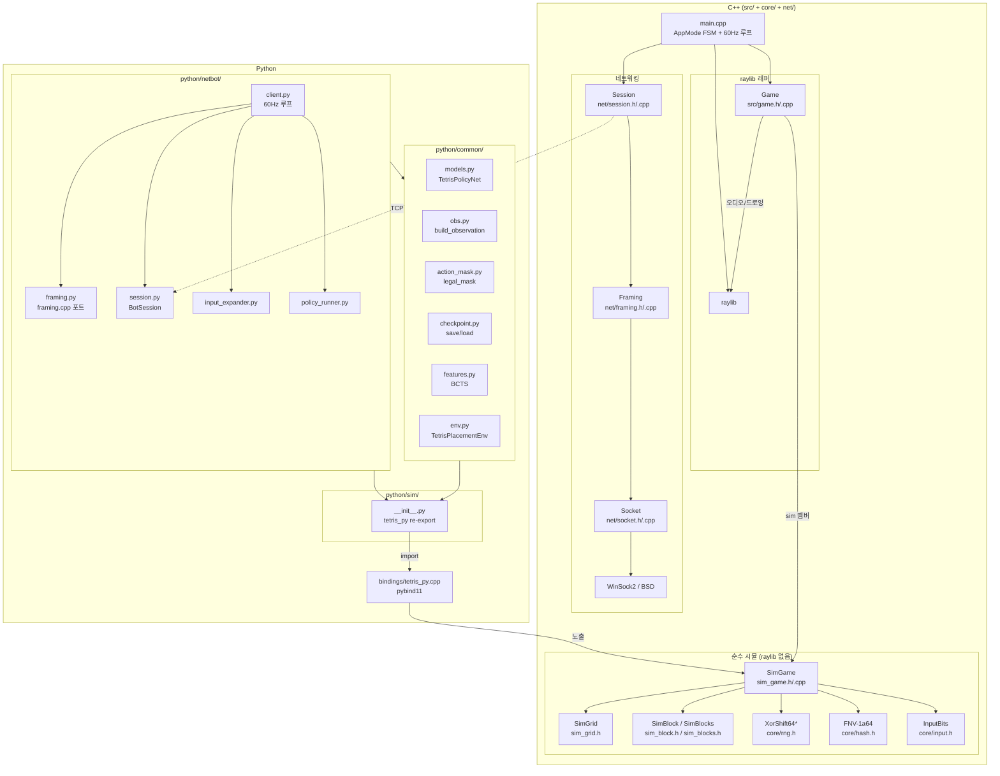
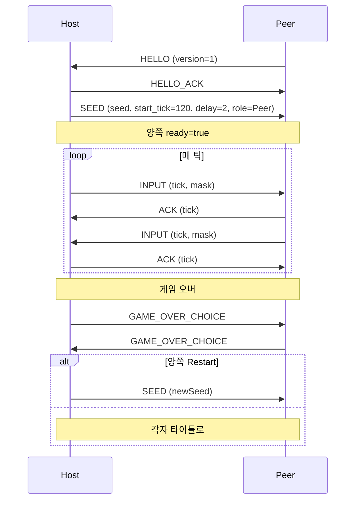
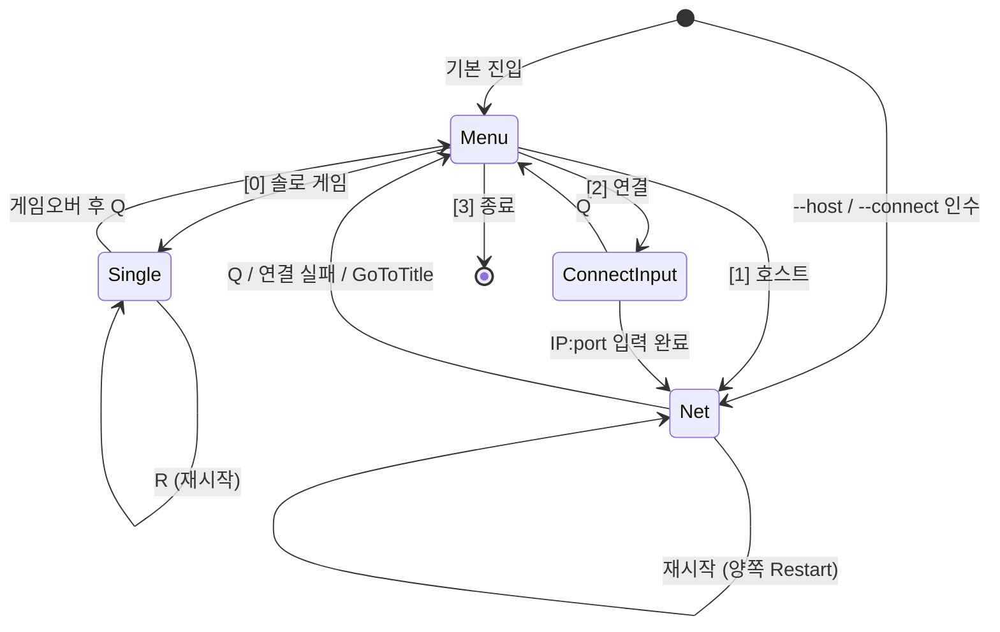
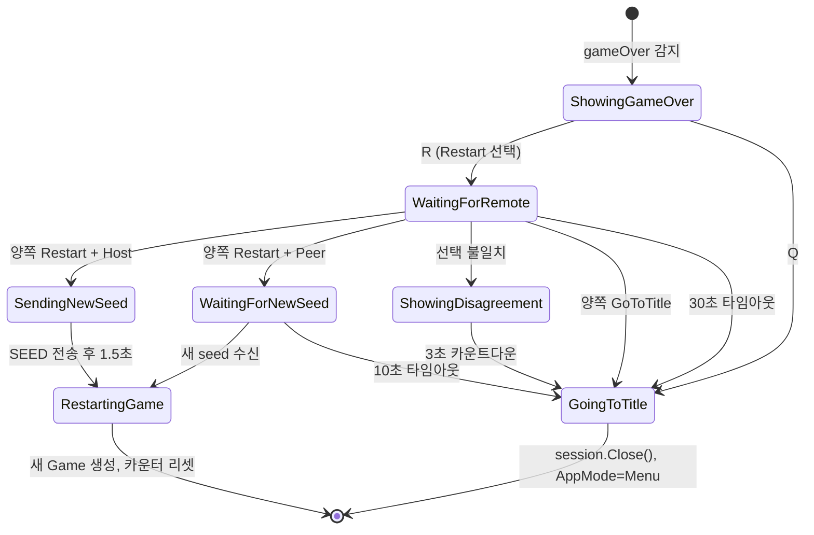
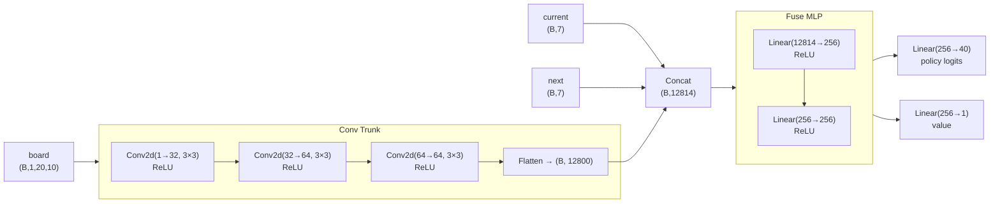

# Tetris-Multiplayer-RL — 전체 아키텍처 & 코드 레퍼런스

> Mermaid 다이어그램은 GitHub / VS Code(Mermaid Preview 확장) / JetBrains에서 렌더링됩니다.

---

## 목차

1. [프로젝트 개요](#1-프로젝트-개요)
2. [디렉터리 구조](#2-디렉터리-구조)
3. [전체 레이어 아키텍처](#3-전체-레이어-아키텍처)
4. [C++ 코어 — SimGame](#4-c-코어--simgame)
   - 4.1 [SimGame (src/sim_game.h/.cpp)](#41-simgame)
   - 4.2 [SimGrid (src/sim_grid.h)](#42-simgrid)
   - 4.3 [SimBlock / SimBlocks (src/sim_block.h, sim_blocks.h)](#43-simblock--simblocks)
   - 4.4 [Position (src/position.h/.cpp)](#44-position)
5. [C++ UI 래퍼 — Game](#5-c-ui-래퍼--game)
   - 5.1 [Game (src/game.h/.cpp)](#51-game)
   - 5.2 [Colors (src/colors.h/.cpp)](#52-colors)
6. [Core 유틸리티](#6-core-유틸리티)
   - 6.1 [constants.h](#61-constantsh)
   - 6.2 [input.h](#62-inputh)
   - 6.3 [rng.h — XorShift64*](#63-rngh--xorshift64)
   - 6.4 [hash.h — FNV-1a 64-bit](#64-hashh--fnv-1a-64-bit)
   - 6.5 [replay.h/.cpp](#65-replayhcpp)
7. [네트워킹 스택 (net/)](#7-네트워킹-스택-net)
   - 7.1 [socket.h/.cpp](#71-sockethcpp)
   - 7.2 [framing.h/.cpp](#72-framinghcpp)
   - 7.3 [session.h/.cpp](#73-sessionhcpp)
8. [진입점 — main.cpp](#8-진입점--maincpp)
9. [pybind11 바인딩 (bindings/)](#9-pybind11-바인딩-bindings)
10. [Python 레이어](#10-python-레이어)
    - 10.1 [python/sim/ — 네이티브 모듈 래퍼](#101-pythonsim--네이티브-모듈-래퍼)
    - 10.2 [python/common/ — 학습·추론 공용 레이어](#102-pythoncommon--학습추론-공용-레이어)
    - 10.3 [python/netbot/ — TCP Lockstep 봇 클라이언트](#103-pythonnetbot--tcp-lockstep-봇-클라이언트)
11. [테스트 & 검증](#11-테스트--검증)
12. [빌드 시스템 (CMakeLists.txt)](#12-빌드-시스템-cmakeliststxt)
13. [핵심 불변 조건](#13-핵심-불변-조건)
14. [데이터 흐름 요약](#14-데이터-흐름-요약)
15. [전체 함수 레퍼런스](#15-전체-함수-레퍼런스)

---

## 1. 프로젝트 개요

**Tetris-Multiplayer-RL**은 세 가지 사용 시나리오를 하나의 코드베이스로 지원하는 C++17 + Python 프로젝트입니다.

| 시나리오 | 실행 방법 | 의존성 |
|---|---|---|
| 로컬 1인/2인 멀티플레이 | `tetris.exe` | raylib, WinSock2 |
| Colab RL 학습 | `from sim import SimGame` (pybind11) | pybind11, numpy, torch |
| 로컬 봇 대전 | `python -m netbot.client --connect ...` | SimGame .pyd + torch |

**설계 원칙:**
- `SimGame`이 **모든 게임 로직의 단일 진실 공급원(single source of truth)**. raylib/오디오 없음.
- 결정론: XorShift64\* RNG + FNV-1a64 상태 해시 → 플랫폼 무관 동일 결과.
- lockstep 네트워킹: 양측이 같은 시드 + 같은 입력 순서를 가지므로 별도 상태 동기화 패킷 불필요.

---

## 2. 디렉터리 구조

```
Tetris-Multiplayer-RL/
│
├── src/                    ← C++ 게임 로직 (SimGame + raylib 래퍼)
│   ├── sim_game.h/.cpp     ← 헤드리스 시뮬레이터 (핵심)
│   ├── sim_grid.h          ← 20×10 보드 (헤드리스)
│   ├── sim_block.h         ← 테트로미노 상태 (헤드리스)
│   ├── sim_blocks.h        ← L/J/I/O/S/T/Z 팩토리
│   ├── game.h/.cpp         ← raylib 래퍼 (SimGame 위임)
│   ├── colors.h/.cpp       ← 색상 팔레트
│   ├── position.h/.cpp     ← (row, col) 좌표
│   └── main.cpp            ← 진입점 + FSM + 60Hz 루프
│
├── core/                   ← 순수 유틸리티 (외부 의존성 없음)
│   ├── constants.h         ← TICKS_PER_SECOND=60
│   ├── input.h             ← INPUT_* 비트마스크
│   ├── rng.h               ← XorShift64* 결정론적 RNG
│   ├── hash.h              ← FNV-1a 64-bit 해시
│   ├── replay.h/.cpp       ← 입력 리플레이 저장/로드
│
├── net/                    ← 네트워킹 3계층
│   ├── socket.h/.cpp       ← 크로스플랫폼 TCP
│   ├── framing.h/.cpp      ← 메시지 직렬화
│   └── session.h/.cpp      ← lockstep P2P 세션
│
├── bindings/
│   └── tetris_py.cpp       ← pybind11 SimGame 노출
│
├── tests/
│   └── sim_hash_dump.cpp   ← C++ 결정론 회귀 테스트
│
├── python/
│   ├── sim/                ← 네이티브 모듈 래퍼 (플랫폼 독립 import)
│   ├── common/             ← 학습·추론 공용 코드 (Colab ↔ 로컬 공유)
│   │   ├── models.py       ← TetrisPolicyNet (CNN + policy/value head)
│   │   ├── obs.py          ← SimGame → 관측 텐서
│   │   ├── action_mask.py  ← 합법적 배치 마스크
│   │   ├── checkpoint.py   ← 아키텍처 버전 가드 save/load
│   │   ├── features.py     ← BCTS Dellacherie 피처 (rule-based baseline)
│   │   └── env.py          ← Gymnasium TetrisPlacementEnv
│   ├── netbot/             ← 로컬 전용 봇 클라이언트
│   │   ├── framing.py      ← net/framing.cpp Python 포트
│   │   ├── session.py      ← net/session.cpp 클라이언트 경로 포트
│   │   ├── input_expander.py ← placement → 틱 마스크 시퀀스 변환
│   │   ├── policy_runner.py  ← 정책/규칙 기반 행동 선택
│   │   └── client.py       ← 60Hz 메인 루프 진입점
│   ├── train/              ← Colab 전용
│   │   └── setup_colab.ipynb
│   ├── tests/              ← pytest 스위트
│   ├── legacy/             ← 이전 Pygame 구현 (참조용, 비빌드)
│   ├── requirements.txt
│   └── requirements-colab.txt
│
├── CMakeLists.txt
├── Font/                   ← monogram.ttf
└── Sounds/                 ← music.mp3, rotate.mp3, clear.mp3
```

---

## 3. 전체 레이어 아키텍처



---

## 4. C++ 코어 — SimGame

### 4.1 SimGame

**파일:** `src/sim_game.h` (105줄), `src/sim_game.cpp` (327줄)

`SimGame`은 **raylib·오디오·OS API에 전혀 의존하지 않는** 순수 C++ 테트리스 엔진입니다. 단독으로 빌드 가능하며, pybind11 모듈과 결정론 테스트가 이 파일만 사용합니다.

#### 데이터 멤버

```cpp
SimGrid sim_grid;               // 20×10 보드
std::vector<SimBlock> blocks;   // 7-piece 백(bag) 풀
XorShift64Star rng;             // 결정론적 RNG (유일한 난수 소스)
SimBlock currentBlock;          // 현재 떨어지는 조각
SimBlock ghostBlock;            // 착지 예측 조각 (id=8)
SimBlock nextBlock;             // 다음 조각 미리보기
int gravityCounterTicks;        // 중력 카운터 (틱 단위)
int dropIntervalTicks;          // 중력 간격 (기본 30 = 0.5초)
bool gameOver;                  // 공개
int score;                      // 공개
mutable bool rotateSoundEvent;  // Game 래퍼가 소리 재생 후 false로 리셋
mutable bool clearSoundEvent;
```

#### API

**Placement-level (RL 학습용)**

| 함수 | 설명 |
|---|---|
| `LegalPlacements() → vector<Placement>` | 현재 조각의 모든 합법적 (col, rot) 목록 |
| `ApplyPlacement(col, rot) → int` | 회전→이동→하드드롭→잠금, 지운 줄 수 반환. -1=불법 |

**Frame-level (lockstep 실전용)**

| 함수 | 설명 |
|---|---|
| `SubmitInput(uint8_t mask)` | INPUT_* 비트마스크를 해석해 이동/회전/드롭 적용 |
| `Tick()` | 중력 카운터 증가, 임계 도달 시 MoveBlockDown() 호출 |
| `MoveBlockDown()` | 1행 내려감. 바닥 충돌 시 LockBlock() |

**관측 (Observation)**

| 함수 | 설명 |
|---|---|
| `Grid() const` | const int(&)[20][10] — 보드 직접 참조 (복사 없음) |
| `CurrentBlock/GhostBlock/NextBlock() const` | SimBlock 참조 |
| `CurrentBlockId/Rotation/Row/Col()` | 개별 게터 |
| `NextBlockId()` | 다음 조각 id |
| `Score()` | 점수 |
| `IsGameOver()` | 게임 오버 여부 |

**결정론/디버깅**

| 함수 | 설명 |
|---|---|
| `StateHash() → uint64_t` | 전체 상태를 FNV-1a64로 해시 (결정론 게이트) |
| `RngState() → uint64_t` | XorShift64* 내부 상태 (디버깅용) |

#### 주요 내부 함수

```
SimGame::SimGame(seed)
  ├── rng(seed == 0 ? 0xC0FFEE123456789 : seed)
  ├── GetAllBlocks()     → I, J, L, O, S, T, Z 순서로 blocks 생성
  ├── GetRandomBlock()   → currentBlock 뽑기
  ├── GetRandomBlock()   → nextBlock 뽑기
  └── MakeGhostBlock()   → ghostBlock = currentBlock (id=8)

GetRandomBlock()
  └── blocks 비면 GetAllBlocks()로 재충전 (7-piece bag)
      └── rng.nextUInt(size) 로 Fisher-Yates 셔플
      → 앞에서 pop

SubmitInput(mask)
  ├── INPUT_LEFT  → MoveBlockLeft()
  ├── INPUT_RIGHT → MoveBlockRight()
  ├── INPUT_DOWN  → MoveBlockDown()
  ├── INPUT_ROTATE→ RotateBlockImpl()
  └── INPUT_DROP  → MoveBlockDrop()
      └── 마지막에 항상 DropExpectation() (고스트 갱신)

Tick()
  └── ++gravityCounterTicks
      → if >= dropIntervalTicks: MoveBlockDown(), gravityCounterTicks=0

MoveBlockLeft/Right(delta)
  ├── currentBlock.Move(0, delta)
  ├── IsBlockOutside || !BlockFits → 되돌리기 (Undo)
  └── 성공 시 MakeGhostBlock()

MoveBlockDown()
  ├── currentBlock.Move(1, 0)
  ├── IsBlockOutside || !BlockFits → 되돌리기 → LockBlock()
  └── 성공 시 MakeGhostBlock()

MoveBlockDrop()
  └── while(아직 이동 가능): MoveBlockDown()
      → 첫 충돌 시 LockBlock()

RotateBlockImpl()
  ├── currentBlock.Rotate()
  ├── IsBlockOutside || !BlockFits → UndoRotation()
  └── 성공 시: rotateSoundEvent=true, MakeGhostBlock()

LockBlock()
  ├── GetCellPositions() → grid에 id 기록
  ├── grid.ClearFullRows() → 지운 줄 수
  ├── UpdateScore(linesCleared)
  ├── lines > 0 → clearSoundEvent=true
  ├── currentBlock = nextBlock
  ├── nextBlock = GetRandomBlock()
  ├── MakeGhostBlock()
  └── !BlockFits(currentBlock) → gameOver=true

BlockFits(block)
  └── GetCellPositions() 순회
      └── grid 셀 값이 1~7 → false (0=빈칸, 8=고스트는 OK)

IsBlockOutside(block)
  └── 임의 타일이 [0,20)×[0,10) 벗어나면 true

UpdateScore(lines)
  └── +100/300/600/1000 (1/2/3/4줄)

StateHash()
  └── FNV-1a64 체인:
      grid bytes(20×10×4)
      + currentBlock (id/rot/row/col)
      + nextBlock (id/rot/row/col)
      + rng.getState()
      + score + gameOver + gravityCounterTicks

LegalPlacements()
  └── for rot in [0, cells.size()):
        for col in [0, 10):
          조각 재구성 → IsBlockOutside/!BlockFits → 스킵
          MoveBlockDrop 시뮬 → 유효 위치 → 추가

ApplyPlacement(col, rot)
  ├── 목표 설정 (회전 rot번 → 열 col로 이동)
  ├── 유효성 확인
  ├── MoveBlockDrop 시뮬 → LockBlock
  └── 점수 차이 = 지운 줄 수 (0~4 반환, -1=불법)
```

---

### 4.2 SimGrid

**파일:** `src/sim_grid.h` (95줄)

```cpp
static constexpr int kRows = 20;
static constexpr int kCols = 10;
int grid[20][10];   // 0=빈칸, 1-7=조각, 8=고스트
```

| 함수 | 설명 |
|---|---|
| `Initialize()` | 모든 셀을 0으로 |
| `IsCellOutside(row, col)` | 범위 외 여부 |
| `IsCellEmpty(row, col)` | 0 또는 8(고스트)이면 true |
| `ClearFullRows() → int` | 꽉 찬 행 제거 + 위 행 내려오기, 지운 줄 수 반환 |

**내부 헬퍼:**

| 함수 | 설명 |
|---|---|
| `IsRowFull(row)` | 해당 행이 10칸 모두 찼으면 true |
| `ClearRow(row)` | 행 전체를 0으로 |
| `MoveRowDown(row, count)` | row+count에 row 복사, row를 0으로 |

---

### 4.3 SimBlock / SimBlocks

**파일:** `src/sim_block.h` (62줄), `src/sim_blocks.h` (105줄)

`SimBlock` — 하나의 테트로미노 상태:

```cpp
int id;                                    // 1=L, 2=J, 3=I, 4=O, 5=S, 6=T, 7=Z, 8=고스트
std::map<int, std::vector<Position>> cells; // cells[rotState] = 상대 좌표 목록
int rotationState;                          // 현재 회전 인덱스 [0, cells.size())
int rowOffset, columnOffset;                // 보드 위 위치
```

| 함수 | 설명 |
|---|---|
| `Move(rows, cols)` | offset 이동 |
| `GetCellPositions()` | 절대 좌표 반환 (타일 + offset) |
| `Rotate()` | rotationState = (rotationState + 1) % cells.size() |
| `UndoRotation()` | rotationState = (rotationState - 1 + n) % n |

`SimBlocks.h` — 각 조각별 서브클래스 (SimLBlock, SimJBlock, …, SimZBlock):
- `id` 고정
- `cells[0..3]` 하드코딩 (4가지 회전 상태)
- 생성자에서 `Move(0, 3)` (O-block은 Move(0, 4)) — 스폰 위치

**회전 테이블 예시 (L-block id=1):**
```
cells[0] = {(0,2), (1,0), (1,1), (1,2)}   // □□■
                                            // ■■■
cells[1] = {(0,1), (1,1), (2,1), (2,2)}
cells[2] = {(1,0), (1,1), (1,2), (2,0)}
cells[3] = {(0,0), (0,1), (1,1), (2,1)}
```

> **주의:** SRS(Super Rotation System) 미구현. 회전 실패 시 단순 되돌리기.

---

### 4.4 Position

**파일:** `src/position.h` (8줄), `src/position.cpp` (7줄)

```cpp
struct Position {
    int row, column;
    Position(int r, int c);
};
```

---

## 5. C++ UI 래퍼 — Game

### 5.1 Game

**파일:** `src/game.h` (65줄), `src/game.cpp` (154줄)

`Game`은 `SimGame`을 멤버로 갖고 **렌더링과 오디오만 추가**합니다.

```cpp
class Game {
public:
    SimGame sim;               // 실제 로직 (공개 — main.cpp에서 직접 접근)
    bool&  gameOver = sim.gameOver;  // 별칭 참조
    int&   score    = sim.score;     // 별칭 참조
private:
    Music music;
    Sound rotateSound, clearSound;
    std::vector<Color> cellColors;
};
```

| 함수 | 설명 |
|---|---|
| `Game(uint64_t seed)` | AudioInit() 참조 카운팅, 음악/소리 로드, cellColors 생성 |
| `~Game()` | 음악/소리 언로드, AudioShutdown() 참조 카운팅 |
| `SubmitInput(uint8_t mask)` | sim.SubmitInput() 호출 후 rotateSoundEvent 확인 → PlaySound |
| `Tick()` | sim.Tick() 호출 후 clearSoundEvent 확인 → PlaySound |
| `MoveBlockDown()` | sim.MoveBlockDown() 직접 호출 |
| `ComputeStateHash()` | sim.StateHash() 위임 |
| `Draw()` | 보드·현재·고스트·다음 조각 렌더 (11,11 오프셋) |
| `DrawBoardAt(x, y)` | 멀티플레이 화면에서 임의 위치에 보드 렌더 |
| `DrawNextAt(x, y)` | 다음 조각 미리보기 (현재 미사용 — dead code) |

**오디오 참조 카운팅:**

```cpp
static int s_audioRef = 0;
// Game 생성 시: if(s_audioRef == 0) InitAudioDevice(); ++s_audioRef;
// Game 소멸 시: --s_audioRef; if(s_audioRef == 0) CloseAudioDevice();
```

두 Game 인스턴스(멀티플레이)가 있어도 AudioDevice는 한 번만 초기화됩니다.

**셀 색상 인덱스 매핑:**

```
index 0 = darkGrey  (빈칸)
index 1 = green     (L-block)
index 2 = red       (J-block)
index 3 = orange    (I-block)
index 4 = yellow    (O-block)
index 5 = purple    (S-block)
index 6 = cyan      (T-block)
index 7 = blue      (Z-block)
index 8 = gray      (고스트)
```

---

### 5.2 Colors

**파일:** `src/colors.h` (18줄), `src/colors.cpp` (18줄)

```cpp
extern Color darkGrey, green, red, orange, yellow, purple, cyan, blue,
             lightBlue, darkBlue, gray;
std::vector<Color> GetCellColors();  // index 0~8 순서로 반환
```

---

## 6. Core 유틸리티

### 6.1 constants.h

```cpp
constexpr int    TICKS_PER_SECOND = 60;
constexpr double SECONDS_PER_TICK = 1.0 / 60.0;
```

---

### 6.2 input.h

```cpp
enum : uint8_t {
    INPUT_NONE   = 0,
    INPUT_LEFT   = 1 << 0,  // 0x01
    INPUT_RIGHT  = 1 << 1,  // 0x02
    INPUT_DOWN   = 1 << 2,  // 0x04
    INPUT_ROTATE = 1 << 3,  // 0x08
    INPUT_DROP   = 1 << 4,  // 0x10
};
bool hasInput(uint8_t mask, uint8_t bit);
```

한 틱에 여러 비트가 OR로 조합될 수 있습니다 (예: 동시에 LEFT+ROTATE).

---

### 6.3 rng.h — XorShift64*

```cpp
class XorShift64Star {
    uint64_t state;
public:
    explicit XorShift64Star(uint64_t seed = 0);
    uint64_t next();                    // 64-bit output
    uint32_t nextUInt(uint32_t max);    // [0, max) — 블록 백 셔플에 사용
    uint64_t getState() const;
};
```

seed=0이면 `0xC0FFEE123456789`로 초기화됩니다.

**XorShift64\*의 결정론 보장:** 정수 연산만 사용하므로 Linux/Windows 모두 동일 결과. StateHash() 안에 `rng.getState()`가 포함되어 RNG 드리프트 감지 가능.

---

### 6.4 hash.h — FNV-1a 64-bit

```cpp
constexpr uint64_t FNV1A64_OFFSET = 14695981039346656037ULL;
constexpr uint64_t FNV1A64_PRIME  = 1099511628211ULL;

uint64_t fnv1a64(const void* data, size_t len, uint64_t seed = FNV1A64_OFFSET);

template<typename T>
uint64_t fnv1a64_value(const T& v, uint64_t seed = FNV1A64_OFFSET);
```

`StateHash()`는 이 함수를 체인으로 호출합니다:

```cpp
uint64_t h = fnv1a64(sim_grid.grid, sizeof(sim_grid.grid));
h = fnv1a64_value(currentBlock.id, h);
h = fnv1a64_value(currentBlock.rotationState, h);
// ... (row/col, nextBlock, rng state, score, gameOver, gravityTicks)
```

---

### 6.5 replay.h/.cpp

```cpp
struct FrameInputs { uint8_t p1, p2; };
struct ReplayData  { uint64_t seed; std::vector<FrameInputs> frames; };

namespace ReplayIO {
    bool Save(const std::string& path, const ReplayData& r);
    bool Load(const std::string& path, ReplayData& r);
}
```

텍스트 형식: `seed X\nticks Y\ni p1 p2\n...`

main.cpp에서 F5=리플레이 저장, F6=불러오기 (단, Load 경로는 현재 미사용).

---

## 7. 네트워킹 스택 (net/)

세 레이어가 단방향으로 의존합니다: `session → framing → socket`

### 7.1 socket.h/.cpp

**파일:** `net/socket.h` (36줄), `net/socket.cpp` (358줄)

크로스플랫폼 TCP 추상화. Windows는 WinSock2, Linux는 BSD 소켓.

```cpp
struct TcpSocket { int fd; bool valid() const { return fd >= 0; } };
```

| 함수 | 설명 |
|---|---|
| `net_init()` | Windows: WSAStartup. Linux: no-op |
| `net_shutdown()` | Windows: WSACleanup. Linux: no-op |
| `tcp_listen(port, backlog)` | INADDR_ANY:port 리슨 소켓, SO_REUSEADDR |
| `tcp_accept(server)` | 연결 수락, 논블로킹 설정 |
| `tcp_connect(host, port)` | getaddrinfo + connect, 논블로킹 설정 |
| `tcp_send_all(sock, data, len)` | 전체 전송 보장 (EAGAIN 시 100µs sleep 재시도) |
| `tcp_recv_some(sock, outBuf)` | 최대 4096 바이트 논블로킹 수신, outBuf에 append |
| `tcp_close(sock)` | 소켓 닫기 |
| `get_local_ip()` | 로컬 IPv4 주소 (없으면 127.0.0.1) |
| `get_public_ip()` | ipify.org/ipecho.net/icanhazip.com 조회 (3초 타임아웃) |

**논블로킹 수신:** `tcp_recv_some`은 EAGAIN/WSAEWOULDBLOCK이면 true 반환 (데이터 없음, 정상). 에러/연결 종료 시 false.

---

### 7.2 framing.h/.cpp

**파일:** `net/framing.h` (48줄), `net/framing.cpp` (88줄)

TCP 바이트 스트림을 메시지 단위로 직렬화/역직렬화합니다.

#### 프레임 형식

```
┌────────────┬──────────┬─────────────────────────┬──────────────┐
│ LEN: u16 LE│ TYPE: u8 │ PAYLOAD: (LEN-1) bytes  │ CHK: u32 LE  │
└────────────┴──────────┴─────────────────────────┴──────────────┘
```

- `LEN = 1 + len(PAYLOAD)` (TYPE 바이트 포함, 고정 헤더 제외)
- `CHK = FNV-1a32(PAYLOAD)`, payload가 없으면 0

#### 메시지 타입

```cpp
enum class MsgType : uint8_t {
    HELLO           = 1,   // u16(1) — 버전
    HELLO_ACK       = 2,   // payload 없음
    SEED            = 3,   // u64 seed + u32 start_tick + u8 input_delay + u8 role
    INPUT           = 4,   // u32 tick + u16 count + u8[count] masks
    ACK             = 5,   // u32 last_tick_acked
    PING            = 6,   // payload 없음
    PONG            = 7,   // payload 없음
    HASH            = 8,   // u32 tick + u64 hash
    GAME_OVER_CHOICE= 9,   // u8 choice (0=None, 1=Restart, 2=GoToTitle)
};
```

#### 직렬화 헬퍼

```cpp
void le_write_u16(std::vector<uint8_t>& buf, uint16_t v);
void le_write_u32(std::vector<uint8_t>& buf, uint32_t v);
void le_write_u64(std::vector<uint8_t>& buf, uint64_t v);

uint16_t le_read_u16(const uint8_t* p, size_t off);
uint32_t le_read_u32(const uint8_t* p, size_t off);
uint64_t le_read_u64(const uint8_t* p, size_t off);
```

#### 주요 함수

```cpp
// 바이트열로 직렬화
std::vector<uint8_t> build_frame(MsgType type,
                                  const std::vector<uint8_t>& payload);

// 스트림 버퍼에서 완성된 프레임을 추출 (소비한 바이트는 앞에서 제거)
// 체크섬 불일치 프레임은 조용히 스킵
int parse_frames(std::vector<uint8_t>& streamBuf,
                 std::vector<std::pair<MsgType, std::vector<uint8_t>>>& out);
```

---

### 7.3 session.h/.cpp

**파일:** `net/session.h` (106줄), `net/session.cpp` (327줄)

P2P lockstep 세션을 관리합니다. I/O는 전용 스레드에서 실행됩니다.

#### 타입

```cpp
enum class Role : uint8_t { Host = 1, Peer = 2 };

enum class GameOverChoice : uint8_t {
    None = 0, Restart = 1, GoToTitle = 2
};

struct SeedParams {
    uint64_t seed;
    uint32_t start_tick;    // 기본 120 (2초 카운트다운)
    uint8_t  input_delay;   // 기본 2 (lockstep 버퍼)
    Role     role;
};
```

#### 공개 API

| 함수 | 설명 |
|---|---|
| `Host(port, params)` | 리슨 소켓 생성 + acceptThread 시작 |
| `Connect(host, port)` | TCP 연결 + ioThread 시작 + HELLO 전송 |
| `isConnected/isReady/isListening/hasFailed()` | 상태 조회 (atomic) |
| `params()` | SeedParams 반환 |
| `SendInput(tick, mask)` | INPUT 프레임 큐 |
| `SendHash(tick, hash)` | HASH 프레임 큐 (디신크 감지) |
| `SendGameOverChoice(choice)` | GAME_OVER_CHOICE 프레임 큐 |
| `SendNewSeed(seed)` | SEED 프레임 큐 (호스트 재시작) |
| `GetRemoteInput(tick, outMask)` | 수신된 상대 입력 조회 |
| `GetLastRemoteHash(tick, hash)` | 상대가 보낸 마지막 HASH 조회 |
| `GetRemoteGameOverChoice(outChoice)` | 상대의 게임오버 선택 조회 |
| `ClearGameOverChoices()` | 재시작을 위한 선택 초기화 |
| `maxRemoteTick/maxLocalTick()` | 최대 수신/송신 틱 |
| `ClearInputs()` | 입력 맵 초기화 (재시작) |
| `Close()` | 스레드 조인 + 소켓 닫기 |

#### Lockstep 공식

```cpp
int safeTickInclusive = std::min(lastLocalSent, lastRemote) - inputDelay;
// main.cpp에서:
while (simTick <= safeTickInclusive) {
    local.SubmitInput(localInputs[simTick]);
    local.Tick();
    remote.SubmitInput(remoteInputs[simTick]);
    remote.Tick();
    ++simTick;
}
```

- `lastLocalSent` — 내가 SESSION에 전송한 최대 틱 번호
- `lastRemote` — 상대로부터 수신한 최대 틱 번호
- `inputDelay` — 안전 버퍼 (기본 2틱 = 33ms @ 60Hz)

#### 핸드셰이크 순서



#### 내부 스레드

- **`ioThread()`** — 수신 루프 (논블로킹 recv → parse_frames → handleFrame). 연결 실패 시 `connectionFailed=true`.
- **`acceptThread(port)`** — 호스트 전용. tcp_listen → tcp_accept 대기 후 ioThread 시작.
- **`handleFrame(type, payload)`** — 메시지 타입별 분기:

```
HELLO         → HELLO_ACK + SEED 전송 (호스트만)
HELLO_ACK     → 무시
SEED          → seedParams 파싱, ready=true
INPUT         → remoteInputs[tick]=mask, ACK 전송
ACK           → 무시
HASH          → lastHashTickRemote, lastHashRemote 갱신
GAME_OVER_CHOICE → remoteGameOverChoice 갱신
PING          → PONG 반사
PONG          → 무시
```

---

## 8. 진입점 — main.cpp

**파일:** `src/main.cpp` (~613줄)

### AppMode 상태 기계



### 게임오버 협상 서브-FSM



### 60Hz 고정 틱 루프 (핵심 루프)

```cpp
while (!WindowShouldClose()) {
    UpdateMusicStream(..);

    double dt = GetFrameTime();
    if (dt > 0.1) dt = 0.1;              // 100ms 클램프
    accumulator += dt;

    while (accumulator >= SECONDS_PER_TICK) {
        uint8_t mask = SampleInput();

        if (mode == Single) {
            gameSingle.SubmitInput(mask);
            gameSingle.Tick();
        }
        else if (mode == Net && session.isReady()) {
            localInputs[localTickNext] = mask;
            session.SendInput(localTickNext, mask);
            ++localTickNext;

            int safe = std::min(lastLocalSent, session.maxRemoteTick())
                       - inputDelay;
            while (simTick <= safe) {
                gameLocal.SubmitInput(localInputs[simTick]);
                gameLocal.Tick();
                gameRemote.SubmitInput(session.GetRemoteInput(simTick));
                gameRemote.Tick();
                ++simTick;
            }
        }
        accumulator -= SECONDS_PER_TICK;
    }

    BeginDrawing();
    // ... 모드별 렌더링 ...
    EndDrawing();
}
```

### SampleInput()

```cpp
static uint8_t SampleInput() {
    uint8_t mask = INPUT_NONE;
    if (IsKeyPressed(KEY_LEFT))  mask |= INPUT_LEFT;
    if (IsKeyPressed(KEY_RIGHT)) mask |= INPUT_RIGHT;
    if (IsKeyDown(KEY_DOWN))     mask |= INPUT_DOWN;   // 매 틱 발동 (DAS/ARR 개선 대상)
    if (IsKeyPressed(KEY_UP))    mask |= INPUT_ROTATE;
    if (IsKeyPressed(KEY_SPACE)) mask |= INPUT_DROP;
    return mask;
}
```

> **TODO:** 아래키의 `IsKeyDown`이 60fps로 매 틱 발동되어 너무 빠릅니다.
> 계획된 개선: DAS(지연 10프레임) + ARR(반복 3프레임) 적용.

---

## 9. pybind11 바인딩 (bindings/)

**파일:** `bindings/tetris_py.cpp` (134줄)

`SimGame`을 Python에 노출합니다. raylib/오디오 의존성 없음.

### 노출 클래스

#### `SimGame.Placement`

```python
class Placement:
    col: int    # 열 (0-9)
    rot: int    # 회전 인덱스 (0-3)
```

#### `SimBlock`

```python
class SimBlock:
    id: int               # 1-7 조각, 8=고스트
    rotation_state: int
    row_offset: int
    column_offset: int
    def cell_positions(self) -> list[tuple[int, int]]: ...
```

#### `SimGame`

```python
class SimGame:
    ROWS: int = 20   # 클래스 속성
    COLS: int = 10

    def __init__(self, seed: int = 0): ...

    # Placement-level (RL 학습)
    def legal_placements(self) -> list[Placement]: ...
    def apply_placement(self, col: int, rot: int) -> int: ...  # -1=불법

    # Frame-level (lockstep)
    def submit_input(self, mask: int) -> None: ...
    def tick(self) -> None: ...
    def move_block_down(self) -> None: ...

    # 관측
    def grid(self) -> numpy.ndarray: ...   # shape (20,10), int32
    def current_block(self) -> SimBlock: ...
    def ghost_block(self) -> SimBlock: ...
    def next_block(self) -> SimBlock: ...
    def current_block_id(self) -> int: ...
    def current_rotation(self) -> int: ...
    def current_row(self) -> int: ...
    def current_col(self) -> int: ...
    def next_block_id(self) -> int: ...
    def score(self) -> int: ...
    def game_over(self) -> bool: ...

    # 결정론
    def state_hash(self) -> int: ...   # uint64
    def rng_state(self) -> int: ...    # uint64
```

`grid()`는 20×10 int32 numpy 배열을 **복사**로 반환합니다 (zero-copy는 pybind11 buffer protocol로 가능하지만 현재 미구현).

`current_block/ghost_block/next_block()`은 내부 참조를 반환합니다 (`reference_internal` 정책). SimGame 인스턴스가 살아있는 동안에만 유효.

---

## 10. Python 레이어

### 10.1 python/sim/ — 네이티브 모듈 래퍼

**파일:** `python/sim/__init__.py` (55줄)

```python
from tetris_py import SimGame, Placement, SimBlock
```

플랫폼별로 다른 확장자 (`.so` / `.pyd`)를 투명하게 처리. 모듈을 찾지 못하면 빌드 방법을 포함한 상세 에러 메시지를 발생시킵니다.

**사용:**
```python
import sys; sys.path.insert(0, 'python')
from sim import SimGame

g = SimGame(42)
print(hex(g.state_hash()))        # 크로스플랫폼 결정론 확인
print(g.legal_placements()[:3])
```

---

### 10.2 python/common/ — 학습·추론 공용 레이어

Colab 학습 코드와 로컬 netbot 추론 코드가 **완전히 같은 모듈**을 import합니다.

#### `common/__init__.py`

```python
NUM_COLS       = 10
NUM_ROTATIONS  = 4
NUM_PLACEMENTS = 40   # 10 × 4 — 행동 공간 크기
NUM_PIECE_TYPES = 7
BOARD_ROWS     = 20
BOARD_COLS     = 10
```

---

#### `common/models.py` — TetrisPolicyNet



```python
class TetrisPolicyNet(nn.Module):
    ARCH_VERSION = 1   # 아키텍처 변경 시 반드시 올릴 것
```

`masked_log_softmax(logits, mask)` — 불법 행동을 -inf로 마스킹 후 log-softmax.

---

#### `common/obs.py` — build_observation

```python
def build_observation(sim: SimGame) -> dict[str, torch.Tensor]:
    # 1. sim.grid() → numpy (20,10)
    # 2. occupancy: cells > 0 and != 8 (고스트 제외)
    # 3. board = (1,20,10) float32 — 점유=1.0, 빈칸=0.0
    # 4. current = one-hot (7,) from current_block_id - 1
    # 5. next    = one-hot (7,) from next_block_id - 1
    return {"board": ..., "current": ..., "next": ...}
```

> **중요:** 고스트 블록(id=8)은 관측에서 제외됩니다. 네트워크는 커밋된 보드 + 조각 종류만 보고 착지 위치는 스스로 추론해야 합니다.

---

#### `common/action_mask.py`

```python
def encode_action(col: int, rot: int) -> int:
    return col * NUM_ROTATIONS + rot   # 0..39

def decode_action(action: int) -> tuple[int, int]:
    return divmod(action, NUM_ROTATIONS)

def legal_mask(sim: SimGame) -> torch.Tensor:  # shape (40,), bool
    mask = torch.zeros(NUM_PLACEMENTS, dtype=torch.bool)
    for p in sim.legal_placements():
        mask[encode_action(p.col, p.rot)] = True
    return mask
```

---

#### `common/checkpoint.py`

```python
def save_checkpoint(model: TetrisPolicyNet, path, extra=None) -> None:
    # {"state_dict": ..., "__meta__": {"arch_version": 1, "class": "...", ...extra}}
    torch.save(payload, path)

def load_checkpoint(path, device="cpu") -> TetrisPolicyNet:
    payload = torch.load(path, map_location=device)
    meta = payload["__meta__"]
    if meta["arch_version"] != TetrisPolicyNet.ARCH_VERSION:
        raise RuntimeError("arch_version 불일치 — 재학습 필요")
    model = TetrisPolicyNet()
    model.load_state_dict(payload["state_dict"])
    return model.to(device).eval()
```

**계약:** `ARCH_VERSION`이 다르면 **반드시** `RuntimeError`. 조용한 실패는 없음.

---

#### `common/features.py` — BCTS Dellacherie 피처

```python
def column_heights(board) -> np.ndarray:   # 각 열의 최고 높이 (0-20)
def aggregate_height(heights) -> int:       # 전체 높이 합
def bumpiness(heights) -> int:             # |h[i] - h[i+1]| 합
def count_holes(board) -> int:             # 채워진 셀 아래 빈 셀 수
def max_height(heights) -> int:            # 가장 높은 열
def well_sum(heights) -> int:              # 웰 깊이 삼각 합

def all_features(board, rows_cleared) -> dict:
    # keys: aggregate_height, bumpiness, holes, max_height, wells, rows_cleared
```

`RuleBasedRunner`의 스코어링 베이스. 학습 체크포인트가 없을 때 sanity check baseline으로 사용.

---

#### `common/env.py` — TetrisPlacementEnv

```python
class TetrisPlacementEnv(gym.Env):
    action_space      = Discrete(40)
    observation_space = Dict({
        "board":   Box(0, 1, (1, 20, 10), float32),
        "current": Box(0, 1, (7,), float32),
        "next":    Box(0, 1, (7,), float32),
    })

    def reset(seed=None) -> (obs, info): ...
    def step(action) -> (obs, reward, terminated, truncated, info):
        # reward = lines_cleared (0-4)
        # info["legal_mask"] = bool array (40,)
```

SB3 / CleanRL / LightZero / RLlib 등 표준 Gymnasium 인터페이스를 지원하는 모든 프레임워크에 바로 연결할 수 있습니다.

---

### 10.3 python/netbot/ — TCP Lockstep 봇 클라이언트

봇은 C++ 게임에 **일반 피어처럼 TCP 접속**합니다. C++ 바이너리 수정 없음.

```
터미널 1: tetris.exe --host 7777          (C++ 그대로)
터미널 2: python -m netbot.client \
              --connect 127.0.0.1:7777 \
              --policy checkpoints/model.pt
```

---

#### `netbot/framing.py`

`net/framing.cpp`의 Python 포트. 바이트 단위로 동일합니다.

```python
FNV1A32_OFFSET = 0x811C9DC5
FNV1A32_PRIME  = 0x01000193
MIN_FRAME_BYTES = 7   # LEN(2) + TYPE(1) + CHK(4)

def fnv1a32(data: bytes, seed: int = FNV1A32_OFFSET) -> int: ...
def build_frame(msg_type: MsgType, payload: bytes) -> bytes: ...
def parse_frames(stream_buf: bytearray) -> list[tuple[MsgType, bytes]]:
    # 완성된 프레임 추출, stream_buf 앞부분 제거
    # 체크섬 불일치 → 조용히 스킵
```

---

#### `netbot/session.py` — BotSession

단일 스레드 비동기. 매 틱 `pump()`를 명시적으로 호출합니다.

```python
@dataclass
class SeedParams:
    seed: int
    start_tick: int = 120
    input_delay: int = 2
    role: int = 1

class BotSession:
    def connect(self) -> None: ...         # 소켓 연결 + HELLO 큐
    def pump(self) -> None: ...            # 송신 드레인 + 수신 드레인 + 프레임 디스패치
    def send_input(self, tick, mask): ...
    def send_hash(self, tick, hash_value): ...
    def send_game_over_choice(self, choice): ...
    def get_remote_input(self, tick) -> int | None: ...
    def get_own_input(self, tick) -> int | None: ...
    def clear_inputs(self) -> None: ...
```

`_handle_frame()` 디스패치:
- `HELLO` → HELLO_ACK 전송
- `SEED` → seed_params 파싱, `ready=True`
- `INPUT` → remote_inputs[tick]=mask, ACK 전송
- `HASH` → last_remote_hash 갱신
- `GAME_OVER_CHOICE` → remote_game_over_choice 갱신
- `PING` → PONG 전송

---

#### `netbot/input_expander.py`

placement-level (col, rot) → 틱 단위 입력 시퀀스.

```python
def expand_placement(cur_col, cur_rot, tgt_col, tgt_rot) -> list[int]:
    seq = []
    # 1) 회전: (tgt_rot - cur_rot) % 4 번 INPUT_ROTATE
    # 2) 이동: |tgt_col - cur_col| 번 INPUT_LEFT 또는 INPUT_RIGHT
    # 3) 하드드롭: INPUT_DROP
    return seq

def validate_sequence(sim, sequence) -> bool:
    # 현재 스텁: 항상 True 반환
    # TODO: sim 사본에서 dry-run 후 착지 위치 검증

def fallback_placement(sim) -> tuple[int, int] | None:
    # 첫 번째 합법적 배치 반환 (폴백)
```

---

#### `netbot/policy_runner.py`

```python
class PolicyRunner:            # 학습된 체크포인트 사용
    def select_placement(self, sim) -> tuple[int, int]: ...

class RuleBasedRunner:         # BCTS 피처 기반 (체크포인트 없을 때)
    def select_placement(self, sim) -> tuple[int, int]: ...
```

`PolicyRunner.select_placement`:
1. `build_observation(sim)` → 관측 딕셔너리
2. 네트워크 forward → (logits, value)
3. `legal_mask(sim)` 적용 → 불법 행동 -inf
4. argmax → (col, rot)
5. 모두 불법이면 (-1, -1) 반환

---

#### `netbot/client.py` — 60Hz 메인 루프

```python
def main():
    # 1. 핸드셰이크 (최대 10초 대기)
    sess = BotSession(host, port)
    sess.connect()
    while not sess.ready and not timeout:
        sess.pump(); sleep(0.002)

    # 2. SimGame 두 개 초기화
    sim_self = SimGame(sess.seed_params.seed)   # 봇의 보드
    sim_opp  = SimGame(sess.seed_params.seed)   # 상대 mirror

    # 3. 60Hz 루프 (drift-free: next_deadline += 1/60)
    while True:
        sess.pump()
        if time.perf_counter() < next_deadline:
            sleep(min(0.002, ...)); continue
        next_deadline += 1/60

        # --- 입력 결정 ---
        if start_delay > 0:
            mask = 0; start_delay -= 1
        else:
            if piece_changed or not pending:
                col, rot = runner.select_placement(sim_self)
                pending = deque(expand_placement(...))
            mask = pending.popleft() if pending else 0

        sess.send_input(local_tick, mask)
        local_tick += 1

        # --- Lockstep 시뮬 진행 ---
        safe = min(local_tick-1, sess.last_remote_tick) - input_delay
        while sim_tick <= safe:
            sim_self.submit_input(sess.get_own_input(sim_tick))
            sim_self.tick()
            sim_opp.submit_input(sess.get_remote_input(sim_tick))
            sim_opp.tick()
            sim_tick += 1

        # --- 주기적 해시 크로스체크 ---
        if sim_tick % hash_interval == 0:
            sess.send_hash(sim_tick, sim_self.state_hash())

        # --- 게임 오버 ---
        if sim_self.game_over() or sim_opp.game_over():
            sess.send_game_over_choice(GO_TO_TITLE); break
```

---

## 11. 테스트 & 검증

### C++ — `tests/sim_hash_dump.cpp`

30가지 이상의 결정론적 입력 시퀀스를 3개 시드로 재생하고 각 스텝마다 `StateHash()`를 출력합니다.

```bash
build/sim_hash_dump.exe > windows_hashes.txt
# Colab:
build/sim_hash_dump   > linux_hashes.txt
diff windows_hashes.txt linux_hashes.txt   # 반드시 비어야 함
```

**3가지 게이트:**
1. **리팩터 패리티:** 리팩터 전/후 같은 해시
2. **크로스플랫폼:** Windows와 Linux 같은 해시
3. **CI 회귀:** 코드 변경 후 해시 이동 = 시뮬 의미론 변경 경고

---

### Python — `python/tests/`

| 파일 | 테스트 대상 | 외부 의존성 |
|---|---|---|
| `test_framing_parity.py` | FNV-1a32 벡터, 프레임 레이아웃, 라운드트립, 불완전 버퍼, 체크섬 오류 | 없음 |
| `test_checkpoint_roundtrip.py` | 저장/로드 왕복, arch_version 불일치, class 불일치 | torch |
| `test_determinism_crossplatform.py` | Python SimGame 결정론, C++ 참조 덤프와 비교 | tetris_py (skip if not built) |

`test_framing_parity.py`의 FNV-1a32 참조 벡터 (공식 테스트 벡터):
```python
assert fnv1a32(b"a")      == 0xE40C292C
assert fnv1a32(b"b")      == 0xE70C2DE5
assert fnv1a32(b"foobar") == 0xBF9CF968
```

---

## 12. 빌드 시스템 (CMakeLists.txt)

**세 개의 독립적인 빌드 타겟:**

| 옵션 | 기본값 | 타겟 | 의존성 |
|---|---|---|---|
| `TETRIS_BUILD_GAME=ON` | ON | `tetris.exe` | raylib, WinSock2 |
| `TETRIS_BUILD_PY=OFF` | OFF | `tetris_py.so/.pyd` | pybind11, Python |
| `TETRIS_BUILD_TEST=ON` | ON | `sim_hash_dump.exe` | 없음 |

**공통 소스** (모든 타겟 공유):

```cmake
set(TETRIS_SIM_SOURCES src/sim_game.cpp src/position.cpp)
set(TETRIS_SIM_HEADERS src/sim_game.h src/sim_grid.h src/sim_block.h src/sim_blocks.h
                        src/position.h core/constants.h core/input.h core/rng.h core/hash.h)
```

**Colab 빌드 (raylib 없이):**
```bash
cmake -S . -B build \
    -DTETRIS_BUILD_GAME=OFF \
    -DTETRIS_BUILD_PY=ON \
    -Dpybind11_DIR=$(python -m pybind11 --cmakedir)
cmake --build build -j --target tetris_py
cp build/tetris_py*.so python/sim/
```

**Windows 전체 빌드:**
```powershell
$PYBIND11_DIR = python -m pybind11 --cmakedir
cmake -S . -B build `
    -G "MinGW Makefiles" `
    -DCMAKE_BUILD_TYPE=Release `
    -DTETRIS_BUILD_GAME=ON `
    -DTETRIS_BUILD_PY=ON `
    -DTETRIS_BUILD_TEST=ON `
    -DRAYLIB_ROOT=D:/Utils/raylib/raylib `
    -Dpybind11_DIR="$PYBIND11_DIR"
cmake --build build -j
copy build\tetris_py*.pyd python\sim\
```

> `set(PYBIND11_FINDPYTHON ON)` — cmake 4.0+에서 `FindPythonInterp` 제거로 인한 필수 설정.

---

## 13. 핵심 불변 조건

이 조건들이 깨지면 lockstep 디싱크 또는 체크포인트 훈련 오류가 발생합니다.

| 불변 조건 | 위치 | 위반 증상 |
|---|---|---|
| XorShift64\* RNG 단일 호출 지점 | `SimGame::GetRandomBlock()` | 다른 블록 시퀀스 → 해시 불일치 |
| StateHash() 필드 순서 고정 | `sim_game.cpp::StateHash()` | 같은 상태 다른 해시 → CI 실패 |
| `ARCH_VERSION` 변경 시 체크포인트 재학습 | `common/models.py` | 잘못된 가중치 로드 → 무의미한 플레이 |
| INPUT_* 비트 값 불변 | `core/input.h` | Python↔C++ 입력 해석 불일치 |
| 프레임 형식 불변 (`LEN=1+payload`) | `framing.cpp/py` | 역직렬화 실패 → 연결 끊김 |
| action = col\*4+rot 인코딩 | `action_mask.py` | 잘못된 배치 → 봇 멈춤 |

---

## 14. 데이터 흐름 요약

### 단일 플레이어

```
키보드 → SampleInput() → uint8_t mask
       → Game::SubmitInput(mask) → SimGame::SubmitInput()
       → SimGame::Tick() (중력)
       → Game::Draw() → raylib 화면
```

### 멀티플레이어 (lockstep)

```
키보드 → SampleInput() → mask
       → session.SendInput(tick, mask) → TCP → 상대
       → localInputs[tick] = mask

TCP → session.ioThread → remoteInputs[tick] = mask

safeTick = min(lastLocalSent, lastRemoteTick) - inputDelay
while simTick ≤ safeTick:
    gameLocal.SubmitInput(localInputs[simTick]) → Tick()
    gameRemote.SubmitInput(remoteInputs[simTick]) → Tick()
    simTick++

Draw():
    gameLocal.DrawBoardAt(좌측)
    gameRemote.DrawBoardAt(우측)
```

### RL 학습 (Colab)

```
SimGame(seed)
  → legal_placements() → 합법 행동 목록
  → build_observation() → {board, current, next} 텐서
  → TetrisPolicyNet.forward() → (policy_logits, value)
  → legal_mask() 적용 → argmax → (col, rot)
  → apply_placement(col, rot) → reward (lines_cleared)
  → state_hash() → determinism 검증
  → save_checkpoint() → .pt 파일
```

### 봇 대전 (로컬)

```
BotSession.connect() → TCP → tetris.exe
                     → HELLO → SEED → ready=True

60Hz:
    runner.select_placement(sim_self)
        → build_observation() → TetrisPolicyNet / BCTS
        → (col, rot)
    expand_placement() → [INPUT_ROTATE, INPUT_LEFT, ..., INPUT_DROP]
    sess.send_input(tick, mask)
    
    SafeTick 계산:
    sim_self.submit_input(own); sim_self.tick()
    sim_opp.submit_input(remote); sim_opp.tick()
```

---

## 15. 전체 함수 레퍼런스

### C++ 함수 — 파일·줄 번호 기준

| 함수 | 파일 | 호출처 |
|---|---|---|
| `SimGame::SimGame(seed)` | sim_game.cpp | game.cpp ctor, bindings, sim_hash_dump |
| `SimGame::GetRandomBlock()` | sim_game.cpp | SimGame ctor, LockBlock() |
| `SimGame::GetAllBlocks()` | sim_game.cpp | GetRandomBlock() 백 소진 시 |
| `SimGame::MakeGhostBlock()` | sim_game.cpp | ctor, 이동/회전 성공 후 |
| `SimGame::SubmitInput(mask)` | sim_game.cpp | Game::SubmitInput, main.cpp 루프, bindings |
| `SimGame::Tick()` | sim_game.cpp | Game::Tick, main.cpp 루프, bindings |
| `SimGame::MoveBlockLeft/Right/Down()` | sim_game.cpp | SubmitInput |
| `SimGame::MoveBlockDrop()` | sim_game.cpp | SubmitInput(INPUT_DROP), LegalPlacements |
| `SimGame::RotateBlockImpl()` | sim_game.cpp | SubmitInput(INPUT_ROTATE) |
| `SimGame::DropExpectation()` | sim_game.cpp | SubmitInput 후, 고스트 갱신 |
| `SimGame::LockBlock()` | sim_game.cpp | MoveBlockDown (충돌), MoveBlockDrop |
| `SimGame::BlockFits(block)` | sim_game.cpp | 이동/회전 시도마다, LockBlock 후 |
| `SimGame::IsBlockOutside(block)` | sim_game.cpp | 이동/회전 시도마다 |
| `SimGame::UpdateScore(lines)` | sim_game.cpp | LockBlock |
| `SimGame::StateHash()` | sim_game.cpp | main.cpp H키 디버그, sim_hash_dump, bindings |
| `SimGame::LegalPlacements()` | sim_game.cpp | bindings (env.py, policy_runner.py) |
| `SimGame::ApplyPlacement(col,rot)` | sim_game.cpp | bindings (env.py step) |
| `SimGrid::ClearFullRows()` | sim_grid.h | SimGame::LockBlock |
| `SimGrid::IsCellEmpty(r,c)` | sim_grid.h | SimGame::BlockFits |
| `SimBlock::GetCellPositions()` | sim_block.h | BlockFits, IsBlockOutside, LockBlock, Draw |
| `SimBlock::Rotate/UndoRotation()` | sim_block.h | RotateBlockImpl |
| `Game::Game(seed)` | game.cpp | main.cpp 진입/재시작 |
| `Game::SubmitInput(mask)` | game.cpp | main.cpp 시뮬 루프 |
| `Game::Tick()` | game.cpp | main.cpp 시뮬 루프 |
| `Game::Draw()` | game.cpp | main.cpp Single 모드 렌더 |
| `Game::DrawBoardAt(x,y)` | game.cpp | main.cpp Net 모드 렌더 |
| `Game::ComputeStateHash()` | game.cpp | main.cpp H키 디버그 출력 |
| `Session::Host(port,params)` | session.cpp | main.cpp --host |
| `Session::Connect(host,port)` | session.cpp | main.cpp --connect |
| `Session::SendInput(tick,mask)` | session.cpp | main.cpp 매 틱 |
| `Session::SendHash(tick,hash)` | session.cpp | (현재 미사용 — 미래 디싱크 감지) |
| `Session::SendGameOverChoice(c)` | session.cpp | main.cpp 게임오버 협상 |
| `Session::SendNewSeed(seed)` | session.cpp | main.cpp 재시작 (Host) |
| `Session::GetRemoteInput(tick,m)` | session.cpp | main.cpp safeTick 루프 |
| `Session::GetRemoteGameOverChoice` | session.cpp | main.cpp 게임오버 협상 |
| `Session::ClearInputs()` | session.cpp | main.cpp 재시작 전 |
| `Session::Close()` | session.cpp | main.cpp 타이틀 복귀 |
| `net_init/net_shutdown` | socket.cpp | main.cpp WinMain 앞뒤 |
| `tcp_listen/accept/connect` | socket.cpp | session.cpp acceptThread/ioThread |
| `tcp_send_all/recv_some` | socket.cpp | session.cpp ioThread |
| `get_local_ip/get_public_ip` | socket.cpp | main.cpp 호스트 대기화면 (1회 캐싱) |
| `build_frame/parse_frames` | framing.cpp | session.cpp ioThread 전반 |
| `fnv1a64` | hash.h | SimGame::StateHash |
| `XorShift64Star::nextUInt` | rng.h | SimGame::GetRandomBlock — **유일한 RNG 호출** |
| `ReplayIO::Save` | replay.cpp | main.cpp F6 키 |

### Python 함수

| 함수 | 파일 | 사용처 |
|---|---|---|
| `build_observation(sim)` | common/obs.py | policy_runner.py, env.py |
| `legal_mask(sim)` | common/action_mask.py | policy_runner.py, env.py |
| `encode/decode_action` | common/action_mask.py | env.py, policy_runner.py |
| `save/load_checkpoint` | common/checkpoint.py | 학습 루프, policy_runner.py |
| `TetrisPolicyNet.forward` | common/models.py | policy_runner.py |
| `masked_log_softmax` | common/models.py | 학습 루프 (REINFORCE/PPO loss) |
| `all_features(board, rows)` | common/features.py | RuleBasedRunner.select_placement |
| `TetrisPlacementEnv.step` | common/env.py | SB3/CleanRL/LightZero 학습 루프 |
| `fnv1a32(data)` | netbot/framing.py | build_frame, parse_frames 내부 |
| `build_frame(type, payload)` | netbot/framing.py | BotSession._enqueue |
| `parse_frames(buf)` | netbot/framing.py | BotSession.pump |
| `BotSession.pump()` | netbot/session.py | client.py 매 틱 |
| `BotSession.send_input` | netbot/session.py | client.py 입력 전송 |
| `expand_placement` | netbot/input_expander.py | client.py placement→시퀀스 |
| `PolicyRunner.select_placement` | netbot/policy_runner.py | client.py 행동 선택 |
| `RuleBasedRunner.select_placement` | netbot/policy_runner.py | client.py (폴백) |
