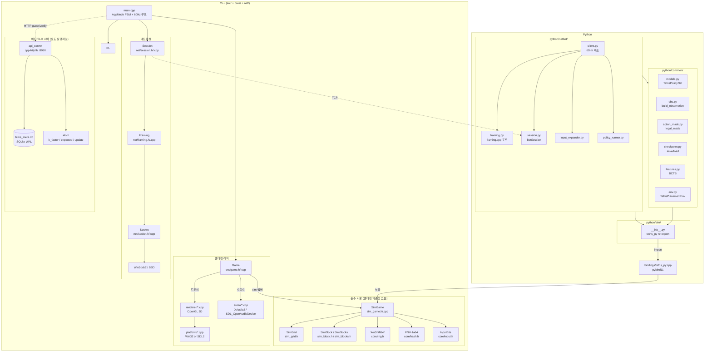
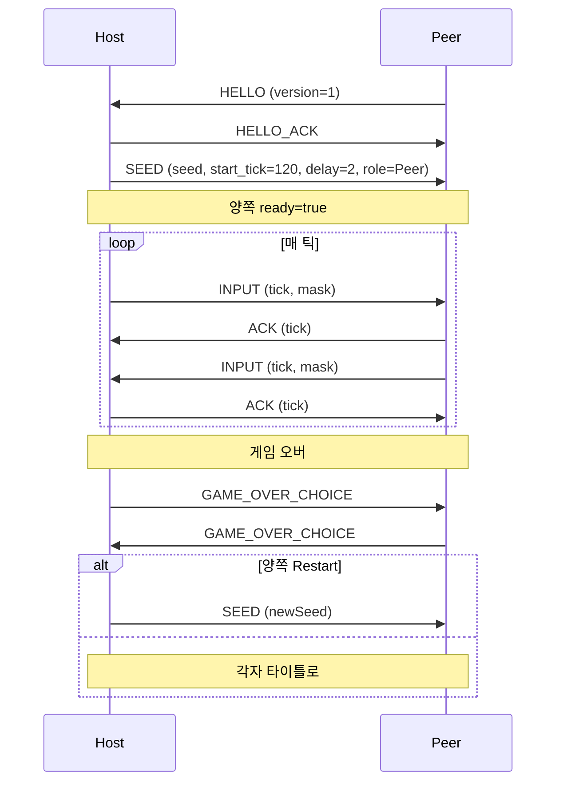
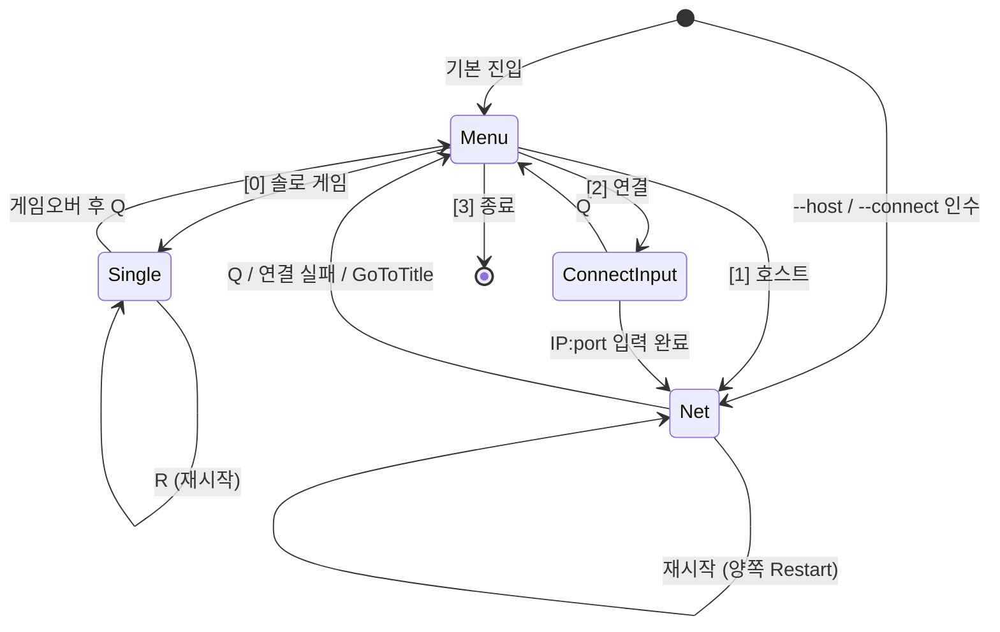
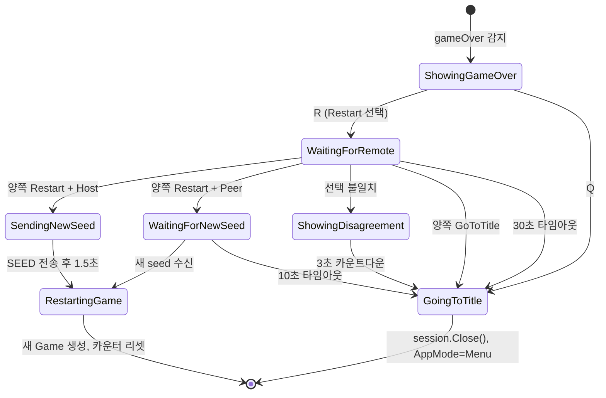
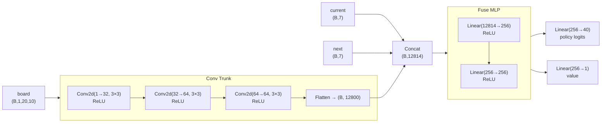
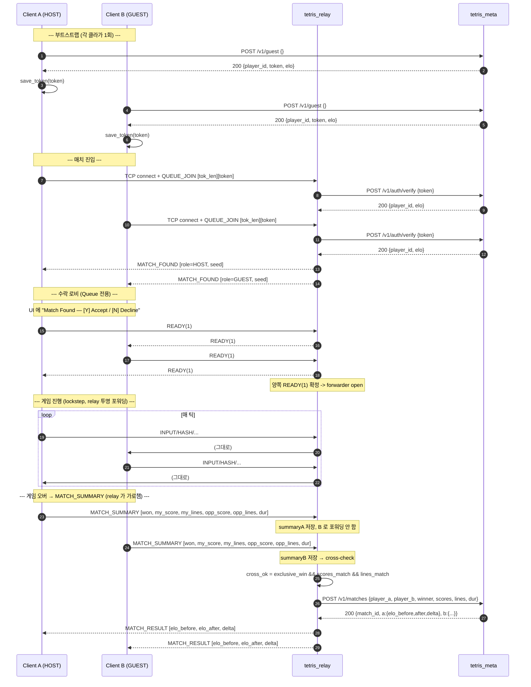

# Tetris-Multiplayer-RL — 전체 아키텍처 & 코드 레퍼런스

> Mermaid 다이어그램은 GitHub / VS Code(Mermaid Preview 확장) / JetBrains에서 렌더링됩니다.

---

## 목차

1. [프로젝트 개요](#1-프로젝트-개요)
2. [디렉터리 구조](#2-디렉터리-구조)
3. [전체 레이어 아키텍처](#3-전체-레이어-아키텍처)
4. [C++ 코어 — SimGame](#4-c-코어--simgame)
   - 4.1 [SimGame (src/sim_game.h/.cpp)](#41-simgame)
   - 4.2 [SimGrid (src/sim_grid.h)](#42-simgrid)
   - 4.3 [SimBlock / SimBlocks (src/sim_block.h, sim_blocks.h)](#43-simblock--simblocks)
   - 4.4 [Position (src/position.h/.cpp)](#44-position)
5. [C++ UI 래퍼 — Game](#5-c-ui-래퍼--game)
   - 5.1 [Game (src/game.h/.cpp)](#51-game)
   - 5.2 [Colors (src/colors.h/.cpp)](#52-colors)
6. [Core 유틸리티](#6-core-유틸리티)
   - 6.1 [constants.h](#61-constantsh)
   - 6.2 [input.h](#62-inputh)
   - 6.3 [rng.h — XorShift64*](#63-rngh--xorshift64)
   - 6.4 [hash.h — FNV-1a 64-bit](#64-hashh--fnv-1a-64-bit)
   - 6.5 [replay.h/.cpp](#65-replayhcpp)
7. [네트워킹 스택 (net/) + 릴레이 (server/)](#7-네트워킹-스택-net--릴레이-server)
   - 7.1 [socket.h/.cpp](#71-sockethcpp)
   - 7.2 [framing.h/.cpp](#72-framinghcpp)
   - 7.3 [session.h/.cpp](#73-sessionhcpp)
   - 7.4 [server/player_conn.cpp — 인증 + 큐 진입](#74-serverplayer_conncpp--인증--큐-진입)
   - 7.5 [server/relay.cpp — 포워더 + MATCH_SUMMARY 가로채기](#75-serverrelaycpp--포워더--match_summary-가로채기)
8. [진입점 — main.cpp](#8-진입점--maincpp)
9. [pybind11 바인딩 (bindings/)](#9-pybind11-바인딩-bindings)
10. [Python 레이어](#10-python-레이어)
    - 10.1 [python/sim/ — 네이티브 모듈 래퍼](#101-pythonsim--네이티브-모듈-래퍼)
    - 10.2 [python/common/ — 학습·추론 공용 레이어](#102-pythoncommon--학습추론-공용-레이어)
    - 10.3 [python/netbot/ — TCP Lockstep 봇 클라이언트](#103-pythonnetbot--tcp-lockstep-봇-클라이언트)
11. [메타 서버 (tetris_meta)](#11-메타-서버-tetris_meta)
12. [랭킹 흐름 — 토큰 + MATCH_SUMMARY 시퀀스](#12-랭킹-흐름--토큰--match_summary-시퀀스)
13. [테스트 & 검증](#13-테스트--검증)
14. [빌드 시스템 (CMakeLists.txt)](#14-빌드-시스템-cmakeliststxt)
15. [핵심 불변 조건](#15-핵심-불변-조건)
16. [데이터 흐름 요약](#16-데이터-흐름-요약)
17. [전체 함수 레퍼런스](#17-전체-함수-레퍼런스)

---

## 1. 프로젝트 개요

**Tetris-Multiplayer-RL**은 다음 사용 시나리오를 하나의 코드베이스로 지원하는 C++17 + Python 프로젝트입니다.

| 시나리오 | 실행 방법 | 의존성 |
|---|---|---|
| 로컬 1인/2인 멀티플레이 | `tetris` | OpenGL + (Win32 핸드메이드 \| SDL2), WinSock2/BSD 소켓, cpp-httplib(헤더, guest 토큰용) |
| 매칭/릴레이 서버 | `tetris_relay [--meta URL]` | WinSock2/BSD 소켓 (헤드리스), cpp-httplib(헤더, meta 호출용) |
| 메타/ELO/리더보드 서버 | `tetris_meta [--db PATH] [--http HOST:PORT]` | SQLite3 amalgamation + cpp-httplib (HTTP+SQLite, GUI 없음) |
| Colab RL 학습 | `from sim import SimGame` (pybind11) | pybind11, numpy, torch |
| 로컬 봇 대전 (TCP) | `python -m netbot.client --connect ...` | SimGame .pyd + torch |
| 로컬 봇 대전 (인-프로세스) | 메뉴 → Single vs Bot | ONNX Runtime + `model/policy.onnx` |

**설계 원칙:**
- `SimGame`이 **모든 게임 로직의 단일 진실 공급원(single source of truth)**. 렌더링/오디오 없음.
- 렌더링 의존성 없음: 프로젝트는 raylib을 **링크하지 않는다**. Windows는 핸드메이드 Win32+OpenGL, macOS/Linux는 SDL2+OpenGL 백엔드를 사용.
- 결정론: XorShift64\* RNG + FNV-1a64 상태 해시 → 플랫폼 무관 동일 결과.
- lockstep 네트워킹: 양측이 같은 시드 + 같은 입력 순서를 가지므로 별도 상태 동기화 패킷 불필요.
- 네트워크 확장: PING/PONG 하트비트(LinkStatus OK/Stalled/Lost), 5자리 코드 커스텀 룸, 인-게임 채팅, 10초 주기 자동 HASH 검증 + DESYNC 배너.
- 랭킹 분리: 릴레이는 무상태(stateless) 유지. ELO/플레이어 ID/매치 히스토리는 별도 실행파일 `tetris_meta` (HTTP+SQLite) 가 관리하고, 릴레이는 매치 시작 시 토큰 검증 + 매치 종료 시 결과 POST 만 한다.

---

## 2. 디렉터리 구조

```
Tetris-Multiplayer-RL/
│
├── src/                    ← C++ 게임 로직 (SimGame + 렌더링 래퍼)
│   ├── sim_game.h/.cpp     ← 헤드리스 시뮬레이터 (핵심)
│   ├── sim_grid.h          ← 20×10 보드 (헤드리스)
│   ├── sim_block.h         ← 테트로미노 상태 (헤드리스)
│   ├── sim_blocks.h        ← L/J/I/O/S/T/Z 팩토리
│   ├── game.h/.cpp         ← 렌더링 래퍼 (SimGame 위임, OpenGL 2D 렌더러 사용)
│   ├── colors.h/.cpp       ← 색상 팔레트
│   ├── position.h/.cpp     ← (row, col) 좌표
│   └── main.cpp            ← 진입점 + FSM + 60Hz 루프
│
├── core/                   ← 순수 유틸리티 (외부 의존성 없음)
│   ├── constants.h         ← TICKS_PER_SECOND=60
│   ├── input.h             ← INPUT_* 비트마스크
│   ├── rng.h               ← XorShift64* 결정론적 RNG
│   ├── hash.h              ← FNV-1a 64-bit 해시
│   ├── replay.h/.cpp       ← 입력 리플레이 저장/로드
│
├── platform/               ← 창/입력 백엔드 (2개 중 택1)
│   ├── platform.h          ← 공용 인터페이스
│   ├── win32.cpp           ← Handmade Win32 (Windows 기본)
│   ├── sdl.cpp             ← SDL2 (macOS/Linux 기본, Windows 옵션)
│   └── macos/Info.plist.in ← .app 번들 메타 (Section G)
│
├── renderer/               ← OpenGL 2D 렌더러
│   ├── renderer.h/.cpp     ← 사각형/라인/투영 행렬
│   ├── shaders.h           ← GLSL 인라인 셰이더
│   ├── text_win32.cpp      ← Win32 GDI 텍스트
│   ├── text_stb.cpp        ← stb_truetype 텍스트 (SDL2 경로)
│   ├── shake.h/.cpp        ← 화면 흔들림 (Section I)
│   └── image.h/.cpp        ← PNG 이미지/콜아웃 (Section I)
│
├── bot/                    ← ONNX Runtime 인-프로세스 추론 (Section C)
│   ├── bot_onnx.h/.cpp     ← Ort::Session 래퍼 (TETRIS_BUILD_BOT=ON 시)
│   └── placement.h/.cpp    ← 행동 선택 → 프레임 마스크 시퀀스
│
├── server/                 ← 헤드리스 매치메이커/릴레이 (tetris_relay)
│   ├── main.cpp            ← 진입점 (--port / --meta URL)
│   ├── player_conn.h/.cpp  ← 플레이어 소켓 상태 머신 + meta 토큰 검증
│   ├── matchmaker.h/.cpp   ← 랜덤 큐 페어링
│   ├── room.h/.cpp         ← 5자리 코드 커스텀 룸 (Section D)
│   └── relay.h/.cpp        ← 페어 간 바이트 포워더 + MATCH_SUMMARY 가로채기
│
├── meta/                   ← 메타데이터/ELO/리더보드 (tetris_meta, §11)
│   ├── main.cpp            ← 진입점 (Database + ApiServer)
│   ├── database.h/.cpp     ← SQLite 래퍼 (mutex 직렬화, BEGIN IMMEDIATE)
│   ├── api_server.h/.cpp   ← cpp-httplib 라우팅 (4 endpoints + CORS)
│   ├── http_client.h/.cpp  ← MetaClient — relay/game-client 공용 HTTP 호출자
│   ├── elo.h               ← ELO 계산 (k_factor, expected, update)
│   └── protocol.h          ← JSON 수동 직렬화/파싱 (find_int/find_string/find_bool)
│
├── net/                    ← 네트워킹 3계층
│   ├── socket.h/.cpp       ← 크로스플랫폼 TCP
│   ├── framing.h/.cpp      ← 메시지 직렬화 (HELLO/SEED/INPUT/ACK/HASH/PING/PONG/ROOM_*/CHAT/MATCH_SUMMARY/MATCH_RESULT/...)
│   └── session.h/.cpp      ← lockstep P2P 세션 + Host/Connect/QueueJoin/RoomCreate/RoomJoin
│
├── bindings/
│   └── tetris_py.cpp       ← pybind11 SimGame 노출
│
├── tests/
│   └── sim_hash_dump.cpp   ← C++ 결정론 회귀 테스트
│
├── third_party/            ← 벤더링된 헤더-온리/amalgamation 의존성
│   ├── httplib.h           ← cpp-httplib (헤더 온리, HTTP 서버+클라이언트)
│   ├── sqlite3.h           ← SQLite amalgamation (헤더)
│   ├── sqlite3.c           ← SQLite amalgamation (단일 .c — TETRIS_BUILD_META 시 컴파일)
│   ├── sqlite3ext.h        ← SQLite 확장 헤더 (자동 포함)
│   └── onnxruntime/        ← 옵션: TETRIS_BUILD_BOT=ON 시 (Section C)
│
├── python/
│   ├── sim/                ← 네이티브 모듈 래퍼 (플랫폼 독립 import)
│   ├── common/             ← 학습·추론 공용 코드 (Colab ↔ 로컬 공유)
│   │   ├── models.py       ← TetrisPolicyNet (CNN + policy/value head)
│   │   ├── obs.py          ← SimGame → 관측 텐서
│   │   ├── action_mask.py  ← 합법적 배치 마스크
│   │   ├── checkpoint.py   ← 아키텍처 버전 가드 save/load
│   │   ├── features.py     ← BCTS Dellacherie 피처 (rule-based baseline)
│   │   └── env.py          ← Gymnasium TetrisPlacementEnv
│   ├── netbot/             ← 로컬 전용 봇 클라이언트
│   │   ├── framing.py      ← net/framing.cpp Python 포트
│   │   ├── session.py      ← net/session.cpp 클라이언트 경로 포트
│   │   ├── input_expander.py ← placement → 틱 마스크 시퀀스 변환
│   │   ├── policy_runner.py  ← 정책/규칙 기반 행동 선택
│   │   └── client.py       ← 60Hz 메인 루프 진입점
│   ├── train/              ← Colab 전용
│   │   └── setup_colab.ipynb
│   ├── tests/              ← pytest 스위트
│   ├── legacy/             ← 이전 Pygame 구현 (참조용, 비빌드)
│   ├── requirements.txt
│   └── requirements-colab.txt
│
├── CMakeLists.txt
├── Font/                   ← monogram.ttf
└── Sounds/                 ← music.mp3, rotate.mp3, clear.mp3
```

---

## 3. 전체 레이어 아키텍처



---

## 4. C++ 코어 — SimGame

### 4.1 SimGame

**파일:** `src/sim_game.h` (105줄), `src/sim_game.cpp` (327줄)

`SimGame`은 **렌더링·오디오·OS API에 전혀 의존하지 않는** 순수 C++ 테트리스 엔진입니다. 단독으로 빌드 가능하며, pybind11 모듈과 결정론 테스트가 이 파일만 사용합니다.

#### 데이터 멤버

```cpp
SimGrid sim_grid;               // 20×10 보드
std::vector<SimBlock> blocks;   // 7-piece 백(bag) 풀
XorShift64Star rng;             // 피스 백 결정론적 RNG (유일한 난수 소스)
XorShift64Star garbageRng;      // 가비지 홀 컬럼용 별도 RNG (seed XOR 0x9E37…)
SimBlock currentBlock;          // 현재 떨어지는 조각
SimBlock ghostBlock;            // 착지 예측 조각 (id=8)
SimBlock nextBlock;             // 다음 조각 미리보기
int gravityCounterTicks;        // 중력 카운터 (틱 단위)
int dropIntervalTicks;          // 중력 간격 (Lv1=30틱, 레벨업마다 감소, Lv20=3틱)
int softDropCounterTicks;       // INPUT_DOWN 반복 속도 제한 (3틱마다)
bool lastMoveWasRotate;         // 직전 성공 이동이 회전이면 true (T-spin 판정)
bool gameOver;                  // 공개
int score;                      // 공개
int totalLinesCleared = 0;      // 누적 클리어 라인 수 (레벨 산정용)
int level = 1;                  // 현재 레벨 (1..20). 10라인마다 +1
int attackLinesSent  = 0;       // 누적 공격 라인 수 (외부에서 델타 추출)
int pendingGarbage   = 0;       // 다음 LockBlock 시 하단으로 삽입될 가비지 행 수
mutable bool rotateSoundEvent;  // Game 래퍼가 소리 재생 후 false로 리셋
mutable bool clearSoundEvent;
mutable bool dropSoundEvent;
mutable bool garbageSoundEvent;
mutable int  lastLinesCleared = 0;   // 마지막 LockBlock 의 라인 수 (0..4)
mutable int  lastTSpinLines   = -1;  // T-spin 이벤트면 0..3, 아니면 -1
mutable int  lastGarbageReceived = 0;
mutable bool gameOverEvent    = false;
```

#### API

**Placement-level (RL 학습용)**

| 함수 | 설명 |
|---|---|
| `LegalPlacements() → vector<Placement>` | 현재 조각의 모든 합법적 (col, rot) 목록 |
| `ApplyPlacement(col, rot) → int` | 회전→이동→하드드롭→잠금, 지운 줄 수 반환. -1=불법 |

**Frame-level (lockstep 실전용)**

| 함수 | 설명 |
|---|---|
| `SubmitInput(uint8_t mask)` | INPUT_* 비트마스크를 해석해 이동/회전/드롭 적용 |
| `Tick()` | 중력 카운터 증가, 임계 도달 시 MoveBlockDown() 호출 |
| `MoveBlockDown()` | 1행 내려감. 바닥 충돌 시 LockBlock() |

**관측 (Observation)**

| 함수 | 설명 |
|---|---|
| `Grid() const` | const int(&)[20][10] — 보드 직접 참조 (복사 없음) |
| `CurrentBlock/GhostBlock/NextBlock() const` | SimBlock 참조 |
| `CurrentBlockId/Rotation/Row/Col()` | 개별 게터 |
| `NextBlockId()` | 다음 조각 id |
| `Score()` | 점수 |
| `IsGameOver()` | 게임 오버 여부 |

**결정론/디버깅**

| 함수 | 설명 |
|---|---|
| `StateHash() → uint64_t` | 전체 상태를 FNV-1a64로 해시 (결정론 게이트) |
| `RngState() → uint64_t` | XorShift64* 내부 상태 (디버깅용) |

#### 주요 내부 함수

```
SimGame::SimGame(seed)
  ├── rng(seed == 0 ? 0xC0FFEE123456789 : seed)
  ├── GetAllBlocks()     → I, J, L, O, S, T, Z 순서로 blocks 생성
  ├── GetRandomBlock()   → currentBlock 뽑기
  ├── GetRandomBlock()   → nextBlock 뽑기
  └── MakeGhostBlock()   → ghostBlock = currentBlock (id=8)

GetRandomBlock()
  └── blocks 비면 GetAllBlocks()로 재충전 (7-piece bag)
      └── rng.nextUInt(size) 로 Fisher-Yates 셔플
      → 앞에서 pop

SubmitInput(mask)
  ├── INPUT_LEFT  → MoveBlockLeft()
  ├── INPUT_RIGHT → MoveBlockRight()
  ├── INPUT_DOWN  → MoveBlockDown()
  ├── INPUT_ROTATE→ RotateBlockImpl()
  └── INPUT_DROP  → MoveBlockDrop()
      └── 마지막에 항상 DropExpectation() (고스트 갱신)

Tick()
  └── ++gravityCounterTicks
      → if >= dropIntervalTicks: MoveBlockDown(), gravityCounterTicks=0

MoveBlockLeft/Right(delta)
  ├── currentBlock.Move(0, delta)
  ├── IsBlockOutside || !BlockFits → 되돌리기 (Undo)
  └── 성공 시 lastMoveWasRotate=false, MakeGhostBlock()

MoveBlockDown()
  ├── currentBlock.Move(1, 0)
  ├── IsBlockOutside || !BlockFits → 되돌리기 → LockBlock()
  └── 성공 시 lastMoveWasRotate=false, MakeGhostBlock()

MoveBlockDrop()
  └── while(아직 이동 가능): MoveBlockDown()
      → 첫 충돌 시 LockBlock()

RotateBlockImpl()
  ├── currentBlock.Rotate()
  ├── IsBlockOutside || !BlockFits → UndoRotation()
  └── 성공 시: lastMoveWasRotate=true, rotateSoundEvent=true, MakeGhostBlock()

LockBlock()
  ├── IsTSpinLock() → T-piece(id=6) + lastMoveWasRotate + pivot 주변 4모서리 중 3+ 막힘
  ├── GetCellPositions() → grid에 id 기록
  ├── currentBlock = nextBlock; ghost 갱신; topout 검사 → gameOver
  ├── nextBlock = GetRandomBlock()
  ├── grid.ClearFullRows() → rowsCleared
  ├── lastLinesCleared = rowsCleared; lastTSpinLines = tSpin ? rowsCleared : -1
  ├── if rowsCleared>0 || tSpin:
  │      UpdateScore(rowsCleared, 0, tSpin)        ← level 배율 적용
  │      attackLinesSent += attack_lines_for(rowsCleared, tSpin)
  ├── lastMoveWasRotate = false
  └── 가비지 주입 (pendingGarbage > 0):
       InsertGarbage(rows) → 보드를 위로 밀고 하단 rows 행에 id=9 채움
                              (한 묶음 동일 홀 컬럼: garbageRng.nextUInt(10))
       BlockFits(currentBlock) 실패 시 gameOver = true

BlockFits(block)
  └── GetCellPositions() 순회
      └── grid 셀 값이 1~7 → false (0=빈칸, 8=고스트는 OK)

IsBlockOutside(block)
  └── 임의 타일이 [0,20)×[0,10) 벗어나면 true

UpdateScore(linesCleared, levelUp, tSpin)
  ├── 일반:  score += {100, 300, 600, 1000}[lines] * level   (1/2/3/4줄)
  ├── T-spin: score += {400, 800, 1200, 1600}[lines] * level (0/1/2/3줄)
  ├── score += levelUp * 1000                                  (현재 levelUp 인자는 항상 0)
  └── 레벨업: totalLinesCleared += linesCleared
              newLevel = totalLinesCleared / 10 + 1
              if newLevel > level:
                  level = min(20, newLevel)
                  dropIntervalTicks = max(3, 30 - (level-1)*27/19)
                  // Lv1=30틱(0.5s), Lv5≈24, Lv10≈17, Lv15≈10, Lv20=3틱(50ms)

attack_lines_for(rows, tSpin)
  ├── tSpin: TSS=2, TSD=4, TST=6                  (lines 1/2/3)
  └── normal: Single=0, Double=1, Triple=2, Tetris=4

IsTSpinLock()
  ├── currentBlock.id == 6 (T-piece) && lastMoveWasRotate
  └── pivot = (rowOffset+1, columnOffset+1)
      → 4 모서리 (NW/NE/SW/SE) 중 IsCellOutside 또는 !IsCellEmpty 가 3개 이상 → true

StateHash()
  └── FNV-1a64 체인 (해시 파리티 게이트):
      grid bytes(20×10×4)
      + currentBlock (id/rot/row/col)
      + nextBlock (id/rot/row/col)
      + rng.getState()
      + score + gameOver
      + gravityCounterTicks + dropIntervalTicks + softDropCounterTicks
      + totalLinesCleared + level
      + lastMoveWasRotate
      + garbageRng.getState() + attackLinesSent + pendingGarbage

  추가로 StateHashBreakdown() — DESYNC 원인을 grid/currentBlock/nextBlock/rng/
  scoreFlags/combat 6개 섹션으로 분리해 한 쪽만 다른 경우 즉시 좁힐 수 있다.

LegalPlacements()
  └── for rot in [0, cells.size()):
        for col in [0, 10):
          조각 재구성 → IsBlockOutside/!BlockFits → 스킵
          MoveBlockDrop 시뮬 → 유효 위치 → 추가

ApplyPlacement(col, rot)
  ├── 목표 설정 (회전 rot번 → 열 col로 이동)
  ├── 유효성 확인
  ├── MoveBlockDrop 시뮬 → LockBlock
  └── 점수 차이 = 지운 줄 수 (0~4 반환, -1=불법)
```

---

### 4.2 SimGrid

**파일:** `src/sim_grid.h` (95줄)

```cpp
static constexpr int kRows = 20;
static constexpr int kCols = 10;
int grid[20][10];   // 0=빈칸, 1-7=조각, 8=고스트
```

| 함수 | 설명 |
|---|---|
| `Initialize()` | 모든 셀을 0으로 |
| `IsCellOutside(row, col)` | 범위 외 여부 |
| `IsCellEmpty(row, col)` | 0 또는 8(고스트)이면 true |
| `ClearFullRows() → int` | 꽉 찬 행 제거 + 위 행 내려오기, 지운 줄 수 반환 |

**내부 헬퍼:**

| 함수 | 설명 |
|---|---|
| `IsRowFull(row)` | 해당 행이 10칸 모두 찼으면 true |
| `ClearRow(row)` | 행 전체를 0으로 |
| `MoveRowDown(row, count)` | row+count에 row 복사, row를 0으로 |

---

### 4.3 SimBlock / SimBlocks

**파일:** `src/sim_block.h` (62줄), `src/sim_blocks.h` (105줄)

`SimBlock` — 하나의 테트로미노 상태:

```cpp
int id;                                    // 1=L, 2=J, 3=I, 4=O, 5=S, 6=T, 7=Z, 8=고스트
std::map<int, std::vector<Position>> cells; // cells[rotState] = 상대 좌표 목록
int rotationState;                          // 현재 회전 인덱스 [0, cells.size())
int rowOffset, columnOffset;                // 보드 위 위치
```

| 함수 | 설명 |
|---|---|
| `Move(rows, cols)` | offset 이동 |
| `GetCellPositions()` | 절대 좌표 반환 (타일 + offset) |
| `Rotate()` | rotationState = (rotationState + 1) % cells.size() |
| `UndoRotation()` | rotationState = (rotationState - 1 + n) % n |

`SimBlocks.h` — 각 조각별 서브클래스 (SimLBlock, SimJBlock, …, SimZBlock):
- `id` 고정
- `cells[0..3]` 하드코딩 (4가지 회전 상태)
- 생성자에서 `Move(0, 3)` (O-block은 Move(0, 4)) — 스폰 위치

**회전 테이블 예시 (L-block id=1):**
```
cells[0] = {(0,2), (1,0), (1,1), (1,2)}   // □□■
                                            // ■■■
cells[1] = {(0,1), (1,1), (2,1), (2,2)}
cells[2] = {(1,0), (1,1), (1,2), (2,0)}
cells[3] = {(0,0), (0,1), (1,1), (2,1)}
```

> **주의:** SRS(Super Rotation System) 미구현. 회전 실패 시 단순 되돌리기.

---

### 4.4 Position

**파일:** `src/position.h` (8줄), `src/position.cpp` (7줄)

```cpp
struct Position {
    int row, column;
    Position(int r, int c);
};
```

---

## 5. C++ UI 래퍼 — Game

### 5.1 Game

**파일:** `src/game.h` (65줄), `src/game.cpp` (154줄)

`Game`은 `SimGame`을 멤버로 갖고 **렌더링과 오디오만 추가**합니다.

```cpp
class Game {
public:
    SimGame sim;               // 실제 로직 (공개 — main.cpp에서 직접 접근)
    bool&  gameOver = sim.gameOver;  // 별칭 참조
    int&   score    = sim.score;     // 별칭 참조
private:
    Music music;
    Sound rotateSound, clearSound;
    std::vector<Color> cellColors;
};
```

| 함수 | 설명 |
|---|---|
| `Game(uint64_t seed)` | AudioInit() 참조 카운팅, 음악/소리 로드, cellColors 생성 |
| `~Game()` | 음악/소리 언로드, AudioShutdown() 참조 카운팅 |
| `SubmitInput(uint8_t mask)` | sim.SubmitInput() 호출 후 rotateSoundEvent 확인 → PlaySound |
| `Tick()` | sim.Tick() 호출 후 clearSoundEvent 확인 → PlaySound |
| `MoveBlockDown()` | sim.MoveBlockDown() 직접 호출 |
| `ComputeStateHash()` | sim.StateHash() 위임 |
| `Draw()` | 보드·현재·고스트·다음 조각 렌더 (11,11 오프셋) |
| `DrawBoardAt(x, y)` | 멀티플레이 화면에서 임의 위치에 보드 렌더 |
| `DrawNextAt(x, y)` | 다음 조각 미리보기 (현재 미사용 — dead code) |

**오디오 참조 카운팅:**

```cpp
static int s_audioRef = 0;
// Game 생성 시: if(s_audioRef == 0) InitAudioDevice(); ++s_audioRef;
// Game 소멸 시: --s_audioRef; if(s_audioRef == 0) CloseAudioDevice();
```

두 Game 인스턴스(멀티플레이)가 있어도 AudioDevice는 한 번만 초기화됩니다.

**셀 색상 인덱스 매핑:**

```
index 0 = darkGrey  (빈칸)
index 1 = green     (L-block)
index 2 = red       (J-block)
index 3 = orange    (I-block)
index 4 = yellow    (O-block)
index 5 = purple    (S-block)
index 6 = cyan      (T-block)
index 7 = blue      (Z-block)
index 8 = gray      (고스트)
```

---

### 5.2 Colors

**파일:** `src/colors.h` (18줄), `src/colors.cpp` (18줄)

```cpp
extern Color darkGrey, green, red, orange, yellow, purple, cyan, blue,
             lightBlue, darkBlue, gray;
std::vector<Color> GetCellColors();  // index 0~8 순서로 반환
```

---

## 6. Core 유틸리티

### 6.1 constants.h

```cpp
constexpr int    TICKS_PER_SECOND = 60;
constexpr double SECONDS_PER_TICK = 1.0 / 60.0;
```

---

### 6.2 input.h

```cpp
enum : uint8_t {
    INPUT_NONE   = 0,
    INPUT_LEFT   = 1 << 0,  // 0x01
    INPUT_RIGHT  = 1 << 1,  // 0x02
    INPUT_DOWN   = 1 << 2,  // 0x04
    INPUT_ROTATE = 1 << 3,  // 0x08
    INPUT_DROP   = 1 << 4,  // 0x10
};
bool hasInput(uint8_t mask, uint8_t bit);
```

한 틱에 여러 비트가 OR로 조합될 수 있습니다 (예: 동시에 LEFT+ROTATE).

---

### 6.3 rng.h — XorShift64*

```cpp
class XorShift64Star {
    uint64_t state;
public:
    explicit XorShift64Star(uint64_t seed = 0);
    uint64_t next();                    // 64-bit output
    uint32_t nextUInt(uint32_t max);    // [0, max) — 블록 백 셔플에 사용
    uint64_t getState() const;
};
```

seed=0이면 `0xC0FFEE123456789`로 초기화됩니다.

**XorShift64\*의 결정론 보장:** 정수 연산만 사용하므로 Linux/Windows 모두 동일 결과. StateHash() 안에 `rng.getState()`가 포함되어 RNG 드리프트 감지 가능.

---

### 6.4 hash.h — FNV-1a 64-bit

```cpp
constexpr uint64_t FNV1A64_OFFSET = 14695981039346656037ULL;
constexpr uint64_t FNV1A64_PRIME  = 1099511628211ULL;

uint64_t fnv1a64(const void* data, size_t len, uint64_t seed = FNV1A64_OFFSET);

template<typename T>
uint64_t fnv1a64_value(const T& v, uint64_t seed = FNV1A64_OFFSET);
```

`StateHash()`는 이 함수를 체인으로 호출합니다:

```cpp
uint64_t h = fnv1a64(sim_grid.grid, sizeof(sim_grid.grid));
h = fnv1a64_value(currentBlock.id, h);
h = fnv1a64_value(currentBlock.rotationState, h);
// row/col → nextBlock(id/rot/row/col) → rng.getState()
// → score → gameOver → gravityCounterTicks/dropIntervalTicks/softDropCounterTicks
// → totalLinesCleared → level → lastMoveWasRotate
// → garbageRng.getState() → attackLinesSent → pendingGarbage
```

레벨/콤바트 필드가 해시에 포함되므로, 가비지 로직 또는 레벨 산정 버그가 §F.2
의 10초 주기 HASH 자동 검증에서 즉시 DESYNC 로 잡힌다.

---

### 6.5 replay.h/.cpp

```cpp
struct FrameInputs { uint8_t p1, p2; };
struct ReplayData  { uint64_t seed; std::vector<FrameInputs> frames; };

namespace ReplayIO {
    bool Save(const std::string& path, const ReplayData& r);
    bool Load(const std::string& path, ReplayData& r);
}
```

텍스트 형식: `seed X\nticks Y\ni p1 p2\n...`

main.cpp에서 F5=리플레이 저장, F6=불러오기 (단, Load 경로는 현재 미사용).

---

## 7. 네트워킹 스택 (net/) + 릴레이 (server/)

세 레이어가 단방향으로 의존합니다: `session → framing → socket`. 릴레이 측의
`server/player_conn.cpp` 와 `server/relay.cpp` 는 동일한 framing/socket 위에서
프레임 단위 가로채기를 추가한다.

### 7.1 socket.h/.cpp

**파일:** `net/socket.h` (36줄), `net/socket.cpp` (358줄)

크로스플랫폼 TCP 추상화. Windows는 WinSock2, Linux는 BSD 소켓.

```cpp
struct TcpSocket { int fd; bool valid() const { return fd >= 0; } };
```

| 함수 | 설명 |
|---|---|
| `net_init()` | Windows: WSAStartup. Linux: no-op |
| `net_shutdown()` | Windows: WSACleanup. Linux: no-op |
| `tcp_listen(port, backlog)` | INADDR_ANY:port 리슨 소켓, SO_REUSEADDR |
| `tcp_accept(server)` | 연결 수락, 논블로킹 설정 |
| `tcp_connect(host, port)` | getaddrinfo + connect, 논블로킹 설정 |
| `tcp_send_all(sock, data, len)` | 전체 전송 보장 (EAGAIN 시 100µs sleep 재시도) |
| `tcp_recv_some(sock, outBuf)` | 최대 4096 바이트 논블로킹 수신, outBuf에 append |
| `tcp_close(sock)` | 소켓 닫기 |
| `get_local_ip()` | 로컬 IPv4 주소 (없으면 127.0.0.1) |
| `get_public_ip()` | ipify.org/ipecho.net/icanhazip.com 조회 (3초 타임아웃) |

**논블로킹 수신:** `tcp_recv_some`은 EAGAIN/WSAEWOULDBLOCK이면 true 반환 (데이터 없음, 정상). 에러/연결 종료 시 false.

---

### 7.2 framing.h/.cpp

**파일:** `net/framing.h` (48줄), `net/framing.cpp` (88줄)

TCP 바이트 스트림을 메시지 단위로 직렬화/역직렬화합니다.

#### 프레임 형식

```
┌────────────┬──────────┬─────────────────────────┬──────────────┐
│ LEN: u16 LE│ TYPE: u8 │ PAYLOAD: (LEN-1) bytes  │ CHK: u32 LE  │
└────────────┴──────────┴─────────────────────────┴──────────────┘
```

- `LEN = 1 + len(PAYLOAD)` (TYPE 바이트 포함, 고정 헤더 제외)
- `CHK = FNV-1a32(PAYLOAD)`, payload가 없으면 0

#### 메시지 타입

```cpp
enum class MsgType : uint8_t {
    HELLO            = 1,   // u16(1) — 버전
    HELLO_ACK        = 2,   // payload 없음
    SEED             = 3,   // u64 seed + u32 start_tick + u8 input_delay + u8 role
    INPUT            = 4,   // u32 tick + u16 count + u8[count] masks
    ACK              = 5,   // u32 last_tick_acked
    PING             = 6,   // payload 없음
    PONG             = 7,   // payload 없음
    HASH             = 8,   // u32 tick + u64 hash
    GAME_OVER_CHOICE = 9,   // u8 choice (0=None, 1=Restart, 2=GoToTitle)

    // ── Relay 전용 (클라 ↔ 릴레이 서버) ───────────────────────────────
    // QUEUE_JOIN/ROOM_CREATE/ROOM_JOIN 페이로드 끝에 [tok_len:1][token:N] 가
    // 붙는다 (tok_len==0 → 미인증 시도. relay 가 --meta 모드면 즉시 close).
    QUEUE_JOIN     = 10,   // C→S : [tok_len:1][token:N]
    QUEUE_CANCEL   = 11,   // C→S : 빈 페이로드
    MATCH_FOUND    = 12,   // S→C : [role:1][seed:8 LE]   role: 1=HOST, 2=GUEST
    ROOM_CREATE    = 13,   // C→S : [tok_len:1][token:N]
    ROOM_JOIN      = 14,   // C→S : [code_len:1][code:N][tok_len:1][token:N]
    ROOM_INFO      = 15,   // S→C : [code_len:1][code:N][status:1][peer_count:1]
    ROOM_LEAVE     = 16,   // C→S : 빈 페이로드
    READY          = 17,   // ↔   : [ready:1]

    // ── §11 메타 연동 — 릴레이가 가로채서 meta 로 POST ────────────────
    MATCH_SUMMARY  = 18,   // C→S : [won:1][my_score:4 LE][my_lines:4 LE]
                           //        [opp_score_observed:4 LE][opp_lines_observed:4 LE]
                           //        [duration_s:4 LE]   (총 21바이트)
    MATCH_RESULT   = 19,   // S→C : [elo_before:4 LE][elo_after:4 LE][delta:4 LE signed]
                           //        (총 12바이트. delta=0 && before==after 는 "ELO 변동 없음"
                           //        — (1) ranking offline / meta POST 실패, (2) unranked 매치,
                           //        (3) 교차검증 실패(winner=null) — 세 경우 모두 UI 는 중립
                           //        문구 "no ELO change (offline / unranked / invalid)" 출력.
                           //        구체적 원인은 relay/meta stderr 로그 참고.)

    CHAT           = 20,   // ↔   : [text_len:2 LE][utf8:N]   (relay 가 투명 포워딩)
};
```

**릴레이 투명도 규칙:** `MATCH_FOUND` 송신 후 릴레이는 기본적으로 모든 프레임을
투명 포워딩한다. **단** ranked 매치(meta != null && 양쪽 player_id != 0) 일 때
`MATCH_SUMMARY` 만은 가로채고 양쪽 도착을 기다려 §11 메타 호출로 처리한다
(자세한 로직은 §7.5).

#### 직렬화 헬퍼

```cpp
void le_write_u16(std::vector<uint8_t>& buf, uint16_t v);
void le_write_u32(std::vector<uint8_t>& buf, uint32_t v);
void le_write_u64(std::vector<uint8_t>& buf, uint64_t v);

uint16_t le_read_u16(const uint8_t* p, size_t off);
uint32_t le_read_u32(const uint8_t* p, size_t off);
uint64_t le_read_u64(const uint8_t* p, size_t off);
```

#### 주요 함수

```cpp
// 바이트열로 직렬화
std::vector<uint8_t> build_frame(MsgType type,
                                  const std::vector<uint8_t>& payload);

// 스트림 버퍼에서 완성된 프레임을 추출 (소비한 바이트는 앞에서 제거)
// 체크섬 불일치 프레임은 조용히 스킵
int parse_frames(std::vector<uint8_t>& streamBuf,
                 std::vector<std::pair<MsgType, std::vector<uint8_t>>>& out);
```

---

### 7.3 session.h/.cpp

**파일:** `net/session.h` (106줄), `net/session.cpp` (327줄)

P2P lockstep 세션을 관리합니다. I/O는 전용 스레드에서 실행됩니다.

#### 타입

```cpp
enum class Role : uint8_t { Host = 1, Peer = 2 };

enum class GameOverChoice : uint8_t {
    None = 0, Restart = 1, GoToTitle = 2
};

struct SeedParams {
    uint64_t seed;
    uint32_t start_tick;    // 기본 120 (2초 카운트다운)
    uint8_t  input_delay;   // 기본 2 (lockstep 버퍼)
    Role     role;
};
```

#### 공개 API

| 함수 | 설명 |
|---|---|
| `Host(port, params)` | 리슨 소켓 생성 + acceptThread 시작 |
| `Connect(host, port)` | TCP 연결 + ioThread 시작 + HELLO 전송 |
| `isConnected/isReady/isListening/hasFailed()` | 상태 조회 (atomic) |
| `params()` | SeedParams 반환 |
| `SendInput(tick, mask)` | INPUT 프레임 큐 |
| `SendHash(tick, hash)` | HASH 프레임 큐 (디신크 감지) |
| `SendGameOverChoice(choice)` | GAME_OVER_CHOICE 프레임 큐 |
| `SendNewSeed(seed)` | SEED 프레임 큐 (호스트 재시작) |
| `GetRemoteInput(tick, outMask)` | 수신된 상대 입력 조회 |
| `GetLastRemoteHash(tick, hash)` | 상대가 보낸 마지막 HASH 조회 |
| `GetRemoteGameOverChoice(outChoice)` | 상대의 게임오버 선택 조회 |
| `ClearGameOverChoices()` | 재시작을 위한 선택 초기화 |
| `maxRemoteTick/maxLocalTick()` | 최대 수신/송신 틱 |
| `heartbeatTickEnd()` | ioThread 가 메인 스톨 시 대신 송신한 최대 tick. main 깨어난 뒤 `localTickNext` catch-up 에 사용 |
| `QueueJoin/QueueCancel(...)` | 랜덤 큐 진입 / 매칭 전 취소 |
| `isQueueMatched() / queueLocalReady() / queuePeerReady()` | 수락 로비 상태 조회 (MATCH_FOUND ~ 양쪽 READY(1) 사이) |
| `QueueConfirm() / QueueDecline()` | 수락 로비에서 Y/N 응답. READY(1)/READY(0) 송신 + 연결 정리 |
| `RoomCreate/RoomJoin/RoomSendReady/RoomLeave` | 커스텀 룸 상태 머신 API |
| `ClearInputs()` | 입력 맵 초기화 (재시작) |
| `Close()` | 스레드 조인 + 소켓 닫기 |

#### Lockstep 공식

```cpp
int safeTickInclusive = std::min(lastLocalSent, lastRemote) - inputDelay;
// main.cpp에서:
while (simTick <= safeTickInclusive) {
    local.SubmitInput(localInputs[simTick]);
    local.Tick();
    remote.SubmitInput(remoteInputs[simTick]);
    remote.Tick();
    ++simTick;
}
```

- `lastLocalSent` — 내가 SESSION에 전송한 최대 틱 번호
- `lastRemote` — 상대로부터 수신한 최대 틱 번호
- `inputDelay` — 안전 버퍼 (기본 2틱 = 33ms @ 60Hz)

#### 핸드셰이크 순서



#### 내부 스레드

- **`ioThread()`** — 수신 루프 (논블로킹 recv → parse_frames → handleFrame). 연결 실패 시 `connectionFailed=true`.
- **`acceptThread(port)`** — 호스트 전용. tcp_listen → tcp_accept 대기 후 ioThread 시작.
- **`handleFrame(type, payload)`** — 메시지 타입별 분기:

```
HELLO         → HELLO_ACK + SEED 전송 (호스트만)
HELLO_ACK     → 무시
SEED          → seedParams 파싱, ready=true
INPUT         → remoteInputs[tick]=mask, ACK 전송
ACK           → 무시
HASH          → lastHashTickRemote, lastHashRemote 갱신
GAME_OVER_CHOICE → remoteGameOverChoice 갱신
PING          → PONG 반사
PONG          → 무시
```

---

### 7.4 server/player_conn.cpp — 인증 + 큐 진입

**파일:** `server/player_conn.h` (~33줄), `server/player_conn.cpp` (~160줄)

릴레이가 accept 한 소켓마다 detached 스레드에서 실행되는 진입점.
첫 프레임 (`QUEUE_JOIN` / `ROOM_CREATE` / `ROOM_JOIN`) 을 최대 10초간 기다린 뒤,
그 안의 `[tok_len:1][token:N]` 페이로드를 추출해 토큰을 검증한다.

```cpp
// server/matchmaker.h — 큐에 들어가는 PlayerInfo (verify 결과로 채워짐)
struct PlayerInfo {
    net::TcpSocket sock;
    uint32_t       conn_id{0};   // 로깅용
    int64_t        player_id{0}; // verify_token 응답. 0 = unranked
    int            elo{1200};
    std::string    username;     // empty = guest (no nickname)
    std::string    token;        // /v1/matches 호출에는 직접 쓰지 않음
};

void playerConnThread(net::TcpSocket sock, uint32_t conn_id,
                      Matchmaker& mm, RoomRegistry& rr,
                      meta::client::MetaClient* meta);
```

#### 토큰 추출 + 인증 (`extract_token`, `authenticate`)

```cpp
// 페이로드 끝(또는 ROOM_JOIN의 code 뒤)의 [tok_len:1][token:N]
std::string extract_token(const std::vector<uint8_t>& pl, size_t offset);
```

- `meta == nullptr`: unranked 모드 — 토큰이 있어도 무시, `player_id=0` 으로 큐 진입.
- `meta != nullptr` && 토큰 비어 있음: **즉시 close** (verify 우회 차단).
- `meta != nullptr` && 토큰 있음: `meta->verify_token(token)` 호출:
  - **성공** (`AuthInfo`): `player_id`, `elo`, `username` 으로 PlayerInfo 채움.
  - **실패** (`UnknownToken` 또는 `NetworkError`): 즉시 close (게임 클라가
    재발급/재시도 책임).

#### 프레임 분기

| 첫 프레임 | 다음 단계 | 토큰 위치 |
|---|---|---|
| `QUEUE_JOIN`   | `Matchmaker::enqueue(PlayerInfo)` | `payload[0..]` |
| `ROOM_CREATE`  | `RoomRegistry::handleCreate(...)` | `payload[0..]` |
| `ROOM_JOIN`    | `RoomRegistry::handleJoin(code, ...)` | `payload[1+code_len..]` |
| `QUEUE_CANCEL` | 즉시 close (큐 진입 전) | — |
| 그 외          | 무시하고 다음 프레임 대기 (HELLO 등) | — |
| 10초 타임아웃  | close | — |

---

### 7.5 server/relay.cpp — 포워더 + MATCH_SUMMARY 가로채기

**파일:** `server/relay.h` (~30줄), `server/relay.cpp` (~330줄)

#### 진입점

```cpp
namespace relay {
struct Match { PlayerInfo a; PlayerInfo b; uint64_t seed; uint32_t match_id; };
// 커스텀 룸 경로 — 로비 READY 교환이 끝난 상태라 즉시 포워더 open.
void startPump(Match match, meta::client::MetaClient* meta);
// 랜덤 큐 경로 — MATCH_FOUND 직후 수락 로비(양쪽 READY(1) 수집) 를 거친 뒤 포워더 open.
void startQueuePump(Match match, meta::client::MetaClient* meta);
}
```

두 진입점 모두 결국 `startForwarding(WithPrefix)` 로 수렴해 양 소켓에
`MATCH_FOUND` 송신 (큐 경로는 이미 송신 완료) + 두 방향 포워더 스레드
(`forwarderLoop(channel, true|false)`) 를 detached 로 띄운다. 두 스레드는
공유 `Channel` 구조체로 종료 신호 (`closed`, `forwarder_count`) 와 매치 종료
요약 (`summaryA`, `summaryB`) 을 교환한다.

- **`startQueuePump`** 의 수락 로비 thread (`queueLobbyThread`) 는 `READY(1)` 을 양쪽이 보낼 때까지 `tcp_recv_some` 폴링. 한 프레임씩 앞에서 파싱해 `READY`/`QUEUE_CANCEL` 만 소비하고 게임 프레임은 잔여 바이트 (`bufA`/`bufB`) 로 보존. 양쪽 READY(1) 확정 시 `startForwardingWithPrefix(match, meta, bufA, bufB)` 호출 → `Channel::prefixFromA/B` 에 실려 forwarder 첫 iteration 에서 처리.
- **양쪽 EOF 감시**: 매 iteration 마다 두 소켓 모두 `tcp_recv_some`. 프레임 파싱(READY 소비) 은 not-ready 쪽만, EOF 감지는 양쪽. ready 확정한 쪽이 창 닫기 등으로 끊겨도 즉시 감지 → 상대에게 `READY(0)` forward → 양 소켓 close.
- **취소 경로**: 한쪽이 `READY(0)` / `QUEUE_CANCEL` / EOF / 30초 타임아웃 시 상대에게 `READY(0)` forward → 양 소켓 close.

#### `forwarderLoop(channel, a_to_b)`

매 루프:
1. `tcp_recv_some(from, raw)` 로 한 묶음 바이트 수신.
2. **rankedMatch == false** (unranked 또는 meta 미연동): raw 바이트를 그대로
   `tcp_send_all(to, ...)` — `MATCH_SUMMARY` 도 통과.
3. **rankedMatch == true**: streamBuf 에 누적해 프레임 경계 (`LEN` 헤더) 만으로
   잘라낸다.
   - `TYPE == MATCH_SUMMARY`: 페이로드를 `parse_summary()` 로 풀어
     `summaryA` 또는 `summaryB` 채움. 상대로 **포워딩하지 않음** (가로챔).
   - 그 외 TYPE: 잘라낸 raw 바이트를 그대로 `to` 로 송신 (체크섬 재검증 없음).
4. 양쪽 summary 모두 도착하면 `finalizeRanked(channel)` 호출 (한 번만 실행되도록
   `summaryHandled` 플래그로 선점).

#### `finalizeRanked(channel)` — 교차검증 + meta POST

```
교차검증 규칙 (계획문서 그대로):
  exclusive_win = (a.won XOR b.won) == 1
  scores_match  = (a.my_score == b.opp_score) && (b.my_score == a.opp_score)
  lines_match   = (a.my_lines == b.opp_lines) && (b.my_lines == a.opp_lines)
  cross_ok      = exclusive_win && scores_match && lines_match
```

| 케이스 | meta POST | meta `winner` | DB 저장 | MATCH_RESULT delta |
|---|---|---|---|---|
| `cross_ok` 통과 + meta 정상 | 수행 | 승자 `player_id` | ELO 변동 반영 | meta 응답의 ELO 차 |
| `cross_ok` 실패 (한쪽 거짓 보고) + meta 정상 | **수행** (감사 목적) | `null` | **매치 기록됨 (winner=null), ELO 미반영** | `0` (양쪽) |
| meta 호출 실패 | 실패 | — | 미기록 | `0` (양쪽, elo_before==elo_after) |
| unranked (둘 중 하나 player_id==0) 또는 `meta == nullptr` | — | — | 미기록 | `0` (양쪽, elo_before==elo_after) |

성공/실패 관계없이 **양 클라에 MATCH_RESULT 를 한 번씩 송신**한다 (실패 시
delta=0, elo_before=elo_after=직전 값).

**delta==0 의 semantics.** MATCH_RESULT 프레임 자체에는 "왜 0 인가" 가 실리지 않는다.
클라는 `delta==0 && elo_before==elo_after` 조합을 **"이번 경기로 ELO 가 움직이지 않았다"**
는 중립 사실로만 해석해야 한다. 원인(`offline / unranked / validation failed`) 은 relay 및
meta 의 stderr 로그에서 확인. UI 는 `no ELO change (offline / unranked / invalid)` 같은
포괄적 문구를 쓰고, "ranking offline" 처럼 한 가지 원인으로 단정하는 라벨은 피한다 —
교차검증 실패 케이스에서는 매치가 실제로 DB 에 (winner=null 로) 기록돼 있기 때문.

#### selective passthrough 모드의 한계

- streamBuf 단위 슬라이스는 체크섬 재검증을 생략 (릴레이는 중계자, 검증 책임은
  엔드포인트). 손상된 프레임은 클라이언트의 `parse_frames` 가 조용히 스킵.
- 한 쪽이 MATCH_SUMMARY 만 보내고 끊긴 경우: `finalize` 는 호출되지 않음 (양쪽
  모두 도착 조건). 향후 timeout 정책 추가 가능 — §11 "Out of scope" 참조.

---

## 8. 진입점 — main.cpp

**파일:** `src/main.cpp` (~613줄)

### AppMode 상태 기계



### 게임오버 협상 서브-FSM



### 60Hz 고정 틱 루프 (핵심 루프)

```cpp
while (!platform_should_close()) {
    float dt = platform_begin_frame();   // 내부에서 100ms 클램프
    AccumulateInput(chatComposing);
    accumulator += dt;

    while (accumulator >= SECONDS_PER_TICK) {
        uint8_t mask = ConsumeInput(chatComposing);

        if (mode == Single) {
            gameSingle.SubmitInput(mask);
            gameSingle.Tick();
        }
        else if (mode == Net && session.isReady()) {
            localInputs[localTickNext] = mask;
            session.SendInput(localTickNext, mask);
            ++localTickNext;

            int safe = std::min(lastLocalSent, session.maxRemoteTick())
                       - inputDelay;
            while (simTick <= safe) {
                gameLocal.SubmitInput(localInputs[simTick]);
                gameLocal.Tick();
                gameRemote.SubmitInput(session.GetRemoteInput(simTick));
                gameRemote.Tick();
                ++simTick;
            }
        }
        accumulator -= SECONDS_PER_TICK;
    }

    renderer_begin({8, 10, 20, 255});
    // ... 모드별 렌더링 ...
    renderer_end();
    platform_end_frame();
}
```

### AccumulateInput() / ConsumeInput()

```cpp
static void AccumulateInput(bool suppress = false) {
    if (suppress) { s_pendingInput = 0; return; }
    if (platform_key_pressed(PKEY_LEFT))  s_pendingInput |= INPUT_LEFT;
    if (platform_key_pressed(PKEY_RIGHT)) s_pendingInput |= INPUT_RIGHT;
    if (platform_key_pressed(PKEY_UP))    s_pendingInput |= INPUT_ROTATE;
    if (platform_key_pressed(PKEY_SPACE)) s_pendingInput |= INPUT_DROP;
}

static uint8_t ConsumeInput(bool suppress = false) {
    uint8_t mask = s_pendingInput;
    s_pendingInput = 0;
    if (suppress) return 0;
    mask |= HorizontalRepeatInput();       // LEFT/RIGHT DAS/ARR
    if (platform_key_down(PKEY_DOWN)) mask |= INPUT_DOWN;
    return mask;
}
```

> 클라이언트는 입력 edge/hold 를 누적한 뒤 `ConsumeInput()` 으로 틱마다 소비합니다. LEFT/RIGHT 반복은 클라이언트 DAS/ARR 카운터가 만들고, DOWN 반복 속도는 `SimGame` 의 `softDropCounterTicks` 가 제한합니다.

### 메타 서버 부트스트랩 + 랭킹 통합 (§11/§12 도 참조)

`main.cpp` 시작 시점에 한 번 실행되는 부트스트랩:

```cpp
// 1) CLI 파싱: --meta http://host:port  또는 환경변수 TETRIS_META_URL
std::string metaUrl;
if (const char* env = std::getenv("TETRIS_META_URL")) metaUrl = env;
// argv 순회 중 --meta 플래그 발견 시 덮어씀

// 2) MetaClient 생성 + 토큰 부트스트랩
std::unique_ptr<meta::client::MetaClient> metaClient;
std::string authToken;          // 32 hex chars
int         authElo = 1200;
bool        metaOnline = false;
if (!metaUrl.empty()) {
    metaClient = std::make_unique<meta::client::MetaClient>(metaUrl);
    if (metaClient->valid()) {
        authToken = meta::client::load_token();          // 플랫폼별 user-data
        if (authToken.empty()) {
            // 첫 실행 → /v1/guest 로 새 player 발급
            if (auto g = metaClient->request_guest()) {
                authToken = g->token; authElo = g->elo;
                meta::client::save_token(authToken);
                metaOnline = true;
            }
        } else {
            // 기존 토큰 검증 (UnknownToken → DB 리셋된 듯, 재발급)
            meta::client::MetaClient::VerifyOutcome outcome{};
            auto a = metaClient->verify_token(authToken, 3, &outcome);
            if (a) { authElo = a->elo; metaOnline = true; }
            else if (outcome == VerifyOutcome::UnknownToken) {
                // 자동 재발급 (request_guest 다시)
            }
            // NetworkError 면 토큰 파일 유지하고 unranked 폴백
        }
    }
}
```

이후 메뉴 화면은 `metaOnline` 이면 ELO 표시, 아니면 "ranking: disabled" /
"meta offline" 배너. QUEUE_JOIN/ROOM_CREATE/ROOM_JOIN 송신 시 `authToken` 을
`[tok_len:1][token:N]` 페이로드로 동봉.

게임오버 진입 후 (Net 모드 전용):

```cpp
// MATCH_SUMMARY 송신 — 21 byte
session.SendMatchSummary(
    /*won*/         localGameOver ? 0 : 1,           // 살아남았으면 1
    /*my_score*/    gameLocal.sim.score,
    /*my_lines*/    gameLocal.sim.totalLinesCleared,
    /*opp_score*/   gameRemote.sim.score,            // 미러로 본 상대 값
    /*opp_lines*/   gameRemote.sim.totalLinesCleared,
    /*duration_s*/  static_cast<uint32_t>(now - gameStartTime_));

// 게임오버 화면에서 MATCH_RESULT 폴링 (relay 가 양쪽 도착 후 송신)
if (auto r = session.GetMatchResult()) {
    eloDelta_   = r->delta;
    eloAfter_   = r->elo_after;
    showRanked_ = true;   // "+12 → 1245" 형태로 표시
}
```

---

## 9. pybind11 바인딩 (bindings/)

**파일:** `bindings/tetris_py.cpp` (134줄)

`SimGame`을 Python에 노출합니다. 렌더링/오디오 의존성 없음.

### 노출 클래스

#### `SimGame.Placement`

```python
class Placement:
    col: int    # 열 (0-9)
    rot: int    # 회전 인덱스 (0-3)
```

#### `SimBlock`

```python
class SimBlock:
    id: int               # 1-7 조각, 8=고스트
    rotation_state: int
    row_offset: int
    column_offset: int
    def cell_positions(self) -> list[tuple[int, int]]: ...
```

#### `SimGame`

```python
class SimGame:
    ROWS: int = 20   # 클래스 속성
    COLS: int = 10

    def __init__(self, seed: int = 0): ...

    # Placement-level (RL 학습)
    def legal_placements(self) -> list[Placement]: ...
    def apply_placement(self, col: int, rot: int) -> int: ...  # -1=불법

    # Frame-level (lockstep)
    def submit_input(self, mask: int) -> None: ...
    def tick(self) -> None: ...
    def move_block_down(self) -> None: ...

    # 관측
    def grid(self) -> numpy.ndarray: ...   # shape (20,10), int32
    def current_block(self) -> SimBlock: ...
    def ghost_block(self) -> SimBlock: ...
    def next_block(self) -> SimBlock: ...
    def current_block_id(self) -> int: ...
    def current_rotation(self) -> int: ...
    def current_row(self) -> int: ...
    def current_col(self) -> int: ...
    def next_block_id(self) -> int: ...
    def score(self) -> int: ...
    def game_over(self) -> bool: ...

    # 결정론
    def state_hash(self) -> int: ...   # uint64
    def rng_state(self) -> int: ...    # uint64
```

`grid()`는 20×10 int32 numpy 배열을 **복사**로 반환합니다 (zero-copy는 pybind11 buffer protocol로 가능하지만 현재 미구현).

`current_block/ghost_block/next_block()`은 내부 참조를 반환합니다 (`reference_internal` 정책). SimGame 인스턴스가 살아있는 동안에만 유효.

---

## 10. Python 레이어

### 10.1 python/sim/ — 네이티브 모듈 래퍼

**파일:** `python/sim/__init__.py` (55줄)

```python
from tetris_py import SimGame, Placement, SimBlock
```

플랫폼별로 다른 확장자 (`.so` / `.pyd`)를 투명하게 처리. 모듈을 찾지 못하면 빌드 방법을 포함한 상세 에러 메시지를 발생시킵니다.

**사용:**
```python
import sys; sys.path.insert(0, 'python')
from sim import SimGame

g = SimGame(42)
print(hex(g.state_hash()))        # 크로스플랫폼 결정론 확인
print(g.legal_placements()[:3])
```

---

### 10.2 python/common/ — 학습·추론 공용 레이어

Colab 학습 코드와 로컬 netbot 추론 코드가 **완전히 같은 모듈**을 import합니다.

#### `common/__init__.py`

```python
NUM_COLS       = 10
NUM_ROTATIONS  = 4
NUM_PLACEMENTS = 40   # 10 × 4 — 행동 공간 크기
NUM_PIECE_TYPES = 7
BOARD_ROWS     = 20
BOARD_COLS     = 10
```

---

#### `common/models.py` — TetrisPolicyNet



```python
class TetrisPolicyNet(nn.Module):
    ARCH_VERSION = 1   # 아키텍처 변경 시 반드시 올릴 것
```

`masked_log_softmax(logits, mask)` — 불법 행동을 -inf로 마스킹 후 log-softmax.

---

#### `common/obs.py` — build_observation

```python
def build_observation(sim: SimGame) -> dict[str, torch.Tensor]:
    # 1. sim.grid() → numpy (20,10)
    # 2. occupancy: cells > 0 and != 8 (고스트 제외)
    # 3. board = (1,20,10) float32 — 점유=1.0, 빈칸=0.0
    # 4. current = one-hot (7,) from current_block_id - 1
    # 5. next    = one-hot (7,) from next_block_id - 1
    return {"board": ..., "current": ..., "next": ...}
```

> **중요:** 고스트 블록(id=8)은 관측에서 제외됩니다. 네트워크는 커밋된 보드 + 조각 종류만 보고 착지 위치는 스스로 추론해야 합니다.

---

#### `common/action_mask.py`

```python
def encode_action(col: int, rot: int) -> int:
    return col * NUM_ROTATIONS + rot   # 0..39

def decode_action(action: int) -> tuple[int, int]:
    return divmod(action, NUM_ROTATIONS)

def legal_mask(sim: SimGame) -> torch.Tensor:  # shape (40,), bool
    mask = torch.zeros(NUM_PLACEMENTS, dtype=torch.bool)
    for p in sim.legal_placements():
        mask[encode_action(p.col, p.rot)] = True
    return mask
```

---

#### `common/checkpoint.py`

```python
def save_checkpoint(model: TetrisPolicyNet, path, extra=None) -> None:
    # {"state_dict": ..., "__meta__": {"arch_version": 1, "class": "...", ...extra}}
    torch.save(payload, path)

def load_checkpoint(path, device="cpu") -> TetrisPolicyNet:
    payload = torch.load(path, map_location=device)
    meta = payload["__meta__"]
    if meta["arch_version"] != TetrisPolicyNet.ARCH_VERSION:
        raise RuntimeError("arch_version 불일치 — 재학습 필요")
    model = TetrisPolicyNet()
    model.load_state_dict(payload["state_dict"])
    return model.to(device).eval()
```

**계약:** `ARCH_VERSION`이 다르면 **반드시** `RuntimeError`. 조용한 실패는 없음.

---

#### `common/features.py` — BCTS Dellacherie 피처

```python
def column_heights(board) -> np.ndarray:   # 각 열의 최고 높이 (0-20)
def aggregate_height(heights) -> int:       # 전체 높이 합
def bumpiness(heights) -> int:             # |h[i] - h[i+1]| 합
def count_holes(board) -> int:             # 채워진 셀 아래 빈 셀 수
def max_height(heights) -> int:            # 가장 높은 열
def well_sum(heights) -> int:              # 웰 깊이 삼각 합

def all_features(board, rows_cleared) -> dict:
    # keys: aggregate_height, bumpiness, holes, max_height, wells, rows_cleared
```

`RuleBasedRunner`의 스코어링 베이스. 학습 체크포인트가 없을 때 sanity check baseline으로 사용.

---

#### `common/env.py` — TetrisPlacementEnv

```python
class TetrisPlacementEnv(gym.Env):
    action_space      = Discrete(40)
    observation_space = Dict({
        "board":   Box(0, 1, (1, 20, 10), float32),
        "current": Box(0, 1, (7,), float32),
        "next":    Box(0, 1, (7,), float32),
    })

    def reset(seed=None) -> (obs, info): ...
    def step(action) -> (obs, reward, terminated, truncated, info):
        # reward = lines_cleared (0-4)
        # info["legal_mask"] = bool array (40,)
```

SB3 / CleanRL / LightZero / RLlib 등 표준 Gymnasium 인터페이스를 지원하는 모든 프레임워크에 바로 연결할 수 있습니다.

---

### 10.3 python/netbot/ — TCP Lockstep 봇 클라이언트

봇은 C++ 게임에 **일반 피어처럼 TCP 접속**합니다. C++ 바이너리 수정 없음.

```
터미널 1: tetris.exe --host 7777          (C++ 그대로)
터미널 2: python -m netbot.client \
              --connect 127.0.0.1:7777 \
              --policy checkpoints/model.pt
```

---

#### `netbot/framing.py`

`net/framing.cpp`의 Python 포트. 바이트 단위로 동일합니다.

```python
FNV1A32_OFFSET = 0x811C9DC5
FNV1A32_PRIME  = 0x01000193
MIN_FRAME_BYTES = 7   # LEN(2) + TYPE(1) + CHK(4)

def fnv1a32(data: bytes, seed: int = FNV1A32_OFFSET) -> int: ...
def build_frame(msg_type: MsgType, payload: bytes) -> bytes: ...
def parse_frames(stream_buf: bytearray) -> list[tuple[MsgType, bytes]]:
    # 완성된 프레임 추출, stream_buf 앞부분 제거
    # 체크섬 불일치 → 조용히 스킵
```

---

#### `netbot/session.py` — BotSession

단일 스레드 비동기. 매 틱 `pump()`를 명시적으로 호출합니다.

```python
@dataclass
class SeedParams:
    seed: int
    start_tick: int = 120
    input_delay: int = 2
    role: int = 1

class BotSession:
    def connect(self) -> None: ...         # 소켓 연결 + HELLO 큐
    def pump(self) -> None: ...            # 송신 드레인 + 수신 드레인 + 프레임 디스패치
    def send_input(self, tick, mask): ...
    def send_hash(self, tick, hash_value): ...
    def send_game_over_choice(self, choice): ...
    def get_remote_input(self, tick) -> int | None: ...
    def get_own_input(self, tick) -> int | None: ...
    def clear_inputs(self) -> None: ...
```

`_handle_frame()` 디스패치:
- `HELLO` → HELLO_ACK 전송
- `SEED` → seed_params 파싱, `ready=True`
- `INPUT` → remote_inputs[tick]=mask, ACK 전송
- `HASH` → last_remote_hash 갱신
- `GAME_OVER_CHOICE` → remote_game_over_choice 갱신
- `PING` → PONG 전송

---

#### `netbot/input_expander.py`

placement-level (col, rot) → 틱 단위 입력 시퀀스.

```python
def expand_placement(cur_col, cur_rot, tgt_col, tgt_rot) -> list[int]:
    seq = []
    # 1) 회전: (tgt_rot - cur_rot) % 4 번 INPUT_ROTATE
    # 2) 이동: |tgt_col - cur_col| 번 INPUT_LEFT 또는 INPUT_RIGHT
    # 3) 하드드롭: INPUT_DROP
    return seq

def fallback_placement(sim) -> tuple[int, int] | None:
    # 첫 번째 합법적 배치 반환 (폴백)
```

---

#### `netbot/policy_runner.py`

```python
class PolicyRunner:            # 학습된 체크포인트 사용
    def select_placement(self, sim) -> tuple[int, int]: ...

class RuleBasedRunner:         # BCTS 피처 기반 (체크포인트 없을 때)
    def select_placement(self, sim) -> tuple[int, int]: ...
```

`PolicyRunner.select_placement`:
1. `build_observation(sim)` → 관측 딕셔너리
2. 네트워크 forward → (logits, value)
3. `legal_mask(sim)` 적용 → 불법 행동 -inf
4. argmax → (col, rot)
5. 모두 불법이면 (-1, -1) 반환

---

#### `netbot/client.py` — 60Hz 메인 루프

```python
def main():
    # 1. 핸드셰이크 (최대 10초 대기)
    sess = BotSession(host, port)
    sess.connect()
    while not sess.ready and not timeout:
        sess.pump(); sleep(0.002)

    # 2. SimGame 두 개 초기화
    sim_self = SimGame(sess.seed_params.seed)   # 봇의 보드
    sim_opp  = SimGame(sess.seed_params.seed)   # 상대 mirror

    # 3. 60Hz 루프 (drift-free: next_deadline += 1/60)
    while True:
        sess.pump()
        if time.perf_counter() < next_deadline:
            sleep(min(0.002, ...)); continue
        next_deadline += 1/60

        # --- 입력 결정 ---
        if start_delay > 0:
            mask = 0; start_delay -= 1
        else:
            if piece_changed or not pending:
                col, rot = runner.select_placement(sim_self)
                pending = deque(expand_placement(...))
            mask = pending.popleft() if pending else 0

        sess.send_input(local_tick, mask)
        local_tick += 1

        # --- Lockstep 시뮬 진행 ---
        safe = min(local_tick-1, sess.last_remote_tick) - input_delay
        while sim_tick <= safe:
            sim_self.submit_input(sess.get_own_input(sim_tick))
            sim_self.tick()
            sim_opp.submit_input(sess.get_remote_input(sim_tick))
            sim_opp.tick()
            sim_tick += 1

        # --- 주기적 해시 크로스체크 ---
        if sim_tick % hash_interval == 0:
            sess.send_hash(sim_tick, sim_self.state_hash())

        # --- 게임 오버 ---
        if sim_self.game_over() or sim_opp.game_over():
            sess.send_game_over_choice(GO_TO_TITLE); break
```

---

## 11. 메타 서버 (tetris_meta)

### 11.1 분리 이유

`tetris_meta` 는 **별도 실행파일**이다. 두 가지 이유:

1. **릴레이 무상태 유지** — `tetris_relay` 는 SQLite 도, 로컬 디스크 상태도
   가지지 않는다. 매치 시작 시 토큰을 HTTP 로 검증하고, 종료 시 결과를 HTTP 로
   POST 만 한다. 릴레이만 재기동/스케일링/장애 격리할 수 있다.
2. **다른 게임 갈아끼울 가능성** — 메타 서버의 4개 endpoint (`/v1/guest`,
   `/v1/auth/verify`, `/v1/matches`, `/v1/leaderboard`) 는 게임에 종속되지 않는
   ELO 인프라다. 동일 인스턴스를 다른 PvP 게임이 공유할 수 있다.

배포는 보통 다음 토폴로지:

```
[클라이언트] ─ TCP 7777 ──► [tetris_relay : 가벼운 VPS / 가정 PC]
[클라이언트] ─ HTTP 8080 ─► [tetris_meta  : Mac mini / 항상 켜진 기기]
                                  ▲
                                  │ HTTP (verify_token / post_match)
                                  └─── tetris_relay (--meta http://mac-mini:8080)
```

### 11.2 디렉토리 구성 + 의존성

| 파일 | 역할 |
|---|---|
| `meta/main.cpp`        | 진입점. CLI 파싱(`--db PATH`, `--port N`, `--host H`) → `Database` + `ApiServer` 생성 후 `listen()` 블로킹 |
| `meta/database.h/.cpp` | SQLite 래퍼. `std::mutex` 로 모든 public 메서드 직렬화. `BEGIN IMMEDIATE` 트랜잭션 |
| `meta/api_server.h/.cpp` | cpp-httplib 라우팅. CORS preflight 포함. 4 endpoint |
| `meta/http_client.h/.cpp` | `MetaClient` — relay 와 game client **양쪽이 공유**하는 HTTP 호출자. 토큰 파일 I/O (`load_token`/`save_token`) 도 여기 |
| `meta/elo.h`           | 순수 함수 (k_factor, expected, update). Database 와 ApiServer 가 사용 |
| `meta/protocol.h`      | JSON 수동 직렬화/파싱 (`find_int`/`find_string`/`find_bool`, `error_json`, `*_response`) |

서드파티: `third_party/sqlite3.{c,h,ext.h}` (amalgamation) + `third_party/httplib.h`.
`tetris_meta` 는 `SQLITE_THREADSAFE=1`, `SQLITE_DEFAULT_FOREIGN_KEYS=1` 정의로
sqlite3.c 를 컴파일한다 (CMake 블록 §14 참조).

### 11.3 4 endpoint 사양

#### `POST /v1/guest`

익명 guest 계정을 새로 발급. 요청 바디: `{}` (빈 JSON). 응답:

```json
{ "player_id": 42, "token": "a1b2c3...e9f0", "elo": 1200 }
```

- 토큰: 32 hex 문자 (서버측 RNG). DB UNIQUE 제약 충돌 시 재시도.
- 실패: HTTP 500 + `{"error":"db_insert_failed"}`.

#### `POST /v1/auth/verify`

릴레이가 QUEUE_JOIN 수신 후 호출. 요청:

```json
{ "token": "a1b2c3...e9f0" }
```

응답 (성공):

```json
{ "player_id": 42, "username": null, "elo": 1287 }
```

- `username` 은 nullable (guest 는 닉네임 없음).
- 실패: 토큰 누락 → HTTP 400, 토큰 unknown → HTTP 404.

#### `POST /v1/matches`

릴레이가 양쪽 MATCH_SUMMARY 도착 후 호출. 요청:

```json
{
  "player_a": 42, "player_b": 81,
  "winner": 81,                    // null = 무승부 / 검증실패
  "score_a": 12300, "score_b": 18400,
  "lines_a": 24, "lines_b": 31,
  "duration_s": 184
}
```

응답:

```json
{
  "match_id": 9173,
  "a": { "elo_before": 1287, "elo_after": 1271, "delta": -16 },
  "b": { "elo_before": 1212, "elo_after": 1228, "delta":  16 }
}
```

- 단일 트랜잭션 (`BEGIN IMMEDIATE`) 안에서 `matches INSERT → players UPDATE × 2
  → elo_history × 2`. 실패 시 모두 롤백 후 HTTP 500.
- `winner == null` 이면 **매치는 `matches` 테이블에 기록** (감사 목적) 되지만
  ELO 미반영, `elo_history` 미기록 (delta=0). 클라 관점에서 이 케이스와
  meta offline 은 모두 `delta=0, elo_before==elo_after` 로 구분 불가.

#### `GET /v1/leaderboard?limit=N`

상위 N명. `limit` 1..100 으로 clamp (기본 20).

```json
[
  {"rank":1,"player_id":7,"username":"Alice","elo":1842,"wins":34,"losses":11},
  {"rank":2,"player_id":11,"username":null,"elo":1729,"wins":18,"losses":9},
  ...
]
```

CORS: `Access-Control-Allow-Origin: *` 를 모든 응답에 달아 정적 페이지에서
직접 fetch 가능. OPTIONS preflight 도 200 OK.

### 11.4 DB 스키마

```sql
PRAGMA foreign_keys = ON;
PRAGMA journal_mode = WAL;
PRAGMA synchronous  = NORMAL;

CREATE TABLE IF NOT EXISTS players (
  id          INTEGER PRIMARY KEY,
  username    TEXT,
  token       TEXT UNIQUE NOT NULL,
  elo         INTEGER NOT NULL DEFAULT 1200,
  wins        INTEGER NOT NULL DEFAULT 0,
  losses      INTEGER NOT NULL DEFAULT 0,
  created_at  INTEGER NOT NULL
);

CREATE TABLE IF NOT EXISTS matches (
  id          INTEGER PRIMARY KEY,
  player_a    INTEGER NOT NULL REFERENCES players(id),
  player_b    INTEGER NOT NULL REFERENCES players(id),
  winner      INTEGER          REFERENCES players(id),  -- NULL = 무승부/검증실패
  score_a     INTEGER NOT NULL, score_b INTEGER NOT NULL,
  lines_a     INTEGER NOT NULL, lines_b INTEGER NOT NULL,
  duration_s  INTEGER NOT NULL,
  created_at  INTEGER NOT NULL
);

CREATE TABLE IF NOT EXISTS elo_history (
  id          INTEGER PRIMARY KEY,
  player_id   INTEGER NOT NULL REFERENCES players(id),
  match_id    INTEGER NOT NULL REFERENCES matches(id),
  elo_before  INTEGER NOT NULL,
  elo_after   INTEGER NOT NULL,
  delta       INTEGER NOT NULL,
  created_at  INTEGER NOT NULL
);

CREATE INDEX IF NOT EXISTS idx_players_elo    ON players(elo DESC);
CREATE INDEX IF NOT EXISTS idx_matches_played ON matches(created_at DESC);
CREATE INDEX IF NOT EXISTS idx_elo_pid        ON elo_history(player_id);
```

### 11.5 ELO 알고리즘 (`meta/elo.h`)

```cpp
inline int k_factor(int rating) {
    if (rating < 1200) return 32;     // 초보 — 빠른 변동
    if (rating < 1800) return 24;     // 중수
    return 16;                         // 고수 — 천천히 변동
}

inline double expected(int ra, int rb) {
    return 1.0 / (1.0 + std::pow(10.0, (rb - ra) / 400.0));
}

struct Update { int new_winner; int new_loser; };
inline Update update(int winner_elo, int loser_elo) {
    double e_win = expected(winner_elo, loser_elo);
    double e_los = expected(loser_elo, winner_elo);
    int new_winner = winner_elo + std::round(k_factor(winner_elo) * (1.0 - e_win));
    int new_loser  = loser_elo  + std::round(k_factor(loser_elo)  * (0.0 - e_los));
    return { std::max(100, new_winner), std::max(100, new_loser) };
}
```

ELO 는 100 아래로 떨어지지 않도록 clamp (입문자가 패배만 누적하더라도 floor).

### 11.6 동시성 모델

- **cpp-httplib 의 thread pool** 이 요청을 병렬 처리. `Database` 의 모든 public
  메서드는 내부 `std::mutex` 로 직렬화 → 한 번에 한 요청만 SQL 실행.
- SQLite 자체도 `SQLITE_THREADSAFE=1` (serialized) 컴파일.
- WAL + `PRAGMA synchronous = NORMAL` + `BEGIN IMMEDIATE` 로 짧은 쓰기 트랜잭션
  락 경쟁을 단순화 (트랜잭션 진입 시 즉시 write lock 획득, busy 시 5초 대기).
- 성능 최적화보다 데이터 정합성 + 단순함 우선. 동시 요청 수십 개/초 미만 가정.

### 11.7 장애 대응 정책

| 실패 지점 | 영향 | 게임 클라 표시 |
|---|---|---|
| 게임 클라 → `/v1/guest` 실패 | 토큰 미발급, ranked 비활성 | 메뉴 "meta offline" 배너 |
| 게임 클라 → `/v1/auth/verify` `UnknownToken` | DB 리셋 추정 → `request_guest` 자동 재발급 | 알림 없음 (조용히 복구) |
| 게임 클라 → `/v1/auth/verify` `NetworkError` | 토큰 파일 유지, unranked 폴백 | "meta offline" 배너 |
| 릴레이 → `/v1/auth/verify` 실패 | 매치 진입 거부 (소켓 close) | 클라가 연결 끊김 감지 |
| 릴레이 → `/v1/matches` 실패 | MATCH_RESULT delta=0 송신 (DB 미기록) | `no ELO change` 중립 문구 |
| `cross_ok` 검증 실패 | meta POST 수행, `winner=null` (DB 에 기록, ELO 미반영) | `no ELO change` 중립 문구 (UI 는 offline 과 구별 못함) |

`MetaClient::VerifyOutcome` enum 으로 `UnknownToken` vs `NetworkError` 를 구분
하기 때문에 stale 토큰만 자동 재발급되고, 진짜 네트워크 장애에서는 토큰을 보존
한다. 이것이 누락되면 일시적 네트워크 단절마다 새 player 가 생성돼 DB 가
오염된다.

### 11.8 토큰 저장 경로 (`token_file_path()`)

게임 클라 1회 발급 → 디스크 저장 → 다음 실행에서 재사용. 플랫폼별 표준 경로:

| OS | 경로 |
|---|---|
| Windows | `%APPDATA%\Tetris\token` |
| macOS   | `$HOME/Library/Application Support/Tetris/token` |
| Linux   | `$XDG_DATA_HOME/Tetris/token` (없으면 `$HOME/.local/share/Tetris/token`) |

`save_token()` 이 부모 디렉토리를 자동 생성. 손상된 파일은 `load_token()` 이
빈 문자열을 반환 → 재발급 경로로 폴백.

### 11.9 Out of scope (현재 미구현, 향후 검토 항목)

다음은 의도적으로 빠져 있다. 운영 규모가 커지거나 외부 노출이 필요해질 때
도입한다.

- **HTTPS / TLS** — 현재 plain HTTP. nginx/caddy reverse proxy 또는 cpp-httplib
  의 OpenSSL 모드 (`CPPHTTPLIB_OPENSSL_SUPPORT`) 로 추가.
- **Idempotency / retry 안전성** — `/v1/matches` 가 중복 POST 되면 ELO 가 두 번
  반영된다. 클라가 보내는 `match_id` (UUID 또는 relay 발급 토큰) 로 dedupe 필요.
- **ELO 시즌 / decay** — 현재 단일 무한 시즌. `season_id` 컬럼 + 주기 리셋.
- **ban / shadow-ban** — `players.banned_at` 컬럼 + `/v1/auth/verify` 에서 거부.
- **`game_id` 멀티-게임 분리** — 동일 메타 서버를 다른 게임이 공유할 때 매치
  레코드 격리.
- **Shared-secret 또는 mTLS** — 현재 릴레이가 임의로 `/v1/matches` 를 칠 수 있다.
  공격자가 직접 임의 결과를 POST 할 수 있으므로, `Authorization: Bearer ...`
  헤더 + relay-only secret 으로 막는다.
- **Rate limit / abuse 방지** — `/v1/guest` 무제한 호출이 가능. IP 별 카운터 +
  CAPTCHA 또는 PoW.
- **Match timeout / 한쪽만 SUMMARY 보내고 끊긴 경우** — 현재 finalize 안 됨.
  서버측 타이머로 60초 후 강제 unilateral 처리 검토.
- **WebSocket leaderboard push** — 현재는 클라가 풀링. 변동 통지 push.

---

## 12. 랭킹 흐름 — 토큰 + MATCH_SUMMARY 시퀀스

세 컴포넌트 (게임 클라 / 릴레이 / 메타) 가 한 매치를 처리하는 전체 시퀀스.



### 12.1 교차검증 규칙 표

각 클라이언트는 자신이 본 자기 점수 (`my_*`) 와 상대 점수 (`opp_*_observed`) 를
함께 보낸다. 릴레이는 두 보고가 일치하는지 확인한다.

| 검증 | 조건 | 위반 시 |
|---|---|---|
| `exclusive_win` | `(a.won XOR b.won) == 1` (정확히 한 명이 승리 주장) | `winner = null` |
| `scores_match`  | `a.my_score == b.opp_score && b.my_score == a.opp_score` | `winner = null` |
| `lines_match`   | `a.my_lines == b.opp_lines && b.my_lines == a.opp_lines` | `winner = null` |

세 조건 모두 통과하지 못하면 `winner=null` 로 meta 에 POST → ELO 무변동.

### 12.2 신뢰 모델

- **승자만 ELO 반영** — `cross_ok` 통과한 경우에만 `winner` 가 채워진다. 한
  쪽이 거짓 결과를 보고하면 검증 실패 → 무승부 처리 (ELO 변동 없음).
- **score/lines 는 동의값만 저장** — DB 의 `score_a`/`lines_a` 등은 cross-check
  통과 시에만 의미 있는 값. 실패 시에도 일단 `a.my_*` 를 그대로 저장 (현재 구현)
  하지만 `winner=null` 이라 ELO 에는 영향 없음.
- **릴레이는 게임 로직 검증 안 함** — relay 는 SimGame 을 돌리지 않는다.
  결정론 검증은 §F.2 의 10초 주기 HASH 교환 + DESYNC 배너로 양 클라가 직접 한다.
- **메타 서버 노출 시 위변조 가능** — 누구나 임의의 `/v1/matches` 를 POST 할
  수 있다. §11.9 의 "Shared-secret" 항목 참조.

---

## 13. 테스트 & 검증

### C++ — `tests/sim_hash_dump.cpp`

30가지 이상의 결정론적 입력 시퀀스를 3개 시드로 재생하고 각 스텝마다 `StateHash()`를 출력합니다.

```bash
build/sim_hash_dump.exe > windows_hashes.txt
# Colab:
build/sim_hash_dump   > linux_hashes.txt
diff windows_hashes.txt linux_hashes.txt   # 반드시 비어야 함
```

**3가지 게이트:**
1. **리팩터 패리티:** 리팩터 전/후 같은 해시
2. **크로스플랫폼:** Windows와 Linux 같은 해시
3. **CI 회귀:** 코드 변경 후 해시 이동 = 시뮬 의미론 변경 경고

---

### Python — `python/tests/`

| 파일 | 테스트 대상 | 외부 의존성 |
|---|---|---|
| `test_framing_parity.py` | FNV-1a32 벡터, 프레임 레이아웃, 라운드트립, 불완전 버퍼, 체크섬 오류 | 없음 |
| `test_checkpoint_roundtrip.py` | 저장/로드 왕복, arch_version 불일치, class 불일치 | torch |
| `test_determinism_crossplatform.py` | Python SimGame 결정론, C++ 참조 덤프와 비교 | tetris_py (skip if not built) |

`test_framing_parity.py`의 FNV-1a32 참조 벡터 (공식 테스트 벡터):
```python
assert fnv1a32(b"a")      == 0xE40C292C
assert fnv1a32(b"b")      == 0xE70C2DE5
assert fnv1a32(b"foobar") == 0xBF9CF968
```

---

## 14. 빌드 시스템 (CMakeLists.txt)

**독립적인 빌드 타겟 (CMake 옵션):**

| 옵션 | 기본값 | 타겟 | 의존성 |
|---|---|---|---|
| `TETRIS_BUILD_GAME=ON`   | ON  | `tetris`        | OpenGL + (Win32 \| SDL2), WinSock2/BSD 소켓, `third_party/httplib.h` (guest 토큰용) |
| `TETRIS_BUILD_RELAY=ON`  | OFF | `tetris_relay`  | WinSock2/BSD 소켓 + `third_party/httplib.h` (meta 호출용) |
| `TETRIS_BUILD_META=ON`   | OFF | `tetris_meta`   | `third_party/sqlite3.{c,h}` + `third_party/httplib.h` |
| `TETRIS_BUILD_PY=ON`     | OFF | `tetris_py.so/.pyd` | pybind11, Python |
| `TETRIS_BUILD_TEST=ON`   | ON  | `sim_hash_dump` | 없음 |
| `TETRIS_BUILD_BOT=OFF`   | OFF | (tetris 에 합쳐짐) | ONNX Runtime (third_party/onnxruntime/) |
| `TETRIS_USE_SDL2=…`      | OS별  | (tetris 백엔드) | Windows OFF / 그 외 ON — SDL2 경로 강제 |

> **중요:** 프로젝트 선언이 `project(tetris CXX C)` 다. C 언어가 활성화되어
> 있는 이유는 `third_party/sqlite3.c` (amalgamation) 를 컴파일하기 위해서다.
> `tetris_meta` 타겟만 C 를 쓰지만 `enable_language` 는 루트에서 선언해야 한다.

**공통 소스** (게임/바인딩/테스트가 공유):

```cmake
set(TETRIS_SIM_SOURCES src/sim_game.cpp src/position.cpp)
set(TETRIS_SIM_HEADERS src/sim_game.h src/sim_grid.h src/sim_block.h src/sim_blocks.h
                        src/position.h core/constants.h core/input.h core/rng.h core/hash.h)
```

**Colab / 헤드리스 빌드 (그래픽 없이 pybind11 만):**
```bash
cmake -S . -B build \
    -DTETRIS_BUILD_GAME=OFF \
    -DTETRIS_BUILD_PY=ON \
    -Dpybind11_DIR=$(python -m pybind11 --cmakedir)
cmake --build build -j --target tetris_py
cp build/tetris_py*.so python/sim/
```

**Windows 전체 빌드 (Handmade 기본):**
```powershell
$PYBIND11_DIR = python -m pybind11 --cmakedir
cmake -S . -B build `
    -DCMAKE_BUILD_TYPE=Release `
    -DTETRIS_BUILD_GAME=ON `
    -DTETRIS_BUILD_PY=ON `
    -DTETRIS_BUILD_TEST=ON `
    -Dpybind11_DIR="$PYBIND11_DIR"
cmake --build build --config Release -j
copy build\Release\tetris_py*.pyd python\sim\
```

**릴레이 서버만:**
```bash
cmake -S . -B build -DTETRIS_BUILD_GAME=OFF -DTETRIS_BUILD_RELAY=ON
cmake --build build -j --target tetris_relay
# 실행: ./tetris_relay --port 7777 --meta http://mac-mini:8080
```

**메타 서버만 (Mac mini 등):**
```bash
cmake -S . -B build \
    -DTETRIS_BUILD_GAME=OFF \
    -DTETRIS_BUILD_META=ON
cmake --build build -j --target tetris_meta
# 실행: ./tetris_meta --db tetris_meta.db --host 0.0.0.0 --port 8080
```

`TETRIS_BUILD_META` 블록은 `third_party/sqlite3.{c,h}` 와 `third_party/httplib.h`
존재를 검사해 없으면 즉시 `FATAL_ERROR`. SQLite 컴파일 정의:

```cmake
target_compile_definitions(tetris_meta PRIVATE
    SQLITE_THREADSAFE=1            # serialized 모드
    SQLITE_ENABLE_RTREE=0
    SQLITE_DEFAULT_FOREIGN_KEYS=1  # PRAGMA 호출 없이도 FK 활성
)
```

**봇(ONNX) 활성화:**
```bash
bash third_party/fetch_onnxruntime.sh    # CPU 번들 벤더링
cmake -S . -B build -DTETRIS_BUILD_BOT=ON
cmake --build build -j
```

> `set(PYBIND11_FINDPYTHON ON)` — cmake 4.0+에서 `FindPythonInterp` 제거로 인한 필수 설정.

---

## 15. 핵심 불변 조건

이 조건들이 깨지면 lockstep 디싱크 또는 체크포인트 훈련 오류가 발생합니다.

| 불변 조건 | 위치 | 위반 증상 |
|---|---|---|
| XorShift64\* RNG 단일 호출 지점 | `SimGame::GetRandomBlock()` | 다른 블록 시퀀스 → 해시 불일치 |
| `garbageRng` 분리 + seed XOR fork | `SimGame` 생성자 | 가비지 홀 컬럼 시퀀스 불일치 → DESYNC |
| StateHash() 필드 순서 고정 (level/colab 포함) | `sim_game.cpp::StateHash()` | 같은 상태 다른 해시 → CI 실패 |
| `ARCH_VERSION` 변경 시 체크포인트 재학습 | `common/models.py` | 잘못된 가중치 로드 → 무의미한 플레이 |
| INPUT_* 비트 값 불변 | `core/input.h` | Python↔C++ 입력 해석 불일치 |
| 프레임 형식 불변 (`LEN=1+payload`) | `framing.cpp/py` | 역직렬화 실패 → 연결 끊김 |
| action = col\*4+rot 인코딩 | `action_mask.py` | 잘못된 배치 → 봇 멈춤 |
| `MATCH_SUMMARY` 페이로드 21바이트 고정 | `net/framing.h` 주석 + `relay::parse_summary` | cross-check 실패 → ELO 미반영 |
| `MATCH_RESULT` 페이로드 12바이트 고정 | `net/framing.h` + `relay::build_match_result` | 클라이언트 파싱 실패 |
| `VerifyOutcome` enum 케이스 분기 | `MetaClient::verify_token` | stale 토큰 자동 재발급 실패 또는 네트워크 단절마다 새 player 생성 |

---

## 16. 데이터 흐름 요약

### 단일 플레이어

```
키보드 → AccumulateInput()/ConsumeInput() → uint8_t mask
       → Game::SubmitInput(mask) → SimGame::SubmitInput()
       → SimGame::Tick() (중력)
       → Game::Draw() → renderer/*.cpp → OpenGL → platform (Win32/SDL2) → 화면
```

### 멀티플레이어 (lockstep)

```
키보드 → AccumulateInput()/ConsumeInput() → mask
       → session.SendInput(tick, mask) → TCP → 상대
       → localInputs[tick] = mask

TCP → session.ioThread → remoteInputs[tick] = mask

safeTick = min(lastLocalSent, lastRemoteTick) - inputDelay
while simTick ≤ safeTick:
    gameLocal.SubmitInput(localInputs[simTick]) → Tick()
    gameRemote.SubmitInput(remoteInputs[simTick]) → Tick()
    simTick++

Draw():
    gameLocal.DrawBoardAt(좌측)
    gameRemote.DrawBoardAt(우측)

게임 오버 직후 (ranked 매치):
    session.SendMatchSummary(won, my_score, my_lines, opp_score, opp_lines, dur)
    relay 가 양쪽 도착 시 cross-check → POST /v1/matches → MATCH_RESULT 반환
    main.cpp 가 GetMatchResult() 폴링 → 게임오버 화면에 ELO 델타 표시
```

### RL 학습 (Colab)

```
SimGame(seed)
  → legal_placements() → 합법 행동 목록
  → build_observation() → {board, current, next} 텐서
  → TetrisPolicyNet.forward() → (policy_logits, value)
  → legal_mask() 적용 → argmax → (col, rot)
  → apply_placement(col, rot) → reward (lines_cleared)
  → state_hash() → determinism 검증
  → save_checkpoint() → .pt 파일
```

### 봇 대전 (로컬)

```
BotSession.connect() → TCP → tetris.exe
                     → HELLO → SEED → ready=True

60Hz:
    runner.select_placement(sim_self)
        → build_observation() → TetrisPolicyNet / BCTS
        → (col, rot)
    expand_placement() → [INPUT_ROTATE, INPUT_LEFT, ..., INPUT_DROP]
    sess.send_input(tick, mask)
    
    SafeTick 계산:
    sim_self.submit_input(own); sim_self.tick()
    sim_opp.submit_input(remote); sim_opp.tick()
```

---

## 17. 전체 함수 레퍼런스

### C++ 함수 — 파일·줄 번호 기준

| 함수 | 파일 | 호출처 |
|---|---|---|
| `SimGame::SimGame(seed)` | sim_game.cpp | game.cpp ctor, bindings, sim_hash_dump |
| `SimGame::GetRandomBlock()` | sim_game.cpp | SimGame ctor, LockBlock() |
| `SimGame::GetAllBlocks()` | sim_game.cpp | GetRandomBlock() 백 소진 시 |
| `SimGame::MakeGhostBlock()` | sim_game.cpp | ctor, 이동/회전 성공 후 |
| `SimGame::SubmitInput(mask)` | sim_game.cpp | Game::SubmitInput, main.cpp 루프, bindings |
| `SimGame::Tick()` | sim_game.cpp | Game::Tick, main.cpp 루프, bindings |
| `SimGame::MoveBlockLeft/Right/Down()` | sim_game.cpp | SubmitInput |
| `SimGame::MoveBlockDrop()` | sim_game.cpp | SubmitInput(INPUT_DROP), LegalPlacements |
| `SimGame::RotateBlockImpl()` | sim_game.cpp | SubmitInput(INPUT_ROTATE) |
| `SimGame::DropExpectation()` | sim_game.cpp | SubmitInput 후, 고스트 갱신 |
| `SimGame::LockBlock()` | sim_game.cpp | MoveBlockDown (충돌), MoveBlockDrop |
| `SimGame::BlockFits(block)` | sim_game.cpp | 이동/회전 시도마다, LockBlock 후 |
| `SimGame::IsBlockOutside(block)` | sim_game.cpp | 이동/회전 시도마다 |
| `SimGame::UpdateScore(lines, tSpin)` | sim_game.cpp | LockBlock |
| `SimGame::StateHash()` | sim_game.cpp | main.cpp H키 디버그, sim_hash_dump, bindings |
| `SimGame::LegalPlacements()` | sim_game.cpp | bindings (env.py, policy_runner.py) |
| `SimGame::ApplyPlacement(col,rot)` | sim_game.cpp | bindings (env.py step) |
| `SimGrid::ClearFullRows()` | sim_grid.h | SimGame::LockBlock |
| `SimGrid::IsCellEmpty(r,c)` | sim_grid.h | SimGame::BlockFits |
| `SimBlock::GetCellPositions()` | sim_block.h | BlockFits, IsBlockOutside, LockBlock, Draw |
| `SimBlock::Rotate/UndoRotation()` | sim_block.h | RotateBlockImpl |
| `Game::Game(seed)` | game.cpp | main.cpp 진입/재시작 |
| `Game::SubmitInput(mask)` | game.cpp | main.cpp 시뮬 루프 |
| `Game::Tick()` | game.cpp | main.cpp 시뮬 루프 |
| `Game::Draw()` | game.cpp | main.cpp Single 모드 렌더 |
| `Game::DrawBoardAt(x,y)` | game.cpp | main.cpp Net 모드 렌더 |
| `Game::ComputeStateHash()` | game.cpp | main.cpp H키 디버그 출력 |
| `Session::Host(port,params)` | session.cpp | main.cpp --host |
| `Session::Connect(host,port)` | session.cpp | main.cpp --connect |
| `Session::SendInput(tick,mask)` | session.cpp | main.cpp 매 틱 |
| `Session::SendHash(tick,hash)` | session.cpp | 10초 주기 HASH 교환 + DESYNC 감지 |
| `Session::SendGameOverChoice(c)` | session.cpp | main.cpp 게임오버 협상 |
| `Session::SendNewSeed(seed)` | session.cpp | main.cpp 재시작 (Host) |
| `Session::GetRemoteInput(tick,m)` | session.cpp | main.cpp safeTick 루프 |
| `Session::GetRemoteGameOverChoice` | session.cpp | main.cpp 게임오버 협상 |
| `Session::ClearInputs()` | session.cpp | main.cpp 재시작 전 |
| `Session::Close()` | session.cpp | main.cpp 타이틀 복귀 |
| `net_init/net_shutdown` | socket.cpp | main.cpp WinMain 앞뒤 |
| `tcp_listen/accept/connect` | socket.cpp | session.cpp acceptThread/ioThread |
| `tcp_send_all/recv_some` | socket.cpp | session.cpp ioThread |
| `get_local_ip/get_public_ip` | socket.cpp | main.cpp 호스트 대기화면 (1회 캐싱) |
| `build_frame/parse_frames` | framing.cpp | session.cpp ioThread 전반 |
| `fnv1a64` | hash.h | SimGame::StateHash |
| `XorShift64Star::nextUInt` | rng.h | SimGame::GetRandomBlock — **유일한 RNG 호출** |
| `ReplayIO::Save` | replay.cpp | main.cpp F6 키 |
| `relay::startPump(match, meta*)` | server/relay.cpp | **room 매칭 완료 시** (READY 교환 후) |
| `relay::startQueuePump(match, meta*)` | server/relay.cpp | **랜덤 큐 매칭 완료 시** — 수락 로비 → 포워더 |
| `relay::queueLobbyThread(match, meta*)` | server/relay.cpp | startQueuePump detach — 양쪽 READY(1) 수집 |
| `relay::startForwardingWithPrefix(...)` | server/relay.cpp | 로비 단계 잔여 바이트를 prefix 로 받아 포워더 open |
| `relay::forwarderLoop(channel, a_to_b)` | server/relay.cpp | 두 방향으로 detach — prefix 먼저, 이후 recv 루프 |
| `Session::QueueConfirm()` | net/session.cpp | main.cpp 큐 수락 로비 [Y] 키 |
| `Session::QueueDecline()` | net/session.cpp | main.cpp 큐 수락 로비 [N] 키 |
| `Session::heartbeatTickEnd()` | net/session.cpp | main.cpp 틱 루프 — 창 드래그 복귀 catch-up |
| `relay::finalizeRanked(channel)` | server/relay.cpp | 양쪽 MATCH_SUMMARY 도착 시 1회 |
| `relay::playerConnThread(sock, …, meta*)` | server/player_conn.cpp | accept 직후 detach |
| `relay::extract_token(payload, off)` | server/player_conn.cpp | QUEUE_JOIN/ROOM_* 첫 프레임 분기 |
| `meta::client::MetaClient::request_guest()` | meta/http_client.cpp | main.cpp 부트스트랩 |
| `meta::client::MetaClient::verify_token(tok, …, &outcome)` | meta/http_client.cpp | main.cpp 부트스트랩, relay player_conn |
| `meta::client::MetaClient::post_match(…)` | meta/http_client.cpp | relay::finalizeRanked |
| `meta::client::load_token / save_token / token_file_path` | meta/http_client.cpp | main.cpp 부트스트랩 |
| `meta::Database::registerGuest(token)` | meta/database.cpp | api_server `/v1/guest` 핸들러 |
| `meta::Database::getByToken(token)` | meta/database.cpp | api_server `/v1/auth/verify` 핸들러 |
| `meta::Database::saveMatch(record)` | meta/database.cpp | api_server `/v1/matches` 핸들러 (BEGIN IMMEDIATE 트랜잭션) |
| `meta::Database::leaderboard(limit)` | meta/database.cpp | api_server `/v1/leaderboard` 핸들러 |
| `elo::k_factor / expected / update` | meta/elo.h | Database::saveMatch 내부 |
| `meta::ApiServer::listen(host, port)` | meta/api_server.cpp | tetris_meta main |
| `meta::proto::find_int / find_string / find_bool` | meta/protocol.h | api_server, http_client 본문 파싱 |

### Python 함수

| 함수 | 파일 | 사용처 |
|---|---|---|
| `build_observation(sim)` | common/obs.py | policy_runner.py, env.py |
| `legal_mask(sim)` | common/action_mask.py | policy_runner.py, env.py |
| `encode/decode_action` | common/action_mask.py | env.py, policy_runner.py |
| `save/load_checkpoint` | common/checkpoint.py | 학습 루프, policy_runner.py |
| `TetrisPolicyNet.forward` | common/models.py | policy_runner.py |
| `masked_log_softmax` | common/models.py | 학습 루프 (REINFORCE/PPO loss) |
| `all_features(board, rows)` | common/features.py | RuleBasedRunner.select_placement |
| `TetrisPlacementEnv.step` | common/env.py | SB3/CleanRL/LightZero 학습 루프 |
| `fnv1a32(data)` | netbot/framing.py | build_frame, parse_frames 내부 |
| `build_frame(type, payload)` | netbot/framing.py | BotSession._enqueue |
| `parse_frames(buf)` | netbot/framing.py | BotSession.pump |
| `BotSession.pump()` | netbot/session.py | client.py 매 틱 |
| `BotSession.send_input` | netbot/session.py | client.py 입력 전송 |
| `expand_placement` | netbot/input_expander.py | client.py placement→시퀀스 |
| `PolicyRunner.select_placement` | netbot/policy_runner.py | client.py 행동 선택 |
| `RuleBasedRunner.select_placement` | netbot/policy_runner.py | client.py (폴백) |
