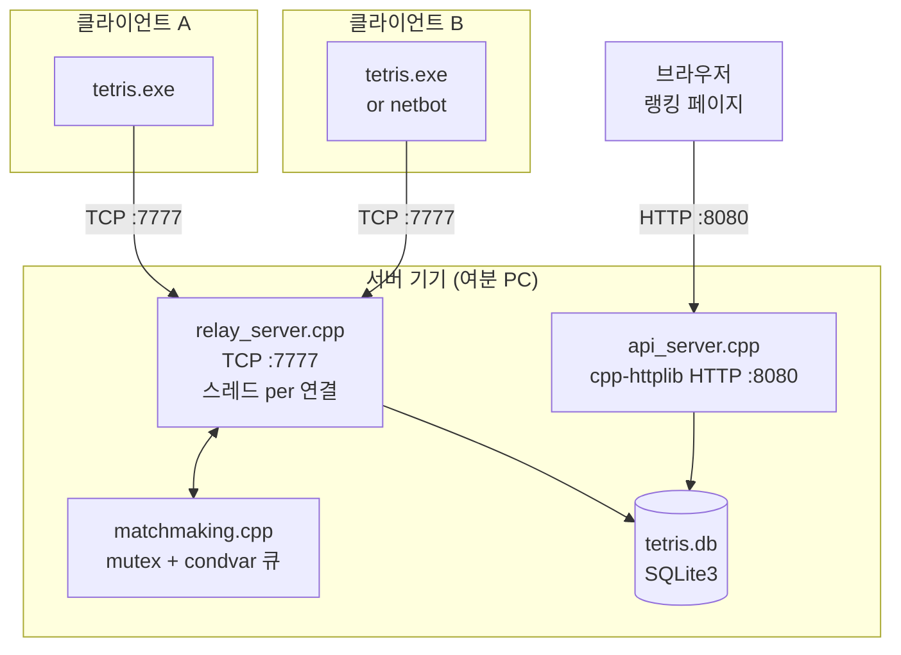

# 매치메이킹 서버 — C++ 설계 및 구현 가이드

> 이 문서는 현재 릴레이(`tetris_relay`) 사용 설명서가 아니라 장기 설계안입니다.
> 지금 구현된 범위는 익명 FIFO 큐, 5자리 커스텀 룸, READY, CHAT, 투명 바이트 릴레이까지입니다.
> ELO, SQLite, 인증, HTTP API, `tetris_server` 항목은 이 문서에서 잡아둔 다음 단계입니다.

## 현재 구현된 릴레이 프로토콜

현재 `tetris_relay` 는 DB 없는 TCP 릴레이다. 클라이언트는 첫 프레임으로
`QUEUE_JOIN`, `ROOM_CREATE`, `ROOM_JOIN` 중 하나를 보내고, 서버는 두 플레이어가
확정되는 순간 `MATCH_FOUND` 를 양쪽에 보낸 뒤 이후 바이트를 그대로 포워딩한다.

| 값 | 이름 | 방향 | 페이로드 |
|----|------|------|---------|
| 10 | `QUEUE_JOIN` | C→S | 빈 페이로드 |
| 11 | `QUEUE_CANCEL` | C→S | 빈 페이로드 |
| 12 | `MATCH_FOUND` | S→C | `[role:1][seed:8 LE]`, role 1=HOST, 2=GUEST |
| 13 | `ROOM_CREATE` | C→S | 빈 페이로드 |
| 14 | `ROOM_JOIN` | C→S | `[code_len:1][code:N]` |
| 15 | `ROOM_INFO` | S→C | `[code_len:1][code:N][status:1][peer_count:1]` |
| 16 | `ROOM_LEAVE` | C→S | 빈 페이로드 |
| 17 | `READY` | C↔S | `[ready:1]` |
| 20 | `CHAT` | C↔C | `[text_len:2 LE][utf8:N]`, 릴레이 투명 포워딩 |

아래 5장 이후의 ELO/SQLite/HTTP API 설계는 이 현재 구현 위에 얹을 다음 단계다.

> **설계 원칙**
> - 릴레이 서버 / 매치메이킹 / DB / HTTP API → **C++**  
>   (기존 `net/socket.cpp`, `net/framing.cpp` 직접 재사용)
> - RL 학습 루프 → **Python only** (PyTorch 생태계)

---

## 목차

1. [전체 아키텍처](#1-전체-아키텍처)
2. [학습 로드맵](#2-학습-로드맵)
3. [프로토콜 확장](#3-프로토콜-확장)
4. [디렉터리 구조](#4-디렉터리-구조)
5. [모듈별 구현](#5-모듈별-구현)
   - [elo.h — ELO 계산](#51-eloh--elo-계산)
   - [database.h/cpp — SQLite 래퍼](#52-databasehcpp--sqlite-래퍼)
   - [matchmaking.h/cpp — 매치메이킹 큐](#53-matchmakinghcpp--매치메이킹-큐)
   - [relay_server.h/cpp — TCP 릴레이 서버](#54-relay_serverhcpp--tcp-릴레이-서버)
   - [api_server.h/cpp — HTTP REST API](#55-api_serverhcpp--http-rest-api)
   - [server/main.cpp — 진입점](#56-servermain-진입점)
6. [프로토콜 확장 (framing.h)](#6-프로토콜-확장-framingh)
7. [CMakeLists.txt 확장](#7-cmakeliststxt-확장)
8. [실행 방법](#8-실행-방법)
9. [단계별 검증 체크리스트](#9-단계별-검증-체크리스트)
10. [DB 스키마](#10-db-스키마)

---

## 1. 전체 아키텍처



### 재사용하는 기존 코드

```
net/socket.cpp   → tcp_listen / tcp_accept / tcp_recv_some / tcp_send_all
net/framing.cpp  → parse_frames / build_frame / MsgType
```

서버는 이 두 파일 위에서 동작합니다. 네트워크 코드를 새로 짤 필요가 없습니다.

### 연결 수명주기

```
main thread          accept loop
                         |
             TCP accept → spawn connection thread
                         |
             connection thread:
               1. REGISTER / QUEUE_JOIN 수신 → 인증
               2. Matchmaker::join() 대기 (condvar)
               3. MATCH_FOUND 전송
               4. relay_loop(conn_A, conn_B) 시작
                    └─ thread A: A→B 포워딩
                    └─ thread B: B→A 포워딩  (join 대기)
               5. 결과 DB 저장 → MATCH_RESULT 전송
```

---

## 2. 학습 로드맵

| 주차 | 작업 | 배우는 핵심 개념 |
|------|------|-----------------|
| 1주 | TCP accept loop + 스레드 per 연결 | `std::thread`, 소켓 서버 패턴 재사용 |
| 2주 | 매치메이킹 큐 | `std::mutex`, `std::condition_variable` |
| 3주 | SQLite3 래퍼 | C API 래핑, prepared statement, 트랜잭션 |
| 4주 | ELO + 결과 저장 | 알고리즘, DB 쓰기 |
| 5주 | HTTP API (cpp-httplib) | 헤더 온리 라이브러리, REST, JSON 수동 직렬화 |

---

## 3. 프로토콜 확장

기존 프레임 포맷(`[LEN:2][TYPE:1][PAYLOAD][CHK:4]`) 그대로.  
`net/framing.h`의 `MsgType` enum에 10~15 추가.

| 값 | 이름 | 방향 | 페이로드 |
|----|------|------|---------|
| 10 | `QUEUE_JOIN` | C→S | `[un_len:1][username:N][tk_len:1][token:N]` |
| 11 | `QUEUE_STATUS` | S→C | `[position:2][elo:4 LE]` |
| 12 | `MATCH_FOUND` | S→C | `[role:1][match_id:4 LE][op_len:1][opponent:N][elo:4 LE]` |
| 13 | `REGISTER` | C→S | `[un_len:1][username:N]` |
| 14 | `AUTH_REPLY` | S→C | 성공: `[1][tk_len:1][token:N][elo:4 LE]` / 실패: `[0][reason_len:1][reason:N]` |
| 15 | `MATCH_RESULT` | S→C | `[won:1][elo_before:4 LE][elo_after:4 LE][delta:4 LE]` |

---

## 4. 디렉터리 구조

```
server/
    main.cpp             ← 진입점
    relay_server.h/cpp   ← TCP accept loop + 연결 스레드
    matchmaking.h/cpp    ← 매치메이킹 큐
    database.h/cpp       ← SQLite3 래퍼
    elo.h                ← ELO 계산 (인라인)
    api_server.h/cpp     ← HTTP REST (cpp-httplib)
    protocol.h           ← 서버 전용 페이로드 헬퍼

third_party/
    httplib.h            ← cpp-httplib (헤더 온리, 한 파일)
    sqlite3.h / sqlite3.c ← SQLite3 (amalgamation, 두 파일)
```

`sqlite3` 와 `httplib` 모두 파일 1~2개짜리 라이브러리입니다.  
CMake에 서브모듈이나 패키지 없이 그냥 복사해서 씁니다.

---

## 5. 모듈별 구현

### 5.1 `elo.h` — ELO 계산

> **배우는 것**: 순수 함수, 확률 모델, `<cmath>`

```cpp
// server/elo.h
#pragma once
#include <cmath>
#include <algorithm>

namespace elo {

inline int k_factor(int rating) {
    if (rating < 1200) return 32;
    if (rating < 1800) return 24;
    return 16;
}

inline double expected(int ra, int rb) {
    return 1.0 / (1.0 + std::pow(10.0, (rb - ra) / 400.0));
}

// 반환: {new_winner_elo, new_loser_elo}
inline std::pair<int,int> update(int winner_elo, int loser_elo) {
    double e_win = expected(winner_elo, loser_elo);
    double e_los = expected(loser_elo, winner_elo);

    int new_winner = winner_elo + static_cast<int>(std::round(
        k_factor(winner_elo) * (1.0 - e_win)));
    int new_loser  = loser_elo  + static_cast<int>(std::round(
        k_factor(loser_elo)  * (0.0 - e_los)));

    return { std::max(100, new_winner),
             std::max(100, new_loser) };
}

} // namespace elo
```

---

### 5.2 `database.h/cpp` — SQLite3 래퍼

> **배우는 것**: C API 래핑, RAII, prepared statement, 트랜잭션

```cpp
// server/database.h
#pragma once
#include <string>
#include <vector>
#include <optional>
#include "../third_party/sqlite3.h"

struct Player {
    int         id;
    std::string username;
    std::string token;
    int         elo;
    int         wins;
    int         losses;
};

struct Match {
    int id;
    int player_a, player_b;
    int winner;        // 0 = 중단
    int score_a, score_b;
    int lines_a, lines_b;
    int duration_s;
};

struct LeaderboardRow {
    std::string username;
    int elo, wins, losses;
    double win_pct;
};

class Database {
public:
    explicit Database(const std::string& path);
    ~Database();

    // 플레이어
    std::optional<Player> registerPlayer(const std::string& username,
                                          const std::string& token);
    std::optional<Player> getByToken(const std::string& token);
    std::optional<Player> getByUsername(const std::string& username);

    // 게임 결과
    int saveMatch(const Match& m);   // 반환: match_id, ELO 자동 갱신

    // 조회
    std::vector<LeaderboardRow> leaderboard(int limit = 20);

private:
    sqlite3* db_ = nullptr;

    void execSchema();
    void applyElo(int winner_id, int loser_id, int match_id);

    // RAII 준비된 문장 헬퍼
    sqlite3_stmt* prepare(const char* sql);
};
```

```cpp
// server/database.cpp
#include "database.h"
#include "elo.h"
#include "../third_party/sqlite3.h"
#include <ctime>
#include <stdexcept>

static const char* kSchema = R"sql(
PRAGMA journal_mode = WAL;
PRAGMA foreign_keys = ON;

CREATE TABLE IF NOT EXISTS players (
    id       INTEGER PRIMARY KEY AUTOINCREMENT,
    username TEXT    UNIQUE NOT NULL,
    token    TEXT    UNIQUE NOT NULL,
    elo      INTEGER NOT NULL DEFAULT 1200,
    wins     INTEGER NOT NULL DEFAULT 0,
    losses   INTEGER NOT NULL DEFAULT 0,
    created  INTEGER NOT NULL
);

CREATE TABLE IF NOT EXISTS matches (
    id         INTEGER PRIMARY KEY AUTOINCREMENT,
    player_a   INTEGER NOT NULL REFERENCES players(id),
    player_b   INTEGER NOT NULL REFERENCES players(id),
    winner     INTEGER          REFERENCES players(id),
    score_a    INTEGER, score_b INTEGER,
    lines_a    INTEGER, lines_b INTEGER,
    duration_s INTEGER,
    played_at  INTEGER NOT NULL
);

CREATE TABLE IF NOT EXISTS elo_history (
    id         INTEGER PRIMARY KEY AUTOINCREMENT,
    player_id  INTEGER NOT NULL REFERENCES players(id),
    match_id   INTEGER NOT NULL REFERENCES matches(id),
    elo_before INTEGER NOT NULL,
    elo_after  INTEGER NOT NULL,
    delta      INTEGER NOT NULL
);

CREATE INDEX IF NOT EXISTS idx_players_elo    ON players(elo DESC);
CREATE INDEX IF NOT EXISTS idx_matches_played ON matches(played_at DESC);
)sql";

Database::Database(const std::string& path) {
    if (sqlite3_open(path.c_str(), &db_) != SQLITE_OK)
        throw std::runtime_error("Cannot open DB: " + path);
    execSchema();
}

Database::~Database() {
    if (db_) sqlite3_close(db_);
}

void Database::execSchema() {
    char* err = nullptr;
    sqlite3_exec(db_, kSchema, nullptr, nullptr, &err);
    if (err) { sqlite3_free(err); }
}

sqlite3_stmt* Database::prepare(const char* sql) {
    sqlite3_stmt* stmt = nullptr;
    sqlite3_prepare_v2(db_, sql, -1, &stmt, nullptr);
    return stmt;
}

std::optional<Player> Database::registerPlayer(const std::string& username,
                                                 const std::string& token) {
    auto* stmt = prepare(
        "INSERT INTO players(username,token,created) VALUES(?,?,?)");
    sqlite3_bind_text(stmt, 1, username.c_str(), -1, SQLITE_TRANSIENT);
    sqlite3_bind_text(stmt, 2, token.c_str(),    -1, SQLITE_TRANSIENT);
    sqlite3_bind_int64(stmt, 3, static_cast<int64_t>(std::time(nullptr)));

    int rc = sqlite3_step(stmt);
    sqlite3_finalize(stmt);

    if (rc != SQLITE_DONE) return std::nullopt;  // username 중복 등
    return Player{ static_cast<int>(sqlite3_last_insert_rowid(db_)),
                   username, token, 1200, 0, 0 };
}

std::optional<Player> Database::getByToken(const std::string& token) {
    auto* stmt = prepare(
        "SELECT id,username,token,elo,wins,losses FROM players WHERE token=?");
    sqlite3_bind_text(stmt, 1, token.c_str(), -1, SQLITE_TRANSIENT);

    std::optional<Player> result;
    if (sqlite3_step(stmt) == SQLITE_ROW) {
        result = Player{
            sqlite3_column_int (stmt, 0),
            reinterpret_cast<const char*>(sqlite3_column_text(stmt, 1)),
            reinterpret_cast<const char*>(sqlite3_column_text(stmt, 2)),
            sqlite3_column_int (stmt, 3),
            sqlite3_column_int (stmt, 4),
            sqlite3_column_int (stmt, 5),
        };
    }
    sqlite3_finalize(stmt);
    return result;
}

std::optional<Player> Database::getByUsername(const std::string& username) {
    auto* stmt = prepare(
        "SELECT id,username,token,elo,wins,losses FROM players WHERE username=?");
    sqlite3_bind_text(stmt, 1, username.c_str(), -1, SQLITE_TRANSIENT);

    std::optional<Player> result;
    if (sqlite3_step(stmt) == SQLITE_ROW) {
        result = Player{
            sqlite3_column_int (stmt, 0),
            reinterpret_cast<const char*>(sqlite3_column_text(stmt, 1)),
            reinterpret_cast<const char*>(sqlite3_column_text(stmt, 2)),
            sqlite3_column_int (stmt, 3),
            sqlite3_column_int (stmt, 4),
            sqlite3_column_int (stmt, 5),
        };
    }
    sqlite3_finalize(stmt);
    return result;
}

int Database::saveMatch(const Match& m) {
    auto* stmt = prepare(
        "INSERT INTO matches"
        "(player_a,player_b,winner,score_a,score_b,"
        " lines_a,lines_b,duration_s,played_at)"
        " VALUES(?,?,?,?,?,?,?,?,?)");
    sqlite3_bind_int(stmt, 1, m.player_a);
    sqlite3_bind_int(stmt, 2, m.player_b);
    if (m.winner) sqlite3_bind_int(stmt, 3, m.winner);
    else          sqlite3_bind_null(stmt, 3);
    sqlite3_bind_int  (stmt, 4, m.score_a);
    sqlite3_bind_int  (stmt, 5, m.score_b);
    sqlite3_bind_int  (stmt, 6, m.lines_a);
    sqlite3_bind_int  (stmt, 7, m.lines_b);
    sqlite3_bind_int  (stmt, 8, m.duration_s);
    sqlite3_bind_int64(stmt, 9, static_cast<int64_t>(std::time(nullptr)));
    sqlite3_step(stmt);
    sqlite3_finalize(stmt);

    int match_id = static_cast<int>(sqlite3_last_insert_rowid(db_));
    if (m.winner) {
        int loser = (m.winner == m.player_a) ? m.player_b : m.player_a;
        applyElo(m.winner, loser, match_id);
    }
    return match_id;
}

void Database::applyElo(int winner_id, int loser_id, int match_id) {
    // 현재 ELO 조회
    auto getElo = [&](int pid) -> int {
        auto* s = prepare("SELECT elo FROM players WHERE id=?");
        sqlite3_bind_int(s, 1, pid);
        int e = 1200;
        if (sqlite3_step(s) == SQLITE_ROW) e = sqlite3_column_int(s, 0);
        sqlite3_finalize(s);
        return e;
    };

    int w_before = getElo(winner_id);
    int l_before = getElo(loser_id);
    auto [w_after, l_after] = elo::update(w_before, l_before);

    // 업데이트
    auto upd = [&](int pid, int new_elo, bool won) {
        auto* s = prepare(won
            ? "UPDATE players SET elo=?,wins=wins+1   WHERE id=?"
            : "UPDATE players SET elo=?,losses=losses+1 WHERE id=?");
        sqlite3_bind_int(s, 1, new_elo);
        sqlite3_bind_int(s, 2, pid);
        sqlite3_step(s);
        sqlite3_finalize(s);
    };
    upd(winner_id, w_after, true);
    upd(loser_id,  l_after, false);

    // 히스토리
    auto hist = [&](int pid, int before, int after) {
        auto* s = prepare(
            "INSERT INTO elo_history"
            "(player_id,match_id,elo_before,elo_after,delta)"
            " VALUES(?,?,?,?,?)");
        sqlite3_bind_int(s, 1, pid);
        sqlite3_bind_int(s, 2, match_id);
        sqlite3_bind_int(s, 3, before);
        sqlite3_bind_int(s, 4, after);
        sqlite3_bind_int(s, 5, after - before);
        sqlite3_step(s);
        sqlite3_finalize(s);
    };
    hist(winner_id, w_before, w_after);
    hist(loser_id,  l_before, l_after);
}

std::vector<LeaderboardRow> Database::leaderboard(int limit) {
    auto* stmt = prepare(
        "SELECT username, elo, wins, losses,"
        " CAST(wins*100.0/MAX(wins+losses,1) AS REAL) AS win_pct"
        " FROM players ORDER BY elo DESC LIMIT ?");
    sqlite3_bind_int(stmt, 1, limit);

    std::vector<LeaderboardRow> rows;
    while (sqlite3_step(stmt) == SQLITE_ROW) {
        rows.push_back({
            reinterpret_cast<const char*>(sqlite3_column_text(stmt, 0)),
            sqlite3_column_int   (stmt, 1),
            sqlite3_column_int   (stmt, 2),
            sqlite3_column_int   (stmt, 3),
            sqlite3_column_double(stmt, 4),
        });
    }
    sqlite3_finalize(stmt);
    return rows;
}
```

---

### 5.3 `matchmaking.h/cpp` — 매치메이킹 큐

> **배우는 것**: `std::mutex`, `std::condition_variable`, 스레드 간 동기화

```cpp
// server/matchmaking.h
#pragma once
#include <string>
#include <vector>
#include <mutex>
#include <condition_variable>
#include <chrono>

struct QueueEntry {
    int         player_id;
    std::string username;
    int         elo;
    std::string token;
    std::chrono::steady_clock::time_point joined_at;

    int eloTolerance() const {
        // 대기 시간 5초마다 ±100 확대, 최대 ±500
        auto secs = std::chrono::duration_cast<std::chrono::seconds>(
            std::chrono::steady_clock::now() - joined_at).count();
        return static_cast<int>(std::min(100 + (secs / 5) * 100, (long long)500));
    }
};

struct MatchResult {
    QueueEntry host;   // 먼저 대기한 쪽 → HOST 역할
    QueueEntry peer;   // 나중에 들어온 쪽 → PEER 역할
};

class Matchmaker {
public:
    // 큐에 등록하고 매칭될 때까지 블로킹 (caller 스레드 대기)
    MatchResult join(int player_id, const std::string& username,
                     int elo, const std::string& token);

    // 연결 끊긴 플레이어 제거
    void leave(int player_id);

    int queueSize() const;

private:
    mutable std::mutex              mu_;
    std::condition_variable         cv_;
    std::vector<QueueEntry>         queue_;

    // 매칭된 결과를 대기 스레드에 전달하기 위한 임시 저장소
    // player_id → MatchResult
    std::unordered_map<int, MatchResult> results_;

    QueueEntry* findOpponent(const QueueEntry& entry);
};
```

```cpp
// server/matchmaking.cpp
#include "matchmaking.h"
#include <algorithm>

MatchResult Matchmaker::join(int player_id, const std::string& username,
                              int elo, const std::string& token) {
    QueueEntry entry{ player_id, username, elo, token,
                      std::chrono::steady_clock::now() };

    {
        std::lock_guard<std::mutex> lk(mu_);

        // 기존 큐에서 상대 탐색
        QueueEntry* opp = findOpponent(entry);
        if (opp) {
            MatchResult r{ *opp, entry };
            // 대기 중인 상대 스레드에 결과 전달
            results_[opp->player_id] = r;
            queue_.erase(std::remove_if(queue_.begin(), queue_.end(),
                [&](const QueueEntry& e){ return e.player_id == opp->player_id; }),
                queue_.end());
            cv_.notify_all();
            return r;
        }
        queue_.push_back(entry);
    }

    // 상대가 없으면 condition_variable로 대기
    std::unique_lock<std::mutex> lk(mu_);
    cv_.wait(lk, [&]{
        return results_.count(player_id) > 0;
    });
    MatchResult r = results_[player_id];
    results_.erase(player_id);
    return r;
}

void Matchmaker::leave(int player_id) {
    std::lock_guard<std::mutex> lk(mu_);
    queue_.erase(std::remove_if(queue_.begin(), queue_.end(),
        [&](const QueueEntry& e){ return e.player_id == player_id; }),
        queue_.end());
    // 대기 중이던 스레드가 있으면 깨워서 종료하게 함
    cv_.notify_all();
}

int Matchmaker::queueSize() const {
    std::lock_guard<std::mutex> lk(mu_);
    return static_cast<int>(queue_.size());
}

QueueEntry* Matchmaker::findOpponent(const QueueEntry& entry) {
    QueueEntry* best = nullptr;
    for (auto& candidate : queue_) {
        if (std::abs(candidate.elo - entry.elo) <= entry.eloTolerance()) {
            if (!best || candidate.joined_at < best->joined_at)
                best = &candidate;
        }
    }
    return best;
}
```

---

### 5.4 `relay_server.h/cpp` — TCP 릴레이 서버

> **배우는 것**: accept 루프, 스레드 per 연결, 양방향 포워딩

```cpp
// server/relay_server.h
#pragma once
#include <string>
#include <memory>
#include "database.h"
#include "matchmaking.h"

class RelayServer {
public:
    RelayServer(uint16_t port, std::shared_ptr<Database> db);
    void run();   // 블로킹 — 종료할 때까지 반환 안 함

private:
    uint16_t                    port_;
    std::shared_ptr<Database>   db_;
    Matchmaker                  mm_;

    void handleConnection(int sock_fd);
    bool phaseAuth    (int fd, std::string& out_username,
                       std::string& out_token, int& out_elo, int& out_pid);
    bool phaseQueue   (int fd, int pid, const std::string& username,
                       int elo, const std::string& token,
                       MatchResult& out_match);
    void phaseGame    (int fd_a, int fd_b,
                       int pid_a, int pid_b,
                       int elo_a, int elo_b,
                       const std::string& tok_a, const std::string& tok_b);
    void forwardLoop  (int src_fd, int dst_fd,
                       int& out_score, bool& out_game_over);
};
```

```cpp
// server/relay_server.cpp
#include "relay_server.h"
#include "protocol.h"
#include "../net/socket.h"
#include "../net/framing.h"
#include <thread>
#include <iostream>
#include <atomic>

// 소켓 fd를 TcpSocket처럼 다루기 위한 간단한 래퍼
// (기존 net/socket.cpp의 tcp_recv_some / tcp_send_all 재사용)
#include "../net/socket.h"

RelayServer::RelayServer(uint16_t port, std::shared_ptr<Database> db)
    : port_(port), db_(std::move(db)) {}

void RelayServer::run() {
    // tcp_listen은 기존 net/socket.cpp 함수
    TcpSocket listen_sock = tcp_listen(port_, 16);
    if (!listen_sock.valid()) {
        std::cerr << "[SERVER] Failed to listen on port " << port_ << "\n";
        return;
    }
    std::cout << "[SERVER] Listening on :" << port_ << "\n";

    while (true) {
        TcpSocket client = tcp_accept(listen_sock);
        if (!client.valid()) continue;

        // 소켓 fd를 스레드에 전달 (소유권 이전)
        int fd = client.release();   // TcpSocket에 release() 추가 필요
        std::thread([this, fd]{ handleConnection(fd); }).detach();
    }
}

void RelayServer::handleConnection(int fd) {
    std::string username, token;
    int elo = 1200, pid = 0;

    if (!phaseAuth(fd, username, token, elo, pid)) {
        ::close(fd);
        return;
    }

    MatchResult match;
    if (!phaseQueue(fd, pid, username, elo, token, match)) {
        mm_.leave(pid);
        ::close(fd);
        return;
    }

    // HOST 역할인 연결이 두 소켓을 연결해 게임을 시작
    // (PEER 역할의 fd는 MatchResult를 통해 HOST 스레드에서 가져옴)
    // 이 부분은 아래 phaseGame에서 처리
}

bool RelayServer::phaseAuth(int fd, std::string& out_username,
                             std::string& out_token, int& out_elo,
                             int& out_pid) {
    std::vector<uint8_t> buf;
    while (true) {
        if (!tcp_recv_some_fd(fd, buf)) return false;
        std::vector<net::Frame> frames;
        net::parse_frames(buf, frames);
        for (auto& f : frames) {
            if (f.type == net::MsgType::REGISTER) {
                std::string uname = proto::decode_string(f.payload, 0);
                if (db_->getByUsername(uname)) {
                    send_frame(fd, net::MsgType::AUTH_REPLY,
                               proto::auth_fail("username taken"));
                    return false;
                }
                std::string tok = proto::generate_token();
                auto p = db_->registerPlayer(uname, tok);
                if (!p) return false;
                out_username = uname;
                out_token    = tok;
                out_elo      = 1200;
                out_pid      = p->id;
                send_frame(fd, net::MsgType::AUTH_REPLY,
                           proto::auth_ok(tok, 1200));
                std::cout << "[REG] " << uname << "\n";
                return true;
            }
            else if (f.type == net::MsgType::QUEUE_JOIN) {
                auto [uname, tok] = proto::decode_queue_join(f.payload);
                auto p = db_->getByToken(tok);
                if (!p) {
                    send_frame(fd, net::MsgType::AUTH_REPLY,
                               proto::auth_fail("invalid token"));
                    return false;
                }
                out_username = p->username;
                out_token    = tok;
                out_elo      = p->elo;
                out_pid      = p->id;
                send_frame(fd, net::MsgType::AUTH_REPLY,
                           proto::auth_ok(tok, p->elo));
                return true;
            }
        }
    }
}

bool RelayServer::phaseQueue(int fd, int pid,
                              const std::string& username, int elo,
                              const std::string& token,
                              MatchResult& out_match) {
    std::cout << "[QUEUE] " << username
              << " (ELO=" << elo << ") queue=" << mm_.queueSize()+1 << "\n";

    // QUEUE_STATUS 전송
    send_frame(fd, net::MsgType::QUEUE_STATUS,
               proto::queue_status(mm_.queueSize() + 1, elo));

    // 블로킹 대기 — 상대가 들어오면 반환
    out_match = mm_.join(pid, username, elo, token);
    return true;
}

// phaseGame, forwardLoop는 두 연결이 모두 준비된 후 호출
// (HOST 스레드에서 두 fd를 양방향으로 연결)
void RelayServer::phaseGame(int fd_a, int fd_b,
                             int pid_a, int pid_b,
                             int elo_a, int elo_b,
                             const std::string& tok_a,
                             const std::string& tok_b) {
    auto start = std::chrono::steady_clock::now();
    int score_a = 0, score_b = 0;
    bool over_a = false, over_b = false;

    // 양방향 포워딩을 두 스레드로 동시 실행
    std::thread t1([&]{ forwardLoop(fd_a, fd_b, score_a, over_a); });
    std::thread t2([&]{ forwardLoop(fd_b, fd_a, score_b, over_b); });
    t1.join();
    t2.join();

    int duration = static_cast<int>(std::chrono::duration_cast<
        std::chrono::seconds>(
        std::chrono::steady_clock::now() - start).count());

    int winner_id = (score_a >= score_b) ? pid_a : pid_b;
    int match_id  = db_->saveMatch({
        0, pid_a, pid_b, winner_id,
        score_a, score_b, 0, 0, duration
    });

    // ELO 변동 전송
    auto send_result = [&](int fd, const std::string& tok, bool won,
                            int elo_before) {
        auto p = db_->getByToken(tok);
        if (!p) return;
        int delta = p->elo - elo_before;
        send_frame(fd, net::MsgType::MATCH_RESULT,
                   proto::match_result(won, elo_before, p->elo, delta));
    };
    send_result(fd_a, tok_a, winner_id == pid_a, elo_a);
    send_result(fd_b, tok_b, winner_id == pid_b, elo_b);

    std::cout << "[RESULT] match=" << match_id
              << " winner=" << (winner_id == pid_a ? "A" : "B")
              << " duration=" << duration << "s\n";
}

void RelayServer::forwardLoop(int src_fd, int dst_fd,
                               int& out_score, bool& out_game_over) {
    std::vector<uint8_t> buf;
    while (true) {
        if (!tcp_recv_some_fd(src_fd, buf)) break;
        std::vector<net::Frame> frames;
        net::parse_frames(buf, frames);
        for (auto& f : frames) {
            if (f.type == net::MsgType::GAME_OVER_CHOICE)
                out_game_over = true;
            // 투명하게 포워딩
            auto raw = net::build_frame(f.type, f.payload);
            tcp_send_all_fd(dst_fd, raw.data(), raw.size());
        }
        if (out_game_over) break;
    }
}
```

---

### 5.5 `api_server.h/cpp` — HTTP REST API

> **배우는 것**: 헤더 온리 라이브러리 사용, REST, JSON 수동 직렬화

```cpp
// server/api_server.h
#pragma once
#include <memory>
#include "database.h"

class ApiServer {
public:
    ApiServer(uint16_t port, std::shared_ptr<Database> db);
    void runInThread();   // 별도 스레드로 HTTP 서버 실행

private:
    uint16_t                  port_;
    std::shared_ptr<Database> db_;
};
```

```cpp
// server/api_server.cpp
#include "api_server.h"
#include "../third_party/httplib.h"
#include <thread>
#include <sstream>

// JSON 직렬화 — 외부 라이브러리 없이 수동 구현 (학습용)
static std::string leaderboard_to_json(
    const std::vector<LeaderboardRow>& rows)
{
    std::ostringstream ss;
    ss << "[";
    for (size_t i = 0; i < rows.size(); ++i) {
        const auto& r = rows[i];
        ss << "{"
           << "\"rank\":"     << (i+1)       << ","
           << "\"username\":\"" << r.username << "\","
           << "\"elo\":"      << r.elo        << ","
           << "\"wins\":"     << r.wins       << ","
           << "\"losses\":"   << r.losses     << ","
           << "\"win_pct\":"  << r.win_pct
           << "}";
        if (i + 1 < rows.size()) ss << ",";
    }
    ss << "]";
    return ss.str();
}

ApiServer::ApiServer(uint16_t port, std::shared_ptr<Database> db)
    : port_(port), db_(std::move(db)) {}

void ApiServer::runInThread() {
    std::thread([this] {
        httplib::Server svr;

        // CORS 헤더를 모든 응답에 추가
        svr.set_default_headers({
            {"Access-Control-Allow-Origin", "*"}
        });

        // GET /api/leaderboard
        svr.Get("/api/leaderboard", [this](const httplib::Request&,
                                            httplib::Response& res) {
            auto rows = db_->leaderboard(20);
            res.set_content(leaderboard_to_json(rows), "application/json");
        });

        // GET /api/player/:username
        svr.Get("/api/player/:username", [this](const httplib::Request& req,
                                                  httplib::Response& res) {
            auto p = db_->getByUsername(req.path_params.at("username"));
            if (!p) { res.status = 404; return; }

            std::ostringstream ss;
            ss << "{"
               << "\"username\":\"" << p->username << "\","
               << "\"elo\":"        << p->elo       << ","
               << "\"wins\":"       << p->wins      << ","
               << "\"losses\":"     << p->losses
               << "}";
            res.set_content(ss.str(), "application/json");
        });

        std::cout << "[API] HTTP on :" << port_ << "\n";
        svr.listen("0.0.0.0", port_);
    }).detach();
}
```

---

### 5.6 `server/main` 진입점

```cpp
// server/main.cpp
#include <iostream>
#include <memory>
#include "relay_server.h"
#include "api_server.h"
#include "database.h"

int main(int argc, char* argv[]) {
    uint16_t relay_port = 7777;
    uint16_t api_port   = 8080;

    if (argc >= 2) relay_port = static_cast<uint16_t>(std::stoi(argv[1]));
    if (argc >= 3) api_port   = static_cast<uint16_t>(std::stoi(argv[2]));

    auto db = std::make_shared<Database>("server/tetris.db");

    ApiServer   api(api_port, db);
    RelayServer relay(relay_port, db);

    api.runInThread();   // HTTP는 별도 스레드
    relay.run();         // TCP는 메인 스레드 (블로킹)

    return 0;
}
```

---

## 6. 프로토콜 확장 (`framing.h`)

`net/framing.h`의 enum에 값 추가만:

```cpp
enum class MsgType : uint8_t {
    HELLO            = 1,
    HELLO_ACK        = 2,
    SEED             = 3,
    INPUT            = 4,
    ACK              = 5,
    PING             = 6,
    PONG             = 7,
    HASH             = 8,
    GAME_OVER_CHOICE = 9,
    // ── 서버 전용 ────────────────────
    QUEUE_JOIN       = 10,
    QUEUE_STATUS     = 11,
    MATCH_FOUND      = 12,
    REGISTER         = 13,
    AUTH_REPLY       = 14,
    MATCH_RESULT     = 15,
};
```

---

## 7. `CMakeLists.txt` 확장

```cmake
option(TETRIS_BUILD_SERVER "Build relay+matchmaking server" OFF)

if (TETRIS_BUILD_SERVER)
    add_executable(tetris_server
        server/main.cpp
        server/relay_server.cpp
        server/matchmaking.cpp
        server/database.cpp
        server/api_server.cpp
        third_party/sqlite3.c       # SQLite amalgamation
        net/socket.cpp
        net/framing.cpp
    )
    target_include_directories(tetris_server PRIVATE
        ${CMAKE_CURRENT_SOURCE_DIR}
        ${CMAKE_CURRENT_SOURCE_DIR}/third_party
    )
    if (WIN32)
        target_link_libraries(tetris_server PRIVATE ws2_32)
    else()
        find_package(Threads REQUIRED)
        target_link_libraries(tetris_server PRIVATE
            ${CMAKE_THREAD_LIBS_INIT} dl)
    endif()
endif()
```

빌드:
```bash
cmake -S . -B build -DTETRIS_BUILD_SERVER=ON -DTETRIS_BUILD_GAME=OFF
cmake --build build --target tetris_server
```

---

## 8. 실행 방법

### 서드파티 파일 준비 (한 번만)

```bash
# SQLite amalgamation (sqlite3.h + sqlite3.c, 두 파일)
# https://www.sqlite.org/download.html → sqlite-amalgamation-*.zip

# cpp-httplib (httplib.h, 한 파일)
# https://github.com/yhirose/cpp-httplib → single_include/httplib.h

mkdir third_party
# 두 파일을 third_party/ 에 복사
```

### 서버 실행

```bash
build/tetris_server 7777 8080
# [SERVER] Listening on :7777
# [API]    HTTP on :8080
```

### 클라이언트 접속

```bash
# 최초 등록
tetris.exe --matchmaker 서버IP:7777 --register MyName

# 매칭 (token이 ~/.tetris_token에 저장된 후)
tetris.exe --matchmaker 서버IP:7777
```

### 랭킹 확인

```bash
curl http://서버IP:8080/api/leaderboard
# [{"rank":1,"username":"Alice","elo":1487,...}, ...]
```

---

## 9. 단계별 검증 체크리스트

| 주차 | 확인 항목 |
|------|----------|
| 1주 | `tetris_server` 빌드 성공, 포트 리스닝 확인, 두 `telnet` 연결 로그 출력 |
| 2주 | 두 클라이언트 QUEUE_JOIN → 양쪽 MATCH_FOUND 수신, role=1/2 확인 |
| 3주 | 게임 완료 후 `tetris.db` 생성, `matches` / `elo_history` 테이블에 행 삽입 |
| 4주 | `curl /api/leaderboard` → ELO 내림차순 JSON 반환 |
| 5주 | `tetris.exe` (사람) vs `netbot` (봇) 매칭 → 한 판 완주, DB 기록 확인 |

---

## 10. DB 스키마

```sql
PRAGMA journal_mode = WAL;
PRAGMA foreign_keys = ON;

CREATE TABLE IF NOT EXISTS players (
    id       INTEGER PRIMARY KEY AUTOINCREMENT,
    username TEXT    UNIQUE NOT NULL,
    token    TEXT    UNIQUE NOT NULL,
    elo      INTEGER NOT NULL DEFAULT 1200,
    wins     INTEGER NOT NULL DEFAULT 0,
    losses   INTEGER NOT NULL DEFAULT 0,
    created  INTEGER NOT NULL
);

CREATE TABLE IF NOT EXISTS matches (
    id         INTEGER PRIMARY KEY AUTOINCREMENT,
    player_a   INTEGER NOT NULL REFERENCES players(id),
    player_b   INTEGER NOT NULL REFERENCES players(id),
    winner     INTEGER          REFERENCES players(id),
    score_a    INTEGER, score_b INTEGER,
    lines_a    INTEGER, lines_b INTEGER,
    duration_s INTEGER,
    played_at  INTEGER NOT NULL
);

CREATE TABLE IF NOT EXISTS elo_history (
    id         INTEGER PRIMARY KEY AUTOINCREMENT,
    player_id  INTEGER NOT NULL REFERENCES players(id),
    match_id   INTEGER NOT NULL REFERENCES matches(id),
    elo_before INTEGER NOT NULL,
    elo_after  INTEGER NOT NULL,
    delta      INTEGER NOT NULL
);

CREATE INDEX IF NOT EXISTS idx_players_elo    ON players(elo DESC);
CREATE INDEX IF NOT EXISTS idx_matches_played ON matches(played_at DESC);
CREATE INDEX IF NOT EXISTS idx_elo_pid        ON elo_history(player_id);
```

---

## 언어 분리 요약

```
C++ (이 문서의 전체 범위)
├── tetris.exe          게임 + OpenGL UI
├── tetris_server.exe   릴레이 + 매치메이킹 + DB + HTTP API
└── sim_hash_dump.exe   결정론 테스트

Python (RL 학습만)
├── Colab: train.ipynb  PyTorch 학습 루프
└── netbot/client.py    학습된 모델 → 게임 접속
```
