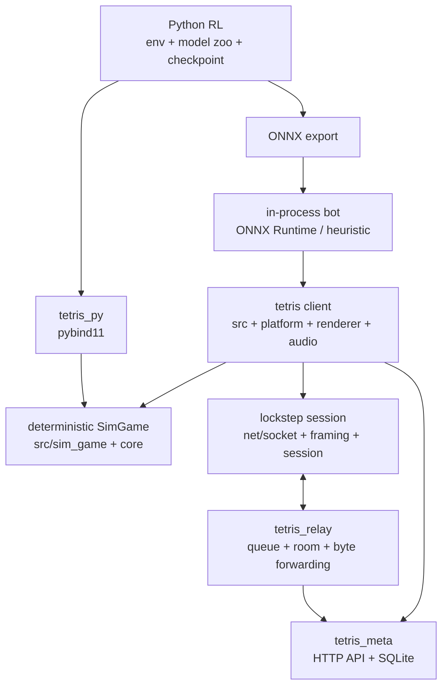

# Tetris Multiplayer RL

결정론적 lockstep 네트워킹을 기반으로 만든 멀티플레이어 테트리스입니다.
C++17과 CMake를 사용하며, raylib/OpenGL 없이 직접 구현한 CPU 2D
소프트웨어 렌더러를 Win32 또는 SDL2 창에 표시합니다.

이 저장소에는 게임 클라이언트, 릴레이/룸 서버, HTTP+SQLite 메타 서버,
결정론 회귀 테스트, Python 시뮬레이션 바인딩, RL 학습용 환경/모델/export
코드, 선택형 ONNX Runtime 봇 추론 코드가 포함되어 있습니다.

## 현재 상태

- Windows 기본 빌드는 Handmade Win32 + GDI 표시 + XAudio2 경로입니다.
- macOS/Linux 기본 빌드는 SDL2 surface 표시 경로입니다.
- `tetris`, `sim_hash_dump`, `tetris_relay`, `tetris_meta`는 CMake 타깃으로 분리되어 있습니다.
- `Single vs Bot`에는 내장 휴리스틱 봇이 항상 표시됩니다. 학습 모델 봇은 `TETRIS_BUILD_BOT=ON`, ONNX Runtime, `model/*.onnx` 또는 `model/bots/*.onnx`가 있을 때 선택할 수 있습니다.
- Python 쪽은 Colab 부트스트랩, Gymnasium 환경,
  PPO/DQN/DDQN/CBMPI/REINFORCE/A2C/n-step AC/CEM/MuZero-style 학습 루프,
  정책 모델, 체크포인트, ONNX export까지 있습니다.
- 학습된 봇 모델은 기본 포함물이 아닙니다. 긴 학습은 Colab에서 수행하고, 로컬에서는 빌드/검증과 export된 모델 실행만 전제로 합니다.
- 대전/가비지까지 포함한 경쟁형 RL 환경(`python/common/env_versus.py`)은 구현되어 있습니다. CMA-ES 등 진화 전략 계열 탐색기는 아직 확장 대상입니다.

## 아키텍처



`SimGame`이 게임 규칙의 단일 기준이며 렌더링, 오디오, 네트워크와 분리됩니다.
클라이언트의 두 보드는 같은 seed와 tick별 입력을 적용하고, `Session`은 안전하게
진행할 수 있는 tick까지만 시뮬레이션합니다. Relay는 큐·룸과 패킷 전달을 담당하고,
Meta는 guest token, RP/XP/BP, 아이콘과 경기 기록을 SQLite에 저장합니다. Python은
동일한 `SimGame`을 pybind11로 사용해 학습하고 ONNX 모델을 클라이언트에 배포합니다.

| 영역 | 주요 경로 | 책임 |
|---|---|---|
| 결정론 코어 | `src/sim_game.*`, `src/sim_grid.h`, `core/` | 규칙, 입력, RNG, 상태 해시 |
| 클라이언트 | `src/main.cpp`, `src/game.*` | 화면 상태, fixed-step 루프, 게임 조립 |
| 플랫폼·표현 | `platform/`, `renderer/`, `audio/` | CPU ARGB32 렌더러, Win32/SDL2 표시, 오디오 |
| 네트워크 | `net/` | TCP 소켓, framing, lockstep session |
| 온라인 서버 | `server/`, `meta/` | relay/room, 인증, 랭킹과 영속화 |
| RL·봇 | `bindings/`, `python/`, `bot/` | Python 환경, 학습, ONNX 추론 |

RL 학습은 [`python/train/README_colab.md`](python/train/README_colab.md), 봇 모델
배치는 [`model/bots/README.md`](model/bots/README.md)를 참고합니다.

## 빠른 시작

### Windows

```powershell
cmake -S . -B build
cmake --build build --config Release
.\build\Release\tetris.exe
```

릴리스 번들은 다음 스크립트로 만듭니다.

```powershell
.\scripts\release_win.ps1
```

산출물은 `dist\tetris-win-x64.zip`에 생성됩니다. 학습 모델 봇 포함 빌드는
ONNX Runtime과 `model/bots/*.onnx`가 준비된 뒤 실행합니다.

```powershell
.\scripts\release_win.ps1 -Bot
```

### Linux / macOS

Linux에서는 SDL2 개발 패키지가 필요합니다. OpenGL 개발 패키지는 필요하지 않습니다.

```bash
# Ubuntu/Debian 예시
sudo apt install build-essential cmake libsdl2-dev
```

```bash
cmake -S . -B build -DCMAKE_BUILD_TYPE=Release
cmake --build build -j
./build/tetris
```

루트 `Makefile`은 CMake wrapper입니다.

```bash
make
make release-linux
```

## 주요 CMake 옵션

| 옵션 | 기본값 | 결과 | 설명 |
|---|---:|---|---|
| `TETRIS_BUILD_GAME` | ON | `tetris` | 게임 클라이언트 |
| `TETRIS_BUILD_TEST` | ON | `sim_hash_dump`, `worker_group_test` | 결정론 해시와 relay worker 수명 회귀 테스트 |
| `TETRIS_BUILD_RELAY` | OFF | `tetris_relay` | TCP 릴레이/룸/매치메이킹 서버 |
| `TETRIS_BUILD_META` | OFF | `tetris_meta` | HTTP+SQLite guest/랭킹/리더보드 서버 |
| `TETRIS_BUILD_PY` | OFF | `tetris_py` | pybind11 기반 Python 시뮬레이션 모듈 |
| `TETRIS_BUILD_BOT` | OFF | `tetris` 내부 | ONNX Runtime 기반 로컬 봇 추론 |
| `TETRIS_USE_SDL2` | Windows OFF, 그 외 ON | 백엔드 선택 | SDL2 창/입력/오디오 백엔드 사용 |
| `TETRIS_ENABLE_HTTPS` | ON | `tetris`, `tetris_relay` | OpenSSL이 있으면 `https://` meta URL 지원 |
| `TETRIS_ENABLE_DEBUG_UI` | OFF | `tetris` | 개발용 NET HUD / 해시 덤프 핫키 활성화 |
| `TETRIS_ENABLE_NET_TRACE` | OFF | `tetris` | 클라이언트 net/session 상세 trace 로그 활성화 |
| `TETRIS_DEFAULT_RELAY_ENDPOINT` | `127.0.0.1:7777` | `tetris` | 메뉴 Matchmaking/Custom Room 기본 릴레이 |
| `TETRIS_DEFAULT_META_URL` | empty | `tetris` | 기본 랭킹 API URL |

서버까지 함께 빌드하려면 다음처럼 구성합니다.

```bash
cmake -S . -B build -DTETRIS_BUILD_RELAY=ON -DTETRIS_BUILD_META=ON
cmake --build build --config Release
```

Visual Studio 같은 multi-config generator에서는 `--config Release`를 사용하고,
Linux/macOS Makefile 또는 Ninja에서는 `-DCMAKE_BUILD_TYPE=Release`를 사용합니다.

## 멀티플레이 실행

직접 호스트/접속:

```bash
./tetris --host 7777
./tetris --connect 192.168.1.100:7777
```

릴레이 랜덤 매칭:

```bash
./tetris --queue relay.example.com:7777
```

커스텀 룸:

```bash
./tetris --relay relay.example.com:7777
```

클라이언트 CLI 옵션:

| 옵션 | 용도 |
|---|---|
| `--host <port>` | 직접 접속용 호스트로 대기 |
| `--connect <host[:port]>` | 직접 호스트에 접속 |
| `--queue <host[:port]>` | 릴레이 랜덤 큐에 즉시 참가 |
| `--relay <host[:port]>` | 메뉴의 Matchmaking/Custom Room에서 사용할 릴레이 주소 지정 |
| `--meta <http(s)://host[:port]>` | 랭킹(RP/레벨/BP)·리더보드용 `tetris_meta` URL |

`--relay`는 환경변수 `TETRIS_RELAY_ENDPOINT`, `--meta`는 환경변수
`TETRIS_META_URL`로도 지정할 수 있습니다. 일반 유저용 Release 빌드는 개인 IP를
하드코딩하지 말고 CMake에서 공개 도메인을 주입합니다.

```bash
cmake -S . -B build-release \
  -DCMAKE_BUILD_TYPE=Release \
  -DTETRIS_DEFAULT_RELAY_ENDPOINT=relay.example.com:7777 \
  -DTETRIS_DEFAULT_META_URL=https://api.example.com
```

배포 스크립트도 같은 값을 주입할 수 있습니다. 유저용 클라이언트 번들은 서버
바이너리를 포함하지 않습니다.

```bash
RELAY_ENDPOINT=relay.example.com:7777 \
META_URL=https://api.example.com \
./scripts/release_linux.sh
```

```powershell
.\scripts\release_win.ps1 `
  -RelayEndpoint "relay.example.com:7777" `
  -MetaUrl "https://api.example.com"
```

## 서버 구성

랭킹 멀티플레이를 쓰려면 `tetris_meta`와 `tetris_relay`를 함께 실행합니다.
`tetris_meta`는 guest 토큰, RP/XP/BP, 리더보드를 담당하고, `tetris_relay`는 TCP
매치메이킹과 프레임 포워딩을 담당합니다.

메타 서버는 DB를 가진 프로세스이므로 public `8080`으로 직접 열지 않는 구성이 안전합니다.
운영에서는 `127.0.0.1:8080`에만 바인딩하고 Caddy/Nginx가 HTTPS `443`에서 필요한
endpoint만 프록시하게 둡니다.

메타 서버:

```bash
cmake -S . -B build-meta -DTETRIS_BUILD_GAME=OFF -DTETRIS_BUILD_META=ON
cmake --build build-meta --config Release
export TETRIS_RELAY_SECRET='change-this-long-random-secret'
./build-meta/tetris_meta --db tetris.db --http 127.0.0.1:8080
```

릴레이 서버:

```bash
cmake -S . -B build-relay -DTETRIS_BUILD_GAME=OFF -DTETRIS_BUILD_RELAY=ON
cmake --build build-relay --config Release
export TETRIS_RELAY_SECRET='change-this-long-random-secret'
./build-relay/tetris_relay --port 7777 --meta https://api.example.com
```

Linux 서버 번들은 다음 스크립트로 만듭니다. `tetris_relay`, `tetris_meta`,
systemd/Caddy/cloudflared 예시, DB 백업 스크립트가 함께 들어갑니다.

```bash
./scripts/release_server_linux.sh
```

클라이언트:

```bash
./tetris --meta https://api.example.com --queue relay.example.com:7777
```

`--meta`가 없거나 메타 서버가 응답하지 않으면 unranked 모드로 동작합니다.
`tetris_meta`는 기본적으로 `TETRIS_RELAY_SECRET` 또는 `--relay-secret` 없이
시작하지 않습니다. 로컬 테스트에서만 `--allow-public-matches`를 명시해
`POST /v1/matches` 공개 허용 모드로 띄울 수 있습니다. 일반 유저에게는
`GET /v1/leaderboard`, `POST /v1/guest`, `POST /v1/auth/verify`, 아이콘
카탈로그·구매·선택 API를 HTTPS로 제공하고, `POST /v1/matches`는 반드시
relay secret으로 보호해야 합니다.
## RL / Bot

봇은 인게임 봇 한 경로입니다: `model/*.onnx`와 `model/bots/*.onnx`를 C++
게임이 스캔해 `Single vs Bot` 로스터에 표시합니다. (과거의 Python TCP
netbot — 봇이 네트워크 플레이어로 접속하는 경로 — 은 제거됐습니다.
`python/netbot/`에는 프레이밍/입력 동등성 레이어와 ONNX export CLI만 남습니다.)

학습형 ONNX 봇과 내장 휴리스틱 봇을 함께 지원합니다.
현재 저장소 상태에서는 학습된 봇 모델이 기본 포함되어 있지 않을 수 있습니다.
그 경우에도 `Heuristic (test)` 봇은 선택할 수 있고, ONNX 모델을 추가하면
모델별 봇이 로스터에 따로 나타납니다.

- `bindings/tetris_py.cpp`: C++ `SimGame`을 Python으로 노출 (가비지/공격 API 포함)
- `python/common/env.py`: Gymnasium 단일 placement 환경
- `python/common/env_versus.py`: 2-보드 대전(가비지 교환) 환경 + 상대 봇(Greedy BCTS / Random / 정책 self-play)
- `python/common/models.py`: `TetrisPolicyNet`
- `python/common/checkpoint.py`: 체크포인트 저장/로드
- `python/train/ppo_tetris.py`: legal-action-masked PPO baseline 학습 루프 + greedy 평가
- `python/train/dqn_tetris.py`: Double DQN 학습 루프
- `python/train/cbmpi_tetris.py`: BCTS/value 기반 CBMPI-style 학습 루프
- `python/train/policy_gradient_tetris.py`: REINFORCE/A2C/n-step AC 학습 루프
- `python/train/cem_tetris.py`: Cross-Entropy Method 학습 루프
- `python/train/muzero_tetris.py`: MuZero-style 학습 + deployable policy distillation
- `python/train/train_model_zoo_colab.ipynb`: Colab용 통합 노트북 (클론→빌드→학습→export→roster 생성까지 단일 진입점)
- `python/netbot/export_onnx.py`: `.pt` 체크포인트를 ONNX로 export
- `bot/bot_onnx.cpp`: C++ ONNX Runtime 추론

남은 확장 범위:

- CMA-ES 등 진화 전략 계열 탐색기 (CEM 까지 구현됨)

Colab 기본 흐름은 `train_model_zoo_colab.ipynb`를 위에서부터 실행하는 것입니다
(환경 부트스트랩 셀 포함). 노트북 없이 직접 실행할 때의 명령:

```bash
# Colab/학습 머신에서. 로컬 검수에서는 이 학습 명령을 실행하지 않습니다.
cd python
python -m train.ppo_tetris \
  --steps 1000000 \
  --out checkpoints/aria_ppo_baseline.pt \
  --eval-every 10 \
  --eval-episodes 5

python -m netbot.export_onnx checkpoints/aria_ppo_baseline.pt ../model/bots/aria_ppo_baseline.onnx
```

추가 알고리즘 실행 예시는 [`python/train/README_colab.md`](python/train/README_colab.md)를 참고하세요.
DQN/DDQN/CBMPI/REINFORCE/A2C/n-step AC/CEM은 곧바로 export 가능한
`TetrisPolicyNet` 체크포인트를 저장하고, MuZero-style 학습은 별도 native
checkpoint와 distill된 `*.policy.pt`를 나눠 저장합니다.
인게임 봇 로스터와 기본 속도 설정은 [`model/bots/README.md`](model/bots/README.md)를 참고하세요.

Windows에서 in-game bot을 빌드하려면 ONNX Runtime을 `third_party/onnxruntime`에
준비한 뒤 실행합니다.

```powershell
.\scripts\release_win.ps1 -Bot
```

## 결정론 테스트

`sim_hash_dump`는 Windows/Linux/macOS에서 같은 입력 시퀀스가 같은 상태 해시를
내는지 확인하기 위한 기준 프로그램입니다.

```bash
cmake -S . -B build -DTETRIS_BUILD_GAME=OFF -DTETRIS_BUILD_TEST=ON
cmake --build build --config Release --target sim_hash_dump
./build/sim_hash_dump
```

Windows Visual Studio 빌드에서는 실행 파일 위치가 다릅니다.

```powershell
.\build\Release\sim_hash_dump.exe
```

Python 테스트는 루트 `pyproject.toml` 기준으로 `uv`를 사용합니다.

```bash
uv sync --dev
uv run python -m pytest python/tests
```

이 기본 동기화는 torch를 설치하지 않습니다. `test_checkpoint_roundtrip.py`처럼
PyTorch가 필요한 테스트는 torch가 없으면 skip됩니다.

학습/체크포인트/ONNX export 환경까지 준비하려면 Colab 또는 별도 학습 머신에서
extra를 함께 동기화합니다.

```bash
uv sync --dev --extra train --extra export
```

## 주요 기능

- 고정 60Hz 기반 결정론적 lockstep 시뮬레이션
- 7-bag RNG, 상태 해시, 리플레이 기록
- DAS/ARR 기반 좌우 반복 입력
- T-spin, 콤보, back-to-back, garbage queue
- P2P direct host/connect
- 릴레이 기반 랜덤 큐와 5자리 커스텀 룸
- 인게임 채팅, PING/PONG heartbeat, desync 배너
- HTTP+SQLite guest 토큰, RP 랭킹(0 시작/0 바닥 — ELO 수식 기반), 리더보드
- 누적 XP 레벨 (최대 60 — 매치 승 +100 / 패 +50 XP, 메뉴와 리더보드에 Lv 표시)
- Python 시뮬레이션 바인딩과 RL 실험용 환경
- 선택형 ONNX Runtime 로컬 봇 추론
- 설정 화면: BGM/SFX 볼륨, 화면 흔들림(마스터/하드드롭), 창 스케일·전체화면,
  VSync, 고스트 피스 — 변경 즉시 적용되고 플랫폼별 user-data 경로의
  `settings.cfg`에 저장(경로를 구할 수 없으면 실행 디렉터리로 폴백)
- Customize 화면(메타 서버 연동 시): 매치로 적립한 BP(승 +30 / 패 +10)로
  캐릭터 아이콘을 구매·선택 — 선택은 서버에 영속되고 모든 대전 화면의 YOU
  슬롯에 반영, 프리뷰 아이콘은 실시간 회전

## 핫키

| 키 | 동작 |
|---|---|
| Arrow Left / Right | 좌우 이동 |
| Arrow Up | 회전 |
| Arrow Down | 소프트 드롭 |
| Space | 하드 드롭 |
| F5 / F6 | 리플레이 기록 / 저장 |
| H | 상태 해시 출력 |
| R | 게임 오버 후 재시작 |
| Q | 게임 오버 후 타이틀 복귀 또는 취소 |

## 요구사항

- 공통: C++17, CMake 3.15+
- Windows: Visual Studio Build Tools 또는 동등한 MSVC 환경, Windows SDK
- Linux/macOS SDL2 빌드: SDL2 개발 헤더
- 텍스트/이미지: vendored `third_party/stb_truetype.h` + `third_party/stb_image.h` (비-Win32 이미지 디코드). 기본 폰트는 `Font/NanumGothic.ttf`이며 래스터화·합성은 모든 플랫폼에서 CPU로 수행됩니다.
- Python/RL: uv, Python 3.12+ (3.14 포함), pytest, pybind11. PyTorch/Gymnasium/ONNX는 `train`/`export` extra에서만 필요
- Meta server: vendored `third_party/sqlite3.{c,h,ext.h}`와 `third_party/httplib.h`
- In-game bot: ONNX Runtime CPU bundle, `model/bots/*.onnx` 또는 legacy `model/*.onnx`

## 주의 사항

- `dist/`는 릴리스 스크립트가 만드는 산출물이며 보통 Git에 커밋하지 않습니다.
- `TETRIS_BUILD_BOT=OFF`이면 ONNX 모델 로드는 실패하지만 내장 휴리스틱 봇으로 `Single vs Bot`을 실행할 수 있습니다.
- `Sounds/drop.mp3`, `Sounds/garbage.mp3`는 코드에서 참조하지만 현재 기본 사운드 폴더에는 없을 수 있습니다. 없어도 빌드는 실패하지 않고 해당 효과음만 재생되지 않습니다.
