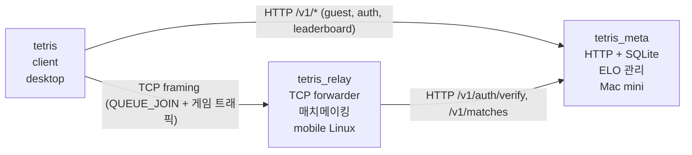

# Tetris Multiplayer with Lockstep Networking

결정론적 P2P Lockstep 네트워킹 기반 멀티플레이어 테트리스. C++17로 작성했고,
렌더링은 raylib 없이 **Win32 + OpenGL (핸드메이드)** 또는 **SDL2 + OpenGL**
백엔드를 직접 구현했다. ONNX Runtime으로 RL 봇 추론, 파이썬 학습 파이프라인,
커스텀 매치메이킹 릴레이 서버, ELO/리더보드용 메타 서버까지 모두 포함한다.

## 빠른 시작

### 공통 (CMake)
```bash
mkdir -p build && cd build
cmake ..
cmake --build . -j
./tetris
```

- Windows 기본값: Handmade Win32 + XAudio2 경로 (`TETRIS_USE_SDL2=OFF`).
- macOS / Linux 기본값: SDL2 + OpenGL 경로 (`TETRIS_USE_SDL2=ON`).
- `-DTETRIS_USE_SDL2=ON` 을 Windows 에서도 지정하면 SDL2 경로로 빌드.

### 주요 CMake 옵션
| 플래그 | 기본 | 결과 바이너리 | 설명 / 의존성 |
|---|---|---|---|
| `TETRIS_BUILD_GAME`  | ON  | `tetris`        | 게임 실행 파일. `third_party/httplib.h` 필요 (guest 토큰 발급용) |
| `TETRIS_BUILD_TEST`  | ON  | `sim_hash_dump` | 결정론 회귀 테스트 |
| `TETRIS_BUILD_PY`    | OFF | `tetris_py`     | pybind11 모듈 |
| `TETRIS_BUILD_RELAY` | OFF | `tetris_relay`  | 헤드리스 릴레이/룸 서버. `third_party/httplib.h` 필요 (meta 호출용) |
| `TETRIS_BUILD_META`  | OFF | `tetris_meta`   | HTTP+SQLite 메타 서버 (ELO/리더보드). `third_party/sqlite3.{c,h}` + `httplib.h` 필요 |
| `TETRIS_BUILD_BOT`   | OFF | (tetris 안)     | ONNX Runtime 링크 (Single vs Bot 활성화) |

## 멀티플레이어 실행 (익명/싱글 빠른 시작)

```bash
# 다이렉트 호스팅
./tetris --host 7777

# 다이렉트 접속
./tetris --connect 192.168.1.100:7777

# 릴레이 기반 랜덤 매칭
./tetris --queue relay.example.com:7777

# 커스텀 룸 (5자리 코드)
# CLI로 릴레이 주소를 지정한 뒤, Create/Join/Ready는 게임 메뉴에서 진행
./tetris --relay relay.example.com:7777
```

클라이언트가 지원하는 네트워크 CLI:

| 옵션 | 용도 |
|---|---|
| `--host <port>` | 직접 접속용 호스트로 대기 |
| `--connect <host[:port]>` | 직접 호스트에 접속 |
| `--queue <host[:port]>` | 릴레이 랜덤 큐에 즉시 참가 |
| `--relay <host[:port]>` | 메뉴의 Matchmaking/Custom Room에서 사용할 릴레이 주소 지정 |
| `--meta <http://host:port>` | tetris_meta 베이스 URL (ELO/리더보드 활성화). 환경변수 `TETRIS_META_URL` 도 동일 |

## 랭킹 멀티플레이 (3-tier)

ELO/리더보드를 쓰려면 `tetris_meta` 메타 서버 + `tetris_relay` 릴레이를
함께 띄운다. 권장 배치는 메타 = 항상 켜져 있는 기기 (예: Mac mini), 릴레이 =
저전력 모바일 Linux (Termux/proot 가능), 클라이언트 = 데스크톱.



서버 기기 (Mac mini 등):
```bash
cmake -B build -DTETRIS_BUILD_META=ON -DTETRIS_BUILD_GAME=OFF -DTETRIS_BUILD_RELAY=OFF
cmake --build build --target tetris_meta
./build/tetris_meta --db tetris.db --http 0.0.0.0:8080
```

모바일 Linux (relay):
```bash
cmake -B build -DTETRIS_BUILD_RELAY=ON -DTETRIS_BUILD_GAME=OFF
cmake --build build --target tetris_relay
./build/tetris_relay --port 7777 --meta http://mac-mini.local:8080
```

데스크톱 (client):
```bash
./tetris.exe --meta http://mac-mini.local:8080 --queue mac-mini.local:7777
# 또는 환경변수
TETRIS_META_URL=http://mac-mini.local:8080 ./tetris --queue mac-mini.local:7777
```

`--meta` 가 비어 있으면 클라이언트/릴레이 모두 unranked 모드로 폴백한다
(메뉴에 "ranking server offline" 또는 "ranking: disabled" 배너가 뜬다).

## 익명 토큰 / 랭킹

- 첫 실행 시 `tetris_meta` 가 살아 있으면 클라이언트가 `POST /v1/guest`
  로 자동 guest 토큰을 발급받아 표준 user-data 경로에 저장한다.
- 토큰 파일을 지우거나 잃어버리면 다음 실행에서 새로 발급받는다 —
  이전 ELO/매치 이력은 잃는다.
- 메타 서버 DB 가 리셋돼서 토큰이 unknown 으로 떨어지면 클라이언트가
  자동으로 새 guest 를 발급받는다.
- 토큰 저장 경로 (`meta/http_client.cpp::token_file_path()`):
  - Windows: `%APPDATA%\Tetris\token`
  - macOS: `~/Library/Application Support/Tetris/token`
  - Linux: `$XDG_DATA_HOME/Tetris/token` (없으면 `~/.local/share/Tetris/token`)

## tetris_meta 빌드 전 third_party 준비

`tetris_meta` 는 다음 두 라이브러리에 의존한다 (둘 다 single-file, 헤더/번들):

- SQLite amalgamation (`sqlite3.h`, `sqlite3.c`) — https://www.sqlite.org/download.html
- cpp-httplib (`httplib.h`) — https://github.com/yhirose/cpp-httplib

다운로드 후 `third_party/` 에 그대로 복사하면 끝. `tetris_relay` 와
`tetris` (game) 도 메타 호출용으로 `httplib.h` 만 필요하다 — `sqlite3.{c,h}`
는 메타 서버에서만 쓴다.

## 핵심 기능

- 결정론적 P2P Lockstep 동기화 (고정 60Hz 틱)
- DAS(133ms) / ARR(50ms) 기반 좌우 홀드 반복 + 소프트 드롭 속도 제한
- 10초 주기 자동 HASH 검증 + DESYNC 배너
- T-spin 점수/공격 판정 + 공격 라인 / 가비지 큐 / 화면 흔들림 / 콜아웃
- PING/PONG 하트비트 + 링크 단절 grace 복귀
- 메인 스레드 스톨 자동 heartbeat (창 드래그 시 상대방 게임 정지 방지)
- 5자리 코드 기반 커스텀 룸 + 랜덤 큐 매칭 서버
- 랜덤 큐 매치 수락 로비 (Y/N 수락 후 게임 시작) + 3-2-1-START 카운트다운
- 인-게임 채팅 (릴레이 투명 통과)
- 리플레이 기록 (F5/F6) / 상태 해시 출력 (H)
- ONNX Runtime 로컬 봇 추론 (Single vs Bot)
- 파이썬 lockstep 봇 클라이언트 + RL 학습 파이프라인
- HTTP+SQLite 메타 서버 (guest 토큰 / ELO / 리더보드)
- Win32 핸드메이드 / SDL2 / 파이썬 pybind11 전부 지원

## 핫키

- **화살표**: 이동/회전 (좌우는 홀드 반복 지원)
- **Space**: 하드 드롭
- **F5/F6**: 리플레이 기록/저장
- **H**: 상태 해시 출력
- **R** (게임 오버): 재시작
- **Q** (게임 오버/취소): 타이틀/취소

## 프로젝트 구조

```
src/       게임 로직 (Game = SimGame + Draw)
core/      결정론 시스템 (틱, RNG, 해시, 리플레이)
net/       네트워킹 (Socket → Framing → Session, PING/ROOM/CHAT 포함)
server/    릴레이 + 룸 매치메이커 (tetris_relay) — transparent forwarder + meta 호출 (token verify, MATCH_SUMMARY 가로채기)
meta/      HTTP+SQLite 메타 서버 (ELO, 리더보드, guest 토큰) + 클라이언트 라이브러리
bot/       ONNX Runtime 로컬 봇 추론
platform/  창 + 입력 (win32.cpp / sdl.cpp)
renderer/  OpenGL 2D 렌더러 + 텍스트 + shake + image
audio/     XAudio2 / SDL_OpenAudioDevice 기반 자체 믹서
bindings/  pybind11 → tetris_py 모듈
python/    RL 학습 + 네트봇 클라이언트 (common, netbot, sim, tests)
docs/blog/ 각 계층을 처음부터 만드는 11부 시리즈 (part0-10)
```

## 더 읽기

- **`docs/blog/part0` ~ `part10`** — 셋업, 창/렌더러/로직/루프/네트/RL/오디오,
  릴레이 서버, ONNX 봇, 메타 서버와 랭킹까지 raylib 없이 직접 만드는 과정 블로그 시리즈.
- **`GUIDE.md`** — 코드를 처음 읽을 때 어디서부터 볼지 안내.
- **`ARCHITECTURE.md`** — 모든 모듈의 상세 레퍼런스. §11 (메타 서버), §12 (랭킹 흐름) 도 여기 있음.
- **`DEPLOY.md`** — 플랫폼별 릴리스 번들 제작 절차.

## 요구사항

- **공통**: C++17, CMake 3.15+
- **Windows (Handmade)**: Windows SDK (WinSock2, XAudio2, GDI+)
- **macOS / Linux / Windows (SDL2)**: SDL2 개발 헤더 + OpenGL
- **RL / 봇**: Python 3.10+, PyTorch, pybind11, ONNX Runtime (선택)
- **tetris_meta**: 추가 third_party 없음 — SQLite amalgamation + cpp-httplib 단일 헤더만 `third_party/` 에 두면 빌드됨
