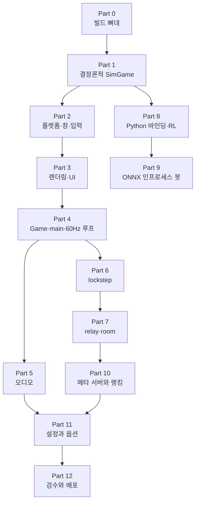
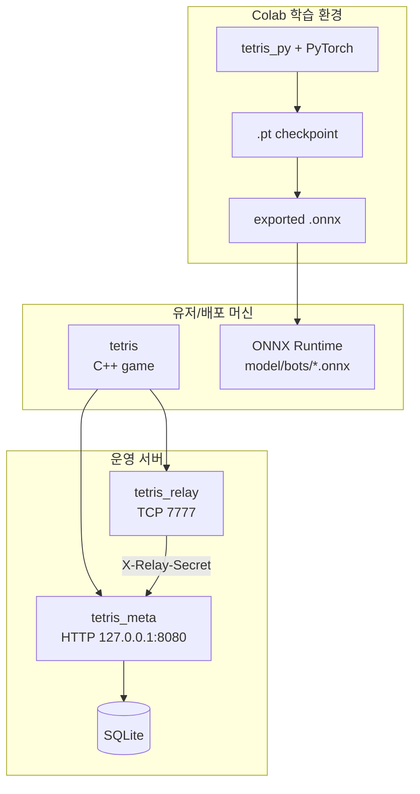

# 제로부터 멀티플레이어 테트리스 + RL까지

이 시리즈의 목표는 두 가지다.

1. `main.cpp → Game → SimGame`으로 이어지는 완성 구조를 이해한다.
2. 빈 작업 디렉터리에서 Part 0부터 순서대로 구현해 현재 저장소와 같은 기능 경계의
   게임·relay·meta·학습/ONNX 경로를 재현한다.

과거 작업 시간순이 아니라 **구현 의존성 순서**로 읽는다. 먼저 렌더링과 무관한
`SimGame`을 완성해 테스트 가능한 규칙 엔진을 만들고, 그 위에 플랫폼·렌더링·
`Game`/`main.cpp`를 쌓는다. 이후에만 네트워크와 서버, Python/RL, 메타 서비스를
추가한다. 완성 상태의 모듈 관계는 루트
[`README.md`의 아키텍처](../../README.md#아키텍처)에서 짧게 복습할 수 있다.

> 코드 블록은 세 종류로 구분한다. **Part N 체크포인트**는 그 장까지 구현한
> 컴파일 가능한 중간 상태, **현재 소스 발췌**는 최종 저장소와 1:1인 코드,
> **예시**는 설명용 코드다. 중간 상태에서 빠진 후속 기능은 추가되는 Part를
> 명시한다. 장 끝의 빌드·테스트가 각 체크포인트의 완료 조건이다.

## 읽는 순서

| 순서 | 문서 | 완성되는 것 |
|---:|---|---|
| 0 | [Part 0: 프로젝트 셋업](./part0-project-setup.md) | 디렉토리 구조, CMake 타깃, 외부 의존성 경계 |
| 1 | [Part 1: 결정론적 SimGame](./part1-deterministic-simulation.md) | 규칙, RNG, 가비지, 상태 해시와 headless 회귀 테스트 |
| 2 | [Part 2: 플랫폼 계층](./part2-platform-window-input.md) | Win32/SDL2 창, OpenGL 컨텍스트, 시간과 입력 |
| 3 | [Part 3: 렌더링과 UI](./part3-rendering-and-ui.md) | 사각형·텍스트·이미지 렌더러와 즉시모드 GUI |
| 4 | [Part 4: Game과 메인 루프](./part4-game-wrapper-and-loop.md) | `Game` 래퍼, `main.cpp`, 60Hz fixed-step, 메뉴 |
| 5 | [Part 5: 오디오](./part5-audio.md) | MP3 decode, 이벤트 소비, XAudio2/SDL2 백엔드 |
| 6 | [Part 6: Lockstep](./part6-lockstep-networking.md) | TCP framing, HELLO/SEED/INPUT, 동기·해시 검증 |
| 7 | [Part 7: 릴레이 서버](./part7-relay-server.md) | 랜덤 큐, 커스텀 룸, transparent forwarding |
| 8 | [Part 8: Python RL](./part8-python-rl.md) | pybind11 `tetris_py`, 관측/행동, Gym 환경과 체크포인트 |
| 9 | [Part 9: RL + ONNX 봇](./part9-rl-onnx-bot.md) | `.pt` 정책을 ONNX로 export하고 C++에서 실행 |
| 10 | [Part 10: 메타 서버와 랭킹](./part10-meta-and-ranking.md) | guest token, RP/XP/BP, 아이콘, ranked match 저장 |
| 11 | [Part 11: 설정과 옵션](./part11-settings-and-options.md) | 설정 영속화, 해상도·오디오·VSync와 결정성 경계 |
| 12 | [Part 12: 검수와 배포](./part12-hardening-and-release.md) | 보안 기본값, 패키징, 전체 회귀·통합 검증 |

Part 번호는 기본적으로 **선형 학습 순서**다. 의존성 화살표는 특정 기능의 직접
선행 조건만 나타내며, 화살표가 없다고 중간 Part를 생략하라는 뜻은 아니다.

Part 0~4는 실행 가능한 싱글플레이 클라이언트를 만든다. Part 5는 표현 계층을
완성하고, Part 6~7은 같은 결정론 코어를 네트워크로 확장한다. Part 8~9는
`SimGame`을 학습과 인게임 추론에 재사용한다. Part 10~12는 영속 서비스와 사용자
설정, 운영 검증을 더한다. 건너뛰어도 되는 장은 있어도 순서를 거꾸로 의존하지는
않는다.

## 각 Part를 따라가는 방법

각 장에서 다음 네 항목을 확인한다.

1. **선행 상태**: 앞 장까지 존재해야 하는 파일과 공개 API.
2. **이번 장의 파일**: 새로 만들거나 수정하는 실제 경로.
3. **연결점**: 새 코드가 이전 계층의 어느 API를 호출하는지.
4. **완료 게이트**: 빌드 명령, 자동 테스트, 화면 또는 로그의 기대 결과.

코드 조각만 복사하고 완료 게이트를 건너뛰면 뒤 장에서 원인을 찾기 어렵다. 특히
Part 1의 `sim_hash_dump`, Part 6의 framing/lockstep 테스트, Part 10의 meta/relay
통합 테스트는 이후 계층이 전제하는 계약이다.

## 현재 운영 모델

현재 구조는 세 실행 환경을 분리한다.

- 유저 머신은 내장 휴리스틱 봇을 항상 사용할 수 있고, 학습 모델은 `model/bots/*.onnx`와 ONNX Runtime만 있으면 인게임 봇 로스터에 나타난다.
- PyTorch는 학습과 `.pt -> .onnx` export에만 필요하다.
- Mac mini 같은 약한 배포 머신에서는 torch를 설치하지 않아도 된다.
- `tetris_meta`는 기본적으로 relay secret 없이 시작하지 않는다.
- 로컬 검수는 C++ 빌드, 결정론 덤프, framing/placement 테스트, meta/relay smoke까지다. 학습은 하지 않는다.
- 현재 UI는 RP(0 시작/0 바닥), 누적 XP 레벨, BP 아이콘 상점을 사용한다.
- `python/netbot/`은 framing/input 패리티와 ONNX export 도구다. 실제 봇 실행
  경로는 인프로세스 ONNX/휴리스틱 봇이다.
- `python/common/env_versus.py`는 가비지 교환형 2-보드 RL 환경을 제공하지만,
  기본 trainer CLI는 아직 단일 보드 환경을 직접 생성한다.
