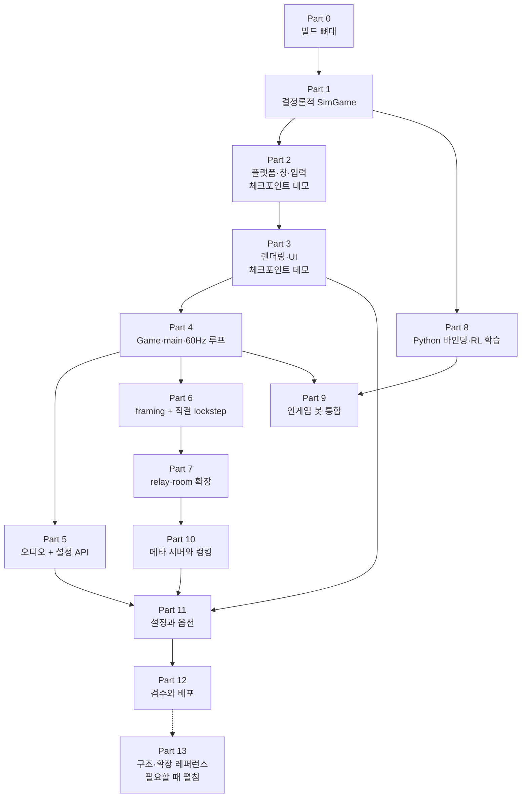
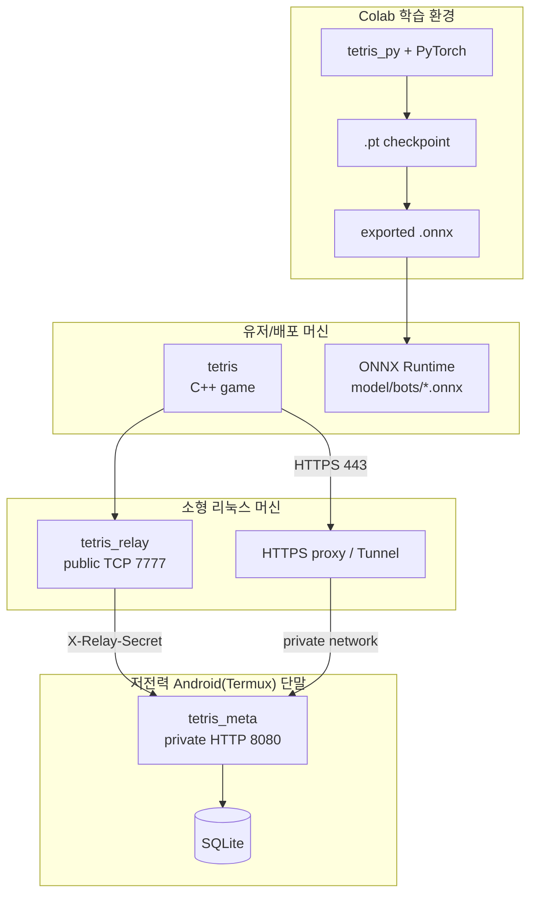

# 제로부터 멀티플레이어 테트리스 + RL까지

이 시리즈의 목표는 두 가지다.

1. 빈 작업 디렉터리에서 공통 게임·네트워크 뼈대를 만든 뒤, 서비스 운영과 AI 경로를 각자의 의존 순서로 구현해 현재 저장소와 같은 기능 경계를 재현한다.
2. 완성형 게임 엔진이 대신 해주던 일들이 실제로 무엇인지 한 번씩 열어 본다. 창 생성부터 오디오 믹싱, lockstep 동기화, 신경망 추론까지다.

과거 작업 시간순이 아니라 **구현 의존성 순서**로 읽는다. 먼저 렌더링과 무관한 `SimGame`을 완성해 테스트 가능한 규칙 엔진을 만들고, 그 위에 플랫폼·렌더링· `Game`/`main.cpp`를 쌓는다. 이후에만 네트워크와 서버, Python/RL, 메타 서비스를 추가한다. 완성 상태의 모듈 관계는 루트 [`README.md`의 아키텍처](../../README.md#아키텍처)에서 짧게 복습할 수 있다.

## 코드 블록 읽는 법

모든 코드 블록에는 **바로 위 줄**에 세 라벨 중 하나가 붙어 있다. 셸 명령, 콘솔 출력, 설정·데이터 형식 예시, mermaid 다이어그램은 앞 문장이 용도를 밝히면 라벨 없이 실린다.

| 라벨 | 형식 | 의미 |
|---|---|---|
| 현재 소스 발췌 | ``**현재 소스 발췌 — `경로`**`` | 현재 저장소에서 설명에 필요한 부분만 옮긴 코드. 경로와 함수·타입 이름으로 원문을 찾는다 |
| Part N 체크포인트 | ``**Part N 체크포인트 — `경로`**`` | 그 장까지 소개한 기능만 가진 **컴파일 가능한 중간 상태**. 최종 소스와 다르면 블록 바로 아래에서 차이와 현재 소유 모듈을 설명한다 |
| 예시 | `**예시(실제 저장소에는 없음)**` | 설명용 의사코드·단순화 스니펫. 저장소에 대응 파일이 없다 |

`현재 소스 발췌`는 완성형의 계약을 보여 주고, `Part N 체크포인트`는 그 장까지의 동작만 하는 중간 형태를 보여 준다. 발췌는 생략된 문맥이 있을 수 있으므로 복사본이라기보다 설명의 기준으로 읽고, 실제 수정 때는 표시된 경로와 심볼을 확인한다.

주석은 그 장의 맥락에 맞게 다듬어 싣는다. 저장소에 이미 있는 설명형 주석은 길다는 이유만으로 줄이지 않는다. 특히 불변식·소유권·실패 이유처럼 코드 옆에서 바로 보여야 하는 판단은 소스에도 남기고, 문서는 그 판단이 시스템 전체에서 갖는 의미와 대안을 더 넓게 연결한다. 문서와 소스 주석이 문장 단위로 같을 필요는 없지만 계약과 동작은 같아야 한다.

`CMakeLists.txt`도 같은 규칙을 따른다. Part 0이 최소 빌드 뼈대를 세우고, **새 소스 파일을 추가하는 장은 그 시점의 빌드 구성을 `Part N 체크포인트 — CMakeLists.txt` 로 보여준다.** 각 장을 마칠 때마다 그 장의 산출물이 실제로 빌드되는 상태를 유지한다. 완성된 빌드 구성을 조회할 때는 [Part 13](./part13-structure-and-build-reference.md)을 레퍼런스로 사용한다.


```mermaid
graph TB
    P0[Part 0<br/>빌드 뼈대] --> P1[Part 1<br/>결정론적 SimGame]
    P1 --> P2[Part 2<br/>플랫폼·창·입력<br/>체크포인트 데모]
    P2 --> P3[Part 3<br/>렌더링·UI<br/>체크포인트 데모]
    P3 --> P4[Part 4<br/>Game·main·60Hz 루프]
    P4 --> P5[Part 5<br/>오디오 + 설정 API]
    P4 --> P6[Part 6<br/>framing + 직결 lockstep]
    P6 --> P7[Part 7<br/>relay·room 확장]
    P1 --> P8[Part 8<br/>Python 바인딩·RL 학습]
    P4 --> P9[Part 9<br/>인게임 봇 통합]
    P8 --> P9
    P7 --> P10[Part 10<br/>메타 서버와 랭킹]
    P3 --> P11[Part 11<br/>설정과 옵션]
    P5 --> P11
    P10 --> P11
    P11 --> P12[Part 12<br/>검수와 배포]
    P12 -.-> P13[Part 13<br/>구조·확장 레퍼런스<br/>필요할 때 펼침]
```

## 읽는 순서

모든 독자가 Part 0~7을 먼저 읽어야 하는 것은 아니다. 모든 트랙의 공통 기반은 Part 0~1(빌드 뼈대와 결정론 코어)이고, 화면이 필요한 트랙이 Part 2~4(클라이언트 기반)를 더한다. 위 의존 그래프에서 Part 8이 Part 1에만 매달려 있는 이유가 이것이다 — 학습 코어는 `SimGame`만 의존한다. 여기서 목적에 따라 의존 경로가 갈린다.

- **게임 클라이언트 기반:** Part 0 → 1 → 2 → 3 → 4. 규칙 엔진, 플랫폼, 렌더러, 실제 게임 루프를 만든다.
- **온라인 서비스·출시:** 클라이언트 기반 → Part 5 → 6 → 7 → 10 → 11 → 12. 오디오, lockstep, relay, 계정·결과 영속화, 사용자 설정, 운영 검증 순서다.
- **학습만 하는 AI 경로:** Part 0 → 1 → 8. 화면이나 relay 없이 `SimGame`을 Python 학습 환경으로 노출한다. Part 8의 wire 패리티 절만 Part 6의 프레이밍 계약을 선택적으로 사용한다.
- **인게임 AI 경로:** 클라이언트 기반 + Part 8 → 9. 학습된 정책을 ONNX로 변환해 게임 프로세스 안에서 실행한다. 온라인 relay는 필요하지 않다.

Part 번호는 게시 순서를 유지하지만, 실제 구현은 이 의존 그래프를 따른다. 서버를 먼저 검증하는 독자는 AI 경로를 건너뛸 수 있고, 학습 실험만 하는 독자는 플랫폼·오디오·relay를 만들 필요가 없다.

| 순서 | 문서 | 완성되는 것 |
|---:|---|---|
| 0 | [Part 0: 준비물](./part0-project-setup.md) | OS별 툴체인 설치, 왜 엔진을 쓰지 않는가, 최소 빌드 뼈대 |
| 1 | [Part 1: 결정론적 SimGame](./part1-deterministic-simulation.md) | 규칙, RNG, 가비지, 상태 해시와 headless 회귀 테스트(`sim_hash_dump`) |
| 2 | [Part 2: 플랫폼 계층](./part2-platform-window-input.md) | Win32/SDL2 창, OpenGL 3.3 Core 컨텍스트 생성, 시간과 입력. **독립 실행되는 체크포인트 데모** |
| 3 | [Part 3: 렌더링과 UI](./part3-rendering-and-ui.md) | GL 배칭 렌더러, 셰이더 SDF 둥근 사각형, 글리프 아틀라스 텍스트, 이미지, `gui_button`/`gui_checkbox`. **독립 실행되는 체크포인트 데모** |
| 4 | [Part 4: Game과 메인 루프](./part4-game-wrapper-and-loop.md) | `Game` 래퍼, `main.cpp`, 60Hz fixed-step, 메뉴 — 처음으로 `tetris` 가 빌드된다 |
| 5 | [Part 5: 오디오](./part5-audio.md) | MP3 decode, 이벤트 소비, XAudio2/SDL2 백엔드, on/off·볼륨 설정 API |
| 6 | [Part 6: Lockstep](./part6-lockstep-networking.md) | TCP framing 전체, HELLO/SEED/INPUT, 직결 P2P 세션과 해시 검증 |
| 7 | [Part 7: 릴레이 서버](./part7-relay-server.md) | 랜덤 큐, 커스텀 룸, 선택적 게임 프레임 전달 — 서버와 클라이언트 양쪽 |
| 8 | [Part 8: Python RL](./part8-python-rl.md) | pybind11 `tetris_py`, 관측/행동, Gym 환경과 체크포인트 |
| 9 | [Part 9: RL + ONNX 봇](./part9-rl-onnx-bot.md) | `.pt` 정책을 ONNX로 export하고 C++에서 실행 |
| 10 | [Part 10: 메타 서버와 랭킹](./part10-meta-and-ranking.md) | guest token, RP/XP/BP, 아이콘, ranked match 저장 |
| 11 | [Part 11: 설정과 옵션](./part11-settings-and-options.md) | 설정 영속화, `gui_slider`/`gui_value_selector`, 해상도·오디오·VSync와 결정성 경계 |
| 12 | [Part 12: 검수와 배포](./part12-hardening-and-release.md) | 보안 기본값, 리버스 프록시 배치, 패키징, 전체 회귀·통합 검증 |
| 13 | [Part 13: 구조와 확장 레퍼런스](./part13-structure-and-build-reference.md) | **순서대로 읽는 장이 아니다.** 완성 구조·`CMakeLists.txt` 전체 해부·플랫폼별 빌드, 그리고 "고치려면 어디를 건드리나" |

Part 0~4는 실행 가능한 싱글플레이 클라이언트를 만들고, Part 5는 표현 계층, Part 6~7은 같은 결정론 코어의 네트워크 경로를 완성한다. Part 8의 학습 코어는 `SimGame`만 의존하지만, Part 9의 인게임 통합은 렌더링 가능한 클라이언트도 필요하다. 서비스 경로는 relay와 UI 경계를 의존한다. 이 분기를 문서 번호 하나로 억지로 직렬화하지 않는 것이 핵심이다.

보안·단절·재시도 같은 횡단 관심사는 **그 상태를 소유한 글에 구현 원리**를 둔다. relay의 연결 제한과 기권 판정은 Part 7, DB 멱등성과 인증 경계는 Part 10이 설명한다. Part 12는 같은 내용을 다시 구현하지 않고 실제 배치, 백업, 장애 전환, 부하 측정과 릴리스 게이트로 묶는다. 독자는 기능을 만들 때 실패 계약을 함께 배우고, 운영 단계에서는 전체 시스템 관점으로 다시 검증할 수 있다.

### 헷갈리기 쉬운 경계

같은 주제가 두 장에 나뉘어 있는 곳이 몇 군데 있다. 어느 장에서 무엇이 만들어지는지 미리 알아 두면 "왜 여기에 이게 없지?" 를 피할 수 있다.

- **Part 2 / Part 3 은 각자 실행 가능한 산출물을 남긴다.** 이 시점에는 `tetris` 타깃을 빌드할 수 없다 — `src/game.cpp`, `net/*`, `bot/*` 등이 아직 없기 때문이다. 대신 두 장 모두 독자가 직접 만드는 **체크포인트 데모**를 제시하고, 그 데모를 그 시점의 `CMakeLists.txt` 에 `add_executable` 로 추가하는 방법까지 보여준다. Part 2 데모는 창·GL 컨텍스트 생성과 입력·dt 를, Part 3 데모는 도형·알파·텍스트·이미지·회전·view offset 을 한 화면에서 검증한다.
- **framing 은 Part 6 이 전부 다룬다.** 길이·타입·payload·체크섬 레이아웃과 `build_frame`/`parse_frames` 는 [Part 6](./part6-lockstep-networking.md) 소관이다. [Part 8](./part8-python-rl.md) 은 그 포맷을 Python 쪽에서 재현해 패리티를 검증하는 쪽만 다룬다.
- **Part 6 = 직결 P2P, Part 7 = 릴레이.** [Part 6](./part6-lockstep-networking.md) 은 두 클라이언트가 서로 직접 붙는 host/client 세션을 만든다. [Part 7](./part7-relay-server.md) 은 그 위에 `QUEUE_*`/`ROOM_*`/`MATCH_*` 메시지를 더해 릴레이 서버를 만들고, **같은 장에서 클라이언트 측 구현까지** 붙인다.
- **오디오 설정 API 는 Part 5, UI 는 Part 11.** `audio_set_music_enabled` / `audio_set_sfx_enabled` / `audio_set_music_volume` / `audio_set_sfx_volume` 는 [Part 5](./part5-audio.md) 에서 오디오 백엔드와 함께 만든다. [Part 11](./part11-settings-and-options.md) 은 거기에 설정 화면과 영속화를 붙일 뿐 새 오디오 API 를 만들지 않는다.
- **GUI 위젯은 사용처가 생기는 순서로 늘어난다.** 렌더러를 검증하는 `gui_button` / `gui_checkbox` 가 기본 상호작용을 만들고, 설정 화면에 필요한 `gui_slider` / `gui_value_selector` 가 같은 즉시 모드 계약을 확장한다. 완성형 선언은 `src/gui.h` 에 모인다.

## 기획을 구현 순서로 바꾸는 법

새 기능을 어느 문서와 모듈에 넣을지는 화면에 보이는 위치가 아니라 **권위 있는 상태를 누가 소유하는가**로 정한다.

| 기획 변경 | 먼저 고정할 계약 | 구현 시작점 | 함께 검증할 경계 |
|---|---|---|---|
| 새 블록·홀드·회전 규칙 | 동일 seed/input의 상태 전이와 기존 리플레이 호환 정책 | `SimGame`, 입력 비트, 골든 해시 | C++/Python placement, 봇 관측·행동, lockstep protocol |
| 버튼·화면·애니메이션 | 논리 좌표, 포커스·마우스 규칙, 시뮬레이션 비간섭 | `src/gui.*`, `renderer/`, `Game`, 화면별 app mode | 해상도 역매핑, 키보드·마우스 동등성, 결정론 해시 불변 |
| 매칭·채팅·재접속 | 서버가 판정할 상태와 클라이언트가 신뢰할 메시지 | framing → `Session` → relay | 길이 상한, 단계 전환 잔여 바이트, timeout·disconnect 정책 |
| 랭킹·보상·상점 | 서버 권위, 중복 요청 처리, DB 마이그레이션 | meta API와 transaction | relay 인증, `match_uuid` 멱등성, 백업·복구 |
| 새 봇·학습법 | 관측 shape, action mask, 배포 체크포인트 | Python 공용 계약 → trainer → ONNX runtime | C++/Python 패리티와 오래된 모델 거부 |

이 순서를 거꾸로 시작하면 UI에 버튼은 생겼는데 규칙을 저장할 곳이 없거나, 서버 메시지는 추가됐는데 재전송·버전 호환 정책이 없는 상태가 된다. 기획 단계에서 불변식과 실패 정책을 먼저 문장으로 적고, 그 상태의 소유 모듈을 구현한 뒤 소비자와 표현 계층을 연결한다. 완료 기준은 파일이나 함수 개수가 아니라 그 계약을 깨뜨리는 입력을 테스트가 잡는지다.

“블록 추가”도 두 종류로 나눠야 한다. 표준 테트로미노의 스킨·색·이펙트 변경은 표현 계층의 작업이지만, 새로운 모양이나 특수 능력은 규칙·RNG·해시·네트워크·RL 행동 공간을 함께 바꾸는 게임 모드 변경이다. 두 작업을 같은 UI 폴리싱으로 취급하지 않는 것이 이후 호환 비용을 크게 줄인다.

## 각 Part를 따라가는 방법

각 장은 아래 네 항목으로 스스로의 구현 경계를 밝힌다.

1. **선행 상태**: 앞 장까지 존재해야 하는 파일과 공개 API.
2. **이번 Part의 파일**: 새로 만들거나 수정하는 실제 경로.
3. **연결점**: 새 코드가 이전 계층의 어느 API를 호출하는지.
4. **완료 게이트**: 빌드 명령, 자동 테스트, 화면 또는 로그의 기대 결과.

코드 조각만 복사하고 완료 게이트를 건너뛰면 뒤 장에서 원인을 찾기 어렵다. 특히 Part 1의 `sim_hash_dump`, Part 6의 framing/lockstep 테스트, Part 10의 meta/relay 통합 테스트는 이후 계층이 전제하는 계약이다.

### 빌드 규약 — 먼저 읽을 것

각 장의 명령을 그대로 쳤는데 configure 단계에서 죽는다면 아래 빌드 경계를 먼저 확인한다.

**1. `TETRIS_BUILD_GAME` 은 기본 ON 이다.** 게임 클라이언트가 완성되기 전, 즉 **Part 0~3 에서는 `-DTETRIS_BUILD_GAME=OFF` 를 반드시 명시해야 한다.** 켜져 있으면 아직 만들지 않은 `src/game.cpp`, `net/*.cpp`, `renderer/*.cpp`, `bot/*.cpp`, `meta/http_client.cpp` 때문에 configure 가 실패한다. `third_party/httplib.h` 존재 검사에도 걸린다. 서버만 빌드할 때도 같은 이유로 OFF 가 필요하다.

```bash
# Part 1: 시뮬레이션만 있는 시점
cmake -S . -B build -DTETRIS_BUILD_GAME=OFF -DTETRIS_BUILD_TEST=ON
cmake --build build --target sim_hash_dump
./build/sim_hash_dump | diff - python/tests/_sim_hash_dump.txt && echo "결정론 OK"
```

**2. 출력 경로가 생성기마다 다르다.** 단일 구성 생성기(Makefiles/Ninja — Linux/macOS 기본)에서는 `--config` 가 무시되고 산출물은 `build/tetris` 다. multi-config 생성기(Visual Studio)에서는 `--config Release` 가 필요하고 산출물은 `build/Release/tetris.exe` 다. **두 경로를 섞어 쓰지 말 것.**

```bash
# Linux/macOS — SDL2 백엔드가 기본
cmake -S . -B build -DTETRIS_USE_SDL2=ON
cmake --build build --target tetris
./build/tetris

# Windows — Win32/XAudio2 handmade 백엔드가 기본
cmake -S . -B build -DTETRIS_USE_SDL2=OFF
cmake --build build --config Release --target tetris
./build/Release/tetris.exe
```

**3. `--target tetris` 는 `copy_assets` 를 돌리지 않는다.** `copy_assets` 는 ALL 타깃이라 타깃을 지정하면 건너뛴다. 빌드 디렉터리에서 실행하면 `Font/`·`Sounds/` 가 없어 폰트와 소리가 빠진다. 저장소 루트에서 실행하거나, 타깃을 지정하지 않고 `cmake --build build` 로 빌드한다.

**4. relay/room smoke 테스트는 포트 7788 고정이다.** `python/tests/test_relay_smoke.py`와 `test_room_smoke.py`는 `RELAY_PORT = 7788`을 사용한다. 기본 7777로 띄우면 실패가 아니라 **skip**이 될 수 있으므로 `pytest -rs` 출력에서 각 모듈이 실제 실행됐는지 확인한다.

```bash
cmake -S . -B build -DTETRIS_BUILD_GAME=OFF -DTETRIS_BUILD_RELAY=ON
cmake --build build --target tetris_relay
./build/tetris_relay --port 7788 &
sleep 1
uv run python -m pytest python/tests/test_relay_smoke.py \
                       python/tests/test_room_smoke.py -q
kill %1
```

**5. 디버그 단축키는 전용 빌드에만 있다.** 해시 덤프 `H` 키, 봇 속도 조절 같은 디버그 입력은 `-DTETRIS_ENABLE_DEBUG_UI=ON` 으로 빌드해야 살아난다(기본 OFF). 문서에서 디버그 단축키를 안내하는 곳은 전부 이 빌드를 전제한다.

torch 없이 실행할 수 있는 기본 Python 검증은 저장소 루트에서 다음 테스트 파일을 지정한다.

```bash
uv sync --dev
uv run python -m pytest python/tests/test_framing_parity.py \
                       python/tests/test_checkpoint_roundtrip.py \
                       python/tests/test_training_scripts_static.py -q
```

전체 회귀 절차(빌드 → 결정론 → 워커 → pytest → smoke → 스크립트 검사)는 [Part 12](./part12-hardening-and-release.md) 가 한곳에 모아 둔다.

## 현재 운영 모델

현재 구조는 세 실행 환경을 분리한다.


```mermaid
graph TB
    subgraph User["유저/배포 머신"]
        G[tetris<br/>C++ game]
        ORT[ONNX Runtime<br/>model/bots/*.onnx]
    end

    subgraph RelayHost["소형 리눅스 머신"]
        R[tetris_relay<br/>public TCP 7777]
        E[HTTPS proxy / Tunnel]
    end

    subgraph MetaHost["저전력 Android(Termux) 단말"]
        M[tetris_meta<br/>private HTTP 8080]
        DB[(SQLite)]
    end

    subgraph Colab["Colab 학습 환경"]
        PY[tetris_py + PyTorch]
        CKPT[.pt checkpoint]
        ONNX[exported .onnx]
    end

    G --> R
    G -- HTTPS 443 --> E
    R -- X-Relay-Secret --> M
    E -- private network --> M
    M --> DB
    PY --> CKPT --> ONNX --> ORT
```

- 유저 머신은 내장 휴리스틱 봇을 항상 사용할 수 있고, 학습 모델은 `model/bots/*.onnx`와 ONNX Runtime만 있으면 인게임 봇 로스터에 나타난다.
- PyTorch는 학습과 `.pt -> .onnx` export에만 필요하다.
- 저사양 배포 머신에서는 torch를 설치하지 않아도 된다.
- `tetris_meta`는 기본적으로 relay secret 없이 시작하지 않는다.
- meta와 proxy가 같은 호스트면 `127.0.0.1`에 bind한다. 현재처럼 meta를 저전력
  Android(Termux) 단말로 분리한 배치에서는 meta 단말의 고정 사설/VPN 주소에
  bind하고 방화벽으로 relay 호스트만 허용하며, relay 호스트의 proxy/Tunnel이
  public TLS와 client별 rate limit을 맡는다. meta는 비루프백 전달 헤더를
  신뢰하지 않아 public 요청을 relay 호스트 IP의 공유 버킷으로 제한한다.
- 로컬 검수는 C++ 빌드, 결정론 덤프, framing/placement 테스트, meta/relay smoke까지다. 학습은 하지 않는다.
- 현재 UI는 RP(0 시작/0 바닥), 누적 XP 레벨, BP 아이콘 상점을 사용한다.
- `python/netbot/`은 framing/input 패리티와 ONNX export 도구다. 실제 봇 실행 경로는 인프로세스 ONNX/휴리스틱 봇이다.
- `python/common/env_versus.py`는 가비지 교환형 2-보드 RL 환경을 제공한다. PPO trainer(`python/train/ppo_tetris.py`)는 `--env versus`로 이 환경을 선택할 수 있고 기본값은 단일 보드다. 다른 trainer는 아직 단일 보드 환경만 직접 생성한다 ([Part 8](./part8-python-rl.md) 참조).
