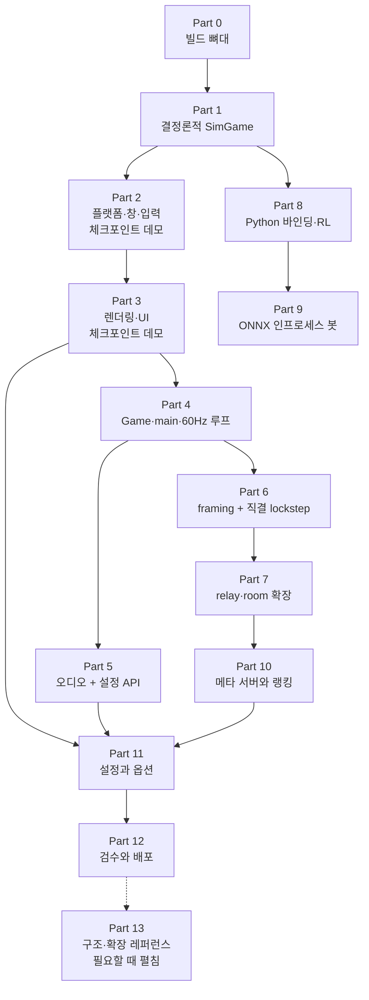
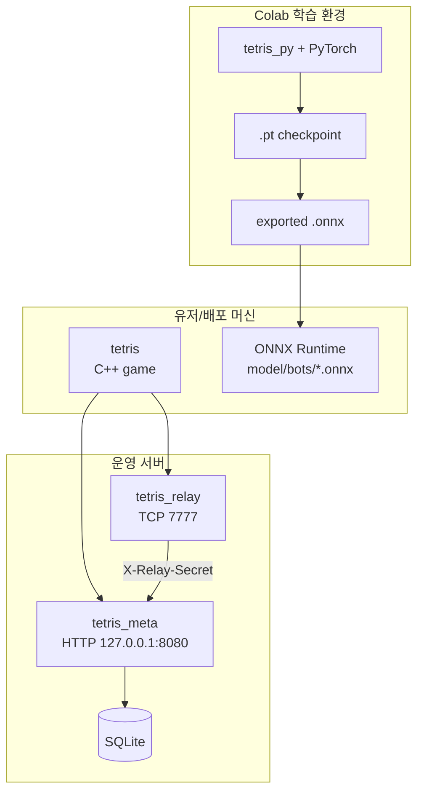

# 제로부터 멀티플레이어 테트리스 + RL까지

이 시리즈의 목표는 두 가지다.

1. 빈 작업 디렉터리에서 Part 0부터 순서대로 구현해 현재 저장소와 같은 기능 경계의 게임·relay·meta·학습/ONNX 경로를 재현한다.
2. 완성형 게임 엔진(Unity·Unreal·Godot)이 대신 해주던 일들이 실제로 무엇인지 한 번씩 열어 본다. 창 생성부터 오디오 믹싱, lockstep 동기화, 신경망 추론까지다.

과거 작업 시간순이 아니라 **구현 의존성 순서**로 읽는다. 먼저 렌더링과 무관한 `SimGame`을 완성해 테스트 가능한 규칙 엔진을 만들고, 그 위에 플랫폼·렌더링· `Game`/`main.cpp`를 쌓는다. 이후에만 네트워크와 서버, Python/RL, 메타 서비스를 추가한다. 완성 상태의 모듈 관계는 루트 [`README.md`의 아키텍처](../../README.md#아키텍처)에서 짧게 복습할 수 있다.

## 코드 블록 읽는 법

모든 코드 블록에는 **바로 위 줄**에 세 라벨 중 하나가 붙어 있다. 순수 셸 명령 블록과 mermaid 다이어그램만 예외다.

| 라벨 | 형식 | 의미 |
|---|---|---|
| 현재 소스 발췌 | ``**현재 소스 발췌 — `경로:시작-끝`**`` | **코드 라인이 최종 저장소와 1:1** 인 코드. 라인 범위는 대략치가 아니라 실제 범위다 |
| Part N 체크포인트 | ``**Part N 체크포인트 — `경로`**`` | 그 장까지 소개한 기능만 가진 **컴파일 가능한 중간 상태**. 최종 소스와 다르면 블록 바로 아래에 어느 Part에서 확장되는지 한 줄로 밝힌다 |
| 예시 | `**예시(실제 저장소에는 없음)**` | 설명용 의사코드·단순화 스니펫. 저장소에 대응 파일이 없다 |

`현재 소스 발췌`를 그대로 붙여 넣으면 최종 형태가 되고, `Part N 체크포인트`를 붙여 넣으면 그 장까지의 동작만 하는 중간 형태가 된다. 둘을 섞어 쓰면 컴파일되지 않으니 같은 파일에 대해 어느 쪽을 따라가고 있는지 의식하며 읽는다.

**1:1 은 코드 라인에만 적용된다.** 주석은 그 장의 맥락에 맞게 고쳐 싣는다. 저장소의 주석은 이미 전체를 아는 사람이 읽는 것을 전제로 쓰여 있어서, 아직 네트워크를 만들지 않은 독자가 Part 1 에서 "lockstep 에서는…" 으로 시작하는 주석을 만나면 길잡이가 아니라 방해가 된다. 그래서 각 장은 **그 시점에 읽히는 주석**으로 바꿔 싣고, 더 자세한 배경은 코드 블록 밖 본문에서 설명한다. 따라 만들 때 중요한 것은 코드가 같은 것이지 주석이 같은 것이 아니다.

`CMakeLists.txt`도 같은 규칙을 따른다. Part 0이 일곱 줄짜리 최소 뼈대를 세우고, **새 소스 파일을 추가하는 모든 장이 그 시점의 빌드 파일을 `Part N 체크포인트 — CMakeLists.txt` 로 다시 보여준다.** 각 장을 마칠 때마다 그 장의 타깃이 실제로 빌드되는 상태가 유지된다. 최종 `CMakeLists.txt` 전체 해부는 [Part 13](./part13-structure-and-build-reference.md)에 있으며, **다 만든 뒤에 보는 것**이다.


```mermaid
graph TB
    P0[Part 0<br/>빌드 뼈대] --> P1[Part 1<br/>결정론적 SimGame]
    P1 --> P2[Part 2<br/>플랫폼·창·입력<br/>체크포인트 데모]
    P2 --> P3[Part 3<br/>렌더링·UI<br/>체크포인트 데모]
    P3 --> P4[Part 4<br/>Game·main·60Hz 루프]
    P4 --> P5[Part 5<br/>오디오 + 설정 API]
    P4 --> P6[Part 6<br/>framing + 직결 lockstep]
    P6 --> P7[Part 7<br/>relay·room 확장]
    P1 --> P8[Part 8<br/>Python 바인딩·RL]
    P8 --> P9[Part 9<br/>ONNX 인프로세스 봇]
    P7 --> P10[Part 10<br/>메타 서버와 랭킹]
    P3 --> P11[Part 11<br/>설정과 옵션]
    P5 --> P11
    P10 --> P11
    P11 --> P12[Part 12<br/>검수와 배포]
    P12 -.-> P13[Part 13<br/>구조·확장 레퍼런스<br/>필요할 때 펼침]
```

## 읽는 순서

| 순서 | 문서 | 완성되는 것 |
|---:|---|---|
| 0 | [Part 0: 준비물](./part0-project-setup.md) | OS별 툴체인 설치, 왜 엔진을 쓰지 않는가, 일곱 줄짜리 빌드 뼈대 |
| 1 | [Part 1: 결정론적 SimGame](./part1-deterministic-simulation.md) | 규칙, RNG, 가비지, 상태 해시와 headless 회귀 테스트(`sim_hash_dump`) |
| 2 | [Part 2: 플랫폼 계층](./part2-platform-window-input.md) | Win32/SDL2 창, CPU 프레임버퍼 표시, 시간과 입력. **독립 실행되는 체크포인트 데모** |
| 3 | [Part 3: 렌더링과 UI](./part3-rendering-and-ui.md) | 소프트웨어 래스터화, 알파 합성, 텍스트, 이미지, `gui_button`/`gui_checkbox`. **독립 실행되는 체크포인트 데모** |
| 4 | [Part 4: Game과 메인 루프](./part4-game-wrapper-and-loop.md) | `Game` 래퍼, `main.cpp`, 60Hz fixed-step, 메뉴 — 처음으로 `tetris` 가 빌드된다 |
| 5 | [Part 5: 오디오](./part5-audio.md) | MP3 decode, 이벤트 소비, XAudio2/SDL2 백엔드, on/off·볼륨 설정 API |
| 6 | [Part 6: Lockstep](./part6-lockstep-networking.md) | TCP framing 전체, HELLO/SEED/INPUT, 직결 P2P 세션과 해시 검증 |
| 7 | [Part 7: 릴레이 서버](./part7-relay-server.md) | 랜덤 큐, 커스텀 룸, transparent forwarding — 서버와 클라이언트 양쪽 |
| 8 | [Part 8: Python RL](./part8-python-rl.md) | pybind11 `tetris_py`, 관측/행동, Gym 환경과 체크포인트 |
| 9 | [Part 9: RL + ONNX 봇](./part9-rl-onnx-bot.md) | `.pt` 정책을 ONNX로 export하고 C++에서 실행 |
| 10 | [Part 10: 메타 서버와 랭킹](./part10-meta-and-ranking.md) | guest token, RP/XP/BP, 아이콘, ranked match 저장 |
| 11 | [Part 11: 설정과 옵션](./part11-settings-and-options.md) | 설정 영속화, `gui_slider`/`gui_value_selector`, 해상도·오디오·VSync와 결정성 경계 |
| 12 | [Part 12: 검수와 배포](./part12-hardening-and-release.md) | 보안 기본값, 리버스 프록시 배치, 패키징, 전체 회귀·통합 검증 |
| 13 | [Part 13: 구조와 확장 레퍼런스](./part13-structure-and-build-reference.md) | **순서대로 읽는 장이 아니다.** 완성 구조·`CMakeLists.txt` 전체 해부·플랫폼별 빌드, 그리고 "고치려면 어디를 건드리나" |

Part 번호는 기본적으로 **선형 학습 순서**다. 의존성 화살표는 특정 기능의 직접 선행 조건만 나타내며, 화살표가 없다고 중간 Part를 생략하라는 뜻은 아니다.

Part 0~4는 실행 가능한 싱글플레이 클라이언트를 만든다. Part 5는 표현 계층을 완성하고, Part 6~7은 같은 결정론 코어를 네트워크로 확장한다. Part 8~9는 `SimGame`을 학습과 인게임 추론에 재사용한다. Part 10~12는 영속 서비스와 사용자 설정, 운영 검증을 더한다. 건너뛰어도 되는 장은 있어도 순서를 거꾸로 의존하지는 않는다.

### 헷갈리기 쉬운 경계

같은 주제가 두 장에 나뉘어 있는 곳이 몇 군데 있다. 어느 장에서 무엇이 만들어지는지 미리 알아 두면 "왜 여기에 이게 없지?" 를 피할 수 있다.

- **Part 2 / Part 3 은 각자 실행 가능한 산출물을 남긴다.** 이 시점에는 `tetris` 타깃을 빌드할 수 없다 — `src/game.cpp`, `net/*`, `bot/*` 등이 아직 없기 때문이다. 대신 두 장 모두 독자가 직접 만드는 **체크포인트 데모**를 제시하고, 그 데모를 그 시점의 `CMakeLists.txt` 에 `add_executable` 로 추가하는 방법까지 보여준다. Part 2 데모는 프레임버퍼 표시와 입력·dt 를, Part 3 데모는 도형·알파·텍스트· 이미지·회전·view offset 을 한 화면에서 검증한다.
- **framing 은 Part 6 이 전부 다룬다.** 길이·타입·payload·체크섬 레이아웃과 `build_frame`/`parse_frames` 는 [Part 6](./part6-lockstep-networking.md) 소관이다. [Part 8](./part8-python-rl.md) 은 그 포맷을 Python 쪽에서 재현해 패리티를 검증하는 쪽만 다룬다.
- **Part 6 = 직결 P2P, Part 7 = 릴레이.** [Part 6](./part6-lockstep-networking.md) 은 두 클라이언트가 서로 직접 붙는 host/client 세션을 만든다. [Part 7](./part7-relay-server.md) 은 그 위에 `QUEUE_*`/`ROOM_*`/`MATCH_*` 메시지를 더해 릴레이 서버를 만들고, **같은 장에서 클라이언트 측 구현까지** 붙인다.
- **오디오 설정 API 는 Part 5, UI 는 Part 11.** `audio_set_music_enabled` / `audio_set_sfx_enabled` / `audio_set_music_volume` / `audio_set_sfx_volume` 는 [Part 5](./part5-audio.md) 에서 오디오 백엔드와 함께 만든다. [Part 11](./part11-settings-and-options.md) 은 거기에 설정 화면과 영속화를 붙일 뿐 새 오디오 API 를 만들지 않는다.
- **GUI 위젯도 두 장에 나뉜다.** `gui_button` / `gui_checkbox` 는 [Part 3](./part3-rendering-and-ui.md) 에서 렌더러와 함께 만들고, `gui_slider` / `gui_value_selector` 는 설정 화면이 필요로 하는 시점인 [Part 11](./part11-settings-and-options.md) 에서 추가한다.

## 각 Part를 따라가는 방법

각 장에서 다음 네 항목을 확인한다.

1. **선행 상태**: 앞 장까지 존재해야 하는 파일과 공개 API.
2. **이번 Part의 파일**: 새로 만들거나 수정하는 실제 경로.
3. **연결점**: 새 코드가 이전 계층의 어느 API를 호출하는지.
4. **완료 게이트**: 빌드 명령, 자동 테스트, 화면 또는 로그의 기대 결과.

코드 조각만 복사하고 완료 게이트를 건너뛰면 뒤 장에서 원인을 찾기 어렵다. 특히 Part 1의 `sim_hash_dump`, Part 6의 framing/lockstep 테스트, Part 10의 meta/relay 통합 테스트는 이후 계층이 전제하는 계약이다.

### 빌드 규약 — 먼저 읽을 것

각 장의 명령을 그대로 쳤는데 configure 단계에서 죽는다면 대개 아래 다섯 가지 중 하나다.

**1. `TETRIS_BUILD_GAME` 은 기본 ON 이다.** 게임 클라이언트가 완성되기 전, 즉 **Part 0~3 에서는 `-DTETRIS_BUILD_GAME=OFF` 를 반드시 명시해야 한다.** 켜져 있으면 아직 만들지 않은 `src/game.cpp`, `net/*.cpp`, `renderer/*.cpp`, `bot/*.cpp`, `meta/http_client.cpp` 때문에 configure 가 실패한다. `third_party/httplib.h` 존재 검사에도 걸린다. 서버만 빌드할 때도 같은 이유로 OFF 가 필요하다.

```bash
# Part 1: 시뮬레이션만 있는 시점
cmake -S . -B build -DTETRIS_BUILD_GAME=OFF -DTETRIS_BUILD_TEST=ON
cmake --build build --target sim_hash_dump
./build/sim_hash_dump | diff - python/tests/_sim_hash_dump.txt && echo "결정론 OK"
```

**2. 출력 경로가 생성기마다 다르다.** 단일 구성 생성기(Makefiles/Ninja — Linux/macOS 기본)에서는 `--config` 가 무시되고 산출물은 `build/tetris` 다. multi-config 생성기(Visual Studio)에서는 `--config Release` 가 필요하고 산출물은 `build/Release/tetris.exe` 다. **두 경로를 섞어 쓰지 말 것.**

```bash
# Linux/macOS — SDL2 백엔드가 기본
cmake -S . -B build -DTETRIS_USE_SDL2=ON
cmake --build build --target tetris
./build/tetris

# Windows — Win32/XAudio2 handmade 백엔드가 기본
cmake -S . -B build -DTETRIS_USE_SDL2=OFF
cmake --build build --config Release --target tetris
./build/Release/tetris.exe
```

**3. `--target tetris` 는 `copy_assets` 를 돌리지 않는다.** `copy_assets` 는 ALL 타깃이라 타깃을 지정하면 건너뛴다. 빌드 디렉터리에서 실행하면 `Font/`·`Sounds/` 가 없어 폰트와 소리가 빠진다. 저장소 루트에서 실행하거나, 타깃을 지정하지 않고 `cmake --build build` 로 빌드한다.

**4. relay/room smoke 테스트는 포트 7788 고정이다.** `python/tests/test_relay_smoke.py` 와 `test_room_smoke.py` 는 `RELAY_PORT = 7788` 을 하드코딩한다. 기본 7777 로 띄우면 테스트가 실패하지 않고 **조용히 skip** 된다. `-q` 출력의 통과 개수를 반드시 확인한다.

```bash
cmake -S . -B build -DTETRIS_BUILD_GAME=OFF -DTETRIS_BUILD_RELAY=ON
cmake --build build --target tetris_relay
./build/tetris_relay --port 7788 &
sleep 1
uv run python -m pytest python/tests/test_relay_smoke.py \
                       python/tests/test_room_smoke.py -q
kill %1
```

**5. 디버그 단축키는 전용 빌드에만 있다.** 해시 덤프 `H` 키, 봇 속도 조절 같은 디버그 입력은 `-DTETRIS_ENABLE_DEBUG_UI=ON` 으로 빌드해야 살아난다(기본 OFF). 문서에서 디버그 단축키를 안내하는 곳은 전부 이 빌드를 전제한다.

torch 없이 도는 Python 테스트는 다음 세 개이며 저장소 루트에서 실행한다.

```bash
uv sync --dev
uv run python -m pytest python/tests/test_framing_parity.py \
                       python/tests/test_checkpoint_roundtrip.py \
                       python/tests/test_training_scripts_static.py -q
```

전체 회귀 절차(빌드 → 결정론 → 워커 → pytest → smoke → 스크립트 검사)는 [Part 12](./part12-hardening-and-release.md) 가 한곳에 모아 둔다.

## 현재 운영 모델

현재 구조는 세 실행 환경을 분리한다.


```mermaid
graph TB
    subgraph User["유저/배포 머신"]
        G[tetris<br/>C++ game]
        ORT[ONNX Runtime<br/>model/bots/*.onnx]
    end

    subgraph Server["운영 서버"]
        R[tetris_relay<br/>TCP 7777]
        M[tetris_meta<br/>HTTP 127.0.0.1:8080]
        DB[(SQLite)]
    end

    subgraph Colab["Colab 학습 환경"]
        PY[tetris_py + PyTorch]
        CKPT[.pt checkpoint]
        ONNX[exported .onnx]
    end

    G --> R
    G --> M
    R -- X-Relay-Secret --> M
    M --> DB
    PY --> CKPT --> ONNX --> ORT
```

- 유저 머신은 내장 휴리스틱 봇을 항상 사용할 수 있고, 학습 모델은 `model/bots/*.onnx`와 ONNX Runtime만 있으면 인게임 봇 로스터에 나타난다.
- PyTorch는 학습과 `.pt -> .onnx` export에만 필요하다.
- Mac mini 같은 약한 배포 머신에서는 torch를 설치하지 않아도 된다.
- `tetris_meta`는 기본적으로 relay secret 없이 시작하지 않는다.
- `tetris_meta`는 `127.0.0.1` 에만 bind하고 앞단의 리버스 프록시가 TLS를 종단한다 — 랭킹 페이지의 same-origin `/v1/` fetch가 성립하는 이유다 ([Part 12](./part12-hardening-and-release.md)).
- 로컬 검수는 C++ 빌드, 결정론 덤프, framing/placement 테스트, meta/relay smoke까지다. 학습은 하지 않는다.
- 현재 UI는 RP(0 시작/0 바닥), 누적 XP 레벨, BP 아이콘 상점을 사용한다.
- `python/netbot/`은 framing/input 패리티와 ONNX export 도구다. 실제 봇 실행 경로는 인프로세스 ONNX/휴리스틱 봇이다.
- `python/common/env_versus.py`는 가비지 교환형 2-보드 RL 환경을 제공하지만, 기본 trainer CLI는 아직 단일 보드 환경을 직접 생성한다 ([Part 8](./part8-python-rl.md) 참조).
