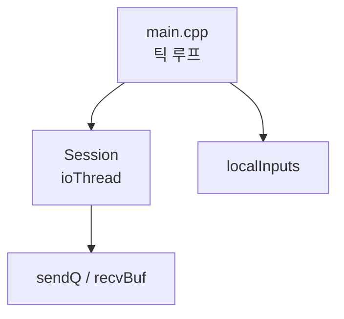
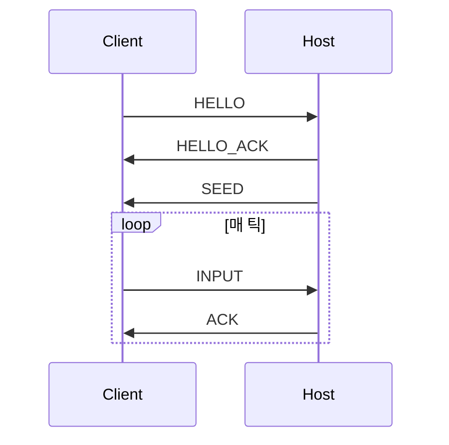
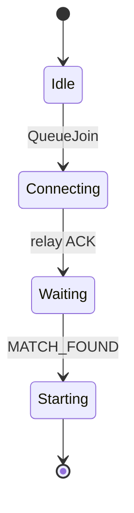

# 블로그 시리즈 공통 스타일 가이드 (Writer 에이전트용)

이 파일은 **집필 에이전트만을 위한 내부 메모**다. 최종 배포 시 제외된다.

## 독자 가정
- 프로그래밍 실력은 있다 (C/C++ 기본, 시스템 프로그래밍 약간). 해당 도메인은 처음.
- **블로그만 읽고 소스 코드를 직접 보지 않아도 프로젝트를 재현할 수 있어야 한다.**
- 한국어 독자. 본문은 한국어, 코드 주석은 기존 스타일(영어/한국어 혼재) 유지.

## 반드시 포함되어야 할 7가지 (누락 시 불합격)

1. **"왜 이렇게 만들었는가" (이론 · 의도)** — 주된 대안(예: raylib vs handmade, P2P vs Relay, PPO vs DQN), 트레이드오프, 결정론·성능·이식성 관점 고려.
2. **아키텍처 다이어그램** — **mermaid** 로 그린다 (ASCII 박스 금지). 모듈 경계 · 데이터 흐름 · 스레드/소유권 모델 · 메시지 포맷. `graph TB`/`sequenceDiagram`/`stateDiagram-v2` 등 적절한 형태 선택.
3. **완전한 코드 발췌** — 핵심 함수는 생략 없이 전체. 반복적 보일러플레이트는 "부록" 섹션으로.
4. **단계별 제작** — 빈 파일에서 최종 형태까지 순차. 중간 산출물마다 "여기서 빌드하면 X 가 된다" 명시.
5. **엣지 케이스 · 실패 모드** — 실제 버그(FNV 미마스킹 · INPUT cnt 바운드 · 창 드래그 단절 오인 · HELLO_ACK 누락 등)를 교훈으로.
6. **수동 테스트 시나리오** — 해당 장 기준으로 실행 가능한 명령 + 기대 결과.
7. **말미 요약 섹션** — 최소한 `이 장에서 완성된 것` + `수동 테스트` 를 둔다. 최종 파트는 회고/확장 섹션으로 마무리해도 된다.

## 파일 헤더 규약

모든 파트 파일 상단:

```markdown
# Part N: <제목>

> **시리즈:** 제로부터 멀티플레이어 테트리스 + RL까지
> **Part N** | [Part 0: 셋업](./part0-project-setup.md) | [Part 1: Win32+GL](./part1-window-and-opengl.md) | [Part 2: 2D 렌더링](./part2-2d-rendering.md) | [Part 3: 테트리스 로직](./part3-tetris-logic.md) | [Part 4: 게임 루프](./part4-game-loop.md) | [Part 5: 네트워킹](./part5-lockstep-networking.md) | [Part 6: Python RL](./part6-python-rl.md) | [Part 7: 오디오](./part7-xaudio2-audio.md) | [Part 8: 릴레이 서버](./part8-relay-server.md) | [Part 9: RL + ONNX 봇](./part9-rl-onnx-bot.md) | [Part 10: 메타 서버와 랭킹](./part10-meta-and-ranking.md)

---
```

(현재 쓰고 있는 파트는 링크 없이 plain text 또는 bold text. 숫자만 고집하지 않아도 된다.)

## 문장 톤

- 단정적. "~것이다/~입니다" 섞어 쓰지 말고 하나로 통일 — 기존 Part 1/3 이 반말체("~이다, ~한다") 를 쓴다. **유지.**
- 불필요한 겸양·자기비하·메타 코멘트 없음 ("제가 설명해드리면…" X).
- 코드 인용은 언어 태그 필수: ```` ```cpp ```` ```` ```python ```` ```` ```bash ```` ```` ```cmake ```` 등.

## 서술 원칙

**최우선**: *아키텍처* 와 *이해하기 쉬운 흐름*. 구현 과정(어떻게 쌓아갔는가)과 실제 구현(결과물 코드)이 자연스럽게 엮여야 한다. 현학적인 "단계별 강제" 가 아니라 독자가 흐름을 따라오면서 구조가 머릿속에 그려지는 느낌.

**유연한 빌드업**:
- 함수 전체를 한 번에 보여주고 "이 함수가 하는 일" 을 해설해도 좋다.
- 복잡한 함수는 빈 시그니처 → 골격 → 엣지케이스 보강 순으로 짜 올려도 좋다.
- 한 섹션에서 다 보여줄 필요는 없다. 다음 챕터에서 **이전 챕터의 함수로 되돌아와서** "여기 이 줄을 추가하자" 하고 갱신해도 자연스럽다. 독자가 "아 그 함수가 여기서 확장되는구나" 하고 연결되기만 하면 OK.
- 한 함수를 챕터별로 점진 확장하는 경우, 매번 **함수 전체를 다시 인용** (이전 모습 + 새 줄). 독자가 이전 챕터를 다시 열어보지 않아도 되도록.

**코드 인용**:
- 인용한 코드는 실제 저장소와 **1:1 일치**해야 한다. 주석 포함. 집필 전 반드시 해당 파일을 Read.
- 함수 전체 인용을 두려워하지 말 것. 100+ 줄도 통째로 OK.
- 가상 코드(저장소에 없는 예시 · 단순화한 학습용 스니펫) 는 명시적으로 `예시(실제 저장소에는 없음)` 태그.
- **컨텍스트 윈도우 걱정 없음** — 같은 코드를 4번 보여줘도 괜찮다. 독자가 헷갈리는 것보다 반복이 낫다.

**"여기서 빌드해보자"** 체크포인트를 자주 둔다. 매 섹션 말미 또는 주요 함수 완성 후에 "이 시점에서 빌드하면 X 가 된다 / 아직 Y 는 안 된다" 를 명시. 가능하면 실제 출력 예시.

### 스타일 톤 예시

다음 중 어떤 서술도 허용한다 — 독자가 흐름을 파악하기 좋은 방향을 택하라:

**A. 전체-인용 + 해설**
> "이제 `build_frame` 을 살펴보자.
> ```cpp
> std::vector<uint8_t> build_frame(MsgType t, const std::vector<uint8_t>& payload) {
>     std::vector<uint8_t> out;
>     le_write_u16(out, (uint16_t)(1 + payload.size()));
>     out.push_back((uint8_t)t);
>     out.insert(out.end(), payload.begin(), payload.end());
>     uint32_t chk = payload.empty() ? 0u : fnv1a32(payload.data(), payload.size());
>     le_write_u32(out, chk);
>     return out;
> }
> ```
> 길이 2바이트 · 타입 1바이트 · payload · 체크섬 4바이트 순. 여기서 체크섬은 **payload만** 덮는다. 현재 저장소 구현(`net/framing.cpp`)과 반드시 1:1로 맞춘다."

**B. 점진 빌드업 (복잡한 함수일 때)**
> "`build_frame` 을 비어있는 상태에서 시작한다.
> ```cpp
> std::vector<uint8_t> build_frame(MsgType t, const std::vector<uint8_t>& payload) {
>     std::vector<uint8_t> out;
>     // TODO
>     return out;
> }
> ```
> 수신 측이 프레임 경계를 알려면 먼저 길이가 나와야 한다. 길이를 2바이트 LE 로:
> ```cpp
> le_write_u16(out, (uint16_t)payload.size());
> ```
> ... (이어서 타입·payload·체크섬을 차례로 채운다)"

**C. 챕터 교차 확장**
> (Part 5) "여기까지 `Session::handleFrame` 은 HELLO/SEED/INPUT 만 처리한다. PING/PONG 은 다음 섹션에서 추가할 것이다."
> (Part 5 후반) "이제 Part 5 초반에 썼던 `handleFrame` 으로 돌아간다. `case MsgType::PING:` 과 `case MsgType::PONG:` 두 분기를 추가하자:
> ```cpp
> void Session::handleFrame(const Frame& f) {
>     switch (f.type) {
>     // ... (기존 HELLO/SEED/INPUT/ACK/HASH/GAME_OVER_CHOICE 분기 유지)
>     case MsgType::PING: {  // NEW
>         std::vector<uint8_t> pong = f.payload;
>         auto fr = build_frame(MsgType::PONG, pong);
>         std::lock_guard<std::mutex> lk(sendMu); sendQ.push_back(std::move(fr));
>     } break;
>     case MsgType::PONG: {  // NEW
>         lastPongMs.store(now_ms());
>     } break;
>     default: break;
>     }
> }
> ```"

핵심은 독자가 **흐름을 놓치지 않고 아키텍처를 그릴 수 있게** 하는 것. 나머지(반복 여부, 단계 분할 여부)는 유동적으로 판단하라.

## 다이어그램

**mermaid 로만 그린다**. ASCII 아트 금지 (렌더링 환경마다 깨진다).

모듈 관계:
````markdown

````

시퀀스:
````markdown

````

상태머신:
````markdown

````

표·체크리스트는 자유롭게 마크다운으로.

## 분량 타겟

각 파트의 분량 표를 참조한다. **억지로 채우지 마라** — 설명이 자연스럽게 짧아지면 줄인다. 긴 발췌를 "채우기" 위해 중복 설명하지 않는다.

## 말미 섹션 표준

```markdown
## 이 장에서 완성된 것

- ... (구체적 실행 가능 결과)

## 수동 테스트

```bash
# 실제 실행 명령
```

기대 결과: ...
```

## 금지 사항

- 절대 **기존 Part 1/3/4/7 의 스타일을 망치지 마라**. 레퍼런스로 읽고 톤을 맞춰라.
- 이모지 사용 금지 (사용자 명시 요청 없음).
- "저자"로 자기 지칭 금지. 3인칭/전문적 어조.
- TODO · XXX · FIXME 블로그 본문에 남기지 마라.
- 사용자에게 말 걸듯한 문장 ("여러분도 한번…") 금지.
- 본문 중간에 "이하 생략" 으로 얼버무리지 마라.

## 참고 문서 (Read 권장)

- `docs/blog/part1-window-and-opengl.md` — 톤·구조 레퍼런스
- `docs/blog/part3-tetris-logic.md` — 이론·코드·다이어그램 혼합 모범
- `docs/blog/part10-meta-and-ranking.md` — meta/relay/client 3-tier 서술 레퍼런스
- `ARCHITECTURE.md` — 모듈 관계 요약
- `GUIDE.md` — 빌드·실행 가이드
- `ARCHITECTURE.md §11/§12` — 메타 서버 (tetris_meta) + 토큰/MATCH_SUMMARY 흐름
- 각 헤더의 한국어 주석 — 이론 배경 이미 작성된 부분이 많음
