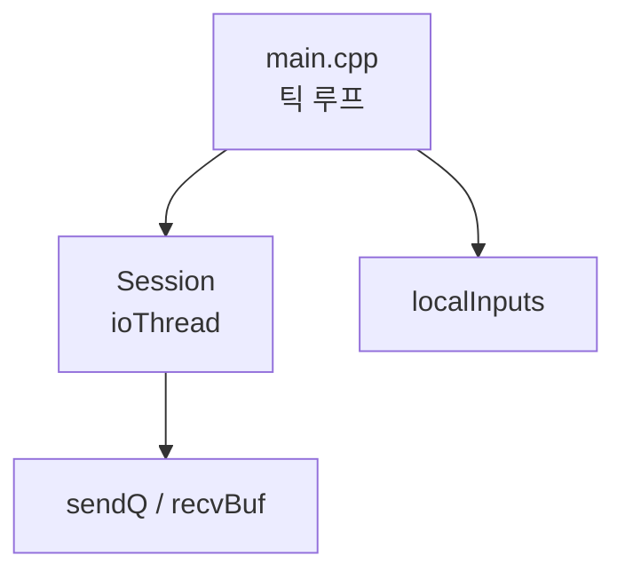
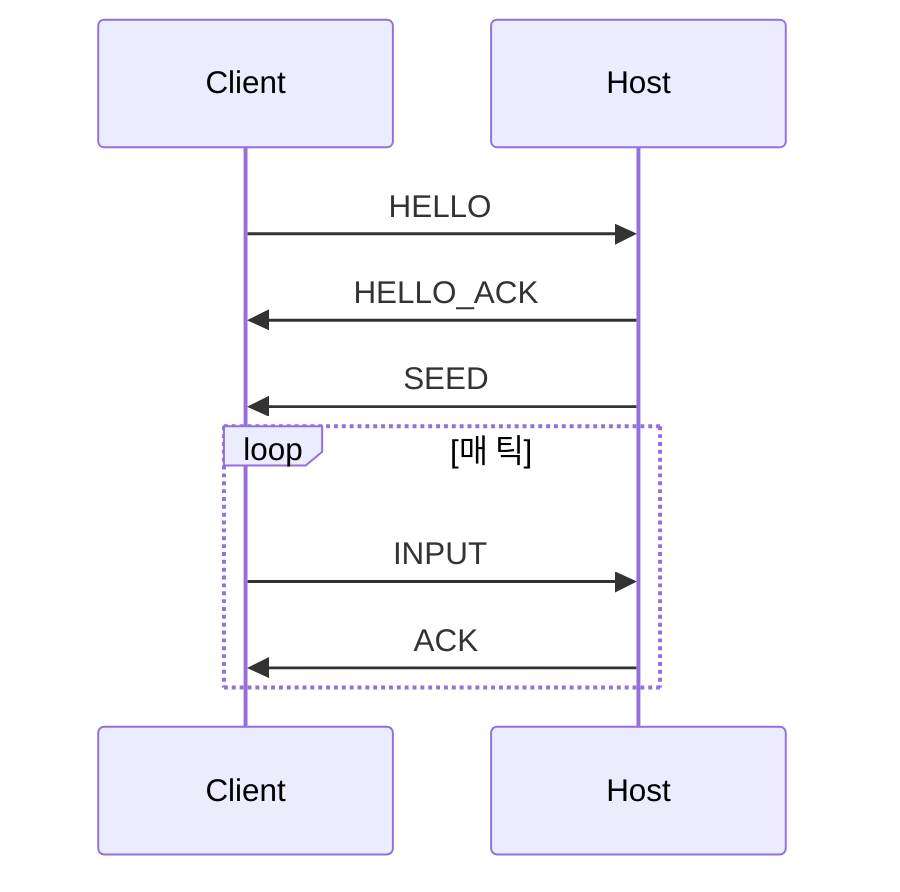
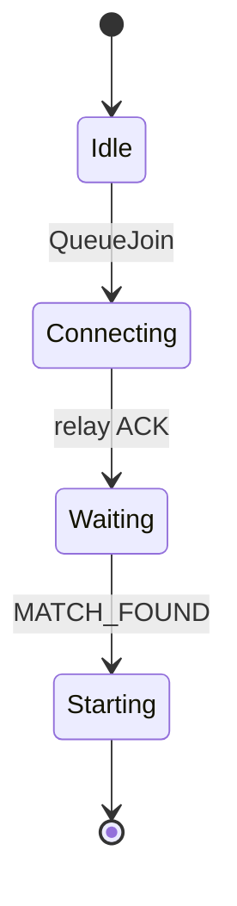

# 블로그 시리즈 공통 스타일 가이드 (Writer 에이전트용)

이 파일은 **집필 에이전트만을 위한 내부 메모**다. 최종 배포 시 제외된다.

## 독자 가정

- C/C++ 기본 문법은 알지만 게임·네트워크·RL 시스템은 처음 접한다.
- 글과 저장소를 함께 읽는다. 문서는 구조와 판단 근거를, 소스는 최신 구현을 제공한다.
- 한국어 본문은 단정한 서술체를 사용한다.
- **저장소 없이도 읽힌다고 가정하라.** 블로그 플랫폼이나 태블릿에서 글만 보며 공부하는
  독자가 1차 독자다. 코드를 열 수 없는 상태에서도 "어떻게 작성하는가"와 "왜 이런
  아키텍처인가"를 따라갈 수 있어야 한다.

## 오프라인 완결성

- "경로와 심볼로 원문을 찾아라"로 설명을 **대신하지 마라.** 계약을 이해하는 데 필요한
  코드는 본문에 발췌하고, 경로·심볼은 최신본 확인용 보조 정보로만 쓴다.
- 각 설계 결정에는 일반화 가능한 이론을 함께 둔다 — 왜 이 구조인가, 대안은 무엇이고
  어떤 조건에서 그 대안이 맞는가. 이 프로젝트를 떠나도 다른 시스템에 적용할 수 있는
  형태로 서술한다.
- 구현 나열만 있고 "왜"가 없는 절은 미완성이다. 코드 발췌 하나마다 그것이 답하는
  질문이 본문에 있어야 한다.

## 고유명사 정책

**이론과 코드는 구체적으로, 도구 브랜드와 하드웨어는 두루뭉술하게.**

- **특정 하드웨어 기기명 금지** — Mac mini, Galaxy S7, 특정 CPU/GPU 모델명, "2011년형"
  같은 식별 가능한 기기 서술을 쓰지 마라. "소형 리눅스 머신", "저전력 Android(Termux)
  단말"처럼 역할과 제약으로 서술한다. 측정 맥락에 필요한 사양(코어 수, RAM 용량)은
  기기명 없이 수치만 유지할 수 있다.
- **미사용 서드파티 브랜드 금지** — 코드가 실제로 쓰지 않는 라이브러리·엔진·서비스
  이름(raylib 류 프레임워크, 상용 엔진 이름, 대안 JSON/DB 라이브러리, 특정 클라우드
  벤더)을 비교 대상으로 언급하지 마라. "기성 게임 프레임워크", "즉시 그리기 라이브러리",
  "범용 JSON 라이브러리"처럼 범주로 서술한다. 그 브랜드의 고유 API 명 인용도 브랜드
  언급으로 간주한다.
- **허용** — 코드가 실제로 사용하는 의존성(SDL2, stb_truetype, cpp-httplib, SQLite,
  ONNX, pybind11, XAudio2 등)은 구체적으로 쓴다. OS·플랫폼 이름(Windows, macOS, Linux,
  Termux, Colab)과 표준·프로토콜 이름도 허용. 이론의 원전 인용(논문, 공개 강연, 알고리즘
  이름)은 계보를 밝히는 것이므로 허용.

## 문서가 답해야 할 질문

1. **"왜 이렇게 만들었는가" (이론 · 의도)** — 주된 대안(예: 기성 즉시 그리기 라이브러리 vs handmade, P2P vs Relay, PPO vs DQN), 트레이드오프, 결정론·성능·이식성 관점 고려.
2. **어디에 있는가** — 파일 경로와 심볼 이름으로 독자가 최신 구현을 찾을 수 있어야 한다.
3. **어떻게 흐르는가** — 데이터, 소유권, 스레드, 상태 전이를 필요한 크기의 다이어그램이나 코드로 설명한다.
4. **어떻게 만들어졌는가** — 완성 과정에서 먼저 필요했던 개념부터 쌓되, 현재 문서의 주제는 문서 안에서 완결한다.
5. **엣지 케이스 · 실패 모드** — 실제 버그(FNV 미마스킹 · INPUT cnt 바운드 · 창 드래그 단절 오인 · HELLO_ACK 누락 등)를 교훈으로.
6. **수동 테스트 시나리오** — 해당 장 기준으로 실행 가능한 명령 + 기대 결과.
7. **검증 가능한 결과** — 명령, 기대 결과, 실패 의미를 필요한 만큼 제공한다.
8. **구현 계약** — 선행 상태, 이번 장의 실제 파일, 이전 계층과의 연결점,
   자동 또는 수동 완료 게이트를 장 첫머리에 둔다.

## 파일 헤더 규약

모든 파트 파일 상단:

```markdown
# Part N: <제목>

> **시리즈:** 제로부터 멀티플레이어 테트리스 + RL | [시리즈 목차](./README.md) | **Part N**

---
```

읽는 순서는 목차가 담당한다. 본문은 이전·다음 글 링크 없이도 이해되어야 한다.

## 문장 톤

- 단정적. "~것이다/~입니다" 섞어 쓰지 말고 하나로 통일 — 기존 Part 1/3 이 반말체("~이다, ~한다") 를 쓴다. **유지.**
- 불필요한 겸양·자기비하·메타 코멘트 없음 ("제가 설명해드리면…" X).
- 코드 인용은 언어 태그 필수: ```` ```cpp ```` ```` ```python ```` ```` ```bash ```` ```` ```cmake ```` 등.

## 서술 원칙

**최우선**: *아키텍처* 와 *이해하기 쉬운 흐름*. 구현 과정(어떻게 쌓아갔는가)과 실제 구현(결과물 코드)이 자연스럽게 엮여야 한다. 현학적인 "단계별 강제" 가 아니라 독자가 흐름을 따라오면서 구조가 머릿속에 그려지는 느낌.

**유연한 빌드업**:
- 함수 전체를 한 번에 보여주고 "이 함수가 하는 일" 을 해설해도 좋다.
- 복잡한 함수는 빈 시그니처 → 골격 → 엣지케이스 보강 순으로 짜 올려도 좋다.
- **껍데기 먼저(skeleton-first)는 계층·장 경계를 넘어도 권장 패턴이다.** 신경망을
  만들 때 encoder/decoder 클래스의 껍데기를 먼저 선언하고 이후에 채워 가듯,
  인터페이스(헤더·시그니처)를 먼저 확정해 보여주고 본문은 그 계약을 채우는 순서로
  전개해도 좋다 — 계약을 먼저 손에 쥔 독자가 구현을 더 잘 따라온다. 뒤 장이 소유한
  모듈을 앞 장의 빌드가 가로지를 때도 같은 해법을 쓴다: **실패 의미론을 지키는 스텁**
  (성공을 흉내 내지 않는 껍데기)을 독자가 직접 쓰게 하면, 나중에 진짜 구현으로
  바꿀 때 동작 변화가 "안 되던 것이 되게" 한 방향뿐이라 안전하다.
- 한 섹션에서 모든 구현을 보여줄 필요는 없다. 다만 설명에 필요한 전제는 현재 문서에서 짧게 다시 정의한다.
- 완성 과정의 중간 형태를 보여줄 때는 현재 소스와 다른 이유와 최종 계약을 같은 자리에서 설명한다.

**코드 인용**:

저장소의 소스 코드를 인용하거나 독자가 만들 코드를 제시할 때는 블록 **바로 위 줄**에
아래 라벨 중 하나를 굵게 붙인다. 셸 명령, 콘솔 출력, 설정·데이터 형식 예시,
mermaid 다이어그램은 앞 문장이 용도를 밝히면 라벨을 붙이지 않아도 된다.

1. ``**현재 소스 발췌 — `경로`**``
2. ``**Part N 체크포인트 — `경로`**``
3. `**예시(실제 저장소에는 없음)**`

````markdown
**현재 소스 발췌 — `renderer/renderer.cpp`**

```cpp
static void blend_surface(int x, int y, Color c, uint8_t coverage)
{
    ...
}
```
````

- `현재 소스 발췌`는 게시 시점의 저장소와 대조한다. 경로와 심볼 이름은 적되 줄
  번호는 적지 않는다. 긴 함수는 핵심 분기만 인용하고 생략한 범위를 명시한다.
- **주석은 1:1 복사 대상이 아니다.** 코드 라인은 현재 소스와 같아야 하지만,
  문서의 발췌에서는 독자가 필요한 전제를 잃지 않도록 기존 설명형 주석을 유지하거나
  현재 문맥에 맞게 다듬을 수 있다. 주석의 사실 계약은 현재 구현과 같아야 한다.
- 문서는 주석이 담은 판단을 더 넓은 흐름으로 연결하는 곳이다. 주석을 기계적으로
  지우고 본문으로 옮기지 말고, 소스 가까이에 있어야 이해되는 불변식·소유권·실패
  이유는 보존한다. 본문은 대안과 시스템 전체 영향까지 확장한다.
- `Part N 체크포인트`는 완성 과정의 컴파일 가능한 중간 상태다. 최종 소스와 다르면
  차이와 최종 형태의 불변식을 블록 바로 아래에서 설명한다.
- 가상 코드(저장소에 없는 예시 · 단순화한 학습용 스니펫)는 `예시(실제 저장소에는
  없음)` 태그. 이 경우 파일 경로 주석(`// src/foo.cpp`)을 붙이지 마라 — 원본으로
  오인된다.
- 코드 전문보다 책임과 제어 흐름을 우선한다. 긴 전문은 최신 소스가 더 정확하다.
- 같은 코드를 반복하기보다 필요한 선수 지식을 짧게 다시 설명한다.

**금지 패턴** (실제로 시리즈 전체를 다시 쓰게 만든 원인들):

- 라벨 없이 `// src/sim_game.cpp` 같은 경로 주석만 붙이기.
- "전체를 그대로 인용한다" 라고 써놓고 일부만 싣기.
- **코드 라인**을 지우거나, 여러 줄짜리 조건문을 한 줄로 합치거나, `/* log */` 로 축약해
  놓고 `현재 소스 발췌` 라벨을 붙이기. (주석은 예외 — 위 규칙대로 그 장 독자에게 맞게
  다시 써도 된다. 바꾸면 안 되는 것은 코드 라인이다.)

**"여기서 빌드해보자"** 체크포인트는 관찰 가능한 변화가 생겼을 때 둔다. 명령과
기대 결과를 함께 적고, 단순 분량 구분을 위해 반복하지 않는다.

### 스타일 톤 예시

다음 중 어떤 서술도 허용한다 — 독자가 흐름을 파악하기 좋은 방향을 택하라:

**A. 전체-인용 + 해설**
> "이제 `build_frame` 을 살펴보자.
> ```cpp
> std::vector<uint8_t> build_frame(MsgType t, const std::vector<uint8_t>& payload) {
>     std::vector<uint8_t> out;
>     le_write_u16(out, (uint16_t)(1 + payload.size()));
>     out.push_back((uint8_t)t);
>     out.insert(out.end(), payload.begin(), payload.end());
>     uint32_t chk = payload.empty() ? 0u : fnv1a32(payload.data(), payload.size());
>     le_write_u32(out, chk);
>     return out;
> }
> ```
> 길이 2바이트 · 타입 1바이트 · payload · 체크섬 4바이트 순. 여기서 체크섬은 **payload만** 덮는다. 현재 저장소 구현(`net/framing.cpp`)과 반드시 1:1로 맞춘다."

**B. 점진 빌드업 (복잡한 함수일 때)**
> "`build_frame` 을 비어있는 상태에서 시작한다.
> ```cpp
> std::vector<uint8_t> build_frame(MsgType t, const std::vector<uint8_t>& payload) {
>     std::vector<uint8_t> out;
>     // TODO
>     return out;
> }
> ```
> 수신 측이 프레임 경계를 알려면 먼저 길이가 나와야 한다. 길이를 2바이트 LE 로:
> ```cpp
> le_write_u16(out, (uint16_t)payload.size());
> ```
> ... (이어서 타입·payload·체크섬을 차례로 채운다)"

핵심은 독자가 **흐름을 놓치지 않고 아키텍처를 그릴 수 있게** 하는 것. 나머지(반복 여부, 단계 분할 여부)는 유동적으로 판단하라.

## 다이어그램

**mermaid 로만 그린다**. ASCII 아트 금지 (렌더링 환경마다 깨진다).

모듈 관계:
````markdown

```mermaid
graph TB
    A[main.cpp<br/>틱 루프] --> B[Session<br/>ioThread]
    A --> C[localInputs]
    B --> D[sendQ / recvBuf]
```
````

시퀀스:
````markdown

```mermaid
sequenceDiagram
    participant C as Client
    participant H as Host
    C->>H: HELLO
    H->>C: HELLO_ACK
    H->>C: SEED
    loop 매 틱
        C->>H: INPUT
        H->>C: ACK
    end
```
````

상태머신:
````markdown

```mermaid
stateDiagram-v2
    [*] --> Idle
    Idle --> Connecting: QueueJoin
    Connecting --> Waiting: relay ACK
    Waiting --> Starting: MATCH_FOUND
    Starting --> [*]
```
````

표·체크리스트는 자유롭게 마크다운으로.

## 분량

고정된 줄 수나 글자 수를 목표로 삼지 않는다. 독자가 계약·제어 흐름·실패 의미를
이해하는 데 필요한 만큼 쓰고, 긴 발췌나 반복 설명으로 분량을 채우지 않는다.

## 실제 소스 주석

- 이미 이해에 도움 되는 설명형 주석은 분량만을 이유로 삭제하지 않는다.
- 구현과 가까이 있어야 하는 불변식, 단위, 소유권, 플랫폼 차이, 실패 이유는 소스에
  남기고 문서에서도 더 넓게 설명한다.
- 동작이 바뀌면 주석도 같은 변경에서 고친다. 오래된 설명은 긴 주석보다 더 해롭다.
- 코드가 자명한 곳에 중복 설명을 늘리지는 않는다.

## 말미 구성

````markdown
## 확인한 계약

- ... (구체적 실행 가능 결과)

## 검증

```bash
# 실제 실행 명령
```

기대 결과: ...
````

## 금지 사항

- 기존 글의 완성 과정과 기술적 근거를 보존한다. 요약본으로 대체하지 않는다.
- 이모지 사용 금지 (사용자 명시 요청 없음).
- "저자"로 자기 지칭 금지. 3인칭/전문적 어조.
- TODO · XXX · FIXME 블로그 본문에 남기지 마라.
- 사용자에게 말 걸듯한 문장 ("여러분도 한번…") 금지.
- 본문 중간에 "이하 생략" 으로 얼버무리지 마라.
- 줄 번호, 줄 범위, “다음 절에서 설명한다” 같은 유효기간 짧은 참조를 쓰지 마라.
- 특정 하드웨어 기기명과 미사용 서드파티 브랜드명을 쓰지 마라 (위 '고유명사 정책' 참조).
- 함수·파일·테스트의 현재 개수나 `N passed`를 완료 기준으로 쓰지 마라. 개수가 규칙 자체인 프로토콜·보드 크기와 달리 구현 재고는 쉽게 변한다. 공개 헤더, 경로, 테스트 파일과 검증할 계약을 적고 실제 수집 결과는 CI가 보여주게 한다.
- 다른 문서를 읽어야만 현재 문장이 이해되는 방식으로 책임을 넘기지 마라.

## 참고 문서 (Read 권장)

- `docs/blog/part2-platform-window-input.md` — 톤·구조 레퍼런스
- `docs/blog/part1-deterministic-simulation.md` — 이론·코드·다이어그램 혼합 모범
- `docs/blog/part10-meta-and-ranking.md` — meta/relay/client 3-tier 서술 레퍼런스
- `docs/blog/README.md` — 트랙 구성·읽기 순서·코드 블록 라벨 규약
- `docs/blog/part13-structure-and-build-reference.md` — 완성 구조·빌드 매트릭스 레퍼런스
- `docs/public-server-deployment.md` — 배포 토폴로지와 운영 절차
- 실제 헤더와 구현 — 최신 공개 계약과 심볼 확인용. 상세한 이론은 블로그 본문에 둔다.
