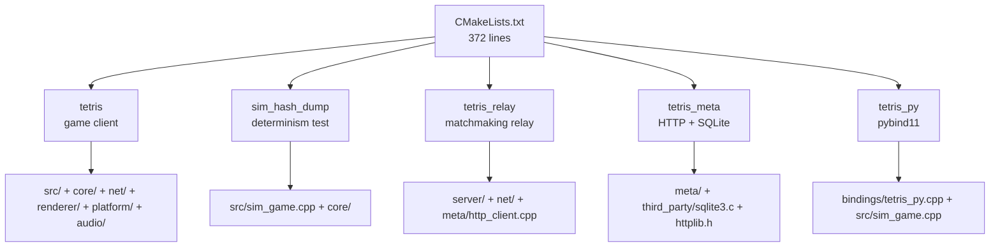

# Part 0: 프로젝트 셋업 — 디렉토리·의존성·CMake

> **시리즈:** 제로부터 멀티플레이어 테트리스 + RL까지
> **Part 0** | [Part 1: Win32+GL](./part1-window-and-opengl.md) | [Part 2: 2D 렌더링](./part2-2d-rendering.md) | [Part 3: 테트리스 로직](./part3-tetris-logic.md) | [Part 4: 게임 루프](./part4-game-loop.md) | [Part 5: 네트워킹](./part5-lockstep-networking.md) | [Part 6: Python RL](./part6-python-rl.md) | [Part 7: 오디오](./part7-xaudio2-audio.md) | [Part 8: 릴레이 서버](./part8-relay-server.md) | [Part 9: RL + ONNX 봇](./part9-rl-onnx-bot.md) | [Part 10: 메타 서버와 랭킹](./part10-meta-and-ranking.md)

---

## 들어가며

raylib 으로 시작하는 테트리스 튜토리얼은 어디에나 있다. 보통 `InitWindow(500, 620, "TETRIS")` 한 줄로 창이 뜨고, `DrawRectangle` 로 블록이 그려진다. 라이브러리 하나만 링크하면 창 · 입력 · 오디오 · 폰트 · 이미지 로더가 전부 따라온다. 그 튜토리얼에서 "CMake" 는 거의 보이지 않는다.

이 시리즈는 그 반대로 간다. raylib 을 링크하지 않는다. Windows 에서는 Win32 API 로 창을 만들고 wgl 로 OpenGL 컨텍스트를 요청한다. macOS/Linux 에서는 SDL2 만 빌려와서 창·입력만 맡기고 나머지는 직접 쓴다. 오디오는 XAudio2 또는 SDL audio subsystem, 폰트는 GDI `wglUseFontBitmaps` 또는 임베드된 5x7 비트맵, MP3 디코딩은 단일 헤더 `dr_mp3`, 네트워킹은 WinSock2/BSD 소켓 순정, 봇 추론은 ONNX Runtime CPU 바이너리만 링크, Python RL 레이어는 pybind11 로 `SimGame` 을 노출한다. 이 모든 것이 하나의 `CMakeLists.txt` 에서 관리된다.

왜 이렇게 만드는가. 첫째, **결정론**. raylib 내부의 입력 큐잉·오디오 스케줄러가 블랙박스로 결과를 뒤흔들면 lockstep 멀티플레이에서 상태가 갈라진다. 각 레이어를 직접 소유해야 "같은 시드 + 같은 입력 = 같은 결과" 를 60Hz 로 보장할 수 있다. 둘째, **이식성의 최소 절단면**. 게임 실행 파일은 Windows/macOS/Linux, 릴레이 서버는 Termux(Android) 까지 간다. 외부 의존성을 줄일수록 "이 플랫폼에서는 이 옵션 꺼라" 가 단순해진다. 셋째, **교육적 가치**. 한 줄이 감추는 여섯 단계를 한 번쯤 직접 써보면 이후 어떤 엔진을 쓰더라도 오류 메시지를 해석할 수 있다.

이 장은 그 모든 재료를 꺼내놓고 빌드 시스템에 줄 세우는 과정을 다룬다. 구체적으로는, 저장소의 `CMakeLists.txt` 372줄을 섹션별로 해부하고, 각 옵션 플래그가 어떤 소스 파일과 어떤 라이브러리를 끌어오는지 추적한다. 독자가 Part 1 로 넘어가기 전에, `cmake -B build && cmake --build build` 가 콘솔에 무엇을 찍는지 전부 설명할 수 있어야 한다.



---

## 1. 레포 구조 한눈에

저장소 최상위에서 `ls` 를 치면 다음이 보인다:

```text
Tetris-Multiplayer-RL/
├── CMakeLists.txt         ← 빌드 진입점 (372줄)
├── README.md
├── GUIDE.md               ← 코드 읽는 순서
├── ARCHITECTURE.md        ← 모듈 레퍼런스 (메타 서버 + 랭킹 흐름 포함)
├── DEPLOY.md              ← 배포/멀티플레이 실행
│
├── core/                  ← 순수 유틸 (외부 의존 없음)
│   ├── constants.h        ← TICKS_PER_SECOND=60 등
│   ├── input.h            ← INPUT_LEFT/RIGHT/... 비트마스크
│   ├── rng.h              ← XorShift64* 결정론 RNG
│   ├── hash.h             ← FNV-1a 64-bit 상태 해시
│   └── replay.h/.cpp      ← 입력 리플레이 저장/로드
│
├── src/                   ← 게임 로직 + 렌더링 래퍼 + 진입점
│   ├── sim_game.h/.cpp    ← SimGame (헤드리스 시뮬)
│   ├── sim_grid.h         ← 20×10 보드
│   ├── sim_block.h        ← 테트로미노 상태
│   ├── sim_blocks.h       ← L/J/I/O/S/T/Z 팩토리
│   ├── game.h/.cpp        ← SimGame + 렌더링 래퍼
│   ├── colors.h/.cpp      ← 팔레트
│   ├── position.h/.cpp    ← (row, col)
│   └── main.cpp           ← 진입점, FSM, 60Hz 루프
│
├── platform/              ← 창/입력 백엔드 (둘 중 하나 선택)
│   ├── platform.h         ← 공용 인터페이스
│   ├── gl_defs.h          ← OpenGL 함수 선언
│   ├── win32.cpp          ← Handmade Win32 (Windows 기본)
│   ├── sdl.cpp            ← SDL2 (macOS/Linux 기본)
│   └── macos/Info.plist.in
│
├── renderer/              ← OpenGL 2D 렌더러
│   ├── renderer.h/.cpp    ← rect/line/matrix
│   ├── shaders.h          ← 인라인 GLSL
│   ├── text_win32.cpp     ← GDI 텍스트 (Win32 경로)
│   ├── text_stb.cpp       ← 5x7 비트맵 폰트 (SDL2 경로)
│   ├── shake.h/.cpp       ← 화면 흔들림
│   └── image.h/.cpp       ← PNG 이미지/콜아웃
│
├── audio/                 ← 오디오 백엔드
│   ├── audio.h            ← 공용 인터페이스
│   ├── audio.cpp          ← XAudio2 (Win32 경로)
│   └── sdl_audio.cpp      ← SDL audio subsystem (SDL2 경로)
│
├── net/                   ← TCP 네트워킹 3계층
│   ├── socket.h/.cpp      ← 크로스플랫폼 TCP
│   ├── framing.h/.cpp     ← 메시지 직렬화
│   └── session.h/.cpp     ← lockstep P2P 세션
│
├── server/                ← tetris_relay (헤드리스)
│   ├── main.cpp
│   ├── player_conn.h/.cpp
│   ├── matchmaker.h/.cpp
│   ├── room.h/.cpp        ← 5자리 코드 커스텀 룸
│   └── relay.h/.cpp       ← 바이트 포워더
│
├── bot/                   ← ONNX Runtime 인-프로세스 봇
│   ├── bot_onnx.h/.cpp    ← Ort::Session 래퍼 (옵션)
│   └── placement.h/.cpp   ← 행동 → 틱 마스크 시퀀스
│
├── bindings/              ← pybind11
│   └── tetris_py.cpp      ← SimGame 노출
│
├── tests/
│   └── sim_hash_dump.cpp  ← 결정론 회귀 테스트 진입점
│
├── python/                ← Python 레이어
│   ├── .python-version    ← 3.12 (uv 가 읽음)
│   ├── requirements.txt
│   ├── requirements-colab.txt
│   ├── sim/               ← 네이티브 모듈 래퍼
│   ├── common/            ← 학습·추론 공용
│   ├── netbot/            ← TCP lockstep 봇 클라이언트
│   ├── train/             ← Colab 학습 (setup_colab.ipynb)
│   ├── tests/             ← pytest 스위트
│   └── legacy/            ← 이전 Pygame 구현 (비빌드, 참조용)
│
├── third_party/
│   ├── dr_mp3.h           ← 단일 헤더 MP3 디코더 (public domain)
│   └── fetch_onnxruntime.sh
│
├── scripts/               ← 플랫폼별 배포 번들
│   ├── release_win.ps1
│   ├── release_macos.sh
│   └── release_linux.sh
│
├── docs/blog/             ← 이 문서 시리즈
├── Font/                  ← monogram.ttf
└── Sounds/                ← music.mp3, rotate.mp3, clear.mp3
```

한 줄 책임 정리:

| 디렉토리 | 책임 | 외부 의존 |
|---|---|---|
| `core/` | 순수 C++ 헬퍼(RNG·해시·상수·입력 비트마스크·리플레이) | 없음 |
| `src/` | 테트리스 로직 + 렌더링 래퍼 + 진입점 | `core/`, `renderer/`, `net/` |
| `platform/` | OS 창/입력 추상화 (`platform.h` 한 인터페이스, 구현 2개) | Win32 API 또는 SDL2 |
| `renderer/` | OpenGL 2D (사각형·라인·텍스트·이미지·셰이크) | OpenGL 2.0+, `platform/` |
| `audio/` | MP3 로드 + 재생 (공용 헤더, 백엔드 2개) | XAudio2 또는 SDL2_audio, `third_party/dr_mp3.h` |
| `net/` | TCP 소켓 → 메시지 프레이밍 → lockstep 세션 | WinSock2 또는 BSD 소켓 + pthread |
| `server/` | `tetris_relay` 바이너리: 매치메이킹 + 바이트 릴레이 | `net/` 만 |
| `bot/` | `ORT::Session` 로 학습된 정책 추론 | ONNX Runtime (옵션) |
| `bindings/` | `SimGame` 을 pybind11 모듈 `tetris_py` 로 노출 | pybind11 |
| `python/` | 학습 파이프라인 · 로컬 netbot 클라이언트 · pytest | numpy, torch, pybind11 |
| `third_party/` | 벤더링된 단일 헤더 + 외부 바이너리 설치 스크립트 | — |
| `scripts/` | 플랫폼별 배포 번들 빌더 (`.zip`/`.tar.gz`/`.app`) | — |
| `docs/` | 블로그 및 설계 문서 | — |

이 구조에서 **화살표는 항상 아래로만 흐른다**. `core/` 는 어디도 import 하지 않고, `src/` 는 `core/` 와 `renderer/` 와 `net/` 을 쓰지만 그 반대는 없다. `server/` 는 `net/` 만 건드리지 `src/` 는 절대 건드리지 않는다 — 이 덕분에 릴레이 서버는 GUI/오디오 없이 빌드할 수 있고 Termux 에서도 돈다. `python/` 은 `bindings/` 를 거쳐 `SimGame` 에만 닿는다 — 렌더링과 네트워크는 Python 관점에서 보이지 않는다.

---

## 2. 의존성 총정리

각 의존성이 **언제 필요하고**, **어떻게 확보**하며, **어느 타겟에 링크**되는지 한 표로 정리한다.

### 2.1 플랫폼 내장 (설치 불필요)

| 라이브러리 | 플랫폼 | 링크 이름 | 쓰임 |
|---|---|---|---|
| OpenGL | 모두 | `opengl32` (Win) / `OpenGL::GL` (Linux) / `-framework OpenGL` (Mac) | 2D 렌더링 |
| GDI / GDI+ | Windows | `gdi32`, `gdiplus` | 텍스트(`wglUseFontBitmaps`), PNG 로딩 |
| WinMM | Windows | `winmm` | `timeBeginPeriod` 로 고해상도 타이머 |
| WinSock2 | Windows | `ws2_32` | TCP 소켓 |
| XAudio2 | Windows | `xaudio2`, `ole32` | 오디오 재생 |
| pthread | Linux/macOS | `Threads::Threads` | `std::thread` 런타임 |

Windows 에서는 Visual Studio 를 설치하면 위 전부가 SDK 에 들어 있다. Linux 에서는 `libgl1-mesa-dev` 패키지가 OpenGL 헤더/라이브러리를 깔고, pthread 는 glibc 에 들어있다. macOS 는 Xcode command-line tools 에 Metal/OpenGL 프레임워크가 동봉된다.

### 2.2 외부 라이브러리

**SDL2** — macOS/Linux 의 창·입력, 그리고 Linux 의 오디오.

- Windows: 기본 비활성 (Win32 경로 사용). `-DTETRIS_USE_SDL2=ON` 으로 활성화 시 `-DSDL2_DIR=...` 로 위치 지정.
- macOS: `brew install sdl2`
- Linux: `apt install libsdl2-dev`
- CMake 에서는 `find_package(SDL2 REQUIRED)` 로 탐색. 배포 버전에 따라 `SDL2::SDL2` 타겟이 있을 수도 있고 `${SDL2_LIBRARIES}` 변수만 제공할 수도 있어, CMakeLists 는 두 경로를 모두 지원한다.

**pybind11** — `tetris_py` 네이티브 모듈 빌드에만 필요.

- `pip install pybind11` 로 설치. 저장소에는 서브모듈로 벤더링돼 있지 않다.
- CMake 에서 `find_package(pybind11 CONFIG QUIET)` 로 탐색. 없으면 `FATAL_ERROR` 로 "`-Dpybind11_DIR=$(python -m pybind11 --cmakedir)` 를 넘겨라" 는 힌트를 준다.
- CMake 4.0+ 는 `FindPythonInterp` / `FindPythonLibs` 가 삭제됐으므로, `set(PYBIND11_FINDPYTHON ON)` 으로 모던 `FindPython` 을 사용하도록 힌트.

**ONNX Runtime** — 봇(`Single vs Bot`) 의 CPU 추론 전용. 용량 때문에 git 서브모듈 대신 **별도 스크립트로 다운로드**한다 (후술 §5).

- 공식 GitHub release 에서 CPU 빌드만 벤더링: Windows `.zip`, macOS `.tgz`(universal2), Linux `.tgz`(x64 또는 aarch64).
- `third_party/onnxruntime/include/onnxruntime_cxx_api.h` 가 있어야 `TETRIS_BUILD_BOT=ON` 이 성공.

**dr_mp3** — 단일 헤더 MP3 디코더 (public domain). `third_party/dr_mp3.h` 로 **이미 저장소에 벤더링**돼 있다. `audio/audio.cpp` 와 `audio/sdl_audio.cpp` 양쪽에서 `#include "../third_party/dr_mp3.h"` 로 사용한다.

**stb 계열** — 저장소에 **없다**. `renderer/text_stb.cpp` 라는 이름은 stb 라이브러리를 쓴다는 의미가 아니라, "SDL2 경로에서 쓰는 비트맵 텍스트 백엔드" 라는 네이밍 관례다. 실제 구현은 컴파일타임 상수 테이블로 임베드한 자체 5x7 비트맵이다. 주석에도 "향후 stb_truetype 도입 시 이 파일만 교체" 라고 명시돼 있다.

### 2.3 Python 환경

저장소에는 `pyproject.toml` 이 **없다**. 대신 `python/` 디렉토리에 전통적인 `requirements.txt` + `.python-version` 조합이 있다:

```text
python/.python-version         → "3.12"
python/requirements.txt        → numpy, torch, pytest, gymnasium
python/requirements-colab.txt  → requirements.txt + pybind11 (+ 선택적 RL 프레임워크)
```

`requirements.txt` 내용:

```text
numpy>=1.24
torch>=2.1
pytest>=7.4
# Gymnasium is optional — only needed if you want common.env.TetrisPlacementEnv
# (e.g. plugging the env into SB3 / CleanRL / LightZero). The netbot client
# itself does not import it.
gymnasium>=0.29
```

[uv](https://github.com/astral-sh/uv) 는 이 형식을 읽고 자동으로 `.venv/` 를 만들어 준다. 프로젝트 컨벤션은 uv 를 **`python/` 하위에서 실행**하는 것이다 — 저장소 어디에서 명령을 쳤든 `--directory python` 으로 위치를 넘긴다:

```bash
uv sync --directory python
uv run --directory python python -m pytest tests/
uv run --directory python python -m netbot.client --connect 192.168.1.5:7777
```

`uv sync` 는 `.python-version` 으로 해석기 버전 3.12 를 끌어오고, `requirements.txt` 를 잠금 해결해 `.venv/` 에 설치한다. Colab 학습 환경은 `uv sync --directory python --extra colab` 대신 그냥 `pip install -r python/requirements-colab.txt` 를 쓴다 (Colab 에는 uv 가 기본 설치돼 있지 않다).

### 2.4 타겟별 의존성 매트릭스

| 타겟 | OpenGL | SDL2 | Win32 API | ONNX RT | pybind11 | 필요 조건 |
|---|---|---|---|---|---|---|
| `tetris` (Win32 경로) | ✓ | — | ✓ | 옵션 | — | Windows only |
| `tetris` (SDL2 경로) | ✓ | ✓ | — | 옵션 | — | 전 플랫폼 |
| `tetris_relay` | — | — | ws2_32만 | — | — | 헤드리스, Termux OK |
| `sim_hash_dump` | — | — | — | — | — | 결정론 테스트, 전 플랫폼 |
| `tetris_py` (pybind11) | — | — | — | — | ✓ | Colab/로컬 Python |

이 표가 CMakeLists 의 옵션 플래그 설계를 결정한다.

---

## 3. CMakeLists.txt 해부

저장소의 `CMakeLists.txt` 는 372줄이다. 이 장에서는 이 파일을 섹션별로 발췌하며 전부 설명한다.

### 3.1 프롤로그

```cmake
cmake_minimum_required(VERSION 3.15)
project(tetris CXX)

set(CMAKE_CXX_STANDARD 17)
set(CMAKE_CXX_STANDARD_REQUIRED ON)

# MSVC: UTF-8 소스 파일 인코딩 (한국어 주석 깨짐 방지)
if (MSVC)
    add_compile_options(/utf-8)
endif()
```

CMake 3.15 는 `find_package` 에 `CONFIG` 모드, `target_link_libraries` 에 타겟 기반 의존성 같은 현대적 기능을 안정적으로 지원하는 최저선이다. C++17 은 `std::optional`, structured binding, `if constexpr` 를 쓰기 위해 필수.

MSVC 의 `/utf-8` 는 소스/실행 인코딩 모두 UTF-8 로 설정하는 플래그다. 이 저장소는 C++ 주석이 한국어로 많이 적혀 있고, MSVC 가 기본으로 가정하는 시스템 로케일(CP949 등)에서 컴파일하면 `warning C4819` 가 쏟아진다. `/utf-8` 하나로 전부 해결.

### 3.2 옵션 플래그

빌드 옵션은 타겟 단위로 4개 + 백엔드 1개 + 봇 1개, 총 6개다:

```cmake
option(TETRIS_BUILD_GAME  "Build the handmade game executable"              ON)
option(TETRIS_BUILD_PY    "Build the pybind11 module (tetris_py)"           OFF)
option(TETRIS_BUILD_TEST  "Build the SimGame determinism test"              ON)
option(TETRIS_BUILD_RELAY "Build the tetris_relay matchmaking server"       OFF)
option(TETRIS_BUILD_BOT   "Link onnxruntime (Section C bot inference)"      OFF)

if (WIN32)
    option(TETRIS_USE_SDL2 "Use SDL2 backend (cross-platform)" OFF)
else()
    option(TETRIS_USE_SDL2 "Use SDL2 backend (cross-platform)" ON)
endif()
```

각 플래그의 의미:

- **`TETRIS_BUILD_GAME`** — 게임 실행 파일(`tetris`). 기본 ON. Windows 에서는 Win32 경로, 그 외는 SDL2 경로로 빌드된다.
- **`TETRIS_BUILD_PY`** — pybind11 모듈(`tetris_py`). 기본 OFF — 로컬에서 학습/봇을 실제로 돌릴 때만 켠다.
- **`TETRIS_BUILD_TEST`** — `sim_hash_dump` 결정론 회귀 테스트. 기본 ON — GUI 가 없으므로 어느 플랫폼에서든 빌드된다.
- **`TETRIS_BUILD_RELAY`** — `tetris_relay` 매치메이킹 서버. 기본 OFF — 릴레이 호스트에서만 켠다.
- **`TETRIS_BUILD_BOT`** — ONNX Runtime 링크. OFF 라도 `bot/bot_onnx.cpp` 는 컴파일되지만 `TETRIS_HAS_ONNXRUNTIME` 매크로가 미정의라 **스텁 모드**로 빌드돼, `LoadModel` 이 항상 실패한다. 메뉴에서 "Single vs Bot" 이 자동으로 회색 비활성으로 표시된다.
- **`TETRIS_USE_SDL2`** — 백엔드 선택. Windows 는 OFF(= Win32 handmade), 그 외는 ON(= SDL2). 이 값이 `platform/*.cpp`, `renderer/text_*.cpp`, `audio/*.cpp` 세 쌍의 선택을 동시에 결정한다.

CMake 명령줄에서는 `-DTETRIS_BUILD_RELAY=ON` 처럼 넘긴다.

### 3.3 공유 소스 목록

모든 타겟이 쓰는 순수 시뮬 파일들을 변수로 뽑아 둔다:

```cmake
# Pure (no raylib) logic — used by game, pybind11 module, and tests.
set(TETRIS_SIM_SOURCES
    src/sim_game.cpp
    src/position.cpp
)

set(TETRIS_SIM_HEADERS
    src/sim_game.h
    src/sim_grid.h
    src/sim_block.h
    src/sim_blocks.h
    src/position.h
    core/constants.h
    core/input.h
    core/rng.h
    core/hash.h
)
```

`sim_grid.h` / `sim_block.h` / `sim_blocks.h` 가 헤더만 있는 이유는 이들이 템플릿 없이 구조체 + inline 함수만 담기 때문이다 (Part 3 에서 다룬다). `SimGame` 은 `.cpp` 로 분리했는데, 이 파일은 크고 RNG/해시 구현이 담겨 단일 번역 단위로 두는 게 빌드 시간상 이득이다.

### 3.4 타겟 1 — `tetris` (게임 클라이언트)

이 섹션은 `TETRIS_BUILD_GAME=ON` 일 때만 활성화된다. 내부 구조는 3단계다:

(a) **공통 소스 묶음** — 백엔드와 무관하게 항상 포함:

```cmake
if (TETRIS_BUILD_GAME)
    set(TETRIS_GAME_COMMON
        ${TETRIS_SIM_SOURCES}
        src/main.cpp
        src/game.cpp
        src/colors.cpp
        core/replay.cpp
        net/socket.cpp
        net/framing.cpp
        net/session.cpp
        renderer/renderer.cpp
        renderer/shake.cpp
        renderer/image.cpp
        bot/placement.cpp
        bot/bot_onnx.cpp
    )
```

주목할 점: `bot/bot_onnx.cpp` 는 `TETRIS_BUILD_BOT=OFF` 라도 **항상 컴파일된다**. 런타임에 `LoadModel` 이 실패할 뿐이다. 이 덕분에 `main.cpp` 의 `#ifdef` 분기가 필요 없다 — 호출 쪽 코드는 항상 동일하고, 빌드 옵션은 메뉴의 회색/활성 토글로만 드러난다.

(b) **백엔드 분기** — `TETRIS_USE_SDL2` 에 따라 3개 파일을 교체:

```cmake
    if (TETRIS_USE_SDL2)
        find_package(SDL2 REQUIRED)

        add_executable(tetris
            ${TETRIS_GAME_COMMON}
            ${TETRIS_GAME_HEADERS}
            platform/sdl.cpp
            renderer/text_stb.cpp
            audio/sdl_audio.cpp
        )
        target_include_directories(tetris PRIVATE ${CMAKE_CURRENT_SOURCE_DIR} ${SDL2_INCLUDE_DIRS})

        # SDL2::SDL2 타겟은 find_package(SDL2) 배포 버전마다 제공 여부가 다름
        if (TARGET SDL2::SDL2)
            target_link_libraries(tetris PRIVATE SDL2::SDL2)
        else()
            target_link_libraries(tetris PRIVATE ${SDL2_LIBRARIES})
        endif()

        if (APPLE)
            target_link_libraries(tetris PRIVATE "-framework OpenGL")
        elseif (WIN32)
            target_link_libraries(tetris PRIVATE opengl32 gdiplus ws2_32)
        else()
            find_package(OpenGL REQUIRED)
            target_link_libraries(tetris PRIVATE OpenGL::GL)
            find_package(Threads REQUIRED)
            target_link_libraries(tetris PRIVATE Threads::Threads)
        endif()
    else()
        # Handmade 경로: Win32 window + OpenGL + XAudio2 + GDI text
        add_executable(tetris
            ${TETRIS_GAME_COMMON}
            ${TETRIS_GAME_HEADERS}
            platform/win32.cpp
            renderer/text_win32.cpp
            audio/audio.cpp
        )
        target_include_directories(tetris PRIVATE ${CMAKE_CURRENT_SOURCE_DIR})

        if (WIN32)
            target_link_libraries(tetris PRIVATE opengl32 gdi32 gdiplus winmm ws2_32 xaudio2 ole32)
        else()
            message(FATAL_ERROR "Handmade Win32 backend is Windows-only. Set -DTETRIS_USE_SDL2=ON.")
        endif()
    endif()
```

두 분기의 **짝** 관계를 그림으로 정리하면:

| 백엔드 | `platform/` | `renderer/text_*` | `audio/` |
|--------|-------------|-------------------|----------|
| Win32  | `win32.cpp` | `text_win32.cpp`  | `audio.cpp`     |
| SDL2   | `sdl.cpp`   | `text_stb.cpp`    | `sdl_audio.cpp` |

각 행이 한 묶음 — `TETRIS_USE_SDL2` 값에 따라 세 파일이 동시에 교체된다.

헤더 `platform/platform.h`, `renderer/renderer.h`, `audio/audio.h` 는 양쪽이 동일한 인터페이스를 구현한다. 그래서 `src/main.cpp`, `src/game.cpp` 는 **한 줄도 바뀌지 않는다** — 선택은 전적으로 CMake 레벨.

Win32 경로의 링크 목록을 한 줄씩 훑어보자:

- `opengl32` — `wglCreateContext`, `glClear` 등 GL 1.x 코어.
- `gdi32` — `GetDC`, `ChoosePixelFormat`, `SetPixelFormat`, `wglUseFontBitmaps`.
- `gdiplus` — `Gdiplus::Bitmap` PNG 로더 (`renderer/image.cpp`).
- `winmm` — `timeBeginPeriod(1)` 로 `Sleep` 해상도 1ms 강제.
- `ws2_32` — WinSock2 (`socket`, `connect`, `send`, `recv`).
- `xaudio2` — `IXAudio2CreateCom` 상위 인터페이스.
- `ole32` — `CoInitializeEx` (XAudio2 가 COM 위에 있음).

SDL2 경로 Linux 분기에서 `find_package(Threads REQUIRED)` 이 필요한 이유: `std::thread` 는 C++ 표준이지만 GCC/libstdc++ 는 내부적으로 pthread 를 호출한다. 대부분의 배포판에서는 `-lpthread` 를 걸지 않으면 `undefined reference to pthread_create` 로 링크 실패한다. `Threads::Threads` 타겟이 이 플래그를 자동으로 붙여준다.

(c) **선택적 ONNX Runtime** — `TETRIS_BUILD_BOT=ON` 이 켜졌을 때만:

```cmake
    if (TETRIS_BUILD_BOT)
        set(ORT_ROOT "${CMAKE_CURRENT_SOURCE_DIR}/third_party/onnxruntime")
        if (NOT EXISTS "${ORT_ROOT}/include/onnxruntime_cxx_api.h")
            message(FATAL_ERROR
                "TETRIS_BUILD_BOT=ON 이지만 ${ORT_ROOT}/include/onnxruntime_cxx_api.h 가 없습니다. "
                "third_party/fetch_onnxruntime.sh 로 벤더링하거나 TETRIS_BUILD_BOT=OFF 로 빌드하세요.")
        endif()
        target_compile_definitions(tetris PRIVATE TETRIS_HAS_ONNXRUNTIME=1)
        target_include_directories(tetris PRIVATE "${ORT_ROOT}/include")
        if (WIN32)
            target_link_libraries(tetris PRIVATE "${ORT_ROOT}/lib/win-x64/onnxruntime.lib")
        elseif (APPLE)
            target_link_libraries(tetris PRIVATE "${ORT_ROOT}/lib/osx-universal2/libonnxruntime.dylib")
        else()
            target_link_libraries(tetris PRIVATE "${ORT_ROOT}/lib/linux-x64/libonnxruntime.so")
        endif()
    endif()
```

`TETRIS_HAS_ONNXRUNTIME=1` 매크로가 정의되면 `bot/bot_onnx.cpp` 가 실제 `Ort::Session` 경로로 컴파일된다 (정의 안 되면 스텁). CMake 는 **헤더 존재 여부만 사전 검사**하고, 그마저도 없으면 친절히 `fetch_onnxruntime.sh` 를 가리키는 에러로 실패한다.

(d) **rpath & .app 번들 메타** — 배포용 설정:

```cmake
    if (APPLE)
        set(MACOSX_BUNDLE_GUI_IDENTIFIER "com.rein.tetris")
        set(MACOSX_BUNDLE_BUNDLE_NAME "Tetris")
        if (EXISTS "${CMAKE_CURRENT_SOURCE_DIR}/platform/macos/Info.plist.in")
            if (NOT DEFINED PROJECT_VERSION)
                set(PROJECT_VERSION "1.0.0")
            endif()
            configure_file(
                "${CMAKE_CURRENT_SOURCE_DIR}/platform/macos/Info.plist.in"
                "${CMAKE_CURRENT_BINARY_DIR}/Info.plist"
                @ONLY)
        endif()
        set_target_properties(tetris PROPERTIES
            BUILD_RPATH "@executable_path/../Frameworks"
            INSTALL_RPATH "@executable_path/../Frameworks")
    elseif (UNIX)
        set_target_properties(tetris PROPERTIES
            BUILD_RPATH "$ORIGIN/lib"
            INSTALL_RPATH "$ORIGIN/lib")
    endif()
```

**rpath 가 왜 중요한가.** macOS 와 Linux 의 동적 링커(`dyld`, `ld-linux`)는 실행 파일이 필요로 하는 `.dylib`/`.so` 를 시스템 경로(`/usr/lib`, `/usr/local/lib`)에서 찾는다. 하지만 배포 번들은 시스템에 아무것도 설치하지 않고 동봉된 라이브러리를 쓰고 싶다. rpath 는 실행 파일 안에 임베드되는 "탐색 경로 힌트" 다:

- macOS: `@executable_path/../Frameworks` — `Tetris.app/Contents/MacOS/tetris` 에서 `Tetris.app/Contents/Frameworks/libSDL2.dylib` 를 찾아간다.
- Linux: `$ORIGIN/lib` — 실행 파일과 같은 폴더의 `lib/libSDL2.so` 를 찾아간다.

Windows 는 rpath 개념이 없다 — DLL 은 "실행 파일과 같은 폴더" 를 자동으로 뒤지므로 배포 번들에서 DLL 을 `tetris.exe` 옆에 두기만 하면 된다.

### 3.5 `copy_assets` 커스텀 타겟

실행 파일은 빌드 디렉토리에 생성되지만 `Font/monogram.ttf` 나 `Sounds/music.mp3` 는 소스 디렉토리에 있다. 게임은 상대 경로 `Font/...` 로 리소스를 여는데, 빌드 디렉토리에서 실행하면 파일을 못 찾는다. 해결은 빌드 시 자동으로 복사하는 커스텀 타겟이다:

```cmake
    set(_copy_cmds
        COMMAND ${CMAKE_COMMAND} -E copy_directory ${CMAKE_CURRENT_SOURCE_DIR}/Font   ${CMAKE_CURRENT_BINARY_DIR}/Font
        COMMAND ${CMAKE_COMMAND} -E copy_directory ${CMAKE_CURRENT_SOURCE_DIR}/Sounds ${CMAKE_CURRENT_BINARY_DIR}/Sounds
    )
    if (EXISTS "${CMAKE_CURRENT_SOURCE_DIR}/assets")
        list(APPEND _copy_cmds
            COMMAND ${CMAKE_COMMAND} -E copy_directory ${CMAKE_CURRENT_SOURCE_DIR}/assets ${CMAKE_CURRENT_BINARY_DIR}/assets)
    endif()
    if (EXISTS "${CMAKE_CURRENT_SOURCE_DIR}/model")
        list(APPEND _copy_cmds
            COMMAND ${CMAKE_COMMAND} -E copy_directory ${CMAKE_CURRENT_SOURCE_DIR}/model ${CMAKE_CURRENT_BINARY_DIR}/model)
    endif()
    add_custom_target(copy_assets ALL
        ${_copy_cmds}
        DEPENDS tetris
    )
endif()
```

핵심은 세 가지:

1. **`${CMAKE_COMMAND} -E copy_directory`** — CMake 자체의 플랫폼 독립 `cp -R`. `cp` / `robocopy` 로 분기할 필요 없음.
2. **`ALL`** — 기본 빌드에 포함(타겟 이름을 명시하지 않아도 실행). 디폴트 `cmake --build` 한 방에 따라온다.
3. **`DEPENDS tetris`** — 실행 파일이 먼저 빌드된 후 복사. 병렬 빌드 시에도 순서 보장.

`assets/`, `model/` 은 **없을 수도 있다**. `assets/` 에는 아이콘/콜아웃 PNG 가, `model/` 에는 `policy.onnx` 가 들어가는데 둘 다 선택적이다. `if (EXISTS ...)` 로 조건부 추가해 에러 방지.

### 3.6 타겟 2 — `tetris_relay` (릴레이 서버)

```cmake
if (TETRIS_BUILD_RELAY)
    add_executable(tetris_relay
        server/main.cpp
        server/matchmaker.cpp
        server/player_conn.cpp
        server/relay.cpp
        server/room.cpp
        net/socket.cpp
        net/framing.cpp
        server/matchmaker.h
        server/player_conn.h
        server/relay.h
        server/room.h
        net/socket.h
        net/framing.h
    )
    target_include_directories(tetris_relay PRIVATE ${CMAKE_CURRENT_SOURCE_DIR})
    if (WIN32)
        target_link_libraries(tetris_relay PRIVATE ws2_32)
    else()
        find_package(Threads REQUIRED)
        target_link_libraries(tetris_relay PRIVATE Threads::Threads)
    endif()
    if (UNIX AND NOT APPLE)
        set_target_properties(tetris_relay PROPERTIES
            BUILD_RPATH "$ORIGIN/lib"
            INSTALL_RPATH "$ORIGIN/lib")
    endif()
endif()
```

주목: 소스 목록에 `src/` 가 **한 파일도 없다**. `server/` + `net/socket.cpp` + `net/framing.cpp` 뿐이다. 링크 라이브러리도 `ws2_32` (Windows) 또는 `Threads::Threads` (Linux/macOS) 한 개씩. OpenGL 도, SDL2 도 없다. 덕분에 `apt install cmake g++` 두 패키지만 있으면 Termux(Android Ubuntu proot ARM64) 에서도 빌드된다.

### 3.7 타겟 3 — `sim_hash_dump` (결정론 테스트)

```cmake
if (TETRIS_BUILD_TEST)
    add_executable(sim_hash_dump
        tests/sim_hash_dump.cpp
        ${TETRIS_SIM_SOURCES}
        ${TETRIS_SIM_HEADERS}
    )
    target_include_directories(sim_hash_dump PRIVATE ${CMAKE_CURRENT_SOURCE_DIR})
endif()
```

오직 순수 시뮬만 링크. OS API 없음, 네트워크 없음. 이 바이너리는 고정 시드 + 고정 입력 시퀀스를 1000틱 돌려 매 틱마다 `StateHash()` 를 stdout 에 뱉는다. Python 쪽에도 같은 시드로 생성한 레퍼런스 덤프(`python/tests/_sim_hash_dump.txt`)가 있어, `diff <(./sim_hash_dump) python/tests/_sim_hash_dump.txt` 한 줄로 결정론 회귀를 검증한다. 플랫폼 간 `StateHash` 가 한 비트라도 다르면 멀티플레이가 desync 된다 — 이 바이너리가 마지막 방어선.

### 3.8 타겟 4 — `tetris_py` (pybind11 모듈)

```cmake
if (TETRIS_BUILD_PY)
    set(PYBIND11_FINDPYTHON ON)
    find_package(pybind11 CONFIG QUIET)
    if (NOT pybind11_FOUND)
        message(FATAL_ERROR
            "pybind11 not found. Install it (pip install pybind11) and "
            "re-run cmake with -Dpybind11_DIR=$(python -m pybind11 --cmakedir)")
    endif()

    pybind11_add_module(tetris_py
        bindings/tetris_py.cpp
        ${TETRIS_SIM_SOURCES}
        ${TETRIS_SIM_HEADERS}
    )

    target_include_directories(tetris_py PRIVATE ${CMAKE_CURRENT_SOURCE_DIR})
endif()
```

`pybind11_add_module` 매크로는 pybind11 이 제공하는 헬퍼로, 다음을 알아서 해준다:

- 올바른 shared library 접미사(Linux `.so`, macOS `.so`, Windows `.pyd`)
- Python 헤더 include
- Python ABI 에 맞는 심볼 내보내기 설정(`-fvisibility=hidden` + `PYBIND11_MODULE`)
- Python 인터프리터 자동 감지(CMake 4.0+ 호환을 위해 `PYBIND11_FINDPYTHON` 힌트)

소스에는 `bindings/tetris_py.cpp` + 공유 시뮬 2개가 들어간다. 렌더러·네트워크·플랫폼은 한 줄도 없다. Python 은 `SimGame` 만 보고, 자기 쪽 렌더링/네트워크는 Python 레이어에서 따로 구현한다.

### 3.9 라이브러리 링크 순서는 왜 중요한가

CMake 는 `target_link_libraries` 에 적은 순서대로 링커에 전달한다 (`-lA -lB -lC` 순으로). GCC/Clang 의 정적 링커는 **"왼쪽에서 오른쪽으로" 한 번만** 심볼 테이블을 훑는다. 만약 `A.o` 가 `libB` 의 심볼을 필요로 하면 반드시 `A` 가 `B` 보다 **먼저** 등장해야 한다. 그렇지 않으면 `B` 의 심볼이 그 시점에 필요하지 않은 것으로 판단돼 링커가 건너뛴다.

이 저장소에서는 이 문제가 겉으로 드러나지 않는데, 이유는:

1. `target_link_libraries` 가 받는 항목이 대부분 "누가 참조하는지 명확한 leaf" 들이다. 예: `opengl32` 는 다른 라이브러리에 의존하지 않음.
2. MSVC 의 링커는 다수의 패스를 돌려 이 순서 민감도가 약하다.
3. `SDL2::SDL2` 같은 IMPORTED 타겟은 내부에 `INTERFACE_LINK_LIBRARIES` 를 달고 있어, CMake 가 자동으로 전이적 의존성을 해결한다.

그래도 관례를 알아두면 좋다: **"사용하는 쪽 → 사용되는 쪽"** 순서다. 예컨대 `target_link_libraries(tetris PRIVATE opengl32 gdi32 gdiplus winmm ws2_32 xaudio2 ole32)` 에서 맨 뒤의 `ole32` 는 `xaudio2` 가 쓴다(COM). Linux 빌드에서 `OpenGL::GL` 다음에 `Threads::Threads` 를 적는 것도 같은 맥락 — `OpenGL::GL` 의 일부 구현이 내부적으로 pthread 심볼을 참조할 가능성을 대비.

---

## 4. `third_party/fetch_onnxruntime.sh` 의 역할

ONNX Runtime CPU 바이너리는 용량이 크다(Windows `.zip` 약 20MB, Linux `.so` 약 15MB, macOS universal2 약 40MB). Git 서브모듈로 묶기에는 무겁고, 사용자마다 필요 플랫폼이 다르다(Linux 릴레이 호스트에서 봇을 돌릴 일은 없음). 그래서 CMake 밖으로 빼서 **쉘 스크립트 하나**로 벤더링한다.

전체 소스는 다음과 같다:

```bash
#!/usr/bin/env bash
# third_party/fetch_onnxruntime.sh — 공식 ONNX Runtime CPU 릴리스 다운로드.
#
# 사용법:
#   ./third_party/fetch_onnxruntime.sh          # 현재 OS/아키텍처 자동 감지
#   ./third_party/fetch_onnxruntime.sh 1.18.1   # 특정 버전 지정
#
# 완료 후 third_party/onnxruntime/ 에 include/ 과 lib/<platform>/ 이 배치된다.
# CMake -DTETRIS_BUILD_BOT=ON 이 이 구조를 기대한다.
set -euo pipefail

ORT_VERSION="${1:-1.18.1}"
BASE_URL="https://github.com/microsoft/onnxruntime/releases/download/v${ORT_VERSION}"
DEST="$(cd "$(dirname "$0")" && pwd)/onnxruntime"

detect_platform() {
    local os arch
    os="$(uname -s)"
    arch="$(uname -m)"

    case "$os" in
        Linux)
            case "$arch" in
                x86_64)  echo "linux-x64" ;;
                aarch64) echo "linux-aarch64" ;;
                *)       echo "linux-x64" ;;  # fallback
            esac ;;
        Darwin)
            echo "osx-universal2" ;;
        MINGW*|MSYS*|CYGWIN*|Windows_NT)
            echo "win-x64" ;;
        *)
            echo >&2 "[fetch_onnxruntime] Unknown OS: $os"; exit 1 ;;
    esac
}
```

설계 결정 세 가지를 짚어보자:

**왜 CMake `FetchContent` 나 `ExternalProject_Add` 가 아닌가.** ONNX Runtime 은 공식 배포가 **이미 바이너리** 다 — CMake 빌드 스크립트가 들어 있지 않다. `FetchContent` 로 끌어와도 빌드할 수 없고, 단지 압축을 풀어 경로를 맞추는 일이 전부다. 그 일은 쉘이 더 잘 한다. 또한 CMake 시점에 네트워크 요청을 하면 오프라인 빌드가 깨진다. 스크립트는 한 번 실행하고 결과물을 커밋하지 않은 채 로컬에 남겨두는 편이 관리가 쉽다.

**버전 핀 전략.** 기본값 `1.18.1` 이 스크립트에 하드코딩돼 있다. 첫 번째 인자로 다른 버전(`./fetch_onnxruntime.sh 1.19.0`)을 넘길 수 있지만, CMake 는 이 값을 모른다 — 그저 `include/onnxruntime_cxx_api.h` 와 `lib/<platform>/` 하위의 확장자만 본다. API 레벨의 호환성은 Microsoft 가 세마 버저닝으로 보장한다. 실제로는 1.16 ~ 1.19 사이에서 `Ort::Session` API 가 호환되므로 버전을 자주 건드릴 일이 없다.

**파일 배치 규칙.** 스크립트는 아카이브를 풀어 `third_party/onnxruntime/include/` (헤더) 와 `third_party/onnxruntime/lib/<platform>/` (라이브러리) 로 정리한다. `<platform>` 은 `win-x64`, `osx-universal2`, `linux-x64`, `linux-aarch64` 중 하나. CMakeLists 는 이 경로를 직접 참조한다:

```cmake
if (WIN32)
    target_link_libraries(tetris PRIVATE "${ORT_ROOT}/lib/win-x64/onnxruntime.lib")
elseif (APPLE)
    target_link_libraries(tetris PRIVATE "${ORT_ROOT}/lib/osx-universal2/libonnxruntime.dylib")
else()
    target_link_libraries(tetris PRIVATE "${ORT_ROOT}/lib/linux-x64/libonnxruntime.so")
endif()
```

CMake 쪽 에러 메시지도 스크립트를 정확히 가리킨다:

```text
FATAL_ERROR: TETRIS_BUILD_BOT=ON 이지만 third_party/onnxruntime/include/onnxruntime_cxx_api.h
가 없습니다. third_party/fetch_onnxruntime.sh 로 벤더링하거나 TETRIS_BUILD_BOT=OFF 로 빌드하세요.
```

Windows PowerShell 에서 bash 가 없다면 WSL 이나 Git Bash 를 써야 한다 — 또는 해당 아카이브를 수동으로 받아 같은 경로에 풀어도 된다.

---

## 5. 첫 빌드 — Windows (Visual Studio 2022)

### 5.1 사전 준비

1. [Visual Studio 2022 Community](https://visualstudio.microsoft.com/) 설치. "Desktop development with C++" 워크로드를 선택 — 여기에 MSVC 툴체인, Windows SDK, CMake 통합이 전부 포함된다.
2. Git for Windows (또는 GitHub Desktop).
3. (선택) 봇 빌드를 할 거라면 Git Bash 도 깔려 있어야 `fetch_onnxruntime.sh` 를 실행할 수 있다.

### 5.2 기본 빌드 (게임 + 테스트)

PowerShell 또는 `x64 Native Tools Command Prompt for VS 2022` 를 띄우고:

```powershell
cd D:\path\to\Tetris-Multiplayer-RL

# configure — build/ 디렉토리 생성, Visual Studio 솔루션 자동 감지
cmake -B build

# build — Release 구성으로 병렬 빌드
cmake --build build --config Release
```

첫 `cmake -B build` 는 다음을 찍는다 (일부):

```text
-- Selecting Windows SDK version 10.0.xxxxx to target Windows 10.0.
-- The CXX compiler identification is MSVC 19.xx.xxxxx
-- Detecting CXX compile features
-- Configuring done
-- Generating done
-- Build files have been written to: .../build
```

실행 파일은 `build\Release\tetris.exe`, `build\Release\sim_hash_dump.exe` 에 생성된다. `build\Release\` 에 `Font\` 와 `Sounds\` 폴더도 자동 복사됐는지 확인한다 (`copy_assets` 타겟의 효과).

```powershell
.\build\Release\tetris.exe
.\build\Release\sim_hash_dump.exe
```

전자는 게임 창, 후자는 해시 덤프 텍스트가 stdout 에 쏟아진다.

### 5.3 릴레이 서버까지 포함

```powershell
cmake -B build -DTETRIS_BUILD_RELAY=ON
cmake --build build --config Release

.\build\Release\tetris_relay.exe --port 7777
```

### 5.4 봇 포함 (ONNX Runtime 벤더링 필요)

Git Bash 에서:

```bash
./third_party/fetch_onnxruntime.sh
```

그 후 PowerShell 로 돌아가:

```powershell
cmake -B build -DTETRIS_BUILD_BOT=ON
cmake --build build --config Release

# 실행 전에 onnxruntime.dll 을 exe 옆에 복사
copy .\third_party\onnxruntime\lib\win-x64\onnxruntime.dll .\build\Release\

.\build\Release\tetris.exe
```

메뉴에 "Single vs Bot" 이 활성(화이트)으로 표시되면 성공. 모델 파일(`model/policy.onnx`)이 없으면 여전히 회색이다 — Part 9 에서 다룬다.

### 5.5 배포 번들 한 방에

```powershell
.\scripts\release_win.ps1              # 기본
.\scripts\release_win.ps1 -Bot         # 봇 포함
.\scripts\release_win.ps1 -Sdl2        # SDL2 백엔드
```

`dist\tetris-win-x64.zip` 이 생성된다 — 압축 해제 후 `tetris.exe` 더블클릭이면 끝.

---

## 6. 첫 빌드 — Linux / macOS (SDL2 백엔드)

### 6.1 Linux (Ubuntu/Debian)

```bash
sudo apt update
sudo apt install -y cmake g++ libsdl2-dev libgl1-mesa-dev

git clone <repo> tetris && cd tetris
cmake -B build
cmake --build build -j$(nproc)

./build/tetris
./build/sim_hash_dump
```

- `cmake -B build` 는 Windows 가 아니므로 `TETRIS_USE_SDL2=ON` 을 기본값으로 잡는다.
- 멀티플레이 테스트를 하려면 릴레이 서버를 먼저 띄운다: `./build/tetris_relay --port 7777` (`-DTETRIS_BUILD_RELAY=ON` 옵션으로 빌드 먼저).
- 헤드리스 서버 전용 빌드는 `cmake -B build -DTETRIS_BUILD_GAME=OFF -DTETRIS_BUILD_RELAY=ON` — SDL2 가 필요 없으므로 `libsdl2-dev` 설치도 생략할 수 있다.

### 6.2 macOS (Apple Silicon / Intel)

```bash
brew install cmake sdl2

git clone <repo> tetris && cd tetris
cmake -B build
cmake --build build -j$(sysctl -n hw.ncpu)

./build/tetris
```

macOS 에서도 SDL2 경로가 기본이다. `cmake -B build -DTETRIS_USE_SDL2=ON` 을 명시적으로 넘겨도 결과는 동일. CMake 가 자동으로 `-framework OpenGL` 을 링크하고, rpath 를 `@executable_path/../Frameworks` 로 설정한다.

`.app` 번들이 필요하면:

```bash
./scripts/release_macos.sh             # Universal(arm64 + x86_64) .app 생성
open dist/Tetris.app
```

### 6.3 Termux (Android) — 릴레이 서버 전용

Android 휴대폰에서 릴레이를 돌리는 시나리오:

```bash
# Termux 에서 (Android 앱)
pkg install proot-distro
proot-distro install ubuntu
proot-distro login ubuntu

# 이제 Ubuntu proot 안:
apt update && apt install -y cmake g++ git
git clone <repo> tetris && cd tetris

cmake -B build \
    -DTETRIS_BUILD_GAME=OFF \
    -DTETRIS_BUILD_RELAY=ON \
    -DTETRIS_BUILD_TEST=OFF
cmake --build build -j4

./build/tetris_relay --port 7777
```

GUI/오디오/OpenGL 의존성이 모두 제거돼 `apt install cmake g++` 두 패키지면 빌드된다. 공유 Wi-Fi 상의 클라이언트는 휴대폰 내부 IP(보통 `192.168.x.x`)로 접속 가능.

---

## 7. Python 환경 — uv

### 7.1 uv 설치

```bash
# macOS / Linux
curl -LsSf https://astral.sh/uv/install.sh | sh

# Windows (PowerShell)
irm https://astral.sh/uv/install.ps1 | iex
```

설치 후 `uv --version` 으로 확인.

### 7.2 가상환경 동기화

저장소 루트에서:

```bash
uv sync --directory python
```

이 한 줄이 다음을 자동 수행한다:

1. `python/.python-version` 을 읽어 Python 3.12 해석기를 확보 (없으면 uv 가 다운로드).
2. `python/requirements.txt` 의 `numpy`, `torch`, `pytest`, `gymnasium` 을 잠금 해결하고 `python/.venv/` 에 설치.

### 7.3 pytest 실행

```bash
uv run --directory python python -m pytest tests/ -v
```

`python/tests/` 에는 다음이 들어 있다:

- `test_framing_parity.py` — C++ `net/framing.cpp` 와 Python `netbot/framing.py` 가 같은 바이트를 뱉는지 검증.
- `test_placement_parity.py` — `SimGame::ApplyPlacement` 의 결과가 Python 래퍼와 일치하는지.
- `test_room_smoke.py` — 릴레이 서버에 두 클라이언트를 붙여 5자리 코드 룸이 페어링되는지.

여기에 C++ 결정론 덤프를 대조하려면:

```bash
./build/sim_hash_dump > /tmp/sim_out.txt
diff /tmp/sim_out.txt python/tests/_sim_hash_dump.txt
```

출력 없이 종료되면 통과.

### 7.4 네이티브 모듈 빌드 (netbot 용)

로컬 봇 클라이언트(`python -m netbot.client`)는 `SimGame` 의 네이티브 바인딩을 필요로 한다:

```bash
# tetris_py .pyd/.so 를 빌드
cmake -B build-py -DTETRIS_BUILD_PY=ON -DTETRIS_BUILD_GAME=OFF -DTETRIS_BUILD_TEST=OFF \
      -Dpybind11_DIR=$(uv run --directory python python -m pybind11 --cmakedir)
cmake --build build-py --config Release

# 빌드된 모듈을 python/sim/ 에 복사
# (구체 위치는 Part 6 에서 다룬다)
```

학습 파이프라인 전체는 Part 6 에서 다룬다. 여기서는 "환경이 준비됐다" 까지만 목표.

### 7.5 Colab 환경

Colab 노트북(`python/train/setup_colab.ipynb`)은 uv 대신 `pip` 를 쓴다. Colab 런타임에는 uv 가 기본 설치돼 있지 않다:

```python
!pip install -r /content/Tetris-Multiplayer-RL/python/requirements-colab.txt
```

`requirements-colab.txt` 는 `requirements.txt` 에 `pybind11` 만 추가한 것이다. 학습 프레임워크(SB3, CleanRL, LightZero) 는 주석 처리돼 있고 사용자가 취향대로 풀면 된다.

---

## 8. 이 장 끝에 가능한 것

이 시점에서 독자는 빈 저장소를 받아 `cmake -B build && cmake --build build` 로 기본 바이너리(`tetris`, `sim_hash_dump`)를 빌드할 수 있다. 릴레이 서버(`tetris_relay`)는 기본 OFF 이므로 `-DTETRIS_BUILD_RELAY=ON` 을 켰을 때 함께 빌드된다. 플랫폼별 옵션도 이해하고, 봇·Python 레이어를 **선택적으로** 켤 수도 있다.

실제 게임 코드는 Part 1 이후에 차례차례 들어가므로, 이 장 끝에서 바로 돌아갈 "최소 실행 파일" 을 상상하기 어렵다. 그래서 참고용으로 `main.cpp` 한 파일짜리 미니멀 빌드를 제시한다.

### 예시(실제 저장소에는 없음): 최소 main.cpp

`src/main.cpp` 를 다음으로 임시 교체하고, `CMakeLists.txt` 의 `TETRIS_GAME_COMMON` 목록에서 `src/game.cpp`, `net/*.cpp`, `renderer/*.cpp`, `bot/*.cpp` 줄을 주석 처리한다:

```cpp
// src/main.cpp (예시 — 실제 저장소에는 없음)
#include <cstdio>

int main(int argc, char** argv) {
    std::printf("Hello, Tetris — build system works.\n");
    std::printf("  argv[0] = %s\n", argv[0]);
    return 0;
}
```

빌드와 실행:

```bash
cmake -B build -DTETRIS_BUILD_GAME=ON -DTETRIS_BUILD_RELAY=OFF -DTETRIS_BUILD_TEST=OFF
cmake --build build
./build/tetris    # Windows: .\build\Release\tetris.exe
```

콘솔에 다음이 찍힌다:

```text
Hello, Tetris — build system works.
  argv[0] = ./build/tetris
```

이 "최소 빌드" 에서 확인할 것:

1. **컴파일러가 C++17 모드로 돈다.** `std::printf` 는 C 이지만 `<cstdio>` 는 C++17 헤더 규칙을 따른다.
2. **UTF-8 소스 인코딩이 적용된다.** 주석에 한글을 넣어도 `warning C4819` 가 안 난다(MSVC).
3. **`copy_assets` 타겟이 `Font/`, `Sounds/` 를 빌드 디렉토리에 복사한다.** 클라이언트는 `Font/monogram.ttf` 와 `Sounds/*.mp3` 를 상대 경로로 찾는다. 빌드 디렉토리에도 같은 구조를 만들어 두면 실행 위치가 달라도 경로가 흔들리지 않는다.
4. **플랫폼 감지가 작동한다.** Windows 에서는 `opengl32.lib` 등이 링크 커맨드에 들어가 있고 (빌드 로그로 확인), Linux 에서는 `libSDL2.so` 가 들어간다.

실제 저장소에서는 이 뼈대 위에 Part 1(Win32 창 + OpenGL 컨텍스트)을 시작하면서 코드가 붙기 시작한다.

---

## 이 장에서 완성된 것

- `CMakeLists.txt` 372줄 기준으로 게임, 테스트, 릴레이, 메타, pybind11 타깃이 어떤 소스 집합을 묶는지 추적했다.
- `TETRIS_BUILD_GAME`, `TETRIS_BUILD_RELAY`, `TETRIS_BUILD_META`, `TETRIS_BUILD_PY`, `TETRIS_USE_SDL2` 가 어떤 의존성과 바이너리 구성을 바꾸는지 정리했다.
- `platform/win32.cpp` 384줄, `platform/sdl.cpp` 321줄, `meta/`, `server/`, `bindings/` 까지 현재 저장소 구조 기준으로 빌드 그래프를 고정했다.

## 수동 테스트

```bash
cmake -B build
cmake --build build --target sim_hash_dump
```

기대 결과: CMake configure 가 성공하고 `sim_hash_dump` 타깃이 빌드된다. `TETRIS_BUILD_GAME=ON` 인 환경에서는 `Font/`, `Sounds/` 복사 단계도 함께 보인다.
