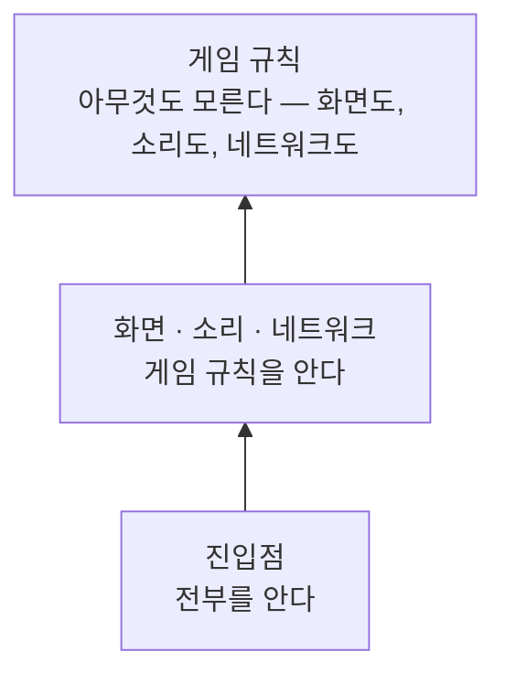

# Part 0: 준비물 — 도구를 갖추고 빈 프로젝트를 세운다

> **시리즈:** 제로부터 멀티플레이어 테트리스 + RL | [시리즈 목차](./README.md) | **Part 0**

---

> **2026-09-11 현재 코드 반영:** 완성 코드를 실행하려면 [짧은 실행 안내](../start-here.md)를 먼저 읽는다. macOS의 reactor 빌드는 기본 제외되며 서버 운영 대상은 Linux/Windows다.

## 이번 Part의 구현 계약

- **선행 상태:** 빈 디렉터리 하나. 그 외에는 아무것도 전제하지 않는다.
- **이번 Part의 파일:** 최소 `CMakeLists.txt`와 스텁 `src/main.cpp`.
- **연결점:** 이 장의 `CMakeLists.txt`는 문장 한 줄을 출력할 실행 타깃만 선언한 최소 뼈대다. 규칙, 플랫폼,
  renderer, server 같은 상태 소유자가 생길 때 해당 target/source 목록이 함께 확장된다.
- **완료 게이트:** `cmake -B build && cmake --build build && ./build/tetris` 가 `tetris project skeleton` 한 줄을 출력한다.

이 장에서 게임 코드는 한 줄도 쓰지 않는다. **도구를 갖추고, 그 도구가 실제로 도는지 확인하는 것**이 전부다. 완성형 저장소의 디렉터리와 빌드 옵션을 찾을 때는 [구조·빌드 레퍼런스](./part13-structure-and-build-reference.md)를 사전처럼 쓴다.

## 들어가며 — 왜 엔진을 쓰지 않는가

테트리스 튜토리얼은 어디에나 있다. 대부분 완성형 상용 게임 엔진에서 시작한다. 에디터를 켜고, 씬에 사각형을 놓고, 스크립트를 붙이면 블록이 떨어진다. 창이 뜨는 것도, 키 입력이 들어오는 것도, 소리가 나는 것도, 글자가 그려지는 것도 전부 이미 되어 있다. 좋은 일이다 — 게임을 만들고 싶은 사람에게 그 엔진들은 정답에 가깝다.

이 시리즈는 반대로 간다. 창은 Windows 에서 Win32 API 로 직접 만들고, macOS/Linux 에서는 SDL2 에 **창·입력·OpenGL 컨텍스트 생성만** 맡긴다. 도형·텍스트·이미지는 직접 짠 **OpenGL 3.3 Core 2D 렌더러**가 그린다 — 정점 셰이더와 조각 셰이더 한 벌, 그리고 사각형·글자·이미지를 모두 "텍스처를 입힌 사각형" 으로 환원해 한 번에 내보내는 배처가 전부다. 오디오는 XAudio2 또는 SDL audio, 폰트 래스터화는 단일 헤더 `stb_truetype`, 네트워킹은 소켓 API 순정이다.

**왜 그렇게 하는가.** 이 시리즈가 만드는 것이 단순한 테트리스가 아니기 때문이다. 목표는 **두 대의 컴퓨터가 같은 시드와 같은 입력으로 완전히 같은 게임을 돌리는 lockstep 멀티플레이**이고, 그 위에 **강화학습 봇**을 얹는 것이다. 규칙의 시간·입력·난수와 실행 순서를 직접 정의하고, 같은 규칙을 화면 없이도 실행하는 것이 설계의 중심이다.

### 결정론 — 이것이 가장 큰 이유다

lockstep 멀티플레이는 "같은 입력을 같은 순서로 넣으면 두 기계의 상태가 비트 단위로 같다" 는 전제 위에 선다. 상태를 통째로 주고받지 않고 **입력만** 주고받기 때문이다. 이 전제가 한 프레임이라도 깨지면 두 화면이 조용히 갈라진다.

엔진을 사용할 때도 규칙을 별도의 고정 틱 모델로 두고 입력 순서와 난수 상태를 관리할 수 있다. 주의할 것은 실제로 의존하는 계약이다. 렌더 프레임의 경과시간, 외부 물리 결과, 콜백의 도착 순서를 그대로 규칙 입력으로 쓰면 실행 환경에 따라 결과가 달라질 수 있다. 이 프로젝트는 그 경계를 직접 구현하면서 배우기 위해 자체 시뮬레이션을 선택했다.

그래서 이 프로젝트는 게임 규칙을 `SimGame` 이라는 클래스 하나에 가두고, 그 안에서는 부동소수를 시간 계산에 쓰지 않으며, 난수도 직접 만든 것을 쓴다. [Part 1](./part1-deterministic-simulation.md) 의 골든 해시 테스트가 그 경계를 지킨다.

### 이식성의 절단면을 최소로

이 저장소의 산출물은 한 종류가 아니다. 게임 클라이언트는 Windows·macOS·Linux 에서 돌고, 릴레이 서버는 Termux(안드로이드)에서도 돌아야 하며, 학습 코드는 Colab 에서 GPU 를 쓴다. 여기에 화면도 소리도 필요 없는 헤드리스 회귀 테스트가 붙는다.

의존성이 적을수록 이 조합이 단순해진다. 시뮬레이션 코어가 렌더러를 모르면 헤드리스 테스트가 그냥 된다. 서버가 그래픽 라이브러리를 링크하지 않으면 안드로이드 빌드에서 고민할 것이 없다.

### 한 줄이 감추는 여섯 단계를 한 번은 본다

`DrawText("Hello")` 한 줄 뒤에는 폰트 파일 파싱, 글리프 래스터화, 그 비트맵을 한 장의 아틀라스 텍스처에 채워 넣기, 커닝과 베이스라인 계산, 글자마다 사각형 네 꼭짓점을 정점 버퍼에 쓰기, 그리고 그 버퍼를 알파 블렌딩과 함께 GPU 로 넘기는 draw call 이 있다. 엔진을 쓰면 이걸 몰라도 된다 — 잘 돌아갈 때는. 문제는 안 돌아갈 때다. 한 번 직접 써 보면 이후 어떤 엔진을 쓰더라도 오류 메시지가 읽힌다.

### 대가

정직하게 적자면 대가가 크다. 엔진이 몇 분 만에 주는 것을 이 시리즈는 여러 장에 걸쳐 만든다. 에디터도, 씬 그래프도, 애셋 파이프라인도, 애니메이션 시스템도 없다. 3D·파티클·여러 플랫폼의 빠른 출시가 목적이면 엔진의 자원 관리와 제작 도구를 재사용하는 편이 유리할 수 있다. 직접 구현의 학습 효과와 개발·유지 비용을 함께 비교해야 한다.

**이 시리즈는 "엔진을 쓰지 말라" 고 주장하지 않는다.** 엔진이 대신 해주던 일들이 실제로 무엇인지 한 번 열어 보는 것이 목적이다.

## 1. 엔진이 해주던 일을 누가 대신하는가

완성 구조에서 엔진의 역할을 대신하는 모듈 목록이다. 각 항목의 구현 문서도 함께 적었다.

| 엔진이 주던 것 | 이 프로젝트에서 | 어느 Part |
|---|---|---|
| 창 생성·이벤트 루프 | Win32 `CreateWindowExA` / SDL2 | [Part 2](./part2-platform-window-input.md) |
| 입력 처리 | 키 상태 배열 + edge 검출 직접 관리 | Part 2 |
| 스프라이트·도형 렌더링 | 직접 짠 OpenGL 3.3 Core 2D 렌더러 (셰이더 한 벌 + 정점 배처) | [Part 3](./part3-rendering-and-ui.md) |
| 폰트 렌더링 | `stb_truetype` 로 CPU 래스터화 + 직접 만든 글리프 아틀라스 텍스처 | Part 3 |
| UI 위젯 | 즉시모드 GUI 직접 구현 | Part 3, [Part 11](./part11-settings-and-options.md) |
| 게임 루프·타이밍 | 정책에 정한 틱 간격의 고정 스텝 누산기 | [Part 4](./part4-game-wrapper-and-loop.md) |
| 오디오 재생·믹싱 | XAudio2 / SDL audio 콜백에서 직접 믹스 | [Part 5](./part5-audio.md) |
| 네트워킹 | TCP 소켓 + 직접 설계한 프레이밍 | [Part 6](./part6-lockstep-networking.md) |
| 매치메이킹 서버 | 직접 만든 릴레이 | [Part 7](./part7-relay-server.md) |
| ML 통합 | pybind11 로 시뮬을 Python 에 노출 | [Part 8](./part8-python-rl.md) |
| 모델 추론 | ONNX Runtime 직접 링크 | [Part 9](./part9-rl-onnx-bot.md) |
| 백엔드·계정 | SQLite + 직접 만든 HTTP API | [Part 10](./part10-meta-and-ranking.md) |

표를 보면 이 시리즈의 분량이 왜 이런지 알 수 있다. 엔진의 체크박스 하나가 대체로 한 장이다.

## 2. 준비물

이 장의 체크포인트를 통과하는 데 필요한 것은 **C++ 컴파일러와 CMake** 뿐이다. 다만 Linux 는 패키지 매니저를 한 번 여는 김에 SDL2 와 OpenGL 개발 패키지까지 같이 깔아 두는 편이 편하므로 아래 명령에 함께 넣었다. 나머지는 해당 장에서 필요할 때 안내한다.

### 2.1 Windows

1. [Visual Studio 또는 Build Tools](https://visualstudio.microsoft.com/downloads/) 설치. 설치 관리자에서 **"C++를 사용한 데스크톱 개발"** 워크로드를 체크한다. MSVC 컴파일러, Windows SDK, CMake 통합이 전부 여기 들어 있다.
2. Git for Windows.

이 최소 콘솔 체크포인트에는 C++ 도구와 CMake면 충분하다. 완성 게임의 기본 Win32 경로는 창·OpenGL 링크 라이브러리(`opengl32.lib`)·GDI+·XAudio2·WinSock2 등 Windows SDK 기능을 사용한다. SDL 백엔드, 암호화 통신, 서버, 모델 추론을 선택하면 해당 의존성을 추가한다. SDK에 링크 라이브러리가 있다는 사실은 GPU 드라이버의 기능 지원이나 배포 DLL 불필요를 뜻하지 않는다. [MSVC 런타임 배포 조건](https://learn.microsoft.com/en-us/cpp/windows/redistributing-visual-cpp-files?view=msvc-170)과 사용한 공유 라이브러리도 따로 확인한다.

확인:

```powershell
cmake --version
```

Visual Studio 를 설치했는데 `cmake` 를 못 찾는다면 일반 PowerShell 대신 **설치한 Visual Studio의 x64 Native Tools Command Prompt** 를 열면 된다.

### 2.2 Linux (Ubuntu/Debian 기준)

```bash
sudo apt update
sudo apt install build-essential cmake libsdl2-dev libgl1-mesa-dev
```

- `build-essential` — g++ 와 make.
- `cmake` — 3.15 이상.
- `libsdl2-dev` — **[Part 2](./part2-platform-window-input.md) 부터** 필요하다. Linux/macOS 에는 Win32 API 가 없으므로 창과 입력을 SDL2 에 맡긴다.
- `libgl1-mesa-dev` — **[Part 3](./part3-rendering-and-ui.md) 부터** 필요하다. 렌더러가 OpenGL 3.3 Core 를 쓰므로 GL 헤더와 링크할 라이브러리가 있어야 한다. 이름에 `mesa` 가 붙어 있지만 Mesa 전용이 아니라 그 배포판의 GL 개발 패키지이고, NVIDIA·AMD 독점 드라이버를 쓰는 기계에서도 같은 패키지를 깐다.

Fedora 계열이라면 패키지 이름이 다르다.

```bash
sudo dnf install gcc-c++ cmake SDL2-devel mesa-libGL-devel
```

확인:

```bash
g++ --version && cmake --version
```

### 2.3 macOS

```bash
xcode-select --install     # C++ 툴체인
brew install cmake sdl2
```

Xcode 전체를 설치할 필요는 없다. command line tools 면 충분하다. **OpenGL 개발 패키지는 따로 받지 않는다** — command line tools 에 OpenGL 프레임워크가 들어 있다.

### 2.4 런타임 요구사항 — OpenGL 3.3 Core 드라이버

컴파일 도구와 별개로 **빌드된 게임이 실제로 뜨려면** 그래픽 드라이버가 OpenGL 3.3 Core 프로파일을 제공해야 한다. 조건이 맞지 않으면 실행 직후 오류 메시지박스가 뜨고 게임이 종료된다 — 렌더러 초기화가 실패를 반환값으로 알리고, 진입점이 네이티브 메시지박스(`platform_fatal_error`)로 이유를 띄우는 구조다. GUI 로 실행하면 stderr 가 어디에도 보이지 않아 로그만으로는 사용자에게 단서가 남지 않기 때문이다. 빠진 GL 진입점 이름 같은 상세 진단은 여전히 stderr 로 나가므로 콘솔에서 실행하면 볼 수 있다. 어느 쪽이든 빌드 성공만으로 실행 환경까지 검증됐다고 보지 않는다.

Linux 에서 미리 확인하려면:

```bash
glxinfo | grep "OpenGL core profile version"
```

`glxinfo`의 출력은 해당 표시 연결에서 제공하는 기능을 확인하는 단서다. `glxinfo`가 없다면 `mesa-utils`(Debian/Ubuntu) 또는 `glx-utils`(Fedora)를 설치한다. 운영체제 버전이나 드라이버가 최신이라는 사실만으로 모든 GPU·가상 환경의 지원을 보장할 수는 없다. [macOS의 컨텍스트 생성 계약](https://developer.apple.com/library/archive/documentation/GraphicsImaging/Conceptual/OpenGL-MacProgGuide/opengl_contexts/opengl_contexts.html)처럼 필요한 프로파일을 요청하고, 실제 생성 성공과 얻은 버전·필수 진입점을 프로그램에서 확인해야 한다.

원격 데스크톱이나 헤드리스 VM 에서는 이 조건이 깨지기 쉽다. 다만 그런 환경에서 돌리는 것은 대개 릴레이 서버([Part 7](./part7-relay-server.md))나 결정론 테스트인데, 둘 다 화면을 만들지 않으므로 GL 이 없어도 빌드되고 실행된다.

### 2.5 Python — 테스트와 학습 도구

Python 은 [Part 8](./part8-python-rl.md) 의 강화학습부터 본격적으로 쓴다. 다만 결정론 검증 테스트가 [Part 1](./part1-deterministic-simulation.md) 부터 Python 으로 돌아가므로, 지금 환경만 잡아두면 좋다.

패키지 관리는 [uv](https://docs.astral.sh/uv/) 를 쓴다. `pip` + `venv` 조합보다 빠르고, 락 파일로 버전이 고정된다.

```bash
# Linux / macOS
curl -LsSf https://astral.sh/uv/install.sh | sh

# Windows (PowerShell)
powershell -c "irm https://astral.sh/uv/install.ps1 | iex"
```

저장소 루트에서:

```bash
uv sync --dev
```

`uv sync --dev`는 프로젝트의 기본 의존성에 개발 그룹을 더한다. 현재 `pyproject.toml`의 기본 의존성에는 NumPy가 있고, 개발 그룹에는 pytest와 pybind11이 있다. train/export extra나 다른 기본 그룹을 추가하지 않은 이 구성에는 PyTorch가 포함되지 않는다. 학습·내보내기에 필요한 무거운 의존성은 extra로 분리하며, Colab 작업에서는 그 환경에 맞는 그룹을 별도로 설치한다.

### 2.6 기능별 선택 의존성

기본 싱글플레이 빌드에는 아래 패키지가 필요 없다. 강화학습·인게임 봇·HTTPS 메타 서버처럼 해당 기능을 켤 때만 설치하면 된다.

| 준비물 | 언제 | 왜 지금 아닌가 |
|---|---|---|
| ONNX Runtime | 모델 추론을 켤 때 ([Part 9](./part9-rl-onnx-bot.md)) | 대상 OS·CPU와 빌드 구성이 맞는 SDK를 선택한다 |
| PyTorch / Gymnasium | [Part 8](./part8-python-rl.md) | 학습할 때만 필요하고, 대개 Colab 에서 한다 |
| OpenSSL | meta 서버의 자격증명 해시, 클라이언트의 HTTPS, WSS | meta와 WSS 타깃은 필수 의존성으로 요구한다. 클라이언트 HTTPS 지원은 선택 기능이며 URL과 빌드 설정을 함께 확인한다 |
| Boost 헤더 | WSS 클라이언트·게이트웨이 | `TETRIS_BUILD_WSS`를 켜면 Beast/Asio 코드의 헤더가 필요하다 |

## 3. 파일을 어떻게 나눌 것인가

지금 만들 것은 최소 빌드 파일과 스텁 진입점이 전부다. 하지만 시작할 때 정해 둬야 할 원칙이 하나 있다.

**의존 방향을 한쪽으로만 흐르게 한다.**


```mermaid
graph BT
    IO["화면 · 소리 · 네트워크<br/>게임 규칙을 안다"] --> SIM["게임 규칙<br/>아무것도 모른다 — 화면도, 소리도, 네트워크도"]
    MAIN["진입점<br/>전부를 안다"] --> IO
```

화살표는 "안다(의존한다)" 방향이다. 위로 갈수록 아는 것이 줄어들고, 맨 위의 게임 규칙은 아래에 무엇이 있는지 전혀 모른다.

규칙 코드가 게임 오버 순간 오디오 장치를 직접 호출하면 규칙의 실행 조건에 장치와 그 구현이 따라붙는다. 대역으로 시험할 수는 있지만 준비와 의존성이 늘어난다. 규칙은 게임 오버라는 사실을 결과로 내보내고, 바깥의 표현 계층이 소리를 선택하게 하면 같은 규칙을 헤드리스 검사와 Python 바인딩에서 재사용하기 쉽다.

이 프로젝트는 **디렉터리·소스 목록·빌드 타깃**으로 의존 방향을 드러낸다. 규칙만 모은 실행 타깃에서 장치 함수의 정의를 빼면 미해결 심볼을 찾을 수 있다. 다만 헤더에 구현된 함수를 포함하거나 잘못된 의존성을 함께 링크하면 빌드가 성공해도 설계 경계를 넘을 수 있다. 독립 빌드 검사와 함께 include 방향·호출 관계를 검토해야 한다. [CMake 링크 요구사항](https://cmake.org/cmake/help/latest/command/target_link_libraries.html)은 빌드 관계를 전달하는 계약이며 소스 접근을 금지하는 권한 체계가 아니다.

지금 디렉터리를 미리 만들 필요는 없다. 이 체크포인트는 실제로 사용하는 파일만 두며, §1의 표는 책임 경계를 설명하는 지도다. 완성형 파일 배치는 [구조·빌드 레퍼런스](./part13-structure-and-build-reference.md)에서 조회한다.

## 4. 첫 체크포인트 — 툴체인이 도는지 확인한다

여기서 확인할 것은 하나다. **컴파일러와 CMake 가 실제로 동작하는가.**

최종 `CMakeLists.txt`를 이 체크포인트에 복사하면 아직 존재하지 않는 소스를 찾다가 configure 단계에서 죽는다. 실행 파일 하나짜리로 시작한다.

**Part 0 체크포인트 — `CMakeLists.txt`**

```cmake
cmake_minimum_required(VERSION 3.15)
project(tetris LANGUAGES CXX)

set(CMAKE_CXX_STANDARD 17)
set(CMAKE_CXX_STANDARD_REQUIRED ON)

add_executable(tetris src/main.cpp)
```

이 체크포인트에는 C++ 소스만 있으므로 언어도 `CXX` 하나다. 완성형 프로젝트는 내장 SQLite의 `third_party/sqlite3.c`를 함께 컴파일하므로 `LANGUAGES C CXX`로 넓어진다. `CMAKE_CXX_STANDARD 17`은 이 프로젝트가 `std::optional`, 구조적 바인딩, `std::filesystem`을 쓰기 때문이고, `REQUIRED ON`은 컴파일러가 C++17을 못 하면 조용히 낮추지 말고 실패하라는 뜻이다.

**Part 0 체크포인트 — `src/main.cpp`**

```cpp
#include <iostream>

int main()
{
    std::cout << "tetris project skeleton\n";
    return 0;
}
```

[Part 4](./part4-game-wrapper-and-loop.md) 에서 이 파일을 통째로 다시 쓴다. 지금은 링커까지 도달하는지 보는 용도다.

빌드한다.

```bash
cmake -B build
cmake --build build
./build/tetris
```

Windows 에서는 마지막 줄이 `.\build\Debug\tetris.exe` 다. Visual Studio 가 만드는 빌드 시스템은 **multi-config** 라서 Debug/Release 를 빌드 시점에 고르고, 그래서 산출물이 configuration 이름의 하위 디렉터리에 들어간다. Makefile 이나 Ninja 는 single-config 라 `build/tetris` 에 바로 나온다. 이 차이는 이후 모든 장의 실행 명령에 계속 나타나므로 지금 알아두면 좋다.

기대 출력:

```text
tetris project skeleton
```

이 한 줄이 나왔다면 준비가 끝났다.

## 5. 체크포인트의 빌드 규칙

이 최소 빌드 파일은 기능과 함께 자란다. **파일을 새로 만드는 장은 그 장 안에서 빌드 파일도 함께 고친다.** 게임 규칙 소스는 시뮬레이션 타깃에, 창을 띄우는 파일은 플랫폼 체크포인트 타깃에 추가하는 식으로 산출물과 소스 목록을 같은 자리에서 유지한다.

그래서 **매 장 끝에서 빌드가 성공하고 무언가 실행된다.** 이것이 이 시리즈의 규칙이다. 열 장을 만든 뒤에야 처음 실행해 보는 일은 없다. 각 장의 마지막에 빌드 명령과 기대 결과가 적혀 있으니 그대로 따라가면 된다.

빌드 명령은 보유한 소스와 해당 체크포인트가 선언한 옵션에 따라 달라진다. 이 장의 최소 CMakeLists에는 `TETRIS_BUILD_*` 옵션이 없으므로 그대로 실행 타깃 하나를 빌드한다. 완성형 저장소에서 일부 역할만 만들 때는 그 저장소가 선언한 `TETRIS_BUILD_GAME`, `TETRIS_BUILD_RELAY`, `TETRIS_BUILD_META` 등을 선택한다. 선언되지 않은 `-D` 변수를 추가해도 없는 소스나 타깃이 생기지 않는다. 현재 CMakeLists가 무엇을 선언했는지 먼저 확인해야 구성 오류와 컴파일 오류를 구분할 수 있다.

[구조·빌드 레퍼런스](./part13-structure-and-build-reference.md)는 완성형 디렉터리 지도, 빌드 옵션, 변경 유형별 파일 소유권을 모아 둔 조회용 문서다. 여기의 최소 체크포인트와 완성형 빌드를 혼합하지 않도록, 설정의 의미를 확인할 때만 참조한다.

## 이 장에서 완성된 것

- Windows / Linux / macOS 중 자기 환경에 C++17 툴체인과 CMake 가 준비됐다.
- 그래픽용 개발 패키지와 드라이버 기능은 창·렌더러 실습의 별도 준비라는 점을 구분했다. 콘솔 체크포인트의 성공을 그래픽 실행 검증으로 세지 않는다.
- 최소 `CMakeLists.txt`와 스텁 `src/main.cpp`로 configure → build → 실행이 성공한다.
- 완성 구조에서 각 엔진 역할을 어느 모듈이 맡는지, 직접 구현하는 이유가 무엇인지 알고 있다.

## 수동 테스트

```bash
cmake -B build
cmake --build build
./build/tetris                 # Windows: .\build\Debug\tetris.exe
```

기대 결과: `tetris project skeleton` 한 줄.

Python 환경까지 잡았다면:

```bash
uv sync --dev
uv run python -c "import sys; print(sys.version)"
```

기대 결과: Python 3.12 이상의 버전 문자열. 이 체크포인트는 툴체인과 빈 실행 파일이
정상이라는 사실만 확인한다. 게임 규칙을 추가할 때는 화면보다 먼저 결정론 테스트를
세워, 같은 시드와 입력이 같은 상태 해시를 만드는 계약을 고정한다.
