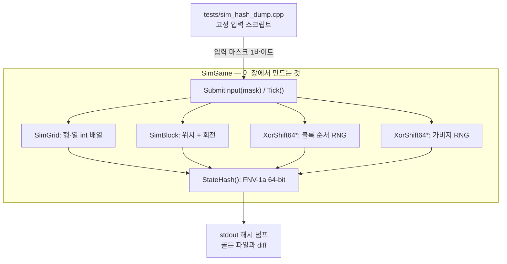
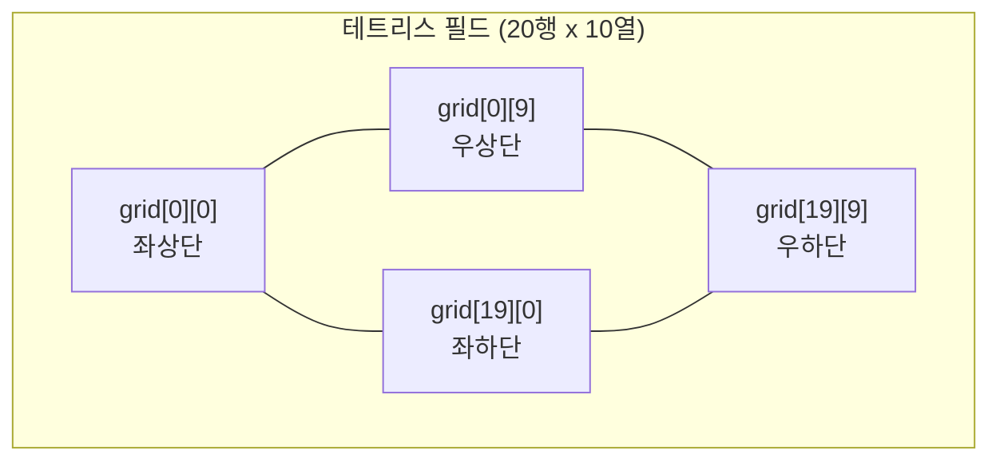
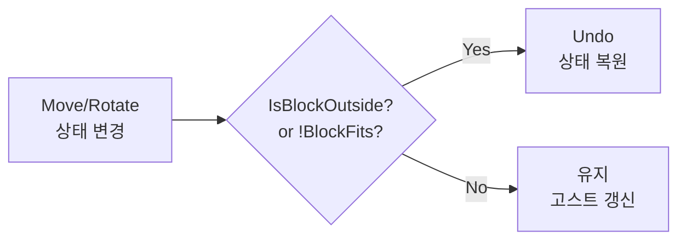
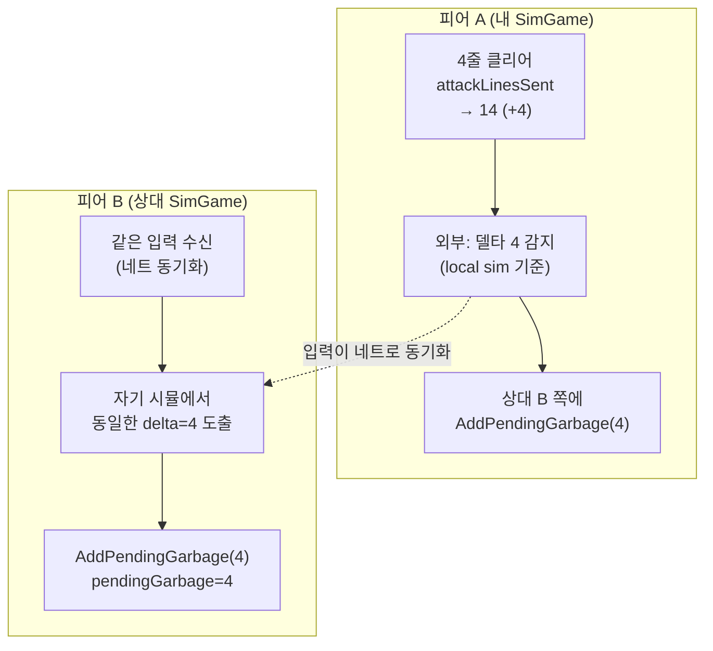
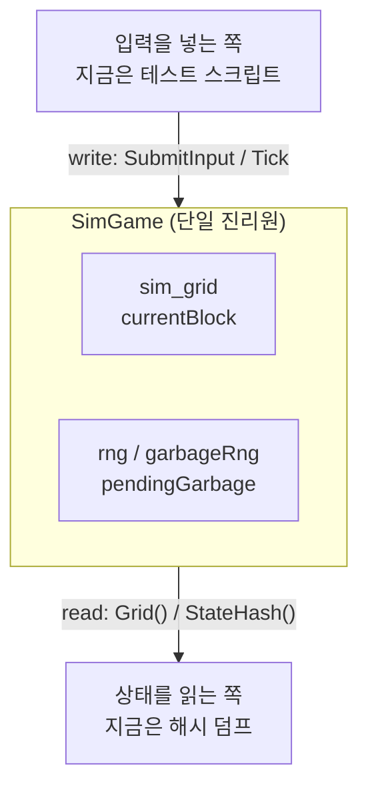
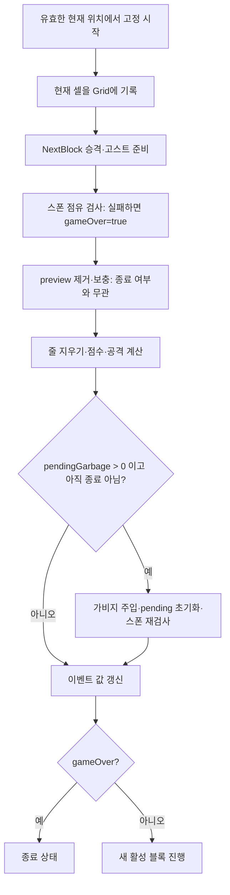
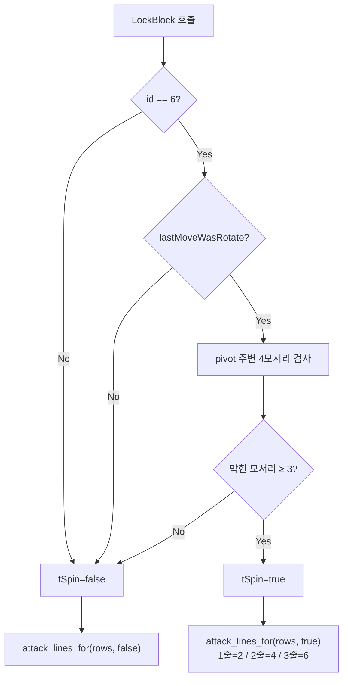

# Part 1: 테트리스 시뮬레이션 엔진 — 결정론적 게임 로직

> **시리즈:** 제로부터 멀티플레이어 테트리스 + RL | [시리즈 목차](./README.md) | **Part 1**

---

## 이번 Part의 구현 계약

- **선행 상태:** [Part 0](./part0-project-setup.md) 의 빌드 뼈대 (`CMakeLists.txt` 와 "tetris project skeleton" 을 찍는 `src/main.cpp`) 뿐이다. 이 장은 그 위에 새 파일만 얹는다.
- **이번 장의 파일:** `core/constants.h`, `core/input.h`, `core/rng.h`, `core/hash.h`, `src/position.{h,cpp}`, `src/sim_block.h`, `src/sim_grid.h`, `src/sim_blocks.h`, `src/sim_game.{h,cpp}`, `tests/sim_hash_dump.cpp`, 그리고 `CMakeLists.txt` 확장.
- **연결점:** 화면·오디오 없이 입력과 시드만으로 상태가 결정되는 코어를 만든다. 이후 모든 Part 가 이 위에 올라간다 — [Part 4](./part4-game-wrapper-and-loop.md) 의 `Game` 래퍼, [Part 6](./part6-lockstep-networking.md) 의 lockstep, [Part 8](./part8-python-rl.md) 의 pybind11 바인딩이 전부 `SimGame` 을 그대로 쓴다.
- **완료 게이트:** `sim_hash_dump` 출력이 `python/tests/_sim_hash_dump.txt` 와 **한 바이트도 다르지 않아야** 한다. 실행 명령은 이 장 말미의 수동 테스트에 있다.

`core/rng.h` 와 `core/hash.h` 를 선행 상태가 아니라 **이번 장의 산출물**로 잡은 데 주의하라. Part 0 은 이 파일들을 만들지 않는다. 결정론의 두 축인 RNG 와 상태 해시는 그 설계 근거를 시뮬레이션 규칙과 함께 봐야 이해되므로 여기서 처음 만든다.

## 들어가며

첫 구현 대상은 창이나 그림이 아니라 **상태 전이 규칙**이다. 화면이 없는 `SimGame`부터 만들면 한 입력의 결과를 해시와 테스트로 고정한 뒤, 이후의 모든 플랫폼·렌더링·네트워크 계층을 같은 코어 위에 올릴 수 있다.

이 프로젝트에서 게임 로직은 렌더링과 **완전히 분리**되어 있다. `SimGame` 클래스는 화면에 무엇을 그리는지 모른다. 입력을 받아 상태를 갱신하고, 그리드와 블록의 현재 상태를 노출할 뿐이다.

이 분리가 주는 세 가지 이점:

1. **결정론적 네트플레이**: 같은 규칙·초기 상태·시드에 같은 틱별 입력과 가비지 요청을 같은 순서로 적용하면 상태를 재현할 수 있다. 네트워크 계층은 이 순서와 비교 경계를 맞춘다.
2. **Headless RL 학습**: GPU 렌더링 없이 순수 시뮬레이션만 반복할 수 있다. 실제 처리량은 CPU, pybind11 호출 방식, 병렬화 방식에 따라 달라지므로 이 문서에서는 고정 수치를 제시하지 않는다. 학습은 Google Colab에서 Linux 환경으로 돌리고, 배포 머신에서는 추론만 한다.
3. **크로스 플랫폼 이식**: 렌더링 없는 순수 C++ 로직이므로 Win32 API에 의존하지 않는다. 각 대상에 맞는 C++ 도구 체인과 정수 표현 조건을 갖추면 Linux·macOS·Windows·WASM 빌드에서 같은 규칙 코어를 사용할 수 있다.

이 장의 실제 파일 경계는 구현 계약 표의 목록 그대로다 — 시뮬레이션 본체(`src/sim_game.{h,cpp}`, `src/sim_grid.h`, `src/sim_block.h`, `src/sim_blocks.h`), 공용 기반(`core/constants.h`, `core/input.h`, `core/rng.h`, `core/hash.h`, `src/position.{h,cpp}`), 검증 도구(`tests/sim_hash_dump.cpp`)다.

---

## 1. 아키텍처 개요

이 장이 끝났을 때 존재하는 것은 이게 전부다.



창도, 그림도, 소리도, 네트워크도 없다. **입력을 넣으면 상태가 바뀌고, 그 상태를 64비트 숫자 하나로 요약할 수 있는 것**까지가 이 장의 범위다. 확인하는 방법도 게임을 실행하는 것이 아니라 테스트 프로그램이 찍은 숫자를 비교하는 것이다.

이 Part는 규칙부터 만드는 순서로 진행한다. 창을 먼저 만들어도 규칙을 별도 모듈로 두면 화면 실행과 독립적으로 회귀 검사를 자동화할 수 있다. 골든 해시는 고정 입력에서 선택한 관측값이 유지되는지 확인하고, 행 삭제·스폰·종료 같은 개별 규칙은 상태를 직접 검사하는 테스트로 확인한다.

**입력이 `SubmitInput(mask)` 라는 형태인 것도 지금 정해야 한다.** 한 틱의 요청 집합을 1바이트 비트마스크로 받으면 테스트·리플레이·네트워크가 같은 입력 규약을 공유할 수 있다. 파일은 헤더와 틱 순서, 네트워크는 메시지 경계와 틱 번호를 추가해야 한다. 표현을 공유하는 일과 전송·재현 계약을 완성하는 일은 구분한다.

`SimGame` 에 무엇이 붙게 되는지는 이 장의 관심사가 아니지만, 지금의 설계 판단이 어디를 향하는지는 알아 둘 만하다.

| 나중에 이 API 를 쓰는 것 | 쓰는 방식 | 어느 장 |
|---|---|---|
| 게임 화면 | `Grid()` / `CurrentBlock()` 을 읽어 그린다 | [Part 4](./part4-game-wrapper-and-loop.md) |
| 멀티플레이 | 입력 바이트를 교환하고 `StateHash()` 로 대조한다 | [Part 6](./part6-lockstep-networking.md) |
| 강화학습 | `ApplyPlacement(col, rot)` 로 한 수씩 둔다 | [Part 8](./part8-python-rl.md) |

세 가지가 **같은 `SimGame` 을 고쳐 쓰지 않고 그대로 쓴다**는 점이 중요하다. 그러려면 `SimGame` 이 저 셋 중 어느 것도 몰라야 한다.

### 1.1 먼저 만드는 시뮬레이션 파일

본격적인 시뮬레이션에 들어가기 전에, 나머지 전부가 include 하게 될 작은 파일들을 먼저 둔다. 모두 짧고 의존성이 없다.

**현재 소스 발췌 — `core/constants.h`**

```cpp
#pragma once

// Simulation tick rate (logic updates per second)
// [NET] Lockstep/rollback 네트코드에서 '틱'은 동기 단위입니다.
// 모든 피어/서버가 동일한 틱 카운터를 기준으로
// 같은 입력을 같은 순서로 적용해야 결정론이 보장됩니다.
constexpr int TICKS_PER_SECOND = 60;
constexpr float SECONDS_PER_TICK = 1.0f / static_cast<float>(TICKS_PER_SECOND);
```

`TICKS_PER_SECOND` 는 이 프로젝트 전체에서 가장 널리 퍼지는 상수다. 중력 간격, 소프트 드롭 레이트, 네트워크 틱 번호, 게임 시작 지연이 전부 이 값에 걸려 있다. **규칙 시간을 고정된 정수 틱으로 세는 것**은 서로 다른 벽시계 dt가 규칙에 섞이는 경로를 줄인다. 결정론에는 같은 초기 상태·입력 순서·연산 계약도 필요하다. 부동소수를 쓴다는 이유만으로 항상 불일치하거나 정수를 쓴다는 이유만으로 자동 일치하는 것은 아니다.

**현재 소스 발췌 — `core/input.h`**

```cpp
#pragma once
#include <cstdint>

// Bitmask representing per-tick inputs
// 같은 규칙 버전·초기 상태·시드·틱별 입력 순서가 재현의 전제다.
// 마스크는 요청의 집합이며, 처리 순서는 SubmitInput이 정한다.
enum InputBits : uint8_t {
    INPUT_NONE   = 0,
    INPUT_LEFT   = 1 << 0,
    INPUT_RIGHT  = 1 << 1,
    INPUT_DOWN   = 1 << 2,
    INPUT_ROTATE = 1 << 3,
    INPUT_DROP   = 1 << 4,
};

inline constexpr uint8_t INPUT_KNOWN_MASK =
    INPUT_LEFT | INPUT_RIGHT | INPUT_DOWN | INPUT_ROTATE | INPUT_DROP;

// Validate wide parsed values BEFORE narrowing to uint8_t. Zero is valid.
// Both direction bits are allowed; their meaning belongs to the simulation.
inline constexpr bool isValidInputMask(uint64_t value) noexcept {
    return (value & ~uint64_t(INPUT_KNOWN_MASK)) == 0;
}

// Tests overlap; INPUT_NONE (zero) is never reported as present.
inline constexpr bool hasInput(uint8_t mask, InputBits bit) noexcept {
    return (mask & bit) != 0;
}
```

한 플레이어의 틱별 요청은 **1바이트 값**이다. [Part 6](./part6-lockstep-networking.md)의 INPUT 메시지는 이 값을 바이트로 넣고, [Part 4](./part4-game-wrapper-and-loop.md)의 `core/replay.cpp`는 같은 값을 십진수 텍스트로 저장한다. 메모리 표현의 크기와 파일·패킷의 총 길이는 다르다.

`INPUT_KNOWN_MASK`는 지원하는 모든 비트의 OR다. `isValidInputMask`는 넓은 정수에서 알 수 없는 비트를 검사한 뒤 축소 변환하게 한다. 256을 먼저 uint8_t로 바꾸면 0이 되어 잘못된 원래 값을 구분할 수 없다. 0은 조작 없는 유효한 틱이고, `hasInput(mask, INPUT_NONE)`은 항상 false다. 이 함수는 비트의 겹침을 묻기 때문이다.

`InputBits`는 현재 wire 단위인 `uint8_t` 안에 들어가며 반시계 회전, 홀드, 180도 회전은 지원하지 않는다. 입력을 추가할 때는 비트만 늘리는 것으로 끝나지 않고 SRS 규칙, 리플레이, lockstep payload, Python 행동 변환을 같은 계약으로 갱신해야 한다.

**현재 소스 발췌 — `src/position.h`**

```cpp
#pragma once

class Position{
public:
    Position(int row, int column);
    int row;
    int column;
};
```

**현재 소스 발췌 — `src/position.cpp`**

```cpp
#include "position.h"

Position::Position(int row, int column)
{
    this -> row = row;
    this -> column = column;
}
```

`Position` 은 `(row, column)` 순서다. `(x, y)` 가 아니다. 이 순서를 끝까지 유지하는 것이 중요하다 — 그리드가 `grid[row][column]` 이고 테트로미노 셀 정의도 `Position(row, col)` 이라, 두 값을 교환하면 행·열 축이 전치된다. 일반적으로 이는 대각선에 대한 반사에 해당하며, 모든 모양에서 단순한 90도 회전과 같지는 않다. 화면 좌표계(`x` 가 가로)와 만나는 지점은 렌더링뿐이며, 그것은 [Part 3](./part3-rendering-and-ui.md) 의 문제다.

---

## 2. 그리드 표현

### 2.1 데이터 구조

테트리스 그리드는 20행 x 10열의 정수 배열이다:

설명용 축약 — 실제 코드는 부록 B

**예시(실제 저장소에는 없음)**

```cpp
// src/sim_grid.h
class SimGrid
{
public:
    static constexpr int kRows = 20;
    static constexpr int kCols = 10;

    int grid[kRows][kCols];  // 0 = 빈칸, 1~7 = 블록 ID, 8 = 고스트, 9 = 가비지
    // ...
};
```

좌표계: `grid[0][0]`은 좌상단, `grid[19][9]`는 우하단이다. 행(row)이 증가하면 아래로, 열(col)이 증가하면 오른쪽으로 이동한다.



셀 값의 의미:

| 값 | 의미 |
|----|------|
| 0 | 빈칸 |
| 1 | L 블록 |
| 2 | J 블록 |
| 3 | I 블록 |
| 4 | O 블록 |
| 5 | S 블록 |
| 6 | T 블록 |
| 7 | Z 블록 |
| 8 | 고스트 |
| 9 | 가비지 |

이 장의 계약은 셀 값의 **의미**까지다. 0 은 빈칸, 1~7 은 피스 id(L=1, J=2, I=3, O=4, S=5, T=6, Z=7 — `sim_blocks.h` 의 정의와 일치), 8 은 고스트, 9 는 가비지다. 이 id 는 [Part 3](./part3-rendering-and-ui.md) 에서 만들 `GetCellColors()` 팔레트 벡터의 인덱스가 된다 — 어느 id 가 어떤 색인지는 렌더링 계층의 계약이므로 색상표도 거기서 다룬다. sim 은 색을 모른 채 정수만 다룬다.

### 2.2 왜 int인가

셀 값 0~9를 표현하는 데는 `uint8_t`도 충분하다. 현재 `int`를 유지하는 주요 이유는 원래 `Grid`의 저장 표현과 상태 해시 호환성이다. **연속성은 int의 성질이 아니라 배열의 성질**이다. `uint8_t grid[20][10]`이나 단일 `std::array<Cell, 200>`도 원소를 연속해서 저장할 수 있다.

`int grid[20][10]`은 10개의 int로 된 행 20개다. 행 내부에서 열이 먼저 증가하고, 그다음 행으로 이어지는 행 우선(row-major) 배치다. 총 원소 저장 크기는 `20 × 10 × sizeof(int)`이며, `sizeof(int)==4`인 대상에서 800바이트다. C++의 모든 int가 언제나 4바이트라는 뜻은 아니다. 이 Part에서 이후 사용하는 800바이트 수치는 이 전제를 따른다.

주소가 연속한다는 말은 프로그램의 주소 공간에서의 배치를 말하며, 물리 RAM의 페이지가 모두 이웃한다는 보장은 아니다. 순차 접근은 공간 지역성을 활용할 수 있지만 실제 캐시 라인 수·속도는 정렬과 CPU, 접근 패턴에 따라 달라진다.

원소 수와 크기가 고정된 작은 보드는 값 복사와 전체 순회가 단순하다. 다만 원시 메모리를 해시하는 계약에는 int 폭·바이트 순서·값 표현의 일치도 필요하다. 같은 셀 의미와 같은 배열 차원만으로 임의의 플랫폼 간 바이트 해시 일치나 직렬화 호환성을 보장하지 않는다. 저장 형식을 바꿀 때는 상태 해시·리플레이·Python 관찰 경로를 함께 검토한다.

단일 인덱스를 쓰는 학습 구현에서는 `(row, column)`을 각각 검사한 뒤 `row * columns + column`으로 바꾼다. 10열에서 `(0,10)`은 범위 밖인데 결과 10만 검사하면 정상 인덱스처럼 보여 `(1,0)`을 덮어쓴다. 선형 배열의 범위 안이라는 사실과 올바른 2차원 좌표라는 사실을 구분해야 한다. 현재 코드의 `grid[row][column]` 직접 접근에는 각 차원의 범위 전제가 필요하다.

### 2.3 경계 검사와 빈칸 판별

**현재 소스 발췌 — `src/sim_grid.h`**

```cpp
    bool IsCellOutside(int row, int column) const
    {
        if (row >= 0 && row < kRows && column >= 0 && column < kCols)
        {
            return false;
        }
        return true;
    }

    bool IsCellEmpty(int row, int column) const
    {
        // 방어적 경계 검사: 범위 밖 좌표는 '비어있지 않음'(막힘)으로 처리한다.
        // 호출부는 보통 IsCellOutside 로 선검사하지만, 만약 무경계 접근이 들어와도
        // OOB 읽기를 방지한다. 정상 범위 입력의 셀 값이나 저장 레이아웃은 바꾸지 않는다.
        // 이 가드는 public grid 배열에 직접 접근하는 다른 호출부까지 보호하지 않는다.
        if (IsCellOutside(row, column))
        {
            return false;
        }
        if (grid[row][column] == 0 || grid[row][column] == 8)
        {
            return true;
        }
        return false;
    }
```

`IsCellEmpty`는 호환 규약상 id=8을 비어 있는 셀로 취급한다. 그렇다고 현재 구현이 고스트를 보드 배열에 저장한다는 뜻은 아니다. 현재 `Game::Draw`는 `sim.Grid()`를 그린 뒤 별도의 `sim.GhostBlock()`을 그린다. 고스트는 착지 위치의 시각적 힌트이고, 보드 점유 상태와 구분한다.

가비지(id=9)는 빈칸이 아니다. 고스트와 가비지의 차이는: 고스트는 현재 피스가 렌더링 힌트로 투영된 그림자이고, 가비지는 상대방이 보낸 물리적 블록이다. 빈칸 판정에서 가비지는 벽돌처럼 취급된다.

---

## 3. 테트로미노 형상과 회전

### 3.1 7종 블록

표준 테트리스의 7종 테트로미노. 각 블록은 4개의 셀로 구성된다:

기본 방향의 로컬 좌표를 4×4 틀로 표시하면 다음과 같다. `.`은 비어 있는 칸이다.
I의 점유 행이 1인 점도 좌표 정의의 일부다.

```text
L (id=1)  J (id=2)  I (id=3)  O (id=4)  S (id=5)  T (id=6)  Z (id=7)
..#.      #...      ....      ##..      .##.      .#..      ##..
###.      ###.      ####      ##..      ##..      ###.      .##.
....      ....      ....      ....      ....      ....      ....
....      ....      ....      ....      ....      ....      ....
```

id 는 각 블록 클래스가 스스로 들고 있는 값이다(L=1, J=2, I=3, O=4, S=5, T=6, Z=7). 생성 팩토리 `GetAllBlocks()` 는 일곱 블록을 **I,J,L,O,S,T,Z** 순서의 벡터로 반환하므로, 벡터 인덱스와 id 는 서로 다른 체계다. RNG 가 인덱스로 뽑기 때문에 이 벡터 순서 자체가 결정론 계약이 된다 — '오류와 함정' 의 해시 패리티 함정에서 다시 본다.

이 순서는 ID 순서로 정렬한 목록이 아니다. 인덱스0은 ID3인 I 블록을 가리킨다. 저장된 ID를 목록 인덱스로 바로 사용하면 다른 종류를 선택하거나 범위를 넘을 수 있다. 종류의 식별자, 가방에서의 현재 위치, 팔레트 인덱스는 구별해서 읽는다.

여기서 `SimIBlock` 등의 상속은 생성자에서 형상·ID·초기 위치를 채우는 용도로 쓰인다. `GetAllBlocks()`가 반환하는 것은 `std::vector<SimBlock>` 값들이며, 가상 함수를 통해 종류별 이동 동작을 선택하는 다형성 구조가 아니다. 공통 규칙이 셀 목록을 읽는 구조이므로, 기본 형상을 불변 데이터 테이블로 모으고 배치 인스턴스를 값으로 만드는 설계도 가능하다.

새 형상을 등록할 때에는 셀 중복, 허용 좌표 범위, 변을 통한 연결성, ID 중복, 초기 배치를 각각 확인한다. 이런 구조 검사를 통과해도 L과 J의 이름을 뒤바꾼 데이터까지 자동으로 알아내지는 못한다. 종류별 기대 모양을 따로 비교해야 한다. 현재 일곱 종류의 ID·순서·좌표를 바꾸면 기존 리플레이·해시 계약을 함께 검토해야 하며, 연결된 네 칸이라는 조건만으로 호환성이 보장되지는 않는다.

### 3.2 회전 상태 룩업 테이블

현재 일곱 블록은 각각 4개의 회전 상태를 가진다. O는 네 상태의 점유 모양이 같아도 상태 번호는 바뀐다. 회전 상태별로 4개 셀의 **상대 좌표**(오프셋)를 미리 정의해둔다:

**현재 소스 발췌 — `src/sim_blocks.h`**

```cpp
class SimTBlock : public SimBlock
{
public:
    SimTBlock()
    {
        id = 6;
        cells[0] = {Position(0, 1), Position(1, 0), Position(1, 1), Position(1, 2)};
        cells[1] = {Position(0, 1), Position(1, 1), Position(1, 2), Position(2, 1)};
        cells[2] = {Position(1, 0), Position(1, 1), Position(1, 2), Position(2, 1)};
        cells[3] = {Position(0, 1), Position(1, 0), Position(1, 1), Position(2, 1)};
        Move(0, 3);
    }
};
```

생성자 끝의 `Move(0, 3)`은 T 블록의 초기 배치 기준점이다. 로컬 좌표에 이 오프셋을 더하면 점유 열은 3·4·5가 된다. 3 자체가 필드 중심 좌표인 것은 아니며, 로컬 원점이 채워진 칸일 필요도 없다. 다른 블록도 같은 파일에 정의되지만 O 블록은 `Move(0, 4)`를 사용하므로 실제 점유 위치는 각 형상의 로컬 좌표와 함께 읽어야 한다.

회전 상태 0~3은 시계 방향 90도씩 회전한 형태다:

```text
rot=0     rot=1     rot=2     rot=3
.#.       .#.       ...       .#.
###       .##       ###       ##.
...       .#.       .#.       .#.

각 칸은 동일한 3×3 로컬 좌표계에 놓인다. .은 빈칸이다.
```

`cells`는 `std::map<int, std::vector<Position>>`으로 구현되어 있다. 각 키(0~3)에 대해 4개의 Position(row, column) 벡터가 매핑된다.

`SimBlock::Rotate()`는 상태를 증가시키고 `cells.size()`에 도달하면 0으로 되돌린다.
그러므로 키가 0부터 N−1까지 빠짐없이 존재한다는 전제가 있다. map의 크기는 가장 큰 키에
1을 더한 값이 아니다. 중간 키가 빠진 표나 빈 기본 SimBlock은 정상 플레이 형상이 아니다.

이 표의 회전 중심은 셀 중심을 정수 인덱스로 표현한 로컬 좌표계에서
JLSTZ가 `(1,1)`, I가 `(1.5,1.5)`, O가 `(0.5,0.5)`다. 행은 아래로, 열은 오른쪽으로
증가한다. 중심 `(pr,pc)` 주위의 시계 90도 변환은 다음과 같다.

```text
row'    = pr + (column - pc)
column' = pc - (row - pr)
```

중심으로 평행이동한 뒤 방향을 돌리고 중심을 다시 더한 식이다. 예를 들어 T의
`(0,1)`은 `(1,2)`로 간다. I의 중심을 `(1,1)`로 잘못 사용하면 다른 표가 만들어진다.
회전 뒤 점유 영역의 좌상단을 매번 0으로 맞추면 로컬 원점까지 이동하므로 이 표와 달라진다.
블록의 보드 배치 오프셋과 회전 중심은 서로 다른 값이다.

중심 좌표를 두 배로 저장하면 반 정수 중심도 정수만으로 계산할 수 있다.
`R2 = pr2 + 2*column - pc2`, `C2 = pc2 - 2*row + pr2`를 계산하고 각각 2로 나눈다.
중간 계산은 충분히 넓은 정수로 하고, 홀수 결과를 임의로 버리지 않는다. 정수 셀로
돌아오지 않는 중심은 이 격자 회전의 입력 계약을 만족하지 않는다.

현재 코드는 미리 만든 표를 조회한다. 학습 체크포인트는 기본 형상으로부터 좌표를 계산해
회전 상태를 만든다. 같은 28개 상태를 표현하는 두 방법이며, 계산 방식 자체가 킥이나
충돌 검사를 대신하지는 않는다. 셀을 행 우선으로 정렬하는 것은 비교를 위한 표현 통일이고,
각 셀이 실제로 이동하는 시간 순서를 뜻하지 않는다.


### 3.3 SRS와 단순 회전

이 구현에서는 **Super Rotation System(SRS)** 의 wall kick을 적용하지 않는다. 회전 후 벽이나 다른 블록과 겹치면 단순히 회전을 취소(undo)한다:

**현재 소스 발췌 — `src/sim_game.cpp`**

```cpp
void SimGame::RotateBlockImpl()
{
    if (gameOver) return;
    currentBlock.Rotate();
    if (IsBlockOutside(currentBlock) == true || BlockFits(currentBlock) == false)
    {
        currentBlock.UndoRotation();
    }
    else
    {
        lastMoveWasRotate = true;
        rotateSoundEvent = true;
        ghostBlock = MakeGhostBlock(currentBlock);
    }
}
```

`lastMoveWasRotate`는 T-spin 판정과 상태 해시에 포함된다. 성공한 회전은 이 값을
true로 만들고, 실패한 시도는 `UndoRotation()`으로 방향만 되돌리며 이 플래그를 바꾸지 않는다.
따라서 실패했다고 “회전한 적 없음” 또는 false가 되는 것은 아니다. 직전 성공 행동이
회전이었다면 true가 유지될 수 있고, 이동 등에서 false가 된 상태였다면 그대로 false다.

예를 들어 처음 방향의 S 블록에 대해 보드 `(2,3)`만 막아 두면 첫 시계 회전은 성공하고
다음 회전은 거부된다. 두 번째 시도 전후 방향은 1로 같으며, 기존 성공 회전 이력도 남는다.
후보를 별도로 만들어 성공할 때 확정하는 방식이라도 같은 상태 계약을 유지해야 한다.
실패한 시도와 과거 성공 이력을 분리해 읽는다.

킥은 기본 회전 후보가 막혔을 때 정해진 대안 위치를 검사하는 규칙이다. 임의의 빈칸을
찾는 것과 다르다. 호환할 회전 규칙이 있다면 종류·회전 전이별 후보 순서와 좌표축의
부호를 함께 맞춰야 한다. 후보 개수만 같다고 같은 규칙이 되지는 않는다.

강의의 `35-kicks`는 별도의 교육용 시계 회전 정책을 사용한다. O는 제자리만 검사하고,
나머지는 제자리·선호 방향1칸·반대1칸·선호2칸·반대2칸·위1칸·위2칸의 순서다.
출발 방향0/3은 왼쪽,1/2는 오른쪽을 선호하도록 정했다. 이 표는 SRS 표가 아니며,
현재 `SimGame`에도 추가되어 있지 않다. 표를 바꾸면 허용되는 행동과 재현 결과가 바뀐다.

모든 오프셋은 **회전 시도 전 원점**에 각각 더한다. 앞 후보의 이동량에 다음 이동량을
누적하지 않는다. 다음 방향의 셀은 한 번 만들고, 각 원점에서 최종 네 셀의 경계·점유를
검사해 첫 성공만 확정한다. 모두 막히면 셀·원점·방향·기존 성공 행동 이력을 보존한다.
이는 최종 배치 검사이며 중간 궤적을 따라 움직이는 물리 충돌 검사는 아니다.

예를 들어 왼쪽 벽의 세로 T는 로컬 원점 열이−1이어도 점유 열은0과1이라 유효하다.
현재 게임은 다음 방향이 벽을 벗어나면 거부한다. 강의 정책은 오른쪽1칸 후보를 시도해
원점 열0에서 허용할 수 있다. 원점 자체가 음수라는 이유로 현재 배치를 거부하면 안 된다.
또한 한 번 위로 킥한 뒤 네 방향을 돌아도 원점의 평행이동까지 되돌아오지는 않는다.

여기에는 더 근본적인 제약이 하나 있다. 이 시뮬레이션에는 **반시계 회전 입력 자체가 없다.** `core/input.h` 의 회전 입력은 `INPUT_ROTATE` 하나뿐이고 `SimBlock::Rotate()` 도 시계 방향만 돈다. 즉 8전이 중 4개만 존재한다. SRS 를 제대로 넣으려면 입력 비트와 `SimBlock` 의 회전 API 부터 늘려야 한다.

반시계90도와 시계90도 세 번은 중간 충돌까지 고려하면 같은 입력이 아니다.
세 번 돌리는 경로에서는 각 중간 상태가 허용되어야 하고, 킥이 있다면 원점 이동도
중간마다 달라질 수 있다. 반시계를 추가할 때는 입력과 방향 전이·후보 정책을 함께 정의한다.

### 3.4 절대 좌표 계산

블록의 셀 위치는 **상대 좌표**(cells) + **오프셋**(rowOffset, columnOffset)으로 계산된다:

**현재 소스 발췌 — `src/sim_block.h`**

```cpp
    std::vector<Position> GetCellPositions() const
    {
        const std::vector<Position>& tiles = cells.at(rotationState);
        std::vector<Position> movedTiles;
        movedTiles.reserve(tiles.size());
        for (const Position& item : tiles)
        {
            movedTiles.emplace_back(item.row + rowOffset, item.column + columnOffset);
        }
        return movedTiles;
    }
```

`cells.at(rotationState)`는 선택한 회전 키가 존재해야 한다. 기본 `SimBlock`만 생성하면 cells가 비어 있으므로, `SimTBlock` 같은 형상 생성자가 표를 채운 뒤 좌표를 조회해야 한다. 잘못된 회전 키는 `std::out_of_range` 예외가 되며 빈 결과로 대체되지 않는다.

예: T 블록(rot=0)이 rowOffset=5, columnOffset=3일 때:

```text
cells[0] = {(0,1), (1,0), (1,1), (1,2)}

절대 좌표 = {(5,4), (6,3), (6,4), (6,5)}
```

이 분리(상대 좌표 + 오프셋)는 같은 형상을 여러 위치에 배치할 수 있게 한다. `GetCellPositions()`가 반환하는 것은 보드 기준 좌표이며, 화면 픽셀 좌표가 아니다. 여기에 오프셋을 다시 더하면 두 번 이동시킨 결과가 된다. 반환 벡터는 새 값이므로 반환 뒤 원본 블록을 이동해도 기존 벡터는 자동 갱신되지 않는다.

현재 고스트는 `MakeGhostBlock`에서 `SimBlock ghost = block`으로 만든 **값 복사본**이다. `std::map`과 내부 `std::vector`도 별도 원소를 소유하며 같은 컨테이너 메모리를 빌려 쓰지 않는다. 생성 직후 id를 8로 바꾸고, 이후 고스트 낙하 과정에서 rowOffset을 조정한다. 형상의 값과 회전 상태가 같다는 사실과 메모리를 공유한다는 사실은 구분해야 한다.

보드 밖 셀도 정수 덧셈으로 계산할 수 있다. 좌표 계산이 성공했다는 사실만으로 이동이 허용되지는 않으며, `IsBlockOutside`와 `BlockFits`가 별도로 경계·점유를 확인한다. 현재 `Move`와 `GetCellPositions`의 int 연산은 내부의 제한된 상태·이동량을 전제로 한다. 임의 외부 값을 직접 넣는 API로 사용할 때는 덧셈 전에 표현 범위를 검증해야 한다.

---

## 4. 충돌 감지

### 4.1 이동-후-검증 패턴

이동/회전의 충돌 감지는 "먼저 이동, 그 다음 검증, 실패 시 복원"하는 패턴을 따른다:



**현재 소스 발췌 — `src/sim_game.cpp`**

```cpp
void SimGame::MoveBlockLeft()
{
    if (gameOver) return;
    currentBlock.Move(0, -1);                                // 1) 이동
    if (IsBlockOutside(currentBlock) || BlockFits(currentBlock) == false)
    {
        currentBlock.Move(0, 1);                             // 2) 복원
    }
    else
    {
        lastMoveWasRotate = false;                           // 마지막 성공 동작 = 이동
        ghostBlock = MakeGhostBlock(currentBlock);           // 3) 고스트 갱신
    }
}
```

성공 분기의 `lastMoveWasRotate = false;` 는 §3.3 에서 회전이 세운 플래그를 내리는 반대편이다. "마지막 **성공한** 동작이 회전이었나" 를 추적해야 T-spin 판정('레벨 시스템과 T-spin' 절)이 성립하므로, 이동 계열 함수의 성공 분기는 전부 이 한 줄을 가진다. 실패해서 복원된 이동은 동작으로 치지 않는다.

좌우 이동에서 원복할 대상은 `rowOffset`/`columnOffset`이며, `Move(0,-1)`의 반대인 `Move(0,1)`로 되돌릴 수 있는 제한된 정수 범위를 전제로 한다. 이동 시점에 점수·음향·GPU 갱신 같은 부수 효과까지 실행했다면 반대 이동 한 번으로 모두 취소되지 않는다. 여기서는 성공 분기에서만 고스트와 마지막 성공 동작을 갱신한다. 이 설명이 함수 전체의 예외 안전성이나 여러 스레드의 원자성을 보장한다는 뜻은 아니다.

다른 구현으로는 `candidate = current`에 이동을 적용하고 검사에 성공했을 때만 원본에 대입하는 방법이 있다. 이 경우 거부된 후보는 원본 밖에서 버리므로 역연산을 작성할 필요가 없다. 다만 현재 `SimBlock`은 회전별 map/vector를 값으로 소유하므로, 단순 두 정수 원복과 복사 비용이 같다고 볼 수는 없다. 작은 네 칸 배열로 시작하는 학습 코드에서는 복사 후 검증 방식으로 상태 전이를 명확하게 드러낸다.

`SubmitInput`은 LEFT와 RIGHT 비트가 모두 있으면 왼쪽을 먼저, 오른쪽을 다음에 처리한다. 벽에 붙어 왼쪽 이동이 실패하면 오른쪽 이동만 성공할 수 있으므로 항상 상쇄되는 것이 아니다. 양쪽 입력을 먼저 하나의 의도로 합쳐 0으로 처리하는 정책과 구분한다. 입력 해석의 순서도 리플레이가 의존하는 규칙이다.

### 4.2 두 단계 검사

충돌 검사는 두 단계로 나뉜다:

**1단계 — 경계 검사 (IsBlockOutside):**

**현재 소스 발췌 — `src/sim_game.cpp`**

```cpp
bool SimGame::IsBlockOutside(const SimBlock& block) const
{
    std::vector<Position> tiles = block.GetCellPositions();
    for (const Position& item : tiles)
    {
        if (sim_grid.IsCellOutside(item.row, item.column))
        {
            return true;
        }
    }
    return false;
}
```

블록의 4개 셀 중 하나라도 그리드 범위(0~19행, 0~9열) 밖이면 true.

**2단계 — 점유 검사 (BlockFits):**

**현재 소스 발췌 — `src/sim_game.cpp`**

```cpp
bool SimGame::BlockFits(const SimBlock& block) const
{
    std::vector<Position> tiles = block.GetCellPositions();
    for (const Position& item : tiles)
    {
        if (sim_grid.IsCellEmpty(item.row, item.column) == false)
        {
            return false;
        }
    }
    return true;
}
```

블록의 4개 셀 중 하나라도 이미 점유된 셀과 겹치면 false. 호출 관례상 `IsBlockOutside` 를 먼저 돌려 범위를 거른 뒤 `BlockFits` 로 점유를 확인한다. 다만 `IsCellEmpty` 자체가 진입부에 `if (IsCellOutside(...)) return false;` 가드(섹션 2.3 참고)를 두고 있으므로, 설령 범위 밖 좌표가 `BlockFits` 로 직접 들어와도 `grid[row][column]` 에 대한 **배열 경계 초과(out-of-bounds access)** 는 발생하지 않는다 — 범위 밖은 "막힌 셀"로 간주되어 `false` 가 된다. 즉 두 검사의 순서는 의미(범위 위반 vs 충돌)를 구분하기 위한 것이지, OOB 크래시를 막기 위한 필수 조건은 아니다.

`BlockFits`라는 이름의 판정은 단일 배치에 대한 것이다. 시작 위치와 목적지가 모두 비어 있어도 그 사이의 모든 경로가 비어 있다는 뜻은 아니다. 현재 좌우 이동은 한 칸씩 검사하며, 큰 이동량을 한 번 더하고 목적지만 확인하는 구현으로 바꾸면 중간 장애물을 건너뛸 수 있다.

움직이는 피스는 `currentBlock`에, 고정된 셀은 `sim_grid`에 보관한다. 배치 검사 전에 현재 피스를 그리드에 써 넣으면 자기 셀과 겹쳐 실패할 수 있다. 이동할 때마다 원래 자리를 지우는 방식도 고정된 셀까지 지울 위험이 있다. 그리드 기록은 `LockBlock`의 별도 상태 전이이며, 현재 프레임에 블록을 덧그린다는 사실과 구분한다.

이 두 bool 함수는 거부 이유의 상세 목록을 반환하지 않는다. 범위 밖과 점유가 동시에 있는 잘못된 배치를 진단용 enum으로 분류한다면, 원소를 읽다가 처음 만난 이유를 반환할지, 모든 좌표의 범위를 먼저 확인할지 정해야 한다. 모든 범위를 먼저 확인하면 저장 순서와 관계없이 범위 오류를 우선할 수 있다. 이는 진단 정책이며, 어느 쪽이든 불법 배치를 허용하지 않는 규칙과는 별도 계약이다.

### 4.3 하드 드롭

**현재 소스 발췌 — `src/sim_game.cpp`**

```cpp
void SimGame::MoveBlockDrop()
{
    if (gameOver) return;
    while (IsBlockOutside(currentBlock) == false && BlockFits(currentBlock) == true)
    {
        currentBlock.Move(1, 0);
    }
    currentBlock.Move(-1, 0);
    dropSoundEvent = true;
    hardDropEvent  = true;   // 흔들림용 (렌더 전용, 해시 무관)
    LockBlock();
}
```

이 함수의 전제는 진행 중인 판의 `currentBlock`이 유효한 위치에 있다는 것이다. 유효한 동안 한 행씩 내린 뒤, 처음 범위 밖이거나 겹치는 위치에서 멈춘다. 루프를 빠져나올 때는 한 행을 지나쳤으므로 `Move(-1, 0)`으로 마지막 유효 위치를 복원한다. 시작부터 잘못된 배치를 이 함수로 복구하려고 하면, 루프를 한 번도 돌지 않고 위로 이동하는 잘못된 결과가 된다.

이미 바닥에 닿은 블록도 한 행 시도했다 복원한 뒤 `LockBlock()`으로 확정한다. **이동 거리 0은 실패가 아니다.** 거리에 비례한 추가 점수는 이 함수에 없다. 점수는 고정 뒤의 행 삭제·T-spin 규칙에서 계산한다. 수직 탐색 중 중력 틱이나 렌더링을 반복하지 않으므로 중간 위치를 프레임마다 보여 주는 애니메이션도 아니다.

한 번의 높이 탐색은 보드 높이를 H, 피스 셀 수를 K라 할 때 O(HK)이며, 아래쪽에 빈 공간이 있어도 중간 장애물을 통과하지 않는다. 하드 드롭 전체에는 이어지는 고정·행 정리·큐·가비지 처리가 추가된다. 고스트는 착지 조회만 하므로 상태를 진행하지 않는다. 저장된 고스트를 그대로 대입하는 방식은 보드·방향·열이 갱신된 뒤 캐시가 유효하다는 별도 보장이 필요하다.

[HTML 41차시](../learn/index.html#lesson-41)는 조회 함수의 반환값을 후보 상태에 적용하고 공통 고정 함수를 호출한다. 복사본은 invalid 경로에서 원본을 보존하는 용도이며, 스레드 원자성을 제공하는 장치는 아니다. 강의는 좌우→회전→하드 드롭을 처리하고 그 틱을 끝낸다. 현재 `SubmitInput`은 소프트 드롭 뒤에도 회전·하드 드롭을 처리하고 별도 `Tick`이 이어질 수 있으므로, 소프트 고정 뒤 새 피스에 입력이 적용되는 정책 차이를 구별한다.

`INPUT_DROP`을 받은 시뮬레이션은 호출마다 명령을 실행한다. 키를 한 번 눌렀을 때 한 번만 실행하는 책임은 입력 수집의 pressed 표본과 pending 소비에 있다. 같은 하드 드롭 명령을 두 번 실행하면 다음 피스까지 고정할 수 있으므로 이 명령은 멱등적이지 않다.

착지 명령은 **같은 사건에 대해 두 소비자용 플래그를 세운다.**

**현재 소스 발췌 — `src/sim_game.h`**

```cpp
    // ---- Coalescing audio flags, not an ordered event queue ----
    // SubmitInput consumes rotate/drop flags; Game::Tick consumes clear/garbage.
    // A bool remembers occurrence, not the number or order before consumption.
    mutable bool rotateSoundEvent  = false;
    mutable bool clearSoundEvent   = false;
    mutable bool dropSoundEvent    = false;  // 하드드롭(Space) 시
    mutable bool garbageSoundEvent = false;  // 가비지 행 수신 시
    // 하드드롭 화면 흔들림(약) 트리거용. dropSoundEvent 와 별개 — 그쪽은
    // 오디오(game.cpp)가 소비·리셋하므로 흔들림이 그것에 의존하면 안 된다.
    // 렌더 전용 1회 플래그 (해시/lockstep/replay 와 무관).
    mutable bool hardDropEvent     = false;  // 하드드롭(Space) 시 (흔들림용)

    // ---- Combat event flags (Section I) ----
    // LockBlock 내부에서 세팅되고 렌더러(쉐이크/이펙트)가 소비 후 클리어.
    mutable int  lastLinesCleared = 0;    // 마지막 LockBlock의 라인 클리어 수 (0..4)
    mutable int  lastTSpinLines = -1;     // T-spin 이벤트면 0..3, 아니면 -1
    mutable int  lastGarbageReceived = 0; // 마지막 LockBlock에서 실제 주입된 가비지 행 수
    mutable bool gameOverEvent = false;   // 이 틱에 gameOver 로 전이한 경우 1회
```

`dropSoundEvent` 와 `hardDropEvent` 가 나뉜 이유는 **소비자가 둘이기 때문**이다. 오디오는 [Part 5](./part5-audio.md) 의 `Game` 래퍼가 소비하고 즉시 리셋하며, 화면 흔들림은 [Part 4](./part4-game-wrapper-and-loop.md) 의 `apply_fx` 람다가 소비한다. 한 플래그를 공유하면 먼저 도는 쪽이 리셋해 뒤의 소비자가 그 사건을 놓친다. 소비 순서가 고정되어 있으면 반복해서 발생할 수 있는 결합이다. bool 플래그는 소비 전 여러 사건이 있었는지 횟수까지 보존하지 않으므로, 모든 사건을 개별 재생하려면 큐나 별도 카운터가 필요하다.

`mutable`은 const 객체나 const 참조를 통해서도 해당 필드를 수정할 수 있게 한다. 이 코드에서는 const로 관찰한 시뮬레이션의 표시 플래그를 소비·초기화하는 데에도 쓰인다. `mutable` 자체가 원자성이나 스레드 안전성을 보장하지는 않는다. 그리고 **이 표시 필드들은 상태 해시에 들어가지 않는다.** 헤더 주석이 "렌더 전용 1회 플래그 (해시/lockstep/replay 와 무관)" 라고 못 박은 그대로다. 소리를 끈 클라이언트와 켠 클라이언트도 같은 게임 상태와 해시를 가져야 하므로, 소비 여부가 시뮬레이션 결정성에 영향을 주어서는 안 된다.

---

## 5. 라인 클리어 알고리즘

### 5.1 남는 행의 순서를 유지하는 압축

줄 제거는 꽉 찬 행을 제외하고 나머지 행을 아래에 모으는 **안정적인 행 압축**이다.
안정적이라는 말은 남은 행의 상대적 순서를 바꾸지 않는다는 뜻이다. 빈 행도 남는 행이므로,
각 열의 블록을 독립적으로 바닥까지 떨어뜨리는 알고리즘과 다르다.

현재 구현은 아래에서 위로 읽는다. 읽는 행보다 같거나 아래의 위치에 쓰면 아직 읽지 않은
위쪽 행을 덮어쓰지 않는다. 별도 출력 배열에 기록한다면 위에서 아래로 읽어도 올바르게
구현할 수 있다. 방향 자체가 정답의 조건은 아니며 **아직 읽지 않은 데이터의 보존**이 핵심이다.

예를 들어 같은 배열에서 row0의 A를 row1로 먼저 복사하고 그다음 row1을 읽으면,
원래 B 대신 방금 쓴 A를 읽게 된다. 반대로 아래로 옮기는 복사를 아래 행부터 처리하면
쓰는 위치는 이미 읽은 영역에 있다.

설명용 축약 — 실제 코드는 부록 B

**예시(실제 저장소에는 없음)**

```cpp
// src/sim_grid.h
int ClearFullRows()
{
    int completed = 0;
    for (int row = kRows - 1; row >= 0; row--)
    {
        if (IsRowFull(row))
        {
            ClearRow(row);
            completed++;
        }
        else if (completed > 0)
        {
            MoveRowDown(row, completed);
        }
    }
    return completed;
}
```

`completed`는 이미 읽은 아래쪽 행 중 지운 행 수다. 현재 행의 목적지는 `row+completed`다.
아래에는 최대 `kRows-1-row`개 행만 있으므로 목적지는 항상 `kRows-1` 이하다.
MoveRowDown은 아래로 복사한 뒤 원본을 비운다. completed가0일 때 호출하면 제자리에
쓴 뒤 지워 버리므로, `completed>0` 조건도 계약의 일부다.

### 5.2 두 줄 제거를 추적한다

위쪽 row0~14는 비어 있고 다음과 같은 보드라고 하자. 각 줄은 열10개다.

```text
행       제거 전       제거 후
15       ..11......    ..........
16       .2222.....    ..........
17       3333333333    ..11......
18       4444444444    .2222.....
19       .5555555..    .5555555..
```

row19는 그대로 남고 row18·17을 지워 completed가2가 된다. row16은18로, row15는17로
옮긴다. 남은 행의 순서와 셀 값은 유지한다. 숫자는 점유 셀의 종류를 구별하기 위한 값이며,
현재 SimGrid는 행을 복사할 때 그 값을 보존한다.

강의 기준 코드에서는 read/write 두 인덱스를 사용한다. 꽉 찬 행은 read만 진행하고,
나머지 행은 write로 복사한 뒤 두 인덱스를 진행한다. 마지막에 비게 된 위쪽 행들을
한꺼번에0으로 채운다. 이는 현재 completed 방식과 같은 행 변환을 다른 변수로 표현한다.
두 방식을 섞어 원본을 즉시 비우면서 write==read 복사도 허용하면 자기 행을 지울 수 있다.

연속 행을 놓치는 다른 오류도 있다. row19를 지우며 그 위 행 전체를 내려 놓은 뒤,
검사 인덱스를 곧바로18로 줄이면 새로19에 도착한 꽉 찬 행을 다시 검사하지 않는다.
이 구현은 매번 전체를 밀지 않고 원래 각 행을 한 번씩 읽어 그 문제를 피한다.

### 5.3 종료 조건·복잡도·반환 범위

다음 역순 루프는 size_t의 부호 없는 성질 때문에 종료 조건이 잘못됐다.

**예시(실제 저장소에는 없음)**

```cpp
// 잘못된 종료 조건: row >= 0은 size_t에서 항상 참이다.
for (size_t row = kRows - 1; row >= 0; row--) { /* ... */ }
```

0에서 감소한 unsigned 값은 그 타입의 최댓값으로 순환한다. size_t가32비트면
4,294,967,295,64비트면18,446,744,073,709,551,615이며 항상32비트라고 가정하면 안 된다.
순환 자체는 정의된 연산이지만 그 값을 배열 인덱스로 쓰면 범위를 벗어난다.
이20행 예제는 종료 표식-1을 표현할 수 있는 int를 쓴다. unsigned도 별도의 올바른 종료
조건으로 구현할 수 있으므로 “역순 반복에는 반드시 int만 가능하다”는 뜻은 아니다.

행 수를 R,열 수를 C라고 할 때 판정과 필요한 복사의 합은 O(RC),추가 작업 공간은 O(1)이다.
고정 크기20×10이더라도 이 표기는 보드를 키웠을 때 일이 얼마나 늘어나는지 설명한다.

ClearFullRows 자체의 반환 범위는0~20이다. 정상 테트로미노 한 번으로 지우는 줄이
최대4라는 설명은 고정 전부터 꽉 찬 행이 없고 새 블록이 네 칸이라는 전제가 필요하다.
임의로 만든 테스트 보드에20개 행이 모두 꽉 차 있으면 helper는20을 반환해야 한다.
현재 IsRowFull은0만 빈칸으로 판정한다. 충돌용 IsCellEmpty의ID8 호환 처리와는 다른
조건이며, 정상 sim 보드는 고스트를 고정 셀로 기록하지 않는다.

---

## 6. 점수 시스템

아래는 **중간 단계(staged)** 형태다 — 레벨·T-spin 이 아직 없던 시점의 모습이며, 최종 코드가 아니다:

(중간 단계)

**Part 1 체크포인트 — `src/sim_game.cpp`**

```cpp
// src/sim_game.cpp — 점수표만 먼저 붙인 중간 단계.
void SimGame::UpdateScore(int linesCleared, int levelUp)
{
    switch (linesCleared)
    {
    case 1: score += 100;  break;
    case 2: score += 300;  break;
    case 3: score += 600;  break;
    case 4: score += 1000; break;
    default: break;
    }
    score += levelUp * 1000;
}
```

| 클리어 줄 수 | 점수 | 비고 |
|-------------|------|------|
| 1줄 (Single) | 100 | 기본 |
| 2줄 (Double) | 300 | 3배 (1줄의 3배) |
| 3줄 (Triple) | 600 | 6배 |
| 4줄 (Tetris) | 1000 | 10배 — 4줄 동시 클리어의 보상이 압도적 |

이 점수표는 여러 줄을 한 번에 지울수록 더 크게 보상하도록 만든 프로젝트 고유 규칙이다. 완성형 sim은 이 base 점수에 제거 직전 `level`을 곱하고, 라인 누적에 따른 레벨업·중력 가속과 T-spin 분기를 함께 적용한다. `UpdateScore(linesCleared, levelUp, tSpin)`이 한 잠금 사건에서 점수와 레벨을 갱신한다. 위의 단순형은 base 표를 이해하기 위한 체크포인트이고, `레벨 시스템과 T-spin` 블록이 현재 계약이다.

위의 중간 코드는 점수표에 집중하며 정수 상한 처리를 생략했다. 현재 코드에서는
덧셈 전에 표현을 넓히고 포화 정책을 적용한다. 입력 범위·누적 상태·레벨 경계·정수
상한을 함께 구현하는 기준 코드는 HTML 강의의 `38-score` 체크포인트에서 따라갈 수 있다.

점수가 비선형적으로 증가하는 것이 핵심 게임 디자인이다: 4줄 동시 클리어(Tetris)의 보상이 1줄씩 4번 클리어(400점)보다 2.5배 높으므로, 플레이어에게 "I 블록을 기다려서 4줄을 한꺼번에 클리어"하는 전략적 선택을 유도한다.

---

## 7. 7-Piece Bag 랜덤마이저

### 7.1 순수 랜덤의 문제

7종을 매번 독립적으로 같은 확률로 뽑는다면, 직전 종류와 같을 확률은1/7이다. 특정 종류가 n번의 추첨 동안 나오지 않을 확률은(6/7)ⁿ이므로 유한한 최대 대기 개수를 보장하지 못한다. 긴 공백은 조각을 기다리는 전략에 영향을 준다. 7-bag는 종류를 골고루 공급할 구간을 정하는 정책이다.

### 7.2 가방 랜덤마이저

이 프로젝트의7-bag는7종을 하나씩 후보에 넣고, 선택한 종류를 제거하며 꺼낸다. 가방이 비면 같은 후보 목록으로 채운다. 완전한 가방에는 각 종류가 한 번씩 들어 있다.

**현재 소스 발췌 — `src/sim_game.cpp`**

```cpp
SimBlock SimGame::GetRandomBlock()
{
    // Refill the piece bag on demand; each draw consumes this piece RNG once,
    // including a one-item bag. Stable erase order is part of seeded replay.
    // Garbage uses its separately owned garbageRng stream.
    if (blocks.empty())
    {
        blocks = GetAllBlocks();
    }
    int randomIndex = rng.nextUInt(static_cast<uint32_t>(blocks.size()));
    SimBlock block = blocks[randomIndex];
    blocks.erase(blocks.begin() + randomIndex);
    return block;
}
```

남은 후보에서 매번 하나를 골라 제거한다. 각 단계의 인덱스가 이전 선택을 조건으로 균등하다면 특정 순열의 확률은1/7×1/6×…×1=1/5040이다. 이 조건에서 Fisher–Yates와 같은 균등 순열 분포를 만든다. 같은 시드의 출력 순서까지 같다는 뜻은 아니다. 삭제 뒤 남는 순서·교환 방식·난수 소비 횟수가 다르면 같은 난수 값도 다른 종류를 고른다. [Princeton의 Fisher–Yates 구현](https://algs4.cs.princeton.edu/11model/Knuth.java.html)도 난수의 분포 가정을 명시한다.

현재 `nextUInt`는 나머지 연산을 사용한다. 단순한 범위 축소가 정확한 균등성을 자동으로 주지는 않는다.0~7의8개 값을 동일한 빈도로3으로 나누면 나머지0/1/2는3/3/2번 나온다. 이 작은 예는 범위 축소의 편향을 설명하며 실제64비트 엔진의 분포 측정값은 아니다.

가방 랜덤마이저의 성질:

- 같은 블록이 **연속 2번** 나올 수 있다. 이전 가방의 마지막과 새 가방의 첫 번째가 같은 경우다. 한 가방 안에는 같은 조각이 하나뿐이므로 3연속은 나오지 않는다.
- **가방 경계에 정렬된** 14개, 즉 완전한 두 가방에는 각 블록이 정확히 두 번 나온다.
- **임의 위치에서 잘라낸** 길이 14 구간은 이전 가방의 suffix, 완전한 가운데 가방, 다음 가방의 prefix에 걸칠 수 있다. 같은 조각은 각 가방에서 한 번씩만 나오므로 최대 세 번까지 등장할 수 있다.
- 각 블록이 정확히 한 번 나온다는 보장은 **완전한 가방 단위**에만 적용된다. 임의의 연속 7개 구간에는 적용되지 않는다.
- 특정 종류 두 개 사이에는 다른 조각이 최대12개 들어간다. 한 가방의 첫 번째에 나온 뒤 다음 가방의 마지막에 나오면6+6개다. 두 출현 위치의 차이는13이다. 이 상한은 종류 공급 순서에 관한 것으로, 시간·초·플레이어의 생존 가능성을 제한하는 값이 아니다.

[HTML 7-bag 강의](../learn/index.html#lesson-49)는 선택 인덱스와 가방을 분리해5040개 순열, 잘못된 인덱스의 상태 보존, 프리뷰와의 연결을 검사한다.

### 7.3 결정론의 핵심: RNG 호출 지점

**조각 RNG `rng`는 GetRandomBlock이 소비하고, 가비지 RNG `garbageRng`는 InsertGarbage가 소비한다.** 재현에는 같은 초기 상태와 스트림별 호출 순서가 필요하다. 블록 생성 횟수 자체는 잠금·게임 진행에 따라 달라지므로 “입력과 무관한 호출 횟수”를 요구하는 것이 아니다.

표시용 파티클이 조각 RNG를 함께 소비하면 렌더 프레임 수나 효과 설정이 다음 종류에 영향을 줄 수 있다. 표현 효과는 별도 스트림을 사용하고, 규칙이 결정하는 호출만 조각 스트림에 남긴다.

```text
같은 규칙 상태와 틱 입력 → 같은 조각 공급 요청 → 같은 rng 소비
가비지 적용 요청 → 별도 garbageRng 소비
표현 효과 → 규칙 RNG와 분리된 상태
```

가방에 한 종류만 남아도 현재 코드는 nextUInt(1)을 호출해 RNG를 한 번 진행시킨다. 결과가 정해져 있다고 이 호출을 생략하면 다음 가방부터 난수 상태가 달라진다. 미리보기 조회는 저장된 값을 읽으며, 미리보기 보충은 새 종류를 요청하므로 RNG를 소비한다. 이 둘도 구분해야 한다.

---

## 8. XorShift64* RNG

### 8.1 엔진과 범위 축소를 함께 고정한다

`std::mt19937`은 같은 초기화와 같은 엔진 호출 순서에 대해 표준으로 정해진 수열을 만든다. [C++ 표준 초안의 Mersenne Twister 엔진 규정](https://eel.is/c++draft/rand.eng.mers)은 상태 전이와 출력 변환을 정의한다. 엔진 출력에서0~6의 인덱스를 만드는 분포 어댑터와 셔플 절차는 별도의 층이다. 플랫폼 간 블록 순서를 맞추려면 이 층의 계산과 엔진 소비 횟수까지 고정해야 한다.

이 프로젝트는64비트 상태 하나를 가진 xorshift64*와 직접 정의한 나머지 연산을 사용한다. 상태를 관찰하고 복사하기 쉽고, 범위 축소의 정확한 절차를 코드에서 추적할 수 있다. 자체 구현을 택한 이유는 작은 상태와 재현 계약의 명시이며, 모든 용도에 더 좋은 난수 엔진이라는 뜻은 아니다.

**현재 소스 발췌 — `core/rng.h`**

```cpp
#pragma once
#include <cstdint>

// Simple xorshift64* RNG for deterministic cross-platform randomness
// [NET] 네트코드에서 RNG는 '세션 시드'를 통해 모든 참가자가 동일하게 초기화해야 합니다.
// 블록 순서/가비지 홀/이벤트가 RNG에 의존하면, 시드와 호출 순서가 같아야 결과가 같습니다.
class XorShift64Star {
public:
    explicit XorShift64Star(uint64_t seed = 88172645463393265ull) : state(seed ? seed : 88172645463393265ull) {}

    // Next 64-bit value
    uint64_t next() {
        uint64_t x = state;
        x ^= x >> 12;
        x ^= x << 25;
        x ^= x >> 27;
        state = x;
        return x * 2685821657736338717ull;
    }

    // For max > 0, reduce into [0, max). Modulo does not promise exact uniformity.
    // max == 0 returns 0 and still advances the state (legacy contract).
    uint32_t nextUInt(uint32_t max) {
        return static_cast<uint32_t>(next() % (max ? max : 1u));
    }

    // [NET] 상태 해시/스냅샷 포함을 위해 내부 상태 접근자 제공
    uint64_t getState() const { return state; }

private:
    uint64_t state;
};
```

`state`는 다음 출력을 만들기 위해 보관하는 내부 값이다. `getState()`는 그 값을 복사해 반환한다. RNG 상태를 비교·보관할 수 있지만, 게임의 미래에는 남은 가방 순서·보드·대기 입력 등도 관여한다. RNG의8바이트만으로 게임 스냅샷 전체를 대신할 수는 없다.

시드0은 xorshift의 고정점인 내부 상태0과 구별해서 처리한다.0은 어떤 시프트와 XOR를 거쳐도0이므로, 그대로 두면 모든 출력이0이다. 현재 두 생성 경계는 서로 다른 대체 값을 정한다.

| 호출 경계 | 요청 시드0을 바꾸는 값 |
| --- | --- |
| `XorShift64Star(0)` | `88172645463393265` |
| `SimGame(0)`의 조각 RNG | `0xC0FFEE123456789` = `869193496018642825` |

SimGame은 먼저0을 게임 기본 시드로 바꾸고 엔진을 만든다. 따라서 게임 공급기를 재현할 때에는 엔진 기본값만 복사하는 것이 아니라, **게임 생성자의 시드 정규화**도 맞춰야 한다. HTML의 [시드와 값 소유 공급기 강의](../learn/index.html#lesson-50)는 이 계약을 SeededBagSource로 연결한다.

### 8.2 XorShift64* 알고리즘

Marsaglia(2003)가 제안한 xorshift 계열 RNG의 변형이다. 세 번의 XOR-shift 연산 후 곱셈으로 출력을 혼합한다:

$$x \leftarrow x \oplus (x \gg 12)$$ $$x \leftarrow x \oplus (x \ll 25)$$ $$x \leftarrow x \oplus (x \gg 27)$$ $$\text{output} = x \times 2685821657736338717$$

세 시프트는 갱신된 x에 순서대로 적용한다. 그 x를 state에 보관하고, 곱셈 결과는 호출자에게 반환한다. 곱한 값을 state에 넣으면 다른 전이 규칙이 된다. uint64_t의 연산은64비트 범위에서 순환하며, 출력 곱셈도 하위64비트 값을 얻는다.

시드1의 첫 호출은 내부 상태33,554,433과 출력5,180,492,295,206,395,165를 만든다. 상태와 출력의 수치를 따로 기록하면 이 두 역할을 바꾼 구현을 찾을 수 있다.

이 구현은 shift 상수 `(12, 25, 27)`과 곱셈 상수 `2685821657736338717`을 쓰는 xorshift64* 변형이다. 내부 상태 전이는 0이 아닌 상태에서 긴 주기를 만들고, 마지막 곱셈은 출력 비트를 섞는다. 여기서는 고정한 상태 전이를 게임 재현에 사용한다. 이 엔진은 암호학적 예측 저항성을 제공하지 않는다.

특성:
- **상태 크기**: 64비트 (8바이트). MT19937은624개의32비트 상태 원소를 사용하며 실제 C++ 객체 크기는 구현에 따라 달라질 수 있다
- **주기**: $2^{64} - 1 \approx 1.8 \times 10^{19}$. 주기는 반복 전 상태 수이며 짧은 구간의 독립성·균등성 보증과 구별한다
- **속도**: 단일 uint64 변수에 대한 비트 연산 3회 + 곱셈 1회. 캐시 친화적

### 8.3 범위 축소와 균등성의 가정

`nextUInt(max)`는 max가 양수일 때 `next() % max`를 반환한다. 결과 범위는0~max−1이다. max=0이면 구현상 분모1을 사용해0을 반환하며, 이 경우에도 엔진 상태는 한 번 진행한다.

나머지 연산의 편향을 계산하려면 입력 공간과 확률 가정을 먼저 정해야 한다. **가상의 균등한 전체64비트 입력**0~2⁶⁴−1이라면, 2⁶⁴=7q+2이고 q=2,635,249,153,387,078,802다. 나머지0과1은 각각q+1개의 입력, 나머지2~6은 각각q개의 입력에 대응한다. 많이 연결되는 값과 적게 연결되는 값의 확률 차이는 정확히1/2⁶⁴이다. 이는 입력을 매번 같은 확률로 고른다는 모델의 계산이다.

현재 xorshift64*는0이 아닌 상태를 사용하고, 다음 출력은 이전 상태에 의해 정해진다. 따라서 위의 전체2⁶⁴개 입력 가정을 실제 엔진의 관측 분포로 바꾸어 읽으면 안 된다. 전체 주기에서 한 값이 나오는 빈도와, 가방의 남은 개수가7·6·5…로 변할 때의 조건부 선택 분포도 다른 질문이다. 7-bag의 중복 방지는 삭제 규칙이 보장하고, 모든 순열의 정확한 균등성은 별도 선택 가정이 필요하다.

이 프로젝트는 저장된 시드·리플레이와의 호환을 위해 현재 범위 축소를 유지한다. 입력 상한이 작다는 사실만으로 게임의 모든 통계적 성질을 증명할 수는 없다. 범위 축소를 거부 샘플링 등으로 교체하면 같은 분포를 목표로 하더라도 난수 소비 횟수와 기존 시드의 결과가 달라질 수 있다.

> **레퍼런스:** [Sebastiano Vigna의 xorshift 계열 설명과 논문](https://prng.di.unimi.it/xorshift.php). 비트의 통계적 특성과 예측 가능성은 모듈로 편향 하나로 평가하지 않는다.

---

## 9. 상태 해시 (FNV-1a 64-bit)

### 9.1 먼저 비교할 상태를 정한다

상태 해시는 선택한 규칙 상태를 일정한 바이트열로 표현한 뒤 짧은 값으로 요약한다.
같은 규칙 버전·같은 시뮬레이션 경계에서 비교해야 한다. 해시가 다르면 인코딩한
바이트열이 다르다는 근거가 된다. 해시 일치는 전체 게임 상태의 동등성을 증명하지 않는다.
필드가 빠졌거나 서로 다른 바이트열이 같은 해시로 압축될 수 있기 때문이다.

현재 `StateHash()`는 기존 통신과 골든 파일이 사용하는 **legacy 필드 집합**이다.
그리드·현재 조각·미리보기·두 RNG·점수·타이머·종료·전투 상태를 포함하지만,
아직 공급하지 않은 `blocks` 가방은 빠져 있다. 같은 RNG 상태에서도 가방의 남은 종류나
순서가 다르면 이후 추출 결과가 달라질 수 있다. 이는 해시 충돌과 구별되는 필드 누락이다.

### 9.2 바이트를 정의하고 FNV-1a를 적용한다

FNV-1a 64는 각 바이트를 XOR한 뒤 고정 상수를 곱한다. `uint64_t` 곱셈은
2의64승을 법으로 순환한다. 시작값은14695981039346656037, 곱하는 값은1099511628211이다.

**현재 소스 발췌 — `core/hash.h`**

```cpp
#pragma once
#include <cstdint>
#include <cstddef>
#include <type_traits>

// FNV-1a 64-bit hash for quick state checksums
inline uint64_t fnv1a64(const void* data, size_t len, uint64_t seed = 14695981039346656037ull) {
    const uint8_t* ptr = static_cast<const uint8_t*>(data);
    uint64_t hash = seed;
    for (size_t i = 0; i < len; ++i) {
        hash ^= ptr[i];
        hash *= 1099511628211ull;
    }
    return hash;
}

// Fixed-width integers only. Objects, bools, pointers and padding are not a format.
template<typename T>
inline uint64_t fnv1a64_value(const T& v, uint64_t seed = 14695981039346656037ull) {
    static_assert(std::is_same_v<T, int32_t> || std::is_same_v<T, uint32_t> ||
                  std::is_same_v<T, int64_t> || std::is_same_v<T, uint64_t>,
                  "hash a fixed-width integer or an explicitly encoded byte sequence");
    using U = std::make_unsigned_t<T>;
    U value = static_cast<U>(v);
    for (size_t i = 0; i < sizeof(U); ++i) {
        seed ^= static_cast<uint8_t>(value & 0xffu);
        seed *= 1099511628211ull;
        value >>= 8;
    }
    return seed;
}
```

`fnv1a64`는 이미 정해진 바이트열을 읽는다. 정수용 `fnv1a64_value`는32/64비트
정수만 허용하고 낮은 바이트부터 명시적으로 처리한다. 구조체·포인터·bool의 원시
저장 형식을 해시하지 않는다. `int32_t{-2}`는`fe ff ff ff`로 기록된다.
음수의 unsigned 변환 규칙을 이용하므로 호스트의 signed 메모리 표현을 읽을 필요가 없다.

이 프로젝트의 SimGame은32비트 int를 사용하는 대상에서 빌드한다. 그리드도 행 우선으로
각 셀을 signed32로 처리한다. 기존 little-endian/32비트 int 빌드의 출력은 유지하면서,
플랫폼 바이트 순서를 인코딩 계약에서 제거한다. 다른 타입 폭의 지원은 컴파일과 게임
정수 연산 전반을 따로 검토해야 한다.

### 9.3 기존 비교와 가방을 포함한 진단 형식

두 공개 함수는 공통 필드 순회를 사용한다. `StateHash()`는 기존 필드 집합을,
`DiagnosticStateHashV2()`는`SIMH`태그·버전2와 남은 가방의 길이·순서까지 포함한다.

**현재 소스 발췌 — `src/sim_game.cpp`**

```cpp
uint64_t SimGame::StateHash() const { return ComputeStateHash(false); }

uint64_t SimGame::DiagnosticStateHashV2() const { return ComputeStateHash(true); }

uint64_t SimGame::ComputeStateHash(bool includeBag) const
{
    uint64_t h = 14695981039346656037ull;
    if (includeBag) {
        h = fnv1a64("SIMH", 4, h);
        h = fnv1a64_value(uint32_t{2}, h);
    }
    // Row-major signed 32-bit values encoded LE, independent of host endian.
    for (const auto& row : sim_grid.grid)
        for (int cell : row) h = fnv1a64_value(int32_t{cell}, h);
    // Current block state
    h = fnv1a64_value(currentBlock.id, h);
    int curRot = currentBlock.GetRotationState();
    int curRow = currentBlock.GetRowOffset();
    int curCol = currentBlock.GetColumnOffset();
    h = fnv1a64_value(curRot, h);
    h = fnv1a64_value(curRow, h);
    h = fnv1a64_value(curCol, h);
    // Next preview queue state
    h = fnv1a64_value(static_cast<int>(nextBlocks.size()), h);
    for (const SimBlock& next : nextBlocks)
    {
        h = fnv1a64_value(next.id, h);
        h = fnv1a64_value(next.GetRotationState(), h);
        h = fnv1a64_value(next.GetRowOffset(), h);
        h = fnv1a64_value(next.GetColumnOffset(), h);
    }
    // RNG / score / flags / gravity
    uint64_t rngState = rng.getState();
    h = fnv1a64_value(rngState, h);
    h = fnv1a64_value(score, h);
    int over = gameOver ? 1 : 0;
    h = fnv1a64_value(over, h);
    h = fnv1a64_value(gravityCounterTicks, h);
    h = fnv1a64_value(dropIntervalTicks, h);
    h = fnv1a64_value(softDropCounterTicks, h);
    h = fnv1a64_value(totalLinesCleared, h);
    h = fnv1a64_value(level, h);
    h = fnv1a64_value(lastMoveWasRotate ? 1 : 0, h);
    // Compare at matching simulation boundaries; mismatches are diagnostic evidence.
    uint64_t gRng = garbageRng.getState();
    h = fnv1a64_value(gRng, h);
    h = fnv1a64_value(attackLinesSent, h);
    h = fnv1a64_value(pendingGarbage, h);
    if (includeBag) {
        h = fnv1a64_value(static_cast<uint32_t>(blocks.size()), h);
        for (const SimBlock& block : blocks) {
            h = fnv1a64_value(block.id, h);
            h = fnv1a64_value(block.GetRotationState(), h);
            h = fnv1a64_value(block.GetRowOffset(), h);
            h = fnv1a64_value(block.GetColumnOffset(), h);
        }
    }
    return h;
}
```

가방의 각 조각은 id·회전·행·열을 기록한다. 조각 정의 테이블과 게임 규칙은 동일한
버전이라는 전제를 둔다. 오디오/화면 플래그와 파생 ghost는 규칙 전이를 결정하지 않아
포함하지 않는다. 버전2도 전체 프로그램의 메모리 스냅샷이나 복원용 파일은 아니다.

| 형식 | 호출 경로 | 남은 가방 | 호환 조건 |
| --- | --- | --- | --- |
| `StateHash()` | 기존 HASH 메시지·골든 덤프 | 생략 | 기존 필드 집합과 동일한 규칙 |
| `DiagnosticStateHashV2()` | 로컬 진단·별도 회귀 검사 | 길이·순서·조각 상태 | 양쪽 모두 SIMH/2와 동일한 규칙 |

네트워크 HASH payload는현재 tick과64비트 값만 전달한다. HELLO에 값을 넣는 것만으로
검증된 버전 협상이 생기지는 않는다. 새 값을 기존 HASH에 바로 실으면 구버전과
불필요한 DESYNC가 발생하므로, 통신 전환은 형식 협상과 거부 정책까지 묶어 진행해야 한다.
현재 통신 경로의 가방 누락 제한은 남아 있으며, 로컬 진단 추가를 통신 개선 완료로 보지 않는다.

### 9.4 필드 누락·바이트 불일치·충돌을 구별한다

1. 가방을 빼면 서로 다른 규칙 상태가 **같은 입력 바이트열**이 된다. 필드를 보완한다.
2. 같은 정수를 기기별 메모리 순서로 읽으면 **다른 입력 바이트열**이 된다. 폭·순서를 고정한다.
3. 서로 다른 완전한 바이트열이 같은64비트 값이 될 수 있다. 이것이 해시 충돌이다.

2의64승개 출력에 그보다 많은 입력을 대응시키므로 충돌 자체를 없앨 수 없다.
독립 균등한64비트 지문을 n개 모아 모든 쌍을 비교하는 가정에서 충돌 확률의 작은값
근사는 n(n−1)/(2×2의64승)이다. 고정된 두 복제본의 매 틱 비교는 다른 실험이며,
FNV가 게임 상태에서 독립 균등하다고 증명된 것도 아니므로 그 숫자를 운영 보장으로 쓰지 않는다.

FNV는 암호학적 인증 기능이 없다. 받은 해시가 맞아 보여도 보낸 사람이 정직하게
플레이했다는 근거가 되지 않는다. 보상·결과 승인은 서버의 규칙 재현/검증 경로에서 다룬다.
해시 차이를 발견하면 같은 시점의 필드나 정규 바이트를 비교해 원인을 찾는다.

## 10. 공격 라인과 가비지 큐

여기까지 만든 `SimGame`은 싱글 플레이어 테트리스 엔진이다. 멀티플레이어에서는 한 쪽이 라인을 지우면 **상대방 필드 하단에 쓰레기 줄**(가비지)이 밀어올라간다. 이것이 1:1 테트리스의 유일한 상호작용 채널이다.

설계상 중요한 질문이 세 가지 있다:

1. 몇 줄을 지우면 몇 줄을 보내는가? (공격 테이블)
2. 가비지는 언제 상대 필드에 주입되는가? (타이밍)
3. 양쪽 피어가 **같은 칼럼에 구멍을 뚫어야** 한다 — 어떻게 보장하는가? (결정론)

### 10.1 공격 테이블

`attack_lines_for(n, tSpin)` 함수가 "라인 클리어 n줄 → 공격 x줄" 매핑을 결정한다. 일반 클리어와 T-spin은 같은 라인 수라도 공격량이 다르므로 `tSpin` 플래그를 함께 받는다:

**현재 소스 발췌 — `src/sim_game.cpp`**

```cpp
static int attack_lines_for(int rowsCleared, bool tSpin)
{
    if (tSpin)
    {
        switch (rowsCleared) {
            case 1: return 2;   // T-spin Single
            case 2: return 4;   // T-spin Double
            case 3: return 6;   // T-spin Triple
            default: return 0;  // T-spin no-line
        }
    }
    switch (rowsCleared) {
        case 2: return 1;   // Double → 1 가비지
        case 3: return 2;   // Triple → 2 가비지
        case 4: return 4;   // Tetris → 4 가비지
        default: return 0;  // Single or none
    }
}
```

| 클리어 라인 | 공격 | 비고 |
|------------|------|------|
| 1줄 (Single) | 0 | 기본 클리어는 공격 없음 |
| 2줄 (Double) | 1 | 난이도 프리미엄 |
| 3줄 (Triple) | 2 | |
| 4줄 (Tetris) | 4 | 최대 효율 |
| T-spin Single | 2 | 회전 기술 보상 |
| T-spin Double | 4 | Tetris와 같은 공격 |
| T-spin Triple | 6 | 최고 공격량 |

Single을 공격에서 제외한 것은 **스팸 방지**다. 플레이어가 한 줄씩 반복 클리어하는 것보다 4줄을 모아 한 번에 터뜨리는 전략을 강제한다.

T-spin은 별도 판정으로 다룬다. 마지막 성공 이동이 회전이고, T-piece pivot 주변 네 모서리 중 3개 이상이 벽이나 기존 블록으로 막히면 T-spin이다. 이 판정은 `LockBlock()` 시작 시점, 현재 블록이 preview 큐 첫 블록으로 교체되기 전에 실행한다.

**현재 소스 발췌 — `src/sim_game.cpp`**

```cpp
bool SimGame::IsTSpinLock() const
{
    if (currentBlock.id != 6 || !lastMoveWasRotate) return false;

    const int pivotRow = currentBlock.rowOffset + 1;
    const int pivotCol = currentBlock.columnOffset + 1;
    const int corners[4][2] = {
        {pivotRow - 1, pivotCol - 1},
        {pivotRow - 1, pivotCol + 1},
        {pivotRow + 1, pivotCol - 1},
        {pivotRow + 1, pivotCol + 1},
    };

    int blocked = 0;
    for (const auto& corner : corners)
    {
        const int row = corner[0];
        const int col = corner[1];
        if (sim_grid.IsCellOutside(row, col) || !sim_grid.IsCellEmpty(row, col))
        {
            blocked++;
        }
    }
    return blocked >= 3;
}
```

### 10.2 공격 누적과 전달

`SimGame`은 공격을 직접 상대에게 전송하지 않는다. 대신 **누적 카운터** `attackLinesSent`에 쌓아둘 뿐이다. 아래는 `LockBlock` 중 클리어·공격 부분만 발췌한 것이다 — 전문과 전체 실행 순서는 §15.1 에서 다룬다:

**현재 소스 발췌 — `src/sim_game.cpp`**

```cpp
    int rowsCleared = sim_grid.ClearFullRows();
    lastLinesCleared = rowsCleared;
    lastTSpinLines = tSpin ? rowsCleared : -1;
    if (rowsCleared > 0 || tSpin)
    {
        if (rowsCleared > 0) clearSoundEvent = true;
        UpdateScore(rowsCleared, 0, tSpin);
        attackLinesSent = saturating_add_count(attackLinesSent, attack_lines_for(rowsCleared, tSpin));
    }
```

`tSpin` 은 `LockBlock` 첫 줄에서 `IsTSpinLock()` 로 확정해 둔 값이다. 클리어가 있거나 T-spin 이면 점수와 함께 `attackLinesSent` 가 공격 테이블만큼 늘어난다.

외부(네트 레이어)는 매 틱 `AttackLinesSent()`를 폴링하고, 이전 틱 대비 **델타**를 뽑아 상대 SimGame의 `AddPendingGarbage()`로 전달한다. 접근자와 전달자는 다음과 같다:

**현재 소스 발췌 — `src/sim_game.h`**

```cpp
    int AttackLinesSent() const { return attackLinesSent; }
    int PendingGarbage() const { return pendingGarbage; }
    void AddPendingGarbage(int rows) { pendingGarbage = saturating_add_count(pendingGarbage, rows); }
```


두 카운터는 비음수 int이며 최댓값에서 포화한다. **signed int의 넘침을 감싼 값으로 기대하면 안 된다.** 덧셈 전에 남은 용량과 증가량을 비교한다. 값이 이미 최댓값이면 새 증가량은 저장되지 않으므로 이후 델타도 0이다. 이것은 무한히 정확한 통계가 아니라 명시한 자료형 상한 정책이다.

**현재 소스 발췌 — `core/saturating_count.h`**

```cpp
constexpr int saturating_add_count(int current, int added) noexcept {
    if (added <= 0) return current;
    constexpr int maximum = std::numeric_limits<int>::max();
    return added > maximum - current ? maximum : current + added;
}
```

`AddPendingGarbage`는 양수가 아닌 증가량을 무시한다. 대기 합계는 int 최댓값까지 보존하지만 한 번 주입하는 보드 행은 최대 20이다. 주입 뒤 대기는 0으로 비우며 초과분을 별도 공격 패킷으로 보관하지 않는다. `lastGarbageReceived`에는 요청량이 아니라 실제 넣은 행 수가 기록된다.

델타 전달은 **같은 판의 누적값이 감소하지 않고, 마지막 관찰값도 그 판에 속한다**는 전제가 필요하다. 새 경기에 이전 경기의 기준값을 재사용하면 안 된다. 두 판을 모두 진행한 뒤 증가분을 서로 교차 전달해야 같은 틱의 갱신 순서에 따른 유불리를 피할 수 있다. 같은 시각의 공격 상쇄는 현재 규칙에 없으므로 양쪽이 각각 받는다.



여기서 주목할 점은 **네트워크로 "공격 보냄" 이벤트를 별도로 전송하지 않는다**는 것이다. 양쪽이 같은 입력으로 같은 시뮬을 돌리면, A가 4줄을 지웠다는 사실을 B쪽 시뮬레이션도 자기 눈으로 본다 — A의 상대편 뷰는 어차피 B가 돌리는 시뮬과 동일하기 때문이다. 공격은 입력의 **함수**이지 별도 메시지가 아니다.

이 설계가 네트 프레임 포맷을 단순하게 유지한다. [Part 6](./part6-lockstep-networking.md) 의 와이어 프로토콜에서 **게임플레이 상태를 옮기는 타입은 `INPUT` 하나뿐**이고, 가비지/공격 전용 메시지 타입은 존재하지 않는다. 프로토콜의 나머지 타입(HELLO 류 협상, HASH 검증, 큐·룸 제어 등)은 게임 상태가 아니라 세션을 다룬다.

### 10.3 가비지 주입 타이밍

대기 중인 가비지(`pendingGarbage`)는 **다음 `LockBlock` 시점에** 필드 하단으로 밀려 올라온다. 지금 떨어지고 있는 피스가 락되기 전까지는 주입되지 않는다 — 플레이어가 예측 불가능한 중간 주입으로 게임을 망치는 것을 막는다.

**현재 소스 발췌 — `src/sim_game.cpp`**

```cpp
    int inserted = 0;
    if (pendingGarbage > 0 && !gameOver)
    {
        inserted = std::min(pendingGarbage, SimGrid::kRows);
        InsertGarbage(inserted);
        pendingGarbage = 0;
        // 가비지가 올라와 currentBlock 스폰 위치를 막았으면 topout.
        if (!BlockFits(currentBlock)) gameOver = true;
    }
    lastGarbageReceived = inserted;
    if (inserted > 0) garbageSoundEvent = true;

    if (gameOver && !wasGameOver) gameOverEvent = true;
```

주목할 상세 사항:

- **클리어 여부와 무관**: 그냥 땅에 붙인 피스라도 대기 가비지가 있으면 주입된다.
- **상단 손실과 스폰 충돌은 별개**: 버릴 상단 행에 점유 셀이 하나라도 있으면 종료한다. 빈 상단 행이 사라지는 것은 패배가 아니다. 최종 보드에서 새 피스가 겹치는 경우도 종료한다. 상단 구석의 셀은 스폰과 겹치지 않을 수 있으므로 두 검사가 모두 필요하다. 종료한 경우에도 이동·주입된 최종 보드와 실제 주입량을 기록한다.
- **gameOverEvent 플래그**: "이 틱에서 gameOver로 전이했다"를 1회만 표시. 렌더러가 게임오버 애니메이션/사운드를 트리거하는 계기.

### 10.4 InsertGarbage 내부

주입 로직은 3단계로 되어 있다. 기존 행을 위로 밀어올리고 → 하단에 가비지 행을 채우고 → 하나의 칼럼을 "구멍"으로 비운다.

**현재 소스 발췌 — `src/sim_game.cpp`**

```cpp
void SimGame::InsertGarbage(int rows)
{
    if (rows <= 0) return;
    if (rows > SimGrid::kRows) rows = SimGrid::kRows;

    // Detect occupied cells leaving the top before overwriting them. An empty
    // discarded row is not a defeat. Still publish the shifted/final board.
    for (int r = 0; r < rows; ++r)
        for (int c = 0; c < SimGrid::kCols; ++c)
            if (!sim_grid.IsCellEmpty(r, c)) gameOver = true;

    // Read higher-index source rows before a later write can replace them.
    for (int r = 0; r + rows < SimGrid::kRows; r++)
    {
        for (int c = 0; c < SimGrid::kCols; c++)
        {
            sim_grid.grid[r][c] = sim_grid.grid[r + rows][c];
        }
    }
    // 하단 rows 행은 가비지 (id=9, 홀 1개). 한 공격 묶음은 동일 홀 컬럼 공유.
    int hole = static_cast<int>(garbageRng.nextUInt(SimGrid::kCols));
    for (int i = 0; i < rows; i++)
    {
        int gr = SimGrid::kRows - 1 - i;
        for (int c = 0; c < SimGrid::kCols; c++)
        {
            sim_grid.grid[gr][c] = (c == hole) ? 0 : 9;
        }
    }
}
```

결과 시각화 (3줄 가비지, 구멍 = 컬럼 4):

```text
    주입 전(before)          주입 후(after)
row 0:  ..........             row 0:  ..........   <- 옛 row 3
row 1:  ..........             row 1:  ..........   <- 옛 row 4
...                            ...
row 14: ..........             row 14: ..........   <- 옛 row 17
row 15: ..........             row 15: ..■■......   <- 옛 row 18
row 16: ..........             row 16: .■■■■.....   <- 옛 row 19
row 17: ..........             row 17: 9999.99999   <- 가비지, c=4 가 홀
row 18: ..■■......             row 18: 9999.99999
row 19: .■■■■.....             row 19: 9999.99999
```

**한 번의 주입 묶음은 같은 홀 컬럼을 공유한다.** 원래 여러 번 전달된 공격이라도 고정 전 누적되면 하나의 합계로 주입되며 구멍도 한 번 뽑는다. 따라서 개별 공격 패킷의 경계는 보존하지 않는다. 구멍 위까지 세로 I가 도달할 수 있는 배치라면 같은 통로의 네 행을 한 번에 지울 수 있지만, 그 위에 쌓인 블록이나 이동 경로에 따라 가능 여부가 달라진다.

반대 극단으로 각 줄마다 홀을 다시 뽑을 수도 있다. 이 프로젝트는 한 공격을 하나의 덩어리로 읽을 수 있고 대응 가능한 통로가 남도록 묶음 단위 고정 홀을 선택했다. 다른 정책을 택하면 밸런스뿐 아니라 `garbageRng` 소비 횟수와 상태 해시도 함께 달라진다.

### 10.5 가비지 결정론 — 왜 별도의 RNG 스트림인가

가비지 홀을 고르는 `garbageRng`는 조각 가방용 `rng`와 별도로 상태를 소유한다.

**현재 소스 발췌 — `src/sim_game.h`**

```cpp
    XorShift64Star garbageRng;
```

**현재 소스 발췌 — `src/sim_game.cpp`**

```cpp
SimGame::SimGame(uint64_t seed)
    : gameOver(false),
      score(0),
      rng(seed ? seed : 0xC0FFEE123456789ull),
      // Separate owned stream: this XOR fork does not guarantee statistical independence.
      garbageRng((seed ? seed : 0xC0FFEE123456789ull) ^ 0x9E3779B97F4A7C15ull),
```

여기서는 시드를 상수와 XOR해 별도 객체를 초기화한다. 상수의 1비트가 38개이므로 XOR 전후 원시 값의 해밍 거리(서로 다른 비트 수)는 38이다. 다만 XorShift64Star 생성자는 0 시드를 다른 값으로 대체하므로 실제 내부 시작 상태까지 이 수치로 일반화하면 안 된다.

XOR는 여기서 스트림별 초기 값을 정하는 규약이다. 이 구현이 제공하는 핵심은 **상태 소유권과 호출 수의 분리**다. 통계적 독립성이나 난수열 사이의 거리는 별도의 성질이다. 가비지 구멍을 뽑아도 피스 가방용 rng 객체를 진행시키지 않는다. 반대로 피스를 뽑아도 garbageRng의 소비 횟수는 바뀌지 않는다.

예를 들어 요청 시드가0x9E3779B97F4A7C15이면 XOR 결과는0이다. 이 값은 엔진 생성자에서88172645463393265로 바뀐다. 순서는 “게임 시드0 정규화 → XOR → 엔진 시드0 정규화”다. XOR한 뒤 게임 기본값을 다시 적용하면 현재 엔진과 다른 수열이 된다.

두 판이 가비지를 받는 시점이 다르다는 사실 자체는 피어 간 desync가 아니다. 서로 다른 플레이어의 판은 원래 서로 다른 입력·보드를 가질 수 있다. 비교 대상은 서로 다른 기기에서 실행하는 **같은 판의 복제본**이다. 그 복제본들이 같은 초기 상태·규칙·입력·가비지 전달 순서를 따라야 한다. 같은 RNG를 공유하더라도 모든 호출 순서가 같으면 재현할 수 있지만, 피스 순서가 가비지 처리에 결합된다.

`garbageRng.getState()`도 상태 해시에 넣어 미래 구멍 선택에 영향을 주는 상태를 비교한다. 실제 해시 비교 시점에 차이를 발견할 수 있으며 즉시 감지나 충돌 없는 검증을 보장하지 않는다. 해시는 잘못된 상태를 자동 복구하지 않는다.

[고정 패턴으로 가비지 삽입 만들기](../learn/index.html#lesson-42)는 `{4,8,1}` 구멍 순서를 사용한다. [분리된 난수 스트림 연결하기](../learn/index.html#lesson-51)는 이 경계에 별도 엔진을 연결한다.0줄 대기는 진행시키지 않고 양수 주입 묶음마다 한 번 소비한다. 고정 전에1줄과2줄이 누적되면3줄 묶음 하나로 처리하고 같은 구멍을 쓴다.

### 10.6 이벤트 보고와 누적 상태

`attackLinesSent`와 `pendingGarbage`는 미래 규칙에 쓰이는 상태다. 반면 다음 필드는 오디오·연출을 위한 보고이며 해시에서 제외한다.

**현재 소스 발췌 — `src/sim_game.h`**

```cpp
    mutable bool rotateSoundEvent  = false;
    mutable bool clearSoundEvent   = false;
    mutable bool dropSoundEvent    = false;  // 하드드롭(Space) 시
    mutable bool garbageSoundEvent = false;  // 가비지 행 수신 시
    // 하드드롭 화면 흔들림(약) 트리거용. dropSoundEvent 와 별개 — 그쪽은
    // 오디오(game.cpp)가 소비·리셋하므로 흔들림이 그것에 의존하면 안 된다.
    // 렌더 전용 1회 플래그 (해시/lockstep/replay 와 무관).
    mutable bool hardDropEvent     = false;  // 하드드롭(Space) 시 (흔들림용)

    // ---- Combat event flags (Section I) ----
    // LockBlock 내부에서 세팅되고 렌더러(쉐이크/이펙트)가 소비 후 클리어.
    mutable int  lastLinesCleared = 0;    // 마지막 LockBlock의 라인 클리어 수 (0..4)
    mutable int  lastTSpinLines = -1;     // T-spin 이벤트면 0..3, 아니면 -1
    mutable int  lastGarbageReceived = 0; // 마지막 LockBlock에서 실제 주입된 가비지 행 수
    mutable bool gameOverEvent = false;   // 종료 전이에서 설정; 표현 호출자가 읽고 지운다.
```

오디오 bool은 사건이 발생하면 true가 되고 소비자가 지운다. 소비 전 여러 번 발생해도 개수는 남지 않는다. `lastLinesCleared`·`lastGarbageReceived`는 LockBlock마다 결과로 덮어쓰므로, 다음 고정에서 0이 되어 앞선 결과를 지울 수도 있다. 모든 필드가 소비 전까지 영구 보존된다는 계약은 아니다.

Game::SubmitInput은 회전·드롭 사운드를, Game::Tick은 행 삭제·가비지 사운드를 소비한다. main의 apply_fx는 별도 연출 보고를 읽는다. 소비 시점과 필드 소유자가 다른 이유는 §4.3 및 Part4에서 비교한다. mutable은 const 참조를 통한 필드 초기화를 허용하지만 스레드 동기화는 제공하지 않는다.

### 10.7 왜 전용 결과를 보고하는가

점수 차이만으로 사건을 추정하면 같은 증가량을 만드는 서로 다른 규칙을 구분하기 어렵다. 포화 점수에서는 행을 지워도 점수가 더 늘지 않을 수 있다. 전용 행 수·주입량은 어떤 전이가 있었는지 직접 알려 준다.

그렇다고 렌더러 전체가 무상태가 되는 것은 아니다. 애니메이션 수명이나 표시 순서는 여전히 표현 계층의 상태다. 모든 사건을 개별로 보여 주어야 한다면 틱 직후 결과를 수집하거나 이벤트 큐를 설계해야 한다. 누적 카운터의 델타, 마지막 결과 필드, bool 알림은 서로 다른 보존 계약이며 하나로 일반화할 수 없다.

---

## 11. 결정론 유지의 규칙

여기까지 `SimGame`은 수많은 결정론 규칙에 의존한다. 이 섹션은 그 규칙들을 한곳에 정리한다. 이 규칙들은 암묵적이어서는 안 된다 — 누구든 이 코드를 수정하는 사람이 **명시적으로** 지켜야 하는 계약이다.

### 11.1 불변 조건: 입력과 시드만이 상태를 결정한다

단일한 최고 원칙:

> 임의의 두 `SimGame` 인스턴스가 동일한 시드로 시작되어 동일한 `SubmitInput(mask)` / `Tick()` / `AddPendingGarbage(n)` 시퀀스를 받으면, 매 호출 후의 `StateHash()`는 비트 단위로 일치해야 한다.

이 조건은 모든 플랫폼(Windows MSVC, Linux GCC, Colab), 모든 컴파일러 버전, 모든 최적화 레벨에서 성립해야 한다.

이 보장을 깨는 경로는 예상외로 많다:

- 부동소수 사용 → 컴파일러별 반올림 차이
- std 라이브러리의 비결정적 구현 (uniform_int_distribution)
- 시스템 콜(`std::chrono::now()`, `rand()`)
- 메모리 주소 의존(`reinterpret_cast<uintptr_t>(&x)`)
- 스레드 순서에 따른 경쟁 조건

아래 11.2~11.7은 이 함정들을 구체적으로 다룬다.

### 11.2 일방향 참조: 외부가 sim을 건드리지 않는다

sim 은 외부 레이어를 모른다. 외부 레이어(렌더/오디오/네트/인풋 수집)는 sim을 **읽기만** 한다.

허용되는 쓰기 경로는 정확히 네 가지:

1. 생성자에서 시드 주입: `SimGame(seed)`
2. 입력 제출: `SubmitInput(mask)`, `Tick()`, `MoveBlockDown()`
3. 가비지 추가: `AddPendingGarbage(rows)`
4. 이벤트 플래그 소비 후 리셋: `sim.rotateSoundEvent = false` 등 (mutable 플래그만)

그 외에는 모두 금지. 특히:

- `sim.score = 0` 금지 — 시나리오가 더 복잡해지면 `score` 도 계산된 값이어야 한다.
- `sim.sim_grid.grid[5][3] = 7` 금지 — 물론 이것은 `sim_grid`가 private 이므로 컴파일러가 막는다.
- `const_cast<SimBlock&>(sim.CurrentBlock())` 금지 — 뒷문을 뚫으려 하면 리뷰에서 거부.



입력을 넣는 쪽은 쓰기만 하고, 상태를 읽는 쪽은 읽기만 한다. 두 방향이 한 모듈에서 섞이는 순간 "누가 이 값을 바꿨는지" 를 추적할 수 없게 되고, 그러면 결정론도 무너진다.

이 경계에는 테스트 프로그램뿐 아니라 렌더링 클라이언트, 네트워크 세션, Python 바인딩도 연결된다. 어느 소비자도 `SimGame` 상태를 우회해 건드리지 않으며, 위 네 가지 허용 목록이 모든 연결의 공통 계약이다.

### 11.3 부동소수 금지

`SimGame` 내부에 `float` 또는 `double`은 **한 개도 없다**. 모든 좌표, 카운터, 타이머는 정수다.

검증: `src/sim_*.h`와 `src/sim_game.cpp`에서 `float`/`double`/`.f` 리터럴을 검색하면 결과가 없어야 한다.

이유는 단순하다. IEEE 754 부동소수 연산의 결과는 **명목상** 결정적이지만, 실제로는:

- `-ffast-math` 같은 최적화 플래그가 연산 순서를 재배치
- x87의 확장 정밀도 중간값과 SSE의 타입별 32/64비트 연산 등, 연산 경로에 따른 정밀도 차이
- `sin`/`cos`/`pow`는 libm 구현에 따라 ULP 단위로 다른 값을 반환

작은 오차가 항상 커지는 것은 아니다. 다만 값이 충돌 경계나 타이머 임계값 근처에 있다면
작은 차이도 비교 결과를 바꾸고, 이후 서로 다른 상태 전이를 선택하게 할 수 있다.
정수 사용은 이 프로젝트의 재현성 설계 선택이지 모든 부동소수점 연산이 비결정적이라는 뜻은 아니다.

예외는 "결정론과 무관한 레이어"에만 허용된다:

- 렌더러(화면 좌표): 부동소수 자유롭게 사용
- 오디오 믹싱: 자유
- 타임스탬프 로깅: 자유

sim 내부는 금지.

중력 타이머도 정수다:

설명용 축약 — 실제 코드는 §12.6 의 생성자

**예시(실제 저장소에는 없음)**

```cpp
// src/sim_game.cpp
gravityCounterTicks(0),
dropIntervalTicks(TICKS_PER_SECOND / 2) // default: drop every 0.5s
```

`TICKS_PER_SECOND = 60`이므로 `dropIntervalTicks = 30`. 규칙은 경과 초 대신
`Tick()` 호출 30회를 센다. 명목상 60틱/초로 진행할 때 논리 시간 0.5초에 해당한다.
실제 실행이 정지하거나 프레임 시간을 잘라내면 벽시계의 0.5초와 일치하지 않을 수 있다.

0.5는 이진 부동소수점으로 정확히 표현되며 `0.5f * 60`도 정확한 30이다.
정수 카운터를 쓰는 이유는 이 곱셈이 29가 되기 때문이 아니다. `1/60` 같은 근삿값의
반복 덧셈·임계값 비교를 규칙에서 제거하고, 같은 틱별 입력으로 같은 호출 횟수 뒤에
낙하하도록 계약을 정하기 위해서다. 입력을 어느 틱에 배정할지는 별도 책임이다.

### 11.4 해시에 포함되는 모든 것

비교하려는 지속 규칙 상태를 누락하면, 서로 다른 상태를 같은 바이트열로 기록하게 된다.
현재 legacy `StateHash()`는 아래 필드를 포함하지만 남은 가방은 생략한다. 가방을 더한
로컬 `DiagnosticStateHashV2()`와 통신 형식의 차이는 §9.3에서 구별한다.

legacy에 포함되는 상태:

- 그리드 (800 bytes)
- currentBlock의 id/rot/row/col
- nextBlocks preview 큐 전체의 size + 각 id/rot/row/col
- piece RNG state
- garbage RNG state
- score, gameOver 플래그
- gravityCounterTicks, dropIntervalTicks
- attackLinesSent, pendingGarbage

빠뜨리기 쉬운 것들:

- **nextBlocks**: 현재 블록만 해시하면 서로 다른 미리보기를 구별할 수 없다. 다음 조각을 꺼내는 시점부터 그 차이가 규칙에 반영될 수 있다.
- **gravityCounterTicks**: 중력 카운터가 다르면 자동 하강에 도달할 틱 수가 달라질 수 있다.
- **garbageRng state**: 다음 가비지의 홀 위치가 달라진다.
- **lastLinesCleared / gameOverEvent**: 이것들은 `mutable` 일회성 플래그이고 외부가 클리어하므로 해시에 **일부러 넣지 않는다**. 렌더러의 클리어 타이밍 차이가 해시에 영향을 주면 안 되기 때문이다. 이런 플래그는 시각화 전용 "파생 정보"다.

새로운 상태 필드를 sim에 추가할 때마다 "이것이 해시에 포함되어야 하는가?"를 자문해야 한다. 판단 기준:

> **이 필드가 미래 시뮬레이션 결과에 영향을 주는가?** → 예 → 해시에 포함. **이 필드는 오직 외부(렌더/오디오)의 일회성 피드백용인가?** → 예 → 해시에 불포함.

### 11.5 sim_hash_dump: 관측 기록과 검토된 골든

`tests/sim_hash_dump.cpp`는 정해진 입력을 실행하고 관측값을 출력하는 도구다.
출력을 검토해 채택한 파일이 **골든(golden)**, 즉 회귀 비교의 기준이다. 생성기가
현재 구현을 실행한다는 사실만으로 그 결과가 독립적인 규칙 정답이 되지는 않는다.

루트 스크립트의 한 단계는 mask를 한 번 SubmitInput한 다음 N번 Tick하는 것이다.
DOWN 같은 입력을 N번 반복 제출하는 것과 다르다. 각 단계 끝에서 점수·종료·해시를
기록하므로 첫 차이를 찾으면 그 단계 구간 안에서 더 촘촘히 관측해야 원인 틱을 좁힐 수 있다.

```text
==== seed 0x0000000000000001 ====
seed=0x0000000000000001
initial_hash=0x<16자리>
step=000 mask=0x00 ticks=30 total_ticks=30 score=0 over=0 hash=0x<16자리>
step=001 mask=0x01 ticks=1 total_ticks=31 score=0 over=0 hash=0x<16자리>
...
final_hash=0x<16자리> final_score=<N> final_over=<0|1>
```

기준을 읽는 쪽도 검사 대상이다. 빈 파일·누락 시드·중복 블록·빠진 단계가 조용히
통과하면 규칙 비교 자체를 수행하지 않았을 수 있다. `determinism_reference.py`는
예정된 시드 순서, 초기값, 단계 번호·mask·틱 수·누적 틱, 종료 표식, 마지막 요약까지 확인한다.
네이티브 모듈이 없는 환경에서도 기준 파일의 구조 검사는 실행한다.

**현재 소스 발췌 — `python/tests/determinism_reference.py`**

```python
def compare_records(expected: list[tuple], actual: list[tuple]) -> str | None:
    """Report the first shared-row difference, then a possible prefix length difference."""
    fields = ("step", "total_ticks", "score", "game_over", "state_hash")
    for index, (left, right) in enumerate(zip(expected, actual)):
        if len(left) != len(fields) or len(right) != len(fields):
            return f"row {index}: invalid field count"
        for name, want, got in zip(fields, left, right):
            if want != got:
                return f"row {index} {name}: expected={want} actual={got}"
    if len(expected) != len(actual):
        return f"record count: expected={len(expected)} actual={len(actual)}"
    return None
```

`zip`은 짧은 쪽이 끝나면 멈춘다. 그래서 공통 행 비교 뒤에 길이도 확인한다.
값이 다른 행을 찾을 때 기본값 없는 next를 쓰면, 공통 접두가 같고 길이만 다른 경우
StopIteration을 낼 수 있다. 비교 실패는 그 자체의 원인과 위치를 반환하도록 만든다.

Python 바인딩에서는 현재 소스를 링크한 SimGame으로 입력을 재현한다:

**현재 소스 발췌 — `python/tests/test_determinism_crossplatform.py`**

```python
def _run_script(seed: int) -> list[tuple[int, int, int, bool, int]]:
    """Replay the script on a fresh SimGame and return the per-step state
    tuple ``(step, total_ticks, score, game_over, state_hash)``.

    Mirror of ``run_and_dump`` in ``sim_hash_dump.cpp``.
    """
    from sim import SimGame  # noqa: PLC0415

    sim = SimGame(seed)
    out: list[tuple[int, int, int, bool, int]] = []
    total_ticks = 0
    for step_index, (mask, ticks) in enumerate(SCRIPT):
        sim.submit_input(mask)
        for _ in range(ticks):
            sim.tick()
            total_ticks += 1
        out.append(
            (step_index, total_ticks, sim.score(), sim.game_over(), sim.state_hash())
        )
        if sim.game_over():
            break
    return out
```

초기 상태와 모든 단계 필드·개수, 최종 요약을 함께 대조한다:

**현재 소스 발췌 — `python/tests/test_determinism_crossplatform.py`**

```python
def test_reference_capture_is_complete() -> None:
    # This gate must run even when the optional native extension is absent.
    parse_reference(REFERENCE_FILE.read_text(encoding="utf-8"), SEEDS, SCRIPT)


@pytest.mark.skipif(not _have_native(), reason="Native tetris_py not built")
def test_matches_cpp_reference_dump() -> None:
    """Compare initial state, every step field, row count and final summary."""
    from sim import SimGame

    expected = parse_reference(REFERENCE_FILE.read_text(encoding="utf-8"), SEEDS, SCRIPT)
    for seed in SEEDS:
        reference = expected[seed]
        initial = SimGame(seed).state_hash()
        assert initial == reference.initial_hash, f"seed {seed:x}: initial hash differs"
        rows = [(r.step, r.total_ticks, r.score, r.over, r.state_hash) for r in reference.records]
        actual = _run_script(seed)
        difference = compare_records(rows, actual)
        assert difference is None, f"seed {seed:x}: {difference}"
        assert actual[-1][2:] == (reference.final_score, reference.final_over, reference.final_hash)
```

이 비교가 제공하는 근거는 범위를 구별해 읽는다:

| 검사 | 같은 값일 때 확인한 범위 |
| --- | --- |
| 같은 빌드로 두 번 재생 | 해당 시드·입력에서 반복 관측값이 같음 |
| 보관된 골든과 비교 | 채택한 필드·관측 경계에서 기준 출력 유지 |
| C++ 실행 파일과 새 Python 바인딩 | 해당 입력에서 두 진입 경로가 같은 관측값을 냄 |
| 별도 OS에서 만든 기록과 비교 | 실제 기록한 OS·컴파일러·빌드 사이의 해당 사례 일치 |

현재 보관 파일만으로 생성 OS·컴파일러의 출처를 확인할 수는 없다. 크로스 플랫폼
증거를 남길 때는 실제 사용한 소스 revision, 규칙/해시 형식, 실행 환경을 함께 기록한다.
게임 규칙이 그대로여도 필드 인코딩이나 입력 스크립트를 바꾸면 골든은 달라질 수 있다.
따라서 차이 하나로 모든 피어의 DESYNC를 단정하지 않는다.

갱신은 별도 후보를 만든 뒤 차이를 검토하는 순서로 진행한다:

```sh
cmake --build build --target sim_hash_dump
./build/sim_hash_dump > candidate-sim-hash.txt
diff -u python/tests/_sim_hash_dump.txt candidate-sim-hash.txt
```

프로세스가 성공했는지 먼저 확인한다. 종료 코드는0이면 기록 성공,2면 잘못된 시드,
1이면 출력 실패다. 시드는 unsigned64 범위의 십진수·앞0의8진수·0x16진수를 받는다.
음수·공백·남은 글자·상한 초과는 출력 전에 거절한다. 출력 파일은 실패해도 일부 내용이
남을 수 있으므로 파일 존재만으로 후보를 채택하지 않는다.

차이가 의도한 규칙 변경이면 작은 사례의 기대 동작과 영향 범위를 먼저 확인하고
기준을 채택한다. 리팩토링처럼 동작 유지가 목적이면 입력·인코딩·상태 전이 중 어디서
달라졌는지 고친다. 비교 도구는 읽기만 수행하며 실패를 이유로 기존 골든을 자동 갱신하지 않는다.

### 11.6 FNV-1a 32 vs 64, 그리고 Python 마스킹

프로젝트에는 두 가지 FNV-1a가 있다:

- **FNV-1a 64**: sim state hash (`core/hash.h`)
- **FNV-1a 32**: 와이어 프레임 체크섬 (`net/framing.cpp` 및 `python/netbot/framing.py`)

둘의 상수가 다르다:

| 변종 | offset basis | prime |
|------|--------------|-------|
| 32bit | 0x811C9DC5 (2166136261) | 0x01000193 (16777619) |
| 64bit | 14695981039346656037 | 1099511628211 |

C++ 구현은 각각 `uint32_t`, `uint64_t`를 쓰므로 곱셈 오버플로가 **자연스럽게 truncation**된다 — 언어 표준이 unsigned 오버플로를 modulo 산술로 정의하기 때문이다.

Python은 임의 정밀도 정수라 자동 truncation이 **없다**. 그래서 매 단계 수동 마스킹이 필요하다:

**현재 소스 발췌 — `python/netbot/framing.py`**

```python
def fnv1a32(data: bytes, seed: int = FNV1A32_OFFSET) -> int:
    """FNV-1a 32-bit hash. Identical bit pattern to ``net::fnv1a32`` in C++."""
    h = seed & FNV1A32_MASK
    for byte in data:
        h ^= byte
        h = (h * FNV1A32_PRIME) & FNV1A32_MASK
    return h


# --- little-endian 읽기/쓰기 ---

def le_write_u16(buf: bytearray, value: int) -> None:
    buf += struct.pack("<H", value & 0xFFFF)


def le_write_u32(buf: bytearray, value: int) -> None:
    buf += struct.pack("<I", value & 0xFFFFFFFF)


def le_write_u64(buf: bytearray, value: int) -> None:
    buf += struct.pack("<Q", value & 0xFFFFFFFFFFFFFFFF)


def le_read_u16(data: bytes, offset: int = 0) -> int:
    return struct.unpack_from("<H", data, offset)[0]


def le_read_u32(data: bytes, offset: int = 0) -> int:
    return struct.unpack_from("<I", data, offset)[0]


def le_read_u64(data: bytes, offset: int = 0) -> int:
    return struct.unpack_from("<Q", data, offset)[0]


# --- 프레임 만들기와 뜯기 ---

def build_frame(msg_type: MsgType | int, payload: bytes | bytearray) -> bytes:
    """Serialise ``(msg_type, payload)`` into the wire format.

    The result is exactly what ``net::build_frame`` produces in C++ — bytewise
```

`h = (h * FNV1A32_PRIME) & FNV1A32_MASK`의 `& 0xFFFFFFFF`가 없으면 Python은 곱셈 결과를 $2^{32}$ 이상까지 확장해버리고, 몇 바이트만 지나도 C++ 결과와 완전히 다른 값이 나온다.

이 마스킹 누락은 초기 개발에서 실제로 발생한 버그였다. 체크섬이 맞지 않아 프레임이 "조용히 무시"되고, 클라이언트가 HELLO에 응답을 못 받는 상황이 관찰되었다. 패킷 캡처 도구로 잡은 바이트와 `parse_frames` 로그를 대조해서야 원인을 찾아냈다.

교훈: 언어를 이식할 때 정수 오버플로 시맨틱은 맨 먼저 확인해야 한다. C++에서 당연한 것이 Python에서 당연하지 않다.

### 11.7 표현 효과의 난수 소유권

파티클 방향이나 배경의 작은 색 변화는 표현 코드가 소유한 RNG에서 고른다. 이 객체는 보드나 규칙 RNG의 참조를 받지 않는다. 표현 호출 횟수가 달라져도 규칙용 엔진의 상태가 진행하지 않는 구조다.

**예시(실제 저장소에는 없음)**

```cpp
struct PresentationExample
{
    XorShift64Star accentRng{17};
    unsigned ChooseAccent() { return accentRng.nextUInt(5); }
};
```

고정 시드는 화면 실험을 반복하기 쉽게 한다. 표현을 기기마다 다르게 보여 주어도 되는 요구라면 시각에서 얻은 초기값을 사용할 수도 있다. 어느 경우든 표현 결과가 충돌·점수·가비지 등 규칙 입력으로 다시 들어가지 않아야 한다. 시드가 다르다는 사실과 두 스트림의 통계적 독립성은 구별한다.

HTML 강의의 AccentNoise는 잠금 보고를 받은 화면 코드에서 작은 배경색 차이를 선택한다. 선택 결과는 renderer의 배경 인자로만 전달한다. CPU 실험에서는 표현 샘플 수를0·1·37회로 바꿔 같은 규칙 입력 뒤 보드·조각·가비지 상태가 유지되는지 확인한다.

`RngState()`는 규칙 엔진의 상태 값을 관찰한다. 규칙 엔진을 화면에 공유하고 그 엔진에서 추가로 추출하면, 표현 호출 수가 다음 규칙 난수의 위치에 영향을 준다. 읽기 전용 관찰과 상태를 진행시키는 추출을 API에서 구별한다.

---

## 12. 소프트 드롭 레이트 제한 (`softDropCounterTicks`)

### 12.1 누름 상태와 반복 시도

소프트 드롭은 DOWN을 누르고 있는 동안 아래 이동을 주기적으로 시도하는 기능이다.
키를 처음 누른 변화인 pressed와 현재 눌려 있는 상태인 held를 구별한다.
실제 입력 수집기는 `platform_key_down(PKEY_DOWN)`을 매 규칙 틱의 INPUT_DOWN 비트로 만든다.
회전·하드 드롭은 별도의 엣지 보관을 사용한다([Part 4](./part4-game-wrapper-and-loop.md)).

한 틱당 한 번의 `SubmitInput`에서 DOWN마다 바로 `MoveBlockDown`을 호출한다면
60Hz에서는 초당 60회 하강을 시도한다. 빈 경로에서만 이를 60셀 이동과 대응시킬 수 있다.
막힌 시도는 피스 고정을 일으킬 수 있고, 자연 중력의 추가 시도도 별도로 존재한다.
현재 정책은 첫 held 입력에 바로 반응하되 반복 시도 사이에 쉬는 호출을 둔다.
블록이 시간에 따라 계속 가속하는 물리 모델은 아니며, 일정한 간격의 추가 하강이다.

프레임 입력으로 봇을 움직이는 경로도 같은 규칙을 받는다. 반면 RL의 배치 수준
`ApplyPlacement`는 회전·열 선택·하드 드롭을 직접 처리하므로 이 유지 입력 타이머를
학습 속도나 모든 봇의 행동 속도와 동일시하지 않는다.

### 12.2 건너뛰는 틱 수와 실제 주기

`softDropCounterTicks`는 다음 DOWN 시도 전에 건너뛸 held 호출 수다.
`kSoftDropCooldownTicks=3`은 실제 간격 3틱이라는 뜻이 아니다.

1. DOWN이 있고 카운터가 0이면 하강을 시도하고 카운터를 3으로 채운다.
2. DOWN이 있고 카운터가 양수이면 1을 빼고, 그 호출에서는 하강하지 않는다.
3. DOWN이 없는 호출을 관찰하면 카운터를 0으로 만든다.

| 호출 번호 | DOWN | 이전 카운터 | 소프트 시도 | 이후 카운터 |
| --- | --- | --- | --- | --- |
| 1 | true | 0 | 있음 | 3 |
| 2 | true | 3 | 없음 | 2 |
| 3 | true | 2 | 없음 | 1 |
| 4 | true | 1 | 없음 | 0 |
| 5 | true | 0 | 있음 | 3 |

따라서 최초 호출을 1로 잡으면 1, 5, 9, …에서 시도한다. 카운터를 N으로 채우면
실제 주기는 N+1호출이다. HTML 강의 `40-soft-drop`은 `period=4`라고 실제 주기를
명시하고 성공 시 `remaining=period-1`로 채워 같은 반복 의미를 표현한다.

전역 `tick % N`으로도 반복을 만들 수 있지만 최초 누름이 전역 위상에 맞지 않으면
지연이 생긴다. 누름 이후의 카운터는 최초 반응과 반복 위상을 해당 입력에 맞추는 선택이다.
전역 정수 틱을 사용한다는 사실 자체가 비결정론을 뜻하지는 않는다. 어느 설계든 초기 상태와
입력·시간 전이를 호출하는 순서가 같아야 같은 진행을 재현할 수 있다.

### 12.3 튜닝 표의 단위와 적용 범위

한 규칙 틱마다 `SubmitInput`을 정확히 한 번 호출하고 60틱/초로 진행하며
DOWN을 계속 유지할 때의 소프트 드롭 **시도 빈도**다.

| cooldown | 실제 시도 간격 | 초당 소프트 시도 |
| --- | --- | --- |
| 0 | 1틱 | 60회 |
| 1 | 2틱 | 30회 |
| 2 | 3틱 | 20회 |
| **3** | **4틱** | **15회** |
| 4 | 5틱 | 12회 |
| 5 | 6틱 | 10회 |
| 6 | 7틱 | 약 8.6회 |

일반적으로 `60 / (cooldown + 1)`이다. 처음부터 0.25초를 기다리는 방식은 아니므로
짧은 구간의 첫 시도 시점도 함께 계산해야 한다. 이 표를 다른 호출 빈도나 실제 피스 이동
속도에 그대로 적용하지 않는다. 현재 자연 중력은 기본 30틱마다 한 번 별도 시도하므로
소프트 드롭만의 15회/초와 합친 전체 하강은 다를 수 있다. 레벨·장애물·새 피스 생성도
관찰 결과에 영향을 준다. 튜닝 값의 적합성은 대상 플레이와 테스트 조건을 정해 판단한다.

### 12.4 현재 구현과 같은 틱의 순서

**현재 소스 발췌 — `src/sim_game.cpp`**

```cpp
void SimGame::SubmitInput(uint8_t inputMask)
{
    if (gameOver) return;

    if (hasInput(inputMask, INPUT_LEFT))   MoveBlockLeft();
    if (hasInput(inputMask, INPUT_RIGHT))  MoveBlockRight();

    // DOWN이 처음 관찰된 호출은 즉시 시도하고, 이후 3호출을 건너뛴다.
    // 한 틱당 SubmitInput 1회라면 4틱 주기: 60Hz에서 초당 15회 시도.
    // 자연 중력은 Tick에서 별도로 더해진다. false가 관찰되면 다음 눌림을 재준비한다.
    // 이 카운터는 미래 전이에 영향을 주므로 상태 해시에 포함한다.
    constexpr int kSoftDropCooldownTicks = 3;
    if (hasInput(inputMask, INPUT_DOWN)) {
        if (softDropCounterTicks <= 0) {
            MoveBlockDown();
            softDropCounterTicks = kSoftDropCooldownTicks;
        } else {
            softDropCounterTicks--;
        }
    } else {
        softDropCounterTicks = 0;
    }

    if (hasInput(inputMask, INPUT_ROTATE)) RotateBlockImpl();
    if (hasInput(inputMask, INPUT_DROP))   MoveBlockDrop();

    DropExpectation();
}
```

순서는 좌 → 우 → 소프트 드롭 → 회전 → 하드 드롭 → 고스트 갱신이다.
일반적인 한 규칙 틱의 호출자는 이어서 `Tick()`을 호출하고, 자연 중력 시계를 진행한다.
두 하강이 모두 기한에 도달하면 같은 피스가 한 틱에 두 행 내려갈 수 있다.
소프트 드롭은 자연 중력을 정지시키거나 간격을 덮어쓰지 않는다.

막힌 `MoveBlockDown`은 `LockBlock`을 호출한다. 그 고정에서 게임이 끝나지 않았다면
뒤의 회전·하드 드롭·자연 중력은 새 피스에 적용될 수 있다. 이를 피하려면 고정이 일어난
틱의 남은 명령을 중단하는 등 정책을 바꿔야 한다. 그것은 단순 최적화가 아니라 규칙 변경이다.
강의의 `Round`는 좌우 → 회전 → 소프트 → 자연 순서이고, 첫 고정 뒤에는 틱을 끝내는
정책을 사용한다. 두 코드의 동일한 타이머와 서로 다른 복합 입력 정책을 구별한다.

해제는 OS에서 손을 떼는 순간이 아니라 **DOWN=false인 규칙 입력이 관찰되는 호출**에서
카운터를 재설정한다. 틱 사이에 짧게 눌렀다 떼면 held 샘플에 남지 않을 수 있다.
또 해제와 재누름 사이에 false가 관찰되지 않았다면 새로운 누름으로 인식하지 않는다.
짧은 탭도 반드시 살리려면 별도의 엣지 기록 정책이 필요하다. held만으로 사라진 이벤트를
복원할 수는 없다. 렌더링 횟수와 `Tick()`만의 호출은 이 소프트 카운터를 감소시키지 않는다.

### 12.5 화면이 같아도 미래가 다를 수 있다

보드·현재 블록 위치가 같고 카운터만 0과 3인 두 상태를 생각해 보자.
다음 INPUT_DOWN에서 하나는 내려가고 다른 하나는 기다린다. 따라서 카운터도 미래
규칙 전이에 영향을 주는 상태이며, 저장·복원·동기화 검증에서 빠뜨리면 안 된다.

`StateHash`는 이 값을 고정된 필드 순서에 포함한다. 다만 해시에 넣는 행위가 실행을
결정론적으로 만들거나 상태를 복구하지는 않는다. 같은 규칙 진행의 상태가 일치하는지
요약해 비교하는 도구다. 보드가 달라지기 전에도 내부 시계 차이를 비교할 수 있다.

**예시(실제 저장소에는 없음)**

```cpp
// 전체 StateHash의 일부 필드를 보여 주는 설명용 축약
h = fnv1a64_value(gravityCounterTicks, h);
h = fnv1a64_value(dropIntervalTicks, h);
h = fnv1a64_value(softDropCounterTicks, h);
```

실제 DESYNC 발견 시점은 해당 상태의 해시를 **교환하고 비교하는 시점**이다.
일정 간격으로 검사한다면 카운터가 달라진 바로 그 틱에 배너가 뜬다고 보장할 수 없다.
해시 충돌 가능성도 있어 해시 동일성을 모든 내부 값의 수학적 동일 증명으로 쓰지 않는다.
전체 FNV와 전송·비교 경계는 §9 및 네트워크 단원에서 이어서 설명한다.

### 12.6 기본 멤버 초기화와 생성자 초기화 목록

**현재 소스 발췌 — `src/sim_game.h`**

```cpp
    int softDropCounterTicks = 0;
```

이 기본 멤버 초기화 식은 해당 멤버를 생성자 초기화 목록에서 따로 지정하지 않을 때 사용한다.
현재 생성자는 `softDropCounterTicks(0)`을 명시한다.

**현재 소스 발췌 — `src/sim_game.cpp`**

```cpp
SimGame::SimGame(uint64_t seed)
    : gameOver(false),
      score(0),
      rng(seed ? seed : 0xC0FFEE123456789ull),
      // Separate owned stream: this XOR fork does not guarantee statistical independence.
      garbageRng((seed ? seed : 0xC0FFEE123456789ull) ^ 0x9E3779B97F4A7C15ull),
      gravityCounterTicks(0),
      dropIntervalTicks(TICKS_PER_SECOND / 2), // default: drop every 0.5s
      // 이 생성자의 초기 상태를 명시한다. 같은 멤버의 기본 초기화 식은
      // 여기서 다시 실행되지 않는다. 두 방식 중 하나로 값을 정의하면 된다.
      softDropCounterTicks(0),
      lastMoveWasRotate(false),
      attackLinesSent(0),
      pendingGarbage(0)
{
    blocks = GetAllBlocks();
    currentBlock = GetRandomBlock();
    nextBlocks.reserve(kNextPreviewCount);
    for (int i = 0; i < kNextPreviewCount; ++i)
    {
        nextBlocks.push_back(GetRandomBlock());
    }
    ghostBlock = MakeGhostBlock(currentBlock);
    // sim_grid is zero-initialized by its default constructor.
    DropExpectation();
}
```

같은 멤버를 두 번 초기화하는 것이 아니다. 초기화 목록에 지정한 식을 사용하고
그 멤버의 기본 초기화 식은 사용하지 않는다. 기본값이 있는 멤버를 목록에서 생략했다고
그 값이 미초기화가 되거나 결정론이 깨지지는 않는다. 반대로 두 방식 어디에도 초기값이
없는 스칼라를 읽으면 잘못된 동작이 될 수 있으므로 모든 규칙 상태의 시작 값을 정해야 한다.

멤버 초기화 순서는 목록에 쓴 순서가 아니라 클래스의 멤버 선언 순서다.
한 생성자에 초기 상태를 모으는 방식과 여러 생성자에 공통 기본값을 두는 방식을
상황에 맞게 선택한다. 값의 명시성과 중복 관리의 비용을 보고 판단하며, 같은 0을 두 곳에
써야만 플랫폼 간 결정론이 보장된다고 가르치지 않는다.

### 12.7 단계별 확인

현재 반복 계약의 검사 타깃은 `sim_soft_drop_test`, CTest 이름은 `sim_soft_drop`이다.
`TETRIS_BUILD_TEST=ON`으로 구성된 빌드 디렉터리에서 타깃을 빌드한 다음 해당 검사만 실행할 수 있다.

```sh
cmake --build build --target sim_soft_drop_test
ctest --test-dir build -R '^sim_soft_drop$' --output-on-failure
```

다중 구성 빌드에서는 선택한 구성에 맞춰 `--config`와 CTest의 `-C`를 함께 지정한다.
검사는 첫 호출·연속 유지·관찰된 해제·자연 중력과의 겹침·화면이 같은 다른 시계 상태를
구별한다. 임의의 초기 보드에서 바닥까지 시간을 재는 것만으로 4틱 주기를 판정하지 않는다.

창에서는 Down을 유지한 뒤 놓고, 다시 누를 때 첫 관찰 틱에 반응하는지 본다.
이동 중 좌우·회전을 함께 입력하면 입력 순서가 드러난다. 정량 확인은 자연 중력과
고정 여부를 함께 기록한 틱별 위치 표를 사용한다. CPU 누적 실습은 `40-soft-drop`의
`soft_drop_demo`에서 같은 질문을 창 없이 관찰한다.

---

## 13. 섹션별 해시 분해 (`StateHashBreakdown`)

### 13.1 동기: "해시가 다르다" 만으로는 부족하다

F.2 자동 HASH 검증(Part 6) 은 10초마다 양쪽 피어의 `StateHash()` 를 교환해 비교한다. 같은 tick의 수신값이 다르면 "DESYNC" 배너를 띄운다. 비교 사이에 생겼다 사라진 차이, 누락 필드, 해시 충돌은 이 경로로 발견하지 못할 수 있으며 수신 지연도 탐지 시점에 영향을 준다.

문제는 그 다음이다. **어느 필드가 갈라졌는가?** 64비트 해시는 일방향이라 역으로 "그리드 탓인지, RNG 탓인지, 콤바트 상태 탓인지" 를 알 수 없다. 디버깅 시나리오:

1. DESYNC 배너 발견.
2. 로그에 남은 것은 `tick=1234 local=0xA1B2C3D4... remote=0xE5F6A7B8...` 두 값.
3. 원인 후보는 그리드 800바이트 + 블록 32바이트 + RNG 16바이트 + score/flags + combat 상태… 모두 섞여 있다.
4. 재현을 위해 덤프 스크립트를 작성하고, 시드를 복제하고, 단계별로 필드를 비교하는 긴 삽질.

이 삽질을 **한 줄 로그로** 대체하는 것이 `StateHashBreakdown`이다. 전체 상태를
원인 도메인별 독립 해시로 계산해 DESYNC 시 함께 출력한다. 로그를 보는 순간
"combat 해시만 다르다 → 가비지 로직부터 본다"처럼 범위가 즉시 좁혀진다.

### 13.2 구조: 원인 도메인별 상태 묶음

`SimGame::HashBreakdown`은 전체 해시를 원인별로 나눈 값을 담는 POD다:

설명용 축약 — 실제 코드는 부록 B

**예시(실제 저장소에는 없음)**

```cpp
// src/sim_game.h
struct HashBreakdown {
    uint64_t grid;
    uint64_t currentBlock;
    uint64_t nextBlock;
    uint64_t rng;
    uint64_t scoreFlags;    // score, gameOver, gravityCounter, dropInterval, softDrop
    uint64_t combat;        // garbageRng, attackLinesSent, pendingGarbage
};
HashBreakdown StateHashBreakdown() const;
```

섹션 경계를 고른 기준은 **"같이 틀릴 확률이 높은 것끼리 묶는다"**다.
그리드 버그는 그리드 해시만, RNG 버그는 RNG 해시만, 콤바트 버그는 combat
해시만 튄다. 이렇게 묶으면 한 도메인이 갈라졌을 때 다른 도메인들이 정상
대조군 역할을 한다. 필드가 늘어나면 개수를 맞추는 것이 아니라 가장 가까운
원인 도메인에 포함한다. 기존 `StateHash()`와 이 breakdown의 RNG 묶음은 남은 가방을 생략한다. 가방까지 포함한 로컬 비교는 §9의 `DiagnosticStateHashV2()`를 사용하며, 통신 형식 변경에는 별도 버전 호환 정책이 필요하다.

| 섹션 | 포함 필드 | 대표 버그 패턴 |
|------|-----------|----------------|
| `grid` | `sim_grid.grid[20][10]` 전체 (800 bytes) | 라인 클리어 순서 오류, 가비지 주입 행 오프셋 오류 |
| `currentBlock` | `id, rotationState, rowOffset, columnOffset` | 회전 복원 누락, SRS 충돌 처리 차이 |
| `nextBlock` | preview 큐 size + 각 `id, rotationState, rowOffset, columnOffset` | 7-bag 가방 교체 타이밍 |
| `rng` | `XorShift64Star` 메인 스트림 state (uint64) | RNG 외부 소비, 호출 횟수 차이 |
| `scoreFlags` | `score, gameOver, gravityCounterTicks, dropIntervalTicks, softDropCounterTicks, totalLinesCleared, level, lastMoveWasRotate` | 점수 계산 실수, 중력 타이머 리셋 누락, 소프트 드롭/T-spin 판정 상태 엣지 |
| `combat` | `garbageRng state, attackLinesSent, pendingGarbage` | 공격 테이블 불일치, 가비지 적용 순서 |

각 섹션 해시는 **독립적인 FNV-1a 체인** 이다. 모두 동일한 offset basis `14695981039346656037ull` 에서 시작한다. 다른 섹션의 바이트가 섞이지 않으므로, `grid` 해시는 오직 그리드 상태에만 의존한다.

### 13.3 전체 구현

**현재 소스 발췌 — `src/sim_game.cpp`**

```cpp
SimGame::HashBreakdown SimGame::StateHashBreakdown() const
{
    HashBreakdown b{};
    constexpr uint64_t BASE = 14695981039346656037ull;

    // Grid
    b.grid = BASE;
    for (const auto& row : sim_grid.grid)
        for (int cell : row) b.grid = fnv1a64_value(int32_t{cell}, b.grid);

    // Current block
    uint64_t cb = BASE;
    cb = fnv1a64_value(currentBlock.id, cb);
    cb = fnv1a64_value(currentBlock.GetRotationState(), cb);
    cb = fnv1a64_value(currentBlock.GetRowOffset(), cb);
    cb = fnv1a64_value(currentBlock.GetColumnOffset(), cb);
    b.currentBlock = cb;

    // Next preview queue
    uint64_t nb = BASE;
    nb = fnv1a64_value(static_cast<int>(nextBlocks.size()), nb);
    for (const SimBlock& next : nextBlocks)
    {
        nb = fnv1a64_value(next.id, nb);
        nb = fnv1a64_value(next.GetRotationState(), nb);
        nb = fnv1a64_value(next.GetRowOffset(), nb);
        nb = fnv1a64_value(next.GetColumnOffset(), nb);
    }
    b.nextBlock = nb;

    // RNG
    b.rng = fnv1a64_value(rng.getState(), BASE);

    // Score / flags / gravity / level
    uint64_t sf = BASE;
    sf = fnv1a64_value(score, sf);
    sf = fnv1a64_value(gameOver ? 1 : 0, sf);
    sf = fnv1a64_value(gravityCounterTicks, sf);
    sf = fnv1a64_value(dropIntervalTicks, sf);
    sf = fnv1a64_value(softDropCounterTicks, sf);
    sf = fnv1a64_value(totalLinesCleared, sf);
    sf = fnv1a64_value(level, sf);
    sf = fnv1a64_value(lastMoveWasRotate ? 1 : 0, sf);
    b.scoreFlags = sf;

    // Combat
    uint64_t co = BASE;
    co = fnv1a64_value(garbageRng.getState(), co);
    co = fnv1a64_value(attackLinesSent, co);
    co = fnv1a64_value(pendingGarbage, co);
    b.combat = co;

    return b;
}
```

구현 상 포인트:

- **필드 묶음은 `StateHash()`와 완전히 같은 순서**로 섞는다. 전체 체인을
  진단 목적의 독립 체인으로 나눴을 뿐이다. 이 일관성 덕분에 필드 누락을
  교차검사하거나 전체 해시와 진단 해시를 함께 검증하기 쉽다.
- `HashBreakdown b{};` 로 zero-init. 만약 어떤 섹션의 해시 계산이 조건부로 스킵되어도(현재는 없지만) 스킵된 필드가 쓰레기 값으로 남지 않는다.
- `grid` 섹션은 행 우선으로 각 셀을32비트 little-endian으로 처리한다. 다른 섹션도 고정 폭 정수를 같은 바이트 규약으로 연결한다.

### 13.4 사용법: DESYNC 시 로그 한 줄

lockstep 해시 교환기가 DESYNC를 감지했다면 `StateHashBreakdown()`을 같은 tick의 진단 로그에 연결할 수 있다. 현재 네트워크 경로는 전체 해시를 교환하며, 아래는 필드 묶음까지 로그에 추가할 때의 예시다.

**예시(실제 저장소에는 없음)**

```cpp
// 예시: DESYNC 진단 로그에 필드 묶음을 추가하는 형태
if (localHash != remoteHash) {
    auto b = sim.StateHashBreakdown();
    fprintf(stderr,
        "[DESYNC] tick=%u local=%016llx remote=%016llx\n"
        "  grid=%016llx current=%016llx next=%016llx\n"
        "  rng=%016llx scoreFlags=%016llx combat=%016llx\n",
        tick, (unsigned long long)localHash, (unsigned long long)remoteHash,
        (unsigned long long)b.grid, (unsigned long long)b.currentBlock,
        (unsigned long long)b.nextBlock, (unsigned long long)b.rng,
        (unsigned long long)b.scoreFlags, (unsigned long long)b.combat);
}
```

양쪽 창에서 같은 tick의 진단 라인을 나란히 열고, 이름이 같은 상태 묶음을
비교한다. 먼저 달라진 묶음은 다음처럼 읽는다.

| 증상 (다른 섹션) | 가장 유력한 원인 |
|------------------|------------------|
| `grid` 만 다름 | 라인 클리어 알고리즘 분기, 가비지 행 삽입 오프셋 |
| `rng` 만 다름 | 외부 코드에서 `sim.rng` 소비, 또는 `GetRandomBlock()` 호출 횟수 차이 |
| `rng` 와 `nextBlock` 동시 다름 | piece-bag 재충전 타이밍 차이 (가방이 비면 `rng` 도 같이 변함) |
| `combat` 만 다름 | `AddPendingGarbage` 호출 순서 또는 `garbageRng` 소비 차이 |
| `scoreFlags` 만 다름 | 점수 계산 실수, `softDropCounterTicks` 엣지, 또는 `lastMoveWasRotate` T-spin 판정 상태 |
| `currentBlock` 만 다름 | 회전/이동 복원 로직 분기 |
| 모두 다름 | 시드 자체가 다르거나, `SubmitInput` 호출 순서가 완전히 갈라짐 |

이 표 하나로 "재현 스크립트 작성 → 필드 수작업 비교" 단계가 통째로 생략된다. 버그 리포트를 받는 시점에 이미 범위가 좁혀져 있는 셈이다.

### 13.5 전체 해시와의 관계

`StateHashBreakdown()` 은 `StateHash()` 를 **대체하지 않는다**. 두 함수는 용도가 다르다:

- `StateHash()`: 주기적 통신에서 선택한 상태 지문을 비교한다. 일치만으로 전체 상태가 같다고 확정하지 않는다.
- `StateHashBreakdown()`: DESYNC 가 감지된 **후** 에 호출하는 진단 도구. 6배 데이터지만 호출 빈도가 낮으니 비용은 문제 없다.

실용적 운영: 매 틱 `StateHash()` 만 계산/교환하고, 검증 실패 시에만 `StateHashBreakdown()` 로 덤프한다. 정상 틱에서 비용 0, 이상 틱에서만 약간의 추가 작업.

---

## 14. 고스트 블록

고스트 블록은 현재 블록을 아래로 투영(hard drop 시뮬레이션)하여 착지 위치를 미리 보여주는 시각적 가이드다:

**현재 소스 발췌 — `src/sim_game.cpp`**

```cpp
void SimGame::DropExpectation()
{
    if (gameOver) return;
    // Refresh from the current pose; a cached hint may describe an older board.
    ghostBlock = MakeGhostBlock(currentBlock);
    if (IsBlockOutside(ghostBlock) || !BlockFits(ghostBlock)) return;
    while (IsBlockOutside(ghostBlock) == false && BlockFits(ghostBlock) == true)
    {
        ghostBlock.Move(1, 0);
    }
    ghostBlock.Move(-1, 0);
}
```

고스트 블록의 id는 8로 설정된다. 고스트는 별도 블록으로 그리며 그리드에 기록하지 않는다. `IsCellEmpty`가 8을 빈칸으로 취급하는 것은 호환 규약이고, 현재 고스트를 보드에 저장한다는 뜻이 아니다. 기본 팔레트의 id=8은 `ghostColor`의 RGBA={200,200,210,70}으로, 반투명 흰회색이다. 별도의 `gray` 상수와 혼동하지 않는다. `presentation_palette`의 cell.8 설정으로 표시 색과 알파를 바꿀 수 있으며 보드 점유는 변하지 않는다.

`DropExpectation`은 생성자에서 최초 착지를 준비하고, `SubmitInput` 종료와 `LockBlock`의 행 제거·가비지 삽입 뒤에도 호출된다. 자연 낙하나 배치 수준 호출만으로 새 블록이 생겨도 캐시가 준비되도록 갱신 경계를 둔다. 매번 현재 블록에서 복사본을 다시 만들어 오래된 힌트가 계산의 출발점이 되지 않게 한다.

보드·형상·열이 유지된 성공한 수직 이동은 같은 착지 위치를 가지므로 그 이동만으로는 캐시를 다시 계산할 필요가 없다. 게임 오버에서는 착지 표시가 의미 없으므로 렌더러가 고스트를 생략한다. 활성 블록과 겹치면 활성 블록의 색이 남도록 보드 → 고스트 → 활성 블록 순으로 그린다.

HTML 강의 `39-ghost`는 캐시를 저장하는 대신 현재 보드와 Piece의 값에서 `optional<Landing>`을 계산한다. 두 구현 모두 실제 보드·블록·큐·점수를 바꾸지 않는다. 예측은 수직 경로의 첫 장애물에서 멈춰야 하므로 장애물 아래의 비어 있는 최종 배치만 검사해서는 안 된다.

---

## 15. 블록 잠금과 게임 오버

### 15.1 LockBlock 전체

`LockBlock`은 sim의 중심 상태 전이다. 피스 고정, 다음 피스 준비, 게임오버 판정, 라인 클리어, 가비지 주입 — 모두 이 함수에서 일어난다. 전체를 한 번에 인용한다 (생략 없음):

**현재 소스 발췌 — `src/sim_game.cpp`**

```cpp
void SimGame::LockBlock()
{
    const bool tSpin = IsTSpinLock();
    std::vector<Position> tiles = currentBlock.GetCellPositions();
    for (const Position& item : tiles)
    {
        sim_grid.grid[item.row][item.column] = currentBlock.id;
    }
    currentBlock = NextBlock();
    ghostBlock = MakeGhostBlock(currentBlock);
    bool wasGameOver = gameOver;
    if (BlockFits(currentBlock) == false)
    {
        gameOver = true;
    }

    nextBlocks.erase(nextBlocks.begin());
    nextBlocks.push_back(GetRandomBlock());
    int rowsCleared = sim_grid.ClearFullRows();
    lastLinesCleared = rowsCleared;
    lastTSpinLines = tSpin ? rowsCleared : -1;
    if (rowsCleared > 0 || tSpin)
    {
        if (rowsCleared > 0) clearSoundEvent = true;
        UpdateScore(rowsCleared, 0, tSpin);
        attackLinesSent = saturating_add_count(attackLinesSent, attack_lines_for(rowsCleared, tSpin));
    }
    lastMoveWasRotate = false;

    // 가비지 주입 — 라인 클리어 적용 후, 다음 피스가 확정된 이 시점에서 하단으로 올라온다.
    // 주의: 클리어 없이 그냥 놓은 경우에도 pendingGarbage 가 있으면 받는다.
    int inserted = 0;
    if (pendingGarbage > 0 && !gameOver)
    {
        inserted = std::min(pendingGarbage, SimGrid::kRows);
        InsertGarbage(inserted);
        pendingGarbage = 0;
        // 가비지가 올라와 currentBlock 스폰 위치를 막았으면 topout.
        if (!BlockFits(currentBlock)) gameOver = true;
    }
    lastGarbageReceived = inserted;
    if (inserted > 0) garbageSoundEvent = true;

    if (gameOver && !wasGameOver) gameOverEvent = true;
    // Also covers natural gravity and placement-level callers, without input.
    // Recompute after row removal and garbage insertion have settled the board.
    DropExpectation();
}
```

순서가 중요하다:

1. **현재 피스를 그리드에 기록**: `grid[row][col] = currentBlock.id`.
2. **currentBlock ← NextBlock() 승격**: preview 큐의 첫 피스가 현재 피스가 된다.
3. **스폰 위치 검사**: 새 currentBlock이 이미 점유된 셀과 겹치면 `gameOver = true`. 이것이 1차 top-out 조건.
4. **preview 큐 갱신**: 첫 항목을 제거하고 `GetRandomBlock()` 으로 새 3번째 preview 를 보충한다.
5. **라인 클리어 + 점수**: `ClearFullRows()`, `UpdateScore(rowsCleared, 0, tSpin)`, T-spin 공격 테이블. (시그니처는 `UpdateScore(int linesCleared, int levelUp, bool tSpin)` 로 인자가 셋이다.)
6. **가비지 주입**: `InsertGarbage()` — 2차 top-out 검사.
7. **gameOverEvent 플래그**: 이 틱에 전이했다면 1회 표시.

### 15.2 고정 함수가 신뢰하는 상태

현재 `LockBlock`은 private 함수이며, 유효한 활성 블록을 보드에 기록한다는 전제로
동작한다. `MoveBlockDown`은 실패한 아래 이동을 되돌린 뒤 호출하고, 하드드롭은 마지막
유효 위치로 되돌린 뒤 호출한다. 기록 반복문 자체에는 범위·빈칸·중복 셀 검사가 없다.
이는 외부의 임의 좌표를 받아 안전하게 기록하는 범용 API가 아니다.

강의 체크포인트의 `try_lock`은 이 경계를 명시적으로 연습한다. 현재 배치가 유효하고
서로 다른 네 칸이며 아래로 더 갈 수 없는지 검사한 뒤, 보드 복사본에 기록하고 확정한다.
중복 좌표를 허용하면 네 번 기록해도 실제 채워진 셀 수는 네 개보다 작을 수 있다.
복사본 확정은 단일 스레드 호출에서 실패 시 원본을 보존하는 방법이며, 동시 접근을
보호하는 mutex나 원자적 메모리 연산은 아니다.

이 강의 구현은 고정·생성 규칙을 분리한 기준 코드다. 현재 `LockBlock` 전체는 점수·큐·RNG·
이벤트까지 함께 바꾸며 동적 할당도 포함하므로, 보드 복사본만으로 전체 함수의 실패 복구나
트랜잭션을 보장한다고 설명할 수 없다.

### 15.3 게임 오버를 검사하는 위치

현재 코드는 두 위치에서 스폰 블록의 점유를 검사한다.

- **1차:** preview 첫 블록을 currentBlock으로 승격한 직후, 줄 지우기 전 보드와 검사한다.
- **2차:** 종료되지 않은 상태에서 가비지를 넣은 뒤, 새 currentBlock의 위치가 막혔는지 검사한다.

이는 이 프로젝트가 현재 실행하는 순서다. 줄 지우기로 스폰 공간이 비워질 수 있더라도
1차 검사에서 이미 true가 된 gameOver를 다시 false로 돌리는 코드는 없다. 줄 지우기 뒤에
스폰을 검사하는 규칙과 결과가 같다고 가정하면 안 된다. 순서를 바꾸려면 게임 규칙 변경으로
취급하고 경계 사례·리플레이·상태 해시를 함께 검토해야 한다.

구체적으로 가로 I가 스폰의 row1,열3~6을 차지하고 그 행의 나머지 칸이 채워져 있으며,
row2,열3에 지지 셀이 있다고 하자. 아래 이동 실패로 I를 고정하면 row1이 완성된다.
현재 코드는 새 블록의 row1 셀이 그 완성 행과 겹쳐 먼저 종료하고, 이어 row1을 지운다.
지운 뒤 새 스폰이 비어 있더라도 종료 상태는 유지된다. 강의의 clear-first Round는
이 경우 행을 지운 뒤 검사하므로 계속 진행한다. 이 차이는 단순 구현 최적화가 아니다.

두 검사는 같은 gameOver와 gameOverEvent를 사용한다. 이 값만으로 고정 직후의 1차 스폰 충돌인지
가비지 뒤 충돌인지 구별할 수는 없다. 종료 사유를 로그나 화면에 보존하려면 별도의
종료 원인 값이 필요하다.

종료 상태와 전이 알림도 수명이 다르다. `gameOver`는 끝난 판의 상태로 유지된다.
`gameOverEvent`는 `LockBlock`의 false→true 전이에서 설정하고, `src/main.cpp`의
표현 처리에서 읽은 뒤 false로 지운다. `Tick`이 자동으로 한 틱 뒤 지우는 값이 아니다.
기본 `SimGame` 생성자는 빈 보드로 시작하므로 위의 1차 검사는 앱의 초기 생성 검사가 아니다.

강의 체크포인트 `37-game-over`는 주입받은 보드가 처음부터 막힌 경우까지 다룬다.
`EndReason`의 none/initial_spawn_blocked/spawn_blocked를 보존하고, `finished()`는
사유가 none인지에서 계산한다. 생성 오류는 nullopt, 정상 규칙상 스폰 실패는 종료된 Round다.
호출 경계에서 진행 중이면 active가 있고, 종료되면 active가 없다는 불변식을 유지한다.
고정 뒤 `Step::game_over`는 한 호출의 전이 결과이고, 이후 `Step::stopped`는 종료 사유·
보드·큐·공급자·타이머를 보존한다. 이 사유 enum이 현재 SimGame에도 존재한다고 읽지 않는다.

종료 화면은 지속 상태를 읽고, 한 번의 효과는 전이 사건에 반응한다. 종료 후에도 OS 이벤트·
화면 갱신·닫기 입력은 계속 처리한다. 초기 종료에는 활성 메시가 없지만 미리보기는 있으므로,
둘이 공유하는 셰이더 프로그램의 생성 조건을 active 유무에 묶지 않는다.

### 15.4 큐와 RNG의 진행도 상태 전이다

`nextBlocks`는 다음 세 피스를 순서대로 보관하는 preview 큐다. 다음 종류를 뽑는
`GetRandomBlock()`의 남은 가방 `blocks`와는 다른 저장소다. 가방은 후보 종류를 공급하고,
preview 큐는 이미 정해진 다음 순서를 보관한다. 미리보기를 그릴 때 다시 뽑지 않는다.

생성자는 현재 피스 하나를 뽑은 뒤 preview 세 개를 채운다. `reserve(3)`은 저장 공간을
준비할 뿐 원소 세 개를 생성하지 않는다. 뒤의 세 번 `push_back`이 실제 크기를 만든다.
정상 생성이 끝난 SimGame과 고정 전이가 끝난 상태에서 preview는 세 항목을 유지한다.

`NextBlock()`은 큐 맨 앞 원소의 const 참조를 반환하는 **조회**다. 이름만 보고 다음 피스를
꺼낸다고 해석하면 안 된다. 소비는 LockBlock의 `erase(begin())`이고, 그 뒤 새 항목을
`push_back`한다. `currentBlock = NextBlock()`는 이 삭제보다 먼저 값 복사한다.
SimBlock 내부 map/vector도 값으로 복사하므로 활성 피스를 움직여도 preview가 같이 움직이지 않는다.

반면 `const SimBlock& saved = NextBlock()`처럼 참조를 저장하면 복사본을 소유하지 않는다.
vector의 앞 항목을 지우면 삭제 위치 이후 원소의 참조·반복자를 계속 사용할 수 없다.
reserve로 재할당을 피하더라도 erase에 따른 무효화는 남는다. 고정 뒤까지 비교할 자료는
`SimBlock saved = NextBlock()` 또는 필요한 ID 값으로 복사한다. 컨테이너에 대한 참조와
그 안의 원소에 대한 참조의 수명도 구별한다.

강의 `36-next-queue`는 종류 ID 세 개를 원형 배열에 보관한다. `peek`는 값 복사 조회,
`pop`은 소비, `push`는 보충이다. 실제 표시는 물리 배열 순서가 아니라 head부터의 논리 순서를
읽는다. size를 따로 두어 저장 공간 세 칸을 모두 사용하며, 가득 찬 큐에 넣으려 하면 기존
앞 항목을 덮어쓰지 않고 실패한다. 현재 vector의 앞 삭제는 남은 원소 이동이 필요하지만,
원형 배열은 head와size만 바꾼다. 세 항목에서는 큰 성능 차이를 단정할 이유가 없다.

이 체크포인트의 공급자는 고정된 카탈로그 순서를 반복한다. 큐 계약을 관찰하기 위한 입력이며
난수나 7-bag의 분포를 재현하는 구현이 아니다. 공급자와 큐를 Round가 값으로 소유하므로
시뮬레이션 복사본을 진행해도 원본 공급자의 커서와 큐는 바뀌지 않는다.

스폰 충돌 검사는 preview 보충 전에 일어나지만, 큐 갱신은 gameOver 여부와 관계없이
실행된다. 종료 화면에서도 nextBlocks가 유효하고, 현재 규칙은 고정할 때 큐 보충의
RNG를 소비한다. 이 호출을 조건부로 바꾸면 종료 상태의 큐·RNG·해시와 기존 리플레이
호환성이 달라질 수 있다.

두 피어가 같은 새 규칙으로 같은 입력을 처리한다면 조건부 보충 자체가 반드시
비동기화를 만드는 것은 아니다. 서로 다른 버전·분기 조건·입력으로 소비 횟수가 달라질 때
결과가 갈라진다. 어떤 종료 경로에서도 무엇을 소비하는지 동일하게 정의하는 것이 핵심이다.

---

## 16. SimGame 상태 머신

아래는 현재 소스의 호출 순서다. 노드는 설명을 위한 처리 단계이며 코드에 같은 이름의
상태 enum이 저장되어 있다는 뜻은 아니다. 여기서 “고정”은 동시성의 잠금(lock)과 다른
게임 규칙 용어다.



한 틱의 실행 흐름:

1. **SubmitInput**: 입력 비트에 따라 좌/우/하/회전/하드드롭을 처리한다.
   성공한 이동은 유지하고 거부된 이동·회전은 복원한다. 하드드롭은 이 단계에서 고정할 수 있다.
2. **Tick**: 종료 상태가 아니면 중력 카운터를 진행하고 주기가 끝나면 `MoveBlockDown`을 호출한다.
3. **MoveBlockDown**: 아래 이동이 실패하면 원래 유효 위치로 돌아온 뒤 `LockBlock`을 호출한다.
4. **LockBlock**: 보드 기록 → 다음 블록 승격 → 1차 스폰 검사 → preview 보충 → 줄 지우기/점수/공격
   → 조건부 가비지와 2차 검사 → 이벤트 갱신. 세부 순서는 위 그림 및 실제 함수와 같다.

강의의 작은 Round는 입력→자연 낙하→고정→같은 종류 생성만 먼저 조립한다.
새 블록을 같은 틱에서 다시 낙하시키지 않고, 후속 틱부터 그 블록의 카운터를 진행한다.
현재 게임의 SubmitInput과 Tick은 따로 호출되므로 입력으로 고정한 뒤 같은 루프에서 Tick이
새 블록을 진행할 수 있다. 서로 다른 단계의 구현을 비교할 때 이 입력 경로도 구분한다.

---

## 레벨 시스템과 T-spin

초기 sim은 점수가 고정 표였고 `dropIntervalTicks`도 생성자에서 정한 값으로 유지됐다. 현재 규칙은 **10라인마다 레벨 증가, 레벨에 따른 중력 가속, base 점수에 레벨 배율 적용**을 한 묶음으로 추가한다. 고전 테트리스의 점진적 난도 상승에서 아이디어를 얻었지만, 레벨 경계·중력식·점수표는 이 프로젝트가 직접 정한 계약이다.

현재 T-spin은 T 피스의 회전 자격 플래그와 고정 직전의 모서리 점유를 함께 검사하는 프로젝트 규칙이다. 줄을 지우지 않아도 T-spin 점수가 있으며, 하드 드롭은 이동 거리에 관계없이 회전 자격을 보존한다. Mini·B2B·콤보는 현재 SimGame에 구현되어 있지 않다.

### A. 레벨 시스템

`SimGame` 에 두 필드를 추가:

**현재 소스 발췌 — `src/sim_game.h`**

```cpp
    int totalLinesCleared = 0;  // 누적 클리어 라인 수 (int 상한에서 포화)
    int level = 1;              // 현재 레벨 (10라인마다 +1, 최대 20)
```

`UpdateScore` 가 새 시그니처로 바뀐다 — 라인 수 + 레벨업 보너스 + T-spin 여부:

**현재 소스 발췌 — `src/sim_game.cpp`**

```cpp
void SimGame::UpdateScore(int linesCleared, int levelUp, bool tSpin)
{
    // Award using the level before this clear; the table is project-specific.
    int basePoints = 0;
    if (tSpin)
    {
        switch (linesCleared)
        {
        case 0: basePoints = 400; break;
        case 1: basePoints = 800; break;
        case 2: basePoints = 1200; break;
        case 3: basePoints = 1600; break;
        default: break;
        }
    }
    else
    {
        switch (linesCleared)
        {
        case 1: basePoints = 100; break;
        case 2: basePoints = 300; break;
        case 3: basePoints = 600; break;
        case 4: basePoints = 1000; break;
        default: break;
        }
    }
    // Widen BEFORE arithmetic. Preserve the int API/hash representation and
    // saturate at its limit rather than invoking signed-overflow UB.
    const std::int64_t gained = std::int64_t{basePoints} * level +
                                std::int64_t{levelUp} * 1000;
    const auto limit = std::int64_t{std::numeric_limits<int>::max()};
    score = static_cast<int>(std::clamp(std::int64_t{score} + gained,
                                        std::int64_t{0}, limit));

    // 레벨 시스템: 10라인마다 레벨업 + 중력 증가.
    totalLinesCleared = static_cast<int>(std::clamp(
        std::int64_t{totalLinesCleared} + linesCleared, std::int64_t{0}, limit));
    int newLevel = totalLinesCleared / 10 + 1;
    if (newLevel > level) {
        level = (newLevel > 20) ? 20 : newLevel;
        // 레벨별 중력: 1→30틱, 5→25틱, 10→18틱, 15→11틱, 20→3틱.
        // TICKS_PER_SECOND=60 기준으로 30에서 3까지 정수 선형 보간한다.
        int newInterval = 30 - (level - 1) * 27 / 19;  // 레벨1=30, 레벨20=3
        if (newInterval < 3) newInterval = 3;
        dropIntervalTicks = newInterval;
    }
}
```

득점에는 **제거 직전 레벨**을 적용한다. 누적 9줄·Lv1에서 2줄을 지우면 300점을
받고, 이후 누적 11줄·Lv2가 된다. 같은 사건에 새 레벨의 600점을 적용하지 않는다.
`levelUp` 인자는 별도 보너스 입력이며 현재 `LockBlock`은 항상 0을 넘긴다.
레벨이 실제로 상승했다고 자동으로 1,000점이 더해지는 경로는 없다.

`score`와 `totalLinesCleared`는 현재 공개 API·해시의 int 표현을 유지한다. 누적 연산은
피연산자를 먼저 int64_t로 넓혀 계산하고 0~int 상한에 제한한다. int에서 더한 뒤
캐스팅하면 이미 발생한 signed overflow를 고칠 수 없다. 포화는 큰 수에서 감기거나
음수가 되는 대신 상한을 유지하는 정책이다. 일반 범위의 점수표와 기존 상태 해시는
유지되며 상한에서의 동작은 명시적으로 정의된다.

포화된 누적 행 수의 차이는 실제 제거 수보다 작을 수 있다. `ApplyPlacement`는 이번
`LockBlock`이 기록한 `lastLinesCleared`를 반환하며, 누적 값의 차이 또는 점수의 역산으로
제거 수를 구하지 않는다. `LockBlock`은 스폰 충돌로 종료된 고정에서도 행 제거와
득점을 처리한다. 종료 후 `Tick`/`SubmitInput`의 조기 반환은 추가 득점 없이 상태를 보존한다.

강의 `38-score`는 일반 제거 점수표와 레벨·중력 전이를 별도 순수 함수로 분리한다.
점수·누적 줄 수는 uint64_t로 보존하고 상한에서 포화한다. 새 Round 생성에는 아직
정리하지 않은 완성 행이 없어야 한다. 네 셀 고정으로 새로 완성 가능한 행은 최대 네 개이므로,
0~4줄 점수표의 입력 범위를 보장한다. 범용 행 정리 함수의 0~20 반환 범위와 구별한다.
T-spin·드롭·콤보 점수는 이 기준 코드에 아직 포함하지 않는다.

base 점수표에 `level`을 곱하는 것이 핵심이다. Tetris의 base 1,000점은 Lv 5에서 5,000점, Lv 20에서 20,000점이 된다. 후반에 살아남는 가치가 점수로 환산된다.

중력 공식 `30 - (level-1) * 27 / 19` 는 정수 연산만으로 Lv1=30, Lv20=3 을 보간한다 — 부동소수 금지(섹션 11.3) 원칙을 지키기 위해 의도적으로 정수 나눗셈. `27/19 ≈ 1.42` 이므로 거의 매 레벨 1~2 틱씩 빨라진다. 60 Hz 기준으로 환산:

| 레벨 | dropIntervalTicks | 초당 중력 낙하 셀 |
|------|-------------------|------------------|
| 1    | 30                | 2 셀/초           |
| 5    | 30 − 4×27/19 = 25 | 2.4 셀/초         |
| 10   | 30 − 9×27/19 = 18 | 3.3 셀/초         |
| 15   | 30 − 14×27/19 = 11 | 5.5 셀/초        |
| 20   | 3                 | 20 셀/초          |

Lv 20 의 3 틱 (= 0.05 초) 은 사실상 "보자마자 떨어진다" 수준. 소프트 드롭 한도(섹션 12.3) 가 4 틱이라는 점을 생각하면, 고레벨에서는 손가락보다 중력이 빠르다.

`level` 과 `totalLinesCleared` 둘 다 `StateHash` 에 들어간다 — 섹션 11.4 의 "해시에 포함되는 모든 것" 목록에 추가된 항목이다:

**현재 소스 발췌 — `src/sim_game.cpp`**

```cpp
    sf = fnv1a64_value(score, sf);
    sf = fnv1a64_value(gameOver ? 1 : 0, sf);
    sf = fnv1a64_value(gravityCounterTicks, sf);
    sf = fnv1a64_value(dropIntervalTicks, sf);
    sf = fnv1a64_value(softDropCounterTicks, sf);
    sf = fnv1a64_value(totalLinesCleared, sf);
    sf = fnv1a64_value(level, sf);
    sf = fnv1a64_value(lastMoveWasRotate ? 1 : 0, sf);
```

`dropIntervalTicks` 가 양쪽 클라이언트에서 같은 틱에 같은 값으로 바뀌어야 lockstep 가속이 일치한다. `level`과 `totalLinesCleared`를 해시에 넣으면 비교 대상에 포함된다. 차이 검출과 표시 시점은 해시 교환·비교 주기에 달려 있으며 해시 충돌 가능성도 있으므로 즉시 검출을 보장하지 않는다.

### B. T-spin 판정

`SimBlock::id`가 6인 피스가 T다. ID는 카탈로그 순번과 별개인 식별값이다. 현재 T-spin 판정은 T 종류를 확인한 뒤 다음 두 조건을 검사한다:

1. **회전 자격이 남아 있음** — 성공한 회전이 true로 만들고 성공한 좌·우·아래 이동이 false로 만든다. 하드 드롭은 별도 경로로 이동하며 이 값을 보존한다. 따라서 문자 그대로 “마지막 위치 변경”이라는 설명은 부정확하다.
2. **T pivot 주변 4모서리 중 3+ 가 막힘** — pivot 셀 (피스 중심) 의 네 대각선 셀 중 적어도 3 개가 그리드 경계 밖이거나 비어있지 않아야 한다.

`lastMoveWasRotate`는 입력 요청이 아니라 성공한 전이와 고정 경계에서 갱신된다:

**현재 소스 발췌 — `src/sim_game.cpp`**

```cpp
void SimGame::RotateBlockImpl()
{
    if (gameOver) return;
    currentBlock.Rotate();
    if (IsBlockOutside(currentBlock) == true || BlockFits(currentBlock) == false)
    {
        currentBlock.UndoRotation();
    }
    else
    {
        lastMoveWasRotate = true;
        rotateSoundEvent = true;
        ghostBlock = MakeGhostBlock(currentBlock);
    }
}
```

좌/우/하 이동이 성공하면 플래그가 다시 false 로 떨어진다 (`MoveBlockLeft`/`MoveBlockRight`/`MoveBlockDown` 각 분기). 회전 자체가 실패한 경우 (벽에 막힘) 는 플래그가 변하지 않는다 — UndoRotation 만 일어났을 뿐 sim 의 "마지막 동작" 은 직전 그 무엇이다.

판정 함수:

**현재 소스 발췌 — `src/sim_game.cpp`**

```cpp
bool SimGame::IsTSpinLock() const
{
    if (currentBlock.id != 6 || !lastMoveWasRotate) return false;

    const int pivotRow = currentBlock.rowOffset + 1;
    const int pivotCol = currentBlock.columnOffset + 1;
    const int corners[4][2] = {
        {pivotRow - 1, pivotCol - 1},
        {pivotRow - 1, pivotCol + 1},
        {pivotRow + 1, pivotCol - 1},
        {pivotRow + 1, pivotCol + 1},
    };

    int blocked = 0;
    for (const auto& corner : corners)
    {
        const int row = corner[0];
        const int col = corner[1];
        if (sim_grid.IsCellOutside(row, col) || !sim_grid.IsCellEmpty(row, col))
        {
            blocked++;
        }
    }
    return blocked >= 3;
}
```

T 회전 표는 공통 3×3 로컬 좌표계의 `(1,1)`을 회전 기준점으로 사용한다. 따라서 이 표에 대응하는 보드 기준점은 `(rowOffset+1, columnOffset+1)`이다. 현재 점유 칸만 감싼 최소 사각형은 상태0에서 2행×3열이므로, 그 사각형의 중심을 계산해서 얻은 식은 아니다. 회전 표를 바꾸면 T-spin 기준점과 주변 검사도 함께 검토해야 한다. 이 프로젝트는 네 모서리 중 세 개 이상이 막힌 조건을 채택한다. 회전 궤적 전체를 검사하는 조건은 아니며 Mini 구분도 없다. 보드 바깥도 막힘으로 계산한다.

`LockBlock` 의 첫 줄에서 잠금 직전 상태로 호출한다 (전문은 §15.1):

**현재 소스 발췌 — `src/sim_game.cpp`**

```cpp
void SimGame::LockBlock()
{
    const bool tSpin = IsTSpinLock();
```

첫 줄이어야 하는 이유가 있다. 바로 다음 단계에서 현재 피스가 그리드에 기록되고 `currentBlock` 이 preview 큐의 다음 피스로 교체되는데, 교체 뒤의 pivot 좌표는 다음 피스의 스폰 위치를 가리키므로 판정이 무의미해진다. 이렇게 확정한 `tSpin` 은 클리어 수가 나온 뒤 `UpdateScore(rowsCleared, 0, tSpin)` 와 `attack_lines_for(rowsCleared, tSpin)` 로 전달되어, true 면 가비지 라인을 부풀려 산정한다.

### C. attack_lines_for — 공격 테이블

T-spin 인지 아닌지에 따라 가비지 라인 수가 다르다. 매핑 함수 `attack_lines_for` 는 §10.1 에서 전문을 인용했다 — T-spin 분기가 같은 클리어 수를 한 단계씩 세게 갚는 것이 전부이므로, 여기서는 두 열을 나란히 놓은 표로 정리한다.

| 클리어 | 일반 | T-spin |
|--------|------|--------|
| 0 줄   | 0    | 0 (점수만)  |
| 1 줄   | 0    | **2** (TSS) |
| 2 줄   | 1    | **4** (TSD) |
| 3 줄   | 2    | **6** (TST) |
| 4 줄   | 4 (Tetris) | — |

이 표에서 T-spin Double과 일반 4줄 삭제는 모두 공격4다. T-spin Single은 공격2이며 일반 Single은0이다. 이는 프로젝트가 선택한 보상 수치다. 표에 Triple 항목이 있다고 해서 현재 무킥 회전·배치 경로에서 모든 배치가 도달 가능하다는 뜻은 아니다.

### C.1. 배치 API와 프레임 입력은 같은 이력을 만들지 않는다

`ApplyPlacement(col, rot)`는 목표 배치를 만든 뒤 `lastMoveWasRotate=false`로 고정한다.
도착 좌표만 지정하는 API에는 어떤 회전·이동 순서로 도착했는지 정보가 없다. 따라서
같은 T 모양을 같은 좌표에 놓아도 `SubmitInput(ROTATE|DROP)`의 T-spin 보상을 재현하지 않는다.
이는 현재 배치형 학습 환경의 표현 한계다. 학습 봇이 T-spin을 다루게 하려면 실제 입력
경로를 생성하거나 회전 이력을 표현하는 행동 계약을 설계하고, 실행·서버 재검증에 같은 계약을 써야 한다.
최종 좌표가 같다는 이유로 회전 플래그를 true로 추측해서는 안 된다.

43차시 누적 예제는 별도로 연속 삭제 횟수를 도입한다. 삭제한 고정은1 증가,0줄 고정은0으로
초기화하며 대기 틱은 유지한다. 이 상태와 공격 보너스 표는 교육용 추가 규칙이며 현재 SimGame의
구현과 구분한다. T-spin0은 점수400×레벨이지만0줄 고정이므로 예제의 연속 삭제는 끊어진다.

### D. 결정론

현재 판정은 피스의 종류·원점, 보드와 회전 자격으로 계산한다. 같은 모양과 위치라도 회전 자격이 다르면 결과가 달라질 수 있다. 그래서 `lastMoveWasRotate`도 StateHash와 scoreFlags 해시 구간에 들어간다. 해시는 상태 차이를 비교하기 위한 값이지 결정론을 만드는 장치가 아니다. 재현에는 같은 초기 상태·규칙 버전·입력 순서와 SubmitInput/Tick 호출 순서가 필요하다.

특히 `lastMoveWasRotate` 가 모든 동작 분기에서 일관되게 갱신되는 게 중요하다. `SubmitInput` 의 RotateBlockImpl 만 true 로 올리고, MoveBlockLeft/Right/Down 의 *성공* 분기는 false 로 내린다. 회전이 실패해도 (벽 막힘 → UndoRotation) 플래그를 건드리지 않는다 — 그 직전 동작이 회전이었으면 여전히 회전 상태다.



### E. 여기서 빌드해보자

이 확인은 **완성형 저장소 기준**이다 — 게임 클라이언트는 [Part 4](./part4-game-wrapper-and-loop.md), 멀티 모드와 해시 출력은 [Part 6](./part6-lockstep-networking.md) 에서 완성된다. 이 장까지의 파일만으로는 클라이언트가 빌드되지 않으므로(문서 말미의 수동 테스트 참조), 지금 시점의 완료 게이트는 `sim_hash_dump` 다.

```bash
cmake --build build --config Release
./build/Release/tetris.exe
```

기대 동작:
- 첫 라인 클리어 후 화면 우측 패널의 LEVEL 이 1, LINES 가 1~9 누적. 10 라인 누적 시 LEVEL 이 2 로 올라가고 블록 낙하 속도가 눈에 띄게 빨라진다.
- T 피스를 좁은 슬롯에 회전으로 끼워넣고 라인을 지우면 점수 증가폭이 일반 클리어 (1 줄 = 100×Lv) 보다 훨씬 크다 (T-spin Single = 800×Lv). 멀티 모드라면 상대 보드 하단에 가비지 2 줄이 올라온다 (기존 스택은 위로 밀림).
- `TETRIS_ENABLE_DEBUG_UI` 를 켜고 빌드한 경우 `H` 키를 누르면 stdout 에 `Hash single=0x... local=0x... remote=0x...` 형식으로 상태 해시가 찍힌다. `level` 과 `totalLinesCleared` 가 해시에 포함되므로, 멀티 모드에서 양쪽 클라이언트의 해시가 일치하면 lockstep 가속(레벨·중력)도 일치한다는 뜻이다. 눈으로 확인하려면 양쪽 화면의 LEVEL/LINES 패널을 비교한다.

---

## 오류와 함정

이 섹션은 구현을 바꿀 때 생길 수 있는 오류를 증상·원인·대응으로 정리한다. 축약 예시와 현재 코드의 방어 장치를 구별해서 읽는다.

### (1) RNG 호출 순서 변경 → 결정론 파괴

**증상:** 같은 시드를 넣었는데 양쪽 피어의 블록 순서가 다르다. 10~20초간은 동기화되다가 어느 시점에서부터 완전히 갈라진다.

**원인:** RNG가 `GetRandomBlock()` 외부에서 호출되면, 호출 횟수가 입력/타이밍에 따라 달라져 RNG 상태가 분기한다. 예: 렌더 레이어에서 "블록 잠금 시 파티클 이펙트" 용도로 `sim.rng.next()`를 빌려 쓴 경우.

**해결:** 조각 RNG의 소비를 GetRandomBlock에 한정하고 가비지는 별도 garbageRng를 사용한다. 시각 효과/오디오에도 독립된 상태를 둔다(11.7 절). 같은 스트림을 어느 코드가 얼마나 소비하는지가 재현 계약이다.

**재발 방지:** RngState()는 const 멤버 함수로 내부 상태의 값을 복사해 반환하고, rng 멤버는 private이다. 호출자는 조회 결과로 내부 RNG를 진행시킬 수 없다.

### (2) size_t 역순 순회 언더플로

**증상:** `ClearFullRows()` 호출 시 무한 루프 또는 메모리 접근 위반.

**원인:** `for (size_t row = kRows - 1; row >= 0; row--)`에서 `row`가 unsigned이므로 `0 - 1 = SIZE_MAX`, 조건 `row >= 0`이 항상 참.

**해결:** 루프 변수를 `int`로 선언. 또는 `for (int row = kRows; row-- > 0;)` 패턴 사용.

> **레퍼런스:** C++ 표준 [basic.fundamental]: unsigned 정수의 오버플로/언더플로는 모듈러 산술로 잘 정의된다 (UB가 아니다). 그러나 의도하지 않은 모듈러 산술은 논리 오류의 원인이 된다.

### (3) 회전 후 undo 누락 → 벽 속 삽입

**증상:** 블록이 벽이나 다른 블록과 겹친 상태로 고정된다.

**원인:** `RotateBlockImpl()`에서 충돌 시 `UndoRotation()` 호출을 빠뜨리면, 겹친 상태가 유지된 채 다음 프레임에서 `LockBlock()`이 호출될 수 있다.

**해결:** 이동-검증-복원 패턴을 엄격히 따른다. 모든 상태 변경 후 반드시 충돌 검사를 수행하고, 실패 시 복원.

### (4) 블록 생성 순서 변경 → 해시 불일치

**증상:** `StateHash()`가 원본 `Game` 클래스와 다른 값을 반환한다.

**원인:** `GetAllBlocks()`의 블록 순서가 원본과 다르면, 같은 RNG 시드에서 다른 블록이 선택된다. 예: 원본이 `{I,J,L,O,S,T,Z}` 순서인데 `{L,J,I,O,S,T,Z}`로 변경하면, `rng.nextUInt(7) = 0`이 원본에서는 I 블록, 변경 후에는 L 블록이 된다.

**해결:** `GetAllBlocks()` 순서를 원본과 **정확히** 일치시킨다. 코드 주석으로 순서를 명시:

**현재 소스 발췌 — `src/sim_game.cpp`**

```cpp
std::vector<SimBlock> SimGame::GetAllBlocks() const
{
    // Order MUST match original Game::GetAllBlocks exactly: I,J,L,O,S,T,Z.
    // The order determines which id is at which vector index, and the RNG
    // selects by index — changing order breaks state hash parity.
    return {SimIBlock(), SimJBlock(), SimLBlock(), SimOBlock(), SimSBlock(), SimTBlock(), SimZBlock()};
}
```

### (5) 고스트 블록과 충돌 판정

**증상:** 표시용 고스트를 충돌 격자에 써 넣으면 실제 블록이 없는 곳에서 이동이 막히거나 행 판정이 달라질 수 있다.

**현재 구조:** `SimGame`은 `ghostBlock`을 별도 값으로 보관하고, `DropExpectation()`은 착지 위치만 계산한다. 그리드에는 고정된 블록을 기록하며 고스트는 그 위에 따로 그린다.

**주의할 호환 코드:** `IsCellEmpty()`에는 레거시 고스트 ID를 빈칸으로 취급하는 분기가 남아 있다. 현재 고스트를 그리드에 저장한다는 뜻은 아니다. `IsRowFull()`은 0인 셀을 기준으로 빈칸을 판정하므로, 그 분기만 믿고 표시 데이터를 보드에 넣어서도 안 된다.

### (6) 부동소수 실수: 중력 타이머를 float로

**증상:** 로컬에서는 잘 동작하지만 상대 피어와 연결하면 서서히 desync. 정확히 어느 순간에 갈라지는지 일정하지 않다.

**원인:** 중력 타이머 로직을 "시간 기반"으로 작성한 초기 버전에서 `gravityCounter += deltaSeconds;` 형태였다. MSVC와 GCC의 `float` 연산이 특정 시퀀스에서 ULP 단위로 다른 값을 내놓고, 누적되며 `gravityCounter >= dropInterval` 분기가 다른 틱에서 트리거.

**해결:** 부동소수를 완전히 제거. `gravityCounterTicks` 는 단순 `int`로 카운트. 0.5초 = 30틱을 직접 상수로 박는다:

설명용 축약 — 실제 코드는 §12.6 의 생성자

**예시(실제 저장소에는 없음)**

```cpp
gravityCounterTicks(0),
dropIntervalTicks(TICKS_PER_SECOND / 2) // default: drop every 0.5s
```

**재발 방지:** sim 디렉터리에서 `float`/`double` 문자열을 금지어로 설정하고, CI에서 grep 체크.

### (7) 외부 상태 주입: 렌더에서 sim 수정

**증상:** 그리기 횟수에 따라 점수나 종료 상태 같은 규칙 결과가 달라진다.

**원인:** 렌더링 중 규칙 필드를 변경하면 규칙 갱신 순서에 프레임 스케줄이 끼어든다. 별도 값인 `ghostBlock.id`만 바꾸는 일은 그리드 셀 변경과 구별해야 한다. 현재 `GhostBlock()`은 const 참조를 제공하며 고스트 ID 자체는 충돌 격자의 값이 아니다.

**해결:** 표현은 관측한 상태로 색상·효과를 정하고, 규칙 변경은 정해진 입력·틱·가비지 API 경계에서 수행한다.

**검토 기준:** 현재 호환 API에는 공개 점수·종료 필드와 소비자가 지우는 이벤트도 있다. 모든 외부 쓰기를 금지했다고 가정하기보다 쓰기 목적과 호출 시점을 확인한다. 사건 소비와 규칙 상태 변경의 차이는 11.2 절에서 다룬다.

### (8) FNV-1a Python 포트의 마스킹 누락

**증상:** 클라이언트 → 서버 연결이 HELLO 후 무한 대기. 서버 로그에서 프레임이 받아졌다는 기록이 없다.

**원인:** `net/framing.cpp`의 FNV-1a 32bit를 `python/netbot/framing.py`로 포팅할 때, Python이 unsigned 32bit truncation을 자동으로 하지 않는다는 점을 간과. `h = h * FNV1A32_PRIME` 다음 `& FNV1A32_MASK` 가 빠지면 Python 결과가 몇 바이트 이후 32비트를 넘어서고 C++ 결과와 다름. 체크섬 미스매치로 서버의 `parse_frames` 가 프레임을 조용히 버림 (방어적 설계).

**해결:** 매 곱셈 후 명시적 `& 0xFFFFFFFF`. 11.6 절의 코드 참조.

**재발 방지:** `python/tests/test_framing_parity.py`가 C++에서 캡쳐한 프레임 바이트 시퀀스를 Python 으로 파싱하고 역으로 빌드해서, 체크섬이 bit-for-bit 일치하는지 CI에서 게이트.

### (9) 가비지 RNG 스트림 공유 → 피스 순서 어긋남

**증상:** 전투가 시작되는 순간(첫 공격이 주입되는 시점)부터 양쪽 피어의 블록 순서가 갈라진다.

**원인:** 같은 RNG에서 조각과 홀을 뽑으면 가비지 소비 횟수가 다음 조각의 난수 위치에 영향을 준다. 같은 판의 복제본을 비교할 때에는 가비지 전달을 포함한 규칙 요청 순서가 같아야 한다. 서로 다른 플레이어의 판은 원래 다른 입력·보드를 가질 수 있다.

사실 lockstep 네트코드에서는 양쪽이 틱별로 정확히 동일한 입력을 갖고 있어 "타이밍 차이"가 원리적으로 없어야 한다. 그러나 `AddPendingGarbage` 가 외부에서 호출되는 방식이 일관되지 않으면 (예: 어느 쪽이 먼저 적용하는지) 차이가 생긴다.

**해결:** `garbageRng` 를 별도 스트림으로 분리 (10.5 절). piece-bag RNG 와 가비지 홀 RNG 가 서로 간섭하지 않는다.

**재발 방지:** `StateHash()`에 `garbageRng.getState()`를 포함한다. 비교 시점에 상태 차이를 탐지하는 데 사용하며 즉시 탐지·충돌 없는 증명·자동 복구를 뜻하지 않는다.

---

---

## 부록 A. CMakeLists 확장

실행 파일 하나였던 빌드 뼈대에 처음으로 재사용 가능한 계층을 만든다. 시뮬레이션 소스를 변수로 묶고, 그 위에 결정론 테스트 타깃을 세운다.

**현재 소스 발췌 — `CMakeLists.txt`**

```cmake
# -----------------------------------------------------------------------------
# Sources shared between all targets
# -----------------------------------------------------------------------------
# Pure simulation logic (no renderer/platform deps) — used by game, pybind11 module, and tests.
set(TETRIS_SIM_SOURCES
    src/sim_game.cpp
    src/position.cpp
)

set(TETRIS_SIM_HEADERS
    src/sim_game.h
    src/sim_grid.h
    src/sim_block.h
    src/sim_blocks.h
    src/position.h
    core/constants.h
    core/input.h
    core/rng.h
    core/hash.h
)
```

목록에서 구현 파일보다 헤더가 압도적으로 많은 구성이 이 계층의 성격을 그대로 보여준다. `SimGrid`, `SimBlock`, `SimBlocks` 는 전부 헤더 전용이다 — 구조체와 inline 함수만 담고 있어 별도 번역 단위가 필요 없다. `SimGame` 만 구현 분량이 커서 `.cpp` 로 분리했다.

pybind11 모듈과 `sim_hash_dump` 는 `${TETRIS_SIM_SOURCES}` 만 링크해 renderer·audio·net 심볼 없이 빌드된다. **헤더를 include했다는 이유만으로 항상 빌드가 깨지지는 않는다.** 선언만 읽고 렌더러 함수를 호출하지 않으면 링크가 성공할 수도 있다. 렌더러 라이브러리 없이 이 두 타깃을 빌드하면 실제 심볼 의존을 찾을 수 있고, 헤더 의존 방향은 별도로 검토해야 한다.

**현재 소스 발췌 — `CMakeLists.txt`**

```cmake
if (TETRIS_BUILD_TEST)
    add_executable(sim_hash_dump
        tests/sim_hash_dump.cpp
        ${TETRIS_SIM_SOURCES}
        ${TETRIS_SIM_HEADERS}
    )
    target_include_directories(sim_hash_dump PRIVATE ${CMAKE_CURRENT_SOURCE_DIR})
```

`TETRIS_BUILD_TEST` 는 기본 ON 이다. 이 체크포인트의 검증 대상은 `sim_hash_dump`다. 완성형 `CMakeLists.txt`에서 같은 옵션 아래에 보이는 `worker_group_test`는 relay 작업 큐의 종료 계약을 검증하는 별도 타깃이다.

`TETRIS_BUILD_GAME` 은 **기본 ON** 이라는 점에 주의하라. 이 장까지 만든 파일로는 게임 클라이언트를 빌드할 수 없으므로(`src/game.cpp`, `renderer/`, `net/` 이 아직 없다) configure 단계에서 "Cannot find source file" 로 죽는다. 아래 수동 테스트가 `-DTETRIS_BUILD_GAME=OFF` 를 명시하는 이유다.

---

## 부록 B. 이 장의 전체 소스

본문은 규칙과 설계 근거를 따라가느라 함수를 필요한 순서대로 꺼내 썼다. 여기서는 빠진 조각을 채워 **이 장의 산출물 전체**를 한자리에 모은다. 본문에서 이미 전문을 인용한 것(생성자와 `SubmitInput`, `GetRandomBlock`, `GetAllBlocks`, `MoveBlockLeft`, `MoveBlockDrop`, `DropExpectation`, `IsBlockOutside`, `BlockFits`, `RotateBlockImpl`, `attack_lines_for`, `IsTSpinLock`, `LockBlock`, `InsertGarbage`, `UpdateScore`, `StateHash`, `StateHashBreakdown`)은 반복하지 않는다.

### B.1 공개 API — `src/sim_game.h`

**현재 소스 발췌 — `src/sim_game.h`**

```cpp
#pragma once
#include <cstdint>
#include <vector>
#include <limits>
#include "sim_grid.h"
#include "sim_block.h"
#include "sim_blocks.h"
#include "../core/rng.h"
#include "../core/input.h"
#include "../core/constants.h"
#include "../core/saturating_count.h"

// [NET/RL] Headless Tetris simulation. No renderer, no audio, no I/O.
//
// SimGame owns the rule state shared by game, server and training adapters.
// State hashes are diagnostic summaries with explicitly documented field sets.
//
// Two action levels:
//   - frame-level (lockstep net play):    SubmitInput(mask) + Tick()
//   - placement-level (RL):                LegalPlacements() + ApplyPlacement(col, rot)
//
// Observations for Python/pybind11 are exposed via accessor methods.
class SimGame
{
public:
    static_assert(std::numeric_limits<int>::digits == 31, "SimGame requires 32-bit int");
    static constexpr int kNextPreviewCount = 3;

    explicit SimGame(uint64_t seed = 0);

    // ---- Placement-level action API (for RL training) ----
    struct Placement
    {
        int col;
        int rot;
    };
    // Enumerates (col, rot) in the fixed action domain col=0..kCols-1.
    // Some negative origins fit rotated pieces, but are not enumerated here;
    // ApplyPlacement can accept them. Each candidate lands via
    // rotate-then-translate-then-hard-drop. col is the piece's columnOffset
    // after moving, rot is the target rotation state.
    std::vector<Placement> LegalPlacements() const;
    // Applies a placement decision atomically (rotate -> translate -> hard drop -> lock).
    // Returns the number of lines cleared, or -1 if the placement is illegal.
    int ApplyPlacement(int col, int rot);

    // ---- Frame-level action API (for lockstep net play) ----
    void SubmitInput(uint8_t inputMask);
    void Tick();
    void MoveBlockDown();

    // ---- Observation accessors ----
    // Borrowed row-major grid observation; hashing encodes each cell explicitly.
    const int (&Grid() const)[SimGrid::kRows][SimGrid::kCols] { return sim_grid.grid; }

    const SimBlock& CurrentBlock() const { return currentBlock; }
    // Cached landing hint for a live game; never draw it after game over.
    const SimBlock& GhostBlock() const { return ghostBlock; }
    // Read-only borrowed view, not consumption. Construction/refill keep it nonempty.
    // Copy a value if it must survive a lock; erase/refill invalidates element views.
    const SimBlock& NextBlock() const { return nextBlocks.front(); }
    const std::vector<SimBlock>& NextBlocks() const { return nextBlocks; }

    int CurrentBlockId() const { return currentBlock.id; }
    int CurrentRotation() const { return currentBlock.rotationState; }
    int CurrentRow() const { return currentBlock.rowOffset; }
    int CurrentCol() const { return currentBlock.columnOffset; }
    int NextBlockId() const { return NextBlock().id; }
    int Score() const { return score; }
    bool IsGameOver() const { return gameOver; }

    // ---- Determinism / debugging ----
    // Legacy wire/golden checksum, now explicitly LE. Omits the remaining bag.
    // Keep its field set until peer protocol/version negotiation is introduced.
    uint64_t StateHash() const;
    // Local diagnostic format SIMH/2 adds the remaining bag in order.
    // Assumes the same fixed block definitions/rules; not used by HASH messages.
    uint64_t DiagnosticStateHashV2() const;
    uint64_t RngState() const { return rng.getState(); }

    // DESYNC 원인 특정용 섹션별 해시. 두 인스턴스에서 이 값을 비교하면 어느
    // 부분(그리드/블록/RNG/콤바트)이 달라졌는지 즉시 좁힐 수 있다.
    struct HashBreakdown {
        uint64_t grid;
        uint64_t currentBlock;
        uint64_t nextBlock;
        uint64_t rng;
        uint64_t scoreFlags;    // score, gameOver, gravity/drop timers, level, T-spin setup
        uint64_t combat;        // garbageRng, attackLinesSent, pendingGarbage
    };
    HashBreakdown StateHashBreakdown() const;

    // ---- Combat API (Section I) ----
    // attackLinesSent: 세션 전체 누적 공격 라인 수. 외부에서 델타를 뽑아
    //   상대 SimGame::AddPendingGarbage 로 전달한다. 네트워크 프레임 없음.
    // Both counters saturate at int max; saturation stops further total deltas.
    // pendingGarbage: next-lock backlog; at most kRows are inserted in that batch.
    int AttackLinesSent() const { return attackLinesSent; }
    int PendingGarbage() const { return pendingGarbage; }
    void AddPendingGarbage(int rows) { pendingGarbage = saturating_add_count(pendingGarbage, rows); }

    // ---- Public mutable state (for renderer wrapper backward-compat) ----
    // main.cpp reads/writes Game::gameOver and reads Game::score via reference
    // members; exposing them here lets the Game wrapper alias them directly.
    bool gameOver;
    int score;                 // Nonnegative; saturates at int max.

    // ---- Coalescing audio flags, not an ordered event queue ----
    // SubmitInput consumes rotate/drop flags; Game::Tick consumes clear/garbage.
    // A bool remembers occurrence, not the number or order before consumption.
    mutable bool rotateSoundEvent  = false;
    mutable bool clearSoundEvent   = false;
    mutable bool dropSoundEvent    = false;  // 하드드롭(Space) 시
    mutable bool garbageSoundEvent = false;  // 가비지 행 수신 시
    // 하드드롭 화면 흔들림(약) 트리거용. dropSoundEvent 와 별개 — 그쪽은
    // 오디오(game.cpp)가 소비·리셋하므로 흔들림이 그것에 의존하면 안 된다.
    // 렌더 전용 1회 플래그 (해시/lockstep/replay 와 무관).
    mutable bool hardDropEvent     = false;  // 하드드롭(Space) 시 (흔들림용)

    // ---- Combat event flags (Section I) ----
    // LockBlock 내부에서 세팅되고 렌더러(쉐이크/이펙트)가 소비 후 클리어.
    mutable int  lastLinesCleared = 0;    // 마지막 LockBlock의 라인 클리어 수 (0..4)
    mutable int  lastTSpinLines = -1;     // T-spin 이벤트면 0..3, 아니면 -1
    mutable int  lastGarbageReceived = 0; // 마지막 LockBlock에서 실제 주입된 가비지 행 수
    mutable bool gameOverEvent = false;   // 종료 전이에서 설정; 표현 호출자가 읽고 지운다.

    // ---- Level system ----
    int totalLinesCleared = 0;  // 누적 클리어 라인 수 (int 상한에서 포화)
    int level = 1;              // 현재 레벨 (10라인마다 +1, 최대 20)

private:
    uint64_t ComputeStateHash(bool includeBag) const;
    void MoveBlockLeft();
    void MoveBlockRight();
    void MoveBlockDrop();
    void DropExpectation();
    void RotateBlockImpl();
    void LockBlock();
    void UpdateScore(int linesCleared, int levelUp, bool tSpin);
    void InsertGarbage(int rows);

    bool IsTSpinLock() const;
    bool IsBlockOutside(const SimBlock& block) const;
    bool BlockFits(const SimBlock& block) const;

    SimBlock GetRandomBlock();
    std::vector<SimBlock> GetAllBlocks() const;
    SimBlock MakeGhostBlock(const SimBlock& block) const;

    SimGrid sim_grid;
    std::vector<SimBlock> blocks;
    XorShift64Star rng;
    // 가비지 홀 컬럼용 별도 RNG 스트림. 시드에서 유도되어 양쪽 클라이언트가
    // 동일한 홀 시퀀스를 뽑는다. piece-bag RNG 와 상태가 섞이지 않음이 중요.
    XorShift64Star garbageRng;
    SimBlock currentBlock;
    SimBlock ghostBlock;
    std::vector<SimBlock> nextBlocks;

    int gravityCounterTicks;
    int dropIntervalTicks;

    // Soft-drop (held DOWN) rate limit — 일반 테트리스는 중력보다 빠르지만
    // 프레임레이트(60Hz) 그대로 내리면 60셀/초로 과도. 아래 카운터로 N틱마다
    // 한 번만 MoveBlockDown 호출. 최초 눌림은 즉시 반응(카운터=0 시작).
    int softDropCounterTicks = 0;

    // T-spin eligibility: successful rotation sets; successful left/right/down
    // clears. Failed moves and hard drop preserve it. Lock resets for the next
    // piece. This project uses a three-corner test, with no Mini/B2B/combo.
    bool lastMoveWasRotate = false;

    // Combat state
    int attackLinesSent = 0;
    int pendingGarbage = 0;
};
```

### B.2 테트로미노 — `src/sim_block.h`

**현재 소스 발췌 — `src/sim_block.h`**

```cpp
#pragma once
#include <vector>
#include <map>
#include "position.h"

// [NET/RL] Pure, headless block state. No renderer, no audio, no rendering.
// Holds shape data (cells per rotation), position offsets, and rotation state.
// Used by SimGame for deterministic simulation (Colab training + Windows inference).
class SimBlock
{
public:
    SimBlock() : id(0), rotationState(0), rowOffset(0), columnOffset(0) {}

    // Internal deltas/offsets must fit int; board bounds and collision are checked by SimGame.
    void Move(int rows, int columns)
    {
        rowOffset += rows;
        columnOffset += columns;
    }

    // New value snapshot in board coordinates, not pixels; it may contain out-of-board cells.
    // The selected rotation must exist and each local+offset sum must fit int.
    std::vector<Position> GetCellPositions() const
    {
        const std::vector<Position>& tiles = cells.at(rotationState);
        std::vector<Position> movedTiles;
        movedTiles.reserve(tiles.size());
        for (const Position& item : tiles)
        {
            movedTiles.emplace_back(item.row + rowOffset, item.column + columnOffset);
        }
        return movedTiles;
    }

    void Rotate()
    {
        rotationState++;
        if (rotationState == static_cast<int>(cells.size()))
        {
            rotationState = 0;
        }
    }

    void UndoRotation()
    {
        rotationState--;
        if (rotationState == -1)
        {
            rotationState = static_cast<int>(cells.size()) - 1;
        }
    }

    // Public data — read by SimGame logic and by rendering wrappers.
    int id;
    std::map<int, std::vector<Position>> cells;
    int rotationState;
    int rowOffset;
    int columnOffset;

    // Accessors kept for state hash parity with old Block::GetRotationState etc.
    int GetRotationState() const { return rotationState; }
    int GetRowOffset() const { return rowOffset; }
    int GetColumnOffset() const { return columnOffset; }
};
```

`Rotate()` 는 시계 방향 한 방향만 돈다. `UndoRotation()` 이 별도로 있는 이유는 §3 에서 본 대로 — 회전해 보고 안 맞으면 되돌리는 방식이라, 되돌리기가 회전의 역연산으로 정확히 맞아떨어져야 한다.

### B.3 그리드 — `src/sim_grid.h`

**현재 소스 발췌 — `src/sim_grid.h`**

```cpp
#pragma once

// [NET/RL] Pure, headless grid. No renderer, no rendering.
// Keep the original int[kRows][kCols] representation for state-hash parity.
// Arrays are contiguous regardless of whether their cells are int or uint8_t.
// Raw-byte hash compatibility also depends on int width and byte order; this
// in-memory layout is not a portable serialization format.
class SimGrid
{
public:
    static constexpr int kRows = 20;
    static constexpr int kCols = 10;

    SimGrid() { Initialize(); }

    void Initialize()
    {
        for (int row = 0; row < kRows; row++)
        {
            for (int column = 0; column < kCols; column++)
            {
                grid[row][column] = 0;
            }
        }
    }

    bool IsCellOutside(int row, int column) const
    {
        if (row >= 0 && row < kRows && column >= 0 && column < kCols)
        {
            return false;
        }
        return true;
    }

    bool IsCellEmpty(int row, int column) const
    {
        // 방어적 경계 검사: 범위 밖 좌표는 '비어있지 않음'(막힘)으로 처리한다.
        // 호출부는 보통 IsCellOutside 로 선검사하지만, 만약 무경계 접근이 들어와도
        // OOB 읽기를 방지한다. 정상 범위 입력의 셀 값이나 저장 레이아웃은 바꾸지 않는다.
        // 이 가드는 public grid 배열에 직접 접근하는 다른 호출부까지 보호하지 않는다.
        if (IsCellOutside(row, column))
        {
            return false;
        }
        if (grid[row][column] == 0 || grid[row][column] == 8)
        {
            return true;
        }
        return false;
    }

    int ClearFullRows()
    {
        int completed = 0;
        for (int row = kRows - 1; row >= 0; row--)
        {
            if (IsRowFull(row))
            {
                ClearRow(row);
                completed++;
            }
            else if (completed > 0)
            {
                MoveRowDown(row, completed);
            }
        }
        return completed;
    }

    // Public: matches old Grid::grid layout for hash parity.
    int grid[kRows][kCols];

private:
    bool IsRowFull(int row) const
    {
        for (int column = 0; column < kCols; column++)
        {
            if (grid[row][column] == 0)
            {
                return false;
            }
        }
        return true;
    }

    void ClearRow(int row)
    {
        for (int column = 0; column < kCols; column++)
        {
            grid[row][column] = 0;
        }
    }

    void MoveRowDown(int row, int numRowsDown)
    {
        for (int column = 0; column < kCols; column++)
        {
            grid[row + numRowsDown][column] = grid[row][column];
            grid[row][column] = 0;
        }
    }
};
```

`MoveRowDown` 이 원본 행을 0으로 지우는 것에 주목하라. 이걸 빼면 위에서 내려온 행이 복사만 되고 원본이 남아 블록이 복제된다. §5 의 라인 클리어가 아래에서 위로 순회하는 것과 짝을 이루는 세부다.

### B.4 중력 — `SimGame::Tick`

**현재 소스 발췌 — `src/sim_game.cpp`**

```cpp
void SimGame::Tick()
{
    if (gameOver) return;
    gravityCounterTicks++;
    if (gravityCounterTicks >= dropIntervalTicks)
    {
        gravityCounterTicks = 0;
        MoveBlockDown();
    }
}
```

이 장에서 **시간이 흐르는 유일한 지점**이다. `dropIntervalTicks` 는 아래의 `레벨 시스템과 T-spin` 규칙에 따라 줄어들고, `gravityCounterTicks` 가 거기 도달하면 한 칸 내린다. `Tick()` 을 호출하지 않으면 게임은 영원히 정지해 있다. 이 성질 덕분에 RL 환경은 중력 없이 배치만 반복할 수 있다.

### B.5 이동 — `MoveBlockRight` / `MoveBlockDown`

**현재 소스 발췌 — `src/sim_game.cpp`**

```cpp
void SimGame::MoveBlockRight()
{
    if (gameOver) return;
    currentBlock.Move(0, 1);
    if (IsBlockOutside(currentBlock) || BlockFits(currentBlock) == false)
    {
        currentBlock.Move(0, -1);
    }
    else
    {
        lastMoveWasRotate = false;
        ghostBlock = MakeGhostBlock(currentBlock);
    }
}
```

**현재 소스 발췌 — `src/sim_game.cpp`**

```cpp
void SimGame::MoveBlockDown()
{
    if (gameOver) return;
    currentBlock.Move(1, 0);
    if (IsBlockOutside(currentBlock) || BlockFits(currentBlock) == false)
    {
        currentBlock.Move(-1, 0);
        LockBlock();
    }
    else
    {
        lastMoveWasRotate = false;
    }
}
```

세 이동 함수(`Left`/`Right`/`Down`)가 같은 형태를 공유한다: 옮겨 보고, 안 되면 되돌리고, 되면 `lastMoveWasRotate = false` 를 세운다 (`MoveBlockLeft` 전문은 §4.1 에 있다). 그 한 줄이 T-spin 판정의 반쪽이다 — 회전으로 끼워 넣은 것과 밀어 넣은 것을 구분한다.

`MoveBlockDown` 만 다른 점이 하나 있다. 되돌린 뒤 **`LockBlock()` 을 부른다.** 아래로 못 간다는 것은 바닥이나 다른 블록에 닿았다는 뜻이므로 거기서 굳는다. `MoveBlockLeft`/`Right` 는 벽에 막혀도 그냥 제자리에 있을 뿐이다.

### B.6 고스트 — `MakeGhostBlock`

**현재 소스 발췌 — `src/sim_game.cpp`**

```cpp
SimBlock SimGame::MakeGhostBlock(const SimBlock& block) const
{
    SimBlock ghost = block;
    ghost.id = 8;
    return ghost;
}
```

`id = 8` 이 고스트의 표식이다. 실제 테트로미노는 1~7 이므로 기본 팔레트에서 8을 반투명 흰회색으로 그린다([Part 3](./part3-rendering-and-ui.md) 의 색 팔레트 참조). **낙하 위치 계산은 여기 없다** — `DropExpectation()` 이 따로 한다. 이 함수는 색만 바꾼 복사본을 만든다.

### B.7 배치 단위 API — `LegalPlacements` / `ApplyPlacement`

**현재 소스 발췌 — `src/sim_game.cpp`**

```cpp
std::vector<SimGame::Placement> SimGame::LegalPlacements() const
{
    std::vector<Placement> out;
    if (gameOver) return out;

    const int numRotations = static_cast<int>(currentBlock.cells.size());
    for (int rot = 0; rot < numRotations; rot++)
    {
        for (int col = 0; col < SimGrid::kCols; col++)
        {
            // Start from a fresh copy of the live piece.
            SimBlock test = currentBlock;
            // Rotate in place to the target rotation.
            while (test.rotationState != rot)
            {
                test.Rotate();
            }
            // Slide horizontally to the target column offset.
            int delta = col - test.columnOffset;
            test.columnOffset += delta;
            // Reject if the rotated & translated piece is invalid at spawn height.
            if (IsBlockOutside(test) || !BlockFits(test)) continue;
            // Hard drop simulation.
            while (IsBlockOutside(test) == false && BlockFits(test) == true)
            {
                test.rowOffset++;
            }
            test.rowOffset--;
            if (IsBlockOutside(test) || !BlockFits(test)) continue;
            out.push_back({col, rot});
        }
    }
    return out;
}

int SimGame::ApplyPlacement(int col, int rot)
{
    if (gameOver) return -1;

    // Build target configuration from the live currentBlock.
    SimBlock target = currentBlock;
    const int numRotations = static_cast<int>(target.cells.size());
    if (rot < 0 || rot >= numRotations) return -1;
    while (target.rotationState != rot)
    {
        target.Rotate();
    }
    // Validate the external origin before GetCellPositions adds int offsets.
    // Avoid both col-oldOrigin subtraction overflow and local+col overflow.
    for (const Position& cell : target.cells.at(target.rotationState))
    {
        const std::int64_t column = std::int64_t{cell.column} + col;
        if (column < 0 || column >= SimGrid::kCols) return -1;
    }
    target.columnOffset = col;
    if (IsBlockOutside(target) || !BlockFits(target)) return -1;
    // Hard drop
    while (IsBlockOutside(target) == false && BlockFits(target) == true)
    {
        target.rowOffset++;
    }
    target.rowOffset--;
    if (IsBlockOutside(target) || !BlockFits(target)) return -1;

    // Commit: overwrite currentBlock with the landed configuration and lock.
    currentBlock = target;
    lastMoveWasRotate = false;
    LockBlock();

    // Use the actual lock result: a saturated total cannot recover this delta.
    return lastLinesCleared;
}
```

이 둘은 게임 플레이에 쓰이지 않는다. [Part 8](./part8-python-rl.md) 의 RL 환경과 [Part 9](./part9-rl-onnx-bot.md) 의 인게임 봇이 쓰는 **배치 단위 액션 공간**이다. 한 틱의 입력 대신 "몇 번째 열에 몇 번 회전해서 떨어뜨릴까" 를 한 번에 지정한다.

`LegalPlacements()` 가 회전 수를 `currentBlock.cells.size()` 로 세는 것에 주의하라. O 블록은 네 회전이 모두 같은 모양이지만 `SimOBlock` 이 동일한 cells 를 4벌 등록하므로 **중복된 배치가 4배로 열거된다.** 중복 제거를 하지 않은 것은 의도적이다 — 액션 인덱스가 `(열, 회전)` 격자에 고정돼야 C++ 과 Python 이 같은 번호를 같은 배치로 해석한다.

`ApplyPlacement` 는 검증 없이 상태를 바꾸지 않는다. 배치가 불법이면 아무 일도 하지 않고 돌아가므로, 학습 코드가 마스킹에 실패해도 시뮬레이션이 망가지지 않는다.

---

## 이 장에서 완성된 것

- `src/sim_game.{h,cpp}`, `src/sim_grid.h`, `src/sim_block.h`, `src/sim_blocks.h`: 순수 C++ 테트리스 시뮬레이션 엔진.
- `core/rng.h`, `core/hash.h`: XorShift64* RNG와 FNV-1a 해시.
- `tests/sim_hash_dump.cpp`: 고정 스크립트로 결정론을 검증하는 회귀 테스트.
- (전망) 같은 C++ 심이 [Part 8](./part8-python-rl.md) 에서 pybind11 로 노출되면, 동일한 스크립트가 Python 에서도 동일한 해시 시퀀스를 재현한다 — 이 장의 골든 해시가 그 교차 검증의 기준선이 된다.

핵심 설계 결정:

- **렌더링 완전 분리**: `SimGame`은 화면을 모른다.
- **RNG 호출 지점 제한**: `GetRandomBlock()` 하나 + `InsertGarbage()`의 별도 `garbageRng` 스트림.
- **상태 해시**: 명시한 필드를 64비트로 요약해 같은 관측 경계에서 비교한다. 기존 `StateHash()`는 남은 bag을 제외하고, `DiagnosticStateHashV2()`는 그 순서를 추가한다. 필드 범위와 충돌 가능성을 고려하는 진단 수단이다.
- **행 압축**: 아래에서 위로 순회하며 살아남은 행의 순서를 유지하고, 아래에서 지운 행 수만큼 이동한다.
- **의존 방향**: 표현 계층이 sim을 이용하며 sim은 표현 계층을 호출하지 않는다. 규칙 변경 API와 관측 접근자를 구별하고, 공개 가변 필드는 호환 경계로 관리한다.
- **이벤트 보고**: bool 플래그는 소비 전 발생 여부를 합치고, 마지막 결과 필드는 고정 때 덮어쓴다. 호출자는 각 필드의 소비 시점을 지킨다.
- **정수 틱**: 중력과 드롭의 규칙 시간을 정수로 센다. 같은 연산·입력 순서와 정의된 범위가 재현의 전제다.

## 수동 테스트

이 장의 완료 게이트는 골든 해시 일치다. 게임 클라이언트는 아직 없으므로 **`TETRIS_BUILD_GAME` 을 반드시 끄고** 빌드한다 — 기본값이 ON 이라 켜진 채로 두면 아직 만들지 않은 `src/game.cpp`, `renderer/`, `net/` 을 찾다가 configure 단계에서 죽는다.

```bash
cmake -S . -B build -DTETRIS_BUILD_GAME=OFF -DTETRIS_BUILD_TEST=ON
cmake --build build --target sim_hash_dump
./build/sim_hash_dump | diff - python/tests/_sim_hash_dump.txt && echo "결정론 OK"
```

기대 결과: `diff` 가 아무것도 출력하지 않고 `결정론 OK` 한 줄이 찍힌다. Windows(MSVC)라면 `--config Release` 를 붙이고 실행 파일은 `build/Release/sim_hash_dump.exe` 다.

출력 자체를 눈으로 보려면:

```bash
./build/sim_hash_dump | head -8
```

기대 결과: 각 기본 시드마다 `==== seed 0x...` 헤더, 초기 해시, 입력 스크립트의 단계별 해시, 최종 해시가 나온다. 정확한 시드·스텝 목록은 `tests/sim_hash_dump.cpp`와 골든 파일이 소유하며, 문서는 출력 형태만 고정한다. 첫 줄들은 이렇게 시작한다.

```text
==== seed 0x0000000000000001 ====
seed=0x0000000000000001
initial_hash=0xfb7249998a4f8ed6
step=000 mask=0x00 ticks=30 total_ticks=30 score=0 over=0 hash=0x2029ed42eb3493d7
step=001 mask=0x01 ticks=1 total_ticks=31 score=0 over=0 hash=0x9c0bc617492ab83f
```

시드를 바꿔 보고 싶으면 인자로 넘긴다. `tests/sim_hash_dump.cpp` 가 argv 를 16진 시드로 파싱한다.

```bash
./build/sim_hash_dump 0xABCDEF | head -4
```

### 골든 해시가 지키는 것과 지키지 못하는 것

이 게이트는 강력하지만 만능이 아니다. **`kScript` 가 밟는 경로만** 지킨다.

예를 들어 §4.1 의 `MoveBlockLeft` 에서 `lastMoveWasRotate = false;` 한 줄을 지우고 다시 돌려 보면 — 해시는 **여전히 일치한다.** 스크립트에 "회전한 직후 좌우로 밀고 나서 잠그는" 시퀀스가 없어 그 줄이 결과를 바꾸는 상황에 도달하지 못하기 때문이다. 반대로 `RotateBlockImpl` 의 `lastMoveWasRotate = true;` 를 지우면 `step=004` 부터 즉시 갈라진다.

즉 이 테스트는 **회귀 방지 장치**이지 정확성 증명이 아니다. 새 규칙을 추가할 때는 그 규칙을 밟는 스텝을 `kScript` 에 함께 넣어야 그때부터 잠긴다.

### Python 측 교차 검증

완성형 저장소의 pybind11 모듈을 사용하면 Python 쪽에서도 같은 해시를 확인할 수 있다. 이 검증은 C++ 코어와 Python 학습 환경이 동일한 규칙을 실행한다는 계약까지 확인하려는 경우에 선택한다.

```bash
cmake -S . -B build-py -DTETRIS_BUILD_GAME=OFF -DTETRIS_BUILD_PY=ON \
      -Dpybind11_DIR=$(uv run python -m pybind11 --cmakedir)
cmake --build build-py --target tetris_py
cp build-py/tetris_py*.so python/sim/          # Windows: build-py\Release\tetris_py*.pyd
uv run python -m pytest python/tests/test_determinism_crossplatform.py -v
```

기대 결과: `python/tests/test_determinism_crossplatform.py`가 수집한 결정론 계약이 모두 통과한다. 네이티브 모듈이나 골든 파일 부재로 skip되지 않았는지 `-rs`로 함께 확인한다.

### 통합 환경에서 확인하는 것

가비지 교환이 두 클라이언트에서 같은 구멍 컬럼을 만드는지는 relay 통합 테스트와
실제 두 클라이언트 실행으로 확인한다. `garbageRng` 자체의 결정론은 골든 해시의
`combat` 섹션이 고정한다.

소프트 드롭 레이트와 레벨 표시는 화면에서 초시계로도 확인할 수 있다. 헤드리스
환경에서는 `sim_hash_dump` 의 `ticks=` 열을 보고 DOWN 입력의 틱 소비가 기대와
맞는지 확인한다. `SubmitInput`과 `Tick`은 게임 루프와 lockstep의 고정 스텝 단위이고,
`StateHash`는 피어 간 desync 감지에 쓰인다. `ApplyPlacement`는 같은 규칙을 배치 수준
행동으로 표현해 Python 학습 환경이 사용한다.

---

## 참고 자료

1. **Tetris Guideline** (The Tetris Company). 7-Piece Bag Randomizer, Super Rotation System 정의
2. **George Marsaglia**, "Xorshift RNGs" (2003, Journal of Statistical Software, Vol 8, Issue 14). xorshift 계열 알고리즘과 주기 분석
3. **Sebastiano Vigna**, "An experimental exploration of Marsaglia's xorshift generators, scrambled" (2016). xorshift64*의 곱셈 상수 선택과 통계적 품질
4. **Fowler-Noll-Vo hash** (www.isthe.com/chongo/tech/comp/fnv/). FNV-1a 64-bit의 초기값, 소수, 충돌 특성
5. **NES Tetris scoring** (Tetris Wiki, tetris.wiki/Scoring). 원작 NES 점수 체계 (레벨 x 라인 보너스)
6. **"Game Programming Patterns"** (Robert Nystrom, 2014). Chapter 2 "Command" — 입력을 커맨드 객체로 추상화하는 패턴
7. **현대 경쟁 테트리스 구현들의 공격 테이블**. T-spin / B2B / Combo 보너스 설계 레퍼런스
8. **splitmix64** (Sebastiano Vigna, xorshift.di.unimi.it). 황금비 상수 `0x9E3779B97F4A7C15` 의 유도 — 독립 RNG 스트림 분기에 사용
