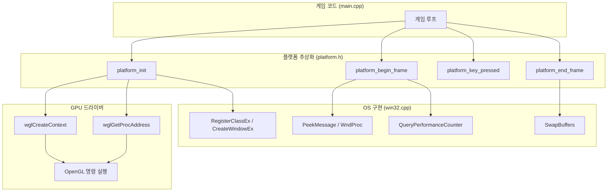
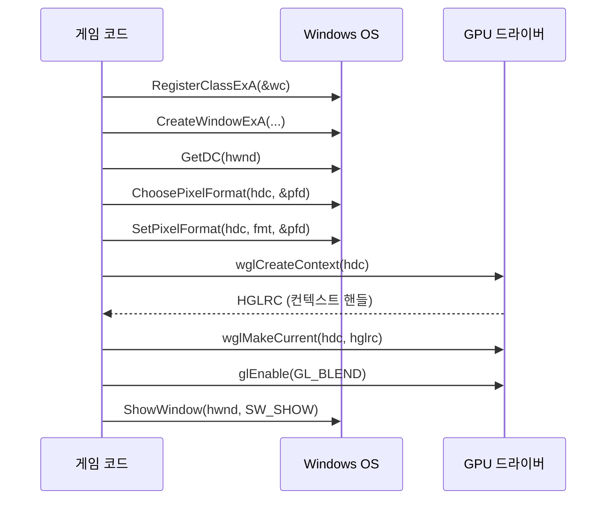

# Part 1: 창 하나 띄우기 — Win32 윈도우와 OpenGL 컨텍스트

> **시리즈:** 제로부터 멀티플레이어 테트리스 + RL까지
> **Part 1** | [Part 2: 2D 렌더링](./part2-2d-rendering.md) | [Part 3: 테트리스 로직](./part3-tetris-logic.md) | [Part 4: 게임 루프](./part4-game-loop.md) | [Part 5: 네트워킹](./part5-lockstep-networking.md) | [Part 6: Python RL](./part6-python-rl.md) | [Part 7: 오디오](./part7-xaudio2-audio.md)

---

## 들어가며

raylib에서 창을 만드는 코드는 한 줄이다:

```cpp
InitWindow(500, 620, "TETRIS");
```

이 한 줄이 실제로 하는 일은 다음과 같다:

1. OS에 윈도우 클래스를 등록하고 (RegisterClassEx)
2. 타이틀바와 테두리를 포함한 정확한 크기의 창을 생성하고 (CreateWindowEx)
3. 그 창에 OpenGL을 쓸 수 있도록 픽셀 포맷을 설정하고 (ChoosePixelFormat, SetPixelFormat)
4. GPU 드라이버에 OpenGL 렌더링 컨텍스트를 요청하고 (wglCreateContext)
5. 해당 컨텍스트를 현재 스레드에 바인딩하고 (wglMakeCurrent)
6. OpenGL 2.0 이후 함수들을 GPU 드라이버 DLL에서 런타임 로딩한다 (wglGetProcAddress)

raylib의 소스 코드(rcore.c)를 열면 이 과정이 그대로 들어있다. 이 글에서는 그 과정을 직접 작성하면서 각 단계가 **왜** 필요한지, **어떤 오류**가 발생할 수 있는지, 그리고 이 구조가 **다른 게임/엔진에도 동일하게 적용**되는 보편적 패턴임을 설명한다.

이 시리즈의 전체 소스 코드는 실제 프로젝트의 `platform/win32.cpp` (378줄)과 `platform/platform.h` (84줄)에 해당한다.

---

## 1. 아키텍처 개요

시작하기 전에 전체 구조를 잡는다. 게임 코드가 OS와 GPU에 직접 의존하지 않도록, **플랫폼 추상화 계층**을 둔다:



`platform.h`가 인터페이스이고, `win32.cpp`가 Win32 구현이다. 만약 Linux로 이식한다면 `x11.cpp`나 `wayland.cpp`를 작성하면 된다. 게임 코드는 한 줄도 바꿀 필요 없다.

헤더의 핵심 함수 시그니처:

```cpp
// platform.h

void   platform_init(int w, int h, const char* title);  // 창 + GL 컨텍스트
void   platform_shutdown();                               // 정리
bool   platform_should_close();                           // 종료 신호 확인
float  platform_begin_frame();                            // 메시지 루프 + deltaTime
void   platform_end_frame();                              // SwapBuffers
bool   platform_key_pressed(int key);                     // 엣지 트리거 입력
bool   platform_key_down(int key);                        // 레벨 트리거 입력
char   platform_get_char_pressed();                       // 문자 입력
double platform_get_time();                               // 경과 시간
```

---

## 2. Win32 윈도우 생성

### 2.1 윈도우 클래스 등록

Windows에서 창을 만들려면 먼저 "이런 종류의 창을 만들겠다"고 OS에 등록해야 한다. `WNDCLASSEXA` 구조체가 그 명세서다:

```cpp
WNDCLASSEXA wc   = {};
wc.cbSize        = sizeof(WNDCLASSEXA);
wc.style         = CS_HREDRAW | CS_VREDRAW | CS_OWNDC;
wc.lpfnWndProc   = WndProc;
wc.hInstance     = GetModuleHandleA(nullptr);
wc.hCursor       = LoadCursor(nullptr, IDC_ARROW);
wc.lpszClassName = "TetrisHandmade";
RegisterClassExA(&wc);
```

각 필드의 의미:

| 필드 | 값 | 설명 |
|------|---|------|
| `style` | `CS_HREDRAW \| CS_VREDRAW` | 창 크기 변경 시 전체 다시 그리기 요청 |
| `style` | `CS_OWNDC` | **이 창 전용 Device Context 유지**. OpenGL에 필수 |
| `lpfnWndProc` | `WndProc` | OS가 이벤트를 전달할 콜백 함수 |
| `hInstance` | `GetModuleHandleA(nullptr)` | 현재 실행 파일의 핸들 |

**CS_OWNDC가 왜 중요한가?** 일반 윈도우는 DC(Device Context)를 시스템 풀에서 빌려 쓰고 반환한다. 그러나 OpenGL 컨텍스트는 특정 DC에 바인딩되므로, DC가 매번 바뀌면 렌더링이 깨진다. `CS_OWNDC`는 이 창이 영구 전용 DC를 갖도록 보장한다.

> **레퍼런스:** Microsoft Win32 API, `WNDCLASSEXA` structure. CS_OWNDC 플래그는 `SetPixelFormat`이 DC당 한 번만 호출 가능한 제약과 결합되어 OpenGL 윈도우의 표준 패턴이 된다.

### 2.2 창 생성과 클라이언트 영역

```cpp
DWORD style = WS_OVERLAPPED | WS_CAPTION | WS_SYSMENU | WS_MINIMIZEBOX;
RECT  rect  = {0, 0, w, h};
AdjustWindowRect(&rect, style, FALSE);

s_hwnd = CreateWindowExA(
    0, "TetrisHandmade", title, style,
    CW_USEDEFAULT, CW_USEDEFAULT,
    rect.right - rect.left, rect.bottom - rect.top,
    nullptr, nullptr, wc.hInstance, nullptr);
```

`AdjustWindowRect`는 흔히 놓치기 쉬운 함수다. `CreateWindowEx`의 너비/높이 파라미터는 타이틀바와 테두리를 **포함**한 전체 크기다. 게임이 원하는 것은 **클라이언트 영역**(실제 그림이 그려지는 부분)의 크기다. `AdjustWindowRect`가 이 차이를 보정한다:

```
원하는 클라이언트 영역: 500 x 620
타이틀바 높이: ~31px, 테두리: ~1px 양쪽
AdjustWindowRect 결과: rect = {-1, -31, 501, 621}
전체 창 크기: 502 x 652
```

`AdjustWindowRect`를 빠뜨리면 게임 화면이 의도한 것보다 약간 작아지고, 하단이 잘린다. 디버깅하기 어려운 시각적 버그의 원인이 된다.

### 2.3 윈도우 스타일 선택

| 스타일 플래그 | 효과 |
|--------------|------|
| `WS_OVERLAPPED` | 기본 창 (타이틀바 + 테두리) |
| `WS_CAPTION` | 타이틀바 텍스트 표시 |
| `WS_SYSMENU` | 닫기 버튼 활성화 |
| `WS_MINIMIZEBOX` | 최소화 버튼만 (최대화 비활성화) |

`WS_THICKFRAME`(리사이즈 가능 테두리)를 넣지 않은 이유: 게임의 렌더링 해상도가 고정(500x620)이므로, 사용자가 임의로 크기를 변경하면 비율이 깨진다. 고정 크기 창이 가장 안전하다.

---

## 3. OpenGL 컨텍스트

### 3.1 픽셀 포맷 설정

DC를 얻은 후, 이 창에서 OpenGL을 사용할 것임을 OS에 알린다:

```cpp
s_hdc = GetDC(s_hwnd);

PIXELFORMATDESCRIPTOR pfd = {};
pfd.nSize      = sizeof(PIXELFORMATDESCRIPTOR);
pfd.nVersion   = 1;
pfd.dwFlags    = PFD_DRAW_TO_WINDOW | PFD_SUPPORT_OPENGL | PFD_DOUBLEBUFFER;
pfd.iPixelType = PFD_TYPE_RGBA;
pfd.cColorBits = 32;
pfd.cDepthBits = 24;
pfd.iLayerType = PFD_MAIN_PLANE;

int fmt = ChoosePixelFormat(s_hdc, &pfd);
SetPixelFormat(s_hdc, fmt, &pfd);
```

`PIXELFORMATDESCRIPTOR`는 OS에 전달하는 "희망 사양서"다. OS가 하드웨어에서 가장 가까운 포맷을 골라준다.

핵심 플래그:

| 플래그 | 의미 |
|--------|------|
| `PFD_DRAW_TO_WINDOW` | 화면에 직접 그리기 (오프스크린이 아님) |
| `PFD_SUPPORT_OPENGL` | OpenGL 렌더링 지원 |
| `PFD_DOUBLEBUFFER` | 더블 버퍼링 활성화 |

**더블 버퍼링이란?** GPU는 "백 버퍼"에 그림을 그리고, 완성되면 "프론트 버퍼"(화면)와 교체한다. 이 교체가 `SwapBuffers`다. 더블 버퍼링 없이는 GPU가 화면에 직접 그리므로, 그리는 중간 상태가 보이는 **티어링(tearing)** 현상이 발생한다.

> **주의:** `SetPixelFormat`은 DC당 **한 번만** 호출할 수 있다 (Microsoft 문서 명시). 두 번째 호출은 실패한다. 이것이 `CS_OWNDC`와 결합되는 이유: 영구 DC + 한 번의 픽셀 포맷 설정 = 안정적 OpenGL 렌더링.

### 3.2 렌더링 컨텍스트 생성

```cpp
s_hglrc = wglCreateContext(s_hdc);
wglMakeCurrent(s_hdc, s_hglrc);
```

`wglCreateContext`가 GPU 드라이버에 "이 DC를 위한 OpenGL 상태 머신을 하나 만들어라"고 요청한다. **OpenGL 컨텍스트**는 현재 바인딩된 셰이더, 텍스처, 버퍼 등 모든 GPU 상태의 집합이다.

`wglMakeCurrent`가 이 컨텍스트를 **현재 스레드**에 바인딩한다. 이후 이 스레드에서 호출하는 모든 `gl*` 함수는 이 컨텍스트에서 실행된다.

> **레퍼런스:** 이 과정은 Compatibility Profile을 생성한다. Core Profile이 필요하면 `wglCreateContextAttribsARB`를 사용해야 하지만, 이 프로젝트에서는 `wglUseFontBitmaps`(OpenGL 1.x 기능)를 텍스트 렌더링에 사용하므로 Compatibility Profile이 필요하다.

### 3.3 블렌딩 활성화

```cpp
glEnable(GL_BLEND);
glBlendFunc(GL_SRC_ALPHA, GL_ONE_MINUS_SRC_ALPHA);
```

알파 블렌딩 공식:

$$\text{출력} = \text{소스} \times \alpha + \text{배경} \times (1 - \alpha)$$

- $\alpha = 1.0$: 소스 색상이 완전히 덮음 (불투명)
- $\alpha = 0.5$: 소스와 배경이 50:50 혼합
- $\alpha = 0.0$: 소스가 투명 (배경만 보임)

텍스트 렌더링에서 글리프의 투명 영역이 배경을 가리지 않으려면 이 설정이 필수다.



---

## 4. OpenGL 2.0+ 함수 로딩

### 4.1 왜 런타임 로딩이 필요한가

Windows의 `opengl32.lib`는 **OpenGL 1.1**만 export한다. 1.1은 1997년 스펙이다. 셰이더(`glCreateShader`), VAO(`glGenVertexArrays`), VBO(`glGenBuffers`) 등 현대 OpenGL의 핵심 기능은 **GPU 드라이버 DLL**(nvidia의 경우 `nvoglv64.dll`)이 제공하며, `wglGetProcAddress`로 런타임에 함수 포인터를 가져와야 한다.

이 구조가 생긴 역사적 이유:
1. Microsoft는 OpenGL 1.1 이후 DirectX에 집중
2. GPU 벤더(NVIDIA, AMD, Intel)가 OpenGL 확장을 자체 구현
3. `wglGetProcAddress`가 벤더 DLL에서 함수를 가져오는 표준 인터페이스가 됨

> **레퍼런스:** OpenGL 4.6 Core Profile Specification, Section 1.3.1 "Loading OpenGL Functions". 또한 GLAD, GLEW 같은 라이브러리는 이 과정을 자동화한다. 이 프로젝트에서는 필요한 함수만 직접 로딩한다.

### 4.2 함수 포인터 패턴

```cpp
// 1. 함수 포인터 타입 정의 (함수 시그니처)
typedef GLuint (APIENTRY *PFNGLCREATESHADERPROC)(GLenum);

// 2. 전역 함수 포인터 선언 (초기값 nullptr)
PFNGLCREATESHADERPROC glCreateShader = nullptr;

// 3. 런타임 로딩
glCreateShader = (PFNGLCREATESHADERPROC)wglGetProcAddress("glCreateShader");
```

이 패턴을 매크로로 단순화한다:

```cpp
#define LOAD_GL(type, name) \
    name = (type)wglGetProcAddress(#name); \
    if (!name) fprintf(stderr, "[GL] wglGetProcAddress failed: " #name "\n");

// 치명적 함수 전용: 로드 실패 시 렌더링 불가 플래그
static bool s_gl_load_ok = true;

#define LOAD_GL_CRITICAL(type, name) \
    name = (type)wglGetProcAddress(#name); \
    if (!name) { \
        fprintf(stderr, "[GL] CRITICAL: " #name " not available\n"); \
        s_gl_load_ok = false; \
    }
```

`#name`은 C 전처리기의 **문자열화(stringification)** 연산자다. `LOAD_GL_CRITICAL(PFNGLCREATESHADERPROC, glCreateShader)`는 `wglGetProcAddress("glCreateShader")`로 확장된다.

### 4.3 치명적 함수와 선택적 함수

```cpp
static void gl_load_functions()
{
    s_gl_load_ok = true;
    // 필수: 하나라도 실패하면 렌더링 불가
    LOAD_GL_CRITICAL(PFNGLCREATESHADERPROC,  glCreateShader)
    LOAD_GL_CRITICAL(PFNGLSHADERSOURCEPROC,  glShaderSource)
    LOAD_GL_CRITICAL(PFNGLCOMPILESHADERPROC, glCompileShader)
    LOAD_GL_CRITICAL(PFNGLCREATEPROGRAMPROC, glCreateProgram)
    // ... 16개 함수 ...

    // 비필수: 실패해도 계속 (cleanup, debug)
    LOAD_GL(PFNGLDELETESHADERPROC, glDeleteShader)
    LOAD_GL(PFNGLGETSHADERIVPROC,  glGetShaderiv)
    // ... 11개 함수 ...

    if (!s_gl_load_ok) {
        fprintf(stderr, "[GL] FATAL: Critical GL functions unavailable. "
                        "GPU driver may not support OpenGL 2.0+.\n");
    }
}
```

이 구분이 중요한 이유: 오래된 GPU나 가상 머신에서는 OpenGL 2.0 함수가 없을 수 있다. 이때 셰이더 컴파일(`glCreateShader`)은 필수지만, 셰이더 삭제(`glDeleteShader`)는 프로그램 종료 시 OS가 알아서 정리하므로 비필수다.

### 4.4 gl_defs.h — 공유 타입 정의

`opengl32.lib`의 `GL/gl.h`는 `GLenum`, `GLuint` 등 기본 타입만 정의한다. GL 2.0에서 추가된 `GLchar`(셰이더 소스 문자), `GLsizeiptr`(VBO 크기)는 직접 정의해야 한다:

```cpp
// platform/gl_defs.h
typedef char      GLchar;      // GL 2.0 셰이더 소스 문자열용
typedef ptrdiff_t GLsizeiptr;  // GL 1.5 VBO 크기/오프셋용
typedef ptrdiff_t GLintptr;

#ifndef GL_ARRAY_BUFFER
#define GL_ARRAY_BUFFER    0x8892
#define GL_DYNAMIC_DRAW    0x88E8
#define GL_VERTEX_SHADER   0x8B31
#define GL_FRAGMENT_SHADER 0x8B30
#define GL_COMPILE_STATUS  0x8B81
#define GL_LINK_STATUS     0x8B82
// ...
#endif
```

이 파일은 `win32.cpp`와 `renderer.cpp` 양쪽에서 include한다. 타입 재정의 충돌을 피하기 위해 `GL/gl.h`가 이미 정의하는 타입(`GLenum`, `GLuint`)은 포함하지 않는다.

---

## 5. 메시지 루프와 입력

### 5.1 WndProc — 윈도우 프로시저

Win32에서 모든 이벤트(키보드, 마우스, 창 리사이즈, 닫기)는 **메시지** 형태로 WndProc 콜백에 전달된다:

```cpp
static bool s_key_state[256] = {};  // 현재 프레임 키 상태
static bool s_key_prev[256]  = {};  // 이전 프레임 키 상태

static LRESULT CALLBACK WndProc(HWND hwnd, UINT msg,
                                WPARAM wParam, LPARAM lParam)
{
    switch (msg)
    {
    case WM_KEYDOWN:
    case WM_SYSKEYDOWN:
        if (wParam < 256) s_key_state[wParam] = true;
        if (wParam == VK_ESCAPE) s_should_close = true;
        return 0;

    case WM_KEYUP:
    case WM_SYSKEYUP:
        if (wParam < 256) s_key_state[wParam] = false;
        return 0;

    case WM_CHAR:
        // 텍스트 입력 (IP 주소 타이핑 등)
        if (wParam > 0 && wParam < 128) {
            int next = (s_char_tail + 1) % 64;
            if (next != s_char_head) {
                s_char_queue[s_char_tail] = (char)wParam;
                s_char_tail = next;
            }
        }
        return 0;

    case WM_SIZE:
        s_win_w = LOWORD(lParam);
        s_win_h = HIWORD(lParam);
        if (s_hglrc) glViewport(0, 0, s_win_w, s_win_h);
        return 0;

    case WM_CLOSE:
        s_should_close = true;
        return 0;
    }
    return DefWindowProcA(hwnd, msg, wParam, lParam);
}
```

**WM_KEYDOWN / WM_KEYUP**: `wParam`은 **Virtual Key Code** (VK_LEFT = 0x25, VK_SPACE = 0x20 등)이다. 256개 boolean 배열로 전체 키 상태를 추적한다. 이 값이 Win32 VK_* 상수와 직접 대응하므로 별도 변환 테이블이 필요 없다:

```cpp
enum PlatformKey : int {
    PKEY_LEFT   = 0x25,  // VK_LEFT
    PKEY_RIGHT  = 0x27,  // VK_RIGHT
    PKEY_UP     = 0x26,  // VK_UP
    PKEY_DOWN   = 0x28,  // VK_DOWN
    PKEY_SPACE  = 0x20,  // VK_SPACE
    // ...
};
```

**WM_CHAR**: `TranslateMessage`가 WM_KEYDOWN을 분석해서 생성하는 문자 이벤트다. IP 주소 입력(숫자, 점, 콜론)에 사용한다. **원형 버퍼**(circular buffer)로 구현하여 여러 키 입력이 한 프레임에 들어와도 순서대로 처리한다:

```
s_char_queue: [ . ] [ 1 ] [ 2 ] [ 7 ] [ . ] [ 0 ] [ . ] [ 0 ] [ . ] [ 1 ] ...
                ^head                                                    ^tail
```

**WM_SIZE**: 창 크기가 바뀔 때 `glViewport`를 호출해야 한다. 이를 빠뜨리면 렌더링 영역이 이전 크기에 고정되어, 창이 커져도 게임 화면은 한쪽 구석에만 그려진다.

### 5.2 PeekMessage — 논블로킹 메시지 루프

```cpp
float platform_begin_frame()
{
    // 1. 이전 프레임 키 상태 스냅샷
    memcpy(s_key_prev, s_key_state, sizeof(s_key_state));

    // 2. 논블로킹 메시지 처리
    MSG msg;
    while (PeekMessageA(&msg, nullptr, 0, 0, PM_REMOVE))
    {
        if (msg.message == WM_QUIT) s_should_close = true;
        TranslateMessage(&msg);   // WM_KEYDOWN → WM_CHAR 변환
        DispatchMessageA(&msg);   // WndProc 호출
    }

    // 3. 델타타임 계산 (다음 섹션)
    // ...
}
```

**PeekMessage vs GetMessage**: `GetMessage`는 메시지가 올 때까지 **블로킹**한다. 게임 루프에서는 메시지가 없어도 계속 실행해야 하므로(렌더링, 시뮬레이션) `PeekMessage`를 사용한다. `PM_REMOVE` 플래그는 읽은 메시지를 큐에서 제거한다.

`TranslateMessage`가 WM_KEYDOWN 시퀀스를 분석하여 WM_CHAR 메시지를 생성한다. 예: `WM_KEYDOWN(VK_1)` → `WM_CHAR('1')`. 이 변환은 키보드 레이아웃(US, KR 등)을 반영한다.

---

## 6. 엣지 트리거 입력 감지

### 6.1 pressed vs down

게임 입력에는 두 가지 모드가 있다:

| 모드 | 의미 | 용도 |
|------|------|------|
| **Key Pressed** (엣지 트리거) | **이번 프레임에 처음** 눌림 | 회전, 드롭, 메뉴 선택 |
| **Key Down** (레벨 트리거) | **현재** 눌려있음 | 아래 이동 (연속) |

구현:

```cpp
bool platform_key_pressed(int key) {
    if (key < 0 || key >= 256) return false;
    return s_key_state[key] && !s_key_prev[key];
}

bool platform_key_down(int key) {
    if (key < 0 || key >= 256) return false;
    return s_key_state[key];
}
```

`key_pressed`의 핵심은 `s_key_state[key] && !s_key_prev[key]`이다. 현재 프레임에 눌려있고 이전 프레임에는 안 눌려있었으면 "방금 눌림"이다. 이것이 "엣지 트리거"(edge trigger)다 — 상태 변화의 **엣지**(0→1 전환)를 감지한다.

### 6.2 스냅샷 타이밍

`platform_begin_frame()` 시작 시 `memcpy(s_key_prev, s_key_state, ...)`로 이전 상태를 스냅샷한다. 이후 `PeekMessage` 루프가 `s_key_state`를 갱신한다. 따라서:

- `s_key_prev`: 이번 프레임 시작 **전** 상태
- `s_key_state`: 이번 프레임 메시지 처리 **후** 상태

이 순서가 뒤바뀌면 입력이 한 프레임 지연되거나 소실된다.

---

## 7. 고해상도 타이머

### 7.1 QueryPerformanceCounter

게임에서 프레임 간 경과 시간(deltaTime)을 정확히 측정해야 한다. `GetTickCount`는 밀리초 단위(정밀도 ~15ms)라 60Hz 게임 루프(~16.7ms/프레임)에서는 오차가 크다. 대신 `QueryPerformanceCounter`를 사용한다:

```cpp
static LARGE_INTEGER s_freq;
static LARGE_INTEGER s_frame_start;
static LARGE_INTEGER s_init_time;

// 초기화 시
QueryPerformanceFrequency(&s_freq);  // CPU 클럭 주파수 (보통 10MHz)
QueryPerformanceCounter(&s_init_time);
s_frame_start = s_init_time;
```

deltaTime 계산:

```cpp
LARGE_INTEGER now;
QueryPerformanceCounter(&now);
float dt = (float)(now.QuadPart - s_frame_start.QuadPart)
         / (float)s_freq.QuadPart;
s_frame_start = now;
```

$$\Delta t = \frac{\text{now} - \text{prev}}{\text{freq}} \quad [\text{초}]$$

현대 CPU에서 `s_freq`는 보통 10,000,000 (10MHz)으로, **100나노초** 정밀도를 제공한다.

### 7.2 스파이크 클램핑

사용자가 창의 타이틀바를 잡고 드래그하면, Win32 메시지 루프가 모달 루프(`DefWindowProc` 내부의 `MoveWindow` 처리)에 진입하여 게임 루프가 멈춘다. 드래그를 놓으면 `platform_begin_frame()`이 돌아오는데, 이때 `deltaTime`이 0.5초~수 초가 된다.

이 값을 그대로 게임에 전달하면 시뮬레이션이 한꺼번에 수십~수백 틱을 돌리게 된다(Part 4에서 다룰 어큐뮬레이터 패턴). 따라서 클램핑한다:

```cpp
if (dt > 0.1f) dt = 0.1f;  // 최대 100ms = 6틱
```

0.1초는 60Hz에서 6틱에 해당한다. 이 정도면 짧은 멈춤은 부드럽게 따라잡고, 긴 멈춤은 게임이 점프하지 않는 절충점이다.

### 7.3 경과 시간

```cpp
double platform_get_time()
{
    LARGE_INTEGER now;
    QueryPerformanceCounter(&now);
    return (double)(now.QuadPart - s_init_time.QuadPart)
         / (double)s_freq.QuadPart;
}
```

프로그램 시작 이후 **절대 경과 시간**을 초 단위로 반환한다. 멀티플레이에서 시드 생성에 사용된다:

```cpp
sessionSeed = (uint64_t)(platform_get_time() * 1000000.0) + 0xC0FFEEULL;
```

---

## 8. 프레임 교체

```cpp
void platform_end_frame()
{
    SwapBuffers(s_hdc);
}
```

더블 버퍼링의 마지막 단계. GPU가 백 버퍼에 그린 내용을 프론트 버퍼(화면)와 교체한다. 이 호출이 없으면 화면에 아무것도 나타나지 않는다.

`SwapBuffers`는 수직 동기화(VSync)가 활성화된 경우 모니터의 다음 수직 귀선(VBlank) 시점까지 대기한다. VSync가 비활성화되면 즉시 반환하며, 이때 FPS가 수천까지 올라갈 수 있다. (Part 4에서 이것이 입력 소실 문제를 일으키는 경위를 다룬다.)

---

## 9. 종료 처리

```cpp
void platform_shutdown()
{
    wglMakeCurrent(nullptr, nullptr);  // GL 컨텍스트 해제
    wglDeleteContext(s_hglrc);         // GL 컨텍스트 삭제
    ReleaseDC(s_hwnd, s_hdc);          // DC 반환
    DestroyWindow(s_hwnd);             // 창 파괴
}
```

순서가 중요하다:
1. GL 컨텍스트를 먼저 해제 (`wglMakeCurrent(nullptr, nullptr)`)
2. 컨텍스트 삭제
3. DC 반환
4. 창 파괴

GL 컨텍스트가 바인딩된 상태에서 DC를 반환하면, 이후 GL 호출이 무효한 DC에 접근하여 **접근 위반**(Access Violation)이 발생할 수 있다.

---

## 10. 오류와 함정

### 10.1 wglGetProcAddress가 nullptr를 반환

**증상:** 프로그램이 `glCreateShader(GL_VERTEX_SHADER)` 호출 시 크래시 (nullptr 호출).

**원인:** GPU 드라이버가 OpenGL 2.0을 지원하지 않거나, OpenGL 컨텍스트가 아직 생성되지 않은 상태에서 호출.

**해결:**
1. `wglCreateContext` + `wglMakeCurrent` 이후에 `wglGetProcAddress`를 호출한다.
2. 반환값이 nullptr인지 확인하고, 필수 함수가 없으면 명확한 에러 메시지를 출력한다.

```cpp
if (!s_gl_load_ok) {
    fprintf(stderr, "[GL] FATAL: GPU driver may not support OpenGL 2.0+.\n");
    // 셰이더 없이 돌아갈 수 있는 폴백 렌더러를 고려하거나, 종료
}
```

> **레퍼런스:** OpenGL Wiki, "Load OpenGL Functions". wglGetProcAddress는 현재 컨텍스트에 대해서만 유효한 포인터를 반환한다. 컨텍스트 없이 호출하면 항상 nullptr.

### 10.2 CS_OWNDC 누락

**증상:** 간헐적으로 OpenGL 렌더링이 깨지거나, 다른 창에 그림이 그려짐.

**원인:** 공유 DC 풀에서 DC를 받을 때마다 다른 DC가 할당될 수 있음. OpenGL 컨텍스트는 특정 DC에 바인딩되어 있으므로 불일치가 발생.

**해결:** `WNDCLASSEXA.style`에 `CS_OWNDC`를 포함한다.

### 10.3 AdjustWindowRect 누락

**증상:** 게임 화면이 예상보다 ~31픽셀 작다. 하단의 UI가 잘린다.

**원인:** `CreateWindowEx`에 전달한 크기가 클라이언트 영역이 아닌 전체 창 크기(타이틀바 포함)로 해석됨.

**해결:** `AdjustWindowRect`로 보정된 크기를 전달한다.

### 10.4 WM_SIZE에서 glViewport 누락

**증상:** 창 크기를 변경하면 게임 화면이 왼쪽 하단에 고정되고, 나머지 영역이 검은색.

**원인:** OpenGL 뷰포트가 초기 크기에 고정되어 있음.

**해결:** WM_SIZE 핸들러에서 `glViewport(0, 0, newW, newH)`를 호출한다. 단, GL 컨텍스트가 아직 없을 수 있으므로 `if (s_hglrc)` 가드를 건다.

### 10.5 MSVC에서 한국어 주석 인코딩 오류

**증상:** 컴파일 시 `C4819` 경고, "파일에 현재 코드 페이지에서 나타낼 수 없는 문자가 있습니다". 심한 경우 변수 이름이 깨져서 `C2065 undeclared identifier` 에러.

**원인:** 소스 파일이 UTF-8이지만 BOM이 없고, MSVC가 시스템 로캘(EUC-KR/CP949)로 해석.

**해결:** CMakeLists.txt에 MSVC 전용 UTF-8 플래그를 추가한다:

```cmake
if (MSVC)
    add_compile_options(/utf-8)
endif()
```

> **레퍼런스:** Microsoft C/C++ Compiler Options, `/utf-8` — "Specifies both the source character set and the execution character set as UTF-8."

---

## 정리

이 글에서 구현한 `platform/win32.cpp`는 378줄이다. raylib의 `InitWindow()` 한 줄이 숨기는 내용의 전부다. 핵심 개념을 요약하면:

| 단계 | Win32 API | 역할 |
|------|-----------|------|
| 윈도우 클래스 등록 | `RegisterClassExA` | CS_OWNDC로 전용 DC 보장 |
| 창 생성 | `CreateWindowExA` + `AdjustWindowRect` | 정확한 클라이언트 영역 크기 |
| 픽셀 포맷 | `ChoosePixelFormat` + `SetPixelFormat` | OpenGL + 더블 버퍼링 협상 |
| GL 컨텍스트 | `wglCreateContext` + `wglMakeCurrent` | GPU 상태 머신 생성 + 스레드 바인딩 |
| GL 함수 로딩 | `wglGetProcAddress` | OpenGL 2.0+ 런타임 로딩 |
| 메시지 루프 | `PeekMessageA` (논블로킹) | 입력 + OS 이벤트 처리 |
| 타이머 | `QueryPerformanceCounter` | 100ns 정밀도 deltaTime |
| 프레임 교체 | `SwapBuffers` | 더블 버퍼 교체 → 화면 표시 |

다음 Part 2에서는 이 창 위에 OpenGL로 사각형과 텍스트를 그리는 **2D 렌더링 파이프라인**을 구축한다.

---

## 참고 자료

### 공식 문서
- Microsoft. "Window Classes." Win32 API Reference. https://learn.microsoft.com/en-us/windows/win32/winmsg/window-classes
- Microsoft. "Creating an OpenGL Rendering Context." Win32 API. https://learn.microsoft.com/en-us/windows/win32/opengl/creating-a-rendering-context
- Microsoft. "ChoosePixelFormat / SetPixelFormat." Win32 GDI. https://learn.microsoft.com/en-us/windows/win32/api/wingdi/
- Khronos Group. "OpenGL 4.6 Core Profile Specification." 2023. Section 1.3.1 "Loading Functions."

### 학습 자료
- Muratori, Casey. "Handmade Hero." Day 001-004: Win32 Platform Layer. https://handmadehero.org/
- de Vries, Joey. "Learn OpenGL — Creating a Window." https://learnopengl.com/Getting-started/Creating-a-window
- Loaded Game. "Win32 OpenGL Setup Tutorial." (win32 + wgl 초기화 상세 설명)

### 타이머
- Microsoft. "QueryPerformanceCounter." https://learn.microsoft.com/en-us/windows/win32/sysinfo/acquiring-high-resolution-time-stamps
- "Game Timing and Multicore Processors." Microsoft DirectX Documentation.
