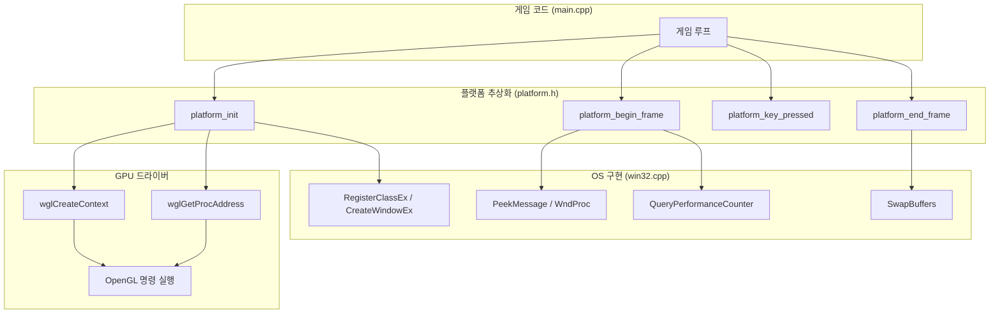
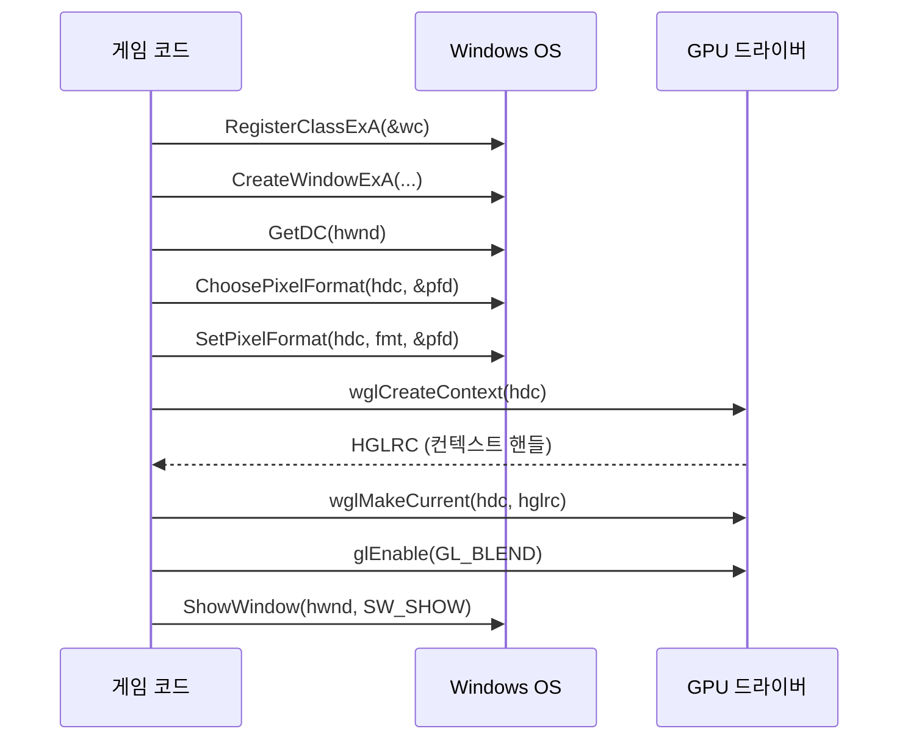
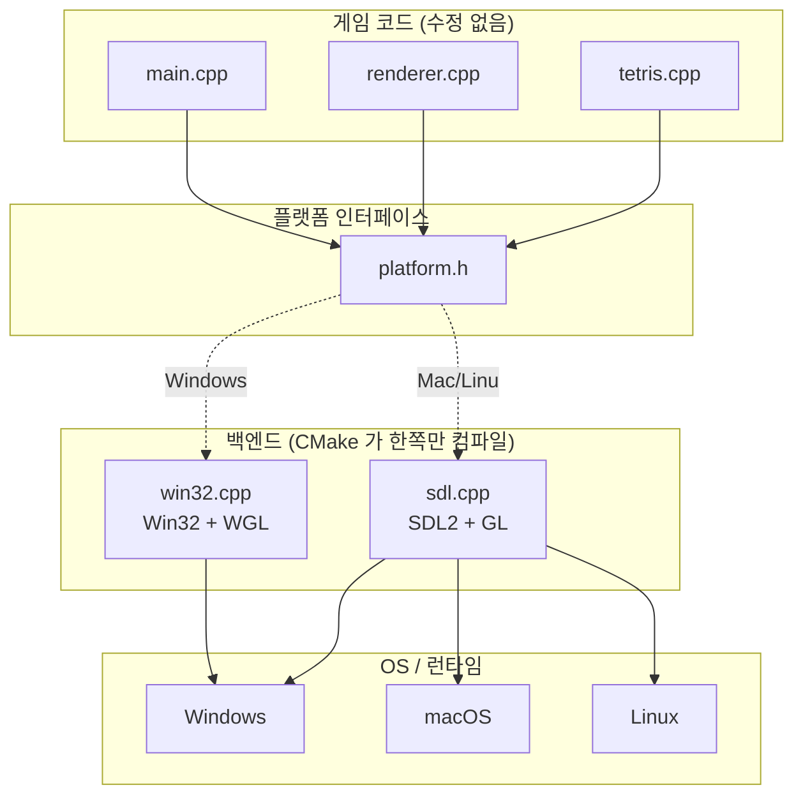
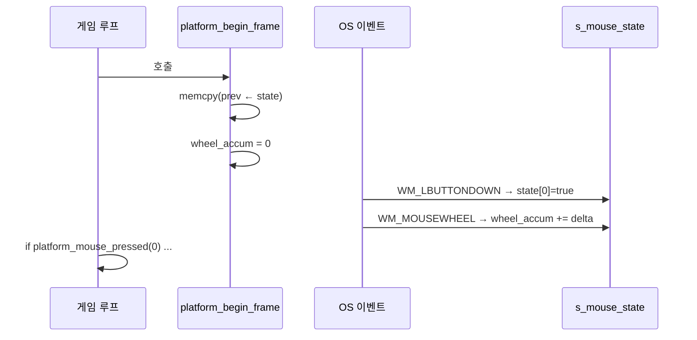

# Part 1: 창 하나 띄우기 — Win32 윈도우와 OpenGL 컨텍스트

> **시리즈:** 제로부터 멀티플레이어 테트리스 + RL까지
> **Part 1** | [Part 0: 셋업](./part0-project-setup.md) | [Part 2: 2D 렌더링](./part2-2d-rendering.md) | [Part 3: 테트리스 로직](./part3-tetris-logic.md) | [Part 4: 게임 루프](./part4-game-loop.md) | [Part 5: 네트워킹](./part5-lockstep-networking.md) | [Part 6: Python RL](./part6-python-rl.md) | [Part 7: 오디오](./part7-xaudio2-audio.md) | [Part 8: 릴레이 서버](./part8-relay-server.md) | [Part 9: RL + ONNX 봇](./part9-rl-onnx-bot.md)

---

## 들어가며

raylib에서 창을 만드는 코드는 한 줄이다:

```cpp
InitWindow(500, 620, "TETRIS");
```

이 한 줄이 실제로 하는 일은 다음과 같다:

1. OS에 윈도우 클래스를 등록하고 (RegisterClassEx)
2. 타이틀바와 테두리를 포함한 정확한 크기의 창을 생성하고 (CreateWindowEx)
3. 그 창에 OpenGL을 쓸 수 있도록 픽셀 포맷을 설정하고 (ChoosePixelFormat, SetPixelFormat)
4. GPU 드라이버에 OpenGL 렌더링 컨텍스트를 요청하고 (wglCreateContext)
5. 해당 컨텍스트를 현재 스레드에 바인딩하고 (wglMakeCurrent)
6. OpenGL 2.0 이후 함수들을 GPU 드라이버 DLL에서 런타임 로딩한다 (wglGetProcAddress)

raylib의 소스 코드(rcore.c)를 열면 이 과정이 그대로 들어있다. 이 글에서는 그 과정을 직접 작성하면서 각 단계가 **왜** 필요한지, **어떤 오류**가 발생할 수 있는지, 그리고 이 구조가 **다른 게임/엔진에도 동일하게 적용**되는 보편적 패턴임을 설명한다.

이 시리즈의 전체 소스 코드는 실제 프로젝트의 `platform/win32.cpp` (378줄)과 `platform/platform.h` (87줄)에 해당한다. 동일 인터페이스의 SDL2 백엔드는 `platform/sdl.cpp` (303줄)로, macOS/Linux에서 기본 사용된다.

> **참고:** 본 시리즈는 raylib의 함수들을 "직접 구현하는 과정"을 설명하지만,
> 이 프로젝트는 **raylib을 링크하지 않는다** — CMakeLists.txt를 보면 OpenGL,
> Win32 API, 또는 SDL2만 의존한다. 블로그가 raylib 한 줄을 출발점으로 삼는
> 이유는, 그것이 대부분의 독자에게 친숙한 참조 구현이기 때문이다. 각 Part의
> 최종 코드는 raylib 없이도 완전히 동작한다.

---

## 1. 아키텍처 개요

시작하기 전에 전체 구조를 잡는다. 게임 코드가 OS와 GPU에 직접 의존하지 않도록, **플랫폼 추상화 계층**을 둔다:



`platform.h`가 인터페이스이고, `win32.cpp`가 Win32 구현이다. 만약 Linux로 이식한다면 `x11.cpp`나 `wayland.cpp`를 작성하면 된다. 게임 코드는 한 줄도 바꿀 필요 없다.

헤더의 핵심 함수 시그니처:

```cpp
// platform.h

void   platform_init(int w, int h, const char* title);  // 창 + GL 컨텍스트
void   platform_shutdown();                               // 정리
bool   platform_should_close();                           // 종료 신호 확인
float  platform_begin_frame();                            // 메시지 루프 + deltaTime
void   platform_end_frame();                              // SwapBuffers
bool   platform_key_pressed(int key);                     // 엣지 트리거 입력
bool   platform_key_down(int key);                        // 레벨 트리거 입력
char   platform_get_char_pressed();                       // 문자 입력
double platform_get_time();                               // 경과 시간
```

---

## 2. Win32 윈도우 생성

### 2.1 윈도우 클래스 등록

Windows에서 창을 만들려면 먼저 "이런 종류의 창을 만들겠다"고 OS에 등록해야 한다. `WNDCLASSEXA` 구조체가 그 명세서다:

```cpp
WNDCLASSEXA wc   = {};
wc.cbSize        = sizeof(WNDCLASSEXA);
wc.style         = CS_HREDRAW | CS_VREDRAW | CS_OWNDC;
wc.lpfnWndProc   = WndProc;
wc.hInstance     = GetModuleHandleA(nullptr);
wc.hCursor       = LoadCursor(nullptr, IDC_ARROW);
wc.lpszClassName = "TetrisHandmade";
RegisterClassExA(&wc);
```

각 필드의 의미:

| 필드 | 값 | 설명 |
|------|---|------|
| `style` | `CS_HREDRAW \| CS_VREDRAW` | 창 크기 변경 시 전체 다시 그리기 요청 |
| `style` | `CS_OWNDC` | **이 창 전용 Device Context 유지**. OpenGL에 필수 |
| `lpfnWndProc` | `WndProc` | OS가 이벤트를 전달할 콜백 함수 |
| `hInstance` | `GetModuleHandleA(nullptr)` | 현재 실행 파일의 핸들 |

**CS_OWNDC가 왜 중요한가?** 일반 윈도우는 DC(Device Context)를 시스템 풀에서 빌려 쓰고 반환한다. 그러나 OpenGL 컨텍스트는 특정 DC에 바인딩되므로, DC가 매번 바뀌면 렌더링이 깨진다. `CS_OWNDC`는 이 창이 영구 전용 DC를 갖도록 보장한다.

> **레퍼런스:** Microsoft Win32 API, `WNDCLASSEXA` structure. CS_OWNDC 플래그는 `SetPixelFormat`이 DC당 한 번만 호출 가능한 제약과 결합되어 OpenGL 윈도우의 표준 패턴이 된다.

### 2.2 창 생성과 클라이언트 영역

```cpp
DWORD style = WS_OVERLAPPED | WS_CAPTION | WS_SYSMENU | WS_MINIMIZEBOX;
RECT  rect  = {0, 0, w, h};
AdjustWindowRect(&rect, style, FALSE);

s_hwnd = CreateWindowExA(
    0, "TetrisHandmade", title, style,
    CW_USEDEFAULT, CW_USEDEFAULT,
    rect.right - rect.left, rect.bottom - rect.top,
    nullptr, nullptr, wc.hInstance, nullptr);
```

`AdjustWindowRect`는 흔히 놓치기 쉬운 함수다. `CreateWindowEx`의 너비/높이 파라미터는 타이틀바와 테두리를 **포함**한 전체 크기다. 게임이 원하는 것은 **클라이언트 영역**(실제 그림이 그려지는 부분)의 크기다. `AdjustWindowRect`가 이 차이를 보정한다:

```
원하는 클라이언트 영역: 500 x 620
타이틀바 높이: ~31px, 테두리: ~1px 양쪽
AdjustWindowRect 결과: rect = {-1, -31, 501, 621}
전체 창 크기: 502 x 652
```

`AdjustWindowRect`를 빠뜨리면 게임 화면이 의도한 것보다 약간 작아지고, 하단이 잘린다. 디버깅하기 어려운 시각적 버그의 원인이 된다.

### 2.3 윈도우 스타일 선택

| 스타일 플래그 | 효과 |
|--------------|------|
| `WS_OVERLAPPED` | 기본 창 (타이틀바 + 테두리) |
| `WS_CAPTION` | 타이틀바 텍스트 표시 |
| `WS_SYSMENU` | 닫기 버튼 활성화 |
| `WS_MINIMIZEBOX` | 최소화 버튼만 (최대화 비활성화) |

`WS_THICKFRAME`(리사이즈 가능 테두리)를 넣지 않은 이유: 게임의 렌더링 해상도가 고정(500x620)이므로, 사용자가 임의로 크기를 변경하면 비율이 깨진다. 고정 크기 창이 가장 안전하다.

---

## 3. OpenGL 컨텍스트

### 3.1 픽셀 포맷 설정

DC를 얻은 후, 이 창에서 OpenGL을 사용할 것임을 OS에 알린다:

```cpp
s_hdc = GetDC(s_hwnd);

PIXELFORMATDESCRIPTOR pfd = {};
pfd.nSize      = sizeof(PIXELFORMATDESCRIPTOR);
pfd.nVersion   = 1;
pfd.dwFlags    = PFD_DRAW_TO_WINDOW | PFD_SUPPORT_OPENGL | PFD_DOUBLEBUFFER;
pfd.iPixelType = PFD_TYPE_RGBA;
pfd.cColorBits = 32;
pfd.cDepthBits = 24;
pfd.iLayerType = PFD_MAIN_PLANE;

int fmt = ChoosePixelFormat(s_hdc, &pfd);
SetPixelFormat(s_hdc, fmt, &pfd);
```

`PIXELFORMATDESCRIPTOR`는 OS에 전달하는 "희망 사양서"다. OS가 하드웨어에서 가장 가까운 포맷을 골라준다.

핵심 플래그:

| 플래그 | 의미 |
|--------|------|
| `PFD_DRAW_TO_WINDOW` | 화면에 직접 그리기 (오프스크린이 아님) |
| `PFD_SUPPORT_OPENGL` | OpenGL 렌더링 지원 |
| `PFD_DOUBLEBUFFER` | 더블 버퍼링 활성화 |

**더블 버퍼링이란?** GPU는 "백 버퍼"에 그림을 그리고, 완성되면 "프론트 버퍼"(화면)와 교체한다. 이 교체가 `SwapBuffers`다. 더블 버퍼링 없이는 GPU가 화면에 직접 그리므로, 그리는 중간 상태가 보이는 **티어링(tearing)** 현상이 발생한다.

> **주의:** `SetPixelFormat`은 DC당 **한 번만** 호출할 수 있다 (Microsoft 문서 명시). 두 번째 호출은 실패한다. 이것이 `CS_OWNDC`와 결합되는 이유: 영구 DC + 한 번의 픽셀 포맷 설정 = 안정적 OpenGL 렌더링.

### 3.2 렌더링 컨텍스트 생성

```cpp
s_hglrc = wglCreateContext(s_hdc);
wglMakeCurrent(s_hdc, s_hglrc);
```

`wglCreateContext`가 GPU 드라이버에 "이 DC를 위한 OpenGL 상태 머신을 하나 만들어라"고 요청한다. **OpenGL 컨텍스트**는 현재 바인딩된 셰이더, 텍스처, 버퍼 등 모든 GPU 상태의 집합이다.

`wglMakeCurrent`가 이 컨텍스트를 **현재 스레드**에 바인딩한다. 이후 이 스레드에서 호출하는 모든 `gl*` 함수는 이 컨텍스트에서 실행된다.

> **레퍼런스:** 이 과정은 Compatibility Profile을 생성한다. Core Profile이 필요하면 `wglCreateContextAttribsARB`를 사용해야 하지만, 이 프로젝트에서는 `wglUseFontBitmaps`(OpenGL 1.x 기능)를 텍스트 렌더링에 사용하므로 Compatibility Profile이 필요하다.

### 3.3 블렌딩 활성화

```cpp
glEnable(GL_BLEND);
glBlendFunc(GL_SRC_ALPHA, GL_ONE_MINUS_SRC_ALPHA);
```

알파 블렌딩 공식:

$$\text{출력} = \text{소스} \times \alpha + \text{배경} \times (1 - \alpha)$$

- $\alpha = 1.0$: 소스 색상이 완전히 덮음 (불투명)
- $\alpha = 0.5$: 소스와 배경이 50:50 혼합
- $\alpha = 0.0$: 소스가 투명 (배경만 보임)

텍스트 렌더링에서 글리프의 투명 영역이 배경을 가리지 않으려면 이 설정이 필수다.



---

## 4. OpenGL 2.0+ 함수 로딩

### 4.1 왜 런타임 로딩이 필요한가

Windows의 `opengl32.lib`는 **OpenGL 1.1**만 export한다. 1.1은 1997년 스펙이다. 셰이더(`glCreateShader`), VAO(`glGenVertexArrays`), VBO(`glGenBuffers`) 등 현대 OpenGL의 핵심 기능은 **GPU 드라이버 DLL**(nvidia의 경우 `nvoglv64.dll`)이 제공하며, `wglGetProcAddress`로 런타임에 함수 포인터를 가져와야 한다.

이 구조가 생긴 역사적 이유:
1. Microsoft는 OpenGL 1.1 이후 DirectX에 집중
2. GPU 벤더(NVIDIA, AMD, Intel)가 OpenGL 확장을 자체 구현
3. `wglGetProcAddress`가 벤더 DLL에서 함수를 가져오는 표준 인터페이스가 됨

> **레퍼런스:** OpenGL 4.6 Core Profile Specification, Section 1.3.1 "Loading OpenGL Functions". 또한 GLAD, GLEW 같은 라이브러리는 이 과정을 자동화한다. 이 프로젝트에서는 필요한 함수만 직접 로딩한다.

### 4.2 함수 포인터 패턴

```cpp
// 1. 함수 포인터 타입 정의 (함수 시그니처)
typedef GLuint (APIENTRY *PFNGLCREATESHADERPROC)(GLenum);

// 2. 전역 함수 포인터 선언 (초기값 nullptr)
PFNGLCREATESHADERPROC glCreateShader = nullptr;

// 3. 런타임 로딩
glCreateShader = (PFNGLCREATESHADERPROC)wglGetProcAddress("glCreateShader");
```

이 패턴을 매크로로 단순화한다:

```cpp
#define LOAD_GL(type, name) \
    name = (type)wglGetProcAddress(#name); \
    if (!name) fprintf(stderr, "[GL] wglGetProcAddress failed: " #name "\n");

// 치명적 함수 전용: 로드 실패 시 렌더링 불가 플래그
static bool s_gl_load_ok = true;

#define LOAD_GL_CRITICAL(type, name) \
    name = (type)wglGetProcAddress(#name); \
    if (!name) { \
        fprintf(stderr, "[GL] CRITICAL: " #name " not available\n"); \
        s_gl_load_ok = false; \
    }
```

`#name`은 C 전처리기의 **문자열화(stringification)** 연산자다. `LOAD_GL_CRITICAL(PFNGLCREATESHADERPROC, glCreateShader)`는 `wglGetProcAddress("glCreateShader")`로 확장된다.

### 4.3 치명적 함수와 선택적 함수

```cpp
static void gl_load_functions()
{
    s_gl_load_ok = true;
    // 필수: 하나라도 실패하면 렌더링 불가
    LOAD_GL_CRITICAL(PFNGLCREATESHADERPROC,  glCreateShader)
    LOAD_GL_CRITICAL(PFNGLSHADERSOURCEPROC,  glShaderSource)
    LOAD_GL_CRITICAL(PFNGLCOMPILESHADERPROC, glCompileShader)
    LOAD_GL_CRITICAL(PFNGLCREATEPROGRAMPROC, glCreateProgram)
    // ... 16개 함수 ...

    // 비필수: 실패해도 계속 (cleanup, debug)
    LOAD_GL(PFNGLDELETESHADERPROC, glDeleteShader)
    LOAD_GL(PFNGLGETSHADERIVPROC,  glGetShaderiv)
    // ... 11개 함수 ...

    if (!s_gl_load_ok) {
        fprintf(stderr, "[GL] FATAL: Critical GL functions unavailable. "
                        "GPU driver may not support OpenGL 2.0+.\n");
    }
}
```

이 구분이 중요한 이유: 오래된 GPU나 가상 머신에서는 OpenGL 2.0 함수가 없을 수 있다. 이때 셰이더 컴파일(`glCreateShader`)은 필수지만, 셰이더 삭제(`glDeleteShader`)는 프로그램 종료 시 OS가 알아서 정리하므로 비필수다.

### 4.4 gl_defs.h — 공유 타입 정의

`opengl32.lib`의 `GL/gl.h`는 `GLenum`, `GLuint` 등 기본 타입만 정의한다. GL 2.0에서 추가된 `GLchar`(셰이더 소스 문자), `GLsizeiptr`(VBO 크기)는 직접 정의해야 한다:

```cpp
// platform/gl_defs.h
typedef char      GLchar;      // GL 2.0 셰이더 소스 문자열용
typedef ptrdiff_t GLsizeiptr;  // GL 1.5 VBO 크기/오프셋용
typedef ptrdiff_t GLintptr;

#ifndef GL_ARRAY_BUFFER
#define GL_ARRAY_BUFFER    0x8892
#define GL_DYNAMIC_DRAW    0x88E8
#define GL_VERTEX_SHADER   0x8B31
#define GL_FRAGMENT_SHADER 0x8B30
#define GL_COMPILE_STATUS  0x8B81
#define GL_LINK_STATUS     0x8B82
// ...
#endif
```

이 파일은 `win32.cpp`와 `renderer.cpp` 양쪽에서 include한다. 타입 재정의 충돌을 피하기 위해 `GL/gl.h`가 이미 정의하는 타입(`GLenum`, `GLuint`)은 포함하지 않는다.

---

## 5. 메시지 루프와 입력

### 5.1 WndProc — 윈도우 프로시저

Win32에서 모든 이벤트(키보드, 마우스, 창 리사이즈, 닫기)는 **메시지** 형태로 WndProc 콜백에 전달된다:

```cpp
static bool s_key_state[256] = {};  // 현재 프레임 키 상태
static bool s_key_prev[256]  = {};  // 이전 프레임 키 상태

static LRESULT CALLBACK WndProc(HWND hwnd, UINT msg,
                                WPARAM wParam, LPARAM lParam)
{
    switch (msg)
    {
    case WM_KEYDOWN:
    case WM_SYSKEYDOWN:
        if (wParam < 256) s_key_state[wParam] = true;
        if (wParam == VK_ESCAPE) s_should_close = true;
        return 0;

    case WM_KEYUP:
    case WM_SYSKEYUP:
        if (wParam < 256) s_key_state[wParam] = false;
        return 0;

    case WM_CHAR:
        // 텍스트 입력 (IP 주소 타이핑 등)
        if (wParam > 0 && wParam < 128) {
            int next = (s_char_tail + 1) % 64;
            if (next != s_char_head) {
                s_char_queue[s_char_tail] = (char)wParam;
                s_char_tail = next;
            }
        }
        return 0;

    case WM_SIZE:
        s_win_w = LOWORD(lParam);
        s_win_h = HIWORD(lParam);
        if (s_hglrc) glViewport(0, 0, s_win_w, s_win_h);
        return 0;

    case WM_CLOSE:
        s_should_close = true;
        return 0;
    }
    return DefWindowProcA(hwnd, msg, wParam, lParam);
}
```

**WM_KEYDOWN / WM_KEYUP**: `wParam`은 **Virtual Key Code** (VK_LEFT = 0x25, VK_SPACE = 0x20 등)이다. 256개 boolean 배열로 전체 키 상태를 추적한다. 이 값이 Win32 VK_* 상수와 직접 대응하므로 별도 변환 테이블이 필요 없다:

```cpp
enum PlatformKey : int {
    PKEY_LEFT   = 0x25,  // VK_LEFT
    PKEY_RIGHT  = 0x27,  // VK_RIGHT
    PKEY_UP     = 0x26,  // VK_UP
    PKEY_DOWN   = 0x28,  // VK_DOWN
    PKEY_SPACE  = 0x20,  // VK_SPACE
    // ...
};
```

**WM_CHAR**: `TranslateMessage`가 WM_KEYDOWN을 분석해서 생성하는 문자 이벤트다. IP 주소 입력(숫자, 점, 콜론)에 사용한다. **원형 버퍼**(circular buffer)로 구현하여 여러 키 입력이 한 프레임에 들어와도 순서대로 처리한다:

```
s_char_queue: [ . ] [ 1 ] [ 2 ] [ 7 ] [ . ] [ 0 ] [ . ] [ 0 ] [ . ] [ 1 ] ...
                ^head                                                    ^tail
```

**WM_SIZE**: 창 크기가 바뀔 때 `glViewport`를 호출해야 한다. 이를 빠뜨리면 렌더링 영역이 이전 크기에 고정되어, 창이 커져도 게임 화면은 한쪽 구석에만 그려진다.

### 5.2 PeekMessage — 논블로킹 메시지 루프

```cpp
float platform_begin_frame()
{
    // 1. 이전 프레임 키 상태 스냅샷
    memcpy(s_key_prev, s_key_state, sizeof(s_key_state));

    // 2. 논블로킹 메시지 처리
    MSG msg;
    while (PeekMessageA(&msg, nullptr, 0, 0, PM_REMOVE))
    {
        if (msg.message == WM_QUIT) s_should_close = true;
        TranslateMessage(&msg);   // WM_KEYDOWN → WM_CHAR 변환
        DispatchMessageA(&msg);   // WndProc 호출
    }

    // 3. 델타타임 계산 (다음 섹션)
    // ...
}
```

**PeekMessage vs GetMessage**: `GetMessage`는 메시지가 올 때까지 **블로킹**한다. 게임 루프에서는 메시지가 없어도 계속 실행해야 하므로(렌더링, 시뮬레이션) `PeekMessage`를 사용한다. `PM_REMOVE` 플래그는 읽은 메시지를 큐에서 제거한다.

`TranslateMessage`가 WM_KEYDOWN 시퀀스를 분석하여 WM_CHAR 메시지를 생성한다. 예: `WM_KEYDOWN(VK_1)` → `WM_CHAR('1')`. 이 변환은 키보드 레이아웃(US, KR 등)을 반영한다.

---

## 6. 엣지 트리거 입력 감지

### 6.1 pressed vs down

게임 입력에는 두 가지 모드가 있다:

| 모드 | 의미 | 용도 |
|------|------|------|
| **Key Pressed** (엣지 트리거) | **이번 프레임에 처음** 눌림 | 회전, 드롭, 메뉴 선택 |
| **Key Down** (레벨 트리거) | **현재** 눌려있음 | 아래 이동 (연속) |

구현:

```cpp
bool platform_key_pressed(int key) {
    if (key < 0 || key >= 256) return false;
    return s_key_state[key] && !s_key_prev[key];
}

bool platform_key_down(int key) {
    if (key < 0 || key >= 256) return false;
    return s_key_state[key];
}
```

`key_pressed`의 핵심은 `s_key_state[key] && !s_key_prev[key]`이다. 현재 프레임에 눌려있고 이전 프레임에는 안 눌려있었으면 "방금 눌림"이다. 이것이 "엣지 트리거"(edge trigger)다 — 상태 변화의 **엣지**(0→1 전환)를 감지한다.

### 6.2 스냅샷 타이밍

`platform_begin_frame()` 시작 시 `memcpy(s_key_prev, s_key_state, ...)`로 이전 상태를 스냅샷한다. 이후 `PeekMessage` 루프가 `s_key_state`를 갱신한다. 따라서:

- `s_key_prev`: 이번 프레임 시작 **전** 상태
- `s_key_state`: 이번 프레임 메시지 처리 **후** 상태

이 순서가 뒤바뀌면 입력이 한 프레임 지연되거나 소실된다.

---

## 7. 고해상도 타이머

### 7.1 QueryPerformanceCounter

게임에서 프레임 간 경과 시간(deltaTime)을 정확히 측정해야 한다. `GetTickCount`는 밀리초 단위(정밀도 ~15ms)라 60Hz 게임 루프(~16.7ms/프레임)에서는 오차가 크다. 대신 `QueryPerformanceCounter`를 사용한다:

```cpp
static LARGE_INTEGER s_freq;
static LARGE_INTEGER s_frame_start;
static LARGE_INTEGER s_init_time;

// 초기화 시
QueryPerformanceFrequency(&s_freq);  // CPU 클럭 주파수 (보통 10MHz)
QueryPerformanceCounter(&s_init_time);
s_frame_start = s_init_time;
```

deltaTime 계산:

```cpp
LARGE_INTEGER now;
QueryPerformanceCounter(&now);
float dt = (float)(now.QuadPart - s_frame_start.QuadPart)
         / (float)s_freq.QuadPart;
s_frame_start = now;
```

$$\Delta t = \frac{\text{now} - \text{prev}}{\text{freq}} \quad [\text{초}]$$

현대 CPU에서 `s_freq`는 보통 10,000,000 (10MHz)으로, **100나노초** 정밀도를 제공한다.

### 7.2 스파이크 클램핑

사용자가 창의 타이틀바를 잡고 드래그하면, Win32 메시지 루프가 모달 루프(`DefWindowProc` 내부의 `MoveWindow` 처리)에 진입하여 게임 루프가 멈춘다. 드래그를 놓으면 `platform_begin_frame()`이 돌아오는데, 이때 `deltaTime`이 0.5초~수 초가 된다.

이 값을 그대로 게임에 전달하면 시뮬레이션이 한꺼번에 수십~수백 틱을 돌리게 된다(Part 4에서 다룰 어큐뮬레이터 패턴). 따라서 클램핑한다:

```cpp
if (dt > 0.1f) dt = 0.1f;  // 최대 100ms = 6틱
```

0.1초는 60Hz에서 6틱에 해당한다. 이 정도면 짧은 멈춤은 부드럽게 따라잡고, 긴 멈춤은 게임이 점프하지 않는 절충점이다.

### 7.3 경과 시간

```cpp
double platform_get_time()
{
    LARGE_INTEGER now;
    QueryPerformanceCounter(&now);
    return (double)(now.QuadPart - s_init_time.QuadPart)
         / (double)s_freq.QuadPart;
}
```

프로그램 시작 이후 **절대 경과 시간**을 초 단위로 반환한다. 멀티플레이에서 시드 생성에 사용된다:

```cpp
sessionSeed = (uint64_t)(platform_get_time() * 1000000.0) + 0xC0FFEEULL;
```

---

## 8. 프레임 교체

```cpp
void platform_end_frame()
{
    SwapBuffers(s_hdc);
}
```

더블 버퍼링의 마지막 단계. GPU가 백 버퍼에 그린 내용을 프론트 버퍼(화면)와 교체한다. 이 호출이 없으면 화면에 아무것도 나타나지 않는다.

`SwapBuffers`는 수직 동기화(VSync)가 활성화된 경우 모니터의 다음 수직 귀선(VBlank) 시점까지 대기한다. VSync가 비활성화되면 즉시 반환하며, 이때 FPS가 수천까지 올라갈 수 있다. (Part 4에서 이것이 입력 소실 문제를 일으키는 경위를 다룬다.)

---

## 9. 종료 처리

```cpp
void platform_shutdown()
{
    wglMakeCurrent(nullptr, nullptr);  // GL 컨텍스트 해제
    wglDeleteContext(s_hglrc);         // GL 컨텍스트 삭제
    ReleaseDC(s_hwnd, s_hdc);          // DC 반환
    DestroyWindow(s_hwnd);             // 창 파괴
}
```

순서가 중요하다:
1. GL 컨텍스트를 먼저 해제 (`wglMakeCurrent(nullptr, nullptr)`)
2. 컨텍스트 삭제
3. DC 반환
4. 창 파괴

GL 컨텍스트가 바인딩된 상태에서 DC를 반환하면, 이후 GL 호출이 무효한 DC에 접근하여 **접근 위반**(Access Violation)이 발생할 수 있다.

---

## 10. 오류와 함정

### 10.1 wglGetProcAddress가 nullptr를 반환

**증상:** 프로그램이 `glCreateShader(GL_VERTEX_SHADER)` 호출 시 크래시 (nullptr 호출).

**원인:** GPU 드라이버가 OpenGL 2.0을 지원하지 않거나, OpenGL 컨텍스트가 아직 생성되지 않은 상태에서 호출.

**해결:**
1. `wglCreateContext` + `wglMakeCurrent` 이후에 `wglGetProcAddress`를 호출한다.
2. 반환값이 nullptr인지 확인하고, 필수 함수가 없으면 명확한 에러 메시지를 출력한다.

```cpp
if (!s_gl_load_ok) {
    fprintf(stderr, "[GL] FATAL: GPU driver may not support OpenGL 2.0+.\n");
    // 셰이더 없이 돌아갈 수 있는 폴백 렌더러를 고려하거나, 종료
}
```

> **레퍼런스:** OpenGL Wiki, "Load OpenGL Functions". wglGetProcAddress는 현재 컨텍스트에 대해서만 유효한 포인터를 반환한다. 컨텍스트 없이 호출하면 항상 nullptr.

### 10.2 CS_OWNDC 누락

**증상:** 간헐적으로 OpenGL 렌더링이 깨지거나, 다른 창에 그림이 그려짐.

**원인:** 공유 DC 풀에서 DC를 받을 때마다 다른 DC가 할당될 수 있음. OpenGL 컨텍스트는 특정 DC에 바인딩되어 있으므로 불일치가 발생.

**해결:** `WNDCLASSEXA.style`에 `CS_OWNDC`를 포함한다.

### 10.3 AdjustWindowRect 누락

**증상:** 게임 화면이 예상보다 ~31픽셀 작다. 하단의 UI가 잘린다.

**원인:** `CreateWindowEx`에 전달한 크기가 클라이언트 영역이 아닌 전체 창 크기(타이틀바 포함)로 해석됨.

**해결:** `AdjustWindowRect`로 보정된 크기를 전달한다.

### 10.4 WM_SIZE에서 glViewport 누락

**증상:** 창 크기를 변경하면 게임 화면이 왼쪽 하단에 고정되고, 나머지 영역이 검은색.

**원인:** OpenGL 뷰포트가 초기 크기에 고정되어 있음.

**해결:** WM_SIZE 핸들러에서 `glViewport(0, 0, newW, newH)`를 호출한다. 단, GL 컨텍스트가 아직 없을 수 있으므로 `if (s_hglrc)` 가드를 건다.

### 10.5 MSVC에서 한국어 주석 인코딩 오류

**증상:** 컴파일 시 `C4819` 경고, "파일에 현재 코드 페이지에서 나타낼 수 없는 문자가 있습니다". 심한 경우 변수 이름이 깨져서 `C2065 undeclared identifier` 에러.

**원인:** 소스 파일이 UTF-8이지만 BOM이 없고, MSVC가 시스템 로캘(EUC-KR/CP949)로 해석.

**해결:** CMakeLists.txt에 MSVC 전용 UTF-8 플래그를 추가한다:

```cmake
if (MSVC)
    add_compile_options(/utf-8)
endif()
```

> **레퍼런스:** Microsoft C/C++ Compiler Options, `/utf-8` — "Specifies both the source character set and the execution character set as UTF-8."

---

## 정리

이 글에서 구현한 `platform/win32.cpp`는 378줄이다. raylib의 `InitWindow()` 한 줄이 숨기는 내용의 전부다. 핵심 개념을 요약하면:

| 단계 | Win32 API | 역할 |
|------|-----------|------|
| 윈도우 클래스 등록 | `RegisterClassExA` | CS_OWNDC로 전용 DC 보장 |
| 창 생성 | `CreateWindowExA` + `AdjustWindowRect` | 정확한 클라이언트 영역 크기 |
| 픽셀 포맷 | `ChoosePixelFormat` + `SetPixelFormat` | OpenGL + 더블 버퍼링 협상 |
| GL 컨텍스트 | `wglCreateContext` + `wglMakeCurrent` | GPU 상태 머신 생성 + 스레드 바인딩 |
| GL 함수 로딩 | `wglGetProcAddress` | OpenGL 2.0+ 런타임 로딩 |
| 메시지 루프 | `PeekMessageA` (논블로킹) | 입력 + OS 이벤트 처리 |
| 타이머 | `QueryPerformanceCounter` | 100ns 정밀도 deltaTime |
| 프레임 교체 | `SwapBuffers` | 더블 버퍼 교체 → 화면 표시 |

다음 Part 2에서는 이 창 위에 OpenGL로 사각형과 텍스트를 그리는 **2D 렌더링 파이프라인**을 구축한다.

---

## 부록 A. SDL2 백엔드 (`platform/sdl.cpp`)

### A.1 왜 두 번째 백엔드가 필요한가

지금까지 다룬 `platform/win32.cpp` 는 Win32 API 에 직접 의존한다. `RegisterClassExA`, `CreateWindowExA`, `wglCreateContext`, `QueryPerformanceCounter` — 어느 하나도 Linux 나 macOS 에 존재하지 않는다. macOS 는 아예 OpenGL 1.1 이후의 wgl 인터페이스를 갖지 않고, 컨텍스트 생성은 Cocoa 의 `NSOpenGLContext` 를 거쳐야 한다. 같은 코드를 그대로 빌드하면 링커 에러 수백 개가 쏟아진다.

크로스플랫폼을 감당할 방법은 세 가지다:

1. **플랫폼별 네이티브 구현을 직접 작성**. Win32 · X11 · Cocoa 세 벌의 창 코드. 학습 프로젝트에서는 가성비가 나쁘다.
2. **GLFW 또는 SDL2 같은 창 라이브러리 사용**. 한 벌의 코드로 세 OS 를 커버.
3. **Qt · Electron 등의 풀스택 UI 프레임워크**. 게임용으로는 오버킬.

이 프로젝트는 `platform.h` 가 이미 OS 세부를 숨기는 얇은 인터페이스다. 거기에 대응되는 두 번째 구현을 넣기만 하면 나머지 게임 코드(main · renderer · tetris)는 단 한 줄도 바꾸지 않고 재빌드된다. 이 조건을 가장 깔끔하게 채우는 것이 SDL2 다.



CMake 분기는 한 줄짜리 조건이다:

```cmake
if (WIN32 AND NOT TETRIS_USE_SDL)
    target_sources(tetris PRIVATE platform/win32.cpp)
else()
    target_sources(tetris PRIVATE platform/sdl.cpp)
    target_link_libraries(tetris PRIVATE SDL2::SDL2)
endif()
```

Windows 에서도 `-DTETRIS_USE_SDL=ON` 을 주면 SDL 백엔드로 빌드할 수 있다. 동일 게임 바이너리를 두 경로로 동작시켜 비교하며 디버깅하기 좋다.

### A.2 동일 인터페이스를 채우는 함수들

`platform.h` 에 선언된 10개 함수(`platform_init`, `platform_shutdown`, `platform_should_close`, `platform_begin_frame`, `platform_end_frame`, `platform_key_pressed`, `platform_key_down`, `platform_get_char_pressed`, `platform_get_time`, `platform_get_hdc`)를 SDL 로 다시 쓴다. 대응 관계는 다음과 같다.

| 역할 | Win32 | SDL2 |
|------|-------|------|
| 창 + GL 컨텍스트 | `CreateWindowExA` + `wglCreateContext` | `SDL_CreateWindow` + `SDL_GL_CreateContext` |
| 이벤트 펌프 | `PeekMessageA` + `DispatchMessageA` | `SDL_PollEvent` |
| 프레임 교체 | `SwapBuffers(hdc)` | `SDL_GL_SwapWindow(win)` |
| 고해상도 타이머 | `QueryPerformanceCounter` | `SDL_GetPerformanceCounter` |
| 키 테이블 갱신 | `WndProc` 의 `WM_KEYDOWN` | `SDL_KEYDOWN` 이벤트 |
| 문자 입력 | `WM_CHAR` | `SDL_TEXTINPUT` |
| GL 함수 로딩 | `wglGetProcAddress` | `SDL_GL_GetProcAddress` |

한 칸씩 대응되는 게 우연은 아니다. SDL2 는 설계 단계에서부터 Win32 를 포함한 주요 OS 의 공통 분모를 뽑아낸 라이브러리라, 포팅이 사실상 **이름 교체**에 가깝다. 차이는 두 군데에서 두드러진다. 첫째, 키 코드는 SDL 이 자체 스칼라(`SDL_Keycode`)를 쓴다. 둘째, 문자 입력은 OS 의 IME 레이어를 한 번 더 거쳐 UTF-8 바이트열로 온다.

### A.3 창 생성과 GL 컨텍스트

SDL 버전의 초기화는 명령형이라기보다 "속성 설정 → 생성 호출" 패턴이다:

```cpp
void platform_init(int w, int h, const char* title)
{
    s_win_w = w; s_win_h = h;

    if (SDL_Init(SDL_INIT_VIDEO | SDL_INIT_TIMER) != 0) {
        fprintf(stderr, "[SDL] SDL_Init failed: %s\n", SDL_GetError());
        return;
    }

    SDL_GL_SetAttribute(SDL_GL_CONTEXT_PROFILE_MASK, SDL_GL_CONTEXT_PROFILE_CORE);
    SDL_GL_SetAttribute(SDL_GL_CONTEXT_MAJOR_VERSION, 3);
    SDL_GL_SetAttribute(SDL_GL_CONTEXT_MINOR_VERSION, 2);  // macOS 최소 지원 코어
    SDL_GL_SetAttribute(SDL_GL_DOUBLEBUFFER, 1);
    SDL_GL_SetAttribute(SDL_GL_DEPTH_SIZE, 24);

    s_win = SDL_CreateWindow(
        title,
        SDL_WINDOWPOS_CENTERED, SDL_WINDOWPOS_CENTERED,
        w, h,
        SDL_WINDOW_OPENGL | SDL_WINDOW_SHOWN);
    if (!s_win) {
        fprintf(stderr, "[SDL] SDL_CreateWindow failed: %s\n", SDL_GetError());
        return;
    }

    s_glctx = SDL_GL_CreateContext(s_win);
    if (!s_glctx) {
        fprintf(stderr, "[SDL] SDL_GL_CreateContext failed: %s\n", SDL_GetError());
        return;
    }
    SDL_GL_MakeCurrent(s_win, s_glctx);
    SDL_GL_SetSwapInterval(1);  // vsync

    gl_load_functions();

    glEnable(GL_BLEND);
    glBlendFunc(GL_SRC_ALPHA, GL_ONE_MINUS_SRC_ALPHA);

    SDL_StartTextInput();

    s_freq        = SDL_GetPerformanceFrequency();
    s_init_time   = SDL_GetPerformanceCounter();
    s_frame_start = s_init_time;
}
```

몇 가지 짚어둘 점이 있다.

**GL 3.2 Core 고정.** Win32 경로는 Compatibility Profile 위에서 `wglUseFontBitmaps` 같은 GL 1.x 기능까지 섞어 썼다. 반면 macOS 는 Compatibility Profile 을 전혀 지원하지 않는다. 크로스플랫폼 백엔드는 공통 하한인 **GL 3.2 Core** 로 컴파일한다. 그 결과 텍스트 렌더링도 Win32 쪽의 `wglUseFontBitmaps` 경로 대신 `text_stb` (stb_truetype 기반 아틀라스) 경로로 바뀐다. 게임 코드 입장에서는 보이지 않는 치환이다.

**SwapInterval = 1.** `SDL_GL_SetSwapInterval(1)` 이 VSync 를 켠다. Win32 의 wgl 에서는 `wglSwapIntervalEXT` 확장을 로드해야 가능했는데, SDL 은 이걸 한 줄로 감춘다.

**SDL_StartTextInput.** IME 를 유도하는 호출이다. 이걸 부르지 않으면 `SDL_TEXTINPUT` 이벤트가 아예 발생하지 않는다. IP 주소 입력용 WM_CHAR 대응.

### A.4 이벤트 펌프 — PeekMessage 대응

Win32 의 `while (PeekMessage(...))` 루프가 `while (SDL_PollEvent(...))` 로 바뀐다. 동작 원리는 똑같다. 둘 다 큐가 비면 즉시 false 를 돌려주는 **논블로킹** API 다:

```cpp
float platform_begin_frame()
{
    memcpy(s_key_prev, s_key_state, sizeof(s_key_state));

    SDL_Event ev;
    while (SDL_PollEvent(&ev)) {
        switch (ev.type) {
        case SDL_QUIT:
            s_should_close = true; break;
        case SDL_KEYDOWN: {
            int vk = sdl_to_vk(ev.key.keysym.sym);
            if (vk >= 0 && vk < 256) s_key_state[vk] = true;
            if (ev.key.keysym.sym == SDLK_ESCAPE) s_should_close = true;
        } break;
        case SDL_KEYUP: {
            int vk = sdl_to_vk(ev.key.keysym.sym);
            if (vk >= 0 && vk < 256) s_key_state[vk] = false;
        } break;
        case SDL_TEXTINPUT: {
            for (const char* p = ev.text.text; *p; ++p) {
                unsigned c = (unsigned char)*p;
                if (c < 128) {
                    int next = (s_char_tail + 1) % 64;
                    if (next != s_char_head) {
                        s_char_queue[s_char_tail] = (char)c;
                        s_char_tail = next;
                    }
                }
            }
        } break;
        case SDL_WINDOWEVENT:
            if (ev.window.event == SDL_WINDOWEVENT_SIZE_CHANGED ||
                ev.window.event == SDL_WINDOWEVENT_RESIZED) {
                s_win_w = ev.window.data1;
                s_win_h = ev.window.data2;
                glViewport(0, 0, s_win_w, s_win_h);
            }
            break;
        }
    }

    uint64_t now = SDL_GetPerformanceCounter();
    float dt = (float)(now - s_frame_start) / (float)s_freq;
    s_frame_start = now;
    if (dt > 0.1f) dt = 0.1f;
    return dt;
}
```

Win32 경로와 일대일로 겹쳐 읽으면 구조가 뚜렷하다. 프레임 시작의 `memcpy` 로 엣지 트리거용 `s_key_prev` 를 갱신하는 부분, 맨 끝에서 `QueryPerformanceCounter` 대신 `SDL_GetPerformanceCounter` 로 deltaTime 을 계산하고 0.1초로 클램핑하는 부분 모두 동일하다. 게임 쪽에서 보이는 관찰 가능한 동작은 사실상 없다.

**SDL_TEXTINPUT 의 페이로드가 `ev.text.text` 라는 UTF-8 바이트 배열**이라는 점이 Win32 WM_CHAR 와 다르다. 한 이벤트에 여러 바이트가 들어올 수 있고(한글 음절 등), ASCII 범위 밖 바이트는 IP 주소 입력에는 쓸모가 없으니 `c < 128` 로 걸러낸다. 구버전 터미널에서 이모지를 입력하면 여러 바이트가 쏟아지는 것과 같은 이유.

### A.5 키 매핑 — SDL_Keycode → PKEY_*

`PlatformKey` 의 값은 **Win32 VK_\* 상수와 동일하게 고정**되어 있다. 게임 코드가 `PKEY_LEFT == 0x25` 를 가정하고 256 개짜리 부울 배열을 인덱싱한다. 따라서 SDL 백엔드는 키 이벤트가 올 때마다 `SDL_Keycode` 를 VK 값으로 변환해야 한다:

```cpp
static int sdl_to_vk(SDL_Keycode k)
{
    switch (k) {
    case SDLK_LEFT:     return PKEY_LEFT;
    case SDLK_RIGHT:    return PKEY_RIGHT;
    case SDLK_UP:       return PKEY_UP;
    case SDLK_DOWN:     return PKEY_DOWN;
    case SDLK_SPACE:    return PKEY_SPACE;
    case SDLK_RETURN:
    case SDLK_KP_ENTER: return PKEY_ENTER;
    case SDLK_ESCAPE:   return PKEY_ESCAPE;
    case SDLK_BACKSPACE:return PKEY_BACK;
    case SDLK_q:        return PKEY_Q;
    case SDLK_r:        return PKEY_R;
    case SDLK_h:        return PKEY_H;
    case SDLK_p:        return PKEY_P;
    case SDLK_F5:       return PKEY_F5;
    case SDLK_F6:       return PKEY_F6;
    default: return -1;
    }
}
```

매핑되지 않은 키는 -1 을 돌려주고, 호출부에서 `vk >= 0 && vk < 256` 체크로 걸러낸다. 이 테이블이 게임에서 실제로 사용하는 키의 **유일한 원본 목록**이다 — 새 단축키를 추가하려면 `PlatformKey` enum 과 이 switch 두 곳만 갱신하면 된다.

한 가지 함정. SDL 의 소문자 키 상수(`SDLK_q`)는 **문자 코드 `'q'` (0x71)** 다. 반면 Win32 VK 상수는 **대문자 `'Q'` (0x51)** 다. 그래서 `PKEY_Q = 'Q'` 로 정의해두고 SDL 쪽에서 `SDLK_q → PKEY_Q` 로 명시 변환한다. 이걸 빠뜨리면 Shift 상태에 따라 키가 먹었다 안 먹었다 하는 증상이 생긴다.

### A.6 종료와 그 외 함수

나머지 함수는 거의 기계적인 1:1 번역이다:

```cpp
void platform_shutdown()
{
    if (s_glctx) { SDL_GL_DeleteContext(s_glctx); s_glctx = nullptr; }
    if (s_win)   { SDL_DestroyWindow(s_win);      s_win   = nullptr; }
    SDL_Quit();
}

void platform_end_frame()
{
    SDL_GL_SwapWindow(s_win);
}

double platform_get_time()
{
    uint64_t now = SDL_GetPerformanceCounter();
    return (double)(now - s_init_time) / (double)s_freq;
}

void* platform_get_hdc()
{
    // SDL 빌드에서는 text_stb 가 이 값을 사용하지 않음.
    return nullptr;
}
```

`platform_get_hdc` 가 nullptr 을 돌려주는 부분은 의도적이다. 이 함수는 Win32 경로에서만 `wglUseFontBitmaps` 를 위해 HDC 를 넘기는 용도였고, SDL 경로는 텍스트 렌더링을 `text_stb` 로 대체했으므로 누구도 이 값을 참조하지 않는다. 그래도 인터페이스는 같게 유지해야 `renderer.cpp` 와 `main.cpp` 가 양쪽 백엔드에서 컴파일된다.

### A.7 빌드하고 돌려보기

macOS 에서:

```bash
brew install sdl2 cmake
cmake -S . -B build -DTETRIS_USE_SDL=ON
cmake --build build -j
./build/tetris
```

Linux (Ubuntu/Debian) 에서:

```bash
sudo apt install libsdl2-dev cmake g++
cmake -S . -B build -DTETRIS_USE_SDL=ON
cmake --build build -j
./build/tetris
```

기대 결과: Win32 빌드와 **시각적으로 동일한** 500x620 창이 뜨고, 테트로미노가 떨어지고, Space 로 회전·하드드롭이 된다. 텍스트 폰트만 미세하게 다르다(Win32 는 시스템 비트맵 폰트, SDL 은 stb_truetype 아틀라스).

이 시점에서 확인할 가치가 있는 건 "게임 로직이 플랫폼에 의존하지 않는다"는 실제 증거다. `tetris.cpp`, `renderer.cpp`, `main.cpp` 는 단 한 줄도 수정하지 않았는데 세 OS 에서 같은 게임이 돈다. 이게 `platform.h` 인터페이스를 얇게 유지한 대가다.

---

## 부록 B. DPI 스케일링과 QueryPerformanceCounter 정확도

### B.1 Windows 의 DPI 역사와 논리 좌표계

Windows 는 오래도록 화면 좌표계가 **96 DPI (dot per inch)** 를 표준으로 삼았다. 한 픽셀이 1 포인트(1/72인치)보다 살짝 크다는 가정이다. 2010년대 후반 4K/고밀도 디스플레이가 퍼지면서 이 가정이 무너졌다 — 같은 물리 크기의 창이 13" FHD 에서는 적당한 크기지만, 13" 4K 에서는 읽기 힘들 만큼 작아진다.

Microsoft 는 두 가지 호환 경로를 마련했다. 첫째, 앱이 DPI 인식을 **선언하지 않으면** Windows 가 자동으로 창을 확대한다 — 이게 "DPI Virtualization" 이다. 실제 창 크기보다 큰 백 버퍼에 렌더링이 일어난 뒤 픽셀이 보간되어 블러 처리된 결과가 화면에 나온다. 둘째, 앱이 DPI 인식을 **선언하면** Windows 는 창을 물리 픽셀 그대로 넘겨주고, 앱이 알아서 내용을 스케일한다.

게임은 후자가 필요하다. 블러 처리된 텍스트와 흐릿한 픽셀 아트는 용납되지 않는다. 선언 방법은 두 가지다:

**1. 런타임 API 호출** (간단하지만 이미 늦은 타이밍이 있다):

```cpp
// platform_init 의 맨 앞에 넣는 게 이상적
#include <ShellScalingApi.h>  // Windows 8.1+
SetProcessDpiAwareness(PROCESS_PER_MONITOR_DPI_AWARE);
```

**2. 매니페스트 선언** (더 권장되는 방식, 프로세스 생성 시점에 적용):

```xml
<!-- app.manifest -->
<application xmlns="urn:schemas-microsoft-com:asm.v3">
  <windowsSettings>
    <dpiAware xmlns="http://schemas.microsoft.com/SMI/2005/WindowsSettings">true/PM</dpiAware>
    <dpiAwareness xmlns="http://schemas.microsoft.com/SMI/2016/WindowsSettings">PerMonitorV2</dpiAwareness>
  </windowsSettings>
</application>
```

`PerMonitorV2` 는 Windows 10 1703 이후의 최신 모드로, 다중 모니터 간 이동 시 각 모니터의 DPI 를 실시간으로 반영한다.

이 프로젝트의 `win32.cpp` 는 현재 DPI 인식을 선언하지 않는다 — 600 픽셀 남짓한 고정 창이라 가상화 블러가 실용적으로 거의 눈에 안 띈다. 고해상도 디스플레이에서 정확한 픽셀을 원한다면 `platform_init` 에 한 줄을 추가한다:

```cpp
void platform_init(int w, int h, const char* title)
{
    // DPI 가상화 비활성화 (Windows 8.1+)
    SetProcessDpiAwareness(PROCESS_PER_MONITOR_DPI_AWARE);

    // ... 나머지 초기화 ...
}
```

이 한 줄을 넣는 순간 창 크기와 입력 좌표가 "논리 픽셀" 이 아닌 "물리 픽셀" 단위가 된다. `AdjustWindowRect` 가 돌려주는 보정값도 실제 DPI 기준으로 계산된다.

### B.2 고해상도 디스플레이에서의 창 크기 보정

현재 모니터의 DPI 를 질의하는 방법:

```cpp
UINT dpiX = 96, dpiY = 96;
HMONITOR mon = MonitorFromWindow(s_hwnd, MONITOR_DEFAULTTONEAREST);
GetDpiForMonitor(mon, MDT_EFFECTIVE_DPI, &dpiX, &dpiY);
float scale = dpiX / 96.0f;  // 1.0 (96 DPI), 1.25, 1.5, 2.0 ...
```

창을 스케일해서 만들고 싶다면 `CreateWindowExA` 에 넘기는 크기에 `scale` 을 곱하면 된다:

```cpp
int phys_w = (int)(w * scale);
int phys_h = (int)(h * scale);
RECT rect = {0, 0, phys_w, phys_h};
AdjustWindowRect(&rect, style, FALSE);
```

그리고 렌더링 쪽에서도 `glViewport(0, 0, phys_w, phys_h)` 로 맞춰야 한다. 이 프로젝트는 지금 이 스케일링을 쓰지 않지만, 4K 디스플레이 사용자 피드백이 들어오면 이 지점에 붙이면 된다.

한 가지 주의. WM_DPICHANGED 메시지는 창이 모니터를 넘어갈 때 도착하며, 새 DPI 와 함께 **권장 창 크기(RECT)** 를 제공한다. 이 값을 그대로 `SetWindowPos` 에 돌려주는 게 표준 패턴이다. 사용자가 다중 모니터에서 창을 드래그할 때만 관여한다.

### B.3 QueryPerformanceCounter 의 정확도

`QueryPerformanceCounter` (QPC) 는 Windows 에서 제공하는 가장 정밀한 시계다. 내부적으로는 CPU 에 따라 서로 다른 하드웨어 소스를 쓴다:

| 하드웨어 소스 | 해상도 | 비고 |
|--------------|--------|------|
| HPET (High Precision Event Timer) | 10 MHz 이상 | 대부분의 Intel/AMD 시스템 기본 |
| TSC (Time Stamp Counter) | CPU 클럭 | 최신 CPU 는 불변 TSC 지원 |
| PM Timer | 3.58 MHz | 구형 시스템 폴백 |

`QueryPerformanceFrequency` 가 돌려주는 값은 현재 하드웨어 소스의 틱 주파수다. 이 프로젝트의 개발 환경에서는:

```
QueryPerformanceFrequency → 10,000,000 (10 MHz)
→ 한 틱 = 100 ns
→ 60 Hz 프레임(16.67 ms) 안에 166,700 틱
```

100 ns 해상도는 frame time 측정에 **과잉**이다. 밀리초 측정만 해도 충분한데, 여기에는 이유가 있다. `GetTickCount` 는 실제로는 15.6 ms 주기(Windows 의 기본 scheduler tick)로만 갱신된다. 16.67 ms 프레임 타임을 15.6 ms 해상도로 측정하면 프레임 사이의 jitter 를 전혀 구분할 수 없다. QPC 는 이 해상도 문제를 단번에 해결한다.


### B.4 QPC 의 함정 두 가지

**1. 멀티코어 TSC 드리프트.** 오래된 CPU(2008년 이전) 에서는 코어마다 TSC 가 독립적으로 증가해 스레드가 다른 코어로 마이그레이션되면 시간이 역행하는 일이 있었다. Windows 7 이후 QPC 는 이 문제를 감지해 폴백 소스로 전환하거나, 스레드 어피니티를 이용해 일관성을 보장한다. **2012년 이후 하드웨어에서는 신경 쓸 필요 없다**. 그래도 드물게 `now - prev` 가 음수가 나오는 시스템이 보고되므로, 방어 코드는 두어 줄 가치가 있다:

```cpp
LARGE_INTEGER now;
QueryPerformanceCounter(&now);
int64_t delta = now.QuadPart - s_frame_start.QuadPart;
if (delta < 0) delta = 0;  // 드문 드리프트 방어
float dt = (float)delta / (float)s_freq.QuadPart;
s_frame_start = now;
```

**2. 절전 상태 복귀 후의 점프.** 노트북 뚜껑을 닫아 S3 슬립에 진입했다가 깨우면 QPC 가 몇 시간 점프할 수 있다. deltaTime 이 10000.0f 로 튀면 시뮬레이션이 폭발한다. 이 방어는 Part 1 본문에서 이미 다룬 **0.1초 클램핑**이 그대로 처리한다:

```cpp
if (dt > 0.1f) dt = 0.1f;
```

### B.5 `platform_get_time()` 구현 요지

절대 경과 시간은 프로그램 시작 시점의 QPC 스냅샷을 기준으로 계산한다:

```cpp
static LARGE_INTEGER s_freq;       // 한 번만 설정
static LARGE_INTEGER s_init_time;  // 프로그램 시작 시점

void platform_init(...)
{
    QueryPerformanceFrequency(&s_freq);
    QueryPerformanceCounter(&s_init_time);
    // ...
}

double platform_get_time()
{
    LARGE_INTEGER now;
    QueryPerformanceCounter(&now);
    return (double)(now.QuadPart - s_init_time.QuadPart)
         / (double)s_freq.QuadPart;
}
```

반환 타입이 **double** 인 이유가 있다. float 로는 16.7 백만 초(약 194일) 이후에 1 밀리초 이하 정밀도를 잃는다. double 은 사실상 프로그램이 동작하는 모든 기간 내내 나노초 수준 정밀도를 유지한다. 테트리스 한 판이 몇 분짜리라 큰 차이는 없지만, **네트워크 시드 생성** (Part 5) 에서 `(uint64_t)(platform_get_time() * 1000000.0)` 로 마이크로초 타임스탬프를 만들 때 double 정밀도가 유용하다.

### B.6 QPC 와 타임존 · 시스템 시계

QPC 는 **monotonic clock** 이다. 사용자가 시스템 시계를 수동으로 변경하거나 NTP 동기화로 뒤로 돌려도 QPC 는 절대 역행하지 않는다. 이 특성은 deltaTime 측정에 필수적이다. 만약 `time(NULL)` 이나 `GetSystemTime` 으로 프레임 타임을 측정했다면, 게임 중에 NTP 가 작동하는 순간 시뮬레이션이 파괴됐을 것이다.

반대로 "몇 시 몇 분에 저장됐나" 같은 사람 기준 시간은 QPC 로 구할 수 없다. 이 프로젝트에서 사람 기준 시간이 필요한 곳은 로그 타임스탬프와 리플레이 파일명 정도인데, 거기서는 `GetLocalTime` 을 별도로 쓴다.

| 용도 | API | 성질 |
|------|-----|------|
| 프레임 타임 / deltaTime | `QueryPerformanceCounter` | monotonic, ~100ns |
| 게임 시작 이후 경과 초 | `QueryPerformanceCounter` | monotonic, double 초 |
| 네트워크 타임스탬프 (로컬 기준) | `QueryPerformanceCounter` | monotonic, 마이크로초 |
| 로그 / 파일명의 사람 시간 | `GetLocalTime` | 변경 가능, 초 |

이 분리 원칙이 간단해 보이지만 의외로 자주 실수하는 부분이다 — 스마트폰 게임 해킹 중에 "시스템 시각을 미래로 돌려 에너지 충전 대기시간을 건너뛴다"는 트릭이 오래 통했던 이유가 바로 개발자가 monotonic clock 과 wall clock 을 섞어 썼기 때문이다.

---

## 부록 C. 마우스 입력

### C.1 왜 뒤늦게 추가했는가

본문에서 다룬 `platform.h` 의 초기 인터페이스는 키보드만 다뤘다. 테트리스 플레이 자체는 방향키 · Space · Enter 로 끝나고, 회전·이동·하드드롭 같은 리얼타임 입력은 1프레임 오차를 허용하지 않는 엣지 트리거라 **키보드가 정답**이다. 게임 플레이에 굳이 마우스를 끌어들일 이유가 없다.

문제는 게임 플레이 바깥이다. 메뉴에서 "Quick Play / Private Room / Practice" 를 고르는 장면, 상점에서 스킨을 고르는 장면, 프로필 커스터마이즈에서 색상 슬라이더를 움직이는 장면 — 이런 UI 는 키보드만으로 다루면 조작 경로가 어색해진다. 방향키로 버튼 사이를 옮겨다닐 수는 있지만, 독립된 영역이 많아지면 "지금 포커스가 어디 있는지" 표시하는 코드가 눈덩이처럼 불어난다. 클릭 한 번이면 끝나는 일이다.

그래서 본문 작성 이후 `platform.h` 에 **마우스 6종 API 를 덧붙였다**. 게임 플레이 경로는 건드리지 않고(`tetris.cpp` · `main.cpp` 의 틱 루프 한 줄도 수정하지 않음), 메뉴 · 상점 · 프로필 같은 2D UI 계층만 마우스를 쓴다. 이 부록은 그 6개 함수가 어떻게 WM_* 메시지와 SDL_Event 에서 올라오는지를 설명한다.

### C.2 인터페이스 — 6개 함수

`platform.h` 에 추가된 선언은 아래와 같다:

```cpp
// ─── 마우스 ───────────────────────────────────────────────────────────────────
// 버튼 인덱스: 0 = Left, 1 = Right, 2 = Middle.
// 좌표는 클라이언트 영역 기준 (0,0 = 좌상단). 창 밖이면 마지막 값 유지.
int    platform_mouse_x();
int    platform_mouse_y();
// 이번 프레임에 처음 눌림 (edge). IsMouseButtonPressed 대체.
bool   platform_mouse_pressed(int button);
// 현재 누르고 있음 (level). IsMouseButtonDown 대체.
bool   platform_mouse_down(int button);
// 이번 프레임에 뗌 (edge). IsMouseButtonReleased 대체.
bool   platform_mouse_released(int button);
// 이번 프레임 휠 스크롤 누적 (위로 양수). 없으면 0. GetMouseWheelMove 대체.
float  platform_mouse_wheel();
```

키 API 와 구조가 완전히 같다:

| 함수 | 의미 | 키 API 대응 |
|------|------|------|
| `platform_mouse_x/y()` | 현재 좌표 (클라이언트 영역) | - |
| `platform_mouse_pressed(b)` | 이번 프레임 처음 눌림 (edge) | `platform_key_pressed` |
| `platform_mouse_down(b)` | 지금 누르고 있음 (level) | `platform_key_down` |
| `platform_mouse_released(b)` | 이번 프레임에 뗌 (edge) | (키에는 없음) |
| `platform_mouse_wheel()` | 이번 프레임 누적 스크롤 | (키에는 없음) |

버튼 인덱스는 세 개로 고정했다. `0=Left`, `1=Right`, `2=Middle`. 추가 버튼(X1/X2, 사이드 버튼)을 쓰는 게임이면 확장하면 되지만, 이 프로젝트의 UI 는 L/R/휠 밖에 안 쓴다.

`released` 가 키에는 없고 마우스에만 있는 것은 의도적이다. 키보드에서 "뗄 때 트리거" 가 필요한 장면은 거의 없지만, 마우스는 **드래그 (눌렀을 때 시작 → 뗐을 때 확정)** 패턴이 흔하다. 슬라이더 드래그가 대표적이다. 그래서 `released` 를 함께 노출했다.

### C.3 상태 관리 — key 와 완전히 같은 level/edge 패턴

내부 구조는 키와 일대일 대응이다. `s_mouse_state[3]` 이 현재 프레임의 상태(level), `s_mouse_prev[3]` 이 직전 프레임 스냅샷이다. 프레임 시작 시 `platform_begin_frame` 이 둘 사이에 `memcpy` 를 한 번 돌리고, 이후 PeekMessage/PollEvent 가 `s_mouse_state` 를 갱신한다. 이렇게 해두면 `pressed = state && !prev`, `released = !state && prev` 라는 한 줄 공식이 성립한다.

`platform/win32.cpp` 와 `platform/sdl.cpp` 양쪽에 동일한 정적 변수가 있다:

```cpp
// ─── 마우스 상태 ──────────────────────────────────────────────────────────────
// 키와 동일한 level/edge 패턴: state 는 현재, prev 는 직전 프레임 스냅샷.
//   pressed  = state && !prev
//   released = !state && prev
// down       = state
// WM_MOUSEMOVE 는 창 밖으로 나갔다 돌아와도 좌표 업데이트가 이어짐.
static int    s_mouse_x = 0;
static int    s_mouse_y = 0;
static bool   s_mouse_state[3] = {}; // 0=L, 1=R, 2=M
static bool   s_mouse_prev[3]  = {};
static float  s_mouse_wheel_accum = 0.0f;
```

프레임 경계 처리는 `platform_begin_frame` 도입부에서 일어난다. 휠은 level 이 아니라 이벤트 누적값이라 별도 리셋이 필요하다:

```cpp
float platform_begin_frame()
{
    // 이전 프레임 키/마우스 상태 스냅샷 → pressed/released 구현에 사용.
    // wheel 누적치는 이번 프레임 동안만 유효하므로 프레임 시작 시 0 으로 리셋.
    memcpy(s_key_prev, s_key_state, sizeof(s_key_state));
    memcpy(s_mouse_prev, s_mouse_state, sizeof(s_mouse_state));
    s_mouse_wheel_accum = 0.0f;

    // ... (PeekMessage / SDL_PollEvent 루프) ...
}
```

이 순서가 중요하다. 스냅샷 → 이벤트 처리 → 사용 순으로 가야 `pressed` 가 정확히 "**이번 프레임에 새로 눌림**" 을 가리킨다. 키 API 에서 설명한 엣지 트리거 타이밍 논리가 그대로 반복된다.



### C.4 Win32 구현 — WndProc 분기

Win32 에서 마우스 이벤트는 `WndProc` 의 다섯 종류 메시지로 들어온다. `WM_MOUSEMOVE`, `WM_*BUTTONDOWN`, `WM_*BUTTONUP`, `WM_MOUSEWHEEL`. 해당 case 들만 뽑아 인용하면:

```cpp
case WM_MOUSEMOVE:
    // LOWORD/HIWORD 로 16-bit signed 가 아닌 unsigned 가 나올 수 있어
    // GET_X_LPARAM / GET_Y_LPARAM 매크로(windowsx.h) 를 써야 음수 안전.
    // 여기선 클라이언트 영역 내부에서만 의미가 있으므로 단순 LOWORD 사용.
    s_mouse_x = (int)(short)LOWORD(lParam);
    s_mouse_y = (int)(short)HIWORD(lParam);
    return 0;

case WM_LBUTTONDOWN: s_mouse_state[0] = true;  SetCapture(hwnd); return 0;
case WM_LBUTTONUP:   s_mouse_state[0] = false; ReleaseCapture(); return 0;
case WM_RBUTTONDOWN: s_mouse_state[1] = true;  SetCapture(hwnd); return 0;
case WM_RBUTTONUP:   s_mouse_state[1] = false; ReleaseCapture(); return 0;
case WM_MBUTTONDOWN: s_mouse_state[2] = true;  SetCapture(hwnd); return 0;
case WM_MBUTTONUP:   s_mouse_state[2] = false; ReleaseCapture(); return 0;

case WM_MOUSEWHEEL:
    // wParam 상위 16bit = 휠 델타 (WHEEL_DELTA=120 단위). +값=위로.
    s_mouse_wheel_accum += (float)GET_WHEEL_DELTA_WPARAM(wParam) / (float)WHEEL_DELTA;
    return 0;
```

세 가지 포인트를 짚어둔다.

**1. `(int)(short)LOWORD(lParam)` 으로 음수 안전.** `lParam` 의 하위 16bit 가 x, 상위 16bit 가 y 다. 둘 다 부호 있는 16bit 로 해석해야 한다 — 창의 클라이언트 영역 바깥(특히 왼쪽·위쪽)으로 마우스가 나가면 좌표가 음수가 되기 때문이다. `SetCapture` 가 걸린 동안에는 WM_MOUSEMOVE 가 창 밖 좌표로 계속 날아오고, 이때 `(unsigned short)LOWORD` 로 단순 캐스트하면 음수가 65535 근처 양수로 뒤집혀 버튼이 화면 반대편에 있는 것처럼 보인다. `(short)` 캐스트를 거친 뒤 `(int)` 로 확장하는 패턴이 이걸 방지한다.

**2. `SetCapture` / `ReleaseCapture` 쌍.** Windows 는 기본적으로 마우스 이벤트를 "**커서가 현재 올라가 있는 창**" 에게만 보낸다. 버튼을 누른 채로 커서를 창 밖으로 끌면 그 순간부터 이벤트가 다른 창으로 가버린다. 결과적으로 `WM_LBUTTONDOWN` 은 받았지만 `WM_LBUTTONUP` 은 못 받고, `s_mouse_state[0]` 이 영원히 true 로 남는다 — "마우스 떼도 계속 눌려있는" 버그다.

`SetCapture(hwnd)` 는 이 동작을 뒤집는다. 호출 이후 모든 마우스 이벤트가 **현재 창으로 강제 라우팅**된다. 커서가 다른 창 위에 있어도 WM_MOUSEMOVE · WM_*BUTTONUP 이 우리 WndProc 으로 온다. `WM_*BUTTONUP` 을 받은 시점에 `ReleaseCapture()` 로 풀어준다. 이 쌍을 빠뜨리면 드래그 UX 가 무너진다.

**3. `GET_WHEEL_DELTA_WPARAM(wParam) / WHEEL_DELTA`.** 휠 델타는 `WHEEL_DELTA = 120` 단위로 온다. 한 칸 굴릴 때마다 ±120. 이걸 그대로 누적하면 UI 코드마다 "120 으로 나눠야 하나?" 를 고민하게 되니, 플랫폼 레이어에서 **정규화**한 값(한 칸당 ±1.0) 으로 쌓는다. 고정밀 휠(틱리스) 은 120 미만의 델타가 올 수 있는데, `/ WHEEL_DELTA` 가 float 결과를 주므로 0.5 · 0.25 같은 부분 틱도 자연스럽게 누적된다.

### C.5 SDL2 구현 — SDL_PollEvent 분기

SDL 백엔드는 거의 기계적인 번역이다. Win32 의 5개 메시지가 SDL 에서는 3종의 이벤트(`SDL_MOUSEMOTION`, `SDL_MOUSEBUTTONDOWN/UP`, `SDL_MOUSEWHEEL`) 로 압축된다:

```cpp
case SDL_MOUSEMOTION:
    s_mouse_x = ev.motion.x;
    s_mouse_y = ev.motion.y;
    break;
case SDL_MOUSEBUTTONDOWN:
case SDL_MOUSEBUTTONUP: {
    int b = -1;
    if      (ev.button.button == SDL_BUTTON_LEFT)   b = 0;
    else if (ev.button.button == SDL_BUTTON_RIGHT)  b = 1;
    else if (ev.button.button == SDL_BUTTON_MIDDLE) b = 2;
    if (b >= 0) {
        s_mouse_state[b] = (ev.type == SDL_MOUSEBUTTONDOWN);
        s_mouse_x = ev.button.x;
        s_mouse_y = ev.button.y;
    }
} break;
case SDL_MOUSEWHEEL:
    s_mouse_wheel_accum += (float)ev.wheel.y;
    break;
```

Win32 와 다른 점 세 가지.

**1. 좌표는 이미 signed int.** `ev.motion.x`, `ev.button.x` 가 `Sint32` 로 들어온다. Win32 의 `(int)(short)LOWORD` 캐스트 묘기가 필요 없다. SDL 내부에서 이미 부호 있는 값으로 정규화해준다.

**2. Capture 호출이 없다.** SDL 은 기본값으로 "누른 상태로 창 밖에 나가도 이벤트가 따라온다" 를 보장한다. 내부적으로 SDL 이 플랫폼 API(Win32 의 `SetCapture`, X11 의 grab 등) 를 알아서 부른다. 버그가 사라지는 게 아니라 **SDL 이 감춘 것**이다.

**3. 버튼 DOWN/UP 이 한 case 로 합쳐진다.** `ev.type` 과 `ev.button.button` 이 분리돼 있어 조건식 하나(`ev.type == SDL_MOUSEBUTTONDOWN`) 로 true/false 를 정한다. 이벤트 종류당 한 줄씩 쓰는 Win32 와 비교하면 테이블이 작아진다.

**4. 휠 정규화가 이미 돼있다.** `ev.wheel.y` 가 한 칸당 ±1 로 온다. 120 을 나눌 필요가 없다. 대신 고정밀 휠은 `ev.wheel.preciseY` (float) 를 따로 읽어야 하는데, 이 프로젝트는 정수 스크롤로 충분해서 `(float)ev.wheel.y` 로 끝낸다.

### C.6 접근 함수들 — 그대로 노출

양쪽 백엔드의 구현은 상태 배열을 그대로 드러낸다. 로직이 한 줄씩이라 인용할 것도 없다:

```cpp
int platform_mouse_x() { return s_mouse_x; }
int platform_mouse_y() { return s_mouse_y; }

bool platform_mouse_pressed(int button)
{
    if (button < 0 || button >= 3) return false;
    return s_mouse_state[button] && !s_mouse_prev[button];
}

bool platform_mouse_down(int button)
{
    if (button < 0 || button >= 3) return false;
    return s_mouse_state[button];
}

bool platform_mouse_released(int button)
{
    if (button < 0 || button >= 3) return false;
    return !s_mouse_state[button] && s_mouse_prev[button];
}

float platform_mouse_wheel() { return s_mouse_wheel_accum; }
```

`button < 0 || button >= 3` 바운드 체크는 방어적이다. 호출자가 실수로 4(X1) 를 넘겨도 크래시 대신 false 를 돌려준다. 키 API 의 `key < 0 || key >= 256` 체크와 같은 패턴.

### C.7 사용 예시 — 메뉴 버튼

구체적인 UI 코드는 Part 2 의 2D 렌더링 파트에서 `gui_button()` 헬퍼를 지으며 다룬다. 여기서는 API 가 어떻게 조합되는지만 보여주면 충분하다.

```cpp
// 예시(저장소에 없음, Part 2 에서 본격 구현)
bool gui_button(int x, int y, int w, int h, const char* label) {
    int mx = platform_mouse_x();
    int my = platform_mouse_y();
    bool hover = (mx >= x && mx < x + w && my >= y && my < y + h);
    bool clicked = hover && platform_mouse_pressed(0);  // 좌클릭 edge
    draw_rect(x, y, w, h, hover ? HIGHLIGHT : NORMAL);
    draw_text(x + 8, y + 4, label, WHITE);
    return clicked;
}
```

호출 쪽은 이렇게 쓴다:

```cpp
if (gui_button(40, 200, 160, 32, "Quick Play"))   scene = SCENE_QUICK;
if (gui_button(40, 240, 160, 32, "Private Room")) scene = SCENE_ROOM;
```

스크롤이 필요한 상점 UI 는 `platform_mouse_wheel()` 을 리스트 오프셋에 누적한다:

```cpp
// 예시(저장소에 없음)
shop_scroll_y -= platform_mouse_wheel() * 24.0f;  // 한 틱당 24px
if (shop_scroll_y < 0) shop_scroll_y = 0;
```

핵심은 게임 루프가 이 함수들을 **언제든지 · 순서 무관** 하게 부를 수 있다는 점이다. 상태 저장소가 프레임 시작 시 고정되므로, 한 프레임 안에서 같은 함수를 여러 번 불러도 답이 바뀌지 않는다. 이 성질이 선언적 UI 코드를 깔끔하게 만든다.

### C.8 엣지 케이스

지금까지 실제로 마주친 함정들:

**1. "마우스를 떼도 계속 눌려있다".** Win32 에서 `SetCapture` / `ReleaseCapture` 없이 구현하면 생기는 증상. 버튼을 누른 채 커서를 창 밖으로 드래그하고 거기서 떼면 `WM_LBUTTONUP` 이 다른 창으로 가버린다. `s_mouse_state[0]` 이 풀리지 않는다. 해결: DOWN 에 `SetCapture`, UP 에 `ReleaseCapture` 를 쌍으로 건다 (C.4 의 코드). SDL 경로에는 이 문제가 없다 — SDL 이 내부에서 처리한다.

**2. 음수 좌표가 양수로 뒤집힌다.** Win32 에서 `(int)LOWORD(lParam)` 으로 캐스트하면 16bit unsigned 로 해석되어 -1 이 65535 로 변한다. `SetCapture` 상태에서 커서를 창 왼쪽 바깥으로 빼면 그대로 재현된다. 해결: `(int)(short)LOWORD(lParam)` 으로 먼저 부호 있는 16bit 로 줄이고, 그 뒤에 int 로 넓힌다. 또는 `<windowsx.h>` 의 `GET_X_LPARAM` 매크로를 쓴다 — 두 방식이 동일한 변환을 수행한다.

**3. 마우스가 빠르게 움직이면 이벤트가 중간 좌표를 건너뛴다.** WM_MOUSEMOVE 는 OS 가 폴링 주기로 발행하므로, 마우스가 초당 1미터씩 움직이면 좌표가 100픽셀씩 점프한다. 드래그 궤적을 보간해야 하는 페인트 앱이면 문제가 되지만, 이 프로젝트의 UI 는 **현재 좌표의 최신값**만 쓴다 (hover · click). 건너뛴 중간 픽셀은 관심 밖이다. 보간이 필요해지면 `prev_mouse_x` 를 따로 추적해 선을 긋는 게 아니라, Raw Input API (`WM_INPUT`) 로 폴링 레이트를 올리는 쪽이 정답이다.

**4. 휠 값이 0 인데도 스크롤이 계속 움직인다.** `s_mouse_wheel_accum` 을 프레임 시작 시 리셋하지 않으면 이전 프레임의 델타가 누적되어 "한 번 굴렸는데 끝없이 스크롤" 되는 증상이 나온다. C.3 의 `s_mouse_wheel_accum = 0.0f;` 한 줄이 이걸 막는다. 키의 `state/prev` 와 다르게 휠은 **프레임 경계에서 소멸하는 일회성 값**이라 리셋이 필수다.

**5. 두 개의 인스턴스를 실행하면 마우스가 섞이지 않을까?** 각 인스턴스가 자기 창의 HWND 에 대한 WM_* 만 받으므로 간섭이 없다. SDL 도 각 `SDL_Window` 가 독립된 이벤트 큐를 가진다. 두 창을 나란히 열고 한쪽 버튼을 눌러도 반대쪽 `s_mouse_state` 는 건드려지지 않는다. 네트워크 테스트용 듀얼 인스턴스 실행에서 확인한 사실.

**6. DPI 인식 없이 4K 모니터에서 좌표가 밀린다.** 부록 B.1 에서 다룬 DPI 가상화가 켜진 상태로 4K 모니터에 창을 띄우면, OS 가 내부적으로 확대된 가상 좌표계를 쓴다. 결과적으로 버튼 클릭 좌표가 실제 그림과 어긋난다. 해결은 부록 B.1 의 `SetProcessDpiAwareness` 호출을 `platform_init` 맨 앞에 추가하는 것. 마우스 좌표계와 렌더 좌표계가 같은 기준을 쓰도록 맞춰주는 효과가 있다.

---

## 참고 자료

### 공식 문서
- Microsoft. "Window Classes." Win32 API Reference. https://learn.microsoft.com/en-us/windows/win32/winmsg/window-classes
- Microsoft. "Creating an OpenGL Rendering Context." Win32 API. https://learn.microsoft.com/en-us/windows/win32/opengl/creating-a-rendering-context
- Microsoft. "ChoosePixelFormat / SetPixelFormat." Win32 GDI. https://learn.microsoft.com/en-us/windows/win32/api/wingdi/
- Khronos Group. "OpenGL 4.6 Core Profile Specification." 2023. Section 1.3.1 "Loading Functions."

### 학습 자료
- Muratori, Casey. "Handmade Hero." Day 001-004: Win32 Platform Layer. https://handmadehero.org/
- de Vries, Joey. "Learn OpenGL — Creating a Window." https://learnopengl.com/Getting-started/Creating-a-window
- Loaded Game. "Win32 OpenGL Setup Tutorial." (win32 + wgl 초기화 상세 설명)

### 타이머
- Microsoft. "QueryPerformanceCounter." https://learn.microsoft.com/en-us/windows/win32/sysinfo/acquiring-high-resolution-time-stamps
- "Game Timing and Multicore Processors." Microsoft DirectX Documentation.
