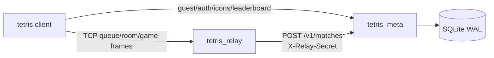
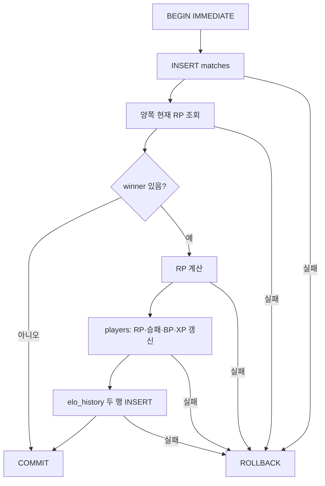

# Part 10: 메타 서버와 랭킹 — RP·XP·BP·아이콘

> **시리즈:** 제로부터 멀티플레이어 테트리스 + RL까지
> [시리즈 목차](./README.md) · [이전: Part 9 — ONNX 봇](./part9-rl-onnx-bot.md) · **Part 10** · [다음: Part 11 — 설정](./part11-settings-and-options.md)

---

## 이 장의 구현 계약

- **선행 상태:** Part 7의 relay와 Part 6의 `MATCH_SUMMARY` wire 경계.
- **이번 장의 파일:** `meta/*`, `third_party/sqlite3.*`, `third_party/httplib.h`,
  relay의 ranked finalize, 클라이언트의 meta/Customize UI.
- **연결점:** meta는 guest/auth/icons/leaderboard를 제공하고, relay만 secret으로
  보호된 match 결과를 기록해 RP/XP/BP를 갱신한다.
- **완료 게이트:** DB/API smoke, relay-meta 연동, 양측 summary 교차검증과
  leaderboard/icon 상태 갱신을 확인해야 한다.

## 1. 왜 relay와 meta를 분리하는가

Part 7의 relay는 매치 전에는 큐와 room 제어 프레임을 해석하고, 매치 후에는 두
TCP 소켓 사이에서 게임 프레임을 전달한다. 여기에 SQLite까지 넣으면 relay가
무거워지고 재시작·이전·백업의 범위가 커진다.

그래서 책임을 둘로 나눈다.

| 프로세스 | 상태 | 책임 |
|---|---|---|
| `tetris_relay` | 매치 수명 동안만 | 인증 확인, 매칭, wire 전달, 결과 교차검증 |
| `tetris_meta` | SQLite에 영속 | guest, RP/XP/BP, 아이콘, 매치 기록, leaderboard |



클라이언트는 자기 토큰과 공개 데이터를 meta에 요청할 수 있지만, 매치 결과는
직접 제출하지 않는다. `POST /v1/matches`는 relay secret이 있어야 한다.

## 2. 빌드 경계부터 추가한다

meta는 C++ HTTP 서버와 SQLite C amalgamation을 함께 빌드한다.

```cmake
option(TETRIS_BUILD_META "Build the tetris_meta HTTP+SQLite metadata server" OFF)

if (TETRIS_BUILD_META)
    add_executable(tetris_meta
        meta/main.cpp
        meta/database.cpp
        meta/api_server.cpp
        third_party/sqlite3.c
        meta/database.h
        meta/api_server.h
        meta/elo.h
        meta/levels.h
        meta/protocol.h
    )
    target_include_directories(tetris_meta PRIVATE
        ${CMAKE_CURRENT_SOURCE_DIR}
        ${CMAKE_CURRENT_SOURCE_DIR}/third_party)
endif()
```

실제 `CMakeLists.txt`에는 플랫폼별 thread/socket 링크와 HTTPS용 OpenSSL 선택 분기가
더 있다. 이 장의 핵심 의존 방향은 `tetris_meta → meta/* + sqlite + httplib`이며,
게임·renderer·audio를 링크하지 않는다는 점이다.

```bash
cmake -B build-meta \
  -DTETRIS_BUILD_GAME=OFF \
  -DTETRIS_BUILD_META=ON \
  -DTETRIS_BUILD_RELAY=ON
cmake --build build-meta -j
```

## 3. 현재 데이터 모델

DB는 네 테이블을 사용한다.

```sql
CREATE TABLE IF NOT EXISTS players (
  id          INTEGER PRIMARY KEY,
  username    TEXT,
  token       TEXT UNIQUE NOT NULL,
  elo         INTEGER NOT NULL DEFAULT 0,
  wins        INTEGER NOT NULL DEFAULT 0,
  losses      INTEGER NOT NULL DEFAULT 0,
  bp          INTEGER NOT NULL DEFAULT 0,
  xp          INTEGER NOT NULL DEFAULT 0,
  selected_icon_id TEXT NOT NULL DEFAULT 'default',
  created_at  INTEGER NOT NULL
);

CREATE TABLE IF NOT EXISTS player_icons (
  player_id   INTEGER NOT NULL REFERENCES players(id) ON DELETE CASCADE,
  icon_id     TEXT NOT NULL,
  created_at  INTEGER NOT NULL,
  PRIMARY KEY(player_id, icon_id)
);

CREATE TABLE IF NOT EXISTS matches (
  id          INTEGER PRIMARY KEY,
  player_a    INTEGER NOT NULL REFERENCES players(id),
  player_b    INTEGER NOT NULL REFERENCES players(id),
  winner      INTEGER REFERENCES players(id),
  score_a     INTEGER NOT NULL,
  score_b     INTEGER NOT NULL,
  lines_a     INTEGER NOT NULL,
  lines_b     INTEGER NOT NULL,
  duration_s  INTEGER NOT NULL,
  created_at  INTEGER NOT NULL
);

CREATE TABLE IF NOT EXISTS elo_history (
  id          INTEGER PRIMARY KEY,
  player_id   INTEGER NOT NULL REFERENCES players(id),
  match_id    INTEGER NOT NULL REFERENCES matches(id),
  elo_before  INTEGER NOT NULL,
  elo_after   INTEGER NOT NULL,
  delta       INTEGER NOT NULL,
  created_at  INTEGER NOT NULL
);
```

사용자 용어는 RP지만 DB·JSON·wire의 `elo` 이름은 기존 클라이언트와 DB 호환을
위해 유지한다. 값을 해석할 때만 `elo == RP`로 읽는다.

서버 시작 시 다음 PRAGMA를 적용한다.

```sql
PRAGMA foreign_keys = ON;
PRAGMA journal_mode = WAL;
PRAGMA synchronous  = NORMAL;
```

`Database`는 cpp-httplib 요청 스레드가 하나의 SQLite connection을 동시에 쓰지
않도록 public 메서드 전체를 mutex로 직렬화한다. 단순하지만 현재 트래픽 규모에서
정합성을 가장 쉽게 보장한다.

### 기존 1200 스케일 DB의 1회 마이그레이션

`PRAGMA user_version < 1`이면 다음 작업을 한 트랜잭션에서 수행한다.

```sql
BEGIN IMMEDIATE;
UPDATE players SET elo = MAX(0, elo - 1200);
PRAGMA user_version = 1;
COMMIT;
```

이 `1200`은 현재 신규 플레이어의 시작값이 아니라 **구 DB 변환값**이다. 신규
row는 항상 RP 0, BP 0, XP 0에서 시작한다.

## 4. RP와 XP 레벨

RP는 표준 Elo 기대승률 수식을 쓰되 0 시작·0 바닥으로 리베이스했다.

```cpp
inline int k_factor(int rating)
{
    if (rating < 300) return 32;
    if (rating < 600) return 24;
    return 16;
}

inline double expected(int ra, int rb)
{
    return 1.0 / (1.0 + std::pow(10.0, (rb - ra) / 400.0));
}

inline Update update(int winner_elo, int loser_elo)
{
    const double e_win = expected(winner_elo, loser_elo);
    const double e_los = expected(loser_elo, winner_elo);
    const int new_winner = winner_elo + static_cast<int>(std::round(
        k_factor(winner_elo) * (1.0 - e_win)));
    const int new_loser = loser_elo + static_cast<int>(std::round(
        k_factor(loser_elo) * (0.0 - e_los)));
    return {std::max(0, new_winner), std::max(0, new_loser)};
}
```

둘 다 RP 0이면 승자는 `+16`, 패자는 바닥 clamp로 `0`이다.

BP와 XP는 winner가 확정된 ranked match에서 같은 트랜잭션으로 적립한다.

| 결과 | BP | XP |
|---|---:|---:|
| 승리 | +30 | +100 |
| 패배 | +10 | +50 |
| 무승부·교차검증 실패 | 0 | 0 |

레벨은 DB에 중복 저장하지 않고 누적 XP에서 계산한다.

```cpp
constexpr int kMaxLevel = 60;

constexpr int xp_to_next(int level)
{
    return 100 + 20 * (level - 1);
}

constexpr int total_xp_for_level(int level)
{
    const int k = level - 1;
    return 100 * k + 10 * k * (k - 1);
}
```

곡선을 바꿔도 player row 마이그레이션이 필요 없고, meta와 client가 같은
`meta/levels.h`를 include하므로 표시가 어긋나지 않는다.

## 5. `saveMatch`의 원자성

`Database::saveMatch`는 다음 순서를 `BEGIN IMMEDIATE`와 `COMMIT` 사이에서
수행한다.



`winner=null`인 match는 감사 목적으로 `matches`에는 남지만 player와
`elo_history`는 바뀌지 않는다. 따라서 교차검증 실패를 “저장 실패”와 혼동하지
않는다.

## 6. 아이콘 소유권

카탈로그는 현재 서버 코드의 고정 정의다.

```cpp
const IconCatalogEntry kIconCatalog[] = {
    {"default", "Default", 0,   true},
    {"ruby",    "Ruby",    100, false},
    {"gold",    "Gold",    250, false},
};
```

구매는 다음 조건을 순서대로 확인한다.

1. `icon_id`가 카탈로그에 존재하는가.
2. token이 유효한가.
3. 이미 소유하지 않았는가.
4. BP가 충분한가.
5. 한 트랜잭션에서 BP 차감과 `player_icons` INSERT가 모두 성공하는가.

선택은 소유권을 확인한 뒤 `players.selected_icon_id`만 갱신한다. 클라이언트의
`assets/images.cfg`는 icon id를 로컬 PNG로 매핑할 뿐, 소유권의 기준은 항상
meta DB다.

## 7. HTTP API 계약

| method/path | 호출자 | 성공 응답 핵심 |
|---|---|---|
| `GET /healthz` | 운영 probe | `{"ok":true}` |
| `POST /v1/guest` | client | player/token/elo/bp/xp/level/icon |
| `POST /v1/auth/verify` | client·relay | player/elo/bp/xp/level/icon |
| `GET /v1/icons/catalog` | client | id/name/price/default-owned 배열 |
| `POST /v1/icons/buy` | client | 갱신된 auth 응답 |
| `POST /v1/icons/select` | client | 갱신된 auth 응답 |
| `POST /v1/matches` | relay 전용 | 양쪽 `elo_before/after/delta` |
| `GET /v1/leaderboard?limit=N` | client·web | rank/player/elo/W/L/level 배열 |

신규 guest 응답 예시는 다음과 같다.

```json
{
  "player_id": 1,
  "token": "0123456789abcdef0123456789abcdef",
  "elo": 0,
  "bp": 0,
  "xp": 0,
  "level": 1,
  "selected_icon_id": "default"
}
```

`POST /v1/matches` 요청은 다음 형태다.

```json
{
  "player_a": 1,
  "player_b": 2,
  "winner": 1,
  "score_a": 5000,
  "score_b": 3000,
  "lines_a": 20,
  "lines_b": 12,
  "duration_s": 90
}
```

`winner`는 `player_a`, `player_b`, `null` 중 하나여야 한다. player id가 같거나
점수·라인·시간이 음수면 400이다.

### HTTP 방어선

- 요청 body 최대 64 KiB.
- IP당 1초 고정 창 60회 초과 시 429.
- score·line·duration은 음수뿐 아니라 `100,000,000` 초과도 400.
- 모든 `/v1/*`에 CORS preflight 응답.
- relay secret은 내용에 따라 조기 종료하지 않는 상수 시간 비교.
- guest token은 16바이트 OS entropy를 32 hex 문자로 인코딩.
- secret 없이 meta를 시작하려면 로컬 테스트용 `--allow-public-matches`를
  명시해야 한다.

내장 rate limiter의 기본 key는 `req.remote_addr`다. 단, 배포 템플릿처럼 meta를
loopback에만 bind하고 앞에 Caddy/cloudflared를 둔 경우에는 모든 요청의
`remote_addr`가 프록시 하나로 보인다. 그래서 **직접 peer가 `127.0.0.1` 또는
`::1`일 때만** `CF-Connecting-IP`, 그게 없으면 `X-Forwarded-For`의 첫 항목을
사용한다. 외부 peer가 임의로 넣은 forwarded header는 무시한다. 이 신뢰 모델은
meta 포트를 외부에 직접 공개하지 않는 배포 설정과 한 묶음이다.

match 통계는 JSON에서 `int64_t`로 읽은 뒤 DB의 `int` 필드로 내려간다. 음수 검사만
하면 `INT_MAX`보다 큰 값이 narrowing에서 음수나 구현 의존 값으로 바뀔 수 있으므로,
캐스팅 전에 게임에서 도달 불가능할 만큼 넉넉한 `100,000,000` 상한을 적용한다.

## 8. 토큰 부트스트랩

클라이언트 시작 흐름은 세 갈래다.

```mermaid
flowchart TD
    A[meta URL 있음] --> B[token 파일 읽기]
    B --> C{token 있음?}
    C -- 아니오 --> D[POST /v1/guest]
    C -- 예 --> E[POST /v1/auth/verify]
    E -- 200 --> F[RP/BP/XP/icon 복원]
    E -- 404 unknown_token --> D
    E -- network error --> G[token 유지 + unranked]
    D --> H[token을 user-data 경로에 저장]
```



404만 stale token으로 판단한다. meta가 잠시 꺼졌다는 이유로 token을 버리면 기존
계정을 잃기 때문이다. POSIX token 파일은 0600으로 저장한다.

랭크 match 뒤 `MATCH_RESULT`에는 RP만 있으므로, 메뉴로 돌아오면
`verify_token`을 비동기로 한 번 호출해 BP/XP/level을 권위 있는 값으로 갱신한다.

## 9. relay 인증과 결과 교차검증

`QUEUE_JOIN`, `ROOM_CREATE`, `ROOM_JOIN`에는 token이 들어간다. meta가 연결된
ranked relay는 token을 verify해 `player_id`, RP, username, icon을 보관한다.
meta가 없는 relay는 token 길이 0을 허용하고 unranked로 동작한다.

게임 종료 시 양쪽 클라이언트가 정확히 21바이트 `MATCH_SUMMARY`를 보낸다.

```text
[won:1]
[my_score:4 LE][my_lines:4 LE]
[opp_score_observed:4 LE][opp_lines_observed:4 LE]
[duration_s:4 LE]
```

relay는 ranked match에서만 이 타입을 가로채고 payload checksum을 다시 검증한다.
나머지 프레임은 원본 바이트 그대로 전달한다.

두 summary가 모이면 다음 조건을 확인한다.

1. 한 명만 승리를 주장한다: `won_a XOR won_b`.
2. `a.my_score == b.opp_score`이고 반대도 같다.
3. 양쪽 line 수도 교차 일치한다.

성공하면 winner id를 넣어 meta에 POST한다. 실패하면 `winner=null`로 POST해
자가보고 값은 감사 기록으로 남기되 RP/BP/XP는 바꾸지 않는다. meta POST 실패
시에도 relay는 양쪽에 delta 0 `MATCH_RESULT`를 보내 게임오버 UI가 무한 대기하지
않게 한다.

## 10. wire 이름과 사용자 용어

호환을 위해 다음 이름은 그대로다.

- SQLite column: `elo`
- JSON field: `elo`, `elo_before`, `elo_after`
- C++ member: `myElo`, `playerA_elo`
- wire `MATCH_RESULT`: before/after/delta 3×`int32`

이 값은 모두 RP다. 새 코드를 추가할 때 wire/DB 이름을 일부만 `rp`로 바꾸면 구
DB와 클라이언트가 동시에 깨지므로, 프로토콜 버전을 올리기 전까지 이름은 유지하고
UI 문자열만 `RP`를 사용한다.

## 11. 실행과 수동 검증

공통 secret을 환경변수로 넣고 두 프로세스를 띄운다.

```bash
export TETRIS_RELAY_SECRET='replace-with-a-long-random-secret'

./build-meta/tetris_meta \
  --db /tmp/tetris-meta.db \
  --http 127.0.0.1:8080

./build-meta/tetris_relay \
  --port 7777 \
  --meta http://127.0.0.1:8080
```

다른 터미널에서:

```bash
curl -sS http://127.0.0.1:8080/healthz
curl -sS -X POST http://127.0.0.1:8080/v1/guest \
  -H 'Content-Type: application/json' -d '{}'
curl -sS http://127.0.0.1:8080/v1/icons/catalog
curl -sS 'http://127.0.0.1:8080/v1/leaderboard?limit=20'
```

기대값은 신규 guest의 `elo=0`, `bp=0`, `xp=0`, `level=1`,
`selected_icon_id=default`다. secret 없는 `/v1/matches` 요청은 403이어야 한다.

## 12. 자동 검증

```bash
TETRIS_META_BIN=$PWD/build-meta/tetris_meta \
TETRIS_RELAY_BIN=$PWD/build-meta/tetris_relay \
python -m pytest \
  python/tests/test_meta_db_smoke.py \
  python/tests/test_relay_meta_smoke.py \
  python/tests/test_match_summary_crosscheck.py -q
```

이 테스트는 다음 계약을 고정한다.

- 신규·stale token과 strict secret 시작 조건.
- RP 0 시작·0 바닥, BP/XP 적립, level 표시.
- 아이콘 구매·선택·소유권과 부족한 BP 오류.
- leaderboard 정렬.
- 구 1200 DB의 1회 마이그레이션.
- 일치/불일치 `MATCH_SUMMARY`의 winner와 보상 처리.

## 이 장에서 완성된 것

- SQLite 영속 guest와 token 인증.
- RP/XP/BP 및 최대 레벨 60 계산.
- 아이콘 카탈로그·구매·선택.
- relay-only match 기록과 양측 결과 교차검증.
- leaderboard와 클라이언트의 online/offline/unranked 표시.
- loopback 신뢰 프록시를 고려한 per-client rate-limit key와 통계값 상한.

다음 Part 11에서는 이 클라이언트에 설정 영속화와 해상도·오디오·VSync 옵션을
추가하되, 여기까지 만든 결정론과 wire 계약은 건드리지 않는다.
