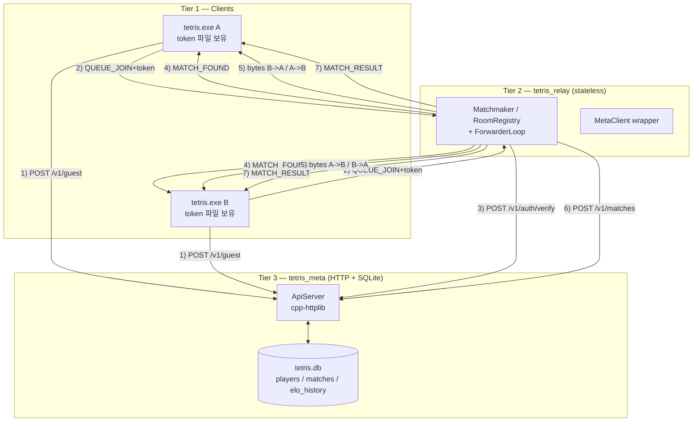
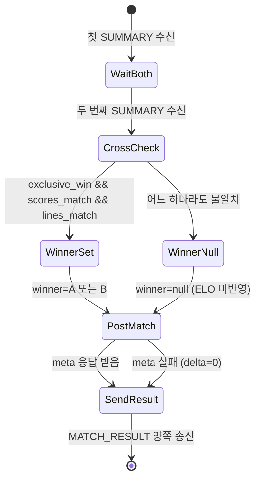
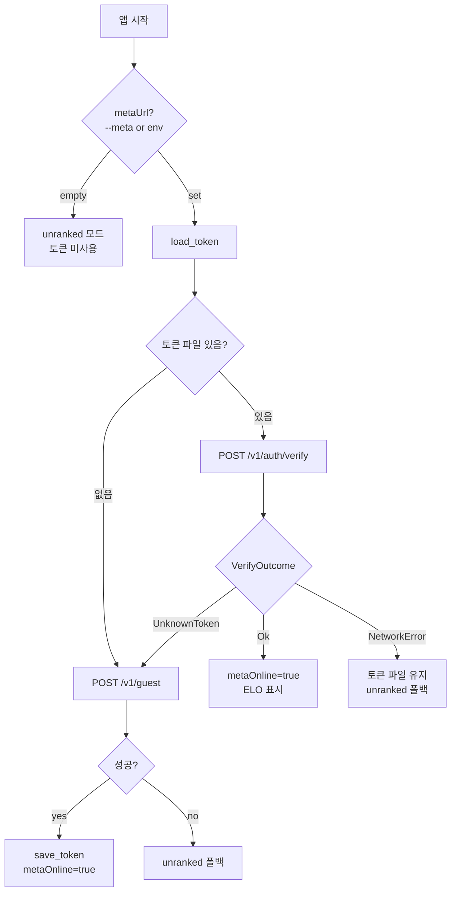

# Part 10: 메타 서버와 랭킹 — tetris_meta + ELO

> **시리즈:** 제로부터 멀티플레이어 테트리스 + RL까지
> [Part 0: 셋업](./part0-project-setup.md) | [Part 1: Win32+GL](./part1-window-and-opengl.md) | [Part 2: 2D 렌더링](./part2-2d-rendering.md) | [Part 3: 테트리스 로직](./part3-tetris-logic.md) | [Part 4: 게임 루프](./part4-game-loop.md) | [Part 5: 네트워킹](./part5-lockstep-networking.md) | [Part 6: Python RL](./part6-python-rl.md) | [Part 7: 오디오](./part7-xaudio2-audio.md) | [Part 8: 릴레이 서버](./part8-relay-server.md) | [Part 9: RL + ONNX 봇](./part9-rl-onnx-bot.md) | **Part 10: 메타 서버와 랭킹**

---

## 1. 들어가며

Part 8 의 `tetris_relay` 는 의도적으로 단순했다. 두 소켓 사이에서 바이트만 복사하는 transparent forwarder 라서 점수도, 누가 누구인지도, 누가 이겼는지도 모른다. 이 단순함은 모바일 Linux (Termux) 같은 자원 제약 환경에 무상태로 띄워둘 수 있다는 큰 이득이 있지만, 동시에 큰 결핍이기도 하다 — **영속 데이터가 없다.**

게임이 한 판 끝났을 때 "이긴 사람의 ELO 가 +12 가 되어야 한다", "리더보드 상위 20명을 보여줘야 한다", "재접속해도 같은 player 로 인식되어야 한다" 같은 요구가 생기면 어딘가 SQLite 같은 영속 저장소가 있어야 한다. relay 자체에 DB 를 박는 선택지가 가장 단순하지만 세 가지가 곤란하다.

- **무상태 relay 의 가치 상실.** Termux 든 작은 VPS 든, 로그·DB·HTTP 가 한 프로세스에 섞이면 OOM/디스크풀에 약해진다. 두 클라이언트 사이의 "두꺼운 파이프" 라는 단일 책임이 흐려진다.
- **다른 게임으로 갈아끼우기 어려움.** ELO/리더보드는 테트리스에 한정되지 않는다. relay 가 게임 결과 스키마를 알면 똑같은 relay 코드를 다른 1v1 게임에 재사용할 때 매번 끌어내야 한다.
- **배포 단위 분리.** "랭킹 서버 다운" 과 "매칭 서버 다운" 은 다른 사고다. 상위 사고 하나 때문에 전체가 멎는 건 운영 관점에서 손해.

그래서 Part 10 에서는 **`tetris_meta`** 라는 별도 HTTP+SQLite 실행 파일을 만든다. 책임 네 가지로 끝.

1. 익명 guest 발급 (`POST /v1/guest`) → 32 hex 토큰 + ELO=1200.
2. 토큰 검증 (`POST /v1/auth/verify`) → relay 가 `QUEUE_JOIN` 수신 후 호출.
3. 매치 결과 저장 + ELO 갱신 (`POST /v1/matches`) → relay 가 `MATCH_SUMMARY` 두 개를 모은 뒤 호출.
4. 리더보드 조회 (`GET /v1/leaderboard`) → 상위 N명.

relay 는 거의 그대로 두되 두 가지만 추가된다: ⑴ `QUEUE_JOIN` / `ROOM_CREATE` / `ROOM_JOIN` 페이로드에 토큰 1바이트-prefixed string 을 붙이고, ⑵ ranked 매치(meta 연동 + 양쪽 player_id != 0) 일 때만 `MATCH_SUMMARY` 프레임을 가로채 `/v1/matches` 로 POST. 이외 프레임은 모두 그대로 통과한다.

## 2. 3-tier 아키텍처

전체 그림은 다음과 같다.



의존 방향이 단방향이라는 점이 중요하다 — game/relay 는 meta 를 알지만, meta 는 둘 모두를 모른다. meta 입장에서는 "HTTP 로 들어오는 4개 요청" 이 입력의 전부고, 누가 보냈는지 (사람 클라인지 relay 인지) 구분하지 않는다. 덕분에 다음이 가능하다.

- meta 만 따로 재시작해도 되돌아오면 정상 복귀 (relay/game 은 timeout/재시도).
- meta 를 다른 게임에서 재사용 (스키마는 1v1 ELO 게임 일반).
- 단위 테스트가 쉬움 — `python/tests/test_meta_db_smoke.py` 가 `urllib` 만으로 4 endpoint 를 다 돌린다.

## 3. 랭킹 흐름 시퀀스

토큰 발급부터 ELO 반영까지의 한 라운드를 풀면 다음과 같다.

```mermaid
sequenceDiagram
    autonumber
    participant CA as Client A
    participant CB as Client B
    participant R  as tetris_relay
    participant M  as tetris_meta
    participant DB as SQLite

    Note over CA,CB: (앱 첫 실행) 토큰 부트스트랩
    CA->>M: POST /v1/guest {}
    M->>DB: INSERT INTO players(...)
    M-->>CA: {player_id, token, elo=1200}
    Note over CA: 토큰 파일에 저장

    CA->>R: TCP connect + QUEUE_JOIN[tok]
    R->>M: POST /v1/auth/verify {token}
    M->>DB: SELECT FROM players WHERE token=?
    M-->>R: {player_id, elo}
    Note over R: PlayerInfo 채움 → 큐 enqueue

    CB->>R: TCP connect + QUEUE_JOIN[tok]
    R->>M: POST /v1/auth/verify {token}
    M-->>R: {player_id, elo}

    Note over R: 두 명 모임 -> MATCH_FOUND 양쪽 송신
    R->>CA: MATCH_FOUND(role=HOST, seed)
    R->>CB: MATCH_FOUND(role=GUEST, seed)

    Note over CA,CB: 수락 로비 — 유저가 "수락/거절" 선택 (45초 타임아웃)
    CA->>R: READY(1)   %% QueueConfirm
    R->>CB: READY(1)   %% forward
    CB->>R: READY(1)
    R->>CA: READY(1)
    Note over R: 양쪽 READY(1) 확인 -> 게임 바이트 포워딩 시작

    loop lockstep 매 틱
        CA->>R: INPUT
        R->>CB: INPUT
        CB->>R: INPUT
        R->>CA: INPUT
    end

    Note over CA,CB: 한쪽 게임오버 -> 양쪽 모두 MATCH_SUMMARY 송신
    CA->>R: MATCH_SUMMARY[won, score, lines, opp_score, opp_lines, dur]
    CB->>R: MATCH_SUMMARY[...]
    Note over R: 가로챔 + 교차검증 (XOR / score / lines)

    R->>M: POST /v1/matches {player_a,b, winner, scores, lines, duration}
    M->>DB: BEGIN IMMEDIATE; INSERT matches; UPDATE players ×2; INSERT elo_history ×2; COMMIT
    M-->>R: {match_id, a:{before,after,delta}, b:{...}}

    R->>CA: MATCH_RESULT[elo_before, elo_after, delta]
    R->>CB: MATCH_RESULT[elo_before, elo_after, delta]
    Note over CA,CB: 게임오버 화면에 "ELO 1212  +12" 표시
```

이 시퀀스의 미묘한 부분 세 가지.

- **MATCH_FOUND 이후에도 수락 로비가 한 단계 더 있다.** `MATCH_FOUND` 가 바로 lockstep 으로 가지 않고, 양쪽이 `READY(1)` (수락) 혹은 `READY(0)` (거절) 을 먼저 교환한다. 클라이언트 쪽에서는 `QueueConfirm`/`QueueDecline` 이 각각 대응하며, `queueThread` 가 이 단계 전용 루프 (MATCH_FOUND wait → lobby → ioThread) 를 돈다. 룸 매치는 `ROOM_INFO`/`READY` 교환 후 서버가 `MATCH_FOUND` 를 내보내 같은 lockstep 으로 이어붙는다.
- **릴레이는 양쪽 `READY(1)` 을 본 직후 포워딩을 시작**하므로, 로비 단계 TCP recv 에 첫 PING/INPUT 이 묶여 도착할 수 있다. 릴레이는 `Channel::prefixFromA/B` 로, 클라이언트는 `queueThread`/`roomThread` 가 재직렬화 후 `recvBuf` 로 이관하는 방식으로 이 바이트를 보존한다 — 버리면 lockstep 이 1틱 밀리거나 첫 하트비트가 유실된다.
- **MATCH_FOUND 이후 lockstep INPUT 은 relay 가 파싱하지 않는다.** Part 8 의 forwarderLoop 그대로 — 바이트 복사. 단, "ranked 매치" 일 때만 `MATCH_SUMMARY` (type=18) 한 프레임만 골라 가로챈다. 다음 섹션 13 에서 구현을 본다.
- **`/v1/matches` 호출은 양쪽 SUMMARY 가 모두 도착했을 때 한 번만.** 한쪽 SUMMARY 만 와도 그 데이터를 신뢰할 이유가 없다 — 거짓 보고를 막기 위해 양쪽 보고를 교차검증한 뒤에야 winner 가 확정된다.

## 4. third_party 벤더링 — sqlite3 + cpp-httplib

`tetris_meta` 가 추가하는 외부 코드는 단 두 파일이다.

```
third_party/
  sqlite3.c         (~9MB amalgamation — SQLite 공식)
  sqlite3.h
  sqlite3ext.h
  httplib.h         (cpp-httplib, header-only)
```

둘 다 헤더(또는 amalgamation) 한 덩어리라서 `find_package` 가 필요 없다. 다운로드해 `third_party/` 에 풀어두면 끝. CMake 입장에서는 git submodule 도, 외부 빌드 시스템 호출도 없다.

**이 선택의 이유.**

- **배포 단순성.** Termux/Mac mini/AWS 어디든 `git clone && cmake && make` 만으로 끝. 외부 의존성 패키지를 OS 패키지 매니저에 의존하지 않는다.
- **버전 고정.** sqlite/httplib 의 미세한 ABI 변화로 빌드가 깨지지 않는다. 업그레이드는 명시적 — 새 amalgamation 을 다운로드해 교체.
- **라이선스 친화.** SQLite 는 public domain, cpp-httplib 는 MIT. 재배포 시 큰 부담 없음.

**JSON 라이브러리는 안 쓴다.** 4개 endpoint 모두 평면 primitive 만 주고받는다 (`{"token":"abc","elo":1200}` 같은). nlohmann/json 풀스펙은 과하므로 `meta/protocol.h` 의 100줄짜리 수동 직렬화·파싱 헬퍼로 대신한다 — 7~8 섹션에서 본다.

CMake 가 누락을 즉시 감지하도록 가드를 둔다. 다음 섹션의 CMakeLists.txt 발췌에서 `if (NOT EXISTS ...) message(FATAL_ERROR ...)` 가 그것.

## 5. CMakeLists.txt 확장

기존 `project(tetris CXX)` 한 줄을 다음으로 바꾼다.

```cmake
cmake_minimum_required(VERSION 3.15)
# C 언어도 활성화 — third_party/sqlite3.c (amalgamation) 를 빌드하려면 필요.
# tetris_meta 타겟만 C 를 쓰지만 enable_language 는 프로젝트 루트에서 선언해야 한다.
project(tetris CXX C)
```

`sqlite3.c` 는 .c 파일이므로 C 컴파일러가 필요하다. CMake 에서는 `enable_language(C)` 를 프로젝트 루트에서 한 번만 호출해야 하므로 `project()` 인자에 `C` 를 추가하는 게 가장 단순.

`TETRIS_BUILD_META` 옵션과 타겟 정의는 다음과 같다.

```cmake
# TETRIS_BUILD_META — HTTP + SQLite metadata server (guest/auth/matches/leaderboard).
# Typically deployed on a separate machine (e.g. Mac mini) to keep the relay stateless.
option(TETRIS_BUILD_META  "Build the tetris_meta HTTP+SQLite metadata server" OFF)
```

```cmake
# -----------------------------------------------------------------------------
# Target: tetris_meta (HTTP + SQLite metadata/leaderboard server)
#
# 역할: 별도 기기(Mac mini 등)에서 돌아가는 독립 서비스.
#       · SQLite 로 player/match/elo_history 영속화
#       · cpp-httplib 로 4개 엔드포인트 제공:
#           POST /v1/guest, POST /v1/auth/verify,
#           POST /v1/matches, GET  /v1/leaderboard
#       · relay 는 무상태 유지 — matchmaking 경로에서 HTTP 호출만 붙인다.
#
# 서드파티: third_party/sqlite3.{c,h} + third_party/httplib.h (헤더 온리).
#           두 파일 모두 벤더링(check-in)되어 있어야 한다 — repo 루트의
#           third_party/ 에 없으면 CMake 가 즉시 실패한다.
# -----------------------------------------------------------------------------
if (TETRIS_BUILD_META)
    if (NOT EXISTS "${CMAKE_CURRENT_SOURCE_DIR}/third_party/sqlite3.c" OR
        NOT EXISTS "${CMAKE_CURRENT_SOURCE_DIR}/third_party/sqlite3.h")
        message(FATAL_ERROR
            "TETRIS_BUILD_META=ON 이지만 third_party/sqlite3.{c,h} 가 없습니다. "
            "SQLite amalgamation 을 다운로드해 third_party/ 에 넣으세요 "
            "(https://www.sqlite.org/download.html).")
    endif()
    if (NOT EXISTS "${CMAKE_CURRENT_SOURCE_DIR}/third_party/httplib.h")
        message(FATAL_ERROR
            "TETRIS_BUILD_META=ON 이지만 third_party/httplib.h 가 없습니다. "
            "cpp-httplib single header 를 다운로드해 third_party/ 에 넣으세요 "
            "(https://github.com/yhirose/cpp-httplib).")
    endif()

    add_executable(tetris_meta
        meta/main.cpp
        meta/database.cpp
        meta/api_server.cpp
        third_party/sqlite3.c
        meta/database.h
        meta/api_server.h
        meta/elo.h
        meta/protocol.h
    )
    target_include_directories(tetris_meta PRIVATE
        ${CMAKE_CURRENT_SOURCE_DIR}
        ${CMAKE_CURRENT_SOURCE_DIR}/third_party
    )
    # SQLite amalgamation — 기본 threadsafe(serialized) 모드로 컴파일.
    # WAL + mutex 는 C++ 래퍼에서 보강한다.
    target_compile_definitions(tetris_meta PRIVATE
        SQLITE_THREADSAFE=1
        SQLITE_ENABLE_RTREE=0
        SQLITE_DEFAULT_FOREIGN_KEYS=1
    )
    if (WIN32)
        target_link_libraries(tetris_meta PRIVATE ws2_32)
    else()
        find_package(Threads REQUIRED)
        target_link_libraries(tetris_meta PRIVATE Threads::Threads ${CMAKE_DL_LIBS})
    endif()
    if (UNIX AND NOT APPLE)
        set_target_properties(tetris_meta PROPERTIES
            BUILD_RPATH "$ORIGIN/lib"
            INSTALL_RPATH "$ORIGIN/lib")
    endif()
endif()
```

`SQLITE_THREADSAFE=1` 는 SQLite 의 *serialized* 모드 — 라이브러리 자체가 내부 mutex 로 모든 호출을 직렬화한다. 우리는 한 번 더 C++ 쪽 `std::mutex` 로 감싼다 (8장에서 확인). 이중 직렬화지만 4 endpoint × 가벼운 트래픽 환경에서 측정 가능한 손해가 없고, 정합성 손익이 훨씬 크다.

relay 와 game 두 타겟 쪽에도 한 줄씩 추가가 필요하다. 두 타겟 모두 `meta/http_client.cpp` 를 컴파일해 `MetaClient` 를 사용한다.

```cmake
# game 타겟 (TETRIS_BUILD_GAME 블록)
set(TETRIS_GAME_COMMON
    ${TETRIS_SIM_SOURCES}
    src/main.cpp
    # ... (기존 src/game.cpp, net/*.cpp 등 유지)
    meta/http_client.cpp
)
```

```cmake
# relay 타겟 (TETRIS_BUILD_RELAY 블록)
add_executable(tetris_relay
    server/main.cpp
    server/matchmaker.cpp
    server/player_conn.cpp
    server/relay.cpp
    server/room.cpp
    net/socket.cpp
    net/framing.cpp
    meta/http_client.cpp
    # ... headers ...
)
```

`meta/http_client.cpp` 가 두 타겟에 모두 들어가지만 각 타겟은 독립된 .o 파일을 만들기 때문에 심볼 충돌은 없다 — 같은 cpp 가 두 번 컴파일될 뿐. 단, **하나의 타겟 안에서는 한 번만** 들어가야 한다. `httplib.h` 는 헤더 온리라 어딘가에서 한 번 .cpp 로 펼쳐져야 하는데, `http_client.cpp` 가 그 역할을 한다 — 타겟마다 하나만.

이 시점에서 빌드해보자.

```bash
cmake -S . -B build-meta -DTETRIS_BUILD_META=ON -DTETRIS_BUILD_GAME=OFF -DTETRIS_BUILD_TEST=OFF
cmake --build build-meta --target tetris_meta --config Release
```

성공하면 `build-meta/tetris_meta` 바이너리 하나가 떨어진다. 아직 코드는 비어 있어 실행해도 의미 있는 일을 안 한다 — 다음 섹션부터 살을 붙인다.

## 6. DB 스키마

3 테이블이면 충분하다.

- **players** — id, username(NULL), token(UNIQUE), elo, wins, losses, created_at.
- **matches** — id, player_a, player_b, winner(NULL 가능), score_a/b, lines_a/b, duration_s, created_at.
- **elo_history** — id, player_id, match_id, elo_before, elo_after, delta, created_at.

전체 스키마는 `meta/database.cpp` 안에 raw string 으로 박혀 있다.

```cpp
const char* kSchema = R"sql(
PRAGMA foreign_keys = ON;
PRAGMA journal_mode = WAL;
PRAGMA synchronous  = NORMAL;

CREATE TABLE IF NOT EXISTS players (
  id          INTEGER PRIMARY KEY,
  username    TEXT,
  token       TEXT UNIQUE NOT NULL,
  elo         INTEGER NOT NULL DEFAULT 1200,
  wins        INTEGER NOT NULL DEFAULT 0,
  losses      INTEGER NOT NULL DEFAULT 0,
  created_at  INTEGER NOT NULL
);

CREATE TABLE IF NOT EXISTS matches (
  id          INTEGER PRIMARY KEY,
  player_a    INTEGER NOT NULL REFERENCES players(id),
  player_b    INTEGER NOT NULL REFERENCES players(id),
  winner      INTEGER          REFERENCES players(id),
  score_a     INTEGER NOT NULL,
  score_b     INTEGER NOT NULL,
  lines_a     INTEGER NOT NULL,
  lines_b     INTEGER NOT NULL,
  duration_s  INTEGER NOT NULL,
  created_at  INTEGER NOT NULL
);

CREATE TABLE IF NOT EXISTS elo_history (
  id          INTEGER PRIMARY KEY,
  player_id   INTEGER NOT NULL REFERENCES players(id),
  match_id    INTEGER NOT NULL REFERENCES matches(id),
  elo_before  INTEGER NOT NULL,
  elo_after   INTEGER NOT NULL,
  delta       INTEGER NOT NULL,
  created_at  INTEGER NOT NULL
);

CREATE INDEX IF NOT EXISTS idx_players_elo    ON players(elo DESC);
CREATE INDEX IF NOT EXISTS idx_matches_played ON matches(created_at DESC);
CREATE INDEX IF NOT EXISTS idx_elo_pid        ON elo_history(player_id);
)sql";
```

**세 PRAGMA 의 절충.**

- `journal_mode = WAL` — 쓰기 트랜잭션과 읽기 트랜잭션이 서로 막지 않는다. 리더보드 GET 이 매치 INSERT 를 기다리지 않게 됨.
- `synchronous = NORMAL` — 매 트랜잭션마다 fsync 하지 않고 체크포인트에서만. SSD 환경에서 합리적 절충 (FULL 보다 빠르고 OFF 보다 안전).
- `foreign_keys = ON` — sqlite3 는 기본 OFF 인데, 우리는 `matches.winner REFERENCES players(id)` 같은 무결성 제약을 실제로 지키고 싶다.

**왜 elo_history 가 따로 있나.** `players` 의 elo 만 갱신해도 "현재 ELO" 는 알 수 있다. 하지만 "지난 한 달 그래프" / "급락 디버깅" / "실수 롤백" 을 하려면 시점별 변동 기록이 필요하다. 5바이트 정수 4개 + FK 두 개라 한 매치당 2 row, 매우 가볍다. 미래의 분석을 미리 사두는 셈.

이 시점에서 빌드하면 `tetris_meta` 가 실행되자마자 `tetris.db` 파일을 만들고 스키마를 적용한다. 접속할 endpoint 가 아직 없으니 사용자 입장에서는 보이는 변화가 없다.

## 7. `elo.h` — 순수 함수

ELO 계산은 `meta/elo.h` 헤더 온리. 의존성 zero, 순수 함수, namespace `elo`. 헤더 온리인 이유는 단순함 + 테스트 용이성 — `meta/database.cpp` 가 include 해서 트랜잭션 안에서 호출하고, 별도 단위 테스트에서도 그대로 가져다 쓸 수 있다.

```cpp
#pragma once

// meta/elo.h — ELO 레이팅 계산 (순수 함수).
//
// K-factor 는 세 단계 (<1200/1800/>=1800) 로 구분해 초보자는 빠르게,
// 고수는 천천히 변동하게 한다. 이는 FIDE/USCF 관행을 단순화한 버전.
//
// expected(ra, rb) = 1 / (1 + 10^((rb - ra) / 400))
// new_r = r + K * (score - expected)    (승=1, 패=0)

#include <algorithm>
#include <cmath>
#include <utility>

namespace elo {

inline int k_factor(int rating)
{
    if (rating < 1200) return 32;
    if (rating < 1800) return 24;
    return 16;
}

inline double expected(int ra, int rb)
{
    return 1.0 / (1.0 + std::pow(10.0, (rb - ra) / 400.0));
}

// 승자/패자 쌍의 새 ELO 를 반환.  ELO 는 100 아래로 내려가지 않도록 clamp.
struct Update {
    int new_winner;
    int new_loser;
};

inline Update update(int winner_elo, int loser_elo)
{
    const double e_win = expected(winner_elo, loser_elo);
    const double e_los = expected(loser_elo, winner_elo);

    const int new_winner = winner_elo + static_cast<int>(std::round(
        k_factor(winner_elo) * (1.0 - e_win)));
    const int new_loser  = loser_elo  + static_cast<int>(std::round(
        k_factor(loser_elo)  * (0.0 - e_los)));

    return {
        std::max(100, new_winner),
        std::max(100, new_loser),
    };
}

} // namespace elo
```

**구조 해설.**

- `expected(ra, rb)` 는 ra 가 rb 를 이길 확률 (0~1). 두 ELO 차가 0 이면 0.5, 200 차이면 ~0.76, 400 차이면 ~0.91.
- 갱신 폭은 `K * (실제결과 - 기댓값)`. 동률 (1200 vs 1200) 에서 K=24, 승자는 `24 * (1 - 0.5) = 12` 상승, 패자는 `24 * (0 - 0.5) = -12` 하강. `python/tests/test_meta_db_smoke.py` 의 `test_match_post_updates_elo` 가 정확히 이 +12/-12 를 확인한다.
- K-factor 가 ELO 구간별로 다른 이유: 초보 (1200 미만) 는 변동 폭 크게 (32) — 빠르게 적정 위치 찾기. 1200~1800 은 24, 고수 (1800+) 는 16 — 우연한 한 판으로 크게 흔들리지 않게.
- `std::max(100, ...)` 로 ELO 가 100 아래로 떨어지지 않게 clamp. 무한 패배해도 유의미한 매칭 풀에서 완전히 사라지지 않도록.

이 함수만 있으면 ELO 시스템은 본질적으로 끝난 셈이다. 나머지는 "언제 이 함수를 호출하느냐" 의 문제 — 그게 `Database::saveMatch` 의 트랜잭션이다.

## 8. `protocol.h` — JSON 수동 직렬화

4개 엔드포인트의 요청/응답이 모두 평면적인 primitive 라서 풀스펙 JSON 라이브러리 없이 100줄 수동 헬퍼로 충분하다. `meta/protocol.h` 가 그 헬퍼들의 집합. `namespace meta::proto`.

먼저 빌더 부분.

```cpp
// --- JSON 문자열 escape (쌍따옴표/백슬래시/제어문자만. UTF-8 그대로 통과) -----
inline std::string json_escape(const std::string& s)
{
    std::string out;
    out.reserve(s.size() + 2);
    for (char c : s) {
        switch (c) {
            case '"':  out += "\\\""; break;
            case '\\': out += "\\\\"; break;
            case '\n': out += "\\n";  break;
            case '\r': out += "\\r";  break;
            case '\t': out += "\\t";  break;
            default:
                if (static_cast<unsigned char>(c) < 0x20) {
                    char buf[8];
                    std::snprintf(buf, sizeof(buf), "\\u%04x", c);
                    out += buf;
                } else {
                    out += c;
                }
        }
    }
    return out;
}

// --- 응답 빌더 ----------------------------------------------------------------

inline std::string error_json(const char* err, const char* reason = nullptr)
{
    std::ostringstream ss;
    ss << "{\"error\":\"" << err << "\"";
    if (reason) ss << ",\"reason\":\"" << json_escape(reason) << "\"";
    ss << "}";
    return ss.str();
}

// POST /v1/guest 응답
inline std::string guest_response(int64_t player_id,
                                  const std::string& token, int elo)
{
    std::ostringstream ss;
    ss << "{\"player_id\":" << player_id
       << ",\"token\":\""   << json_escape(token) << "\""
       << ",\"elo\":"       << elo
       << "}";
    return ss.str();
}

// POST /v1/auth/verify 응답
inline std::string auth_response(int64_t player_id,
                                 const std::optional<std::string>& username,
                                 int elo)
{
    std::ostringstream ss;
    ss << "{\"player_id\":" << player_id
       << ",\"username\":";
    if (username) ss << "\"" << json_escape(*username) << "\"";
    else          ss << "null";
    ss << ",\"elo\":" << elo << "}";
    return ss.str();
}
```

**`json_escape` 가 UTF-8 을 통과시키는 이유.** JSON 표준은 `\u` 이스케이프를 허용하지만 강제하지 않는다. UTF-8 multi-byte 시퀀스의 모든 byte 는 ≥ 0x80 이므로 위 switch 의 어떤 case 에도 걸리지 않고 default 의 `out += c` 로 빠진다 — 그대로 통과. 이렇게 하면 서버 → 클라 응답이 짧아지고, 한국어 username 같은 게 깨지지 않는다.

다음은 매치/리더보드 응답 빌더.

```cpp
// POST /v1/matches 응답 — 양 플레이어의 ELO 변동.
struct SideDelta {
    int elo_before;
    int elo_after;
    int delta;
};
inline std::string matches_response(int64_t match_id,
                                    const SideDelta& a, const SideDelta& b)
{
    std::ostringstream ss;
    ss << "{\"match_id\":" << match_id
       << ",\"a\":{\"elo_before\":" << a.elo_before
              << ",\"elo_after\":"  << a.elo_after
              << ",\"delta\":"      << a.delta << "}"
       << ",\"b\":{\"elo_before\":" << b.elo_before
              << ",\"elo_after\":"  << b.elo_after
              << ",\"delta\":"      << b.delta << "}"
       << "}";
    return ss.str();
}

// GET /v1/leaderboard 응답 — rank 는 호출 측에서 enumerate 로 붙임.
struct LeaderRow {
    int64_t     player_id;
    std::optional<std::string> username;
    int         elo;
    int         wins;
    int         losses;
};
inline std::string leaderboard_response(const std::vector<LeaderRow>& rows)
{
    std::ostringstream ss;
    ss << "[";
    for (size_t i = 0; i < rows.size(); ++i) {
        const auto& r = rows[i];
        ss << "{\"rank\":" << (i + 1)
           << ",\"player_id\":" << r.player_id
           << ",\"username\":";
        if (r.username) ss << "\"" << json_escape(*r.username) << "\"";
        else            ss << "null";
        ss << ",\"elo\":" << r.elo
           << ",\"wins\":" << r.wins
           << ",\"losses\":" << r.losses
           << "}";
        if (i + 1 < rows.size()) ss << ",";
    }
    ss << "]";
    return ss.str();
}
```

이제 파싱. 요청 body 는 모두 top-level primitive 라 가정 — nested object 없음, 배열 없음, 주석 없음.

```cpp
// --- 파싱 헬퍼 (요청 바디) ----------------------------------------------------
//
// nested object 없음, 배열 없음, 주석 없음 가정. 모든 필드는 top-level primitive.
//
// find_string("token")  → `"token"\s*:\s*"VALUE"`  에서 VALUE 반환 (없으면 빈 문자열)
// find_int("player_a")  → 숫자(null 허용) 반환. 없으면 std::nullopt.
// find_bool("won")      → true/false. 없으면 std::nullopt.

namespace detail {

inline size_t skip_ws(const std::string& s, size_t i)
{
    while (i < s.size() && (s[i] == ' ' || s[i] == '\t' ||
                            s[i] == '\n' || s[i] == '\r'))
        ++i;
    return i;
}

// key 의 시작 인덱스를 찾아 콜론 뒤까지 이동. 없으면 npos.
inline size_t find_key_colon(const std::string& body, const char* key)
{
    const std::string needle = std::string("\"") + key + "\"";
    size_t pos = 0;
    while ((pos = body.find(needle, pos)) != std::string::npos) {
        // 콜론까지 이동
        size_t after = skip_ws(body, pos + needle.size());
        if (after < body.size() && body[after] == ':') {
            return skip_ws(body, after + 1);
        }
        pos += needle.size();
    }
    return std::string::npos;
}

} // namespace detail

// key → 문자열 값 (unescape 최소한: \" \\ \n \r \t 만).
inline std::string find_string(const std::string& body, const char* key)
{
    size_t i = detail::find_key_colon(body, key);
    if (i == std::string::npos) return {};
    if (i >= body.size() || body[i] != '"') return {};
    ++i;
    std::string out;
    while (i < body.size() && body[i] != '"') {
        if (body[i] == '\\' && i + 1 < body.size()) {
            switch (body[i + 1]) {
                case '"':  out += '"';  break;
                case '\\': out += '\\'; break;
                case '/':  out += '/';  break;
                case 'n':  out += '\n'; break;
                case 'r':  out += '\r'; break;
                case 't':  out += '\t'; break;
                default:   out += body[i + 1];
            }
            i += 2;
        } else {
            out += body[i++];
        }
    }
    return out;
}

// key → 정수 값. null 이면 nullopt. 부호 허용.
inline std::optional<int64_t> find_int(const std::string& body, const char* key)
{
    size_t i = detail::find_key_colon(body, key);
    if (i == std::string::npos) return std::nullopt;
    // null?
    if (body.compare(i, 4, "null") == 0) return std::nullopt;
    // 숫자 파싱
    size_t j = i;
    if (j < body.size() && (body[j] == '-' || body[j] == '+')) ++j;
    if (j >= body.size() || !(body[j] >= '0' && body[j] <= '9')) return std::nullopt;
    int64_t val = 0;
    bool neg = (body[i] == '-');
    if (body[i] == '+' || body[i] == '-') ++i;
    while (i < body.size() && body[i] >= '0' && body[i] <= '9') {
        val = val * 10 + (body[i] - '0');
        ++i;
    }
    return neg ? -val : val;
}
```

**요점 두 가지.**

- `find_int` 가 `null` 을 명시적으로 처리 (`compare(i, 4, "null") == 0` → `nullopt`). 매치 결과의 `winner` 가 무승부일 때 `null` 로 들어와야 하므로 필수.
- 같은 key 가 nested 에 또 있다면 첫 발견을 반환 — 우리는 nested object 없음을 가정하므로 안전. 단, `MetaClient::post_match` 의 응답 파싱처럼 nested 가 있는 경우는 호출자가 substring 으로 잘라 호출한다 (11 섹션에서 확인).

이 헬퍼들이 갖춰지면 `Database`/`ApiServer` 가 둘 다 같은 어휘로 입출력 처리할 수 있다. 다음 섹션의 DB 와 그 다음 라우터가 모두 `meta::proto::find_*` 와 `meta::proto::*_response` 만 호출한다.

## 9. `Database` 클래스 — mutex 전직렬화

`meta/database.h` 헤더가 먼저.

```cpp
class Database {
public:
    // path 가 존재하지 않으면 새로 만들고 스키마 적용. 실패 시 throw.
    explicit Database(const std::string& path);
    ~Database();

    Database(const Database&)            = delete;
    Database& operator=(const Database&) = delete;

    // 새 guest 플레이어 생성. token 은 외부에서 생성한 32 hex 문자열.
    // 반환: 성공 시 Player, 실패 시 nullopt (token 충돌 등).
    std::optional<Player> registerGuest(const std::string& token);

    // 토큰으로 플레이어 조회. 못 찾으면 nullopt.
    std::optional<Player> getByToken(const std::string& token);

    // 매치 기록 + ELO 업데이트 (winner != nullopt 일 때만).
    // 단일 트랜잭션 안에서 matches INSERT → players UPDATE × 2 → elo_history × 2.
    // 실패 시 nullopt (모두 롤백).
    std::optional<MatchInsertResult> saveMatch(const MatchRecord& m);

    // ELO 내림차순 상위 N명. limit 은 1..100 으로 clamp.
    std::vector<LeaderRow> leaderboard(int limit);

private:
    void execSchema();          // 스키마 CREATE + PRAGMA. 실패 시 throw.

    sqlite3*    db_ = nullptr;
    std::mutex  mu_;            // 모든 public 메서드를 감싼다.
};
```

**스레드 모델.** cpp-httplib 는 요청마다 스레드를 만든다. 여러 요청이 동시에 같은 `Database` 인스턴스를 호출할 수 있다. SQLite 자체도 `SQLITE_THREADSAFE=1` 모드라 내부 mutex 가 있지만, 우리는 한 번 더 C++ `std::mutex` 로 감싼다 — 이유는 두 가지.

1. **트랜잭션 단위 직렬화.** `saveMatch` 의 `BEGIN IMMEDIATE` ~ `COMMIT` 사이에 다른 스레드가 끼어들면 안 된다. SQLite 의 내부 mutex 는 한 호출 단위지 한 트랜잭션 단위가 아니다.
2. **단순함.** "어떤 호출이든 한 순간 한 스레드만" 이라는 불변조건이 있으면, statement 캐시 같은 건 앞으로 추가해도 lock-free 부분을 고민할 필요가 없다.

생성자/소멸자.

```cpp
Database::Database(const std::string& path)
{
    int rc = sqlite3_open(path.c_str(), &db_);
    if (rc != SQLITE_OK || !db_) {
        std::string msg = "sqlite3_open failed: ";
        if (db_) msg += sqlite3_errmsg(db_);
        sqlite3_close(db_);
        db_ = nullptr;
        throw std::runtime_error(msg);
    }
    // 트랜잭션 밖에서 5초까지 락 대기 (동시 요청 스레드 있을 수 있음).
    sqlite3_busy_timeout(db_, 5000);
    execSchema();
}

Database::~Database()
{
    if (db_) sqlite3_close(db_);
}
```

`sqlite3_busy_timeout(5000)` 는 라이브러리 내부에서 락 대기를 5초까지 자동 재시도해 준다. C++ `mu_` 와 별개로 SQLite 내부의 reader/writer 락 충돌 (WAL 에서도 체크포인트 시 짧은 충돌 가능) 을 흡수.

다음으로 `registerGuest` — 토큰 받아서 row 하나 INSERT.

```cpp
std::optional<Player>
Database::registerGuest(const std::string& token)
{
    std::lock_guard<std::mutex> lk(mu_);

    StmtGuard g;
    const char* sql =
        "INSERT INTO players(username,token,elo,wins,losses,created_at) "
        "VALUES(NULL,?1,1200,0,0,?2)";
    if (sqlite3_prepare_v2(db_, sql, -1, &g.s, nullptr) != SQLITE_OK) {
        std::fprintf(stderr, "[db] registerGuest prepare: %s\n", sqlite3_errmsg(db_));
        return std::nullopt;
    }
    sqlite3_bind_text (g.s, 1, token.c_str(), -1, SQLITE_TRANSIENT);
    sqlite3_bind_int64(g.s, 2, now_unix());

    int rc = sqlite3_step(g.s);
    if (rc != SQLITE_DONE) {
        // UNIQUE 충돌 등 — 호출자가 새 token 으로 재시도할 수 있도록.
        std::fprintf(stderr, "[db] registerGuest step: rc=%d %s\n",
                     rc, sqlite3_errmsg(db_));
        return std::nullopt;
    }

    Player p;
    p.id      = sqlite3_last_insert_rowid(db_);
    p.token   = token;
    p.elo     = 1200;
    p.wins    = 0;
    p.losses  = 0;
    // username 은 기본 NULL
    return p;
}
```

`StmtGuard` 는 RAII for `sqlite3_stmt`. 어디서 return 해도 `sqlite3_finalize` 가 보장된다.

```cpp
// RAII for sqlite3_stmt — 이른 return 을 안전하게 해준다.
struct StmtGuard {
    sqlite3_stmt* s = nullptr;
    ~StmtGuard() { if (s) sqlite3_finalize(s); }
};
```

`getByToken` 은 선택만.

```cpp
std::optional<Player>
Database::getByToken(const std::string& token)
{
    std::lock_guard<std::mutex> lk(mu_);

    StmtGuard g;
    const char* sql =
        "SELECT id,username,token,elo,wins,losses FROM players WHERE token=?1";
    if (sqlite3_prepare_v2(db_, sql, -1, &g.s, nullptr) != SQLITE_OK) {
        std::fprintf(stderr, "[db] getByToken prepare: %s\n", sqlite3_errmsg(db_));
        return std::nullopt;
    }
    sqlite3_bind_text(g.s, 1, token.c_str(), -1, SQLITE_TRANSIENT);

    int rc = sqlite3_step(g.s);
    if (rc == SQLITE_DONE) return std::nullopt;   // not found
    if (rc != SQLITE_ROW) {
        std::fprintf(stderr, "[db] getByToken step: rc=%d %s\n",
                     rc, sqlite3_errmsg(db_));
        return std::nullopt;
    }

    Player p;
    p.id       = sqlite3_column_int64(g.s, 0);
    p.username = read_nullable_text(g.s, 1);
    p.token    = reinterpret_cast<const char*>(sqlite3_column_text(g.s, 2));
    p.elo      = sqlite3_column_int  (g.s, 3);
    p.wins     = sqlite3_column_int  (g.s, 4);
    p.losses   = sqlite3_column_int  (g.s, 5);
    return p;
}
```

이제 본격적인 함수 — `saveMatch`. 이 한 함수가 트랜잭션, ELO 계산, history 기록 모두를 담당한다. `winner` 가 `nullopt` 인 분기 (무승부/검증실패) 가 있어 분기 두 갈래.

```cpp
std::optional<MatchInsertResult>
Database::saveMatch(const MatchRecord& m)
{
    std::lock_guard<std::mutex> lk(mu_);

    // 트랜잭션 시작. IMMEDIATE: 쓰기 락 즉시 확보해 reader 때문에 밀리지 않게.
    char* err = nullptr;
    if (sqlite3_exec(db_, "BEGIN IMMEDIATE;", nullptr, nullptr, &err) != SQLITE_OK) {
        std::fprintf(stderr, "[db] BEGIN: %s\n", err ? err : "?");
        sqlite3_free(err);
        return std::nullopt;
    }

    auto rollback = [&](const char* why) -> std::optional<MatchInsertResult> {
        std::fprintf(stderr, "[db] saveMatch rollback: %s (%s)\n",
                     why, sqlite3_errmsg(db_));
        sqlite3_exec(db_, "ROLLBACK;", nullptr, nullptr, nullptr);
        return std::nullopt;
    };

    const int64_t ts = now_unix();

    // 1) INSERT matches
    int64_t match_id = 0;
    {
        StmtGuard g;
        const char* sql =
            "INSERT INTO matches"
            "(player_a,player_b,winner,score_a,score_b,lines_a,lines_b,duration_s,created_at)"
            " VALUES(?1,?2,?3,?4,?5,?6,?7,?8,?9)";
        if (sqlite3_prepare_v2(db_, sql, -1, &g.s, nullptr) != SQLITE_OK)
            return rollback("matches prepare");
        sqlite3_bind_int64(g.s, 1, m.player_a);
        sqlite3_bind_int64(g.s, 2, m.player_b);
        if (m.winner) sqlite3_bind_int64(g.s, 3, *m.winner);
        else          sqlite3_bind_null (g.s, 3);
        sqlite3_bind_int  (g.s, 4, m.score_a);
        sqlite3_bind_int  (g.s, 5, m.score_b);
        sqlite3_bind_int  (g.s, 6, m.lines_a);
        sqlite3_bind_int  (g.s, 7, m.lines_b);
        sqlite3_bind_int  (g.s, 8, m.duration_s);
        sqlite3_bind_int64(g.s, 9, ts);
        if (sqlite3_step(g.s) != SQLITE_DONE) return rollback("matches step");
        match_id = sqlite3_last_insert_rowid(db_);
    }

    // 2) ELO 읽기 + 계산
    auto get_elo = [&](int64_t pid, int& out) -> bool {
        StmtGuard g;
        if (sqlite3_prepare_v2(db_, "SELECT elo FROM players WHERE id=?1", -1,
                               &g.s, nullptr) != SQLITE_OK) return false;
        sqlite3_bind_int64(g.s, 1, pid);
        int rc = sqlite3_step(g.s);
        if (rc != SQLITE_ROW) return false;
        out = sqlite3_column_int(g.s, 0);
        return true;
    };

    int elo_a_before = 0, elo_b_before = 0;
    if (!get_elo(m.player_a, elo_a_before)) return rollback("select elo_a");
    if (!get_elo(m.player_b, elo_b_before)) return rollback("select elo_b");

    int elo_a_after = elo_a_before;
    int elo_b_after = elo_b_before;
    bool a_won = (m.winner.has_value() && *m.winner == m.player_a);
    bool b_won = (m.winner.has_value() && *m.winner == m.player_b);

    if (m.winner) {
        if (a_won) {
            auto u = elo::update(elo_a_before, elo_b_before);
            elo_a_after = u.new_winner;
            elo_b_after = u.new_loser;
        } else if (b_won) {
            auto u = elo::update(elo_b_before, elo_a_before);
            elo_b_after = u.new_winner;
            elo_a_after = u.new_loser;
        }
    }

    // 3) UPDATE players (winner 가 있을 때만 elo + wins/losses 갱신).
    if (m.winner) {
        auto update_player = [&](int64_t pid, int new_elo, bool won) -> bool {
            StmtGuard g;
            const char* sql = won
                ? "UPDATE players SET elo=?1, wins=wins+1   WHERE id=?2"
                : "UPDATE players SET elo=?1, losses=losses+1 WHERE id=?2";
            if (sqlite3_prepare_v2(db_, sql, -1, &g.s, nullptr) != SQLITE_OK) return false;
            sqlite3_bind_int  (g.s, 1, new_elo);
            sqlite3_bind_int64(g.s, 2, pid);
            return sqlite3_step(g.s) == SQLITE_DONE;
        };
        if (!update_player(m.player_a, elo_a_after, a_won)) return rollback("update player_a");
        if (!update_player(m.player_b, elo_b_after, b_won)) return rollback("update player_b");

        // 4) elo_history 양쪽
        auto insert_history = [&](int64_t pid, int before, int after) -> bool {
            StmtGuard g;
            const char* sql =
                "INSERT INTO elo_history"
                "(player_id,match_id,elo_before,elo_after,delta,created_at)"
                " VALUES(?1,?2,?3,?4,?5,?6)";
            if (sqlite3_prepare_v2(db_, sql, -1, &g.s, nullptr) != SQLITE_OK) return false;
            sqlite3_bind_int64(g.s, 1, pid);
            sqlite3_bind_int64(g.s, 2, match_id);
            sqlite3_bind_int  (g.s, 3, before);
            sqlite3_bind_int  (g.s, 4, after);
            sqlite3_bind_int  (g.s, 5, after - before);
            sqlite3_bind_int64(g.s, 6, ts);
            return sqlite3_step(g.s) == SQLITE_DONE;
        };
        if (!insert_history(m.player_a, elo_a_before, elo_a_after)) return rollback("history a");
        if (!insert_history(m.player_b, elo_b_before, elo_b_after)) return rollback("history b");
    }

    // 5) COMMIT
    if (sqlite3_exec(db_, "COMMIT;", nullptr, nullptr, &err) != SQLITE_OK) {
        std::fprintf(stderr, "[db] COMMIT: %s\n", err ? err : "?");
        sqlite3_free(err);
        sqlite3_exec(db_, "ROLLBACK;", nullptr, nullptr, nullptr);
        return std::nullopt;
    }

    MatchInsertResult r;
    r.match_id = match_id;
    r.a = { elo_a_before, elo_a_after, elo_a_after - elo_a_before };
    r.b = { elo_b_before, elo_b_after, elo_b_after - elo_b_before };
    return r;
}
```

**왜 `BEGIN IMMEDIATE` 인가.** 디폴트 `BEGIN` 은 *deferred* 트랜잭션 — 첫 SELECT 는 reader 락만, 첫 UPDATE 시점에서야 writer 락을 잡는다. 만약 그 사이 다른 writer 가 끼어들면 우리 트랜잭션은 SQLITE_BUSY 로 실패할 수 있다. `IMMEDIATE` 는 시작하자마자 writer 락을 잡아 — reader 들은 영향 없지만 (WAL) 다른 writer 와는 직렬화. 매치 저장은 원자적이어야 하므로 이 선택이 옳다.

**winner 가 없으면 elo_history 도 안 쓴다.** "검증 실패 매치" 도 matches 테이블에는 기록을 남기지만 ELO 변동이 없으므로 history 도 비워둔다. 나중에 history 그래프를 그릴 때 "변동 없음" 행이 끼어 잡음이 되지 않게.

마지막으로 leaderboard.

```cpp
std::vector<LeaderRow>
Database::leaderboard(int limit)
{
    std::lock_guard<std::mutex> lk(mu_);

    limit = std::clamp(limit, 1, 100);

    StmtGuard g;
    const char* sql =
        "SELECT id,username,elo,wins,losses FROM players "
        "ORDER BY elo DESC, id ASC LIMIT ?1";
    if (sqlite3_prepare_v2(db_, sql, -1, &g.s, nullptr) != SQLITE_OK) {
        std::fprintf(stderr, "[db] leaderboard prepare: %s\n", sqlite3_errmsg(db_));
        return {};
    }
    sqlite3_bind_int(g.s, 1, limit);

    std::vector<LeaderRow> rows;
    while (sqlite3_step(g.s) == SQLITE_ROW) {
        LeaderRow r;
        r.player_id = sqlite3_column_int64(g.s, 0);
        r.username  = read_nullable_text(g.s, 1);
        r.elo       = sqlite3_column_int(g.s, 2);
        r.wins      = sqlite3_column_int(g.s, 3);
        r.losses    = sqlite3_column_int(g.s, 4);
        rows.push_back(std::move(r));
    }
    return rows;
}
```

`limit = std::clamp(limit, 1, 100)` 으로 클라가 `?limit=99999` 같은 걸 보내도 100 으로 자른다. DoS 표면을 좁힘. `idx_players_elo` (DESC) 인덱스가 있어서 LIMIT 가 효율적.

이 시점에서 `Database` 는 완성. `meta/main.cpp` 에서 인스턴스 하나 만들어 `ApiServer` 에 주입하면 4 endpoint 의 비즈니스 로직은 모두 끝난 셈이다.

## 10. `ApiServer` — cpp-httplib 라우터

`meta/api_server.cpp` 는 헤더 한 줄 (`#include "httplib.h"`) 과 4개 람다가 전부. 라우팅·HTTP·CORS 는 cpp-httplib 가 처리하고, 우리는 요청 body 파싱 → `Database` 메서드 호출 → 응답 빌더 호출만 한다.

먼저 두 헬퍼.

```cpp
// 32 hex chars 무작위 토큰 (16 바이트 엔트로피). std::random_device 는 플랫폼별
// OS CSPRNG (Windows: CryptGenRandom, Linux: /dev/urandom) 을 래핑. 암호학적으로
// 충분히 강함.
std::string gen_token()
{
    std::random_device rd;
    std::uniform_int_distribution<uint32_t> dist(0, 0xFFFFFFFFu);

    char buf[33];
    for (int i = 0; i < 4; ++i) {
        uint32_t x = dist(rd);
        std::snprintf(buf + i * 8, 9, "%08x", x);
    }
    buf[32] = '\0';
    return std::string(buf, 32);
}

// CORS + content-type 을 한 번에 세팅.
void set_json(httplib::Response& res, int status, const std::string& body)
{
    res.status = status;
    res.set_header("Access-Control-Allow-Origin",  "*");
    res.set_header("Access-Control-Allow-Methods", "GET, POST, OPTIONS");
    res.set_header("Access-Control-Allow-Headers", "Content-Type");
    res.set_content(body, "application/json");
}
```

`gen_token` 의 16 바이트 엔트로피는 2^128 로 충돌 확률 사실상 0 — DB 의 UNIQUE 제약과 함께 이중 안전망. 그래도 등록 실패 시 한 번 재시도하는 방어가 다음 람다에 있다.

`set_json` 은 모든 응답에 `Access-Control-Allow-Origin: *` 를 박는다. 정적 페이지 (예: GitHub Pages 의 leaderboard 위젯) 에서 직접 fetch 가능하도록.

이제 라우터 본체. `listen` 안에서 `httplib::Server` 를 만들고 5개 핸들러 (CORS preflight + 4 endpoint) 를 등록한 뒤 `svr.listen()` 호출.

```cpp
bool ApiServer::listen(const std::string& host, int port)
{
    httplib::Server svr;

    // ------- CORS preflight (브라우저 정적 페이지용) ------------------------
    svr.Options(R"(/v1/.*)",
        [](const httplib::Request&, httplib::Response& res) {
            res.status = 204;
            res.set_header("Access-Control-Allow-Origin",  "*");
            res.set_header("Access-Control-Allow-Methods", "GET, POST, OPTIONS");
            res.set_header("Access-Control-Allow-Headers", "Content-Type");
        });

    // ------- POST /v1/guest -------------------------------------------------
    svr.Post("/v1/guest",
        [this](const httplib::Request&, httplib::Response& res) {
            // 토큰 충돌은 16 바이트 엔트로피에서 사실상 불가능하지만,
            // registerGuest 가 nullopt 반환 시 한 번만 재시도.
            for (int attempt = 0; attempt < 2; ++attempt) {
                auto token = gen_token();
                auto p = db_.registerGuest(token);
                if (p) {
                    set_json(res, 200, proto::guest_response(p->id, p->token, p->elo));
                    std::fprintf(stderr, "[meta] guest player_id=%lld\n",
                                 static_cast<long long>(p->id));
                    return;
                }
            }
            set_json(res, 500, proto::error_json("register_failed", "db write failed"));
        });

    // ------- POST /v1/auth/verify ------------------------------------------
    svr.Post("/v1/auth/verify",
        [this](const httplib::Request& req, httplib::Response& res) {
            std::string token = proto::find_string(req.body, "token");
            if (token.empty()) {
                set_json(res, 400, proto::error_json("bad_request", "missing token"));
                return;
            }
            auto p = db_.getByToken(token);
            if (!p) {
                set_json(res, 404, proto::error_json("unknown_token"));
                return;
            }
            set_json(res, 200,
                proto::auth_response(p->id, p->username, p->elo));
        });

    // ------- POST /v1/matches ----------------------------------------------
    svr.Post("/v1/matches",
        [this](const httplib::Request& req, httplib::Response& res) {
            auto pa = proto::find_int(req.body, "player_a");
            auto pb = proto::find_int(req.body, "player_b");
            auto wn = proto::find_int(req.body, "winner");   // null 허용
            auto sa = proto::find_int(req.body, "score_a");
            auto sb = proto::find_int(req.body, "score_b");
            auto la = proto::find_int(req.body, "lines_a");
            auto lb = proto::find_int(req.body, "lines_b");
            auto du = proto::find_int(req.body, "duration_s");

            if (!pa || !pb || !sa || !sb || !la || !lb || !du) {
                set_json(res, 400,
                    proto::error_json("bad_request", "missing required fields"));
                return;
            }
            if (*pa == *pb) {
                set_json(res, 400,
                    proto::error_json("bad_request", "player_a == player_b"));
                return;
            }
            // winner 가 있다면 player_a 또는 player_b 중 하나여야 한다.
            // 그렇지 않으면 ELO 갱신이 두 플레이어 모두 losses 만 누적하는 잘못된
            // 상태를 만든다 (saveMatch 가 winner != a && winner != b 인 분기에서
            // 둘 다 패배 처리). 외부에 노출되는 API 이므로 여기서 막는다.
            if (wn && (*wn != *pa && *wn != *pb)) {
                set_json(res, 400,
                    proto::error_json("bad_request", "winner must be player_a, player_b, or null"));
                return;
            }
            if (*sa < 0 || *sb < 0 || *la < 0 || *lb < 0 || *du < 0) {
                set_json(res, 400,
                    proto::error_json("bad_request", "scores/lines/duration must be non-negative"));
                return;
            }

            MatchRecord m;
            m.player_a   = *pa;
            m.player_b   = *pb;
            m.winner     = wn;  // optional passthrough
            m.score_a    = static_cast<int>(*sa);
            m.score_b    = static_cast<int>(*sb);
            m.lines_a    = static_cast<int>(*la);
            m.lines_b    = static_cast<int>(*lb);
            m.duration_s = static_cast<int>(*du);

            auto ins = db_.saveMatch(m);
            if (!ins) {
                set_json(res, 500,
                    proto::error_json("save_failed", "db transaction failed"));
                return;
            }

            const proto::SideDelta a{ ins->a.elo_before, ins->a.elo_after, ins->a.delta };
            const proto::SideDelta b{ ins->b.elo_before, ins->b.elo_after, ins->b.delta };
            set_json(res, 200, proto::matches_response(ins->match_id, a, b));
            std::fprintf(stderr, "[meta] match=%lld a=%+d b=%+d\n",
                         static_cast<long long>(ins->match_id),
                         ins->a.delta, ins->b.delta);
        });

    // ------- GET /v1/leaderboard -------------------------------------------
    svr.Get("/v1/leaderboard",
        [this](const httplib::Request& req, httplib::Response& res) {
            int limit = 20;
            if (req.has_param("limit")) {
                try {
                    limit = std::stoi(req.get_param_value("limit"));
                } catch (...) { limit = 20; }
            }
            auto rows = db_.leaderboard(limit);

            std::vector<proto::LeaderRow> out;
            out.reserve(rows.size());
            for (const auto& r : rows) {
                out.push_back({ r.player_id, r.username, r.elo, r.wins, r.losses });
            }
            set_json(res, 200, proto::leaderboard_response(out));
        });

    std::fprintf(stderr, "[meta] HTTP listening on %s:%d\n", host.c_str(), port);
    bool ok = svr.listen(host, port);
    if (!ok) std::fprintf(stderr, "[meta] listen failed on %s:%d\n", host.c_str(), port);
    return ok;
}
```

**`/v1/auth/verify` 의 404 vs 500 구분이 핵심.** 404 = "토큰 자체가 잘못" (DB 가 살아있고, lookup 결과가 빈 row), 500 = "DB 가 깨짐". 클라이언트는 이 둘을 다르게 처리한다 — 404 면 stale token 으로 보고 새 guest 를 발급, 500/network error 면 토큰을 유지하고 다음에 재시도. 이 구분이 11 섹션의 `VerifyOutcome::UnknownToken` vs `NetworkError` 의 기반.

`/v1/matches` 의 검증이 4단계로 나뉜다.
- 필수 필드 빠짐 → 400 missing required fields.
- player_a == player_b → 400 (자기자신과의 매치는 금지).
- winner 가 있는데 a/b 둘 다 아님 → 400 (saveMatch 의 분기 결함을 안에서 안 막고 외부에서 차단).
- 점수·라인·시간 음수 → 400.

`meta/main.cpp` 의 `int main()` 은 매우 짧다 — CLI 파싱 → `Database` 만들기 → `ApiServer.listen()`. 그게 끝.

```cpp
int main(int argc, char** argv)
{
    const Args args = parse_args(argc, argv);

    std::fprintf(stderr, "[meta] opening db: %s\n", args.db_path.c_str());

    std::unique_ptr<meta::Database> db;
    try {
        db = std::make_unique<meta::Database>(args.db_path);
    } catch (const std::exception& e) {
        std::fprintf(stderr, "[meta] db open failed: %s\n", e.what());
        return 1;
    }
    std::fprintf(stderr, "[meta] schema ready\n");

    meta::ApiServer api(*db);
    if (!api.listen(args.http_host, args.http_port)) {
        return 1;
    }
    return 0;
}
```

이 시점에서 빌드하면 진짜 `tetris_meta` 가 동작한다 — `curl -X POST http://127.0.0.1:8080/v1/guest -d '{}'` 가 `{"player_id":1,"token":"...","elo":1200}` 를 반환한다. 다음은 클라이언트 쪽에서 이걸 호출할 wrapper.

## 11. `MetaClient` — relay/client 공용 wrapper

`meta/http_client.h` 의 `MetaClient` 는 4 endpoint 중 3개 (guest / auth / matches) 를 호출하는 thin wrapper. relay 와 game client 양쪽이 같은 코드를 link 해 쓴다.

```cpp
// ---- 메타 서버 클라이언트 --------------------------------------------------
class MetaClient {
public:
    // base_url 형식: "http://host:port" 또는 "http://host" (포트 생략 시 80).
    // 잘못된 URL 이면 valid() == false. 이후 모든 호출은 nullopt 반환.
    explicit MetaClient(const std::string& base_url);

    bool valid() const { return valid_; }
    const std::string& baseUrl() const { return base_url_; }

    // verify_token 결과 — 호출자가 "토큰이 잘못된 것" vs "서버 다운/네트워크 실패"
    // 를 구분해야 자동 재발급(stale 토큰)을 할 수 있다.
    enum class VerifyOutcome {
        Ok,             // info 유효
        UnknownToken,   // 200 OK 가 아니라 404 응답 — 새 guest 발급 필요
        NetworkError,   // 연결 실패 / 타임아웃 / 그 외 — 토큰은 유지하고 다음에 재시도
    };

    // 3개 엔드포인트. timeout_s: 네트워크 전체 deadline. 계획문서의 기본값과 동일.
    std::optional<GuestInfo>  request_guest  (int timeout_s = 5);
    // 기존 호출 호환: outcome 무시 시 nullopt 가 unknown 또는 network 실패.
    // 호출부가 회복 정책을 적용하려면 outcome 인자를 채워서 호출.
    std::optional<AuthInfo>   verify_token   (const std::string& token,
                                              int timeout_s = 3,
                                              VerifyOutcome* out_outcome = nullptr);
    std::optional<MatchResult> post_match    (int64_t player_a, int64_t player_b,
                                              std::optional<int64_t> winner,
                                              int score_a, int score_b,
                                              int lines_a, int lines_b,
                                              int duration_s,
                                              int timeout_s = 10);

private:
    std::string base_url_;
    std::string host_;
    int         port_ = 80;
    bool        valid_ = false;
};
```

`VerifyOutcome` enum 이 핵심 트레이드오프. `verify_token` 의 반환값 `optional<AuthInfo>` 만으로는 "토큰이 잘못 (재발급해야)" 와 "네트워크 실패 (토큰은 유지)" 를 구분할 수 없다. enum 을 out 파라미터로 추가해 호출자가 회복 정책을 정확히 적용할 수 있게 한다.

생성자 + URL 파서.

```cpp
// URL 파서 — "http://host[:port]" 만 허용. 실패 시 valid=false.
bool parse_http_url(const std::string& url, std::string& host, int& port)
{
    const std::string scheme = "http://";
    if (url.size() < scheme.size() ||
        url.compare(0, scheme.size(), scheme) != 0) return false;

    std::string rest = url.substr(scheme.size());
    if (rest.empty()) return false;

    // 옵션 경로(/...)가 따라오면 잘라낸다 — 우리 클라이언트는 호스트만 필요.
    auto slash = rest.find('/');
    std::string hostport = (slash == std::string::npos) ? rest : rest.substr(0, slash);

    auto colon = hostport.rfind(':');
    if (colon == std::string::npos) {
        host = hostport;
        port = 80;
    } else {
        host = hostport.substr(0, colon);
        try {
            port = std::stoi(hostport.substr(colon + 1));
        } catch (...) { return false; }
        if (port < 1 || port > 65535) return false;
    }
    return !host.empty();
}

// ...

MetaClient::MetaClient(const std::string& base_url)
    : base_url_(base_url)
{
    valid_ = parse_http_url(base_url, host_, port_);
    if (!valid_) {
        std::fprintf(stderr, "[meta-client] invalid URL: %s\n", base_url.c_str());
    }
}
```

`https://` 는 일부러 안 받는다 — TLS 가 필요하면 cpp-httplib 의 SSLClient 를 별도 컴파일 옵션으로 켜야 하고, 우리 시나리오 (LAN/같은 머신) 에서는 plain HTTP 로 충분.

`request_guest` 와 `verify_token` 의 본체.

```cpp
std::optional<GuestInfo>
MetaClient::request_guest(int timeout_s)
{
    if (!valid_) return std::nullopt;
    auto cli = make_client(host_, port_, timeout_s);
    auto r = cli.Post("/v1/guest", "{}", "application/json");
    if (!r) {
        std::fprintf(stderr, "[meta-client] /v1/guest network error\n");
        return std::nullopt;
    }
    if (r->status != 200) {
        std::fprintf(stderr, "[meta-client] /v1/guest HTTP %d: %s\n",
                     r->status, r->body.c_str());
        return std::nullopt;
    }
    auto pid = proto::find_int   (r->body, "player_id");
    auto tok = proto::find_string(r->body, "token");
    auto elo = proto::find_int   (r->body, "elo");
    if (!pid || tok.empty() || !elo) {
        std::fprintf(stderr, "[meta-client] /v1/guest bad response\n");
        return std::nullopt;
    }
    return GuestInfo{ *pid, std::move(tok), static_cast<int>(*elo) };
}

std::optional<AuthInfo>
MetaClient::verify_token(const std::string& token, int timeout_s,
                         VerifyOutcome* out_outcome)
{
    auto set_outcome = [&](VerifyOutcome o) { if (out_outcome) *out_outcome = o; };

    if (!valid_)        { set_outcome(VerifyOutcome::NetworkError); return std::nullopt; }
    if (token.empty())  { set_outcome(VerifyOutcome::UnknownToken); return std::nullopt; }

    auto cli = make_client(host_, port_, timeout_s);
    std::string body = std::string("{\"token\":\"") + proto::json_escape(token) + "\"}";
    auto r = cli.Post("/v1/auth/verify", body, "application/json");
    if (!r) {
        std::fprintf(stderr, "[meta-client] /v1/auth/verify network error\n");
        set_outcome(VerifyOutcome::NetworkError);
        return std::nullopt;
    }
    if (r->status == 404) {
        // 토큰 미등록 — 호출자가 새 guest 재발급 또는 매치 입장 거부.
        set_outcome(VerifyOutcome::UnknownToken);
        return std::nullopt;
    }
    if (r->status != 200) {
        std::fprintf(stderr, "[meta-client] /v1/auth/verify HTTP %d: %s\n",
                     r->status, r->body.c_str());
        // 5xx 등은 일시적 — 네트워크 오류로 분류해 토큰을 그대로 두고 재시도.
        set_outcome(VerifyOutcome::NetworkError);
        return std::nullopt;
    }
    auto pid = proto::find_int   (r->body, "player_id");
    auto uname = proto::find_string(r->body, "username");  // null 이면 ""
    auto elo = proto::find_int   (r->body, "elo");
    if (!pid || !elo) {
        std::fprintf(stderr, "[meta-client] /v1/auth/verify bad response\n");
        set_outcome(VerifyOutcome::NetworkError);
        return std::nullopt;
    }
    set_outcome(VerifyOutcome::Ok);
    return AuthInfo{ *pid, std::move(uname), static_cast<int>(*elo) };
}
```

`post_match` 는 nested object 응답 (`"a":{...}, "b":{...}`) 을 파싱해야 해서 substring 으로 잘라 `find_int` 를 두 번 호출한다.

```cpp
std::optional<MatchResult>
MetaClient::post_match(int64_t player_a, int64_t player_b,
                       std::optional<int64_t> winner,
                       int score_a, int score_b,
                       int lines_a, int lines_b,
                       int duration_s,
                       int timeout_s)
{
    if (!valid_) return std::nullopt;
    auto cli = make_client(host_, port_, timeout_s);

    std::ostringstream ss;
    ss << "{"
       << "\"player_a\":" << player_a
       << ",\"player_b\":" << player_b
       << ",\"winner\":";
    if (winner) ss << *winner;
    else        ss << "null";
    ss << ",\"score_a\":" << score_a
       << ",\"score_b\":" << score_b
       << ",\"lines_a\":" << lines_a
       << ",\"lines_b\":" << lines_b
       << ",\"duration_s\":" << duration_s
       << "}";
    std::string body = ss.str();

    auto r = cli.Post("/v1/matches", body, "application/json");
    if (!r) {
        std::fprintf(stderr, "[meta-client] /v1/matches network error\n");
        return std::nullopt;
    }
    if (r->status != 200) {
        std::fprintf(stderr, "[meta-client] /v1/matches HTTP %d: %s\n",
                     r->status, r->body.c_str());
        return std::nullopt;
    }

    // 응답 파싱 — 중첩된 "a"/"b" 가 있지만 each 는 평면. 서브오브젝트 범위에서
    // find_int 를 호출하려면 수동으로 오프셋을 계산해야 한다.
    auto mid = proto::find_int(r->body, "match_id");
    if (!mid) return std::nullopt;

    auto find_sub = [&](const char* key, std::size_t& start, std::size_t& end) -> bool {
        std::string pat = std::string("\"") + key + "\":{";
        auto i = r->body.find(pat);
        if (i == std::string::npos) return false;
        auto j = r->body.find('}', i);
        if (j == std::string::npos) return false;
        start = i + pat.size();
        end   = j;
        return true;
    };
    auto parse_side = [&](const char* key, MatchDelta& out) -> bool {
        std::size_t s = 0, e = 0;
        if (!find_sub(key, s, e)) return false;
        std::string sub = r->body.substr(s - 1, e - s + 2);  // include "{...}"
        auto bef = proto::find_int(sub, "elo_before");
        auto aft = proto::find_int(sub, "elo_after");
        auto del = proto::find_int(sub, "delta");
        if (!bef || !aft || !del) return false;
        out.elo_before = static_cast<int>(*bef);
        out.elo_after  = static_cast<int>(*aft);
        out.delta      = static_cast<int>(*del);
        return true;
    };
    MatchResult res{};
    res.match_id = *mid;
    if (!parse_side("a", res.a) || !parse_side("b", res.b)) {
        std::fprintf(stderr, "[meta-client] /v1/matches bad response\n");
        return std::nullopt;
    }
    return res;
}
```

마지막으로 토큰 파일 헬퍼. 플랫폼별 표준 user-data 디렉토리에 32 hex 문자열 한 줄을 저장한다.

```cpp
// 표준 user-data 디렉토리 기반 경로. 실패 시 빈 문자열.
std::filesystem::path user_data_dir()
{
    namespace fs = std::filesystem;
#ifdef _WIN32
    // %APPDATA% (예: C:\Users\Name\AppData\Roaming)
    char buf[MAX_PATH];
    if (SUCCEEDED(SHGetFolderPathA(nullptr, CSIDL_APPDATA, nullptr, 0, buf))) {
        return fs::path(buf);
    }
    const char* appdata = std::getenv("APPDATA");
    if (appdata && *appdata) return fs::path(appdata);
    return {};
#elif defined(__APPLE__)
    const char* home = std::getenv("HOME");
    if (!home || !*home) return {};
    return fs::path(home) / "Library" / "Application Support";
#else
    // Linux / other unix
    const char* xdg = std::getenv("XDG_DATA_HOME");
    if (xdg && *xdg) return fs::path(xdg);
    const char* home = std::getenv("HOME");
    if (!home || !*home) return {};
    return fs::path(home) / ".local" / "share";
#endif
}

// ...

std::string token_file_path()
{
    auto base = user_data_dir();
    if (base.empty()) return {};
    return (base / "Tetris" / "token").string();
}

std::string load_token()
{
    auto path = token_file_path();
    if (path.empty()) return {};

    std::ifstream f(path);
    if (!f) return {};
    std::string tok;
    f >> tok;
    // 32 hex chars 만 허용 — 외부 오염된 파일은 무시.
    if (tok.size() != 32) return {};
    for (char c : tok) {
        if (!((c >= '0' && c <= '9') || (c >= 'a' && c <= 'f'))) return {};
    }
    return tok;
}

bool save_token(const std::string& token)
{
    namespace fs = std::filesystem;
    auto path = token_file_path();
    if (path.empty()) return false;

    std::error_code ec;
    fs::create_directories(fs::path(path).parent_path(), ec);

    std::ofstream f(path, std::ios::trunc);
    if (!f) return false;
    f << token << "\n";
    return static_cast<bool>(f);
}
```

플랫폼별 경로 표는 다음과 같다.

| 플랫폼 | 경로 |
|--------|------|
| Windows | `%APPDATA%\Tetris\token` |
| macOS | `$HOME/Library/Application Support/Tetris/token` |
| Linux | `$XDG_DATA_HOME/Tetris/token` (fallback: `$HOME/.local/share/Tetris/token`) |

`load_token` 의 검증이 깐깐하다 — 32 hex chars 만 허용. 사용자가 텍스트 에디터로 파일을 만지거나 다른 프로그램이 같은 위치에 다른 포맷의 데이터를 썼다면 그냥 빈 문자열 반환 → 클라이언트는 새 guest 를 발급한다. 깨진 토큰을 들고 매번 verify 실패하는 것보다 명료.

## 12. MsgType 확장 — 토큰 + MATCH_SUMMARY/RESULT

Part 8 의 `net/framing.h` 에 두 가지 변경.

1. `QUEUE_JOIN` / `ROOM_CREATE` / `ROOM_JOIN` 페이로드 끝에 `[tok_len:1][token:N]` 추가.
2. 새 메시지 타입 `MATCH_SUMMARY = 18` (21바이트), `MATCH_RESULT = 19` (12바이트) 두 개.

전체 enum.

```cpp
// 메시지 타입
enum class MsgType : uint8_t {
    HELLO = 1,
    HELLO_ACK = 2,
    SEED = 3,
    INPUT = 4,
    ACK = 5,
    PING = 6,
    PONG = 7,
    HASH = 8,
    GAME_OVER_CHOICE = 9,

    // 릴레이/매치메이킹 확장 (클라 ↔ 릴레이 서버 간에만 사용 — 릴레이가
    // MATCH_FOUND 를 보낸 후에는 투명하게 바이트 스트림만 포워딩하므로
    // 게임 루프는 이 두 타입을 직접 소비하지 않는다.)
    //
    // QUEUE_JOIN / ROOM_CREATE / ROOM_JOIN 은 모두 tetris_meta 인증 토큰을
    // 같이 실어 보낸다. 토큰은 32 hex chars (플랫폼 user-data 경로에 저장).
    // 토큰이 없거나 relay 가 meta 에 연결 못 하면 소켓을 즉시 close.
    QUEUE_JOIN    = 10,  // C→S : [tok_len:1][token:N]   (tok_len==0 이면 미인증)
    QUEUE_CANCEL  = 11,  // C→S : 빈 페이로드 (매치메이킹 큐 취소)
    MATCH_FOUND   = 12,  // S→C : [role:1][seed:8 LE]  role: 1=HOST, 2=GUEST

    // 커스텀 룸 (Section D)
    //   플레이어가 5자리 코드로 방을 만들어 친구와 페어링.
    //   서버가 둘 다 Ready 상태를 확인하면 MATCH_FOUND 로 기존 릴레이 경로 진입.
    ROOM_CREATE = 13,  // C→S : [tok_len:1][token:N]
    ROOM_JOIN   = 14,  // C→S : [code_len:1][code:N][tok_len:1][token:N]
    ROOM_INFO   = 15,  // S→C : [code_len:1][code:N][status:1][peer_count:1]
                       //   status: 0=waiting 1=full 2=notfound 3=gonefull(상대 퇴장)
    ROOM_LEAVE  = 16,  // C→S : 빈 페이로드
    READY       = 17,  // C→S, S→C(forward) : [ready:1]  (1=ready, 0=not)

    // Section K — 메타데이터/ELO 연동. 투명 릴레이 구간이 아니라 relay 가
    // 가로채서 meta 로 POST /v1/matches 를 날리고 MATCH_RESULT 로 돌려준다.
    MATCH_SUMMARY = 18,  // C→S : [won:1][my_score:4 LE][my_lines:4 LE]
                         //        [opp_score_observed:4 LE][opp_lines_observed:4 LE]
                         //        [duration_s:4 LE]  (총 21 바이트)
    MATCH_RESULT  = 19,  // S→C : [elo_before:4 LE][elo_after:4 LE][delta:4 LE signed]
                         //   delta=0 이면 ranking offline (meta 장애).

    CHAT        = 20,  // 양방향 : [text_len:2 LE][utf8:N] (릴레이가 통과 포워딩)
};
```

**`MATCH_SUMMARY` 가 21바이트인 이유.** `[won:1][my_score:4][my_lines:4][opp_score:4][opp_lines:4][duration:4]` = 1+4*5 = 21. 양쪽 클라가 자기 시점에서 본 자기 점수와 상대 점수를 모두 보고 — relay 가 두 보고를 교차 비교해 거짓 승리 주장을 잡는다.

**`MATCH_RESULT` 가 12바이트인 이유.** `[elo_before:4][elo_after:4][delta:4 signed]` = 12. delta 가 signed 이므로 음수 (패배 시) 도 표현 가능.

토큰 prefix 처리는 `server/player_conn.cpp` 의 `extract_token` 에 캡슐화.

```cpp
// QUEUE_JOIN 또는 ROOM_CREATE 페이로드 끝의 [tok_len:1][token:N] 추출.
// 토큰 페이로드 앞에 다른 바이트가 있으면 offset 을 지정.  범위 초과 시 빈 문자열.
std::string extract_token(const std::vector<uint8_t>& pl, size_t offset)
{
    if (pl.size() < offset + 1) return {};
    const uint8_t n = pl[offset];
    if (n == 0) return {};
    if (pl.size() < offset + 1u + n) return {};
    return std::string(pl.begin() + offset + 1,
                       pl.begin() + offset + 1 + n);
}
```

`offset` 인자가 있는 이유는 `ROOM_JOIN` 페이로드가 `[code_len:1][code:N][tok_len:1][token:N]` 라서 token 이 N+1 바이트 뒤에 있기 때문. `QUEUE_JOIN` 과 `ROOM_CREATE` 는 `offset=0`, `ROOM_JOIN` 은 `offset = 1u + code_len`.

`authenticate` 람다는 token 이 비었거나 verify 실패면 `nullopt` 를 반환해 호출자가 즉시 close 하게 한다.

```cpp
std::optional<AuthOutcome>
authenticate(meta::client::MetaClient* meta, const std::string& token,
             uint32_t conn_id, const char* what)
{
    AuthOutcome o;
    if (!meta) {
        // unranked: meta 미연동 — 토큰이 있더라도 무시.
        std::cerr << "[conn " << conn_id << "] " << what
                  << " unranked (no meta)\n";
        return o;
    }
    if (token.empty()) {
        std::cerr << "[conn " << conn_id << "] " << what
                  << " missing token -> reject\n";
        return std::nullopt;
    }
    auto auth = meta->verify_token(token);
    if (!auth) {
        std::cerr << "[conn " << conn_id << "] " << what
                  << " meta verify failed -> reject\n";
        return std::nullopt;
    }
    o.player_id = auth->player_id;
    o.elo       = auth->elo;
    o.username  = auth->username;
    o.token     = token;
    std::cerr << "[conn " << conn_id << "] " << what
              << " authed player_id=" << auth->player_id
              << " elo=" << auth->elo << "\n";
    return o;
}
```

**세 갈래 정책.**

| 상황 | meta 인자 | token | 결과 |
|------|----------|-------|------|
| relay 를 `--meta` 없이 띄움 | nullptr | (any) | unranked (player_id=0, ELO=1200) — 매치 진행 |
| relay 가 meta 연동, 토큰 없음 | not null | "" | reject — 소켓 close |
| relay 가 meta 연동, 토큰 있음 | not null | "abc..." | meta 호출 → 성공이면 player_id 채움, 실패면 reject |

unranked 분기가 있는 이유: 로컬 개발 / netbot 봇 테스트 / 자체 호스팅 환경에서 ELO 시스템 없이 매칭만 쓰고 싶을 때. relay 를 `--meta` 없이 띄우면 `meta` 가 `nullptr` 이라 토큰 검증을 건너뛴다.

## 13. `relay.cpp` 의 selective passthrough

forwarderLoop 가 Part 8 에서는 "받은 바이트 그대로 복사" 였다면, Part 10 에서는 ranked 매치 한정으로 한 가지만 더 한다 — `MATCH_SUMMARY` (type=18) 프레임을 가로채 buffer 에 저장하고 상대에겐 보내지 않는다. 그 외 프레임은 모두 그대로 통과.

먼저 채널 상태.

```cpp
// 양 방향 스레드가 공유하는 채널 상태.
// · forwarder_count 가 0 이 되는 순간 양 소켓 close.
// · summaryA/B 는 forwarderLoop 가 MATCH_SUMMARY 프레임을 가로챌 때 채워짐.
struct Channel {
    net::TcpSocket   A;            // HOST 소켓
    net::TcpSocket   B;            // GUEST 소켓
    uint32_t         match_id{0};

    int64_t          playerA_id{0};
    int64_t          playerB_id{0};
    int              playerA_elo{1200};
    int              playerB_elo{1200};

    std::atomic<bool> closed{false};
    std::atomic<int>  forwarder_count{2};

    // MATCH_SUMMARY 수집
    std::mutex              sumMu;
    std::optional<Summary>  summaryA;
    std::optional<Summary>  summaryB;
    bool                    summaryHandled{false};   // 한 번만 처리

    // Lobby 단계에서 recv 됐지만 아직 포워딩되지 못한 raw 바이트.
    //   READY 교환 중 상대가 먼저 게임 프레임(PING 등)을 보내면 TCP 버퍼를 lobby
    //   스레드가 이미 kernel→userspace 로 끌어온 상태다. 그 바이트는 forwarder 가
    //   다시 recv 할 수 없으므로, 첫 iteration 에서 streamBuf / 상대 소켓으로 재주입.
    std::vector<uint8_t>   prefixFromA;
    std::vector<uint8_t>   prefixFromB;

    // 목적지 소켓별 send mutex — forwarderLoop 두 방향이 같은 목적지에 동시
    // tcp_send_all 을 호출하는 것을 직렬화.  배경:
    //   · A→B forwarder 는 B 에 tcp_send_all.
    //   · B→A forwarder 는 A 에 tcp_send_all.
    //   · finalizeRanked 는 A 와 B 양쪽에 MATCH_RESULT 를 직접 송신.
    // tcp_send_all 은 partial send 루프라 두 스레드가 같은 fd 에 interleaved 로
    // 진입하면 프레임 바이트가 섞일 위험이 있다 — 손상된 프레임 → 체크섬 실패 →
    // 그 프레임만 드롭되면 그나마 낫지만, MATCH_RESULT 같이 재전송이 없는 건
    // 유실된다. 목적지별 mutex 로 원자성 보장.
    std::mutex             sendMuA;
    std::mutex             sendMuB;

    // meta 호출 경로 (nullptr 이면 MATCH_SUMMARY 는 투명 포워딩)
    meta::client::MetaClient* meta{nullptr};
};
```

`summaryA` / `summaryB` 가 둘 다 `optional` 인 이유: A→B 스레드는 summaryA 만 채우고, B→A 스레드는 summaryB 만 채운다. 둘 다 채워졌을 때 `finalizeRanked` 한 번만 호출.

`prefixFromA` / `prefixFromB` 는 "lobby → forwarder" 경계에서 바이트를 잃지 않기 위한 완충 장치다. 로비 단계가 `parse_frames` 로 READY 를 추출하는 순간, 같은 recv 에 묶여 온 게임 프레임(예: 상대가 이미 보낸 첫 PING) 바이트도 함께 userspace 로 끌려온다. forwarder 시작 직후 `streamBuf` 에 pre-load 하거나 상대 소켓으로 재주입해, 그 바이트가 커널 버퍼에서 사라졌다고 버려지지 않도록 한다. 클라이언트 `net/session.cpp` 도 대칭되는 보존 로직을 가지고 있다.

`sendMuA` / `sendMuB` 는 목적지 기준 mutex 다 — source 가 아니라 destination 으로 거는 이유는, 한 소켓에 두 스레드 (양방향 forwarder + finalizeRanked 의 MATCH_RESULT 직접 송신) 가 동시에 `tcp_send_all` 을 호출하는 걸 막기 위함이다.

`Summary` 구조체와 파서.

```cpp
// MATCH_SUMMARY 페이로드 구조 (net/framing.h 에 명시된 21 바이트):
//   [won:1][my_score:4 LE][my_lines:4 LE]
//   [opp_score_observed:4 LE][opp_lines_observed:4 LE]
//   [duration_s:4 LE]
struct Summary {
    uint8_t  won;
    uint32_t my_score;
    uint32_t my_lines;
    uint32_t opp_score;
    uint32_t opp_lines;
    uint32_t duration_s;
};

bool parse_summary(const std::vector<uint8_t>& p, Summary& out)
{
    if (p.size() != 21) return false;
    out.won        = p[0];
    out.my_score   = net::le_read_u32(&p[1]);
    out.my_lines   = net::le_read_u32(&p[5]);
    out.opp_score  = net::le_read_u32(&p[9]);
    out.opp_lines  = net::le_read_u32(&p[13]);
    out.duration_s = net::le_read_u32(&p[17]);
    return true;
}

std::vector<uint8_t> build_match_result(int32_t elo_before, int32_t elo_after, int32_t delta)
{
    std::vector<uint8_t> pl;
    pl.reserve(12);
    net::le_write_u32(pl, static_cast<uint32_t>(elo_before));
    net::le_write_u32(pl, static_cast<uint32_t>(elo_after));
    net::le_write_u32(pl, static_cast<uint32_t>(delta));
    return net::build_frame(net::MsgType::MATCH_RESULT, pl);
}
```

이제 forwarderLoop 본체. 핵심은 `rankedMatch` 분기 — false 면 Part 8 그대로 raw 복사, true 면 streamBuf 에 누적해 프레임 단위로 직접 잘라낸다.

```cpp
// 한 방향 포워딩 루프.
//   a_to_b == true  → A 에서 읽어 B 로 쓰기. MATCH_SUMMARY 는 가로챔.
//   a_to_b == false → B → A.
//
// MATCH_SUMMARY 는 반드시 ranked + meta 연동 + 양쪽 player_id != 0 일 때만
// 가로챈다. 그 외의 경우(unranked / no meta)는 투명 포워딩.
void forwarderLoop(std::shared_ptr<Channel> ch, bool a_to_b)
{
    const net::TcpSocket& from = a_to_b ? ch->A : ch->B;
    const net::TcpSocket& to   = a_to_b ? ch->B : ch->A;
    const char*           dir  = a_to_b ? "A->B" : "B->A";

    const bool rankedMatch = (ch->meta != nullptr) &&
                             (ch->playerA_id != 0) &&
                             (ch->playerB_id != 0);

    // parse_frames 는 스트림 버퍼가 필요. MATCH_SUMMARY 만 따로 빼내고 나머지는
    // 원본 바이트 그대로 to 에 보내야 한다 — 이를 위해 raw 와 parsed 두 경로를
    // 유지한다. rankedMatch=false 면 파싱하지 않고 raw 를 그대로 전달.
    std::vector<uint8_t> raw; raw.reserve(4096);
    std::vector<uint8_t> streamBuf; streamBuf.reserve(4096);

    while (!ch->closed.load()) {
        raw.clear();
        if (!net::tcp_recv_some(from, raw)) break;
        if (raw.empty()) {
            std::this_thread::sleep_for(std::chrono::milliseconds(1));
            continue;
        }

        if (!rankedMatch) {
            // 투명 포워딩 — MATCH_SUMMARY 도 통과 (클라는 서버 응답 못 받아도 OK).
            if (!net::tcp_send_all(to, raw.data(), raw.size())) break;
            continue;
        }

        // ranked: 프레임 단위로 파싱해 MATCH_SUMMARY 를 가로챈다.
        // parse_frames 는 streamBuf 를 소비형으로 다룸 (완성된 프레임만큼 앞에서 제거).
        streamBuf.insert(streamBuf.end(), raw.begin(), raw.end());
        // 프레임 경계를 파악하기 위해 build_frame 의 역함수가 필요. 우리 프레임
        // 포맷은 [LEN:2][TYPE:1][PAYLOAD:LEN-1][CHK:4] — LEN 앞 2바이트로 총
        // 바이트 수 (= LEN + 2 + 4) 를 알 수 있다. parse_frames 는 체크섬까지
        // 확인해 프레임 객체를 주지만, raw 바이트는 소비하고 버린다. 그래서
        // MATCH_SUMMARY 가 아닌 프레임은 원본을 다시 재조립해 to 로 보내야 한다.
        //
        // 간단하게 가기 위해 우리는 streamBuf 를 직접 프레이밍한다:
        //   · LEN 을 읽어 완성된 프레임이 있으면 (2+len+4 bytes) 잘라낸다.
        //   · TYPE 이 MATCH_SUMMARY 이면 수집만 하고 포워딩하지 않는다.
        //   · 그 외 TYPE 이면 잘라낸 바이트 전체를 to 로 송신.
        //
        // 체크섬 검증은 클라가 할 것이고, relay 는 중계자이므로 여기서는 생략.

        bool sendFailed = false;
        while (streamBuf.size() >= 2) {
            const uint16_t payloadAndType = static_cast<uint16_t>(streamBuf[0]) |
                                            (static_cast<uint16_t>(streamBuf[1]) << 8);
            const size_t totalNeeded = 2u + payloadAndType + 4u;  // LEN(2)+LEN+CHK(4)
            if (streamBuf.size() < totalNeeded) break;

            const uint8_t typeByte = streamBuf[2];
            if (typeByte == static_cast<uint8_t>(net::MsgType::MATCH_SUMMARY)) {
                // 페이로드는 [2..2+len-1], len-1 은 payload 길이 (TYPE 제외).
                const size_t payloadLen = payloadAndType >= 1u ? payloadAndType - 1u : 0u;
                std::vector<uint8_t> payload(streamBuf.begin() + 3,
                                             streamBuf.begin() + 3 + payloadLen);
                Summary s{};
                if (parse_summary(payload, s)) {
                    {
                        std::lock_guard<std::mutex> lk(ch->sumMu);
                        if (a_to_b) { if (!ch->summaryA) ch->summaryA = s; }
                        else        { if (!ch->summaryB) ch->summaryB = s; }
                    }
                    std::cerr << "[relay] match=" << ch->match_id
                              << " got MATCH_SUMMARY from " << (a_to_b ? "A" : "B")
                              << " won=" << (int)s.won
                              << " score=" << s.my_score
                              << "\n";
                }
                // 가로챔 — 상대 포워딩 안 함.
            } else {
                // 다른 프레임은 원본 바이트 그대로 to 로 송신.
                if (!net::tcp_send_all(to, streamBuf.data(), totalNeeded)) {
                    sendFailed = true;
                    break;
                }
            }
            streamBuf.erase(streamBuf.begin(), streamBuf.begin() + totalNeeded);
        }

        if (sendFailed) break;

        // 양쪽 MATCH_SUMMARY 모두 모였다면 finalize. (매 루프 체크 — 가벼움)
        bool both = false;
        {
            std::lock_guard<std::mutex> lk(ch->sumMu);
            both = ch->summaryA.has_value() && ch->summaryB.has_value() && !ch->summaryHandled;
        }
        if (both) {
            finalizeRanked(*ch);
        }
    }

    std::cerr << "[relay] match=" << ch->match_id << " " << dir << " end\n";
    ch->closed.store(true);

    if (--ch->forwarder_count == 0) {
        net::tcp_close(ch->A);
        net::tcp_close(ch->B);
        std::cerr << "[relay] match=" << ch->match_id << " closed\n";
    }
}
```

**왜 `parse_frames` 를 쓰지 않고 직접 프레임을 잘라내나.** `parse_frames` 는 `Frame` 객체 (type + payload) 를 만들어 주지만 원본 바이트는 버린다. 그러면 MATCH_SUMMARY 가 아닌 프레임을 상대에게 다시 송신할 때 `build_frame` 으로 재조립해야 한다 — 여분의 alloc + 복사 + 체크섬 재계산. 직접 LEN 을 읽어 (2+LEN+4) 만큼 잘라내면 그대로 `tcp_send_all` 에 넘길 수 있어 zero-copy 에 가깝다.

이제 `finalizeRanked`. 양쪽 SUMMARY 가 모였을 때 한 스레드만 진입해 (선점) meta 호출 + MATCH_RESULT 송신.

```cpp
// 두 MATCH_SUMMARY 가 모두 도착했을 때 교차검증 + meta POST + MATCH_RESULT 송신.
// 양방향 forwarderLoop 중 먼저 양쪽 수집 완료를 본 스레드 하나가 실행한다.
// 실패/meta-down 상황에서도
// 양 클라에 MATCH_RESULT(delta=0) 는 반드시 송신해 "ranking offline" 표시 가능.
void finalizeRanked(Channel& ch)
{
    // 선점 — 한 번만 실행.
    {
        std::lock_guard<std::mutex> lk(ch.sumMu);
        if (ch.summaryHandled) return;
        if (!ch.summaryA || !ch.summaryB) return;
        ch.summaryHandled = true;
    }
    const Summary a = *ch.summaryA;
    const Summary b = *ch.summaryB;

    // 교차검증 (계획문서 규칙):
    //   1) 한 명만 승리 주장해야 한다 (won_a XOR won_b).
    //   2) a.my_score == b.opp_score_observed 이고 반대도 성립.
    //   3) 라인수도 동일.
    const bool exclusive_win = (a.won ^ b.won) != 0;
    const bool scores_match  = (a.my_score == b.opp_score) && (b.my_score == a.opp_score);
    const bool lines_match   = (a.my_lines == b.opp_lines) && (b.my_lines == a.opp_lines);
    const bool cross_ok      = exclusive_win && scores_match && lines_match;

    std::optional<int64_t> winner;
    if (cross_ok) {
        winner = (a.won == 1) ? ch.playerA_id : ch.playerB_id;
    }
    if (!cross_ok) {
        std::cerr << "[relay] match=" << ch.match_id
                  << " cross-check FAIL (exclusive_win=" << exclusive_win
                  << " scores=" << scores_match
                  << " lines=" << lines_match
                  << ") -> winner=null\n";
    }

    // cross_ok=false 여도 감사 목적으로 자가보고 값을 그대로 기록한다.
    // winner=null 이므로 ELO 에는 영향 없음 — DB 에는 "누가 뭐라고 주장했나" 만 남는다.
    const int      duration_s = static_cast<int>(std::max(a.duration_s, b.duration_s));
    const int      score_a    = static_cast<int>(a.my_score);
    const int      score_b    = static_cast<int>(b.my_score);
    const int      lines_a    = static_cast<int>(a.my_lines);
    const int      lines_b    = static_cast<int>(b.my_lines);

    int deltaA = 0, deltaB = 0;
    int eloABefore = ch.playerA_elo, eloAAfter = ch.playerA_elo;
    int eloBBefore = ch.playerB_elo, eloBAfter = ch.playerB_elo;

    if (ch.meta) {
        auto res = ch.meta->post_match(ch.playerA_id, ch.playerB_id, winner,
                                       score_a, score_b, lines_a, lines_b,
                                       duration_s);
        if (res) {
            eloABefore = res->a.elo_before; eloAAfter = res->a.elo_after; deltaA = res->a.delta;
            eloBBefore = res->b.elo_before; eloBAfter = res->b.elo_after; deltaB = res->b.delta;
            std::cerr << "[relay] match=" << ch.match_id
                      << " saved meta match=" << res->match_id
                      << " a=" << (deltaA >= 0 ? "+" : "") << deltaA
                      << " b=" << (deltaB >= 0 ? "+" : "") << deltaB << "\n";
        } else {
            std::cerr << "[relay] match=" << ch.match_id
                      << " meta POST failed — MATCH_RESULT delta=0\n";
        }
    } else {
        std::cerr << "[relay] match=" << ch.match_id
                  << " no meta — MATCH_RESULT delta=0\n";
    }

    // MATCH_RESULT 송신 — 성공 실패 관계없이 양 클라에 한 번씩.
    auto frA = build_match_result(eloABefore, eloAAfter, deltaA);
    auto frB = build_match_result(eloBBefore, eloBAfter, deltaB);
    sendFrame(ch.A, frA);
    sendFrame(ch.B, frB);
}
```

교차검증 흐름을 다이어그램으로.



**왜 한쪽만 보내도 finalize 하지 않나.** 한쪽이 거짓으로 "내가 이김" 을 보냈을 때, 상대 보고를 못 받으면 그 거짓을 검증할 방법이 없다. 차라리 `MATCH_RESULT` 가 도착하지 않아 클라가 "ranking offline" 표시를 띄우게 두는 편이 안전. 게임오버 화면에서 무한 대기는 클라가 timeout 으로 처리.

검증 실패 시에도 `/v1/matches` 는 호출한다. 차이는 `winner=null` 이라 ELO 와 승패 카운터가 변하지 않는다는 점이다. DB 에는 양쪽 자기보고 점수와 라인 수가 그대로 남으므로, 나중에 조작 시도나 클라이언트 버그를 감사할 수 있다.

이 시점에서 `tetris_relay` 를 빌드하고 띄우면 ranked 매치 한 판이 끝났을 때 `meta` 의 `tetris.db` 가 한 row 씩 추가되어야 한다.

## 14. 장애 대응 + stale 토큰 재발급

### 14.1 정책 표

| 장애 시나리오 | 클라 영향 | relay 영향 | 결과 |
|------|------|------|------|
| meta 다운 (relay → /v1/auth/verify) | — | reject | 매치 입장 거부, 클라 소켓 close |
| meta 다운 (relay → /v1/matches) | — | continue | matches 안 저장, MATCH_RESULT delta=0 송신 |
| meta 다운 (game → /v1/guest 부트스트랩) | unranked 모드 | — | "ranking server offline" 배너, 매칭 거부 |
| meta 다운 (game → /v1/auth/verify 토큰 검증) | 토큰 유지, unranked | — | "ranking server offline" 배너 |
| meta DB 리셋 (token 이 stale) | 새 guest 자동 발급 | — | player_id 새로 받고 정상 진행 |

핵심은 **"네트워크 실패와 토큰 무효를 구분"** 한다는 것. `VerifyOutcome::UnknownToken` 만이 토큰 재발급을 트리거한다. `NetworkError` 는 토큰을 그대로 두고 다음 실행에 재시도 — 메타가 잠깐 죽었다고 사용자의 ELO/순위가 사라지는 일이 없다.

### 14.2 클라이언트 부트스트랩

`src/main.cpp` 의 부트스트랩 람다.

```cpp
// ── 메타 서버 + 토큰 부트스트랩 ───────────────────────────────────────────
//   metaUrl 이 설정된 경우에만 활성화. 실패 시 unranked 모드로 폴백하고
//   메뉴에 "ranking offline" 배너를 노출.
std::unique_ptr<meta::client::MetaClient> metaClient;
std::string authToken;
int    myElo       = 1200;
bool   metaOnline  = false;  // guest 부트스트랩이 성공했는지
if (!metaUrl.empty()) {
    metaClient = std::make_unique<meta::client::MetaClient>(metaUrl);
    if (metaClient->valid()) {
        // 작은 람다 — 새 guest 발급 + 파일 저장 + 상태 갱신.
        auto bootstrap_new_guest = [&](const char* why) {
            auto g = metaClient->request_guest();
            if (g) {
                authToken = g->token;
                myElo     = g->elo;
                meta::client::save_token(authToken);
                std::cout << "[meta] " << why << " — new guest player_id="
                          << g->player_id << " elo=" << g->elo << "\n";
                metaOnline = true;
            } else {
                fprintf(stderr, "[meta] guest bootstrap failed (%s) — unranked mode\n", why);
            }
        };

        authToken = meta::client::load_token();
        if (authToken.empty()) {
            bootstrap_new_guest("first run");
        } else {
            // 기존 토큰 — verify. unknown_token 이면 stale → 새로 발급.
            // 네트워크 실패는 토큰 유지 + 다음 실행에 재시도.
            meta::client::MetaClient::VerifyOutcome outcome{};
            auto a = metaClient->verify_token(authToken, 3, &outcome);
            if (a) {
                myElo = a->elo;
                std::cout << "[meta] token ok player_id=" << a->player_id
                          << " elo=" << a->elo << "\n";
                metaOnline = true;
            } else if (outcome == meta::client::MetaClient::VerifyOutcome::UnknownToken) {
                fprintf(stderr, "[meta] token unknown (DB reset?) — re-issuing\n");
                authToken.clear();
                bootstrap_new_guest("token unknown");
            } else {
                fprintf(stderr, "[meta] token verify failed (network) — keeping file, unranked\n");
                // 파일은 유지 — 다음 실행에 재시도.
            }
        }
    }
}
```

세 분기를 시각화.



### 14.3 게임오버 화면의 ELO 표시

`src/main.cpp` 의 게임오버 처리.

```cpp
// Section K — MATCH_RESULT 폴링 (relay 가 /v1/matches 완료 후 송신).
if (!haveMatchResult) {
    net::Session::MatchResult mr;
    if (session.GetMatchResult(mr)) {
        haveMatchResult = true;
        lastMatchResult = mr;
        myElo = mr.elo_after;  // 클라 내부 상태 갱신
    }
}

if (gameOverState == GameOverState::ShowingGameOver)
{
    draw_text("GAME OVER",                  220, 280, 60, WHITE);
    // Section K — ELO 델타 (도착했으면). delta=0 && elo_before==elo_after 이면
    // ELO 변화 없음이라는 사실만 보장 — 구체적 이유는 세 가지:
    //   (1) meta 미연동 / meta POST 실패 → "ranking offline".
    //   (2) 교차검증 실패 (양측 summary 불일치) → winner=null 로 DB 에는
    //       기록되지만 ELO 미반영 → "unranked (validation failed)".
    //   (3) unranked 매치 (둘 중 하나라도 player_id==0) → 릴레이가 summary 투명 포워딩.
    // MATCH_RESULT 프레임 자체에는 이유가 실리지 않으므로 UI 는 "ELO 변동 없음"
    // 의 중립 문구만 보여준다. 원인은 relay/meta stderr 로그에서 확인.
    if (haveMatchResult) {
        if (lastMatchResult.delta == 0 &&
            lastMatchResult.elo_before == lastMatchResult.elo_after) {
            draw_text("no ELO change (offline / unranked / invalid)",
                      150, 343, 14, GRAY);
        } else {
            char buf[64];
            std::snprintf(buf, sizeof(buf), "ELO %d  %+d",
                          lastMatchResult.elo_after, lastMatchResult.delta);
            Color col = lastMatchResult.delta >= 0 ? GREEN : RED;
            int tw = measure_text(buf, 26);
            draw_text(buf, 360 - tw / 2, 340, 26, col);
        }
    } else {
        draw_text("...waiting for ranking server",
                  175, 343, 14, {120, 130, 170, 255});
    }
    // ... (R/Q 키 처리)
```

**세 가지 상태.**

- **MATCH_RESULT 미수신** → "...waiting for ranking server" (회색조).
- **MATCH_RESULT 수신, delta=0 + before==after** → `no ELO change (offline / unranked / invalid)` (회색). 원인 세 가지가 프레임 상 구분 불가 — offline POST 실패, unranked 매치, 또는 교차검증 실패(이 경우 매치는 DB 에 winner=null 로 기록됨). 구체 이유는 relay/meta stderr 에서 확인.
- **MATCH_RESULT 수신, 정상 ELO 변동** → "ELO 1212  +12" (녹색) 또는 "ELO 1188  -12" (빨강).

`+%d` 포맷이 양수면 자동으로 `+` 접두를 붙여 시각적으로 명료.

**초기 구현에서는** delta=0 을 무조건 "ranking offline - result not saved" 로 표시했었는데, 교차검증 실패 케이스가 이 문구에 포함되지 못한다는 리뷰 지적으로 중립 문구(`no ELO change ...`) 로 수정. 매치가 winner=null 로 DB 에 실제로 저장되는 경우를 "not saved" 로 오인시키는 이슈를 피한다.

메뉴 화면에서도 메타 상태를 비슷하게 표시한다.

```cpp
// Section K — 메타/랭킹 상태 표시.
if (metaUrl.empty()) {
    draw_text("ranking: disabled (--meta http://host:port to enable)",
              140, 540, 12, DISABLED);
} else if (!metaOnline) {
    draw_text("ranking server offline - playing unranked",
              200, 540, 12, RED);
} else {
    char eloBuf[64];
    std::snprintf(eloBuf, sizeof(eloBuf),
                  "ranking: online   ELO %d", myElo);
    int tw = measure_text(eloBuf, 14);
    draw_text(eloBuf, (720 - tw) / 2, 540, 14, GREEN);
}
```

세 상태 모두 사용자에게 명확한 신호를 준다 — disabled (CLI 설정 안 함), offline (설정했는데 통신 실패), online (정상). 사용자가 "왜 ELO 가 안 보이지?" 라고 묻기 전에 이유가 화면에 떠 있다.

## 15. 수동 테스트 시나리오

이 시점에서 빌드한 결과로 endpoint 4개 + relay 통합 + 클라이언트 표시까지 모두 동작한다. 단일 머신에서 4단계로 검증.

### 15.1 빌드

```bash
# meta 서버
cmake -S . -B build-meta -DTETRIS_BUILD_META=ON -DTETRIS_BUILD_GAME=OFF -DTETRIS_BUILD_TEST=OFF
cmake --build build-meta --target tetris_meta --config Release

# relay + game (meta 연동 옵션 포함)
cmake -S . -B build -DTETRIS_BUILD_GAME=ON -DTETRIS_BUILD_RELAY=ON
cmake --build build --target tetris tetris_relay --config Release
```

### 15.2 meta 서버 띄우고 endpoint 직접 호출

별도 셸에서:

```bash
./build-meta/tetris_meta --db /tmp/test.db --http 127.0.0.1:8080
# [meta] opening db: /tmp/test.db
# [meta] schema ready
# [meta] HTTP listening on 127.0.0.1:8080
```

다른 셸에서 endpoint 검증:

```bash
# 1) guest 발급
curl -X POST -H 'Content-Type: application/json' \
     -d '{}' http://127.0.0.1:8080/v1/guest
# {"player_id":1,"token":"abc...32hex","elo":1200}

# 2) verify
curl -X POST -H 'Content-Type: application/json' \
     -d '{"token":"<위에서 받은 token>"}' \
     http://127.0.0.1:8080/v1/auth/verify
# {"player_id":1,"username":null,"elo":1200}

# 3) 잘못된 토큰
curl -X POST -H 'Content-Type: application/json' \
     -d '{"token":"deadbeef00000000deadbeef00000000"}' \
     http://127.0.0.1:8080/v1/auth/verify
# {"error":"unknown_token"}    (HTTP 404)

# 4) leaderboard (아직 한 명만 있고 매치 없음)
curl http://127.0.0.1:8080/v1/leaderboard?limit=10
# [{"rank":1,"player_id":1,"username":null,"elo":1200,"wins":0,"losses":0}]
```

### 15.3 relay 를 meta 연동 모드로 띄우고 두 클라이언트 매칭

별도 셸에서:

```bash
./build/tetris_relay --port 7777 --meta http://127.0.0.1:8080
# [relay] listening on 0.0.0.0:7777
```

다른 두 셸에서 클라이언트 두 개. `--meta` 환경변수 또는 CLI 로 같은 메타 서버를 가리키면 첫 실행 시 자동으로 guest 발급:

```bash
TETRIS_META_URL=http://127.0.0.1:8080 ./build/tetris --queue 127.0.0.1:7777
# [meta] first run — new guest player_id=2 elo=1200
# (메뉴 진입, "ranking: online  ELO 1200" 녹색 배너)
# 메뉴에서 "Matchmaking Multi" 선택 → relay 큐 진입
```

```bash
TETRIS_META_URL=http://127.0.0.1:8080 ./build/tetris --queue 127.0.0.1:7777
# [meta] first run — new guest player_id=3 elo=1200
# (다른 클라가 큐에 있어 즉시 MATCH_FOUND, 게임 시작)
```

relay 로그:

```
[relay] accept conn=1
[conn 1] QUEUE_JOIN authed player_id=2 elo=1200
[conn 1] QUEUE_JOIN -> queued
[relay] accept conn=2
[conn 2] QUEUE_JOIN authed player_id=3 elo=1200
[conn 2] QUEUE_JOIN -> queued
[relay] match start id=1 HOST=conn1 (pid=2 elo=1200) GUEST=conn2 (pid=3 elo=1200) seed=0x...
```

한 판이 끝나면 (한쪽이 게임오버 트리거):

```
[relay] match=1 got MATCH_SUMMARY from A won=1 score=5340
[relay] match=1 got MATCH_SUMMARY from B won=0 score=2100
[relay] match=1 saved meta match=1 a=+12 b=-12
[meta] match=1 a=+12 b=-12
```

이긴 쪽 클라 게임오버 화면: `ELO 1212  +12` (녹색).
진 쪽 클라 게임오버 화면: `ELO 1188  -12` (빨강).

### 15.4 leaderboard 변동 확인

```bash
curl http://127.0.0.1:8080/v1/leaderboard?limit=10
# [
#   {"rank":1,"player_id":2,"username":null,"elo":1212,"wins":1,"losses":0},
#   {"rank":2,"player_id":1,"username":null,"elo":1200,"wins":0,"losses":0},
#   {"rank":3,"player_id":3,"username":null,"elo":1188,"wins":0,"losses":1}
# ]
```

`elo DESC` 정렬에 ID tie-breaker 까지 정확히 적용됐다. `python/tests/test_meta_db_smoke.py::test_leaderboard_order` 가 같은 시나리오를 자동화해 회귀 테스트로 박아두었으니 빌드 후 같이 돌리면 된다.

### 15.5 stale 토큰 재발급 시나리오

DB 리셋 시뮬레이션:

```bash
# 1) meta 정지 (Ctrl+C) → DB 파일 삭제 → 재기동
rm /tmp/test.db
./build-meta/tetris_meta --db /tmp/test.db --http 127.0.0.1:8080

# 2) 클라 재시작 (token 파일은 그대로 유지)
TETRIS_META_URL=http://127.0.0.1:8080 ./build/tetris --queue 127.0.0.1:7777
# [meta] token unknown (DB reset?) — re-issuing
# [meta] token unknown — new guest player_id=1 elo=1200
```

토큰 파일이 자동으로 새 값으로 덮어써지고 ELO 가 1200 으로 리셋됨. 사용자는 메뉴에서 "ranking: online ELO 1200" 만 본다 — 자동 회복 완료.

## 이 장에서 완성된 것

- `tetris_meta` 단일 바이너리 — HTTP+SQLite 4 endpoint (`/v1/guest`, `/v1/auth/verify`, `/v1/matches`, `/v1/leaderboard`).
- `meta/elo.h` 순수 함수 — K-factor 3단계, 100 floor clamp.
- `meta/database.cpp` — WAL + mutex 직렬화 + `BEGIN IMMEDIATE` 트랜잭션. 매치 INSERT → ELO UPDATE → elo_history INSERT 가 원자적.
- `meta/api_server.cpp` — cpp-httplib 위 4 endpoint + CORS preflight.
- `meta/http_client.cpp` — relay/game 공용 wrapper. `VerifyOutcome` enum 으로 stale 토큰 자동 재발급의 기반.
- `net/framing.h` 의 `MATCH_SUMMARY=18` (21바이트) / `MATCH_RESULT=19` (12바이트) 두 메시지 타입.
- `server/relay.cpp` 의 selective passthrough — ranked 매치 한정 MATCH_SUMMARY 가로채기 + 교차검증 (XOR/score/lines) + winner null 보호.
- `server/player_conn.cpp` 의 `extract_token` + `authenticate` — 세 갈래 정책 (no-meta unranked / no-token reject / verified ranked).
- `src/main.cpp` 의 부트스트랩 람다 + 게임오버 화면 ELO 델타 표시 (녹색/빨강/회색 3 상태).
- 토큰 파일 — Windows `%APPDATA%\Tetris\token`, macOS `~/Library/Application Support/Tetris/token`, Linux XDG.

## 수동 테스트

```bash
cmake -B build-meta -DTETRIS_BUILD_META=ON -DTETRIS_BUILD_GAME=OFF -DTETRIS_BUILD_RELAY=OFF
cmake --build build-meta --target tetris_meta
uv run pytest python/tests/test_meta_db_smoke.py python/tests/test_relay_meta_smoke.py python/tests/test_match_summary_crosscheck.py -q
```

기대 결과: `tetris_meta` 가 `--http HOST:PORT` 로 기동되고, guest 발급/verify/leaderboard 와 relay 연동 smoke 테스트가 모두 통과한다. ranked 경로에서는 교차검증이 맞는 `MATCH_SUMMARY` 만 ELO 갱신으로 이어져야 한다.

## 이 시리즈에서 완성된 것 (회고)

Part 0 의 빈 디렉토리에서 시작해 Part 1 의 Win32 윈도우, Part 2 의 OpenGL 사각형, Part 3 의 결정론적 테트리스 시뮬, Part 4 의 고정 timestep 게임 루프, Part 5 의 lockstep TCP 네트워킹, Part 6 의 PyTorch RL 학습 루프, Part 7 의 XAudio2 사운드, Part 8 의 transparent relay + 매치메이킹, Part 9 의 ONNX Runtime 추론 봇, 그리고 Part 10 의 영속 메타 서버까지 — 한 사람이 한 코드베이스에서 멀티플레이어 온라인 게임의 모든 계층을 직접 만질 수 있다는 명제는 여전히 유효하다.

각 장의 결정은 다음 장의 제약을 풀어주는 도구였다. Part 3 의 SimGame 분리가 Part 6 의 headless 학습을 가능케 했고, Part 5 의 lockstep 결정론이 Part 8 의 transparent relay 를 가능케 했고, Part 8 의 무상태 relay 가 Part 10 의 메타 분리 배포를 가능케 했다. 한 계층의 단순함이 다음 계층의 자유로 이어진다는 것 — 이 시리즈가 남기고 싶은 한 줄이라면 그것이다.

이 코드베이스는 끝이 아니라 출발점이다. ELO 가 있으니 매치메이킹의 고도화 (Glicko, MMR-based queue), 토큰이 있으니 정식 계정 시스템 (OAuth, username 등록), MATCH_SUMMARY 가 있으니 리플레이 저장과 관전 모드, transparent relay 가 있으니 다른 1v1 게임으로의 재활용, RL 봇이 있으니 self-play 루프 자동화 — 어느 방향으로든 손쉽게 확장된다. relay 든 meta 든 game 이든 한 모듈 안에서 끝나는 변경이 대부분이라, 다음 한 걸음을 떼는 부담이 매우 가볍다.
