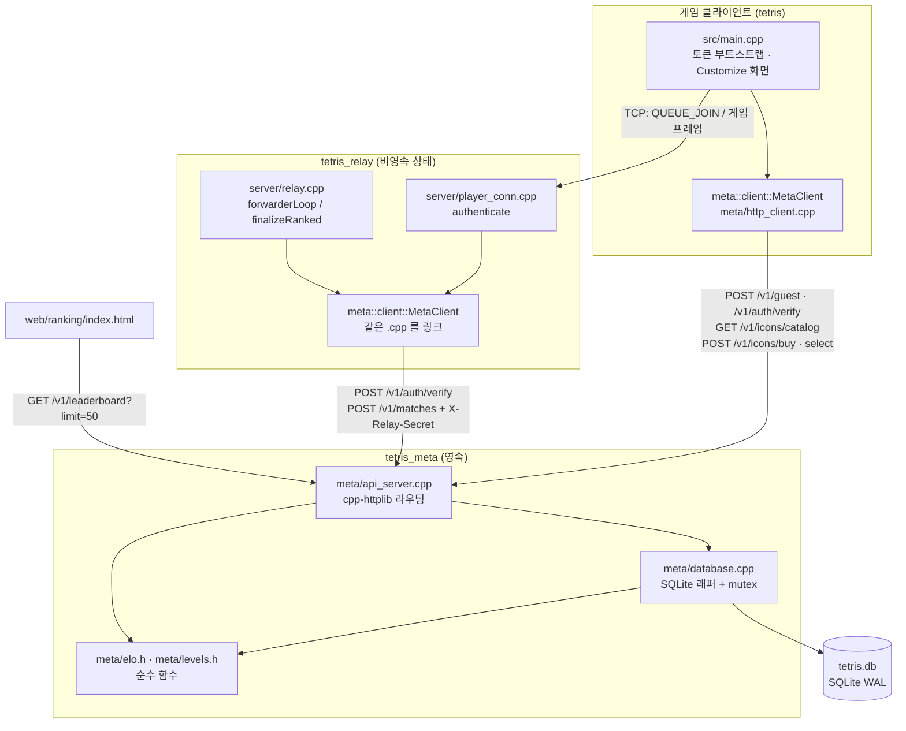
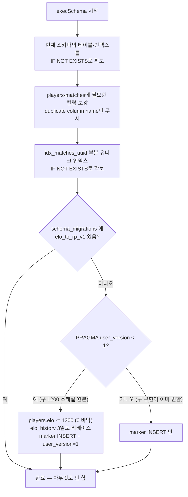
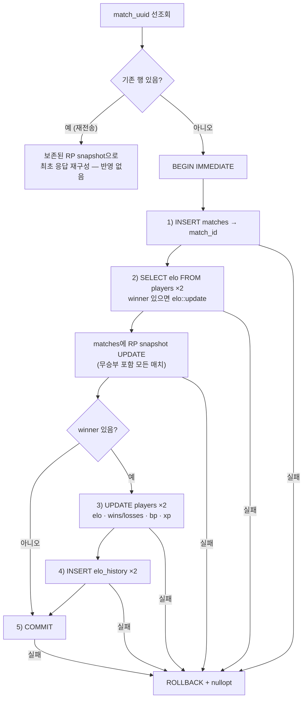
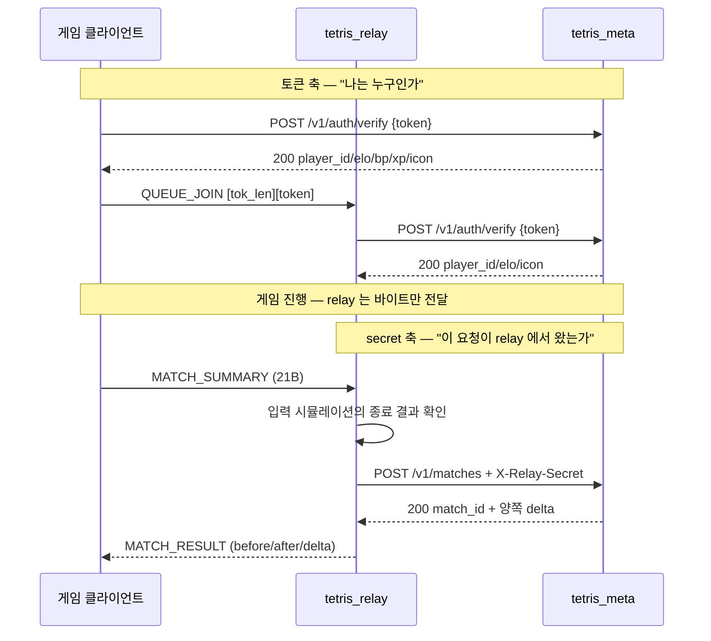
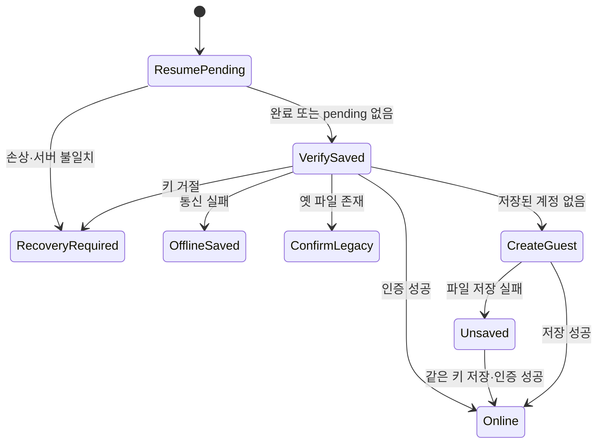
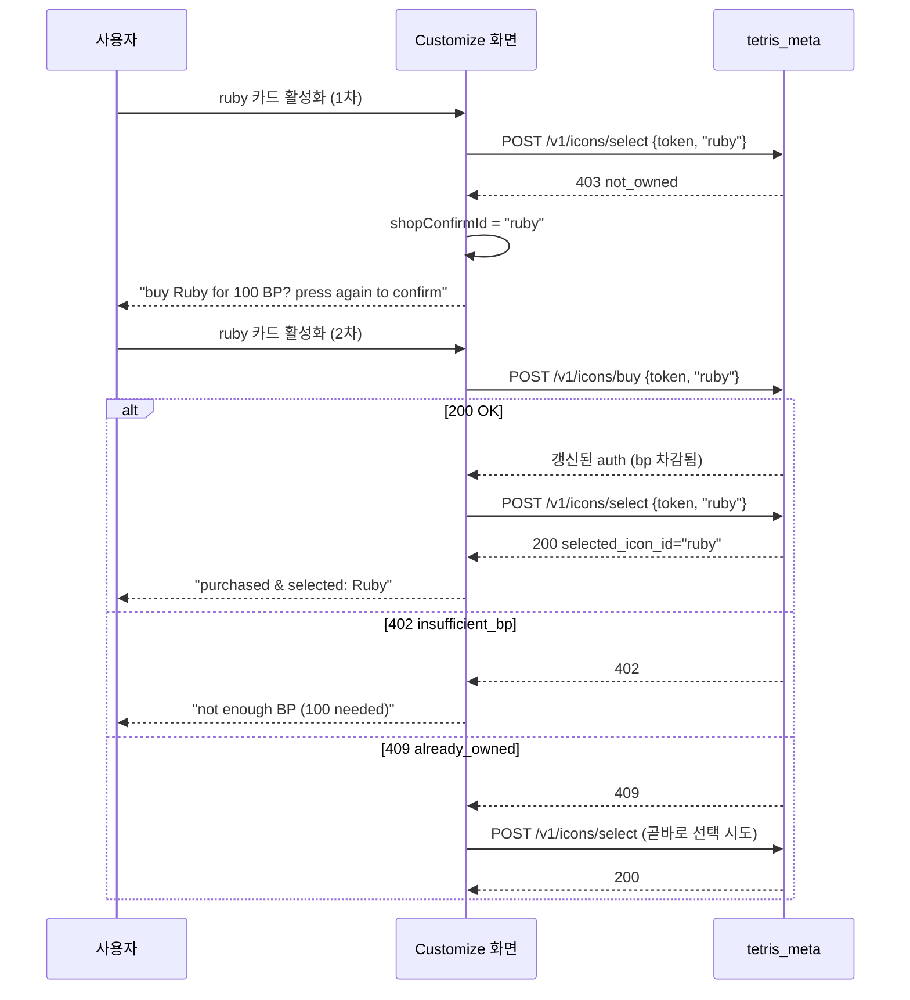

# Part 10: 메타 서버와 랭킹 — RP·XP·BP·아이콘

> **시리즈:** 제로부터 멀티플레이어 테트리스 + RL | [시리즈 목차](./README.md) | **Part 10**

---

> **현재 구현의 연결:** 접속 입장권은 [Part 16](part16-secure-admission.md), 해시 저장·키 교체·복구·파일 저장은 [Part 17](part17-guest-account-recovery.md)에서 확장한다. 아래 현재 소스 발췌도 이 최종 계약에 맞췄다.

## 이번 Part의 구현 계약

- **선행 상태:** [Part 7](./part7-relay-server.md)의 `tetris_relay`(`Matchmaker`, `RoomRegistry`, `forwarderLoop`)와 [Part 6](./part6-lockstep-networking.md)의 framing·`Session` 수신 기반이 동작한다. 이 장이 `MATCH_SUMMARY` / `MATCH_RESULT`에 랭킹 의미를 부여하고 relay의 선택적 해석 경계를 완성한다. 클라이언트는 [Part 4](./part4-game-wrapper-and-loop.md)의 `AppMode` 메뉴 루프와 [Part 3](./part3-rendering-and-ui.md)의 기본 GUI 위젯을 가지고 있다.
- **이번 Part의 파일:**
  - 새로 만드는 것: `meta/database.h`, `meta/database.cpp`, `meta/api_server.h`, `meta/api_server.cpp`, `meta/elo.h`, `meta/levels.h`, `meta/protocol.h`, `meta/main.cpp`, `meta/http_client.h`, `meta/http_client.cpp`, `web/ranking/index.html`, `deploy/systemd/tetris-relay.env.example`, `deploy/systemd/tetris-meta.env.example`, `deploy/Caddyfile.example`
  - 벤더링하는 것: `third_party/sqlite3.c`, `third_party/sqlite3.h`, `third_party/httplib.h`
  - 고치는 것: `CMakeLists.txt`(`tetris_meta` 타깃 + 게임 클라이언트에 `meta/http_client.cpp` 추가), `server/main.cpp`(`--meta` / `--meta-secret`), `server/player_conn.cpp`(`authenticate`), `server/relay.cpp`(`finalizeRanked`), `src/main.cpp`(토큰 부트스트랩 + `AppMode::Customize` 화면 + 메뉴 항목)
- **연결점:** meta 는 guest/auth/icons/leaderboard 를 클라이언트에 제공하고, relay 만 `X-Relay-Secret` 으로 보호된 `POST /v1/matches` 를 호출해 RP/XP/BP 를 갱신한다. 클라이언트는 `meta::client::MetaClient` 하나로 meta 를 부르고, relay 도 같은 클래스를 링크해서 쓴다.
- **완료 게이트:** `tetris_meta`와 `tetris_relay`가 함께 빌드되고, DB·relay/meta·서버 결과 검증 테스트가 skip 없이 모두 통과한다.

---

## 1. 왜 relay 와 meta 를 분리하는가

[Part 7](./part7-relay-server.md) 의 relay 는 매치 전에는 큐와 room 제어 프레임을 해석하고, 매치가 시작되면 두 TCP 소켓 사이에서 게임 프레임을 전달한다. 상태를 거의 갖지 않는 것이 그 설계의 핵심이었다 — 재시작해도 잃을 것이 진행 중인 매치뿐이고, 다른 기기로 옮기는 데 데이터 이전이 필요 없다.

여기에 SQLite 를 밀어 넣으면 그 성질이 사라진다. relay 프로세스가 DB 파일을 소유하는 순간 백업·이전·스키마 마이그레이션이 relay 의 배포 절차에 붙고, 포워딩 스레드가 디스크 fsync 뒤에서 밀린다. 그래서 책임을 둘로 나눈다.

| 프로세스 | 상태 | 책임 |
|---|---|---|
| `tetris_relay` | 매치 수명 동안만 (메모리) | 입장권 소비, 매칭, wire 전달, 서버 입력 검증 |
| `tetris_meta` | SQLite 에 영속 | guest 발급, RP/XP/BP, 아이콘 소유권, 매치 기록, leaderboard |


```mermaid
graph TB
    subgraph Client["게임 클라이언트 (tetris)"]
        C1[src/main.cpp<br/>토큰 부트스트랩 · Customize 화면]
        C2["meta::client::MetaClient<br/>meta/http_client.cpp"]
        C1 --> C2
    end
    subgraph Relay["tetris_relay (비영속 상태)"]
        R1[server/player_conn.cpp<br/>authenticate]
        R2[server/relay.cpp<br/>forwarderLoop / finalizeRanked]
        R3["meta::client::MetaClient<br/>같은 .cpp 를 링크"]
        R1 --> R3
        R2 --> R3
    end
    subgraph Meta["tetris_meta (영속)"]
        M1[meta/api_server.cpp<br/>cpp-httplib 라우팅]
        M2[meta/database.cpp<br/>SQLite 래퍼 + mutex]
        M3[meta/elo.h · meta/levels.h<br/>순수 함수]
        M1 --> M2
        M2 --> M3
        M1 --> M3
    end
    W[web/ranking/index.html]
    DB[(tetris.db<br/>SQLite WAL)]

    C2 -- "POST /v1/guest · /v1/auth/verify<br/>GET /v1/icons/catalog<br/>POST /v1/icons/buy · select" --> M1
    C1 -- "TCP: QUEUE_JOIN / 게임 프레임" --> R1
    R3 -- "POST /v1/auth/verify<br/>POST /v1/matches + X-Relay-Secret" --> M1
    W -- "GET /v1/leaderboard?limit=50" --> M1
    M2 --> DB
```

클라이언트는 자기 토큰으로 자기 데이터를 읽고, 아이콘을 사고, 공개 leaderboard 를 볼 수 있다. 그러나 **매치 결과는 직접 제출하지 못한다.** `POST /v1/matches` 는 `X-Relay-Secret` 헤더를 요구하고, 그 secret 은 relay 와 meta 만 공유한다. 이유는 간단하다 — 클라이언트가 자기 승패를 직접 보고할 수 있으면 RP 는 즉시 무의미해진다.

### 1.1 왜 SQLite 인가

대안은 셋이었다.

**(a) 파일 JSON/CSV.** 의존성이 0 이고 손으로 읽을 수 있다. 그러나 "BP 를 차감하고 `player_icons` 에 행을 넣는다" 같은 두 단계 갱신을 원자적으로 만들 방법이 없다. 프로세스가 중간에 죽으면 BP 만 사라진 플레이어가 생긴다. 파일 전체를 쓰고 rename 하는 방식으로 원자성을 흉내낼 수는 있지만, 플레이어가 수천 명이 되면 매 요청마다 전체 파일을 다시 쓰게 된다.

**(b) 클라이언트-서버형 RDBMS.** 동시성과 운영 도구가 훌륭하지만 초기 자가 호스팅 규모에는 과하다. 별도 데몬, 별도 사용자·권한, 별도 백업 파이프라인과 네트워크 경계가 생긴다. 여러 meta 인스턴스와 진정한 active-active 운영이 필요해질 때는 이 비용이 타당해진다.

**(c) SQLite.** 트랜잭션·인덱스·타입·외래키를 갖췄고, DB 엔진은 amalgamation(`sqlite3.c`)으로 바이너리에 포함할 수 있다. 저장 모델도 “매치 종료 시 짧은 트랜잭션” 중심이라 단일 writer 구조로 시작하기에 알맞다. 다만 WAL 모드의 실행 중 DB는 `.db` 파일 하나를 `cp`해서 백업하면 안 된다. 일관된 온라인 백업은 SQLite backup API를 사용하고, 단순 파일 복사는 meta를 멈춘 오프라인 상태에서만 한다.

(c) 를 고른 대가는 **처리량 상한**이다. `Database` 는 SQLite connection 하나를 공유하고 그 위를 `std::mutex` 로 완전히 직렬화한다. 즉 동시 요청이 100 개 들어와도 DB 작업은 한 줄로 선다. 이것은 최적화가 아니라 의도적 단순화다 — `meta/database.h` 상단이 그 이유를 명시한다.

**현재 소스 발췌 — `meta/database.h`**

```cpp
#pragma once

// meta/database.h — SQLite 래퍼.
//
// 스레드 모델:
//   cpp-httplib 의 요청 스레드 여러 개에서 동시에 호출될 수 있다. 이 클래스는
//   내부 std::mutex 로 모든 public 메서드를 직렬화한다. 성능 최적화보다는
//   데이터 정합성 + 단순함 우선. SQLite 자체도 SQLITE_THREADSAFE=1 (기본) 로
//   컴파일되어 serialized 모드.
//
// 실패 정책:
//   · open 실패 → 생성자가 std::runtime_error throw. main 이 exit(1).
//   · 런타임 실패 (schema/쿼리) → fprintf(stderr) 로 로그 + nullopt 반환.
//     호출자가 HTTP 500 으로 바꿔서 클라이언트에게 전달.
//
// 스키마: players, player_icons, matches, elo_history, bot_rewards, schema_migrations.
// WAL + foreign keys + FULL (credential rotation must survive a committed response).
```

WAL(Write-Ahead Logging)은 writer와 별도 connection의 reader가 서로 덜 막히게 하는 저장 방식이다. 그러나 현재 `Database`는 connection 하나와 mutex 하나를 공유하므로, 같은 프로세스의 `POST /v1/matches`가 DB 작업을 하는 동안 `GET /v1/leaderboard`도 그 mutex에서 기다린다. 현재 선택의 직접적인 이점은 안전한 크래시 복구와 짧은 트랜잭션이고, 나중에 읽기 전용 connection을 분리할 때 WAL의 동시 읽기 장점을 온전히 사용할 수 있다.

`synchronous = FULL`은 WAL의 커밋도 저장 장치에 동기화한다. [Part 17](part17-guest-account-recovery.md)에서 계정 키 교체를 추가하면서 NORMAL에서 바꿨다. 성공 응답을 받은 클라이언트가 이전 키를 지웠는데 서버가 전원 장애로 교체 전 상태로 돌아가는 일을 줄이기 위해서다. 커밋 지연이 늘어나는 대가가 있으며 실제 내구성은 파일 시스템과 저장 장치가 동기화 요청을 지킨다는 전제에 의존한다.

## 2. CMakeLists 확장

이 장은 SQLite amalgamation과 cpp-httplib를 빌드 경계에 넣고, `tetris_meta` 타깃과
게임·relay가 공유하는 HTTP client 경로를 연결한다.

먼저 `tetris_meta` 타깃이다.

**현재 소스 발췌 — `CMakeLists.txt`**

```cmake
if (TETRIS_BUILD_META)
    if (NOT EXISTS "${CMAKE_CURRENT_SOURCE_DIR}/third_party/sqlite3.c" OR
        NOT EXISTS "${CMAKE_CURRENT_SOURCE_DIR}/third_party/sqlite3.h")
        message(FATAL_ERROR
            "TETRIS_BUILD_META=ON 이지만 third_party/sqlite3.{c,h} 가 없습니다. "
            "SQLite amalgamation 을 다운로드해 third_party/ 에 넣으세요 "
            "(https://www.sqlite.org/download.html).")
    endif()
    if (NOT EXISTS "${CMAKE_CURRENT_SOURCE_DIR}/third_party/httplib.h")
        message(FATAL_ERROR
            "TETRIS_BUILD_META=ON 이지만 third_party/httplib.h 가 없습니다. "
            "cpp-httplib single header 를 다운로드해 third_party/ 에 넣으세요 "
            "(https://github.com/yhirose/cpp-httplib).")
    endif()

    set(TETRIS_SQLITE3_SOURCE "${CMAKE_CURRENT_SOURCE_DIR}/third_party/sqlite3.c")
    if (CMAKE_C_COMPILER_ID MATCHES "GNU|Clang|AppleClang")
        set_source_files_properties("${TETRIS_SQLITE3_SOURCE}" PROPERTIES COMPILE_OPTIONS "-w")
    elseif (MSVC)
        set_source_files_properties("${TETRIS_SQLITE3_SOURCE}" PROPERTIES COMPILE_OPTIONS "/w")
    endif()

    add_executable(tetris_meta
        meta/main.cpp
        meta/database.cpp
        meta/credentials.cpp
        meta/api_server.cpp
        meta/bot_challenges.cpp
        bot/opponents.cpp
        bot/placement.cpp
        bot/bot_onnx.cpp
        ${TETRIS_SIM_SOURCES}
        ${TETRIS_SQLITE3_SOURCE}
        meta/database.h
        meta/api_server.h
        meta/elo.h
        meta/levels.h
        meta/protocol.h
    )
    target_include_directories(tetris_meta PRIVATE
        ${CMAKE_CURRENT_SOURCE_DIR}
        ${CMAKE_CURRENT_SOURCE_DIR}/third_party
    )
    find_package(OpenSSL REQUIRED) # credential hashes are mandatory, even without HTTPS
    target_link_libraries(tetris_meta PRIVATE OpenSSL::Crypto)
    # SQLite amalgamation — 기본 threadsafe(serialized) 모드로 컴파일.
    # WAL + mutex 는 C++ 래퍼에서 보강한다.
    target_compile_definitions(tetris_meta PRIVATE
        SQLITE_THREADSAFE=1
        SQLITE_ENABLE_RTREE=0
        SQLITE_DEFAULT_FOREIGN_KEYS=1
    )
    if (WIN32)
        # BCryptGenRandom is the fail-closed CSPRNG used for guest tokens.
        target_link_libraries(tetris_meta PRIVATE ws2_32 bcrypt)
    else()
        find_package(Threads REQUIRED)
        target_link_libraries(tetris_meta PRIVATE Threads::Threads ${CMAKE_DL_LIBS})
    endif()
    if (UNIX AND NOT APPLE)
        set_target_properties(tetris_meta PROPERTIES
            BUILD_RPATH "$ORIGIN/lib"
            INSTALL_RPATH "$ORIGIN/lib")
    endif()
endif()
```

이 블록에서 놓치기 쉬운 지점은 다음과 같다.

- **존재 검사 FATAL_ERROR.** 두 서드파티는 저장소에 체크인돼 있어야 한다. 없으면 configure 단계에서 즉시 죽는다. 컴파일이 한참 돌다가 `#include "sqlite3.h"` 에서 실패하는 것보다 낫다.
- **`COMPILE_OPTIONS "-w"`.** amalgamation은 큰 외부 단일 C 파일이라 프로젝트의 경고 설정과 맞지 않을 수 있다. 그 파일 하나만 경고를 끈다. 우리가 고칠 코드가 아니다.
- **`SQLITE_THREADSAFE=1`.** `database.h` 가 전제한 serialized 모드를 명시적으로 건다. 기본값이지만 배포판에 따라 다를 수 있어 못 박는다.
- **`SQLITE_DEFAULT_FOREIGN_KEYS=1`.** SQLite 는 역사적 이유로 외래키를 기본 비활성으로 둔다. 스키마의 `REFERENCES` 가 장식이 되지 않도록 컴파일 시점에 켜고, 런타임에도 `PRAGMA foreign_keys = ON` 으로 한 번 더 건다.
- **Windows `bcrypt`.** guest token을 `BCryptGenRandom`으로 만들기 위한 시스템
  라이브러리다. HTTP socket용 `ws2_32`와 목적이 다르므로 둘 다 필요하다.

프로젝트 루트에는 `project(tetris CXX C)` 로 C 언어가 이미 켜져 있다. `sqlite3.c` 때문이다.

**현재 소스 발췌 — `CMakeLists.txt`**

```cmake
cmake_minimum_required(VERSION 3.15)
# C 언어도 활성화 — third_party/sqlite3.c (amalgamation) 를 빌드하려면 필요.
# tetris_meta 타겟만 C 를 쓰지만 enable_language 는 프로젝트 루트에서 선언해야 한다.
project(tetris CXX C)
```

두 번째로, 게임 클라이언트가 `meta/http_client.cpp` 를 링크하게 된다. Part 4 에서 만든 `TETRIS_GAME_COMMON` 목록에 한 줄이 늘고, httplib 존재 검사가 앞에 붙는다.

**현재 소스 발췌 — `CMakeLists.txt`**

```cmake
    set(TETRIS_GAME_COMMON
        ${TETRIS_SIM_SOURCES}
        src/main.cpp
        src/account_screen.cpp
        src/game.cpp
        src/gui.cpp
        src/colors.cpp
        src/presentation.cpp
        core/replay.cpp
        net/socket.cpp
        net/framing.cpp
        net/session.cpp
        net/wss_client.cpp
        renderer/renderer.cpp
        renderer/gl_api.cpp
        renderer/text_gl.cpp
        renderer/shake.cpp
        renderer/image_gl.cpp
        bot/placement.cpp
        bot/opponents.cpp
        bot/bot_onnx.cpp
        meta/http_client.cpp
        meta/private_file.cpp
        meta/account_client.cpp meta/account_store.cpp platform/user_data.cpp
    )
```

relay도 같은 파일을 링크한다(`CMakeLists.txt`). `meta/http_client.cpp`는 HTTP를 호출하는 `tetris`와 `tetris_relay`에 들어가고, 요청을 받는 `tetris_meta`는 서버 측 구현만 링크한다. 타깃 수가 늘어도 호출자와 제공자를 구분하는 이 기준을 따른다.

HTTPS는 선택 기능이다. `TETRIS_ENABLE_HTTPS`가 켜져 있고 OpenSSL이 발견되면 `CPPHTTPLIB_OPENSSL_SUPPORT`를 정의하고 링크한다(`CMakeLists.txt`의 OpenSSL 옵션 블록). 없으면 `https://` URL은 런타임에 거부된다. 조용히 평문으로 떨어지지 않는다. 같은 계약은 `MetaClient` 생성자가 실제 URL을 받을 때도 검사한다.

이 CMake 블록은 현재 최종 저장소의 meta 타깃과 같다. 관련 의존성이나 소스가 바뀌면 이 발췌와 Part 13의 빌드 레퍼런스를 함께 갱신한다.

빌드 명령은 다음과 같다.

```bash
cmake -S . -B build -DTETRIS_BUILD_GAME=OFF -DTETRIS_BUILD_RELAY=ON -DTETRIS_BUILD_META=ON -DTETRIS_BUILD_TEST=ON
cmake --build build --parallel 4
```

`tetris_meta` 와 `tetris_relay` 두 실행 파일이 생긴다. 게임 클라이언트를 함께 빌드하려면 `-DTETRIS_BUILD_GAME=ON`(기본값)으로 두면 된다.

## 3. 데이터 모델 — 영속 상태와 조회·멱등성 인덱스

스키마는 `meta/database.cpp` 안의 문자열 리터럴 하나다. 서버가 뜰 때마다 `CREATE TABLE IF NOT EXISTS` 로 통째로 실행하므로, 새 DB 파일을 지정하면 그 자리에서 스키마가 만들어진다.

**현재 소스 발췌 — `meta/database.cpp`**

```cpp
const char* kSchema = R"sql(
PRAGMA foreign_keys = ON;
PRAGMA journal_mode = WAL;
PRAGMA synchronous  = FULL;
PRAGMA secure_delete = ON;

CREATE TABLE IF NOT EXISTS players (
  id          INTEGER PRIMARY KEY,
  username    TEXT,
  token_hash  TEXT UNIQUE NOT NULL,
  recovery_hash TEXT,
  auth_epoch INTEGER NOT NULL DEFAULT 0,
  last_credential_op TEXT,
  elo         INTEGER NOT NULL DEFAULT 0,
  wins        INTEGER NOT NULL DEFAULT 0,
  losses      INTEGER NOT NULL DEFAULT 0,
  bp          INTEGER NOT NULL DEFAULT 0,
  xp          INTEGER NOT NULL DEFAULT 0,
  selected_icon_id TEXT NOT NULL DEFAULT 'default',
  created_at  INTEGER NOT NULL
);

CREATE TABLE IF NOT EXISTS player_icons (
  player_id   INTEGER NOT NULL REFERENCES players(id) ON DELETE CASCADE,
  icon_id     TEXT NOT NULL,
  created_at  INTEGER NOT NULL,
  PRIMARY KEY(player_id, icon_id)
);

CREATE TABLE IF NOT EXISTS matches (
  id          INTEGER PRIMARY KEY,
  match_uuid  TEXT UNIQUE,
  player_a    INTEGER NOT NULL REFERENCES players(id),
  player_b    INTEGER NOT NULL REFERENCES players(id),
  winner      INTEGER          REFERENCES players(id),
  score_a     INTEGER NOT NULL,
  score_b     INTEGER NOT NULL,
  lines_a     INTEGER NOT NULL,
  lines_b     INTEGER NOT NULL,
  duration_s  INTEGER NOT NULL,
  created_at  INTEGER NOT NULL,
  elo_a_before INTEGER NOT NULL DEFAULT 0,
  elo_a_after  INTEGER NOT NULL DEFAULT 0,
  elo_b_before INTEGER NOT NULL DEFAULT 0,
  elo_b_after  INTEGER NOT NULL DEFAULT 0
);

CREATE TABLE IF NOT EXISTS bot_rewards (
  ticket TEXT PRIMARY KEY,
  player_id INTEGER NOT NULL REFERENCES players(id),
  opponent_id TEXT NOT NULL,
  awarded_bp INTEGER NOT NULL,
  created_at INTEGER NOT NULL
);
CREATE INDEX IF NOT EXISTS idx_bot_rewards_player_time ON bot_rewards(player_id,created_at);

CREATE TABLE IF NOT EXISTS elo_history (
  id          INTEGER PRIMARY KEY,
  player_id   INTEGER NOT NULL REFERENCES players(id),
  match_id    INTEGER NOT NULL REFERENCES matches(id),
  elo_before  INTEGER NOT NULL,
  elo_after   INTEGER NOT NULL,
  delta       INTEGER NOT NULL,
  created_at  INTEGER NOT NULL
);

-- PRAGMA user_version 은 sqlite3 .dump/.restore 에 보존되지 않는다. 데이터
-- 테이블의 marker도 함께 기록해 데이터 변환 마이그레이션을 멱등하게 만든다.
CREATE TABLE IF NOT EXISTS schema_migrations (
  name        TEXT PRIMARY KEY,
  applied_at  INTEGER NOT NULL
);

CREATE INDEX IF NOT EXISTS idx_players_elo    ON players(elo DESC);
CREATE INDEX IF NOT EXISTS idx_matches_played ON matches(created_at DESC);
CREATE INDEX IF NOT EXISTS idx_elo_pid        ON elo_history(player_id);
CREATE INDEX IF NOT EXISTS idx_player_icons_pid ON player_icons(player_id);
)sql";
```

테이블은 역할별로 분리한다. 아래 표의 이름과 책임이 스키마를 읽는 기준이며, 테이블 수 자체는 완료 조건이 아니다.

| 테이블 | 역할 | 특징 |
|---|---|---|
| `players` | 계정 하나 = 행 하나 | `token_hash`가 UNIQUE — 접근 키의 목적별 해시. 복구·교체 컬럼은 Part 17 |
| `player_icons` | 아이콘 소유권 | `(player_id, icon_id)` 복합 PK 로 중복 소유 불가 |
| `matches` | 매치 감사 기록 | `match_uuid`로 중복 반영 방지, 확정 RP snapshot 보존 |
| `elo_history` | RP 변동 로그 | 매치당 두 행(양쪽) |
| `schema_migrations` | 적용된 마이그레이션 marker | 데이터 변환의 멱등성 보장 |

조회 인덱스는 각각 실제 쿼리를 겨냥한다. 여기에 `match_uuid` UNIQUE 제약이 재시도 멱등성 인덱스로 동작한다. 기존 DB는 nullable 컬럼을 `ALTER TABLE`로 추가한 뒤 `WHERE match_uuid IS NOT NULL`인 partial unique index를 만들어 과거 행을 그대로 보존한다.

- `idx_players_elo ON players(elo DESC)` — leaderboard 의 `ORDER BY elo DESC` 를 정렬 없이 인덱스 순회로 처리한다. `players` 가 수만 행이 돼도 상위 50 명을 뽑는 데 전체 정렬이 필요 없다.
- `idx_matches_played ON matches(created_at DESC)` — "최근 매치" 조회용. 지금 API 로 노출돼 있진 않지만 운영 중 `sqlite3` 셸로 들여다볼 때 쓴다.
- `idx_elo_pid ON elo_history(player_id)` — 한 플레이어의 RP 곡선 조회용.
- `idx_player_icons_pid ON player_icons(player_id)` — 복합 PK 의 선두 컬럼이 이미 `player_id` 라 중복처럼 보이지만, SQLite 에서 `WITHOUT ROWID` 가 아닌 테이블의 PK 는 별도 인덱스이므로 이 인덱스가 소유 목록 조회를 커버한다.

`elo` 라는 컬럼 이름에 대해 한 가지 짚어둔다. 사용자에게 보이는 용어는 **RP** (Rating Point) 지만, DB 컬럼·JSON 필드·wire 필드는 전부 `elo` 다. 이름을 절반만 바꾸면 구 DB 와 구 클라이언트가 동시에 깨지므로, 프로토콜 버전을 올리기 전까지 이름은 유지하고 UI 문자열만 `RP` 를 쓴다. 값을 해석할 때만 `elo == RP` 로 읽는다.

`Database` 생성자는 파일을 열고 busy timeout 을 건 뒤 스키마를 적용한다.

**현재 소스 발췌 — `meta/database.cpp`**

```cpp
Database::Database(const std::string& path)
{
    int rc = sqlite3_open(path.c_str(), &db_);
    if (rc != SQLITE_OK || !db_) {
        std::string msg = "sqlite3_open failed: ";
        if (db_) msg += sqlite3_errmsg(db_);
        sqlite3_close(db_);
        db_ = nullptr;
        throw std::runtime_error(msg);
    }
    // 트랜잭션 밖에서 5초까지 락 대기 (동시 요청 스레드 있을 수 있음).
    sqlite3_busy_timeout(db_, 5000);
    try { execSchema(); }
    catch (...) { sqlite3_close(db_); db_=nullptr; throw; }
}

Database::~Database()
{
    if (db_) sqlite3_close(db_);
}
```

`sqlite3_busy_timeout(db_, 5000)` 은 §1.1 의 mutex 직렬화와 짝을 이룬다. 우리 프로세스 안에서는 mutex 가 이미 모든 접근을 한 줄로 세우므로 SQLITE_BUSY 가 날 일이 없지만, **같은 DB 파일을 다른 프로세스가 열고 있을 때**(운영 중 `sqlite3` 셸로 조회, 백업 스크립트, 잘못 띄운 두 번째 `tetris_meta`)는 얘기가 다르다. 그때 기본 동작은 즉시 `SQLITE_BUSY` 반환이고, 우리 코드는 그것을 "DB 오류"로 보고 HTTP 500 을 돌려준다. 5 초 대기를 걸어두면 대부분의 짧은 외부 락은 그냥 지나간다.

## 4. 스키마 진화 — 컬럼 추가와 데이터 변환

`execSchema()` 는 스키마 실행 후 두 종류의 마이그레이션을 돌린다. **컬럼 추가**와 **데이터 변환**이다. 둘의 멱등성 확보 방식이 다르다는 점이 이 절의 핵심이다.

**현재 소스 발췌 — `meta/database.cpp`**

```cpp
void Database::execSchema()
{
    char* err = nullptr;
    int rc = sqlite3_exec(db_, kSchema, nullptr, nullptr, &err);
    if (rc != SQLITE_OK) {
        std::string msg = "schema init failed: ";
        if (err) { msg += err; sqlite3_free(err); }
        throw std::runtime_error(msg);
    }

    // 기존 tetris.db 를 보존하면서 신규 컬럼을 붙인다. duplicate column 은 이미
    // 마이그레이션된 DB 라는 뜻이므로 무시한다.
    auto alter_if_needed = [&](const char* sql) {
        char* alterErr = nullptr;
        int alterRc = sqlite3_exec(db_, sql, nullptr, nullptr, &alterErr);
        if (alterRc == SQLITE_OK) return;
        std::string msg = alterErr ? alterErr : "";
        sqlite3_free(alterErr);
        if (msg.find("duplicate column name") != std::string::npos) return;
        throw std::runtime_error("schema migration failed: " + msg);
    };
    alter_if_needed("ALTER TABLE players ADD COLUMN bp INTEGER NOT NULL DEFAULT 0");
    alter_if_needed("ALTER TABLE players ADD COLUMN selected_icon_id TEXT NOT NULL DEFAULT 'default'");
    alter_if_needed("ALTER TABLE players ADD COLUMN xp INTEGER NOT NULL DEFAULT 0");
    alter_if_needed("ALTER TABLE players ADD COLUMN recovery_hash TEXT");
    alter_if_needed("ALTER TABLE players ADD COLUMN auth_epoch INTEGER NOT NULL DEFAULT 0");
    alter_if_needed("ALTER TABLE players ADD COLUMN last_credential_op TEXT");
    alter_if_needed("ALTER TABLE matches ADD COLUMN match_uuid TEXT");
    alter_if_needed("ALTER TABLE matches ADD COLUMN elo_a_before INTEGER NOT NULL DEFAULT 0");
    alter_if_needed("ALTER TABLE matches ADD COLUMN elo_a_after INTEGER NOT NULL DEFAULT 0");
    alter_if_needed("ALTER TABLE matches ADD COLUMN elo_b_before INTEGER NOT NULL DEFAULT 0");
    alter_if_needed("ALTER TABLE matches ADD COLUMN elo_b_after INTEGER NOT NULL DEFAULT 0");
    // Old tables receive this column through ALTER before the index is created.
    {
        char* indexErr = nullptr;
        const int indexRc = sqlite3_exec(
            db_,
            "CREATE UNIQUE INDEX IF NOT EXISTS idx_matches_uuid ON matches(match_uuid) "
            "WHERE match_uuid IS NOT NULL",
            nullptr, nullptr, &indexErr);
        if (indexRc != SQLITE_OK) {
            std::string msg = indexErr ? indexErr : "";
            sqlite3_free(indexErr);
            throw std::runtime_error("schema index migration failed: " + msg);
        }
    }

    // ── 1회성 스케일 마이그레이션 (user_version 0 → 1) ─────────────────────
    //   구 ELO 스케일(1200 시작)을 RP 스케일(0 시작/0 바닥)로 이관:
    //   elo := max(0, elo - 1200). 신규 DB 는 이 시점에 players 가 비어 있어
    //   no-op 이고, 버전만 1 로 올라간다. (meta/elo.h 참조)
    int userVersion = 0;
    {
        sqlite3_stmt* s = nullptr;
        if (sqlite3_prepare_v2(db_, "PRAGMA user_version", -1, &s, nullptr) == SQLITE_OK
            && sqlite3_step(s) == SQLITE_ROW)
            userVersion = sqlite3_column_int(s, 0);
        sqlite3_finalize(s);
    }
    bool rpRebaseApplied = false;
    {
        StmtGuard g;
        if (sqlite3_prepare_v2(db_,
                "SELECT 1 FROM schema_migrations WHERE name='elo_to_rp_v1'",
                -1, &g.s, nullptr) != SQLITE_OK)
            throw std::runtime_error("schema migration marker prepare failed");
        rpRebaseApplied = sqlite3_step(g.s) == SQLITE_ROW;
    }

    if (!rpRebaseApplied) {
        char* mErr = nullptr;
        // user_version>=1 인 기존 DB는 구 구현에서 이미 리베이스됐다. 이 경우
        // 데이터는 다시 건드리지 않고 dump에 보존될 marker만 백필한다.
        const char* migrationSql = userVersion < 1
            ? "BEGIN IMMEDIATE;"
              "UPDATE players SET elo = MAX(0, elo - 1200);"
              "UPDATE elo_history SET "
                "elo_before = MAX(0, elo_before - 1200),"
                "elo_after  = MAX(0, elo_after  - 1200),"
                "delta = MAX(0, elo_after - 1200) - MAX(0, elo_before - 1200);"
              "INSERT INTO schema_migrations(name,applied_at) "
                "VALUES('elo_to_rp_v1',strftime('%s','now'));"
              "PRAGMA user_version = 1;"
              "COMMIT;"
            : "BEGIN IMMEDIATE;"
              "INSERT INTO schema_migrations(name,applied_at) "
                "VALUES('elo_to_rp_v1',strftime('%s','now'));"
              "COMMIT;";
        if (sqlite3_exec(db_, migrationSql,
                nullptr, nullptr, &mErr) != SQLITE_OK) {
            std::string msg = mErr ? mErr : "";
            sqlite3_free(mErr);
            sqlite3_exec(db_, "ROLLBACK;", nullptr, nullptr, nullptr);
            throw std::runtime_error("elo->rp rebase migration failed: " + msg);
        }
    }
    migrateCredentials();
}
```

### 4.1 컬럼 추가 — 실패 메시지로 멱등성을 만든다

`players` 의 `bp`·`selected_icon_id`·`xp` 와 `matches` 의 `match_uuid`·RP snapshot 컬럼들은 초기 스키마에 없었다. `CREATE TABLE IF NOT EXISTS` 는 **이미 존재하는 테이블의 컬럼을 늘려주지 않으므로**, 구 DB 를 열면 새 컬럼 없이 그대로 열린다. 그래서 매 기동마다 `ALTER TABLE ... ADD COLUMN` 을 무조건 실행하고, SQLite 가 돌려주는 `"duplicate column name"` 오류만 무시한다.

이 방식이 `PRAGMA table_info(players)` 를 파싱해 컬럼 존재를 검사하는 것보다 짧고, 경쟁 조건도 없다. 대신 **오류 문자열에 의존**한다는 약점이 있다. SQLite 가 그 메시지를 바꾸면 정상 기동이 예외로 바뀐다. amalgamation 을 벤더링해 버전을 고정했으므로 지금은 안전하지만, 업그레이드 시 확인해야 할 항목이다.

`ADD COLUMN` 에 `NOT NULL DEFAULT` 를 붙였다는 점도 중요하다. SQLite 는 기존 행이 있는 테이블에 `NOT NULL` 컬럼을 추가할 때 default 를 요구한다. 기본값 덕분에 구 플레이어들은 자동으로 `bp=0, xp=0, selected_icon_id='default'` 가 된다.

`match_uuid` 만 예외적으로 제약 없이 추가한다. SQLite 의 `ALTER TABLE ADD COLUMN` 은 UNIQUE 제약을 함께 붙일 수 없으므로, 컬럼을 먼저 붙인 뒤 별도의 `CREATE UNIQUE INDEX IF NOT EXISTS idx_matches_uuid` 로 유니크 제약을 건다. `WHERE match_uuid IS NOT NULL` 부분(partial) 인덱스라 uuid 가 NULL 인 과거 행들은 제약 밖에 남고, 새로 저장되는 행만 §7 의 중복 반영 방지가 적용된다. 인덱스 쪽 멱등성은 오류 문자열 매칭이 아니라 `IF NOT EXISTS` 가 보장하므로, 이쪽 실패는 무시하지 않고 기동 실패로 승격한다 — 이 인덱스 없이 뜬 meta 는 재전송을 이중 반영하는 서비스이기 때문이다.

### 4.2 데이터 변환 — `user_version` 대신 marker 테이블

RP 스케일 변환은 훨씬 위험하다. `UPDATE players SET elo = MAX(0, elo - 1200)` 을 두 번 실행하면 모든 플레이어의 RP 가 0 이 된다. 정확히 한 번만 실행되게 만들어야 한다.

SQLite 의 관용적인 답은 `PRAGMA user_version` 이다. 파일 헤더의 정수 슬롯 하나를 "스키마 버전"으로 쓰는 것. 초기 구현도 그렇게 했다. 그런데 여기에 함정이 있다.

> `PRAGMA user_version` 은 sqlite3 `.dump` / `.restore` 에 보존되지 않는다.

백업 절차가 `sqlite3 tetris.db .dump > backup.sql` 이라면, 복원한 DB 의 `user_version` 은 0 이다. 그 상태로 `tetris_meta` 를 띄우면 이미 리베이스된 데이터에 `-1200` 이 한 번 더 적용된다. **백업에서 복원했더니 전 서버의 RP 가 0 이 되는** 사고다.

그래서 게이트를 데이터 테이블로 옮긴다. `schema_migrations` 에 `name='elo_to_rp_v1'` 행이 있는지 보고, 없을 때만 변환한다. 이 테이블은 평범한 테이블이므로 `.dump` 에 그대로 들어간다.

기존 배포를 깨뜨리지 않으려면 분기가 하나 더 필요하다. 구 구현으로 이미 리베이스한 DB 는 `user_version >= 1` 이지만 marker 행이 없다. 그 DB 에 변환을 다시 걸면 안 되므로, `userVersion >= 1` 이면 **데이터는 건드리지 않고 marker 만 백필**한다. 그래서 SQL 이 두 갈래다.


```mermaid
flowchart TD
    A[execSchema 시작] --> B["현재 스키마의 테이블·인덱스를<br/>IF NOT EXISTS로 확보"]
    B --> C["players·matches에 필요한 컬럼 보강<br/>duplicate column name만 무시"]
    C --> C2["idx_matches_uuid 부분 유니크 인덱스<br/>IF NOT EXISTS로 확보"]
    C2 --> D{"schema_migrations 에<br/>elo_to_rp_v1 있음?"}
    D -- 예 --> Z[완료 — 아무것도 안 함]
    D -- 아니오 --> E{"PRAGMA user_version < 1?"}
    E -- "예 (구 1200 스케일 원본)" --> F["players.elo -= 1200 (0 바닥)<br/>elo_history 3열도 리베이스<br/>marker INSERT + user_version=1"]
    E -- "아니오 (구 구현이 이미 변환)" --> G["marker INSERT 만"]
    F --> Z
    G --> Z
```

변환 SQL 이 `players` 뿐 아니라 `elo_history` 의 `elo_before` / `elo_after` / `delta` 까지 함께 리베이스한다는 점도 놓치기 쉽다. 히스토리를 그대로 두면 "RP 0 인 플레이어의 과거 기록이 1216 에서 1232 로 올랐다"는 모순된 곡선이 남는다. `delta` 는 단순히 -1200 하면 안 되고(차이값이므로), 0 바닥 clamp 후의 두 값을 다시 빼서 계산한다 — 그래서 SQL 이 `MAX(0, elo_after - 1200) - MAX(0, elo_before - 1200)` 형태다.

전체가 `BEGIN IMMEDIATE` / `COMMIT` 한 트랜잭션 안에 있고, 실패하면 `ROLLBACK` 후 예외를 던져 프로세스가 뜨지 않는다. **반쯤 변환된 DB 로 서비스가 시작되는 일이 없다**는 것이 여기서 지키려는 성질이다.

이 `1200` 은 신규 플레이어의 시작값이 아니라 **구 DB 변환 상수**다. 새 row 는 언제나 RP 0, BP 0, XP 0 에서 시작한다.

## 5. RP — Elo 를 0 시작으로 리베이스하기

RP 계산은 헤더 하나로 끝난다. 상태도 DB 접근도 없는 순수 함수라 테스트하기 쉽고, 서버와 클라이언트가 같은 헤더를 include 한다.

**현재 소스 발췌 — `meta/elo.h`**

```cpp
#pragma once

// meta/elo.h — RP(Rating Point) 계산 (순수 함수).
//
// 수식은 표준 ELO 그대로지만 스케일을 게임 친화적으로 리베이스했다:
//   · 시작 0, 바닥 0 — 신규 플레이어가 "0 RP" 에서 출발해 위로만 쌓는 표기.
//     바닥(0)에서는 패배해도 더 잃지 않는다 (일반적인 래더 관행).
//   · ELO 의 기대승률은 두 레이팅의 *차이* 만 쓰므로 기준점 이동은 수학적으로
//     무손실이다. (구 스케일 1200 시작 → 신 스케일 0 시작; 기존 DB 는
//     database.cpp 의 1회성 마이그레이션이 elo-1200 으로 이관)
//
// K-factor 는 세 단계 (<300 / <600 / >=600) — 하위 구간은 빠르게 수렴,
// 상위는 천천히 변동. FIDE/USCF 관행의 리베이스판.
//
// expected(ra, rb) = 1 / (1 + 10^((rb - ra) / 400))
// new_r = r + K * (score - expected)    (승=1, 패=0)
//
// 내부 식별자/DB 컬럼명은 호환을 위해 `elo` 를 유지한다. UI 표기만 "RP".

#include <algorithm>
#include <cmath>
#include <utility>

namespace elo {

inline int k_factor(int rating)
{
    if (rating < 300) return 32;
    if (rating < 600) return 24;
    return 16;
}

inline double expected(int ra, int rb)
{
    return 1.0 / (1.0 + std::pow(10.0, (rb - ra) / 400.0));
}

// 승자/패자 쌍의 새 RP 를 반환. 0 아래로 내려가지 않도록 clamp.
struct Update {
    int new_winner;
    int new_loser;
};

inline Update update(int winner_elo, int loser_elo)
{
    const double e_win = expected(winner_elo, loser_elo);
    const double e_los = expected(loser_elo, winner_elo);

    const int new_winner = winner_elo + static_cast<int>(std::round(
        k_factor(winner_elo) * (1.0 - e_win)));
    const int new_loser  = loser_elo  + static_cast<int>(std::round(
        k_factor(loser_elo)  * (0.0 - e_los)));

    return {
        std::max(0, new_winner),
        std::max(0, new_loser),
    };
}

} // namespace elo
```

### 5.1 기준점 이동이 왜 무손실인가

표준 Elo 는 1500 이나 1200 에서 시작한다. 우리는 0 에서 시작한다. 이것이 "수학적으로 무손실"인 이유는 `expected()` 가 `rb - ra` 만 쓰기 때문이다.

```
expected(ra, rb) = 1 / (1 + 10^((rb - ra) / 400))
expected(ra + c, rb + c) = 1 / (1 + 10^(((rb + c) - (ra + c)) / 400))
                         = 1 / (1 + 10^((rb - ra) / 400))
                         = expected(ra, rb)
```

모든 레이팅에 같은 상수를 더하거나 빼도 기대승률은 그대로다. 따라서 전체를 -1200 평행이동해도 매칭의 의미와 갱신 폭이 전혀 바뀌지 않는다. 바뀌는 것은 표시 숫자뿐이고, 게임 UI 에서 "0 RP 에서 시작해 쌓아 올린다"는 서사가 더 자연스럽다.

무손실이 **깨지는** 지점이 하나 있다. 0 바닥 clamp 다. 이건 평행이동이 아니라 치역을 자르는 연산이라 원본과 다른 시스템이 된다.

### 5.2 0 바닥 clamp 와 레이팅 인플레이션

표준 Elo 는 제로섬이다. 승자가 얻는 점수와 패자가 잃는 점수가 정확히 같아 전체 합이 보존된다. `std::max(0, new_loser)` 는 이 성질을 깬다.

RP 0 인 두 플레이어가 붙는 경우를 보자. `expected(0, 0) = 0.5`, `k_factor(0) = 32` 이므로 승자는 `0 + round(32 * 0.5) = +16`, 패자는 `0 + round(32 * -0.5) = -16` → clamp 되어 `0` 이다. 시스템 전체 RP 는 16 만큼 늘었다. 매 판 바닥에 걸린 패배가 나올 때마다 총합이 증가하므로, 장기적으로 **RP 는 인플레이션한다.**

이걸 받아들이는 이유는 두 가지다.

- 대안(음수 RP 허용)이 사용자 경험상 나쁘다. "-48 RP" 는 신규 플레이어를 쫓아낸다.
- 우리 랭킹은 상대 서열만 의미가 있고 절대값의 안정성을 요구하지 않는다. 인플레이션은 하위권 구간에만 집중되고, 상위권은 서로에게서만 점수를 주고받으므로 제로섬에 가깝게 유지된다.

만약 절대값이 중요한 시스템이라면 답은 다르다 — 하한 근처에서 K 를 줄이거나, 바닥에서 잃지 못한 점수만큼 승자의 획득도 깎아 제로섬을 복원해야 한다.

### 5.3 K-factor 3 단계의 경계

`k_factor` 는 32 / 24 / 16 세 값을 300, 600 경계로 고른다. K 는 "한 판이 레이팅을 얼마나 움직이는가"를 정하는 계수다. 크면 빨리 수렴하고 크게 흔들리며, 작으면 천천히 수렴하고 안정적이다.

체스(FIDE)는 신인 40, 일반 20, 2400 이상 10 을 쓴다. 우리는 그 관행을 스케일에 맞춰 옮겼다.

| 구간 | K | 의도 | 실제 효과 |
|---|---:|---|---|
| RP < 300 | 32 | 신규 플레이어의 실력을 빠르게 찾는다 | 동급 상대에게 승리 시 약 +16 |
| 300 ≤ RP < 600 | 24 | 중간 수렴 | 동급 승리 시 약 +12 |
| RP ≥ 600 | 16 | 상위권 안정 | 동급 승리 시 약 +8 |

경계값 300 과 600 은 "동급 상대와 몇 판을 이겨야 다음 구간인가"로 잡았다. 0 에서 시작해 동급 상대에게 연승하면 판당 +16 이므로 약 19 승에 300 에 닿고, 거기서 판당 +12 이므로 다시 25 승에 600 에 닿는다. 즉 대략 20 판 · 45 판이 구간 전환점이다. 이 정도면 "몇 판 해보니 내 자리가 잡혔다"는 감각과 맞는다.

주의할 점은 `k_factor` 가 **각자의 레이팅**으로 계산된다는 것이다. RP 800 인 플레이어가 RP 100 인 플레이어에게 지면, 승자는 K=32 로 크게 오르고 패자는 K=16 으로 적게 잃는다. 비대칭이지만 의도된 것이다 — 상위권의 안정성을 지키면서 하위권의 수렴 속도를 살린다.

## 6. XP 와 레벨 곡선

RP 는 오르내리지만 레벨은 오르기만 해야 한다. 그래서 별도 축인 XP 를 둔다.

**현재 소스 발췌 — `meta/levels.h`**

```cpp
#pragma once

// meta/levels.h — 누적 XP → 레벨 변환 (순수 함수, 서버/클라이언트 공용).
//
// XP 는 매치로만 적립되고 절대 줄지 않는다 (meta/database.cpp 의
// kXpWin/kXpLoss — RP/BP 와 같은 트랜잭션에서 적립). 레벨은 저장하지 않고
// 항상 XP 에서 유도한다 — 곡선을 바꿔도 DB 마이그레이션이 필요 없다.
//
// 곡선: 레벨 n → n+1 에 필요한 XP 가 선형 증가 (100, 120, 140, ...).
//   레벨 60(최대) 도달 누적 = 40,120 XP ≈ 승리 100 XP 기준 약 400승.

namespace meta::levels {

constexpr int kMaxLevel = 60;

// 레벨 n 에서 n+1 로 가는 데 필요한 XP (n: 1..kMaxLevel-1).
constexpr int xp_to_next(int level)
{
    return 100 + 20 * (level - 1);
}

// 레벨 L 도달에 필요한 누적 XP. 레벨 1 = 0.
//   sum_{n=1..L-1} (100 + 20(n-1)) = 100(L-1) + 10(L-1)(L-2)
constexpr int total_xp_for_level(int level)
{
    const int k = level - 1;
    return 100 * k + 10 * k * (k - 1);
}

// 누적 XP → 현재 레벨 (1..kMaxLevel 로 clamp).
inline int level_for_xp(int xp)
{
    if (xp < 0) xp = 0;
    int level = 1;
    while (level < kMaxLevel && xp >= total_xp_for_level(level + 1))
        ++level;
    return level;
}

// 현재 레벨 안에서의 진행 XP / 다음 레벨까지 필요한 XP. UI 진행바용.
// 최대 레벨이면 둘 다 0 을 채운다 (진행바 숨김).
inline void level_progress(int xp, int& into_out, int& need_out)
{
    const int lv = level_for_xp(xp);
    if (lv >= kMaxLevel) { into_out = 0; need_out = 0; return; }
    into_out = xp - total_xp_for_level(lv);
    need_out = xp_to_next(lv);
}

} // namespace meta::levels
```

### 6.1 레벨을 저장하지 않는다

`players` 테이블에 `level` 컬럼이 없다는 점을 먼저 보라. 레벨은 언제나 `xp` 에서 계산한다. 이 결정의 대가와 이득은 명확하다.

- **대가:** 응답을 만들 때마다 `level_for_xp` 를 돈다. 최대 60 회 반복하는 루프라 비용은 무시할 수준이다.
- **이득:** 곡선을 바꿔도 DB 마이그레이션이 없다. `xp_to_next` 의 상수 하나를 고치면 모든 플레이어의 레벨이 그 자리에서 재계산된다. 저장했다면 전 행을 다시 계산하는 배치 마이그레이션이 필요했다.

게임 밸런싱 파라미터는 이렇게 **유도 가능한 것은 저장하지 않는 편**이 대체로 낫다. 저장해야 하는 건 되돌릴 수 없는 사실(누적 XP)뿐이다.

### 6.2 곡선의 근거

`xp_to_next(n) = 100 + 20(n-1)` 은 등차수열이다. 레벨 1→2 에 100, 2→3 에 120, 3→4 에 140 XP 가 든다. 누적은 그 부분합이므로 이차식이 된다.

```
total_xp_for_level(L) = sum_{n=1..L-1} (100 + 20(n-1))
                      = 100(L-1) + 20 * (L-1)(L-2)/2
                      = 100(L-1) + 10(L-1)(L-2)
```

`kMaxLevel = 60` 을 넣으면 `100 * 59 + 10 * 59 * 58 = 5900 + 34220 = 40120` XP 다. 승리가 100 XP, 패배가 50 XP 이므로 승률 50% 로 플레이하면 판당 평균 75 XP, 즉 약 535 판이다. 전승이면 약 400 판.

왜 이차 곡선인가. 선택지는 셋이었다.

- **선형**(레벨당 고정 100 XP): 초반이 지루하고 후반이 너무 쉽다. 레벨 60 이 6000 XP 라 하루면 끝난다.
- **지수**(레벨당 ×1.15): 후반이 사실상 도달 불가능해진다. 레벨 60 이면 초기값의 3000 배가 넘는다.
- **이차**(등차 증분): 초반은 빠르게 오르고 후반은 완만하게 느려진다. 레벨 2 는 한 판 반이면 되고, 레벨 60 은 수백 판이 든다. "꾸준히 하면 언젠가 닿는다"는 감각이 유지된다.

`level_progress` 는 UI 진행바용이다. 현재 레벨 안에서 얼마나 왔는지(`into`)와 그 레벨의 총 요구량(`need`)을 채우고, 최대 레벨이면 둘 다 0 으로 두어 호출부가 진행바를 숨길 수 있게 한다.

BP 와 XP 의 적립량은 `meta/database.cpp` 상단의 `kBp*` / `kXp*` 상수에 모여 있다.

**현재 소스 발췌 — `meta/database.cpp`**

```cpp
const char* kDefaultIconId = "default";

const IconCatalogEntry kIconCatalog[] = {
    {"default", "Default", 0,   true},
    {"ruby",    "Ruby",    100, false},
    {"gold",    "Gold",    250, false},
};

// BP(Battle Point) 적립 — 아이콘 상점의 재화. winner 가 있는(ranked 판정된)
// 매치만 적립한다 (RP 갱신 조건과 동일). 무승부/검증실패는 0.
constexpr int kBpWin  = 30;
constexpr int kBpLoss = 10;

// XP(레벨 경험치) 적립 — BP 와 같은 조건(winner 있는 매치만). 절대 감소하지
// 않는다. 레벨 곡선/최대치는 meta/levels.h.
constexpr int kXpWin  = 100;
constexpr int kXpLoss = 50;
```

| 결과 | RP | BP | XP |
|---|---|---:|---:|
| 승리 | Elo 상승 | +30 | +100 |
| 패배 | Elo 하락 (0 바닥) | +10 | +50 |
| 검증된 무승부 | 변동 없음 | 0 | 0 |

패배에도 BP/XP 를 주는 것이 핵심이다. RP 만 있으면 지는 판은 순손실이라 플레이를 중단할 유인이 생긴다. BP/XP 는 **패배도 진전**으로 만든다. 다만 승리의 세 배(BP) · 두 배(XP) 를 줘서 이기려는 동기는 유지한다.

`ruby` 100 BP, `gold` 250 BP 라는 가격은 이 적립 곡선에서 나왔다. 승률 50% 로 플레이하면 판당 평균 20 BP 이므로 ruby 는 약 5 판, gold 는 약 13 판이다. "몇 판 하면 첫 아이템이 잡힌다"가 목표였다.

## 7. `saveMatch` — 경기 결과를 한 트랜잭션에 묶기

매치 저장은 감사용 `matches` 행, 양쪽 `players` 집계, 각 플레이어의 `elo_history`를 함께 바꾼다. 어느 일부만 반영돼도 DB는 모순 상태가 된다. 예를 들어 players의 RP는 올랐는데 history가 없으면 "언제 올랐는지 모르는 점수"가 생긴다.

**현재 소스 발췌 — `meta/database.cpp`**

```cpp
// -----------------------------------------------------------------------------
std::optional<MatchInsertResult>
Database::saveMatch(const MatchRecord& m)
{
    std::lock_guard<std::mutex> lk(mu_);

    // 같은 relay 결과의 재시도면 최초 응답을 그대로 돌려준다.
    {
        StmtGuard g;
        const char* sql =
            "SELECT id,elo_a_before,elo_a_after,elo_b_before,elo_b_after,"
            "player_a,player_b "
            "FROM matches WHERE match_uuid=?1";
        if (sqlite3_prepare_v2(db_, sql, -1, &g.s, nullptr) != SQLITE_OK) return std::nullopt;
        sqlite3_bind_text(g.s, 1, m.match_uuid.c_str(), -1, SQLITE_TRANSIENT);
        if (sqlite3_step(g.s) == SQLITE_ROW) {
            MatchInsertResult r;
            r.match_id = sqlite3_column_int64(g.s, 0);
            const int ab = sqlite3_column_int(g.s, 1);
            const int aa = sqlite3_column_int(g.s, 2);
            const int bb = sqlite3_column_int(g.s, 3);
            const int ba = sqlite3_column_int(g.s, 4);
            // 같은 match_uuid 재전송인데 참가자가 다르면 uuid 충돌이거나 relay
            // 버그(재사용/뒤바뀐 payload)다. 저장된 결과를 그대로 반환하는 기존
            // 동작은 유지하되(멱등성 보장), stderr 경고로 조기 발견을 돕는다.
            const int64_t stored_a = sqlite3_column_int64(g.s, 5);
            const int64_t stored_b = sqlite3_column_int64(g.s, 6);
            if (stored_a != m.player_a || stored_b != m.player_b) {
                std::fprintf(stderr,
                    "[db] saveMatch: match_uuid=%s replay with mismatched players "
                    "(stored a=%lld b=%lld, request a=%lld b=%lld); returning stored result\n",
                    m.match_uuid.c_str(),
                    static_cast<long long>(stored_a),
                    static_cast<long long>(stored_b),
                    static_cast<long long>(m.player_a),
                    static_cast<long long>(m.player_b));
            }
            r.a = {ab, aa, aa - ab};
            r.b = {bb, ba, ba - bb};
            return r;
        }
    }

    // 트랜잭션 시작. IMMEDIATE: 쓰기 락 즉시 확보해 reader 때문에 밀리지 않게.
    char* err = nullptr;
    if (sqlite3_exec(db_, "BEGIN IMMEDIATE;", nullptr, nullptr, &err) != SQLITE_OK) {
        std::fprintf(stderr, "[db] BEGIN: %s\n", err ? err : "?");
        sqlite3_free(err);
        return std::nullopt;
    }

    auto rollback = [&](const char* why) -> std::optional<MatchInsertResult> {
        std::fprintf(stderr, "[db] saveMatch rollback: %s (%s)\n",
                     why, sqlite3_errmsg(db_));
        sqlite3_exec(db_, "ROLLBACK;", nullptr, nullptr, nullptr);
        return std::nullopt;
    };

    const int64_t ts = now_unix();

    // 1) INSERT matches
    int64_t match_id = 0;
    {
        StmtGuard g;
        const char* sql =
            "INSERT INTO matches"
            "(match_uuid,player_a,player_b,winner,score_a,score_b,lines_a,lines_b,duration_s,created_at)"
            " VALUES(?1,?2,?3,?4,?5,?6,?7,?8,?9,?10)";
        if (sqlite3_prepare_v2(db_, sql, -1, &g.s, nullptr) != SQLITE_OK)
            return rollback("matches prepare");
        sqlite3_bind_text (g.s, 1, m.match_uuid.c_str(), -1, SQLITE_TRANSIENT);
        sqlite3_bind_int64(g.s, 2, m.player_a);
        sqlite3_bind_int64(g.s, 3, m.player_b);
        if (m.winner) sqlite3_bind_int64(g.s, 4, *m.winner);
        else          sqlite3_bind_null (g.s, 4);
        sqlite3_bind_int  (g.s, 5, m.score_a);
        sqlite3_bind_int  (g.s, 6, m.score_b);
        sqlite3_bind_int  (g.s, 7, m.lines_a);
        sqlite3_bind_int  (g.s, 8, m.lines_b);
        sqlite3_bind_int  (g.s, 9, m.duration_s);
        sqlite3_bind_int64(g.s, 10, ts);
        if (sqlite3_step(g.s) != SQLITE_DONE) return rollback("matches step");
        match_id = sqlite3_last_insert_rowid(db_);
    }

    // 2) RP 읽기 + 계산(내부 컬럼/함수명 elo 는 하위 호환상 유지)
    auto get_elo = [&](int64_t pid, int& out) -> bool {
        StmtGuard g;
        if (sqlite3_prepare_v2(db_, "SELECT elo FROM players WHERE id=?1", -1,
                               &g.s, nullptr) != SQLITE_OK) return false;
        sqlite3_bind_int64(g.s, 1, pid);
        int rc = sqlite3_step(g.s);
        if (rc != SQLITE_ROW) return false;
        out = sqlite3_column_int(g.s, 0);
        return true;
    };

    int elo_a_before = 0, elo_b_before = 0;
    if (!get_elo(m.player_a, elo_a_before)) return rollback("select elo_a");
    if (!get_elo(m.player_b, elo_b_before)) return rollback("select elo_b");

    int elo_a_after = elo_a_before;
    int elo_b_after = elo_b_before;
    bool a_won = (m.winner.has_value() && *m.winner == m.player_a);
    bool b_won = (m.winner.has_value() && *m.winner == m.player_b);

    if (m.winner) {
        if (a_won) {
            auto u = elo::update(elo_a_before, elo_b_before);
            elo_a_after = u.new_winner;
            elo_b_after = u.new_loser;
        } else if (b_won) {
            auto u = elo::update(elo_b_before, elo_a_before);
            elo_b_after = u.new_winner;
            elo_a_after = u.new_loser;
        }
    }

    // 무승부도 같은 재시도 응답을 돌려주도록 최초 RP 결과를 저장한다.
    {
        StmtGuard g;
        const char* sql =
            "UPDATE matches SET elo_a_before=?1,elo_a_after=?2,"
            "elo_b_before=?3,elo_b_after=?4 WHERE id=?5";
        if (sqlite3_prepare_v2(db_, sql, -1, &g.s, nullptr) != SQLITE_OK)
            return rollback("match result prepare");
        sqlite3_bind_int(g.s, 1, elo_a_before);
        sqlite3_bind_int(g.s, 2, elo_a_after);
        sqlite3_bind_int(g.s, 3, elo_b_before);
        sqlite3_bind_int(g.s, 4, elo_b_after);
        sqlite3_bind_int64(g.s, 5, match_id);
        if (sqlite3_step(g.s) != SQLITE_DONE) return rollback("match result step");
    }

    // 3) UPDATE players (winner 가 있을 때만 elo + wins/losses + bp 갱신).
    if (m.winner) {
        auto update_player = [&](int64_t pid, int new_elo, bool won) -> bool {
            StmtGuard g;
            const char* sql = won
                ? "UPDATE players SET elo=?1, wins=wins+1,     bp=bp+?3, xp=xp+?4 WHERE id=?2"
                : "UPDATE players SET elo=?1, losses=losses+1, bp=bp+?3, xp=xp+?4 WHERE id=?2";
            if (sqlite3_prepare_v2(db_, sql, -1, &g.s, nullptr) != SQLITE_OK) return false;
            sqlite3_bind_int  (g.s, 1, new_elo);
            sqlite3_bind_int64(g.s, 2, pid);
            sqlite3_bind_int  (g.s, 3, won ? kBpWin : kBpLoss);
            sqlite3_bind_int  (g.s, 4, won ? kXpWin : kXpLoss);
            return sqlite3_step(g.s) == SQLITE_DONE;
        };
        if (!update_player(m.player_a, elo_a_after, a_won)) return rollback("update player_a");
        if (!update_player(m.player_b, elo_b_after, b_won)) return rollback("update player_b");

        // 4) elo_history 양쪽
        auto insert_history = [&](int64_t pid, int before, int after) -> bool {
            StmtGuard g;
            const char* sql =
                "INSERT INTO elo_history"
                "(player_id,match_id,elo_before,elo_after,delta,created_at)"
                " VALUES(?1,?2,?3,?4,?5,?6)";
            if (sqlite3_prepare_v2(db_, sql, -1, &g.s, nullptr) != SQLITE_OK) return false;
            sqlite3_bind_int64(g.s, 1, pid);
            sqlite3_bind_int64(g.s, 2, match_id);
            sqlite3_bind_int  (g.s, 3, before);
            sqlite3_bind_int  (g.s, 4, after);
            sqlite3_bind_int  (g.s, 5, after - before);
            sqlite3_bind_int64(g.s, 6, ts);
            return sqlite3_step(g.s) == SQLITE_DONE;
        };
        if (!insert_history(m.player_a, elo_a_before, elo_a_after)) return rollback("history a");
        if (!insert_history(m.player_b, elo_b_before, elo_b_after)) return rollback("history b");
    }

    // 5) COMMIT
    if (sqlite3_exec(db_, "COMMIT;", nullptr, nullptr, &err) != SQLITE_OK) {
        std::fprintf(stderr, "[db] COMMIT: %s\n", err ? err : "?");
        sqlite3_free(err);
        sqlite3_exec(db_, "ROLLBACK;", nullptr, nullptr, nullptr);
        return std::nullopt;
    }

    MatchInsertResult r;
    r.match_id = match_id;
    r.a = { elo_a_before, elo_a_after, elo_a_after - elo_a_before };
    r.b = { elo_b_before, elo_b_after, elo_b_after - elo_b_before };
    return r;
}
```

`match_uuid`는 relay가 매치 성립 때 한 번 만든 32자리 소문자 hex 값이다. HTTP 응답이 유실되거나 429·5xx·네트워크 오류로 `post_match`가 재시도되어도 같은 값을 보낸다. `saveMatch`는 player 갱신 전에 UUID를 조회하고, 이미 존재하면 match 행에 보존한 최초 RP 전후값으로 같은 응답을 재구성한다. 따라서 재전송은 wins/losses, BP, XP, RP, history 어느 것도 두 번 올리지 않는다. 프로세스 메모리의 “이미 처리함” 플래그가 아니라 DB unique 제약과 snapshot이 기준이므로 meta 재시작 뒤에도 성립한다. 재전송의 참가자 쌍이 저장된 행과 다르면 — uuid 충돌이거나 relay 버그다 — 저장된 결과를 돌려주는 멱등 동작은 그대로 유지하되 stderr 경고를 남겨 조기 발견을 돕는다.


```mermaid
flowchart TD
    U["match_uuid 선조회"] --> UX{"기존 행 있음?"}
    UX -- "예 (재전송)" --> S["보존된 RP snapshot으로<br/>최초 응답 재구성 — 반영 없음"]
    UX -- 아니오 --> A["BEGIN IMMEDIATE"]
    A --> B["1) INSERT matches → match_id"]
    B --> C["2) SELECT elo FROM players ×2<br/>winner 있으면 elo::update"]
    C --> C2["matches에 RP snapshot UPDATE<br/>(무승부 포함 모든 매치)"]
    C2 --> D{"winner 있음?"}
    D -- 아니오 --> H["5) COMMIT"]
    D -- 예 --> F["3) UPDATE players ×2<br/>elo · wins/losses · bp · xp"]
    F --> G["4) INSERT elo_history ×2"]
    G --> H
    B -- 실패 --> R["ROLLBACK + nullopt"]
    C -- 실패 --> R
    C2 -- 실패 --> R
    F -- 실패 --> R
    G -- 실패 --> R
    H -- 실패 --> R
```

읽어둘 것이 넷 있다.

**`BEGIN IMMEDIATE` 를 쓰는 이유.** SQLite 의 기본 `BEGIN`(deferred)은 첫 쓰기가 일어날 때 비로소 쓰기 락을 잡는다. 그 사이에 다른 쓰기가 끼어들면 `SQLITE_BUSY` 로 트랜잭션 전체가 실패하고 처음부터 다시 해야 한다. `IMMEDIATE` 는 시작 시점에 쓰기 락을 확보해 이 재시도 경로를 아예 없앤다.

**`winner=null`이면 players를 건드리지 않는다.** 현재 relay는 검증된 동시 종료만 무승부로 저장한다. 조작 입력이나 미완료 경기는 meta에 POST하지 않고 상태 코드와 변동 0을 반환한다. 따라서 무승부·검증 거절·저장 실패를 화면에서 서로 구분한다.

**`ts` 를 한 번만 읽는다.** `now_unix()` 를 트랜잭션당 한 번 호출해 matches 와 elo_history 두 행이 같은 `created_at` 을 공유한다. 각자 시간을 읽으면 초 경계에서 1 초 차이가 나 "같은 매치인데 타임스탬프가 다른" 행이 생긴다.

**`StmtGuard`로 statement를 회수한다.** 이 함수는 검증과 SQL 실패마다 일찍 반환한다. `sqlite3_finalize`를 손으로 부르면 경로 하나만 빠뜨려도 statement가 새므로 RAII 구조체에 회수를 맡긴다.

**현재 소스 발췌 — `meta/database.cpp`**

```cpp
// RAII for sqlite3_stmt — 이른 return 을 안전하게 해준다.
struct StmtGuard {
    sqlite3_stmt* s = nullptr;
    ~StmtGuard() { if (s) sqlite3_finalize(s); }
};
```

## 8. guest 계정과 아이콘 소유권

### 8.1 guest 등록

계정 생성은 토큰의 형식을 검사하고 해시만 저장한 뒤 player 행을 만드는 일이다. 원문은 guest 응답에서 최초 클라이언트에 전달하며 `Player`의 필드로 보관하지 않는다.

**현재 소스 발췌 — `meta/database.cpp`**

```cpp
std::optional<Player>
Database::registerGuest(const std::string& token)
{
    std::lock_guard<std::mutex> lk(mu_);

    if(!credentials::account(token))return std::nullopt;
    const auto hash=credentials::digest("account",token);
    StmtGuard g;
    const char* sql =
        "INSERT INTO players(username,token_hash,elo,wins,losses,created_at) "
        "VALUES(NULL,?1,0,0,0,?2)";
    if (sqlite3_prepare_v2(db_, sql, -1, &g.s, nullptr) != SQLITE_OK) {
        std::fprintf(stderr, "[db] registerGuest prepare: %s\n", sqlite3_errmsg(db_));
        return std::nullopt;
    }
    sqlite3_bind_text (g.s, 1, hash.c_str(), -1, SQLITE_TRANSIENT);
    sqlite3_bind_int64(g.s, 2, now_unix());

    int rc = sqlite3_step(g.s);
    if (rc != SQLITE_DONE) {
        // UNIQUE 충돌 등 — 호출자가 새 token 으로 재시도할 수 있도록.
        std::fprintf(stderr, "[db] registerGuest step: rc=%d %s\n",
                     rc, sqlite3_errmsg(db_));
        return std::nullopt;
    }

    Player p;
    p.id      = sqlite3_last_insert_rowid(db_);
    p.elo     = 0;
    p.wins    = 0;
    p.losses  = 0;
    p.bp      = 0;
    p.xp      = 0;
    p.selected_icon_id = kDefaultIconId;
    // username 은 기본 NULL
    if (!insert_icon_ownership(db_, p.id, kDefaultIconId)) {
        // default 아이콘은 default_owned=true 라 실동작엔 지장 없지만, 소유 행
        // 누락은 DB 이상 신호이므로 조용히 넘기지 않는다.
        std::fprintf(stderr, "[db] registerGuest: default icon ownership insert "
                     "failed for player_id=%lld\n", static_cast<long long>(p.id));
    }
    return p;
}
```

마지막 블록이 흥미롭다. `default` 아이콘은 카탈로그에서 `default_owned = true` 이므로 `player_owns_icon()` 이 `player_icons` 를 조회하기도 전에 true 를 돌려준다. 즉 이 INSERT 가 실패해도 **게임은 정상 동작한다**. 그런데도 경고를 남기는 이유는, 이 실패가 "DB 쓰기가 안 되고 있다"는 신호이기 때문이다. 무해한 실패를 조용히 삼키면 다음번의 유해한 실패(BP 차감 누락 등)를 예고하는 유일한 단서를 잃는다. 실패를 무시하는 것과 로그를 남기는 것은 다르다.

### 8.2 토큰으로 플레이어 읽기 — 방어적 fallback

**현재 소스 발췌 — `meta/database.cpp`**

```cpp
std::optional<Player> read_player(sqlite3_stmt* statement)
{
    if(sqlite3_step(statement)!=SQLITE_ROW)return std::nullopt;
    Player p;
    p.id=sqlite3_column_int64(statement,0);
    p.username=read_nullable_text(statement,1);
    p.elo=sqlite3_column_int(statement,2);p.wins=sqlite3_column_int(statement,3);
    p.losses=sqlite3_column_int(statement,4);p.bp=sqlite3_column_int(statement,5);
    p.xp=sqlite3_column_int(statement,6);
    auto icon=sqlite3_column_text(statement,7);
    p.selected_icon_id=icon?reinterpret_cast<const char*>(icon):kDefaultIconId;
    if(!find_icon_def(p.selected_icon_id))p.selected_icon_id=kDefaultIconId;
    p.auth_epoch=sqlite3_column_int64(statement,8);
    return p;
}
const char* kPlayerColumns="SELECT id,username,elo,wins,losses,bp,xp,selected_icon_id,auth_epoch FROM players ";
std::optional<Player> read_player_by_token(sqlite3* db,const std::string& token)
{
    if(!credentials::account(token))return std::nullopt;
    const auto hash=credentials::digest("account",token);
    StmtGuard g;
    const auto sql=std::string(kPlayerColumns)+"WHERE token_hash=?1";
    if(sqlite3_prepare_v2(db,sql.c_str(),-1,&g.s,nullptr)!=SQLITE_OK)return std::nullopt;
    sqlite3_bind_text(g.s,1,hash.c_str(),-1,SQLITE_TRANSIENT);
    return read_player(g.s);
}
```

`read_player()`의 아이콘 검사문이 안전장치다. 토큰 조회는 먼저 형식을 검사하고 SHA-256 해시를 만들어 `token_hash`와 비교한다. `Player`에는 비밀을 넣지 않는다. 해시 이관·인증 세대는 [Part 17](part17-guest-account-recovery.md)이 확장한다. `players.selected_icon_id` 가 카탈로그에 없는 값이면 강제로 `default` 로 내린다. 이런 상태는 **카탈로그를 줄일 때** 생긴다 — `ruby` 를 카탈로그에서 뺐는데 그것을 선택 중인 플레이어가 남아 있는 경우. fallback 이 없으면 클라이언트가 존재하지 않는 아이콘 id 를 받아 이미지 로드에 실패하고, relay 는 그 id 를 `MATCH_FOUND` 에 실어 상대에게 보낸다.

한 줄로 "카탈로그는 언제든 줄여도 된다"는 성질을 얻는다. `players` 테이블을 일괄 UPDATE 할 필요가 없다.

### 8.3 구매 — 검증과 조건부 UPDATE

**현재 소스 발췌 — `meta/database.cpp`**

```cpp
IconPurchaseResult
Database::purchaseIcon(const std::string& token,
                       const std::string& icon_id,
                       std::optional<Player>& out_player)
{
    out_player.reset();
    std::lock_guard<std::mutex> lk(mu_);

    const IconCatalogEntry* icon = find_icon_def(icon_id);
    if (!icon) return IconPurchaseResult::InvalidIcon;

    auto p = read_player_by_token(db_, token);
    if (!p) return IconPurchaseResult::UnknownToken;
    if (player_owns_icon(db_, p->id, icon_id))
        return IconPurchaseResult::AlreadyOwned;
    if (p->bp < icon->price_bp)
        return IconPurchaseResult::InsufficientBp;

    char* err = nullptr;
    if (sqlite3_exec(db_, "BEGIN IMMEDIATE;", nullptr, nullptr, &err) != SQLITE_OK) {
        std::fprintf(stderr, "[db] purchaseIcon BEGIN: %s\n", err ? err : "?");
        sqlite3_free(err);
        return IconPurchaseResult::DbError;
    }

    auto rollback = [&] {
        sqlite3_exec(db_, "ROLLBACK;", nullptr, nullptr, nullptr);
        return IconPurchaseResult::DbError;
    };

    {
        StmtGuard g;
        const char* sql = "UPDATE players SET bp=bp-?1 WHERE id=?2 AND bp>=?1";
        if (sqlite3_prepare_v2(db_, sql, -1, &g.s, nullptr) != SQLITE_OK)
            return rollback();
        sqlite3_bind_int  (g.s, 1, icon->price_bp);
        sqlite3_bind_int64(g.s, 2, p->id);
        if (sqlite3_step(g.s) != SQLITE_DONE || sqlite3_changes(db_) != 1)
            return rollback();
    }
    if (!insert_icon_ownership(db_, p->id, icon_id)) return rollback();

    if (sqlite3_exec(db_, "COMMIT;", nullptr, nullptr, &err) != SQLITE_OK) {
        std::fprintf(stderr, "[db] purchaseIcon COMMIT: %s\n", err ? err : "?");
        sqlite3_free(err);
        sqlite3_exec(db_, "ROLLBACK;", nullptr, nullptr, nullptr);
        return IconPurchaseResult::DbError;
    }
    out_player = read_player_by_token(db_, token);
    return out_player ? IconPurchaseResult::Ok : IconPurchaseResult::DbError;
}
```

검증 순서가 곧 오류 우선순위다.

1. `icon_id` 가 카탈로그에 있는가 → `InvalidIcon` (HTTP 400)
2. token 이 유효한가 → `UnknownToken` (404)
3. 이미 소유하지 않았는가 → `AlreadyOwned` (409)
4. BP 가 충분한가 → `InsufficientBp` (402)
5. 트랜잭션에서 BP 차감 + 소유 행 INSERT 가 모두 성공하는가 → `DbError` (500)

4 번에서 이미 BP 를 확인했는데 UPDATE 에 `AND bp>=?1` 이 또 붙어 있다. 중복처럼 보이지만 아니다. 이것은 **조건부 UPDATE** 로, "읽은 시점의 BP 와 쓰는 시점의 BP 가 같다"는 것을 DB 레벨에서 보장한다. `sqlite3_changes(db_) != 1` 검사가 그 결과를 확인한다 — 조건이 어긋나 0 행이 갱신되면 롤백한다.

지금은 `mu_` 가 모든 접근을 직렬화하므로 이 경합이 실제로 일어나지 않는다. 그러나 나중에 mutex 범위를 좁히거나 커넥션을 늘리면 즉시 필요해진다. "읽고- 판단하고-쓰는" 코드는 **쓰기에도 조건을 거는 것**이 기본이다.

선택(`selectIcon`)은 더 단순하다. 카탈로그 존재 → 토큰 유효 → 소유 확인 → `players.selected_icon_id` UPDATE. 소유하지 않은 아이콘을 선택하면 `NotOwned` (403) 다. 클라이언트의 구매 흐름이 정확히 이 403 을 신호로 쓴다(§15.1).

클라이언트의 `assets/images.cfg` 는 icon id 를 로컬 PNG 로 매핑할 뿐이고, **소유권의 기준은 언제나 meta DB** 다. 클라이언트가 파일을 고쳐도 서버가 인정하지 않으면 아무 일도 일어나지 않는다.

### 8.4 leaderboard

**현재 소스 발췌 — `meta/database.cpp`**

```cpp
// -----------------------------------------------------------------------------
std::vector<LeaderRow>
Database::leaderboard(int limit)
{
    std::lock_guard<std::mutex> lk(mu_);

    limit = std::clamp(limit, 1, 100);

    StmtGuard g;
    const char* sql =
        "SELECT id,username,elo,wins,losses,xp FROM players "
        "ORDER BY elo DESC, id ASC LIMIT ?1";
    if (sqlite3_prepare_v2(db_, sql, -1, &g.s, nullptr) != SQLITE_OK) {
        std::fprintf(stderr, "[db] leaderboard prepare: %s\n", sqlite3_errmsg(db_));
        return {};
    }
    sqlite3_bind_int(g.s, 1, limit);

    std::vector<LeaderRow> rows;
    while (sqlite3_step(g.s) == SQLITE_ROW) {
        LeaderRow r;
        r.player_id = sqlite3_column_int64(g.s, 0);
        r.username  = read_nullable_text(g.s, 1);
        r.elo       = sqlite3_column_int(g.s, 2);
        r.wins      = sqlite3_column_int(g.s, 3);
        r.losses    = sqlite3_column_int(g.s, 4);
        r.xp        = sqlite3_column_int(g.s, 5);
        rows.push_back(std::move(r));
    }
    return rows;
}
```

`limit` 은 `std::clamp(limit, 1, 100)` 으로 잘린다. `?limit=100000` 을 보내 전체 테이블을 끌어가는 것을 막는 상한이다. `ORDER BY elo DESC, id ASC` 의 두 번째 키가 중요하다 — 동점자의 순서를 `id` 로 고정하지 않으면 같은 요청이 매번 다른 순위를 돌려줄 수 있고, 페이지네이션이 깨진다.

## 9. JSON 문서 검증과 응답 직렬화를 분리한다

초기 구현은 평면 필드만 필요하다는 이유로 문자열 검색 파서를 썼다. 하지만 중첩 키,
닫히지 않은 문자열, 숫자 뒤 쓰레기 문자를 받아들이는 문제가 있었다. 요청 shape가
단순해도 입력 언어의 유효성 검사는 생략할 수 없다. 현재 `json_input.h`는 vendored
nlohmann/json으로 문서 전체를 검증하고 `protocol.h`는 API별 응답과 필드 조회를 제공한다.
응답 shape와 JSON 문법은 변경 이유가 다르므로 서로 다른 헤더가 맡는다.

### 9.1 직렬화 — 이스케이프와 응답 빌더

직렬화에서 유일하게 조심할 것은 문자열 이스케이프다.

**현재 소스 발췌 — `meta/protocol.h`**

```cpp
// --- JSON 문자열 escape (쌍따옴표/백슬래시/제어문자만. UTF-8 그대로 통과) -----
inline std::string json_escape(const std::string& s)
{
    std::string out;
    out.reserve(s.size() + 2);
    for (char c : s) {
        switch (c) {
            case '"':  out += "\\\""; break;
            case '\\': out += "\\\\"; break;
            case '\n': out += "\\n";  break;
            case '\r': out += "\\r";  break;
            case '\t': out += "\\t";  break;
            default:
                if (static_cast<unsigned char>(c) < 0x20) {
                    char buf[8];
                    std::snprintf(buf, sizeof(buf), "\\u%04x", c);
                    out += buf;
                } else {
                    out += c;
                }
        }
    }
    return out;
}
```

`default` 분기가 UTF-8 바이트를 그대로 통과시킨다는 점이 중요하다. JSON 스펙은 비 ASCII 를 `\uXXXX` 로 이스케이프하는 것도 허용하지만 요구하지는 않으며, UTF-8 응답 본문에 그대로 실어도 유효하다. 한국어 username 이 들어와도 문제없다. `< 0x20` 제어문자만 `\u00xx` 로 바꾼다 — 이스케이프하지 않으면 문법 위반이기 때문이다.

응답 빌더는 shape 마다 하나씩 있다.

**현재 소스 발췌 — `meta/protocol.h`**

```cpp
// --- 응답 빌더 ----------------------------------------------------------------

inline std::string error_json(const char* err, const char* reason = nullptr)
{
    std::ostringstream ss;
    ss << "{\"error\":\"" << err << "\"";
    if (reason) ss << ",\"reason\":\"" << json_escape(reason) << "\"";
    ss << "}";
    return ss.str();
}

// POST /v1/guest 응답
inline std::string guest_response(int64_t player_id,
                                  const std::string& token,
                                  int elo,
                                  int bp,
                                  int xp,
                                  const std::string& selected_icon_id)
{
    std::ostringstream ss;
    ss << "{\"player_id\":" << player_id
       << ",\"token\":\""   << json_escape(token) << "\""
       << ",\"elo\":"       << elo
       << ",\"bp\":"        << bp
       << ",\"xp\":"        << xp
       << ",\"level\":"     << levels::level_for_xp(xp)
       << ",\"selected_icon_id\":\"" << json_escape(selected_icon_id) << "\""
       << "}";
    return ss.str();
}
```

`"level"` 필드가 여기서 만들어진다. DB 에는 없는 값이지만 `levels::level_for_xp` 로 유도해 응답에 함께 싣는다. 클라이언트도 같은 헤더를 include 하므로 직접 계산할 수 있지만, 웹 페이지처럼 C++ 를 링크할 수 없는 소비자를 위해 서버가 계산해 준다. `auth_response`, `leaderboard_response` 도 같은 방식이다.

### 9.2 파싱 — 최상위 필드만, 정확한 타입으로 읽는다

**현재 소스 발췌 — `meta/json_input.h`**

```cpp
inline std::optional<Json> object(const std::string &body) {
    if (body.size() > 64 * 1024)
        return std::nullopt;
    try {
        std::vector<std::set<std::string>> keys;
        auto callback = [&](int depth, Json::parse_event_t event, Json &value) {
            if (depth > 16)
                throw std::runtime_error("JSON nesting limit");
            if (event == Json::parse_event_t::object_start)
                keys.emplace_back();
            if (event == Json::parse_event_t::key && !keys.back().insert(value.get<std::string>()).second)
                throw std::runtime_error("duplicate JSON key");
            if (event == Json::parse_event_t::object_end)
                keys.pop_back();
            return true;
        };
        auto parsed = Json::parse(body, callback);
        if (parsed.is_object())
            return parsed;
    } catch (const std::exception &) {
        // Do not log parser diagnostics: they can contain bearer credentials.
    }
    return std::nullopt;
}
```

64KiB와 깊이 16을 제한한다. 중복 키는 Unicode escape를 해석한 이름으로 비교한다.
`token`과 `toke\u006e`처럼 표기가 달라도 같은 이름이면 거절한다. callback에서 false를
반환하는 필터링만으로는 깊은 내용을 계속 읽을 수 있으므로 한도에서 예외로 중단한다.
오류 진단에는 비밀 본문이 들어갈 수 있어 내용을 로그로 내보내지 않는다.

문자열은 최상위의 string만, 정수는 int64 범위의 integer만, boolean은 실제 true/false만
받는다. 중첩 객체의 token을 찾아 올라가지 않으며 소수·지수형 실수를 정수로 자르지 않는다.

**현재 소스 발췌 — `meta/protocol.h`**

```cpp
// Fields are read only from a fully validated top-level JSON object.
inline std::string find_string(const std::string& body, const char* key) {
    return json_input::string(body, key);
}
inline std::optional<int64_t> find_int(const std::string& body, const char* key) {
    return json_input::integer(body, key);
}
inline std::optional<bool> find_bool(const std::string& body, const char* key) {
    return json_input::boolean(body, key);
}
```

### 9.3 검증 시점도 계약이다

HTTP pre-routing은 본문을 읽기 전에 호출된다. 따라서 그곳에는 IP 예산만 적용하고,
본문 검증은 모든 POST 등록에 사용하는 `json_post`가 맡는다. 본문은 라이브러리의
길이 제한을 거쳐 읽히고, 문서 검증이 끝난 후에만 원래 핸들러를 호출한다.

**현재 소스 발췌 — `meta/json_routes.h`**

```cpp
#pragma once
#include "json_input.h"
#include "httplib.h"
#include <utility>

namespace meta {
// cpp-httplib's pre-routing hook runs before reading the request body. Validate
// here, after its bounded body reader and before any route can mutate state.
inline void json_post(httplib::Server &server, const std::string &path, httplib::Server::Handler handler) {
    server.Post(path, [handler = std::move(handler)](const httplib::Request &req, httplib::Response &res) {
        if (!json_input::object(req.body)) {
            res.status = 400;
            res.set_header("Cache-Control", "no-store");
            res.set_header("Access-Control-Allow-Origin", "*");
            res.set_content("{\"error\":\"invalid_json\"}", "application/json");
            return;
        }
        handler(req, res);
    });
}
} // namespace meta
```

범용 파서는 컴파일 비용이 늘어난다. 그 대신 임의 입력을 처리하는 문법 구현을 직접
유지하지 않는다. 엔드포인트별 필수 필드·정수 범위·권한 검사는 그대로 필요하다.

## 10. HTTP API 계약

라우팅은 `meta/api_server.cpp` 한 파일에 있다. cpp-httplib 의 `svr.Get` / `svr.Post` 에 람다를 등록하는 방식이다.

| method / path | 호출자 | 성공(200) 응답 | 실패 응답 |
|---|---|---|---|
| `GET /healthz` | 운영 probe | `{"ok":true}` | — |
| `POST /v1/guest` | client | player_id/token/elo/bp/xp/level/icon | 500 `entropy_unavailable`, 500 `register_failed` |
| `POST /v1/auth/verify` | client · relay | player_id/username/elo/bp/xp/level/icon | 400 `bad_request`, 404 `unknown_token` |
| `GET /v1/icons/catalog` | client | id/name/price_bp/default_owned 배열 | — |
| `POST /v1/icons/buy` | client | 갱신된 auth 응답 | 400 `bad_request`·`invalid_icon`, 402 `insufficient_bp`, 404 `unknown_token`, 409 `already_owned`, 500 `db_error` |
| `POST /v1/icons/select` | client | 갱신된 auth 응답 | 400 `bad_request`·`invalid_icon`, 403 `not_owned`, 404 `unknown_token`, 500 `db_error` |
| `POST /v1/matches` | relay 전용 | match_id + 양쪽 `elo_before/after/delta` | 400 `bad_request`, 403 `forbidden`, 500 `save_failed` |
| `GET /v1/leaderboard?limit=N` | client · web | rank/player_id/username/elo/wins/losses/level 배열 | — |
| 모든 `/v1/*` | 브라우저 | `OPTIONS` → 204 + CORS 헤더 | — |
| (전역) | — | — | 429 `rate_limited` |

모든 실패 응답은 `{"error":"...","reason":"..."}` 형태다(`reason` 은 선택). `error` 는 기계가 분기하는 안정된 식별자이고, `reason` 은 사람이 읽는 설명이다. **클라이언트는 `reason` 문자열로 분기하면 안 된다** — 그것은 언제든 바뀔 수 있다.

신규 guest 응답은 다음과 같다.

```json
{
  "player_id": 1,
  "token": "0123456789abcdef0123456789abcdef",
  "elo": 0,
  "bp": 0,
  "xp": 0,
  "level": 1,
  "selected_icon_id": "default"
}
```

`POST /v1/matches` 요청은 이 형태다.

```json
{
  "match_uuid": "1f4d9a2c0b8e7744aa9910c3de5f6721",
  "player_a": 1,
  "player_b": 2,
  "winner": 1,
  "score_a": 5000,
  "score_b": 3000,
  "lines_a": 20,
  "lines_b": 12,
  "duration_s": 90
}
```

### 10.1 아이콘 구매 핸들러 — 상태 코드가 UI 흐름을 만든다

**현재 소스 발췌 — `meta/api_server.cpp`**

```cpp
    // ------- POST /v1/icons/buy --------------------------------------------
    json_post(svr, "/v1/icons/buy",
        [this](const httplib::Request& req, httplib::Response& res) {
            std::string token = proto::find_string(req.body, "token");
            std::string icon  = proto::find_string(req.body, "icon_id");
            if (token.empty() || icon.empty()) {
                set_json(res, 400, proto::error_json("bad_request", "missing token or icon_id"));
                return;
            }
            std::optional<Player> p;
            switch (db_.purchaseIcon(token, icon, p)) {
            case IconPurchaseResult::Ok:
                set_json(res, 200, proto::auth_response(
                    p->id, p->username, p->elo, p->bp, p->xp,
                    p->selected_icon_id));
                return;
            case IconPurchaseResult::UnknownToken:
                set_json(res, 404, proto::error_json("unknown_token")); return;
            case IconPurchaseResult::InvalidIcon:
                set_json(res, 400, proto::error_json("invalid_icon")); return;
            case IconPurchaseResult::AlreadyOwned:
                set_json(res, 409, proto::error_json("already_owned")); return;
            case IconPurchaseResult::InsufficientBp:
                set_json(res, 402, proto::error_json("insufficient_bp")); return;
            case IconPurchaseResult::DbError:
            default:
                set_json(res, 500, proto::error_json("db_error")); return;
            }
        });
```

`Database` 의 enum 이 HTTP 상태 코드로 1:1 사상된다. 이 사상이 아무렇게나 정해진 것이 아니라는 점이 중요하다.

- **402 Payment Required** — HTTP 스펙에서 거의 쓰이지 않는 코드지만 의미가 정확히 맞는다. "요청은 유효하나 재화가 부족하다."
- **403 Forbidden**(select 의 `not_owned`) — "인증은 됐으나 권한이 없다."
- **409 Conflict**(`already_owned`) — "현재 리소스 상태와 충돌한다."
- **404 Not Found**(`unknown_token`) — 토큰이라는 리소스가 없다.

클라이언트 UI 는 **이 코드만 보고** 2 단계 구매 흐름을 만든다. 403 이면 "구매 확인" 상태로 전환하고, 402 면 "BP 부족" 을 표시하고, 409 는 "이미 보유"로 보고 곧바로 선택을 시도한다. 응답 본문 파싱이 전혀 필요 없다. 그래서 `purchase_icon` / `select_icon` 의 시그니처에 `int* out_http_status` 가 있다(§13).

### 10.2 매치 저장 핸들러 — 입력 검증이 절반이다

**현재 소스 발췌 — `meta/api_server.cpp`**

```cpp
    // ------- POST /v1/matches ----------------------------------------------
    json_post(svr, "/v1/matches",
        [this](const httplib::Request& req, httplib::Response& res) {
            if (!relay_secret_.empty() &&
                !ct_equal(req.get_header_value("X-Relay-Secret"), relay_secret_)) {
                set_json(res, 403, proto::error_json("forbidden", "relay secret required"));
                return;
            }

            const std::string matchUuid = proto::find_string(req.body, "match_uuid");
            auto pa = proto::find_int(req.body, "player_a");
            auto pb = proto::find_int(req.body, "player_b");
            auto wn = proto::find_int(req.body, "winner");   // null 허용
            auto sa = proto::find_int(req.body, "score_a");
            auto sb = proto::find_int(req.body, "score_b");
            auto la = proto::find_int(req.body, "lines_a");
            auto lb = proto::find_int(req.body, "lines_b");
            auto du = proto::find_int(req.body, "duration_s");

            if (!valid_match_uuid(matchUuid) || !pa || !pb || !sa || !sb || !la || !lb || !du) {
                set_json(res, 400,
                    proto::error_json("bad_request", "invalid match_uuid or missing fields"));
                return;
            }
            if (*pa == *pb) {
                set_json(res, 400,
                    proto::error_json("bad_request", "player_a == player_b"));
                return;
            }
            // winner 가 있다면 player_a 또는 player_b 중 하나여야 한다.
            // 그렇지 않으면 RP 갱신이 두 플레이어 모두 losses 만 누적하는 잘못된
            // 상태를 만든다 (saveMatch 가 winner != a && winner != b 인 분기에서
            // 둘 다 패배 처리). 외부에 노출되는 API 이므로 여기서 막는다.
            if (wn && (*wn != *pa && *wn != *pb)) {
                set_json(res, 400,
                    proto::error_json("bad_request", "winner must be player_a, player_b, or null"));
                return;
            }
            if (*sa < 0 || *sb < 0 || *la < 0 || *lb < 0 || *du < 0) {
                set_json(res, 400,
                    proto::error_json("bad_request", "scores/lines/duration must be non-negative"));
                return;
            }
            // int64 → int 로 내려가기 전에 상한 검증 — 2^31 이상 값은 캐스팅에서
            // 음수로 래핑되어 위의 non-negative 검사를 우회한다. 게임 상 도달
            // 불가능한 1e8 을 하드 상한으로 거부.
            constexpr int64_t kMaxStatValue = 100000000;
            if (*sa > kMaxStatValue || *sb > kMaxStatValue ||
                *la > kMaxStatValue || *lb > kMaxStatValue ||
                *du > kMaxStatValue) {
                set_json(res, 400,
                    proto::error_json("bad_request", "scores/lines/duration out of range"));
                return;
            }

            MatchRecord m;
            m.match_uuid = matchUuid;
            m.player_a   = *pa;
            m.player_b   = *pb;
            m.winner     = wn;  // optional passthrough
            m.score_a    = static_cast<int>(*sa);
            m.score_b    = static_cast<int>(*sb);
            m.lines_a    = static_cast<int>(*la);
            m.lines_b    = static_cast<int>(*lb);
            m.duration_s = static_cast<int>(*du);

            auto ins = db_.saveMatch(m);
            if (!ins) {
                set_json(res, 500,
                    proto::error_json("save_failed", "db transaction failed"));
                return;
            }

            const proto::SideDelta a{ ins->a.elo_before, ins->a.elo_after, ins->a.delta };
            const proto::SideDelta b{ ins->b.elo_before, ins->b.elo_after, ins->b.delta };
            set_json(res, 200, proto::matches_response(ins->match_id, a, b));
            std::fprintf(stderr, "[meta] match=%lld a=%+d b=%+d\n",
                         static_cast<long long>(ins->match_id),
                         ins->a.delta, ins->b.delta);
        });
```

검증 코드가 저장 코드보다 길다. 이것이 정상이다.

두 검사를 특히 눈여겨볼 만하다.

**`winner` 가 두 플레이어 중 하나여야 한다.** `saveMatch` 는 `a_won` 도 `b_won` 도 아닌 winner 를 받으면 두 플레이어 **모두**를 패배 처리한다(`update_player` 의 `won` 인자가 둘 다 false). 이건 명백한 버그 상태이므로 API 경계에서 막는다. "호출자가 알아서 올바른 값을 보낼 것"이라는 가정은 relay 가 유일한 호출자일 때조차 두면 안 된다.

**`int64` → `int` narrowing 전에 상한을 건다.** 이건 실제로 우회 가능한 구멍이다. `score_a = 4294967296` (2^32) 을 보내면 `find_int` 는 정상적인 `int64_t` 를 돌려주고 `> 0` 검사를 통과한다. 그런데 `static_cast<int>` 에서 하위 32 비트만 남아 `0` 이 되고, 값에 따라서는 음수가 된다. 음수 검사를 **캐스팅 전에** 했으니 소용이 없다. 그래서 게임에서 도달 불가능한 `100,000,000` 을 하드 상한으로 둔다.

이런 종류의 버그는 "검사했다"와 "검사한 값이 저장되는 값과 같다"를 혼동할 때 생긴다. 타입이 좁아지는 지점마다 검사가 여전히 유효한지 확인해야 한다.

## 11. HTTP 방어선

2026-09-11 폴리싱에서 발급량과 프록시 신뢰 경계를 보강했다. 본문 64KiB,
작업자 8개/대기열 128개, 읽기·쓰기 각 5초를 시작점으로 한다.
일반 요청 60회/초, secret이 맞는 relay 요청 512회/초와 별개로, 영속 DB 행을
만드는 guest는 10회/60초/IP로 제한한다. `Retry-After`를 보고 재시도한다.

**현재 소스 발췌 — `meta/api_server.cpp`**

```cpp
    svr.new_task_queue = [] { return new httplib::ThreadPool(8, 128); };
    svr.set_read_timeout(5, 0);
    svr.set_write_timeout(5, 0);

    // Normal requests are only a few hundred bytes.
    svr.set_payload_max_length(64 * 1024);

    std::mutex budget_mu;
    RequestBudget requests, guests, botStarts, gameStarts, accountChanges;
    GameTickets gameTickets;
    // Guests create durable rows: give them a separate, much smaller budget.
    svr.set_pre_routing_handler(
        [&, this](const httplib::Request& req, httplib::Response& res) {
            const bool trustedRelay = !relay_secret_.empty() &&
                ct_equal(req.get_header_value("X-Relay-Secret"), relay_secret_);
            const int64_t now = std::chrono::duration_cast<std::chrono::seconds>(
                std::chrono::steady_clock::now().time_since_epoch()).count();
            const std::string ip = rate_limit_key(req, trust_loopback_proxy_);
            std::lock_guard<std::mutex> lk(budget_mu);
            int retry = 1;
            bool allowed = requests.allow((trustedRelay ? "relay:" : "public:") + ip,
                                          now, trustedRelay ? 512 : 60, 1);
            if (allowed && req.method == "POST" && req.path == "/v1/guest") {
                allowed = guests.allow(ip, now, 10, 60);
                retry = 60;
            }
            if (allowed && req.method == "POST" && req.path == "/v1/bots/challenge") {
                allowed = botStarts.allow(ip, now, 5, 60);
                retry = 60;
            }
            if (allowed && req.method == "POST" && req.path == "/v1/game-tickets") {
                allowed = gameStarts.allow(ip, now, 10, 60);
                retry = 60;
            }
            if (allowed && req.method == "POST" && req.path.rfind("/v1/account/",0)==0) {
                allowed = accountChanges.allow(ip, now, 10, 60);
                retry = 60;
            }
            if (!allowed) {
                set_json(res, 429, "{\"error\":\"rate_limited\"}");
                res.set_header("Retry-After", std::to_string(retry));
                return httplib::Server::HandlerResponse::Handled;
            }
            return httplib::Server::HandlerResponse::Unhandled;
        });
```

`RequestBudget`은 주소마다 첫 요청부터 창 길이를 세고 만료하면 카운터를 초기화한다.
각 표는 4096개를 넘지 않으며, 가득 차면 만료 항목을 회수하고 그래도 가득 찼으면
새 주소를 거절한다. 카운터는 제한값에서 멈춘다. 이 제한은 DDoS 방어 전체가 아니라
프로세스 내부 자원 보호다. NAT 사용자는 같은 버킷을 공유하고 여러 IP의 계정 생성을
완전히 막지 못하므로 공개 배치에서는 edge 제한과 DB 크기 모니터도 필요하다.

### 11.1 레이트 리밋 키 — 전달 헤더는 기본적으로 신뢰하지 않는다

**현재 소스 발췌 — `meta/api_server.cpp`**

```cpp
std::string rate_limit_key(const httplib::Request& req, bool trust_proxy)
{
    const bool local = req.remote_addr == "127.0.0.1" || req.remote_addr == "::1";
    if (trust_proxy && local) {
        std::string ip = req.get_header_value("X-Forwarded-For");
        const auto comma = ip.rfind(',');
        if (comma != std::string::npos) ip.erase(0, comma + 1);
        const auto b = ip.find_first_not_of(" \t");
        const auto e = ip.find_last_not_of(" \t");
        if (b != std::string::npos && e - b < 64) return ip.substr(b, e - b + 1);
    }
    return req.remote_addr;
}

```

예전에는 loopback 요청이면 `CF-Connecting-IP`부터 읽었다. 그러나 일반 프록시가
그 헤더를 통과시키면 외부 클라이언트가 임의 값을 보내 매번 새 버킷을 만들 수 있다.
loopback이라는 사실만으로 실제로 검증된 프록시라는 증거가 되지도 않는다.

현재는 `--trust-loopback-proxy`를 명시해야 loopback의 **마지막 XFF 주소**를 읽는다.
CF 헤더는 무시한다. 이 옵션을 켜는 운영자는 로컬 프록시가 실제 peer 주소를
append/overwrite하도록 설정하고 meta의 직접 접근을 제한해야 한다.
별도 호스트 프록시는 신뢰하지 않아 해당 proxy IP의 공용 버킷을 사용한다.
다단 프록시/Cloudflare 체인의 실제 주소 복원은 검증된 edge 설정에서 담당해야 한다.
옵션을 켜지 않은 배포에서도 요청은 동작하지만 사용자별 제한이 아닌 공유 제한이다.

### 11.2 토큰 생성과 상수 시간 비교

**현재 소스 발췌 — `meta/api_server.cpp`**

```cpp
// 인증 토큰은 플랫폼 CSPRNG에서만 만든다. 엔트로피 소스가 실패했을 때
// random_device나 시간값으로 폴백하면 "서비스 가용" 상태처럼 보이면서 예측 가능한
// 토큰을 발급할 수 있다. 이 경우 guest 요청 자체를 실패-폐쇄하는 편이 안전하다.
bool fill_random(unsigned char* out, size_t n)
{
#ifdef _WIN32
    if (n > static_cast<size_t>(std::numeric_limits<ULONG>::max())) return false;
    return BCryptGenRandom(nullptr, out, static_cast<ULONG>(n),
                           BCRYPT_USE_SYSTEM_PREFERRED_RNG) == 0;
#else
    // Linux와 macOS에서 공통으로 쓸 수 있는 커널 난수 장치를 직접 읽는다.
    // read는 요청한 길이보다 짧게 성공할 수 있고 signal에 끊길 수도 있으므로
    // 한 번의 호출 결과를 토큰 전체로 착각하지 않는다.
    int flags = O_RDONLY;
    #ifdef O_CLOEXEC
    flags |= O_CLOEXEC;
    #endif
    const int fd = ::open("/dev/urandom", flags);
    if (fd < 0) return false;
    size_t done = 0;
    while (done < n) {
        const ssize_t got = ::read(fd, out + done, n - done);
        if (got > 0) {
            done += static_cast<size_t>(got);
            continue;
        }
        if (got < 0 && errno == EINTR) continue;
        break;
    }
    ::close(fd);
    return done == n;
#endif
}

// 32 hex chars 무작위 토큰 (16 바이트 = 128비트 엔트로피).
std::optional<std::string> gen_token()
{
    unsigned char raw[16];
    if (!fill_random(raw, sizeof(raw))) return std::nullopt;
    static const char hex[] = "0123456789abcdef";
    char buf[33];
    for (int i = 0; i < 16; ++i) {
        buf[i * 2]     = hex[(raw[i] >> 4) & 0xF];
        buf[i * 2 + 1] = hex[raw[i] & 0xF];
    }
    buf[32] = '\0';
    return std::string(buf, 32);
}

// [보안] 상수 시간 문자열 비교(타이밍 사이드채널 방지).
//   내용에 따라 조기 종료/분기하지 않는다. 길이가 다르면 false.
bool ct_equal(const std::string& a, const std::string& b)
{
    if (a.size() != b.size()) return false;
    volatile unsigned char diff = 0;
    for (size_t i = 0; i < a.size(); ++i) {
        diff |= static_cast<unsigned char>(a[i]) ^ static_cast<unsigned char>(b[i]);
    }
    return diff == 0;
}
```

`std::random_device` 를 직접 쓰지 않는 이유가 주석에 있다. 표준은 이 클래스가 "비결정적"이길 권장할 뿐 **강제하지 않는다.** 실제로 일부 구형 구현은 결정적일 수 있다. Windows는 운영체제 CSPRNG인 `BCryptGenRandom`을 직접 호출하고, POSIX/Termux는 `/dev/urandom`을 부분 읽기와 `EINTR`까지 처리하며 끝까지 읽는다. 둘 중 어느 경로든 실패하면 500 `entropy_unavailable`로 guest 발급을 거부한다. 약한 폴백으로 보안 경계를 조용히 낮추지 않는다.

128 비트 엔트로피는 충돌을 사실상 배제한다. 생일 문제로 계산하면 50% 충돌 확률에 도달하는 데 약 2^64 개의 토큰이 필요하다. 그래도 `POST /v1/guest` 핸들러는 `registerGuest` 가 실패하면 새 토큰으로 한 번 더 시도한다 — UNIQUE 제약 위반은 충돌이 아니라 다른 이유로도 날 수 있으므로, 재시도가 비용이 거의 없다면 하는 편이 낫다.

`ct_equal` 은 relay secret 비교 전용이다. 일반적인 `==` 는 첫 불일치 바이트에서 즉시 반환하므로, 응답 시간을 정밀하게 재면 "앞 몇 글자가 맞았는지"를 알아낼 수 있다. 이론적으로 secret 을 한 글자씩 복원할 수 있는 통로다. 네트워크 지연이 이 신호를 대부분 묻어버려 현실적 위협은 낮지만, 상수 시간 비교의 비용이 사실상 0 이므로 안 쓸 이유가 없다. `volatile` 은 컴파일러가 루프를 조기 종료로 최적화하지 못하게 막는다.

## 12. guest 토큰 — 위협 모델

계정 시스템을 만들 때 첫 갈림길은 "무엇으로 사람을 식별하는가"다. 이 프로젝트는 **아이디도 비밀번호도 이메일도 없다.** 첫 실행에 128 비트 난수를 받아 파일에 저장하고, 그 문자열이 곧 계정이다.

### 12.1 왜 익명 토큰인가

| 방식 | 서버가 져야 할 책임 | 사용자 마찰 |
|---|---|---|
| 아이디/비밀번호 | 해싱(argon2/bcrypt), 재설정 흐름, 이메일 발송, 유출 대응 | 가입 화면, 기억할 것 |
| OAuth (외부 계정 제공자) | 클라이언트 시크릿 관리, 리다이렉트 처리, 제공자 정책 준수 | 브라우저 왕복 |
| 익명 토큰 | 난수 생성, 파일 저장 | 없음 — 게임을 켜면 이미 계정이 있다 |

이 게임에서 계정이 담는 것은 RP·BP·XP·아이콘뿐이다. 이메일·실명·결제 수단은 요구하지 않지만 플레이 기록과 식별 키는 보호해야 한다. 그 수준의 자산에 비밀번호 인프라를 붙이는 것은 서버 쪽 위험(유출 시 비밀번호 재사용 피해)만 늘리고 얻는 것이 없다. IP 로그·식별 키·플레이 이력의 실제 수집과 보존 안내는 별도로 마련해야 한다.

### 12.2 이 설계가 감수하는 것

토큰이 곧 계정이라는 사실은 분실·이전·유출·부계정 정책에 직접 영향을 준다.

**(a) 접근 키와 복구 파일을 모두 잃으면 신원을 입증할 수 없다.** [Part 17](part17-guest-account-recovery.md)의 Account & Recovery에서 복구 파일을 만들고 별도로 보관한다. 접근 키만 잃었다면 그 파일로 같은 player ID를 되찾을 수 있다.

**(b) 기기 이전은 복구 파일과 키 교체로 진행한다.** 새 기기의 사용자 데이터 폴더에 최신 복구 파일을 놓고 Restore를 실행한다. 이전 접근 키와 복구 코드는 무효가 되며 새 파일을 다시 백업해야 한다. 토큰 파일만 복사하는 방식은 모든 복사본에 같은 접근 권한을 주므로 유출 대응이 되지 않는다.

**(c) 접근 키가 유출되면 교체해야 한다.** Replace access keys 또는 최신 복구 파일의 Restore는 이전 키와 미사용 입장권을 무효화한다. 이미 승인된 경기의 즉시 강제 종료는 아직 없다. 클라이언트 파일은 POSIX 0600·Windows 보호 DACL로 저장하지만 현재 사용자 권한의 악성 프로그램까지 막지는 못한다.

**(d) 서버는 사람을 셀 수 없다.** 현재 relay는 서버 seed와 실제 INPUT으로 종료를 재현한다. 허위 요약만으로 지급받는 길은 막지만 정상 규칙으로 일부러 져 주는 경기와 자동 플레이를 판별하지 않는다. 익명 다중 계정의 반복 보상 제한은 별도 정책이다. 봇전 일일 한도가 PvP 한도로 작동하지는 않는다.

### 12.3 X-Relay-Secret 의 신뢰 경계

토큰이 "이 사람이 누구인가"를 말한다면, relay secret 은 "이 요청이 신뢰할 수 있는 컴포넌트에서 왔는가"를 말한다. 둘은 전혀 다른 축이다.

`POST /v1/matches` 가 토큰 인증이 아니라 secret 인증인 이유는 명확하다. 매치 결과는 **참가자가 아니라 심판**이 제출해야 한다. 클라이언트가 자기 토큰으로 `{"winner": me}` 를 보낼 수 있다면 RP 는 즉시 무의미해진다. 그래서 이 하나의 엔드포인트만 다른 축의 인증을 쓴다.


```mermaid
sequenceDiagram
    participant C as 게임 클라이언트
    participant R as tetris_relay
    participant M as tetris_meta

    Note over C,M: 토큰 축 — "나는 누구인가"
    C->>M: POST /v1/auth/verify {token}
    M-->>C: 200 player_id/elo/bp/xp/icon
    C->>R: QUEUE_JOIN [tok_len][token]
    R->>M: POST /v1/auth/verify {token}
    M-->>R: 200 player_id/elo/icon

    Note over C,M: 게임 진행 — relay 는 바이트만 전달

    Note over R,M: secret 축 — "이 요청이 relay 에서 왔는가"
    C->>R: MATCH_SUMMARY (21B)
    R->>R: 입력 시뮬레이션의 종료 결과 확인
    R->>M: POST /v1/matches + X-Relay-Secret
    M-->>R: 200 match_id + 양쪽 delta
    R-->>C: MATCH_RESULT (before/after/delta)
```

secret 이 유출되면 무엇이 가능한가. 유출자는 **임의의 player_id 쌍에 대해 임의의 결과를 기록**할 수 있다. RP 를 원하는 대로 올리거나 내리고, 존재하지 않는 매치를 `matches` 테이블에 남길 수 있다. 반면 할 수 없는 것도 있다 — 토큰을 알아낼 수는 없고(`/v1/matches` 응답에 토큰이 없다), 아이콘을 사거나 계정 정보를 읽을 수는 없다(그쪽은 토큰 축이다). 피해는 RP 무결성에 한정된다.

secret은 커맨드라인에 쓰지 않는다. `--relay-secret <값>`은 `ps`로 보이고 셸에서 직접 `export`하면 history에 남기 쉽다. 두 프로세스가 기본으로 읽는 `TETRIS_RELAY_SECRET`을 systemd의 `EnvironmentFile` 같은 서버 비밀 저장 경로로 주입한다. 파일은 `root:tetris` 소유의 `0640`처럼 서비스 계정만 읽을 수 있는 권한으로 둔다.

**현재 소스 발췌 — `deploy/systemd/tetris-relay.env.example`**

```bash
# /etc/tetris/relay.env
#
# meta 서버의 /v1/matches 를 릴레이만 쓸 수 있게 하는 공유 secret.
# meta.env 와 같은 값을 넣는다. 긴 랜덤 문자열을 사용한다.
TETRIS_RELAY_SECRET=change-this-long-random-secret
```

`tetris-relay.service`와 `tetris-meta.service`는 각자의 환경 파일에서 같은 값을 읽는다. relay만 외부 게임 포트를 열고, meta는 loopback 또는 제한된 사설망 주소 뒤에 둔다.

현재 서버는 secret을 하나만 허용하므로 **무손실 무중단 회전은 지원하지 않는다.** 정기 회전은 유지보수 시간을 잡아 relay를 먼저 내려 새 ranked 입장을 막고, 양쪽 환경 파일을 함께 바꾼 뒤 meta와 relay를 차례로 올린다. relay 종료 중에는 단절을 플레이어 기권으로 저장하지 않는다. 유출 사고에서는 서비스 연속성보다 위조 요청 차단이 우선이므로 meta에 새 secret을 먼저 적용하고 relay를 뒤따라 갱신한다. 두 방식 모두 이미 진행 중인 경기나 짧은 불일치 구간의 결과가 누락될 수 있다. 무중단이 필요하면 meta가 일정 시간 old/new secret을 함께 허용하고 relay 전환 완료 후 old 값을 폐기하는 기능을 코드로 추가해야 한다.

로컬 개발에서는 secret 없이 띄우고 싶을 수 있다. 그때는 **명시적 플래그**가 필요하다.

**현재 소스 발췌 — `meta/main.cpp`**

```cpp
int main(int argc, char** argv)
{
    const Args args = parse_args(argc, argv);

    if (args.relay_secret.empty() && !args.allow_public_matches) {
        std::fprintf(stderr,
                     "[meta] refusing to start: POST /v1/matches requires "
                     "--relay-secret or TETRIS_RELAY_SECRET. For local-only "
                     "tests, pass --allow-public-matches explicitly.\n");
        return 2;
    }

    std::fprintf(stderr, "[meta] opening db: %s\n", args.db_path.c_str());

    std::unique_ptr<meta::Database> db;
    try {
        db = std::make_unique<meta::Database>(args.db_path);
    } catch (const std::exception& e) {
        std::fprintf(stderr, "[meta] db open failed: %s\n", e.what());
        return 1;
    }
    std::fprintf(stderr, "[meta] schema ready\n");

    if (args.relay_secret.empty()) {
        std::fprintf(stderr,
                     "[meta] warning: /v1/matches accepts public requests "
                     "(--allow-public-matches)\n");
    } else {
        std::fprintf(stderr, "[meta] /v1/matches requires X-Relay-Secret\n");
    }

    meta::ApiServer api(*db, args.relay_secret, args.trust_loopback_proxy, args.bot_rewards);
    if (!api.listen(args.http_host, args.http_port)) {
        return 1;
    }
    return 0;
}
```

이 구조가 "안전한 기본값(secure by default)"의 전형이다. 보호를 끄는 것이 기본 동작이 아니라, **끄려면 플래그를 명시**해야 하고 그때도 경고가 남는다. 설정을 빠뜨려서 무방비로 배포되는 사고를 구조적으로 막는다.

## 13. `MetaClient` — 클라이언트와 relay 가 공유하는 HTTP 래퍼

서버 쪽이 끝났으니 호출자 쪽으로 넘어간다. `meta/http_client.h` 는 게임 클라이언트와 relay 가 **같은 소스 파일을 각자 링크해서** 쓰는 얇은 래퍼다.

헤더 전체를 싣는다. 요청·응답 타입과 공개 메서드를 먼저 보면 이어지는 구현을 API 단위로 나눠 읽을 수 있다.

**현재 소스 발췌 — `meta/http_client.h`**

```cpp
#pragma once

// meta/http_client.h — tetris_meta HTTP API 를 호출하기 위한 가벼운 클라이언트.
//
// relay 와 game client 양쪽에서 재사용한다.
//   · game client   : request_guest()  (첫 실행 시 익명 토큰 발급)
//   · tetris_relay  : consume_game_ticket() (QUEUE_JOIN 입장권 소비)
//   · tetris_relay  : post_match()     (경기 결과 저장 + RP 갱신)
//
// 네트워크 실패/서버 에러는 std::nullopt 로 통합 처리 — 호출자가 장애 정책
// (매치 거부 / result 미반영) 적용. 에러 원인은 stderr 로 간단 로그만.
//
// 구현: third_party/httplib.h 의 httplib::Client/SSLClient 위에 thin wrapper.

#include <cstdint>
#include <optional>
#include <string>
#include <vector>

namespace meta::client {

// ---- 응답 shape ------------------------------------------------------------
struct GuestInfo {
    int64_t     player_id;
    std::string token;
    int         elo;    // RP (0 시작 스케일)
    int         bp;
    int         xp;     // 누적 경험치 — 레벨은 meta/levels.h 의 level_for_xp 로 유도
    std::string selected_icon_id;
};

struct AuthInfo {
    int64_t     player_id;
    std::string username;   // 비어 있으면 username=null
    int         elo;
    int         bp;
    int         xp;
    std::string selected_icon_id;
};

// GET /v1/icons/catalog 의 행. 서버 meta/database.cpp 의 kIconCatalog 와 대응.
struct IconEntry {
    std::string id;            // "default" / "ruby" / "gold" ...
    std::string name;          // 표시명
    int         price_bp;      // 구매 가격 (BP)
    bool        default_owned; // true 면 모든 플레이어가 기본 보유
};

struct MatchDelta {
    int elo_before;
    int elo_after;
    int delta;
};

struct MatchResult {
    int64_t     match_id;
    MatchDelta  a;
    MatchDelta  b;
};

struct BotChallenge {
    std::string ticket;
    uint64_t seed = 0;
    int input_ticks = 6, think_ticks = 18, min_piece_ticks = 60;
};
struct BotReward { int awarded_bp = 0; int bp = 0; };

// ---- 메타 서버 클라이언트 --------------------------------------------------
class MetaClient {
public:
    // base_url 형식: "http://host:port", "https://host" 등.
    // HTTPS 는 CMake 가 OpenSSL 을 찾은 빌드에서만 valid() == true.
    // 잘못된 URL 이면 valid() == false. 이후 모든 호출은 nullopt 반환.
    explicit MetaClient(const std::string& base_url,
                        std::string relay_secret = {});

    bool valid() const { return valid_; }
    const std::string& baseUrl() const { return base_url_; }

    // verify_token 결과 — 호출자가 "토큰이 잘못된 것" vs "서버 다운/네트워크 실패"
    // 를 구분해 복구 안내 또는 기존 키 재시도를 선택한다. 자동 계정 교체는 금지한다.
    enum class VerifyOutcome {
        Ok,             // info 유효
        UnknownToken,   // 404 응답 — 기존 파일 유지, 복구 안내
        NetworkError,   // 연결 실패 / 타임아웃 / 그 외 — 토큰은 유지하고 다음에 재시도
    };

    // 주요 엔드포인트. timeout_s: 네트워크 전체 deadline. 계획문서의 기본값과 동일.
    std::optional<GuestInfo>  request_guest  (int timeout_s = 5);
    // 기존 호출 호환: outcome 무시 시 nullopt 가 unknown 또는 network 실패.
    // 호출부가 회복 정책을 적용하려면 outcome 인자를 채워서 호출.
    std::optional<AuthInfo>   verify_token   (const std::string& token,
                                              int timeout_s = 3,
                                              VerifyOutcome* out_outcome = nullptr);
    // Game admission only: issue with an account credential, redeem once with
    // relay secret. Never use verify_token's offline/cache behavior for tickets.
    std::optional<std::string> request_game_ticket(const std::string& token);
    std::optional<AuthInfo> consume_game_ticket(const std::string& ticket);

    std::optional<AuthInfo> change_account(const std::string& operation,
        const std::string& credential, const std::string& next_token,
        const std::string& next_recovery, int* status=nullptr);

    // 아이콘 카탈로그 전체. 실패(네트워크/파싱) 시 nullopt.
    std::optional<std::vector<IconEntry>> fetch_icon_catalog(int timeout_s = 5);

    std::optional<BotChallenge> start_bot_challenge(const std::string& token, const std::string& opponent, int* status = nullptr);
    std::optional<BotReward> claim_bot_reward(const std::string& token, const std::string& ticket, const std::string& inputs, int* status = nullptr);

    // out_http_status: 0 = 네트워크 실패, 그 외 HTTP 상태 코드. UI 가
    // 402(insufficient_bp) / 403(not_owned) / 409(already_owned) 를 구분해
    // "구매 확인" 흐름을 만들 수 있게 한다. nullptr 면 무시.
    std::optional<AuthInfo>   purchase_icon  (const std::string& token,
                                              const std::string& icon_id,
                                              int timeout_s = 5,
                                              int* out_http_status = nullptr);
    std::optional<AuthInfo>   select_icon    (const std::string& token,
                                              const std::string& icon_id,
                                              int timeout_s = 5,
                                              int* out_http_status = nullptr);
    std::optional<MatchResult> post_match    (const std::string& match_uuid,
                                              int64_t player_a, int64_t player_b,
                                              std::optional<int64_t> winner,
                                              int score_a, int score_b,
                                              int lines_a, int lines_b,
                                              int duration_s,
                                              int timeout_s = 10);

private:
    std::string base_url_;
    std::string host_;
    int         port_ = 80;
    bool        https_ = false;
    bool        valid_ = false;
    std::string relay_secret_;
};

} // namespace meta::client
```

이 헤더가 정하는 계약을 하나씩 뜯어본다.

### 13.1 URL 파싱과 HTTPS 게이팅

API 주소는 origin만 허용한다. 경로·query·fragment·사용자 정보를 허용하면 파일에
기록한 주소와 실제 호출 목적지가 달라지거나 사용자 키가 엉뚱한 서비스로 갈 수 있다.
호스트 대소문자·기본 포트·끝의 슬래시는 정규화한다. 외부 클라이언트의 원격 HTTP는
거절하며 loopback HTTP는 개발용으로 허용한다. relay의 내부 API 연결은 별도 secret을 쓴다.

**현재 소스 발췌 — `meta/http_client.cpp`**

```cpp
bool parse_meta_url(const std::string& url, std::string& host, int& port, bool& https)
{
    std::string text = url;
    std::transform(text.begin(), text.end(), text.begin(), [](unsigned char c) { return char(std::tolower(c)); });
    size_t prefix = 0;
    if (text.rfind("https://", 0) == 0) { https = true; port = 443; prefix = 8; }
    else if (text.rfind("http://", 0) == 0) { https = false; port = 80; prefix = 7; }
    else return false;
    std::string authority = text.substr(prefix);
    if (!authority.empty() && authority.back() == '/') authority.pop_back();
    if (authority.empty() || authority.find_first_of("/@?#%\\ \t\r\n") != std::string::npos) return false;
    if (authority.front() == '[') {
        const auto end = authority.find(']');
        if (end == std::string::npos) return false;
        host = authority.substr(1, end - 1);
        if (host.empty() || host.find_first_not_of("0123456789abcdef:.") != std::string::npos) return false;
        const auto suffix = authority.substr(end + 1);
        return suffix.empty() || (suffix.front() == ':' && parse_port(suffix.substr(1), port));
    }
    const auto colon = authority.find(':');
    host = authority.substr(0, colon);
    if (host.empty() || host.find_first_not_of("abcdefghijklmnopqrstuvwxyz0123456789.-") != std::string::npos) return false;
    return colon == std::string::npos || parse_port(authority.substr(colon + 1), port);
}
```

유효한 URL이면 생성자에서 `base_url_`도 같은 정규화 결과로 바꾼다. 저장소는 이 origin을
사용한다. 서로 다른 도메인 별칭이나 IPv6 표기를 자동으로 하나의 계정으로 합치지 않는다.
HTTPS URL인데 OpenSSL 지원이 없으면 유효한 클라이언트로 취급하지 않는다.

### 13.2 타임아웃 정책 — 엔드포인트마다 다른 이유

헤더의 기본 인자를 다시 보자.

| 메서드 | 기본 timeout | 누가 기다리는가 | 근거 |
|---|---:|---|---|
| `request_guest` | 5 s | 게임 시작 시 사용자 | 첫 실행 1 회. 조금 느려도 재시도할 수 없으니 여유를 준다 |
| `verify_token` | 3 s | 게임 시작 시 사용자 / relay 의 QUEUE_JOIN | 클라이언트는 토큰을 보존하지만 ranked relay 는 인증할 수 없으면 입장을 거부한다. 시작을 오래 멈추지 않도록 짧게 둔다 |
| `fetch_icon_catalog` | 5 s | Customize 화면 | 화면 진입 시 1 회. 실패 시 `[R]` 로 재시도 가능 |
| `purchase_icon` / `select_icon` | 5 s | Customize 화면 | 사용자가 결과를 기다리는 명시적 조작 |
| `post_match` | 10 s | 게임오버 화면의 양 클라이언트 | DB 트랜잭션 + 커밋이 걸린다. 재시도까지 포함한 전체 wall-clock 예산으로 해석된다(§13.4). 여기서 포기하면 RP 가 유실된다 |

원칙은 두 가지다. **사용자가 대기 화면 없이 기다리는 호출은 짧게**, **실패하면 데이터가 사라지는 호출은 길게.**

`post_match`가 유독 긴 이유가 후자다. 네트워크 실패·429·5xx에는 같은 `match_uuid`로 짧게 재시도한다. 다만 이 10초는 시도당 값이 아니라 **재시도까지 포함한 전체 wall-clock 예산**이다(§13.4) — 예산을 다 쓰고도 실패하면 relay는 delta 0 `MATCH_RESULT`를 보내고 종료한다. 프로세스 밖 durable outbox가 없으므로 그 결과는 나중에 자동 복구되지 않는다. 반면 `verify_token`이 타임아웃돼도 토큰 파일은 그대로 남아 다음 접속에서 다시 검증할 수 있다.

실제 호출부는 기본값을 그대로 쓰지 않는 곳도 있다. 클라이언트의 Customize 화면은 `mc->select_icon(tok, id, 3, &st)` 처럼 3 초를 쓴다 — 비동기로 돌지만 화면에 "contacting server..." 가 떠 있으므로 짧게 끊는 편이 낫다.

타임아웃은 세 종류에 동일하게 적용된다.

**현재 소스 발췌 — `meta/http_client.cpp`**

```cpp
template <typename ClientT>
void configure_client(ClientT& cli, int timeout_s)
{
    cli.set_connection_timeout(timeout_s, 0);
    cli.set_read_timeout      (timeout_s, 0);
    cli.set_write_timeout     (timeout_s, 0);
}
```

연결·읽기·쓰기에 각각 같은 값이 걸리므로 한 번의 호출은 **최악의 경우 그 3 배**까지 늘어질 수 있다. 대부분의 엔드포인트는 이 정도로 충분하다 — 연결이 되면 읽기/쓰기가 함께 느려지는 경우가 드물기 때문이다. 예외가 `post_match` 다. 매치 종료 흐름을 붙잡는 호출이라 최악 지연을 계약으로 묶어야 하므로, `timeout_s` 를 시도당 값이 아니라 재시도를 포함한 전체 예산으로 재해석하고 `steady_clock` deadline 으로 강제한다(§13.4).

### 13.3 `VerifyOutcome` — 세 갈래를 구분해야 하는 이유

`verify_token` 만 열거형 out 파라미터를 갖는다. `nullopt` 하나로는 부족하기 때문이다.

**현재 소스 발췌 — `meta/http_client.cpp`**

```cpp
std::optional<AuthInfo>
MetaClient::verify_token(const std::string& token, int timeout_s,
                         VerifyOutcome* out_outcome)
{
    auto set_outcome = [&](VerifyOutcome o) { if (out_outcome) *out_outcome = o; };

    if (!valid_)        { set_outcome(VerifyOutcome::NetworkError); return std::nullopt; }
    if (token.empty())  { set_outcome(VerifyOutcome::UnknownToken); return std::nullopt; }

    std::string body = std::string("{\"token\":\"") + proto::json_escape(token) + "\"}";
    httplib::Headers headers;
    if (!relay_secret_.empty()) {
        headers.emplace("X-Relay-Secret", relay_secret_);
    }
    auto r = post_json(*this, host_, port_, https_, "/v1/auth/verify", headers,
                       body, timeout_s);
    if (!r) {
        std::fprintf(stderr, "[meta-client] /v1/auth/verify network error\n");
        set_outcome(VerifyOutcome::NetworkError);
        return std::nullopt;
    }
    if (r->status == 404) {
        // 토큰 미등록 — 호출자가 복구를 안내하고 새 입장을 거절한다.
        set_outcome(VerifyOutcome::UnknownToken);
        return std::nullopt;
    }
    if (r->status != 200) {
        std::fprintf(stderr, "[meta-client] /v1/auth/verify HTTP %d: %s\n",
                     r->status, r->body.c_str());
        // 5xx 등은 일시적 — 네트워크 오류로 분류해 토큰을 그대로 두고 재시도.
        set_outcome(VerifyOutcome::NetworkError);
        return std::nullopt;
    }
    auto parsed = parse_auth_info_body(r->body);
    if (!parsed) {
        std::fprintf(stderr, "[meta-client] /v1/auth/verify bad response\n");
        set_outcome(VerifyOutcome::NetworkError);
        return std::nullopt;
    }
    set_outcome(VerifyOutcome::Ok);
    return parsed;
}
```

세 결과의 의미와 처방이 완전히 다르다.

| 결과 | 무슨 일이 있었나 | 클라이언트의 처방 |
|---|---|---|
| `Ok` | 200 + 파싱 성공 | RP/BP/XP/아이콘 복원, ranked 진행 |
| `UnknownToken` | 404 또는 빈 입력 | 저장 파일 유지, Account & Recovery에서 복구 안내 |
| `NetworkError` | 연결 실패, 타임아웃, 5xx, 파싱 실패 | **토큰을 유지**하고 재시도. 랭크 입장은 새 입장권 필요 |

`UnknownToken` 을 **404 에만** 부여한 것이 이 함수의 핵심이다. 만약 5xx 나 타임아웃도 "토큰이 잘못됐다"로 처리하면, meta 가 잠깐 재시작하는 동안 게임을 켠 모든 사용자가 **기존 계정을 잃고 새 guest 를 받는다.** 한 번의 서버 점검이 전체 유저 데이터 초기화가 되는 것이다.

파싱 실패도 `NetworkError` 로 분류하는 것이 같은 이유다. 200 이 왔는데 본문이 이상하다면 서버가 잘못된 상태이거나 중간에 무언가(프록시 오류 페이지)가 끼어든 것이지, 토큰이 죽은 것이 아니다. 확신이 없으면 **파괴적이지 않은 쪽**으로 분류한다.

빈 입력도 `UnknownToken`이지만 부트스트랩은 이를 무조건 새 계정 생성으로 바꾸지 않는다. 파일·복구 파일의 존재와 읽기 오류를 먼저 구분한다. 새 guest 자동 발급은 저장 계정의 흔적이 없는 첫 실행에만 허용한다.

헤더 블록도 눈여겨볼 부분이다. relay 로 링크된 `MetaClient` 는 `relay_secret_` 이 차 있으므로 verify 요청에도 `X-Relay-Secret` 이 실리고, §11 의 pre-routing 이 이 호출을 relay 버킷(초당 512회)으로 분류한다. 매치가 몰릴 때 relay 의 인증 burst 가 public 60회 버킷에 갇혀 429 를 받는 일을 막는 장치다. 게임 클라이언트의 `MetaClient` 는 secret 없이 생성되므로 헤더를 붙이지 않고 public 버킷에 남는다.

### 13.4 `request_guest` 와 `post_match`

**현재 소스 발췌 — `meta/http_client.cpp`**

```cpp
std::optional<GuestInfo>
MetaClient::request_guest(int timeout_s)
{
    if (!valid_) return std::nullopt;
    auto r = post_json(*this, host_, port_, https_, "/v1/guest", {}, "{}", timeout_s);
    if (!r) {
        std::fprintf(stderr, "[meta-client] /v1/guest network error\n");
        return std::nullopt;
    }
    if (r->status != 200) {
        std::fprintf(stderr, "[meta-client] /v1/guest HTTP %d: %s\n",
                     r->status, r->body.c_str());
        return std::nullopt;
    }
    auto pid = proto::find_int   (r->body, "player_id");
    auto tok = proto::find_string(r->body, "token");
    auto elo = proto::find_int   (r->body, "elo");
    auto bp  = proto::find_int   (r->body, "bp");
    auto xp  = proto::find_int   (r->body, "xp");
    auto icon = proto::find_string(r->body, "selected_icon_id");
    if (!pid || tok.empty() || !elo || !bp || icon.empty()) {
        std::fprintf(stderr, "[meta-client] /v1/guest bad response\n");
        return std::nullopt;
    }
    return GuestInfo{ *pid, std::move(tok), static_cast<int>(*elo),
                      static_cast<int>(*bp), static_cast<int>(xp.value_or(0)),
                      std::move(icon) };
}
```

필수 필드 검사 목록에 `xp` 가 없다는 점을 보라. 마지막 줄이 `xp.value_or(0)` 을 쓴다. XP 는 나중에 추가된 필드라 **구 버전 meta 서버의 응답에는 없다.** 없으면 0 으로 두고 나머지는 정상 처리한다. 서버와 클라이언트를 동시에 배포할 수 없는 환경에서 필드를 추가할 때의 표준 패턴이다 — 새 필드는 선택으로 두고 기본값을 정한다.

`post_match` 는 secret 헤더를 붙이고 중첩 응답을 파싱한다.

**현재 소스 발췌 — `meta/http_client.cpp`**

```cpp
std::optional<MatchResult>
MetaClient::post_match(const std::string& match_uuid,
                       int64_t player_a, int64_t player_b,
                       std::optional<int64_t> winner,
                       int score_a, int score_b,
                       int lines_a, int lines_b,
                       int duration_s,
                       int timeout_s)
{
    if (!valid_) return std::nullopt;

    std::ostringstream ss;
    ss << "{"
       << "\"match_uuid\":\"" << proto::json_escape(match_uuid) << "\""
       << ",\"player_a\":" << player_a
       << ",\"player_b\":" << player_b
       << ",\"winner\":";
    if (winner) ss << *winner;
    else        ss << "null";
    ss << ",\"score_a\":" << score_a
       << ",\"score_b\":" << score_b
       << ",\"lines_a\":" << lines_a
       << ",\"lines_b\":" << lines_b
       << ",\"duration_s\":" << duration_s
       << "}";
    std::string body = ss.str();

    httplib::Headers headers;
    if (!relay_secret_.empty()) {
        headers.emplace("X-Relay-Secret", relay_secret_);
    }
    // [예산] 재시도를 포함한 전체 wall-clock 을 timeout_s 로 상한한다.
    // 시도별 타임아웃은 connect/read/write 각각에 걸리므로 한 시도가 그 몇 배로
    // 늘어질 수 있고, 기존처럼 3회를 무조건 돌면 최악 ~9초까지 블로킹돼 매치
    // 종료 흐름이 눈에 띄게 지연됐다. 남은 예산 기준으로 시도별 타임아웃을
    // 줄이고, 예산이 소진되면 재시도를 포기한다 (relay 가 멱등 재전송하므로
    // 여기서 무리하게 기다릴 이유가 없다).
    const auto deadline = std::chrono::steady_clock::now()
                        + std::chrono::seconds(std::max(1, timeout_s));
    auto remaining_s = [&]() -> int {
        const auto left = std::chrono::duration_cast<std::chrono::seconds>(
            deadline - std::chrono::steady_clock::now()).count();
        return static_cast<int>(left);
    };

    const int per_attempt_timeout = std::max(1, timeout_s / 3);
    auto r = post_json(*this, host_, port_, https_, "/v1/matches", headers,
                       body, std::min(per_attempt_timeout,
                                      std::max(1, remaining_s())));
    for (int attempt = 1;
         attempt < 3 && (!r || r->status == 429 || r->status >= 500);
         ++attempt) {
        std::this_thread::sleep_for(std::chrono::milliseconds(100 * attempt));
        const int left = remaining_s();
        if (left <= 0) {
            std::fprintf(stderr,
                         "[meta-client] /v1/matches retry budget exhausted "
                         "after attempt %d\n", attempt);
            break;
        }
        r = post_json(*this, host_, port_, https_, "/v1/matches", headers,
                      body, std::min(per_attempt_timeout, left));
    }
    if (!r) {
        std::fprintf(stderr, "[meta-client] /v1/matches network error\n");
        return std::nullopt;
    }
    if (r->status != 200) {
        std::fprintf(stderr, "[meta-client] /v1/matches HTTP %d: %s\n",
                     r->status, r->body.c_str());
        return std::nullopt;
    }

    // 응답 파싱 — 중첩된 "a"/"b" 가 있지만 each 는 평면. 서브오브젝트 범위에서
    // find_int 를 호출하려면 수동으로 오프셋을 계산해야 한다.
    auto mid = proto::find_int(r->body, "match_id");
    if (!mid) return std::nullopt;

    auto find_sub = [&](const char* key, std::size_t& start, std::size_t& end) -> bool {
        std::string pat = std::string("\"") + key + "\":{";
        auto i = r->body.find(pat);
        if (i == std::string::npos) return false;
        auto j = r->body.find('}', i);
        if (j == std::string::npos) return false;
        start = i + pat.size();
        end   = j;
        return true;
    };
    auto parse_side = [&](const char* key, MatchDelta& out) -> bool {
        std::size_t s = 0, e = 0;
        if (!find_sub(key, s, e)) return false;
        std::string sub = r->body.substr(s - 1, e - s + 2);  // include "{...}"
        auto bef = proto::find_int(sub, "elo_before");
        auto aft = proto::find_int(sub, "elo_after");
        auto del = proto::find_int(sub, "delta");
        if (!bef || !aft || !del) return false;
        out.elo_before = static_cast<int>(*bef);
        out.elo_after  = static_cast<int>(*aft);
        out.delta      = static_cast<int>(*del);
        return true;
    };
    MatchResult res{};
    res.match_id = *mid;
    if (!parse_side("a", res.a) || !parse_side("b", res.b)) {
        std::fprintf(stderr, "[meta-client] /v1/matches bad response\n");
        return std::nullopt;
    }
    return res;
}
```

`post_match`는 네트워크 실패, 429, 5xx에만 최대 세 번 재시도하고 100ms, 200ms로 짧게 물러난다. 400이나 403은 같은 요청을 다시 보내도 성공하지 않는 계약·권한 오류라 즉시 반환한다. 모든 시도가 같은 `match_uuid`와 JSON 본문을 사용하므로 첫 응답만 유실된 경우에도 DB의 최초 결과를 안전하게 다시 받는다.

재시도 루프를 `steady_clock` deadline이 감싼다는 점이 이 함수의 두 번째 계약이다. 시도당 타임아웃(`timeout_s / 3`)은 연결·읽기·쓰기 각각에 걸리므로 한 시도가 그 몇 배로 늘어질 수 있고, 그 위에 재시도를 무조건 얹으면 매치 종료 흐름이 최악에는 십수 초를 블로킹한다. 이 함수를 부르는 것은 relay의 포워딩 스레드이고, 그동안 두 클라이언트는 게임오버 화면에서 `MATCH_RESULT`를 기다린다. 그래서 남은 예산으로 시도별 타임아웃을 깎고, 예산이 소진되면 `retry budget exhausted` 로그를 남기고 포기한다. 같은 uuid 재전송이 멱등(§7)이라 포기가 데이터를 이중 반영할 위험은 없고, 잃는 것은 이번 매치의 RP 반영뿐이다. 일반화하면 — **외부 호출을 품은 종료 경로는 재시도 횟수만이 아니라 전체 wall-clock 예산을 함께 계약해야** 최악 지연이 상수로 묶인다. 시도당 타임아웃 × 시도 횟수라는 곱셈식 상한은 타임아웃이 겹으로 걸리는 순간 쉽게 무너진다.

`find_sub` / `parse_side`는 **수동 JSON 파서의 한계가 드러난 지점**이다. `find_int(body, "elo_before")`를 전체 본문에 부르면 `a`와 `b` 중 먼저 나온 값만 잡는다. 그래서 `"a":{`부터 대응하는 단순 객체 끝까지 잘라 그 안에서만 찾는다. 중첩 객체가 하나 더 생기면 이 방식은 무너지므로, 응답 구조가 확장되는 시점이 정식 JSON 라이브러리 도입 기준선이다.

`relay_secret_` 이 비어 있으면 헤더를 아예 붙이지 않는다. `--allow-public-matches` 로 띄운 로컬 meta 에 대고 테스트할 때의 경로다.

### 13.5 HTTP, 저장 경로, 계정 파일의 책임을 나눈다

`MetaClient`는 HTTP 요청·응답만 담당한다. OS별 위치는 `platform/user_data`, 서버별
계정 파일과 소유 확인은 `AccountStore`, 원자적 쓰기·프로세스 잠금은 `private_file`로
분리한다. HTTP를 호출하는 relay에는 클라이언트 계정 폴더 구현을 링크하지 않는다.

**현재 소스 발췌 — `platform/user_data.h`**

```cpp
#pragma once
#include <filesystem>
#include <string>

namespace platform {
// Writable application data, independent of HTTP, rendering, or the working directory.
std::filesystem::path user_data_directory();
std::string settings_file_path();
} // namespace platform
```

설정은 `<사용자 데이터>/Tetris/settings.cfg`, 계정은 그 아래
`accounts/<origin locator>/account.json`이다. locator는 FNV64의 16자리 hex이며
파일 안의 전체 정규화 `api_url` 확인이 보안 경계다. 경로 해시만으로 소유를 결정하지 않는다.
기존 서버 없는 `token` 파일은 자동 전송하지 않고 Account 화면에서 명시적으로 가져온다.

## 14. 클라이언트 부트스트랩 — 저장과 인증을 구분한다

계정 서비스는 시작 시와 화면의 재시도에서 같은 흐름을 사용한다.

**현재 소스 발췌 — `meta/account_client.cpp`**

```cpp
AccountOperation bootstrap_account(MetaClient &api, bool create_separate) {
    if (!api.valid())
        return failed("Configure an HTTPS account server first.");
    AccountStore store(api.baseUrl());
    AccountFileLock lock(store.lock_path());
    if (!lock.locked())
        return failed("Account folder unavailable or in use. Retry before playing online.");
    const auto resumed = resume_locked(api, store);
    if (!resumed.ok || resumed.player)
        return resumed;
    const auto token = store.load_token();
    if (!token.empty()) {
        MetaClient::VerifyOutcome outcome;
        const auto player = api.verify_token(token, 3, &outcome);
        if (player)
            return {true, false, "Account connected.", token, player};
        if (outcome == MetaClient::VerifyOutcome::UnknownToken)
            return failed("Saved access key rejected. Restore your recovery file.");
        return {true, false, "Server unavailable. Your saved key is safe; retry later.", token, {}};
    }
    if (store.has_saved_account())
        return failed("Saved account needs recovery. Check the account folder.");
    if (!create_separate && store.has_legacy_account())
        return failed("Older account found. Confirm its server in Account & Recovery.");

    const auto guest = api.request_guest();
    if (!guest)
        return failed("Account server unavailable. Retry connecting later.");
    const AuthInfo player{guest->player_id, "", guest->elo, guest->bp, guest->xp, guest->selected_icon_id};
    if (!store.save_token(guest->token))
        return {false,        false,  "Account NOT saved. Retry saving before closing the game.",
                guest->token, player, true};
    return {true, false, "Account saved. Create a recovery file to keep your progress.", guest->token,
            player};
}
```

잠금을 얻은 뒤 미완료 교체를 복구한다. 저장 키가 있으면 verify하며, 네트워크 장애는
키를 보존한 오프라인 상태로 둔다. 키 거절·파일 손상·남은 복구 파일을 새 guest로 덮지 않는다.
이전 버전의 무소속 키가 있으면 서버를 선택해 가져오도록 안내한다.

새 guest 응답과 로컬 저장 성공은 별도 사건이다. 저장 실패의 `unsaved` 결과는 일반
온라인 인증에 쓰지 않는다. main은 키를 재시도용 메모리에 두고 경고를 표시한다.
재시도는 `save_created_account()`가 같은 키를 저장하며 guest를 추가 발급하지 않는다.


```mermaid
stateDiagram-v2
    [*] --> ResumePending
    ResumePending --> VerifySaved: 완료 또는 pending 없음
    ResumePending --> RecoveryRequired: 손상·서버 불일치
    VerifySaved --> Online: 인증 성공
    VerifySaved --> OfflineSaved: 통신 실패
    VerifySaved --> RecoveryRequired: 키 거절
    VerifySaved --> ConfirmLegacy: 옛 파일 존재
    VerifySaved --> CreateGuest: 저장된 계정 없음
    CreateGuest --> Unsaved: 파일 저장 실패
    Unsaved --> Online: 같은 키 저장·인증 성공
    CreateGuest --> Online: 저장 성공
```

`src/account_screen.*`는 버튼과 확인 문구를 그린 뒤 동작 이름만 반환한다. main은
비동기 계정 작업을 실행하고 완료 시 프로필을 갱신한다. 교체 전의 상점·프로필 응답은
버려 새 계정 정보를 덮지 않게 한다. 파일 복구·키 폐기 순서와 운영 절차는 Part 17에
구현되어 있지만, 위 상태 전이는 화면 추가 시에도 반드시 유지할 계약이다.

## 15. Customize 화면 — 프로필과 아이콘 상점 연결

아이콘 상점은 클라이언트의 `Customize` 화면이다. 메뉴 라벨과 동작을 따로 둔 숫자 분기는 항목 삽입 시 쉽게 어긋나므로, 현재 코드는 둘을 `MenuItem` 하나에 묶고 개수도 배열에서 유도한다.

**현재 소스 발췌 — `src/main.cpp`**

```cpp
            constexpr Color DISABLED = {70, 70, 70, 255};
            enum class MenuAction {
                Single, BotSelect, Matchmaking, CustomRoom,
                Customize, Settings, Account, Quit,
            };
            struct MenuItem {
                const char* label;
                MenuAction action;
            };
            constexpr MenuItem items[] = {
                {"Single Play",       MenuAction::Single},
                {"Single vs Bot",     MenuAction::BotSelect},
                {"Matchmaking Multi", MenuAction::Matchmaking},
                {"Custom Room Multi", MenuAction::CustomRoom},
                {"Customize",         MenuAction::Customize},
                {"Settings",          MenuAction::Settings},
                {"Account & Recovery", MenuAction::Account},
                {"Quit",              MenuAction::Quit},
            };
            constexpr int kMenuCount =
                static_cast<int>(sizeof(items) / sizeof(items[0]));
```

활성화 결과는 배열 위치가 아니라 `MenuAction`으로 분기한다. `Customize`의 상태 초기화와 `Settings`의 진입 상태가 이 switch 안에서 각자 소유된다.

**현재 소스 발췌 — `src/main.cpp`**

```cpp
                case MenuAction::Customize:
                    app = AppMode::Customize;
                    shopFetchTried = false;   // 진입마다 카탈로그 재요청
                    shopIndex = 0;
                    shopStatus.clear();
                    shopConfirmId.clear();
                    break;
```

항목 순서를 바꿔도 라벨과 action이 함께 이동하므로 다른 화면으로 잘못 진입하지 않는다. 새 동작을 추가할 때만 `MenuAction`과 switch를 함께 확장한다. 버튼은 랭킹 표시줄 위의 고정 영역에 배치되므로 항목을 늘렸다면 특정 개수를 문서에 맞추는 대신 가장 작은 지원 해상도에서 겹침과 키보드·마우스 포커스를 다시 확인한다.

### 15.1 2 단계 구매 흐름 — 상태 코드가 상태 기계다

이 화면의 설계에서 가장 흥미로운 부분은 **"소유 목록" 엔드포인트가 없다**는 것이다. `GET /v1/icons/owned` 같은 API 를 만들지 않았다. 대신 클라이언트는 조작의 **결과 상태 코드**로 소유 여부를 배운다.

**현재 소스 발췌 — `src/main.cpp`**

```cpp
        // ── Customize(아이콘 상점) 화면 ──────────────────────────────────────
        //   메타 서버의 /v1/icons/* 를 사용: 카탈로그 표시 → 클릭/Enter 로 선택.
        //   미보유 아이콘은 1차 선택 시도에서 403(not_owned)을 받으면 구매 확인
        //   상태로 전환, 같은 아이콘을 한 번 더 활성화하면 구매+선택한다.
        //   BP 차감/보유 검증은 전부 서버가 권위 — 클라이언트는 결과만 반영.
        //   HTTP 호출(≤3s)은 블로킹이지만 메뉴 전용 화면이라 게임플레이와 무관.
```

동작은 이렇다.


```mermaid
sequenceDiagram
    participant U as 사용자
    participant C as Customize 화면
    participant M as tetris_meta

    U->>C: ruby 카드 활성화 (1차)
    C->>M: POST /v1/icons/select {token, "ruby"}
    M-->>C: 403 not_owned
    C->>C: shopConfirmId = "ruby"
    C-->>U: "buy Ruby for 100 BP? press again to confirm"

    U->>C: ruby 카드 활성화 (2차)
    C->>M: POST /v1/icons/buy {token, "ruby"}
    alt 200 OK
        M-->>C: 갱신된 auth (bp 차감됨)
        C->>M: POST /v1/icons/select {token, "ruby"}
        M-->>C: 200 selected_icon_id="ruby"
        C-->>U: "purchased & selected: Ruby"
    else 402 insufficient_bp
        M-->>C: 402
        C-->>U: "not enough BP (100 needed)"
    else 409 already_owned
        M-->>C: 409
        C->>M: POST /v1/icons/select (곧바로 선택 시도)
        M-->>C: 200
    end
```

`launch_buy` 가 409 를 성공으로 취급한다는 점이 눈에 띈다.

**현재 소스 발췌 — `src/main.cpp`**

```cpp
            auto launch_buy = [&](const meta::client::IconEntry& e) {
                shopBusy = true;
                std::string id = e.id, name = e.name; int price = e.price_bp;
                shopOp = std::async(std::launch::async, [mc, tok, id, name, price]() {
                    ShopResult r; r.kind = ShopOpKind::BuyAndSelect;
                    r.iconId = id; r.iconName = name; r.price = price;
                    int st = 0;
                    auto pa = mc->purchase_icon(tok, id, 3, &st);
                    r.httpStatus = st;
                    if (pa) { r.ownedNow = true; r.haveAuth = true; r.auth = *pa; }
                    else if (st == 409) { r.ownedNow = true; }   // 이미 보유
                    if (r.ownedNow) {
                        int st2 = 0;
                        auto sa = mc->select_icon(tok, id, 3, &st2);
                        if (sa) { r.selectedOk = true; r.haveAuth = true; r.auth = *sa; }
                    }
                    return r;
                });
            };
```

409 `already_owned` 는 구매가 **멱등하게 실패한 것**이다. 두 번 눌렀거나, 응답이 유실됐지만 서버는 처리했거나, 다른 기기에서 이미 샀을 수 있다. 어느 쪽이든 "이제 소유하고 있다"는 사실은 참이므로 곧바로 선택으로 넘어간다. 오류로 처리해 사용자에게 되묻는 것은 잘못이다 — **재시도가 안전한 오류는 재시도로 흡수한다.**

결과 반영은 `activated` 분기에서 이뤄진다.

**현재 소스 발췌 — `src/main.cpp`**

```cpp
                if (activated >= 0 && !shopBusy) {
                    const meta::client::IconEntry e = shopCatalog[activated];
                    if (e.id == mySelectedIconId) {
                        shopStatus = "already selected";
                        shopConfirmId.clear();
                    } else if (shopConfirmId == e.id) {
                        shopConfirmId.clear();
                        launch_buy(e);             // 구매 확정 (두 번째 활성화)
                    } else {
                        launch_select(e);          // 1차: 선택 시도 (미보유면 403→확인)
                    }
                }
```

`shopConfirmId` 문자열 하나가 "구매 확인 대기" 상태를 담는다. 커서를 좌우로 옮기면 이 값이 지워져(`src/main.cpp`) 다른 아이콘을 실수로 사는 일이 없다.

이 설계가 주는 것은 **서버가 단일 진실 원천**이라는 성질이다. 클라이언트의 `shopOwned` 집합은 캐시일 뿐이고, 틀려도 서버가 바로잡는다. 소유 목록 API 를 만들었다면 그것과 실제 소유의 동기화를 걱정해야 했을 것이다.

## 16. relay 쪽 연동 (1) — 인증된 입장 정보

relay 는 `--meta` 가 주어진 경우에만 ranked 로 동작한다. 그리고 secret 이 없으면 아예 시작을 거부한다.

**현재 소스 발췌 — `server/main.cpp`**

```cpp
    // meta 클라이언트 (옵션). URL 미지정 시 nullptr → unranked.
    std::unique_ptr<meta::client::MetaClient> metaClient;
    if (!metaUrl.empty()) {
        if (metaSecret.empty()) {
            RLOG_ERROR("[relay] refusing to start: --meta set but no relay secret. "
                       << "Set --meta-secret or TETRIS_RELAY_SECRET (meta rejects "
                       << "POST /v1/matches without it).");
            return 2;
        }
        metaClient = std::make_unique<meta::client::MetaClient>(metaUrl, metaSecret);
        if (!metaClient->valid()) {
            RLOG_ERROR("[relay] invalid --meta URL: " << metaUrl);
            return 2;
        } else {
            RLOG_INFO("[relay] meta enabled: " << metaUrl);
        }
    } else {
        RLOG_INFO("[relay] meta=none (unranked mode)");
    }
```

`--meta` 를 주고 secret 을 빠뜨리면 **exit 2** 로 죽는다. 그냥 뜨게 두면 매치가 끝날 때마다 403 을 받아 delta 0 을 돌려주는데, 그 증상만 보고 원인을 찾기가 어렵다. 시작 시점에 확실한 메시지로 죽는 편이 낫다. secret 은 `--meta-secret` 플래그 또는 `TETRIS_RELAY_SECRET` 환경변수로 준다(§12.3 참조).

현재 소스에서는 [Part 16](part16-secure-admission.md)의 일회용 입장권 소비가 첫 프레임 처리 경로에 붙는다. 계정 토큰은 클라이언트↔meta API에만 쓰고, relay의 같은 필드에는 `gt1.` 입장권이 들어온다. 이 절은 소비 이후 player 정보와 session lease의 연결을 설명한다.

**현재 소스 발췌 — `server/player_conn.cpp`**

```cpp
// A null meta client selects unranked mode.
struct AuthOutcome {
    int64_t     player_id = 0;
    int         elo = 0;
    std::string username;
    std::string token;
    std::string selected_icon_id{"default"};
    std::shared_ptr<PlayerSessionLease> session_lease;
};

std::optional<AuthOutcome>
authenticate(meta::client::MetaClient* meta, const std::string& token,
             uint32_t conn_id, const char* what)
{
    AuthOutcome o;
    if (!meta) {
        // unranked: meta 미연동 — 토큰이 있더라도 무시.
        RLOG_DEBUG("[conn " << conn_id << "] " << what
                   << " unranked (no meta)");
        return o;
    }
    if (token.empty()) {
        RLOG_INFO("[conn " << conn_id << "] " << what
                  << " missing token -> reject player_id=0 match_uuid=-");
        return std::nullopt;
    }
    auto auth = meta->consume_game_ticket(token);
    if (!auth) {
        RLOG_INFO("[conn " << conn_id << "] game admission rejected");
        return std::nullopt;
    }
    o.player_id = auth->player_id;
    o.elo       = auth->elo;
    o.username  = auth->username;
    o.token     = token;
    o.selected_icon_id = auth->selected_icon_id.empty() ? "default" : auth->selected_icon_id;
    o.session_lease = PlayerSessionLease::acquire(o.player_id);
    if (!o.session_lease) {
        RLOG_INFO("[conn " << conn_id << "] " << what
                  << " duplicate active session -> reject player_id="
                  << o.player_id << " match_uuid=-");
        return std::nullopt;
    }
    RLOG_DEBUG("[conn " << conn_id << "] " << what
               << " authed player_id=" << auth->player_id
               << " elo=" << auth->elo
               << " icon=" << o.selected_icon_id);
    return o;
}
```

meta가 없는 연습 서버는 자격 증명을 무시하고 unranked로 통과한다. meta가 있는
서버는 빈 값·소비 실패·중복 활성 세션을 모두 거절한다. 세 진입점 `QUEUE_JOIN`,
`ROOM_CREATE`, `ROOM_JOIN`이 같은 함수를 사용한다.

| meta 연결 | 입장 자격 | 결과 |
|---|---|---|
| 없음 | 무엇이든 | unranked, player_id=0 |
| 있음 | 유효한 미사용 입장권 | 소비 후 player 정보와 session lease 확보 |
| 있음 | 빈 값·만료·재사용·장기 계정 토큰 | 소켓 close |
| 있음 | meta 네트워크 장애 | 소켓 close. 인증 캐시 우회 없음 |
| 있음 | 같은 player_id의 활성 lease 존재 | 중복 접속 거부. 소비한 입장권은 복구하지 않음 |

예전에 있던 `cached_auth`·`cache_auth`와 5분 성공 캐시의 오프라인 입장 허용은
Part 16에서 제거했다. 한 번 소비한 티켓을 캐시로 다시 허용하면 일회용 계약이
깨진다. 실패한 접속은 다음 시도에서 새 입장권을 받아야 한다. session lease는
큐·룸·포워더 전체 수명을 따라가며 접속이 끝날 때 계정의 활성 슬롯을 반환한다.

## 17. relay 쪽 연동 (2) — 서버가 계산한 결과만 저장한다

클라이언트는 종전 wire 호환을 위해 21바이트 `MATCH_SUMMARY`를 보낸다.
`won`, 내 점수·줄 수, 상대 점수·줄 수, 경기 초가 들어간다. 그러나 이 필드는 더 이상
승자를 결정하지 않는다. 양쪽이 일치하는 거짓말도 가능하기 때문이다.

채널은 서버 seed로 만든 `RankedGame`을 소유한다. INPUT을 순서대로 받아 두 `SimGame`을
진행하고, 같은 틱의 공격량을 교환한다. 처음 한 보드가 끝난 시점의 승패·점수·줄 수·틱 수를
결과로 고정한다. 요약과 disconnect는 그 결과를 저장할 시점을 알리는 신호다.

**현재 소스 발췌 — `server/relay.cpp`**

```cpp
void finalizeRanked(Channel& ch)
{
    // 선점 — 한 번만 실행.
    {
        std::lock_guard<std::mutex> lk(ch.sumMu);
        if (ch.summaryHandled) return;
        if (!ch.summaryA || !ch.summaryB) return;
        ch.summaryHandled = true;
    }
    VerifiedResult verified;
    {
        std::lock_guard<std::mutex> lock(ch.sumMu);
        verified = ch.verified->result();
    }
    const std::optional<int64_t> winner = verified.winner == 1 ? std::optional<int64_t>(ch.playerA_id)
        : verified.winner == 2 ? std::optional<int64_t>(ch.playerB_id) : std::nullopt;
    const int score_a = verified.score_a, score_b = verified.score_b;
    const int lines_a = verified.lines_a, lines_b = verified.lines_b;
    const int duration_s = verified.duration_s;
    auto status = verified.status;

    int deltaA = 0, deltaB = 0;
    int eloABefore = ch.playerA_elo, eloAAfter = ch.playerA_elo;
    int eloBBefore = ch.playerB_elo, eloBAfter = ch.playerB_elo;

    if (ch.meta && (status == net::ResultStatus::Applied || status == net::ResultStatus::Draw)) {
        auto res = ch.meta->post_match(ch.match_uuid, ch.playerA_id, ch.playerB_id, winner,
                                       score_a, score_b, lines_a, lines_b,
                                       duration_s);
        if (res) {
            eloABefore = res->a.elo_before; eloAAfter = res->a.elo_after; deltaA = res->a.delta;
            eloBBefore = res->b.elo_before; eloBAfter = res->b.elo_after; deltaB = res->b.delta;
            RLOG_INFO("[relay] match=" << ch.match_id << " uuid=" << ch.match_uuid
                      << " saved meta match=" << res->match_id
                      << " a=" << (deltaA >= 0 ? "+" : "") << deltaA
                      << " b=" << (deltaB >= 0 ? "+" : "") << deltaB);
        } else {
            status = net::ResultStatus::SaveFailed;
            RLOG_WARN("[relay] match=" << ch.match_id << " uuid=" << ch.match_uuid
                      << " meta POST failed — MATCH_RESULT delta=0");
        }
    } else {
        RLOG_INFO("[relay] match=" << ch.match_id << " uuid=" << ch.match_uuid
                  << " no meta — MATCH_RESULT delta=0");
    }

    // MATCH_RESULT 송신 — 성공 실패 관계없이 양 클라에 한 번씩.
    // 반대 방향 forwarderLoop 가 동시에 같은 소켓에 쓰고 있을 수 있으므로 sendMuA/B
    // 로 직렬화.
    auto frA = build_match_result(eloABefore, eloAAfter, deltaA, status);
    auto frB = build_match_result(eloBBefore, eloBAfter, deltaB, status);
    sendToA(ch, frA);
    sendToB(ch, frB);
}
```

### 17.1 소유권과 한 번만 저장하기

thread relay는 `sumMu`로 검증기와 결과 선점을 보호하고 HTTP 호출은 잠금 밖에서 한다.
reactor는 채널 소유 loop에서 검증하고 HTTP는 기존 offload 작업자에 맡긴다.
두 구현은 같은 검증 정책을 재사용한다. meta는 match UUID의 UNIQUE 제약과 DB
트랜잭션으로 중복 지급을 막는다. 연결 단위 선점과 DB 멱등성은 서로 다른 실패를 다룬다.

### 17.2 미완료 입력과 조작 입력

누락·뒤집은 입력·잘못된 마스크·서버와 다른 seed·과도한 미래 틱은 유효한 경기로
인정하지 않는다. 완결된 서버 시뮬레이션이 없으면 요약이 일치해도 RP/BP/XP를 지급하지
않는다. 상대가 종료 후 요약을 보내지 않고 나가도 서버가 종료를 재현했다면 저장한다.
종료 전에 이탈하면 보상이 없다. 자동 몰수패 정책은 별도로 구현하지 않았다.

### 17.3 화면에 결과의 의미를 전달한다

`MATCH_FOUND`의 끝에는 랭크 여부를, `MATCH_RESULT`의 기존 12바이트 뒤에는 상태를
붙인다. RP 변화량 0만으로 실패를 추측하지 않는다.

**현재 소스 발췌 — `net/match_result.h`**

```cpp
#pragma once
#include <cstdint>
namespace net {
// Appended to the original 12-byte MATCH_RESULT. Old clients ignore the suffix.
enum class ResultStatus : uint8_t {
    Unknown = 0,
    Applied = 1,
    InvalidReplay = 2,
    Incomplete = 3,
    SaveFailed = 4,
    Draw = 5
};
inline const char *result_status_text(ResultStatus status) {
    switch (status) {
    case ResultStatus::Applied:
        return "Result verified and saved";
    case ResultStatus::InvalidReplay:
        return "No rewards: game inputs failed validation";
    case ResultStatus::Incomplete:
        return "No rewards: the game did not finish on the server";
    case ResultStatus::SaveFailed:
        return "Server save not confirmed - reconnect to check your profile";
    case ResultStatus::Draw:
        return "Verified draw - no rating or rewards";
    default:
        return "Server did not provide a result status";
    }
}
} // namespace net
```

랭크 경기의 재경기는 새 입장권·연결·seed·UUID를 얻도록 큐로 돌아간다. 같은 채널에서
시드만 바꾸는 옛 R 재시작은 연습전에서만 허용한다. 입력 검증의 제한과 자동 검사는
[Part 18](part18-authoritative-results.md)에 구체적으로 설명한다.

## 18. 랭킹 웹 페이지

`web/ranking/index.html` 은 의존성 없는 정적 파일 하나다. 빌드 도구도, 프레임워크도, 외부 스크립트도 없다.

**현재 소스 발췌 — `web/ranking/index.html`**

```html
  <script>
    const rows = document.getElementById('rows');
    const status = document.getElementById('status');

    function cell(className, text) {
      const td = document.createElement('td');
      if (className) td.className = className;
      td.textContent = text;
      return td;
    }

    function playerName(row) {
      return row.username || `Guest ${row.player_id}`;
    }

    async function loadLeaderboard() {
      try {
        const response = await fetch('/v1/leaderboard?limit=50', { cache: 'no-store' });
        if (!response.ok) throw new Error(`HTTP ${response.status}`);
        const data = await response.json();
        rows.replaceChildren();
        for (const row of data) {
          const tr = document.createElement('tr');
          tr.append(
            cell('rank', `#${row.rank}`),
            cell('player', playerName(row)),
            cell('num', row.level ?? 1),
            cell('num', row.elo),
            cell('num', row.wins),
            cell('num losses-col', row.losses)
          );
          rows.appendChild(tr);
        }
        status.className = 'status';
        status.textContent = `Updated ${new Date().toLocaleTimeString()}`;
      } catch (err) {
        status.className = 'status error';
        status.textContent = 'Ranking unavailable';
      }
    }

    loadLeaderboard();
    setInterval(loadLeaderboard, 30000);
  </script>
```

읽을 점이 넷이다.

**(1) same-origin fetch.** `fetch('/v1/leaderboard?limit=50')`는 절대 URL이 아니라 경로다. 이 페이지와 meta API가 **같은 오리진**이어야 하므로 `deploy/Caddyfile.example`은 정적 파일을 직접 서빙하고 `/v1/*`만 `127.0.0.1:8080`의 meta로 넘긴다. Caddy가 공인 인증서와 TLS 종료를 맡고 meta의 평문 HTTP 포트는 외부에 노출하지 않는다.

same-origin 을 택한 덕에 CORS 문제가 사라지고, meta 포트를 외부에 열지 않아도 된다. §11.1 의 "루프백 peer 일 때만 forwarded 헤더를 신뢰한다"는 정책도 이 배치를 전제한다.

**(2) `?limit=50`.** 서버는 이 값을 1..100 으로 clamp 한다(§8.4). 파싱에 실패하면 조용히 20 으로 떨어진다.

**(3) `row.level ?? 1`.** 응답에 `level` 이 없는 구 서버를 만나면 1 로 표시한다. `request_guest` 의 `xp.value_or(0)` 과 같은 종류의 하위 호환 처리다.

**(4) `textContent` 사용.** `cell()` 이 `innerHTML` 이 아니라 `textContent` 를 쓴다. username 은 사용자 입력이므로 `innerHTML` 에 넣으면 스크립트 주입이 가능하다. `textContent` 는 문자열을 텍스트 노드로 만들어 마크업 해석을 하지 않는다. 데이터를 화면에 넣는 기본값은 언제나 이쪽이어야 한다.

`setInterval(loadLeaderboard, 30000)` 으로 30 초마다 갱신한다. §11 의 레이트 리밋(초당 60 회)에 비하면 무시할 수준의 부하다.

## 19. wire 이름과 사용자 용어

호환을 위해 다음 이름은 그대로 유지한다.

| 층 | 식별자 | 실제 의미 |
|---|---|---|
| SQLite 컬럼 | `players.elo`, `elo_history.elo_before/after/delta` | RP |
| JSON 필드 | `"elo"`, `"elo_before"`, `"elo_after"`, `"delta"` | RP |
| C++ 멤버 | `Player::elo`, `AuthInfo::elo`, `myElo`, `playerA_elo` | RP |
| wire `MATCH_RESULT` | `int32` × 3 (before / after / delta) | RP |
| UI 문자열 | `"RP 128"` | RP |

이름을 일부만 `rp` 로 바꾸면 구 DB 와 구 클라이언트가 동시에 깨진다. 프로토콜 버전을 올릴 때까지는 내부 이름을 유지하고 **UI 문자열만** `RP` 를 쓴다. `meta/elo.h` 의 마지막 주석이 이 규칙을 명시한다.

이런 "이름과 의미의 분리"는 실무에서 흔하다. 중요한 것은 그 사실을 코드 주석과 문서에 남겨두는 것이다. 남기지 않으면 다음 사람이 "elo 는 Elo 점수겠지" 하고 1200 스케일을 가정하는 코드를 새로 쓴다.

## 20. 실행과 수동 검증

`tetris_meta` 는 blocking `listen()` 이므로 백그라운드로 띄워야 한다. 두 서버를 한 셸에서 연달아 실행하려면 첫 명령에 `&` 가 필요하다.

```bash
cmake -S . -B build -DTETRIS_BUILD_GAME=OFF -DTETRIS_BUILD_RELAY=ON -DTETRIS_BUILD_META=ON -DTETRIS_BUILD_TEST=ON
cmake --build build --parallel 4

export TETRIS_RELAY_SECRET='replace-with-a-long-random-secret'

./build/tetris_meta --db /tmp/tetris-meta.db --http 127.0.0.1:8080 &
sleep 1
./build/tetris_relay --port 7788 --meta http://127.0.0.1:8080 &
sleep 1
```

`TETRIS_RELAY_SECRET` 하나가 두 프로세스 모두에 적용된다 — meta 는 `--relay-secret` 의 기본값으로, relay 는 `--meta-secret` 의 기본값으로 읽는다. `export` 를 빼먹으면 meta 는 exit 2 ("refusing to start"), relay 도 exit 2 ("--meta set but no relay secret") 로 죽는다.

다른 터미널에서 API 를 두드려 본다.

```bash
curl -sS http://127.0.0.1:8080/healthz
curl -sS -X POST http://127.0.0.1:8080/v1/guest \
  -H 'Content-Type: application/json' -d '{}'
curl -sS http://127.0.0.1:8080/v1/icons/catalog
curl -sS 'http://127.0.0.1:8080/v1/leaderboard?limit=20'
```

기대 결과:

- `/healthz` → `{"ok":true}`
- `/v1/guest` → `elo=0`, `bp=0`, `xp=0`, `level=1`, `selected_icon_id="default"`, 32 자 hex `token`
- `/v1/icons/catalog` → 현재 카탈로그의 `default` / `ruby` / `gold` 항목
- `/v1/leaderboard` → 방금 만든 guest 가 `rank=1` 로 보이는 배열

방어선도 직접 확인할 수 있다.

```bash
# secret 없이 매치 저장 시도 → 403
curl -sS -o /dev/null -w '%{http_code}\n' -X POST http://127.0.0.1:8080/v1/matches \
  -H 'Content-Type: application/json' \
  -d '{"player_a":1,"player_b":2,"winner":1,"score_a":0,"score_b":0,"lines_a":0,"lines_b":0,"duration_s":1}'

# 잘못된 아이콘 id → 400 invalid_icon
curl -sS -X POST http://127.0.0.1:8080/v1/icons/buy \
  -H 'Content-Type: application/json' -d '{"token":"<위에서 받은 토큰>","icon_id":"nope"}'

# BP 부족 → 402 insufficient_bp
curl -sS -X POST http://127.0.0.1:8080/v1/icons/buy \
  -H 'Content-Type: application/json' -d '{"token":"<위에서 받은 토큰>","icon_id":"ruby"}'

# 존재하지 않는 토큰 → 404 unknown_token
curl -sS -X POST http://127.0.0.1:8080/v1/auth/verify \
  -H 'Content-Type: application/json' -d '{"token":"00000000000000000000000000000000"}'
```

DB 를 직접 들여다보려면 SQLite 셸을 쓴다.

```bash
sqlite3 /tmp/tetris-meta.db '.tables'
sqlite3 /tmp/tetris-meta.db 'SELECT name, applied_at FROM schema_migrations;'
sqlite3 /tmp/tetris-meta.db 'SELECT id, elo, bp, xp, selected_icon_id FROM players;'
```

`.tables` 에는 `elo_history` · `matches` · `player_icons` · `players` · `schema_migrations` 가 보여야 하고, `schema_migrations` 에는 `elo_to_rp_v1` 행이 하나 있어야 한다.

게임 클라이언트를 붙이려면 meta URL 과 relay 주소를 함께 준다.

```bash
cmake -S . -B build -DTETRIS_USE_SDL2=ON
cmake --build build
./build/tetris --meta http://127.0.0.1:8080 --relay 127.0.0.1:7788
```

메뉴 하단에 `ranking: online   Lv 1   RP 0   BP 0` 이 초록색으로 뜨면 성공이다. `Customize` 로 들어가면 현재 카탈로그(`kIconCatalog`)의 아이콘 카드들이 보이고, `ruby` 를 고르면 "buy Ruby for 100 BP? press again to confirm" 이 뜬다(BP 가 0 이므로 확인하면 "not enough BP").

정리는 이렇게 한다.

```bash
kill %2 %1
```

## 21. 자동 검증

계약을 고정하는 것은 아래 pytest 모듈들이다. 테스트는 `build/`, `build-relay/`, `build-meta/` 를 자동 탐색하고 `TETRIS_RELAY_BIN` / `TETRIS_META_BIN` 환경변수로 덮어쓸 수 있다.

```bash
cmake -S . -B build -DTETRIS_BUILD_GAME=OFF -DTETRIS_BUILD_RELAY=ON -DTETRIS_BUILD_META=ON -DTETRIS_BUILD_TEST=ON
cmake --build build --parallel 4
uv run python -m pytest python/tests/test_meta_db_smoke.py \
                       python/tests/test_relay_meta_smoke.py \
                       python/tests/test_match_summary_crosscheck.py -q
```

기대 결과: 지정한 테스트 모듈의 수집 항목이 실패하지 않고, 바이너리나 환경 누락으로 skip되지 않아야 한다. `pytest -rs`로 skip 사유를 확인한다.

이 테스트 묶음이 고정하는 계약은 이렇다.

| 테스트 | 고정하는 계약 |
|---|---|
| `test_meta_db_smoke.py` | guest 발급 · stale token 404 · strict secret 시작 조건 · RP 0 시작/0 바닥 · BP/XP 적립 · level 표시 · 아이콘 구매/선택/소유권/BP 부족 오류 · leaderboard 정렬 · 구 1200 스케일 DB 의 1 회 마이그레이션 |
| `test_relay_meta_smoke.py` | 명시적 legacy fixture의 기존 wire 회귀. 현재 입장권·WSS는 `test_secure_admission.py`에서 검사 |
| `test_match_summary_crosscheck.py` | 일치하는 `MATCH_SUMMARY` 쌍 → winner 확정 + 보상 · 불일치 쌍 → `winner=null` + 보상 0 |

이 테스트들이 `tetris_meta` 를 실제로 실행하고 HTTP 를 두드리므로, 파이썬 쪽 어서션이 곧 이 장의 API 계약 문서 역할을 한다.

## 이 장에서 완성된 것

- `tetris_meta` — 역할별 SQLite 테이블과 조회·멱등성 인덱스 위의 HTTP API 서버. `PRAGMA user_version` 대신 `schema_migrations` marker로 데이터 변환 마이그레이션을 멱등하게 만들고, `ALTER TABLE`은 duplicate column 오류를 무시해 구 DB를 그대로 승격한다.
- RP(`meta/elo.h`) — 0 시작 · 0 바닥으로 리베이스한 Elo, K-factor 3 단계. XP/레벨(`meta/levels.h`) — 저장하지 않고 누적 XP 에서 유도하는 60 레벨 이차 곡선.
- `Database::saveMatch` — matches INSERT + players UPDATE ×2 + elo_history INSERT ×2 를 한 트랜잭션에. `winner=null` 이면 감사 기록만 남고 보상은 없다.
- 아이콘 카탈로그 · 구매 · 선택 — 조건부 UPDATE 로 BP 차감을 보호하고, 400/402/403/404/409/500 상태 코드로 클라이언트의 2 단계 구매 흐름을 만든다.
- `meta/protocol.h` — 응답 직렬화·타입 있는 최상위 필드 조회. `json_input.h`는 전체 문법·중복 키·깊이·정수 범위를, `json_routes.h`는 POST 검증 시점을 담당한다.
- HTTP 방어선 — 64 KiB body 상한, per-IP 고정 윈도우 레이트 리밋(명시적 신뢰 옵션과 loopback peer를 모두 만족할 때만 XFF rightmost 채택), 상수 시간 secret 비교, 통계값 1e8 상한.
- `meta::client::MetaClient` — 게임 클라이언트와 relay 가 공유하는 HTTP 래퍼. HTTPS 는 OpenSSL 빌드에서만 유효하고, `VerifyOutcome` 3 분기로 "토큰이 죽었다"와 "서버가 잠깐 안 된다"를 구분한다.
- 플랫폼별 user-data 경로 — `platform/user_data` / `AccountStore`, 서버별 origin 확인, 원자적 비공개 파일 저장.
- 클라이언트 — 토큰 부트스트랩의 성공·stale token·offline 분기, `AppMode::Customize` 아이콘 상점, 랭크 매치 후 비동기 `verify_token` 갱신. 메뉴 배열의 숫자 index가 아니라 `AppMode` 전이를 계약으로 본다.
- relay — `--meta` / `--meta-secret`(secret 없으면 exit 2), `authenticate` 의 unranked/reject 진리표, `finalizeRanked`의 선점·공통 서버 판정·저장 및 거절 사유를 포함한 `MATCH_RESULT`.
- `web/ranking/index.html` — same-origin `/v1/leaderboard?limit=50` 를 30 초마다 fetch 하는 정적 페이지.
- `deploy/systemd/*.env.example` · `deploy/Caddyfile.example` — `TETRIS_RELAY_SECRET` 을 서비스 매니저의 비밀 파일로 주입하는 예시와, 랭킹 페이지·meta API 를 같은 오리진으로 묶는 리버스 프록시 예시.

## 수동 테스트

```bash
cmake -S . -B build -DTETRIS_BUILD_GAME=OFF -DTETRIS_BUILD_RELAY=ON -DTETRIS_BUILD_META=ON -DTETRIS_BUILD_TEST=ON
cmake --build build --parallel 4
uv run python -m pytest python/tests/test_meta_db_smoke.py \
                       python/tests/test_relay_meta_smoke.py \
                       python/tests/test_match_summary_crosscheck.py -q
```

전체 빌드는 실제 종료 입력의 기준 통계를 만드는 `ranked_game_test`도 준비한다. Windows는 `--config Release`를 사용하고 필요하면 `TETRIS_SECURE_BUILD`를 `build/Release`로 지정한다.

기대 결과: DB 마이그레이션, 멱등 재시도, 인증, 실제 입력 종료 저장·허위 summary·미완료 이탈 무보상 시나리오가 모두 통과한다.

```bash
export TETRIS_RELAY_SECRET='replace-with-a-long-random-secret'
./build/tetris_meta --db /tmp/tetris-meta.db --http 127.0.0.1:8080 &
sleep 1
curl -sS http://127.0.0.1:8080/healthz
curl -sS -X POST http://127.0.0.1:8080/v1/guest -H 'Content-Type: application/json' -d '{}'
sqlite3 /tmp/tetris-meta.db '.tables'
kill %1
```

기대 결과: `{"ok":true}`, `elo=0`/`bp=0`/`xp=0`/`level=1`/`selected_icon_id=default` 를 담은 guest 응답, 그리고 `elo_history matches player_icons players schema_migrations` 테이블 목록.

설정 영속화는 현재 `platform::settings_file_path()`를 사용한다. OS 경로 책임을
`platform/user_data`로 옮겨 HTTP와의 결합을 제거했다. 설정·아이콘 UI는 표현 계층만
바꾸고 결정론과 wire 계약은 건드리지 않는다는 경계를 유지한다.
