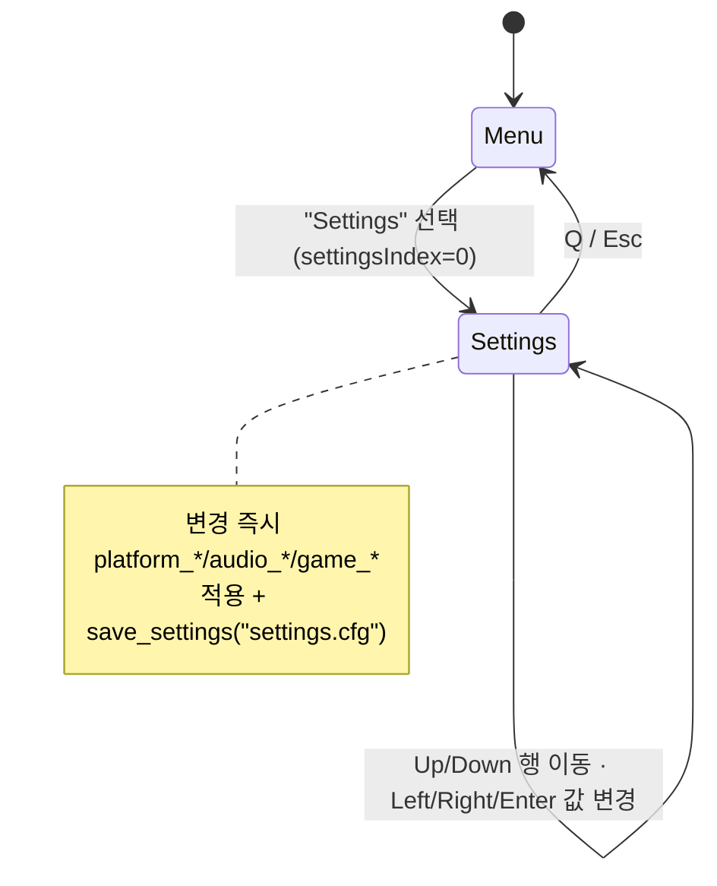
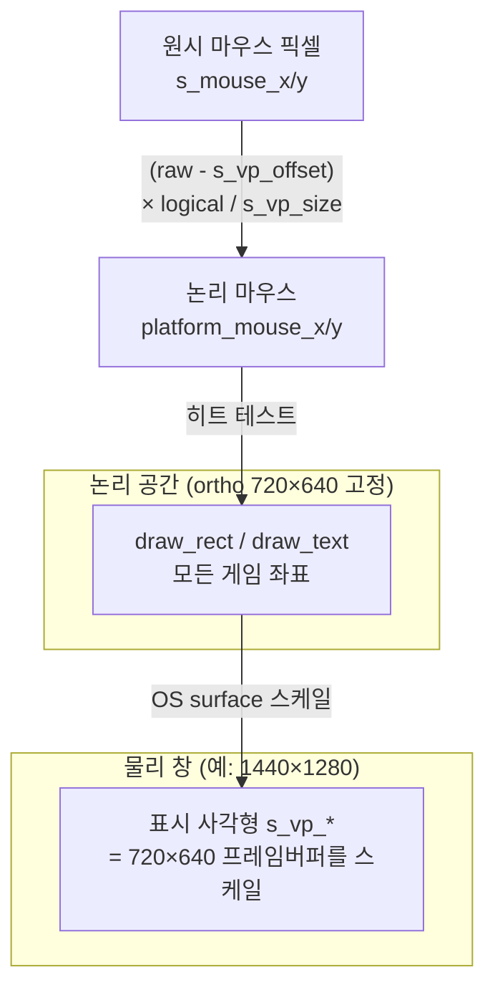

# Part 11: 설정 화면 — 해상도 · 오디오 · VSync, 그리고 결정성 불변식

> **시리즈:** 제로부터 멀티플레이어 테트리스 + RL까지
> [시리즈 목차](./README.md) · [이전: Part 10 — 메타와 랭킹](./part10-meta-and-ranking.md) · **Part 11** · [다음: Part 12 — 검수와 배포](./part12-hardening-and-release.md)

---

## 이 장의 구현 계약

- **선행 상태:** Part 3의 GUI, Part 4의 AppMode, Part 5의 오디오 API와 Part 10의
  사용자 UI가 동작한다.
- **이번 장의 파일:** `src/main.cpp`의 `GameSettings`/Settings 모드,
  `src/gui.*`, `platform/*`, `audio/*`.
- **연결점:** 설정은 표현과 입력 정책만 바꾸고 `SimGame` 상태·틱·wire protocol은
  바꾸지 않는다.
- **완료 게이트:** 저장/재시작 복원, 즉시 적용, 논리 좌표 역매핑을 확인하고 설정을
  바꿔도 동일 seed/input의 결정론 해시가 유지돼야 한다.

## 1. 들어가며

> **현재 저장 위치:** 초기 구현은 실행 디렉터리의 `settings.cfg`를 사용했지만,
> 현재 코드는 token과 같은 플랫폼별 user-data 디렉터리에 저장한다. 경로를 구할
> 수 없을 때만 실행 디렉터리로 폴백하고, 기존 cwd 파일은 1회 마이그레이션한다.
> 아래에서 `"settings.cfg"` 리터럴을 쓰는 코드는 도입 과정을 보여주는 중간
> 스냅샷이며 최종 코드는 `settingsPath`를 사용한다.

여기까지 게임은 "기능은 다 있는데 손볼 데가 없는" 상태다. 창은 720×640 고정, 볼륨은 켜짐/꺼짐, 화면 흔들림과 고스트 피스는 항상 ON. 이 장은 그 모든 것을 **인게임 설정 화면(`AppMode::Settings`)** 하나로 묶는다 — 해상도 프리셋·전체화면, BGM/SFX 볼륨 슬라이더, VSync, 화면 흔들림(마스터 + 하드드롭), 고스트 피스 토글. 변경은 즉시 반영되고 `settings.cfg` 에 저장돼 재시작에도 살아남는다.

이 장의 파일 경계는 다음과 같다.

- `src/main.cpp` — `struct GameSettings` + `settings.cfg` 영속(load/save), 시작 시 적용, 메뉴 항목 연결, `if (app == AppMode::Settings)` 화면 블록(8행 · 키보드/마우스 내비 · 즉시 적용+저장), 그리고 `apply_self_fx`/`apply_peer_fx` 의 하드드롭 흔들림 게이팅.
- `src/gui.h` / `src/gui.cpp` — 즉시모드 위젯 두 개를 추가: `gui_slider`(0~100) 와 `gui_value_selector`(`< 라벨 >`). 기존 `gui_checkbox` 와 함께 쓴다.
- `platform/platform.h` / `platform/sdl.cpp` — `platform_set_window_size` / `platform_set_fullscreen` / `platform_set_vsync`, 논리 좌표 추적(`s_logical_w/h`), 렌더 뷰포트 사각형(`s_vp_*`), `recompute_viewport()`, 그리고 마우스 좌표의 논리 역매핑. `win32.cpp` 에는 대응 구현/스텁이 있다.
- `audio/audio.h` / `audio/sdl_audio.cpp`(+ `audio/audio.cpp` 의 XAudio2 미러) — `audio_set_music_volume` / `audio_set_sfx_volume` 의 카테고리별 게인.
- `src/sim_game.h` / `src/sim_game.cpp` — 렌더 전용 1회 플래그 `hardDropEvent`.
- `src/game.h` / `src/game.cpp` — `game_set_ghost_enabled()` 와 게이트된 고스트 draw 사이트.
- `renderer/renderer.cpp` — ortho 가 720×640 고정이라는 사실(해상도 프리셋이 "그냥 스케일" 되는 근거).

**결정성 불변식을 맨 앞에 못박는다.** 이 장이 추가하는 모든 것은 *렌더 · 오디오 · 창 · 입력 UI* 전용이다. `SimGame` 의 상태도, 결정성 해시도, lockstep 입력 경로도, 리플레이도 단 한 비트도 건드리지 않는다. 유일하게 sim 에 새로 들어가는 필드(`hardDropEvent`) 조차 *해시에서 제외된* `mutable` 렌더 플래그다. 그래서 설정을 어떻게 바꾸든 같은 입력 시퀀스는 양쪽 클라이언트에서 같은 게임을 만든다.

이 불변식은 코드 주석에도 박혀 있다. `GameSettings` 정의 바로 위:

```cpp
// ── 게임 설정 (렌더/오디오 전용) ──────────────────────────────────────────────
//   settings.cfg (key=value 텍스트) 에 저장. 시작 시 로드, 변경 시마다 저장.
//   결정성 주의: 아래 플래그는 모두 렌더/오디오에만 영향 — SimGame 상태나
//   결정성 해시, lockstep 입력 경로를 절대 건드리지 않는다.
struct GameSettings {
    int  bgmVol  = 100;   // BGM 볼륨 0~100 (0 == 음소거)
    int  sfxVol  = 100;   // SFX 볼륨 0~100 (0 == 음소거)
    bool shakeOn = true;  // 마스터 화면 흔들림 (가비지/게임오버 + 하드드롭)
    bool hardDropShakeOn = true;  // 하드드롭 시 약한 흔들림 (shakeOn 의 하위)
    int  windowScale = 0; // 창 스케일 프리셋 0/1/2 → 720x640 / 1080x960 / 1440x1280
    bool fullscreen  = false;
    bool vsyncOn     = true;
    bool ghostOn     = true;  // 고스트 피스 표시
};
```

여덟 개 필드, 전부 기본값이 "현재 동작 유지" 다 — 설정 파일이 없으면 게임은 이 장 이전과 똑같이 720×640·풀볼륨·흔들림 ON 으로 뜬다.

## 2. `GameSettings` 영속 — `settings.cfg`

설정은 줄 단위 `key=value` 텍스트 파일 하나에 저장한다. 형식은 Part 9에서 봇
로스터를 읽던 `model/bots.cfg`와 같은 패턴이다 — `#` 주석 허용, 한 줄에 키
하나, 알 수 없는 키는 무시한다.

먼저 두 개의 관대한 파서 헬퍼를 둔다. bool 은 `1/true/on` 과 `0/false/off` 를 모두 받고, 정수는 범위로 클램프한다.

```cpp
static bool parse_bool01(const std::string& v, bool fallback)
{
    const std::string s = trim_copy(v);
    if (s == "1" || s == "true"  || s == "on")  return true;
    if (s == "0" || s == "false" || s == "off") return false;
    return fallback;
}

// 정수(예: 볼륨 0~100, 스케일 인덱스) 파싱. lo..hi 로 클램프. 비정상 시 fallback.
static int parse_int_clamped(const std::string& v, int fallback, int lo, int hi)
{
    const std::string s = trim_copy(v);
    if (s.empty()) return fallback;
    char* end = nullptr;
    long n = std::strtol(s.c_str(), &end, 10);
    if (end == s.c_str()) return fallback;
    if (n < lo) n = lo;
    if (n > hi) n = hi;
    return (int)n;
}
```

`fallback` 인자가 핵심이다. 파싱이 실패해도 *기본값* 으로 떨어지지, 0 이나 빈 값으로 망가지지 않는다. 손으로 편집된 `settings.cfg` 에 오타가 있어도 그 줄만 무시되고 나머지는 살아남는다.

로더는 파일이 없으면 그냥 기본값 구조체를 돌려준다 — 첫 실행에 설정 파일이 없는 건 에러가 아니다.

```cpp
// settings.cfg 로드. 파일이 없으면 기본값 반환 (load_bot_config 와 동일한 스타일).
static GameSettings load_settings(const char* path)
{
    GameSettings s;
    FILE* f = std::fopen(path, "rb");
    if (!f) return s;

    char line[256];
    while (std::fgets(line, sizeof(line), f)) {
        std::string ln(line);
        const size_t hash = ln.find('#');
        if (hash != std::string::npos) ln.resize(hash);
        const size_t eq = ln.find('=');
        if (eq == std::string::npos) continue;
        const std::string key = trim_copy(ln.substr(0, eq));
        const std::string val = ln.substr(eq + 1);
        // 볼륨 키 — 신형. 구형 호환: 과거 bgm=1/sfx=0 (bool) 도 받아 0/100 으로.
        if (key == "bgm_vol")        s.bgmVol = parse_int_clamped(val, s.bgmVol, 0, 100);
        else if (key == "sfx_vol")   s.sfxVol = parse_int_clamped(val, s.sfxVol, 0, 100);
        else if (key == "bgm")       s.bgmVol = parse_bool01(val, s.bgmVol > 0) ? 100 : 0;
        else if (key == "sfx")       s.sfxVol = parse_bool01(val, s.sfxVol > 0) ? 100 : 0;
        else if (key == "shake")     s.shakeOn = parse_bool01(val, s.shakeOn);
        else if (key == "harddrop_shake") s.hardDropShakeOn = parse_bool01(val, s.hardDropShakeOn);
        else if (key == "window_scale")   s.windowScale = parse_int_clamped(val, s.windowScale, 0, kWindowScaleCount - 1);
        else if (key == "fullscreen")     s.fullscreen = parse_bool01(val, s.fullscreen);
        else if (key == "vsync")          s.vsyncOn = parse_bool01(val, s.vsyncOn);
        else if (key == "ghost")          s.ghostOn = parse_bool01(val, s.ghostOn);
    }
    std::fclose(f);
    return s;
}
```

**하위 호환 분기에 주목한다.** 볼륨은 원래 켜짐/꺼짐 bool 이었다(`bgm=1`). 슬라이더로 넘어가면서 `bgm_vol=75` 같은 정수 키가 신형이 됐지만, 과거 `bgm=1`/`bgm=0` 으로 저장된 파일도 그대로 읽힌다 — bool 을 0/100 으로 승격한다. 키만 추가하고 옛 키를 살려두면, 이전 버전이 쓴 설정 파일이 새 버전에서 깨지지 않는다. 이게 "backward-tolerant 파싱" 의 실제 모습이다.

세이브는 항상 신형 키로만 쓴다. 정수는 그대로, bool 은 `0/1` 로.

```cpp
static void save_settings(const char* path, const GameSettings& s)
{
    FILE* f = std::fopen(path, "wb");
    if (!f) return;
    std::fprintf(f, "bgm_vol=%d\n",        s.bgmVol);
    std::fprintf(f, "sfx_vol=%d\n",        s.sfxVol);
    std::fprintf(f, "shake=%d\n",          s.shakeOn ? 1 : 0);
    std::fprintf(f, "harddrop_shake=%d\n", s.hardDropShakeOn ? 1 : 0);
    std::fprintf(f, "window_scale=%d\n",   s.windowScale);
    std::fprintf(f, "fullscreen=%d\n",     s.fullscreen ? 1 : 0);
    std::fprintf(f, "vsync=%d\n",          s.vsyncOn ? 1 : 0);
    std::fprintf(f, "ghost=%d\n",          s.ghostOn ? 1 : 0);
    std::fclose(f);
}
```

스케일 프리셋과 그 라벨은 상수 테이블로 둔다. 인덱스 0/1/2 가 곧 `windowScale` 값이다.

```cpp
// 창 스케일 프리셋 (9:8 비율 유지). windowScale 인덱스 → (w,h).
static constexpr int kWindowScaleCount = 3;
static constexpr int kWindowScaleW[kWindowScaleCount] = { 720, 1080, 1440 };
static constexpr int kWindowScaleH[kWindowScaleCount] = { 640,  960, 1280 };
static const char*   kWindowScaleLabel[kWindowScaleCount] = {
    "720 x 640", "1080 x 960", "1440 x 1280" };

// 전역 설정. apply_self_fx/apply_peer_fx 람다(트리거 시점) 에서 shake 를 게이트한다.
static GameSettings g_settings;
```

세 프리셋 모두 720:640 = **9:8** 비율을 유지한다. 이게 §5 의 왜곡 없는 스케일링의 전제다.

설정은 `platform_init`/`renderer_init` 직후, 게임 루프 진입 전에 한 번 적용한다. 순서가 중요하다 — 창과 렌더러가 떠 있어야 창 크기·vsync 를 바꿀 수 있고, 오디오는 첫 재생이 일어나기 전에 볼륨 플래그가 서 있어야 한다.

```cpp
    // ── 사용자 설정 로드 (렌더/오디오 전용) ───────────────────────────────────
    //   오디오 토글 플래그를 미리 세팅한다. 실제 audio_init 은 Game 생성자에서
    //   호출되며, 그 시점의 첫 audio_play_music/sound 가 이 플래그를 존중한다.
    //   shake 플래그는 트리거 시점(apply_self_fx/apply_peer_fx)에서 읽는다.
    std::string settingsPath = meta::client::settings_file_path();
    if (settingsPath.empty()) settingsPath = "settings.cfg";
    // 현재 구현은 기존 cwd/settings.cfg가 있으면 user-data 경로로 1회 이관한다.
    g_settings = load_settings(settingsPath.c_str());
    // 오디오: 볼륨 슬라이더가 토글을 대체. 0 == 음소거. enabled 도 같이 세팅해
    // off→on 복원 경로(audio_set_music_enabled)와 일관되게 유지한다.
    audio_set_music_enabled(g_settings.bgmVol > 0);
    audio_set_sfx_enabled(g_settings.sfxVol > 0);
    audio_set_music_volume(g_settings.bgmVol / 100.0f);
    audio_set_sfx_volume(g_settings.sfxVol / 100.0f);

    // 윈도우: 저장된 스케일 프리셋 적용 + (저장되어 있으면) 전체화면 + vsync.
    //   렌더러 ortho 는 항상 720×640 — 창만 스케일/레터박스된다.
    platform_set_window_size(kWindowScaleW[g_settings.windowScale],
                             kWindowScaleH[g_settings.windowScale]);
    if (g_settings.fullscreen) platform_set_fullscreen(true);
    platform_set_vsync(g_settings.vsyncOn);

    // 고스트 피스 표시.
    game_set_ghost_enabled(g_settings.ghostOn);
```

이 시점에서 빌드하면, `settings.cfg` 에 `window_scale=1` 만 적어두고 실행해도 게임이 1080×960 창으로 뜬다 — 아직 인게임 설정 화면은 없지만 파일 영속은 동작한다.

## 3. 즉시모드 위젯 확장 — 슬라이더와 선택기

설정 화면은 즉시모드 GUI(immediate-mode) 로 만든다. 위젯 트리도, retained 상태도 없다 — 매 프레임 렌더 루프 안에서 위젯 함수를 부르면 그 함수가 그 자리에서 그리고, 그 프레임의 입력을 보고 결과를 반환한다. Part 4 의 `gui_button` 이 이미 그 방식이었고, 설정 화면을 위해 두 위젯을 더한다.

### 3.1 `gui_slider` — 0~100 트랙

슬라이더는 트랙(가는 가로 바)·채워진 구간(fill)·노브로 그린다. 반환값은 새 퍼센트값이다 — 드래그 중이면 마우스 x 를 0~100 으로 환산해 돌려주고, 아니면 입력값을 그대로 돌려준다.

```cpp
int gui_slider(int x, int y, int w, int h, int valuePct, bool highlighted)
{
    if (valuePct < 0)   valuePct = 0;
    if (valuePct > 100) valuePct = 100;

    const bool hover = gui_hover_rect(x, y, w, h);

    // 트랙 — 가는 가로 바 (세로 중앙). 채워진 구간은 강조색.
    const int trackH = 6;
    const int trackY = y + (h - trackH) / 2;
    Color trackBg   = {60, 66, 96, 255};
    Color fillColor = highlighted ? kBtnHighlight : kBtnHoverBg;
    const int fillW = w * valuePct / 100;
    draw_rect(x, trackY, w, trackH, trackBg);
    draw_rect(x, trackY, fillW, trackH, fillColor);

    // 노브 — 채워진 구간 끝의 작은 사각형.
    const int knobW = 10;
    const int knobX = x + fillW - knobW / 2;
    const Color knob = (hover || highlighted) ? WHITE : Color{200, 205, 225, 255};
    draw_rect(knobX, y + h / 2 - knobW, knobW, knobW * 2, knob);

    // 드래그/클릭 — 트랙 위에서 좌버튼이 눌려있으면 그 x 위치로 값을 설정.
    if (hover && platform_mouse_down(0)) {
        int mx = platform_mouse_x();
        int v  = (w > 0) ? (mx - x) * 100 / w : valuePct;
        if (v < 0)   v = 0;
        if (v > 100) v = 100;
        return v;
    }
    return valuePct;
}
```

여기서 `platform_mouse_x()` 가 **논리 좌표**(720×640 기준) 라는 점이 §5 와 맞물린다. 위젯은 논리 좌표 `x`/`w` 로 그려졌으므로, 마우스도 같은 논리 좌표로 들어와야 `(mx - x) * 100 / w` 가 맞는다. 만약 마우스가 *물리 픽셀* 이었다면 1440×1280 창에서 슬라이더를 클릭할 때 값이 두 배로 어긋난다.

### 3.2 `gui_value_selector` — `< 라벨 >`

선택기는 양끝 화살표 `<` `>` 와 가운데 라벨로 된 위젯이다. 클릭한 쪽에 따라 `-1`/`0`/`+1` 을 반환한다 — 값 자체는 호출부가 관리하고, 위젯은 "어느 방향으로 한 칸" 만 알려준다.

```cpp
int gui_value_selector(int x, int y, int w, int h, const char* label,
                       bool highlighted)
{
    // 양끝 화살표 버튼 영역 (정사각형). 중앙은 라벨.
    const int arrowW = h;
    const Color arrowIdle = highlighted ? kBtnHighlight : Color{180, 190, 220, 255};

    const bool hoverL = gui_hover_rect(x, y, arrowW, h);
    const bool hoverR = gui_hover_rect(x + w - arrowW, y, arrowW, h);

    // ◀ 왼쪽 삼각형 (세 줄 사각형으로 근사) / ▶ 오른쪽.
    const Color cL = hoverL ? WHITE : arrowIdle;
    const Color cR = hoverR ? WHITE : arrowIdle;
    const int fs = h - 6;
    draw_text("<", x + (arrowW - measure_text("<", fs)) / 2, y + 3, fs, cL);
    draw_text(">", x + w - arrowW + (arrowW - measure_text(">", fs)) / 2, y + 3, fs, cR);

    // 중앙 라벨.
    const Color labelColor = highlighted ? kBtnHighlight : WHITE;
    const int tw = measure_text(label, fs);
    draw_text(label, x + (w - tw) / 2, y + 3, fs, labelColor);

    if (hoverL && platform_mouse_pressed(0)) return -1;
    if (hoverR && platform_mouse_pressed(0)) return +1;
    return 0;
}
```

기존 `gui_checkbox` 는 그대로 쓴다 — `bool` 토글 행(전체화면·흔들림·VSync·고스트)에 재사용한다. 세 위젯의 헤더 선언은 다음과 같다.

```cpp
bool gui_checkbox(int x, int y, int size, const char* label, bool checked,
```

```cpp
int  gui_slider(int x, int y, int w, int h, int valuePct, bool highlighted);
```

```cpp
int  gui_value_selector(int x, int y, int w, int h, const char* label,
```

즉시모드의 이점은 설정 화면 같은 *간헐적이고 단순한* UI 에 딱 맞는다는 것이다. 위젯의 "상태"(현재 값·하이라이트 여부)는 전부 호출부(`g_settings` + `settingsIndex`)가 들고 있고, 위젯 함수는 그릴 때마다 그 상태를 받아 그리고 결과만 돌려준다. 매 프레임 호출이라 값이 항상 최신이고, 동기화 버그가 끼어들 틈이 없다.

## 4. 설정 화면 — `AppMode::Settings`

### 4.1 메뉴 연결

메인 메뉴에 `"Settings"` 항목을 끼운다. 메뉴는 문자열 배열 + 인덱스로 도는 즉시모드 리스트다.

```cpp
            const char* items[] = {
                "Single Play",
                "Single vs Bot",
                "Matchmaking Multi",
                "Custom Room Multi",
                "Settings",
                "Quit",
            };
            constexpr int kMenuCount = 6;
```

`"Settings"`(인덱스 4) 를 고르면 `AppMode::Settings` 로 전환하고 커서를 첫 행으로 리셋한다.

```cpp
                } else if (activated == 4) {
                    app = AppMode::Settings;
                    settingsIndex = 0;
```



### 4.2 행 구성과 내비게이션

설정 화면은 8개의 타입별 행으로 이뤄진다. 행 종류를 `enum RowKind` 로 두고, 위에서부터 스케일 선택기 → 전체화면 → 흔들림(마스터/하드드롭) → 볼륨 슬라이더(BGM/SFX) → VSync → 고스트 순이다.

```cpp
        if (app == AppMode::Settings)
        {
            draw_text("Settings", 270, 60, 40, WHITE);

            // 행 종류: 체크박스 / 볼륨 슬라이더 / 스케일 선택기.
            enum RowKind { ROW_SCALE, ROW_FULLSCREEN, ROW_SHAKE, ROW_HARDDROP,
                           ROW_BGM, ROW_SFX, ROW_VSYNC, ROW_GHOST };
            constexpr int kSettingsRows = 8;

            // 키보드 상하 커서 이동.
            if (platform_key_pressed(PKEY_DOWN))
                settingsIndex = (settingsIndex + 1) % kSettingsRows;
            if (platform_key_pressed(PKEY_UP))
                settingsIndex = (settingsIndex + kSettingsRows - 1) % kSettingsRows;

            const bool kLeft  = platform_key_pressed(PKEY_LEFT);
            const bool kRight = platform_key_pressed(PKEY_RIGHT);
            const bool kEnter = platform_key_pressed(PKEY_ENTER)
                             || platform_key_pressed(PKEY_SPACE);

            // 변경이 발생했는지 추적 → 즉시 적용 + 저장.
            bool changed = false;
```

Up/Down 은 커서(`settingsIndex`) 를 행 사이로 순환시킨다. Left/Right/Enter 는 *현재 커서가 있는 행* 의 값을 조정한다. 마우스는 그와 별개로 어느 행이든 직접 클릭할 수 있다 — 키보드와 마우스가 한 화면에서 공존한다.

행 레이아웃 상수와 라벨/커서 강조 헬퍼:

```cpp
            const int labelX  = 150;   // 행 라벨 x
            const int ctrlX   = 360;   // 컨트롤(체크박스/슬라이더/선택기) x
            const int rowY0   = 130;
            const int rowGap  = 52;
            const int boxSize = 26;
            const int ctrlW   = 220;   // 슬라이더/선택기 폭

            auto rowY = [&](int i) { return rowY0 + i * rowGap; };

            // 라벨 + 커서 강조 표식. 각 행 공통.
            auto draw_label = [&](int i, const char* text) {
                const Color c = (i == settingsIndex) ? YELLOW : WHITE;
                draw_text(text, labelX, rowY(i) + 2, 22, c);
            };
```

커서가 있는 행의 라벨은 노란색, 나머지는 흰색이다. `highlighted` 인자(`i == settingsIndex`)가 위젯 쪽으로도 같이 넘어가 키보드 대상이 시각적으로 드러난다.

### 4.3 스케일 선택기 행

첫 행은 `gui_value_selector` 로 만든다. 마우스 화살표 클릭은 `dir` 로, 키보드 Left/Right 도 `dir` 로 모인 뒤 한 군데서 처리한다.

```cpp
            // ── ROW_SCALE: 창 스케일 선택기 ──────────────────────────────────
            draw_label(ROW_SCALE, "Window");
            {
                int dir = gui_value_selector(ctrlX, rowY(ROW_SCALE), ctrlW, boxSize,
                                             kWindowScaleLabel[g_settings.windowScale],
                                             settingsIndex == ROW_SCALE);
                if (settingsIndex == ROW_SCALE) {
                    if (kLeft)  dir = -1;
                    if (kRight) dir = +1;
                }
                if (dir != 0) {
                    int ns = (g_settings.windowScale + dir + kWindowScaleCount)
                             % kWindowScaleCount;
                    if (ns != g_settings.windowScale) {
                        g_settings.windowScale = ns;
                        g_settings.fullscreen = false;  // 스케일 변경은 창모드로
                        platform_set_window_size(kWindowScaleW[ns], kWindowScaleH[ns]);
                        changed = true;
                    }
                }
            }
```

스케일을 바꾸면 자동으로 전체화면 플래그를 끈다 — "특정 크기의 창" 과 "전체화면" 은 상호배타이므로, 프리셋을 고르면 창모드로 빠진다.

### 4.4 체크박스 행과 슬라이더 행 헬퍼

나머지 행은 두 람다로 처리한다. 체크박스 헬퍼는 클릭이든 키보드든 토글이 일어나면 `true` 를 돌려준다.

```cpp
            // ── 체크박스 행 헬퍼 ────────────────────────────────────────────
            auto checkbox_row = [&](int i, const char* label, bool& val) -> bool {
                draw_label(i, label);
                char rl[32];
                std::snprintf(rl, sizeof(rl), "%s", val ? "ON" : "OFF");
                bool clicked = gui_checkbox(ctrlX, rowY(i), boxSize, rl, val,
                                            i == settingsIndex);
                bool key = (i == settingsIndex) && (kEnter || kLeft || kRight);
                if (clicked || key) { val = !val; return true; }
                return false;
            };
```

전체화면 행은 토글 후 즉시 `platform_set_fullscreen` 을 부르고, 창모드로 돌아올 때는 저장된 스케일 크기로 복원한다.

```cpp
            // ── ROW_FULLSCREEN ──────────────────────────────────────────────
            if (checkbox_row(ROW_FULLSCREEN, "Fullscreen", g_settings.fullscreen)) {
                platform_set_fullscreen(g_settings.fullscreen);
                // 창모드 복귀 시 저장된 스케일 크기로 되돌린다.
                if (!g_settings.fullscreen)
                    platform_set_window_size(kWindowScaleW[g_settings.windowScale],
                                             kWindowScaleH[g_settings.windowScale]);
                changed = true;
            }

            // ── ROW_SHAKE (마스터) ──────────────────────────────────────────
            if (checkbox_row(ROW_SHAKE, "Screen shake", g_settings.shakeOn))
                changed = true;

            // ── ROW_HARDDROP ────────────────────────────────────────────────
            if (checkbox_row(ROW_HARDDROP, "Hard-drop shake", g_settings.hardDropShakeOn))
                changed = true;
```

볼륨 슬라이더 헬퍼는 `gui_slider` 를 감싸고, 키보드 Left/Right 는 5% 단위로 움직인다.

```cpp
            // ── 볼륨 슬라이더 헬퍼 ──────────────────────────────────────────
            auto slider_row = [&](int i, const char* label, int& vol) -> bool {
                char lab[32];
                std::snprintf(lab, sizeof(lab), "%s  %d%%", label, vol);
                draw_label(i, lab);
                int nv = gui_slider(ctrlX, rowY(i), ctrlW, boxSize, vol,
                                    i == settingsIndex);
                if (i == settingsIndex) {
                    if (kLeft)  nv = vol - 5;
                    if (kRight) nv = vol + 5;
                    if (nv < 0)   nv = 0;
                    if (nv > 100) nv = 100;
                }
                if (nv != vol) { vol = nv; return true; }
                return false;
            };

            // ── ROW_BGM ─────────────────────────────────────────────────────
            if (slider_row(ROW_BGM, "BGM", g_settings.bgmVol)) {
                audio_set_music_enabled(g_settings.bgmVol > 0);
                audio_set_music_volume(g_settings.bgmVol / 100.0f);
                changed = true;
            }
            // ── ROW_SFX ─────────────────────────────────────────────────────
            if (slider_row(ROW_SFX, "SFX", g_settings.sfxVol)) {
                audio_set_sfx_enabled(g_settings.sfxVol > 0);
                audio_set_sfx_volume(g_settings.sfxVol / 100.0f);
                changed = true;
            }
```

마지막 두 토글은 VSync 와 고스트다.

```cpp
            // ── ROW_VSYNC ───────────────────────────────────────────────────
            if (checkbox_row(ROW_VSYNC, "60 FPS pacing", g_settings.vsyncOn)) {
                platform_set_vsync(g_settings.vsyncOn);
                changed = true;
            }

            // ── ROW_GHOST ───────────────────────────────────────────────────
            if (checkbox_row(ROW_GHOST, "Ghost piece", g_settings.ghostOn)) {
                game_set_ghost_enabled(g_settings.ghostOn);
                changed = true;
            }

            if (changed) settingsDirty = true;
            if (settingsDirty && !platform_mouse_down(0)) {
                save_settings(settingsPath.c_str(), g_settings);
                settingsDirty = false;
            }

            draw_text("[Up/Down] Select   [Left/Right] Adjust   [Q] Back",
                      130, 604, 16, GRAY);

            if (platform_key_pressed(PKEY_Q) || platform_key_pressed(PKEY_ESCAPE))
                app = AppMode::Menu;
        }
```

전체 흐름은 **즉시 적용 + 변경 묶음 저장**이다. 값은 그 자리에서 서브시스템에
적용하고, 키보드 변경은 즉시 저장한다. 슬라이더 드래그는 매 프레임 파일을 쓰지
않도록 마우스 버튼을 놓을 때 한 번 저장한다. `Q`/`Esc`로 메뉴로 돌아갈 때도
남은 dirty 상태를 저장한다.

## 5. 해상도 — 9:8 고정 비율과 마우스 역매핑

이 장에서 가장 가르칠 게 많은 부분이다.

### 5.1 내부 해상도는 720×640 고정

렌더러의 ortho 투영은 `renderer_init(720, 640)` 으로 한 번 설정된 뒤 *절대 바뀌지 않는다*. 게임의 모든 좌표(보드, UI, 텍스트) 는 항상 720×640 논리 공간에 그려진다.

```cpp
static void build_ortho(float* m, float w, float h)
{
    float l = 0.0f, r = w, t = 0.0f, b = h, n = -1.0f, f = 1.0f;
    memset(m, 0, 16 * sizeof(float));
    m[0]  =  2.0f / (r - l);
    m[5]  =  2.0f / (t - b);
    m[10] = -2.0f / (f - n);
    m[12] = -(r + l) / (r - l);
    m[13] = -(t + b) / (t - b);
    m[14] = -(f + n) / (f - n);
    m[15] = 1.0f;
}
```

해상도 프리셋이 하는 일은 720×640 CPU 프레임버퍼의 **표시 사각형**만 키우는 것이다. 플랫폼 계층이 완성된 프레임버퍼를 1080×960 창 표면으로 확대하므로, 게임 로직은 자기가 1440×1280 창에 떠 있는지 전혀 모른다 — `draw_rect(360, 320, ...)` 는 언제나 논리 중앙이다.

이게 "프리셋이 그냥 스케일된다" 의 핵심이다. 세 프리셋이 모두 9:8 이므로, 720×640 의 ortho 와 종횡비가 같다. 같은 비율을 같은 비율로 키우면 **왜곡이 없다.**

### 5.2 뷰포트 재계산 — 9:8 vs 전체화면 레터박스

`recompute_viewport()` 가 창 크기에 맞춰 뷰포트 사각형(`s_vp_*`) 을 다시 잡는다. 창 종횡비가 논리 종횡비와 (거의) 같으면 레터박스 없이 창 전체를 쓰고, 다르면(전체화면에서 모니터가 16:9 라면) 9:8 을 유지하는 중앙 사각형 + 검은 바를 만든다.

```cpp
static void recompute_viewport()
{
    if (s_logical_w <= 0 || s_logical_h <= 0 || s_win_w <= 0 || s_win_h <= 0) {
        s_vp_x = s_vp_y = 0;
        s_vp_w = s_win_w; s_vp_h = s_win_h;
        return;
    }
    // 창과 논리 종횡비가 (거의) 같으면 레터박스 불필요 — 창 전체 사용.
    const double winAR = (double)s_win_w / (double)s_win_h;
    const double logAR = (double)s_logical_w / (double)s_logical_h;
    if (std::abs(winAR - logAR) < 1e-3) {
        s_vp_x = s_vp_y = 0;
        s_vp_w = s_win_w; s_vp_h = s_win_h;
    } else if (winAR > logAR) {
        // 창이 더 넓음 → 좌우 필러박스. 높이를 꽉 채우고 폭을 맞춤.
        s_vp_h = s_win_h;
        s_vp_w = (int)((double)s_win_h * logAR + 0.5);
        s_vp_x = (s_win_w - s_vp_w) / 2;
        s_vp_y = 0;
    } else {
        // 창이 더 높음 → 상하 레터박스.
        s_vp_w = s_win_w;
        s_vp_h = (int)((double)s_win_w / logAR + 0.5);
        s_vp_x = 0;
        s_vp_y = (s_win_h - s_vp_h) / 2;
    }
}
```

스케일 프리셋(720×640, 1080×960, 1440×1280) 은 모두 9:8 이므로 첫 분기(`< 1e-3`)에 걸려 창 전체를 채운다 — 레터박스가 없다. 전체화면에서 모니터가 9:8 이 아닐 때만 둘째/셋째 분기로 가서 검은 바가 생긴다. 어느 경우든 그려지는 *내용* 은 9:8 비율을 유지하므로 늘어나거나 찌그러지지 않는다.

### 5.3 마우스 좌표 역매핑 — 핵심 함정

뷰포트를 키웠으면 **마우스 좌표를 논리 720×640 공간으로 되돌려야 한다.** 이걸 빼먹으면 1440×1280 창에서 버튼을 클릭할 때 실제 히트 위치가 두 배로 어긋난다 — 화면 좌상단을 눌렀는데 게임은 논리 중앙을 클릭한 것으로 인식한다. 위젯은 논리 좌표로 히트 테스트하므로, 마우스도 같은 좌표계로 들어와야 한다.

`platform_mouse_x/y` 가 원시 창 픽셀을 뷰포트 사각형 기준으로 역매핑한다.

```cpp
// 원시 창 픽셀 → 논리(720×640) 좌표 역매핑. 뷰포트 사각형(s_vp_*) 기준:
//   logical = (raw - vpOffset) * logicalSize / vpSize.
// 레터박스 바 영역(뷰포트 밖)을 클릭하면 음수/범위밖 좌표가 되어 어떤
// 위젯에도 안 맞는다 — 의도된 동작.
int platform_mouse_x()
{
    if (s_vp_w <= 0 || s_logical_w <= 0) return s_mouse_x;
    return (int)((double)(s_mouse_x - s_vp_x) * s_logical_w / s_vp_w);
}
int platform_mouse_y()
{
    if (s_vp_h <= 0 || s_logical_h <= 0) return s_mouse_y;
    return (int)((double)(s_mouse_y - s_vp_y) * s_logical_h / s_vp_h);
}
```

공식은 `logical = (raw - vpOffset) * logicalSize / vpSize` 다. 뷰포트 오프셋(`s_vp_x`) 을 먼저 빼서 레터박스 바를 보정하고, 논리/물리 크기 비로 스케일을 되돌린다. 레터박스 바(뷰포트 밖) 를 클릭하면 음수나 범위 밖 좌표가 나와 어떤 위젯에도 안 맞는다 — 의도된 동작이다.

`platform_set_window_size`/`platform_set_fullscreen` 은 창을 바꾼 뒤 *드로어블 픽셀 크기* 를 직접 질의(HiDPI 대응)하고 `recompute_viewport()` 를 부른다.

```cpp
void platform_set_window_size(int w, int h)
{
    if (!s_win || w <= 0 || h <= 0) return;
    if (s_fullscreen) {
        // 전체화면 중에는 창 크기 변경이 의미 없다 — 먼저 창모드로 돌려야 함.
        SDL_SetWindowFullscreen(s_win, 0);
        s_fullscreen = false;
    }
    SDL_SetWindowSize(s_win, w, h);
    SDL_SetWindowPosition(s_win, SDL_WINDOWPOS_CENTERED, SDL_WINDOWPOS_CENTERED);
    SDL_GetWindowSize(s_win, &s_win_w, &s_win_h);
    recompute_viewport();
}
```



`win32.cpp` 에도 같은 `s_vp_*` 계산과 마우스 역매핑이 있다. 클라이언트 영역이 정확히 `(w,h)`가 되도록 창 외곽을 조정하고, `StretchDIBits`의 목적지 사각형에 레터박스를 적용한다. 전체화면 토글만 no-op 스텁으로 남아 있다.

```cpp
void platform_set_fullscreen(bool /*on*/)
{
    // Win32 전체화면 미구현 (런타임 대상은 SDL). 마우스 논리 매핑/레터박스도
    // SDL 쪽에만 있다 — 여기서는 의도적으로 no-op.
}
```

## 6. 오디오 볼륨 — 카테고리별 게인

볼륨은 BGM/SFX 두 카테고리로 나뉜다. SDL 백엔드는 소프트웨어 믹서라, 각 보이스를 합산하기 전에 카테고리 게인을 곱한다. `audio_set_music_volume`/`audio_set_sfx_volume` 은 0~1 로 클램프해 전역 게인 변수에 저장한다.

```cpp
void audio_set_music_volume(float v01)
{
    if (v01 < 0.0f) v01 = 0.0f;
    if (v01 > 1.0f) v01 = 1.0f;
    std::lock_guard<std::mutex> lk(s_mu);
    s_musicVol = v01;
}

void audio_set_sfx_volume(float v01)
{
    if (v01 < 0.0f) v01 = 0.0f;
    if (v01 > 1.0f) v01 = 1.0f;
    std::lock_guard<std::mutex> lk(s_mu);
    s_sfxVol = v01;
}
```

믹스 콜백은 BGM 보이스에 `s_musicVol` 을, SFX 보이스들에 `s_sfxVol` 을 넘긴다.

```cpp
static void SDLCALL audio_callback(void* /*ud*/, Uint8* stream, int len)
{
    int16_t* out = (int16_t*)stream;
    int frames   = len / (s_have.channels * (int)sizeof(int16_t));
    memset(stream, 0, (size_t)len);

    std::lock_guard<std::mutex> lk(s_mu);
    mix_voice(s_bgm, out, frames, s_have.channels, s_musicVol);
    for (int i = 0; i < MAX_SFX_VOICES; ++i)
        mix_voice(s_sfx[i], out, frames, s_have.channels, s_sfxVol);
}
```

`mix_voice` 는 각 샘플에 게인을 곱한 뒤 포화 합산(saturating add) 한다. 게인이 0 이면 그 카테고리는 무음이 된다 — 그래서 슬라이더 0% 가 곧 음소거다.

```cpp
        // 카테고리 게인 적용 후 포화 합산
        for (int c = 0; c < outChannels; ++c) {
            int s = (int)((c == 0) ? l : r);
            s = (int)(s * gain);
            int acc = (int)out[f * outChannels + c] + s;
            if (acc >  32767) acc =  32767;
            if (acc < -32768) acc = -32768;
            out[f * outChannels + c] = (int16_t)acc;
        }
```

Windows 의 XAudio2 백엔드(`audio/audio.cpp`) 는 같은 시그니처를 보이스 단위 `SetVolume` 으로 미러링한다 — 소프트웨어 믹스 대신 하드웨어/드라이버 보이스에 볼륨을 위임한다. 음악은 재생 중인 마스터 보이스에 즉시 반영하고, SFX 는 다음 재생부터 각 소스 보이스에 적용한다.

```cpp
void audio_set_music_volume(float v01)
{
    if (v01 < 0.0f) v01 = 0.0f;
    if (v01 > 1.0f) v01 = 1.0f;
    s_musicVol = v01;
    if (s_musicVoice) s_musicVoice->SetVolume(s_musicVol);  // 재생 중이면 즉시 반영
}

void audio_set_sfx_volume(float v01)
{
    if (v01 < 0.0f) v01 = 0.0f;
    if (v01 > 1.0f) v01 = 1.0f;
    s_sfxVol = v01;  // 다음 audio_play_sound 부터 적용
}
```

두 백엔드가 같은 `audio.h` 시그니처를 구현하므로, 설정 화면 코드는 어느 플랫폼인지 신경 쓰지 않는다. `audio_set_music_volume(g_settings.bgmVol / 100.0f)` 한 줄이 SDL 에서는 믹서 게인을, Windows 에서는 보이스 `SetVolume` 을 부른다.

## 7. VSync — 찢김 vs 입력 지연

기존 설정 키 이름은 호환성을 위해 `vsync`로 유지하지만, UI 의미는 **60 FPS pacing**이다. 소프트웨어 surface 표시에는 GPU swap interval이 없으므로 프레임 끝에 남은 시간을 쉰다.

```cpp
void platform_set_vsync(bool on)
{
    s_frame_pacing = on;
}
```

ON이면 `platform_end_frame()`이 한 프레임을 약 16.67ms로 맞춘다. 이것은 CPU 사용량과 렌더 빈도를 안정시키지만 디스플레이 vblank와 직접 동기화하지 않으므로 tearing 제거를 보장하지는 않는다. OFF이면 게임 루프가 가능한 한 빠르게 렌더한다.

결정성 관점에서는 둘 다 안전하다. pacing은 *언제 그리느냐*만 바꾸고 *무엇을 시뮬레이션하느냐*는 건드리지 않는다. 게임 루프는 Part 4의 60Hz fixed-step 누산기로 도므로 렌더 프레임률이 흔들려도 시뮬레이션 틱 결과는 동일하다.

## 8. 하드드롭 흔들림과 고스트 토글

### 8.1 렌더 전용 `hardDropEvent`

화면 흔들림은 두 단계로 게이트된다 — 마스터 `shakeOn` 과 그 하위인 `hardDropShakeOn`. 마스터를 끄면 모든 흔들림이 멎고, 마스터는 켜되 하드드롭만 끄면 가비지/게임오버 흔들림은 남고 하드드롭의 약한 흔들림만 사라진다.

문제는 "하드드롭이 일어났다" 를 어떻게 아느냐다. 이미 `dropSoundEvent` 라는 1회 플래그가 있지만, 그건 **오디오(game.cpp) 가 소비·리셋** 한다. 흔들림이 그 플래그에 의존하면 오디오가 먼저 리셋해버려 흔들림이 누락될 수 있다. 그래서 흔들림 전용 1회 플래그 `hardDropEvent` 를 별도로 둔다.

```cpp
    mutable bool rotateSoundEvent  = false;
    mutable bool clearSoundEvent   = false;
    mutable bool dropSoundEvent    = false;  // 하드드롭(Space) 시
    mutable bool garbageSoundEvent = false;  // 가비지 행 수신 시
    // 하드드롭 화면 흔들림(약) 트리거용. dropSoundEvent 와 별개 — 그쪽은
    // 오디오(game.cpp)가 소비·리셋하므로 흔들림이 그것에 의존하면 안 된다.
    // 렌더 전용 1회 플래그 (해시/lockstep/replay 와 무관).
    mutable bool hardDropEvent     = false;  // 하드드롭(Space) 시 (흔들림용)
```

하드드롭(`MoveBlockDrop`) 에서 두 플래그를 함께 세운다.

```cpp
    currentBlock.Move(-1, 0);
    dropSoundEvent = true;
    hardDropEvent  = true;   // 흔들림용 (렌더 전용, 해시 무관)
    LockBlock();
```

**이 플래그가 결정성 해시에 들어가지 않는 이유** 는 기존 `*SoundEvent` 들과 같다 — `mutable` 이고, sim *상태* 가 아니라 "이번 틱에 이런 일이 있었다" 는 *렌더 측 알림* 이다. `StateHashBreakdown()` 은 grid·블록·RNG·score/플래그/중력/레벨만 해시한다.

```cpp
SimGame::HashBreakdown SimGame::StateHashBreakdown() const
{
    HashBreakdown b{};
    constexpr uint64_t BASE = 14695981039346656037ull;

    // Grid
    b.grid = fnv1a64(&sim_grid.grid[0][0], sizeof(sim_grid.grid), BASE);
```

`hardDropEvent`(그리고 `*SoundEvent`) 는 이 목록에 없다. `mutable` 이라 `const` 인 해시 함수가 봐도 그만이지만, 애초에 해시 대상이 아니다 — 양쪽 클라이언트에서 흔들림이 한쪽만 떠도 게임 상태 해시는 똑같다.

### 8.2 트리거 시점 게이팅과 흔들림 공존

흔들림은 매 틱 이펙트 적용 람다(`apply_self_fx`/`apply_peer_fx`) 에서 트리거된다. 여기서 `g_settings.shakeOn`/`hardDropShakeOn` 을 읽어 게이트하고, 소비한 플래그를 리셋한다.

```cpp
    auto apply_self_fx = [&](SimGame& sim, Callout& co) {
        if (sim.lastTSpinLines >= 0)
            trigger_tspin_callout(co, sim.lastTSpinLines);
        else if (sim.lastLinesCleared > 0)
            trigger_callout(co, sim.lastLinesCleared);
        if (g_settings.shakeOn && sim.lastGarbageReceived > 0)
            shake_trigger(shakeLeft, 6.0f, 0.20f);
        if (g_settings.shakeOn && sim.gameOverEvent)
            shake_trigger(shakeLeft, 16.0f, 0.50f);
        // 하드드롭 약한 흔들림. shake_trigger 는 더 강한 진행 중 흔들림을
        // 덮어쓰지 않으므로 가비지/게임오버 흔들림을 끊지 않는다.
        if (g_settings.shakeOn && g_settings.hardDropShakeOn && sim.hardDropEvent)
            shake_trigger(shakeLeft, 2.5f, 0.10f);
        sim.hardDropEvent = false;
        sim.lastLinesCleared = 0;
        sim.lastTSpinLines = -1;
        sim.lastGarbageReceived = 0;
        sim.gameOverEvent = false;
    };
```

하드드롭 흔들림은 진폭 2.5·지속 0.10 으로 약하다. 핵심은 `shake_trigger` 가 **더 강한 진행 중 흔들림을 덮어쓰지 않는다** 는 것이다 — 가비지(6.0/0.20) 나 게임오버(16.0/0.50) 흔들림이 도는 도중에 하드드롭이 일어나도, 약한 하드드롭 흔들림이 강한 흔들림을 끊지 않는다. 두 흔들림이 자연스럽게 공존한다. `apply_peer_fx` 도 같은 로직을 `shakeRight` 에 적용한다(상대 보드 쪽 흔들림).

마스터를 끄면(`shakeOn = false`) 세 `if` 가 모두 막혀 어떤 흔들림도 트리거되지 않는다. 단 플래그 리셋(`sim.hardDropEvent = false` 등) 은 게이팅과 무관하게 항상 실행되므로, 흔들림을 꺼도 1회 플래그가 누적되지 않는다.

### 8.3 고스트 피스 게이트

고스트는 전역 플래그 하나로 draw 사이트를 게이트한다.

```cpp
void game_set_ghost_enabled(bool on) { g_ghostEnabled = on; }
```

`Game::Draw`(단일 보드) 와 `Game::DrawBoardAt`(2보드) 둘 다 고스트 블록을 그리기 전에 플래그를 확인한다.

```cpp
void Game::Draw()
{
    DrawGrid(11, 11);
    if (g_ghostEnabled) DrawBlock(sim.GhostBlock(), 11, 11);
    DrawBlock(sim.CurrentBlock(), 11, 11);
```

```cpp
    DrawGrid(offsetX, offsetY);
    if (g_ghostEnabled) DrawBlock(sim.GhostBlock(), offsetX, offsetY);
    DrawBlock(sim.CurrentBlock(), offsetX, offsetY);
```

`sim.GhostBlock()`은 `SimGame`이 유지하는 착지 예측 블록을 읽는다. 고스트를
끄면 그 상태를 계산하거나 갱신하는 규칙은 바꾸지 않고, 그리기만 생략한다. 즉
고스트 토글은 순수 렌더 게이트다.

## 9. 결정성 · 네트워크 안전성 정리

이 장의 모든 변경이 lockstep/리플레이에 영향이 없는 이유를 한자리에 모은다.

- **입력 비트마스크 불변.** lockstep 이 주고받는 것은 틱별 입력 비트마스크(Part 6) 다. 설정 화면은 이 비트마스크를 만들지도, 보내지도, 바꾸지도 않는다. 설정 행을 조작하는 Up/Down/Left/Right 는 *UI 내비게이션* 일 뿐 게임 입력이 아니다 — 애초에 게임 중이 아니라 메뉴 컨텍스트(`AppMode::Settings`) 에서만 동작한다.
- **`SimGame` 상태 불변.** 볼륨·창 크기·VSync·흔들림·고스트 중 무엇도 `SimGame` 의 grid/블록/RNG/score 를 건드리지 않는다. 새로 들어간 단 하나의 sim 필드 `hardDropEvent` 는 `mutable` 렌더 플래그이고, `StateHashBreakdown()` 의 해시 대상에서 빠져 있다(§8.1).
- **해시 패리티 유지.** 같은 입력 시퀀스는 설정과 무관하게 양쪽에서 같은 상태 해시를 만든다. 한쪽이 720×640·무음·흔들림 OFF, 다른 쪽이 전체화면·풀볼륨·흔들림 ON 이어도 두 클라이언트의 desync 검출(HASH 비교) 은 통과한다.
- **렌더/오디오/창 격리.** 적용 경로가 전부 `platform_*`/`audio_*`/`game_*`(렌더 게이트) 로만 흐른다. 시뮬레이션 코드(`sim_game.cpp` 의 상태 전이) 는 이 호출들을 단 한 줄도 부르지 않는다.

요약하면, 설정은 "**같은 게임을 어떻게 보여주고 들려주느냐**" 만 바꾸지 "**무슨 게임이 도느냐**" 는 절대 바꾸지 않는다. 그래서 멀티플레이어 상대와 설정이 달라도 안전하다.

## 이 장에서 완성된 것

- `src/main.cpp` 의 `GameSettings`(8필드) + `settings.cfg` 영속 — `load_settings`/`save_settings`, backward-tolerant 파싱(구형 `bgm`/`sfx` bool → 0/100 승격), 시작 시 `platform_*`/`audio_*`/`game_*` 적용.
- 메뉴 `"Settings"` 항목 → `AppMode::Settings` 화면(8행) — Up/Down 행 이동, Left/Right/Enter 값 조정, 마우스 직접 클릭, 변경 즉시 적용 + 단발 `save_settings`.
- `src/gui.cpp` 의 즉시모드 위젯 추가 — `gui_slider`(0~100 트랙/fill/노브) + `gui_value_selector`(`< 라벨 >`, -1/0/+1). 기존 `gui_checkbox` 재사용.
- `platform/sdl.cpp` 의 해상도 시스템 — ortho 720×640 고정, `recompute_viewport()` 의 9:8 풀창 vs 전체화면 레터박스, `platform_mouse_x/y` 의 논리 좌표 역매핑(`(raw - vpOffset) * logical / vpSize`). `win32.cpp` 대응 구현/스텁.
- `audio/sdl_audio.cpp` 의 BGM/SFX 카테고리 게인(믹스 시 샘플 곱) + `audio/audio.cpp` 의 XAudio2 보이스 `SetVolume` 미러.
- `platform/*.cpp` 의 `platform_set_vsync` — 호환 설정 키를 60Hz 소프트웨어 프레임 페이싱으로 해석.
- `src/sim_game.*` 의 렌더 전용 `hardDropEvent`(해시 제외) + `apply_self_fx`/`apply_peer_fx` 의 흔들림 게이팅(약한 하드드롭 흔들림이 강한 흔들림을 덮지 않음).
- `src/game.cpp` 의 `game_set_ghost_enabled` + 두 draw 사이트(`Draw`/`DrawBoardAt`) 고스트 게이트.

## 수동 테스트

```bash
# 빌드 후 게임 실행 (SDL 백엔드)
cmake -B build -DTETRIS_BUILD_GAME=ON
cmake --build build --target tetris
./build/tetris

# Linux 기본 경로에서 설정 확인(XDG_DATA_HOME을 쓰면 그 경로로 대체)
cat "${XDG_DATA_HOME:-$HOME/.local/share}/Tetris/settings.cfg"
```

macOS는 `~/Library/Application Support/Tetris/settings.cfg`, Windows는
`%APPDATA%\Tetris\settings.cfg`를 사용합니다.

기대 결과:

- 메인 메뉴 → `Settings` 진입. Up/Down 으로 8행을 순환, 커서 행 라벨이 노란색.
- `Window` 선택기를 1080×960/1440×1280 으로 바꾼 뒤 버튼/슬라이더를 클릭하면 **클릭이 정확히 정렬** 된다(마우스 논리 역매핑). 어긋나면 §5.3 누락.
- `Fullscreen` ON — 모니터가 9:8 이 아니면 좌우 필러박스(또는 상하 레터박스) 가 생기고, 그려지는 내용은 **늘어나지 않는다**(왜곡 없음). 레터박스 바를 클릭해도 위젯이 반응하지 않는다.
- `BGM`/`SFX` 슬라이더를 0% 로 내리면 즉시 **무음**, 다시 올리면 복원.
- `Ghost piece` OFF → 인게임에서 고스트 미표시. `VSync` 토글 → 화면 찢김/부드러움 변화. `Hard-drop shake` OFF 인데 `Screen shake` ON 이면 하드드롭만 안 흔들리고 가비지/게임오버 흔들림은 유지.
- `settings.cfg` 에 `bgm_vol`/`window_scale`/`ghost` 등 키가 저장되고, 게임을 껐다 켜면 그 값으로 복원된다.

## 마치며

이 장은 게임 로직에 한 줄도 더하지 않았다. 그런데도 "고정된 데모" 를 "취향대로 맞추는 게임" 으로 바꿨다 — 화면 크기, 소리, 시각 효과를 사용자가 고르고, 그 선택이 디스크에 남는다. 그 모든 것을 **결정성 불변식을 깨지 않고** 해냈다는 점이 핵심이다. ortho 를 고정하고 뷰포트만 스케일했기에 해상도가 게임 좌표를 흔들지 않았고, 흔들림 플래그를 해시에서 빼두었기에 양쪽 클라이언트가 다른 설정으로 같은 게임을 돌릴 수 있었다.

이 옵션 화면까지 완성하면 사용자는 자기 모니터·자기 취향으로 게임을 시작할 수
있다. 다음 Part 12는 이 상태를 배포와 회귀 검증 관점에서 닫는다. 이후 키
리바인딩, 색맹 팔레트, 입력 지연 프로파일도 같은 패턴(`GameSettings` 한 필드 +
한 행 + 한 적용 경로)으로 확장할 수 있다.
