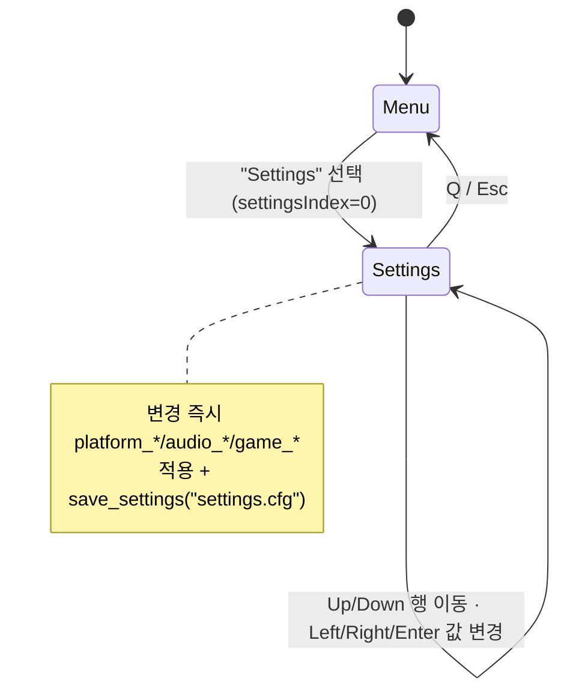
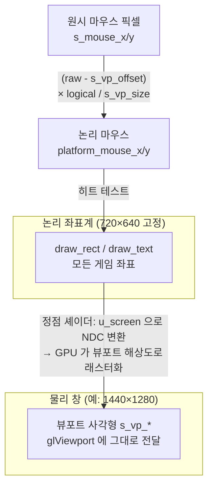

# Part 11: 설정 화면 — 해상도 · 오디오 · VSync, 그리고 결정성 불변식

> **시리즈:** 제로부터 멀티플레이어 테트리스 + RL | [시리즈 목차](./README.md) | **Part 11**

---

## 이번 Part의 구현 계약

- **선행 상태:**
  - [Part 3](./part3-rendering-and-ui.md) 의 `gui_hover_rect` / `gui_button` / `gui_checkbox` 와 OpenGL 3.3 Core 렌더러(`renderer_init` · `renderer_begin` · `renderer_end`)
  - [Part 4](./part4-game-wrapper-and-loop.md) 의 `AppMode` 메뉴 루프와 `Game`
  - [Part 5](./part5-audio.md) 의 `audio_set_music_enabled` / `audio_set_sfx_enabled` / `audio_set_music_volume` / `audio_set_sfx_volume`
  - [Part 10](./part10-meta-and-ranking.md)의 `meta::client::settings_file_path()`와 `Customize` 화면이 연결된 메인 메뉴
- **이번 Part의 파일:**
  - `src/main.cpp` — `struct GameSettings`, 창 크기 프리셋과 `max_window_scale()`, `load_settings` / `save_settings`, `settingsPath` 결정 + 레거시 마이그레이션, 시작 시 적용, `AppMode::Settings` 전이, `apply_fx` 의 흔들림 게이팅
  - `src/gui.h` / `src/gui.cpp` — `gui_slider`, `gui_value_selector`
  - `platform/platform.h` — `platform_set_window_size` / `platform_display_size` / `platform_set_fullscreen` / `platform_fullscreen_supported` / `platform_set_vsync`
  - `platform/sdl.cpp` / `platform/win32.cpp` — 위 플랫폼 API의 구현, `recompute_viewport()`, `platform_mouse_x/y`의 논리 역매핑, GL swap interval 전환
  - `audio/audio.h` 의 볼륨 API 는 [Part 5](./part5-audio.md) 가 이미 만들었다 — 이 장은 그것을 **부르기만** 한다
  - `src/sim_game.h` / `src/sim_game.cpp` — 렌더 전용 1 회 플래그 `hardDropEvent`
  - `src/game.h` / `src/game.cpp` — `game_set_ghost_enabled()` 와 게이트된 고스트 draw 사이트
- **연결점:** 설정은 표현과 입력 정책만 바꾸고 `SimGame` 상태·틱·wire protocol 은 바꾸지 않는다. 적용 경로는 전부 `platform_*` / `audio_*` / `game_*` 이다.
- **CMakeLists:** 이 장은 **새 소스 파일을 추가하지 않는다.** 전부 기존 파일의 확장이므로 빌드 파일에 변경이 없다.
- **완료 게이트:** 저장/재시작 복원, 즉시 적용, 논리 좌표 역매핑을 눈으로 확인하고, **설정을 바꿔도 동일 seed/input 의 결정론 해시가 그대로**인지를 `sim_hash_dump` diff 로 확인한다(§10 수동 테스트).

## 1. 들어가며

> **현재 저장 위치:** 초기 구현은 실행 디렉터리의 `settings.cfg`를 사용했지만, 현재 코드는 token과 같은 플랫폼별 user-data 디렉터리에 저장한다. 경로를 구할 수 없을 때만 실행 디렉터리로 폴백하고, 기존 cwd 파일은 1회 마이그레이션한다. 아래에서 `"settings.cfg"` 리터럴을 쓰는 코드는 도입 과정을 보여주는 중간 스냅샷이며 최종 코드는 `settingsPath`를 사용한다.

여기까지 게임은 "기능은 다 있는데 손볼 데가 없는" 상태다. 창은 720×640 고정, 볼륨은 켜짐/꺼짐, 화면 흔들림과 고스트 피스는 항상 ON. 이 장은 창 크기·전체화면, BGM/SFX 볼륨, VSync, 화면 흔들림, 고스트 피스를 **인게임 설정 화면(`AppMode::Settings`)**과 한 설정 모델로 묶는다. 변경은 즉시 반영되고 `settings.cfg`에 저장돼 재시작에도 살아남는다.

이 장의 파일 경계는 다음과 같다.

- `src/main.cpp` — `struct GameSettings` + `settings.cfg` 영속(load/save), 저장 경로 결정과 레거시 마이그레이션, 시작 시 적용, 메뉴 연결, Settings 화면의 키보드/마우스 내비·즉시 적용, 그리고 `apply_fx`의 하드드롭 흔들림 게이팅.
- `src/gui.h` / `src/gui.cpp` — 즉시모드 `gui_slider`(0~100)와 `gui_value_selector`(`< 라벨 >`)를 추가하고 기존 hit-test·button·checkbox 계약을 재사용한다.
- `platform/platform.h` / `platform/sdl.cpp` — `platform_set_window_size` / `platform_display_size` / `platform_set_fullscreen` / `platform_fullscreen_supported` / `platform_set_vsync`, 논리 좌표 추적(`s_logical_w/h`), 표시 사각형(`s_vp_*`), `recompute_viewport()`, 그리고 마우스 좌표의 논리 역매핑. `win32.cpp` 에는 대응 구현/스텁이 있다.
- `audio/audio.h` — 음악·효과음 토글과 볼륨 API, 그 뒤의 카테고리 게인은 오디오 계층이 소유한다. 이 장은 **슬라이더 UI와 설정 영속화**만 얹는다.
- `src/sim_game.h` / `src/sim_game.cpp` — 렌더 전용 1회 플래그 `hardDropEvent`.
- `src/game.h` / `src/game.cpp` — `game_set_ghost_enabled()` 와 게이트된 고스트 draw 사이트.
- `renderer/renderer.cpp` — 논리 좌표계가 720×640 으로 고정이고 창 크기는 `glViewport` 사각형만 바꾼다는 사실(창 크기 프리셋이 게임 좌표를 흔들지 않는 근거).

설정 기능 자체는 Part 4의 앱 루프와 Part 5의 오디오 API 뒤에 붙일 수 있지만, **현재 코드의 저장 경로 헬퍼가 `meta/http_client.*` 안에 있다.** 그래서 현재 저장소를 그대로 누적 구현하는 순서에서는 Part 10 뒤에 놓인다. 이는 설정이 랭킹을 필요로 한다는 뜻이 아니라 user-data 경로 책임이 meta 모듈에 섞인 구현 결합이다. 이 헬퍼를 `platform/user_data.*` 같은 공용 모듈로 옮기면 설정 장은 Part 5 직후로 이동할 수 있다. 문서 순서는 현재 빌드 가능한 코드를 우선하고, 이 결합을 숨기지 않는다.

**결정성 불변식을 맨 앞에 못박는다.** 이 장이 추가하는 모든 것은 *렌더 · 오디오 · 창 · 입력 UI* 전용이다. `SimGame` 의 상태도, 결정성 해시도, lockstep 입력 경로도, 리플레이도 단 한 비트도 건드리지 않는다. 유일하게 sim 에 새로 들어가는 필드(`hardDropEvent`) 조차 *해시에서 제외된* `mutable` 렌더 플래그다. 그래서 설정을 어떻게 바꾸든 같은 입력 시퀀스는 양쪽 클라이언트에서 같은 게임을 만든다.

이 불변식은 코드 주석에도 박혀 있다. `GameSettings` 정의 바로 위:

**현재 소스 발췌 — `src/main.cpp`**

```cpp
// ── 게임 설정 (렌더/오디오 전용) ──────────────────────────────────────────────
//   settings.cfg (key=value 텍스트) 에 저장. 시작 시 로드, 변경 시마다 저장.
//   결정성 주의: 아래 플래그는 모두 렌더/오디오에만 영향 — SimGame 상태나
//   결정성 해시, lockstep 입력 경로를 절대 건드리지 않는다.
struct GameSettings {
    int  bgmVol  = 100;   // BGM 볼륨 0~100 (0 == 음소거)
    int  sfxVol  = 100;   // SFX 볼륨 0~100 (0 == 음소거)
    bool shakeOn = true;  // 마스터 화면 흔들림 (가비지/게임오버 + 하드드롭)
    bool hardDropShakeOn = true;  // 하드드롭 시 약한 흔들림 (shakeOn 의 하위)
    int  windowScale = 0; // 창 크기 프리셋 인덱스 0~4 (아래 kWindowScale* 참고)
    bool fullscreen  = false;
    bool vsyncOn     = true;
    bool ghostOn     = true;  // 고스트 피스 표시
};
```

모든 필드의 기본값은 “설정 파일이 없던 기존 동작 유지”다. 첫 실행에는 720×640·풀볼륨·흔들림 ON으로 뜨며, 필드가 늘어나도 오래된 설정 파일은 누락 항목의 기본값을 그대로 쓴다.

## 2. `GameSettings` 영속 — `settings.cfg`

설정은 줄 단위 `key=value` 텍스트 파일 하나에 저장한다. 형식은 Part 9에서 봇 로스터를 읽던 `model/bots.cfg`와 같은 패턴이다 — `#` 주석 허용, 한 줄에 키 하나, 알 수 없는 키는 무시한다.

### 2.1 파서 헬퍼와 load/save

먼저 두 개의 관대한 파서 헬퍼를 둔다. bool 은 `1/true/on` 과 `0/false/off` 를 모두 받고, 정수는 범위로 클램프한다.

**현재 소스 발췌 — `src/main.cpp`**

```cpp
static bool parse_bool01(const std::string& v, bool fallback)
{
    const std::string s = trim_copy(v);
    if (s == "1" || s == "true"  || s == "on")  return true;
    if (s == "0" || s == "false" || s == "off") return false;
    return fallback;
}

// 정수(예: 볼륨 0~100, 스케일 인덱스) 파싱. lo..hi 로 클램프. 비정상 시 fallback.
static int parse_int_clamped(const std::string& v, int fallback, int lo, int hi)
{
    const std::string s = trim_copy(v);
    if (s.empty()) return fallback;
    char* end = nullptr;
    long n = std::strtol(s.c_str(), &end, 10);
    if (end == s.c_str()) return fallback;
    if (n < lo) n = lo;
    if (n > hi) n = hi;
    return (int)n;
}
```

`fallback` 인자가 핵심이다. 파싱이 실패해도 *기본값* 으로 떨어지지, 0 이나 빈 값으로 망가지지 않는다. 손으로 편집된 `settings.cfg` 에 오타가 있어도 그 줄만 무시되고 나머지는 살아남는다.

로더는 파일이 없으면 그냥 기본값 구조체를 돌려준다 — 첫 실행에 설정 파일이 없는 건 에러가 아니다.

**현재 소스 발췌 — `src/main.cpp`**

```cpp
// settings.cfg 로드. 파일이 없으면 기본값 반환 (load_bot_config 와 동일한 스타일).
static GameSettings load_settings(const char* path)
{
    GameSettings s;
    FILE* f = std::fopen(path, "rb");
    if (!f) return s;

    char line[256];
    while (std::fgets(line, sizeof(line), f)) {
        std::string ln(line);
        const size_t hash = ln.find('#');
        if (hash != std::string::npos) ln.resize(hash);
        const size_t eq = ln.find('=');
        if (eq == std::string::npos) continue;
        const std::string key = trim_copy(ln.substr(0, eq));
        const std::string val = ln.substr(eq + 1);
        // 볼륨 키 — 신형. 구형 호환: 과거 bgm=1/sfx=0 (bool) 도 받아 0/100 으로.
        if (key == "bgm_vol")        s.bgmVol = parse_int_clamped(val, s.bgmVol, 0, 100);
        else if (key == "sfx_vol")   s.sfxVol = parse_int_clamped(val, s.sfxVol, 0, 100);
        else if (key == "bgm")       s.bgmVol = parse_bool01(val, s.bgmVol > 0) ? 100 : 0;
        else if (key == "sfx")       s.sfxVol = parse_bool01(val, s.sfxVol > 0) ? 100 : 0;
        else if (key == "shake")     s.shakeOn = parse_bool01(val, s.shakeOn);
        else if (key == "harddrop_shake") s.hardDropShakeOn = parse_bool01(val, s.hardDropShakeOn);
        else if (key == "window_scale")   s.windowScale = parse_int_clamped(val, s.windowScale, 0, kWindowScaleCount - 1);
        else if (key == "fullscreen")     s.fullscreen = parse_bool01(val, s.fullscreen);
        else if (key == "vsync")          s.vsyncOn = parse_bool01(val, s.vsyncOn);
        else if (key == "ghost")          s.ghostOn = parse_bool01(val, s.ghostOn);
    }
    std::fclose(f);
    return s;
}
```

**하위 호환 분기에 주목한다.** 볼륨은 원래 켜짐/꺼짐 bool 이었다(`bgm=1`). 슬라이더로 넘어가면서 `bgm_vol=75` 같은 정수 키가 신형이 됐지만, 과거 `bgm=1`/`bgm=0` 으로 저장된 파일도 그대로 읽힌다 — bool 을 0/100 으로 승격한다. 키만 추가하고 옛 키를 살려두면, 이전 버전이 쓴 설정 파일이 새 버전에서 깨지지 않는다. 이게 "backward-tolerant 파싱" 의 실제 모습이다.

세이브는 항상 신형 키로만 쓴다. 정수는 그대로, bool 은 `0/1` 로. 그런데 이 함수는 "쓰고 닫는다" 보다 할 일이 조금 더 많다.

**현재 소스 발췌 — `src/main.cpp`**

```cpp
// 저장 성공 시 true. 정식 user-data 경로의 부모 디렉터리가 없는 첫 실행도
// 처리하며, 실패는 stderr에 남겨 설정 변경이 조용히 사라지지 않게 한다.
static bool save_settings(const char* path, const GameSettings& s)
{
    namespace fs = std::filesystem;
    const fs::path target(path);
    const fs::path parent = target.parent_path();
    if (!parent.empty()) {
        std::error_code ec;
        fs::create_directories(parent, ec);
        if (ec) {
            std::fprintf(stderr, "[settings] cannot create '%s': %s\n",
                         parent.string().c_str(), ec.message().c_str());
            return false;
        }
    }

    FILE* f = std::fopen(path, "wb");
    if (!f) {
        std::fprintf(stderr, "[settings] cannot open '%s' for writing\n", path);
        return false;
    }

    bool ok = true;
    ok = ok && std::fprintf(f, "bgm_vol=%d\n",        s.bgmVol) >= 0;
    ok = ok && std::fprintf(f, "sfx_vol=%d\n",        s.sfxVol) >= 0;
    ok = ok && std::fprintf(f, "shake=%d\n",          s.shakeOn ? 1 : 0) >= 0;
    ok = ok && std::fprintf(f, "harddrop_shake=%d\n", s.hardDropShakeOn ? 1 : 0) >= 0;
    ok = ok && std::fprintf(f, "window_scale=%d\n",   s.windowScale) >= 0;
    ok = ok && std::fprintf(f, "fullscreen=%d\n",     s.fullscreen ? 1 : 0) >= 0;
    ok = ok && std::fprintf(f, "vsync=%d\n",          s.vsyncOn ? 1 : 0) >= 0;
    ok = ok && std::fprintf(f, "ghost=%d\n",          s.ghostOn ? 1 : 0) >= 0;
    if (std::fclose(f) != 0) ok = false;
    if (!ok) {
        std::fprintf(stderr, "[settings] failed while writing '%s'\n", path);
    }
    return ok;
}
```

세 가지가 로더와 다르다.

**(1) 부모 디렉터리를 만든다.** 저장 위치는 `<user-data>/Tetris/settings.cfg` 인데 (§2.3), 첫 실행에는 `Tetris/` 디렉터리 자체가 없다. `fopen` 은 디렉터리를 만들어 주지 않으므로 그냥 실패한다. `fs::create_directories` 를 앞에 두고, 그것이 실패하면 파일을 열어보지도 않고 돌아간다.

**(2) `bool` 을 반환한다.** 로드 실패는 "기본값으로 시작"이라는 합리적 폴백이 있지만, 저장 실패는 폴백이 없다 — 사용자가 바꾼 값이 그냥 사라진다. 호출부가 그 사실을 알 수 있어야 한다.

**(3) 실패를 stderr 에 남긴다.** `fprintf` 의 반환값을 `ok` 에 누적하고 `fclose` 결과까지 확인한다. 디스크가 꽉 찼거나 권한이 없을 때 조용히 성공한 척하지 않는다. `fclose` 를 확인하는 이유는 stdio 가 버퍼링을 하기 때문이다 — 앞의 `fprintf` 들이 전부 성공을 보고해도 실제 쓰기는 `fclose` 시점에 일어나 거기서 실패할 수 있다.

### 2.2 창 크기 프리셋과 `max_window_scale()`

창 크기 프리셋과 그 라벨은 상수 테이블로 둔다. 배열 인덱스 0~4 가 곧 `windowScale` 값이다.

**현재 소스 발췌 — `src/main.cpp`**

```cpp
// 창 크기 프리셋. UI 좌표계(논리 720x640)는 그대로 두고 창만 키운다.
// 9:8 을 유지하므로 레터박스가 생기지 않고, GPU 가 그 해상도로 다시
// 래스터화하므로 크게 잡을수록 선명해진다 (글자도 그 배율로 다시 굽는다).
//
// 마지막 항목은 4K 모니터의 세로 해상도(2160) 에 맞춘 것이다. 9:8 이라
// 가로는 2430 이고, 남는 좌우는 전체화면에서 검은 여백이 된다.
static constexpr int kWindowScaleCount = 5;
static constexpr int kWindowScaleW[kWindowScaleCount] = { 720, 1080, 1440, 1800, 2430 };
static constexpr int kWindowScaleH[kWindowScaleCount] = { 640,  960, 1280, 1600, 2160 };
static const char*   kWindowScaleLabel[kWindowScaleCount] = {
    "720 x 640", "1080 x 960", "1440 x 1280", "1800 x 1600", "2430 x 2160" };
```

현재 배열의 모든 프리셋은 720:640 = **9:8** 비율을 유지한다. 이것이 §5의
왜곡 없는 스케일링 전제다. 마지막 항목은 정수 배수에서 출발한 값이 아니라
4K 모니터의 세로 해상도 2160에서 거꾸로 계산했다. 9:8을 유지하면 가로가
2430이 되고, 3840 폭의 전체화면에서는 좌우에 검은 여백이 남는다.

GPU 렌더러로 옮기면서 큰 창을 CPU 프레임버퍼로 직접 채우는 비용은 사라졌지만,
해상도가 공짜가 된 것은 아니다. 뷰포트가 커지면 GPU가 처리하는 fragment 수와
메모리 대역폭은 여전히 늘고, 글리프도 큰 배율로 다시 래스터화한다. 이 게임의
단순한 장면에서는 보통 감당할 수 있지만, 프리셋 추가 여부는 대상 GPU의
frame time과 글리프 생성 spike를 측정해 정한다.

그런데 프리셋을 크게 만들어 두면 새로운 문제가 생긴다 — **모니터보다 큰 창**이다. 1920×1080 모니터에서 2430×2160 창을 만들면 창의 절반이 화면 밖으로 나간다. 그냥 보기 나쁜 정도가 아니다. 제목 표시줄이 화면 위쪽으로 밀려나면 **창을 손으로 끌어 되돌릴 수도 없고**, 설정 화면의 선택기가 화면 밖에 있으면 설정으로 되돌릴 수도 없다. 사용자가 스스로 빠져나올 수 없는 상태를 만드는 것은 설정 UI 가 저지를 수 있는 최악의 실수다.

그래서 고를 수 있는 상한을 화면 크기로 자른다.

**현재 소스 발췌 — `src/main.cpp`**

```cpp
// 이 모니터에 실제로 들어가는 가장 큰 프리셋 인덱스.
//
// 화면보다 큰 창을 만들면 창의 일부가 화면 밖으로 나가 제목 표시줄조차
// 잡을 수 없게 된다. 그래서 고를 수 있는 범위를 화면 크기로 잘라 둔다.
// 모니터를 바꿔 끼울 수 있으므로 매번 다시 잰다.
static int max_window_scale()
{
    int dw = 0, dh = 0;
    platform_display_size(dw, dh);
    if (dw <= 0 || dh <= 0) return kWindowScaleCount - 1;  // 못 재면 막지 않는다
    int last = 0;
    for (int i = 0; i < kWindowScaleCount; ++i)
        if (kWindowScaleW[i] <= dw && kWindowScaleH[i] <= dh) last = i;
    return last;
}
```

이 짧은 구현에는 서로 다른 세 가지 판단이 들어 있다.

**(1) 캐시하지 않는다.** 결과를 static 변수에 담아두면 한 번만 재고 끝인데, 노트북에 외장 모니터를 꽂거나 창을 다른 모니터로 옮기면 그 값이 거짓이 된다. `platform_display_size()` 는 SDL 에서 `SDL_GetDisplayUsableBounds`, Win32 에서 `SPI_GETWORKAREA` 한 번이라 호출이 싸다. 설정 화면을 그리는 프레임에서만 부르므로 매번 재도 부담이 없다. 한 가지 전제가 이 비교를 성립시킨다 — Win32 백엔드는 시작 시 per-monitor DPI 인식을 켜므로(§5.3) `SPI_GETWORKAREA` 가 OS 배율로 축소된 가상 해상도가 아니라 **물리 픽셀**을 돌려주고, 그래서 물리 픽셀 단위인 프리셋 값과 같은 자로 비교된다. DPI-unaware 프로세스였다면 150% 모니터에서 사용 가능 영역이 실제보다 작게 보고돼 멀쩡히 들어가는 프리셋까지 잘렸을 것이다.

**(2) 못 재면 막지 않는다.** `platform_display_size()` 가 0 을 돌려주면 상한을 최대 인덱스로 둔다. 화면 크기를 모른다는 이유로 사용자가 고를 수 있는 항목을 줄이는 것보다, 못 재는 환경에서는 제한을 풀어 두는 쪽이 낫다는 판단이다.

**(3) 인덱스가 아니라 실제 크기를 비교한다.** `kWindowScaleW[i] <= dw && kWindowScaleH[i] <= dh` 로 가로·세로를 모두 본다. 프리셋이 오름차순이라 첫 실패에서 끊어도 되지만, 배열 전체를 훑고 마지막으로 통과한 인덱스를 남긴다 — 나중에 순서가 뒤섞인 프리셋을 넣어도 동작이 깨지지 않는다.

여기서 재는 것은 모니터 해상도가 아니라 **작업 표시줄·독을 뺀 사용 가능 영역**이다. 1920×1080 모니터의 사용 가능 높이는 작업 표시줄 때문에 1053 정도이고, 1080 높이의 창을 만들면 제목 표시줄이 화면 위로 밀려난다. 실제로 그런 기계(사용 가능 영역 1920×1053)에서는 프리셋 0 과 1 만 선택 가능하다 — 1440×1280 은 세로가 들어가지 않는다.

전역 설정 변수는 바로 아래에 둔다.

**현재 소스 발췌 — `src/main.cpp`**

```cpp
// 전역 설정. apply_fx 람다(트리거 시점) 에서 shake 를 게이트한다.
static GameSettings g_settings;
```

### 2.3 저장 경로 결정과 레거시 마이그레이션

초기 구현은 실행 디렉터리의 `"settings.cfg"` 를 그대로 썼다. 그런데 [Part 10](./part10-meta-and-ranking.md) 에서 토큰 저장 경로를 만들면서 같은 문제가 드러났다 — macOS `.app` 번들의 cwd 는 번들 안 `Resources` 이고 **읽기 전용**이다. 거기에 쓰면 조용히 실패해 설정이 매번 초기화된다.

그래서 저장 위치를 토큰과 같은 user-data 디렉터리로 옮긴다. 경로를 구하는 함수는 Part 10 이 만든 `meta::client::settings_file_path()` 다.

**현재 소스 발췌 — `src/main.cpp`**

```cpp
    // ── settings.cfg 경로 결정 ────────────────────────────────────────────────
    //   정식 위치는 쓰기 가능한 user-data 디렉터리(<user-data>/Tetris/settings.cfg).
    //   macOS .app 번들의 cwd(Resources)는 읽기전용이라 거기 저장하면 조용히
    //   실패한다. HOME/APPDATA 가 없으면 실행 디렉터리 "settings.cfg" 로 폴백.
    //   기존 cwd 파일이 있고 user-data 에 아직 없으면 1회 마이그레이션한다.
    std::string settingsPath = meta::client::settings_file_path();
    if (settingsPath.empty()) {
        settingsPath = "settings.cfg";
    } else {
        std::error_code ec;
        if (!std::filesystem::exists(settingsPath, ec) &&
            std::filesystem::exists("settings.cfg", ec)) {
            // 레거시 cwd 설정을 user-data 로 옮긴다 (쓰기 실패해도 무방 — 아래
            // 로드는 cwd 도 시도하지 않지만, 옮기기 성공 시 다음부터 정식 경로 사용).
            std::filesystem::create_directories(
                std::filesystem::path(settingsPath).parent_path(), ec);
            save_settings(settingsPath.c_str(), load_settings("settings.cfg"));
        }
    }
```

로직은 세 갈래다.

| 상황 | `settingsPath` | 추가 동작 |
|---|---|---|
| `HOME`/`APPDATA` 없음 | `"settings.cfg"` (cwd) | 없음 |
| user-data 에 파일 있음 | `<user-data>/Tetris/settings.cfg` | 없음 — 그냥 그걸 쓴다 |
| user-data 에 없고 cwd 에 있음 | `<user-data>/Tetris/settings.cfg` | **1 회 이관**: cwd 것을 읽어 user-data 에 쓴다 |

마이그레이션이 `load_settings("settings.cfg")` 의 결과를 곧바로 `save_settings(user, ...)` 에 넘긴다는 점이 재미있다. 파일을 바이트 복사하지 않고 **파싱해서 다시 쓴다.** 덕분에 구형 키(`bgm=1`)가 신형 키(`bgm_vol=100`)로 정규화되고, 알 수 없는 키는 버려진다. 이관이 곧 형식 업그레이드다.

두 가지 함정이 있으니 재현할 때 알고 있어야 한다.

**(a) 원본 cwd 파일을 지우지 않는다.** 이관 후에도 `./settings.cfg` 는 그대로 남는다. 그리고 그 다음 줄부터는 아무도 그 파일을 읽지 않으므로 **유령 파일**이 된다. 사용자가 그걸 편집하면 아무 일도 일어나지 않아 혼란스럽다. 지우지 않는 이유는 안전 쪽에 기댄 것이다 — 이관 쓰기가 실패했을 수 있는데 원본까지 지우면 설정을 완전히 잃는다.

**(b) 로드는 cwd 를 시도하지 않는다.** 폴백은 *경로 결정* 단계에만 있고, 로드 단계에는 없다. `settingsPath` 가 user-data 로 정해지면 그 파일이 없어도 cwd 를 보지 않고 그냥 기본값으로 시작한다. 이관이 실패한 경우 설정이 초기화된 것처럼 보이는 이유다.

### 2.4 시작 시 적용

설정은 `platform_init`/`renderer_init` 직후, 게임 루프 진입 전에 한 번 적용한다. 순서가 중요하다 — 창과 렌더러가 떠 있어야 창 크기·프레임 페이싱을 바꿀 수 있고, 오디오는 첫 재생이 일어나기 전에 볼륨 플래그가 서 있어야 한다.

**현재 소스 발췌 — `src/main.cpp`**

```cpp
    // ── 사용자 설정 로드 (렌더/오디오 전용) ───────────────────────────────────
    //   오디오 토글 플래그를 미리 세팅한다. 실제 audio_init 은 Game 생성자에서
    //   호출되며, 그 시점의 첫 audio_play_music/sound 가 이 플래그를 존중한다.
    //   shake 플래그는 트리거 시점(apply_fx)에서 읽는다.
    g_settings = load_settings(settingsPath.c_str());
    // 오디오: 볼륨 슬라이더가 토글을 대체. 0 == 음소거. enabled 도 같이 세팅해
    // off→on 복원 경로(audio_set_music_enabled)와 일관되게 유지한다.
    audio_set_music_enabled(g_settings.bgmVol > 0);
    audio_set_sfx_enabled(g_settings.sfxVol > 0);
    audio_set_music_volume(g_settings.bgmVol / 100.0f);
    audio_set_sfx_volume(g_settings.sfxVol / 100.0f);

    // 윈도우: 저장된 크기 프리셋 + 전체화면 + 60 FPS pacing 적용.
    //   UI 좌표계는 항상 논리 720x640 — 창은 그 위에 얹히는 뷰포트일 뿐이다.
    //
    // 저장된 값을 이 모니터 기준으로 한 번 더 자른다. 큰 화면에서 저장한
    // 설정 파일을 작은 화면에 들고 오면 창이 화면 밖으로 나가는데, 그러면
    // 설정 화면에 들어가 되돌릴 수조차 없다.
    if (g_settings.windowScale > max_window_scale())
        g_settings.windowScale = max_window_scale();
    platform_set_window_size(kWindowScaleW[g_settings.windowScale],
                             kWindowScaleH[g_settings.windowScale]);
    if (g_settings.fullscreen) platform_set_fullscreen(true);
    platform_set_vsync(g_settings.vsyncOn);

    // 고스트 피스 표시.
    game_set_ghost_enabled(g_settings.ghostOn);
```

오디오 호출이 `audio_init` **보다 먼저** 일어난다는 점이 눈에 띈다. 실제 오디오 장치는 `Game` 생성자에서 열리는데(`AppMode::Menu` 에는 `Game` 인스턴스가 없어 타이틀 화면은 무음이다), 볼륨/토글 플래그는 전역 변수이므로 미리 세팅해두면 나중에 열리는 장치가 그 값을 존중한다. 순서 의존을 없애는 흔한 방법이다.

**시작 시 한 번 더 자르는 두 줄**이 §2.2 의 게이팅과 짝을 이룬다. `load_settings` 는 `window_scale` 을 `0 ~ kWindowScaleCount-1` 로만 클램프한다 — 파일에 `window_scale=9` 가 적혀 있어도 4 로 잘리지만, 그 4 가 **이 모니터에 들어가는가** 는 검사하지 않는다. 파서는 파일 형식만 알지 화면 크기는 모르기 때문이다.

그래서 설정 파일이 기계를 옮겨 다니는 상황이 문제가 된다. 4K 데스크톱에서 `window_scale=4` 로 저장한 뒤 그 파일을 노트북으로 가져오면(또는 클라우드 동기화된 홈 디렉터리를 그대로 쓰면), 게임이 뜨자마자 2430×2160 창을 만들어 화면 밖으로 나간다. 설정 화면은 창 안에 있으므로 되돌릴 방법이 없고, 사용자에게 남은 선택지는 설정 파일을 손으로 찾아 고치는 것뿐이다. 시작 경로에서 한 번 자르면 그 상황 자체가 생기지 않는다.

자른 값을 **디스크에 다시 쓰지는 않는다.** 이것도 의도된 것이다. 큰 모니터로 돌아가면 원래 고른 프리셋이 그대로 복원되는 편이 낫다 — 작은 화면에 한 번 꽂았다는 이유로 사용자의 선택을 영구히 지워버릴 이유가 없다. 실제로 사용자가 설정 화면에서 값을 바꾸는 순간에만 잘린 값이 저장된다.

이 시점에서 빌드하면, `settings.cfg` 에 `window_scale=1` 만 적어두고 실행해도 게임이 1080×960 창으로 뜬다 — 아직 인게임 설정 화면은 없지만 파일 영속은 동작한다.

## 3. 즉시모드 위젯 확장 — 슬라이더와 선택기

설정 화면은 즉시모드 GUI(immediate-mode)로 만든다. 위젯 트리도 retained 상태도 없다. 매 프레임 렌더 루프 안에서 위젯 함수를 부르면 그 함수가 그 자리에서 그리고 입력 결과를 반환한다. 기존 `gui_hover_rect` / `gui_button` / `gui_checkbox` 계약에 값 선택용 `gui_slider`와 `gui_value_selector`를 더한다.

### 3.1 `gui_slider` — 0~100 트랙

슬라이더는 트랙(가는 가로 바)·채워진 구간(fill)·노브로 그린다. 반환값은 새 퍼센트값이다 — 드래그 중이면 마우스 x 를 0~100 으로 환산해 돌려주고, 아니면 입력값을 그대로 돌려준다.

**현재 소스 발췌 — `src/gui.cpp`**

```cpp
int gui_slider(int x, int y, int w, int h, int valuePct, bool highlighted)
{
    if (valuePct < 0)   valuePct = 0;
    if (valuePct > 100) valuePct = 100;

    const bool hover = gui_hover_rect(x, y, w, h);

    // 트랙 — 가는 가로 바 (세로 중앙). 채워진 구간은 강조색.
    const int trackH = 6;
    const int trackY = y + (h - trackH) / 2;
    Color trackBg   = {60, 66, 96, 255};
    Color fillColor = highlighted ? kBtnHighlight : kBtnHoverBg;
    const int fillW = w * valuePct / 100;
    draw_rect(x, trackY, w, trackH, trackBg);
    draw_rect(x, trackY, fillW, trackH, fillColor);

    // 노브 — 채워진 구간 끝의 작은 사각형. 양 끝(0%/100%)에서 트랙 밖으로
    // 삐져나가지 않도록 [x, x+w-knobW] 로 clamp 한다.
    const int knobW = 10;
    int knobX = x + fillW - knobW / 2;
    if (knobX < x)             knobX = x;
    if (knobX > x + w - knobW) knobX = x + w - knobW;
    const Color knob = (hover || highlighted) ? WHITE : Color{200, 205, 225, 255};
    draw_rect(knobX, y + h / 2 - knobW, knobW, knobW * 2, knob);

    // 드래그/클릭 — 트랙 위에서 좌버튼이 눌려있으면 그 x 위치로 값을 설정.
    if (hover && platform_mouse_down(0)) {
        int mx = platform_mouse_x();
        int v  = (w > 0) ? (mx - x) * 100 / w : valuePct;
        if (v < 0)   v = 0;
        if (v > 100) v = 100;
        return v;
    }
    return valuePct;
}
```

노브 x 좌표를 계산한 뒤 곧바로 clamp 하는 세 줄이 있다. 노브는 채워진 구간의 **끝 중앙**에 놓이므로 (`x + fillW - knobW/2`), 값이 0% 면 `x - 5` 가 되어 트랙 왼쪽으로 5 픽셀 삐져나가고 100% 면 오른쪽으로 5 픽셀 나간다. 한 픽셀 단위로 보면 사소하지만, 슬라이더를 끝까지 끌었을 때 노브가 트랙 밖에 걸쳐 있으면 "더 갈 수 있는 것처럼" 보인다. `knobX` 가 `const` 가 아닌 이유가 이 clamp 다.

여기서 `platform_mouse_x()` 가 **논리 좌표**(720×640 기준) 라는 점이 §5 와 맞물린다. 위젯은 논리 좌표 `x`/`w` 로 그려졌으므로, 마우스도 같은 논리 좌표로 들어와야 `(mx - x) * 100 / w` 가 맞는다. 만약 마우스가 *물리 픽셀* 이었다면 1440×1280 창에서 슬라이더를 클릭할 때 값이 두 배로 어긋난다.

### 3.2 `gui_value_selector` — `< 라벨 >`

선택기는 양끝 화살표 `<` `>` 와 가운데 라벨로 된 위젯이다. 클릭한 쪽에 따라 `-1`/`0`/`+1` 을 반환한다 — 값 자체는 호출부가 관리하고, 위젯은 "어느 방향으로 한 칸" 만 알려준다.

**현재 소스 발췌 — `src/gui.cpp`**

```cpp
int gui_value_selector(int x, int y, int w, int h, const char* label,
                       bool highlighted)
{
    // 양끝 화살표 버튼 영역 (정사각형). 중앙은 라벨.
    const int arrowW = h;
    const Color arrowIdle = highlighted ? kBtnHighlight : Color{180, 190, 220, 255};

    const bool hoverL = gui_hover_rect(x, y, arrowW, h);
    const bool hoverR = gui_hover_rect(x + w - arrowW, y, arrowW, h);

    // 좌/우 화살표 — "<" / ">" 텍스트를 각 버튼 영역 중앙에 그린다.
    const Color cL = hoverL ? WHITE : arrowIdle;
    const Color cR = hoverR ? WHITE : arrowIdle;
    const int fs = h - 6;
    draw_text("<", x + (arrowW - measure_text("<", fs)) / 2, y + 3, fs, cL);
    draw_text(">", x + w - arrowW + (arrowW - measure_text(">", fs)) / 2, y + 3, fs, cR);

    // 중앙 라벨.
    const Color labelColor = highlighted ? kBtnHighlight : WHITE;
    const int tw = measure_text(label, fs);
    draw_text(label, x + (w - tw) / 2, y + 3, fs, labelColor);

    if (hoverL && platform_mouse_pressed(0)) return -1;
    if (hoverR && platform_mouse_pressed(0)) return +1;
    return 0;
}
```

기존 `gui_checkbox`는 `bool` 토글 행(전체화면·흔들림·VSync·고스트)에 재사용한다. 설정 화면에서 함께 쓰는 위젯의 헤더 선언은 다음과 같다.

**현재 소스 발췌 — `src/gui.h`**

```cpp
bool gui_checkbox(int x, int y, int size, const char* label, bool checked,
```

**현재 소스 발췌 — `src/gui.h`**

```cpp
int  gui_slider(int x, int y, int w, int h, int valuePct, bool highlighted);
```

**현재 소스 발췌 — `src/gui.h`**

```cpp
int  gui_value_selector(int x, int y, int w, int h, const char* label,
```

즉시모드의 이점은 설정 화면 같은 *간헐적이고 단순한* UI 에 딱 맞는다는 것이다. 위젯의 "상태"(현재 값·하이라이트 여부)는 전부 호출부(`g_settings` + `settingsIndex`)가 들고 있고, 위젯 함수는 그릴 때마다 그 상태를 받아 그리고 결과만 돌려준다. 매 프레임 호출이라 값이 항상 최신이고, 동기화 버그가 끼어들 틈이 없다.

## 4. 설정 화면 — `AppMode::Settings`

### 4.1 메뉴 연결

메인 메뉴에 `"Settings"` 항목을 연결한다. 메뉴는 라벨과 동작을 함께 가진 즉시모드 리스트다.

**현재 소스 발췌 — `src/main.cpp`**

```cpp
            enum class MenuAction {
                Single, BotSelect, Matchmaking, CustomRoom,
                Customize, Settings, Quit,
            };
            struct MenuItem {
                const char* label;
                MenuAction action;
            };
            constexpr MenuItem items[] = {
                {"Single Play",       MenuAction::Single},
                {"Single vs Bot",     MenuAction::BotSelect},
                {"Matchmaking Multi", MenuAction::Matchmaking},
                {"Custom Room Multi", MenuAction::CustomRoom},
                {"Customize",         MenuAction::Customize},
                {"Settings",          MenuAction::Settings},
                {"Quit",              MenuAction::Quit},
            };
            constexpr int kMenuCount =
                static_cast<int>(sizeof(items) / sizeof(items[0]));
```

`Settings`는 현재 `Customize` 뒤에 보이지만 진입 동작은 배열 위치에 의존하지 않는다. 렌더 루프가 선택된 `MenuItem::action`을 switch에 넘기므로 항목을 삽입하거나 순서를 바꿔도 라벨과 동작이 함께 이동한다.

버튼 높이와 간격은 랭킹 표시줄을 침범하지 않도록 고정 영역 안에 맞춘다. 항목을 추가할 때는 문서의 개수에 맞추지 말고 작은 창에서 마지막 버튼의 hit box와 상태 표시줄이 겹치지 않는지 확인한다.

**현재 소스 발췌 — `src/main.cpp`**

```cpp
                case MenuAction::Settings:
                    app = AppMode::Settings;
                    settingsIndex = 0;
                    break;
```

`settingsIndex = 0` 으로 커서를 첫 행에 되돌리는 것이 중요하다. 이걸 빼면 지난번 나갈 때의 커서 위치가 남아, 설정 화면을 다시 열었을 때 엉뚱한 행이 선택돼 있다.


```mermaid
stateDiagram-v2
    [*] --> Menu
    Menu --> Settings: "Settings" 선택 (settingsIndex=0)
    Settings --> Settings: Up/Down 행 이동 · Left/Right/Enter 값 변경
    note right of Settings
        변경 즉시 platform_*/audio_*/game_*
        적용 + save_settings("settings.cfg")
    end note
    Settings --> Menu: Q / Esc
```

### 4.2 행 구성과 내비게이션

설정 화면은 선택기·체크박스·슬라이더 행을 조합한다. `enum RowKind`가 위젯 종류를 구분하고, 현재 항목은 스케일 → 전체화면 → 흔들림 → BGM/SFX 볼륨 → VSync → 고스트 순으로 배치된다. 행 개수나 배열 index보다 항목 ID와 표시 순서를 함께 관리하는 것이 중요하다.

**현재 소스 발췌 — `src/main.cpp`**

```cpp
        if (app == AppMode::Settings)
        {
            {
                const int tw = measure_text("Settings", 40);
                draw_text("Settings", (720 - tw) / 2, 60, 40, WHITE);
            }
            draw_rect(200, 112, 320, 2, {45, 52, 90, 140});   // 타이틀 아래 구분선 (메뉴와 동일)

            // 행 종류: 체크박스 / 볼륨 슬라이더 / 스케일 선택기.
            enum RowKind { ROW_SCALE, ROW_FULLSCREEN, ROW_SHAKE, ROW_HARDDROP,
                           ROW_BGM, ROW_SFX, ROW_VSYNC, ROW_GHOST };
            constexpr int kSettingsRows = 8;

            // 키보드 상하 커서 이동.
            if (platform_key_pressed(PKEY_DOWN))
                settingsIndex = (settingsIndex + 1) % kSettingsRows;
            if (platform_key_pressed(PKEY_UP))
                settingsIndex = (settingsIndex + kSettingsRows - 1) % kSettingsRows;

            const bool kLeft  = platform_key_pressed(PKEY_LEFT);
            const bool kRight = platform_key_pressed(PKEY_RIGHT);
            const bool kEnter = platform_key_pressed(PKEY_ENTER)
                             || platform_key_pressed(PKEY_SPACE);

            // 변경이 발생했는지 추적 → 즉시 적용 + 저장.
            bool changed = false;
```

Up/Down 은 커서(`settingsIndex`) 를 행 사이로 순환시킨다. Left/Right/Enter 는 *현재 커서가 있는 행* 의 값을 조정한다. 마우스는 그와 별개로 어느 행이든 직접 클릭할 수 있다 — 키보드와 마우스가 한 화면에서 공존한다.

행 레이아웃 상수와 라벨/커서 강조 헬퍼:

**현재 소스 발췌 — `src/main.cpp`**

```cpp
            const int labelX  = 150;   // 행 라벨 x
            const int ctrlX   = 360;   // 컨트롤(체크박스/슬라이더/선택기) x
            const int rowY0   = 130;
            const int rowGap  = 52;
            const int boxSize = 26;
            const int ctrlW   = 220;   // 슬라이더/선택기 폭

            auto rowY = [&](int i) { return rowY0 + i * rowGap; };

            // 라벨 + 커서 강조 표식. 각 행 공통.
            auto draw_label = [&](int i, const char* text) {
                const Color c = (i == settingsIndex) ? YELLOW : WHITE;
                draw_text(text, labelX, rowY(i) + 2, 22, c);
            };
```

커서가 있는 행의 라벨은 노란색, 나머지는 흰색이다. `highlighted` 인자(`i == settingsIndex`)가 위젯 쪽으로도 같이 넘어가 키보드 대상이 시각적으로 드러난다.

### 4.3 창 크기 선택기 행

첫 행은 `gui_value_selector` 로 만든다. 마우스 화살표 클릭은 `dir` 로, 키보드 Left/Right 도 `dir` 로 모인 뒤 한 군데서 처리한다.

**현재 소스 발췌 — `src/main.cpp`**

```cpp
            // ── ROW_SCALE: 창 스케일 선택기 ──────────────────────────────────
            draw_label(ROW_SCALE, "Window");
            {
                int dir = gui_value_selector(ctrlX, rowY(ROW_SCALE), ctrlW, boxSize,
                                             kWindowScaleLabel[g_settings.windowScale],
                                             settingsIndex == ROW_SCALE);
                if (settingsIndex == ROW_SCALE) {
                    if (kLeft)  dir = -1;
                    if (kRight) dir = +1;
                }
                if (dir != 0) {
                    // 양 끝에서 wrap 하지 않고 clamp 한다 (가장 큰 값에서
                    // Right → 720 으로 점프하는, picker 답지 않은 동작 방지).
                    // 상한은 프리셋 개수가 아니라 이 모니터에 들어가는 최대치다.
                    const int hi = max_window_scale();
                    int ns = g_settings.windowScale + dir;
                    if (ns < 0) ns = 0;
                    if (ns > hi) ns = hi;
                    if (ns != g_settings.windowScale) {
                        g_settings.windowScale = ns;
                        g_settings.fullscreen = false;  // 스케일 변경은 창모드로
                        platform_set_window_size(kWindowScaleW[ns], kWindowScaleH[ns]);
                        changed = true;
                    }
                }
            }
```

여기서 값 변경이 **wrap 이 아니라 clamp** 라는 점이 핵심이다. 코드 주석이 이유를 직접 밝힌다 — 목록의 마지막 값에서 Right 를 한 번 더 누르면 720×640 으로 점프하는 것은 "picker 답지 않은" 동작이다.

`gui_value_selector` 로 만드는 다른 행들은 wrap 이 자연스러울 수 있지만, 창 크기는 다르다. 사용자가 Right 를 연타해 최대 크기로 올리려는 의도가 명확한데 한 번 더 눌렀다고 최소로 되돌아가면, 창이 갑자기 작아지고 마우스 위치까지 어긋난다. 목록의 끝이 벽처럼 느껴져야 한다.

그 "끝"은 배열의 마지막 원소가 아니라 `max_window_scale()`이 돌려주는 **현재 화면에 들어가는 마지막 프리셋**이다. 작은 화면에서는 큰 프리셋이 선택 순환에 나타나지 않고, 같은 실행 파일을 더 큰 화면에서 실행하면 선택 범위가 넓어진다. 고를 수 없는 값을 회색으로 잠시 보여주는 방법도 있지만, 한 번에 한 값만 보이는 선택기에서는 목록 자체를 실제 선택 가능 범위로 자르는 편이 명확하다.

`if (ns != g_settings.windowScale)` 가드도 여기서 값을 한다. clamp 라 양 끝에서 `dir` 을 눌러도 `ns` 가 그대로이므로, 이 가드가 없으면 매 프레임 `platform_set_window_size` 를 다시 불러 창이 계속 중앙으로 재배치된다.

크기를 바꾸면 자동으로 전체화면 플래그를 끈다 — "특정 크기의 창" 과 "전체화면" 은 상호배타이므로, 프리셋을 고르면 창모드로 빠진다.

### 4.4 체크박스 행과 슬라이더 행 헬퍼

나머지 행은 두 람다로 처리한다. 체크박스 헬퍼는 클릭이든 키보드든 토글이 일어나면 `true` 를 돌려준다.

**현재 소스 발췌 — `src/main.cpp`**

```cpp
            auto checkbox_row = [&](int i, const char* label, bool& val) -> bool {
                draw_label(i, label);
                char rl[32];
                std::snprintf(rl, sizeof(rl), "%s", val ? "ON" : "OFF");
                bool clicked = gui_checkbox(ctrlX, rowY(i), boxSize, rl, val,
                                            i == settingsIndex);
                bool key = (i == settingsIndex) && (kEnter || kLeft || kRight);
                if (clicked || key) { val = !val; return true; }
                return false;
            };
```

전체화면 행은 토글 후 즉시 `platform_set_fullscreen` 을 부르고, 창모드로 돌아올 때는 저장된 스케일 크기로 복원한다. 다만 그 앞에 게이트가 하나 더 있다.

**현재 소스 발췌 — `src/main.cpp`**

```cpp
            // ── ROW_FULLSCREEN ──────────────────────────────────────────────
            // 백엔드가 전체화면을 지원할 때만 토글. 미지원(Win32) 이면 회색
            // 비활성 라벨로 그려 "켜도 아무 일 없는" 거짓 토글을 막는다.
            if (platform_fullscreen_supported()) {
                if (checkbox_row(ROW_FULLSCREEN, "Fullscreen", g_settings.fullscreen)) {
                    platform_set_fullscreen(g_settings.fullscreen);
                    // 창모드 복귀 시 저장된 스케일 크기로 되돌린다.
                    if (!g_settings.fullscreen)
                        platform_set_window_size(kWindowScaleW[g_settings.windowScale],
                                                 kWindowScaleH[g_settings.windowScale]);
                    changed = true;
                }
            } else {
                const Color c = (ROW_FULLSCREEN == settingsIndex) ? YELLOW : WHITE;
                draw_text("Fullscreen", labelX, rowY(ROW_FULLSCREEN) + 2, 22, c);
                draw_text("(unavailable)", ctrlX, rowY(ROW_FULLSCREEN) + 4, 18,
                          Color{110, 116, 140, 255});
            }

            // ── ROW_SHAKE (마스터) ──────────────────────────────────────────
            if (checkbox_row(ROW_SHAKE, "Screen shake", g_settings.shakeOn))
                changed = true;

            // ── ROW_HARDDROP ────────────────────────────────────────────────
            if (checkbox_row(ROW_HARDDROP, "Hard-drop shake", g_settings.hardDropShakeOn))
                changed = true;
```

`platform_fullscreen_supported()`는 UI가 지원 여부를 묻는 질의 함수다. 두 백엔드의 답이 다르다.

**현재 소스 발췌 — `platform/sdl.cpp`**

```cpp
void platform_set_fullscreen(bool on)
{
    if (!s_window) return;
    if (SDL_SetWindowFullscreen(
            s_window, on ? SDL_WINDOW_FULLSCREEN_DESKTOP : 0) != 0) {
        std::fprintf(stderr, "[SDL] fullscreen failed: %s\n", SDL_GetError());
        return;
    }
    s_fullscreen = on;
    SDL_GetWindowSize(s_window, &s_win_w, &s_win_h);
    recompute_viewport();
}

bool platform_fullscreen_supported() { return true; }
void platform_set_vsync(bool on)
{
    // 이제는 진짜 VSync 다. GL swap interval 1 이면 SDL_GL_SwapWindow 가
    // vblank 까지 기다리므로 tearing 이 사라진다. 소프트웨어 페이싱과 달리
    // 디스플레이 주사율에 실제로 동기화된다.
    s_frame_pacing = on;
    if (s_glctx) SDL_GL_SetSwapInterval(on ? 1 : 0);
}
```

**현재 소스 발췌 — `platform/win32.cpp`**

```cpp
void platform_set_fullscreen(bool) {}
bool platform_fullscreen_supported() { return false; }
void platform_set_vsync(bool on)
{
    // SDL 경로와 같은 조건을 만든다 — 확장이 있으면 진짜 vsync 로 vblank 까지
    // 기다리고, 없으면 platform_end_frame 의 소프트웨어 페이싱만 남는다.
    // 명시적으로 걸지 않으면 드라이버 기본값(대개 1)에 맡기게 되어 같은
    // 코드가 기계마다 다르게 동작한다.
    s_frame_pacing = on;
    if (s_wglSwapInterval) s_wglSwapInterval(on ? 1 : 0);
}
```

Win32 백엔드는 전체화면을 구현하지 않았다. 창 스타일 전환과 모니터 해상도 질의, 그리고 복귀 시 원래 위치·크기 복원까지 직접 짜야 하는데, 이 프로젝트의 학습 범위 대비 이득이 작다고 판단한 것이다.

중요한 것은 **미구현을 감추지 않는다**는 점이다. 함수를 no-op 으로 두고 체크박스는 그대로 그렸다면, Windows 사용자는 토글을 켰는데 아무 일도 일어나지 않고 설정만 `fullscreen=1` 로 저장되는 상태를 만난다. 다음 실행에서도 여전히 창모드다. 대신 `(unavailable)` 회색 라벨을 그려 "이 백엔드에는 없는 기능" 임을 화면에서 바로 알린다. 라벨 색은 커서가 그 행에 있으면 노란색으로 유지해, 커서 이동 자체는 자연스럽게 되도록 했다.

`platform_set_vsync` 는 두 백엔드가 같은 일을 하되 호출 경로가 다르다. SDL 은 `SDL_GL_SetSwapInterval`을 부르고, Win32는 `WGL_EXT_swap_control`에서 얻은 함수 포인터를 사용한다. 두 호출 모두 드라이버가 거부할 수 있지만 **현재 구현은 반환값을 확인하지 않는다** — 확장/컨텍스트가 아예 없는 경우만 널 검사로 건너뛰고, 적용 실패는 화면의 tearing 여부로만 드러난다. 설정값(`s_frame_pacing`)의 저장과 드라이버 적용의 성공은 별개의 사건이므로, 진단 가능성을 높이려면 반환값을 로그로 남기는 후속 개선이 가능하다.

볼륨 슬라이더 헬퍼는 `gui_slider` 를 감싸고, 키보드 Left/Right 는 5% 단위로 움직인다.

**현재 소스 발췌 — `src/main.cpp`**

```cpp
            auto slider_row = [&](int i, const char* label, int& vol) -> bool {
                char lab[32];
                std::snprintf(lab, sizeof(lab), "%s  %d%%", label, vol);
                draw_label(i, lab);
                int nv = gui_slider(ctrlX, rowY(i), ctrlW, boxSize, vol,
                                    i == settingsIndex);
                if (i == settingsIndex) {
                    if (kLeft)  nv = vol - 5;
                    if (kRight) nv = vol + 5;
                    if (nv < 0)   nv = 0;
                    if (nv > 100) nv = 100;
                }
                if (nv != vol) { vol = nv; return true; }
                return false;
            };

            // ── ROW_BGM ─────────────────────────────────────────────────────
            if (slider_row(ROW_BGM, "BGM", g_settings.bgmVol)) {
                audio_set_music_enabled(g_settings.bgmVol > 0);
                audio_set_music_volume(g_settings.bgmVol / 100.0f);
                changed = true;
            }
            // ── ROW_SFX ─────────────────────────────────────────────────────
            if (slider_row(ROW_SFX, "SFX", g_settings.sfxVol)) {
                audio_set_sfx_enabled(g_settings.sfxVol > 0);
                audio_set_sfx_volume(g_settings.sfxVol / 100.0f);
                changed = true;
            }
```

마지막 두 토글은 VSync 와 고스트다.

**현재 소스 발췌 — `src/main.cpp`**

```cpp
            if (checkbox_row(ROW_VSYNC, "60 FPS pacing", g_settings.vsyncOn)) {
                platform_set_vsync(g_settings.vsyncOn);
                changed = true;
            }

            // ── ROW_GHOST ───────────────────────────────────────────────────
            if (checkbox_row(ROW_GHOST, "Ghost piece", g_settings.ghostOn)) {
                game_set_ghost_enabled(g_settings.ghostOn);
                changed = true;
            }

            // 슬라이더 드래그 중 매 프레임 파일을 쓰지 않도록, 변경은 dirty 로
            // 모아 두고 마우스 버튼을 뗀 프레임(키보드 변경은 즉시)에 저장한다.
            if (changed) settingsDirty = true;
            if (settingsDirty && !platform_mouse_down(0)) {
                save_settings(settingsPath.c_str(), g_settings);
                settingsDirty = false;
            }

            // 마우스용 Back 버튼 — 키보드 Q/ESC 와 동일 동작.
            const bool backClicked = gui_button(260, 544, 200, 40, "Back");

            draw_text("[Up/Down] Select   [Left/Right] Adjust   [Q] Back",
                      130, 604, 16, GRAY);

            if (backClicked || platform_key_pressed(PKEY_Q)
                || platform_key_pressed(PKEY_ESCAPE)) {
                if (settingsDirty) {   // 드래그 채로 나가는 경우까지 저장 보장
                    save_settings(settingsPath.c_str(), g_settings);
                    settingsDirty = false;
                }
                app = AppMode::Menu;
            }
        }
```

전체 흐름은 **즉시 적용 + 변경 묶음 저장**이다. 값은 그 자리에서 서브시스템에 적용하고, 키보드 변경은 즉시 저장한다. 슬라이더 드래그는 매 프레임 파일을 쓰지 않도록 마우스 버튼을 놓을 때 한 번 저장한다.

나가는 경로가 셋(Back 버튼 클릭, `Q`, `Esc`)인데 전부 한 분기로 모인다. 그리고 그 분기가 **`settingsDirty` 를 한 번 더 확인한다.** 위쪽의 저장 조건은 `!platform_mouse_down(0)` 이라, 슬라이더를 드래그한 채로 Back 버튼을 누르는 동작에서는 마우스가 눌려 있어 저장이 미뤄진다. 그 상태로 메뉴에 나가면 방금 조정한 볼륨이 사라진다. 나가는 길목에서 한 번 더 저장하는 것이 그 구멍을 막는다.

Back 버튼이 필요한 이유도 분명하다. 이 화면은 슬라이더 때문에 마우스로 조작하게 되는데, 나가려면 키보드로 손을 옮겨야 한다면 어색하다. 반대로 키보드만 쓰는 사용자를 위해 `Q`/`Esc` 도 남긴다.

## 5. 창 크기 — 720×640 논리 해상도와 마우스 역매핑

이 장에서 가장 가르칠 게 많은 부분이다.

### 5.1 논리 해상도는 720×640 고정, 창만 커진다

`renderer_init(720, 640)` 이 정하는 것은 버퍼 크기가 아니라 **좌표계**다. 게임의 모든 좌표(보드, UI, 텍스트) 는 창이 얼마나 크든 항상 720×640 논리 공간에 그려진다. `draw_rect(360, 320, ...)` 는 720×640 창에서도 2430×2160 창에서도 화면 정중앙이다.

창 크기를 바꿀 때 실제로 바뀌는 것은 `glViewport` 의 사각형 하나다. 그 계산이 `renderer_begin` 에 있다.

**현재 소스 발췌 — `renderer/renderer.cpp`**

```cpp
void renderer_begin(Color bg)
{
    if (!s_ready) return;

    // 창이 리사이즈됐으면 표시 영역을 따라간다. 논리 해상도는 그대로 두고
    // 뷰포트만 바꾸므로, 창을 늘려도 UI 좌표계는 한 픽셀도 변하지 않는다.
    // 종횡비가 다른 창에서는 뷰포트가 창보다 작아 가장자리에 여백이 남는다.
    int vx = 0, vy = 0, vw = 0, vh = 0;
    platform_viewport(vx, vy, vw, vh);

    // 창이 최소화되면 뷰포트가 0x0 이 된다. 지울 곳도 그릴 곳도 없으니
    // 건너뛴다. 게임 코드는 최소화 여부를 모르고 계속 draw_* 를 부르지만,
    // 그 정점들은 프레임 끝의 glb_flush 가 0x0 뷰포트로 흘려보내고 큐를
    // 비우므로 쌓이지는 않는다. 다만 배처 상태는 여기서 맞춰 둔다 —
    // 그러지 않으면 첫 프레임부터 최소화로 시작했을 때 glUseProgram 을
    // 한 번도 부르지 않은 채 glDrawArrays 에 도달한다.
    if (vw <= 0 || vh <= 0) {
        gl_UseProgram(s_prog);
        s_verts.clear();
        s_batch_tex = s_white;
        return;
    }
    gl_Viewport(vx, vy, vw, vh);

    // 뷰포트는 논리 종횡비를 유지하므로 가로/세로 배율이 같다. 세로로 잰다.
    s_render_scale = (float)vh / (float)s_screen_h;

    // glClear 는 뷰포트가 아니라 시저 박스를 따른다. glViewport 만 좁혀 놓고
    // 지우면 레터박스 여백까지 배경색으로 칠해져 여백과 게임 화면의 경계가
    // 사라진다. 그래서 두 번 지운다 — 창 전체를 검게, 뷰포트 안만 배경색으로.
    gl_Disable(GL_SCISSOR_TEST);
    gl_ClearColor(0.0f, 0.0f, 0.0f, 1.0f);
    gl_Clear(GL_COLOR_BUFFER_BIT);

    gl_Enable(GL_SCISSOR_TEST);
    gl_Scissor(vx, vy, vw, vh);
    gl_ClearColor(bg.r / 255.0f, bg.g / 255.0f, bg.b / 255.0f, 1.0f);
    gl_Clear(GL_COLOR_BUFFER_BIT);

    // 시저는 켠 채로 둔다. 논리 좌표를 벗어나게 그리는 코드가 있어도
    // 여백을 침범하지 못하게 하는 안전장치다.

    gl_UseProgram(s_prog);
    gl_Uniform2f(s_u_screen, (float)s_screen_w, (float)s_screen_h);
    gl_Uniform1i(s_u_tex, 0);

    s_verts.clear();
    s_batch_tex = s_white;
}
```

`s_screen_w` / `s_screen_h` 는 720/640 으로 고정이고, 매 프레임 `u_screen` 유니폼으로 셰이더에 넘어간다. 정점 셰이더는 그 값 하나로 픽셀 좌표를 NDC 로 바꾼다 — 투영 행렬이 아예 없다. 창이 커져도 이 유니폼은 그대로이고 `glViewport` 만 넓어지므로, NDC 공간의 같은 도형이 더 넓은 픽셀 영역에 매핑될 뿐이다.

**그래서 창을 키우면 화면이 선명해진다.** 이 부분이 CPU 렌더러와 결정적으로 다르다. 소프트웨어 렌더러였다면 720×640 픽셀 버퍼를 다 만든 뒤 OS 가 2배로 늘려 붙였을 것이고, 그러면 픽셀 하나가 2×2 블록이 되어 계단이 그대로 두 배로 커진다. 지금은 정점 좌표가 실수(`float`)이고 래스터화가 **뷰포트 해상도에서** 일어난다. 1440×1280 창에서는 GPU 가 1440×1280 만큼의 픽셀을 계산하므로 사각형 경계와 둥근 모서리가 그 해상도만큼 정밀해진다.

글자는 조금 다르다. 글리프 모양은 여전히 CPU(`stb_truetype`)가 비트맵으로 굽고, 한 번 구운 비트맵은 특정 픽셀 크기에 묶인다. 논리 크기 22px 로 구워 놓고 3.4배 창에 늘려 그리면 그 비율만큼 흐려진다. 그래서 `renderer_begin` 이 계산해 둔 `s_render_scale`(= 뷰포트 높이 / 논리 높이)을 텍스트 쪽이 읽어, **굽는 크기에만** 그 배율을 곱한다 — 22px 글자를 3.4배 창에서는 75px 로 굽고 22px 자리에 그린다. 배치 메트릭(advance, 커닝)은 논리 크기 그대로라 레이아웃은 창 크기와 무관하게 동일하다. 도형은 저절로, 글자는 다시 구워서 — 두 경로 모두 창 해상도만큼 선명해진다.

`glClear` 를 두 번 부르는 이유도 여기 적혀 있다. `glClear` 는 뷰포트가 아니라 **시저 박스**를 따르므로, `glViewport` 만 좁혀 놓고 한 번 지우면 레터박스 여백까지 배경색이 칠해져 여백과 게임 화면의 경계가 사라진다. 시저를 끈 채 창 전체를 검게 지우고, 시저를 뷰포트로 켜 그 안만 배경색으로 지운다. 시저는 켠 채로 두므로 논리 좌표를 벗어나게 그리는 코드가 있어도 여백을 침범하지 못한다.

뷰포트가 `0×0` 인 조기 반환도 창 크기와 직접 관련이 있다. 창을 최소화하면 클라이언트 영역이 0 이 되어 `recompute_viewport()` 가 0×0 을 내놓는다. 지울 곳도 그릴 곳도 없으니 건너뛰는 것이 맞는데, **`glUseProgram` 만은 부르고 나간다**. 게임 코드는 최소화 여부를 모르고 계속 `draw_*` 를 부르므로 정점이 큐에 쌓이고, 프레임 끝의 `glb_flush` 가 그것을 0×0 뷰포트로 흘려보낸다. 그 시점에 프로그램이 바인딩돼 있지 않으면 — 최소화된 상태로 게임을 시작하는 경우가 정확히 그렇다 — `glDrawArrays` 가 프로그램 없이 불린다.

다섯 프리셋이 모두 9:8 이라는 점이 여기서 값을 한다. 창 종횡비가 논리 종횡비와 같으면 뷰포트가 창 전체를 덮어 여백이 0 이 되고, 같은 비율을 같은 비율로 키우므로 **왜곡이 없다.**

### 5.2 뷰포트 재계산 — 9:8 vs 전체화면 레터박스

`recompute_viewport()` 가 창 크기에 맞춰 뷰포트 사각형(`s_vp_*`) 을 다시 잡는다. 창 종횡비가 논리 종횡비와 (거의) 같으면 레터박스 없이 창 전체를 쓰고, 다르면(전체화면에서 모니터가 16:9 라면) 9:8 을 유지하는 중앙 사각형 + 검은 바를 만든다.

**현재 소스 발췌 — `platform/sdl.cpp`**

```cpp
static void recompute_viewport()
{
    if (s_win_w <= 0 || s_win_h <= 0 ||
        s_logical_w <= 0 || s_logical_h <= 0) {
        s_vp_x = s_vp_y = 0;
        s_vp_w = s_win_w;
        s_vp_h = s_win_h;
        return;
    }
    const double window_aspect = (double)s_win_w / (double)s_win_h;
    const double logical_aspect = (double)s_logical_w / (double)s_logical_h;
    if (window_aspect > logical_aspect) {
        s_vp_h = s_win_h;
        s_vp_w = (int)std::lround((double)s_win_h * logical_aspect);
        s_vp_x = (s_win_w - s_vp_w) / 2;
        s_vp_y = 0;
    } else {
        s_vp_w = s_win_w;
        s_vp_h = (int)std::lround((double)s_win_w / logical_aspect);
        s_vp_x = 0;
        s_vp_y = (s_win_h - s_vp_h) / 2;
    }
}
```

분기는 **두 개**다. 창이 논리 비율보다 넓으면 높이를 꽉 채우고 폭을 맞춰 좌우에 바를 두고, 그렇지 않으면 폭을 꽉 채우고 높이를 맞춰 상하에 바를 둔다. "종횡비가 같으면 창 전체" 라는 별도 분기는 없다 — **필요가 없기 때문이다.**

크기 프리셋(720×640, 1080×960, 1440×1280, 1800×1600, 2430×2160) 은 모두 9:8 이므로 창 비율과 논리 비율이 정확히 같고, `window_aspect > logical_aspect` 가 거짓이 되어 else 분기로 간다. 거기서 `s_vp_w = s_win_w` 이고 `s_vp_h = lround(s_win_w / logical_aspect)` 인데, 1080×960 을 넣으면 `lround(1080 / 1.125) = 960 = s_win_h` 다. 즉 **else 분기가 스스로 레터박스 0을 계산해낸다.** 부동소수 비교로 특례를 만들 이유가 없다.

전체화면에서 모니터가 9:8 이 아닐 때만 실제로 바가 생긴다. 16:9 모니터라면 `window_aspect ≈ 1.778 > 1.125` 이라 첫 분기로 가서 좌우 필러박스가 붙는다. 어느 경우든 그려지는 *내용* 은 9:8 비율을 유지하므로 늘어나거나 찌그러지지 않는다.

`std::lround` 를 쓰는 것도 의도가 있다. `(int)(x + 0.5)` 는 음수에서 잘못 반올림하고 `x` 가 이미 정수에 가까울 때 부동소수 오차로 1픽셀이 흔들릴 수 있다. 창을 드래그로 늘리는 동안에는 `SDL_WINDOWEVENT_SIZE_CHANGED` 가 들어올 때마다 이 함수가 다시 돌므로, 여기서 1픽셀이 떨리면 화면이 미세하게 진동한다.

계산된 `s_vp_*` 는 창 좌상단 원점이지만, 렌더러는 이것을 `glViewport` 에 그대로 넘긴다. GL 은 좌하단 원점이므로 `platform_viewport()` 가 넘겨줄 때 `y = s_win_h - s_vp_y - s_vp_h` 로 뒤집는다. 지금은 뷰포트가 항상 세로 중앙이라 두 값이 우연히 같지만, 나중에 "상단 고정" 같은 배치로 바꾸면 이 변환이 없을 때만 조용히 어긋난다.

**같은 사각형을 렌더러와 마우스가 함께 쓴다는 점이 중요하다.** 렌더러가 창 전체에 늘려 그리는데 마우스만 레터박스 기준으로 역매핑하면, 창 종횡비가 논리 9:8 과 다른 순간 클릭 지점과 그려진 버튼이 서로 다른 곳을 가리킨다. 두 계산이 같은 `s_vp_*` 를 읽게 해서 그 어긋남을 구조적으로 없앴다.

### 5.3 마우스 좌표 역매핑 — 핵심 함정

뷰포트를 키웠으면 **마우스 좌표를 논리 720×640 공간으로 되돌려야 한다.** 이걸 빼먹으면 1440×1280 창에서 버튼을 클릭할 때 실제 히트 위치가 두 배로 어긋난다 — 화면 좌상단을 눌렀는데 게임은 논리 중앙을 클릭한 것으로 인식한다. 위젯은 논리 좌표로 히트 테스트하므로, 마우스도 같은 좌표계로 들어와야 한다.

`platform_mouse_x/y` 가 원시 창 픽셀을 뷰포트 사각형 기준으로 역매핑한다.

**현재 소스 발췌 — `platform/sdl.cpp`**

```cpp
int platform_mouse_x()
{
    if (s_vp_w <= 0) return s_mouse_x;
    return (int)((double)(s_mouse_x - s_vp_x) * s_logical_w / s_vp_w);
}

int platform_mouse_y()
{
    if (s_vp_h <= 0) return s_mouse_y;
    return (int)((double)(s_mouse_y - s_vp_y) * s_logical_h / s_vp_h);
}
```

공식은 `logical = (raw - vpOffset) * logicalSize / vpSize` 다. 뷰포트 오프셋(`s_vp_x`) 을 먼저 빼서 레터박스 바를 보정하고, 논리/물리 크기 비로 스케일을 되돌린다. 가드는 `s_vp_w <= 0` 하나뿐이다 — 0으로 나누는 것만 막고, `s_logical_w` 는 `platform_init` 이후 항상 양수라 검사하지 않는다.

레터박스 바를 클릭하면 대체로 음수나 범위 밖 좌표가 나와 어떤 위젯에도 맞지 않는다. 다만 **완전히 안전하지는 않다.** `(int)` 캐스트는 0 쪽으로 절단하므로, 확대 배율이 1보다 크면 뷰포트 바로 왼쪽 1픽셀이 `-0.5 → 0` 으로 접혀 논리 좌표 0(화면 안)이 된다. 1080×960 전체화면에서 좌측 바 경계를 정확히 누르면 재현된다. 엄밀히 막으려면 `s_mouse_x < s_vp_x` 를 따로 검사하거나 `std::floor` 를 써야 한다. 현재 UI 는 좌측 끝 1픽셀에 클릭 가능한 위젯을 두지 않아 증상이 드러나지 않을 뿐이다.

**현재 소스 발췌 — `platform/sdl.cpp`**

```cpp
void platform_set_window_size(int width, int height)
{
    if (!s_window || width <= 0 || height <= 0) return;
    if (s_fullscreen) {
        SDL_SetWindowFullscreen(s_window, 0);
        s_fullscreen = false;
    }
    SDL_SetWindowSize(s_window, width, height);
    SDL_SetWindowPosition(s_window, SDL_WINDOWPOS_CENTERED, SDL_WINDOWPOS_CENTERED);
    SDL_GetWindowSize(s_window, &s_win_w, &s_win_h);
    recompute_viewport();
}
```

세 가지가 순서대로 일어난다. 전체화면이면 먼저 창모드로 빠져나오고(그래야 `SDL_SetWindowSize` 가 먹는다), 크기를 바꾼 뒤 화면 중앙으로 옮기고, **요청한 크기가 아니라 실제로 잡힌 크기를 `SDL_GetWindowSize` 로 다시 읽어** 뷰포트를 계산한다. 창 관리자가 요청을 거부하거나 조정할 수 있으므로 요청값을 믿으면 안 된다.

여기서 읽는 것은 `SDL_GetWindowSize` 가 돌려주는 **논리 창 크기**이지 드로어블 픽셀 크기가 아니다. 이 백엔드는 `SDL_WINDOW_ALLOW_HIGHDPI` 를 주지 않으므로 두 값이 같고, 마우스 좌표도 같은 단위로 들어온다. HiDPI 를 켜려면 `SDL_GetWindowSize` 를 `SDL_GetWindowSizeInPixels` 로 바꾸는 것만으로는 부족하고 마우스 좌표까지 함께 환산해야 한다 — 지금은 그 복잡도를 사지 않았다.


```mermaid
graph TB
    subgraph Logical["논리 좌표계 (720×640 고정)"]
        L[draw_rect / draw_text<br/>모든 게임 좌표]
    end
    subgraph Physical["물리 창 (예: 1440×1280)"]
        VP["뷰포트 사각형 s_vp_*<br/>glViewport 에 그대로 전달"]
    end
    L -->|"정점 셰이더: u_screen 으로 NDC 변환<br/>→ GPU 가 뷰포트 해상도로 래스터화"| VP
    M["원시 마우스 픽셀<br/>s_mouse_x/y"] -->|"(raw - s_vp_offset)<br/>× logical / s_vp_size"| LM["논리 마우스<br/>platform_mouse_x/y"]
    LM -->|히트 테스트| L
```

`win32.cpp`에도 같은 `s_vp_*` 계산과 마우스 역매핑이 있다. 창 외곽 보정은 SDL 보다 한 층 더 필요하다 — `platform_init` 이 per-monitor DPI 인식을 켜므로 창 테두리 두께가 **모니터 DPI 에 따라 달라지고**, 시스템 DPI 만 아는 `AdjustWindowRect` 로 보정하면 클라이언트 영역이 요청 크기와 어긋나 프리셋 해상도가 정확히 나오지 않는다. 그래서 `adjust_window_rect` 래퍼가 `AdjustWindowRectExForDpi` 에 창의 실제 DPI(`GetDpiForWindow`)를 넘겨 보정하고, 그 API 가 없는 구형 Windows 에서만 `AdjustWindowRect` 로 폴백한다. DPI 인식을 켠 대가로 모니터 간 이동도 앱 책임이 되는데, `WM_DPICHANGED` 가 OS 제안 RECT 를 그대로 적용해 창의 물리 크기를 유지하고 뒤따르는 `WM_SIZE` 가 기존 `recompute_viewport()` 경로를 태운다. `platform_viewport()`의 y 뒤집기는 SDL 과 같다. 전체화면만 no-op 스텁이며 `platform_fullscreen_supported()`가 false를 돌려 UI 항목을 비활성화하므로, 지원하지 않는 기능을 성공한 것처럼 저장하지 않는다.

## 6. 오디오 볼륨 — 카테고리별 게인

볼륨은 BGM/SFX 두 카테고리로 나뉜다. SDL 백엔드는 소프트웨어 믹서라, 각 보이스를 합산하기 전에 카테고리 게인을 곱한다. `audio_set_music_volume`/`audio_set_sfx_volume` 은 0~1 로 클램프해 전역 게인 변수에 저장한다.

**현재 소스 발췌 — `audio/sdl_audio.cpp`**

```cpp
void audio_set_music_volume(float v01)
{
    if (v01 < 0.0f) v01 = 0.0f;
    if (v01 > 1.0f) v01 = 1.0f;
    std::lock_guard<std::mutex> lk(s_mu);
    s_musicVol = v01;
}

void audio_set_sfx_volume(float v01)
{
    if (v01 < 0.0f) v01 = 0.0f;
    if (v01 > 1.0f) v01 = 1.0f;
    std::lock_guard<std::mutex> lk(s_mu);
    s_sfxVol = v01;
}
```

믹스 콜백은 BGM 보이스에 `s_musicVol` 을, SFX 보이스들에 `s_sfxVol` 을 넘긴다.

**현재 소스 발췌 — `audio/sdl_audio.cpp`**

```cpp
static void SDLCALL audio_callback(void* /*ud*/, Uint8* stream, int len)
{
    int16_t* out = (int16_t*)stream;
    int frames   = len / (s_have.channels * (int)sizeof(int16_t));
    memset(stream, 0, (size_t)len);

    std::lock_guard<std::mutex> lk(s_mu);
    mix_voice(s_bgm, out, frames, s_have.channels, s_musicVol);
    for (int i = 0; i < MAX_SFX_VOICES; ++i)
        mix_voice(s_sfx[i], out, frames, s_have.channels, s_sfxVol);
}
```

`mix_voice` 는 각 샘플에 게인을 곱한 뒤 포화 합산(saturating add) 한다. 게인이 0 이면 그 카테고리는 무음이 된다 — 그래서 슬라이더 0% 가 곧 음소거다.

**현재 소스 발췌 — `audio/sdl_audio.cpp`**

```cpp
        for (int c = 0; c < outChannels; ++c) {
            int s = (int)((c == 0) ? l : r);
            s = (int)(s * gain);
            int acc = (int)out[f * outChannels + c] + s;
            if (acc >  32767) acc =  32767;
            if (acc < -32768) acc = -32768;
            out[f * outChannels + c] = (int16_t)acc;
        }
```

Windows 의 XAudio2 백엔드(`audio/audio.cpp`) 는 같은 시그니처를 보이스 단위 `SetVolume` 으로 미러링한다 — 소프트웨어 믹스 대신 하드웨어/드라이버 보이스에 볼륨을 위임한다. 음악은 재생 중인 마스터 보이스에 즉시 반영하고, SFX 는 다음 재생부터 각 소스 보이스에 적용한다.

**현재 소스 발췌 — `audio/audio.cpp`**

```cpp
void audio_set_music_volume(float v01)
{
    if (v01 < 0.0f) v01 = 0.0f;
    if (v01 > 1.0f) v01 = 1.0f;
    s_musicVol = v01;
    if (s_musicVoice) s_musicVoice->SetVolume(s_musicVol);  // 재생 중이면 즉시 반영
}

void audio_set_sfx_volume(float v01)
{
    if (v01 < 0.0f) v01 = 0.0f;
    if (v01 > 1.0f) v01 = 1.0f;
    s_sfxVol = v01;  // 다음 audio_play_sound 부터 적용
}
```

두 백엔드가 같은 `audio.h` 시그니처를 구현하므로, 설정 화면 코드는 어느 플랫폼인지 신경 쓰지 않는다. `audio_set_music_volume(g_settings.bgmVol / 100.0f)` 한 줄이 SDL 에서는 믹서 게인을, Windows 에서는 보이스 `SetVolume` 을 부른다.

## 7. VSync — 찢김 vs 입력 지연

설정 키 이름은 `vsync` 이고 화면 라벨은 `60 FPS pacing` 인데, 이 이름들은 소프트웨어 렌더러 시절의 흔적이다. 그때는 완성된 픽셀 버퍼를 OS 2D blit 으로 창에 붙였기 때문에 디스플레이의 vblank 를 기다릴 방법이 없었고, 프레임 끝에서 남은 시간을 `Sleep` 으로 쉬는 것이 할 수 있는 전부였다. 렌더러가 GL 로 바뀌면서 사정이 달라졌다 — **swap interval 이 생겼다.**

**현재 소스 발췌 — `platform/sdl.cpp`**

```cpp
void platform_set_vsync(bool on)
{
    // 이제는 진짜 VSync 다. GL swap interval 1 이면 SDL_GL_SwapWindow 가
    // vblank 까지 기다리므로 tearing 이 사라진다. 소프트웨어 페이싱과 달리
    // 디스플레이 주사율에 실제로 동기화된다.
    s_frame_pacing = on;
    if (s_glctx) SDL_GL_SetSwapInterval(on ? 1 : 0);
}
```

`SDL_GL_SetSwapInterval(1)` 은 드라이버에게 "버퍼를 교체하기 전에 vblank 를 기다리라" 고 지시한다. 이후 `platform_present()` 의 `SDL_GL_SwapWindow` 가 화면 주사가 한 바퀴 끝나는 순간에만 반환하므로, 화면 중간에서 이전 프레임과 새 프레임이 갈라지는 **tearing 이 원천적으로 사라진다.** 소프트웨어 페이싱은 "대략 16.67ms 마다 그린다" 였지 "디스플레이와 같은 박자로 그린다" 가 아니었으므로 이 보장을 줄 수 없었다.

같은 함수가 `s_frame_pacing` 도 함께 세운다는 점을 놓치면 안 된다. 이 플래그가 고르는 것은 `platform_end_frame()` 소프트웨어 페이싱의 **목표치**이고, 페이싱 자체는 어느 쪽이든 항상 돈다. 두 모드가 대비를 이룬다.

- **VSync ON = 60Hz 목표.** 두 장치가 동시에 걸린다 — GPU 는 vblank 를 기다리고, 그 뒤에도 프레임 예산 16.67ms 가 남았으면 CPU 가 마저 쉰다. 둘 중 느린 쪽이 이기므로 144Hz 모니터에서는 소프트웨어 페이싱이 60 FPS 상한을 잡고, 60Hz 모니터에서는 swap interval 쪽이 먼저 걸려 페이싱이 사실상 no-op 이 된다. 게임 로직이 60Hz 고정 스텝이라 그 이상 그릴 이유가 없다.
- **VSync OFF = 240fps 상한.** 무제한이 아니다. swap interval 은 0 이 되지만 `platform_end_frame()` 이 `kUncappedMaxFps`(240) 상한의 페이싱을 남긴다(`target = s_frame_pacing ? 1/60 : 1/240` — 두 백엔드 동일). 고정 틱 시뮬레이션은 여전히 초당 60틱만 진행하는데, 상한이 없으면 렌더 루프만 수천 fps 로 공회전하며 같은 화면을 다시 그리느라 CPU/GPU 를 태운다 — 노트북 발열과 배터리에 그대로 청구되는 비용이다. 240 은 60 의 정수배라 틱당 최대 4 렌더 프레임으로, tearing 실험이나 지연 측정에는 충분히 풀려 있으면서 공회전 비용은 묶는다.

일반화하면, 렌더 상한은 항상 두 겹으로 생각해야 한다 — 디스플레이와 동기화하는 상한(vblank)과 자원 소모를 묶는 상한(소프트웨어 캡). 전자를 끄는 것이 후자까지 끄는 것이어서는 안 된다.

`SDL_GL_SetSwapInterval` 은 컨텍스트가 있어야 의미가 있으므로 `if (s_glctx)` 가드가 붙어 있다. `platform_init` 이 컨텍스트를 만든 직후에도 같은 호출을 한 번 해두어(`SDL_GL_SetSwapInterval(s_frame_pacing ? 1 : 0)`), 설정 화면을 한 번도 열지 않은 첫 실행에서도 기본값이 반영된다.

Win32 백엔드도 같은 일을 하지만 조회 경로가 한 단계 더 있다. `wglSwapIntervalEXT` 는 코어가 아니라 **`WGL_EXT_swap_control` 확장**이라 링커가 찾을 수 없고, 컨텍스트가 current 인 상태에서 `wglGetProcAddress` 로 받아야 한다.

**현재 소스 발췌 — `platform/win32.cpp`**

```cpp
// WGL_EXT_swap_control. 확장이라 컨텍스트를 만든 뒤에야 조회할 수 있고,
// 드라이버가 안 줄 수도 있어 함수 포인터로 들고 있는다.
static BOOL (WINAPI* s_wglSwapInterval)(int) = nullptr;
```

**현재 소스 발췌 — `platform/win32.cpp`**

```cpp
    // 컨텍스트가 current 인 지금이 확장을 조회할 수 있는 시점이다.
    s_wglSwapInterval = (BOOL (WINAPI*)(int))wglGetProcAddress("wglSwapIntervalEXT");
    if (s_wglSwapInterval) s_wglSwapInterval(s_frame_pacing ? 1 : 0);
```

`platform_init` 이 3.3 Core 컨텍스트를 current 로 만든 직후에 조회하고, 그 자리에서 기본값도 한 번 건다. **명시적으로 걸어 두는 것이 핵심이다.** 걸지 않으면 swap interval 이 드라이버 기본값에 맡겨지는데, 그 값은 대개 1 이지만 보장은 아니다. 제어판에서 "수직 동기 끄기" 를 켜 둔 기계에서는 게임의 VSync 설정이 ON 인데도 tearing 이 보이는, **같은 코드가 기계마다 다르게 동작하는** 상황이 된다. 확장 자체가 없는 드라이버라면 포인터가 null 로 남고 소프트웨어 페이싱만 동작한다 — 그 경우에도 크래시하지 않도록 널 검사를 붙였다.

결정성 관점에서는 둘 다 안전하다. VSync 든 페이싱이든 *언제 그리느냐*만 바꾸고 *무엇을 시뮬레이션하느냐*는 건드리지 않는다. 게임 루프는 경과 시간을 누산해 60Hz 고정 스텝으로만 시뮬레이션을 진행하므로, 렌더 프레임률이 60 이든 240 이든 흔들리든 시뮬레이션 틱 결과는 동일하다.

## 8. 하드드롭 흔들림과 고스트 토글

### 8.1 렌더 전용 `hardDropEvent`

화면 흔들림은 두 단계로 게이트된다 — 마스터 `shakeOn` 과 그 하위인 `hardDropShakeOn`. 마스터를 끄면 모든 흔들림이 멎고, 마스터는 켜되 하드드롭만 끄면 가비지/게임오버 흔들림은 남고 하드드롭의 약한 흔들림만 사라진다.

문제는 "하드드롭이 일어났다" 를 어떻게 아느냐다. 이미 `dropSoundEvent` 라는 1회 플래그가 있지만, 그건 **오디오(game.cpp) 가 소비·리셋** 한다. 흔들림이 그 플래그에 의존하면 오디오가 먼저 리셋해버려 흔들림이 누락될 수 있다. 그래서 흔들림 전용 1회 플래그 `hardDropEvent` 를 별도로 둔다.

**현재 소스 발췌 — `src/sim_game.h`**

```cpp
    mutable bool rotateSoundEvent  = false;
    mutable bool clearSoundEvent   = false;
    mutable bool dropSoundEvent    = false;  // 하드드롭(Space) 시
    mutable bool garbageSoundEvent = false;  // 가비지 행 수신 시
    // 하드드롭 화면 흔들림(약) 트리거용. dropSoundEvent 와 별개 — 그쪽은
    // 오디오(game.cpp)가 소비·리셋하므로 흔들림이 그것에 의존하면 안 된다.
    // 렌더 전용 1회 플래그 (해시/lockstep/replay 와 무관).
    mutable bool hardDropEvent     = false;  // 하드드롭(Space) 시 (흔들림용)
```

하드드롭(`MoveBlockDrop`) 에서 두 플래그를 함께 세운다.

**현재 소스 발췌 — `src/sim_game.cpp`**

```cpp
    currentBlock.Move(-1, 0);
    dropSoundEvent = true;
    hardDropEvent  = true;   // 흔들림용 (렌더 전용, 해시 무관)
    LockBlock();
```

**이 플래그가 결정성 해시에 들어가지 않는 이유** 는 기존 `*SoundEvent` 들과 같다 — `mutable` 이고, sim *상태* 가 아니라 "이번 틱에 이런 일이 있었다" 는 *렌더 측 알림* 이다. `StateHashBreakdown()` 은 grid·블록·RNG·score/플래그/중력/레벨만 해시한다.

**현재 소스 발췌 — `src/sim_game.cpp`**

```cpp
SimGame::HashBreakdown SimGame::StateHashBreakdown() const
{
    HashBreakdown b{};
    constexpr uint64_t BASE = 14695981039346656037ull;

    // Grid
    b.grid = fnv1a64(&sim_grid.grid[0][0], sizeof(sim_grid.grid), BASE);
```

`hardDropEvent`(그리고 `*SoundEvent`) 는 이 목록에 없다. `mutable` 이라 `const` 인 해시 함수가 봐도 그만이지만, 애초에 해시 대상이 아니다 — 양쪽 클라이언트에서 흔들림이 한쪽만 떠도 게임 상태 해시는 똑같다.

### 8.2 트리거 시점 게이팅과 흔들림 공존

흔들림은 매 틱 이펙트 적용 람다에서 트리거된다. 여기서 `g_settings.shakeOn`/`hardDropShakeOn` 을 읽어 게이트하고, 소비한 플래그를 리셋한다.

**현재 소스 발췌 — `src/main.cpp`**

```cpp
    // 보드별 이벤트 처리: callout + (가비지를 받을 때만) shake + 소비 플래그 리셋.
    //   shk 는 "이 보드 쪽" 의 shake 대상. 콜아웃은 이 보드 위에 뜬다.
    //   라인 클리어는 shake 를 트리거하지 않는다 — 공격(가비지) 가 반대편 보드로
    //   가면 그쪽 apply_fx 가 그 측 shake 를 걸어준다 (일반 테트리스 전투 관례).
    //   자기 / 상대 구분 없이 같은 로직 — 호출부가 올바른 shake 상태를 주입.
    auto apply_fx = [&](SimGame& sim, Callout& co, ShakeState& shake) {
        if (sim.lastTSpinLines >= 0)
            trigger_tspin_callout(co, sim.lastTSpinLines);
        else if (sim.lastLinesCleared > 0)
            trigger_callout(co, sim.lastLinesCleared);
        if (g_settings.shakeOn && sim.lastGarbageReceived > 0)
            shake_trigger(shake, 6.0f, 0.20f);
        if (g_settings.shakeOn && sim.gameOverEvent)
            shake_trigger(shake, 16.0f, 0.50f);
        // 하드드롭 약한 흔들림. shake_trigger 는 더 강한 진행 중 흔들림을
        // 덮어쓰지 않으므로 가비지/게임오버 흔들림을 끊지 않는다.
        if (g_settings.shakeOn && g_settings.hardDropShakeOn && sim.hardDropEvent)
            shake_trigger(shake, 2.5f, 0.10f);
        sim.hardDropEvent = false;
        sim.lastLinesCleared = 0;
        sim.lastTSpinLines = -1;
        sim.lastGarbageReceived = 0;
        sim.gameOverEvent = false;
    };
```

람다는 **하나**다. 자기 보드용과 상대 보드용을 따로 만들지 않고, 세 번째 인자 `ShakeState& shake` 로 대상을 주입받는다. 호출부가 `shakeLeft` 를 넘기면 왼쪽 보드가, `shakeRight` 를 넘기면 오른쪽 보드가 흔들린다 ([Part 4](./part4-game-wrapper-and-loop.md) 의 `apply_fx` 호출 세 지점 참조). 같은 로직을 두 벌 유지하다 한쪽만 고쳐 두 보드의 동작이 갈라지는 사고를 구조적으로 막은 것이다 — 설정 플래그가 늘어날수록 이 선택의 값이 커진다.

하드드롭 흔들림은 진폭 2.5·지속 0.10 으로 약하다. 핵심은 `shake_trigger` 가 **더 강한 진행 중 흔들림을 덮어쓰지 않는다** 는 것이다 — 가비지(6.0/0.20) 나 게임오버(16.0/0.50) 흔들림이 도는 도중에 하드드롭이 일어나도, 약한 하드드롭 흔들림이 강한 흔들림을 끊지 않는다. 두 흔들림이 자연스럽게 공존한다.

마스터를 끄면(`shakeOn = false`) 세 `if` 가 모두 막혀 어떤 흔들림도 트리거되지 않는다. 단 플래그 리셋(`sim.hardDropEvent = false` 등) 은 게이팅과 무관하게 항상 실행되므로, 흔들림을 꺼도 1회 플래그가 누적되지 않는다.

### 8.3 고스트 피스 게이트

고스트는 전역 플래그 하나로 draw 사이트를 게이트한다.

**현재 소스 발췌 — `src/game.cpp`**

```cpp
void game_set_ghost_enabled(bool on) { g_ghostEnabled = on; }
```

`Game::Draw`(단일 보드) 와 `Game::DrawBoardAt`(2보드) 둘 다 고스트 블록을 그리기 전에 플래그를 확인한다.

**현재 소스 발췌 — `src/game.cpp`**

```cpp
void Game::Draw()
{
    DrawGrid(11, 11);
    if (g_ghostEnabled) DrawBlock(sim.GhostBlock(), 11, 11);
    DrawBlock(sim.CurrentBlock(), 11, 11);
```

**현재 소스 발췌 — `src/game.cpp`**

```cpp
    DrawGrid(offsetX, offsetY);
    if (g_ghostEnabled) DrawBlock(sim.GhostBlock(), offsetX, offsetY);
    DrawBlock(sim.CurrentBlock(), offsetX, offsetY);
```

`sim.GhostBlock()`은 `SimGame`이 유지하는 착지 예측 블록을 읽는다. 고스트를 끄면 그 상태를 계산하거나 갱신하는 규칙은 바꾸지 않고, 그리기만 생략한다. 즉 고스트 토글은 순수 렌더 게이트다.

## 9. 결정성 · 네트워크 안전성 정리

이 장의 모든 변경이 lockstep/리플레이에 영향이 없는 이유를 한자리에 모은다.

- **입력 비트마스크 불변.** lockstep 이 주고받는 것은 틱별 입력 비트마스크(Part 6) 다. 설정 화면은 이 비트마스크를 만들지도, 보내지도, 바꾸지도 않는다. 설정 행을 조작하는 Up/Down/Left/Right 는 *UI 내비게이션* 일 뿐 게임 입력이 아니다 — 애초에 게임 중이 아니라 메뉴 컨텍스트(`AppMode::Settings`) 에서만 동작한다.
- **`SimGame` 상태 불변.** 볼륨·창 크기·VSync·흔들림·고스트 중 무엇도
  `SimGame`의 grid/블록/RNG/score를 건드리지 않는다. `hardDropEvent`는
  `mutable` 렌더 이벤트이며 `StateHashBreakdown()`의 해시 대상에서 빠져
  있다(§8.1).
- **해시 패리티 유지.** 같은 입력 시퀀스는 설정과 무관하게 양쪽에서 같은 상태 해시를 만든다. 한쪽이 720×640·무음·흔들림 OFF, 다른 쪽이 전체화면·풀볼륨·흔들림 ON 이어도 두 클라이언트의 desync 검출(HASH 비교) 은 통과한다.
- **렌더/오디오/창 격리.** 적용 경로가 전부 `platform_*`/`audio_*`/`game_*`(렌더 게이트) 로만 흐른다. 시뮬레이션 코드(`sim_game.cpp` 의 상태 전이) 는 이 호출들을 단 한 줄도 부르지 않는다.

여기서 한 가지를 분명히 구분해 둔다. **렌더 출력의 결정성과 게임 로직의 결정성은 별개다.** GPU 래스터화는 벤더마다 규칙이 미세하게 다르므로, 같은 정점을 넘겨도 두 기계의 프레임 버퍼가 픽셀 단위로 같다는 보장은 없다 — 창 크기가 다르면 애초에 픽셀 수부터 다르다. 그러나 lockstep 이 desync 검출에 쓰는 것은 화면이 아니라 `SimGame::StateHash()` 이고, 그 해시는 grid·블록·RNG·점수만 먹는다. 렌더 출력이 한 번도 검사 대상이었던 적이 없으므로, 잃은 것은 "화면이 어디서나 똑같다" 는 성질이고 잃지 않은 것은 "게임이 어디서나 똑같이 흘러간다" 는 성질이다. 멀티플레이가 기대는 것은 후자뿐이다.

요약하면, 설정은 "**같은 게임을 어떻게 보여주고 들려주느냐**" 만 바꾸지 "**무슨 게임이 도느냐**" 는 절대 바꾸지 않는다. 그래서 멀티플레이어 상대와 설정이 달라도 안전하다.

## 이 장에서 완성된 것

- `src/main.cpp`의 `GameSettings` + `settings.cfg` 영속 — `load_settings`/`save_settings`, backward-tolerant 파싱(구형 `bgm`/`sfx` bool → 0/100 승격), 시작 시 `platform_*`/`audio_*`/`game_*` 적용.
- 9:8 창 크기 프리셋 배열과 `max_window_scale()` —
  `platform_display_size()`로 사용 가능 화면을 재서 선택 범위를 자르고,
  저장된 값도 시작할 때 한 번 자른다.
- 메뉴 `"Settings"` 항목 → `AppMode::Settings` 화면 — Up/Down 항목 이동, Left/Right/Enter 값 조정, 마우스 직접 클릭, 변경 즉시 적용 + 단발 `save_settings`.
- `src/gui.cpp` 의 즉시모드 위젯 추가 — `gui_slider`(0~100 트랙/fill/노브) + `gui_value_selector`(`< 라벨 >`, -1/0/+1). 기존 `gui_checkbox` 재사용.
- `platform/sdl.cpp` 의 창 크기 시스템 — 논리 좌표계 720×640 고정, `recompute_viewport()` 의 2분기(9:8 프리셋은 레터박스 0 이 자동으로 나옴) vs 전체화면 레터박스, `platform_viewport()` 의 GL 좌하단 원점 변환, `platform_mouse_x/y` 의 논리 좌표 역매핑(`(raw - vpOffset) * logical / vpSize`). `win32.cpp` 대응 구현/스텁.
- `audio/sdl_audio.cpp` 의 BGM/SFX 카테고리 게인(믹스 시 샘플 곱) + `audio/audio.cpp` 의 XAudio2 보이스 `SetVolume` 미러.
- `platform/sdl.cpp`·`platform/win32.cpp` 의 `platform_set_vsync` — GL swap interval 0/1 전환(진짜 vsync) + 60Hz 소프트웨어 페이싱. `win32.cpp` 는 `WGL_EXT_swap_control` 확장이 있으면 SDL 과 같은 진짜 vsync 이고, 확장이 없는 드라이버에서만 페이싱만 남는다. vsync OFF 는 무제한이 아니라 240fps 상한(`kUncappedMaxFps`) 소프트웨어 페이싱이다.
- `src/sim_game.*` 의 렌더 전용 `hardDropEvent`(해시 제외) + 단일 `apply_fx` 람다의 흔들림 게이팅(약한 하드드롭 흔들림이 강한 흔들림을 덮지 않음).
- `src/game.cpp` 의 `game_set_ghost_enabled` + 두 draw 사이트(`Draw`/`DrawBoardAt`) 고스트 게이트.

## 수동 테스트

```bash
# Linux / macOS — SDL2 백엔드가 기본
cmake -S . -B build -DTETRIS_USE_SDL2=ON
cmake --build build
./build/tetris

# Linux 기본 경로에서 설정 확인 (XDG_DATA_HOME 을 쓰면 그 경로로 대체)
cat "${XDG_DATA_HOME:-$HOME/.local/share}/Tetris/settings.cfg"
```

```powershell
# Windows — Win32/XAudio2 handmade 백엔드가 기본
cmake -S . -B build -DTETRIS_USE_SDL2=OFF
cmake --build build --config Release
./build/Release/tetris.exe
type %APPDATA%\Tetris\settings.cfg
```

`cmake --build build` 를 타깃 없이 부르는 이유는 `copy_assets` 가 ALL 타깃이기 때문이다. `--target tetris` 만 지정하면 `Font/`·`Sounds/` 가 빌드 디렉터리로 복사되지 않는다. macOS 의 설정 경로는 `~/Library/Application Support/Tetris/settings.cfg` 다.

이 장의 완료 게이트에는 **설정이 결정성을 건드리지 않는다**는 항목이 있다. 그것은 눈으로 확인할 수 없으므로 골든 해시로 잠근다.

```bash
# 설정과 무관하게 시뮬레이션 해시가 그대로인지 확인
cmake -S . -B build-sim -DTETRIS_BUILD_GAME=OFF -DTETRIS_BUILD_TEST=ON
cmake --build build-sim --target sim_hash_dump
./build-sim/sim_hash_dump | diff - python/tests/_sim_hash_dump.txt && echo "결정론 OK"
```

기대 결과: `diff` 가 아무것도 출력하지 않고 `결정론 OK` 가 찍힌다. 이 장에서 만진 것 중 `SimGame` 의 상태 해시에 들어가는 값은 하나도 없어야 하며, `sim_hash_dump` 는 애초에 게임 클라이언트 없이 빌드되므로 `GameSettings` 를 링크조차 하지 않는다. 그 사실이 이 게이트의 근거다.

화면에서 확인할 것:

- 메인 메뉴 → `Settings` 진입. Up/Down으로 설정 항목을 순환하면 현재 커서 라벨이 노란색으로 표시된다.
- `Window` 선택기가 **이 모니터에 들어가는 프리셋까지만** 움직인다. 1920×1080 모니터라면 작업 표시줄을 뺀 높이가 1080 미만이라 `1080 x 960` 에서 더 이상 올라가지 않는다. 4K 모니터에서는 `2430 x 2160` 까지 간다.
- 크기를 1080×960/1440×1280 으로 바꾼 뒤 버튼/슬라이더를 클릭하면 **클릭이 정확히 정렬** 된다(마우스 논리 역매핑). 어긋나면 §5.3 누락.
- 창을 키우면 글자 획과 둥근 모서리가 **더 선명해진다.** 720×640 과 1440×1280 의 `TETRIS` 타이틀을 나란히 보면 확대된 저해상도 이미지가 아니라 다시 그려진 그림이라는 것이 보인다.
- `settings.cfg` 를 손으로 `window_scale=4` 로 고친 뒤 작은 모니터에서 실행하면, 창이 화면 밖으로 나가지 않고 들어가는 최대 프리셋으로 잘려서 뜬다.
- `Fullscreen` ON — 모니터가 9:8 이 아니면 좌우 필러박스(또는 상하 레터박스) 가 생기고, 그려지는 내용은 **늘어나지 않는다**(왜곡 없음). 여백은 배경색이 아니라 **검은색**이고, 레터박스 바를 클릭해도 위젯이 반응하지 않는다.
- `BGM`/`SFX` 슬라이더를 0% 로 내리면 즉시 **무음**, 다시 올리면 복원.
- `Ghost piece` OFF → 인게임에서 고스트 미표시. `VSync` OFF → 창을 빠르게 흔들 때 화면 중간이 갈라지는 tearing 이 보이고, ON 이면 사라진다. OFF 여도 프레임률이 무한정 치솟지 않고 240fps 상한(§7)에 머무는 것이 정상이다. `Hard-drop shake` OFF 인데 `Screen shake` ON 이면 하드드롭만 안 흔들리고 가비지/게임오버 흔들림은 유지.
- `settings.cfg` 에 `bgm_vol`/`window_scale`/`ghost` 등 키가 저장되고, 게임을 껐다 켜면 그 값으로 복원된다.

## 마치며

이 장은 게임 로직에 한 줄도 더하지 않았다. 그런데도 "고정된 데모" 를 "취향대로 맞추는 게임" 으로 바꿨다 — 화면 크기, 소리, 시각 효과를 사용자가 고르고, 그 선택이 디스크에 남는다. 그 모든 것을 **결정성 불변식을 깨지 않고** 해냈다는 점이 핵심이다. 논리 좌표계를 720×640 으로 고정하고 뷰포트 사각형만 키웠기에 창 크기가 게임 좌표를 흔들지 않았고, 흔들림 플래그를 해시에서 빼두었기에 양쪽 클라이언트가 다른 설정으로 같은 게임을 돌릴 수 있었다.

렌더러가 GPU 로 옮겨간 덕에 이 장이 얻은 것도 분명하다. 창을 키우면 확대된 그림이 아니라 그 해상도로 다시 그려진 그림이 나오고, VSync 는 이름값을 하는 진짜 vsync 가 됐다. 다만 **GPU 래스터화 결과 자체는 드라이버와 하드웨어에 따라 경계 픽셀 한두 개가 달라질 수 있다** — 잃은 것은 그것이고, 잃지 않은 것은 `SimGame::StateHash()` 다. lockstep 이 검사하는 것은 화면이 아니라 그 해시이므로 두 결정성은 처음부터 별개였다.

이 옵션 화면까지 완성하면 사용자는 자기 모니터·자기 취향으로 게임을 시작할 수 있다. 배포 전 회귀 검증은 `GameSettings`의 기본값, 구 설정 파일 호환, 저장 후 재시작, 런타임 즉시 적용을 함께 확인해야 한다. 키 리바인딩, 색맹 팔레트, 입력 지연 프로파일도 같은 패턴(`GameSettings` 한 필드 + 한 행 + 한 적용 경로)으로 확장할 수 있다.
