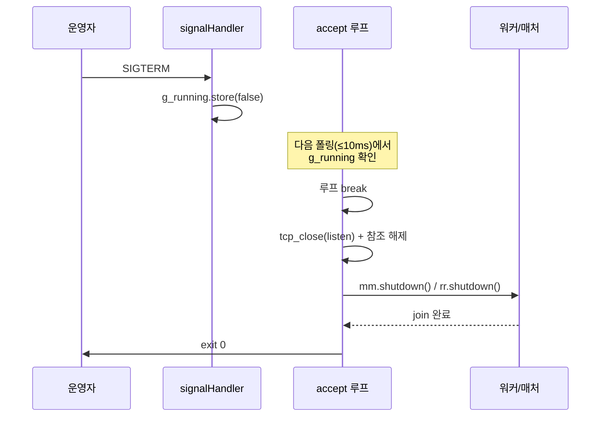

# Part 12: 검수와 배포 안정화 — 보안 기본값과 릴리스

> **시리즈:** 제로부터 멀티플레이어 테트리스 + RL까지
> [시리즈 목차](./README.md) · [이전: Part 11 — 설정](./part11-settings-and-options.md) · **Part 12**

---

## 이 장의 구현 계약

- **선행 상태:** Part 0~11의 모든 로컬·네트워크·학습/추론·메타 경로.
- **이번 장의 파일:** 보안 경계의 `net/`, `server/`, `meta/`, release script와
  `deploy/` 템플릿.
- **연결점:** 새 기능을 더하는 장이 아니라 실패 시 안전성, 소유권, 패키징과 전체
  회귀 검증을 닫는 장이다.
- **완료 게이트:** release 빌드, 결정론/프레이밍/Python 테스트, relay/meta smoke,
  secret 기본값과 graceful shutdown 검증을 모두 완료한다.

## 1. 들어가며

Part 11까지 기능은 다 들어왔다. guest 발급, 토큰 인증, RP/XP/BP, 리더보드,
아이콘 상점과 설정이 동작한다. 이 장은 기능 추가보다 **배포 전 마지막 검수**에
집중한다. 내부 구조체·DB·wire의 `elo` 필드명은 호환을 위해 유지하지만 사용자
용어와 값의 의미는 RP다.

Part 10은 meta 프로세스 내부의 하드닝(토큰 CSPRNG, 상수 시간 secret 비교,
요청 본문 상한, per-IP 레이트 리밋, 정수 오버플로 가드)을 이미 다뤘다. 이 장은
그 이유와 **프로세스 경계·운영 실패**를 더 깊게 본다 — 잘못된 설정의 시작 거부,
SIGPIPE, 소켓 소유권, 릴리스 빌드와 패키징이다.

다룰 항목은 다음 여섯 가지다.

1. **토큰 생성 — 왜 `random_device` 가 아니라 OS CSPRNG 인가** (Part 10 의 forward-reference 회수).
2. **relay 보안 기본값** — `--meta`가 켜졌는데 secret이 없으면 *시작을 거부*.
   RP 조작 경로를 운영 사고 이전에 막는다.
3. **토큰 파일 권한** — guest 토큰은 사실상 비밀번호다. `0600` 으로 저장.
4. **SIGPIPE 와 소켓 fd 소유권** — 한쪽이 끊긴 소켓에 write 해도 프로세스가 죽지 않게. 그리고 한 fd 를 forwarder 두 방향이 공유하는 `TcpSocket` 내부 `shared_ptr<int>` 소유 모델.
5. **자원 예산** — 단계 전환 버퍼, 채팅 queue, worker 수를 유한하게 제한.
6. **포트 파싱과 릴리스 빌드** — `--port` 쓰레기값 방어, Release 플래그, 플랫폼별 패키징.

## 2. 토큰 생성 — `random_device` 의 함정

Part 10 §7 의 `gen_token` 은 16 바이트(128비트) 엔트로피를 읽어 32 hex 문자열로 만든다. 처음 떠올릴 구현은 표준 라이브러리의 `std::random_device` 다.

```cpp
// 예시(실제 저장소에는 없음) — 처음 떠올리는, 그러나 위험한 구현
std::string gen_token_naive()
{
    std::random_device rd;
    std::uniform_int_distribution<uint32_t> dist(0, 0xFFFFFFFFu);
    char buf[33];
    for (int i = 0; i < 4; ++i)
        std::snprintf(buf + i * 8, 9, "%08x", dist(rd));
    buf[32] = '\0';
    return std::string(buf, 32);
}
```

표준은 `std::random_device` 가 비결정적 엔트로피원이라고 *권장* 할 뿐, **보장하지 않는다.** 악명 높은 사례가 구형 MinGW 의 libstdc++ 로, `random_device` 가 매 실행마다 같은 시퀀스를 뱉는 결정적 PRNG 로 구현돼 있었다. 토큰은 사실상 비밀번호이므로, 결정적 토큰은 곧 누구나 예측 가능한 비밀번호다. "대부분의 플랫폼에서 OS CSPRNG 를 래핑하므로 충분히 강하다" 는 가정은 *대부분* 이라는 말 때문에 깨진다.

그래서 실제 `meta/api_server.cpp` 는 OS 엔트로피를 **명시적으로** 읽는다. POSIX 에서는 `/dev/urandom` 을 직접 열고, 실패할 때만 `random_device` 로 폴백한다.

```cpp
// [보안] OS CSPRNG 에서 n 바이트의 무작위 데이터를 채운다.
//   std::random_device 는 대부분의 타깃에서 OS CSPRNG 를 래핑하지만 일부
//   구현(예: 구형 MinGW)에서는 결정적일 수 있다. 토큰/세션 비밀에는 OS
//   엔트로피를 명시적으로 읽고, 실패 시에만 random_device 로 폴백한다.
void fill_random(unsigned char* out, size_t n)
{
#ifndef _WIN32
    // POSIX: /dev/urandom 에서 직접 읽는다(글리브C random_device 와 동일 소스지만 명시적).
    if (FILE* f = std::fopen("/dev/urandom", "rb")) {
        size_t got = std::fread(out, 1, n, f);
        std::fclose(f);
        if (got == n) return;
    }
#endif
    // 폴백(Windows 포함): random_device.
    std::random_device rd;
    size_t i = 0;
    while (i < n) {
        uint32_t x = rd();
        size_t take = (n - i < 4) ? (n - i) : 4;
        std::memcpy(out + i, &x, take);
        i += take;
    }
}
```

`gen_token` 은 이 16 바이트를 hex 로 인코딩만 한다.

```cpp
// 32 hex chars 무작위 토큰 (16 바이트 = 128비트 엔트로피).
std::string gen_token()
{
    unsigned char raw[16];
    fill_random(raw, sizeof(raw));
    static const char hex[] = "0123456789abcdef";
    char buf[33];
    for (int i = 0; i < 16; ++i) {
        buf[i * 2]     = hex[(raw[i] >> 4) & 0xF];
        buf[i * 2 + 1] = hex[raw[i] & 0xF];
    }
    buf[32] = '\0';
    return std::string(buf, 32);
}
```

Linux 에서 `/dev/urandom` 은 부팅 직후 엔트로피 풀이 차기 전이라도 블록되지 않고 암호학적으로 안전한 바이트를 준다(`getrandom(2)` 의 기본 동작과 같은 풀). Windows 빌드는 `_WIN32` 가드로 `/dev/urandom` 경로를 건너뛰고 `random_device` 로 가는데, MSVC 의 `random_device` 는 `BCryptGenRandom` 을 래핑하므로 안전하다. 결정적 구현이 문제인 건 어디까지나 일부 구형 MinGW 였다.

## 3. relay 보안 기본값 — 시작 거부

Part 10 의 가장 중요한 보안 경계는 `POST /v1/matches` 였다. 이 endpoint 가 secret 없이 열려 있으면 누구든 `curl` 로 가짜 매치 결과를 POST 해 RP 를 조작할 수 있다. meta 쪽은 `relay_secret_` 이 비어있지 않으면 `X-Relay-Secret` 을 상수 시간 비교로 검증한다.

문제는 relay 쪽이다. relay 가 `--meta` 로 메타 연동을 켰는데 secret 을 안 넘기면, relay 는 secret 없이 `/v1/matches` 를 호출하고 meta 는 403 으로 거부한다. 결과적으로 매치는 진행되지만 RP 가 전혀 갱신되지 않는다 — 조용히. 운영자는 "왜 RP 가 안 바뀌지?" 를 한참 뒤에야 발견한다.

이런 *조용한 실패* 가 가장 나쁘다. 그래서 `server/main.cpp` 는 "meta 는 켰는데 secret 이 없는" 조합을 **시작 시점에 거부** 한다.

```cpp
std::string metaSecret;
if (const char* env = std::getenv("TETRIS_RELAY_SECRET")) {
    metaSecret = env;
}

// ... CLI 파싱: --meta-secret 이 있으면 환경변수보다 우선한다 ...

std::unique_ptr<meta::client::MetaClient> metaClient;
if (!metaUrl.empty()) {
    if (metaSecret.empty()) {
        std::cerr << "[relay] refusing to start: --meta set but no relay secret. "
                  << "Set --meta-secret or TETRIS_RELAY_SECRET (meta rejects "
                  << "POST /v1/matches without it).\n";
        return 2;
    }
    metaClient = std::make_unique<meta::client::MetaClient>(metaUrl, metaSecret);
    if (!metaClient->valid()) {
        std::cerr << "[relay] invalid --meta URL: " << metaUrl << "\n";
        return 2;
    }
    std::cout << "[relay] meta enabled: " << metaUrl << "\n";
} else {
    std::cout << "[relay] meta=none (unranked mode)\n";
}
```

설계 포인트 두 가지.

- **secret 은 두 경로로 받는다.** relay 는 `--meta-secret` CLI 인자가 우선, 없으면 `TETRIS_RELAY_SECRET` 환경변수를 쓴다. 운영에서는 환경변수가 편하다 — 프로세스 목록(`ps`)에 secret 이 노출되지 않고, systemd unit 의 `Environment=` 로 주입할 수 있다. CLI 인자는 로컬 테스트용.
- **`--meta` 없이는 secret 도 불필요.** meta 연동을 안 켜면 relay 는 Part 7 의 무상태 transparent forwarder 그대로다 — unranked 매치(player_id=0, RP 미반영)만 돌린다. secret 검사는 meta 가 켜진 경우에만 강제된다. 즉 "기본값은 안전" 이면서 "로컬 테스트는 마찰 없음" 을 동시에 만족한다.

meta 쪽도 대칭이다. `meta/main.cpp` 는 secret 도 없고 `--allow-public-matches` 도 없으면 시작을 거부한다(Part 10 §7 참고) — 양쪽 다 "실수로 무방비 상태로 뜨는 것" 을 시작 시점에 막는다.

이 시점에서 빌드하면, `tetris_relay --meta http://127.0.0.1:8080` 을 secret 없이 띄울 때 즉시 종료된다.

```bash
$ ./tetris_relay --meta http://127.0.0.1:8080
[relay] refusing to start: --meta set but no relay secret. Set --meta-secret or TETRIS_RELAY_SECRET (meta rejects POST /v1/matches without it).
$ echo $?
2
```

`TETRIS_RELAY_SECRET=$(openssl rand -hex 32) ./tetris_relay --meta http://127.0.0.1:8080` 으로 띄우면 `[relay] meta enabled: ...` 가 찍히며 정상 기동한다.

## 4. 토큰 파일 권한 — 0600

클라이언트는 guest 토큰을 한 번 발급받아 디스크에 저장하고, 재접속마다 그 파일을 읽어 같은 player 로 인식된다. 이 토큰은 곧 계정이다 — 유출되면 남이 내 RP 와 아이콘을 그대로 가져간다. 따라서 파일 권한이 중요하다. `meta/http_client.cpp` 의 `save_token` 은 POSIX 에서 `0600`(소유자만 읽기/쓰기)으로 만든다.

```cpp
bool save_token(const std::string& token)
{
    namespace fs = std::filesystem;
    auto path = token_file_path();
    if (path.empty()) return false;

    std::error_code ec;
    fs::create_directories(fs::path(path).parent_path(), ec);

#ifndef _WIN32
    const std::string line = token + "\n";
    int fd = ::open(path.c_str(), O_WRONLY | O_CREAT | O_TRUNC, S_IRUSR | S_IWUSR);
    if (fd < 0) return false;
    if (::fchmod(fd, S_IRUSR | S_IWUSR) != 0) {
        ::close(fd);
        return false;
    }
    size_t written = 0;
    while (written < line.size()) {
        ssize_t n = ::write(fd, line.data() + written, line.size() - written);
        if (n < 0) {
            if (errno == EINTR) continue;
            ::close(fd);
            return false;
        }
        if (n == 0) {
            ::close(fd);
            return false;
        }
        written += static_cast<size_t>(n);
    }
    bool ok = (::close(fd) == 0);
    ::chmod(path.c_str(), S_IRUSR | S_IWUSR);
    return ok;
#else
    std::ofstream f(path, std::ios::trunc);
    if (!f) return false;
    f << token << "\n";
    bool ok = static_cast<bool>(f);
    f.close();
    fs::permissions(path,
                    fs::perms::owner_read | fs::perms::owner_write,
                    fs::perm_options::replace,
                    ec);
    return ok;
#endif
}
```

미묘한 점이 두 가지 있다.

- **`open(..., 0600)` 만으로는 부족하다.** `open` 의 mode 인자는 *새로 생성될 때만* 적용되고, 그나마 umask 가 한 번 더 빼낸다. 이미 존재하는 파일(예: 이전 버전이 0644 로 만들어 둔 것)이면 mode 가 무시된다. 그래서 `fchmod(fd, 0600)` 를 한 번 더 호출해 기존 파일도 강제로 조인다.
- **Windows 는 `std::filesystem::permissions` 로 소유자 읽기/쓰기를 요청한다.** POSIX 의 `0600` 과 완전히 같은 ACL 모델은 아니지만, 토큰 파일은 사용자 프로파일 경로(`%LOCALAPPDATA%` 등) 안에 있고, 저장 직후 권한을 owner read/write 로 교체한다. SID/DACL 을 직접 구성하는 더 강한 격리는 추후 과제다.

## 5. SIGPIPE 와 소켓 fd 소유권

### 5.1 SIGPIPE — 죽은 소켓에 쓸 때

relay 의 핵심 루프는 한 소켓에서 읽어 다른 소켓에 쓰는 것이다(Part 7). 그런데 상대가 게임을 끄거나 네트워크가 끊긴 직후, 이미 닫힌 TCP 소켓에 `write` 하면 POSIX 는 **`SIGPIPE` 시그널** 을 보낸다. 이 시그널의 기본 처리는 *프로세스 종료* 다. 즉 클라이언트 하나가 끊긴 순간 relay 전체가 죽어 다른 모든 매치까지 끊긴다.

해결은 시그널을 무시하는 것이다. 무시하면 `send` 는 `-1` 과 `errno=EPIPE` 를 반환하고, relay 는 그 매치만 정리하고 계속 돈다. 등록 위치는 두 곳으로 나뉜다.

- **SIGINT / SIGTERM** 은 `server/main.cpp` 가 meta 설정 검증 뒤 등록한다 — graceful stop 용 핸들러.
- **SIGPIPE 무시** 는 `net/socket.cpp` 의 `net_init()` 안에서 등록한다 — 소켓을 쓰는 모든 프로세스(relay 든 game 클라이언트든) 가 `net_init()` 을 거치므로, 무시 설정을 네트워킹 초기화에 묶어 두면 한 곳에서 모든 바이너리가 보호된다.

먼저 `server/main.cpp` 의 시그널 등록이다.

```cpp
std::signal(SIGINT,  signalHandler);
std::signal(SIGTERM, signalHandler);
```

`signalHandler` 는 `g_running` 플래그만 내린다. 시그널 핸들러 안에서는 *async-signal-safe* 한 연산만 허용된다. 핸들러는 임의 시점에 다른 코드를 끊고 들어오므로 `malloc`, `mutex`, 그리고 내부에서 잠금을 잡는 `shared_ptr` 조작 등은 데드락/메모리 손상을 일으킬 수 있다. 가장 보수적인 POSIX 형태는 `volatile sig_atomic_t` 플래그다. 현재 코드는 lock-free 로 동작하는 일반 플랫폼의 `std::atomic<bool>` store 만 사용하지만, 이 선택은 “핸들러에서 복잡한 정리를 하지 않는다”는 운영 패턴의 일부로 이해해야 한다.

```cpp
std::atomic<bool> g_running{true};
net::TcpSocket    g_listen_sock{};  // 논블로킹 listen 소켓 (accept 폴링)

void signalHandler(int /*sig*/) {
    // async-signal-safe 하게 플래그만 세운다. listen 소켓은 논블로킹이라
    // accept 루프가 최대 ~10ms 안에 g_running 을 보고 빠져나온다. 핸들러에서
    // 소켓(shared_ptr) 을 건드리지 않는다 — atomic store 만 사용.
    g_running.store(false);
}
```

핵심은 **핸들러가 listen 소켓을 닫지 않는다** 는 것이다. `tcp_close()` 는 `shared_ptr` 를 읽으므로 시그널 핸들러에서 부르면 안전하지 않다(§6 참고). 대신 listen 소켓을 *논블로킹* 으로 만들어 두고, accept 루프가 폴링하면서 매 회 `g_running` 을 확인한다. 시그널이 들어오면 핸들러는 플래그만 내리고 즉시 반환하고, 다음 폴링(최대 10ms 뒤) 에서 루프가 스스로 빠져나온다.

```cpp
g_listen_sock = net::tcp_listen(port, /*backlog=*/16);
if (!g_listen_sock.valid()) {
    std::cerr << "tcp_listen(" << port << ") failed — port in use?\n";
    net::net_shutdown();
    return 1;
}
// listen 소켓을 논블로킹으로 — 시그널 핸들러가 fd 를 닫지 않고 g_running
// 플래그만 세워도 accept 루프가 폴링으로 빠져나오게 한다(async-signal-safe).
net::tcp_set_nonblocking(g_listen_sock);
```

accept 루프는 대기 연결이 없으면(논블로킹 accept 가 `EWOULDBLOCK` 으로 빈 소켓을 돌려주면) 10ms 자고 재폴링한다.

```cpp
// accept 루프 (논블로킹 폴링)
uint32_t next_conn_id = 1;
while (g_running.load()) {
    auto client = net::tcp_accept(g_listen_sock);
    if (!client.valid()) {
        // 논블로킹 accept: 대기 연결 없음(EWOULDBLOCK) 또는 셧다운.
        if (!g_running.load()) break;
        // 대기 연결 없음 — 잠깐 쉬었다가 재폴링.
        std::this_thread::sleep_for(std::chrono::milliseconds(10));
        continue;
    }
    const uint32_t id = next_conn_id++;
    std::cout << "[relay] accept conn=" << id << "\n";
    if (!connWorkers.launch(
            [client = std::move(client), id, &mm, &rr, mcPtr]() mutable {
                relay::playerConnThread(std::move(client), id, mm, rr, mcPtr);
            })) {
        std::cerr << "[relay] rejecting conn=" << id
                  << ": connection worker unavailable\n";
    }
}
```

루프를 빠져나온 *뒤에야* — 정상 스레드 컨텍스트에서 — 소켓을 닫고 워커를 정리한다.

```cpp
std::cout << "[relay] shutting down...\n";
relay::beginShutdown();             // 신규 lobby/forwarder 차단
connWorkers.stopAccepting();         // 신규 connection worker 차단
net::tcp_close(g_listen_sock);
g_listen_sock = net::TcpSocket{};  // 마지막 참조 해제 → 실제 fd close
mm.shutdown();
rr.shutdown();
if (matcher.joinable()) matcher.join();
connWorkers.wait();                  // mm/rr raw reference 사용자 종료
relay::waitForShutdown();            // MetaClient/net 사용자 종료
net::net_shutdown();
std::cout << "[relay] done\n";
return 0;
```

SIGPIPE 무시는 `net_init()` 에 들어 있다 — main.cpp 가 아니다.

```cpp
// [NET] 네트워킹 초기화(Windows 전용)
bool net_init() {
    if (g_inited) return true;
#ifdef _WIN32
    WSADATA wsaData;
    int r = WSAStartup(MAKEWORD(2,2), &wsaData);
    g_inited = (r == 0);
    return g_inited;
#else
    // POSIX: writing to a closed peer can raise SIGPIPE and terminate the whole
    // relay/client process before send() returns EPIPE. Treat it as an I/O error.
    std::signal(SIGPIPE, SIG_IGN);
    g_inited = true;
    return true;
#endif
}
```

`SIG_IGN` 으로 무시하면 끊긴 소켓에 `send` 해도 시그널이 발생하지 않고 `EPIPE` 만 돌아온다. 추가로 POSIX `send` 호출에는 `MSG_NOSIGNAL` 플래그를 줘 호출 단위로도 시그널을 억제한다(`net/socket.cpp` 의 `tcp_send_all`). 이중 방어다 — 한 클라이언트가 끊겨도 relay 프로세스는 살아서 다른 매치를 계속 중계한다.

이 절의 전체 흐름은 다음과 같다.



## 6. 소켓 fd 소유권 — fd 재사용 경합

SIGPIPE 가 "죽은 소켓에 쓰는" 문제라면, fd 소유권은 "살아있는 소켓을 누가 닫느냐" 의 문제다. 이쪽이 더 미묘하고, 공개 서버에서 **교차 연결 데이터 유출** 로 이어질 수 있어 더 위험하다.

### 6.1 과거의 `{ int fd }` 와 fd 재사용

초기 `TcpSocket` 은 그냥 정수 하나를 들고 있었다 — `struct TcpSocket { int fd; };`. relay 의 forwarder 는 한 연결을 양방향으로 중계하므로, 같은 fd 를 들고 있는 복사본이 여러 detached 스레드에 흩어진다. 각 스레드가 끝날 때 자기 복사본으로 `::close(fd)` 를 호출했다.

문제는 fd 가 **작은 정수의 재사용 자원** 이라는 데 있다. POSIX 는 항상 *가장 작은 미사용 fd* 를 새 소켓에 배정한다. 그래서 다음 순서가 가능하다.

1. 스레드 A 가 연결 X(fd=12) 의 중계를 끝내고 `::close(12)` 한다.
2. 곧바로 새 클라이언트 Y 가 접속하고, `accept()` 가 *가장 작은 미사용 fd* 인 12 를 Y 에 배정한다.
3. 아직 살아있던 스레드 B 가 (X 라고 믿고) fd=12 에 `write`/`read` 한다 — 실제로는 **Y 의 소켓**.

공개 서버에서 이것은 단순 크래시가 아니라 **A 의 데이터가 엉뚱한 클라이언트 Y 로 새거나, Y 의 데이터를 X 의 코드가 읽는** 교차 연결 유출이다. 공격자가 접속/절단을 빠르게 반복해 이 경합을 노릴 수 있다.

### 6.2 `shared_ptr<int>` 로 소유권을 모은다

수정은 fd 를 참조 카운트 소유 핸들로 감싸는 것이다. 실제 `::close` 는 "마지막 복사본이 사라지는 순간" 딱 한 번만 일어나게 한다.

```cpp
// TCP 소켓 핸들 — 참조 카운트 소유(ref-counted owning handle).
//
//   과거에는 평범한 { int fd } 였다. 같은 연결의 복사본을 여러 detached 스레드가
//   값으로 들고 각자 ::close 했기 때문에, 한 스레드가 닫은 fd 정수를 곧바로 새
//   accept() 가 재사용하면 살아있던 다른 스레드가 "엉뚱한 클라이언트 소켓"에
//   read/write 하는 use-after-close / fd-reuse 경합이 있었다(공개 서버에서 교차
//   연결 데이터 유출로 악용 가능).
//
//   이제 fd 는 shared_ptr<int> 가 소유하며, 모든 복사본은 같은 제어 블록을
//   공유한다. 실제 ::close 는 "마지막 복사본이 사라지는 순간" deleter 에서
//   정확히 한 번 호출된다(이중 close 와 fd 재사용 경합 제거).
//
//   tcp_close() 는 즉시 ::shutdown(SHUT_RDWR) 만 호출한다 — 같은 fd 를 폴링/대기
//   중인 다른 복사본의 recv 를 EOF 로 깨워 루프를 빠져나가게 한다. 소유권(=실제
//   close)은 RAII 에 맡긴다. shutdown 은 일반 스레드에서 반복 호출해도 무해한
//   종료 신호로만 사용한다. TcpSocket 은 shared_ptr 를 읽으므로 tcp_close() 를
//   signal handler 에서 직접 호출하면 안 된다.
//
//   동시성 계약: 한 TcpSocket "인스턴스(변수)" 자체를 두 스레드가 동시에
//   재대입/소멸시키면 안 된다(shared_ptr 인스턴스 자체는 thread-safe 가 아님).
//   서로 다른 복사본을 각 스레드가 들고 read/close 하는 것은 안전하다.
struct TcpSocket {
    std::shared_ptr<int> fdh;  // 제어 블록: *fdh == fd. 마지막 참조 소멸 시 ::close.

    int  fd()    const { return fdh ? *fdh : -1; }
    bool valid() const { return fdh && *fdh >= 0; }
};
```

새 fd 를 만드는 모든 경로(`tcp_listen`/`tcp_accept`/`tcp_connect`) 는 `make_owned` 로 감싼다. deleter 가 정확히 한 번 `close_fd` 를 부른다.

```cpp
// [NET] 새로 생성된 fd 를 참조 카운트 소유 핸들로 감싼다.
//   마지막 복사본이 사라질 때 deleter 가 close_fd 로 정확히 한 번 닫는다.
static TcpSocket make_owned(int fd) {
    TcpSocket s;
    s.fdh = std::shared_ptr<int>(new int(fd), [](int* p) {
        if (p) { close_fd(*p); delete p; }
    });
    return s;
}
```

### 6.3 `tcp_close` 는 close 가 아니라 shutdown

소유권을 RAII 에 맡겼으니, "닫는다" 는 행위를 둘로 쪼갠다.

- **종료 신호** — `tcp_close()` 는 `::shutdown(SHUT_RDWR)` *만* 한다. 같은 fd 를 `recv` 로 대기 중인 다른 복사본을 EOF 로 깨워 루프를 빠져나가게 하는 용도다. 실제 fd 를 닫지 않으므로 fd 정수는 아직 재사용되지 않는다.
- **실제 close** — 마지막 `TcpSocket` 복사본이 소멸(또는 재대입)할 때 deleter 에서 한 번. 이 시점엔 모든 스레드가 그 복사본을 버린 뒤이므로 fd 재사용 경합이 없다.

```cpp
void tcp_close(TcpSocket& s) {
    if (!s.fdh) return;
    int fd = *s.fdh;
    if (fd >= 0) {
#ifdef _WIN32
        ::shutdown(fd, SD_BOTH);
#else
        ::shutdown(fd, SHUT_RDWR);
#endif
    }
}
```

`tcp_close` 가 `fdh` 를 `reset()` 하지 않는 점이 중요하다. 같은 인스턴스를 다른 스레드가 읽고 있을 수 있어(예: `Session::sock` 을 ioThread 가 read, 메인이 Close), `reset` 은 *같은 shared_ptr 인스턴스* 에 대한 data race 가 된다. 참조 해제는 소유 스레드의 재대입/소멸(RAII) 에 맡긴다.

### 6.4 `Close()` 의 shutdown → join → reset 순서

`net/session.cpp` 의 `Close()` 가 이 계약을 그대로 구현한다. 순서가 핵심이다.

```cpp
void Session::Close() {
    quit = true;
    // 소켓을 먼저 닫아(shutdown) accept()/recv() 블로킹 스레드를 깨운다.
    //   sockMu_ 로 워커 스레드의 publish 와 직렬화 — Close 가 quit 를 먼저 세팅하므로
    //   워커는 이 잠금 이후 publish 하지 않거나(잠금 안에서 quit 재확인), 이미 publish
    //   한 값을 우리가 본다. (shared_ptr 멤버 data race 방지)
    {
        std::lock_guard<std::mutex> lk(sockMu_);
        if (listening && listenSock.valid()) tcp_close(listenSock);
        if (sock.valid()) tcp_close(sock);
    }
    // shutdown 후 스레드 join (블로킹 해제됨). join 은 반드시 잠금 밖에서.
    if (ath.joinable()) ath.join();
    if (qth.joinable()) qth.join();
    if (rth.joinable()) rth.join();
    if (th.joinable()) th.join();
    // join 후엔 워커가 모두 종료됐다. 늦게 publish 됐을 수 있으니 한 번 더 닫고,
    // 소유자 복사본을 명시적으로 비운다 — 마지막 참조를 버려 실제 fd 를 닫고
    // valid() 를 false 로 되돌린다(연결 종료 후 fd 잔존 회귀 방지).
    {
        std::lock_guard<std::mutex> lk(sockMu_);
        if (sock.valid()) tcp_close(sock);
        if (listenSock.valid()) tcp_close(listenSock);
        sock = TcpSocket{};
        listenSock = TcpSocket{};
```

세 단계로 읽힌다.

1. **shutdown** (잠금 안) — 워커들의 `recv`/`accept` 를 EOF 로 깨운다. 아직 fd 는 살아있다.
2. **join** (잠금 밖) — 워커 스레드가 모두 끝나길 기다린다. join 을 잠금 안에서 하면 워커가 `sockMu_` 를 잡으려다 데드락이므로, 반드시 잠금을 풀고 join 한다.
3. **reset** (잠금 안) — `sock = TcpSocket{}` 로 소유자 복사본을 버린다. 워커가 모두 끝났으니 이제 남은 마지막 참조이고, 여기서 deleter 가 실제 `::close` 를 부른다.

`sockMu_` 의 역할은 *shared_ptr 멤버 변수 자체* 에 대한 동시 재대입을 직렬화하는 것이다. 워커 스레드가 `sock` 멤버를 읽어 `recv` 하는 동안 메인이 `sock = TcpSocket{}` 으로 재대입하면, 두 스레드가 같은 shared_ptr 인스턴스를 동시에 만지는 data race가 된다. 워커는 멤버를 직접 쓰지 않고 잠금 아래에서 *값으로 복사* 해 쓴다 — `net/session.cpp` 전반의 `{ std::lock_guard<std::mutex> lk(sockMu_); s = sock; }` 패턴이 그것이다. 서로 다른 복사본을 각자 들고 read/close 하는 것은 §6.2 의 계약상 안전하다.

## 7. 신뢰할 수 없는 입력 · DoS 하드닝

relay 와 host 는 공개 IP 에서 임의의 피어로부터 바이트를 받는다. 그 피어가 정상 클라이언트라는 보장은 없다. 악의적 피어가 보낼 수 있는 세 가지 공격 표면을 막는다.

### 7.1 INPUT 프레임 바운드 검증

lockstep 의 INPUT 프레임은 `[from:4][cnt:2][inputs:cnt]` 다. 신뢰할 수 없는 피어는 `cnt` 를 거대하게, `from` 을 아무 tick 으로나 보낼 수 있다. 두 가지를 막는다.

```cpp
case MsgType::INPUT: {
    if (f.payload.size() >= 6) {
        const uint8_t* p = f.payload.data();
        uint32_t from = le_read_u32(p);
        uint16_t cnt = le_read_u16(p+4);
        // 페이로드 크기 검증: 헤더(6) + cnt 바이트가 실제 크기 이내인지 확인
        if (static_cast<size_t>(6) + cnt > f.payload.size()) break;
        const uint8_t* arr = p+6;
        // [보안] 신뢰할 수 없는 피어의 INPUT 처리:
        //  - remoteInputs 무한 증가로 인한 메모리 고갈을 막기 위해 누적 크기를 제한.
        //  - tick 래핑/원거리 tick 주입으로 인한 desync 를 막기 위해 현재 수신
        //    지점(lastRemoteTick) 기준 윈도우를 벗어난 tick 은 폐기.
        constexpr size_t   kMaxRemoteInputs = 8192;  // 버퍼링 가능한 최대 tick 수
        constexpr uint32_t kMaxTickWindow   = 4096;  // 현재 지점 대비 허용 거리(과거/미래)
        {
            std::lock_guard<std::mutex> lk(inMu);
            const uint32_t cur = lastRemoteTick.load();
            for (uint16_t i=0;i<cnt;++i) {
                const uint32_t tick = from + i;
                const uint32_t dist = (tick >= cur) ? (tick - cur) : (cur - tick);
                if (dist > kMaxTickWindow) continue;  // 윈도우 밖(가비지/래핑) 폐기
                if (remoteInputs.size() >= kMaxRemoteInputs &&
                    remoteInputs.find(tick) == remoteInputs.end()) continue;  // 버퍼 포화
                remoteInputs.emplace(tick, arr[i]);
                if (tick > lastRemoteTick) lastRemoteTick = tick;
            }
        }
        std::vector<uint8_t> ack; le_write_u32(ack, lastRemoteTick.load());
        auto fr = build_frame(MsgType::ACK, ack);
        std::lock_guard<std::mutex> lk(sendMu); sendQ.push_back(std::move(fr));
    }
} break;
```

두 상수가 방어선이다.

- **`kMaxTickWindow` (4096)** — 현재 수신 지점 `cur` 에서 과거/미래로 4096 tick 을 벗어난 tick 은 폐기한다. `dist` 를 부호 없는 절댓값으로 계산하므로 tick 래핑(`uint32_t` 오버플로) 으로 인한 거대 거리도 윈도우 밖으로 잡힌다. 악의적 피어가 `from = 0xFFFFFFF0` 같은 값으로 desync 를 유발하려 해도 무시된다.
- **`kMaxRemoteInputs` (8192)** — `remoteInputs` 맵의 크기를 8192 로 제한한다. 이미 포화 상태에서 *새* tick 을 추가하려는 시도는 버린다(기존 tick 의 덮어쓰기는 허용). 거대한 `cnt` 로 무한정 메모리를 먹이려는 공격을 막는다.

먼저 `6 + cnt > payload.size()` 로 페이로드 경계도 검증한다 — 선언된 `cnt` 만큼의 입력 바이트가 실제로 들어있지 않으면 즉시 버린다(버퍼 오버리드 방지).

### 7.2 느린 송신(slow-loris) 타임아웃

논블로킹 소켓에 `send` 가 `EWOULDBLOCK` 을 반환하면 커널 송신 버퍼가 가득 찼다는 뜻이다 — 보통 상대가 느리거나, *고의로 천천히 읽는* 피어다. 무한정 재시도하면 한 느린 피어가 송신 스레드를 영원히 붙잡는다(slow-loris). `tcp_send_all` 은 5초 블록 타임아웃을 둔다.

```cpp
ssize_t n = ::send(fd, (const char*)(p + sent), (size_t)(len - sent), flags);
if (n < 0) {
    if (errno == EINTR) continue;
    if (errno == EAGAIN || errno == EWOULDBLOCK) {
        auto now = std::chrono::steady_clock::now();
        if (blockedSince == std::chrono::steady_clock::time_point{}) blockedSince = now;
        if (now - blockedSince >= kBlockedTimeout) return false;
        // 논블로킹에서 버퍼 가득참 - 짧은 대기 후 재시도
        std::this_thread::sleep_for(std::chrono::milliseconds(1));
        continue;
    }
    return false;
}
```

`kBlockedTimeout` 은 5초다. 한 번이라도 진척이 있으면(`sent` 가 증가하면) `blockedSince` 를 리셋하므로, 정상적으로 느린 연결은 살아남고 *전혀 진척이 없는* 연결만 5초 뒤 끊긴다.

### 7.3 단계 전환 버퍼와 채팅 큐 상한

TCP는 메시지가 아니라 바이트 스트림이다. 한 `recv`가 정확히 한 frame을
반환한다는 보장이 없어서 `QUEUE_JOIN + QUEUE_CANCEL`, `ROOM_JOIN + READY`가
함께 올 수 있고, frame 중간까지만 올 수도 있다. `playerConnThread`가 첫 frame을
처리한 뒤 지역 수신 버퍼를 버리면 이미 kernel에서 읽은 후속 바이트는 영구히
유실된다.

현재 코드는 소켓을 다음 상태로 넘길 때 잔여 바이트도 함께 넘긴다.

- `player_conn.cpp::residual_stream`은 파싱된 후속 frame과 partial tail을
  `PlayerInfo::streamBuf` 또는 `roomLoop_` 초기 버퍼로 옮긴다.
- queue lobby는 `READY`/`QUEUE_CANCEL`만 소비하고 처음 만난 게임 frame부터
  `Channel::prefixFromA/B`로 포워더에 인계한다.
- lobby prefix는 한쪽당 64 KiB를 넘으면 매치를 중단한다. 준비된 한쪽이
  포워더 전환을 기다리는 동안 무한히 밀어 넣는 공격을 막는다.
- 클라이언트의 수신 `CHAT` queue는 256개로 제한하고, 포화 시 가장 오래된
  메시지를 버린다. UI가 소비를 멈춰도 메모리가 무한 증가하지 않는다.

여기서 일반화할 규칙은 **상태 머신의 소유권 이전 단위가 fd 하나가 아니라
`(fd, already-read bytes)`**라는 것이다.

### 7.4 워커 예외 안전성과 동시성 예산

relay는 연결, 30초 수락 lobby, 양방향 forwarder에 thread를 사용한다. callback
예외가 thread entry 밖으로 빠지면 `std::terminate`로 프로세스가 끝나고,
thread 생성 전에 올린 수동 counter를 실패 경로에서 내리지 않으면 shutdown이
영구 대기한다.

`server/worker_group.h::WorkerGroup`이 이 정책을 한곳에 모은다.

```cpp
template <typename Fn>
bool launch(Fn&& fn) noexcept {
    {
        std::lock_guard<std::mutex> lk(mu_);
        if (!accepting_ || active_ >= maxActive_) return false;
        ++active_;
    }
    try {
        std::thread([this, work = std::forward<Fn>(fn)]() mutable {
            Completion completion{this}; // 모든 반환/예외에서 active 감소
            try { work(); }
            catch (const std::exception& e) { /* log */ }
            catch (...) { /* log */ }
        }).detach();
    } catch (...) {
        finish();                         // thread 생성 실패 rollback
        return false;
    }
    return true;
}
```

연결 worker는 최대 256개, queue lobby와 forwarder를 합친 relay worker는 최대
512개다. 두 번째 상한이 중요한 이유는 공격자가 첫 frame을 빨리 보내 연결
worker를 즉시 통과한 뒤, 30초 lobby thread를 무제한 만들 수 있기 때문이다.
상한 도달이나 생성 실패는 해당 연결/매치만 닫고 서버는 계속 동작한다.
shutdown은 새 작업을 막고 모든 socket loop를 깨운 뒤 `wait()`로 active가 0이
될 때까지 기다린다.

### 7.5 정수 오버플로 가드 (교차 참조)

세 번째 표면은 meta 의 JSON 정수 파싱이다. `POST /v1/matches` 의 `score_a` 같은 필드에 `99999999999999999999` 같은 값이 들어오면 `int64_t` 로 변환하다 오버플로한다. `proto::find_int` 는 `INT64_MAX` 를 넘기면 잘못된 값 대신 `std::nullopt` 를 돌려준다. 이 가드는 meta 프로세스 내부 하드닝이라 [Part 10 §7](./part10-meta-and-ranking.md) 에서 이미 상세히 다뤘다 — 여기서는 "untrusted-input 방어선의 일부" 로만 짚고 넘어간다.

## 8. 메타 서비스 하드닝

§3 에서 relay 가 secret 없이 뜨는 것을 막았다. meta 쪽은 대칭으로 *자기 자신* 이 무방비로 뜨는 것을 막는다. `meta/main.cpp` 는 secret 도 없고 `--allow-public-matches` 도 없으면 시작을 거부한다.

```cpp
if (args.relay_secret.empty() && !args.allow_public_matches) {
    std::fprintf(stderr,
                 "[meta] refusing to start: POST /v1/matches requires "
                 "--relay-secret or TETRIS_RELAY_SECRET. For local-only "
                 "tests, pass --allow-public-matches explicitly.\n");
    return 2;
}
```

relay(§3) 와 meta(여기) 가 양쪽 다 시작 시점에 거부하므로, "실수로 RP 조작이 가능한 상태로 배포되는" 경로가 양끝에서 닫힌다. 로컬 테스트만 `--allow-public-matches` 라는 *명시적* 플래그로 빠져나갈 수 있다.

meta 프로세스 *내부* 의 나머지 하드닝은 Part 10 에서 이미 구현·해설했으므로 여기서 코드를 다시 싣지 않고 목록으로만 회수한다.

- **OS CSPRNG 토큰** — `fill_random` + `gen_token` (이 장 §2 에서 회수).
- **상수 시간 secret 비교** — `X-Relay-Secret` 검증의 타이밍 사이드채널 방지 ([Part 10 §7](./part10-meta-and-ranking.md)).
- **요청 본문 상한** — `svr.set_payload_max_length(64 * 1024)` 로 거대 body 플러딩 차단 ([Part 10 §7](./part10-meta-and-ranking.md)).
- **per-IP 레이트 리밋** — 고정 윈도우 카운터로 남용/DoS 완화 ([Part 10 §7](./part10-meta-and-ranking.md)).
- **`find_int` 오버플로 가드** — §7.5 에서 짚은 정수 파싱 방어.
- **토큰 파일 0600** — guest 토큰을 비밀번호처럼 보호 (이 장 §4).

즉 meta 의 하드닝은 "토큰은 강한 난수 · secret 검증은 사이드채널 안전 · 입력은 크기/개수/값 모두 바운드 · 시작은 안전 기본값" 으로 요약된다.

## 9. 릴리스 빌드와 패키징

코드가 안전해졌으니 배포본을 만든다. 핵심은 **개인 환경값(내 IP, 디버그 오버레이) 을 release 바이너리에 박지 않는 것** 과, 플랫폼별로 런타임 의존성(SDL2, ONNX Runtime, 폰트, 사운드) 을 함께 묶는 것이다.

### 9.1 CMake Release 설정

게임 클라이언트는 두 가지 컴파일 타임 기본값을 받는다 — 메뉴에 박히는 기본 relay 엔드포인트와 meta URL.

```cmake
set(TETRIS_DEFAULT_RELAY_ENDPOINT "127.0.0.1:7777" CACHE STRING
    "Default relay endpoint embedded in the game client menu")
set(TETRIS_DEFAULT_META_URL "" CACHE STRING
    "Default tetris_meta base URL embedded in the game client")
```

release 빌드는 여기에 공개 도메인을 주입하고 `CMAKE_BUILD_TYPE=Release` 로 켠다. 디버그 오버레이(`TETRIS_ENABLE_DEBUG_UI`) 와 네트워크 추적 로그(`TETRIS_ENABLE_NET_TRACE`) 는 기본 OFF 이므로 release 에는 들어가지 않는다.

```bash
cmake -S . -B build-release \
  -DCMAKE_BUILD_TYPE=Release \
  -DTETRIS_DEFAULT_RELAY_ENDPOINT=relay.example.com:7777 \
  -DTETRIS_DEFAULT_META_URL=https://api.example.com
cmake --build build-release --config Release --target tetris
```

### 9.2 클라이언트 번들 스크립트

플랫폼마다 한 스크립트로 번들을 만든다. 세 스크립트 모두 `RELAY_ENDPOINT`/`META_URL` 환경변수(또는 PowerShell 파라미터) 로 엔드포인트를 주입받고, `BOT=1` 이면 ONNX 봇과 그 런타임을 포함한다.

| 스크립트 | 산출물 | 묶는 것 |
| --- | --- | --- |
| `scripts/release_linux.sh` | `dist/tetris-linux-x64.tar.gz` | `tetris` + `lib/`(SDL2/ORT, rpath=`$ORIGIN/lib`) + `Font/` + `Sounds/` + (옵션) `assets/`·`model/` |
| `scripts/release_macos.sh` | `dist/tetris-macos.tar.gz` | `Tetris.app`(universal `arm64;x86_64`) + 동봉 dylib |
| `scripts/release_win.ps1` | `dist\tetris-win-x64.zip` | `tetris.exe` + `Font\` + `Sounds\` + (BOT 시) `onnxruntime.dll` |

Linux/macOS 번들은 공유 라이브러리를 `lib/` 에 담고 rpath 를 `$ORIGIN/lib` 로 박아, 사용자가 SDL2 를 따로 설치하지 않아도 압축만 풀면 실행된다. 실제 유저용 빌드는 §9.1 의 cmake 를 직접 치는 대신 스크립트로 한 번에 만든다.

```bash
RELAY_ENDPOINT=relay.example.com:7777 \
META_URL=https://api.example.com \
./scripts/release_linux.sh
```

### 9.3 서버 번들과 DB 백업

서버 측은 별도 스크립트로 묶는다. `scripts/release_server_linux.sh` 는 게임 클라이언트 없이 relay+meta 만 Release+HTTPS 로 빌드한다.

```bash
CMAKE_ARGS=(
    -B "$BUILD"
    -S "$ROOT"
    -DCMAKE_BUILD_TYPE=Release
    -DTETRIS_BUILD_GAME=OFF
    -DTETRIS_BUILD_RELAY=ON
    -DTETRIS_BUILD_META=ON
    -DTETRIS_BUILD_TEST=OFF
    -DTETRIS_ENABLE_HTTPS=ON
)
```

산출물 `dist/tetris-server-linux-x64.tar.gz` 에는 `tetris_relay`, `tetris_meta`, 랭킹 페이지(`web/ranking/index.html`), systemd/Caddy/cloudflared 예시(`deploy/`), 그리고 DB 백업 스크립트가 같이 들어간다.

영속 상태는 meta 의 SQLite DB 하나뿐이므로 백업도 그 한 파일이 전부다. `scripts/backup_meta_db.sh` 는 `sqlite3` CLI 가 있으면 온라인 백업 API(`.backup`) 로 일관된 스냅샷을 뜨고, 없으면 DB/WAL/SHM 세 파일을 함께 보관한다(WAL 모드라 셋이 한 세트).

```bash
./scripts/backup_meta_db.sh /srv/tetris/db/tetris.db /srv/tetris/backups
```

`.backup` 은 라이브 DB 를 잠그지 않고 일관된 복사본을 만들므로, meta 가 떠 있는 상태에서도 안전하게 백업할 수 있다.

### 9.4 systemd 격리

`deploy/systemd/tetris-relay.service`와 `tetris-meta.service`는 애플리케이션
검증과 별개로 OS 수준 피해 범위를 줄인다.

```ini
NoNewPrivileges=true
PrivateTmp=true
ProtectSystem=strict
ProtectHome=true
```

`ProtectSystem=strict`는 기본 filesystem을 read-only로 보이게 하고,
`ProtectHome=true`는 서비스가 사용자 home을 읽지 못하게 한다. meta가 써야 하는
SQLite 위치는 기존 `ReadWritePaths=/srv/tetris`로 예외를 둔다. 따라서
프로세스가 침해돼도 임의의 system/home 파일을 수정하는 경로가 기본적으로
닫힌다. unit을 수정할 때는 DB, working directory, 인증서 등 실제 write/read
경로가 이 sandbox 정책과 일치하는지도 함께 검증해야 한다.

## 이 장에서 완성된 것

- `server/main.cpp` 의 graceful shutdown — `signalHandler` 가 종료 플래그만 내리고, 논블로킹 accept 폴링(10ms) 이 스스로 루프를 빠져나온 뒤 정상 스레드에서 `tcp_close` + join. 핸들러 안에서 소켓/shared_ptr/mutex 를 건드리지 않는다.
- `net/socket.cpp` `net_init()` 의 `SIGPIPE` `SIG_IGN` + POSIX `send` 의 `MSG_NOSIGNAL` — 끊긴 피어에 써도 프로세스가 죽지 않음.
- `net/socket.h` 의 `shared_ptr<int>` 기반 `TcpSocket` — fd 재사용 경합(교차 연결 데이터 유출) 제거. `tcp_close` = shutdown-only, 실제 close 는 RAII 단일 호출.
- `net/session.cpp` `Close()` 의 shutdown → join → reset 순서 + `sockMu_` 로 shared_ptr 멤버 직렬화.
- `net/session.cpp` INPUT 프레임 바운드 검증(`kMaxTickWindow`/`kMaxRemoteInputs` + 페이로드 경계) + `tcp_send_all` 5초 slow-loris 타임아웃.
- 단계 전환의 잔여 TCP stream 인계, queue lobby 64 KiB와 CHAT 256개 상한.
- `WorkerGroup`의 생성 실패 rollback·callback 예외 격리·종료 drain과 연결/relay worker 상한.
- `server/main.cpp` 의 relay 시작 거부(`--meta` 인데 secret 없음) + `meta/main.cpp` 의 meta 시작 거부(secret 도 `--allow-public-matches` 도 없음).
- `meta/http_client.cpp` `save_token` 의 `0600`/`fchmod` 토큰 파일.
- `meta/api_server.cpp` `fill_random`/`gen_token` 의 OS CSPRNG 토큰.
- systemd의 `ProtectSystem=strict`, `ProtectHome=true` 서비스 격리.
- `scripts/release_{linux,macos,server_linux}.sh` · `release_win.ps1` · `backup_meta_db.sh` 와 CMake Release/엔드포인트 주입.

## 수동 테스트

```bash
# 1) graceful shutdown — Ctrl+C 로 깔끔히 종료되는지
cmake -B build-server-release -DTETRIS_BUILD_GAME=OFF \
  -DTETRIS_BUILD_RELAY=ON -DTETRIS_BUILD_META=ON -DTETRIS_ENABLE_HTTPS=ON
cmake --build build-server-release --target tetris_relay tetris_meta
./build-server-release/tetris_relay --port 7777
# → Ctrl+C → "[relay] shutting down..." → "[relay] done", exit 0

# 2) relay 안전 기본값 — meta 켰는데 secret 없으면 시작 거부
./build-server-release/tetris_relay --meta http://127.0.0.1:8080 ; echo $?
# → "[relay] refusing to start: --meta set but no relay secret ...", exit 2

# 3) meta 안전 기본값 — secret 도 --allow-public-matches 도 없으면 거부
./build-server-release/tetris_meta --http 127.0.0.1:8080 ; echo $?
# → "[meta] refusing to start: POST /v1/matches requires ...", exit 2

# 4) SIGPIPE 생존 — 매치 중 한쪽을 강제 종료(kill -9)해도 relay 가 안 죽는지
TETRIS_RELAY_SECRET=$(openssl rand -hex 32) \
  ./build-server-release/tetris_relay --port 7777 --meta http://127.0.0.1:8080 &
# 두 클라이언트로 매치를 붙인 뒤 한쪽 프로세스를 kill -9
# → relay 프로세스는 살아서 "[relay] accept ..." 로 새 연결을 계속 받는다

# 5) 토큰 파일 권한
stat -c '%a' ~/.local/share/Tetris/token   # → 600
```

기대 결과: (1) Ctrl+C 가 즉시(≤10ms) 정상 종료로 이어지고, (2)·(3) 무방비 기동이 종료 코드 2 로 거부되며, (4) 피어 강제 종료가 relay 전체를 끌어내리지 못하고(SIGPIPE 무시), (5) 토큰 파일이 소유자 전용(0600) 으로 저장된다.

## 마치며 — 검수가 남긴 것

이 장은 새 기능을 한 줄도 더하지 않았다. 그런데도 코드베이스의 성격을 바꿨다 — "내 노트북에서 도는 데모" 에서 "공개 IP 에 올려도 되는 서비스" 로. 그 차이는 화려한 기능이 아니라 *기본값* 에 있었다. 안전한 기본값(secret 없으면 시작 거부), 실패해도 죽지 않는 기본값(SIGPIPE 무시, fd 단일 소유), 신뢰하지 않는 기본값(INPUT 바운드, 송신 타임아웃, 토큰 0600) 이 합쳐져 운영 가능한 표면이 된다.

[Part 10](./part10-meta-and-ranking.md)이 영속 서비스 계층을 완성했다면,
Part 12는 그 위에 "그 계층들을 안전하게 배포할 수 있다"를 얹는다. 다음 확장인
정식 계정, 리플레이, self-play도 각 모듈 경계를 유지한 채 추가할 수 있다.
