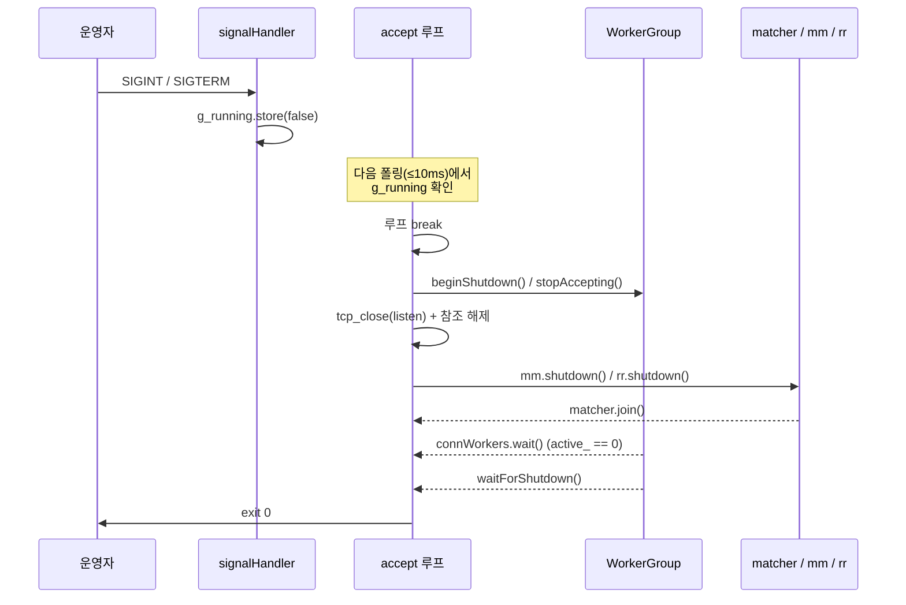
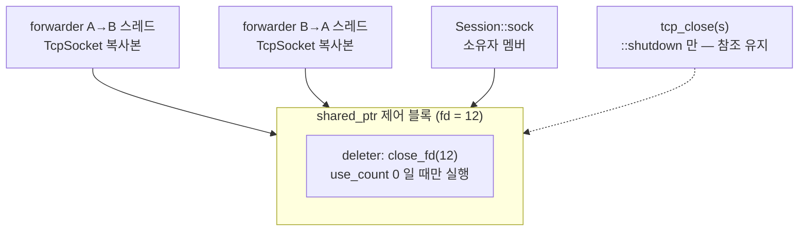
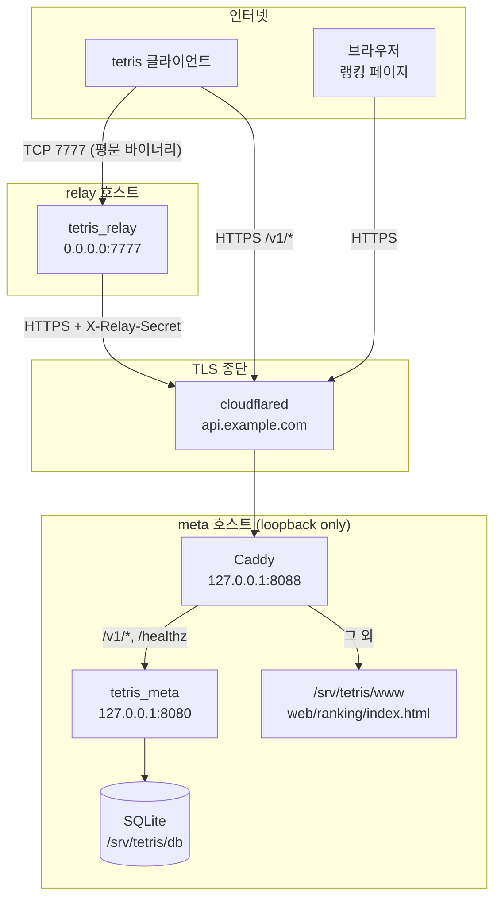

# Part 12: 검수와 배포 안정화 — 보안 기본값과 릴리스

> **시리즈:** 제로부터 멀티플레이어 테트리스 + RL | [시리즈 목차](./README.md) | **Part 12**
>

---

## 이번 Part의 구현 계약

- **선행 상태:** Part 0~11 의 모든 경로. 특히 `net/socket.{h,cpp}`, `net/session.cpp`, `server/main.cpp`·`relay.cpp`·`worker_group.h`, `meta/main.cpp`·`api_server.cpp`· `http_client.cpp`, 그리고 루트 `CMakeLists.txt` 의 옵션 집합.
- **이번 Part의 파일:** 새 소스는 없다. 손대는 것은 보안 경계의 기존 파일과 `scripts/release_linux.sh`, `scripts/release_macos.sh`, `scripts/release_win.ps1`, `scripts/release_server_linux.sh`, `scripts/backup_meta_db.sh`, `deploy/systemd/tetris-relay.service`, `deploy/systemd/tetris-meta.service`, `deploy/systemd/tetris-relay.env.example`, `deploy/systemd/tetris-meta.env.example`, `deploy/Caddyfile.example`, `deploy/cloudflared/config.yml.example`.
- **연결점:** 새 기능을 더하는 장이 아니다. Part 6~7 의 소켓/세션 계층, Part 10 의 meta 계층, Part 11 의 사용자 데이터 경로가 실패했을 때 무엇이 일어나는지를 닫는다.
- **완료 게이트:** 이 장의 `전체 회귀 검증`과 `수동 테스트`를 통과한다. 전체 빌드, `sim_hash_dump` 골든 해시 diff, `worker_group_test`, 기본 Python 계약, meta+relay 통합, 포트 7788 relay/room smoke, 릴리스 스크립트 문법을 각각 확인한다. 완료 여부는 고정된 테스트 개수가 아니라 지정한 계약의 실패·의도하지 않은 skip 유무로 판정한다.

## 1. 들어가며 — 이 장의 범위

Part 11 까지 기능은 다 들어왔다. guest 발급, 토큰 인증, RP/XP/BP, 리더보드, 아이콘 상점, 설정 영속화가 동작한다. 이 장은 기능 추가가 아니라 **배포 전 마지막 검수**다. 내부 구조체·DB·wire 의 `elo` 필드명은 호환을 위해 유지하지만 사용자 용어와 값의 의미는 RP다.

[Part 10](./part10-meta-and-ranking.md) 은 meta 프로세스 *내부* 의 하드닝(토큰 CSPRNG, 상수 시간 secret 비교, 요청 본문 상한, per-IP 레이트 리밋, 정수 오버플로 가드)을 이미 다뤘다. 이 장은 그 이유와 **프로세스 경계·운영 실패**를 본다 — 잘못된 설정의 시작 거부, SIGPIPE, 소켓 소유권, 워커 예산, 리버스 프록시 배치, 릴리스 빌드와 회귀다.

### 1.1 다른 배포 문서와의 역할 분담

저장소에는 이 장 말고도 배포를 다루는 문서가 둘 더 있다. 역할이 겹치지 않게 경계를 먼저 못 박는다.

| 문서 | 역할 |
|---|---|
| 이 장 (`docs/blog/part12-hardening-and-release.md`) | **왜** 이런 기본값인가, 그리고 릴리스 전에 **무엇을 돌려야** 하는가 |
| [`part13-structure-and-build-reference.md`](./part13-structure-and-build-reference.md) | 완성 구조, 플랫폼별 빌드 매트릭스, CMake 옵션 표, 번들 스크립트 사용법의 정본 |
| `docs/public-server-deployment.md` | 소형 리눅스 relay + 저전력 Android(Termux) meta 시험 운영, VPS/Tunnel 확장, standby 전환 절차의 정본 |

즉 이 장은 **원칙과 회귀**를 맡고, 실제 배포 절차의 명령 나열은 저 두 문서를 따른다. 이 장에 나오는 설정 파일은 전부 `deploy/` 의 실제 템플릿이므로 두 문서와 같은 파일을 가리킨다.

### 1.2 다룰 항목

1. **토큰 생성** — 왜 `std::random_device` 가 아니라 OS CSPRNG 인가.
2. **relay 보안 기본값** — `--meta` 가 켜졌는데 secret 이 없으면 *시작을 거부*.
3. **meta 보안 기본값** — 대칭으로 meta 도 무방비 기동을 거부.
4. **토큰 파일 권한** — guest 토큰은 사실상 비밀번호다. `0600` 으로 저장.
5. **SIGPIPE 와 graceful shutdown** — 끊긴 소켓에 써도 프로세스가 죽지 않게.
6. **소켓 fd 소유권** — 한 fd 를 여러 스레드가 공유할 때의 재사용 경합.
7. **신뢰할 수 없는 입력과 DoS 예산** — 프레임 바운드, 송신 타임아웃, 워커 상한.
8. **네트워크 경계** — 왜 meta 는 loopback bind 이고 relay 만 public TCP 인가.
9. **릴리스 빌드와 패키징** — 컴파일 타임 기본값 주입, 플랫폼별 번들.
10. **운영** — systemd 격리, 백업과 **복구**, secret 회전.
11. **전체 회귀 검증** — 이 장의 존재 이유.

## 2. 토큰 생성 — `random_device` 의 함정

[Part 10](./part10-meta-and-ranking.md) 의 `gen_token` 은 16 바이트(128비트) 엔트로피를 읽어 32 hex 문자열로 만든다. 처음 떠올릴 구현은 표준 라이브러리의 `std::random_device` 다.

**예시(실제 저장소에는 없음)**

```cpp
std::string gen_token_naive()
{
    std::random_device rd;
    std::uniform_int_distribution<uint32_t> dist(0, 0xFFFFFFFFu);
    char buf[33];
    for (int i = 0; i < 4; ++i)
        std::snprintf(buf + i * 8, 9, "%08x", dist(rd));
    buf[32] = '\0';
    return std::string(buf, 32);
}
```

표준은 `std::random_device` 가 비결정적 엔트로피원이라고 *권장* 할 뿐, **보장하지 않는다.** 악명 높은 사례가 구형 MinGW 의 libstdc++ 로, `random_device` 가 매 실행마다 같은 시퀀스를 뱉는 결정적 PRNG 로 구현돼 있었다. 토큰은 사실상 비밀번호이므로, 결정적 토큰은 곧 누구나 예측 가능한 비밀번호다. "대부분의 플랫폼에서 OS CSPRNG 를 래핑하므로 충분히 강하다" 는 가정은 *대부분* 이라는 말 때문에 깨진다.

그래서 실제 `meta/api_server.cpp` 는 OS 엔트로피를 **명시적으로** 읽는다. Windows는 `BCryptGenRandom`, POSIX/Termux는 `/dev/urandom`을 사용한다. OS CSPRNG가 실패하면 약한 난수로 폴백하지 않고 guest 발급을 실패-폐쇄한다.

**현재 소스 발췌 — `meta/api_server.cpp`**

```cpp
// 인증 토큰은 플랫폼 CSPRNG에서만 만든다. 엔트로피 소스가 실패했을 때
// random_device나 시간값으로 폴백하면 "서비스 가용" 상태처럼 보이면서 예측 가능한
// 토큰을 발급할 수 있다. 이 경우 guest 요청 자체를 실패-폐쇄하는 편이 안전하다.
bool fill_random(unsigned char* out, size_t n)
{
#ifdef _WIN32
    if (n > static_cast<size_t>(std::numeric_limits<ULONG>::max())) return false;
    return BCryptGenRandom(nullptr, out, static_cast<ULONG>(n),
                           BCRYPT_USE_SYSTEM_PREFERRED_RNG) == 0;
#else
    // Linux와 macOS에서 공통으로 쓸 수 있는 커널 난수 장치를 직접 읽는다.
    // read는 요청한 길이보다 짧게 성공할 수 있고 signal에 끊길 수도 있으므로
    // 한 번의 호출 결과를 토큰 전체로 착각하지 않는다.
    int flags = O_RDONLY;
    #ifdef O_CLOEXEC
    flags |= O_CLOEXEC;
    #endif
    const int fd = ::open("/dev/urandom", flags);
    if (fd < 0) return false;
    size_t done = 0;
    while (done < n) {
        const ssize_t got = ::read(fd, out + done, n - done);
        if (got > 0) {
            done += static_cast<size_t>(got);
            continue;
        }
        if (got < 0 && errno == EINTR) continue;
        break;
    }
    ::close(fd);
    return done == n;
#endif
}
```

`gen_token` 은 이 16 바이트를 hex 로 인코딩만 한다.

**현재 소스 발췌 — `meta/api_server.cpp`**

```cpp
// 32 hex chars 무작위 토큰 (16 바이트 = 128비트 엔트로피).
std::optional<std::string> gen_token()
{
    unsigned char raw[16];
    if (!fill_random(raw, sizeof(raw))) return std::nullopt;
    static const char hex[] = "0123456789abcdef";
    char buf[33];
    for (int i = 0; i < 16; ++i) {
        buf[i * 2]     = hex[(raw[i] >> 4) & 0xF];
        buf[i * 2 + 1] = hex[raw[i] & 0xF];
    }
    buf[32] = '\0';
    return std::string(buf, 32);
}
```

POSIX 경로는 `read` 한 번이 요청한 길이를 모두 돌려준다고 가정하지 않는다.
부분 읽기를 누적하고 시그널로 중단된 `EINTR`만 재시도하며, 열린 난수 fd는
자식 프로세스에 상속되지 않도록 가능한 플랫폼에서 `O_CLOEXEC`를 사용한다.
Windows 경로는 CMake에서 `bcrypt`를 링크해 표준 라이브러리 구현과 무관하게
시스템 CSPRNG를 직접 사용한다. 어느 쪽이든 실패하면 `POST /v1/guest`가 500
`entropy_unavailable`을 돌려준다. 이 실패는 운영 경보 대상이지만, 예측 가능한
계정을 발급하는 것보다 안전하다.

## 3. relay 보안 기본값 — 시작 거부

Part 10 의 가장 중요한 보안 경계는 `POST /v1/matches` 였다. 이 endpoint 가 secret 없이 열려 있으면 누구든 `curl` 로 가짜 매치 결과를 POST 해 RP 를 조작할 수 있다. meta 쪽은 `relay_secret_` 이 비어있지 않으면 `X-Relay-Secret` 을 상수 시간 비교로 검증한다.

문제는 relay 쪽이다. relay 가 `--meta` 로 메타 연동을 켰는데 secret 을 안 넘기면, relay 는 secret 없이 `/v1/matches` 를 호출하고 meta 는 403 으로 거부한다. 결과적으로 매치는 진행되지만 RP 가 전혀 갱신되지 않는다 — 조용히. 운영자는 "왜 RP 가 안 바뀌지?" 를 한참 뒤에야 발견한다.

이런 *조용한 실패* 가 가장 나쁘다. 그래서 `server/main.cpp` 는 "meta 는 켰는데 secret 이 없는" 조합을 **시작 시점에 거부** 한다.

**현재 소스 발췌 — `server/main.cpp`**

```cpp
    // meta 클라이언트 (옵션). URL 미지정 시 nullptr → unranked.
    std::unique_ptr<meta::client::MetaClient> metaClient;
    if (!metaUrl.empty()) {
        if (metaSecret.empty()) {
            std::cerr << "[relay] refusing to start: --meta set but no relay secret. "
                      << "Set --meta-secret or TETRIS_RELAY_SECRET (meta rejects "
                      << "POST /v1/matches without it).\n";
            return 2;
        }
        metaClient = std::make_unique<meta::client::MetaClient>(metaUrl, metaSecret);
        if (!metaClient->valid()) {
            std::cerr << "[relay] invalid --meta URL: " << metaUrl << "\n";
            return 2;
        } else {
            std::cout << "[relay] meta enabled: " << metaUrl << "\n";
        }
    } else {
        std::cout << "[relay] meta=none (unranked mode)\n";
    }
```

설계 포인트 세 가지.

- **secret 은 두 경로로 받는다.** `main()` 진입 직후 `TETRIS_RELAY_SECRET` 환경변수를 읽어 두고, CLI 파싱에서 `--meta-secret` 이 나오면 그 값으로 덮어쓴다. 운영에서는 환경변수가 편하다 — 프로세스 목록(`ps`)에 secret 이 노출되지 않고, systemd 의 `EnvironmentFile=` 로 파일에서 주입할 수 있다(§11.1). CLI 인자는 로컬 테스트용이다.
- **`--meta` 없이는 secret도 불필요.** meta 연동을 안 켜면 relay는 영속 상태와 ranked 결과 처리를 사용하지 않고 unranked 매치(`player_id=0`, RP 미반영)만 돌린다. 큐·룸·소켓 같은 실행 중 상태와 연결 제한은 그대로 유지된다. 이 경로 덕분에 로컬 테스트는 별도 계정 서버 없이 가능하다.
- **URL 자체도 검증한다.** `MetaClient::valid()` 가 false 면 역시 종료 코드 2 다. `valid()` 가 false 가 되는 경우는 두 가지인데, 파싱 실패와 **OpenSSL 없이 빌드된 바이너리에 `https://` URL 을 준 경우**다(§10.3).

빌드해서 secret 없이 띄우면 즉시 종료된다.

```bash
$ ./build/tetris_relay --meta http://127.0.0.1:8080
[relay] refusing to start: --meta set but no relay secret. Set --meta-secret or TETRIS_RELAY_SECRET (meta rejects POST /v1/matches without it).
$ echo $?
2
```

`TETRIS_RELAY_SECRET=$(openssl rand -hex 32) ./build/tetris_relay --meta http://127.0.0.1:8080` 으로 띄우면 `[relay] meta enabled: ...` 가 찍히며 정상 기동한다.

### 3.1 `--port` 쓰레기값 방어

같은 "시작 시점에 거부" 원칙이 포트 파싱에도 적용된다. `atoi` 는 실패를 `0` 으로 돌려주므로 `--port abc` 가 조용히 포트 0(커널이 임의 포트 배정)으로 뜬다. 운영자는 `ss -ltn` 을 보기 전까지 모른다.

**현재 소스 발췌 — `server/main.cpp`**

```cpp
void printUsage() {
    std::cout <<
        "Usage: tetris_relay [--port N] [--meta URL] [--meta-secret SECRET]\n"
        "  --port N         TCP listen port (default 7777)\n"
        "  --meta URL       tetris_meta base URL (e.g. https://api.example.com)\n"
        "                   If omitted, relay runs unranked (no token verify,\n"
        "                   no /v1/matches POST).\n"
        "  --meta-secret S  Send X-Relay-Secret on /v1/matches.\n"
        "                   Defaults to TETRIS_RELAY_SECRET if set.\n"
        "  -h, --help       Show this help\n";
}

bool parsePort(const std::string& s, uint16_t& out) {
    if (s.empty()) return false;
    unsigned int value = 0;
    auto* first = s.data();
    auto* last = s.data() + s.size();
    auto res = std::from_chars(first, last, value);
    if (res.ec != std::errc{} || res.ptr != last) return false;
    if (value < 1 || value > 65535) return false;
    out = static_cast<uint16_t>(value);
    return true;
}
```

`std::from_chars` 를 쓰는 이유는 세 가지다. 예외를 던지지 않고, 로케일에 의존하지 않으며, **끝까지 소비했는지**를 `res.ptr != last` 로 검사할 수 있다. `"7777abc"` 같은 부분 파싱은 그래서 거부된다. 범위 검사(`1..65535`)까지 통과해야 비로소 `out` 에 쓴다 — 실패 경로에서 출력 인자를 오염시키지 않는다.

## 4. meta 보안 기본값 — 대칭 거부

relay 가 "secret 없이 meta 를 부르는 것" 을 막았다면, meta 는 대칭으로 *자기 자신* 이 무방비로 뜨는 것을 막는다. `meta/main.cpp` 는 secret 도 없고 `--allow-public-matches` 도 없으면 시작을 거부한다.

**현재 소스 발췌 — `meta/main.cpp`**

```cpp
    if (args.relay_secret.empty() && !args.allow_public_matches) {
        std::fprintf(stderr,
                     "[meta] refusing to start: POST /v1/matches requires "
                     "--relay-secret or TETRIS_RELAY_SECRET. For local-only "
                     "tests, pass --allow-public-matches explicitly.\n");
        return 2;
    }
```

양쪽 다 시작 시점에 거부하므로 "실수로 RP 조작이 가능한 상태로 배포되는" 경로가 양끝에서 닫힌다. 로컬 테스트만 `--allow-public-matches` 라는 *명시적* 플래그로 빠져나갈 수 있다. 기본값이 안전하고, 위험한 쪽을 택하려면 타이핑을 더 해야 한다 — 이것이 보안 기본값 설계의 일반 규칙이다.

meta 프로세스 *내부* 의 나머지 하드닝은 Part 10 에서 이미 구현·해설했으므로 여기서 코드를 다시 싣지 않고 목록으로만 회수한다.

- **OS CSPRNG 토큰** — `fill_random` + `gen_token` (§2).
- **상수 시간 secret 비교** — `X-Relay-Secret` 검증의 타이밍 사이드채널 방지
  (`meta/api_server.cpp`의 `ct_equal`).
- **요청 본문 상한** — `set_payload_max_length(64 * 1024)` 로 거대 body 플러딩 차단.
- **per-IP 레이트 리밋** — 고정 윈도우 카운터. 직접 연결은 소켓 peer IP를 키로 쓰고, 직접 peer가 loopback인 로컬 프록시 구성에서만 전달된 client IP 헤더를 신뢰한다.
- **`find_int` 오버플로 가드** — `INT64_MAX` 초과 입력에 `std::nullopt` (§8.5).
- **토큰 파일 0600** — guest 토큰을 비밀번호처럼 보호 (§5).

즉 meta 의 하드닝은 "토큰은 강한 난수 · secret 검증은 사이드채널 안전 · 입력은 크기/개수/값 모두 바운드 · 시작은 안전 기본값" 으로 요약된다.

## 5. 토큰 파일 권한 — 0600 과 사용자 데이터 경로

클라이언트는 guest 토큰을 한 번 발급받아 디스크에 저장하고, 재접속마다 그 파일을 읽어 같은 player 로 인식된다. 이 토큰은 곧 계정이다 — 유출되면 남이 내 RP 와 아이콘을 그대로 가져간다. 따라서 파일 권한이 중요하다.

**현재 소스 발췌 — `meta/http_client.cpp`**

```cpp
bool save_token(const std::string& token)
{
    namespace fs = std::filesystem;
    auto path = token_file_path();
    if (path.empty()) return false;

    std::error_code ec;
    fs::create_directories(fs::path(path).parent_path(), ec);

#ifndef _WIN32
    const std::string line = token + "\n";
    int fd = ::open(path.c_str(), O_WRONLY | O_CREAT | O_TRUNC, S_IRUSR | S_IWUSR);
    if (fd < 0) return false;
    if (::fchmod(fd, S_IRUSR | S_IWUSR) != 0) {
        ::close(fd);
        return false;
    }
    size_t written = 0;
    while (written < line.size()) {
        ssize_t n = ::write(fd, line.data() + written, line.size() - written);
        if (n < 0) {
            if (errno == EINTR) continue;
            ::close(fd);
            return false;
        }
        if (n == 0) {
            ::close(fd);
            return false;
        }
        written += static_cast<size_t>(n);
    }
    bool ok = (::close(fd) == 0);
    ::chmod(path.c_str(), S_IRUSR | S_IWUSR);
    return ok;
#else
    std::ofstream f(path, std::ios::trunc);
    if (!f) return false;
    f << token << "\n";
    bool ok = static_cast<bool>(f);
    f.close();
    fs::permissions(path,
                    fs::perms::owner_read | fs::perms::owner_write,
                    fs::perm_options::replace,
                    ec);
    return ok;
#endif
}
```

미묘한 점이 세 가지 있다.

- **`open(..., 0600)` 만으로는 부족하다.** `open` 의 mode 인자는 *새로 생성될 때만* 적용되고, 그나마 umask 가 한 번 더 빼낸다. 이미 존재하는 파일(예: 이전 버전이 0644 로 만들어 둔 것)이면 mode 가 무시된다. 그래서 `fchmod(fd, 0600)` 을 한 번 더 호출해 기존 파일도 강제로 조인다. 마지막의 `::chmod` 는 close 이후 경로 기준으로 한 번 더 확정한다.
- **`write` 는 부분 쓰기와 `EINTR` 을 반환한다.** 32 바이트짜리 토큰이라도 `write` 한 번이 전부를 쓴다고 가정하지 않는다. 루프와 `EINTR` 재시도가 있는 이유다.
- **Windows 는 `std::filesystem::permissions` 로 소유자 읽기/쓰기를 요청한다.** POSIX 의 `0600` 과 완전히 같은 ACL 모델은 아니다. SID/DACL 을 직접 구성하는 더 강한 격리는 추후 과제다.

### 5.1 토큰이 실제로 놓이는 경로

권한 이야기를 하려면 경로부터 정확해야 한다.

**현재 소스 발췌 — `meta/http_client.cpp`**

```cpp
namespace {

// 표준 user-data 디렉토리 기반 경로. 실패 시 빈 문자열.
std::filesystem::path user_data_dir()
{
    namespace fs = std::filesystem;
#ifdef _WIN32
    // %APPDATA% (예: C:\Users\Name\AppData\Roaming)
    char buf[MAX_PATH];
    if (SUCCEEDED(SHGetFolderPathA(nullptr, CSIDL_APPDATA, nullptr, 0, buf))) {
        return fs::path(buf);
    }
    const char* appdata = std::getenv("APPDATA");
    if (appdata && *appdata) return fs::path(appdata);
    return {};
#elif defined(__APPLE__)
    const char* home = std::getenv("HOME");
    if (!home || !*home) return {};
    return fs::path(home) / "Library" / "Application Support";
#else
    // Linux / other unix
    const char* xdg = std::getenv("XDG_DATA_HOME");
    if (xdg && *xdg) return fs::path(xdg);
    const char* home = std::getenv("HOME");
    if (!home || !*home) return {};
    return fs::path(home) / ".local" / "share";
#endif
}
```

`token_file_path()` 가 여기에 `Tetris/token` 을 붙인다. 정리하면 이렇다.

| 플랫폼 | 토큰 경로 |
|---|---|
| Windows | `%APPDATA%\Tetris\token` (= `CSIDL_APPDATA`, **Roaming**) |
| macOS | `$HOME/Library/Application Support/Tetris/token` |
| Linux | `${XDG_DATA_HOME:-$HOME/.local/share}/Tetris/token` |

Windows 가 `%LOCALAPPDATA%` 가 아니라 **`%APPDATA%`(Roaming)** 라는 점은 그냥 디테일이 아니다. 도메인에 가입된 조직 환경에서 Roaming 프로파일은 로그오프 시 **파일 서버로 동기화**된다. 즉 "토큰 = 비밀번호" 라는 이 절의 논지대로라면, 그 비밀번호가 네트워크를 타고 서버에 복제된다는 뜻이다. 개인 PC 에서는 문제가 없지만, 관리형 환경에 배포한다면 `%LOCALAPPDATA%`(동기화 대상 아님)로 옮기는 편이 맞다. 지금 구현은 "설정과 토큰이 기기를 따라다니는" 쪽을 택했고, 그 선택의 대가를 알고 있어야 한다.

Linux 에서 권한을 확인할 때도 `XDG_DATA_HOME` 을 존중해야 한다. `~/.local/share` 로 하드코딩한 확인 명령은 XDG 를 설정한 환경에서 "파일 없음" 으로 조용히 실패한다.

```bash
stat -c '%a' "${XDG_DATA_HOME:-$HOME/.local/share}/Tetris/token"   # → 600
```

## 6. SIGPIPE 와 graceful shutdown

### 6.1 SIGPIPE — 죽은 소켓에 쓸 때

relay 의 핵심 루프는 한 소켓에서 읽어 다른 소켓에 쓰는 것이다 ([Part 7](./part7-relay-server.md)). 그런데 상대가 게임을 끄거나 네트워크가 끊긴 직후, 이미 닫힌 TCP 소켓에 `write` 하면 POSIX 는 **`SIGPIPE` 시그널** 을 보낸다. 이 시그널의 기본 처리는 *프로세스 종료* 다. 즉 클라이언트 하나가 끊긴 순간 relay 전체가 죽어 다른 모든 매치까지 끊긴다.

해결은 시그널을 무시하는 것이다. 무시하면 `send` 는 `-1` 과 `errno=EPIPE` 를 반환하고, relay 는 그 매치만 정리하고 계속 돈다. 등록 위치가 중요하다 — `server/main.cpp` 가 아니라 `net/socket.cpp` 의 `net_init()` 안이다. 소켓을 쓰는 모든 프로세스(relay 든 game 클라이언트든)가 `net_init()` 을 거치므로, 무시 설정을 네트워킹 초기화에 묶어 두면 한 곳에서 모든 바이너리가 보호된다.

**현재 소스 발췌 — `net/socket.cpp`**

```cpp
// [NET] 네트워킹 초기화(Windows 전용)
bool net_init() {
    if (g_inited)
        return true;
#ifdef _WIN32
    WSADATA wsaData;
    int r = WSAStartup(MAKEWORD(2,2), &wsaData);
    g_inited = (r == 0);
    return g_inited;
#else
    // POSIX: writing to a closed peer can raise SIGPIPE and terminate the whole
    // relay/client process before send() returns EPIPE. Treat it as an I/O error.
    std::signal(SIGPIPE, SIG_IGN);
    g_inited = true;
    return true;
#endif
}
```

`SIG_IGN` 으로 무시하면 끊긴 소켓에 `send` 해도 시그널이 발생하지 않고 `EPIPE` 만 돌아온다. 추가로 POSIX `send` 호출에는 `MSG_NOSIGNAL` 플래그를 줘 호출 단위로도 시그널을 억제한다(§8.2 의 `tcp_send_all`). 이중 방어다.

### 6.2 시그널 핸들러는 플래그만 내린다

SIGINT/SIGTERM 은 `server/main.cpp` 가 등록한다. 핸들러가 하는 일은 하나뿐이다.

**현재 소스 발췌 — `server/main.cpp`**

```cpp
std::atomic<bool> g_running{true};
net::TcpSocket    g_listen_sock{};  // 논블로킹 listen 소켓 (accept 폴링)

// Bound thread and handle use during connection setup.
constexpr size_t kMaxConnWorkers = 256;
constexpr size_t kMaxHandshakesPerIp = 16;

void signalHandler(int /*sig*/) {
    // The signal handler only touches an atomic flag.
    g_running.store(false);
}
```

상수가 둘이다. `kMaxConnWorkers`(256)는 프로세스 전체의 연결 setup 스레드 상한이다 — 연결당 detached 스레드를 만들므로 상한이 없으면 connect 플러딩만으로 메모리와 핸들이 고갈된다. `playerConnThread` 는 첫 프레임 대기(≤5초)와 룸 대기 동안 스레드를 점유하므로 정상 부하(수백 명) 대비 넉넉한 값으로 제한하고 초과분은 즉시 close 한다. `kMaxHandshakesPerIp`(16)는 그 예산을 **출처별로 한 번 더 나눈** 값인데, accept 루프에서 함께 본다(아래).

시그널 핸들러 안에서는 *async-signal-safe* 한 연산만 허용된다. 핸들러는 임의 시점에 다른 코드를 끊고 들어오므로 `malloc`, `mutex`, 그리고 내부에서 참조 카운트를 조작하는 `shared_ptr` 연산 등은 데드락이나 메모리 손상을 일으킬 수 있다. 가장 보수적인 POSIX 형태는 `volatile sig_atomic_t` 플래그다. 현재 코드는 일반 플랫폼에서 lock-free 로 동작하는 `std::atomic<bool>` store 만 사용하는데, 이 선택은 "핸들러에서 복잡한 정리를 하지 않는다" 는 운영 패턴의 일부로 이해해야 한다.

등록은 플랫폼별로 한 곳 다르다. Windows 콘솔에는 SIGTERM 에 해당하는 신호가 사실상 없고, `CTRL_BREAK_EVENT` 를 CRT 가 `SIGBREAK` 로 전달한다. 이것까지 등록해 두어야 Windows 에서도 "핸들러가 실행될 기회 자체가 없는" `TerminateProcess` 가 아니라 우아한 종료 경로를 밟을 수 있고, Python 통합 테스트가 그 경로를 검증할 수 있다.

**현재 소스 발췌 — `server/main.cpp`**

```cpp
    std::signal(SIGINT,  signalHandler);
    std::signal(SIGTERM, signalHandler);
#if defined(_WIN32)
    // Windows 콘솔의 CTRL_BREAK_EVENT 는 CRT 가 SIGBREAK 로 전달한다. Python
    // 테스트가 TerminateProcess(핸들러 실행 기회가 아예 없다) 대신
    // CTRL_BREAK_EVENT 로 우아한 종료 경로를 검증할 수 있도록 함께 등록한다.
    std::signal(SIGBREAK, signalHandler);
#endif
```

핵심은 **핸들러가 listen 소켓을 닫지 않는다** 는 것이다. `tcp_close()` 는 `shared_ptr` 를 읽으므로 시그널 핸들러에서 부르면 안전하지 않다(§7). 대신 listen 소켓을 *논블로킹* 으로 만들어 두고, accept 루프가 폴링하면서 매 회 `g_running` 을 확인한다.

**현재 소스 발췌 — `server/main.cpp`**

```cpp
    g_listen_sock = net::tcp_listen(port, /*backlog=*/256);
    if (!g_listen_sock.valid()) {
        std::cerr << "tcp_listen(" << port << ") failed — port in use?\n";
        net::net_shutdown();
        return 1;
    }
    // Nonblocking accept lets the loop observe the shutdown flag.
    net::tcp_set_nonblocking(g_listen_sock);
```

accept 루프는 대기 연결이 없으면(논블로킹 accept 가 빈 소켓을 돌려주면) 10ms 자고 재폴링한다. 연결이 들어오면 워커에 넘기기 전에 **peer IP 별 입장 예산**을 먼저 확인한다.

**현재 소스 발췌 — `server/main.cpp`**

```cpp
    // accept 루프 (논블로킹 폴링)
    uint32_t next_conn_id = 1;
    while (g_running.load()) {
        auto client = net::tcp_accept(g_listen_sock);
        if (!client.valid()) {
            // 논블로킹 accept: 대기 연결 없음(EWOULDBLOCK) 또는 셧다운.
            if (!g_running.load()) break;
            // 대기 연결 없음 — 잠깐 쉬었다가 재폴링.
            std::this_thread::sleep_for(std::chrono::milliseconds(10));
            continue;
        }
        const uint32_t id = next_conn_id++;
        std::string peerIp = net::tcp_peer_ip(client);
        if (peerIp.empty()) {
            // getpeername 실패 시 모든 연결이 "unknown" 단일 버킷(상한 16)을
            // 공유하면 무관한 연결끼리 서로를 굶긴다. fd 는 이 연결이 살아있는
            // 동안 프로세스 내에서 유일하므로 연결별 고유 키로 대신 사용한다
            // (per-IP 상한은 못 걸지만, 실패 케이스끼리의 공멸보다 낫다).
            peerIp = "fd:" + std::to_string(client.fd());
        }
        if (!ipAdmission.acquire(peerIp)) {
            std::cerr << "[relay] rejecting conn=" << id << " ip=" << peerIp
                      << ": per-IP handshake limit\n";
            net::tcp_close(client);
            continue;
        }
        std::cout << "[relay] accept conn=" << id << "\n";
        if (!connWorkers.launch([client = std::move(client), id, &mm, &rr, mcPtr,
                                 &ipAdmission, peerIp]() mutable {
            struct Release {
                IpAdmission& owner; const std::string& ip;
                ~Release() { owner.release(ip); }
            } release{ipAdmission, peerIp};
            relay::playerConnThread(std::move(client), id, mm, rr, mcPtr);
        })) {
            ipAdmission.release(peerIp);
            std::cerr << "[relay] rejecting conn=" << id
                      << ": connection worker unavailable\n";
        }
    }
```

`IpAdmission` 은 IP → 진행 중 setup 수의 맵 하나다.

**현재 소스 발췌 — `server/main.cpp`**

```cpp
class IpAdmission {
public:
    bool acquire(const std::string& ip) {
        std::lock_guard<std::mutex> lk(mu_);
        size_t& n = active_[ip.empty() ? "unknown" : ip];
        if (n >= kMaxHandshakesPerIp) return false;
        ++n;
        return true;
    }
    void release(const std::string& ip) {
        std::lock_guard<std::mutex> lk(mu_);
        auto it = active_.find(ip.empty() ? "unknown" : ip);
        if (it == active_.end()) return;
        if (--it->second == 0) active_.erase(it);
    }
private:
    std::mutex mu_;
    std::unordered_map<std::string, size_t> active_;
};
```

전역 상한(`kMaxConnWorkers`=256)과 IP별 상한(`kMaxHandshakesPerIp`=16)은 지키는 대상이 다르다. 전역 상한은 **프로세스**를 지킨다 — 스레드·핸들이 무한정 늘어나 서버 자체가 죽는 것을 막는다. 그러나 전역 상한만 있으면 한 IP 가 연결 256개를 먼저 채워 다른 모든 사용자를 굶길 수 있다. IP별 상한은 **출처 간 공정성**을 지킨다 — 한 출처가 점유할 수 있는 setup 슬롯을 16개로 잘라, 플러딩하는 쪽만 거부되고 나머지는 계속 들어온다. 예산을 겹으로 두되 각 겹이 다른 실패 모드를 막게 하는 이 구조는 rate limit 일반론이기도 하다(meta 의 per-IP 버킷도 같은 계열, §9.2). 해제는 워커 람다 안의 RAII 소멸자가 보장하므로 `playerConnThread` 가 어떤 경로로 끝나든(정상·타임아웃·예외) 카운트가 샌다는 걱정이 없고, `launch` 자체가 실패한 경로만 명시적 `release` 로 되돌린다.

`tcp_peer_ip` 가 빈 문자열을 돌려주는 실패 경로의 처리도 눈여겨볼 만하다. 실패한 연결을 전부 `"unknown"` 버킷 하나에 몰면 서로 무관한 연결끼리 상한 16을 나눠 갖는 공멸이 된다. 대신 fd 값을 연결별 고유 키로 쓴다 — fd 는 그 연결이 살아 있는 동안 프로세스 안에서 유일하므로 충돌이 없다. per-IP 상한이라는 원래 목적은 이 경로에서 포기하지만, "제한 장치의 실패가 무고한 사용자를 막는" 역전보다는 낫다는 판단이다.

### 6.3 종료 순서

루프를 빠져나온 *뒤에야* — 정상 스레드 컨텍스트에서 — 소켓을 닫고 워커를 정리한다. 순서가 그대로 의미다.

**현재 소스 발췌 — `server/main.cpp`**

```cpp
    std::cout << "[relay] shutting down...\n";
    relay::beginShutdown();
    connWorkers.stopAccepting();
    net::tcp_close(g_listen_sock);
    g_listen_sock = net::TcpSocket{};  // 마지막 참조 해제 → 실제 fd close
    mm.shutdown();
    rr.shutdown();
    if (matcher.joinable()) matcher.join();
    connWorkers.wait();
    relay::waitForShutdown();
    net::net_shutdown();
    std::cout << "[relay] done\n";
    return 0;
```

읽는 법은 이렇다.

1. `beginShutdown()` / `stopAccepting()` — **신규 유입 차단**. 이후 새 lobby, forwarder, connection worker 는 생성되지 않는다.
2. `tcp_close(g_listen_sock)` + 재대입 — listen 소켓의 마지막 참조를 버려 실제 fd 를 닫는다. `tcp_close` 는 shutdown 만 하므로 재대입이 있어야 close 된다(§7.3).
3. `mm.shutdown()` / `rr.shutdown()` — 매치메이커와 룸 레지스트리의 대기자를 깨운다.
4. `matcher.join()` → `connWorkers.wait()` → `waitForShutdown()` — **역순 drain**. 워커가 `mm`/`rr` 을 raw reference 로 들고 있으므로, 스택에 있는 `mm`/`rr` 이 파괴되기 전에 모든 워커가 끝나야 한다. `waitForShutdown()` 은 `relay.cpp` 의 전역 `WorkerGroup`(§8.4)까지 비운다.
5. `net_shutdown()` — 마지막.

이 순서를 지키지 않으면 종료 중 use-after-free가 난다. relay/meta smoke 테스트는 활성 연결이 있는 상태에서 종료 신호를 보내고, 프로세스가 워커를 drain한 뒤 정상 종료하는지 자동으로 확인한다.


```mermaid
sequenceDiagram
    participant U as 운영자
    participant H as signalHandler
    participant L as accept 루프
    participant W as WorkerGroup
    participant M as matcher / mm / rr
    U->>H: SIGINT / SIGTERM
    H->>H: g_running.store(false)
    Note over L: 다음 폴링(≤10ms)에서<br/>g_running 확인
    L->>L: 루프 break
    L->>W: beginShutdown() / stopAccepting()
    L->>L: tcp_close(listen) + 참조 해제
    L->>M: mm.shutdown() / rr.shutdown()
    M-->>L: matcher.join()
    W-->>L: connWorkers.wait() (active_ == 0)
    W-->>L: waitForShutdown()
    L->>U: exit 0
```

## 7. 소켓 fd 소유권 — fd 재사용 경합

SIGPIPE 가 "죽은 소켓에 쓰는" 문제라면, fd 소유권은 "살아있는 소켓을 누가 닫느냐" 의 문제다. 이쪽이 더 미묘하고, 공개 서버에서 **교차 연결 데이터 유출** 로 이어질 수 있어 더 위험하다.

### 7.1 과거의 `{ int fd }` 와 fd 재사용

초기 `TcpSocket` 은 그냥 정수 하나를 들고 있었다 — `struct TcpSocket { int fd; };`. relay 의 forwarder 는 한 연결을 양방향으로 중계하므로, 같은 fd 를 들고 있는 복사본이 여러 detached 스레드에 흩어진다. 각 스레드가 끝날 때 자기 복사본으로 `::close(fd)` 를 호출했다.

문제는 fd 가 **작은 정수의 재사용 자원** 이라는 데 있다. POSIX 는 항상 *가장 작은 미사용 fd* 를 새 소켓에 배정한다. 그래서 다음 순서가 가능하다.

1. 스레드 A 가 연결 X(fd=12) 의 중계를 끝내고 `::close(12)` 한다.
2. 곧바로 새 클라이언트 Y 가 접속하고, `accept()` 가 *가장 작은 미사용 fd* 인 12 를 Y 에 배정한다.
3. 아직 살아있던 스레드 B 가 (X 라고 믿고) fd=12 에 `write`/`read` 한다 — 실제로는 **Y 의 소켓**.

공개 서버에서 이것은 단순 크래시가 아니라 **A 의 데이터가 엉뚱한 클라이언트 Y 로 새거나, Y 의 데이터를 X 의 코드가 읽는** 교차 연결 유출이다. 공격자가 접속/절단을 빠르게 반복해 이 경합을 노릴 수 있다.

### 7.2 `shared_ptr<int>` 로 소유권을 모은다

수정은 fd 를 참조 카운트 소유 핸들로 감싸는 것이다. 실제 `::close` 는 "마지막 복사본이 사라지는 순간" 딱 한 번만 일어나게 한다.

**현재 소스 발췌 — `net/socket.h`**

```cpp
// TCP 소켓 핸들 — 참조 카운트 소유(ref-counted owning handle).
//
//   과거에는 평범한 { int fd } 였다. 같은 연결의 복사본을 여러 detached 스레드가
//   값으로 들고 각자 ::close 했기 때문에, 한 스레드가 닫은 fd 정수를 곧바로 새
//   accept() 가 재사용하면 살아있던 다른 스레드가 "엉뚱한 클라이언트 소켓"에
//   read/write 하는 use-after-close / fd-reuse 경합이 있었다(공개 서버에서 교차
//   연결 데이터 유출로 악용 가능).
//
//   이제 fd 는 shared_ptr<int> 가 소유하며, 모든 복사본은 같은 제어 블록을
//   공유한다. 실제 ::close 는 "마지막 복사본이 사라지는 순간" deleter 에서
//   정확히 한 번 호출된다(이중 close 와 fd 재사용 경합 제거).
//
//   tcp_close() 는 즉시 ::shutdown(SHUT_RDWR) 만 호출한다 — 같은 fd 를 폴링/대기
//   중인 다른 복사본의 recv 를 EOF 로 깨워 루프를 빠져나가게 한다. 소유권(=실제
//   close)은 RAII 에 맡긴다. shutdown 은 일반 스레드에서 반복 호출해도 무해한
//   종료 신호로만 사용한다. TcpSocket 은 shared_ptr 를 읽으므로 tcp_close() 를
//   signal handler 에서 직접 호출하면 안 된다.
//
//   동시성 계약: 한 TcpSocket "인스턴스(변수)" 자체를 두 스레드가 동시에
//   재대입/소멸시키면 안 된다(shared_ptr 인스턴스 자체는 thread-safe 가 아님).
//   서로 다른 복사본을 각 스레드가 들고 read/close 하는 것은 안전하다.
struct TcpSocket {
    std::shared_ptr<int> fdh;  // 제어 블록: *fdh == fd. 마지막 참조 소멸 시 ::close.

    int  fd()    const { return fdh ? *fdh : -1; }
    bool valid() const { return fdh && *fdh >= 0; }
};
```

새 fd 를 만드는 모든 경로(`tcp_listen`/`tcp_accept`/`tcp_connect`)는 `make_owned` 로 감싼다. deleter 가 정확히 한 번 `close_fd` 를 부른다.

**현재 소스 발췌 — `net/socket.cpp`**

```cpp
// [NET] 새로 생성된 fd 를 참조 카운트 소유 핸들로 감싼다.
//   마지막 복사본이 사라질 때 deleter 가 close_fd 로 정확히 한 번 닫는다.
static TcpSocket make_owned(int fd) {
    TcpSocket s;
    s.fdh = std::shared_ptr<int>(new int(fd), [](int* p) {
        if (p) { close_fd(*p); delete p; }
    });
    return s;
}
```


```mermaid
graph TB
    subgraph CB["shared_ptr 제어 블록 (fd = 12)"]
        D["deleter: close_fd(12)<br/>use_count 0 일 때만 실행"]
    end
    A["forwarder A→B 스레드<br/>TcpSocket 복사본"] --> CB
    B["forwarder B→A 스레드<br/>TcpSocket 복사본"] --> CB
    S["Session::sock<br/>소유자 멤버"] --> CB
    T["tcp_close(s)<br/>::shutdown 만 — 참조 유지"] -.-> CB
```

### 7.3 `tcp_close` 는 close 가 아니라 shutdown

소유권을 RAII 에 맡겼으니, "닫는다" 는 행위를 둘로 쪼갠다.

- **종료 신호** — `tcp_close()` 는 `::shutdown(SHUT_RDWR)` *만* 한다. 같은 fd 를 `recv` 로 대기 중인 다른 복사본을 EOF 로 깨워 루프를 빠져나가게 하는 용도다. 실제 fd 를 닫지 않으므로 fd 정수는 아직 재사용되지 않는다.
- **실제 close** — 마지막 `TcpSocket` 복사본이 소멸(또는 재대입)할 때 deleter 에서 한 번. 이 시점엔 모든 스레드가 그 복사본을 버린 뒤이므로 fd 재사용 경합이 없다.

**현재 소스 발췌 — `net/socket.cpp`**

```cpp
// shutdown wakes peer threads; the final handle owner closes the fd.
// 불변식: signal handler 에서 tcp_close() 호출 금지 — shared_ptr(fdh) 읽기는 async-signal-safe 가 아니다.
// 불변식: 여기서 fdh.reset() 금지 — 같은 인스턴스를 읽는 다른 스레드와 shared_ptr
//         인스턴스 경합이 된다. 참조 해제는 소유 스레드의 RAII(재대입/소멸)에 맡긴다.
void tcp_close(TcpSocket& s) {
    if (!s.fdh) return;
    int fd = *s.fdh;
    if (fd >= 0) {
#ifdef _WIN32
        ::shutdown(fd, SD_BOTH);
#else
        ::shutdown(fd, SHUT_RDWR);
#endif
    }
}
```

`tcp_close` 가 `fdh` 를 `reset()` 하지 않는 점이 결정적이다. `shared_ptr` 는 *제어 블록* 이 thread-safe 할 뿐 *인스턴스 자체* 는 아니다. 한 스레드가 `s.fdh` 를 읽는 동안 다른 스레드가 `s.fdh.reset()` 하면 그건 그냥 data race 다.

### 7.4 `Close()` 의 shutdown → join → reset 순서

`net/session.cpp` 의 `Close()` 가 이 계약을 그대로 구현한다.

**현재 소스 발췌 — `net/session.cpp`**

```cpp
void Session::Close() {
    quit = true;
    // 소켓을 먼저 닫아(shutdown) accept()/recv() 블로킹 스레드를 깨운다.
    //   sockMu_ 로 워커 스레드의 publish 와 직렬화 — Close 가 quit 를 먼저 세팅하므로
    //   워커는 이 잠금 이후 publish 하지 않거나(잠금 안에서 quit 재확인), 이미 publish
    //   한 값을 우리가 본다. (shared_ptr 멤버 data race 방지)
    {
        std::lock_guard<std::mutex> lk(sockMu_);
        if (listening && listenSock.valid()) tcp_close(listenSock);
        if (sock.valid()) tcp_close(sock);
    }
    // shutdown 후 스레드 join (블로킹 해제됨). join 은 반드시 잠금 밖에서.
    if (ath.joinable()) ath.join();
    if (qth.joinable()) qth.join();
    if (rth.joinable()) rth.join();
    if (th.joinable()) th.join();
    // join 후엔 워커가 모두 종료됐다. 늦게 publish 됐을 수 있으니 한 번 더 닫고,
    // 소유자 복사본을 명시적으로 비운다 — 마지막 참조를 버려 실제 fd 를 닫고
    // valid() 를 false 로 되돌린다(연결 종료 후 fd 잔존 회귀 방지).
    {
        std::lock_guard<std::mutex> lk(sockMu_);
        if (sock.valid()) tcp_close(sock);
        if (listenSock.valid()) tcp_close(listenSock);
        sock = TcpSocket{};
        listenSock = TcpSocket{};
    }
    connected = false; ready = false; listening = false;
    roomState_.store(RoomState::Idle);
    roomPeerCount_.store(0);
    {
        std::lock_guard<std::mutex> lk(roomMu_);
        roomCode_.clear();
    }
    {
        std::lock_guard<std::mutex> lk(roomSendMu_);
        roomSendQ_.clear();
    }
    queueMatched_.store(false);
    queueLocalReady_.store(false);
    queuePeerReady_.store(false);
    {
        std::lock_guard<std::mutex> lk(queueSendMu_);
        queueSendQ_.clear();
    }
    // 스톨 heartbeat 상태 초기화 — 다음 세션에서 첫 SendInput 까지는 비활성.
    lastMainActivityMs_.store(0);
    heartbeatTickEnd_.store(0);
    lastHeartbeatMs_.store(0);
    {
        std::lock_guard<std::mutex> lk(chatMu_);
        chatQ_.clear();
    }
    // 게임 sendQ / HASH pair 도 함께 비움 — 같은 Session 객체 재사용 시 이전
    // 연결의 stale 프레임이 새 연결의 ioThread 에서 선두로 나가는 것 방지.
    { std::lock_guard<std::mutex> lk(sendMu); sendQ.clear(); }
    { std::lock_guard<std::mutex> lk(hashMu_); lastHashTickRemote = 0; lastHashRemote = 0; }
    // MATCH_RESULT 도 초기화. ClearGameOverChoices 만 의존하면 타이틀→새 매치
    // 경로에서 이전 라운드 결과가 새 매치 게임오버 시점에 즉시 읽히는 경계가
    // 있었다. Close 는 세션 경계마다 반드시 실행되므로 여기서 보장.
    {
        std::lock_guard<std::mutex> lk(matchResultMu_);
        matchResultValid_ = false;
        matchResult_ = MatchResult{};
    }
}
```

앞의 세 단계가 소켓 소유권의 전부다.

1. **shutdown** (잠금 안) — 워커들의 `recv`/`accept` 를 EOF 로 깨운다. 아직 fd 는 살아있다.
2. **join** (잠금 밖) — 워커 스레드가 모두 끝나길 기다린다. join 을 잠금 안에서 하면 워커가 `sockMu_` 를 잡으려다 데드락이므로, 반드시 잠금을 풀고 join 한다.
3. **reset** (잠금 안) — `sock = TcpSocket{}` 로 소유자 복사본을 버린다. 워커가 모두 끝났으니 이제 남은 마지막 참조이고, 여기서 deleter 가 실제 `::close` 를 부른다.

`sockMu_` 의 역할은 *shared_ptr 멤버 변수 자체* 에 대한 동시 재대입을 직렬화하는 것이다. 워커는 멤버를 직접 쓰지 않고 잠금 아래에서 *값으로 복사* 해 쓴다 — `net/session.cpp` 전반의 `{ std::lock_guard<std::mutex> lk(sockMu_); s = sock; }` 패턴이 그것이다. 서로 다른 복사본을 각자 들고 read/close 하는 것은 §7.2 의 계약상 안전하다.

함수 뒷부분이 큐를 전부 비우는 이유도 같은 계열이다. `Session` 객체는 타이틀 → 새 매치 경로에서 **재사용** 되므로, 이전 연결의 stale 프레임이나 이전 라운드의 `MATCH_RESULT` 가 남아 있으면 새 연결의 첫 프레임으로 나가거나 새 게임오버 시점에 즉시 읽힌다. `Close` 는 세션 경계마다 반드시 실행되는 유일한 지점이라 여기서 전부 초기화한다.

## 8. 신뢰할 수 없는 입력 · DoS 하드닝

relay 와 host 는 공개 IP 에서 임의의 피어로부터 바이트를 받는다. 그 피어가 정상 클라이언트라는 보장은 없다. 방어선을 다섯 곳에 둔다.

### 8.1 INPUT 프레임 바운드 검증

lockstep 의 INPUT 프레임은 `[from:4][cnt:2][inputs:cnt]` 다 ([Part 6](./part6-lockstep-networking.md)). 신뢰할 수 없는 피어는 `cnt` 를 거대하게, `from` 을 아무 tick 으로나 보낼 수 있다.

**현재 소스 발췌 — `net/session.cpp`**

```cpp
    case MsgType::INPUT: {
        if (f.payload.size() >= 6) {
            const uint8_t* p = f.payload.data();
            uint32_t from = le_read_u32(p);
            uint16_t cnt = le_read_u16(p+4);
            // 페이로드 크기 검증: 헤더(6) + cnt 바이트가 실제 크기 이내인지 확인
            if (static_cast<size_t>(6) + cnt > f.payload.size()) break;
            const uint8_t* arr = p+6;
            // [보안] 신뢰할 수 없는 피어의 INPUT 처리:
            //  - remoteInputs 무한 증가로 인한 메모리 고갈을 막기 위해 누적 크기를 제한.
            //  - tick 래핑/원거리 tick 주입으로 인한 desync 를 막기 위해 현재 수신
            //    지점(lastRemoteTick) 기준 윈도우를 벗어난 tick 은 폐기.
            constexpr size_t   kMaxRemoteInputs = 8192;  // 버퍼링 가능한 최대 tick 수
            constexpr uint32_t kMaxTickWindow   = 4096;  // 현재 지점 대비 허용 거리(과거/미래)
            {
                std::lock_guard<std::mutex> lk(inMu);
                const uint32_t cur = lastRemoteTick.load();
                for (uint16_t i=0;i<cnt;++i) {
                    const uint32_t tick = from + i;
                    const uint32_t dist = (tick >= cur) ? (tick - cur) : (cur - tick);
                    if (dist > kMaxTickWindow) continue;  // 윈도우 밖(가비지/래핑) 폐기
                    if (remoteInputs.size() >= kMaxRemoteInputs &&
                        remoteInputs.find(tick) == remoteInputs.end()) continue;  // 버퍼 포화
                    remoteInputs.emplace(tick, arr[i]);
                    if (tick > lastRemoteTick) lastRemoteTick = tick;
                }
            }
            std::vector<uint8_t> ack; le_write_u32(ack, lastRemoteTick.load());
            auto fr = build_frame(MsgType::ACK, ack);
            pushSend(std::move(fr));
        }
    } break;
```

세 겹이다.

- **페이로드 경계** — `6 + cnt > payload.size()` 면 즉시 버린다. 선언된 `cnt` 만큼의 입력 바이트가 실제로 들어있지 않으면 `arr[i]` 는 버퍼 오버리드다.
- **`kMaxTickWindow` (4096)** — 현재 수신 지점 `cur` 에서 과거/미래로 4096 tick 을 벗어난 tick 은 폐기한다. `dist` 를 부호 없는 절댓값으로 계산하므로 tick 래핑(`uint32_t` 오버플로)으로 인한 거대 거리도 윈도우 밖으로 잡힌다. 악의적 피어가 `from = 0xFFFFFFF0` 같은 값으로 desync 를 유발하려 해도 무시된다.
- **`kMaxRemoteInputs` (8192)** — `remoteInputs` 맵의 크기를 8192 로 제한한다. 이미 포화 상태에서 *새* tick 을 추가하려는 시도는 버린다(기존 tick 의 덮어쓰기는 허용).

### 8.2 느린 송신(slow-loris) 타임아웃

논블로킹 소켓에 `send` 가 `EWOULDBLOCK` 을 반환하면 커널 송신 버퍼가 가득 찼다는 뜻이다 — 보통 상대가 느리거나, *고의로 천천히 읽는* 피어다. 무한정 재시도하면 한 느린 피어가 송신 스레드를 영원히 붙잡는다.

**현재 소스 발췌 — `net/socket.cpp`**

```cpp
// [NET] 전체 버퍼가 전송될 때까지 반복합니다(스트림 특성으로 부분 전송 가능).
bool tcp_send_all(const TcpSocket& s, const void* data, size_t len) {
    const int fd = s.fd();
    if (fd < 0) return false;
    const uint8_t* p = static_cast<const uint8_t*>(data);
    size_t sent = 0;
    constexpr auto kBlockedTimeout = std::chrono::seconds(5);
    std::chrono::steady_clock::time_point blockedSince{};
    while (sent < len) {
#ifdef _WIN32
        int n = ::send(fd, (const char*)(p + sent), (int)(len - sent), 0);
        if (n < 0) {
            int err = WSAGetLastError();
            if (err == WSAEWOULDBLOCK || err == WSAEINTR) {
                if (err == WSAEWOULDBLOCK) {
                    auto now = std::chrono::steady_clock::now();
                    if (blockedSince == std::chrono::steady_clock::time_point{}) blockedSince = now;
                    if (now - blockedSince >= kBlockedTimeout) return false;
                }
                // 논블로킹에서 버퍼 가득참 - 짧은 대기 후 재시도
                std::this_thread::sleep_for(std::chrono::milliseconds(1));
                continue;
            }
            return false;
        }
        if (n == 0) return false; // 연결 종료
#else
        int flags = 0;
#ifdef MSG_NOSIGNAL
        flags |= MSG_NOSIGNAL;
#endif
        ssize_t n = ::send(fd, (const char*)(p + sent), (size_t)(len - sent), flags);
        if (n < 0) {
            if (errno == EINTR) continue;
            if (errno == EAGAIN || errno == EWOULDBLOCK) {
                auto now = std::chrono::steady_clock::now();
                if (blockedSince == std::chrono::steady_clock::time_point{}) blockedSince = now;
                if (now - blockedSince >= kBlockedTimeout) return false;
                // 논블로킹에서 버퍼 가득참 - 짧은 대기 후 재시도
                std::this_thread::sleep_for(std::chrono::milliseconds(1));
                continue;
            }
            return false;
        }
        if (n == 0) return false; // 연결 종료
#endif
        blockedSince = {};
        sent += (size_t)n;
    }
    return true;
}
```

`kBlockedTimeout` 은 5초다. 한 번이라도 진척이 있으면 루프 끝의 `blockedSince = {};` 가 타이머를 리셋하므로, 정상적으로 느린 연결은 살아남고 *전혀 진척이 없는* 연결만 5초 뒤 끊긴다. POSIX 분기의 `MSG_NOSIGNAL` 이 §6.1 에서 말한 이중 방어의 두 번째 겹이다.

### 8.3 단계 전환 버퍼와 채팅 큐 상한

TCP 는 메시지가 아니라 바이트 스트림이다. 한 `recv` 가 정확히 한 frame 을 반환한다는 보장이 없어서 `QUEUE_JOIN + QUEUE_CANCEL`, `ROOM_JOIN + READY` 가 함께 올 수 있고, frame 중간까지만 올 수도 있다. `playerConnThread` 가 첫 frame 을 처리한 뒤 지역 수신 버퍼를 버리면 이미 kernel 에서 읽은 후속 바이트는 영구히 유실된다.

현재 코드는 소켓을 다음 상태로 넘길 때 잔여 바이트도 함께 넘긴다.

- `server/player_conn.cpp` 의 `residual_stream` 은 파싱된 후속 frame 과 partial tail 을 `PlayerInfo::streamBuf` 또는 `roomLoop_` 초기 버퍼로 옮긴다.
- queue lobby 는 `READY`/`QUEUE_CANCEL` 만 소비하고 처음 만난 게임 frame 부터 `Channel::prefixFromA/B` 로 포워더에 인계한다.

여기서 일반화할 규칙은 **상태 머신의 소유권 이전 단위가 fd 하나가 아니라 `(fd, already-read bytes)`** 라는 것이다. 그리고 그 버퍼에는 상한이 있어야 한다.

**현재 소스 발췌 — `server/relay.cpp`**

```cpp
    // 페이로드 상한은 net::kMaxPayloadBytes (framing.h) 를 직접 참조한다.
    // Bound bytes received between READY and forwarder ownership.
    constexpr size_t kMaxLobbyBufBytes  = 64 * 1024;
```

64KB 인 근거: 정상 클라이언트가 READY 직후 forwarder 이관 전까지 보내는 것은 PING/INPUT 몇 프레임 수준(1KB 미만)이라 여유가 크고, 상한이 없으면 악성 클라이언트가 30초 수락 대기 동안 회선 속도로 밀어넣어 relay 메모리를 소모시킬 수 있다. 첫 줄 주석이 가리키듯 프레임 한 개의 페이로드 상한은 이제 `net/framing.h` 가 `net::kMaxPayloadBytes` 로 공개한다 — 과거에는 relay 가 같은 숫자를 자체 상수로 중복 정의했는데, 프로토콜 한계는 프로토콜을 정의하는 헤더가 한 곳에서 소유해야 두 값이 어긋나는 사고가 없다.

클라이언트 쪽 수신 `CHAT` 큐도 같은 이유로 유한하다.

**현재 소스 발췌 — `net/session.cpp`**

```cpp
        // 큐 상한 — UI 가 PullChat 을 멈춘 상태에서 상대가 CHAT 을 플러딩해도
        // 메모리가 무한 증가하지 않도록 가장 오래된 메시지부터 버린다.
        constexpr size_t kMaxChatQueue = 256;
        if (chatQ_.size() >= kMaxChatQueue) chatQ_.pop_front();
        chatQ_.push_back(std::move(text));
```

### 8.4 워커 예외 안전성과 종료 drain

relay 는 연결, 30초 수락 lobby, 양방향 forwarder 에 스레드를 쓴다. callback 예외가 스레드 entry 밖으로 빠지면 `std::terminate` 로 프로세스가 끝나고, 스레드 생성 전에 올린 수동 카운터를 실패 경로에서 내리지 않으면 shutdown 이 영구 대기한다. `server/worker_group.h` 의 `WorkerGroup` 이 이 정책을 한곳에 모은다.

**현재 소스 발췌 — `server/worker_group.h`**

```cpp
    template <typename Fn>
    bool launch(Fn&& fn) noexcept
    {
        {
            std::lock_guard<std::mutex> lk(mu_);
            if (!accepting_) return false;
            if (active_ >= maxActive_) {
                std::fprintf(stderr, "[%s] worker limit reached (%zu)\n",
                             name_, maxActive_);
                return false;
            }
            ++active_;
        }

        try {
            std::thread([this, work = std::forward<Fn>(fn)]() mutable {
                Completion completion{this};
                try {
                    work();
                } catch (const std::exception& e) {
                    std::fprintf(stderr, "[%s] worker failed: %s\n", name_, e.what());
                } catch (...) {
                    std::fprintf(stderr, "[%s] worker failed: unknown exception\n", name_);
                }
            }).detach();
        } catch (const std::exception& e) {
            finish();
            std::fprintf(stderr, "[%s] worker launch failed: %s\n", name_, e.what());
            return false;
        } catch (...) {
            finish();
            std::fprintf(stderr, "[%s] worker launch failed: unknown exception\n", name_);
            return false;
        }
        return true;
    }
```

거부 사유가 둘로 나뉘어 있는 것이 중요하다. `!accepting_` 은 **종료 중**(조용히 false), `active_ >= maxActive_` 는 **포화**(stderr 로 알림)다. 운영자는 로그로 둘을 구별할 수 있어야 한다 — 전자는 정상 종료이고 후자는 용량 문제이거나 공격이다.

`++active_` 는 스레드를 만들기 *전* 에 올린다. 스레드가 시작된 뒤에 올리면 `launch` 가 반환한 직후 `wait()` 가 `active_ == 0` 을 보고 통과하는 창이 생긴다. 대신 `std::thread` 생성이 예외를 던지면 반드시 되돌려야 하고, 그게 `catch` 절의 `finish()` 다. 스레드 안에서는 `Completion` RAII 가 정상 반환·예외·`work()` 의 어떤 경로에서도 `finish()` 를 보장한다.

`finish()` 자체에도 함정이 하나 있다.

**현재 소스 발췌 — `server/worker_group.h`**

```cpp
    void finish() noexcept
    {
        // notify 는 반드시 lock 보유 중에 — unlock 후 notify 하면, 그 사이에
        // wait() 쪽이 spurious wakeup 으로 active_==0 을 보고 반환해 cv_ 를
        // 파괴한 뒤 (예: ~WorkerGroup) 이 스레드가 파괴된 cv_ 에 notify 하는
        // use-after-free 경합이 생긴다. lock 안이면 waiter 는 lock 재획득
        // 전까지 반환할 수 없어 cv_ 수명이 보장된다.
        std::lock_guard<std::mutex> lk(mu_);
        --active_;
        cv_.notify_all();
    }
```

교과서적인 조언은 정반대다 — "`notify` 는 lock 을 풀고 하라, waiter 가 깨자마자 lock 을 못 잡고 다시 자는 낭비를 막는다". 그 조언은 **condition_variable 이 notify 하는 쪽보다 오래 산다**는 전제 위에 있다. 여기서는 그 전제가 깨진다. `wait()` 를 부른 쪽이 `~WorkerGroup` 을 실행하는 소유자이기 때문이다. unlock 과 notify 사이에 waiter 가 spurious wakeup 으로 `active_ == 0` 을 확인하고 반환하면, 소유자는 `WorkerGroup` 을 파괴하고, detached 워커는 **이미 파괴된 `cv_`** 에 notify 한다. 성능을 위한 최적화가 use-after-free 로 바뀌는 지점이다. lock 을 쥔 채 notify 하면 waiter 는 lock 을 다시 잡기 전까지 `wait()` 에서 반환할 수 없으므로 `cv_` 수명이 보장된다.

동시성 예산은 두 그룹으로 나뉜다.

**현재 소스 발췌 — `server/relay.cpp`**

```cpp
std::atomic<bool> s_stopping{false};
// Lobby and forwarder threads have a separate bound from handshake workers.
constexpr size_t kMaxRelayWorkers = 512;
WorkerGroup s_workers{"relay", kMaxRelayWorkers};
```

연결 worker 는 최대 256개(§6.2 의 `kMaxConnWorkers`), queue lobby 와 forwarder 를 합친 relay worker 는 최대 512개다. 두 번째 상한이 따로 필요한 이유는 공격자가 첫 frame 을 빨리 보내 연결 worker 를 즉시 통과한 뒤 30초짜리 lobby 스레드를 무제한 만들 수 있기 때문이다. 상한 도달이나 생성 실패는 해당 연결/매치만 닫고 서버는 계속 동작한다.

**종료 drain 이 이 장의 관심사다.** §6.3 의 종료 순서에서 `connWorkers.wait()` 와 `relay::waitForShutdown()` 이 하는 일이 정확히 `active_ == 0` 대기다. 워커들이 `mm`/`rr`/`MetaClient` 를 raw reference 로 붙잡고 있으므로, 이 대기를 건너뛰면 `main` 의 스택 객체가 워커보다 먼저 파괴된다 — SIGTERM 을 받은 순간 진행 중이던 매치가 하나라도 있으면 바로 재현되는 use-after-free 다.

이 경로에는 자동 회귀가 붙어 있다. `python/tests/test_relay_meta_smoke.py` 의 `test_relay_sigterm_drains_active_match` 가 매치를 붙여 놓은 상태에서 relay 에 SIGTERM 을 보내고, 프로세스가 종료 코드 0 으로 깨끗이 내려오는지 확인한다.

**현재 소스 발췌 — `python/tests/test_relay_meta_smoke.py`**

```python
def test_relay_sigterm_drains_active_match() -> None:
    """SIGTERM 중 active forwarder가 server-owned state보다 먼저 종료된다."""
    relay_bin = _find_bin("tetris_relay", "TETRIS_RELAY_BIN")
    if not relay_bin:
        pytest.skip("tetris_relay binary missing")
```

`_find_bin` 이 바이너리를 못 찾으면 **skip** 한다는 점을 기억해 둘 것. 회귀를 돌렸다고 믿었는데 실제로는 아무것도 검증하지 않는 전형적인 함정이다. §12 의 회귀 절차가 relay/meta 를 먼저 빌드하는 이유가 이것이다.

### 8.5 정수 오버플로 가드

마지막 표면은 meta의 JSON 정수 파싱이다. `POST /v1/matches`의 `score_a` 같은 필드에 `99999999999999999999` 같은 값이 들어오면 `int64_t` 변환이 오버플로한다. `proto::find_int`는 숫자를 한 자리씩 읽으면서 `(INT64_MAX - digit) / 10`을 넘는지 먼저 검사하고, 초과하면 `std::nullopt`를 돌려준다. handler는 이를 필드 누락과 같은 잘못된 요청으로 거부하므로 wraparound된 음수나 작은 양수가 DB에 도달하지 않는다. 파서의 전체 계약과 API 사용처는 [메타·랭킹 문서](./part10-meta-and-ranking.md)에서도 확인할 수 있다.

## 9. 네트워크 경계 — 리버스 프록시와 TLS 종단

지금까지가 프로세스 *안* 의 방어라면, 이 절은 프로세스를 *어디에 놓느냐* 다. 배포 형태가 앞의 여러 결정을 성립시키는 전제이기 때문에 배포 장에서 빠지면 안 된다.

### 9.1 왜 relay 만 public 인가

두 서버의 노출 정책이 다르다.

- **`tetris_relay` 는 public TCP 7777** 이다. 자체 바이너리 프로토콜을 쓰고 TLS를 하지 않는다. DB 같은 영속 상태는 없지만 실행 중 queue·room·socket·인증 캐시·계정 lease는 메모리에 가진다. 재시작하면 계정 데이터는 잃지 않되 진행 중 매치와 대기열은 모두 끊긴다. meta 호출용 공유 secret도 서버 설정에만 둔다.
- **`tetris_meta` 는 `127.0.0.1:8080`** 에만 bind 한다. SQLite DB 를 소유하고, 토큰을 발급하며, RP 를 쓴다. 여기가 뚫리면 전부 끝이다. 그래서 외부에서 직접 닿을 수 없게 두고, 앞단에 리버스 프록시를 세운다.


```mermaid
graph TB
    subgraph Internet["인터넷"]
        C["tetris 클라이언트"]
        B["브라우저<br/>랭킹 페이지"]
    end
    subgraph Edge["TLS 종단"]
        CF["cloudflared<br/>api.example.com"]
    end
    subgraph Host["meta 호스트 (loopback only)"]
        CD["Caddy<br/>127.0.0.1:8088"]
        MT["tetris_meta<br/>127.0.0.1:8080"]
        DB[("SQLite<br/>/srv/tetris/db")]
        WWW["/srv/tetris/www<br/>web/ranking/index.html"]
    end
    subgraph VPS["relay 호스트"]
        RL["tetris_relay<br/>0.0.0.0:7777"]
    end
    C -->|"TCP 7777 (평문 바이너리)"| RL
    C -->|"HTTPS /v1/*"| CF
    B -->|"HTTPS"| CF
    RL -->|"HTTPS + X-Relay-Secret"| CF
    CF --> CD
    CD -->|"/v1/*, /healthz"| MT
    CD -->|"그 외"| WWW
    MT --> DB
```

`deploy/Caddyfile.example` 이 그 앞단이다.

**현재 소스 발췌 — `deploy/Caddyfile.example`**

```caddyfile
# Cloudflare Tunnel 뒤의 local Caddy 예시.
#
# /srv/tetris/www 에 web/ranking/index.html 을 배치한다. public TLS 는 tunnel 이
# 담당하므로 Caddy 는 loopback HTTP 만 듣는다.
127.0.0.1:8088 {
    encode zstd gzip

    root * /srv/tetris/www

    handle /v1/* {
        reverse_proxy 127.0.0.1:8080
    }

    handle /healthz {
        reverse_proxy 127.0.0.1:8080
    }

    handle {
        file_server
    }
}
```

이 짧은 설정이 세 가지를 동시에 성립시킨다.

1. **same-origin fetch.** 랭킹 페이지 `web/ranking/index.html` 은 API 주소를 하드코딩하지 않고 상대 경로로 부른다 — `fetch('/v1/leaderboard?limit=50', ...)`. 정적 파일과 `/v1/*` 가 **같은 origin** 에서 나오기 때문에 가능한 코드다. CORS 프리플라이트도, 배포마다 바꿔야 하는 API 베이스 URL 도 없다. Caddy 를 빼고 페이지를 다른 호스트에 올리는 순간 이 한 줄이 깨진다.
2. **meta 의 loopback bind 정당화.** `handle /v1/*` 의 `reverse_proxy 127.0.0.1:8080` 이 유일한 진입로다. meta 를 `0.0.0.0` 에 열 이유가 없다.
3. **TLS 를 아무도 직접 하지 않는다.** Caddy 는 `127.0.0.1:8088` 만 듣는다. 인증서 관리와 public TLS 는 전부 tunnel 쪽이다.

**현재 소스 발췌 — `deploy/cloudflared/config.yml.example`**

```yaml
# ~/.cloudflared/config.yml 또는 /etc/cloudflared/config.yml
#
# Cloudflare Tunnel 로 프록시 호스트의 local Caddy 를 public HTTPS 로 노출하는 예시.
# 이 경우 공유기 포트포워딩은 필요 없다.
tunnel: tetris-meta
credentials-file: /etc/cloudflared/tetris-meta.json

ingress:
  - hostname: api.example.com
    service: http://127.0.0.1:8088
  - service: http_status:404
```

터널 방식의 실질적 이점은 **인바운드 포트를 하나도 열지 않는다**는 것이다. `cloudflared` 가 밖으로 나가는 연결을 만들어 유지하므로 가정용 회선이나 NAT 뒤의 소형 리눅스 머신도 공유기 포트포워딩 없이 public HTTPS 엔드포인트를 가질 수 있다. 대신 edge 사업자를 신뢰하게 되고, `X-Forwarded-For` 같은 헤더의 신뢰 여부가 §9.2 의 문제로 넘어온다. 터널을 쓰지 않고 Caddy 를 직접 노출하는 대안은 `docs/public-server-deployment.md` 가 다룬다.

### 9.2 프록시 뒤에서 레이트 리밋 키가 무너지는 문제

프록시를 세우면 조용히 깨지는 것이 하나 있다. Part 10 의 per-IP 레이트 리밋이다. meta 입장에서 `req.remote_addr` 은 **항상 `127.0.0.1`**(프록시)이므로, 전 세계 사용자가 버킷 하나를 공유하게 되고 제한이 무력화된다. 정확히는 "무력화" 보다 나쁘다 — 한 명이 한도를 채우면 전원이 429 를 받는다.

**현재 소스 발췌 — `meta/api_server.cpp`**

```cpp
// 전달 헤더는 같은 호스트의 loopback 프록시에서만 신뢰한다. 별도 호스트의
// 프록시를 자동으로 신뢰하면 같은 LAN에서 직접 붙은 클라이언트가 XFF를 위조해
// 버킷을 우회할 수 있다. 소형 리눅스 프록시 → 저전력 Android(Termux) meta 같은
// 분리 배치에서는 모든 요청이 proxy IP 버킷을 공유하며, 실제 client별 제한은
// edge가 맡아야 한다.
std::string rate_limit_key(const httplib::Request& req)
{
    const bool from_loopback =
        req.remote_addr == "127.0.0.1" || req.remote_addr == "::1";
    if (from_loopback) {
        std::string ip = req.get_header_value("CF-Connecting-IP");
        if (ip.empty()) {
            // [보안] XFF 는 "client, proxy1, proxy2, ..." 순서로, 경유하는
            // 프록시가 자기 앞단의 주소를 **뒤에 append** 한다. 즉 첫 토큰은
            // 클라이언트가 요청에 미리 심어 위조할 수 있는 값이고(매 요청
            // 다른 값을 넣으면 60/s 공개 버킷을 무한 우회), 신뢰할 수 있는
            // 것은 우리가 믿는 프록시가 마지막에 붙인 rightmost 토큰뿐이다.
            // 따라서 첫 토큰이 아니라 마지막 토큰을 rate limit 키로 쓴다.
            ip = req.get_header_value("X-Forwarded-For");
            const auto comma = ip.rfind(',');
            if (comma != std::string::npos) ip.erase(0, comma + 1);
        }
        const auto b = ip.find_first_not_of(" \t");
        const auto e = ip.find_last_not_of(" \t");
        if (b != std::string::npos) return ip.substr(b, e - b + 1);
    }
    return req.remote_addr;
}
```

"신뢰 프록시" 판정이 `from_loopback` 하나라는 점이 핵심이다. 헤더는 **누구나 위조할 수 있다.** meta를 넓은 주소에 열어 두고 헤더를 무조건 믿으면 공격자는 `X-Forwarded-For`를 매 요청마다 바꿔 리밋을 완전히 우회한다. 그래서 **peer가 loopback일 때만** 헤더를 믿는다.

loopback 프록시를 신뢰하기로 한 다음에도 **XFF 안에서 어느 토큰을 믿느냐**가 남는다. XFF 는 요청이 프록시를 거칠 때마다 그 프록시가 자기가 본 peer 주소를 목록 **뒤에** 덧붙이는 구조라, 첫 토큰은 클라이언트가 요청에 미리 심어 보낼 수 있는 값이다. 실제로 Caddy 의 `reverse_proxy` 기본 동작은 클라이언트가 보낸 XFF 를 지우지 않고 실제 IP 를 뒤에 append 하므로, 첫 토큰을 키로 쓰면 공격자가 `X-Forwarded-For: <매번 다른 난수>` 한 줄로 요청마다 새 버킷을 배정받아 60/s 공개 버킷이 무의미해진다. 신뢰할 수 있는 것은 우리가 믿는 프록시가 마지막에 붙인 **rightmost 토큰**뿐이고, 코드의 `rfind(',')` 가 그 토큰을 취한다. `CF-Connecting-IP` 를 먼저 보는 이유도 같은 계열이다 — 이 헤더는 터널 edge 가 단일 값으로 덮어쓰므로 목록 파싱 문제가 아예 없다. 일반화하면, 체인형 헤더에서 신뢰 경계는 "내가 믿는 마지막 홉이 쓴 것"이지 "목록의 처음"이 아니다.

두 배치의 결과가 다르다.

- proxy와 meta가 같은 호스트면 원 client IP를 복원해 meta에서도 per-client 버킷을 쓴다.
- proxy 호스트와 meta 단말이 분리되면 meta는 proxy의 사설 IP만 보고 public 요청 전체가
  한 버킷을 공유한다. Caddy/Tunnel에서 실제 client별 제한을 걸고, meta 버킷은
  전체 burst의 마지막 방어선으로 사용한다.

별도 호스트 프록시의 전달 헤더를 meta에서도 신뢰하려면 정확한 proxy IP allowlist와
방화벽을 함께 구현해야 한다. 현재 코드에는 그 옵션이 없으므로 사설망 전체를
암묵적으로 신뢰한다고 가정하지 않는다.

### 9.3 secret 회전과 유출 대응

공유 secret은 relay와 meta 두 곳에 같은 값이 있다. 현재 구현은 old/new 값을 동시에 허용하지 않으므로 정기 회전에는 짧은 유지보수 시간이 필요하다.

```bash
# 새 값을 안전한 로컬 비밀 저장소에 만든 뒤 relay 입장을 먼저 닫는다.
openssl rand -hex 32
sudo systemctl stop tetris-relay
sudoedit /etc/tetris/meta.env
sudoedit /etc/tetris/relay.env
sudo systemctl restart tetris-meta
sudo systemctl start tetris-relay
```

두 환경 파일에는 같은 새 값을 넣는다. 커맨드라인 인자나 `sed` 치환 문자열에 secret을 직접 싣지 않아 프로세스 목록과 셸 history 노출을 피한다. relay를 먼저 내리면 진행 중 매치는 종료되지만 서버 종료를 플레이어 기권으로 기록하지 않고, 서로 다른 secret으로 새 ranked 매치를 받는 구간도 만들지 않는다.

secret이 유출됐다고 판단되면 위조 POST 차단이 먼저다. meta에 새 값을 적용해 즉시 재시작한 뒤 relay를 갱신한다. 그 짧은 구간의 정상 결과는 403으로 누락될 수 있지만 공격자가 계속 결과를 조작하는 것보다 손해가 작다. 무중단·무손실 회전이 필요하면 meta에 dual-secret 유예 기능과 전환 상태 관측을 먼저 구현해야 한다. RP 조작이 이미 일어났다면 검증된 백업과 감사용 `matches` 기록을 기준으로 복구 범위를 판단한다.

## 10. 릴리스 빌드와 패키징

코드가 안전해졌으니 배포본을 만든다. 핵심은 **개인 환경값(내 IP, 디버그 오버레이)을 release 바이너리에 박지 않는 것** 과, 플랫폼별로 런타임 의존성(SDL2, ONNX Runtime, 폰트, 사운드)을 함께 묶는 것이다.

### 10.1 컴파일 타임 기본값 주입

게임 클라이언트는 두 가지 컴파일 타임 기본값을 받는다 — 메뉴에 박히는 기본 relay 엔드포인트와 meta URL.

**현재 소스 발췌 — `CMakeLists.txt`**

```cmake
set(TETRIS_DEFAULT_RELAY_ENDPOINT "127.0.0.1:7777" CACHE STRING
    "Default relay endpoint embedded in the game client menu")
set(TETRIS_DEFAULT_META_URL "" CACHE STRING
    "Default tetris_meta base URL embedded in the game client")
```

`CACHE STRING` 이라 `-D` 로 덮어쓸 수 있고, 덮어쓰지 않으면 로컬 개발에 편한 기본값이 남는다. release 빌드는 여기에 공개 도메인을 주입하고 `CMAKE_BUILD_TYPE=Release` 로 켠다. 디버그 오버레이(`TETRIS_ENABLE_DEBUG_UI`)와 네트워크 추적 로그(`TETRIS_ENABLE_NET_TRACE`)는 둘 다 기본 OFF 이므로 release 에는 들어가지 않는다 — 해시 덤프 `H` 단축키나 봇 속도 조절 같은 디버그 입력이 유저 빌드에 남지 않는다는 뜻이다.

```bash
cmake -S . -B build-release \
  -DCMAKE_BUILD_TYPE=Release \
  -DTETRIS_DEFAULT_RELAY_ENDPOINT=relay.example.com:7777 \
  -DTETRIS_DEFAULT_META_URL=https://api.example.com
cmake --build build-release --config Release --target tetris
```

`--target tetris` 는 `copy_assets`(ALL 타깃)를 돌리지 않는다. 번들 스크립트가 `Font/`·`Sounds/` 를 따로 복사하는 이유이고, 빌드 디렉터리에서 직접 실행할 때 폰트가 없어 보이는 이유이기도 하다.

### 10.2 클라이언트 번들 스크립트

플랫폼마다 한 스크립트로 번들을 만든다. 세 스크립트 모두 `RELAY_ENDPOINT`/`META_URL` 환경변수(PowerShell 은 `-RelayEndpoint`/`-MetaUrl` 파라미터)로 엔드포인트를 주입받고, `BOT=1`(PowerShell 은 `-Bot`)이면 ONNX 봇과 그 런타임을 포함한다.

| 스크립트 | 산출물 | 묶는 것 |
| --- | --- | --- |
| `scripts/release_linux.sh` | `dist/tetris-linux-x64.tar.gz` | `tetris` + `lib/`(SDL2/ORT, rpath=`$ORIGIN/lib`) + `Font/` + `Sounds/` + (있으면) `assets/`·`model/` |
| `scripts/release_macos.sh` | `dist/tetris-macos.tar.gz` | `Tetris.app`(universal `arm64;x86_64`) + 동봉 dylib |
| `scripts/release_win.ps1` | `dist\tetris-win-x64.zip` | `tetris.exe` + `Font\` + `Sounds\` + (있으면) `assets\`·`model\` + (`-Sdl2` 시) `SDL2.dll` + (`-Bot` 시) `onnxruntime.dll` |

Linux/macOS 번들은 공유 라이브러리를 `lib/` 에 담고 rpath 를 `$ORIGIN/lib` 로 박아, 사용자가 SDL2 를 따로 설치하지 않아도 압축만 풀면 실행된다. Windows 는 rpath 개념이 없어 DLL 을 exe 옆에 두는 것으로 같은 효과를 낸다 — 그래서 `SDL2.dll` 과 `onnxruntime.dll` 이 zip 루트에 들어간다.

```bash
RELAY_ENDPOINT=relay.example.com:7777 \
META_URL=https://api.example.com \
./scripts/release_linux.sh
```

### 10.3 서버 번들과 `TETRIS_ENABLE_HTTPS`

서버 측은 별도 스크립트로 묶는다. `scripts/release_server_linux.sh` 는 게임 클라이언트 없이 relay+meta 만 Release+HTTPS 로 빌드한다.

**현재 소스 발췌 — `scripts/release_server_linux.sh`**

```bash
CMAKE_ARGS=(
    -B "$BUILD"
    -S "$ROOT"
    -DCMAKE_BUILD_TYPE=Release
    -DTETRIS_BUILD_GAME=OFF
    -DTETRIS_BUILD_RELAY=ON
    -DTETRIS_BUILD_META=ON
    -DTETRIS_BUILD_TEST=OFF
    -DTETRIS_ENABLE_HTTPS=ON
)
```

`-DTETRIS_BUILD_GAME=OFF` 가 맨 앞에 있는 것은 필수다. 이 옵션은 기본 ON 이라 서버 머신에서 그냥 configure 하면 SDL2/폰트/렌더러 의존성을 전부 요구한다.

`-DTETRIS_ENABLE_HTTPS=ON` 은 이름과 달리 **서버가 TLS 를 종단한다는 뜻이 아니다.** TLS 종단은 §9.1 의 tunnel/Caddy 가 한다. 이 옵션이 켜는 것은 **meta 클라이언트 쪽**, 즉 relay 안에 들어 있는 `meta::client::MetaClient` 가 `https://` URL 을 다룰 수 있느냐다.

**현재 소스 발췌 — `CMakeLists.txt`**

```cmake
option(TETRIS_ENABLE_HTTPS "Enable HTTPS for tetris_meta clients when OpenSSL is available" ON)
```

기본값이 ON 이고, ON 이면 `find_package(OpenSSL QUIET)` 를 시도한다. OpenSSL 이 없으면 configure 는 성공하지만 경고가 뜨고, `CPPHTTPLIB_OPENSSL_SUPPORT` 가 정의되지 않은 채 빌드된다. 그 결과가 런타임 게이트다.

**현재 소스 발췌 — `meta/http_client.cpp`**

```cpp
#ifndef CPPHTTPLIB_OPENSSL_SUPPORT
    if (https_) {
        valid_ = false;
        std::fprintf(stderr,
                     "[meta-client] HTTPS URL requires OpenSSL build support: %s\n",
                     base_url.c_str());
    }
#endif
```

`valid_ = false` 가 되면 §3 의 relay 시작 거부 경로가 그대로 작동해 종료 코드 2 로 죽는다. 즉 "OpenSSL 없이 빌드된 relay 에 `--meta https://...` 를 주면 조용히 평문으로 떨어지는" 일이 없다. 실패는 시작 시점에, 명시적으로. release 스크립트가 `-DTETRIS_ENABLE_HTTPS=ON` 을 굳이 다시 넘기는 이유는 기본값에 의존하지 않고 번들의 성질을 스크립트에 못 박기 위해서다.

산출물 `dist/tetris-server-linux-x64.tar.gz` 에는 `tetris_relay`, `tetris_meta`, 랭킹 페이지를 포함한 `web/`, systemd/Caddy/cloudflared 예시를 담은 `deploy/`, 그리고 `scripts/backup_meta_db.sh` 가 같이 들어간다. §9 에서 본 Caddyfile 과 cloudflared 설정이 번들에 함께 오는 것이 중요하다 — 번들만 풀면 배포 형태 전체가 손에 들어온다.

## 11. 운영 — systemd, 백업과 복구

### 11.1 systemd unit

`deploy/systemd/tetris-meta.service` 를 통째로 본다.

**현재 소스 발췌 — `deploy/systemd/tetris-meta.service`**

```ini
[Unit]
Description=Tetris Meta API and SQLite Database
After=network-online.target
Wants=network-online.target

[Service]
Type=simple
User=tetris
Group=tetris
WorkingDirectory=/opt/tetris
EnvironmentFile=/etc/tetris/meta.env
ExecStart=/opt/tetris/tetris_meta --db /srv/tetris/db/tetris.db --http 127.0.0.1:8080
Restart=always
RestartSec=3
NoNewPrivileges=true
PrivateTmp=true
# 파일시스템 전체를 읽기 전용으로 마운트 — DB 디렉터리만 쓰기 허용.
ProtectSystem=strict
ProtectHome=true
ReadWritePaths=/srv/tetris

[Install]
WantedBy=multi-user.target
```

지시자를 네 묶음으로 읽는다.

**(1) 권한 축소.** `User=tetris` / `Group=tetris` 로 전용 비특권 계정에서 돈다. `NoNewPrivileges=true` 는 이 프로세스와 그 자식이 setuid 바이너리 등으로 권한을 올리는 것을 커널 수준에서 막는다.

**(2) 파일시스템 격리.** `ProtectSystem=strict` 는 `/usr`, `/boot`, `/etc` 를 포함한 파일시스템 전체를 read-only 로 보이게 하고, `ProtectHome=true` 는 사용자 home 을 아예 숨긴다. `PrivateTmp=true` 는 `/tmp` 를 프로세스 전용 네임스페이스로 분리한다. 그러면 meta 가 SQLite 를 쓸 수 없게 되므로 `ReadWritePaths=/srv/tetris` 로 딱 한 디렉터리만 예외를 둔다. relay unit 에는 이 예외가 **없다** — relay 는 디스크에 아무 것도 쓰지 않기 때문이다. unit 을 수정할 때는 DB, working directory, 인증서 등 실제 write/read 경로가 이 sandbox 정책과 일치하는지 반드시 함께 검증해야 한다.

**(3) secret 주입.** `EnvironmentFile=/etc/tetris/meta.env` 다. `Environment=` 로 unit 안에 직접 쓰지 않는 이유가 있다 — unit 파일은 `systemctl cat` 으로 누구나 읽을 수 있고 보통 git 에 들어간다. secret 은 별도 파일로 빼서 권한을 조인다.

**현재 소스 발췌 — `deploy/systemd/tetris-meta.env.example`**

```bash
# /etc/tetris/meta.env
#
# relay.env 와 같은 값을 넣는다. 이 값이 설정되면 /v1/matches 는
# X-Relay-Secret 헤더가 맞는 요청만 받는다.
TETRIS_RELAY_SECRET=change-this-long-random-secret
```

env 파일은 systemd 가 root 로 읽으므로 서비스 계정에 읽기 권한을 줄 필요가 없다. `0600 root:root` 로 두는 것이 맞다.

```bash
sudo install -d -m 0700 /etc/tetris
sudo install -m 0600 deploy/systemd/tetris-meta.env.example  /etc/tetris/meta.env
sudo install -m 0600 deploy/systemd/tetris-relay.env.example /etc/tetris/relay.env
sudo sed -i "s/change-this-long-random-secret/$(openssl rand -hex 32)/" \
     /etc/tetris/meta.env /etc/tetris/relay.env
```

두 파일에 **같은 값** 이 들어가야 한다. 다르면 §3 의 시작 거부에는 걸리지 않고 (양쪽 다 secret 이 "있긴" 하므로) `/v1/matches` 가 403 으로 조용히 실패한다. 이 조합은 시작 시점에 잡을 방법이 없으므로 §12 의 통합 smoke 로 잡아야 한다.

**(4) 재시작.** `Restart=always` + `RestartSec=3`. §3·§4 의 "시작 거부" 와 조합하면 행동이 이렇게 된다 — 설정이 잘못된 채 배포하면 프로세스가 종료 코드 2 로 죽고 3초 뒤 다시 죽기를 반복한다. 조용히 잘못 도는 것보다 낫지만, 재시작 루프를 알아채려면 `systemctl status` 나 로그를 봐야 한다. 배포 직후 확인이 필수인 이유다.

```bash
systemctl status tetris-meta tetris-relay
journalctl -u tetris-meta -u tetris-relay -n 50 --no-pager
```

relay unit 은 `ReadWritePaths` 가 없고 `ExecStart` 가 다를 뿐 구조가 같다.

### 11.2 백업과 복구

영속 상태는 meta의 SQLite DB에 모인다. 하지만 WAL 모드로 열린 저장소의 물리 파일은 `.db`, `-wal`, `-shm`으로 나뉠 수 있으므로 실행 중인 `.db` 하나를 복사해서는 안 된다. `scripts/backup_meta_db.sh`는 `sqlite3` CLI의 온라인 backup API(`.backup`)로 논리적으로 일관된 단일 DB 스냅샷을 만들고, 복사본에 `PRAGMA integrity_check`가 `ok`를 반환한 뒤에만 아카이브한다. CLI가 없으면 위험한 순차 파일 복사로 폴백하지 않고 실패한다.

```bash
./scripts/backup_meta_db.sh /srv/tetris/db/tetris.db /srv/tetris/backups
```

backup API는 페이지를 복사하는 동안 SQLite의 동시성 규칙을 따르면서 일관된 스냅샷을 만들므로 meta가 떠 있는 상태에서도 사용할 수 있다. Termux 환경에는 먼저 `pkg install sqlite`로 CLI를 설치하고, cron이나 별도 스케줄러가 스크립트의 종료 코드를 확인하게 한다. 파일 복사만 할 수 있는 비상 상황이라면 meta를 먼저 완전히 멈춘 뒤 오프라인 복사하고, 복원 연습에서 무결성을 검증한다.

스크립트는 만들기만 하지 않고 **치우기까지** 한다. 아카이브(`tar.gz`)가 완성되면 중간 산출물 `.db` 스냅샷을 지운다 — 남겨두면 백업마다 압축본과 비압축 원본이 이중으로 쌓여 디스크가 두 배로 소모된다. 그리고 보존 정책으로 최근 `KEEP` 개(기본 14, 환경변수 `KEEP` 로 조정)의 `tar.gz` 만 남기고 오래된 것을 삭제한다. 보존 정책이 스케줄러 설정이 아니라 백업 스크립트 자신 안에 있는 것이 요점이다 — 정리를 별도 작업으로 빼면 백업만 이관되고 정리는 잊히는 배포가 반드시 생기고, 정리 없는 백업은 저장 공간이 작은 호스트(Termux 단말이 정확히 그렇다)에서 디스크를 채워 **백업이 백업 대상을 죽이는** 결말이 된다. 실패 방향도 본작업과 반대다: 스냅샷 생성·무결성 검증은 fail-closed(하나라도 실패하면 스크립트 실패)지만, 정리는 부가 작업이므로 어떤 실패도 이미 성공한 백업을 뒤집지 않고 경고만 남긴다.

스크립트가 다루지 않는 쪽이 **복구** 다. 절차는 다음과 같다.

```bash
# 1) 먼저 멈춘다. 라이브 DB 를 덮어쓰면서 meta 가 돌고 있으면 안 된다.
sudo systemctl stop tetris-meta

# 2) 현재 상태를 옆으로 치운다 (복구가 잘못됐을 때 되돌릴 유일한 수단)
sudo mv /srv/tetris/db/tetris.db /srv/tetris/db/tetris.db.bad

# 3) 백업 아카이브에서 꺼낸다. 마지막 숫자는 백업 프로세스 PID라 실행마다 다르다.
tar -xzf /srv/tetris/backups/tetris-20260726T031500Z-12345.tar.gz -C /tmp
sudo install -o tetris -g tetris -m 0600 \
     /tmp/tetris-20260726T031500Z-12345.db /srv/tetris/db/tetris.db

# 4) 무결성 확인 — 여기서 ok 가 안 나오면 그 백업은 못 쓴다
sudo -u tetris sqlite3 /srv/tetris/db/tetris.db 'PRAGMA integrity_check;'

# 5) 남은 WAL/SHM 잔재 제거 후 기동
sudo rm -f /srv/tetris/db/tetris.db-wal /srv/tetris/db/tetris.db-shm
sudo systemctl start tetris-meta
```

세 가지를 놓치기 쉽다.

- **파일 소유자.** `install -o tetris -g tetris` 를 빼먹으면 root 소유 파일이 되고, `User=tetris` 로 도는 meta 가 열지 못한다. `ProtectSystem=strict` 때문에 오류 메시지가 권한 문제인지 경로 문제인지 헷갈리기 쉽다.
- **WAL/SHM 잔재.** 새 `.db` 옆에 옛 `-wal` 이 남아 있으면 SQLite 가 그것을 적용하려 들어 상태가 섞인다. 반드시 지운다.
- **마이그레이션 방향.** `meta/database.cpp` 의 스키마 부트스트랩은 `PRAGMA user_version` 과 `schema_migrations` 테이블을 **둘 다** 확인해 elo→RP 리베이스를 한 번만 적용한다(`PRAGMA user_version` 이 `.dump`/`.restore` 에 보존되지 않기 때문에 마커 테이블을 함께 둔 것이다). 방향은 앞으로만 있고 **down 마이그레이션은 없다.** 새 스키마의 meta 가 한 번 열어 버린 DB 는 옛 바이너리로 되돌릴 수 없다. 그래서 meta 를 업그레이드하기 직전에 반드시 백업을 뜨고, 롤백은 "옛 바이너리 + 업그레이드 직전 백업" 쌍으로만 한다.

### 11.3 소형 리눅스 relay + 저전력 Android(Termux) meta의 용량과 장애 경계

목표 배치는 소형 리눅스 머신이 `tetris_relay`, 저전력 Android 단말의 Termux가 `tetris_meta`와 SQLite를 맡는 형태다. 이 분리는 게임 패킷의 지속적인 양방향 전달과 짧은 HTTP/DB 트랜잭션을 서로 다른 장애 영역으로 나눈다. 다만 이 단말은 서버급 저장장치·전원·열 관리가 없고 Android가 백그라운드 프로세스를 중단할 수 있으므로, **유일한 DB 원본**으로 두는 순간 성능보다 가용성과 복구가 먼저 문제가 된다.

`python/tools/relay_capacity.py`는 실제 TCP 클라이언트 쌍을 만들고 `QUEUE_JOIN → MATCH_FOUND → READY`를 거친 뒤 작은 wire frame을 양방향으로 반복한다. 기본 전송률은 클라이언트마다 초당 120 frame으로, 60Hz `INPUT`과 그 수신에 따른 `ACK`를 근사한다. unranked relay는 일반 게임 frame의 내용을 해석하지 않으므로 이 측정에서는 같은 크기대의 `PING`을 사용한다. Linux의 `/proc`에서 relay CPU, RSS, thread 수를 읽는다.

기본 동시 부하는 50매치, 즉 100플레이어다. 200플레이어 목표를 시험하려면
`--matches 100`을 명시한다. 인자의 단위가 플레이어가 아니라 2인 매치이므로,
운영 상한을 바꿀 때는 출력의 `players` 값을 기준으로 기록한다.

이 도구는 **relay 프로세스의 연결·스레드·전달 비용을 보는 local probe**다. 게임 시뮬레이션, TLS edge, meta 요청, WAN 지연·손실은 포함하지 않는다. 부하 발생기도 같은 relay 머신에서 실행되므로 목표 전송률을 놓치면 “relay만의 한계”와 “발생기까지 합친 장비 전체의 한계”가 섞인다 — 특히 발생기가 단일 스레드 폐루프(모든 쌍에 순차 송신 후 순차 수신)라, 스케일을 올리면 relay 보다 발생기가 먼저 포화될 수 있다. 그래서 도구가 스스로 해석 장치를 출력한다. 발생기 자신의 CPU 시간을 `os.times()` 로 함께 샘플링해 `generator_cpu_ratio` 로 찍고, 그 값이 0.9 이상이면 "생성기 병목 — 결과 신뢰 불가" 경고를 낸다(병목이 발생기라면 relay 는 더 여유가 있을 수 있다는 뜻이다). 라운드 단위 실패도 측정을 통째로 버리지 않고 `failures` 로 집계해 부분 요약을 남긴다. 출력 말미의 캐비앳 두 줄도 같은 목적이다 — 같은 머신에서 CPU 를 경쟁한다는 것, 그리고 이 수치가 **unranked raw 포워딩 기준**이라 ranked 는 프레임 파싱과 meta POST 비용이 추가된다는 것. 측정 도구는 숫자만이 아니라 그 숫자를 어디까지 믿어도 되는지를 함께 내놓아야 한다. 최종 용량 판정에는 다른 기계에서 부하를 보내는 LAN/WAN soak가 필요하다.

```bash
# --matches는 플레이어 수가 아니라 2인 매치 쌍의 수다.
# 초기 운영 목표인 100명을 재현하려면 50쌍을 연다.
python3 python/tools/relay_capacity.py \
  --relay-bin ./build/tetris_relay --matches 50 --duration 30
```

도구 출력의 `players`가 실제 동시 연결 수이고 `matches`의 두 배다. 표의 다른 부하
단계는 이 인자만 바꿔 각각 독립 실행했으며, 한 프로세스에 연결을 누적한 결과가 아니다.

코어 4개/스레드 8개, RAM 16GiB의 소형 리눅스 머신 loopback 환경에서 120 frame/s를 요청한 결과는 다음과 같다. CPU 100%는 논리 CPU 하나를 완전히 쓰는 값이다. 수치는 그 시점의 샘플이며 지속적인 기준값은 도구 출력과 운영 지표로 다시 확인한다.

| 동시 플레이어 | 목표/달성 frame·s⁻¹·player⁻¹ | relay CPU | RSS | thread | 판정 |
|---:|---:|---:|---:|---:|---|
| 100 | 120 / 120 | 167.7% | 11.6 MiB | 102 | local 목표 유지 |
| 150 | 120 / 120 | 244.6% | 12.5 MiB | 152 | local 목표 유지, 운영 여유는 별도 확인 |
| 180 | 120 / 94.3 | 308.4% | 13.2 MiB | 182 | 같은 장비의 발생기가 목표율을 유지하지 못함 |
| 200 | 120 / 91.9 | 308.5% | 13.6 MiB | 202 | 200명 목표 미검증 |

이 결과로 확정할 수 있는 것은 **100명은 local 목표율을 유지했고, 150명까지는 실험상 도달했지만, 180명부터 같은 장비의 부하 발생기가 뒤처졌다는 것**이다. 따라서 200명은 현재 구현의 보장 용량이 아니라 추가 최적화·외부 부하 시험의 목표다. 초기 public 운영은 100명에서 경보와 입장 제한을 걸고, 별도 발생기에서 150명 soak를 통과한 뒤 단계적으로 올리는 편이 안전하다. 200명을 이 소형 리눅스 머신 한 대에서 받으려면 busy-polling thread-per-direction 구조를 event-driven I/O로 바꾸거나, ranked 전역 lease를 추가한 뒤 여러 relay shard로 나누는 방안을 먼저 검토한다. 두 방향 모두 [Part 14](./part14-event-loop-scaling.md) 가 구현과 함께 다룬다 — 다만 그 장의 결론도 "먼저 측정하고, 스케일 단위가 독립이면 복제가 더 싸다" 로 같다. WAN 시험에서는 p95/p99 RTT, 목표 frame rate, process CPU, fd/thread 수, disconnect 비율, 회선 업로드, thermal throttling을 함께 본다.

Android(Termux) meta는 매치 시작 인증과 종료 저장 때만 호출되므로 정상 200명 게임 트래픽을 모두 받지는 않는다. relay의 5분 성공 인증 캐시가 짧은 meta 재연결을 흡수하고, `/v1/matches`는 `match_uuid`로 재시도되어도 한 번만 RP를 반영한다. 그래도 새 사용자의 로그인, 아이콘 구매, 결과 확정은 장기 장애 중 실패한다. Termux 프로세스는 부팅 자동 시작, wake lock, 충전·발열 관리가 필요하고 온라인 backup API로 만든 DB 스냅샷을 주기적으로 다른 기계에 옮겨야 한다.

주 relay 머신, meta 단말, Windows standby 장비를 자동 분산으로 엮는 문제는 **전환이 되는 것 / 안 되는 것 / 하지 말 것**으로 나눠 보아야 한다. 절차의 정본은 `docs/public-server-deployment.md` 이고, 여기서는 경계와 그 이유만 정리한다.

**전환이 되는 것 — 새 연결의 active-passive.** Windows standby 장비에 같은 버전·같은 secret·같은 meta URL 의 `tetris_relay` 를 준비해 두고, health check 나 외부 TCP 프록시가 주 relay 장애를 감지하면 **새 연결만** standby 로 보낸다. standby 는 새 매치의 복구 시간을 줄이는 장치다.

**전환이 안 되는 것 — 진행 중 매치와 인증 상태.**

- room, queue, socket, summary 는 relay 프로세스 메모리에 있다. 진행 중 매치를 다른 프로세스로 옮기는 resume protocol 이 없으므로, 주 relay 가 죽은 시점의 매치는 종료되고 클라이언트가 재접속해야 한다.
- 5분 성공 인증 캐시도 프로세스 메모리에만 있다. 처음 올린 standby 는 캐시가 비어 있어, meta 까지 내려간 상태라면 기존 사용자의 새 ranked 접속도 인증하지 못한다(fail closed).
- 계정별 `PlayerSessionLease` 도 프로세스 로컬이다. 두 relay 를 동시에 active 로 열면 같은 계정이 각 서버에 하나씩 들어오는 것을 서버 사이에서는 막지 못한다.

**하지 말 것.**

- active-active relay — 외부 session directory 와 sticky routing 을 구현하기 전에는 계정별 단일 접속 보장이 깨진다. active-passive 를 지킨다.
- meta 단말의 SQLite 파일을 두 meta 가 동시에 쓰거나 파일 동기화 도구로 실시간 복제하는 것 — single-writer active meta 와 검증된 `.backup` 복원 절차를 유지한다.
- multi-active 를 "서버 실행 파일 한 대 더" 로 해결하려는 것 — 공유 durable result queue, 클라이언트-서버형 네트워크 DB, 클라이언트 reconnect/resume protocol 까지 함께 설계해야 하는 문제다.

## 12. 전체 회귀 검증

이 장의 완료 게이트다. 아래 명령은 빌드 산출물이 필요한 순서대로 실행하며, 전부 통과해야 릴리스를 태그한다. 테스트가 추가되더라도 개수를 문서에 고정하지 않고, 각 파일이 수집한 계약과 skip 사유를 확인한다.

```bash
# 1) 전체 빌드
cmake -S . -B build -DTETRIS_USE_SDL2=ON -DTETRIS_BUILD_RELAY=ON -DTETRIS_BUILD_META=ON
cmake --build build -j8

# 2) 결정론 골든 해시
./build/sim_hash_dump | diff - python/tests/_sim_hash_dump.txt && echo "결정론 OK"

# 3) 워커 그룹 단위 테스트
./build/worker_group_test

# 4) torch 없이 도는 테스트 — 수집 항목 전부 통과, skip 사유 확인
uv run python -m pytest python/tests/test_framing_parity.py \
                       python/tests/test_checkpoint_roundtrip.py \
                       python/tests/test_training_scripts_static.py -q

# 5) meta + relay 통합 — 수집 항목 전부 통과
uv run python -m pytest python/tests/test_meta_db_smoke.py \
                       python/tests/test_relay_meta_smoke.py \
                       python/tests/test_match_summary_crosscheck.py -q

# 6) relay / room smoke — 포트 7788 고정, skip 없이 통과
./build/tetris_relay --port 7788 &
sleep 1
uv run python -m pytest python/tests/test_relay_smoke.py python/tests/test_room_smoke.py -q
kill %1

# 7) 릴리스 스크립트 문법 검사
bash -n scripts/release_linux.sh scripts/release_server_linux.sh \
        scripts/release_macos.sh scripts/backup_meta_db.sh
```

각 단계가 지키는 계약은 이렇다.

완료 기준은 고정된 통과 개수가 아니라 pytest가 수집한 항목이 실패하지 않고, 선택 의존성이나 네이티브 모듈 부재로 생긴 skip의 사유가 의도와 일치하는 것이다. `-rs`로 사유를 확인하고, 기능을 켠 릴리스 검증에서는 해당 의존성을 설치해 skip을 실제 실행으로 바꾼다.

| 단계 | 무엇을 지키는가 |
| --- | --- |
| 1 | `tetris`, `tetris_relay`, `tetris_meta`, `sim_hash_dump`, `worker_group_test`, `copy_assets` 가 전부 빌드된다. `TETRIS_BUILD_TEST` 는 기본 ON 이라 따로 넘기지 않는다 |
| 2 | [Part 1](./part1-deterministic-simulation.md) 의 결정론 계약. 같은 seed·입력이 같은 `StateHash` 를 낸다 |
| 3 | §8.4 의 `WorkerGroup` — 상한, 생성 실패 rollback, 예외 격리, drain |
| 4 | framing 바이트 표현의 C++/Python 패리티, 체크포인트 왕복, 학습 스크립트 정적 검사 |
| 5 | meta DB 스키마·마이그레이션, relay↔meta 연동, MATCH_SUMMARY 교차 검증, §8.4 의 SIGTERM drain |
| 6 | 랜덤 큐와 커스텀 룸의 페어링·seed 일치 |
| 7 | 릴리스 스크립트가 문법 오류로 배포 당일에 죽지 않는다 |

**relay/room smoke의 포트 7788은 협상 대상이 아니다.** `python/tests/test_relay_smoke.py`와 `test_room_smoke.py`는 `RELAY_PORT = 7788`을 사용한다. 기본 7777로 띄우면 실패가 아니라 **skip**이 될 수 있으므로 `-rs` 출력에서 두 파일이 실제 실행됐는지 확인한다.

네이티브 시뮬레이션 모듈(`tetris_py`)이 필요한 테스트는 별도다. 게임 클라이언트를 끄고 pybind11 모듈만 빌드해 `python/sim/` 에 놓은 뒤 돌린다.

```bash
cmake -S . -B build -DTETRIS_BUILD_GAME=OFF -DTETRIS_BUILD_PY=ON \
      -Dpybind11_DIR=$(uv run python -m pybind11 --cmakedir)
cmake --build build --target tetris_py
cp build/tetris_py*.so python/sim/          # Windows: build\Release\tetris_py*.pyd
uv run python -m pytest python/tests/test_determinism_crossplatform.py \
                       python/tests/test_placement_parity.py \
                       python/tests/test_versus_env.py -q
```

meta+relay 통합 테스트는 `build/`, `build-relay/`, `build-meta/` 를 자동 탐색하고 `TETRIS_RELAY_BIN` / `TETRIS_META_BIN` 환경변수로 덮어쓸 수 있다. 릴리스 번들을 검증하려면 이 두 변수를 번들 안의 바이너리로 지정해 같은 pytest 를 다시 돌린다.

## 이 장에서 완성된 것

- `server/main.cpp` 의 graceful shutdown — `signalHandler` 가 종료 플래그만 내리고, 논블로킹 accept 폴링(10ms)이 스스로 루프를 빠져나온 뒤 정상 스레드에서 `tcp_close` + 역순 drain. 핸들러 안에서 소켓/shared_ptr/mutex 를 건드리지 않는다.
- `server/main.cpp` 의 `parsePort` — `std::from_chars` 기반 완전 소비·범위 검사.
- `net/socket.cpp` `net_init()` 의 `SIGPIPE` `SIG_IGN` + POSIX `send` 의 `MSG_NOSIGNAL` — 끊긴 피어에 써도 프로세스가 죽지 않음.
- `net/socket.h` 의 `shared_ptr<int>` 기반 `TcpSocket` — fd 재사용 경합(교차 연결 데이터 유출) 제거. `tcp_close` = shutdown-only, 실제 close 는 RAII 단일 호출.
- `net/session.cpp` `Close()` 의 shutdown → join → reset 순서 + `sockMu_` 로 shared_ptr 멤버 직렬화 + 세션 재사용 대비 큐 전체 초기화.
- `net/session.cpp` INPUT 프레임 바운드 검증(`kMaxTickWindow`/`kMaxRemoteInputs` + 페이로드 경계) + `tcp_send_all` 5초 slow-loris 타임아웃.
- 단계 전환의 잔여 TCP stream 인계, queue lobby 64 KiB 와 CHAT 256개 상한.
- `WorkerGroup` 의 상한(연결 256 / relay 512), 생성 실패 rollback, callback 예외 격리, lock 보유 중 notify, 종료 drain. 회귀는 `test_relay_sigterm_drains_active_match`.
- 첫 프레임 5초, peer IP별 setup 16개(`IpAdmission`), listen backlog 256, 양 플랫폼 15초/5초로 정합한 TCP keepalive, 매치 방향별 15초 idle·64KiB/s 경계.
- player별 단일 활성 session lease, meta 네트워크 장애에만 쓰는 5분/4096개 인증 캐시, 단절 시 몰수 처리 — 남아 있는 요약의 승패 주장을 존중하고, 요약이 하나도 없는 무경기는 meta POST 를 생략해 RP 를 반영하지 않는다(델타 0 통지만).
- `server/main.cpp` 의 relay 시작 거부(`--meta` 인데 secret 없음) + `meta/main.cpp` 의 meta 시작 거부(secret 도 `--allow-public-matches` 도 없음).
- `meta/http_client.cpp` `save_token` 의 `0600`/`fchmod` 토큰 파일과 플랫폼별 user-data 경로(Windows 는 `%APPDATA%` Roaming).
- `meta/api_server.cpp` `fill_random`/`gen_token` 의 OS CSPRNG 토큰, `rate_limit_key` 의 신뢰 프록시 판정과 XFF rightmost 토큰 파싱(첫 토큰 위조 우회 차단).
- relay UUID를 보존하는 match 저장 멱등성, 429·5xx·네트워크 오류 최대 3회 재시도, public 60/s와 trusted relay 512/s의 분리 버킷.
- `deploy/Caddyfile.example` + `deploy/cloudflared/config.yml.example` — meta 를 loopback 에 두고 same-origin `/v1/` 을 성립시키는 리버스 프록시/TLS 종단 배치.
- `deploy/systemd/*.service` 의 `User=tetris`, `EnvironmentFile=`, `Restart=always`, `NoNewPrivileges`/`PrivateTmp`/`ProtectSystem=strict`/`ProtectHome` + meta 만 `ReadWritePaths=/srv/tetris`.
- `scripts/release_{linux,macos,server_linux}.sh` · `release_win.ps1` · `backup_meta_db.sh` 와 CMake Release/엔드포인트 주입, `TETRIS_ENABLE_HTTPS` 게이트.
- §12의 빌드·결정론·네트워크·meta·패키징 전체 회귀 절차.

## 수동 테스트

§12의 자동 회귀를 먼저 통과시킨 뒤, 자동화하기 어려운 운영 항목을 눈으로 확인한다.

```bash
# 0) 서버 바이너리 준비
cmake -S . -B build-server-release -DTETRIS_BUILD_GAME=OFF \
  -DTETRIS_BUILD_RELAY=ON -DTETRIS_BUILD_META=ON -DTETRIS_ENABLE_HTTPS=ON
cmake --build build-server-release --target tetris_relay tetris_meta

# 1) graceful shutdown — Ctrl+C 로 깔끔히 종료되는지
./build-server-release/tetris_relay --port 7777
# → Ctrl+C → "[relay] shutting down..." → "[relay] done", exit 0

# 2) relay 안전 기본값 — meta 켰는데 secret 없으면 시작 거부
./build-server-release/tetris_relay --meta http://127.0.0.1:8080 ; echo $?
# → "[relay] refusing to start: --meta set but no relay secret ...", exit 2

# 3) meta 안전 기본값 — secret 도 --allow-public-matches 도 없으면 거부
./build-server-release/tetris_meta --http 127.0.0.1:8080 ; echo $?
# → "[meta] refusing to start: POST /v1/matches requires ...", exit 2

# 4) SIGPIPE 생존 — 매치 중 한쪽을 강제 종료(kill -9)해도 relay 가 안 죽는지
TETRIS_RELAY_SECRET=$(openssl rand -hex 32) \
  ./build-server-release/tetris_relay --port 7777 --meta http://127.0.0.1:8080 &
# 두 클라이언트로 매치를 붙인 뒤 한쪽 프로세스를 kill -9
# → relay 프로세스는 살아서 "[relay] accept ..." 로 새 연결을 계속 받는다

# 5) 토큰 파일 권한
stat -c '%a' "${XDG_DATA_HOME:-$HOME/.local/share}/Tetris/token"   # → 600
```

기대 결과: (1) Ctrl+C 가 즉시(≤10ms 폴링 주기) 정상 종료로 이어지고, (2)·(3) 무방비 기동이 종료 코드 2 로 거부되며, (4) 피어 강제 종료가 relay 전체를 끌어내리지 못하고(SIGPIPE 무시), (5) 토큰 파일이 소유자 전용(0600)으로 저장된다.

## 회고 — 이 시리즈가 감춘 것

이 시리즈가 의도적으로 단순화하거나 아예 다루지 않은 한계가 있다. 이 코드를 기반으로 기능을 확장할 때는 아래 목록이 현재 기능 재고보다 더 중요한 경계가 된다.

**1. lockstep 은 지연을 숨기지 않는다.** [Part 6](./part6-lockstep-networking.md) 의 모델은 두 클라이언트가 같은 tick 을 같은 입력으로 진행한다. 이 방식의 정확성은 완벽하지만 — desync 가 나면 해시로 즉시 잡힌다 — 대가로 **모든 입력이 왕복 지연만큼 늦게 반영된다.** 입력 지연(input delay) 프레임을 늘리면 끊김은 줄지만 조작감이 나빠지고, 줄이면 반대가 된다. 이 트레이드오프를 피하려면 롤백 넷코드(입력을 예측해 즉시 반영하고, 실제 입력이 도착하면 과거 상태에서 재시뮬레이션)가 필요하다. `SimGame` 이 결정론적이고 상태가 값 타입이라 롤백의 전제 조건 자체는 이미 갖춰져 있지만, 이 시리즈는 거기까지 가지 않는다.

**2. 가비지에 상쇄가 없다.** 실제 대전 테트리스는 들어오는 가비지를 내가 지운 줄로 상쇄(counter)한다. `src/sim_game.cpp` 에는 그 로직이 없다 — `AddPendingGarbage` 로 쌓이고 다음 LockBlock 시점에 그대로 삽입된다. 규칙이 단순해져 결정론 검증과 RL 환경이 쉬워졌지만, 게임성은 실제 대전작과 다르다. 상쇄를 넣으려면 `pendingGarbage` 차감 규칙이 `StateHash` 에 영향을 주므로 골든 해시(`python/tests/_sim_hash_dump.txt`)를 다시 떠야 한다.

**3. 큐 상한은 전부 채웠지만, 넘쳤을 때의 대응은 저마다 다르다.** `remoteInputs`, lobby prefix, `chatQ_`, 그리고 마지막까지 비어 있던 `sendQ` 까지 모두 바운드를 갖게 됐다. 다만 넘쳤을 때 하는 일이 같지 않다 — `chatQ_` 는 가장 오래된 메시지를 버리고, `sendQ` 는 연결을 실패 처리한다. 채팅은 한 줄 유실이 화면에서 끝나지만 INPUT 유실은 lockstep 을 조용히 어긋나게 하기 때문이다. **"상한이 있다"** 보다 **"넘쳤을 때 무엇을 포기하는가"** 가 실제 설계 결정이라는 점을 기억해 둘 만하다.

**4. meta 는 SQLite 커넥션 하나를 mutex 로 직렬화한다.** `meta/database.cpp` 는 `sqlite3* db_` 하나와 `std::mutex mu_` 로 모든 public 메서드를 감싼다. 성능 최적화보다 정확성을 택한 구조다. 리더보드 조회가 길어지면 그동안 매치 저장이 막힌다는 뜻이므로, 동시 사용자가 늘면 읽기 전용 커넥션 풀 분리가 첫 번째 개선 지점이 된다.

**5. trainer CLI 는 2-보드 환경을 선택할 수 없다.** `python/common/env_versus.py` 는 가비지 교환형 2-보드 RL 환경을 제공하고 `python/tests/test_versus_env.py` 가 그것을 검증한다. 그런데 `python/train/` 의 기본 trainer CLI 는 아직 단일 보드 환경을 직접 생성한다 — 대전 환경으로 학습하려면 코드를 고쳐야 한다. [Part 8](./part8-python-rl.md) 의 관측/행동 공간은 이미 양쪽을 지원하므로 남은 것은 CLI 배선이다.

**6. 인증은 guest 토큰 하나뿐이다.** 정식 계정, 토큰 폐기(revocation), 계정 복구가 없다. relay는 같은 player_id의 동시 ranked session을 막지만 토큰 자체가 유출된 뒤 소유자를 구분할 방법은 없다. 토큰 파일을 잃으면 그 player를 복구할 수 없고, §5의 `0600`은 유출 가능성을 낮출 뿐 수명주기를 해결하지 않는다.

**7. relay 는 평문이다.** §9.1 에서 정당화했듯 relay 는 영속 상태가 없고 인증도 meta 에 위임하지만, 게임 트래픽 자체는 감청·변조 가능하다. 같은 매치에 있는 두 클라이언트는 해시 검증으로 desync 를 잡으므로 중간자가 게임 상태를 조작하면 매치가 깨지긴 한다 — 그래도 이것은 탐지이지 방어가 아니다.

## 마치며

이 장의 하드닝은 코드베이스를 "내 노트북에서 도는 데모"에서 제한된 공개 시험 운영이 가능한 서비스로 옮겼다. 평문 relay, 단일 프로세스 room 상태, guest 토큰 복구 부재, 저전력 단말 단일 DB 같은 남은 경계 때문에 무조건 안전하다는 뜻은 아니다. 차이를 만든 것은 *기본값*과 *검증 절차*였다. secret 없이는 시작하지 않고, SIGPIPE·fd 수명·worker 예외가 프로세스를 무너뜨리지 않으며, 입력·송신·토큰·프록시를 기본적으로 신뢰하지 않고, 회귀와 부하 측정으로 그 계약을 반복 확인한다.

[Part 1](./part1-deterministic-simulation.md)의 결정론적 `SimGame` 하나에서 시작해 플랫폼 계층, OpenGL 렌더러, 게임 루프, 오디오, lockstep, 릴레이, Python 바인딩, RL, ONNX 봇, 메타 서비스, 설정을 쌓았다. 각 계층이 아래 계층의 좁은 API만 부르고 위 계층을 모른다는 규칙을 지킨 덕분에, 같은 `SimGame` 코드가 게임 클라이언트에서도 학습 환경에서도 그대로 돌아간다. 회고에서 확인한 롤백 넷코드, 가비지 상쇄, 정식 계정, 리플레이, self-play도 이 경계를 유지해야 기존 검증 자산을 재사용할 수 있다.
