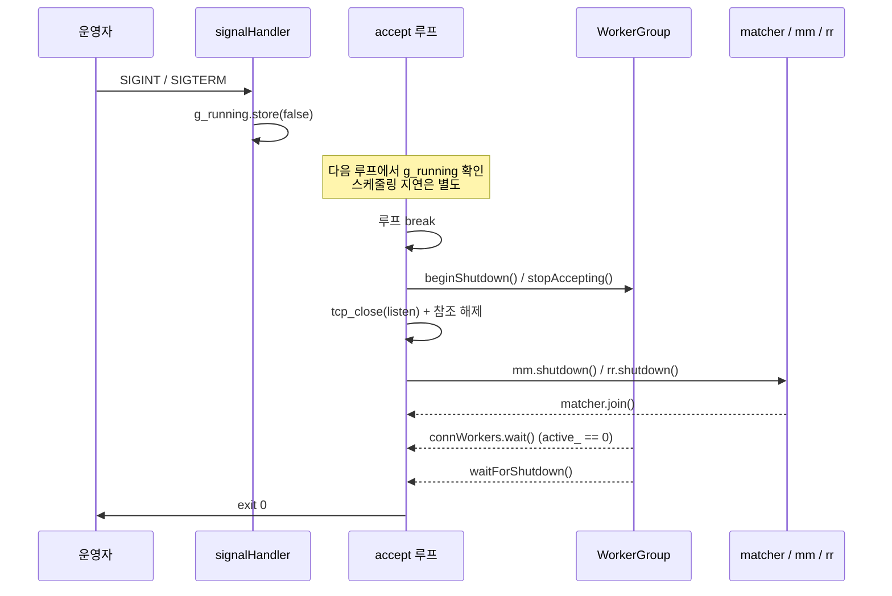
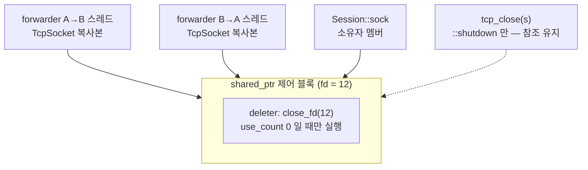
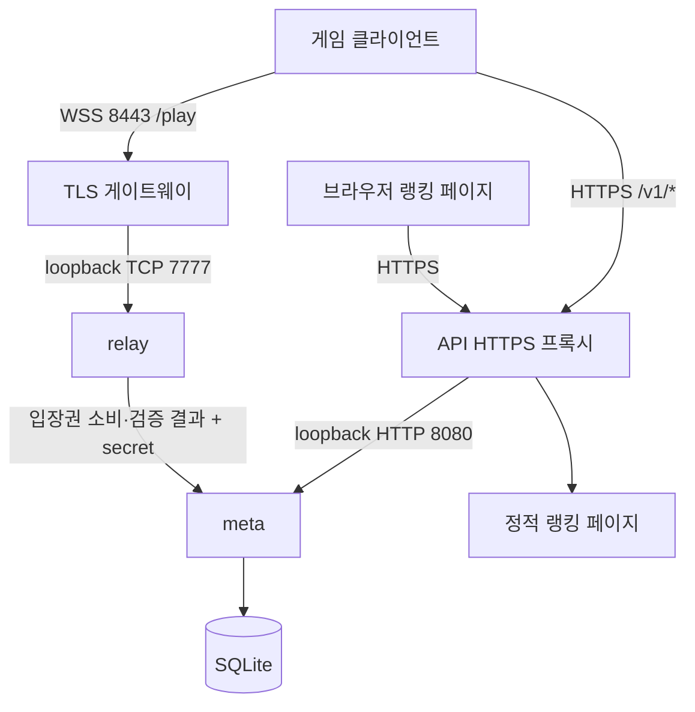

# Part 12: 검수와 배포 안정화 — 보안 기본값과 릴리스

> **시리즈:** 제로부터 멀티플레이어 테트리스 + RL | [시리즈 목차](./README.md) | **Part 12**

---

> **공개 접속의 현재 경로:** [Part 16](part16-secure-admission.md)은 WSS 게이트웨이와 일회용 게임 입장권을 추가한다. 이 장의 raw TCP 명령은 로컬/내부 연결을 설명한다. 공개 포트는 WSS, relay는 `--loopback-only`이며, 기존 token 필드에는 장기 계정 토큰 대신 입장권을 넣는다.

> **현재 코드 반영:** 주 서버는 Mac 하드웨어의 Linux, 예비 서버는 Windows다. 공개 ranked 접속은 Part 16의 WSS·일회용 입장권을 사용한다. PvP 결과는 [Part 18](part18-authoritative-results.md)의 서버 입력 재실행으로 검증한다. [출시 차단 항목과 이전 절차](../release-readiness.md)를 먼저 확인한다. 이 글의 배포 절차가 보안 출시 승인을 의미하지 않는다.

## 이번 Part의 구현 계약

- **선행 상태:** Part 0~11 의 모든 경로. 특히 `net/socket.{h,cpp}`, `net/session.cpp`, `server/main.cpp`·`relay.cpp`·`worker_group.h`, `meta/main.cpp`·`api_server.cpp`· `http_client.cpp`, 그리고 루트 `CMakeLists.txt` 의 옵션 집합.
- **이번 Part의 파일:** 새 소스는 없다. 손대는 것은 보안 경계의 기존 파일과 `scripts/release_linux.sh`, `scripts/release_macos.sh`, `scripts/release_win.ps1`, `scripts/release_server_linux.sh`, `scripts/backup_meta_db.sh`, `deploy/systemd/tetris-relay.service`, `deploy/systemd/tetris-meta.service`, `deploy/systemd/tetris-relay.env.example`, `deploy/systemd/tetris-meta.env.example`, `deploy/Caddyfile.example`, `deploy/cloudflared/config.yml.example`.
- **연결점:** 새 기능을 더하는 장이 아니다. Part 6~7 의 소켓/세션 계층, Part 10 의 meta 계층, Part 11 의 사용자 데이터 경로가 실패했을 때 무엇이 일어나는지를 닫는다.
- **완료 게이트:** 이 장의 `전체 회귀 검증`과 `수동 테스트`를 통과한다. 전체 빌드, `sim_hash_dump` 골든 해시 diff, `worker_group_test`, 기본 Python 계약, meta+relay 통합, 포트 7788 relay/room smoke, 릴리스 스크립트 문법을 각각 확인한다. 완료 여부는 고정된 테스트 개수가 아니라 지정한 계약의 실패·의도하지 않은 skip 유무로 판정한다.

## 1. 들어가며 — 이 장의 범위

Part 11 까지 기능은 다 들어왔다. guest 발급, 토큰 인증, RP/XP/BP, 리더보드, 아이콘 상점, 설정 영속화가 동작한다. 이 장은 기능 추가가 아니라 **배포 전 마지막 검수**다. 내부 구조체·DB·wire 의 `elo` 필드명은 호환을 위해 유지하지만 사용자 용어와 값의 의미는 RP다.

[Part 10](./part10-meta-and-ranking.md) 은 meta 프로세스 *내부* 의 하드닝(토큰 CSPRNG, 상수 시간 secret 비교, 요청 본문 상한, per-IP 레이트 리밋, 정수 오버플로 가드)을 이미 다뤘다. 이 장은 그 이유와 **프로세스 경계·운영 실패**를 본다 — 잘못된 설정의 시작 거부, SIGPIPE, 소켓 소유권, 워커 예산, 리버스 프록시 배치, 릴리스 빌드와 회귀다.

### 1.1 다른 배포 문서와의 역할 분담

저장소에는 이 장 말고도 배포를 다루는 문서가 둘 더 있다. 역할이 겹치지 않게 경계를 먼저 못 박는다.

| 문서 | 역할 |
|---|---|
| 이 장 (`docs/blog/part12-hardening-and-release.md`) | **왜** 이런 기본값인가, 그리고 릴리스 전에 **무엇을 돌려야** 하는가 |
| [`part13-structure-and-build-reference.md`](./part13-structure-and-build-reference.md) | 완성 구조, 플랫폼별 빌드 매트릭스, CMake 옵션 표, 번들 스크립트 사용법의 정본 |
| `docs/public-server-deployment.md` | 소형 리눅스 relay + 저전력 Android(Termux) meta 시험 운영, VPS/Tunnel 확장, standby 전환 절차의 정본 |

즉 이 장은 **원칙과 회귀**를 맡고, 실제 배포 절차의 명령 나열은 저 두 문서를 따른다. 이 장에 나오는 설정 파일은 전부 `deploy/` 의 실제 템플릿이므로 두 문서와 같은 파일을 가리킨다.

### 1.2 다룰 항목

1. **토큰 생성** — 왜 `std::random_device` 가 아니라 OS CSPRNG 인가.
2. **relay 보안 기본값** — `--meta` 가 켜졌는데 secret 이 없으면 *시작을 거부*.
3. **meta 보안 기본값** — 대칭으로 meta 도 무방비 기동을 거부.
4. **토큰 파일 권한** — guest 토큰은 사실상 비밀번호다. `0600` 으로 저장.
5. **SIGPIPE 와 graceful shutdown** — 끊긴 소켓에 써도 프로세스가 죽지 않게.
6. **소켓 fd 소유권** — 한 fd 를 여러 스레드가 공유할 때의 재사용 경합.
7. **신뢰할 수 없는 입력과 DoS 예산** — 프레임 바운드, 송신 타임아웃, 워커 상한.
8. **네트워크 경계** — 왜 meta·relay는 내부 포트이고 TLS 진입점만 공개하는가.
9. **릴리스 빌드와 패키징** — 컴파일 타임 기본값 주입, 플랫폼별 번들.
10. **운영** — systemd 격리, 백업과 **복구**, secret 회전.
11. **전체 회귀 검증** — 이 장의 존재 이유.

### 1.3 공격자가 바꿀 수 있는 값에서 검증 계약을 만든다

위협 모델은 보호할 자산, 공격자의 능력, 데이터 이동 경로와 신뢰 경계를 정리한 뒤
검증할 불변식을 정하는 작업이다. 이 서비스에서 자산은 계정 접근 권한, RP/XP/BP와
소유 아이콘, 경기의 입력·결과, 다른 사용자의 접속 가능성이다.

공격자는 자기 클라이언트를 수정하고 유효한 체크섬을 붙인 프레임을 직접 만들 수 있다.
요청을 반복하거나 늦출 수 있고 두 계정을 함께 통제할 수도 있다. 서버 비밀키와 DB를
이미 장악했다고 가정하는 모델은 별도다. 토큰 파일 유출은 계정 권한을 넘기는 경계라
파일 권한·폐기·복구도 함께 다룬다.

입력 경로는 `클라이언트 → TLS 진입점 → relay 연결/경기 → RankedGame → meta → DB`다.
같은 프로세스 안에서도 외부 프레임을 경기 상태로 바꾸는 지점은 신뢰 경계다.

| 공격자가 정하는 것 | 서버가 지켜야 할 계약 | 구현에서 확인할 곳 |
|---|---|---|
| 프레임 타입과 본문 | 서버 전용 상태 프레임은 상대에게 전달하지 않는다 | `net/framing.h`의 `is_server_only_type`, 두 relay의 전달 경로 |
| 입력의 시각·개수·마스크 | 형식, 연속성, 재전송 일치, 허용된 진행량을 검사한다 | `server/ranked_game.h`의 `observe` |
| 승패·점수 신고 | 두 신고가 같아도 서버가 재실행한 종료 결과만 저장한다 | `RankedGame::result`, relay의 결과 저장 경로 |
| player ID처럼 보이는 값 | 입력 주체는 서버의 연결/채널 관계에서 정한다 | relay의 Conn/Channel, meta의 인증된 요청 처리 |
| 반복·지연·느린 수신 | 연결·작업·대기 바이트·시간 예산을 각 경계에서 제한한다 | §8, [Part 14](part14-event-loop-scaling.md) |

형식에 맞는 입력도 권한이 없을 수 있다. 인증된 계정도 다른 경기의 참가자는 아닐 수 있다.
TLS는 전송 경로를 보호하지만 접속한 클라이언트의 주장이 사실인지 판정하지 않는다.
공개 FNV 체크섬도 공격자가 다시 계산할 수 있으므로 메시지 인증으로 사용하지 않는다.

검사는 거절뿐 아니라 뒤에 보낸 정상 입력의 전달과 보상 무변경을 함께 확인한다.
`python/tests/test_relay_adversarial.py`의 서버 전용 4타입 검사와 상충/공모 결과 신고
검사가 이 경계를 관찰한다. 전체 가용성·사람이 직접 조작했는지·담합 방지는 별도 정책과
측정 대상이다. [134차시](../learn/index.html#lesson-134)는 연결에 고정한 주체와 배치
원자성을 작은 입력 게이트로 구현한다.

구조화 방법은 [OWASP 위협 모델링 가이드](https://cheatsheetseries.owasp.org/cheatsheets/Threat_Modeling_Cheat_Sheet.html),
요청마다 권한을 확인하는 원칙은 [OWASP 권한 검사 가이드](https://cheatsheetseries.owasp.org/cheatsheets/Authorization_Cheat_Sheet.html)를 참고한다.

## 2. 토큰 생성 — `random_device` 의 함정

[Part 10](./part10-meta-and-ranking.md) 의 `gen_token` 은 16 바이트(128비트) 엔트로피를 읽어 32 hex 문자열로 만든다. 처음 떠올릴 구현은 표준 라이브러리의 `std::random_device` 다.

**예시(실제 저장소에는 없음)**

```cpp
std::string gen_token_naive()
{
    std::random_device rd;
    std::uniform_int_distribution<uint32_t> dist(0, 0xFFFFFFFFu);
    char buf[33];
    for (int i = 0; i < 4; ++i)
        std::snprintf(buf + i * 8, 9, "%08x", dist(rd));
    buf[32] = '\0';
    return std::string(buf, 32);
}
```

표준은 `std::random_device` 가 비결정적 엔트로피원이라고 *권장* 할 뿐, **보장하지 않는다.** 악명 높은 사례가 구형 MinGW 의 libstdc++ 로, `random_device` 가 매 실행마다 같은 시퀀스를 뱉는 결정적 PRNG 로 구현돼 있었다. 토큰은 사실상 비밀번호이므로, 결정적 토큰은 곧 누구나 예측 가능한 비밀번호다. "대부분의 플랫폼에서 OS CSPRNG 를 래핑하므로 충분히 강하다" 는 가정은 *대부분* 이라는 말 때문에 깨진다.

그래서 실제 `meta/api_server.cpp` 는 OS 엔트로피를 **명시적으로** 읽는다. Windows는 `BCryptGenRandom`, POSIX/Termux는 `/dev/urandom`을 사용한다. OS CSPRNG가 실패하면 약한 난수로 폴백하지 않고 guest 발급을 실패-폐쇄한다.

**현재 소스 발췌 — `meta/api_server.cpp`**

```cpp
// 인증 토큰은 플랫폼 CSPRNG에서만 만든다. 엔트로피 소스가 실패했을 때
// random_device나 시간값으로 폴백하면 "서비스 가용" 상태처럼 보이면서 예측 가능한
// 토큰을 발급할 수 있다. 이 경우 guest 요청 자체를 실패-폐쇄하는 편이 안전하다.
bool fill_random(unsigned char* out, size_t n)
{
#ifdef _WIN32
    if (n > static_cast<size_t>(std::numeric_limits<ULONG>::max())) return false;
    return BCryptGenRandom(nullptr, out, static_cast<ULONG>(n),
                           BCRYPT_USE_SYSTEM_PREFERRED_RNG) == 0;
#else
    // Linux와 macOS에서 공통으로 쓸 수 있는 커널 난수 장치를 직접 읽는다.
    // read는 요청한 길이보다 짧게 성공할 수 있고 signal에 끊길 수도 있으므로
    // 한 번의 호출 결과를 토큰 전체로 착각하지 않는다.
    int flags = O_RDONLY;
    #ifdef O_CLOEXEC
    flags |= O_CLOEXEC;
    #endif
    const int fd = ::open("/dev/urandom", flags);
    if (fd < 0) return false;
    size_t done = 0;
    while (done < n) {
        const ssize_t got = ::read(fd, out + done, n - done);
        if (got > 0) {
            done += static_cast<size_t>(got);
            continue;
        }
        if (got < 0 && errno == EINTR) continue;
        break;
    }
    ::close(fd);
    return done == n;
#endif
}
```

`gen_token` 은 이 16 바이트를 hex 로 인코딩만 한다.

**현재 소스 발췌 — `meta/api_server.cpp`**

```cpp
// 32 hex chars 무작위 토큰 (16 바이트 = 128비트 엔트로피).
std::optional<std::string> gen_token()
{
    unsigned char raw[16];
    if (!fill_random(raw, sizeof(raw))) return std::nullopt;
    static const char hex[] = "0123456789abcdef";
    char buf[33];
    for (int i = 0; i < 16; ++i) {
        buf[i * 2]     = hex[(raw[i] >> 4) & 0xF];
        buf[i * 2 + 1] = hex[raw[i] & 0xF];
    }
    buf[32] = '\0';
    return std::string(buf, 32);
}
```

POSIX 경로는 `read` 한 번이 요청한 길이를 모두 돌려준다고 가정하지 않는다.
부분 읽기를 누적하고 시그널로 중단된 `EINTR`만 재시도하며, 열린 난수 fd는
자식 프로세스에 상속되지 않도록 가능한 플랫폼에서 `O_CLOEXEC`를 사용한다.
Windows 경로는 CMake에서 `bcrypt`를 링크해 표준 라이브러리 구현과 무관하게
시스템 CSPRNG를 직접 사용한다. 어느 쪽이든 실패하면 `POST /v1/guest`가 500
`entropy_unavailable`을 돌려준다. 이 실패는 운영 경보 대상이지만, 예측 가능한
계정을 발급하는 것보다 안전하다.

## 3. relay 보안 기본값 — 시작 거부

Part 10 의 가장 중요한 보안 경계는 `POST /v1/matches` 였다. 이 endpoint 가 secret 없이 열려 있으면 누구든 `curl` 로 가짜 매치 결과를 POST 해 RP 를 조작할 수 있다. meta 쪽은 `relay_secret_` 이 비어있지 않으면 `X-Relay-Secret` 을 상수 시간 비교로 검증한다.

문제는 relay 쪽이다. relay 가 `--meta` 로 메타 연동을 켰는데 secret 을 안 넘기면, relay 는 secret 없이 `/v1/matches` 를 호출하고 meta 는 403 으로 거부한다. 결과적으로 매치는 진행되지만 RP 가 전혀 갱신되지 않는다 — 조용히. 운영자는 "왜 RP 가 안 바뀌지?" 를 한참 뒤에야 발견한다.

이런 *조용한 실패* 가 가장 나쁘다. 그래서 `server/main.cpp` 는 "meta 는 켰는데 secret 이 없는" 조합을 **시작 시점에 거부** 한다.

**현재 소스 발췌 — `server/main.cpp`**

```cpp
    // meta 클라이언트 (옵션). URL 미지정 시 nullptr → unranked.
    std::unique_ptr<meta::client::MetaClient> metaClient;
    if (!metaUrl.empty()) {
        if (metaSecret.empty()) {
            RLOG_ERROR("[relay] refusing to start: --meta set but no relay secret. "
                       << "Set --meta-secret or TETRIS_RELAY_SECRET (meta rejects "
                       << "POST /v1/matches without it).");
            return 2;
        }
        metaClient = std::make_unique<meta::client::MetaClient>(metaUrl, metaSecret);
        if (!metaClient->valid()) {
            RLOG_ERROR("[relay] invalid --meta URL: " << metaUrl);
            return 2;
        } else {
            RLOG_INFO("[relay] meta enabled: " << metaUrl);
        }
    } else {
        RLOG_INFO("[relay] meta=none (unranked mode)");
    }
```

설계 포인트 세 가지.

- **secret 은 두 경로로 받는다.** `main()` 진입 직후 `TETRIS_RELAY_SECRET` 환경변수를 읽어 두고, CLI 파싱에서 `--meta-secret` 이 나오면 그 값으로 덮어쓴다. 운영에서는 환경변수가 편하다 — 프로세스 목록(`ps`)에 secret 이 노출되지 않고, systemd 의 `EnvironmentFile=` 로 파일에서 주입할 수 있다(§11.1). CLI 인자는 로컬 테스트용이다.
- **`--meta` 없이는 secret도 불필요.** meta 연동을 안 켜면 relay는 영속 상태와 ranked 결과 처리를 사용하지 않고 unranked 매치(`player_id=0`, RP 미반영)만 돌린다. 큐·룸·소켓 같은 실행 중 상태와 연결 제한은 그대로 유지된다. 이 경로 덕분에 로컬 테스트는 별도 계정 서버 없이 가능하다.
- **URL 자체도 검증한다.** `MetaClient::valid()` 가 false 면 역시 종료 코드 2 다. `valid()` 가 false 가 되는 경우는 두 가지인데, 파싱 실패와 **OpenSSL 없이 빌드된 바이너리에 `https://` URL 을 준 경우**다(§10.3).

빌드해서 secret 없이 띄우면 즉시 종료된다.

```bash
$ ./build/tetris_relay --meta http://127.0.0.1:8080
[relay] refusing to start: --meta set but no relay secret. Set --meta-secret or TETRIS_RELAY_SECRET (meta rejects POST /v1/matches without it).
$ echo $?
2
```

`TETRIS_RELAY_SECRET=$(openssl rand -hex 32) ./build/tetris_relay --meta http://127.0.0.1:8080` 으로 띄우면 `[relay] meta enabled: ...` 가 찍히며 정상 기동한다.

### 3.1 `--port` 쓰레기값 방어

같은 "시작 시점에 거부" 원칙이 포트 파싱에도 적용된다. `atoi` 는 실패를 `0` 으로 돌려주므로 `--port abc` 가 조용히 포트 0(커널이 임의 포트 배정)으로 뜬다. 운영자는 `ss -ltn` 을 보기 전까지 모른다.

**현재 소스 발췌 — `server/main.cpp`**

```cpp
void printUsage() {
    std::cout <<
        "Usage: tetris_relay [--port N] [--meta URL] [--meta-secret SECRET]\n"
        "                    [--max-sessions-per-ip N] [--log-level L]\n"
        "  --log-level L    error|warn|info|debug (default info). 운영에서는 warn 이\n"
        "                   접속·매치 줄까지 지운다. TETRIS_RELAY_LOG_LEVEL 로도\n"
        "                   정할 수 있고 이 인자가 이긴다.\n"
        "  --loopback-only  Listen on 127.0.0.1 behind the WSS gateway.\n"
        "  --port N         TCP listen port (default 7777)\n"
        "  --meta URL       tetris_meta base URL (e.g. https://api.example.com)\n"
        "                   If omitted, relay runs unranked (no token verify,\n"
        "                   no /v1/matches POST).\n"
        "  --meta-secret S  Send X-Relay-Secret on /v1/matches.\n"
        "                   Defaults to TETRIS_RELAY_SECRET if set.\n"
        "  --max-sessions-per-ip N\n"
        "                   Concurrent connections one address may hold for the\n"
        "                   life of the connection (default "
        << relay::kMaxSessionsPerIp << ").\n"
        "                   Separate from the per-IP handshake budget ("
        << relay::kMaxHandshakesPerIp << "), which\n"
        "                   is released as soon as a connection authenticates.\n"
        "                   Raise it only for a deployment that legitimately\n"
        "                   shares one address across many players.\n"
        "  -h, --help       Show this help\n";
}

bool parseCount(const std::string& s, size_t& out) {
    if (s.empty()) return false;
    unsigned long long value = 0;
    auto* first = s.data();
    auto* last = s.data() + s.size();
    auto res = std::from_chars(first, last, value);
    if (res.ec != std::errc{} || res.ptr != last) return false;
    if (value < 1 || value > 100000) return false;
    out = static_cast<size_t>(value);
    return true;
}

bool parsePort(const std::string& s, uint16_t& out) {
    if (s.empty()) return false;
    unsigned int value = 0;
    auto* first = s.data();
    auto* last = s.data() + s.size();
    auto res = std::from_chars(first, last, value);
    if (res.ec != std::errc{} || res.ptr != last) return false;
    if (value < 1 || value > 65535) return false;
    out = static_cast<uint16_t>(value);
    return true;
}
```

`std::from_chars` 를 쓰는 이유는 세 가지다. 예외를 던지지 않고, 로케일에 의존하지 않으며, **끝까지 소비했는지**를 `res.ptr != last` 로 검사할 수 있다. `"7777abc"` 같은 부분 파싱은 그래서 거부된다. 범위 검사(`1..65535`)까지 통과해야 비로소 `out` 에 쓴다 — 실패 경로에서 출력 인자를 오염시키지 않는다.

## 4. meta 보안 기본값 — 대칭 거부

relay 가 "secret 없이 meta 를 부르는 것" 을 막았다면, meta 는 대칭으로 *자기 자신* 이 무방비로 뜨는 것을 막는다. `meta/main.cpp` 는 secret 도 없고 `--allow-public-matches` 도 없으면 시작을 거부한다.

**현재 소스 발췌 — `meta/main.cpp`**

```cpp
    if (args.relay_secret.empty() && !args.allow_public_matches) {
        std::fprintf(stderr,
                     "[meta] refusing to start: POST /v1/matches requires "
                     "--relay-secret or TETRIS_RELAY_SECRET. For local-only "
                     "tests, pass --allow-public-matches explicitly.\n");
        return 2;
    }
```

기본 모드에서는 양쪽이 시작 시점에 비밀키 누락을 거절한다. 개발용 `--allow-public-matches`를 비밀키 없이 지정하면 meta는 숫자 loopback 주소 `127.0.0.1`·`::1`만 허용하고, 전체 인터페이스·공인/사설 주소·호스트 이름은 DB를 열기 전에 거절한다. 로컬 바인드는 다른 로컬 프로세스를 인증하지 않으며, 프록시로 이 경로를 외부에 공개하면 그 제한을 우회해 노출할 수 있다. 운영에는 공유 비밀과 공개 경로 제한이 여전히 필요하다.

**현재 소스 발췌 — `meta/main.cpp`**

```cpp
// The unauthenticated result route is a local test escape hatch only.
    // Numeric addresses avoid depending on hostname resolution for this boundary.
    if (args.relay_secret.empty() && args.allow_public_matches &&
        args.http_host != "127.0.0.1" && args.http_host != "::1") {
        std::fprintf(stderr,
                     "[meta] --allow-public-matches without a secret requires a "
                     "numeric loopback bind (127.0.0.1 or ::1).\n");
        return 2;
    }
```

meta 프로세스 *내부* 의 나머지 하드닝은 Part 10 에서 이미 구현·해설했으므로 여기서 코드를 다시 싣지 않고 목록으로만 회수한다.

- **OS CSPRNG 토큰** — `fill_random` + `gen_token` (§2).
- **상수 시간 secret 비교** — `X-Relay-Secret` 검증의 타이밍 사이드채널 방지
  (`meta/credentials.cpp`의 `equal_secret`, 동일 길이 내용 비교).
- **요청 본문 상한** — `set_payload_max_length(64 * 1024)` 로 거대 body 플러딩 차단.
- **per-IP 레이트 리밋** — 고정 윈도우 카운터. 직접 연결은 소켓 peer IP를 키로 쓰고, 직접 peer가 loopback인 로컬 프록시 구성에서만 전달된 client IP 헤더를 신뢰한다.
- **`find_int` 오버플로 가드** — `INT64_MAX` 초과 입력에 `std::nullopt` (§8.5).
- **토큰 파일 0600** — guest 토큰을 비밀번호처럼 보호 (§5).

즉 meta 의 하드닝은 "토큰은 강한 난수 · secret 검증은 사이드채널 안전 · 입력은 크기/개수/값 모두 바운드 · 시작은 안전 기본값" 으로 요약된다.

## 5. 계정 파일 — 비공개 권한과 원자적 교체

키를 저장하다 실패했을 때 기존 파일까지 비면 다음 실행에서 계정에 접근하지 못한다.
따라서 `O_TRUNC`로 목적지를 먼저 비우던 구현을 같은 폴더의 임시 파일에 완성한 뒤
교체하는 방식으로 바꿨다. POSIX는 파일 0600·fsync·rename·부모 fsync를 사용한다.
Windows는 현재 사용자와 SYSTEM만 허용하는 보호된 DACL, FlushFileBuffers,
MoveFileEx의 교체·WRITE_THROUGH를 사용한다. POSIX 쓰기 루프는 부분 쓰기와 EINTR을 처리하고, Windows 경로는 요청한 전체 길이가 쓰였는지 검사한다.

**현재 소스 발췌 — `meta/private_file.cpp`**

```cpp
bool write_private_file(const std::string &path, const std::string &contents) {
    namespace fs = std::filesystem;
    if (path.empty() || contents.size() > 16384)
        return false;
    const auto destination = fs::u8path(path);
    const auto parent = destination.parent_path();
    if (parent.empty())
        return false;
    std::error_code ec;
    fs::create_directories(parent, ec);
    if (ec)
        return false;
#ifdef _WIN32
    HANDLE access = nullptr;
    if (!OpenProcessToken(GetCurrentProcess(), TOKEN_QUERY, &access))
        return false;
    DWORD size = 0;
    GetTokenInformation(access, TokenUser, nullptr, 0, &size);
    std::vector<unsigned char> user(size);
    bool ok = GetTokenInformation(access, TokenUser, user.data(), size, &size) != 0;
    CloseHandle(access);
    if (!ok)
        return false;
    LPWSTR sid = nullptr;
    if (!ConvertSidToStringSidW(reinterpret_cast<TOKEN_USER *>(user.data())->User.Sid, &sid))
        return false;
    const std::wstring acl = L"D:P(A;;FA;;;SY)(A;;FA;;;" + std::wstring(sid) + L")";
    LocalFree(sid);
    PSECURITY_DESCRIPTOR descriptor = nullptr;
    if (!ConvertStringSecurityDescriptorToSecurityDescriptorW(acl.c_str(), SDDL_REVISION_1, &descriptor,
                                                              nullptr))
        return false;
    SECURITY_ATTRIBUTES security{sizeof(SECURITY_ATTRIBUTES), descriptor, FALSE};
    fs::path temporary;
    HANDLE file = INVALID_HANDLE_VALUE;
    // CREATE_NEW prevents following an attacker-created temporary path.
    for (unsigned attempt = 0; attempt < 128 && file == INVALID_HANDLE_VALUE; ++attempt) {
        temporary = destination;
        temporary += L".tmp-" + std::to_wstring(GetCurrentProcessId()) + L"-" +
                     std::to_wstring(GetTickCount64()) + L"-" + std::to_wstring(attempt);
        file = CreateFileW(temporary.c_str(), GENERIC_WRITE, 0, &security, CREATE_NEW, FILE_ATTRIBUTE_NORMAL,
                           nullptr);
        if (file == INVALID_HANDLE_VALUE && GetLastError() != ERROR_FILE_EXISTS)
            break;
    }
    LocalFree(descriptor);
    if (file == INVALID_HANDLE_VALUE)
        return false;
    DWORD written = 0;
    ok = WriteFile(file, contents.data(), static_cast<DWORD>(contents.size()), &written, nullptr) &&
         written == contents.size() && FlushFileBuffers(file);
    if (!CloseHandle(file))
        ok = false;
    if (ok)
        ok = MoveFileExW(temporary.c_str(), destination.c_str(),
                         MOVEFILE_REPLACE_EXISTING | MOVEFILE_WRITE_THROUGH) != 0;
    if (!ok)
        DeleteFileW(temporary.c_str());
    return ok;
#else
    std::string pattern = destination.string() + ".tmp-XXXXXX";
    std::vector<char> temporary(pattern.begin(), pattern.end());
    temporary.push_back('\0');
    const int fd = mkstemp(temporary.data());
    if (fd < 0)
        return false;
    bool ok = fchmod(fd, S_IRUSR | S_IWUSR) == 0;
    size_t written = 0;
    while (ok && written < contents.size()) {
        const auto n = write(fd, contents.data() + written, contents.size() - written);
        if (n < 0 && errno == EINTR)
            continue;
        if (n <= 0) {
            ok = false;
            break;
        }
        written += static_cast<size_t>(n);
    }
    if (ok && fsync(fd) != 0)
        ok = false;
    if (close(fd) != 0)
        ok = false;
    if (ok && rename(temporary.data(), destination.c_str()) != 0)
        ok = false;
    if (ok) {
        const int dir = open(parent.c_str(), O_RDONLY | O_DIRECTORY);
        if (dir < 0)
            ok = false;
        else {
            if (fsync(dir) != 0)
                ok = false;
            close(dir);
        }
    }
    if (!ok)
        unlink(temporary.data());
    return ok;
#endif
}
```

저장의 **공개 시점**과 **내구성 확인**을 구분한다. POSIX에서 같은 파일시스템의
`rename`이 성공하면 새로 여는 독자는 완성된 새 파일을 본다. 이미 열어 둔 파일
디스크립터는 기존 파일을 계속 가리킬 수 있다. 뒤따르는 부모 디렉터리 `fsync`가
실패하면 함수는 `false`를 반환하지만 새 내용은 이미 보일 수 있다. 따라서 `false`를
“아무것도 바뀌지 않음”이나 자동 롤백으로 해석하지 않는다. 반환값은 요청한 저장
절차의 완료를 확인했는지 나타내며, 실패 후에는 저널과 현재 파일을 함께 대조한다.

이 함수는 여러 파일을 한 번에 커밋하지 않으며 읽기·수정·교체를 직렬화하지도 않는다.
협력하는 작성자가 같은 잠금을 유지해야 갱신 유실을 막을 수 있다. 파일을 둘러싼
디렉터리는 앱이 관리하고 다른 사용자가 바꿀 수 없는 위치여야 한다. `mkstemp`의
배타적 생성이나 파일 권한만으로 적대적인 부모 경로 변경까지 막지는 못한다.
새 상위 디렉터리들을 만들었을 때 그 조상 디렉터리까지 재귀적으로 동기화하는
코드도 아니다. 운영 폴더를 미리 준비하는 절차와 개별 파일 게시를 구별한다.

실패 단계는 완성된 임시 파일의 동기화 전·교체 전·부모 동기화 시점으로 나누어
주입할 수 있다. 이는 해당 반환 오류에서 파일과 임시 파일이 어떻게 남는지 확인하는
검사다. 실제 전원 손실·저장장치·파일시스템별 복구 검증을 대신하지 않는다.

파일 암호화나 같은 사용자 권한의 악성 프로그램 격리가 아니다. 다른 사용자에게
우발적으로 읽히는 위험과 저장 도중 키가 잘리는 위험을 줄인다. 변경 전체는
`AccountFileLock`으로 직렬화하고, 서버 변경 전에 새 키가 든 pending을 내구성 있게 쓴다.
서버 응답 유실과 저장 실패의 재시도 계약은 Part 17에서 구현한다.

### 5.1 실제 저장 위치와 서버 소유 확인

`platform/user_data`는 OS 경로, `AccountStore`는 API origin별 계정을 담당한다.
HTTP 클라이언트에서 OS 경로 정책을 제거해 relay가 사용자 파일 구현에 의존하지 않게 했다.

| 플랫폼 | 기본 계정 폴더 |
|---|---|
| Windows | `%APPDATA%\Tetris\accounts\<origin locator>` |
| macOS | `$HOME/Library/Application Support/Tetris/accounts/<origin locator>` |
| Linux | `${XDG_DATA_HOME:-$HOME/.local/share}/Tetris/accounts/<origin locator>` |

이 폴더의 `account.json`에 api_url과 키가 있다. locator 충돌에 대비해 backup·pending까지
전체 origin을 대조한다. `TETRIS_USER_DATA_ROOT`에 절대 경로를 주면 루트를 바꿀 수 있다.
Account 화면에 실제 폴더를 표시하므로 경로를 추측하지 않고 그 위치에서 파일을 확인한다.
Windows의 Roaming 프로필은 조직 설정에 따라 동기화될 수 있으므로 운영 환경의 파일
보관 정책도 점검한다. 키를 공유 폴더에 두거나 패키지에 넣지 않는다.

## 6. SIGPIPE 와 graceful shutdown

### 6.1 SIGPIPE — 죽은 소켓에 쓸 때

relay 의 핵심 루프는 한 소켓에서 읽어 다른 소켓에 쓰는 것이다 ([Part 7](./part7-relay-server.md)). 상대의 수신 경로가 닫힌 뒤 소켓에 쓰면 POSIX에서 **`SIGPIPE` 시그널** 이 발생할 수 있다. 이 시그널의 기본 처리는 *프로세스 종료* 다. 즉 클라이언트 하나가 끊긴 순간 relay 전체가 죽어 다른 모든 매치까지 끊긴다.

해결은 시그널을 무시하는 것이다. 해당 오류에서 프로세스 전체의 기본 종료를 피하고, relay가 송신 반환값을 보고 그 연결을 정리하도록 한다. 등록 위치가 중요하다 — `server/main.cpp` 가 아니라 `net/socket.cpp` 의 `net_init()` 안이다. 소켓을 쓰는 모든 프로세스(relay 든 game 클라이언트든)가 `net_init()` 을 거치므로, 무시 설정을 네트워킹 초기화에 묶어 두면 한 곳에서 모든 바이너리가 보호된다.

**현재 소스 발췌 — `net/socket.cpp`**

```cpp
// [NET] Winsock 초기화와 POSIX SIGPIPE 정책을 설정한다.
bool net_init() {
    if (g_inited)
        return true;
#ifdef _WIN32
    WSADATA wsaData;
    int r = WSAStartup(MAKEWORD(2,2), &wsaData);
    g_inited = (r == 0);
    return g_inited;
#else
    // POSIX: writing to a closed peer can raise SIGPIPE and terminate the whole
    // relay/client process before send() returns EPIPE. Treat it as an I/O error.
    if (std::signal(SIGPIPE, SIG_IGN) == SIG_ERR)
        return false;
    g_inited = true;
    return true;
#endif
}
```

`SIG_IGN`은 해당 시그널의 기본 종료 동작을 무시하도록 하는 프로세스 전체 정책이다.
`MSG_NOSIGNAL`이 있는 플랫폼에서는 개별 `send` 호출에서도 SIGPIPE 생성을 억제한다.
전자는 시그널 처리 방침, 후자는 호출별 옵션이며 적용 범위가 다르다. 상대 단절 뒤
모든 호출이 즉시 EPIPE로 끝나는 것은 아니다. 버퍼에 쓰기가 수락되거나 다른 소켓
오류가 먼저 보고될 수 있으므로 실제 반환값과 오류를 처리한다. send 성공도
상대 응용 프로그램이 메시지를 처리했다는 확인은 아니다.

### 6.2 시그널 핸들러는 플래그만 내린다

SIGINT/SIGTERM 은 `server/main.cpp` 가 등록한다. 핸들러가 하는 일은 하나뿐이다.

**현재 소스 발췌 — `server/main.cpp`**

```cpp
static_assert(std::atomic<bool>::is_always_lock_free,
              "signal handler requires lock-free atomic<bool>");
std::atomic<bool> g_running{true};
net::TcpSocket    g_listen_sock{};  // 논블로킹 listen 소켓 (accept 폴링)

// Bound thread and handle use during connection setup.
constexpr size_t kMaxConnWorkers = 256;

// per-IP 상한은 server/ip_admission.h 가 두 릴레이 바이너리에 공통으로 정의한다
// (핸드셰이크 슬롯 = 인증까지, 세션 슬롯 = 연결이 죽을 때까지).

void signalHandler(int /*sig*/) {
    // The signal handler only touches an atomic flag.
    g_running.store(false);
}
```

`kMaxConnWorkers`는 프로세스 전체의 연결 setup 스레드 상한이다 — 연결당 detached 스레드를 만들므로 상한이 없으면 connect 플러딩만으로 메모리와 핸들이 고갈된다. 초과분은 즉시 close 한다.

그 아래에 per-IP 예산이 **둘** 있다. 처음에는 하나였는데, 하나로는 두 가지를 동시에 지킬 수 없다는 것이 나중에 드러났다.

- **핸드셰이크 슬롯** — accept 부터 *인증이 끝나는 순간*까지만 잡는다. 아직 자기가 누구인지 밝히지 않은 연결이 한 주소에서 몇 개까지 열려 있을 수 있는지를 정한다. 첫 프레임을 안 보내고 버티거나 토큰 검증 왕복만 반복해 접속 경로를 점유하는 부하를 막는 것이 목적이므로, 진로가 정해지는 즉시 놓아준다.
- **세션 슬롯** — accept 부터 *연결이 죽을 때까지* 잡는다. 인증을 통과한 뒤에도 유지되므로 한 주소가 서버 전체를 차지하는 경로를 막는다.

두 상한은 독립적으로 검사한다. 어느 하나라도 못 얻으면 그 연결은 거절이다.

시그널 핸들러 안에서는 *async-signal-safe* 한 연산만 허용된다. 핸들러는 임의 시점에 다른 코드를 끊고 들어오므로 `malloc`, `mutex`, 그리고 내부에서 참조 카운트를 조작하는 `shared_ptr` 연산 등은 데드락이나 메모리 손상을 일으킬 수 있다. 가장 보수적인 POSIX 형태는 `volatile sig_atomic_t` 플래그다. 현재 코드는 `std::atomic<bool>::is_always_lock_free`를 정적 검사하고 lock-free store만 수행한다. 이 전제를 만족하지 않는 대상은 컴파일 단계에서 거절하며, 일반 스레드 문맥에서 대기자 깨우기와 자원 정리를 수행한다.

등록은 플랫폼별로 한 곳 다르다. Windows 콘솔에는 SIGTERM 에 해당하는 신호가 사실상 없고, `CTRL_BREAK_EVENT` 를 CRT 가 `SIGBREAK` 로 전달한다. 이것까지 등록해 두어야 Windows 에서도 "핸들러가 실행될 기회 자체가 없는" `TerminateProcess` 가 아니라 우아한 종료 경로를 밟을 수 있고, Python 통합 테스트가 그 경로를 검증할 수 있다.

**현재 소스 발췌 — `server/main.cpp`**

```cpp
    std::signal(SIGINT,  signalHandler);
    std::signal(SIGTERM, signalHandler);
#if defined(_WIN32)
    // Windows 콘솔의 CTRL_BREAK_EVENT 는 CRT 가 SIGBREAK 로 전달한다. Python
    // 테스트가 TerminateProcess(핸들러 실행 기회가 아예 없다) 대신
    // CTRL_BREAK_EVENT 로 우아한 종료 경로를 검증할 수 있도록 함께 등록한다.
    std::signal(SIGBREAK, signalHandler);
#endif
```

핵심은 **핸들러가 listen 소켓을 닫지 않는다** 는 것이다. `tcp_close()` 는 `shared_ptr` 를 읽으므로 시그널 핸들러에서 부르면 안전하지 않다(§7). 대신 listen 소켓의 *논블로킹 전환 성공*을 확인하고, accept 루프가 폴링하면서 매 회 `g_running` 을 확인한다. 전환에 실패하면 소켓을 정리하고 기동을 거절한다. blocking accept의 취소 동작을 플랫폼 공통 계약으로 가정하지 않는다.

**현재 소스 발췌 — `server/main.cpp`**

```cpp
    g_listen_sock = net::tcp_listen(port, /*backlog=*/256, loopbackOnly);
    if (!g_listen_sock.valid()) {
        RLOG_ERROR("tcp_listen(" << port << ") failed — port in use?");
        net::net_shutdown();
        return 1;
    }
    // Nonblocking accept lets the loop observe the shutdown flag.
    if (!net::tcp_set_nonblocking(g_listen_sock)) {
        RLOG_ERROR("listen nonblocking setup failed");
        net::tcp_close(g_listen_sock);
        g_listen_sock = {};
        net::net_shutdown();
        return 1;
    }
```

accept 루프는 대기 연결이 없으면 정해 둔 짧은 간격을 기다린 뒤 재폴링한다. 이 간격은 스케줄링 지연이나 다른 처리 시간을 포함한 종료 기한이 아니다. 연결이 들어오면 워커에 넘기기 전에 **peer IP 별 입장 예산**을 먼저 확인한다.

**현재 소스 발췌 — `server/main.cpp`**

```cpp
    // accept 루프 (논블로킹 폴링)
    uint32_t next_conn_id = 1;
    while (g_running.load()) {
        auto client = net::tcp_accept(g_listen_sock);
        if (!client.valid()) {
            // 논블로킹 accept: 대기 연결 없음(EWOULDBLOCK) 또는 셧다운.
            if (!g_running.load()) break;
            // 대기 연결 없음 — 잠깐 쉬었다가 재폴링.
            std::this_thread::sleep_for(std::chrono::milliseconds(10));
            continue;
        }
        const uint32_t id = next_conn_id++;
        std::string peerIp = net::tcp_peer_ip(client);
        if (peerIp.empty()) {
            // getpeername 실패 시 모든 연결이 "unknown" 단일 버킷(상한 16)을
            // 공유하면 무관한 연결끼리 서로를 굶긴다. fd 는 이 연결이 살아있는
            // 동안 프로세스 내에서 유일하므로 연결별 고유 키로 대신 사용한다
            // (per-IP 상한은 못 걸지만, 실패 케이스끼리의 공멸보다 낫다).
            peerIp = "fd:" + std::to_string(client.fd());
        }
        // 두 상한을 독립적으로 건다. 세션 슬롯은 연결이 죽을 때까지(소켓과 함께
        // 큐·룸·포워딩으로 옮겨 다니며) 붙들고, 핸드셰이크 슬롯은 인증이 끝나는
        // 순간 playerConnThread 가 놓아준다.
        auto sessionSlot = relay::IpAdmission::acquire(
            peerIp, relay::IpAdmission::Kind::Session);
        if (!sessionSlot) {
            RLOG_INFO("[relay] rejecting conn=" << id << " ip=" << peerIp
                      << ": per-IP session limit player_id=0 match_uuid=-");
            net::tcp_close(client);
            continue;
        }
        auto handshakeSlot = relay::IpAdmission::acquire(
            peerIp, relay::IpAdmission::Kind::Handshake);
        if (!handshakeSlot) {
            RLOG_INFO("[relay] rejecting conn=" << id << " ip=" << peerIp
                      << ": per-IP handshake limit player_id=0 match_uuid=-");
            net::tcp_close(client);
            continue;
        }
        RLOG_DEBUG("[relay] accept conn=" << id << " ip=" << peerIp);
        // launch 가 실패하면 람다(그리고 두 슬롯 사본)가 그대로 소멸하므로
        // 별도의 반납 경로가 필요 없다.
        if (!connWorkers.launch([client = std::move(client), id, &mm, &rr, mcPtr,
                                 handshakeSlot = std::move(handshakeSlot),
                                 sessionSlot = std::move(sessionSlot)]() mutable {
            relay::playerConnThread(std::move(client), id, mm, rr, mcPtr,
                                    std::move(handshakeSlot),
                                    std::move(sessionSlot));
        })) {
            RLOG_WARN("[relay] rejecting conn=" << id
                      << ": connection worker unavailable player_id=0 match_uuid=-");
        }
    }
```

`IpAdmission` 은 종류별로 IP → 진행 중 수의 맵을 하나씩 갖는다. 슬롯을 잡으면 핸들을 돌려주고, 그 핸들의 마지막 사본이 사라질 때 카운터가 줄어든다 — 반납 시점을 호출자가 **수명으로** 정하게 하는 것이 이 설계의 요점이다.

명시적인 반납 코드가 한 줄도 없다는 점을 짚어 둘 만하다. 예전에는 워커 람다 안에 반납용 RAII 객체를 두고, **워커 생성 자체가 실패한 경우**에는 accept 루프가 직접 반납했다. 두 경로가 나뉘어 있었고, 나뉜 순간부터 한쪽을 빠뜨릴 여지가 생긴다. 지금은 슬롯 핸들을 람다가 값으로 붙들므로 경로가 하나다 — `launch` 가 실패하면 람다가 그대로 소멸하고 그때 핸들도 함께 죽는다. **"실패 경로에서도 반납되게 하라" 를 규율로 지키는 것보다, 반납이 소유권에 딸려 오게 만드는 편이 언제나 낫다.**

로그 레벨도 의도적으로 갈라 둔다. `accept` 한 줄 한 줄은 debug 이고, **거절은 info 다.** 한산한 서버에서도 접속 로그는 초당 여러 줄이 되지만 거절은 드물고, 드문 사건이야말로 기본 레벨에 남아야 나중에 문의를 맞춰 볼 수 있다. 거절 줄에 `player_id` 와 `match_uuid` 자리를 비워서라도 채워 두는 이유도 같다 — 모든 종료·거절 로그가 같은 필드 모양을 가져야 한 도구로 훑을 수 있다.

**현재 소스 발췌 — `server/ip_admission.h`**

```cpp
class IpAdmission {
public:
    enum class Kind { Handshake, Session };

    // 기동 시 인자 파싱 직후 한 번만 호출한다 (accept 시작 전).
    static void set_session_limit(size_t n)
    {
        std::lock_guard<std::mutex> lk(mu_);
        session_limit_ = (n == 0) ? 1 : n;
    }

    static size_t session_limit()
    {
        std::lock_guard<std::mutex> lk(mu_);
        return session_limit_;
    }

    // 슬롯 하나를 잡는다. 상한에 걸리면 nullptr — 호출자는 연결을 거절한다.
    // key 는 보통 peer IP. getpeername 이 실패했을 때 모든 실패 연결이 하나의
    // 버킷을 공유해 서로를 굶기지 않도록, 호출자가 연결마다 고유한 키를 대신
    // 넘길 수 있다 (per-IP 상한은 못 걸지만 공멸보다는 낫다).
    static std::shared_ptr<IpAdmission> acquire(std::string key, Kind kind)
    {
        if (key.empty()) key = "unknown";
        // Finish ownership allocations before publishing a reservation. If the
        // shared_ptr control block fails, its unregistered object does no cleanup.
        auto candidate = std::shared_ptr<IpAdmission>(
            new IpAdmission(std::move(key), kind));
        std::lock_guard<std::mutex> lk(mu_);
        auto& table = (kind == Kind::Handshake) ? handshakes_ : sessions_;
        const size_t limit = (kind == Kind::Handshake) ? kMaxHandshakesPerIp
                                                       : session_limit_;
        auto it = table.find(candidate->key_);
        const size_t n = (it == table.end()) ? 0u : it->second;
        if (n >= limit) return {};
        // try_emplace may allocate. Failure leaves no reservation to roll back.
        if (it == table.end()) it = table.try_emplace(candidate->key_, 0).first;
        ++it->second;
        candidate->registered_ = true; // No throwing work after this commit.
        return candidate;
    }

    ~IpAdmission()
    {
        if (!registered_) return;
        std::lock_guard<std::mutex> lk(mu_);
        auto& table = (kind_ == Kind::Handshake) ? handshakes_ : sessions_;
        auto it = table.find(key_);
        if (it == table.end()) return;
        if (--it->second == 0) table.erase(it);
    }

    IpAdmission(const IpAdmission&) = delete;
    IpAdmission& operator=(const IpAdmission&) = delete;

private:
    IpAdmission(std::string key, Kind kind)
        : key_(std::move(key)), kind_(kind) {}

    std::string key_;
    Kind        kind_;
    bool        registered_ = false;

    inline static std::mutex                             mu_;
    inline static std::unordered_map<std::string, size_t> handshakes_;
    inline static std::unordered_map<std::string, size_t> sessions_;
    inline static size_t                                  session_limit_ =
        kMaxSessionsPerIp;
};
```

표가 프로세스 전역이라는 점이 중요하다. 이벤트 루프 릴레이는 포워딩을 다른 스레드로 넘기는데, 그쪽에서 연결을 닫아도 앞단이 센 수가 함께 줄어야 한다 — 루프마다 표를 두면 인계된 뒤의 반납이 엉뚱한 표로 간다.

전역 상한과 IP별 상한은 지키는 대상이 다르다. 전역 상한은 **프로세스**를 지킨다 — 스레드·핸들이 무한정 늘어나 서버 자체가 죽는 것을 막는다. 그러나 전역 상한만 있으면 한 IP 가 그 예산을 먼저 다 채워 다른 모든 사용자를 굶길 수 있다. IP별 상한은 **한 출처의 동시 점유**를 제한한다. 공유 IP의 사용자별 공정성이나 여러 IP를 쓰는 행위자의 제한까지 보장하지 않는다. 예산을 겹으로 두되 각 겹이 다른 실패 모드를 막게 하는 이 구조는 rate limit 일반론이기도 하다(meta 의 per-IP 버킷도 같은 계열, §9.2).

**등록 전에 실패할 수 있는 작업을 끝낸다.** RAII는 소유 객체를 확보한 뒤의
반납을 돕는다. 카운터를 먼저 올리고 new 또는 shared_ptr 제어 블록을 할당하면,
실패 때 반납 주체가 없거나 잠금 안에서 소멸자가 같은 mutex를 다시 잡을 수 있다.
현재 acquire는 미등록 candidate를 먼저 만들고 mutex 안에서 상한과 map 삽입을
검사한 뒤 카운터 증가·registered_=true를 확정한다. 삽입까지 실패해도 예약은 남지 않는다.
소멸자의 registered_ 검사는 미등록 후보가 다른 연결의 예약을 지우는 것도 막는다.

성공한 핸들의 마지막 참조가 없어지면 반납된다. 소유 참조를 계속 붙들거나 순환 참조를
만드는 코드는 반납을 늦출 수 있으므로, 단계 전환과 실패 경로의 소유권을 함께 확인한다.
메모리 부족 예외가 호출자 전체에서 어떻게 처리되는지는 이 작은 등록 계약과 별도다.

### 슬롯의 수명이 상한의 의미를 바꾼다

여기서 처음에 한 번 틀렸다. 슬롯 하나를 두고 그 소멸자를 **연결 스레드 종료 시점**에 걸었는데, RAII 가 새는 걸 막아 준다는 사실에 만족해 *언제* 반납되는지를 따져 보지 않았다.

문제는 룸 경로였다. `playerConnThread` 는 `handleCreate` 안에서 방이 끝날 때까지 반환하지 않는다. 그래서 방을 만들어 두고 친구를 기다리는 동안 — 게스트 대기 한도가 15분이다 — 그 연결이 슬롯을 계속 붙들었다. 이름은 "핸드셰이크 상한" 인데 동작은 **"동시 세션 상한"** 이었던 것이다.

공인 IP 를 공유하는 환경에서 이 차이가 그대로 드러난다. 학교·회사·카페·통신사 CGNAT 뒤에서 열여섯 명이 각자 방을 열어 두면, 열일곱 번째 사람은 방을 못 만드는 정도가 아니라 **랜덤 매칭조차 접속이 끊긴다.** 부하와 무관하게, 접속자가 몇 명이든 걸린다.

고치는 방법은 상한을 키우는 것이 아니라 **수명이 다른 두 슬롯으로 나누는 것**이었다. 이름이 말하는 일과 실제로 하는 일을 일치시키면, 각 상한이 무엇을 지키는지가 다시 분명해진다.

> **교훈이 하나 있다.** RAII 는 자원이 *반드시* 반납되게 해 주지만 *언제* 반납되는지는 정해 주지 않는다. 그리고 상한의 의미는 값이 아니라 수명이 정한다. 소멸자가 어디서 도는지 확인하지 않으면, 새지 않는 코드가 조용히 다른 정책을 집행한다.

`tcp_peer_ip` 가 빈 문자열을 돌려주는 실패 경로의 처리도 눈여겨볼 만하다. 실패한 연결을 전부 `"unknown"` 버킷 하나에 몰면 서로 무관한 연결끼리 상한 16을 나눠 갖는 공멸이 된다. 대신 fd 값을 연결별 고유 키로 쓴다 — fd 는 그 연결이 살아 있는 동안 프로세스 안에서 유일하므로 충돌이 없다. per-IP 상한이라는 원래 목적은 이 경로에서 포기하지만, "제한 장치의 실패가 무고한 사용자를 막는" 역전보다는 낫다는 판단이다.

### 6.3 종료 순서

루프를 빠져나온 *뒤에야* — 정상 스레드 컨텍스트에서 — 소켓을 닫고 워커를 정리한다. 순서가 그대로 의미다.

**현재 소스 발췌 — `server/main.cpp`**

```cpp
    RLOG_INFO("[relay] shutting down...");
    relay::beginShutdown();
    connWorkers.stopAccepting();
    net::tcp_close(g_listen_sock);
    g_listen_sock = net::TcpSocket{};  // 마지막 참조 해제 → 실제 fd close
    mm.shutdown();
    rr.shutdown();
    if (matcher.joinable()) matcher.join();
    connWorkers.wait();
    relay::waitForShutdown();
    net::net_shutdown();
    RLOG_INFO("[relay] done");
    return 0;
```

읽는 법은 이렇다.

1. `beginShutdown()` / `stopAccepting()` — **신규 유입 차단**. 이후 새 lobby, forwarder, connection worker 는 생성되지 않는다.
2. `tcp_close(g_listen_sock)` + 재대입 — listen 소켓의 마지막 참조를 버려 실제 fd 를 닫는다. `tcp_close` 는 shutdown 만 하므로 재대입이 있어야 close 된다(§7.3).
3. `mm.shutdown()` / `rr.shutdown()` — 매치메이커와 룸 레지스트리의 대기자를 깨운다.
4. `matcher.join()` → `connWorkers.wait()` → `waitForShutdown()` — **사용자 수명 종료 확인**. 워커가 `mm`/`rr` 을 raw reference 로 들고 있으므로, 스택에 있는 `mm`/`rr` 이 파괴되기 전에 모든 워커가 끝나야 한다. `waitForShutdown()` 은 `relay.cpp` 의 전역 `WorkerGroup`(§8.4)까지 비운다.
5. `net_shutdown()` — 소켓 사용자와 소유자를 정리한 뒤 실행한다.

`WorkerGroup::wait()`는 콜백 실행과 캡처 객체의 소멸까지 기다린다. detached OS 스레드의 thread_local 소멸자까지 모두 끝났다는 join 계약은 아니다. 그런 종료까지 필요하면 join 가능한 스레드 소유권을 사용한다. stopAccepting만으로 대기 중 콜백이 취소되지 않으므로 먼저 대기 조건과 I/O를 해제해야 한다.

이 순서를 지키지 않으면 종료 중 use-after-free가 난다. relay/meta smoke 테스트는 활성 연결이 있는 상태에서 종료 신호를 보내고, 프로세스가 워커를 drain한 뒤 정상 종료하는지 자동으로 확인한다.


```mermaid
sequenceDiagram
    participant U as 운영자
    participant H as signalHandler
    participant L as accept 루프
    participant W as WorkerGroup
    participant M as matcher / mm / rr
    U->>H: SIGINT / SIGTERM
    H->>H: g_running.store(false)
    Note over L: 다음 루프에서 g_running 확인<br/>스케줄링 지연은 별도
    L->>L: 루프 break
    L->>W: beginShutdown() / stopAccepting()
    L->>L: tcp_close(listen) + 참조 해제
    L->>M: mm.shutdown() / rr.shutdown()
    M-->>L: matcher.join()
    W-->>L: connWorkers.wait() (active_ == 0)
    W-->>L: waitForShutdown()
    L->>U: exit 0
```

## 7. 소켓 fd 소유권 — fd 재사용 경합

SIGPIPE 가 "죽은 소켓에 쓰는" 문제라면, fd 소유권은 "살아있는 소켓을 누가 닫느냐" 의 문제다. 이쪽이 더 미묘하고, 공개 서버에서 **교차 연결 데이터 유출** 로 이어질 수 있어 더 위험하다.

### 7.1 과거의 `{ int fd }` 와 fd 재사용

초기 `TcpSocket` 은 그냥 정수 하나를 들고 있었다 — `struct TcpSocket { int fd; };`. relay 의 forwarder 는 한 연결을 양방향으로 중계하므로, 같은 fd 를 들고 있는 복사본이 여러 detached 스레드에 흩어진다. 각 스레드가 끝날 때 자기 복사본으로 `::close(fd)` 를 호출했다.

문제는 fd 가 **작은 정수의 재사용 자원** 이라는 데 있다. POSIX 는 항상 *가장 작은 미사용 fd* 를 새 소켓에 배정한다. 그래서 다음 순서가 가능하다.

1. 스레드 A 가 연결 X(fd=12) 의 중계를 끝내고 `::close(12)` 한다.
2. 곧바로 새 클라이언트 Y 가 접속하고, `accept()` 가 *가장 작은 미사용 fd* 인 12 를 Y 에 배정한다.
3. 아직 살아있던 스레드 B 가 (X 라고 믿고) fd=12 에 `write`/`read` 한다 — 실제로는 **Y 의 소켓**.

공개 서버에서 이것은 단순 크래시가 아니라 **A 의 데이터가 엉뚱한 클라이언트 Y 로 새거나, Y 의 데이터를 X 의 코드가 읽는** 교차 연결 유출이다. 공격자가 접속/절단을 빠르게 반복해 이 경합을 노릴 수 있다.

### 7.2 `shared_ptr<NativeSocket>` 로 소유권을 모은다

수정은 fd 를 참조 카운트 소유 핸들로 감싸는 것이다. 실제 `::close` 는 "마지막 복사본이 사라지는 순간" 딱 한 번만 일어나게 한다.

**현재 소스 발췌 — `net/socket.h`**

```cpp
struct TcpSocket {
    std::shared_ptr<StreamTransport> transport; // client WSS; never a reactor fd
    std::shared_ptr<NativeSocket> fdh;  // 제어 블록: *fdh == fd. 마지막 참조 소멸 시 ::close.

    NativeSocket fd() const { return fdh ? *fdh : kInvalidSocket; }
    bool valid() const { return transport ? transport->alive() : fdh && socket_valid(*fdh); }
}
;
```

새 fd 를 만드는 모든 경로(`tcp_listen`/`tcp_accept`/`tcp_connect`)는 `make_owned` 로 감싼다. deleter 가 정확히 한 번 `close_fd` 를 부른다.

**현재 소스 발췌 — `net/socket.cpp`**

```cpp
static TcpSocket make_owned(NativeSocket fd) {
    TcpSocket s;
    try {
        // Keep the real handle unowned until both allocations succeed. If the
        // control-block allocation fails, shared_ptr deletes only the sentinel.
        auto owner = std::shared_ptr<NativeSocket>(new NativeSocket(kInvalidSocket),
            [](NativeSocket* p) { if (p) { close_fd(*p); delete p; } });
        *owner = fd;
        s.fdh = std::move(owner);
    } catch (const std::bad_alloc&) {
        close_fd(fd);
    }
    return s;
}
```


```mermaid
graph TB
    subgraph CB["shared_ptr 제어 블록 (fd = 12)"]
        D["deleter: close_fd(12)<br/>use_count 0 일 때만 실행"]
    end
    A["forwarder A→B 스레드<br/>TcpSocket 복사본"] --> CB
    B["forwarder B→A 스레드<br/>TcpSocket 복사본"] --> CB
    S["Session::sock<br/>소유자 멤버"] --> CB
    T["tcp_close(s)<br/>::shutdown 만 — 참조 유지"] -.-> CB
```

### 7.3 `tcp_close` 는 close 가 아니라 shutdown

소유권을 RAII 에 맡겼으니, "닫는다" 는 행위를 둘로 쪼갠다.

- **종료 신호** — `tcp_close()` 는 `::shutdown(SHUT_RDWR)` *만* 한다. 같은 fd 를 `recv` 로 대기 중인 다른 복사본을 EOF 로 깨워 루프를 빠져나가게 하는 용도다. 실제 fd 를 닫지 않으므로 fd 정수는 아직 재사용되지 않는다.
- **실제 close** — 마지막 `TcpSocket` 복사본이 소멸(또는 재대입)할 때 deleter 에서 한 번. 이 시점엔 모든 스레드가 그 복사본을 버린 뒤이므로 fd 재사용 경합이 없다.

**현재 소스 발췌 — `net/socket.cpp`**

```cpp
void tcp_close(TcpSocket& s) {
    if (s.transport) { s.transport->close(); return; }
    if (!s.fdh) return;
    NativeSocket fd = *s.fdh;
    if (socket_valid(fd)) {
#ifdef _WIN32
        ::shutdown(fd, SD_BOTH);
#else
        ::shutdown(fd, SHUT_RDWR);
#endif
    }
}
```

`tcp_close` 가 `fdh` 를 `reset()` 하지 않는 점이 결정적이다. `shared_ptr` 는 *제어 블록* 이 thread-safe 할 뿐 *인스턴스 자체* 는 아니다. 한 스레드가 `s.fdh` 를 읽는 동안 다른 스레드가 `s.fdh.reset()` 하면 그건 그냥 data race 다.

### 7.4 `Close()` 의 shutdown → join → reset 순서

`net/session.cpp` 의 `Close()` 가 이 계약을 그대로 구현한다.

**현재 소스 발췌 — `net/session.cpp`**

```cpp
void Session::Close() {
    quit = true;
    // 공개된 연결에 shutdown을 요청한다. accept 워커는 논블로킹 폴링에서 quit를 본다.
    //   sockMu_ 로 워커 스레드의 publish 와 직렬화 — Close 가 quit 를 먼저 세팅하므로
    //   워커는 이 잠금 이후 publish 하지 않거나(잠금 안에서 quit 재확인), 이미 publish
    //   한 값을 우리가 본다. (shared_ptr 멤버 data race 방지)
    {
        std::lock_guard<std::mutex> lk(sockMu_);
        if (listening && listenSock.valid()) tcp_close(listenSock);
        if (sock.valid()) tcp_close(sock);
    }
    // 공개 소켓에는 shutdown을 요청했지만, DNS/connect 등 미공개 작업의
    // 완료 시간까지 보장하지는 않는다. join은 워커가 쓸 잠금 밖에서 수행한다.
    if (ath.joinable()) ath.join();
    if (qth.joinable()) qth.join();
    if (rth.joinable()) rth.join();
    if (th.joinable()) th.join();
    // join 후엔 워커가 모두 종료됐다. 늦게 publish 됐을 수 있으니 한 번 더 닫고,
    // 소유자 복사본을 명시적으로 비운다 — 마지막 참조를 버려 실제 fd 를 닫고
    // valid() 를 false 로 되돌린다(연결 종료 후 fd 잔존 회귀 방지).
    {
        std::lock_guard<std::mutex> lk(sockMu_);
        if (sock.valid()) tcp_close(sock);
        if (listenSock.valid()) tcp_close(listenSock);
        sock = TcpSocket{};
        listenSock = TcpSocket{};
    }
    connected = false; ready = false; listening = false;
    roomState_.store(RoomState::Idle);
    roomPeerCount_.store(0);
    {
        std::lock_guard<std::mutex> lk(roomMu_);
        roomCode_.clear();
    }
    {
        std::lock_guard<std::mutex> lk(roomSendMu_);
        roomSendQ_.clear();
    }
    queueMatched_.store(false);
    queueLocalReady_.store(false);
    queuePeerReady_.store(false);
    {
        std::lock_guard<std::mutex> lk(queueSendMu_);
        queueSendQ_.clear();
    }
    // 스톨 heartbeat 상태 초기화 — 다음 세션에서 첫 SendInput 까지는 비활성.
    lastMainActivityMs_.store(0);
    heartbeatTickEnd_.store(0);
    lastHeartbeatMs_.store(0);
    {
        std::lock_guard<std::mutex> lk(chatMu_);
        chatQ_.clear();
    }
    // 게임 sendQ / HASH pair 도 함께 비움 — 같은 Session 객체 재사용 시 이전
    // 연결의 stale 프레임이 새 연결의 ioThread 에서 선두로 나가는 것 방지.
    { std::lock_guard<std::mutex> lk(sendMu); sendQ.clear(); pendingSendBytes = 0; }
    hashMailbox_.clear();
    // MATCH_RESULT 도 초기화. ClearGameOverChoices 만 의존하면 타이틀→새 매치
    // 경로에서 이전 라운드 결과가 새 매치 게임오버 시점에 즉시 읽히는 경계가
    // 있었다. Close 는 세션 경계마다 반드시 실행되므로 여기서 보장.
    {
        std::lock_guard<std::mutex> lk(matchResultMu_);
        matchResultValid_ = false;
        matchResult_ = MatchResult{};
    }
}
```

종료 절차에서 구분할 세 단계는 다음과 같다.

1. **shutdown** (잠금 안) — 공개된 연결의 전송 방향을 종료한다. accept 워커는 논블로킹 폴링에서 quit를 확인한다. 아직 핸들은 소유하고 있다.
2. **join** (잠금 밖) — 워커 스레드가 모두 끝나길 기다린다. join 을 잠금 안에서 하면 워커가 `sockMu_` 를 잡으려다 데드락이므로, 반드시 잠금을 풀고 join 한다.
3. **reset** (잠금 안) — `sock = TcpSocket{}` 로 소유자 복사본을 버린다. 이것이 마지막 소유 참조라면 deleter가 실제 `::close`를 부른다. 다른 소유 복사본이 남아 있다면 그 복사본의 해제까지 핸들이 유지된다.

`sockMu_` 의 역할은 *shared_ptr 멤버 변수 자체* 에 대한 동시 재대입을 직렬화하는 것이다. 워커는 멤버를 직접 쓰지 않고 잠금 아래에서 *값으로 복사* 해 쓴다 — `net/session.cpp` 전반의 `{ std::lock_guard<std::mutex> lk(sockMu_); s = sock; }` 패턴이 그것이다. 서로 다른 복사본을 각자 들고 read/close 하는 것은 §7.2 의 계약상 안전하다.

함수 뒷부분이 송신·룸·매칭·채팅 큐와 경기 결과를 정리하는 이유도 같은 계열이다. `Session` 객체는 타이틀 → 새 매치 경로에서 **재사용** 되므로, 이전 연결의 stale 프레임이나 이전 라운드의 `MATCH_RESULT` 가 남아 있으면 새 연결의 첫 프레임으로 나가거나 새 게임오버 시점에 즉시 읽힌다. `Close`로 워커 수명을 끝낸 뒤 새 시작 경로가 수신 버퍼·remoteInputs·틱 상태를 초기화한다. 각 시작 메서드는 hasUnjoinedWorkers를 먼저 검사하므로 아직 join하지 않은 워커가 있으면 상태를 바꾸지 않고 거절한다.

공개 전 로컬 후보에서 진행 중인 DNS/connect에는 shutdown할 공유 소켓이 없을 수 있다. 현재 native 연결 수립은 블로킹이며 애플리케이션 마감시간이 없어 Close의 join도 그 반환을 기다릴 수 있다. 종료 요청을 전달하는 것과 제한 시간 안에 모든 워커가 끝남을 보장하는 것은 별도 계약이다.

## 8. 신뢰할 수 없는 입력 · DoS 하드닝

relay 와 host 는 공개 IP 에서 임의의 피어로부터 바이트를 받는다. 그 피어가 정상 클라이언트라는 보장은 없다. 방어선을 여러 층에 나눠 둔다 — 프레임 내용, 전송 속도, 단계별 버퍼, 워커 수, 정수 파싱, 그리고 프로세스 전체 자원 예산이다.

### 8.1 INPUT 프레임 바운드 검증

lockstep 의 INPUT 프레임은 `[from:4][cnt:2][inputs:cnt]` 다 ([Part 6](./part6-lockstep-networking.md)). 신뢰할 수 없는 피어는 `cnt` 를 거대하게, `from` 을 아무 tick 으로나 보낼 수 있다.

`net/input_message.h`에서 payload 전체를 먼저 검사한다. 헤더6바이트·정확한 count·알려진 마스크·래핑 없는 틱 구간을 확인한 뒤 Session이 틱 거리와 큐 상한을 적용한다. 예를 들어 from=0xFFFFFFFE, count=4는 단순히 from+i를 계산하면 뒤의 두 항목이0과1로 돌아온다. 이 작은 값은 수신 초기의 거리 검사만으로 걸러지지 않으므로 덧셈 전에 구간 자체를 거절해야 한다. 마지막 항목의 비트가 잘못되었을 때도 배치 전체를 적용하지 않는다. 구조가 유효한 배치도 현재 거리 정책을 통과하는 신규 키가 전부 들어갈 수 있는지 먼저 센다. 용량이 모자라면 map과 watermark를 바꾸지 않고 ACK 없이 실패를 표시한다. 거리 밖 틱 폐기와 기존 키의 값 유지 정책은 별도다.

**현재 소스 발췌 — `net/session.cpp`**

```cpp
    case MsgType::INPUT: {
        InputBatchView batch;
        if (decode_input_payload(f.payload, batch)) {
            const uint32_t from = batch.first_tick;
            const uint16_t cnt = batch.count;
            const uint8_t* arr = batch.masks;
            // [보안] 신뢰할 수 없는 피어의 INPUT 처리:
            //  - remoteInputs 무한 증가로 인한 메모리 고갈을 막기 위해 누적 크기를 제한.
            //  - tick 래핑/원거리 tick 주입으로 인한 desync 를 막기 위해 현재 수신
            //    지점(lastRemoteTick) 기준 윈도우를 벗어난 tick 은 폐기.
            constexpr size_t   kMaxRemoteInputs = 8192;  // 버퍼링 가능한 최대 tick 수
            constexpr uint32_t kMaxTickWindow   = 4096;  // 현재 지점 대비 허용 거리(과거/미래)
            {
                std::lock_guard<std::mutex> lk(inMu);
                const uint32_t cur = lastRemoteTick.load();
                // Check all eligible new keys before applying this batch. Partial
                // admission could ACK beyond an input we silently dropped.
                size_t newEntries = 0;
                for (uint16_t i = 0; i < cnt; ++i) {
                    const uint32_t tick = from + i;
                    const uint32_t dist = (tick >= cur) ? (tick - cur) : (cur - tick);
                    if (dist <= kMaxTickWindow && remoteInputs.find(tick) == remoteInputs.end())
                        ++newEntries;
                }
                if (newEntries > kMaxRemoteInputs - remoteInputs.size()) {
                    NET_WARN("[NET] INPUT storage limit reached; rejecting entire batch");
                    connectionFailed = true;
                    quit = true;
                    break;
                }
                for (uint16_t i=0;i<cnt;++i) {
                    const uint32_t tick = from + i;
                    const uint32_t dist = (tick >= cur) ? (tick - cur) : (cur - tick);
                    if (dist > kMaxTickWindow) continue;  // 윈도우 밖(가비지/래핑) 폐기
                    remoteInputs.emplace(tick, arr[i]);
                    if (tick > lastRemoteTick) lastRemoteTick = tick;
                }
            }
            std::vector<uint8_t> ack; le_write_u32(ack, lastRemoteTick.load());
            auto fr = build_frame(MsgType::ACK, ack);
            pushSend(std::move(fr));
        }
    } break;
```

세 겹이다.

- **메시지 전체** — 헤더6바이트·양수 count·정확한 남은 길이·모든 알려진 입력 비트·래핑 없는 틱 구간을 확인한다. 이 검사가 끝나기 전에 큐에 일부를 적용하지 않는다.
- **`kMaxTickWindow` (4096)** — 현재 수신 지점 `cur` 에서 과거/미래로 4096 tick 을 벗어난 tick 은 폐기한다. 배치의 래핑은 앞선 구간 검사가 막고, 거리 검사는 이미 유효한 틱의 현재 지점 대비 거리를 제한한다. 덧셈이 먼저 래핑해 작은 값이 되면 거리만으로는 막을 수 없다.
- **`kMaxRemoteInputs` (8192)** — `remoteInputs` 맵의 크기를 8192 로 제한한다. 이미 포화 상태에서 *새* tick 을 추가하려는 시도는 버린다(기존 tick은 emplace가 유지).

### 8.2 느린 수신자에 대한 송신 시간 제한

논블로킹 send의 WouldBlock은 지금 더 받아들일 송신 공간이 없다는 신호다. 상대가 읽지 않거나 전송 경로가 느려지는 등 여러 원인이 가능하다. 현재 네이티브 함수는 시작 시각+5초를 전체 마감시간으로 두고 매 시도 전에 검사한다. 조금씩 진행돼도 갱신하지 않으므로 무진행 타이머만 둘 때 생기는 무기한 연장을 막는다. Windows·POSIX의 네이티브 경로에 같은 정책을 적용하며 WSS 큐의 계약은 별도다.

**현재 소스 발췌 — `net/socket.cpp`**

```cpp
bool tcp_send_all(const TcpSocket& s, const void* data, size_t len) {
    if (s.transport) return s.transport->send(data,len);
    const NativeSocket fd = s.fd();
    if (!socket_valid(fd)) return false;
    const uint8_t* p = static_cast<const uint8_t*>(data);
    size_t sent = 0;
    // Total call budget: intermittent progress must not restart the clock.
    const auto deadline = std::chrono::steady_clock::now() + std::chrono::seconds(5);
    while (sent < len) {
        if (std::chrono::steady_clock::now() >= deadline) return false;
#ifdef _WIN32
        int n = ::send(fd, (const char*)(p + sent), io_chunk_size(len - sent), 0);
        if (n < 0) {
            int err = WSAGetLastError();
            if (err == WSAEWOULDBLOCK) {
                // 논블로킹에서 버퍼 가득참 - 짧은 대기 후 재시도
                std::this_thread::sleep_for(std::chrono::milliseconds(1));
                continue;
            }
            return false;
        }
        if (n == 0) return false; // nonempty request made no progress
#else
        int flags = 0;
#ifdef MSG_NOSIGNAL
        flags |= MSG_NOSIGNAL;
#endif
        ssize_t n = ::send(fd, (const char*)(p + sent), (size_t)(len - sent), flags);
        if (n < 0) {
            if (errno == EINTR) continue;
            if (errno == EAGAIN || errno == EWOULDBLOCK) {
                // 논블로킹에서 버퍼 가득참 - 짧은 대기 후 재시도
                std::this_thread::sleep_for(std::chrono::milliseconds(1));
                continue;
            }
            return false;
        }
        if (n == 0) return false; // nonempty request made no progress
#endif
        sent += (size_t)n;
    }
    return true;
}
```

전체 마감시간은 시작 뒤5초로 고정된다. WouldBlock·EINTR·부분 진행 뒤의 재시도 모두 이 한 시각을 검사한다. 정상 연결도 예산 안에 완료하지 못하면 실패할 수 있으므로 시간 제한은 운영 지연 정책이다. 연결이 끊겼을 때 이미 수락된 접두사는 되돌릴 수 없다. POSIX의 MSG_NOSIGNAL은 해당 호출의 SIGPIPE 발생을 억제하며 오류 반환까지 없애지는 않는다.

### 8.3 단계 전환 버퍼와 채팅 큐 상한

TCP 는 메시지가 아니라 바이트 스트림이다. 한 `recv` 가 정확히 한 frame 을 반환한다는 보장이 없어서 `QUEUE_JOIN + QUEUE_CANCEL`, `ROOM_JOIN + READY` 가 함께 올 수 있고, frame 중간까지만 올 수도 있다. `playerConnThread` 가 첫 frame 을 처리한 뒤 지역 수신 버퍼를 버리면 이미 kernel 에서 읽은 후속 바이트는 영구히 유실된다.

현재 코드는 소켓을 다음 상태로 넘길 때 잔여 바이트도 함께 넘긴다.

- `server/player_conn.cpp` 의 `residual_stream` 은 파싱된 후속 frame 과 partial tail 을 `PlayerInfo::streamBuf` 또는 `roomLoop_` 초기 버퍼로 옮긴다.
- queue lobby 는 `READY`/`QUEUE_CANCEL` 만 소비하고 처음 만난 게임 frame 부터 `Channel::prefixFromA/B` 로 포워더에 인계한다.

여기서 일반화할 규칙은 **상태 머신의 소유권 이전 단위가 fd 하나가 아니라 `(fd, already-read bytes)`** 라는 것이다. 그리고 그 버퍼에는 상한이 있어야 한다.

**현재 소스 발췌 — `server/relay.cpp`**

```cpp
    // 페이로드 상한은 net::kMaxPayloadBytes (framing.h) 를 직접 참조한다.
    // Bound bytes received between READY and forwarder ownership.
    constexpr size_t kMaxLobbyBufBytes  = 64 * 1024;
```

64KB 인 근거: 정상 클라이언트가 READY 직후 forwarder 이관 전까지 보내는 것은 PING/INPUT 몇 프레임 수준(1KB 미만)이라 여유가 크고, 상한이 없으면 악성 클라이언트가 30초 수락 대기 동안 회선 속도로 밀어넣어 relay 메모리를 소모시킬 수 있다. 첫 줄 주석이 가리키듯 프레임 한 개의 페이로드 상한은 이제 `net/framing.h` 가 `net::kMaxPayloadBytes` 로 공개한다 — 과거에는 relay 가 같은 숫자를 자체 상수로 중복 정의했는데, 프로토콜 한계는 프로토콜을 정의하는 헤더가 한 곳에서 소유해야 두 값이 어긋나는 사고가 없다.

클라이언트 쪽 수신 `CHAT` 큐도 같은 이유로 유한하다.

**현재 소스 발췌 — `net/session.cpp`**

```cpp
        // 큐 상한 — UI 가 PullChat 을 멈춘 상태에서 상대가 CHAT 을 플러딩해도
        // 메모리가 무한 증가하지 않도록 가장 오래된 메시지부터 버린다.
        constexpr size_t kMaxChatQueue = 256;
        if (chatQ_.size() >= kMaxChatQueue) chatQ_.pop_front();
        chatQ_.push_back(std::move(text));
```

### 8.4 워커 예외 안전성과 종료 drain

relay 는 연결, 30초 수락 lobby, 양방향 forwarder 에 스레드를 쓴다. callback 예외가 스레드 entry 밖으로 빠지면 `std::terminate` 로 프로세스가 끝나고, 스레드 생성 전에 올린 수동 카운터를 실패 경로에서 내리지 않으면 shutdown 이 영구 대기한다. `server/worker_group.h` 의 `WorkerGroup` 이 이 정책을 한곳에 모은다.

**현재 소스 발췌 — `server/worker_group.h`**

```cpp
    template <typename Fn>
    bool launch(Fn&& fn) noexcept
    {
        {
            std::lock_guard<std::mutex> lk(mu_);
            if (!accepting_) return false;
            if (active_ >= maxActive_) {
                std::fprintf(stderr, "[%s] worker limit reached (%zu)\n",
                             name_, maxActive_);
                return false;
            }
            ++active_;
        }

        std::thread worker;
        try {
            worker = std::thread(
                [this, work = std::make_unique<std::decay_t<Fn>>(std::forward<Fn>(fn))]() mutable {
                Completion completion{this};
                // Locals die in reverse order. Destroy the task (including its
                // captures) before Completion releases the active slot.
                auto ownedWork = std::move(work);
                try {
                    (*ownedWork)();
                } catch (const std::exception& e) {
                    std::fprintf(stderr, "[%s] worker failed: %s\n", name_, e.what());
                } catch (...) {
                    std::fprintf(stderr, "[%s] worker failed: unknown exception\n", name_);
                }
            });
        } catch (const std::exception& e) {
            std::fprintf(stderr, "[%s] worker launch failed: %s\n", name_, e.what());
            finish();
            return false;
        } catch (...) {
            std::fprintf(stderr, "[%s] worker launch failed: unknown exception\n", name_);
            finish();
            return false;
        }
        // A failed detach must not destroy a joinable temporary. The task
        // already started, so only its Completion releases the slot.
        try {
            worker.detach();
        } catch (...) {
            worker.join(); // Fallback may block. A join failure is fail-fast.
        }
        return true;
    }
```

거부 사유가 둘로 나뉘어 있는 것이 중요하다. `!accepting_` 은 **종료 중**(조용히 false), `active_ >= maxActive_` 는 **포화**(stderr 로 알림)다. 운영자는 로그로 둘을 구별할 수 있어야 한다 — 전자는 정상 종료이고 후자는 용량 문제이거나 공격이다.

`++active_` 는 스레드를 만들기 *전* 에 올린다. 스레드가 시작된 뒤에 올리면 `launch` 가 반환한 직후 `wait()` 가 `active_ == 0` 을 보고 통과하는 창이 생긴다. 대신 `std::thread` 생성이 예외를 던지면 반드시 되돌려야 하고, 그게 `catch` 절의 `finish()` 다. 스레드 안에서는 Completion을 먼저 선언하고 지역 ownedWork를 나중에 선언한다.
ownedWork가 callable과 캡처를 정리한 뒤 Completion이 active를 줄인다. 정상 반환과
C++ 예외 처리의 순서를 묶는 장치이며 강제 종료까지 정리를 보장하지는 않는다.
detach 실패는 작업이 이미 시작된 경우이므로 생성 실패 catch와 분리해 join으로
회수한다. 이 폴백은 launch를 막을 수 있으며 join 자체 실패는 fail-fast한다.
wait는 작업과 캡처 완료를 기다리고, OS 스레드 종료·TLS 소멸까지 join하지는 않는다.

`finish()` 자체에도 함정이 하나 있다.

**현재 소스 발췌 — `server/worker_group.h`**

```cpp
    void finish() noexcept
    {
        // notify 는 반드시 lock 보유 중에 — unlock 후 notify 하면, 그 사이에
        // wait() 쪽이 spurious wakeup 으로 active_==0 을 보고 반환해 cv_ 를
        // 파괴한 뒤 (예: ~WorkerGroup) 이 스레드가 파괴된 cv_ 에 notify 하는
        // use-after-free 경합이 생긴다. lock 안이면 waiter 는 lock 재획득
        // 전까지 반환할 수 없어 cv_ 수명이 보장된다.
        std::lock_guard<std::mutex> lk(mu_);
        --active_;
        cv_.notify_all();
    }
```

교과서적인 조언은 정반대다 — "`notify` 는 lock 을 풀고 하라, waiter 가 깨자마자 lock 을 못 잡고 다시 자는 낭비를 막는다". 그 조언은 **condition_variable 이 notify 하는 쪽보다 오래 산다**는 전제 위에 있다. 여기서는 그 전제가 깨진다. `wait()` 를 부른 쪽이 `~WorkerGroup` 을 실행하는 소유자이기 때문이다. unlock 과 notify 사이에 waiter 가 spurious wakeup 으로 `active_ == 0` 을 확인하고 반환하면, 소유자는 `WorkerGroup` 을 파괴하고, detached 워커는 **이미 파괴된 `cv_`** 에 notify 한다. 성능을 위한 최적화가 use-after-free 로 바뀌는 지점이다. lock 을 쥔 채 notify 하면 waiter 는 lock 을 다시 잡기 전까지 `wait()` 에서 반환할 수 없으므로 `cv_` 수명이 보장된다.

동시성 예산은 두 그룹으로 나뉜다.

**현재 소스 발췌 — `server/relay.cpp`**

```cpp
std::atomic<bool> s_stopping{false};
// Lobby and forwarder threads have a separate bound from handshake workers.
constexpr size_t kMaxRelayWorkers = 512;
WorkerGroup s_workers{"relay", kMaxRelayWorkers};
```

연결 worker 는 최대 256개(§6.2 의 `kMaxConnWorkers`), queue lobby 와 forwarder 를 합친 relay worker 는 최대 512개다. 두 번째 상한이 따로 필요한 이유는 공격자가 첫 frame 을 빨리 보내 연결 worker 를 즉시 통과한 뒤 30초짜리 lobby 스레드를 무제한 만들 수 있기 때문이다. 상한 도달이나 생성 실패는 해당 연결/매치만 닫고 서버는 계속 동작한다.

**종료 drain 이 이 장의 관심사다.** §6.3 의 종료 순서에서 `connWorkers.wait()` 와 `relay::waitForShutdown()` 이 하는 일이 정확히 `active_ == 0` 대기다. 워커들이 `mm`/`rr`/`MetaClient` 를 raw reference 로 붙잡고 있으므로, 이 대기를 건너뛰면 `main` 의 스택 객체가 워커보다 먼저 파괴된다 — 진행 중인 작업의 실제 접근과 파괴 순서가 겹치면 use-after-free가 발생할 수 있다.

이 경로에는 자동 회귀가 붙어 있다. `python/tests/test_relay_meta_smoke.py` 의 `test_relay_sigterm_drains_active_match` 가 매치를 붙여 놓은 상태에서 relay 에 SIGTERM 을 보내고, 프로세스가 종료 코드 0 으로 깨끗이 내려오는지 확인한다.

**현재 소스 발췌 — `python/tests/test_relay_meta_smoke.py`**

```python
def test_relay_sigterm_drains_active_match() -> None:
    """SIGTERM 중 active forwarder가 server-owned state보다 먼저 종료된다."""
    relay_bin = _find_bin("tetris_relay", "TETRIS_RELAY_BIN")
    if not relay_bin:
        pytest.skip("tetris_relay binary missing")
```

`_find_bin` 이 바이너리를 못 찾으면 **skip** 한다는 점을 기억해 둘 것. 회귀를 돌렸다고 믿었는데 실제로는 아무것도 검증하지 않는 전형적인 함정이다. §12 의 회귀 절차가 relay/meta 를 먼저 빌드하는 이유가 이것이다.

### 8.5 정수 오버플로 가드

meta의 JSON 정수는 `json_input::integer()`에서 문서 전체를 파싱한 뒤 최상위 integer인지 확인한다. unsigned가 `INT64_MAX`를 넘으면 거절하며 소수·지수형 실수를 정수로 잘라 쓰지 않는다. 필드 추출 이전에 중복 키·깊이·문법도 검사한다. 잘못된 값을 작은 수로 바꿔 DB에 넣는 일을 막는 계약이다. Part 10은 파서와 POST 등록 시점을, Part 18은 실패 사례 검사를 설명한다.

### 8.6 프로세스 전체 자원 예산 — 그리고 거절에 사유 붙이기

앞의 방어선은 전부 **하나짜리**를 겨눈다. 한 프레임, 한 연결, 한 요청. 그런데 공개 서버에서 실제로 무너지는 지점은 하나가 아니라 **총합**인 경우가 많고, 총합을 겨누는 상한은 따로 세워야 한다. 배포 대상인 이벤트 루프 릴레이(`tetris_relay_reactor`)는 그래서 운영자가 조절하는 예산을 셋 더 갖는다. 각각이 왜 필요한지는 [Part 14](./part14-event-loop-scaling.md) 가 설명하고, 여기서는 **운영자가 무엇을 정해야 하는가**를 정리한다.

| 인자 | 기본값 | 무엇을 묶는가 | 올려야 할 때 / 내려야 할 때 |
|---|---|---|---|
| `--max-conns` | 4096 | 프로세스 전체 동시 연결 | 보통 이 값보다 루프 포화가 먼저 온다. 그때 늘릴 것은 `--loops` 이고, 이 값은 fd 를 지키는 마지막 방어선이다 |
| `--max-tx-mib` | 64 | 보류 송신의 프로세스 전체 합계 | 연결당 상한은 `--max-conns` 와 곱해진다. 이 예산이 그 곱셈을 끊으므로, 박스의 RAM 에 맞춰 정한다 |
| `--max-pending-auth` | 64 | meta 인증 왕복 대기 줄의 깊이 | meta 가 느릴수록 **낮게** 잡아야 줄이 짧아진다. 빠른 meta 를 쓰면 올려도 된다 |
| `--max-sessions-per-ip` | 64 | 한 주소가 연결 수명 동안 붙드는 동시 연결 | 한 공인 주소를 정당하게 공유하는 집단(CGNAT, 공용 LAN)이 실제로 이 수를 넘길 때만 올린다 |

세 번째 행의 방향이 직관과 반대라는 점을 짚어 둘 만하다. 대기 큐를 깊게 잡으면 더 많은 사람을 받아 주는 것 같지만, 인증이 느린 환경에서는 **줄 끝에 선 사람이 자기 클라이언트의 타임아웃에 먼저 걸린다.** 그러면 그 사람은 기다린 시간만 잃고 결과는 실패다. 짧은 줄에서 즉시 거절받는 편이 낫다 — 재시도하면 되기 때문이다. **받아 줄 수 없는 사람을 줄에 세우는 것은 친절이 아니라 지연된 실패다.**

그리고 그 거절이 **사유를 밝힌다**는 것이 이 계열의 두 번째 변화다. 예전에는 어떤 상한에 걸리든 소켓이 그냥 닫혔다. 사용자 화면에서 그것은 회선 문제와 구별되지 않고, 문의가 들어와도 서버 로그와 시각을 맞춰 보기 전에는 아무 말도 못 한다. 지금은 닫기 직전에 `SERVER_REJECT` 프레임을 밀어 넣어 사유 코드를 함께 내려보낸다 — wire 계약과 하위 호환 근거는 [Part 6](./part6-lockstep-networking.md) 이 정의한다.

운영 관점에서 중요한 성질이 둘이다. **전달은 최선의 노력이다** — 닫기 직전이라 커널이 RST 를 보내는 상황에서는 유실될 수 있으므로, 클라이언트는 프레임이 없어도 일반 문구로 물러설 수 있어야 한다. 그리고 **구버전 클라이언트의 동작은 예전과 정확히 같다** — 모르는 타입을 무시한 뒤 종료를 관측하므로 조용한 끊김이다. 릴레이를 먼저 배포하고 클라이언트를 나중에 올려도 안전하다는 뜻이고, 이 성질이 없으면 서버 변경이 클라이언트 릴리스와 묶인다.

### 8.7 관측 — 상한은 볼 수 있어야 운영된다

상한을 넣는 작업과 그 상한을 **밖에서 보이게** 만드는 작업은 별개이고, 후자를 빠뜨리면 앞의 표는 운영할 수 없는 설정이 된다. 실제로 그랬다 — 전역 tx 예산을 넣은 직후에는 회계를 통째로 들어낸 바이너리도 테스트를 통과했다. 밖에서 관측되는 것이 "접속이 되는가" 뿐이었기 때문이다.

운영자가 쓰는 손잡이는 둘이다.

- **`--log-level error|warn|info|debug`** (기본 `info`, 환경변수 `TETRIS_RELAY_LOG_LEVEL` 로도 지정하며 인자가 이긴다). `info` 는 거절·종료·매치 수명·주기 상태까지, `debug` 는 접속 하나하나와 인증·큐·룸 진행까지 남긴다. 포워딩 경로에는 어느 레벨에서도 로그가 없다 — 저전력 박스에서 트래픽 처리와 로깅이 CPU 를 다투지 않게 하는 것이 조건이었다.
- **`--stats-interval-sec`** (기본 10, `0` 이면 끔). 동시 연결·활성 매치·tx 사용량과 최고 수위·사유별 거절 카운터·인증 대기 깊이를 한 줄에 낸다. 현재값과 상한을 함께 찍으므로, 로그만 보고도 여유를 안다.

로그 줄 자체도 계약이 있다. **한 줄은 조립을 마친 뒤 한 번의 `write` 로 나간다.** 예전의 `std::cerr << a << b << c` 는 삽입 연산자마다 별도 출력이라 부하가 오르면 서로 다른 매치의 로그가 한 줄에 엉켰고, 엉킨 로그는 "그 시각 그 사람이 왜 끊겼는지" 를 못 맞추므로 문의 대응에 쓸 수 없다. 그리고 모든 종료·거절 줄에 `match_uuid` 와 `player_id` 가 붙는다 — meta 의 경기 기록과 **같은 키**로 이어져야 문의 하나를 릴레이 로그에서 DB 까지 추적할 수 있다. 타임스탬프를 UTC 로 고정한 이유도 같다.

`journalctl` 로 받는 배치에서는 이것이 실질적인 차이를 만든다. 사유별 거절 카운터가 있으면 "무엇이 먼저 걸리는가" 를 한 줄로 알 수 있고, 그것이 곧 위 표에서 **어느 값을 만져야 하는지**다. 합계만 있는 지표는 그 질문에 답하지 못한다.

## 9. 네트워크 경계 — 리버스 프록시와 TLS 종단

지금까지가 프로세스 *안* 의 방어라면, 이 절은 프로세스를 *어디에 놓느냐* 다. 배포 형태가 앞의 여러 결정을 성립시키는 전제이기 때문에 배포 장에서 빠지면 안 된다.

### 9.1 왜 내부 서버와 TLS 진입점을 나누는가

현재 공개 배치는 [Part 16](./part16-secure-admission.md)의 WSS 게이트웨이를 사용한다.

- **`tetris_relay`는 내부 TCP 7777**을 사용한다. 직접 TLS를 처리하지 않으므로 `--loopback-only`로 띄우고 WSS 게이트웨이를 통해서만 연결한다. queue·room·socket·계정 lease·진행 중 검증기는 메모리에 있으며 재시작하면 사라진다. 영속 계정·기록은 meta가 소유한다.
- **`tetris_meta`는 `127.0.0.1:8080`**에서 HTTP API를 제공한다. 외부 HTTPS는 API 프록시가 담당한다. 계정 DB·relay secret은 서버 밖으로 배포하지 않는다.
- 공개 게임 포트는 게이트웨이의 **WSS 8443**, 공개 API 포트는 프록시의 **HTTPS 443**이다. 실제 인증서·도메인·내부 포트 차단 절차는 [운영 문서](../public-server-deployment.md)를 따른다.


```mermaid
graph TB
    C["게임 클라이언트"] -->|"WSS 8443 /play"| GW["TLS 게이트웨이"]
    GW -->|"loopback TCP 7777"| RL["relay"]
    C -->|"HTTPS /v1/*"| CF["API HTTPS 프록시"]
    B["브라우저 랭킹 페이지"] -->|"HTTPS"| CF
    CF -->|"loopback HTTP 8080"| MT["meta"]
    CF --> WWW["정적 랭킹 페이지"]
    RL -->|"입장권 소비·검증 결과 + secret"| MT
    MT --> DB[("SQLite")]

```

`deploy/Caddyfile.example` 이 그 앞단이다.

**현재 소스 발췌 — `deploy/Caddyfile.example`**

```caddyfile
# Cloudflare Tunnel 뒤의 local Caddy 예시.
#
# /srv/tetris/www 에 web/ranking/index.html 을 배치한다. public TLS 는 tunnel 이
# 담당하므로 Caddy 는 loopback HTTP 만 듣는다.
127.0.0.1:8088 {
    encode zstd gzip

    root * /srv/tetris/www

    handle /v1/* {
        reverse_proxy 127.0.0.1:8080
    }

    handle /healthz {
        reverse_proxy 127.0.0.1:8080
    }

    handle {
        file_server
    }
}
```

이 짧은 설정이 세 가지를 동시에 성립시킨다.

1. **same-origin fetch.** 랭킹 페이지 `web/ranking/index.html` 은 API 주소를 하드코딩하지 않고 상대 경로로 부른다 — `fetch('/v1/leaderboard?limit=50', ...)`. 정적 파일과 `/v1/*` 가 **같은 origin** 에서 나오기 때문에 가능한 코드다. CORS 프리플라이트도, 배포마다 바꿔야 하는 API 베이스 URL 도 없다. Caddy 를 빼고 페이지를 다른 호스트에 올리는 순간 이 한 줄이 깨진다.
2. **meta 의 loopback bind 정당화.** `handle /v1/*` 의 `reverse_proxy 127.0.0.1:8080` 이 유일한 진입로다. meta 를 `0.0.0.0` 에 열 이유가 없다.
3. **이 API 예제의 외부 TLS는 Tunnel이 담당한다.** 게임 WSS 게이트웨이는 별도로 직접 TLS를 처리한다. Caddy 는 `127.0.0.1:8088` 만 듣는다. 이 API 경로의 인증서와 외부 TLS는 tunnel 쪽이 담당한다. 게임 게이트웨이의 인증서 관리는 별도다.

**현재 소스 발췌 — `deploy/cloudflared/config.yml.example`**

```yaml
# ~/.cloudflared/config.yml 또는 /etc/cloudflared/config.yml
#
# Cloudflare Tunnel 로 프록시 호스트의 local Caddy 를 public HTTPS 로 노출하는 예시.
# 이 경우 공유기 포트포워딩은 필요 없다.
tunnel: tetris-meta
credentials-file: /etc/cloudflared/tetris-meta.json

ingress:
  - hostname: api.example.com
    service: http://127.0.0.1:8088
  - service: http_status:404
```

이 API 터널 방식의 이점은 **API를 위해 인바운드 포트를 열지 않아도 된다**는 것이다. 게임 WSS 포트의 공개는 별도다. `cloudflared` 가 밖으로 나가는 연결을 만들어 유지하므로 가정용 회선이나 NAT 뒤의 소형 리눅스 머신도 공유기 포트포워딩 없이 public HTTPS 엔드포인트를 가질 수 있다. 대신 edge 사업자를 신뢰하게 되고, `X-Forwarded-For` 같은 헤더의 신뢰 여부가 §9.2 의 문제로 넘어온다. 터널을 쓰지 않고 Caddy 를 직접 노출하는 대안은 `docs/public-server-deployment.md` 가 다룬다.

### 9.2 프록시 뒤에서 레이트 리밋 키가 무너지는 문제

프록시를 세우면 조용히 깨지는 것이 하나 있다. Part 10 의 per-IP 레이트 리밋이다. meta 입장에서 `req.remote_addr` 은 **항상 `127.0.0.1`**(프록시)이므로, 전 세계 사용자가 버킷 하나를 공유하게 되고 제한이 무력화된다. 정확히는 "무력화" 보다 나쁘다 — 한 명이 한도를 채우면 전원이 429 를 받는다.

**현재 소스 발췌 — `meta/api_server.cpp`**

```cpp
std::string rate_limit_key(const httplib::Request& req, bool trust_proxy)
{
    const bool local = req.remote_addr == "127.0.0.1" || req.remote_addr == "::1";
    if (trust_proxy && local) {
        std::string ip = req.get_header_value("X-Forwarded-For");
        const auto comma = ip.rfind(',');
        if (comma != std::string::npos) ip.erase(0, comma + 1);
        const auto b = ip.find_first_not_of(" \t");
        const auto e = ip.find_last_not_of(" \t");
        if (b != std::string::npos && e - b < 64) return ip.substr(b, e - b + 1);
    }
    return req.remote_addr;
}
```

기본값은 전달 헤더를 신뢰하지 않는 것이다. 운영자가 `--trust-loopback-proxy`를 켜고 실제 peer가 loopback인 경우에만 XFF를 사용한다. 로컬 요청이라는 이유만으로 임의 헤더를 신뢰하지 않는다.

신뢰한 프록시가 자신이 확인한 주소를 XFF 맨 오른쪽에 넣는 구성이어야 한다. `rfind(',')`는 그 마지막 토큰을 고른다. **프록시의 헤더 덮어쓰기/추가 설정도 이 계약의 일부**이며, 프록시 제품의 모든 기본값이 같다고 가정하지 않는다. `CF-Connecting-IP`는 일반 프록시가 클라이언트 입력을 그대로 전달할 수 있어 meta에서는 무시한다. 프록시가 별도 호스트라면 이 옵션의 신뢰 범위 밖이다.

두 배치의 결과가 다르다.

- proxy와 meta가 같은 호스트이고 위 옵션과 헤더 계약을 맞추면 원 client IP를 복원해 meta에서도 per-client 버킷을 쓴다.
- proxy 호스트와 meta 단말이 분리되면 meta는 proxy의 사설 IP만 보고 public 요청 전체가
  한 버킷을 공유한다. Caddy/Tunnel에서 실제 client별 제한을 걸고, meta 버킷은
  전체 burst의 마지막 방어선으로 사용한다.

별도 호스트 프록시의 전달 헤더를 meta에서도 신뢰하려면 정확한 proxy IP allowlist와
방화벽을 함께 구현해야 한다. 현재 코드에는 그 옵션이 없으므로 사설망 전체를
암묵적으로 신뢰한다고 가정하지 않는다.

### 9.3 secret 회전과 유출 대응

공유 secret은 relay와 meta 두 곳에 같은 값이 있다. 현재 구현은 old/new 값을 동시에 허용하지 않으므로 정기 회전에는 짧은 유지보수 시간이 필요하다.

```bash
# 새 값을 안전한 로컬 비밀 저장소에 만든 뒤 relay 입장을 먼저 닫는다.
openssl rand -hex 32
sudo systemctl stop tetris-relay
sudoedit /etc/tetris/meta.env
sudoedit /etc/tetris/relay.env
sudo systemctl restart tetris-meta
sudo systemctl start tetris-relay
```

두 환경 파일에는 같은 새 값을 넣는다. 커맨드라인 인자나 `sed` 치환 문자열에 secret을 직접 싣지 않아 프로세스 목록과 셸 history 노출을 피한다. relay를 먼저 내리면 진행 중 매치는 종료되지만 서버 종료를 플레이어 기권으로 기록하지 않고, 서로 다른 secret으로 새 ranked 매치를 받는 구간도 만들지 않는다.

secret이 유출됐다고 판단되면 위조 POST 차단이 먼저다. meta에 새 값을 적용해 즉시 재시작한 뒤 relay를 갱신한다. 그 짧은 구간의 정상 결과는 403으로 누락될 수 있지만 공격자가 계속 결과를 조작하는 것보다 손해가 작다. 무중단·무손실 회전이 필요하면 meta에 dual-secret 유예 기능과 전환 상태 관측을 먼저 구현해야 한다. RP 조작이 이미 일어났다면 검증된 백업과 감사용 `matches` 기록을 기준으로 복구 범위를 판단한다.

## 10. 릴리스 빌드와 패키징

코드가 안전해졌으니 배포본을 만든다. 핵심은 **개인 환경값(내 IP, 디버그 오버레이)을 release 바이너리에 박지 않는 것** 과, 플랫폼별로 런타임 의존성(SDL2, ONNX Runtime, 폰트, 사운드)을 함께 묶는 것이다.

### 10.1 컴파일 타임 기본값 주입

게임 클라이언트는 두 가지 컴파일 타임 기본값을 받는다 — 메뉴에 박히는 기본 relay 엔드포인트와 meta URL.

**현재 소스 발췌 — `CMakeLists.txt`**

```cmake
set(TETRIS_DEFAULT_RELAY_ENDPOINT "127.0.0.1:7777" CACHE STRING
    "Default relay endpoint embedded in the game client menu")
set(TETRIS_DEFAULT_META_URL "" CACHE STRING
    "Default tetris_meta base URL embedded in the game client")
```

`CACHE STRING` 이라 `-D` 로 덮어쓸 수 있고, 덮어쓰지 않으면 로컬 개발에 편한 기본값이 남는다. release 빌드는 여기에 공개 도메인을 주입하고 `CMAKE_BUILD_TYPE=Release` 로 켠다. 디버그 오버레이(`TETRIS_ENABLE_DEBUG_UI`)와 네트워크 추적 로그(`TETRIS_ENABLE_NET_TRACE`)는 둘 다 기본 OFF 이므로 release 에는 들어가지 않는다 — 해시 덤프 `H` 단축키나 봇 속도 조절 같은 디버그 입력이 유저 빌드에 남지 않는다는 뜻이다.

```bash
cmake -S . -B build-release \
  -DCMAKE_BUILD_TYPE=Release \
  -DTETRIS_BUILD_WSS=ON \
  -DTETRIS_ENABLE_HTTPS=ON \
  -DTETRIS_DEFAULT_RELAY_ENDPOINT=wss://play.example.com:8443/play \
  -DTETRIS_DEFAULT_META_URL=https://api.example.com
cmake --build build-release --config Release --target tetris
```

현재 `--target tetris`는 선행 자산 복사를 포함한다. 번들 스크립트는 배포할 별도 디렉터리에 실행 파일·자산·런타임 라이브러리를 모은다. 개발 빌드의 자산 준비와 배포 번들의 완결성 검사는 서로 다른 단계다.

### 10.2 클라이언트 번들 스크립트

플랫폼마다 한 스크립트로 번들을 만든다. 세 스크립트 모두 `RELAY_ENDPOINT`/`META_URL` 환경변수(PowerShell 은 `-RelayEndpoint`/`-MetaUrl` 파라미터)로 엔드포인트를 주입받고, `BOT=1`(PowerShell 은 `-Bot`)이면 ONNX 봇과 그 런타임을 포함한다.

| 스크립트 | 산출물 | 묶는 것 |
| --- | --- | --- |
| `scripts/release_linux.sh` | `dist/tetris-linux-x64.tar.gz` | `tetris` + `lib/`(SDL2/ORT, rpath=`$ORIGIN/lib`) + `Font/` + `Sounds/` + (있으면) `assets/`·`model/` |
| `scripts/release_macos.sh` | `dist/tetris-macos.tar.gz` | `Tetris.app`(기본 호스트 아키텍처, universal은 양쪽 의존성 준비 후 지정) + 동봉 dylib |
| `scripts/release_win.ps1` | `dist\tetris-win-x64.zip` | `tetris.exe` + `Font\` + `Sounds\` + (있으면) `assets\`·`model\` + (`-Sdl2` 시) `SDL2.dll` + (`-Bot` 시) `onnxruntime.dll` |

Linux 번들은 실행 파일 옆 `lib/`와 `$ORIGIN/lib`를 사용한다. macOS 앱은 `Contents/Frameworks`에 라이브러리를 넣고 `@executable_path/../Frameworks` 및 install name을 맞춘다. Windows 번들은 DLL을 exe 옆에 둔다. 이 배치는 동봉한 직접 의존성의 로더 경로를 해결하며, 대상 OS의 시스템 런타임·그래픽 드라이버·간접 의존성까지 모두 호환됨을 뜻하지 않는다. 대상 환경에서 설치 결과를 실행해 확인한다.

```bash
RELAY_ENDPOINT=wss://play.example.com:8443/play \
META_URL=https://api.example.com \
./scripts/release_linux.sh
```

Linux 클라이언트·서버 스크립트는 `scripts/release_linux_common.sh`에서 지원하는
참/거짓 표기를 먼저 `1`/`0`으로 정규화한다. `ON`, `TRUE`, `YES`, `Y`와 대응하는
거짓 표기를 대소문자 없이 받아들이며, 다른 값은 빌드 전에 거절한다. CMake의 옵션은
켜졌는데 셸의 번들 분기는 꺼진 상태가 되는 불일치를 방지한다. 이 스크립트는 native
Linux x64 번들 전용이므로 다른 호스트/CPU를 x64 이름으로 포장하지 않는다.

`ORT_ROOT`를 지정하면 같은 SDK 경로를 CMake의 `TETRIS_ORT_ROOT`와 Runtime 복사에
사용한다. BOT를 켰을 때 필수 Runtime 누락·복사 실패는 배포 실패다. `patchelf`가
설치되어 패치를 수행한다면 패치 실패도 숨기지 않는다. 중간 실패 시 임시 번들이나
과거 압축 파일이 남을 수 있으므로 명령의 실패 상태를 확인하고 오래된 산출물을 새
릴리스로 취급하지 않는다. 원자적 릴리스 교체와 대상 환경 실행 검사는 별도 단계다.

### 10.3 서버 번들과 `TETRIS_ENABLE_HTTPS`

서버 측은 별도 스크립트로 묶는다. `scripts/release_server_linux.sh` 는 게임 클라이언트 없이 reactor relay·meta·WSS 게이트웨이를 Release로 빌드한다. `WSS=1`이 기본값이며 공개 서비스에서는 유지한다.

**현재 소스 발췌 — `scripts/release_server_linux.sh`**

```bash
CMAKE_ARGS=(
    -B "$BUILD"
    -S "$ROOT"
    -DCMAKE_BUILD_TYPE=Release
    -DTETRIS_BUILD_GAME=OFF
    "-DTETRIS_BUILD_BOT=$BOT"
    "-DTETRIS_ORT_ROOT=$ORT_ROOT"
    "-DTETRIS_BUILD_WSS=$WSS"
    -DTETRIS_BUILD_RELAY=ON
    -DTETRIS_BUILD_REACTOR=ON
    -DTETRIS_BUILD_PY=OFF
    -DTETRIS_BUILD_META=ON
    -DTETRIS_BUILD_TEST=OFF
    -DTETRIS_ENABLE_HTTPS=ON
)
```

`-DTETRIS_BUILD_GAME=OFF` 가 맨 앞에 있는 것은 필수다. 이 옵션은 기본 ON 이라 서버 머신에서 그냥 configure 하면 SDL2/폰트/렌더러 의존성을 전부 요구한다.

`-DTETRIS_ENABLE_HTTPS=ON` 은 이름과 달리 **서버가 TLS 를 종단한다는 뜻이 아니다.** API의 TLS 종단은 §9.1의 프록시가 하고, 게임 TLS는 WSS 게이트웨이가 한다. 이 옵션이 켜는 것은 **meta 클라이언트 쪽**, 즉 relay 안에 들어 있는 `meta::client::MetaClient` 가 `https://` URL 을 다룰 수 있느냐다.

**현재 소스 발췌 — `CMakeLists.txt`**

```cmake
option(TETRIS_ENABLE_HTTPS "Enable HTTPS for tetris_meta clients when OpenSSL is available" ON)
```

기본값이 ON 이고, ON 이면 `find_package(OpenSSL QUIET)` 를 시도한다. OpenSSL 이 없으면 configure 는 성공하지만 경고가 뜨고, `CPPHTTPLIB_OPENSSL_SUPPORT` 가 정의되지 않은 채 빌드된다. 그 결과가 런타임 게이트다.

**현재 소스 발췌 — `meta/http_client.cpp`**

```cpp
#ifndef CPPHTTPLIB_OPENSSL_SUPPORT
    if (https_) {
        valid_ = false;
        std::fprintf(stderr,
                     "[meta-client] HTTPS URL requires OpenSSL build support: %s\n",
                     base_url.c_str());
    }
#endif
```

`valid_ = false` 가 되면 §3 의 relay 시작 거부 경로가 그대로 작동해 종료 코드 2 로 죽는다. 즉 "OpenSSL 없이 빌드된 relay 에 `--meta https://...` 를 주면 조용히 평문으로 떨어지는" 일이 없다. 실패는 시작 시점에, 명시적으로. release 스크립트가 `-DTETRIS_ENABLE_HTTPS=ON` 을 굳이 다시 넘기는 이유는 기본값에 의존하지 않고 번들의 성질을 스크립트에 못 박기 위해서다.

산출물 `dist/tetris-server-linux-x64.tar.gz`에는 `tetris_relay_reactor`, `tetris_meta`, `tetris_wss_gateway`, TLS 라이브러리, 랭킹 페이지를 포함한 `web/`, systemd/Caddy/cloudflared 예시를 담은 `deploy/`, 그리고 `scripts/backup_meta_db.sh`·`backup_meta_db.py`가 같이 들어간다. §9 에서 본 Caddyfile 과 cloudflared 설정이 번들에 함께 오는 것이 중요하다 — 번들만 풀면 배포 형태 전체가 손에 들어온다.

## 11. 운영 — systemd, 백업과 복구

### 11.1 systemd unit

`deploy/systemd/tetris-meta.service` 를 통째로 본다.

**현재 소스 발췌 — `deploy/systemd/tetris-meta.service`**

```ini
[Unit]
Description=Tetris Meta API and SQLite Database
After=network-online.target
Wants=network-online.target

# 크래시 루프 제동. 기본값(10초에 5회)은 RestartSec=3 과 맞물려 사실상 절대
# 걸리지 않아, 계속 죽는 프로세스가 영원히 재기동을 반복한다. 아래는 일시적
# 장애는 그대로 회복시키되(60초에 5회까지 허용) 진짜로 못 뜨는 상태는 멈춰
# 세워 systemctl status 에 드러나게 한다.
StartLimitIntervalSec=60
StartLimitBurst=5

[Service]
Type=simple
User=tetris
Group=tetris
WorkingDirectory=/opt/tetris
EnvironmentFile=/etc/tetris/meta.env
ExecStart=/opt/tetris/tetris_meta --db /srv/tetris/db/tetris.db --http 127.0.0.1:8080
Restart=always
RestartSec=3
NoNewPrivileges=true
# meta 는 릴레이보다 연결이 적지만(HTTP 요청 단위) 기본 1024 는 동시 요청이
# 몰릴 때 여유가 없다. 릴레이와 같은 값으로 맞춰 둔다 — 두 유닛의 fd 정책이
# 갈리면 어느 쪽이 먼저 마르는지 운영자가 예측할 수 없다.
LimitNOFILE=8192
PrivateTmp=true
# 파일시스템 전체를 읽기 전용으로 마운트 — DB 디렉터리만 쓰기 허용.
ProtectSystem=strict
ProtectHome=true
ReadWritePaths=/srv/tetris

# ── 샌드박스 보강 ────────────────────────────────────────────────────────────
# 아래는 전부 이 바이너리가 실제로 쓰지 않는 것을 막는 항목이다. 인터넷에 열린
# 프로세스가 언젠가 임의 코드 실행을 허용했을 때, 거기서 더 나아갈 수 있는 길을
# 미리 끊어 둔다.
PrivateDevices=true
ProtectKernelTunables=true
ProtectKernelModules=true
ProtectKernelLogs=true
ProtectControlGroups=true
ProtectProc=invisible
ProcSubset=pid
RestrictNamespaces=true
RestrictRealtime=true
RestrictSUIDSGID=true
LockPersonality=true
MemoryDenyWriteExecute=true
# AF_UNIX 는 남긴다 — 이름 해석(NSS)과 journald 로그 소켓이 그
# 위로 오간다. 빼면 둘 다 조용히 실패한다.
RestrictAddressFamilies=AF_INET AF_INET6 AF_UNIX
# 1024 위 포트만 쓰므로 CAP_NET_BIND_SERVICE 도 필요 없다.
CapabilityBoundingSet=
AmbientCapabilities=
SystemCallFilter=@system-service
SystemCallErrorNumber=EPERM
SystemCallArchitectures=native
UMask=0077

[Install]
WantedBy=multi-user.target
```

지시자를 네 묶음으로 읽는다.

**(1) 권한 축소.** `User=tetris` / `Group=tetris` 로 전용 비특권 계정에서 돈다. `NoNewPrivileges=true` 는 이 프로세스와 그 자식이 setuid 바이너리 등으로 권한을 올리는 것을 커널 수준에서 막는다.

**(2) 파일시스템 격리.** `ProtectSystem=strict` 는 `/usr`, `/boot`, `/etc` 를 포함한 파일시스템 전체를 read-only 로 보이게 하고, `ProtectHome=true` 는 사용자 home 을 아예 숨긴다. `PrivateTmp=true` 는 `/tmp` 를 프로세스 전용 네임스페이스로 분리한다. 그러면 meta 가 SQLite 를 쓸 수 없게 되므로 `ReadWritePaths=/srv/tetris` 로 딱 한 디렉터리만 예외를 둔다. relay unit 에는 이 예외가 **없다** — relay 는 디스크에 아무 것도 쓰지 않기 때문이다. unit 을 수정할 때는 DB, working directory, 인증서 등 실제 write/read 경로가 이 sandbox 정책과 일치하는지 반드시 함께 검증해야 한다.

`After=`는 함께 시작되는 유닛의 순서이며 상대 유닛을 자동으로 시작시키는 선언이
아니다. `Wants=`/`Requires=`와 구분한다. `Type=simple`의 시작 판정은 응용 프로그램의
HTTP 준비 완료보다 앞설 수 있다. `/healthz`가 응답하는지 확인해도 그 경로가 수행하지
않는 DB 쓰기·모델 실행·하위 서비스 요청의 성공까지 보장하지 않는다. 각 서비스가
실제 요청 실패를 처리하고 필요한 준비 조건을 기한 안에 확인해야 한다.

**(3) secret 주입.** `EnvironmentFile=/etc/tetris/meta.env` 다. `Environment=` 로 unit 안에 직접 쓰지 않는 이유가 있다 — unit 파일은 `systemctl cat` 으로 누구나 읽을 수 있고 보통 git 에 들어간다. secret 은 별도 파일로 빼서 권한을 조인다.

**현재 소스 발췌 — `deploy/systemd/tetris-meta.env.example`**

```bash
# /etc/tetris/meta.env
#
# relay.env 와 같은 값을 넣는다. 이 값이 설정되면 /v1/matches 는
# X-Relay-Secret 헤더가 맞는 요청만 받는다.
TETRIS_RELAY_SECRET=change-this-long-random-secret
```

env 파일은 systemd 가 root 로 읽으므로 서비스 계정에 읽기 권한을 줄 필요가 없다. `0600 root:root` 로 두는 것이 맞다.

```bash
sudo install -d -m 0700 /etc/tetris
sudo install -m 0600 deploy/systemd/tetris-meta.env.example  /etc/tetris/meta.env
sudo install -m 0600 deploy/systemd/tetris-relay.env.example /etc/tetris/relay.env
sudo sed -i "s/change-this-long-random-secret/$(openssl rand -hex 32)/" \
     /etc/tetris/meta.env /etc/tetris/relay.env
```

두 파일에 **같은 값** 이 들어가야 한다. 다르면 §3 의 시작 거부에는 걸리지 않고 (양쪽 다 secret 이 "있긴" 하므로) `/v1/matches` 가 403 으로 조용히 실패한다. 이 조합은 시작 시점에 잡을 방법이 없으므로 §12 의 통합 smoke 로 잡아야 한다.

**(4) 재시작.** `Restart=always` + `RestartSec=3`. §3·§4 의 "시작 거부" 와 조합하면 행동이 이렇게 된다 — 설정이 잘못된 채 배포하면 프로세스가 종료 코드 2 로 죽고 3초 뒤 다시 죽기를 반복한다. 조용히 잘못 도는 것보다 낫지만, 재시작 루프를 알아채려면 `systemctl status` 나 로그를 봐야 한다. 배포 직후 확인이 필수인 이유다.

```bash
systemctl status tetris-meta tetris-relay
journalctl -u tetris-meta -u tetris-relay -n 50 --no-pager
```

relay unit 은 `ReadWritePaths` 가 없고 `ExecStart` 가 다를 뿐 구조가 같다.

### 11.2 백업과 복구

WAL 모드에서는 커밋된 최신 페이지가 DB 본체가 아니라 `-wal`에 있을 수 있다.
실행 중인 `.db` 하나를 복사하거나 `.db`·WAL을 서로 다른 시각에 복사하면 일관된
백업이 되지 않을 수 있다. `scripts/backup_meta_db.py`는 SQLite Online Backup API로
사적인 임시 DB를 만들고 `integrity_check`와 `foreign_key_check`를 검사한다.
연결을 닫은 뒤 단일 파일로 게시하며 기존 목적지·심볼릭 링크·남아 있는 sidecar를 거절한다.

```bash
python3 scripts/backup_meta_db.py /srv/tetris/db/tetris.db /safe/backup/checked.db
./scripts/backup_meta_db.sh /srv/tetris/db/tetris.db /srv/tetris/backups
```

첫 명령은 Linux/Windows에서 사용할 단일 DB 스냅샷을 만든다. 두 번째 Linux 래퍼는
같은 Python 도구로 검사한 DB를 압축한다. Python의 sqlite3 모듈, GNU tar/sort,
하드 링크, flock이 필요하다. SQLite CLI 부재를 원시 파일 복사로 우회하지 않는다.
출력 폴더는 운영자가 소유·관리하는 비공개 경로여야 하며 Windows에서는 디렉터리 ACL도
따로 준비한다. 폴더 잠금은 아카이브 게시·보존 정리를 직렬화한다. 원본의 동시 쓰기는
SQLite가 조정하므로 이 잠금이 meta의 업무 쓰기를 중지시키는 것은 아니다.

스냅샷의 일관성과 가장 최신 상태라는 주장은 다르다. 최종 이전용 백업에는 신규 입장과
relay의 결과 쓰기를 중단하고 관련 작업을 마친 뒤 정한 전환 시점을 적용한다.
검사기의 협력 기한은 페이지 복사 사이와 SQL 진행 콜백에서 확인한다. 임의 파일시스템
호출을 강제로 끊는 실시간 상한이 아니다. 실패 시 완성본을 게시하지 않는 것이 원칙이지만,
게시 후 부모 동기화 실패에는 온전한 결과가 남을 수 있어 반환 실패를 자동 롤백으로 보지 않는다.

Linux 래퍼는 사적인 임시 폴더 안에서 압축을 끝내고 파일 동기화 뒤 하드 링크로 최종
이름을 게시한다. 압축 실패 시 새 완성본이나 보존 정리를 진행하지 않는다. `KEEP`은
스크립트가 검사하는 양의 10진 정수 정책이다. 0·잘못된 값·산술 범위 밖 값은 시작 전에
거절하고 선행 0은 정규화한다. 방금 만든 아카이브를 반드시 남기며, 나머지는 도구가
생성한 UTC 이름 형식의 일반 파일만 정렬해 보존한다. 같은 초의 파일은 이름으로 순서를
정한다. 심볼릭 링크·다른 이름의 파일은 삭제 후보가 아니다. 정리 실패는 경고로 남기고
이미 완성한 백업의 성공과 구별한다. 압축과 스냅샷은 같은 장치에만 보관하지 말고,
다른 기기의 보호된 보관소와 복원 연습을 운영 정책으로 둔다.

**복구는 깨끗한 디렉터리에서 시작한다.** 백업 파일을 곧바로 서비스의 기존 DB 위에
덮어쓰지 않는다. SQLite 구조 검사 통과 뒤에도 앱 스키마·계정 ID·재화·인벤토리·영수증과
키 버전을 점검해야 한다. 과거 DB로 되돌리면 그 이후의 키 폐기와 보상 지급 기록도
되돌아간다. 폐기됐던 키가 다시 유효해지는 위험을 별도 복구·재폐기 절차로 처리한 뒤 공개한다.

다음은 신뢰하는 단일 스냅샷 `checked.db`를 가지고 기본 systemd DB 경로를 교체하는
Linux 절차다. 아카이브는 먼저 별도의 비공개 작업 폴더에서 내용과 파일 이름을 확인해
스냅샷을 꺼낸다. 새 스냅샷은 기존 DB의 WAL/SHM과 같은 폴더에서 열지 않는다.

```bash
# 신규 입장 차단과 relay 종료/결과 처리를 마친 뒤 meta 및 다른 DB 작성자를 멈춘다.
set -euo pipefail
sudo systemctl stop tetris-meta

# 원본 스냅샷 대신 새 복원본을 검사한다. 실패하면 현재 운영 폴더는 그대로 남는다.
SNAPSHOT=/safe/backup/checked.db
RESTORE_DIR="$(sudo mktemp -d /srv/tetris/restore.XXXXXX)"
sudo python3 /opt/tetris/scripts/backup_meta_db.py "$SNAPSHOT" "$RESTORE_DIR/tetris.db"
sudo chown tetris:tetris "$RESTORE_DIR" "$RESTORE_DIR/tetris.db"

# 여기서 격리된 검증 환경으로 스키마/계정/키 버전과 실행 설정을 확인한다.
# 검증용 서버도 종료한 뒤 기본 unit의 고정 DB 경로로 폴더 전체를 전환한다.
OLD_DIR="/srv/tetris/db.before-restore-$(date -u +%Y%m%dT%H%M%SZ)"
sudo test ! -e "$OLD_DIR"
sudo mv -T -- /srv/tetris/db "$OLD_DIR"
sudo mv -T -- "$RESTORE_DIR" /srv/tetris/db
sudo systemctl start tetris-meta
```

기존 DB 본체와 WAL·SHM·journal을 폴더째 보존하므로 되돌림 자료가 분리되지 않는다.
두 번의 폴더 이동은 단일 원자적 교환이 아니다. 중간 실패 때는 자동 재기동하지 말고
현재 디렉터리 상태를 확인한다. 기존 WAL만 먼저 지우거나 새 DB를 옛 WAL 옆에서
열어 검사하는 순서는 피한다. 기존 상태를 폐기하는 시점은 복구 확인·보존 정책으로 정한다.

실행 파일·스키마 마이그레이션·설정·모델/콘텐츠 카탈로그 버전을 복구 기록에 함께 남긴다.
TLS 개인 키와 relay secret은 일반 로그나 공개 manifest에 넣지 않고 별도로 보호한다.
현재 meta는 DB 스키마를 자동으로 앞으로 올리므로 원본 백업 자체를 새 바이너리로
열지 않는다. 롤백은 호환되는 실행 파일과 해당 시점의 복원본을 함께 준비하며,
`user_version`과 마이그레이션 마커를 확인한다. SQL dump 재실행과 Backup API의
페이지 스냅샷은 헤더 메타데이터 보존에서도 차이가 있다.

### 11.3 소형 리눅스 relay + 저전력 Android(Termux) meta의 용량과 장애 경계

목표 배치는 소형 리눅스 머신이 `tetris_relay`, 저전력 Android 단말의 Termux가 `tetris_meta`와 SQLite를 맡는 형태다. 이 분리는 게임 패킷의 지속적인 양방향 전달과 짧은 HTTP/DB 트랜잭션을 서로 다른 장애 영역으로 나눈다. 다만 이 단말은 서버급 저장장치·전원·열 관리가 없고 Android가 백그라운드 프로세스를 중단할 수 있으므로, **유일한 DB 원본**으로 두는 순간 성능보다 가용성과 복구가 먼저 문제가 된다.

아래 수치는 **검증기 추가 전 unranked 전달 부하**다. 현재 ranked는 두 SimGame을 돌리므로 이 수치를 그대로 랭크 동접 보장으로 쓰지 않는다. WSS와 실제 판정 입력을 포함한 부하 측정이 별도로 필요하다.

`python/tools/relay_capacity.py`는 실제 TCP 클라이언트 쌍을 만들고 `QUEUE_JOIN → MATCH_FOUND → READY`를 거친 뒤 작은 wire frame을 양방향으로 반복한다. 기본 전송률은 클라이언트마다 초당 120 frame으로, 60Hz `INPUT`과 그 수신에 따른 `ACK`를 근사한다. unranked relay는 일반 게임 frame의 내용을 해석하지 않으므로 이 측정에서는 같은 크기대의 `PING`을 사용한다. Linux의 `/proc`에서 relay CPU, RSS, thread 수를 읽는다.

기본 동시 부하는 50매치, 즉 100플레이어다. 200플레이어 목표를 시험하려면
`--matches 100`을 명시한다. 인자의 단위가 플레이어가 아니라 2인 매치이므로,
운영 상한을 바꿀 때는 출력의 `players` 값을 기준으로 기록한다.

이 도구는 **relay 프로세스의 연결·스레드·전달 비용을 보는 local probe**다. 게임 시뮬레이션, TLS edge, meta 요청, WAN 지연·손실은 포함하지 않는다. 부하 발생기도 같은 relay 머신에서 실행되므로 목표 전송률을 놓치면 “relay만의 한계”와 “발생기까지 합친 장비 전체의 한계”가 섞인다 — 특히 발생기가 단일 스레드 폐루프(모든 쌍에 순차 송신 후 순차 수신)라, 스케일을 올리면 relay 보다 발생기가 먼저 포화될 수 있다. 그래서 도구가 스스로 해석 장치를 출력한다. 발생기 자신의 CPU 시간을 `os.times()` 로 함께 샘플링해 `generator_cpu_ratio` 로 찍고, 그 값이 0.9 이상이면 "생성기 병목 — 결과 신뢰 불가" 경고를 낸다(병목이 발생기라면 relay 는 더 여유가 있을 수 있다는 뜻이다). 라운드 단위 실패도 측정을 통째로 버리지 않고 `failures` 로 집계해 부분 요약을 남긴다. 출력 말미의 캐비앳 두 줄도 같은 목적이다 — 같은 머신에서 CPU 를 경쟁한다는 것, 그리고 이 수치가 **unranked raw 포워딩 기준**이라 ranked 는 프레임 파싱과 meta POST 비용이 추가된다는 것. 측정 도구는 숫자만이 아니라 그 숫자를 어디까지 믿어도 되는지를 함께 내놓아야 한다. 최종 용량 판정에는 다른 기계에서 부하를 보내는 LAN/WAN soak가 필요하다.

```bash
# --matches는 플레이어 수가 아니라 2인 매치 쌍의 수다.
# 초기 운영 목표인 100명을 재현하려면 50쌍을 연다.
python3 python/tools/relay_capacity.py \
  --relay-bin ./build/tetris_relay --matches 50 --duration 30
```

도구 출력의 `players`가 실제 동시 연결 수이고 `matches`의 두 배다. 표의 다른 부하
단계는 이 인자만 바꿔 각각 독립 실행했으며, 한 프로세스에 연결을 누적한 결과가 아니다.

코어 4개/스레드 8개, RAM 16GiB의 소형 리눅스 머신 loopback 환경에서 120 frame/s를 요청한 결과는 다음과 같다. CPU 100%는 논리 CPU 하나를 완전히 쓰는 값이다. 수치는 그 시점의 샘플이며 지속적인 기준값은 도구 출력과 운영 지표로 다시 확인한다.

| 동시 플레이어 | 목표/달성 frame·s⁻¹·player⁻¹ | relay CPU | RSS | thread | 판정 |
|---:|---:|---:|---:|---:|---|
| 100 | 120 / 120 | 167.7% | 11.6 MiB | 102 | local 목표 유지 |
| 150 | 120 / 120 | 244.6% | 12.5 MiB | 152 | local 목표 유지, 운영 여유는 별도 확인 |
| 180 | 120 / 94.3 | 308.4% | 13.2 MiB | 182 | 같은 장비의 발생기가 목표율을 유지하지 못함 |
| 200 | 120 / 91.9 | 308.5% | 13.6 MiB | 202 | 200명 목표 미검증 |

이 결과로 확정할 수 있는 것은 **100명은 local 목표율을 유지했고, 150명까지는 실험상 도달했지만, 180명부터 같은 장비의 부하 발생기가 뒤처졌다는 것**이다. 따라서 200명은 현재 구현의 보장 용량이 아니라 추가 최적화·외부 부하 시험의 목표다. 초기 public 운영은 100명에서 경보와 입장 제한을 걸고, 별도 발생기에서 150명 soak를 통과한 뒤 단계적으로 올리는 편이 안전하다. 200명을 이 소형 리눅스 머신 한 대에서 받으려면 busy-polling thread-per-direction 구조를 event-driven I/O로 바꾸거나, ranked 전역 lease를 추가한 뒤 여러 relay shard로 나누는 방안을 먼저 검토한다. 두 방향 모두 [Part 14](./part14-event-loop-scaling.md) 가 구현과 함께 다룬다 — 다만 그 장의 결론도 "먼저 측정하고, 스케일 단위가 독립이면 복제가 더 싸다" 로 같다. WAN 시험에서는 p95/p99 RTT, 목표 frame rate, process CPU, fd/thread 수, disconnect 비율, 회선 업로드, thermal throttling을 함께 본다.

meta는 입장권 발급·소비와 결과 저장, 프로필·상점 API를 담당하고 매 틱 게임 입력을 받지 않는다. 인증 성공 캐시는 제거했으므로 장애 동안 새 랭크 입장을 허용하지 않는다. `/v1/matches` 재시도는 같은 `match_uuid`를 사용해 중복 지급을 막지만 지속 장애의 저장 성공을 보장하지는 않는다. 현재 배포 기준은 Linux 주 서버와 Windows 예비 서버이며, 운영 DB는 SQLite online backup으로 별도 장치에 보관한다.

주 relay 머신, meta 단말, Windows standby 장비를 자동 분산으로 엮는 문제는 **전환이 되는 것 / 안 되는 것 / 하지 말 것**으로 나눠 보아야 한다. 절차의 정본은 `docs/public-server-deployment.md` 이고, 여기서는 경계와 그 이유만 정리한다.

**전환이 되는 것 — 새 연결의 active-passive.** Windows standby 장비에 같은 버전·같은 secret·같은 meta URL 의 `tetris_relay` 를 준비해 두고, health check 나 외부 TCP 프록시가 주 relay 장애를 감지하면 **새 연결만** standby 로 보낸다. standby 는 새 매치의 복구 시간을 줄이는 장치다.

**전환이 안 되는 것 — 진행 중 매치와 인증 상태.**

- room, queue, socket, summary 는 relay 프로세스 메모리에 있다. 진행 중 매치를 다른 프로세스로 옮기는 resume protocol 이 없으므로, 주 relay 가 죽은 시점의 매치는 종료되고 클라이언트가 재접속해야 한다.
- 입장권은 meta의 메모리에 있고 짧은 수명을 갖는다. meta가 재시작하면 새 입장권이 필요하며, meta가 내려가 있으면 새 ranked 접속은 실패한다. relay의 오프라인 캐시로 우회하지 않는다.
- 계정별 `PlayerSessionLease` 도 프로세스 로컬이다. 두 relay 를 동시에 active 로 열면 같은 계정이 각 서버에 하나씩 들어오는 것을 서버 사이에서는 막지 못한다.

**하지 말 것.**

- active-active relay — 외부 session directory 와 sticky routing 을 구현하기 전에는 계정별 단일 접속 보장이 깨진다. active-passive 를 지킨다.
- meta 단말의 SQLite 파일을 두 meta 가 동시에 쓰거나 파일 동기화 도구로 실시간 복제하는 것 — single-writer active meta 와 검증된 `.backup` 복원 절차를 유지한다.
- multi-active 를 "서버 실행 파일 한 대 더" 로 해결하려는 것 — 공유 durable result queue, 클라이언트-서버형 네트워크 DB, 클라이언트 reconnect/resume protocol 까지 함께 설계해야 하는 문제다.

## 12. 전체 회귀 검증

이 장의 완료 게이트다. 아래 명령은 빌드 산출물이 필요한 순서대로 실행하며, 전부 통과해야 릴리스를 태그한다. 테스트가 추가되더라도 개수를 문서에 고정하지 않고, 각 파일이 수집한 계약과 skip 사유를 확인한다.

```bash
# 1) 전체 빌드
cmake -S . -B build -DTETRIS_USE_SDL2=ON -DTETRIS_BUILD_RELAY=ON -DTETRIS_BUILD_META=ON
cmake --build build -j8

# 2) 결정론 골든 해시
./build/sim_hash_dump | diff - python/tests/_sim_hash_dump.txt && echo "결정론 OK"

# 3) 워커 그룹 단위 테스트
./build/worker_group_test

# 4) torch 없이 도는 테스트 — 수집 항목 전부 통과, skip 사유 확인
uv run python -m pytest python/tests/test_framing_parity.py \
                       python/tests/test_checkpoint_roundtrip.py \
                       python/tests/test_training_scripts_static.py -q

# 5) meta + relay 통합 — 수집 항목 전부 통과
uv run python -m pytest python/tests/test_meta_db_smoke.py \
                       python/tests/test_relay_meta_smoke.py \
                       python/tests/test_match_summary_crosscheck.py -q

# 6) relay / room smoke — 포트 7788 고정, skip 없이 통과
./build/tetris_relay --port 7788 &
sleep 1
uv run python -m pytest python/tests/test_relay_smoke.py python/tests/test_room_smoke.py -q
kill %1

# 7) 적대적 입력 — 두 릴레이 바이너리 모두
uv run python -m pytest python/tests/test_relay_adversarial.py -q -rs
TETRIS_RELAY_BIN=./build/tetris_relay_reactor \
uv run python -m pytest python/tests/test_relay_adversarial.py -q -rs

# 8) 릴리스 스크립트 문법 검사
bash -n scripts/release_linux.sh scripts/release_server_linux.sh \
        scripts/release_macos.sh scripts/backup_meta_db.sh
```

각 단계가 지키는 계약은 이렇다.

완료 기준은 고정된 통과 개수가 아니라 pytest가 수집한 항목이 실패하지 않고, 선택 의존성이나 네이티브 모듈 부재로 생긴 skip의 사유가 의도와 일치하는 것이다. `-rs`로 사유를 확인하고, 기능을 켠 릴리스 검증에서는 해당 의존성을 설치해 skip을 실제 실행으로 바꾼다.

CI의 서버 행렬은 `uv sync --dev` 환경에서 통신·계정·규칙을 검사한다. 학습용
PyTorch·Gymnasium·ONNX는 선택 의존성이므로 이 환경에 없는 학습 검사는 건너뛴다.
대신 `training-cpu` 작업이 CPU PyTorch와 학습·내보내기 의존성을 설치하고,
같은 체크아웃에서 `tetris_py`와 C++ 대조 실행기를 새로 빌드한다.
`scripts/check_training_ci.py`는 가져온 확장의 실제 경로와 필수 패키지를 확인한 뒤
선택한 학습·패리티·내보내기 검사를 실행한다. 여기서는 skip도 실패로 취급한다.
선택 기능을 설치하지 않은 서버 검사와 그 기능 자체의 검증을 구분하는 구성이다.

학습 CI의 CPU PyTorch 버전은 명시된 검증 기준이다. Colab의 GPU 환경이나
`uv.lock`의 모든 조합을 대신하지 않는다. 버전을 바꾸면 실제 수집·업데이트·저장·ONNX
대조까지 다시 실행한다. C++ ONNX Runtime 서버 추론과 TLS 통합도 별도 실행 경로다.


| 단계 | 무엇을 지키는가 |
| --- | --- |
| 1 | `tetris`, `tetris_relay`, `tetris_relay_reactor`, `tetris_meta`, `sim_hash_dump`, `worker_group_test`, `copy_assets` 가 전부 빌드된다. `TETRIS_BUILD_TEST` 는 기본 ON 이라 따로 넘기지 않는다 |
| 2 | [Part 1](./part1-deterministic-simulation.md) 의 결정론 계약. 같은 seed·입력이 같은 `StateHash` 를 낸다 |
| 3 | §8.4 의 `WorkerGroup` — 상한, 생성 실패 rollback, 예외 격리, drain |
| 4 | framing 바이트 표현의 C++/Python 패리티, 체크포인트 왕복, 학습 스크립트 정적 검사 |
| 5 | meta DB 스키마·마이그레이션, relay↔meta 연동, MATCH_SUMMARY 교차 검증, §8.4 의 SIGTERM drain |
| 6 | 랜덤 큐와 커스텀 룸의 페어링·seed 일치 |
| 7 | §8.6 의 상한들이 실제로 걸리고, 걸린 연결이 사유를 받고, **무관한 사용자가 그 대가를 치르지 않는다** |
| 8 | 릴리스 스크립트가 문법 오류로 배포 당일에 죽지 않는다 |

7단계는 다른 단계와 성격이 다르다. 나머지가 "정상 흐름이 여전히 도는가" 를 묻는다면, 이 파일은 **잘못된 사용자**를 겨눈다 — 프레임 중간에 끊는 연결, 바이트를 한 개씩 흘리는 연결, 위조 프레임을 올려보내는 연결, 붙었다 끊기만 반복하는 연결. 그리고 모든 케이스가 두 가지를 함께 묻는다: 릴레이가 살아남는가, 그리고 **그 행동의 대가를 무관한 사람이 치르지 않는가.** 두 번째 질문이 이 파일의 존재 이유이고, §8.6 의 인증 대기 상한도 [Part 14](./part14-event-loop-scaling.md) 가 다루는 상대 이탈 통지도 전부 그 질문이 찾아낸 것들이다.

아직 못 지키는 계약은 `xfail` 로 사유를 남겨 파이프라인을 붉게 만들지 않되, 고쳐지면 `XPASS` 로 드러나 표시를 지울 때가 됐음을 알린다. **예외가 하나 있다 — 릴레이 프로세스가 죽는 것은 `xfail` 로 덮지 않는다.** 픽스처가 매 테스트 끝에 생존을 확인하고 죽었으면 그대로 실패시킨다. 프로세스가 사라지는 것은 "아직 못 지킨 계약" 이 아니라 서비스가 없어진 것이고, 그 위에서 초록을 보고하는 스위트는 있으나 마나다. 릴리스 게이트에 이런 성격의 스위트를 하나 두는 것과 두지 않는 것의 차이는 크다 — **기능 테스트는 우리가 상상한 사용자만 대변한다.**

**relay/room smoke의 포트 7788은 협상 대상이 아니다.** `python/tests/test_relay_smoke.py`와 `test_room_smoke.py`는 `RELAY_PORT = 7788`을 사용한다. 기본 7777로 띄우면 실패가 아니라 **skip**이 될 수 있으므로 `-rs` 출력에서 두 파일이 실제 실행됐는지 확인한다.

네이티브 시뮬레이션 모듈(`tetris_py`)이 필요한 테스트는 별도다. 게임 클라이언트를 끄고 pybind11 모듈만 빌드해 `python/sim/` 에 놓은 뒤 돌린다.

```bash
cmake -S . -B build -DTETRIS_BUILD_GAME=OFF -DTETRIS_BUILD_PY=ON \
      -Dpybind11_DIR=$(uv run python -m pybind11 --cmakedir)
cmake --build build --target tetris_py
cp build/tetris_py*.so python/sim/          # Windows: build\Release\tetris_py*.pyd
uv run python -m pytest python/tests/test_determinism_crossplatform.py \
                       python/tests/test_placement_parity.py \
                       python/tests/test_versus_env.py -q
```

meta+relay 통합 테스트는 `build/`, `build-relay/`, `build-meta/` 를 자동 탐색하고 `TETRIS_RELAY_BIN` / `TETRIS_META_BIN` 환경변수로 덮어쓸 수 있다. 릴리스 번들을 검증하려면 이 두 변수를 번들 안의 바이너리로 지정해 같은 pytest 를 다시 돌린다.

## 이 장에서 완성된 것

- `server/main.cpp` 의 graceful shutdown — `signalHandler` 가 종료 플래그만 내리고, 논블로킹 accept 폴링(10ms)이 스스로 루프를 빠져나온 뒤 정상 스레드에서 `tcp_close` + 역순 drain. 핸들러 안에서 소켓/shared_ptr/mutex 를 건드리지 않는다.
- `server/main.cpp` 의 `parsePort` — `std::from_chars` 기반 완전 소비·범위 검사.
- `net/socket.cpp` `net_init()` 의 `SIGPIPE` `SIG_IGN` + POSIX `send` 의 `MSG_NOSIGNAL` — 끊긴 피어에 써도 프로세스가 죽지 않음.
- `net/socket.h` 의 `shared_ptr<NativeSocket>` 기반 `TcpSocket` — fd 재사용 경합(교차 연결 데이터 유출) 제거. `tcp_close` = shutdown-only, 실제 close 는 RAII 단일 호출.
- `net/session.cpp` `Close()` 의 shutdown → join → reset 순서 + `sockMu_` 로 shared_ptr 멤버 직렬화 + 세션 재사용 대비 큐 전체 초기화.
- `net/session.cpp` INPUT 프레임 바운드 검증(`kMaxTickWindow`/`kMaxRemoteInputs` + 페이로드 경계) + `tcp_send_all` 5초 slow-loris 타임아웃.
- 단계 전환의 잔여 TCP stream 인계, queue lobby 64 KiB 와 CHAT 256개 상한.
- `WorkerGroup` 의 상한(연결 256 / relay 512), 생성 실패 rollback, callback 예외 격리, lock 보유 중 notify, 종료 drain. 회귀는 `test_relay_sigterm_drains_active_match`.
- 첫 프레임 5초, peer IP별 핸드셰이크 예산과 연결 수명 동안 유지되는 세션 예산의 분리(`IpAdmission`, 후자는 `--max-sessions-per-ip` 로 조절), listen backlog 256, 양 플랫폼 15초/5초로 정합한 TCP keepalive, 매치 방향별 15초 idle·64KiB/s 경계.
- 배포 대상 릴레이의 프로세스 전체 예산 — 동시 연결(`--max-conns`), 보류 송신 총합(`--max-tx-mib`), 인증 대기 큐 깊이(`--max-pending-auth`). 연결당 상한만으로는 묶이지 않는 총합을 겨눈다.
- 상한에 걸린 연결에 `SERVER_REJECT` 로 사유 코드를 먼저 내려보내는 거절 계약. 구버전 클라이언트는 모르는 타입을 무시하므로 동작이 예전과 같다 — 릴레이 배포가 클라이언트 릴리스와 묶이지 않는다.
- 클라이언트가 위조한 서버 전용 프레임(`net::is_server_only_type`)을 두 릴레이 바이너리 모두 중계하지 않는다. 그 프레임만 버리고 연결은 살린다.
- 원자적 로깅(`server/log.h`) — 한 줄을 조립해 단일 `write` 로 내보내고, `--log-level` 로 상세도를 정하며, 모든 종료·거절 줄에 `match_uuid`·`player_id` 를 붙여 meta 기록과 같은 키로 잇는다.
- 주기 상태 줄(`--stats-interval-sec`) — 동시 연결·활성 매치·tx 사용량과 최고 수위·사유별 거절 카운터·인증 대기 깊이를 프로세스 전역 기준으로 내보낸다. 관측할 수 없는 예산은 운영도 검증도 못 한다.
- player별 단일 활성 session lease. 오프라인 인증 캐시는 제거했고 일회용 입장권을 meta에서 소비해야 입장한다. 종료 시 서버 입력 시뮬레이션이 완결된 경기만 기록하며, 자기 신고만 있는 경기는 보상하지 않는다.

- `server/main.cpp` 의 relay 시작 거부(`--meta` 인데 secret 없음) + `meta/main.cpp` 의 meta 시작 거부(secret 도 `--allow-public-matches` 도 없음).
- `meta/private_file.cpp`의 원자적 비공개 파일 저장, `platform/user_data`의 OS 경로, `AccountStore`의 서버별 자격 증명 소유 검사.
- `meta/api_server.cpp` `fill_random`/`gen_token` 의 OS CSPRNG 토큰, `rate_limit_key` 의 신뢰 프록시 판정과 XFF rightmost 토큰 파싱(첫 토큰 위조 우회 차단).
- relay UUID를 보존하는 match 저장 멱등성, 429·5xx·네트워크 오류 최대 3회 재시도, public 60/s와 trusted relay 512/s의 분리 버킷.
- `deploy/Caddyfile.example` + `deploy/cloudflared/config.yml.example` — meta 를 loopback 에 두고 same-origin `/v1/` 을 성립시키는 리버스 프록시/TLS 종단 배치.
- `deploy/systemd/*.service` 의 `User=tetris`, `EnvironmentFile=`, `Restart=always`, `NoNewPrivileges`/`PrivateTmp`/`ProtectSystem=strict`/`ProtectHome` + meta 만 `ReadWritePaths=/srv/tetris`.
- `scripts/release_{linux,macos,server_linux}.sh` · `release_win.ps1` · `backup_meta_db.sh` 와 CMake Release/엔드포인트 주입, `TETRIS_ENABLE_HTTPS` 게이트.
- §12의 빌드·결정론·네트워크·meta·적대적 입력·패키징 전체 회귀 절차.

## 수동 테스트

§12의 자동 회귀를 먼저 통과시킨 뒤, 자동화하기 어려운 운영 항목을 눈으로 확인한다.

```bash
# 0) 서버 바이너리 준비
cmake -S . -B build-server-release -DTETRIS_BUILD_GAME=OFF \
  -DTETRIS_BUILD_RELAY=ON -DTETRIS_BUILD_META=ON -DTETRIS_ENABLE_HTTPS=ON
cmake --build build-server-release --target tetris_relay tetris_meta

# 1) graceful shutdown — Ctrl+C 로 깔끔히 종료되는지
./build-server-release/tetris_relay --port 7777
# → Ctrl+C → "[relay] shutting down..." → "[relay] done", exit 0

# 2) relay 안전 기본값 — meta 켰는데 secret 없으면 시작 거부
./build-server-release/tetris_relay --meta http://127.0.0.1:8080 ; echo $?
# → "[relay] refusing to start: --meta set but no relay secret ...", exit 2

# 3) meta 안전 기본값 — secret 도 --allow-public-matches 도 없으면 거부
./build-server-release/tetris_meta --http 127.0.0.1:8080 ; echo $?
# → "[meta] refusing to start: POST /v1/matches requires ...", exit 2

# 4) SIGPIPE 생존 — 매치 중 한쪽을 강제 종료(kill -9)해도 relay 가 안 죽는지
TETRIS_RELAY_SECRET=$(openssl rand -hex 32) \
  ./build-server-release/tetris_relay --port 7777 --meta http://127.0.0.1:8080 &
# 두 클라이언트로 매치를 붙인 뒤 한쪽 프로세스를 kill -9
# → relay 프로세스는 살아서 "[relay] accept ..." 로 새 연결을 계속 받는다

# 5) Account & Recovery 화면에 표시된 계정 폴더에서 확인한다.
# 아래 <origin locator>는 화면에 표시된 실제 폴더 이름으로 바꾼다.
stat -c '%a' "${XDG_DATA_HOME:-$HOME/.local/share}/Tetris/accounts/<origin locator>/account.json"   # → 600
```

기대 결과: (1) Ctrl+C가 신규 접속을 멈추고 진행 중 워커·HTTP 작업을 정리한 뒤 정상 종료로 이어지고, (2)·(3) 무방비 기동이 종료 코드 2 로 거부되며, (4) 피어 강제 종료가 relay 전체를 끌어내리지 못하고(SIGPIPE 무시), (5) 토큰 파일이 소유자 전용(0600)으로 저장된다.

## 회고 — 이 시리즈가 감춘 것

이 시리즈가 의도적으로 단순화하거나 아예 다루지 않은 한계가 있다. 이 코드를 기반으로 기능을 확장할 때는 아래 목록이 현재 기능 재고보다 더 중요한 경계가 된다.

**1. lockstep 은 지연을 숨기지 않는다.** [Part 6](./part6-lockstep-networking.md) 의 모델은 두 클라이언트가 같은 tick 을 같은 입력으로 진행한다. 정확한 동기화에는 규칙·seed·입력 순서의 결정성이 필요하고, 상태 해시는 관측 시점의 불일치를 탐지하는 수단이다. 상대 입력이 없으면 해당 틱을 기다리므로 네트워크 지연과 입력 버퍼 정책이 조작 반영 시점에 영향을 준다. 입력 지연(input delay) 프레임을 늘리면 끊김은 줄지만 조작감이 나빠지고, 줄이면 반대가 된다. 이 트레이드오프를 피하려면 롤백 넷코드(입력을 예측해 즉시 반영하고, 실제 입력이 도착하면 과거 상태에서 재시뮬레이션)가 필요하다. `SimGame` 이 결정론적이고 상태가 값 타입이라 롤백의 전제 조건 자체는 이미 갖춰져 있지만, 이 시리즈는 거기까지 가지 않는다.

**2. 가비지에 상쇄가 없다.** 실제 대전 테트리스는 들어오는 가비지를 내가 지운 줄로 상쇄(counter)한다. `src/sim_game.cpp` 에는 그 로직이 없다 — `AddPendingGarbage` 로 쌓이고 다음 LockBlock 시점에 그대로 삽입된다. 규칙이 단순해져 결정론 검증과 RL 환경이 쉬워졌지만, 게임성은 실제 대전작과 다르다. 상쇄를 넣으려면 `pendingGarbage` 차감 규칙이 `StateHash` 에 영향을 주므로 골든 해시(`python/tests/_sim_hash_dump.txt`)를 다시 떠야 한다.

**3. 큐 상한은 전부 채웠지만, 넘쳤을 때의 대응은 저마다 다르다.** `remoteInputs`, lobby prefix, `chatQ_`, 그리고 마지막까지 비어 있던 `sendQ` 까지 모두 바운드를 갖게 됐다. 다만 넘쳤을 때 하는 일이 같지 않다 — `chatQ_` 는 가장 오래된 메시지를 버리고, `sendQ` 는 연결을 실패 처리한다. 채팅은 한 줄 유실이 화면에서 끝나지만 INPUT 유실은 lockstep 을 조용히 어긋나게 하기 때문이다. **"상한이 있다"** 보다 **"넘쳤을 때 무엇을 포기하는가"** 가 실제 설계 결정이라는 점을 기억해 둘 만하다.

**4. meta 는 SQLite 커넥션 하나를 mutex 로 직렬화한다.** `meta/database.cpp` 는 `sqlite3* db_` 하나와 `std::mutex mu_` 로 모든 public 메서드를 감싼다. 성능 최적화보다 정확성을 택한 구조다. 리더보드 조회가 길어지면 그동안 매치 저장이 막힌다는 뜻이므로, 동시 사용자가 늘면 읽기 전용 커넥션 풀 분리가 첫 번째 개선 지점이 된다.

**5. trainer CLI 는 2-보드 환경을 선택할 수 없다.** `python/common/env_versus.py` 는 가비지 교환형 2-보드 RL 환경을 제공하고 `python/tests/test_versus_env.py` 가 그것을 검증한다. 그런데 `python/train/` 의 기본 trainer CLI 는 아직 단일 보드 환경을 직접 생성한다 — 대전 환경으로 학습하려면 코드를 고쳐야 한다. [Part 8](./part8-python-rl.md) 의 관측/행동 공간은 이미 양쪽을 지원하므로 남은 것은 CLI 배선이다.

**6. guest 계정은 자격 증명으로 소유를 판단한다.** [Part 17](part17-guest-account-recovery.md)에 토큰 해시 저장·교체/폐기·복구키 경로가 있다. 복구 수단까지 잃으면 서버는 원래 사용자를 자동으로 알아낼 수 없다. 같은 사람이 여러 계정을 만드는 문제도 계정 인증만으로 해결되지 않는다.

**7. 공개 구간과 내부 구간의 보호가 다르다.** [Part 16](part16-secure-admission.md)의 공개 진입점은 HTTPS/WSS이며 내부 relay는 loopback에 둔다. 평문 내부 연결을 다른 호스트로 옮길 때는 그 구간의 보호를 다시 설계해야 한다. TLS를 통과한 악성 클라이언트의 입력과 결과 신고는 [Part 18](part18-authoritative-results.md)의 서버 검증 경계에서 판단한다.

## 마치며

이 장의 하드닝은 코드베이스를 "내 노트북에서 도는 데모"에서 제한된 공개 시험 운영이 가능한 서비스로 옮겼다. 현재 공개 TLS 경계와 계정 복구 경로를 포함해도, 단일 프로세스 room 상태·DB 가용성·키 관리·담합과 반복 보상 정책은 계속 관리할 대상이다. 차이를 만든 것은 *기본값*과 *검증 절차*였다. secret 없이는 시작하지 않고, SIGPIPE·fd 수명·worker 예외가 프로세스를 무너뜨리지 않으며, 입력·송신·토큰·프록시를 기본적으로 신뢰하지 않고, 회귀와 부하 측정으로 그 계약을 반복 확인한다.

[Part 1](./part1-deterministic-simulation.md)의 결정론적 `SimGame` 하나에서 시작해 플랫폼 계층, OpenGL 렌더러, 게임 루프, 오디오, lockstep, 릴레이, Python 바인딩, RL, ONNX 봇, 메타 서비스, 설정을 쌓았다. 각 계층이 아래 계층의 좁은 API만 부르고 위 계층을 모른다는 규칙을 지킨 덕분에, 같은 `SimGame` 코드가 게임 클라이언트에서도 학습 환경에서도 그대로 돌아간다. 회고에서 확인한 롤백 넷코드, 가비지 상쇄, 정식 계정, 리플레이, self-play도 이 경계를 유지해야 기존 검증 자산을 재사용할 수 있다.
