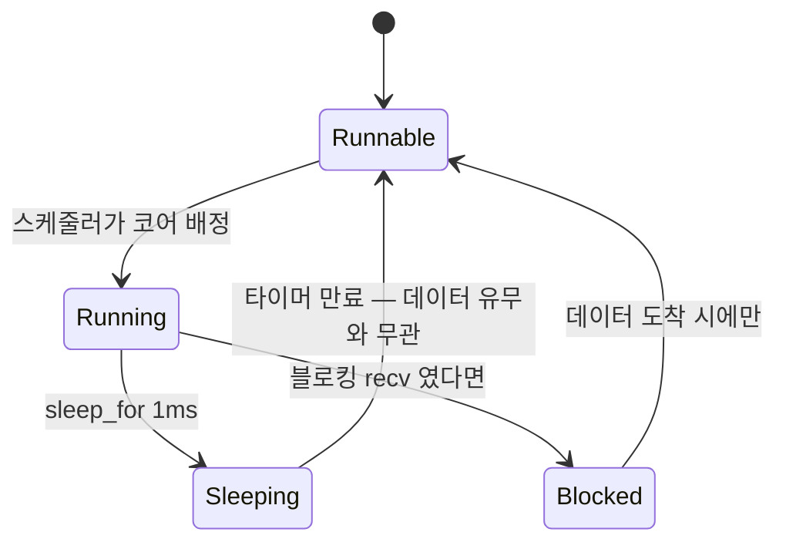
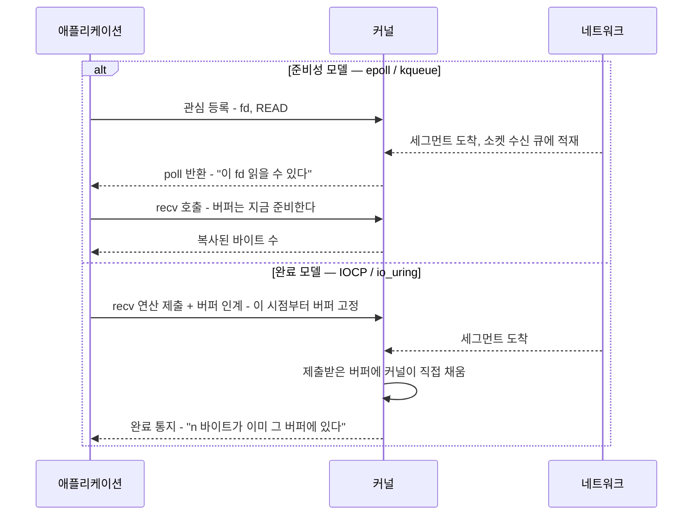
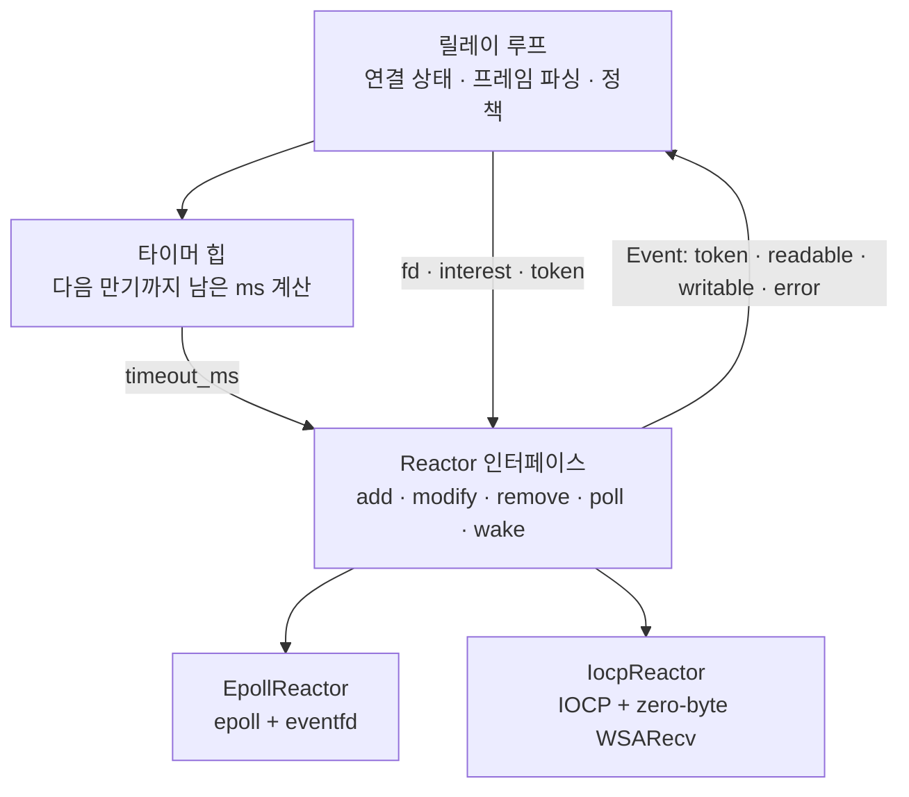
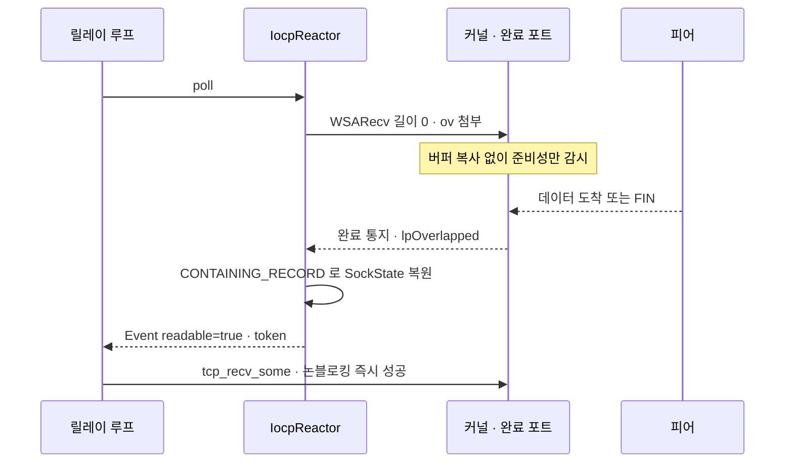
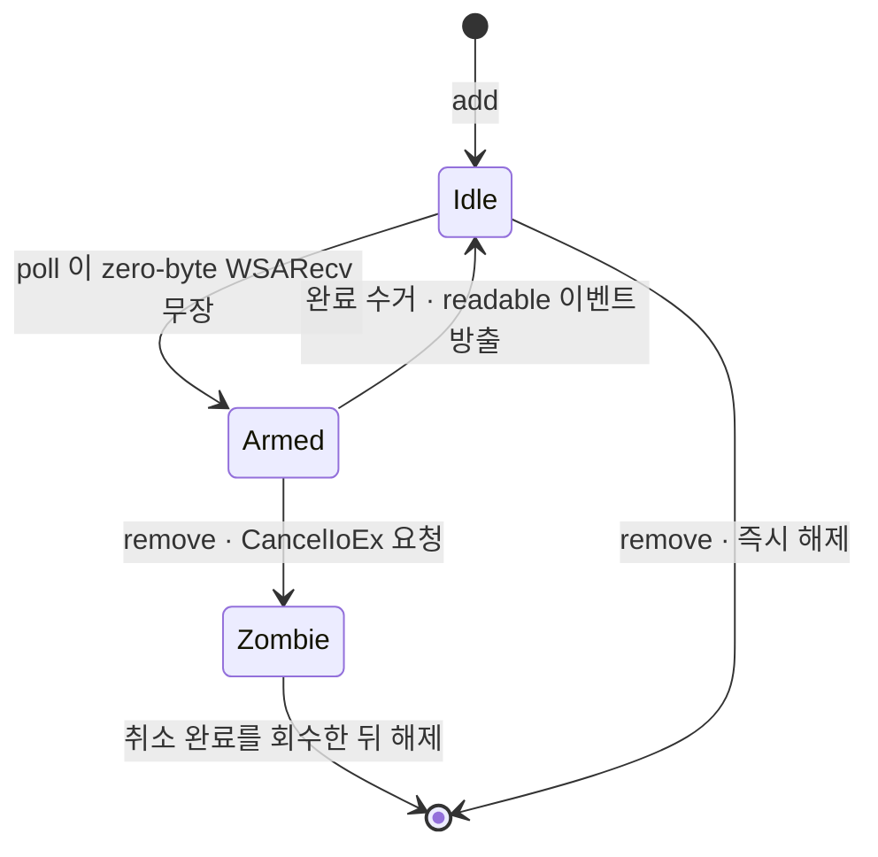
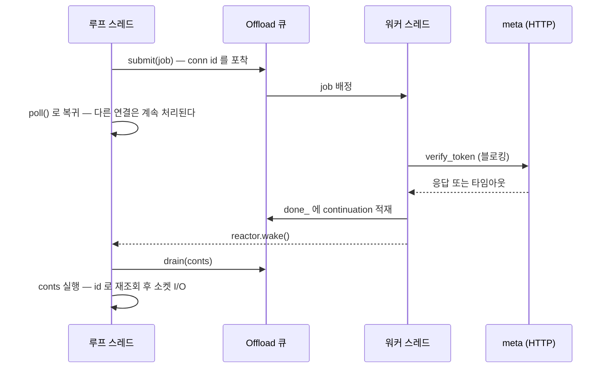
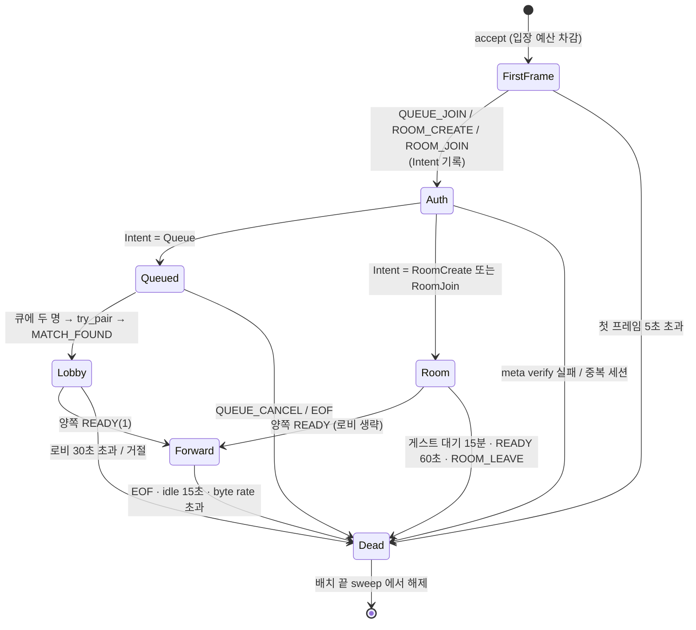
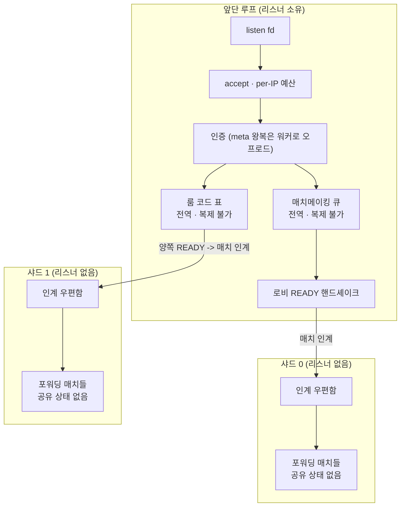
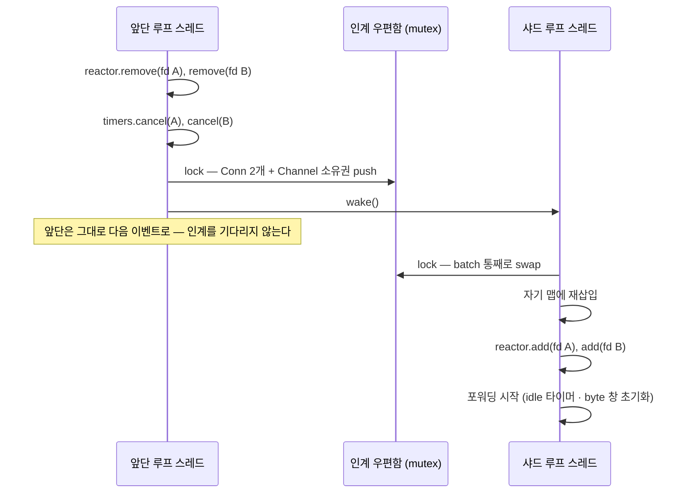
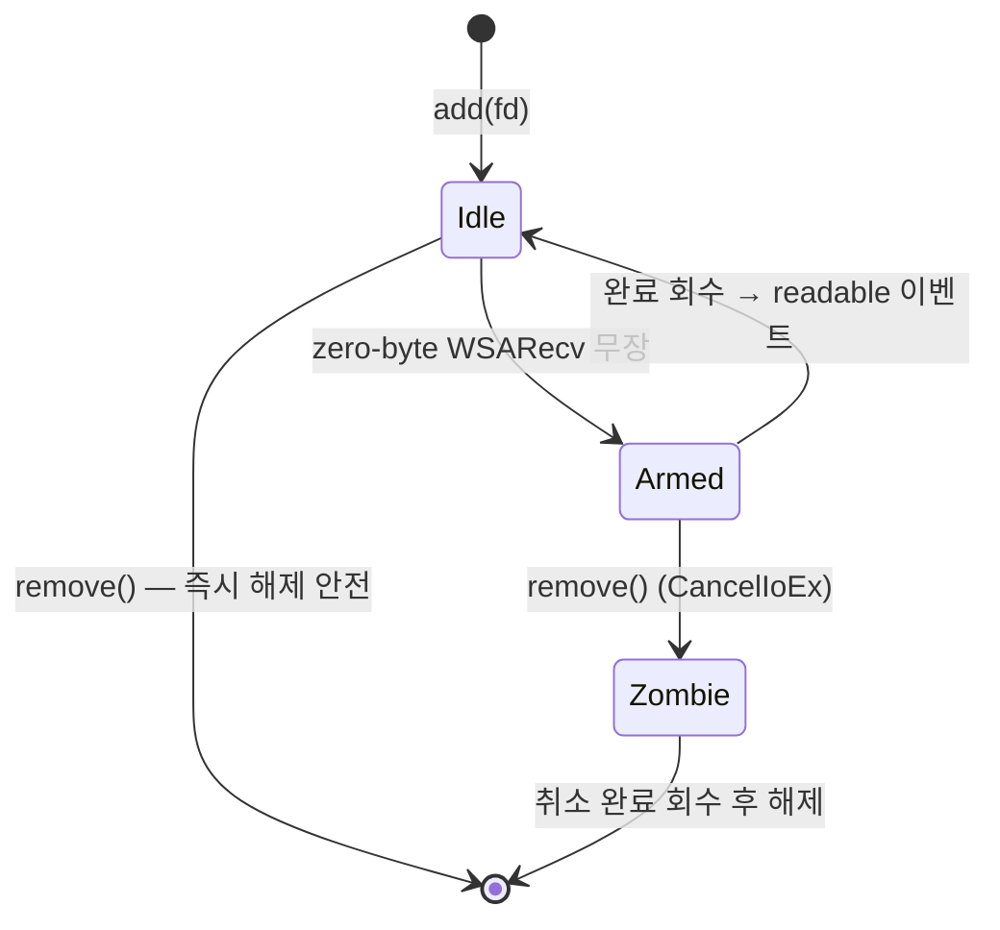

# Part 14: 이벤트 루프로 확장하기 — reactor, 오프로드, 샤딩

> **시리즈:** 제로부터 멀티플레이어 테트리스 + RL | [시리즈 목차](./README.md) | **Part 14**

---

## 이번 Part의 구현 계약

- **선행 상태:** [Part 7](./part7-relay-server.md) 이 연결마다 스레드를 두는 릴레이(`server/main.cpp` 의 accept 루프, `playerConnThread`, `Matchmaker::waitForPair` 를 도는 matcher 스레드, `RoomRegistry::roomLoop_`, 방향별 `forwarderLoop`)를 완성해 뒀고, `net/socket.h` 와 `net/framing.h` 의 계약이 그대로 살아 있다. [Part 12](./part12-hardening-and-release.md) 의 용량 측정이 "지금 구조가 어디까지 버티는가" 를 숫자로 보여 준 상태다 — 이 장은 그 숫자가 부족해졌을 때 꺼내는 카드다.
- **이번 Part의 파일:** `net/reactor.h`, `net/reactor_epoll.cpp`, `net/reactor_iocp.cpp`, `server/timer_queue.h`, `server/offload.h`, `server/reactor_relay.cpp`, `tests/reactor_test.cpp`, `tests/loop_primitives_test.cpp`, `net/socket.h/.cpp`(`tcp_send_some` 추가), `CMakeLists.txt`(타깃 `tetris_relay_reactor`, `reactor_test`, `loop_primitives_test`).
- **연결점:** wire 프로토콜은 한 비트도 바뀌지 않는다. 새 릴레이는 `net/framing.*` 과 `net/socket.*` 을 그대로 쓰고, 인증·결과 저장도 [Part 10](./part10-meta-and-ranking.md) 의 `meta::client::MetaClient` 를 그대로 호출한다. 클라이언트 코드는 손대지 않는다 — 같은 포트에 붙는 두 개의 서버 구현이 생길 뿐이다.
- **완료 게이트:** `tetris_relay_reactor`·`reactor_test`·`loop_primitives_test` 가 빌드되고, 두 단위 테스트가 0을 반환하며, Part 7 이 만든 queue/room smoke 와 [Part 10](./part10-meta-and-ranking.md) 의 meta 통합 테스트를 `TETRIS_RELAY_BIN` 으로 새 바이너리에 겨눠 전부 통과해야 한다. 통과 여부가 곧 "두 구현이 같은 계약을 말하는가" 의 답이다.

---

이 장은 순서대로 읽는 본편의 마지막 확장이다. Part 7 의 릴레이는 수백 명 규모에서 단순하고 지연도 낮다. 그 구조를 버려야 하는 시점이 오는지, 온다면 무엇을 얻고 무엇을 잃는지, 그리고 그 전환에서 실제로 어떤 버그를 만나는지가 여기 담긴다. 결과물은 기존 릴레이를 대체하지 않는다 — 같은 프로토콜을 말하는 두 번째 바이너리이고, 둘 중 무엇을 띄울지는 측정이 정한다.

## 1. 언제 바꾸는가 — 그리고 언제 바꾸지 않는가

이벤트 루프를 다루는 글은 대개 "스레드는 비싸다" 로 시작한다. 그 문장은 절반만 맞다.
먼저 반대편을 정직하게 세워두지 않으면, 잘 돌아가던 구조를 이유 없이 갈아엎고 지연만
늘리는 결과로 끝난다. Part 7 의 릴레이는 연결(방향)마다 스레드 하나를 두고 논블로킹
`recv` 로 폴링한다. 이 구조가 왜 실제로 버티는지부터 본다.

### 1.1 thread-per-connection 이 버티는 진짜 이유

thread-per-connection 이 버티는 이유는 스레드가 싸서가 아니다. **커널이 이미 이벤트
루프이기 때문**이다.

블로킹 `recv` 에 들어간 스레드는 실행 가능 상태가 아니다. 커널은 그 스레드를 소켓의
대기 큐(wait queue)에 매달아 두고 run queue 에서 뺀다. 스케줄러가 매 틱마다 훑는
대상은 실행 가능한 스레드뿐이므로, 대기 중인 스레드가 100개든 10000개든 스케줄링
비용에는 들어가지 않는다. 그러다 세그먼트가 도착해 소켓 수신 큐에 바이트가 쌓이면,
커널이 그 대기 큐를 깨워 해당 스레드만 run queue 로 올린다.

이 흐름을 이벤트 루프의 어휘로 옮기면 정확히 같은 그림이 된다.

| 이벤트 루프의 개념 | thread-per-connection 에서의 대응물 |
|---|---|
| 관심 등록(`add(fd, READ)`) | 블로킹 `recv` 진입 — 소켓 대기 큐에 스레드가 매달린다 |
| 준비성 통지(`poll` 반환) | 커널이 그 스레드를 깨운다 |
| 연결별 상태 객체 | 스레드의 스택 프레임과 지역 변수 |
| 이벤트 디스패치 | 스케줄러의 컨텍스트 스위치 |

차이는 하나뿐이다. **연결의 상태를 스택에 두느냐 힙 객체에 두느냐.** 스택에 두면
코드가 순차적으로 읽히고, `recv` 다음 줄이 곧 "받은 뒤 할 일" 이다. 힙 객체에 두면
프로토콜의 진행 단계를 손으로 인코딩한 상태 기계를 써야 한다. 그러니 연결 수가
수백 규모라면 thread-per-connection 은 낡은 구조가 아니라 **가장 읽기 쉬운 구조이면서
성능도 충분한 구조**다. 이 판단을 뒤집을 근거가 없다면 바꾸지 않는 것이 옳다.

### 1.2 어디서 무너지는가 — 평균이 아니라 꼬리

무너지는 지점은 처리량이 아니다. 처리량 그래프는 상당히 오래 평평하게 버틴다. 먼저
망가지는 것은 지연의 **꼬리**다.

**깨어남의 대기열.** 코어가 4개인 기계에서 스레드 200개가 거의 동시에 준비 상태가
되면, 그 순간 실제로 실행되는 것은 4개다. 나머지는 run queue 에서 순서를 기다린다.
전체를 평균 내면 여전히 훌륭한 숫자가 나온다 — 대부분의 깨어남은 즉시 처리되기
때문이다. 하지만 하필 뒤에 줄 선 몇 개는 앞선 타임 슬라이스가 소진될 때까지 기다린다.
p50 은 그대로인데 p99 가 스레드 수에 비례해 늘어나는 전형적인 모습이다. 그리고 결정론
lockstep 은 평균으로 진행하지 않는다. **가장 늦게 도착한 입력이 그 틱의 진행을 막으므로,
꼬리 지연이 곧 화면 정지다.** 평균 지연이 좋아졌다는 보고서를 들고 와도 lockstep 에서는
아무 의미가 없다는 것이 이 프로젝트에서 반복해서 배운 교훈이다.

**컨텍스트 스위치.** 스위치 자체의 비용(레지스터 저장, 스택 포인터 교체)은 사실 작다.
비싼 것은 그 뒤에 오는 것이다 — 새 스레드가 자기 데이터를 다시 캐시로 끌어오는 동안
직전 스레드가 데워 놓은 캐시 라인이 밀려난다. 주소 공간이 같으니 TLB 는 살아남지만
데이터 캐시 지역성은 무너진다. 스레드마다 잡히는 스택 예약(가상 주소 공간)과 커널
쪽 스택도 연결 수에 선형으로 붙는다. 이것들은 전부 "연결 수가 아니라 **깨어나는 횟수**"
에 비례한다는 점이 중요하다. 그리고 바로 그 지점에서 이 릴레이는 스스로 손해를 보고
있었다.

**이 릴레이 특유의 문제: busy-poll.** 포워딩 루프는 블로킹 `recv` 를 쓰지 않는다.
논블로킹 `recv` 로 읽고, 읽을 것이 없으면 1ms 자고 다시 시도한다. 수신 루프의 그
부분만 인용한다 — 이어지는 byte-rate 창 검사와 ranked/unranked 분기는 생략했다.

**현재 소스 발췌 — `server/relay.cpp` (`forwarderLoop`)**

```cpp
    while (!ch->closed.load() && !s_stopping.load()) {
        if (havePrefix) {
            havePrefix = false;  // raw 는 이미 준비돼 있음 — 바로 처리.
        } else {
            raw.clear();
            if (!net::tcp_recv_some(from, raw)) {
                disconnectSide = a_to_b ? 1 : 2;
                break;
            }
            if (raw.empty()) {
                if (std::chrono::steady_clock::now() - lastActivity >= kIdleTimeout) {
                    disconnectSide = a_to_b ? 1 : 2;
                    RLOG_INFO("[relay] match=" << ch->match_id
                              << " uuid=" << ch->match_uuid << " " << dir
                              << " close: idle timeout");
                    break;
                }
                std::this_thread::sleep_for(std::chrono::milliseconds(1));
                continue;
            }
        }
```

`raw.empty()` 분기가 문제의 전부다. 트래픽이 하나도 없어도 이 스레드는 초당 1000번
깨어나 시스템 콜을 한 번 쏘고 다시 잔다. 매치마다 방향별 포워더가 하나씩이므로,
유휴 매치가 늘어날수록 릴레이의 CPU 사용률은 **전송한 바이트와 무관하게** 올라간다.
Part 7 의 표에 적힌 "매치당 2" 라는 숫자가 곧 초당 깨어남 2000회라는 뜻이 된다.

앞 절에서 세운 논리와 함께 보면 뼈아프다. 커널이 대신 돌려 주던 이벤트 루프를 이
코드는 스스로 포기했다. 블로킹 대기 중이었다면 run queue 에 없었을 스레드가, 타이머
때문에 계속 실행 가능 상태로 돌아온다.



그러면 왜 처음부터 블로킹 `recv` 를 쓰지 않았나. 게을러서가 아니다. 이 루프는 바이트만
기다리는 것이 아니라 **세 가지를 동시에 기다린다.**

1. 소켓에 도착하는 데이터
2. 방향별 idle 타임아웃과 byte-rate 창의 만기
3. 종료 신호(`s_stopping`, `ch->closed`)

블로킹 `recv` 는 이 중 첫 번째만 기다려 준다. 나머지 둘은 "깨어나서 시계를 봐야"
확인된다. `tcp_close()` 가 `shutdown()` 으로 대기 중인 `recv` 를 깨우는 종료 신호로
설계된 것도 이 때문인데, 플랫폼에 따라 그 깨우기가 보장되지 않는 호출이 있다는 것을
Part 7 에서 이미 겪었다(그래서 listen 소켓은 논블로킹 `accept` 폴링으로 돈다). 폴링은
**타이머와 취소를 같은 루프에서 보려는 요구**가 만들어 낸 구조다.

이 진단이 중요한 이유는, 그것이 곧 처방을 정하기 때문이다. sleep 간격을 늘려 보는
것은 자연스러운 첫 시도이고, 실제로 유휴 CPU 는 비례해서 내려간다. 그런데 같은 값이
**바이트가 도착한 뒤 전달되기까지의 지연 하한**이기도 하다. 폴링 주기를 5ms 로 올리면
유휴 CPU 는 5분의 1이 되지만 포워딩 지연 꼬리에 최대 5ms 가 그대로 얹힌다. 저CPU 와
저지연을 상수 하나로 동시에 만족시킬 방법은 없다. 이벤트 루프의 값어치는 "더 빠르다"
가 아니라 **그 트레이드오프 자체를 없앤다**는 데 있다. 깨어남 횟수가 시간이 아니라
이벤트에 비례하게 되면, 유휴일 때 0회이면서 도착 즉시 깨어나는 두 조건이 동시에
성립한다.

일반화하면 이렇다. **주기적 폴링을 쓰고 있다면, 폴링 주기는 유휴 비용과 응답 지연을
동시에 결정하는 단일 손잡이다.** 그 손잡이를 어느 쪽으로도 못 돌리는 상황이 왔다면,
그때가 통지 기반으로 옮길 때다.

### 1.3 판단 기준 — 측정이 먼저, 복제가 그다음

바꿀 이유가 생겼다고 바로 이벤트 루프로 가는 것은 아니다. 순서가 있다.

**먼저 측정한다.** 무엇을 재야 하는지가 절반이다. 처리량이나 평균 지연은 이 문제를
드러내지 못한다. 봐야 할 것은 다음 네 가지다.

- **유휴 상태의 CPU.** 연결을 붙여 놓기만 하고 아무 입력도 보내지 않은 상태에서
  프로세스가 먹는 CPU. 이 값이 연결 수에 비례해 오르면 원인은 트래픽이 아니라 폴링이다.
- **초당 자발적 컨텍스트 스위치 수.** 스레드 수 × 폴링 빈도에 수렴하는지 확인한다.
  수렴한다면 스위치의 대부분이 아무 일도 하지 않은 깨어남이다.
- **지연의 분포.** p50 이 아니라 p99, p99.9. lockstep 에서는 이쪽이 체감 품질이다.
- **부하를 올릴 때 이들이 꺾이는 지점.** 절대값보다 곡선의 모양이 판단 근거다.

측정 없이 구조를 바꾸면 성능이 좋아졌는지 나빠졌는지조차 말할 수 없다. 유휴 매치가
쌓인 상태에서 CPU 그래프가 트래픽과 무관하게 올라가는 것을 눈으로 본 뒤에야 깨어남을
세어 봤다는 것이 이 프로젝트의 실제 순서였고, 그 반대 순서였다면 애초에 sleep 값만
만지작거리다 끝났을 것이다.

**그다음, 복제로 되는 일인지 본다.** 이것이 이벤트 루프보다 먼저 검토해야 할
선택지다. 기준은 하나다 — **스케일 단위가 서로 독립인가.**

릴레이의 스케일 단위는 매치다. 그리고 매치들은 서로 아무 상태도 공유하지 않는다.
A 와 B 사이의 바이트는 C 와 D 의 매치에 영향을 주지 않는다. 이런 구조에서는 프로세스를
여러 개 띄우고 앞단에서 연결을 나눠 주는 것만으로 **코드를 한 줄도 고치지 않고**
코어 수만큼 선형 확장된다. 배포 스크립트 몇 줄이 이벤트 루프 재작성 전체보다 싸다.
게다가 프로세스 격리는 공짜로 따라오는 이득이다 — 한 프로세스가 죽어도 그 안의 매치만
잃는다.

복제가 답이 되지 못하는 조건도 분명하다.

- **연결들이 상태를 공유할 때.** 채팅 채널의 브로드캐스트, 공용 룸 레지스트리, 크로스-연결
  캐시처럼 한 프로세스 안에 모여야 값싸게 도는 상태가 있으면 복제는 그 상태를 외부
  저장소로 밀어내고, 그 순간 네트워크 왕복이 새 병목이 된다.
- **연결당 고정 비용이 클 때.** 프로세스마다 큰 모델이나 큰 룩업 테이블을 올려야 한다면
  복제 배수만큼 메모리가 곱해진다.
- **한 박스의 상한을 올려야 할 때.** 물리 기계가 하나뿐이라면 복제는 코어를 나눌 뿐
  스레드당 폴링 비용을 없애 주지 못한다. 유휴 비용이 스레드 수에 비례하는 문제는
  프로세스를 쪼개도 총합이 같다.

이 장이 그럼에도 이벤트 루프를 만드는 이유는 마지막 항목과 학습 목적이다. 한 프로세스가
감당하는 동시 매치 수의 상한을 올리는 것, 그리고 루프를 여러 개로 나누는 샤딩의 토대를
얻는 것. 반대로 **연결이 수백 규모에 머무는 한 Part 7 의 구조가 더 낫다**는 결론은
이 장이 뒤집지 않는다. 결과물이 기존 `tetris_relay` 를 대체하지 않고 별도 바이너리
`tetris_relay_reactor` 로 나가는 것도 그래서다. 같은 wire 프로토콜을 말하는 두 구현을
남겨 두면, 규모와 환경에 따라 고를 수 있고 서로가 서로의 정답지가 된다.

### 1.4 Go 와 가상 스레드가 인기인 이유

여기까지 오면 자연스러운 질문이 생긴다. 순차 코드의 가독성과 이벤트 루프의 자원
효율을 둘 다 가질 수는 없나.

Go 의 goroutine, JVM 의 가상 스레드, 그리고 여러 언어의 async 런타임이 정확히 그
자리를 노린다. 겉으로 보이는 코드는 블로킹 호출이 줄줄이 늘어선 순차 코드다. 그런데
런타임이 그 블로킹 호출을 가로챈다 — 소켓이 아직 읽을 수 없으면 실행 문맥을 파킹하고,
fd 를 내부 폴러(리눅스라면 epoll)에 등록하고, 같은 OS 스레드로 다른 실행 문맥을
올린다. 준비되면 다시 깨워 원래 자리에서 이어 간다. **밑은 이벤트 루프, 겉은 순차
코드**다. 스택도 작게 시작해 필요할 때 늘어나므로 실행 문맥 하나의 고정 비용이 OS
스레드보다 훨씬 작다.

즉 이들은 이 장에서 다루는 문제를 없앤 것이 아니라 **런타임 안으로 숨긴 것**이다.
프로그래밍 모델은 thread-per-connection 그대로 두고 자원 모델만 이벤트 루프로 바꾼
절충이며, 대가는 런타임을 언어에 내장해야 한다는 것이다. C++ 에는 그런 런타임이
표준으로 없다. 코루틴 문법은 생겼지만 스케줄러와 I/O 백엔드는 직접 붙여야 한다.
그래서 C++ 에서는 둘 중 하나를 손으로 골라야 하고, 이 장은 그 선택을 명시적으로
하는 연습이다. 어느 쪽을 고르든 밑바닥에서 벌어지는 일 — 관심 등록, 준비성 통지,
상태 복원 — 은 같으므로, 여기서 손으로 만들어 본 구조는 다른 언어의 런타임을 읽을
때 그대로 쓰인다.

## 2. 두 가지 I/O 모델

이벤트 루프를 만들기로 했다면 곧바로 다음 갈림길이 나온다. OS 가 제공하는 비동기 I/O
API 는 계열이 둘이고, 둘은 성능 차이 이전에 **프로그래머에게 요구하는 것이 다르다.**

### 2.1 준비성 모델과 완료 모델

**준비성(readiness) 모델** — `epoll`(Linux), `kqueue`(BSD/macOS), 그리고 그 조상인
`select`/`poll`. 커널은 "이 fd 는 지금 읽을 수 있다" 만 알려준다. 그 말은 곧 "지금
`recv` 를 부르면 막히지 않는다" 는 뜻이고, 실제 데이터 복사는 통지를 받은 **내가**
한다. 버퍼는 통지를 받은 뒤에 준비하면 된다.

**완료(completion) 모델** — Windows 의 IOCP, 그리고 Linux 의 `io_uring`. 순서가
뒤집힌다. 버퍼를 먼저 커널에 넘기고 "이 소켓에서 읽어 여기에 채워 둬라" 는 연산을
**미리 걸어 둔다.** 커널은 데이터가 도착하면 그 버퍼를 직접 채우고, 다 끝난 뒤에
"n 바이트가 네 버퍼에 들어 있다" 고 통지한다. 통지를 받은 시점에는 이미 할 일이 없다.



두 흐름의 차이는 화살표 개수에서 이미 드러난다. 준비성은 **통지 후 시스템 콜이 한 번
더** 필요하고, 완료는 통지가 곧 결과다. 하지만 이 한 번의 왕복만 보고 우열을 정하면
안 된다. 각 모델이 프로그래머에게 떠넘기는 부담이 완전히 다르다.

| | 준비성(epoll/kqueue) | 완료(IOCP/io_uring) |
|---|---|---|
| 버퍼를 준비하는 시점 | 통지를 받은 뒤 | 연산을 걸 때 미리 |
| 유휴 연결의 메모리 | 거의 0 — 준비된 연결 수만큼의 공용 버퍼면 충분 | 연결마다 고정된 버퍼가 살아 있어야 함 |
| 통지 뒤 할 일 | 직접 `recv`, 실패하면 재시도 | 없음, 결과 처리만 |
| 반드시 다뤄야 할 예외 | 통지받고도 `recv` 가 실패할 수 있음 | 걸어 둔 연산의 취소와 늦게 오는 완료 |
| 소켓/버퍼 수명 | 닫으면 끝 | 걸린 연산이 모두 정산될 때까지 유지 |

준비성 모델이 강요하는 습관은 "통지를 믿지 마라" 다. 통지와 실제 `recv` 사이에는 시간이
있고, 그사이 다른 스레드가 같은 소켓을 먼저 읽었거나 커널 사정으로 데이터가 사라질 수
있다. 그래서 `recv` 가 "지금은 읽을 것 없음" 을 돌려주는 경우를 **정상 경로로** 다뤄야
한다. 대신 유휴 연결은 자원을 거의 먹지 않는다. 연결 만 개가 붙어 있어도 버퍼는 실제로
준비된 소켓 수만큼만 있으면 된다.

완료 모델이 강요하는 습관은 "수명을 정산하라" 다. 버퍼를 커널에 넘긴 순간 그 메모리는
내 것이면서 내 것이 아니다. 완료 통지가 오기 전에 해제하면 커널이 이미 사라진 메모리에
쓴다. 소켓을 닫아도 걸어 둔 연산의 완료 통지는 나중에 도착하므로, 연결 상태 객체는
"소켓이 닫혔다" 가 아니라 "걸린 연산이 전부 정산됐다" 를 기준으로 파괴해야 한다.
이 규칙 하나가 완료 모델 코드의 난이도를 결정한다. 대가로 얻는 것은 유휴 연결 하나당
버퍼 하나가 실제로 잡힌다는 비용이다.

일반화할 만한 지점은 여기다. **비동기 API 를 고를 때 먼저 볼 것은 성능 수치가 아니라
"이 모델이 나에게 무엇을 관리하라고 요구하는가" 다.** 준비성은 재시도를, 완료는 수명을
관리하라고 요구한다. 팀이 이미 순차 파서와 논블로킹 소켓 코드를 갖고 있다면 전자가,
연결당 상태가 크고 시스템 콜 수가 병목이라면 후자가 자연스럽다.

### 2.2 계보 — 완료 모델이 나중에 옳았음이 드러났다

역사적으로 두 계열은 진영이 갈렸다. 유닉스 전통은 준비성 쪽이다. `select` 에서 시작해
fd 수에 비례하는 스캔 비용을 없앤 `poll`, 다시 관심 집합을 커널에 상주시켜 통지만
받아 가게 만든 `epoll`/`kqueue` 로 발전했다. Windows 는 일찍부터 완료 모델(IOCP)을
택했다. 오랫동안 "리눅스에서는 epoll 이 정답" 이었고 완료 모델은 이식성 때문에 어쩔
수 없이 다루는 것 취급을 받았다.

그 평가를 뒤집은 것이 `io_uring` 이다. 리눅스에 뒤늦게 들어온 이 인터페이스는 완료
모델이고, 거기서 한 걸음 더 나간다 — 제출 큐와 완료 큐를 커널과 공유 메모리로 두고
여러 연산을 한꺼번에 밀어 넣어, 시스템 콜 자체를 배치로 만든다. 이 설계가 힘을 얻은
배경에는 시스템 콜 비용이 예전보다 비싸졌다는 사정이 있다. 투기적 실행 취약점 완화가
커널 진입·복귀 경로에 고정 비용을 얹으면서, 준비성 모델이 원래 지불하던 "통지 한 번 +
`recv` 한 번" 이 그냥 넘길 수 없는 값이 됐다.

계보를 요약하면 이렇게 된다. **준비성은 오래 승자였지만, 시스템 콜이 비싸지고 연결
수가 커지자 완료 모델의 설계 판단이 옳았음이 드러났다.** 다만 `io_uring` 도 IOCP 가
겪던 문제를 그대로 물려받았다 — 걸어 둔 연산의 취소와 버퍼 수명 관리는 여전히
프로그래머 몫이고, 그 부분이 이 계열을 쓰기 어렵게 만드는 지점도 여전하다. 모델이
바뀌면 비용이 사라지는 것이 아니라 **비용이 이동한다**는 것이 여기서도 성립한다.

### 2.3 이 프로젝트가 준비성으로 통일한 이유

이 릴레이는 준비성 모델 하나로 인터페이스를 통일한다. 이유는 성능 비교가 아니라
**기존 코드의 재사용**이다.

Part 7 의 포워더는 이미 논블로킹 `recv` 를 부르고, 받은 바이트를 스트림 버퍼에 이어
붙여 프레임 경계를 복원하는 순차 로직을 갖고 있다. 준비성 모델에서는 그 코드가 한 줄도
바뀌지 않는다 — 바뀌는 것은 "언제 `recv` 를 부를지" 를 정하는 방식뿐이고, `sleep` 이
결정하던 것을 커널 통지가 결정하게 될 뿐이다. 완료 모델로 갔다면 `recv` 호출부부터
버퍼 소유권까지 전부 다시 설계해야 했다. 새 구조를 도입할 때 **바꾸는 축을 하나로
제한하는 것**은 그 자체로 설계 원칙이다. I/O 통지 방식과 파싱 구조를 동시에 갈아엎으면
회귀가 났을 때 어느 쪽 탓인지 가릴 수 없다.

이 선택이 인터페이스에 그대로 새겨져 있다. 루프가 돌려주는 이벤트에는 바이트도,
바이트 수도 없다.

**현재 소스 발췌 — `net/reactor.h`**

```cpp
// 한 번의 poll 이 돌려주는 이벤트. token 은 add() 때 등록한 불투명 포인터로,
// 보통 연결 상태 객체를 가리킨다. reactor 는 token 을 해석하지 않는다.
struct Event {
    void* token   = nullptr;
    bool  readable = false;  // recv 가능(또는 EOF — recv 가 0/에러를 돌려줘 확인)
    bool  writable = false;  // 보류 송신을 재시도할 수 있음
    bool  error    = false;  // HUP/ERR — 다음 recv/send 에서 확정 처리
};
```

`readable` 이 참이어도 그것은 "읽을 수 있다" 는 힌트일 뿐이다. EOF 인지 데이터인지는
직접 `recv` 를 불러야 갈린다. `error` 도 마찬가지로 즉시 판정하지 않고 다음 `recv`/`send`
에서 확정한다. 통지를 최종 판단으로 쓰지 않고 **판단은 언제나 실제 I/O 호출이 내리게**
하는 것이 준비성 모델을 안전하게 쓰는 규율이다. `token` 이 불투명 포인터인 것도 같은
맥락이다 — 루프는 어떤 연결이 준비됐는지만 알려주고, 그 연결이 무엇인지는 해석하지
않는다.

문제는 Windows 다. Windows 가 제공하는 확장 가능한 통지 메커니즘은 완료 모델이므로
"읽을 수 있게 됐다" 는 통지가 원래 없다. 여기서는 **0바이트 수신 요청**으로 준비성을
흉내 낸다. 길이 0인 버퍼로 `recv` 를 걸어 두면 커널은 복사할 것이 없으므로 데이터가
도착하는 즉시 완료를 통지한다. 데이터는 여전히 소켓 수신 큐에 그대로 남아 있다. 즉
"소비하지 않고도 읽을 데이터가 있음" 이라는 신호가 되고, 그 통지를 받은 뒤 부르는
논블로킹 `recv` 는 즉시 성공한다. 완료 모델의 대표 비용인 "유휴 연결마다 버퍼 고정"
도 이 방식에서는 발생하지 않는다 — 고정할 버퍼가 0바이트이기 때문이다.

에뮬레이션이 공짜는 아니다. 두 모델의 차이는 한 군데에서 끝내 새어 나온다.

**현재 소스 발췌 — `net/reactor.h`**

```cpp
    // 등록된 소켓을 다른 Reactor 인스턴스로 옮길 수 있는가. 준비성 백엔드는 커널의
    // 관심 집합에서 빼고 다른 쪽에 넣으면 그만이지만, 완료 포트에 결합된 소켓 핸들은
    // 수명이 끝날 때까지 그 포트에 묶이고 다시 결합할 수 없다. 여기서 false 를 받은
    // 호출자는 단일 루프로 물러서야 한다.
    virtual bool can_migrate_sockets() const = 0;
```

준비성 백엔드에서 "어느 루프가 이 소켓을 보는가" 는 커널의 관심 집합에 든 항목 하나일
뿐이므로 언제든 옮길 수 있다. 완료 모델에서는 소켓 핸들이 완료 포트에 **결합**되고,
그 결합은 되돌릴 수 없다. 루프를 여러 개로 나누고 연결을 재배치하는 설계는 이 능력을
전제하므로, 인터페이스가 그것을 능력 질의로 노출하고 호출자가 없으면 물러설 길을
남긴다.

이것도 일반화된다. **플랫폼 차이를 추상화로 덮을 때, 덮이지 않는 차이는 숨기지 말고
능력 질의로 드러내라.** 모든 백엔드가 같은 척하게 만들면 차이는 사라지지 않고 런타임
실패로 옮겨 간다. 반대로 "이 백엔드는 이것을 못 한다" 를 계약에 명시하면, 호출자는
컴파일 시점에 폴백 경로를 갖도록 강제된다. 공통 분모로 인터페이스를 깎아 내리는 것과
차이를 질의 가능하게 만드는 것 사이에서, 후자가 대개 더 오래 버틴다.

## 3. 계약을 먼저 — Reactor 인터페이스

릴레이의 원래 구조는 단순했다. 연결의 방향마다 스레드를 하나씩 두고, 그 스레드는 논블로킹 `recv` 를 호출한 뒤 읽을 것이 없으면 1ms 잠들고 다시 시도한다. 스레드 하나가 한 방향만 책임지므로 상태 공유가 거의 없고, 지연도 최악 1ms 로 예측 가능하다. 수백 명 규모에서는 이보다 나은 선택이 별로 없다.

문제는 이 구조가 **유휴 상태에서도 비용을 낸다**는 데 있다. 아무 데이터도 오가지 않는 매치가 백 개 있으면 초당 수십만 번의 컨텍스트 스위치와 시스템 콜이 아무 일도 하지 않기 위해 소비된다. 커널이 이미 "이 소켓에 데이터가 도착했다"는 사실을 알고 있는데, 애플리케이션은 그 사실을 물어보러 계속 깨어난다. 준비성 통지(readiness notification)는 그 질문을 뒤집는다 — 물어보지 말고, 알려줄 때만 깨어난다.

### 3.1 왜 헤더부터 확정했는가

이 전환에서 가장 먼저 결정해야 했던 것은 코드가 아니라 **계약**이었다. Linux 와 Windows 가 이 문제를 근본적으로 다른 방식으로 푸는 탓이다. 한쪽을 먼저 완성하고 나중에 다른 쪽을 맞추면, 먼저 만든 OS 의 사고방식이 인터페이스에 그대로 새어 든다. epoll 을 먼저 완성하면 "레벨 트리거"나 "관심 집합 수정" 같은 개념이 계약에 박히고, IOCP 를 먼저 완성하면 "버퍼를 미리 걸어 둔다"가 박힌다. 어느 쪽이든 나중에 붙이는 백엔드는 남의 옷을 억지로 입게 된다.

그래서 구현을 한 줄도 쓰기 전에 헤더만 확정했다. 처음 적은 골격은 이 정도였다.

**예시(실제 저장소에는 없음)**

```cpp
class Reactor {
public:
    virtual ~Reactor() = default;
    virtual bool add(int fd, unsigned interest, void* token) = 0;
    virtual bool remove(int fd) = 0;
    virtual int  poll(std::vector<Event>& out, int timeout_ms) = 0;
    virtual void wake() = 0;
};
```

이 껍데기만 있으면 루프의 형태를 먼저 그릴 수 있다. "등록한다 → 기다린다 → 준비된 것을 처리한다 → 깨울 수 있다." 여기서 실제로 두 OS 를 대보며 빠진 것을 채웠다. 관심 집합을 바꾸는 `modify` 가 필요했고(보류 송신이 생겼을 때만 쓰기 준비성을 켜야 한다), 플랫폼별 구현을 호출자가 `#ifdef` 로 고르지 않도록 정적 팩토리 `create()` 가 필요했고, 마지막으로 **플랫폼 능력을 런타임에 물어보는 질의**가 필요했다. 확정된 형태는 이렇다.

**현재 소스 발췌 — `net/reactor.h`**

```cpp
// 관심 이벤트 비트마스크. Read 는 "읽을 수 있는가", Write 는 "논블로킹 send 가
// 즉시 진행되는가"(보류 송신 버퍼를 비울 때만 켠다).
enum Interest : unsigned {
    kNone  = 0,
    kRead  = 1u << 0,
    kWrite = 1u << 1,
};

// 한 번의 poll 이 돌려주는 이벤트. token 은 add() 때 등록한 불투명 포인터로,
// 보통 연결 상태 객체를 가리킨다. reactor 는 token 을 해석하지 않는다.
struct Event {
    void* token   = nullptr;
    bool  readable = false;  // recv 가능(또는 EOF — recv 가 0/에러를 돌려줘 확인)
    bool  writable = false;  // 보류 송신을 재시도할 수 있음
    bool  error    = false;  // HUP/ERR — 다음 recv/send 에서 확정 처리
};
```

**현재 소스 발췌 — `net/reactor.h`**

```cpp
class Reactor {
public:
    // 플랫폼에 맞는 구현을 만든다(Linux=epoll, Windows=IOCP). 실패 시 nullptr.
    static std::unique_ptr<Reactor> create();

    virtual ~Reactor() = default;

    // fd 를 관심 집합에 등록/변경/해제. token 은 이벤트에 그대로 실려 돌아온다.
    // add 는 이미 등록된 fd 에, remove 는 미등록 fd 에 대해 false 를 돌려줄 수 있다.
    virtual bool add(int fd, unsigned interest, void* token) = 0;
    virtual bool modify(int fd, unsigned interest, void* token) = 0;
    virtual bool remove(int fd) = 0;

    // 최대 timeout_ms 동안 준비된 fd 를 기다린다(음수면 무기한). 준비된 이벤트를
    // out 에 채우고 개수를 돌려준다. 0 = 타임아웃(만기 처리하러 나가라는 뜻),
    // -1 = 회복 불가 오류. out 은 매 호출마다 지워진 뒤 채워진다.
    virtual int poll(std::vector<Event>& out, int timeout_ms) = 0;

    // 등록된 소켓을 다른 Reactor 인스턴스로 옮길 수 있는가. 준비성 모델에서는
    // 관심 집합이 커널 객체에 있을 뿐이라 가능하고, 완료 모델에서는 소켓이 완료
    // 포트에 평생 묶이므로 불가능하다. false 면 호출자는 단일 루프로 물러선다.
    virtual bool can_migrate_sockets() const = 0;

    // 블로킹 중인 poll() 을 즉시 깨운다. 다른 스레드나 시그널 문맥(종료 플래그를
    // 세운 직후 등)에서 호출해도 안전한 유일한 메서드다. 깨어난 poll() 은 0개
    // 이벤트로 반환될 수 있으므로 호출자는 종료/작업 플래그를 스스로 확인한다.
    virtual void wake() = 0;
};
```

계층 관계는 이렇게 된다.



일반화하면, **여러 구현이 공존할 인터페이스는 구현보다 먼저 써야 한다.** 구현을 먼저 쓰면 인터페이스는 그 구현의 요약본이 되고, 두 번째 구현이 들어오는 순간 계약을 다시 협상해야 한다. 계약을 먼저 쥐면 두 번째 구현은 "이 계약을 어떻게 만족시키는가" 라는 국소적 문제로 축소된다.

### 3.2 준비성이냐 완료냐 — 이 계약이 준비성 쪽에 선 이유

OS 가 비동기 I/O 를 알려주는 방식에는 두 계열이 있다.

| | 준비성(readiness) | 완료(completion) |
|---|---|---|
| 대표 API | epoll(Linux), kqueue(BSD/macOS) | IOCP(Windows) |
| 통지 의미 | "지금 recv 하면 막히지 않는다" | "미리 준 버퍼에 다 채웠다" |
| 버퍼 소유 | 애플리케이션. 통지 후에 준비 | 커널. I/O 를 거는 시점에 넘김 |
| 애플리케이션 코드 | 기존 논블로킹 `recv` 그대로 | recv 를 걸고 완료에서 이어받는 상태 기계 |

이 인터페이스는 준비성으로 통일했다. 이유는 순수한 성능이 아니라 **기존 코드의 생존**이다. 릴레이의 수신 경로는 `net/socket.cpp` 의 `tcp_recv_some` 을 부르고, 누적 버퍼에서 프레임 경계를 복원하고, 프레임 단위로 정책을 적용한다. 준비성 모델이면 이 순차 코드가 한 글자도 바뀌지 않는다 — 앞에 붙던 "1ms 자고 다시 시도" 만 "통지를 기다린다" 로 바뀐다. 완료 모델로 통일하면 수신 경로 전체를 "버퍼를 걸고 → 완료를 받고 → 이어서 파싱" 하는 상태 기계로 다시 써야 하고, 그 상태 기계는 Linux 에서 다시 에뮬레이션해야 한다.

반대 방향이 맞는 경우도 분명히 있다. 연결당 처리량이 크고(파일 전송, 미디어 스트림) 시스템 콜 한 번의 비용이 유의미한 서버라면, 완료 모델은 "통지 하나 = 데이터 도착" 이라 준비성 모델의 "통지 + recv" 두 단계보다 확실히 유리하다. 릴레이가 나르는 것은 틱마다 수십 바이트짜리 입력 프레임이라 그 차이가 측정에 잡히지 않는다. **선택 기준은 API 의 우열이 아니라 워크로드의 모양이다.**

### 3.3 Interest — 왜 비트마스크이고, 왜 Write 는 평소에 꺼 두는가

`Interest` 는 `kRead` 와 `kWrite` 두 비트다. 열거형 대신 비트마스크인 이유는 두 관심이 배타적이지 않기 때문이다. 한 fd 가 "읽을 수 있으면 알려주고, 동시에 쓸 수 있으면 그것도 알려달라" 를 요구할 수 있어야 한다.

중요한 것은 `kWrite` 의 사용 규칙이다. **평소에는 끈다.** 보류 송신 버퍼가 비어 있는 소켓은 거의 항상 쓰기 가능하므로, `kWrite` 를 상시 켜 두면 매 `poll` 이 즉시 그 fd 를 준비 상태로 돌려주고 루프는 아무 할 일 없이 100% CPU 를 태운다. 이것은 준비성 모델을 처음 쓸 때 가장 흔히 밟는 지뢰다.

올바른 흐름은 이렇다.

1. 평소 관심은 `kRead` 만.
2. 논블로킹 부분 송신(`tcp_send_some`)이 커널 송신 버퍼 포화로 일부만 내보내면, 남은 바이트를 연결별 보류 버퍼에 쌓고 `modify(fd, kRead | kWrite, token)`.
3. 쓰기 준비성 통지를 받아 보류 버퍼를 다 비우면 `modify(fd, kRead, token)` 로 되돌린다.

일반화: **준비성 관심은 "할 일이 있을 때만 켜는 구독"이다.** 레벨 트리거 통지는 조건이 해소될 때까지 계속 오므로, 소비할 생각이 없는 조건을 구독하면 그대로 바쁜 대기(busy wait)가 된다.

`tcp_send_some` 이 별도 함수로 존재하는 이유도 여기 있다. 기존 `tcp_send_all` 은 전부 보낼 때까지 최대 몇 초를 잠들며 재시도하는데, 이벤트 루프 안에서 그것을 부르면 그 몇 초 동안 이 루프가 담당하는 **모든** 연결의 전달이 멈춘다. 단일 스레드 루프에서 블로킹 호출은 국소적 지연이 아니라 전역 정지다.

### 3.4 token 이 불투명 포인터인 이유

`add()` 에 넘긴 `void* token` 은 이벤트에 그대로 실려 돌아온다. `Reactor` 는 이 값을 절대 역참조하지 않고, 무엇을 가리키는지도 모른다.

이 설계는 **의존성 방향을 한 방향으로 고정**하기 위한 것이다. 릴레이의 연결 상태 객체는 소켓, 수신 누적 버퍼, 보류 송신 버퍼, 상대 방향 포인터, 매치 메타데이터를 안다. `Reactor` 가 그 타입을 알게 되는 순간 `net/` 계층이 `server/` 계층에 의존하게 되고, 테스트에서 순수한 소켓 쌍만으로 reactor 를 검증할 수 없게 된다.

대안은 셋 있었다.

- **fd 를 키로 상위가 해시맵 조회.** token 없이 fd 만 돌려주고 루프가 `unordered_map<int, Conn*>` 을 찾는다. 인터페이스는 더 좁아지지만 이벤트마다 해시 조회가 붙고, 무엇보다 "커널이 이미 들고 있는 한 워드"를 버리고 자료구조를 하나 더 유지하는 셈이다.
- **콜백 인터페이스.** `virtual void on_readable()` 를 가진 핸들러를 등록한다. 객체 지향적으로 보이지만, 연결 상태 객체가 특정 기반 클래스를 상속해야 하고, 콜백 안에서 자기 자신을 파괴하는 경우(EOF 처리)의 수명 규칙이 까다로워진다. 이벤트를 배치로 모아 놓고 루프가 순서를 통제하는 편이 디버깅하기 쉽다.
- **정수 핸들(슬롯 인덱스).** 세대 카운터를 붙이면 dangling 을 잡을 수 있어 안전하지만, 슬롯 테이블이라는 부가 구조가 필요하다.

불투명 포인터는 조회 비용이 0 이고 소유권을 전부 상위에 남긴다. 대가는 명확하다 — **token 이 가리키는 객체는 `remove()` 보다 오래 살아야 한다.** 이 규칙을 어기면 루프는 해제된 메모리를 가리키는 token 을 받는다. 정수 핸들 방식이 사는 지점이 바로 여기이고, 수명이 복잡한 시스템이라면 그 대가를 지불할 만하다. 이 프로젝트는 "연결 해제는 언제나 루프 자기 문맥에서, `remove()` 직후에 상태 객체를 파괴한다" 는 규칙 하나로 문제를 좁혔다.

인터페이스가 `int fd` 를 쓰는 것도 짚어 둘 만하다. Windows 의 `SOCKET` 은 포인터 크기 값이라 엄밀히는 `int` 로 좁히는 변환이다. 프로젝트 전체가 `net::TcpSocket::fd()` 로 `int` 를 쓰고 있고 Windows 소켓 핸들은 실제로 작은 값이 배정되므로 이 규모에서는 문제가 되지 않지만, 이식성 관점에서 무료가 아니라는 사실은 기록해 둔다. 플랫폼 핸들 타입을 통일하는 typedef 를 두는 것이 더 깨끗한 해법이다.

### 3.5 poll 의 timeout — reactor 가 타이머를 갖지 않는 이유

`poll(out, timeout_ms)` 의 두 번째 인자는 "최대 이만큼 기다려라" 다. 이 숫자를 **루프 상위가 계산한다**는 것이 이 계약의 핵심 결정이다. `Reactor` 에는 타이머 등록 API 가 없다.

릴레이가 관리해야 하는 만기는 한둘이 아니다. 방향별 idle 타임아웃, 첫 프레임 기한, 룸의 게스트 대기 한도, READY 대기 한도, 큐 수락 로비의 제한 시간. 이것들은 전부 **도메인 지식**이다. "이 만기가 지나면 무엇을 뜻하는가" 를 아는 것은 릴레이 정책이지 I/O 계층이 아니다. 타이머를 reactor 에 넣으면 reactor 가 콜백을 부르게 되고, 그러면 3.4 에서 피한 의존성 역전이 뒷문으로 들어온다.

이식성 문제도 있다. Linux 에는 `timerfd` 가 있어 타이머를 fd 로 만들어 epoll 에 그대로 얹을 수 있지만, IOCP 에는 대응물이 없다(대기 가능 타이머와 스레드 풀을 엮어야 한다). 타이머를 인터페이스에 넣으면 두 백엔드의 타이머 해상도와 만기 순서 보장이 달라지고, 그 차이가 상위로 새어 나온다.

그래서 인터페이스는 **정수 하나**로 끝난다. 루프는 매 반복에서 현재 시각을 다시 재고, 가장 가까운 만기까지 남은 밀리초를 구해 `poll` 에 넘긴다. 실제 루프 코드는 여기에 상한도 건다 — 만기가 아무리 멀어도 일정 주기마다 반드시 깨어나 종료 플래그를 확인한다. 무기한 대기(`timeout_ms < 0`)는 계약상 지원하지만 프로덕션 경로에서는 쓰지 않는다. 무기한 대기는 `wake()` 가 완벽하다는 가정 위에서만 안전한데, 그 가정이 깨진 날 서버는 조용히 멈춘 채 아무 로그도 남기지 않는다.

일반화: **"기다림"과 "무엇을 기다리는가"를 분리하라.** 대기 원시(primitive)는 시간 한도만 받고, 그 한도의 의미는 호출자가 소유한다. 이 분리가 있으면 타이머 정책을 바꿔도 I/O 계층을 건드리지 않는다.

### 3.6 wake() — 유일하게 교차 스레드로 안전해야 하는 메서드

`Reactor` 인스턴스는 한 스레드가 소유한다. `add`/`modify`/`remove`/`poll` 을 두 스레드가 동시에 부르면 정의되지 않은 동작이다. 이 좁은 계약은 의도적이다. 전면 thread-safe 로 만들면 모든 메서드에 락이 붙고, "다른 스레드가 `poll` 중인데 `remove` 를 부르면 이미 큐에 들어간 그 fd 의 이벤트는 어떻게 되는가" 같은 답하기 어려운 질문이 생긴다. 단일 소유는 그 질문 자체를 없앤다.

예외가 딱 하나 있어야 한다. 루프가 `poll` 안에서 자고 있는데 **외부에서 할 일이 생기는** 경우다.

- 앞단의 accept 스레드가 새 매치를 이 루프에 인계했다.
- 오프로드 워커가 meta HTTP 응답을 받아 결과를 돌려줄 준비가 됐다.
- 종료 신호가 들어와 플래그를 세웠다.

이 셋 모두 "루프가 소유한 자료구조에 직접 손대지 않고, 우편함에 넣은 뒤 루프를 깨운다" 로 처리된다. 인계 자체는 뮤텍스로 보호된 큐에 넣고, 그 다음 `wake()` 를 부른다. 깨어난 루프는 자기 문맥에서 우편함을 비우고 소켓을 자기 reactor 에 등록한다. **교차 스레드 상호작용의 표면이 "큐 하나 + wake 하나" 로 줄어든다.**

`wake()` 가 없으면 유일한 대안은 짧은 타임아웃 폴링이다. 100ms 마다 깨어나 우편함을 확인하는 식인데, 그러면 새 연결의 인계 지연이 최악 100ms 가 되고 유휴 시 깨어남도 되살아난다. 애초에 없애려던 문제로 되돌아가는 셈이다.

`wake()` 를 구현할 때 반드시 만족해야 하는 성질이 둘 있다.

- **깨움 유실이 없어야 한다.** `poll` 진입 직전에 `wake()` 가 불려도 그 `poll` 은 즉시 반환해야 한다. 조건 변수로 이것을 맞추려면 뮤텍스와 술어(predicate)를 엮어야 하는데, 커널 통지 객체는 공짜로 해준다 — eventfd 는 카운터를 남기고 IOCP 는 큐에 항목을 남기므로, 늦게 도착한 `poll` 이 그 상태를 보고 바로 나온다. **상태를 남기는 통지 객체가 상태를 남기지 않는 신호보다 다루기 쉽다.**
- **호출자는 아무것도 가정하지 않는다.** 깨어난 `poll` 은 이벤트 0개로 반환될 수 있고, 반대로 `wake()` 없이도 다른 이유로 깨어날 수 있다. 그래서 계약은 "wake 는 이벤트로 노출되지 않으며, 루프는 매 반복에서 자기 플래그를 스스로 확인한다" 로 못박았다. 이렇게 하면 가짜 깨움(spurious wakeup)이 버그가 아니라 정상 경로가 된다.

### 3.7 능력 질의 — can_migrate_sockets()

인터페이스에 남은 마지막 메서드는 조금 이질적이다. `can_migrate_sockets()` 는 I/O 를 하지 않고 **이 백엔드가 무엇을 할 수 있는지** 만 답한다.

등록된 소켓을 다른 `Reactor` 인스턴스로 옮길 수 있느냐는 질문인데, 답이 플랫폼마다 다르다. 준비성 모델에서 관심 집합은 커널의 epoll 인스턴스에 있을 뿐이라 한쪽에서 빼고 다른 쪽에 넣으면 그만이다. 완료 모델에서는 불가능하다 — 소켓 핸들은 완료 포트에 결합되면 수명이 끝날 때까지 그 포트에 묶이고 다시 결합할 방법이 없다.

이 차이를 컴파일 타임 `#ifdef` 로 상위에서 분기할 수도 있었다. 그러면 릴레이 루프 코드가 `_WIN32` 를 알게 된다. 능력을 런타임 질의로 노출하면 상위 코드는 플랫폼 이름 대신 **능력**으로 분기한다 — "샤딩할 수 있으면 여러 루프로 나누고, 없으면 단일 루프로 물러선다." 새 백엔드(kqueue 등)가 추가돼도 상위 코드는 손대지 않는다.

일반화: **플랫폼 차이를 흡수할 수 없다면, 최소한 이름 대신 능력으로 노출하라.** 흡수(같은 동작으로 맞추기)가 1순위고, 불가능하면 능력 질의(capability query)가 2순위다. 조건부 컴파일로 호출자를 분기시키는 것은 마지막 수단이다.

---

## 4. epoll 백엔드

epoll 은 준비성 모델의 원산지라 구현이 가장 곧다. 커널이 관심 fd 집합을 들고 있고, `epoll_wait` 이 준비된 것만 돌려준다. 계약을 그대로 옮기면 되는 수준이라, 이 백엔드에서 실제로 결정할 것은 트리거 모드와 오류 번역 두 가지뿐이다.

### 4.1 등록 — 항상 켜 두는 EPOLLRDHUP

`add`/`modify` 는 같은 헬퍼로 수렴한다. 연산 코드만 다르다.

**현재 소스 발췌 — `net/reactor_epoll.cpp`**

```cpp
    bool ctl(int op, int fd, unsigned interest, void* token) {
        epoll_event ev{};
        ev.events = 0;
        if (interest & kRead)  ev.events |= EPOLLIN | EPOLLRDHUP;
        if (interest & kWrite) ev.events |= EPOLLOUT;
        // EPOLLRDHUP 는 읽기 관심과 함께일 때만 건다. 무조건 걸면 interest 가 0 인
        // 소켓 — 즉 호출자가 백프레셔로 읽기를 멈춰 둔 소켓 — 도 상대가 half-close
        // 하는 순간부터 레벨 트리거로 계속 보고된다. 멈춰 세운 의미가 사라지고
        // 루프가 그 fd 로 스핀한다. 진짜 종료는 읽기를 재개할 때 EOF 로 알게 된다.
        ev.data.ptr = token;
        return ::epoll_ctl(epfd_, op, fd, &ev) == 0;
    }
```

`EPOLLRDHUP` 는 "피어가 쓰기 방향을 닫았다"(half-close, 즉 상대의 `shutdown(SHUT_WR)` 또는 FIN)를 알려주는 비트다. 릴레이에서 상대의 이탈은 **가장 시간에 민감한 이벤트**라 — 늦게 알면 남은 쪽이 멈춘 화면을 보며 기다리고 기권 판정도 그만큼 늦는다 — 처음에는 관심과 무관하게 항상 켰다.

그 "항상" 이 나중에 버그가 됐다. 백프레셔가 들어오면서 **관심이 0 인 소켓**이 생겼기 때문이다. 읽기를 일부러 멈춰 둔 소켓인데, `EPOLLRDHUP` 만 남아 있으니 상대가 half-close 하는 순간부터 레벨 트리거가 그 fd 를 끝없이 보고한다. 멈춰 세운 의미가 사라지고 루프가 그 fd 로 스핀한다. 그래서 지금은 읽기 관심과 함께일 때만 건다 — 진짜 종료는 읽기를 재개할 때 EOF 로 알게 되므로 잃는 것이 없다.

일반화하면 이렇다. **"항상 켜 두면 손해 볼 것 없다" 는 판단은 관심을 끄는 기능이 없을 때만 참이다.** 나중에 "아무것도 구독하지 않음" 이라는 상태가 생기면, 무조건 켠 비트가 그 상태를 무효로 만든다. 구독 모델에 새 상태를 추가할 때는 기존의 무조건 구독을 전부 다시 봐야 한다.

`ev.data.ptr` 에 token 을 그대로 넣는 것이 3.4 에서 말한 "커널이 들고 있어 주는 한 워드" 다. `epoll_event` 의 `data` 는 union 이라 `fd` 대신 포인터를 저장할 수 있고, 이벤트가 돌아올 때 그대로 실려 온다. 조회 자료구조가 필요 없다.

### 4.2 레벨 트리거를 고른 이유

epoll 에는 두 트리거 모드가 있다.

- **레벨 트리거(LT, 기본).** 조건이 참인 동안 계속 통지한다. 읽을 데이터가 남아 있으면 다음 `epoll_wait` 도 그 fd 를 돌려준다.
- **엣지 트리거(ET, `EPOLLET`).** 상태가 변하는 순간에만 통지한다. 통지를 받았으면 `EAGAIN` 이 나올 때까지 **다 읽어야 한다.** 남겨 두면 새 데이터가 도착하기 전까지 다시 통지되지 않고, 그 연결은 조용히 멈춘다.

이 프로젝트는 레벨 트리거를 쓴다. 이유는 기존 수신 함수의 모양에 있다. `tcp_recv_some` 은 고정 크기 임시 버퍼로 `recv` 를 **한 번** 부르고 누적 버퍼에 붙인 뒤 돌아온다. 논블로킹에서 데이터가 없으면(`EAGAIN`/`WSAEWOULDBLOCK`) 오류가 아니라 성공으로 처리하고 그냥 나온다. 이 함수는 태생적으로 "한 조각만 읽는" 함수다.

엣지 트리거로 가려면 이 호출을 `while` 로 감싸 `WOULDBLOCK` 이 나올 때까지 비워야 한다. 그러면 두 가지가 따라온다.

- **공정성이 깨진다.** 한 연결이 대량으로 밀어 넣는 중이면 루프는 그 연결을 다 비울 때까지 다른 연결로 넘어가지 못한다. 레벨 트리거는 "이번엔 한 조각만 읽고 다음 순번에 이어서" 를 공짜로 준다. 라운드로빈 공정성이 커널의 통지 반복에서 자동으로 나온다.
- **누수 조건이 미묘해진다.** ET 에서 "다 비우기" 를 한 곳이라도 빠뜨리면 그 연결만 영구 정지한다. 재현이 어렵고 부하가 있을 때만 나타나는 종류의 버그다.

ET 가 이기는 지점도 분명하다. 통지 횟수가 줄어드는 만큼 `epoll_wait` 반환 배치가 작아지고, 연결 수가 수만 규모로 올라가면 그 차이가 측정에 잡힌다. 릴레이의 목표 규모에서는 여분 통지가 문제 되지 않는다. **트리거 모드는 성능 선택이 아니라 "읽기 루프를 누가 책임지는가" 의 선택이다** — 커널이 반복해서 알려주게 할 것인가, 애플리케이션이 끝까지 비울 것인가.

`EPOLLONESHOT` 도 쓰지 않는다. 이것은 한 fd 의 이벤트가 여러 워커 스레드에 동시에 배달되는 것을 막는 장치인데, 이 구조에서는 fd 하나가 정확히 하나의 루프에 속하고 그 루프가 단일 스레드라 애초에 그런 경합이 없다. 필요 없는 안전 장치는 재무장 `epoll_ctl` 비용만 더한다.

### 4.3 poll — 번역과 EINTR

**현재 소스 발췌 — `net/reactor_epoll.cpp`**

```cpp
    int poll(std::vector<Event>& out, int timeout_ms) override {
        out.clear();
        if (scratch_.empty()) scratch_.resize(256);
        int n = ::epoll_wait(epfd_, scratch_.data(),
                             static_cast<int>(scratch_.size()), timeout_ms);
        if (n < 0) {
            if (errno == EINTR) return 0;  // 시그널 — 만기 처리하러 나간다
            return -1;
        }
        for (int i = 0; i < n; ++i) {
            const epoll_event& e = scratch_[i];
            if (e.data.ptr == &wake_marker_) {
                uint64_t sink;
                while (::read(wakefd_, &sink, sizeof(sink)) > 0) {}  // 값 흡수
                continue;  // wake 는 이벤트로 노출하지 않는다
            }
            Event out_ev;
            out_ev.token    = e.data.ptr;
            out_ev.readable  = (e.events & (EPOLLIN | EPOLLRDHUP)) != 0;
            out_ev.writable  = (e.events & EPOLLOUT) != 0;
            out_ev.error     = (e.events & (EPOLLERR | EPOLLHUP)) != 0;
            // 오류는 다음 recv 가 확정 처리하도록 readable 로도 표시한다.
            if (out_ev.error) out_ev.readable = true;
            out.push_back(out_ev);
        }
        return static_cast<int>(out.size());
    }
```

몇 가지를 짚어 둔다.

**`scratch_` 는 멤버로 재사용한다.** 매 `poll` 마다 벡터를 새로 할당하면 초당 수천 번의 힙 왕복이 된다. 커널이 채워 주는 버퍼는 크기가 고정이면 되므로 한 번 잡고 계속 쓴다. 배치 상한을 넘는 이벤트는 유실되지 않고 다음 `epoll_wait` 에서 돌아오므로, 상한은 지연과 메모리의 절충일 뿐 정확성 문제가 아니다.

**`EINTR` 은 오류가 아니다.** 시그널이 대기를 끊었을 뿐이므로 `-1`(회복 불가)로 올리면 루프가 종료된다. 0 을 돌려주면 호출자는 "타임아웃" 으로 보고 만기 처리를 한 뒤 다시 기다린다. 시그널 처리와 타임아웃 처리가 같은 경로로 합쳐지는 것이 이 계약의 이득이다. **하위 계층이 상위 계층이 이미 감당할 수 있는 상태로 오류를 접어 넣으면 상위의 분기가 줄어든다.**

**wake 는 이벤트로 노출되지 않는다.** eventfd 는 자기 자신을 가리키는 표식으로 구분하고, 값을 읽어 비운 뒤 `continue` 한다. 루프는 자기가 왜 깨어났는지 알 필요가 없다 — 매 반복에서 우편함과 종료 플래그를 어차피 확인하기 때문이다.

### 4.4 오류를 readable 로 접는 설계

이 백엔드에서 가장 중요한 한 줄은 오류를 `readable` 로도 표시하는 부분이다.

epoll 이 `EPOLLERR` 을 올려도 **무슨 오류인지는 알려주지 않는다.** 캐내려면 `getsockopt(SO_ERROR)` 를 따로 불러야 하고, 그러면 오류 경로가 정상 경로와 전혀 다른 코드가 된다. 연결 정리 로직이 두 벌 생기고, 둘 중 하나만 고쳐지는 날이 온다.

오류를 `readable` 로 접으면 루프는 늘 하던 일만 한다 — `tcp_recv_some` 을 부른다. 소켓이 오류 상태면 그 호출이 `false` 를 돌려주고, 피어가 정상 종료했으면 `recv` 가 0 을 돌려줘 역시 `false` 가 된다. **연결 종료를 확정하는 지점이 코드에 정확히 하나만 존재한다.** 정상 EOF 든 RST 든 소켓 오류든, 루프 입장에서는 "수신이 실패했다 → 이 방향을 닫고 상대에게 알린다" 하나로 수렴한다. `error` 비트는 지우지 않고 함께 남기는데, 로깅과 통계에서 "정상 종료" 와 "오류 종료" 를 구분하는 데는 쓸모가 있기 때문이다. 다만 **동작을 가르는 것은 후속 `recv` 의 결과이지 이 비트가 아니다.**

여기에는 값비싼 교훈이 있다. 레벨 트리거에서 오류 조건은 **소비될 때까지 사라지지 않는다.** 초기 구현은 `readable` 인 이벤트만 처리하고 `error` 만 켜진 이벤트는 로그만 남기고 넘겼다. 그 결과 오류 상태의 소켓이 관심 집합에 남은 채 `epoll_wait` 이 매번 즉시 반환했고, 루프는 아무 진전 없이 한 코어를 100% 로 태웠다. 부하 테스트에서 연결 하나가 비정상 종료한 뒤 CPU 그래프가 평평하게 꽂히는 것으로 발견했다.

일반화: **레벨 트리거에서 처리하지 않은 준비성은 무한 루프다.** 통지를 받았으면 반드시 (1) 조건을 해소하는 I/O 를 하거나 (2) 관심에서 빼거나 (3) fd 를 닫아야 한다. 셋 중 아무것도 하지 않는 분기가 코드에 존재하면 그것은 잠재적 스핀이다. 오류를 `readable` 로 접는 설계는 이 규칙을 구조적으로 강제한다 — 오류 이벤트는 항상 `recv` 로 이어지고, `recv` 는 항상 결론을 낸다.

`EPOLLHUP` 를 `error` 에 포함하는 것도 같은 맥락이다. `EPOLLHUP` 는 양방향이 모두 끊긴 상태로, 이 시점에는 읽을 것도 쓸 것도 없다. 관심에서 빼지 않으면 즉시 스핀이 된다.

### 4.5 eventfd 로 깨우기

**현재 소스 발췌 — `net/reactor_epoll.cpp`**

```cpp
    bool init() {
        epfd_ = ::epoll_create1(EPOLL_CLOEXEC);
        if (epfd_ < 0) return false;
        // 논블로킹 + close-on-exec eventfd. 값 누적 방식이라 여러 wake 가 몰려도
        // 한 번의 read 로 흡수된다.
        wakefd_ = ::eventfd(0, EFD_CLOEXEC | EFD_NONBLOCK);
        if (wakefd_ < 0) { ::close(epfd_); epfd_ = -1; return false; }
        epoll_event ev{};
        ev.events = EPOLLIN;
        ev.data.ptr = &wake_marker_;  // 연결 token 과 겹치지 않는 고유 표식
        if (::epoll_ctl(epfd_, EPOLL_CTL_ADD, wakefd_, &ev) != 0) return false;
        return true;
    }
```

**현재 소스 발췌 — `net/reactor_epoll.cpp`**

```cpp
    void wake() override {
        uint64_t one = 1;
        // 논블로킹 write 실패(버퍼 포화)는 이미 미소비 wake 가 대기 중이라는 뜻이라
        // 무시해도 안전하다.
        ssize_t r = ::write(wakefd_, &one, sizeof(one));
        (void)r;
    }
```

eventfd 는 커널이 관리하는 64비트 카운터를 fd 로 노출한다. 쓰면 더해지고, 읽으면 값이 나오며 0 으로 초기화된다. 0 이 아닌 동안 `EPOLLIN` 이 서고, 이것이 `wake` 가 깨움 유실을 겪지 않는 근거다 — `poll` 진입 직전에 도착한 `wake` 도 카운터에 흔적을 남겨 두므로 곧바로 이어지는 `epoll_wait` 이 즉시 반환한다. 카운터가 누적이라 짧은 시간에 여러 번 깨워도 한 번의 읽기로 전부 흡수된다.

세부를 하나씩 보면 이렇다.

- **`EFD_NONBLOCK`.** 카운터가 최대치에 도달하면 블로킹 eventfd 의 `write` 는 잠든다. `wake()` 안에서 잠드는 것은 절대 허용할 수 없다 — 호출자가 락을 쥐고 있을 수도 있고, 시그널 문맥일 수도 있다. 논블로킹이면 포화 시 `EAGAIN` 으로 즉시 실패하는데, 그 실패는 "이미 소비되지 않은 wake 가 있다" 는 뜻이라 목적은 이미 달성됐다. **반환값을 무시해도 되는 실패**라는 성질이 `wake` 를 다루기 쉽게 만든다.
- **`EFD_CLOEXEC`.** 자식 프로세스를 `exec` 할 때 내부 fd 가 상속되지 않도록 한다. epoll fd 도 같은 이유로 `epoll_create1(EPOLL_CLOEXEC)` 이다. 서버가 직접 자식을 띄우지 않더라도 습관으로 굳혀 두는 편이 낫다.
- **표식은 멤버 변수의 주소.** token 공간에 특수 값(`nullptr` 이나 `(void*)1`)을 예약하는 대신, reactor 자신이 가진 작은 멤버의 주소를 쓴다. 그 주소는 프로세스 안에서 유일하므로 어떤 연결 token 과도 절대 충돌하지 않는다. **예약 값 대신 고유 주소를 쓰는 것은 sentinel 을 만드는 가장 저렴하고 안전한 방법이다.**
- **시그널 안전성.** `write(2)` 는 async-signal-safe 로 규정된 함수다. 따라서 `SIGINT` 핸들러가 종료 플래그를 세우고 `wake()` 를 부르는 경로가 안전하다. 뮤텍스나 조건 변수 기반 깨움으로는 이 성질을 얻을 수 없다.

대안은 self-pipe 기법이다. 파이프를 만들고 한쪽 끝에 한 바이트를 쓰는 방식으로, 이식성이 더 넓고(eventfd 는 Linux 전용) 동작 원리는 같다. 대신 fd 를 둘 쓰고, 읽어 비우지 않으면 파이프 버퍼가 실제로 찬다. eventfd 는 fd 하나에 카운터 하나라 더 저렴하다. **Linux 전용 코드를 쓰는 대가로 자원과 코드가 줄어드는 교환**인데, 이 파일 자체가 이미 `#if !defined(_WIN32)` 로 감싸인 Linux 전용 백엔드이므로 지불할 이유가 충분하다.

마지막으로 `can_migrate_sockets()` 가 `true` 인 근거. 관심 집합은 전적으로 커널의 epoll 인스턴스 안에 있고 소켓 자체는 아무것도 기억하지 않으므로, `EPOLL_CTL_DEL` 후 다른 epoll fd 에 `EPOLL_CTL_ADD` 하면 이동이 끝난다. 다만 **커널이 이미 반환 큐에 넣은 이벤트를 새 인스턴스로 옮겨 주지는 않는다.** 그래서 이동은 "이 fd 의 이벤트를 지금 처리하고 있지 않은 시점", 즉 루프가 자기 문맥에서 배치 처리를 마친 뒤에만 안전하다. 이 제약을 지키지 않으면 이동 직후 한 번의 통지가 사라져 연결이 멈춘다.

---

## 5. IOCP 백엔드 — 완료 모델 위에 준비성을 얹기

여기가 이 장에서 가장 재미있는 부분이다. Windows 에는 `epoll` 이 없다. 정확히 말하면 확장성 있는 **준비성** API 자체가 없다. `select` 와 `WSAPoll` 은 있지만 둘 다 호출마다 전체 fd 배열을 커널에 전달하는 O(n) 구조이고, `select` 는 `FD_SETSIZE` 상한까지 있다. Windows 에서 확장성 있는 유일한 통지 메커니즘은 IOCP 이고, IOCP 는 완료 모델이다.

### 5.1 완료 모델에는 "읽을 수 있다" 가 없다

완료 모델의 사용법은 이렇다. 버퍼를 하나 준비해서 `WSARecv` 로 **미리 걸어 둔다.** 커널이 데이터를 받으면 그 버퍼에 직접 복사하고, 다 되면 완료 포트에 "끝났다" 를 큐잉한다. 애플리케이션은 완료를 꺼내 이미 채워진 버퍼를 쓴다.

이 모델은 시스템 콜이 적고(통지 하나 = 데이터 도착) 커널에서 사용자 공간으로의 복사가 한 번에 끝나 처리량 면에서 우수하다. 문제는 이 인터페이스가 요구하는 "지금 읽을 수 있는가" 라는 질문에 IOCP 가 답하지 않는다는 것이다. IOCP 는 읽어 준 다음에야 말을 건다.

곧이곧대로 완료 모델을 쓰면 대가가 둘 있다.

- **커널에 고정되는 버퍼.** 걸어 둔 I/O 의 버퍼는 완료될 때까지 물리 메모리에 고정(page-lock)된다. 연결마다 수 KB 씩 걸어 두면 유휴 연결까지 그만큼의 non-paged 자원을 붙들고, 그 압박은 프로세스가 아니라 시스템 전역에 미친다.
- **수신 코드의 전면 재작성.** 프레임 파싱과 정책 코드가 "완료에서 이어받는" 형태로 바뀌고, 그 형태를 Linux 에서 다시 흉내 내야 한다.

### 5.2 zero-byte WSARecv — 준비성 에뮬레이션

표준 해법은 **길이 0 짜리 수신을 거는 것**이다.

**현재 소스 발췌 — `net/reactor_iocp.cpp`**

```cpp
    void arm_read(int fd, SockState& st, std::vector<Event>& out) {
        WSABUF buf;
        buf.buf = &st.dummy;
        buf.len = 0;  // zero-byte: 데이터를 소비하지 않고 준비성만 감지
        DWORD flags = 0, recvd = 0;
        std::memset(&st.ov, 0, sizeof(st.ov));
        int r = ::WSARecv(static_cast<SOCKET>(fd), &buf, 1, &recvd, &flags,
                          &st.ov, nullptr);
        if (r == 0) {
            // 즉시 완료 — 그래도 완료 통지가 IOCP 로 큐잉되므로 무장 상태로 둔다.
            st.read_armed = true;
        } else if (::WSAGetLastError() == WSA_IO_PENDING) {
            st.read_armed = true;
        } else {
            // 무장 실패(소켓 오류) — 즉시 readable+error 로 노출해 루프가 확정 처리.
            Event ev;
            ev.token = st.token;
            ev.readable = true;
            ev.error = true;
            out.push_back(ev);
        }
    }
```

길이가 0 이므로 커널은 복사할 바이트가 없다. 대신 이 I/O 는 "실제로 수신 가능한 상태가 될 때까지" 대기 상태로 남고, 데이터가 도착하거나 FIN 이 오거나 소켓이 오류가 되면 완료된다. **완료가 곧 "지금 `recv` 를 부르면 막히지 않는다" 는 신호다.** 그 통지를 받은 뒤 논블로킹 `tcp_recv_some` 을 부르면 커널 수신 버퍼에 이미 데이터가 있으므로 즉시 성공한다. 고정되는 버퍼는 없다(길이 0). 수신 코드는 그대로다.



지불하는 비용도 정확히 알아 두는 편이 좋다. 진짜 완료 모델이면 통지 하나로 데이터까지 손에 들어오지만, 이 방식은 **통지 한 번 + 실제 `recv` 한 번**으로 시스템 콜이 하나 더 든다. 이 프로젝트는 그 한 번을 내주고 "수신 코드 경로가 플랫폼마다 하나뿐" 을 샀다. 연결당 처리량이 크고 시스템 콜 비용이 병목인 서버라면 반대 거래가 맞다.

`arm_read` 의 세 분기도 각각 이유가 있다.

- **즉시 완료(`r == 0`).** 이미 읽을 데이터가 있으면 `WSARecv` 가 그 자리에서 성공을 돌려준다. 이때도 `read_armed` 를 세운다 — 기본 설정에서는 즉시 완료해도 완료 통지가 포트에 큐잉되기 때문이다. 이 대칭성 덕분에 "무장했으면 완료가 정확히 하나 온다" 는 불변식이 성립하고, 수명 관리 전체가 그 위에 서 있다. 참고로 즉시 완료 시 통지를 생략하는 최적화 플래그를 켜면 이 불변식이 깨지므로, 그 최적화를 도입하려면 무장/회수 회계를 함께 고쳐야 한다.
- **`WSA_IO_PENDING`.** 정상적인 대기 상태다.
- **그 외 실패.** 소켓이 이미 망가진 경우다. 여기서 조용히 넘어가면 그 연결은 통지를 영영 받지 못하고 idle 타임아웃까지 매달린다. 그래서 `readable | error` 이벤트를 즉시 합성해 루프에 올린다. 루프는 늘 하던 `recv` 를 부르고 실패를 확인해 연결을 정리한다 — epoll 백엔드가 오류를 `readable` 로 접는 것과 정확히 같은 규칙이다.

### 5.3 CONTAINING_RECORD — OVERLAPPED 에서 상태로 되짚기

완료 통지가 돌려주는 것은 `OVERLAPPED*` 다. 그 포인터로부터 "이게 어느 연결인가" 를 알아내야 한다.

**현재 소스 발췌 — `net/reactor_iocp.cpp`**

```cpp
// IOCP 완료 키. 소켓은 자기 token 을 키로 연결하고, wake 는 전용 키를 쓴다.
constexpr ULONG_PTR kWakeKey = 1;
constexpr ULONG_PTR kSockKey = 2;

struct SockState {
    WSAOVERLAPPED ov{};        // zero-byte WSARecv 용. CONTAINING_RECORD 로 역참조.
    void*    token       = nullptr;
    unsigned interest    = 0;
    bool     read_armed  = false;  // zero-byte recv 가 걸려 있는가
    char     dummy       = 0;      // 길이 0 버퍼의 앵커
};
```

관용구는 이렇다. `OVERLAPPED` 를 상태 구조체 **안에** 멤버로 두고, I/O 를 걸 때 그 멤버의 주소를 넘긴다. 완료에서 받은 포인터에 `CONTAINING_RECORD(ptr, SockState, ov)` 를 적용하면 멤버 오프셋을 빼서 바깥 구조체의 시작 주소가 나온다. `ov` 가 첫 멤버가 아니어도 되고, 캐스팅 트릭도 필요 없다.

완료 키(completion key)를 쓰지 않는 이유를 이해하는 것이 중요하다. 키는 소켓을 완료 포트에 결합할 때 한 번 정해지는 값이라 **소켓 단위**다. 한 소켓에 수신과 송신을 동시에 걸면 두 완료가 같은 키로 돌아와 구분할 수 없다. 반면 `OVERLAPPED` 는 **I/O 단위**라 개별 요청의 신원 그 자체다. 그래서 키는 "이게 소켓 완료인가 wake 인가" 라는 종류 구분에만 쓰고, 어느 연결인지는 `OVERLAPPED` 에서 되짚는다.

일반화: **비동기 API 가 콜백에 실어 주는 값이 하나뿐이라면, 그 값을 더 큰 상태의 내부에 심고 역참조하라.** epoll 은 `data.ptr` 로 임의의 한 워드를 실어 주므로 이 트릭이 필요 없다. IOCP 는 `OVERLAPPED` 라는 구조체를 요구하므로 그 구조체 자체를 표식으로 쓴다. 같은 문제의 두 가지 해법이고, 둘 다 "조회 자료구조를 만들지 않는다" 는 목적은 같다.

### 5.4 등록 해제가 즉시가 아니다 — 좀비와 use-after-free

준비성 모델과 완료 모델의 가장 큰 실무적 차이가 여기서 드러난다. `epoll_ctl(EPOLL_CTL_DEL)` 은 즉시 효력을 갖는다. 반면 IOCP 에서 무장된 I/O 가 있는 소켓을 등록 해제하려면 **커널이 아직 내 메모리를 들고 있다**는 사실을 다뤄야 한다.

**현재 소스 발췌 — `net/reactor_iocp.cpp`**

```cpp
    bool remove(int fd) override {
        auto it = socks_.find(fd);
        if (it == socks_.end()) return false;

        SockState* raw = it->second.get();
        if (raw->read_armed) {
            // 커널이 아직 &raw->ov 를 들고 있다. 여기서 상태 객체를 해제하면 뒤늦게
            // 도착하는 완료 통지의 CONTAINING_RECORD 가 해제된 메모리를 가리킨다
            // (use-after-free). 취소를 요청하고, 그 완료를 회수할 때까지 객체를
            // 살려 둔다 — 소켓이 닫히거나 취소되면 커널은 반드시 완료를 큐잉하므로
            // poll() 이 이 좀비를 정확히 한 번 걷어 간다.
            ::CancelIoEx(reinterpret_cast<HANDLE>(static_cast<SOCKET>(fd)), &raw->ov);
            zombies_.emplace(raw, std::move(it->second));
        }
        socks_.erase(it);
        return true;
    }
```

이것은 이론이 아니라 실제로 밟은 지뢰다. 초기 구현은 `remove()` 에서 상태 객체를 그냥 파괴했다. 대부분의 경우 문제가 없었다 — 매치가 정상 종료할 때는 데이터가 오가지 않아 완료가 늦게 오지 않았다. 그러다 한쪽이 연결을 급하게 끊는 순간(무장된 zero-byte recv 가 EOF 로 완료되는 것과 정리 경로가 겹치는 순간) 취소 완료가 이미 해제된 `OVERLAPPED` 를 향했고, 종료 시점에 재현 확률이 낮은 크래시가 났다. 커널이 완료 시점에 `OVERLAPPED` 구조체에 상태를 **쓴다**는 사실이 문제의 핵심이다. 해제된 메모리를 읽는 것이 아니라 쓰는 것이므로, 그 자리에 이미 다른 객체가 들어와 있으면 조용한 데이터 손상이 된다.

해법은 소유권을 두 단계로 나누는 것이다. 무장 중인 상태 객체는 파괴하지 않고 좀비 맵으로 옮긴 뒤 `CancelIoEx` 로 취소를 요청한다. 취소를 요청하면 커널은 **반드시** 완료를 큐잉한다(성공이든 `ERROR_OPERATION_ABORTED` 든). `poll` 은 완료를 꺼낼 때마다 좀비 맵을 먼저 확인해, 좀비면 그 자리에서 회수하고 이벤트로 올리지 않는다. 소멸자에도 같은 회수 루프가 제한된 횟수만큼 돈다 — 남은 좀비가 있으면 그 완료를 짧게 기다려 걷어 내되, 무한정 기다리지는 않는다.



일반화: **비동기 I/O 에서 "취소" 는 동기 연산이 아니다.** 취소 요청과 취소 완료 사이에는 반드시 상태가 존재하고, 그 구간 동안 커널에 넘긴 메모리는 살아 있어야 한다. 이 규칙을 지키는 표준적 방법이 "인용 카운트를 걸린 I/O 마다 하나씩 잡고, 0 이 될 때 해제" 다. 이 백엔드는 걸리는 I/O 가 연결당 하나뿐이라 불리언 하나와 좀비 맵으로 같은 효과를 냈다. 걸리는 I/O 종류가 늘어나면 진짜 참조 카운트로 승격해야 한다.

그리고 이 비대칭은 **인터페이스로 새어 나가지 않는다.** `Reactor::remove()` 의 계약은 두 백엔드에서 같다 — "이 fd 를 관심 집합에서 뺀다." 취소 완료를 기다리는 중간 상태는 IOCP 백엔드 내부의 사정이다. 플랫폼 차이를 흡수한다는 것이 이런 뜻이다.

### 5.5 poll — 무장, 대기, 수거

**현재 소스 발췌 — `net/reactor_iocp.cpp`**

```cpp
    int poll(std::vector<Event>& out, int timeout_ms) override {
        out.clear();

        // 1) 재무장이 필요한 소켓에만 zero-byte recv 를 건다. 전체를 훑지 않는 것이
        //    핵심이다 — 준비된 것만 만지는 것이 이 모델의 존재 이유인데, 매 poll 마다
        //    등록된 소켓을 전부 순회하면 연결 수에 비례하는 비용이 그대로 되돌아온다.
        for (size_t i = 0; i < need_arm_.size(); ++i) {
            const int fd = need_arm_[i];
            auto it = socks_.find(fd);
            if (it == socks_.end()) continue;           // remove() 된 낡은 항목
            SockState& st = *it->second;
            st.arm_queued = false;
            if ((st.interest & kRead) && !st.read_armed) arm_read(fd, st, out);
        }
        need_arm_.clear();

        // 2) 보류 송신이 있으면 유휴 스핀을 피하되 재시도가 늦지 않게 타임아웃을 죈다.
        const bool any_write = !write_interest_.empty() || !poll_always_.empty();
        DWORD wait_ms = (timeout_ms < 0) ? INFINITE : static_cast<DWORD>(timeout_ms);
        if (any_write && (wait_ms == INFINITE || wait_ms > kWritePollMs)) {
            wait_ms = kWritePollMs;
        }

        // 3) 완료를 한 번에 여러 개 꺼낸다.
        if (entries_.empty()) entries_.resize(256);
        ULONG got = 0;
        BOOL ok = ::GetQueuedCompletionStatusEx(
            iocp_, entries_.data(), static_cast<ULONG>(entries_.size()),
            &got, wait_ms, FALSE);
        if (!ok) {
            DWORD err = ::GetLastError();
            if (err == WAIT_TIMEOUT) {
                synth_writable(out);
                return static_cast<int>(out.size());
            }
            return -1;
        }

        for (ULONG i = 0; i < got; ++i) {
            const OVERLAPPED_ENTRY& e = entries_[i];
            if (e.lpCompletionKey == kWakeKey) {
                continue;  // wake — 이벤트로 노출하지 않는다
            }
            SockState* st = CONTAINING_RECORD(e.lpOverlapped, SockState, ov);
            // remove() 로 이미 떠난 연결의 취소 완료라면 여기서 회수하고 버린다.
            auto zit = zombies_.find(st);
            if (zit != zombies_.end()) {
                zombies_.erase(zit);
                continue;
            }
            st->read_armed = false;      // 이 완료로 무장이 소진됐다
            queue_arm(st);               // 다음 poll 에서 다시 걸도록 예약

            // 무장을 건 뒤 관심에서 kRead 가 빠졌다면(루프가 backpressure 로 읽기를
            // 멈춘 경우) 이 완료는 알리지 않는다. epoll 은 modify 가 즉시 반영되지만
            // IOCP 는 이미 커널에 건 연산을 되돌릴 수 없어, 그대로 내보내면 읽지 말라고
            // 한 소켓에서 한 번 더 읽게 되어 backpressure 가 새어 나간다.
            if (!(st->interest & kRead)) continue;

            Event ev;
            ev.token    = st->token;
            ev.readable = true;  // zero-byte recv 완료 = 읽을 수 있음(또는 EOF/에러)
            // 완료가 오류로 끝났으면 error 도 표시(다음 recv 가 확정 처리).
            if (e.Internal != 0) ev.error = true;
            out.push_back(ev);
        }

        synth_writable(out);
        return static_cast<int>(out.size());
    }
```

**무장은 소진되고 다시 걸린다.** 완료가 하나 오면 그 무장은 소진되므로(`read_armed = false`) 다시 걸어야 한다. epoll 의 레벨 트리거가 커널 안에서 자동으로 유지되는 것과 달리, 여기서는 재무장이 명시적 작업이다. 처음에는 매 `poll` 마다 등록된 소켓 전체를 훑으며 무장이 빠진 것을 찾았는데, 그것은 이 모델로 옮긴 이유 자체를 깎아먹는다 — 준비된 것만 만지겠다고 와서 매 반복 연결 수만큼의 비용을 다시 치르는 셈이기 때문이다. 그래서 재무장 대기열(`need_arm_`)과 쓰기 관심 집합(`write_interest_`)을 따로 두고, `poll` 은 **할 일의 수에 비례**해서만 움직인다. 대기열의 항목은 `remove()` 로 이미 사라진 fd 를 담고 있을 수 있으므로 꺼낼 때 조회로 걸러 낸다 — 타이머 힙에서 쓴 것과 같은 지연 무효화다.

**`GetQueuedCompletionStatusEx` 는 완료를 배치로 꺼낸다.** 하나씩 꺼내는 `GetQueuedCompletionStatus` 를 쓰면 완료마다 커널 왕복이 생긴다. 배치 API 는 `epoll_wait` 과 같은 모양이라 계약을 맞추기도 쉽다.

**`e.Internal` 로 완료 상태를 본다.** 이 필드는 문서상 예약 필드지만 완료 상태를 담는다는 것이 널리 알려진 사실이고, 실무에서 관행적으로 읽는다. 엄밀한 경로는 완료마다 `WSAGetOverlappedResult` 를 부르는 것인데 호출이 하나 더 든다. 여기서 이 값이 하는 일은 **힌트 비트 하나를 세우는 것뿐**이고 실제 판정은 뒤이은 `recv` 가 하므로, 잘못 읽어도 동작이 갈리지 않는다. 판정에 쓰이는 값이었다면 정식 API 를 불렀어야 한다. **관행적 지름길은 그것이 틀렸을 때의 결과가 무해할 때만 정당하다.**

**타임아웃 반환의 미묘한 점.** 인터페이스는 "0 = 타임아웃" 이라고 적었지만, 이 백엔드는 `WAIT_TIMEOUT` 경로에서도 합성 writable 을 실어 0 이 아닌 값을 돌려줄 수 있다. 그래서 루프는 반환값으로 "만기를 처리할 때인가" 를 판단하면 안 된다. 실제 루프는 매 반복에서 현재 시각을 다시 재고 만기를 확인하므로 이 차이에 영향을 받지 않는다. **계약 문구와 구현이 완전히 겹치지 않는 지점은 숨기지 말고 상위의 요구사항으로 승격시켜 적어 두는 편이 낫다** — "루프는 poll 의 반환값과 무관하게 매 반복 만기를 확인한다" 가 그 요구사항이다.

### 5.6 무장할 수 없는 소켓 — 리스너

zero-byte `WSARecv` 는 수신 큐를 가진 소켓에만 통한다. **listen 소켓에는 통하지 않는다.** 그 소켓이 가진 것은 바이트가 아니라 완성된 연결의 백로그이고, `WSARecv` 는 거기에 걸리지 않는다. IOCP 로 accept 준비성을 제대로 받으려면 `AcceptEx` 로 수락용 소켓을 미리 만들어 걸어 두고 완료를 받아야 하는데, 그러면 `Reactor` 가 accept 라는 개념을 알아야 한다. 준비성만 다루기로 한 추상화가 깨진다.

여기서 택한 답은 그 소켓을 **매 `poll` 마다 readable 로 보고**하고 실제 판정은 호출자의 `accept` 시도에 맡기는 것이다. 등록 시점에 `SO_ACCEPTCONN` 으로 리스너를 가려내 별도 집합에 넣는다.

**현재 소스 발췌 — `net/reactor_iocp.cpp`**

```cpp
        int listening = 0;
        int optlen = sizeof(listening);
        if (::getsockopt(s, SOL_SOCKET, SO_ACCEPTCONN,
                         reinterpret_cast<char*>(&listening), &optlen) == 0 && listening) {
            st->poll_always = true;
        }
```

이 집합은 리스너 몇 개뿐이라 비용이 연결 수에 비례하지 않는다. 즉 앞 절에서 세운 "할 일에 비례" 원칙을 깨지 않는다. 대신 그 소켓이 있는 동안 대기 시간을 짧게 죄어 accept 응답성을 유지한다.

이 절을 따로 두는 이유는 여기서 실제로 크게 데었기 때문이다. 전체 순회를 쓰던 초기 구현에서는 리스너의 무장 실패가 **매 `poll` 마다 재시도**되었고, 그 실패가 곧 readable 이벤트가 되어 accept 가 돌아갔다. 우연히 동작한 것이다. 순회를 걷어 내는 순간 리스너는 두 번 다시 무장되지 않았고, 첫 연결 이후 **신규 접속이 조용히 수락되지 않았다**. 성능 최적화가 기능을 끈 것인데, 무장 실패를 "예외적 오류" 로만 보고 정상 흐름의 일부로 인식하지 못한 것이 원인이었다.

일반화: **어떤 동작이 오류 경로의 부작용으로 유지되고 있다면, 그것은 기능이 아니라 사고다.** 그 사고에 의존하는 코드는 무관해 보이는 정리 작업에 함께 무너진다. 지금은 리스너를 명시적으로 분류하고, 무장이 실패한 소켓도 같은 집합으로 돌려 다시는 조용히 사라지지 않게 했다.

### 5.7 쓰기 준비성이 없다 — 낙관적 합성이라는 절충

IOCP 에는 write 준비성 통지가 없다. 완료 모델에서 송신은 "보내 달라고 걸고 다 보냈다는 통지를 받는" 것이지, "지금 보내면 막히지 않는다" 를 물어보는 개념이 아니다.

이 백엔드가 택한 절충은 **낙관적 합성**이다. `kWrite` 관심이 걸린 fd 에 대해 매 `poll` 마다 writable 이벤트를 만들어 돌려준다. 실제로 보낼 수 있는지는 루프가 `tcp_send_some` 을 시도해 확인한다 — 커널 송신 버퍼가 가득 차 있으면 그 호출이 0바이트 전송으로 성공 반환하고, 루프는 보류 버퍼를 그대로 둔 채 다음 기회를 기다린다.

스핀을 막는 장치가 `kWritePollMs` 다. 보류 송신이 하나라도 있으면 대기 시간을 짧게 죄고, 없으면 상위가 준 타임아웃을 그대로 쓴다. 그래서 유휴 상태에서는 합성이 일어나지 않고 깨어남도 없다. 3.3 에서 말한 "관심은 할 일이 있을 때만 켠다" 규칙이 여기서 실질적인 방어선이 된다 — `kWrite` 를 상시 켜 두는 호출자가 있으면 이 백엔드는 곧바로 25ms 주기 스핀으로 떨어진다.

이 절충이 성립하는 조건을 명확히 해 둔다.

- **성립한다.** 릴레이가 나르는 것은 틱마다 수십 바이트짜리 입력 프레임이다. 커널 송신 버퍼는 기본값이 수십 KB 이므로 정상 상황에서 포화가 일어나지 않고, `kWrite` 관심 자체가 켜지는 일이 드물다. 포화가 나더라도 최악 지연은 재시도 주기만큼이고, 그것도 이미 backpressure 가 걸린 상황에서다.
- **성립하지 않는다.** 리플레이 다운로드나 관전 스트림처럼 대량 전송이 상시적인 워크로드라면, 짧은 주기 폴링이 처리량을 갉아먹고 CPU 도 태운다. 그때는 송신 자체를 `WSASend` 로 완료 포트에 거는 진짜 proactor 로 가야 한다. 그러면 인터페이스가 준비성이 아니라 완료 모델이 되고, 상위 루프의 송신 경로도 함께 바뀐다.

검토했다가 버린 대안도 남겨 둔다. `WSAEventSelect` 로 `FD_WRITE` 를 이벤트 객체에 받는 방법이 있지만, 이벤트 객체 대기는 IOCP 대기와 섞이지 않고 한 번에 기다릴 수 있는 객체 수에 작은 상한이 있다. `select` 의 writefds 는 매 호출 O(n) 이라 애초에 이 장의 목적과 어긋난다. **한 프로세스에서 두 종류의 대기 원시를 동시에 쓰려는 시도는 거의 항상 잘못된 방향이다** — 단일 대기 지점이라는 이벤트 루프의 전제 자체가 무너진다.

### 5.8 두 백엔드가 같은 모양의 이벤트를 돌려줘야 하는 이유

**현재 소스 발췌 — `net/reactor_iocp.cpp`**

```cpp
    void synth_writable(std::vector<Event>& out) {
        // kWrite 관심 fd 에 낙관적 writable 을 합성한다(위 주석의 한계 참조).
        // 이미 이번 배치에 이벤트가 있는 token 은 그 자리에 writable 을 합친다 —
        // epoll 백엔드가 fd 하나당 이벤트 하나를 돌려주므로 동작을 맞춘다. 그렇지
        // 않으면 같은 연결이 배치 안에 두 번 나타나 루프가 백엔드마다 다른 형태를
        // 처리해야 한다.
        if (write_interest_.empty() && poll_always_.empty()) return;
        std::unordered_map<void*, size_t> idx;
        for (size_t i = 0; i < out.size(); ++i) idx.emplace(out[i].token, i);

        // 이미 이번 배치에 이벤트가 있으면 그 자리에 비트를 합치고, 없으면 새로 넣는다.
        auto mark = [&](SockState& st, bool readable, bool writable) {
            auto it = idx.find(st.token);
            if (it != idx.end()) {
                if (readable) out[it->second].readable = true;
                if (writable) out[it->second].writable = true;
                return;
            }
            Event ev;
            ev.token    = st.token;
            ev.readable = readable;
            ev.writable = writable;
            idx.emplace(st.token, out.size());
            out.push_back(ev);
        };

        // 쓰기 관심이 걸린 소켓만 본다 — 보류 송신은 드문 상태라 이 집합은 대개 비어 있다.
        for (int fd : write_interest_) {
            auto sit = socks_.find(fd);
            if (sit == socks_.end()) continue;
            mark(*sit->second, false, true);
        }
        // 무장할 수 없는 소켓(리스너)은 준비성을 알 방법이 없으므로 매번 알린다.
        for (int fd : poll_always_) {
            auto sit = socks_.find(fd);
            if (sit == socks_.end()) continue;
            SockState& st = *sit->second;
            if (st.interest & kRead) mark(st, true, false);
        }
    }
```

이 병합 로직은 성능 최적화가 아니라 **정확성 장치**다.

epoll 은 `epoll_wait` 한 번의 반환 배치에서 한 fd 를 최대 한 번 돌려준다. 읽기와 쓰기가 동시에 준비됐으면 두 비트가 켜진 이벤트 하나가 나온다. IOCP 백엔드에서 완료로 만든 readable 이벤트와 합성한 writable 이벤트를 각각 `push_back` 하면, 같은 연결이 한 배치에 **두 번** 나타난다.

이것이 왜 치명적인가. 루프는 배치를 순회하며 각 이벤트를 처리하는데, 첫 이벤트에서 `recv` 가 실패해 연결을 정리했다고 하자. `remove()` 를 부르고 상태 객체를 파괴한다. 그러면 같은 배치에 남은 두 번째 이벤트의 `token` 은 이미 해제된 객체를 가리킨다. 3.4 에서 말한 "token 은 raw pointer" 의 대가가 정확히 여기서 청구된다.

이 문제를 상위에서 막으려면 루프가 "처리한 token 집합" 을 유지하며 중복을 건너뛰어야 한다. 그것은 곧 루프가 **백엔드의 모양을 안다**는 뜻이고, 추상화가 실패했다는 뜻이다. 그래서 IOCP 백엔드가 자기 안에서 배치를 정규화한다 — token 하나당 이벤트 하나, 비트는 합쳐서.

일반화가 이 절의 진짜 요점이다. **인터페이스는 타입만으로 정의되지 않는다.** 두 구현이 똑같이 `std::vector<Event>` 를 채워도 다음이 다르면 상위 코드는 결국 구현을 알게 된다.

- **다중도(cardinality).** 한 배치에 같은 대상이 몇 번 나타날 수 있는가.
- **순서.** 이벤트 사이에 의미 있는 순서가 있는가.
- **생존 보장.** 배치를 처리하는 도중 앞선 처리가 뒤 원소를 무효화할 수 있는가.
- **재통지 조건.** 이번에 소비하지 않은 준비성이 다음에 다시 오는가(레벨 트리거) 아닌가(엣지 트리거).

이 넷은 헤더의 함수 시그니처에 나타나지 않으므로 **주석과 문서로 못박아야 한다.** 명시되지 않은 성질은 결국 "먼저 만든 구현의 우연한 동작" 이 사실상의 계약이 되고, 두 번째 구현이 그것을 어기는 날 원인 찾기 어려운 버그로 돌아온다.

### 5.9 샤딩 불가 — 능력 질의가 실제로 쓰이는 곳

`can_migrate_sockets()` 가 이 백엔드에서 `false` 인 이유는 단순하고 회피 불가능하다. `CreateIoCompletionPort` 로 소켓을 완료 포트에 결합하면 그 결합은 소켓 수명 동안 유지되고, 해제하거나 다른 포트로 다시 결합하는 API 가 없다.

따라서 이 백엔드 위에서는 "이 매치를 부하가 낮은 다른 루프로 넘긴다" 가 불가능하다. 우회하려면 소켓을 닫고 다시 여는 수밖에 없는데, 그것은 진행 중인 매치를 끊는다는 뜻이라 선택지가 아니다.

상위 코드는 이 사실을 `#ifdef _WIN32` 로 알지 않고 능력 질의로 안다. 능력이 없으면 단일 루프로 물러선다. 기능이 줄지만 동작은 정확하며, 같은 소스가 두 플랫폼에서 각자 할 수 있는 최선을 한다. **이식성 있는 코드란 모든 플랫폼에서 같은 일을 하는 코드가 아니라, 각 플랫폼의 한계를 정직하게 알고 그에 맞게 물러설 줄 아는 코드다.**

마지막으로 `wake()` 는 이 백엔드에서 가장 짧다.

**현재 소스 발췌 — `net/reactor_iocp.cpp`**

```cpp
    void wake() override {
        // IOCP 는 PostQueuedCompletionStatus 를 스레드 안전하게 보장한다.
        ::PostQueuedCompletionStatus(iocp_, 0, kWakeKey, nullptr);
    }
```

완료 포트에 가짜 완료를 하나 넣으면 대기 중인 `GetQueuedCompletionStatusEx` 가 즉시 반환한다. eventfd 의 카운터와 마찬가지로 이 항목은 큐에 상태로 남으므로 깨움 유실이 없고, 전용 키로 표시해 두었으니 수거 루프가 이벤트로 노출하지 않고 그냥 건너뛴다. 서로 완전히 다른 두 커널 메커니즘이 같은 계약 — "상태를 남기는 통지, 이벤트로 노출되지 않음, 교차 스레드 안전" — 을 만족시키는 것으로 끝난다. 계약을 먼저 쓴 보람이 가장 잘 드러나는 지점이다.

## 6. 루프가 필요로 하는 두 도구

리액터는 한 가지 질문에만 답한다 — "지금 읽거나 쓸 수 있는 소켓은 무엇인가". 그 질문만으로는 릴레이가 돌지 않는다. Part 7 의 스레드 모델이 소켓 준비성 말고도 OS 에서 공짜로 받아 쓰던 것이 둘 더 있기 때문이다.

- **시간.** 연결마다 스레드가 있으니 데드라인 검사는 각자 하면 됐다. 논블로킹 `recv` 와 1ms `sleep_for` 사이에 `now() >= deadline` 을 비교하고, 넘었으면 자기 연결만 닫는다. 타이머라는 이름의 자료구조가 필요 없었다. 스케줄러가 스레드를 주기적으로 깨워 주는 것이 곧 타이머였다.
- **격리.** 인증 HTTP 왕복이 3초 걸려도 막히는 것은 그 스레드 하나다. 나머지 매치는 다른 코어, 다른 타임슬라이스에서 계속 돈다. 격리를 코드로 만든 적이 없다. 커널의 선점 스케줄러가 대신 해 줬다.

루프로 옮기면 둘 다 사라진다. 스레드가 없으니 "각자 시계를 본다"가 성립하지 않고, 선점이 없으니 한 핸들러가 오래 걸리면 그 매치만이 아니라 전원이 멈춘다. 그래서 루프 본체를 조립하기 전에 두 도구를 먼저 세운다.

| 도구 | 파일 | 되사 오는 것 |
|---|---|---|
| `relay::TimerQueue` | `server/timer_queue.h` | 모든 데드라인을 모아 "다음 만기까지 몇 ms" 를 계산 |
| `relay::Offload` | `server/offload.h` | 블로킹 호출을 루프 밖으로 빼고 결과만 루프로 회수 |

둘 다 헤더 온리이고, 소켓도 프로토콜도 모른다. 릴레이 도메인을 하나도 참조하지 않으므로 릴레이를 띄우지 않고도 검증할 수 있다 — `tests/loop_primitives_test.cpp` 가 그 역할을 한다.

순서를 이렇게 잡는 이유가 있다. 루프를 먼저 쓰고 필요할 때 도구를 채워 넣는 길도 있지만, 이 둘은 루프의 골격 자체를 규정한다. `poll` 에 넘길 timeout 인자가 타이머에서 나오고, 한 이터레이션의 단계 순서에 오프로드 회수 지점이 들어가야 한다. 계약을 먼저 손에 쥐면 루프 본체는 그 계약을 채우는 일이 된다.

### 6.1 타이머 힙 — 데드라인을 한곳에 모으기

릴레이가 지키는 기한은 연결이 어느 단계에 있느냐로 갈린다. 첫 프레임 5초, 방향별 idle 15초, 룸 개설 후 게스트 무입장 15분, 게스트 입장 후 READY 미확정 60초, 랜덤 큐 로비 30초. 값은 스레드 모델과 같게 둔다 — 두 바이너리가 같은 wire 프로토콜을 말하는데 타임아웃 정책이 갈리면 "어느 서버에 붙었나"에 따라 동작이 달라지고, 그건 재현 불가능한 버그 신고로 돌아온다.

스레드 모델에서 이 기한들은 서로 만난 적이 없다. 각 스레드가 자기 것만 알면 됐다. 루프에서는 반대다. 루프는 한 번에 한 곳에서 잠들기 때문에, **잠들기 전에 "얼마나 자도 되는가"를 알아야 한다.** 어떤 연결의 기한이 40ms 뒤인데 500ms 를 자면 그 연결의 타임아웃은 460ms 늦게 발화한다. 모든 데드라인을 한 자료구조에 모으는 것은 편의가 아니라 정확성 요구다.

#### 무엇을 고르는가

후보는 여럿이고 각각 맞는 자리가 있다.

| 방식 | arm | cancel | 대가 |
|---|---|---|---|
| 매 이터레이션 전수 스캔 | O(1) | O(1) | poll 마다 전체 연결 순회 — 연결 수에 비례하는 상시 비용 |
| 인덱스 추적 이진 힙 | O(log n) | O(log n) | 모든 sift 마다 위치를 map 에 되써야 함. 표준 컨테이너로는 못 쓴다 |
| 정렬 트리(`set`/`map`) | O(log n) | O(log n) | 항목마다 노드 할당, 지역성 나쁨 |
| 계층 타이머 휠 | O(1) | O(1) | 버킷 해상도·범위 설계. 60초와 15분을 함께 담으려면 계층이 필요 |
| min-heap + 지연 무효화 | O(log n) | O(1) | 무효화된 항목이 자기 만기 시각까지 힙에 남는다(메모리) |

전수 스캔은 수백 연결까지는 실제로 아무 문제가 없다. 그럼에도 버린 이유는 성능이 아니라 **비용의 성격**이다. 전수 스캔은 아무 일도 일어나지 않는 순간에도 연결 수에 비례한 일을 한다. 이벤트 루프의 존재 이유가 "할 일이 없으면 잔다"인데 상시 비용을 깔면 그 성질이 깨진다.

타이머 휠은 커널의 TCP 재전송 타이머처럼 **길이가 비슷한 타임아웃이 대량으로** 오갈 때 최적이다. 이 릴레이의 기한은 5초에서 15분까지 걸쳐 있어 단층 휠로는 버킷 수나 해상도 중 하나를 포기해야 하고, 계층 휠은 이 규모에서 갚을 수 없는 복잡도다.

정렬 트리와 지연 무효화 힙의 차이가 실제 선택지다. 결정 근거는 이 릴레이의 워크로드가 **재무장 지배적**이라는 점이다. 포워딩 중인 연결은 프레임을 받을 때마다 idle 데드라인을 뒤로 민다. 즉 arm 호출은 매치가 진행되는 내내 틱 주기로 들어온다. 정렬 트리는 그 한 번마다 노드를 할당한다. 힙은 연속 배열이고, 같은 길이의 데드라인을 계속 미는 흐름에서는 새 항목이 거의 항상 기존 항목들보다 늦은 만기라 sift-up 이 곧바로 멈춘다 — 실질적으로 `push_back` 한 번 값이다.

#### 계약

**현재 소스 발췌 — `server/timer_queue.h`**

```cpp
    // token 의 데드라인을 when 으로 설정/교체한다. 이미 있으면 이전 것은 무효화된다.
    void arm(void* token, TimePoint when) {
        const uint64_t seq = ++next_seq_;  // 전역 단조 — 세대 값은 재사용되지 않는다
        live_[token] = seq;
        heap_.push(Entry{when, token, seq});
    }

    // token 의 데드라인을 취소한다(만기 콜백이 오지 않게). 없으면 무해.
    void cancel(void* token) {
        live_.erase(token);
    }
```

`token` 은 불투명 포인터다. 타이머는 그것을 해석하지 않고, 리액터가 이벤트에 실어 주는 `Event::token` 과 같은 값(연결 상태 객체 주소)을 쓴다. 이 합의 덕분에 I/O 경로와 만기 경로가 같은 방식으로 "어느 연결인가"를 복원한다.

**연결마다 데드라인은 하나뿐**이라는 제약이 핵심 단순화다. 한 연결이 동시에 두 기한을 기다리는 일이 없기 때문에 — 첫 프레임을 기다리는 동안 idle 을 재지 않고, 룸에서 READY 를 기다리는 동안 로비 시계는 돌지 않는다 — `arm` 이 곧 "교체"가 되고 토큰당 하나의 세대 값만 살아 있으면 된다. 단계가 바뀔 때마다 이전 기한은 자동으로 무효가 된다. 만약 한 연결이 여러 기한을 병렬로 걸어야 하는 도메인이라면 키를 `(token, 종류)` 쌍으로 넓혀야 하고, 그 순간 이 자료구조의 단순함은 상당 부분 사라진다.

#### 왜 취소가 O(1) 인가

이진 힙에는 임의 위치 삭제가 없다. 삭제하려면 그 항목이 배열 어디에 있는지 알아야 하고, 그러려면 힙이 스왑할 때마다 "이 토큰은 지금 인덱스 몇" 을 외부 맵에 되써야 한다. 표준 우선순위 큐로는 불가능하고, 직접 구현하면 힙 코드 전체가 인덱스 유지 책임을 지게 된다.

지연 무효화는 그 문제를 **삭제하지 않는 것**으로 푼다. 힙은 그대로 두고, 각 토큰의 "살아 있는 세대"만 맵에서 지운다. 취소는 해시 삭제 한 번이다. 대신 꺼낼 때 검증한다.

**현재 소스 발췌 — `server/timer_queue.h`**

```cpp
    // now 시점까지 만기가 지난 token 들을 out 에 담는다(각 token 은 소진되어 힙에서
    // 사라진다 — 반복 만기가 필요하면 호출자가 다시 arm). 살아 있는 최신 항목만 낸다.
    void expired(TimePoint now, std::vector<void*>& out) {
        while (!heap_.empty() && heap_.top().when <= now) {
            Entry e = heap_.top();
            heap_.pop();
            auto it = live_.find(e.token);
            if (it != live_.end() && it->second == e.seq) {
                out.push_back(e.token);
                live_.erase(it);  // 한 번 발화하고 소진
            }
            // seq 불일치 = 재무장/취소된 낡은 항목 — 버린다.
        }
    }
```

일반화하면 이것은 **낙관적 무효화**다. 취소가 잦고 삭제가 비싼 자료구조에서 공통으로 쓰는 수법이고, 항상 같은 대가를 지불한다 — 무효 항목이 자기 차례가 올 때까지 자리를 차지한다. 그러니 그 부풀기의 상한을 계산할 수 있어야 채택할 수 있다.

이 릴레이에서 상한은 명확하다. idle 데드라인은 15초짜리이고, 포워딩 중 연결이 매 틱 재무장하면 힙에 남는 낡은 항목은 "최근 15초 동안의 arm 횟수"를 넘지 않는다. 그보다 오래된 항목은 이미 힙 꼭대기에 도달해 걷혔기 때문이다. 60Hz 기준으로 연결당 대략 900개, 항목 하나가 시각·포인터·세대로 24바이트니 연결당 20KB 남짓이다. 동시 연결 상한이 수백 규모인 이 서버에서는 수 MB 수준이고, 그 대가로 취소가 상수 시간이 된다. **지연 무효화의 메모리 부담은 (재무장 빈도 × 데드라인 길이) 에 비례한다** — 이 곱이 감당 안 되는 규모로 올라가면 취할 다음 수는 재무장을 그만두는 것이다. 매 이벤트마다 미는 대신 만기 시각에 깨어나 마지막 활동 시각을 확인하고, 아직 살아 있으면 그때 다시 무장하면 항목 수가 연결당 상수로 떨어진다. 대신 만기 콜백이 매번 "가짜 만기"를 한 번 더 처리해야 한다. 현재 규모에서는 즉시 재무장 쪽이 코드가 단순해서 그쪽을 택했다.

힙 앞쪽 청소는 별도 함수로 뽑혀 있다. `timeout_ms` 와 `empty` 가 정확한 최상단을 봐야 하기 때문이다 — 꼭대기가 이미 취소된 항목이면 "곧 만기"라고 잘못 답해 루프를 헛되이 깨운다.

**현재 소스 발췌 — `server/timer_queue.h`** (private 부분)

```cpp
    struct Entry {
        TimePoint when;
        void*     token;
        uint64_t  seq;
    };
    struct Later {
        // priority_queue 는 최대 힙 — when 이 이른 것이 top 이 되도록 뒤집는다.
        bool operator()(const Entry& a, const Entry& b) const {
            return a.when > b.when;
        }
    };

    // 힙 앞쪽의 낡은(무효화된) 항목을 걷어낸다. timeout_ms/empty 가 정확한 top 을
    // 보게 한다.
    void prune_stale() {
        while (!heap_.empty()) {
            const Entry& e = heap_.top();
            auto it = live_.find(e.token);
            if (it != live_.end() && it->second == e.seq) break;  // 최신 — 유효
            heap_.pop();
        }
    }

    std::priority_queue<Entry, std::vector<Entry>, Later> heap_;
    std::unordered_map<void*, uint64_t> live_;
    uint64_t next_seq_ = 0;
```

#### 세대 카운터를 토큰별로 세면 깨진다

세대를 토큰마다 따로 세는 것은 자연스러운 첫 설계다. 그리고 틀렸다. 발화와 취소가 토큰을 맵에서 지우므로, 같은 토큰으로 다시 무장할 때 카운터가 1부터 다시 시작하기 때문이다. 힙에 남아 있던 낡은 항목의 세대와 값이 같아지면 그 낡은 항목이 "최신"으로 오인된다.

| 순서 | 동작 | 토큰별 카운터 | 힙에 남는 것 | 결과 |
|---|---|---|---|---|
| 1 | `arm(conn, +1000ms)` (게스트 대기) | live = 1 | {1000ms, 1} | 정상 |
| 2 | `arm(conn, +100ms)` (READY 대기) | live = 2 | {1000ms, 1}, {100ms, 2} | 재무장 |
| 3 | 100ms 만기 발화 | live 에서 삭제 | {1000ms, 1} | 정상 |
| 4 | 같은 주소에 새 연결, `arm(conn, +2000ms)` | live = 1 (다시 1부터) | {1000ms, 1}, {2000ms, 1} | 값이 겹친다 |
| 5 | 1000ms 도달 | live = 1 과 일치 | — | **조기 만기**, live 소진 |
| 6 | 2000ms 도달 | live 에 없음 | — | **진짜 만기 유실** |

두 증상이 한꺼번에 나온다. 엉뚱한 시점에 연결이 끊기고, 정작 걸어 둔 기한은 영영 오지 않는다. 그리고 이 조건은 특수하지 않다. 룸은 게스트가 들어올 때 데드라인을 재무장하고, 연결 상태 객체가 파괴된 자리에 새 연결이 같은 주소로 할당되면 토큰까지 그대로 재사용된다.

이것은 이름만 다른 ABA 문제다. **"같은 자리에 있는 값이 같으니 같은 것이다"라는 추론은 그 사이에 일어난 일을 세는 카운터 없이는 성립하지 않는다.** 해법도 늘 같다 — 세대를 인스턴스 전역에서 단조 증가시켜 값이 재사용되지 않게 만든다. 64비트 카운터는 초당 수백만 번 무장해도 수만 년 동안 넘치지 않는다.

회귀 테스트는 이 시나리오를 그대로 고정한다.

**현재 소스 발췌 — `tests/loop_primitives_test.cpp`**

```cpp
void test_timer_generation_reuse() {
    relay::TimerQueue tq;
    auto base = Clock::now();
    int conn;  // 토큰(연결 상태 객체 주소 대용)

    tq.arm(&conn, base + ms(1000));  // 최초 무장 (예: 게스트 대기)
    tq.arm(&conn, base + ms(100));   // 재무장 (예: READY 대기) — 낡은 항목이 남는다

    std::vector<void*> out;
    tq.expired(base + ms(150), out);
    check(out.size() == 1, "재무장된 만기가 발화");
    out.clear();

    // 같은 주소로 새 연결이 들어와 먼 미래로 무장한다.
    tq.arm(&conn, base + ms(2000));

    tq.expired(base + ms(1000), out);
    check(out.empty(), "낡은 항목이 조기 만기를 일으키지 않음");
    out.clear();

    tq.expired(base + ms(2000), out);
    check(out.size() == 1 && out[0] == &conn, "진짜 만기가 유실되지 않음");
}
```

시각을 인자로 받는 설계 덕분에 이 테스트에는 `sleep` 이 없다. `Clock::now()` 를 내부에서 읽는 API 였다면 15분짜리 룸 기한을 검증할 방법이 없었을 것이다. **시간을 의존성으로 주입하면 시간에 관한 로직을 시간 없이 검증할 수 있다** — 타이머·만료·백오프 코드를 짤 때마다 되돌아오는 원칙이다.

#### 루프에 넘기는 값

**현재 소스 발췌 — `server/timer_queue.h`**

```cpp
    // now 기준 다음 만기까지 남은 밀리초. 없으면 -1(무기한 대기 가능). 이미 지난
    // 만기가 있으면 0. 호출 중 힙 앞의 낡은 항목을 청소한다.
    int timeout_ms(TimePoint now) {
        prune_stale();
        if (heap_.empty()) return -1;
        auto diff = std::chrono::duration_cast<std::chrono::milliseconds>(
            heap_.top().when - now).count();
        if (diff < 0) return 0;
        // int 범위로 클램프(아주 먼 만기 방지).
        if (diff > 0x3fffffff) diff = 0x3fffffff;
        return static_cast<int>(diff);
    }
```

반환값 규약이 리액터의 `poll` timeout 규약과 일부러 같다. `-1` 은 무기한, `0` 은 즉시 반환. 두 API 를 붙일 때 변환 코드가 필요 없다는 뜻이고, 변환이 없으면 부호나 단위를 잘못 옮기는 실수도 없다. 15분짜리 기한도 밀리초로는 100만 미만이라 클램프에 걸릴 일이 없지만, 클램프는 남겨 둔다 — 호출자가 실수로 먼 미래를 무장했을 때 `int` 오버플로로 음수가 되어 "무기한 대기"로 해석되는 것이 최악의 실패 모드이기 때문이다. **범위 밖 입력이 정반대 의미로 뒤집히는 변환은 방어값을 두는 것이 옳다.**

루프 쪽에서는 이 값을 그대로 쓰지 않고 상한을 한 번 더 씌운다. 타이머가 `-1` 을 줘도 루프는 종료 플래그를 주기적으로 확인해야 하므로, 아무 기한이 없어도 반초쯤에 한 번은 깨어난다. 시그널 핸들러가 `wake()` 를 부를 수 있는 구조라면 이 상한은 없어도 되지만, 상한 하나로 "깨우기 경로가 하나 빠졌을 때 서버가 영영 안 죽는" 실패를 막을 수 있다면 싼 보험이다.

마지막으로 동시성. `TimerQueue` 는 락이 없고 루프 스레드 전용이다. 오프로드 워커가 데드라인을 직접 만지면 그 순간 자료구조가 깨진다. 워커는 기한을 건드리지 않고, 필요하면 루프로 돌아오는 continuation 안에서 무장·취소한다. 이 규칙이 왜 자연스럽게 지켜지는지는 오프로드의 타입이 설명한다.

### 6.2 오프로드 — 블로킹을 루프 밖으로

단일 루프의 최대 위험은 처리량이 아니다. **한 핸들러가 오래 걸리면 전원이 멈춘다**는 것이다. 처리량 부족은 부하가 올라가야 보이지만, 이 위험은 부하와 무관하게 언제든 터진다 — 연결 두 개짜리 서버에서도 인증 하나가 3초를 잡으면 진행 중인 매치가 3초 정지한다.

릴레이에는 그런 지뢰가 둘 있다. 둘 다 메타 서버로 나가는 HTTP 왕복이다.

- **`verify_token`** — 첫 프레임의 토큰을 메타에 검증한다. 타임아웃 3초.
- **`post_match`** — ranked 매치가 끝나면 결과를 멱등 키와 함께 저장한다. 타임아웃 10초.

이것들이 HTTP 인 이유는 메타가 별도 프로세스이기 때문이고, 그 분리는 릴레이가 DB 를 직접 만지지 않게 하려는 의도적인 경계다. 경계는 유지하되 그 왕복이 루프를 잡아먹지 않게 해야 한다.

비용을 숫자로 보면 결정이 쉬워진다. 60Hz lockstep 에서 3초는 180틱이다. 스레드 모델에서 이 정지는 인증 중인 그 연결에만 보인다. 루프에서는 같은 3초가 **그 순간 서버에 붙어 있는 모든 매치의 화면 정지**로 번역된다. 매치가 하나든 백 개든 똑같이 멈춘다.

#### 대안들

1. **비동기 HTTP 로 바꾼다.** 가장 "순수"한 답이다. 대가는 TLS 핸드셰이크·리다이렉트·재시도·타임아웃까지 루프의 상태 기계로 끌고 들어와야 한다는 것이다. 동기 HTTP 클라이언트 위에 이미 서 있는 코드를 전부 다시 쓰는 일이고, 늘어난 상태 기계는 릴레이 본연의 로직과 뒤섞인다.
2. **타임아웃을 짧게 잘라 루프에서 그냥 부른다.** 3초를 100ms 로 줄여도 100ms 는 6틱이다. 게다가 메타가 느려지는 순간 — 즉 가장 부하가 높은 순간 — 전 서버가 함께 흔들린다. 열화가 국소적이지 않다는 점에서 성질이 나쁘다.
3. **결과를 기다리지 않고 낙관적으로 진행한다.** 결과 저장에는 쓸 수 있어도 인증에는 못 쓴다. 인증은 보안 결정이고, "일단 통과시키고 나중에 확인"은 통과 자체가 취약점이다.
4. **워커 풀 + continuation.** 블로킹 호출만 다른 스레드로 밀어내고, 그 결과로 무엇을 할지는 루프가 결정한다.

넷째를 택했다. 핵심은 이 선택이 "스레드를 다시 도입"하는 것처럼 보여도 성격이 전혀 다르다는 점이다. 워커는 소켓을 만지지 않는다. 워커가 하는 일은 순수하게 "느린 값 하나를 계산해 오기"이고, 그 값이 시스템 상태를 바꾸는 일은 전부 루프 스레드에서 일어난다.

#### 타입으로 규율을 세운다

**현재 소스 발췌 — `server/offload.h`**

```cpp
    using Cont = std::function<void()>;          // 루프 스레드에서 실행될 후속
    using Job  = std::function<Cont()>;          // 워커 스레드에서 실행될 블로킹 작업
```

이 두 줄이 이 모듈의 설계 전부다. `Job` 의 반환형이 `void` 가 아니라 `Cont` 다. 워커에게 "일을 하라"가 아니라 "**일을 하고, 그 결과로 무엇을 할지를 돌려 달라**"고 요구하는 시그니처다. 워커에서 직접 소켓에 쓰는 코드를 짜려면 이 타입을 거스르며 짜야 하고, 계약대로 쓰면 자연히 올바른 구조가 나온다. 규율을 주석이 아니라 시그니처에 넣으면 리뷰가 잡아야 할 몫이 줄어든다.

워커 쪽 실행 경로는 그 계약을 그대로 집행한다.

**현재 소스 발췌 — `server/offload.h`** (`run()` 의 작업 실행 부분, 큐 대기 구간은 생략)

```cpp
            Cont cont = job();  // 블로킹 (HTTP 등) — 루프 밖
            {
                std::lock_guard<std::mutex> lk(mu_);
                if (cont) done_.push_back(std::move(cont));
            }
            if (wake_) wake_();  // 루프의 poll 을 깨워 drain 하게 한다
```

`wake_` 는 리액터의 `wake()` 에 묶여 있다. 이것이 없으면 루프는 다음 타이머 만기나 다음 I/O 이벤트까지 잠들어 있고, 이미 끝난 인증 결과가 그 시간만큼 늦게 반영된다. 리액터가 `wake()` 하나만 다른 스레드에서 부를 수 있게 열어 둔 이유가 여기서 드러난다 — **잠들어 있는 루프에 "밖에서 일이 생겼다"고 알릴 통로는 반드시 하나 필요하다.**

회수는 루프가 능동적으로 한다.

**현재 소스 발췌 — `server/offload.h`**

```cpp
    // 완료된 continuation 들을 걷어 out 으로 옮긴다(루프 스레드에서 호출). wake()
    // 후에 부른다. 반환값 = 걷은 개수.
    std::size_t drain(std::vector<Cont>& out) {
        std::lock_guard<std::mutex> lk(mu_);
        for (auto& c : done_) out.push_back(std::move(c));
        std::size_t n = done_.size();
        done_.clear();
        return n;
    }
```

`drain` 이 continuation 을 실행하지 않고 **꺼내 주기만 하는** 것이 중요하다. 실행은 호출자가 락 밖에서 한다. 만약 `drain` 이 락을 쥔 채 continuation 을 부르면, continuation 안에서 새 job 을 `submit` 하는 순간 같은 뮤텍스를 재귀적으로 잠그며 교착한다. 인증이 끝난 뒤 곧바로 다른 메타 호출을 거는 흐름은 충분히 있을 법하다. **콜백을 락 안에서 부르지 않는다** — 콜백을 받는 모든 자료구조가 지켜야 하는 규칙이고, 어기면 교착은 항상 "나중에 누가 그럴 줄 몰랐던" 경로에서 나온다.

전체 왕복은 이렇게 흐른다.



루프 이터레이션 안에서 회수 지점은 I/O 이벤트 처리보다 앞이다. 인증이 끝나 큐에 들어간 연결이 같은 이터레이션에서 곧바로 상대와 매칭될 수 있고, 저장이 끝난 결과 프레임이 같은 이터레이션의 송신에 실린다. 반대로 두면 모든 오프로드 결과가 한 이터레이션씩 늦는다.

#### 소켓 소유자가 하나면 락이 사라진다

이 구조가 지키는 불변식은 한 줄이다 — **소켓 I/O 는 루프 스레드만 만진다.** 그리고 이것이 Part 7 의 동기화가 대거 사라지는 근거다.

스레드 모델에는 방향별 send 뮤텍스가 있었다. 한 연결로 보내는 주체가 둘 이상이었기 때문이다. 포워더가 상대 바이트를 흘려보내는 동안 로비 로직이나 결과 처리기가 같은 소켓에 프레임을 쓸 수 있었고, 두 `send` 가 겹치면 프레임이 서로 잘려 섞인다. 요약 수집 뮤텍스, 포워더 카운트와 단절 방향 atomic 도 모두 같은 뿌리다 — 두 스레드가 하나의 매치 상태를 함께 봤다.

루프에서는 이것들이 전부 없어진다. 없앤 것이 아니라 **없앨 것이 없어진** 것이다. 락은 공유의 증상이지 원인이 아니다. 소유자를 하나로 만들면 증상이 따라 사라진다. 남는 락은 진짜로 스레드를 넘나드는 지점뿐이다 — 오프로드의 작업 큐, 그리고 여러 루프로 나눌 때 매치를 넘기는 우편함. 락의 개수가 줄었다는 것보다, **락이 어디에 필요한지가 소유권 그림만 보고 예측 가능해졌다**는 것이 더 큰 소득이다.

#### continuation 은 포인터가 아니라 id 를 잡는다

여기서 가장 흔한 실수가 나온다. 워커에 넘기는 람다가 연결 상태 객체 포인터를 포착하는 것이다. 왕복은 초 단위다. 그 사이에 상대가 접속을 끊거나 첫 프레임 기한이 만료되면 루프는 그 연결을 정리하고 객체를 파괴한다. 몇 초 뒤 돌아온 continuation 이 그 포인터를 쓰면 use-after-free 다. 그리고 이 버그는 메타가 느릴 때만, 즉 부하가 높을 때만 재현된다 — 가장 고치기 싫은 종류의 버그다.

**현재 소스 발췌 — `server/reactor_relay.cpp`** (`begin_auth` 의 오프로드 제출 부분. 앞쪽의 unranked 통과·빈 토큰 거절 분기는 생략)

```cpp
        // continuation 은 Conn* 이 아니라 conn id 를 포착한다 — 인증 왕복 사이에
        // 그 연결이 끊겨 객체가 사라졌을 수 있기 때문이다. 재개 시점에 id 로 다시
        // 찾고, 없으면 조용히 버린다.
        const uint32_t cid = c->id;
        meta::client::MetaClient* meta = meta_;
        // 취소 깃발은 Conn 보다 오래 산다 — 워커가 작업을 집는 시점에 Conn 은
        // 이미 없을 수 있고, 그때 읽어야 하는 것이 바로 이 값이다.
        c->auth_cancel = std::make_shared<std::atomic<bool>>(false);
        auto cancel = c->auth_cancel;
        pending_auth_.insert(cid);
        const bool queued = offload_->submit(
            [this, meta, token, cid, cancel]() -> Offload::Cont {
                // 큐에서 기다리는 동안 그 연결이 죽었으면 왕복 자체를 하지
                // 않는다. 이 검사가 없으면 이미 아무도 기다리지 않는 응답을
                // 위해 워커 하나가 왕복 한 번을 통째로 쓰고, 그 시간은 뒤에
                // 선 진짜 사용자가 낸다.
                if (cancel->load(std::memory_order_acquire) ||
                    !g_running.load(std::memory_order_relaxed)) {
                    return {};   // continuation 없음 — 루프는 이 작업을 보지도 않는다
                }
                meta::client::MetaClient::VerifyOutcome outcome{};
                auto auth = meta->verify_token(token, 3, &outcome);
                return [this, cid, auth, token]() { resume_auth(cid, auth, token); };
            });
        if (!queued) close_conn(c, "종료 중 — 인증 불가");
```

재개 시점의 재조회는 실패할 수 있어야 한다.

**현재 소스 발췌 — `server/reactor_relay.cpp`**

```cpp
    Conn* find_by_id(uint32_t id) {
        for (auto& [ptr, up] : conns_) {
            if (up->id == id && up->stage != Stage::Dead) return ptr;
        }
        return nullptr;
    }
```

`resume_auth` 는 이것으로 다시 찾고, 못 찾으면 아무 일도 하지 않고 반환한다. 결과 저장 쪽도 같다 — 매치 식별자를 포착해 두고, 돌아왔을 때 그 매치가 아직 살아 있는지 표에서 확인한다.

일반화하면 이렇다. **비동기 경계를 넘어가는 것은 참조가 아니라 "다시 찾을 수 있는 이름"이어야 하고, 그 재조회는 반드시 실패할 수 있어야 한다.** 왕복 시간이 대상의 수명보다 짧다는 보장이 없는 모든 곳에 적용된다.

수명을 늘리는 쪽(공유 포인터로 객체를 살려 두기)도 가능한 답이지만 문제를 절반만 푼다. 메모리 안전은 얻어도, 이미 끊긴 연결의 상태 객체가 인위적으로 살아남아 그 위에서 로직이 계속 도는 것은 여전히 틀린 동작이다. 소켓은 이미 닫혔는데 그 객체에 대고 프레임을 만들어 봐야 갈 곳이 없다. id 재조회는 "이 연결이 아직 유효한가"라는 질문을 코드에 명시적으로 남긴다는 점에서 의도를 더 정확히 표현한다. `find_by_id` 가 선형 탐색인 것도 이 맥락에서 정당하다 — 인증 완료는 연결 수명당 한 번이고, 매 프레임 도는 경로가 아니다.

#### 상한이 걸린 곳과 일이 쌓이는 곳이 어긋나면 안 된다

id 재조회는 **use-after-free** 를 막는다. 그것으로 끝난 줄 알았는데 아니었다. 위 발췌의 취소 깃발과 `pending_auth_` 는 그 뒤에 붙은 것이고, 붙은 이유가 이 장에서 가장 값진 진단 하나다.

문제를 이렇게 재현할 수 있다. 붙어서 `QUEUE_JOIN` 한 프레임만 던지고 곧바로 끊는다. 이것을 반복한다. 인증도, 프로토콜 준수도, 데이터도 필요 없다.

기존 코드에서 무슨 일이 일어났는가. `begin_auth` 가 메타 왕복을 워커 풀에 올리고, `close_conn` 이 per-IP 슬롯은 반납했지만 **큐에 올린 작업은 그대로 남겼다.** 그래서 이 반복은 **어떤 상한에도 닿지 않는다** — 연결은 즉시 닫히니 동시 연결 수도, per-IP 세션 수도 늘지 않는다. 그런데 워커 큐만 계속 길어진다. 메타가 250 ms 로 답하는 환경에서 이 유령 작업 백여 개면, 아무 상관 없는 사람의 `ROOM_CREATE` 응답이 0.25초에서 7초 가까이로 밀렸다. 같은 큐가 종료도 지연시켰다 — 정상 종료는 이 큐를 비우고 나가기 때문이다.

진단을 한 문장으로 줄이면 이렇다. **상한이 걸린 곳(연결)과 일이 쌓이는 곳(오프로드 큐)이 어긋나 있었다.** 상한은 연결 수를 셌고, 자원을 먹는 것은 연결이 남긴 작업이었다. 둘의 수명이 갈리는 순간 상한은 아무것도 지키지 못한다.

그리고 이 어긋남은 **스레드 모델에서는 존재할 수 없었다.** 거기서는 인증이 그 연결 자신의 워커 스레드에서 돌았다. 연결이 죽으면 스레드가 죽고, 스레드가 죽으면 작업도 죽는다. 작업과 슬롯의 수명이 같다는 성질을 코드가 어디에도 적어 두지 않은 채 **공짜로** 갖고 있었던 것이다. 일을 별도 풀로 옮기는 순간 그 성질이 조용히 사라졌고, 사라졌다는 사실을 알려주는 컴파일 오류 같은 것은 없었다.

고침은 두 겹이다. 첫째, 작업이 취소 깃발을 들고 다니고 `close_conn` 이 그것을 세운다. 워커는 왕복을 시작하기 전에 깃발을 읽고, 서 있으면 버린다. 이것이 스레드 모델의 성질을 손으로 복원한 부분이다.

둘째, **취소만으로는 절반이다.** 취소는 "죽은 연결" 의 일을 지울 뿐이고, 살아 있는 연결이 한꺼번에 몰려오면 줄은 여전히 길어진다. 그래서 큐 자체에 깊이 상한을 둔다.

**현재 소스 발췌 — `server/reactor_relay.cpp` (`begin_auth` 의 큐 깊이 검사)**

```cpp
        if (pending_auth_.size() >= g_max_pending_auth) {
            g_reject_auth_backlog.fetch_add(1, std::memory_order_relaxed);
            RLOG_WARN("[relay] 거절: 인증 대기 상한 (" << pending_auth_.size()
                      << "/" << g_max_pending_auth << ")");
            reject_conn(c, net::RejectReason::AuthBacklog,
                        "server is busy authenticating, try again shortly",
                        "인증 대기 상한");
            return;
        }
```

기본값 64 의 근거는 **대기 시간**이다. 왕복 250 ms, 워커 넷을 가정하면 64번째 사람은 16번의 왕복, 약 4초를 기다린다 — 클라이언트의 접속 타임아웃과 같은 자릿수라, 여기까지 받아 준 사람은 실제로 응답을 볼 가망이 있다. 그 뒤에 오는 사람을 조용히 줄에 세우면 기다린 끝에 자기 클라이언트가 먼저 포기하므로, **세우는 대신 지금 사유를 밝히고 보낸다.** 거절된 쪽은 다시 시도하면 되고, 줄은 계속 빠진다.

반대편 논거도 분명하다. 재시작 직후처럼 정상 사용자가 한꺼번에 몰리면 상한을 넘긴 사람들이 거절을 받는다. 그래도 조용히 몇십 초를 기다리게 하는 것보다는 낫다 — 클라이언트가 "잠시 후 다시" 를 띄울 수 있기 때문이다. 메타가 더 빠른 환경이라면 `--max-pending-auth` 로 올리면 된다. 워커 수를 대신 늘리지 않은 이유는, 그쪽이 성능이 제한된 보조 기기에 동시 요청을 더 밀어 넣어 **왕복 자체를 느리게** 만들기 때문이다. 병목이 우리 쪽 병렬도가 아니라 상대편 처리량일 때는 동시성을 올리는 것이 해결이 아니라 악화다.

> **일반 규칙: 상한은 자원이 실제로 쌓이는 지점에 걸어라.**
> 요청 수를 세면서 정작 자원은 요청이 남긴 작업이 먹는 구조, 세션 수를 세면서 자원은 세션이 연 커서가 먹는 구조 — 전부 같은 모양이다. 그리고 큐를 도입하면 "그 큐의 깊이" 라는 새 자원이 생기므로, 새 큐에는 새 상한이 필요하다. 상한 없는 큐는 상한 없는 버퍼와 정확히 같은 것이고, 단지 단위가 바이트가 아니라 대기 시간일 뿐이다.

#### 실패와 종료 — 조용히 사라지는 결과 막기

**현재 소스 발췌 — `server/offload.h`**

```cpp
    // 블로킹 job 을 워커 풀에 제출한다. 루프 스레드에서 호출.
    //
    // 종료가 시작된 뒤에는 거절하고 false 를 돌려준다. 검사가 없으면 워커가 이미
    // 빠져나간 뒤 제출된 job 이 큐에 남은 채 아무도 실행하지 않아, 호출자는 성공한
    // 줄 알지만 결과(예: 경기 결과 저장)는 조용히 사라진다. 호출자는 false 를 보고
    // 그 자리에서 대체 처리(로그·폴백)를 해야 한다.
    bool submit(Job job) {
        {
            std::lock_guard<std::mutex> lk(mu_);
            if (stopping_) return false;
            jobs_.push_back(std::move(job));
        }
        cv_.notify_one();
        return true;
    }
```

`submit` 이 `void` 였다면 이 실패는 표현될 자리가 없다. 서버가 내려가는 순간 끝난 경기의 RP 가 사라지는데 로그 한 줄 남지 않는다. 그래서 결과 저장 경로는 `false` 를 받으면 로그를 남기고 진행 중 표시를 되돌린다. **큐를 가진 모든 시스템은 "지금은 못 받는다"를 값으로 표현해야 한다** — 표현할 자리를 안 만들면 그 상황은 사라지지 않고 데이터 유실로 바뀐다.

종료 순서도 계약의 일부다.

**현재 소스 발췌 — `server/offload.h`**

```cpp
    // 새 job 을 막고, 진행 중 job 이 끝날 때까지 워커를 조인한다. 이후 drain() 으로
    // 남은 continuation 을 마저 비울 수 있다(idempotent).
    void shutdown() {
        {
            std::lock_guard<std::mutex> lk(mu_);
            if (stopping_) return;
            stopping_ = true;
        }
        cv_.notify_all();
        for (auto& t : workers_) if (t.joinable()) t.join();
        workers_.clear();
    }
```

루프의 종료 경로는 `shutdown()` 으로 진행 중 작업을 끝까지 기다린 뒤 마지막 `drain()` 을 돌리고, **그 다음에** 연결과 채널을 파기한다. 순서를 뒤집으면 남아 있던 continuation 이 이미 파괴된 상태를 만진다. 대기가 무한정 길어지지 않는다는 근거도 있다 — 새 연결을 받지 않는 상태이므로 큐 깊이는 그 순간 종료된 매치 수로 한정되고 드레인 중에 자라지 않는다. 진행 중인 HTTP 도 자체 타임아웃이 있다. **"끝날 때까지 기다린다"는 대기의 상한을 말할 수 있을 때만 안전한 설계다.**

워커 수에 상한을 두는 것도 같은 계열의 판단이다. 앞단 루프는 넷, 포워딩 전담 샤드는 둘을 쓴다. 상한은 동시 블로킹 왕복 수의 상한이자 메타에 가하는 부하의 상한이다. 요청마다 스레드를 만들면 메타가 느려지는 순간 스레드가 폭증하고, 릴레이가 메타를 더 밀어붙여 상황을 악화시킨다. 상한이 있으면 초과분은 큐에서 기다리고, 그 대기는 "인증이 조금 느려짐"으로 나타난다 — **열화가 국소적이고 점진적**이다. 전원 정지와 비교하면 이것이 이 구조가 사는 이유 전체다. 다만 그 대기 자체에도 끝이 있어야 한다는 것이 위에서 본 큐 깊이 상한이다.

#### 계약을 고정하는 검사

`tests/loop_primitives_test.cpp` 는 오프로드에서 겉으로 안 보이는 계약을 콕 집어 확인한다.

**현재 소스 발췌 — `tests/loop_primitives_test.cpp`**

```cpp
    // 아직 continuation 은 실행 전 — drain 하기 전까지는 루프가 손대지 않는다.
    check(result_seen.empty(), "drain 전에는 continuation 미실행");
```

이 한 줄이 "워커는 절대 continuation 을 실행하지 않는다"를 고정한다. 만약 최적화랍시고 워커가 continuation 을 직접 부르도록 바꾸면 기능 테스트는 다 통과하는데 이 검사만 깨진다. 그리고 그 변경이 실제로 부수는 것은 소켓 단일 소유 불변식이다 — 릴레이 전체가 그 위에 서 있다. **불변식을 지키는 테스트는 기능이 아니라 "하지 않아야 할 일"을 검사한다.**

종료 후 제출 거절도 같은 성격으로 고정돼 있다.

**현재 소스 발췌 — `tests/loop_primitives_test.cpp`**

```cpp
    std::atomic<bool> ghost{false};
    bool accepted = off.submit([&]() -> relay::Offload::Cont {
        ghost = true;
        return {};
    });
    check(!accepted, "종료 후 submit 은 거절");
    check(!ghost.load(), "거절된 job 은 실행되지 않음");
```

두 도구가 릴레이 도메인을 모르는 덕분에 이 검사들은 서버를 띄우지 않고, 포트도 열지 않고, 네트워크 없이 돈다. 루프 본체를 조립하다 문제가 생겼을 때 "타이머가 이상한가, 오프로드가 이상한가"를 먼저 배제할 수 있다는 뜻이다. **조립 전에 부품을 격리 검증하면 디버깅 탐색 공간이 곱셈에서 덧셈으로 줄어든다.**

여기서 빌드해 확인한다.

```bash
cmake -S . -B build -DTETRIS_BUILD_TEST=ON
cmake --build build --target loop_primitives_test
./build/loop_primitives_test
```

기대 결과: 각 검사가 `[loop-prim] ok:` 로 찍히고 마지막에 `[loop-prim] all checks passed`, 종료 코드 0. 실패하면 어느 계약이 깨졌는지 검사 이름이 그대로 나온다.

#### 격리는 OS 에게 되사 오는 것이다

이 절 전체를 관통하는 이론은 하나다. **이벤트 루프에서 격리는 OS 가 공짜로 주던 것을 코드로 되사 오는 일이다.**

스레드 모델에서 격리를 보장한 것은 개발자가 아니라 커널의 선점 스케줄러다. 어떤 핸들러가 얼마나 오래 걸리든 타임슬라이스가 끝나면 강제로 뺏기고 다른 스레드가 돈다. 그래서 스레드 모델은 실수에 관대하다 — 누가 실수로 블로킹 호출을 하나 심어도 피해가 그 연결 안에 갇힌다. 그 관대함이 스레드당 스택과 문맥 전환으로 지불하던 비용의 대가다.

루프는 협조적 스케줄링이다. 아무도 뺏지 않는다. 핸들러가 스스로 돌려주지 않으면 그걸로 끝이다. 그러니 격리를 규율로 다시 만들어야 한다.

- **핸들러에서 블로킹하지 않는다.** HTTP, 파일, 동기 DB, 잠금 대기, `sleep` 전부. 하나라도 새어 들어오면 전원이 멈춘다.
- **한 번에 처리하는 양에 상한을 둔다.** 한 소켓에서 읽을 수 있는 만큼 끝까지 읽어 내면 그 연결이 루프를 독점한다. 마찬가지로 보류 송신이 임계치를 넘으면 그쪽으로 흘려보내는 연결의 읽기를 멈춘다 — 스레드 모델이 송신 함수 안에서 잠들며 버티던 자리를, 루프는 잠들 수 없으므로 역압으로 대신한다.
- **핸들러 안에서 무한 루프를 돌지 않는다.** 재시도는 다음 이터레이션에 맡긴다.

이 규율은 컴파일러가 검사해 주지 않는다. 새 기능을 붙일 때마다 사람이 지켜야 하고, 라이브러리 하나만 잘못 들여도 조용히 깨진다. **그 유지비가 전환 비용의 본체다.** 스레드당 메모리와 문맥 전환을 아낀 대가로, 이제 "이 코드는 블로킹하는가"를 코드 리뷰마다 물어야 한다.

그래서 판단 기준도 분명해진다. 연결 수가 수백 규모이고 매치당 지연이 이미 충분히 낮다면, 스레드 모델이 준 관대함을 포기할 이유가 없다. 동기 API 밖에 없는 의존성이 여럿 섞인 시스템이라면 더욱 그렇다. 루프가 값을 하는 지점은 연결 수가 스레드 예산을 넘거나, 매치 수에 비례해 늘어나는 스택·문맥 전환이 실제 병목으로 관측될 때다. **성능 이득이 규율 유지비를 넘지 않으면 전환은 손해다** — 이 장이 새 바이너리를 만들되 기존 릴레이를 지우지 않는 이유이기도 하다.

## 7. 스레드 루프를 상태 머신으로

스레드 모델의 릴레이를 읽다 보면 상태가 어디에 있는지 잘 보이지 않는다. `forwarderLoop` 의 `lastActivity`, `byteWindow`, `streamBuf` 는 전부 지역 변수다. 룸 루프의 "게스트가 들어왔는가" 는 `bothPresentPrev` 라는 지역 bool 이고, "지금 몇 단계인가" 는 어떤 필드에도 없다 — **그 스레드가 코드의 어느 줄에 서 있는지**가 곧 단계였다. 스레드 하나당 스택 하나가 붙어 있으니 그래도 됐다.

이벤트 루프에는 스택이 하나뿐이다. 한 스레드가 수백 개 연결을 번갈아 만지므로, 각 연결의 "어디까지 진행됐는가" 를 스택에 놔둘 수 없다. 그래서 이 변환의 본질은 이렇게 요약된다.

> **스택에 암묵적으로 있던 상태를 힙의 명시적 필드로 꺼내는 일.**

이건 이벤트 루프에만 해당하는 이야기가 아니다. 코루틴, async/await, 상태 머신 기반 파서, 심지어 게임의 틱 루프에서 캐릭터 AI를 짜는 방식까지 전부 같은 변환이다. 언어가 코루틴을 지원하면 컴파일러가 이 변환을 대신 해 주고(그래서 "스택리스 코루틴" 이라 부른다), 지원하지 않으면 사람이 손으로 한다. 여기서는 손으로 한다 — 대신 무엇이 상태이고 누가 그것을 소유하는지가 코드에 그대로 드러난다.

### 7.1 어떤 스레드가 어떤 핸들러가 되는가

스레드 모델의 각 루프와 새 모델의 대응은 일대일이다. 하는 일이 바뀐 것이 아니라 **누가 그 일을 실행하는 문맥인가**만 바뀌었다.

| 스레드 모델의 루프 | 루프 모델의 대응물 | 상태가 살던 곳 → 사는 곳 |
|---|---|---|
| `main` 의 논블로킹 accept 폴링 | listen fd 의 readable 핸들러 (`on_accept`) | 없음 → 없음 (리스너는 원래 무상태) |
| `playerConnThread` 의 첫 프레임 분기 | `Stage::FirstFrame` 핸들러 | 스레드 스택의 누적 버퍼 → `Conn::rx` |
| 같은 스레드의 meta 토큰 검증 (블로킹 HTTP) | `Stage::Auth` + 오프로드 워커의 continuation | 스레드가 그냥 막혀 있음 → `Intent` 로 진로를 기억하고 루프는 계속 돈다 |
| matcher 스레드의 `waitForPair()` 블로킹 | 큐에 두 번째 사람이 차는 그 자리에서 `try_pair()` | 조건변수 대기 → 대기 자체가 사라짐 |
| `queueLobbyThread` (30초 수락 로비) | `Stage::Lobby` 핸들러 | 지역 `bufA`/`bufB`, `aReady`/`bReady` → 각 `Conn` 의 `rx`, `ready` |
| `roomLoop_` (룸 대기 · READY 교환) | `Stage::Room` 핸들러 | 지역 `deadline`, `bothPresentPrev` → 만기 힙, `Room` 의 두 포인터 |
| `forwarderLoop` × 2 (A→B, B→A) | 양쪽 `Conn` 의 `Stage::Forward` readable 핸들러 | 지역 `streamBuf`, `lastActivity`, `byteWindow` → `Conn` 의 동명 필드 |
| 각 루프의 `sleep_for` + `now() >= deadline` 비교 | 만기 힙 하나 + `poll` 의 timeout 인자 | 스레드마다 자기 시계 → 전역 최소 힙 |

가장 극적인 줄은 matcher다. 스레드 모델에서 matcher는 "두 명이 찰 때까지" 조건변수에서 잠들어 있는 전용 스레드였다. 루프 모델에서는 그 스레드가 통째로 없다. 큐에 사람을 넣는 코드가 곧 짝을 확인하는 코드이기 때문이다.

**현재 소스 발췌 — `server/reactor_relay.cpp`**

```cpp
    void try_pair() {
        while (queue_.size() >= 2) {
            Conn* a = queue_.front(); queue_.pop_front();
            Conn* b = queue_.front(); queue_.pop_front();
            if (!alive(a)) { if (alive(b)) queue_.push_front(b); continue; }
            if (!alive(b)) { queue_.push_front(a); continue; }
            start_match(a, b);
        }
    }
```

프로듀서와 컨슈머가 분리돼 있을 때는 "넣었다" 와 "봤다" 사이에 시간 간격이 있고, 그 간격이 곧 동기화가 필요한 이유였다. 같은 스레드가 둘 다 하면 간격이 0이고, 조건변수도 큐 뮤텍스도 필요 없다. 일반화하면 **"대기하는 스레드" 는 대개 "아직 하지 않은 일을 나중에 하겠다는 약속" 이고, 그 일을 지금 여기서 해도 되는 자리라면 스레드는 사라진다.**

### 7.2 Stage 와 Intent — 단계를 값으로 만들기

단계는 열거형 하나로 표현한다.

**현재 소스 발췌 — `server/reactor_relay.cpp`**

```cpp
enum class Stage { FirstFrame, Auth, Queued, Room, Lobby, Forward, Dead };

// 첫 프레임이 정한 진로. 인증이 끝난 뒤 어디로 보낼지 기억해 둔다.
enum class Intent { Queue, RoomCreate, RoomJoin };
```

`Stage` 가 이 목록인 이유는 **"수신 바이트를 어떤 규칙으로 해석하는가" 가 바뀌는 지점마다 하나씩** 두었기 때문이다. 상태 머신을 설계할 때 흔한 실패는 상태를 너무 잘게 쪼개는 것이다 — "MATCH_FOUND 를 보냈지만 아직 READY 를 못 받은 상태" 같은 것을 별도 상태로 만들면 조합이 폭발한다. 여기서는 반대 기준을 쓴다. 같은 바이트를 같은 파서에 먹인다면 같은 단계다. READY 를 받았는지 여부는 상태가 아니라 `Conn::ready` 플래그다.

`Intent` 가 따로 있는 이유는 인증이 비동기이기 때문이다. 스레드 모델에서는 `playerConnThread` 가 `ROOM_JOIN` 을 읽고 → 토큰을 검증하고 → `handleJoin` 을 호출하는 것이 한 함수 안의 연속된 세 줄이었다. 그 스레드가 HTTP 왕복 동안 막혀 있어도 다른 연결은 각자의 스레드에서 돌기 때문이다. 루프에서는 그 왕복이 전원을 멈추므로 워커로 뺄 수밖에 없고, 그 순간 "무엇을 하려던 참이었는가" 가 스택에서 사라진다. `Intent` 는 사라진 스택 프레임의 잔해다.

이것도 일반적인 패턴이다. **동기 호출을 비동기로 바꾸면 반드시 "재개 시점에 필요한 문맥" 을 어딘가에 적어 둬야 한다.** 콜백에 캡처하든, 상태 객체 필드로 두든, continuation 에 실어 보내든 형태만 다르다. 이 코드가 필드 쪽을 고른 이유는 재개 시점에 그 연결이 이미 죽었을 수 있어서다 — continuation 이 `Conn*` 을 잡고 있으면 dangling 이 되므로, 실제로 캡처하는 것은 포인터가 아니라 연결 번호다.

**현재 소스 발췌 — `server/reactor_relay.cpp`**

```cpp
        // continuation 은 Conn* 이 아니라 conn id 를 포착한다 — 인증 왕복 사이에
        // 그 연결이 끊겨 객체가 사라졌을 수 있기 때문이다. 재개 시점에 id 로 다시
        // 찾고, 없으면 조용히 버린다.
        const uint32_t cid = c->id;
```

### 7.3 Conn — 한 객체가 모든 단계를 겸한다

**현재 소스 발췌 — `server/reactor_relay.cpp`**

```cpp
struct Conn {
    net::TcpSocket sock;
    int      fd = -1;
    uint32_t id = 0;
    Stage    stage = Stage::FirstFrame;

    std::vector<uint8_t> rx;   // 수신 누적(프레임 경계 파싱 전)
    std::vector<uint8_t> tx;   // 보류 송신(쓰기 준비성 대기)
    bool     want_write = false;
    bool     read_paused = false;   // 상대의 tx 가 차서 읽기를 멈춘 상태

    // per-IP 입장 슬롯. handshake 는 인증이 끝나는 순간(after_auth) 놓아주고,
    // session 은 이 Conn 이 죽을 때까지 붙들고 있는다.
    std::shared_ptr<IpAdmission> handshake_slot;
    std::shared_ptr<IpAdmission> session_slot;

    // 오프로드에 던져 둔 인증 작업의 취소 깃발. Conn 이 사라진 뒤에도 워커가
    // 읽어야 하므로 Conn 이 아니라 shared_ptr 안에 산다. 세우는 쪽은 루프
    // 스레드(close_conn), 읽는 쪽은 워커 스레드라서 atomic 이다.
    std::shared_ptr<std::atomic<bool>> auth_cancel;

    // 서버 전용 프레임 위조를 이미 한 번 로그로 남겼는가 (연결당 한 줄).
    bool warned_server_only = false;

    // 인증 결과
    int64_t     player_id = 0;
    int         elo = 0;
    std::string username, token, icon{"default"};
    std::shared_ptr<PlayerSessionLease> lease;

    // 첫 프레임이 정한 진로 (인증 후 분기)
    Intent      intent = Intent::Queue;
    std::string join_code;

    // 룸
    Room* room = nullptr;
    bool  is_host = false;

    // 매치
    Channel* ch = nullptr;
    bool     is_a = false;
    bool     ready = false;

    // 전달 한도
    TimePoint last_activity{};
    TimePoint byte_window_start{};
    size_t    byte_window = 0;
    // 백프레셔에서 풀려난 직후, 적체를 빼내는 동안 레이트 상한을 면제하는 시각.
    // 멈춰 있는 동안 상대의 커널 버퍼에 쌓인 것은 우리가 안 읽어서 생긴 적체이지
    // 상대가 규정을 넘겨 보낸 게 아니다. 커널 버퍼는 유한하므로 면제도 유한하다.
    TimePoint rate_grace_until{};
};
```

이 구조체는 단계마다 다른 필드를 쓴다. `join_code` 는 룸 진입 때만, `byte_window` 는 포워딩 때만 의미가 있다. 그래서 "단계별로 파생 클래스를 만들고 가상 함수로 디스패치하는" 설계가 자연스러워 보인다. 실제로 큰 프록시 구현에서는 그렇게 하기도 한다. 여기서 그렇게 하지 않은 이유는 세 가지다.

- **전이가 잦고 얕다.** 한 연결의 수명 동안 단계 전이는 손에 꼽고, 전이 때마다 객체를 새로 만들어 옮겨 담으면 `rx` 버퍼와 소켓 핸들을 계속 이사시켜야 한다. 특히 `rx` 는 절대 버리면 안 되는 값이다 — 첫 명령과 같은 recv 로 딸려 온 후속 프레임이 거기 들어 있고, 버리면 `ROOM_CREATE` 뒤에 붙어 온 `READY` 가 통째로 사라진다.
- **주소가 곧 토큰이다.** reactor 에 등록한 `void* token` 과 만기 힙의 키가 전부 `Conn*` 이다. 단계마다 객체를 갈아 끼우면 등록을 매번 다시 해야 하고, 실수로 낡은 포인터가 힙에 남으면 엉뚱한 연결이 만기를 맞는다.
- **필드 몇 개의 낭비는 실제로 문제가 아니다.** 연결 상한이 수천 규모인 서버에서 쓰이지 않는 문자열 몇 개는 측정되지 않는 비용이다. 파생 클래스로 얻는 메모리 절약보다 "한 자리만 보면 이 연결의 전부를 알 수 있다" 는 디버깅 편의가 크다.

일반화하면, **상태 객체를 쪼갤지 말지는 상태의 개수가 아니라 전이 비용과 식별자 안정성으로 판단한다.** 전이가 드물고 각 단계가 무거운 고유 자원을 가진다면 쪼개는 편이 맞고, 전이 사이에 반드시 살아남아야 하는 버퍼가 있다면 합치는 편이 맞다.

`Channel` 은 두 연결이 공유하는 매치 단위 상태다.

**현재 소스 발췌 — `server/reactor_relay.cpp`**

```cpp
struct Channel {
    uint32_t    match_id = 0;
    std::string match_uuid;
    uint64_t    seed = 0;
    bool        ranked = false;

    Conn* a = nullptr;   // HOST — 죽으면 nullptr
    Conn* b = nullptr;   // GUEST

    // 소켓 복사본: Conn 이 사라진 뒤에도 MATCH_RESULT 를 보낼 수 있게 채널이
    // 참조 카운트를 하나 붙들고 있는다(TcpSocket 은 shared_ptr<int> 소유 핸들).
    net::TcpSocket sockA, sockB;

    int64_t a_id = 0, b_id = 0;
    int     a_elo = 0, b_elo = 0;
    std::shared_ptr<PlayerSessionLease> a_lease, b_lease;

    std::optional<Summary> sumA, sumB;
    bool summary_handled = false;
    bool finalize_inflight = false;
    int  disconnect_side = 0;  // 1=A, 2=B, 0=미상 — 승패가 아니라 통지 대상 선정용
};
```

여기서 눈여겨볼 설계는 **`a`/`b` 는 nullable 이고 `sockA`/`sockB` 는 아니라는 점**이다. 연결 객체는 상대보다 먼저 죽을 수 있지만, 랭크 매치의 결과 프레임은 그 뒤에 도착한다 — meta 저장이 왕복하는 동안 양쪽 `Conn` 이 다 사라졌을 수 있다. 소켓 핸들이 참조 카운트 기반이라 채널이 복사본을 하나 붙들고 있으면 실제 `close` 가 미뤄지고, 생존한 쪽에 결과를 보낼 수 있다. **수명이 다른 두 가지(연결 객체 / 파일 디스크립터)를 같은 수명으로 묶지 않는 것**이 이 구조의 핵심이고, 이건 참조 카운트 핸들을 쓰는 거의 모든 시스템에서 반복되는 패턴이다.

### 7.4 배치 안에서 죽은 연결을 즉시 해제하면 안 된다

루프의 한 바퀴는 `poll` 이 돌려준 이벤트 **배열**을 순회한다. 한 번에 수십 개가 실려 올 수 있고, 그 이벤트들의 `token` 은 모두 `Conn*` 이다.

**현재 소스 발췌 — `server/reactor_relay.cpp` (`RelayLoop::run` 의 I/O 디스패치 부분. 앞뒤의 인계 수령·오프로드 continuation 실행·만기 처리는 생략)**

```cpp
            // 2) I/O 이벤트
            for (const auto& ev : events) {
                if (ev.token == &listen_token_) { on_accept(); continue; }
                Conn* c = static_cast<Conn*>(ev.token);
                if (!alive(c)) continue;          // 이번 배치에서 이미 죽은 연결
                if (ev.writable) on_writable(c);
                if (!alive(c)) continue;
                if (ev.readable || ev.error) on_readable(c);
            }
```

문제는 이렇다. 배열의 세 번째 이벤트를 처리하다가 A 의 상대인 B 로의 전달이 실패해 B 를 닫는다고 하자. 그런데 같은 배열의 일곱 번째 이벤트가 바로 그 B 다. `poll` 이 이벤트를 채운 시점과 우리가 그것을 처리하는 시점 사이에 상태가 바뀐 것이고, **배열은 그 변화를 모른다.** B 의 `Conn` 객체를 세 번째 이벤트 처리 중에 `delete` 해 버리면 일곱 번째에서 해제된 메모리를 읽는다. 이건 확률 낮은 경합이 아니라 배치 크기가 커질수록 반드시 나타나는 구조적 결함이다 — 한쪽을 닫으면 상대도 함께 닫히는 프록시에서는 "한 배치에 짝이 둘 다 실려 오는" 상황이 정상 동작이기 때문이다.

해법은 **표시(tombstone) 후 지연 해제**다.

**현재 소스 발췌 — `server/reactor_relay.cpp`**

```cpp
    bool alive(Conn* c) const {
        auto it = conns_.find(c);
        return it != conns_.end() && it->second->stage != Stage::Dead;
    }

    // 죽은 연결은 즉시 해제하지 않는다 — 같은 배치의 뒤쪽 이벤트가 이 포인터를
    // 들고 있을 수 있다. 표시만 하고 배치 끝(sweep)에서 해제한다.
    void close_conn(Conn* c, const char* why) {
        if (!c || c->stage == Stage::Dead) return;
        // 이 연결로 흘려보내느라 우리가 멈춰 세운 쪽이 있으면 먼저 풀어 준다.
        // room/ch 를 끊기 전에 해야 상대를 찾을 수 있다.
        pause_peer_read(c, false);
        // ident_of 는 c->ch 를 읽는다 — 아래에서 채널을 끊기 전에 찍어야 한다.
        RLOG_INFO("[conn " << c->id << "] close: " << why << ident_of(c));
        c->stage = Stage::Dead;
        // 보류 송신은 여기서 포기한다 — 소켓을 닫는 마당에 흘려보낼 곳이 없다.
        // 전역 예산도 같이 돌려준다.
        release_tx(c);
        reactor_->remove(c->fd);
        timers_.cancel(c);
        net::tcp_close(c->sock);
        // 인증 슬롯과 인증 작업은 반드시 함께 죽어야 한다.
        if (c->auth_cancel) {
            c->auth_cancel->store(true, std::memory_order_release);
            c->auth_cancel.reset();
        }
        pending_auth_.erase(c->id);
        c->handshake_slot.reset();
        c->session_slot.reset();
        c->lease.reset();

        if (c->room) {
            Room* r = c->room;
            c->room = nullptr;
            (c->is_host ? r->host : r->guest) = nullptr;
            Conn* peer = c->is_host ? r->guest : r->host;
            if (peer && peer->stage != Stage::Dead) {
                // 상대는 방에 남는다 — 다시 혼자가 됐음을 알리고 대기 데드라인을
                // 게스트 대기 기준으로 되돌린다(스레드 모델의 재무장과 같다).
                peer->ready = false;
                send_room_info(peer, r->code, kStatusGoneFull, 1);
                timers_.arm(peer, Clock::now() + kRoomGuestWait);
            }
            if (!r->host && !r->guest) rooms_.erase(r->code);
        }
        if (c->ch) {
            Channel* ch = c->ch;
            (c->is_a ? ch->a : ch->b) = nullptr;
            if (ch->disconnect_side == 0) ch->disconnect_side = c->is_a ? 1 : 2;
            on_channel_peer_lost(ch);
            // 살아남은 쪽도 정리한다. 스레드 모델은 방향별 스레드가 함께 접히면서
            // 두 소켓이 같이 닫혔는데, 루프 모델에는 그 동반 종료가 없어 남은 쪽이
            // 아무 통지도 못 받은 채 타임아웃까지 기다렸다.
            if (ch->finalize_inflight) ch->close_survivor_pending = true;
            else close_channel_survivor(ch, "상대 이탈");
        }
        // 큐 대기 중이었다면 큐에서도 뺀다.
        for (auto it = queue_.begin(); it != queue_.end(); ++it) {
            if (*it == c) { queue_.erase(it); break; }
        }
        dying_.push_back(c);
        // 전역 동시 연결 수는 여기서 줄인다. 샤드로 인계된 연결도 결국 이 경로를
        // 지나므로, 어느 루프가 닫든 정확히 한 번 줄어든다.
        g_conn_count.fetch_sub(1, std::memory_order_relaxed);
    }
```

`close_conn` 이 하는 일은 두 종류로 갈린다. **즉시 해야 하는 것** — reactor 관심 해제, 만기 취소, `shutdown` 으로 피어 깨우기, 두 종류의 per-IP 입장 슬롯 반납, 세션 lease 반납, 오프로드 큐에 던져 둔 인증 작업 취소, 전역 tx 예산과 전역 연결 수 반납, 상대를 잃은 쪽에 대한 통지와 종료, 그리고 자신을 가리키던 모든 참조(룸 슬롯, 채널 슬롯, 큐)를 끊는 것. 이걸 미루면 죽은 연결이 다음 이벤트를 받거나, 룸에 남은 상대가 유령을 상대로 READY 를 기다린다. **미뤄야 하는 것** — 객체의 메모리 해제. 그것만 `dying_` 에 적어 두고 배치 끝에 처리한다.

이 함수가 이렇게 길어진 것 자체가 이 장의 교훈 하나를 압축한다. 스레드 모델에서는 이 정리의 절반이 **공짜였다.** 인증은 그 연결의 워커에서 돌았으니 워커가 죽으면 작업도 같이 죽었고, 매치는 방향별 스레드 한 쌍이라 한쪽이 접히면 두 소켓이 함께 닫혔다. 루프 모델에는 그 동반 종료가 없다 — 스레드가 곧 수명 경계 역할을 하던 것을, 이제는 손으로 적어 줘야 한다. 무엇을 손으로 적어야 하는지는 §12 의 사례들이 하나씩 보여준다.

**현재 소스 발췌 — `server/reactor_relay.cpp`**

```cpp
    void sweep() {
        for (Conn* c : dying_) conns_.erase(c);
        dying_.clear();
        // 양쪽이 사라지고 finalize 도 끝난 채널을 정리한다.
        for (auto it = channels_.begin(); it != channels_.end();) {
            Channel* ch = it->second.get();
            if (!ch->a && !ch->b && !ch->finalize_inflight) {
                // 활성 매치 수는 여기서만 줄인다 — 샤드 인계(extract)는 소유만
                // 옮길 뿐 매치가 끝난 것이 아니다.
                g_match_count.fetch_sub(1, std::memory_order_relaxed);
                it = channels_.erase(it);
            }
            else ++it;
        }
    }
```

채널에 `finalize_inflight` 조건이 붙어 있는 이유도 같은 계열이다. 양쪽 연결이 다 사라져도 meta 저장 요청이 워커에서 돌고 있으면 채널을 지울 수 없다 — 돌아온 continuation 이 `match_id` 로 채널을 다시 찾기 때문이다. 즉 이 시스템에는 **"배치가 끝날 때까지 살아 있어야 하는 것" 과 "비동기 작업이 끝날 때까지 살아 있어야 하는 것"** 두 층의 지연 해제가 있고, 각각 다른 방식(표시 리스트 / 진행 중 플래그)으로 표현된다.

일반화. **이벤트를 배치로 받는 모든 시스템은 "배치 도중 무효화" 문제를 갖는다.** GC 언어라면 해제 자체는 안전하지만 논리적 무효화(닫힌 연결에 쓰기)는 그대로 남고, 수동 메모리 관리라면 use-after-free 가 된다. 표준 해법은 세 가지뿐이다 — 배치를 순회하기 전에 유효성을 다시 확인(여기서 쓰는 `alive`), 세대 번호가 붙은 핸들로 포인터를 대체, 또는 해제를 배치 경계로 미루기. 이 코드는 첫째와 셋째를 함께 쓴다. 만기 힙이 세대 번호를 쓰는 것은 둘째 방식의 예이고, 그쪽은 `Conn` 이 해제된 자리에 새 연결이 같은 주소로 잡히는 경우까지 막아야 해서 더 강한 장치가 필요했다.

### 7.5 상태 전이



`Dead` 가 다른 상태와 나란히 열거된 것이 이 다이어그램의 요점이다. 스레드 모델에서 "죽음" 은 함수 반환이었고 상태가 아니었다. 지연 해제를 도입한 순간 죽음은 **관측 가능한 하나의 단계**가 되고, 모든 핸들러가 그것을 확인할 의무를 진다.

## 8. 사라지는 동기화

Part 7 의 릴레이에서 실제로 어려웠던 부분은 프로토콜이 아니라 락이었다. 매치 하나에 스레드가 둘이고 그 둘이 같은 소켓 쌍과 같은 요약 슬롯을 만지므로, 데이터 경합을 막는 장치가 계속 늘어났다. 그것들이 어디에 있었고 왜 지금은 없는지 하나씩 짚는다.

### 8.1 방향별 송신 뮤텍스

**현재 소스 발췌 — `server/relay.cpp`**

```cpp
// A/B 소켓 각각에 대한 send — 대상별 mutex 로 직렬화.
bool sendToA(Channel& ch, const std::vector<uint8_t>& frame)
{
    std::lock_guard<std::mutex> lk(ch.sendMuA);
    return net::tcp_send_all(ch.A, frame.data(), frame.size());
}
```

`sendMuA`/`sendMuB` 가 있는 이유는 목적지 소켓 하나에 쓰는 주체가 둘 이상이기 때문이다. B→A 방향 포워더가 A 로 게임 프레임을 흘려보내는 동안, A→B 방향 포워더가 요약을 다 모아 `MATCH_RESULT` 를 역시 A 로 보낼 수 있다. `tcp_send_all` 은 부분 전송을 재시도하므로 두 호출이 겹치면 **한 프레임의 앞부분과 다른 프레임의 앞부분이 섞여** 상대의 파서가 영구히 어긋난다. 길이 필드 기반 프레이밍에서 이건 복구 불가능한 손상이다.

루프 모델에서는 목적지 소켓에 쓰는 주체가 하나다. 모든 송신은 `queue_send` 를 통과하고 그것을 부르는 것은 루프 스레드뿐이다. 순서는 뮤텍스가 아니라 **호출 순서 자체**가 보장한다. 락이 사라진 것이 아니라 락이 지키던 성질(직렬성)이 구조에서 공짜로 나온다.

### 8.2 요약 수집 뮤텍스와 교차검증 경합

랭크 매치는 양쪽의 `MATCH_SUMMARY` 를 모아 교차검증한다. 스레드 모델에서 두 요약은 서로 다른 스레드가 각자 채우므로 `sumMu` 로 보호해야 했고, 그것만으로는 부족했다.

**현재 소스 발췌 — `server/relay.cpp`**

```cpp
        // 양쪽 MATCH_SUMMARY 모두 모였다면 finalize. (매 루프 체크 — 가벼움)
        // sendFailed 로 빠져나가기 "직전"에도 반드시 수행한다 — 양 방향이 거의
        // 동시에 send 실패로 죽는 타이밍에는, 이 배치에서 마지막 요약을 방금
        // 가로챘는데도 어느 쪽도 루프를 한 바퀴 더 돌지 못해 교차검증이 생략되고
        // forfeit 경로로 흘러가는 경합이 있었다. (finalizeForfeit 도 양쪽 요약이
        // 있으면 위임하지만, 소켓이 닫히기 전에 결과를 보내려면 여기가 먼저다.)
```

이 경합을 풀어 쓰면 이렇다. 매치가 끝나면 양쪽 클라이언트는 요약을 보내고 바로 연결을 접는다. 그래서 "마지막 요약 도착" 과 "양쪽 소켓 사망" 은 밀리초 단위로 붙어 일어난다. A→B 포워더가 A 의 요약을 가로챈 직후 B 로의 송신이 실패해 루프를 탈출하면, **"둘 다 모였는가" 를 확인하는 코드가 다음 반복의 머리에 있었기 때문에 실행되지 않는다.** 반대 방향 포워더도 같은 타이밍에 탈출하면 두 스레드 모두 확인을 건너뛰고, 마지막에 남은 스레드의 소멸자가 몰수패 경로로 들어간다. 요약이 둘 다 있는데도 정상 종료가 아닌 경로를 타는 것이다. 고친 방법은 확인 지점을 탈출 직전으로 옮기는 것이었다 — 즉 **"모든 탈출 경로마다 같은 확인을 복제" 하는 방식**이고, 이런 수정은 새 탈출 경로가 생길 때마다 다시 깨진다.

루프 모델에서는 상태 변경과 관측이 한 스레드의 직렬 순서 위에 있다. 요약을 슬롯에 넣는 코드와 "둘 다 찼는가" 를 보는 코드가 같은 함수의 연속된 문장이고, 연결의 사망 처리 역시 같은 스레드가 나중에 실행한다.

**현재 소스 발췌 — `server/reactor_relay.cpp`**

```cpp
        if (ch->sumA && ch->sumB && !ch->summary_handled) finalize_ranked(ch);
```

**현재 소스 발췌 — `server/reactor_relay.cpp`**

```cpp
    // 상대가 사라졌다. 요약 수집 상태에 따라 세 갈래 — 스레드 모델과 같은 정책이다.
    void on_channel_peer_lost(Channel* ch) {
        if (!ch->ranked || ch->summary_handled || ch->finalize_inflight) return;
        if (ch->sumA && ch->sumB) { finalize_ranked(ch); return; }
```

정책은 같지만 성립 근거가 다르다. 스레드 모델의 정확성은 "두 스레드가 어떤 순서로 끼어들어도 확인이 최소 한 번 실행된다" 는 **증명**에 의존했고, 그 증명은 탈출 경로가 늘어날 때마다 다시 해야 했다. 루프 모델의 정확성은 "요약 도착과 사망 처리가 한 스레드의 전순서 위에 있다" 는 **구조**에 의존한다. 동시 사망은 여전히 일어나지만, 그것은 이제 배치 안에서 앞뒤로 줄 세워진 두 개의 사건일 뿐이고 둘 중 어느 쪽이 먼저든 나머지 하나가 확인을 실행한다.

`summary_handled` 라는 bool 이 여전히 필요한 것은 짚어 둘 만하다. 이건 경합 방지용이 아니라 **멱등성**을 위한 것이다 — 확인 지점이 둘(프레임 처리 끝, 상대 상실)이므로 둘 다 도달할 수 있고, 결과는 한 번만 확정돼야 한다. 락 없는 코드에서 남는 플래그는 대개 이런 성격이다: 동시 실행을 막는 것이 아니라 재진입을 막는 것.

### 8.3 forwarder_count / disconnect_side / closed atomic

**현재 소스 발췌 — `server/relay.cpp` (`forwarderLoop` 안의 완료 소멸자)**

```cpp
        ~ForwarderCompletion()
        {
            RLOG_INFO("[relay] match=" << channel->match_id
                      << " uuid=" << channel->match_uuid
                      << " player_id=" << channel->playerA_id
                      << " x " << channel->playerB_id
                      << " " << direction << " end");
            if (*failureSide != 0 && !s_stopping.load()) {
                int expected = 0;
                channel->disconnect_side.compare_exchange_strong(expected, *failureSide);
            }
            channel->closed.store(true);
            if (--channel->forwarder_count == 0) {
                if (!s_stopping.load()) {
                    finalizeForfeit(*channel, channel->disconnect_side.load());
                }
                net::tcp_close(channel->A);
                net::tcp_close(channel->B);
                RLOG_INFO("[relay] match=" << channel->match_id
                          << " uuid=" << channel->match_uuid
                          << " player_id=" << channel->playerA_id
                          << " x " << channel->playerB_id << " closed");
            }
        }
```

이 소멸자에 원자 연산이 세 개 있다. `disconnect_side` 는 "먼저 관측된 실패 방향" 을 한 번만 기록해야 하므로 compare-and-exchange 로 선점하고, `closed` 는 상대 방향에게 탈출을 알리는 플래그이며, `forwarder_count` 는 "둘 다 끝났는가" 를 세는 카운터다. 마지막 하나가 정리를 맡는 **최후 참조자 패턴**이다.

루프 모델에는 셋 다 없다. "먼저 끊긴 쪽" 은 `close_conn` 안의 평범한 `if (ch->disconnect_side == 0)` 로 충분하다 — 두 `close_conn` 호출은 같은 스레드에서 순서대로 일어나므로 먼저 부른 쪽이 먼저다. "상대에게 탈출을 알리는" 플래그는 필요 자체가 없다. 상대는 루프에서 돌고 있는 것이 아니라 그냥 등록된 상태이고, 관심을 해제하면 그 순간 이벤트를 받지 않는다. 카운터는 `Channel::a`/`b` 두 포인터가 대신한다 — 둘 다 `nullptr` 이면 마지막이라는 뜻이고, 그 확인은 `sweep` 이 한다.

여기서 얻는 일반화. **원자 카운터로 "마지막 사람이 불을 끈다" 를 구현하는 코드는 대개 소유자가 여럿이라는 신호다.** 소유자가 하나면 그냥 목록에서 지우고 비었는지 보면 된다. 참조 카운트가 필요한 진짜 자리는 수명이 스레드 경계를 넘는 것 — 이 코드에서는 소켓 핸들 하나뿐이고, 그것은 여전히 참조 카운트로 남아 있다.

### 8.4 룸의 starter/exit 배리어

가장 복잡했던 동기화는 룸 경로에 있었다.

**현재 소스 발췌 — `server/room.cpp` (`roomLoop_` 의 starter 분기. 이후 Match 조립과 `startPump` 호출은 생략)**

```cpp
    if (iAmStarter) {
        // 상대가 read 루프를 내려놓을 때까지 대기 — 이후 둘 다 소켓을 forwarderLoop
        // 에 넘긴다. 같은 fd 를 두 스레드가 동시에 recv 하지 않도록 보장.
        Match m{};
        {
            std::unique_lock<std::mutex> lk(mu);
            cv.wait(lk, [&] {
                if (stopping.load()) return true;
                auto it = rooms.find(code);
                if (it == rooms.end()) return true;
                auto& r = it->second;
                if (isHost)  return r.guestExited || !r.guestPresent;
                else         return r.hostExited  || !r.hostPresent;
            });
```

두 `playerConnThread` 가 각자 자기 소켓을 읽으며 룸에 앉아 있다. 양쪽 READY 를 먼저 관측한 스레드가 `matchStarted` 를 선점해 starter 가 되고, 진 쪽은 자기 루프를 내려놓으며 exit 플래그를 세운다. starter 는 그 플래그를 조건변수로 기다린 뒤에야 두 소켓을 포워더에게 넘긴다. **이 배리어가 없으면 상대 스레드가 아직 `recv` 하고 있는 fd 를 새 포워더가 동시에 읽는다** — 같은 스트림을 둘이 나눠 읽으면 프레임 중간이 찢어져 양쪽 다 쓰레기를 본다.

`Entry` 에 `matchStarted`, `hostExited`, `guestExited` 세 개의 bool 이 있는 것도, `rooms` 전체를 덮는 `mu` 와 `cv` 가 있는 것도 전부 이 배리어를 위한 장치다. 그런데 이 배리어가 막는 것은 **"두 스레드가 같은 소켓을 읽는 일"** 이고, 소켓의 읽기 소유자가 애초에 하나뿐이면 막을 것이 없다.

**현재 소스 발췌 — `server/reactor_relay.cpp`**

```cpp
    // 룸에서는 READY 가 이미 확정됐으므로 로비를 건너뛰고 바로 포워딩으로 간다.
    void start_room_match(Room* r) {
        Conn* host = r->host;
        Conn* guest = r->guest;
        // 키를 값으로 복사한 뒤 지운다. r->code 를 그대로 넘기면 지워질 원소 안의
        // 문자열을 키로 쓰는 셈이라, 노드가 파괴되는 순간 참조가 죽는다.
        const std::string code = r->code;
        rooms_.erase(code);             // 방은 역할을 다했다
        host->room = nullptr;
        guest->room = nullptr;
```

양쪽 READY 를 관측한 그 자리에서 `Stage` 를 바꾸고 곧바로 포워딩으로 넘어간다. starter 도, exit 플래그도, 조건변수도, 그것들을 담던 `Entry` 필드도 없다. `Room` 구조체에 남은 것은 코드 문자열과 두 포인터뿐이다.

### 8.5 룸 송신 샤드 뮤텍스

**현재 소스 발췌 — `server/room.h`**

```cpp
    std::mutex              mu;
    std::condition_variable cv;
    std::unordered_map<std::string, Entry> rooms;
    // 같은 방에서 동일 소켓으로 향하는 ROOM_INFO/READY/CHAT 프레임이 서로
    // interleave되지 않도록 코드 해시로 나눈 송신 게이트를 사용한다.
    static constexpr size_t kRoomSendShardCount = 64;
    std::array<std::mutex, kRoomSendShardCount> roomSendMu_;
```

이 배열은 락 경합을 줄이는 표준 기법이다. 방마다 뮤텍스를 두면 방 개수만큼 뮤텍스가 생기고 수명 관리가 골치 아프니, 코드 해시를 64개 버킷으로 나눠 서로 다른 방이 대체로 다른 뮤텍스를 쓰게 한다. 잘 작동하고 흔히 쓰인다. 그러나 이 기법이 하는 일을 정확히 보면 — **공유를 없앤 것이 아니라 잘게 쪼갠 것**이다. 정확성 논증은 그대로 남는다. "이 프레임을 보내기 전에 어떤 샤드 락을 잡아야 하는가", "상태 뮤텍스와 송신 뮤텍스를 잡는 순서는 항상 같은가"(두 락을 반대 순서로 잡으면 교착이다), "락을 잡은 채 블로킹 송신을 해도 되는가" 를 코드 곳곳에서 계속 답해야 한다.

루프 모델에서 이 배열은 사라진다. 대체물이 더 작은 락이 아니라 **아무것도 아니기** 때문이다. 목적지 소켓의 송신 순서는 호출 순서다.

### 8.6 남은 락, 그리고 일반화

동기화가 전부 사라졌다고 말하면 거짓말이다. 남은 곳은 셋이다.

- **세션 lease.** `PlayerSessionLease` 는 프로세스 전역 집합에 `player_id` 를 등록해 같은 계정의 중복 접속을 막는다. 인증 continuation 이 루프 스레드에서 실행되더라도, 여러 루프(포워딩 샤드)가 도는 구성에서는 여전히 프로세스 전역 자원이므로 내부 뮤텍스가 필요하다.
- **오프로드 큐.** 블로킹 meta 호출을 워커로 보내고 완료를 되받는 통로는 정의상 교차 스레드다.
- **샤드 인계 우편함.** 앞단 루프가 매치를 포워딩 샤드로 넘기는 지점 하나가 교차 스레드 진입점이고, 뮤텍스 하나가 그것을 지킨다.

중요한 것은 개수가 아니라 성격이다. 이 셋은 전부 **"경계를 넘는 자리" 에 있고, 그 경계가 코드에서 눈에 보인다.** 반면 스레드 모델의 락들은 경계가 아니라 자료구조에 붙어 있었다 — 어느 함수에서든 잘못 건드릴 수 있고, 새 코드를 추가할 때마다 "여기서 어떤 락을 잡아야 하지" 를 다시 물어야 했다.

> **경합은 공유에서 오고, 소유자를 하나로 만들면 공유가 사라진다.**
> 락은 공유를 **관리**하는 도구지 없애는 도구가 아니다. 락을 줄이는 길은 둘뿐이다 — 더 잘게 쪼개거나(샤딩), 공유 자체를 없애거나(단일 소유). 앞의 길은 경합을 줄이지만 "무엇이 무엇을 지키는가" 의 목록은 오히려 길어진다. 뒤의 길은 그 목록을 없앤다.

대가도 정직하게 적어야 한다. 단일 소유는 코어 하나를 넘어 확장하지 않으므로 나누는 축을 따로 설계해야 하고(그 축을 연결이 아니라 매치로 잡는 것이 이 릴레이의 선택이다), 한 핸들러가 오래 돌면 전원이 그 지연을 먹는다. 그리고 **"락이 없다" 는 사실을 컴파일러가 지켜 주지 않는다.** 스레드 모델의 실수는 "락을 안 잡았다" 는 형태로 나타나고 도구로 어느 정도 잡힌다. 루프 모델의 실수는 "루프 스레드가 아닌 곳에서 연결 상태를 만졌다" 는 형태로 나타나며, 그건 문법적으로 완전히 정상인 코드다. 그래서 교차 스레드 진입점을 하나로 못 박고 그 자리에 이유를 적어 두는 것이 규율의 전부다.

## 9. 새로 생기는 규율 — backpressure

동기화가 사라진 대신 새로 지켜야 할 규율이 생긴다. **루프는 잠들 수 없다.**

### 9.1 5초 동안 버티는 송신 함수

스레드 모델의 모든 송신은 `tcp_send_all` 을 통과한다. 이름 그대로 요청한 바이트를 전부 보낼 때까지 돌아오지 않는 함수다. 커널 송신 버퍼가 가득 차면 어떻게 할까.

**현재 소스 발췌 — `net/socket.cpp` (`tcp_send_all` 의 POSIX 분기. Windows 분기와 성공 경로는 생략)**

```cpp
            if (errno == EAGAIN || errno == EWOULDBLOCK) {
                auto now = std::chrono::steady_clock::now();
                if (blockedSince == std::chrono::steady_clock::time_point{}) blockedSince = now;
                if (now - blockedSince >= kBlockedTimeout) return false;
                // 논블로킹에서 버퍼 가득참 - 짧은 대기 후 재시도
                std::this_thread::sleep_for(std::chrono::milliseconds(1));
                continue;
            }
```

1ms 씩 자면서 최대 5초를 버틴다. 스레드 모델에서 이건 합리적인 선택이었다. 막히는 것은 그 방향의 포워더 스레드 하나뿐이고, 다른 매치들은 각자의 스레드에서 아무 영향 없이 돈다. 5초라는 상한은 "이만큼 안 빠지면 상대가 사실상 죽은 것" 이라는 판정이다.

같은 함수를 이벤트 루프에서 부르면 **전원이 5초 멈춘다.** 그 5초 동안 다른 수백 개 연결의 읽기·쓰기·만기가 전부 밀린다. 60Hz lockstep 에서 5초는 300틱이고, 아무 잘못 없는 매치들이 한꺼번에 끊긴다. 스레드 모델을 루프로 옮길 때 가장 먼저 걸리는 함정이 이것이고, 위험한 이유는 **테스트에서 잘 드러나지 않기** 때문이다. 로컬 loopback 에서는 커널 버퍼가 차는 일이 거의 없어 이 분기가 아예 실행되지 않는다. 실제 인터넷의 느린 회선에서만 나타난다.

그래서 루프 전용 송신 함수를 따로 둔다.

**현재 소스 발췌 — `net/socket.h`**

```cpp
// 논블로킹 부분 송신. 커널 송신 버퍼가 받아 준 만큼만 보내고 그 길이를 out_sent 에
// 넣는다. 버퍼가 가득 차 한 바이트도 못 보낸 경우(WOULDBLOCK)는 오류가 아니라
// out_sent == 0 으로 나타나며 반환값은 true 다 — 호출자는 남은 바이트를 보류
// 버퍼에 쌓고 쓰기 준비성(Reactor 의 kWrite)을 기다렸다가 다시 부른다.
// 반환 false 는 연결이 끊겼거나 회복 불가 오류라는 뜻이다.
//
// tcp_send_all 과의 차이: 저쪽은 다 보낼 때까지 최대 5초 잠들며 재시도하므로
// 이벤트 루프에서 부르면 그 사이 모든 연결의 전달이 멈춘다. 루프는 이 함수를 쓴다.
bool tcp_send_some(const TcpSocket& s, const void* data, size_t len, size_t& out_sent);
```

인터페이스 설계에서 짚을 점이 하나 있다. **`WOULDBLOCK` 을 오류로 만들지 않은 것**이 이 시그니처의 핵심이다. 오류로 돌려주면 호출자는 매번 "이 실패는 진짜 실패인가 아니면 나중에 다시 하라는 뜻인가" 를 구분해야 하고, 그 구분을 한 곳에서라도 빠뜨리면 멀쩡한 연결이 끊긴다. 반환값을 "회복 불가" 하나로 좁히고 진행량을 별도 출력으로 빼면, 호출자 쪽 분기가 `sent < len` 하나로 정리된다.

### 9.2 보류 버퍼와 쓰기 준비성

**현재 소스 발췌 — `server/reactor_relay.cpp`**

```cpp
    bool queue_send(Conn* dst, const uint8_t* data, size_t len) {
        if (!dst || dst->stage == Stage::Dead) return false;
        size_t sent = 0;
        if (dst->tx.empty()) {
            if (!net::tcp_send_some(dst->sock, data, len, sent)) return false;
        }
        if (sent < len) {
            const size_t added = len - sent;
            dst->tx.insert(dst->tx.end(), data + sent, data + len);
            const size_t total = g_tx_total.fetch_add(added,
                                     std::memory_order_relaxed) + added;
            // 최고 수위. 예산에 얼마나 근접했는지는 순간값만 봐서는 알 수 없다 —
            // 상태 줄 사이에서 치솟았다 빠지면 어느 줄에도 안 남는다.
            for (size_t peak = g_tx_peak.load(std::memory_order_relaxed);
                 total > peak;) {
                if (g_tx_peak.compare_exchange_weak(peak, total,
                                                    std::memory_order_relaxed)) break;
            }
            arm_write(dst, true);
            if (dst->tx.size() > kSendHardCap) {
                close_conn(dst, "송신 버퍼 하드 상한 초과");
                return false;
            }
            if (total > g_tx_budget) {
                // 프로세스 전체 예산 초과. 연결당 상한 안에 있어도 여기서 끊는다 —
                // 지킬 대상이 이 연결이 아니라 프로세스이기 때문이다.
                g_reject_tx_budget.fetch_add(1, std::memory_order_relaxed);
                RLOG_WARN("[relay] 거절: tx 전역 예산 초과 (" << total << " > "
                          << g_tx_budget << ")" << ident_of(dst));
                reject_conn(dst, net::RejectReason::TxBudget,
                            "server memory budget exhausted",
                            "tx 전역 예산 초과");
                return false;
            }
            if (dst->tx.size() > kSendHighWater) pause_peer_read(dst, true);
        }
        return true;
    }
```

읽는 순서가 곧 정책의 층위다. 쌓고 → 회계하고 → **연결당 하드 상한** → **프로세스 전역 예산** → 마지막으로 완만한 수단인 **일시정지**. 왜 세 층인지는 §9.3 과 §9.5 에서 하나씩 푼다. 우선 뼈대부터 본다.

`if (dst->tx.empty())` 조건이 반드시 필요하다. 보류 버퍼에 이미 바이트가 남아 있는데 새 데이터를 소켓으로 직접 보내면 **순서가 뒤집힌다** — 나중 바이트가 먼저 나가고 앞선 바이트는 버퍼에 남는다. 프레임 스트림에서 이건 즉시 파싱 붕괴다. 규칙은 단순하다: 보류 버퍼가 비어 있지 않은 동안에는 소켓으로 가는 유일한 경로가 보류 버퍼여야 한다.

관심 등록은 필요할 때만 켠다.

**현재 소스 발췌 — `server/reactor_relay.cpp`**

```cpp
    void arm_write(Conn* c, bool want) {
        if (c->want_write == want) return;
        c->want_write = want;
        unsigned interest = (c->read_paused ? 0u : net::kRead) |
                            (want ? net::kWrite : 0u);
        reactor_->modify(c->fd, interest, c);
    }
```

쓰기 준비성을 상시 켜 두면 소켓이 대부분의 시간 동안 쓰기 가능하므로 `poll` 이 쉬지 않고 깨어난다 — 이벤트 루프를 busy-loop 로 되돌리는 흔한 실수다. **`kWrite` 는 보낼 것이 남았을 때만 켜고 다 비우면 즉시 끈다.** `want_write` 필드가 있는 이유는 `modify` 호출을 줄이기 위해서다.

빠져나가는 쪽은 이렇다.

**현재 소스 발췌 — `server/reactor_relay.cpp`**

```cpp
    void on_writable(Conn* c) {
        if (c->tx.empty()) { arm_write(c, false); return; }
        size_t sent = 0;
        if (!net::tcp_send_some(c->sock, c->tx.data(), c->tx.size(), sent)) {
            close_conn(c, "send 실패");
            return;
        }
        if (sent) {
            c->tx.erase(c->tx.begin(), c->tx.begin() + sent);
            g_tx_total.fetch_sub(sent, std::memory_order_relaxed);
        }
        if (c->tx.empty()) {
            arm_write(c, false);
            pause_peer_read(c, false);   // 밀림이 풀렸으니 상대 읽기 재개
        } else if (c->tx.size() <= kSendHighWater) {
            pause_peer_read(c, false);
        }
    }
```

### 9.3 왜 워터마크가 필요한가

보류 버퍼만 두면 문제가 하나 남는다. **상대가 읽지 않으면 버퍼가 무한정 자란다.**

이 릴레이는 프록시다. 한쪽에서 받은 바이트를 다른 쪽으로 흘려보낸다. 두 쪽의 속도가 다를 수 있고, 다를 때 그 차이는 어딘가에 쌓인다. A 가 초당 64KiB 를 보내는데 B 가 아무것도 읽지 않으면 — 악의적으로 그럴 수도 있고, 그냥 프로세스가 멈춰 있을 수도 있다 — B 의 커널 송신 버퍼가 먼저 차고, 그다음부터 모든 바이트가 서버 프로세스의 힙에 쌓인다. **연결 하나가 서버 메모리를 빨아들이는 공격이 되고, 공격에 필요한 것은 `recv` 를 부르지 않는 것뿐이다.**

**현재 소스 발췌 — `server/reactor_relay.cpp`**

```cpp
// 보류 송신이 이만큼 쌓이면 그 소켓으로 흘려보내는 쪽의 읽기를 멈춘다(backpressure).
// 스레드 모델은 tcp_send_all 이 최대 5초 잠들며 버텼지만, 루프는 잠들 수 없으므로
// 상대가 안 읽으면 읽기를 멈춰 메모리를 지킨다.
// 락스텝 프레임은 틱당 수십 바이트다 — 60Hz 로 방향당 1 KB/s 도 안 된다. 64 KiB 가
// 밀렸다는 것은 이미 1분 넘게 못 흘려보냈다는 뜻이고, 그쯤이면 경기가 성립하지
// 않는다. 예전 값(256 KiB / 1 MiB)은 게임 트래픽 기준으로 지나치게 컸다.
constexpr size_t kSendHighWater     = 64 * 1024;
// 그리고 하드 상한. 일시정지는 최선의 노력일 뿐 보장이 아니다 — 흘려보내는 쪽이
// 아예 없거나(룸에 혼자 남아 서버가 직접 쓰는 경우) 상대가 영영 안 읽으면 tx 는
// 계속 자란다. 상한 없는 버퍼는 상한이 아니므로 여기서 연결을 끊는다.
constexpr size_t kSendHardCap       = 256 * 1024;
// 백프레셔에서 풀린 뒤 적체를 빼내는 데 주는 면제 시간. 짧게 잡는다 — 커널 버퍼는
// 유한해서 이 안에 다 들어오고, 그 뒤에는 다시 정상 요금이 매겨진다.
constexpr auto   kRateGraceAfterResume = std::chrono::seconds(3);
```

**수치의 근거가 "넉넉하게" 여서는 안 된다.** 처음 고른 값은 고수위 256 KiB, 하드 상한 1 MiB 였는데, 그건 어떤 트래픽을 상정한 값이 아니라 그냥 큰 수였다. 실제 트래픽에서 역산하면 답이 나온다. 락스텝 프레임은 틱당 수십 바이트고 60Hz 면 방향당 1 KB/s 도 안 된다. 그러면 64 KiB 가 밀렸다는 것은 **1분 넘게 한 바이트도 못 흘려보냈다**는 뜻이고, 그 정도로 뒤처진 매치는 이미 경기가 아니다. 상한은 "이만큼이면 넉넉하다" 가 아니라 "이만큼이면 이미 고장이다" 로 정하는 편이 언제나 낫다 — 후자만이 검증 가능한 문장이기 때문이다.

멈추는 쪽을 찾는 함수는 이렇다.

**현재 소스 발췌 — `server/reactor_relay.cpp`**

```cpp
    // dst 로 흘려보내는 쪽. 포워딩 중이면 채널 상대, 룸 단계면 룸 상대다.
    // 예전에는 채널만 봤는데, 룸 단계 Conn 은 채널이 없어 백프레셔가 통째로
    // 무효였다 — 상대가 안 읽는 동안 CHAT 이 룸 대기 시간 내내 tx 에 쌓였다.
    Conn* feeder_of(Conn* dst) {
        if (Channel* ch = dst->ch) return (dst == ch->a) ? ch->b : ch->a;
        if (Room* r = dst->room)   return dst->is_host ? r->guest : r->host;
        return nullptr;
    }
```

**현재 소스 발췌 — `server/reactor_relay.cpp`**

```cpp
    void pause_peer_read(Conn* dst, bool pause) {
        Conn* src = feeder_of(dst);
        if (!src || src->stage == Stage::Dead) return;
        if (src->read_paused == pause) return;
        src->read_paused = pause;
        unsigned interest = (pause ? 0u : net::kRead) |
                            (src->want_write ? net::kWrite : 0u);
        reactor_->modify(src->fd, interest, src);
        // 재개하는 순간 유휴 데드라인을 새로 건다. 멈춰 있는 동안에는 읽기 이벤트가
        // 없어 last_activity 가 굳어 있었으므로, 그대로 두면 풀자마자 만기로 끊긴다.
        if (!pause) {
            src->last_activity = Clock::now();
            // 바이트 창도 같이 연다. 멈춰 있는 동안 상대의 커널 송신 버퍼에는
            // 백로그가 쌓이고, 재개하는 순간 그게 한꺼번에 들어온다 — 창을 안 열면
            // 우리가 막아 놓고 그 대가를 상대에게 "레이트 초과" 로 청구하게 된다.
            src->byte_window_start = src->last_activity;
            src->byte_window = 0;
            // 창을 여는 것만으론 부족하다. 적체는 한 번의 버스트로 들어오므로 새 창을
            // 그 자리에서 다시 넘긴다. 빼내는 동안은 아예 면제한다.
            src->rate_grace_until = src->last_activity + kRateGraceAfterResume;
            if (src->stage == Stage::Forward) {
                timers_.arm(src, src->last_activity + kIdleTimeout);
            }
        }
    }
```

주목할 점은 **멈추는 대상이 밀린 소켓이 아니라 그 반대쪽**이라는 것이다. B 로 나가는 버퍼가 찼으면 멈춰야 하는 것은 A 의 **읽기**다. 이 방향 뒤집기가 backpressure 의 전부이고, 처음 구현할 때 가장 헷갈리는 지점이기도 하다.

그리고 **멈춤을 도입하면 멈춤을 전제로 하던 다른 계산이 전부 틀어진다.** 이 함수의 절반이 재개 처리인 이유가 그것이다. 입을 막아 둔 연결은 읽기 이벤트를 못 받으니 유휴 시계가 얼어붙고, 그대로 두면 풀리자마자 "15초간 조용했다" 는 판정으로 끊긴다 — 우리가 막아 놓고 상대를 벌주는 셈이다. 바이트 레이트도 같다. 멈춰 있는 동안 상대의 커널 버퍼에 고인 것이 재개하는 순간 한 버스트로 들어오는데, 그 버스트는 상대가 규정을 넘겨 보낸 것이 아니라 **우리가 안 읽어서 생긴 적체**다. 새 창을 열어 주는 것만으로도 모자라 짧은 면제 시간을 두는 이유가 여기 있다. 일반화하면 이렇다: **흐름을 인위적으로 멈추는 기제를 넣을 때는, 시간을 재는 모든 값이 그 멈춤을 알고 있는지 확인해야 한다.** 모르는 값이 하나라도 남으면 그 값은 피해자를 가해자로 오인한다.

세 번째 층은 `Stage::Forward` 의 만기 처리에 있다.

**현재 소스 발췌 — `server/reactor_relay.cpp` (`on_timeout` 의 포워딩 분기)**

```cpp
            case Stage::Forward:
                // 우리가 백프레셔로 입을 막아 둔 연결은 유휴가 아니다 — 읽기 이벤트가
                // 안 나는 게 당연하다. 여기서 끊으면 "느리게 읽는 상대" 때문에 "정상
                // 플레이어" 가 끊긴다. 멈춰 있을 수 있는 시간은 tx 하드 상한이 따로
                // 묶으므로, 여기서는 데드라인만 다시 건다.
                if (c->read_paused) { timers_.arm(c, Clock::now() + kIdleTimeout); break; }
                close_conn(c, "idle 타임아웃");
                break;
```

이것이 이 기제에서 가장 값비쌌던 실수다. 초기 구현은 멈춤을 유휴와 구별하지 않았고, 그래서 **가장 눈에 띄는 증상이 "잘못된 사람이 끊긴다"** 였다. A 가 규칙대로 보내고 B 가 안 읽으면, 서버는 A 의 입을 막은 뒤 15초 후 A 를 끊고 B 를 남겼다. 방어 기제가 방어 대상을 골라 처벌한 것이다. 상한과 만기를 함께 두는 시스템에서는 **"이 연결이 조용한 이유가 우리 때문인가" 를 항상 되물어야 한다.**

### 9.4 이것이 왜 일반 규칙인가

선택지를 늘어놓으면 왜 이 답인지가 분명해진다.

- **무한 버퍼링.** 구현이 가장 쉽다. 그리고 공개 포트에 올리는 순간 메모리 고갈 공격 벡터가 된다. "정상 클라이언트는 읽는다" 는 가정은 공개 서버에서 성립하지 않는다.
- **넘치면 버리기.** 손실 허용 프로토콜(상태 스냅샷을 주기적으로 보내는 UDP 스트림, 최신 값만 의미 있는 pub/sub)에서는 정답이다. 여기서는 불가능하다 — 길이 기반 프레이밍 위의 순서 보장 스트림에서 중간을 버리면 상대 파서가 영구히 어긋난다. **버려도 되는지는 전송 계층이 아니라 상위 프로토콜이 정한다.**
- **넘치면 끊기.** 정당한 정책이고 구현도 가장 짧다. 다만 순간적인 스파이크(클라이언트가 잠깐 로딩하느라 못 읽는 상황)에도 매치를 죽인다. 이 릴레이는 이것을 **바깥 층**으로 쓴다 — 일시정지가 듣지 않는 경우의 하드 상한이다. 단독 정책으로 쓰지 않을 뿐, 최후 수단으로는 반드시 필요하다.
- **읽기 멈추기(선택한 답의 안쪽 층).** 흐름 제어를 TCP 자신에게 되돌려준다. 우리가 `recv` 를 멈추면 그 소켓의 커널 수신 버퍼가 차고, 그러면 우리가 광고하는 수신 윈도가 0으로 줄고, 그러면 **원 송신자가 스스로 멈춘다.** 즉 backpressure 가 프록시에서 끝나지 않고 파이프라인 끝까지 전파된다. 이것이 결정적인 차이다.

> **프록시류 시스템의 일반 규칙: 쓸 수 있는 속도보다 빠르게 읽지 마라.**
> 서로 다른 속도를 가진 두 파이프를 잇는 모든 구성요소 — 리버스 프록시, 메시지 브로커, 로그 수집기, 스트림 처리 파이프라인, 심지어 렌더 스레드와 게임 스레드를 잇는 큐 — 에 같은 규칙이 적용된다. 중간 버퍼는 속도 차이를 **흡수**할 수는 있어도 **해소**하지 못한다. 흡수는 유한하고, 유한한 것에 상한을 두지 않으면 그것이 곧 장애 지점이다.

실무적인 조언 두 가지를 덧붙인다.

**고수위와 저수위를 갈라 두는 편이 낫다.** 이 코드는 재개 임계값이 고수위와 같아서, 버퍼가 경계 근처에서 오르내리면 `modify` 호출이 잦아진다. 저수위를 고수위의 절반쯤으로 따로 두면(히스테리시스) 그 진동이 사라진다. 규모가 커지면 실제로 측정되는 비용이므로, 지금 구조가 어디까지 감당하는지 알아 두는 편이 좋다.

**멈춤에는 반드시 끝이 있어야 한다.** 초기 구현은 그 끝을 유휴 데드라인에 맡겼다 — 읽기를 멈춘 연결은 읽기 이벤트를 못 받으니 15초 뒤 만기로 끊기고, 그러면 "무한정 정지" 는 없다는 논리였다. 그 논리에는 두 가지 결함이 있었다. 첫째, 재는 값이 "밀린 시간" 이 아니라 "읽지 않은 시간" 이라 **끊기는 대상이 원인이 아니라 피해자**였다. 둘째, 만기를 상한으로 쓰면 상한의 단위가 시간이라 메모리를 못 묶는다 — 15초 안에 얼마나 쌓이는지는 상대가 정한다.

지금은 끝이 세 겹으로 명시돼 있다. 연결당 하드 상한(바이트), 프로세스 전역 예산(바이트), 그리고 유휴 만기(시간)인데 유휴 만기는 멈춰 있는 동안 적용되지 않는다. 원칙은 이렇게 바뀐다: **멈춤의 끝은 멈춤을 일으킨 자원의 단위로 재라.** 메모리 때문에 멈췄으면 끝도 메모리로 재고, 시간으로 재는 만기는 멈춤과 무관한 다른 실패(사라진 피어)를 위해 남겨 둔다. 두 축을 섞으면 한 축의 상한이 다른 축의 원인을 처벌한다.

마지막으로 예외 하나. 랭크 결과 프레임은 보류 버퍼를 쓰지 않는다.

**현재 소스 발췌 — `server/reactor_relay.cpp`**

```cpp
    // 채널이 붙들고 있는 소켓 복사본으로 보낸다 — Conn 이 이미 사라졌어도 된다.
    void send_result_frames(Channel* ch, int ab, int aa, int ad, int bb, int ba, int bd) {
        auto frA = build_match_result(ab, aa, ad);
        auto frB = build_match_result(bb, ba, bd);
        size_t sent = 0;
        if (ch->disconnect_side != 1 && ch->sockA.valid())
            net::tcp_send_some(ch->sockA, frA.data(), frA.size(), sent);
        if (ch->disconnect_side != 2 && ch->sockB.valid())
            net::tcp_send_some(ch->sockB, frB.data(), frB.size(), sent);
    }
```

이 시점에는 `Conn` 이 이미 사라졌을 수 있어 보류 버퍼를 붙일 자리가 없다. 채널이 붙들고 있는 소켓 복사본으로 한 번 시도하고, 커널이 받아 주지 않으면 포기한다. 프레임이 작고(정수 세 개) 상대가 그 순간 읽고 있을 확률이 높으므로 실용적인 타협이다. 다만 이건 **의식적으로 남겨 둔 최선 노력(best-effort) 경로**이며, 결과가 반드시 전달돼야 한다면 답은 더 큰 버퍼가 아니라 클라이언트가 재접속 후 결과를 조회하는 별도 경로다. 보장이 필요한 전달을 연결 수명에 묶지 않는 것 — 이것도 이 프로젝트를 떠나서도 반복되는 규칙이다.

### 9.5 연결당 상한은 메모리를 묶지 못한다 — 곱셈 문제

여기까지의 상한은 전부 **연결당**이다. 그리고 연결당 상한에는 조용한 결함이 하나 있다: **곱해진다.**

연결당 보류 송신을 1 MiB 로 묶고 동시 연결을 4096 까지 받는다고 하자. 두 값 모두 각각은 합리적이고, 각각의 근거도 댈 수 있다. 그런데 두 값을 곱하면 최악의 상주 메모리가 4 GiB 다. 어느 쪽 상수를 읽어도 그 숫자는 보이지 않는다. 더 나쁜 것은 이 곱셈이 **한쪽만 만져도 따라 움직인다**는 점이다. 운영자가 접속자를 더 받으려고 연결 상한을 두 배로 올리면 메모리 천장도 두 배가 되는데, 그 사람은 메모리 설정을 건드린 적이 없다.

커널은 이 문제를 오래전에 겪었고 답도 내놨다. 소켓 하나가 쓸 수 있는 송신 버퍼(`wmem`)와, 시스템 전체의 TCP 메모리 총량(`tcp_mem`)이 **따로** 있다. 둘은 대체 관계가 아니라 서로 다른 질문에 답한다.

| 상한 | 답하는 질문 | 걸렸을 때의 의미 |
|---|---|---|
| 연결당 상한 | 언제 **이 상대**를 밀어낼 것인가 | 이 연결이 비정상적으로 뒤처졌다 |
| 전역 예산 | 언제 **프로세스**가 위험한가 | 서버 전체가 감당 못 하는 상태다 |

하나로 다른 하나를 대신할 수 없다. 연결당 상한만 두면 총량을 모르고, 전역 예산만 두면 정상 부하에서 한 연결이 예산을 독차지하는 것을 못 막는다. 그래서 **둘 다** 둔다.

**현재 소스 발췌 — `server/reactor_relay.cpp`**

```cpp
constexpr size_t      kDefaultTxBudget = 64 * 1024 * 1024;
size_t                g_tx_budget      = kDefaultTxBudget;
std::atomic<size_t>   g_tx_total{0};
```

`g_tx_total` 은 바이트가 `tx` 에 들어갈 때 늘고 나갈 때 준다. 회계가 새면 예산은 서서히 조여들다 정상 트래픽을 끊게 되므로, **반납 경로를 하나도 빠뜨리지 않는 것**이 이 기제의 전부다. 반납 지점은 성격이 둘로 갈린다 — 살아서 빠져나가는 것(`on_writable` 이 커널에 넘긴 만큼)과, 죽으면서 통째로 버리는 것(`close_conn` 이 부르는 `release_tx`)이다. 둘 중 하나만 있어도 테스트는 대체로 통과하므로, 회귀 테스트를 쓸 때 두 경로를 따로 겨눠야 한다.

예산을 넘겼을 때 **누구를 끊을지**는 그 자체로 결정이다. 가장 많이 쌓아 둔 연결을 골라 끊는 편이 공정하지만, 그러려면 다른 샤드 스레드가 소유한 표를 가로질러 훑어야 한다 — 이 장 §10 이 애써 없앤 교차 접근을 되살리는 일이다. 연결당 상한이 이미 한 연결의 몫을 64 KiB 로 좁혀 두었으므로, 전역 예산을 넘길 만큼 쌓는 쪽은 대체로 원인 쪽이다. **정확한 범인 색출을 위해 구조를 무너뜨리기보다, 근사적으로 옳은 단순한 정책을 택한다** — 넘긴 그 순간의 연결을 끊는다.

수신 버퍼(`rx`)를 예산에 넣지 않은 것도 근거가 있다. `rx` 는 매 읽기마다 상한을 검사해 초과 시 연결을 끊으므로 최악이 이미 확정적이다. 전역 예산이 필요한 쪽은 "확정적이지 않은" 쪽뿐이고, 그게 `tx` 였다. **모든 버퍼에 전역 예산을 다는 것이 목표가 아니라, 상한이 없는 버퍼를 찾아 없애는 것이 목표다.**

기본값은 64 MiB 이고 `--max-tx-mib` 로 조절한다. 이 값은 배포 대상(저전력 쿼드코어 리눅스 박스)의 RAM 에서 역산한 것이지 프로토콜에서 나온 값이 아니므로, 하드웨어가 다르면 운영자가 다시 정하는 것이 맞다.

> **일반 규칙: 상한이 곱해지는 자리를 찾아라.**
> "연결당 X" 와 "최대 연결 N" 이 같은 시스템에 있으면 실질 상한은 X·N 이고, 그 숫자는 어느 코드에도 안 적혀 있다. 스레드당 스택 × 스레드 수, 요청당 버퍼 × 동시 요청 수, 세션당 캐시 × 세션 수 — 전부 같은 모양이다. 곱이 위험한 크기라면 곱 자체에 상한을 걸어야 하고, 그 상한은 반드시 **밖에서 관측 가능**해야 한다.

### 9.6 관측할 수 없는 예산은 운영도 검증도 못 한다

전역 예산을 넣은 직후 회귀 테스트를 쓰려다 막혔다. 밖에서 보이는 것이 "접속이 되는가" 뿐인데, 예산이 바닥나도 `accept` 는 계속 되고 막히는 것은 버퍼링뿐이다. 그래서 **반납 회계를 통째로 들어낸 바이너리가 테스트를 그대로 통과했다.** 테스트를 잘못 쓴 것이 아니라, 소켓 바깥에서는 애초에 증상이 안 보이는 상태였다.

같은 구멍이 세 군데 있었다. 예산 상태를 볼 수 없었고, 상한에 걸린 연결은 아무 말 없이 끊겼고, 로그는 부하가 오르면 서로 엉켰다. 셋 다 한 문장으로 요약된다 — **서버가 자기 상태를 말하지 못했다.**

#### 로그 한 줄은 원자적이어야 한다

기존 로그는 전부 `std::cerr << a << b << c` 형태였다. 이 표현은 원자적이지 않다. 삽입 연산자 하나하나가 별도의 출력 연산이라, 다른 스레드가 그 사이에 끼어들면 두 매치의 로그가 한 줄에 엉킨다. 스레드 모델은 연결마다 스레드를 두므로 상시로 그랬고, 루프 모델도 샤드 스레드와 오프로드 워커가 있어 부하가 오르면 실제로 섞였다. 섞인 로그는 "그 시각 그 사람이 왜 끊겼는지" 를 못 맞추므로 문의 대응에 쓸 수 없다.

**현재 소스 발췌 — `server/log.h`**

```cpp
// 한 줄 버퍼. 조립이 끝나면 log_emit 이 타임스탬프와 레벨을 앞에 붙여 한 번에
// 내보낸다. 인스턴스는 항상 스택에 있고 스레드를 넘지 않는다.
class LogLine {
public:
    explicit LogLine(LogLevel lv) : lv_(lv) { buf_.reserve(160); }

    LogLine& operator<<(const char* s);
    LogLine& operator<<(const std::string& s);
    LogLine& operator<<(char c);
    LogLine& operator<<(bool b);
    LogLine& operator<<(int v);
    LogLine& operator<<(unsigned v);
    LogLine& operator<<(long v);
    LogLine& operator<<(unsigned long v);
    LogLine& operator<<(long long v);
    LogLine& operator<<(unsigned long long v);

    LogLevel           level() const { return lv_; }
    const std::string& text()  const { return buf_; }

private:
    LogLevel    lv_;
    std::string buf_;
};

// 줄 하나를 완성해 단일 write 로 내보낸다.
void log_emit(const LogLine& line);
```

인터페이스가 `operator<<` 인 것은 호출 지점의 문법을 그대로 두기 위해서다. 달라진 것은 **누적 대상**이다 — 스트림이 아니라 스택 위의 `std::string` 에 쌓이고, 줄이 끝나야 비로소 `write` 가 한 번 불린다.

**현재 소스 발췌 — `server/log.cpp` (`log_emit` 의 조립부. 이어지는 부분 write 재시도 루프는 생략)**

```cpp
    // 최종 줄을 하나의 버퍼로 만든 뒤에야 write 를 부른다. 여기서 두 번 쓰면
    // 이 모듈의 존재 이유가 사라진다.
    std::string out;
    out.reserve(line.text().size() + 32);
    append_timestamp(out);
    out.append(level_tag(line.level()));
    out.append(line.text());
    out.push_back('\n');
```

파이프로 받을 때 `PIPE_BUF`(4096) 이하의 `write` 는 커널이 쪼개지 않으므로, 이 로그의 줄 길이(수십~수백 바이트)에서는 인터리브가 구조적으로 불가능해진다. 원자성을 "잠금으로 지키는" 대신 **한 번의 시스템 콜로 만들어 구조적으로 얻는** 것이 요점이다. 로그 뮤텍스를 두는 방법도 있지만, 그러면 로그가 새로운 경합 지점이 되고 포워딩 경로와 CPU 를 다투게 된다.

배포 대상이 저전력 쿼드코어라 CPU 예산도 설계 조건이었다. 두 가지를 지킨다. **포워딩 hot path 에는 호출 자체를 두지 않는다** — 접속·매치 시작/종료처럼 연결 수명당 몇 번뿐인 이벤트만 찍는다. 그리고 **임계값 아래의 호출은 인자를 만들지도 않는다.**

**현재 소스 발췌 — `server/log.h`**

```cpp
// 임계값 아래면 인자를 평가조차 하지 않는다. do/while 로 감싸 if 문 뒤에서도
// 안전하게 쓰인다.
#define RELAY_LOG_AT(level, expr)                                              \
    do {                                                                       \
        if (::relay::log_enabled(level)) {                                     \
            ::relay::LogLine _relay_ll{level};                                 \
            _relay_ll << expr;                                                 \
            ::relay::log_emit(_relay_ll);                                      \
        }                                                                      \
    } while (0)

#define RLOG_ERROR(expr) RELAY_LOG_AT(::relay::LogLevel::Error, expr)
#define RLOG_WARN(expr)  RELAY_LOG_AT(::relay::LogLevel::Warn,  expr)
#define RLOG_INFO(expr)  RELAY_LOG_AT(::relay::LogLevel::Info,  expr)
#define RLOG_DEBUG(expr) RELAY_LOG_AT(::relay::LogLevel::Debug, expr)
```

여기서 매크로를 쓴 이유가 그 지연 평가다. 함수였다면 `RLOG_DEBUG(expr)` 의 `expr` — 문자열 접합, 정수 포매팅 — 이 레벨과 무관하게 매번 계산되고, 그 비용은 "끄면 사라진다" 는 기대와 정반대로 항상 지불된다. 꺼진 레벨의 로그가 원자적 load 한 번으로 끝나야 "조사할 때만 debug 를 켠다" 는 운영이 성립한다. 레벨은 `Error < Warn < Info < Debug` 이고 기본은 `Info` — 접속 하나하나가 아니라 거절·종료·매치 수명·주기 상태만 남는 수준이다. `--log-level` 인자와 `TETRIS_RELAY_LOG_LEVEL` 환경변수로 정하며 인자가 이긴다.

정수를 `std::to_chars` 로 찍는 것도 같은 예산 때문이다 — `ostringstream` 은 호출마다 로케일과 스트림 상태를 끌고 온다. 타임스탬프는 UTC 밀리초로 고정하는데, 메타 서버의 경기 기록이 UTC 라 두 로그를 같은 축에 놓고 맞춰 볼 수 있어야 하기 때문이다. 같은 이유로 종료 로그에 `match_uuid` 와 `player_id` 를 붙인다. **릴레이 로그와 경기 기록이 같은 키를 공유해야** 문의 하나를 끝까지 추적할 수 있고, 그 키를 나중에 끼워 넣는 것은 대개 불가능하다.

#### 상태 한 줄

**현재 소스 발췌 — `server/reactor_relay.cpp` (`maybe_emit_stats`)**

```cpp
    void maybe_emit_stats(TimePoint now) {
        if (g_stats_interval_sec <= 0) return;
        // 기본값(epoch)은 "아직 한 번도 안 찍었다" 는 뜻 — 기동 직후 기준선을
        // 한 줄 남기고 시작한다. 그래야 첫 주기가 지나기 전에 죽은 프로세스도
        // 최소한 출발점은 말한다.
        if (next_stats_.time_since_epoch().count() != 0 && now < next_stats_) return;
        next_stats_ = now + std::chrono::seconds(g_stats_interval_sec);
        RLOG_INFO("[stats] conns=" << g_conn_count.load(std::memory_order_relaxed)
                  << "/" << g_max_conns
                  << " matches=" << g_match_count.load(std::memory_order_relaxed)
                  << " tx=" << g_tx_total.load(std::memory_order_relaxed)
                  << "/" << g_tx_budget
                  << " tx_peak=" << g_tx_peak.load(std::memory_order_relaxed)
                  << " reject_conn_cap="
                  << g_reject_conn_cap.load(std::memory_order_relaxed)
                  << " reject_ip_session="
                  << g_reject_ip_session.load(std::memory_order_relaxed)
                  << " reject_ip_handshake="
                  << g_reject_ip_handshake.load(std::memory_order_relaxed)
                  << " reject_tx_budget="
                  << g_reject_tx_budget.load(std::memory_order_relaxed)
                  // 인증 대기 줄은 밖에서 볼 방법이 이것뿐이다. 이 수가 늘고
                  // 있으면 늦은 것은 릴레이가 아니라 meta 다.
                  << " pending_auth=" << pending_auth_.size()
                  << "/" << g_max_pending_auth
                  << " reject_auth_backlog="
                  << g_reject_auth_backlog.load(std::memory_order_relaxed));
    }
```

설계에서 짚을 점이 넷이다.

**카운터는 프로세스 전역이다.** 루프마다 자기 표만 세면 포워딩으로 넘어간 연결이 앞단의 수에서 사라져, 어느 줄도 프로세스의 실제 상태를 말하지 못한다. 샤딩을 도입하는 순간 "이 루프가 아는 것" 과 "프로세스가 가진 것" 이 갈리고, 관측은 반드시 후자를 봐야 한다.

**최고 수위를 따로 둔다.** 순간값만 찍으면 상태 줄 사이에서 치솟았다 빠진 사용량은 어느 줄에도 안 남는다. 주기 샘플링은 구조적으로 스파이크를 놓치므로, 놓치면 안 되는 값은 샘플링이 아니라 **누적 극값**으로 재야 한다.

**거절 카운터를 사유별로 나눈다.** 합계만 있으면 "무엇이 먼저 걸리는가" 를 말할 수 없고, 그러면 어느 상한을 올려야 하는지도 알 수 없다. 상한이 여럿인 시스템에서 사유 없는 거절 카운터는 사실상 정보가 없다.

**분모를 같이 찍는다.** `conns=40/4096` 처럼 현재값과 상한을 함께 내면, 로그를 읽는 사람이 서버 설정을 따로 확인하지 않아도 여유를 안다. 값만 있는 지표는 언제나 "그래서 이게 큰 수인가" 라는 질문을 남긴다.

주기 10초는 양쪽 실패 모드에서 역산했다. 너무 길면(60초+) 정작 필요한 순간에 해상도가 없다 — 예산 누수나 상한 충돌은 몇 초 만에 상태가 바뀌고, 한 라운드가 10초 남짓인 회귀 테스트는 표본을 아예 못 얻는다. 너무 짧으면(1초) 나머지 로그를 전부 덮는다 — 이 릴레이의 다른 줄은 연결 수명당 몇 개뿐이라, 한산한 서버의 로그가 상태 줄만 남는다. 10초는 하루 8,640줄로 접속·매치 로그와 같은 자릿수다. `--stats-interval-sec` 로 조절하고 0 이면 끈다.

이 관측 지점이 생기고 나서야 tx 예산의 회귀 테스트가 진짜 회귀 테스트가 됐다. 반납 경로는 둘이고(죽을 때 남은 것을 버리는 경로, 살아서 커널에 넘기는 경로) 각각을 지운 바이너리에서 테스트가 실패하는 것을 이제 확인할 수 있다. **관측 가능성은 운영 편의가 아니라 테스트 가능성의 전제다** — 밖에서 볼 수 없는 상태는 밖에서 검증할 수도 없다.

## 10. 여러 루프로 나누기 — 무엇을 나눌 수 있는가

단일 이벤트 루프는 스레드 하나다. 스레드 하나는 코어 하나다. 폴링을 준비성 통지로 바꾸면서 유휴 비용은 거의 0이 됐지만, 그렇게 아낀 CPU 로도 결국 코어 하나의 상한에 부딪힌다. 릴레이가 하는 일이 바이트 복사와 프레임 경계 검사라 한 코어로 꽤 멀리 가지만, 언젠가는 루프를 늘려야 한다.

문제는 "늘린다"가 아니라 **"무엇을 기준으로 나누는가"** 다. 이벤트 루프 여러 개를 띄우는 것 자체는 코드 몇 줄이다. 어려운 것은 나눈 뒤에도 시스템이 같은 의미를 유지하게 만드는 일이고, 그것을 정하는 것은 코드가 아니라 상태의 모양이다.

### 10.1 나눌 수 없는 것부터 찾는다

확장 설계는 나눌 수 있는 것을 찾는 데서 시작하지 않는다. **나눌 수 없는 것**을 먼저 확정해야 한다. 나눌 수 없는 상태를 나중에 발견하면 이미 그 위에 얹은 구조를 전부 되돌려야 하기 때문이다.

이 릴레이가 소유한 상태를 늘어놓고 하나씩 "루프마다 복제해도 되는가"를 물으면 답이 갈린다.

- **매치메이킹 큐** — 복제 불가. 큐는 "지금 짝을 기다리는 사람 전부"라는 뜻이고, 그 의미는 전역일 때만 성립한다. 루프마다 큐를 두면 A 는 0번 루프 큐에, B 는 1번 루프 큐에 서서 각자 혼자 기다린다. 둘 다 접속해 있고 둘 다 대기 중인데 영영 만나지 못한다. 큐의 목적 자체가 파괴된다.
- **룸 코드 표** — 복제 불가. 코드는 이름 공간(namespace)이다. 0번 루프가 발급한 코드를 들고 1번 루프에 붙은 게스트에게는 "없는 방"이다. 접속이 어느 루프로 갈지 사용자가 고를 수 없으므로, 룸 참가는 확률적으로 실패하는 기능이 된다. 게다가 두 루프가 각자 코드를 뽑으면 충돌 검사도 서로에게 보이지 않는다.
- **한 매치의 두 소켓과 채널** — 복제할 필요가 없다. 이 상태는 그 매치 바깥의 누구도 보지 않는다. A 의 바이트는 B 에게만 가고, 요약 교차검증도 그 채널 안에서 끝난다. 매치 하나가 통째로 어느 루프에 있든 다른 매치는 알 필요가 없다.

여기서 구조가 드러난다. 이 릴레이는 **성질이 다른 두 종류의 상태**를 한 프로세스 안에 갖고 있다. 하나는 전역 인덱스(큐, 코드 표)고 다른 하나는 완전히 국소적인 세션(채널)이다.

첫 충동은 "연결마다 나눈다"였다. 스레드 모델이 연결마다 스레드를 뒀으니 루프도 연결로 나누는 게 자연스러워 보였다. 하지만 연결 단위로 나누면 큐와 룸이 곧바로 루프 경계를 넘는다. 그러면 선택지는 둘뿐이다. 큐와 코드 표를 뮤텍스로 감싸 모든 루프가 공유하거나(모든 접속이 같은 락 하나에 몰리고, 이벤트 루프로 지운 동기화가 되돌아온다), 아니면 별도 조정자 스레드를 두거나(그러면 페어링된 두 소켓이 서로 다른 루프에 남아 있는 문제가 그대로다). 어느 쪽도 이득이 없다. 연결은 이 시스템의 자연 분할선이 아니다.

### 10.2 축을 연결이 아니라 매치로

분할선을 **매치**에 그으면 전부 맞아떨어진다. 그리고 그 선은 마침 일의 성격이 바뀌는 지점과 정확히 겹친다.

| 하는 일 | 빈도 | 상태 범위 |
|---|---|---|
| accept, per-IP 입장 예산 | 연결당 한 번 | 전역(IP 카운터) |
| 토큰 인증, 세션 lease | 연결당 한 번 | 전역(중복 세션 표) |
| 큐 진입 · 페어링, 룸 개설 · 참가 | 연결당 한 번 | 전역(큐, 코드 표) |
| 로비 READY 핸드셰이크 | 매치당 몇 프레임 | 그 매치 |
| 포워딩(바이트 복사, 프레임 경계, 요약 가로채기) | **패킷마다** | 그 매치 |

앞의 네 줄은 연결 수명당 몇 번뿐이다. 마지막 줄은 60Hz lockstep 기준으로 매치 하나가 초당 수백 프레임을 양방향으로 밀어 넣는다. CPU 는 거의 전부 마지막 줄에서 탄다. 그리고 마지막 줄은 공유 상태가 없다.

그래서 이렇게 나눈다. **앞단 루프 하나가 accept·인증·큐·룸·로비를 전부 소유한다.** 전역 상태는 전부 이 루프 안에 있고, 단일 스레드가 소유하므로 여전히 락이 없다. 포워딩이 시작되는 순간 — 매치가 확정되고 더 이상 전역 상태를 건드릴 일이 없어지는 바로 그 지점 — 두 소켓과 채널을 **포워딩 샤드**로 통째로 넘긴다. 샤드는 리스너도, 큐도, 코드 표도 갖지 않는다. 넘겨받은 매치만 돌린다.



전역 상태는 하나뿐인 앞단 루프가 독점하므로 락이 필요 없고, 비싼 일은 서로 아무것도 공유하지 않는 샤드로 흩어지므로 역시 락이 필요 없다. 남는 동기화 지점은 **넘겨줄 때 쓰는 우편함 하나**뿐이다.

포워딩 시작 지점이 곧 샤딩의 경계다.

**현재 소스 발췌 — `server/reactor_relay.cpp`** — `begin_forwarding` 의 샤딩 분기만 인용한다. 분기를 타지 않았을 때 이어지는 단일 루프 경로(두 연결을 포워딩 단계로 옮기고 idle 타이머를 거는 부분)는 생략했다.

```cpp
    // 포워딩 시작 지점이자 샤딩의 경계다. 앞단이라면 여기서 매치를 통째로 샤드에
    // 넘긴다 — 이 뒤로는 패킷마다 도는 비싼 일만 남고, 그 일에는 공유 상태가 없다.
    void begin_forwarding(Channel* ch) {
        Conn* a = ch->a; Conn* b = ch->b;
        if (!a || !b) return;

        if (!shards_.empty()) {
            RelayLoop* target = shards_[next_shard_ % shards_.size()];
            ++next_shard_;
            // 이 루프의 관심에서 떼고 타이머를 접은 뒤 소유권을 통째로 옮긴다.
            reactor_->remove(a->fd);
            reactor_->remove(b->fd);
            timers_.cancel(a);
            timers_.cancel(b);
            auto na = conns_.extract(a);
            auto nb = conns_.extract(b);
            auto nc = channels_.extract(ch->match_id);
            if (!na || !nb || !nc) return;   // 있을 수 없는 상태 — 방어
            target->hand_off(std::move(na.mapped()), std::move(nb.mapped()),
                             std::move(nc.mapped()));
            return;
        }
```

인계 대상은 라운드로빈이다. 매치의 부하는 대체로 균일하고(둘 다 같은 게임을 같은 틱 레이트로 돌린다) 매치 수명도 비슷한 규모라, 부하 기반 배분이 줄 이득이 그 복잡도를 정당화하지 못했다. 부하가 매치마다 크게 갈리는 시스템이라면(관전자 수가 다른 방송형 채널 같은) 그때 배분 정책을 바꾸면 된다 — 인계 지점이 한 곳이라 정책 교체가 국소적이다.

### 10.3 무엇이 실제로 옮겨지는가

"매치를 옮긴다"는 말을 정확히 풀면 세 가지가 동시에 옮겨진다.

1. **소유권.** 연결 상태 객체는 `unordered_map<Conn*, unique_ptr<Conn>>` 이 소유한다. 키가 곧 그 객체의 주소인 자기참조 맵이다. `extract` 로 노드를 뽑아 상대 루프의 맵에 다시 꽂으면 **객체는 제자리에 있고 소유권만 이동한다.** 이것이 중요한 이유는 그 주소가 reactor 에 등록된 token 이자 채널이 붙들고 있는 포인터이기 때문이다. 객체를 복사·이동했다면 그 참조들이 전부 무효가 됐을 것이다.
2. **관심 등록.** 파일 디스크립터 자체는 프로세스 전역이지만, "이 fd 를 감시하겠다"는 등록은 루프마다 따로다. 앞단에서 `remove` 하고 샤드에서 `add` 해야 한다.
3. **타이머.** 만기 큐도 루프마다 따로다. 앞단에서 취소하고 샤드가 자기 만기 큐에 다시 건다.

그리고 이 셋은 **다른 스레드에서 일어나야 한다.** reactor 인스턴스는 소유 스레드 전용이라(스레드 안전을 보장하는 것은 `wake` 하나뿐이다) 앞단 스레드가 샤드의 reactor 에 `add` 를 부르면 안 된다. 그래서 인계는 두 단계로 쪼개진다: 앞단은 소유권만 우편함에 넣고 깨우고, 등록과 타이머 재무장은 샤드가 자기 문맥에서 한다.



**현재 소스 발췌 — `server/reactor_relay.cpp`**

```cpp
    // 앞단 스레드가 호출한다 — 이 클래스에서 유일하게 교차 스레드로 불리는 지점이다.
    // 우편함에 넣고 깨우면 나머지는 샤드 스레드가 자기 문맥에서 처리한다. 소켓 등록도
    // 그때 한다 — Reactor 인스턴스는 소유 스레드 전용이기 때문이다.
    void hand_off(std::unique_ptr<Conn> a, std::unique_ptr<Conn> b,
                  std::unique_ptr<Channel> ch) {
        {
            std::lock_guard<std::mutex> lk(inbox_mu_);
            inbox_.push_back(Handoff{std::move(a), std::move(b), std::move(ch)});
        }
        reactor_->wake();
    }
```

락 구간이 벡터 하나에 push 하는 것뿐이라는 점을 보라. `wake()` 는 락 **바깥**에 있다. 안에서 부르면 깨어난 샤드가 곧바로 같은 뮤텍스를 잡으러 와 앞단이 놓을 때까지 기다린다 — 정확성 문제는 아니지만 두 스레드를 불필요하게 직렬화한다. 락은 짧게 잡고, 깨우기는 놓은 뒤에 한다. 생산자-소비자 인계의 일반 규칙이다.

받는 쪽은 배치로 비운다.

**현재 소스 발췌 — `server/reactor_relay.cpp`**

```cpp
    void drain_inbox() {
        std::vector<Handoff> batch;
        {
            std::lock_guard<std::mutex> lk(inbox_mu_);
            if (inbox_.empty()) return;
            batch.swap(inbox_);
        }
        for (auto& h : batch) {
            Conn* a = h.a.get();
            Conn* b = h.b.get();
            Channel* ch = h.ch.get();
            channels_[ch->match_id] = std::move(h.ch);
            conns_[a] = std::move(h.a);
            conns_[b] = std::move(h.b);
            // fd 자체는 프로세스 전역이지만 관심 등록은 루프마다 따로다.
            if (!reactor_->add(a->fd, net::kRead, a) ||
                !reactor_->add(b->fd, net::kRead, b)) {
                close_conn(a, "샤드 등록 실패");
                close_conn(b, "샤드 등록 실패");
                continue;
            }
            RLOG_DEBUG("[shard " << shard_index_ << "] match=" << ch->match_id
                       << " uuid=" << ch->match_uuid << " 인계 받음");
            begin_forwarding(ch);
        }
    }
```

`batch.swap(inbox_)` 은 락을 잡은 채 실제 작업을 하지 않기 위한 관용구다. 우편함을 통째로 빼앗아 지역 변수로 옮기고 락을 놓은 뒤, 맵 삽입과 소켓 등록은 락 바깥에서 한다. 인계가 몰려도 앞단이 그 처리 시간만큼 기다리지 않는다.

인계 사이의 공백도 짚어 둘 만하다. 앞단이 등록을 뗀 순간부터 샤드가 다시 걸 때까지 그 소켓은 아무도 감시하지 않는다. 이 구간에 도착한 바이트가 유실되는가? 아니다 — 커널 수신 버퍼에 쌓여 있고, 샤드가 등록하는 순간 레벨 트리거가 곧바로 준비 통지를 낸다. **준비성 모델에서 등록 공백은 지연이지 유실이 아니다.** 이 성질은 인계 설계가 성립하는 조용한 전제이고, 엣지 트리거를 썼다면 성립하지 않았을 수 있다(공백 이전에 이미 도착한 데이터에 대해 새 통지가 오지 않을 수 있어서). 그리고 포워딩 단계의 idle 타이머와 byte 창은 샤드가 포워딩을 시작하는 시점에 초기화되므로, 인계에 걸린 시간이 idle 만기로 오인되지도 않는다.

### 10.4 루프 클래스는 하나뿐이다

앞단과 샤드는 별도 타입이 아니다. 같은 클래스이고, **리스너를 가졌는지**만 다르다.

**현재 소스 발췌 — `server/reactor_relay.cpp`**

```cpp
    // 포워딩 전담 샤드 — 리스너가 없다. 넘겨받은 매치만 돌린다.
    bool init_shard(size_t index) {
        shard_index_ = index;
        reactor_ = net::Reactor::create();
        if (!reactor_) {
            RLOG_ERROR("[relay] shard " << index << " reactor 생성 실패");
            return false;
        }
        offload_ = std::make_unique<Offload>(2, [this] { reactor_->wake(); });
        return true;
    }
```

리스너를 열지 않으니 accept 이벤트가 없고, accept 이 없으니 첫 프레임·인증·큐·룸 핸들러는 도달 불가능한 코드가 된다. 죽은 코드를 남긴 게 아니라 **같은 코드가 도달 가능한 상태만 다르게 갖는 것**이다. 샤드가 오프로드 워커를 앞단보다 적게 두는 것도 같은 이유다. 샤드에 남는 블로킹 작업은 매치 종료 시의 결과 저장뿐이라, 인증 왕복까지 감당해야 하는 앞단만큼 넓을 필요가 없다.

재인계가 무한히 이어지지 않는 이유도 이 대칭에서 나온다. 샤드의 샤드 목록은 비어 있으므로, 샤드가 포워딩을 시작할 때는 인계 분기를 타지 않고 직접 포워딩한다. 같은 함수가 앞단에서는 "넘긴다", 샤드에서는 "직접 한다"로 갈리고, 그 분기 조건이 곧 역할의 정의다.

이것이 이 설계에서 가장 재사용하기 좋은 부분이다. **역할을 타입으로 나누기 전에, 데이터로 나눌 수 있는지 먼저 보라.** `FrontLoop` 과 `ShardLoop` 을 상속으로 갈랐다면 공통 부분을 기반 클래스로 끌어올리는 작업이 계속 따라붙었을 것이고, "포워딩을 시작한다"가 두 벌이 됐을 것이다. 역할 차이가 멤버 하나의 값(리스너 유무, 샤드 목록의 비어 있음)으로 표현되면 코드는 한 벌로 남는다.

조립도 그만큼 단순하다.

**현재 소스 발췌 — `server/reactor_relay.cpp`** (`main`)

```cpp
    std::vector<std::unique_ptr<relay::RelayLoop>> shards;
    std::vector<relay::RelayLoop*>                 shard_ptrs;
    for (int i = 1; i < loops; ++i) {
        auto s = std::make_unique<relay::RelayLoop>(meta.get(), note);
        if (!s->init_shard((size_t)i)) {
            net::net_shutdown();
            return 1;
        }
        shard_ptrs.push_back(s.get());
        shards.push_back(std::move(s));
    }
    front.set_shards(shard_ptrs);
    if (!shard_ptrs.empty()) {
        std::cout << "[relay] forwarding shards: " << shard_ptrs.size() << "\n";
    }

    std::vector<std::thread> threads;
    for (auto* s : shard_ptrs) threads.emplace_back([s] { s->run(); });

    front.run();                       // 앞단은 이 스레드에서 돈다
    for (auto& th : threads) th.join(); // g_running 이 내려가면 샤드도 함께 빠져나온다
```

앞단이 메인 스레드에서 도는 것은 취향이 아니라 종료 경로 때문이다. 시그널 핸들러가 세우는 종료 플래그는 모든 루프가 함께 보고, 각 루프의 폴 타임아웃 상한이 그 플래그를 주기적으로 확인하게 만든다. 앞단이 빠져나온 뒤 샤드를 join 하면 순서가 자연히 맞는다.

### 10.5 일반화 — 쪼개지면 복제하고, 안 쪼개지면 밀도를 올린다

여기서 뽑아낼 규칙은 이 릴레이 바깥에서도 그대로 쓴다.

**상태에 자연 분할선이 있으면 복제로 확장한다.** 분할선이 있다는 말은 "어떤 키로 나누면 서로 다른 조각이 상대를 볼 일이 없다"가 성립한다는 뜻이다. 이때는 인스턴스를 늘리는 것이 곧 용량을 늘리는 것이고, 조각끼리 조율할 필요가 없으니 락도 필요 없다.

**분할선이 없으면 복제하지 말고 밀도를 올린다.** 전역 인덱스, 매칭 풀, 이름 공간은 나누는 순간 의미가 깨진다. 이런 상태는 인스턴스를 늘려도 정합성 유지 비용이 이득을 먹는다. 대신 그 지점 하나가 더 많은 부하를 감당하게 만든다 — 스레드당 연결 수를 늘리는 이벤트 루프가 바로 그 방향의 도구다.

장르별 서버 구조가 갈리는 이유가 이 한 줄로 설명된다. 일인칭 슈터 계열의 전용 서버는 대개 **매치마다 프로세스**를 띄운다. 매치가 자기 시뮬레이션을 통째로 소유하고 다른 매치와 아무것도 공유하지 않으므로 분할선이 자명하기 때문이다. 복제가 공짜에 가깝고, 한 매치가 죽어도 다른 매치가 살아남는 격리는 덤이다. 반대로 대규모 접속 온라인 게임의 게이트웨이 계층은 프로세스를 늘리는 대신 **이벤트 루프로 밀도를 올린다.** 접속 인구가 하나의 세계·하나의 계정 공간을 공유해서 "이 사람들끼리는 서로 안 보여도 된다"는 선을 그을 데가 없기 때문이다(공간 분할을 시도하는 설계도 있지만, 경계를 넘는 순간의 인계 비용과 경계 근처의 정합성이 그 자체로 큰 주제가 된다).

이 릴레이는 그 두 성질을 한 프로세스 안에 같이 갖고 있다. 포워딩은 슈터형(완전히 쪼개짐), 큐와 룸은 게이트웨이형(전혀 안 쪼개짐)이다. 그래서 설계의 일은 "어느 전략을 고를까"가 아니라 **"경계를 어디에 그을까"** 가 됐다.

그리고 경계를 찾는 실용적 기준이 하나 있다. **드물고 전역인 일과, 잦고 국소적인 일 사이에 그어라.** 이 둘은 놀랄 만큼 자주 같은 지점에서 갈린다. 세션을 세우는 일은 대개 전역 자원을 건드리지만 드물고, 세션 위에서 흐르는 일은 대개 그 세션 안에서 끝나지만 잦다. 전자를 단일 소유자에게 몰아 락을 없애고 후자를 복제하면, 확장이 필요한 쪽만 확장되고 정합성이 필요한 쪽은 그대로 남는다.

마지막으로 규모 판단. 이 저장소의 기본값은 단일 루프다. 샤딩은 실측이 코어 하나의 상한을 가리킬 때 켜는 것이지, 코어가 여럿이라고 켜는 것이 아니다. 인계 우편함, 등록 공백, 루프 간 부하 편차는 전부 단일 루프에는 없던 실패 모드다. 확장 구조는 필요해지기 전까지는 순수한 비용이다.

## 11. 플랫폼이 그은 선

샤딩을 구현하고 Linux 에서 검증한 뒤 같은 명령줄을 Windows 에서 실행했다. 릴레이는 떴고, 클라이언트 둘이 붙어 매칭까지 됐고, 그 다음 매치가 즉시 죽었다. 로그에는 이렇게 남았다.

```
[shard 1] ... 인계 받음
[conn 3] close: 샤드 등록 실패
[conn 4] close: 샤드 등록 실패
```

인계 자체는 성공했다. 실패한 것은 인계받은 소켓을 샤드의 reactor 에 등록하는 단계였다.

### 11.1 소켓은 어디에 매여 있는가

앞단에서 떼고 샤드에서 다시 거는 절차는 준비성 모델에서는 자명하다. epoll 에서 관심 집합은 커널의 epoll 인스턴스에 들어 있는 목록일 뿐이고, 소켓은 그 목록에 이름이 올라 있는 것에 지나지 않는다. 한 인스턴스에서 지우고 다른 인스턴스에 넣으면 끝이다. 소켓 자신은 자기가 어느 목록에 올라 있는지 신경 쓰지 않는다.

완료 모델은 관계가 반대다. Windows 의 완료 포트는 소켓을 감시하는 목록이 아니라 **소켓이 완료 통지를 흘려보내는 목적지**다. 그래서 등록은 목록에 이름을 올리는 일이 아니라 핸들에 배선을 다는 일이고, 그 배선은 한 번 달면 뽑을 수 없다.

**현재 소스 발췌 — `net/reactor_iocp.cpp`** (`add` 의 결합 부분)

```cpp
    bool add(int fd, unsigned interest, void* token) override {
        if (socks_.count(fd)) return false;
        SOCKET s = static_cast<SOCKET>(fd);
        // 소켓을 완료 포트에 연결. 키로 소켓 완료임을 구분한다(개별 상태는 OVERLAPPED
        // 를 CONTAINING_RECORD 로 되짚어 얻는다).
        if (::CreateIoCompletionPort(reinterpret_cast<HANDLE>(s), iocp_,
                                     kSockKey, 0) == nullptr) {
            return false;
        }
```

두 번째 루프에서 같은 소켓에 대해 이 호출을 하면 실패한다. 소켓 핸들은 이미 첫 완료 포트에 묶여 있고, 그 결합을 해제하거나 다른 포트로 옮기는 API 는 없다. 결합은 핸들의 수명과 함께 간다. 소켓을 닫기 전에는 벗어날 방법이 없고, 소켓을 닫으면 그건 이동이 아니라 연결 끊김이다.

이 차이는 우회할 수 있는 종류가 아니다. 이 프로젝트는 두 계열의 OS API 를 준비성 인터페이스 하나로 통일했고, 그 통일은 대부분 성공했다 — 완료 모델 위에서 읽기 준비성은 길이 0짜리 수신을 미리 걸어 두는 기법으로 에뮬레이션할 수 있고, 쓰기 준비성은 보류 송신이 있을 때만 낙관적으로 합성해 실용적으로 메울 수 있다. 하지만 "핸들을 다시 결합할 수 있는가"는 통지 형태의 문제가 아니라 **소유 관계의 문제**라 에뮬레이션할 대상이 없다.

### 11.2 능력을 계약에 올린다

고칠 수 없는 차이를 만났을 때 선택은 셋이다. 호출하는 쪽에서 플랫폼 매크로로 갈라 쓰거나, 실패를 삼키고 반쯤 도는 상태로 두거나, **능력을 인터페이스의 일부로 만들어 구현이 스스로 밝히게** 하거나.

셋째를 택했다.

**현재 소스 발췌 — `net/reactor.h`**

```cpp
    // 등록된 소켓을 다른 Reactor 인스턴스로 옮길 수 있는가.
    //
    // 준비성 모델(epoll)에서는 관심 집합이 커널의 epoll 인스턴스에 있을 뿐이라
    // 한쪽에서 빼고 다른 쪽에 넣으면 그만이다. 완료 모델(IOCP)에서는 불가능하다 —
    // 소켓 핸들은 완료 포트에 결합되면 수명이 끝날 때까지 그 포트에 묶이고 다시
    // 결합할 수 없다. 매치를 다른 루프로 넘기는 샤딩은 이 능력을 전제하므로,
    // 호출자는 여기서 false 를 받으면 단일 루프로 물러서야 한다.
    virtual bool can_migrate_sockets() const = 0;
```

**현재 소스 발췌 — `net/reactor_iocp.cpp`**

```cpp
    // 소켓 핸들은 CreateIoCompletionPort 로 한 번 결합되면 수명 동안 그 포트에
    // 묶인다. 다른 포트로 다시 결합할 방법이 없으므로 루프 간 이동을 지원하지 않는다.
    bool can_migrate_sockets() const override { return false; }
```

플랫폼 매크로로 갈랐다면 어땠을까. 릴레이 안에 `#if defined(_WIN32)` 가 하나 더 생기고, 그 조건은 "Windows 인가"를 묻지만 실제로 알고 싶은 것은 "지금 이 백엔드가 소켓 이동을 지원하는가"다. 두 질문이 지금은 같은 답을 내지만 영원히 같지는 않다. 같은 OS 에서 백엔드를 고를 수 있게 되거나(리눅스에 다른 준비성 API 백엔드를 추가하거나), 완료 모델 위에 이동 가능한 다른 구조를 얹으면 곧바로 갈린다. 그때 고쳐야 하는 코드가 백엔드가 아니라 **호출자 쪽**이라는 게 매크로 방식의 진짜 비용이다.

일반화하면 이렇다. **추상화는 형태의 차이를 숨기되 능력의 차이는 드러내야 한다.** 형태의 차이(통지가 완료로 오는가 준비성으로 오는가)는 어댑터로 흡수하는 것이 맞다. 능력의 차이(할 수 있는가 없는가)를 숨기면 그 추상화는 거짓말이 되고, 거짓말은 호출자가 존재하지 않는 기능에 의존하는 코드를 쓰게 만든다. 능력 질의는 구현이 답하고 호출자가 묻는다 — 능력이 늘거나 줄 때 고칠 곳이 한 군데로 유지된다.

호출하는 쪽은 이 질의를 자기 어휘로 한 겹 감싼다. 릴레이가 알고 싶은 것은 "소켓을 옮길 수 있는가"보다 "매치를 샤드에 넘길 수 있는가"이기 때문이다.

**현재 소스 발췌 — `server/reactor_relay.cpp`**

```cpp
    // 이 백엔드에서 매치를 다른 루프로 넘길 수 있는가(IOCP 는 불가 — reactor.h 참조).
    bool can_shard() const { return reactor_ && reactor_->can_migrate_sockets(); }
```

### 11.3 실패를 감추지 않는다

능력을 알게 됐으니 이제 무엇을 할지 정해야 한다. 사용자는 샤딩을 요청했는데 이 플랫폼에서는 줄 수 없다.

**현재 소스 발췌 — `server/reactor_relay.cpp`** (`main`)

```cpp
    if (loops > 1 && !front.can_shard()) {
        // 소켓을 다른 완료 포트로 옮길 수 없는 백엔드(IOCP)에서는 인계가 성립하지
        // 않는다. 조용히 반쯤 도는 대신 이유를 밝히고 단일 루프로 물러선다.
        std::cout << "[relay] 이 플랫폼의 reactor 백엔드는 루프 간 소켓 이동을 "
                     "지원하지 않아 단일 루프로 실행합니다\n";
        loops = 1;
    }
```

세 갈래를 놓고 비교했다.

- **기동 거부.** 요청을 못 지키면 뜨지 않는다. 정직하지만 크로스플랫폼 운영 스크립트가 깨진다. 같은 명령줄로 어느 개발 머신에서든 릴레이를 띄우는 것이 이 프로젝트의 실제 사용 방식이고, 샤딩은 성능 선택지이지 정확성 요건이 아니다. 정확성이 걸린 옵션이라면 이쪽이 맞다.
- **조용한 폴백.** 아무 말 없이 단일 루프로 돈다. 서버는 정상으로 보이고 결과도 옳다. 그래서 최악이다. **성능 저하는 조용하기 때문에 위험하다.** 나중에 누군가 부하 측정을 하고 "샤드를 늘렸는데 왜 처리량이 그대로인가"를 며칠 파게 된다. 로그에 한 줄만 있었으면 몇 초에 끝났을 일이다.
- **이유를 밝히고 폴백.** 택한 길. 요청과 다르게 동작한다는 사실, 그 이유, 실제로 어떻게 도는지를 기동 시점에 남긴다.

같은 원칙이 인계 실패 처리에도 적용됐다. 샤드가 두 소켓 중 하나라도 등록하지 못하면 두 연결을 모두 닫는다. 한쪽만 등록된 매치를 살려 두면 그쪽 바이트만 흐르고 반대쪽은 영원히 침묵하는 채널이 된다 — 클라이언트에는 "상대가 멈춘 것 같은데 연결은 살아 있는" 최악의 형태로 보인다. 명확한 단절이 애매한 반쪽 동작보다 낫고, 이미 만들어 둔 단절 처리 경로(기권 판정, 결과 저장)가 그것을 정상적으로 흡수한다.

일반화하면 두 줄이다. **요청과 다른 것을 했으면 그 사실을 말하라.** 그리고 **부분 성공을 지속 상태로 만들지 마라** — 반쯤 도는 시스템은 진단이 가장 어렵다.

### 11.4 이 제약을 피하는 다른 설계들

소켓 이동이 안 된다면 이동을 요구하지 않는 구조를 쓰면 된다. 실제로 그런 설계가 둘 있고, 둘 다 다른 것을 대가로 낸다.

**하나의 완료 포트를 여러 스레드가 서비스한다.** 완료 모델의 정통 사용법이다. 포트를 하나만 만들고 모든 소켓을 거기 결합한 뒤, 스레드 여러 개가 같은 포트에서 완료를 꺼내 처리한다. 소켓은 평생 한 포트에만 묶이므로 이동 문제가 애초에 없고, 커널이 완료를 스레드에 분배해 주므로 부하 분산도 공짜다.

대신 잃는 것이 정확히 이 설계의 핵심 이득이다. 어떤 완료를 어느 스레드가 받을지 정해져 있지 않으므로, 연결 상태와 채널 상태가 스레드 간 공유 자원이 된다. **채널마다 락이 필요해진다.** 그리고 같은 매치의 두 방향 완료가 서로 다른 스레드에서 동시에 처리될 수 있어, 스레드 모델에서 지웠던 경합이 되돌아온다 — 방향별 송신 직렬화, 요약 수집의 원자성, "양쪽이 동시에 죽을 때 누가 마무리하는가" 같은 것들. 단일 소유 스레드 덕분에 사라졌던 문제가 전부 다시 문제가 된다. 처리량 상한이 진짜 목표이고 락 경합을 감당할 준비가 됐다면 이쪽이 정답이다. 이 저장소가 노린 것은 그게 아니라 "루프 안에서는 동기화를 생각하지 않아도 되는" 단순함이었다.

**accept 시점에 샤드를 확정한다.** 앞단이 받은 연결을 그 자리에서 라운드로빈으로 샤드에 배정하고, 이후 그 소켓은 평생 한 루프에만 등록된다. 이동이 없으니 완료 모델에서도 성립한다.

문제는 매치가 연결 둘로 이뤄진다는 것이다. 배정 시점에는 이 사람이 누구와 붙을지 알 수 없으므로, **한 매치의 두 소켓이 서로 다른 샤드에 놓일 수 있다.** 그러면 포워딩이 루프 경계를 넘는다. A 를 읽은 루프가 B 에게 쓰려면 다른 루프가 소유한 소켓을 건드려야 하고, 그건 다시 락이거나 루프 간 메시지 큐다. 큐로 가면 패킷마다 큐를 한 번 더 통과하니 지연과 지연 변동이 붙는데, 하필 lockstep 이 가장 민감한 것이 지연 변동이다. 그리고 큐와 룸은 여전히 전역이라 앞단 조정자는 어차피 필요하다. 이 축은 나눠도 나눠지지 않는 것을 나눈 셈이다.

| 설계 | 소켓 이동 | 필요한 락 | 한 매치의 두 소켓 |
|---|---|---|---|
| 매치 인계 샤딩 (이 저장소) | 필요 — 준비성 백엔드만 가능 | 인계 우편함 하나 | 항상 같은 루프 |
| 완료 포트 하나 + 워커 다수 | 불필요 | 채널·연결마다 | 같은 포트, 다른 스레드에서 동시 처리 가능 |
| accept 시점 샤드 확정 | 불필요 | 채널마다 또는 루프 간 큐 | 다른 샤드에 놓일 수 있음 |

세 설계 모두 옳다. 다만 각자 **어디에 락을 두는가**가 다르고, 그 위치가 곧 그 서버의 성격이다. 이 저장소는 락을 인계 지점 한 곳으로 몰기 위해 소켓 이동 능력을 요구했고, 그 요구가 플랫폼 하나에서 거절당했다. 능력을 계약에 올려 둔 덕분에 거절이 정상 경로로 처리됐을 뿐이다.

### 11.5 남은 교훈

이식성은 "모든 플랫폼에서 같은 코드가 돈다"가 아니다. 대부분은 그렇게 되지만, 안 되는 지점이 반드시 남는다. 그때 할 일은 그 지점을 없는 척하는 것이 아니라 **어디인지 정확히 표시하고, 표시된 곳에서만 갈라지게** 하는 것이다.

이 장의 경우 갈라지는 지점은 정확히 두 곳이다. 백엔드가 자기 능력을 답하는 한 줄, 그리고 기동 시 그 답을 보고 물러서는 한 블록. 릴레이의 나머지 코드 — 인계, 우편함, 포워딩, 종료 — 는 플랫폼을 전혀 모른다. 표시가 정확하면 갈라지는 코드는 이만큼 작아진다.

그리고 실용적인 결론 하나. 준비성 모델로 통일한 인터페이스는 준비성 백엔드에서 자연스럽고 완료 백엔드에서는 여러 겹의 에뮬레이션 위에 선다. 완료 모델이 주력인 플랫폼에서 진짜 처리량이 필요하다면, 그 플랫폼에는 준비성을 흉내 내는 백엔드가 아니라 완료 모델을 그대로 쓰는 별도 서버 구조가 맞다. 하나의 추상화로 두 계열을 다 덮으려는 시도에는 한계가 있고, 그 한계를 아는 것이 추상화를 잘 쓰는 조건이다.

## 12. 오류와 함정

이관 과정에서 실제로 잡은 버그를 모았다. 공통점이 하나 있다. **스레드 모델에서는 스레드 스택과 소켓 수명이 대신 지켜 주던 불변식이, 루프로 옮기는 순간 자료구조의 수명 문제로 바뀐다.** 스레드 하나가 연결 하나를 처음부터 끝까지 붙들고 있을 때는 "이 연결의 상태"가 곧 그 스레드의 지역 변수였고, 스레드가 끝나면 함께 사라졌다. 루프는 모든 연결의 상태를 자기 컨테이너에 모아 두므로, 누가 언제 그 항목을 지우고 누가 아직 그 주소를 들고 있는지가 전부 명시적인 문제가 된다.

아래 사례는 각각 증상 → 원인 → 왜 그런 코드를 쓰게 되는가 → 고친 방법 순으로 정리했다. 뒤로 갈수록 성격이 달라진다 — 앞쪽은 수명 관리의 실수이고, 뒤쪽은 **이관 자체가 만든 손실**, 즉 예전 구조가 말없이 지켜 주던 성질이 사라진 자리다.

### 12.1 타이머 세대 재사용 — 지연 무효화가 조용히 무너진다

**증상.** 룸 호스트가 게스트를 받아들인 직후 아무 이유 없이 "룸 대기 타임아웃"으로 끊겼다. 반대로 진짜로 걸려 있어야 할 READY 대기 만기는 영영 발화하지 않았다. 연결이 몇 번 붙었다 떨어진 뒤에만 재현됐고, 깨끗한 프로세스에서는 한 번도 나오지 않았다.

**원인.** 데드라인 타이머는 min-heap + 지연 무효화(lazy invalidation)로 만들었다. 힙에서 항목을 지우는 대신, "이 token 의 현재 살아 있는 세대"를 map 에 따로 두고 힙에서 꺼낸 항목의 세대가 최신이 아니면 버리는 방식이다. 재무장은 새 항목을 push 하고 map 의 세대만 올리면 되므로 O(log n) 이고, 취소는 map 에서 지우기만 하므로 O(1) 이다.

문제는 세대를 **token 별로** 셌다는 데 있었다. 발화와 취소는 map 에서 token 항목을 지운다. 세대 카운터가 그 항목 안에 살고 있으면 카운터도 함께 사라지고, 같은 token 으로 다음에 arm 할 때 세대가 다시 1 부터 시작한다. 그런데 힙에는 이전 사이클에서 남은 세대 1 짜리 낡은 항목이 아직 들어 있다. 값이 같으므로 그 낡은 항목이 "최신"으로 통과한다. 결과는 두 가지가 한꺼번에 온다.

1. 낡은 항목의 만기 시각에 **조기 만기**가 발화한다(엉뚱한 시점의 타임아웃 종료).
2. 그 발화가 map 항목을 소진하므로, 뒤이어 힙에서 나오는 **진짜 만기 항목은 유실**된다.

`token` 은 연결 상태 객체의 주소다. 연결이 해제된 자리에 새 연결이 같은 주소로 할당되면 token 까지 재사용되므로, 이 조건은 이론적 가능성이 아니라 실제로 도달 가능한 경로다. 룸 경로는 게스트 입장 시 데드라인을 재무장하기까지 하므로 낡은 항목이 남을 기회가 특히 많다.

**왜 그런 코드를 쓰게 되는가.** token 별 카운터는 자연스러운 선택이다. "이 연결의 몇 번째 타이머인가"는 지역적인 개념이고, 오버플로를 걱정할 필요도 없고, map 하나로 끝난다. 게다가 token 이 포인터라 유일해 보인다. 함정은 두 겹이라 각각만 보면 안전해 보인다는 데 있다 — 세대 카운터의 수명이 map 항목에 묶여 있다는 점, 그리고 포인터가 재사용된다는 점. 둘이 만나야 버그가 된다.

**고친 방법.** 세대를 인스턴스 전역 단조 카운터로 바꿨다. 세대 값은 한 번 쓰이면 다시 나오지 않는다.

**현재 소스 발췌 — `server/timer_queue.h`**

```cpp
    // token 의 데드라인을 when 으로 설정/교체한다. 이미 있으면 이전 것은 무효화된다.
    void arm(void* token, TimePoint when) {
        const uint64_t seq = ++next_seq_;  // 전역 단조 — 세대 값은 재사용되지 않는다
        live_[token] = seq;
        heap_.push(Entry{when, token, seq});
    }
```

발화 쪽은 세대가 일치할 때만 token 을 내놓고, 그 자리에서 map 항목을 소진한다.

**현재 소스 발췌 — `server/timer_queue.h`**

```cpp
    void expired(TimePoint now, std::vector<void*>& out) {
        while (!heap_.empty() && heap_.top().when <= now) {
            Entry e = heap_.top();
            heap_.pop();
            auto it = live_.find(e.token);
            if (it != live_.end() && it->second == e.seq) {
                out.push_back(e.token);
                live_.erase(it);  // 한 번 발화하고 소진
            }
            // seq 불일치 = 재무장/취소된 낡은 항목 — 버린다.
        }
    }
```

수정만으로는 부족하다. 이 버그는 "연결이 몇 번 죽었다 살아난 뒤"에만 나오므로 우연히 다시 들어오기 쉽다. 조건을 그대로 재현하는 회귀를 붙여 고정했다.

**현재 소스 발췌 — `tests/loop_primitives_test.cpp`**

```cpp
void test_timer_generation_reuse() {
    relay::TimerQueue tq;
    auto base = Clock::now();
    int conn;  // 토큰(연결 상태 객체 주소 대용)

    tq.arm(&conn, base + ms(1000));  // 최초 무장 (예: 게스트 대기)
    tq.arm(&conn, base + ms(100));   // 재무장 (예: READY 대기) — 낡은 항목이 남는다

    std::vector<void*> out;
    tq.expired(base + ms(150), out);
    check(out.size() == 1, "재무장된 만기가 발화");
    out.clear();

    // 같은 주소로 새 연결이 들어와 먼 미래로 무장한다.
    tq.arm(&conn, base + ms(2000));

    tq.expired(base + ms(1000), out);
    check(out.empty(), "낡은 항목이 조기 만기를 일으키지 않음");
    out.clear();

    tq.expired(base + ms(2000), out);
    check(out.size() == 1 && out[0] == &conn, "진짜 만기가 유실되지 않음");
}
```

**일반화.** 지연 무효화에는 **재사용되지 않는 세대**가 필요하다. 세대 값의 수명은 그것이 무효화해야 할 항목의 수명보다 길어야 하며, 키와 함께 사라지는 카운터는 그 조건을 만족하지 않는다. 같은 함정은 ABA 문제, 이터레이터 무효화 검사, 캐시 무효화 토큰에서 똑같은 모양으로 나온다 — 판별자를 지역적으로 세고 싶은 유혹이 항상 있고, 그때마다 답은 전역 단조 값이다.

### 12.2 IOCP use-after-free — 커널이 아직 들고 있는 OVERLAPPED

**증상.** Windows 백엔드에서 연결이 끊기는 순간 간헐적으로 프로세스가 죽거나, 이미 제거한 연결의 이벤트가 다음 배치에 다시 나타났다. 부하가 낮으면 거의 나지 않고, 연결이 빠르게 붙었다 떨어지는 상황에서만 튀어나왔다.

**원인.** IOCP 백엔드는 준비성(readiness) 인터페이스를 완료(completion) 모델 위에 얹은 것이다. 다리 역할을 하는 것이 zero-byte `WSARecv` 다 — 길이 0짜리 수신을 걸어 두면 커널은 바이트를 복사하지 않고, "지금 recv 하면 진행된다"가 되는 순간 완료를 통지한다. 그 통지가 곧 read 준비성이다.

여기서 놓치기 쉬운 사실은 이것이다. **`WSARecv` 를 부른 순간부터 완료를 회수할 때까지, 그 `OVERLAPPED` 구조체는 애플리케이션이 아니라 커널의 것이다.** 커널은 완료 시점에 그 메모리에 쓴다. 그런데 완료를 역참조해 상태 객체를 되찾는 수단이 `CONTAINING_RECORD` 이므로, `OVERLAPPED` 를 품고 있는 상태 객체를 `remove()` 가 그냥 해제해 버리면 뒤늦게 도착한 완료의 `CONTAINING_RECORD` 가 해제된 메모리를 가리킨다. 그 포인터로 `token` 을 읽어 이벤트를 만들면 루프는 유령 연결을 처리한다.

**왜 그런 코드를 쓰게 되는가.** 준비성 인터페이스만 보면 `remove(fd)` 는 "관심 해제"라서 즉시 끝나는 값싼 연산으로 읽힌다. epoll 백엔드에서는 실제로 그렇다 — 삭제 이후 커널은 우리 메모리를 참조하지 않으므로 상태 객체를 그 자리에서 해제해도 안전하다. 두 백엔드를 같은 인터페이스 뒤에 두면 이 대칭이 성립한다고 믿게 되고, 먼저 만든 쪽의 습관이 그대로 옮겨 간다.

**고친 방법.** 무장된 상태에서 제거 요청이 오면 취소를 걸고, 완료를 회수할 때까지 상태 객체를 좀비로 살려 둔다.

**현재 소스 발췌 — `net/reactor_iocp.cpp`**

```cpp
    bool remove(int fd) override {
        auto it = socks_.find(fd);
        if (it == socks_.end()) return false;

        SockState* raw = it->second.get();
        if (raw->read_armed) {
            // 커널이 아직 &raw->ov 를 들고 있다. 여기서 상태 객체를 해제하면 뒤늦게
            // 도착하는 완료 통지의 CONTAINING_RECORD 가 해제된 메모리를 가리킨다
            // (use-after-free). 취소를 요청하고, 그 완료를 회수할 때까지 객체를
            // 살려 둔다 — 소켓이 닫히거나 취소되면 커널은 반드시 완료를 큐잉하므로
            // poll() 이 이 좀비를 정확히 한 번 걷어 간다.
            ::CancelIoEx(reinterpret_cast<HANDLE>(static_cast<SOCKET>(fd)), &raw->ov);
            zombies_.emplace(raw, std::move(it->second));
        }
        socks_.erase(it);
        return true;
    }
```

회수는 완료 처리 루프에서 한다. 아래는 `poll` 의 완료 순회에서 좀비 판별 부분만 발췌한 것이다(관심 재무장·writable 합성 등 나머지 단계는 생략).

**현재 소스 발췌 — `net/reactor_iocp.cpp`**

```cpp
            SockState* st = CONTAINING_RECORD(e.lpOverlapped, SockState, ov);
            // remove() 로 이미 떠난 연결의 취소 완료라면 여기서 회수하고 버린다.
            auto zit = zombies_.find(st);
            if (zit != zombies_.end()) {
                zombies_.erase(zit);
                continue;
            }
```

상태 객체의 수명은 이렇게 갈라진다.



소멸자도 같은 규칙을 따른다. 좀비가 남아 있으면 그 완료를 먼저 걷어 낸 뒤 포트를 닫되, 무한정 기다리지 않도록 회수 시도 횟수에 상한을 둔다. 정상 종료 경로에서는 취소 완료가 즉시 오므로 실제로는 한두 바퀴에 비워진다.

회귀는 "무장된 상태에서 제거"라는 실제 정리 경로를 그대로 밟는다.

**현재 소스 발췌 — `tests/reactor_test.cpp`**

```cpp
    check(reactor->remove(client.fd()), "remove(client) while read-armed");
    net::tcp_close(client);
    std::vector<net::Event> after;
    bool leaked_removed_token = false;
    for (int i = 0; i < 3; ++i) {
        reactor->poll(after, 50);
        for (const auto& e : after) {
            if (e.token == &client_tag) leaked_removed_token = true;
        }
    }
    check(!leaked_removed_token, "removed token no longer reported");
```

**일반화.** 커널(또는 다른 스레드, 또는 DMA 엔진)에 넘긴 버퍼는 **완료를 회수하기 전에는 해제할 수 없다.** 준비성 API 뒤에 완료 모델을 숨기면 "관심 해제가 즉시 끝난다"는 대칭이 깨지고, 그 비대칭은 공개 인터페이스를 오염시키는 대신 백엔드 안에서 흡수해야 한다 — 좀비 보관은 그 흡수의 표준적인 형태다. 반대로 인터페이스에 "제거는 비동기다"를 노출하면 모든 호출자가 없는 문제를 신경 쓰게 된다.

### 12.3 입장 슬롯을 세션 내내 쥐고 있었다

**증상.** 같은 IP 뒤에서 오는 접속이 어느 순간부터 전부 거절됐다. 로그에는 per-IP 핸드셰이크 상한이 찍혔다. 로컬에서 스모크 스위트를 이어 돌릴 때도 뒤쪽 케이스가 접속 자체를 못 했다 — loopback 은 모든 연결이 같은 키를 공유하기 때문이다.

**원인.** accept 시점에 IP 별 카운터를 올리고, 해제는 연결이 죽을 때만 했다. 즉 슬롯의 수명이 **세션의 수명**과 같았다. 그러면 이 상한은 "핸드셰이크 단계 자원을 고갈시키는 접속 폭주"를 막는 값이 아니라 "같은 IP 에서 동시에 게임할 수 있는 사람 수"가 된다. NAT 뒤의 사무실이나 학교, 공유 회선에서는 곧바로 정상 사용자가 굶는다.

**왜 그런 코드를 쓰게 되는가.** 획득과 해제를 대칭으로 두는 것은 좋은 습관이고, "연결이 죽을 때 반납"은 그 대칭을 지키는 가장 단순한 방법이다. 게다가 릴레이에서는 연결 하나가 곧 세션 하나라 회계가 맞아떨어지는 것처럼 보인다. 놓친 것은 숫자 자체가 아니라 **그 숫자가 어떤 위협 모델의 예산인지**다. 상한값은 코드에 있는데 그 값이 방어하는 대상은 코드 어디에도 적혀 있지 않았다.

**고친 방법.** 핸드셰이크가 끝나는 지점 — 인증을 통과해 진로가 정해지는 자리 — 에서 슬롯을 반납한다.

**현재 소스 발췌 — `server/reactor_relay.cpp`**

```cpp
    // 인증이 끝난 뒤 첫 프레임이 정한 진로로 보낸다.
    void after_auth(Conn* c) {
        // 핸드셰이크 예산은 여기서 끝난다. 붙들고 있으면 상한 16 이 "동시 세션"
        // 예산으로 변해 NAT 뒤 다수 사용자나 loopback 테스트가 걸린다.
        // 세션 예산(session_slot)은 그대로 유지된다 — 인증을 통과했다고 해서
        // 한 주소가 전역 상한까지 연결을 쌓을 수 있어서는 안 된다.
        c->handshake_slot.reset();

        switch (c->intent) {
            case Intent::Queue:      enter_queue(c); break;
            case Intent::RoomCreate: room_create(c); break;
            case Intent::RoomJoin:   room_join(c);   break;
        }
    }
```

반납이 `reset()` 한 줄인 이유는 슬롯이 카운터가 아니라 **핸들**이기 때문이다. `IpAdmission::acquire` 가 `shared_ptr` 을 돌려주고, 그 마지막 사본이 사라질 때 소멸자가 카운터를 줄인다. 그래서 이중 반납이 성립하지 않고, 종료 경로가 따로 반납을 시도할 필요도 없다 — `Conn` 이 소멸하면 남은 슬롯이 알아서 풀린다.

이 설계가 특히 값을 하는 곳이 샤딩이다. 포워딩이 시작되면 소켓과 상태가 다른 루프 스레드로 넘어가는데, 세션 슬롯은 `Conn` 을 따라 함께 옮겨 가고 어느 스레드에서 마지막 사본이 죽든 정확히 한 번 반납된다. 표를 프로세스 전역으로 둔 이유도 같다 — 루프마다 표를 두면 인계된 뒤의 반납이 엉뚱한 표로 간다.

핸드셰이크가 인증 왕복(오프로드) 때문에 길어질 수 있다는 점이 이 설계를 오히려 정당화한다. 슬롯이 실제로 막아야 하는 것은 "인증도 안 끝난 반쯤 열린 연결이 무한정 쌓이는 상황"이고, 그 구간은 정확히 accept 부터 인증 완료까지다.

**일반화.** 속도 제한 카운터는 **무엇을 제한하는지에 수명을 맞춰야 한다.** 동시 핸드셰이크 예산과 동시 세션 예산은 다른 자원이고, 하나의 카운터로 겸하면 둘 다 잘못 조여진다. 상한 상수를 정의할 때 값과 함께 "이 값이 막는 공격"을 적어 두면, 나중에 반납 시점을 옮겨야 할지 판단할 근거가 코드 안에 남는다.

### 12.4 큐 진입 순서 — 취소를 먼저 소비한다

**증상.** 큐를 취소한 사람이 그대로 매칭되는 경우가 있었다. 재현이 일정하지 않아 같은 테스트가 통과하기도 하고 실패하기도 했다. 붙는 순서와 타이밍을 살짝 바꾸면 증상이 사라졌다.

**원인.** 인증을 통과한 연결을 큐에 넣는 절차를 "큐에 push → 짝짓기 시도 → 남아 있는 수신 버퍼 처리" 순으로 짰다. `QUEUE_JOIN` 과 `QUEUE_CANCEL` 이 같은 recv 로 뭉쳐 도착하면, 취소 프레임이 아직 버퍼에 있는 상태로 큐에 들어가고, 마침 상대가 대기 중이면 그 자리에서 매칭이 성립한다. 취소는 그 뒤에야 읽히지만 이미 늦었다.

두 프레임이 한 번에 오는 것은 예외적인 상황이 아니다. 클라이언트가 두 프레임을 잇달아 보내면 전송 계층이 합치고, 수신 측 한 번의 recv 로 올라온다. 즉 이 버그는 "느린 사용자"가 아니라 "빠른 사용자"에게 걸린다.

**왜 그런 코드를 쓰게 되는가.** TCP 를 메시지 큐처럼 상상하면 "JOIN 을 처리했으니 이제 큐에 있고, CANCEL 은 나중에 오는 별개의 이벤트"로 읽힌다. 이벤트 루프는 이 착각을 키운다 — 준비성 통지는 "읽을 것이 있다"만 알려줄 뿐, 그 안에 프레임이 몇 개 들어 있는지, 상태 전이 이후에 적용해야 할 프레임이 이미 도착해 있는지는 알려주지 않는다. 스레드 모델에서는 같은 스레드가 직선으로 읽고 처리하므로 이 경계가 덜 보였다.

**고친 방법.** 큐에 세우기 **전에** 이미 도착한 바이트를 큐 단계 규칙으로 먼저 소비한다.

**현재 소스 발췌 — `server/reactor_relay.cpp`**

```cpp
    void enter_queue(Conn* c) {
        c->stage = Stage::Queued;
        // 큐에 세우기 전에 이미 도착해 있는 QUEUE_CANCEL 을 먼저 본다. 순서를
        // 뒤집으면(넣고 → 짝짓고 → 취소 확인) 상대가 이미 대기 중일 때 취소한
        // 사람이 그 자리에서 매칭돼 버린다. 스레드 모델도 페어링 직전에 대기자
        // 생존을 확인해 같은 것을 막는다.
        if (!c->rx.empty()) {
            on_queued(c);
            if (!alive(c)) return;
        }
        queue_.push_back(c);
        RLOG_DEBUG("[conn " << c->id << "] queued (" << queue_.size() << " 대기)"
                   << " player_id=" << c->player_id);
        try_pair();
    }
```

큐 단계 규칙 자체는 좁다. 취소만 보고, 나머지 바이트는 손대지 않고 남겨 둔다 — 매치가 성립하면 그 바이트가 그대로 로비 단계로 넘어가야 하기 때문이다.

**현재 소스 발췌 — `server/reactor_relay.cpp`**

```cpp
    // 큐 대기 중에는 QUEUE_CANCEL 만 본다. 그 외 바이트는 쌓아 두고 매치 성립 시
    // 로비 버퍼로 넘어간다(프레임이 세그먼트 경계에 걸쳐도 유실되지 않게).
    void on_queued(Conn* c) {
        std::vector<uint8_t> copy = c->rx;
        std::vector<net::Frame> frames;
        if (!net::parse_frames(copy, frames)) {
            // 프레이밍 계약 위반(과대 길이 선언 등)은 스트림이 이미 어긋났다는 뜻이고,
            // framing.h 의 계약도 "false 면 호출자가 닫는다" 다. 여기서 무시하면
            // 피해가 이 연결에서 끝나지 않는다: 사본을 파싱하는 구조라 그 바이트가
            // 진짜 버퍼 머리에 영원히 남아 이후 QUEUE_CANCEL 을 다시는 볼 수 없고,
            // 그 상태로 정직한 상대와 매칭된 뒤 로비에서 같은 헤더에 걸려 죽는다 —
            // 7바이트로 두 사람을 함께 가두는 셈이다.
            close_conn(c, "큐 대기 중 프레이밍 위반");
            return;
        }
        for (const auto& f : frames) {
            if (f.type == net::MsgType::QUEUE_CANCEL) {
                close_conn(c, "QUEUE_CANCEL");
                return;
            }
        }
    }
```

`on_queued` 가 사본을 떠서 파싱하는 것도 같은 이유다. 원본 `rx` 를 소비해 버리면 취소가 아닌 프레임이 사라진다. 그리고 취소가 이미 와 있어 연결이 닫힌 경우를 대비해, 호출한 쪽은 곧바로 생존을 다시 확인한 뒤에만 큐에 넣는다 — 죽은 연결을 큐에 넣으면 짝짓기가 시체와 성립한다.

**일반화.** 스트림 프로토콜에서 **도착 순서와 처리 순서는 자동으로 같지 않다.** 상태 전이를 하기 전에 이미 버퍼에 들어와 있는 입력을 새 상태의 규칙으로 먼저 소비해야, 전이 직후의 판단이 과거 입력을 놓치지 않는다. 덧붙여, 이런 버그는 타이밍에 따라 갈리므로 **"가끔 통과하는 테스트"를 운으로 넘기지 않는 습관**이 실제 방어선이다. 뭉쳐 오는 경우를 강제로 만들어 고정하는 테스트가 없으면, 이 종류는 개발 환경에서 사라졌다가 운영에서 돌아온다.

#### 반환값을 무시하면 피해가 이 연결에서 끝나지 않는다

위 발췌의 `if (!net::parse_frames(...))` 는 나중에 붙은 것이다. 처음에는 반환값을 그냥 버렸다. 프레이밍 계약은 명시적이다 — `false` 는 "스트림이 어긋났으니 호출자가 연결을 닫는다" 는 뜻이고, 어긋난 스트림에서 이후 읽는 바이트는 전부 의미가 없다. 그 계약을 지키던 곳은 매치메이커뿐이었고, 첫 프레임·룸·큐 단계는 모두 무시하고 있었다.

세 곳 중 큐가 유독 나빴던 이유는 **사본을 파싱하는 구조** 때문이다. 상한을 넘는 길이를 선언한 헤더 몇 바이트를 큐 대기 중에 흘려 넣으면, 사본 파싱은 거기서 멈추고 원본 `rx` 의 맨 앞에는 그 깨진 헤더가 **영원히** 남는다. 그 뒤로 무엇을 보내도 파서는 같은 자리에서 다시 멈추므로 `QUEUE_CANCEL` 이 다시는 관측되지 않는다.

결과를 따라가 보면 피해자가 셋이다. 공격자는 취소한 줄 알고 떠나지만 연결은 큐에 남는다. 다음에 들어온 정직한 사용자가 그 유령과 짝지어지고, 로비 진입 순간 같은 헤더에 걸려 상대가 죽는다 — 그 사람은 상대를 잃은 로비에 홀로 남는다. 그리고 그 다음 사람은 짝을 못 찾는다. **깨진 헤더 몇 바이트로 무관한 두 사람을 묶어 둘 수 있었다.**

일반화하면 이렇다. **"실패하면 닫는다" 는 계약은 한 곳이라도 안 지키면 계약이 아니다.** 그리고 계약을 어긴 대가는 어긴 그 연결이 아니라, 그 연결과 상태를 공유하게 되는 제3자가 치른다 — 매칭·룸·풀처럼 낯선 사람들을 엮는 구조에서는 언제나 그렇다. 반환값을 무시한 호출을 코드 리뷰에서 잡아야 하는 이유가 여기 있다. 무시된 반환값의 비용은 대개 지역적이지 않다.

### 12.5 최적화가 기능을 껐다 — 오류 경로에 얹혀 있던 accept

**증상.** IOCP 백엔드의 `poll` 에서 등록 소켓 전체 순회를 걷어 내고 재무장 대기열로 바꾸자, 릴레이가 첫 연결 이후 **신규 접속을 받지 않았다.** 스모크 테스트가 무더기로 타임아웃으로 넘어갔는데, 정작 실패 지점은 accept 와 아무 관련이 없어 보이는 곳들이었다.

**원인.** listen 소켓에는 zero-byte `WSARecv` 를 걸 수 없다. 전체 순회를 돌던 시절에는 매 `poll` 마다 그 무장을 다시 시도했고, 매번 실패해 `readable + error` 이벤트를 하나 뱉었다. 릴레이는 그 이벤트를 받아 `accept` 를 시도했다. 즉 **accept 는 오류 경로의 부작용으로 폴링되고 있었다.** 순회를 없애자 그 실패 재시도가 사라졌고, 리스너는 두 번 다시 무장 대기열에 들어가지 못했다.

**왜 그런 코드를 쓰게 되는가.** 무장 실패를 "예외적 오류" 로 분류했기 때문이다. 정상 흐름의 일부라고는 생각하지 않았으므로 재무장 대상에서 빠져도 이상하지 않아 보였다. 게다가 전체 순회가 그 분류 실수를 가려 주고 있었다 — 무엇이 대기열에 들어가야 하는지 정확히 알 필요가 없는 구조였기 때문이다.

**고친 방법.** 등록 시점에 `SO_ACCEPTCONN` 으로 리스너를 가려내 "매 `poll` 보고" 집합에 넣고, 무장이 실패한 소켓도 같은 집합으로 보낸다. 그 집합이 비어 있지 않으면 대기 시간을 짧게 죄어 accept 응답성을 지킨다. 결과적으로 accept 지연은 예전의 루프 타임아웃 주기에서 그보다 훨씬 짧은 재시도 주기로 **오히려 좋아졌다.**

**일반화.** 어떤 동작이 오류 경로의 부작용으로 유지되고 있다면 그것은 기능이 아니라 사고다. 그리고 그 사고는 대개 **전수 순회처럼 "굳이 정확히 몰라도 되게 해 주는" 구조 뒤에 숨는다.** 그 구조를 정밀한 것으로 바꾸는 순간, 숨어 있던 암묵적 의존이 한꺼번에 드러난다. 최적화가 기능을 끄는 일이 벌어지는 전형적인 경로이며, 그래서 성능 변경에도 기능 회귀 스위트를 그대로 돌려야 한다.

### 12.6 이관하며 잃은 것 — 상대가 사라졌는데 아무도 말해 주지 않았다

**증상.** 매치 중 한쪽이 그냥 사라지면, 남은 쪽은 아무 통지도 못 받은 채 끝난 경기를 붙들고 있었다. 수락 로비에서라면 30초, 포워딩 중이었고 하필 그 사람이 조용한 쪽이었다면 유휴 15초. 그동안 화면에는 아직 상대가 있다.

이게 단순한 UX 문제가 아닌 이유는 **비용의 비대칭** 때문이다. 공격자가 치르는 비용은 TCP 연결 하나다. 큐에 들어가 `MATCH_FOUND` 만 받고 끊으면 된다. 그 대가로 정상 사용자 한 명의 30초를 태운다. 반복하면 큐가 사실상 마비된다 — 들어오는 사람마다 30초짜리 유령과 짝지어지기 때문이다.

**원인, 그리고 이 절이 이 장에 있는 이유.** 스레드 모델에는 이 결함이 없었다. 매치가 **방향별 포워더 스레드 한 쌍**이었기 때문이다. 한쪽이 접히면 완료 소멸자가 `closed` 를 세우고, 반대 방향 루프는 다음 iteration 상단에서 그것을 보고 빠져나오고, 마지막 하나가 두 소켓을 함께 닫았다. **"한쪽이 죽으면 둘 다 닫힌다" 는 성질을 스레드 쌍이라는 구조가 공짜로 제공했다.**

루프 모델에는 그 쌍이 없다. `Conn` 둘과 `Channel` 하나가 한 스레드의 표에 나란히 있을 뿐이고, 하나를 지운다고 다른 하나에 무슨 일이 일어나지는 않는다. 그리고 이관 과정에서 **그 자리를 대신할 코드를 아무도 쓰지 않았다.** 왜냐하면 원래 코드 어디에도 "상대가 죽으면 남은 쪽을 닫는다" 라고 적혀 있지 않았기 때문이다. 그것은 코드가 아니라 구조의 부산물이었다.

**고친 방법.** `close_conn` 이 채널을 끊을 때 살아남은 쪽까지 책임진다.

**현재 소스 발췌 — `server/reactor_relay.cpp`**

```cpp
    void close_channel_survivor(Channel* ch, const char* why) {
        Conn* s = ch->a ? ch->a : ch->b;
        if (!s || s->stage == Stage::Dead) return;
        if (s->stage == Stage::Lobby) {
            // 수락 로비에서는 "상대가 수락하지 않았다" 를 READY(0) 으로 알린다.
            // 스레드 모델이 보내던 것과 같은 프레임이라 클라이언트가 이미 안다.
            std::vector<uint8_t> pl{0};
            auto fr = net::build_frame(net::MsgType::READY, pl);
            queue_send(s, fr.data(), fr.size());
        }
        close_conn(s, why);
    }
```

새 프레임을 발명하지 않은 것이 중요하다. `READY(0)` 은 스레드 모델이 같은 상황에서 보내던 프레임이라 **기존 클라이언트가 이미 해석할 줄 안다.** 잃어버린 성질을 복원할 때는 잃기 전의 관측 가능한 동작을 그대로 되살리는 편이 언제나 낫다 — 새 프레임을 만들면 서버는 고쳐지지만 구버전 클라이언트에서는 여전히 30초를 기다린다.

한 가지 순서 제약이 있다. 랭크드 결과가 아직 날아가는 중이면 닫기를 **미룬다.**

**현재 소스 발췌 — `server/reactor_relay.cpp` (`close_conn` 의 채널 정리 분기)**

```cpp
            if (ch->finalize_inflight) ch->close_survivor_pending = true;
            else close_channel_survivor(ch, "상대 이탈");
```

`tcp_close` 는 양방향 `shutdown` 이라, 먼저 닫으면 뒤이어 도착할 `MATCH_RESULT` 가 나가지 못한다. 그래서 결과를 보내는 continuation 쪽으로 종료를 넘긴다. **"즉시 정리" 와 "결과 전달" 이 충돌할 때는 전달이 이긴다** — 사용자가 잃는 것이 다르기 때문이다. 소켓 몇 초는 자원이지만, 사라진 RP 는 신뢰다.

> **일반 규칙: 구조를 바꿀 때는 "원래 공짜로 얻던 성질" 을 목록으로 적어라.**
> 스레드 쌍, RAII 스코프, 요청당 프로세스, 트랜잭션 경계 — 이런 구조는 이름 붙은 기능이 아닌 **불변식**을 조용히 제공한다. 그 구조를 걷어내면 불변식도 함께 사라지는데, 사라졌다는 사실을 알려주는 컴파일 오류도 실패하는 테스트도 없다. 이관 전에 "이 구조가 나 대신 지켜 주던 것" 을 문장으로 적어 두고, 이관 후에 그 문장 하나하나가 여전히 참인지 확인해야 한다. 이 릴레이에서는 그 목록이 최소한 셋이었다 — 매치의 동반 종료, 인증 작업과 연결의 동일 수명, 그리고 소켓을 소유한 스레드가 곧 직렬화 지점이라는 것. 앞의 둘은 사고로 잃었다가 되찾았고, 마지막 하나는 의도적으로 다른 방식(단일 소유)으로 대체했다.

### 12.7 상한이 세던 수가 실제 인구가 아니었다

**증상.** `--max-conns 4096` 인데 4096 을 훨씬 넘겨 받아들였다. 다만 `--loops` 가 3 이상일 때만 그랬다.

**원인.** 연결 상한 검사가 **앞단 루프 자신의 표**를 읽고 있었다. 그런데 그 표는 상한이 묶으려는 인구가 아니다. 포워딩이 시작되면 매치의 두 연결은 샤드 루프로 인계돼 앞단 표에서 빠지기 때문이다. 즉 **실제로 게임을 하고 있는 사람들이 통째로 안 세어졌고**, 상한이 보는 것은 accept·인증·큐·로비에 머무는 소수뿐이었다.

기본값인 단일 루프에서는 이 결함이 드러나지 않는다. 샤드가 없으면 앞단 표와 실제 인구가 같은 수이기 때문이다. **기능을 켜야만 틀리는 코드**의 전형이고, 기본값으로만 테스트하는 습관이 놓치는 종류다.

**고친 방법.** 세야 할 수는 이미 있었다. `g_conn_count` 는 등록에 성공한 뒤 늘고 `close_conn` 에서만 준다. 모든 연결이 어느 루프의 소유가 되었든 결국 `close_conn` 을 지나므로, **인계를 가로질러도 정확히 한 번 줄어든다** — 그것이 이 카운터를 옳게 만드는 성질이다. 상한은 그저 엉뚱한 곳을 보고 있었을 뿐이다.

**현재 소스 발췌 — `server/reactor_relay.cpp` (`on_accept` 의 상한 검사)**

```cpp
            // 앞단 표(conns_)가 아니라 전역 카운터를 본다. 포워딩이 시작되면
            // 연결이 샤드 루프로 인계돼 앞단 표에서 빠지므로, 표 크기로 재면
            // --loops 가 3 이상일 때 경기 중인 사람들이 통째로 안 세어진다 —
            // 상한이 4096 인데 실제로는 그보다 훨씬 많이 받아들이게 된다.
            // 이 카운터는 등록에 성공한 뒤 늘고 close_conn 에서만 주는데, 샤드로
            // 넘어간 연결도 결국 그 경로를 지나므로 어느 루프가 닫든 정확히 한 번이다.
            if (g_conn_count.load(std::memory_order_relaxed) >= g_max_conns) {
```

이 결함을 찾아낸 것은 관측 작업이었다. 상태 줄을 만들면서 전역 카운터를 도입했고, 그러자 **"상한은 왜 이 수를 안 보고 있지?"** 라는 질문이 자연스럽게 나왔다. 관측 지표를 만드는 일이 종종 버그를 찾는 이유가 이것이다 — 지표는 "시스템의 진짜 상태" 를 한 자리에 모으라고 강요하고, 그 자리가 생기고 나면 그것을 안 보고 있던 코드가 눈에 띈다.

**일반화.** **상한은 그 상한이 보호하려는 자원과 같은 범위(scope)를 세야 한다.** 소유권이 옮겨 다니는 시스템에서 "내 표의 크기" 는 인구가 아니라 내 몫일 뿐이다. 소유권 이동을 도입하는 리팩터링에서는, 개수를 세는 모든 코드를 함께 검토해야 한다 — 그 코드들은 대개 "옮겨 다니지 않던 시절" 에 쓰였다.

## 13. 확인한 계약

- **wire 프로토콜은 바뀌지 않는다.** `tetris_relay_reactor` 는 `tetris_relay` 와 같은 프레임 형식(`[LEN u16 LE][TYPE u8][PAYLOAD][CHECKSUM u32 LE]`)과 같은 메시지 의미를 말한다. 기존 게임 클라이언트도, Python 테스트 하네스도 두 바이너리 어느 쪽에 붙어도 동작한다. 릴레이 교체가 클라이언트 릴리스와 묶이지 않는다. 리액터 릴레이만 보내는 `SERVER_REJECT` 도 이 성질을 깨지 않는다 — 모르는 타입은 파서가 그 프레임만 소비하고 넘어가므로, 구버전 클라이언트는 예전과 똑같이 조용한 끊김을 관측한다.
- **공유 정책 상수가 보존된다.** 첫 프레임 데드라인, 큐 수락 로비 대기, 방향별 idle 한계, 룸의 게스트 무입장 대기와 READY 미확정 대기, 초당 수신 바이트 상한, per-IP 동시 핸드셰이크·세션 상한 — 두 바이너리가 같은 값을 쓴다. I/O 모델을 바꾸는 작업에서 정책까지 함께 흔들면 어느 쪽이 회귀 원인인지 분리할 수 없다.
- **루프 모델만 갖는 상한이 따로 있다.** 프로세스 동시 연결(`--max-conns`), 보류 송신의 전역 예산(`--max-tx-mib`), 인증 대기 큐 깊이(`--max-pending-auth`)는 리액터 릴레이에만 있다. 스레드 모델의 천장은 포워딩 워커 수가 구조적으로 정해 주었지만 루프에는 그런 구조가 없어, 같은 보호를 명시적인 값으로 다시 세워야 했다. 상한에 걸린 연결은 조용히 끊기지 않고 `SERVER_REJECT` 로 사유를 먼저 받는다.
- **ranked 경로의 개입 범위가 같다.** 릴레이는 `MATCH_SUMMARY` 만 가로채고, INPUT·HASH·CHAT 같은 일반 프레임은 원본 wire 바이트를 그대로 전달한다. unranked 매치도 프레임 경계는 훑는다 — 서버만 만들 수 있는 타입을 걸러 내기 위해서이며, 통과한 프레임은 여전히 원본 바이트 그대로 나간다.
- **서버 전용 프레임은 중계되지 않는다.** 클라이언트가 올려보낸 `MATCH_FOUND`·`ROOM_INFO`·`MATCH_RESULT`·`SERVER_REJECT` 는 두 바이너리 모두 그 프레임만 버리고 연결은 살린다. 포워딩은 양방향이라 여기서 끊으면 위조한 쪽이 아니라 상대의 경기까지 함께 끝나기 때문이다.
- **요약 교차검증이 유지된다.** 양쪽 요약이 모이면 승패가 배타적인지, 그리고 내 점수·라인이 상대가 보고한 상대 점수·라인과 대칭인지 확인한다. 하나라도 어긋나면 승자를 비운 채로 저장한다 — 판정 불능을 임의 승자로 메우지 않는다.
- **몰수패는 세 갈래로 갈린다.** 양쪽 요약이 있으면 교차검증으로, 양쪽 다 없으면 meta 에 보내지 않고 변동 0 결과만 돌려주며(무경기 담합과 동시 단절 오염 차단), 한쪽만 있으면 그 요약의 승패 표기를 존중한다 — 끊긴 순서로 승자를 정하면 승리 요약을 낸 직후 회선이 끊긴 쪽이 패자로 뒤집힌다.
- **소켓 I/O 는 루프 스레드에만 존재한다.** recv·send·accept·close·reactor 관심 변경·타이머 arm/cancel 은 전부 루프 스레드에서만 일어난다. 오프로드 워커는 블로킹 HTTP 왕복 같은 순수 바깥 일만 하고, 결과는 continuation 으로 루프에 되돌아와 그곳에서 상태를 만진다. 이 불변식이 방향별 송신 락, 요약 수집 락, 포워더 카운트 원자 변수를 통째로 없앴다.
- **교차 스레드 지점이 열거 가능하다.** 워커에 job 을 넣고 완료분을 회수하는 지점, 루프를 깨우는 `wake()`, 그리고 포워딩 샤드로 매치를 넘기는 우편함 — 남은 동기화는 여기까지다. 나머지 상태는 소유 스레드 전용이며, 타이머 큐는 명시적으로 thread-safe 가 아니다.
- **죽은 연결은 배치 경계에서만 해제된다.** 종료는 표시만 하고, 같은 이벤트 배치의 뒤쪽 항목이 그 포인터를 들고 있을 수 있으므로 실제 해제는 배치 끝의 정리 단계에서 한다. 배치 순회는 매 항목마다 생존을 다시 확인한다.
- **연결이 사라져도 결과 프레임은 보낼 수 있다.** 채널이 양쪽 소켓 핸들의 사본을 들고 있어, 상태 객체가 정리된 뒤에도 `MATCH_RESULT` 를 내보낼 수 있다. 끊긴 쪽은 통지 대상에서 제외하되, 그 정보는 승패 판정에 쓰이지 않는다.
- **backpressure 가 메모리를 지킨다 — 세 겹으로.** 보류 송신이 고수위를 넘으면 그 소켓으로 흘려보내는 쪽의 읽기 관심을 내리고 배수되면 되돌린다. 일시정지는 보장이 아니므로 연결당 하드 상한이 그 위에 있고, 연결당 상한은 연결 수와 곱해지므로 프로세스 전역 예산이 다시 그 위에 있다. 루프는 잠들 수 없으므로 "느린 상대를 기다리며 버티기"는 답이 될 수 없다.
- **우리가 멈춰 세운 연결을 우리가 벌주지 않는다.** 백프레셔로 읽기를 막아 둔 연결은 유휴 판정 대상이 아니고, 재개 직후의 적체 버스트도 레이트 초과로 계산하지 않는다. 방어 기제가 방어 대상을 끊는 것은 기제가 없는 것보다 나쁘다.
- **상대가 사라지면 남은 쪽이 그 사실을 안다.** 채널의 한쪽이 죽으면 남은 쪽에 통지하고 닫는다. 로비 단계에서는 스레드 모델과 같은 `READY(0)` 을 보내므로 기존 클라이언트가 그대로 해석한다. 랭크드 결과가 아직 나가는 중이면 그것을 보낸 뒤에 닫는다.
- **연결이 죽으면 그 연결이 남긴 일도 죽는다.** 오프로드 큐에 올린 인증 왕복은 취소 깃발로 함께 무효화된다. 상한이 걸린 곳과 일이 쌓이는 곳이 어긋나면 상한은 아무것도 지키지 못한다.
- **서버가 자기 상태를 말한다.** 로그 한 줄은 조립 후 단일 `write` 로 나가 스레드 간에 엉키지 않고, `--log-level` 로 상세도를 정하며, 주기 `[stats]` 줄이 동시 연결·활성 매치·tx 사용량과 최고 수위·사유별 거절 카운터·인증 대기 깊이를 프로세스 전역 기준으로 내보낸다.
- **샤딩은 매치 단위로만 나뉜다.** 큐와 룸 코드 표는 전역이라 앞단 루프 하나가 소유하고, 포워딩만 샤드로 넘어간다. 소켓을 다른 루프로 옮길 수 없는 백엔드에서는 조용히 반쯤 도는 대신 이유를 출력하고 단일 루프로 물러선다.
- **종료 시 결과를 삼키지 않는다.** 새 job 은 막되 이미 제출된 결과 저장은 마치고, 회수된 continuation 을 실행한 뒤에 소켓을 닫는다. 저장할 수 없는 상황이면 조용히 넘기지 않고 로그로 남긴다.

## 14. 검증

가장 중요한 사실을 먼저 적는다. **이 재작성의 정확성 검증에 새 테스트가 거의 필요하지 않았다.** 기존 스모크 테스트가 wire 레벨이기 때문이다. 소켓을 열고 프레임을 보내고 응답 프레임을 확인할 뿐, 서버가 연결마다 스레드를 쓰는지 이벤트 루프를 쓰는지에 대해 아무것도 가정하지 않는다. 그래서 겨누는 대상만 바꾸면 그대로 재사용된다.

이것은 우연이 아니라 테스트를 어느 층에 두느냐의 결과다. 서버 내부 구조에 붙은 테스트였다면 I/O 모델을 바꾸는 순간 테스트도 함께 다시 써야 했을 것이고, 그러면 "테스트가 통과했다"가 "동작이 같다"를 뜻하지 않게 된다. **관측 가능한 계약(프로토콜)에 테스트를 붙이면, 그 계약을 바꾸지 않는 모든 재작성이 자동으로 검증 대상이 된다.** 리팩터링·이식·성능 개편처럼 "겉보기 동작은 그대로, 속은 전부"인 작업에서 이 층 선택이 곧 안전망의 유무를 결정한다.

### 14.1 빌드

```bash
cmake -S . -B build -DTETRIS_BUILD_GAME=OFF -DTETRIS_BUILD_RELAY=ON -DTETRIS_BUILD_TEST=ON
cmake --build build --config Release \
      --target tetris_relay tetris_relay_reactor reactor_test loop_primitives_test
```

기대 결과: 두 릴레이 바이너리와 두 회귀 실행 파일이 만들어진다. 단일 구성 제너레이터에서는 `--config` 가 무시되고 산출물이 `build/` 바로 아래에, 다중 구성 제너레이터에서는 `build/Release/` 아래에 놓인다. **두 경로를 섞어 쓰지 않는다** — 아래 명령의 경로도 그에 맞춰 고른다.

### 14.2 원시 도구와 백엔드 회귀

```bash
./build/reactor_test && ./build/loop_primitives_test
```

기대 결과: 두 프로그램 모두 종료 코드 0. stderr 에 각 검사 항목이 `ok:` 로 찍히고 마지막 줄에 `all checks passed` 가 나온다. `reactor_test` 는 준비성 왕복, 다른 스레드의 `wake()` 로 인한 `poll` 해제, 그리고 무장된 상태에서 제거한 토큰이 이후 배치에 다시 나오지 않는지를 본다. `loop_primitives_test` 는 만기 순서·재무장·취소·다음 만기까지의 대기 시간 계산, 세대 재사용 회귀, 그리고 오프로드의 continuation 회수와 종료 후 제출 거절을 본다.

이 둘은 프로토콜을 모른다. 릴레이를 띄우기 전에 **전송 계층과 지원 도구를 격리해 먼저 통과시키는 것**이 이관 순서의 핵심이다. 여기서 실패하면 이후의 모든 스모크 실패는 원인 분리가 불가능해진다.

### 14.3 같은 스모크를 리액터 릴레이에 겨눈다

포트가 고정된 스모크는 "그 포트에 무엇을 띄웠는가"만 바꾸면 된다.

```bash
./build/tetris_relay_reactor --port 7788 &
sleep 1
uv run python -m pytest python/tests/test_relay_smoke.py \
                       python/tests/test_room_smoke.py -q -rs
kill %1
```

기대 결과: 큐 경로와 룸 경로가 **skip 없이** 전부 통과한다. `-rs` 를 반드시 붙인다 — 이 스모크는 대상 포트에 연결하지 못하면 실패가 아니라 skip 으로 빠지므로, 릴레이를 안 띄운 채 초록 화면을 보고 통과했다고 착각하기 쉽다.

같은 명령을 `./build/tetris_relay` 로 한 번 더 돌려 두 바이너리가 같은 결과를 내는지 대조한다. 한쪽만 통과하면 그 차이가 곧 이관 버그의 위치다.

바이너리를 직접 띄우는 스모크(인증·요약 교차검증 계열)는 환경 변수로 대상을 바꾼다.

```bash
TETRIS_RELAY_BIN=./build/tetris_relay_reactor \
TETRIS_META_BIN=./build/tetris_meta \
uv run python -m pytest python/tests/test_relay_meta_smoke.py \
                       python/tests/test_match_summary_crosscheck.py -q -rs
```

기대 결과: 토큰 인증 통과·불량 토큰 거절·중복 세션 거절·요약 교차검증·종료 시 진행 중인 매치 드레인이 모두 통과한다. `tetris_meta` 가 필요하므로 메타 서버 타깃을 함께 빌드해 둔다. 환경 변수에 적은 경로가 존재하지 않으면 테스트는 실패가 아니라 skip 이므로, 여기서도 `-rs` 로 실제 실행 여부를 확인한다.

Windows 에서는 환경 변수 지정 문법이 다르다(`$env:TETRIS_RELAY_BIN = "build/Release/tetris_relay_reactor.exe"` 처럼 설정한 뒤 같은 pytest 명령을 실행한다). 그리고 종료 드레인 검증은 프로세스 강제 종료가 시그널 핸들러를 실행시키지 못하므로, 테스트가 새 프로세스 그룹으로 릴레이를 띄우고 콘솔 브레이크 이벤트를 보낸다. 리액터 릴레이도 그 시그널에 핸들러를 등록하므로 같은 경로로 검증된다. **POSIX 에서만 확인하고 넘어가면 이 차이가 그대로 함정이 된다** — 두 플랫폼 모두에서 돌려야 한다.

### 14.4 프레임이 뭉쳐 오는 경우를 고정하는 테스트

여러 프레임이 한 번의 수신에 뭉쳐 오는 상황을 강제하는 테스트는 이 장에서 특별한 지위를 갖는다. 이유가 셋이다.

첫째, **그 경로가 실제로 재작성되는 부분이다.** 스레드 모델에서는 한 스레드가 직선으로 읽고 처리하므로 "이 명령 다음에 온 바이트"가 자연스럽게 같은 스레드의 지역 버퍼에 남았다. 루프에서는 단계마다 다른 핸들러가 붙고, 단계 전이가 이벤트 하나 안에서 여러 번 일어날 수 있다. 잔여 바이트를 전이마다 명시적으로 넘기지 않으면 조용히 사라진다.

**현재 소스 발췌 — `server/reactor_relay.cpp`** (첫 프레임 처리에서 잔여 바이트를 보존하는 부분)

```cpp
            // 첫 명령과 같은 recv 로 이미 도착한 프레임/부분 바이트를 보존한다.
            // 버리면 CREATE/JOIN 과 붙어 온 READY 가 유실된다.
            auto keep_residual = [&] {
                std::vector<uint8_t> residual;
                for (size_t j = i + 1; j < frames.size(); ++j) {
                    auto bytes = net::build_frame(frames[j].type, frames[j].payload);
                    residual.insert(residual.end(), bytes.begin(), bytes.end());
                }
                residual.insert(residual.end(), c->rx.begin(), c->rx.end());
                c->rx = std::move(residual);
            };
```

둘째, **증상이 타이밍에 좌우돼 우연히 초록이 된다.** 클라이언트가 두 프레임을 따로 보내고 그 사이에 밀리초 단위 간격이 있으면 각각 별도 이벤트로 도착해 버그가 숨는다. 테스트가 두 프레임을 한 번에 보내면 전송 계층이 합쳐 주므로 뭉침이 사실상 보장된다.

**현재 소스 발췌 — `python/tests/test_relay_smoke.py`**

```python
        cancelled.sendall(
            build_frame(MsgType.QUEUE_JOIN, b"\x00")
            + build_frame(MsgType.QUEUE_CANCEL, b"")
        )
        # B가 들어오면 matcher가 선두의 취소 프레임을 확인하고 제거한다.
        time.sleep(0.05)
        b.sendall(build_frame(MsgType.QUEUE_JOIN, b"\x00"))
        time.sleep(0.05)
        c.sendall(build_frame(MsgType.QUEUE_JOIN, b"\x00"))

        role_b, seed_b = _recv_match_found(b)
        role_c, seed_c = _recv_match_found(c)
        assert seed_b == seed_c
        assert {role_b, role_c} == {1, 2}
```

기대 결과: 취소한 연결은 매칭되지 않고, 뒤이어 들어온 두 연결끼리 같은 시드로 짝을 이룬다. 룸 경로에도 대응하는 케이스가 있다 — 방 개설/입장과 같은 수신에 실려 온 READY 가 유실되지 않고 다음 단계에서 처리되는지를 본다.

셋째, **결함이 사용자에게 보이는 형태가 최악이다.** 취소했는데 매칭되는 것, READY 를 눌렀는데 상대만 기다리는 것은 모두 "서버가 내 입력을 무시했다"로 체감된다. 로그에는 아무 오류도 남지 않는다. 이런 종류는 실패가 요란하지 않기 때문에 테스트로 고정하지 않으면 버그 리포트로만 돌아온다.

### 14.5 샤딩 모드 확인

```bash
./build/tetris_relay_reactor --port 7788 --loops 3
```

기대 결과: 소켓을 루프 간에 옮길 수 있는 백엔드에서는 포워딩 샤드 수가 출력되고, 매치가 성립할 때마다 샤드가 인계를 받았다는 로그가 찍힌다(인계 로그는 debug 레벨이므로 `--log-level debug` 가 필요하다). 옮길 수 없는 백엔드에서는 그 이유를 밝히고 단일 루프로 물러섰다는 안내가 나온 뒤 정상 동작한다. 어느 쪽이든 14.3 의 스모크는 같은 결과로 통과해야 한다 — **샤딩은 성능 축의 선택이지 프로토콜 축의 변경이 아니다.**

### 14.6 상한과 상태 줄 확인

상한은 걸어 보기 전까지 걸리는지 알 수 없고, 상태 줄은 그것을 밖에서 보는 유일한 창이다. 둘을 한 번에 확인한다.

```bash
./build/tetris_relay_reactor --port 7788 --max-conns 4 --loops 4 \
                             --stats-interval-sec 1 --log-level debug
```

기대 결과: 연결을 넷까지 받고, 다섯 번째부터는 `SERVER_REJECT` 를 한 프레임 받은 뒤 끊긴다. 상태 줄의 `conns=` 가 `4/4` 에 머물고 `reject_conn_cap=` 이 거절한 수만큼 올라간다. **`--loops` 를 3 이상으로 주는 것이 이 검증의 핵심이다** — 샤드가 있어야 "포워딩으로 넘어간 연결이 상한 계산에서 빠지는" 결함이 드러난다. 단일 루프에서는 잘못된 구현도 정상으로 보인다.

상한을 겨누는 검증에는 **거절이 실제로 사유와 함께 온다**는 확인이 함께 있어야 한다. 소켓이 닫히는 것만 보면 "상한에 걸려 거절됨" 과 "서버가 죽음" 이 구별되지 않는다. 적대적 스위트가 이 구별을 계약으로 못 박고 있다.

```bash
uv run python -m pytest python/tests/test_relay_adversarial.py -q -rs
TETRIS_RELAY_BIN=./build/tetris_relay_reactor \
uv run python -m pytest python/tests/test_relay_adversarial.py -q -rs
```

기대 결과: 두 바이너리 모두 통과한다. 이 파일은 잘못된 코드가 아니라 **잘못된 사용자**를 겨눈다 — 프레임 중간에 끊는 연결, 바이트를 한 개씩 흘리는 연결, 위조 프레임을 올려보내는 연결, 붙었다 끊기를 반복하는 연결. 모든 케이스가 두 가지를 함께 묻는다. 릴레이가 살아남는가, 그리고 **무관한 사용자가 그 대가를 치르지 않는가.** 두 번째 질문이 이 파일이 존재하는 이유이고, 이 장의 §12.6·§12.7 과 §6.2 의 큐 깊이 상한은 전부 그 질문이 찾아낸 것들이다.

이 스위트에는 한 가지 규약이 더 있다. 아직 못 지키는 계약은 `xfail` 로 사유를 남겨 파이프라인을 붉게 만들지 않되, 고쳐지는 순간 `XPASS` 로 드러나 표시를 지울 때가 됐음을 알린다. **예외가 하나 있다 — 릴레이가 죽는 것은 `xfail` 로 덮지 않는다.** 픽스처가 매 테스트 끝에 프로세스 생존을 확인하고, 죽었으면 그대로 실패시킨다. 프로세스가 사라지는 것은 "아직 못 지킨 계약" 이 아니라 서비스가 없어진 것이고, 그 상태에서 초록을 보고하는 스위트는 있으나 마나다.
