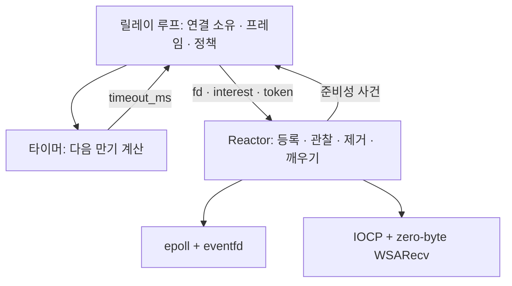
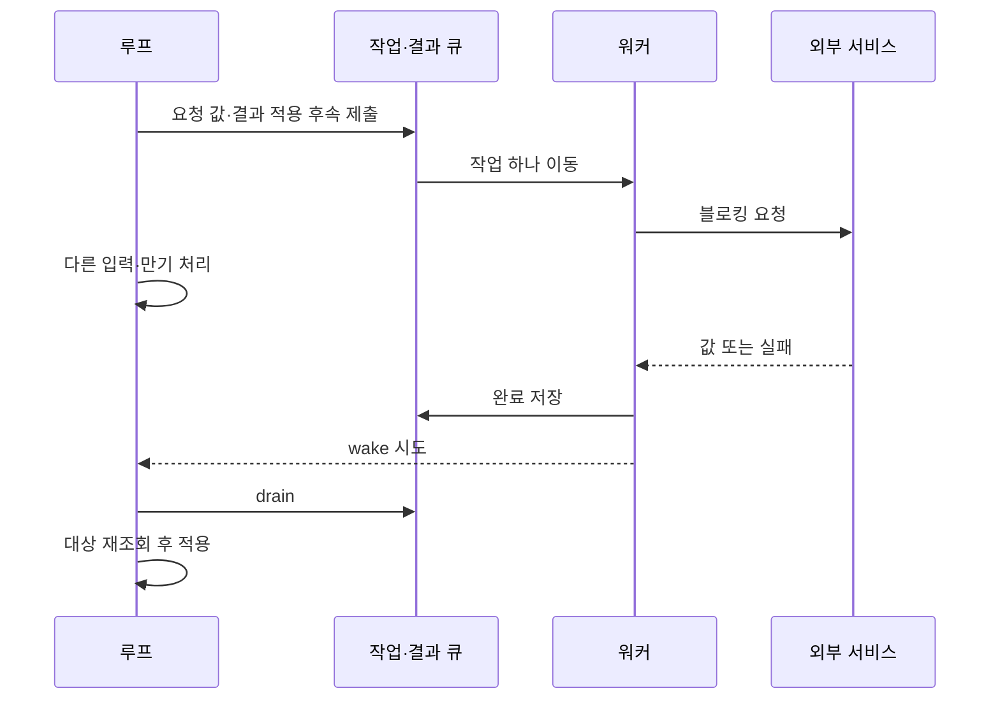
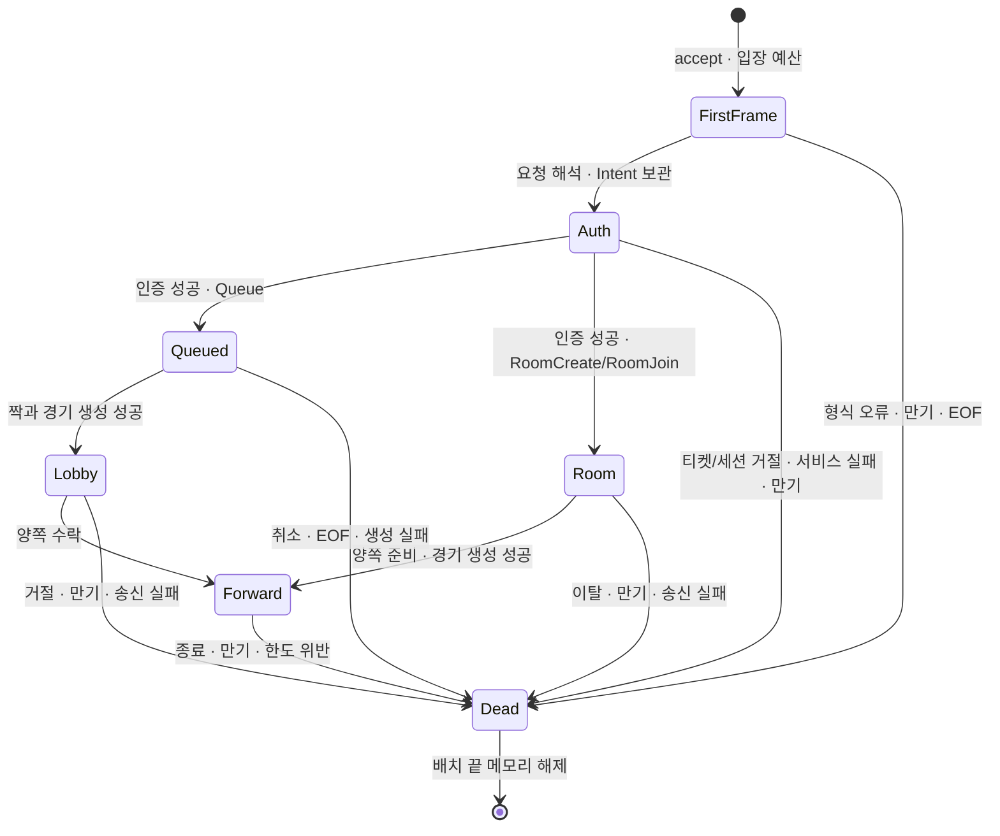
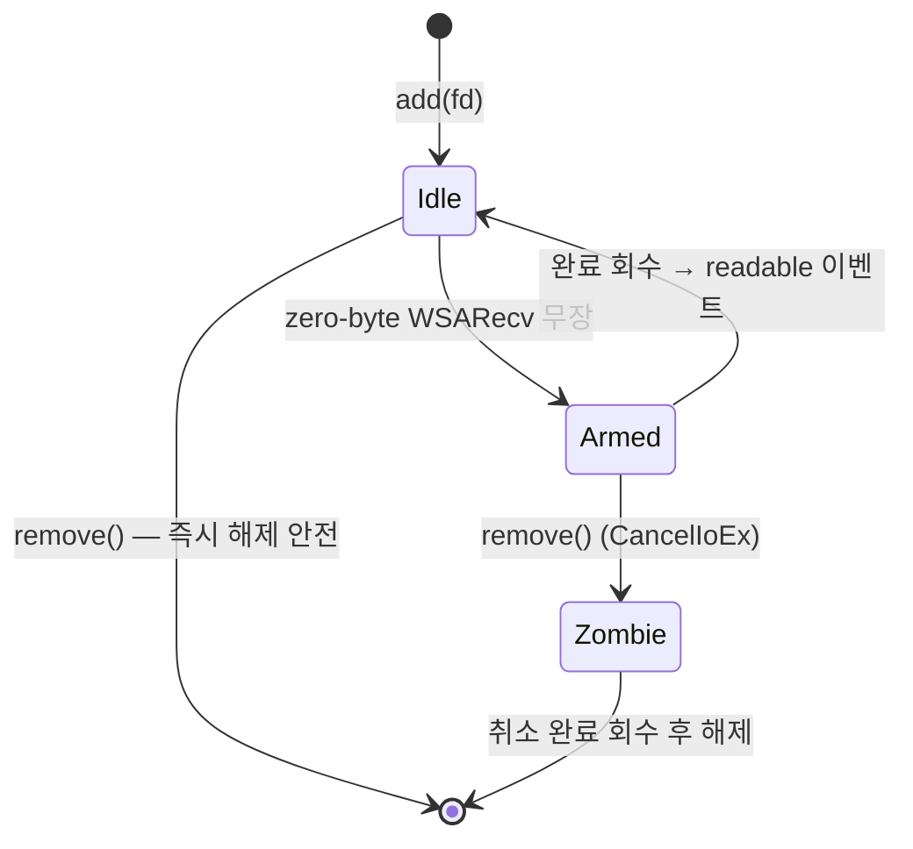

# Part 14: 이벤트 루프로 확장하기 — reactor, 오프로드, 샤딩

> **시리즈:** 제로부터 멀티플레이어 테트리스 + RL | [시리즈 목차](./README.md) | **Part 14**

---

> **2026-09-11 현재 코드 반영:** 운영 대상은 Linux 주 서버/Windows 예비 서버다. Linux는 epoll, Windows는 IOCP 단일 루프 폴백이며 macOS reactor 백엔드는 없다. macOS는 `TETRIS_BUILD_REACTOR=OFF`로 클라이언트/기본 테스트를 빌드한다.

## 이번 Part의 구현 계약

- **선행 상태:** [Part 7](./part7-relay-server.md) 이 연결마다 스레드를 두는 릴레이(`server/main.cpp` 의 accept 루프, `playerConnThread`, `Matchmaker::waitForPair` 를 도는 matcher 스레드, `RoomRegistry::roomLoop_`, 방향별 `forwarderLoop`)를 완성해 뒀고, `net/socket.h` 와 `net/framing.h` 의 계약이 그대로 살아 있다. [Part 12](./part12-hardening-and-release.md) 의 용량 측정 방법으로 "지금 구조가 어디까지 버티는가" 를 확인한다. 이 장에서는 그 결과와 운영 목표를 기준으로 다른 구현을 비교한다.
- **이번 Part의 파일:** `net/reactor.h`, `net/reactor_epoll.cpp`, `net/reactor_iocp.cpp`, `server/timer_queue.h`, `server/offload.h`, `server/reactor_relay.cpp`, `tests/reactor_test.cpp`, `tests/loop_primitives_test.cpp`, `net/socket.h/.cpp`(`tcp_send_some` 추가), `CMakeLists.txt`(타깃 `tetris_relay_reactor`, `reactor_test`, `loop_primitives_test`).
- **연결점:** wire 프로토콜은 한 비트도 바뀌지 않는다. 새 릴레이는 `net/framing.*` 과 `net/socket.*` 을 그대로 쓰고, 인증·결과 저장도 [Part 10](./part10-meta-and-ranking.md) 의 `meta::client::MetaClient` 를 그대로 호출한다. 클라이언트 코드는 손대지 않는다 — 같은 포트에 붙는 두 개의 서버 구현이 생길 뿐이다.
- **완료 게이트:** `tetris_relay_reactor`·`reactor_test`·`loop_primitives_test` 가 빌드되고, 두 단위 테스트가 0을 반환하며, Part 7 이 만든 queue/room smoke 와 [Part 10](./part10-meta-and-ranking.md) 의 meta 통합 테스트를 `TETRIS_RELAY_BIN` 으로 새 바이너리에 겨눠 전부 통과해야 한다. 통과 여부가 곧 "두 구현이 같은 계약을 말하는가" 의 답이다.

---

이 장은 서버의 처리량을 확장한다. 후속 Part 15는 표현·봇 보상, Part 16은 공개 접속의 암호화와 입장권을 다룬다. Part 7 의 릴레이는 연결별 작업자의 순차 흐름으로 구성돼 있다. 그 구조를 버려야 하는 시점이 오는지, 온다면 무엇을 얻고 무엇을 잃는지, 그리고 그 전환에서 실제로 어떤 버그를 만나는지가 여기 담긴다. 결과물은 기존 릴레이를 대체하지 않는다 — 같은 프로토콜을 말하는 두 번째 바이너리이고, 둘 중 무엇을 띄울지는 측정이 정한다.

## 1. 언제 바꾸는가 — 그리고 언제 바꾸지 않는가

스레드 구조를 바꾸기 전에 부하와 목표를 정한다. 동시 연결 수, 입력 빈도, 허용 지연,
CPU·메모리 예산이 달라지면 같은 구현에 대한 판단도 달라진다. 현재 릴레이의
`forwarderLoop`는 논블로킹 수신을 반복하고, 읽을 바이트가 없으면 1ms를 요청해 쉰다.
먼저 이 경로의 유휴 비용과 실제 입력 전달 지연을 나누어 관찰한다.

### 1.1 thread-per-connection의 비용을 나누어 본다

블로킹 수신에서 잠든 스레드는 보통 CPU에서 계속 실행되지 않는다. OS는 실행 가능한
작업 중에서 CPU를 배정한다. 따라서 스레드가 존재한다는 사실과 그 스레드가 지금
CPU를 사용한다는 사실은 다르다. 그렇다고 대기 스레드의 비용이 0인 것은 아니다.
스택의 가상 주소 공간, 실제 사용한 스택 페이지, 커널 관리 자료, 소켓 버퍼는 남는다.

스케줄러를 “매 틱마다 모든 스레드를 훑는 반복문”으로 설명하면 현대 구현을 잘못
이해하기 쉽다. 선택 정책과 자료구조는 OS·버전에 따라 달라진다.
[Linux EEVDF 설명](https://kernel.org/doc/html/latest/scheduler/sched-eevdf.html)은
실행 자격과 가상 마감 시각에 따른 선택을 설명한다. 이 글의 성능 판단은 특정
스케줄러의 세부를 가정하지 않고 실제 관측값으로 한다.

| 비교할 책임 | 연결별 OS 스레드 | 한 루프의 여러 연결 |
| --- | --- | --- |
| 이어서 할 일 | 스레드 실행 문맥·지역 상태 | 연결 객체·명시적 진행 상태 |
| 실행 선택 | OS 스케줄러 | OS 통지와 애플리케이션 디스패치 |
| 상태 접근 | 공유 상태의 동기화 필요 | 한 루프 소유 상태는 직렬 접근 가능 |
| 느린 작업의 영향 | 해당 스레드 외에 공유 자원도 영향 | 루프를 막으면 그 루프의 다른 연결도 지연 |

상태를 스택과 힙 중 어디에 놓느냐만의 차이가 아니다. 스레드 수도, 취소 방법도,
공유 상태의 동기화도 설계에 포함된다. 순차 코드의 이해·운영 비용이 낮고 측정한
성능이 목표를 만족하면 그 구조를 유지할 이유가 충분하다. “수백 연결이면 언제나
충분하다”와 같은 고정 기준은 부하 조건 없이 정할 수 없다.

### 1.2 평균·꼬리·자원은 함께 읽는다

**지연의 분포.** 평균은 총 지연을 표본 수로 나눈 값이다. p50·p99는 정렬한 표본의
위치를 나타낸다. 이 글에서 nearest-rank p99는 `ceil(0.99 × N)`번째 값이다.
표본 100개 중 99개가 1ms, 하나가 1000ms라면 평균은 10.99ms, p99는 1ms,
최댓값은 1000ms다. p99 하나만으로 모든 느린 요청을 설명할 수도 없다.

lockstep에서는 필요한 상대 입력이 준비될 때까지 시뮬레이션이 기다릴 수 있다.
그러므로 평균과 함께 상위 백분위·최댓값·시간 초과 수를 살핀다. 입력 버퍼와
스케줄링 정책이 실제 화면 정지로 이어지는 정도에도 영향을 준다. 평균을 무의미하다고
버리거나, p99가 스레드 수에 비례한다고 가정하지 않는다.

**실행 대기와 자원.** 동시에 실행 가능한 스레드가 사용 가능한 논리 CPU보다 많으면
일부는 실행을 기다린다. 대기 시간은 작업 길이·우선순위·다른 부하 등에 따라 달라진다.
컨텍스트 전환 뒤의 캐시·TLB 영향도 CPU와 작업 집합에 따라 달라진다. 같은 주소 공간이라는
이유만으로 TLB가 항상 유지되거나 데이터 캐시가 반드시 무너진다고 말할 수 없다.
스택 등의 보유 비용은 스레드 수와 사용량에, 실행·깨어남 비용은 활동 빈도에도 관계한다.

**이 릴레이의 주기적 폴링.** 아래는 방향별 포워더에서 데이터가 없을 때의 경로다.
뒤의 byte-rate 검사와 ranked/unranked 처리는 생략했다.

**현재 소스 발췌 — `server/relay.cpp`**

```cpp
    while (!ch->closed.load() && !s_stopping.load()) {
        if (havePrefix) {
            havePrefix = false;  // raw 는 이미 준비돼 있음 — 바로 처리.
        } else {
            raw.clear();
            if (!net::tcp_recv_some(from, raw)) {
                disconnectSide = a_to_b ? 1 : 2;
                break;
            }
            if (raw.empty()) {
                if (std::chrono::steady_clock::now() - lastActivity >= kIdleTimeout) {
                    disconnectSide = a_to_b ? 1 : 2;
                    RLOG_INFO("[relay] match=" << ch->match_id
                              << " uuid=" << ch->match_uuid << " " << dir
                              << " close: idle timeout");
                    break;
                }
                std::this_thread::sleep_for(std::chrono::milliseconds(1));
                continue;
            }
        }
```

1ms는 요청한 수면 시간이다. 루프 자체의 실행과 스케줄링 지연도 있으므로, 실제로
초당 정확히 1000번 실행된다는 뜻은 아니다. 데이터가 없어도 주기적으로 수신을
시도한다는 것이 핵심이다. 매치당 방향별 작업자가 둘이면 이런 대기 루프도 둘이다.
유휴 연결 수를 늘리며 CPU와 컨텍스트 전환을 측정해 가설을 확인한다.

이 루프는 소켓 입력뿐 아니라 idle 마감 시각과 종료 플래그를 확인한다. 블로킹
`recv` 하나로 바꾸면 타이머·취소를 언제 관찰할지 다시 설계해야 한다. 플랫폼별
종료·대기 해제 계약도 함께 다루어야 한다. 단순히 함수 이름만 바꾸는 최적화가 아니다.

폴링 간격을 늘리면 대체로 유휴 반복 횟수를 줄일 수 있다. 그만큼 도착 후 다음 검사까지
기다리는 시간이 늘 수 있다. **주기는 모든 요청 지연의 하한도, 전체 지연의 상한도 아니다.**
이상적으로 정확한 주기 T마다 확인한다면 도착 위상에 따른 검사 대기는 0에서 T까지다.
실제로는 실행 지연과 처리 시간이 더해진다. 5ms로 바꿔 CPU가 정확히 1/5이 되거나
최대 지연이 5ms로 제한된다고 단정할 수 없다.
[Linux nanosleep의 시간 해상도·재실행 지연 설명](https://man7.org/linux/man-pages/man2/nanosleep.2.html)도
요청 시간이 곧 실제 재실행 시각은 아님을 구분한다.

통지 기반 대기는 불필요한 주기적 확인을 줄이는 대안이다. 타이머·종료·다른 사건에 의한
깨어남과 OS 실행 대기는 여전히 존재한다. “유휴 때 언제나 0회, 도착 즉시 실행”이라는
보장을 얻는 것은 아니다.

### 1.3 측정 경계를 고정하고 판단한다

다음 항목은 서로 다른 질문에 답한다. 어느 하나만 최적화했다고 전체가 좋아졌다고
판정하지 않는다.

- **유휴 CPU와 메모리:** 연결은 있지만 애플리케이션 입력이 없을 때의 비용.
- **활동 중 CPU와 처리량:** 같은 구간의 CPU 시간과 성공한 요청 수/실제 경과 시간.
- **지연 표본과 실패:** 표본 수·평균·p50·p99·최댓값 및 시간 초과·거절·미완료 수.
- **컨텍스트 전환:** 자발적/비자발적 전환의 구간 차이. 수신 폴링 횟수 자체는 아니다.

Linux에서는 [getrusage의 RUSAGE_SELF](https://man7.org/linux/man-pages/man2/getrusage.2.html)로
한 프로세스의 모든 스레드가 사용한 CPU 시간을 읽을 수 있다. 구간 끝과 시작의 차이를
경과 시간으로 나누면 사용한 CPU 코어 수에 대응하는 평균 비율이 된다. 1초 동안
CPU 2초를 썼다면 약 2코어분이다. 서로 다른 도구의 CPU 퍼센트 정규화 기준도 확인한다.

학습 사이트의 `124-thread-measurement`는 누적 `ThreadLink`의 양 끝을 loopback으로
연결하고, 일련번호를 확인한 에코 응답까지 잰다. 연결 준비·8회 워밍업·측정·정리를 나누며,
한 프로세스에 부하 발생기와 응답기가 있으므로 CPU와 지연에 둘의 비용이 함께 포함된다.
이 실험은 측정 경계를 익히는 기준 도구다. 운영 릴레이의 최대 동시 접속자 수나 서로 다른
호스트 사이의 RTT를 직접 보여 주지는 않는다. 운영 판단에는 실제 프로토콜·매칭·인증·
관전자 등 필요한 경로를 고정한 부하 실험을 따로 남겨야 한다.

한 번에 연결 수나 폴링 주기 하나를 바꾸고, 같은 조합을 순서를 바꾸어 여러 번 실행한다.
원시 표본과 실행 환경·빌드 모드·다른 부하를 남긴다. 응답을 기다린 다음 요청을 보내는
닫힌 부하는 서버가 느려질수록 입력률도 낮아지므로, 일정 도착률의 혼잡을 그대로
재현하지 못한다. 성공 표본만으로 장애 구간을 평가하지 않도록 미완료 수를 함께 기록한다.

프로세스 복제도 비교할 선택지다. 경기 내부 상태는 분리할 수 있지만 현재 서버에는
공용 매칭 큐·방 레지스트리·입장 제한과 메타 서비스 연결도 있다. 복제할 때는 같은 경기의
연결을 같은 인스턴스로 보내는 라우팅, 친구방 탐색, 제한 범위와 공유 저장소를 함께
설계해야 한다. CPU·메모리·공유 DB·앞단 네트워크가 병목일 수 있어 코어 수만큼의 선형
확장은 보장되지 않는다. 프로세스 격리는 일부 실패의 범위를 줄이지만 공유 의존성까지
격리하지는 않는다.

`tetris_relay`와 `tetris_relay_reactor`를 별도로 두면 동일한 외부 계약 아래 비교할 수 있다.
구현 선택은 목표를 만족하는 측정 결과와 유지보수 비용으로 한다.

### 1.4 Go 와 가상 스레드가 인기인 이유

여기까지 오면 자연스러운 질문이 생긴다. 순차 코드의 가독성과 이벤트 루프의 자원
효율을 둘 다 가질 수는 없나.

Go 의 goroutine, JVM 의 가상 스레드, 그리고 여러 언어의 async 런타임이 정확히 그
자리를 노린다. 겉으로 보이는 코드는 블로킹 호출이 줄줄이 늘어선 순차 코드다. 그런데
런타임이 그 블로킹 호출을 가로챈다 — 소켓이 아직 읽을 수 없으면 실행 문맥을 파킹하고,
fd 를 내부 폴러(리눅스라면 epoll)에 등록하고, 같은 OS 스레드로 다른 실행 문맥을
올린다. 준비되면 다시 깨워 원래 자리에서 이어 간다. **밑은 이벤트 루프, 겉은 순차
코드**다. 스택도 작게 시작해 필요할 때 늘어나므로 실행 문맥 하나의 고정 비용이 OS
스레드보다 훨씬 작다.

즉 이들은 이 장에서 다루는 문제를 없앤 것이 아니라 **런타임 안으로 숨긴 것**이다.
프로그래밍 모델은 thread-per-connection 그대로 두고 자원 모델만 이벤트 루프로 바꾼
절충이며, 대가는 런타임을 언어에 내장해야 한다는 것이다. C++ 에는 그런 런타임이
표준으로 없다. 코루틴 문법은 생겼지만 스케줄러와 I/O 백엔드는 직접 붙여야 한다.
그래서 C++ 에서는 둘 중 하나를 손으로 골라야 하고, 이 장은 그 선택을 명시적으로
하는 연습이다. 어느 쪽을 고르든 밑바닥에서 벌어지는 일 — 관심 등록, 준비성 통지,
상태 복원 — 은 같으므로, 여기서 손으로 만들어 본 구조는 다른 언어의 런타임을 읽을
때 그대로 쓰인다.

## 2. 두 가지 I/O 모델

I/O를 기다리는 API는 무엇을 통지하는지로 구분할 수 있다. 준비성은 **지금 연산을
시도할 조건**, 완료는 **제출했던 연산의 결과**를 전달한다. 동기/비동기, 블로킹/논블로킹,
프레임 완성 여부는 이 구분과 별도로 살펴야 한다.

### 2.1 통지에 담긴 정보와 버퍼 수명

**준비성(readiness).** `poll`·`epoll`은 소켓의 읽기 가능 조건 등을 알린다. 통지를
받은 애플리케이션이 실제 `recv`를 호출하고 반환값을 해석한다. 통지는 특정 바이트를
호출자에게 예약하지 않는다. 사이에 다른 읽기가 있었다면 논블로킹 수신은 WouldBlock을
반환할 수 있다. EOF나 오류도 준비성 사건으로 나타날 수 있다.

**완료(completion).** overlapped `WSARecv` 같은 연산은 버퍼와 요청을 먼저 제출한다.
나중에 수신 바이트 수·성공/오류 등의 결과를 확인한다. 읽기 한 번의 완료가 전체 TCP
메시지의 완성을 의미하지는 않는다. 버퍼 길이보다 짧은 수신, EOF, 오류를 구분하고
받은 바이트를 프레임 파서에 전달하는 일은 여전히 애플리케이션의 책임이다.

| 질문 | 준비성 기반 읽기 | 제출한 읽기의 완료 |
| --- | --- | --- |
| 통지가 가리키는 것 | 소켓에 I/O를 시도할 조건 | 특정 제출 연산의 결과 |
| 데이터를 얻는 단계 | 통지 뒤 실제 수신 호출 | 완료된 연산의 버퍼·수량 확인 |
| 버퍼 수명 | 동기 수신 호출 동안 유효; 미완성 프레임 상태는 별도 유지 | 제출한 연산이 끝날 때까지 해당 버퍼 유효 |
| 다음 판단 | 진행/WouldBlock/EOF/오류 | 부분 수신/EOF/오류/취소 및 메시지 파싱 |
| 해제 전 조건 | 관심 해제와 남은 사용자 이벤트 참조 정리 | 진행 중 연산과 늦은 완료 참조까지 정리 |

버퍼를 언제 할당하는지는 구현 선택이다. 준비성에서도 연결별 파서·송신 큐·소켓의
커널 버퍼가 남는다. 완료 방식도 연결마다 언제나 같은 크기의 사용자 버퍼를 하나씩
고정하는 규칙은 아니다. 진행 중 연산의 수와 요청 크기, 버퍼 풀·공유 방식 등을 함께
보아야 한다. 유효 주소를 유지한다는 말과 물리 페이지를 특별히 pin한다는 말도 구분한다.

[Linux poll 계약](https://man7.org/linux/man-pages/man2/poll.2.html)은 준비성과
타임아웃·오류를 구분하며, HUP 이후에도 남은 데이터를 읽을 수 있음을 설명한다.
[WSARecv 계약](https://learn.microsoft.com/en-us/windows/win32/api/winsock2/nf-winsock2-wsarecv)은
요청 버퍼와 수량·완료 결과를 다룬다. `WSABUF` 설명자 배열과 그 배열이 가리키는 실제
바이트 저장소의 수명 조건도 같다고 가정하지 않는다.

취소 요청 역시 완료와 다르다. [CancelIoEx](https://learn.microsoft.com/en-us/windows/win32/api/ioapiset/nf-ioapiset-cancelioex)는
취소할 연산을 표시할 뿐 완료 회수까지 기다리지 않는다. 이미 성공한 연산은 성공으로,
취소가 처리된 연산은 취소로, 다른 실패는 해당 오류로 끝날 수 있다. 최종 결과를
확인하기 전 `OVERLAPPED`나 버퍼를 재사용하면 안 된다.

### 2.2 API의 발전과 성능 판단을 구분한다

`select`와 `poll`은 호출할 때 관심 대상을 전달하고, `epoll`은 관심 집합을 유지하는
방식을 제공한다. `poll`이 fd 수에 따른 모든 탐색 비용을 없앴다고 설명하는 것은 틀리다.
이런 자료구조 차이와 실제 workload·호출 빈도를 함께 비교해야 한다.

[io_uring의 제출·완료 큐](https://man7.org/linux/man-pages/man7/io_uring.7.html)는
여러 연산의 제출과 완료 수집을 다루며 배치 처리도 가능하게 한다. 완료 모델이 역사적으로
준비성 모델을 이겼다거나 언제나 시스템 콜 하나를 덜 쓴다는 결론은 여기서 나오지 않는다.
통지 수집·제출·수신의 배치 방식, 지원 연산, 커널·장치·부하에 따라 비용이 달라진다.

IOCP와 io_uring에도 서로 다른 계약이 있다. 모든 완료 API가 요청 하나당 단 한 번의
완료만 낸다고 일반화할 수도 없다. 예를 들어 io_uring의 multi-shot 연산은 추가 완료가
있음을 별도 플래그로 알린다. 작은 실습에서는 **동시에 한 번의 단발 읽기**로 범위를
정하고, 운영 API로 옮길 때 해당 연산의 계약을 다시 확인한다.

### 2.3 현재 프로젝트의 인터페이스와 실습 경계

현재 `Reactor`는 준비성 형태로 통일한다. 논블로킹 수신 결과를 스트림 파서에 넣는
책임을 유지하기 위한 선택이다. 통지의 수량과 메시지 파싱을 하나의 상태로 합치지 않는다.
다만 소유권·오류·부분 처리·취소 경계가 바뀔 수 있어 기존 코드를 한 줄도 검토하지
않고 옮길 수 있다는 뜻은 아니다.

**현재 소스 발췌 — `net/reactor.h`**

```cpp
// 한 번의 poll 이 돌려주는 이벤트. token 은 add() 때 등록한 불투명 포인터로,
// 보통 연결 상태 객체를 가리킨다. reactor 는 token 을 해석하지 않는다.
struct Event {
    void* token   = nullptr;
    bool  readable = false;  // recv 가능(또는 EOF — recv 가 0/에러를 돌려줘 확인)
    bool  writable = false;  // 보류 송신을 재시도할 수 있음
    bool  error    = false;  // HUP/ERR — 다음 recv/send 에서 확정 처리
};
```

이 이벤트에는 수신 데이터와 바이트 수가 없다. readable/fault 정보에서 다시 실제
I/O의 반환값을 확인하고, 필요한 오류 정책과 메시지 처리를 수행한다. 등록을 해제해도
이미 사용자 코드가 받아 보관한 이벤트와 token의 참조가 사라지는 것은 아니므로,
연결 객체를 해제할 시점도 따로 관리한다.

Windows 백엔드는 zero-byte overlapped `WSARecv` 완료를 읽기 힌트로 바꾼다. 요청한
payload가 0바이트라 실제 데이터를 복사하는 사용자 수신 버퍼는 필요하지 않지만,
`SockState`와 `OVERLAPPED`의 수명은 여전히 필요하다. 이 완료의 0이라는 숫자를
양수 버퍼로 실행한 일반 `recv`의 EOF 판단과 섞지 않는다. 이후 실제 수신으로
데이터·EOF·오류·WouldBlock을 판정한다. Windows에는 WSAPoll 등 준비성 API도 있으며,
이 프로젝트가 IOCP 어댑터를 택했다는 사실과 OS가 제공하는 모든 선택지는 구분한다.

**현재 소스 발췌 — `net/reactor.h`**

```cpp
    // 등록된 소켓을 다른 Reactor 인스턴스로 옮길 수 있는가.
    //
    // 준비성 모델(epoll)에서는 관심 집합이 커널의 epoll 인스턴스에 있을 뿐이라
    // 한쪽에서 빼고 다른 쪽에 넣으면 그만이다. 완료 모델(IOCP)에서는 불가능하다 —
    // 소켓 핸들은 완료 포트에 결합되면 수명이 끝날 때까지 그 포트에 묶이고 다시
    // 결합할 수 없다. 매치를 다른 루프로 넘기는 샤딩은 이 능력을 전제하므로,
    // 호출자는 여기서 false 를 받으면 단일 루프로 물러서야 한다.
    virtual bool can_migrate_sockets() const = 0;
```

IOCP의 포트 결합은 [완료 포트의 핸들 연결 계약](https://learn.microsoft.com/en-us/windows/win32/fileio/i-o-completion-ports)에
따른 제약이다. 모든 완료 방식에 같은 제약이 있다고 일반화하지 않는다. 준비성 백엔드도
이전 관심과 이미 전달한 이벤트의 수명·소유권을 정리한 뒤 새 루프에 넘겨야 한다.
`can_migrate_sockets`는 런타임 능력 질의이며, 호출자가 폴백을 구현했는지 컴파일러가
자동으로 증명해 주지는 않는다.

학습 체크포인트 `125-io-models`는 같은 실제 loopback 바이트를 두 방식으로 소비한다.
첫 경로는 poll/WSAPoll → 논블로킹 수신이고, 두 번째는 소켓을 소유한 작업자에 읽기를
맡긴 뒤 future에서 결과를 회수하는 PostedReceiver다. 두 번째는 완료 형태의 API와
버퍼 수명을 관찰하는 작업자 기반 어댑터이며 네이티브 IOCP/io_uring 구현은 아니다.
두 경로 모두 누적 FrameParser를 사용하므로 I/O 완료와 메시지 완성을 따로 확인할 수 있다.

## 3. 계약을 먼저 — Reactor 인터페이스

릴레이의 방향별 작업자는 논블로킹 수신 뒤 읽을 것이 없으면 1ms 수면을 요청한다.
주기는 전체 지연의 최대값이 아니며 실제 비용은 §1의 측정 경계로 판단한다. 다른 방향의
종료와 공유 채널 상태도 고려해야 하므로 “상태 공유가 거의 없다”는 이유만으로
동기화 검토를 생략하지 않는다.

준비성 통지는 주기적인 수신 확인을 줄이는 방식이다. 입력 외에도 타이머·종료·오류로
루프가 깨어날 수 있다. 인터페이스는 이런 사건 뒤 누가 소켓과 연결 상태를 소유하고
언제 해제할 수 있는지 드러내야 한다.

### 3.1 인터페이스에서 먼저 드러낼 계약

여러 연결을 한 루프로 옮기려면 등록·관찰·제거뿐 아니라 소유권도 정해야 한다.
호출자가 소켓과 연결 상태를 소유하고 Reactor는 준비성을 관찰한다. 받은 사건을 어떤
순서로 처리하고 언제 연결을 닫을지는 상위 루프가 결정한다. 계약 초안을 작은 구현과
실패 사례로 검토하며 다듬는다. 헤더를 먼저 적는 것은 설계를 확인하는 방법이지,
구현 전에 모든 플랫폼의 차이를 확정할 수 있다는 뜻은 아니다.

**현재 소스 발췌 — `net/reactor.h`**

```cpp
// 관심 이벤트 비트마스크. Read 는 "읽을 수 있는가", Write 는 "논블로킹 send 가
// 즉시 진행되는가"(보류 송신 버퍼를 비울 때만 켠다).
enum Interest : unsigned {
    kNone  = 0,
    kRead  = 1u << 0,
    kWrite = 1u << 1,
};

// 한 번의 poll 이 돌려주는 이벤트. token 은 add() 때 등록한 불투명 포인터로,
// 보통 연결 상태 객체를 가리킨다. reactor 는 token 을 해석하지 않는다.
// 등록 제거는 이미 반환한 Event를 지우지 않는다. 호출자가 그 참조의 수명을 지킨다.
struct Event {
    void* token   = nullptr;
    bool  readable = false;  // recv 가능(또는 EOF — recv 가 0/에러를 돌려줘 확인)
    bool  writable = false;  // 보류 송신을 재시도할 수 있음
    bool  error    = false;  // HUP/ERR — 다음 recv/send 에서 확정 처리
};
```

**현재 소스 발췌 — `net/reactor.h`**

```cpp
class Reactor {
public:
    // 플랫폼에 맞는 구현을 만든다(Linux=epoll, Windows=IOCP). 실패 시 nullptr.
    static std::unique_ptr<Reactor> create();

    virtual ~Reactor() = default;

    // fd 를 관심 집합에 등록/변경/해제. token 은 이벤트에 그대로 실려 돌아온다.
    // add 는 이미 등록된 fd 에, remove 는 미등록 fd 에 대해 false 를 돌려줄 수 있다.
    virtual bool add(NativeSocket fd, unsigned interest, void* token) = 0;
    virtual bool modify(NativeSocket fd, unsigned interest, void* token) = 0;
    virtual bool remove(NativeSocket fd) = 0;

    // timeout_ms를 요청 대기 시간으로 사용한다(음수면 무기한). 스케줄링 지연으로
    // 실제 경과는 더 길 수 있다. out을 비운 뒤 연결 이벤트 수를 반환한다.
    // 0은 timeout뿐 아니라 wake/중단일 수 있다. -1은 대기 오류다.
    // 호출자는 매번 실제 시각·작업 큐·종료 조건을 다시 확인한다.
    virtual int poll(std::vector<Event>& out, int timeout_ms) = 0;

    // 등록된 소켓을 다른 Reactor 인스턴스로 옮길 수 있는가.
    //
    // 준비성 모델(epoll)에서는 관심 집합이 커널의 epoll 인스턴스에 있을 뿐이라
    // 이전 이벤트 참조와 소유권을 정리하고 다시 등록할 수 있다. IOCP에서는 불가능하다 —
    // 소켓 핸들은 완료 포트에 결합되면 수명이 끝날 때까지 그 포트에 묶이고 다시
    // 결합할 수 없다. 매치를 다른 루프로 넘기는 샤딩은 이 능력을 전제하므로,
    // 호출자는 여기서 false 를 받으면 단일 루프로 물러서야 한다.
    virtual bool can_migrate_sockets() const = 0;

    // 다른 일반 스레드가 poll()의 대기를 깨우도록 요청한다. 작업은 먼저 동기화된
    // 큐/플래그에 공개한다. 통지는 합쳐질 수 있으며 정확한 실행 시각을 보장하지 않는다.
    // 0개 연결 이벤트로 반환될 수 있으므로 호출자는 작업·종료 조건을 다시 확인한다.
    virtual void wake() = 0;
};
```

릴레이는 `add → poll → I/O와 정책 처리 → modify/remove` 순서를 조합한다.
`create()`가 OS별 구현을 선택하고, `can_migrate_sockets()`가 상위 구조에 영향을
주는 능력을 노출한다. Reactor는 프레임 형식·매칭 규칙·보상 정책을 알지 않는다.


```mermaid
graph TB
    LOOP["릴레이 루프: 연결 소유 · 프레임 · 정책"]
    TIM["타이머: 다음 만기 계산"]
    RE["Reactor: 등록 · 관찰 · 제거 · 깨우기"]
    EP["epoll + eventfd"]
    IO["IOCP + zero-byte WSARecv"]
    LOOP --> TIM
    TIM -- "timeout_ms" --> LOOP
    LOOP -- "fd · interest · token" --> RE
    RE -- "준비성 사건" --> LOOP
    RE --> EP
    RE --> IO
```

### 3.2 준비성으로 통일한 이유와 변환 비용

§2의 두 모델 중 이 인터페이스는 준비성을 반환한다. `tcp_recv_some`으로 읽고
누적 버퍼에서 프레임을 복원하는 코드를 재사용하기 쉽기 때문이다. 수신 시도와
파싱은 상위에 남고, 언제 그 경로를 실행할지 통지가 결정한다. 이벤트 루프로
옮기면서 부분 송신·연결 수명·처리량 한도도 함께 정리해야 한다.

Windows 백엔드는 zero-byte overlapped 수신 완료를 읽기 힌트로 바꾼다.
완료 통지 자체를 payload나 완성된 프레임으로 취급하지 않는다. 이 변환에도
연산 재무장과 `OVERLAPPED` 수명 관리 비용이 있다. 반대로 완료 중심 계약을
선택했다면 바이트 수·상태·버퍼 수명을 결과에 포함하고 파서에 전달할 수 있다.
Linux에도 완료 기반 API가 있으므로 그 선택이 반드시 사용자 스레드 에뮬레이션을
요구하는 것은 아니다.

어느 쪽이 빠른지는 메시지 크기, 활성 연결 수, 버퍼 관리와 배치 처리 등으로
측정한다. API 이름만으로 고정 syscall 차이나 처리량 우위를 정하지 않는다.

### 3.3 Interest — 동시에 켤 수 있는 관심 비트

`Interest`는 열거형으로 정의한 비트마스크다. `kRead | kWrite`로 두 관심을
동시에 표현한다. 관심은 연결의 상태 자체가 아니라 **관찰하고 싶은 조건**이다.

보류 송신이 없는데 쓰기를 계속 관찰하면 많은 소켓이 즉시 쓰기 가능하다고
반환되어 불필요한 반복이 생길 수 있다. 루프는 실제 보류 바이트에 맞춰 구독한다.

1. 읽기를 받을 때는 `kRead`를 둔다.
2. 논블로킹 송신 후 남은 바이트가 있으면 큐에 보존하고 `kWrite`를 추가한다.
3. 쓰기 사건에서 큐를 비우고, 더 보낼 것이 없으면 `kWrite`를 끈다.

부분 송신만으로 정확한 원인을 단정하지 않는다. 반환한 진행량과 WouldBlock,
오류를 구분하여 다음 행동을 정한다. `modify`는 이후 관찰을 바꾸며 이미 반환된
이벤트 배치를 소급해 삭제하지 않는다. 핸들러도 현재 연결 상태와 보류 큐를 확인한다.

한 핸들러가 모든 바이트를 보낼 때까지 블로킹하면 같은 루프의 다른 연결도
그동안 처리되지 않는다. 따라서 여기서는 기다리는 `tcp_send_all` 대신 진행량을
반환하는 경로와 보류 큐를 사용한다.

### 3.4 불투명 token과 이벤트 배치의 수명

`void* token`은 등록 때 준 값을 돌려받기 위한 불투명 포인터다. Reactor는
그 포인터를 해석하지 않는다. 이 덕분에 `net/` 계층이 `server::Conn`의 내부나
게임 정책에 의존하지 않는다. 상위가 포인터를 직접 해석하는 방법 외에도
정수 등록 ID와 테이블, 콜백 객체를 사용할 수 있다. 각각 조회 비용과 수명 규칙이 다르다.

중요한 경계는 **등록 제거와 객체 파괴가 서로 다른 동작**이라는 점이다.
`poll`이 A·B 사건을 이미 반환한 뒤 A 처리 중 B를 제거해도, 반환된 벡터 안의
B token은 남아 있다. 한 스레드만 사용해도 이런 순서는 생긴다. `remove()`
호출이 끝났다는 사실만으로 연결 객체를 파괴하면 남은 사건이 해제된 주소를 가리킨다.

현재 `server/reactor_relay.cpp`의 `close_conn`은 연결을 `Dead`로 표시하고,
관심·타이머를 제거하며 소켓을 닫는다. **Conn 객체는 즉시 파괴하지 않는다.**
루프는 사건마다 `alive(c)`를 검사하고, 쓰기 처리 후 읽기 처리 전에도 다시
확인한다. 배치와 만기 처리가 끝난 뒤 `sweep()`에서 죽은 연결을 회수한다.
비동기 결과가 연결을 참조하는 경로도 자신의 식별·수명 규칙을 지켜야 한다.

학습용 `126-reactor-contract`는 다른 구현을 비교한다. 재사용하지 않는 등록 ID로
낡은 사건을 거절하고, 실행 중 콜백은 지역 `shared_ptr`가 상태와 소켓을 보존한다.
ID는 새 연결과 혼동하지 않게 하고, 소유권은 현재 실행 중인 객체가 사라지지 않게 한다.
한 장치가 두 문제를 모두 해결한다고 취급하지 않는다.

OS 핸들은 `net/native_socket.h`의 `NativeSocket`으로 전달한다. POSIX의 int와
Windows의 포인터 크기 값을 같은 int로 줄이지 않는다. 핸들 값은 닫힌 뒤 재사용될
수 있으므로 연결의 영구적인 식별자로 쓰려면 별도 세대·등록 ID가 필요하다.

### 3.5 timeout — 대기 시간과 만기 정책의 분리

`timeout_ms`는 요청하는 대기 시간이다. OS 타이머 해상도와 스케줄링 지연 때문에
실제 반환까지의 시간이 더 길 수 있다. 돌아온 뒤 실제 시각을 다시 읽어야 한다.
0개 이벤트도 시간 초과만 뜻하지 않는다. 깨우기나 중단으로 반환할 수 있다.

첫 프레임 기한, idle 제한, 룸 대기 한도처럼 “만기가 어떤 상태 전이를 뜻하는가”는
릴레이 정책이다. 이 설계에서는 타이머 힙을 상위 루프가 소유하고 가장 가까운
만기까지의 시간을 Reactor에 전달한다. 범용 타이머 콜백을 Reactor에 넣는 설계도
가능하지만, 이 프로젝트는 OS 대기와 도메인 만기 처리를 분리한다.

현재 루프는 요청 대기에 상한을 두어 종료 플래그를 다시 확인할 기회를 만든다.
이 상한은 실행 시각의 보장이 아니다. 무기한 대기는 모든 종료·작업 경로가
확실히 깨우기를 연결하는 등 별도의 운영 계약을 요구한다.

### 3.6 wake — 작업을 공개한 뒤 대기를 깨운다

등록·수정·제거·관찰은 한 소유 스레드가 수행한다. 이 규칙은 다른 스레드와의
등록 테이블 경쟁을 줄인다. 콜백이 다른 연결을 제거하는 배치 내부 수명 문제는
여전히 남으며 §3.4의 규칙으로 처리한다.

외부 작업자는 동기화된 우편함에 결과를 넣고 `wake()`를 호출한다. 루프가 돌아오면
우편함과 종료 조건을 확인한다. **큐가 작업의 근거이고 wake는 확인을 촉진하는 통지**다.
통지 횟수와 작업 수를 일대일로 대응시키지 않는다. 큐의 mutex나 atomic의 메모리 순서가
자료 공개를 담당하며, 깨우기 호출 하나로 C++ 데이터 경쟁이 해결되지는 않는다.

Linux eventfd는 카운터, IOCP는 완료 큐 항목으로 통지를 남긴다. 대기 진입 전에
깨우기를 요청해도 보류 통지를 관찰할 수 있다. 여러 통지가 합쳐지거나 연결 사건과
함께 반환될 수 있으므로 루프는 매 반복마다 실제 조건을 다시 확인한다. 준비된
스레드가 언제 CPU를 얻는지까지 깨우기 API가 보장하지 않는다.

Linux `wake()`의 eventfd 쓰기가 EINTR로 중단되면 재시도한다. 비블로킹 쓰기의
EAGAIN은 카운터에 이미 통지가 쌓인 경우이므로 반복해서 쓰지 않는다. 다른 오류까지
성공으로 해석하지 않으며, 모든 wake 호출자가 끝나기 전에 Reactor를 파괴하지 않는다.
현재 void 반환 계약은 오류를 호출자에게 전달하지 않는다는 한계가 있다.

일반 스레드 간 호출과 비동기 시그널 핸들러의 호출 허용 범위는 다르다.
공통 Reactor API는 async-signal-safety를 약속하지 않는다. 현재 릴레이의
시그널 핸들러는 종료 플래그를 바꾸고, 루프가 그 값을 확인한다. 시그널에서 임의의
C++ 메서드를 호출해도 된다고 일반화하지 않는다.

### 3.7 능력 질의 — can_migrate_sockets()

이 질의는 현재 백엔드에서 소켓을 다른 Reactor로 옮기는 경로를 지원하는지 답한다.
epoll 경로도 이전 루프의 등록과 반환된 사건, 연결 소유권을 정리한 뒤 새 루프에
등록해야 한다. 다른 루프가 같은 소켓을 동시에 처리하게 만드는 허가는 아니다.

IOCP에 연결된 핸들은 다른 완료 포트로 다시 결합할 수 없어 이 구현은 false를
반환한다. 이 제약을 모든 완료 모델의 공통 속성으로 확대하지 않는다. 상위는 OS
이름 대신 능력을 보고 단일 루프 경로를 선택한다. 런타임 질의가 대체 경로의
컴파일·실행 성공을 보장하는 것은 아니므로 두 경로 모두 별도로 유지·검사해야 한다.

---

## 4. epoll 백엔드

epoll은 관심 목록을 커널에 보존하고 준비된 항목을 배치로 반환한다.
`epoll_ctl`이 등록·수정·제거를, `epoll_wait`이 관찰을 담당한다. 커널 상태와
사용자 소유권, 사건을 처리하는 정책은 각각 유지해야 한다. “준비된 항목을
돌려준다”는 이유로 등록·처리·복사·메모리 비용까지 전부 O(1)이라고 설명하지 않는다.

### 4.1 등록 — 읽기 관심에만 EPOLLRDHUP을 더한다

**현재 소스 발췌 — `net/reactor_epoll.cpp`**

```cpp
    bool ctl(int op, NativeSocket fd, unsigned interest, void* token) {
        epoll_event ev{};
        ev.events = 0;
        if (interest & kRead)  ev.events |= EPOLLIN | EPOLLRDHUP;
        if (interest & kWrite) ev.events |= EPOLLOUT;
        // EPOLLRDHUP 는 읽기 관심과 함께일 때만 건다. 무조건 걸면 interest 가 0 인
        // 소켓 — 즉 호출자가 백프레셔로 읽기를 멈춰 둔 소켓 — 도 상대가 half-close
        // 하는 순간부터 레벨 트리거로 계속 보고된다. 멈춰 세운 의미가 사라지고
        // 루프가 그 fd 로 스핀할 수 있다. 다만 EPOLLHUP/EPOLLERR는 관심 0에도
        // 보고될 수 있다. interest 0이 모든 종료/오류 관찰을 막는 것은 아니다.
        ev.data.ptr = token;
        return ::epoll_ctl(epfd_, op, fd, &ev) == 0;
    }
```

`add`는 ADD, `modify`는 MOD로 이 헬퍼를 호출한다. `remove`는 DEL을 수행한다.
같은 fd를 중복 ADD하거나 없는 항목을 MOD하면 실패하므로 성공 여부를 확인한다.
`data.ptr`에는 상위 token을 저장한다. 이 union에 fd나 정수 ID를 저장할 수도
있지만, 여러 멤버가 별도의 공간인 것처럼 동시에 쓰지는 않는다.

EPOLLRDHUP은 스트림 피어가 송신 방향을 닫은 상태를 알린다. 이 코드는 Read가
있을 때만 요청한다. 읽기를 멈췄는데 RDHUP만 계속 구독하면 half-close 상태를
반복 관찰할 수 있기 때문이다. EOF는 실제 수신으로 판단한다. 수신 큐의 바이트를
먼저 읽은 뒤 EOF를 받을 수도 있고 반대 방향 송신은 계속 가능할 수 있다.

EPOLLERR·EPOLLHUP은 관심 비트에 넣지 않아도 보고될 수 있다. 따라서 현재 코드의
interest 0은 읽기·쓰기 관심을 끄는 것이며 **완전한 관찰 중지와는 다르다**.
학습용 `127-epoll`은 완전 정지 계약을 택해 사용자 등록 ID는 보존하되 커널에서는
DEL하고, 재개할 때 ADD한다. 커널 변경이 성공한 뒤 사용자 표의 관심을 갱신한다.

### 4.2 레벨 트리거와 처리 예산

LT는 기본 모드다. 읽을 바이트가 남아 있으면 이후 wait에서 다시 준비성을
관찰할 수 있다. 현재 `tcp_recv_some`처럼 한 조각을 읽고 돌아오는 코드와 연결하기
쉽다. 다만 한 번의 사건이 전체 메시지를 뜻하지 않으며 호출 사이 상태도 바뀐다.

ET는 EPOLLET으로 선택한다. 단순 구현은 논블로킹 I/O로 EAGAIN까지 처리한 뒤
다시 커널 통지를 기다린다. 아직 처리할 데이터가 있는데 새 통지만 기다리면
진행이 멈출 수 있다. 다른 설계는 사용자 준비 큐에 그 연결을 남겨 처리 예산을
나누는 것이다. 이때 커널의 새 사건 없이도 남은 작업을 이어가야 한다.

LT만으로 애플리케이션의 라운드로빈 공정성이 완성되지는 않는다. 커널의 준비
목록 순환과 콜백 하나의 실행 시간은 다른 문제다. 수신량·파싱 프레임 수·송신량
상한과 타이머 처리 기회를 루프가 정해야 한다. ET 역시 무조건 성능이 좋거나
공정성이 나쁜 모드가 아니다. 실제 부하에서 통지와 재무장 비용을 측정한다.

EPOLLONESHOT은 한 번 통지한 등록을 비활성화하고 MOD로 재무장하게 한다.
워커 사이에서 연결 처리를 분배할 때 쓸 수 있지만, 객체 소유권이나 재진입을
자동 해결하지는 않는다. 단일 소유자 LT 루프인 현재 구현은 이 모드를 사용하지 않는다.

### 4.3 poll — 사건 번역과 대기 중단

**현재 소스 발췌 — `net/reactor_epoll.cpp`**

```cpp
    int poll(std::vector<Event>& out, int timeout_ms) override {
        out.clear();
        if (scratch_.empty()) scratch_.resize(256);
        int n = ::epoll_wait(epfd_, scratch_.data(),
                             static_cast<int>(scratch_.size()), timeout_ms);
        if (n < 0) {
            if (errno == EINTR) return 0;  // 시그널 — 만기 처리하러 나간다
            return -1;
        }
        for (int i = 0; i < n; ++i) {
            const epoll_event& e = scratch_[i];
            if (e.data.ptr == &wake_marker_) {
                uint64_t sink;
                ssize_t consumed;
                do { consumed = ::read(wakefd_, &sink, sizeof(sink)); }
                while (consumed < 0 && errno == EINTR);
                // 일반 eventfd는 한 번의 성공한 read로 현재 누적값을 비운다.
                // 그 뒤 도착한 wake는 다음 poll에서 처리한다. 계속 쓰는 작업자를
                // 따라 끝없이 drain하면 이 배치의 연결/타이머 처리가 굶을 수 있다.
                continue;  // wake 는 이벤트로 노출하지 않는다
            }
            Event out_ev;
            out_ev.token    = e.data.ptr;
            out_ev.readable  = (e.events & (EPOLLIN | EPOLLRDHUP)) != 0;
            out_ev.writable  = (e.events & EPOLLOUT) != 0;
            out_ev.error     = (e.events & (EPOLLERR | EPOLLHUP)) != 0;
            // 오류는 다음 recv 가 확정 처리하도록 readable 로도 표시한다.
            if (out_ev.error) out_ev.readable = true;
            out.push_back(out_ev);
        }
        return static_cast<int>(out.size());
    }
```

`scratch_`는 커널 출력 공간이다. 256칸을 한 번 확보해 재사용한다. 반환된 n만큼만
읽으며, maxevents는 한 호출의 출력 상한이지 전체 등록 수가 아니다. 준비된 항목이
더 많으면 후속 wait에서 나누어 관찰한다. 사건은 발생 횟수의 영구 이력 큐가 아니므로
중간에 조건이 해소되거나 등록을 제거한 경우까지 모든 옛 사건 전달을 약속하지 않는다.

EINTR는 시그널로 대기가 중단된 반환이다. 현재 인터페이스는 0개 사건으로 바꾸어
상위가 우편함·종료·현재 시각을 확인하게 한다. 0을 실제 타이머 만기로 단정하지 않는다.
학습 백엔드는 interrupted를 별도 상태로 반환한다. 어느 API든 호출자가 관찰한
시각으로 만기를 판정하고, 반복 중단 때 매번 전체 제한 시간을 새로 시작하지 않는다.

wake 사건은 내부 표식으로 구분한다. 일반 eventfd는 한 번의 성공한 read가 당시
누적값을 비운다. 작업자가 계속 쓰는 상황에서 EAGAIN까지 무한히 읽으려 하면
연결·타이머 처리가 뒤로 밀릴 수 있어, 성공한 읽기 한 번 뒤 현재 배치를 진행한다.
그 뒤의 통지는 다음 wait에서 관찰한다. 중단된 read는 EINTR일 때만 다시 시도한다.

### 4.4 종료 비트 뒤에도 바이트가 남을 수 있다

EPOLLERR는 오류 조건, EPOLLHUP은 hangup 상태를 알린다. 현재 어댑터는 둘을
error로 표시하고 readable도 켜 실제 수신 경로가 진행하게 한다. 이것은 “지금
확인할 일이 있다”는 뜻이지 수신이 반드시 실패한다는 뜻은 아니다. 큐에 남은
바이트를 먼저 읽고 다음 호출에서 EOF나 오류를 확인할 수 있다.

`error`에는 HUP도 포함되므로 이 bool만으로 정상 EOF와 비정상 종료를 구분하여
통계로 기록할 수 없다. 수신 결과와 필요한 경우 SO_ERROR 등 별도의 진단을
사용한다. 비블로킹 접속 완료처럼 SO_ERROR 확인이 중요한 경로도 별도로 설계한다.

오류·종료 사건을 무시하고 같은 관심을 계속 유지하면 반복 반환과 불필요한 CPU
사용이 생길 수 있다. 해당 조건을 처리하거나 관찰을 중단하는 정책이 필요하다.
하지만 readable 비트를 추가하는 것만으로 모든 핸들러가 진전한다는 보장은 없다.
연결당 처리 예산과 상태 전이도 함께 검토한다.

### 4.5 eventfd의 소유권과 깨우기

**현재 소스 발췌 — `net/reactor_epoll.cpp`**

```cpp
    bool init() {
        epfd_ = ::epoll_create1(EPOLL_CLOEXEC);
        if (epfd_ < 0) return false;
        // 논블로킹 + close-on-exec eventfd. 값 누적 방식이라 여러 wake 가 몰려도
        // 한 번의 read 로 흡수된다.
        wakefd_ = ::eventfd(0, EFD_CLOEXEC | EFD_NONBLOCK);
        if (wakefd_ < 0) { ::close(epfd_); epfd_ = -1; return false; }
        epoll_event ev{};
        ev.events = EPOLLIN;
        ev.data.ptr = &wake_marker_;  // 연결 token 과 겹치지 않는 고유 표식
        if (::epoll_ctl(epfd_, EPOLL_CTL_ADD, wakefd_, &ev) != 0) return false;
        return true;
    }
```

**현재 소스 발췌 — `net/reactor_epoll.cpp`**

```cpp
    void wake() override {
        const int saved_errno = errno;
        uint64_t one = 1;
        ssize_t written;
        do {
            written = ::write(wakefd_, &one, sizeof(one));
        } while (written < 0 && errno == EINTR);
        // EAGAIN means the eventfd already contains a pending notification.
        // Other errors are not proof of a pending wake; the reactor and wakefd
        // must remain alive until all wake callers have stopped.
        errno = saved_errno;
    }
```

epoll fd와 eventfd는 Reactor가 소유한다. 연결 소켓과 token은 상위가 소유한다.
초기화 도중 실패해도 이미 얻은 내부 fd를 소멸자가 정리한다. 학습 백엔드는
같은 정리를 move-only UniqueFd로 표현하여 생성 단계별 실패를 자동 회수한다.

EFD_NONBLOCK은 포화된 깨우기 쓰기를 대기로 만들지 않는다. EINTR는 재시도하고,
EAGAIN이면 이미 보류된 카운터가 있다. 그 외 오류까지 보류 통지라고 간주하지 않는다.
EFD_CLOEXEC과 EPOLL_CLOEXEC은 exec될 프로그램으로 내부 fd가 불필요하게 이어지는
것을 막는다. 이것이 프로세스 전체의 권한·보안 설정을 대신하는 것은 아니다.

자료는 동기화된 큐나 플래그에 먼저 공개하고 wake한다. 한 read에 여러 wake가
합쳐져도 루프는 실제 큐를 확인한다. 일반 스레드 호출과 비동기 시그널 핸들러의
허용 함수는 구별하며, Reactor 파괴 전에는 모든 wake 호출자를 회수한다.

등록 제거 뒤에도 이미 반환한 사건은 남는다. fd가 재사용되거나 dup된 핸들이
같은 open file description을 참조하는 경우도 고려해야 한다. 명시적으로 관심을
제거한 뒤 소유권을 넘기며, 다른 Reactor로 옮길 때 이전 배치와 실행 주체까지
정리한다. epoll 간 재등록 가능 여부만으로 애플리케이션 이관이 끝나는 것은 아니다.

공식 계약은 [epoll 관심 변경](https://man7.org/linux/man-pages/man2/epoll_ctl.2.html),
[LT·ET와 등록 수명](https://man7.org/linux/man-pages/man7/epoll.7.html),
[eventfd 카운터](https://man7.org/linux/man-pages/man2/eventfd.2.html)에서 확인할 수 있다.


---

## 5. IOCP 백엔드 — 완료 모델 위에 준비성을 얹기

IOCP는 제출한 I/O의 완료 패킷을 회수하는 Windows 메커니즘이다. 현재 Reactor는
준비성 비트를 반환하므로 IOCP 결과를 읽기 힌트로 변환한다. Windows에도 select와
WSAPoll 등 준비성 API가 있으며 API 이름만으로 처리량이나 유일한 설계를 단정하지 않는다.
이 백엔드는 기존 논블로킹 수신·프레임 경로를 재사용하는 선택과 그 비용을 드러낸다.

### 5.1 제출과 회수를 분리한다

양수 길이 WSABUF와 OVERLAPPED를 WSARecv에 넘기면 제출한 수신의 완료를 나중에
확인할 수 있다. 수신 용량은 최대치다. 일부 바이트만 받아도 완료될 수 있고,
그것이 전체 게임 프레임의 완성을 뜻하지 않는다. 완료 결과의 수량·상태를 파서와 연결한다.

WSABUF는 포인터·길이 설명자다. Winsock은 설명자를 호출 중 캡처하므로 지역 배열도
가능하지만 실제 payload 저장소와 OVERLAPPED는 완료 계약을 지킬 때까지 유지해야 한다.
버퍼 소유권이 커널로 넘어가는 것은 아니다. 커널이 빌려 사용하는 동안 애플리케이션이
재사용·해제를 제한한다. 구체적인 메모리 고정 비용은 경로·크기·드라이버에 따라 검토한다.

기본 IOCP 통지 설정에서 WSARecv 반환 0은 즉시 완료, WSA_IO_PENDING은 수락된
진행 중 연산이다. 두 경우 모두 완료 패킷을 회수하는 회계에 포함한다. 그 외 제출
실패는 연산이 시작되지 않은 경우여서 같은 패킷을 기다리지 않는다. 즉시 성공 통지를
생략하는 최적화를 추가하면 이 회계도 함께 바꿔야 한다.

학습용 `128-iocp`의 IocpReceiver는 양수 길이 수신을 직접 제출한다. 한 미회수 요청만
허용하고 결과가 준비돼도 take 전에는 새 제출을 받지 않는다. 현재 서버의 zero-byte
준비성 변환과 이 직접 수신 경로를 나란히 비교한다.

### 5.2 zero-byte 수신을 읽기 힌트로 바꾼다

**현재 소스 발췌 — `net/reactor_iocp.cpp`**

```cpp
    void arm_read(NativeSocket fd, SockState& st, std::vector<Event>& out) {
        WSABUF buf;
        buf.buf = &st.dummy;
        buf.len = 0;  // zero-byte: 데이터를 소비하지 않고 준비성만 감지
        DWORD flags = 0;
        std::memset(&st.ov, 0, sizeof(st.ov));
        int r = ::WSARecv(static_cast<SOCKET>(fd), &buf, 1, nullptr, &flags,
                          &st.ov, nullptr);
        if (r == 0) {
            // 즉시 완료 — 그래도 완료 통지가 IOCP 로 큐잉되므로 무장 상태로 둔다.
            st.read_armed = true;
        } else if (::WSAGetLastError() == WSA_IO_PENDING) {
            st.read_armed = true;
        } else {
            // 무장 실패 — 즉시 readable+error 로 노출해 루프가 확정 처리하게 한다.
            // 여기서 끝내면 이 fd 는 다시 무장되지 않아 조용히 죽은 소켓이 되므로,
            // 매 poll 보고 대상으로 돌려 호출자가 상태를 확인할 기회를 계속 준다.
            st.poll_always = true;
            poll_always_.insert(fd);
            Event ev;
            ev.token = st.token;
            ev.readable = true;
            ev.error = true;
            out.push_back(ev);
        }
    }
```

zero-byte 요청은 사용자 payload를 복사하지 않는다. 완료를 받은 뒤 실제 논블로킹
수신으로 데이터·EOF·오류·WouldBlock을 판단한다. 양수 길이 TCP 수신의 성공 수량 0이
EOF인 규칙과, 처음부터 길이 0을 제출한 연산의 의미를 섞지 않는다.

이 경로에는 연산 제출·완료 회수·실제 recv·재무장 비용이 있다. 다른 경로와 비교할 때
고정된 syscall 한 번 차이나 보편적 처리량 우위로 환산하지 않는다. payload 복사가
없어도 OVERLAPPED와 SockState의 저장소·수명은 남는다.

제출 실패가 항상 소켓의 영구 파손을 의미하지는 않는다. 현재 어댑터는 읽기·오류
힌트를 합성하고 해당 fd를 폴백 대상으로 남겨 상위가 상태를 확인하게 한다.
실패 원인과 재시도 정책을 더 세밀하게 나눌 여지는 있다.

### 5.3 완료 키와 요청 주소는 다른 식별자다

**현재 소스 발췌 — `net/reactor_iocp.cpp`**

```cpp
constexpr ULONG_PTR kWakeKey = 1;
constexpr ULONG_PTR kSockKey = 2;

struct SockState {
    WSAOVERLAPPED ov{};        // zero-byte WSARecv 용. CONTAINING_RECORD 로 역참조.
    void*    token       = nullptr;
    NativeSocket fd = kInvalidSocket;     // 완료에서 되짚어 재무장할 때 필요하다
    unsigned interest    = 0;
    bool     read_armed  = false;  // zero-byte recv 가 걸려 있는가
    bool     arm_queued  = false;  // 재무장 대기열에 이미 들어 있는가(중복 방지)
    bool     poll_always = false;  // 무장 불가(리스너 등) — 매 poll 보고
    char     dummy       = 0;      // 길이 0 버퍼의 앵커
};
```

완료 키는 핸들을 포트에 결합할 때 지정하는 값이다. 이 구현은 kSockKey와 kWakeKey로
패킷 종류를 구분한다. 개별 연결 요청은 lpOverlapped가 가리키는 SockState.ov로 찾는다.
한 핸들에 여러 연산을 동시에 제출한다면 각각 별도 OVERLAPPED와 상태가 필요하다.

CONTAINING_RECORD는 알려진 멤버 오프셋으로 바깥 객체 주소를 계산한다. 임의의 주소나
이미 파괴된 객체를 유효하게 만드는 검사는 아니다. 실제 멤버 주소와 안정적인 배치,
수명 조건을 지켜야 한다. 포인터를 정수 fd와 혼동하거나 상태 객체를 이동시키지 않는다.
학습 IocpReceiver는 한 요청의 안정적인 주소를 직접 비교하여 이 대응을 드러낸다.

### 5.4 취소 요청 뒤에도 완료 회수가 남는다

**현재 소스 발췌 — `net/reactor_iocp.cpp`**

```cpp
    bool remove(NativeSocket fd) override {
        auto it = socks_.find(fd);
        if (it == socks_.end()) return false;

        SockState* raw = it->second.get();
        if (raw->read_armed) {
            // 커널이 아직 &raw->ov 를 들고 있다. 여기서 상태 객체를 해제하면 뒤늦게
            // 도착하는 완료 통지의 CONTAINING_RECORD 가 해제된 메모리를 가리킨다
            // (use-after-free). 취소를 요청하고, 그 완료를 회수할 때까지 객체를
            // 살려 둔다. 취소는 요청일 뿐이며 완료가 이미 큐에 있을 수도 있다.
            // 기본 완료 통지 설정에서 수락한 연산의 패킷을 회수한 뒤 해제한다.
            ::CancelIoEx(reinterpret_cast<HANDLE>(static_cast<SOCKET>(fd)), &raw->ov);
            zombies_.emplace(raw, std::move(it->second));
        }
        write_interest_.erase(fd);
        poll_always_.erase(fd);
        // need_arm_ 에 남은 항목은 드레인 때 socks_ 조회로 걸러진다(지연 무효화).
        socks_.erase(it);
        return true;
    }
```

read_armed 상태는 완료를 아직 회수하지 않은 수락 요청이다. remove는 그 상태를
zombies_로 옮겨 보존하고 CancelIoEx를 요청한다. 완료 패킷이 오면 상위 이벤트로
알리지 않고 보존 상태를 회수한다. 소켓 핸들 제거와 OVERLAPPED 저장소 파괴를 구분한다.

CancelIoEx의 성공은 취소 완료의 확인이 아니다. 이미 성공한 패킷이 큐에 있으면
ERROR_NOT_FOUND일 수도 있고, 경합 결과는 성공·취소·다른 오류일 수 있다. 수락된
요청의 최종 패킷을 회수하여 저장소 사용이 끝났음을 확인한다. 임의의 짧은 시간이나
배치 횟수가 지났다는 이유로 해제하지 않는다.

전체 소멸도 zombies_뿐 아니라 아직 등록된 read_armed를 포함해 취소·회수한다.
현재 정책은 정상 경로에서 회수가 끝날 때까지 기다린다. 완료 포트가 복구 불가능하게
실패해 완료를 증명할 수 없으면 미완료 저장소를 프로세스 종료까지 보존하고 진단한다.
이는 정상 정리 성공이 아니라 조기 해제를 피하기 위한 예외 정책이며 운영 조사 대상이다.
상세 소멸자 발췌는 §12.2와 현재 소스에서 확인할 수 있다.

준비성 백엔드에서도 이미 반환된 token 수명은 상위가 지켜야 한다. “epoll DEL은 즉시라
모든 참조를 해제할 수 있다”와 비교하지 않는다. 현재 서버는 Dead 표시 뒤 배치 끝에서
Conn을 회수하고, IOCP 내부 SockState는 별도로 연산 완료까지 보존한다.

### 5.5 재무장·배치 회수·완료 상태 조회

**현재 소스 발췌 — `net/reactor_iocp.cpp`**

```cpp
    int poll(std::vector<Event>& out, int timeout_ms) override {
        out.clear();

        // 1) 재무장이 필요한 소켓에만 zero-byte recv 를 건다. 전체를 훑지 않는 것이
        //    등록된 전체 연결 대신 재무장 후보를 처리한다. 지연 무효화된 fd는
        //    아래 조회로 거르고, 실제 비용에는 폴백과 쓰기 관심 처리도 포함된다.
        for (size_t i = 0; i < need_arm_.size(); ++i) {
            const NativeSocket fd = need_arm_[i];
            auto it = socks_.find(fd);
            if (it == socks_.end()) continue;           // remove() 된 낡은 항목
            SockState& st = *it->second;
            st.arm_queued = false;
            if ((st.interest & kRead) && !st.read_armed) arm_read(fd, st, out);
        }
        need_arm_.clear();

        // 2) 보류 송신이 있으면 유휴 스핀을 피하되 재시도가 늦지 않게 타임아웃을 죈다.
        const bool any_write = !write_interest_.empty() || !poll_always_.empty();
        DWORD wait_ms = (timeout_ms < 0) ? INFINITE : static_cast<DWORD>(timeout_ms);
        if (any_write && (wait_ms == INFINITE || wait_ms > kWritePollMs)) {
            wait_ms = kWritePollMs;
        }

        // 3) 완료를 한 번에 여러 개 꺼낸다.
        if (entries_.empty()) entries_.resize(256);
        ULONG got = 0;
        BOOL ok = ::GetQueuedCompletionStatusEx(
            iocp_, entries_.data(), static_cast<ULONG>(entries_.size()),
            &got, wait_ms, FALSE);
        if (!ok) {
            DWORD err = ::GetLastError();
            if (err == WAIT_TIMEOUT) {
                synth_writable(out);
                return static_cast<int>(out.size());
            }
            return -1;
        }

        for (ULONG i = 0; i < got; ++i) {
            const OVERLAPPED_ENTRY& e = entries_[i];
            if (e.lpCompletionKey == kWakeKey) {
                continue;  // wake — 이벤트로 노출하지 않는다
            }
            SockState* st = CONTAINING_RECORD(e.lpOverlapped, SockState, ov);
            // remove() 로 이미 떠난 연결의 취소 완료라면 여기서 회수하고 버린다.
            auto zit = zombies_.find(st);
            if (zit != zombies_.end()) {
                zombies_.erase(zit);
                continue;
            }
            st->read_armed = false;      // 이 완료로 무장이 소진됐다
            queue_arm(st);               // 다음 poll 에서 다시 걸도록 예약

            // 무장을 건 뒤 관심에서 kRead 가 빠졌다면(루프가 backpressure 로 읽기를
            // 멈춘 경우) 이 완료는 알리지 않는다. 이미 제출한 연산의 회수와
            // 현재 읽기 정책은 별개다. 그대로 내보내면 읽지 말라고
            // 한 소켓에서 한 번 더 읽게 되어 backpressure 가 새어 나간다.
            if (!(st->interest & kRead)) continue;

            Event ev;
            ev.token    = st->token;
            ev.readable = true;  // zero-byte recv 완료 = 읽을 수 있음(또는 EOF/에러)
            // OVERLAPPED_ENTRY::Internal은 예약 필드다. 완료 패킷을 꺼낸 뒤
            // 문서화된 Winsock API로 해당 연산 결과를 확인한다(추가 대기 없음).
            DWORD transferred = 0, flags = 0;
            ev.error = !::WSAGetOverlappedResult(static_cast<SOCKET>(st->fd), &st->ov,
                                                &transferred, FALSE, &flags);
            out.push_back(ev);
        }

        synth_writable(out);
        return static_cast<int>(out.size());
    }
```

need_arm_은 재무장 후보, write_interest_는 송신 재시도 대상, poll_always_는 리스너와
무장 실패 폴백이다. 전체 연결을 매번 훑는 대신 후보를 처리하지만 비용에는 이 집합들과
반환 배치·콜백 실행도 포함된다. 제거된 fd는 조회로 거르고 수신이 이미 무장됐는지도 확인한다.

GetQueuedCompletionStatusEx의 성공은 배치 회수 성공이며 각 I/O의 성공을 뜻하지 않는다.
OVERLAPPED_ENTRY.Internal은 예약 필드이므로 판정 근거로 직접 읽지 않는다. 활성 소켓의
해당 연산에 WSAGetOverlappedResult(..., FALSE, ...)를 호출하여 추가 대기 없이 결과를
조회한다. 좀비 완료는 소켓이 이미 닫혔을 수 있어 이 조회 전에 보존 상태를 회수한다.

완료를 회수하면 read_armed를 내리고 다음 관찰에서 재무장하도록 예약한다. 현재 Read
관심이 빠졌다면 그 완료를 상위에 전달하지 않는다. 제출된 연산의 회수와 현재 읽기 정책은
별개다. 만기는 반환된 연결 이벤트 수와 무관하게 실제 시각으로 확인한다.

학습 수신기는 한 개씩 꺼내는 GetQueuedCompletionStatus로 반환 조합을 드러낸다.
FALSE라도 lpOverlapped가 있으면 실패한 I/O 완료다. FALSE와 null이면 시간 초과 또는
포트 오류로 분류한다. wake는 전용 키와 null 요청 포인터로 구분한다.

### 5.6 리스너 폴백의 범위

listen 소켓에 일반 수신을 제출하는 것으로 수락 완료를 얻을 수는 없다. AcceptEx는
수락용 소켓과 연산을 미리 제출하고 완료를 받는 다른 경로다. 준비성 어댑터 안에 수락된
소켓을 보관하는 설계도 가능하지만 현재 구현은 이를 도입하지 않았다.

SO_ACCEPTCONN으로 식별한 리스너는 poll_always_에 넣고 Read 관심이 있으면 합성
readable을 반환한다. 실제 accept는 논블로킹으로 시도한다. 이 목록에는 일반 수신
무장 실패도 들어갈 수 있으므로 “리스너 몇 개뿐”이라는 가정으로 비용을 숨기지 않는다.

### 5.7 쓰기 합성은 OS 준비성 측정이 아니다

현재 백엔드는 kWrite 대상에 writable을 합성해 실제 send를 다시 시도하게 한다.
커널이 보낼 공간을 확인했다는 통지가 아니므로 WouldBlock을 정상 처리한다.
쓰기·폴백 대상이 있으면 요청 대기를 최대25ms로 줄이지만 실제 스케줄링 상한은 아니며,
다른 완료가 자주 오면 합성 재시도도 더 자주 일어날 수 있다.

이 폴백에는 유휴 주기 확인 비용이 있다. 부하가 커지면 실제 WSASend 완료를 이용한
송신 소유권·버퍼 회수 설계를 검토한다. payload 크기와 활성 연결 분포를 측정한 뒤
선택하며 IOCP라는 이름만으로 폴링 비용이 사라졌다고 주장하지 않는다.

### 5.8 사건 병합과 객체 수명은 함께 필요하다

**현재 소스 발췌 — `net/reactor_iocp.cpp`**

```cpp
    void synth_writable(std::vector<Event>& out) {
        // kWrite 관심 fd 에 낙관적 writable 을 합성한다(위 주석의 한계 참조).
        // 이미 이번 배치에 이벤트가 있는 token 은 그 자리에 writable 을 합친다 —
        // epoll 백엔드가 fd 하나당 이벤트 하나를 돌려주므로 동작을 맞춘다. 그렇지
        // 않으면 같은 연결이 배치 안에 두 번 나타나 루프가 백엔드마다 다른 형태를
        // 처리해야 한다.
        if (write_interest_.empty() && poll_always_.empty()) return;
        std::unordered_map<void*, size_t> idx;
        for (size_t i = 0; i < out.size(); ++i) idx.emplace(out[i].token, i);

        // 이미 이번 배치에 이벤트가 있으면 그 자리에 비트를 합치고, 없으면 새로 넣는다.
        auto mark = [&](SockState& st, bool readable, bool writable) {
            auto it = idx.find(st.token);
            if (it != idx.end()) {
                if (readable) out[it->second].readable = true;
                if (writable) out[it->second].writable = true;
                return;
            }
            Event ev;
            ev.token    = st.token;
            ev.readable = readable;
            ev.writable = writable;
            idx.emplace(st.token, out.size());
            out.push_back(ev);
        };

        // 쓰기 관심이 걸린 소켓만 본다 — 보류 송신은 드문 상태라 이 집합은 대개 비어 있다.
        for (NativeSocket fd : write_interest_) {
            auto sit = socks_.find(fd);
            if (sit == socks_.end()) continue;
            mark(*sit->second, false, true);
        }
        // 무장할 수 없는 소켓(리스너)은 준비성을 알 방법이 없으므로 매번 알린다.
        for (NativeSocket fd : poll_always_) {
            auto sit = socks_.find(fd);
            if (sit == socks_.end()) continue;
            SockState& st = *sit->second;
            if (st.interest & kRead) mark(st, true, false);
        }
    }
```

완료에서 만든 읽기 사건과 합성 쓰기를 같은 token 항목에 합친다. 이는 연결당 사건
모양을 맞추고 중복 처리를 줄이는 정책이다. 서로 다른 연결에 같은 token을 쓴다면
합쳐질 수 있으므로 상위의 token 식별 계약도 필요하다.

병합만으로 수명이 안전해지는 것은 아니다. A의 콜백이 B를 제거하면 B 사건이 뒤에
남을 수 있다. 현재 상위는 Dead 검사와 배치 끝 회수로 이를 처리한다. 같은 대상의
중복을 건너뛰는 정책과 이미 반환된 포인터의 생존 보장은 서로 다른 책임이다.

### 5.9 포트 결합과 깨우기의 한계

핸들이 한 IOCP에 결합되면 그 핸들의 수명 동안 다른 포트로 다시 결합할 수 없다.
따라서 현재처럼 Reactor마다 별도 포트를 가진 연결 이관 경로는 false를 반환한다.
이것이 Windows에서 모든 샤딩이 불가능하다는 뜻은 아니다. 처음 연결을 수락할 때
포트를 선택하거나 같은 포트의 작업자를 나누는 설계도 있지만 다른 소유권 구조가 필요하다.

**현재 소스 발췌 — `net/reactor_iocp.cpp`**

```cpp
    void wake() override {
        // IOCP 는 PostQueuedCompletionStatus 를 스레드 안전하게 보장한다.
        ::PostQueuedCompletionStatus(iocp_, 0, kWakeKey, nullptr);
    }
```

PostQueuedCompletionStatus는 실제 I/O와 별개의 애플리케이션 통지를 큐에 넣는다.
성공 여부와 포트 수명을 확인해야 하며, 대기 스레드의 정확한 실행 시각을 보장하지 않는다.
현재 void wake는 실패를 호출자에게 전달하지 않는 한계가 있다. 학습 수신기는 bool로
반환한다. 어느 방식이든 업무는 동기화된 큐에 먼저 공개하고 파괴 전 wake 호출자를 회수한다.

공식 계약: [WSARecv 제출과 버퍼](https://learn.microsoft.com/en-us/windows/win32/api/winsock2/nf-winsock2-wsarecv),
[완료 회수의 반환 조합](https://learn.microsoft.com/en-us/windows/win32/api/ioapiset/nf-ioapiset-getqueuedcompletionstatus),
[취소 요청](https://learn.microsoft.com/en-us/windows/win32/api/ioapiset/nf-ioapiset-cancelioex).

## 6. 루프가 필요로 하는 두 도구

Reactor는 소켓 준비성이나 깨우기를 기다린다. 애플리케이션은 그 외에 **기한이 도래한 작업**과
**오래 걸리는 호출의 결과**도 처리해야 한다. 연결별 스레드에서는 각 스레드가 시계를 읽고
자기 상태의 만기를 판단했다. 스케줄러는 실행 기회를 배분하며, 5초나 15초라는 업무 기한은
애플리케이션이 정한다.

하나의 루프도 OS가 스케줄링하는 스레드다. OS의 선점이 사라지는 것은 아니다. 다만 그 루프의
한 핸들러가 반환하지 않으면 **같은 루프가 맡은 다른 연결의 핸들러**를 호출할 수 없다.
다른 루프나 워커는 실행될 수 있고, 공유 잠금·CPU·메모리 경합은 별도로 영향을 준다.

| 도구 | 파일 | 책임 |
|---|---|---|
| TimerQueue | `server/timer_queue.h` | 만기를 모아 다음 대기 시간과 도래한 토큰을 반환 |
| Offload | `server/offload.h` | 블로킹 호출을 워커에 맡기고 결과 처리를 루프로 회수 |

둘 다 소켓 프로토콜과 독립적인 도구다. `tests/loop_primitives_test.cpp`가 기본 계약을 검사한다.
루프는 타이머가 계산한 시간으로 대기하고, 돌아와 I/O·완료 작업·만기를 정해진 순서로 처리한다.

### 6.1 타이머 힙 — 데드라인을 한곳에 모으기

기본 정책은 첫 프레임 5초, 방향별 idle 15초, 룸 게스트 대기 15분, READY 대기 60초,
랜덤 로비 30초다. idle과 로비 값은 실행 설정에 따라 달라질 수 있다. 현재 값과 재무장 지점은
`server/reactor_relay.cpp`에서 함께 확인한다. 타이머 컨테이너는 이 정책을 해석하지 않는다.

#### 절대 만기와 상대 대기

만기(deadline)는 `steady_clock::time_point`로 저장한다. 지금이 100ms이고 가장 이른 만기가
140ms이면 상대 대기는 40ms다. 500ms를 요청하면 다른 사건이 없을 때 140ms를 확인할 기회를
놓친다. 실제 지연은 스케줄링과 핸들러 처리 시간에도 좌우되므로 정확히 460ms라고 단정하지 않는다.
대기가 I/O나 wake 때문에 일찍 끝나도, 늦게 끝나도 **다시 읽은 시각**으로 만기를 판단한다.

steady_clock은 경과 시간용 단조 시계다. 벽시계 날짜 변경과 분리할 수 있지만, 그 epoch를
서버 재시작·다른 컴퓨터의 영구 시각으로 저장하는 용도는 아니다.

#### 자료구조와 비용의 기준

L은 현재 유효한 토큰 수, H는 무효 항목까지 포함한 힙 크기다.

| 방식 | 갱신·취소 | 다음 만기 탐색과 대가 |
|---|---|---|
| 현재 만기 전수 순회 | 토큰별 값 갱신·제거 | 매 조회 O(L), 작은 L에서는 단순하고 충분할 수 있음 |
| 위치를 추적하는 이진 힙 | 위치표 조회 뒤 O(log L) 정렬 | 배열과 위치표를 sift마다 함께 갱신 |
| 정렬 트리 | O(log L) 삽입·삭제 | 최소 노드 접근, 노드 저장·할당 정책 고려 |
| 타이머 휠 | 버킷 배치·제거 방식에 의존 | 해상도·범위·동일 버킷 집중·계층 이동 비용 고려 |
| 힙 + 지연 무효화 | 힙 삽입 비교 O(log H), 해시 취소 평균 O(1) | top 조회 전 낡은 항목 청소, H가 L보다 커질 수 있음 |

현재 구현은 마지막 방식이다. 연속 배열의 힙과 해시 표로 갱신 계약을 작게 표현한다.
힙 삽입에는 배열 재할당, 해시 연산에는 최악의 선형 비용도 있을 수 있다. 늦은 만기를 계속
넣으면 sift-up이 빨리 멈출 수 있지만 매 arm이 항상 상수 시간이라는 뜻은 아니다.
인덱스 힙은 vector 위에 직접 구현할 수 있고, 트리는 노드 재사용 전략도 가능하다.
특정 연결 수만으로 한 방식의 우열을 결정하지 않는다.

#### 토큰과 세대가 맡는 일

토큰은 연결 주소이고 타이머는 역참조하지 않는다. live 표는 토큰의 **현재 설정 번호**를,
힙은 각 설정의 시각·토큰·번호를 가진다. arm할 때 번호를 새로 발급하면 과거 힙 항목을
즉시 찾아 지우지 않아도 최신 여부를 구별한다. 같은 만기에서는 설정 번호가 작은 항목이 먼저다.

**현재 소스 발췌 — `server/timer_queue.h`**

```cpp
    struct Entry {
        TimePoint when;
        void*     token;
        uint64_t  seq;
    };
    struct Later {
        // 이른 만기 우선, 같은 시각은 arm 순서. 포인터 대소 비교는 쓰지 않는다.
        bool operator()(const Entry& a, const Entry& b) const {
            return a.when != b.when ? a.when > b.when : a.seq > b.seq;
        }
    };
```

#### 재설정과 취소의 공개 순서

힙에 새 항목을 먼저 넣고 live 표에 번호를 공개한다. 힙 할당이 실패하면 기존 만기는 그대로다.
새 토큰의 표 삽입이 실패하면 힙에 미공개 항목이 남지만 유효 만기로 판단하지 않는다.
실패한 시도의 번호도 재사용하지 않는다. 번호 공간이 소진되면 overflow_error로 거절한다.

**현재 소스 발췌 — `server/timer_queue.h`**

```cpp
    // token 의 데드라인을 when 으로 설정/교체한다. 이미 있으면 이전 것은 무효화된다.
    void arm(void* token, TimePoint when) {
        if (next_seq_ == std::numeric_limits<uint64_t>::max())
            throw std::overflow_error("timer sequence exhausted");
        const uint64_t seq = ++next_seq_;  // 실패한 시도의 번호도 재사용하지 않는다.
        heap_.push(Entry{when, token, seq});
        // 힙 삽입 성공 후 공개한다. 할당 실패 시 기존 유효 만기는 유지된다.
        live_[token] = seq;
    }

    // 아직 큐에 있는 만기를 취소한다. 이미 out 으로 반환한 결과는 철회하지 않는다.
    void cancel(void* token) {
        live_.erase(token);
    }
```

토큰별 카운터를 live 항목과 함께 삭제한 뒤 다시 1부터 세면 과거 힙 항목과 충돌한다.

| 동작 | 유효 설정 | 남은 과거 항목 |
|---|---|---|
| A를 1000ms에 설정 | A:1 | 없음 |
| A를 100ms로 재설정 | A:2 | A:1, 1000ms |
| 100ms 만기 반환 | 없음 | A:1, 1000ms |
| 같은 토큰을 2000ms로 설정 | 새 번호 3 | A:1, 1000ms |

마지막 번호를 1로 되돌리면 1000ms 항목을 최신으로 오인해 조기 만기를 반환한다.
현재 큐 전역 번호는 이 재사용을 막는다. 64비트라도 유한하므로 소진 검사가 계약의 일부다.
다른 큐나 연결 객체의 수명까지 이 번호 하나로 보장하는 것은 아니다.

#### 이미 반환한 만기는 별도의 배치다

expired는 호출자가 준 out **뒤에 추가**하고, 유효 만기를 일회성으로 소진한다.
결과 배열 할당에 실패하면 아직 반환하지 못한 항목은 큐에 남는다. 그 전에 추가한 항목이
있다면 이미 소진된 상태이므로 전체 호출이 원자적이라는 보장은 없다.

**현재 소스 발췌 — `server/timer_queue.h`**

```cpp
    // now 까지 도래한 최신 token 을 out 뒤에 추가한다. out 은 호출자가 비운다.
    // 반환 결과는 일회성: 반복은 다시 arm. token 대상의 생존 여부는 상위에서 검사한다.
    void expired(TimePoint now, std::vector<void*>& out) {
        while (!heap_.empty() && heap_.top().when <= now) {
            Entry e = heap_.top();
            auto it = live_.find(e.token);
            if (it != live_.end() && it->second == e.seq) {
                out.push_back(e.token); // 할당 실패해도 이 항목은 아직 힙/맵에 있다.
                live_.erase(it);  // 한 번 발화하고 소진
            }
            heap_.pop(); // seq 불일치인 낡은 항목도 제거한다.
        }
    }
```

cancel은 큐에 있는 만기를 취소한다. out으로 이미 꺼낸 토큰을 지우지 않는다. 상위 루프는
배치를 순회하기 전에 대상이 아직 살아 있는지 확인한다. 현재 서버는 `alive(c)` 검사와
배치 끝 `sweep()`를 결합한다. 학습 코드는 재사용하지 않는 등록 ID와 `current(id)`를 사용한다.
어느 방식이든 타이머가 연결 객체를 소유하거나 연산 완료를 대신 회수하지 않는다.

#### 청소와 메모리의 한계

**현재 소스 발췌 — `server/timer_queue.h`**

```cpp
    // 힙 앞쪽의 낡은(무효화된) 항목을 걷어낸다. timeout_ms/empty 가 정확한 top 을
    // 보게 한다.
    void prune_stale() {
        while (!heap_.empty()) {
            const Entry& e = heap_.top();
            auto it = live_.find(e.token);
            if (it != live_.end() && it->second == e.seq) break;  // 최신 — 유효
            heap_.pop();
        }
    }
```

낡은 항목은 만기 전이라도 꼭대기에 오면 제거할 수 있다. 유효한 더 이른 항목 아래에
묻힌 항목은 남는다. 따라서 취소가 표에서 빠르더라도 이후 정리와 메모리 비용은 사라지지 않는다.
현재 구현에는 H의 별도 하드 상한이나 주기적 압축이 없다. 무장 빈도·최대 기한·호출 패턴을
명시하지 않은 “연결당 900개” 같은 값은 이 컨테이너의 보장으로 사용할 수 없다.

운영에서 H/L과 루프 지연을 측정하여 필요하면 현재 만기만으로 힙을 재구축하거나 인덱스 힙으로
전환한다. 재구축은 수행 시점에 O(H) 스캔 또는 별도 현재 시각 표의 O(L) 순회를 요구할 수 있다.
idle 타이머를 매 입력마다 재설정하는 대신 만기 후보에서 마지막 활동을 재확인하는 정책도
가능하다. 그때는 컨테이너가 아니라 업무 만기 판정 자체가 달라진다.

#### 정수 변환 전에 뺄셈 범위를 확인한다

미래 0.4ms를 duration_cast로 밀리초에 내리면 0이 되어 즉시 poll을 반복할 수 있다.
미래는 밀리초 단위로 올림하고, 실제 도래 여부는 돌아온 시각으로 확인한다. 올림은 요청값에
1ms 미만을 더할 수 있으며 실행 지연의 상한을 보장하지 않는다.

만기가 아주 멀면 `when - now` 자체가 signed duration 범위를 넘을 수 있다. 결과를 계산한 뒤
int로 clamp하는 순서는 이를 막지 못한다. 아래 함수는 비교로 범위를 줄인 뒤 뺄셈한다.

**현재 소스 발췌 — `server/timer_queue.h`**

```cpp
    // 이미 지난 만기는 0, 미래는 밀리초 올림. 뺄셈 자체가 넘치기 전에 포화한다.
    // 지원 Clock 은 아래 최대 대기 밀리초를 정확히 표현할 수 있어야 한다.
    static int wait_ms_until(TimePoint now, TimePoint when) {
        constexpr int cap_ms = 0x3fffffff;
        constexpr auto cap = std::chrono::duration_cast<Clock::duration>(
            std::chrono::milliseconds(cap_ms));
        static_assert(std::chrono::duration_cast<std::chrono::milliseconds>(cap).count()
                      == cap_ms, "steady clock must represent timer cap exactly");
        if (when <= now) return 0;
        if (now <= TimePoint::max() - cap && when >= now + cap) return cap_ms;
        return static_cast<int>(std::chrono::ceil<std::chrono::milliseconds>(when - now).count());
    }

    // 유효 만기가 없으면 -1. 상위 루프는 종료 확인 주기와 별도로 최솟값을 취한다.
    int timeout_ms(TimePoint now) {
        prune_stale();
        if (heap_.empty()) return -1;
        return wait_ms_until(now, heap_.top().when);
    }
```

now+cap은 최대 시각을 넘지 않는지 먼저 확인한다. 그 조건이 거짓이면 now가 이미 max-cap보다
크므로 when-now는 cap보다 작다. 조건이 참인데 when<now+cap인 경우도 같다. 이 두 경로에서만
뺄셈하여 표현 범위를 지킨다. 지원 시계는 정한 cap을 정확히 표현해야 하며 정적 검사가 이를 확인한다.

큐가 비면 -1이지만 호출하는 백엔드의 대기 계약을 맞춰야 한다. 현재 서버는 종료 확인을 위해
500ms로 요청값을 제한한다. 수신 재개 백오프도 같은 `wait_ms_until`을 사용한다.
이 요청 상한은 핸들러 실행 시간까지 제한하지 않는다. 일반 wake 메서드가 곧바로
async-signal-safe하다고 가정하지 않고 종료 통지 경로의 계약을 별도로 확인한다.

#### 루프의 처리 정책과 검사

현재 루프는 대기 뒤 inbox, offload 완료, I/O, 만기를 처리한다. I/O가 기한을 재설정하면
그 뒤 expired는 갱신된 값을 본다. 이것은 관찰된 입력에 먼저 기회를 주는 정책이다.
대기 반환만으로 실제 패킷 도착의 절대 시각을 알 수는 없다. 엄격한 마감 정책은 별도의
입력 시각·처리 순서 계약을 요구한다.

시각을 인자로 받으면 15분을 실제로 기다리지 않고 `now`를 옮겨 검사할 수 있다.
회귀 검사는 재설정→발화→같은 토큰 재사용, 취소, 동일 만기, 이미 반환된 배치,
극단 시각, 1 tick 미래, 할당 실패 후 재시도를 포함한다. 큐 연산은 루프 스레드가 소유한다.
외부 스레드의 요청은 동기화된 전달 경로로 받고 루프가 적용한다.

공식 정의: [steady_clock](https://eel.is/c++draft/time.clock.steady),
[duration_cast와 ceil](https://eel.is/c++draft/time.duration.cast),
[priority_queue](https://eel.is/c++draft/priority.queue).

### 6.2 오프로드 — 블로킹을 루프 밖으로

한 루프에서 HTTP 응답을 동기적으로 기다리면 그 루프가 담당하는 다른 연결의 핸들러도
호출하지 못한다. 60Hz의 한 틱은 약 16.7ms이므로 3초 대기는 180틱에 해당하는 시간이다.
실제 화면 정지는 버퍼와 클라이언트 진행 상태에도 좌우된다. 다른 루프·워커의 실행까지
항상 중단되는 것은 아니며, 스레드 모델도 공유 잠금·CPU·외부 서비스 병목의 영향을 받는다.

현재 블로킹 호출은 입장권을 소비하는 consume_game_ticket과 경기 결과를 저장하는 post_match다.
메타 서비스를 별도 프로세스로 두는 경계를 유지하면서, 호출은 워커가 하고 결과 적용은 루프가 한다.
HTTP connect/read/write에 둔 3초·10초 설정은 각각의 제한이며, 전체 왕복이나 join 시간의
엄격한 상한으로 계산하지 않는다. 자세한 HTTP 실패 의미는 [Part 10](part10-meta-and-ranking.md)과
[Part 16](part16-secure-admission.md)을 함께 읽는다.

#### 대안을 비교하는 기준

| 선택 | 얻는 것 | 맡아야 할 책임 |
|---|---|---|
| 비동기 HTTP 라이브러리 | 대기를 루프와 함께 관리 | API 통합·취소·완료·수명·재시도 계약 |
| 동기 호출의 제한 단축 | 한 번 기다리는 구간 축소 | 같은 루프가 대기하는 동안의 다른 작업 지연 |
| 결과 전 임시 진행 | 응답 체감 지연 축소 가능 | 인증 허용을 먼저 해서는 안 됨; 저장은 미확정 상태·재시도 정책 필요 |
| 제한된 워커 풀 | 현재 동기 클라이언트 재사용 | 작업·결과 큐, 상한, 결과 재조회, 종료 |

현재는 워커 풀을 쓴다. 워커의 HTTP 클라이언트 소켓은 워커가 사용할 수 있다.
단일 소유 규칙의 대상은 **루프가 관리하는 게임 연결과 상태**다. “워커는 어떤 소켓도
만지지 않는다”라고 설명하면 실제 HTTP 구현과 모순된다.

#### 작업과 후속의 타입

**현재 소스 발췌 — `server/offload.h`**

```cpp
    using Cont = std::function<void()>;  // reactor 스레드에서 실행될 후속
    using Job  = std::function<Cont()>;  // 워커 스레드에서 실행될 블로킹 작업
```


Job은 워커가 실행하고, 반환한 Cont는 루프가 drain으로 가져간 뒤 호출한다. 이 타입만으로
람다가 무엇을 포착하는지 제한하지는 못한다. 요청은 값으로 가져가고, 게임 상태의 적용은
후속에 둔다. 완료 순서는 여러 워커의 실행과 done 큐 공개 순서에 따라 달라질 수 있다.
같은 연결에 여러 작업을 허용한다면 작업 번호나 상태 검사를 추가하여 오래된 결과를 걸러야 한다.


```mermaid
sequenceDiagram
    participant L as 루프
    participant Q as 작업·결과 큐
    participant W as 워커
    participant M as 외부 서비스
    L->>Q: 요청 값·결과 적용 후속 제출
    Q->>W: 작업 하나 이동
    W->>M: 블로킹 요청
    L->>L: 다른 입력·만기 처리
    M-->>W: 값 또는 실패
    W->>Q: 완료 저장
    W-->>L: wake 시도
    L->>Q: drain
    L->>L: 대상 재조회 후 적용
```

#### 제한해야 하는 것은 수락한 전체 작업

현재 앞단 루프는 워커4개, 포워딩 샤드는 각각2개를 사용한다.
워커 수는 동시에 실행하는 수만 제한한다. 완료 결과를 루프가 늦게 가져가면 그 결과도
저장소를 차지하므로 대기 큐만 세어서는 충분하지 않다. 현재 풀의 capacity 기본값은 1024이고,
대기+실행+아직 drain하지 않은 결과를 outstanding으로 센다. 빈 성공은 후속이 없어서 바로 반납한다.
이 상한은 작업 개수이며 포착한 문자열·버퍼의 바이트 수나 처리 시간 상한은 아니다.

**인증 정책 상한과 물리적 작업 상한은 별개다.** pending_auth는 현재 인증 중인 연결과
per-IP 몫을 제한한다. 연결을 닫아 정책 몫을 돌려줘도 워커 큐에는 취소된 노드가 남을 수 있다.
풀 슬롯은 실제 작업이 소비·반환될 때까지 유지되어 이 차이를 제한한다. 결과 저장도 같은 풀을
사용하므로 전체 풀이 찬 경우 인증 설정 상한보다 먼저 거절될 수 있다.

예를 들어 네 워커가 각각 250ms에 한 작업씩 처리하고 다른 비용이 없으면 64개 작업의
마지막 완료는 약 4초 뒤다. 큐 진입 전 대기·처리 편차·다른 종류의 작업을 포함한 보장은 아니다.
평균 유입이 지속적으로 처리 용량보다 크면 유한 큐는 언젠가 찬다. 슬롯을 늘리는 것과 워커를
늘리는 것은 저장소·대기 지연과 외부 서비스 동시 부하에 각각 다른 영향을 준다.

**현재 소스 발췌 — `server/offload.h`**

```cpp
    bool submit(Job job, Cont failure = {}) {
        if (!job) return false;
        Task task{std::move(job), std::move(failure), {}, {}};
        {
            std::lock_guard<std::mutex> lk(mu_);
            if (stopping_ || outstanding_ >= capacity_) return false;
            jobs_.push_back(std::move(task));
            ++outstanding_; // 노드 할당 성공 뒤 수락한 슬롯으로 센다.
        }
        cv_.notify_one();
        return true;
    }
```


false는 빈 작업·종료·용량 상한의 거절이다. 노드 할당 실패는 예외다. Task를 lock보다 먼저
만들어 거절·예외로 캡처를 파괴할 때 잠금을 먼저 해제한다. 슬롯은 큐 삽입이 성공한 뒤 늘린다.

#### 완료 공개 경로의 할당을 줄인다

jobs와 done은 list이고, 워커는 지역 list에 노드 하나를 splice해 가져온다. 같은 기본 할당자를
사용하는 list 간 단일 노드 이동이므로 새 결과 큐 노드를 할당하지 않는다. Job 자체가 값을
계산하거나 반환 클로저를 만들면서 할당하는 비용까지 없앤 것은 아니다.

조건 변수는 “작업 있음 또는 종료 시작”이라는 공유 상태를 기다린다. wait는 잠금을 풀고
기다렸다가 재획득하며, 깨어나면 조건을 다시 확인한다. 알림은 작업 개수를 저장하는 토큰이
아니므로 jobs가 실제 상태다. 작업 실행과 wake 호출은 잠금 밖에서 수행한다.

**현재 소스 발췌 — `server/offload.h`**

```cpp
    void run() {
        std::list<Task> running;      // 로컬 리스트 — splice 로 노드만 이동(할당 없음)
        for (;;) {
            {
                std::unique_lock<std::mutex> lk(mu_);
                cv_.wait(lk, [this] { return stopping_ || !jobs_.empty(); });
                if (jobs_.empty()) {
                    if (stopping_) return;
                    continue;
                }
                running.splice(running.end(), jobs_, jobs_.begin());
            }

            Task& t = running.back();
            try {
                t.result = t.job();   // 잠금 밖에서 블로킹 실행
            } catch (...) {
                t.error = std::current_exception();
            }
            t.job = nullptr;          // 잠금 밖에서 job 해제

            const bool publish = static_cast<bool>(t.result) || static_cast<bool>(t.error);
            bool wake = false;
            {
                std::lock_guard<std::mutex> lk(mu_);
                if (publish) {
                    done_.splice(done_.end(), running, running.begin());
                    wake = true;
                } else {
                    --outstanding_; // 빈 성공은 전달할 결과가 없어 즉시 슬롯 반환
                }
            }
            running.clear(); // 빈 성공의 failure 캡처도 잠금 밖에서 파괴한다.
            if (wake && wake_) {      // 잠금 밖에서 wake 호출
                try {
                    wake_();
                } catch (...) {
                    wake_errors_.fetch_add(1, std::memory_order_relaxed);
                }
            }
        }
    }
```


완료를 done에 공개한 다음 wake를 호출한다. 반대 순서는 루프가 빈 큐를 보고 잠든 뒤 결과가
들어가는 경합을 만들 수 있다. 공유 데이터의 가시성은 mutex의 해제·획득으로 연결한다.
wake는 루프가 다시 확인할 기회를 주는 통지이며 결과의 유일한 저장소가 아니다.

Job 예외는 exception_ptr로 보관한다. 명시한 failure 후속이 있으면 루프에서 그것을 실행한다.
없으면 루프에서 결과 클로저를 호출할 때 원래 예외를 다시 던진다. 기본 정책을 사용하는
호출자는 그 경계에서 예외를 처리해야 한다. mutex/시스템 수준의 모든 고장까지 복구하는
일반 예외 장벽이라는 뜻은 아니다.

wake 콜백이 던진 예외는 take_wake_errors로 집계하고 결과는 남긴다. 현재 루프는 주기적으로
drain하여 회수할 수 있다. 현재 Reactor의 void wake 내부가 OS 오류를 반환하지 않으면
그 오류까지 이 카운터가 알아내지는 못한다.

#### 결과를 옮긴 뒤 소진한다

**현재 소스 발췌 — `server/offload.h`**

```cpp
    std::size_t drain(std::vector<Cont>& out) {
        std::list<Task> retired; // lock보다 먼저 선언: 캡처 소멸은 잠금 해제 후.
        std::lock_guard<std::mutex> lk(mu_);
        const std::size_t n = done_.size();
        if (n == 0) return 0;

        if (n > out.max_size() - out.size())
            throw std::length_error("Offload::drain: vector capacity overflow");
        out.reserve(out.size() + n);  // 이동 전에 확보 — 실패하면 done_ 유지

        std::size_t moved = 0;
        while (!done_.empty()) {
            Task& t = done_.front();
            if (t.error) {
                if (t.failure) {
                    out.push_back(std::move(t.failure));
                } else {
                    // 기본 처리: 루프가 이 Cont 를 호출할 때 예외를 다시 던진다
                    Cont rethrow = [err = t.error] { std::rethrow_exception(err); };
                    out.push_back(std::move(rethrow));
                }
            } else {
                out.push_back(std::move(t.result));
            }
            retired.splice(retired.end(), done_, done_.begin()); // 전달 성공 뒤 회수
            --outstanding_;
            ++moved;
        }
        return moved;
    }
```


out의 용량을 먼저 확보하므로 reserve 실패 시 큐의 완료는 그대로다. 예외를 재전파할
클로저를 만들다 실패해도 아직 옮기지 못한 노드는 남는다. 이미 옮긴 앞부분은 out에 있으므로
호출 전체를 되돌리는 계약은 아니다. 슬롯은 결과 전달 성공 뒤 반납한다.

retired는 lock보다 먼저 선언한다. 역순 파괴로 잠금을 먼저 해제한 뒤 남은 캡처를 파괴한다.
후속 호출뿐 아니라 캡처 객체의 소멸도 사용자 코드일 수 있으므로 잠금 구간을 구분한다.

#### 연결이 사라진 뒤 돌아오는 결과

게임 연결 주소를 후속에서 역참조하려면 그때까지 생존을 보장해야 한다. 현재 인증은
conn ID로 다시 찾아보고 사라진 연결이면 결과를 적용하지 않는다. ID가 결과의 생존 기간 동안
다른 대상에게 재사용되지 않아야 이 방식이 의미를 유지한다. 학습 Reactor는 발급 ID를 재사용하지
않는다. 현재 서버도 MonotonicId로 32비트 공간 소진 뒤 발급을 거절한다(§7.2).

취소 깃발은 공유 객체로 포착하여 Conn보다 오래 유지한다. 작업 시작 전에 true면 HTTP를
건너뛴다. 검사 직후 닫힌 경우나 이미 실행 중인 HTTP는 이 깃발만으로 강제 취소되지 않는다.
결과 적용 시의 대상 재조회는 여전히 필요하다. 연결별 스레드에서도 연결 종료가 그 스레드의
모든 블로킹 호출을 자동으로 중단시켜 주지는 않는다.

**현재 소스 발췌 — `server/reactor_relay.cpp`**

```cpp
        const uint32_t cid = c->id;
        meta::client::MetaClient* meta = meta_;
        // 취소 깃발은 Conn 보다 오래 산다 — 워커가 작업을 집는 시점에 Conn 은
        // 이미 없을 수 있고, 그때 읽어야 하는 것이 바로 이 값이다.
        c->auth_cancel = std::make_shared<std::atomic<bool>>(false);
        auto cancel = c->auth_cancel;
        pending_auth_.insert(cid);
        ++pending_auth_by_ip_[c->ip];
        pending_auth_ip_of_[cid] = c->ip;
        const bool queued = offload_->submit(
            [this, meta, token, cid, cancel]() -> Offload::Cont {
                // 큐에서 기다리는 동안 그 연결이 죽었으면 왕복 자체를 하지
                // 않는다. 이 검사가 없으면 이미 아무도 기다리지 않는 응답을
                // 위해 워커 하나가 왕복 한 번(배포 대상에서 수십~수백 ms)을
                // 통째로 쓰고, 그 시간은 뒤에 선 진짜 사용자가 낸다.
                // g_running 도 같이 본다 — 종료 중에는 이 큐를 다 비우느라
                // graceful 종료가 큐 길이만큼 늦어졌다.
                if (cancel->load(std::memory_order_acquire) ||
                    !g_running.load(std::memory_order_relaxed)) {
                    return {};   // continuation 없음 — 루프는 이 작업을 보지도 않는다
                }
                auto auth = meta->consume_game_ticket(token);
                return [this, cid, auth, token]() { resume_auth(cid, auth, token); };
            }, [this, cid] {
                RLOG_WARN("[relay] 인증 작업 예외 — 입장 거절");
                resume_auth(cid, std::nullopt, {});
            });
        if (!queued) reject_conn(c, net::RejectReason::AuthBacklog,
                                 "authentication service is busy, try again shortly",
                                 "오프로드 종료/용량 상한 — 인증 불가");
    }
```


작업이 예외로 끝나도 failure 후속이 pending_auth 몫과 연결 상태를 기존 실패 경로로 처리한다.
풀 제출이 거절되면 busy 사유로 거절한다. 메모리 소유권을 연장하는 shared_ptr와 업무상 아직
유효한 대상을 가리는 ID/상태 검사는 각각 다른 책임이다.

결과 저장도 값과 match ID를 포착하고 루프에서 다시 찾는다. 예외와 제출 거절을 모두
on_result_saved(..., nullopt)로 보내 finalize_inflight를 해제하고 저장 실패 상태를 통지한다.
그 후속에 미뤄 둔 상대 종료까지 같은 경로에서 처리한다. 실패 통지는 영구 재시도 저장소를
만들었다는 의미가 아니며 재시도·멱등성은 별도 정책이다.

**현재 소스 발췌 — `server/reactor_relay.cpp`**

```cpp
    void post_result(Channel* ch, std::optional<int64_t> winner,
                     int sa, int sb, int la, int lb, int dur) {
        if (!meta_) return;
        ch->finalize_inflight = true;
        const uint32_t mid = ch->match_id;
        meta::client::MetaClient* meta = meta_;
        const std::string uuid = ch->match_uuid;
        const int64_t aid = ch->a_id, bid = ch->b_id;

        const bool queued = offload_->submit(
            [this, meta, uuid, aid, bid, winner, sa, sb, la, lb, dur, mid]() -> Offload::Cont {
                auto res = meta->post_match(uuid, aid, bid, winner, sa, sb, la, lb, dur);
                return [this, mid, res]() { on_result_saved(mid, res); };
            }, [this, mid] {
                RLOG_WARN("[relay] match=" << mid << " 결과 저장 작업 예외");
                on_result_saved(mid, std::nullopt);
            });
        if (!queued) {
            // 제출 거절도 같은 실패 상태 전이로 처리해 대기 중인 상대 종료를 마친다.
            RLOG_WARN("[relay] match=" << mid << " uuid=" << uuid
                      << " 오프로드 종료/용량 상한 — meta 저장 제출 거절");
            on_result_saved(mid, std::nullopt);
        }
    }
```

#### 일부 워커만 생성된 경우도 정리한다

스레드 두 개 중 첫 번째를 만든 뒤 두 번째 생성에서 system_error가 날 수 있다.
객체 생성이 끝나지 않아 Offload 소멸자는 호출되지 않는다. 생성자가 잡아서 종료 상태를
공개하고 이미 시작한 워커를 join한 뒤 원래 예외를 다시 던진다. joinable한 thread 객체를
그대로 파괴하면 terminate가 발생하므로 이 경로가 필요하다.

**현재 소스 발췌 — `server/offload.h`**

```cpp
    Offload(std::size_t threads, std::function<void()> wake, std::size_t capacity = 1024)
        : capacity_(capacity), wake_(std::move(wake))
    {
        if (capacity_ == 0) throw std::invalid_argument("Offload: capacity must be > 0");
        if (threads == 0) threads = 1;
        workers_.reserve(threads);
        try {
            for (std::size_t i = 0; i < threads; ++i)
                workers_.emplace_back([this] { run(); });
        } catch (...) {
            shutdown();   // 이미 시작한 워커를 조인한 뒤 예외 전파
            throw;
        }
    }

    ~Offload() { shutdown(); }  // completion 콜백은 호출하지 않음

    Offload(const Offload&)            = delete;
    Offload& operator=(const Offload&) = delete;
```


#### 종료는 수락 차단, join, 최종 결과 적용, 저장소 파괴 순서다

**현재 소스 발췌 — `server/offload.h`**

```cpp
    // 새 job 을 막고 수락된 대기 job 을 마저 처리한 뒤 워커를 조인한다.
    // reactor 루프 스레드에서만 호출, 중복 호출은 무해(idempotent, 순차 전제).
    void shutdown() {
        {
            std::lock_guard<std::mutex> lk(mu_);
            if (stopping_) return;
            stopping_ = true;
        }
        cv_.notify_all();
        for (auto& t : workers_) if (t.joinable()) t.join();
        workers_.clear();
    }
```


shutdown은 새 제출을 막고 이미 수락한 대기 작업도 처리한 뒤 join한다. done 결과는
남아 있으므로 마지막 drain을 하고 호출한 뒤 연결·외부 서비스·Reactor를 파괴한다.
소멸자는 join하지만 후속을 실행하지 않는다. 호출자가 적용 단계를 명시해야 한다.

shutdown의 중복 호출은 같은 소유자의 순차 호출에서 무해하다. 워커 내부 호출은 자기 자신을
기다리는 문제가 있고, 여러 스레드의 동시 shutdown을 지원하는 계약도 아니다.

큐의 개수가 유한해도 job이 반환하지 않으면 join은 끝나지 않는다. 실행 중 작업에 협력적
취소나 전체 만기가 필요하면 그 의존 API와 함께 구현해야 한다. detach로 저장소 수명 문제를
숨기지 않는다. 완료 후속 자체도 짧게 반환해야 같은 루프의 다른 연결이 진행한다.

**현재 소스 발췌 — `server/reactor_relay.cpp`**

```cpp
        // 이미 제출된 결과 저장은 마치고 continuation까지 적용한다.
        offload_->shutdown();
        std::vector<Offload::Cont> conts;
        offload_->drain(conts);
        for (auto& c : conts) c();
```

우편함 수락 차단과 남은 연결/경기 회계는 10절의 종료 경로에서 함께 다룬다.


#### 검사와 실행 정책

검사는 작업 스레드와 적용 스레드, 수락 슬롯, 완료 순서, 늦은 결과, 예외와 종료를 구분한다.
게이트로 일부 작업을 멈춰 둔 동안 다른 작업이 끝나도록 만들면 고정 sleep 길이에 의존하지
않고 순서를 확인할 수 있다. 할당 실패 주입은 제출 실패 시 슬롯과 drain 실패 시 결과가
남는지 확인한다. 워커 생성 실패는 생성된 일부 스레드를 회수하는지도 확인한다.

**현재 소스 발췌 — `tests/loop_primitives_test.cpp`**

```cpp
void test_offload_failure_and_capacity() {
    int applied = 0;
    relay::Offload off(1, [] { throw std::runtime_error("wake failure"); }, 2);
    check(off.submit([]() -> relay::Offload::Cont {
        throw std::runtime_error("job failure");
    }, [&] { applied += 1; }), "실패 후속이 있는 작업 수락");
    check(off.submit([&]() -> relay::Offload::Cont {
        return [&] { applied += 2; };
    }), "실패 이후 작업도 수락");
    check(!off.submit([]() -> relay::Offload::Cont { return {}; }),
          "대기/실행/미회수 결과 전체 슬롯 상한");
    off.shutdown();
    check(applied == 0, "실패 후속도 워커에서 실행하지 않음");
    std::vector<relay::Offload::Cont> out;
    check(off.drain(out) == 2, "wake 예외 이후에도 결과 보존");
    for (auto& cont : out) cont();
    check(applied == 3, "실패 후속과 다음 작업 모두 루프에서 실행");
    check(off.take_wake_errors() == 2, "wake 예외 집계");
}
```

```bash
cmake -S . -B build -DTETRIS_BUILD_TEST=ON
cmake --build build --target loop_primitives_test
ctest --test-dir build -R '^loop_primitives$' --output-on-failure
```

루프를 도입했다고 모든 동기화가 사라지는 것은 아니다. 게임 연결을 한 루프가 소유하면
그 상태의 다중 작성자를 줄일 수 있고, 작업 큐·완료 큐·샤드 우편함처럼 스레드 경계에는
여전히 동기화가 필요하다. 비동기 HTTP, 워커, 코루틴 중 무엇을 쓰든 오래 걸리는 핸들러와
무한 큐의 비용을 검토한다. 코루틴 문법만으로 동기 호출이 비동기 호출이 되지는 않는다.

공식 계약: [조건 변수의 대기](https://eel.is/c++draft/thread.condition.condvar),
[list 노드 이동](https://eel.is/c++draft/list.ops),
[thread 소멸](https://eel.is/c++draft/thread.thread.destr),
[exception_ptr 전파](https://eel.is/c++draft/propagation).

## 7. 스레드 루프를 상태 머신으로

블로킹 함수에서 인증 응답을 기다릴 때, 지역 버퍼와 목적지는 호출 프레임에 남아 있다.
함수가 멈춰 있는 위치도 진행 상태의 일부다. 한 루프 스레드가 여러 연결을 처리하려면
핸들러는 기다리지 않고 반환해야 한다. 반환 뒤에도 필요한 정보는 연결 객체와 후속에 둔다.

> **연결별 진행 위치와 재개에 필요한 값을 명시적으로 보관한다.**

이 루프 스레드는 한 번에 한 핸들러를 실행한다. 프로세스 전체에 스택이 하나라는 뜻은 아니다.
오프로드 워커에는 각자의 스택이 있다. C++의 스택리스 코루틴도 중단을 가로질러 필요한
값을 코루틴 상태에 보관하지만, 콜백·수동 상태 머신·코루틴이 같은 메모리 배치를 쓰는 것은 아니다.

### 7.1 지역 변수와 대기 지점을 옮긴다

| 담당 작업 | 루프에서 보관할 상태 | 다시 실행하는 계기 |
| --- | --- | --- |
| 첫 요청 읽기 | Conn.rx와 Stage::FirstFrame | 수신 준비성 |
| 인증 왕복 | Stage::Auth, Intent, 요청 값과 취소 깃발 | 오프로드 결과 |
| 큐 매칭 | queue_의 연결 목록 | 새 참가·취소 후 짝 검사 |
| 수락 로비 | 각 Conn의 ready, 공통 경기 Channel | READY·종료·만기 |
| 룸 대기 | Room의 host/guest, Conn의 room·ready | 참가·READY·이탈 |
| 포워딩 | rx/tx, 활동 시각, 속도 예산 | 읽기/쓰기 준비성·만기 |

리스너에도 accept 재시도 시각과 입장 예산 같은 상태가 있다. 연결별 대기 스레드를 없앴다고
모든 상태가 사라지는 것은 아니다. 또한 접속자는 큐에서 여전히 기다린다. 사라지는 것은
그 기다림을 위해 전용 스레드를 조건 변수에 세워 두는 실행 방식이다.

**현재 소스 발췌 — `server/reactor_relay.cpp`**

```cpp
    void try_pair() {
        while (queue_.size() >= 2) {
            Conn* a = queue_.front(); queue_.pop_front();
            Conn* b = queue_.front(); queue_.pop_front();
            if (!alive(a)) { if (alive(b)) queue_.push_front(b); continue; }
            if (!alive(b)) { queue_.push_front(a); continue; }
            start_match(a, b);
        }
    }
```

큐의 추가와 짝 검사를 같은 소유자 루프가 직렬 실행하면 이 큐의 데이터 경합을 막는
뮤텍스는 필요하지 않다. 두 연산 사이 시간이 수학적으로 0이어서가 아니라 다른 스레드가
그 큐를 동시에 수정하지 않는 계약 덕분이다. 워커의 공유 결과 큐는 별도로 동기화한다.

### 7.2 Stage, Intent와 조합 상태

**현재 소스 발췌 — `server/reactor_relay.cpp`**

```cpp
enum class Stage { FirstFrame, Auth, Queued, Room, Lobby, Forward, Dead };
// Graceful peer-loss notification has a finite local drain budget.
constexpr auto kFinalNoticeDrain = std::chrono::seconds(2);

// 첫 프레임이 정한 진로. 인증이 끝난 뒤 어디로 보낼지 기억해 둔다.
enum class Intent { Queue, RoomCreate, RoomJoin };
```

Stage는 지금 가능한 처리와 전이를 선택한다. 바이트의 프레이밍 규칙만으로 단계를
나누지는 않는다. Auth와 Queued가 같은 프레이머를 써도 할 수 있는 행동과 기다리는 사건은 다르다.
Intent는 인증 성공 뒤 Queue·RoomCreate·RoomJoin 중 어디로 갈지를 보존한다.

ready도 상태다. enum 밖의 bool이라는 이유로 상태가 아닌 것은 아니다. 전체 상태는
Stage, ready, room/ch 관계, 만기, 입력 잔여 등의 조합이다. 조합 상태(product state)는
각 축의 값들을 함께 본다는 뜻이다. 예를 들어 Lobby이면서 ready=true이면 상대 수락을
기다리는 연결이다. 어떤 조합이 허용되는지와 누가 바꿀지를 정해야 한다.

단계를 더 작은 클래스로 나눌 수도 있다. 공통 소켓·버퍼를 안정적인 Context에 두고
단계별 객체나 std::variant를 교체하면 상태 변경마다 소켓을 이사할 필요도 없다.
현재 Conn은 여러 단계가 같은 버퍼·등록 주소를 공유하는 구조라 한 객체에 모은다.
메모리 절약과 디버깅 편의의 비교는 실제 필드 크기·연결 수·할당을 측정해 판단한다.

#### 인증 결과의 목적지

**현재 소스 발췌 — `server/reactor_relay.cpp`**

```cpp
    void resume_auth(uint32_t conn_id,
                     std::optional<meta::client::AuthInfo> auth,
                     const std::string& token) {
        Conn* c = find_by_id(conn_id);
        if (!c || c->stage != Stage::Auth) return; // 종료되었거나 이미 적용한 응답
        pending_auth_.erase(conn_id);
        release_pending_auth_ip(conn_id);
        // 왕복이 끝났으니 취소 깃발도 역할을 다했다. 남겨 두면 이후 close_conn 이
        // 아무도 안 보는 값을 세우게 되고, "깃발이 있다 = 큐에 일이 있다" 라는
        // 읽기가 깨진다.
        c->auth_cancel.reset();
        if (!auth) {
            close_conn(c, "meta verify 실패 -> 거절");
            return;
        }
        c->player_id = auth->player_id;
        c->elo       = auth->elo;
        c->username  = auth->username;
        c->token     = token;
        c->icon      = auth->selected_icon_id.empty() ? "default" : auth->selected_icon_id;
        c->lease     = PlayerSessionLease::acquire(c->player_id);
        if (!c->lease) {
            close_conn(c, "동일 player_id 중복 세션 -> 거절");
            return;
        }
        RLOG_DEBUG("[conn " << c->id << "] authed player_id=" << c->player_id
                   << " elo=" << c->elo);
        // unranked 경로(begin_auth 의 !meta_ 분기)와 반드시 같은 문을 통과해야 한다.
        // 여기서 enter_queue 를 직접 부르면 두 가지가 조용히 깨진다:
        //   - 핸드셰이크 슬롯이 안 풀려 per-IP "동시 핸드셰이크" 예산이 "동시 세션"
        //     예산으로 변한다 (NAT 뒤 다수 사용자가 서로를 굶긴다).
        //   - c->intent 가 무시되어 랭크드 ROOM_CREATE/ROOM_JOIN 이 매치메이킹으로
        //     끌려간다.
        after_auth(c);
    }

    Conn* find_by_id(uint32_t id) {
        for (auto& [ptr, up] : conns_) {
            if (up->id == id && up->stage != Stage::Dead) return ptr;
        }
        return nullptr;
    }
```

후속은 연결 ID로 현재 소유 목록에서 대상을 찾고 Auth인지 확인한다. 포착한 요청 값은
워커가 읽지만 Conn 상태의 변경은 루프가 수행한다. 인증 중 끊기면 결과를 적용하지 않는다.
재인증·재시도를 같은 연결에서 여러 번 허용한다면 요청 세대까지 확인해야 한다.

ID를 단순 증가시키고 넘치면 다시 1부터 쓰면 오래된 응답이 새 연결을 찾을 수 있다.
현재 발급기는 마지막 유효 ID를 반환한 뒤 영구 소진 상태로 바뀐다.

**현재 소스 발췌 — `server/monotonic_id.h`**

```cpp
class MonotonicId {
public:
    // Seed is exposed so boundary tests can start near exhaustion. Production
    // callers rely on the default of 1; passing 0 constructs an already
    // exhausted issuer.
    explicit constexpr MonotonicId(std::uint32_t first = 1) noexcept
        : next_(first) {}

    // Returns the next identifier, or 0 when exhausted. On success the internal
    // cursor advances. Returning std::uint32_t::max permanently exhausts the issuer
    // instead of wrapping around to 1, so values are never silently reused.
    constexpr std::uint32_t take() noexcept {
        if (next_ == 0) {
            return 0;  // Permanently exhausted; caller must handle failure.
        }
        const std::uint32_t current = next_;
        if (current == std::numeric_limits<std::uint32_t>::max()) {
            next_ = 0;  // Last value was issued; never wrap back to 1.
        } else {
            next_ = current + 1;
        }
        return current;
    }

    // No reset() is provided: exhausted issuers stay exhausted.
    MonotonicId(const MonotonicId&) = delete;
    MonotonicId& operator=(const MonotonicId&) = delete;

    // The deleted copy operations above also suppress the implicit move
    // operations, so an issuer is an identity that cannot be cloned and has
    // exactly one owner.

private:
    std::uint32_t next_;
};
```

0은 발급 실패다. accept는 소진 시 새 소켓을 닫고 입장 임시 슬롯을 반환한다.
make_channel은 경기 ID 소진 시 두 연결을 정리하고 nullptr를 반환한다. 큐 매칭과
룸 매칭 두 호출부 모두 그 반환을 확인한다. 32비트 wire·맵 키 형식은 유지한다.
현재 발급은 프런트 루프가 맡고 포워딩 샤드는 발급된 ID와 객체를 인계받는다.
이 번호는 발급기 수명 안의 식별자이며 전역 UUID나 인증용 비밀 값이 아니다.

### 7.3 버퍼·연결·경기의 서로 다른 수명

수신 한번에 첫 명령과 READY가 함께 올 수 있다. 첫 명령을 읽고 인증으로 전이해도
남은 READY는 보존해야 한다. 현재 프레이머는 완성 프레임들을 배열로 꺼내므로
on_first_frame은 아직 처리하지 않은 프레임을 직렬화해 불완전한 꼬리 앞에 다시 붙인다.
학습용 FrameParser는 한 프레임씩 꺼내므로 같은 파서를 유지하면 이 재구성이 필요 없다.

**현재 소스 발췌 — `server/reactor_relay.cpp`**

```cpp
            // 첫 명령과 같은 recv 로 이미 도착한 프레임/부분 바이트를 보존한다.
            // 버리면 CREATE/JOIN 과 붙어 온 READY 가 유실된다.
            auto keep_residual = [&] {
                std::vector<uint8_t> residual;
                for (size_t j = i + 1; j < frames.size(); ++j) {
                    auto bytes = net::build_frame(frames[j].type, frames[j].payload);
                    residual.insert(residual.end(), bytes.begin(), bytes.end());
                }
                residual.insert(residual.end(), c->rx.begin(), c->rx.end());
                c->rx = std::move(residual);
            };
```

인증 뒤에는 남은 버퍼를 직접 처리한다. 이미 메모리에 있는 완성 프레임은 새 OS
준비성 알림이 없어도 처리할 수 있다. 입력의 소유권과 업무 단계의 소유권을 함께 넘기는 이유다.

Conn은 한 접속, Room은 매칭 전 방, Channel은 한 경기의 공동 상태다.
Channel의 verified와 결과 사유는 채널을 소유한 루프만 갱신한다. 메타 작업에는
판정한 값을 복사한다. 결과 저장을 기다리는 동안의 Channel 수명은 접속 수명과 다를 수 있다.

**현재 소스 발췌 — `server/reactor_relay.cpp`**

```cpp
struct Channel {
    uint32_t    match_id = 0;
    std::string match_uuid;
    uint64_t    seed = 0;
    bool        ranked = false;
    std::unique_ptr<relay::RankedGame> verified;
    net::ResultStatus result_status = net::ResultStatus::Unknown;

    Conn* a = nullptr;   // HOST — 죽으면 nullptr
    Conn* b = nullptr;   // GUEST

    int64_t a_id = 0, b_id = 0;
    int     a_elo = 0, b_elo = 0;
    std::shared_ptr<PlayerSessionLease> a_lease, b_lease;

    std::optional<Summary> sumA, sumB;
    bool summary_handled = false;
    bool finalize_inflight = false;
    bool delivering_result = false; // queue_send failure can re-enter close_conn
    // 상대가 사라졌는데 결과 저장이 아직 도는 중이라 살아남은 쪽을 못 닫은 상태.
    // 결과 프레임을 보낸 뒤에 닫아야 하므로 continuation 이 이 표시를 보고 마무리한다.
    bool close_survivor_pending = false;
    int  disconnect_side = 0;  // 1=A, 2=B, 0=미상 — 승패가 아니라 통지 대상 선정용
};
```

TcpSocket의 공유 소유권은 핸들 객체의 파괴 시점을 늦춘다. tcp_close의 shutdown으로
통신을 끝내면 다른 복사본도 정상 송수신 가능한 연결로 남지 않는다. 공유 소유권,
논리적으로 열린 연결, 상대가 실제로 데이터를 받았는지는 서로 다른 조건이다.
현재 Channel은 결과용 소켓 복사본을 보관하지 않고 살아 있는 Conn의 송신 큐를 사용한다.
결과 통지는 살아 있는 쪽의 종료를 유한 기한으로 보류하는 정책과 함께 읽어야 한다.

### 7.4 삭제의 경계: 배치와 중첩 호출

준비성 배치에 A와 B의 Conn 포인터가 들어 있는데 A를 처리하며 B까지 닫을 수 있다.
B를 즉시 해제하면 뒤쪽 이벤트가 낡은 포인터를 담는다. 현재 루프는 닫힘을 Dead로 표시하고
등록·타이머·업무 관계를 먼저 정리한 뒤, 배치 끝에서 Conn의 메모리를 지운다.

**현재 소스 발췌 — `server/reactor_relay.cpp`**

```cpp
    bool alive(Conn* c) const {
        auto it = conns_.find(c);
        return it != conns_.end() && it->second->stage != Stage::Dead;
    }
```
**현재 소스 발췌 — `server/reactor_relay.cpp`**

```cpp
    void sweep() {
        for (Conn* c : dying_) conns_.erase(c);
        dying_.clear();
        // 양쪽이 사라지고 finalize 도 끝난 채널을 정리한다.
        for (auto it = channels_.begin(); it != channels_.end();) {
            Channel* ch = it->second.get();
            if (!ch->a && !ch->b && !ch->finalize_inflight) {
                // 활성 매치 수는 여기서만 줄인다 — 샤드 인계(extract)는 소유만
                // 옮길 뿐 매치가 끝난 것이 아니다.
                g_match_count.fetch_sub(1, std::memory_order_relaxed);
                it = channels_.erase(it);
            }
            else ++it;
        }
    }
```

alive는 소유 목록과 논리 상태를 확인한다. 지연 해제는 같은 배치에서 주소가 새 연결에
재사용되는 문제를 피한다. 이 두 계약을 함께 읽는다. 살아 있는지 검사하는 함수가
임의의 이미 해제된 객체를 안전하게 역참조할 수 있는 것은 아니다.

close_conn은 Dead를 먼저 표시한 뒤 상대의 읽기를 재개한다. 그 관심 변경 자체가 실패하여
상대 종료를 부르고 다시 원래 연결의 종료로 들어올 수 있기 때문이다. 종료 표시는 효과보다
먼저, room/ch 관계의 해제는 상대를 찾는 작업 뒤에 두어 중복 정리와 관계 유실을 피한다.

Room은 다른 정책이다. 마지막 참가자가 나가면 rooms_에서 **즉시 삭제**한다.
송신 실패 → 상대 close_conn → 남은 참가자에게 알림 → 그 송신도 실패라는 중첩 호출로
같은 스레드 안에서 Room이 사라질 수 있다. 데이터 경합이 없어도 수명 오류는 생긴다.

**현재 소스 발췌 — `server/reactor_relay.cpp`**

```cpp
        if (c->room) {
            Room* r = c->room;
            const std::string code = r->code;
            c->room = nullptr;
            (c->is_host ? r->host : r->guest) = nullptr;
            Conn* peer = c->is_host ? r->guest : r->host;
            if (!r->host && !r->guest) rooms_.erase(code);
            if (alive(peer)) {
                peer->ready = false;
                // 송신 실패가 peer도 닫고 Room을 지울 수 있다. 만기를 먼저 설정해
                // 중첩 close_conn이 취소하게 하고, 송신 뒤에는 r을 사용하지 않는다.
                timers_.arm(peer, Clock::now() + kRoomGuestWait);
                send_room_info(peer, code, kStatusGoneFull, 1);
            }
        }
```

필요한 code를 값으로 복사하고 관계를 먼저 끊는다. 상대에게 만기를 설정한 뒤 알림을
보내면, 송신 실패의 close_conn이 그 만기를 취소한다. 순서를 거꾸로 하면 닫힌 연결의
만기를 다시 살릴 수 있다. 알림 뒤에는 r을 읽지 않는다.

room_join도 host와 code를 먼저 보관하고 송신 뒤 양쪽의 생존·Room 단계·같은 방 소속을
다시 확인한다. on_room은 프레임 전달 뒤 현재 c->room을 재조회한다. Conn의 배치 수명
보장만으로 Room 포인터까지 유효해지지는 않는다.

**현재 소스 발췌 — `server/reactor_relay.cpp`**

```cpp
        // Conn은 배치 끝까지 보존되지만 Room은 송신 실패의 중첩 종료로
        // 즉시 삭제될 수 있다. 필요한 값과 Conn만 먼저 보관한다.
        Conn* host = r->host;
        const std::string code = r->code;
        const TimePoint dl = Clock::now() + kRoomReadyWait;
        timers_.arm(host, dl);
        timers_.arm(c, dl);
        auto together = [&] {
            return alive(c) && alive(host) && c->stage == Stage::Room &&
                   host->stage == Stage::Room && c->room && c->room == host->room;
        };
        send_room_info(host, code, kStatusWaiting, 2);
        if (!together()) return;
        send_room_info(c, code, kStatusWaiting, 2);
        if (!together()) return;
        if (!c->rx.empty()) on_room(c);
        if (alive(host) && host->stage == Stage::Room && !host->rx.empty()) on_room(host);
    }
```

close_conn의 취소 깃발은 아직 시작하지 않은 HTTP를 건너뛰게 한다. 실행 중인 호출의
강제 취소와는 별도다. 연결별 스레드에서도 상대 소켓 종료가 모든 블로킹 호출과 관련
스레드를 자동으로 끝내지는 않으며 명시적인 반환·정리 경로가 필요하다.

finalize_inflight 동안 Channel을 유지하는 것은 저장 결과를 적용하고 대기한 상대를
정리하기 위한 정책이다. on_result_saved는 ID 조회 실패도 처리하므로 메모리 안전만을 위해
무조건 보존해야 한다는 뜻은 아니다. 포인터·소유권·업무 수명은 각각 검토한다.

### 7.5 전이표로 경계를 점검한다


```mermaid
stateDiagram-v2
    [*] --> FirstFrame: accept · 입장 예산
    FirstFrame --> Auth: 요청 해석 · Intent 보관
    Auth --> Queued: 인증 성공 · Queue
    Auth --> Room: 인증 성공 · RoomCreate/RoomJoin
    Queued --> Lobby: 짝과 경기 생성 성공
    Lobby --> Forward: 양쪽 수락
    Room --> Forward: 양쪽 준비 · 경기 생성 성공
    FirstFrame --> Dead: 형식 오류 · 만기 · EOF
    Auth --> Dead: 티켓/세션 거절 · 서비스 실패 · 만기
    Queued --> Dead: 취소 · EOF · 생성 실패
    Room --> Dead: 이탈 · 만기 · 송신 실패
    Lobby --> Dead: 거절 · 만기 · 송신 실패
    Forward --> Dead: 종료 · 만기 · 한도 위반
    Dead --> [*]: 배치 끝 메모리 해제
```

각 전이는 원인 사건, 허용 조건, 상태 변경, 부수 효과, 실패 경로로 나누어 읽는다.
예를 들어 Room의 READY 처리는 ready 갱신 → 상대 전달 → 현재 소속 재확인 → 양쪽
준비 여부 검사다. Dead는 논리적 종료 후 메모리 해제 전에도 관찰되는 단계다.
시간 제한의 기본값과 운영 설정은 해당 상수·on_timeout을 확인한다. 이 도식은 모든
수송 오류 화살표를 반복하기보다 업무 경로와 수명 경계를 요약한다.

## 8. 사라지는 동기화

Part 7 의 릴레이에서 실제로 어려웠던 부분은 프로토콜이 아니라 락이었다. 매치 하나에 스레드가 둘이고 그 둘이 같은 소켓 쌍과 같은 요약 슬롯을 만지므로, 데이터 경합을 막는 장치가 계속 늘어났다. 그것들이 어디에 있었고 왜 지금은 없는지 하나씩 짚는다.

### 8.1 방향별 송신 뮤텍스

**현재 소스 발췌 — `server/relay.cpp`**

```cpp
// A/B 소켓 각각에 대한 send — 대상별 mutex 로 직렬화.
bool sendToA(Channel& ch, const std::vector<uint8_t>& frame)
{
    std::lock_guard<std::mutex> lk(ch.sendMuA);
    return net::tcp_send_all(ch.A, frame.data(), frame.size());
}
```

`sendMuA`/`sendMuB` 가 있는 이유는 목적지 소켓 하나에 쓰는 주체가 둘 이상이기 때문이다. B→A 방향 포워더가 A 로 게임 프레임을 흘려보내는 동안, A→B 방향 포워더가 요약을 다 모아 `MATCH_RESULT` 를 역시 A 로 보낼 수 있다. `tcp_send_all` 은 부분 전송을 재시도하므로 두 호출이 겹치면 **한 프레임의 앞부분과 다른 프레임의 앞부분이 섞여** 상대의 파서가 영구히 어긋난다. 길이 필드 기반 프레이밍에서 이건 복구 불가능한 손상이다.

루프 모델에서는 목적지 소켓에 쓰는 주체가 하나다. 모든 송신은 `queue_send` 를 통과하고 그것을 부르는 것은 루프 스레드뿐이다. 순서는 뮤텍스가 아니라 **호출 순서 자체**가 보장한다. 락이 사라진 것이 아니라 락이 지키던 성질(직렬성)이 구조에서 공짜로 나온다.

### 8.2 요약 수집 뮤텍스와 교차검증 경합

초기 랭크 경로는 양쪽 요약을 교차검증했다. 현재는 서버 입력 시뮬레이션이 결과를 결정하고 두 요약은 저장 시점을 알린다. 스레드 간 소유권 문제는 여전히 같다. 스레드 모델에서 두 요약은 서로 다른 스레드가 각자 채우므로 `sumMu` 로 보호해야 했고, 그것만으로는 부족했다.

**현재 소스 발췌 — `server/relay.cpp`**

```cpp
        // 양쪽 MATCH_SUMMARY 모두 모였다면 finalize. (매 루프 체크 — 가벼움)
        // sendFailed 로 빠져나가기 "직전"에도 반드시 수행한다 — 양 방향이 거의
        // 동시에 send 실패로 죽는 타이밍에는, 이 배치에서 마지막 요약을 방금
        // 가로챘는데도 어느 쪽도 루프를 한 바퀴 더 돌지 못해 교차검증이 생략되고
        // forfeit 경로로 흘러가는 경합이 있었다. (finalizeForfeit 도 양쪽 요약이
        // 있으면 위임하지만, 소켓이 닫히기 전에 결과를 보내려면 여기가 먼저다.)
```

요약 수신과 연결 종료는 가까운 시점에 일어날 수 있다. 현재 threaded 구현은 배치에서
요약을 관측한 뒤 송신 실패로 빠져나가기 전에 확정을 시도하고, 마지막 worker의 정리에서도
공통 결과 확정 경로를 호출한다. finalizeForfeit라는 이름은 남아 있지만, 실제 승패와 저장
여부는 서버 입력 시뮬레이션의 결과에 따른다. 단절 자체를 몰수패의 근거로 삼지 않는다.

이 구조의 검토 지점은 “모든 return에 같은 코드를 복제했는가”가 아니라, 배치 처리와
최종 자원 정리가 어떤 상태를 관측하며 중복 저장을 어떻게 막는가이다. 잘못된 프레임
경계로 종료하면 검증 상태를 먼저 무효화하고, 종료 알림의 송신 성공과 결과 저장도 구별한다.
관측 시점이 여러 worker에 나뉘므로 잠금과 최종 소유자 규약이 계속 필요하다.

루프 모델에서는 상태 변경과 관측이 한 스레드의 직렬 순서 위에 있다. 요약을 슬롯에 넣는 코드와 "둘 다 찼는가" 를 보는 코드가 같은 함수의 연속된 문장이고, 연결의 사망 처리 역시 같은 스레드가 나중에 실행한다.

**현재 소스 발췌 — `server/reactor_relay.cpp`**

```cpp
        if (ch->sumA && ch->sumB && !ch->summary_handled) finalize_ranked(ch);
```

**현재 소스 발췌 — `server/reactor_relay.cpp`**

```cpp
    void on_channel_peer_lost(Channel* ch) {
        if (ch->ranked) finalize_ranked(ch);
    }
```

정책은 같지만 성립 근거가 다르다. 스레드 모델의 정확성은 "두 스레드가 어떤 순서로 끼어들어도 확인이 최소 한 번 실행된다" 는 **증명**에 의존했고, 그 증명은 탈출 경로가 늘어날 때마다 다시 해야 했다. 루프 모델의 정확성은 "요약 도착과 사망 처리가 한 스레드의 전순서 위에 있다" 는 **구조**에 의존한다. 동시 사망은 여전히 일어나지만, 그것은 이제 배치 안에서 앞뒤로 줄 세워진 두 개의 사건일 뿐이고 둘 중 어느 쪽이 먼저든 나머지 하나가 확인을 실행한다.

`summary_handled` 라는 bool 이 여전히 필요한 것은 짚어 둘 만하다. 이건 경합 방지용이 아니라 **멱등성**을 위한 것이다 — 확인 지점이 둘(프레임 처리 끝, 상대 상실)이므로 둘 다 도달할 수 있고, 결과는 한 번만 확정돼야 한다. 락 없는 코드에서 남는 플래그는 대개 이런 성격이다: 동시 실행을 막는 것이 아니라 재진입을 막는 것.

### 8.3 forwarder_count / disconnect_side / closed atomic

(`forwarderLoop` 안의 완료 소멸자)

**현재 소스 발췌 — `server/relay.cpp`**

```cpp
        ~ForwarderCompletion()
        {
            RLOG_INFO("[relay] match=" << channel->match_id
                      << " uuid=" << channel->match_uuid
                      << " player_id=" << channel->playerA_id
                      << " x " << channel->playerB_id
                      << " " << direction << " end");
            if (*failureSide != 0 && !s_stopping.load()) {
                int expected = 0;
                channel->disconnect_side.compare_exchange_strong(expected, *failureSide);
            }
            channel->closed.store(true);
            if (--channel->forwarder_count == 0) {
                if (!s_stopping.load()) {
                    finalizeForfeit(*channel, channel->disconnect_side.load());
                }
                net::tcp_close(channel->A);
                net::tcp_close(channel->B);
                RLOG_INFO("[relay] match=" << channel->match_id
                          << " uuid=" << channel->match_uuid
                          << " player_id=" << channel->playerA_id
                          << " x " << channel->playerB_id << " closed");
            }
        }
```

이 소멸자에 원자 연산이 세 개 있다. `disconnect_side` 는 "먼저 관측된 실패 방향" 을 한 번만 기록해야 하므로 compare-and-exchange 로 선점하고, `closed` 는 상대 방향에게 탈출을 알리는 플래그이며, `forwarder_count` 는 "둘 다 끝났는가" 를 세는 카운터다. 마지막 하나가 정리를 맡는 **최후 참조자 패턴**이다.

루프 모델에는 셋 다 없다. "먼저 끊긴 쪽" 은 `close_conn` 안의 평범한 `if (ch->disconnect_side == 0)` 로 충분하다 — 두 `close_conn` 호출은 같은 스레드에서 순서대로 일어나므로 먼저 부른 쪽이 먼저다. "상대에게 탈출을 알리는" 플래그는 필요 자체가 없다. 상대는 루프에서 돌고 있는 것이 아니라 그냥 등록된 상태이고, 관심을 해제하면 그 순간 이벤트를 받지 않는다. 카운터는 `Channel::a`/`b` 두 포인터가 대신한다 — 둘 다 `nullptr` 이면 마지막이라는 뜻이고, 그 확인은 `sweep` 이 한다.

여기서 얻는 일반화. **원자 카운터로 "마지막 사람이 불을 끈다" 를 구현하는 코드는 대개 소유자가 여럿이라는 신호다.** 소유자가 하나면 그냥 목록에서 지우고 비었는지 보면 된다. 참조 카운트가 필요한 진짜 자리는 수명이 스레드 경계를 넘는 것 — 이 코드에서는 소켓 핸들 하나뿐이고, 그것은 여전히 참조 카운트로 남아 있다.

### 8.4 룸의 starter/exit 배리어

가장 복잡했던 동기화는 룸 경로에 있었다.

(`roomLoop_` 의 starter 분기. 이후 Match 조립과 `startPump` 호출은 생략)

**현재 소스 발췌 — `server/room.cpp`**

```cpp
    if (iAmStarter) {
        // 상대가 read 루프를 내려놓을 때까지 대기 — 이후 둘 다 소켓을 forwarderLoop
        // 에 넘긴다. 같은 fd 를 두 스레드가 동시에 recv 하지 않도록 보장.
        Match m{};
        {
            std::unique_lock<std::mutex> lk(mu);
            cv.wait(lk, [&] {
                if (stopping.load()) return true;
                auto it = rooms.find(code);
                if (it == rooms.end() || !ownsSlot_(it->second, isHost, mySock)) return true;
                auto& r = it->second;
                if (isHost)  return r.guestExited || !r.guestPresent;
                else         return r.hostExited  || !r.hostPresent;
            });
```

두 `playerConnThread` 가 각자 자기 소켓을 읽으며 룸에 앉아 있다. 양쪽 READY 를 먼저 관측한 스레드가 `matchStarted` 를 선점해 starter 가 되고, 진 쪽은 자기 루프를 내려놓으며 exit 플래그를 세운다. starter 는 그 플래그를 조건변수로 기다린 뒤에야 두 소켓을 포워더에게 넘긴다. **이 배리어가 없으면 상대 스레드가 아직 `recv` 하고 있는 fd 를 새 포워더가 동시에 읽는다** — 같은 스트림을 둘이 나눠 읽으면 프레임 중간이 찢어져 양쪽 다 쓰레기를 본다.

`Entry` 에 `matchStarted`, `hostExited`, `guestExited` 세 개의 bool 이 있는 것도, `rooms` 전체를 덮는 `mu` 와 `cv` 가 있는 것도 전부 이 배리어를 위한 장치다. 그런데 이 배리어가 막는 것은 **"두 스레드가 같은 소켓을 읽는 일"** 이고, 소켓의 읽기 소유자가 애초에 하나뿐이면 막을 것이 없다.

**현재 소스 발췌 — `server/reactor_relay.cpp`**

```cpp
    // 룸에서는 READY 가 이미 확정됐으므로 로비를 건너뛰고 바로 포워딩으로 간다.
    void start_room_match(Room* r) {
        Conn* host = r->host;
        Conn* guest = r->guest;
        // 키를 값으로 복사한 뒤 지운다. r->code 를 그대로 넘기면 지워질 원소 안의
        // 문자열을 키로 쓰는 셈이라, 노드가 파괴되는 순간 참조가 죽는다.
        const std::string code = r->code;
        rooms_.erase(code);             // 방은 역할을 다했다
        host->room = nullptr;
        guest->room = nullptr;
```

양쪽 READY 를 관측한 그 자리에서 `Stage` 를 바꾸고 곧바로 포워딩으로 넘어간다. starter 도, exit 플래그도, 조건변수도, 그것들을 담던 `Entry` 필드도 없다. `Room` 구조체에 남은 것은 코드 문자열과 두 포인터뿐이다.

### 8.5 룸 송신 샤드 뮤텍스

**현재 소스 발췌 — `server/room.h`**

```cpp
    std::mutex              mu;
    std::condition_variable cv;
    std::unordered_map<std::string, Entry> rooms;
    // 같은 방에서 동일 소켓으로 향하는 ROOM_INFO/READY/CHAT 프레임이 서로
    // interleave되지 않도록 코드 해시로 나눈 송신 게이트를 사용한다.
    static constexpr size_t kRoomSendShardCount = 64;
    std::array<std::mutex, kRoomSendShardCount> roomSendMu_;
    std::atomic<bool>       stopping{false};

    // match seed 는 MATCH_FOUND 로 나가는 값이라 스트림을 두지 않는다.
    relay::MatchSeedSource  seed_src_;
    uint64_t                next_room_info_version_ = 1;
    uint32_t                next_match_id_  = 100000;  // 매치메이킹과 match_id 충돌 피해
    meta::client::MetaClient* meta_ = nullptr;
```

이 배열은 락 경합을 줄이는 표준 기법이다. 방마다 뮤텍스를 두면 방 개수만큼 뮤텍스가 생기고 수명 관리가 골치 아프니, 코드 해시를 64개 버킷으로 나눠 서로 다른 방이 대체로 다른 뮤텍스를 쓰게 한다. 잘 작동하고 흔히 쓰인다. 그러나 이 기법이 하는 일을 정확히 보면 — **공유를 없앤 것이 아니라 잘게 쪼갠 것**이다. 정확성 논증은 그대로 남는다. "이 프레임을 보내기 전에 어떤 샤드 락을 잡아야 하는가", "상태 뮤텍스와 송신 뮤텍스를 잡는 순서는 항상 같은가"(두 락을 반대 순서로 잡으면 교착이다), "락을 잡은 채 블로킹 송신을 해도 되는가" 를 코드 곳곳에서 계속 답해야 한다.

루프 모델에서 이 배열은 사라진다. 대체물이 더 작은 락이 아니라 **아무것도 아니기** 때문이다. 목적지 소켓의 송신 순서는 호출 순서다.

### 8.6 남은 락, 그리고 일반화

동기화가 전부 사라졌다고 말하면 거짓말이다. 남은 곳은 셋이다.

- **세션 lease.** `PlayerSessionLease` 는 프로세스 전역 집합에 `player_id` 를 등록해 같은 계정의 중복 접속을 막는다. 인증 continuation 이 루프 스레드에서 실행되더라도, 여러 루프(포워딩 샤드)가 도는 구성에서는 여전히 프로세스 전역 자원이므로 내부 뮤텍스가 필요하다.
- **오프로드 큐.** 블로킹 meta 호출을 워커로 보내고 완료를 되받는 통로는 정의상 교차 스레드다.
- **샤드 인계 우편함.** 앞단 루프가 매치를 포워딩 샤드로 넘기는 지점 하나가 교차 스레드 진입점이고, 뮤텍스 하나가 그것을 지킨다.

중요한 것은 개수가 아니라 성격이다. 이 셋은 전부 **"경계를 넘는 자리" 에 있고, 그 경계가 코드에서 눈에 보인다.** 반면 스레드 모델의 락들은 경계가 아니라 자료구조에 붙어 있었다 — 어느 함수에서든 잘못 건드릴 수 있고, 새 코드를 추가할 때마다 "여기서 어떤 락을 잡아야 하지" 를 다시 물어야 했다.

> **경합은 공유에서 오고, 소유자를 하나로 만들면 공유가 사라진다.**
> 락은 공유를 **관리**하는 도구지 없애는 도구가 아니다. 락을 줄이는 길은 둘뿐이다 — 더 잘게 쪼개거나(샤딩), 공유 자체를 없애거나(단일 소유). 앞의 길은 경합을 줄이지만 "무엇이 무엇을 지키는가" 의 목록은 오히려 길어진다. 뒤의 길은 그 목록을 없앤다.

대가도 정직하게 적어야 한다. 단일 소유는 코어 하나를 넘어 확장하지 않으므로 나누는 축을 따로 설계해야 하고(그 축을 연결이 아니라 매치로 잡는 것이 이 릴레이의 선택이다), 한 핸들러가 오래 돌면 전원이 그 지연을 먹는다. 그리고 **"락이 없다" 는 사실을 컴파일러가 지켜 주지 않는다.** 스레드 모델의 실수는 "락을 안 잡았다" 는 형태로 나타나고 도구로 어느 정도 잡힌다. 루프 모델의 실수는 "루프 스레드가 아닌 곳에서 연결 상태를 만졌다" 는 형태로 나타나며, 그건 문법적으로 완전히 정상인 코드다. 그래서 교차 스레드 진입점을 하나로 못 박고 그 자리에 이유를 적어 두는 것이 규율의 전부다.

## 9. 새로 생기는 규율 — backpressure

게임 연결 상태의 실행 주체를 모아도 입력과 출력 속도의 차이는 남는다. **핸들러는 한 상대의 배수를 기다리며 루프를 붙잡지 않는다.** 루프 자체는 준비성·다음 만기까지 대기할 수 있다.

### 9.1 5초 동안 버티는 송신 함수

스레드 모델의 모든 송신은 `tcp_send_all` 을 통과한다. 전체 요청의 수락, 오류 또는 마감시간 도달 때 반환하는 동기 함수다. 커널 송신 버퍼가 가득 차면 어떻게 할까.

(`tcp_send_all` 의 POSIX 분기. Windows 분기와 성공 경로는 생략)

**현재 소스 발췌 — `net/socket.cpp`**

```cpp
if (errno == EAGAIN || errno == EWOULDBLOCK) {
                // 논블로킹에서 버퍼 가득참 - 짧은 대기 후 재시도
                std::this_thread::sleep_for(std::chrono::milliseconds(1));
                continue;
            }
```

재시도 루프 위에서 시작 시각+5초의 전체 마감시간을 검사하고, WouldBlock이면1ms씩 양보한다. 부분 진행은 마감시간을 갱신하지 않는다. 논블로킹 소켓을 전제로 하며 실제 반환 시각은 스케줄링의 영향을 받는다. 이는 상대가 죽었다는 증명이 아니라 이 호출에 부여한 지연 예산의 소진이다. 한 방향의 포워더 스레드가 기다리는 동안 다른 매치의 스레드는 실행될 수 있지만 CPU·메모리 같은 프로세스 자원은 공유한다.

같은 함수를 이벤트 루프에서 부르면 **전원이 5초 멈춘다.** 그 5초 동안 다른 수백 개 연결의 읽기·쓰기·만기가 전부 밀린다. 60Hz lockstep 에서 5초는 300틱이고, 아무 잘못 없는 매치들이 한꺼번에 끊긴다. 스레드 모델을 루프로 옮길 때 가장 먼저 걸리는 함정이 이것이고, 위험한 이유는 **테스트에서 잘 드러나지 않기** 때문이다. 로컬 loopback 에서는 커널 버퍼가 차는 일이 거의 없어 이 분기가 아예 실행되지 않는다. 실제 인터넷의 느린 회선에서만 나타난다.

그래서 루프 전용 송신 함수를 따로 둔다.

**현재 소스 발췌 — `net/socket.h`**

```cpp
// 논블로킹 부분 송신. 커널 송신 버퍼가 받아 준 만큼만 보내고 그 길이를 out_sent 에
// 넣는다. 버퍼가 가득 차 한 바이트도 못 보낸 경우(WOULDBLOCK)는 오류가 아니라
// out_sent == 0 으로 나타나며 반환값은 true 다 — 호출자는 남은 바이트를 보류
// 버퍼에 쌓고 쓰기 준비성(Reactor 의 kWrite)을 기다렸다가 다시 부른다.
// 반환 false는 진행 불가 오류다. 그 전에 OS가 받아 준 바이트도 out_sent에 남는다.
// false를 송신0으로 해석해 전체 메시지를 다른 연결에 자동 재전송하면 안 된다.
// WSS transport 경로의 수락은 OS 송신 완료가 아니라 로컬 비동기 큐의 수락이다.
//
// tcp_send_all은 전체 호출의 5초 마감시간을 검사하며 재시도한다.
// 그동안 호출자 스레드를 점유하므로 이벤트 루프는 보류 버퍼와 이 함수를 쓴다.
bool tcp_send_some(const TcpSocket& s, const void* data, size_t len, size_t& out_sent);
```

인터페이스 설계에서 짚을 점이 하나 있다. **`WOULDBLOCK` 을 오류로 만들지 않은 것**이 이 시그니처의 핵심이다. 오류로 돌려주면 호출자는 매번 "이 실패는 진짜 실패인가 아니면 나중에 다시 하라는 뜻인가" 를 구분해야 하고, 그 구분을 한 곳에서라도 빠뜨리면 멀쩡한 연결이 끊긴다. 반환값을 "회복 불가" 하나로 좁히고 진행량을 별도 출력으로 빼면, 호출자 쪽 분기가 `sent < len` 하나로 정리된다.

### 9.2 보류 버퍼와 쓰기 준비성

논블로킹 송신은 요청의 일부만 커널에 넘기고 돌아올 수 있다. tx는 아직 커널이 수락하지
않은 접미사다. 다음 데이터를 보낼 때 tx가 비어 있지 않으면 새 데이터도 그 뒤에 붙인다.
먼저 온 접미사를 건너뛰어 새 데이터를 직접 보내면 TCP 스트림의 업무 순서를 바꾸게 된다.

**현재 소스 발췌 — `server/reactor_relay.cpp`**

```cpp
    bool queue_send(Conn* dst, const uint8_t* data, size_t len) {
        if (!dst || dst->stage == Stage::Dead || dst->drain_then_close) return false;
        size_t sent = 0;
        if (dst->tx.empty() && !net::tcp_send_some(dst->sock, data, len, sent)) {
            close_conn(dst, "send 실패");
            return false;
        }
        if (sent < len) {
            switch (append_tx(dst, data + sent, len - sent)) {
                case TxAppend::local_limit:
                    close_conn(dst, "송신 버퍼 하드 상한 초과");
                    return false;
                case TxAppend::global_limit:
                    g_reject_tx_budget.fetch_add(1, std::memory_order_relaxed);
                    reject_conn(dst, net::RejectReason::TxBudget,
                                "server memory budget exhausted", "tx 전역 예산 초과");
                    return false;
                case TxAppend::allocation_failed:
                    close_conn(dst, "송신 버퍼 할당 실패");
                    return false;
                case TxAppend::stored: break;
            }
            if (!arm_write(dst, true)) return false;
            if (dst->tx.size() >= kSendHighWater) pause_peer_read(dst, true);
        }
        return dst->stage != Stage::Dead;
    }
```

즉시 송신의 오류도 close_conn으로 연결한다. false를 무시하는 알림 호출부가 있어도
죽은 수송을 업무상 살아 있는 연결로 남기지 않는다. 통지 실패가 Room과 상대 연결을
중첩 정리할 수 있으므로 호출 뒤 수명 확인은 7절의 계약을 따른다.

쓰기 준비성은 전체 요청의 성공을 보장하지 않는다. 현재 tcp_send_some은 EAGAIN까지
여러 send를 할 수 있고, 도중 오류가 나도 이미 수락한 접두사의 개수를 out_sent에 남긴다.
학습용 큐는 한 콜백에서 OS send를 한 번 호출하여 반복당 작업량을 좁힌다.

**현재 소스 발췌 — `server/reactor_relay.cpp`**

```cpp
    void on_writable(Conn* c) {
        if (c->tx.empty()) {
            if (c->drain_then_close) close_conn(c, "최종 통지 배수 완료");
            else arm_write(c, false);
            return;
        }
        size_t sent = 0;
        if (!net::tcp_send_some(c->sock, c->tx.data(), c->tx.size(), sent)) {
            close_conn(c, "send 실패");
            return;
        }
        if (sent) {
            c->tx.erase(c->tx.begin(), c->tx.begin() + sent);
            g_tx_total.fetch_sub(sent, std::memory_order_relaxed);
            // 자기 큐에서 실제로 바이트를 빼냈다고 기록한다. pause 상한은 이
            // 시각으로 판정한다 — low-water 이하로 내려갈 때(= 재개할 때)만 쳐
            // 주면, tx 가 high-water 위에 걸친 채 조금씩 빼내는 진짜 느린 독자가
            // "한 바이트도 안 빼낸" 쪽과 구분되지 않아 끊긴다.
            c->tx_drained_at = Clock::now();
        }
        if (c->tx.empty()) {
            if (c->drain_then_close) {
                close_conn(c, "최종 통지 배수 완료");
                return;
            }
            if (!arm_write(c, false)) return;
            pause_peer_read(c, false);   // 밀림이 풀렸으니 상대 읽기 재개
        } else if (!c->drain_then_close && c->tx.size() <= kSendLowWater) {
            pause_peer_read(c, false);
        }
    }
```

수락한 만큼만 tx에서 지우고 전역 대기 예산을 돌려준다. 비어 있으면 Write 관심을 내린다.
빈 송신 큐에 Write를 계속 걸면 보낼 것이 없는데 쓰기 가능 이벤트가 반복될 수 있다.
성공은 로컬 커널의 수락이며 상대 프로그램이 읽거나 게임에 적용했다는 확인은 아니다.

### 9.3 왜 워터마크가 필요한가

A가 공급하는 속도가 B에게 보내는 속도보다 빠르면 차이가 대기열에 쌓인다. 릴레이의
B용 tx가 커지면 **A의 Read**를 내린다. B의 Write까지 내리면 그 큐를 비울 통로도 막는다.
반대 방향인 B→A의 송신은 별도 큐와 관심으로 계속 처리한다.

| 경계 | 현재 값 | 의미 |
| --- | --- | --- |
| kSendHighWater | 64KiB | 이상이면 공급자 Read 중지 |
| kSendLowWater | 32KiB | 이하로 배수되면 공급자 Read 재개 |
| kSendHardCap | 256KiB | 추가 전 검사하는 연결별 tx 한도 |
| g_tx_budget | 기본64MiB | 공유 대기 바이트와 예약 몫의 한도 |

high와 low를 다르게 두는 것이 히스테리시스(hysteresis)다. 예를 들어64KiB에서 멈춘
큐가63KiB로 조금 줄었다고 바로 재개하지 않는다. 32KiB까지 내려와야 다시 읽으므로
경계 근처의 작은 증감마다 관심을 바꾸는 진동이 줄어든다. 그 대가로 대기와 처리량의
양상이 달라지므로 실제 지연·처리량·변경 빈도로 수치를 조절한다.

현재 루프에서 이미 처리 중인 수신 배치, 서버가 직접 만든 알림, 기존 사용자 공간 잔여는
읽기 관심을 내려도 사라지지 않는다. 따라서 high-water는 하드 메모리 상한과 다르다.
읽기 중지를 요청해 놓고 무조건 안전하다고 가정하지 않고 추가 전 hard cap을 검사한다.

**현재 소스 발췌 — `server/reactor_relay.cpp`**

```cpp
    void pause_peer_read(Conn* dst, bool pause) {
        Conn* src = feeder_of(dst);
        if (!src || src->stage == Stage::Dead || src->drain_then_close) return;
        if (src->read_paused == pause) return;
        const TimePoint now = Clock::now();
        // 멈추기 직전까지의 몫을 확정하고 나서 시계를 세운다(read_paused 를 켜면
        // refill_tokens 가 더 이상 채우지 않는다). 순서가 뒤집히면 pause 직전 구간의
        // 토큰을 잃는다.
        if (pause) refill_tokens(src, now);
        src->read_paused = pause;
        unsigned interest = (pause ? 0u : net::kRead) |
                            (src->want_write ? net::kWrite : 0u);
        if (!reactor_->modify(src->fd, interest, src)) {
            close_conn(src, "Reactor 읽기 관심 변경 실패");
            return;
        }
        if (pause) {
            src->paused_since = now;
            // 밖에서 pause 시계를 볼 방법이 이 줄뿐이다. "누가 얼마나 오래 멈춰
            // 있었나" 는 이 결함군의 첫 질문인데, 소켓 밖에서는 "언젠가 끊겼다" 만
            // 보인다. 임계값 아래면 인자 평가도 없다.
            RLOG_DEBUG("[conn " << src->id << "] read_paused=1 peer_tx="
                       << dst->tx.size() << " tokens=" << src->rate_tokens);
            return;
        }
        // 재개하는 순간 유휴 데드라인을 새로 건다. 멈춰 있는 동안에는 읽기 이벤트가
        // 없어 last_activity 가 굳어 있었으므로, 그대로 두면 풀자마자 만기로 끊긴다.
        src->last_activity = now;
        // 그리고 우리가 강요한 침묵을 상대에게 청구하지 않도록 빚을 갚는다.
        const auto held = std::chrono::duration_cast<std::chrono::milliseconds>(
                              now - src->paused_since).count();
        grant_pause_credit(src, now);
        src->paused_since = TimePoint{};
        RLOG_DEBUG("[conn " << src->id << "] read_paused=0 held=" << held
                   << "ms credit=" << src->pause_credit
                   << " tokens=" << src->rate_tokens);
        // 버킷 시계도 여기서 다시 켠다 — 멈춰 있던 구간은 위에서 예산으로 지급했다.
        src->rate_refilled_at = now;
        src->rate_carry = 0;
        if (src->stage == Stage::Forward) {
            timers_.arm(src, src->last_activity + idle_timeout());
        }
    }
```

Reactor의 관심 변경은 이미 받은 이벤트 배열을 수정하지 않는다. A 이벤트를 처리하며
B를 멈췄다면 같은 배열 뒤에 들어 있는 B의 readable도 현재 read_paused를 확인해야 한다.
HUP/ERR는 읽기 관심을 내린 상태에서도 올 수 있어 종료 경로로 보낸다. 정상적인 읽기
재개와 terminal 이벤트 처리는 별개의 조건이다.

**현재 소스 발췌 — `server/reactor_relay.cpp`**

```cpp
    void on_readable(Conn* c, bool transport_error = false) {
        if (c->stage == Stage::Dead) return;
        // 같은 배치의 앞선 콜백이 Read를 내렸어도 HUP/ERR는 별도로 온다.
        // 중지 중에는 데이터를 소비하지 않되 terminal 이벤트로 스핀하지 않는다.
        if (c->read_paused) {
            if (transport_error) close_conn(c, "읽기 중지 중 수송 종료/오류");
            return;
        }
```

#### 멈춤·속도 예산·정체 만기는 서로 다른 상태다

서버가 읽기를 멈춘 시간은 송신자가 게을러서 생긴 침묵과 구별한다. 재개할 때 활동
시각을 새로 잡고, 그 멈춤 구간의 몫을 pause_credit으로 지급한다. 재개 후 몇 초간
검사를 끄는 방식은 재개를 반복하여 면제 창을 계속 연장할 수 있으므로 쓰지 않는다.
credit은 받은 만큼에서 차감되는 바이트 수이며, pause 동안 일반 토큰 충전은 중지한다.

credit이 누적될 수 있으므로 임의의 짧은 구간을 일반 토큰 버킷의
burst + rate × 기간만으로 제한한다고 설명하면 틀린다. 그 구간 시작에 갖고 있던
credit도 통과 가능한 버스트에 포함된다. 토큰 회계, 큐 저장소 상한, 프로세스 RSS는
서로 다른 단위다. credit 계산의 시간 정밀도와 극단 범위도 따로 검토할 대상이다.

읽기를 멈추면 tx의 크기가 고정된 채로 남을 수 있다. 하드 cap에 영영 닿지 않는다고
연결을 무기한 보유할 수는 없다. 정체 만기는 마지막 실제 송신 진행 시각을 기준으로 한다.

**현재 소스 발췌 — `server/reactor_relay.cpp`**

```cpp
            case Stage::Forward: {
                if (c->read_paused) {
                    Conn* peer = feeder_of(c);
                    // Read 중지는 Write 중지가 아니다. 양쪽이 read_paused여도
                    // 쓰기 준비성으로 배수가 진행되면 정체 시계를 연장할 수 있다.
                    if (peer && peer->stage == Stage::Forward) {
                        const TimePoint now = Clock::now();
                        const TimePoint from = (peer->tx_drained_at > c->paused_since)
                                                   ? peer->tx_drained_at
                                                   : c->paused_since;
                        const TimePoint due = from + kMaxPauseDuration;
                        if (now < due) {
                            timers_.arm(c, due);
                            break;
                        }
                        close_conn(peer, "백프레셔 상한 초과 (송신 진행 없음)");
                        break;
                    }
                    close_conn(c, "백프레셔 중 상대 소멸");
                    break;
                }
                close_conn(c, "idle 타임아웃");
                break;
            }
```

양쪽 read_paused가 true여도 Write는 살아 있으므로 커널 송신은 진행할 수 있다.
두 플래그만으로 교착을 단정하지 않는다. 현재 정책은 상대 tx가 최근에 진행했으면
그 시각부터 kMaxPauseDuration을 다시 계산한다. 진행이 멎으면 적체된 목적지와 페어를
정리한다. 이 만기는 “최초 pause 이후 총 체류 시간” 상한은 아니다. 조금씩 계속
배수되는 경우에는 총 대기 시간이 길어질 수 있으며 이는 선택한 정책이다.

### 9.4 이것이 왜 일반 규칙인가

backpressure는 처리 가능한 양에 맞추어 공급을 조절하는 피드백이다. 단일 루프에서도
입력과 출력 속도의 차이는 남으므로 필요하다. 한쪽 Read를 내리면 릴레이 수신 버퍼와
송신자 쪽 커널 버퍼를 거쳐 TCP의 흐름 제어가 압력을 전달한다. 전달은 즉시 일어나지 않는다.

이 게임 릴레이는 입력 프레임을 임의로 버리면 결정론적 진행과 스트림 계약이 깨진다.
일시 중지·재개를 사용하고, 정해진 자원·시간 경계를 넘으면 연결을 종료한다.
최신 상태만 의미 있는 대시보드라면 오래된 갱신을 합치는 정책도 가능하지만 별도의 업무
계약이다. 큐 정책은 무엇을 잃어도 되는지부터 결정한다.

커널도 큐를 갖는다. SO_SNDBUF 요청값을 바꿔도 실제 저장량, 프로토콜 관리 비용,
TCP 창, 상대 수신 버퍼, 플랫폼 동작이 같아지는 것은 아니다.
[Linux socket(7)](https://man7.org/linux/man-pages/man7/socket.7.html)의 SO_SNDBUF와
[Winsock의 소켓 옵션](https://learn.microsoft.com/en-us/windows/win32/winsock/sol-socket-socket-options)을
구분하여 읽고 실제 옵션 값을 조회한다. 사용자 공간 tx 예산만으로 전체 메모리를 설명하지 않는다.

### 9.5 연결당 상한은 메모리를 묶지 못한다 — 곱셈 문제

연결당256KiB와 최대N개를 따로 보면 총 tx 상한은256KiB×N이다. 공유 예산이 추가로
필요한 이유다. 반대로 전역 예산만으로는 한 연결이 전체 몫을 차지하는 것을 막지 못한다.
현재 append_tx는 연결별 한도 → 전역 예약 → 실제 저장 순서를 사용한다.

여러 샤드가 load로 잔여를 확인한 뒤 각자 fetch_add하면 둘 다 같은 빈 공간을 약속할 수 있다.
CAS(compare-and-swap)는 관찰한 current가 여전히 같을 때만 예약한다. 실패하면 갱신된
current로 조건을 다시 검사한다. 덧셈 전에 limit-current와 비교하여 정수 넘침도 피한다.

**현재 소스 발췌 — `server/byte_budget.h`**

```cpp
// Reserve `amount` bytes against a shared, fixed `limit`.
// Counts pending wire bytes and reservations, not RSS or kernel buffers.
// Only the counter is shared; each caller owns its storage independently.
// On success `used` grows by `amount` and `total` is the new shared count. On failure `total` is untouched. The caller must later roll back
// once (storage error) or release once (bytes accepted/discarded); this
// function performs neither.
inline bool try_reserve_bytes(std::atomic<std::size_t>& used, std::size_t limit,
                              std::size_t amount, std::size_t& total) noexcept {
    std::size_t current = used.load(std::memory_order_relaxed);
    for (;;) {
        // A zero-byte request succeeds only while the counter is within limit.
        // Bounds are checked before the subtraction to avoid underflow.
        if (current > limit || amount > limit - current) {
            return false;
        }
        // `current + amount <= limit`, so the addition cannot overflow.
        if (used.compare_exchange_weak(current, current + amount,
                                       std::memory_order_relaxed,
                                       std::memory_order_relaxed)) {
            total = current + amount;  // count committed by this reservation
            return true;
        }
        // CAS refreshed `current` with the latest value; retry.
    }
}

}  // namespace relay
```

relaxed는 이 수치의 원자적 예약에 사용한다. 다른 샤드의 vector 내용을 공개하거나 그
메모리에 접근할 권한을 주지 않는다. 각 Conn과 tx는 해당 루프가 단독으로 수정한다.
운영 중 limit을 동기화 없이 바꾸는 API도 아니다. 현재 값은 시작 설정으로 고정한다.

**현재 소스 발췌 — `server/reactor_relay.cpp`**

```cpp
    enum class TxAppend { stored, local_limit, global_limit, allocation_failed };

    // 단일 Conn 소유자가 호출한다. 전역 몫만 CAS로 예약하고 저장 실패 시 반납한다.
    static TxAppend append_tx(Conn* c, const uint8_t* data, size_t len) {
        if (c->tx.size() > kSendHardCap || len > kSendHardCap - c->tx.size())
            return TxAppend::local_limit;
        size_t total = 0;
        if (!try_reserve_bytes(g_tx_total, g_tx_budget, len, total))
            return TxAppend::global_limit;
        try {
            if (len) c->tx.insert(c->tx.end(), data, data + len);
        } catch (const std::bad_alloc&) {
            g_tx_total.fetch_sub(len, std::memory_order_relaxed);
            return TxAppend::allocation_failed;
        } catch (const std::length_error&) {
            g_tx_total.fetch_sub(len, std::memory_order_relaxed);
            return TxAppend::allocation_failed;
        }
        for (size_t peak = g_tx_peak.load(std::memory_order_relaxed); total > peak;) {
            if (g_tx_peak.compare_exchange_weak(peak, total, std::memory_order_relaxed)) break;
        }
        return TxAppend::stored;
    }
```

저장 할당이 실패하면 아직 게시하지 않은 예약을 반납한다. 저장에 성공한 바이트는
부분 송신 또는 연결 폐기 시 한 번만 반납한다. 이것이 지켜야 할 회계 불변 조건이다.
다른 샤드의 예약이 진행 중이면 g_tx_total에 아직 vector에 넣지 않은 몫도 들어 있을 수 있다.
값은 논리적 대기·예약량이며 vector capacity·복사 중 임시 공간·RSS·커널 메모리를 포함하지 않는다.

**현재 소스 발췌 — `server/reactor_relay.cpp`**

```cpp
    static void release_tx(Conn* c) {
        g_tx_total.fetch_sub(c->tx.size(), std::memory_order_relaxed);
        std::vector<uint8_t>().swap(c->tx);
    }
```

최고 수위 g_tx_peak는 성공한 예약 시점의 총량을 바탕으로 갱신한다. 그 후 다른 샤드가
배수하면 현재값은 이미 더 낮을 수 있다. 사용량을 관찰하는 것과 공간을 예약하는 것은 다르다.

예산이 부족하면 그 추가를 시도한 목적지를 정리한다. 반드시 가장 큰 사용자나 공격자를
찾았다는 뜻은 아니다. 기존 바이트 뒤에 거절 사유를 넣는 것도 같은 한도를 지켜야 하며,
공간이나 할당이 허용되지 않으면 사유 전송을 포기하고 닫는다.

**현재 소스 발췌 — `server/reactor_relay.cpp`**

```cpp
    void reject_conn(Conn* c, net::RejectReason reason, const char* text,
                     const char* why) {
        if (!c || c->stage == Stage::Dead) return;
        try {
            const auto fr = build_reject(reason, text);
            if (append_tx(c, fr.data(), fr.size()) == TxAppend::stored) {
                size_t sent = 0;
                (void)net::tcp_send_some(c->sock, c->tx.data(), c->tx.size(), sent);
                // 실패 전 일부가 수락된 경우에도 그 접두사는 다시 보내지 않는다.
                if (sent) {
                    c->tx.erase(c->tx.begin(), c->tx.begin() + sent);
                    g_tx_total.fetch_sub(sent, std::memory_order_relaxed);
                }
            }
        } catch (const std::bad_alloc&) {
            // 거절 프레임 생성도 최선의 노력이다.
        }
        close_conn(c, why);
    }
```

rx에도 연결별 상한이 있다. 그러므로 tx만 전역 예산이 필요하고 rx는 무조건 안전하다는
결론은 나오지 않는다. 전체 연결 수, 수신 상한, 사용자 공간의 실제 할당, 커널 버퍼,
오프로드·타이머 저장소까지 합쳐 운영 메모리를 계획한다. 여기서는 tx 대기량을 별도로 제한한다.

### 9.6 관측할 수 없는 예산은 운영도 검증도 못 한다

전역 예산을 넣은 직후 회귀 테스트를 쓰려다 막혔다. 밖에서 보이는 것이 "접속이 되는가" 뿐인데, 예산이 바닥나도 `accept` 는 계속 되고 막히는 것은 버퍼링뿐이다. 그래서 **반납 회계를 통째로 들어낸 바이너리가 테스트를 그대로 통과했다.** 테스트를 잘못 쓴 것이 아니라, 소켓 바깥에서는 애초에 증상이 안 보이는 상태였다.

같은 구멍이 세 군데 있었다. 예산 상태를 볼 수 없었고, 상한에 걸린 연결은 아무 말 없이 끊겼고, 로그는 부하가 오르면 서로 엉켰다. 셋 다 한 문장으로 요약된다 — **서버가 자기 상태를 말하지 못했다.**

#### 로그 한 줄은 원자적이어야 한다

기존 로그는 전부 `std::cerr << a << b << c` 형태였다. 이 표현은 원자적이지 않다. 삽입 연산자 하나하나가 별도의 출력 연산이라, 다른 스레드가 그 사이에 끼어들면 두 매치의 로그가 한 줄에 엉킨다. 스레드 모델은 연결마다 스레드를 두므로 상시로 그랬고, 루프 모델도 샤드 스레드와 오프로드 워커가 있어 부하가 오르면 실제로 섞였다. 섞인 로그는 "그 시각 그 사람이 왜 끊겼는지" 를 못 맞추므로 문의 대응에 쓸 수 없다.

**현재 소스 발췌 — `server/log.h`**

```cpp
// 한 줄 버퍼. 조립이 끝나면 log_emit 이 타임스탬프와 레벨을 앞에 붙여 한 번에
// 내보낸다. 인스턴스는 항상 스택에 있고 스레드를 넘지 않는다.
class LogLine {
public:
    explicit LogLine(LogLevel lv) : lv_(lv) { buf_.reserve(160); }

    LogLine& operator<<(const char* s);
    LogLine& operator<<(const std::string& s);
    LogLine& operator<<(char c);
    LogLine& operator<<(bool b);
    LogLine& operator<<(int v);
    LogLine& operator<<(unsigned v);
    LogLine& operator<<(long v);
    LogLine& operator<<(unsigned long v);
    LogLine& operator<<(long long v);
    LogLine& operator<<(unsigned long long v);

    LogLevel           level() const { return lv_; }
    const std::string& text()  const { return buf_; }

private:
    LogLevel    lv_;
    std::string buf_;
};

// 줄 하나를 완성해 단일 write 로 내보낸다.
void log_emit(const LogLine& line);
```

인터페이스가 `operator<<` 인 것은 호출 지점의 문법을 그대로 두기 위해서다. 달라진 것은 **누적 대상**이다 — 스트림이 아니라 스택 위의 `std::string` 에 쌓이고, 줄이 끝나야 비로소 `write` 가 한 번 불린다.

(`log_emit` 의 조립부. 이어지는 부분 write 재시도 루프는 생략)

**현재 소스 발췌 — `server/log.cpp`**

```cpp
    // 최종 줄을 하나의 버퍼로 만든 뒤에야 write 를 부른다. 여기서 두 번 쓰면
    // 이 모듈의 존재 이유가 사라진다.
    std::string out;
    out.reserve(line.text().size() + 32);
    append_timestamp(out);
    out.append(level_tag(line.level()));
    out.append(line.text());
    out.push_back('\n');
```

파이프로 받을 때 `PIPE_BUF`(4096) 이하의 `write` 는 커널이 쪼개지 않으므로, 이 로그의 줄 길이(수십~수백 바이트)에서는 인터리브가 구조적으로 불가능해진다. 원자성을 "잠금으로 지키는" 대신 **한 번의 시스템 콜로 만들어 구조적으로 얻는** 것이 요점이다. 로그 뮤텍스를 두는 방법도 있지만, 그러면 로그가 새로운 경합 지점이 되고 포워딩 경로와 CPU 를 다투게 된다.

배포 대상이 저전력 쿼드코어라 CPU 예산도 설계 조건이었다. 두 가지를 지킨다. **포워딩 hot path 에는 호출 자체를 두지 않는다** — 접속·매치 시작/종료처럼 연결 수명당 몇 번뿐인 이벤트만 찍는다. 그리고 **임계값 아래의 호출은 인자를 만들지도 않는다.**

**현재 소스 발췌 — `server/log.h`**

```cpp
// 임계값 아래면 인자를 평가조차 하지 않는다. do/while 로 감싸 if 문 뒤에서도
// 안전하게 쓰인다.
#define RELAY_LOG_AT(level, expr)                                              \
    do {                                                                       \
        if (::relay::log_enabled(level)) {                                     \
            ::relay::LogLine _relay_ll{level};                                 \
            _relay_ll << expr;                                                 \
            ::relay::log_emit(_relay_ll);                                      \
        }                                                                      \
    } while (0)

#define RLOG_ERROR(expr) RELAY_LOG_AT(::relay::LogLevel::Error, expr)
#define RLOG_WARN(expr)  RELAY_LOG_AT(::relay::LogLevel::Warn,  expr)
#define RLOG_INFO(expr)  RELAY_LOG_AT(::relay::LogLevel::Info,  expr)
#define RLOG_DEBUG(expr) RELAY_LOG_AT(::relay::LogLevel::Debug, expr)
```

여기서 매크로를 쓴 이유가 그 지연 평가다. 함수였다면 `RLOG_DEBUG(expr)` 의 `expr` — 문자열 접합, 정수 포매팅 — 이 레벨과 무관하게 매번 계산되고, 그 비용은 "끄면 사라진다" 는 기대와 정반대로 항상 지불된다. 꺼진 레벨의 로그가 원자적 load 한 번으로 끝나야 "조사할 때만 debug 를 켠다" 는 운영이 성립한다. 레벨은 `Error < Warn < Info < Debug` 이고 기본은 `Info` — 접속 하나하나가 아니라 거절·종료·매치 수명·주기 상태만 남는 수준이다. `--log-level` 인자와 `TETRIS_RELAY_LOG_LEVEL` 환경변수로 정하며 인자가 이긴다.

정수를 `std::to_chars` 로 찍는 것도 같은 예산 때문이다 — `ostringstream` 은 호출마다 로케일과 스트림 상태를 끌고 온다. 타임스탬프는 UTC 밀리초로 고정하는데, 메타 서버의 경기 기록이 UTC 라 두 로그를 같은 축에 놓고 맞춰 볼 수 있어야 하기 때문이다. 같은 이유로 종료 로그에 `match_uuid` 와 `player_id` 를 붙인다. **릴레이 로그와 경기 기록이 같은 키를 공유해야** 문의 하나를 끝까지 추적할 수 있고, 그 키를 나중에 끼워 넣는 것은 대개 불가능하다.

#### 상태 한 줄

(`maybe_emit_stats`)

**현재 소스 발췌 — `server/reactor_relay.cpp`**

```cpp
    void maybe_emit_stats(TimePoint now) {
        if (g_stats_interval_sec <= 0) return;
        // 기본값(epoch)은 "아직 한 번도 안 찍었다" 는 뜻 — 기동 직후 기준선을
        // 한 줄 남기고 시작한다. 그래야 첫 주기가 지나기 전에 죽은 프로세스도
        // 최소한 출발점은 말한다.
        if (next_stats_.time_since_epoch().count() != 0 && now < next_stats_) return;
        next_stats_ = now + std::chrono::seconds(g_stats_interval_sec);
        RLOG_INFO("[stats] conns=" << g_conn_count.load(std::memory_order_relaxed)
                  << "/" << g_max_conns
                  << " matches=" << g_match_count.load(std::memory_order_relaxed)
                  << " tx=" << g_tx_total.load(std::memory_order_relaxed)
                  << "/" << g_tx_budget
                  << " tx_peak=" << g_tx_peak.load(std::memory_order_relaxed)
                  << " reject_conn_cap="
                  << g_reject_conn_cap.load(std::memory_order_relaxed)
                  << " reject_ip_session="
                  << g_reject_ip_session.load(std::memory_order_relaxed)
                  << " reject_ip_handshake="
                  << g_reject_ip_handshake.load(std::memory_order_relaxed)
                  << " reject_tx_budget="
                  << g_reject_tx_budget.load(std::memory_order_relaxed)
                  // 인증 대기 줄은 밖에서 볼 방법이 이것뿐이다. 이 수가 늘고
                  // 있으면 늦은 것은 릴레이가 아니라 meta 다.
                  << " pending_auth=" << pending_auth_.size()
                  << "/" << g_max_pending_auth
                  << " reject_auth_backlog="
                  << g_reject_auth_backlog.load(std::memory_order_relaxed)
                  << " out_of_fds="
                  << g_reject_out_of_fds.load(std::memory_order_relaxed)
                  << " reject_room_guess="
                  << g_reject_room_guess.load(std::memory_order_relaxed)
                  << " reject_queue_noshow="
                  << g_reject_queue_noshow.load(std::memory_order_relaxed));
    }
```

설계에서 짚을 점이 넷이다.

**카운터는 프로세스 전역이다.** 루프마다 자기 표만 세면 포워딩으로 넘어간 연결이 앞단의 수에서 사라져, 어느 줄도 프로세스의 실제 상태를 말하지 못한다. 샤딩을 도입하는 순간 "이 루프가 아는 것" 과 "프로세스가 가진 것" 이 갈리고, 관측은 반드시 후자를 봐야 한다.

**최고 수위를 따로 둔다.** 순간값만 찍으면 상태 줄 사이에서 치솟았다 빠진 사용량은 어느 줄에도 안 남는다. 주기 샘플링은 구조적으로 스파이크를 놓치므로, 놓치면 안 되는 값은 샘플링이 아니라 **누적 극값**으로 재야 한다.

**거절 카운터를 사유별로 나눈다.** 합계만 있으면 "무엇이 먼저 걸리는가" 를 말할 수 없고, 그러면 어느 상한을 올려야 하는지도 알 수 없다. 상한이 여럿인 시스템에서 사유 없는 거절 카운터는 사실상 정보가 없다.

**분모를 같이 찍는다.** `conns=40/4096` 처럼 현재값과 상한을 함께 내면, 로그를 읽는 사람이 서버 설정을 따로 확인하지 않아도 여유를 안다. 값만 있는 지표는 언제나 "그래서 이게 큰 수인가" 라는 질문을 남긴다.

주기 10초는 양쪽 실패 모드에서 역산했다. 너무 길면(60초+) 정작 필요한 순간에 해상도가 없다 — 예산 누수나 상한 충돌은 몇 초 만에 상태가 바뀌고, 한 라운드가 10초 남짓인 회귀 테스트는 표본을 아예 못 얻는다. 너무 짧으면(1초) 나머지 로그를 전부 덮는다 — 이 릴레이의 다른 줄은 연결 수명당 몇 개뿐이라, 한산한 서버의 로그가 상태 줄만 남는다. 10초는 하루 8,640줄로 접속·매치 로그와 같은 자릿수다. `--stats-interval-sec` 로 조절하고 0 이면 끈다.

이 관측 지점이 생기고 나서야 tx 예산의 회귀 테스트가 진짜 회귀 테스트가 됐다. 반납 경로는 둘이고(죽을 때 남은 것을 버리는 경로, 살아서 커널에 넘기는 경로) 각각을 지운 바이너리에서 테스트가 실패하는 것을 이제 확인할 수 있다. **관측 가능성은 운영 편의가 아니라 테스트 가능성의 전제다** — 밖에서 볼 수 없는 상태는 밖에서 검증할 수도 없다.

## 10. 여러 루프로 나누기 — 무엇을 나눌 수 있는가

연결마다 스레드를 주는 구조에서 루프 하나로 옮기면 상태를 소유하는 지점이 선명해진다.
그 루프의 처리 시간이 실제 병목이 되면 여러 루프를 둘 수 있다. 이때의 질문은
소켓을 몇 개씩 나눌지가 아니라 **함께 수정되는 상태의 소유자를 어디에 둘지**다.
루프 수를 늘리면 CPU 시간·캐시·깨우기·우편함 비용도 바뀌므로 처리량과 꼬리 지연을 함께 측정한다.

### 10.1 나눌 수 없는 것부터 찾는다

현재 매칭 큐는 먼저 기다린 연결을 짝짓고, 룸 코드 표는 하나의 코드를 하나의 방으로 찾는다.
서로 독립적인 사본을 만들면 짝짓는 범위나 코드의 유일성 정책이 달라진다. 다른 설계에서는
파티션 키·코드 라우팅·중앙 조정으로 나눌 수 있지만, 현재 정책을 유지한 채 단순 복제할 수 있는 상태는 아니다.

경기 내부에서도 두 연결을 갈라 놓으면 A의 입력을 B의 송신 큐에 넣을 때마다 다른 스레드의
상태를 건드린다. 상대 읽기 중지·경기 검증·한쪽 이탈 때 두 연결 정리에도 메시지나 잠금이
필요해진다. 자주 함께 바뀌는 이 상태를 같은 소유자에게 둔다.

### 10.2 축을 연결이 아니라 매치로

| 상태/작업 | 현재 소유 또는 동기화 경계 |
| --- | --- |
| 리스너·매칭 큐·룸 코드 표·READY 처리 | 앞단 루프 |
| 한 경기의 두 Conn·Channel·송신/수신 버퍼·검증 상태 | 그 경기를 맡은 루프 |
| 앞단에서 샤드로 보내는 인계 우편함 | mutex로 공개/회수 |
| 전체 연결 수·경기 수·송신 예산 | 여러 루프가 공유하는 atomic 회계 |
| IP 입장 표·세션 lease·로그·메타 요청/완료 | 각 도구의 별도 동기화 계약 |

앞단은 입장과 짝짓기를 처리하고, 양쪽이 준비되면 두 연결과 Channel을 한 샤드로 보낸다.
포워딩 중 경기 내부 상태는 그 샤드만 수정한다. “샤드는 공유 상태가 전혀 없다”거나
“남은 락은 우편함 하나”라는 설명은 공유 예산과 서비스의 경계를 빠뜨린다.


```mermaid
flowchart LR
    F["앞단: 입장 · 큐 · 룸 · READY"] --> M0["샤드0 우편함"]
    F --> M1["샤드1 우편함"]
    M0 --> S0["샤드0: 경기 A/B 각각 두 연결"]
    M1 --> S1["샤드1: 경기 C/D 각각 두 연결"]
    S0 -. "원자적 회계 / 서비스 계약" .-> G["공유 예산 · 통계 · 서비스"]
    S1 -. "원자적 회계 / 서비스 계약" .-> G
```

다음 발췌는 샤딩 분기까지다. 먼저 맵의 소유 관계를 확인하고 두 관심을 해제한다.
해제에 실패하면 그 경기의 소켓을 다른 루프에 공개하지 않는다. 성공하면 앞단 타이머를
취소하고 세 map node에서 unique_ptr 소유권을 꺼낸다.

**현재 소스 발췌 — `server/reactor_relay.cpp`**

```cpp
    // 두 연결과 경기 상태를 함께 넘긴다. 경기 내부는 한 루프가 소유하고,
    // 전역 예산/통계/서비스의 동기화는 별도로 유지한다.
    void begin_forwarding(Channel* ch) {
        Conn* a = ch->a; Conn* b = ch->b;
        if (!a || !b) return;

        if (!shards_.empty()) {
            // 인계 실패를 부분 추출 뒤에 발견하지 않도록 소유 관계부터 확인한다.
            auto ia = conns_.find(a), ib = conns_.find(b);
            auto ic = channels_.find(ch->match_id);
            if (a == b || ia == conns_.end() || ib == conns_.end() ||
                ic == channels_.end() || ic->second.get() != ch)
                throw std::logic_error("invalid match ownership before handoff");
            RelayLoop* target = shards_[next_shard_ % shards_.size()];
            ++next_shard_;
            if (!reactor_->remove(a->fd) || !reactor_->remove(b->fd)) {
                abort_unstarted_match(ch, "샤드 인계 전 등록 해제 실패");
                return;
            }
            timers_.cancel(a);
            timers_.cancel(b);
            auto na = conns_.extract(ia);
            auto nb = conns_.extract(ib);
            auto nc = channels_.extract(ic);
            if (!target->hand_off(na.mapped(), nb.mapped(), nc.mapped())) {
                // 노드와 pointee를 보존한 채 원래 소유자에게 복구한다. 재시도 큐는
                // 만들지 않는다. 용량/종료 거절은 이 경기만 무효화하고 정리한다.
                conns_.insert(std::move(na));
                conns_.insert(std::move(nb));
                channels_.insert(std::move(nc));
                abort_unstarted_match(ch, "샤드 인계 거절");
            }
            return; // 성공 후 a/b/ch를 읽지 않는다. 샤드가 이미 해제할 수 있다.
        }
```

인계 대상은 라운드로빈이다. 번호를 번갈아 주므로 **경기 수**를 나누는 단순 정책이며
CPU 부하가 같다는 보장은 없다. 입력량·검증 비용·경기 시간·느린 수신자에 따라 비용이 달라진다.
부하 기반 선택은 측정값의 지연과 읽기 비용까지 포함해 판단한다. --loops N은 앞단1개와
포워딩 샤드N-1개를 뜻한다. 현재 --loops2는 안내 후1로 낮추므로 실제 두 샤드를 보려면3을 쓴다.

### 10.3 무엇이 실제로 옮겨지는가

1. **객체 그래프의 소유권:** unique_ptr을 옮겨도 Conn/Channel의 주소와 내부 버퍼는 유지된다.
   map의 extract는 소유 노드를 꺼낸다. 현재 인계는 map node 자체를 전송하지 않고 그 안의
   unique_ptr들을 우편함에 넣는다. 샤드는 자기 map node를 만들어 다시 소유한다.
2. **관심 등록:** 소켓 핸들은 프로세스 안의 같은 자원이다. 앞단의 관심 집합과 샤드의 관심
   집합은 다르므로 앞단 해제와 샤드 등록이 각각 필요하다. 이 기능을 지원하는 백엔드에서만 인계한다.
3. **만기와 처리 정책:** 앞단의 타이머를 취소하고 샤드가 포워딩 시작 정책으로 다시 건다.
   현재 서버는 매치 시작에 idle/송신 진행 시계를 시작하지만 속도 버킷은 만충으로 되돌리지 않는다.
   일반적인 실행 중 재분배라면 절대 만기를 유지해야 이동만으로 유예가 반복 연장되지 않는다.

앞단이 자기 등록을 해제하고, 샤드가 자기 등록을 추가한다. 이 두 단계를 각각 그 루프의
소유 스레드에서 실행한다. 다른 스레드에서 호출할 수 있는 Reactor 연산은 wake다.

**현재 소스 발췌 — `server/reactor_relay.cpp`**

```cpp
    // 성공 때만 소유권을 소비한다. 거절/할당 실패면 호출자의 세 객체를 보존한다.
    // mutex가 상태를 공개하며 wake는 대기 단축용이다. 실제 등록은 샤드가 수행한다.
    bool hand_off(std::unique_ptr<Conn>& a, std::unique_ptr<Conn>& b,
                  std::unique_ptr<Channel>& ch) {
        if (!a || !b || !ch) return false;
        {
            std::lock_guard<std::mutex> lk(inbox_mu_);
            if (!inbox_accepting_ || inbox_.size() >= kMaxPendingHandoffs) return false;
            // 새 칸 확보가 실패해도 아직 호출자의 소유권은 건드리지 않았다.
            try { inbox_.emplace_back(); }
            catch (const std::bad_alloc&) { return false; }
            catch (const std::length_error&) { return false; }
            auto& slot = inbox_.back();
            slot.a = std::move(a);
            slot.b = std::move(b);
            slot.ch = std::move(ch);
        }
        reactor_->wake();
        return true;
    }
```

hand_off는 성공 때만 참조로 받은 세 unique_ptr을 비운다. 닫혔거나256경기가 대기 중이면
false를 반환하고 호출자가 소유권을 유지한다. vector 칸의 할당도 이동 전에 수행한다.
실패한 인계를 무제한 재시도 큐로 우회하지 않고 앞단에 map node를 복구한 뒤 경기를 정리한다.

mutex의 unlock과 다음 lock이 객체에 쓴 상태를 소비자에게 공개한다. std::move는 이동할
수 있는 값으로 취급하게 할 뿐 메모리 장벽이 아니다. wake 역시 상태 공개의 대체가 아니다.
우편함에 공개한 뒤 잠금을 풀고 깨우며, 루프는 깨우기가 합쳐져도 실제 우편함을 회수한다.
현재 poll 대기 상한500ms는 종료/회수 재확인 기회이며 엄격한 응답 시간 보장은 아니다.

성공한 호출 뒤에는 앞단이 보관한 raw pointer를 역참조하지 않는다. 샤드가 이미 처리하고
삭제했을 수도 있다. 앞단의 반환된 이벤트 배치는 남아 있지만 alive는 자기 conns_에서
소유 여부를 먼저 확인한다. 새 소유자의 객체를 직접 들여다보아 생존을 판정하지 않는다.

### 10.4 루프 클래스는 하나뿐이다

**현재 소스 발췌 — `server/reactor_relay.cpp`**

```cpp
    void drain_inbox() {
        std::vector<Handoff> batch;
        {
            std::lock_guard<std::mutex> lk(inbox_mu_);
            if (inbox_.empty()) return;
            batch.swap(inbox_);
        }
        for (auto& h : batch) {
            Conn* a = h.a.get();
            Conn* b = h.b.get();
            Channel* ch = h.ch.get();
            channels_[ch->match_id] = std::move(h.ch);
            conns_[a] = std::move(h.a);
            conns_[b] = std::move(h.b);
            // fd 자체는 프로세스 전역이지만 관심 등록은 루프마다 따로다. 관심은
            // 반드시 지금 상태에서 다시 계산해야 한다 — kRead 로 못 박으면 룸
            // 단계에서 백프레셔로 멈춰 세워진 채 넘어온 연결이 "기록상 멈춰 있는데
            // 실제로는 읽는" 상태가 돼, pause 시계가 인계 전 시각에 굳은 채 상한
            // 판정이 엉뚱한 쪽을 지목한다. 보류 송신이 있는데 kWrite 를 빠뜨리면
            // arm_write 의 조기 반환 때문에 다시는 쓰기 준비성을 못 받는다.
            const unsigned ia = (a->read_paused ? 0u : net::kRead) |
                                (a->want_write  ? net::kWrite : 0u);
            const unsigned ib = (b->read_paused ? 0u : net::kRead) |
                                (b->want_write  ? net::kWrite : 0u);
            if (!reactor_->add(a->fd, ia, a) ||
                !reactor_->add(b->fd, ib, b)) {
                abort_unstarted_match(ch, "샤드 등록 실패");
                continue;
            }
            RLOG_DEBUG("[shard " << shard_index_ << "] match=" << ch->match_id
                       << " uuid=" << ch->match_uuid << " 인계 받음");
            begin_forwarding(ch);
        }
    }
```

수신 루프는 mutex 안에서 vector를 교환하고, 잠금 밖에서 맵과 등록을 처리한다.
두 번째 add가 실패하면 첫 번째 성공 등록까지 정리한다. 여기서는 새 경기 시작 전의
인프라 실패이므로 abort_unstarted_match가 결과 저장을 막은 다음 두 연결을 닫는다.

Read/Write는 상태에서 다시 계산한다. read_paused가 true면 Read를 내리고 want_write가
true면 Write를 유지한다. 모두Read로 등록하면 전송 적체 정책을 깨고, Write를 빠뜨리면
보류 접미사가 빠져나갈 통로를 잃는다. 등록 성공과 소유권 수락은 서로 다른 단계다.

샤드도 같은 RelayLoop지만 리스너와 목적지 샤드 목록은 비어 있다. 따라서 입장 이벤트를
받지 않고 begin_forwarding도 재인계하지 않는다. 공유 구현을 유지하는 선택이며,
역할별 전제나 API가 크게 달라지면 별도 타입으로 경계를 강제하는 대안도 검토할 수 있다.

등록 공백 동안 TCP의 커널 수신 버퍼에 남은 바이트는 등록 해제만으로 지워지지 않는다.
현재 레벨 트리거는 등록 후 남은 준비성을 다시 관찰하고, 사용자 공간 rx는 Conn과 함께
이동하여 직접 처리한다. 이것은 단절·타임아웃·버퍼 제한을 무시한 종단 전달 보장은 아니다.
엣지 트리거를 “등록 전에 온 바이트는 유실된다”로 설명하지 않는다. 바이트 보존과
준비 통지의 재무장·EAGAIN까지 소비하는 정책은 별도 문제다.
[epoll의 LT/ET와 동일 fd의 여러 관심 집합](https://man7.org/linux/man-pages/man7/epoll.7.html),
[epoll_ctl의 ADD/DEL 계약](https://man7.org/linux/man-pages/man2/epoll_ctl.2.html)을 함께 확인한다.

### 10.5 일반화 — 쪼개지면 복제하고, 안 쪼개지면 밀도를 올린다

분할 단위는 자주 함께 수정되는 상태를 기준으로 잡는다. 같은 경기를 두 루프에 복제하면
입력 순서와 결과 확정에 새 합의가 필요하다. 독립 경기들을 나누면 그 경계의 교차 호출을 줄일 수 있다.
공유 예산·로그·외부 서비스까지 사라지는 것은 아니므로 소유권 그림에 함께 표시한다.

독립 경기를 스레드 대신 프로세스로 나누는 대안도 있다. 주소 공간 격리는 한 경기의
메모리 오류가 다른 경기의 메모리를 직접 덮는 경로를 줄이지만 IPC·직렬화·배포 비용이 생긴다.
전역 계정/매칭 서비스의 조정도 남는다. 게임 장르만으로 “전용 서버는 복제, 게이트웨이는
분할 불가”라고 정하지 않는다. 공유 인덱스도 키별 파티션과 라우팅을 설계하면 나눌 수 있으며,
그 비용과 사용자에게 보이는 의미를 유지하는 방법이 판단 기준이다.

이 구현은 잦은 경기 내부 전달을 분할하고, 입장/짝짓기를 한 앞단에 둔다. 앞단도 실제
병목이 된다면 업무당 비용·배치·자료구조를 개선하거나 일관된 라우팅을 갖춘 추가 분할을
검토해야 한다. 한 지점에 모았다는 사실 자체가 무한한 확장성을 주지는 않는다.

종료도 인계의 일부다. 소비자 루프가 먼저 멈추는 순간과 생산자가 공개하는 순간은
같은 mutex로 순서를 정해야 한다. shutdown은 inbox_accepting_을 false로 바꾸면서
마지막 우편함을 회수한다. 그 전에 수락한 경기는 종료 루프가 버리고, 그 뒤 요청은
앞단이 돌려받아 정리한다. 큐만 비우고 수락 문을 열어 두면 정리 직후 새 소유권이 들어온다.

서버 정지는 플레이어의 이탈 판정과 구별한다. 이미 제출된 결과 저장은 join/후속 적용을
마치되, 아직 진행 중인 경기에 새 승패를 만들어 보내지 않는다. Conn의 송신 예약과
연결 카운터·IP 슬롯을 반환하고 Channel의 경기 카운터도 한 번 줄인다. 단순히 맵을
clear하는 것만으로 수동 atomic 회계가 복구되지는 않는다.

**현재 소스 발췌 — `server/reactor_relay.cpp`**

```cpp
    // 서버 정지는 플레이어 이탈과 다르다. 신규 승패를 만들지 않고 자원만 반환한다.
    void discard_on_shutdown(Conn* c) {
        if (c->stage != Stage::Dead) {
            c->stage = Stage::Dead;
            g_conn_count.fetch_sub(1, std::memory_order_relaxed);
        }
        release_tx(c);
        reactor_->remove(c->fd);
        timers_.cancel(c);
        if (c->auth_cancel) c->auth_cancel->store(true, std::memory_order_release);
        c->handshake_slot.reset();
        c->session_slot.reset();
        c->lease.reset();
        net::tcp_close(c->sock);
    }

    void shutdown() {
        RLOG_INFO("[relay] shutting down...");
        std::vector<Handoff> pending;
        {
            std::lock_guard<std::mutex> lk(inbox_mu_);
            inbox_accepting_ = false;
            pending.swap(inbox_);
        }
        // close와 같은 mutex로 공개 경계를 닫았다. 이후 인계는 앞단이 돌려받는다.
        for (auto& h : pending) {
            discard_on_shutdown(h.a.get());
            discard_on_shutdown(h.b.get());
            g_match_count.fetch_sub(1, std::memory_order_relaxed);
        }
        pending.clear();
        // 이미 제출된 결과 저장은 마치고 continuation까지 적용한다.
        offload_->shutdown();
        std::vector<Offload::Cont> conts;
        offload_->drain(conts);
        for (auto& c : conts) c();
        for (auto& [ptr, up] : conns_) discard_on_shutdown(up.get());
        g_match_count.fetch_sub(channels_.size(), std::memory_order_relaxed);
        conns_.clear();
        channels_.clear();
        rooms_.clear();
        queue_.clear();
        dying_.clear();
        pending_auth_.clear();
        pending_auth_by_ip_.clear();
        pending_auth_ip_of_.clear();
        net::tcp_close(listen_);
        RLOG_INFO("[relay] done");
    }
```

한 루프의 치명적 poll 실패도 공통 종료 플래그를 내려 다른 루프가 종료하고 join될 수
있게 한다. 실제 종료 시간은 실행 중인 외부 작업이 반환하는 시간에도 영향을 받는다.
샤드 객체와 Reactor는 자신을 깨울 수 있는 모든 생산자·작업 스레드보다 오래 살아 있어야 한다.

### 10.6 일부 스레드만 시작됐을 때의 소유권

`std::thread`를 만드는 요청도 실패할 수 있다. 샤드를 순서대로 시작하다 뒤의 생성이
예외를 던지면, 앞에서 시작한 스레드는 계속 실행 중이다. 이때 joinable인 스레드 객체를
담은 vector가 바로 소멸하면 `std::terminate`가 호출된다. 자원을 준비한 만큼 되돌리는
책임은 여러 스레드를 소유하는 호출자에게 있다.

현재 main은 컨테이너 용량을 먼저 확보하고, 생성과 앞단 루프를 예외 경계 안에서 실행한다.
샤드 함수의 예외는 그 스레드 안에서 잡는다. 실패가 기록되면 공통 종료 플래그를 내리고,
시작된 스레드를 모두 join한 뒤 실패 상태로 반환한다. 예외 메시지에 요청 데이터가 섞일
수 있어 진단은 고정 문구를 사용한다. 종료 플래그는 의사를 전달하며, 각 루프의 유한
poll 대기가 그 의사를 다시 확인할 기회를 제공한다.

**현재 소스 발췌 — `server/reactor_relay.cpp`**

```cpp
        std::vector<std::thread> threads;
        threads.reserve(shard_ptrs.size()); // Allocation failure precedes any run thread.
        std::atomic<bool> failed{false};
        try {
            for (auto* s : shard_ptrs) threads.emplace_back([s, &failed] {
                try { s->run(); }
                catch (...) {
                    failed.store(true);
                    relay::g_running.store(false);
                    // Fixed, allocation-free diagnostics; exception text may contain
                    // request data and another allocation failure must not skip join.
                    std::fputs("[relay] shard loop failed; stopping all loops\n", stderr);
                }
            });
            front.run(); // 앞단은 이 스레드에서 돈다
        } catch (...) {
            failed.store(true);
            relay::g_running.store(false);
            std::fputs("[relay] loop startup or front loop failed; stopping all loops\n", stderr);
        }
        relay::g_running.store(false);
        for (auto& th : threads) if (th.joinable()) th.join();
        return failed.load() ? 1 : 0;
```

네트워크 초기화의 짝도 이 순서에 포함된다. main의 `NetworkLifetime`은 다른 네트워크
소유자보다 먼저 선언되어 가장 나중에 소멸한다. `RelayLoop`는 정상 drain을 건너뛴 예외
경로에서도 오프로드 워커를 join하고 Reactor를 먼저 정리한다. IOCP의 취소·완료 회수
동안 소켓과 연결 토큰은 살아 있어야 하므로, 그 뒤에 연결 멤버를 파괴하고 마지막에
`net_shutdown`을 실행한다.

정상 종료는 수락한 결과 저장과 continuation 적용을 마친다. 예외 종료의 자원 회수는
그 후속 적용까지 성공했다는 뜻은 아니다. 운영자는 실패 종료를 구별하고, 결과 저장의
확정 여부는 DB 영수증과 해당 작업의 재시도 계약으로 판단한다.

샤딩의 이익은 측정으로 확인한다. 앞단 CPU, 샤드별 경기 수/처리 시간, 인계 대기량,
전체 큐 예산, p95/p99 지연을 함께 비교한다. 기본값은 단일 루프이며, 코어가 많다는
사실만으로 인계 비용과 부하 편차를 감수할 이유가 생기는 것은 아니다.

## 11. 플랫폼이 그은 선

샤딩을 구현하고 Linux 에서 검증한 뒤 같은 명령줄을 Windows 에서 실행했다. 릴레이는 떴고, 클라이언트 둘이 붙어 매칭까지 됐고, 그 다음 매치가 즉시 죽었다. 로그에는 이렇게 남았다.

```
[shard 1] ... 인계 받음
[conn 3] close: 샤드 등록 실패
[conn 4] close: 샤드 등록 실패
```

인계 자체는 성공했다. 실패한 것은 인계받은 소켓을 샤드의 reactor 에 등록하는 단계였다.

### 11.1 소켓은 어디에 매여 있는가

앞단에서 떼고 샤드에서 다시 거는 절차는 준비성 모델에서는 자명하다. epoll 에서 관심 집합은 커널의 epoll 인스턴스에 들어 있는 목록일 뿐이고, 소켓은 그 목록에 이름이 올라 있는 것에 지나지 않는다. 한 인스턴스에서 지우고 다른 인스턴스에 넣으면 끝이다. 소켓 자신은 자기가 어느 목록에 올라 있는지 신경 쓰지 않는다.

완료 모델은 관계가 반대다. Windows 의 완료 포트는 소켓을 감시하는 목록이 아니라 **소켓이 완료 통지를 흘려보내는 목적지**다. 그래서 등록은 목록에 이름을 올리는 일이 아니라 핸들에 배선을 다는 일이고, 그 배선은 한 번 달면 뽑을 수 없다.

(`add` 의 결합 부분)

**현재 소스 발췌 — `net/reactor_iocp.cpp`**

```cpp
    bool add(NativeSocket fd, unsigned interest, void* token) override {
        if (socks_.count(fd)) return false;
        SOCKET s = static_cast<SOCKET>(fd);
        // 소켓을 완료 포트에 연결. 키로 소켓 완료임을 구분한다(개별 상태는 OVERLAPPED
        // 를 CONTAINING_RECORD 로 되짚어 얻는다).
        if (::CreateIoCompletionPort(reinterpret_cast<HANDLE>(s), iocp_,
                                     kSockKey, 0) == nullptr) {
            return false;
        }
```

두 번째 루프에서 같은 소켓에 대해 이 호출을 하면 실패한다. 소켓 핸들은 이미 첫 완료 포트에 묶여 있고, 그 결합을 해제하거나 다른 포트로 옮기는 API 는 없다. 결합은 핸들의 수명과 함께 간다. 소켓을 닫기 전에는 벗어날 방법이 없고, 소켓을 닫으면 그건 이동이 아니라 연결 끊김이다.

이 차이는 우회할 수 있는 종류가 아니다. 이 프로젝트는 두 계열의 OS API 를 준비성 인터페이스 하나로 통일했고, 그 통일은 대부분 성공했다 — 완료 모델 위에서 읽기 준비성은 길이 0짜리 수신을 미리 걸어 두는 기법으로 에뮬레이션할 수 있고, 쓰기 준비성은 보류 송신이 있을 때만 낙관적으로 합성해 실용적으로 메울 수 있다. 하지만 "핸들을 다시 결합할 수 있는가"는 통지 형태의 문제가 아니라 **소유 관계의 문제**라 에뮬레이션할 대상이 없다.

### 11.2 능력을 계약에 올린다

고칠 수 없는 차이를 만났을 때 선택은 셋이다. 호출하는 쪽에서 플랫폼 매크로로 갈라 쓰거나, 실패를 삼키고 반쯤 도는 상태로 두거나, **능력을 인터페이스의 일부로 만들어 구현이 스스로 밝히게** 하거나.

셋째를 택했다.

**현재 소스 발췌 — `net/reactor.h`**

```cpp
    // 등록된 소켓을 다른 Reactor 인스턴스로 옮길 수 있는가.
    //
    // 준비성 모델(epoll)에서는 관심 집합이 커널의 epoll 인스턴스에 있을 뿐이라
    // 한쪽에서 빼고 다른 쪽에 넣으면 그만이다. 완료 모델(IOCP)에서는 불가능하다 —
    // 소켓 핸들은 완료 포트에 결합되면 수명이 끝날 때까지 그 포트에 묶이고 다시
    // 결합할 수 없다. 매치를 다른 루프로 넘기는 샤딩은 이 능력을 전제하므로,
    // 호출자는 여기서 false 를 받으면 단일 루프로 물러서야 한다.
    virtual bool can_migrate_sockets() const = 0;
```

**현재 소스 발췌 — `net/reactor_iocp.cpp`**

```cpp
    // 소켓 핸들은 CreateIoCompletionPort 로 한 번 결합되면 수명 동안 그 포트에
    // 묶인다. 다른 포트로 다시 결합할 방법이 없으므로 루프 간 이동을 지원하지 않는다.
    bool can_migrate_sockets() const override { return false; }
```

플랫폼 매크로로 갈랐다면 어땠을까. 릴레이 안에 `#if defined(_WIN32)` 가 하나 더 생기고, 그 조건은 "Windows 인가"를 묻지만 실제로 알고 싶은 것은 "지금 이 백엔드가 소켓 이동을 지원하는가"다. 두 질문이 지금은 같은 답을 내지만 영원히 같지는 않다. 같은 OS 에서 백엔드를 고를 수 있게 되거나(리눅스에 다른 준비성 API 백엔드를 추가하거나), 완료 모델 위에 이동 가능한 다른 구조를 얹으면 곧바로 갈린다. 그때 고쳐야 하는 코드가 백엔드가 아니라 **호출자 쪽**이라는 게 매크로 방식의 진짜 비용이다.

일반화하면 이렇다. **추상화는 형태의 차이를 숨기되 능력의 차이는 드러내야 한다.** 형태의 차이(통지가 완료로 오는가 준비성으로 오는가)는 어댑터로 흡수하는 것이 맞다. 능력의 차이(할 수 있는가 없는가)를 숨기면 그 추상화는 거짓말이 되고, 거짓말은 호출자가 존재하지 않는 기능에 의존하는 코드를 쓰게 만든다. 능력 질의는 구현이 답하고 호출자가 묻는다 — 능력이 늘거나 줄 때 고칠 곳이 한 군데로 유지된다.

호출하는 쪽은 이 질의를 자기 어휘로 한 겹 감싼다. 릴레이가 알고 싶은 것은 "소켓을 옮길 수 있는가"보다 "매치를 샤드에 넘길 수 있는가"이기 때문이다.

**현재 소스 발췌 — `server/reactor_relay.cpp`**

```cpp
    // 이 백엔드에서 매치를 다른 루프로 넘길 수 있는가(IOCP 는 불가 — reactor.h 참조).
    bool can_shard() const { return reactor_ && reactor_->can_migrate_sockets(); }
```

### 11.3 실패를 감추지 않는다

능력을 알게 됐으니 이제 무엇을 할지 정해야 한다. 사용자는 샤딩을 요청했는데 이 플랫폼에서는 줄 수 없다.

(`main`)

**현재 소스 발췌 — `server/reactor_relay.cpp`**

```cpp
    if (loops > 1 && !front.can_shard()) {
        // 소켓을 다른 완료 포트로 옮길 수 없는 백엔드(IOCP)에서는 인계가 성립하지
        // 않는다. 조용히 반쯤 도는 대신 이유를 밝히고 단일 루프로 물러선다.
        RLOG_INFO("[relay] 이 플랫폼의 reactor 백엔드는 루프 간 소켓 이동을 "
                  "지원하지 않아 단일 루프로 실행합니다");
        loops = 1;
    }
```

세 갈래를 놓고 비교했다.

- **기동 거부.** 요청을 못 지키면 뜨지 않는다. 정직하지만 크로스플랫폼 운영 스크립트가 깨진다. 같은 명령줄로 어느 개발 머신에서든 릴레이를 띄우는 것이 이 프로젝트의 실제 사용 방식이고, 샤딩은 성능 선택지이지 정확성 요건이 아니다. 정확성이 걸린 옵션이라면 이쪽이 맞다.
- **조용한 폴백.** 아무 말 없이 단일 루프로 돈다. 서버는 정상으로 보이고 결과도 옳다. 그래서 최악이다. **성능 저하는 조용하기 때문에 위험하다.** 나중에 누군가 부하 측정을 하고 "샤드를 늘렸는데 왜 처리량이 그대로인가"를 며칠 파게 된다. 로그에 한 줄만 있었으면 몇 초에 끝났을 일이다.
- **이유를 밝히고 폴백.** 택한 길. 요청과 다르게 동작한다는 사실, 그 이유, 실제로 어떻게 도는지를 기동 시점에 남긴다.

같은 원칙이 인계 실패 처리에도 적용됐다. 샤드가 두 소켓 중 하나라도 등록하지 못하면 두 연결을 모두 닫는다. 한쪽만 등록된 매치를 살려 두면 그쪽 바이트만 흐르고 반대쪽은 영원히 침묵하는 채널이 된다 — 클라이언트에는 "상대가 멈춘 것 같은데 연결은 살아 있는" 최악의 형태로 보인다. 명확한 단절이 애매한 반쪽 동작보다 낫고, 이미 만들어 둔 단절 처리 경로(기권 판정, 결과 저장)가 그것을 정상적으로 흡수한다.

일반화하면 두 줄이다. **요청과 다른 것을 했으면 그 사실을 말하라.** 그리고 **부분 성공을 지속 상태로 만들지 마라** — 반쯤 도는 시스템은 진단이 가장 어렵다.

### 11.4 이 제약을 피하는 다른 설계들

소켓 이동이 안 된다면 이동을 요구하지 않는 구조를 쓰면 된다. 실제로 그런 설계가 둘 있고, 둘 다 다른 것을 대가로 낸다.

**하나의 완료 포트를 여러 스레드가 서비스한다.** 완료 모델의 정통 사용법이다. 포트를 하나만 만들고 모든 소켓을 거기 결합한 뒤, 스레드 여러 개가 같은 포트에서 완료를 꺼내 처리한다. 소켓은 평생 한 포트에만 묶이므로 이동 문제가 애초에 없고, 커널이 완료를 스레드에 분배해 주므로 부하 분산도 공짜다.

대신 잃는 것이 정확히 이 설계의 핵심 이득이다. 어떤 완료를 어느 스레드가 받을지 정해져 있지 않으므로, 연결 상태와 채널 상태가 스레드 간 공유 자원이 된다. **채널마다 락이 필요해진다.** 그리고 같은 매치의 두 방향 완료가 서로 다른 스레드에서 동시에 처리될 수 있어, 스레드 모델에서 지웠던 경합이 되돌아온다 — 방향별 송신 직렬화, 요약 수집의 원자성, "양쪽이 동시에 죽을 때 누가 마무리하는가" 같은 것들. 단일 소유 스레드 덕분에 사라졌던 문제가 전부 다시 문제가 된다. 처리량 상한이 진짜 목표이고 락 경합을 감당할 준비가 됐다면 이쪽이 정답이다. 이 저장소가 노린 것은 그게 아니라 "루프 안에서는 동기화를 생각하지 않아도 되는" 단순함이었다.

**accept 시점에 샤드를 확정한다.** 앞단이 받은 연결을 그 자리에서 라운드로빈으로 샤드에 배정하고, 이후 그 소켓은 평생 한 루프에만 등록된다. 이동이 없으니 완료 모델에서도 성립한다.

문제는 매치가 연결 둘로 이뤄진다는 것이다. 배정 시점에는 이 사람이 누구와 붙을지 알 수 없으므로, **한 매치의 두 소켓이 서로 다른 샤드에 놓일 수 있다.** 그러면 포워딩이 루프 경계를 넘는다. A 를 읽은 루프가 B 에게 쓰려면 다른 루프가 소유한 소켓을 건드려야 하고, 그건 다시 락이거나 루프 간 메시지 큐다. 큐로 가면 패킷마다 큐를 한 번 더 통과하니 지연과 지연 변동이 붙는데, 하필 lockstep 이 가장 민감한 것이 지연 변동이다. 그리고 큐와 룸은 여전히 전역이라 앞단 조정자는 어차피 필요하다. 이 축은 나눠도 나눠지지 않는 것을 나눈 셈이다.

| 설계 | 소켓 이동 | 필요한 락 | 한 매치의 두 소켓 |
|---|---|---|---|
| 매치 인계 샤딩 (이 저장소) | 필요 — 현재 epoll 지원, IOCP 불가 | 우편함 + 공유 예산/서비스 | 한 경기를 같은 루프가 소유 |
| 완료 포트 하나 + 워커 다수 | 불필요 | 채널·연결마다 | 같은 포트, 다른 스레드에서 동시 처리 가능 |
| accept 시점 샤드 확정 | 불필요 | 채널마다 또는 루프 간 큐 | 다른 샤드에 놓일 수 있음 |

세 설계 모두 옳다. 다만 각자 **어디에 락을 두는가**가 다르고, 그 위치가 곧 그 서버의 성격이다. 이 저장소는 락을 인계 지점 한 곳으로 몰기 위해 소켓 이동 능력을 요구했고, 그 요구가 플랫폼 하나에서 거절당했다. 능력을 계약에 올려 둔 덕분에 거절이 정상 경로로 처리됐을 뿐이다.

### 11.5 남은 교훈

이식성은 "모든 플랫폼에서 같은 코드가 돈다"가 아니다. 대부분은 그렇게 되지만, 안 되는 지점이 반드시 남는다. 그때 할 일은 그 지점을 없는 척하는 것이 아니라 **어디인지 정확히 표시하고, 표시된 곳에서만 갈라지게** 하는 것이다.

이 장의 경우 갈라지는 지점은 정확히 두 곳이다. 백엔드가 자기 능력을 답하는 한 줄, 그리고 기동 시 그 답을 보고 물러서는 한 블록. 릴레이의 나머지 코드 — 인계, 우편함, 포워딩, 종료 — 는 플랫폼을 전혀 모른다. 표시가 정확하면 갈라지는 코드는 이만큼 작아진다.

그리고 실용적인 결론 하나. 준비성 모델로 통일한 인터페이스는 준비성 백엔드에서 자연스럽고 완료 백엔드에서는 여러 겹의 에뮬레이션 위에 선다. 완료 모델이 주력인 플랫폼에서 진짜 처리량이 필요하다면, 그 플랫폼에는 준비성을 흉내 내는 백엔드가 아니라 완료 모델을 그대로 쓰는 별도 서버 구조가 맞다. 하나의 추상화로 두 계열을 다 덮으려는 시도에는 한계가 있고, 그 한계를 아는 것이 추상화를 잘 쓰는 조건이다.

## 12. 오류와 함정

이관 과정에서 실제로 잡은 버그를 모았다. 공통점이 하나 있다. **스레드 모델에서는 스레드 스택과 소켓 수명이 대신 지켜 주던 불변식이, 루프로 옮기는 순간 자료구조의 수명 문제로 바뀐다.** 스레드 하나가 연결 하나를 처음부터 끝까지 붙들고 있을 때는 "이 연결의 상태"가 곧 그 스레드의 지역 변수였고, 스레드가 끝나면 함께 사라졌다. 루프는 모든 연결의 상태를 자기 컨테이너에 모아 두므로, 누가 언제 그 항목을 지우고 누가 아직 그 주소를 들고 있는지가 전부 명시적인 문제가 된다.

아래 사례는 각각 증상 → 원인 → 왜 그런 코드를 쓰게 되는가 → 고친 방법 순으로 정리했다. 뒤로 갈수록 성격이 달라진다 — 앞쪽은 수명 관리의 실수이고, 뒤쪽은 **이관 자체가 만든 손실**, 즉 예전 구조가 말없이 지켜 주던 성질이 사라진 자리다.

### 12.1 타이머 세대 재사용 — 지연 무효화가 조용히 무너진다

**증상.** 룸 호스트가 게스트를 받아들인 직후 아무 이유 없이 "룸 대기 타임아웃"으로 끊겼다. 반대로 진짜로 걸려 있어야 할 READY 대기 만기는 영영 발화하지 않았다. 연결이 몇 번 붙었다 떨어진 뒤에만 재현됐고, 깨끗한 프로세스에서는 한 번도 나오지 않았다.

**원인.** 데드라인 타이머는 min-heap + 지연 무효화(lazy invalidation)로 만들었다. 힙에서 항목을 지우는 대신, "이 token 의 현재 살아 있는 세대"를 map 에 따로 두고 힙에서 꺼낸 항목의 세대가 최신이 아니면 버리는 방식이다. 재무장은 새 항목을 넣고 현재 번호를 공개한다. H개 저장 항목의 힙 삽입 비교는 O(log H), 해시 표 취소는 평균 O(1)이며 할당·청소 비용은 별도다.

문제는 세대를 **token 별로** 셌다는 데 있었다. 발화와 취소는 map 에서 token 항목을 지운다. 세대 카운터가 그 항목 안에 살고 있으면 카운터도 함께 사라지고, 같은 token 으로 다음에 arm 할 때 세대가 다시 1 부터 시작한다. 그런데 힙에는 이전 사이클에서 남은 세대 1 짜리 낡은 항목이 아직 들어 있다. 값이 같으므로 그 낡은 항목이 "최신"으로 통과한다. 결과는 두 가지가 한꺼번에 온다.

1. 낡은 항목의 만기 시각에 **조기 만기**가 발화한다(엉뚱한 시점의 타임아웃 종료).
2. 그 발화가 map 항목을 소진하므로, 뒤이어 힙에서 나오는 **진짜 만기 항목은 유실**된다.

`token` 은 연결 상태 객체의 주소다. 연결이 해제된 자리에 새 연결이 같은 주소로 할당되면 token 까지 재사용되므로, 이 조건은 이론적 가능성이 아니라 실제로 도달 가능한 경로다. 룸 경로는 게스트 입장 시 데드라인을 재무장하기까지 하므로 낡은 항목이 남을 기회가 특히 많다.

**왜 그런 코드를 쓰게 되는가.** token 별 카운터는 자연스러운 선택이다. "이 연결의 몇 번째 타이머인가"를 map 항목 하나에 담을 수 있기 때문이다. 유한 카운터의 소진과 항목 삭제 뒤 재사용은 별도로 검토해야 한다. 게다가 token 이 포인터라 유일해 보인다. 함정은 두 겹이라 각각만 보면 안전해 보인다는 데 있다 — 세대 카운터의 수명이 map 항목에 묶여 있다는 점, 그리고 포인터가 재사용된다는 점. 둘이 만나야 버그가 된다.

**고친 방법.** 세대를 인스턴스 전역 단조 카운터로 바꿨다. 발급한 세대 값은 다시 사용하지 않으며, 번호 공간이 소진되면 추가 설정을 거절한다. 저장과 결과 전달의 순서는 §6.1을 참고한다.

**현재 소스 발췌 — `server/timer_queue.h`**

```cpp
        if (next_seq_ == std::numeric_limits<uint64_t>::max())
            throw std::overflow_error("timer sequence exhausted");
        const uint64_t seq = ++next_seq_;  // 실패한 시도의 번호도 재사용하지 않는다.
```

발화 쪽은 세대가 일치할 때만 token 을 내놓고, 그 자리에서 map 항목을 소진한다.

**현재 소스 발췌 — `server/timer_queue.h`**

```cpp
            auto it = live_.find(e.token);
            if (it != live_.end() && it->second == e.seq) {
                out.push_back(e.token); // 할당 실패해도 이 항목은 아직 힙/맵에 있다.
                live_.erase(it);  // 한 번 발화하고 소진
            }
            heap_.pop(); // seq 불일치인 낡은 항목도 제거한다.
```

수정만으로는 부족하다. 이 버그는 "연결이 몇 번 죽었다 살아난 뒤"에만 나오므로 우연히 다시 들어오기 쉽다. 조건을 그대로 재현하는 회귀를 붙여 고정했다.

**현재 소스 발췌 — `tests/loop_primitives_test.cpp`**

```cpp
void test_timer_generation_reuse() {
    relay::TimerQueue tq;
    auto base = Clock::now();
    int conn;  // 토큰(연결 상태 객체 주소 대용)

    tq.arm(&conn, base + ms(1000));  // 최초 무장 (예: 게스트 대기)
    tq.arm(&conn, base + ms(100));   // 재무장 (예: READY 대기) — 낡은 항목이 남는다

    std::vector<void*> out;
    tq.expired(base + ms(150), out);
    check(out.size() == 1, "재무장된 만기가 발화");
    out.clear();

    // 같은 주소로 새 연결이 들어와 먼 미래로 무장한다.
    tq.arm(&conn, base + ms(2000));

    tq.expired(base + ms(1000), out);
    check(out.empty(), "낡은 항목이 조기 만기를 일으키지 않음");
    out.clear();

    tq.expired(base + ms(2000), out);
    check(out.size() == 1 && out[0] == &conn, "진짜 만기가 유실되지 않음");
}
```

**일반화.** 지연 무효화에는 **재사용되지 않는 세대**가 필요하다. 세대 값의 수명은 그것이 무효화해야 할 항목의 수명보다 길어야 하며, 키와 함께 사라지는 카운터는 그 조건을 만족하지 않는다. 같은 함정은 ABA 문제, 이터레이터 무효화 검사, 캐시 무효화 토큰에서 똑같은 모양으로 나온다 — 판별자를 지역적으로 세고 싶은 유혹이 항상 있고, 그때마다 답은 전역 단조 값이다.

### 12.2 IOCP use-after-free — 커널이 아직 들고 있는 OVERLAPPED

**실패 형태.** 완료가 늦게 도착하는데 상태 객체를 먼저 해제하면, 완료 경로가 해제된 메모리를 참조할 수 있다. 연결 제거와 전체 Reactor 종료 모두 이 수명 조건을 지켜야 한다.

**원인.** IOCP 백엔드는 준비성(readiness) 인터페이스를 완료(completion) 모델 위에 얹은 것이다. 다리 역할을 하는 것이 zero-byte `WSARecv` 다 — 길이 0짜리 수신을 걸어 두면 커널은 바이트를 복사하지 않고, "지금 recv 하면 진행된다"가 되는 순간 완료를 통지한다. 그 통지가 곧 read 준비성이다.

여기서 놓치기 쉬운 사실은 이것이다. **애플리케이션이 소유한 `OVERLAPPED`를 OS가 사용하는 동안에는 해제하거나 재사용할 수 없다.** 커널은 완료 시점에 그 메모리에 쓴다. 그런데 완료를 역참조해 상태 객체를 되찾는 수단이 `CONTAINING_RECORD` 이므로, `OVERLAPPED` 를 품고 있는 상태 객체를 `remove()` 가 그냥 해제해 버리면 뒤늦게 도착한 완료의 `CONTAINING_RECORD` 가 해제된 메모리를 가리킨다. 그 포인터로 `token` 을 읽어 이벤트를 만들면 루프는 유령 연결을 처리한다.

**왜 그런 코드를 쓰게 되는가.** 준비성 인터페이스만 보면 `remove(fd)` 는 "관심 해제"라서 즉시 끝나는 값싼 연산으로 읽힌다. epoll의 관심 삭제는 아직 처리하지 않은 사용자 이벤트 배치의 token까지 지우지는 않는다. 따라서 준비성 백엔드도 남은 이벤트 참조를 정리해야 한다. 두 백엔드를 같은 인터페이스 뒤에 두면 이 대칭이 성립한다고 믿게 되고, 먼저 만든 쪽의 습관이 그대로 옮겨 간다.

**고친 방법.** 무장된 상태에서 제거 요청이 오면 취소를 걸고, 완료를 회수할 때까지 상태 객체를 좀비로 살려 둔다.

**현재 소스 발췌 — `net/reactor_iocp.cpp`**

```cpp
    bool remove(NativeSocket fd) override {
        auto it = socks_.find(fd);
        if (it == socks_.end()) return false;

        SockState* raw = it->second.get();
        if (raw->read_armed) {
            // 커널이 아직 &raw->ov 를 들고 있다. 여기서 상태 객체를 해제하면 뒤늦게
            // 도착하는 완료 통지의 CONTAINING_RECORD 가 해제된 메모리를 가리킨다
            // (use-after-free). 취소를 요청하고, 그 완료를 회수할 때까지 객체를
            // 살려 둔다 — 소켓이 닫히거나 취소되면 커널은 반드시 완료를 큐잉하므로
            // poll() 이 이 좀비를 정확히 한 번 걷어 간다.
            ::CancelIoEx(reinterpret_cast<HANDLE>(static_cast<SOCKET>(fd)), &raw->ov);
            zombies_.emplace(raw, std::move(it->second));
        }
        write_interest_.erase(fd);
        poll_always_.erase(fd);
        // need_arm_ 에 남은 항목은 드레인 때 socks_ 조회로 걸러진다(지연 무효화).
        socks_.erase(it);
        return true;
    }
```

회수는 완료 처리 루프에서 한다. 아래는 `poll` 의 완료 순회에서 좀비 판별 부분만 발췌한 것이다(관심 재무장·writable 합성 등 나머지 단계는 생략).

**현재 소스 발췌 — `net/reactor_iocp.cpp`**

```cpp
            SockState* st = CONTAINING_RECORD(e.lpOverlapped, SockState, ov);
            // remove() 로 이미 떠난 연결의 취소 완료라면 여기서 회수하고 버린다.
            auto zit = zombies_.find(st);
            if (zit != zombies_.end()) {
                zombies_.erase(zit);
                continue;
            }
```

전체 Reactor의 소멸에서도 같은 원칙을 적용한다. `remove()`로 옮긴 상태만이 아니라
아직 등록된 채 읽기가 진행 중인 상태에도 취소를 요청한다. 완료 회수의 50ms 타임아웃이나
고정 반복 횟수는 연산이 끝났다는 증거가 아니므로, 정상 종료는 해당 완료를 모두 회수한
뒤 저장소를 해제한다. 소멸자는 이 회수 동안 기다릴 수 있다.

완료 포트에서 복구 불가능한 오류가 나면 미완료 여부를 더 이상 확인할 수 없다.
현재 종료 경로는 진단을 남기고 **미완료 연산의 저장소만 프로세스 종료까지 보존**한다.
이는 정상 자원 회수가 아니라 해제 후 접근을 막기 위한 오류 경로다. 반복적으로 발생하면
메모리를 남기므로 완료 포트의 수명 위반과 실패 원인을 조사해야 한다.

**현재 소스 발췌 — `net/reactor_iocp.cpp`**

```cpp
    ~IocpReactor() override {
        // A cancellation request does not release the kernel's OVERLAPPED loan.
        // Include still-registered sockets, not only states retired by remove().
        size_t pending = zombies_.size();
        for (auto& entry : socks_) {
            SockState& st = *entry.second;
            if (!st.read_armed) continue;
            ++pending;
            ::CancelIoEx(reinterpret_cast<HANDLE>(static_cast<SOCKET>(st.fd)), &st.ov);
        }
        // Removed states have already had cancellation requested. A completed
        // operation may still have its packet queued even if CancelIoEx found none.
        while (pending != 0) {
            ULONG got = 0;
            OVERLAPPED_ENTRY batch[32];
            if (!::GetQueuedCompletionStatusEx(iocp_, batch, 32, &got, INFINITE, FALSE)) {
                if (::GetLastError() == WAIT_TIMEOUT) continue;
                // If the completion channel is irrecoverably broken, completion
                // cannot be proven. Retain only in-flight storage until process
                // exit instead of freeing memory that the OS may still access.
                std::fputs("[reactor] IOCP shutdown failed; pending I/O storage retained\n", stderr);
                for (auto& entry : socks_)
                    if (entry.second->read_armed) (void)entry.second.release();
                for (auto& entry : zombies_) (void)entry.second.release();
                break;
            }
            for (ULONG i = 0; i < got; ++i) {
                if (batch[i].lpCompletionKey != kSockKey || !batch[i].lpOverlapped) continue;
                SockState* st = CONTAINING_RECORD(batch[i].lpOverlapped, SockState, ov);
                auto retired = zombies_.find(st);
                if (retired != zombies_.end()) {
                    zombies_.erase(retired);
                    --pending;
                } else if (st->read_armed) {
                    st->read_armed = false;
                    --pending;
                }
            }
        }
        if (iocp_) ::CloseHandle(iocp_);
    }

```

상태 객체의 수명은 이렇게 갈라진다.


```mermaid
stateDiagram-v2
    [*] --> Idle: add(fd)
    Idle --> Armed: zero-byte WSARecv 무장
    Armed --> Idle: 완료 회수 → readable 이벤트
    Armed --> Zombie: remove() (CancelIoEx)
    Idle --> [*]: remove() — 즉시 해제 안전
    Zombie --> [*]: 취소 완료 회수 후 해제
```

소멸자도 같은 규칙을 따른다. 좀비가 남아 있으면 그 완료를 먼저 걷어 낸 뒤 포트를 닫되, 무한정 기다리지 않도록 회수 시도 횟수에 상한을 둔다. 정상 종료 경로에서는 취소 완료가 즉시 오므로 실제로는 한두 바퀴에 비워진다.

회귀는 "무장된 상태에서 제거"라는 실제 정리 경로를 그대로 밟는다.

**현재 소스 발췌 — `tests/reactor_test.cpp`**

```cpp
    check(reactor->remove(client.fd()), "remove(client) while read-armed");
    net::tcp_close(client);
    std::vector<net::Event> after;
    bool leaked_removed_token = false;
    for (int i = 0; i < 3; ++i) {
        reactor->poll(after, 50);
        for (const auto& e : after) {
            if (e.token == &client_tag) leaked_removed_token = true;
        }
    }
    check(!leaked_removed_token, "removed token no longer reported");
```

**일반화.** 커널(또는 다른 스레드, 또는 DMA 엔진)에 넘긴 버퍼는 **완료를 회수하기 전에는 해제할 수 없다.** 준비성 API 뒤에 완료 모델을 숨기면 "관심 해제가 즉시 끝난다"는 대칭이 깨지고, 그 비대칭은 공개 인터페이스를 오염시키는 대신 백엔드 안에서 흡수해야 한다 — 좀비 보관은 그 흡수의 표준적인 형태다. 반대로 인터페이스에 "제거는 비동기다"를 노출하면 모든 호출자가 없는 문제를 신경 쓰게 된다.

### 12.3 입장 슬롯을 세션 내내 쥐고 있었다

**증상.** 같은 IP 뒤에서 오는 접속이 어느 순간부터 전부 거절됐다. 로그에는 per-IP 핸드셰이크 상한이 찍혔다. 로컬에서 스모크 스위트를 이어 돌릴 때도 뒤쪽 케이스가 접속 자체를 못 했다 — loopback 은 모든 연결이 같은 키를 공유하기 때문이다.

**원인.** accept 시점에 IP 별 카운터를 올리고, 해제는 연결이 죽을 때만 했다. 즉 슬롯의 수명이 **세션의 수명**과 같았다. 그러면 이 상한은 "핸드셰이크 단계 자원을 고갈시키는 접속 폭주"를 막는 값이 아니라 "같은 IP 에서 동시에 게임할 수 있는 사람 수"가 된다. NAT 뒤의 사무실이나 학교, 공유 회선에서는 곧바로 정상 사용자가 굶는다.

**왜 그런 코드를 쓰게 되는가.** 획득과 해제를 대칭으로 두는 것은 좋은 습관이고, "연결이 죽을 때 반납"은 그 대칭을 지키는 가장 단순한 방법이다. 게다가 릴레이에서는 연결 하나가 곧 세션 하나라 회계가 맞아떨어지는 것처럼 보인다. 놓친 것은 숫자 자체가 아니라 **그 숫자가 어떤 위협 모델의 예산인지**다. 상한값은 코드에 있는데 그 값이 방어하는 대상은 코드 어디에도 적혀 있지 않았다.

**고친 방법.** 핸드셰이크가 끝나는 지점 — 인증을 통과해 진로가 정해지는 자리 — 에서 슬롯을 반납한다.

**현재 소스 발췌 — `server/reactor_relay.cpp`**

```cpp
    // 인증이 끝난 뒤 첫 프레임이 정한 진로로 보낸다.
    void after_auth(Conn* c) {
        // 핸드셰이크 예산은 여기서 끝난다. 붙들고 있으면 상한 16 이 "동시 세션"
        // 예산으로 변해 NAT 뒤 다수 사용자나 loopback 테스트가 걸린다.
        // 세션 예산(session_slot)은 그대로 유지된다 — 인증을 통과했다고 해서
        // 한 주소가 전역 상한까지 연결을 쌓을 수 있어서는 안 된다.
        c->handshake_slot.reset();

        switch (c->intent) {
            case Intent::Queue:      enter_queue(c); break;
            case Intent::RoomCreate: room_create(c); break;
            case Intent::RoomJoin:   room_join(c);   break;
        }
    }
```

반납이 `reset()` 한 줄인 이유는 슬롯이 카운터가 아니라 **핸들**이기 때문이다. `IpAdmission::acquire` 가 `shared_ptr` 을 돌려주고, 그 마지막 사본이 사라질 때 소멸자가 카운터를 줄인다. 그래서 이중 반납이 성립하지 않고, 종료 경로가 따로 반납을 시도할 필요도 없다 — `Conn` 이 소멸하면 남은 슬롯이 알아서 풀린다.

이 설계가 특히 값을 하는 곳이 샤딩이다. 포워딩이 시작되면 소켓과 상태가 다른 루프 스레드로 넘어가는데, 세션 슬롯은 `Conn` 을 따라 함께 옮겨 가고 어느 스레드에서 마지막 사본이 죽든 정확히 한 번 반납된다. 표를 프로세스 전역으로 둔 이유도 같다 — 루프마다 표를 두면 인계된 뒤의 반납이 엉뚱한 표로 간다.

핸드셰이크가 인증 왕복(오프로드) 때문에 길어질 수 있다는 점이 이 설계를 오히려 정당화한다. 슬롯이 실제로 막아야 하는 것은 "인증도 안 끝난 반쯤 열린 연결이 무한정 쌓이는 상황"이고, 그 구간은 정확히 accept 부터 인증 완료까지다.

**일반화.** 동시 점유 카운터는 **무엇을 제한하는지에 수명을 맞춰야 한다.** 동시 핸드셰이크 예산과 동시 세션 예산은 다른 자원이고, 하나의 카운터로 겸하면 둘 다 잘못 조여진다. 상한 상수를 정의할 때 값과 함께 "이 값이 막는 공격"을 적어 두면, 나중에 반납 시점을 옮겨야 할지 판단할 근거가 코드 안에 남는다.

### 12.4 큐 진입 순서 — 취소를 먼저 소비한다

**증상.** 큐를 취소한 사람이 그대로 매칭되는 경우가 있었다. 재현이 일정하지 않아 같은 테스트가 통과하기도 하고 실패하기도 했다. 붙는 순서와 타이밍을 살짝 바꾸면 증상이 사라졌다.

**원인.** 인증을 통과한 연결을 큐에 넣는 절차를 "큐에 push → 짝짓기 시도 → 남아 있는 수신 버퍼 처리" 순으로 짰다. `QUEUE_JOIN` 과 `QUEUE_CANCEL` 이 같은 recv 로 뭉쳐 도착하면, 취소 프레임이 아직 버퍼에 있는 상태로 큐에 들어가고, 마침 상대가 대기 중이면 그 자리에서 매칭이 성립한다. 취소는 그 뒤에야 읽히지만 이미 늦었다.

두 프레임이 한 번에 오는 것은 예외적인 상황이 아니다. 클라이언트가 두 프레임을 잇달아 보내면 전송 계층이 합치고, 수신 측 한 번의 recv 로 올라온다. 즉 이 버그는 "느린 사용자"가 아니라 "빠른 사용자"에게 걸린다.

**왜 그런 코드를 쓰게 되는가.** TCP 를 메시지 큐처럼 상상하면 "JOIN 을 처리했으니 이제 큐에 있고, CANCEL 은 나중에 오는 별개의 이벤트"로 읽힌다. 이벤트 루프는 이 착각을 키운다 — 준비성 통지는 "읽을 것이 있다"만 알려줄 뿐, 그 안에 프레임이 몇 개 들어 있는지, 상태 전이 이후에 적용해야 할 프레임이 이미 도착해 있는지는 알려주지 않는다. 스레드 모델에서는 같은 스레드가 직선으로 읽고 처리하므로 이 경계가 덜 보였다.

**고친 방법.** 큐에 세우기 **전에** 이미 도착한 바이트를 큐 단계 규칙으로 먼저 소비한다.

**현재 소스 발췌 — `server/reactor_relay.cpp`**

```cpp
    void enter_queue(Conn* c) {
        // 대기 자체에는 값을 매길 수 없다 — 한가한 서버에서 오래 기다리는 것은
        // 정상이고, 대기 시간에 상한을 두면 표적이 되는 것은 공격자가 아니라
        // 조용히 기다리는 사람이다. 값을 매길 수 있는 것은 "짝이 잡혔는데 끝내
        // 아무것도 하지 않은" 이력뿐이라, 그 이력이 쌓인 주소만 여기서 막는다.
        if (!LobbyNoShowBudget::allowed(c->ip, Clock::now())) {
            g_reject_queue_noshow.fetch_add(1, std::memory_order_relaxed);
            RLOG_INFO("[relay] 거절: 매칭 후 무응답 이력 (" << c->ip << ")");
            reject_conn(c, net::RejectReason::QueueNoShow,
                        "too many abandoned matches from your address",
                        "매칭 후 무응답 예산 소진");
            return;
        }
        c->stage = Stage::Queued;
        // 큐에 세우기 전에 이미 도착해 있는 QUEUE_CANCEL 을 먼저 본다. 순서를
        // 뒤집으면(넣고 → 짝짓고 → 취소 확인) 상대가 이미 대기 중일 때 취소한
        // 사람이 그 자리에서 매칭돼 버린다. 스레드 모델도 페어링 직전에 대기자
        // 생존을 확인해 같은 것을 막는다.
        if (!c->rx.empty()) {
            on_queued(c);
            if (!alive(c)) return;
        }
        queue_.push_back(c);
        RLOG_DEBUG("[conn " << c->id << "] queued (" << queue_.size() << " 대기)"
                   << " player_id=" << c->player_id);
        try_pair();
    }
```

큐 단계 규칙 자체는 좁다. 취소만 보고, 나머지 바이트는 손대지 않고 남겨 둔다 — 매치가 성립하면 그 바이트가 그대로 로비 단계로 넘어가야 하기 때문이다.

**현재 소스 발췌 — `server/reactor_relay.cpp`**

```cpp
    // 큐 대기 중에는 QUEUE_CANCEL 만 본다. 그 외 바이트는 쌓아 두고 매치 성립 시
    // 로비 버퍼로 넘어간다(프레임이 세그먼트 경계에 걸쳐도 유실되지 않게).
    void on_queued(Conn* c) {
        std::vector<uint8_t> copy = c->rx;
        std::vector<net::Frame> frames;
        if (!net::parse_frames(copy, frames)) {
            // 프레이밍 계약 위반(과대 길이 선언 등)은 스트림이 이미 어긋났다는 뜻이고,
            // framing.h 의 계약도 "false 면 호출자가 닫는다" 다. 여기서 무시하면
            // 피해가 이 연결에서 끝나지 않는다: 사본을 파싱하는 구조라 그 바이트가
            // 진짜 버퍼 머리에 영원히 남아 이후 QUEUE_CANCEL 을 다시는 볼 수 없고,
            // 그 상태로 정직한 상대와 매칭된 뒤 로비에서 같은 헤더에 걸려 죽는다 —
            // 7바이트로 두 사람을 함께 가두는 셈이다.
            close_conn(c, "큐 대기 중 프레이밍 위반");
            return;
        }
        for (const auto& f : frames) {
            if (f.type == net::MsgType::QUEUE_CANCEL) {
                close_conn(c, "QUEUE_CANCEL");
                return;
            }
        }
    }
```

`on_queued` 가 사본을 떠서 파싱하는 것도 같은 이유다. 원본 `rx` 를 소비해 버리면 취소가 아닌 프레임이 사라진다. 그리고 취소가 이미 와 있어 연결이 닫힌 경우를 대비해, 호출한 쪽은 곧바로 생존을 다시 확인한 뒤에만 큐에 넣는다 — 죽은 연결을 큐에 넣으면 짝짓기가 시체와 성립한다.

**일반화.** 스트림 프로토콜에서 **도착 순서와 처리 순서는 자동으로 같지 않다.** 상태 전이를 하기 전에 이미 버퍼에 들어와 있는 입력을 새 상태의 규칙으로 먼저 소비해야, 전이 직후의 판단이 과거 입력을 놓치지 않는다. 덧붙여, 이런 버그는 타이밍에 따라 갈리므로 **"가끔 통과하는 테스트"를 운으로 넘기지 않는 습관**이 실제 방어선이다. 뭉쳐 오는 경우를 강제로 만들어 고정하는 테스트가 없으면, 이 종류는 개발 환경에서 사라졌다가 운영에서 돌아온다.

#### 반환값을 무시하면 피해가 이 연결에서 끝나지 않는다

위 발췌의 `if (!net::parse_frames(...))` 는 나중에 붙은 것이다. 처음에는 반환값을 그냥 버렸다. 프레이밍 계약은 명시적이다 — `false` 는 "스트림이 어긋났으니 호출자가 연결을 닫는다" 는 뜻이고, 어긋난 스트림에서 이후 읽는 바이트는 전부 의미가 없다. 그 계약을 지키던 곳은 매치메이커뿐이었고, 첫 프레임·룸·큐 단계는 모두 무시하고 있었다.

세 곳 중 큐가 유독 나빴던 이유는 **사본을 파싱하는 구조** 때문이다. 상한을 넘는 길이를 선언한 헤더 몇 바이트를 큐 대기 중에 흘려 넣으면, 사본 파싱은 거기서 멈추고 원본 `rx` 의 맨 앞에는 그 깨진 헤더가 **영원히** 남는다. 그 뒤로 무엇을 보내도 파서는 같은 자리에서 다시 멈추므로 `QUEUE_CANCEL` 이 다시는 관측되지 않는다.

결과를 따라가 보면 피해자가 셋이다. 공격자는 취소한 줄 알고 떠나지만 연결은 큐에 남는다. 다음에 들어온 정직한 사용자가 그 유령과 짝지어지고, 로비 진입 순간 같은 헤더에 걸려 상대가 죽는다 — 그 사람은 상대를 잃은 로비에 홀로 남는다. 그리고 그 다음 사람은 짝을 못 찾는다. **깨진 헤더 몇 바이트로 무관한 두 사람을 묶어 둘 수 있었다.**

일반화하면 이렇다. **"실패하면 닫는다" 는 계약은 한 곳이라도 안 지키면 계약이 아니다.** 그리고 계약을 어긴 대가는 어긴 그 연결이 아니라, 그 연결과 상태를 공유하게 되는 제3자가 치른다 — 매칭·룸·풀처럼 낯선 사람들을 엮는 구조에서는 언제나 그렇다. 반환값을 무시한 호출을 코드 리뷰에서 잡아야 하는 이유가 여기 있다. 무시된 반환값의 비용은 대개 지역적이지 않다.

### 12.5 최적화가 기능을 껐다 — 오류 경로에 얹혀 있던 accept

**증상.** IOCP 백엔드의 `poll` 에서 등록 소켓 전체 순회를 걷어 내고 재무장 대기열로 바꾸자, 릴레이가 첫 연결 이후 **신규 접속을 받지 않았다.** 스모크 테스트가 무더기로 타임아웃으로 넘어갔는데, 정작 실패 지점은 accept 와 아무 관련이 없어 보이는 곳들이었다.

**원인.** listen 소켓에는 zero-byte `WSARecv` 를 걸 수 없다. 전체 순회를 돌던 시절에는 매 `poll` 마다 그 무장을 다시 시도했고, 매번 실패해 `readable + error` 이벤트를 하나 뱉었다. 릴레이는 그 이벤트를 받아 `accept` 를 시도했다. 즉 **accept 는 오류 경로의 부작용으로 폴링되고 있었다.** 순회를 없애자 그 실패 재시도가 사라졌고, 리스너는 두 번 다시 무장 대기열에 들어가지 못했다.

**왜 그런 코드를 쓰게 되는가.** 무장 실패를 "예외적 오류" 로 분류했기 때문이다. 정상 흐름의 일부라고는 생각하지 않았으므로 재무장 대상에서 빠져도 이상하지 않아 보였다. 게다가 전체 순회가 그 분류 실수를 가려 주고 있었다 — 무엇이 대기열에 들어가야 하는지 정확히 알 필요가 없는 구조였기 때문이다.

**고친 방법.** 등록 시점에 `SO_ACCEPTCONN` 으로 리스너를 가려내 "매 `poll` 보고" 집합에 넣고, 무장이 실패한 소켓도 같은 집합으로 보낸다. 그 집합이 비어 있지 않으면 대기 시간을 짧게 죄어 accept 응답성을 지킨다. 결과적으로 accept 지연은 예전의 루프 타임아웃 주기에서 그보다 훨씬 짧은 재시도 주기로 **오히려 좋아졌다.**

**일반화.** 어떤 동작이 오류 경로의 부작용으로 유지되고 있다면 그것은 기능이 아니라 사고다. 그리고 그 사고는 대개 **전수 순회처럼 "굳이 정확히 몰라도 되게 해 주는" 구조 뒤에 숨는다.** 그 구조를 정밀한 것으로 바꾸는 순간, 숨어 있던 암묵적 의존이 한꺼번에 드러난다. 최적화가 기능을 끄는 일이 벌어지는 전형적인 경로이며, 그래서 성능 변경에도 기능 회귀 스위트를 그대로 돌려야 한다.

### 12.6 이관하며 잃은 것 — 상대가 사라졌는데 아무도 말해 주지 않았다

**증상.** 매치 중 한쪽이 그냥 사라지면, 남은 쪽은 아무 통지도 못 받은 채 끝난 경기를 붙들고 있었다. 수락 로비에서라면 30초, 포워딩 중이었고 하필 그 사람이 조용한 쪽이었다면 유휴 15초. 그동안 화면에는 아직 상대가 있다.

이게 단순한 UX 문제가 아닌 이유는 **비용의 비대칭** 때문이다. 공격자가 치르는 비용은 TCP 연결 하나다. 큐에 들어가 `MATCH_FOUND` 만 받고 끊으면 된다. 그 대가로 정상 사용자 한 명의 30초를 태운다. 반복하면 큐가 사실상 마비된다 — 들어오는 사람마다 30초짜리 유령과 짝지어지기 때문이다.

**원인, 그리고 이 절이 이 장에 있는 이유.** 스레드 모델에는 이 결함이 없었다. 매치가 **방향별 포워더 스레드 한 쌍**이었기 때문이다. 한쪽이 접히면 완료 소멸자가 `closed` 를 세우고, 반대 방향 루프는 다음 iteration 상단에서 그것을 보고 빠져나오고, 마지막 하나가 두 소켓을 함께 닫았다. **"한쪽이 죽으면 둘 다 닫힌다" 는 성질을 스레드 쌍이라는 구조가 공짜로 제공했다.**

루프 모델에는 그 쌍이 없다. `Conn` 둘과 `Channel` 하나가 한 스레드의 표에 나란히 있을 뿐이고, 하나를 지운다고 다른 하나에 무슨 일이 일어나지는 않는다. 그리고 이관 과정에서 **그 자리를 대신할 코드를 아무도 쓰지 않았다.** 왜냐하면 원래 코드 어디에도 "상대가 죽으면 남은 쪽을 닫는다" 라고 적혀 있지 않았기 때문이다. 그것은 코드가 아니라 구조의 부산물이었다.

**고친 방법.** `close_conn` 이 채널을 끊을 때 살아남은 쪽까지 책임진다.

**현재 소스 발췌 — `server/reactor_relay.cpp`**

```cpp
    void close_channel_survivor(Channel* ch, const char* why) {
        (void)why;
        Conn* s = ch->a ? ch->a : ch->b;
        if (!alive(s) || s->drain_then_close) return;
        if (s->stage == Stage::Lobby) {
            std::vector<uint8_t> pl{0};
            auto fr = net::build_frame(net::MsgType::READY, pl);
            queue_send(s, fr.data(), fr.size());
        }
        drain_and_close(s);
    }
```

새 프레임을 발명하지 않은 것이 중요하다. `READY(0)` 은 스레드 모델이 같은 상황에서 보내던 프레임이라 **기존 클라이언트가 이미 해석할 줄 안다.** 잃어버린 성질을 복원할 때는 잃기 전의 관측 가능한 동작을 그대로 되살리는 편이 언제나 낫다 — 새 프레임을 만들면 서버는 고쳐지지만 구버전 클라이언트에서는 여전히 30초를 기다린다.

한 가지 순서 제약이 있다. 랭크드 결과가 아직 날아가는 중이면 닫기를 **미룬다.**

(`close_conn` 의 채널 정리 분기)

**현재 소스 발췌 — `server/reactor_relay.cpp`**

```cpp
            if (ch->finalize_inflight || ch->delivering_result) ch->close_survivor_pending = true;
            else close_channel_survivor(ch, "상대 이탈");
```

`tcp_close`는 양방향 `shutdown`이므로 먼저 닫으면 결과의 남은 바이트를 보낼 수 없다.
저장 중이거나 양쪽 결과를 큐에 넣는 중에는 생존자 종료를 미루고, 그 뒤에는
`drain_and_close`로 새 수신을 멈춘 채 기존 FIFO를 배수한다. 큐가 비면 닫으며,
`kFinalNoticeDrain` 기한에 이르면 남은 큐를 포기하고 예산을 반환한다. 반복 종료 요청과
백프레셔 해제는 이 기한을 연장하거나 읽기를 다시 켜지 않는다.

커널이 모든 바이트를 받았다는 사실은 상대 화면에 결과가 표시됐다는 증명이 아니다.
연결 오류나 서버 종료로 통지를 잃어도 원격 저장은 이미 완료됐을 수 있으므로,
저장 여부가 불확실한 클라이언트는 프로필을 다시 조회해야 한다.

> **일반 규칙: 구조를 바꿀 때는 "원래 공짜로 얻던 성질" 을 목록으로 적어라.**
> 스레드 쌍, RAII 스코프, 요청당 프로세스, 트랜잭션 경계 — 이런 구조는 이름 붙은 기능이 아닌 **불변식**을 조용히 제공한다. 그 구조를 걷어내면 불변식도 함께 사라지는데, 사라졌다는 사실을 알려주는 컴파일 오류도 실패하는 테스트도 없다. 이관 전에 "이 구조가 나 대신 지켜 주던 것" 을 문장으로 적어 두고, 이관 후에 그 문장 하나하나가 여전히 참인지 확인해야 한다. 이 릴레이에서는 그 목록이 최소한 셋이었다 — 매치의 동반 종료, 인증 작업과 연결의 동일 수명, 그리고 소켓을 소유한 스레드가 곧 직렬화 지점이라는 것. 앞의 둘은 사고로 잃었다가 되찾았고, 마지막 하나는 의도적으로 다른 방식(단일 소유)으로 대체했다.

### 12.7 상한이 세던 수가 실제 인구가 아니었다

**증상.** `--max-conns 4096` 인데 4096 을 훨씬 넘겨 받아들였다. 다만 `--loops` 가 3 이상일 때만 그랬다.

**원인.** 연결 상한 검사가 **앞단 루프 자신의 표**를 읽고 있었다. 그런데 그 표는 상한이 묶으려는 인구가 아니다. 포워딩이 시작되면 매치의 두 연결은 샤드 루프로 인계돼 앞단 표에서 빠지기 때문이다. 즉 **실제로 게임을 하고 있는 사람들이 통째로 안 세어졌고**, 상한이 보는 것은 accept·인증·큐·로비에 머무는 소수뿐이었다.

기본값인 단일 루프에서는 이 결함이 드러나지 않는다. 샤드가 없으면 앞단 표와 실제 인구가 같은 수이기 때문이다. **기능을 켜야만 틀리는 코드**의 전형이고, 기본값으로만 테스트하는 습관이 놓치는 종류다.

**고친 방법.** 세야 할 수는 이미 있었다. `g_conn_count` 는 등록에 성공한 뒤 늘고 `close_conn` 에서만 준다. 모든 연결이 어느 루프의 소유가 되었든 결국 `close_conn` 을 지나므로, **인계를 가로질러도 정확히 한 번 줄어든다** — 그것이 이 카운터를 옳게 만드는 성질이다. 상한은 그저 엉뚱한 곳을 보고 있었을 뿐이다.

(`on_accept` 의 상한 검사)

**현재 소스 발췌 — `server/reactor_relay.cpp`**

```cpp
            // 앞단 표(conns_)가 아니라 전역 카운터를 본다. 포워딩이 시작되면
            // 연결이 샤드 루프로 인계돼 앞단 표에서 빠지므로, 표 크기로 재면
            // --loops 가 3 이상일 때 경기 중인 사람들이 통째로 안 세어진다 —
            // 상한이 4096 인데 실제로는 그보다 훨씬 많이 받아들이게 된다.
            // 이 카운터는 등록에 성공한 뒤 늘고 close_conn 에서만 주는데, 샤드로
            // 넘어간 연결도 결국 그 경로를 지나므로 어느 루프가 닫든 정확히 한 번이다.
            if (g_conn_count.load(std::memory_order_relaxed) >= g_max_conns) {
```

이 결함을 찾아낸 것은 관측 작업이었다. 상태 줄을 만들면서 전역 카운터를 도입했고, 그러자 **"상한은 왜 이 수를 안 보고 있지?"** 라는 질문이 자연스럽게 나왔다. 관측 지표를 만드는 일이 종종 버그를 찾는 이유가 이것이다 — 지표는 "시스템의 진짜 상태" 를 한 자리에 모으라고 강요하고, 그 자리가 생기고 나면 그것을 안 보고 있던 코드가 눈에 띈다.

**일반화.** **상한은 그 상한이 보호하려는 자원과 같은 범위(scope)를 세야 한다.** 소유권이 옮겨 다니는 시스템에서 "내 표의 크기" 는 인구가 아니라 내 몫일 뿐이다. 소유권 이동을 도입하는 리팩터링에서는, 개수를 세는 모든 코드를 함께 검토해야 한다 — 그 코드들은 대개 "옮겨 다니지 않던 시절" 에 쓰였다.

## 13. 확인한 계약

- **wire 프로토콜은 바뀌지 않는다.** `tetris_relay_reactor` 는 `tetris_relay` 와 같은 프레임 형식(`[LEN u16 LE][TYPE u8][PAYLOAD][CHECKSUM u32 LE]`)과 같은 메시지 의미를 말한다. 같은 릴리스의 게임 클라이언트와 Python 테스트는 어느 바이너리에도 붙는다. Part 18의 랭크 여부·결과 사유·재경기 정책은 클라이언트와 함께 배포해야 한다. 오래된 클라이언트가 새 의미를 표시할 수 있다고 보장하지 않는다. 리액터 릴레이만 보내는 `SERVER_REJECT` 도 이 성질을 깨지 않는다 — 모르는 타입은 파서가 그 프레임만 소비하고 넘어가므로, 구버전 클라이언트는 예전과 똑같이 조용한 끊김을 관측한다.
- **공유 정책 상수가 보존된다.** per-IP 핸드셰이크·세션 기본값처럼 공통 헤더에서 읽는 정책은 공유한다. 첫 프레임·로비·idle·전송률의 기본값이 같더라도 구현과 운영 옵션을 따로 확인해야 한다. threaded의 고정1초 수신 창과 Reactor의 token bucket/burst는 같은64KiB/s 숫자여도 허용하는 패턴이 다르다. I/O 모델을 바꾸는 작업에서 정책까지 함께 흔들면 어느 쪽이 회귀 원인인지 분리할 수 없다.
- **루프 모델만 갖는 상한이 따로 있다.** 프로세스 동시 연결(`--max-conns`), 보류 송신의 전역 예산(`--max-tx-mib`), 인증 대기 큐 깊이(`--max-pending-auth`)는 리액터 릴레이에만 있다. 스레드 모델의 워커·큐 예산과 프로세스 전체 연결 수는 다른 범위다. 루프에서는 스레드 수가 연결 수에 비례하지 않으므로 연결과 보류 작업의 총량을 명시적으로 계수한다. 상한에 걸린 연결은 조용히 끊기지 않고 `SERVER_REJECT` 로 사유를 먼저 받는다.
- **ranked 경로의 개입 범위가 같다.** 릴레이는 `MATCH_SUMMARY`를 가로채고 INPUT·SEED를 공통 검증기에 기록한다. 전달되는 게임 프레임은 원본 wire 바이트를 유지한다. unranked 매치도 프레임 경계는 훑는다 — 서버만 만들 수 있는 타입을 걸러 내기 위해서이며, 통과한 프레임은 여전히 원본 바이트 그대로 나간다.
- **서버 전용 프레임은 중계되지 않는다.** 클라이언트가 올려보낸 `MATCH_FOUND`·`ROOM_INFO`·`MATCH_RESULT`·`SERVER_REJECT` 는 두 바이너리 모두 그 프레임만 버리고 연결은 살린다. 포워딩은 양방향이라 여기서 끊으면 위조한 쪽이 아니라 상대의 경기까지 함께 끝나기 때문이다.
- **서버의 결과 판정 정책이 공유된다.** 두 relay는 `server/ranked_game.h`를 사용한다. INPUT을 기록하고 처음 보드가 끝난 상태로 승패·점수·줄 수·시간을 계산한다. 요약의 주장 자체로 보상하지 않는다.
- **단절 시에도 같은 판정기를 쓴다.** 완결된 검증 결과는 요약이 없어도 저장하고, 미완료·조작 입력은 보상 없이 사유를 보낸다. 먼저 끊긴 순서로 승자를 만들지 않는다.
- **소켓 I/O 는 루프 스레드에만 존재한다.** recv·send·accept·close·reactor 관심 변경·타이머 arm/cancel 은 전부 루프 스레드에서만 일어난다. 오프로드 워커는 블로킹 HTTP 왕복 같은 순수 바깥 일만 하고, 결과는 continuation 으로 루프에 되돌아와 그곳에서 상태를 만진다. 이 불변식이 방향별 송신 락, 요약 수집 락, 포워더 카운트 원자 변수를 통째로 없앴다.
- **교차 스레드 지점이 열거 가능하다.** 워커에 job 을 넣고 완료분을 회수하는 지점, 루프를 깨우는 `wake()`, 그리고 포워딩 샤드로 매치를 넘기는 우편함 — 남은 동기화는 여기까지다. 나머지 상태는 소유 스레드 전용이며, 타이머 큐는 명시적으로 thread-safe 가 아니다.
- **죽은 연결은 배치 경계에서만 해제된다.** 종료는 표시만 하고, 같은 이벤트 배치의 뒤쪽 항목이 그 포인터를 들고 있을 수 있으므로 실제 해제는 배치 끝의 정리 단계에서 한다. 배치 순회는 매 항목마다 생존을 다시 확인한다.
- **연결이 사라져도 결과 프레임은 보낼 수 있다.** 채널이 양쪽 소켓 핸들의 사본을 들고 있어, 상태 객체가 정리된 뒤에도 `MATCH_RESULT` 를 내보낼 수 있다. 끊긴 쪽은 통지 대상에서 제외하되, 그 정보는 승패 판정에 쓰이지 않는다.
- **backpressure 가 메모리를 지킨다 — 세 겹으로.** 보류 송신이 고수위를 넘으면 그 소켓으로 흘려보내는 쪽의 읽기 관심을 내리고 배수되면 되돌린다. 일시정지는 보장이 아니므로 연결당 하드 상한이 그 위에 있고, 연결당 상한은 연결 수와 곱해지므로 프로세스 전역 예산이 다시 그 위에 있다. 루프는 잠들 수 없으므로 "느린 상대를 기다리며 버티기"는 답이 될 수 없다.
- **우리가 멈춰 세운 연결을 우리가 벌주지 않는다.** 백프레셔로 읽기를 막아 둔 연결은 유휴 판정 대상이 아니고, 재개 직후의 적체 버스트도 레이트 초과로 계산하지 않는다. 방어 기제가 방어 대상을 끊는 것은 기제가 없는 것보다 나쁘다.
- **상대가 사라지면 남은 쪽이 그 사실을 안다.** 채널의 한쪽이 죽으면 남은 쪽에 통지하고 닫는다. 로비 단계에서는 스레드 모델과 같은 `READY(0)` 을 보내므로 기존 클라이언트가 그대로 해석한다. 랭크드 결과가 아직 나가는 중이면 그것을 보낸 뒤에 닫는다.
- **연결이 죽으면 그 연결이 남긴 일도 죽는다.** 오프로드 큐에 올린 인증 왕복은 취소 깃발로 함께 무효화된다. 상한이 걸린 곳과 일이 쌓이는 곳이 어긋나면 상한은 아무것도 지키지 못한다.
- **서버가 자기 상태를 말한다.** 로그 한 줄은 조립 후 단일 `write` 로 나가 스레드 간에 엉키지 않고, `--log-level` 로 상세도를 정하며, 주기 `[stats]` 줄이 동시 연결·활성 매치·tx 사용량과 최고 수위·사유별 거절 카운터·인증 대기 깊이를 프로세스 전역 기준으로 내보낸다.
- **샤딩은 매치 단위로만 나뉜다.** 큐와 룸 코드 표는 전역이라 앞단 루프 하나가 소유하고, 포워딩만 샤드로 넘어간다. 소켓을 다른 루프로 옮길 수 없는 백엔드에서는 조용히 반쯤 도는 대신 이유를 출력하고 단일 루프로 물러선다.
- **종료 시 결과를 삼키지 않는다.** 새 job 은 막되 이미 제출된 결과 저장은 마치고, 회수된 continuation 을 실행한 뒤에 소켓을 닫는다. 저장할 수 없는 상황이면 조용히 넘기지 않고 로그로 남긴다.

## 14. 검증

가장 중요한 사실을 먼저 적는다. **이 재작성의 정확성 검증에 새 테스트가 거의 필요하지 않았다.** 기존 스모크 테스트가 wire 레벨이기 때문이다. 소켓을 열고 프레임을 보내고 응답 프레임을 확인할 뿐, 서버가 연결마다 스레드를 쓰는지 이벤트 루프를 쓰는지에 대해 아무것도 가정하지 않는다. 그래서 겨누는 대상만 바꾸면 그대로 재사용된다.

이것은 우연이 아니라 테스트를 어느 층에 두느냐의 결과다. 서버 내부 구조에 붙은 테스트였다면 I/O 모델을 바꾸는 순간 테스트도 함께 다시 써야 했을 것이고, 그러면 "테스트가 통과했다"가 "동작이 같다"를 뜻하지 않게 된다. **관측 가능한 계약(프로토콜)에 테스트를 붙이면, 그 계약을 바꾸지 않는 모든 재작성이 자동으로 검증 대상이 된다.** 리팩터링·이식·성능 개편처럼 "겉보기 동작은 그대로, 속은 전부"인 작업에서 이 층 선택이 곧 안전망의 유무를 결정한다.

### 14.1 빌드

```bash
cmake -S . -B build -DTETRIS_BUILD_GAME=OFF -DTETRIS_BUILD_RELAY=ON -DTETRIS_BUILD_TEST=ON
cmake --build build --config Release \
      --target tetris_relay tetris_relay_reactor reactor_test loop_primitives_test
```

기대 결과: 두 릴레이 바이너리와 두 회귀 실행 파일이 만들어진다. 단일 구성 제너레이터에서는 `--config` 가 무시되고 산출물이 `build/` 바로 아래에, 다중 구성 제너레이터에서는 `build/Release/` 아래에 놓인다. **두 경로를 섞어 쓰지 않는다** — 아래 명령의 경로도 그에 맞춰 고른다.

### 14.2 원시 도구와 백엔드 회귀

```bash
./build/reactor_test && ./build/loop_primitives_test
```

기대 결과: 두 프로그램 모두 종료 코드 0. stderr 에 각 검사 항목이 `ok:` 로 찍히고 마지막 줄에 `all checks passed` 가 나온다. `reactor_test` 는 준비성 왕복, 다른 스레드의 `wake()` 로 인한 `poll` 해제, 그리고 무장된 상태에서 제거한 토큰이 이후 배치에 다시 나오지 않는지를 본다. `loop_primitives_test` 는 만기 순서·재무장·취소·다음 만기까지의 대기 시간 계산, 세대 재사용 회귀, 그리고 오프로드의 continuation 회수와 종료 후 제출 거절을 본다.

이 둘은 프로토콜을 모른다. 릴레이를 띄우기 전에 **전송 계층과 지원 도구를 격리해 먼저 통과시키는 것**이 이관 순서의 핵심이다. 여기서 실패하면 이후의 모든 스모크 실패는 원인 분리가 불가능해진다.

### 14.3 같은 스모크를 리액터 릴레이에 겨눈다

포트가 고정된 스모크는 "그 포트에 무엇을 띄웠는가"만 바꾸면 된다.

```bash
./build/tetris_relay_reactor --port 7788 &
sleep 1
uv run python -m pytest python/tests/test_relay_smoke.py \
                       python/tests/test_room_smoke.py -q -rs
kill %1
```

기대 결과: 큐 경로와 룸 경로가 **skip 없이** 전부 통과한다. `-rs` 를 반드시 붙인다 — 이 스모크는 대상 포트에 연결하지 못하면 실패가 아니라 skip 으로 빠지므로, 릴레이를 안 띄운 채 초록 화면을 보고 통과했다고 착각하기 쉽다.

같은 명령을 `./build/tetris_relay` 로 한 번 더 돌려 두 바이너리가 같은 결과를 내는지 대조한다. 한쪽만 통과하면 그 차이가 곧 이관 버그의 위치다.

바이너리를 직접 띄우는 스모크(인증·서버 결과 검증 계열)는 환경 변수로 대상을 바꾼다.

```bash
TETRIS_RELAY_BIN=./build/tetris_relay_reactor \
TETRIS_META_BIN=./build/tetris_meta \
uv run python -m pytest python/tests/test_relay_meta_smoke.py \
                       python/tests/test_match_summary_crosscheck.py -q -rs
```

기대 결과: 토큰 인증 통과·불량 토큰 거절·중복 세션 거절·서버 입력 판정·종료 시 진행 중인 매치 드레인이 모두 통과한다. `tetris_meta` 가 필요하므로 메타 서버 타깃을 함께 빌드해 둔다. 환경 변수에 적은 경로가 존재하지 않으면 테스트는 실패가 아니라 skip 이므로, 여기서도 `-rs` 로 실제 실행 여부를 확인한다.

Windows 에서는 환경 변수 지정 문법이 다르다(`$env:TETRIS_RELAY_BIN = "build/Release/tetris_relay_reactor.exe"` 처럼 설정한 뒤 같은 pytest 명령을 실행한다). 그리고 종료 드레인 검증은 프로세스 강제 종료가 시그널 핸들러를 실행시키지 못하므로, 테스트가 새 프로세스 그룹으로 릴레이를 띄우고 콘솔 브레이크 이벤트를 보낸다. 리액터 릴레이도 그 시그널에 핸들러를 등록하므로 같은 경로로 검증된다. **POSIX 에서만 확인하고 넘어가면 이 차이가 그대로 함정이 된다** — 두 플랫폼 모두에서 돌려야 한다.

### 14.4 프레임이 뭉쳐 오는 경우를 고정하는 테스트

여러 프레임이 한 번의 수신에 뭉쳐 오는 상황을 강제하는 테스트는 이 장에서 특별한 지위를 갖는다. 이유가 셋이다.

첫째, **그 경로가 실제로 재작성되는 부분이다.** 스레드 모델에서는 한 스레드가 직선으로 읽고 처리하므로 "이 명령 다음에 온 바이트"가 자연스럽게 같은 스레드의 지역 버퍼에 남았다. 루프에서는 단계마다 다른 핸들러가 붙고, 단계 전이가 이벤트 하나 안에서 여러 번 일어날 수 있다. 잔여 바이트를 전이마다 명시적으로 넘기지 않으면 조용히 사라진다.

(첫 프레임 처리에서 잔여 바이트를 보존하는 부분)

**현재 소스 발췌 — `server/reactor_relay.cpp`**

```cpp
            // 첫 명령과 같은 recv 로 이미 도착한 프레임/부분 바이트를 보존한다.
            // 버리면 CREATE/JOIN 과 붙어 온 READY 가 유실된다.
            auto keep_residual = [&] {
                std::vector<uint8_t> residual;
                for (size_t j = i + 1; j < frames.size(); ++j) {
                    auto bytes = net::build_frame(frames[j].type, frames[j].payload);
                    residual.insert(residual.end(), bytes.begin(), bytes.end());
                }
                residual.insert(residual.end(), c->rx.begin(), c->rx.end());
                c->rx = std::move(residual);
            };
```

둘째, **증상이 타이밍에 좌우돼 우연히 초록이 된다.** 클라이언트가 두 프레임을 따로 보내고 그 사이에 밀리초 단위 간격이 있으면 각각 별도 이벤트로 도착해 버그가 숨는다. 테스트가 두 프레임을 한 번에 보내면 전송 계층이 합쳐 주므로 뭉침이 사실상 보장된다.

**현재 소스 발췌 — `python/tests/test_relay_smoke.py`**

```python
        cancelled.sendall(
            build_frame(MsgType.QUEUE_JOIN, b"\x00")
            + build_frame(MsgType.QUEUE_CANCEL, b"")
        )
        # B가 들어오면 matcher가 선두의 취소 프레임을 확인하고 제거한다.
        time.sleep(0.05)
        b.sendall(build_frame(MsgType.QUEUE_JOIN, b"\x00"))
        time.sleep(0.05)
        c.sendall(build_frame(MsgType.QUEUE_JOIN, b"\x00"))

        role_b, seed_b = _recv_match_found(b)
        role_c, seed_c = _recv_match_found(c)
        assert seed_b == seed_c
        assert {role_b, role_c} == {1, 2}
```

기대 결과: 취소한 연결은 매칭되지 않고, 뒤이어 들어온 두 연결끼리 같은 시드로 짝을 이룬다. 룸 경로에도 대응하는 케이스가 있다 — 방 개설/입장과 같은 수신에 실려 온 READY 가 유실되지 않고 다음 단계에서 처리되는지를 본다.

셋째, **결함이 사용자에게 보이는 형태가 최악이다.** 취소했는데 매칭되는 것, READY 를 눌렀는데 상대만 기다리는 것은 모두 "서버가 내 입력을 무시했다"로 체감된다. 로그에는 아무 오류도 남지 않는다. 이런 종류는 실패가 요란하지 않기 때문에 테스트로 고정하지 않으면 버그 리포트로만 돌아온다.

### 14.5 샤딩 모드 확인

```bash
./build/tetris_relay_reactor --port 7788 --loops 3
```

기대 결과: 소켓을 루프 간에 옮길 수 있는 백엔드에서는 포워딩 샤드 수가 출력되고, 매치가 성립할 때마다 샤드가 인계를 받았다는 로그가 찍힌다(인계 로그는 debug 레벨이므로 `--log-level debug` 가 필요하다). 옮길 수 없는 백엔드에서는 그 이유를 밝히고 단일 루프로 물러섰다는 안내가 나온 뒤 정상 동작한다. 어느 쪽이든 14.3 의 스모크는 같은 결과로 통과해야 한다 — **샤딩은 성능 축의 선택이지 프로토콜 축의 변경이 아니다.**

### 14.6 상한과 상태 줄 확인

상한은 걸어 보기 전까지 걸리는지 알 수 없고, 상태 줄은 그것을 밖에서 보는 유일한 창이다. 둘을 한 번에 확인한다.

```bash
./build/tetris_relay_reactor --port 7788 --max-conns 4 --loops 4 \
                             --stats-interval-sec 1 --log-level debug
```

기대 결과: 연결을 넷까지 받고, 다섯 번째부터는 `SERVER_REJECT` 를 한 프레임 받은 뒤 끊긴다. 상태 줄의 `conns=` 가 `4/4` 에 머물고 `reject_conn_cap=` 이 거절한 수만큼 올라간다. **`--loops` 를 3 이상으로 주는 것이 이 검증의 핵심이다** — 샤드가 있어야 "포워딩으로 넘어간 연결이 상한 계산에서 빠지는" 결함이 드러난다. 단일 루프에서는 잘못된 구현도 정상으로 보인다.

상한을 겨누는 검증에는 **거절이 실제로 사유와 함께 온다**는 확인이 함께 있어야 한다. 소켓이 닫히는 것만 보면 "상한에 걸려 거절됨" 과 "서버가 죽음" 이 구별되지 않는다. 적대적 스위트가 이 구별을 계약으로 못 박고 있다.

```bash
uv run python -m pytest python/tests/test_relay_adversarial.py -q -rs
TETRIS_RELAY_BIN=./build/tetris_relay_reactor \
uv run python -m pytest python/tests/test_relay_adversarial.py -q -rs
```

기대 결과: 두 바이너리 모두 통과한다. 이 파일은 잘못된 코드가 아니라 **잘못된 사용자**를 겨눈다 — 프레임 중간에 끊는 연결, 바이트를 한 개씩 흘리는 연결, 위조 프레임을 올려보내는 연결, 붙었다 끊기를 반복하는 연결. 모든 케이스가 두 가지를 함께 묻는다. 릴레이가 살아남는가, 그리고 **무관한 사용자가 그 대가를 치르지 않는가.** 두 번째 질문이 이 파일이 존재하는 이유이고, 이 장의 §12.6·§12.7 과 §6.2 의 큐 깊이 상한은 전부 그 질문이 찾아낸 것들이다.

이 스위트에는 한 가지 규약이 더 있다. 아직 못 지키는 계약은 `xfail` 로 사유를 남겨 파이프라인을 붉게 만들지 않되, 고쳐지는 순간 `XPASS` 로 드러나 표시를 지울 때가 됐음을 알린다. **예외가 하나 있다 — 릴레이가 죽는 것은 `xfail` 로 덮지 않는다.** 픽스처가 매 테스트 끝에 프로세스 생존을 확인하고, 죽었으면 그대로 실패시킨다. 프로세스가 사라지는 것은 "아직 못 지킨 계약" 이 아니라 서비스가 없어진 것이고, 그 상태에서 초록을 보고하는 스위트는 있으나 마나다.
