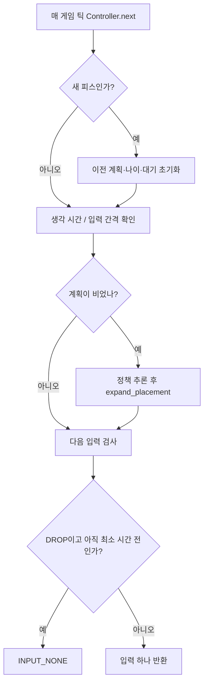
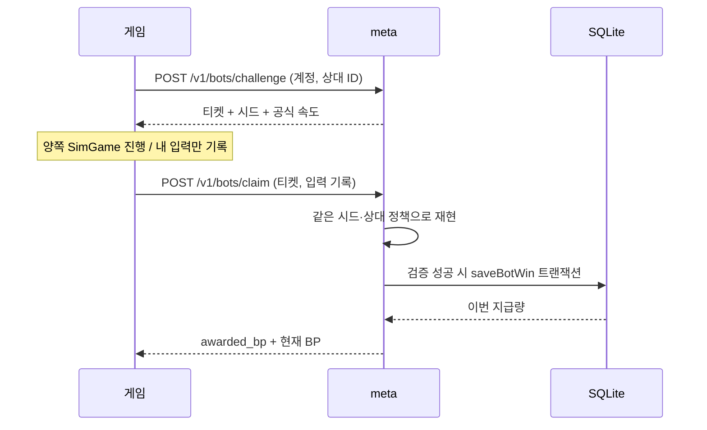

# Part 15: 출시 전 폴리싱 — 표현 계층·캐릭터 봇·검증된 BP

> **시리즈:** 제로부터 멀티플레이어 테트리스 + RL | [시리즈 목차](./README.md) | **Part 15**

---

## 이번 Part의 구현 계약

- **선행 상태:** [Part 3](part3-rendering-and-ui.md)의 렌더러, [Part 4](part4-game-wrapper-and-loop.md)의 `Game`과 60Hz 루프, [Part 9](part9-rl-onnx-bot.md)의 placement 봇, [Part 10](part10-meta-and-ranking.md)의 게스트·BP·상점, [Part 11](part11-settings-and-options.md)의 설정 저장이 동작한다. 서버 배포 기준은 [Part 14](part14-event-loop-scaling.md)의 reactor다.
- **이번 Part의 파일:** 새로 만드는 것은 `src/presentation.h/.cpp`, `assets/theme.cfg`, `assets/opponents.cfg`, `bot/opponents.h/.cpp`, `bot/controller.h`, `bot/reward_replay.h`, `meta/bot_challenges.h/.cpp`, `python/tools/package_opponents.py`, `scripts/backup_meta_db.py`다. `src/main.cpp`, `src/game.h/.cpp`, `renderer/text_gl.cpp`, `meta/database.*`, `meta/http_client.*`, Colab 노트북과 CMake·배포 스크립트를 연결한다.
- **연결점:** 외형은 `Game` 위의 표현 계층에만 둔다. 봇의 입력 계획은 `Controller`가 60Hz 입력으로 바꾼다. 공용 BP는 meta가 같은 `SimGame`과 상대 정책으로 승리를 재현한 뒤 DB에 기록한다. 게임 규칙과 relay의 프레임 형식은 유지한다.
- **완료 게이트:** 기본/ONNX 빌드, 기존 결정론 덤프, 봇 속도·새 피스 감지·승리 재현·보상 중복 방지 검사를 통과한다. 문서의 경로와 설정이 실제 실행에 연결되어야 한다. 모델 실력·최종 아트·실기기 UI 검수는 별도다.

---

## 1. 완성된 엔진에서 수정의 경계를 다시 정한다

엔진을 직접 만들 때는 기능의 작동 여부가 먼저였다. 이제 아이콘을 바꾸고 싶을 때
게임 규칙까지 읽어야 한다면 수정 비용이 너무 커진다. 이 장의 출발점은 전면 재작성보다
“무엇을 바꾸면 어디까지 영향이 가는가”를 코드에 드러내는 것이다.

| 수정 | 소유 모듈 | 영향 |
|---|---|---|
| 폰트·블록 색·아바타 테두리 | `presentation`, `theme.cfg` | 화면 표현 |
| 상대 이름·그림·모델·속도 | `opponents`, `opponents.cfg` | 캐릭터 구성과 봇 입력 |
| 블록 ID·모양·가방·보드 크기 | `SimGame`, `SimBlock`, Python 관측 | 규칙·결정론·기존 모델·리플레이 |
| BP 지급·일일 상한 | meta의 검증과 DB | 공용 상점 경제 |
| 접속 암호화·인증 | [Part 16](part16-secure-admission.md) | 클라이언트와 서버의 신뢰 경계 |

예를 들어 파란 블록을 분홍색으로 칠하면 AI가 보는 칸의 점유 여부는 그대로다.
반면 4칸 블록을 5칸으로 늘리면 합법 배치의 집합과 학습 데이터가 바뀐다.
후자를 theme 설정으로 숨기지 않는다. 현재 ID 8은 고스트, 9는 가비지이므로
새 블록에 그 번호를 그대로 쓰는 것부터 기존 계약과 충돌한다.

### 1.1 실행 단위도 분리한다

`게임(tetris)`은 창·입력·화면, `relay`는 매칭과 게임 메시지 전달,
`meta`는 익명 계정·상점·기록을 맡는다. Python은 학습과 export 경로다.
혼자 연습할 때는 게임만, 공용 기록을 쓰려면 meta가 필요하다. 운영 접속 순서와
WSS 게이트웨이는 Part 16에서 이어 붙인다. 실제 명령을 다시 찾을 때는
[실행 안내](../start-here.md)를 사용한다.

## 2. 표현 계층을 만든다 — 규칙의 난수를 소비하지 않는다

애니메이션을 `SimGame::Tick()`에서 처리하면 꺼 둔 사람과 켜 둔 사람의 상태가
달라질 수 있다. 그래서 `presentation`은 시뮬레이터를 읽거나 수정하지 않는다.
`renderer_init` 이후 한 번 설정을 읽고, `Game`을 만들기 전에 폰트와 팔레트를 준비한다.

**현재 소스 발췌 — `src/presentation.h`**

```cpp
void presentation_load(const char* path);
std::vector<Color> presentation_palette(std::vector<Color> defaults);
void presentation_draw_avatar(ImageHandle image, int x, int y, int size,
                              bool opponent, double seconds, bool animate);
void presentation_draw_portrait(ImageHandle image, int x, int y, int w, int h);
```

설정은 실행 폴더의 `assets/theme.cfg`다.

```text
font = Font/NanumGothic.ttf
avatar.player = 91,203,238,255
avatar.opponent = 239,118,154,255
avatar.period_ms = 2400
# cell.1 = 47,230,23,255
```

`presentation_load`는 정수를 끝까지 파싱하고 RGBA의 0~255 범위를 검사한다.
잘못된 키는 로그를 남기고 기본값을 유지한다. 폰트 로더는 성공 여부를 반환하도록
바꿨다. 지정한 폰트가 실패하면 기본 NanumGothic을 다시 시도한다. 기본 폰트까지
없다면 배포 파일을 고쳐야 하며, 다른 폰트가 모든 문자를 갖는다고 가정하지 않는다.

### 2.1 작은 프레임과 큰 일러스트는 같은 그림을 다르게 배치한다

아바타는 정사각형 프레임 안쪽에 들어가고, 가로·세로 중 더 긴 쪽으로 축소 비율을
계산한다. 세로 일러스트를 억지로 정사각형으로 늘리지 않는다. 큰 일러스트는 지정된
직사각형 안에 들어가는 더 작은 축척을 선택한다. 두 경우 모두 가운데에 배치한다.

(`presentation_draw_avatar`)

**현재 소스 발췌 — `src/presentation.cpp`**

```cpp
const double scale = double(size - 8) / std::max(width, height);
const int w = std::max(1, int(width * scale));
const int h = std::max(1, int(height * scale));
draw_image(image, x + (size - w) / 2, y + (size - h) / 2, w, h);
```

대기 애니메이션은 전달받은 화면 시간으로 테두리 알파만 바꾼다. 클릭 영역·위치·게임
틱은 바뀌지 않는다. Part 11의 `settings.cfg`에 `idle_animation`을 저장하고,
Settings의 `UI animation`이 아바타의 맥동과 기존 상점 회전을 함께 제어한다.

기존 두 보드 화면은 아이콘을 y=6에 그린 뒤 보드를 y=11부터 그려 아이콘을 덮었다.
`DrawBoardAt`과 `DrawGarbageBar`에 셀 크기 인자를 추가하고, 두 보드 모드에서는
27px 셀·y=46으로 그린다. 기본 인자는 30px라 기존 단일 보드 호출은 유지된다.
이는 보드의 행·열 수를 바꾼 것이 아니라 화면에 그리는 크기만 바꾼 것이다.

## 3. 캐릭터와 정책을 분리한다

ONNX 파일 하나가 캐릭터 하나라는 가정은 곧 한계가 된다. 같은 정책을 느린 초급
상대와 빠른 상급 상대가 공유할 수 있고, 한 캐릭터의 그림을 바꿔도 모델은 그대로여야 한다.
그래서 파일 경로 대신 고유 ID를 갖는 `Opponent`를 만든다.

**현재 소스 발췌 — `bot/opponents.h`**

```cpp
struct Opponent {
    std::string name;
    std::string path;
    int inputIntervalTicks = 6;
    std::string id;
    std::string iconPath;
    std::string portraitPath;
    std::string difficulty = "Normal";
    int thinkTicks = 18;
    int minPieceTicks = 60;
};
```

`assets/opponents.cfg`의 한 줄은 다음 9개 필드다. 경로는 실행 폴더 기준이다.

```text
# id|name|model|icon|portrait|difficulty|input ticks|think ticks|min piece ticks
rook|Rook|@heuristic|assets/icons/bot.png|assets/icons/bot.png|Normal|6|18|60
```

`discover_opponents`는 중복 ID와 잘못된 숫자를 거절한다. 명시된 캐릭터 설정을 먼저
읽고, 아직 등록되지 않은 `model/*.onnx`, `model/bots/*.onnx`를 덧붙인다.
기존 `model/bots.cfg`는 자동 탐색 항목의 이름·속도만 덮어쓴다. 새 설정과 기존 설정이
서로 덮어써 최종 속도를 알 수 없게 하지 않기 위한 우선순위다.

`main.cpp`의 BotSelect는 이 목록을 그린다. 선택한 항목이 ONNX면 먼저 모델을
검사하고, 실패하면 그 상대를 시작하지 않는다. 준비되면 `selectedOpponent`를
복사해 그 경기의 설정으로 고정한다. 그림 핸들은 경로별 캐시에 보관하고 종료 시 해제한다.
기본 Lumen/Rook/Vega는 같은 휴리스틱의 속도 변형과 기존 임시 이미지다.

## 4. 빠른 추론과 빠른 손을 분리한다

Part 9의 `expand_placement`는 목표 열·회전을 회전 → 좌우 이동 → 하드 드롭의
입력 마스크로 바꾼다. 기존 코드는 그 큐를 휴리스틱은 2틱, ONNX는 1틱마다 소비했다.
60Hz에서 각각 0.033초·0.017초다. 모델이 빨리 답을 냈다는 이유로 캐릭터도
즉시 움직여야 할 필요는 없다.

`bot::Controller`는 세 시간을 독립적으로 관리한다.

| 값 | 의미 | 기본 보통 상대 |
|---|---|---|
| `thinkTicks` | 새 피스가 나온 뒤 첫 계획까지 | 18틱 = 0.3초 |
| `inputIntervalTicks` | 계획 안의 입력 사이 간격 | 6틱 = 0.1초 |
| `minPieceTicks` | 피스 등장부터 자발적 하드 드롭까지 최소 시간 | 60틱 = 1초 |

호출 흐름은 다음과 같다.



### 4.1 피스 ID만 비교해서는 안 되는 이유

이전 계획을 비우는 조건을 “종류가 달라졌다”로 잡으면 같은 종류가 연속 등장할 때
새 피스를 놓친다. 큐의 마지막 DROP만 믿어도 자연 중력으로 먼저 굳는 경우를 놓친다.
현재 `SimGame`은 다음 피스를 뽑을 때 피스 RNG 상태가 바뀌므로 `RngState()`를
새 피스 경계로 사용한다. Controller가 RNG를 직접 진행시키지는 않는다.

(`Controller::next`)

**현재 소스 발췌 — `bot/controller.h`**

```cpp
if (!spawned_ || pieceRng_ != sim.RngState()) {
    spawned_ = true; pieceRng_ = sim.RngState();
    queue_.clear(); cooldown_ = age_ = 0;
}
```

중력과 규칙은 유지된다. 최소 배치 시간 전에 자연 낙하로 굳을 수 있다.
추후 피스 생성 방식을 바꾼다면 이 경계도 검사하고, 명시적인 피스 세대 번호를
도입하는 방법을 고려해야 한다. `bot_controller_test`는 자연 낙하로 새 피스가
나왔을 때 이전 계획이 버려지는 경우도 검사한다.

## 5. Colab의 결과를 배포 가능한 캐릭터로 바꾼다

로컬은 학습하지 않는다. `python/train/train_model_zoo_colab.ipynb`에서 학습·export를
완료하고, 실행 머신에는 ONNX와 OS별 CPU Runtime만 둔다.

1. `CHARACTER_ID`, `CHARACTER_NAME`, `ALGO`, `RUN_NAME`을 정한다.
2. smoke로 의존성·시뮬레이터·학습·export 연결을 확인한다. smoke는 모델 실력 검증이 아니다.
3. `USE_DRIVE`를 켜면 학습기가 체크포인트를 Drive 경로에 직접 저장한다. 같은 이름의
   파일을 조용히 덮어쓰지 않도록 실행 셀에서 기존 `.pt`를 확인한다.
4. export는 평가용 best 또는 최신 checkpoint를 읽고, MuZero-style은 distill 정책을 쓴다.
5. 캐릭터 등록 셀은 같은 ID만 갱신한다. 다른 ID의 상대는 유지한다.
6. 패키징 도구가 등록된 모델·그림·설정과 SHA-256 목록을 ZIP으로 만든다.

`package_opponents.py`는 경로가 저장소 밖으로 나가거나 파일이 누락되면 거절한다.
`.pt` 체크포인트와 계정 파일을 배포 ZIP에 섞지 않는다. 동일 이름의 ZIP도 덮어쓰지 않는다.
파일 목록 검사는 모델의 안전성·실력을 검증하는 기능은 아니며, 운영자는 자신이 만든
정책 묶음을 배포한다. 자세한 실행법은 [봇과 Colab](../bots-and-colab.md)에 있다.

### 5.1 ONNX 계약을 경기 시작 전에 검사한다

이름만 맞고 출력이 41개인 모델을 40개처럼 읽으면 문제가 숨어 버린다. `BotOnnx::Load`
단계에서 다음 이름·float32 타입·고정 shape를 검사하고, 추론 출력도 다시 확인한다.

| 텐서 | shape |
|---|---|
| board | `[1,1,20,10]` |
| current / next | 각각 `[1,7]` |
| policy_logits | `[1,40]` |
| value | `[1]` |

정책은 자기 보드와 현재·다음 블록만 본다. 상대의 가비지나 전술을 보는 모델로
확장하려면 관측·학습·export·C++ 입력 계약을 함께 바꿔야 한다.

## 6. 공용 BP는 승리 선언으로 지급하지 않는다

로컬 봇전 결과를 그대로 상점 BP로 인정하면 클라이언트의 `winner=true` 한 번으로
재화를 만들 수 있다. 반대로 매 틱 서버에서 ONNX를 실행하면 작은 서비스의 운영 비용이
커진다. 여기서는 경기 전 티켓 발급과 경기 후 재현으로 경계를 정한다.



`bot::verify_victory`는 사람 입력 → 봇 입력 → 양쪽 Tick → 가비지 교환 순서로
재현한다. `main.cpp`도 같은 가비지 함수를 사용하므로 순서가 갈라지지 않는다.
첫 종료 시점이 기록의 마지막 틱이고 사람만 살아 있어야 승리다. 패배·무승부·미완료·
종료 뒤 덧붙인 입력은 지급 대상이 아니다.

### 6.1 검증 비용을 제한한다

`meta/bot_challenges.cpp`는 사용자별 진행 티켓 하나, 전체 256개, 발급 후 15분을
허용한다. 입력은 최대 30,000틱이고 실제 경과 시간보다 긴 기록은 거절한다.
검증 작업은 동시 하나이며 약 5초의 실행 예산을 둔다. 잘못된 증거는 같은 티켓으로
계속 수정해 재시도하지 못하게 소모한다. 통신 실패·검증기 혼잡은 클라이언트의
Retry BP로 재시도할 수 있다.

### 6.2 검증 성공과 지급 성공도 분리한다

검증을 두 번 통과할 수 없게 하는 것만으로 충분하지 않다. DB 커밋 후 HTTP 응답이
유실되면 사용자는 같은 요청을 다시 보낸다. `bot_rewards.ticket`을 기본 키로 삼고,
영수증 저장과 `players.bp` 증가를 같은 트랜잭션 안에서 처리한다. 이미 지급한
티켓은 기존 지급량을 반환하며 잔액을 다시 더하지 않는다.

일일 상한은 현재 잔액이 아니라 그날 지급한 영수증 합계로 계산한다. 따라서 BP를
상점에서 썼다고 당일 획득 한도가 되살아나지 않는다. 기본값은 10 BP/승리,
100 BP/UTC일이며 RP·XP·PvP 승패 통계는 바꾸지 않는다.

이 검증은 가능한 승리인지 확인한다. 사람이 직접 조작했는지, 다른 게스트를 계속
만드는지까지 증명하지 않는다. 실제 ONNX는 서버·클라이언트에 같은 파일과 설정을
배포하고 OS별 추론 결과도 확인해야 한다. 서로 다른 CPU/Runtime의 작은 수치 차이가
행동 선택을 바꾸면 서버 재현과 어긋날 수 있다.

## 7. 실행·백업 실수를 코드에서 줄인다

표현·봇 외에도 출시 과정에서 확인한 문제를 다음 경계에 반영했다.

| 문제 | 수정 위치 | 이유 |
|---|---|---|
| macOS에서 epoll 타깃 생성 | CMake, `reactor_epoll.cpp` | OS 이름보다 지원하는 백엔드로 조건을 정함 |
| 이전 개발 옵션이 배포에 잔류 | release 스크립트 | OFF·기본 주소까지 매번 명시 |
| HTTPS 주소와 지원 라이브러리 불일치 | CMake | 실행 후 접속 실패 대신 구성 단계에서 거절 |
| 새 문서가 ignore 규칙에 걸림 | `.gitignore` | 문서 변경을 코드와 함께 검토 가능하게 함 |
| 백업 파일 접근 범위·OS 의존 | 백업 도구 | 일관된 스냅샷, 권한 제한, 무결성 검사 |

SQLite가 WAL을 사용 중일 때 `.db`와 WAL을 각자 복사하면 시점이 달라질 수 있다.
`backup_meta_db.py`는 SQLite online backup API로 임시 파일을 만든 다음 무결성을
검사하고 최종 경로에 게시한다. 기존 백업은 덮어쓰지 않는다. Linux의 제한된 생성
권한이 Windows ACL까지 대신 설정하는 것은 아니므로 예비 서버의 계정 권한도 확인한다.

meta의 요청 제한·프록시 신뢰·작업자 상한은 Part 16의 접속 경계와 함께 설명한다.

## 8. 검증 — 규칙 불변과 보상 불변을 따로 확인한다

렌더링만 바꿨다는 주장은 기존 결정론 덤프가 같아야 성립한다. 봇 속도가 의도대로라는
주장은 특정 틱에 입력이 나오는지 확인해야 한다. 보상은 동시 요청과 응답 유실을
가정해야 한다. 세 검사를 하나의 “게임이 켜진다”로 대신하지 않는다.

| 검사 | 확인하는 불변식 |
|---|---|
| `sim_hash_dump` | 기존 규칙의 상태 해시 유지 |
| `bot_controller_test` | 생각·배치 간격, 자연 낙하 후 계획 폐기 |
| `bot_replay_test` | 실제 승리 기록 승인, 잘린 기록·미승리 거절 |
| `bot_reward_db_test` | 동시 중복 지급 방지, 일일 상한, 공용 상점 소비 |
| `test_bot_rewards.py` | HTTP를 거친 승리 검증·다른 계정 티켓 거절 |
| `bot_onnx_contract_test` | 정상 모델 추론, 잘못된 출력 계약 거절 |
| `test_opponent_bundle.py` | 배포 파일 범위·경로·덮어쓰기 제한 |

실제 실행 결과와 미검증 항목은 [검증 기록](../polish-validation.md)에 남긴다.
Colab 학습을 실행했다거나 Windows/macOS 패키지를 실기기 검수했다는 뜻은 아니다.

---

다음 [Part 16](part16-secure-admission.md)은 이 클라이언트가 서버에 접속할 때
계정 토큰을 보호하고, 일회용 입장권으로 게임 연결을 인증하는 과정을 구현한다.
