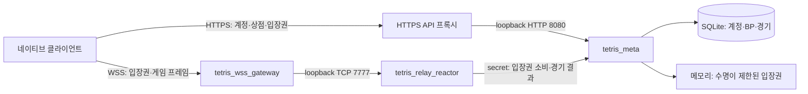
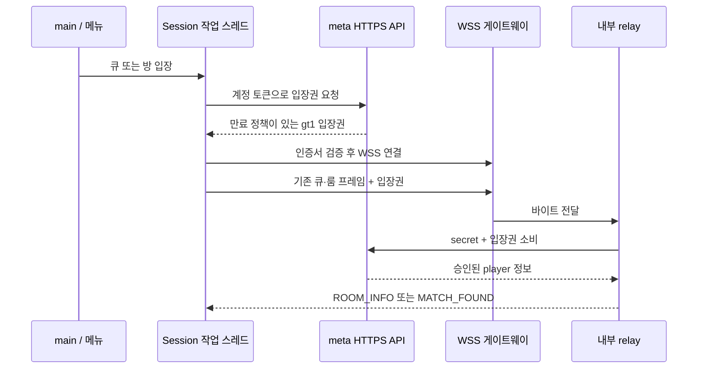

# Part 16: 공개 접속 보호 — WSS와 일회용 게임 입장권

> **시리즈:** 제로부터 멀티플레이어 테트리스 + RL | [시리즈 목차](./README.md) | **Part 16**

---

## 이번 Part의 구현 계약

- **선행 상태:** [Part 6](part6-lockstep-networking.md)의 바이트 프레임과 `Session`, [Part 7](part7-relay-server.md)의 큐·룸, [Part 10](part10-meta-and-ranking.md)의 익명 계정·메타 API, [Part 14](part14-event-loop-scaling.md)의 reactor 릴레이가 동작한다. 표현 계층과 서버 검증 봇 BP는 [Part 15](part15-release-polishing.md)에서 분리했다.
- **이번 Part의 파일:** `meta/game_tickets.h`, `net/stream_transport.h`, `net/wss_client.h/.cpp`, `net/system_trust.h/.cpp`, `server/wss_gateway.cpp`를 추가한다. `meta/api_server.cpp`, `meta/http_client.*`, `net/socket.*`, `net/session.*`, `src/main.cpp`, 두 릴레이의 인증 진입점과 CMake·release·systemd·CI를 연결한다.
- **연결점:** 계정 토큰은 HTTPS API에서 게임 입장권으로 교환한다. 클라이언트는 기존 큐·룸 프레임의 자격 증명 칸에 입장권을 넣고 WSS로 보낸다. 게이트웨이는 TLS/WebSocket만 처리하고 내부 relay로 바이트를 넘긴다. relay가 meta에 입장권 소비를 요청한다.
- **완료 게이트:** 정상 인증서·입장권으로 입장하고 두 플레이어가 매칭·입력을 주고받아야 한다. 잘못된 인증서·출처·프레임·재사용 입장권·장기 계정 토큰은 거절한다. 접속 종료 후 작업 스레드와 연결 슬롯을 반환해야 한다. 공개 DNS·인증서 배치와 Windows/macOS 실기기 출시는 별도 검증이다.

---

## 1. HTTPS API만으로는 게임 연결이 보호되지 않는다

기존 클라이언트는 HTTPS로 게스트 계정을 만들 수 있었지만, 그 계정 토큰을
`QUEUE_JOIN`, `ROOM_CREATE`, `ROOM_JOIN`에 넣어 평문 TCP로 전송했다.
API에서 암호화한 비밀을 다른 연결에서 그대로 드러내는 셈이다. 토큰을 복사한 사람은
계정 기록과 상점에도 접근할 수 있으므로 단순한 게임 세션 번호로 취급할 수 없다.

해결은 두 층으로 나눈다. WSS가 전송 중 도청·변조를 막고, 일회용 입장권이
게임 서버에 전달하는 자격 증명의 용도와 수명을 좁힌다. 둘 중 하나만 넣으면
평문 입장권 선점이나 장기 토큰 노출 범위가 남는다. TLS 인증서 검증과 짧은 세션
자격 증명의 설계 근거는 [OWASP TLS 안내](https://cheatsheetseries.owasp.org/cheatsheets/Transport_Layer_Security_Cheat_Sheet.html)와
[Session Management 안내](https://cheatsheetseries.owasp.org/cheatsheets/Session_Management_Cheat_Sheet.html)를 참고한다.

완성된 연결은 다음과 같다. 두 공개 연결 모두 암호화하며 7777·8080은 내부 포트다.


```mermaid
flowchart LR
    C[네이티브 클라이언트] -->|HTTPS: 계정·상점·입장권| H[HTTPS API 프록시]
    H -->|loopback HTTP 8080| M[tetris_meta]
    C -->|WSS: 입장권·게임 프레임| W[tetris_wss_gateway]
    W -->|loopback TCP 7777| R[tetris_relay_reactor]
    R -->|secret: 입장권 소비·경기 결과| M
    M --> DB[(SQLite: 계정·BP·경기)]
    M --> T[메모리: 수명이 제한된 입장권]
```

현재 서버는 Mac 하드웨어에서 실행하는 **Linux**다. OS가 macOS라는 뜻이 아니다.
Windows 예비 서버에는 같은 소스를 Windows용으로 빌드한다. WSS 게이트웨이는
epoll에 직접 의존하지 않으므로 Windows에도 같은 진입 구조를 둘 수 있다.

### 1.1 API 주소와 게임 주소는 독립된 설정이다

`https://api.example.test`는 계정·상점·입장권의 요청/응답을 위한 origin이다.
`wss://game.example.test:8443/play`는 게임 프레임을 지속적으로 주고받을 종단이다.
같은 머신에 배치해도 포트·프로토콜·객체 수명과 장애 범위는 각각 확인한다.
HTTPS API가 응답한다고 게임 포트까지 열렸거나 암호화됐다는 뜻은 아니다.

HTTP 요청 한 건이 연결 한 개와 항상 일대일인 것도 아니다. 연결 재사용은 클라이언트
구현의 정책이다. 현재 MetaClient는 요청 helper에서 Client/SSLClient를 만들고,
게임 Session은 WSS 스트림을 유지한다. 계정 API 실패를 곧바로 계정 삭제로 처리하지
않고, 게임 연결 실패 때 평문 TCP로 자동 전환하지 않는다.

`TETRIS_ENABLE_HTTPS`는 MetaClient의 HTTPS 지원, `TETRIS_BUILD_WSS`는 게임용
WebSocket TLS 전송과 게이트웨이 빌드다. 어느 옵션도 내부 meta HTTP 서버를 자동으로
공개 TLS 서버로 바꾸지 않는다. [135차시](../learn/index.html#lesson-135)는 두 주소의
전송 정책을 별도로 검사하고 실제 HTTPS 요청에서 인증서 실패를 대조한다.

## 2. 계정과 입장권을 구분한다

| 자격 증명 | 보관 위치와 용도 | 수명 |
|---|---|---|
| 계정 토큰: 32자리 hex | 사용자 데이터 폴더, meta의 계정·상점 API | 장기 접근 키. 교체·폐기·복구는 Part 17, 자동 만료는 없음 |
| 게임 입장권: `gt1.` + 32자리 hex | meta 메모리 → Session 작업 스레드 → relay 인증 | 발급 정책의 만료까지, 소비 1회 |
| relay secret | 서버 설정, meta의 내부 API 인증 | 운영자가 관리. 클라이언트 번들에 넣지 않음 |
| 봇 도전 티켓 | Part 15의 상대·seed·입력 재현 식별 | 별도 PvE 계약. 게임 입장권과 교환 불가 |

장기 토큰을 파일에서 없애거나 회원 가입을 추가하지 않는다. 사용자는 같은 익명 계정으로
들어가며, 서버에 입장할 때만 내부적으로 짧은 입장권을 교환한다.
`gt1.`은 버전과 목적을 드러내는 접두사다. 보안성은 접두사를 숨기는 데서 나오지 않고,
기존 `gen_token()`의 OS 암호학적 난수와 소비 시 검증에서 나온다.

### 2.1 발급과 소비 API

| 요청 | 인증 | 성공 | 실패 예 |
|---|---|---|---|
| `POST /v1/game-tickets`, `{token}` | 계정 토큰을 DB에서 확인 | `ticket`, 정책에서 계산한 `expires_in` | 401 무효 토큰, 429 발급 제한, 503 서버 설정/난수/등록 불가 |
| `POST /v1/game-tickets/consume`, `{ticket}` | `X-Relay-Secret` 상수 시간 비교 | player ID·이름·RP·BP·XP·아이콘 | 403 secret 오류, 401 만료·재사용·없는 입장권 |

발급에는 `gameStarts`의 IP별 요청 예산을 적용한다. 기존 HTTP 요청 예산과 작업자·본문 크기 제한도 함께 적용한다.
JSON 응답에는 `Cache-Control: no-store`를 붙인다. 입장권을 URL 쿼리로 넘기지 않는다.
게이트웨이도 `/play?token=...`를 받지 않는다.

소비 라우트는 응답을 얻기 전에 입장권을 삭제한다.

**현재 소스 발췌 — `meta/api_server.cpp`**

```cpp
    json_post(svr, "/v1/game-tickets/consume", [&](const httplib::Request& req, httplib::Response& res) {
        if (relay_secret_.empty() || !credentials::equal_secret(req.get_header_value("X-Relay-Secret"), relay_secret_)) {
            set_json(res, 403, proto::error_json("relay_auth_required")); return;
        }
        auto auth = gameTickets.consume(proto::find_string(req.body, "ticket"));
        if (!auth) { set_json(res, 401, proto::error_json("invalid_game_ticket")); return; }
        // Rotation/recovery after issue invalidates the old credential generation.
        auto current=db_.getByEpoch(auth->player,auth->epoch);
        if(!current) { set_json(res,401,proto::error_json("invalid_game_ticket")); return; }
        set_json(res,200,proto::auth_response(current->id,current->username,current->elo,current->bp,current->xp,current->selected_icon_id));
    });
```

TLS는 API 프록시가 담당한다. `tetris_meta` 자체가 HTTPS 리스너로 바뀐 것은 아니다.
일반 네이티브 `MetaClient`는 원격 HTTP URL을 거절하고, 로컬 개발용
`localhost`·`127.0.0.1`·`::1`만 예외로 둔다. relay의 secret을 가진 내부 API
클라이언트는 사설 HTTP를 쓸 수 있지만, 다른 호스트라면 보호된 사설망/VPN 또는
HTTPS로 배치해야 한다. 임의의 인터넷 HTTP 주소를 내부망으로 간주하지 않는다.

### 2.2 원자적 소비 — mutex가 보호하는 범위

조회할 때만 잠그고 나중에 지우면 두 relay가 동시에 같은 티켓을 승인받을 수 있다.
따라서 조회·삭제·만료 판정을 한 임계 구역에 둔다.

**현재 소스 발췌 — `meta/game_tickets.h`**

```cpp
    std::optional<Admission> consume(const std::string& ticket,
                                      Clock::time_point now = Clock::now()) {
        std::lock_guard<std::mutex> lock(mutex_);
        auto it = entries_.find(ticket);
        if (it == entries_.end()) return std::nullopt;
        auto entry = std::move(it->second);
        entries_.erase(it); // Burn even an expired ticket; never cache successful redemptions.
        if (entry.expires <= now) return std::nullopt;
        return Admission{entry.player,entry.epoch};
    }
```

시계는 `steady_clock`이다. 시스템 날짜 보정이 입장권 수명을 늘리지 않게 한다.
시험에서는 `now`를 주입해 `GameTickets::lifetime`의 만료 경계를 실제로 기다리지 않고 검사한다.

`issue()`는 만료 항목을 정리한 뒤 키 충돌과 `max_pending` 상한을 검사한다.
같은 플레이어의 재발급은 현재 슬롯을 교체하는 작업이므로 전체가 차 있어도 허용한다.
새 항목의 등록이 성공한 뒤에만 그 플레이어의 이전 입장권을 지운다. 충돌이나 할당 실패로
새 등록이 끝나지 않았다면 유효한 기존 입장권은 남는다. 만료된 항목의 정리는 별개다.

등록과 이전 항목 제거는 같은 mutex 아래에서 수행한다. map의 삽입은 재해시와 할당을
일으킬 수 있으므로 삽입 전에 얻은 iterator를 계속 쓰지 않는다. 새 항목을 넣은 직후에는
임시로 이전 항목도 있지만 잠금을 쓰는 다른 호출자는 교체가 완료된 상태만 관찰한다.
계정당 미사용 입장권을 제한하며, 교체 성공 뒤 옛 값은 무효가 된다.

meta 재시작은 미사용 입장권을 모두 무효화한다. DB에 저장하는 계정과 수명이 다르다.
여러 meta 프로세스가 각각 이 메모리 표를 가진 채 무작위로 소비 요청을 받으면 다른
프로세스가 발급한 값을 찾지 못한다. 다중 인스턴스에서는 소비를 원자적으로 처리하는
공유 저장소나 발급 주체로의 일관된 라우팅을 별도로 설계한다. 프로세스의 mutex만으로
여러 서버의 단일 소비를 보장하지 않는다.

항목에는 장기 토큰 대신 player ID와 발급 당시 `auth_epoch`를 저장한다.
[Part 17](part17-guest-account-recovery.md)의 키 변경은 이 세대를 증가시킨다. 소비 시
`getByEpoch()`가 현재 DB와 비교하므로 변경 전 미사용 티켓은 거절된다. RP·BP·아이콘은
소비 시 DB에서 읽은 값이다. 이미 승인한 경기까지 소급 취소하는 구조는 아니다.

### 2.3 응답을 잃었을 때는 새 입장권을 받는다

meta가 소비를 끝낸 직후 응답이 유실될 수 있다. relay는 소비 요청을 자동 재시도하지
않으며 성공 응답을 캐시하지 않는다. 그 접속은 거절하고, 사용자의 다음 접속 시도에서
새 입장권을 발급한다. 연결이 잠깐 끊기는 불편을 감수하고 “한 번만 승인” 계약을 지킨다.

여기서 한 번은 입장권 표의 소비 횟수다. HTTP 성공 응답을 클라이언트가 받는 것,
계정 세대 확인을 통과하는 것, relay의 중복 세션 lease를 얻는 것은 각각 다음 단계다.
소비 뒤의 실패는 입장권을 되살리지 않는다. 저장 결과를 재조회하는 멱등 작업과
자격 증명 소비를 같은 재시도 정책으로 묶지 않는다.

`expires_in`은 발급 응답에서 정책의 수명을 알려 주는 값이다. 소비 시에는 서버의
steady_clock과 저장한 만료 시각을 비교하며, 클라이언트의 시각이나 자기 신고를 믿지 않는다.
응답 전송에 시간이 걸릴 수 있으므로 받은 순간부터 그 수명을 새로 보장하는 값도 아니다.

기존 thread relay의 `cached_auth`·`cache_auth`와 5분 오프라인 인증 허용을 제거했다.
reactor도 같은 `consume_game_ticket()`을 호출한다. meta 장애 때 이미 진행하는 경기의
바이트 전달이 즉시 중단되는 것은 아니지만, 새 인증 입장은 실패한다.

## 3. 클라이언트 연결 경로를 바꾼다

### 3.1 계정 토큰을 보내기 직전에 교환한다

`src/main.cpp`가 `Session::SetTicketIssuer`에 `MetaClient::request_game_ticket`을
연결한다. `Session`이 meta 구현 전체를 직접 소유하지 않도록 콜백으로 주입했다.
콜백은 세션 작업을 시작하기 전에 설정하고 세션이 종료될 때까지 유지한다.

`roomThread()`와 `queueThread()`가 다음 함수를 호출한다. HTTP 왕복과 TLS 접속은
화면 렌더링 스레드에서 기다리지 않는다.

**현재 소스 발췌 — `net/session.cpp`**

```cpp
bool Session::prepareGameCredential(const std::string& host, std::string& credential) {
    if (credential.empty()) return true; // local unranked play
    if (!secure_game_endpoint(host)) return false;
    if (credential.rfind("gt1.",0)==0) return true;
    if (!ticketIssuer_) return false;
    auto ticket = ticketIssuer_(credential);
    credential.clear(); // never write the account credential to the relay
    if (!ticket) return false;
    credential = std::move(*ticket);
    return true;
}
```

인증 정보가 있는 원격 게임 접속은 유효한 `wss://.../play` 주소여야 한다.
빈 자격 증명을 쓰는 기존 연습용 TCP와 명시적 loopback 개발 경로는 남겨 둔다.
입장권 발급 실패를 장기 토큰 직접 전송으로 우회하지 않는다.

접속 순서는 다음과 같다.


```mermaid
sequenceDiagram
    participant U as main / 메뉴
    participant S as Session 작업 스레드
    participant M as meta HTTPS API
    participant G as WSS 게이트웨이
    participant R as 내부 relay
    U->>S: 큐 또는 방 입장
    S->>M: 계정 토큰으로 입장권 요청
    M-->>S: 만료 정책이 있는 gt1 입장권
    S->>G: 인증서 검증 후 WSS 연결
    S->>G: 기존 큐·룸 프레임 + 입장권
    G->>R: 바이트 전달
    R->>M: secret + 입장권 소비
    M-->>R: 승인된 player 정보
    R-->>S: ROOM_INFO 또는 MATCH_FOUND
```

인증된 player ID의 중복 활성 세션 차단은 기존 `PlayerSessionLease`가 계속 맡는다.
입장권을 소비했어도 중복 세션으로 거절될 수 있다. 이때도 사용한 입장권은 되살리지 않는다.

### 3.2 바이트 프레임과 전송 수단을 분리한다

`TcpSocket`은 기존 FD 외에 선택적 `shared_ptr<StreamTransport>`를 갖는다.
`tcp_send_all`, `tcp_recv_some`, `tcp_close`, `valid()`가 이 객체를 먼저 확인한다.
따라서 `Session`의 큐·룸·게임 프레임 코드는 같은 함수를 쓸 수 있다.
`game_connect()`만 WSS 주소와 기존 TCP 주소를 구분한다.

| 모듈 | 책임 |
|---|---|
| `net/framing.*` | 기존 LEN/TYPE/PAYLOAD/FNV 프레임. 형식 변경 없음 |
| `net/session.*` | 큐·룸 상태, 60Hz 입력, 입장권 교환 시점 |
| `net/stream_transport.h` | 살아 있는지, 보내기, 받은 바이트 꺼내기, 종료 |
| `net/wss_client.cpp` | 주소 검증, TLS, WebSocket, 비동기 I/O와 버퍼 |
| `net/socket.cpp` | 기존 TCP 처리 또는 WSS 전송 객체로 위임 |
| `server/wss_gateway.cpp` | WSS ↔ loopback TCP 변환 |
| `server/player_conn.cpp`, `server/reactor_relay.cpp` | 첫 프레임에서 입장권 소비, 계정 lease 확보 |

WebSocket 메시지 하나가 Tetris 프레임 하나와 같다고 가정하지 않는다.
TCP는 임의 위치에서 끊겨 도착하므로 게이트웨이가 보내는 메시지에도 프레임 일부나
여러 프레임이 들어갈 수 있다. 수신 측은 받은 바이트를 기존 stream 버퍼에 모아 파싱한다.
TLS는 전송 무결성을 추가하며, FNV 체크섬을 암호학적 인증으로 격상시키지 않는다.
작은 60Hz INPUT을 불필요하게 모아서 보내지 않도록 클라이언트·gateway 양쪽
TCP 구간에는 기존 raw 경로처럼 `TCP_NODELAY`도 설정한다.

WebSocket의 분할은 또 다른 경계다. 하나의 binary 메시지를 여러 WebSocket 프레임으로
나누어 전송할 수 있고 그 사이에 Ping/Pong 같은 제어 프레임이 들어갈 수 있다.
Beast의 `async_read`는 메시지를 조립하고 제어 프레임을 처리한다. `got_binary()`를 확인한
뒤 메시지의 데이터만 내부 TCP로 보낸다. 반대 방향에서는 TCP의 한 번의 읽기로 받은
바이트를 binary 메시지로 보낸다. 양쪽 모두 메시지 개수보다 바이트의 순서와 내용이 중요하다.

TLS는 게이트웨이에서 끝난다. 게이트웨이 프로세스는 복호화된 데이터를 볼 수 있고
내부 TCP에는 그 바이트가 평문으로 전달된다. 같은 호스트의 loopback 경로와 relay의
loopback 전용 바인딩을 함께 유지해야 한다. 내부 relay를 다른 머신으로 옮기면 그 구간의
보호도 별도로 설계한다. WebSocket 업그레이드 성공은 relay의 계정 인증이나 입장 승인을
뜻하지 않으며, 클라이언트는 게임 프로토콜의 응답을 따로 확인한다.

reactor가 소유한 FD는 계속 실제 TCP다. WSS 객체를 IOCP/epoll에 억지로 등록하지 않고
게이트웨이 프로세스로 TLS 처리를 분리했기 때문에 기존 샤딩 계약을 유지한다.

## 4. TLS와 비동기 I/O의 수명

### 4.1 인증서를 검사하는 것이 암호화만큼 중요하다

`WssClient`는 OpenSSL의 `verify_peer`로 체인을 검사하면서 접속 URL의 host를
서비스 식별자로 등록한다. DNS 이름은 `SSL_set1_host`, 숫자 IP는
`X509_VERIFY_PARAM_set1_ip_asc`로 설정한다. DNS SAN 또는 IP SAN이 일치해야 하며,
`NEVER_CHECK_SUBJECT`와 `NO_PARTIAL_WILDCARDS`로 CN 대체와 부분 레이블 와일드카드를
허용하지 않는다. SNI는 DNS 이름일 때 설정하며 인증서 검사 자체를 대신하지 않는다.

Boost의 기본 `host_name_verification`은 SAN이 없으면 CN을 비교할 수 있다.
이 코드에서는 기본 콜백 대신 OpenSSL의 검증 매개변수에 이름 정책을 연결하여 체인과
SAN 검증을 함께 수행한다. 이름 설정·TLS 최소 버전 설정에 실패해도 연결을 시작하지 않는다.
URL에 NUL 바이트가 있으면 C API에서 문자열이 잘리는 것을 막기 위해 파싱 단계에서 거절한다.
신뢰하지 않는 발급자, 다른 호스트의 인증서, 만료된 인증서는 연결 실패다.
검증을 끄는 실행 옵션은 제공하지 않는다. 설정 API의 계약은
[OpenSSL 서비스 이름 설정](https://docs.openssl.org/3.0/man3/SSL_set1_host/)을 참고한다.

Linux는 OpenSSL 기본 CA 경로, Windows는 시스템 인증서 저장소, macOS는 Keychain의
인증서를 사용한다. `net/system_trust.cpp`가 이미 vendored cpp-httplib에 있는 플랫폼
어댑터 호출을 한 파일에 격리한다. 이 어댑터는 라이브러리 내부 함수에 의존하므로
cpp-httplib를 업데이트할 때 세 OS 컴파일·인증서 검사를 함께 실행한다.

WSS의 `TETRIS_CA_FILE=/path/to/ca.pem`은 개발 또는 사설 CA를 추가하는 설정이다.
인증서 검사를 생략하는 설정이 아니다. 공개 서버에는 정상 체인과 도메인이 필요하다.
CA 저장소는 실행 파일에 고정 복사하지 않고 운영체제에서 계속 갱신할 수 있게 둔다.

HTTPS 메타 API도 이름과 체인을 검사한다. `meta/tls_identity.h`는 요청 URL에서 얻은
호스트를 DNS SAN 또는 IP SAN과 비교한다. CN 필드로 대체하지 않으며 DNS 와일드카드는
한 레이블 전체만 허용한다. 저장소의 cpp-httplib 0.18.5 기본 경로는 SAN 불일치 뒤 CN을
검사할 수 있으므로, `meta/http_client.cpp`의 GET/POST 양쪽에 애플리케이션 검증기를 붙였다.

사용자 검증 콜백은 라이브러리 기본 검증을 대체한다. 따라서 이름만 검사하면 안 된다.
먼저 `SSL_get_verify_result`가 성공인지 확인하고 실제 peer 인증서를 얻어야 한다.
인증서가 없을 때도 결과 코드만은 성공일 수 있기 때문이다.

**현재 소스 발췌 — `meta/tls_identity.h`**

```cpp
#pragma once
#include <openssl/ssl.h>
#include <openssl/x509v3.h>
#include <memory>
#include <string>

namespace meta::client::tls_identity {
// Reference identity comes from the configured URL, never reverse DNS or CN.
// Require SAN; permit whole-label DNS wildcards, not partial-label wildcards.
inline bool matches_host(X509* certificate, const std::string& host) {
    if (!certificate || host.empty() || host.find('\0') != std::string::npos) return false;
    std::unique_ptr<ASN1_OCTET_STRING, decltype(&ASN1_OCTET_STRING_free)> address(
        a2i_IPADDRESS(host.c_str()), ASN1_OCTET_STRING_free);
    if (address) {
        return X509_check_ip(certificate, ASN1_STRING_get0_data(address.get()),
                             static_cast<std::size_t>(ASN1_STRING_length(address.get())), 0) == 1;
    }
    return X509_check_host(certificate, host.data(), host.size(),
        X509_CHECK_FLAG_NEVER_CHECK_SUBJECT | X509_CHECK_FLAG_NO_PARTIAL_WILDCARDS,
        nullptr) == 1;
}

// cpp-httplib's custom verifier replaces its default chain AND name checks.
// Preserve the chain result and require a peer certificate before checking SAN.
inline bool verified_peer(SSL* ssl, const std::string& host) {
    if (!ssl || SSL_get_verify_result(ssl) != X509_V_OK) return false;
#if OPENSSL_VERSION_NUMBER >= 0x30000000L
    X509* raw = SSL_get1_peer_certificate(ssl);
#else
    X509* raw = SSL_get_peer_certificate(ssl);
#endif
    std::unique_ptr<X509, decltype(&X509_free)> certificate(raw, X509_free);
    return matches_host(certificate.get(), host);
}
} // namespace meta::client::tls_identity
```

이름은 서버가 보내 준 CN이나 역방향 DNS에서 고르지 않고 접속하려던 URL에서 가져온다.
서비스 식별의 기준은 [RFC 9525](https://www.rfc-editor.org/rfc/rfc9525.html), 비교 함수의
세부 계약은 [OpenSSL 이름 검사](https://docs.openssl.org/3.0/man3/X509_check_host/)를 참고한다.
SAN이 없는 옛 사설 인증서는 SAN을 포함해 다시 발급한다.

`TETRIS_CA_FILE`의 로딩 방식에는 구현 차이가 있다. WSS는 기본/네이티브 저장소를 읽은
뒤 파일을 추가한다. HTTPS의 cpp-httplib는 명시한 CA 파일 경로를 사용하면 기본 저장소
로딩 분기를 건너뛴다. 따라서 HTTPS용 파일에는 해당 연결에 필요한 신뢰 체인이 있어야
한다. 두 경로 모두 인증서 검사를 끄는 설정이 아니다.

`tests/tls_identity_test.cpp`는 DNS/IP·SAN/CN·와일드카드 경계를 검사한다.
`tests/learning/current_https.cpp`와 `scripts/learning_tls_fixture.py`는 실제 GET/POST에서
정상 DNS/IP·SAN 불일치·CN만 있는 인증서·미신뢰 CA·만료·리다이렉트·평문 대체 거절을
대조한다. 정상 연결은 응답까지 받고, 인증서 거절은 HTTP handler 호출 이전에 끝나야 한다.
WSS의 `tests/learning/current_wss.cpp`와 `scripts/learning_wss_fixture.py`는 현재
클라이언트·게이트웨이를 직접 연결한다. 잘못된 인증서는 내부 TCP 연결 이전에 거절하고,
정상 DNS/IP 연결에서는 보내고 받은 바이트를 비교한다. 게이트웨이의 잘못된 경로·Origin은
백엔드 연결 이전에, 잘못된 메시지는 payload 전달 이전에 거절되는지 구분해서 검사한다.

### 4.2 하나의 TLS 스트림을 여러 스레드가 직접 만지지 않는다

Beast의 WebSocket은 동기식 논블로킹 호출을 제공하지 않는다. 기존 TCP의 `send`/`recv`
폴링을 SSL 스트림에 그대로 이식하면 호출 순서와 대기 처리가 복잡해진다.
그래서 클라이언트 연결마다 전용 `io_context`와 작업 스레드를 둔다.
[Beast의 사용상 제약](https://www.boost.org/doc/libs/latest/libs/beast/doc/html/beast/using_websocket/notes.html)에 맞춰
한 read와 한 write만 동시에 진행하고 쓰기는 순서대로 직렬화한다.

- Session의 send는 바이트를 복사해 I/O 스레드에 게시한다. 전송 대기 총량은 `kQueueLimit`로 제한한다.
- read 완료는 mutex로 보호된 수신 버퍼에 넣는다. 누적 바이트도 큐 상한 이내로 유지한다.
- Session의 기존 폴링은 이 수신 버퍼만 비운다. SSL 객체를 다른 스레드에서 읽지 않는다.
- 연결 설정 전체의 마감과 WebSocket의 idle 시간·keepalive 정책을 각각 둔다.
- WebSocket 메시지 크기는 `read_message_max`로 제한하고 binary만 허용한다. 압축 기능은 템플릿에서 제외한다.

정상 접속 검사에서 종료가 10초 이상 멈추는 오류가 발견됐다. 소켓을 닫아도
Beast의 idle 타이머가 남아 전용 I/O 스레드의 `join()`이 기다리는 것이 원인이었다.
종료 시 resolver·타이머·소켓을 취소하고 **이 연결만 사용하는** `io_context`도 멈춘다.
그 다음 외부 소유자가 스레드를 join하고 스트림을 파괴한다. 공유 서버 루프 전체를
멈추는 방식으로 이 코드를 옮겨 쓰면 다른 연결까지 종료되므로 소유 범위를 유지해야 한다.

### 4.3 논리 종료·취소·해제의 시점을 구분한다

취소 요청 이후에도 완료 핸들러는 실행될 수 있다. 대기 중이던 timer는 취소 오류로
완료되고, 이미 만료해 실행 대기 중인 timer는 성공 코드로 올 수도 있다. 그러므로
종료 여부를 먼저 확인하고, 이미 종료된 연결에서는 다음 resolve·handshake·read를
시작하지 않는 종료 경계가 필요하다. `report()`의 한 번만 통지하는 상태는 접속 대기자에게
결과를 중복 전달하지 않도록 한다. 이 상태와 스레드 종료·버퍼 해제는 별도 계약이다.

현재 `WssClient`의 I/O 콜백은 `[this]`를 캡처한다. 포인터 캡처 자체는 수명을 늘리지
않는다. `wss_connect()`의 외부 소유자와 반환된 transport 소유자가 객체를 유지하고,
소멸자에서 close를 요청한 뒤 worker를 join한다. 멤버를 해제하기 전에 I/O 스레드의
접근이 끝나야 한다. 이 구조를 작업 스레드 자신의 콜백에서 마지막 소유자를 해제하는
구조로 바꾸면 자기 자신을 join하는 문제가 생길 수 있으므로 종료 주체를 유지한다.

공유 `io_context`에서는 다른 방법을 사용할 수 있다. 연결의 각 핸들러가
`shared_ptr`를 캡처하고, 연결의 timer·resolver·socket만 취소한 뒤 늦은 완료를 처리한다.
마지막 핸들러가 소유권을 놓으면 객체가 해제된다. `shared_ptr`는 수명을 지켜 주지만
동시에 실행되는 멤버 접근을 직렬화하지 않는다. 하나의 run 스레드 또는 연결별 strand가
별도로 필요하다. 객체가 소유한 장기 콜백이 다시 자신을 소유하는 순환도 피해야 한다.

`asio::buffer`는 메모리의 주소·길이를 전달하는 뷰다. `async_write`가 끝날 때까지
원본 바이트를 보존해야 한다. 현재 코드는 outgoing 큐의 앞 항목을 완료 뒤에 제거한다.
취소 요청만 했다는 이유로 버퍼를 먼저 비우면 남아 있는 작업이 해제된 메모리를 참조할
수 있다. 입력 버퍼도 완료 처리와 같은 수명 규칙을 따른다.

`io_context::stop()`은 실행 루프의 진행을 멈추며 큐를 비우거나 모든 취소 콜백을 실행하는
함수가 아니다. 현재 전용 문맥에서는 join 이후 멤버와 문맥을 파괴하는 종료 계약을 사용한다.
공유 문맥에서 한 연결이 stop을 호출하면 관계없는 연결의 작업도 멈추므로 그대로 옮기지 않는다.
[Asio 실행 문맥의 stop 계약](https://www.boost.org/doc/libs/1_83_0/doc/html/boost_asio/reference/io_context/stop.html)과
설치한 Boost의 `basic_waitable_timer.hpp`, Beast `websocket/stream.hpp`의 완료·버퍼 계약을 함께 확인한다.

학습 체크포인트 `138-async-tls`는 공유 루프 위의 일회 왕복 진단기로 이 대안을 구현한다.
resolver→TCP→TLS→Upgrade→write→read 단계마다 취소를 요청하고, 응답을 멈춘 서버 앞에서
전체 마감이 끝나는 경우도 검사한다. 완료 결과는 한 번만 기록하며 관련 없는 타이머는
계속 실행되고, 외부 소유권을 놓아도 취소 완료 처리까지 객체와 버퍼가 유지되어야 한다.
학습 진단기의 종료는 소켓을 끊는 방식이다. 정상 WebSocket close와 TLS shutdown 교환을
완료했다는 뜻은 아니며, 서비스에서 정상 종료를 구현할 때는 별도 상태와 마감을 둔다.

## 5. 게이트웨이를 무제한 중계기로 만들지 않는다

`server/wss_gateway.cpp`는 Boost.Beast의 RFC 6455 구현과 OpenSSL을 사용한다.
별도 WebSocket 파서나 암호 알고리즘을 직접 만들지 않는다.

| 경계 | 현재 제한과 의도 |
|---|---|
| 목적지 | 항상 `127.0.0.1:backend-port`. 요청에서 목적지 선택 불가 |
| 공개 경로 | 정확히 `/play`. 쿼리·다른 경로 거절 |
| TLS·HTTP 설정 | 인증서/개인키 필수, 설정 단계 마감·헤더 크기 상한, 요청 본문 없음 |
| 브라우저 Origin | 명시한 HTTPS origin과 정확히 일치. 빈 값·`null`·중복·미허용 값 거절 |
| 네이티브 | Origin 생략 허용. 계정 인증은 여전히 relay가 입장권으로 수행 |
| 메시지 | binary와 조립 크기 상한, 마스킹/분할/제어 프레임은 Beast가 처리, 압축 미협상 |
| 데이터 속도 | 연결별 토큰 버킷의 보충률과 순간 허용량으로 제한 |
| 연결 수 | 전체 상한과 peer 주소에서 구한 입장 키별 동시 상한을 함께 검사 |
| 전달 버퍼 | 방향별 전달이 끝나야 다음 read. 느린 수신자 앞에서 무한 큐를 만들지 않음 |

Origin 검사는 브라우저가 의도하지 않은 사이트에서 연결하는 경로를 좁힌다.
네이티브 프로그램은 Origin을 생략하거나 꾸밀 수 있으므로 사용자 인증 수단은 아니다.
[OWASP WebSocket 안내](https://cheatsheetseries.owasp.org/cheatsheets/WebSocket_Security_Cheat_Sheet.html)도
출처 확인과 메시지·접속 제한을 별도 방어층으로 다룬다.

게이트웨이는 실제 소켓 peer 주소를 사용하고 XFF 같은 전달 헤더를 신뢰하지 않는다.
따라서 이 예제에서는 게이트웨이가 외부 TLS 연결을 직접 받는다. 다른 프록시 뒤에
둘 경우 모든 접속이 프록시 주소의 입장 예산을 공유할 수 있다. 그 배치를 쓰려면
신뢰할 프록시 식별과 원래 주소 전달을 별도로 구현·검증해야 한다.

relay에는 게이트웨이 연결이 모두 loopback으로 보인다. 예제 서비스는
`--loopback-only --max-sessions-per-ip 128`을 사용한다. 인터넷 주소별 제한은 게이트웨이,
내부 총량과 기존 handshake 예산은 relay가 맡는다. 7777을 공개하면 이 분리가 깨진다.
상한은 코드의 수용 정책과 배포 설정에서 확인한다. DDoS 방어나 운영 동접 보장을 뜻하지 않는다.

## 6. 빌드와 실행 — 무엇부터 켜는가

### 6.1 빌드 옵션과 의존성

기본 개발 빌드의 `TETRIS_BUILD_WSS`는 OFF다. 기존 규칙·로컬 TCP 실습은 Boost 없이
가능하게 유지한다. 공개 연결용 빌드와 release 스크립트는 WSS를 명시적으로 켠다.
OpenSSL 개발 라이브러리와 Boost.Beast 헤더(Boost 1.74 이상을 기준으로 준비)가 필요하다.
WSS 기본 주소를 넣으면서 WSS를 끄면 CMake가 구성을 거절한다.

현재 최종 소스에 해당하는 의존성 연결은 다음과 같다. `tetris_wss_deps`는 공통
include·define·TLS·스레드 라이브러리를 클라이언트와 게이트웨이에 전달한다.

**현재 소스 발췌 — `CMakeLists.txt`**

```cmake
    add_library(tetris_wss_deps INTERFACE)
    target_include_directories(tetris_wss_deps INTERFACE "${TETRIS_BOOST_INCLUDE}")
    target_compile_definitions(tetris_wss_deps INTERFACE TETRIS_HAS_WSS=1 BOOST_ERROR_CODE_HEADER_ONLY)
    target_link_libraries(tetris_wss_deps INTERFACE OpenSSL::SSL OpenSSL::Crypto Threads::Threads tetris_system_trust)
```

Linux에서 서버와 그래픽 클라이언트를 함께 확인하려면 저장소 루트에서 실행한다.
서버만 필요한 장비는 `TETRIS_BUILD_GAME=OFF`로 하고 SDL/OpenGL 준비를 생략한다.

```bash
sudo apt install build-essential cmake libboost-dev libssl-dev libsdl2-dev libgl1-mesa-dev
cmake -S . -B build-secure -DCMAKE_BUILD_TYPE=Release \
  -DTETRIS_BUILD_GAME=ON -DTETRIS_BUILD_RELAY=ON -DTETRIS_BUILD_META=ON \
  -DTETRIS_BUILD_WSS=ON -DTETRIS_ENABLE_HTTPS=ON \
  -DTETRIS_BUILD_TEST=ON -DTETRIS_BUILD_PY=OFF -DTETRIS_BUILD_BOT=OFF
cmake --build build-secure --parallel 3
```

Boost가 표준 경로에 없으면 `-DTETRIS_BOOST_INCLUDE=/path/to/boost/include`를 추가한다.
실제 헤더는 그 아래 `boost/beast.hpp`에 있어야 한다. macOS는
`brew install cmake sdl2 boost openssl@3` 후 `-DOPENSSL_ROOT_DIR="$(brew --prefix openssl@3)"`를 준다.
macOS reactor는 제외하고 portable relay를 사용한다.

Windows는 Visual Studio C++ 도구와 vcpkg를 준비한 뒤 PowerShell에서 구성한다.
아래는 `VCPKG_ROOT`가 실제 vcpkg 설치 폴더를 가리키는 경우다.

```powershell
& "$env:VCPKG_ROOT/vcpkg.exe" install boost-beast:x64-windows openssl:x64-windows
cmake -S . -B build-secure -DCMAKE_TOOLCHAIN_FILE="$env:VCPKG_ROOT/scripts/buildsystems/vcpkg.cmake" -DVCPKG_TARGET_TRIPLET=x64-windows -DTETRIS_BUILD_WSS=ON -DTETRIS_ENABLE_HTTPS=ON -DTETRIS_BUILD_GAME=OFF -DTETRIS_BUILD_META=ON -DTETRIS_BUILD_RELAY=ON -DTETRIS_BUILD_TEST=ON -DTETRIS_BUILD_PY=OFF
cmake --build build-secure --config Release --parallel 3
```

### 6.2 로컬에서 TLS 연결 확인

다음 인증서는 테스트 전용이다. 공개 배포 인증서로 복사하지 않는다.
별도 출력 디렉터리에 만들고 서버 프로세스는 각각의 터미널에서 실행한다.
기존 사용자 데이터와 충돌하지 않도록 테스트용 데이터 폴더를 사용한다.

```bash
mkdir -p out/local-tls
umask 077
openssl req -x509 -newkey rsa:2048 -nodes -days 1 -subj /CN=localhost \
  -addext subjectAltName=DNS:localhost \
  -keyout out/local-tls/key.pem -out out/local-tls/cert.pem
```

먼저 Part 10에서 준비한 같은 `TETRIS_RELAY_SECRET`을 meta와 relay 터미널에 읽힌다.
계정 DB와 secret은 배포 에셋 폴더에 넣지 않는다.

```bash
# 터미널 A: 계정·입장권
./build-secure/tetris_meta --http 127.0.0.1:8080 --db out/local-tls/meta.db
```

```bash
# 터미널 B: 내부 게임 서버
./build-secure/tetris_relay_reactor --port 7777 --loops 1 --loopback-only \
  --max-sessions-per-ip 128 --meta http://127.0.0.1:8080
```

```bash
# 터미널 C: TLS 게임 진입점
./build-secure/tetris_wss_gateway --port 8443 --backend-port 7777 \
  --cert out/local-tls/cert.pem --key out/local-tls/key.pem
```

```bash
# 터미널 D: 두 번째 플레이어는 player-a를 player-b로 바꾼다.
TETRIS_CA_FILE="$PWD/out/local-tls/cert.pem" XDG_DATA_HOME="$PWD/out/local-tls/player-a" \
  ./build-secure/tetris --relay wss://localhost:8443/play --meta http://127.0.0.1:8080
```

인증서의 이름은 `localhost`이므로 게임 주소를 `wss://127.0.0.1:8443/play`로
바꾸면 호스트 검증이 실패하는 것이 정상이다. 종료 순서는 게임 → 게이트웨이 → relay → meta다.

### 6.3 실제 배포와 Windows 이전

운영 클라이언트에는 `wss://relay.example.com:8443/play`과
`https://api.example.com`을 설정한다. 게임 게이트웨이의 인증서 체인·개인키와
API 프록시의 HTTPS를 각각 준비한다. 게임 도메인 인증서 갱신 후에는 게이트웨이를
재시작해야 한다. 현재 인증서 hot reload는 없으므로 진행 경기 종료와 점검 시간을 고려한다.

`deploy/systemd/tetris-wss.service`는 Linux용 예제다. 인증서 경로와 Origin을 바꾸고,
서비스 사용자 `tetris`가 개인키를 읽을 수 있도록 제한된 그룹 권한을 준비한다.
8443은 비특권 포트라 root가 필요 없다. 필요하면 공유기 외부 443을 이 포트로 전달하되,
API 프록시와 같은 IP/포트를 서로 차지하지 않도록 배치를 정한다. 내부 7777·8080은 열지 않는다.

release 스크립트는 WSS를 기본 포함한다(`WSS=0`, Windows `-NoWss`는 로컬 TCP용).
Linux는 libssl·libcrypto를 `lib/`에, macOS는 두 dylib를 `Frameworks/`에 복사하고
참조 경로를 바꾼다. Windows는 빌드 출력의 app-local DLL을 복사하며, 별도 OpenSSL
배포판은 `-TlsRuntimeDir`로 DLL 폴더를 지정한다. 패키지 생성이 깨끗한 OS에서의
실행 검증을 대신하지는 않는다. Linux의 glibc 호환성, macOS 전이 의존성·서명·공증,
Windows VC 런타임과 DLL, 아키텍처는 각각 확인한다.

Windows로 이전할 것은 **동일 버전의 Windows 바이너리·DB 스냅샷·relay secret·
도메인에 맞는 TLS 설정**이다. Linux 실행 파일이나 진행 중 소켓을 복사하지 않는다.
WSS 게이트웨이도 Windows용으로 다시 빌드하고 서비스 시작 순서를 meta → relay →
gateway로 등록한다. systemd 파일은 Windows 서비스 등록 파일이 아니다.
기존 meta의 쓰기를 멈추고 단일 writer만 남기는 전환 절차는
[출시·이전 안내](../release-readiness.md)에 있다.

## 7. 프로토콜 이행과 호환성

바이트 형식은 그대로지만 `[tok_len][token]` 칸의 의미가 장기 계정 토큰에서
게임 입장권으로 바뀐다. 관련 필드 이름을 모두 바꾸지 않은 이유는 기존 프레임·
fixture와의 차이를 작게 유지하기 위해서다. 현재 운영 의미는 이 장을 기준으로 한다.

기본 relay는 장기 토큰을 거절한다. 이전 클라이언트로 돌아가면 ranked 접속이 실패하므로
클라이언트·meta·relay를 같은 릴리스로 배포한다. 테스트 전환용
`TETRIS_RELAY_LEGACY_AUTH=1`만 기존 verify 경로를 명시적으로 허용하며 시작 시 경고한다.
release/systemd 예제는 이 값을 설정하지 않는다. `gt1.` 입장권은 이 호환 모드에서도
항상 한 번만 소비하며 실패 시 캐시로 통과시키지 않는다.

기존 Python 회귀 fixture는 옛 wire 시나리오를 유지하기 위해 호환 모드를 명시한다.
새 `test_secure_admission.py`는 이를 **제거한 기본 보안 모드**로 두 서버를 실행한다.
옛 테스트가 초록이라는 이유만으로 새 보안 경로를 확인했다고 주장하지 않기 위해서다.

### 7.1 주소별 요청 제한의 해석

meta의 `RequestBudget`은 각 주소의 첫 수락 시각에 시작하는 고정 길이 창이다. 매 요청마다
과거 구간의 개별 시각을 추적하는 슬라이딩 윈도우가 아니다. 거절은 창을 연장하지 않으며,
창 경계 양쪽에 몰린 요청은 짧은 시간 동안 한 창의 한도보다 많이 관찰될 수 있다.
연결 수·요청 본문·작업자·저장소 비용의 별도 상한을 함께 두는 이유다.

신뢰하지 않는 전달 헤더로 주소 버킷을 바꾸지 못하게 하되, 주소를 곧 사람으로 해석하지
않는다. NAT에서는 다른 사용자가 한 버킷을 공유하고 주소를 바꾸는 사용자는 다른 버킷을
얻을 수 있다. 현재 meta 발급 제한과 relay의 주소/IPv6-prefix 세션 제한은 목적과 키가 다르다.
등록량을 줄이는 제어를 계정 농사를 완전히 막는 인증이라고 설명하지 않는다.

## 8. 검증하고 남은 경계를 구분한다

아래 검사는 임시 DB·테스트 전용 인증서·loopback 서버만 사용한다.
`TETRIS_SECURE_BUILD`를 명시했는데 필수 바이너리가 없으면 skip 대신 실패한다.
macOS에서만 구현되지 않은 reactor 조합을 제외하고 portable relay는 검사한다.

```bash
ctest --test-dir build-secure -C Release --output-on-failure
TETRIS_SECURE_BUILD="$PWD/build-secure" TETRIS_META_BIN="$PWD/build-secure/tetris_meta" \
  uv run python -m pytest python/tests/test_secure_admission.py -q
```

Windows multi-config 빌드는 위 환경변수 경로에 `build-secure/Release`를 쓴다.
CI도 Boost·OpenSSL을 준비하고 세 OS에서 WSS 클라이언트 컴파일과 보안 접속 검사를 수행하도록
구성했다. 이 글의 로컬 실행 결과와 아직 실행하지 않은 원격 CI 결과는 구분한다.

| 테스트 | 확인하는 실패·성공 계약 |
|---|---|
| `tests/game_tickets_test.cpp` | 경쟁 소비 1회, 만료 경계, 같은 계정 티켓 교체, 용량 회수 |
| `test_secure_admission.py` | 잘못된 secret, 입장권 목적 제한, 중복 소비, 발급 제한 |
| 같은 파일의 native probe | 정상 인증서, 호스트 불일치·미신뢰 CA·만료 거절, 원격 HTTP 거절 |
| 같은 파일의 Session 경로 | 실제 issuer 콜백 → 방 생성 → 나가기 → 작업 스레드 종료 |
| 같은 파일의 WebSocket 경로 | Origin·경로·text·마스킹·크기, fragmentation·ping/pong, 반복 접속 자원 회수 |
| 같은 파일의 게임 경로 | thread/reactor 각각 랜덤 큐·커스텀 룸·양방향 INPUT 전달 |

최신 수치와 전체 회귀 결과는 [검증 기록](../polish-validation.md)에 모은다.
이 작업에서 해결한 것은 공개 연결의 암호화와 게임 입장 자격의 범위다.
DB 계정 토큰의 해시화·교체·폐기·복구는 [Part 17](part17-guest-account-recovery.md)에서 이어진다. PvP 결과의 서버 규칙 검증은 [Part 18](part18-authoritative-results.md)에서 구현한다. 활성 세션의 즉시 강제 종료는 남은 작업이다.
봇 BP와 PvP는 같은 결정론적 코어를 재사용하지만 각자의 입력·보상 경로를 검증한다.
브라우저가 접근할 WSS 진입점은 마련했으나 WASM/WebGL 게임·비동기 API·브라우저 저장소는
아직 구현되지 않았다. 따라서 URL을 올리는 것만으로 웹 게임 출시가 끝나지 않는다.
