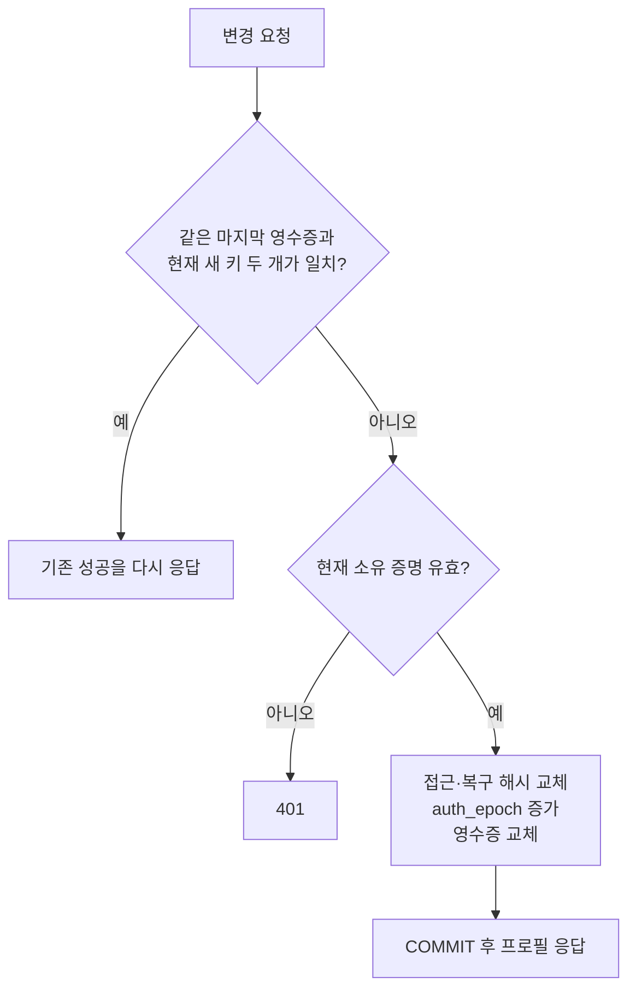
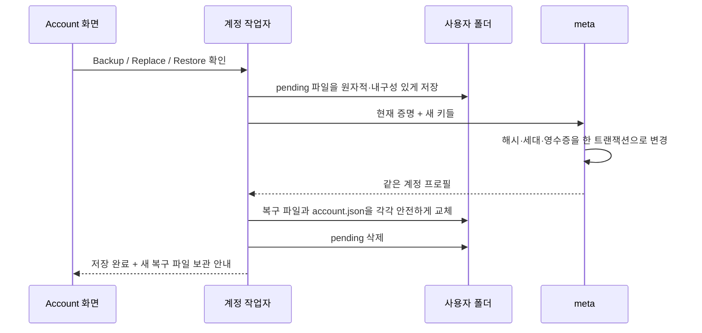

# Part 17: 가입 없는 계정을 보존한다 — 토큰 해시·폐기·복구

> **시리즈:** 제로부터 멀티플레이어 테트리스 + RL | [시리즈 목차](./README.md) | **Part 17**

---

## 이번 Part의 구현 계약

- **선행 상태:** [Part 10](part10-meta-and-ranking.md)의 익명 계정·SQLite·상점, [Part 15](part15-release-polishing.md)의 서버 검증 봇 BP, [Part 16](part16-secure-admission.md)의 HTTPS API·WSS·일회용 입장권이 동작한다.
- **이번 Part의 파일:** `meta/credentials.h/.cpp`, `meta/private_file.h/.cpp`, `meta/account_client.h/.cpp`, `meta/account_store.h/.cpp`, `platform/user_data.*`, `src/account_screen.*`, `python/tests/test_account_security.py`를 추가한다. `meta/database.*`, `meta/api_server.cpp`, `meta/game_tickets.h`, `meta/http_client.*`, `src/main.cpp`, CMake와 기존 fixture를 연결한다.
- **연결점:** DB는 자격 증명의 해시만 저장한다. 네이티브 클라이언트는 복구 파일과 교체 대기 파일을 안전하게 저장한 뒤 API에 변경을 요청한다. 접근 키 변경은 입장권의 계정 세대도 바꾼다. 사용자 ID·BP·RP·XP·아이콘·경기 기록은 유지한다.
- **완료 게이트:** 기존 DB의 동일 계정이 이관 후 인증되어야 한다. 폐기한 키와 복구 코드는 새 인증에 쓰지 못해야 한다. 통신 응답 유실·저장 실패 후 같은 교체를 재시도할 수 있어야 한다. 새 계정 생성으로 기존 프로필을 조용히 덮어쓰지 않아야 한다.

---

## 1. 전송 보호 다음에는 보관과 수명을 다룬다

Part 16은 네트워크에서 계정 토큰을 드러내지 않도록 바꿨다. 하지만 이전 DB의
`players.token`에는 원문이 남았다. DB를 읽은 사람이 그 값을 그대로 API에
보내면 계정으로 행동할 수 있었다. 또한 토큰을 잃으면 기록을 되찾을 방법이 없었다.

이번에는 세 가지 질문을 따로 해결한다.

| 질문 | 코드의 답 |
|---|---|
| DB를 읽어도 바로 로그인할 수 없게 할 수 있나 | 원문 대신 목적별 SHA-256 해시를 조회 키로 저장 |
| 복사된 접근 키를 못 쓰게 할 수 있나 | 같은 계정의 접근 키·복구 코드를 원자적으로 교체 |
| 가입·이메일 없이 기록을 되찾을 수 있나 | 별도 보관한 일회용 복구 파일로 같은 player ID의 키를 교체 |

사용자 폴더의 접근 키는 서버에 제시할 원문이어야 한다. 그 파일까지 해시만 남기면
서버에 제시할 비밀이 사라진다. 따라서 **DB 해시 저장**과 **클라이언트 파일 보호**는
다른 책임이다. 이메일·실명·사용자 지정 비밀번호를 새로 수집하지 않는다.

## 2. 고엔트로피 자격 증명의 해시를 저장한다

### 2.1 형식과 목적을 고정한다

| 종류 | 원문 형식 | 생성·용도 |
|---|---|---|
| 계정 접근 키 | 소문자 hex 32자리, 128비트 | 최초 guest는 서버 OS 난수, 교체는 네이티브 OpenSSL 난수 |
| 복구 코드 | `rc1.` + 소문자 hex 64자리, 256비트 | 네이티브 `RAND_bytes`, 파일로 별도 보관 |
| 게임 입장권 | `gt1.` + 소문자 hex 32자리 | meta 발급, 60초·1회용. Part 16 |

`meta/credentials.h`는 길이·문자·접두사를 정확하게 검사한다. 64자리 DB 해시를
32자리 접근 키 자리에 보내거나, 복구 코드를 일반 계정 인증에 보내면 거절한다.

해시는 `SHA256("tetris-" + purpose + "-v1:" + 원문)`이다. 목적은 `account`,
`recovery`, `operation`으로 나눈다. 같은 문자열을 서로 다른 역할로 해석하지 않기
위한 도메인 분리다. 해시 자체는 태그가 없는 64자리 hex이며 컬럼과 스키마 marker가
버전·용도를 결정한다.

**현재 소스 발췌 — `meta/credentials.cpp`**

```cpp
std::string digest(const std::string &purpose, const std::string &value) {
    const auto input = "tetris-" + purpose + "-v1:" + value;
    unsigned char bytes[EVP_MAX_MD_SIZE];
    unsigned length = 0;
    if (EVP_Digest(input.data(), input.size(), bytes, &length, EVP_sha256(), nullptr) != 1 || length != 32)
        throw std::runtime_error("credential digest unavailable");
    static constexpr char digits[] = "0123456789abcdef";
    std::string result;
    result.reserve(64);
    for (unsigned i = 0; i < length; ++i) {
        result += digits[bytes[i] >> 4];
        result += digits[bytes[i] & 15];
    }
    return result;
}
```

SHA 구현을 직접 작성하지 않고 [OpenSSL EVP digest API](https://docs.openssl.org/3.0/man3/EVP_DigestInit/)를 사용한다.
계산 실패를 빈 해시나 원문 저장으로 대체하지 않는다. 따라서 meta는 HTTPS 프록시
사용 여부와 무관하게 OpenSSL Crypto가 필수 빌드 의존성이 된다.

이 선택은 공식 클라이언트가 만드는 균일한 난수 키를 전제로 한다. 사람이 고르는
짧은 비밀번호를 같은 방식으로 저장해도 된다는 뜻은 아니다. API는 소유 증명 뒤
교체할 키의 형식을 검사하지만 임의의 외부 클라이언트가 고른 값의 실제 엔트로피까지
검사할 수는 없다. 공식 UI는 사용자가 키를 입력해 정하도록 하지 않는다.

### 2.2 DB와 Player 구조체에 원문을 남기지 않는다

새 `players`의 인증 관련 컬럼은 다음과 같다. 기존 통계·아이콘 컬럼은 유지한다.

```sql
token_hash TEXT UNIQUE NOT NULL,
recovery_hash TEXT,
auth_epoch INTEGER NOT NULL DEFAULT 0,
last_credential_op TEXT
```

`token_hash`는 현재 접근 키, `recovery_hash`는 아직 사용하지 않은 최신 복구 코드다.
복구 파일을 한 번도 만들지 않은 계정의 `recovery_hash`는 NULL이다. 복구 해시와
변경 영수증에는 NULL을 제외한 UNIQUE 인덱스를 둔다.

`getByToken()`은 입력을 검증하고 account 해시로 조회한다. `Player` 구조체에서도
`token`을 제거했다. guest 응답은 생성 함수가 방금 만든 원문을 한 번 전달하고,
DB 조회 결과가 비밀을 다시 반환하지 않게 했다. 상점과 봇 API는 기존 `getByToken()`
경계를 통해 자동으로 이 저장 방식에 연결된다.

## 3. 기존 DB를 버리지 않고 이관한다

`Database::migrateCredentials()`는 서버가 HTTP 요청을 받기 전에 실행된다.
처리 순서는 다음과 같다.

1. 스키마에 복구 해시·계정 세대·변경 영수증 컬럼을 추가한다.
2. 옛 `token` 컬럼이 있으면 `BEGIN IMMEDIATE` 안에서 `token_hash`로 이름을 바꾼다.
3. player ID 순서로 원문을 읽어 목적별 해시로 갱신한다. ID·통계·아이콘·외래키는 유지한다.
4. 인덱스와 `credential_hash_v1` marker를 기록하고 COMMIT한다.
5. WAL checkpoint·VACUUM·WAL truncate 후 `credential_scrub_v1` marker를 기록한다.

행 ID 순서가 필요한 이유도 있다. credential UNIQUE 인덱스를 따라 순회하면서 같은
인덱스의 키를 바꾸면 커서가 보는 순서가 움직일 수 있다. `ORDER BY id`로 기준을
고정한다. 중간 오류나 잘못된 옛 토큰 형식을 발견하면 논리 이관을 롤백하고 서버 시작을
거절한다. 일부 사용자만 조용히 새 계정으로 바꾸지 않는다.

두 marker를 구분한 것은 물리 정리 중 중단될 수 있기 때문이다. 해시 이관을 커밋한
뒤 checkpoint가 다른 reader 때문에 실패해도, 다음 시작에서 물리 정리만 다시 한다.
marker는 테이블에 있으므로 SQLite dump/restore에도 남는다. 기존 RP 재기준화도
다시 실행되지 않는다.

SQLite는 `secure_delete=ON`, WAL `synchronous=FULL`을 사용한다. 계정 키 교체의
성공 응답이 나갔는데 전원 장애로 교체 기록만 사라지는 가능성을 줄이기 위해 기존
NORMAL에서 FULL로 바꿨다. 이는 모든 디스크·가상화 계층의 고장을 보장하는 기능은 아니다.

이 정리는 현재 DB와 WAL의 잔여 원문을 줄인다. **이전 백업·복제본·파일시스템 스냅샷·
SSD의 과거 블록을 지웠다는 보장은 아니다.** 이전 백업도 비밀을 포함한 자료로 다룬다.
운영 DB에서는 최초 시작 전에 일관된 백업을 만들고 reader를 닫아 이관을 수행한다.
새 스키마에 옛 실행 파일을 연결하는 다운그레이드는 지원하지 않는다.

## 4. 복구와 폐기는 같은 원자적 교체 문제다

### 4.1 API의 세 동작

세 API는 `credential`, `next_token`, `next_recovery`를 JSON 본문으로 받는다.
URL에 비밀을 넣지 않는다. 일반 클라이언트의 원격 HTTP는 Part 16에서 이미 거절한다.

| API | 현재 소유 증명 | 변경 |
|---|---|---|
| `POST /v1/account/backup` | 현재 접근 키 | 접근 키 유지(`next_token`도 같은 값), 복구 코드 교체 |
| `POST /v1/account/rotate` | 현재 접근 키 | 접근 키와 복구 코드 모두 교체 |
| `POST /v1/account/recover` | 최신 미사용 복구 코드 | 같은 계정의 접근 키와 복구 코드 모두 교체 |

새 키는 클라이언트가 암호학적 난수로 만들고 **요청 전에** 디스크에 기록한다.
서버가 변경한 뒤 처음으로 새 키를 보내는 구조라면, 성공 응답이 유실될 때 새 키를
아무도 모르게 될 수 있기 때문이다. 후보를 생성하는 것만으로 서버 계정이 바뀌지는 않는다.

세 동작을 합쳐 IP당 60초에 10회로 제한한다. 잘못된 형태는 400, 무효한 소유 증명은
401, 다른 계정과 후보 키가 충돌하면 409, 저장 장애는 503이다. 계정 존재 여부를
사용자 이름이나 ID만으로 물어보는 복구 API는 만들지 않는다.

복구 코드는 사용하거나 새 파일을 발급하면 무효가 된다. 장기간 별도 보관하는 오프라인
복구 수단이므로 시간으로 자동 만료시키지는 않는다. 랜덤성·안전한 저장·사용 후 무효화는
[OWASP 복구 안내](https://cheatsheetseries.owasp.org/cheatsheets/Forgot_Password_Cheat_Sheet.html)의 원칙을 따른다.

### 4.2 DB 트랜잭션과 재시도 영수증

`Database::changeAccount()`가 mutex와 `BEGIN IMMEDIATE`로 다음 범위를 직렬화한다.



영수증은 operation·이전 증명·새 접근 키·새 복구 코드를 모두 묶은 해시다.
응답을 잃은 클라이언트가 **완전히 같은 요청**을 보내면 계정 세대를 다시 늘리지 않고
같은 성공을 확인한다. 이전 복구 코드만 알고 다른 새 키로 요청하면 401이다.

계정당 마지막 영수증 한 개만 보관한다. 다음 변경 이후에는 그 이전 요청의 재시도도
거절한다. 무한히 오래된 자격 증명을 인정하거나 재시도 테이블을 무한히 키우지 않는다.
동시에 여덟 개의 서로 다른 복구 요청이 들어오면 트랜잭션을 먼저 커밋한 하나만 성공한다.
키 충돌은 UPDATE 전체를 롤백하므로 원래 키가 살아 있어야 한다.

### 4.3 이미 발급한 게임 입장권도 연결한다

토큰만 바꾸면 60초 동안 남은 입장권으로 새로 들어올 수 있다. 그래서 `Player`에
`auth_epoch`를 두고, `GameTickets`는 player ID·발급 당시 세대·만료 시점만 저장한다.
소비할 때 `Database::getByEpoch()`로 현재 세대인지 검사하고 최신 표시 정보를 읽는다.
Part 16의 입장 정보 스냅샷은 더 이상 인증 근거로 쓰지 않는다.

접근 키·복구 코드 교체는 세대를 증가시키므로 미사용 입장권도 거절된다. 이 규칙은
이미 시작된 게임 소켓을 즉시 끊는 기능과는 다르다. **기존 경기와 이미 승인된 요청은
끝까지 진행할 수 있다.** 즉시 모든 게임 세션을 종료하려면 relay의 주기적 세대 확인과
연결 회수 기능이 더 필요하다. 지금의 UI는 저장된 접근 키를 폐기하며 강제 퇴장까지
보장하지 않는다.

## 5. 클라이언트는 새 키를 먼저 안전하게 저장한다

### 5.1 서버 주소와 계정 파일을 함께 묶는다

`MetaClient`는 HTTPS origin을 정규화한다. 호스트 대소문자·기본 포트·끝의 `/`는
같은 주소로 처리한다. 경로·사용자 정보·쿼리·fragment는 허용하지 않는다. 다른 호스트
별칭은 같은 서버라고 추정하지 않는다. 로컬 개발의 loopback HTTP만 예외로 허용한다.

`platform::user_data_directory()`가 OS별 `Tetris` 폴더를 정하고, `AccountStore`는
그 아래 `accounts/<origin의 16자리 locator>/`를 선택한다. 이 locator의 FNV 해시는
인증 수단이 아니다. 모든 비밀 파일 내부의 전체 `api_url`을 확인한 뒤에만 읽거나
덮어쓴다. 경로 해시가 충돌해도 다른 origin의 토큰을 보내거나 복구 파일을 덮지 않는다.

| 파일 | 내용 | 사용자가 할 일 |
|---|---|---|
| `account.json` | 정규화한 api_url과 접근 키 | 게임이 관리. 키를 로그·채팅에 붙이지 않음 |
| `account-recovery.json` | api_url·player ID·복구 코드 | 최신 파일을 별도 안전한 위치에 복사 |
| `account-change.pending.json` | 변경의 이전 증명과 새 키들 | 실패 중 삭제하지 말고 Retry로 마무리 |
| `account-change.lock` | 비밀 없는 프로세스 간 잠금 파일 | 존재 자체가 잠김을 뜻하지 않음 |

`TETRIS_USER_DATA_ROOT`는 절대 경로일 때 OS 기본 위치를 대체한다. 같은 서버에서
여러 테스트 계정을 쓰려면 이 루트를 다르게 지정한다. 설정은 공용 `Tetris/settings.cfg`,
자격 증명은 서버별 폴더에 있다. Account 화면에 현재 주소와 실제 폴더를 함께 표시한다.

**현재 소스 발췌 — `meta/account_store.cpp`**

```cpp
bool AccountStore::owns_existing_files() const {
    if (folder_.empty())
        return false;
    // Check all documents before a write or a credential-bearing request. A path
    // collision must not overwrite another server's backup or pending operation.
    for (const auto &path : {token_path(), recovery_path(), pending_path()}) {
        if (!account_file_exists(path))
            continue;
        const auto saved = read_account_file(path);
        if (!saved || proto::find_string(*saved, "api_url") != origin_)
            return false;
    }
    return true;
}
```

파일이 손상됐거나 다른 서버 소유라면 자동 생성·교체를 중단한다. 백업을 보관한 뒤
올바른 서버 폴더에 복구 파일을 놓고 Restore한다. 손상된 `account.json`이 있다면
원본을 별도 위치로 옮겨 보존해야 한다. 손상을 빈 계정으로 간주하지 않는 정책이다.

이전 버전의 `Tetris/token`에는 서버 주소가 없다. 따라서 자동 전송하지 않고
**Import older account**에서 표시된 서버로 가져올지 명시적으로 선택한다. 옛 backup과
pending에 주소가 있으면 일치 여부도 검사한다. 원본 파일은 남긴다. 다른 서버의 새
계정을 원하면 **Create separate account**를 선택하며 옛 파일은 유지한다.

### 5.2 원자적 파일 교체

`write_private_file()`은 같은 디렉터리에 새 임시 파일을 만들고 완성한 뒤 교체한다.
기존 `save_token()`의 `O_TRUNC` 방식처럼 먼저 기존 키를 비우지 않는다.

- POSIX: 새 임시 파일 0600 → 전체 write → 파일 fsync → rename → 부모 디렉터리 fsync.
- Windows: 현재 사용자와 SYSTEM만 허용하는 보호된 ACL → CREATE_NEW → FlushFileBuffers → MoveFileEx 교체·WRITE_THROUGH.

이것은 로컬 파일 암호화가 아니다. 같은 사용자로 실행되는 악성 프로그램이나 운영체제
관리자에게서 비밀을 숨기는 경계도 아니다. 다른 사용자와 우발적인 공개 권한, 저장 도중
잘리는 파일을 줄이는 목적이다.

`AccountFileLock`은 전체 변경 과정에서 한 프로세스만 파일을 다루게 한다.
두 게임이 같은 폴더에서 동시에 복구 코드를 갱신한 뒤 서로의 파일을 덮으면,
서버에는 B의 키가 있고 디스크에는 A의 키가 남을 수 있다. POSIX flock과 Windows
배타적 파일 핸들이 이 충돌을 막는다. 프로세스 종료 시 OS가 잠금을 해제한다.

### 5.3 성공 응답이 없어도 계정을 잃지 않는다

변경의 전체 순서는 다음과 같다.



네트워크 실패·429·5xx는 결과가 불확실하므로 pending을 남긴다. API는 성공했으나
최종 파일 교체가 실패해도 남긴다. Retry 또는 다음 시작의 부트스트랩이 같은 요청을
재전송하고 로컬 저장을 마친다. 서버 성공을 다시 적용하지 않는다.

400·401·409처럼 확정적으로 거절된 요청의 pending은 정리한다. 손상된 pending,
다른 서버의 pending, 파일 접근 실패는 임의로 고치거나 삭제하지 않고 사용자가 확인할 수
있게 남긴다. 진행 중 요청의 원문이나 복구 코드를 화면·로그에 출력하지 않는다.

## 6. 실제 사용 — Account & Recovery

메뉴에 `Account & Recovery`를 추가했다. 항목이 늘어도 랭킹 표시와 겹치지 않게
메뉴 버튼 간격을 조정했다. HTTP·파일 작업은 작업 스레드에서 실행하고, 완료된 프로필을
화면에 반영한다. 진행 중 상점·프로필 갱신 결과가 새 계정을 덮지 않도록 기다린다.

1. **Save recovery file:** 현재 계정으로 복구 파일을 만든다. 기존 복구 파일은 무효가 되므로 새 파일을 별도 위치에 복사한다.
2. **Replace access keys:** 현재 계정의 접근 키와 복구 코드를 모두 새로 만든다. 다른 기기의 옛 접근 키는 다음 인증부터 거절된다. 새 복구 파일을 다시 보관한다.
3. **Restore from recovery file:** 화면에 표시한 계정 폴더에 보관해 둔 `account-recovery.json`을 놓고 실행한다. 같은 ID·BP·RP·아이콘을 되찾으며 사용한 복구 파일은 교체된다.
4. **Retry / reconnect:** 통신·저장 실패 뒤 같은 변경을 마무리한다. 실패했다고 즉시 다른 교체를 시작하지 않는다. 새 guest 저장 실패 때는 메모리의 같은 키를 다시 저장한다.
5. **Import older account:** 서버가 기록되지 않은 옛 키를 화면의 서버로 가져온다.
6. **Create separate account:** 다른 서버의 새 계정을 만들고 옛 파일은 유지한다. 이미 이 서버에 저장된 계정이 있으면 덮지 않는다.

작업 전 확인 버튼에 기존 복구 파일 무효화나 계정 전환의 의미를 표시한다.
복구 파일을 화면에 직접 펼치거나 원문 코드를 붙여넣는 UI는 제공하지 않는다.
파일을 다른 기기로 옮기는 것은 사용자가 수행한다.

기존 접근 키가 거절됐을 때 새 guest로 자동 대체하던 동작도 제거했다. 같은 저장 파일을
유지하고 복구 안내를 표시한다. 키 파일이 손상됐거나 복구 파일만 남아 있는 경우에도
새 계정을 만들지 않는다. 키가 폐기됐는데 단순히 “BP가 0이 된 새 계정”으로
바뀌어 버리면 사용자가 원래 기록을 잃었다고 오해하기 때문이다.

별도 테스트 프로필로 실행하려면 Linux/macOS에서 다음과 같이 설정한다.

```bash
TETRIS_USER_DATA_ROOT="$PWD/out/account-player-a" ./build-secure/tetris \
  --meta http://127.0.0.1:8080 --relay wss://localhost:8443/play
```

로컬 인증서는 Part 16의 `TETRIS_CA_FILE` 설정도 필요하다. Windows는 다음과 같이
절대 경로를 지정한다. 실제 공개 실행은 HTTPS API와 정상 WSS 인증서를 사용한다.

```powershell
$env:TETRIS_USER_DATA_ROOT = "C:\EntrisProfiles\player-a"
.\build-secure\Release\tetris.exe --meta https://api.example.com --relay wss://relay.example.com:8443/play
```

### 6.1 저장 실패를 온라인 성공으로 표시하지 않는다

계정은 서버에서 생성됐어도 기기에 키를 저장하지 못할 수 있다. `bootstrap_account()`는
이때 `unsaved=true`와 발급된 키를 반환한다. main은 이 키를 재시도용 메모리에만 두고
일반 인증 키를 비워 온라인 상점·보상 경로를 차단한다. 화면은 종료 전에 저장하라고
안내한다. **Retry / reconnect**는 guest를 다시 생성하지 않고 같은 키를 저장한다.
프로세스를 먼저 종료하면 이 키는 사라지므로 저장 성공 전 종료하지 않아야 한다.

화면은 `AccountScreen::draw()`가 동작 이름만 반환한다. 파일·API 흐름은
`account_client`, 경로·소유 확인은 `AccountStore`, OS 경로는 `platform/user_data`,
실제 안전한 파일 쓰기는 `private_file`이 담당한다. main은 작업 완료 결과로 화면과
프로필을 갱신한다. 이 분리는 새 UI를 만들어도 자격 증명 교체 순서를 복사하지 않게 한다.

## 7. 검증과 운영 경계

`python/tests/test_account_security.py`는 다음 계약을 실제 임시 SQLite·HTTP 서버와
네이티브 계정 작업자(`wss_probe --account`)로 확인한다. 사용자 실제 데이터 폴더는
테스트에 사용하지 않는다.

| 검사 | 증거 |
|---|---|
| 신규 저장 | 원문 token 컬럼 없음, 목적별 해시 일치, DB/WAL에 원문 없음 |
| 기존 데이터 이관 | 같은 ID·기록 인증, 반복 시작·dump/restore 후 해시/RP 이중 변환 없음 |
| 폐기 | 옛 접근 키·미사용 입장권·옛 상점 인증 거절 |
| 복구 | BP·RP·XP 유지, 기존 복구 코드로 다른 새 키 요청 거절 |
| 동시성 | 서로 다른 복구 요청 8개 중 1개만 성공 |
| 실패 처리 | 후보 키 충돌 롤백, IP 예산, 다른 서버의 파일 거절 |
| 로컬 저장 | 파일 권한, 프로세스 잠금, 서버 변경 뒤 최종 저장 실패와 재시도, 최초 guest 키 저장 재시도 |
| 서버 구분 | 다른 origin의 키 자동 전송 금지, 주소 정규화, 옛 계정 명시적 이관 |
| 응답 유실 | 서버 변경 후 응답을 끊어도 같은 pending으로 복구, 세대 증가 1회 |

재현 명령은 다음과 같다. WSS 검사와 같은 build 폴더의 meta·native probe를 사용한다.

```bash
TETRIS_META_BIN="$PWD/build-secure/tetris_meta" TETRIS_SECURE_BUILD="$PWD/build-secure" \
  uv run python -m pytest python/tests/test_account_security.py -q
```

최신 실제 결과는 [검증 기록](../polish-validation.md)에 남긴다. Windows/macOS의 코드와
CI 검사 경로를 준비한 것과 해당 OS 실기기에서 복구 UI를 직접 검수한 것은 구분한다.

복구 파일과 접근 키를 둘 다 잃으면 익명 사용자임을 입증할 다른 수단은 없다.
사용하지 않은 최신 복구 파일은 계정에 접근할 권한이므로 단순 설정 파일처럼 공유하지 않는다.
계정 데이터 삭제 API·자동 보존 기간·이메일 복구·접근 키의 시간 기반 자동 만료는
이번 구현 범위가 아니다. 기록은 유지하면서 키를 교체하는 기능이며, 진행 중 경기의
즉시 세션 회수는 별도로 남는다. PvP 규칙 검증은 [Part 18](part18-authoritative-results.md)에서 이어진다.
