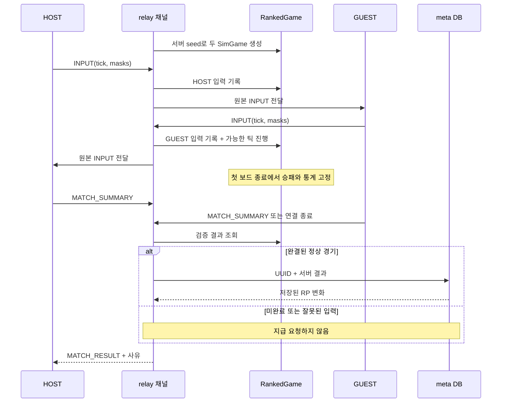

# Part 18: 서버가 판정하는 경기 — 입력 검증과 실패 상태의 분리

> **시리즈:** 제로부터 멀티플레이어 테트리스 + RL | [시리즈 목차](./README.md) | **Part 18**

---

## 이번 Part의 구현 계약

- **선행 상태:** Part 1의 결정론적 `SimGame`, Part 6의 INPUT 프레임, Part 7·14의 thread/reactor relay, Part 10의 멱등 경기 저장, Part 16의 일회용 입장권, Part 17의 서버별 계정 저장이 동작한다.
- **이번 Part의 파일:** `server/ranked_game.h`, `net/match_result.h`, `meta/json_input.h`, `meta/json_routes.h`, `tests/ranked_game_test.cpp`, `tests/json_input_test.cpp`. relay 두 구현·`net/session.*`·`src/main.cpp`·경기 통합 검사를 연결한다. 계정 화면과 저장 경계는 `src/account_screen.*`, `meta/account_store.*`, `platform/user_data.*`로 나눈다.
- **연결점:** relay는 받은 입력을 전달하면서 같은 규칙 코어로 종료를 계산한다. meta는 relay가 검증한 결과를 UUID당 한 번 저장한다. UI는 보상 여부와 저장 상태를 별도 값으로 받는다.
- **완료 게이트:** 일치하는 허위 요약으로는 보상이 없어야 한다. 실제 입력으로 끝난 경기의 승패·점수는 거짓 신고에도 바뀌지 않아야 한다. 같은 계약을 두 relay에서 검사한다. 잘못된 JSON은 DB 변경 전에 거절하고, 미저장 계정·연습전·저장 미확인을 성공으로 표시하지 않아야 한다.

---

## 1. 서로 같은 신고가 사실을 증명하지는 않는다

초기 relay는 두 클라이언트가 상대 점수까지 서로 일치하게 보고하면 결과를 받아들였다.
이 검사는 실수나 한쪽의 모순된 보고에는 도움이 되지만 양쪽을 통제하는 사람의 거짓말은
구별하지 못한다. “일치한다”는 일관성이고 “실제로 일어났다”는 권위 있는 관측이다.
공용 BP와 랭킹에는 후자가 필요하다.

이미 `SimGame`은 seed와 틱별 입력이 같으면 같은 상태가 된다. 따라서 새 게임 규칙을
서버용으로 다시 쓰지 않고 같은 코어를 relay에서 진행한다. 렌더러·오디오·계정 파일은
서버에 필요하지 않다. CMake의 두 relay 타깃에 `TETRIS_SIM_SOURCES`를 연결한다.



## 2. 채널마다 검증기를 하나 둔다

`RankedGame`에는 소켓·HTTP·DB가 없다. 서버 seed, 양쪽 입력 기록, 두 `SimGame`,
진행 틱과 공격 총계만 있다. 결과의 winner는 player ID가 아니라 HOST=1/GUEST=2다.
relay가 자기 채널의 인증된 ID로 바꿔 meta에 보낸다. 네트워크 입력이 DB 사용자 ID를
직접 정하지 못하게 하는 경계다.

**현재 소스 발췌 — `server/ranked_game.h`**

```cpp
#pragma once
#include "../src/sim_game.h"
#include "../net/framing.h"
#include "../net/match_result.h"
#include <algorithm>
#include <array>
#include <chrono>
#include <vector>

namespace relay {
struct VerifiedResult {
    net::ResultStatus status = net::ResultStatus::Incomplete;
    int winner = 0; // 1=HOST, 2=GUEST, 0=no winner. Never a player ID.
    int score_a = 0, score_b = 0, lines_a = 0, lines_b = 0, duration_s = 0;
};

// Both relay implementations use this authority. Call under the channel lock in
// the thread relay; reactor channels are owned by one loop. No renderer or HTTP.
class RankedGame {
  public:
    using Clock = std::chrono::steady_clock;
    static constexpr uint32_t max_ticks = 60 * 30 * 60; // bounded 30-minute round
    explicit RankedGame(uint64_t seed) : seed_(seed), a_(seed), b_(seed) {}

    void observe(int side, net::MsgType type, const uint8_t *data, size_t size,
                 Clock::time_point now = Clock::now()) {
        if (!valid_)
            return;
        if (side != 1 && side != 2) {
            valid_ = false;
            return;
        }
        if (type == net::MsgType::SEED) {
            // Initial host setup may announce the server seed; it cannot choose a
            // replacement. A ranked rematch needs a new connection/UUID/seed.
            if (side != 1 || size != 14 || net::le_read_u64(data) != seed_ || ticks_ != 0)
                valid_ = false;
            return;
        }
        if (type != net::MsgType::INPUT)
            return;
        if (size < 6) {
            valid_ = false;
            return;
        }
        const uint32_t from = net::le_read_u32(data);
        const uint16_t count = net::le_read_u16(data + 4);
        if (!count || size != size_t(count) + 6 || count > 120 || from > max_ticks ||
            count > max_ticks - from) {
            valid_ = false;
            return;
        }
        if (!started_) {
            started_ = true;
            began_ = now;
        }
        const auto elapsed = std::chrono::duration<double>(now - began_).count();
        if (double(from) + count > elapsed * 60.0 + 180.0) {
            valid_ = false;
            return;
        }
        auto &history = inputs_[side - 1];
        if (from > history.size() || from + count > ticks_ + 4096) {
            valid_ = false;
            return;
        }
        for (uint32_t i = 0; i < count; ++i) {
            const auto mask = data[6 + i];
            const auto tick = from + i;
            if (mask & ~uint8_t(31)) {
                valid_ = false;
                return;
            }
            if (tick < history.size()) {
                if (history[tick] != mask) {
                    valid_ = false;
                    return;
                }
            } else
                history.push_back(mask);
        }
        // Advance each tick exactly once, stopping at the first terminal board.
        while (!finished_ && ticks_ < std::min(inputs_[0].size(), inputs_[1].size())) {
            a_.SubmitInput(inputs_[0][ticks_]);
            b_.SubmitInput(inputs_[1][ticks_]);
            a_.Tick();
            b_.Tick();
            const int aa = a_.AttackLinesSent(), ab = b_.AttackLinesSent();
            b_.AddPendingGarbage(aa - attack_a_);
            a_.AddPendingGarbage(ab - attack_b_);
            attack_a_ = aa;
            attack_b_ = ab;
            ++ticks_;
            finished_ = a_.IsGameOver() || b_.IsGameOver();
        }
    }
    void invalidate() {
        valid_ = false;
    }
    VerifiedResult result() const {
        VerifiedResult out;
        if (!valid_) {
            out.status = net::ResultStatus::InvalidReplay;
            return out;
        }
        if (!finished_)
            return out;
        out.winner = a_.IsGameOver() == b_.IsGameOver() ? 0 : a_.IsGameOver() ? 2 : 1;
        out.status = out.winner ? net::ResultStatus::Applied : net::ResultStatus::Draw;
        out.score_a = a_.Score();
        out.score_b = b_.Score();
        out.lines_a = a_.totalLinesCleared;
        out.lines_b = b_.totalLinesCleared;
        out.duration_s = static_cast<int>((ticks_ + 59) / 60);
        return out;
    }

  private:
    uint64_t seed_;
    SimGame a_, b_;
    std::array<std::vector<uint8_t>, 2> inputs_;
    uint32_t ticks_ = 0;
    int attack_a_ = 0, attack_b_ = 0;
    bool valid_ = true, started_ = false, finished_ = false;
    Clock::time_point began_{};
};
} // namespace relay
```

### 2.1 입력의 형식과 순서를 검증한다

| 제한 | 이유 |
|---|---|
| INPUT 헤더 6바이트 + count바이트, count 1~120 | 잘린 프레임·빈 프레임·한 번에 과도한 처리 방지 |
| 마스크의 하위 5비트만 허용 | 정의되지 않은 행동을 코어에 넣지 않음 |
| 각 플레이어 기록이 tick 0부터 연속 | 없는 입력을 임의의 NONE으로 메우지 않음 |
| 재전송은 이전 값과 동일해야 함 | 도착한 과거 입력을 나중에 바꾸지 못함 |
| 현재 시뮬레이션보다 4,096틱 넘게 앞서지 않음 | 한쪽만 보내며 메모리를 늘리는 패턴 제한 |
| 총 108,000틱, 60Hz에서 30분 | 채널별 기록 메모리 상한 |
| 첫 입력 이후 경과 초 × 60 + 180틱 이내 | 대량의 미래 입력을 즉시 제출하는 패턴 제한 |

180틱은 전송 지연·짧은 적체를 흡수하는 여유다. 한 틱마다 벽시계를 정확히 강제하면
정상적인 네트워크 버스트도 조작으로 오인한다. 반대로 이 여유는 사람의 입력 속도를
증명하지 않는다. 실제 유저 환경에서 오탐률과 서버 처리 시간을 관측해야 한다.

SEED는 초기 HOST가 서버가 준 값으로 알릴 때만 허용한다. 경기 중 새 seed로 바꾸는
재경기는 새 UUID·연결로 시작한다. 랭크 결과는 연결당 하나이며, 구버전의 같은 채널
재시작을 새 보상 경기로 해석하지 않는다.

### 2.2 두 보드를 같은 틱 단위로 진행한다

양쪽 해당 틱 입력이 있을 때만 SubmitInput → 양쪽 Tick → 공격량 차이 교환 순서로
진행한다. 한쪽 입력을 먼저 여러 틱 적용하면 공격 도착 시점이 달라진다. 첫 게임 종료
이후에는 상태를 더 진행하지 않는다. 점수와 줄 수는 이 상태에서 읽고, 시간은 누적 틱을
초로 올림해 구한다. 클라이언트가 보낸 숫자는 결과 계산에 쓰지 않는다.

## 3. 같은 판정, 다른 실행 소유권

| 실행 모델 | 검증기와 결과 선점 | HTTP 저장 |
|---|---|---|
| thread relay | 채널의 `sumMu`로 두 방향 작업자 직렬화 | 잠금 밖에서 호출, 송신은 대상별 mutex |
| reactor relay | 채널을 소유한 loop만 변경 | offload 작업자가 호출, continuation은 소유 loop에서 실행 |

공통 클래스는 정책 중복을 줄이고 각 relay는 자기 동시성 모델만 지킨다. 이 때문에
`RankedGame` 내부에 소켓 잠금이나 작업 큐를 넣지 않는다. 필요하지 않은 인터페이스를
상속시키는 대신 실제 변경 이유가 다른 경계를 분리한 것이다.

`summaryHandled`/`summary_handled`는 한 번만 결과를 확정한다. DB의 UUID UNIQUE
제약은 별도로 HTTP 재시도에서 중복 지급을 막는다. 둘 중 하나로 나머지를 대체할 수 없다.
클라이언트가 조기에 요약을 보내거나 상대가 입력을 중단하면 종료 증거가 없어 보상이 없다.
현재는 이탈자 몰수패·RP 차감·신고 제재 정책을 추가하지 않았다.

## 4. 변화량과 처리 상태를 따로 전송한다

RP delta가 0이어도 정상 패배일 수 있다. 시작 RP가 0이면 더 내려갈 수 없기 때문이다.
변화량만으로 서버 오류·연습전·무승부를 구분하면 사용자가 잘못 이해하게 된다.

`MATCH_FOUND`는 기존 UUID 뒤 1바이트 ranked 플래그를 추가한다. `Session::SeedParams`
기본값은 false이며, 새 서버가 보내는 명시적 값이 있을 때만 보상 경기를 표시한다.
`MATCH_RESULT`는 기존 before/after/delta의 12바이트 뒤 상태를 추가한다.

**현재 소스 발췌 — `net/match_result.h`**

```cpp
#pragma once
#include <cstdint>
namespace net {
// Appended to the original 12-byte MATCH_RESULT. Old clients ignore the suffix.
enum class ResultStatus : uint8_t {
    Unknown = 0,
    Applied = 1,
    InvalidReplay = 2,
    Incomplete = 3,
    SaveFailed = 4,
    Draw = 5
};
inline const char *result_status_text(ResultStatus status) {
    switch (status) {
    case ResultStatus::Applied:
        return "Result verified and saved";
    case ResultStatus::InvalidReplay:
        return "No rewards: game inputs failed validation";
    case ResultStatus::Incomplete:
        return "No rewards: the game did not finish on the server";
    case ResultStatus::SaveFailed:
        return "Server save not confirmed - reconnect to check your profile";
    case ResultStatus::Draw:
        return "Verified draw - no rating or rewards";
    default:
        return "Server did not provide a result status";
    }
}
} // namespace net
```

| 상태 | 서버의 의미 | 화면의 의미 |
|---|---|---|
| Applied | 승패 검증과 meta 저장 응답 성공 | 결과 반영, RP 변화 표시 |
| InvalidReplay | 입력·seed·속도 제한 등 위반 | 검증 실패, 보상 없음 |
| Incomplete | 서버에서 보드 종료를 확인하지 못함 | 미완료, 보상 없음 |
| SaveFailed | 저장 성공 응답을 확인하지 못함 | 재접속해 프로필 확인 |
| Draw | 검증된 동시 종료 저장 | 무승부, RP/BP/XP 변화 없음 |
| Unknown | 구버전 등 상태 정보 없음 | 상태 미제공 표시 |

저장 응답을 잃었어도 DB에는 이미 반영됐을 수 있다. 그러므로 SaveFailed를 “반드시
미지급”으로 표현하지 않는다. meta의 멱등 저장을 재시도한 뒤에도 응답을 확인하지 못하면
미확인 상태로 남기고 프로필을 다시 읽는다. 비랭크 경기에는 랭킹 응답 대기를 표시하지 않는다.
새 상태·재경기 UI를 모두 사용하려면 클라이언트와 서버를 같은 버전으로 배포한다.

## 5. 계정과 봇 화면의 실패도 드러낸다

Part 17의 계정 서비스는 새 guest의 키를 저장하지 못했을 때 `unsaved`로 반환한다.
main은 재시도용 키를 보존하면서 온라인 인증 키를 비운다. Account 화면은 현재 서버,
파일 위치, 저장 경고를 표시한다. Retry는 같은 키만 저장하므로 실패할 때마다 계정이
추가되지 않는다. 종료 전 저장 성공이 필요하다는 사실도 표시한다.

계정 UI는 `AccountScreen::draw()`가 action을 반환하고 실제 작업은 `account_client`가
담당한다. HTTP·OS 경로·파일 보관·화면을 구분해 새 담당자가 파일 저장의 보안 순서를
모른 채 버튼 표시만 바꿔도 핵심 흐름을 훼손할 가능성을 줄인다. main에는 여전히 상점과
여러 화면의 조정 책임이 남아 있어 모든 SOLID 원칙을 완전히 충족했다고 평가하지 않는다.

봇 보상 challenge 발급 실패는 자동 연습전 진입으로 바꾸지 않는다. 선택 화면에 실패를
남기고 재시도와 **Play practice - no BP**를 따로 제공한다. 경기와 종료 화면에도 보상
검증/연습 상태를 표시한다. BP 일일 잔여 한도를 시작 전에 자세히 보여 주는 UI는 남은 작업이다.

## 6. API 문법을 직접 추측하지 않는다

`meta/json_input.h`는 nlohmann/json v3.11.3으로 본문 전체를 읽는다. 64KiB·깊이 16,
중복 키 거절, 최상위 객체, 필드별 정확한 타입·int64 범위를 적용한다. 버전·원본·해시는
`third_party/README.md`에 기록한다. `protocol.h`는 이 위에서 API별 응답을 만든다.

처음 검사할 때 HTTP pre-routing에 검증을 넣으면 정상 guest `{}`도 거절되는 문제가
드러났다. 라이브러리가 그 훅을 본문 수신 전에 호출하기 때문이다. `json_post`는 본문
수신 후·핸들러 실행 전에 검사하도록 등록을 감싸며 봇 API도 같은 경계를 사용한다.

이후 `/v1/guest`에 잘못된 JSON을 보내도 계정 행이 늘지 않는지를 검사한다. 문법 오류를
거절하는 것과 인증·권한·경제 악용을 막는 것은 서로 다른 계약이며 모두 필요하다.

## 7. 새 담당자가 변경할 위치

| 변경 목적 | 먼저 볼 코드 | 함께 확인할 계약 |
|---|---|---|
| 경기 규칙 | `src/sim_game.*` | C++/Python 결정론, 서버·클라이언트 버전, 기존 모델 호환 |
| 입력 검증 한도 | `server/ranked_game.h` | 두 relay 공통 검사, 정상 지터·지연의 오탐 |
| RP/BP/XP 지급량 | `meta/database.cpp` | UUID 멱등성·DB 트랜잭션·경제 정책 |
| 결과 문구 | `net/match_result.h`, `src/main.cpp` | 0 RP와 미반영을 구분, 저장 미확인의 불확실성 |
| 계정 버튼·안내 | `src/account_screen.*` | 작업 이름, busy·unsaved·확인 상태 |
| 계정 복구 동작 | `meta/account_client.*` | pending 선저장, 응답 유실 재시도, 서버 origin |
| 폰트·색·캐릭터 | `src/presentation.*`, `assets/theme.cfg`, `assets/opponents.cfg` | 렌더링과 규칙 분리, 서버 보상 상대와의 설정 일치 |

## 확인한 계약

- 자기신고 두 장의 일치나 단절 순서가 보상을 만들지 않는다.
- 실제 입력으로 끝난 경기의 승패·점수·줄 수는 허위 요약에도 바뀌지 않는다.
- 완료 입력을 받은 상대가 요약 없이 나가도 같은 서버 결과를 저장한다.
- 중복·누락·변조·틀린 seed·과속 입력의 거절은 renderer 없이 검사할 수 있다.
- 비랭크·무보상 연습·미저장 계정·결과 저장 미확인을 각각 표시한다.

## 검증

보안 빌드의 생성 명령은 실행 안내와 동일하다. 해당 빌드에서 다음을 실행한다.

```bash
ctest --test-dir build-secure --output-on-failure
TETRIS_SECURE_BUILD="$PWD/build-secure" TETRIS_META_BIN="$PWD/build-secure/tetris_meta" \
  uv run python -m pytest python/tests/test_match_summary_crosscheck.py \
    python/tests/test_account_security.py python/tests/test_secure_admission.py -q -ra
```

기대 결과는 정상 경기의 서버 통계 저장, 허위 신고의 무보상, 잘못된 본문의 400 응답,
서버별 키 보존과 재시도 성공이다. 테스트는 임시 DB·폴더·loopback 서버만 사용한다.
`ranked_game_test`는 시계를 주입해 입력 속도 경계를 결정적으로 확인한다. wire 통합 검사는
MATCH_FOUND의 실제 seed로 종료 입력을 만들고 저장된 DB 통계를 비교한다.

이 검증은 공개 인터넷 부하, Windows/macOS 실기기 UI, 실제 사용자 사용성 검사를 대신하지
않는다. 서버 시뮬레이션 비용이 추가됐으므로 종전의 단순 전달 부하 수치를 그대로 출시
용량으로 쓰지 않는다. 규칙에 맞게 일부러 지는 담합·자동 플레이·다중 계정 파밍은 별도
경제·운영 정책이 필요하다. 최신 실행 결과는 [검증 기록](../polish-validation.md)에 남긴다.
