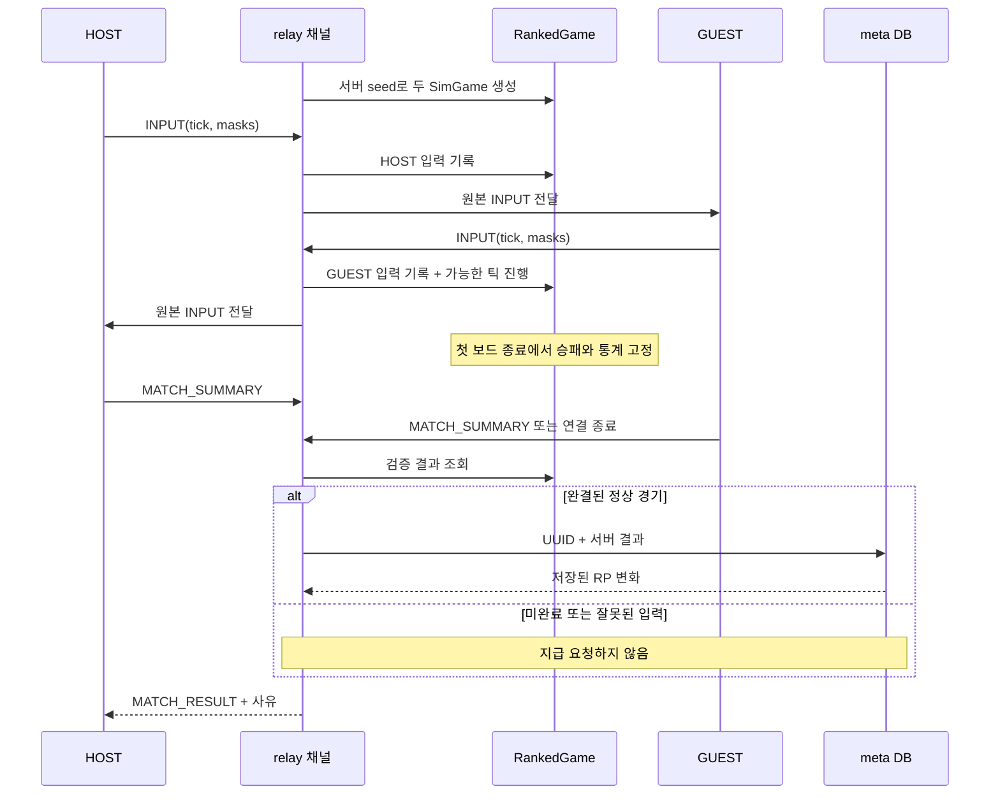

# Part 18: 서버가 판정하는 경기 — 입력 검증과 실패 상태의 분리

> **시리즈:** 제로부터 멀티플레이어 테트리스 + RL | [시리즈 목차](./README.md) | **Part 18**

---

## 이번 Part의 구현 계약

- **선행 상태:** Part 1의 결정론적 `SimGame`, Part 6의 INPUT 프레임, Part 7·14의 thread/reactor relay, Part 10의 멱등 경기 저장, Part 16의 일회용 입장권, Part 17의 서버별 계정 저장이 동작한다.
- **이번 Part의 파일:** `server/ranked_game.h`, `net/match_result.h`, `meta/json_input.h`, `meta/json_routes.h`, `tests/ranked_game_test.cpp`, `tests/json_input_test.cpp`. relay 두 구현·`net/session.*`·`src/main.cpp`·경기 통합 검사를 연결한다. 계정 화면과 저장 경계는 `src/account_screen.*`, `meta/account_store.*`, `platform/user_data.*`로 나눈다.
- **연결점:** relay는 받은 입력을 전달하면서 같은 규칙 코어로 종료를 계산한다. meta는 relay가 검증한 결과를 UUID당 한 번 저장한다. UI는 보상 여부와 저장 상태를 별도 값으로 받는다.
- **완료 게이트:** 일치하는 허위 요약으로는 보상이 없어야 한다. 실제 입력으로 끝난 경기의 승패·점수는 거짓 신고에도 바뀌지 않아야 한다. 같은 계약을 두 relay에서 검사한다. 잘못된 JSON은 DB 변경 전에 거절하고, 미저장 계정·연습전·저장 미확인을 성공으로 표시하지 않아야 한다.

---

## 1. 서로 같은 신고가 사실을 증명하지는 않는다

초기 relay는 두 클라이언트가 상대 점수까지 서로 일치하게 보고하면 결과를 받아들였다.
이 검사는 실수나 한쪽의 모순된 보고에는 도움이 되지만 양쪽을 통제하는 사람의 거짓말은
구별하지 못한다. “일치한다”는 일관성이고 “실제로 일어났다”는 권위 있는 관측이다.
공용 BP와 랭킹에는 후자가 필요하다.

이미 `SimGame`은 seed와 틱별 입력이 같으면 같은 상태가 된다. 따라서 새 게임 규칙을
서버용으로 다시 쓰지 않고 같은 코어를 relay에서 진행한다. 렌더러·오디오·계정 파일은
서버에 필요하지 않다. CMake의 두 relay 타깃에 `TETRIS_SIM_SOURCES`를 연결한다.


```mermaid
sequenceDiagram
    participant A as HOST
    participant R as relay 채널
    participant V as RankedGame
    participant B as GUEST
    participant M as meta DB
    R->>V: 서버 seed로 두 SimGame 생성
    A->>R: INPUT(tick, masks)
    R->>V: HOST 입력 기록
    R->>B: 원본 INPUT 전달
    B->>R: INPUT(tick, masks)
    R->>V: GUEST 입력 기록 + 가능한 틱 진행
    R->>A: 원본 INPUT 전달
    Note over V: 첫 보드 종료에서 승패와 통계 고정
    A->>R: MATCH_SUMMARY
    B->>R: MATCH_SUMMARY 또는 연결 종료
    R->>V: 검증 결과 조회
    alt 완결된 정상 경기
        R->>M: UUID + 서버 결과
        M-->>R: 저장된 RP 변화
    else 미완료 또는 잘못된 입력
        Note over R,M: 지급 요청하지 않음
    end
    R-->>A: MATCH_RESULT + 사유
```

### 1.1 서버 재실행이 증명하는 범위

서버 재실행은 서버 seed와 받아들인 입력이 규칙상 어떤 종료 상태를 만드는지 계산한다.
두 사용자가 같은 점수를 신고했다는 이유만으로 종료를 만들지 않는다. 입력이 완결되지
않으면 Incomplete이며, 이를 무승부로 저장해 참가 보상을 지급해서도 안 된다.

인증은 연결에 계정 주체를 부여하고, 경기 권한은 그 주체가 현재 채널의 어느 편인지를
결정한다. `RankedGame::observe`의 side는 relay가 연결 관계에서 정한다. 결과의 숫자
winner는 그 편을 가리키고, DB에 쓸 player ID 변환도 relay가 수행한다.

규칙상 유효한 입력은 사람이 직접 눌렀다는 증거가 아니다. 두 계정의 담합이나 반복적인
쉬운 경기로 보상을 얻는 행위는 재실행과 별도로 지급 정책·빈도·이상 패턴을 검토해야 한다.
TLS·입장권·서버 재실행은 각각 전송 보호·입장 권한·규칙 판정이라는 다른 계약을 갖는다.

### 1.2 같은 틱의 공통 입력만 진행한다

서버가 HOST 입력을 먼저 받아도 GUEST의 같은 틱 입력이 없으면 그 틱은 진행하지
않는다. 입력 값 0은 중립 조작을 명시한 기록이고 입력 누락은 아직 진행할 자료가
없다는 뜻이다. 누락을 0으로 채우면 서버가 클라이언트와 다른 경기를 만들 수 있다.
양쪽 기록에 있는 공통 접두사만 소비하고 각 틱을 한 번 실행한다.

한 틱에서는 두 보드의 규칙을 먼저 진행한 뒤, 각 보드의 누적 공격 총계에서 이미
전달한 총계를 뺀 증가분을 상대에게 넣는다. 한쪽을 진행하자마자 그 공격을 다른
쪽에 적용하면 호출 순서가 같은 틱의 방어 결과에 영향을 줄 수 있다. 입력의 묶음
크기와 양쪽 도착 순서는 달라도 동일한 틱 순서와 공격 적용 경계는 유지해야 한다.

첫 보드 종료에서 시뮬레이션 진행을 멈춘다. 같은 틱에 두 보드가 끝났는지까지 본 뒤
승패와 통계를 계산한다. 미완료 입력이나 진행 예산 초과를 무승부로 바꾸지 않는다.
현재 `RankedGame`은 종료 후에도 뒤따른 잘못된 입력으로 검증 상태를 무효화할 수
있다. 보드와 통계의 진행을 멈추는 시점, 입력 수신을 닫는 시점, DB 저장을 확정하는
시점은 서로 다른 계약이다. `VerifiedResult`에서 사용하는 `Applied` 이름도 이 함수
안에서는 정상 승패 판정 분류이며 DB 커밋의 증거는 아니다. 저장 서비스의 응답을
확인한 뒤에 사용자에게 보상 반영 여부를 표시한다.

독립 비교에서는 네트워크 배치 처리 없이 `SimGame` 두 개를 직접 진행해 결과를 만든다.
같은 기록을 `RankedGame`에 여러 묶음과 도착 순서로 전달하여 승패·점수·라인을
비교한다. 이 검사는 포장 계층이 공유 규칙을 같은 순서로 실행하는지 확인하며,
공유한 규칙 자체의 모든 정확성까지 독립적으로 증명하는 것은 아니다.

## 2. 채널마다 검증기를 하나 둔다

`RankedGame`에는 소켓·HTTP·DB가 없다. 서버 seed, 양쪽 입력 기록, 두 `SimGame`,
진행 틱과 공격 총계만 있다. 결과의 winner는 player ID가 아니라 HOST=1/GUEST=2다.
relay가 자기 채널의 인증된 ID로 바꿔 meta에 보낸다. 네트워크 입력이 DB 사용자 ID를
직접 정하지 못하게 하는 경계다.

**현재 소스 발췌 — `server/ranked_game.h`**

```cpp
#pragma once
#include "../src/sim_game.h"
#include "../core/input.h"
#include "../net/framing.h"
#include "../net/match_result.h"
#include <algorithm>
#include <array>
#include <chrono>
#include <vector>

namespace relay {
struct VerifiedResult {
    net::ResultStatus status = net::ResultStatus::Incomplete;
    int winner = 0; // 1=HOST, 2=GUEST, 0=no winner. Never a player ID.
    int score_a = 0, score_b = 0, lines_a = 0, lines_b = 0, duration_s = 0;
};

// Both relay implementations use this authority. Call under the channel lock in
// the thread relay; reactor channels are owned by one loop. No renderer or HTTP.
class RankedGame {
  public:
    using Clock = std::chrono::steady_clock;
    static constexpr uint32_t max_ticks = 60 * 30 * 60; // bounded 30-minute round
    explicit RankedGame(uint64_t seed) : seed_(seed), a_(seed), b_(seed) {}

    void observe(int side, net::MsgType type, const uint8_t *data, size_t size,
                 Clock::time_point now = Clock::now()) {
        if (!valid_)
            return;
        if (side != 1 && side != 2) {
            valid_ = false;
            return;
        }
        if (type == net::MsgType::SEED) {
            // Initial host setup may announce the server seed; it cannot choose a
            // replacement. A ranked rematch needs a new connection/UUID/seed.
            if (side != 1 || size != 14 || net::le_read_u64(data) != seed_ || ticks_ != 0)
                valid_ = false;
            return;
        }
        if (type != net::MsgType::INPUT)
            return;
        if (size < 6) {
            valid_ = false;
            return;
        }
        const uint32_t from = net::le_read_u32(data);
        const uint16_t count = net::le_read_u16(data + 4);
        if (!count || size != size_t(count) + 6 || count > 120 || from > max_ticks ||
            count > max_ticks - from) {
            valid_ = false;
            return;
        }
        if (!started_) {
            started_ = true;
            began_ = now;
        }
        const auto elapsed = std::chrono::duration<double>(now - began_).count();
        if (double(from) + count > elapsed * 60.0 + 180.0) {
            valid_ = false;
            return;
        }
        auto &history = inputs_[side - 1];
        if (from > history.size() || from + count > ticks_ + 4096) {
            valid_ = false;
            return;
        }
        for (uint32_t i = 0; i < count; ++i) {
            const auto mask = data[6 + i];
            const auto tick = from + i;
            if (!isValidInputMask(mask)) {
                valid_ = false;
                return;
            }
            if (tick < history.size()) {
                if (history[tick] != mask) {
                    valid_ = false;
                    return;
                }
            } else
                history.push_back(mask);
        }
        // Advance each tick exactly once, stopping at the first terminal board.
        while (!finished_ && ticks_ < std::min(inputs_[0].size(), inputs_[1].size())) {
            a_.SubmitInput(inputs_[0][ticks_]);
            b_.SubmitInput(inputs_[1][ticks_]);
            a_.Tick();
            b_.Tick();
            const int aa = a_.AttackLinesSent(), ab = b_.AttackLinesSent();
            b_.AddPendingGarbage(aa - attack_a_);
            a_.AddPendingGarbage(ab - attack_b_);
            attack_a_ = aa;
            attack_b_ = ab;
            ++ticks_;
            finished_ = a_.IsGameOver() || b_.IsGameOver();
        }
    }
    void invalidate() {
        valid_ = false;
    }
    VerifiedResult result() const {
        VerifiedResult out;
        if (!valid_) {
            out.status = net::ResultStatus::InvalidReplay;
            return out;
        }
        if (!finished_)
            return out;
        out.winner = a_.IsGameOver() == b_.IsGameOver() ? 0 : a_.IsGameOver() ? 2 : 1;
        out.status = out.winner ? net::ResultStatus::Applied : net::ResultStatus::Draw;
        out.score_a = a_.Score();
        out.score_b = b_.Score();
        out.lines_a = a_.totalLinesCleared;
        out.lines_b = b_.totalLinesCleared;
        out.duration_s = static_cast<int>((ticks_ + 59) / 60);
        return out;
    }

  private:
    uint64_t seed_;
    SimGame a_, b_;
    std::array<std::vector<uint8_t>, 2> inputs_;
    uint32_t ticks_ = 0;
    int attack_a_ = 0, attack_b_ = 0;
    bool valid_ = true, started_ = false, finished_ = false;
    Clock::time_point began_{};
};
} // namespace relay
```

### 2.1 입력의 형식과 순서를 검증한다

| 제한 | 이유 |
|---|---|
| INPUT의 고정 헤더와 count에 대응하는 정확한 본문 길이, 비어 있지 않은 제한된 묶음 | 잘린 프레임·불필요한 꼬리·한 번의 과도한 처리 방지 |
| `isValidInputMask`가 정의한 비트만 허용 | 정의되지 않은 행동을 코어에 넣지 않음 |
| 각 플레이어 기록이 tick 0부터 연속 | 없는 입력을 임의의 NONE으로 메우지 않음 |
| 재전송은 이전 값과 동일해야 함 | 도착한 과거 입력을 나중에 바꾸지 못함 |
| 현재 진행 틱에서 허용된 보관 창 이내 | 한쪽만 보내며 메모리를 늘리는 패턴 제한 |
| `RankedGame::max_ticks` 이내 | 채널별 전체 기록 길이의 상한 |
| 첫 입력 이후 경과 시간에 틱률과 초기 여유를 적용한 한도 이내 | 대량의 미래 입력을 즉시 제출하는 패턴 제한 |

묶음·보관 창·틱률·여유의 현재 값은 위 `RankedGame::observe` 발췌에서 확인한다.
각 값은 운영 정책이며 입력 인코딩의 정수 폭이나 경기 판정의 아키텍처와 구분한다.
초기 여유는 전송 지연·짧은 적체를 흡수한다. 경계 위반으로 경기를 무효 처리하더라도
그 사실만으로 사람의 부정행위를 확정할 수는 없다. 실제 유저 환경에서 지연과 오탐률을 관측해야 한다.

입력의 반열린 구간은 `[from, from + count)`다. 끝 값은 마지막 틱 번호보다 하나 크므로
허용량과 같을 때까지 수용한다. 합산 전에 `from <= max_ticks`를 확인하고
`count <= max_ticks - from`을 검사하면 좁은 정수의 덧셈 오버플로를 피할 수 있다.
마스크·길이 검사와 시간 제한은 별도 경계다. 작은 묶음을 반복해도 경기 시작 기준의
허용량을 새로 지급하지 않는다. 반대로 시간이 충분히 흘렀어도 빈 입력 구간이나
다른 값으로 덮어쓴 재전송은 허용되지 않는다.

현재 코드는 첫 INPUT 수신의 서버 `steady_clock` 시각을 기준으로 고정하고, 이후 수신
시각과의 차이를 사용한다. 시스템 날짜 보정과 클라이언트가 주장한 시각을 사용하지 않는다.
학습 체크포인트의 `PacedMatch`는 서버가 경기 활성화 시각을 생성자에 주입하고,
`TickAllowance`가 정수 나노초로 허용량을 계산한다. 첫 입력 시작과 경기 활성화 시작은
대기 시간을 포함하는 범위가 다르므로 배포 시 시작 정책을 명시적으로 선택한다.

학습 창은 용량 안의 미래 틱을 먼저 보관하고 누락이 채워질 때만 진행한다. 현재 서버는
참가자별 전체 기록의 연속 접두사를 요구한다. 두 구현 모두 누락을 중립 입력으로 대체하지
않지만, 미래 구간과 오래된 재전송의 수용 여부는 같지 않다.

SEED는 초기 HOST가 서버가 준 값으로 알릴 때만 허용한다. 경기 중 새 seed로 바꾸는
재경기는 새 UUID·연결로 시작한다. 랭크 결과는 연결당 하나이며, 구버전의 같은 채널
재시작을 새 보상 경기로 해석하지 않는다.

### 2.2 두 보드를 같은 틱 단위로 진행한다

양쪽 해당 틱 입력이 있을 때만 SubmitInput → 양쪽 Tick → 공격량 차이 교환 순서로
진행한다. 한쪽 입력을 먼저 여러 틱 적용하면 공격 도착 시점이 달라진다. 첫 게임 종료
이후에는 상태를 더 진행하지 않는다. 점수와 줄 수는 이 상태에서 읽고, 시간은 누적 틱을
초로 올림해 구한다. 클라이언트가 보낸 숫자는 결과 계산에 쓰지 않는다.

## 3. 같은 판정, 다른 실행 소유권

| 실행 모델 | 검증기와 결과 선점 | HTTP 저장 |
|---|---|---|
| thread relay | 채널의 `sumMu`로 두 방향 작업자 직렬화 | 잠금 밖에서 호출, 송신은 대상별 mutex |
| reactor relay | 채널을 소유한 loop만 변경 | offload 작업자가 호출, continuation은 소유 loop에서 실행 |

공통 클래스는 정책 중복을 줄이고 각 relay는 자기 동시성 모델만 지킨다. 이 때문에
`RankedGame` 내부에 소켓 잠금이나 작업 큐를 넣지 않는다. 필요하지 않은 인터페이스를
상속시키는 대신 실제 변경 이유가 다른 경계를 분리한 것이다.

`summaryHandled`/`summary_handled`는 한 번만 결과를 확정한다. DB의 UUID UNIQUE
제약은 별도로 HTTP 재시도에서 중복 지급을 막는다. 둘 중 하나로 나머지를 대체할 수 없다.
클라이언트가 조기에 요약을 보내거나 상대가 입력을 중단하면 종료 증거가 없어 보상이 없다.
현재는 이탈자 몰수패·RP 차감·신고 제재 정책을 추가하지 않았다.

### 3.1 선점과 스냅샷은 같은 소유 구간에 둔다

스레드 릴레이의 `finalizeRanked`는 `sumMu` 안에서 요약 준비와 `summaryHandled`를
확인하고, 표시를 바꾸면서 `verified->result()`를 값으로 복사한다. 이 사이에 잠금을
풀면 다른 입력 관찰이 끼어들어 선점 순간과 판정 복사 순간이 달라질 수 있다.
그 뒤 잠금을 풀고 HTTP 요청을 실행한다. 원격 응답을 기다리는 동안 공유 게임 상태의
잠금을 붙들지 않으며, 송신은 소켓별 잠금이 별도로 바이트 순서를 보호한다.

한 번만 선점한다는 성질은 해당 프로세스의 상태 전이에 대한 것이다. 요청 성공 직후
응답을 잃으면 저장 여부가 불확실할 수 있으므로 서버 저장소의 같은 UUID·같은 내용
중복 처리 계약을 계속 유지한다. 저장 확인을 못 받았다는 사실은 롤백의 증거가 아니다.

### 3.2 작업자는 값만 넘겨받고 완료는 소유 루프로 돌아온다

리액터의 `post_result`는 UUID·플레이어 ID·점수·라인·시간을 값으로 복사해 Offload에
전달한다. 작업자는 이 값으로 HTTP를 실행하고, 완료 함수가 경기 ID로 channels_를
다시 조회한다. 채널 포인터를 작업자에게 빌려주어 지연된 요청 뒤에 역참조하지 않는다.
같은 루프에서 ID를 재사용하지 않는 MonotonicId 계약도 이 재조회의 전제다.

현재 코드는 `finalize_inflight`인 채널의 정리를 미루고, 종료 시 Offload 작업을 join한
뒤 마지막 continuation을 소유 루프에서 실행한다. 그 다음 연결·채널·서비스를 해제한다.
작업자 join은 완료 함수의 실행까지 뜻하지 않으므로 drain 단계를 생략하면 안 된다.
학습 레지스트리는 채널을 먼저 제거하는 경우도 실험하고 늦은 완료를 버린다. 이때 원격
저장은 이미 성공했을 수 있으며 로컬 통지 대상의 부재와 원격 취소를 같은 것으로 보지 않는다.

완료 응답의 소비와 소켓 바이트 송신은 별도 계약이다. 결과 프레임도 `Conn::tx`와
같은 FIFO로 들어가며 부분 송신 접미사를 보존한다. 양쪽 결과 발행 중 송신 실패로
`close_conn`에 재진입하면 `delivering_result`가 생존자 종료를 미룬다. 두 대상에 대한
큐 입력을 시도한 뒤 생존자는 유한 기한으로 배수하고 종료한다.

**현재 소스 발췌 — `server/reactor_relay.cpp`**

```cpp
    void send_result_frames(Channel* ch, int ab, int aa, int ad, int bb, int ba, int bd) {
        auto frA = build_match_result(ab, aa, ad, ch->result_status);
        auto frB = build_match_result(bb, ba, bd, ch->result_status);
        ch->delivering_result = true;
        if (ch->disconnect_side != 1 && alive(ch->a))
            queue_send(ch->a, frA.data(), frA.size());
        if (ch->disconnect_side != 2 && alive(ch->b))
            queue_send(ch->b, frB.data(), frB.size());
        ch->delivering_result = false;
        // A send error can close one side recursively while both notifications
        // are being queued. Defer survivor teardown until the other is queued.
        if (ch->close_survivor_pending && !ch->finalize_inflight) {
            ch->close_survivor_pending = false;
            close_channel_survivor(ch, "결과 송신 중 상대 이탈");
        }
    }
```

### 3.3 배수 완료·통지 수신·저장 성공의 차이

`drain_and_close`는 새 읽기와 큐 추가를 막고 쓰기 관심만 남긴다. 큐가 비면 종료하며,
`kFinalNoticeDrain` 기한은 첫 종료 요청에서 한 번 정한다. 읽기 재개나 반복 요청으로
기한을 연장하지 않는다. 송신 오류·관심 등록 실패·기한 초과에서는 연결을 닫고 남은
큐의 예산을 반환한다. 운영 종료는 별도로 진행 중 통지를 포기할 수 있다.

송신 완료는 커널이 바이트를 받아들였다는 뜻이며 상대 화면 표시를 증명하지 않는다.
서버 저장 후 통지가 유실될 수 있으므로 `SaveFailed`나 응답 부재를 로컬 프로필의 0으로
덮어쓰지 않는다. 인증된 프로필 재조회로 실제 저장 상태를 확인한다.

## 4. 변화량과 처리 상태를 따로 전송한다

RP delta가 0이어도 정상 패배일 수 있다. 시작 RP가 0이면 더 내려갈 수 없기 때문이다.
변화량만으로 서버 오류·연습전·무승부를 구분하면 사용자가 잘못 이해하게 된다.

`MATCH_FOUND`는 기존 UUID 뒤 1바이트 ranked 플래그를 추가한다. `Session::SeedParams`
기본값은 false이며, 새 서버가 보내는 명시적 값이 있을 때만 보상 경기를 표시한다.
`MATCH_RESULT`는 기존 before/after/delta의 12바이트 뒤 상태를 추가한다.

**현재 소스 발췌 — `net/match_result.h`**

```cpp
#pragma once
#include <cstdint>
namespace net {
// Appended to the original 12-byte MATCH_RESULT. Old clients ignore the suffix.
enum class ResultStatus : uint8_t {
    Unknown = 0,
    Applied = 1,
    InvalidReplay = 2,
    Incomplete = 3,
    SaveFailed = 4,
    Draw = 5
};
// Failed/unknown replies carry placeholders, not a confirmed profile update.
inline int rating_after_result(int current, int reported, ResultStatus status) {
    return status == ResultStatus::Applied || status == ResultStatus::Draw ? reported : current;
}
inline const char *result_status_text(ResultStatus status) {
    switch (status) {
    case ResultStatus::Applied:
        return "Result verified and saved";
    case ResultStatus::InvalidReplay:
        return "No rewards: game inputs failed validation";
    case ResultStatus::Incomplete:
        return "No rewards: the game did not finish on the server";
    case ResultStatus::SaveFailed:
        return "Server save not confirmed - reconnect to check your profile";
    case ResultStatus::Draw:
        return "Verified draw - no rating or rewards";
    default:
        return "Server did not provide a result status";
    }
}
} // namespace net
```

| 상태 | 서버의 의미 | 화면의 의미 |
|---|---|---|
| Applied | 승패 검증과 meta 저장 응답 성공 | 결과 반영, RP 변화 표시 |
| InvalidReplay | 입력·seed·속도 제한 등 위반 | 검증 실패, 보상 없음 |
| Incomplete | 서버에서 보드 종료를 확인하지 못함 | 미완료, 보상 없음 |
| SaveFailed | 저장 성공 응답을 확인하지 못함 | 재접속해 프로필 확인 |
| Draw | 검증된 동시 종료 저장 | 무승부, RP/BP/XP 변화 없음 |
| Unknown | 구버전 등 상태 정보 없음 | 상태 미제공 표시 |

저장 응답을 잃었어도 DB에는 이미 반영됐을 수 있다. 그러므로 SaveFailed를 “반드시
미지급”으로 표현하지 않는다. meta의 멱등 저장을 재시도한 뒤에도 응답을 확인하지 못하면
미확인 상태로 남기고 프로필을 다시 읽는다. 비랭크 경기에는 랭킹 응답 대기를 표시하지 않는다.
새 상태·재경기 UI를 모두 사용하려면 클라이언트와 서버를 같은 버전으로 배포한다.

화면에서 숫자를 숨기는 것과 클라이언트의 숫자 캐시를 보존하는 것도 다른 책임이다.
`SaveFailed` 프레임의 before/after/delta는 미확인 결과를 전달하기 위한 임시 값일 수 있다.
따라서 `rating_after_result()`는 Applied·Draw일 때만 보고된 RP를 반영하고,
나머지 상태에서는 현재 값을 유지한다. 확인된 RP가 0인 경우는 그대로 반영한다.
BP·XP는 결과 프레임에 없으므로 메뉴 복귀 후 본인 조회로 갱신한다.

**현재 소스 발췌 — `src/main.cpp`**

```cpp
            if (!haveMatchResult) {
                net::Session::MatchResult mr;
                if (session.GetMatchResult(mr)) {
                    haveMatchResult = true;
                    lastMatchResult = mr;
                    myElo = net::rating_after_result(myElo, mr.elo_after, mr.status);
                    // bp/xp 는 프레임에 없으므로 메뉴 복귀 시 verify 로 갱신.
                    if (metaOnline) metaRefreshPending = true;
                }
            }
```

학습용 파일 보관함은 서버 저장 확인과 로컬 영수증 보관을 각각 기록한다. 현재 relay의
post_match는 같은 UUID를 재시도하지만 프로세스 재시작을 넘는 경기 제출 보관함까지
제공하지는 않는다. 로컬 파일과 원격 DB를 하나의 원자적 트랜잭션으로 설명하지 않는다.

## 5. 계정과 봇 화면의 실패도 드러낸다

Part 17의 계정 서비스는 새 guest의 키를 저장하지 못했을 때 `unsaved`로 반환한다.
main은 재시도용 키를 보존하면서 온라인 인증 키를 비운다. Account 화면은 현재 서버,
파일 위치, 저장 경고를 표시한다. Retry는 같은 키만 저장하므로 실패할 때마다 계정이
추가되지 않는다. 종료 전 저장 성공이 필요하다는 사실도 표시한다.

계정 UI는 `AccountScreen::draw()`가 action을 반환하고 실제 작업은 `account_client`가
담당한다. HTTP·OS 경로·파일 보관·화면을 구분해 새 담당자가 파일 저장의 보안 순서를
모른 채 버튼 표시만 바꿔도 핵심 흐름을 훼손할 가능성을 줄인다. main에는 여전히 상점과
여러 화면의 조정 책임이 남아 있어 모든 SOLID 원칙을 완전히 충족했다고 평가하지 않는다.

**현재 소스 발췌 — `src/account_screen.h`**

```cpp
struct AccountScreen {
    std::string status;
    std::string confirmation;
    // Returns an action name; the screen never performs HTTP or credential I/O.
    std::string draw(bool busy, bool unsaved, const std::string &server, const std::string &folder);
};
```

버튼 표에는 표시 문구·서비스 action·재연결 여부를 함께 둔다. 화면 순서를 바꾸어도
동작이 배열 인덱스 하나에 의존하지 않도록 한 것이다. 작업 중에는 인증 조회나 복구도
가능하므로 “Saving account changes...” 대신 “Processing account request...”를 표시한다.
진행 중이라는 사실을 저장 완료 또는 저장 작업으로 오인하게 하지 않는다.

**현재 소스 발췌 — `src/account_screen.cpp`**

```cpp
    struct AccountAction {
        const char *label;
        const char *action;
        bool reconnect;
    };
    constexpr AccountAction actions[] = {
        {"Save recovery file", "backup", false},
        {"Replace access keys", "rotate", false},
        {"Restore recovery file", "recover", false},
        {"Retry / reconnect", "resume", true},
        {"Import older account", "import", false},
        {"Create separate account", "create", false},
    };
    for (int i = 0; i < static_cast<int>(std::size(actions)); ++i) {
        if (!gui_button(60 + (i % 2) * 310, 194 + (i / 2) * 47, 290, 36, actions[i].label, 18) || busy)
            continue;
        if (actions[i].reconnect)
            return unsaved ? "save" : "resume";
        if (unsaved)
            status = "Save the current key with Retry before changing accounts.";
        else
            confirmation = actions[i].action;
    }
```

main의 Account 분기는 `accountOp`가 ready일 때 결과를 한 번 가져와 적용한다.
상점·프로필 조회 작업도 함께 확인하여 계정 변경과 겹치지 않게 한다. 현재 화면은
작업 중 Back도 막는다. 비동기 조회 결과를 다른 계정에 적용하지 않으려면 화면 표시 여부,
서비스 수명, 인증 문맥을 구분해야 한다. 표시만 닫는 설계에서는 서비스가 계속 살아 있고
완료 결과를 수집해야 하며, 계정을 바꾸는 설계에서는 이전 문맥 결과를 무효화해야 한다.

봇 보상 challenge 발급 실패는 자동 연습전 진입으로 바꾸지 않는다. 선택 화면에 실패를
남기고 재시도와 **Play practice - no BP**를 따로 제공한다. 경기와 종료 화면에도 보상
검증/연습 상태를 표시한다. BP 일일 잔여 한도를 시작 전에 자세히 보여 주는 UI는 남은 작업이다.

보상 경로는 인증된 계정 → 서버 챌린지 → 입력 재현 → 티켓별 영수증/공용 지갑 트랜잭션이다.
봇 정책까지 클라이언트가 함께 제출하면 자기에게 유리한 상대를 재현할 수 있으므로 공식
상대는 발급한 설정에서 선택한다. 서버는 가능한 승리를 검증하며 사람의 직접 조작을 인증하지
않는다. 자세한 구현과 재시도·0 지급의 의미는 Part 15의 공용 BP 절에서 이어 읽을 수 있다.

## 6. API 문법을 직접 추측하지 않는다

`meta/json_input.h`는 nlohmann/json v3.11.3으로 본문 전체를 읽는다. 64KiB·깊이 16,
중복 키 거절, 최상위 객체, 필드별 정확한 타입·int64 범위를 적용한다. 버전·원본·해시는
`third_party/README.md`에 기록한다. `protocol.h`는 이 위에서 API별 응답을 만든다.

처음 검사할 때 HTTP pre-routing에 검증을 넣으면 정상 guest `{}`도 거절되는 문제가
드러났다. 라이브러리가 그 훅을 본문 수신 전에 호출하기 때문이다. `json_post`는 본문
수신 후·핸들러 실행 전에 검사하도록 등록을 감싸며 봇 API도 같은 경계를 사용한다.

이후 `/v1/guest`에 잘못된 JSON을 보내도 계정 행이 늘지 않는지를 검사한다. 문법 오류를
거절하는 것과 인증·권한·경제 악용을 막는 것은 서로 다른 계약이며 모두 필요하다.

## 7. 새 담당자가 변경할 위치

| 변경 목적 | 먼저 볼 코드 | 함께 확인할 계약 |
|---|---|---|
| 경기 규칙 | `src/sim_game.*` | C++/Python 결정론, 서버·클라이언트 버전, 기존 모델 호환 |
| 입력 검증 한도 | `server/ranked_game.h` | 두 relay 공통 검사, 정상 지터·지연의 오탐 |
| RP/BP/XP 지급량 | `meta/database.cpp` | UUID 멱등성·DB 트랜잭션·경제 정책 |
| 결과 문구 | `net/match_result.h`, `src/main.cpp` | 0 RP와 미반영을 구분, 저장 미확인의 불확실성 |
| 계정 버튼·안내 | `src/account_screen.*` | 작업 이름, busy·unsaved·확인 상태 |
| 계정 복구 동작 | `meta/account_client.*` | pending 선저장, 응답 유실 재시도, 서버 origin |
| 폰트·색·캐릭터 | `src/presentation.*`, `assets/theme.cfg`, `assets/opponents.cfg` | 렌더링과 규칙 분리, 서버 보상 상대와의 설정 일치 |

### 7.1 규칙 검증 뒤에도 남는 운영 판단

서버 재현은 입력이 정해진 규칙으로 해당 결과를 만들었는지 확인한다. 고의로 블록을
높이 쌓아 패배하거나 두 계정이 번갈아 승리하는 입력도 규칙상 유효할 수 있다.
현재 `Database::saveMatch`는 같은 UUID 재지급은 막지만 새 UUID의 같은 상대 경기에는
일반 보상을 적용한다. 동일 상대별 PvP 보상 상한이나 자동 담합 판정까지 구현된 것으로
읽으면 안 된다. 봇의 계정별 일일 상한도 여러 계정의 소유자가 같은 사람인지 판별하지 않는다.

입장·판정·경제·검토의 대응을 나눈다.

| 경계 | 현재 근거 | 확인하지 못하는 것 |
|---|---|---|
| 계정 발급 | meta 주소별 별도 요청 예산 | 여러 주소의 동일인, NAT 뒤 서로 다른 사람 |
| 경기 판정 | 서버가 선택한 seed와 규칙 재현 | 입력을 사람이 눌렀는지, 일부러 졌는지 |
| 저장 중복 | 경기 UUID 및 봇 티켓 영수증 | 서로 다른 정상 식별자로 반복한 경기의 동기 |
| 봇 지급 | 계정별 UTC일 획득 영수증 합계 | 새 계정으로 분산한 수집 |
| 운영 검토 | 저장된 경기의 상대·승패·기간 관찰 | 하나의 패턴만으로 확정한 담합 여부 |

관찰 도구는 데이터 출처와 표본 범위를 함께 표시해야 한다. 최근 저장 행을 제한하여 읽으면
DB와 집계 메모리의 비용을 줄이지만, 오래된 경기나 표본 밖의 반례를 놓칠 수 있다.
계정 쌍은 순서를 정규화하여 HOST/GUEST를 바꾼 경기도 같은 쌍으로 센다. 무승부를 특정
편의 승리로 넣지 않으며 정책 임계값과 비교 연산의 경계를 기록한다. 상태를 읽을 수 없으면
빈 정상 목록 대신 조회 오류를 반환한다.

반복 상대·일방적 승패·짧은 경기라는 신호는 검토의 출발점이다. 친구 대전, 초보자와 숙련자의
경기, 네트워크 문제도 비슷한 결과를 만들 수 있다. 관찰과 제재를 분리하고, 정책을 적용하려면
보상 제한 사유·사용자 안내·재검토·해제 조건을 마련한다. 경제 상한을 도입할 때에는 같은
트랜잭션의 지급 영수증에 적용 정책과 실제 지급량을 보관해 재시도가 한도를 우회하지 않게 한다.
현재 학습 도구는 읽기 전용으로 관찰하며 실제 게임의 보상·RP·계정 상태를 자동 변경하지 않는다.

## 확인한 계약

- 자기신고 두 장의 일치나 단절 순서가 보상을 만들지 않는다.
- 실제 입력으로 끝난 경기의 승패·점수·줄 수는 허위 요약에도 바뀌지 않는다.
- 완료 입력을 받은 상대가 요약 없이 나가도 같은 서버 결과를 저장한다.
- 중복·누락·변조·틀린 seed·과속 입력의 거절은 renderer 없이 검사할 수 있다.
- 비랭크·무보상 연습·미저장 계정·결과 저장 미확인을 각각 표시한다.

## 검증

보안 빌드의 생성 명령은 실행 안내와 동일하다. 해당 빌드에서 다음을 실행한다.

```bash
ctest --test-dir build-secure --output-on-failure
TETRIS_SECURE_BUILD="$PWD/build-secure" TETRIS_META_BIN="$PWD/build-secure/tetris_meta" \
  uv run python -m pytest python/tests/test_match_summary_crosscheck.py \
    python/tests/test_account_security.py python/tests/test_secure_admission.py -q -ra
```

기대 결과는 정상 경기의 서버 통계 저장, 허위 신고의 무보상, 잘못된 본문의 400 응답,
서버별 키 보존과 재시도 성공이다. 테스트는 임시 DB·폴더·loopback 서버만 사용한다.
`ranked_game_test`는 시계를 주입해 입력 속도 경계를 결정적으로 확인한다. wire 통합 검사는
MATCH_FOUND의 실제 seed로 종료 입력을 만들고 저장된 DB 통계를 비교한다.

이 검증은 공개 인터넷 부하, Windows/macOS 실기기 UI, 실제 사용자 사용성 검사를 대신하지
않는다. 서버 시뮬레이션 비용이 추가됐으므로 종전의 단순 전달 부하 수치를 그대로 출시
용량으로 쓰지 않는다. 규칙에 맞게 일부러 지는 담합·자동 플레이·다중 계정 파밍은 별도
경제·운영 정책이 필요하다. 최신 실행 결과는 [검증 기록](../polish-validation.md)에 남긴다.
