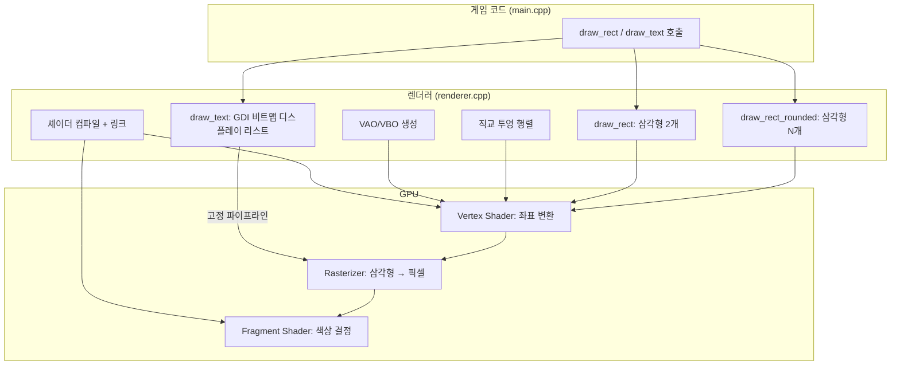
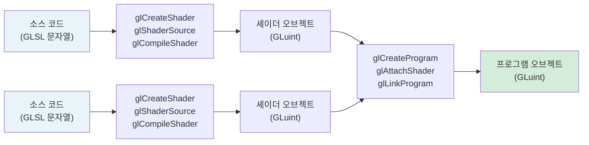
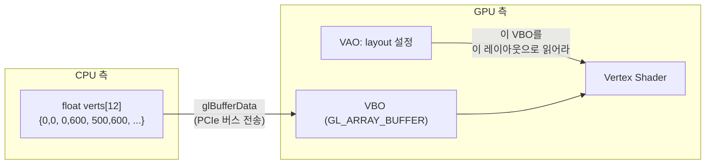
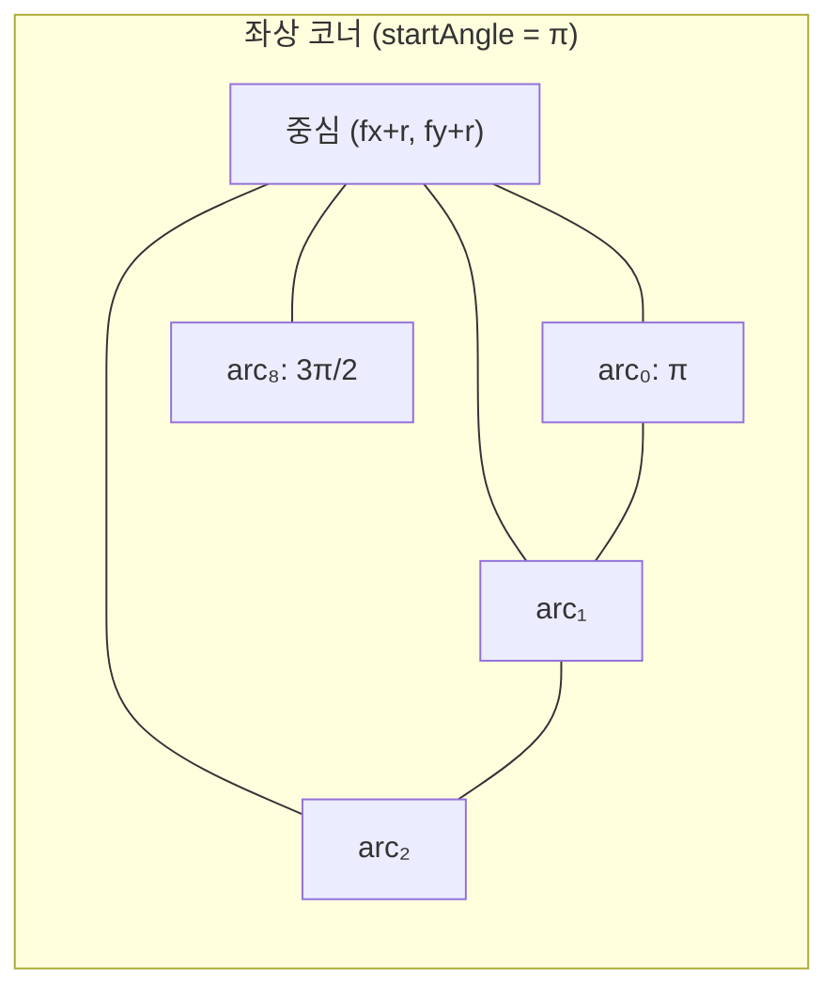
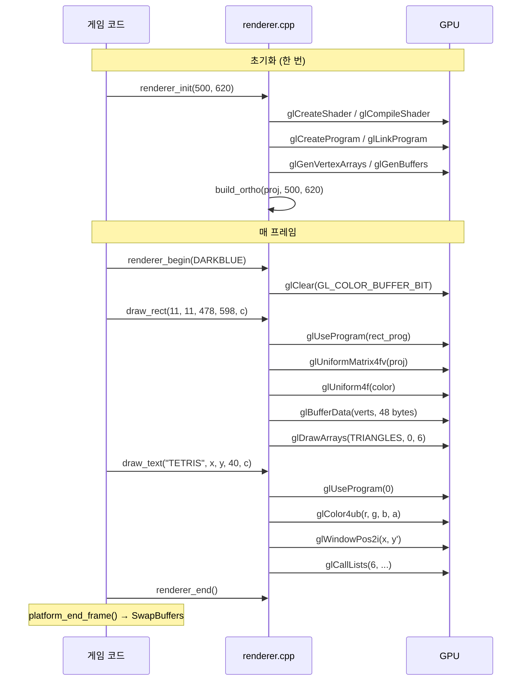

# Part 2: 사각형과 텍스트 — OpenGL 2D 렌더링 파이프라인

> **시리즈:** 제로부터 멀티플레이어 테트리스 + RL까지
> [Part 1: 윈도우와 OpenGL](./part1-window-and-opengl.md) | **Part 2** | [Part 3: 테트리스 로직](./part3-tetris-logic.md) | [Part 4: 게임 루프](./part4-game-loop.md) | [Part 5: 네트워킹](./part5-lockstep-networking.md) | [Part 6: Python RL](./part6-python-rl.md)

---

## 들어가며

Part 1에서 창을 만들고 OpenGL 컨텍스트를 바인딩했다. 이제 그 창에 무언가를 그릴 차례다.

raylib에서 사각형을 하나 그리는 코드는 이렇다:

```cpp
DrawRectangle(11, 11, 478, 598, DARKBLUE);
```

이 한 줄이 GPU 안에서 실제로 하는 일:

1. GLSL 셰이더 프로그램을 GPU에 업로드하고 컴파일/링크
2. 사각형을 삼각형 2개(꼭짓점 6개)로 분해
3. 꼭짓점 데이터를 VBO에 업로드 (CPU -> GPU 메모리 전송)
4. 직교 투영 행렬을 uniform으로 전달
5. 색상을 uniform으로 전달
6. `glDrawArrays(GL_TRIANGLES, 0, 6)` — GPU가 삼각형을 래스터라이즈

GPU는 삼각형만 이해한다. 사각형, 원, 둥근 모서리 — 모두 삼각형의 조합이다. 이 글에서는 이 과정을 단계별로 구현하면서, 2D 렌더링의 핵심 개념인 셰이더, 버텍스 버퍼, 투영 행렬, 텍스트 렌더링을 다룬다.

이 시리즈의 전체 소스 코드는 실제 프로젝트의 `renderer/renderer.cpp` (467줄), `renderer/shaders.h` (71줄), `renderer/renderer.h` (48줄)에 해당한다.

---

## 1. 렌더링 아키텍처 개요

Part 1의 플랫폼 계층 위에 렌더링 계층을 쌓는다:



렌더러의 인터페이스는 5개 함수다:

```cpp
// renderer/renderer.h
void renderer_init(int screen_w, int screen_h);     // 셰이더, VAO/VBO, 투영 행렬
void renderer_begin(Color bg);                       // glClear
void renderer_end();                                 // (현재 빈 함수)
void renderer_shutdown();                            // GL 리소스 해제

void draw_rect(int x, int y, int w, int h, Color c);
void draw_rect_rounded(int x, int y, int w, int h, float roundness, Color c);
void draw_text(const char* text, int x, int y, int size, Color c);
int  measure_text(const char* text, int size);
```

게임 코드는 `draw_rect(11, 11, 478, 598, darkBlue)` 처럼 **화면 좌표(픽셀)**로 호출한다. 렌더러가 이 좌표를 GPU가 이해하는 NDC(Normalized Device Coordinates, -1~+1 범위)로 변환한다. 이 변환을 담당하는 것이 직교 투영 행렬이다.

---

## 2. 셰이더 컴파일 파이프라인

### 2.1 GPU의 프로그래밍 모델

GPU는 범용 프로세서가 아니다. GPU에게 "이 사각형을 파란색으로 칠해라"고 직접 말할 수 없다. 대신 두 개의 작은 프로그램을 작성해서 GPU에 업로드해야 한다:

| 셰이더 | 실행 단위 | 입력 | 출력 | 역할 |
|--------|----------|------|------|------|
| Vertex Shader | 각 꼭짓점마다 1회 | 오브젝트 좌표, 변환 행렬 | `gl_Position` (NDC 좌표) | "이 꼭짓점은 화면 어디에?" |
| Fragment Shader | 삼각형 내부의 각 픽셀마다 1회 | 보간된 값, uniform | `fragColor` (RGBA) | "이 픽셀은 무슨 색?" |

사각형 하나(꼭짓점 6개, 500x600 픽셀 영역)를 그리면:
- Vertex Shader: **6회** 실행
- Fragment Shader: **~300,000회** 실행 (500 x 600 픽셀)

이 비대칭이 GPU 아키텍처의 핵심이다. Fragment Shader가 수십만 번 실행되므로, GPU는 이것을 수천 개의 코어에서 **동시에** 실행한다.

### 2.2 GLSL 셰이더 소스

이 프로젝트의 사각형 렌더링 셰이더:

```glsl
// Vertex Shader — renderer/shaders.h:27-33
#version 130
in vec2 a_pos;           // 꼭짓점 위치 (화면 좌표)
uniform mat4 u_proj;     // 직교 투영 행렬
void main() {
    gl_Position = u_proj * vec4(a_pos, 0.0, 1.0);
}
```

`#version 130`은 OpenGL 3.0에 대응하는 GLSL 버전이다. `in`, `out`, `uniform` 키워드를 사용하려면 최소 130이 필요하다.

`a_pos`는 **attribute** — VBO에서 꼭짓점마다 다른 값이 들어온다. `u_proj`는 **uniform** — 모든 꼭짓점에서 같은 값이다.

`vec4(a_pos, 0.0, 1.0)`에서 z=0.0 (2D이므로 깊이 없음), w=1.0 (동차 좌표, 투영 나눗셈에 필요)이다.

```glsl
// Fragment Shader — renderer/shaders.h:36-43
#version 130
uniform vec4 u_color;    // RGBA 색상
out vec4 fragColor;
void main() {
    fragColor = u_color;
}
```

Fragment Shader는 단순하다. 모든 픽셀이 같은 색이므로 uniform 하나를 그대로 출력한다. 텍스처 매핑이나 조명이 없는 2D 단색 렌더링에서는 이것으로 충분하다.

### 2.3 컴파일과 링크

셰이더 컴파일은 C 코드 컴파일과 유사한 구조를 갖는다:



C 컴파일러 파이프라인과의 대응:

| C 컴파일 | GLSL 컴파일 | 역할 |
|----------|------------|------|
| `gcc -c file.c` → `file.o` | `glCompileShader(s)` | 개별 셰이더 컴파일 |
| `gcc file1.o file2.o -o program` | `glLinkProgram(p)` | 셰이더 오브젝트들을 하나의 프로그램으로 링크 |
| `./program` | `glUseProgram(p)` | 이후 draw call에 이 프로그램 사용 |

구현:

```cpp
// renderer/renderer.cpp:91-126
static GLuint compile_shader(GLenum type, const char* src)
{
    GLuint s = glCreateShader(type);
    glShaderSource(s, 1, &src, nullptr);  // 소스 문자열 전달
    glCompileShader(s);

    // 컴파일 결과 확인
    GLint ok = 0;
    glGetShaderiv(s, GL_COMPILE_STATUS, &ok);
    if (!ok) {
        char log[512]; GLsizei len = 0;
        glGetShaderInfoLog(s, sizeof(log), &len, log);
        log[len < (GLsizei)sizeof(log) ? len : sizeof(log) - 1] = '\0';
        fprintf(stderr, "[GLSL] Compile error:\n%s\n", log);
    }
    return s;
}

static GLuint link_program(const char* vert_src, const char* frag_src)
{
    GLuint v = compile_shader(GL_VERTEX_SHADER,   vert_src);
    GLuint f = compile_shader(GL_FRAGMENT_SHADER, frag_src);
    GLuint p = glCreateProgram();
    glAttachShader(p, v);
    glAttachShader(p, f);
    glLinkProgram(p);

    GLint ok = 0;
    glGetProgramiv(p, GL_LINK_STATUS, &ok);
    if (!ok) {
        char log[512]; GLsizei len = 0;
        glGetProgramInfoLog(p, sizeof(log), &len, log);
        fprintf(stderr, "[GLSL] Link error:\n%s\n", log);
    }

    // 링크 완료 후 개별 셰이더 오브젝트는 삭제 가능
    // (프로그램 오브젝트가 이미 복사본을 가지고 있음)
    glDeleteShader(v);
    glDeleteShader(f);
    return p;
}
```

`glDeleteShader(v)`가 링크 직후에 호출되는 것에 주의하라. 이것은 C에서 링크 후 `.o` 파일을 삭제하는 것과 같다. 프로그램 오브젝트가 이미 컴파일된 코드의 복사본을 가지고 있으므로 원본 셰이더 오브젝트는 필요 없다.

### 2.4 셰이더 컴파일 에러 처리

`glGetShaderInfoLog`가 반환하는 에러 메시지는 GPU 드라이버가 생성한다. NVIDIA, AMD, Intel 각 드라이버마다 포맷이 다르지만, 대체로 다음 형태다:

```
0(3) : error C0000: syntax error, unexpected '}', expecting ',' or ';' at token "}"
```

셰이더 컴파일 에러를 무시하면 `glUseProgram` 이후 모든 draw call이 무시되어 **화면이 검은색**으로 나온다. 에러 로그 없이는 원인을 찾기 극히 어렵다. 따라서 컴파일/링크 에러 체크는 생략하면 안 된다.

> **레퍼런스:** OpenGL 4.6 Core Profile Specification, Section 7.1 "Shader Objects". `glGetShaderInfoLog`의 내용은 구현 정의(implementation-defined)이며, NVIDIA와 AMD의 에러 포맷이 상이하다.

---

## 3. VAO와 VBO

### 3.1 GPU 메모리 모델

CPU와 GPU는 별도의 메모리 공간을 사용한다. `draw_rect`가 호출될 때마다 꼭짓점 좌표를 CPU 메모리에서 GPU 메모리로 전송해야 한다. 이 전송 통로가 **VBO(Vertex Buffer Object)** 다.



**VBO**는 GPU 메모리에 있는 배열이다. `glBufferData`가 CPU 배열을 GPU 메모리로 복사한다.

**VAO(Vertex Array Object)** 는 "이 VBO를 어떤 레이아웃으로 해석할지"를 기록한 설정 묶음이다. 한번 설정하면 이후에는 VAO만 바인딩하면 레이아웃이 자동 적용된다.

### 3.2 초기화 코드

```cpp
// renderer/renderer.cpp:152-180
void renderer_init(int screen_w, int screen_h)
{
    s_screen_w = screen_w;
    s_screen_h = screen_h;

    build_ortho(s_proj, (float)screen_w, (float)screen_h);

    // 셰이더 컴파일 + uniform location 캐싱
    s_rect_prog  = link_program(kRectVert, kRectFrag);
    s_rect_proj  = glGetUniformLocation(s_rect_prog, "u_proj");
    s_rect_color = glGetUniformLocation(s_rect_prog, "u_color");

    // VAO 생성 및 바인딩
    glGenVertexArrays(1, &s_rect_vao);
    glBindVertexArray(s_rect_vao);

    // VBO 생성: GL_DYNAMIC_DRAW = "매 프레임 내용이 바뀔 것"이라는 힌트
    glGenBuffers(1, &s_rect_vbo);
    glBindBuffer(GL_ARRAY_BUFFER, s_rect_vbo);
    glBufferData(GL_ARRAY_BUFFER,
                 6 * 2 * sizeof(float),  // 6 꼭짓점 x 2 float (x,y)
                 nullptr,                 // 초기 데이터 없음 (나중에 채움)
                 GL_DYNAMIC_DRAW);

    // 꼭짓점 레이아웃: attribute 0 = vec2 (x, y)
    glVertexAttribPointer(0,             // location = 0 (셰이더의 a_pos)
                          2,             // 요소 개수 (vec2)
                          GL_FLOAT,      // 타입
                          GL_FALSE,      // 정규화 안 함
                          2 * sizeof(float),  // stride: 다음 꼭짓점까지 바이트 수
                          nullptr);      // offset: 0
    glEnableVertexAttribArray(0);

    glBindVertexArray(0);  // VAO 바인딩 해제 (다른 코드에 영향 방지)
}
```

`glVertexAttribPointer`의 파라미터가 이해하기 어렵다면, 이렇게 생각하면 된다:

```
VBO 내부 메모리 레이아웃:
[x0][y0] [x1][y1] [x2][y2] [x3][y3] [x4][y4] [x5][y5]
 ↑stride=8 bytes↑
 └── 2 floats ──┘
```

`glVertexAttribPointer(0, 2, GL_FLOAT, ..., 8, 0)`은 "attribute 0번에, 0바이트 오프셋에서 시작해, 8바이트 간격으로, float 2개씩 읽어라"는 뜻이다.

### 3.3 GL_DYNAMIC_DRAW vs GL_STATIC_DRAW

`glBufferData`의 마지막 파라미터는 드라이버에 대한 **성능 힌트**다:

| 힌트 | 의미 | 용도 |
|------|------|------|
| `GL_STATIC_DRAW` | 한 번 업로드, 여러 번 그리기 | 3D 모델 메시 |
| `GL_DYNAMIC_DRAW` | 자주 업데이트, 자주 그리기 | UI, 파티클 |
| `GL_STREAM_DRAW` | 매 프레임 새로 채우기 | 즉석 생성 지오메트리 |

이 프로젝트에서는 `draw_rect` 호출마다 꼭짓점 좌표가 바뀌므로 `GL_DYNAMIC_DRAW`가 적절하다. 드라이버는 이 힌트를 보고 VBO를 CPU 접근이 빠른 메모리 영역에 배치할 수 있다.

> **레퍼런스:** OpenGL 4.6 Core Profile Specification, Section 6.2 "Creating and Modifying Buffer Object Data Stores". 힌트는 성능에 영향을 주지만, 잘못 지정해도 동작은 정확하다.

---

## 4. 직교 투영 행렬

### 4.1 문제: 화면 좌표와 NDC

게임 코드는 픽셀 좌표로 생각한다: "x=11, y=11에서 시작하는 478x598 사각형". 그러나 GPU의 출력 공간인 **NDC(Normalized Device Coordinates)** 는 x, y 모두 $[-1, +1]$ 범위다:

```
화면 좌표 (Screen Coordinates)      NDC (Normalized Device Coordinates)
(0,0)──────────(500,0)              (-1,+1)─────(+1,+1)
  │                 │                  │             │
  │  게임 영역      │      ──→        │    GPU      │
  │                 │                  │    출력     │
(0,620)────────(500,620)            (-1,-1)─────(+1,-1)
```

추가로, 화면 좌표계에서 y=0은 **위쪽**이고 아래로 갈수록 증가하지만, NDC에서 y=-1이 **아래쪽**이다. y축 방향이 반대다.

### 4.2 직교 투영 행렬의 유도

직교 투영(Orthographic Projection)은 화면 좌표를 NDC로 선형 변환한다. 임의의 범위 $[l, r] \times [b, t] \times [n, f]$를 $[-1, 1]^3$으로 매핑하는 행렬:

$$\text{ortho}(l, r, b, t, n, f) = \begin{bmatrix} \frac{2}{r-l} & 0 & 0 & -\frac{r+l}{r-l} \\[6pt] 0 & \frac{2}{t-b} & 0 & -\frac{t+b}{t-b} \\[6pt] 0 & 0 & \frac{-2}{f-n} & -\frac{f+n}{f-n} \\[6pt] 0 & 0 & 0 & 1 \end{bmatrix}$$

이 행렬의 유도는 단순하다. x축을 예로 들면, $[l, r]$ 범위를 $[-1, 1]$로 매핑하는 것은 "이동 후 스케일" 두 단계다:

1. 범위의 중심을 원점으로 이동: $x' = x - \frac{r+l}{2}$
2. 범위의 폭을 2로 스케일: $x'' = x' \cdot \frac{2}{r-l}$

합치면: $x_{\text{ndc}} = \frac{2}{r-l} \cdot x - \frac{r+l}{r-l}$

y축과 z축도 동일한 패턴이다.

### 4.3 테트리스의 구체적 값

이 프로젝트에서는 다음 파라미터를 사용한다:

$$l = 0,\quad r = 500,\quad t = 0,\quad b = 620,\quad n = -1,\quad f = 1$$

$t = 0, b = 620$ (top < bottom)으로 설정하면 y축이 반전된다. 화면 좌표계에서 y가 아래로 증가하는 것과 일치시키기 위해서다.

대입하면:

$$m[0] = \frac{2}{500} = 0.004, \quad m[5] = \frac{2}{0 - 620} = -0.003226$$

$m[5]$가 음수인 것이 y축 반전의 실체다.

$$m[12] = -\frac{500}{500} = -1, \quad m[13] = -\frac{620}{-620} = 1$$

구현:

```cpp
// renderer/renderer.cpp:128-148
static void build_ortho(float* m, float w, float h)
{
    float l = 0.0f, r = w, t = 0.0f, b = h, n = -1.0f, f = 1.0f;
    memset(m, 0, 16 * sizeof(float));
    m[0]  =  2.0f / (r - l);       //  2/W
    m[5]  =  2.0f / (t - b);       //  2/(0-H) = -2/H → y축 반전
    m[10] = -2.0f / (f - n);       // -1  (z축, 2D에서 무의미)
    m[12] = -(r + l) / (r - l);    // -1  (x 이동)
    m[13] = -(t + b) / (t - b);    //  1  (y 이동)
    m[14] = -(f + n) / (f - n);    //  0  (z 이동)
    m[15] = 1.0f;
}
```

### 4.4 Column-Major 저장 순서

주의할 점이 있다. 위 행렬 수식에서 $m[0] = 2/(r-l)$은 행렬의 (0,0) 원소이고, $m[12] = -(r+l)/(r-l)$은 (0,3) 원소다. 그런데 C 배열의 인덱스와 행렬 원소의 관계가 직관적이지 않다.

OpenGL은 행렬을 **column-major** 순서로 저장한다:

$$\begin{bmatrix} m[0] & m[4] & m[8]  & m[12] \\ m[1] & m[5] & m[9]  & m[13] \\ m[2] & m[6] & m[10] & m[14] \\ m[3] & m[7] & m[11] & m[15] \end{bmatrix}$$

즉, `m[0]~m[3]`이 첫 번째 **열**이다. 대부분의 수학 교과서나 DirectX가 row-major를 사용하는 것과 반대다. `glUniformMatrix4fv`의 세 번째 파라미터 `GL_FALSE`는 "이 데이터가 column-major"임을 의미한다.

> **레퍼런스:** OpenGL 4.6 Core Profile Specification, Section 7.6.1 "Loading Uniform Variables". `transpose` 파라미터가 `GL_TRUE`면 row-major 데이터를 자동 전치한다.

### 4.5 검증: (250, 310) -> (0, 0) NDC

화면 중심 (250, 310)이 NDC 원점에 매핑되는지 확인한다:

$$\begin{bmatrix} 0.004 & 0 & 0 & -1 \\ 0 & -0.00323 & 0 & 1 \\ 0 & 0 & -1 & 0 \\ 0 & 0 & 0 & 1 \end{bmatrix} \begin{bmatrix} 250 \\ 310 \\ 0 \\ 1 \end{bmatrix} = \begin{bmatrix} 0.004 \times 250 - 1 \\ -0.00323 \times 310 + 1 \\ 0 \\ 1 \end{bmatrix} = \begin{bmatrix} 0 \\ 0 \\ 0 \\ 1 \end{bmatrix}$$

화면 중심이 NDC 원점 $(0, 0)$에 정확히 대응한다.

---

## 5. draw_rect 구현

### 5.1 삼각형 분해

GPU는 삼각형만 래스터라이즈한다. 사각형을 그리려면 삼각형 2개로 분해해야 한다:

```
(x, y)───────────(x+w, y)
  │ ╲    △2         │
  │   ╲              │
  │     ╲            │
  │  △1   ╲         │
  │         ╲        │
(x, y+h)────────(x+w, y+h)

Triangle 1: (x,y) → (x, y+h) → (x+w, y+h)    좌상 → 좌하 → 우하
Triangle 2: (x,y) → (x+w, y+h) → (x+w, y)     좌상 → 우하 → 우상
```

꼭짓점 순서(winding order)가 중요하다. OpenGL의 기본 설정에서 **반시계 방향(CCW)** 이 앞면이다. 앞면 판별에 따라 backface culling이 적용될 수 있으므로, 일관된 방향으로 꼭짓점을 나열해야 한다.

### 5.2 구현

```cpp
// renderer/renderer.cpp:298-323
void draw_rect(int x, int y, int w, int h, Color c)
{
    float fx = (float)x, fy = (float)y;
    float fw = (float)w, fh = (float)h;

    // 6개 꼭짓점 (x,y 각 2 float = 12 float 총)
    float verts[12] = {
        fx,      fy,        // 좌상
        fx,      fy + fh,   // 좌하
        fx + fw, fy + fh,   // 우하
        fx,      fy,        // 좌상 (Triangle 2)
        fx + fw, fy + fh,   // 우하
        fx + fw, fy,        // 우상
    };

    glUseProgram(s_rect_prog);
    glUniformMatrix4fv(s_rect_proj, 1, GL_FALSE, s_proj);  // 투영 행렬
    glUniform4f(s_rect_color,
        c.r / 255.0f, c.g / 255.0f, c.b / 255.0f, c.a / 255.0f);

    glBindVertexArray(s_rect_vao);
    glBindBuffer(GL_ARRAY_BUFFER, s_rect_vbo);
    glBufferData(GL_ARRAY_BUFFER, sizeof(verts), verts, GL_DYNAMIC_DRAW);
    glDrawArrays(GL_TRIANGLES, 0, 6);
    glBindVertexArray(0);
}
```

`draw_rect` 한 번 호출의 GL 명령 시퀀스:

1. `glUseProgram(s_rect_prog)` — 이 셰이더 프로그램 활성화
2. `glUniformMatrix4fv` — 투영 행렬을 GPU에 전달
3. `glUniform4f` — 색상 RGBA(0~1 범위로 정규화)를 GPU에 전달
4. `glBindVertexArray` — VAO 바인딩 (레이아웃 설정 복원)
5. `glBufferData` — 12개 float (48바이트)를 GPU에 업로드
6. `glDrawArrays(GL_TRIANGLES, 0, 6)` — 삼각형 2개 그리기

### 5.3 매 호출마다 glBufferData — 성능은?

`draw_rect`가 호출될 때마다 `glBufferData`로 VBO 전체를 교체한다. 48바이트 전송이 매 호출마다 발생하는 것이다. 이것이 비효율적으로 보일 수 있지만:

1. **48바이트**는 극도로 작다. PCIe 3.0 대역폭은 ~15 GB/s이므로 수십만 번 호출해도 병목이 안 된다
2. 테트리스는 프레임당 수십~수백 개의 `draw_rect` 호출만 발생 (블록 약 200개, UI 약 20개)
3. `GL_DYNAMIC_DRAW` 힌트 덕분에 드라이버가 CPU-접근 빠른 영역에 VBO를 배치

3D 게임에서 수십만 폴리곤의 메시를 매 프레임 업로드한다면 문제가 되겠지만, 2D 테트리스에서는 이 방식이 가장 단순하고 충분히 빠르다.

> 최적화가 필요한 경우: 모든 사각형의 꼭짓점을 하나의 큰 VBO에 모아서 `glDrawArrays` 한 번으로 그리는 **배칭(batching)** 기법이 있다. raylib의 내부 구현(`rlgl.h`)이 정확히 이 방식이다.

---

## 6. draw_rect_rounded — 둥근 모서리

### 6.1 분해 전략

둥근 모서리 사각형은 단순한 삼각형 2개로는 불가능하다. 곡선을 근사하기 위해 다음과 같이 분해한다:

```
          ╭──────── center strip ────────╮
          │    (fx+r, fy) ~ (fx+fw-r, fy+fh)    │
    ╭─────┼──────────────────────────────┼─────╮
    │ TL  │                              │ TR  │
    │arc  │                              │arc  │
    ├─────┤  left     center strip       ├─────┤
    │left │  strip                       │right│
    │strip│                              │strip│
    ├─────┤                              ├─────┤
    │ BL  │                              │ BR  │
    │arc  │                              │arc  │
    ╰─────┼──────────────────────────────┼─────╯
          ╰──────────────────────────────╯
```

**3개의 사각형:**
- Center strip: 폭 $(w - 2r)$, 높이 $h$ — 전체 세로를 관통
- Left strip: 폭 $r$, 높이 $(h - 2r)$ — 코너 사이의 좌측
- Right strip: 폭 $r$, 높이 $(h - 2r)$ — 코너 사이의 우측

**4개의 quarter-circle 아크:**
- 각 코너에 반지름 $r$의 사분원(quarter-circle)
- 각 사분원을 $N_{\text{seg}}$개의 삼각형 팬으로 근사

### 6.2 반지름 계산

```cpp
float minDim = (float)(w < h ? w : h);
float r = roundness * minDim * 0.5f;
```

$r = \text{roundness} \times \frac{\min(w, h)}{2}$

- `roundness = 0.0` → $r = 0$ → 직각 사각형 (`draw_rect`로 폴백)
- `roundness = 0.5` → $r = \min(w,h)/4$ → 적당히 둥근 모서리
- `roundness = 1.0` → $r = \min(w,h)/2$ → 정사각형이면 원, 직사각형이면 스타디움

$r < 1$이면 둥근 모서리가 시각적으로 무의미하므로 직각 사각형으로 폴백한다.

### 6.3 삼각형 팬으로 원호 근사

각 코너의 사분원을 삼각형 팬(triangle fan)으로 근사한다. 단, OpenGL의 `GL_TRIANGLE_FAN` 프리미티브가 아닌 `GL_TRIANGLES`를 사용하기 위해 각 삼각형을 독립적으로 나열한다. 이유: 사각형도 삼각형도 모두 같은 `glDrawArrays(GL_TRIANGLES, ...)` 한 번으로 그리기 위해서다.

세그먼트 수 $N_{\text{seg}} = 8$일 때, 각 삼각형은:

$$\text{center} = (c_x, c_y), \quad \text{arc}_i = (c_x + r\cos\theta_i,\ c_y + r\sin\theta_i)$$

$$\theta_i = \theta_{\text{start}} + \frac{\pi/2}{N_{\text{seg}}} \cdot i$$

각 삼각형의 꼭짓점: (center, $\text{arc}_i$, $\text{arc}_{i+1}$).



화면 좌표계에서 각도와 방향의 대응:

| 각도 | $\cos\theta$ | $\sin\theta$ | 방향 |
|------|-------------|-------------|------|
| $0$ | $+r$ | $0$ | 오른쪽 |
| $\pi/2$ | $0$ | $+r$ | 아래쪽 (화면 y축) |
| $\pi$ | $-r$ | $0$ | 왼쪽 |
| $3\pi/2$ | $0$ | $-r$ | 위쪽 |

각 코너의 시작 각도:

| 코너 | 중심 좌표 | 시작 각도 | 호 방향 |
|------|----------|----------|---------|
| 좌상(TL) | $(x+r,\; y+r)$ | $\pi$ | 왼쪽 → 위쪽 |
| 우상(TR) | $(x+w-r,\; y+r)$ | $3\pi/2$ | 위쪽 → 오른쪽 |
| 우하(BR) | $(x+w-r,\; y+h-r)$ | $0$ | 오른쪽 → 아래쪽 |
| 좌하(BL) | $(x+r,\; y+h-r)$ | $\pi/2$ | 아래쪽 → 왼쪽 |

### 6.4 꼭짓점 수 계산

총 꼭짓점 수:

$$V_{\text{total}} = \underbrace{3 \times 6}_{\text{사각형 3개}} + \underbrace{4 \times N_{\text{seg}} \times 3}_{\text{코너 4개}} = 18 + 4 \times 8 \times 3 = 114$$

float 배열 크기: $114 \times 2 = 228$ floats = 912 bytes. 여전히 1KB 미만이므로 스택 할당이 안전하다.

### 6.5 전체 구현

```cpp
// renderer/renderer.cpp:326-400
void draw_rect_rounded(int x, int y, int w, int h,
                       float roundness, Color c)
{
    float minDim = (float)(w < h ? w : h);
    float r = roundness * minDim * 0.5f;
    if (r < 1.0f) { draw_rect(x, y, w, h, c); return; }

    float fx = (float)x, fy = (float)y;
    float fw = (float)w, fh = (float)h;

    const int N_SEG = 8;
    const int MAX_VERTS = 18 + 4 * N_SEG * 3;  // 114
    float verts[MAX_VERTS * 2];                  // 228 floats
    int vi = 0;

    // 꼭짓점 추가 헬퍼 (인라인 람다)
    auto V = [&](float px, float py) {
        verts[vi++] = px; verts[vi++] = py;
    };

    // 사각형 추가 헬퍼 (삼각형 2개 = 꼭짓점 6개)
    auto Rect = [&](float rx, float ry, float rw, float rh) {
        V(rx, ry);        V(rx, ry+rh);        V(rx+rw, ry+rh);
        V(rx, ry);        V(rx+rw, ry+rh);     V(rx+rw, ry);
    };

    // 3개 사각형
    Rect(fx + r,      fy,     fw - 2*r, fh);        // 중앙 세로 스트립
    Rect(fx,          fy + r, r,        fh - 2*r);   // 좌측 세로 스트립
    Rect(fx + fw - r, fy + r, r,        fh - 2*r);   // 우측 세로 스트립

    // 코너 아크
    const float PI = 3.14159265358979f;
    auto Corner = [&](float cx, float cy, float startAngle) {
        float step = (PI * 0.5f) / N_SEG;
        for (int i = 0; i < N_SEG; ++i) {
            float a0 = startAngle + step * i;
            float a1 = startAngle + step * (i + 1);
            V(cx, cy);
            V(cx + r * cosf(a0), cy + r * sinf(a0));
            V(cx + r * cosf(a1), cy + r * sinf(a1));
        }
    };

    Corner(fx + r,      fy + r,      PI);         // 좌상
    Corner(fx + fw - r, fy + r,      PI * 1.5f);  // 우상
    Corner(fx + fw - r, fy + fh - r, 0.0f);       // 우하
    Corner(fx + r,      fy + fh - r, PI * 0.5f);  // 좌하

    int numVerts = vi / 2;

    // draw_rect와 동일한 셰이더/파이프라인
    glUseProgram(s_rect_prog);
    glUniformMatrix4fv(s_rect_proj, 1, GL_FALSE, s_proj);
    glUniform4f(s_rect_color,
        c.r / 255.0f, c.g / 255.0f, c.b / 255.0f, c.a / 255.0f);

    glBindVertexArray(s_rect_vao);
    glBindBuffer(GL_ARRAY_BUFFER, s_rect_vbo);
    glBufferData(GL_ARRAY_BUFFER,
                 vi * sizeof(float), verts, GL_DYNAMIC_DRAW);
    glDrawArrays(GL_TRIANGLES, 0, numVerts);
    glBindVertexArray(0);
}
```

핵심 포인트: `draw_rect_rounded`는 `draw_rect`와 **같은 셰이더, 같은 VAO/VBO**를 사용한다. 차이는 꼭짓점 수뿐이다 (6개 vs 114개). GPU 입장에서는 "삼각형을 좀 더 많이 그리는 것"일 뿐, 별도의 파이프라인이 필요 없다.

### 6.6 N_SEG 선택

$N_{\text{seg}} = 8$은 "코너당 삼각형 8개"를 의미한다. 이 값의 선택 근거:

- $N_{\text{seg}} = 4$: 45도 간격. 코너가 눈에 띄게 각진다.
- $N_{\text{seg}} = 8$: 11.25도 간격. 일반적인 UI 크기(30~60px 반지름)에서 매끄럽게 보인다.
- $N_{\text{seg}} = 16$: 5.6도 간격. 더 매끄럽지만 꼭짓점 수 2배.

테트리스 블록의 셀 크기(약 30x30px)에서 반지름 $r \approx 5$px 정도이므로, 8 세그먼트면 각 세그먼트가 약 1px의 호를 커버한다. 이 이상 세분화해도 시각적 차이가 없다.

---

## 7. 텍스트 렌더링

### 7.1 왜 텍스트가 어려운가

텍스트 렌더링은 2D 그래픽스에서 가장 복잡한 영역 중 하나다. 셰이더 기반 사각형은 "좌표 -> 투영 -> 색칠"이라는 단순한 파이프라인이지만, 텍스트는:

1. 글리프(glyph) 데이터를 어딘가에서 가져와야 한다 (폰트 파일 파싱)
2. 각 문자의 비트맵을 생성해야 한다 (래스터라이제이션)
3. 비트맵을 GPU에 전달해야 한다
4. 문자 간격(kerning), 줄 높이 등을 계산해야 한다

이 프로젝트에서는 **wglUseFontBitmaps**를 사용한다. Windows GDI가 글리프 래스터라이제이션을 담당하고, 그 결과를 OpenGL 디스플레이 리스트로 변환하는 Win32 전용 함수다.

### 7.2 디스플레이 리스트란

디스플레이 리스트는 OpenGL 1.x 시절의 개념이다. GL 명령어 시퀀스를 "녹화"해두었다가 `glCallLists`로 "재생"하는 매크로와 비슷하다. `wglUseFontBitmaps`가 내부적으로 하는 일:

1. GDI로 각 문자의 비트맵을 렌더링
2. 각 비트맵을 `glBitmap` 명령으로 감싸서 디스플레이 리스트에 저장
3. ASCII 32('') ~ 127('~') = 96개 문자에 대해 96개 리스트 생성

이후 `glCallLists`를 호출하면, 문자열의 각 바이트에 대해 해당 디스플레이 리스트가 실행되어 비트맵이 화면에 찍힌다.

### 7.3 폰트 로딩과 크기별 캐싱

```cpp
// renderer/renderer.cpp:219-237
void renderer_load_font(const char* path)
{
    // AddFontResourceExA: GDI에 프라이빗 폰트 등록
    // (시스템 전역이 아닌 이 프로세스 전용)
    int added = AddFontResourceExA(path, FR_PRIVATE, nullptr);
    if (added == 0) {
        strncpy(s_font_face, "Courier New", sizeof(s_font_face) - 1);
    } else {
        strncpy(s_font_face, "monogram", sizeof(s_font_face) - 1);
    }
}
```

실제 GL 디스플레이 리스트는 `draw_text` 최초 호출 시 **lazy하게** 생성된다. 각 폰트 크기마다 별도의 96개 리스트가 필요하므로, `std::map<int, GLuint>`로 크기 -> 리스트 기본 ID를 캐싱한다:

```cpp
// renderer/renderer.cpp:242-282
static GLuint get_font_list(int size)
{
    auto it = s_font_lists.find(size);
    if (it != s_font_lists.end()) return it->second;

    // 이 크기의 GDI 폰트 생성
    HFONT hfont = CreateFontA(
        size,            // 높이 (px)
        0, 0, 0,         // 폭, 기울기: 자동/없음
        FW_NORMAL,
        FALSE, FALSE, FALSE,
        ANSI_CHARSET,
        OUT_DEFAULT_PRECIS, CLIP_DEFAULT_PRECIS,
        ANTIALIASED_QUALITY,
        DEFAULT_PITCH | FF_DONTCARE,
        s_font_face);

    // 현재 GL 컨텍스트의 DC에 폰트 선택 후 디스플레이 리스트 생성
    HDC hdc = (HDC)platform_get_hdc();
    HFONT old_font = (HFONT)SelectObject(hdc, hfont);

    GLuint base = glGenLists(96);       // 96개 리스트 예약
    wglUseFontBitmapsA(hdc, 32, 96, base);  // ASCII 32~127 생성

    SelectObject(hdc, old_font);
    DeleteObject(hfont);    // GDI 폰트 핸들 해제 (리스트는 GL이 보관)

    s_font_lists[size] = base;
    return base;
}
```

`wglUseFontBitmapsA(hdc, 32, 96, base)`의 파라미터:
- `hdc`: GDI 폰트가 선택된 Device Context
- `32`: 시작 문자 코드 (ASCII space)
- `96`: 생성할 문자 수 (32~127)
- `base`: GL 디스플레이 리스트의 시작 ID

### 7.4 draw_text 구현

```cpp
// renderer/renderer.cpp:411-432
void draw_text(const char* text, int x, int y, int size, Color c)
{
    if (!text || !text[0]) return;
    GLuint base = get_font_list(size);
    if (!base) return;

    // 모던 셰이더를 해제 — 고정 파이프라인 활성화
    glUseProgram(0);

    // 색상 설정 (glWindowPos2i보다 반드시 먼저)
    glColor4ub(c.r, c.g, c.b, c.a);

    // 래스터 위치 설정 (GL의 y=0은 화면 아래)
    glWindowPos2i(x, s_screen_h - y - size);

    // 문자열의 각 문자에 대해 디스플레이 리스트 호출
    glListBase(base - 32);  // offset: 'A'(65) → 리스트 ID = base + (65-32)
    glCallLists((GLsizei)strlen(text), GL_UNSIGNED_BYTE, text);
}
```

이 코드에서 가장 미묘한 부분은 `glColor4ub`와 `glWindowPos2i`의 **호출 순서**다. 다음 절에서 이 문제를 상세히 다룬다.

---

## 8. 모던 셰이더와 고정 함수 파이프라인의 충돌

이 프로젝트의 렌더러는 두 가지 서로 다른 OpenGL 패러다임을 동시에 사용한다:

| 기능 | 파이프라인 | 시대 |
|------|-----------|------|
| `draw_rect`, `draw_rect_rounded` | **모던 셰이더** (GLSL 프로그램) | OpenGL 2.0+ (2004~) |
| `draw_text` | **고정 함수 파이프라인** (디스플레이 리스트) | OpenGL 1.x (1992~) |

이 혼합이 가능한 이유: `wglCreateContext`가 Compatibility Profile을 생성하기 때문이다. Compatibility Profile은 1.x 고정 함수와 2.0+ 셰이더를 모두 지원한다.

그러나 이 공존에는 **두 가지 함정**이 있다.

### 8.1 함정 1: glUseProgram(0)

`draw_rect`가 `glUseProgram(s_rect_prog)`를 호출하면, 이후 모든 렌더링은 이 셰이더 프로그램을 통과한다. 고정 함수 파이프라인(`glColor4ub`, `glCallLists`)의 명령은 **무시**된다.

```cpp
// 잘못된 순서
draw_rect(0, 0, 100, 100, RED);       // glUseProgram(s_rect_prog) 실행됨
draw_text("Hello", 10, 10, 20, WHITE); // glCallLists 호출하지만... 무시됨
```

해결: `draw_text` 진입 시 `glUseProgram(0)`으로 셰이더를 해제한다. 이것은 "현재 활성 프로그램 없음 = 고정 함수 파이프라인 사용"을 의미한다.

### 8.2 함정 2: glColor4ub와 glWindowPos2i의 순서

이 버그는 더 미묘하다. 증상: 메뉴 화면에서 **현재 선택된 항목이 아닌 한 칸 아래 항목**의 색상이 바뀐다.

원인을 이해하려면 `glWindowPos2i`의 동작을 정확히 알아야 한다. OpenGL 명세서에 따르면:

> **glWindowPos2i** sets the current raster position. When the raster position is set, the **current color** is copied to the **current raster color**.
> -- OpenGL 3.0 Specification, Section 2.25 "Current Raster Position"

즉, `glWindowPos2i`는 단순히 좌표만 설정하는 것이 아니라, **호출 시점의 current color를 raster color로 스냅샷**한다. 이후 `glBitmap`(디스플레이 리스트 내부)은 raster color를 사용한다.

**잘못된 순서:**

```cpp
glUseProgram(0);
glWindowPos2i(x, y);       // current color (이전 호출의 잔여값) → raster color 스냅샷
glColor4ub(255, 0, 0, 255); // 이제서야 current color를 빨간색으로 변경
glCallLists(...);            // raster color (이전 잔여값) 사용 → 잘못된 색상
```

이 경우 `glCallLists`가 사용하는 raster color는 **이전** `draw_text` 호출에서 남겨진 값이다. 메뉴 항목을 위에서 아래로 그리면, 각 항목이 **바로 이전 항목의 색상**으로 그려져서 색상이 한 칸 밀린 것처럼 보인다.

**올바른 순서:**

```cpp
glUseProgram(0);
glColor4ub(255, 0, 0, 255); // current color를 빨간색으로 먼저 설정
glWindowPos2i(x, y);         // 빨간색 → raster color로 스냅샷
glCallLists(...);             // raster color = 빨간색 → 정상
```

이 문제는 OpenGL 3.1에서 `glWindowPos`와 래스터 위치 개념 자체가 deprecated된 이유 중 하나다. 암시적 상태 복사가 디버깅하기 극히 어렵기 때문이다.

> **레퍼런스:** OpenGL 3.0 Specification (Khronos, 2008), Section 2.25 "Current Raster Position". 또한 OpenGL 3.1부터 래스터 위치 관련 함수(`glRasterPos`, `glWindowPos`, `glBitmap`)가 호환성 프로파일 전용으로 분류되었다.

---

## 9. 텍스트 폭 측정

텍스트를 중앙 정렬하거나 UI 레이아웃을 계산하려면 텍스트의 픽셀 폭을 알아야 한다:

```cpp
// 중앙 정렬 예시
int tw = measure_text("TETRIS", 40);
int x = (screen_w - tw) / 2;
draw_text("TETRIS", x, y, 40, WHITE);
```

구현은 GDI의 `GetTextExtentPoint32`를 사용한다:

```cpp
// renderer/renderer.cpp:454-467
int measure_text(const char* text, int size)
{
    if (!text || !text[0]) return 0;

    HFONT hfont = get_cached_font(size);
    if (!hfont) return (int)(strlen(text) * size * 0.6f);  // 추정값 폴백

    HDC hdc = (HDC)platform_get_hdc();
    HFONT old = (HFONT)SelectObject(hdc, hfont);
    SIZE sz;
    GetTextExtentPoint32A(hdc, text, (int)strlen(text), &sz);
    SelectObject(hdc, old);
    return sz.cx;
}
```

`get_cached_font`은 `std::map<int, HFONT>`으로 크기별 GDI 폰트 핸들을 캐싱한다. `measure_text`는 프레임당 수십 번 호출될 수 있으므로(메뉴, 점수, 레벨 등), 매번 `CreateFont`/`DeleteObject`를 반복하면 GDI 핸들이 누수되거나 성능이 저하된다. 캐시를 두면 같은 크기의 폰트를 재생성하지 않는다.

폴백 `strlen(text) * size * 0.6f`은 GDI 폰트 생성이 실패한 경우 monospace 폰트 가정으로 대략적 추정값을 반환한다. 이 경로는 정상 실행에서는 도달하지 않지만, 폰트 파일 누락 시 크래시를 방지한다.

---

## 10. 리소스 정리

OpenGL 리소스(프로그램, VAO, VBO, 디스플레이 리스트)는 GL 컨텍스트가 유효한 동안에만 삭제할 수 있다. `renderer_shutdown()`은 `platform_shutdown()` 전에 호출되어야 한다:

```cpp
// renderer/renderer.cpp:195-217
void renderer_shutdown()
{
    // 1. 폰트 디스플레이 리스트 해제
    for (auto& [size, base] : s_font_lists)
        glDeleteLists(base, 96);
    s_font_lists.clear();

    // 2. GDI 폰트 캐시 해제
    for (auto& [size, hfont] : s_font_cache)
        DeleteObject(hfont);
    s_font_cache.clear();

    // 3. 셰이더 프로그램 해제
    if (s_rect_prog) { glDeleteProgram(s_rect_prog); s_rect_prog = 0; }

    // 4. VBO/VAO 해제
    if (s_rect_vbo) { glDeleteBuffers(1, &s_rect_vbo);       s_rect_vbo = 0; }
    if (s_rect_vao) { glDeleteVertexArrays(1, &s_rect_vao); s_rect_vao = 0; }
}
```

해제 순서에 주의: 디스플레이 리스트 → GDI 핸들 → 셰이더 프로그램 → VBO → VAO. 이 순서는 "사용하는 것 → 사용되는 것" 순이다. 역순으로 하면 이미 해제된 VBO를 VAO가 참조하는 상태가 잠깐 생길 수 있다 (실제로 크래시로 이어지지는 않지만, 올바른 습관이다).

---

## 오류와 함정

이 렌더러를 작성하면서 마주친 오류들과 그 원인:

### (1) 셰이더 컴파일 에러 무시 → 검은 화면

**증상:** 화면 전체가 검은색. `glClear`는 동작하지만 어떤 것도 그려지지 않는다.

**원인:** 셰이더 소스에 오타가 있으면 `glCompileShader`가 실패한다. 이후 `glLinkProgram`도 실패한다. `glUseProgram`에 링크 실패한 프로그램을 전달하면, 이후 모든 `glDrawArrays` 호출이 아무 효과가 없다.

**해결:** `glGetShaderiv(s, GL_COMPILE_STATUS, &ok)` 체크 + `glGetShaderInfoLog`로 에러 메시지 출력. 컴파일/링크 에러 체크 없이 렌더링 코드를 작성하는 것은 C에서 `malloc` 반환값을 체크하지 않는 것과 같다.

### (2) glUseProgram 해제 누락 → 텍스트 안 보임

**증상:** 사각형은 정상 출력되지만 텍스트가 보이지 않는다. 또는 텍스트 색상이 무시된다.

**원인:** `draw_rect`가 `glUseProgram(s_rect_prog)`를 호출한 후, `draw_text`에서 해제하지 않으면 고정 함수 파이프라인(`glColor4ub`, `glCallLists`)이 무시된다. 모던 셰이더가 활성 상태이면 고정 함수 명령은 **자동으로 무시**된다.

**해결:** `draw_text` 진입 시 `glUseProgram(0)`.

> **레퍼런스:** OpenGL 4.6 Core Profile Specification, Section 7.3 "Program Objects". "If no program object is active for a shader stage, the results of that stage are undefined." Compatibility Profile에서는 `glUseProgram(0)`이 고정 함수 복원을 의미한다.

### (3) glColor4ub와 glWindowPos2i 순서 → 색상 한 칸 밀림

**증상:** 메뉴 화면에서 선택 하이라이트가 현재 항목이 아닌 **다음 항목**에 표시된다.

**원인:** 섹션 8.2에서 상세히 다룬 glWindowPos2i의 raster color 스냅샷 동작. `glColor4ub` 호출이 `glWindowPos2i` 이후에 오면, 이전 색상이 스냅샷된다.

**해결:** `glColor4ub`를 `glWindowPos2i`보다 **먼저** 호출.

### (4) glBufferData 크기 불일치 → GPU 쓰레기 데이터

**증상:** 사각형이 화면 밖으로 뻗어나가거나 기괴한 삼각형이 나타난다.

**원인:** `glBufferData`의 `size` 파라미터가 실제 데이터 크기보다 크면, VBO 뒤쪽에 초기화되지 않은 GPU 메모리 값이 꼭짓점으로 해석된다.

**해결:** `glBufferData(GL_ARRAY_BUFFER, vi * sizeof(float), verts, GL_DYNAMIC_DRAW)`에서 `vi`가 실제 채워진 float 개수와 정확히 일치하는지 확인. `draw_rect_rounded`에서 `vi`를 인덱스로 관리하여 이 문제를 방지한다.

### (5) 폰트 디스플레이 리스트 미해제 → GDI 핸들 누수

**증상:** 장시간 실행 시 텍스트가 깨지거나 새 폰트 크기가 생성되지 않는다.

**원인:** Windows의 GDI 핸들 풀은 프로세스당 10,000개로 제한된다. `DeleteObject(hfont)`를 빠뜨리면 `CreateFontA` 호출마다 핸들이 소모된다.

**해결:** `get_font_list`에서 `wglUseFontBitmaps` 후 즉시 `DeleteObject(hfont)`. GL 디스플레이 리스트는 GDI 핸들과 독립적으로 유지되므로, GDI 폰트 핸들은 리스트 생성 직후 해제해도 안전하다. 별도로 `measure_text` 용도의 `s_font_cache`는 `renderer_shutdown`에서 일괄 해제한다.

---

## 정리

이 글에서 다룬 렌더링 파이프라인의 전체 흐름:



한 프레임의 렌더링은 다음 순서로 진행된다:

1. `renderer_begin` — 백 버퍼를 배경색으로 클리어
2. `draw_rect` / `draw_rect_rounded` — 모던 셰이더 파이프라인으로 사각형 렌더링
3. `draw_text` — 고정 함수 파이프라인으로 텍스트 렌더링 (셰이더 해제 필수)
4. `renderer_end` — (빈 함수)
5. `platform_end_frame` → `SwapBuffers` — 백 버퍼와 프론트 버퍼 교체

다음 Part 3에서는 이 렌더러 위에 그려질 **테트리스 시뮬레이션 엔진**을 다룬다. 렌더링과 완전히 분리된 순수 게임 로직: 그리드, 블록 회전, 충돌 감지, 라인 클리어, 그리고 결정론적 RNG.

---

## 참고 자료

1. **OpenGL 4.6 Core Profile Specification** (Khronos Group, 2017). Section 7.1 "Shader Objects", Section 7.3 "Program Objects", Section 6.2 "Buffer Object Data Stores"
2. **OpenGL 3.0 Specification** (Khronos Group, 2008). Section 2.25 "Current Raster Position" — `glWindowPos`의 래스터 색상 스냅샷 동작 명세
3. **"Learn OpenGL"** (Joey de Vries, learnopengl.com). "Hello Triangle", "Shaders", "Textures" 챕터 — 셰이더 컴파일, VAO/VBO, 직교 투영의 tutorial 레벨 설명
4. **"OpenGL SuperBible, 7th Edition"** (Graham Sellers, Richard Wright Jr., Nicholas Haemel, 2015). Chapter 3 "Following the Pipeline" — 그래픽스 파이프라인의 각 스테이지 설명
5. **Microsoft Win32 API Documentation**. `wglUseFontBitmaps`, `GetTextExtentPoint32`, `AddFontResourceEx` — GDI 폰트를 OpenGL에 연결하는 Win32 전용 함수
6. **"Handmade Hero"** (Casey Muratori, handmadehero.org). Day 234-240 "OpenGL" — 프레임워크 없이 직접 OpenGL 렌더러를 작성하는 실습
