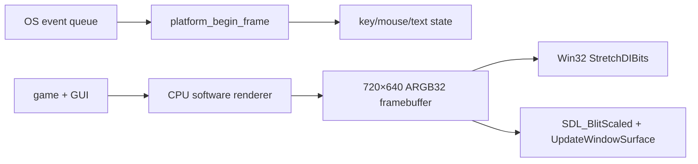

# Part 2: 플랫폼 계층 — 창, 입력, CPU 프레임버퍼 표시

> **시리즈:** 제로부터 멀티플레이어 테트리스 + RL까지
>
> [시리즈 목차](./README.md) · [이전: Part 1 — 결정론적 SimGame](./part1-deterministic-simulation.md) · **Part 2** · [다음: Part 3 — 소프트웨어 렌더러](./part3-rendering-and-ui.md)

---

## 이번 Part의 구현 계약

- **선행 상태:** 창 없이 실행되는 결정론적 `SimGame`.
- **이번 Part의 파일:** `platform/platform.h`, `platform/win32.cpp`, `platform/sdl.cpp`, `CMakeLists.txt`.
- **연결점:** renderer가 만든 ARGB32 배열을 플랫폼이 표시하고, 입력/시간을 게임 루프에 돌려준다.
- **완료 게이트:** Win32 빌드, SDL2 빌드, 레터박스와 마우스 역매핑 확인.

## 이번 장의 목표

Part 1의 `SimGame`은 창 없이도 동작한다. 이번 장에서는 게임 클라이언트에
운영체제 창, 입력, 시간, 그리고 **완성된 CPU 픽셀 배열을 화면에 복사하는
경로**를 붙인다.

이 프로젝트는 그래픽 API 컨텍스트를 만들지 않는다. Windows에서는 Win32와
GDI를 직접 사용하고, Linux/macOS에서는 SDL2에 창·입력·최종 surface 복사만
맡긴다. 도형, 텍스트, 이미지의 픽셀은 Part 3의 소프트웨어 렌더러가 만든다.

완료 후 데이터 흐름은 다음과 같다.



## 1. 플랫폼 경계

공용 인터페이스는 `platform/platform.h`에 있다. 상위 게임 코드는 어떤
백엔드가 선택됐는지 알 필요가 없다.

```cpp
void  platform_init(int w, int h, const char* title);
void  platform_shutdown();
bool  platform_should_close();

float platform_begin_frame();
void  platform_present(const uint32_t* pixels,
                       int w, int h, int pitch_bytes);
void  platform_end_frame();

bool  platform_key_pressed(int key);
bool  platform_key_down(int key);
char  platform_get_char_pressed();

int   platform_mouse_x();
int   platform_mouse_y();
bool  platform_mouse_pressed(int button);
bool  platform_mouse_down(int button);
bool  platform_mouse_released(int button);
float platform_mouse_wheel();

double platform_get_time();
void   platform_set_window_size(int w, int h);
void   platform_set_fullscreen(bool on);
bool   platform_fullscreen_supported();
void   platform_set_vsync(bool on);
```

핵심 추가점은 `platform_present`다. 렌더러가 소유한 픽셀 메모리를 플랫폼이
읽기만 한다. 이 경계 덕분에 나중에 GDI/SDL 표시를 DirectX 또는 Vulkan
업로드로 교체하더라도 게임의 래스터화 코드는 유지할 수 있다.

## 2. 픽셀 계약

프레임버퍼 픽셀은 `uint32_t` 하나이며 값은 `0xAARRGGBB`다.

```text
31             24 23             16 15              8 7               0
+----------------+-----------------+-----------------+-----------------+
| alpha          | red             | green           | blue            |
+----------------+-----------------+-----------------+-----------------+
```

리틀 엔디언 메모리에서는 바이트가 `BB GG RR AA` 순서다. 이것은 Windows의
32-bit `BI_RGB` DIB와 SDL의 다음 channel mask에 바로 맞는다.

```cpp
Rmask = 0x00FF0000;
Gmask = 0x0000FF00;
Bmask = 0x000000FF;
Amask = 0xFF000000;
```

`pitch_bytes`는 한 행에서 다음 행으로 이동할 바이트 수다. 현재 렌더러는
촘촘한 배열이므로 `width * sizeof(uint32_t)`지만, 플랫폼 API가 pitch를
따로 받으면 나중에 행 패딩이나 다른 surface를 지원할 수 있다.

## 3. Win32 창과 메시지 루프

`platform/win32.cpp`는 다음 OS 기능만 담당한다.

- `RegisterClassExA` / `CreateWindowExA`: 창 생성
- `PeekMessageA` / `DispatchMessageA`: 논블로킹 이벤트 처리
- `WM_KEY*`, `WM_CHAR`, `WM_MOUSE*`: 입력 상태 갱신
- `QueryPerformanceCounter`: 델타타임과 경과 시간
- `StretchDIBits`: CPU 프레임버퍼 표시

GPU 픽셀 포맷, WGL 컨텍스트, 함수 포인터 로딩은 없다.

### 3.1 level과 edge 입력

키와 마우스 버튼은 현재 상태와 이전 프레임 상태를 함께 저장한다.

```cpp
pressed  = state && !previous;
down     = state;
released = !state && previous;
```

`platform_begin_frame`은 OS 메시지를 처리하기 전에 현재 상태를 `previous`로
복사한다. 그 뒤 도착한 메시지가 `state`를 바꾸므로 한 프레임 edge를 정확히
검출할 수 있다.

### 3.2 문자 입력

게임 조작 키와 문자 입력은 다르다. `WM_KEYDOWN`은 물리 키 상태에 가깝고,
`WM_CHAR`는 키보드 레이아웃과 조합을 거친 문자다. 현재 게임의 주소/이름
입력 큐는 기존 계약을 따라 ASCII 한 바이트만 보관한다.

### 3.3 GDI로 프레임 표시

`platform_present`는 창 크기의 GDI memory DC를 backbuffer로 유지한다. 먼저
그 backbuffer를 검정으로 지우고 레터박스 안쪽에 DIB를 확대 복사한 뒤,
마지막에 창 DC로 한 번만 `BitBlt`한다. 검은 바와 게임 화면이 따로 보이는
깜빡임을 피하기 위해서다.

```cpp
BITMAPINFO info{};
info.bmiHeader.biSize = sizeof(BITMAPINFOHEADER);
info.bmiHeader.biWidth = width;
info.bmiHeader.biHeight = -height; // top-down
info.bmiHeader.biPlanes = 1;
info.bmiHeader.biBitCount = 32;
info.bmiHeader.biCompression = BI_RGB;

StretchDIBits(memory_dc,
    vp_x, vp_y, vp_w, vp_h,
    0, 0, width, height,
    pixels, &info, DIB_RGB_COLORS, SRCCOPY);
BitBlt(window_dc, 0, 0, window_w, window_h,
       memory_dc, 0, 0, SRCCOPY);
```

음수 `biHeight`가 중요하다. 양수면 DIB는 아래 행부터 시작하는 bottom-up
이미지로 해석되어 화면이 상하 반전된다.

## 4. SDL2 백엔드

`platform/sdl.cpp`는 같은 계약을 SDL2로 구현한다.

| 역할 | Win32 | SDL2 |
|---|---|---|
| 창 | `CreateWindowExA` | `SDL_CreateWindow` |
| 이벤트 | `PeekMessageA` | `SDL_PollEvent` |
| 시간 | `QueryPerformanceCounter` | `SDL_GetPerformanceCounter` |
| 최종 표시 | `StretchDIBits` | `SDL_BlitScaled` |
| 화면 갱신 | GDI 호출 즉시 | `SDL_UpdateWindowSurface` |

SDL 창에는 `SDL_WINDOW_OPENGL` 플래그가 없다. 프레임마다 렌더러 메모리를
소유하지 않는 임시 `SDL_Surface`로 감싼다.

```cpp
SDL_Surface* frame = SDL_CreateRGBSurfaceFrom(
    const_cast<uint32_t*>(pixels), width, height, 32, pitch_bytes,
    0x00FF0000u, 0x0000FF00u, 0x000000FFu, 0xFF000000u);

SDL_BlitScaled(frame, nullptr, window_surface, &destination);
SDL_UpdateWindowSurface(window);
SDL_FreeSurface(frame);
```

`SDL_CreateRGBSurfaceFrom`은 픽셀을 복사하지 않는다. wrapper surface만
만들기 때문에 `SDL_FreeSurface(frame)`을 호출해도 렌더러의 프레임버퍼는
해제되지 않는다.

SDL2는 여기서 렌더러가 아니다. 이미 완성된 그림을 OS 창 형식으로 변환하고
확대하는 **표시 어댑터**다.

## 5. 논리 해상도와 레터박스

게임과 GUI는 항상 720×640 좌표를 사용한다. 실제 창은 1080×960일 수도 있고
전체화면 1920×1080일 수도 있다.

```text
logical framebuffer: 720 × 640 (9:8)
window surface:       arbitrary
presentation rect:    window 안에서 9:8을 유지하는 최대 사각형
```

창이 더 넓으면 좌우에 검은 바를, 더 높으면 위아래에 검은 바를 둔다.

```cpp
if (window_aspect > logical_aspect) {
    vp_h = window_h;
    vp_w = round(window_h * logical_aspect);
    vp_x = (window_w - vp_w) / 2;
    vp_y = 0;
} else {
    vp_w = window_w;
    vp_h = round(window_w / logical_aspect);
    vp_x = 0;
    vp_y = (window_h - vp_h) / 2;
}
```

마우스는 반대 변환을 거친다.

```cpp
logical_x = (raw_x - vp_x) * logical_w / vp_w;
logical_y = (raw_y - vp_y) * logical_h / vp_h;
```

레터박스 바를 클릭하면 논리 범위 밖 좌표가 나온다. 위젯 hit-test에 걸리지
않으므로 별도 분기 없이 안전하다.

## 6. 프레임 시간과 소프트웨어 pacing

GPU swap interval이 없으므로 설정의 `vsync` 키는 호환성을 위해 이름만
유지하고, 실제 의미는 60 FPS 소프트웨어 pacing이다.

```cpp
platform_begin_frame(); // frame_start 기록
// update + rasterize + present
platform_end_frame();   // 16.67ms까지 남은 시간 sleep
```

이 방식은 CPU를 무제한 사용하지 않게 하지만 vblank와 직접 동기화하지 않는다.
따라서 tearing 제거를 보장하는 진짜 VSync는 아니다. DirectX/Vulkan 표시
백엔드를 추가한다면 `platform_set_vsync` 내부에서 swapchain present mode로
다시 구현할 수 있다.

시뮬레이션 결정론에는 영향이 없다. Part 4의 fixed-step 누산기가 렌더 빈도와
독립적으로 60Hz 틱을 만든다.

## 7. CMake 백엔드 선택

공통 소프트웨어 렌더러는 모든 클라이언트 빌드에 들어간다.

```cmake
set(TETRIS_GAME_COMMON
    # ...
    renderer/renderer.cpp
    renderer/text_software.cpp
    renderer/image.cpp
)
```

플랫폼과 오디오만 선택된다.

```cmake
if (TETRIS_USE_SDL2)
    # platform/sdl.cpp + audio/sdl_audio.cpp
else()
    # platform/win32.cpp + audio/audio.cpp
endif()
```

OpenGL 패키지를 찾거나 링크하지 않는다.

## 8. 검증

Windows:

```powershell
cmake -S . -B build -DTETRIS_USE_SDL2=OFF
cmake --build build --config Release --target tetris
```

Linux:

```bash
sudo apt install build-essential cmake libsdl2-dev
cmake -S . -B build -DTETRIS_USE_SDL2=ON
cmake --build build --target tetris
```

수동으로 확인할 항목:

1. 창 크기를 바꿔도 보드 비율이 유지된다.
2. 레터박스 바 클릭이 UI를 누르지 않는다.
3. 이미지의 위아래와 RGB 채널이 뒤집히지 않는다.
4. pacing ON에서 렌더 빈도가 약 60 FPS로 제한된다.
5. Windows와 SDL 빌드가 같은 게임 좌표를 표시한다.

## 마무리

플랫폼 계층은 운영체제가 요구하는 마지막 복사와 입력만 소유한다. 픽셀을
어떻게 만드는지는 모른다. 다음 Part에서는 720×640 ARGB32 메모리에 사각형,
글리프, 이미지를 직접 그리는 과정을 구현한다.
