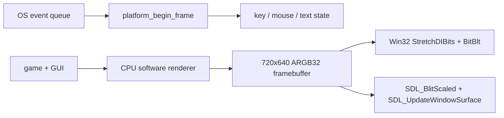
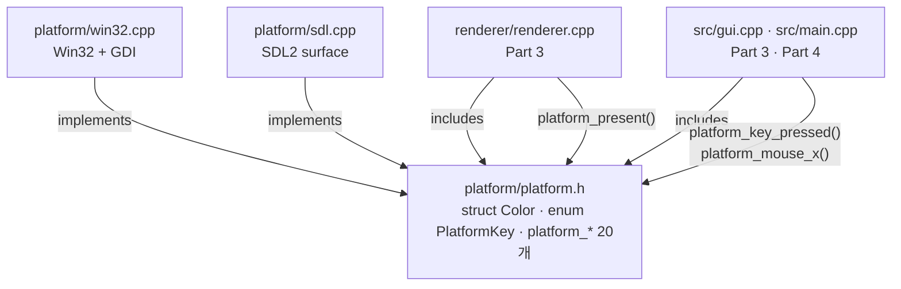
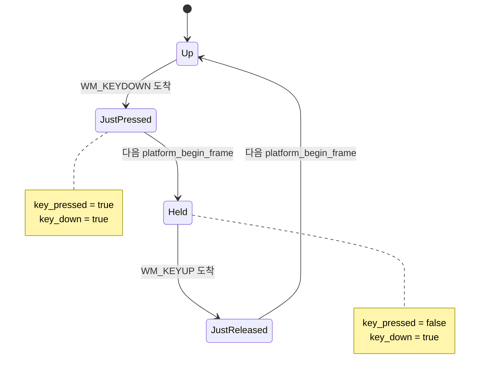

# Part 2: 플랫폼 계층 — 창, 입력, CPU 프레임버퍼 표시

> **시리즈:** 제로부터 멀티플레이어 테트리스 + RL까지
>
> [시리즈 목차](./README.md) · [이전: Part 1 — 결정론적 SimGame](./part1-deterministic-simulation.md) · **Part 2** · [다음: Part 3 — 소프트웨어 렌더러](./part3-rendering-and-ui.md)

---

## 이번 Part의 구현 계약

- **선행 상태:** [Part 1](./part1-deterministic-simulation.md) 까지 만든 `src/sim_game.cpp`, `src/position.cpp`, `core/` 헤더들, `tests/sim_hash_dump.cpp`. 이 코드는 창도 그래픽도 없이 `SimGame::Update()` 만으로 동작한다.
- **이번 Part의 파일:** `platform/platform.h`, `platform/win32.cpp`, `platform/sdl.cpp`, `CMakeLists.txt`.
- **연결점:** 아직 게임 코드와 붙지 않는다. 이 장은 상위 계층이 앞으로 쓸 **계약**(`Color`, `PlatformKey`, `platform_*` 함수 20개)과 그 계약의 두 구현을 만든다. 픽셀을 만들어 넣는 쪽은 [Part 3](./part3-rendering-and-ui.md) 의 `renderer_end` 이고, 이 계층을 프레임 루프에 엮는 쪽은 [Part 4](./part4-game-wrapper-and-loop.md) 의 `main()` 이다.
- **완료 게이트:** 이 장 말미의 `part2_present_demo` 를 빌드해 실행. 체크보드 프레임버퍼가 상하 반전 없이, RGB 채널 순서 그대로, 레터박스 안에 나타나고, stdout 에 논리 마우스 좌표와 dt 가 찍힌다.

`tetris` 타깃은 이 시점에 **빌드할 수 없다.** `CMakeLists.txt` 의 `tetris` 는 `src/main.cpp`, `src/game.cpp`, `src/gui.cpp`, `net/*.cpp`, `renderer/*.cpp`, `bot/*.cpp`, `meta/http_client.cpp` 를 전부 요구하고, configure 단계에서 `third_party/httplib.h` 존재 검사에도 걸린다. 그래서 이 장의 완료 게이트는 독자가 직접 만드는 작은 데모 실행 파일이다.

## 이번 장의 목표

Part 1 의 `SimGame` 은 창 없이도 동작한다. 이번 장에서는 그 위에 운영체제 창, 입력, 시간, 그리고 **완성된 CPU 픽셀 배열을 화면에 복사하는 경로**를 붙인다.

이 프로젝트는 그래픽 API 컨텍스트를 만들지 않는다. Windows 에서는 Win32 와 GDI 를 직접 사용하고, Linux/macOS 에서는 SDL2 에 창·입력·최종 surface 복사만 맡긴다. 도형, 텍스트, 이미지의 픽셀은 Part 3 의 소프트웨어 렌더러가 CPU 에서 만든다.

완료 후 데이터 흐름은 다음과 같다.


```mermaid
flowchart LR
    OS["OS event queue"] --> P["platform_begin_frame"]
    P --> I["key / mouse / text state"]
    G["game + GUI"] --> R["CPU software renderer"]
    R --> F["720x640 ARGB32 framebuffer"]
    F --> W["Win32 StretchDIBits + BitBlt"]
    F --> S["SDL_BlitScaled + SDL_UpdateWindowSurface"]
```

## 1. 이 계층이 소유하는 것과 소유하지 않는 것

플랫폼 계층의 책임을 한 줄로 줄이면 **"운영체제만 할 수 있는 일"** 이다. 창을 만들고, 이벤트 큐를 비우고, 고해상도 타이머를 읽고, 완성된 픽셀 블록을 창에 복사한다. 그 외에는 아무것도 하지 않는다. 특히 다음은 **소유하지 않는다**.

- 픽셀을 만드는 일 (Part 3 의 `blend_surface`)
- 게임 상태 (Part 1 의 `SimGame`)
- 프레임 누산기와 고정 스텝 (Part 4 의 `main()`)
- 위젯 hit-test (Part 3 의 `gui_hover_rect`)

이 구분이 중요한 이유는 두 개의 구현이 존재하기 때문이다. `platform/win32.cpp` 와 `platform/sdl.cpp` 는 **같은 헤더를 구현하는 형제**이고, 링크 시점에 정확히 하나만 선택된다. 인터페이스가 넓어지면 두 파일이 같은 속도로 넓어진다. 그래서 계약은 의도적으로 20개 함수로 묶여 있다.


```mermaid
graph TB
    H["platform/platform.h<br/>struct Color · enum PlatformKey · platform_* 20개"]
    W["platform/win32.cpp<br/>Win32 + GDI"]
    S["platform/sdl.cpp<br/>SDL2 surface"]
    R["renderer/renderer.cpp<br/>Part 3"]
    G["src/gui.cpp · src/main.cpp<br/>Part 3 · Part 4"]

    W -- implements --> H
    S -- implements --> H
    R -- includes --> H
    G -- includes --> H
    R -- "platform_present()" --> H
    G -- "platform_key_pressed()<br/>platform_mouse_x()" --> H
```

두 구현은 서로를 전혀 모른다. 공유하는 것은 헤더 하나뿐이고, 공유하는 상태는 없다. 각 `.cpp` 가 자기 파일 스코프의 `static` 변수로 키 배열·마우스 상태·뷰포트 사각형을 따로 들고 있다. 이 중복은 의도적이다. 공통 상태를 별도 파일로 빼면 "어느 백엔드가 언제 그 상태를 갱신하는가" 라는 추적 문제가 생기는데, 각각 200~350줄짜리 파일에서는 중복이 더 싸다.

### 1.1 왜 창부터 직접 만드는가

[Part 0](./part0-project-setup.md) 에서 완성형 엔진을 쓰지 않기로 한 이유는 이미 밝혔다. 여기서는 그 아래 층위의 선택을 본다 — 엔진을 안 쓰더라도 창과 입력을 대신 해주는 라이브러리는 여러 단계로 존재한다.

| 선택지 | 얻는 것 | 잃는 것 |
|---|---|---|
| Unity · Unreal · Godot | 창·입력·렌더·오디오·에디터·빌드 파이프라인 전부 | 프레임 타이밍과 입력 큐잉이 블랙박스. lockstep 결정론을 보장하기 어렵다 |
| raylib | `InitWindow` 한 줄로 창·입력·2D 드로잉·오디오 전부 | 내부가 블랙박스. 창 생성 80줄과 `IsKeyPressed` 의 실체를 볼 수 없다 |
| SDL_Renderer (SDL2 가속 경로) | 크로스 플랫폼 + GPU 텍스처 배칭 | 드라이버/백엔드에 따라 픽셀 결과가 달라진다. 소프트웨어 래스터라이저를 배울 기회가 사라진다 |
| Win32/SDL surface 직접 (이 프로젝트) | 창 생성·메시지 루프·프레임버퍼 복사의 전 과정을 소유 | 코드 두 벌. 스케일링·레터박스·문자 입력을 직접 짜야 한다 |

이 프로젝트는 세 번째를 택했다. 학습 목표가 "그리기 명령이 픽셀로 바뀌는 과정" 이므로, 그 과정을 감추는 라이브러리는 목표와 충돌한다. 다만 **창과 이벤트 큐까지 직접 만들 이유는 없다** — 그건 그래픽스가 아니라 OS 붙임 작업이다. 그래서 Windows 에서만 Win32 를 직접 쓰고(그쪽이 GDI 표시 경로와 함께 배울 값이 있다), Linux/macOS 는 SDL2 에 위임한다. SDL2 는 여기서 렌더러가 아니라 **표시 어댑터**다.

`platform.h` 의 주석이 이 의도를 명시한다.

**현재 소스 발췌 — `platform/platform.h:4-14`**

```cpp
// ─────────────────────────────────────────────────────────────────────────────
// platform/platform.h  — OS 추상화 인터페이스
//
// raylib의 InitWindow / IsKeyPressed / GetFrameTime 등을 대체합니다.
// 구현은 platform/win32.cpp에 있습니다.
//
// 학습 포인트:
//   raylib::InitWindow() 는 아래 platform_init() 이 호출하는 80줄을 숨겨놓은 것.
//   raylib::IsKeyPressed()는 WM_KEYDOWN 메시지로 채우는 keyState[] 테이블 조회.
//   raylib::GetFrameTime()은 QueryPerformanceCounter 두 번의 차이.
// ─────────────────────────────────────────────────────────────────────────────
```

## 2. `platform.h` — 공개 계약

이 헤더는 시리즈 전체가 의존하는 두 개의 타입을 정의한다. `struct Color` 는 렌더러·GUI·게임 코드가 전부 쓰고, `enum PlatformKey` 는 입력을 처리하는 모든 곳이 쓴다.

**현재 소스 발췌 — `platform/platform.h:16-53`**

```cpp
// ─── 색상 ─────────────────────────────────────────────────────────────────────
// raylib의 Color { r, g, b, a } 와 동일한 레이아웃.
struct Color { uint8_t r, g, b, a; };

// 공통 색상 상수 (main.cpp 변경을 최소화하기 위해 raylib 이름 유지)
constexpr Color WHITE    = {255, 255, 255, 255};
constexpr Color GRAY     = {130, 130, 130, 255};
constexpr Color GREEN    = {0,   228,  48, 255};
constexpr Color YELLOW   = {253, 249,   0, 255};
constexpr Color RED      = {230,  41,  55, 255};
constexpr Color RAYWHITE = {245, 245, 245, 255};

// ─── 키코드 ───────────────────────────────────────────────────────────────────
// 값이 Win32 VK_* 상수와 직접 대응하므로 별도 매핑 테이블이 필요 없습니다.
// WndProc의 WM_KEYDOWN 에서 wParam 을 그대로 keyState[] 인덱스로 씁니다.
enum PlatformKey : int {
    PKEY_LEFT   = 0x25,  // VK_LEFT
    PKEY_RIGHT  = 0x27,  // VK_RIGHT
    PKEY_UP     = 0x26,  // VK_UP
    PKEY_DOWN   = 0x28,  // VK_DOWN
    PKEY_SPACE  = 0x20,  // VK_SPACE
    PKEY_ENTER  = 0x0D,  // VK_RETURN
    PKEY_ESCAPE = 0x1B,  // VK_ESCAPE
    PKEY_BACK   = 0x08,  // VK_BACK (Backspace)
    PKEY_Q      = 'Q',
    PKEY_R      = 'R',
    PKEY_H      = 'H',
    PKEY_P      = 'P',
    PKEY_C      = 'C',
    PKEY_J      = 'J',
    PKEY_T      = 'T',
    PKEY_Y      = 'Y',
    PKEY_N      = 'N',
    PKEY_LBRACKET = 0xDB,  // VK_OEM_4: [
    PKEY_RBRACKET = 0xDD,  // VK_OEM_6: ]
    PKEY_F5     = 0x74,  // VK_F5
    PKEY_F6     = 0x75,  // VK_F6
};
```

여기서 배울 점이 세 개 있다.

**첫째, `Color` 는 4바이트 POD 다.** `uint8_t r, g, b, a` 순서이며 패딩이 없다. 렌더러가 `Color` 를 값으로 받아 레지스터에 담아 넘길 수 있고, 배열로 만들어도 메모리가 촘촘하다. 주의할 점은 이 구조체의 필드 순서(RGBA)와 프레임버퍼의 비트 배치(ARGB)가 **다르다**는 것이다. 변환은 Part 3 의 `pack_opaque` / `blend_surface` 가 담당한다.

**둘째, `PlatformKey` 의 값이 Win32 `VK_*` 상수와 그대로 같다.** `PKEY_LEFT = 0x25` 는 `VK_LEFT` 다. 그래서 Win32 백엔드는 매핑 테이블이 필요 없다 — `WM_KEYDOWN` 의 `wParam` 을 그대로 `s_key_state[]` 인덱스로 쓴다. 이 설계의 대가는 SDL 쪽이 치른다. SDL 은 자기 `SDL_Keycode` 를 `PlatformKey` 로 **역매핑**해야 하고, 그 매핑 테이블이 `sdl_to_platform_key` 다. 테이블에 없는 키는 `-1` 로 버려진다. 즉 **게임이 쓰는 키만 SDL 에서 살아난다** — 새 키를 바인딩하려면 `PlatformKey` 에 상수를 추가하고 `sdl_to_platform_key` 에 `case` 를 추가하는 두 곳 편집이 항상 짝이다.

**셋째, 색 상수 이름이 raylib 그대로다.** `WHITE`, `GRAY`, `GREEN`, `YELLOW`, `RED`, `RAYWHITE`. 이 프로젝트는 raylib 에서 출발해 자작 계층으로 갈아탄 이력이 있고, 상위 코드의 diff 를 줄이려고 이름을 유지했다. `RAYWHITE` 라는 이름이 남아 있는 이유가 그것이다.

이어서 함수 계약이다. 프레임 수명주기 관련 부분을 먼저 본다.

**현재 소스 발췌 — `platform/platform.h:58-86`**

```cpp
void   platform_init(int w, int h, const char* title);

// 윈도우 및 플랫폼 자원 해제. CloseWindow() 대체.
void   platform_shutdown();

// 창 닫기 요청(WM_CLOSE / WM_DESTROY / SDL_QUIT)을 받으면 true.
// ESC 키는 여기 관여하지 않는다 — 화면별 뒤로가기로만 쓰인다.
bool   platform_should_close();

// 프레임 시작: 이전 키 상태 스냅샷 + 메시지 루프(PeekMessage) + 델타타임 반환.
// GetFrameTime() 대체. MAX_DELTA = 100ms 클램핑 포함.
float  platform_begin_frame();

// 프레임 끝. 소프트웨어 VSync가 켜졌다면 60 Hz에 맞춰 남은 시간을 쉰다.
void   platform_end_frame();

// CPU ARGB32 프레임버퍼를 창에 표시한다. pixels의 각 uint32_t는
// 0xAARRGGBB이며, pitch_bytes는 한 행의 바이트 수다.
void   platform_present(const uint32_t* pixels, int w, int h, int pitch_bytes);

// 이 프레임에 처음 눌린 키인가? IsKeyPressed() 대체.
// keyState[key] == true && keyPrev[key] == false
bool   platform_key_pressed(int key);

// 현재 눌려있는 키인가? IsKeyDown() 대체.
bool   platform_key_down(int key);

// WM_CHAR 로 받은 문자 하나 꺼내기 (없으면 0). GetCharPressed() 대체.
char   platform_get_char_pressed();
```

`platform_begin_frame` 의 주석에 있는 **"MAX_DELTA = 100ms 클램핑 포함"** 이 이 계층의 계약 중 가장 자주 잊히는 항목이다. 자세한 이유는 아래 시간 절에서 다룬다.

마우스와 창 설정은 다음과 같다.

**현재 소스 발췌 — `platform/platform.h:91-122`**

```cpp
int    platform_mouse_x();
int    platform_mouse_y();
// 이번 프레임에 처음 눌림 (edge). IsMouseButtonPressed 대체.
bool   platform_mouse_pressed(int button);
// 현재 누르고 있음 (level). IsMouseButtonDown 대체.
bool   platform_mouse_down(int button);
// 이번 프레임에 뗌 (edge). IsMouseButtonReleased 대체.
bool   platform_mouse_released(int button);
// 이번 프레임 휠 스크롤 누적 (위로 양수). 없으면 0. GetMouseWheelMove 대체.
float  platform_mouse_wheel();

// platform_init 이후 경과 초. GetTime() 대체.
double platform_get_time();

// ─── 윈도우 설정 (렌더/UI 전용 — SimGame/결정성과 무관) ──────────────────────────
// 창 크기를 (w,h) 로 바꾸고 화면 중앙에 재배치. 표시 영역을 갱신.
// GUI 는 platform_init 에 넘긴 논리 크기(720×640)를 기준 좌표로 쓰므로,
// 마우스 좌표는 항상 논리 좌표로 역매핑된다 (아래 platform_mouse_x/y 참고).
void   platform_set_window_size(int w, int h);

// 전체화면 토글. on=true 면 데스크톱-해상도 전체화면(FULLSCREEN_DESKTOP),
// off 면 창 모드로 복귀. 전체화면에서 모니터 종횡비가 논리(9:8) 와 다르면
// 9:8 을 유지하는 레터박스 뷰포트로 그려 왜곡을 막는다.
void   platform_set_fullscreen(bool on);

// 이 백엔드가 전체화면을 실제로 지원하는가. SDL 백엔드는 true,
// Win32 백엔드는 미구현이라 false. 설정 화면이 false 면 Fullscreen 행을
// 비활성(회색) 으로 그려 "켜도 아무 일 없는" 거짓 토글을 막는다.
bool   platform_fullscreen_supported();

// 소프트웨어 프레임 페이싱 on/off. on이면 platform_end_frame이 60 Hz를 목표로 한다.
void   platform_set_vsync(bool on);
```

`platform_fullscreen_supported()` 가 별도로 존재하는 이유를 눈여겨볼 만하다. Win32 백엔드는 전체화면을 구현하지 않았다. 설정 화면이 "Fullscreen" 토글을 무조건 그리면 Windows 사용자는 켜도 아무 일이 없는 죽은 스위치를 보게 된다. 그래서 **지원 여부를 질의하는 함수를 계약에 넣고**, [Part 11](./part11-settings-and-options.md) 의 설정 화면이 이 값으로 행을 회색 처리한다. "기능이 없다" 를 런타임에 표현할 수 있게 만든 인터페이스 설계다.

## 3. 픽셀 계약 — ARGB32 와 엔디안

프레임버퍼 픽셀은 `uint32_t` 하나이며 값은 `0xAARRGGBB` 다. 비트 배치는 다음과 같다.

| 비트 | 31–24 | 23–16 | 15–8 | 7–0 |
|---|---|---|---|---|
| 채널 | alpha | red | green | blue |
| 마스크 | `0xFF000000` | `0x00FF0000` | `0x0000FF00` | `0x000000FF` |

여기서 **값의 비트 배치와 메모리의 바이트 순서는 다른 이야기**다. x86/ARM 의 리틀 엔디언 메모리에서 `uint32_t` 하나는 낮은 바이트부터 저장되므로, 실제 바이트 열은 다음과 같다.

| 주소 오프셋 | +0 | +1 | +2 | +3 |
|---|---|---|---|---|
| 바이트 | B | G | R | A |

이 "값은 ARGB, 메모리는 BGRA" 조합이 우연이 아니다. 두 표시 경로가 정확히 이 배치를 기대한다.

- **Windows**: 32비트 `BI_RGB` DIB 의 픽셀은 메모리에서 `BB GG RR AA` 순서다. 그래서 `StretchDIBits` 에 프레임버퍼 포인터를 그대로 넘길 수 있다. 변환도 복사도 없다.
- **SDL2**: `SDL_CreateRGBSurfaceFrom` 에 채널 마스크를 직접 준다. 위 표의 마스크 네 개를 그대로 넘기면 SDL 이 같은 해석을 한다.

만약 프레임버퍼를 `0xAABBGGRR` 로 정했다면 두 경로 모두에서 채널 스왑 루프가 하나씩 더 생겼을 것이다. 46만 픽셀 × 60 FPS 에서 그 루프는 공짜가 아니다.

한 가지 예외가 있다. Windows 의 이미지 디코딩은 GDI+ 를 쓰는데, GDI+ 의 `PixelFormat32bppARGB` 는 메모리에서 BGRA 순서라 **디코드 직후 채널 스왑이 필요하다**. 그 코드는 Part 3 의 `decode_image` 안에 있다. 프레임버퍼 포맷과 디코더 출력 포맷을 헷갈리지 않는 것이 중요하다.

### 3.1 `pitch_bytes` 의 진실

`platform_present` 는 `pitch_bytes` 인자를 받는다. 한 행에서 다음 행으로 이동할 바이트 수다. 그런데 **두 백엔드가 이 인자를 다르게 취급한다.**

- Win32 구현은 이 값을 **명시적으로 버린다.** `(void)pitch_bytes; // renderer surface is tightly packed` 라는 줄이 함수 앞부분에 있다. `StretchDIBits` 는 `BITMAPINFO` 의 `biWidth` 로 stride 를 계산하고, 32bpp DIB 는 항상 4바이트 정렬이라 `width * 4` 가 곧 stride 다.
- SDL 구현은 **실제로 쓴다.** `SDL_CreateRGBSurfaceFrom(..., 32, pitch_bytes, ...)` 로 그대로 넘긴다.

따라서 "pitch 인자가 있으니 나중에 행 패딩을 지원할 수 있다" 는 절반만 맞다. SDL 경로는 이미 지원하고, Win32 경로는 지원하려면 `biWidth` 를 `pitch_bytes / 4` 로 바꾸는 수정이 필요하다. 현재 렌더러가 촘촘한 배열이므로 두 값이 항상 같아서 문제가 드러나지 않을 뿐이다.

## 4. Win32 창 만들기

`platform/win32.cpp` 가 담당하는 OS 기능은 다섯 가지다.

- `RegisterClassExA` / `CreateWindowExA` — 창 생성
- `PeekMessageA` / `TranslateMessage` / `DispatchMessageA` — 논블로킹 이벤트 처리
- `WM_KEY*`, `WM_CHAR`, `WM_MOUSE*` — 입력 상태 갱신
- `QueryPerformanceCounter` — 델타타임과 경과 시간
- `StretchDIBits` / `BitBlt` — CPU 프레임버퍼 표시

그래픽 API 컨텍스트 생성, 픽셀 포맷 선택, 확장 함수 포인터 로딩은 하나도 없다. 파일 상단은 전부 `static` 상태다.

**현재 소스 발췌 — `platform/win32.cpp:13-45`**

```cpp
static HWND s_hwnd = nullptr;
static HDC s_hdc = nullptr;
static HDC s_present_dc = nullptr;
static HBITMAP s_present_bitmap = nullptr;
static HGDIOBJ s_present_old_bitmap = nullptr;
static int s_present_w = 0;
static int s_present_h = 0;
static bool s_should_close = false;
static bool s_frame_pacing = true;
static int s_win_w = 0;
static int s_win_h = 0;
static int s_logical_w = 0;
static int s_logical_h = 0;
static int s_vp_x = 0;
static int s_vp_y = 0;
static int s_vp_w = 0;
static int s_vp_h = 0;

static bool s_key_state[256]{};
static bool s_key_prev[256]{};
static char s_char_queue[64]{};
static int s_char_head = 0;
static int s_char_tail = 0;

static int s_mouse_x = 0;
static int s_mouse_y = 0;
static bool s_mouse_state[3]{};
static bool s_mouse_prev[3]{};
static float s_mouse_wheel = 0.0f;

static LARGE_INTEGER s_frequency{};
static LARGE_INTEGER s_init_time{};
static LARGE_INTEGER s_frame_start{};
```

이름에 규칙이 있다. `s_win_*` 은 실제 창 크기, `s_logical_*` 은 게임이 쓰는 좌표계 크기(720×640), `s_vp_*` 은 그 둘 사이의 레터박스 사각형이다. `s_present_*` 은 GDI backbuffer 관련이다. 세 그룹을 섞지 않는 것이 이 파일을 읽는 요령이다.

초기화는 다음과 같다.

**현재 소스 발췌 — `platform/win32.cpp:162-197`**

```cpp
void platform_init(int width, int height, const char* title)
{
    s_win_w = s_logical_w = width;
    s_win_h = s_logical_h = height;
    recompute_viewport();
    QueryPerformanceFrequency(&s_frequency);
    QueryPerformanceCounter(&s_init_time);
    s_frame_start = s_init_time;

    WNDCLASSEXA window_class{};
    window_class.cbSize = sizeof(window_class);
    window_class.style = CS_HREDRAW | CS_VREDRAW | CS_OWNDC;
    window_class.lpfnWndProc = window_proc;
    window_class.hInstance = GetModuleHandleA(nullptr);
    window_class.hCursor = LoadCursor(nullptr, IDC_ARROW);
    window_class.lpszClassName = "TetrisSoftwareRenderer";
    RegisterClassExA(&window_class);

    const DWORD style =
        WS_OVERLAPPED | WS_CAPTION | WS_SYSMENU | WS_MINIMIZEBOX;
    RECT rect{0, 0, width, height};
    AdjustWindowRect(&rect, style, FALSE);
    s_hwnd = CreateWindowExA(
        0, window_class.lpszClassName, title, style,
        CW_USEDEFAULT, CW_USEDEFAULT,
        rect.right - rect.left, rect.bottom - rect.top,
        nullptr, nullptr, window_class.hInstance, nullptr);
    if (!s_hwnd) {
        s_should_close = true;
        return;
    }
    s_hdc = GetDC(s_hwnd);
    SetStretchBltMode(s_hdc, COLORONCOLOR);
    ShowWindow(s_hwnd, SW_SHOW);
    UpdateWindow(s_hwnd);
}
```

여기서 짚을 것이 네 가지다.

**`CS_OWNDC`.** 창 클래스 스타일에 이 플래그를 주면 창마다 전용 DC 가 유지된다. `GetDC` 로 한 번 얻은 `s_hdc` 를 프로그램 수명 내내 재사용할 수 있고, 매 프레임 `GetDC`/`ReleaseDC` 쌍을 돌 필요가 없다. 매 프레임 표시하는 프로그램에서는 의미 있는 절약이다.

**`AdjustWindowRect`.** `CreateWindowExA` 에 넘기는 크기는 **창 전체(테두리+캡션 포함)** 크기다. 클라이언트 영역이 720×640 이 되게 하려면 스타일에 따른 비클라이언트 여백을 더해야 한다. `AdjustWindowRect(&rect, style, FALSE)` 가 `{0,0,720,640}` 을 그 여백만큼 부풀려 준다. 이 호출을 빼면 캡션 높이만큼 게임 화면이 잘린다.

**창 스타일에 `WS_THICKFRAME` 이 없다.** `WS_OVERLAPPED | WS_CAPTION | WS_SYSMENU | WS_MINIMIZEBOX` 뿐이다. 즉 **이 창은 사용자가 드래그로 크기를 바꿀 수 없다.** 최대화 버튼도 없다. 창 크기 변경 경로는 두 개뿐인데, 설정 메뉴가 호출하는 `platform_set_window_size`([Part 11](./part11-settings-and-options.md) 에서 UI 가 붙는다)와 SDL 백엔드의 전체화면 전환이다. 이 사실은 뒤의 검증 항목을 짤 때 다시 중요해진다.

**`SetStretchBltMode(s_hdc, COLORONCOLOR)`.** 이 호출이 없으면 GDI 는 기본값 `BLACKONWHITE` 로 축소한다. `BLACKONWHITE` 는 버려지는 행/열의 픽셀을 AND 로 합쳐서 어두운 쪽을 남기므로, 720×640 을 그보다 작은 창에 넣을 때 화면 전체가 검은 격자로 뭉개진다. `COLORONCOLOR` 는 단순히 행/열을 버린다(nearest 축소). 픽셀아트 스타일에는 이쪽이 맞고, 무엇보다 **버그처럼 보이는 결과를 만들지 않는다.** 같은 호출이 backbuffer DC 를 만들 때 한 번 더 나온다.

## 5. `window_proc` — 모든 입력이 들어오는 한 곳

Win32 의 입력은 콜백으로 들어온다. 창 프로시저 하나가 키보드·마우스·창 크기·종료를 전부 받는다.

**현재 소스 발췌 — `platform/win32.cpp:103-160`**

```cpp
static LRESULT CALLBACK window_proc(HWND hwnd, UINT message,
                                    WPARAM wparam, LPARAM lparam)
{
    switch (message) {
    case WM_KEYDOWN:
    case WM_SYSKEYDOWN:
        if (wparam < 256) s_key_state[wparam] = true;
        return 0;
    case WM_KEYUP:
    case WM_SYSKEYUP:
        if (wparam < 256) s_key_state[wparam] = false;
        return 0;
    case WM_CHAR:
        if (wparam > 0 && wparam < 128) {
            const int next = (s_char_tail + 1) % 64;
            if (next != s_char_head) {
                s_char_queue[s_char_tail] = (char)wparam;
                s_char_tail = next;
            }
        }
        return 0;
    case WM_SIZE:
        s_win_w = LOWORD(lparam);
        s_win_h = HIWORD(lparam);
        recompute_viewport();
        return 0;
    case WM_MOUSEMOVE:
        s_mouse_x = (int)(short)LOWORD(lparam);
        s_mouse_y = (int)(short)HIWORD(lparam);
        return 0;
    case WM_LBUTTONDOWN:
        s_mouse_state[0] = true; SetCapture(hwnd); return 0;
    case WM_LBUTTONUP:
        s_mouse_state[0] = false; ReleaseCapture(); return 0;
    case WM_RBUTTONDOWN:
        s_mouse_state[1] = true; SetCapture(hwnd); return 0;
    case WM_RBUTTONUP:
        s_mouse_state[1] = false; ReleaseCapture(); return 0;
    case WM_MBUTTONDOWN:
        s_mouse_state[2] = true; SetCapture(hwnd); return 0;
    case WM_MBUTTONUP:
        s_mouse_state[2] = false; ReleaseCapture(); return 0;
    case WM_MOUSEWHEEL:
        s_mouse_wheel += (float)(short)HIWORD(wparam) / (float)WHEEL_DELTA;
        return 0;
    case WM_ERASEBKGND:
        return 1;
    case WM_CLOSE:
        s_should_close = true;
        return 0;
    case WM_DESTROY:
        s_should_close = true;
        PostQuitMessage(0);
        return 0;
    default:
        return DefWindowProcA(hwnd, message, wparam, lparam);
    }
}
```

58줄에 이 계층의 입력 정책이 전부 들어 있다. 하나씩 본다.

**`wparam < 256` 검사.** `s_key_state` 는 256칸 배열이다. `VK_*` 상수는 0~255 범위지만 IME 나 일부 장치가 그보다 큰 값을 보낼 수 있다. 검사 없이 인덱싱하면 스택 밖 쓰기다.

**`WM_SYSKEYDOWN` 도 같이 받는다.** Alt 조합 키는 `WM_KEYDOWN` 이 아니라 `WM_SYSKEYDOWN` 으로 온다. 두 케이스를 같은 분기에 두지 않으면 Alt 를 누른 채로는 방향키가 먹지 않는다.

**`SetCapture` / `ReleaseCapture`.** 버튼을 누른 순간 마우스를 캡처하면, 커서가 창 밖으로 나가도 `WM_MOUSEMOVE` 와 `WM_LBUTTONUP` 이 계속 이 창으로 온다. 이게 없으면 **드래그 도중 창 밖에서 버튼을 놓았을 때 `s_mouse_state[0]` 이 영원히 `true` 로 남는다.** 슬라이더를 끝까지 끌었다가 창 밖에서 손을 떼는 것은 아주 흔한 동작이라, [Part 11](./part11-settings-and-options.md) 의 `gui_slider` 드래그가 이 코드에 직접 의존한다. 캡처 중에는 좌표가 음수이거나 창 크기를 넘을 수 있다는 점도 기억해 둘 것 — 뒤의 마우스 역매핑 절에서 이 값이 문제가 된다.

**`WM_ERASEBKGND` 에서 `return 1`.** "배경은 내가 지웠다" 는 뜻이다. 이 응답을 하지 않으면 GDI 가 창 클래스의 배경 브러시로 클라이언트 영역을 먼저 칠하고, 그 위에 우리 `BitBlt` 가 얹힌다. 매 프레임 흰색/회색 플래시가 섞여 깜빡인다. 창 클래스에 `hbrBackground` 를 지정하지 않은 것과 짝을 이루는 방어다.

**`WM_MOUSEWHEEL` 은 누적한다.** `+=` 인 이유는 한 프레임에 휠 메시지가 여러 번 올 수 있기 때문이다. 값은 `WHEEL_DELTA`(120) 로 나눠 "노치 개수" 로 정규화한다. 누적된 값은 `platform_begin_frame` 이 프레임마다 0 으로 리셋한다.

**`WM_CLOSE` 와 `WM_DESTROY` 만 종료로 친다.** ESC 키는 여기 없다. `platform_should_close()` 는 창 닫기 버튼과 창 파괴만 본다. ESC 는 상위 게임 코드가 채팅 취소·설정 나가기·룸 퇴장에 각각 바인딩하며, 인게임에서 게임을 나가는 것은 우상단 X 버튼(`gui_close_button`)이다.

**`LOWORD(lparam)` 에 `(short)` 캐스트가 붙어 있다.** `WM_MOUSEMOVE` 의 좌표는 부호 있는 16비트다. 캡처 중 커서가 창 왼쪽으로 나가면 음수 좌표가 오는데, `(short)` 없이 `LOWORD` 만 쓰면 65535 같은 큰 양수가 된다.

## 6. 입력 상태 모델 — level, edge, 그리고 프레임 경계

게임 코드가 필요로 하는 질문은 세 가지다. "지금 눌려 있는가", "이번 프레임에 처음 눌렸는가", "이번 프레임에 뗐는가". 첫 번째는 level, 나머지 둘은 edge 다.

**현재 소스 발췌 — `platform/win32.cpp:286-294`**

```cpp
bool platform_key_pressed(int key)
{
    return key >= 0 && key < 256 && s_key_state[key] && !s_key_prev[key];
}

bool platform_key_down(int key)
{
    return key >= 0 && key < 256 && s_key_state[key];
}
```


```mermaid
stateDiagram-v2
    [*] --> Up
    Up --> JustPressed: WM_KEYDOWN 도착
    JustPressed --> Held: 다음 platform_begin_frame
    Held --> JustReleased: WM_KEYUP 도착
    JustReleased --> Up: 다음 platform_begin_frame
    note right of JustPressed
        key_pressed = true
        key_down = true
    end note
    note right of Held
        key_pressed = false
        key_down = true
    end note
```

edge 검출이 성립하려면 **`previous` 를 갱신하는 시점이 딱 한 곳**이어야 한다. 그 자리가 `platform_begin_frame` 의 첫 두 줄이다.

**현재 소스 발췌 — `platform/win32.cpp:224-243`**

```cpp
float platform_begin_frame()
{
    std::memcpy(s_key_prev, s_key_state, sizeof(s_key_state));
    std::memcpy(s_mouse_prev, s_mouse_state, sizeof(s_mouse_state));
    s_mouse_wheel = 0.0f;

    MSG message;
    while (PeekMessageA(&message, nullptr, 0, 0, PM_REMOVE)) {
        if (message.message == WM_QUIT) s_should_close = true;
        TranslateMessage(&message);
        DispatchMessageA(&message);
    }

    LARGE_INTEGER now;
    QueryPerformanceCounter(&now);
    float dt = (float)(now.QuadPart - s_frame_start.QuadPart) /
               (float)s_frequency.QuadPart;
    s_frame_start = now;
    return dt < 0.1f ? dt : 0.1f;
}
```

순서가 핵심이다. **① 현재 상태를 `previous` 로 복사 → ② 메시지 펌프를 돌려 `state` 갱신 → ③ dt 계산.** 이 순서를 뒤집으면 같은 프레임에 도착한 키 이벤트가 `previous` 에도 반영되어 edge 가 사라진다.

### 6.1 `TranslateMessage` 를 빼면 문자 입력이 죽는다

메시지 펌프의 세 줄 중 가운데가 `TranslateMessage(&message)` 다. 이 호출은 `WM_KEYDOWN` 을 보고 현재 키보드 레이아웃·Shift·IME 상태를 반영해 **`WM_CHAR` 메시지를 새로 만들어 큐에 넣는다.** 빼면 `WM_KEYDOWN` 은 그대로 오지만 `WM_CHAR` 가 영원히 오지 않는다. 방향키로 블록은 움직이는데 채팅창과 이름 입력창에는 글자가 하나도 안 찍히는, 원인을 찾기 어려운 증상이 된다.

### 6.2 키 리피트: 이 코드가 무시하는 것

OS 는 키를 누르고 있으면 자동 반복(auto-repeat) `WM_KEYDOWN` 을 계속 보낸다. `WM_KEYUP` 은 그 사이에 오지 않는다. 그래서 `s_key_state[key]` 는 계속 `true` 이고, `s_key_prev[key]` 도 두 번째 프레임부터 `true` 다. 결과적으로 **`platform_key_pressed` 는 반복 입력을 걸러낸다** — 최초 1회만 `true` 다.

이건 버그가 아니라 이 계층이 의도한 정책이다. 테트리스의 좌우 이동은 OS 의 자동 반복 지연(기본 약 250ms)과 반복 속도에 끌려다니면 안 된다. 게임이 원하는 것은 자기 규칙에 따른 DAS(delayed auto shift)이고, 그건 `platform_key_down` 이 반환하는 level 상태 위에서 게임 코드가 직접 구현한다. SDL 백엔드도 같은 정책을 따른다. `SDL_KeyboardEvent` 에는 `repeat` 필드가 있지만 `platform/sdl.cpp` 는 읽지 않는다 — 어차피 `s_key_state[key] = true` 를 다시 쓰는 것뿐이라 결과가 같다.

### 6.3 폴링 대 이벤트 큐, 그리고 프레임 경계 지연

이 계층은 두 모델을 섞는다. **OS 로부터는 이벤트로 받고(콜백/폴 루프), 게임에게는 폴링으로 준다.** 게임 코드는 `if (platform_key_pressed(PKEY_SPACE))` 처럼 자기가 원할 때 상태를 읽는다.

이 변환의 대가는 **지연과 병합**이다.

- 한 프레임(16.7ms) 안에 같은 키가 눌렸다 떼어지면 `state` 는 `false` 로 끝나고 `previous` 도 `false` 라 **edge 가 통째로 사라진다.** 사람 손으로는 어렵지만 매크로나 키보드 채터링에서는 일어난다.
- 입력이 도착한 시각 정보가 버려진다. 프레임 시작 직후 들어온 입력과 프레임 끝에 들어온 입력이 구분되지 않는다.
- 실질 입력 지연은 평균 반 프레임 + 표시 지연이다.

이 정도 손실을 받아들이는 대신 게임 코드는 상태 머신 없이 단순해진다. 그리고 [Part 6](./part6-lockstep-networking.md) 의 lockstep 은 **틱 단위로 압축된 입력 비트마스크**를 주고받으므로, 애초에 틱보다 미세한 타이밍을 표현할 방법이 없다. 즉 이 계층의 손실은 네트워크 계층의 요구와 이미 맞춰져 있다.

## 7. 문자 입력 — 64칸 링버퍼

게임 조작 키와 문자 입력은 다른 개념이다. `WM_KEYDOWN` 은 물리 키에 가깝고, `WM_CHAR` 는 레이아웃과 조합을 거친 문자다. 이름 입력·채팅·주소 입력은 후자를 써야 한다.

버퍼는 64칸 원형 큐다. `window_proc` 의 `WM_CHAR` 분기가 밀어 넣고, 게임이 다음 함수로 하나씩 꺼낸다.

**현재 소스 발췌 — `platform/win32.cpp:296-302`**

```cpp
char platform_get_char_pressed()
{
    if (s_char_head == s_char_tail) return 0;
    const char value = s_char_queue[s_char_head];
    s_char_head = (s_char_head + 1) % 64;
    return value;
}
```

계약을 정확히 적어 두면 이렇다.

1. **가득 차면 조용히 버린다.** `window_proc` 은 `next != s_char_head` 일 때만 쓴다. 큐가 가득 차 있으면 그냥 무시한다. 예외도 로그도 없다. 한 프레임에 63자 이상 입력되는 상황은 붙여넣기 정도인데, 이 게임에는 붙여넣기 경로가 없다.
2. **비ASCII 는 버린다.** Win32 쪽은 `wparam > 0 && wparam < 128`, SDL 쪽은 UTF-8 바이트별로 `value >= 128 continue`. 즉 **한글은 입력되지 않는다.**
3. **꺼내면 사라진다.** `platform_get_char_pressed()` 는 0 을 반환할 때까지 반복 호출하는 패턴으로 쓴다.

2번은 이 시리즈에서 가장 눈에 띄는 비대칭이다. Part 3 의 `draw_text` 는 UTF-8 을 디코드해 한글을 **렌더링**할 수 있고, 실제로 게임 UI 문자열에 한글이 들어간다. 그런데 **입력은 ASCII 만 받는다.** 사용자가 자기 이름을 한글로 칠 수 없다는 뜻이다. 이건 의도적 단순화다. 한글 입력을 지원하려면 IME 조합 상태(`WM_IME_COMPOSITION`, SDL 의 `SDL_TEXTEDITING`)를 관리하고, 조합 중인 글자를 커서 위치에 미리보기로 그리고, 링버퍼를 `char` 가 아니라 code point 로 바꿔야 한다. 그 작업은 이 프로젝트의 범위 밖이고, 대신 **한계를 명시적으로 문서화하는 쪽**을 택했다.

## 8. 논리 해상도와 레터박스

게임과 GUI 는 항상 720×640 좌표를 사용한다. `SimGame` 의 보드 크기, 버튼 위치, 폰트 크기가 전부 이 좌표계 기준이다. 실제 창은 1080×960 일 수도 있고 SDL 전체화면에서는 모니터 해상도 그대로일 수도 있다.

둘을 잇는 것이 뷰포트 사각형이다.

**현재 소스 발췌 — `platform/win32.cpp:79-101`**

```cpp
static void recompute_viewport()
{
    if (s_win_w <= 0 || s_win_h <= 0 ||
        s_logical_w <= 0 || s_logical_h <= 0) {
        s_vp_x = s_vp_y = 0;
        s_vp_w = s_win_w;
        s_vp_h = s_win_h;
        return;
    }
    const double window_aspect = (double)s_win_w / (double)s_win_h;
    const double logical_aspect = (double)s_logical_w / (double)s_logical_h;
    if (window_aspect > logical_aspect) {
        s_vp_h = s_win_h;
        s_vp_w = (int)std::lround((double)s_win_h * logical_aspect);
        s_vp_x = (s_win_w - s_vp_w) / 2;
        s_vp_y = 0;
    } else {
        s_vp_w = s_win_w;
        s_vp_h = (int)std::lround((double)s_win_w / logical_aspect);
        s_vp_x = 0;
        s_vp_y = (s_win_h - s_vp_h) / 2;
    }
}
```

논리 종횡비는 720/640 = 1.125 (9:8) 다. 창이 그보다 넓으면(가로가 남으면) 높이를 꽉 채우고 좌우에 검은 바를 두고, 좁으면 폭을 꽉 채우고 위아래에 바를 둔다. 나눗셈에 `double` 을 쓰고 `std::lround` 로 반올림하는 이유는, 정수 나눗셈으로 자르면 큰 창에서 1픽셀 오차가 종횡비 왜곡으로 보이기 때문이다.

같은 함수가 `platform/sdl.cpp` 에도 글자 하나까지 같은 형태로 존재한다. 두 백엔드가 같은 규칙을 쓰는 것이 중요하다 — 어긋나면 같은 게임이 OS 마다 다른 자리에 버튼을 그린다.

`recompute_viewport()` 는 세 곳에서 호출된다. `platform_init`(초기 크기), `WM_SIZE`(창 크기 변화), `platform_set_window_size`(설정에서 해상도 변경). SDL 백엔드는 여기에 더해 **매 `platform_present` 마다** 다시 계산한다. 그 이유는 SDL 절에서 설명한다.

### 8.1 마우스 역매핑과 절단 함정

표시가 논리 → 창 방향이면 마우스는 반대 방향이다.

**현재 소스 발췌 — `platform/win32.cpp:304-314`**

```cpp
int platform_mouse_x()
{
    if (s_vp_w <= 0) return s_mouse_x;
    return (int)((double)(s_mouse_x - s_vp_x) * s_logical_w / s_vp_w);
}

int platform_mouse_y()
{
    if (s_vp_h <= 0) return s_mouse_y;
    return (int)((double)(s_mouse_y - s_vp_y) * s_logical_h / s_vp_h);
}
```

`double` 로 곱한 뒤 `(int)` 로 캐스팅한다. C++ 의 `(int)` 캐스팅은 **0 쪽으로 절단(truncate toward zero)** 한다. 여기에 함정이 하나 숨어 있다.

배율이 1보다 크면(창이 논리 해상도보다 크면) 뷰포트 **바로 왼쪽 1픽셀**이 논리 좌표 0 으로 매핑된다. 예를 들어 1920×1080 전체화면에서 `s_vp_x = 352`, `s_vp_w = 1215` 일 때, 화면 좌표 351 은 `(351 - 352) * 720 / 1215 = -0.59` 이고 `(int)` 절단으로 **0** 이 된다. 즉 레터박스 바의 마지막 1픽셀 열이 게임 화면 왼쪽 끝과 같은 논리 좌표를 갖는다. 위쪽 바의 마지막 1픽셀 행도 마찬가지다. `SetCapture` 중 커서가 창 밖으로 나가 좌표가 -1 이 되는 경우도 같은 결과다.

실전에서 문제가 되는지는 그 1픽셀에 무엇이 있느냐에 달렸다. 게임 화면 좌상단 (0,0) 에 클릭 가능한 위젯을 두지 않으면 증상이 없다. 하지만 "레터박스 클릭은 언제나 안전하다" 고 단정하면 안 된다. 엄밀하게 하려면 역매핑 전에 `s_mouse_x < s_vp_x` 를 검사해 음수 논리 좌표를 반환하거나, `std::floor` 를 써서 -1 이 나오게 해야 한다. 현재 코드는 그 검사를 하지 않는다.

반대쪽 경계는 안전하다. 뷰포트 오른쪽 끝을 넘으면 논리 좌표가 720 이상이 되고, 모든 위젯 hit-test 가 `mx < x + w` 를 쓰므로 통과하지 못한다.

## 9. GDI 로 프레임 표시

Win32 표시 경로는 3단이다. **논리 프레임버퍼 → 창 크기 backbuffer(레터박스 포함) → 창 DC.**

중간 backbuffer 를 두는 이유는 깜빡임이다. 창 DC 에 직접 그리면 "검은 바 칠하기" 와 "게임 화면 확대 복사" 두 단계가 각각 화면에 보인다. 프레임마다 검은 화면이 한 순간 스치는 것처럼 보인다. backbuffer 에서 두 단계를 마치고 마지막에 `BitBlt` 한 번으로 옮기면 사용자는 완성된 결과만 본다. 고전적인 더블 버퍼링이다.

backbuffer 관리는 다음 함수가 한다.

**현재 소스 발췌 — `platform/win32.cpp:47-77`**

```cpp
static bool ensure_present_backbuffer(int width, int height)
{
    if (width <= 0 || height <= 0 || !s_hdc) return false;
    if (s_present_dc && s_present_bitmap &&
        s_present_w == width && s_present_h == height) return true;

    if (s_present_bitmap) {
        SelectObject(s_present_dc, s_present_old_bitmap);
        DeleteObject(s_present_bitmap);
        s_present_bitmap = nullptr;
    }
    if (!s_present_dc) s_present_dc = CreateCompatibleDC(s_hdc);
    if (!s_present_dc) return false;

    BITMAPINFO info{};
    info.bmiHeader.biSize = sizeof(BITMAPINFOHEADER);
    info.bmiHeader.biWidth = width;
    info.bmiHeader.biHeight = -height;
    info.bmiHeader.biPlanes = 1;
    info.bmiHeader.biBitCount = 32;
    info.bmiHeader.biCompression = BI_RGB;
    void* memory = nullptr;
    s_present_bitmap = CreateDIBSection(
        s_hdc, &info, DIB_RGB_COLORS, &memory, nullptr, 0);
    if (!s_present_bitmap) return false;
    s_present_old_bitmap = SelectObject(s_present_dc, s_present_bitmap);
    SetStretchBltMode(s_present_dc, COLORONCOLOR);
    s_present_w = width;
    s_present_h = height;
    return true;
}
```

절차가 정확히 이렇다.

1. **크기가 같으면 재사용한다.** 매 프레임 호출되지만 창 크기가 변할 때만 실제 작업을 한다.
2. **기존 비트맵을 먼저 떼어낸다.** `SelectObject(s_present_dc, s_present_old_bitmap)` 으로 DC 가 원래 갖고 있던 1×1 기본 비트맵을 되돌린 뒤에야 `DeleteObject` 가 성공한다. DC 에 선택된 상태의 GDI 객체는 삭제되지 않는다 — GDI 누수의 전형적 원인이다.
3. **`CreateCompatibleDC`** 로 메모리 DC 를 만든다. 화면에 연결되지 않은, 비트맵 하나를 담을 수 있는 그리기 표면이다.
4. **`CreateDIBSection`** 으로 **창 크기**의 32비트 top-down DIB 를 만든다. `biHeight` 가 음수인 것에 주의. 양수면 DIB 는 아래 행부터 저장하는 bottom-up 이미지로 해석되어 화면이 상하 반전된다.
5. **`SelectObject`** 로 그 비트맵을 메모리 DC 에 건다. 이후 이 DC 에 대한 모든 GDI 연산이 비트맵에 기록된다.
6. **`SetStretchBltMode(s_present_dc, COLORONCOLOR)`.** stretch 모드는 **DC 단위 상태**다. `platform_init` 에서 `s_hdc` 에 설정한 것은 이 새 DC 에 적용되지 않는다. 그래서 여기서 한 번 더 설정한다. 빼면 축소 시 행/열이 검게 뭉개진다.

여기서 만드는 `BITMAPINFO` 는 **창 크기**(backbuffer)용이고, 잠시 뒤 `platform_present` 안에서 만드는 동명의 구조체는 **논리 크기 720×640**(소스 DIB)용이다. 이름이 같아 혼동하기 쉬운데, 서로 다른 두 이미지의 서술자다.

표시 함수 본체는 다음과 같다.

**현재 소스 발췌 — `platform/win32.cpp:245-267`**

```cpp
void platform_present(const uint32_t* pixels, int width, int height,
                      int pitch_bytes)
{
    if (!s_hdc || !pixels || width <= 0 || height <= 0) return;
    (void)pitch_bytes; // renderer surface is tightly packed
    if (!ensure_present_backbuffer(s_win_w, s_win_h)) return;

    RECT client{0, 0, s_win_w, s_win_h};
    FillRect(s_present_dc, &client, (HBRUSH)GetStockObject(BLACK_BRUSH));

    BITMAPINFO info{};
    info.bmiHeader.biSize = sizeof(BITMAPINFOHEADER);
    info.bmiHeader.biWidth = width;
    info.bmiHeader.biHeight = -height; // top-down rows
    info.bmiHeader.biPlanes = 1;
    info.bmiHeader.biBitCount = 32;
    info.bmiHeader.biCompression = BI_RGB;
    StretchDIBits(s_present_dc,
                  s_vp_x, s_vp_y, s_vp_w, s_vp_h,
                  0, 0, width, height,
                  pixels, &info, DIB_RGB_COLORS, SRCCOPY);
    BitBlt(s_hdc, 0, 0, s_win_w, s_win_h, s_present_dc, 0, 0, SRCCOPY);
}
```

- `FillRect(..., BLACK_BRUSH)` 가 backbuffer 전체를 검게 지운다. 이게 레터박스 바의 정체다. 별도의 바 그리기 코드가 없다 — 뷰포트 밖에 아무것도 안 그리면 이 검정이 남는다.
- `StretchDIBits` 의 앞 네 인자가 목적지 사각형(뷰포트), 뒤 네 인자가 소스 사각형(논리 프레임버퍼 전체)이다. 확대·축소가 여기서 일어난다.
- `pixels` 는 `const uint32_t*` 그대로 넘어간다. **중간 복사가 없다.** 렌더러 메모리를 GDI 가 직접 읽는다.
- 마지막 `BitBlt` 한 번으로 창에 옮긴다. 창 크기와 backbuffer 크기가 같으므로 확대가 아니라 순수 복사다.

## 10. 시간 — 델타타임 클램프와 소프트웨어 페이싱

### 10.1 100ms 클램프와 "창 드래그 단절" 함정

`platform_begin_frame` 의 마지막 줄은 `return dt < 0.1f ? dt : 0.1f;` 다. SDL 쪽은 `return std::min(dt, 0.1f);` 로 표현이 다르지만 의미는 같다. 헤더의 계약도 "MAX_DELTA = 100ms 클램핑 포함" 이라고 못 박고 있다.

왜 필요한가. Win32 에서 **사용자가 창 제목 표시줄을 잡고 끌면 OS 가 모달 메시지 루프에 들어간다.** 그 동안 `PeekMessageA` 로 돌아오지 않는다. 우리 프레임 루프는 멈춘다. 3초 뒤 사용자가 마우스를 놓으면 루프가 재개되고 `QueryPerformanceCounter` 차이는 **3.0초**가 된다. 메뉴를 열거나 다른 모달 대화상자가 뜬 경우도 같다. 애플리케이션이 백그라운드로 밀렸다 돌아온 경우도 마찬가지다.

이 3.0초를 그대로 게임에 넘기면 무슨 일이 생기는가.

- 고정 스텝 누산기(Part 4 의 `main()`)가 `3.0 / (1/60) = 180` 틱을 한 프레임에 몰아서 돌린다. 블록이 순간적으로 바닥에 꽂힌다.
- 그 180틱을 처리하는 동안 프레임이 또 멈추고, 다음 dt 가 또 커진다. 악순환이다.
- 멀티플레이라면 로컬만 180틱 앞서 나가 lockstep 이 깨진다.

클램프는 이 폭주를 끊는다. 대가는 "창을 끄는 동안 게임 시간이 느려진다" 인데, 창을 끄는 동안 게임을 정확히 진행시키는 것보다 훨씬 나은 트레이드오프다.

주의할 점은 **클램프가 문제를 감춘다**는 것이다. 프레임 하나가 진짜로 100ms 넘게 걸리는 성능 문제가 있어도 dt 는 0.1 로만 보인다. 성능 조사를 할 때는 dt 가 아니라 실제 경과 시간을 따로 재야 한다.

### 10.2 소프트웨어 페이싱

GPU swap interval 이 없으므로 설정의 `vsync` 항목은 이름만 유지하고 실제 의미는 **60 FPS 소프트웨어 페이싱**이다. `platform_set_vsync(bool on)` 은 `s_frame_pacing` 플래그 하나를 세운다.

**현재 소스 발췌 — `platform/win32.cpp:269-284`**

```cpp
void platform_end_frame()
{
    if (!s_frame_pacing || s_frequency.QuadPart <= 0) return;
    const double target = 1.0 / 60.0;
    for (;;) {
        LARGE_INTEGER now;
        QueryPerformanceCounter(&now);
        const double elapsed =
            (double)(now.QuadPart - s_frame_start.QuadPart) /
            (double)s_frequency.QuadPart;
        const double remaining = target - elapsed;
        if (remaining <= 0.0) break;
        if (remaining > 0.002) Sleep((DWORD)((remaining - 0.001) * 1000.0));
        else Sleep(0);
    }
}
```

기준점이 `s_frame_start` 라는 것에 주목. 이 값은 `platform_begin_frame` 에서 갱신된다. 즉 페이싱은 "프레임 시작 이후 16.67ms 가 될 때까지" 기다린다. 업데이트·래스터화·present 에 걸린 시간을 이미 뺀 값이다.

루프 구조는 **거친 대기 + 정밀 스핀** 조합이다. 남은 시간이 2ms 를 넘으면 `Sleep` 으로 1ms 여유를 남기고 자고, 그보다 적게 남으면 `Sleep(0)` 으로 타임슬라이스만 양보하며 돈다. `Sleep(0)` 은 같은 우선순위의 다른 스레드에게 기회를 주고 즉시 돌아온다.

**정확도의 한계가 있다.** Windows 의 기본 스케줄러 타이머 해상도는 약 15.6ms 다. `timeBeginPeriod(1)` 을 호출하면 1ms 로 올릴 수 있지만 이 코드는 호출하지 않는다. 따라서 `Sleep(5)` 가 20ms 를 자는 일이 생길 수 있다. 뒤의 `Sleep(0)` 스핀이 이를 보정하지만, 그 사이 CPU 한 코어를 바쁘게 돌린다. 정밀도와 전력 소비를 맞바꾼 셈이고, 정확한 60 FPS 가 필요하면 `timeBeginPeriod`/`timeEndPeriod` 를 `platform_init`/`platform_shutdown` 에 넣는 것이 다음 개선점이다.

SDL 백엔드는 훨씬 단순하게 **단발 `SDL_Delay`** 를 쓴다. 스핀이 없어 CPU 는 덜 쓰지만 프레임 시간 분산이 크다.

**이 페이싱은 진짜 VSync 가 아니다.** 모니터의 vblank 신호와 동기화하지 않으므로 tearing 이 제거된다는 보장이 없다. 이름이 `vsync` 인 것은 설정 파일 호환성 때문이다. 나중에 DirectX/Vulkan 표시 백엔드를 추가한다면 `platform_set_vsync` 내부를 swapchain present mode 설정으로 바꾸면 된다.

**시뮬레이션 결정론에는 영향이 없다.** Part 4 의 고정 스텝 누산기가 렌더 빈도와 무관하게 60Hz 틱을 만들고, `SimGame` 은 dt 를 아예 보지 않는다.

## 11. 종료 순서

GDI 자원은 생성의 정확한 역순으로 정리한다.

**현재 소스 발췌 — `platform/win32.cpp:199-220`**

```cpp
void platform_shutdown()
{
    if (s_present_bitmap) {
        SelectObject(s_present_dc, s_present_old_bitmap);
        DeleteObject(s_present_bitmap);
        s_present_bitmap = nullptr;
        s_present_old_bitmap = nullptr;
    }
    if (s_present_dc) {
        DeleteDC(s_present_dc);
        s_present_dc = nullptr;
    }
    if (s_hdc && s_hwnd) {
        ReleaseDC(s_hwnd, s_hdc);
        s_hdc = nullptr;
    }
    if (s_hwnd) {
        DestroyWindow(s_hwnd);
        s_hwnd = nullptr;
    }
    UnregisterClassA("TetrisSoftwareRenderer", GetModuleHandleA(nullptr));
}
```

`SelectObject`(원래 비트맵 복원) → `DeleteObject` → `DeleteDC` → `ReleaseDC` → `DestroyWindow` → `UnregisterClassA`. 각 단계가 앞 단계에 의존한다. DC 에 선택된 비트맵은 삭제되지 않고, 창이 살아 있는 동안 얻은 DC 는 창보다 먼저 놓아야 하고, 창이 하나라도 남아 있으면 클래스는 등록 해제되지 않는다.

프로세스 종료 시 OS 가 어차피 회수하므로 실용적 영향은 작다. 그럼에도 명시적으로 정리하는 이유는 **소유 관계를 코드로 문서화**하기 위해서다. 나중에 창을 두 번 열고 닫는 경로(예: 해상도 변경으로 창 재생성)가 생기면 이 순서가 곧바로 필요해진다.

한 가지 실제 불일치를 적어 둔다. Part 3 이 만드는 `renderer_shutdown()` 은 `platform_shutdown()` 보다 먼저 불려야 한다. 상위 계층인 `src/main.cpp` 의 정상 종료 경로는 이 순서를 지키지만, 초기화 실패 시의 조기 종료 경로 하나는 `platform_shutdown()` 만 호출한다. 프로세스가 곧 끝나므로 증상은 없다.

## 12. SDL2 백엔드

`platform/sdl.cpp` 는 같은 헤더를 SDL2 로 구현한다. 대응 관계는 다음과 같다.

| 역할 | Win32 | SDL2 |
|---|---|---|
| 창 생성 | `CreateWindowExA` | `SDL_CreateWindow` |
| 이벤트 | `PeekMessageA` + `window_proc` | `SDL_PollEvent` + `switch` |
| 문자 입력 | `WM_CHAR` (자동) | `SDL_TEXTINPUT` (`SDL_StartTextInput` 필요) |
| 키코드 | `VK_*` 를 그대로 사용 | `sdl_to_platform_key` 로 역매핑 |
| 시간 | `QueryPerformanceCounter` | `SDL_GetPerformanceCounter` |
| 최종 표시 | `StretchDIBits` + `BitBlt` | `SDL_BlitScaled` + `SDL_UpdateWindowSurface` |
| 페이싱 | spin + `Sleep` | 단발 `SDL_Delay` |
| 전체화면 | 미구현 | `SDL_WINDOW_FULLSCREEN_DESKTOP` |

### 12.1 키 역매핑

`PlatformKey` 값이 `VK_*` 라서, SDL 은 자기 키코드를 그쪽으로 번역해야 한다.

**현재 소스 발췌 — `platform/sdl.cpp:62-89`**

```cpp
static int sdl_to_platform_key(SDL_Keycode key)
{
    switch (key) {
    case SDLK_LEFT: return PKEY_LEFT;
    case SDLK_RIGHT: return PKEY_RIGHT;
    case SDLK_UP: return PKEY_UP;
    case SDLK_DOWN: return PKEY_DOWN;
    case SDLK_SPACE: return PKEY_SPACE;
    case SDLK_RETURN:
    case SDLK_KP_ENTER: return PKEY_ENTER;
    case SDLK_ESCAPE: return PKEY_ESCAPE;
    case SDLK_BACKSPACE: return PKEY_BACK;
    case SDLK_q: return PKEY_Q;
    case SDLK_r: return PKEY_R;
    case SDLK_h: return PKEY_H;
    case SDLK_p: return PKEY_P;
    case SDLK_c: return PKEY_C;
    case SDLK_j: return PKEY_J;
    case SDLK_t: return PKEY_T;
    case SDLK_y: return PKEY_Y;
    case SDLK_n: return PKEY_N;
    case SDLK_LEFTBRACKET: return PKEY_LBRACKET;
    case SDLK_RIGHTBRACKET: return PKEY_RBRACKET;
    case SDLK_F5: return PKEY_F5;
    case SDLK_F6: return PKEY_F6;
    default: return -1;
    }
}
```

두 가지가 눈에 띈다. `SDLK_RETURN` 과 `SDLK_KP_ENTER`(숫자패드 엔터)가 같은 `PKEY_ENTER` 로 합쳐진다. 그리고 **테이블에 없는 키는 `-1`** 이다. 호출부가 `if (key >= 0 && key < 256)` 로 걸러 버린다. 게임이 쓰지 않는 키는 아예 상태 배열에 들어오지 않으므로, `s_key_state` 는 SDL 빌드에서 `PlatformKey` 에 나열된 21개 슬롯만 사용된다.

이 설계의 실제 결과: 새 단축키를 추가하려면 반드시 두 곳을 같이 고쳐야 한다. `platform.h` 의 `PlatformKey` 에 상수 추가, `sdl_to_platform_key` 에 `case` 추가. 한쪽만 고치면 Windows 에서는 되고 Linux/macOS 에서는 안 되는 버그가 된다.

### 12.2 창 생성

**현재 소스 발췌 — `platform/sdl.cpp:115-140`**

```cpp
void platform_init(int width, int height, const char* title)
{
    s_win_w = s_logical_w = width;
    s_win_h = s_logical_h = height;
    recompute_viewport();
    if (SDL_Init(SDL_INIT_VIDEO | SDL_INIT_TIMER) != 0) {
        std::fprintf(stderr, "[SDL] init failed: %s\n", SDL_GetError());
        s_should_close = true;
        return;
    }
#ifdef __APPLE__
    set_macos_resource_cwd();
#endif
    s_window = SDL_CreateWindow(
        title, SDL_WINDOWPOS_CENTERED, SDL_WINDOWPOS_CENTERED,
        width, height, SDL_WINDOW_SHOWN);
    if (!s_window) {
        std::fprintf(stderr, "[SDL] window creation failed: %s\n", SDL_GetError());
        s_should_close = true;
        return;
    }
    SDL_StartTextInput();
    s_frequency = SDL_GetPerformanceFrequency();
    s_init_time = SDL_GetPerformanceCounter();
    s_frame_start = s_init_time;
}
```

`SDL_CreateWindow` 의 플래그가 `SDL_WINDOW_SHOWN` **하나뿐**이다. 그래픽 API 플래그가 없고, `SDL_WINDOW_RESIZABLE` 도 없고, `SDL_WINDOW_ALLOW_HIGHDPI` 도 없다. 각각의 의미가 있다.

- 그래픽 API 플래그 없음 → SDL 이 창에 GPU 컨텍스트를 붙이지 않는다. 대신 `SDL_GetWindowSurface` 로 CPU 에서 접근 가능한 surface 를 얻는다.
- `SDL_WINDOW_RESIZABLE` 없음 → **Win32 백엔드와 마찬가지로 사용자가 창 크기를 끌어서 바꿀 수 없다.** 두 백엔드의 동작이 여기서 일치한다.
- `SDL_WINDOW_ALLOW_HIGHDPI` 없음 → Retina 디스플레이에서 SDL 이 픽셀 배율을 적용하지 않는다. 결과적으로 마우스 좌표와 window surface 크기가 **둘 다 point 단위**로 일치한다. 배율이 섞이면 `recompute_viewport` 의 창 크기와 `SDL_MOUSEMOTION` 의 좌표가 다른 단위가 되어 마우스가 어긋난다. 대가는 Retina 에서 화면이 약간 부드럽지 않게 보인다는 것이다.

`SDL_StartTextInput()` 호출이 필수다. **이게 없으면 `SDL_TEXTINPUT` 이벤트가 아예 오지 않는다.** SDL2 는 텍스트 입력 모드를 명시적으로 켜야 IME 를 활성화하고 문자 이벤트를 발생시킨다. 빼면 SDL 빌드에서만 채팅과 이름 입력이 죽는다 — Win32 빌드에서 `TranslateMessage` 를 빼먹은 것과 정확히 대칭인 실수다. `platform_shutdown` 의 첫 줄이 `SDL_StopTextInput()` 인 것도 짝을 이룬다.

### 12.3 이벤트 루프

**현재 소스 발췌 — `platform/sdl.cpp:154-217`**

```cpp
float platform_begin_frame()
{
    std::memcpy(s_key_prev, s_key_state, sizeof(s_key_state));
    std::memcpy(s_mouse_prev, s_mouse_state, sizeof(s_mouse_state));
    s_mouse_wheel = 0.0f;

    SDL_Event event;
    while (SDL_PollEvent(&event)) {
        switch (event.type) {
        case SDL_QUIT:
            s_should_close = true;
            break;
        case SDL_KEYDOWN:
        case SDL_KEYUP: {
            const int key = sdl_to_platform_key(event.key.keysym.sym);
            if (key >= 0 && key < 256)
                s_key_state[key] = event.type == SDL_KEYDOWN;
        } break;
        case SDL_TEXTINPUT:
            for (const char* p = event.text.text; *p; ++p) {
                const unsigned char value = (unsigned char)*p;
                if (value >= 128) continue;
                const int next = (s_char_tail + 1) % 64;
                if (next != s_char_head) {
                    s_char_queue[s_char_tail] = (char)value;
                    s_char_tail = next;
                }
            }
            break;
        case SDL_MOUSEMOTION:
            s_mouse_x = event.motion.x;
            s_mouse_y = event.motion.y;
            break;
        case SDL_MOUSEBUTTONDOWN:
        case SDL_MOUSEBUTTONUP: {
            int button = -1;
            if (event.button.button == SDL_BUTTON_LEFT) button = 0;
            else if (event.button.button == SDL_BUTTON_RIGHT) button = 1;
            else if (event.button.button == SDL_BUTTON_MIDDLE) button = 2;
            if (button >= 0) {
                s_mouse_state[button] = event.type == SDL_MOUSEBUTTONDOWN;
                s_mouse_x = event.button.x;
                s_mouse_y = event.button.y;
            }
        } break;
        case SDL_MOUSEWHEEL:
            s_mouse_wheel += (float)event.wheel.y;
            break;
        case SDL_WINDOWEVENT:
            if (event.window.event == SDL_WINDOWEVENT_SIZE_CHANGED ||
                event.window.event == SDL_WINDOWEVENT_RESIZED) {
                s_win_w = event.window.data1;
                s_win_h = event.window.data2;
                recompute_viewport();
            }
            break;
        }
    }

    const uint64_t now = SDL_GetPerformanceCounter();
    const float dt = (float)(now - s_frame_start) / (float)s_frequency;
    s_frame_start = now;
    return std::min(dt, 0.1f);
}
```

Win32 의 `platform_begin_frame` + `window_proc` 을 합친 것과 같은 일을 한 함수에서 한다. 구조가 같다: previous 스냅샷 → 이벤트 소진 → dt 계산 → 클램프.

세부 차이가 몇 개 있다.

- **마우스 버튼 이벤트가 좌표도 갱신한다.** `event.button.x/y` 를 `s_mouse_x/y` 에 쓴다. 터치패드나 원격 데스크톱처럼 motion 이벤트 없이 클릭이 도착하는 경우를 위한 방어다.
- **휠은 `event.wheel.y` 를 그대로 더한다.** Win32 처럼 `WHEEL_DELTA` 로 나누지 않는다. SDL 이 이미 노치 단위로 정규화해 준다.
- **`SDL_TEXTINPUT` 은 UTF-8 문자열을 준다.** 한 이벤트에 여러 바이트가 온다. 바이트별로 순회하며 128 이상은 버린다 — 결과적으로 한글은 통째로 사라진다.
- **`SDL_WINDOWEVENT` 로 창 크기 변화를 받는다.** 창이 리사이즈 불가라 사용자가 이 이벤트를 유발할 수는 없지만, `platform_set_fullscreen` 이 만드는 크기 변화가 여기로 온다.

### 12.4 표시

**현재 소스 발췌 — `platform/sdl.cpp:219-247`**

```cpp
void platform_present(const uint32_t* pixels, int width, int height,
                      int pitch_bytes)
{
    if (!s_window || !pixels || width <= 0 || height <= 0) return;
    SDL_Surface* window_surface = SDL_GetWindowSurface(s_window);
    if (!window_surface) {
        std::fprintf(stderr, "[SDL] window surface failed: %s\n", SDL_GetError());
        return;
    }
    s_win_w = window_surface->w;
    s_win_h = window_surface->h;
    recompute_viewport();

    SDL_Surface* frame = SDL_CreateRGBSurfaceFrom(
        const_cast<uint32_t*>(pixels), width, height, 32, pitch_bytes,
        0x00FF0000u, 0x0000FF00u, 0x000000FFu, 0xFF000000u);
    if (!frame) {
        std::fprintf(stderr, "[SDL] framebuffer wrapper failed: %s\n",
                     SDL_GetError());
        return;
    }
    SDL_FillRect(window_surface, nullptr,
                 SDL_MapRGB(window_surface->format, 0, 0, 0));
    SDL_Rect destination{s_vp_x, s_vp_y, s_vp_w, s_vp_h};
    if (SDL_BlitScaled(frame, nullptr, window_surface, &destination) != 0)
        std::fprintf(stderr, "[SDL] framebuffer blit failed: %s\n", SDL_GetError());
    SDL_FreeSurface(frame);
    SDL_UpdateWindowSurface(s_window);
}
```

Win32 경로와 비교하면 흥미로운 차이가 있다.

**매 프레임 `SDL_GetWindowSurface` 를 다시 부르고 뷰포트를 다시 계산한다.** 이건 낭비가 아니라 필수다. SDL2 의 window surface 는 창 크기가 변하면 **무효화되고 새로 만들어진다.** 이전에 받아 둔 포인터를 계속 쓰면 크기가 안 맞거나 해제된 메모리를 건드린다. 그래서 SDL 백엔드는 이벤트에 의존하지 않고 표시 시점에 실제 surface 크기(`window_surface->w/h`)를 읽어 `s_win_w/h` 를 갱신하고 `recompute_viewport()` 를 재실행한다. **전체화면 전환이 SDL 백엔드에서 정확히 반영되는 진짜 경로가 이것이다.**

**`SDL_FillRect` 로 창 surface 전체를 검게 지운다.** Win32 의 `FillRect(BLACK_BRUSH)` 와 같은 역할이다. 빼면 레터박스 바에 이전 프레임의 잔상이 남는다. 전체화면에서 종횡비가 바뀔 때 특히 눈에 띈다.

**`SDL_CreateRGBSurfaceFrom` 은 픽셀을 복사하지 않는다.** wrapper surface 만 만든다. 그래서 `SDL_FreeSurface(frame)` 를 호출해도 렌더러의 프레임버퍼는 멀쩡하다. 매 프레임 wrapper 를 만들고 버리는 비용이 걱정될 수 있는데, 이 함수는 작은 구조체 하나를 할당할 뿐이라 무시할 만하다.

**`pitch_bytes` 를 실제로 사용한다.** Win32 와 달리 SDL 은 임의의 stride 를 지원한다.

**오류가 나면 stderr 에 찍고 반환한다.** 세 곳에 `fprintf` 가 있다. 표시 실패는 조용히 넘어가면 "검은 화면인데 이유를 모르겠다" 가 된다.

여기서 SDL2 는 렌더러가 아니다. 이미 완성된 그림을 OS 창 형식으로 변환하고 확대하는 **표시 어댑터**다.

### 12.5 페이싱

**현재 소스 발췌 — `platform/sdl.cpp:249-258`**

```cpp
void platform_end_frame()
{
    if (!s_frame_pacing || s_frequency == 0) return;
    const double target = 1.0 / 60.0;
    const uint64_t now = SDL_GetPerformanceCounter();
    const double elapsed = (double)(now - s_frame_start) / (double)s_frequency;
    const double remaining = target - elapsed;
    if (remaining > 0.0)
        SDL_Delay((Uint32)std::max(0.0, remaining * 1000.0 - 0.5));
}
```

Win32 의 15줄짜리 루프가 여기서는 4줄이다. 남은 시간을 밀리초로 바꾸고 0.5ms 안전 여유를 빼서 한 번 잔다. `SDL_Delay` 의 실제 정확도는 OS 스케줄러에 달렸으므로 목표보다 조금 더 자거나 덜 잘 수 있다. 스핀이 없어 CPU 사용률은 Win32 경로보다 낮다.

두 백엔드의 이 차이는 그대로 두어도 된다. 페이싱은 렌더 빈도만 조절하고, 게임 시간은 Part 4 의 누산기가 dt 로부터 만든다.

## 13. SDL 백엔드의 플랫폼별 예외

### 13.1 macOS `.app` 번들과 리소스 경로

게임은 `Font/NanumGothic.ttf`, `Sounds/*.mp3`, `assets/images.cfg` 를 **상대 경로**로 연다. 터미널에서 저장소 루트에서 실행하면 잘 열린다. 그런데 macOS 에서 `.app` 번들을 더블클릭하면 프로세스의 작업 디렉터리는 `/` 이거나 사용자 홈이다. 상대 경로가 전부 실패하고, 폰트가 없으니 글자가 하나도 안 보이는 화면이 나온다.

해결은 실행 파일 위치 기준으로 작업 디렉터리를 옮기는 것이다.

**현재 소스 발췌 — `platform/sdl.cpp:47-60`**

```cpp
#ifdef __APPLE__
static void set_macos_resource_cwd()
{
    char* base = SDL_GetBasePath();
    if (!base) return;
    const std::string resources = std::string(base) + "../Resources";
    SDL_free(base);
    if (access(resources.c_str(), R_OK) == 0 &&
        chdir(resources.c_str()) != 0) {
        std::fprintf(stderr, "[SDL] resource cwd failed: %s\n",
                     resources.c_str());
    }
}
#endif
```

`SDL_GetBasePath()` 는 실행 파일이 있는 디렉터리를 준다. `.app` 번들에서는 `Tetris.app/Contents/MacOS/` 이므로 `../Resources` 가 `Tetris.app/Contents/Resources/` 를 가리킨다. 이건 애플이 정한 표준 번들 레이아웃이고, 릴리스 스크립트가 `Font/`·`Sounds/`·`assets/` 를 그 자리에 복사한다.

세부 사항 셋. `access(..., R_OK)` 로 존재를 먼저 확인하므로 **터미널 실행 시에는 아무 일도 일어나지 않는다**(`../Resources` 가 없으므로). `SDL_GetBasePath` 가 반환한 문자열은 `SDL_free` 로 해제해야 한다. 그리고 `chdir` 이 실패해도 계속 진행한다 — 어차피 상대 경로가 안 되는 상황이므로 로그만 남기고 게임을 띄우는 쪽이 낫다.

이 함수는 `#ifdef __APPLE__` 로 감싸여 있고 `platform_init` 안에서 **`SDL_Init` 직후, `SDL_CreateWindow` 직전에** 호출된다. `SDL_GetBasePath` 가 SDL 초기화를 요구하기 때문이다.

### 13.2 전체화면은 SDL 백엔드 전용

**현재 소스 발췌 — `platform/sdl.cpp:328-341`**

```cpp
void platform_set_fullscreen(bool on)
{
    if (!s_window) return;
    if (SDL_SetWindowFullscreen(
            s_window, on ? SDL_WINDOW_FULLSCREEN_DESKTOP : 0) != 0) {
        std::fprintf(stderr, "[SDL] fullscreen failed: %s\n", SDL_GetError());
        return;
    }
    s_fullscreen = on;
    SDL_GetWindowSize(s_window, &s_win_w, &s_win_h);
    recompute_viewport();
}

bool platform_fullscreen_supported() { return true; }
```

`SDL_WINDOW_FULLSCREEN_DESKTOP` 은 해상도를 바꾸지 않고 데스크톱 크기의 borderless 창으로 만든다. 진짜 모드 전환(`SDL_WINDOW_FULLSCREEN`)보다 전환이 빠르고 Alt+Tab 이 매끄럽다. 전환 후 `SDL_GetWindowSize` 로 새 크기를 읽고 `recompute_viewport()` 를 부른다. 16:9 모니터에서 9:8 논리 화면을 띄우면 좌우에 굵은 검은 바가 생긴다 — 왜곡 대신 레터박스를 택한 결과다.

Win32 백엔드의 대응 함수는 다음이 전부다.

**현재 소스 발췌 — `platform/win32.cpp:357-359`**

```cpp
void platform_set_fullscreen(bool) {}
bool platform_fullscreen_supported() { return false; }
void platform_set_vsync(bool on) { s_frame_pacing = on; }
```

`platform_set_fullscreen` 은 no-op 이고 `platform_fullscreen_supported()` 는 `false` 다. 이 비대칭을 상위 계층이 알 수 있게 만든 것이 앞서 본 `platform_fullscreen_supported()` 계약이다. Windows 에서 전체화면을 구현하려면 창 스타일을 `WS_POPUP` 으로 바꾸고 모니터 작업 영역 크기로 `SetWindowPos` 를 하고, 복귀용으로 이전 스타일과 사각형을 저장해 둬야 한다. 30줄 남짓이지만 현재 구현되어 있지 않다.

## 14. CMakeLists 확장

Part 1 시점의 `CMakeLists.txt` 는 `sim_hash_dump` 만 만들 수 있었다. 이번 장은 `platform/` 을 추가하고, 그 위에서 돌아가는 데모 실행 파일을 만든다.

**Part 2 체크포인트 — `CMakeLists.txt`**

```cmake
cmake_minimum_required(VERSION 3.15)
project(tetris CXX)

set(CMAKE_CXX_STANDARD 17)
set(CMAKE_CXX_STANDARD_REQUIRED ON)

if (MSVC)
    add_compile_options(/utf-8)
endif()

option(TETRIS_BUILD_TEST       "Build the SimGame determinism test"   ON)
option(TETRIS_BUILD_PART2_DEMO "Build the Part 2 presentation demo"   OFF)

if (WIN32)
    option(TETRIS_USE_SDL2 "Use SDL2 backend (cross-platform)" OFF)
else()
    option(TETRIS_USE_SDL2 "Use SDL2 backend (cross-platform)" ON)
endif()

# Part 1 에서 만든 순수 시뮬레이션
set(TETRIS_SIM_SOURCES
    src/sim_game.cpp
    src/position.cpp
)
set(TETRIS_SIM_HEADERS
    src/sim_game.h
    src/sim_grid.h
    src/sim_block.h
    src/sim_blocks.h
    src/position.h
    core/constants.h
    core/input.h
    core/rng.h
    core/hash.h
)

# Part 2 에서 추가된 플랫폼 계층 — 백엔드 하나만 선택된다.
if (TETRIS_USE_SDL2)
    set(TETRIS_PLATFORM_SOURCES platform/sdl.cpp)
else()
    set(TETRIS_PLATFORM_SOURCES platform/win32.cpp)
endif()

if (TETRIS_BUILD_TEST)
    add_executable(sim_hash_dump
        tests/sim_hash_dump.cpp
        ${TETRIS_SIM_SOURCES}
        ${TETRIS_SIM_HEADERS}
    )
    target_include_directories(sim_hash_dump PRIVATE ${CMAKE_CURRENT_SOURCE_DIR})
endif()

if (TETRIS_BUILD_PART2_DEMO)
    add_executable(part2_present_demo
        demo/part2_present_demo.cpp
        ${TETRIS_PLATFORM_SOURCES}
        platform/platform.h
    )
    target_include_directories(part2_present_demo PRIVATE ${CMAKE_CURRENT_SOURCE_DIR})
    if (TETRIS_USE_SDL2)
        find_package(SDL2 REQUIRED)
        target_include_directories(part2_present_demo PRIVATE ${SDL2_INCLUDE_DIRS})
        if (TARGET SDL2::SDL2)
            target_link_libraries(part2_present_demo PRIVATE SDL2::SDL2)
        else()
            target_link_libraries(part2_present_demo PRIVATE ${SDL2_LIBRARIES})
        endif()
    else()
        target_link_libraries(part2_present_demo PRIVATE gdi32)
    endif()
endif()
```

이 시점의 `CMakeLists.txt` 는 `sim_hash_dump` 와 데모 두 타깃만 안다. 최종 저장소 파일에는 여기에 `tetris`(Part 4), `tetris_py`(Part 8), `tetris_relay`(Part 7), `tetris_meta`(Part 10), `worker_group_test`, `copy_assets` 가 더해지고, `project(tetris CXX C)` 로 C 언어가 활성화되며(SQLite amalgamation 때문), 실제 `TETRIS_GAME_COMMON` 변수에는 `renderer/renderer.cpp`, `renderer/text_software.cpp`, `renderer/shake.cpp`, `renderer/image.cpp` 네 개의 렌더러 소스가 들어간다. 그 확장은 각 Part 에서 순서대로 진행한다.

## 15. Part 2 체크포인트 데모

플랫폼 계층만으로 실행 가능한 최소 프로그램을 만든다. 렌더러가 없으므로 **프레임버퍼를 데모가 직접 채운다.** 저장소에는 없는 파일이니 직접 만들어야 한다.

**Part 2 체크포인트 — `demo/part2_present_demo.cpp`(독자가 만들 파일)**

```cpp
// demo/part2_present_demo.cpp — Part 2 플랫폼 계층 검증용 데모
#include <cstdint>
#include <cstdio>
#include <vector>

#include "platform/platform.h"

int main()
{
    const int W = 720;
    const int H = 640;

    platform_init(W, H, "Part 2 present demo");

    std::vector<uint32_t> framebuffer((size_t)W * (size_t)H, 0xFF000000u);
    double next_log = 0.0;

    while (!platform_should_close()) {
        const float dt = platform_begin_frame();

        for (int y = 0; y < H; ++y) {
            for (int x = 0; x < W; ++x) {
                uint32_t argb;
                if (x < 40 && y < 40) {
                    argb = 0xFFFF0000u;            // 좌상단 = 순수 빨강
                } else if (x < 40 && y >= H - 40) {
                    argb = 0xFF00FF00u;            // 좌하단 = 순수 초록
                } else if (x >= W - 40 && y < 40) {
                    argb = 0xFF0000FFu;            // 우상단 = 순수 파랑
                } else if (((x >> 5) + (y >> 5)) & 1) {
                    argb = 0xFF202020u;            // 32px 체크보드 어두운 칸
                } else {
                    const uint32_t r = (uint32_t)(x * 255 / (W - 1));
                    const uint32_t b = (uint32_t)(y * 255 / (H - 1));
                    argb = 0xFF000000u | (r << 16) | b;
                }
                framebuffer[(size_t)y * (size_t)W + (size_t)x] = argb;
            }
        }

        platform_present(framebuffer.data(), W, H, W * (int)sizeof(uint32_t));

        const double now = platform_get_time();
        if (now >= next_log) {
            std::printf("t=%6.2f  dt=%.4f  mouse=(%4d,%4d)  L=%d  wheel=%+.0f\n",
                        now, (double)dt,
                        platform_mouse_x(), platform_mouse_y(),
                        platform_mouse_down(0) ? 1 : 0,
                        (double)platform_mouse_wheel());
            std::fflush(stdout);
            next_log = now + 0.5;
        }

        platform_end_frame();
    }

    platform_shutdown();
    return 0;
}
```

이 데모는 이 시점에 존재하는 API 만 쓴다. `renderer_*`, `draw_*`, `gui_*` 는 하나도 등장하지 않는다.

빌드와 실행:

```bash
# Linux/macOS (SDL2 백엔드)
cmake -S . -B build -DTETRIS_BUILD_GAME=OFF -DTETRIS_BUILD_TEST=OFF \
      -DTETRIS_BUILD_PART2_DEMO=ON -DTETRIS_USE_SDL2=ON
cmake --build build --target part2_present_demo
./build/part2_present_demo
```

```powershell
# Windows (Win32/GDI 백엔드)
cmake -S . -B build -DTETRIS_BUILD_GAME=OFF -DTETRIS_BUILD_TEST=OFF ^
      -DTETRIS_BUILD_PART2_DEMO=ON -DTETRIS_USE_SDL2=OFF
cmake --build build --config Release --target part2_present_demo
.\build\Release\part2_present_demo.exe
```

`-DTETRIS_BUILD_GAME=OFF` 가 필수다. 켜져 있으면 아직 없는 `src/main.cpp`, `renderer/*.cpp`, `net/*.cpp` 때문에 configure 단계에서 죽는다.

stdout 예시:

```text
t=  0.00  dt=0.0002  mouse=( 360, 320)  L=0  wheel=+0
t=  0.50  dt=0.0167  mouse=( 412, 288)  L=0  wheel=+0
t=  1.00  dt=0.0166  mouse=( 412, 288)  L=1  wheel=+0
t=  1.50  dt=0.0167  mouse=( 205, 511)  L=0  wheel=+2
```

### 15.1 이 화면에서 확인할 것

1. **상하 반전 없음** — 빨간 사각형이 **좌상단**, 초록이 좌하단이다. 뒤집혀 보이면 `BITMAPINFO::biHeight` 의 음수 부호가 빠진 것이다.
2. **채널 순서 정상** — 세 모서리가 각각 빨강·초록·파랑으로 보인다. 빨강 자리가 파랗게 보이면 프레임버퍼를 `0xAABBGGRR` 로 채우고 있거나 마스크가 뒤바뀐 것이다.
3. **그라디언트 방향** — 배경 밝은 칸은 왼쪽에서 오른쪽으로 붉어지고, 위에서 아래로 푸르러진다.
4. **60 FPS 페이싱** — `dt` 가 0.0165~0.0170 사이에 머문다. 창을 캡션으로 잡고 3초쯤 끌었다가 놓으면 **다음 dt 가 정확히 0.1000 으로 찍힌다.** 이것이 100ms 클램프가 동작하는 증거다.
5. **논리 마우스 좌표** — 커서를 창 안 좌상단으로 옮기면 `(0,0)` 근처, 우하단으로 옮기면 `(719,639)` 근처가 찍힌다. 창 크기와 무관하게 항상 이 범위다.
6. **버튼 캡처** — 창 안에서 좌버튼을 누른 채 커서를 창 밖으로 끌고 나갔다가 놓으면, 놓는 순간 `L=0` 으로 돌아온다. `SetCapture` 가 없으면 `L=1` 에서 멈춘다.
7. **깜빡임 없음** — 흰색이나 회색 플래시가 섞이지 않는다. `WM_ERASEBKGND` 처리가 살아 있다는 뜻이다.
8. **레터박스** — 이 창은 사용자가 크기를 바꿀 수 없으므로, 기본 상태에서는 창과 논리 해상도가 같아 검은 바가 보이지 않는 것이 정상이다. 레터박스를 보려면 SDL 빌드에서 `platform_set_fullscreen(true)` 를 데모 루프 안에 임시로 넣어(예: `platform_key_pressed(PKEY_F5)` 에 바인딩) 전체화면으로 전환한다. 16:9 모니터라면 좌우에 검은 바가 생기고, 그 안의 체크보드가 정사각형을 유지한다. Win32 백엔드는 전체화면을 지원하지 않으므로 `platform_set_window_size(1080, 960)` 을 대신 호출해 크기 변화만 확인한다.

## 이 장에서 완성된 것

- `platform/platform.h` — `struct Color`, `enum PlatformKey`, 20개 함수로 이루어진 OS 추상화 계약. 시리즈의 나머지 전부가 이 헤더에 의존한다.
- `platform/win32.cpp` — Win32 창, `window_proc` 기반 입력, `QueryPerformanceCounter` 타이머, GDI 3단 표시 경로(논리 프레임버퍼 → backbuffer → 창 DC), spin+`Sleep` 페이싱.
- `platform/sdl.cpp` — 같은 계약의 SDL2 구현. `sdl_to_platform_key` 역매핑, `SDL_TEXTINPUT` 문자 입력, surface 기반 표시, `SDL_Delay` 페이싱, 전체화면과 macOS 번들 경로 처리.
- 논리 해상도(720×640)와 창 크기를 분리하는 레터박스 뷰포트, 그리고 그 역변환인 마우스 좌표 매핑.
- 100ms 델타타임 클램프 — 창 드래그·모달·백그라운드 복귀 시의 시간 점프 방어.
- `CMakeLists.txt` 의 백엔드 선택 스위치(`TETRIS_USE_SDL2`)와 Part 2 데모 타깃.

아직 없는 것: 픽셀을 만드는 코드가 없다. `draw_rect` 도 `draw_text` 도 없고, 프레임버퍼는 데모가 손으로 채운다. 그 자리를 [Part 3](./part3-rendering-and-ui.md) 의 `blend_surface` 와 `renderer_end` 가 채운다.

## 수동 테스트

```bash
# 1. 플랫폼 데모 빌드 (Linux/macOS)
cmake -S . -B build -DTETRIS_BUILD_GAME=OFF -DTETRIS_BUILD_TEST=OFF \
      -DTETRIS_BUILD_PART2_DEMO=ON -DTETRIS_USE_SDL2=ON
cmake --build build --target part2_present_demo
./build/part2_present_demo
```

기대 결과: 720×640 창이 뜨고 체크보드+그라디언트가 보인다. 좌상단 빨강, 좌하단 초록, 우상단 파랑. stdout 에 0.5초마다 `t/dt/mouse/L/wheel` 한 줄. `dt` 는 0.017 근처. 창 닫기 버튼을 누르면 종료 코드 0 으로 끝난다.

```bash
# 2. Part 1 회귀 — 플랫폼 계층 추가가 시뮬레이션에 영향을 주지 않았는지 확인
cmake -S . -B build-sim -DTETRIS_BUILD_GAME=OFF -DTETRIS_BUILD_TEST=ON
cmake --build build-sim --target sim_hash_dump
./build-sim/sim_hash_dump | diff - python/tests/_sim_hash_dump.txt && echo "결정론 OK"
```

기대 결과: `결정론 OK`. 플랫폼 계층은 `SimGame` 과 링크되지 않으므로 해시가 바뀔 이유가 없다. 이 확인은 앞으로 각 장에서 반복한다.

```bash
# 3. 델타타임 클램프 육안 확인 (데모 실행 중)
#    창 캡션을 잡고 3초간 끈 뒤 놓는다.
```

기대 결과: 끄는 동안 stdout 출력이 멈추고, 놓는 순간 `dt=0.1000` 이 정확히 한 번 찍힌 뒤 다시 0.017 로 돌아온다.

## 마무리

플랫폼 계층은 운영체제가 요구하는 마지막 복사와 입력만 소유한다. 픽셀을 어떻게 만드는지는 모른다. 그 무지가 이 경계의 가치다 — 표시 방식을 GDI 에서 다른 것으로 바꿔도 `platform_present(const uint32_t*, int, int, int)` 시그니처가 유지되는 한 그 위의 코드는 손대지 않는다.

다음 Part 에서는 720×640 ARGB32 메모리에 사각형, 글리프, 이미지를 직접 그리는 과정을 구현한다. 이 장에서 정의한 픽셀 계약이 곧 그 코드의 출력 형식이다.
