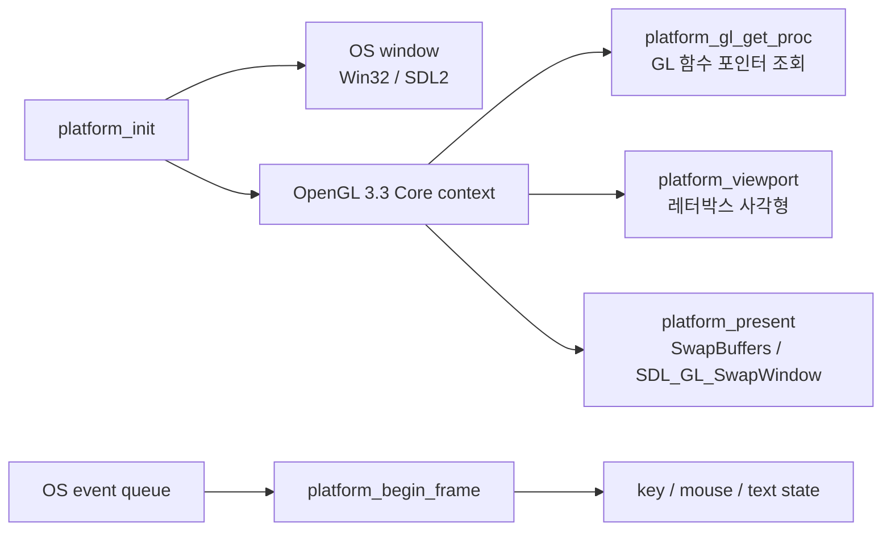
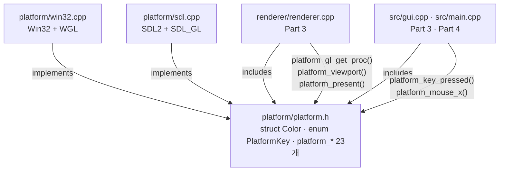
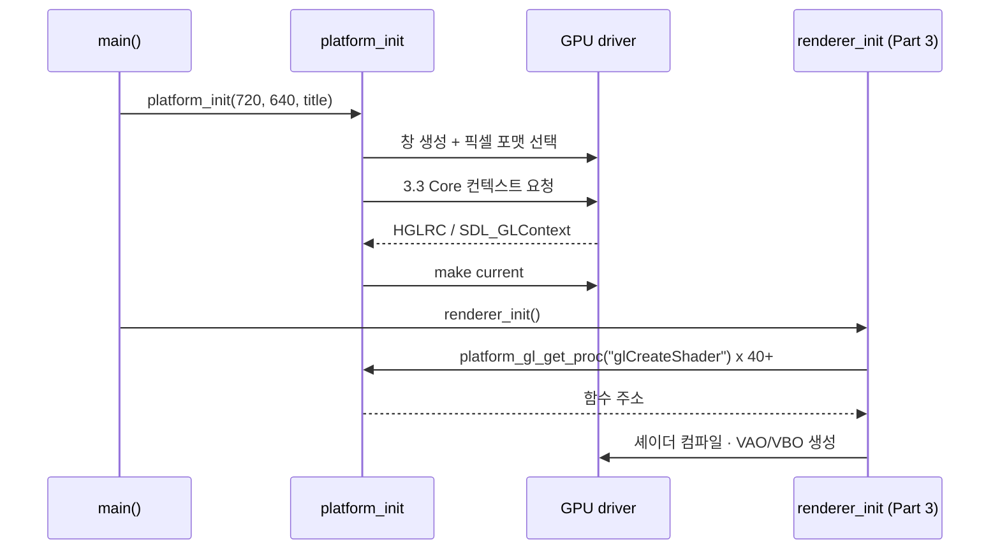
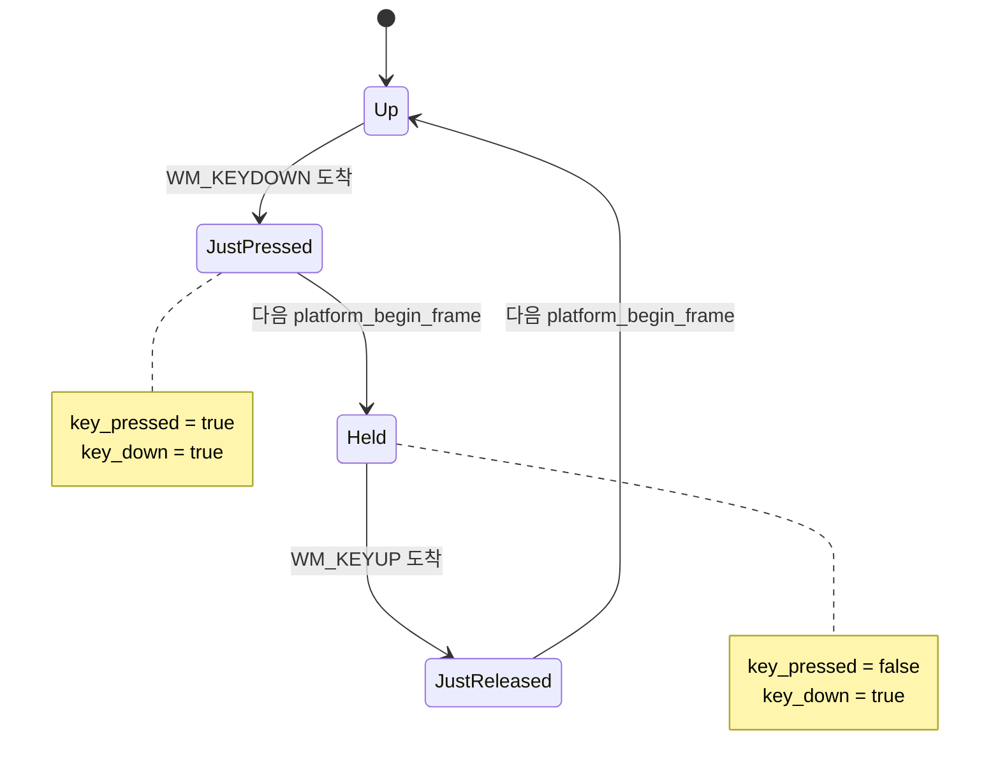

# Part 2: 플랫폼 계층 — 창, 입력, GL 컨텍스트

> **시리즈:** 제로부터 멀티플레이어 테트리스 + RL까지
>
> [시리즈 목차](./README.md) · [이전: Part 1 — 결정론적 SimGame](./part1-deterministic-simulation.md) · **Part 2** · [다음: Part 3 — 렌더링과 UI](./part3-rendering-and-ui.md)

---

## 이번 Part의 구현 계약

- **선행 상태:** [Part 1](./part1-deterministic-simulation.md) 까지 만든 `src/sim_game.cpp`, `src/position.cpp`, `core/` 헤더들, `tests/sim_hash_dump.cpp`. 이 코드는 창도 그래픽도 없이 `SimGame::Update()` 만으로 동작한다.
- **이번 Part의 파일:** `platform/platform.h`, `platform/win32.cpp`, `platform/sdl.cpp`, `CMakeLists.txt`.
- **연결점:** 아직 게임 코드와 붙지 않는다. 이 장은 상위 계층이 앞으로 쓸 **계약**(`Color`, `PlatformKey`, `platform_*` 함수 23개)과 그 계약의 두 구현을 만든다. 이 장이 만드는 OpenGL 3.3 Core 컨텍스트 위에 실제로 그리는 쪽은 [Part 3](./part3-rendering-and-ui.md) 이고, 이 계층을 프레임 루프에 엮는 쪽은 [Part 4](./part4-game-wrapper-and-loop.md) 의 `main()` 이다.
- **완료 게이트:** 이 장 말미의 `part2_present_demo` 를 빌드해 실행. stdout 첫 줄에 `3.3` 과 `Core Profile` 을 포함한 GL 버전 문자열이 찍히고, 창 안에 레터박스된 남색 사각형이 보이며, 흰 사각형 하나가 마우스 커서를 정확히 따라다닌다. 창을 드래그해 종횡비를 바꿔도 이 셋이 유지된다.

`tetris` 타깃은 이 시점에 **빌드할 수 없다.** `CMakeLists.txt` 의 `tetris` 는 `src/main.cpp`, `src/game.cpp`, `src/gui.cpp`, `net/*.cpp`, `renderer/*.cpp`, `bot/*.cpp`, `meta/http_client.cpp` 를 전부 요구하고, configure 단계에서 `third_party/httplib.h` 존재 검사에도 걸린다. 그래서 이 장의 완료 게이트는 독자가 직접 만드는 작은 데모 실행 파일이다.

## 이번 장의 목표

Part 1 의 `SimGame` 은 창 없이도 동작한다. 이번 장에서는 그 위에 운영체제 창, 입력, 시간, 그리고 **그림을 그릴 수 있는 상태 — OpenGL 3.3 Core 컨텍스트**를 붙인다.

이 계층은 픽셀을 하나도 만들지 않는다. 창을 만들고, 그 창에 GL 컨텍스트를 걸고, 이벤트 큐를 비우고, 고해상도 타이머를 읽고, 다 그린 뒤 버퍼를 교체한다. 도형·텍스트·이미지를 실제로 그리는 코드는 [Part 3](./part3-rendering-and-ui.md) 이 이 컨텍스트 위에 올린다.

완료 후 데이터 흐름은 다음과 같다.


```mermaid
flowchart LR
    I["platform_init"] --> W["OS window<br/>Win32 / SDL2"]
    I --> C["OpenGL 3.3 Core context"]
    Q["OS event queue"] --> B["platform_begin_frame"]
    B --> K["key / mouse / text state"]
    C --> L["platform_gl_get_proc<br/>GL 함수 포인터 조회"]
    C --> V["platform_viewport<br/>레터박스 사각형"]
    C --> P["platform_present<br/>SwapBuffers / SDL_GL_SwapWindow"]
```

## 1. 이 계층이 소유하는 것과 소유하지 않는 것

플랫폼 계층의 책임을 한 줄로 줄이면 **"운영체제만 할 수 있는 일"** 이다. 창을 만들고, 그 창에 그래픽 컨텍스트를 붙이고, 이벤트 큐를 비우고, 고해상도 타이머를 읽고, 다 그린 프레임을 화면에 내보낸다. 그 외에는 아무것도 하지 않는다. 특히 다음은 **소유하지 않는다**.

- 그리기 명령 (Part 3 의 `draw_rect` / `draw_text`)
- 셰이더와 GL 자원 (Part 3 의 `renderer_init`)
- 게임 상태 (Part 1 의 `SimGame`)
- 프레임 누산기와 고정 스텝 (Part 4 의 `main()`)
- 위젯 hit-test (Part 3 의 `gui_hover_rect`)

경계선이 미묘한 항목이 하나 있다. **GL 컨텍스트 생성은 플랫폼 계층이 소유하고, GL 함수 포인터 로딩과 셰이더는 렌더러가 소유한다.** 컨텍스트는 창에 묶여 있어서 창을 만드는 코드와 분리할 수 없고, 컨텍스트를 만드는 API 는 Win32 와 SDL 이 완전히 다르다. 반면 함수 포인터 테이블과 셰이더는 두 백엔드가 똑같이 쓰는 것이라 렌더러에 두는 편이 중복이 없다. 그 사이를 잇는 것이 이 장에서 새로 만드는 `platform_gl_get_proc` 한 함수다.

이 구분이 중요한 이유는 두 개의 구현이 존재하기 때문이다. `platform/win32.cpp` 와 `platform/sdl.cpp` 는 **같은 헤더를 구현하는 형제**이고, 링크 시점에 정확히 하나만 선택된다. 인터페이스가 넓어지면 두 파일이 같은 속도로 넓어진다. 그래서 계약은 의도적으로 23개 함수로 묶여 있다.


```mermaid
graph TB
    H["platform/platform.h<br/>struct Color · enum PlatformKey · platform_* 23개"]
    W["platform/win32.cpp<br/>Win32 + WGL"]
    S["platform/sdl.cpp<br/>SDL2 + SDL_GL"]
    R["renderer/renderer.cpp<br/>Part 3"]
    G["src/gui.cpp · src/main.cpp<br/>Part 3 · Part 4"]

    W -- implements --> H
    S -- implements --> H
    R -- includes --> H
    G -- includes --> H
    R -- "platform_gl_get_proc()<br/>platform_viewport()<br/>platform_present()" --> H
    G -- "platform_key_pressed()<br/>platform_mouse_x()" --> H
```

두 구현은 서로를 전혀 모른다. 공유하는 것은 헤더 하나뿐이고, 공유하는 상태는 없다. 각 `.cpp` 가 자기 파일 스코프의 `static` 변수로 키 배열·마우스 상태·뷰포트 사각형·컨텍스트 핸들을 따로 들고 있다. 이 중복은 의도적이다. 공통 상태를 별도 파일로 빼면 "어느 백엔드가 언제 그 상태를 갱신하는가" 라는 추적 문제가 생기는데, 각각 400줄 안쪽인 파일에서는 중복이 더 싸다.

### 1.1 왜 창과 컨텍스트를 직접 만드는가

[Part 0](./part0-project-setup.md) 에서 완성형 엔진을 쓰지 않기로 한 이유는 이미 밝혔다. 여기서는 그 아래 층위의 선택을 본다 — 엔진을 안 쓰더라도 창·입력·GL 컨텍스트를 대신 해주는 라이브러리는 여러 단계로 존재한다.

| 선택지 | 얻는 것 | 잃는 것 |
|---|---|---|
| Unity · Unreal · Godot | 창·입력·렌더·오디오·에디터·빌드 파이프라인 전부 | 프레임 타이밍과 입력 큐잉이 블랙박스. lockstep 결정론을 보장하기 어렵다 |
| raylib | `InitWindow` 한 줄로 창·컨텍스트·입력·2D 드로잉·오디오 전부 | 내부가 블랙박스. 창 생성 80줄과 컨텍스트 생성 과정, `IsKeyPressed` 의 실체를 볼 수 없다 |
| GLFW + GLEW/GLAD | 창·입력·3.3 Core 컨텍스트 요청·확장 로딩이 전부 몇 줄 | 컨텍스트 생성과 함수 포인터 로딩이 바로 이 프로젝트의 학습 대상이다. 감추면 배울 게 없다 |
| SDL_Renderer (SDL2 가속 경로) | 크로스 플랫폼 2D 배칭. 백엔드 선택 자동 | 셰이더를 직접 쓸 수 없다. 배칭·상태 전환 정책이 블랙박스라 draw call 수를 통제하지 못한다 |
| Win32/SDL 창 + 직접 만든 GL 3.3 Core 컨텍스트 (이 프로젝트) | 창 생성·메시지 루프·픽셀 포맷·컨텍스트 생성·함수 조회 전 과정을 소유 | 코드 두 벌. WGL 2단계 생성 같은 플랫폼 세부를 직접 감당해야 한다 |

이 프로젝트는 마지막을 택했다. 학습 목표가 "그리기 명령이 화면 픽셀이 되는 전 과정" 이므로, 그 과정을 감추는 라이브러리는 목표와 충돌한다. 다만 **창과 이벤트 큐까지 세 플랫폼에서 각각 직접 만들 이유는 없다** — 그건 그래픽스가 아니라 OS 붙임 작업이다. 그래서 Windows 에서만 Win32 를 직접 쓰고(WGL 컨텍스트 생성이 배울 값이 있다), Linux/macOS 는 SDL2 에 위임한다. **SDL2 는 여기서 렌더러가 아니라 창·입력·컨텍스트 어댑터다.**

한 가지 명시해 둘 것이 있다. GPU 로 그리기 시작하면 **렌더 결과의 비트 단위 재현성은 포기하게 된다.** 삼각형 래스터화 규칙, 텍스처 필터링의 반올림, 블렌딩 순서는 드라이버와 하드웨어마다 미세하게 다를 수 있다. 같은 입력으로 두 기계에서 스크린샷을 찍어 바이트 비교하는 검증은 더 이상 성립하지 않는다.

**그러나 게임 로직의 결정성은 전혀 영향받지 않는다.** [Part 6](./part6-lockstep-networking.md) 의 lockstep 이 비교하는 값은 `SimGame::StateHash()` 이고, `SimGame` 은 그리기를 모른다. 이 계층도 마찬가지로 `SimGame` 을 모른다 — 두 결정성은 애초에 별개의 축이었고, 그중 렌더 쪽만 GPU 로 넘어갔다. 이 장에서 만드는 어떤 코드도 시뮬레이션 해시에 닿지 않는다는 점은 장 말미의 회귀 테스트로 확인한다.

`platform.h` 의 주석이 이 계층의 의도를 명시한다.

**현재 소스 발췌 — `platform/platform.h:4-14`**

```cpp
// ─────────────────────────────────────────────────────────────────────────────
// platform/platform.h  — OS 추상화 인터페이스
//
// raylib의 InitWindow / IsKeyPressed / GetFrameTime 등을 대체합니다.
// 구현은 platform/win32.cpp에 있습니다.
//
// 학습 포인트:
//   raylib::InitWindow() 는 아래 platform_init() 이 호출하는 80줄을 숨겨놓은 것.
//   raylib::IsKeyPressed()는 WM_KEYDOWN 메시지로 채우는 keyState[] 테이블 조회.
//   raylib::GetFrameTime()은 QueryPerformanceCounter 두 번의 차이.
// ─────────────────────────────────────────────────────────────────────────────
```

## 2. `platform.h` — 공개 계약

이 헤더는 시리즈 전체가 의존하는 두 개의 타입을 정의한다. `struct Color` 는 렌더러·GUI·게임 코드가 전부 쓰고, `enum PlatformKey` 는 입력을 처리하는 모든 곳이 쓴다.

**현재 소스 발췌 — `platform/platform.h:16-53`**

```cpp
// ─── 색상 ─────────────────────────────────────────────────────────────────────
// raylib의 Color { r, g, b, a } 와 동일한 레이아웃.
struct Color { uint8_t r, g, b, a; };

// 공통 색상 상수 (main.cpp 변경을 최소화하기 위해 raylib 이름 유지)
constexpr Color WHITE    = {255, 255, 255, 255};
constexpr Color GRAY     = {130, 130, 130, 255};
constexpr Color GREEN    = {0,   228,  48, 255};
constexpr Color YELLOW   = {253, 249,   0, 255};
constexpr Color RED      = {230,  41,  55, 255};
constexpr Color RAYWHITE = {245, 245, 245, 255};

// ─── 키코드 ───────────────────────────────────────────────────────────────────
// 값이 Win32 VK_* 상수와 직접 대응하므로 별도 매핑 테이블이 필요 없습니다.
// WndProc의 WM_KEYDOWN 에서 wParam 을 그대로 keyState[] 인덱스로 씁니다.
enum PlatformKey : int {
    PKEY_LEFT   = 0x25,  // VK_LEFT
    PKEY_RIGHT  = 0x27,  // VK_RIGHT
    PKEY_UP     = 0x26,  // VK_UP
    PKEY_DOWN   = 0x28,  // VK_DOWN
    PKEY_SPACE  = 0x20,  // VK_SPACE
    PKEY_ENTER  = 0x0D,  // VK_RETURN
    PKEY_ESCAPE = 0x1B,  // VK_ESCAPE
    PKEY_BACK   = 0x08,  // VK_BACK (Backspace)
    PKEY_Q      = 'Q',
    PKEY_R      = 'R',
    PKEY_H      = 'H',
    PKEY_P      = 'P',
    PKEY_C      = 'C',
    PKEY_J      = 'J',
    PKEY_T      = 'T',
    PKEY_Y      = 'Y',
    PKEY_N      = 'N',
    PKEY_LBRACKET = 0xDB,  // VK_OEM_4: [
    PKEY_RBRACKET = 0xDD,  // VK_OEM_6: ]
    PKEY_F5     = 0x74,  // VK_F5
    PKEY_F6     = 0x75,  // VK_F6
};
```

여기서 배울 점이 세 개 있다.

**첫째, `Color` 는 4바이트 POD 다.** `uint8_t r, g, b, a` 순서이며 패딩이 없다. 렌더러가 `Color` 를 값으로 받아 레지스터에 담아 넘길 수 있고, 배열로 만들어도 메모리가 촘촘하다. Part 3 의 렌더러는 이 네 바이트를 정점 하나의 색 속성으로 바꿔 GPU 로 보낸다.

**둘째, `PlatformKey` 의 값이 Win32 `VK_*` 상수와 그대로 같다.** `PKEY_LEFT = 0x25` 는 `VK_LEFT` 다. 그래서 Win32 백엔드는 매핑 테이블이 필요 없다 — `WM_KEYDOWN` 의 `wParam` 을 그대로 `s_key_state[]` 인덱스로 쓴다. 이 설계의 대가는 SDL 쪽이 치른다. SDL 은 자기 `SDL_Keycode` 를 `PlatformKey` 로 **역매핑**해야 하고, 그 매핑 테이블이 `sdl_to_platform_key` 다. 테이블에 없는 키는 `-1` 로 버려진다. 즉 **게임이 쓰는 키만 SDL 에서 살아난다** — 새 키를 바인딩하려면 `PlatformKey` 에 상수를 추가하고 `sdl_to_platform_key` 에 `case` 를 추가하는 두 곳 편집이 항상 짝이다.

**셋째, 색 상수 이름이 raylib 그대로다.** `WHITE`, `GRAY`, `GREEN`, `YELLOW`, `RED`, `RAYWHITE`. 이 프로젝트는 raylib 에서 출발해 자작 계층으로 갈아탄 이력이 있고, 상위 코드의 diff 를 줄이려고 이름을 유지했다. `RAYWHITE` 라는 이름이 남아 있는 이유가 그것이다.

이어서 함수 계약이다. 프레임 수명주기 관련 부분을 먼저 본다.

**현재 소스 발췌 — `platform/platform.h:57-76`**

```cpp
// 윈도우와 입력/타이머 백엔드 초기화. OpenGL 3.3 Core 컨텍스트를 함께 만든다.
// 컨텍스트 생성에 실패하면 프로그램을 계속 진행할 수 없으므로 즉시 실패한다.
void   platform_init(int w, int h, const char* title);

// 윈도우 및 플랫폼 자원 해제. CloseWindow() 대체.
void   platform_shutdown();

// 창 닫기 요청(WM_CLOSE / WM_DESTROY / SDL_QUIT)을 받으면 true.
// ESC 키는 여기 관여하지 않는다 — 화면별 뒤로가기로만 쓰인다.
bool   platform_should_close();

// 프레임 시작: 이전 키 상태 스냅샷 + 메시지 루프(PeekMessage) + 델타타임 반환.
// GetFrameTime() 대체. MAX_DELTA = 100ms 클램핑 포함.
float  platform_begin_frame();

// 프레임 끝. 소프트웨어 VSync가 켜졌다면 60 Hz에 맞춰 남은 시간을 쉰다.
void   platform_end_frame();

// 그린 프레임을 화면에 내보낸다 (버퍼 교체).
void   platform_present();
```

`platform_present()` 에 **인자가 하나도 없다는 점**이 이 계약의 성격을 그대로 보여준다. 화면에 내보낼 픽셀을 이 함수에 넘기지 않는다. 그림은 이미 GPU 쪽 백버퍼에 들어가 있고, 이 함수가 하는 일은 "백버퍼와 프론트버퍼를 바꿔 달라" 는 요청 한 번뿐이다. 전달할 데이터가 없으므로 인자도 없다.

`platform_begin_frame` 의 주석에 있는 **"MAX_DELTA = 100ms 클램핑 포함"** 이 이 계층의 계약 중 가장 자주 잊히는 항목이다. 자세한 이유는 아래 시간 절에서 다룬다.

다음은 이 장에서 새로 생긴 GL 연동 두 함수다.

**현재 소스 발췌 — `platform/platform.h:78-90`**

```cpp
// ─── OpenGL 연동 ─────────────────────────────────────────────────────────────
// GL 함수 포인터 조회. Windows 의 opengl32.dll 은 GL 1.1 만 export 하므로
// 3.3 Core 의 거의 모든 함수는 런타임에 이 경로로 받아야 한다.
// 렌더러가 gl_load_functions() 에서 이 함수를 반복 호출한다.
void*  platform_gl_get_proc(const char* name);

// 논리 화면이 실제로 그려질 창 안의 사각형(픽셀). 창 리사이즈를 따라간다.
// 렌더러가 glViewport 에 그대로 넘기는 값이라 GL 규약대로 좌하단 원점이다.
//
// 창 종횡비가 논리 종횡비와 다르면 여기서 레터박스가 결정된다. 마우스 좌표를
// 논리 좌표로 되돌리는 계산도 같은 사각형을 쓰므로, 이 둘이 어긋나면 클릭
// 지점과 그려진 버튼이 서로 다른 곳을 가리키게 된다.
void   platform_viewport(int& x_out, int& y_out, int& w_out, int& h_out);
```

이 두 함수가 이 계층과 렌더러 사이의 전체 접촉면이다. `platform_gl_get_proc` 은 "GL 함수의 주소를 어떻게 얻는가" 라는 플랫폼 차이를 하나로 덮고, `platform_viewport` 는 "논리 화면이 창 안 어디에 놓이는가" 를 한 사각형으로 답한다. 둘 다 §3 과 §8 에서 자세히 본다.

키 입력과 문자 입력.

**현재 소스 발췌 — `platform/platform.h:92-100`**

```cpp
// 이 프레임에 처음 눌린 키인가? IsKeyPressed() 대체.
// keyState[key] == true && keyPrev[key] == false
bool   platform_key_pressed(int key);

// 현재 눌려있는 키인가? IsKeyDown() 대체.
bool   platform_key_down(int key);

// WM_CHAR 로 받은 문자 하나 꺼내기 (없으면 0). GetCharPressed() 대체.
char   platform_get_char_pressed();
```

마우스와 창 설정은 다음과 같다.

**현재 소스 발췌 — `platform/platform.h:102-141`**

```cpp
// ─── 마우스 ───────────────────────────────────────────────────────────────────
// 버튼 인덱스: 0 = Left, 1 = Right, 2 = Middle.
// 좌표는 클라이언트 영역 기준 (0,0 = 좌상단). 창 밖이면 마지막 값 유지.
int    platform_mouse_x();
int    platform_mouse_y();
// 이번 프레임에 처음 눌림 (edge). IsMouseButtonPressed 대체.
bool   platform_mouse_pressed(int button);
// 현재 누르고 있음 (level). IsMouseButtonDown 대체.
bool   platform_mouse_down(int button);
// 이번 프레임에 뗌 (edge). IsMouseButtonReleased 대체.
bool   platform_mouse_released(int button);
// 이번 프레임 휠 스크롤 누적 (위로 양수). 없으면 0. GetMouseWheelMove 대체.
float  platform_mouse_wheel();

// platform_init 이후 경과 초. GetTime() 대체.
double platform_get_time();

// ─── 윈도우 설정 (렌더/UI 전용 — SimGame/결정성과 무관) ──────────────────────────
// 창 크기를 (w,h) 로 바꾸고 화면 중앙에 재배치. 표시 영역을 갱신.
// GUI 는 platform_init 에 넘긴 논리 크기(720×640)를 기준 좌표로 쓰므로,
// 마우스 좌표는 항상 논리 좌표로 역매핑된다 (아래 platform_mouse_x/y 참고).
void   platform_set_window_size(int w, int h);

// 창을 놓을 수 있는 화면 영역(픽셀). 작업 표시줄 등을 뺀 크기다.
// 설정 화면이 모니터보다 큰 창 프리셋을 감추는 데 쓴다 — 2430x2160 을
// 1920x1080 모니터에서 고르면 창의 절반이 화면 밖으로 나간다.
void   platform_display_size(int& w_out, int& h_out);

// 전체화면 토글. on=true 면 데스크톱-해상도 전체화면(FULLSCREEN_DESKTOP),
// off 면 창 모드로 복귀. 전체화면에서 모니터 종횡비가 논리(9:8) 와 다르면
// 9:8 을 유지하는 레터박스 뷰포트로 그려 왜곡을 막는다.
void   platform_set_fullscreen(bool on);

// 이 백엔드가 전체화면을 실제로 지원하는가. SDL 백엔드는 true,
// Win32 백엔드는 미구현이라 false. 설정 화면이 false 면 Fullscreen 행을
// 비활성(회색) 으로 그려 "켜도 아무 일 없는" 거짓 토글을 막는다.
bool   platform_fullscreen_supported();

// 소프트웨어 프레임 페이싱 on/off. on이면 platform_end_frame이 60 Hz를 목표로 한다.
void   platform_set_vsync(bool on);
```

`platform_fullscreen_supported()` 가 별도로 존재하는 이유를 눈여겨볼 만하다. Win32 백엔드는 전체화면을 구현하지 않았다. 설정 화면이 "Fullscreen" 토글을 무조건 그리면 Windows 사용자는 켜도 아무 일이 없는 죽은 스위치를 보게 된다. 그래서 **지원 여부를 질의하는 함수를 계약에 넣고**, [Part 11](./part11-settings-and-options.md) 의 설정 화면이 이 값으로 행을 회색 처리한다. "기능이 없다" 를 런타임에 표현할 수 있게 만든 인터페이스 설계다.

`platform_display_size` 도 같은 종류의 함수다. 창 크기 프리셋을 고르는 UI 가 모니터보다 큰 값을 제시하면 안 되므로, "이 화면에 창을 놓을 수 있는 최대 크기" 를 물어볼 수단이 필요하다. 구현은 §8.4 에서 본다.

## 3. GL 컨텍스트 — 이 계층의 새 책임

창을 만들었다고 바로 그릴 수 있는 것은 아니다. OpenGL 로 그리려면 그 전에 **컨텍스트(context)** 가 있어야 한다.

컨텍스트는 드라이버가 우리를 위해 들고 있는 상태 덩어리다. 어떤 셰이더 프로그램이 걸려 있는지, 어떤 텍스처가 어느 유닛에 바인딩되어 있는지, 블렌딩과 시저가 켜졌는지, 정점 버퍼의 내용이 무엇인지가 전부 컨텍스트 안에 있다. `glClear` 같은 GL 함수는 인자로 "어디에 그릴지" 를 받지 않는다 — **현재 스레드에 current 로 걸린 컨텍스트**에 대고 동작한다. 그래서 컨텍스트를 만들고 current 로 만드는 일이 모든 GL 호출보다 먼저 일어나야 한다.

컨텍스트는 창에도 묶인다. 정확히는 창의 드로어블(Win32 에서는 픽셀 포맷이 설정된 DC)에 묶인다. 창 없이 컨텍스트를 만들 수 없고, 창을 만든 코드가 아닌 곳에서 컨텍스트를 만들기도 번거롭다. 그래서 이 프로젝트는 **컨텍스트 생성을 `platform_init` 안에 둔다.** 렌더러가 자기 초기화 시점에 컨텍스트를 만들게 하면 창 핸들을 렌더러에 노출해야 하고, 그 핸들의 타입은 백엔드마다 다르다. 계약이 오염된다.

초기화 순서는 다음과 같다. 이 장은 앞의 세 단계를 만들고, Part 3 이 뒤의 두 단계를 만든다.


```mermaid
sequenceDiagram
    participant M as main()
    participant P as platform_init
    participant D as GPU driver
    participant R as renderer_init (Part 3)
    M->>P: platform_init(720, 640, title)
    P->>D: 창 생성 + 픽셀 포맷 선택
    P->>D: 3.3 Core 컨텍스트 요청
    D-->>P: HGLRC / SDL_GLContext
    P->>D: make current
    M->>R: renderer_init()
    R->>P: platform_gl_get_proc("glCreateShader") x 40+
    P-->>R: 함수 주소
    R->>D: 셰이더 컴파일 · VAO/VBO 생성
```

### 3.1 왜 3.3 Core 를 명시적으로 요청하는가

"컨텍스트를 만들어 달라" 고만 하면 드라이버는 **기본 호환(compatibility) 컨텍스트**를 준다. 그 컨텍스트가 지원하는 GLSL 버전은 드라이버마다 다르다. Windows 의 NVIDIA 드라이버는 4.6 호환을 주고, Linux 의 Mesa 는 설정에 따라 다르고, **macOS 는 Core 프로파일을 명시하지 않으면 아예 2.1 만 준다.**

이 차이는 셰이더 소스를 갈라놓는다. `#version 130` 으로 쓴 셰이더는 Windows/Linux 호환 컨텍스트에서는 통하지만 macOS Core 프로파일에서는 거부된다. 그러면 플랫폼별 셰이더를 따로 유지해야 하고, 한쪽만 고치는 순간 다른 쪽이 조용히 깨진다.

그래서 세 플랫폼 모두에 **3.3 Core 를 명시적으로 요청**한다. 요청이 성공하면 어디서든 `#version 330 core` 셰이더 한 벌이 그대로 통한다. 요청 방법은 백엔드마다 다르다 — SDL 은 창을 만들기 전에 속성을 걸고, Win32 는 컨텍스트를 두 번 만든다. 아래 §4.3 이 그 이유다.

3.3 을 고른 기준은 필요한 기능의 하한선이다. VAO, `glBindBuffer`/`glBufferData` 스트리밍, `layout(location = N)` 정점 속성, 텍스처 유닛 — 이 프로젝트가 쓰는 기능은 전부 3.3 안에 있다. 그 위 버전을 요구하면 지원 하드웨어만 줄어든다. 반대로 3.3 은 2010년 이후 GPU 라면 사실상 전부 지원한다.

### 3.2 실패하면 즉시 멈춘다

컨텍스트 생성 실패는 복구 경로가 없는 실패다. 컨텍스트가 없으면 함수 포인터도 못 받고, 셰이더도 못 만들고, 화면에 아무것도 나오지 않는다. 소프트웨어 폴백을 준비해 두는 선택지도 있지만 그건 렌더러를 두 벌 유지한다는 뜻이다.

그래서 두 백엔드 모두 실패하면 `stderr` 에 이유를 한 줄 찍고 `s_should_close = true` 로 만든다. `main()` 의 루프 조건이 `!platform_should_close()` 이므로 프로그램은 창 하나 못 띄우고 정상 종료 경로로 빠진다. **조용히 검은 화면을 띄우는 대신 이유를 남기고 끝내는 것**이 이런 종류의 실패를 다루는 올바른 방법이다.

## 4. Win32: 창과 3.3 Core 컨텍스트 만들기

`platform/win32.cpp` 가 담당하는 OS 기능은 다섯 가지다.

- `RegisterClassExA` / `CreateWindowExA` — 창 생성
- `ChoosePixelFormat` / `wglCreateContext` / `wglCreateContextAttribsARB` — GL 컨텍스트 생성
- `PeekMessageA` / `TranslateMessage` / `DispatchMessageA` — 논블로킹 이벤트 처리
- `WM_KEY*`, `WM_CHAR`, `WM_MOUSE*` — 입력 상태 갱신
- `QueryPerformanceCounter` — 델타타임과 경과 시간

파일 상단은 전부 `static` 상태다.

**현재 소스 발췌 — `platform/win32.cpp:15-47`**

```cpp
static HWND s_hwnd = nullptr;
static HDC s_hdc = nullptr;
static HGLRC s_hglrc = nullptr;
static HMODULE s_opengl32 = nullptr;
// WGL_EXT_swap_control. 확장이라 컨텍스트를 만든 뒤에야 조회할 수 있고,
// 드라이버가 안 줄 수도 있어 함수 포인터로 들고 있는다.
static BOOL (WINAPI* s_wglSwapInterval)(int) = nullptr;
static bool s_should_close = false;
static bool s_frame_pacing = true;
static int s_win_w = 0;
static int s_win_h = 0;
static int s_logical_w = 0;
static int s_logical_h = 0;
static int s_vp_x = 0;
static int s_vp_y = 0;
static int s_vp_w = 0;
static int s_vp_h = 0;

static bool s_key_state[256]{};
static bool s_key_prev[256]{};
static char s_char_queue[64]{};
static int s_char_head = 0;
static int s_char_tail = 0;

static int s_mouse_x = 0;
static int s_mouse_y = 0;
static bool s_mouse_state[3]{};
static bool s_mouse_prev[3]{};
static float s_mouse_wheel = 0.0f;

static LARGE_INTEGER s_frequency{};
static LARGE_INTEGER s_init_time{};
static LARGE_INTEGER s_frame_start{};
```

이름에 규칙이 있다. `s_win_*` 은 실제 창 크기, `s_logical_*` 은 게임이 쓰는 좌표계 크기(720×640), `s_vp_*` 은 그 둘 사이의 레터박스 사각형이다. 세 그룹을 섞지 않는 것이 이 파일을 읽는 요령이다.

GL 관련 상태는 셋이다. `s_hglrc` 는 컨텍스트 핸들, `s_opengl32` 는 `opengl32.dll` 의 모듈 핸들(§4.4), `s_wglSwapInterval` 은 vsync 를 켜고 끄는 확장 함수의 주소(§10.2)다. 함수 포인터를 변수로 들고 있는 이유는 그 함수가 **표준이 아니라 확장**이기 때문이다 — 헤더에 선언이 없고, 드라이버가 제공하지 않을 수도 있고, 조회하려면 컨텍스트가 이미 current 여야 한다. 프레임버퍼도, backbuffer 비트맵도, GDI 메모리 DC 도 없다. 픽셀을 담을 CPU 메모리가 이 파일에 하나도 없다는 것이 이 계층이 그리기에서 완전히 빠져 있다는 증거다.

초기화는 다음과 같다. 창 생성과 컨텍스트 생성이 한 함수 안에 이어져 있다.

**현재 소스 발췌 — `platform/win32.cpp:133-232`**

```cpp
void platform_init(int width, int height, const char* title)
{
    s_win_w = s_logical_w = width;
    s_win_h = s_logical_h = height;
    recompute_viewport();
    QueryPerformanceFrequency(&s_frequency);
    QueryPerformanceCounter(&s_init_time);
    s_frame_start = s_init_time;

    WNDCLASSEXA window_class{};
    window_class.cbSize = sizeof(window_class);
    window_class.style = CS_HREDRAW | CS_VREDRAW | CS_OWNDC;
    window_class.lpfnWndProc = window_proc;
    window_class.hInstance = GetModuleHandleA(nullptr);
    window_class.hCursor = LoadCursor(nullptr, IDC_ARROW);
    window_class.lpszClassName = "TetrisWindow";
    RegisterClassExA(&window_class);

    // SDL 쪽과 같은 조건을 준다 — 창 크기 조절 가능, 최대화 가능.
    // WS_THICKFRAME 이 없으면 논리 해상도만 바꿀 수 있고 창은 고정되어,
    // 같은 코드가 플랫폼마다 다르게 동작한다.
    const DWORD style = WS_OVERLAPPEDWINDOW;
    RECT rect{0, 0, width, height};
    AdjustWindowRect(&rect, style, FALSE);
    s_hwnd = CreateWindowExA(
        0, window_class.lpszClassName, title, style,
        CW_USEDEFAULT, CW_USEDEFAULT,
        rect.right - rect.left, rect.bottom - rect.top,
        nullptr, nullptr, window_class.hInstance, nullptr);
    if (!s_hwnd) {
        s_should_close = true;
        return;
    }
    s_hdc = GetDC(s_hwnd);

    // OpenGL 3.3 Core 컨텍스트를 만든다. Windows 에서는 두 단계다.
    //
    // 1) PIXELFORMATDESCRIPTOR 로 "이 DC 에 GL 을 쓰겠다" 고 알리고
    // 2) 레거시 컨텍스트를 먼저 만든 뒤, 그 컨텍스트가 current 인 상태에서만
    //    조회 가능한 wglCreateContextAttribsARB 로 진짜 3.3 Core 를 만든다.
    //
    // 2단계를 건너뛰고 wglCreateContext 만 쓰면 드라이버 기본 호환 컨텍스트가
    // 나온다. 그러면 #version 330 core 셰이더가 통하는지 여부가 드라이버에
    // 따라 달라져 SDL 경로와 동작이 갈린다. 세 플랫폼이 같은 프로파일을
    // 받아야 셰이더를 한 벌만 유지할 수 있다.
    PIXELFORMATDESCRIPTOR pfd{};
    pfd.nSize      = sizeof(pfd);
    pfd.nVersion   = 1;
    pfd.dwFlags    = PFD_DRAW_TO_WINDOW | PFD_SUPPORT_OPENGL | PFD_DOUBLEBUFFER;
    pfd.iPixelType = PFD_TYPE_RGBA;
    pfd.cColorBits = 32;
    pfd.cAlphaBits = 8;
    const int pf = ChoosePixelFormat(s_hdc, &pfd);
    if (!pf || !SetPixelFormat(s_hdc, pf, &pfd)) {
        std::fprintf(stderr, "[GL] SetPixelFormat failed\n");
        s_should_close = true;
        return;
    }

    HGLRC legacy = wglCreateContext(s_hdc);
    if (!legacy) {
        std::fprintf(stderr, "[GL] wglCreateContext failed\n");
        s_should_close = true;
        return;
    }
    wglMakeCurrent(s_hdc, legacy);

    using CreateCtxAttribs = HGLRC (WINAPI*)(HDC, HGLRC, const int*);
    auto wglCreateContextAttribsARB = (CreateCtxAttribs)
        wglGetProcAddress("wglCreateContextAttribsARB");

    if (wglCreateContextAttribsARB) {
        const int attribs[] = {
            0x2091 /* MAJOR_VERSION */, 3,
            0x2092 /* MINOR_VERSION */, 3,
            0x9126 /* PROFILE_MASK  */, 0x00000001 /* CORE_PROFILE_BIT */,
            0
        };
        HGLRC core = wglCreateContextAttribsARB(s_hdc, nullptr, attribs);
        if (core) {
            wglMakeCurrent(nullptr, nullptr);
            wglDeleteContext(legacy);
            wglMakeCurrent(s_hdc, core);
            s_hglrc = core;
        } else {
            std::fprintf(stderr, "[GL] 3.3 Core unavailable; keeping legacy context\n");
            s_hglrc = legacy;
        }
    } else {
        std::fprintf(stderr, "[GL] wglCreateContextAttribsARB missing; legacy context\n");
        s_hglrc = legacy;
    }

    // 컨텍스트가 current 인 지금이 확장을 조회할 수 있는 시점이다.
    s_wglSwapInterval = (BOOL (WINAPI*)(int))wglGetProcAddress("wglSwapIntervalEXT");
    if (s_wglSwapInterval) s_wglSwapInterval(s_frame_pacing ? 1 : 0);

    ShowWindow(s_hwnd, SW_SHOW);
    UpdateWindow(s_hwnd);
}
```

100줄이지만 하는 일은 다섯 덩어리다. 창 클래스 등록 → 창 생성 → 픽셀 포맷 설정 → 컨텍스트 생성 → vsync 확장 조회. 순서대로 본다.

### 4.1 창 클래스와 스타일

**`CS_OWNDC`.** 창 클래스 스타일에 이 플래그를 주면 창마다 전용 DC 가 유지된다. `GetDC` 로 한 번 얻은 `s_hdc` 를 프로그램 수명 내내 재사용할 수 있다. GL 을 쓸 때 이건 편의가 아니라 **거의 필수**다. 픽셀 포맷은 DC 가 아니라 창에 한 번 설정되고, 컨텍스트는 그 포맷과 호환되는 DC 에서만 current 가 된다. `CS_OWNDC` 없이 매 프레임 `GetDC`/`ReleaseDC` 를 돌면 시스템 DC 캐시에서 매번 다른 DC 가 나올 수 있고, `SetPixelFormat` 한 DC 와 `SwapBuffers` 하는 DC 가 달라지는 상황을 다루게 된다.

**`AdjustWindowRect`.** `CreateWindowExA` 에 넘기는 크기는 **창 전체(테두리+캡션 포함)** 크기다. 클라이언트 영역이 720×640 이 되게 하려면 스타일에 따른 비클라이언트 여백을 더해야 한다. `AdjustWindowRect(&rect, style, FALSE)` 가 `{0,0,720,640}` 을 그 여백만큼 부풀려 준다. 이 호출을 빼면 캡션 높이만큼 게임 화면이 잘린다.

**창 스타일이 `WS_OVERLAPPEDWINDOW` 다.** 이 상수는 `WS_OVERLAPPED | WS_CAPTION | WS_SYSMENU | WS_THICKFRAME | WS_MINIMIZEBOX | WS_MAXIMIZEBOX` 의 묶음이다. 핵심은 `WS_THICKFRAME` 이고, 그것이 있어야 **사용자가 테두리를 끌어 창 크기를 바꿀 수 있다.** SDL 백엔드가 `SDL_WINDOW_RESIZABLE` 로 창을 만드므로, 같은 조건을 주지 않으면 같은 코드가 OS 마다 다르게 동작한다. 창 크기가 자유로워지면 논리 9:8 과 다른 종횡비가 흔해지고, 그때 레터박스와 마우스 역매핑이 실제로 시험대에 오른다 — §8 의 내용이 여기서부터 의미를 갖는다.

**클래스 이름은 `"TetrisWindow"` 다.** 특별한 의미는 없지만 `platform_shutdown` 의 `UnregisterClassA` 와 문자열이 정확히 일치해야 한다. 두 곳에 리터럴로 적혀 있으므로 한쪽만 고치면 클래스가 해제되지 않는다.

### 4.2 픽셀 포맷

`PIXELFORMATDESCRIPTOR` 는 "이 창에 어떤 종류의 프레임버퍼를 달아 달라" 는 요청서다. 여기서 요구하는 것은 네 가지다.

- `PFD_DRAW_TO_WINDOW` — 화면 밖 비트맵이 아니라 창에 직접 그린다.
- `PFD_SUPPORT_OPENGL` — 이 DC 에 GL 컨텍스트를 걸겠다. 이게 없으면 `wglCreateContext` 가 실패한다.
- `PFD_DOUBLEBUFFER` — 백버퍼를 달라. `SwapBuffers` 가 의미를 가지려면 필수다. 싱글 버퍼면 그리는 과정이 그대로 화면에 보여 심하게 찢어진다.
- `cColorBits = 32`, `cAlphaBits = 8` — RGBA8 프레임버퍼.

`ChoosePixelFormat` 은 이 요청서에 **가장 가까운** 실제 포맷의 인덱스를 돌려준다. 정확히 일치하는 포맷을 보장하지 않는다는 점이 중요하다 — 요청과 결과가 다를 수 있고, 정밀한 선택이 필요하면 `wglChoosePixelFormatARB` 로 조건을 걸어야 한다. 이 프로젝트는 그렇게까지 할 이유가 없다. 멀티샘플도, sRGB 프레임버퍼도, 스텐실도 쓰지 않는다.

**엣지 케이스 하나.** `SetPixelFormat` 은 **창 하나당 한 번만** 성공한다. 이미 포맷이 설정된 창에 다른 포맷을 걸 수 없다. 그래서 멀티샘플 설정 같은 것을 런타임에 바꾸려면 창을 새로 만들어야 한다. 이 프로젝트가 창 재생성 경로를 만들지 않은 이유 중 하나이기도 하다.

### 4.3 왜 컨텍스트를 두 번 만드는가

이 파일에서 가장 이상해 보이는 코드가 여기다. 컨텍스트를 만들고, current 로 걸고, 함수 하나를 조회하고, 그 함수로 컨텍스트를 다시 만들고, 처음 만든 것을 지운다.

이 순환의 원인은 WGL 의 설계다. `wglCreateContext` 는 버전이나 프로파일을 지정할 인자가 없다. 드라이버가 알아서 기본 컨텍스트를 준다. 버전과 프로파일을 지정하려면 확장 함수 `wglCreateContextAttribsARB` 를 써야 하는데, **이 함수의 주소는 `wglGetProcAddress` 로만 얻을 수 있고, `wglGetProcAddress` 는 current 컨텍스트가 있어야 동작한다.** 즉 3.3 Core 컨텍스트를 만드는 함수를 얻으려면 이미 아무 컨텍스트나 하나가 current 여야 한다.

그래서 순서가 이렇게 된다.

1. `wglCreateContext(s_hdc)` 로 레거시 컨텍스트를 만든다. 버전은 신경 쓰지 않는다. 이 컨텍스트의 유일한 용도는 확장 함수 조회다.
2. `wglMakeCurrent(s_hdc, legacy)` 로 current 로 만든다.
3. `wglGetProcAddress("wglCreateContextAttribsARB")` 로 진짜 생성 함수를 얻는다.
4. `MAJOR_VERSION=3, MINOR_VERSION=3, PROFILE_MASK=CORE_PROFILE_BIT` 속성 배열로 3.3 Core 를 만든다.
5. 레거시를 current 에서 떼고(`wglMakeCurrent(nullptr, nullptr)`) 삭제한 뒤, 새 컨텍스트를 current 로 만든다.

5번의 순서가 중요하다. **current 인 컨텍스트는 삭제되지 않는다.** `wglMakeCurrent(nullptr, nullptr)` 를 먼저 하지 않고 `wglDeleteContext(legacy)` 를 부르면 조용히 실패하고 컨텍스트가 누수된다.

속성 상수를 헤더 대신 숫자로 적어 둔 것도 의도다. `0x2091`, `0x2092`, `0x9126`, `0x00000001` 은 `wglext.h` 에 있는 값인데, 그 헤더는 Windows SDK 에 들어 있지 않아 별도로 받아야 한다. 상수 네 개 때문에 의존성을 추가하는 대신 주석과 함께 값을 박았다.

**이 2단계를 건너뛰는 것이 이 프로젝트가 실제로 겪은 결함이었다.** 이전 시도에서는 `wglCreateContext` 로 만든 기본 컨텍스트를 그대로 썼다. Windows 와 Linux 에서는 우연히 동작했다 — 드라이버가 준 호환 컨텍스트가 셰이더를 받아 줬기 때문이다. 그런데 macOS 는 Core 프로파일을 명시하지 않으면 GL 2.1 만 준다. 같은 셰이더가 macOS 에서만 컴파일 실패하고, 원인이 셰이더가 아니라 **컨텍스트 생성 코드**에 있어서 찾는 데 오래 걸렸다. 지금은 세 플랫폼이 같은 3.3 Core 를 받고 `#version 330 core` 셰이더 한 벌을 공유한다.

두 개의 `else` 분기는 폴백이다. `wglCreateContextAttribsARB` 자체가 없거나(아주 오래된 드라이버), 3.3 Core 요청이 거부되면 레거시 컨텍스트를 그대로 쓴다. 이 경우 셰이더 컴파일이 실패할 가능성이 높지만, **왜 실패했는지 알 수 있는 메시지가 stderr 에 남는다**는 것이 폴백의 실제 가치다. 아무 말 없이 검은 창을 띄우는 것보다 낫다.

함수 마지막의 두 줄이 같은 규칙을 한 번 더 보여준다. `wglSwapIntervalEXT` 도 확장이라 컨텍스트가 current 인 상태에서만 조회된다. 그래서 컨텍스트 생성이 끝난 **바로 이 자리**가 조회 시점이고, `ShowWindow` 보다 앞이다. 받아 온 함수가 있으면 즉시 한 번 호출해 초기 vsync 상태를 건다 — 걸지 않으면 드라이버 기본값에 맡기게 되어 같은 실행 파일이 기계마다 다른 프레임률로 돈다. 이 함수가 무엇인지는 §10.2 에서 다룬다.

### 4.4 `platform_gl_get_proc` — Windows 만의 문제

컨텍스트가 준비되면 GL 함수를 부를 수 있다. 그런데 Windows 에서는 함수 이름을 그냥 부를 수 없다.

**현재 소스 발췌 — `platform/win32.cpp:286-298`**

```cpp
void* platform_gl_get_proc(const char* name)
{
    // wglGetProcAddress 는 GL 1.2 이상만 돌려준다. glEnable 같은 1.1 함수는
    // NULL 이 나오므로 opengl32.dll 에서 직접 찾아야 한다. 이 폴백을
    // 빠뜨리면 로더가 "missing entry point: glEnable" 로 멈춘다.
    void* p = (void*)wglGetProcAddress(name);
    if (p == nullptr || p == (void*)0x1 || p == (void*)0x2 ||
        p == (void*)0x3 || p == (void*)-1) {
        if (!s_opengl32) s_opengl32 = LoadLibraryA("opengl32.dll");
        p = s_opengl32 ? (void*)GetProcAddress(s_opengl32, name) : nullptr;
    }
    return p;
}
```

이유는 역사적이다. Windows 의 `opengl32.dll` 은 마이크로소프트가 1990년대에 만든 이후 **GL 1.1 까지만 export 한다.** 그 위 버전의 함수는 전부 그래픽 드라이버가 제공하고, 링커가 찾을 수 있는 심볼이 아니다. `glCreateShader` 를 그냥 호출하면 링크 에러가 난다.

반대로 `wglGetProcAddress` 는 **드라이버 확장만** 돌려준다. GL 1.1 함수인 `glEnable`, `glClear`, `glViewport` 를 물어보면 `NULL` 을 준다. 두 경로가 정확히 상보적이라, 어느 쪽도 단독으로는 전체 함수 집합을 덮지 못한다.

그래서 이 함수는 `wglGetProcAddress` 를 먼저 시도하고, 실패하면 `opengl32.dll` 을 직접 열어 `GetProcAddress` 로 찾는다. `s_opengl32` 는 그 모듈 핸들을 캐시해 두는 자리다. 40여 개 함수를 로드할 때마다 `LoadLibraryA` 를 부르지 않기 위한 것이다.

`0x1 / 0x2 / 0x3 / -1` 을 실패로 취급하는 검사는 유명한 함정이다. **일부 드라이버는 실패 시 `NULL` 이 아니라 이런 작은 값을 돌려준다.** MSDN 의 `wglGetProcAddress` 문서에도 명시되어 있다. 이 검사가 없으면 `0x1` 을 함수 포인터로 믿고 호출해 즉시 크래시한다. 원인이 "함수 주소 조회" 에 있다는 것을 스택 트레이스로 알아내기가 매우 어렵다.

SDL 쪽은 이 모든 것을 SDL 이 처리해 준다.

**현재 소스 발췌 — `platform/sdl.cpp:251-254`**

```cpp
void* platform_gl_get_proc(const char* name)
{
    return SDL_GL_GetProcAddress(name);
}
```

한 줄이다. 이 비대칭이 SDL 을 쓰는 실질적 이득의 좋은 예다 — 이 계층은 "이름을 주면 주소를 돌려주는 함수" 라는 계약만 노출하고, 그 뒤가 12줄인지 1줄인지는 렌더러가 알 필요가 없다.

이 함수를 실제로 쓰는 쪽은 Part 3 의 `gl_load_functions()` 다. X-매크로로 만든 테이블을 순회하며 이름을 하나씩 넘기고, 하나라도 못 받으면 빠진 이름을 전부 모아 보고한 뒤 실패한다. 이 장의 데모에서도 축소판을 만들어 본다.

## 5. `window_proc` — 모든 입력이 들어오는 한 곳

Win32 의 입력은 콜백으로 들어온다. 창 프로시저 하나가 키보드·마우스·창 크기·종료를 전부 받는다.

**현재 소스 발췌 — `platform/win32.cpp:74-131`**

```cpp
static LRESULT CALLBACK window_proc(HWND hwnd, UINT message,
                                    WPARAM wparam, LPARAM lparam)
{
    switch (message) {
    case WM_KEYDOWN:
    case WM_SYSKEYDOWN:
        if (wparam < 256) s_key_state[wparam] = true;
        return 0;
    case WM_KEYUP:
    case WM_SYSKEYUP:
        if (wparam < 256) s_key_state[wparam] = false;
        return 0;
    case WM_CHAR:
        if (wparam > 0 && wparam < 128) {
            const int next = (s_char_tail + 1) % 64;
            if (next != s_char_head) {
                s_char_queue[s_char_tail] = (char)wparam;
                s_char_tail = next;
            }
        }
        return 0;
    case WM_SIZE:
        s_win_w = LOWORD(lparam);
        s_win_h = HIWORD(lparam);
        recompute_viewport();
        return 0;
    case WM_MOUSEMOVE:
        s_mouse_x = (int)(short)LOWORD(lparam);
        s_mouse_y = (int)(short)HIWORD(lparam);
        return 0;
    case WM_LBUTTONDOWN:
        s_mouse_state[0] = true; SetCapture(hwnd); return 0;
    case WM_LBUTTONUP:
        s_mouse_state[0] = false; ReleaseCapture(); return 0;
    case WM_RBUTTONDOWN:
        s_mouse_state[1] = true; SetCapture(hwnd); return 0;
    case WM_RBUTTONUP:
        s_mouse_state[1] = false; ReleaseCapture(); return 0;
    case WM_MBUTTONDOWN:
        s_mouse_state[2] = true; SetCapture(hwnd); return 0;
    case WM_MBUTTONUP:
        s_mouse_state[2] = false; ReleaseCapture(); return 0;
    case WM_MOUSEWHEEL:
        s_mouse_wheel += (float)(short)HIWORD(wparam) / (float)WHEEL_DELTA;
        return 0;
    case WM_ERASEBKGND:
        return 1;
    case WM_CLOSE:
        s_should_close = true;
        return 0;
    case WM_DESTROY:
        s_should_close = true;
        PostQuitMessage(0);
        return 0;
    default:
        return DefWindowProcA(hwnd, message, wparam, lparam);
    }
}
```

58줄에 이 계층의 입력 정책이 전부 들어 있다. 하나씩 본다.

**`wparam < 256` 검사.** `s_key_state` 는 256칸 배열이다. `VK_*` 상수는 0~255 범위지만 IME 나 일부 장치가 그보다 큰 값을 보낼 수 있다. 검사 없이 인덱싱하면 스택 밖 쓰기다.

**`WM_SYSKEYDOWN` 도 같이 받는다.** Alt 조합 키는 `WM_KEYDOWN` 이 아니라 `WM_SYSKEYDOWN` 으로 온다. 두 케이스를 같은 분기에 두지 않으면 Alt 를 누른 채로는 방향키가 먹지 않는다.

**`WM_SIZE` 가 뷰포트를 다시 계산한다.** 창 스타일이 `WS_OVERLAPPEDWINDOW` 가 되면서 이 메시지가 실제로 자주 온다. 사용자가 테두리를 끄는 동안 매 픽셀마다 도착한다. 여기서 하는 일은 `s_win_w/h` 갱신과 `recompute_viewport()` 뿐이고, `glViewport` 는 부르지 않는다. GL 호출은 렌더링 스레드의 프레임 안에서만 일어나야 하고, 실제로 Part 3 의 렌더러가 매 프레임 `platform_viewport()` 를 읽어 그때 설정한다.

**`SetCapture` / `ReleaseCapture`.** 버튼을 누른 순간 마우스를 캡처하면, 커서가 창 밖으로 나가도 `WM_MOUSEMOVE` 와 `WM_LBUTTONUP` 이 계속 이 창으로 온다. 이게 없으면 **드래그 도중 창 밖에서 버튼을 놓았을 때 `s_mouse_state[0]` 이 영원히 `true` 로 남는다.** 슬라이더를 끝까지 끌었다가 창 밖에서 손을 떼는 것은 아주 흔한 동작이라, [Part 11](./part11-settings-and-options.md) 의 `gui_slider` 드래그가 이 코드에 직접 의존한다. 캡처 중에는 좌표가 음수이거나 창 크기를 넘을 수 있다는 점도 기억해 둘 것 — 뒤의 마우스 역매핑 절에서 이 값이 문제가 된다.

**`WM_ERASEBKGND` 에서 `return 1`.** "배경은 내가 지웠다" 는 뜻이다. 이 응답을 하지 않으면 GDI 가 창 클래스의 배경 브러시로 클라이언트 영역을 칠하고, 그 위에 다음 `SwapBuffers` 결과가 얹힌다. 그 사이에 흰색/회색 면이 한 순간 보인다. 창 크기 조절이 가능해진 지금은 이 방어가 예전보다 훨씬 자주 발동한다 — 테두리를 끄는 동안 프레임마다 배경 지우기 요청이 오기 때문이다. 창 클래스에 `hbrBackground` 를 지정하지 않은 것과 짝을 이루는 방어다.

**`WM_MOUSEWHEEL` 은 누적한다.** `+=` 인 이유는 한 프레임에 휠 메시지가 여러 번 올 수 있기 때문이다. 값은 `WHEEL_DELTA`(120) 로 나눠 "노치 개수" 로 정규화한다. 누적된 값은 `platform_begin_frame` 이 프레임마다 0 으로 리셋한다.

**`WM_CLOSE` 와 `WM_DESTROY` 만 종료로 친다.** ESC 키는 여기 없다. `platform_should_close()` 는 창 닫기 버튼과 창 파괴만 본다. ESC 는 상위 게임 코드가 채팅 취소·설정 나가기·룸 퇴장에 각각 바인딩하며, 인게임에서 게임을 나가는 것은 우상단 X 버튼(`gui_close_button`)이다.

**`LOWORD(lparam)` 에 `(short)` 캐스트가 붙어 있다.** `WM_MOUSEMOVE` 의 좌표는 부호 있는 16비트다. 캡처 중 커서가 창 왼쪽으로 나가면 음수 좌표가 오는데, `(short)` 없이 `LOWORD` 만 쓰면 65535 같은 큰 양수가 된다.

## 6. 입력 상태 모델 — level, edge, 그리고 프레임 경계

게임 코드가 필요로 하는 질문은 세 가지다. "지금 눌려 있는가", "이번 프레임에 처음 눌렸는가", "이번 프레임에 뗐는가". 첫 번째는 level, 나머지 둘은 edge 다.

**현재 소스 발췌 — `platform/win32.cpp:326-334`**

```cpp
bool platform_key_pressed(int key)
{
    return key >= 0 && key < 256 && s_key_state[key] && !s_key_prev[key];
}

bool platform_key_down(int key)
{
    return key >= 0 && key < 256 && s_key_state[key];
}
```


```mermaid
stateDiagram-v2
    [*] --> Up
    Up --> JustPressed: WM_KEYDOWN 도착
    JustPressed --> Held: 다음 platform_begin_frame
    Held --> JustReleased: WM_KEYUP 도착
    JustReleased --> Up: 다음 platform_begin_frame
    note right of JustPressed
        key_pressed = true
        key_down = true
    end note
    note right of Held
        key_pressed = false
        key_down = true
    end note
```

edge 검출이 성립하려면 **`previous` 를 갱신하는 시점이 딱 한 곳**이어야 한다. 그 자리가 `platform_begin_frame` 의 첫 두 줄이다.

**현재 소스 발췌 — `platform/win32.cpp:260-279`**

```cpp
float platform_begin_frame()
{
    std::memcpy(s_key_prev, s_key_state, sizeof(s_key_state));
    std::memcpy(s_mouse_prev, s_mouse_state, sizeof(s_mouse_state));
    s_mouse_wheel = 0.0f;

    MSG message;
    while (PeekMessageA(&message, nullptr, 0, 0, PM_REMOVE)) {
        if (message.message == WM_QUIT) s_should_close = true;
        TranslateMessage(&message);
        DispatchMessageA(&message);
    }

    LARGE_INTEGER now;
    QueryPerformanceCounter(&now);
    float dt = (float)(now.QuadPart - s_frame_start.QuadPart) /
               (float)s_frequency.QuadPart;
    s_frame_start = now;
    return dt < 0.1f ? dt : 0.1f;
}
```

순서가 핵심이다. **① 현재 상태를 `previous` 로 복사 → ② 메시지 펌프를 돌려 `state` 갱신 → ③ dt 계산.** 이 순서를 뒤집으면 같은 프레임에 도착한 키 이벤트가 `previous` 에도 반영되어 edge 가 사라진다.

### 6.1 `TranslateMessage` 를 빼면 문자 입력이 죽는다

메시지 펌프의 세 줄 중 가운데가 `TranslateMessage(&message)` 다. 이 호출은 `WM_KEYDOWN` 을 보고 현재 키보드 레이아웃·Shift·IME 상태를 반영해 **`WM_CHAR` 메시지를 새로 만들어 큐에 넣는다.** 빼면 `WM_KEYDOWN` 은 그대로 오지만 `WM_CHAR` 가 영원히 오지 않는다. 방향키로 블록은 움직이는데 채팅창과 이름 입력창에는 글자가 하나도 안 찍히는, 원인을 찾기 어려운 증상이 된다.

### 6.2 키 리피트: 이 코드가 무시하는 것

OS 는 키를 누르고 있으면 자동 반복(auto-repeat) `WM_KEYDOWN` 을 계속 보낸다. `WM_KEYUP` 은 그 사이에 오지 않는다. 그래서 `s_key_state[key]` 는 계속 `true` 이고, `s_key_prev[key]` 도 두 번째 프레임부터 `true` 다. 결과적으로 **`platform_key_pressed` 는 반복 입력을 걸러낸다** — 최초 1회만 `true` 다.

이건 버그가 아니라 이 계층이 의도한 정책이다. 테트리스의 좌우 이동은 OS 의 자동 반복 지연(기본 약 250ms)과 반복 속도에 끌려다니면 안 된다. 게임이 원하는 것은 자기 규칙에 따른 DAS(delayed auto shift)이고, 그건 `platform_key_down` 이 반환하는 level 상태 위에서 게임 코드가 직접 구현한다. SDL 백엔드도 같은 정책을 따른다. `SDL_KeyboardEvent` 에는 `repeat` 필드가 있지만 `platform/sdl.cpp` 는 읽지 않는다 — 어차피 `s_key_state[key] = true` 를 다시 쓰는 것뿐이라 결과가 같다.

### 6.3 폴링 대 이벤트 큐, 그리고 프레임 경계 지연

이 계층은 두 모델을 섞는다. **OS 로부터는 이벤트로 받고(콜백/폴 루프), 게임에게는 폴링으로 준다.** 게임 코드는 `if (platform_key_pressed(PKEY_SPACE))` 처럼 자기가 원할 때 상태를 읽는다.

이 변환의 대가는 **지연과 병합**이다.

- 한 프레임(16.7ms) 안에 같은 키가 눌렸다 떼어지면 `state` 는 `false` 로 끝나고 `previous` 도 `false` 라 **edge 가 통째로 사라진다.** 사람 손으로는 어렵지만 매크로나 키보드 채터링에서는 일어난다.
- 입력이 도착한 시각 정보가 버려진다. 프레임 시작 직후 들어온 입력과 프레임 끝에 들어온 입력이 구분되지 않는다.
- 실질 입력 지연은 평균 반 프레임 + 표시 지연이다.

이 정도 손실을 받아들이는 대신 게임 코드는 상태 머신 없이 단순해진다. 그리고 [Part 6](./part6-lockstep-networking.md) 의 lockstep 은 **틱 단위로 압축된 입력 비트마스크**를 주고받으므로, 애초에 틱보다 미세한 타이밍을 표현할 방법이 없다. 즉 이 계층의 손실은 네트워크 계층의 요구와 이미 맞춰져 있다.

## 7. 문자 입력 — 64칸 링버퍼

게임 조작 키와 문자 입력은 다른 개념이다. `WM_KEYDOWN` 은 물리 키에 가깝고, `WM_CHAR` 는 레이아웃과 조합을 거친 문자다. 이름 입력·채팅·주소 입력은 후자를 써야 한다.

버퍼는 64칸 원형 큐다. `window_proc` 의 `WM_CHAR` 분기가 밀어 넣고, 게임이 다음 함수로 하나씩 꺼낸다.

**현재 소스 발췌 — `platform/win32.cpp:336-342`**

```cpp
char platform_get_char_pressed()
{
    if (s_char_head == s_char_tail) return 0;
    const char value = s_char_queue[s_char_head];
    s_char_head = (s_char_head + 1) % 64;
    return value;
}
```

계약을 정확히 적어 두면 이렇다.

1. **가득 차면 조용히 버린다.** `window_proc` 은 `next != s_char_head` 일 때만 쓴다. 큐가 가득 차 있으면 그냥 무시한다. 예외도 로그도 없다. 한 프레임에 63자 이상 입력되는 상황은 붙여넣기 정도인데, 이 게임에는 붙여넣기 경로가 없다.
2. **비ASCII 는 버린다.** Win32 쪽은 `wparam > 0 && wparam < 128`, SDL 쪽은 UTF-8 바이트별로 `value >= 128 continue`. 즉 **한글은 입력되지 않는다.**
3. **꺼내면 사라진다.** `platform_get_char_pressed()` 는 0 을 반환할 때까지 반복 호출하는 패턴으로 쓴다.

2번은 이 시리즈에서 가장 눈에 띄는 비대칭이다. Part 3 의 `draw_text` 는 UTF-8 을 디코드해 한글을 **렌더링**할 수 있고, 실제로 게임 UI 문자열에 한글이 들어간다. 그런데 **입력은 ASCII 만 받는다.** 사용자가 자기 이름을 한글로 칠 수 없다는 뜻이다. 이건 의도적 단순화다. 한글 입력을 지원하려면 IME 조합 상태(`WM_IME_COMPOSITION`, SDL 의 `SDL_TEXTEDITING`)를 관리하고, 조합 중인 글자를 커서 위치에 미리보기로 그리고, 링버퍼를 `char` 가 아니라 code point 로 바꿔야 한다. 그 작업은 이 프로젝트의 범위 밖이고, 대신 **한계를 명시적으로 문서화하는 쪽**을 택했다.

## 8. 논리 해상도와 레터박스

게임과 GUI 는 항상 720×640 좌표를 사용한다. `SimGame` 의 보드 크기, 버튼 위치, 폰트 크기가 전부 이 좌표계 기준이다. 실제 창은 사용자가 테두리를 끌어 만든 임의의 크기일 수도 있고, 설정에서 고른 1080×960 일 수도 있고, SDL 전체화면에서는 모니터 해상도 그대로일 수도 있다.

둘을 잇는 것이 뷰포트 사각형이다.

**현재 소스 발췌 — `platform/win32.cpp:50-72`**

```cpp
static void recompute_viewport()
{
    if (s_win_w <= 0 || s_win_h <= 0 ||
        s_logical_w <= 0 || s_logical_h <= 0) {
        s_vp_x = s_vp_y = 0;
        s_vp_w = s_win_w;
        s_vp_h = s_win_h;
        return;
    }
    const double window_aspect = (double)s_win_w / (double)s_win_h;
    const double logical_aspect = (double)s_logical_w / (double)s_logical_h;
    if (window_aspect > logical_aspect) {
        s_vp_h = s_win_h;
        s_vp_w = (int)std::lround((double)s_win_h * logical_aspect);
        s_vp_x = (s_win_w - s_vp_w) / 2;
        s_vp_y = 0;
    } else {
        s_vp_w = s_win_w;
        s_vp_h = (int)std::lround((double)s_win_w / logical_aspect);
        s_vp_x = 0;
        s_vp_y = (s_win_h - s_vp_h) / 2;
    }
}
```

논리 종횡비는 720/640 = 1.125 (9:8) 다. 창이 그보다 넓으면(가로가 남으면) 높이를 꽉 채우고 좌우에 검은 바를 두고, 좁으면 폭을 꽉 채우고 위아래에 바를 둔다. 나눗셈에 `double` 을 쓰고 `std::lround` 로 반올림하는 이유는, 정수 나눗셈으로 자르면 큰 창에서 1픽셀 오차가 종횡비 왜곡으로 보이기 때문이다.

같은 함수가 `platform/sdl.cpp` 에도 글자 하나까지 같은 형태로 존재한다. 두 백엔드가 같은 규칙을 쓰는 것이 중요하다 — 어긋나면 같은 게임이 OS 마다 다른 자리에 버튼을 그린다.

이 사각형은 `s_vp_*` 라는 파일 스코프 상태이고, **창 좌상단 원점**으로 저장된다. 갱신 지점은 세 곳이다. `platform_init`(초기 크기), 창 크기 이벤트(Win32 는 `WM_SIZE`, SDL 은 `SDL_WINDOWEVENT_SIZE_CHANGED`), 그리고 `platform_set_window_size` / `platform_set_fullscreen`.

### 8.1 `platform_viewport` — 좌하단 원점으로 뒤집어 내보낸다

렌더러가 읽는 것은 `s_vp_*` 가 아니라 다음 함수의 출력이다.

**현재 소스 발췌 — `platform/win32.cpp:300-307`**

```cpp
void platform_viewport(int& x_out, int& y_out, int& w_out, int& h_out)
{
    // s_vp_* 는 창 좌상단 원점, GL 은 좌하단 원점.
    x_out = s_vp_x;
    y_out = s_win_h - s_vp_y - s_vp_h;
    w_out = s_vp_w;
    h_out = s_vp_h;
}
```

SDL 쪽도 같은 변환을 한다.

**현재 소스 발췌 — `platform/sdl.cpp:256-265`**

```cpp
void platform_viewport(int& x_out, int& y_out, int& w_out, int& h_out)
{
    // s_vp_* 는 창 좌상단 원점이다. GL 은 좌하단 원점이라 y 를 뒤집어 준다.
    // 지금은 뷰포트가 항상 세로 중앙이라 두 값이 같지만, 나중에 상단 고정
    // 같은 배치로 바꾸면 이 변환이 없을 때만 조용히 어긋난다.
    x_out = s_vp_x;
    y_out = s_win_h - s_vp_y - s_vp_h;
    w_out = s_vp_w;
    h_out = s_vp_h;
}
```

**왜 좌하단 원점인가.** 이 값은 렌더러가 `glViewport(x, y, w, h)` 에 그대로 넘긴다. OpenGL 의 창 좌표계는 **왼쪽 아래가 (0,0)** 이고 y 가 위로 증가한다. 반면 창 시스템(Win32 의 `WM_SIZE`, SDL 의 마우스 좌표)은 왼쪽 위가 (0,0) 이다. 변환을 어딘가에서는 해야 하는데, 이 계층에서 하는 편이 낫다 — 렌더러가 두 백엔드의 좌표 관습을 따로 알 필요가 없어진다. 이름이 `platform_viewport` 인 것도 "GL 뷰포트에 넣을 값" 이라는 뜻이다.

지금은 레터박스가 항상 중앙 정렬이라 `s_vp_y` 와 뒤집은 값이 우연히 같다(위아래 여백이 대칭이므로). 그래서 변환을 빠뜨려도 증상이 없다. 나중에 "논리 화면을 창 위쪽에 붙인다" 같은 배치를 도입하는 순간 조용히 어긋난다. 두 백엔드 모두 주석으로 이 함정을 남겨 둔 이유다.

**같은 사각형을 마우스도 쓴다.** 이 점이 이 함수의 존재 이유 중 절반이다. 여기서 갈림길이 하나 있다 — "창의 그리기 가능 영역 크기" 를 돌려주는 함수(`platform_drawable_size` 같은 이름이 자연스럽다)를 따로 두고 렌더러가 창 전체에 늘려 그리게 하는 설계도 가능하다. **이 프로젝트가 처음에 그렇게 했고, 실제로 버그가 났다.**

증상은 이랬다. 그리기는 창 전체를 기준으로 하는데 마우스 역매핑은 레터박스 사각형을 기준으로 했다. 창 종횡비가 9:8 일 때는 두 사각형이 같아서 아무 문제가 없다. 그런데 창을 옆으로 늘리는 순간 **그려진 버튼과 클릭이 먹히는 자리가 서로 다른 곳**이 된다. 버튼이 눈에 보이는데 눌리지 않고, 아무것도 없는 자리를 누르면 반응한다. 창을 늘리기 전까지는 재현되지 않으므로 원인을 좁히기도 어렵다.

해법은 함수를 하나로 합치는 것이었다. 그리기와 hit-test 가 **같은 `s_vp_*` 사각형**을 쓰면 한쪽만 어긋나는 일이 구조적으로 불가능해진다. 이런 종류의 버그는 "같은 값을 두 곳에서 각자 계산" 하는 구조에서 반복해서 나오고, 해법은 언제나 계산을 한 곳으로 모으는 것이다.

### 8.2 마우스 역매핑과 절단 함정

표시가 논리 → 창 방향이면 마우스는 반대 방향이다.

**현재 소스 발췌 — `platform/win32.cpp:344-354`**

```cpp
int platform_mouse_x()
{
    if (s_vp_w <= 0) return s_mouse_x;
    return (int)((double)(s_mouse_x - s_vp_x) * s_logical_w / s_vp_w);
}

int platform_mouse_y()
{
    if (s_vp_h <= 0) return s_mouse_y;
    return (int)((double)(s_mouse_y - s_vp_y) * s_logical_h / s_vp_h);
}
```

여기서는 `s_vp_*` 를 **뒤집지 않고** 쓴다는 점을 놓치면 안 된다. 마우스 좌표는 창 좌표계(좌상단 원점)로 들어오고 논리 좌표도 좌상단 원점이므로, 이 계산에는 y 뒤집기가 끼어들 자리가 없다. y 를 뒤집는 곳은 GL 에 넘기는 `platform_viewport` 뿐이다.

`double` 로 곱한 뒤 `(int)` 로 캐스팅한다. C++ 의 `(int)` 캐스팅은 **0 쪽으로 절단(truncate toward zero)** 한다. 여기에 함정이 하나 숨어 있다.

배율이 1보다 크면(창이 논리 해상도보다 크면) 뷰포트 **바로 왼쪽 1픽셀**이 논리 좌표 0 으로 매핑된다. 예를 들어 1920×1080 전체화면에서 `s_vp_x = 352`, `s_vp_w = 1215` 일 때, 화면 좌표 351 은 `(351 - 352) * 720 / 1215 = -0.59` 이고 `(int)` 절단으로 **0** 이 된다. 즉 레터박스 바의 마지막 1픽셀 열이 게임 화면 왼쪽 끝과 같은 논리 좌표를 갖는다. 위쪽 바의 마지막 1픽셀 행도 마찬가지다. `SetCapture` 중 커서가 창 밖으로 나가 좌표가 -1 이 되는 경우도 같은 결과다.

실전에서 문제가 되는지는 그 1픽셀에 무엇이 있느냐에 달렸다. 게임 화면 좌상단 (0,0) 에 클릭 가능한 위젯을 두지 않으면 증상이 없다. 하지만 "레터박스 클릭은 언제나 안전하다" 고 단정하면 안 된다. 엄밀하게 하려면 역매핑 전에 `s_mouse_x < s_vp_x` 를 검사해 음수 논리 좌표를 반환하거나, `std::floor` 를 써서 -1 이 나오게 해야 한다. 현재 코드는 그 검사를 하지 않는다.

반대쪽 경계는 안전하다. 뷰포트 오른쪽 끝을 넘으면 논리 좌표가 720 이상이 되고, 모든 위젯 hit-test 가 `mx < x + w` 를 쓰므로 통과하지 못한다.

### 8.3 논리 해상도는 고정, 창만 커진다

여기서 한 가지를 분명히 해 둘 필요가 있다. 창이 커져도 **논리 좌표계는 720×640 그대로**다. 게임 코드는 창 크기를 전혀 모른다.

CPU 로 픽셀을 만들던 시절에는 이 구조에 대가가 있었다. 720×640 배열을 만든 뒤 큰 창으로 확대하면 확대된 만큼 흐릿하거나 계단이 보였다. GPU 로 넘어오면서 그 대가가 사라진다. 렌더러가 GPU 에 넘기는 것은 픽셀이 아니라 **실수 좌표의 정점**이고, 래스터화는 `glViewport` 로 지정한 실제 창 해상도에서 일어난다. 720×640 좌표로 지정한 사각형이 2160 높이 창에서는 2160 해상도로 다시 그려진다. 코드는 그대로인데 결과가 선명해진다.

### 8.4 모니터에 들어가는 크기 — `platform_display_size`

창 크기 프리셋을 고르는 설정 화면([Part 11](./part11-settings-and-options.md))에는 질문이 하나 필요하다. "이 모니터에 이 크기의 창이 들어가는가."

**현재 소스 발췌 — `platform/win32.cpp:397-408`**

```cpp
void platform_display_size(int& w_out, int& h_out)
{
    // SPI_GETWORKAREA 는 작업 표시줄을 뺀 영역이다. 실패하면 화면 전체.
    RECT work{};
    if (SystemParametersInfoA(SPI_GETWORKAREA, 0, &work, 0)) {
        w_out = work.right - work.left;
        h_out = work.bottom - work.top;
    } else {
        w_out = GetSystemMetrics(SM_CXSCREEN);
        h_out = GetSystemMetrics(SM_CYSCREEN);
    }
}
```

**현재 소스 발췌 — `platform/sdl.cpp:346-364`**

```cpp
void platform_display_size(int& w_out, int& h_out)
{
    w_out = h_out = 0;
    const int display = s_window ? SDL_GetWindowDisplayIndex(s_window) : 0;
    SDL_Rect bounds{};
    // usable bounds 는 작업 표시줄/독을 제외한 영역이다. 이걸 지원하지 않는
    // 플랫폼도 있어 실패하면 데스크톱 모드 전체 크기로 물러난다.
    if (display >= 0 && SDL_GetDisplayUsableBounds(display, &bounds) == 0 &&
        bounds.w > 0 && bounds.h > 0) {
        w_out = bounds.w;
        h_out = bounds.h;
        return;
    }
    SDL_DisplayMode mode{};
    if (SDL_GetDesktopDisplayMode(display < 0 ? 0 : display, &mode) == 0) {
        w_out = mode.w;
        h_out = mode.h;
    }
}
```

두 구현이 같은 개념을 각자의 API 로 묻는다. **모니터 해상도가 아니라 "사용 가능 영역"** 이라는 점이 핵심이다. Windows 의 작업 표시줄, macOS 의 메뉴 바와 독, Linux 데스크톱의 패널이 차지하는 영역은 창을 놓을 수 없는 자리다. 1920×1080 모니터에서 실제로 쓸 수 있는 세로는 1053 정도다.

두 구현 모두 **폴백 경로**를 둔다. `SDL_GetDisplayUsableBounds` 는 모든 백엔드가 지원하지 않고, `SPI_GETWORKAREA` 도 실패할 수 있다. 이때는 화면 전체 크기로 물러난다 — 약간 관대한 값이지만 0 을 돌려주는 것보다 훨씬 낫다. 0 을 돌려주면 상위 코드가 "아무 프리셋도 고를 수 없다" 는 결론을 내린다.

SDL 쪽이 `SDL_GetWindowDisplayIndex` 로 **창이 놓인 모니터**를 먼저 찾는 것도 의미가 있다. 듀얼 모니터에서 창을 작은 쪽으로 옮겼다면 그 모니터 기준으로 답해야 한다.

이 값을 실제로 쓰는 곳은 Part 11 의 `max_window_scale()` 이다. 프리셋 목록에서 화면에 들어가는 최대 인덱스를 구해 선택 범위를 자르고, **저장된 설정도 시작할 때 한 번 자른다.** 큰 모니터에서 저장한 설정을 작은 모니터로 들고 오면 창이 화면 밖으로 나가 설정 화면 자체에 접근할 수 없게 되기 때문이다. 되돌릴 수 없는 상태를 만드는 설정은 그 자체로 버그다.

## 9. 프레임 표시 — `platform_present`

이 계층에서 가장 짧은 함수가 여기 있다.

**현재 소스 발췌 — `platform/win32.cpp:281-284`**

```cpp
void platform_present()
{
    if (s_hdc) SwapBuffers(s_hdc);
}
```

**현재 소스 발췌 — `platform/sdl.cpp:245-249`**

```cpp
void platform_present()
{
    if (!s_window) return;
    SDL_GL_SwapWindow(s_window);
}
```

두 줄과 세 줄이다. 여기서 픽셀이 이동하지 않는다. 그림은 이미 GPU 안의 백버퍼에 들어 있고, 이 호출은 드라이버에게 **백버퍼와 프론트버퍼의 역할을 바꿔 달라**고 요청할 뿐이다. 실제로는 포인터 두 개를 교환하는 수준의 일이고, 그마저도 컴포지터가 관여하면 형태가 달라진다.

**CPU 로 픽셀을 만드는 구조였다면 이 자리가 훨씬 무거웠을 것이다.** 720×640 배열을 창 크기 backbuffer 에 확대 복사하고(Win32 라면 `StretchDIBits`), 그 backbuffer 를 창 DC 로 옮기고(`BitBlt`), 창 크기가 바뀔 때마다 backbuffer 를 다시 만들어야 한다. SDL 이라면 `SDL_CreateRGBSurfaceFrom` + `SDL_BlitScaled` + `SDL_UpdateWindowSurface` 3단이다. 그러면 이 계층이 픽셀의 생김새까지 알아야 한다 — 채널이 어떤 순서로 놓이는지, 리틀 엔디언에서 바이트 배치가 어떻게 되는지, 한 행의 바이트 수(pitch)가 폭과 다를 수 있는지. 계약에 인자가 네 개쯤 붙고, 두 백엔드가 그 인자를 서로 다르게 해석하기 시작한다.

GL 컨텍스트를 쓰는 지금은 그 전부가 필요 없다. 46만 픽셀을 CPU 로 확대 복사하는 단계가 아예 없고, 이 계층은 픽셀이 어떻게 생겼는지 모른다. 인자 없는 `platform_present()` 는 그 무지의 결과다.

**레터박스 바는 누가 칠하는가.** 이전에는 이 함수가 `FillRect(BLACK_BRUSH)` 로 창 전체를 지운 뒤 뷰포트에만 그림을 얹었다. 지금은 플랫폼 계층이 관여하지 않는다. Part 3 의 `renderer_begin` 이 프레임 시작에 두 번 지운다 — 시저를 끄고 창 전체를 검게, 시저를 뷰포트로 켜고 배경색으로. **`glClear` 는 뷰포트가 아니라 시저 박스를 따르기 때문**에 이 두 단계가 필요하다. 이 장의 데모에서 같은 기법을 직접 써 본다.

**`SwapBuffers` 에 `PFD_DOUBLEBUFFER` 가 전제된다.** §4.2 에서 픽셀 포맷에 이 플래그를 넣은 이유가 여기다. 싱글 버퍼 포맷을 골랐다면 `SwapBuffers` 는 아무 일도 하지 않고, 그리는 과정이 그대로 화면에 노출된다.

## 10. 시간 — 델타타임 클램프와 페이싱

### 10.1 100ms 클램프와 "창 드래그 단절" 함정

`platform_begin_frame` 의 마지막 줄은 `return dt < 0.1f ? dt : 0.1f;` 다. SDL 쪽은 `return std::min(dt, 0.1f);` 로 표현이 다르지만 의미는 같다. 헤더의 계약도 "MAX_DELTA = 100ms 클램핑 포함" 이라고 못 박고 있다.

왜 필요한가. Win32 에서 **사용자가 창 제목 표시줄을 잡고 끌면 OS 가 모달 메시지 루프에 들어간다.** 그 동안 `PeekMessageA` 로 돌아오지 않는다. 우리 프레임 루프는 멈춘다. 3초 뒤 사용자가 마우스를 놓으면 루프가 재개되고 `QueryPerformanceCounter` 차이는 **3.0초**가 된다. 창 테두리를 잡고 크기를 조절하는 경우도 똑같다 — 창이 리사이즈 가능해진 지금은 이 경로가 훨씬 자주 밟힌다. 메뉴를 열거나 다른 모달 대화상자가 뜬 경우, 애플리케이션이 백그라운드로 밀렸다 돌아온 경우도 마찬가지다.

이 3.0초를 그대로 게임에 넘기면 무슨 일이 생기는가.

- 고정 스텝 누산기(Part 4 의 `main()`)가 `3.0 / (1/60) = 180` 틱을 한 프레임에 몰아서 돌린다. 블록이 순간적으로 바닥에 꽂힌다.
- 그 180틱을 처리하는 동안 프레임이 또 멈추고, 다음 dt 가 또 커진다. 악순환이다.
- 멀티플레이라면 로컬만 180틱 앞서 나가 lockstep 이 깨진다.

클램프는 이 폭주를 끊는다. 대가는 "창을 끄는 동안 게임 시간이 느려진다" 인데, 창을 끄는 동안 게임을 정확히 진행시키는 것보다 훨씬 나은 트레이드오프다.

주의할 점은 **클램프가 문제를 감춘다**는 것이다. 프레임 하나가 진짜로 100ms 넘게 걸리는 성능 문제가 있어도 dt 는 0.1 로만 보인다. 성능 조사를 할 때는 dt 가 아니라 실제 경과 시간을 따로 재야 한다.

### 10.2 vsync — 이제는 진짜 vsync 다

`platform_set_vsync(bool)` 은 헤더의 주석이 말하는 것보다 넓은 일을 한다. 주석은 "소프트웨어 프레임 페이싱 on/off" 라고 되어 있는데, 그것은 그래픽 컨텍스트 없이 60 Hz 를 맞추려면 타이머로 재는 수밖에 없기 때문에 붙은 설명이다. 타이머는 모니터가 언제 새 프레임을 읽어 가는지 모르므로 그렇게 맞춘 60 FPS 는 vsync 가 아니다. GL 컨텍스트가 생긴 지금은 **swap interval** 이라는 진짜 수단이 함께 켜진다.

**현재 소스 발췌 — `platform/sdl.cpp:380-387`**

```cpp
void platform_set_vsync(bool on)
{
    // 이제는 진짜 VSync 다. GL swap interval 1 이면 SDL_GL_SwapWindow 가
    // vblank 까지 기다리므로 tearing 이 사라진다. 소프트웨어 페이싱과 달리
    // 디스플레이 주사율에 실제로 동기화된다.
    s_frame_pacing = on;
    if (s_glctx) SDL_GL_SetSwapInterval(on ? 1 : 0);
}
```

swap interval 이 1 이면 `SDL_GL_SwapWindow` 가 디스플레이의 수직 귀선(vblank)까지 블록한다. 프레임 페이싱이 드라이버 수준에서 이루어지고, 화면 찢김(tearing)이 실제로 사라진다. 소프트웨어 타이머로는 흉내 낼 수 없는 것이다 — 타이머는 모니터가 언제 새 프레임을 읽어 가는지 모른다.

Win32 백엔드도 같은 일을 한다. 다만 그 함수를 얻는 과정이 한 단계 더 있다.

**현재 소스 발췌 — `platform/win32.cpp:410-420`**

```cpp
void platform_set_fullscreen(bool) {}
bool platform_fullscreen_supported() { return false; }
void platform_set_vsync(bool on)
{
    // SDL 경로와 같은 조건을 만든다 — 확장이 있으면 진짜 vsync 로 vblank 까지
    // 기다리고, 없으면 platform_end_frame 의 소프트웨어 페이싱만 남는다.
    // 명시적으로 걸지 않으면 드라이버 기본값(대개 1)에 맡기게 되어 같은
    // 코드가 기계마다 다르게 동작한다.
    s_frame_pacing = on;
    if (s_wglSwapInterval) s_wglSwapInterval(on ? 1 : 0);
}
```

`s_wglSwapInterval` 은 §4.3 끝에서 `wglGetProcAddress("wglSwapIntervalEXT")` 로 받아 둔 함수 포인터다. `WGL_EXT_swap_control` 은 코어 GL 이 아니라 **확장**이라서 세 가지가 전부 참이어야 쓸 수 있다. 컨텍스트가 current 여야 조회되고, 드라이버가 제공해야 하고, 조회 결과가 유효해야 한다. 그래서 `if (s_wglSwapInterval)` 검사가 붙는다. 확장이 없는 환경에서도 프로그램은 그대로 돌고, 다만 프레임 조절이 소프트웨어 쪽에만 의존하게 된다.

두 백엔드 모두 초기값을 `platform_init` 안에서 한 번 건다(`s_frame_pacing` 초기값이 `true` 이므로 vsync 켜진 상태로 시작한다). **명시적으로 거는 것이 중요하다.** 걸지 않으면 드라이버 제어판 설정이나 컴포지터 정책이 값을 정하게 되고, 같은 실행 파일이 기계마다 다른 프레임률로 도는데 코드에는 그 이유가 어디에도 없다.

소프트웨어 페이싱은 사라지지 않고 안전망으로 남았다.

**현재 소스 발췌 — `platform/win32.cpp:309-324`**

```cpp
void platform_end_frame()
{
    if (!s_frame_pacing || s_frequency.QuadPart <= 0) return;
    const double target = 1.0 / 60.0;
    for (;;) {
        LARGE_INTEGER now;
        QueryPerformanceCounter(&now);
        const double elapsed =
            (double)(now.QuadPart - s_frame_start.QuadPart) /
            (double)s_frequency.QuadPart;
        const double remaining = target - elapsed;
        if (remaining <= 0.0) break;
        if (remaining > 0.002) Sleep((DWORD)((remaining - 0.001) * 1000.0));
        else Sleep(0);
    }
}
```

기준점이 `s_frame_start` 라는 것에 주목. 이 값은 `platform_begin_frame` 에서 갱신된다. 즉 페이싱은 "프레임 시작 이후 16.67ms 가 될 때까지" 기다린다. 업데이트·드로우 큐 제출·`SwapBuffers` 에 걸린 시간을 이미 뺀 값이다.

루프 구조는 **거친 대기 + 정밀 스핀** 조합이다. 남은 시간이 2ms 를 넘으면 `Sleep` 으로 1ms 여유를 남기고 자고, 그보다 적게 남으면 `Sleep(0)` 으로 타임슬라이스만 양보하며 돈다. `Sleep(0)` 은 같은 우선순위의 다른 스레드에게 기회를 주고 즉시 돌아온다.

**정확도의 한계가 있다.** Windows 의 기본 스케줄러 타이머 해상도는 약 15.6ms 다. `timeBeginPeriod(1)` 을 호출하면 1ms 로 올릴 수 있지만 이 코드는 호출하지 않는다. 따라서 `Sleep(5)` 가 20ms 를 자는 일이 생길 수 있다. 뒤의 `Sleep(0)` 스핀이 이를 보정하지만, 그 사이 CPU 한 코어를 바쁘게 돌린다. 정밀도와 전력 소비를 맞바꾼 셈이다. vsync 가 걸려 있으면 이 루프는 대개 첫 검사에서 바로 빠져나가므로 이 한계가 드러나지 않는다.

SDL 백엔드에도 같은 함수가 있다.

**현재 소스 발췌 — `platform/sdl.cpp:267-276`**

```cpp
void platform_end_frame()
{
    if (!s_frame_pacing || s_frequency == 0) return;
    const double target = 1.0 / 60.0;
    const uint64_t now = SDL_GetPerformanceCounter();
    const double elapsed = (double)(now - s_frame_start) / (double)s_frequency;
    const double remaining = target - elapsed;
    if (remaining > 0.0)
        SDL_Delay((Uint32)std::max(0.0, remaining * 1000.0 - 0.5));
}
```

**vsync 가 실제로 걸려 있으면 두 백엔드의 `platform_end_frame` 은 거의 항상 아무 일도 하지 않는다.** 버퍼 교체가 이미 vblank 까지 기다렸으므로 `elapsed` 가 16.67ms 를 넘고 `remaining` 이 음수가 되기 때문이다. 그런데도 이 코드를 남겨 두는 이유는 swap interval 이 항상 걸리는 것이 아니기 때문이다. Windows 에 `WGL_EXT_swap_control` 이 없는 경우, 드라이버 제어판에서 vsync 를 강제로 끈 경우, 컴포지터가 요청을 무시하는 경우 — 어느 쪽이든 게임은 수천 FPS 로 돌며 GPU 와 CPU 를 모두 태운다. 소프트웨어 페이싱이 그 마지막 안전망이다.

정리하면 프레임 조절은 2단 구조다. **1단은 swap interval**(가능하면 진짜 vblank 동기화), **2단은 `platform_end_frame` 의 타이머 페이싱**(1단이 없을 때의 상한). `platform_set_vsync` 는 두 단을 한 플래그로 함께 켜고 끈다.

**시뮬레이션 결정론에는 어느 쪽도 영향이 없다.** Part 4 의 고정 스텝 누산기가 렌더 빈도와 무관하게 60Hz 틱을 만들고, `SimGame` 은 dt 를 아예 보지 않는다. 프레임이 30 FPS 로 떨어져도, 144 FPS 로 올라가도 틱 수열은 같다.

## 11. 종료 순서

자원은 생성의 정확한 역순으로 정리한다. GL 컨텍스트가 목록의 맨 앞에 온다.

**현재 소스 발췌 — `platform/win32.cpp:234-256`**

```cpp
void platform_shutdown()
{
    // 컨텍스트를 DC 보다 먼저 놓는다. 순서를 바꾸면 이미 해제된 DC 를
    // 참조하는 상태로 wglDeleteContext 가 불린다.
    if (s_hglrc) {
        wglMakeCurrent(nullptr, nullptr);
        wglDeleteContext(s_hglrc);
        s_hglrc = nullptr;
    }
    if (s_opengl32) {
        FreeLibrary(s_opengl32);
        s_opengl32 = nullptr;
    }
    if (s_hdc && s_hwnd) {
        ReleaseDC(s_hwnd, s_hdc);
        s_hdc = nullptr;
    }
    if (s_hwnd) {
        DestroyWindow(s_hwnd);
        s_hwnd = nullptr;
    }
    UnregisterClassA("TetrisWindow", GetModuleHandleA(nullptr));
}
```

`wglMakeCurrent(nullptr, nullptr)` → `wglDeleteContext` → `FreeLibrary` → `ReleaseDC` → `DestroyWindow` → `UnregisterClassA`. 각 단계가 앞 단계에 의존한다. **current 인 컨텍스트는 삭제되지 않고**(§4.3 에서 레거시 컨텍스트를 지울 때와 같은 규칙이다), 컨텍스트는 자기가 묶인 DC 보다 먼저 사라져야 하고, 창이 살아 있는 동안 얻은 DC 는 창보다 먼저 놓아야 하고, 창이 하나라도 남아 있으면 클래스는 등록 해제되지 않는다.

SDL 쪽도 같은 규칙을 자기 API 로 표현한다.

**현재 소스 발췌 — `platform/sdl.cpp:163-176`**

```cpp
void platform_shutdown()
{
    SDL_StopTextInput();
    // 컨텍스트를 창보다 먼저 지운다 — 창이 사라진 뒤 GL 자원을 만지면 안 된다.
    if (s_glctx) {
        SDL_GL_DeleteContext(s_glctx);
        s_glctx = nullptr;
    }
    if (s_window) {
        SDL_DestroyWindow(s_window);
        s_window = nullptr;
    }
    SDL_Quit();
}
```

프로세스 종료 시 OS 가 어차피 회수하므로 실용적 영향은 작다. 그럼에도 명시적으로 정리하는 이유는 **소유 관계를 코드로 문서화**하기 위해서다. 나중에 창을 두 번 열고 닫는 경로(예: 픽셀 포맷을 바꾸기 위한 창 재생성)가 생기면 이 순서가 곧바로 필요해진다.

한 가지 실제 순서 의존을 적어 둔다. Part 3 이 만드는 `renderer_shutdown()` 은 `platform_shutdown()` 보다 **반드시 먼저** 불려야 한다. 텍스처·버퍼·셰이더를 지우는 `glDeleteTextures` 같은 호출은 컨텍스트가 current 인 상태에서만 유효하기 때문이다. 컨텍스트가 사라진 뒤 부르면 아무 일도 일어나지 않거나(운이 좋으면) 크래시한다. `src/main.cpp` 의 정상 종료 경로는 이 순서를 지킨다.

## 12. SDL2 백엔드

`platform/sdl.cpp` 는 같은 헤더를 SDL2 로 구현한다. 대응 관계는 다음과 같다.

| 역할 | Win32 | SDL2 |
|---|---|---|
| 창 생성 | `CreateWindowExA` | `SDL_CreateWindow` |
| GL 컨텍스트 | `ChoosePixelFormat` → `wglCreateContext` → `wglCreateContextAttribsARB` | `SDL_GL_SetAttribute` → `SDL_GL_CreateContext` |
| GL 함수 조회 | `wglGetProcAddress` + `opengl32.dll` 폴백 | `SDL_GL_GetProcAddress` |
| 이벤트 | `PeekMessageA` + `window_proc` | `SDL_PollEvent` + `switch` |
| 문자 입력 | `WM_CHAR` (자동) | `SDL_TEXTINPUT` (`SDL_StartTextInput` 필요) |
| 키코드 | `VK_*` 를 그대로 사용 | `sdl_to_platform_key` 로 역매핑 |
| 시간 | `QueryPerformanceCounter` | `SDL_GetPerformanceCounter` |
| 버퍼 교체 | `SwapBuffers(s_hdc)` | `SDL_GL_SwapWindow` |
| vsync | `wglSwapIntervalEXT` (확장, 없을 수 있음) | `SDL_GL_SetSwapInterval(0/1)` |
| 페이싱 | spin + `Sleep` | 단발 `SDL_Delay` |
| 전체화면 | 미구현 | `SDL_WINDOW_FULLSCREEN_DESKTOP` |

`platform_viewport`, `platform_mouse_x/y`, `recompute_viewport`, `platform_display_size` 는 앞 절들에서 두 구현을 나란히 봤으므로 여기서는 다루지 않는다.

### 12.1 키 역매핑

`PlatformKey` 값이 `VK_*` 라서, SDL 은 자기 키코드를 그쪽으로 번역해야 한다.

**현재 소스 발췌 — `platform/sdl.cpp:64-91`**

```cpp
static int sdl_to_platform_key(SDL_Keycode key)
{
    switch (key) {
    case SDLK_LEFT: return PKEY_LEFT;
    case SDLK_RIGHT: return PKEY_RIGHT;
    case SDLK_UP: return PKEY_UP;
    case SDLK_DOWN: return PKEY_DOWN;
    case SDLK_SPACE: return PKEY_SPACE;
    case SDLK_RETURN:
    case SDLK_KP_ENTER: return PKEY_ENTER;
    case SDLK_ESCAPE: return PKEY_ESCAPE;
    case SDLK_BACKSPACE: return PKEY_BACK;
    case SDLK_q: return PKEY_Q;
    case SDLK_r: return PKEY_R;
    case SDLK_h: return PKEY_H;
    case SDLK_p: return PKEY_P;
    case SDLK_c: return PKEY_C;
    case SDLK_j: return PKEY_J;
    case SDLK_t: return PKEY_T;
    case SDLK_y: return PKEY_Y;
    case SDLK_n: return PKEY_N;
    case SDLK_LEFTBRACKET: return PKEY_LBRACKET;
    case SDLK_RIGHTBRACKET: return PKEY_RBRACKET;
    case SDLK_F5: return PKEY_F5;
    case SDLK_F6: return PKEY_F6;
    default: return -1;
    }
}
```

두 가지가 눈에 띈다. `SDLK_RETURN` 과 `SDLK_KP_ENTER`(숫자패드 엔터)가 같은 `PKEY_ENTER` 로 합쳐진다. 그리고 **테이블에 없는 키는 `-1`** 이다. 호출부가 `if (key >= 0 && key < 256)` 로 걸러 버린다. 게임이 쓰지 않는 키는 아예 상태 배열에 들어오지 않으므로, `s_key_state` 는 SDL 빌드에서 `PlatformKey` 에 나열된 21개 슬롯만 사용된다.

이 설계의 실제 결과: 새 단축키를 추가하려면 반드시 두 곳을 같이 고쳐야 한다. `platform.h` 의 `PlatformKey` 에 상수 추가, `sdl_to_platform_key` 에 `case` 추가. 한쪽만 고치면 Windows 에서는 되고 Linux/macOS 에서는 안 되는 버그가 된다.

### 12.2 창과 컨텍스트 생성

**현재 소스 발췌 — `platform/sdl.cpp:117-161`**

```cpp
void platform_init(int width, int height, const char* title)
{
    s_win_w = s_logical_w = width;
    s_win_h = s_logical_h = height;
    recompute_viewport();
    if (SDL_Init(SDL_INIT_VIDEO | SDL_INIT_TIMER) != 0) {
        std::fprintf(stderr, "[SDL] init failed: %s\n", SDL_GetError());
        s_should_close = true;
        return;
    }
#ifdef __APPLE__
    set_macos_resource_cwd();
#endif
    // OpenGL 3.3 Core 를 명시적으로 요청한다. 세 플랫폼 모두 같은 프로파일을
    // 받아야 셰이더(#version 330 core)가 그대로 통한다. macOS 는 Core 프로파일이
    // 아니면 3.x 자체를 주지 않으므로 이 설정이 필수다.
    SDL_GL_SetAttribute(SDL_GL_CONTEXT_PROFILE_MASK, SDL_GL_CONTEXT_PROFILE_CORE);
    SDL_GL_SetAttribute(SDL_GL_CONTEXT_MAJOR_VERSION, 3);
    SDL_GL_SetAttribute(SDL_GL_CONTEXT_MINOR_VERSION, 3);
    SDL_GL_SetAttribute(SDL_GL_DOUBLEBUFFER, 1);

    s_window = SDL_CreateWindow(
        title, SDL_WINDOWPOS_CENTERED, SDL_WINDOWPOS_CENTERED,
        width, height, SDL_WINDOW_SHOWN | SDL_WINDOW_OPENGL | SDL_WINDOW_RESIZABLE);
    if (!s_window) {
        std::fprintf(stderr, "[SDL] window creation failed: %s\n", SDL_GetError());
        s_should_close = true;
        return;
    }

    s_glctx = SDL_GL_CreateContext(s_window);
    if (!s_glctx) {
        std::fprintf(stderr, "[SDL] GL 3.3 Core context failed: %s\n", SDL_GetError());
        SDL_DestroyWindow(s_window);
        s_window = nullptr;
        s_should_close = true;
        return;
    }
    SDL_GL_MakeCurrent(s_window, s_glctx);
    SDL_GL_SetSwapInterval(s_frame_pacing ? 1 : 0);
    SDL_StartTextInput();
    s_frequency = SDL_GetPerformanceFrequency();
    s_init_time = SDL_GetPerformanceCounter();
    s_frame_start = s_init_time;
}
```

Win32 의 96줄이 여기서는 45줄이다. 차이의 대부분이 컨텍스트 생성에서 나온다.

**속성은 창을 만들기 전에 건다.** `SDL_GL_SetAttribute` 는 전역 상태를 설정하는 함수이고, 그 값을 읽는 시점은 `SDL_CreateWindow` 와 `SDL_GL_CreateContext` 다. 순서를 뒤집어 창을 먼저 만들면 속성이 반영되지 않는다. Win32 의 "레거시 컨텍스트를 먼저 만들고 확장 함수를 조회한다" 는 우회를 SDL 이 내부에서 대신 해 준다 — 플랫폼별로 WGL/GLX/NSOpenGL 을 알맞게 골라서.

**`SDL_WINDOW_OPENGL` 플래그가 필수다.** 이게 없으면 `SDL_GL_CreateContext` 가 실패한다. Win32 의 `PFD_SUPPORT_OPENGL` 과 정확히 같은 역할이다.

**`SDL_WINDOW_RESIZABLE` 이 붙었다.** Win32 의 `WS_OVERLAPPEDWINDOW` 와 짝을 이루는 설정이다. 두 백엔드가 같은 조건이어야 "Linux 에서는 창이 늘어나는데 Windows 에서는 안 된다" 같은 차이가 생기지 않는다.

**`SDL_WINDOW_ALLOW_HIGHDPI` 는 여전히 없다.** Retina 디스플레이에서 SDL 이 픽셀 배율을 적용하지 않는다는 뜻이다. 결과적으로 마우스 좌표와 창 크기가 **둘 다 point 단위**로 일치한다. 배율이 섞이면 `recompute_viewport` 의 창 크기와 `SDL_MOUSEMOTION` 의 좌표가 다른 단위가 되어, §8.1 에서 본 것과 똑같은 종류의 어긋남이 생긴다.

**컨텍스트 생성 실패 시 창을 먼저 정리한다.** `SDL_DestroyWindow` 를 부르고 `s_window = nullptr` 로 만든 뒤 `s_should_close = true`. 이렇게 해 두면 `platform_shutdown` 이 나중에 불려도 이미 파괴된 창을 다시 파괴하지 않는다.

`SDL_StartTextInput()` 호출도 필수다. **이게 없으면 `SDL_TEXTINPUT` 이벤트가 아예 오지 않는다.** SDL2 는 텍스트 입력 모드를 명시적으로 켜야 IME 를 활성화하고 문자 이벤트를 발생시킨다. 빼면 SDL 빌드에서만 채팅과 이름 입력이 죽는다 — Win32 빌드에서 `TranslateMessage` 를 빼먹은 것과 정확히 대칭인 실수다. `platform_shutdown` 의 첫 줄이 `SDL_StopTextInput()` 인 것도 짝을 이룬다.

### 12.3 이벤트 루프

**현재 소스 발췌 — `platform/sdl.cpp:180-243`**

```cpp
float platform_begin_frame()
{
    std::memcpy(s_key_prev, s_key_state, sizeof(s_key_state));
    std::memcpy(s_mouse_prev, s_mouse_state, sizeof(s_mouse_state));
    s_mouse_wheel = 0.0f;

    SDL_Event event;
    while (SDL_PollEvent(&event)) {
        switch (event.type) {
        case SDL_QUIT:
            s_should_close = true;
            break;
        case SDL_KEYDOWN:
        case SDL_KEYUP: {
            const int key = sdl_to_platform_key(event.key.keysym.sym);
            if (key >= 0 && key < 256)
                s_key_state[key] = event.type == SDL_KEYDOWN;
        } break;
        case SDL_TEXTINPUT:
            for (const char* p = event.text.text; *p; ++p) {
                const unsigned char value = (unsigned char)*p;
                if (value >= 128) continue;
                const int next = (s_char_tail + 1) % 64;
                if (next != s_char_head) {
                    s_char_queue[s_char_tail] = (char)value;
                    s_char_tail = next;
                }
            }
            break;
        case SDL_MOUSEMOTION:
            s_mouse_x = event.motion.x;
            s_mouse_y = event.motion.y;
            break;
        case SDL_MOUSEBUTTONDOWN:
        case SDL_MOUSEBUTTONUP: {
            int button = -1;
            if (event.button.button == SDL_BUTTON_LEFT) button = 0;
            else if (event.button.button == SDL_BUTTON_RIGHT) button = 1;
            else if (event.button.button == SDL_BUTTON_MIDDLE) button = 2;
            if (button >= 0) {
                s_mouse_state[button] = event.type == SDL_MOUSEBUTTONDOWN;
                s_mouse_x = event.button.x;
                s_mouse_y = event.button.y;
            }
        } break;
        case SDL_MOUSEWHEEL:
            s_mouse_wheel += (float)event.wheel.y;
            break;
        case SDL_WINDOWEVENT:
            if (event.window.event == SDL_WINDOWEVENT_SIZE_CHANGED ||
                event.window.event == SDL_WINDOWEVENT_RESIZED) {
                s_win_w = event.window.data1;
                s_win_h = event.window.data2;
                recompute_viewport();
            }
            break;
        }
    }

    const uint64_t now = SDL_GetPerformanceCounter();
    const float dt = (float)(now - s_frame_start) / (float)s_frequency;
    s_frame_start = now;
    return std::min(dt, 0.1f);
}
```

Win32 의 `platform_begin_frame` + `window_proc` 을 합친 것과 같은 일을 한 함수에서 한다. 구조가 같다: previous 스냅샷 → 이벤트 소진 → dt 계산 → 클램프.

세부 차이가 몇 개 있다.

- **마우스 버튼 이벤트가 좌표도 갱신한다.** `event.button.x/y` 를 `s_mouse_x/y` 에 쓴다. 터치패드나 원격 데스크톱처럼 motion 이벤트 없이 클릭이 도착하는 경우를 위한 방어다.
- **휠은 `event.wheel.y` 를 그대로 더한다.** Win32 처럼 `WHEEL_DELTA` 로 나누지 않는다. SDL 이 이미 노치 단위로 정규화해 준다.
- **`SDL_TEXTINPUT` 은 UTF-8 문자열을 준다.** 한 이벤트에 여러 바이트가 온다. 바이트별로 순회하며 128 이상은 버린다 — 결과적으로 한글은 통째로 사라진다.
- **`SDL_WINDOWEVENT` 가 창 크기 변화의 유일한 통로다.** `SDL_WINDOW_RESIZABLE` 이 붙은 지금은 사용자가 창을 끌 때마다 이 이벤트가 쏟아진다. CPU surface 로 표시하는 구조라면 매 프레임 `SDL_GetWindowSurface` 로 실제 크기를 다시 읽어 보정할 수 있지만, GL 경로에는 그렇게 물어볼 surface 가 없다. **이 이벤트를 놓치면 뷰포트가 옛 크기로 남는다.** `SIZE_CHANGED` 와 `RESIZED` 를 둘 다 받는 이유도 같다 — 사용자 드래그는 둘 다 보내지만 `SDL_SetWindowSize` 같은 프로그램적 변경은 `SIZE_CHANGED` 만 보낸다.

## 13. SDL 백엔드의 플랫폼별 예외

### 13.1 macOS `.app` 번들과 리소스 경로

게임은 `Font/NanumGothic.ttf`, `Sounds/*.mp3`, `assets/images.cfg` 를 **상대 경로**로 연다. 터미널에서 저장소 루트에서 실행하면 잘 열린다. 그런데 macOS 에서 `.app` 번들을 더블클릭하면 프로세스의 작업 디렉터리는 `/` 이거나 사용자 홈이다. 상대 경로가 전부 실패하고, 폰트가 없으니 글자가 하나도 안 보이는 화면이 나온다.

해결은 실행 파일 위치 기준으로 작업 디렉터리를 옮기는 것이다.

**현재 소스 발췌 — `platform/sdl.cpp:49-62`**

```cpp
#ifdef __APPLE__
static void set_macos_resource_cwd()
{
    char* base = SDL_GetBasePath();
    if (!base) return;
    const std::string resources = std::string(base) + "../Resources";
    SDL_free(base);
    if (access(resources.c_str(), R_OK) == 0 &&
        chdir(resources.c_str()) != 0) {
        std::fprintf(stderr, "[SDL] resource cwd failed: %s\n",
                     resources.c_str());
    }
}
#endif
```

`SDL_GetBasePath()` 는 실행 파일이 있는 디렉터리를 준다. `.app` 번들에서는 `Tetris.app/Contents/MacOS/` 이므로 `../Resources` 가 `Tetris.app/Contents/Resources/` 를 가리킨다. 이건 애플이 정한 표준 번들 레이아웃이고, 릴리스 스크립트가 `Font/`·`Sounds/`·`assets/` 를 그 자리에 복사한다.

세부 사항 셋. `access(..., R_OK)` 로 존재를 먼저 확인하므로 **터미널 실행 시에는 아무 일도 일어나지 않는다**(`../Resources` 가 없으므로). `SDL_GetBasePath` 가 반환한 문자열은 `SDL_free` 로 해제해야 한다. 그리고 `chdir` 이 실패해도 계속 진행한다 — 어차피 상대 경로가 안 되는 상황이므로 로그만 남기고 게임을 띄우는 쪽이 낫다.

이 함수는 `#ifdef __APPLE__` 로 감싸여 있고 `platform_init` 안에서 **`SDL_Init` 직후, GL 속성 설정 직전에** 호출된다. `SDL_GetBasePath` 가 SDL 초기화를 요구하기 때문이다.

### 13.2 전체화면은 SDL 백엔드 전용

**현재 소스 발췌 — `platform/sdl.cpp:366-379`**

```cpp
void platform_set_fullscreen(bool on)
{
    if (!s_window) return;
    if (SDL_SetWindowFullscreen(
            s_window, on ? SDL_WINDOW_FULLSCREEN_DESKTOP : 0) != 0) {
        std::fprintf(stderr, "[SDL] fullscreen failed: %s\n", SDL_GetError());
        return;
    }
    s_fullscreen = on;
    SDL_GetWindowSize(s_window, &s_win_w, &s_win_h);
    recompute_viewport();
}

bool platform_fullscreen_supported() { return true; }
```

`SDL_WINDOW_FULLSCREEN_DESKTOP` 은 해상도를 바꾸지 않고 데스크톱 크기의 borderless 창으로 만든다. 진짜 모드 전환(`SDL_WINDOW_FULLSCREEN`)보다 전환이 빠르고 Alt+Tab 이 매끄럽다. 전환 후 `SDL_GetWindowSize` 로 새 크기를 읽고 `recompute_viewport()` 를 부른다 — 이벤트가 오기를 기다리지 않고 즉시 갱신하는 것이 중요하다. 16:9 모니터에서 9:8 논리 화면을 띄우면 좌우에 굵은 검은 바가 생긴다. 왜곡 대신 레터박스를 택한 결과다.

Win32 백엔드의 대응 함수는 §10.2 에서 본 두 줄이 전부다. `platform_set_fullscreen` 은 no-op 이고 `platform_fullscreen_supported()` 는 `false` 다. 이 비대칭을 상위 계층이 알 수 있게 만든 것이 앞서 본 `platform_fullscreen_supported()` 계약이다. Windows 에서 전체화면을 구현하려면 창 스타일을 `WS_POPUP` 으로 바꾸고 모니터 작업 영역 크기로 `SetWindowPos` 를 하고, 복귀용으로 이전 스타일과 사각형을 저장해 둬야 한다. 30줄 남짓이지만 현재 구현되어 있지 않다.

## 14. CMakeLists 확장

Part 1 시점의 `CMakeLists.txt` 는 `sim_hash_dump` 만 만들 수 있었다. 이번 장은 `platform/` 을 추가하고, 그 위에서 돌아가는 데모 실행 파일을 만든다. 데모가 GL 함수를 부르므로 **GL 라이브러리 링크가 새로 필요하다.**

**Part 2 체크포인트 — `CMakeLists.txt`**

```cmake
cmake_minimum_required(VERSION 3.15)
project(tetris CXX)

set(CMAKE_CXX_STANDARD 17)
set(CMAKE_CXX_STANDARD_REQUIRED ON)

if (MSVC)
    add_compile_options(/utf-8)
endif()

option(TETRIS_BUILD_TEST       "Build the SimGame determinism test"   ON)
option(TETRIS_BUILD_PART2_DEMO "Build the Part 2 platform demo"       OFF)

if (WIN32)
    option(TETRIS_USE_SDL2 "Use SDL2 backend (cross-platform)" OFF)
else()
    option(TETRIS_USE_SDL2 "Use SDL2 backend (cross-platform)" ON)
endif()

# Part 1 에서 만든 순수 시뮬레이션
set(TETRIS_SIM_SOURCES
    src/sim_game.cpp
    src/position.cpp
)
set(TETRIS_SIM_HEADERS
    src/sim_game.h
    src/sim_grid.h
    src/sim_block.h
    src/sim_blocks.h
    src/position.h
    core/constants.h
    core/input.h
    core/rng.h
    core/hash.h
)

# Part 2 에서 추가된 플랫폼 계층 — 백엔드 하나만 선택된다.
if (TETRIS_USE_SDL2)
    set(TETRIS_PLATFORM_SOURCES platform/sdl.cpp)
else()
    set(TETRIS_PLATFORM_SOURCES platform/win32.cpp)
endif()

if (TETRIS_BUILD_TEST)
    add_executable(sim_hash_dump
        tests/sim_hash_dump.cpp
        ${TETRIS_SIM_SOURCES}
        ${TETRIS_SIM_HEADERS}
    )
    target_include_directories(sim_hash_dump PRIVATE ${CMAKE_CURRENT_SOURCE_DIR})
endif()

if (TETRIS_BUILD_PART2_DEMO)
    add_executable(part2_present_demo
        demo/part2_present_demo.cpp
        ${TETRIS_PLATFORM_SOURCES}
        platform/platform.h
    )
    target_include_directories(part2_present_demo PRIVATE ${CMAKE_CURRENT_SOURCE_DIR})
    if (TETRIS_USE_SDL2)
        find_package(SDL2 REQUIRED)
        find_package(OpenGL REQUIRED)
        target_include_directories(part2_present_demo PRIVATE ${SDL2_INCLUDE_DIRS})
        if (TARGET SDL2::SDL2)
            target_link_libraries(part2_present_demo PRIVATE SDL2::SDL2)
        else()
            target_link_libraries(part2_present_demo PRIVATE ${SDL2_LIBRARIES})
        endif()
        target_link_libraries(part2_present_demo PRIVATE OpenGL::GL)
    else()
        target_link_libraries(part2_present_demo PRIVATE opengl32 gdi32)
    endif()
endif()
```

`find_package(OpenGL REQUIRED)` 와 `opengl32` 링크가 이 장에서 새로 들어간 줄이다. **함수 포인터를 런타임에 받는데 왜 링크가 필요한가**라는 의문이 자연스럽다. 이유는 컨텍스트를 만드는 진입점이다. `wglCreateContext`, `wglGetProcAddress`, `SwapBuffers` 는 확장이 아니라 `opengl32.dll` / `gdi32.dll` 의 정식 export 이고, 링커가 찾을 수 있어야 한다. Linux 에서도 SDL 이 `libGL` 을 필요로 한다.

**Linux 에서는 GL 개발 패키지가 필요하다.** `sudo apt install libgl1-mesa-dev`(Debian/Ubuntu) 또는 `sudo dnf install mesa-libGL-devel`(Fedora). macOS 는 Xcode Command Line Tools 에 OpenGL 프레임워크가 들어 있고, Windows 는 `opengl32.lib` 이 Windows SDK 에 들어 있어 추가 설치가 필요 없다.

이 시점의 `CMakeLists.txt` 는 `sim_hash_dump` 와 데모 두 타깃만 안다. 최종 저장소 파일에는 여기에 `tetris`(Part 4), `tetris_py`(Part 8), `tetris_relay`(Part 7), `tetris_meta`(Part 10), `worker_group_test`, `copy_assets` 가 더해지고, `project(tetris CXX C)` 로 C 언어가 활성화되며(SQLite amalgamation 때문), 실제 `TETRIS_GAME_COMMON` 변수에는 `renderer/renderer.cpp`, `renderer/gl_api.cpp`, `renderer/text_gl.cpp`, `renderer/shake.cpp`, `renderer/image_gl.cpp` 다섯 개의 렌더러 소스가 들어간다. 그 확장은 각 Part 에서 순서대로 진행한다.

## 15. Part 2 체크포인트 데모

플랫폼 계층만으로 실행 가능한 최소 프로그램을 만든다. 렌더러가 없으므로 셰이더도 정점 버퍼도 쓸 수 없다. 대신 **GL 1.1 수준의 함수 여섯 개만으로** 이 장이 만든 것을 전부 검증한다 — 컨텍스트가 3.3 Core 인지, 함수 포인터 조회가 되는지, 뷰포트가 창 크기를 따라가는지, 마우스 역매핑이 뷰포트와 일치하는지, 버퍼 교체가 되는지.

핵심 기법은 **시저 박스 + `glClear`** 다. `glClear` 는 뷰포트가 아니라 시저 박스가 지정한 사각형만 지운다. 그래서 시저를 옮겨 가며 세 번 지우면 셰이더 없이도 사각형 세 개를 그린 것과 같은 효과가 난다. Part 3 의 `renderer_begin` 도 같은 이유로 시저를 쓴다.

저장소에는 없는 파일이니 직접 만들어야 한다.

**Part 2 체크포인트 — `demo/part2_present_demo.cpp`(독자가 만들 파일)**

```cpp
// demo/part2_present_demo.cpp — Part 2 플랫폼 계층 검증용 데모
#include <cstdio>

#include "platform/platform.h"

// GL 헤더를 include 하지 않는다. 이 데모가 쓰는 일곱 함수의 타입만 직접 적는다.
// Part 3 의 renderer/gl_api.h 가 같은 일을 40여 개 함수로 확장한다.
using GLenum     = unsigned int;
using GLbitfield = unsigned int;
using GLint      = int;
using GLsizei    = int;
using GLfloat    = float;

#define GL_COLOR_BUFFER_BIT 0x00004000
#define GL_SCISSOR_TEST     0x0C11
#define GL_RENDERER         0x1F01
#define GL_VERSION          0x1F02

static void (*gl_Enable)(GLenum);
static void (*gl_Disable)(GLenum);
static void (*gl_Viewport)(GLint, GLint, GLsizei, GLsizei);
static void (*gl_Scissor)(GLint, GLint, GLsizei, GLsizei);
static void (*gl_ClearColor)(GLfloat, GLfloat, GLfloat, GLfloat);
static void (*gl_Clear)(GLbitfield);
static const unsigned char* (*gl_GetString)(GLenum);

template <typename Fn>
static bool load_gl(Fn& slot, const char* name)
{
    slot = (Fn)platform_gl_get_proc(name);
    if (!slot) std::fprintf(stderr, "[GL] missing entry point: %s\n", name);
    return slot != nullptr;
}

int main()
{
    const int W = 720;   // 논리 화면 폭
    const int H = 640;   // 논리 화면 높이

    platform_init(W, H, "Part 2 platform demo");
    if (platform_should_close()) return 1;   // 창/컨텍스트 생성 실패

    bool ok = true;
    ok = load_gl(gl_Enable,     "glEnable")     && ok;
    ok = load_gl(gl_Disable,    "glDisable")    && ok;
    ok = load_gl(gl_Viewport,   "glViewport")   && ok;
    ok = load_gl(gl_Scissor,    "glScissor")    && ok;
    ok = load_gl(gl_ClearColor, "glClearColor") && ok;
    ok = load_gl(gl_Clear,      "glClear")      && ok;
    ok = load_gl(gl_GetString,  "glGetString")  && ok;
    if (!ok) {
        platform_shutdown();
        return 1;
    }

    std::printf("[GL] %s | %s\n",
                (const char*)gl_GetString(GL_VERSION),
                (const char*)gl_GetString(GL_RENDERER));
    std::fflush(stdout);

    double next_log = 0.0;

    while (!platform_should_close()) {
        const float dt = platform_begin_frame();

        int vx = 0, vy = 0, vw = 0, vh = 0;
        platform_viewport(vx, vy, vw, vh);

        // ① 시저를 끄고 창 전체를 검게 지운다. 이것이 레터박스 바가 된다.
        gl_Disable(GL_SCISSOR_TEST);
        gl_ClearColor(0.0f, 0.0f, 0.0f, 1.0f);
        gl_Clear(GL_COLOR_BUFFER_BIT);

        // ② 논리 화면이 놓일 사각형만 남색으로. 여기가 게임 화면 자리다.
        gl_Enable(GL_SCISSOR_TEST);
        gl_Viewport(vx, vy, vw, vh);
        gl_Scissor(vx, vy, vw, vh);
        gl_ClearColor(0.10f, 0.12f, 0.28f, 1.0f);
        gl_Clear(GL_COLOR_BUFFER_BIT);

        // ③ 논리 좌표 마우스를 다시 창 픽셀로 되돌려 9x9 흰 사각형을 찍는다.
        //    y 는 GL 좌하단 원점에 맞춰 뒤집는다.
        if (vw > 0 && vh > 0) {
            const int px = vx + platform_mouse_x() * vw / W;
            const int py = vy + vh - platform_mouse_y() * vh / H;
            gl_Scissor(px - 4, py - 4, 9, 9);
            gl_ClearColor(1.0f, 1.0f, 1.0f, 1.0f);
            gl_Clear(GL_COLOR_BUFFER_BIT);
        }

        platform_present();

        const double now = platform_get_time();
        if (now >= next_log) {
            std::printf("t=%6.2f dt=%.4f vp=(%d,%d %dx%d) "
                        "mouse=(%4d,%4d) L=%d wheel=%+.0f\n",
                        now, (double)dt, vx, vy, vw, vh,
                        platform_mouse_x(), platform_mouse_y(),
                        platform_mouse_down(0) ? 1 : 0,
                        (double)platform_mouse_wheel());
            std::fflush(stdout);
            next_log = now + 0.5;
        }

        platform_end_frame();
    }

    platform_shutdown();
    return 0;
}
```

이 데모는 이 시점에 존재하는 API 만 쓴다. `renderer_*`, `draw_*`, `gui_*` 는 하나도 등장하지 않는다.

`load_gl` 이 하는 일이 Part 3 `gl_load_functions()` 의 축소판이다. 이름을 넘기고 주소를 받아 슬롯을 채우고, 실패하면 **어느 함수가 없었는지 이름을 찍는다.** `ok = load_gl(...) && ok` 순서로 쓴 것도 의도적이다 — `&&` 의 단축 평가 때문에 `ok && load_gl(...)` 로 쓰면 첫 실패 이후의 함수는 시도조차 하지 않아 "빠진 것이 하나뿐" 이라는 잘못된 인상을 준다. 빠진 심볼은 전부 모아서 보여주는 편이 훨씬 빨리 원인을 알려 준다.

빌드와 실행:

```bash
# Linux/macOS (SDL2 백엔드)
cmake -S . -B build -DTETRIS_BUILD_GAME=OFF -DTETRIS_BUILD_TEST=OFF \
      -DTETRIS_BUILD_PART2_DEMO=ON -DTETRIS_USE_SDL2=ON
cmake --build build --target part2_present_demo
./build/part2_present_demo
```

```powershell
# Windows (Win32/WGL 백엔드)
cmake -S . -B build -DTETRIS_BUILD_GAME=OFF -DTETRIS_BUILD_TEST=OFF ^
      -DTETRIS_BUILD_PART2_DEMO=ON -DTETRIS_USE_SDL2=OFF
cmake --build build --config Release --target part2_present_demo
.\build\Release\part2_present_demo.exe
```

`-DTETRIS_BUILD_GAME=OFF` 가 필수다. 켜져 있으면 아직 없는 `src/main.cpp`, `renderer/*.cpp`, `net/*.cpp` 때문에 configure 단계에서 죽는다.

stdout 예시(Mesa Intel HD Graphics 3000, 도중에 창을 1000×400 으로 늘림):

```text
[GL] 3.3 (Core Profile) Mesa 26.0.3-1ubuntu1 | Mesa Intel(R) HD Graphics 3000 (SNB GT2)
t=  0.03 dt=0.0331 vp=(0,0 720x640) mouse=( 106, 277) L=0 wheel=+0
t=  0.55 dt=0.0169 vp=(0,0 720x640) mouse=( 412, 288) L=0 wheel=+0
t=  1.05 dt=0.0167 vp=(0,0 720x640) mouse=( 412, 288) L=1 wheel=+0
t=  1.57 dt=0.1000 vp=(275,0 450x400) mouse=( 205, 511) L=0 wheel=+2
```

### 15.1 이 화면에서 확인할 것

1. **컨텍스트가 진짜 3.3 Core** — 첫 줄에 `3.3` 과 `Core Profile` 이 함께 보인다. Windows 에서 `[GL] 3.3 Core unavailable` 이나 `wglCreateContextAttribsARB missing` 이 stderr 에 찍혔다면 §4.3 의 2단계가 실패해 레거시 컨텍스트로 떨어진 것이다. 그 상태로도 이 데모는 돌지만 Part 3 의 셰이더는 통하지 않는다.
2. **함수 포인터 조회** — `missing entry point` 가 하나도 없다. Windows 에서 `glEnable` 이 빠졌다면 §4.4 의 `opengl32.dll` 폴백이 동작하지 않은 것이다.
3. **레터박스** — 창을 가로로 늘리면 좌우에 검은 바가 생기고 남색 사각형이 9:8 을 유지한다. 세로로 늘리면 위아래에 생긴다. 로그의 `vp=` 값이 창 크기를 따라 바뀐다.
4. **마우스와 뷰포트의 일치** — 흰 사각형이 실제 커서 위치에 정확히 붙어 있다. **창 종횡비를 바꿔도 유지되어야 한다.** 창을 늘렸을 때 흰 사각형이 커서에서 옆으로 밀려나면 뷰포트와 마우스 역매핑이 서로 다른 사각형을 쓰고 있다는 뜻이다 — §8.1 이 설명한 실제 버그의 증상이 정확히 이 모습이었다.
5. **y 뒤집기** — 커서를 창 위쪽으로 올리면 흰 사각형도 위로 간다. 아래로 가면 `platform_viewport` 나 데모의 `py` 계산에서 y 뒤집기가 빠진 것이다.
6. **60 FPS 페이싱** — `dt` 가 0.0165~0.0170 사이에 머문다.
7. **100ms 클램프** — 창 캡션을 잡고 3초쯤 끌었다가 놓으면 **다음 dt 가 정확히 0.1000 으로 찍힌다.** 창 테두리를 잡고 크기를 조절해도 같다.
8. **버튼 캡처** — 창 안에서 좌버튼을 누른 채 커서를 창 밖으로 끌고 나갔다가 놓으면, 놓는 순간 `L=0` 으로 돌아온다. `SetCapture` 가 없으면 `L=1` 에서 멈춘다.
9. **깜빡임 없음** — 창 크기를 끄는 동안 흰색이나 회색 플래시가 섞이지 않는다. `WM_ERASEBKGND` 처리가 살아 있다는 뜻이다.

## 이 장에서 완성된 것

- `platform/platform.h` — `struct Color`, `enum PlatformKey`, 23개 함수로 이루어진 OS 추상화 계약. 시리즈의 나머지 전부가 이 헤더에 의존한다.
- `platform/win32.cpp` — Win32 창, 2단계 WGL 3.3 Core 컨텍스트 생성, `wglGetProcAddress` + `opengl32.dll` 폴백 함수 조회, `window_proc` 기반 입력, `QueryPerformanceCounter` 타이머, `SwapBuffers` 표시, spin+`Sleep` 페이싱.
- `platform/sdl.cpp` — 같은 계약의 SDL2 구현. `SDL_GL_SetAttribute` 로 3.3 Core 요청, `SDL_GL_SwapWindow` 표시, 진짜 vsync(`SDL_GL_SetSwapInterval`), `sdl_to_platform_key` 역매핑, `SDL_TEXTINPUT` 문자 입력, 전체화면과 macOS 번들 경로 처리.
- 논리 해상도(720×640)와 창 크기를 분리하는 레터박스 뷰포트. `platform_viewport` 가 GL 좌하단 원점으로 내보내고, `platform_mouse_x/y` 가 **같은 사각형**으로 역매핑한다.
- `platform_display_size` — 작업 표시줄을 뺀 사용 가능 화면 크기. Part 11 의 창 프리셋 제한에 쓰인다.
- 100ms 델타타임 클램프 — 창 드래그·리사이즈·모달·백그라운드 복귀 시의 시간 점프 방어.
- `CMakeLists.txt` 의 백엔드 선택 스위치(`TETRIS_USE_SDL2`), GL 링크, Part 2 데모 타깃.

아직 없는 것: 그리는 코드가 없다. 셰이더도, 정점 버퍼도, `draw_rect` 도, `draw_text` 도 없다. 이 장의 데모가 화면에 뭔가를 낼 수 있었던 것은 시저 박스와 `glClear` 라는 편법 덕분이다. 그 자리를 [Part 3](./part3-rendering-and-ui.md) 의 렌더러가 채운다.

## 수동 테스트

```bash
# 1. 플랫폼 데모 빌드 (Linux/macOS)
cmake -S . -B build -DTETRIS_BUILD_GAME=OFF -DTETRIS_BUILD_TEST=OFF \
      -DTETRIS_BUILD_PART2_DEMO=ON -DTETRIS_USE_SDL2=ON
cmake --build build --target part2_present_demo
./build/part2_present_demo
```

기대 결과: 첫 줄에 `[GL] 3.3 (Core Profile) ...` 이 찍힌다. 720×640 창 안이 남색으로 채워지고 커서를 따라 흰 사각형이 움직인다. stdout 에 0.5초마다 `t/dt/vp/mouse/L/wheel` 한 줄. `dt` 는 0.017 근처. 창 닫기 버튼을 누르면 종료 코드 0 으로 끝난다.

```bash
# 2. 레터박스와 마우스 일치 (데모 실행 중)
#    창 오른쪽 테두리를 잡고 가로로 두 배쯤 늘린다.
```

기대 결과: 좌우에 검은 바가 생기고 남색 영역이 9:8 비율을 유지한다. 로그의 `vp=` 폭이 창 폭보다 작아진다. 흰 사각형은 여전히 커서에 정확히 붙어 있다.

```bash
# 3. Part 1 회귀 — 플랫폼 계층 추가가 시뮬레이션에 영향을 주지 않았는지 확인
cmake -S . -B build-sim -DTETRIS_BUILD_GAME=OFF -DTETRIS_BUILD_TEST=ON
cmake --build build-sim --target sim_hash_dump
./build-sim/sim_hash_dump | diff - python/tests/_sim_hash_dump.txt && echo "결정론 OK"
```

기대 결과: `결정론 OK`. 플랫폼 계층은 `SimGame` 과 링크되지 않으므로 해시가 바뀔 이유가 없다. GPU 를 쓰기 시작해도 이 값은 움직이지 않는다 — 렌더 경로와 시뮬레이션 경로가 만나지 않기 때문이다. 이 확인은 앞으로 각 장에서 반복한다.

```bash
# 4. 델타타임 클램프 육안 확인 (데모 실행 중)
#    창 캡션을 잡고 3초간 끈 뒤 놓는다.
```

기대 결과: 끄는 동안 stdout 출력이 멈추고, 놓는 순간 `dt=0.1000` 이 정확히 한 번 찍힌 뒤 다시 0.017 로 돌아온다.

## 마무리

플랫폼 계층은 운영체제만 할 수 있는 일 — 창, 이벤트 큐, 타이머, 그래픽 컨텍스트, 버퍼 교체 — 만 소유한다. 무엇을 그리는지는 모른다. 그 무지가 이 경계의 가치다. `platform_present()` 에 인자가 하나도 없다는 사실이 그 경계를 가장 잘 보여준다.

경계가 좁아진 만큼 이 계층이 새로 진 책임도 분명하다. **세 플랫폼이 정확히 같은 3.3 Core 컨텍스트를 받게 하는 것.** 그 약속이 지켜지는 한, 다음 장의 렌더러는 `#version 330 core` 셰이더 한 벌과 GL 함수 포인터 테이블 하나로 세 OS 를 전부 감당할 수 있다.

다음 Part 에서는 이 컨텍스트 위에 셰이더 프로그램 하나를 올리고, 사각형·둥근 사각형·글리프·이미지를 **전부 같은 방식으로** — 텍스처를 입힌 사각형으로 — 그리는 렌더러를 만든다.
