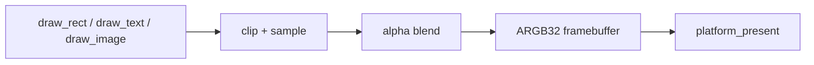

# Part 3: 렌더링과 UI — 2D 소프트웨어 래스터라이저

> **시리즈:** 제로부터 멀티플레이어 테트리스 + RL까지
>
> [시리즈 목차](./README.md) · [이전: Part 2 — 플랫폼 계층](./part2-platform-window-input.md) · **Part 3** · [다음: Part 4 — Game과 메인 루프](./part4-game-wrapper-and-loop.md)

---

## 이번 Part의 구현 계약

- **선행 상태:** CPU ARGB32 배열을 OS 창에 표시할 수 있는 플랫폼 계층.
- **이번 Part의 파일:** `renderer/renderer.*`, `renderer/software_internal.h`, `renderer/text_software.cpp`, `renderer/image.*`, `src/gui.cpp`.
- **연결점:** 게임/UI draw 명령을 CPU 픽셀로 바꾸고 `platform_present`로 넘긴다.
- **완료 게이트:** 도형·텍스트·이미지·회전·view offset 확인과 게임 클라이언트 링크.

## 이번 장의 목표

이번 장에서는 OpenGL, DirectX, Vulkan 없이 2D 화면을 만든다. 렌더러가
720×640 `uint32_t` 배열을 소유하고 다음 기능을 CPU로 구현한다.

- 배경 clear
- 클리핑된 사각형과 둥근 사각형
- straight-alpha source-over 합성
- TTF 글리프 래스터화와 coverage 합성
- RGBA 이미지 저장, 확대, tint, 회전
- 화면 흔들림용 view offset
- Part 2 플랫폼 계층으로 present

GPU 드라이버나 커널을 만드는 프로젝트는 아니다. 운영체제 창에 메모리를
보여주는 마지막 단계는 Win32 GDI 또는 SDL2에 맡긴다. 학습 범위는 “그리기
명령이 픽셀로 바뀌는 과정”이다.



## 1. 렌더러 API

상위 게임 코드는 이전과 같은 작은 API를 사용한다.

```cpp
void renderer_init(int screen_w, int screen_h);
void renderer_begin(Color bg);
void renderer_set_view_offset(int dx, int dy);
void renderer_end();
void renderer_shutdown();

void renderer_load_font(const char* path);
void draw_rect(int x, int y, int w, int h, Color color);
void draw_rect_rounded(int x, int y, int w, int h,
                       float roundness, Color color);
void draw_text(const char* text, int x, int y, int size, Color color);
int  measure_text(const char* text, int size);
```

이미지는 핸들 API로 분리한다.

```cpp
ImageHandle image_load(const char* path);
ImageHandle image_create_rgba(const uint8_t* rgba, int w, int h);
void draw_image(ImageHandle image, int x, int y, int w, int h);
void draw_image_tinted(ImageHandle image, int x, int y, int w, int h,
                       Color tint);
void draw_image_rotated(ImageHandle image, int cx, int cy, int w, int h,
                        float clockwise_degrees);
```

게임/UI와 구현을 분리했기 때문에 렌더러 내부가 GL draw call에서 픽셀 루프로
바뀌어도 `game.cpp`, `gui.cpp`의 그리기 코드는 거의 변하지 않는다.

## 2. 프레임버퍼

상태의 중심은 한 개의 연속 배열이다.

```cpp
static int screen_w;
static int screen_h;
static std::vector<uint32_t> pixels; // 0xAARRGGBB

void renderer_init(int w, int h)
{
    screen_w = max(w, 1);
    screen_h = max(h, 1);
    pixels.assign(size_t(screen_w) * screen_h, 0xFF000000u);
}
```

좌표 `(x,y)`의 인덱스는 `y * width + x`다. 같은 행의 픽셀이 연속이므로
사각형 clear/fill은 cache-friendly하게 진행된다.

`renderer_begin`은 배경색을 opaque ARGB로 pack해 전체 배열을 채운다.

```cpp
uint32_t pack(Color c)
{
    return 0xFF000000u |
           (uint32_t(c.r) << 16) |
           (uint32_t(c.g) << 8) |
           uint32_t(c.b);
}

std::fill(pixels.begin(), pixels.end(), pack(background));
```

프레임버퍼는 최종 화면이므로 alpha 채널을 항상 255로 유지한다. 소스의 alpha는
합성 가중치로 사용한다.

## 3. source-over 알파 합성

소스 색 `S`, 목적지 색 `D`, 소스 alpha `a`가 있을 때 각 RGB 채널은 다음과
같다.

```text
out = (S × a + D × (255 - a)) / 255
```

정수 나눗셈의 편향을 줄이기 위해 127을 더한 뒤 나눈다.

```cpp
unsigned out_r = (src.r * a + dst_r * (255 - a) + 127) / 255;
```

텍스트에는 글리프 coverage가 하나 더 있다.

```text
effective alpha = color alpha × glyph coverage / 255
```

`software_blend_pixel`과 `software_blend_coverage`가 이 연산을 한 곳에서
수행한다. 이미지와 텍스트가 같은 합성 규칙을 공유하므로 반투명 결과가
일관된다.

빠른 경로도 중요하다.

- alpha 0: 아무것도 하지 않는다.
- alpha 255: 목적지 RGB를 읽지 않고 바로 쓴다.
- 불투명 사각형: 픽셀마다 blend 함수를 호출하지 않고 행별 `std::fill`.

## 4. 클리핑과 사각형

입력 사각형을 프레임버퍼 경계와 교차시킨다.

```cpp
x0 = max(x, 0);
y0 = max(y, 0);
x1 = min(x + w, screen_w);
y1 = min(y + h, screen_h);

if (x0 >= x1 || y0 >= y1) return;
```

클리핑을 먼저 하면 안쪽 루프에는 범위 검사가 필요 없다. 화면 흔들림
`renderer_set_view_offset`도 클리핑 전에 좌표에 더한다.

```text
draw coordinate + view offset -> clip -> write
```

시뮬레이션 좌표는 바뀌지 않는다. 흔들림은 렌더 결과에만 적용되므로 lockstep
상태 해시에도 들어가지 않는다.

## 5. 둥근 사각형

픽셀 중심이 rounded-rectangle 내부인지 검사한다. 중앙 직사각형 영역에서는
거리가 0이고, 모서리에서는 가장 가까운 corner center와의 제곱 거리를 쓴다.

```cpp
qx = max(left_center - px, max(0, px - right_center));
qy = max(top_center  - py, max(0, py - bottom_center));

inside = qx*qx + qy*qy <= radius*radius;
```

제곱근을 계산하지 않는 것이 포인트다. `distance <= radius`와
`distance² <= radius²`는 같은 판정이고 후자가 더 싸다.

현재 경계는 1픽셀 단위의 hard edge다. 더 매끄러운 모서리가 필요하면 경계
1픽셀 구간에 coverage를 계산해 `software_blend_coverage`로 합성할 수 있다.

## 6. 텍스트

TTF 파싱과 outline 래스터화 전체를 새로 쓰는 것은 이 프로젝트의 그래픽스
학습 목표보다 훨씬 넓다. 저장소에 vendoring된 `stb_truetype`가 glyph
coverage bitmap을 만들고, **배치·캐시·합성은 우리 코드가 담당**한다.

### 6.1 글리프 캐시

키는 `(Unicode code point, pixel size)`다.

```cpp
struct Glyph {
    int w, h;
    int xoff, yoff;
    float advance;
    std::vector<uint8_t> coverage;
};
```

처음 등장한 글리프만 `stbtt_GetCodepointBitmap`으로 래스터화한다. 이후
프레임에는 CPU bitmap을 재사용한다. GPU atlas나 texture upload는 없다.

### 6.2 baseline과 advance

`draw_text(x,y)`의 `y`는 텍스트 상단이다. font ascent로 baseline을 구하고,
각 글리프의 offset을 더해 bitmap 위치를 정한다.

```text
baseline = y + ascent × scale
glyph x  = pen_x + xoff
glyph y  = baseline + yoff
pen_x   += kerning + advance
```

`measure_text`도 같은 advance와 kerning을 사용한다. 그리기와 측정의 metric이
같아야 버튼 중앙 정렬이 흔들리지 않는다.

UTF-8은 1~4바이트를 code point로 디코드한다. 폰트에 글리프가 있으면 한글도
같은 경로로 그려진다.

## 7. 이미지 저장

파일 decode와 그리기를 분리한다.

- Windows: GDI+가 PNG/JPG/BMP를 RGBA8로 decode
- Linux/macOS: `stb_image`가 RGBA8로 decode
- 공통: RGBA8를 `0xAARRGGBB` vector로 변환해 `ImageEntry`에 보관

```cpp
struct ImageEntry {
    bool used;
    int w, h;
    std::vector<uint32_t> pixels;
};
```

`ImageHandle` 0은 invalid다. unload된 slot을 재사용하므로 게임 코드가 이미지
메모리 주소나 플랫폼 resource handle을 직접 보지 않는다.

## 8. 이미지 스케일과 tint

목적지 픽셀 중심을 정규화한 UV로 바꾸고 원본 좌표를 찾는다.

```cpp
u = (dx + 0.5f) / destination_width;
v = (dy + 0.5f) / destination_height;
sx = clamp(int(u * source_width),  0, source_width  - 1);
sy = clamp(int(v * source_height), 0, source_height - 1);
```

현재 sampler는 nearest-neighbor다. 작은 pixel-art icon의 경계를 보존하고
구현이 명확하다. 부드러운 확대가 필요하면 주변 4픽셀을 읽는 bilinear
sampler를 같은 자리에 추가할 수 있다.

tint는 샘플의 각 채널에 곱한다.

```text
tinted.r = sample.r × tint.r / 255
tinted.a = sample.a × tint.a / 255
```

그 결과를 공통 source-over 함수로 프레임버퍼에 합성한다.

## 9. 이미지 회전

소스 픽셀을 앞으로 회전시키면 목적지에 구멍이 생길 수 있다. 대신 회전된
목적지 bounding box를 순회하고 각 픽셀을 원본으로 **역변환**한다.

화면 좌표는 y가 아래로 증가하므로 양의 각도를 시계 방향으로 정의한다.

```text
local_x =  dx × cos(a) + dy × sin(a)
local_y = -dx × sin(a) + dy × cos(a)

u = (local_x + width/2)  / width
v = (local_y + height/2) / height
```

`u,v`가 `[0,1)` 밖이면 회전된 사각형 외부이므로 건너뛴다. 안쪽이면 일반
이미지와 같은 sampler/blender를 사용한다.

이것은 GPU textured triangle rasterization과 같은 핵심 원리다. 차이는 vertex
shader와 fragment shader 대신 C++ 루프가 좌표 변환과 sampling을 직접 한다는
점이다.

## 10. 프레임 수명주기

메인 루프의 한 프레임은 다음 순서다.

```cpp
float dt = platform_begin_frame();

// fixed-step simulation update

renderer_begin(background);
draw_game();
draw_ui();
renderer_end();       // platform_present(framebuffer)
platform_end_frame(); // optional 60 FPS pacing
```

종료 순서는 렌더러가 먼저다.

```cpp
renderer_shutdown(); // image + glyph + framebuffer
platform_shutdown(); // window
```

GPU context 수명 제약은 사라졌지만, 소유 관계를 역순으로 정리하는 습관은
그대로 유지한다.

## 11. UI가 얻는 것

`src/gui.cpp`는 렌더러 primitive와 플랫폼 입력만 사용한다.

```text
button = rounded rect + text + mouse hit-test
checkbox = rect + state mark + text
slider = rect track + filled rect + knob + text
```

즉시모드 GUI는 매 프레임 현재 상태로 다시 그린다. 별도의 widget tree나 GPU
resource가 없으므로 소프트웨어 렌더러로 바뀌어도 UI 구조는 유지된다.

## 12. 성능과 의도적 한계

720×640은 약 46만 픽셀이다. 60 FPS에서 배경 clear만 약 2,765만 픽셀 쓰기다.
현대 CPU에는 충분하지만 다음 비용은 눈에 띌 수 있다.

- 큰 반투명 영역: read-modify-write
- 큰 이미지 확대: 목적지마다 sampling
- 큰 글자/많은 문자열: coverage blend
- 매 프레임 회전하는 큰 이미지: 삼각함수와 bounding-box 순회

현재 범위에서는 단순성과 관찰 가능성을 우선한다. 최적화 순서는 측정 후
결정한다.

1. dirty rectangle 또는 tile 기반 갱신
2. premultiplied alpha
3. SIMD blend/clear
4. glyph/image atlas의 cache locality 개선
5. worker thread로 scanline/tile 분할

## 13. DirectX/Vulkan으로 가는 경계

소프트웨어 렌더러와 현대 GPU API는 양자택일일 필요가 없다. 현재 구조에는
명확한 교체 지점이 있다.

```text
software path:
CPU rasterize -> ARGB32 framebuffer -> GDI/SDL surface

future GPU-present path:
CPU rasterize -> staging/upload texture -> DX/Vulkan swapchain

future GPU-render path:
draw commands -> vertex/index buffers -> shaders -> swapchain
```

첫 번째 확장은 Part 2의 `platform_present`만 바꾼다. 두 번째 확장은 renderer
backend를 새로 만들되 게임/UI의 `draw_*` API를 유지할 수 있다.

따라서 이 구현은 DirectX/Vulkan 학습을 방해하지 않는다. 오히려 clipping,
sampling, blending, coordinate transform을 CPU에서 먼저 확인했기 때문에
나중에 GPU pipeline의 각 stage가 무엇을 대신하는지 비교할 기준이 생긴다.

## 14. 검증 체크리스트

1. 불투명 사각형이 요청 범위를 정확히 채운다.
2. 음수 좌표와 화면 밖 사각형이 메모리 범위를 넘지 않는다.
3. alpha 0/128/255 결과가 각각 no-op/혼합/덮어쓰기다.
4. 둥근 사각형 radius 0은 일반 사각형과 같다.
5. 텍스트 측정 폭과 실제 배치 폭이 일치한다.
6. 투명 PNG의 배경이 검게 나오지 않는다.
7. tint alpha가 이미지 원본 alpha와 함께 적용된다.
8. 90도 회전에서 중심과 방향이 맞는다.
9. view offset이 도형·텍스트·이미지에 모두 적용된다.
10. Windows와 SDL 표시 결과의 채널/상하 방향이 같다.

## 마무리

이제 게임의 2D 화면은 외부 그래픽 API가 아니라 저장소 코드가 직접 만든다.
OS 라이브러리는 창과 최종 복사만 담당한다. 이 범위는 커널 드라이버까지
내려가지 않으면서도 rasterization, sampling, blending, text coverage,
coordinate transform이라는 그래픽스의 핵심을 실제 게임 안에서 관찰하게
해준다.
