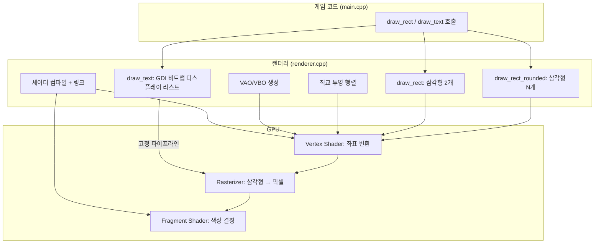
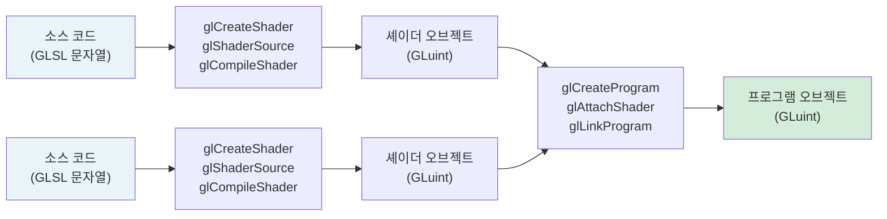
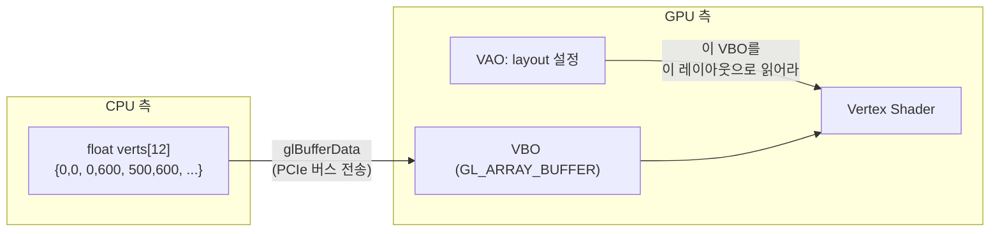
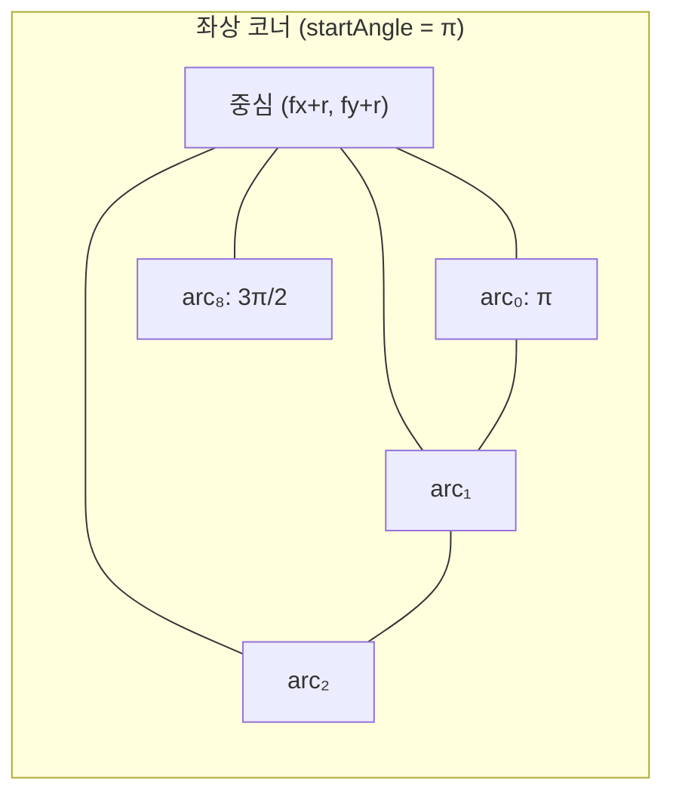
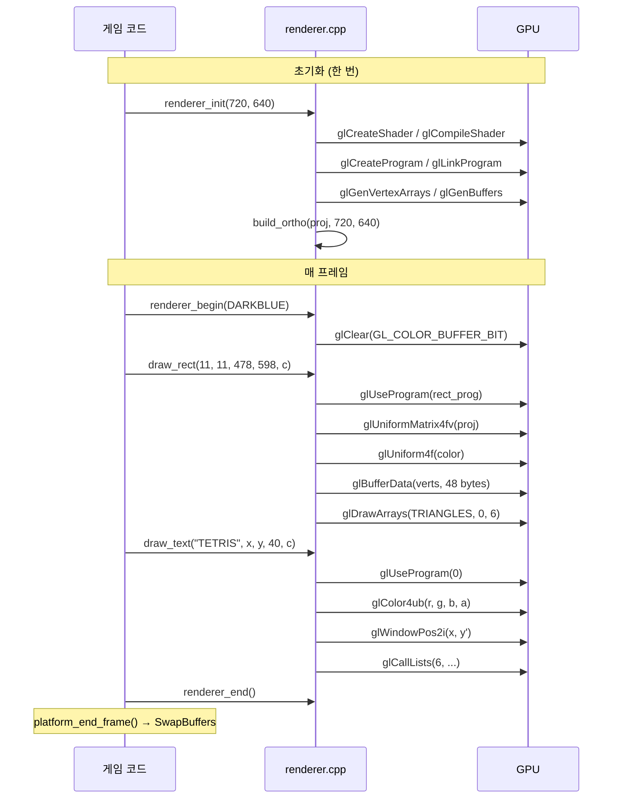

# Part 3: 렌더링과 UI — OpenGL 2D 파이프라인

> **시리즈:** 제로부터 멀티플레이어 테트리스 + RL까지
> [시리즈 목차](./README.md) · [이전: Part 2 — 플랫폼](./part2-platform-window-input.md) · **Part 3** · [다음: Part 4 — Game과 메인 루프](./part4-game-wrapper-and-loop.md)

---

## 이 장의 구현 계약

- **선행 상태:** Part 2가 유효한 OpenGL 컨텍스트와 입력 좌표를 제공한다.
- **이번 장의 파일:** `renderer/*`, `src/colors.*`, `src/gui.*`.
- **연결점:** renderer는 픽셀 primitive만, GUI는 그 primitive와 플랫폼 입력만
  사용한다. 아직 테트리스 규칙을 직접 참조하지 않는다.
- **완료 게이트:** 사각형·텍스트·이미지와 버튼을 같은 720×640 논리 좌표에서
  그리며 Win32/SDL 백엔드가 동일한 공개 API를 만족해야 한다.

## 들어가며

Part 2에서 창을 만들고 OpenGL 컨텍스트를 바인딩했다. 이제 그 창에 무언가를 그릴 차례다.

raylib에서 사각형을 하나 그리는 코드는 이렇다:

```cpp
DrawRectangle(11, 11, 478, 598, DARKBLUE);
```

이 한 줄이 GPU 안에서 실제로 하는 일:

1. GLSL 셰이더 프로그램을 GPU에 업로드하고 컴파일/링크
2. 사각형을 삼각형 2개(꼭짓점 6개)로 분해
3. 꼭짓점 데이터를 VBO에 업로드 (CPU -> GPU 메모리 전송)
4. 직교 투영 행렬을 uniform으로 전달
5. 색상을 uniform으로 전달
6. `glDrawArrays(GL_TRIANGLES, 0, 6)` — GPU가 삼각형을 래스터라이즈

GPU는 삼각형만 이해한다. 사각형, 원, 둥근 모서리 — 모두 삼각형의 조합이다. 이 글에서는 이 과정을 단계별로 구현하면서, 2D 렌더링의 핵심 개념인 셰이더, 버텍스 버퍼, 투영 행렬, 텍스트 렌더링을 다룬다.

이 장의 실제 파일 경계는 `renderer/renderer.cpp`, `renderer/shaders.h`, `renderer/renderer.h`다. 텍스트는 플랫폼별로 `renderer/text_win32.cpp` (GDI `wglUseFontBitmaps`) 또는 `renderer/text_stb.cpp` (`stb_truetype` TTF 글리프 아틀라스)로 분리되며, Section I에서 추가된 화면 흔들림은 `renderer/shake.cpp`, 이미지 렌더링은 `renderer/image.cpp` (GDI+ 또는 `stb_image`)이다.

> **참고:** Part 2의 노트와 마찬가지로, 본 시리즈는 raylib의 `DrawRectangle`을
> 출발점으로 삼지만 이 프로젝트는 raylib을 링크하지 않는다. 최종 코드는
> 순수 OpenGL + 플랫폼 API만 사용한다.

---

## 1. 렌더링 아키텍처 개요

Part 2의 플랫폼 계층 위에 렌더링 계층을 쌓는다:



렌더러의 인터페이스는 8개 함수다:

```cpp
// renderer/renderer.h
void renderer_init(int screen_w, int screen_h);     // 셰이더, VAO/VBO, 투영 행렬
void renderer_begin(Color bg);                       // glClear
void renderer_end();                                 // (현재 빈 함수)
void renderer_shutdown();                            // GL 리소스 해제

void draw_rect(int x, int y, int w, int h, Color c);
void draw_rect_rounded(int x, int y, int w, int h, float roundness, Color c);
void draw_text(const char* text, int x, int y, int size, Color c);
int  measure_text(const char* text, int size);
```

게임 코드는 `draw_rect(11, 11, 478, 598, darkBlue)` 처럼 **화면 좌표(픽셀)**로 호출한다. 렌더러가 이 좌표를 GPU가 이해하는 NDC(Normalized Device Coordinates, -1~+1 범위)로 변환한다. 이 변환을 담당하는 것이 직교 투영 행렬이다.

---

## 2. 셰이더 컴파일 파이프라인

### 2.1 GPU의 프로그래밍 모델

GPU는 범용 프로세서가 아니다. GPU에게 "이 사각형을 파란색으로 칠해라"고 직접 말할 수 없다. 대신 두 개의 작은 프로그램을 작성해서 GPU에 업로드해야 한다:

| 셰이더 | 실행 단위 | 입력 | 출력 | 역할 |
|--------|----------|------|------|------|
| Vertex Shader | 각 꼭짓점마다 1회 | 오브젝트 좌표, 변환 행렬 | `gl_Position` (NDC 좌표) | "이 꼭짓점은 화면 어디에?" |
| Fragment Shader | 삼각형 내부의 각 픽셀마다 1회 | 보간된 값, uniform | `fragColor` (RGBA) | "이 픽셀은 무슨 색?" |

사각형 하나(꼭짓점 6개, 가령 500x600 픽셀 영역)를 그리면:
- Vertex Shader: **6회** 실행
- Fragment Shader: **약 300,000회** 실행 (500 x 600 픽셀, 예시/측정 아님)

이 비대칭이 GPU 아키텍처의 핵심이다. Fragment Shader가 수십만 번 실행되므로, GPU는 이것을 수천 개의 코어에서 **동시에** 실행한다.

### 2.2 GLSL 셰이더 소스

이 프로젝트의 사각형 렌더링 셰이더:

```glsl
// Vertex Shader — renderer/shaders.h (발췌)
#version 130
in vec2 a_pos;           // 꼭짓점 위치 (화면 좌표)
uniform mat4 u_proj;     // 직교 투영 행렬
void main() {
    gl_Position = u_proj * vec4(a_pos, 0.0, 1.0);
}
```

`#version 130`은 OpenGL 3.0에 대응하는 GLSL 버전이다. `in`, `out`, `uniform` 키워드를 사용하려면 최소 130이 필요하다.

`a_pos`는 **attribute** — VBO에서 꼭짓점마다 다른 값이 들어온다. `u_proj`는 **uniform** — 모든 꼭짓점에서 같은 값이다.

`vec4(a_pos, 0.0, 1.0)`에서 z=0.0 (2D이므로 깊이 없음), w=1.0 (동차 좌표, 투영 나눗셈에 필요)이다.

```glsl
// Fragment Shader — renderer/shaders.h (발췌)
#version 130
uniform vec4 u_color;    // RGBA 색상
out vec4 fragColor;
void main() {
    fragColor = u_color;
}
```

Fragment Shader는 단순하다. 모든 픽셀이 같은 색이므로 uniform 하나를 그대로 출력한다. 텍스처 매핑이나 조명이 없는 2D 단색 렌더링에서는 이것으로 충분하다.

### 2.3 컴파일과 링크

셰이더 컴파일은 C 코드 컴파일과 유사한 구조를 갖는다:



C 컴파일러 파이프라인과의 대응:

| C 컴파일 | GLSL 컴파일 | 역할 |
|----------|------------|------|
| `gcc -c file.c` → `file.o` | `glCompileShader(s)` | 개별 셰이더 컴파일 |
| `gcc file1.o file2.o -o program` | `glLinkProgram(p)` | 셰이더 오브젝트들을 하나의 프로그램으로 링크 |
| `./program` | `glUseProgram(p)` | 이후 draw call에 이 프로그램 사용 |

구현:

```cpp
// renderer/renderer.cpp (발췌)
static GLuint compile_shader(GLenum type, const char* src)
{
    GLuint s = glCreateShader(type);
    glShaderSource(s, 1, &src, nullptr);  // 소스 문자열 전달
    glCompileShader(s);

    // 컴파일 결과 확인
    GLint ok = 0;
    glGetShaderiv(s, GL_COMPILE_STATUS, &ok);
    if (!ok) {
        char log[512]; GLsizei len = 0;
        glGetShaderInfoLog(s, sizeof(log), &len, log);
        log[len < (GLsizei)sizeof(log) ? len : sizeof(log) - 1] = '\0';
        fprintf(stderr, "[GLSL] Compile error:\n%s\n", log);
    }
    return s;
}

static GLuint link_program(const char* vert_src, const char* frag_src)
{
    GLuint v = compile_shader(GL_VERTEX_SHADER,   vert_src);
    GLuint f = compile_shader(GL_FRAGMENT_SHADER, frag_src);
    GLuint p = glCreateProgram();
    glAttachShader(p, v);
    glAttachShader(p, f);
    glLinkProgram(p);

    GLint ok = 0;
    glGetProgramiv(p, GL_LINK_STATUS, &ok);
    if (!ok) {
        char log[512]; GLsizei len = 0;
        glGetProgramInfoLog(p, sizeof(log), &len, log);
        fprintf(stderr, "[GLSL] Link error:\n%s\n", log);
    }

    // 링크 완료 후 개별 셰이더 오브젝트는 삭제 가능
    // (프로그램 오브젝트가 이미 복사본을 가지고 있음)
    glDeleteShader(v);
    glDeleteShader(f);
    return p;
}
```

`glDeleteShader(v)`가 링크 직후에 호출되는 것에 주의하라. 이것은 C에서 링크 후 `.o` 파일을 삭제하는 것과 같다. 프로그램 오브젝트가 이미 컴파일된 코드의 복사본을 가지고 있으므로 원본 셰이더 오브젝트는 필요 없다.

### 2.4 셰이더 컴파일 에러 처리

`glGetShaderInfoLog`가 반환하는 에러 메시지는 GPU 드라이버가 생성한다. NVIDIA, AMD, Intel 각 드라이버마다 포맷이 다르지만, 대체로 다음 형태다:

```text
0(3) : error C0000: syntax error, unexpected '}', expecting ',' or ';' at token "}"
```

셰이더 컴파일 에러를 무시하면 `glUseProgram` 이후 모든 draw call이 무시되어 **화면이 검은색**으로 나온다. 에러 로그 없이는 원인을 찾기 극히 어렵다. 따라서 컴파일/링크 에러 체크는 생략하면 안 된다.

> **레퍼런스:** OpenGL 4.6 Core Profile Specification, Section 7.1 "Shader Objects". `glGetShaderInfoLog`의 내용은 구현 정의(implementation-defined)이며, NVIDIA와 AMD의 에러 포맷이 상이하다.

---

## 3. VAO와 VBO

### 3.1 GPU 메모리 모델

CPU와 GPU는 별도의 메모리 공간을 사용한다. `draw_rect`가 호출될 때마다 꼭짓점 좌표를 CPU 메모리에서 GPU 메모리로 전송해야 한다. 이 전송 통로가 **VBO(Vertex Buffer Object)** 다.



**VBO**는 GPU 메모리에 있는 배열이다. `glBufferData`가 CPU 배열을 GPU 메모리로 복사한다.

**VAO(Vertex Array Object)** 는 "이 VBO를 어떤 레이아웃으로 해석할지"를 기록한 설정 묶음이다. 한번 설정하면 이후에는 VAO만 바인딩하면 레이아웃이 자동 적용된다.

### 3.2 초기화 코드

```cpp
// renderer/renderer.cpp (발췌)
void renderer_init(int screen_w, int screen_h)
{
    s_screen_w = screen_w;
    s_screen_h = screen_h;

    build_ortho(s_proj, (float)screen_w, (float)screen_h);

    // 셰이더 컴파일 + uniform location 캐싱
    s_rect_prog  = link_program(kRectVert, kRectFrag);
    s_rect_proj  = glGetUniformLocation(s_rect_prog, "u_proj");
    s_rect_color = glGetUniformLocation(s_rect_prog, "u_color");

    // VAO 생성 및 바인딩
    glGenVertexArrays(1, &s_rect_vao);
    glBindVertexArray(s_rect_vao);

    // VBO 생성: GL_DYNAMIC_DRAW = "매 프레임 내용이 바뀔 것"이라는 힌트
    glGenBuffers(1, &s_rect_vbo);
    glBindBuffer(GL_ARRAY_BUFFER, s_rect_vbo);
    glBufferData(GL_ARRAY_BUFFER,
                 6 * 2 * sizeof(float),  // 6 꼭짓점 x 2 float (x,y)
                 nullptr,                 // 초기 데이터 없음 (나중에 채움)
                 GL_DYNAMIC_DRAW);

    // 꼭짓점 레이아웃: attribute 0 = vec2 (x, y)
    glVertexAttribPointer(0,             // location = 0 (셰이더의 a_pos)
                          2,             // 요소 개수 (vec2)
                          GL_FLOAT,      // 타입
                          GL_FALSE,      // 정규화 안 함
                          2 * sizeof(float),  // stride: 다음 꼭짓점까지 바이트 수
                          nullptr);      // offset: 0
    glEnableVertexAttribArray(0);

    glBindVertexArray(0);  // VAO 바인딩 해제 (다른 코드에 영향 방지)
}
```

`glVertexAttribPointer`의 파라미터가 이해하기 어렵다면, 이렇게 생각하면 된다:

```text
VBO 내부 메모리 레이아웃:
[x0][y0] [x1][y1] [x2][y2] [x3][y3] [x4][y4] [x5][y5]
 ↑stride=8 bytes↑
 └── 2 floats ──┘
```

`glVertexAttribPointer(0, 2, GL_FLOAT, ..., 8, 0)`은 "attribute 0번에, 0바이트 오프셋에서 시작해, 8바이트 간격으로, float 2개씩 읽어라"는 뜻이다.

### 3.3 GL_DYNAMIC_DRAW vs GL_STATIC_DRAW

`glBufferData`의 마지막 파라미터는 드라이버에 대한 **성능 힌트**다:

| 힌트 | 의미 | 용도 |
|------|------|------|
| `GL_STATIC_DRAW` | 한 번 업로드, 여러 번 그리기 | 3D 모델 메시 |
| `GL_DYNAMIC_DRAW` | 자주 업데이트, 자주 그리기 | UI, 파티클 |
| `GL_STREAM_DRAW` | 매 프레임 새로 채우기 | 즉석 생성 지오메트리 |

이 프로젝트에서는 `draw_rect` 호출마다 꼭짓점 좌표가 바뀌므로 `GL_DYNAMIC_DRAW`가 적절하다. 드라이버는 이 힌트를 보고 VBO를 CPU 접근이 빠른 메모리 영역에 배치할 수 있다.

> **레퍼런스:** OpenGL 4.6 Core Profile Specification, Section 6.2 "Creating and Modifying Buffer Object Data Stores". 힌트는 성능에 영향을 주지만, 잘못 지정해도 동작은 정확하다.

---

## 4. 직교 투영 행렬

### 4.1 문제: 화면 좌표와 NDC

게임 코드는 픽셀 좌표로 생각한다: "x=11, y=11에서 시작하는 478x598 사각형". 그러나 GPU의 출력 공간인 **NDC(Normalized Device Coordinates)** 는 x, y 모두 $[-1, +1]$ 범위다:

```text
화면 좌표 (Screen Coordinates)      NDC (Normalized Device Coordinates)
(0,0)──────────(720,0)              (-1,+1)─────(+1,+1)
  │                 │                  │             │
  │  게임 영역      │      ──→        │    GPU      │
  │                 │                  │    출력     │
(0,640)────────(720,640)            (-1,-1)─────(+1,-1)
```

추가로, 화면 좌표계에서 y=0은 **위쪽**이고 아래로 갈수록 증가하지만, NDC에서 y=-1이 **아래쪽**이다. y축 방향이 반대다.

### 4.2 직교 투영 행렬의 유도

직교 투영(Orthographic Projection)은 화면 좌표를 NDC로 선형 변환한다. 임의의 범위 $[l, r] \times [b, t] \times [n, f]$를 $[-1, 1]^3$으로 매핑하는 행렬:

$$\text{ortho}(l, r, b, t, n, f) = \begin{bmatrix} \frac{2}{r-l} & 0 & 0 & -\frac{r+l}{r-l} \\[6pt] 0 & \frac{2}{t-b} & 0 & -\frac{t+b}{t-b} \\[6pt] 0 & 0 & \frac{-2}{f-n} & -\frac{f+n}{f-n} \\[6pt] 0 & 0 & 0 & 1 \end{bmatrix}$$

이 행렬의 유도는 단순하다. x축을 예로 들면, $[l, r]$ 범위를 $[-1, 1]$로 매핑하는 것은 "이동 후 스케일" 두 단계다:

1. 범위의 중심을 원점으로 이동: $x' = x - \frac{r+l}{2}$
2. 범위의 폭을 2로 스케일: $x'' = x' \cdot \frac{2}{r-l}$

합치면: $x_{\text{ndc}} = \frac{2}{r-l} \cdot x - \frac{r+l}{r-l}$

y축과 z축도 동일한 패턴이다.

### 4.3 테트리스의 구체적 값

이 프로젝트에서는 다음 파라미터를 사용한다:

$$l = 0,\quad r = 720,\quad t = 0,\quad b = 640,\quad n = -1,\quad f = 1$$

$t = 0, b = 640$ (top < bottom)으로 설정하면 y축이 반전된다. 화면 좌표계에서 y가 아래로 증가하는 것과 일치시키기 위해서다.

대입하면:

$$m[0] = \frac{2}{720} = 0.002778, \quad m[5] = \frac{2}{0 - 640} = -0.003125$$

$m[5]$가 음수인 것이 y축 반전의 실체다.

$$m[12] = -\frac{720}{720} = -1, \quad m[13] = -\frac{640}{-640} = 1$$

구현:

```cpp
// renderer/renderer.cpp (발췌)
static void build_ortho(float* m, float w, float h)
{
    float l = 0.0f, r = w, t = 0.0f, b = h, n = -1.0f, f = 1.0f;
    memset(m, 0, 16 * sizeof(float));
    m[0]  =  2.0f / (r - l);       //  2/W
    m[5]  =  2.0f / (t - b);       //  2/(0-H) = -2/H → y축 반전
    m[10] = -2.0f / (f - n);       // -1  (z축, 2D에서 무의미)
    m[12] = -(r + l) / (r - l);    // -1  (x 이동)
    m[13] = -(t + b) / (t - b);    //  1  (y 이동)
    m[14] = -(f + n) / (f - n);    //  0  (z 이동)
    m[15] = 1.0f;
}
```

### 4.4 Column-Major 저장 순서

주의할 점이 있다. 위 행렬 수식에서 $m[0] = 2/(r-l)$은 행렬의 (0,0) 원소이고, $m[12] = -(r+l)/(r-l)$은 (0,3) 원소다. 그런데 C 배열의 인덱스와 행렬 원소의 관계가 직관적이지 않다.

OpenGL은 행렬을 **column-major** 순서로 저장한다:

$$\begin{bmatrix} m[0] & m[4] & m[8]  & m[12] \\ m[1] & m[5] & m[9]  & m[13] \\ m[2] & m[6] & m[10] & m[14] \\ m[3] & m[7] & m[11] & m[15] \end{bmatrix}$$

즉, `m[0]~m[3]`이 첫 번째 **열**이다. 대부분의 수학 교과서나 DirectX가 row-major를 사용하는 것과 반대다. `glUniformMatrix4fv`의 세 번째 파라미터 `GL_FALSE`는 "이 데이터가 column-major"임을 의미한다.

> **레퍼런스:** OpenGL 4.6 Core Profile Specification, Section 7.6.1 "Loading Uniform Variables". `transpose` 파라미터가 `GL_TRUE`면 row-major 데이터를 자동 전치한다.

### 4.5 검증: (360, 320) -> (0, 0) NDC

화면 중심 (360, 320)이 NDC 원점에 매핑되는지 확인한다:

$$\begin{bmatrix} 0.002778 & 0 & 0 & -1 \\ 0 & -0.003125 & 0 & 1 \\ 0 & 0 & -1 & 0 \\ 0 & 0 & 0 & 1 \end{bmatrix} \begin{bmatrix} 360 \\ 320 \\ 0 \\ 1 \end{bmatrix} = \begin{bmatrix} 0.002778 \times 360 - 1 \\ -0.003125 \times 320 + 1 \\ 0 \\ 1 \end{bmatrix} = \begin{bmatrix} 0 \\ 0 \\ 0 \\ 1 \end{bmatrix}$$

화면 중심이 NDC 원점 $(0, 0)$에 정확히 대응한다.

---

## 5. draw_rect 구현

### 5.1 삼각형 분해

GPU는 삼각형만 래스터라이즈한다. 사각형을 그리려면 삼각형 2개로 분해해야 한다:

```text
(x, y)───────────(x+w, y)
  │ ╲    △2         │
  │   ╲              │
  │     ╲            │
  │  △1   ╲         │
  │         ╲        │
(x, y+h)────────(x+w, y+h)

Triangle 1: (x,y) → (x, y+h) → (x+w, y+h)    좌상 → 좌하 → 우하
Triangle 2: (x,y) → (x+w, y+h) → (x+w, y)     좌상 → 우하 → 우상
```

꼭짓점 순서(winding order)가 중요하다. OpenGL의 기본 설정에서 **반시계 방향(CCW)** 이 앞면이다. 앞면 판별에 따라 backface culling이 적용될 수 있으므로, 일관된 방향으로 꼭짓점을 나열해야 한다.

### 5.2 구현

```cpp
// renderer/renderer.cpp (발췌)
void draw_rect(int x, int y, int w, int h, Color c)
{
    float fx = (float)x, fy = (float)y;
    float fw = (float)w, fh = (float)h;

    // 6개 꼭짓점 (x,y 각 2 float = 12 float 총)
    float verts[12] = {
        fx,      fy,        // 좌상
        fx,      fy + fh,   // 좌하
        fx + fw, fy + fh,   // 우하
        fx,      fy,        // 좌상 (Triangle 2)
        fx + fw, fy + fh,   // 우하
        fx + fw, fy,        // 우상
    };

    glUseProgram(s_rect_prog);
    glUniformMatrix4fv(s_rect_proj, 1, GL_FALSE, s_proj);  // 투영 행렬
    glUniform4f(s_rect_color,
        c.r / 255.0f, c.g / 255.0f, c.b / 255.0f, c.a / 255.0f);

    glBindVertexArray(s_rect_vao);
    glBindBuffer(GL_ARRAY_BUFFER, s_rect_vbo);
    glBufferData(GL_ARRAY_BUFFER, sizeof(verts), verts, GL_DYNAMIC_DRAW);
    glDrawArrays(GL_TRIANGLES, 0, 6);
    glBindVertexArray(0);
}
```

`draw_rect` 한 번 호출의 GL 명령 시퀀스:

1. `glUseProgram(s_rect_prog)` — 이 셰이더 프로그램 활성화
2. `glUniformMatrix4fv` — 투영 행렬을 GPU에 전달
3. `glUniform4f` — 색상 RGBA(0~1 범위로 정규화)를 GPU에 전달
4. `glBindVertexArray` — VAO 바인딩 (레이아웃 설정 복원)
5. `glBufferData` — 12개 float (48바이트)를 GPU에 업로드
6. `glDrawArrays(GL_TRIANGLES, 0, 6)` — 삼각형 2개 그리기

### 5.3 매 호출마다 glBufferData — 성능은?

`draw_rect`가 호출될 때마다 `glBufferData`로 VBO 전체를 교체한다. 48바이트 전송이 매 호출마다 발생하는 것이다. 이것이 비효율적으로 보일 수 있지만:

1. **48바이트**는 극도로 작다. PCIe 3.0 대역폭은 약 15 GB/s 수준(예시/측정 아님)이므로 수십만 번 호출해도 병목이 안 된다
2. 테트리스는 프레임당 수십~수백 개의 `draw_rect` 호출만 발생 (블록 약 200개, UI 약 20개 — 예시/측정 아님)
3. `GL_DYNAMIC_DRAW` 힌트 덕분에 드라이버가 CPU-접근 빠른 영역에 VBO를 배치

3D 게임에서 수십만 폴리곤의 메시를 매 프레임 업로드한다면 문제가 되겠지만, 2D 테트리스에서는 이 방식이 가장 단순하고 충분히 빠르다.

> 최적화가 필요한 경우: 모든 사각형의 꼭짓점을 하나의 큰 VBO에 모아서 `glDrawArrays` 한 번으로 그리는 **배칭(batching)** 기법이 있다. raylib의 내부 구현(`rlgl.h`)이 정확히 이 방식이다.

---

## 6. draw_rect_rounded — 둥근 모서리

### 6.1 분해 전략

둥근 모서리 사각형은 단순한 삼각형 2개로는 불가능하다. 곡선을 근사하기 위해 다음과 같이 분해한다:

```text
          ╭──────── center strip ────────╮
          │    (fx+r, fy) ~ (fx+fw-r, fy+fh)    │
    ╭─────┼──────────────────────────────┼─────╮
    │ TL  │                              │ TR  │
    │arc  │                              │arc  │
    ├─────┤  left     center strip       ├─────┤
    │left │  strip                       │right│
    │strip│                              │strip│
    ├─────┤                              ├─────┤
    │ BL  │                              │ BR  │
    │arc  │                              │arc  │
    ╰─────┼──────────────────────────────┼─────╯
          ╰──────────────────────────────╯
```

**3개의 사각형:**
- Center strip: 폭 $(w - 2r)$, 높이 $h$ — 전체 세로를 관통
- Left strip: 폭 $r$, 높이 $(h - 2r)$ — 코너 사이의 좌측
- Right strip: 폭 $r$, 높이 $(h - 2r)$ — 코너 사이의 우측

**4개의 quarter-circle 아크:**
- 각 코너에 반지름 $r$의 사분원(quarter-circle)
- 각 사분원을 $N_{\text{seg}}$개의 삼각형 팬으로 근사

### 6.2 반지름 계산

```cpp
float minDim = (float)(w < h ? w : h);
float r = roundness * minDim * 0.5f;
```

$r = \text{roundness} \times \frac{\min(w, h)}{2}$

- `roundness = 0.0` → $r = 0$ → 직각 사각형 (`draw_rect`로 폴백)
- `roundness = 0.5` → $r = \min(w,h)/4$ → 적당히 둥근 모서리
- `roundness = 1.0` → $r = \min(w,h)/2$ → 정사각형이면 원, 직사각형이면 스타디움

$r < 1$이면 둥근 모서리가 시각적으로 무의미하므로 직각 사각형으로 폴백한다.

### 6.3 삼각형 팬으로 원호 근사

각 코너의 사분원을 삼각형 팬(triangle fan)으로 근사한다. 단, OpenGL의 `GL_TRIANGLE_FAN` 프리미티브가 아닌 `GL_TRIANGLES`를 사용하기 위해 각 삼각형을 독립적으로 나열한다. 이유: 사각형도 삼각형도 모두 같은 `glDrawArrays(GL_TRIANGLES, ...)` 한 번으로 그리기 위해서다.

세그먼트 수 $N_{\text{seg}} = 8$일 때, 각 삼각형은:

$$\text{center} = (c_x, c_y), \quad \text{arc}_i = (c_x + r\cos\theta_i,\ c_y + r\sin\theta_i)$$

$$\theta_i = \theta_{\text{start}} + \frac{\pi/2}{N_{\text{seg}}} \cdot i$$

각 삼각형의 꼭짓점: (center, $\text{arc}_i$, $\text{arc}_{i+1}$).



화면 좌표계에서 각도와 방향의 대응:

| 각도 | $\cos\theta$ | $\sin\theta$ | 방향 |
|------|-------------|-------------|------|
| $0$ | $+r$ | $0$ | 오른쪽 |
| $\pi/2$ | $0$ | $+r$ | 아래쪽 (화면 y축) |
| $\pi$ | $-r$ | $0$ | 왼쪽 |
| $3\pi/2$ | $0$ | $-r$ | 위쪽 |

각 코너의 시작 각도:

| 코너 | 중심 좌표 | 시작 각도 | 호 방향 |
|------|----------|----------|---------|
| 좌상(TL) | $(x+r,\; y+r)$ | $\pi$ | 왼쪽 → 위쪽 |
| 우상(TR) | $(x+w-r,\; y+r)$ | $3\pi/2$ | 위쪽 → 오른쪽 |
| 우하(BR) | $(x+w-r,\; y+h-r)$ | $0$ | 오른쪽 → 아래쪽 |
| 좌하(BL) | $(x+r,\; y+h-r)$ | $\pi/2$ | 아래쪽 → 왼쪽 |

### 6.4 꼭짓점 수 계산

총 꼭짓점 수:

$$V_{\text{total}} = \underbrace{3 \times 6}_{\text{사각형 3개}} + \underbrace{4 \times N_{\text{seg}} \times 3}_{\text{코너 4개}} = 18 + 4 \times 8 \times 3 = 114$$

float 배열 크기: $114 \times 2 = 228$ floats = 912 bytes. 여전히 1KB 미만이므로 스택 할당이 안전하다.

### 6.5 전체 구현

저장소 `renderer/renderer.cpp` 의 `draw_rect_rounded` 구현을 발췌한다. 코드 블록 아래에 람다 3 개 (`V`, `Rect`, `Corner`) 의 역할을 다시 풀어 쓴다.

```cpp
// renderer/renderer.cpp (발췌)
void draw_rect_rounded(int x, int y, int w, int h, float roundness, Color c)
{
    float minDim = (float)(w < h ? w : h);
    float r = roundness * minDim * 0.5f;
    if (r < 1.0f) { draw_rect(x, y, w, h, c); return; }

    float fx = (float)x, fy = (float)y, fw = (float)w, fh = (float)h;

    const int N_SEG = 8;
    const int MAX_VERTS = 18 + 4 * N_SEG * 3;
    float verts[MAX_VERTS * 2];
    int vi = 0;

    auto V = [&](float px, float py) { verts[vi++] = px; verts[vi++] = py; };
    auto Rect = [&](float rx, float ry, float rw, float rh) {
        V(rx, ry);       V(rx, ry+rh);       V(rx+rw, ry+rh);
        V(rx, ry);       V(rx+rw, ry+rh);    V(rx+rw, ry);
    };

    Rect(fx + r, fy,          fw - 2*r, fh);
    Rect(fx,     fy + r,      r,        fh - 2*r);
    Rect(fx + fw - r, fy + r, r,        fh - 2*r);

    const float PI = 3.14159265358979f;
    auto Corner = [&](float cx, float cy, float startAngle) {
        float step = (PI * 0.5f) / N_SEG;
        for (int i = 0; i < N_SEG; ++i) {
            float a0 = startAngle + step * i;
            float a1 = startAngle + step * (i + 1);
            V(cx, cy);
            V(cx + r * cosf(a0), cy + r * sinf(a0));
            V(cx + r * cosf(a1), cy + r * sinf(a1));
        }
    };

    Corner(fx + r,      fy + r,      PI);
    Corner(fx + fw - r, fy + r,      PI * 1.5f);
    Corner(fx + fw - r, fy + fh - r, 0.0f);
    Corner(fx + r,      fy + fh - r, PI * 0.5f);

    int numVerts = vi / 2;

    glUseProgram(s_rect_prog);
    glUniformMatrix4fv(s_rect_proj, 1, GL_FALSE, s_proj);
    glUniform4f(s_rect_color,
        c.r / 255.0f, c.g / 255.0f, c.b / 255.0f, c.a / 255.0f);

    glBindVertexArray(s_rect_vao);
    glBindBuffer(GL_ARRAY_BUFFER, s_rect_vbo);
    glBufferData(GL_ARRAY_BUFFER, vi * sizeof(float), verts, GL_DYNAMIC_DRAW);
    glDrawArrays(GL_TRIANGLES, 0, numVerts);
    glBindVertexArray(0);
}
```

**람다 3 개 해설.**

- `V(px, py)` — 꼭짓점 2 개의 float (`px`, `py`) 를 `verts[vi]`, `verts[vi+1]` 에 박고 `vi += 2`. 카운터를 외부로 빼서 `Rect` / `Corner` 가 같은 버퍼에 이어 쓰는 구조. 포인터 산술 없이 범위가 추적 가능하고, 컴파일러가 인라인하면 쓰기 비용이 사실상 제로다.
- `Rect(rx, ry, rw, rh)` — 왼쪽위 `(rx, ry)` · 폭 `rw` · 높이 `rh` 의 사각형을 두 삼각형으로 분해해 꼭짓점 6 개를 쌓는다. 시계방향은 일관되지만 OpenGL 백페이스 컬링을 끈 상태 (`glDisable(GL_CULL_FACE)` 기본) 이라 front/back 구분은 의미 없다. **왜 `GL_TRIANGLE_STRIP` 이 아닌 `GL_TRIANGLES` 냐** — 한 `glDrawArrays` 로 "9 개 조각 (3 개 사각형 + 4 개 코너 = 7 개 조각이지만 각 코너 팬도 분해)" 을 한꺼번에 그려야 하는데, 스트립은 조각 경계에서 degenerate triangle 을 넣어야 해서 코드가 복잡해진다.
- `Corner(cx, cy, startAngle)` — 중심 `(cx, cy)` 를 꼭짓점으로 하고 반지름 `r` 의 호를 `N_SEG` 개의 삼각형으로 쪼개는 팬. 각 삼각형은 (center, arc[i], arc[i+1]) 세 꼭짓점. 호의 시작 각도를 인자로 받아 네 코너 각각을 다른 방향으로 그릴 수 있게 분기를 피했다.

**`N_SEG` 세분화의 경제.** 코너당 8 개 삼각형 × 4 코너 = 32 개 + 사각형 3 개 × 2 삼각형 = 38 삼각형 = 114 꼭짓점 = 228 float = 912 바이트. 블록 셀 한 변이 30 px 일 때 `r ≈ 5 px`, 호 길이 ≈ 7.85 px, 8 세그먼트면 세그먼트당 0.98 px. **1 px 미만의 호를 더 쪼개도 모니터 픽셀이 받아주지 않는다**. 반대로 세그먼트를 4 개로 줄이면 11 도 → 22.5 도 각도가 되어 코너가 가시적으로 각진다. 섹션 6.6 에서 다시 다룬다.

**동일 파이프라인 재사용.** `draw_rect_rounded` 는 `draw_rect` 와 **같은 셰이더, 같은 VAO, 같은 VBO** 를 쓴다. 차이는 `glBufferData` 에 업로드하는 float 개수 (`draw_rect` = 12, `draw_rect_rounded` ≤ 228) 와 `glDrawArrays` 의 `count` 뿐. GPU 관점에서는 동일 프로그램의 draw call 하나가 늘어나는 것이고, CPU 관점에서는 `cosf` / `sinf` 64 회 호출이 코너 4 개에 분산된다. 별도의 geometry shader 나 tessellation shader 도 필요 없다.

### 6.6 N_SEG 선택

$N_{\text{seg}} = 8$은 "코너당 삼각형 8개"를 의미한다. 이 값의 선택 근거:

- $N_{\text{seg}} = 4$: 45도 간격. 코너가 눈에 띄게 각진다.
- $N_{\text{seg}} = 8$: 11.25도 간격. 일반적인 UI 크기(30~60px 반지름)에서 매끄럽게 보인다.
- $N_{\text{seg}} = 16$: 5.6도 간격. 더 매끄럽지만 꼭짓점 수 2배.

테트리스 블록의 셀 크기(약 30x30px, 예시/측정 아님)에서 반지름 $r \approx 5$px 정도이므로, 8 세그먼트면 각 세그먼트가 약 1px의 호를 커버한다. 이 이상 세분화해도 시각적 차이가 없다.

---

## 7. 텍스트 렌더링

### 7.1 왜 텍스트가 어려운가

텍스트 렌더링은 2D 그래픽스에서 가장 복잡한 영역 중 하나다. 셰이더 기반 사각형은 "좌표 -> 투영 -> 색칠"이라는 단순한 파이프라인이지만, 텍스트는:

1. 글리프(glyph) 데이터를 어딘가에서 가져와야 한다 (폰트 파일 파싱)
2. 각 문자의 비트맵을 생성해야 한다 (래스터라이제이션)
3. 비트맵을 GPU에 전달해야 한다
4. 문자 간격(kerning), 줄 높이 등을 계산해야 한다

이 프로젝트에서는 **wglUseFontBitmaps**를 사용한다. Windows GDI가 글리프 래스터라이제이션을 담당하고, 그 결과를 OpenGL 디스플레이 리스트로 변환하는 Win32 전용 함수다.

### 7.2 디스플레이 리스트란

디스플레이 리스트는 OpenGL 1.x 시절의 개념이다. GL 명령어 시퀀스를 "녹화"해두었다가 `glCallLists`로 "재생"하는 매크로와 비슷하다. `wglUseFontBitmaps`가 내부적으로 하는 일:

1. GDI로 각 문자의 비트맵을 렌더링
2. 각 비트맵을 `glBitmap` 명령으로 감싸서 디스플레이 리스트에 저장
3. ASCII 32('') ~ 127('~') = 96개 문자에 대해 96개 리스트 생성

이후 `glCallLists`를 호출하면, 문자열의 각 바이트에 대해 해당 디스플레이 리스트가 실행되어 비트맵이 화면에 찍힌다.

### 7.3 폰트 로딩과 크기별 캐싱

```cpp
// renderer/text_win32.cpp (발췌)
void renderer_load_font(const char* path)
{
    // AddFontResourceExA: GDI에 프라이빗 폰트 등록
    // (시스템 전역이 아닌 이 프로세스 전용)
    int added = AddFontResourceExA(path, FR_PRIVATE, nullptr);
    if (added == 0) {
        fprintf(stderr, "[FONT] AddFontResourceEx failed: %s\n", path);
        strncpy(s_font_face, "Courier New", sizeof(s_font_face) - 1);
    } else {
        strncpy(s_font_face, "monogram", sizeof(s_font_face) - 1);
    }
}
```

실제 GL 디스플레이 리스트는 `draw_text` 최초 호출 시 **lazy하게** 생성된다. 각 폰트 크기마다 별도의 96개 리스트가 필요하므로, `std::map<int, GLuint>`로 크기 -> 리스트 기본 ID를 캐싱한다:

```cpp
// renderer/text_win32.cpp (발췌)
static GLuint get_font_list(int size)
{
    auto it = s_font_lists.find(size);
    if (it != s_font_lists.end()) return it->second;

    // 이 크기의 GDI 폰트 생성
    HFONT hfont = CreateFontA(
        size,            // 높이 (px)
        0, 0, 0,         // 폭, 기울기: 자동/없음
        FW_NORMAL,
        FALSE, FALSE, FALSE,
        ANSI_CHARSET,
        OUT_DEFAULT_PRECIS, CLIP_DEFAULT_PRECIS,
        ANTIALIASED_QUALITY,
        DEFAULT_PITCH | FF_DONTCARE,
        s_font_face);

    // 현재 GL 컨텍스트의 DC에 폰트 선택 후 디스플레이 리스트 생성
    HDC hdc = (HDC)platform_get_hdc();
    HFONT old_font = (HFONT)SelectObject(hdc, hfont);

    GLuint base = glGenLists(96);       // 96개 리스트 예약
    wglUseFontBitmapsA(hdc, 32, 96, base);  // ASCII 32~127 생성

    SelectObject(hdc, old_font);
    DeleteObject(hfont);    // GDI 폰트 핸들 해제 (리스트는 GL이 보관)

    s_font_lists[size] = base;
    return base;
}
```

`wglUseFontBitmapsA(hdc, 32, 96, base)`의 파라미터:
- `hdc`: GDI 폰트가 선택된 Device Context
- `32`: 시작 문자 코드 (ASCII space)
- `96`: 생성할 문자 수 (32~127)
- `base`: GL 디스플레이 리스트의 시작 ID

### 7.4 draw_text 구현

```cpp
// renderer/text_win32.cpp (발췌)
void draw_text(const char* text, int x, int y, int size, Color c)
{
    if (!text || !text[0]) return;
    if (!glWindowPos2i) return;  // 확장 함수 미로드 시 무시 (호출 직전 가드)
    GLuint base = get_font_list(size);
    if (!base) return;

    // 모던 셰이더를 해제 — 고정 파이프라인 활성화
    glUseProgram(0);

    // 색상 설정 (glWindowPos2i보다 반드시 먼저)
    glColor4ub(c.r, c.g, c.b, c.a);

    // 래스터 위치 설정 (GL의 y=0은 화면 아래)
    glWindowPos2i(x, s_text_screen_h - y - size);

    // 문자열의 각 문자에 대해 디스플레이 리스트 호출
    glListBase(base - 32);  // offset: 'A'(65) → 리스트 ID = base + (65-32)
    glCallLists((GLsizei)strlen(text), GL_UNSIGNED_BYTE, text);
}
```

이 코드에서 가장 미묘한 부분은 `glColor4ub`와 `glWindowPos2i`의 **호출 순서**다. 다음 절에서 이 문제를 상세히 다룬다.

---

## 8. 이미지 렌더링 (`renderer/image.cpp`)

두 보드 모드에서 로컬 플레이어, 상대, 봇 슬롯을 구분하기 위해 PNG 아이콘 로더가 필요해졌다. 현재 실행 경로는 `assets/images.cfg` 를 먼저 읽고, 그 안의 `player_icon`, `opponent_icon`, `bot_icon` 기본 키와 `icon.<id>` 카탈로그 키가 가리키는 파일을 로드한다. 어떤 아이콘을 소유했고 선택했는지는 클라이언트가 아니라 `tetris_meta` DB가 authoritative 하게 검증하며, relay 는 검증된 `selected_icon_id` 를 `MATCH_FOUND` 에 실어 보낸다. 설정 파일이 없거나 특정 이미지가 실패하면 기본 경로(`assets/icons/player.png`, `assets/icons/opponent.png`, `assets/icons/bot.png`)를 다시 시도하고, 그것도 실패하면 코드에서 생성한 32×32 기본 아이콘 텍스처로 떨어진다. 구현은 `renderer/image.cpp` 한 파일에 모여있고, 디코더 (GDI+ 또는 `stb_image`) 와 텍스처 렌더러 (OpenGL) 두 레이어로 나뉜다.

### 8.1 왜 전용 스프라이트 셰이더인가

`renderer.cpp` 의 `kRectVert/kRectFrag` 는 단색 사각형 전용이다. 텍스처 샘플러가 없고 attribute 도 `vec2 a_pos` 단 하나뿐이다. 스프라이트는 (1) UV 좌표가 필요하고 (2) 텍스처 샘플링 + 틴트 곱셈이 필요하므로 셰이더 한 쌍을 새로 정의한다. `shaders.h` 의 `kSpriteVert` / `kSpriteFrag` 가 이 역할을 맡는다 — attribute 0 = `vec2 a_pos`, attribute 1 = `vec2 a_uv`, uniform `u_proj` / `u_tint` / `u_tex`.

`renderer.cpp` 의 파이프라인과 완전히 독립시킨 이유:

- **책임 분리**: rect 렌더러는 fragment 가 상수색 1개라 매우 단순하고 빠르다. 거기에 `if (has_texture)` 분기를 넣으면 셰이더가 지저분해지고 uniform 설정 경로도 둘로 갈라진다.
- **VAO/VBO 레이아웃 충돌**: rect 의 VAO 는 "attribute 0 만, stride = 8 bytes" 로 고정되어 있다. UV 를 추가하면 stride 가 16 바이트로 바뀌어서 `draw_rect` 가 깨진다. 별도 VAO/VBO 로 두면 서로 터치 안 한다.
- **GPU 상태 오염 방지**: `draw_image` 는 `glEnable(GL_BLEND)` 를 세팅해둔다 (아래 후술). rect 경로가 알파를 안 쓴다면 이 상태가 켜진 채 남아있어도 시각적으로 영향이 없다 — 알파 255 픽셀은 결과가 동일하니까. 이 "블렌드 항상 켜진 채" 가정을 스프라이트 경로에만 둔다.

### 8.2 GDI+ 로 PNG/JPG 디코딩 → BGRA → RGBA 스왑

Windows 에서는 stb_image 를 쓰지 않는다. 대신 OS 가 이미 가지고 있는 GDI+ 의 `Gdiplus::Bitmap` 으로 PNG/JPG/BMP 를 읽는다. 이유는 단순하다 — 바이너리 크기를 늘리지 않고, GDI+ 는 이 프로젝트가 이미 폰트용으로 링크 중인 `gdi32` 와 형제 라이브러리라 추가 의존성이 0 이다.

> 비-Win32(Linux/macOS)에는 GDI+ 가 없으므로, `decode_image_win32` 의 `#else` 분기가 벤더링된 `third_party/stb_image.h` 의 `stbi_load(path, &w, &h, &n, 4)` 로 RGBA8 을 디코딩한다. 즉 디코더만 플랫폼별로 갈리고, 그 위의 텍스처 업로드/렌더 경로는 공통이다.

`decode_image_win32` 의 핵심 루프:

```cpp
// renderer/image.cpp (발췌)
static bool decode_image_win32(const char* path, std::vector<uint8_t>& outPixels,
                               int& outW, int& outH)
{
    if (!s_gdiplus_initialized) {
        Gdiplus::GdiplusStartupInput si;
        if (Gdiplus::GdiplusStartup(&s_gdiplus_token, &si, nullptr) != Gdiplus::Ok) {
            fprintf(stderr, "[IMG] GdiplusStartup failed\n");
            return false;
        }
        s_gdiplus_initialized = true;
    }

    // UTF-8 → UTF-16
    int wn = MultiByteToWideChar(CP_UTF8, 0, path, -1, nullptr, 0);
    if (wn <= 0) return false;
    std::wstring wpath(wn, L'\0');
    MultiByteToWideChar(CP_UTF8, 0, path, -1, wpath.data(), wn);
    wpath.resize(wn - 1);

    Gdiplus::Bitmap bmp(wpath.c_str());
    if (bmp.GetLastStatus() != Gdiplus::Ok) {
        fprintf(stderr, "[IMG] load failed: %s\n", path);
        return false;
    }

    outW = (int)bmp.GetWidth();
    outH = (int)bmp.GetHeight();
    if (outW <= 0 || outH <= 0) return false;

    Gdiplus::BitmapData bd{};
    Gdiplus::Rect rc(0, 0, outW, outH);
    if (bmp.LockBits(&rc, Gdiplus::ImageLockModeRead,
                     PixelFormat32bppARGB, &bd) != Gdiplus::Ok) {
        fprintf(stderr, "[IMG] LockBits failed: %s\n", path);
        return false;
    }

    // GDI+ 포맷은 BGRA (premultiplied 아님). OpenGL 은 RGBA 기대.
    // row stride 는 bd.Stride (양수, top-down bitmap 의 경우).
    outPixels.assign((size_t)outW * outH * 4, 0);
    const uint8_t* srcBase = (const uint8_t*)bd.Scan0;
    for (int y = 0; y < outH; ++y) {
        const uint8_t* srcRow = srcBase + (ptrdiff_t)y * bd.Stride;
        uint8_t* dstRow = outPixels.data() + (size_t)y * outW * 4;
        for (int x = 0; x < outW; ++x) {
            uint8_t b = srcRow[x * 4 + 0];
            uint8_t g = srcRow[x * 4 + 1];
            uint8_t r = srcRow[x * 4 + 2];
            uint8_t a = srcRow[x * 4 + 3];
            dstRow[x * 4 + 0] = r;
            dstRow[x * 4 + 1] = g;
            dstRow[x * 4 + 2] = b;
            dstRow[x * 4 + 3] = a;
        }
    }
    bmp.UnlockBits(&bd);
    return true;
}
```

주목할 세 가지:

1. **GDI+ 지연 초기화** — `GdiplusStartup` 은 최초 `image_load` 에서만 호출. 앱이 이미지를 안 쓰면 오버헤드 0.
2. **UTF-8 경로** — 한글 디렉토리에서도 동작하도록 명시적으로 UTF-8 → UTF-16 변환. 윈도 파일 API 는 `A` 변종이 시스템 코드페이지를 따라가므로 신뢰 못함.
3. **BGRA → RGBA 바이트 스왑** — `PixelFormat32bppARGB` 로 락하면 메모리 상 순서는 `B,G,R,A` (리틀엔디안 DWORD 해석). OpenGL 의 `GL_RGBA, GL_UNSIGNED_BYTE` 는 `R,G,B,A` 순이므로 한 번 뒤집어야 한다. 수평 복사 한 번이면 충분해서 SIMD 없이 스칼라 루프로 충분히 빠르다.

### 8.3 `image_load` — 핸들 풀에 넣기

디코딩된 RGBA 바이트를 GPU 텍스처로 올리고, `ImageHandle` (= 인덱스) 을 반환:

```cpp
// renderer/image.cpp (발췌)
ImageHandle image_load(const char* path)
{
    if (!path || !*path) return 0;

    std::vector<uint8_t> pixels;
    int w = 0, h = 0;
    if (!decode_image_win32(path, pixels, w, h)) return 0;

    GLuint tex = 0;
    glGenTextures(1, &tex);
    glBindTexture(GL_TEXTURE_2D, tex);
    glPixelStorei(GL_UNPACK_ALIGNMENT, 1);
    glTexParameteri(GL_TEXTURE_2D, GL_TEXTURE_MIN_FILTER, GL_LINEAR);
    glTexParameteri(GL_TEXTURE_2D, GL_TEXTURE_MAG_FILTER, GL_LINEAR);
    glTexParameteri(GL_TEXTURE_2D, GL_TEXTURE_WRAP_S,     GL_CLAMP_TO_EDGE);
    glTexParameteri(GL_TEXTURE_2D, GL_TEXTURE_WRAP_T,     GL_CLAMP_TO_EDGE);
    glTexImage2D(GL_TEXTURE_2D, 0, GL_RGBA, w, h, 0,
                 GL_RGBA, GL_UNSIGNED_BYTE, pixels.data());
    glBindTexture(GL_TEXTURE_2D, 0);

    // 빈 슬롯 재사용 또는 push
    for (size_t i = 1; i < s_images.size(); ++i) {
        if (!s_images[i].used) {
            s_images[i] = {true, tex, w, h};
            return (ImageHandle)i;
        }
    }
    s_images.push_back({true, tex, w, h});
    return (ImageHandle)(s_images.size() - 1);
}

void image_unload(ImageHandle h)
{
    if (h <= 0 || (size_t)h >= s_images.size()) return;
    auto& e = s_images[h];
    if (!e.used) return;
    if (e.tex) glDeleteTextures(1, &e.tex);
    e = {};
}
```

`s_images` 는 `std::vector<ImageEntry>` 다. 인덱스 0 은 "invalid handle" 로 예약되어 있어서 `image_load` 가 실패하면 0 을 반환해도 안전하다. 빈 슬롯 탐색은 **선형 O(N)** — 의도적이다. 이 게임이 쓰는 이미지 수는 십여 개 이내이므로 해시맵을 도입하는 복잡도가 이득을 상회하지 않는다. 설령 수백 개가 되어도 `image_load` 는 레벨 로드 시점에만 호출되므로 프레임 버짓과 무관하다.

해제는 `image_unload` 에서 `glDeleteTextures` 후 슬롯을 `used=false` 로 되돌린다 — 다음 `image_load` 가 그 자리를 재사용한다.

### 8.4 `draw_image` / `draw_image_tinted`

실제 렌더 경로는 `draw_image_impl` 하나로 공유:

```cpp
// renderer/image.cpp (발췌)
static void draw_image_impl(ImageHandle h, int x, int y, int w, int ht,
                            float tr, float tg, float tb, float ta)
{
    if (h <= 0 || (size_t)h >= s_images.size() || !s_images[h].used) return;
    if (!s_sprite_prog) return;

    float fx = (float)x, fy = (float)y;
    float fw = (float)w, fh = (float)ht;

    // (xy, uv) 6 vertex. UV 의 v 축은 텍스처 상단 = 0, 하단 = 1.
    float verts[24] = {
        // pos        uv
        fx,      fy,         0.0f, 0.0f,
        fx,      fy + fh,    0.0f, 1.0f,
        fx + fw, fy + fh,    1.0f, 1.0f,
        fx,      fy,         0.0f, 0.0f,
        fx + fw, fy + fh,    1.0f, 1.0f,
        fx + fw, fy,         1.0f, 0.0f,
    };

    glUseProgram(s_sprite_prog);
    glUniformMatrix4fv(s_sprite_proj, 1, GL_FALSE, renderer_get_proj());
    glUniform4f(s_sprite_tint, tr, tg, tb, ta);
    glUniform1i(s_sprite_tex, 0);  // sampler → TEXTURE0

    glEnable(GL_BLEND);
    glBlendFunc(GL_SRC_ALPHA, GL_ONE_MINUS_SRC_ALPHA);

    if (glActiveTextureProc) glActiveTextureProc(GL_TEXTURE0);
    glBindTexture(GL_TEXTURE_2D, s_images[h].tex);

    glBindVertexArray(s_sprite_vao);
    glBindBuffer(GL_ARRAY_BUFFER, s_sprite_vbo);
    glBufferData(GL_ARRAY_BUFFER, sizeof(verts), verts, GL_DYNAMIC_DRAW);
    glDrawArrays(GL_TRIANGLES, 0, 6);
    glBindVertexArray(0);

    glBindTexture(GL_TEXTURE_2D, 0);
    // 주의: GL_BLEND 는 켠 채로 둔다. draw_rect 계열은 알파 255 면 결과 동일.
}

void draw_image(ImageHandle h, int x, int y, int w, int h_px)
{
    draw_image_impl(h, x, y, w, h_px, 1.0f, 1.0f, 1.0f, 1.0f);
}

void draw_image_tinted(ImageHandle h, int x, int y, int w, int h_px, Color tint)
{
    draw_image_impl(h, x, y, w, h_px,
                    tint.r / 255.0f, tint.g / 255.0f,
                    tint.b / 255.0f, tint.a / 255.0f);
}
```

**`GL_BLEND` 를 켠 채로 둔다** 가 포인트다. 매 호출마다 `glDisable(GL_BLEND)` 로 복구하면 "콜아웃 10개 겹쳐 그릴 때 10번 off/on" 이 반복되는데, 드라이버에 따라 이 상태 변경이 파이프라인 플러시를 유발할 수 있다. rect 가 항상 알파=255 로 호출된다고 보장하면 (실제로 그렇다) 켜둬도 픽셀값이 바뀌지 않는다. 이 결정은 "성능 < 코드 단순성" 의 트레이드오프라기보다 "둘 다 좋다" 쪽이다.

### 8.5 셰이더 컴파일 에러 체크 — 최근 추가

초기 버전에는 `compile_shader_s` 에 `glGetShaderiv(s, GL_COMPILE_STATUS, &ok)` 체크가 없었다. GLSL 문법이 맞을 때는 아무 문제 없었는데, `kSpriteFrag` 에 세미콜론 하나를 빠뜨린 상태로 빌드 → 런타임에 콜아웃이 안 보였다. 사각형은 잘 그려지니까 "이미지 경로가 틀렸나?" 로 한 시간을 날렸다.

교훈은 Part 3 섹션 2.4 와 동일하다 — **셰이더 컴파일/링크 결과는 반드시 로그로 뱉어라**. `image.cpp` 의 `compile_shader_s` / `link_program_s` 는 이제 `renderer.cpp` 의 대응 함수와 똑같이 `[SPRITE GLSL]` 태그를 붙여 stderr 로 출력한다.

### 8.6 빌드 체크포인트

이 시점에서 빌드하면 `renderer_init()` 이 내부에서 `image_init()` 을 호출하고, `src/main.cpp` 는 시작 시 `assets/images.cfg` 를 파싱해 아이콘 경로를 고른다. 화면에는 `draw_image(icon, x, y, 32, 32)` 로 그리며, 파일 로드가 실패해도 `image_create_rgba()` 로 만든 기본 아이콘이 들어가므로 사용자 화면에서 아이콘 자리가 비지 않는다.

---

## 9. 화면 흔들림 (`renderer/shake.cpp`)

Section I 는 "테트리스 클리어 / 가비지 피격 / 게임오버" 순간에 화면을 한 번 흔들어 타격감을 준다. 구현은 `renderer/shake.cpp` 하나에 격리한다. 핵심 설계는 **렌더 단계에서만 뷰 오프셋을 주입** 한다는 점이다. Sim 은 건드리지 않으므로 네트워크 결정론이 깨지지 않는다.

### 9.1 상태 구조와 이벤트성 트리거

`ShakeState` 는 시뮬레이션 바깥의 렌더러 지역 상태다:

```cpp
// renderer/shake.h (요약)
struct ShakeState {
    float intensity = 0.0f;   // 현재 흔들림 진폭 (픽셀)
    float timeLeft  = 0.0f;   // 남은 지속 시간 (초)
    float totalTime = 0.0f;   // 트리거 당시의 전체 지속 시간 — 감쇠 계산용
    uint64_t rngState = 0xdeadbeefcafeULL;  // 로컬 XorShift64* 시드
};
```

게임 로직 쪽에서 이벤트가 터지면 `shake_trigger` 를 호출한다 — 한 줄이면 된다:

```cpp
// renderer/shake.cpp (발췌)
void shake_trigger(ShakeState& s, float intensity_px, float duration_s)
{
    if (intensity_px <= 0.0f || duration_s <= 0.0f) return;
    // 약한 흔들림이 강한 흔들림을 끊지 않도록 — 현재 활성 강도보다 약하면 무시.
    // 같은 강도면 시간만 연장.
    float curActive = (s.timeLeft > 0.0f) ? s.intensity : 0.0f;
    if (intensity_px < curActive) return;

    s.intensity = intensity_px;
    s.timeLeft  = duration_s;
    s.totalTime = duration_s;
}
```

**겹침 정책** 이 포인트다. 테트리스 4줄 클리어 (강함) 직후에 한 줄 클리어 (약함) 가 오면, 약한 쪽이 강한 흔들림을 끊고 덮어씌우면 안 된다. 플레이어 감각상 "지금 강하게 흔들리고 있는데" 가 우선이다. 그래서 `intensity_px < curActive` 면 무시. 반대로 같거나 더 강하면 새 값으로 교체 + 시간 리셋.

### 9.2 프레임당 감쇠

틱마다 `shake_update(state, dt)` 로 남은 시간을 깎는다:

```cpp
// renderer/shake.cpp (발췌)
void shake_update(ShakeState& s, float dt)
{
    if (s.timeLeft > 0.0f) {
        s.timeLeft -= dt;
        if (s.timeLeft <= 0.0f) {
            s.timeLeft = 0.0f;
            s.intensity = 0.0f;
        }
    }
}
```

단순 카운트다운이다. `timeLeft` 가 0 에 도달하면 강도도 0 으로 리셋 — 다음 트리거가 깨끗한 상태에서 시작하도록.

### 9.3 랜덤 오프셋 계산

매 프레임 실제 `(dx, dy)` 픽셀 오프셋을 뽑는 함수가 `shake_offset` 이다. 이것이 렌더러의 투영 행렬에 주입된다:

```cpp
// renderer/shake.cpp (발췌)
void shake_offset(ShakeState& s, float& outDx, float& outDy)
{
    if (s.timeLeft <= 0.0f || s.intensity <= 0.0f || s.totalTime <= 0.0f) {
        outDx = 0.0f;
        outDy = 0.0f;
        return;
    }
    // 시간이 갈수록 진폭 감쇠 — 선형.
    float t = s.timeLeft / s.totalTime;           // 1.0 → 0.0
    float amp = s.intensity * t;

    // [-1, +1] 범위 균등 난수 두 개.
    uint64_t r1 = xorshift64star(s.rngState);
    uint64_t r2 = xorshift64star(s.rngState);
    float nx = ((float)(r1 & 0xFFFFFFu) / (float)0x800000u) - 1.0f;
    float ny = ((float)(r2 & 0xFFFFFFu) / (float)0x800000u) - 1.0f;

    outDx = amp * nx;
    outDy = amp * ny;
}
```

두 가지 디테일:

- **선형 감쇠** — `t = timeLeft / totalTime` 가 1.0 → 0.0 로 줄면서 진폭에 곱해진다. 처음엔 강하고, 끝은 부드럽게. 지수 감쇠 (`exp(-k*t)`) 도 시도해봤지만 "맞은 순간에 세다" 는 체감이 선형이 더 좋았다.
- **로컬 XorShift64*** — `xorshift64star(s.rngState)` 는 이 `ShakeState` 전용 RNG 다. 시뮬레이션 RNG (블록 랜덤, 가비지 홀 위치) 와 **완전히 분리**. 이유는 다음 절.

### 9.4 결정론 무영향

네트워크 락스텝 구조에서 "화면이 흔들리는가" 는 시뮬레이션 상태가 아니라 **프리젠테이션** 이다. 두 플레이어가 같은 시뮬레이션을 돌리지만 — 한쪽 클라이언트가 흔들림을 과장하거나 꺼도 시뮬레이션 해시는 변하지 않아야 한다. 그래서 shake 경로는:

- Sim 의 RNG 를 건드리지 않는다 (분리된 `rngState`).
- `Board`, `Piece`, `Score` 등 시뮬 상태를 읽지 않는다.
- 결과물인 `(dx, dy)` 는 **오직 렌더러의 뷰 매트릭스** 에만 주입된다.

이 분리 덕분에 흔들림 효과를 on/off 하는 옵션을 추가해도 네트워크에는 0 영향이다. 실제로 접근성 옵션 "화면 흔들림 비활성화" 는 `shake_offset` 의 결과를 강제로 `(0, 0)` 으로 덮으면 끝난다.

### 9.5 `renderer_set_view_offset` — 직교 투영 시프트

흔들림을 화면에 입히는 마지막 연결고리는 `renderer_set_view_offset(dx, dy)` 다. 내부적으로 하는 일은 섹션 4 의 직교 투영 행렬의 **평행이동 열** 을 건드리는 것이다.

투영 행렬의 m[12], m[13] 는 x, y 축 NDC 시프트량이다 (섹션 4.3). NDC 공간에서 `dx` 픽셀은 $\frac{2 \cdot dx}{W}$ 에 해당하므로:

```cpp
// renderer.cpp 의 개념적 의사 코드
void renderer_set_view_offset(float dx_px, float dy_px)
{
    // 기본 투영의 m[12], m[13] 에 NDC 단위 시프트를 더한다.
    s_proj[12] = -1.0f + ( 2.0f * dx_px / s_screen_w);
    s_proj[13] =  1.0f + (-2.0f * dy_px / s_screen_h);
}
```

(실제 코드는 기본 투영을 별도 변수로 보관하고 매 프레임 재계산해서 누적 오류를 피한다.)

결과적으로 그 프레임의 모든 `draw_rect`, `draw_rect_rounded`, `draw_image` 호출이 `(dx, dy)` 만큼 밀린 위치에 찍힌다. 텍스트는? `glWindowPos2i` 가 직접 윈도 좌표를 받으므로 투영 행렬을 안 거친다. 필요하다면 `draw_text` 진입부에서 `(dx, dy)` 를 더해 호출하지만, 현재 구현은 "텍스트는 흔들지 않음" 을 선택했다 — 점수 숫자가 흔들리면 가독성이 떨어진다.

### 9.6 라인 클리어 · 가비지 · 게임오버 강도 매핑

게임 로직 쪽에서 부르는 `shake_trigger` 호출부의 강도 테이블:

| 이벤트 | intensity_px | duration_s |
|--------|--------------|------------|
| 싱글 라인 | 2.0 | 0.08 |
| 더블 | 3.0 | 0.10 |
| 트리플 | 4.0 | 0.12 |
| 테트리스 (4줄) | 7.0 | 0.18 |
| T-Spin Double | 6.0 | 0.16 |
| 가비지 피격 (1~2줄) | 3.0 | 0.10 |
| 가비지 피격 (3+줄) | 6.0 | 0.15 |
| 게임오버 | 10.0 | 0.30 |

이 숫자들은 순전히 플레이 느낌 기준이다 — 너무 작으면 안 느껴지고 너무 크면 UI 를 읽기 어렵다. 판단 기준은 "피격 당한 순간 1~2 프레임 안에 '맞았다' 는 걸 인지하되, 셀 경계가 보일 정도로 큰 흔들림은 아니어야 한다".

### 9.7 빌드 체크포인트

이 시점에서 빌드하면 라인 클리어 시 프레임 버퍼가 정확히 몇 픽셀 튄다. `shake_trigger` 를 빼고 돌리면 완전히 정지된 게임. Sim 코드는 한 글자도 안 건드렸으므로 네트워크 해시 검증도 그대로 통과한다.

---

## 10. 텍스트 백엔드 2: `renderer/text_stb.cpp`

`renderer/text_win32.cpp` 는 Part 3 섹션 7 에서 다룬 GDI + `wglUseFontBitmaps` 경로다. 이것은 **Windows 전용** 이다. Part 0 에서 CMake 에 `if(WIN32)` 분기를 심어두었기 때문에, macOS / Linux 빌드 (SDL2 기반) 에서는 다른 파일이 컴파일된다 — `renderer/text_stb.cpp`.

### 10.1 왜 별도 백엔드인가

세 가지 제약이 맞물린다:

1. **`wglUseFontBitmaps` 는 Win32 전용** — `wgl` 접두사에서 이미 드러난다. Linux / macOS 에는 직접 대응하는 API 가 없다.
2. **Core Profile 은 `glBitmap` / 디스플레이 리스트 없음** — SDL2 로 띄우는 GL 컨텍스트는 Core 3.3 이상이고, 거기서는 고정 파이프라인 경로 자체가 제거되었다. 즉 섹션 7 의 구현은 *Compatibility Profile* 이 있어야만 동작한다.
3. **ASCII 만으로는 부족** — 초기 구현은 임베드한 5x7 비트맵으로 ASCII 32–126 만 그렸다. 하지만 한글 등 임의 유니코드가 필요해지면서, 비트맵 테이블로는 감당할 수 없어 실제 TTF 래스터화로 넘어왔다.

결론은 **`third_party/stb_truetype.h` 로 TTF 를 런타임 래스터화**하는 것이다. 파일 상단 주석이 이 선택을 명시한다:

```cpp
// renderer/text_stb.cpp — 크로스플랫폼 텍스트 백엔드 (stb_truetype)
//
// SDL2 빌드(Mac/Linux)에서 사용. 순수 OpenGL 코어 프로파일이라
// wglUseFontBitmaps / glCallLists 같은 compat-profile API를 쓸 수 없다.
//
// 구현 전략:
//   - renderer_load_font 로 받은 TTF 를 stb_truetype 로 파싱.
//   - draw_text 는 UTF-8 을 코드포인트로 디코드한 뒤, 코드포인트별 글리프를
//     온디맨드로 래스터화해 단일 GL_R8 텍스처 아틀라스(shelf packing)에 캐시.
//   - 캐시된 글리프들을 textured quad 로 모아 한 번의 draw call 로 렌더.
```

`src/main.cpp` 는 시작 시 `renderer_load_font("Font/NanumGothic.ttf")` 로 한글 글리프가 있는 TTF 를 로드한다. 파일명의 `stb` 는 이제 이름값 그대로 — stb_truetype 를 쓴다.

### 10.2 글리프 아틀라스 구조

핵심 자료구조는 **단일 GL_R8 텍스처 아틀라스** + **`(codepoint, pixelHeight) → Glyph` 캐시**다.

- 처음 보는 (코드포인트, 크기) 조합이 들어오면 `stbtt_GetCodepointBitmap` 으로 그 글리프를 8-bit 회색조(coverage) 비트맵으로 래스터화한다.
- 그 비트맵을 아틀라스의 빈 자리에 `glTexSubImage2D` 로 적재하고, UV 좌표·advance·베이스라인 오프셋을 `Glyph` 구조체에 캐시한다.
- **shelf packing**: 현재 행에 글리프가 안 들어가면 다음 행으로 내려간다. 1024×1024 아틀라스면 게임 UI 수준의 글리프 수는 넉넉히 담는다.

한 번 적재된 글리프는 재래스터화하지 않으므로, 같은 글자를 반복해 그려도 비용은 quad 생성과 단일 draw call 뿐이다. 공백처럼 픽셀이 없는 글리프는 아틀라스에 넣지 않고 advance 만 유지한다.

### 10.3 `draw_text` — UTF-8 디코드 + textured quads

렌더링 흐름:

1. 문자열을 **UTF-8 디코드**해 코드포인트로 변환한다 (한글 한 글자 = 3바이트 → 1 코드포인트).
2. 각 코드포인트의 글리프를 아틀라스에서 가져온다 — 없으면 그 자리에서 래스터화해 적재.
3. 각 글리프마다 **텍스처를 입힌 사각형**(삼각형 2개) 꼭짓점을 누적한다. 위치(xy)와 UV(zw)를 하나의 `vec4` 속성으로 묶는다.
4. 문자열 끝까지 누적한 뒤 `glBufferData` + `glDrawArrays(GL_TRIANGLES, ...)` **한 번** 으로 전체를 그린다.

**전용 폰트 셰이더가 필요하다.** 5x7 시절엔 단색 quad 라 rect 셰이더를 빌려썼지만, 글리프는 안티앨리어싱된 회색조라 텍스처를 샘플링해야 한다. 폰트 fragment 셰이더는 아틀라스의 `.r`(coverage)을 알파로 읽어 색에 곱한다:

```glsl
float a = texture(u_tex, v_uv).r;
fragColor = vec4(u_color.rgb, u_color.a * a);
```

위치+UV 를 단일 `vec4` 속성으로 묶은 덕분에 attribute 가 location 0 하나뿐이라(rect 셰이더와 같은 가정), `glGetAttribLocation` 같은 추가 GL 함수 로딩 없이 동작한다. 아틀라스 텍스처는 기본 텍스처 유닛 0 에 바인딩하므로 `glActiveTexture` 도 불필요하다.

### 10.4 API 동일성 — 블라인드 교체

중요한 건 `text_stb.cpp` 가 `text_win32.cpp` 와 **완전히 동일한 함수 시그니처** 를 노출한다는 점이다:

```cpp
void renderer_load_font(const char* path);
void draw_text(const char* text, int x, int y, int size, Color c);
int  measure_text(const char* text, int size);
void renderer_text_shutdown();
```

구현 내용은 다르지만 호출 측 (src/main.cpp 의 UI 코드) 에서는 구분할 수 없다. `measure_text` 는 각 코드포인트의 advance(폰트가 정의한 진행 폭)를 합산해 픽셀 폭을 돌려준다.

`renderer_load_font` 는 이제 **실제로 TTF 파일을 읽어 `stbtt_InitFont` 로 파싱**한다 (5x7 시절엔 파라미터를 무시하는 no-op 였다). 폰트가 로드되지 않으면 `draw_text` 는 아무것도 그리지 않는다.

### 10.5 CMake `if(WIN32)` 분기

Part 0 에서 다룬 CMakeLists.txt 의 분기:

```cmake
# CMakeLists.txt (renderer 섹션 발췌)
set(RENDERER_SOURCES
    renderer/renderer.cpp
    renderer/shake.cpp
    renderer/image.cpp
)
if(WIN32)
    list(APPEND RENDERER_SOURCES renderer/text_win32.cpp)
else()
    list(APPEND RENDERER_SOURCES renderer/text_stb.cpp)
endif()
```

플랫폼마다 정확히 한 개의 텍스트 백엔드가 링크된다. 두 `.cpp` 모두 동일한 심볼 이름을 정의하므로, 둘 다 링크하면 **중복 정의** 로 링크 실패한다 — 이 강제 분리가 "어느 백엔드가 붙었는지 빌드 시스템 수준에서 보장" 하는 안전장치다.

### 10.6 빌드 체크포인트

Windows 빌드 → `text_win32.cpp` + GDI `wglUseFontBitmaps` 로 부드러운 안티앨리어싱 텍스트.
macOS/Linux 빌드 → `text_stb.cpp` + `stb_truetype` + `Font/NanumGothic.ttf` 로 TTF 글리프 아틀라스 텍스트.

두 쪽 모두 "TETRIS" 메뉴 타이틀이 동일 위치에 뜬다. SDL2 경로는 TTF 래스터화라 **한글 등 임의 유니코드를 지원**한다 (폰트에 글리프가 있는 한). 단, 채팅 입력 같은 멀티바이트 텍스트 *입력* 처리는 렌더링과 별개 레이어다.

---

## 11. 상태 누수 디버깅 체크리스트

2D 렌더러를 확장하는 동안 잡았던 버그 중 "증상은 검은 화면 / 잘못된 색상 / 그려지지 않음" 같이 침묵성이 높은 것들이 특히 괴로웠다. 여기에 정리한 것은 **이후 파트에서 화면이 이상해졌을 때 뛰어와서 체크할** 표준 순서다.

### 11.1 VAO 언바인드 후 `GL_ARRAY_BUFFER` 바인딩 유지

OpenGL 사양상 `glBindVertexArray(0)` 은 "VAO 0 (= default) 을 바인드" 이지, "VBO 바인딩을 해제" 가 아니다. 즉:

```cpp
glBindVertexArray(s_rect_vao);
glBindBuffer(GL_ARRAY_BUFFER, s_rect_vbo);
// ... glBufferData ...
glDrawArrays(GL_TRIANGLES, 0, 6);
glBindVertexArray(0);  // VAO 만 언바인드
// GL_ARRAY_BUFFER 는 여전히 s_rect_vbo 에 바인드된 상태로 남는다!
```

이 상태에서 다른 곳이 `glBufferData(GL_ARRAY_BUFFER, ...)` 를 호출하면 **내가 모르는 사이에 rect VBO 의 내용을 덮어쓴다**. `image.cpp` 초기화 도중 이 문제로 rect 가 하얗게 깜빡이는 버그를 한 번 낸 적 있다.

해결책: 별도 VAO 를 쓰는 모듈은 `glBindVertexArray` 직후 본인의 VBO 를 즉시 바인드해서 이전 바인딩을 덮어씌운다. `image.cpp` 가 이 패턴을 따른다. 방어적으로 `glBindBuffer(GL_ARRAY_BUFFER, 0)` 를 호출해도 되지만, 즉시 덮어쓰는 쪽이 상태 전이가 명확해서 이 프로젝트는 그쪽을 택했다.

### 11.2 `GL_BLEND` 누수 시 `draw_rect` 알파 결과 변질

`draw_image_impl` 이 `glEnable(GL_BLEND)` 를 켠 채로 나온다 (섹션 8.4). 이 뒤에 호출되는 `draw_rect` 가 알파 `< 255` 인 Color 를 받으면:

```cpp
draw_rect(0, 0, 500, 620, {0, 0, 0, 128});  // 반투명 오버레이 의도
```

BLEND 가 꺼진 상태에서는 이 호출이 그냥 "완전 검은색" 이 된다 (알파는 무시됨). BLEND 가 켜진 상태에서는 제대로 반투명이 된다. 의도에 따라 다르다 — 이 프로젝트는 "반투명 오버레이를 의도적으로 쓰고 있고, BLEND 가 항상 켜진 걸 가정" 하는 방향으로 정착했다. 그래서 `renderer_begin` 진입부에 `glEnable(GL_BLEND); glBlendFunc(GL_SRC_ALPHA, GL_ONE_MINUS_SRC_ALPHA);` 를 박아넣어 **프레임 진입 시점부터 항상 BLEND 켜짐** 을 보장한다.

### 11.3 셰이더 컴파일 실패 시 조용한 검은 화면

섹션 2.4 와 섹션 8.5 에서 반복한 포인트. `glCompileShader` 가 실패하면 이후 `glUseProgram` 은 소리없이 실패하고, `glDrawArrays` 는 fragment 를 하나도 안 만든다. 화면은 `glClear` 이후 그대로 배경색 (보통 검정). 최근 `image.cpp` 의 sprite 셰이더에 `GL_COMPILE_STATUS` 체크를 추가한 이유가 바로 이것 — "세미콜론 하나 빠진 GLSL" 이 한 시간의 삽질로 이어졌기 때문.

### 11.4 "화면이 검게 나왔을 때 의심할 순서" 8단계

이것이 이 섹션의 핵심이다. 어느 날 빌드하고 실행했는데 창만 열리고 검은 화면만 나오면, 이 순서로 뒤진다:

1. **`glClearColor` 가 검정인가** — 가장 단순. `renderer_begin(bg)` 에서 `bg` 가 의도한 값인지 확인. "bg 가 0 이라 검정" 을 놓치면 나머지 7단계가 무의미해진다.
2. **셰이더 컴파일/링크 로그** — stderr 를 확인. `[GLSL] Compile error:` 또는 `[SPRITE GLSL] Compile error:` 가 뜨면 여기가 원인이다. 로그가 아무것도 안 뜨면 다음 단계로.
3. **`glUseProgram(0)` 이 빠졌는가** — 모던 셰이더가 걸려있는 상태에서 고정 파이프라인 (draw_text win32) 을 호출하면 조용히 무시된다. 섹션 8.1.
4. **뷰포트 / 투영 행렬이 미친 값인가** — `glViewport(0, 0, W, H)` 가 빠졌거나, `build_ortho` 의 파라미터가 $l=r$ 같은 degenerate 케이스면 NDC 가 발산한다. 섹션 4 재검토.
5. **VAO/VBO 바인딩이 맞는가** — `glBindVertexArray` 를 안 호출했거나 언바인드된 VAO (=0) 로 draw 했으면 Core 프로파일에서 draw call 이 silent fail. Compatibility 에선 default VAO 가 작동하지만 이 프로젝트는 혼합이라 주의.
6. **`glVertexAttribPointer` 의 stride/offset** — attribute 1 을 안 쓰는데 enable 했거나, stride 가 맞지 않으면 가비지 좌표가 읽혀서 삼각형이 clip 밖으로 나간다.
7. **depth / stencil 상태** — 2D 에서 depth test 는 기본 off 가 맞는데, 다른 모듈이 켜놓고 남기면 이상한 결과. `glDisable(GL_DEPTH_TEST)` 를 `renderer_init` 에 박아두면 안전.
8. **`platform_end_frame()` 이 `SwapBuffers` 를 호출하는가** — 극단적으로 드물지만, 프레젠테이션 경로가 고장나면 백 버퍼에 그려도 화면에 안 나타난다. Part 2 에서 다룬 `SwapBuffers(hdc)` / `SDL_GL_SwapWindow` 연결을 다시 점검.

순서의 의도는 "가능성 높은 원인부터 체크 비용 낮은 순". 1~3 번은 확인 비용이 낮고, 검은 화면 원인으로 자주 만나는 초기화/셰이더/파이프라인 상태 문제를 먼저 걷어낸다.

### 11.5 빌드 체크포인트

이 체크리스트를 코드로 박아둔 건 없지만, `renderer_init` 안에서 GL 버전 / 벤더 / 렌더러 문자열을 한 번 찍어두면 4단계 뷰포트 디버깅에 도움된다:

```cpp
fprintf(stderr, "[GL] vendor=%s\n", glGetString(GL_VENDOR));
fprintf(stderr, "[GL] renderer=%s\n", glGetString(GL_RENDERER));
fprintf(stderr, "[GL] version=%s\n", glGetString(GL_VERSION));
fprintf(stderr, "[GL] glsl=%s\n", glGetString(GL_SHADING_LANGUAGE_VERSION));
```

NVIDIA Optimus 랩탑에서 Intel iGPU 로 잘못 컨텍스트가 잡혀서 "왜 셰이더 130 이 컴파일이 안 되지" 로 30분 날린 적이 있다. `[GL] vendor=Intel` 한 줄이 찍혔다면 그 문제라는 걸 바로 알 수 있었을 것.

---

## 12. 모던 셰이더와 고정 함수 파이프라인의 충돌

이 프로젝트의 렌더러는 두 가지 서로 다른 OpenGL 패러다임을 동시에 사용한다 (Windows 빌드 기준):

| 기능 | 파이프라인 | 시대 |
|------|-----------|------|
| `draw_rect`, `draw_rect_rounded`, `draw_image` | **모던 셰이더** (GLSL 프로그램) | OpenGL 2.0+ (2004~) |
| `draw_text` (text_win32) | **고정 함수 파이프라인** (디스플레이 리스트) | OpenGL 1.x (1992~) |

이 혼합이 가능한 이유: `wglCreateContext`가 Compatibility Profile을 생성하기 때문이다. Compatibility Profile은 1.x 고정 함수와 2.0+ 셰이더를 모두 지원한다.

그러나 이 공존에는 **두 가지 함정**이 있다.

### 12.1 함정 1: glUseProgram(0)

`draw_rect`가 `glUseProgram(s_rect_prog)`를 호출하면, 이후 모든 렌더링은 이 셰이더 프로그램을 통과한다. 고정 함수 파이프라인(`glColor4ub`, `glCallLists`)의 명령은 **무시**된다.

```cpp
// 잘못된 순서
draw_rect(0, 0, 100, 100, RED);       // glUseProgram(s_rect_prog) 실행됨
draw_text("Hello", 10, 10, 20, WHITE); // glCallLists 호출하지만... 무시됨
```

해결: `draw_text` 진입 시 `glUseProgram(0)`으로 셰이더를 해제한다. 이것은 "현재 활성 프로그램 없음 = 고정 함수 파이프라인 사용"을 의미한다.

### 12.2 함정 2: glColor4ub와 glWindowPos2i의 순서

이 버그는 더 미묘하다. 증상: 메뉴 화면에서 **현재 선택된 항목이 아닌 한 칸 아래 항목**의 색상이 바뀐다.

원인을 이해하려면 `glWindowPos2i`의 동작을 정확히 알아야 한다. OpenGL 명세서에 따르면:

> **glWindowPos2i** sets the current raster position. When the raster position is set, the **current color** is copied to the **current raster color**.
> -- OpenGL 3.0 Specification, Section 2.25 "Current Raster Position"

즉, `glWindowPos2i`는 단순히 좌표만 설정하는 것이 아니라, **호출 시점의 current color를 raster color로 스냅샷**한다. 이후 `glBitmap`(디스플레이 리스트 내부)은 raster color를 사용한다.

**잘못된 순서:**

```cpp
glUseProgram(0);
glWindowPos2i(x, y);       // current color (이전 호출의 잔여값) → raster color 스냅샷
glColor4ub(255, 0, 0, 255); // 이제서야 current color를 빨간색으로 변경
glCallLists(...);            // raster color (이전 잔여값) 사용 → 잘못된 색상
```

이 경우 `glCallLists`가 사용하는 raster color는 **이전** `draw_text` 호출에서 남겨진 값이다. 메뉴 항목을 위에서 아래로 그리면, 각 항목이 **바로 이전 항목의 색상**으로 그려져서 색상이 한 칸 밀린 것처럼 보인다.

**올바른 순서:**

```cpp
glUseProgram(0);
glColor4ub(255, 0, 0, 255); // current color를 빨간색으로 먼저 설정
glWindowPos2i(x, y);         // 빨간색 → raster color로 스냅샷
glCallLists(...);             // raster color = 빨간색 → 정상
```

이 문제는 OpenGL 3.1에서 `glWindowPos`와 래스터 위치 개념 자체가 deprecated된 이유 중 하나다. 암시적 상태 복사가 디버깅하기 극히 어렵기 때문이다.

> **레퍼런스:** OpenGL 3.0 Specification (Khronos, 2008), Section 2.25 "Current Raster Position". 또한 OpenGL 3.1부터 래스터 위치 관련 함수(`glRasterPos`, `glWindowPos`, `glBitmap`)가 호환성 프로파일 전용으로 분류되었다.

---

## 13. 텍스트 폭 측정

텍스트를 중앙 정렬하거나 UI 레이아웃을 계산하려면 텍스트의 픽셀 폭을 알아야 한다:

```cpp
// 중앙 정렬 예시
int tw = measure_text("TETRIS", 40);
int x = (screen_w - tw) / 2;
draw_text("TETRIS", x, y, 40, WHITE);
```

구현은 GDI의 `GetTextExtentPoint32`를 사용한다:

```cpp
// renderer/text_win32.cpp (발췌)
int measure_text(const char* text, int size)
{
    if (!text || !text[0]) return 0;
    HFONT hfont = get_cached_font(size);
    if (!hfont) return (int)(strlen(text) * size * 0.6f);  // 추정값 폴백

    HDC   hdc = (HDC)platform_get_hdc();
    HFONT old = (HFONT)SelectObject(hdc, hfont);
    SIZE  sz;
    GetTextExtentPoint32A(hdc, text, (int)strlen(text), &sz);
    SelectObject(hdc, old);
    return sz.cx;
}
```

`get_cached_font`은 `std::map<int, HFONT>`으로 크기별 GDI 폰트 핸들을 캐싱한다. `measure_text`는 프레임당 수십 번 호출될 수 있으므로(메뉴, 점수, 레벨 등), 매번 `CreateFont`/`DeleteObject`를 반복하면 GDI 핸들이 누수되거나 성능이 저하된다. 캐시를 두면 같은 크기의 폰트를 재생성하지 않는다.

폴백 `strlen(text) * size * 0.6f`은 GDI 폰트 생성이 실패한 경우 monospace 폰트 가정으로 대략적 추정값을 반환한다. 이 경로는 정상 실행에서는 도달하지 않지만, 폰트 파일 누락 시 크래시를 방지한다.

---

## 14. 리소스 정리

OpenGL 리소스(프로그램, VAO, VBO, 디스플레이 리스트)는 GL 컨텍스트가 유효한 동안에만 삭제할 수 있다. `renderer_shutdown()`은 `platform_shutdown()` 전에 호출되어야 한다:

```cpp
// renderer/renderer.cpp (발췌)
void renderer_shutdown()
{
    image_shutdown();
    renderer_text_shutdown();
    if (s_rect_prog) { glDeleteProgram(s_rect_prog); s_rect_prog = 0; }
    if (s_rect_vbo)  { glDeleteBuffers(1, &s_rect_vbo); s_rect_vbo = 0; }
    if (s_rect_vao)  { glDeleteVertexArrays(1, &s_rect_vao); s_rect_vao = 0; }
}
```

`renderer_shutdown` 은 먼저 하위 서브시스템 (`image_shutdown`, `renderer_text_shutdown`) 을 정리한 뒤 자신의 rect 셰이더/VBO/VAO 를 해제한다. 폰트 디스플레이 리스트와 GDI 핸들의 실제 해제 루프는 `renderer.cpp` 가 아니라 텍스트 백엔드 파일에 산다 — `s_font_lists`/`s_font_cache` 가 그쪽 translation unit 의 static 이기 때문이다:

```cpp
// renderer/text_win32.cpp (발췌)
void renderer_text_shutdown()
{
    for (auto& [sz, base] : s_font_lists) glDeleteLists(base, 96);
    s_font_lists.clear();
    for (auto& [sz, h] : s_font_cache) DeleteObject(h);
    s_font_cache.clear();
}
```

해제 순서에 주의: (image →) 폰트 디스플레이 리스트 → GDI 핸들 → 셰이더 프로그램 → VBO → VAO. 이 순서는 "사용하는 것 → 사용되는 것" 순이다. 역순으로 하면 이미 해제된 VBO를 VAO가 참조하는 상태가 잠깐 생길 수 있다 (실제로 크래시로 이어지지는 않지만, 올바른 습관이다). 즉 `image_shutdown` → `renderer_text_shutdown` → rect 리소스 해제 가 "상위 모듈 → 하위 모듈" 의존 순서를 따른다.

---

## 오류와 함정

이 렌더러를 작성하면서 마주친 오류들과 그 원인:

### (1) 셰이더 컴파일 에러 무시 → 검은 화면

**증상:** 화면 전체가 검은색. `glClear`는 동작하지만 어떤 것도 그려지지 않는다.

**원인:** 셰이더 소스에 오타가 있으면 `glCompileShader`가 실패한다. 이후 `glLinkProgram`도 실패한다. `glUseProgram`에 링크 실패한 프로그램을 전달하면, 이후 모든 `glDrawArrays` 호출이 아무 효과가 없다.

**해결:** `glGetShaderiv(s, GL_COMPILE_STATUS, &ok)` 체크 + `glGetShaderInfoLog`로 에러 메시지 출력. 컴파일/링크 에러 체크 없이 렌더링 코드를 작성하는 것은 C에서 `malloc` 반환값을 체크하지 않는 것과 같다.

### (2) glUseProgram 해제 누락 → 텍스트 안 보임

**증상:** 사각형은 정상 출력되지만 텍스트가 보이지 않는다. 또는 텍스트 색상이 무시된다.

**원인:** `draw_rect`가 `glUseProgram(s_rect_prog)`를 호출한 후, `draw_text`에서 해제하지 않으면 고정 함수 파이프라인(`glColor4ub`, `glCallLists`)이 무시된다. 모던 셰이더가 활성 상태이면 고정 함수 명령은 **자동으로 무시**된다.

**해결:** `draw_text` 진입 시 `glUseProgram(0)`.

> **레퍼런스:** OpenGL 4.6 Core Profile Specification, Section 7.3 "Program Objects". "If no program object is active for a shader stage, the results of that stage are undefined." Compatibility Profile에서는 `glUseProgram(0)`이 고정 함수 복원을 의미한다.

### (3) glColor4ub와 glWindowPos2i 순서 → 색상 한 칸 밀림

**증상:** 메뉴 화면에서 선택 하이라이트가 현재 항목이 아닌 **다음 항목**에 표시된다.

**원인:** 섹션 12.2에서 상세히 다룬 glWindowPos2i의 raster color 스냅샷 동작. `glColor4ub` 호출이 `glWindowPos2i` 이후에 오면, 이전 색상이 스냅샷된다.

**해결:** `glColor4ub`를 `glWindowPos2i`보다 **먼저** 호출.

### (4) glBufferData 크기 불일치 → GPU 쓰레기 데이터

**증상:** 사각형이 화면 밖으로 뻗어나가거나 기괴한 삼각형이 나타난다.

**원인:** `glBufferData`의 `size` 파라미터가 실제 데이터 크기보다 크면, VBO 뒤쪽에 초기화되지 않은 GPU 메모리 값이 꼭짓점으로 해석된다.

**해결:** `glBufferData(GL_ARRAY_BUFFER, vi * sizeof(float), verts, GL_DYNAMIC_DRAW)`에서 `vi`가 실제 채워진 float 개수와 정확히 일치하는지 확인. `draw_rect_rounded`에서 `vi`를 인덱스로 관리하여 이 문제를 방지한다.

### (5) 폰트 디스플레이 리스트 미해제 → GDI 핸들 누수

**증상:** 장시간 실행 시 텍스트가 깨지거나 새 폰트 크기가 생성되지 않는다.

**원인:** Windows의 GDI 핸들 풀은 프로세스당 10,000개로 제한된다. `DeleteObject(hfont)`를 빠뜨리면 `CreateFontA` 호출마다 핸들이 소모된다.

**해결:** `get_font_list`에서 `wglUseFontBitmaps` 후 즉시 `DeleteObject(hfont)`. GL 디스플레이 리스트는 GDI 핸들과 독립적으로 유지되므로, GDI 폰트 핸들은 리스트 생성 직후 해제해도 안전하다. 별도로 `measure_text` 용도의 `s_font_cache`는 `renderer_shutdown`에서 일괄 해제한다.

---

## 15. Immediate-Mode GUI 위젯 (`src/gui.h` + `src/gui.cpp`)

여기까지의 렌더러는 "좌표 + 색 주면 픽셀을 찍는다" 수준이었다. 메뉴·모달·나가기 버튼을 만들려면 한 단계 위 — **상호작용 위젯** — 이 필요하다. 렌더러 위에 얇은 레이어 하나를 올린다.

### 15.1 왜 IMGUI (Immediate Mode GUI) 인가

GUI 라이브러리는 크게 두 갈래다:

| 모델 | 대표 | 특징 |
|---|---|---|
| **Retained Mode** | Qt, GTK, WinForms, HTML DOM | 위젯 객체를 트리로 들고 있다가 이벤트가 도달하면 콜백 실행. 레이아웃 엔진·상태 기계·시그널/슬롯이 얽힌다. |
| **Immediate Mode** | Dear ImGui, Nuklear, Unity IMGUI | 위젯 객체가 **없다.** 매 프레임 "여기에 버튼 하나 그려" 함수를 호출하면 그 함수가 그 프레임의 입력을 즉시 비교해 hover/click 을 boolean 으로 반환한다. |

이 프로젝트의 UI 는 메뉴 스크린 한 장, 게임 오버 모달 한 장, 인게임 나가기 버튼 한 개 정도다. Retained 트리를 세우면 **over-engineering** — 위젯 해제·레이아웃 invalidate·포커스 관리 같은 부작용만 지고 가는 꼴. IMGUI 는 다음 한 줄로 끝난다:

```cpp
if (gui_button(180, 230, 200, 40, "Single Play")) {
    app = AppMode::Single;
}
```

그 프레임 안에서 마우스가 박스 안에 있고 좌버튼 pressed 엣지면 `true`, 아니면 `false`. 이후 프레임에 영향을 주는 상태는 아무것도 없다. 호출부가 "버튼을 그릴지 말지" 만 if 로 감싸면 되니까, 화면 전환도 단순히 "다음 프레임에 그 함수를 부르지 않으면 끝". 레이아웃 invalidate 같은 개념이 존재하지 않는다.

이 패턴의 전제조건은 세 가지:

1. **매 프레임 입력 상태 조회 API** — Part 2 에서 `platform_mouse_x`, `platform_mouse_down`, `platform_mouse_pressed` 를 이미 만들어 뒀다. IMGUI 는 이 API 들 위에 올라간다.
2. **즉시 모드 드로잉** — `draw_rect`, `draw_rect_rounded`, `draw_text`. 모두 "지금 이 픽셀 찍어" 계열. 1·2 파트에서 완성.
3. **폰트 측정** — 텍스트를 버튼 중앙에 정렬하려면 `measure_text(label, fontSize)` 가 있어야 한다. Part 3 초반에 만든 `s_font_cache` 의 `GetTextExtentPoint32` 경로가 이걸 제공한다.

이 세 조각이 모두 있으니 GUI 레이어는 작은 `.cpp` 하나로 끝난다.

### 15.2 공개 API (`gui.h`)

다음이 전부다:

```cpp
// 마우스 포인터가 (x,y,w,h) 박스 안에 있는가.
bool gui_hover_rect(int x, int y, int w, int h);

// 사각형 버튼. 클릭되면 true (mouse 좌클릭 pressed 엣지).
//   - hover 시 밝게, pressed 시 더 밝게.
//   - 키보드로는 반응 안 함 (호출부가 별도 처리).
bool gui_button(int x, int y, int w, int h, const char* label, int fontSize = 24);

// 변형: 현재 메뉴 커서가 가리키는 항목처럼 강조 색으로 그림. 여전히 클릭도 받는다.
bool gui_button_highlighted(int x, int y, int w, int h, const char* label,
                            bool highlighted, int fontSize = 24);

// 우상단 X 모양 아이콘 버튼. 인게임 "나가기" 버튼용.
bool gui_close_button(int x, int y, int size);

// 모달 배경(반투명 오버레이)을 전체 화면에 덮는다. 모달 창은 위에 겹쳐 그린다.
void gui_modal_dim(int screenW, int screenH);

// 텍스트 수평 중앙 정렬로 한 줄 그리기 헬퍼.
void gui_text_center(int centerX, int y, const char* text, int fontSize, Color c);
```

여섯 함수 전부 **반환값이 bool 아니면 void**, 상태가 없다. 각 함수 호출은 독립적이고 순서는 호출부의 의도에 따른다 (드로 순서 = z-order).

관찰해 둘 설계 포인트:

- **`gui_hover_rect` 분리** — hover 만 알고 싶은 경우(예: 버튼은 아니지만 hover 하이라이트는 필요한 텍스트 링크)를 대비. 실제 `gui_button` 내부도 이 함수를 씀.
- **`fontSize` 기본값 24** — 메뉴 버튼 표준 크기. 모달의 작은 액션(예: Cancel)은 18 등으로 넘긴다.
- **`gui_button_highlighted` 의 `highlighted` 플래그** — 키보드 커서 병행 모드(12.5 에서 설명).
- **팔레트는 내부 상수** — `gui.cpp` 익명 네임스페이스. 호출부에서 색을 바꾸지 못한다. 전 UI 일관성 보장 + API 단순화.

### 15.3 핵심 구현: `gui_button`

`gui.cpp` 전체를 보자. 먼저 팔레트:

```cpp
#include "gui.h"
#include "../renderer/renderer.h"

namespace {
// 팔레트 — 메뉴/모달 전용. 기존 Color 상수(WHITE/GRAY 등)와 섞어 씀.
constexpr Color kBtnIdleBg    = { 38,  50,  78, 255};   // 어두운 남색
constexpr Color kBtnHoverBg   = { 60,  82, 140, 255};   // 호버 시 파랑
constexpr Color kBtnPressBg   = { 30,  60, 120, 255};   // 눌린 순간
constexpr Color kBtnHighlight = {210, 180,  30, 255};   // 커서 강조 (키보드 선택)
constexpr Color kModalBg      = {  0,   0,   0, 180};   // 모달 오버레이 반투명
constexpr Color kCloseIdle    = {130, 130, 130, 255};
constexpr Color kCloseHover   = {230,  60,  60, 255};
}
```

색 다섯 계열: idle/hover/press 버튼 배경, keyboard-highlight 노란색, 모달 반투명 검정, close 버튼 두 계열. RGBA8 `Color` 구조체는 렌더러 헤더에서 옴.

`gui_hover_rect` 는 한 줄이라 할 것도 없다:

```cpp
bool gui_hover_rect(int x, int y, int w, int h)
{
    int mx = platform_mouse_x();
    int my = platform_mouse_y();
    return mx >= x && mx < x + w && my >= y && my < y + h;
}
```

Part 2 에서 `WM_MOUSEMOVE` 로 갱신해 두던 `g_mouseX/g_mouseY` 를 여기서 처음 소비한다. 반개구간 `[x, x+w)` — 박스가 정확히 w 픽셀을 차지하게 해서 인접 박스 경계에서의 중복 hover 를 막는다.

이제 `gui_button` 전체:

```cpp
bool gui_button(int x, int y, int w, int h, const char* label, int fontSize)
{
    const bool hover = gui_hover_rect(x, y, w, h);
    const bool press = hover && platform_mouse_down(0);
    Color bg = kBtnIdleBg;
    if (press)      bg = kBtnPressBg;
    else if (hover) bg = kBtnHoverBg;

    draw_rect_rounded(x, y, w, h, 0.25f, bg);
    // 라벨은 박스 중앙. measure_text 로 실 너비 측정해 가로 중앙 정렬.
    const int tw = measure_text(label, fontSize);
    const int tx = x + (w - tw) / 2;
    const int ty = y + (h - fontSize) / 2;
    draw_text(label, tx, ty, fontSize, WHITE);

    // 클릭 = hover 중 좌버튼 pressed 엣지.
    return hover && platform_mouse_pressed(0);
}
```

흐름 전체:

1. **hover 판정** — 마우스가 박스 안인가.
2. **press 판정** — hover 중이며 좌버튼이 현재 눌려 있는가 (`platform_mouse_down` = level). "pressed 엣지" 가 아니라 level 인 이유는 "지금 시각적으로 눌려 보여야 하는가" 를 묻는 것이기 때문. 실제 클릭 완료는 반환값에서 판정.
3. **배경색 선택** — press > hover > idle 우선순위.
4. **둥근 사각형 그리기** — 9.1 에서 만든 `draw_rect_rounded`. 반지름 비율 0.25 (박스 높이의 25% 를 모서리에 할당).
5. **텍스트 중앙 정렬** — `measure_text` 로 실제 픽셀 너비를 얻어 수평 중앙. 수직은 대충 `(h - fontSize) / 2` — `fontSize` 는 대략 글자 높이와 같다(베이스라인 차이는 무시해도 버튼 크기에서는 티가 안 남).
6. **반환** — `platform_mouse_pressed(0)` 은 이번 프레임에 눌린 **엣지** (이전 프레임엔 안 눌렸고 이번 프레임에 눌림). hover AND pressed-edge = 클릭 확정.

왜 "pressed 엣지" 인가? `down` (level) 으로 리턴하면 버튼을 누른 채로 있으면 매 프레임 true 를 반환해서 한 번 클릭에 여러 번 액션이 실행된다. 엣지만 반환해 "누른 순간 1번" 을 보장. release 엣지를 쓰는 Retained GUI 도 있지만(드래그 호환), 메뉴 버튼 용도엔 press 엣지가 반응 더 빠르다.

엣지 vs 레벨은 작아 보여도 **Dear ImGui 가 10년 가까이 반복한 조율 포인트** — 모바일에서는 release 엣지가 기본(실수 취소 가능), 데스크톱 메뉴는 press 엣지, 드래그는 level 로 판정. 이 프로젝트는 데스크톱 단일 타깃이니 press 엣지 하나로 통일.

`gui_button_highlighted` 는 위 함수에 `highlighted` 플래그 분기 한 줄만 더 있는 변형이다:

```cpp
bool gui_button_highlighted(int x, int y, int w, int h, const char* label,
                            bool highlighted, int fontSize)
{
    const bool hover = gui_hover_rect(x, y, w, h);
    const bool press = hover && platform_mouse_down(0);
    Color bg;
    if (press)          bg = kBtnPressBg;
    else if (hover)     bg = kBtnHoverBg;
    else if (highlighted) bg = kBtnHighlight;
    else                bg = kBtnIdleBg;

    draw_rect_rounded(x, y, w, h, 0.25f, bg);
    const int tw = measure_text(label, fontSize);
    const int tx = x + (w - tw) / 2;
    const int ty = y + (h - fontSize) / 2;
    draw_text(label, tx, ty, fontSize, WHITE);
    return hover && platform_mouse_pressed(0);
}
```

우선순위: press > hover > highlighted > idle. 즉 마우스가 위에 있으면 키보드 강조보다 마우스 피드백이 우선. 이 순서를 정한 근거 — 사용자가 마우스를 움직였다는 사실 자체가 "지금 나는 마우스로 고르고 있어" 라는 의도 표명이니 그걸 존중.

### 15.4 `gui_close_button` — X 아이콘 직접 그리기

화면 우상단의 "나가기" X 버튼은 글꼴에 의존하지 않는다 (`draw_text("X", …)` 로 하면 폰트마다 두께·모양이 달라진다). 두 대각선을 수동으로 그린다:

```cpp
bool gui_close_button(int x, int y, int size)
{
    const bool hover = gui_hover_rect(x, y, size, size);
    Color c = hover ? kCloseHover : kCloseIdle;
    // 배경 없이 X 선 두 개. 두께 3px, 내부 여백 size/4.
    const int pad = size / 4;
    const int th  = 3;
    // \ 대각선
    for (int i = 0; i < size - 2 * pad; ++i) {
        draw_rect(x + pad + i, y + pad + i, th, th, c);
    }
    // / 대각선
    for (int i = 0; i < size - 2 * pad; ++i) {
        draw_rect(x + size - pad - 1 - i, y + pad + i, th, th, c);
    }
    return hover && platform_mouse_pressed(0);
}
```

기법: **작은 정사각형(3×3)을 대각선 경로를 따라 한 픽셀씩 이동시키며 누적**. `i = 0..size-2*pad` 루프가 대각선 길이만큼 돌면서 `(pad+i, pad+i)` 위치에 `th×th` 사각형을 찍는다. 연속해서 찍으니 겉보기엔 **두께 3px 의 대각선** 이 그려진다.

역방향 대각선(/) 은 x 좌표만 뒤집어서 `x + size - pad - 1 - i`. 같은 루프를 한 번 더.

hover 시 색만 바뀐다 (배경은 없음). kCloseHover 는 진한 빨강 → 닫기 동작의 시그널링. 모서리 여백 `pad = size/4` 로 X 가 박스 전체를 채우지 않고 안쪽으로 들여간다 (시각적 숨 쉴 틈).

왜 선 렌더 함수가 아닌 사각형 스탬프를 쓰는가? OpenGL 코어 프로파일에는 `glLineWidth(3)` 같은 두꺼운 선 지원이 드라이버마다 다르다(대부분 width 1 만 보장). 사각형 스탬핑은 어느 드라이버에서도 동일한 결과를 내는 **portable 한 bresenham 대체**. 성능은 문제없음 — `size=20` 기준 루프 10회 × 2 = 20회 draw_rect 호출. 메뉴 화면 한 번에 호출되는 수백 개 사각형 중 먼지 수준.

### 15.5 키보드 병행 — 마우스 전담 GUI 와 충돌 없이

메뉴 상하 화살표 + Enter 선택도 지원해야 한다. GUI 레이어에 키 처리를 넣으면 "어느 버튼이 현재 포커스인가" 상태를 gui 가 들고 있어야 하고, 그건 IMGUI 철학("상태 없음")을 깬다. 대신:

- **키 처리는 호출부** — `main.cpp` 가 `PKEY_UP/PKEY_DOWN/PKEY_ENTER` 를 읽어 `menuIndex` 를 증감.
- **시각 표시는 `gui_button_highlighted(…, highlighted = (i == menuIndex))`** — 그 프레임의 menuIndex 와 이 버튼의 인덱스가 같으면 `highlighted=true` 로 호출.
- **activate 경로 두 갈래** — 마우스 클릭: `gui_button_highlighted` 의 반환값 true. 키보드: `if (platform_key_pressed(PKEY_ENTER)) activate(menuIndex);`. 어느 쪽으로 들어와도 같은 action 함수로 분기하면 끝.

호출부 스케치:

```cpp
// 예시(실제 저장소 main.cpp 의 메뉴 루프를 요약)
if (platform_key_pressed(PKEY_DOWN)) menuIndex = (menuIndex + 1) % N;
if (platform_key_pressed(PKEY_UP))   menuIndex = (menuIndex + N - 1) % N;

for (int i = 0; i < N; ++i) {
    if (gui_button_highlighted(180, 230 + i * 50, 200, 40,
                               kLabels[i], i == menuIndex)) {
        activate(i);
    }
}
if (platform_key_pressed(PKEY_ENTER)) {
    activate(menuIndex);
}
```

`gui_button_highlighted` 는 마우스 클릭만 true 로 반환한다. 키보드 경로는 완전히 호출부가 소유. 두 경로 모두 같은 `activate(i)` 로 귀결되니, 유지보수 시점에 행위를 바꾸고 싶으면 한 곳만 손보면 된다.

이 분업이 깔끔한 이유는 **GUI 레이어가 여전히 상태가 없기 때문**. `menuIndex` 는 호출부의 로컬 변수이고, gui 쪽에는 단 1바이트의 static 저장소도 없다. 스크린을 떠나거나 여러 메뉴를 겹쳐 열어도 GUI 레이어는 아무것도 기억하지 않는다.

### 15.6 나머지 두 유틸

```cpp
void gui_modal_dim(int screenW, int screenH)
{
    draw_rect(0, 0, screenW, screenH, kModalBg);
}

void gui_text_center(int centerX, int y, const char* text, int fontSize, Color c)
{
    const int tw = measure_text(text, fontSize);
    draw_text(text, centerX - tw / 2, y, fontSize, c);
}
```

`gui_modal_dim` 은 alpha=180 의 검은 사각형으로 전 화면을 덮는다. 블렌딩은 Part 3 초반에 `glEnable(GL_BLEND) + glBlendFunc(SRC_ALPHA, ONE_MINUS_SRC_ALPHA)` 로 이미 설정 — 그대로 반투명이 쌓인다. 모달 창(예: 게임 오버 화면) 을 이 위에 겹쳐 그리면 배경 게임이 어두워져 주의가 앞으로 옮겨간다.

`gui_text_center` 는 `measure_text → 좌표 보정 → draw_text` 라는 3단 루틴을 한 줄로 압축. 타이틀, 승패 라벨, "[R] Restart" 같은 안내 텍스트에서 반복되던 패턴을 추출.

### 15.7 이 시점에서 빌드하면

`gui.cpp` 를 CMakeLists 의 `exe` 타깃 소스에 더하고 빌드하면, 링크는 되지만 아직 호출하는 곳이 없어 화면상 변화는 없다. main.cpp 의 메뉴 렌더 루프에서 직접 그리던 사각형·텍스트를 `gui_button_highlighted` 로 치환하면 즉시 hover/press 피드백이 생긴다. 상태를 저장하지 않으므로 기존 메뉴 로직에 덧붙이는 통합은 "텍스트+박스 그리던 줄을 gui 호출로 바꾼다" 가 전부다.

---

## 부록: Part 6에서 적용할 멀티플레이 Next 프리뷰

이 절은 renderer API가 실제 게임 UI에 연결되는 모습을 미리 보여주는 **후속 적용
참고**다. `Game`은 Part 4, 멀티플레이는 Part 6에서 구현하므로 지금은 코드를
프로젝트에 추가하지 않는다.

멀티/봇 모드에서는 좌·우 두 보드를 나란히 그리고 각자의 다음 블록 3개를
보여준다.

### A.1 문제 상황

`AppMode::Single` 경로는 `Game::Draw()` 가 보드 + Next 블록 + 현재 블록 + 고스트 + HUD 를 한 번에 그린다. 화면 우측 공간이 넉넉하니 큰 Next 미리보기를 띄운다.

`AppMode::Net` / `AppMode::BotSingle` 경로는 보드 두 개를
`11 + 300 + 60 + 300 = 671px`에 배치한다. 720px 논리 화면 안에서 두 보드
사이 **60px gap**을 Next 프리뷰에 사용한다.

기존 `Game::Draw()`를 그대로 부르면 큰 Next 미리보기가 옆 보드를 침범한다.
Part 4에서 **보드만 그리는** `DrawBoardAt(x, y)`를 추가하고, Part 6에서 Next
프리뷰 큐를 별도로 호출한다.

### A.2 `Game::DrawNextMini` / `DrawNextQueueMini`

`src/game.h` 에 한 줄:

```cpp
void DrawNextMini(int offsetX, int offsetY, int cellSize);
void DrawNextQueueMini(int offsetX, int offsetY, int cellSize,
                       int maxCount = SimGame::kNextPreviewCount,
                       int ySpacing = 48);
```

구현 `src/game.cpp`:

```cpp
void Game::DrawNextMini(int offsetX, int offsetY, int cellSize)
{
    DrawBlockMini(sim.NextBlock(), offsetX, offsetY, cellSize);
}

void Game::DrawNextQueueMini(int offsetX, int offsetY, int cellSize,
                             int maxCount, int ySpacing)
{
    const auto& queue = sim.NextBlocks();
    int count = static_cast<int>(queue.size());
    if (count > maxCount) count = maxCount;
    for (int i = 0; i < count; ++i)
    {
        DrawBlockMini(queue[i], offsetX, offsetY + i * ySpacing, cellSize);
    }
}

void Game::DrawBlockMini(const SimBlock& block, int offsetX, int offsetY, int cellSize) const
{
    // SimBlock::GetCellPositions 는 블록의 로컬 좌표(0-based bounding box)를 반환.
    // cellSize 를 파라미터로 받아 축소 그리기. DrawBlock 과 달리 색상 팔레트를
    // 직접 인덱싱하고 전체 크기를 조절한다.
    std::vector<Position> tiles = block.GetCellPositions();
    // 블록을 bounding box 기준으로 정규화 — next 의 row/column 가 스폰 위치 기준이라
    // 그대로 그리면 오른쪽 하단으로 치우침. min row/col 를 빼서 (0,0) 에서 시작하게.
    int minRow = INT_MAX, minCol = INT_MAX;
    for (const auto& p : tiles) {
        if (p.row    < minRow) minRow = p.row;
        if (p.column < minCol) minCol = p.column;
    }
    for (const auto& p : tiles)
    {
        draw_rect(
            (p.column - minCol) * cellSize + offsetX,
            (p.row    - minRow) * cellSize + offsetY,
            cellSize - 1, cellSize - 1,
            cellColors[block.id]);
    }
}
```

해석:

1. **`sim.NextBlocks()`** — 시뮬레이션이 보관한 "다음 블록 3개" preview 큐(Part 1 에서 상세). `NextBlock()` 은 하위 호환을 위해 큐의 첫 번째 블록만 반환한다.
2. **`GetCellPositions()`** — 그 블록의 4칸 절대 좌표(Position 4개). 스폰 위치 기준이라 row=0~1, column=3~6 같은 범위가 섞여 나온다.
3. **minRow/minCol 계산** — 4칸의 최소 row/column 을 찾는다. 이게 바운딩 박스의 좌상단.
4. **정규화 드로** — `(p.column - minCol) * cellSize` 로 셀을 (0,0) 기준으로 평행이동. `cellSize - 1` 로 셀 사이 1px gap — 보드 셀과 동일한 스타일.
5. **색** — `cellColors[next.id]` 로 블록 종류별 팔레트 참조. 보드 메인 드로어가 쓰는 테이블을 재사용.

왜 bounding-box 정규화가 필요한가? `next.row/column` 은 "스폰하면 보드의 어디에 놓일지" 를 가리킨다 — 예컨대 T-블록이라면 column 3~5. 그대로 `(p.row * cell + offsetX, …)` 로 그리면 프리뷰 박스 **안쪽 여백** 이 생긴다(좌상단이 비고 우하단만 채워짐). min 을 빼면 첫 칸이 `(0,0)` 에 오고 나머지가 그 기준으로 배치된다.

### A.3 레이아웃 선정

멀티 모드 화면 상단 구성 (`main.cpp` 참조):

- 왼쪽 보드 x=11, 폭 300px → 311 에서 끝
- 갭 60px → 371 에서 오른쪽 보드 시작
- 오른쪽 보드 x=371, 폭 300px → 671 에서 끝

갭 중앙에 프리뷰를 넣을 때, 여유는 60px 지만 라벨 "Next"·"Opp" 까지 들어가야 한다. 폰트 16 기준 "Next" 의 너비가 약 48px. `midX = 316` (보드 오른쪽 끝 + 5) 으로 시작 위치를 잡고, 4칸짜리 블록(최대 I-블록 가로 4) 이 `4 × cellSize = 44` 가 되도록 `cellSize=11` 을 쓴다.

실제 값: `cellSize = 11` → `4 × 11 = 44px`. 60px gap 에 16px 여유. 3개를 세로로 쌓기 위해 `ySpacing=48` 을 둔다.

세로 배치:

- y=20: "Next" 라벨 (로컬)
- y=44/92/140: 로컬 preview 3개
- y=296: "Opp" 라벨 (원격)
- y=320/368/416: 원격 preview 3개

로컬 큐와 "Opp" 라벨 사이에는 충분한 여백이 남는다. 추후 상대 점수·공격 큐 인디케이터를 여기 끼울 수 있다(Section I 에서 실제로 콜아웃 텍스트가 이 영역을 스쳐간다).

### A.4 main.cpp 통합

Net 경로 렌더 블록 (발췌, 보드 드로우 직후):

```cpp
gameLocal->DrawBoardAt(leftX,  11);
gameRemote->DrawBoardAt(rightX, 11);

// Next 프리뷰 — 두 보드 사이 60px 갭을 활용.
//   Local/Remote 모두 lockstep 미러에서 다음 3개를 바로 읽는다.
{
    int midX = leftX + 300 + 5;               // 보드 사이 갭 시작 (316)
    draw_text("Next",  midX, 20, 16, GRAY);
    gameLocal->DrawNextQueueMini(midX, 44, 11, SimGame::kNextPreviewCount, 48);
    draw_text("Opp",   midX, 296, 16, GRAY);
    gameRemote->DrawNextQueueMini(midX, 320, 11, SimGame::kNextPreviewCount, 48);
}
```

BotSingle 경로도 동일 패턴 — `gameSingle` / `gameBot` 한 쌍에 라벨 "Next"·"Bot" 만 다르다. 두 보드 배치가 같으니 레이아웃 상수도 재사용.

라벨은 `draw_text` 직접 호출 (GUI 위젯 불필요 — 클릭 대상이 아니므로). 폰트 16, 색 `GRAY` — 보드 셀과 대비되지만 너무 튀지 않게.

### A.5 왜 상대의 Next 도 보이는가

프리뷰는 "다음 블록 3개" 만 그린다. 이유:

1. **현재 블록은 이미 보드 위에 있다** — 활성 블록은 `DrawBoardAt` 안에서 셀 격자에 찍힌다. 옆에 또 그리면 중복.
2. **고스트는 활성 블록의 투영** — 보드 안에서 "떨어질 위치" 를 옅은 색으로 그리는 것. 프리뷰 박스에 들어갈 개념이 아니다.
3. **상대 보드의 다음 블록은 별도 네트워크가 필요 없다** — 멀티 모드는 내 클라이언트 안에 상대 미러 `gameRemote` 를 같이 돌린다. 같은 시드와 상대 입력 스트림을 적용하므로 상대의 preview 큐도 이미 로컬에 있다.

결정론과도 맞물린다. Part 6 의 락스텝 프로토콜은 시드를 공유하므로 상대의 백(bag)·다음 블록 순서를 양쪽이 모두 알 수 있다. UI 가 이를 숨길 이유는 없다 — 오히려 드러내서 전략의 깊이를 만든다.

### A.6 이 시점에서 빌드하면

Net / BotSingle 모드로 진입했을 때 좌·우 보드 사이 공간에 작은 Next 프리뷰 큐 두 개가 각 플레이어의 다음 블록 3개를 실시간으로 보여준다. 블록이 한 번 놓일 때마다 `sim.NextBlocks()` 큐가 한 칸 앞으로 전진하고, 다음 프레임의 `DrawNextQueueMini` 가 새 큐를 집어 그린다 — IMGUI 스타일로 상태 저장 없이 매 프레임 시뮬레이션에서 뽑아 쓴다.

---

## 정리

이 글에서 다룬 렌더링 파이프라인의 전체 흐름:



한 프레임의 렌더링은 다음 순서로 진행된다:

1. `renderer_begin` — 백 버퍼를 배경색으로 클리어
2. `draw_rect` / `draw_rect_rounded` — 모던 셰이더 파이프라인으로 사각형 렌더링
3. `draw_image` — 별도 스프라이트 셰이더로 텍스처 quad 렌더링 (Section I 경로)
4. `draw_text` — 고정 함수 파이프라인으로 텍스트 렌더링 (셰이더 해제 필수)
5. `renderer_end` — (빈 함수)
6. `platform_end_frame` → `SwapBuffers` — 백 버퍼와 프론트 버퍼 교체

## 이 장에서 완성된 것

- 사각형, 둥근 사각형, 텍스트, 이미지까지 그릴 수 있는 OpenGL 2D 렌더러를 구성했다.
- Win32/GDI 경로와 SDL2/stb 경로가 같은 `renderer` 인터페이스를 공유하도록 정리했다.
- 투영 행렬, 셰이더 상태 전환, 텍스트 렌더링 경계처럼 이후 `Game::Draw()` 가 기대는 규약을 고정했다.

## 수동 테스트

```bash
cmake -B build
cmake --build build --target tetris
./build/Debug/tetris.exe
```

기대 결과: 배경, 버튼, 텍스트, 아이콘이 모두 그려지고 프레임마다 깜빡임 없이 갱신된다. 텍스트와 사각형의 좌표계가 같은 화면 기준으로 맞아야 한다.

---

## 참고 자료

1. **OpenGL 4.6 Core Profile Specification** (Khronos Group, 2017). Section 7.1 "Shader Objects", Section 7.3 "Program Objects", Section 6.2 "Buffer Object Data Stores"
2. **OpenGL 3.0 Specification** (Khronos Group, 2008). Section 2.25 "Current Raster Position" — `glWindowPos`의 래스터 색상 스냅샷 동작 명세
3. **"Learn OpenGL"** (Joey de Vries, learnopengl.com). "Hello Triangle", "Shaders", "Textures" 챕터 — 셰이더 컴파일, VAO/VBO, 직교 투영의 tutorial 레벨 설명
4. **"OpenGL SuperBible, 7th Edition"** (Graham Sellers, Richard Wright Jr., Nicholas Haemel, 2015). Chapter 3 "Following the Pipeline" — 그래픽스 파이프라인의 각 스테이지 설명
5. **Microsoft Win32 API Documentation**. `wglUseFontBitmaps`, `GetTextExtentPoint32`, `AddFontResourceEx` — GDI 폰트를 OpenGL에 연결하는 Win32 전용 함수
6. **Microsoft GDI+ Documentation**. `Gdiplus::Bitmap`, `LockBits`, `PixelFormat32bppARGB` — PNG/JPG 디코딩 경로
7. **"Handmade Hero"** (Casey Muratori, handmadehero.org). Day 234-240 "OpenGL" — 프레임워크 없이 직접 OpenGL 렌더러를 작성하는 실습
