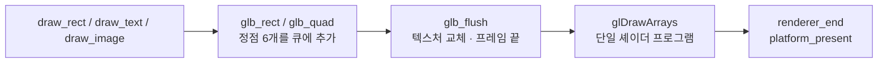
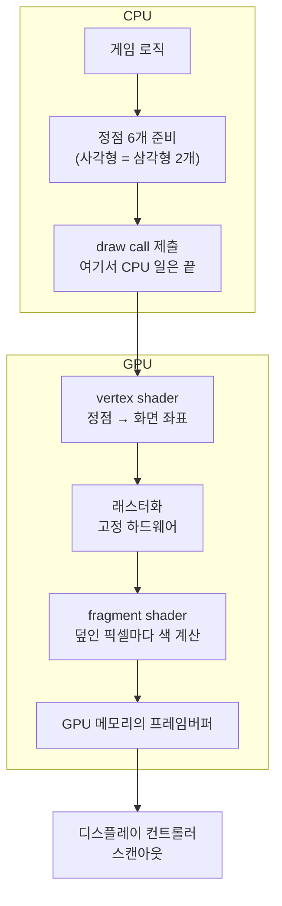
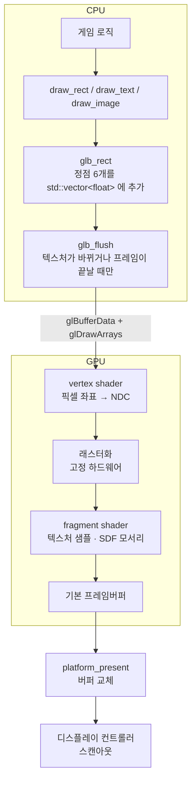
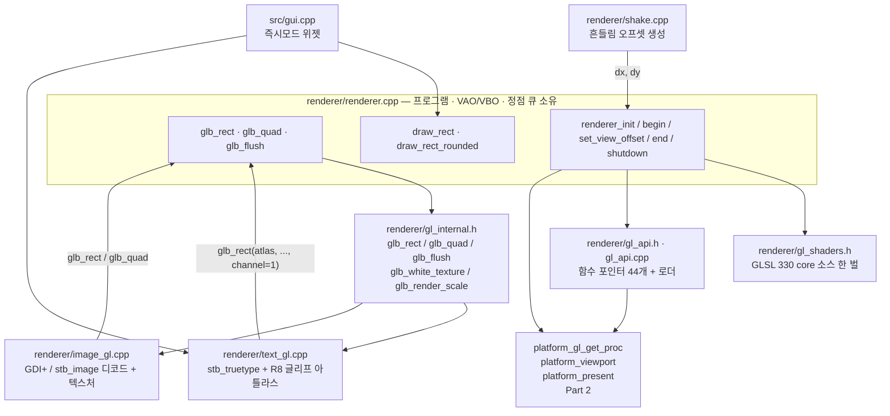
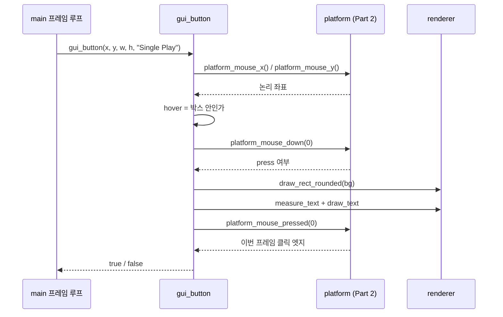
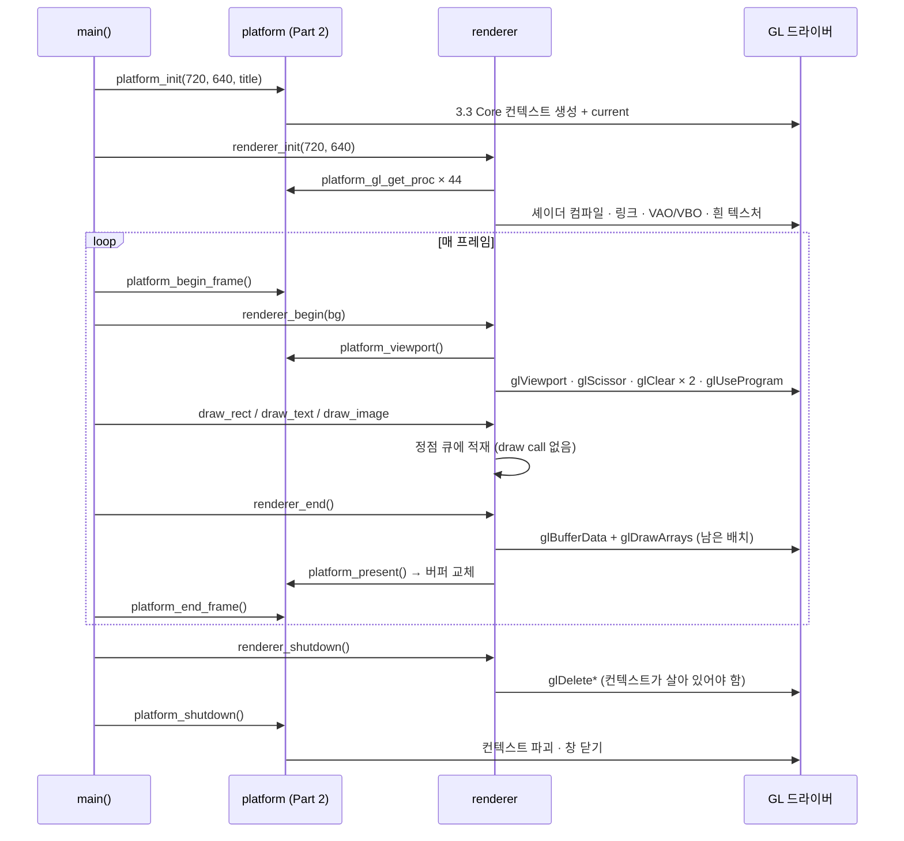
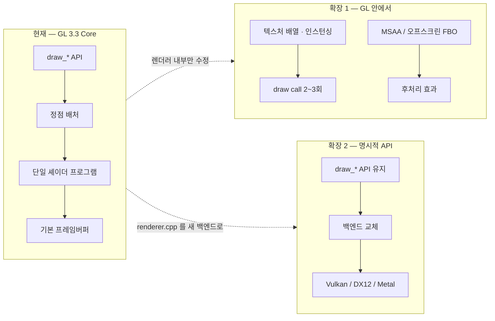

# Part 3: 렌더링과 UI — OpenGL 3.3 Core 2D 렌더러

> **시리즈:** 제로부터 멀티플레이어 테트리스 + RL까지
>
> [시리즈 목차](./README.md) · [이전: Part 2 — 플랫폼 계층](./part2-platform-window-input.md) · **Part 3** · [다음: Part 4 — Game과 메인 루프](./part4-game-wrapper-and-loop.md)

---

## 이번 Part의 구현 계약

- **선행 상태:** [Part 2](./part2-platform-window-input.md) 의 `platform/platform.h`(`struct Color`, `enum PlatformKey`, `platform_gl_get_proc`, `platform_viewport`, `platform_present`, `platform_mouse_*`)와 두 백엔드 중 하나. 창과 **OpenGL 3.3 Core 컨텍스트**가 만들어져 있고, 논리 좌표 마우스를 읽을 수 있다.
- **이번 Part의 파일:** `renderer/gl_api.h`, `renderer/gl_api.cpp`, `renderer/gl_shaders.h`, `renderer/gl_internal.h`, `renderer/renderer.h`, `renderer/renderer.cpp`, `renderer/text_gl.cpp`, `renderer/image.h`, `renderer/image_gl.cpp`, `renderer/shake.h`, `renderer/shake.cpp`, `src/gui.h`, `src/gui.cpp`, `src/colors.h`, `src/colors.cpp`, `CMakeLists.txt`.
- **연결점:** `gl_load_functions()` 가 Part 2 의 `platform_gl_get_proc()` 로 GL 함수 주소를 받는다. `renderer_begin()` 이 `platform_viewport()` 로 그릴 사각형을 얻고, `renderer_end()` 가 `platform_present()` 로 버퍼를 교체한다. `gui_hover_rect()` 가 `platform_mouse_x/y()` 를 읽는다. 반대 방향 의존은 없다 — 플랫폼 계층은 렌더러를 모른다.
- **완료 게이트:** 이 장 말미의 `part3_render_demo` 를 빌드해 실행. 한 화면에서 사각형·둥근 사각형 안티앨리어싱·알파 0/128/255·텍스트 측정·글리프 아틀라스·이미지·tint·회전·view offset·레터박스·GUI 위젯이 전부 눈으로 확인된다.

`tetris` 타깃은 이 시점에도 빌드할 수 없다. `src/main.cpp`, `src/game.cpp`, `net/*.cpp`, `bot/*.cpp`, `meta/http_client.cpp` 가 아직 없기 때문이다. 그래서 완료 게이트는 Part 2 와 같은 방식으로 독자가 만드는 데모 실행 파일이다.

## 이번 장의 목표

이번 장에서는 게임 엔진이나 2D 라이브러리 없이, OpenGL 3.3 Core 위에 2D 렌더러를 직접 만든다. 렌더러가 셰이더 프로그램 하나와 정점 배처 하나를 소유하고 다음 기능을 제공한다.

- 배경 clear 와 레터박스 뷰포트
- 사각형과 둥근 사각형 (모서리는 조각 셰이더의 SDF)
- straight-alpha source-over 블렌딩
- TTF 글리프 래스터화와 GPU 글리프 아틀라스
- RGBA 이미지 텍스처, 확대, tint, 회전
- 화면 흔들림용 view offset
- 즉시모드 GUI 위젯
- Part 2 플랫폼 계층을 통한 present

만드는 것은 **드라이버 위의 얇은 2D 파이프라인**이다. GPU 드라이버나 커널을 만들지 않고, 창과 컨텍스트 생성은 Win32 또는 SDL2 에 맡긴다. 학습 범위는 "그리기 명령이 삼각형이 되고, 삼각형이 픽셀이 되는 과정 중 우리가 책임지는 부분" 이다.


```mermaid
flowchart LR
    D["draw_rect / draw_text / draw_image"] --> Q["glb_rect / glb_quad<br/>정점 6개를 큐에 추가"]
    Q --> F["glb_flush<br/>텍스처 교체 · 프레임 끝"]
    F --> G["glDrawArrays<br/>단일 셰이더 프로그램"]
    G --> P["renderer_end<br/>platform_present"]
```

## 1. 왜 엔진 없이 2D 렌더러를 직접 만드는가

이 결정은 취향이 아니라 트레이드오프의 결과다. 실제 후보는 다섯이었다.

| 선택지 | 얻는 것 | 잃는 것 |
|---|---|---|
| 완성형 엔진의 스프라이트 시스템 | 배칭·아틀라스·셰이더가 전부 준비돼 있고 에디터로 배치까지 | 픽셀이 만들어지는 과정을 볼 수 없다. [Part 0](./part0-project-setup.md) 에서 이미 제외한 선택지 |
| raylib / SDL_Renderer 등 2D 라이브러리 | 즉시 동작. 배칭·아틀라스가 이미 최적화됨 | 그리기 명령이 삼각형과 픽셀이 되는 과정이 전부 라이브러리 안에 있다. 이 프로젝트의 학습 목표와 정면 충돌 |
| CPU 소프트웨어 래스터라이저 | 전 과정이 저장소 안 C++ 루프. 디버거로 픽셀 하나를 따라갈 수 있다 | 창을 키우는 순간 비용이 면적에 비례해 늘고, 확대된 글자가 뭉갠다. 안티앨리어싱과 진짜 VSync 가 없다 |
| Vulkan / DirectX 12 | 실무 최전선. 명시적 동기화·다중 큐·메모리 관리를 직접 제어 | 사각형 하나 그리는 데 1,000줄 규모의 초기화. 스왑체인 재생성·디스크립터·검증 계층 등 2D 게임과 무관한 문제에 시간의 대부분을 쓴다 |
| **OpenGL 3.3 Core (이 프로젝트)** | 창 하나에 300줄 수준으로 GPU 래스터화 도달. 셰이더·텍스처·배칭이라는 현대 그래픽스의 핵심 개념이 전부 등장 | 최신 API 의 명시적 제어권은 없다. 드라이버가 감추는 부분(동기화·메모리 배치)은 그대로 감춰진다 |

결정적이었던 것은 셋이다.

**API 표면이 작다.** 게임 코드가 부르는 것은 `draw_rect`, `draw_rect_rounded`, `draw_text`, `measure_text`, `draw_image`, `draw_image_tinted`, `draw_image_rotated` 일곱 개뿐이다. 이 정도 표면을 GPU 위에 올리는 데 필요한 GL 기능은 셰이더 하나, 정점 버퍼 하나, 텍스처 몇 장이다. 엔진을 들여올 이유가 없다.

**개념이 그대로 드러난다.** 정점 형식을 직접 정하고, NDC 변환을 직접 쓰고, 블렌드 함수를 직접 고르고, 배칭이 언제 끊기는지 직접 결정한다. 라이브러리를 쓰면 이 결정들이 전부 남의 코드 안에 있다. 이 시리즈는 그 결정들을 보여주는 것이 목적이다.

**이식 비용이 창 생성 코드로 한정된다.** OpenGL 3.3 Core 는 Windows·Linux·macOS 에서 모두 돈다. 셰이더 소스 한 벌, 렌더러 코드 한 벌이면 세 플랫폼이 같은 그림을 낸다. 플랫폼별로 갈리는 것은 "컨텍스트를 어떻게 만드느냐" 와 "함수 주소를 어떻게 받느냐" 두 가지뿐이고, 둘 다 Part 2 의 플랫폼 계층에 갇혀 있다.

포기한 것도 분명히 적어 둔다. 렌더 결과가 드라이버와 하드웨어에 따라 미세하게 달라질 수 있다. 소프트웨어 래스터라이저였다면 어느 기계에서나 같은 프레임버퍼가 나왔다. 이것이 이 전환에서 실제로 잃은 유일한 성질이고, **게임 로직의 결정성과는 아무 상관이 없다.** 왜 그런지는 "잃은 것 — 결정론적 렌더 산출물" 절에서 따로 다룬다.

## 2. 래스터화는 누가 하는가

앞 절이 "GPU 에 맡긴다" 고 결론을 내렸다. 그런데 **맡긴다는 것이 정확히 무엇을 맡기는 것인지** 를 짚지 않으면, GPU 렌더링을 해 본 사람도 안 해 본 사람도 경계를 놓친다. 이 절은 그 경계만 다룬다.

### 2.1 래스터화란 무엇인가

**도형을 픽셀로 바꾸는 일**이다. "이 삼각형이 화면의 어느 픽셀들을 덮는가, 그리고 그 픽셀 각각은 무슨 색인가" 를 정하는 단계를 가리킨다.

화면은 결국 픽셀 격자뿐이라, 무엇을 그리든 마지막에는 누군가 "이 좌표에 이 값을 넣어라" 를 픽셀 수만큼 반복해야 한다. **그 반복을 누가 하느냐** 가 소프트웨어 렌더러와 GPU 렌더러를 가르는 유일한 차이다. 나머지는 전부 그 결정에서 파생된다.

### 2.2 보통 게임의 한 프레임


```mermaid
graph TB
    subgraph CPUSIDE["CPU"]
        A["게임 로직"] --> B["정점 6개 준비<br/>(사각형 = 삼각형 2개)"]
        B --> C["draw call 제출<br/>여기서 CPU 일은 끝"]
    end
    subgraph GPUSIDE["GPU"]
        D["vertex shader<br/>정점 → 화면 좌표"] --> E["래스터화<br/>고정 하드웨어"]
        E --> F["fragment shader<br/>덮인 픽셀마다 색 계산"]
        F --> G["GPU 메모리의 프레임버퍼"]
    end
    C --> D
    G --> H["디스플레이 컨트롤러<br/>스캔아웃"]
```

CPU 는 **"무엇을 그릴지" 만 말하고 끝난다.** 픽셀은 한 개도 만지지 않는다. 그리고 셰이더는 우리가 쓰지만 **래스터화 자체는 쓸 수 없다** — 그건 GPU 안의 고정 하드웨어이고, 우리가 짜는 것은 그 앞(vertex)과 뒤(fragment)뿐이다.

### 2.3 이 프로젝트의 한 프레임


```mermaid
graph TB
    subgraph CPUONLY["CPU"]
        A["게임 로직"] --> B["draw_rect / draw_text / draw_image"]
        B --> C["glb_rect<br/>정점 6개를 std::vector&lt;float&gt; 에 추가"]
        C --> D["glb_flush<br/>텍스처가 바뀌거나 프레임이 끝날 때만"]
    end
    subgraph GPUSIDE["GPU"]
        E["vertex shader<br/>픽셀 좌표 → NDC"] --> F["래스터화<br/>고정 하드웨어"]
        F --> G["fragment shader<br/>텍스처 샘플 · SDF 모서리"]
        G --> H["기본 프레임버퍼"]
    end
    D -->|"glBufferData + glDrawArrays"| E
    H --> I["platform_present<br/>버퍼 교체"]
    I --> J["디스플레이 컨트롤러<br/>스캔아웃"]
```

두 그림의 구조는 같다. 이 프로젝트가 추가로 하는 일은 가운데 한 칸 — **draw call 을 즉시 내지 않고 정점을 모았다가 한꺼번에 낸다** — 뿐이다. 그 한 칸이 이 렌더러 설계의 절반을 차지한다.

| | 이전 소프트웨어 구현 | 현재 |
|---|---|---|
| GPU 가 받는 것 | 완성된 이미지 한 장 | 정점 · 셰이더 · 그리기 명령 |
| 래스터화 주체 | CPU 의 `for` 루프 | GPU (고정 하드웨어 + fragment shader) |
| 프레임버퍼 위치 | 시스템 RAM (`std::vector<uint32_t>`) | GPU 메모리 (기본 프레임버퍼) |
| 언제 그려지나 | 함수가 반환되면 끝 | 비동기. 버퍼 교체까지 미확정 |
| 상태 모델 | 없음. 함수 인자가 전부 | 전역 상태 머신(바인딩된 프로그램 · 텍스처 · VAO · 블렌드 모드) |
| 창을 키우면 | 픽셀 수가 면적에 비례해 늘고 확대가 흐릿하다 | 정점 좌표가 실수라 GPU 가 창 해상도로 다시 래스터화한다 |

마지막에서 두 번째 줄이 실전에서 특히 크다. GL 은 거대한 전역 상태 머신이라, 어딘가에서 텍스처를 바인딩하고 되돌리지 않으면 **한참 뒤 엉뚱한 그리기가 깨진다.** 이 렌더러가 상태 변경 지점을 극도로 줄인 이유이기도 하다 — 프로그램은 하나, VAO 도 하나, 바뀌는 것은 바인딩된 텍스처와 유니폼 둘뿐이다.

### 2.4 "GPU" 라는 이름이 가리키는 두 하드웨어

여기서 혼동이 자주 생긴다. 하나의 칩 안에 성격이 전혀 다른 두 블록이 있다.

| 블록 | 하는 일 | 이 프로젝트가 쓰는가 |
|---|---|---|
| **연산 유닛** (셰이더 코어 수천 개) | 래스터화, 셰이더 실행, 범용 병렬 계산 | **쓴다. 이 장이 다루는 대상이다** |
| **디스플레이 컨트롤러** (스캔아웃 엔진) | 메모리를 주기적으로 읽어 픽셀 클럭 · HSYNC · VSYNC 신호 생성 | **쓴다. 안 쓸 방법이 없다** |

두 블록은 독립적이다. 창을 띄우는 모든 프로그램이 뒤쪽 경로를 지난다 — 터미널도 마찬가지다. 반면 앞쪽 연산 유닛은 쓰지 않을 수도 있고, 실제로 이 렌더러의 이전 버전은 쓰지 않았다.

이 구분이 하드웨어 시장에도 그대로 나타난다. Intel `F` 접미사 모델이나 내장 그래픽 없는 Ryzen 은 **모니터를 꽂을 수 없다.** 그때 그래픽 카드가 필요한 이유는 연산이 아니라 디스플레이 컨트롤러 때문이다. 반대로 서버에 흔한 BMC 칩은 3D 기능이 거의 없는 순수 프레임버퍼 장치라 화면은 나오지만 게임은 못 돌린다.

그리고 **화면에 내보내지 않는다면 그래픽 하드웨어는 아예 필요 없다.** 이 저장소의 `sim_hash_dump` 와 `tetris_relay` 가 그 증거다. 두 타깃은 `renderer/` 를 링크조차 하지 않으므로 GL 드라이버가 없는 헤드리스 서버에서 그대로 빌드되고 실행된다. 이 사실은 이 장이 GPU 로 옮겨간 뒤에도 변하지 않는다 — 렌더러는 게임 클라이언트에만 붙는다.

### 2.5 CPU 로 전부 하면 어떻게 되는가 — 그리고 왜 그만뒀는가

이 렌더러는 한동안 실제로 소프트웨어 래스터라이저였다. 720×640 `uint32_t` 배열을 직접 소유하고, 사각형은 행 단위 `std::fill`, 반투명은 픽셀마다 read-modify-write, 글자는 stb_truetype 의 coverage 비트맵을 픽셀 단위로 합성하고, 회전 이미지는 목적지 픽셀에서 원본 좌표를 역변환해 샘플링했다.

**예시(실제 저장소에는 없음)**

```cpp
static void blend_surface(int x, int y, Color c, uint8_t coverage)
{
    if ((unsigned)x >= (unsigned)s_screen_w ||
        (unsigned)y >= (unsigned)s_screen_h) return;

    const unsigned a = (unsigned(c.a) * unsigned(coverage) + 127u) / 255u;
    if (a == 0) return;

    uint32_t& dst = s_pixels[(size_t)y * (size_t)s_screen_w + (size_t)x];
    if (a == 255) {
        dst = 0xFF000000u | (uint32_t(c.r) << 16) |
              (uint32_t(c.g) << 8) | uint32_t(c.b);
        return;
    }

    const unsigned inv = 255u - a;
    const unsigned dr = (dst >> 16) & 0xFFu;
    const unsigned dg = (dst >> 8) & 0xFFu;
    const unsigned db = dst & 0xFFu;
    const unsigned r = (unsigned(c.r) * a + dr * inv + 127u) / 255u;
    const unsigned g = (unsigned(c.g) * a + dg * inv + 127u) / 255u;
    const unsigned b = (unsigned(c.b) * a + db * inv + 127u) / 255u;
    dst = 0xFF000000u | (r << 16) | (g << 8) | b;
}
```

이것이 그 시절 렌더러의 심장이었다. 위 코드는 과거 커밋에서 가져온 것이고 현재 저장소에는 없다. 같은 자리에 지금 있는 것이 이 함수다.

**현재 소스 발췌 — `renderer/renderer.cpp:335-339`**

```cpp
void draw_rect(int x, int y, int w, int h, Color c)
{
    glb_rect(s_white, (float)x, (float)y, (float)w, (float)h,
             0.0f, 0.0f, 1.0f, 1.0f, c, 0.0f, 0.0f);
}
```

픽셀 대신 정점을 만든다. 이 함수가 반환돼도 **아직 아무것도 그려지지 않았다.**

소프트웨어 경로가 나빴던 것은 아니다. 720×640 = 460,800 픽셀은 현대 CPU 에게 작은 작업이고, 당시 헤드리스로 실측했을 때 전형적인 프레임(clear + 불투명 사각형 200개)이 **0.31 ms**, 60Hz 예산의 2 % 였다. 최악(전 화면 반투명 합성 1회)이 **4.64 ms** 로 28 % 였다. 논리 해상도 720×640 에 고정돼 있는 한 성능은 문제가 아니었다.

문제는 **논리 해상도에 고정돼 있을 수 없다** 는 점이었다. 창을 키우는 순간 네 가지가 한꺼번에 무너진다.

| 무너지는 것 | 소프트웨어 경로에서의 결과 |
|---|---|
| 비용 | 프레임버퍼를 창 크기로 만들면 픽셀 수가 면적에 비례한다. 2430×2160 프리셋은 460,800 → 5,248,800 픽셀로 **11배**다. 논리 크기로 그린 뒤 확대하면 비용은 아끼지만 그림이 흐릿해진다 |
| 텍스트 | 글리프는 특정 픽셀 크기로 한 번 구워진 비트맵이다. 논리 크기로 굽고 3배로 늘리면 그 배율만큼 뭉갠다 |
| 모서리 | 둥근 사각형 경계가 1픽셀 hard edge 였다. 안티앨리어싱을 넣으려면 경계 픽셀마다 coverage 를 따로 계산해야 한다 |
| VSync | 완성된 이미지를 창에 복사하는 방식이라 진짜 VSync 가 아니었다. `SDL_Delay` 로 60Hz 에 맞추는 소프트웨어 페이싱은 tearing 을 막지 못한다 |

GPU 로 옮기면 이 넷이 전부 사라진다. 도형은 정점이 실수라 창 해상도 그대로 래스터화되어 저절로 선명하고, 글자는 화면 배율만큼 크게 구우면 되고, 모서리 안티앨리어싱은 조각 셰이더 한 줄이며, 버퍼 교체는 드라이버가 수직 귀선에 맞춰 준다. 그리고 비용은 창을 아무리 키워도 CPU 쪽에서는 변하지 않는다 — 보내는 정점 수가 같기 때문이다.

한 가지 사실을 덧붙여 둔다. 이 저장소에는 그 이전에도 OpenGL 렌더러가 있었고, 그것은 **macOS 에서 돌지 않았다.** 컨텍스트를 만들 때 Core 프로파일을 명시적으로 요구하지 않아 드라이버 기본 호환 컨텍스트를 받았고, `#version 130` 셰이더가 Windows/Linux 에서는 우연히 통과했지만 macOS 의 Core 프로파일은 그것을 거부한다. 지금 버전이 세 플랫폼에서 **같은 3.3 Core 프로파일과 같은 `#version 330 core` 셰이더 한 벌**을 쓰는 것은 그 실패에서 나온 요구사항이다.

## 3. 왜 OpenGL 3.3 Core 인가

GPU 로 가기로 했다면 다음 질문은 "어느 API 로" 다. 2020년대에 새 프로젝트를 시작하면서 OpenGL 을 고르는 것은 설명이 필요한 선택이다.

**Vulkan / DirectX 12 는 이 프로젝트의 문제를 풀지 않는다.** 두 API 의 존재 이유는 명시적 제어다. 메모리 힙을 직접 고르고, 파이프라인 배리어로 동기화를 직접 걸고, 커맨드 버퍼를 여러 스레드에서 동시에 기록한다. 그 대가로 삼각형 하나를 화면에 띄우기까지 인스턴스·물리 디바이스·큐 패밀리·스왑체인·이미지 뷰·렌더 패스·프레임버퍼·디스크립터 셋 레이아웃·파이프라인 레이아웃·그래픽스 파이프라인·커맨드 풀·세마포어·펜스를 만들어야 한다. 이 게임이 한 프레임에 내는 draw call 은 서너 개다. **제어할 것이 없는 곳에서 제어권을 사면 복잡도만 남는다.**

**세 플랫폼이 같은 코드를 쓰는 것이 중요하다.** DirectX 12 는 Windows 전용이다. Vulkan 은 macOS 에서 MoltenVK 라는 변환 계층을 거쳐야 한다. Metal 을 직접 쓰면 macOS 전용 백엔드가 하나 더 늘어난다. 이 프로젝트는 Windows·Linux·macOS 를 모두 대상으로 하고, 렌더러 코드를 **한 벌만** 유지하는 것이 유지보수 예산의 전제였다. OpenGL 3.3 Core 는 세 플랫폼에서 같은 프로파일, 같은 GLSL 버전, 같은 셰이더 소스로 동작한다.

**왜 하필 3.3 인가.** 위로도 아래로도 이유가 있다.

| 버전 | 상황 |
|---|---|
| 2.1 이하 | 고정 기능 파이프라인 시대. VAO 가 코어가 아니고 GLSL 문법도 다르다. 배울 가치가 낮다 |
| 3.0~3.2 | 코어/호환 프로파일 분리가 진행 중이던 과도기. 드라이버 구현 편차가 크다 |
| **3.3** | VAO · 인스턴싱 · 셰이더 `layout(location=)` 이 전부 코어. 2010년 이후 GPU 는 사실상 전부 지원 |
| 4.1 | macOS Core 프로파일의 **상한**. Apple 은 4.1 에서 OpenGL 지원을 멈췄다 |
| 4.3+ | 컴퓨트 셰이더·디버그 출력이 생기지만 **macOS 에서 쓸 수 없다** |

즉 세 플랫폼 공통 집합의 천장이 4.1 이고, 그 아래에서 "필요한 기능이 전부 코어에 있으면서 가장 넓게 깔린" 지점이 3.3 이다. 이 렌더러가 4.1 까지 올라가서 얻을 것은 없다 — 쓰는 기능이 정점 버퍼, 텍스처, 셰이더 프로그램이 전부다.

**Core 프로파일을 명시적으로 요구하는 것도 선택의 일부다.** 호환(compatibility) 프로파일을 받으면 `glBegin`/`glEnd` 같은 고정 기능이 함께 딸려 와서, 실수로 옛날 방식 코드를 섞어도 컴파일과 실행이 된다. 그러면 그 코드는 macOS 에서만 죽는다. Core 프로파일은 그런 코드를 **처음부터 컴파일 단계에서 막는다.** 앞 절에서 말한 실패가 정확히 이 지점에서 일어났다.

컨텍스트를 실제로 만드는 코드는 [Part 2](./part2-platform-window-input.md) 의 플랫폼 계층에 있다. 요약하면 이렇다.

- **SDL 백엔드**: `SDL_GL_SetAttribute` 로 `CONTEXT_PROFILE_CORE`, MAJOR 3, MINOR 3, DOUBLEBUFFER 1 을 건 뒤 `SDL_WINDOW_OPENGL | SDL_WINDOW_RESIZABLE` 창을 만들고 `SDL_GL_CreateContext`. present 는 `SDL_GL_SwapWindow`, VSync 는 `SDL_GL_SetSwapInterval(0|1)`.
- **Win32 백엔드**: 두 단계다. `PIXELFORMATDESCRIPTOR` → `ChoosePixelFormat` → `SetPixelFormat` 으로 레거시 컨텍스트를 만들어 current 로 만든 뒤, **그 상태에서만 조회되는** `wglCreateContextAttribsARB` 로 진짜 3.3 Core 를 만들고 레거시를 지운다. 이 2단계를 건너뛰면 드라이버 기본 호환 컨텍스트가 나온다.

렌더러는 그 위에서 시작한다. 이 장의 코드는 "컨텍스트가 이미 current 다" 를 전제로 한다.

## 4. 함수 포인터를 직접 로드하기

컨텍스트가 생겼다고 `glCreateShader` 를 바로 부를 수 있는 것은 아니다. **Windows 의 `opengl32.dll` 은 OpenGL 1.1 까지만 export 한다.** 1995년 Windows 95 OSR2 시절의 ABI 가 그대로 남아 있고, 그 이후 20여 년의 GL 함수는 전부 드라이버 DLL 안에 있다. 링커는 `glCreateShader` 를 찾지 못한다. 런타임에 `wglGetProcAddress` 로 주소를 받아야 한다.

Linux 의 `libGL.so` 와 macOS 의 OpenGL 프레임워크에는 심볼이 있어서 그냥 링크해도 된다. 그런데 그렇게 하면 플랫폼마다 다른 선언과 다른 빌드 설정이 필요해진다. **세 플랫폼이 같은 조회 경로를 타게 하는 편이 훨씬 단순하다.** 그래서 이 렌더러는 어디서든 함수 포인터를 런타임에 받는다.

GLEW 나 glad 같은 로더를 쓰면 이 일을 대신해 준다. 쓰지 않은 이유는 의존성 하나를 아끼려는 것이 아니라, **"GL 함수가 어디서 오는가" 가 이 프로젝트에서 감출 이유가 없는 지식이기 때문이다.** 필요한 함수가 44개라서 직접 들고 있어도 부담이 없다.

### 4.1 타입과 상수를 직접 선언한다

`GL/gl.h` 를 포함하지 않는다. 시스템 헤더는 플랫폼마다 버전이 다르고, Windows 의 것은 1.1 상수만 들어 있다. 필요한 것만 직접 적는다.

**현재 소스 발췌 — `renderer/gl_api.h:16-25`**

```cpp
using GLenum     = unsigned int;
using GLbitfield = unsigned int;
using GLuint     = unsigned int;
using GLint      = int;
using GLsizei    = int;
using GLfloat    = float;
using GLboolean  = unsigned char;
using GLchar     = char;
using GLintptr   = std::ptrdiff_t;
using GLsizeiptr = std::ptrdiff_t;
```

상수도 마찬가지로 값만 적어 둔다. GL 의 enum 값은 표준으로 고정돼 있어서 이렇게 적어도 안전하다.

**현재 소스 발췌 — `renderer/gl_api.h:27-62`**

```cpp
#define GL_FALSE                          0
#define GL_TRUE                           1
#define GL_TRIANGLES                      0x0004
#define GL_UNSIGNED_BYTE                  0x1401
#define GL_FLOAT                          0x1406
#define GL_RGBA                           0x1908
#define GL_RED                            0x1903
#define GL_R8                             0x8229
#define GL_RGBA8                          0x8058
#define GL_TEXTURE_2D                     0x0DE1
#define GL_TEXTURE0                       0x84C0
#define GL_TEXTURE_MAG_FILTER             0x2800
#define GL_TEXTURE_MIN_FILTER             0x2801
#define GL_TEXTURE_WRAP_S                 0x2802
#define GL_TEXTURE_WRAP_T                 0x2803
#define GL_NEAREST                        0x2600
#define GL_LINEAR                         0x2601
#define GL_CLAMP_TO_EDGE                  0x812F
#define GL_UNPACK_ALIGNMENT               0x0CF5
#define GL_BLEND                          0x0BE2
#define GL_SRC_ALPHA                      0x0302
#define GL_ONE_MINUS_SRC_ALPHA            0x0303
#define GL_ONE                            1
#define GL_COLOR_BUFFER_BIT               0x00004000
#define GL_ARRAY_BUFFER                   0x8892
#define GL_STREAM_DRAW                    0x88E0
#define GL_VERTEX_SHADER                  0x8B31
#define GL_FRAGMENT_SHADER                0x8B30
#define GL_COMPILE_STATUS                 0x8B81
#define GL_LINK_STATUS                    0x8B82
#define GL_INFO_LOG_LENGTH                0x8B84
#define GL_SCISSOR_TEST                   0x0C11
#define GL_MAX_TEXTURE_SIZE               0x0D33
#define GL_VERSION                        0x1F02
#define GL_RENDERER                       0x1F01
#define GL_NO_ERROR                       0
```

이 목록의 길이가 곧 이 렌더러가 쓰는 GL 기능의 전부다. 픽셀 포맷 두 개(`GL_RGBA8`, `GL_R8`), 필터 두 개, 블렌드 인자 두 개, 버퍼 하나, 셰이더 스테이지 두 개. 3D 렌더링에 필요한 깊이 버퍼·컬링·스텐실은 한 줄도 없다.

### 4.2 X-매크로 테이블

함수 하나를 추가할 때 손대야 할 곳이 세 군데다. 포인터 선언(`extern`), 포인터 정의, 그리고 로딩 코드. 셋을 손으로 맞추면 언젠가 어긋난다. 그래서 목록을 **한 번만** 적고 세 번 펼친다.

**현재 소스 발췌 — `renderer/gl_api.h:64-119`**

```cpp
// ─── 함수 포인터 ──────────────────────────────────────────────────────────────
// 이름 앞에 gl_ 을 붙여 시스템 헤더의 gl* 심볼과 충돌하지 않게 한다.

#define GL_FUNCS(X)                                                            \
    X(void,   Enable,                 (GLenum))                                \
    X(void,   Disable,                (GLenum))                                \
    X(void,   BlendFunc,              (GLenum, GLenum))                        \
    X(void,   Viewport,               (GLint, GLint, GLsizei, GLsizei))        \
    X(void,   Scissor,                (GLint, GLint, GLsizei, GLsizei))        \
    X(void,   ClearColor,             (GLfloat, GLfloat, GLfloat, GLfloat))    \
    X(void,   Clear,                  (GLbitfield))                            \
    X(void,   DrawArrays,             (GLenum, GLint, GLsizei))                \
    X(GLenum, GetError,               (void))                                  \
    X(const unsigned char*, GetString,(GLenum))                                \
    X(void,   GetIntegerv,            (GLenum, GLint*))                         \
    X(void,   PixelStorei,            (GLenum, GLint))                         \
    X(GLuint, CreateShader,           (GLenum))                                \
    X(void,   ShaderSource,           (GLuint, GLsizei, const GLchar* const*, const GLint*)) \
    X(void,   CompileShader,          (GLuint))                                \
    X(void,   GetShaderiv,            (GLuint, GLenum, GLint*))                \
    X(void,   GetShaderInfoLog,       (GLuint, GLsizei, GLsizei*, GLchar*))    \
    X(void,   DeleteShader,           (GLuint))                                \
    X(GLuint, CreateProgram,          (void))                                  \
    X(void,   AttachShader,           (GLuint, GLuint))                        \
    X(void,   LinkProgram,            (GLuint))                                \
    X(void,   GetProgramiv,           (GLuint, GLenum, GLint*))                \
    X(void,   GetProgramInfoLog,      (GLuint, GLsizei, GLsizei*, GLchar*))    \
    X(void,   UseProgram,             (GLuint))                                \
    X(void,   DeleteProgram,          (GLuint))                                \
    X(GLint,  GetUniformLocation,     (GLuint, const GLchar*))                 \
    X(void,   Uniform1i,              (GLint, GLint))                          \
    X(void,   Uniform2f,              (GLint, GLfloat, GLfloat))               \
    X(void,   GenVertexArrays,        (GLsizei, GLuint*))                      \
    X(void,   BindVertexArray,        (GLuint))                                \
    X(void,   DeleteVertexArrays,     (GLsizei, const GLuint*))                \
    X(void,   GenBuffers,             (GLsizei, GLuint*))                      \
    X(void,   BindBuffer,             (GLenum, GLuint))                        \
    X(void,   BufferData,             (GLenum, GLsizeiptr, const void*, GLenum)) \
    X(void,   DeleteBuffers,          (GLsizei, const GLuint*))                \
    X(void,   VertexAttribPointer,    (GLuint, GLint, GLenum, GLboolean, GLsizei, const void*)) \
    X(void,   EnableVertexAttribArray,(GLuint))                                \
    X(void,   GenTextures,            (GLsizei, GLuint*))                      \
    X(void,   BindTexture,            (GLenum, GLuint))                        \
    X(void,   ActiveTexture,          (GLenum))                                \
    X(void,   TexImage2D,             (GLenum, GLint, GLint, GLsizei, GLsizei, GLint, GLenum, GLenum, const void*)) \
    X(void,   TexSubImage2D,          (GLenum, GLint, GLint, GLint, GLsizei, GLsizei, GLenum, GLenum, const void*)) \
    X(void,   TexParameteri,          (GLenum, GLenum, GLint))                 \
    X(void,   DeleteTextures,         (GLsizei, const GLuint*))

#define GL_DECLARE(ret, name, args) extern ret (*gl_##name) args;
GL_FUNCS(GL_DECLARE)
#undef GL_DECLARE

// 모든 함수 포인터를 채운다. 하나라도 못 받으면 false 와 함께 그 이름을 찍는다.
// platform_gl_get_proc 을 통해 조회하므로 컨텍스트가 current 인 상태여야 한다.
bool gl_load_functions();
```

`GL_FUNCS` 는 **매크로 이름 하나를 인자로 받아 목록의 각 항목에 적용하는 매크로**다. 이 패턴을 X-매크로라고 부른다. 여기서는 `GL_DECLARE` 를 넘겨 44개의 `extern` 선언을 만들었다.

이름 앞에 `gl_` 을 붙인 것(`gl_CreateShader`)이 사소해 보이지만 중요하다. 어딘가에서 시스템 GL 헤더가 함께 포함되면 `glCreateShader` 라는 이름이 충돌한다. 접두사를 바꿔 두면 그런 일이 없고, 동시에 **코드를 읽을 때 "이건 런타임에 받은 포인터다" 가 눈에 보인다.**

### 4.3 로더

같은 목록을 두 번 더 펼친다. 한 번은 포인터 정의로, 한 번은 로딩 코드로.

**현재 소스 발췌 — `renderer/gl_api.cpp:6-38`**

```cpp
#define GL_DEFINE(ret, name, args) ret (*gl_##name) args = nullptr;
GL_FUNCS(GL_DEFINE)
#undef GL_DEFINE

bool gl_load_functions()
{
    bool ok = true;

    // 조회 실패를 한 번에 모아 보여준다. 첫 실패에서 멈추면 드라이버가
    // 무엇을 얼마나 빠뜨렸는지 알 수 없어 원인 파악이 느려진다.
#define GL_LOAD(ret, name, args)                                               \
    gl_##name = (ret (*) args)platform_gl_get_proc("gl" #name);                \
    if (!gl_##name) {                                                          \
        std::fprintf(stderr, "[GL] missing entry point: gl%s\n", #name);       \
        ok = false;                                                            \
    }
    GL_FUNCS(GL_LOAD)
#undef GL_LOAD

    if (!ok) {
        std::fprintf(stderr,
                     "[GL] driver does not expose the OpenGL 3.3 Core entry "
                     "points this renderer needs.\n");
        return false;
    }

    const unsigned char* ver = gl_GetString(GL_VERSION);
    const unsigned char* ren = gl_GetString(GL_RENDERER);
    std::fprintf(stderr, "[GL] %s | %s\n",
                 ver ? (const char*)ver : "(unknown version)",
                 ren ? (const char*)ren : "(unknown renderer)");
    return true;
}
```

`"gl" #name` 이 전처리기 문자열화다. `Enable` 이라는 토큰이 `"gl" "Enable"` 로 이어 붙어 `"glEnable"` 이 된다. 저장소에는 함수 이름이 **한 번만** 적혀 있고, 나머지는 전부 여기서 파생된다.

**첫 실패에서 멈추지 않는 것이 이 함수의 설계 포인트다.** 흔한 구현은 `if (!fn) return false;` 로 즉시 빠져나온다. 그러면 사용자가 보내온 로그에 `glCreateShader 없음` 한 줄만 남는다. 그 한 줄로는 "이 드라이버가 3.3 을 아예 지원하지 않는 것" 과 "특정 확장 하나만 빠진 것" 을 구별할 수 없다. 전부 모아서 찍으면 로그만 보고도 판정된다 — 44개가 전부 없으면 컨텍스트 생성이 실패했거나 current 가 아닌 것이고, 몇 개만 없으면 드라이버가 오래된 것이다.

로딩에 성공하면 버전과 렌더러 이름을 찍는다. 이 한 줄이 실전에서 가장 자주 쓰이는 진단 도구다.

```text
[GL] 3.3 (Core Profile) Mesa 26.0.3-1ubuntu1 | Mesa Intel(R) HD Graphics 3000 (SNB GT2)
```

두 번째 필드가 `llvmpipe` 나 `softpipe` 로 나오면 **하드웨어 가속이 아니라 Mesa 의 소프트웨어 GL 구현으로 떨어진 것이다.** 화면은 정상적으로 나오지만 프레임이 느려진다. 위 로그는 2011년 Sandy Bridge 내장 그래픽이 진짜로 그리고 있다는 뜻이다 — 이 렌더러가 요구하는 하드웨어의 하한이 어느 정도인지 보여주는 예이기도 하다.

Win32 백엔드의 `platform_gl_get_proc` 에는 함정이 하나 있다. `wglGetProcAddress` 는 **GL 1.2 이상의 함수만** 돌려주고 1.1 함수에는 `NULL` 이나 `0x1`, `0x2`, `0x3`, `-1` 같은 쓰레기 값을 준다. 위 목록의 `glEnable`, `glClear`, `glViewport`, `glTexImage2D` 등이 전부 1.1 함수다. 그래서 그 값들이 나오면 `GetProcAddress(LoadLibrary("opengl32.dll"))` 로 물러나야 한다. 이 폴백이 없으면 **`glEnable` 조차 못 찾아 로더가 통째로 실패한다.** SDL 경로는 `SDL_GL_GetProcAddress` 한 줄이면 되고, 이 처리를 SDL 이 대신해 준다.

## 5. 모듈 구조와 소유권

렌더러는 파일 여섯 개다. GL 상태와 정점 큐는 **정확히 한 파일**이 소유한다.


```mermaid
graph TB
    subgraph OWN["renderer/renderer.cpp — 프로그램 · VAO/VBO · 정점 큐 소유"]
        BATCH["glb_rect · glb_quad · glb_flush"]
        API1["draw_rect · draw_rect_rounded"]
        LIFE["renderer_init / begin / set_view_offset / end / shutdown"]
    end
    API["renderer/gl_api.h · gl_api.cpp<br/>함수 포인터 44개 + 로더"]
    SH["renderer/gl_shaders.h<br/>GLSL 330 core 소스 한 벌"]
    GI["renderer/gl_internal.h<br/>glb_rect / glb_quad / glb_flush<br/>glb_white_texture / glb_render_scale"]
    TXT["renderer/text_gl.cpp<br/>stb_truetype + R8 글리프 아틀라스"]
    IMG["renderer/image_gl.cpp<br/>GDI+ / stb_image 디코드 + 텍스처"]
    SHK["renderer/shake.cpp<br/>흔들림 오프셋 생성"]
    GUI["src/gui.cpp<br/>즉시모드 위젯"]
    PLAT["platform_gl_get_proc<br/>platform_viewport<br/>platform_present<br/>Part 2"]

    BATCH --> GI
    GI --> TXT
    GI --> IMG
    TXT -- "glb_rect(atlas, ..., channel=1)" --> BATCH
    IMG -- "glb_rect / glb_quad" --> BATCH
    LIFE --> SH
    LIFE --> API
    API --> PLAT
    GUI --> API1
    GUI --> TXT
    SHK -- "dx, dy" --> LIFE
    LIFE --> PLAT
```

의존 방향이 한쪽이다. `text_gl.cpp` 와 `image_gl.cpp` 는 `renderer.cpp` 의 내부를 모르고, 오직 `gl_internal.h` 가 노출한 함수 여덟 개만 부른다. 반대로 `renderer.cpp` 는 텍스트와 이미지가 무엇을 그리는지 모른다 — `renderer_init` 에서 `image_init()` 을, `renderer_shutdown` 에서 `image_shutdown()` 과 `renderer_text_shutdown()` 을 부르는 수명 관리가 전부다.

**현재 소스 발췌 — `renderer/gl_internal.h:12-32`**

```cpp
// 축 정렬 사각형 하나를 큐에 넣는다. 좌표는 논리 픽셀, 좌상단 원점.
//   radius  — 0 이면 각진 사각형. 양수면 fragment 셰이더가 모서리를 깎는다.
//   channel — 0.0 이면 RGBA 텍스처, 1.0 이면 R8 의 r 채널을 알파로 해석.
// view offset 은 이 함수 안에서 더해진다. 호출자는 논리 좌표만 넘긴다.
void glb_rect(GLuint tex,
              float x, float y, float w, float h,
              float u0, float v0, float u1, float v1,
              Color c, float radius, float channel);

// 회전된 사각형. 네 꼭짓점을 직접 준다 (TL, TR, BR, BL 순).
// 모서리 둥글리기는 지원하지 않는다 — 회전 이미지에는 쓰이지 않는다.
void glb_quad(GLuint tex,
              const float px[4], const float py[4],
              const float uu[4], const float vv[4],
              Color c, float channel);

// 큐에 쌓인 것을 실제로 그린다. 텍스처가 바뀌기 직전과 프레임 끝에 호출된다.
void glb_flush();

// 단색 도형용 1x1 흰색 텍스처. 셰이더를 하나로 유지하기 위한 장치다.
GLuint glb_white_texture();
```

**현재 소스 발췌 — `renderer/gl_internal.h:34-47`**

```cpp
// 현재 논리 해상도. 텍스트/이미지 쪽이 화면 밖 조기 반환에 쓴다.
int glb_screen_width();
int glb_screen_height();

// 논리 픽셀 하나가 실제 화면에서 몇 픽셀인가. 뷰포트 높이 / 논리 높이.
//
// 도형은 이 값과 무관하게 선명하다 — 정점 좌표가 실수라 GPU 가 뷰포트
// 해상도 그대로 래스터화한다. 문제는 글자다. 글리프는 CPU 에서 특정 픽셀
// 크기로 한 번 구워지므로, 논리 크기로 구워 놓고 4K 로 늘리면 그 배율만큼
// 흐려진다. text_gl.cpp 가 이 값을 곱해 실제 표시 크기로 굽는다.
float glb_render_scale();

// 폰트 서브시스템 정리 (text_gl.cpp 가 구현).
void renderer_text_shutdown();
```

이 헤더가 소프트웨어 시절의 "픽셀을 건드리는 유일한 통로" 를 대체한다. 역할은 같다 — **텍스트와 이미지가 GL 상태를 직접 만지지 못하게 막는다.** 만약 `text_gl.cpp` 가 자기 텍스처를 바인딩하고 자기 draw call 을 냈다면, 배처가 쌓아 둔 정점이 엉뚱한 텍스처로 그려지는 버그가 생긴다. 통로를 좁혔기 때문에 **바인딩 순서를 아는 코드가 저장소에 딱 한 곳**이다.

주석의 계약도 읽을 것. "view offset 은 이 함수 안에서 더해진다. 호출자는 논리 좌표만 넘긴다." 텍스트와 이미지는 흔들림을 신경 쓰지 않는다.

공개 API 는 `renderer.h` 다. 게임 코드가 보는 전부다.

**현재 소스 발췌 — `renderer/renderer.h:34-50`**

```cpp
// ─── 그리기 함수 ──────────────────────────────────────────────────────────────

// 색칠된 사각형. DrawRectangle() 대체.
// 1x1 흰 텍스처를 입힌 사각형 하나를 배처에 넣는다.
void draw_rect(int x, int y, int w, int h, Color c);

// 둥근 모서리 사각형. DrawRectangleRounded() 대체.
// roundness: 0.0(직각) ~ 1.0(완전 둥근). 반지름 = roundness * min(w,h)/2.
void draw_rect_rounded(int x, int y, int w, int h, float roundness, Color c);

// 텍스트 그리기. DrawTextEx() / DrawText() 대체.
// stb_truetype로 구운 글리프를 R8 아틀라스에서 샘플링한다.
void draw_text(const char* text, int x, int y, int size, Color c);

// 텍스트 폭 측정. MeasureTextEx() 대체.
// TTF advance metric으로 측정.
int  measure_text(const char* text, int size);
```

이 네 선언이 GL 을 한 글자도 언급하지 않는다는 점이 중요하다. `src/gui.cpp` 와 [Part 4](./part4-game-wrapper-and-loop.md) 이후의 게임 코드는 렌더러가 GPU 를 쓰는지 CPU 를 쓰는지 모른다. 실제로 이 프로젝트는 그 백엔드를 두 번 갈아치우는 동안 이 헤더를 거의 그대로 유지했다.

## 6. 셰이더 하나로 전부 그리기

이 렌더러의 중심 결정이다. **셰이더 프로그램이 하나뿐이다.**

보통은 도형마다 셰이더를 나눈다. 단색 사각형용, 텍스처용, 텍스트용. 그러면 그릴 때마다 `glUseProgram` 이 끼어들고, 프로그램 전환은 **draw call 을 반드시 끊는다.** 한 프레임에 사각형·글자·아이콘이 섞여 나오는 UI 에서는 전환이 수십 번 일어난다.

그래서 반대로 갔다. 사각형·둥근 사각형·글리프·이미지를 **전부 "텍스처를 입힌 사각형"** 으로 표현하고, 차이는 정점 속성으로 넘긴다.

| 그리는 것 | 텍스처 | `a_color` | `a_radius` | `a_channel` |
|---|---|---|---|---|
| 단색 사각형 | 1×1 흰색 | 색 | 0 | 0 |
| 둥근 사각형 | 1×1 흰색 | 색 | 반지름(px) | 0 |
| 이미지 | 해당 텍스처 | tint | 0 | 0 |
| 글리프 | R8 아틀라스 | 글자색 | 0 | 1 |

### 6.1 정점 형식

정점 하나가 **14 float, 56 바이트**다.

```text
pos(2)  uv(2)  color(4)  local(2)  half(2)  radius(1)  channel(1)
```

`pos` 는 논리 픽셀 좌표(좌상단 원점), `uv` 는 텍스처 좌표, `color` 는 0~1 로 정규화한 RGBA 다. 뒤의 넷이 이 렌더러 고유의 것이다. `local` 은 그 정점이 자기 사각형의 중심에서 얼마나 떨어져 있는지(픽셀), `half` 는 사각형의 반크기, `radius` 는 모서리 반지름, `channel` 은 텍스처 해석 방식이다.

`local` 과 `half` 를 정점마다 실어 보내는 것이 낭비처럼 보인다 — 사각형 하나의 여섯 정점이 같은 `half` 값을 갖는다. 대안은 유니폼으로 넘기는 것인데, **유니폼은 draw call 단위라 사각형마다 값이 달라지면 배칭이 불가능해진다.** 정점에 실으면 사각형 수천 개가 한 draw call 에 들어간다. 정점 하나에 16바이트를 더 쓰는 대신 draw call 수백 개를 없애는 거래다.

### 6.2 정점 셰이더

**현재 소스 발췌 — `renderer/gl_shaders.h:16-49`**

```cpp
static const char* kQuadVert = R"glsl(
#version 330 core

layout(location = 0) in vec2  a_pos;      // 화면 픽셀 좌표 (좌상단 원점)
layout(location = 1) in vec2  a_uv;
layout(location = 2) in vec4  a_color;
layout(location = 3) in vec2  a_local;    // 사각형 중심 기준 좌표 (픽셀)
layout(location = 4) in vec2  a_half;     // 사각형 반크기 (픽셀)
layout(location = 5) in float a_radius;   // 모서리 반지름 (0 이면 각진 사각형)
layout(location = 6) in float a_channel;  // 0 = RGBA 텍스처, 1 = R8 을 알파로

uniform vec2 u_screen;                    // 논리 해상도 (픽셀)

out vec2  v_uv;
out vec4  v_color;
out vec2  v_local;
out vec2  v_half;
out float v_radius;
out float v_channel;

void main() {
    // 픽셀 좌표 → NDC. y 는 화면이 아래로 증가하므로 뒤집는다.
    vec2 ndc = vec2( 2.0 * a_pos.x / u_screen.x - 1.0,
                     1.0 - 2.0 * a_pos.y / u_screen.y );
    gl_Position = vec4(ndc, 0.0, 1.0);

    v_uv      = a_uv;
    v_color   = a_color;
    v_local   = a_local;
    v_half    = a_half;
    v_radius  = a_radius;
    v_channel = a_channel;
}
)glsl";
```

**투영 행렬이 없다.** 2D 렌더러 튜토리얼은 대개 직교 투영 `mat4` 를 만들어 유니폼으로 올리고 `gl_Position = u_proj * vec4(a_pos, 0, 1)` 을 쓴다. 그 행렬이 실제로 하는 일은 이 두 줄과 정확히 같다 — 스케일과 이동뿐이고, 나머지 열두 성분은 0 아니면 1 이다. `vec2` 유니폼 하나로 대체하면 유니폼 업로드가 64바이트에서 8바이트로 줄고, 정점마다 4×4 행렬 곱셈이 곱셈 두 번과 덧셈 두 번이 된다. 카메라도 회전도 없는 2D UI 에서 행렬은 순수한 오버헤드다.

y 를 뒤집는 것은 **좌표계 규약이 다르기 때문**이다. 화면 좌표는 위에서 아래로 증가하고(좌상단이 원점), NDC 는 아래에서 위로 증가한다(중앙이 원점, -1 이 아래). `1.0 - 2.0 * y / h` 가 그 변환이다. 이 한 줄을 빼먹으면 화면이 위아래로 뒤집혀 나온다 — 그래픽스에서 가장 흔한 첫 버그다.

`layout(location = N)` 을 명시한 것도 선택이다. 이걸 쓰지 않으면 링크 후 `glGetAttribLocation` 으로 위치를 물어봐야 하고, 드라이버가 배정하는 번호에 의존하게 된다. 명시하면 C++ 쪽의 `glVertexAttribPointer(0, ...)` 과 GLSL 쪽의 `location = 0` 이 눈으로 대조된다. GL 3.3 코어 기능이라 그냥 쓸 수 있다.

### 6.3 조각 셰이더와 SDF 둥근 사각형

**현재 소스 발췌 — `renderer/gl_shaders.h:51-92`**

```cpp
static const char* kQuadFrag = R"glsl(
#version 330 core

in vec2  v_uv;
in vec4  v_color;
in vec2  v_local;
in vec2  v_half;
in float v_radius;
in float v_channel;

uniform sampler2D u_tex;

out vec4 fragColor;

// 둥근 사각형의 signed distance. 음수면 안쪽, 양수면 바깥쪽.
// p 는 중심 기준 좌표, b 는 반크기, r 은 모서리 반지름.
float rounded_box_sdf(vec2 p, vec2 b, float r) {
    vec2 q = abs(p) - b + vec2(r);
    return length(max(q, 0.0)) + min(max(q.x, q.y), 0.0) - r;
}

void main() {
    vec4 tex = texture(u_tex, v_uv);

    // R8 글리프는 r 채널이 coverage 다. RGBA 이미지는 그대로 쓴다.
    vec4 sampled = mix(tex, vec4(1.0, 1.0, 1.0, tex.r), v_channel);

    vec4 c = sampled * v_color;

    // 반지름이 0 이면 SDF 를 건너뛴다. 각진 사각형에서 경계 픽셀이
    // 불필요하게 흐려지는 것을 막는다.
    if (v_radius > 0.0) {
        float d = rounded_box_sdf(v_local, v_half, v_radius);
        // 1픽셀 폭으로 부드럽게 자른다 — CPU 구현의 hard edge 와 달리
        // 모서리 안티앨리어싱이 공짜로 따라온다.
        c.a *= 1.0 - smoothstep(-0.5, 0.5, d);
    }

    if (c.a <= 0.0) discard;
    fragColor = c;
}
)glsl";
```

**signed distance function(SDF)** 은 "이 점에서 도형 경계까지의 부호 있는 거리" 를 주는 함수다. 안쪽이면 음수, 바깥이면 양수, 경계에서 정확히 0 이다. 둥근 사각형의 SDF 는 세 줄로 끝난다.

```text
q = |p| - b + r          (중심 대칭을 이용해 1사분면으로 접는다)
d = |max(q, 0)| + min(max(q.x, q.y), 0) - r
```

첫 항 `length(max(q, 0.0))` 이 모서리 바깥 영역의 거리를, 둘째 항 `min(max(q.x, q.y), 0.0)` 이 도형 내부의 (음수) 거리를 담당한다. 마지막에 `- r` 로 모서리를 깎는다. 이 식은 사각형을 안쪽으로 `r` 만큼 줄인 뒤 경계를 `r` 만큼 부풀리는 연산과 같고, 그래서 결과가 둥근 사각형이 된다.

거리를 알면 안티앨리어싱이 따라온다. `smoothstep(-0.5, 0.5, d)` 는 경계 ±0.5픽셀 구간에서 0 에서 1 로 부드럽게 올라가는 값이다. 이걸 알파에서 빼면 **경계 픽셀이 덮인 비율만큼만 불투명해진다.** 소프트웨어 구현에서는 이 효과를 내려면 경계 픽셀마다 coverage 를 따로 계산해야 했고, 그래서 하지 않았다. 여기서는 한 줄이다.

`if (v_radius > 0.0)` 로 건너뛰는 것도 의미가 있다. 각진 사각형에 SDF 를 적용하면 경계 픽셀의 알파가 0.5 근처가 되어 **테두리 한 줄이 미세하게 흐려진다.** 인접한 사각형 두 개를 붙여 놓으면 이음매에 실선이 보인다. 반지름 0 이면 셰이더가 아예 손대지 않도록 해서 그 문제를 없앴다.

### 6.4 `a_channel` — 텍스처 두 종류를 한 셰이더로

글리프 아틀라스는 **R8** 텍스처다. 채널이 하나뿐이고 그 값이 coverage(획이 그 픽셀을 덮은 정도)다. 이미지는 **RGBA8** 이다. 두 텍스처는 샘플링 결과의 의미가 완전히 다르다.

가장 단순한 해법은 셰이더를 나누는 것이고, 그러면 배칭이 깨진다. 두 번째 해법은 `if (v_channel > 0.5)` 분기인데, 조각 셰이더의 분기는 워프 안에서 두 경로가 갈리면 양쪽을 모두 실행한다. 세 번째가 위 조각 셰이더의 `vec4 sampled = mix(tex, vec4(1.0, 1.0, 1.0, tex.r), v_channel);` 한 줄이다.

`mix(a, b, t)` 는 `a*(1-t) + b*t` 다. `v_channel` 이 0 이면 `tex` 를 그대로, 1 이면 `vec4(1,1,1,tex.r)` 을 고른다. 후자는 "색은 흰색, 알파는 R 채널" 이고, 다음 줄의 `sampled * v_color` 를 거치면 **글자색 × coverage** 가 된다. 분기 없이, 한 줄로, 같은 코드 경로에서.

`v_channel` 은 정점 속성이므로 사각형마다 다를 수 있다. 즉 **한 배치 안에 글리프와 이미지가 섞여도 된다.** 실제로 섞이지는 않는다 — 텍스처가 다르면 어차피 배치가 끊기기 때문이다. 그래도 이 설계 덕분에 셰이더 쪽에는 특별한 규칙이 없다.

마지막의 `if (c.a <= 0.0) discard;` 는 완전히 투명한 조각을 프레임버퍼에 쓰지 않고 버린다. 블렌딩 결과는 어차피 같지만 메모리 쓰기가 줄고, 글리프 사각형의 대부분이 여백이라 실제로 자주 걸린다.

## 7. 배처

`draw_rect` 하나가 draw call 하나를 낸다면, 이 게임의 한 프레임은 draw call 수백 개다. 보드 셀만 200개(10×20)이고 상대 보드까지 두 배다. GPU 는 그 정도 삼각형을 순식간에 처리하지만, **draw call 하나하나는 드라이버를 거쳐 커맨드 버퍼에 기록되는 CPU 작업**이라 개수 자체가 비용이다. 그래서 모았다가 한 번에 낸다.

### 7.1 상태

**현재 소스 발췌 — `renderer/renderer.cpp:18-38`**

```cpp
// ─── 상태 ─────────────────────────────────────────────────────────────────────

static int s_screen_w = 0;
static int s_screen_h = 0;
static int s_view_ox  = 0;
static int s_view_oy  = 0;
static float s_render_scale = 1.0f;

static GLuint s_prog        = 0;
static GLuint s_vao         = 0;
static GLuint s_vbo         = 0;
static GLuint s_white       = 0;
static GLint  s_u_screen    = -1;
static GLint  s_u_tex       = -1;

// 정점 하나: pos(2) uv(2) color(4) local(2) half(2) radius(1) channel(1)
static constexpr int kFloatsPerVertex = 14;

static std::vector<float> s_verts;      // 프레임 내내 재사용 — 재할당 방지
static GLuint             s_batch_tex = 0;
static bool               s_ready     = false;
```

GL 객체가 넷(프로그램·VAO·VBO·흰 텍스처), 유니폼 위치가 둘, 정점 큐가 하나. 이게 전부다. `s_ready` 는 초기화가 끝났는지를 나타내고, 모든 그리기 함수가 이 값을 먼저 본다 — GL 초기화에 실패해도 게임 코드가 크래시하지 않고 조용히 아무것도 그리지 않게 하는 장치다.

### 7.2 정점 추가와 flush

**현재 소스 발췌 — `renderer/renderer.cpp:100-109`**

```cpp
static void push_vertex(float x, float y, float u, float v, Color c,
                        float lx, float ly, float hw, float hh,
                        float radius, float channel)
{
    s_verts.insert(s_verts.end(), {
        x, y, u, v,
        c.r / 255.0f, c.g / 255.0f, c.b / 255.0f, c.a / 255.0f,
        lx, ly, hw, hh, radius, channel
    });
}
```

`Color` 의 0~255 바이트를 여기서 0~1 float 으로 바꾼다. GL 3.3 에서는 `glVertexAttribPointer` 의 `normalized` 인자로 정수 속성을 자동 정규화할 수도 있어서 색을 4바이트로 보낼 수 있지만, 그러면 정점 구조가 float 과 byte 가 섞인 형태가 되어 오프셋 계산이 복잡해진다. 정점 수가 프레임당 수천 개 수준이라 대역폭이 문제되지 않으므로 전부 float 으로 통일했다.

**현재 소스 발췌 — `renderer/renderer.cpp:111-119`**

```cpp
// 텍스처가 바뀌면 지금까지 쌓인 것을 먼저 내보낸다. 한 draw call 은 한
// 텍스처만 쓸 수 있기 때문이다.
static void ensure_texture(GLuint tex)
{
    if (s_batch_tex != tex) {
        glb_flush();
        s_batch_tex = tex;
    }
}
```

**현재 소스 발췌 — `renderer/renderer.cpp:121-138`**

```cpp
void glb_flush()
{
    if (!s_ready || s_verts.empty()) return;

    gl_BindBuffer(GL_ARRAY_BUFFER, s_vbo);
    gl_BufferData(GL_ARRAY_BUFFER,
                  (GLsizeiptr)(s_verts.size() * sizeof(float)),
                  s_verts.data(), GL_STREAM_DRAW);

    gl_ActiveTexture(GL_TEXTURE0);
    gl_BindTexture(GL_TEXTURE_2D, s_batch_tex ? s_batch_tex : s_white);

    gl_BindVertexArray(s_vao);
    gl_DrawArrays(GL_TRIANGLES, 0,
                  (GLsizei)(s_verts.size() / kFloatsPerVertex));

    s_verts.clear();
}
```

`glBufferData` 를 매번 부르는 것이 핵심이다. 같은 크기의 버퍼를 `glBufferSubData` 로 덮어쓰면 GPU 가 아직 이전 draw call 을 처리하는 중일 때 **드라이버가 완료를 기다린다**(파이프라인 정지). `glBufferData` 에 새 크기와 새 데이터를 주면 드라이버는 기존 저장소를 버리고 새 메모리를 잡을 수 있다 — 이것을 버퍼 오펀링(orphaning)이라 부르고, `GL_STREAM_DRAW` 힌트가 "매 프레임 한 번 쓰고 몇 번 읽는다" 는 사용 패턴을 알려 준다.

`s_verts` 는 `clear()` 만 하고 메모리를 놓지 않는다. `std::vector::clear` 는 용량을 유지하므로 다음 프레임의 `insert` 가 재할당 없이 돈다. 초기화에서 4,096 정점 분량을 미리 예약하는데, 그 `renderer_init` 은 VAO/VBO 설정과 함께 "초기화 · 프레임 수명주기 · 종료 순서" 절에서 통째로 본다.

### 7.3 사각형을 정점 여섯 개로

**현재 소스 발췌 — `renderer/renderer.cpp:140-173`**

```cpp
void glb_rect(GLuint tex,
              float x, float y, float w, float h,
              float u0, float v0, float u1, float v1,
              Color c, float radius, float channel)
{
    if (!s_ready || w <= 0.0f || h <= 0.0f || c.a == 0) return;

    x += (float)s_view_ox;
    y += (float)s_view_oy;

    // 화면 밖은 정점을 만들지 않는다. GPU 가 어차피 버리지만 대역폭이 아깝다.
    if (x + w <= 0.0f || y + h <= 0.0f ||
        x >= (float)s_screen_w || y >= (float)s_screen_h) return;

    ensure_texture(tex);

    const float hw = w * 0.5f;
    const float hh = h * 0.5f;

    // TL, TR, BR / TL, BR, BL — 삼각형 두 개
    const float xs[4] = { x,      x + w,  x + w,  x     };
    const float ys[4] = { y,      y,      y + h,  y + h };
    const float us[4] = { u0,     u1,     u1,     u0    };
    const float vs[4] = { v0,     v0,     v1,     v1    };
    const float lxs[4] = { -hw,    hw,     hw,    -hw   };
    const float lys[4] = { -hh,   -hh,     hh,     hh   };

    const int order[6] = { 0, 1, 2, 0, 2, 3 };
    for (int i = 0; i < 6; ++i) {
        const int k = order[i];
        push_vertex(xs[k], ys[k], us[k], vs[k], c,
                    lxs[k], lys[k], hw, hh, radius, channel);
    }
}
```

꼭짓점 배열을 네 개만 만들고 `order` 로 여섯 번 꺼낸다. 사각형은 삼각형 두 개이고 두 삼각형이 대각선의 두 꼭짓점(0 과 2)을 공유한다.

**인덱스 버퍼(EBO)를 쓰지 않은 이유**를 적어 둔다. 인덱스를 쓰면 정점 4개(224바이트) + 인덱스 6개(24바이트) = 248바이트로, 지금의 336바이트보다 26 % 적다. 대신 배처가 사각형마다 인덱스 베이스를 더해 가며 별도 배열을 관리해야 하고, flush 때 버퍼 두 개를 업로드해야 한다. 정점 대역폭이 병목이 아닌 상황에서 코드 복잡도만 늘어나는 거래라 하지 않았다.

`x += s_view_ox` 가 여기 있는 것도 계약의 일부다. 화면 흔들림 오프셋을 **모든 그리기가 통과하는 이 지점 한 곳에서** 더한다. 텍스트도 이미지도 논리 좌표만 넘기면 된다.

화면 밖 조기 반환은 소프트웨어 시절의 클리핑과 성격이 다르다. GPU 는 화면 밖 삼각형을 어차피 버리므로 **정확성을 위한 코드가 아니다.** 정점 336바이트를 만들어 업로드하는 CPU 비용을 아끼는 최적화다.

회전 이미지는 축 정렬이 아니라서 별도 진입점을 쓴다.

**현재 소스 발췌 — `renderer/renderer.cpp:175-189`**

```cpp
void glb_quad(GLuint tex,
              const float px[4], const float py[4],
              const float uu[4], const float vv[4],
              Color c, float channel)
{
    if (!s_ready || c.a == 0) return;
    ensure_texture(tex);

    const int order[6] = { 0, 1, 2, 0, 2, 3 };
    for (int i = 0; i < 6; ++i) {
        const int k = order[i];
        push_vertex(px[k] + (float)s_view_ox, py[k] + (float)s_view_oy,
                    uu[k], vv[k], c, 0.0f, 0.0f, 0.0f, 0.0f, 0.0f, channel);
    }
}
```

`local`/`half`/`radius` 자리에 전부 0 을 넣는다. 회전된 사각형에는 모서리 둥글리기를 적용하지 않는다는 뜻이고, 셰이더의 `if (v_radius > 0.0)` 가 그 자리를 건너뛴다.

**현재 소스 발췌 — `renderer/renderer.cpp:191-194`**

```cpp
GLuint glb_white_texture()   { return s_white; }
int    glb_screen_width()    { return s_screen_w; }
int    glb_screen_height()   { return s_screen_h; }
float  glb_render_scale()    { return s_render_scale; }
```

### 7.4 draw call 이 끊기는 네 지점

배칭이 언제 끊기는지를 정확히 아는 것이 이 렌더러를 이해하는 열쇠다. 네 곳뿐이다.

| 지점 | 부르는 곳 | 이유 |
|---|---|---|
| 텍스처 교체 | `ensure_texture` | 한 draw call 은 텍스처 하나만 바인딩한다 |
| view offset 변경 | `renderer_set_view_offset` | 오프셋이 정점 좌표에 이미 구워져 있어 섞이면 안 된다 |
| 프레임 끝 | `renderer_end` | 남은 것을 내보내야 화면에 나온다 |
| 글리프 아틀라스 재활용 직전 | `pack_glyph` | 큐에 든 글자들의 UV 가 곧 덮어써질 내용을 가리킨다 |

그래서 전형적인 프레임은 **3~5 회**로 끝난다. 흰 텍스처(보드·패널·버튼) 한 번, 글리프 아틀라스(모든 글자) 한 번, 아이콘 텍스처 한두 번, 그리고 그 사이에 흰 텍스처로 돌아올 때 한 번 더.

여기서 **이 배처가 하지 않는 것**을 분명히 해 둘 필요가 있다. 상용 2D 배처는 흔히 텍스처별로 정점을 모아 두었다가 마지막에 텍스처 순서로 정렬해 draw call 을 최소화한다. 이 배처는 **정렬하지 않는다.** 순서를 바꾸면 알파 블렌딩 결과가 달라지기 때문이다.

깊이 버퍼가 없으므로 무엇이 위에 그려지는지는 **오직 그리는 순서**가 정한다. 모달 오버레이가 게임 화면을 덮고, 버튼 라벨이 버튼 배경 위에 올라오는 것이 전부 순서 덕분이다. 배처가 텍스처 기준으로 재정렬하면 라벨(아틀라스 텍스처)이 배경(흰 텍스처)보다 먼저 나가서 글자가 배경 밑에 깔린다. **순서 보존은 성능보다 우선하는 제약이다.** 대신 텍스처 전환 자체가 프레임당 서너 번뿐이라 잃는 것도 거의 없다.

## 8. 좌표계 · 뷰포트 · 레터박스

논리 좌표계는 **720×640 고정**이다. 창이 아무리 커져도 게임 코드가 보는 좌표는 변하지 않는다. `draw_rect(20, 20, 120, 50, ...)` 는 720×640 창에서도 2430×2160 창에서도 화면의 같은 상대 위치에 같은 상대 크기로 나온다.

그 매핑을 담당하는 것이 `glViewport` 다. 창 종횡비가 논리 종횡비(9:8)와 다르면 뷰포트가 창보다 작아지고, 남는 부분이 검은 여백 — 레터박스가 된다.

**현재 소스 발췌 — `renderer/renderer.cpp:253-301`**

```cpp
void renderer_begin(Color bg)
{
    if (!s_ready) return;

    // 창이 리사이즈됐으면 표시 영역을 따라간다. 논리 해상도는 그대로 두고
    // 뷰포트만 바꾸므로, 창을 늘려도 UI 좌표계는 한 픽셀도 변하지 않는다.
    // 종횡비가 다른 창에서는 뷰포트가 창보다 작아 가장자리에 여백이 남는다.
    int vx = 0, vy = 0, vw = 0, vh = 0;
    platform_viewport(vx, vy, vw, vh);

    // 창이 최소화되면 뷰포트가 0x0 이 된다. 그릴 곳이 없으니 건너뛰되,
    // 배처 상태는 맞춰 둔다 — 최소화된 채로 시작하면 glUseProgram 을
    // 한 번도 부르지 않은 채 glDrawArrays 에 도달하기 때문이다.
    if (vw <= 0 || vh <= 0) {
        gl_UseProgram(s_prog);
        s_verts.clear();
        s_batch_tex = s_white;
        return;
    }
    gl_Viewport(vx, vy, vw, vh);

    // 뷰포트는 논리 종횡비를 유지하므로 가로/세로 배율이 같다. 세로로 잰다.
    s_render_scale = (float)vh / (float)s_screen_h;

    // glClear 는 뷰포트가 아니라 시저 박스를 따른다. glViewport 만 좁혀 놓고
    // 지우면 레터박스 여백까지 배경색으로 칠해져 여백과 게임 화면의 경계가
    // 사라진다. 그래서 두 번 지운다 — 창 전체를 검게, 뷰포트 안만 배경색으로.
    gl_Disable(GL_SCISSOR_TEST);
    gl_ClearColor(0.0f, 0.0f, 0.0f, 1.0f);
    gl_Clear(GL_COLOR_BUFFER_BIT);

    gl_Enable(GL_SCISSOR_TEST);
    gl_Scissor(vx, vy, vw, vh);
    gl_ClearColor(bg.r / 255.0f, bg.g / 255.0f, bg.b / 255.0f, 1.0f);
    gl_Clear(GL_COLOR_BUFFER_BIT);

    // 시저는 켠 채로 둔다. 논리 좌표를 벗어나게 그리는 코드가 있어도
    // 여백을 침범하지 못하게 하는 안전장치다.

    gl_UseProgram(s_prog);
    gl_Uniform2f(s_u_screen, (float)s_screen_w, (float)s_screen_h);
    gl_Uniform1i(s_u_tex, 0);

    s_verts.clear();
    s_batch_tex = s_white;
}
```

### 8.1 뷰포트가 0×0 인 프레임

첫 분기부터 짚는다. **창을 최소화하면 클라이언트 영역이 사라져 뷰포트가 0×0 이 된다.** 지울 곳도 그릴 곳도 없으니 건너뛰는 것이 맞는데, 그냥 `return` 하면 미묘한 문제가 생긴다.

게임 코드는 창이 최소화됐는지 모른다. 프레임 루프가 계속 돌면서 `draw_rect` 와 `draw_text` 를 부르고, 정점이 큐에 쌓인다. 그 정점들은 프레임 끝의 `glb_flush` 가 0×0 뷰포트로 흘려보내므로 쌓이지는 않는다. 문제는 **`glUseProgram` 이 한 번도 불리지 않은 채 `glDrawArrays` 에 도달할 수 있다** 는 것이다 — 프로그램이 최소화된 상태로 시작하면 정확히 그렇게 된다. 바인딩된 프로그램이 없는 상태의 draw call 은 정의되지 않은 동작이다.

그래서 이 분기는 그리기를 건너뛰면서도 **배처 상태만은 맞춰 둔다.** 프로그램을 바인딩하고, 큐를 비우고, 배치 텍스처를 초기값으로 돌린다. 세 줄로 "이 프레임은 아무것도 그리지 않지만 상태는 유효하다" 를 만드는 것이다. GL 처럼 전역 상태에 의존하는 API 에서는 **드물게 실행되는 경로일수록 상태 불변식을 명시적으로 지켜 줘야 한다.**

### 8.2 `glClear` 는 뷰포트를 따르지 않는다

이 함수에서 가장 놓치기 쉬운 사실이다. **`glViewport` 는 정점 좌표가 매핑될 사각형을 정할 뿐, `glClear` 의 범위를 정하지 않는다.** clear 의 범위를 제한하는 것은 시저 박스뿐이다.

그래서 `glViewport` 만 좁혀 놓고 배경색으로 지우면 **창 전체가 배경색으로 칠해진다.** 레터박스 여백과 게임 화면이 같은 색이 되어 경계가 사라지고, 9:8 이 아닌 창에서는 화면이 어디까지인지 알 수 없게 된다. 처음 보면 "뷰포트가 적용되지 않았다" 고 오해하기 쉬운 증상이다.

해결은 두 번 지우는 것이다. 시저를 끄고 창 전체를 검게, 시저를 뷰포트로 켜고 그 안만 배경색으로. 그리고 **시저를 켠 채로 남겨 둔다.** 논리 좌표 밖으로 나가는 그리기가 있어도 여백을 침범하지 못한다. `glb_rect` 의 화면 밖 조기 반환이 CPU 쪽 방어라면 이쪽은 GPU 쪽 방어다.

### 8.3 좌하단 원점

`platform_viewport` 가 돌려주는 `y` 는 **창 아래쪽 기준**이다. GL 의 윈도우 좌표계 규약이 좌하단 원점이기 때문이고, 플랫폼 계층이 `y = win_h - vp_y - vp_h` 로 변환해서 준다.

지금은 뷰포트가 항상 세로 중앙에 있어서 위아래 여백이 같고, 그래서 뒤집어도 값이 같다. **바로 그 점이 위험하다.** 나중에 "상단 고정" 같은 배치로 바꾸면 변환이 없어도 조용히 잘못된 값이 나온다. 규약을 지키는 쪽에 변환을 넣어 두는 것이 옳고, 플랫폼 계층 주석이 그 이유를 남겨 두었다.

### 8.4 실제로 있었던 버그 — 클릭과 그림이 어긋난다

이 부분에는 실패 사례가 하나 있다. 예전에는 렌더러가 **창 전체**로 늘려 그리는데 마우스 좌표는 **레터박스 사각형 기준**으로 역매핑되고 있었다.

창이 정확히 9:8 이면 두 계산이 일치해서 아무 문제가 없다. 창을 가로로 넓히는 순간 어긋난다. 버튼은 늘어난 창 전체에 퍼져 그려지는데 클릭 판정은 가운데 9:8 영역을 기준으로 계산되어, **화면에 보이는 버튼과 실제로 눌리는 위치가 다른 곳**이 된다. 창을 넓힐수록 오차가 커진다.

고친 방법은 단순하다. **그리는 쪽과 입력을 되돌리는 쪽이 같은 사각형을 쓰게 했다.** `platform_viewport` 하나가 두 계산의 유일한 출처가 되었고, 렌더러는 그 값을 `glViewport` 에 그대로 넘긴다. 좌표계 버그의 표준적인 해법이다 — 같은 값을 두 곳에서 계산하지 말고, 한 곳에서 계산해 두 곳이 읽게 한다.

실측으로 확인할 수 있다. 1000×400 창을 만들면 뷰포트가 정확히 450×400 이 되고(400 × 9/8 = 450), 좌우에 275픽셀씩 검은 여백이 생긴다. 그 상태에서 논리 좌표 (360, 320) — 화면 정중앙 — 에 점을 찍으면 뷰포트의 측정 중심에서 1.6픽셀 이내에 들어온다.

### 8.5 도형은 저절로 선명해진다

`s_render_scale` 은 뷰포트 높이를 논리 높이로 나눈 값이다. 1440×1280 창이면 2.0, 2430×2160 창이면 3.375 다.

**도형은 이 값을 쓰지 않는다.** 정점 좌표가 실수이고 NDC 변환도 실수라, GPU 는 뷰포트 해상도 그대로 래스터화한다. 논리 좌표 (20.0, 20.0)-(140.0, 70.0) 짜리 사각형은 3.375배 창에서 (67.5, 67.5)-(472.5, 236.25) 픽셀에 그려지고, 경계는 그 해상도의 픽셀 격자에 맞춰 계산된다. 확대한 그림이 아니라 처음부터 그 크기로 그린 그림이다.

이 값이 필요한 곳은 딱 하나, **글자**다. 글리프는 CPU 에서 특정 픽셀 크기로 구워지므로 확대하면 뭉갠다. 그 처리는 텍스트 절에서 다룬다.

## 9. view offset 과 화면 흔들림

`renderer_set_view_offset(dx, dy)` 는 그 이후의 모든 그리기를 정수 픽셀만큼 민다.

**현재 소스 발췌 — `renderer/renderer.cpp:303-310`**

```cpp
void renderer_set_view_offset(int dx, int dy)
{
    // 오프셋이 바뀌기 전에 쌓인 것을 비운다. 그렇지 않으면 이전 오프셋으로
    // 만들어진 정점과 새 오프셋 정점이 한 배치에 섞인다.
    if (dx != s_view_ox || dy != s_view_oy) glb_flush();
    s_view_ox = dx;
    s_view_oy = dy;
}
```

소프트웨어 시절에는 이 함수가 정수 두 개를 세우는 것이 전부였다. 지금은 **flush 가 하나 붙는다.** 그런데 이유가 직관과 반대다.

오프셋은 정점 좌표에 이미 더해져 큐에 들어가 있다. 즉 이미 쌓인 정점은 옛 오프셋이 구워진 상태이고, 새로 쌓일 정점은 새 오프셋이 구워진다. **한 배치 안에 두 오프셋이 섞여도 각 정점은 자기 오프셋을 그대로 가지고 있으므로 그림 자체는 맞다.** 그러면 flush 가 왜 필요한가?

`if (dx != s_view_ox || dy != s_view_oy)` 조건이 답이다. 이 함수는 오프셋이 **실제로 바뀔 때만** flush 한다. 흔들림이 꺼져 있으면 매 프레임 `(0,0)` 이 들어와 아무 일도 일어나지 않는다. 흔들리는 동안에도 프레임당 두 번(켜고 끄고)이다. 그리고 이 flush 는 미래를 위한 방어다 — 오프셋을 유니폼으로 옮기거나(정점당 8바이트 절약) 정점 셰이더에서 더하도록 바꾸는 순간, flush 없이는 배치 전체가 마지막 오프셋으로 그려진다. 경계를 지금 그어 두면 그때 조용히 깨지지 않는다.

흔들림 상태 머신은 별도 파일에 있고, 렌더러의 GL 전환과 무관하게 그대로다.

**현재 소스 발췌 — `renderer/shake.h:4-26`**

```cpp
// Section I — 화면 흔들림 상태 머신.
//
// 순수 렌더링 레이어: SimGame 결정론에 영향 없음. 라인 클리어/가비지 삽입/
// 게임오버 등 이벤트가 trigger() 를 호출하면 duration 초 동안 시간·감쇠에 따른
// 진폭으로 (dx, dy) 픽셀 오프셋을 생성.
struct ShakeState
{
    float timeLeft  = 0.0f; // 남은 지속 시간 (초)
    float totalTime = 0.0f; // 원래 지속 시간 (감쇠 계산용)
    float intensity = 0.0f; // 최대 진폭 (픽셀)
    uint64_t rngState = 0xC0FFEEULL;
};

// 기존 shake 보다 "더 강한" trigger 만 덮어쓴다 — 가벼운 라인 클리어가
// 강한 Tetris 흔들림을 끊지 않도록.
void shake_trigger(ShakeState& s, float intensity_px, float duration_s);

// 매 프레임 호출 — timeLeft 감소.
void shake_update(ShakeState& s, float dt);

// 현재 프레임의 (dx, dy) 픽셀 오프셋을 기록. 내부 RNG 를 소비하므로 non-const.
// 활성이 아닐 때는 0,0 반환.
void shake_offset(ShakeState& s, float& outDx, float& outDy);
```

**현재 소스 발췌 — `renderer/shake.cpp:39-58`**

```cpp
void shake_offset(ShakeState& s, float& outDx, float& outDy)
{
    if (s.timeLeft <= 0.0f || s.intensity <= 0.0f || s.totalTime <= 0.0f) {
        outDx = 0.0f;
        outDy = 0.0f;
        return;
    }
    // 시간이 갈수록 진폭 감쇠 — 선형.
    float t = s.timeLeft / s.totalTime;           // 1.0 → 0.0
    float amp = s.intensity * t;

    // [-1, +1] 범위 균등 난수 두 개.
    uint64_t r1 = xorshift64star(s.rngState);
    uint64_t r2 = xorshift64star(s.rngState);
    float nx = ((float)(r1 & 0xFFFFFFu) / (float)0x800000u) - 1.0f;
    float ny = ((float)(r2 & 0xFFFFFFu) / (float)0x800000u) - 1.0f;

    outDx = amp * nx;
    outDy = amp * ny;
}
```

세 가지를 짚는다.

**감쇠가 선형이다.** `t = timeLeft / totalTime` 이 1.0 에서 0.0 으로 줄고, 진폭이 `intensity × t` 다. 지수 감쇠보다 단순하고, 짧은(0.1~0.3초) 흔들림에서는 차이가 보이지 않는다.

**전용 RNG 를 쓴다.** `ShakeState::rngState` 는 XorShift64* 상태이고 게임의 RNG 와 완전히 분리돼 있다. 이건 결정론 요구사항이다. 흔들림이 게임 RNG 를 소비하면 **화면 효과가 블록 생성 순서를 바꾼다.** [Part 1](./part1-deterministic-simulation.md) 의 `SimGame` 이 지키는 결정론이 렌더링 때문에 깨지는 최악의 결합이 된다. 별도 인스턴스로 그 가능성을 구조적으로 차단했다.

**약한 흔들림이 강한 흔들림을 끊지 않는다.** `shake_trigger` 는 현재 활성 강도보다 약한 요청을 무시한다. 4줄 클리어 직후 가비지 삽입이 들어와도 큰 흔들림이 작은 흔들림으로 덮어써지지 않는다.

사용 형태는 이렇다.

**예시(실제 저장소에는 없음)**

```cpp
shake_update(shakeState, dt);
float sx = 0.0f, sy = 0.0f;
shake_offset(shakeState, sx, sy);

renderer_set_view_offset((int)sx, (int)sy);
draw_board();
draw_pieces();
renderer_set_view_offset(0, 0);   // UI 는 흔들리지 않는다
draw_hud();
```

`(int)` 캐스팅으로 정수 논리 픽셀에 스냅된다. GPU 라면 실수 오프셋도 그대로 그릴 수 있지만, 흔들림은 프레임마다 방향이 바뀌는 효과라 서브픽셀 정밀도가 시각적으로 의미가 없다.

**흔들림은 시뮬레이션에 전혀 들어가지 않는다.** `SimGame` 의 좌표는 그대로이고, 상태 해시에도 포함되지 않는다. [Part 6](./part6-lockstep-networking.md) 의 lockstep 이 흔들림 때문에 어긋날 일이 없다.

## 10. 텍스트 (1) — stb_truetype 과 UTF-8

### 10.1 글자 모양은 여전히 CPU 가 만든다

GPU 로 옮겼다고 텍스트가 GPU 로 가는 것은 아니다. **TTF 아웃라인을 래스터화하는 기능은 GPU 에 없다.** 정점과 삼각형을 픽셀로 바꾸는 하드웨어는 있지만, 베지어 곡선으로 정의된 글자 윤곽을 8비트 coverage 로 채워 주는 하드웨어는 없다. 글꼴을 삼각형으로 잘게 쪼개 보내는 방법이나 곡선 자체를 조각 셰이더에서 평가하는 방법이 있지만, 둘 다 이 프로젝트의 범위를 한참 넘는다.

그래서 stb_truetype 가 CPU 에서 비트맵을 만드는 구조는 그대로 남았다. **바뀐 것은 그 비트맵을 어디에 두느냐다.**

- 이전: 비트맵을 CPU 메모리에 캐시하고, 그릴 때 픽셀마다 프레임버퍼에 합성
- 지금: 비트맵을 한 장의 R8 텍스처(아틀라스)에 올리고, 그릴 때는 그 텍스처의 일부를 가리키는 사각형 하나를 배처에 넣음

### 10.2 왜 벤더링된 단일 헤더인가

TTF 파일을 파싱해 베지어 outline 을 추출하고, 그것을 안티에일리어싱된 coverage 비트맵으로 래스터화하는 일은 그 자체로 큰 프로젝트다. glyf/loca/cmap/hmtx/kern 테이블 파싱, 복합 글리프 재귀, 스캔라인 채우기와 커버리지 누적이 전부 들어간다. 이 프로젝트의 학습 목표는 **아틀라스·배치·배칭**이지 폰트 포맷 파싱이 아니다.

그래서 `third_party/stb_truetype.h` 를 저장소에 벤더링(체크인)했다. 선택 근거는 셋이다.

- **단일 헤더에 의존성이 없다.** 빌드 시스템에 라이브러리 탐색 코드가 한 줄도 늘지 않는다. 크로스 컴파일 환경에서 이 차이가 크다.
- **버전이 고정된다.** 체크인해 두면 어느 기계에서 빌드해도 같은 글리프 비트맵이 나온다. 시스템 폰트 라이브러리에 의존하면 OS 마다 글자 모양이 달라진다.
- **API 가 픽셀 수준이다.** `stbtt_GetCodepointBitmap` 이 8비트 coverage 배열을 그대로 준다. 우리가 원하는 것이 정확히 그것이고, 그 위의 아틀라스 패킹·배치·업로드는 우리 코드가 한다.

구현부는 `renderer/text_gl.cpp` 하나에만 들어간다. `#define STB_TRUETYPE_IMPLEMENTATION` 이 그 파일에만 있다.

### 10.3 알아 둘 stb_truetype 개념 넷

**`stbtt_ScaleForPixelHeight(&font, px)`** 는 폰트 단위(font units, 보통 em 당 1000 또는 2048)를 픽셀로 바꾸는 배율을 준다. "px" 는 **ascent 에서 descent 까지의 높이**가 그만큼이 되도록 정규화한 값이다. 그래서 `size = 24` 로 그린 글자의 실제 대문자 높이는 24 보다 작다. 폰트마다 이 비율이 다르므로, UI 를 픽셀 단위로 맞출 때는 `measure_text` 로 실측하는 것이 유일하게 안전한 방법이다.

**세 개의 수직 metric.** `ascent` 는 baseline 위쪽 최대 높이, `descent` 는 baseline 아래쪽(음수), `lineGap` 은 줄 사이 추가 여백이다. 한 줄의 표준 높이는 `(ascent - descent + lineGap) × scale` 이다. `descent` 가 음수라 빼기가 곧 더하기다.

**advance 와 커닝.** `stbtt_GetCodepointHMetrics` 가 주는 `advance` 는 이 글자를 그린 뒤 pen 을 얼마나 전진시킬지다. 글자의 실제 폭(bitmap width)과 다르다. `stbtt_GetCodepointKernAdvance(prev, cur)` 는 특정 글자 쌍에 대한 추가 보정이다. "AV" 처럼 붙여야 예쁜 쌍에서 음수가 나온다.

**coverage 안티에일리어싱.** `stbtt_GetCodepointBitmap` 이 주는 것은 색이 아니라 **픽셀당 0~255 의 덮임 정도**다. 글자 획이 픽셀의 절반을 덮으면 128 이다. 이 값을 알파로 써서 배경과 섞으면 계단이 사라진다. 그래서 글리프 비트맵은 색과 무관하고, 같은 글리프를 흰색으로도 빨간색으로도 재사용할 수 있다. 아틀라스가 성립하는 이유이자, 조각 셰이더의 `a_channel` 트릭이 성립하는 이유다.

### 10.4 UTF-8 디코딩

**현재 소스 발췌 — `renderer/text_gl.cpp:68-95`**

```cpp
static uint32_t utf8_next(const char** text)
{
    const uint8_t* s = reinterpret_cast<const uint8_t*>(*text);
    if (!s[0]) return 0;
    uint32_t cp = 0;
    int count = 0;
    if (s[0] < 0x80) {
        cp = s[0]; count = 1;
    } else if ((s[0] & 0xE0) == 0xC0) {
        cp = s[0] & 0x1F; count = 2;
    } else if ((s[0] & 0xF0) == 0xE0) {
        cp = s[0] & 0x0F; count = 3;
    } else if ((s[0] & 0xF8) == 0xF0) {
        cp = s[0] & 0x07; count = 4;
    } else {
        ++*text;
        return 0xFFFD;
    }
    for (int i = 1; i < count; ++i) {
        if ((s[i] & 0xC0) != 0x80) {
            ++*text;
            return 0xFFFD;
        }
        cp = (cp << 6) | (s[i] & 0x3F);
    }
    *text += count;
    return cp;
}
```

선두 바이트의 상위 비트로 길이를 판정하고(`0xxxxxxx`=1, `110xxxxx`=2, `1110xxxx`=3, `11110xxx`=4), 나머지 바이트가 `10xxxxxx` 인지 확인하며 6비트씩 이어 붙인다. 포인터를 참조로 받아 **소비한 만큼 전진시킨다** — 호출부는 `for (const char* p = text; *p;) { cp = utf8_next(&p); ... }` 형태로 쓴다.

잘못된 바이트열을 만나면 `0xFFFD`(replacement character)를 반환하고 **한 바이트만** 전진한다. 무한 루프를 막으면서 다음 바이트부터 재동기화를 시도하는 표준적 처리다. 폰트에 U+FFFD 글리프가 없으면 빈 글리프가 캐시되어 아무것도 그려지지 않는다.

이 함수 덕분에 한글·일본어·기호가 전부 같은 경로로 처리된다. 폰트에 글리프만 있으면 된다. 다만 [Part 2](./part2-platform-window-input.md) 의 문자 입력 링버퍼는 ASCII 만 받으므로, **표시는 유니코드, 입력은 ASCII** 라는 비대칭이 남아 있다.

## 11. 텍스트 (2) — 글리프 아틀라스

### 11.1 왜 아틀라스인가

앞 절에서 draw call 이 텍스처 교체 지점에서 끊긴다고 했다. 글리프를 글자마다 별도 텍스처로 두면 그 결과가 바로 나온다 — **"Game Over" 한 줄에 draw call 이 9번** 나간다. 화면에 글자가 200개면 200번이다. 배칭이 통째로 무의미해진다.

해법은 글리프 비트맵을 **한 장의 큰 텍스처에 모아 넣고** 각 글자가 그 안의 사각형 영역을 가리키게 하는 것이다. 그러면 화면의 모든 글자가 같은 텍스처를 쓰므로 한 draw call 에 들어간다.

**현재 소스 발췌 — `renderer/text_gl.cpp:36-46`**

```cpp
// 아틀라스 한 변. 2048² R8 = 4 MB 를 노린다. 1024 로도 논리 해상도에서는
// 남지만, 4K 창에서는 같은 글자를 3~4배 크기로 굽기 때문에 금방 찬다.
// 드라이버가 허용하는 상한이 더 낮을 수 있어 실제 값은 ensure_atlas 에서
// GL_MAX_TEXTURE_SIZE 와 비교해 정한다.
static constexpr int kAtlasWanted = 2048;
static int s_atlas_dim = kAtlasWanted;

// 굽는 크기를 1/8 단위로 반올림한다. 창을 드래그로 늘리는 동안 배율이
// 연속으로 변하는데, 그때마다 새 크기로 다시 구우면 아틀라스가 순식간에
// 찬다. 눈에 안 보이는 차이를 같은 크기로 묶어 재굽기를 줄인다.
static constexpr float kScaleQuantum = 8.0f;
```

**현재 소스 발췌 — `renderer/text_gl.cpp:48-66`**

```cpp
struct Glyph {
    int   bw = 0, bh = 0;        // 구워진 비트맵 크기 (실제 화면 픽셀)
    float w = 0.0f, h = 0.0f;    // 그릴 크기 (논리 픽셀)
    float xoff = 0.0f;           // 펜 위치 기준 오프셋 (논리 픽셀)
    float yoff = 0.0f;
    float advance = 0.0f;        // 다음 글자까지 (논리 픽셀)
    float u0 = 0.0f, v0 = 0.0f;  // 아틀라스 안에서의 위치
    float u1 = 0.0f, v1 = 0.0f;
};

static stbtt_fontinfo s_font{};
static std::vector<uint8_t> s_ttf;
static std::unordered_map<uint64_t, Glyph> s_cache;
static bool   s_font_ok = false;

static GLuint s_atlas    = 0;
static int    s_pen_x    = 0;   // shelf packing 커서
static int    s_pen_y    = 0;
static int    s_row_h    = 0;
```

`Glyph` 에 크기가 세 벌 들어 있는 것이 이 구조체의 핵심이다. `bw`/`bh` 는 실제로 구워진 비트맵의 화면 픽셀 크기, `w`/`h` 는 화면에 그릴 논리 픽셀 크기, `u0..v1` 은 아틀라스 안의 위치다. 소프트웨어 시절의 `Glyph` 는 픽셀 배열(`std::vector<uint8_t> coverage`)을 들고 있었지만, 지금은 **비트맵 데이터를 하나도 들고 있지 않다** — 텍스처 안의 좌표만 안다.

### 11.2 아틀라스 텍스처 만들기

**현재 소스 발췌 — `renderer/text_gl.cpp:97-123`**

```cpp
static void ensure_atlas()
{
    if (s_atlas) return;

    GLint max_dim = 0;
    gl_GetIntegerv(GL_MAX_TEXTURE_SIZE, &max_dim);
    s_atlas_dim = (max_dim > 0 && max_dim < kAtlasWanted) ? (int)max_dim
                                                          : kAtlasWanted;

    gl_GenTextures(1, &s_atlas);
    gl_BindTexture(GL_TEXTURE_2D, s_atlas);
    // 채널이 하나뿐이라 기본 4바이트 정렬 규칙이 맞지 않는다. 이걸 빠뜨리면
    // 폭이 4의 배수가 아닌 글자가 비스듬히 밀려 보인다.
    gl_PixelStorei(GL_UNPACK_ALIGNMENT, 1);
    std::vector<uint8_t> zero((size_t)s_atlas_dim * s_atlas_dim, 0);
    gl_TexImage2D(GL_TEXTURE_2D, 0, GL_R8, s_atlas_dim, s_atlas_dim, 0,
                  GL_RED, GL_UNSIGNED_BYTE, zero.data());
    // 굽는 크기를 1/8 단위로 반올림하므로 화면 픽셀과 텍셀이 정확히 1:1 은
    // 아니다 (최대 6% 어긋난다). NEAREST 로 두면 그 어긋남이 글자 획 굵기가
    // 들쭉날쭉해지는 형태로 보인다. LINEAR 가 그 차이를 흡수한다.
    // 글리프 사이에 1픽셀 빈 줄을 두므로 이웃 글자가 번져 들어오지 않는다.
    gl_TexParameteri(GL_TEXTURE_2D, GL_TEXTURE_MIN_FILTER, GL_LINEAR);
    gl_TexParameteri(GL_TEXTURE_2D, GL_TEXTURE_MAG_FILTER, GL_LINEAR);
    gl_TexParameteri(GL_TEXTURE_2D, GL_TEXTURE_WRAP_S, GL_CLAMP_TO_EDGE);
    gl_TexParameteri(GL_TEXTURE_2D, GL_TEXTURE_WRAP_T, GL_CLAMP_TO_EDGE);
    s_pen_x = s_pen_y = s_row_h = 0;
}
```

**`GL_R8` 이 이 텍스처의 포맷이다.** 채널 하나, 픽셀당 1바이트. 글리프 비트맵이 coverage 값 하나뿐이므로 RGBA 로 올리면 메모리를 네 배 쓴다. 2048² 이면 4 MB 대 16 MB 다.

**`GL_UNPACK_ALIGNMENT = 1` 이 이 절에서 가장 중요한 한 줄이다.** GL 은 CPU 메모리에서 픽셀을 읽어 올 때 각 행이 4바이트 경계에서 시작한다고 **기본적으로 가정한다.** RGBA8 은 픽셀이 4바이트라 어떤 폭이든 자동으로 맞지만, R8 은 픽셀이 1바이트다. 폭 13픽셀짜리 글자를 올리면 GL 은 각 행이 16바이트(13을 4의 배수로 올림)라고 믿고 읽어서, 두 번째 행부터 3바이트씩 밀린다. **화면에는 글자가 비스듬히 기울어져 찢어진 모습으로 나온다.** 원인을 모르면 폰트 래스터화 코드를 며칠 들여다보게 되는 종류의 버그다.

`GL_MAX_TEXTURE_SIZE` 를 물어보는 이유는 2048 이 보장된 값이 아니기 때문이다. GL 3.3 이 요구하는 최소값은 1024 이고, 오래된 내장 그래픽에는 그 정도만 있는 경우가 있다. 드라이버가 거부하면 텍스처 생성이 조용히 실패하므로 미리 물어보고 낮춘다.

필터를 `GL_LINEAR` 로 둔 이유는 다음 절(해상도 대응)에서 설명한다. 텍셀과 화면 픽셀이 정확히 1:1 이 아니게 된 결과다.

### 11.3 shelf packing

**현재 소스 발췌 — `renderer/text_gl.cpp:125-164`**

```cpp
// shelf packing: 왼쪽에서 오른쪽으로 채우다 폭이 모자라면 다음 줄로 내린다.
// 최적 패킹은 아니지만 글리프 높이가 크기별로 비슷해서 낭비가 크지 않다.
static bool pack_glyph(const uint8_t* bitmap, int w, int h, Glyph& out)
{
    if (w <= 0 || h <= 0) return true;   // 공백 문자 — 자리를 차지하지 않는다
    if (w > s_atlas_dim || h > s_atlas_dim) return false;  // 한 장에 안 들어가는 글자

    if (s_pen_x + w > s_atlas_dim) {       // 줄 바꿈
        s_pen_x = 0;
        s_pen_y += s_row_h + 1;
        s_row_h = 0;
    }
    if (s_pen_y + h > s_atlas_dim) {
        // 가득 찼다. 예전 크기로 구운 글자들이 대부분이므로 (창 크기가
        // 바뀌면 이전 배율 비트맵은 다시 안 쓰인다) 통째로 버리고 처음부터
        // 다시 채운다. 개별 항목을 쫓아내는 LRU 보다 단순하고, 실제로는
        // 창 크기를 크게 바꿀 때 한 번씩만 일어난다.
        //
        // 버리기 전에 배치를 비운다. 이미 큐에 들어간 글자들의 UV 는 지금
        // 아틀라스 내용을 가리키는데, 비우지 않고 덮어쓰면 그 글자들이
        // 새로 구운 다른 글자의 그림으로 그려진다.
        glb_flush();
        s_cache.clear();
        s_pen_x = s_pen_y = s_row_h = 0;
    }

    gl_BindTexture(GL_TEXTURE_2D, s_atlas);
    gl_PixelStorei(GL_UNPACK_ALIGNMENT, 1);
    gl_TexSubImage2D(GL_TEXTURE_2D, 0, s_pen_x, s_pen_y, w, h,
                     GL_RED, GL_UNSIGNED_BYTE, bitmap);

    out.u0 = (float)s_pen_x / (float)s_atlas_dim;
    out.v0 = (float)s_pen_y / (float)s_atlas_dim;
    out.u1 = (float)(s_pen_x + w) / (float)s_atlas_dim;
    out.v1 = (float)(s_pen_y + h) / (float)s_atlas_dim;

    s_pen_x += w + 1;                     // 1픽셀 간격 — 샘플링 번짐 방지
    s_row_h = std::max(s_row_h, h);
    return true;
}
```

**shelf packing** 은 사각형 채우기 알고리즘 중 가장 단순한 축이다. 커서를 왼쪽에서 오른쪽으로 옮기며 채우고, 폭이 모자라면 현재 줄의 최대 높이만큼 아래로 내려 새 줄(shelf)을 시작한다. 최적 패킹(예: MaxRects)에 비해 공간을 낭비하지만, **글리프는 같은 폰트 크기 안에서 높이가 고만고만해서** 실제 낭비가 작다. 한 줄에 22px 글자들만 들어가면 줄 높이 낭비가 거의 없다.

`s_pen_x += w + 1` 과 `s_pen_y += s_row_h + 1` 의 `+1` 이 글리프 사이 1픽셀 빈 줄이다. 텍스처 필터가 `LINEAR` 라 샘플링할 때 인접 텍셀을 섞는데, 글자들이 딱 붙어 있으면 **옆 글자의 획 끄트머리가 번져 들어온다.** 아틀라스 전체가 0(투명)으로 초기화돼 있으므로 빈 줄은 항상 투명이고, 번져도 아무것도 보이지 않는다.

`gl_PixelStorei(GL_UNPACK_ALIGNMENT, 1)` 이 여기 한 번 더 나온다. 이 설정은 GL 컨텍스트의 전역 상태라 `ensure_atlas` 에서 한 번 걸어도 되지만, **이미지 업로드 쪽에서 값을 바꿀 수 있으므로** 업로드 직전에 다시 건다. 전역 상태 머신을 다룰 때의 기본자세다 — 내가 필요한 상태는 내가 세운다.

### 11.4 가득 차면 통째로 버린다

아틀라스가 다 차면 보통은 LRU 로 오래된 글리프를 쫓아낸다. 이 코드는 **통째로 버리고 처음부터 다시 채운다.**

근거는 언제 가득 차는가에 있다. 게임을 켜 두는 동안 새 글자가 계속 생기지 않는다 — UI 문자열은 고정이고, 폰트 크기 종류도 열몇 개다. 아틀라스가 차는 상황은 사실상 하나뿐이다. **창 크기를 크게 바꿔서 같은 글자들을 새 배율로 다시 굽는 경우.** 그때 아틀라스에 있는 옛 배율 비트맵은 다시 쓰이지 않는다. LRU 로 하나씩 쫓아내 봐야 결국 전부 쫓겨난다. 통째로 버리는 쪽이 코드도 짧고 결과도 같다.

**`glb_flush()` 를 먼저 부르는 것이 이 함수에서 가장 미묘한 부분이다.** 배처의 큐에는 이미 이번 프레임의 글자들이 들어가 있고, 각 글자의 정점에는 **현재 아틀라스 기준의 UV 좌표**가 구워져 있다. 아틀라스를 지우고 다시 채우면 그 좌표들이 가리키는 자리에 전혀 다른 글자가 들어간다. flush 없이 아틀라스를 덮어쓰면 화면에 나오는 문장이 **엉뚱한 글자들의 조합**이 된다.

이런 종류의 버그는 재현이 어렵다. 아틀라스가 가득 차는 정확한 순간에만, 그것도 그 프레임에만 나타났다가 다음 프레임에는 정상으로 돌아온다. 창을 드래그로 천천히 늘리면 한 번 깜빡이고 마는 식이라 눈으로 잡기도 힘들다. **"GPU 자원을 덮어쓰기 전에 그 자원을 참조하는 대기 중 작업을 먼저 내보낸다"** 는 규칙을 알고 코드를 쓰는 것이 유일한 예방책이다.

## 12. 텍스트 (3) — 해상도 대응

여기가 이 장에서 GPU 전환의 이득이 가장 잘 드러나는 곳이다.

도형은 창을 키우면 저절로 선명해진다. 글자는 그렇지 않다. 글리프는 CPU 에서 **특정 픽셀 크기로 한 번 구워진 비트맵**이고, 그걸 3배로 늘려 그리면 3배로 뭉갠다. 텍스처 필터를 아무리 좋은 것으로 바꿔도 없는 정보가 생기지는 않는다.

해결의 원리는 한 문장이다. **배치는 논리 크기로, 굽기는 화면 크기로.**

**현재 소스 발췌 — `renderer/text_gl.cpp:166-215`**

```cpp
static Glyph glyph_for(uint32_t cp, int px)
{
    px = px < 1 ? 1 : px;

    // 실제로 구울 크기. 논리 크기 × 화면 배율을 1/8 단위로 반올림한다.
    const float scale_q = std::max(
        1.0f, std::round(glb_render_scale() * kScaleQuantum) / kScaleQuantum);
    const int dev_px = std::max(1, (int)std::lround((float)px * scale_q));

    // 캐시 키에 굽는 크기까지 넣는다. 같은 22px 글자라도 창 배율이 다르면
    // 다른 비트맵이므로 따로 보관해야 한다.
    const uint64_t key = (uint64_t(cp) << 32) |
                         (uint64_t(uint16_t(px)) << 16) | uint16_t(dev_px);
    auto found = s_cache.find(key);
    if (found != s_cache.end()) return found->second;

    ensure_atlas();

    Glyph glyph;

    // 배치용 메트릭은 **논리 크기 기준**으로 낸다. 창을 늘렸다고 글자 간격이
    // 달라지면 버튼 안의 텍스트가 넘치는 식으로 레이아웃이 흔들린다.
    const float layout_scale = stbtt_ScaleForPixelHeight(&s_font, (float)px);
    int advance = 0;
    int left_bearing = 0;
    stbtt_GetCodepointHMetrics(&s_font, (int)cp, &advance, &left_bearing);
    glyph.advance = (float)advance * layout_scale;

    // 비트맵만 확대된 크기로 굽는다.
    const float bake_scale = stbtt_ScaleForPixelHeight(&s_font, (float)dev_px);
    int bx = 0, by = 0;
    unsigned char* bitmap = stbtt_GetCodepointBitmap(
        &s_font, bake_scale, bake_scale, (int)cp,
        &glyph.bw, &glyph.bh, &bx, &by);

    // 화면 픽셀 단위로 나온 크기/오프셋을 논리 단위로 되돌린다.
    const float inv = (float)px / (float)dev_px;
    glyph.w    = (float)glyph.bw * inv;
    glyph.h    = (float)glyph.bh * inv;
    glyph.xoff = (float)bx * inv;
    glyph.yoff = (float)by * inv;

    if (bitmap && glyph.bw > 0 && glyph.bh > 0) {
        if (!pack_glyph(bitmap, glyph.bw, glyph.bh, glyph)) {
            glyph.bw = glyph.bh = 0;      // 자리 없음 — 그리지 않는다
        }
    }
    if (bitmap) stbtt_FreeBitmap(bitmap, nullptr);
    return s_cache.emplace(key, glyph).first->second;
}
```

### 12.1 두 개의 scale

이 함수에 `stbtt_ScaleForPixelHeight` 호출이 **두 번** 나온다. 그것이 전부다.

| | 쓰는 크기 | 결과로 나오는 것 |
|---|---|---|
| `layout_scale` | 논리 크기 `px` | `advance` — 다음 글자까지의 거리 |
| `bake_scale` | 화면 크기 `dev_px` | 실제 비트맵 픽셀 |

**배치 메트릭이 논리 크기로 나와야 하는 이유**는 레이아웃 안정성이다. 창을 늘렸다고 글자 간격이 달라지면 `measure_text` 의 결과가 창 크기에 따라 변하고, 그러면 버튼 안에서 중앙 정렬한 라벨이 창 크기에 따라 다른 자리에 놓인다. 심하면 라벨이 버튼 밖으로 넘친다. **레이아웃은 창 크기와 무관해야 한다.**

**비트맵만 크게 굽는다.** 22px 글자를 3.375배 창에서 보면 실제로는 74px 로 굽고, `inv = 22/74` 를 곱해 논리 크기 22px 자리에 그린다. 배처에 들어가는 사각형의 크기와 위치는 논리 좌표 그대로이고, 그 사각형이 가리키는 텍스처 영역만 3.375배 촘촘하다. GPU 가 그 사각형을 창 해상도로 래스터화하면 텍셀과 화면 픽셀이 거의 1:1 이 된다.

`glyph.w`/`glyph.h` 를 `inv` 로 되돌리는 계산이 이 함수에서 가장 헷갈리는 부분이다. `stbtt_GetCodepointBitmap` 이 돌려주는 크기와 오프셋은 **굽는 크기 기준**(화면 픽셀)이므로, 논리 좌표계에서 쓰려면 배율을 나눠야 한다. 이 나눗셈을 빠뜨리면 창을 키울 때 글자가 배율만큼 커져 화면을 뒤덮는다.

### 12.2 1/8 양자화

`kScaleQuantum = 8.0f` 이 하는 일은 **굽는 배율을 1/8 단위로 반올림**하는 것이다. 배율 2.13 은 2.125 로, 2.19 는 2.25 로 스냅된다.

이유는 창 드래그다. 마우스로 창 모서리를 끌면 배율이 1픽셀 단위로 연속해서 변한다. 양자화가 없으면 **모든 중간 배율마다 모든 글자를 새로 굽는다.** 2048² 아틀라스가 몇 초 만에 차고, 통째로 비우고 다시 채우기를 반복하면서 프레임이 뚝뚝 끊긴다.

1/8 로 묶으면 드래그 중에 새로 굽는 횟수가 배율 구간 수만큼으로 줄어든다. 대가는 텍셀과 화면 픽셀이 정확히 1:1 이 아니게 되는 것 — 최대 오차가 1/16 배율, 약 6 % 다. 그리고 그 6 % 가 필터를 `GL_NEAREST` 에서 `GL_LINEAR` 로 바꾼 이유다.

**`GL_NEAREST` 였다면** 텍셀이 화면 픽셀에 정확히 대응하지 않을 때 어떤 텍셀은 두 번 샘플링되고 어떤 텍셀은 건너뛰어진다. 글자에서는 이것이 **획 굵기가 글자마다 들쭉날쭉해지는** 형태로 보인다. 같은 글꼴인데 어떤 세로획은 2픽셀, 어떤 것은 3픽셀이 된다. `GL_LINEAR` 는 이웃 텍셀을 섞어 그 차이를 흡수한다. 그리고 1픽셀 여백이 있으므로 이웃 글자가 섞여 들어올 걱정은 없다.

### 12.3 캐시 키

```text
key = (code point << 32) | (논리 크기 << 16) | 굽는 크기
```

**세 값이 전부 들어간다.** 같은 글자를 같은 논리 크기로 요청해도 창 배율이 다르면 다른 비트맵이므로 별도 항목이어야 한다. 그리고 논리 크기와 굽는 크기 둘 다 키에 넣어야 하는 이유는 `advance` 가 논리 크기에, 비트맵이 굽는 크기에 각각 의존하기 때문이다.

캐시에 축출 정책은 없다. 아틀라스가 찰 때 `s_cache.clear()` 로 통째로 비워지는 것이 유일한 정리다. 창 크기를 여러 번 바꾸면 옛 배율 항목이 남아 메모리를 조금 차지하지만, 다음 아틀라스 리셋 때 함께 사라진다.

### 12.4 실측

Mesa Intel HD Graphics 3000, 1215×1080 창(논리 720×640 대비 약 1.69배)에서 64px "TETRIS" 를 그려 놓고 글자 경계의 부분 덮임 픽셀 비율을 측정하면 이렇다.

| | 글자 크기 (화면 픽셀) | 부분 덮임(경계) 픽셀 비율 |
|---|---|---|
| 논리 크기로 굽고 확대 | 298 × 58 | 22.7 % |
| 화면 배율로 굽기 | 298 × 58 | **13.2 %** |

**그려진 크기는 두 경우가 같다.** 레이아웃이 논리 좌표로 고정돼 있으니 당연하다. 다른 것은 경계의 성질이다. 확대한 쪽은 원래 1픽셀이던 반투명 경계가 1.69픽셀로 늘어나 22.7 % 의 픽셀이 어중간한 알파를 갖는다. 화면 배율로 구운 쪽은 경계가 다시 1픽셀 폭이 되어 13.2 % 로 떨어진다. 이 수치가 눈에는 **획이 또렷해지는 것**으로 보인다.

창을 키울수록 차이가 벌어진다. 3.375배 창에서는 확대한 글자의 경계가 3픽셀 이상으로 번져서, 멀리서 봐도 흐릿한 것이 티가 난다.

## 13. 텍스트 (4) — 로딩, 측정, 배치

### 13.1 폰트 로딩과 실패 모드

**현재 소스 발췌 — `renderer/text_gl.cpp:217-255`**

```cpp
void renderer_load_font(const char* path)
{
    s_font_ok = false;
    s_cache.clear();
    s_ttf.clear();
    // 폰트가 바뀌면 아틀라스 내용이 의미를 잃으므로 커서를 되감는다.
    s_pen_x = s_pen_y = s_row_h = 0;
    if (!path || !*path) return;

    FILE* file = std::fopen(path, "rb");
    if (!file) {
        std::fprintf(stderr, "[text] font open failed: %s\n", path);
        return;
    }
    std::fseek(file, 0, SEEK_END);
    const long size = std::ftell(file);
    std::fseek(file, 0, SEEK_SET);
    if (size <= 0) {
        std::fclose(file);
        std::fprintf(stderr, "[text] font empty: %s\n", path);
        return;
    }
    s_ttf.resize((size_t)size);
    const size_t read = std::fread(s_ttf.data(), 1, s_ttf.size(), file);
    std::fclose(file);
    if (read != s_ttf.size()) {
        s_ttf.clear();
        std::fprintf(stderr, "[text] font read failed: %s\n", path);
        return;
    }

    const int offset = stbtt_GetFontOffsetForIndex(s_ttf.data(), 0);
    if (offset < 0 || !stbtt_InitFont(&s_font, s_ttf.data(), offset)) {
        s_ttf.clear();
        std::fprintf(stderr, "[text] invalid TTF: %s\n", path);
        return;
    }
    s_font_ok = true;
}
```

절차는 다섯 단계다. ① 이전 상태 초기화 → ② 파일 전체를 `s_ttf` 로 읽음 → ③ `stbtt_GetFontOffsetForIndex(data, 0)` 으로 첫 폰트의 오프셋을 구함(TTC 컬렉션 파일 대응) → ④ `stbtt_InitFont` → ⑤ `s_font_ok = true`.

**`s_ttf` 를 끝까지 들고 있어야 한다.** `stbtt_fontinfo` 는 파일 데이터를 복사하지 않고 **포인터로 참조**한다. `s_ttf` 를 해제하거나 재할당하면 이후 모든 글리프 래스터화가 해제된 메모리를 읽는다. 이 파일에서 `s_ttf` 를 비우는 곳이 전부 `s_font_ok = false` 와 짝을 이루는 이유다.

`s_pen_x = s_pen_y = s_row_h = 0` 이 GL 버전에서 추가된 줄이다. 폰트를 바꾸면 아틀라스에 남아 있는 옛 폰트의 글리프가 의미를 잃으므로 커서를 처음으로 되감아 그 위에 덮어쓴다. 텍스처를 지우지 않는 이유는 어차피 새 글자가 덮어쓸 것이고, 아직 아무도 참조하지 않기 때문이다 — `s_cache.clear()` 로 옛 UV 를 전부 버렸으니 그 자리를 가리키는 코드가 남아 있지 않다.

실패 경로가 넷이다. 파일 없음, 크기 0, 부분 읽기, 잘못된 TTF. 넷 모두 stderr 에 한 줄을 찍고 `s_font_ok` 를 `false` 로 남긴다. **예외를 던지지 않고 프로그램을 죽이지도 않는다.**

그래서 실패 모드가 특이하다. `measure_text` 는 `!s_font_ok` 면 0 을 반환하고, `draw_text` 는 조용히 반환한다. 즉 **폰트를 못 찾으면 화면이 검게 비는 게 아니라, 글자만 전부 사라진다.** 버튼 사각형과 아이콘은 정상적으로 보이는데 라벨이 하나도 없는 화면이 나온다. `measure_text` 가 0 을 반환하므로 중앙 정렬 계산도 전부 어긋난다. 처음 보면 원인을 짐작하기 어려우니, **글자만 안 보이면 stderr 의 `[text] font open failed:` 를 먼저 확인**하는 것이 정석이다.

실제 로드는 [Part 4](./part4-game-wrapper-and-loop.md) 의 `main()` 에서 `renderer_load_font("Font/NanumGothic.ttf")` 한 줄이다. **NanumGothic 을 쓰는 이유는 한글 글리프가 들어 있기 때문이다.** UTF-8 디코더가 한글 code point 를 뽑아내도 폰트에 글리프가 없으면 빈 사각형조차 안 나온다. 저장소에는 `Font/monogram.ttf` 도 있지만 그쪽은 ASCII 픽셀 폰트다.

경로가 상대 경로라는 점이 중요하다. 빌드 디렉터리에서 실행하면 `Font/` 가 없어서 폰트 로드가 실패한다. 저장소 루트에서 실행하거나, `cmake --build build` 를 타깃 지정 없이 돌려 `copy_assets` 가 함께 실행되게 해야 한다. macOS `.app` 번들에서는 Part 2 의 `set_macos_resource_cwd()` 가 작업 디렉터리를 옮겨 이 문제를 해결한다.

### 13.2 측정

**현재 소스 발췌 — `renderer/text_gl.cpp:257-281`**

```cpp
int measure_text(const char* text, int size)
{
    if (!text || !*text || !s_font_ok) return 0;
    const int px = size < 1 ? 1 : size;
    float line_width = 0.0f;
    float max_width = 0.0f;
    uint32_t previous = 0;
    for (const char* p = text; *p;) {
        const uint32_t cp = utf8_next(&p);
        if (cp == '\n') {
            max_width = std::max(max_width, line_width);
            line_width = 0.0f;
            previous = 0;
            continue;
        }
        const float scale = stbtt_ScaleForPixelHeight(&s_font, (float)px);
        if (previous)
            line_width += stbtt_GetCodepointKernAdvance(
                &s_font, (int)previous, (int)cp) * scale;
        line_width += glyph_for(cp, px).advance;
        previous = cp;
    }
    max_width = std::max(max_width, line_width);
    return (int)std::floor(max_width + 0.5f);
}
```

한 글자씩 advance 를 더하고, 앞 글자가 있으면 커닝 보정을 먼저 더한다. 개행을 만나면 현재 줄 폭을 최댓값과 비교한 뒤 0 으로 리셋하고, **커닝 상태(`previous`)도 0 으로 리셋한다.** 줄바꿈을 사이에 둔 두 글자 사이에 커닝이 적용되면 안 되기 때문이다.

반환값은 `floor(max_width + 0.5)` — 반올림이다. 멀티라인 문자열에서는 **가장 긴 줄의 폭**을 준다.

이 함수가 `glyph_for` 를 부른다는 점에 주의할 것. 측정만 해도 글리프가 구워지고 아틀라스에 올라간다. 부작용처럼 보이지만 의도적이다 — `measure_text` 직후에 거의 항상 `draw_text` 가 따라오므로, 어차피 구울 것을 미리 굽는 셈이다. 그리고 `advance` 는 논리 크기 기준이므로 **창 크기가 바뀌어도 이 함수의 반환값은 변하지 않는다.**

### 13.3 배치

**현재 소스 발췌 — `renderer/text_gl.cpp:283-322`**

```cpp
void draw_text(const char* text, int x, int y, int size, Color color)
{
    if (!text || !*text || !s_font_ok || color.a == 0) return;
    const int px = size < 1 ? 1 : size;
    const float scale = stbtt_ScaleForPixelHeight(&s_font, (float)px);
    int ascent = 0, descent = 0, line_gap = 0;
    stbtt_GetFontVMetrics(&s_font, &ascent, &descent, &line_gap);
    const float baseline0 = (float)y + (float)ascent * scale;
    const float line_advance = (float)(ascent - descent + line_gap) * scale;

    float pen_x = (float)x;
    float baseline = baseline0;
    uint32_t previous = 0;
    for (const char* p = text; *p;) {
        const uint32_t cp = utf8_next(&p);
        if (cp == '\n') {
            pen_x = (float)x;
            baseline += line_advance;
            previous = 0;
            continue;
        }
        if (previous)
            pen_x += stbtt_GetCodepointKernAdvance(
                &s_font, (int)previous, (int)cp) * scale;

        const Glyph glyph = glyph_for(cp, px);
        if (glyph.bw > 0 && glyph.bh > 0) {
            // 위치는 논리 좌표 그대로. 정수로 내리지 않는다 — 확대된 비트맵을
            // 논리 격자에 맞춰 반올림하면 배율만큼 어긋나 글자 간격이 튄다.
            const float gx = pen_x + glyph.xoff;
            const float gy = baseline + glyph.yoff;
            // channel = 1 — 셰이더가 R8 의 r 을 알파로 읽고 color 를 곱한다.
            glb_rect(s_atlas, gx, gy, glyph.w, glyph.h,
                     glyph.u0, glyph.v0, glyph.u1, glyph.v1,
                     color, 0.0f, 1.0f);
        }
        pen_x += glyph.advance;
        previous = cp;
    }
}
```

`draw_text(text, x, y, size, color)` 의 `y` 는 **텍스트 상단**이다. 폰트의 baseline 은 그보다 `ascent × scale` 만큼 아래다. 글리프의 위치는 baseline 에 `glyph.yoff`(대부분 음수)를 더해 정한다.

```text
baseline = y + ascent × scale
glyph x  = pen_x + xoff
glyph y  = baseline + yoff
pen_x   += kerning + advance
```

**소프트웨어 시절과 달라진 한 줄이 `floor` 의 부재다.** 예전에는 `gx = floor(pen_x + xoff)` 로 정수 픽셀에 스냅했다. 프레임버퍼에 직접 쓰려면 정수 좌표가 필요했기 때문이다. 지금은 실수 좌표를 그대로 넘긴다. 그리고 넘겨야 한다 — 굽는 크기가 논리 크기의 3.375배인데 위치를 논리 격자(1픽셀 단위)로 반올림하면, 화면에서는 3.375픽셀 단위로 튀는 셈이 되어 글자 간격이 눈에 띄게 불규칙해진다. GPU 는 실수 좌표를 그대로 래스터화하므로 스냅할 이유가 없다.

**멀티라인 처리**가 여기 들어 있다. 개행을 만나면 `pen_x` 를 시작 `x` 로 되돌리고 `baseline` 에 `line_advance = (ascent - descent + line_gap) × scale` 을 더한다. `previous = 0` 리셋도 `measure_text` 와 같다. **두 함수가 같은 규칙을 쓰는 것이 계약이다** — 어긋나면 버튼 라벨의 중앙 정렬이 흔들린다. 실제로 `gui_button` 은 `measure_text` 로 폭을 재서 `x + (w - tw) / 2` 에 그리므로, 측정과 배치가 다르면 즉시 시각적으로 드러난다.

`if (glyph.bw > 0 && glyph.bh > 0)` 가 공백 문자와 자리 없는 글자를 걸러 낸다. 공백은 비트맵이 비어 있고 `advance` 만 유효하다. 아틀라스에 자리가 없어 `pack_glyph` 가 실패한 글자도 `bw = bh = 0` 이 되어 같은 경로로 걸러진다 — **한 글자가 안 그려질 뿐 나머지는 정상으로 나온다.**

이 루프가 만드는 것은 결국 `glb_rect` 호출 여러 번이다. 전부 같은 텍스처(`s_atlas`)를 쓰므로 **한 문장이든 화면의 모든 글자든 draw call 은 한 번**이다.

### 13.4 정리

**현재 소스 발췌 — `renderer/text_gl.cpp:324-334`**

```cpp
void renderer_text_shutdown()
{
    if (s_atlas) {
        gl_DeleteTextures(1, &s_atlas);
        s_atlas = 0;
    }
    s_cache.clear();
    s_ttf.clear();
    s_pen_x = s_pen_y = s_row_h = 0;
    s_font_ok = false;
}
```

`gl_DeleteTextures` 가 추가된 것이 소프트웨어 버전과의 유일한 차이다. 그리고 이 한 줄 때문에 **이 함수는 GL 컨텍스트가 살아 있을 때만 부를 수 있다.** 종료 순서 이야기가 여기서 시작된다.

## 14. 이미지 (1) — 저장소와 핸들 수명

이미지 시스템의 공개 API 는 여덟 개다.

**현재 소스 발췌 — `renderer/image.h:19-51`**

```cpp
using ImageHandle = int;  // 0 = invalid/미로드

// 실패 시 0 리턴 (파일 없음, 디코드 실패 등).
// 성공 시 양수 핸들.
ImageHandle image_load(const char* path);

// RGBA8 픽셀 배열에서 이미지 생성. 기본/절차적 fallback 아이콘 등에 사용.
// pixels 는 w*h*4 바이트이며 호출 시점에 GL 텍스처로 업로드된다.
ImageHandle image_create_rgba(const uint8_t* pixels, int w, int h);

// 해제. 핸들이 0 이거나 유효하지 않으면 no-op.
void image_unload(ImageHandle h);

// 픽셀 단위. (x, y) 는 좌상단. 좌상단이 텍스처 (0,0) 에 매핑.
void draw_image(ImageHandle h, int x, int y, int w, int h_px);

// tint 는 RGBA 각 채널에 곱해짐. {255,255,255,255} = 원본.
void draw_image_tinted(ImageHandle h, int x, int y, int w, int h_px, Color tint);

// 회전 드로우 — (cx, cy) 가 중심, angle_deg 는 시계방향(화면 y 가 아래로
// 증가하므로 표준 수학 좌표계의 반시계와 반대). 네 꼭짓점을 CPU 에서
// 회전시켜 쿼드 하나로 넘긴다. 메뉴/상점의 실시간 회전 아이콘용이다.
void draw_image_rotated(ImageHandle h, int cx, int cy, int w, int h_px,
                        float angle_deg);

// 이미지 크기 질의 — 원본 너비/높이가 필요할 때 (예: 자연 크기로 드로우).
//   반환 false = 핸들 무효.
bool image_size(ImageHandle h, int& w_out, int& h_out);

// 내부: renderer_init 시점 호출 — 이미지 핸들 저장소 초기화.
void image_init();
void image_shutdown();
```

이 헤더는 GL 전환에서 **한 줄도 바뀌지 않았다.** 게임 코드가 보는 계약이 그대로라는 뜻이고, 그것이 핸들 기반 API 를 쓴 이유이기도 하다.

저장소는 벡터 하나다.

**현재 소스 발췌 — `renderer/image_gl.cpp:39-51`**

```cpp
struct ImageEntry {
    bool   used = false;
    int    w = 0;
    int    h = 0;
    GLuint tex = 0;
};

static std::vector<ImageEntry> s_images;

#if defined(_WIN32)
static ULONG_PTR s_gdiplus_token = 0;
static bool s_gdiplus_initialized = false;
#endif
```

소프트웨어 시절 이 구조체에는 `std::vector<uint32_t> pixels` 가 들어 있었다. 지금은 `GLuint tex` 하나다. **픽셀 데이터가 CPU 메모리에 남지 않는다** — 업로드가 끝나면 디코더가 만든 임시 버퍼는 해제되고, 그림은 GPU 쪽에만 존재한다.

**현재 소스 발췌 — `renderer/image_gl.cpp:119-139`**

```cpp
void image_init()
{
    if (s_images.empty()) s_images.resize(1); // 핸들 0 은 무효값으로 예약
}

void image_shutdown()
{
    // 텍스처를 먼저 지운다. 컨텍스트가 살아 있을 때만 유효한 호출이라
    // renderer_shutdown 이 platform_shutdown 보다 앞서야 한다.
    for (auto& e : s_images) {
        if (e.tex) gl_DeleteTextures(1, &e.tex);
    }
    s_images.clear();
#if defined(_WIN32)
    if (s_gdiplus_initialized) {
        Gdiplus::GdiplusShutdown(s_gdiplus_token);
        s_gdiplus_initialized = false;
        s_gdiplus_token = 0;
    }
#endif
}
```

`image_init()` 이 벡터를 크기 1 로 만든다. **인덱스 0 은 영원히 사용되지 않는 자리이고, 그래서 `ImageHandle` 0 이 "무효" 를 뜻할 수 있다.** 별도의 sentinel 값이나 `std::optional` 없이 정수 하나로 유효성을 표현하는 고전적 기법이다.

**`renderer_init` 의 마지막 줄에서 `image_init()` 을 부르는 것을 빠뜨리면 안 된다.** 빠지면 첫 번째 `image_create_rgba` 가 빈 벡터에 `push_back` 한 뒤 인덱스 **0** 을 반환하고, 그 0 은 곧 "무효 핸들" 이다. 결과는 **모든 아이콘이 조용히 사라지는** 증상이다. 그리기 함수는 오류를 내지 않고 그냥 아무것도 안 그린다. `if (s_images.empty())` 검사 덕분에 두 번 불러도 안전하다.

생성과 해제는 슬롯 재사용 방식이다.

**현재 소스 발췌 — `renderer/image_gl.cpp:141-170`**

```cpp
ImageHandle image_create_rgba(const uint8_t* rgba, int width, int height)
{
    if (!rgba || width <= 0 || height <= 0) return 0;

    ImageEntry entry;
    entry.used = true;
    entry.w = width;
    entry.h = height;

    gl_GenTextures(1, &entry.tex);
    gl_BindTexture(GL_TEXTURE_2D, entry.tex);
    gl_PixelStorei(GL_UNPACK_ALIGNMENT, 1);
    gl_TexImage2D(GL_TEXTURE_2D, 0, GL_RGBA8, width, height, 0,
                  GL_RGBA, GL_UNSIGNED_BYTE, rgba);
    // 아이콘이 픽셀아트라 확대할 때 NEAREST 로 경계를 살린다. 부드러운
    // 확대가 필요하면 이 두 줄을 GL_LINEAR 로 바꾸면 된다.
    gl_TexParameteri(GL_TEXTURE_2D, GL_TEXTURE_MIN_FILTER, GL_NEAREST);
    gl_TexParameteri(GL_TEXTURE_2D, GL_TEXTURE_MAG_FILTER, GL_NEAREST);
    gl_TexParameteri(GL_TEXTURE_2D, GL_TEXTURE_WRAP_S, GL_CLAMP_TO_EDGE);
    gl_TexParameteri(GL_TEXTURE_2D, GL_TEXTURE_WRAP_T, GL_CLAMP_TO_EDGE);

    for (size_t i = 1; i < s_images.size(); ++i) {
        if (!s_images[i].used) {
            s_images[i] = entry;
            return (ImageHandle)i;
        }
    }
    s_images.push_back(entry);
    return (ImageHandle)(s_images.size() - 1);
}
```

`gl_TexImage2D` 한 번이 소프트웨어 시절의 "RGBA8 바이트 배열을 `0xAARRGGBB` 워드로 변환하는 루프" 를 대체한다. 포맷 변환은 이제 드라이버가 한다 — `GL_RGBA` + `GL_UNSIGNED_BYTE` 가 CPU 쪽 배치를, `GL_RGBA8` 이 GPU 쪽 저장 포맷을 말한다.

**필터가 `GL_NEAREST` 인 것은 의도다.** 이 게임의 아이콘은 작은 픽셀아트라 확대할 때 경계가 또렷한 편이 낫다. 텍스트 아틀라스가 `GL_LINEAR` 인 것과 대비된다 — 같은 렌더러 안에서도 콘텐츠 성격에 따라 다른 필터를 쓴다. 부드러운 확대가 필요하면 두 줄을 바꾸면 되고, 호출부는 손대지 않는다.

`GL_CLAMP_TO_EDGE` 는 UV 가 `[0,1]` 을 벗어날 때 가장자리 텍셀을 반복한다. 기본값인 `GL_REPEAT` 를 두면 부동소수 오차로 UV 가 아주 살짝 1 을 넘는 순간 **반대편 가장자리 픽셀이 나타난다.** 아이콘 오른쪽 끝에 왼쪽 끝 색이 한 줄 비치는 식이다.

**현재 소스 발췌 — `renderer/image_gl.cpp:172-197`**

```cpp
ImageHandle image_load(const char* path)
{
    if (!path || !*path) return 0;
    std::vector<uint8_t> rgba;
    int width = 0;
    int height = 0;
    if (!decode_image(path, rgba, width, height)) return 0;
    return image_create_rgba(rgba.data(), width, height);
}

void image_unload(ImageHandle handle)
{
    if (handle <= 0 || (size_t)handle >= s_images.size()) return;
    ImageEntry& e = s_images[(size_t)handle];
    if (e.tex) gl_DeleteTextures(1, &e.tex);
    e = {};
}

bool image_size(ImageHandle handle, int& width, int& height)
{
    if (handle <= 0 || (size_t)handle >= s_images.size() ||
        !s_images[(size_t)handle].used) return false;
    width = s_images[(size_t)handle].w;
    height = s_images[(size_t)handle].h;
    return true;
}
```

`image_unload` 는 텍스처를 먼저 지우고 슬롯을 기본값으로 되돌린다. **`e = {}` 만 하고 `gl_DeleteTextures` 를 빠뜨리면 GL 객체가 샌다.** 소프트웨어 시절에는 `std::vector` 소멸자가 알아서 정리해 줬지만, GL 핸들은 그냥 정수라 소멸자가 없다. C++ 의 RAII 가 닿지 않는 자원이라는 점이 GPU 자원 관리의 기본 함정이다.

이 설계의 결과: **게임 코드는 텍스처 ID 도, GDI+ `Bitmap` 객체도, 파일 핸들도 보지 않는다.** 정수 하나만 들고 다닌다. 대가는 handle 재사용에서 오는 고전적 위험이다 — unload 한 핸들을 계속 들고 있다가 나중에 쓰면, 그 사이에 다른 이미지가 그 슬롯을 차지했을 수 있다. 이 프로젝트는 아이콘 몇 개를 시작 시 로드해 끝까지 유지하므로 문제가 되지 않는다. 동적 로드/언로드가 늘어난다면 세대 카운터를 핸들 상위 비트에 넣는 것이 표준적 해법이다.

## 15. 이미지 (2) — 디코딩

파일 포맷 디코딩은 플랫폼별로 갈리는 유일한 렌더러 코드다. 그리고 **GL 전환에서 한 글자도 바뀌지 않은 코드**이기도 하다. PNG/JPG 를 푸는 일은 GPU 가 할 수 있는 종류의 작업이 아니고, 어차피 로드 시점에 한 번뿐이다.

**현재 소스 발췌 — `renderer/image_gl.cpp:53-117`**

```cpp
static bool decode_image(const char* path, std::vector<uint8_t>& rgba,
                         int& width, int& height)
{
#if defined(_WIN32)
    if (!s_gdiplus_initialized) {
        Gdiplus::GdiplusStartupInput input;
        if (Gdiplus::GdiplusStartup(&s_gdiplus_token, &input, nullptr) !=
            Gdiplus::Ok) {
            std::fprintf(stderr, "[image] GDI+ startup failed\n");
            return false;
        }
        s_gdiplus_initialized = true;
    }
    const int wide_count = MultiByteToWideChar(CP_UTF8, 0, path, -1, nullptr, 0);
    if (wide_count <= 0) return false;
    std::wstring wide((size_t)wide_count, L'\0');
    MultiByteToWideChar(CP_UTF8, 0, path, -1, wide.data(), wide_count);

    Gdiplus::Bitmap bitmap(wide.c_str());
    if (bitmap.GetLastStatus() != Gdiplus::Ok) {
        std::fprintf(stderr, "[image] load failed: %s\n", path);
        return false;
    }
    width = (int)bitmap.GetWidth();
    height = (int)bitmap.GetHeight();
    if (width <= 0 || height <= 0) return false;

    Gdiplus::BitmapData data{};
    Gdiplus::Rect rect(0, 0, width, height);
    if (bitmap.LockBits(&rect, Gdiplus::ImageLockModeRead,
                        PixelFormat32bppARGB, &data) != Gdiplus::Ok) {
        std::fprintf(stderr, "[image] pixel lock failed: %s\n", path);
        return false;
    }
    rgba.resize((size_t)width * (size_t)height * 4);
    const uint8_t* base = static_cast<const uint8_t*>(data.Scan0);
    for (int y = 0; y < height; ++y) {
        const uint8_t* src = base + (ptrdiff_t)y * data.Stride;
        uint8_t* dst = rgba.data() + (size_t)y * (size_t)width * 4;
        for (int x = 0; x < width; ++x) {
            dst[x * 4 + 0] = src[x * 4 + 2];
            dst[x * 4 + 1] = src[x * 4 + 1];
            dst[x * 4 + 2] = src[x * 4 + 0];
            dst[x * 4 + 3] = src[x * 4 + 3];
        }
    }
    bitmap.UnlockBits(&data);
    return true;
#else
    int channels = 0;
    unsigned char* decoded = stbi_load(path, &width, &height, &channels, 4);
    if (!decoded) {
        std::fprintf(stderr, "[image] load failed: %s (%s)\n",
                     path, stbi_failure_reason());
        return false;
    }
    if (width <= 0 || height <= 0) {
        stbi_image_free(decoded);
        return false;
    }
    rgba.assign(decoded, decoded + (size_t)width * (size_t)height * 4);
    stbi_image_free(decoded);
    return true;
#endif
}
```

### 15.1 Windows: GDI+ 와 채널 스왑

Windows 에서는 GDI+ 가 PNG/JPG/BMP 를 디코드한다. 시스템에 이미 있는 코덱을 쓰므로 추가 의존성이 없다. 절차는 지연 초기화(`GdiplusStartup`) → UTF-8 경로를 UTF-16 으로 변환 → `Gdiplus::Bitmap` 생성 → `LockBits` 로 픽셀 접근 → 행 단위 복사 → `UnlockBits`.

**여기 이 시리즈에서 가장 놓치기 쉬운 네 줄이 있다.** 위 `decode_image` 안쪽 루프의 본문이다.

**현재 소스 발췌 — `renderer/image_gl.cpp:93-96`**

```cpp
            dst[x * 4 + 0] = src[x * 4 + 2];
            dst[x * 4 + 1] = src[x * 4 + 1];
            dst[x * 4 + 2] = src[x * 4 + 0];
            dst[x * 4 + 3] = src[x * 4 + 3];
```

`PixelFormat32bppARGB` 라는 이름과 달리, GDI+ 가 메모리에 실제로 놓는 바이트 순서는 **BGRA** 다(리틀 엔디언에서 `0xAARRGGBB` 워드를 바이트로 펼친 것이므로). 우리 계약은 RGBA8 바이트 배열이고, 그 배열이 그대로 `glTexImage2D` 에 `GL_RGBA` 로 들어간다. 그래서 R 과 B 를 맞바꾼다. 이 네 줄이 없으면 **모든 아이콘의 빨강과 파랑이 뒤바뀐 채로 표시된다.**

`data.Stride` 를 행마다 다시 계산하는 것도 중요하다. GDI+ 의 행은 4바이트 정렬이며 `width * 4` 와 다를 수 있고, 심지어 음수일 수도 있다(bottom-up 비트맵). `ptrdiff_t` 로 캐스팅해 곱하는 이유가 그것이다.

### 15.2 그 외 플랫폼: stb_image

Linux/macOS 에서는 벤더링된 `third_party/stb_image.h` 를 쓴다. `stbi_load(path, &w, &h, &channels, 4)` 의 마지막 인자 `4` 가 "무슨 포맷이든 RGBA8 로 변환해 달라" 는 요청이다. 그래서 채널 스왑이 필요 없다 — stb_image 의 출력은 정의상 R,G,B,A 바이트 순서다.

실패하면 `stbi_failure_reason()` 이 사람이 읽을 수 있는 이유를 준다. 로그에 함께 찍는다.

두 경로 모두 반환 시점의 계약이 같다. `rgba` 는 `width × height × 4` 바이트, 바이트 순서 R,G,B,A, straight alpha. 이 계약이 있기 때문에 `image_create_rgba` 가 플랫폼을 몰라도 되고, GL 에 넘길 포맷 인자가 한 벌로 고정된다.

## 16. 이미지 (3) — 텍스처 · tint · 회전

### 16.1 그리기는 사각형 하나

**현재 소스 발췌 — `renderer/image_gl.cpp:199-213`**

```cpp
void draw_image_tinted(ImageHandle handle, int x, int y, int width, int height,
                       Color tint)
{
    if (handle <= 0 || (size_t)handle >= s_images.size()) return;
    const ImageEntry& e = s_images[(size_t)handle];
    if (!e.used || width <= 0 || height <= 0) return;

    glb_rect(e.tex, (float)x, (float)y, (float)width, (float)height,
             0.0f, 0.0f, 1.0f, 1.0f, tint, 0.0f, 0.0f);
}

void draw_image(ImageHandle handle, int x, int y, int width, int height)
{
    draw_image_tinted(handle, x, y, width, height, WHITE);
}
```

소프트웨어 구현에서 이 함수는 목적지 픽셀마다 UV 를 계산해 원본을 샘플링하는 이중 루프였다. 확대·축소·tint 가 전부 그 루프 안에 있었다. 지금은 **사각형 하나를 큐에 넣는 것이 전부다.**

- **확대/축소** — UV 를 `(0,0)-(1,1)` 로 고정하고 목적지 크기만 바꾸면 텍스처 샘플러가 알아서 늘리고 줄인다. 필터가 `GL_NEAREST` 이므로 결과는 소프트웨어의 nearest 샘플러와 같은 성격이다.
- **tint** — `tint` 를 `a_color` 로 넘기면 조각 셰이더의 `sampled * v_color` 가 네 채널 모두에 곱한다. 알파에도 곱해지므로 `tint.a = 128` 은 이미지 전체를 반투명하게 만들고, **원본의 투명 픽셀은 곱해도 0 이라 그대로 투명**이다.
- **핸들 유효성** — 무효 핸들이면 조용히 반환. 그리기 함수가 오류를 내지 않는 정책은 그대로다.

`draw_image` 가 `WHITE` tint 로 위임하는 것도 그대로다. `{255,255,255,255}` 는 곱셈의 항등원이라 원본 색이 나온다.

### 16.2 회전

**현재 소스 발췌 — `renderer/image_gl.cpp:215-242`**

```cpp
void draw_image_rotated(ImageHandle handle, int cx, int cy, int width, int height,
                        float clockwise_degrees)
{
    if (handle <= 0 || (size_t)handle >= s_images.size()) return;
    const ImageEntry& e = s_images[(size_t)handle];
    if (!e.used || width <= 0 || height <= 0) return;

    // 화면 좌표는 y 가 아래로 증가하므로 양의 각도가 시계 방향이 되도록
    // 부호를 맞춘다. CPU 구현이 목적지에서 원본으로 역변환했던 것과 달리,
    // 여기서는 네 꼭짓점만 정변환하면 그 사이는 래스터라이저가 채운다.
    const float rad = clockwise_degrees * 3.14159265358979323846f / 180.0f;
    const float cs = std::cos(rad);
    const float sn = std::sin(rad);
    const float hw = (float)width  * 0.5f;
    const float hh = (float)height * 0.5f;

    const float lx[4] = { -hw,  hw,  hw, -hw };
    const float ly[4] = { -hh, -hh,  hh,  hh };
    float px[4], py[4];
    for (int i = 0; i < 4; ++i) {
        px[i] = (float)cx + lx[i] * cs - ly[i] * sn;
        py[i] = (float)cy + lx[i] * sn + ly[i] * cs;
    }
    const float uu[4] = { 0.0f, 1.0f, 1.0f, 0.0f };
    const float vv[4] = { 0.0f, 0.0f, 1.0f, 1.0f };

    glb_quad(e.tex, px, py, uu, vv, WHITE, 0.0f);
}
```

이 함수가 GPU 전환의 성격을 가장 잘 보여준다. 소프트웨어 구현은 이런 순서였다.

1. 회전된 사각형의 축 정렬 bounding box 를 삼각함수로 계산
2. 그 상자의 모든 픽셀을 순회
3. 픽셀마다 `-θ` 로 **역회전**해 원본 UV 를 구함
4. UV 가 `[0,1)` 밖이면 건너뜀 (이게 클리핑이었다)
5. 안이면 샘플링해 합성

지금은 **네 꼭짓점을 정변환하는 것이 전부다.** 픽셀 순회도, 역변환도, 범위 검사도 없다. 그 일을 래스터라이저와 텍스처 샘플러가 한다 — 삼각형 내부를 채우면서 UV 를 무게중심 보간으로 자동으로 만들어 준다. 코드가 30줄에서 10줄로 줄어든 것보다, **하는 일의 성격이 "픽셀 계산" 에서 "기하 서술" 로 바뀐 것**이 중요하다.

변환식은 표준 2D 회전에 부호를 맞춘 것이다.

```text
px = cx + lx·cos θ - ly·sin θ
py = cy + lx·sin θ + ly·cos θ
```

화면 좌표는 y 가 아래로 증가하므로, 수학 좌표계 기준으로는 반시계인 이 식이 화면에서는 시계 방향으로 보인다. 그래서 인자 이름이 `clockwise_degrees` 다.

꼭짓점 순서 `{TL, TR, BR, BL}` 과 UV `{(0,0), (1,0), (1,1), (0,1)}` 가 짝을 이룬다. 이 짝이 어긋나면 이미지가 뒤집히거나 대각선으로 접힌다. `glb_quad` 가 `{0,1,2, 0,2,3}` 순서로 삼각형 두 개를 만드는 것도 이 순서를 전제로 한다.

**소프트웨어 시절의 제약 두 개 중 하나가 사라졌다.** 회전 이미지의 경계에 안티앨리어싱이 없다는 문제는 그대로지만(GL 기본 상태에서는 멀티샘플링이 꺼져 있다), 확대 시 계단이 생기던 문제는 GPU 의 샘플링으로 바뀌면서 성격이 달라졌다. tint 를 지원하지 않는 제약은 여전하다 — `glb_quad` 에 `WHITE` 를 고정으로 넘긴다. 필요하면 인자를 하나 추가해 그대로 전달하면 되지만, 현재 호출부(메뉴·상점의 회전 아이콘)가 필요로 하지 않는다.

## 17. 즉시모드 GUI

`src/gui.cpp` 는 이 장의 두 계층 위에 얹힌다. 렌더러의 `draw_*` 와 Part 2 의 `platform_mouse_*` 만 쓴다. 상태를 저장하지 않는다.


```mermaid
sequenceDiagram
    participant M as main 프레임 루프
    participant G as gui_button
    participant P as platform (Part 2)
    participant R as renderer

    M->>G: gui_button(x, y, w, h, "Single Play")
    G->>P: platform_mouse_x() / platform_mouse_y()
    P-->>G: 논리 좌표
    G->>G: hover = 박스 안인가
    G->>P: platform_mouse_down(0)
    P-->>G: press 여부
    G->>R: draw_rect_rounded(bg)
    G->>R: measure_text + draw_text
    G->>P: platform_mouse_pressed(0)
    P-->>G: 이번 프레임 클릭 엣지
    G-->>M: true / false
```

위젯 객체도, 레이아웃 트리도, 이벤트 콜백도 없다. **그리는 행위와 입력을 판정하는 행위가 같은 함수 호출 하나**다. Dear ImGui 가 대중화한 패턴이고, 이 프로젝트 규모에서는 retained-mode UI 보다 압도적으로 짧다. 대가는 매 프레임 전부 다시 그린다는 것인데, 어차피 `renderer_begin` 이 화면을 통째로 지우므로 추가 비용이 없다.

**GPU 로 옮겨도 이 계층은 한 줄도 바뀌지 않았다.** 그럴 수 있는 이유가 앞 절에서 본 `renderer.h` 의 얇은 API 다. 다만 배칭이 들어오면서 한 가지가 **여전히 성립하는지** 확인할 필요는 있었다.

**z-order 는 여전히 draw 순서다.** 깊이 버퍼가 없고, 배처가 정점을 순서대로 쌓고, flush 도 순서를 바꾸지 않는다. 그래서 `gui_button` 이 배경 사각형을 먼저 그리고 라벨을 나중에 그리는 코드가 예전과 똑같이 동작한다. 만약 배처가 텍스처별로 재정렬했다면 라벨이 배경 밑으로 들어가서 **GUI 코드를 전부 다시 써야 했을 것이다.** 배칭 설계에서 순서 보존을 포기하지 않은 값이 여기서 회수된다.

팔레트는 파일 상단의 익명 네임스페이스에 있다.

**현재 소스 발췌 — `src/gui.cpp:4-13`**

```cpp
namespace {
// 팔레트 — 메뉴/모달 전용. 기존 Color 상수(WHITE/GRAY 등)와 섞어 씀.
constexpr Color kBtnIdleBg    = { 38,  50,  78, 255};   // 어두운 남색
constexpr Color kBtnHoverBg   = { 60,  82, 140, 255};   // 호버 시 파랑
constexpr Color kBtnPressBg   = { 30,  60, 120, 255};   // 눌린 순간
constexpr Color kBtnHighlight = {210, 180,  30, 255};   // 커서 강조 (키보드 선택)
constexpr Color kModalBg      = {  0,   0,   0, 180};   // 모달 오버레이 반투명
constexpr Color kCloseIdle    = {130, 130, 130, 255};
constexpr Color kCloseHover   = {230,  60,  60, 255};
}
```

### 17.1 hit-test

**현재 소스 발췌 — `src/gui.cpp:15-20`**

```cpp
bool gui_hover_rect(int x, int y, int w, int h)
{
    int mx = platform_mouse_x();
    int my = platform_mouse_y();
    return mx >= x && mx < x + w && my >= y && my < y + h;
}
```

여섯 줄이지만 이 함수가 GUI 와 플랫폼 계층을 잇는 유일한 지점이다. `platform_mouse_x/y()` 가 이미 **논리 좌표로 역매핑된 값**을 주므로, GUI 는 창 크기나 전체화면 여부를 전혀 모른다.

앞서 다룬 레터박스 버그가 정확히 이 함수의 전제를 무너뜨렸던 것이다. 마우스 역매핑이 뷰포트 사각형을 쓰고 렌더러가 창 전체를 쓰면, 이 여섯 줄은 아무 잘못 없이 틀린 답을 낸다. **`platform_viewport` 를 두 쪽의 공통 출처로 만든 것이 이 함수를 다시 옳게 만든다.**

경계 규칙은 `>= x` 이고 `< x + w` — 왼쪽/위쪽 경계는 포함, 오른쪽/아래쪽은 제외다. 인접한 두 버튼이 좌표를 공유해도 겹쳐 반응하지 않는다.

### 17.2 버튼

**현재 소스 발췌 — `src/gui.cpp:22-39`**

```cpp
bool gui_button(int x, int y, int w, int h, const char* label, int fontSize)
{
    const bool hover = gui_hover_rect(x, y, w, h);
    const bool press = hover && platform_mouse_down(0);
    Color bg = kBtnIdleBg;
    if (press)      bg = kBtnPressBg;
    else if (hover) bg = kBtnHoverBg;

    draw_rect_rounded(x, y, w, h, 0.25f, bg);
    // 라벨은 박스 중앙. measure_text 로 실 너비 측정해 가로 중앙 정렬.
    const int tw = measure_text(label, fontSize);
    const int tx = x + (w - tw) / 2;
    const int ty = y + (h - fontSize) / 2;
    draw_text(label, tx, ty, fontSize, WHITE);

    // 클릭 = hover 중 좌버튼 pressed 엣지.
    return hover && platform_mouse_pressed(0);
}
```

세 가지 상태(idle / hover / press)를 배경색으로 표현한다. **`press` 는 level(`platform_mouse_down`), 반환값은 edge(`platform_mouse_pressed`)** 다. 이 구분이 중요하다. 버튼을 누르고 있는 동안은 계속 눌린 색으로 보이지만, `true` 는 누른 첫 프레임에 딱 한 번만 반환된다. level 로 반환하면 버튼을 누르고 있는 내내 매 프레임 클릭이 발생한다.

`draw_rect_rounded(x, y, w, h, 0.25f, bg)` 가 이 장의 SDF 경로를 타는 대표적인 호출이다. 높이 44px 버튼이면 반지름은 `0.25 × 0.5 × 44 = 5.5px` 이고, 조각 셰이더가 그 반지름으로 네 모서리를 깎으면서 1픽셀 폭 안티앨리어싱을 함께 만든다. **버튼 모서리가 부드러워진 것이 GPU 전환에서 눈에 가장 먼저 띄는 변화다.**

라벨 중앙 정렬이 `measure_text` 에 의존한다. 폰트 로드가 실패하면 `measure_text` 가 0 을 반환해 `tx = x + w/2` 가 되고, 어차피 `draw_text` 도 아무것도 안 그린다. 앞서 말한 "글자만 사라지는" 실패 모드가 여기서 구체화된다.

수직 정렬은 `y + (h - fontSize) / 2` 라는 근사다. `fontSize` 는 실제 글자 높이가 아니라 stb_truetype 의 정규화 픽셀 높이이므로 완벽한 중앙은 아니다. 실측 bbox 를 쓰면 정확해지지만 글자마다 높이가 달라 오히려 흔들려 보인다. 근사를 택한 이유다.

### 17.3 체크박스

**현재 소스 발췌 — `src/gui.cpp:78-110`**

```cpp
bool gui_checkbox(int x, int y, int size, const char* label, bool checked,
                  bool highlighted)
{
    // 라벨 폰트는 박스 높이에 맞춰 그린다. hover 영역은 박스 + 라벨 전체.
    const int fontSize = size;
    const int gap = 10;
    const int tw  = measure_text(label, fontSize);
    const int hitW = size + gap + tw;
    const bool hover = gui_hover_rect(x, y, hitW, size);

    // 박스 외곽선 — hover/highlight 시 강조색, 평소 회색.
    Color border;
    if (hover)            border = kBtnHoverBg;
    else if (highlighted) border = kBtnHighlight;
    else                  border = {120, 130, 170, 255};
    const int th = 2;
    draw_rect(x, y, size, th, border);                 // 상
    draw_rect(x, y + size - th, size, th, border);     // 하
    draw_rect(x, y, th, size, border);                 // 좌
    draw_rect(x + size - th, y, th, size, border);     // 우

    // 채워진 상태면 안쪽 사각형으로 체크 표시.
    if (checked) {
        const int pad = size / 4;
        draw_rect(x + pad, y + pad, size - 2 * pad, size - 2 * pad, border);
    }

    // 라벨 — 박스 오른쪽, 세로 중앙 정렬.
    const Color labelColor = highlighted ? kBtnHighlight : WHITE;
    draw_text(label, x + size + gap, y, fontSize, labelColor);

    return hover && platform_mouse_pressed(0);
}
```

체크박스는 버튼보다 배울 게 많다.

**hit 영역이 그리는 영역보다 넓다.** `hitW = size + gap + tw` — 박스뿐 아니라 라벨 텍스트까지 클릭할 수 있다. 24px 정사각형만 눌러야 한다면 조작이 답답하다. 라벨 폭을 `measure_text` 로 실측해 hit 영역에 더하는 것이 핵심이다.

**외곽선을 사각형 네 개로 그린다.** 선 그리기 primitive 가 없으므로 상·하·좌·우 얇은 `draw_rect` 네 번이다. 두께 `th = 2`. 모서리에서 겹치지만 같은 색이라 문제없다. 그리고 네 번 다 같은 흰 텍스처를 쓰므로 **draw call 은 하나도 늘지 않는다** — 배처 입장에서는 정점 24개가 추가될 뿐이다.

**체크 표시가 안쪽 사각형이다.** 체크 마크(✓) 모양을 그리려면 선 primitive 나 폰트 글리프가 필요한데, 안쪽 여백 `size/4` 를 둔 채운 사각형으로 대신한다. 렌더러 API 가 작아도 UI 를 만들 수 있다는 예다.

**세 가지 강조 상태.** hover(마우스) > highlighted(키보드 커서) > 기본. `if/else if/else` 우선순위가 명시적이다. 마우스와 키보드 내비게이션이 공존하는 화면에서 어느 쪽이 이기는지를 코드가 답한다.

반환값 계약은 "**토글하라**" 가 아니라 "**클릭됐다**" 다. 상태는 호출부가 소유한다. 즉시모드의 본질이다.

**Part 3 체크포인트 — `src/gui.h`**

```cpp
#pragma once

#include "../platform/platform.h"

// 마우스 포인터가 (x,y,w,h) 박스 안에 있는가.
bool gui_hover_rect(int x, int y, int w, int h);

// 사각형 버튼. 클릭되면 true (mouse 좌클릭 pressed 엣지).
bool gui_button(int x, int y, int w, int h, const char* label, int fontSize = 24);

// 우상단 X 모양 아이콘 버튼. 인게임 "나가기" 버튼용.
bool gui_close_button(int x, int y, int size);

// 체크박스 + 라벨. 반환: 좌클릭 엣지 — 호출부가 bool 을 토글한다.
bool gui_checkbox(int x, int y, int size, const char* label, bool checked,
                  bool highlighted = false);

// 모달 배경(반투명 오버레이)을 전체 화면에 덮는다.
void gui_modal_dim(int screenW, int screenH);

// 텍스트 수평 중앙 정렬로 한 줄 그리기 헬퍼.
void gui_text_center(int centerX, int y, const char* text, int fontSize, Color c);
```

> 이 시점의 `gui.h` 는 위젯 여섯 개만 선언한다. 메뉴 커서 강조용 `gui_button_highlighted` 는 [Part 4](./part4-game-wrapper-and-loop.md) 에서, 슬라이더 `gui_slider` 와 값 선택기 `gui_value_selector` 는 [Part 11](./part11-settings-and-options.md) 에서 추가한다.

### 17.4 나머지 위젯

**현재 소스 발췌 — `src/gui.cpp:60-76`**

```cpp
bool gui_close_button(int x, int y, int size)
{
    const bool hover = gui_hover_rect(x, y, size, size);
    Color c = hover ? kCloseHover : kCloseIdle;
    // 배경 없이 X 선 두 개. 두께 3px, 내부 여백 size/4.
    const int pad = size / 4;
    const int th  = 3;
    // \ 대각선
    for (int i = 0; i < size - 2 * pad; ++i) {
        draw_rect(x + pad + i, y + pad + i, th, th, c);
    }
    // / 대각선
    for (int i = 0; i < size - 2 * pad; ++i) {
        draw_rect(x + size - pad - 1 - i, y + pad + i, th, th, c);
    }
    return hover && platform_mouse_pressed(0);
}
```

닫기 버튼의 X 는 작은 사각형을 대각선으로 반복 배치해 그린다. 3×3 사각형을 1픽셀씩 어긋나게 놓으면 두께 3px 의 대각선이 된다. 28px 버튼이면 사각형 14개씩 28개, 정점 168개다. 소프트웨어 시절에는 이것이 픽셀 쓰기 252회였고 지금은 정점 168개인데, **둘 다 신경 쓸 규모가 아니다** — 이런 곳에서 최적화를 고민하지 않아도 되는 것이 작은 UI 의 이점이다.

이 버튼이 **인게임에서 게임을 나가는 유일한 경로**다. ESC 는 채팅 취소·설정 나가기·룸 퇴장에만 바인딩돼 있고, 인게임 모달을 열지 않는다.

**현재 소스 발췌 — `src/gui.cpp:175-184`**

```cpp
void gui_modal_dim(int screenW, int screenH)
{
    draw_rect(0, 0, screenW, screenH, kModalBg);
}

void gui_text_center(int centerX, int y, const char* text, int fontSize, Color c)
{
    const int tw = measure_text(text, fontSize);
    draw_text(text, centerX - tw / 2, y, fontSize, c);
}
```

`gui_modal_dim` 은 화면 전체를 alpha 180 의 검정으로 덮는다. 소프트웨어 렌더러에서는 이것이 **가장 비싼 단일 그리기 연산**이었다 — 460,800 픽셀 전부가 read-modify-write 를 탔고, 헤드리스 측정에서 60Hz 예산의 28 % 를 썼다. GPU 에서는 정점 여섯 개다. 화면 전체를 덮는 반투명 사각형과 20×20 버튼의 CPU 비용이 정확히 같아졌다. 이것이 GPU 로 옮겨서 얻은 것 중 가장 큰 항목이다.

`gui_text_center` 는 `measure_text` + `draw_text` 두 줄이다. 화면 곳곳에서 반복되던 패턴을 함수로 뽑은 것뿐이지만, 측정과 배치가 같은 metric 을 쓴다는 사실에 전적으로 의존한다.

색 팔레트는 `src/colors.cpp` 에 있다. 게임 보드의 셀 인덱스 0~9 를 `Color` 로 매핑한다.

**현재 소스 발췌 — `src/colors.cpp:1-22`**

```cpp
#include "colors.h"

// 값은 기존과 동일. Color 타입만 platform.h 의 것으로 변경.
const Color darkGrey  = { 20,  24,  44, 255};  // 보드 빈 셀 — 새 다크 배경 위에서 미세한 격자 표현
const Color green     = { 47, 230,  23, 255};
const Color red       = {232,  18,  18, 255};
const Color orange    = {226, 116,  17, 255};
const Color yellow    = {237, 234,   4, 255};
const Color purple    = {166,   0, 247, 255};
const Color cyan      = { 21, 204, 209, 255};
const Color blue      = { 13,  64, 216, 255};
const Color lightBlue = { 59,  85, 162, 255};
const Color darkBlue  = { 44,  44, 127, 255};
const Color gray      = {127, 127, 127, 255};
const Color garbageColor = { 80,  80,  90, 255};  // id=9 — 가비지 셀 (어두운 회색)
// id=8 — 고스트 블록: 반투명 흰회색 (알파 70/255 ≈ 27%)
const Color ghostColor   = {200, 200, 210,  70};

std::vector<Color> GetCellColors()
{
    return {darkGrey, green, red, orange, yellow, purple, cyan, blue, ghostColor, garbageColor};
}
```

고스트 블록의 알파 70 이 이 파일에서 유일하게 렌더링과 얽히는 값이다. 정점 색으로 실려 셰이더의 `sampled * v_color` 에서 곱해지고, `GL_SRC_ALPHA, GL_ONE_MINUS_SRC_ALPHA` 블렌드가 배경과 섞는다. 소프트웨어 시절의 정수 source-over 와 결과가 같은 식이고, 다만 계산이 부동소수로 바뀌었다.

## 18. 초기화 · 프레임 수명주기 · 종료 순서

앞 절들이 배처와 서브시스템을 하나씩 다뤘다. 이제 그것들이 언제 만들어지고 언제 정리되는지를 본다.

### 18.1 셰이더 컴파일

**현재 소스 발췌 — `renderer/renderer.cpp:42-63`**

```cpp
static GLuint compile_shader(GLenum type, const char* src, const char* label)
{
    GLuint s = gl_CreateShader(type);
    gl_ShaderSource(s, 1, &src, nullptr);
    gl_CompileShader(s);

    GLint ok = GL_FALSE;
    gl_GetShaderiv(s, GL_COMPILE_STATUS, &ok);
    if (!ok) {
        // 셰이더는 사용자 기계에서 컴파일된다. 드라이버마다 GLSL 프론트엔드가
        // 달라 내 기계에서 통과한 코드가 남의 기계에서 막힐 수 있으므로,
        // 로그를 삼키지 않고 그대로 보여준다.
        GLint len = 0;
        gl_GetShaderiv(s, GL_INFO_LOG_LENGTH, &len);
        std::vector<char> log(len > 1 ? (size_t)len : 1, '\0');
        gl_GetShaderInfoLog(s, (GLsizei)log.size(), nullptr, log.data());
        std::fprintf(stderr, "[GL] %s shader compile failed:\n%s\n", label, log.data());
        gl_DeleteShader(s);
        return 0;
    }
    return s;
}
```

**셰이더는 사용자 기계에서 컴파일된다.** 이것이 GPU 프로그래밍의 특이한 점이다. C++ 코드는 개발자 기계에서 한 번 컴파일되어 기계어로 배포되지만, GLSL 소스는 문자열로 실행 파일에 들어가서 사용자의 드라이버가 컴파일한다. NVIDIA·AMD·Intel·Mesa 가 각자 다른 GLSL 프론트엔드를 갖고 있고, 표준에서 애매한 부분의 해석이 갈린다. 내 기계에서 통과한 셰이더가 남의 기계에서 막힐 수 있다.

그래서 **컴파일 로그를 절대 삼키면 안 된다.** 실패 시 사용자가 보내온 stderr 한 조각이 원인 파악의 유일한 단서다. `GL_INFO_LOG_LENGTH` 로 길이를 물어 버퍼를 잡고 그대로 찍는다.

**현재 소스 발췌 — `renderer/renderer.cpp:65-96`**

```cpp
static GLuint link_program(const char* vs_src, const char* fs_src)
{
    GLuint vs = compile_shader(GL_VERTEX_SHADER, vs_src, "vertex");
    GLuint fs = compile_shader(GL_FRAGMENT_SHADER, fs_src, "fragment");
    if (!vs || !fs) {
        if (vs) gl_DeleteShader(vs);
        if (fs) gl_DeleteShader(fs);
        return 0;
    }

    GLuint p = gl_CreateProgram();
    gl_AttachShader(p, vs);
    gl_AttachShader(p, fs);
    gl_LinkProgram(p);

    GLint ok = GL_FALSE;
    gl_GetProgramiv(p, GL_LINK_STATUS, &ok);
    if (!ok) {
        GLint len = 0;
        gl_GetProgramiv(p, GL_INFO_LOG_LENGTH, &len);
        std::vector<char> log(len > 1 ? (size_t)len : 1, '\0');
        gl_GetProgramInfoLog(p, (GLsizei)log.size(), nullptr, log.data());
        std::fprintf(stderr, "[GL] program link failed:\n%s\n", log.data());
        gl_DeleteProgram(p);
        p = 0;
    }

    // 링크가 끝나면 셰이더 객체는 프로그램이 참조를 들고 있으므로 놓아준다.
    gl_DeleteShader(vs);
    gl_DeleteShader(fs);
    return p;
}
```

링크는 컴파일과 별개의 단계이고 별개의 실패 모드가 있다. 정점 셰이더의 `out` 과 조각 셰이더의 `in` 이 이름·타입까지 정확히 맞아야 하고, 하나라도 어긋나면 컴파일은 둘 다 통과했는데 링크에서 막힌다.

마지막 두 줄이 GL 의 참조 카운팅 규약이다. `glDeleteShader` 는 즉시 지우지 않고 **"더 이상 참조되지 않으면 지워라" 는 표시**를 남긴다. 프로그램이 셰이더를 attach 한 상태이므로 실제 삭제는 프로그램이 지워질 때 일어난다. 이 두 줄을 빠뜨리면 셰이더 객체가 프로세스 종료까지 남는다 — 이 렌더러는 프로그램을 하나만 만드니 실질적 피해는 없지만, 규약을 지키는 코드가 읽기에도 낫다.

### 18.2 초기화

**현재 소스 발췌 — `renderer/renderer.cpp:198-251`**

```cpp
void renderer_init(int screen_w, int screen_h)
{
    s_screen_w = screen_w > 0 ? screen_w : 1;
    s_screen_h = screen_h > 0 ? screen_h : 1;
    s_view_ox = s_view_oy = 0;

    if (!gl_load_functions()) {
        std::fprintf(stderr, "[GL] renderer_init aborted.\n");
        return;
    }

    s_prog = link_program(kQuadVert, kQuadFrag);
    if (!s_prog) {
        std::fprintf(stderr, "[GL] renderer_init aborted: shader program.\n");
        return;
    }
    s_u_screen = gl_GetUniformLocation(s_prog, "u_screen");
    s_u_tex    = gl_GetUniformLocation(s_prog, "u_tex");

    gl_GenVertexArrays(1, &s_vao);
    gl_BindVertexArray(s_vao);
    gl_GenBuffers(1, &s_vbo);
    gl_BindBuffer(GL_ARRAY_BUFFER, s_vbo);

    const GLsizei stride = kFloatsPerVertex * (GLsizei)sizeof(float);
    struct { GLuint loc; GLint size; size_t offset; } attribs[] = {
        { 0, 2, 0  }, { 1, 2, 2  }, { 2, 4, 4  },
        { 3, 2, 8  }, { 4, 2, 10 }, { 5, 1, 12 }, { 6, 1, 13 },
    };
    for (const auto& a : attribs) {
        gl_VertexAttribPointer(a.loc, a.size, GL_FLOAT, GL_FALSE, stride,
                               (const void*)(a.offset * sizeof(float)));
        gl_EnableVertexAttribArray(a.loc);
    }

    // 단색 도형이 텍스처 없이도 같은 셰이더를 타도록 1x1 흰 픽셀을 둔다.
    const unsigned char white[4] = { 255, 255, 255, 255 };
    gl_GenTextures(1, &s_white);
    gl_BindTexture(GL_TEXTURE_2D, s_white);
    gl_TexImage2D(GL_TEXTURE_2D, 0, GL_RGBA8, 1, 1, 0, GL_RGBA, GL_UNSIGNED_BYTE, white);
    gl_TexParameteri(GL_TEXTURE_2D, GL_TEXTURE_MIN_FILTER, GL_NEAREST);
    gl_TexParameteri(GL_TEXTURE_2D, GL_TEXTURE_MAG_FILTER, GL_NEAREST);
    gl_TexParameteri(GL_TEXTURE_2D, GL_TEXTURE_WRAP_S, GL_CLAMP_TO_EDGE);
    gl_TexParameteri(GL_TEXTURE_2D, GL_TEXTURE_WRAP_T, GL_CLAMP_TO_EDGE);

    gl_Enable(GL_BLEND);
    gl_BlendFunc(GL_SRC_ALPHA, GL_ONE_MINUS_SRC_ALPHA);

    s_verts.reserve(4096 * kFloatsPerVertex);
    s_batch_tex = s_white;
    s_ready = true;

    image_init();
}
```

순서가 곧 의존 관계다. 함수 포인터 → 셰이더 프로그램 → 유니폼 위치 → VAO/VBO/정점 속성 → 흰 텍스처 → 블렌드 상태 → 정점 큐 예약 → 이미지 서브시스템.

**VAO 는 "정점을 어떻게 읽을지" 를 기억하는 객체다.** `glVertexAttribPointer` 를 부르면 그 설정이 현재 바인딩된 VAO 에 저장되고, 이후에는 `glBindVertexArray(s_vao)` 한 번으로 일곱 개 속성 설정이 통째로 복원된다. GL 3.3 Core 에서는 VAO 없이 그릴 수 없다 — 이것이 호환 프로파일과의 눈에 띄는 차이 중 하나다.

속성 테이블이 정점 형식의 정의 그 자체다. `{ 위치, 성분 수, float 단위 오프셋 }` 순으로 `{0,2,0}, {1,2,2}, {2,4,4}, {3,2,8}, {4,2,10}, {5,1,12}, {6,1,13}` — 합이 14 이고, 이 숫자들이 `gl_shaders.h` 의 `layout(location = N)` 과 일대일로 대응한다. 둘이 어긋나면 컴파일도 링크도 통과하고 **화면에만 이상한 그림이 나온다.** GL 에서 가장 진단하기 어려운 종류의 버그이므로, 두 파일을 나란히 놓고 대조하는 습관이 필요하다.

**1×1 흰 텍스처**가 "셰이더 하나" 설계를 완성하는 조각이다. 단색 사각형도 텍스처를 샘플링해야 하는데, 이 텍스처는 어디를 읽어도 `(1,1,1,1)` 이라 `sampled * v_color` 가 그냥 `v_color` 가 된다. 4바이트로 분기 하나를 없앤 셈이다.

`gl_Enable(GL_BLEND)` 와 `gl_BlendFunc(GL_SRC_ALPHA, GL_ONE_MINUS_SRC_ALPHA)` 는 프레임마다 다시 세우지 않는다. 이 렌더러는 블렌드 모드를 바꾸지 않으므로 초기화에서 한 번이면 된다. 이것도 상태 머신을 좁게 유지한 결과다.

**실패해도 크래시하지 않는다.** 함수 로딩이나 셰이더 링크가 실패하면 `s_ready` 가 `false` 로 남고 그대로 반환한다. 이후 모든 `glb_*` 와 `renderer_*` 가 첫 줄에서 빠져나가므로, 게임은 검은 화면으로나마 계속 돈다. 로그에는 이유가 남아 있다.

### 18.3 프레임의 끝

**현재 소스 발췌 — `renderer/renderer.cpp:312-317`**

```cpp
void renderer_end()
{
    if (!s_ready) return;
    glb_flush();
    platform_present();
}
```

두 줄이다. 큐에 남은 것을 마지막으로 내보내고 버퍼를 교체한다. `platform_present` 는 SDL 에서는 `SDL_GL_SwapWindow`, Win32 에서는 `SwapBuffers` 다.

**이제 진짜 VSync 다.** 스왑 인터벌이 1 이면 버퍼 교체가 수직 귀선에 맞춰지고, 프레임을 일찍 끝내면 드라이버가 그 안에서 기다린다. 소프트웨어 시절의 `SDL_Delay` 기반 60Hz 페이싱은 화면 갱신과 무관한 타이머였기 때문에 tearing 을 막지 못했다.

한 가지 짚어 둘 것은 **`glDrawArrays` 가 반환해도 그림이 완성된 것이 아니라는 점**이다. 명령이 큐에 들어갔을 뿐이고, GPU 는 나중에 처리한다. 소프트웨어 렌더러에서는 함수가 반환되면 픽셀이 이미 메모리에 있었다. 디버깅할 때 이 차이가 중요하다 — draw call 직후에 무언가를 검사해 봐야 아무것도 볼 수 없다.

### 18.4 도형 API 두 개

**현재 소스 발췌 — `renderer/renderer.cpp:341-353`**

```cpp
void draw_rect_rounded(int x, int y, int w, int h, float roundness, Color c)
{
    if (roundness < 0.0f) roundness = 0.0f;
    if (roundness > 1.0f) roundness = 1.0f;
    const float shorter = (float)(w < h ? w : h);
    const float radius  = roundness * 0.5f * shorter;

    // 반지름이 1픽셀 미만이면 SDF 를 켜지 않는다. 각진 사각형과 결과가
    // 같으면서 경계가 불필요하게 흐려지는 것을 막는다.
    glb_rect(s_white, (float)x, (float)y, (float)w, (float)h,
             0.0f, 0.0f, 1.0f, 1.0f, c,
             radius < 1.0f ? 0.0f : radius, 0.0f);
}
```

`roundness` 는 0.0~1.0 의 정규화 값이고 실제 반지름은 `roundness × 0.5 × min(w, h)` 다. `min(w, h)` 의 절반이 "완전히 둥근" 한계다 — `roundness = 1.0` 이고 정사각형이면 원, 가로로 긴 사각형이면 양 끝이 반원인 알약 모양이 된다. 크기에 비례시킨 덕분에 같은 값이 큰 버튼과 작은 버튼에서 시각적으로 같은 인상을 준다.

`radius < 1.0f` 일 때 0 을 넘기는 것이 소프트웨어 시절의 "`draw_rect` 로 폴백" 에 대응한다. 조각 셰이더가 SDF 를 건너뛰므로 결과가 `draw_rect` 와 정확히 같아진다. **`roundness = 0` 이 일반 사각형과 완전히 같다** 는 보장이 여기서 나온다.

이 함수 전체에 루프가 없다는 점을 눈여겨볼 것. 소프트웨어 구현은 `w × h` 픽셀을 순회하며 코너 판정을 했다. 지금은 반지름 하나를 계산해 정점에 실어 보내는 것이 전부이고, 판정은 조각 셰이더가 픽셀마다 병렬로 한다.

### 18.5 종료 순서 — 여기서는 강제다

**현재 소스 발췌 — `renderer/renderer.cpp:319-333`**

```cpp
void renderer_shutdown()
{
    if (s_ready) {
        image_shutdown();
        renderer_text_shutdown();
        if (s_white) gl_DeleteTextures(1, &s_white);
        if (s_vbo)   gl_DeleteBuffers(1, &s_vbo);
        if (s_vao)   gl_DeleteVertexArrays(1, &s_vao);
        if (s_prog)  gl_DeleteProgram(s_prog);
    }
    s_white = s_vbo = s_vao = s_prog = 0;
    s_verts.clear();
    s_verts.shrink_to_fit();
    s_ready = false;
}
```

**모든 `gl_Delete*` 호출은 GL 컨텍스트가 current 인 상태에서만 유효하다.** 컨텍스트가 이미 파괴된 뒤에 텍스처를 지우려 하면 함수 포인터가 가리키는 드라이버 코드가 유효하지 않은 상태를 만지게 되고, 결과는 조용한 무시부터 크래시까지 드라이버마다 다르다.

그래서 호출 순서 계약이 소프트웨어 시절보다 강해졌다.

```text
platform_init  →  renderer_init  →  (프레임 루프)  →  renderer_shutdown  →  platform_shutdown
```

소프트웨어 렌더러에서 이 순서는 "소유 관계를 코드로 문서화하는" 관례였다. 지금은 **어기면 실제로 깨진다.** `platform_shutdown` 이 컨텍스트를 파괴하고 창을 닫은 뒤에 `renderer_shutdown` 을 부르면 GL 호출 여섯 개가 전부 유효하지 않다.

내부 순서에도 이유가 있다. `image_shutdown` 과 `renderer_text_shutdown` 이 먼저다. 두 서브시스템이 자기 텍스처(아이콘들, 글리프 아틀라스)를 갖고 있고, 그것들이 정리된 뒤에 렌더러 자신의 자원(흰 텍스처·VBO·VAO·프로그램)을 지운다. 만든 순서의 역순이다.

`if (s_ready)` 검사가 초기화 실패 경로를 막는다. `gl_load_functions()` 가 실패했다면 함수 포인터가 전부 `nullptr` 이므로 `gl_DeleteTextures` 를 부르는 순간 널 포인터 호출이 된다.


```mermaid
sequenceDiagram
    participant M as main()
    participant P as platform (Part 2)
    participant R as renderer
    participant D as GL 드라이버

    M->>P: platform_init(720, 640, title)
    P->>D: 3.3 Core 컨텍스트 생성 + current
    M->>R: renderer_init(720, 640)
    R->>P: platform_gl_get_proc × 44
    R->>D: 셰이더 컴파일 · 링크 · VAO/VBO · 흰 텍스처
    loop 매 프레임
        M->>P: platform_begin_frame()
        M->>R: renderer_begin(bg)
        R->>P: platform_viewport()
        R->>D: glViewport · glScissor · glClear × 2 · glUseProgram
        M->>R: draw_rect / draw_text / draw_image
        R->>R: 정점 큐에 적재 (draw call 없음)
        M->>R: renderer_end()
        R->>D: glBufferData + glDrawArrays (남은 배치)
        R->>P: platform_present() → 버퍼 교체
        M->>P: platform_end_frame()
    end
    M->>R: renderer_shutdown()
    R->>D: glDelete* (컨텍스트가 살아 있어야 함)
    M->>P: platform_shutdown()
    P->>D: 컨텍스트 파괴 · 창 닫기
```

이 계약은 종료 경로가 **하나뿐이 아니라는 점**에서 실제로 걸려 넘어지기 쉽다. [Part 4](./part4-game-wrapper-and-loop.md) 에서 만들 `src/main.cpp` 에는 루프 끝의 정상 종료 말고도 메뉴에서 "종료" 를 고르는 조기 반환 경로가 있고, 한동안 그쪽은 `platform_shutdown(); return 0;` 만 불렀다. 프로세스가 즉시 끝나므로 실제 피해는 없었다 — OS 와 드라이버가 자원을 전부 회수한다. 그래서 오래 눈에 띄지 않았다.

그럼에도 두 경로를 같은 순서로 맞춰 두는 편이 옳다. **증상이 없는 것과 옳은 것은 다르다.** 나중에 "메뉴로 돌아가기" 같은 변경이 들어와 그 경로가 프로세스를 끝내지 않게 되는 순간, 조용한 관례 위반이 진짜 누수로 바뀐다. 지금은 두 경로 모두 `renderer_shutdown()` → `platform_shutdown()` 순으로 부른다.

## 19. 성능 — 배칭이 실제로 하는 일

이 렌더러의 성능 이야기는 픽셀이 아니라 **draw call 개수**에 관한 것이다. 픽셀 채우기는 GPU 가 하고, 720×640 논리 해상도를 4K 창으로 늘려도 GPU 입장에서는 사소한 작업이다.

프레임당 draw call 을 세어 보면 이렇다. `glb_flush` 에 카운터를 하나 붙이면 바로 확인된다.

| 화면 | 배치가 끊기는 지점 | draw call |
|---|---|---|
| 메뉴 | 흰 텍스처(버튼들) → 아틀라스(라벨) | 2 |
| 인게임 | 흰 텍스처(보드·셀·패널) → 아틀라스(HUD 문자) → 흰 텍스처(오버레이) | 3 |
| 아이콘이 있는 화면 | 위에 아이콘 텍스처 한두 번 추가 | 4~5 |

**배칭이 없었다면** 인게임 프레임은 draw call 수백 개다. 보드 셀 200개, 상대 보드 200개, next/hold 미리보기, 패널, 글자 하나하나. 각각이 `glBufferData` + `glDrawArrays` 한 쌍이라 드라이버 호출이 프레임당 1,000회 규모가 된다. GPU 는 놀고 CPU 가 드라이버에서 시간을 쓰는 전형적인 병목이다.

정점 대역폭은 문제가 되지 않는다. 사각형 하나가 336바이트이므로 화면에 사각형 500개가 있어도 168 KB, 60Hz 로 초당 10 MB 다. PCIe 나 UMA 대역폭에 비하면 없는 것과 같다. **정점을 더 보내서라도 draw call 을 줄이는 거래가 항상 이긴다** — `local`/`half` 를 정점마다 중복해 실은 결정이 그래서 옳다.

CPU 쪽 비용은 `s_verts` 에 float 을 밀어 넣는 것이 거의 전부다. `std::vector::insert` 로 14개씩 추가하고, 용량은 프레임 첫 몇 번의 재할당 후 안정된다(초기 예약 4,096 정점 = 224 KB). 프레임 끝에 `clear()` 만 하고 메모리를 유지하므로 그다음부터는 재할당이 없다.

그래서 최적화 후보 목록이 소프트웨어 시절과 완전히 다르다.

| 후보 | 효과 | 판단 |
|---|---|---|
| 인덱스 버퍼(EBO) | 정점 대역폭 26 % 절감 | 대역폭이 병목이 아니다. 하지 않음 |
| 텍스처 배열 / 아틀라스 통합 | 아이콘까지 한 배치로 → draw call 4~5 → 2~3 | 효과는 있으나 절대량이 이미 작다 |
| 인스턴싱 | 사각형당 정점 6개 → 인스턴스 속성 1벌 | 사각형마다 크기·색·UV 가 달라 이득이 작다 |
| 유니폼 버퍼 오브젝트 | 유니폼 업로드 묶기 | 유니폼이 프레임당 2개다. 의미 없음 |
| `glBufferData` 대신 퍼시스턴트 매핑 | 업로드 경로 단축 | GL 4.4 기능. 3.3 코어 밖 |

**측정하지 않은 최적화는 하지 않는다** 는 원칙이 여기서 실제로 작동한다. 위 후보들은 전부 프레임당 3~5회인 draw call 을 2~3회로 줄이는 것들이고, 그 차이는 어떤 프로파일러에서도 노이즈에 묻힌다.

이 렌더러가 실제로 한계에 부딪히는 지점은 다른 곳이다. **한 프레임에 새 글자가 대량으로 나타나면** 그 프레임에 stb_truetype 래스터화와 `glTexSubImage2D` 가 글자 수만큼 일어난다. 창 크기를 바꾼 직후 첫 프레임이 그렇다 — 모든 글자를 새 배율로 다시 굽는다. 1/8 양자화가 그 빈도를 줄이는 장치이고, 그래도 남는 한 프레임의 끊김은 창 크기 변경이라는 드문 이벤트에 한정된다.

## 20. 잃은 것 — 결정론적 렌더 산출물

이 전환에서 실제로 무언가를 잃었다. 그것이 무엇인지, 그리고 **무엇은 잃지 않았는지**를 정확히 구분하는 것이 이 절의 목적이다.

이 시리즈의 이전 판본은 소프트웨어 렌더러의 이점으로 "결과가 어느 기계에서나 동일하다" 를 들었다. 정수 산술로 합성하고 정수 좌표로 클리핑했으므로, Windows·Linux·macOS·ARM 어디서 돌려도 같은 입력에 같은 프레임버퍼가 나왔다. **그 주장은 이제 거짓이다.** GPU 래스터화 결과는 하드웨어와 드라이버에 따라 달라질 수 있다.

어디서 갈리는지 구체적으로 적으면 이렇다.

| 항목 | 표준이 정하는 것 | 구현이 정하는 것 |
|---|---|---|
| 삼각형 채우기 규칙 | top-left 규칙으로 픽셀 소속이 결정된다 | 정점 좌표 계산의 부동소수 반올림 |
| 텍스처 필터링 | `LINEAR` = 이웃 4텍셀 가중 평균 | 가중치 계산의 정밀도(고정소수 비트 수가 벤더마다 다르다) |
| 블렌딩 | `src·α + dst·(1-α)` | 중간 계산 정밀도, 색 공간 처리 |
| 셰이더 산술 | IEEE 754 단정밀도 기반 | `smoothstep`·`length` 같은 내장 함수의 구현, 최적화 재배열 |

그래서 같은 프레임을 두 기계에서 캡처해 픽셀 단위로 비교하면 **경계 픽셀 몇 개가 1~2 차이로 다를 수 있다.** 눈으로는 구별되지 않지만 해시는 달라진다. 스크린샷 회귀 테스트나 렌더 출력 해시 비교 같은 기법은 이제 쓸 수 없다.

### 20.1 잃지 않은 것 — 게임 로직의 결정성

**두 결정성은 처음부터 별개였다.** 이 점을 흐리면 이 프로젝트의 핵심 설계를 오해하게 된다.

| | 렌더 산출물 결정성 | 게임 로직 결정성 |
|---|---|---|
| 무엇이 같은가 | 화면 픽셀 값 | `SimGame` 의 내부 상태 |
| 검사 방법 | 프레임버퍼 해시·스크린샷 비교 | `SimGame::StateHash()` (64비트) |
| 누가 요구하는가 | 아무도 요구하지 않았다 | [Part 6](./part6-lockstep-networking.md) 의 lockstep, [Part 8](./part8-python-rl.md) 의 학습 재현성 |
| GPU 전환의 영향 | **잃었다** | **없다** |

lockstep 네트워킹이 비교하는 것은 `SimGame::StateHash()` 다. 보드 격자, 현재 블록, 큐, 점수, RNG 상태 — 시뮬레이션 상태만 들어간다. **렌더 출력은 한 비트도 들어가지 않는다.** 두 클라이언트가 같은 입력을 같은 순서로 넣으면 같은 해시가 나오고, 그 사실은 각자의 그래픽 카드가 무엇이든 상관없다.

구조가 그것을 보장한다.

- **`SimGame` 은 렌더러를 링크하지 않는다.** `sim_hash_dump` 와 `tetris_relay` 는 `renderer/` 파일 없이 빌드된다. 시뮬레이션 코드에서 렌더러 함수를 부르는 것 자체가 불가능하다.
- **의존 방향이 한쪽이다.** 게임 코드가 `SimGame` 을 읽어 화면을 그린다. 반대는 없다.
- **화면 흔들림도 시뮬레이션에 닿지 않는다.** `ShakeState` 가 전용 RNG 를 들고 있어 게임 RNG 를 소비하지 않고, 오프셋은 `renderer_set_view_offset` 에서 끝난다.
- **부동소수가 시뮬레이션에 없다.** 셰이더가 float 으로 계산하는 것과 무관하게, `SimGame` 은 정수와 고정 스텝만 쓴다.

실측으로도 확인된다. 소프트웨어 렌더러에서 OpenGL 로 갈아치운 뒤에도 `SimGame` 의 기준 해시는 **`0x580baf22e1fd0ff1` 로 변하지 않았고**, Python 쪽 회귀 테스트 1,628개가 그대로 통과한다(30개 skip). 렌더러를 통째로 교체하면서 시뮬레이션 테스트가 한 줄도 바뀌지 않았다는 사실 자체가 경계 설계의 검증이다.

### 20.2 그래서 실제로 무엇이 불편해졌는가

솔직하게 적으면, **거의 없다.** 이 프로젝트는 렌더 출력의 결정성을 어디에도 쓰고 있지 않았다. 스크린샷 회귀 테스트도 없었고, 프레임버퍼 해시를 비교하는 코드도 없었다. 잃은 것은 "쓸 수 있었을 가능성" 이다.

그 가능성이 필요한 프로젝트도 분명히 있다. 픽셀 단위 회귀 테스트로 UI 변경을 검증하는 팀, 리플레이를 영상이 아니라 프레임 해시로 검증하는 시스템, 결과가 재현돼야 하는 오프라인 렌더러. 그런 요구가 있다면 GPU 로 가는 결정을 다시 봐야 한다. 이 프로젝트에는 그 요구가 없었고, 대신 해상도 대응과 안티앨리어싱과 진짜 VSync 가 필요했다.

**교훈은 결정성을 계층별로 따로 관리해야 한다는 것이다.** "이 프로젝트는 결정론적이다" 라는 문장은 너무 뭉뚱그려져 있어서, 렌더러를 바꾸는 순간 참인지 거짓인지 알 수 없어진다. "시뮬레이션은 결정론적이고 렌더링은 아니다" 라고 계층을 나눠 말하면, 어느 계층을 바꿔도 무엇이 유지되는지가 즉시 답해진다.

## 21. 여기서 더 가려면 — Vulkan / DirectX 12 경계

OpenGL 3.3 은 현대 그래픽 API 의 출발점이지 종착점이 아니다. 이 구조에서 더 나아가려면 어디를 건드려야 하는지 적어 둔다.


```mermaid
graph LR
    subgraph NOW["현재 — GL 3.3 Core"]
        A1["draw_* API"] --> A2["정점 배처"] --> A3["단일 셰이더 프로그램"] --> A4["기본 프레임버퍼"]
    end
    subgraph P1["확장 1 — GL 안에서"]
        B1["텍스처 배열 · 인스턴싱"] --> B2["draw call 2~3회"]
        B3["MSAA / 오프스크린 FBO"] --> B4["후처리 효과"]
    end
    subgraph P2["확장 2 — 명시적 API"]
        C1["draw_* API 유지"] --> C2["백엔드 교체"] --> C3["Vulkan / DX12 / Metal"]
    end
    NOW -.->|"렌더러 내부만 수정"| P1
    NOW -.->|"renderer.cpp 를 새 백엔드로"| P2
```

**확장 1 은 이 장의 코드 안에서 끝난다.** 아이콘들을 하나의 아틀라스로 합치면 draw call 이 두세 번으로 줄고, 오프스크린 프레임버퍼(FBO)를 하나 만들면 블룸이나 화면 전환 효과 같은 후처리가 가능해진다. MSAA 를 켜면 회전 이미지의 경계 계단도 사라진다. 전부 `renderer.cpp` 와 `gl_shaders.h` 안의 변경이고, `renderer.h` 는 그대로다.

**확장 2 는 백엔드를 통째로 갈아 끼우는 일이다.** 그리고 이 장의 구조가 그 작업을 예상 가능한 크기로 만든다. 바꿔야 할 것은 `renderer.cpp` 와 `gl_*` 파일들이고, 유지되는 것은 `renderer.h`·`image.h`·`gl_internal.h` 가 정의한 개념(배처, 사각형 큐, 텍스처 핸들)과 그 위의 모든 코드다. 실제로 이 프로젝트는 렌더러 백엔드를 두 번 갈아치우는 동안 `src/gui.cpp` 를 손대지 않았다 — 그것이 얇은 API 경계의 값이다.

Vulkan 으로 갈 때 실제로 늘어나는 일은 다음과 같다. 스왑체인 생성과 창 크기 변경 시 재생성, 프레임 인플라이트 관리(세마포어·펜스), 디스크립터 셋으로 텍스처 바인딩, 커맨드 버퍼 기록과 제출, 그리고 메모리 할당자. **그리기 로직 자체는 거의 그대로 옮겨진다** — 정점 형식도, 셰이더도(SPIR-V 로 컴파일할 뿐), 배칭 규칙도 같다. 늘어나는 것은 전부 "GPU 와 대화하기 위한 뒷정리" 다.

그래서 이 장의 구현은 명시적 API 학습을 방해하지 않는다. 오히려 정점 형식·배칭·텍스처·블렌딩·좌표 변환을 GL 에서 먼저 확인했기 때문에, Vulkan 의 각 객체가 무엇을 명시적으로 만든 것인지 비교할 기준이 생긴다. `VkPipeline` 이 무엇을 묶어 둔 것인지 이해하려면 GL 의 전역 상태 머신을 먼저 겪어 보는 편이 빠르다.

## 22. CMakeLists 확장

Part 2 시점에는 `platform/` 만 있었다. 이번 장이 렌더러 다섯 소스와 GUI·색상 두 소스를 추가하고, **OpenGL 링크가 처음 등장한다.**

**Part 3 체크포인트 — `CMakeLists.txt`**

```cmake
cmake_minimum_required(VERSION 3.15)
project(tetris CXX)

set(CMAKE_CXX_STANDARD 17)
set(CMAKE_CXX_STANDARD_REQUIRED ON)

if (MSVC)
    add_compile_options(/utf-8)
endif()

option(TETRIS_BUILD_TEST       "Build the SimGame determinism test"   ON)
option(TETRIS_BUILD_PART3_DEMO "Build the Part 3 renderer demo"       OFF)

if (WIN32)
    option(TETRIS_USE_SDL2 "Use SDL2 backend (cross-platform)" OFF)
else()
    option(TETRIS_USE_SDL2 "Use SDL2 backend (cross-platform)" ON)
endif()

set(TETRIS_SIM_SOURCES
    src/sim_game.cpp
    src/position.cpp
)

# Part 2 — 플랫폼 백엔드 (하나만 선택). 창 + OpenGL 3.3 Core 컨텍스트.
if (TETRIS_USE_SDL2)
    set(TETRIS_PLATFORM_SOURCES platform/sdl.cpp)
else()
    set(TETRIS_PLATFORM_SOURCES platform/win32.cpp)
endif()

# Part 3 에서 추가되는 소스 — 이후 모든 클라이언트 빌드에 공통으로 들어간다.
set(TETRIS_RENDER_SOURCES
    renderer/renderer.cpp
    renderer/gl_api.cpp
    renderer/text_gl.cpp
    renderer/shake.cpp
    renderer/image_gl.cpp
    src/gui.cpp
    src/colors.cpp
)
set(TETRIS_RENDER_HEADERS
    platform/platform.h
    renderer/renderer.h
    renderer/gl_api.h
    renderer/gl_internal.h
    renderer/gl_shaders.h
    renderer/shake.h
    renderer/image.h
    src/gui.h
    src/colors.h
)

if (TETRIS_BUILD_TEST)
    add_executable(sim_hash_dump
        tests/sim_hash_dump.cpp
        ${TETRIS_SIM_SOURCES}
    )
    target_include_directories(sim_hash_dump PRIVATE ${CMAKE_CURRENT_SOURCE_DIR})
endif()

if (TETRIS_BUILD_PART3_DEMO)
    add_executable(part3_render_demo
        demo/part3_render_demo.cpp
        ${TETRIS_PLATFORM_SOURCES}
        ${TETRIS_RENDER_SOURCES}
        ${TETRIS_RENDER_HEADERS}
    )
    target_include_directories(part3_render_demo PRIVATE
        ${CMAKE_CURRENT_SOURCE_DIR}
        ${CMAKE_CURRENT_SOURCE_DIR}/third_party)
    if (TETRIS_USE_SDL2)
        find_package(SDL2 REQUIRED)
        target_include_directories(part3_render_demo PRIVATE ${SDL2_INCLUDE_DIRS})
        if (TARGET SDL2::SDL2)
            target_link_libraries(part3_render_demo PRIVATE SDL2::SDL2)
        else()
            target_link_libraries(part3_render_demo PRIVATE ${SDL2_LIBRARIES})
        endif()
        # 함수 포인터는 런타임에 받지만, 컨텍스트를 만드는 진입점과
        # GL 1.1 심볼 때문에 GL 라이브러리 자체는 링크한다.
        find_package(OpenGL REQUIRED)
        target_link_libraries(part3_render_demo PRIVATE OpenGL::GL)
        if (WIN32)
            target_link_libraries(part3_render_demo PRIVATE gdiplus)
        endif()
    else()
        target_link_libraries(part3_render_demo PRIVATE opengl32 gdi32 gdiplus)
    endif()
endif()
```

> 이 시점의 `CMakeLists.txt` 는 데모와 결정론 테스트만 만든다. `tetris` 실행 파일은 [Part 4](./part4-game-wrapper-and-loop.md) 에서 `src/main.cpp` 와 `src/game.cpp` 가 생기면서 등장하고, 그때 이 일곱 소스가 `TETRIS_GAME_COMMON` 변수로 옮겨간다.

세 가지를 짚는다.

**`find_package(OpenGL REQUIRED)` 가 이번 장에서 처음 나온다.** 함수 포인터를 런타임에 받는데도 링크가 필요한 이유는, 컨텍스트를 만드는 진입점(`glXGetProcAddress`, `wglCreateContext` 등)과 GL 1.1 심볼이 그 라이브러리에 있기 때문이다. Windows 의 handmade 경로에서는 `opengl32` 를 직접 적는다.

**Linux 에는 GL 개발 패키지가 필요하다.** Debian/Ubuntu 는 `sudo apt install libgl1-mesa-dev`, Fedora 는 `sudo dnf install mesa-libGL-devel`. macOS 는 Xcode Command Line Tools 에 OpenGL 프레임워크가 포함돼 있고, Windows 는 `opengl32.lib` 이 Windows SDK 에 들어 있어 별도 설치가 필요 없다.

**`third_party` 를 include 경로에 넣는 이유**는 `text_gl.cpp` 가 `stb_truetype.h` 를, 비Windows 빌드의 `image_gl.cpp` 가 `stb_image.h` 를 상대 경로로 포함하기 때문이다. `gdiplus` 링크는 Windows 에서 이미지 디코딩에 필요하다 — SDL2 백엔드를 Windows 에서 쓸 때도 마찬가지다.

런타임 요구사항도 하나 생겼다. **OpenGL 3.3 Core 를 지원하는 드라이버**가 있어야 한다. 2010년 이후 GPU 는 대부분 만족하고, 없으면 `gl_load_functions()` 가 빠진 심볼 목록을 찍고 실패한다.

## 23. Part 3 체크포인트 데모

렌더러의 모든 기능을 한 화면에 배치하는 데모다. 이미지 파일 없이 동작하도록 **아이콘을 코드로 생성**한다. 저장소에 없는 파일이니 직접 만들어야 한다.

**Part 3 체크포인트 — `demo/part3_render_demo.cpp`(독자가 만들 파일)**

```cpp
// demo/part3_render_demo.cpp — Part 3 OpenGL 렌더러 검증용 데모
#include <cstdint>
#include <cstdio>
#include <vector>

#include "platform/platform.h"
#include "renderer/renderer.h"
#include "renderer/image.h"
#include "renderer/shake.h"
#include "src/gui.h"

// 16x16 절차적 아이콘: 빨간 테두리 + 그라디언트 내부 + 좌상단 투명 삼각형.
static ImageHandle make_test_icon()
{
    const int S = 16;
    std::vector<uint8_t> rgba((size_t)S * (size_t)S * 4, 0);
    for (int y = 0; y < S; ++y) {
        for (int x = 0; x < S; ++x) {
            uint8_t* p = rgba.data() + ((size_t)y * (size_t)S + (size_t)x) * 4;
            const bool border = (x == 0 || y == 0 || x == S - 1 || y == S - 1);
            p[0] = border ? 255 : (uint8_t)(x * 16);  // R
            p[1] = border ? 0   : (uint8_t)(y * 16);  // G
            p[2] = border ? 0   : 200;                // B
            p[3] = (x + y < 5) ? 0 : 255;             // A: 좌상단 모서리 투명
        }
    }
    return image_create_rgba(rgba.data(), S, S);
}

int main()
{
    platform_init(720, 640, "Part 3 renderer demo");
    renderer_init(720, 640);            // 여기서 [GL] 버전 로그가 찍힌다
    renderer_load_font("Font/NanumGothic.ttf");

    const ImageHandle icon = make_test_icon();
    std::printf("icon handle = %d (0 이면 image_init 누락)\n", icon);

    const int presets[3][2] = { {720, 640}, {1080, 960}, {1440, 1280} };
    int preset = 0;

    ShakeState shake{};
    float angle = 0.0f;
    bool sound_on = true;
    int view_shift = 0;

    while (!platform_should_close()) {
        const float dt = platform_begin_frame();
        angle += 60.0f * dt;
        shake_update(shake, dt);

        // R: 창 크기 프리셋 순환 (글자 선명도와 레터박스 확인)
        if (platform_key_pressed(PKEY_R)) {
            preset = (preset + 1) % 3;
            platform_set_window_size(presets[preset][0], presets[preset][1]);
        }
        // T: 화면 흔들림, SPACE: 수동 view offset 토글
        if (platform_key_pressed(PKEY_T))     shake_trigger(shake, 12.0f, 0.4f);
        if (platform_key_pressed(PKEY_SPACE)) view_shift = view_shift ? 0 : 24;

        renderer_begin(Color{18, 20, 32, 255});

        // (1) 불투명 사각형 — 요청 범위를 정확히 채운다
        draw_rect(20, 20, 120, 50, Color{200, 60, 60, 255});
        // (2) 화면 밖으로 걸친 사각형 — 잘려도 죽지 않는다
        draw_rect(-40, 20, 50, 50, GREEN);
        draw_rect(700, 20, 60, 50, GREEN);
        // (3) alpha 0 / 128 / 255 — 배경 위에서 no-op / 혼합 / 덮어쓰기
        draw_rect(160, 20, 50, 50, Color{255, 255, 255, 0});
        draw_rect(220, 20, 50, 50, Color{255, 255, 255, 128});
        draw_rect(280, 20, 50, 50, Color{255, 255, 255, 255});

        // (4) roundness 0 / 0.25 / 1.0 — 0 은 draw_rect 와 완전히 같아야 하고
        //     0.25 와 1.0 은 모서리에 1픽셀 안티앨리어싱이 보여야 한다
        draw_rect_rounded(20, 90, 100, 56, 0.0f, Color{60, 82, 140, 255});
        draw_rect_rounded(130, 90, 100, 56, 0.25f, Color{60, 82, 140, 255});
        draw_rect_rounded(240, 90, 100, 56, 1.0f, Color{60, 82, 140, 255});

        // (5) 텍스트 측정 폭 = 배치 폭. 노란 밑줄이 글자 끝과 맞아야 한다.
        const char* sample = "Measure AVWij 한글";
        const int tw = measure_text(sample, 28);
        draw_text(sample, 20, 165, 28, WHITE);
        draw_rect(20, 198, tw, 2, YELLOW);
        draw_text("멀티라인\n두 번째 줄", 20, 215, 24, RAYWHITE);

        // (6)(7) 이미지 원본 / alpha tint / 색 tint — 투명 모서리가 유지된다
        draw_rect(390, 88, 220, 64, Color{70, 70, 90, 255}); // 투명 확인용 배경
        draw_image(icon, 400, 92, 56, 56);
        draw_image_tinted(icon, 470, 92, 56, 56, Color{255, 255, 255, 128});
        draw_image_tinted(icon, 540, 92, 56, 56, RED);

        // (8) 회전 — 노란 점이 중심. 90도는 테두리가 축에 정렬돼야 한다.
        draw_rect(430, 300, 2, 2, YELLOW);
        draw_image_rotated(icon, 431, 301, 64, 64, 90.0f);
        draw_rect(560, 300, 2, 2, YELLOW);
        draw_image_rotated(icon, 561, 301, 64, 64, angle);

        // (9) view offset — 흔들림 + 수동 시프트가 아래 세 요소에만 적용된다
        float sx = 0.0f, sy = 0.0f;
        shake_offset(shake, sx, sy);
        renderer_set_view_offset((int)sx + view_shift, (int)sy + view_shift / 2);
        draw_rect(20, 300, 120, 40, Color{230, 180, 40, 255});
        draw_text("view offset", 20, 345, 22, WHITE);
        draw_image(icon, 150, 300, 40, 40);
        renderer_set_view_offset(0, 0);
        draw_rect(20, 390, 120, 40, Color{100, 100, 110, 255});
        draw_text("offset 없음", 20, 435, 22, WHITE);

        // (10) GUI — hover/press 색 변화와 클릭 엣지
        if (gui_button(400, 400, 180, 44, "Button", 24))
            std::printf("button clicked\n");
        if (gui_checkbox(400, 460, 24, "Sound", sound_on))
            sound_on = !sound_on;
        if (gui_close_button(670, 20, 28))
            std::printf("close clicked\n");
        gui_text_center(360, 600, "R: 창 크기 / T: 흔들림 / SPACE: offset", 20, GRAY);

        renderer_end();
        platform_end_frame();
    }

    renderer_shutdown();   // GL 자원 해제 — platform_shutdown 보다 먼저
    platform_shutdown();
    return 0;
}
```

빌드와 실행. **반드시 저장소 루트에서 실행해야 한다** — `Font/NanumGothic.ttf` 를 상대 경로로 열기 때문이다.

```bash
# Linux/macOS (SDL2 백엔드)
cmake -S . -B build -DTETRIS_BUILD_GAME=OFF -DTETRIS_BUILD_TEST=OFF \
      -DTETRIS_BUILD_PART3_DEMO=ON -DTETRIS_USE_SDL2=ON
cmake --build build --target part3_render_demo
./build/part3_render_demo
```

```powershell
# Windows (Win32 백엔드)
cmake -S . -B build -DTETRIS_BUILD_GAME=OFF -DTETRIS_BUILD_TEST=OFF ^
      -DTETRIS_BUILD_PART3_DEMO=ON -DTETRIS_USE_SDL2=OFF
cmake --build build --config Release --target part3_render_demo
.\build\Release\part3_render_demo.exe
```

실행 직후 stderr 첫 줄에 GL 정보가 찍힌다. 이 줄이 없으면 렌더러가 초기화되지 않은 것이다.

```text
[GL] 3.3 (Core Profile) Mesa 26.0.3-1ubuntu1 | Mesa Intel(R) HD Graphics 3000 (SNB GT2)
```

### 23.1 검증 체크리스트 — 화면에서 눈으로 확인

| # | 확인 항목 | 화면 위치 · 조작 | 실패하면 |
|---|---|---|---|
| 1 | GL 3.3 Core 컨텍스트가 잡혔다 | stderr 첫 줄 `[GL] 3.3 (Core Profile) ...` | 컨텍스트 속성 미지정 또는 드라이버 미지원 |
| 2 | 불투명 사각형이 요청 범위를 정확히 채운다 | 좌상단 빨강 (20,20,120,50) | NDC 변환식 또는 뷰포트 오류 |
| 3 | 화면이 위아래로 뒤집히지 않았다 | 빨간 사각형이 **위쪽**에 있다 | 정점 셰이더의 y 뒤집기 누락 |
| 4 | alpha 0 / 128 / 255 가 no-op / 혼합 / 덮어쓰기 | 상단 흰색 3칸 | `glEnable(GL_BLEND)` 또는 블렌드 함수 누락 |
| 5 | roundness 0 은 각진 사각형과 같다 | 둘째 줄 파랑 3개 중 첫 번째 | `radius < 1` 일 때 0 을 넘기지 않음 |
| 6 | 둥근 모서리에 안티앨리어싱이 보인다 | 둘째 줄 두 번째·세 번째 사각형을 확대 | SDF 또는 `smoothstep` 누락 |
| 7 | 텍스트 측정 폭과 배치 폭이 일치한다 | 노란 밑줄과 글자 끝 | 측정/배치의 metric 불일치 |
| 8 | 글자가 찢어지거나 비스듬히 밀리지 않는다 | 아무 텍스트나 | `GL_UNPACK_ALIGNMENT = 1` 누락 |
| 9 | 창을 키워도 글자가 흐려지지 않는다 | **R** 을 눌러 1440×1280 으로. 글자 획이 또렷해야 한다 | 굽는 크기에 `glb_render_scale()` 미적용 |
| 10 | 창을 키워도 레이아웃이 그대로다 | R 로 크기를 바꿔도 밑줄이 여전히 글자 끝과 맞는다 | 배치 메트릭이 논리 크기가 아님 |
| 11 | 종횡비가 다른 창에서 레터박스가 검게 남는다 | 창을 마우스로 가로로 넓힌다 | `glClear` 를 시저 없이 한 번만 호출 |
| 12 | 클릭 지점과 버튼 위치가 일치한다 | 창을 넓힌 뒤 Button 을 누른다 | 렌더러와 마우스 역매핑이 다른 사각형을 씀 |
| 13 | 투명 PNG 배경이 검게 나오지 않는다 | 회색 패널 위 아이콘 3개의 좌상단 모서리 | 디코더의 alpha 처리 또는 블렌드 오류 |
| 14 | tint alpha 가 원본 alpha 와 함께 적용된다 | 가운데 아이콘이 반투명, 오른쪽이 붉게 | `a_color` 가 알파에 곱해지지 않음 |
| 15 | 90도 회전에서 중심과 방향이 맞는다 | 노란 점 위의 정지 아이콘 | 꼭짓점/UV 순서 불일치 또는 회전 부호 오류 |
| 16 | view offset 이 도형·텍스트·이미지에 모두 적용된다 | SPACE 또는 T. 노란 사각형·라벨·아이콘이 함께 이동, 아래 회색 줄은 고정 | `glb_rect` 밖에서 오프셋을 더함 |
| 17 | 글리프 아틀라스 재활용이 그림을 깨뜨리지 않는다 | R 을 20회 이상 반복해 크기를 계속 바꾼다 | 아틀라스 리셋 전 `glb_flush()` 누락 |
| 18 | Windows 와 SDL 빌드의 채널이 같다 | 두 빌드의 스크린샷 비교 | GDI+ BGRA 스왑 누락 |

추가로 GUI 동작을 확인한다. 버튼 위에 커서를 올리면 밝아지고, 누르고 있으면 더 어두워지며, **누른 첫 프레임에만** stdout 에 `button clicked` 가 한 번 찍힌다. 체크박스는 라벨 텍스트를 클릭해도 토글된다. 우상단 X 는 마우스를 올리면 빨갛게 변한다.

첫 줄에 찍히는 `icon handle = 1` 도 확인할 것. **0 이 나오면 `renderer_init` 에서 `image_init()` 이 빠진 것**이고, 화면의 아이콘이 전부 사라진다.

체크리스트 17번이 이 장에서 가장 잡기 어려운 버그를 겨냥한다. 창 크기를 계속 바꾸면 매번 새 배율로 글자를 굽고, 2048² 아틀라스가 결국 가득 찬다. 그 순간 `pack_glyph` 가 `glb_flush()` 없이 `s_cache.clear()` 를 하면 **그 프레임의 글자들이 서로 뒤바뀐 모양으로 한 번 깜빡인다.** 정상이라면 아무 일도 일어나지 않은 것처럼 보인다.

## 이 장에서 완성된 것

- `renderer/gl_api.h` · `renderer/gl_api.cpp` — X-매크로로 정의한 GL 함수 포인터 44개와 로더. 빠진 심볼을 전부 모아 보고하고, 성공하면 버전·렌더러 이름을 찍는다.
- `renderer/gl_shaders.h` — GLSL 330 core 정점/조각 셰이더 한 벌. 투영 행렬 없는 NDC 변환, SDF 둥근 사각형, `a_channel` 로 R8/RGBA 텍스처를 한 경로에서 처리.
- `renderer/renderer.cpp` — 셰이더 프로그램·VAO/VBO·1×1 흰 텍스처 소유. 14 float 정점 배처, 텍스처 교체 지점에서만 draw call, 레터박스 뷰포트와 이중 clear, `renderer_set_view_offset`.
- `renderer/gl_internal.h` — 텍스트·이미지 서브시스템이 배처에 접근하는 유일한 통로.
- `renderer/text_gl.cpp` — stb_truetype 래스터화, 2048² R8 글리프 아틀라스와 shelf packing, 화면 배율로 굽고 논리 크기로 배치하는 DPI 대응, 커닝과 멀티라인을 공유하는 `measure_text` / `draw_text`.
- `renderer/image_gl.cpp` — GDI+(Windows) / stb_image(그 외) 디코딩, RGBA8 텍스처 업로드, 슬롯 재사용 핸들 저장소, tint 와 꼭짓점 회전.
- `renderer/shake.cpp` — 게임 RNG 와 분리된 XorShift64* 흔들림 오프셋 생성기.
- `src/gui.cpp` — `gui_hover_rect`, `gui_button`, `gui_close_button`, `gui_checkbox`, `gui_modal_dim`, `gui_text_center` 즉시모드 위젯. GPU 전환에도 한 줄도 바뀌지 않았다.
- `src/colors.cpp` — 셀 인덱스 0~9 를 `Color` 로 매핑하는 팔레트(고스트 블록의 alpha 70 반투명 포함).

아직 없는 것: 이 그리기 함수들을 부르는 게임 코드가 없다. 보드도, HUD 도, 메뉴도 없다. [Part 4](./part4-game-wrapper-and-loop.md) 가 `Game` 래퍼와 `main()` 프레임 루프를 만들어 `SimGame` 과 이 렌더러를 잇는다.

## 수동 테스트

```bash
# 1. 렌더러 데모 (저장소 루트에서 실행 — 폰트 상대 경로 때문)
cmake -S . -B build -DTETRIS_BUILD_GAME=OFF -DTETRIS_BUILD_TEST=OFF \
      -DTETRIS_BUILD_PART3_DEMO=ON -DTETRIS_USE_SDL2=ON
cmake --build build --target part3_render_demo
./build/part3_render_demo
```

기대 결과: stderr 첫 줄에 `[GL] 3.3 (Core Profile) ...`, stdout 첫 줄에 `icon handle = 1`. 720×640 창에 위 체크리스트 18개 항목이 한 화면에 배치되어 나타난다. **R** 로 창 크기를 바꾸면 도형과 글자가 모두 선명해지면서 레이아웃은 그대로다. 버튼 클릭 시 `button clicked` 한 줄.

```bash
# 2. 레터박스 확인 — 종횡비가 다른 창
./build/part3_render_demo
# 창을 마우스로 가로로 크게 넓힌다
```

기대 결과: 좌우에 검은 여백이 생기고 게임 화면은 9:8 을 유지한다. 여백에는 배경색이 칠해지지 않는다. 그 상태에서 Button 을 눌러도 클릭 지점과 버튼 위치가 어긋나지 않는다.

```bash
# 3. 폰트 실패 모드 확인 — 일부러 잘못된 경로에서 실행
cd build && ./part3_render_demo ; cd ..
```

기대 결과: stderr 에 `[text] font open failed: Font/NanumGothic.ttf`. 창은 정상적으로 뜨고 사각형·아이콘·회전은 전부 보이는데 **글자만 하나도 없다.** 버튼 라벨도 사라진다. 이것이 폰트 로드 실패의 정확한 증상이다.

```bash
# 4. Part 1 회귀 — 렌더러 교체가 시뮬레이션에 영향을 주지 않았는지
cmake -S . -B build-sim -DTETRIS_BUILD_GAME=OFF -DTETRIS_BUILD_TEST=ON
cmake --build build-sim --target sim_hash_dump
./build-sim/sim_hash_dump | diff - python/tests/_sim_hash_dump.txt && echo "결정론 OK"
```

기대 결과: `결정론 OK`. 렌더러는 `SimGame` 과 링크되지 않으며, 화면 흔들림도 전용 RNG 를 쓰므로 시뮬레이션 해시가 바뀔 수 없다. 이 타깃은 GL 드라이버가 없는 헤드리스 환경에서도 빌드되고 실행된다.

## 마무리

이제 게임의 2D 화면은 GPU 가 그린다. 저장소 코드가 정하는 것은 정점 형식·셰이더·배칭 규칙·좌표계이고, 픽셀을 채우는 반복은 하드웨어가 한다.

이 범위는 드라이버 내부로 내려가지 않으면서도 셰이더, 텍스처, 배칭, 좌표 변환, 알파 블렌딩, 아틀라스라는 현대 그래픽스의 핵심을 실제 게임 안에서 관찰하게 해 준다. 그리고 GL 3.3 Core 라는 선택 덕분에 세 플랫폼이 셰이더 소스 한 벌을 공유한다 — 이 시리즈에서 이 계층이 갖는 가장 큰 값이다.

동시에 무엇을 포기했는지도 분명하다. 렌더 산출물의 픽셀 단위 재현성은 사라졌고, 그 대신 해상도 대응과 안티앨리어싱과 진짜 VSync 를 얻었다. **게임 로직의 결정성은 처음부터 다른 계층의 성질이었으므로 그대로 남아 있다.** 계층을 나눠 두면 한쪽을 통째로 갈아치워도 다른 쪽 테스트가 한 줄도 바뀌지 않는다는 것을, 이 전환이 그대로 보여주었다.

다음 Part 에서는 Part 1 의 `SimGame` 과 이 렌더러를 잇는 `Game` 래퍼, 그리고 고정 스텝 누산기를 가진 `main()` 프레임 루프를 만든다. 그 순간 처음으로 `tetris` 실행 파일이 빌드된다.
