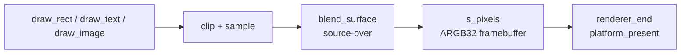
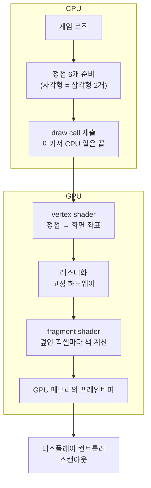
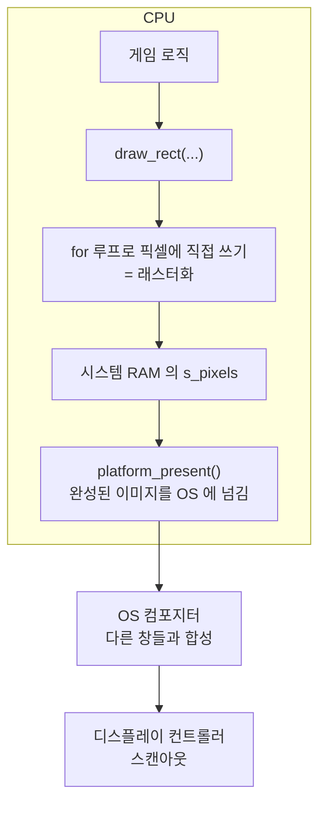
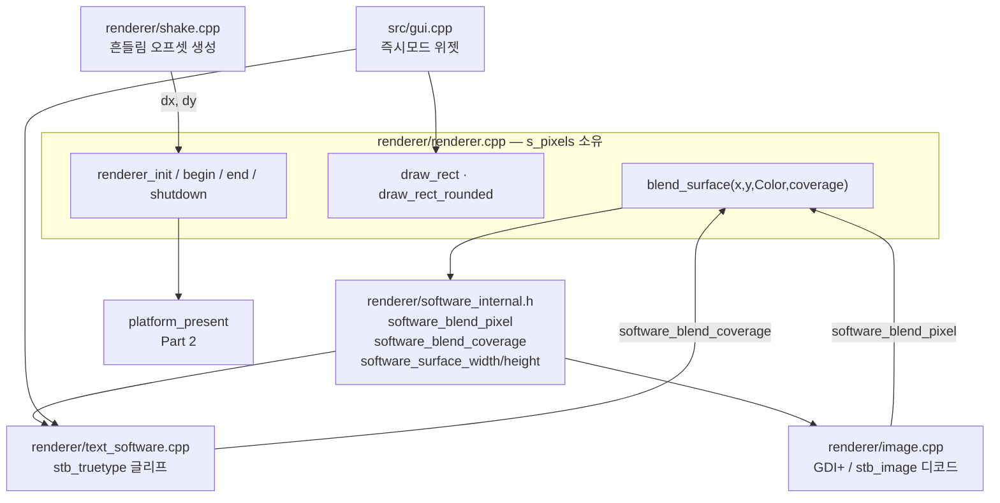
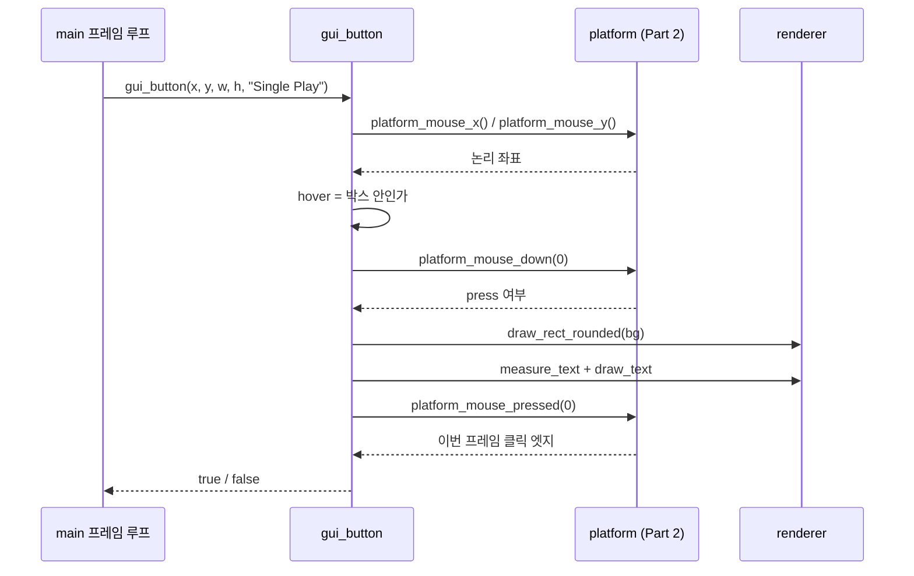
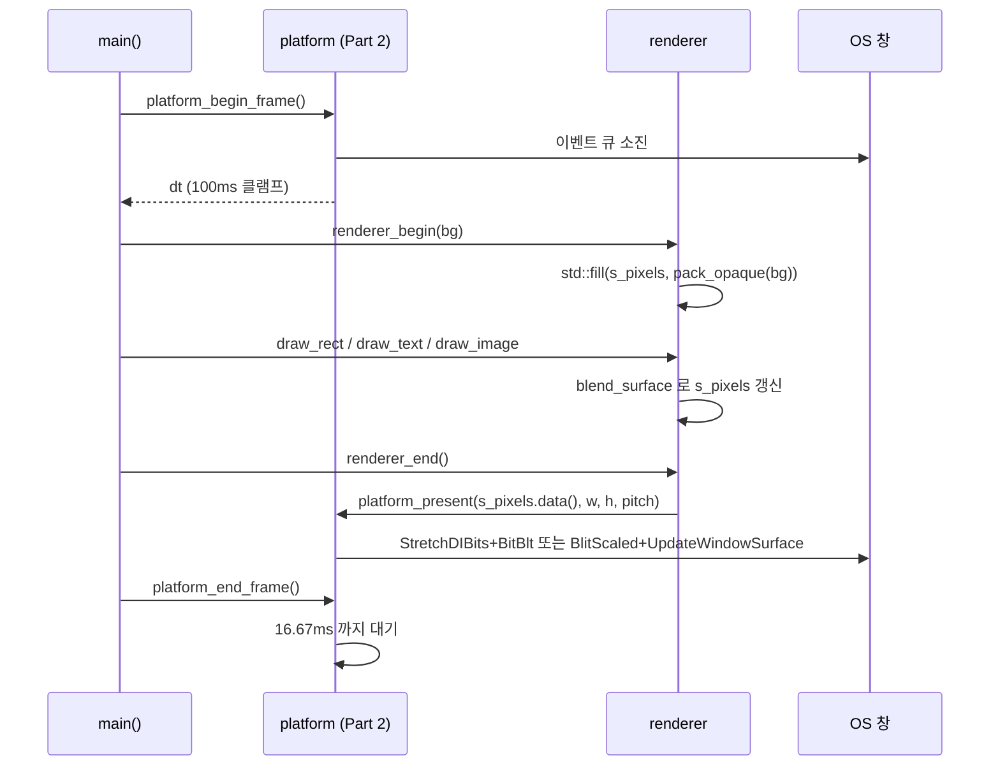
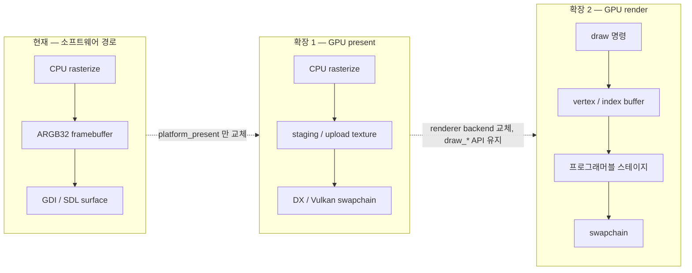

# Part 3: 렌더링과 UI — 2D 소프트웨어 래스터라이저

> **시리즈:** 제로부터 멀티플레이어 테트리스 + RL까지
>
> [시리즈 목차](./README.md) · [이전: Part 2 — 플랫폼 계층](./part2-platform-window-input.md) · **Part 3** · [다음: Part 4 — Game과 메인 루프](./part4-game-wrapper-and-loop.md)

---

## 이번 Part의 구현 계약

- **선행 상태:** [Part 2](./part2-platform-window-input.md) 의 `platform/platform.h`(`struct Color`, `enum PlatformKey`, `platform_present`, `platform_mouse_*`)와 두 백엔드 중 하나. CPU ARGB32 배열을 OS 창에 표시할 수 있고, 논리 좌표 마우스를 읽을 수 있다.
- **이번 Part의 파일:** `renderer/renderer.h`, `renderer/renderer.cpp`, `renderer/software_internal.h`, `renderer/text_software.cpp`, `renderer/image.h`, `renderer/image.cpp`, `renderer/shake.h`, `renderer/shake.cpp`, `src/gui.h`, `src/gui.cpp`, `src/colors.h`, `src/colors.cpp`, `CMakeLists.txt`.
- **연결점:** `renderer_end()` 가 완성된 프레임버퍼를 Part 2 의 `platform_present()` 로 넘긴다. `gui_hover_rect()` 가 Part 2 의 `platform_mouse_x/y()` 를 읽는다. 반대 방향 의존은 없다 — 플랫폼 계층은 렌더러를 모른다.
- **완료 게이트:** 이 장 말미의 `part3_render_demo` 를 빌드해 실행. 한 화면에서 사각형·클리핑·알파 0/128/255·둥근 사각형·텍스트 측정·이미지·tint·회전·view offset·GUI 위젯 전부가 눈으로 확인된다.

`tetris` 타깃은 이 시점에도 빌드할 수 없다. `src/main.cpp`, `src/game.cpp`, `net/*.cpp`, `bot/*.cpp`, `meta/http_client.cpp` 가 아직 없기 때문이다. 그래서 완료 게이트는 Part 2 와 같은 방식으로 독자가 만드는 데모 실행 파일이다.

## 이번 장의 목표

이번 장에서는 외부 그래픽 API 없이 2D 화면을 만든다. 렌더러가 720×640 `uint32_t` 배열을 소유하고 다음 기능을 CPU 로 구현한다.

- 배경 clear
- 클리핑된 사각형과 둥근 사각형
- straight-alpha source-over 합성
- TTF 글리프 래스터화와 coverage 합성
- RGBA 이미지 저장, 확대, tint, 회전
- 화면 흔들림용 view offset
- 즉시모드 GUI 위젯
- Part 2 플랫폼 계층으로 present

GPU 드라이버나 커널을 만드는 프로젝트는 아니다. 운영체제 창에 메모리를 보여주는 마지막 단계는 Win32 GDI 또는 SDL2 에 맡긴다. 학습 범위는 "그리기 명령이 픽셀로 바뀌는 과정" 이다.


```mermaid
flowchart LR
    D["draw_rect / draw_text / draw_image"] --> C["clip + sample"]
    C --> B["blend_surface<br/>source-over"]
    B --> F["s_pixels<br/>ARGB32 framebuffer"]
    F --> P["renderer_end<br/>platform_present"]
```

## 1. 왜 소프트웨어 래스터라이저인가

이 결정은 취향이 아니라 트레이드오프의 결과다. 실제 후보는 넷이었다.

| 선택지 | 얻는 것 | 잃는 것 |
|---|---|---|
| 완성형 엔진의 스프라이트 시스템 | 배칭·아틀라스·셰이더가 전부 준비돼 있고 에디터로 배치까지 | 픽셀이 만들어지는 과정을 볼 수 없다. [Part 0](./part0-project-setup.md) 에서 이미 제외한 선택지 |
| raylib / SDL_Renderer 등 2D 라이브러리 | 즉시 동작. 배칭·아틀라스가 이미 최적화됨 | 그리기 명령이 픽셀이 되는 과정이 전부 라이브러리 안에 있다. 이 프로젝트의 학습 목표와 정면 충돌 |
| GPU API 직접(현대 그래픽 API) | 실무에 가장 가까움. 큰 해상도에서 압도적 성능 | 창 하나 띄우는 데 수백 줄. 드라이버·디바이스 손실·검증 계층 등 그래픽스가 아닌 문제에 시간의 대부분을 쓴다 |
| GPU API 를 표시에만 사용 | tearing 제어와 present 제어를 얻음 | 여전히 드라이버 의존. 얻는 것에 비해 초기 비용이 크다 |
| CPU 소프트웨어 래스터라이저 (이 프로젝트) | 전 과정이 저장소 안 C++ 루프. 디버거로 픽셀 하나를 따라갈 수 있고, 결과가 어느 기계에서나 동일 | 큰 반투명 영역·큰 확대에서 CPU 비용. 720×640 이라 실제로는 여유 |

결정적이었던 것은 세 가지다.

**드라이버 의존성이 0 이다.** GPU 경로는 같은 코드가 벤더·드라이버 버전마다 다른 픽셀을 낼 수 있다. 특히 필터링과 반올림 규칙이 그렇다. 소프트웨어 경로는 정수 산술이라 Windows·Linux·macOS·ARM 어디서 돌려도 같은 프레임버퍼가 나온다.

**디버깅 가능성.** `blend_surface` 에 조건부 중단점 하나를 걸면 특정 픽셀이 왜 그 색이 됐는지 콜스택으로 추적할 수 있다. GPU 파이프라인에서 같은 질문에 답하려면 전용 캡처 도구가 필요하다.

**이식성 예산.** 이 프로젝트는 이미 Windows·Linux·macOS·Termux(ARM64) 를 대상으로 하고, 서버 타깃은 GUI 가 아예 없다. 렌더러가 CPU 에만 의존하면 이식 비용이 창 생성 코드로만 한정된다.

**해상도가 작다.** 720×640 = 460,800 픽셀이다. 60 FPS 로 전체를 한 번씩만 쓰면 초당 2,765만 픽셀, 약 110 MB/s 다. 현대 CPU 의 메모리 대역폭에 비하면 작다. 만약 1920×1080 게임이었다면 이 결정은 달라졌을 것이다.

포기한 것도 분명히 적어 둔다. 큰 반투명 사각형(모달 오버레이)은 read-modify-write 라 clear 보다 비싸고, 매 프레임 회전하는 아이콘은 삼각함수와 bounding box 순회 비용이 있다. 그래도 현재 화면 구성에서는 프레임당 여유가 크다 — 실측으로는 일반적인 프레임이 60Hz 예산의 **2 %** 를 쓴다. 측정 방법과 이 선택이 뒤집히는 조건은 "성능과 의도적 한계" 절에 있다.

## 2. 래스터화는 누가 하는가

앞 절이 "우리가 직접 한다" 고 결론을 내렸다. 그런데 **직접 한다는 것이 정확히 무엇을 대신하는 것인지** 를 짚지 않으면, GPU 렌더링을 해 본 사람은 물론이고 안 해 본 사람도 경계를 놓친다. 이 절은 그 경계만 다룬다.

### 2.1 래스터화란 무엇인가

**도형을 픽셀로 바꾸는 일**이다. "이 삼각형이 화면의 어느 픽셀들을 덮는가, 그리고 그 픽셀 각각은 무슨 색인가" 를 정하는 단계를 가리킨다.

화면은 결국 픽셀 격자뿐이라, 무엇을 그리든 마지막에는 누군가 "이 좌표에 이 값을 넣어라" 를 픽셀 수만큼 반복해야 한다. **그 반복을 누가 하느냐** 가 소프트웨어 렌더러와 GPU 렌더러를 가르는 유일한 차이다. 나머지는 전부 그 결정에서 파생된다.

### 2.2 보통 게임의 한 프레임


```mermaid
graph TB
    subgraph CPUSIDE["CPU"]
        A["게임 로직"] --> B["정점 6개 준비<br/>(사각형 = 삼각형 2개)"]
        B --> C["draw call 제출<br/>여기서 CPU 일은 끝"]
    end
    subgraph GPUSIDE["GPU"]
        D["vertex shader<br/>정점 → 화면 좌표"] --> E["래스터화<br/>고정 하드웨어"]
        E --> F["fragment shader<br/>덮인 픽셀마다 색 계산"]
        F --> G["GPU 메모리의 프레임버퍼"]
    end
    C --> D
    G --> H["디스플레이 컨트롤러<br/>스캔아웃"]
```

CPU 는 **"무엇을 그릴지" 만 말하고 끝난다.** 픽셀은 한 개도 만지지 않는다. 그리고 셰이더는 우리가 쓰지만 **래스터화 자체는 쓸 수 없다** — 그건 GPU 안의 고정 하드웨어이고, 우리가 짜는 것은 그 앞(vertex)과 뒤(fragment)뿐이다.

### 2.3 이 프로젝트의 한 프레임


```mermaid
graph TB
    subgraph CPUONLY["CPU"]
        A["게임 로직"] --> B["draw_rect(...)"]
        B --> C["for 루프로 픽셀에 직접 쓰기<br/>= 래스터화"]
        C --> D["시스템 RAM 의 s_pixels"]
        D --> E["platform_present()<br/>완성된 이미지를 OS 에 넘김"]
    end
    E --> F["OS 컴포지터<br/>다른 창들과 합성"]
    F --> G["디스플레이 컨트롤러<br/>스캔아웃"]
```

**GPU 는 삼각형을 본 적이 없다.** 이미 다 그려진 그림 한 장을 받을 뿐이다. 비유하자면 화가에게 "빨간 사각형을 여기 그려 줘" 라고 부탁하는 것과, 내가 그린 그림을 주면서 "벽에 붙여 줘" 라고 하는 것의 차이다. 두 경우 다 화가가 관여하지만 하는 일이 전혀 다르다.

| | 보통 게임 | 이 프로젝트 |
|---|---|---|
| GPU 가 받는 것 | 정점 · 셰이더 · 그리기 명령 | **완성된 이미지 한 장** |
| 래스터화 주체 | GPU (고정 하드웨어 + fragment shader) | **CPU 의 `for` 루프** |
| 프레임버퍼 위치 | GPU 메모리 | 시스템 RAM (`std::vector<uint32_t>`) |
| 언제 그려지나 | 비동기. 화면 교체까지 미확정 | **함수가 반환되면 끝** |
| 상태 모델 | 전역 상태 머신(바인딩된 셰이더 · 텍스처 · 블렌드 모드) | 없음. 함수 인자가 전부 |

마지막 줄이 실전에서 특히 크다. GPU API 는 거대한 전역 상태 머신이라, 어딘가에서 텍스처를 바인딩하고 되돌리지 않으면 **한참 뒤 엉뚱한 그리기가 깨진다.** 지금 코드에는 그런 개념 자체가 없다.

### 2.4 "GPU" 라는 이름이 가리키는 두 하드웨어

여기서 혼동이 자주 생긴다. 하나의 칩 안에 성격이 전혀 다른 두 블록이 있다.

| 블록 | 하는 일 | 이 프로젝트가 쓰는가 |
|---|---|---|
| **연산 유닛** (셰이더 코어 수천 개) | 래스터화, 셰이더 실행, 범용 병렬 계산 | **쓰지 않는다** |
| **디스플레이 컨트롤러** (스캔아웃 엔진) | 메모리를 주기적으로 읽어 픽셀 클럭 · HSYNC · VSYNC 신호 생성 | **쓴다. 안 쓸 방법이 없다** |

그래서 "이 프로젝트는 GPU 를 쓰지 않는다" 와 "그래도 화면에는 GPU 를 거쳐 뜬다" 가 **둘 다 맞다.** 앞은 연산 유닛 이야기이고 뒤는 디스플레이 경로 이야기다. 창을 띄우는 모든 프로그램이 뒤쪽 경로를 지난다 — 터미널도 마찬가지다.

이 구분이 하드웨어 시장에도 그대로 나타난다. Intel `F` 접미사 모델이나 내장 그래픽 없는 Ryzen 은 **모니터를 꽂을 수 없다.** 그때 그래픽 카드가 필요한 이유는 연산이 아니라 디스플레이 컨트롤러 때문이다. 반대로 서버에 흔한 BMC 칩은 3D 기능이 거의 없는 순수 프레임버퍼 장치라 화면은 나오지만 게임은 못 돌린다.

**화면에 내보내지 않는다면 그래픽 하드웨어는 아예 필요 없다.** 이 저장소의 `sim_hash_dump` 와 `tetris_relay` 가 그 증거다. 렌더러 자체도 `platform_present` 를 빈 함수로 두면 헤드리스 환경에서 그대로 돈다 — 프레임을 완성하고 아무 데도 보내지 않을 뿐이다.

### 2.5 이 저장소는 실제로 GPU 방식이었다

이 렌더러는 처음부터 소프트웨어가 아니었다. 커밋 `6e9a6eb` 이전에는 **OpenGL 로 GPU 래스터화를 했다.** 사각형 · 텍스트 · 이미지 세 경로 모두 셰이더와 draw call 을 썼고, 텍스트는 글리프 아틀라스를, 이미지는 텍스처를 GPU 메모리에 올렸다.

같은 함수를 나란히 놓으면 차이가 분명하다.

**예시(과거 커밋 `6e9a6eb^` 의 코드 — 현재 저장소에는 없음)**

```cpp
void draw_rect(int x, int y, int w, int h, Color c)
{
    float fx = (float)x, fy = (float)y;
    float fw = (float)w, fh = (float)h;
    float verts[12] = {
        fx,      fy,
        fx,      fy + fh,
        fx + fw, fy + fh,
        fx,      fy,
        fx + fw, fy + fh,
        fx + fw, fy,
    };
    glUseProgram(s_rect_prog);
    glUniformMatrix4fv(s_rect_proj, 1, GL_FALSE, s_proj);
    glUniform4f(s_rect_color,
        c.r / 255.0f, c.g / 255.0f, c.b / 255.0f, c.a / 255.0f);

    glBindVertexArray(s_rect_vao);
    glBindBuffer(GL_ARRAY_BUFFER, s_rect_vbo);
    glBufferData(GL_ARRAY_BUFFER, sizeof(verts), verts, GL_DYNAMIC_DRAW);
    glDrawArrays(GL_TRIANGLES, 0, 6);
    glBindVertexArray(0);
}
```

정점 6개를 만들어 GPU 로 보내고 "그려라" 고 말한다. **이 함수가 반환돼도 아직 아무것도 그려지지 않았다.**

**현재 소스 발췌 — `renderer/renderer.cpp:106-129`**

```cpp
void draw_rect(int x, int y, int w, int h, Color c)
{
    if (w <= 0 || h <= 0 || c.a == 0) return;
    x += s_view_ox;
    y += s_view_oy;
    const int x0 = std::max(x, 0);
    const int y0 = std::max(y, 0);
    const int x1 = std::min(x + w, s_screen_w);
    const int y1 = std::min(y + h, s_screen_h);
    if (x0 >= x1 || y0 >= y1) return;

    if (c.a == 255) {
        const uint32_t pixel = pack_opaque(c);
        for (int py = y0; py < y1; ++py) {
            uint32_t* row = s_pixels.data() + (size_t)py * (size_t)s_screen_w;
            std::fill(row + x0, row + x1, pixel);
        }
        return;
    }

    for (int py = y0; py < y1; ++py)
        for (int px = x0; px < x1; ++px)
            blend_surface(px, py, c, 255);
}
```

메모리에 직접 쓴다. 반환되는 순간 픽셀은 이미 들어가 있다.

전환하면서 사라진 것이 `renderer/shaders.h`(GLSL 소스 98줄), `platform/gl_defs.h`(GL 함수 포인터 로딩 23줄), `renderer/text_stb.cpp`(GPU 아틀라스 관리 362줄), `renderer/text_win32.cpp`(110줄)다. 전체로는 **5,066줄이 지워지고 1,399줄이 들어왔다.** 지워진 것의 상당수가 그리기 로직이 아니라 "GPU 와 대화하기 위한 뒷정리" 였다.

텍스트가 가장 극적이다. 이전에는 큰 텍스처를 미리 잡아 두고 새 글자가 나올 때마다 빈 자리를 찾아 비트맵을 업로드한 뒤, 그릴 때 텍스처 좌표를 계산해 사각형에 입혔다. 지금은 글리프 비트맵을 `std::unordered_map` 에 담아 두고 픽셀을 합성한다. **아틀라스 패킹도, 텍스처 좌표 계산도, 업로드 타이밍 관리도 통째로 사라졌다.** 백엔드가 셋(`text_stb` / `text_win32` / 플랫폼 분기)에서 하나로 줄어든 것도 같은 이유다.

## 3. 모듈 구조와 소유권

렌더러는 파일 네 개로 쪼개져 있고, 픽셀 메모리는 **정확히 한 파일**이 소유한다.


```mermaid
graph TB
    subgraph OWN["renderer/renderer.cpp — s_pixels 소유"]
        BS["blend_surface(x,y,Color,coverage)"]
        API1["draw_rect · draw_rect_rounded"]
        LIFE["renderer_init / begin / end / shutdown"]
    end
    SI["renderer/software_internal.h<br/>software_blend_pixel<br/>software_blend_coverage<br/>software_surface_width/height"]
    TXT["renderer/text_software.cpp<br/>stb_truetype 글리프"]
    IMG["renderer/image.cpp<br/>GDI+ / stb_image 디코드"]
    SHK["renderer/shake.cpp<br/>흔들림 오프셋 생성"]
    GUI["src/gui.cpp<br/>즉시모드 위젯"]
    PLAT["platform_present<br/>Part 2"]

    BS --> SI
    SI --> TXT
    SI --> IMG
    TXT -- "software_blend_coverage" --> BS
    IMG -- "software_blend_pixel" --> BS
    GUI --> API1
    GUI --> TXT
    SHK -- "dx, dy" --> LIFE
    LIFE --> PLAT
```

핵심은 `renderer/software_internal.h` 다. 텍스트와 이미지 서브시스템이 프레임버퍼에 직접 접근하지 못하게 막고, 픽셀을 건드리는 유일한 통로를 함수 네 개로 좁힌다.

**현재 소스 발췌 — `renderer/software_internal.h:1-13`**

```cpp
#pragma once

#include <cstdint>
#include "../platform/platform.h"

// 소프트웨어 렌더러 서브시스템(text/image)이 공유하는 최소 픽셀 API.
// 좌표에는 renderer_set_view_offset 값이 자동으로 적용된다.
void software_blend_pixel(int x, int y, Color color);
void software_blend_coverage(int x, int y, Color color, uint8_t coverage);

int software_surface_width();
int software_surface_height();

```

이 헤더가 없다면 `text_software.cpp` 와 `image.cpp` 가 각자 `s_pixels` 에 `extern` 으로 접근하거나, 프레임버퍼 포인터를 인자로 돌려야 한다. 어느 쪽이든 합성 규칙이 세 곳으로 흩어지고, 텍스트의 반투명과 이미지의 반투명이 미묘하게 달라지는 종류의 버그가 생긴다. 통로를 좁혔기 때문에 **알파 합성 코드가 저장소에 딱 한 벌**이다.

주석의 마지막 문장도 계약의 일부다. "좌표에는 `renderer_set_view_offset` 값이 자동으로 적용된다." 즉 이 두 함수를 부르는 쪽은 view offset 을 신경 쓰지 않는다.

## 4. 프레임버퍼와 렌더러 수명주기

상태의 중심은 하나의 연속 배열이다.

**현재 소스 발췌 — `renderer/renderer.cpp:19-29`**

```cpp
static int s_screen_w = 0;
static int s_screen_h = 0;
static int s_view_ox = 0;
static int s_view_oy = 0;
static std::vector<uint32_t> s_pixels; // 0xAARRGGBB

static uint32_t pack_opaque(Color c)
{
    return 0xFF000000u | (uint32_t(c.r) << 16) |
           (uint32_t(c.g) << 8) | uint32_t(c.b);
}
```

좌표 `(x,y)` 의 인덱스는 `y * s_screen_w + x` 다. 같은 행의 픽셀이 메모리에서 연속이므로 사각형 채우기는 `std::fill` 한 번으로 행 단위 처리가 된다.

`pack_opaque` 는 `Color`(RGBA 바이트 4개)를 프레임버퍼 워드(`0xAARRGGBB`)로 바꾼다. 이름 그대로 **alpha 를 무조건 255 로 세운다.** 프레임버퍼는 최종 화면이므로 반투명일 수 없다. 소스의 alpha 는 색이 아니라 합성 가중치다.

초기화는 다음과 같다.

**현재 소스 발췌 — `renderer/renderer.cpp:69-76`**

```cpp
void renderer_init(int screen_w, int screen_h)
{
    s_screen_w = std::max(screen_w, 1);
    s_screen_h = std::max(screen_h, 1);
    s_view_ox = s_view_oy = 0;
    s_pixels.assign((size_t)s_screen_w * (size_t)s_screen_h, 0xFF000000u);
    image_init();
}
```

**마지막 줄의 `image_init()` 을 빠뜨리면 안 된다.** 이 호출은 이미지 저장소 벡터를 크기 1 로 만들어 **핸들 0 을 invalid 로 예약**한다. 빠지면 첫 번째 `image_create_rgba` 가 빈 벡터에 `push_back` 한 뒤 인덱스 **0** 을 반환하고, 그 0 은 곧 "무효 핸들" 이다. 결과는 **모든 아이콘이 조용히 사라지는** 증상이다. 그리기 함수는 오류를 내지 않고 그냥 아무것도 안 그린다. 렌더러 초기화 한 줄이 이미지 시스템 전체를 좌우하는 예다.

`std::max(screen_w, 1)` 도 사소해 보이지만 의미가 있다. 0 이나 음수가 들어오면 `s_pixels` 가 비고, 이후 모든 인덱싱이 정의되지 않은 동작이 된다. 방어를 생성 시점 한 곳에 모았다.

프레임 시작과 끝은 두 줄짜리 함수다.

**현재 소스 발췌 — `renderer/renderer.cpp:78-88`**

```cpp
void renderer_begin(Color bg)
{
    std::fill(s_pixels.begin(), s_pixels.end(), pack_opaque(bg));
}

void renderer_end()
{
    if (s_pixels.empty()) return;
    platform_present(s_pixels.data(), s_screen_w, s_screen_h,
                     s_screen_w * (int)sizeof(uint32_t));
}
```

`renderer_begin` 은 배경색으로 배열 전체를 덮는다. 이전 프레임 잔상을 지우는 유일한 수단이고, 동시에 전체 화면을 한 번 쓰는 가장 비싼 단일 연산이다. `std::fill` 은 `uint32_t` 배열에 대해 컴파일러가 벡터화하기 쉬운 형태라 실측상 문제가 되지 않는다.

`renderer_end` 는 프레임버퍼 포인터와 크기, stride 를 그대로 플랫폼에 넘긴다. **중간 복사도, 포맷 변환도, 버퍼 스왑도 없다.** Part 2 의 `platform_present` 가 이 메모리를 직접 읽어 창에 복사한다. `s_pixels.empty()` 검사는 `renderer_init` 전이나 `renderer_shutdown` 후에 불렸을 때를 막는다.

뷰 오프셋과 종료는 다음과 같다.

**현재 소스 발췌 — `renderer/renderer.cpp:90-104`**

```cpp
void renderer_set_view_offset(int dx, int dy)
{
    s_view_ox = dx;
    s_view_oy = dy;
}

void renderer_shutdown()
{
    image_shutdown();
    renderer_text_shutdown();
    s_pixels.clear();
    s_pixels.shrink_to_fit();
    s_screen_w = s_screen_h = 0;
    s_view_ox = s_view_oy = 0;
}
```

`renderer_set_view_offset` 이 하는 일은 정수 두 개를 세우는 것이 전부다. 변환 행렬도, 좌표계 스택도 없다. 이 단순함이 뒤에서 다룰 화면 흔들림 구현을 세 줄로 만든다.

`renderer_shutdown` 은 자기가 만든 것을 역순으로 정리한다. 이미지 저장소 → 글리프 캐시/폰트 → 프레임버퍼. `shrink_to_fit` 까지 부르는 이유는 `clear()` 만으로는 벡터가 용량을 유지하기 때문이다. 460,800 × 4바이트 ≈ 1.8 MB 를 붙들고 있을 이유가 없다.

호출 순서 계약: `platform_init` → `renderer_init` → (프레임 루프) → `renderer_shutdown` → `platform_shutdown`. 렌더러가 플랫폼보다 나중에 만들어지고 먼저 정리된다. [Part 4](./part4-game-wrapper-and-loop.md) 의 `main()` 이 이 순서를 지킨다.

공개 API 는 헤더에 한글 주석으로 정리돼 있다.

**현재 소스 발췌 — `renderer/renderer.h:34-51`**

```cpp
// ─── 그리기 함수 ──────────────────────────────────────────────────────────────

// 색칠된 사각형. DrawRectangle() 대체.
// 클리핑 후 ARGB32 픽셀을 직접 채우며 알파 블렌딩한다.
void draw_rect(int x, int y, int w, int h, Color c);

// 둥근 모서리 사각형. DrawRectangleRounded() 대체.
// roundness: 0.0(직각) ~ 1.0(완전 둥근). 반지름 = roundness * min(w,h)/2.
void draw_rect_rounded(int x, int y, int w, int h, float roundness, Color c);

// 텍스트 그리기. DrawTextEx() / DrawText() 대체.
// stb_truetype로 만든 8-bit coverage mask를 CPU 알파 블렌딩한다.
void draw_text(const char* text, int x, int y, int size, Color c);

// 텍스트 폭 측정. MeasureTextEx() 대체.
// TTF advance metric으로 측정.
int  measure_text(const char* text, int size);

```

## 5. source-over 알파 합성

모든 픽셀 쓰기가 이 함수를 통과한다. 30줄 안에 렌더러의 색 규칙이 전부 들어 있다.

**현재 소스 발췌 — `renderer/renderer.cpp:31-54`**

```cpp
static void blend_surface(int x, int y, Color c, uint8_t coverage)
{
    if ((unsigned)x >= (unsigned)s_screen_w ||
        (unsigned)y >= (unsigned)s_screen_h) return;

    const unsigned a = (unsigned(c.a) * unsigned(coverage) + 127u) / 255u;
    if (a == 0) return;

    uint32_t& dst = s_pixels[(size_t)y * (size_t)s_screen_w + (size_t)x];
    if (a == 255) {
        dst = 0xFF000000u | (uint32_t(c.r) << 16) |
              (uint32_t(c.g) << 8) | uint32_t(c.b);
        return;
    }

    const unsigned inv = 255u - a;
    const unsigned dr = (dst >> 16) & 0xFFu;
    const unsigned dg = (dst >> 8) & 0xFFu;
    const unsigned db = dst & 0xFFu;
    const unsigned r = (unsigned(c.r) * a + dr * inv + 127u) / 255u;
    const unsigned g = (unsigned(c.g) * a + dg * inv + 127u) / 255u;
    const unsigned b = (unsigned(c.b) * a + db * inv + 127u) / 255u;
    dst = 0xFF000000u | (r << 16) | (g << 8) | b;
}
```

### 4.1 unsigned 캐스트 경계 검사 관용구

첫 두 줄이 이 파일에서 가장 밀도 높은 코드다. 위에 통째로 인용한 `blend_surface` 의 맨 앞 두 줄을 다시 본다.

**현재 소스 발췌 — `renderer/renderer.cpp:33-34`**

```cpp
    if ((unsigned)x >= (unsigned)s_screen_w ||
        (unsigned)y >= (unsigned)s_screen_h) return;
```

`x` 가 음수일 때 `(unsigned)x` 는 매우 큰 값(예: `-1` → `4294967295`)이 된다. 따라서 `>= s_screen_w` 한 번의 비교가 **`x < 0 || x >= s_screen_w` 두 조건을 동시에** 검사한다. 비교 연산이 절반으로 줄고, 분기 예측기 입장에서도 분기가 하나 줄어든다. 픽셀마다 실행되는 코드에서는 의미 있는 차이다.

주의: 이 관용구는 `s_screen_w` 가 음수가 아닐 때만 성립한다. `renderer_init` 의 `std::max(screen_w, 1)` 이 그 전제를 보장한다. 두 방어가 짝을 이룬다.

### 4.2 정수 산술 source-over

소스 색 `S`, 목적지 색 `D`, 유효 alpha `a` 에 대해 각 RGB 채널은 다음과 같다.

```text
out = (S × a + D × (255 - a) + 127) / 255
```

`+ 127` 이 붙는 이유는 정수 나눗셈이 항상 내림이라 결과가 체계적으로 어두워지기 때문이다. 반값을 더하고 나누면 반올림에 가까워진다. 예를 들어 `S=255, D=0, a=128` 이면 `(255*128 + 0 + 127)/255 = 128`. `+127` 이 없으면 127 이다. 1 차이지만 반투명 레이어를 여러 겹 쌓으면 누적되어 눈에 보인다.

유효 alpha 자체도 같은 반올림을 쓴다. `blend_surface` 의 세 번째 문장이다.

**현재 소스 발췌 — `renderer/renderer.cpp:36-36`**

```cpp
    const unsigned a = (unsigned(c.a) * unsigned(coverage) + 127u) / 255u;
```

즉 **effective alpha = (color alpha × coverage + 127) / 255** 다. 사각형처럼 coverage 개념이 없는 도형은 `coverage = 255` 로 호출되어 `a == c.a` 가 된다. 텍스트는 글리프 비트맵의 값이 coverage 로 들어온다. 이 한 줄 덕분에 "반투명한 색으로 그린 안티에일리어싱된 글자" 가 자동으로 올바르게 합성된다.

### 4.3 빠른 경로 셋

- **`a == 0`**: 아무것도 하지 않고 반환. 완전 투명 픽셀은 목적지를 읽지도 않는다. 투명 배경 PNG 를 그릴 때 대부분의 픽셀이 여기서 끝난다.
- **`a == 255`**: 목적지 RGB 를 **읽지 않고** 바로 쓴다. 읽기 한 번과 곱셈 여섯 번을 아낀다.
- **불투명 사각형**: `draw_rect` 가 아예 `blend_surface` 를 부르지 않고 행별 `std::fill` 을 쓴다(다음 절).

### 4.4 straight alpha 대 premultiplied alpha

이 렌더러는 **straight(non-premultiplied) alpha** 를 쓴다. `Color{255, 0, 0, 128}` 은 "빨강, 50% 불투명" 이고, RGB 값은 alpha 와 독립이다. 대안인 premultiplied 는 저장 시점에 RGB 에 alpha 를 미리 곱해 두는 방식이다.

premultiplied 의 장점은 합성식이 `out = S + D×(255-a)` 로 짧아진다는 것과, 여러 레이어를 합칠 때 결합법칙이 성립해 중간 결과를 캐시할 수 있다는 것이다. 단점은 저장 정밀도 손실(alpha 가 작으면 RGB 하위 비트가 날아간다)과, tint 같은 채널 곱셈 연산이 직관을 벗어난다는 것이다.

이 프로젝트가 straight 를 택한 이유는 단순하다. **API 표면이 `Color{r,g,b,a}` 하나이고, 게임 코드가 상수로 색을 적는다.** `ghostColor = {200, 200, 210, 70}` 같은 값을 사람이 읽고 쓰기에는 straight 가 압도적으로 편하다. 레이어 캐싱을 하지 않으므로 premultiplied 의 주 이점도 살릴 데가 없다. 나중에 dirty rectangle 이나 중간 레이어 캐시를 도입한다면 그때 premultiplied 로 옮기는 것이 자연스러운 다음 단계다.

### 4.5 view offset 을 더하는 얇은 층

`blend_surface` 는 화면 좌표를 받는다. view offset 을 더하는 것은 그 위의 얇은 래퍼다.

**현재 소스 발췌 — `renderer/renderer.cpp:56-67`**

```cpp
void software_blend_pixel(int x, int y, Color color)
{
    blend_surface(x + s_view_ox, y + s_view_oy, color, 255);
}

void software_blend_coverage(int x, int y, Color color, uint8_t coverage)
{
    blend_surface(x + s_view_ox, y + s_view_oy, color, coverage);
}

int software_surface_width() { return s_screen_w; }
int software_surface_height() { return s_screen_h; }
```

여기서 중요한 규칙 하나. **`blend_surface` 를 직접 부르는 코드는 좌표에 offset 을 이미 더한 상태여야 하고, `software_blend_pixel` 을 부르는 코드는 더하지 않은 상태여야 한다.** 두 번 더하면 흔들림이 두 배로 나타난다. 다음 절의 `draw_rect` 와 `draw_rect_rounded` 가 각각 어느 쪽인지 비교하면 규칙이 분명해진다.

## 6. 클리핑과 사각형

**현재 소스 발췌 — `renderer/renderer.cpp:106-129`**

```cpp
void draw_rect(int x, int y, int w, int h, Color c)
{
    if (w <= 0 || h <= 0 || c.a == 0) return;
    x += s_view_ox;
    y += s_view_oy;
    const int x0 = std::max(x, 0);
    const int y0 = std::max(y, 0);
    const int x1 = std::min(x + w, s_screen_w);
    const int y1 = std::min(y + h, s_screen_h);
    if (x0 >= x1 || y0 >= y1) return;

    if (c.a == 255) {
        const uint32_t pixel = pack_opaque(c);
        for (int py = y0; py < y1; ++py) {
            uint32_t* row = s_pixels.data() + (size_t)py * (size_t)s_screen_w;
            std::fill(row + x0, row + x1, pixel);
        }
        return;
    }

    for (int py = y0; py < y1; ++py)
        for (int px = x0; px < x1; ++px)
            blend_surface(px, py, c, 255);
}
```

이 함수는 **사전 클리핑**을 한다. view offset 을 좌표에 먼저 더하고, 프레임버퍼 경계와 교차시켜 `[x0,x1) × [y0,y1)` 를 구한 뒤, 교차가 비면 즉시 반환한다. 그래서 안쪽 루프는 범위 검사 없이 돌 수 있다.

불투명일 때는 행 단위 `std::fill` 로 간다. 픽셀당 함수 호출·알파 계산·읽기가 전부 사라진다. 배경 패널·보드 셀처럼 화면의 대부분을 차지하는 도형이 이 경로를 탄다.

반투명일 때는 `blend_surface(px, py, c, 255)` 를 픽셀마다 부른다. **`software_blend_pixel` 이 아니라 `blend_surface` 인 것에 주의.** 좌표에 이미 offset 이 더해져 있기 때문이다. 그리고 클리핑을 마친 좌표이므로 `blend_surface` 안의 경계 검사는 항상 통과한다 — 중복이지만 함수를 하나로 유지하는 대가로 받아들인 비용이다.

### 5.1 "클리핑을 먼저 하면 범위 검사가 필요 없다" 는 절반만 사실

이 최적화를 적용한 함수는 **`draw_rect` 하나뿐**이다. 나머지는 전부 `blend_surface` 의 픽셀별 검사에 의존한다.

| 함수 | 사전 클리핑 | 경계 안전 장치 |
|---|---|---|
| `draw_rect` | 있음 (`x0/y0/x1/y1` 교차) | 사전 클리핑 |
| `draw_rect_rounded` | 없음 | `blend_surface` 픽셀별 검사 |
| `draw_image_tinted` | 없음 | 같음 |
| `draw_image_rotated` | 없음 | 같음 |
| `draw_text` | 없음 | 같음 |

즉 화면 밖으로 완전히 벗어난 둥근 사각형이나 글자도 **루프는 전부 돈다.** 픽셀마다 두 번의 비교 후 반환할 뿐이다. 안전하지만 공짜는 아니다. 화면 밖 객체가 많아지면 각 함수 앞에 bounding box 조기 반환을 넣는 것이 첫 번째 최적화 후보다. 현재 화면 구성에서는 화면 밖으로 나가는 요소가 거의 없어 문제가 되지 않는다.

## 7. 둥근 사각형

**현재 소스 발췌 — `renderer/renderer.cpp:131-157`**

```cpp
void draw_rect_rounded(int x, int y, int w, int h, float roundness, Color c)
{
    if (w <= 0 || h <= 0 || c.a == 0) return;
    roundness = std::max(0.0f, std::min(roundness, 1.0f));
    const float radius = roundness * 0.5f * (float)std::min(w, h);
    if (radius < 1.0f) {
        draw_rect(x, y, w, h, c);
        return;
    }

    const float left_c = (float)x + radius;
    const float right_c = (float)(x + w) - radius;
    const float top_c = (float)y + radius;
    const float bottom_c = (float)(y + h) - radius;
    const float r2 = radius * radius;

    for (int py = y; py < y + h; ++py) {
        const float cy = (float)py + 0.5f;
        for (int px = x; px < x + w; ++px) {
            const float cx = (float)px + 0.5f;
            const float qx = std::max(left_c - cx, std::max(0.0f, cx - right_c));
            const float qy = std::max(top_c - cy, std::max(0.0f, cy - bottom_c));
            if (qx * qx + qy * qy <= r2)
                software_blend_pixel(px, py, c);
        }
    }
}
```

### 6.1 roundness 에서 radius 로

`roundness` 는 0.0~1.0 의 정규화 값이고, 실제 반지름은 다음과 같다.

```text
roundness = clamp(roundness, 0, 1)
radius    = roundness × 0.5 × min(w, h)
```

`min(w, h)` 의 절반이 곧 "완전히 둥근" 한계다. `roundness = 1.0` 이고 정사각형이면 원이 되고, 가로로 긴 사각형이면 양 끝이 반원인 알약 모양이 된다. `roundness` 를 그대로 픽셀로 쓰지 않고 크기에 비례시킨 덕분에, 같은 값이 큰 버튼과 작은 버튼에서 시각적으로 같은 인상을 준다.

구체적인 예를 들면, `src/gui.cpp` 의 `gui_button` 은 `draw_rect_rounded(x, y, w, h, 0.25f, bg)` 를 쓴다. 높이 44px 버튼이면 `radius = 0.25 × 0.5 × 44 = 5.5px` 다. 높이 60px 버튼이면 7.5px 다.

**`radius < 1.0f` 이면 `draw_rect` 로 폴백한다.** 이게 "roundness 0 은 일반 사각형과 완전히 같다" 를 보장하는 코드다. 폴백이 없으면 반지름 0.4px 짜리 코너를 부동소수 판정으로 계산하다가 경계 픽셀이 들쭉날쭉해진다. 게다가 폴백은 불투명 사각형의 `std::fill` 빠른 경로까지 되찾아 준다.

### 6.2 제곱근 없는 내부 판정

픽셀 중심 `(cx, cy) = (px + 0.5, py + 0.5)` 가 rounded rectangle 안인지 판정한다. 사각형을 네 개의 코너 중심점으로 정의하고, 픽셀에서 "코너 중심들이 이루는 안쪽 직사각형" 까지의 거리 벡터 `(qx, qy)` 를 구한다.

```text
qx = max(left_c - cx, max(0, cx - right_c))
qy = max(top_c  - cy, max(0, cy - bottom_c))
inside = qx² + qy² ≤ radius²
```

`cx` 가 `left_c` 와 `right_c` 사이면 `qx` 는 0 이다(양쪽 항이 모두 음수이거나 0). 즉 중앙 십자 영역에서는 거리가 0 이라 항상 안쪽이고, 네 모서리에서만 실제 거리 판정이 일어난다. **제곱근을 계산하지 않는다.** `d ≤ r` 과 `d² ≤ r²` 는 음이 아닌 값에 대해 같은 판정이고, 후자가 훨씬 싸다.

경계는 1픽셀 단위 hard edge다. 안티에일리어싱이 없어서 큰 반지름에서는 계단이 보인다. 더 매끄럽게 하려면 경계 1픽셀 구간에서 `qx²+qy²` 와 `radius²` 의 차이로 coverage 를 계산해 `software_blend_coverage` 로 합성하면 된다. 현재 버튼 반지름이 5~8px 라 계단이 눈에 띄지 않아 미루었다.

루프는 `software_blend_pixel` 을 쓴다. 즉 **좌표에 view offset 을 더하지 않은 채로** 반복하고, 오프셋은 blend 시점에 더해진다. `draw_rect` 와 정반대다. 결과는 같지만, 이 함수는 사전 클리핑이 없으므로 화면 밖 사각형도 `w × h` 회 루프를 돈다.

## 8. view offset 과 화면 흔들림

`renderer_set_view_offset(dx, dy)` 는 그 이후의 모든 그리기를 정수 픽셀만큼 민다. 이 기능의 유일한 소비자가 화면 흔들림이다.

흔들림 상태 머신은 별도 파일에 있다.

**현재 소스 발췌 — `renderer/shake.h:4-26`**

```cpp
// Section I — 화면 흔들림 상태 머신.
//
// 순수 렌더링 레이어: SimGame 결정론에 영향 없음. 라인 클리어/가비지 삽입/
// 게임오버 등 이벤트가 trigger() 를 호출하면 duration 초 동안 시간·감쇠에 따른
// 진폭으로 (dx, dy) 픽셀 오프셋을 생성.
struct ShakeState
{
    float timeLeft  = 0.0f; // 남은 지속 시간 (초)
    float totalTime = 0.0f; // 원래 지속 시간 (감쇠 계산용)
    float intensity = 0.0f; // 최대 진폭 (픽셀)
    uint64_t rngState = 0xC0FFEEULL;
};

// 기존 shake 보다 "더 강한" trigger 만 덮어쓴다 — 가벼운 라인 클리어가
// 강한 Tetris 흔들림을 끊지 않도록.
void shake_trigger(ShakeState& s, float intensity_px, float duration_s);

// 매 프레임 호출 — timeLeft 감소.
void shake_update(ShakeState& s, float dt);

// 현재 프레임의 (dx, dy) 픽셀 오프셋을 기록. 내부 RNG 를 소비하므로 non-const.
// 활성이 아닐 때는 0,0 반환.
void shake_offset(ShakeState& s, float& outDx, float& outDy);
```

**현재 소스 발췌 — `renderer/shake.cpp:39-58`**

```cpp
void shake_offset(ShakeState& s, float& outDx, float& outDy)
{
    if (s.timeLeft <= 0.0f || s.intensity <= 0.0f || s.totalTime <= 0.0f) {
        outDx = 0.0f;
        outDy = 0.0f;
        return;
    }
    // 시간이 갈수록 진폭 감쇠 — 선형.
    float t = s.timeLeft / s.totalTime;           // 1.0 → 0.0
    float amp = s.intensity * t;

    // [-1, +1] 범위 균등 난수 두 개.
    uint64_t r1 = xorshift64star(s.rngState);
    uint64_t r2 = xorshift64star(s.rngState);
    float nx = ((float)(r1 & 0xFFFFFFu) / (float)0x800000u) - 1.0f;
    float ny = ((float)(r2 & 0xFFFFFFu) / (float)0x800000u) - 1.0f;

    outDx = amp * nx;
    outDy = amp * ny;
}
```

세 가지를 짚는다.

**감쇠가 선형이다.** `t = timeLeft / totalTime` 이 1.0 에서 0.0 으로 줄고, 진폭이 `intensity × t` 다. 지수 감쇠보다 단순하고, 짧은(0.1~0.3초) 흔들림에서는 차이가 보이지 않는다.

**전용 RNG 를 쓴다.** `ShakeState::rngState` 는 XorShift64* 상태이고 게임의 RNG 와 완전히 분리돼 있다. 이건 결정론 요구사항이다. 흔들림이 게임 RNG 를 소비하면 **화면 효과가 블록 생성 순서를 바꾼다.** [Part 1](./part1-deterministic-simulation.md) 의 `SimGame` 이 지키는 결정론이 렌더링 때문에 깨지는 최악의 결합이 된다. 별도 인스턴스로 그 가능성을 구조적으로 차단했다.

**약한 흔들림이 강한 흔들림을 끊지 않는다.** `shake_trigger` 는 현재 활성 강도보다 약한 요청을 무시한다. 4줄 클리어 직후 가비지 삽입이 들어와도 큰 흔들림이 작은 흔들림으로 덮어써지지 않는다.

사용 형태는 이렇다.

**예시(실제 저장소에는 없음)**

```cpp
shake_update(shakeState, dt);
float sx = 0.0f, sy = 0.0f;
shake_offset(shakeState, sx, sy);

renderer_set_view_offset((int)sx, (int)sy);
draw_board();
draw_pieces();
renderer_set_view_offset(0, 0);   // UI 는 흔들리지 않는다
draw_hud();
```

`(int)` 캐스팅으로 정수 픽셀에 스냅되는 것이 오히려 자연스럽다. 서브픽셀 흔들림은 nearest 샘플링에서 표현되지 않기 때문이다.

**흔들림은 시뮬레이션에 전혀 들어가지 않는다.** `SimGame` 의 좌표는 그대로이고, 상태 해시에도 포함되지 않는다. [Part 6](./part6-lockstep-networking.md) 의 lockstep 이 흔들림 때문에 어긋날 일이 없다.

## 9. 텍스트 (1) — stb_truetype 과 UTF-8

### 8.1 왜 벤더링된 단일 헤더인가

TTF 파일을 파싱해 베지어 outline 을 추출하고, 그것을 안티에일리어싱된 coverage 비트맵으로 래스터화하는 일은 그 자체로 큰 프로젝트다. glyf/loca/cmap/hmtx/kern 테이블 파싱, 복합 글리프 재귀, 스캔라인 채우기와 커버리지 누적이 전부 들어간다. 이 프로젝트의 학습 목표는 **배치·캐시·합성**이지 폰트 포맷 파싱이 아니다.

그래서 `third_party/stb_truetype.h` 를 저장소에 벤더링(체크인)했다. 선택 근거는 셋이다.

- **단일 헤더에 의존성이 없다.** 빌드 시스템에 라이브러리 탐색 코드가 한 줄도 늘지 않는다. 크로스 컴파일과 Termux 빌드에서 이 차이가 크다.
- **버전이 고정된다.** 체크인해 두면 어느 기계에서 빌드해도 같은 래스터화 결과가 나온다. 시스템 폰트 라이브러리에 의존하면 OS 마다 글자 모양이 달라진다.
- **API 가 픽셀 수준이다.** `stbtt_GetCodepointBitmap` 이 8비트 coverage 배열을 그대로 준다. 우리가 원하는 것이 정확히 그것이고, 그 위의 배치·캐시·합성은 우리 코드가 한다.

구현부는 `renderer/text_software.cpp` 하나에만 들어간다. `#define STB_TRUETYPE_IMPLEMENTATION` 이 그 파일에만 있다.

이 파일 전에는 `renderer/text_stb.cpp` 와 `renderer/text_win32.cpp` 두 벌이 있었다. 소프트웨어 렌더러로 전환하면서 **공통 경로 하나로 합쳤다.** 폰트 래스터화가 플랫폼과 무관해졌기 때문이다.

### 8.2 알아 둘 stb_truetype 개념 넷

**`stbtt_ScaleForPixelHeight(&font, px)`** 는 폰트 단위(font units, 보통 em 당 1000 또는 2048)를 픽셀로 바꾸는 배율을 준다. "px" 는 **ascent 에서 descent 까지의 높이**가 그만큼이 되도록 정규화한 값이다. 그래서 `size = 24` 로 그린 글자의 실제 대문자 높이는 24 보다 작다. 폰트마다 이 비율이 다르므로, UI 를 픽셀 단위로 맞출 때는 `measure_text` 로 실측하는 것이 유일하게 안전한 방법이다.

**세 개의 수직 metric.** `ascent` 는 baseline 위쪽 최대 높이, `descent` 는 baseline 아래쪽(음수), `lineGap` 은 줄 사이 추가 여백이다. 한 줄의 표준 높이는 `(ascent - descent + lineGap) × scale` 이다. `descent` 가 음수라 빼기가 곧 더하기다.

**advance 와 커닝.** `stbtt_GetCodepointHMetrics` 가 주는 `advance` 는 이 글자를 그린 뒤 pen 을 얼마나 전진시킬지다. 글자의 실제 폭(bitmap width)과 다르다. `stbtt_GetCodepointKernAdvance(prev, cur)` 는 특정 글자 쌍에 대한 추가 보정이다. "AV" 처럼 붙여야 예쁜 쌍에서 음수가 나온다.

**coverage 안티에일리어싱.** `stbtt_GetCodepointBitmap` 이 주는 것은 색이 아니라 **픽셀당 0~255 의 덮임 정도**다. 글자 획이 픽셀의 절반을 덮으면 128 이다. 이 값을 alpha 로 써서 배경과 섞으면 계단이 사라진다. 그래서 글리프 비트맵은 색과 무관하고, 같은 글리프를 흰색으로도 빨간색으로도 재사용할 수 있다. 캐시가 성립하는 이유다.

### 8.3 UTF-8 디코딩

**현재 소스 발췌 — `renderer/text_software.cpp:32-59`**

```cpp
static uint32_t utf8_next(const char** text)
{
    const uint8_t* s = reinterpret_cast<const uint8_t*>(*text);
    if (!s[0]) return 0;
    uint32_t cp = 0;
    int count = 0;
    if (s[0] < 0x80) {
        cp = s[0]; count = 1;
    } else if ((s[0] & 0xE0) == 0xC0) {
        cp = s[0] & 0x1F; count = 2;
    } else if ((s[0] & 0xF0) == 0xE0) {
        cp = s[0] & 0x0F; count = 3;
    } else if ((s[0] & 0xF8) == 0xF0) {
        cp = s[0] & 0x07; count = 4;
    } else {
        ++*text;
        return 0xFFFD;
    }
    for (int i = 1; i < count; ++i) {
        if ((s[i] & 0xC0) != 0x80) {
            ++*text;
            return 0xFFFD;
        }
        cp = (cp << 6) | (s[i] & 0x3F);
    }
    *text += count;
    return cp;
}
```

선두 바이트의 상위 비트로 길이를 판정하고(`0xxxxxxx`=1, `110xxxxx`=2, `1110xxxx`=3, `11110xxx`=4), 나머지 바이트가 `10xxxxxx` 인지 확인하며 6비트씩 이어 붙인다. 포인터를 참조로 받아 **소비한 만큼 전진시킨다** — 호출부는 `while (*p) cp = utf8_next(&p);` 형태로 쓴다.

잘못된 바이트열을 만나면 `0xFFFD`(replacement character)를 반환하고 **한 바이트만** 전진한다. 무한 루프를 막으면서 다음 바이트부터 재동기화를 시도하는 표준적 처리다. 폰트에 U+FFFD 글리프가 없으면 빈 글리프가 캐시되어 아무것도 그려지지 않는다.

이 함수 덕분에 한글·일본어·기호가 전부 같은 경로로 처리된다. 폰트에 글리프만 있으면 된다. 다만 [Part 2](./part2-platform-window-input.md) 의 문자 입력 링버퍼는 ASCII 만 받으므로, **표시는 유니코드, 입력은 ASCII** 라는 비대칭이 남아 있다.

## 10. 텍스트 (2) — 글리프 캐시와 폰트 로딩

### 9.1 캐시 구조

**현재 소스 발췌 — `renderer/text_software.cpp:18-30`**

```cpp
struct Glyph {
    int w = 0;
    int h = 0;
    int xoff = 0;
    int yoff = 0;
    float advance = 0.0f;
    std::vector<uint8_t> coverage;
};

static stbtt_fontinfo s_font{};
static std::vector<uint8_t> s_ttf;
static std::unordered_map<uint64_t, Glyph> s_cache;
static bool s_font_ok = false;
```

**현재 소스 발췌 — `renderer/text_software.cpp:61-83`**

```cpp
static const Glyph& glyph_for(uint32_t cp, int px)
{
    px = px < 1 ? 1 : px;
    const uint64_t key = (uint64_t(cp) << 32) | uint32_t(px);
    auto found = s_cache.find(key);
    if (found != s_cache.end()) return found->second;

    Glyph glyph;
    const float scale = stbtt_ScaleForPixelHeight(&s_font, (float)px);
    int advance = 0;
    int left_bearing = 0;
    stbtt_GetCodepointHMetrics(&s_font, (int)cp, &advance, &left_bearing);
    glyph.advance = (float)advance * scale;

    unsigned char* bitmap = stbtt_GetCodepointBitmap(
        &s_font, scale, scale, (int)cp,
        &glyph.w, &glyph.h, &glyph.xoff, &glyph.yoff);
    if (bitmap && glyph.w > 0 && glyph.h > 0) {
        glyph.coverage.assign(bitmap, bitmap + (size_t)glyph.w * (size_t)glyph.h);
    }
    if (bitmap) stbtt_FreeBitmap(bitmap, nullptr);
    return s_cache.emplace(key, std::move(glyph)).first->second;
}
```

키는 code point 와 픽셀 크기를 하나의 `uint64_t` 로 합친 값이다. 상위 32비트가 code point, 하위 32비트가 픽셀 크기. 같은 글자라도 크기가 다르면 다른 글리프다 — 벡터 outline 을 크기별로 래스터화해야 하기 때문이다.

`stbtt_GetCodepointBitmap` 이 반환한 버퍼는 `stbtt_FreeBitmap` 으로 해제해야 한다. 그 전에 `glyph.coverage` 벡터로 복사한다. 폰트에 없는 글자나 공백처럼 비트맵이 비는 경우(`w` 또는 `h` 가 0)는 `coverage` 가 빈 벡터로 남고, advance 만 유효하다. `draw_text` 의 픽셀 루프가 `glyph.h`/`glyph.w` 로 도는 덕에 빈 글리프는 자연히 아무것도 그리지 않는다.

반환 타입이 `const Glyph&` 인 것에도 이유가 있다. 글리프 하나가 수 KB 일 수 있으므로 값 복사를 피한다. `std::unordered_map` 은 rehash 시에도 **노드 주소가 유지되므로** 이 참조는 안전하다(벡터였다면 아니다).

### 9.2 캐시에 축출 정책이 없다

`s_cache` 는 무한히 커진다. 크기 상한도, LRU 도 없다. 유일한 비우기는 `renderer_load_font`(폰트 교체)와 `renderer_text_shutdown`(종료)이다.

이건 의도적 한계다. 실제 사용 패턴을 보면 폰트 크기 종류가 유한하고(UI 에서 쓰는 크기 10여 개), code point 도 한국어 UI 문자열 + ASCII 범위로 사실상 수백 개다. 최악을 잡아 글리프 500종 × 크기 12종 × 평균 1 KB ≈ 6 MB 다. 게임을 몇 시간 켜 두어도 이 값이 늘지 않는다 — 표시되는 문자열 집합이 고정이기 때문이다.

**깨지는 조건은 분명하다.** 사용자 입력 문자열을 임의 크기로 애니메이션하며 그리는(예: 크기가 매 프레임 바뀌는 팝업 텍스트) 코드가 들어오면 크기 축이 무한대가 되어 캐시가 폭발한다. 그런 기능을 추가한다면 크기를 정수로 스냅하거나 LRU 축출을 넣어야 한다.

### 9.3 폰트 로딩과 실패 모드

**현재 소스 발췌 — `renderer/text_software.cpp:85-121`**

```cpp
void renderer_load_font(const char* path)
{
    s_font_ok = false;
    s_cache.clear();
    s_ttf.clear();
    if (!path || !*path) return;

    FILE* file = std::fopen(path, "rb");
    if (!file) {
        std::fprintf(stderr, "[text] font open failed: %s\n", path);
        return;
    }
    std::fseek(file, 0, SEEK_END);
    const long size = std::ftell(file);
    std::fseek(file, 0, SEEK_SET);
    if (size <= 0) {
        std::fclose(file);
        std::fprintf(stderr, "[text] font empty: %s\n", path);
        return;
    }
    s_ttf.resize((size_t)size);
    const size_t read = std::fread(s_ttf.data(), 1, s_ttf.size(), file);
    std::fclose(file);
    if (read != s_ttf.size()) {
        s_ttf.clear();
        std::fprintf(stderr, "[text] font read failed: %s\n", path);
        return;
    }

    const int offset = stbtt_GetFontOffsetForIndex(s_ttf.data(), 0);
    if (offset < 0 || !stbtt_InitFont(&s_font, s_ttf.data(), offset)) {
        s_ttf.clear();
        std::fprintf(stderr, "[text] invalid TTF: %s\n", path);
        return;
    }
    s_font_ok = true;
}
```

절차는 다섯 단계다. ① 이전 상태 초기화 → ② 파일 전체를 `s_ttf` 로 읽음 → ③ `stbtt_GetFontOffsetForIndex(data, 0)` 으로 첫 폰트의 오프셋을 구함(TTC 컬렉션 파일 대응) → ④ `stbtt_InitFont` → ⑤ `s_font_ok = true`.

**`s_ttf` 를 끝까지 들고 있어야 한다.** `stbtt_fontinfo` 는 파일 데이터를 복사하지 않고 **포인터로 참조**한다. `s_ttf` 를 해제하거나 재할당하면 이후 모든 글리프 래스터화가 해제된 메모리를 읽는다. 이 파일에서 `s_ttf` 를 비우는 곳이 전부 `s_font_ok = false` 와 짝을 이루는 이유다.

실패 경로가 넷이다. 파일 없음, 크기 0, 부분 읽기, 잘못된 TTF. 넷 모두 stderr 에 한 줄을 찍고 `s_font_ok` 를 `false` 로 남긴다. **예외를 던지지 않고 프로그램을 죽이지도 않는다.**

그래서 실패 모드가 특이하다. `measure_text` 는 `!s_font_ok` 면 0 을 반환하고, `draw_text` 는 조용히 반환한다. 즉 **폰트를 못 찾으면 화면이 검게 비는 게 아니라, 글자만 전부 사라진다.** 버튼 사각형과 아이콘은 정상적으로 보이는데 라벨이 하나도 없는 화면이 나온다. `measure_text` 가 0 을 반환하므로 중앙 정렬 계산도 전부 어긋난다. 처음 보면 원인을 짐작하기 어려우니, **글자만 안 보이면 stderr 의 `[text] font open failed:` 를 먼저 확인**하는 것이 정석이다.

실제 로드는 [Part 4](./part4-game-wrapper-and-loop.md) 의 `main()` 에서 `renderer_load_font("Font/NanumGothic.ttf")` 한 줄이다. **NanumGothic 을 쓰는 이유는 한글 글리프가 들어 있기 때문이다.** UTF-8 디코더가 한글 code point 를 뽑아내도 폰트에 글리프가 없으면 빈 사각형조차 안 나온다. 저장소에는 `Font/monogram.ttf` 도 있지만 그쪽은 ASCII 픽셀 폰트다.

경로가 상대 경로라는 점이 중요하다. 빌드 디렉터리에서 실행하면 `Font/` 가 없어서 폰트 로드가 실패한다. 저장소 루트에서 실행하거나, `cmake --build build` 를 타깃 지정 없이 돌려 `copy_assets` 가 함께 실행되게 해야 한다. macOS `.app` 번들에서는 Part 2 의 `set_macos_resource_cwd()` 가 작업 디렉터리를 옮겨 이 문제를 해결한다.

정리는 짧다.

**현재 소스 발췌 — `renderer/text_software.cpp:190-195`**

```cpp
void renderer_text_shutdown()
{
    s_cache.clear();
    s_ttf.clear();
    s_font_ok = false;
}
```

## 11. 텍스트 (3) — 측정과 배치

### 10.1 측정

**현재 소스 발췌 — `renderer/text_software.cpp:123-147`**

```cpp
int measure_text(const char* text, int size)
{
    if (!text || !*text || !s_font_ok) return 0;
    const int px = size < 1 ? 1 : size;
    float line_width = 0.0f;
    float max_width = 0.0f;
    uint32_t previous = 0;
    for (const char* p = text; *p;) {
        const uint32_t cp = utf8_next(&p);
        if (cp == '\n') {
            max_width = std::max(max_width, line_width);
            line_width = 0.0f;
            previous = 0;
            continue;
        }
        const float scale = stbtt_ScaleForPixelHeight(&s_font, (float)px);
        if (previous)
            line_width += stbtt_GetCodepointKernAdvance(
                &s_font, (int)previous, (int)cp) * scale;
        line_width += glyph_for(cp, px).advance;
        previous = cp;
    }
    max_width = std::max(max_width, line_width);
    return (int)std::floor(max_width + 0.5f);
}
```

한 글자씩 advance 를 더하고, 앞 글자가 있으면 커닝 보정을 먼저 더한다. 개행을 만나면 현재 줄 폭을 최댓값과 비교한 뒤 0 으로 리셋하고, **커닝 상태(`previous`)도 0 으로 리셋한다.** 줄바꿈을 사이에 둔 두 글자 사이에 커닝이 적용되면 안 되기 때문이다.

반환값은 `floor(max_width + 0.5)` — 반올림이다. 멀티라인 문자열에서는 **가장 긴 줄의 폭**을 준다.

### 10.2 배치

**현재 소스 발췌 — `renderer/text_software.cpp:149-188`**

```cpp
void draw_text(const char* text, int x, int y, int size, Color color)
{
    if (!text || !*text || !s_font_ok || color.a == 0) return;
    const int px = size < 1 ? 1 : size;
    const float scale = stbtt_ScaleForPixelHeight(&s_font, (float)px);
    int ascent = 0, descent = 0, line_gap = 0;
    stbtt_GetFontVMetrics(&s_font, &ascent, &descent, &line_gap);
    const float baseline0 = (float)y + (float)ascent * scale;
    const float line_advance = (float)(ascent - descent + line_gap) * scale;

    float pen_x = (float)x;
    float baseline = baseline0;
    uint32_t previous = 0;
    for (const char* p = text; *p;) {
        const uint32_t cp = utf8_next(&p);
        if (cp == '\n') {
            pen_x = (float)x;
            baseline += line_advance;
            previous = 0;
            continue;
        }
        if (previous)
            pen_x += stbtt_GetCodepointKernAdvance(
                &s_font, (int)previous, (int)cp) * scale;

        const Glyph& glyph = glyph_for(cp, px);
        const int gx = (int)std::floor(pen_x + (float)glyph.xoff);
        const int gy = (int)std::floor(baseline + (float)glyph.yoff);
        for (int row = 0; row < glyph.h; ++row) {
            for (int col = 0; col < glyph.w; ++col) {
                const uint8_t coverage =
                    glyph.coverage[(size_t)row * (size_t)glyph.w + (size_t)col];
                if (coverage)
                    software_blend_coverage(gx + col, gy + row, color, coverage);
            }
        }
        pen_x += glyph.advance;
        previous = cp;
    }
}
```

`draw_text(text, x, y, size, color)` 의 `y` 는 **텍스트 상단**이다. 폰트의 baseline 은 그보다 `ascent × scale` 만큼 아래다. 글리프 비트맵의 위치는 baseline 에 `glyph.yoff`(대부분 음수)를 더해 정한다.

```text
baseline = y + ascent × scale
glyph x  = floor(pen_x + xoff)
glyph y  = floor(baseline + yoff)
pen_x   += kerning + advance
```

`pen_x` 와 `baseline` 은 `float` 로 누적하고 각 글리프를 그릴 때만 `floor` 로 정수화한다. 매 글자마다 정수로 반올림해 누적하면 오차가 쌓여 긴 문자열의 끝이 눈에 띄게 밀린다.

**멀티라인 처리**가 여기 들어 있다. 개행을 만나면 `pen_x` 를 시작 `x` 로 되돌리고 `baseline` 에 `line_advance = (ascent - descent + line_gap) × scale` 을 더한다. `previous = 0` 리셋도 `measure_text` 와 같다. **두 함수가 같은 규칙을 쓰는 것이 계약이다** — 어긋나면 버튼 라벨의 중앙 정렬이 흔들린다. 실제로 `gui_button` 은 `measure_text` 로 폭을 재서 `x + (w - tw) / 2` 에 그리므로, 측정과 배치가 다르면 즉시 시각적으로 드러난다.

픽셀 루프는 `coverage` 가 0 이 아닐 때만 `software_blend_coverage` 를 부른다. 글리프 비트맵은 대부분 0 이라(획 주변 여백) 이 한 줄의 조기 종료가 실제로 큰 절약이다. 그리고 이 호출은 좌표에 view offset 을 더하지 않은 상태로 넘긴다 — 오프셋은 `software_blend_coverage` 안에서 더해진다.

## 12. 이미지 (1) — 저장소와 핸들 수명

이미지 시스템의 공개 API 는 여덟 개다.

**현재 소스 발췌 — `renderer/image.h:19-51`**

```cpp
using ImageHandle = int;  // 0 = invalid/미로드

// 실패 시 0 리턴 (파일 없음, 디코드 실패 등).
// 성공 시 양수 핸들.
ImageHandle image_load(const char* path);

// RGBA8 픽셀 배열에서 이미지 생성. 기본/절차적 fallback 아이콘 등에 사용.
// pixels 는 w*h*4 바이트이며 호출 시점에 CPU 이미지 저장소로 복사된다.
ImageHandle image_create_rgba(const uint8_t* pixels, int w, int h);

// 해제. 핸들이 0 이거나 유효하지 않으면 no-op.
void image_unload(ImageHandle h);

// 픽셀 단위. (x, y) 는 좌상단. 좌상단이 텍스처 (0,0) 에 매핑.
void draw_image(ImageHandle h, int x, int y, int w, int h_px);

// tint 는 RGBA 각 채널에 곱해짐. {255,255,255,255} = 원본.
void draw_image_tinted(ImageHandle h, int x, int y, int w, int h_px, Color tint);

// 회전 드로우 — (cx, cy) 가 중심, angle_deg 는 시계방향(화면 y 가 아래로
// 증가하므로 표준 수학 좌표계의 반시계와 반대). 쿼드 4꼭짓점을 CPU 에서
// 회전한 목적지 사각형에서 원본 좌표를 역변환한다. 메뉴/상점의 실시간
// 회전 아이콘용이다.
void draw_image_rotated(ImageHandle h, int cx, int cy, int w, int h_px,
                        float angle_deg);

// 이미지 크기 질의 — 원본 너비/높이가 필요할 때 (예: 자연 크기로 드로우).
//   반환 false = 핸들 무효.
bool image_size(ImageHandle h, int& w_out, int& h_out);

// 내부: renderer_init 시점 호출 — CPU 이미지 핸들 저장소 초기화.
void image_init();
void image_shutdown();
```

저장소는 벡터 하나다.

**현재 소스 발췌 — `renderer/image.cpp:27-39`**

```cpp
struct ImageEntry {
    bool used = false;
    int w = 0;
    int h = 0;
    std::vector<uint32_t> pixels; // 0xAARRGGBB, straight alpha
};

static std::vector<ImageEntry> s_images;

#if defined(_WIN32)
static ULONG_PTR s_gdiplus_token = 0;
static bool s_gdiplus_initialized = false;
#endif
```

**현재 소스 발췌 — `renderer/image.cpp:107-122`**

```cpp
void image_init()
{
    if (s_images.empty()) s_images.resize(1); // handle 0 is invalid
}

void image_shutdown()
{
    s_images.clear();
#if defined(_WIN32)
    if (s_gdiplus_initialized) {
        Gdiplus::GdiplusShutdown(s_gdiplus_token);
        s_gdiplus_initialized = false;
        s_gdiplus_token = 0;
    }
#endif
}
```

`image_init()` 이 벡터를 크기 1 로 만든다. **인덱스 0 은 영원히 사용되지 않는 자리이고, 그래서 `ImageHandle` 0 이 "무효" 를 뜻할 수 있다.** 별도의 sentinel 값이나 `std::optional` 없이 정수 하나로 유효성을 표현하는 고전적 기법이다. 앞서 `renderer_init` 이 `image_init()` 을 반드시 불러야 하는 이유가 이것이다.

`if (s_images.empty())` 검사 덕분에 두 번 불러도 안전하다.

생성과 해제는 슬롯 재사용 방식이다.

**현재 소스 발췌 — `renderer/image.cpp:124-145`**

```cpp
ImageHandle image_create_rgba(const uint8_t* rgba, int width, int height)
{
    if (!rgba || width <= 0 || height <= 0) return 0;
    ImageEntry entry;
    entry.used = true;
    entry.w = width;
    entry.h = height;
    entry.pixels.resize((size_t)width * (size_t)height);
    for (size_t i = 0; i < entry.pixels.size(); ++i) {
        const uint8_t* p = rgba + i * 4;
        entry.pixels[i] = (uint32_t(p[3]) << 24) | (uint32_t(p[0]) << 16) |
                          (uint32_t(p[1]) << 8) | uint32_t(p[2]);
    }
    for (size_t i = 1; i < s_images.size(); ++i) {
        if (!s_images[i].used) {
            s_images[i] = std::move(entry);
            return (ImageHandle)i;
        }
    }
    s_images.push_back(std::move(entry));
    return (ImageHandle)(s_images.size() - 1);
}
```

**현재 소스 발췌 — `renderer/image.cpp:147-170`**

```cpp
ImageHandle image_load(const char* path)
{
    if (!path || !*path) return 0;
    std::vector<uint8_t> rgba;
    int width = 0;
    int height = 0;
    if (!decode_image(path, rgba, width, height)) return 0;
    return image_create_rgba(rgba.data(), width, height);
}

void image_unload(ImageHandle handle)
{
    if (handle <= 0 || (size_t)handle >= s_images.size()) return;
    s_images[(size_t)handle] = {};
}

bool image_size(ImageHandle handle, int& width, int& height)
{
    if (handle <= 0 || (size_t)handle >= s_images.size() ||
        !s_images[(size_t)handle].used) return false;
    width = s_images[(size_t)handle].w;
    height = s_images[(size_t)handle].h;
    return true;
}
```

`image_create_rgba` 는 먼저 RGBA8 바이트 배열을 `0xAARRGGBB` 워드로 변환한다. 이 변환을 **로드 시점에 한 번** 해 두면 그리기 루프가 워드 하나만 읽으면 된다. 그다음 인덱스 1부터 훑어 `used == false` 인 빈 슬롯을 찾고, 없으면 뒤에 붙인다.

`image_unload` 는 `s_images[handle] = {}` 로 기본 생성된 `ImageEntry` 를 대입한다. `used = false` 가 되고 픽셀 벡터도 해제된다. 그 슬롯은 다음 `image_create_rgba` 가 재사용한다.

이 설계의 결과: **게임 코드는 이미지 메모리 주소도, GDI+ `Bitmap` 객체도, 파일 핸들도 보지 않는다.** 정수 하나만 들고 다닌다. 저장 방식을 통째로 바꿔도 게임 코드는 그대로다. 대가는 handle 재사용에서 오는 고전적 위험이다 — unload 한 핸들을 계속 들고 있다가 나중에 쓰면, 그 사이에 다른 이미지가 그 슬롯을 차지했을 수 있다. 이 프로젝트는 아이콘 몇 개를 시작 시 로드해 끝까지 유지하므로 문제가 되지 않는다. 동적 로드/언로드가 늘어난다면 세대 카운터를 핸들 상위 비트에 넣는 것이 표준적 해법이다.

## 13. 이미지 (2) — 디코딩

파일 포맷 디코딩은 플랫폼별로 갈리는 유일한 렌더러 코드다.

**현재 소스 발췌 — `renderer/image.cpp:41-105`**

```cpp
static bool decode_image(const char* path, std::vector<uint8_t>& rgba,
                         int& width, int& height)
{
#if defined(_WIN32)
    if (!s_gdiplus_initialized) {
        Gdiplus::GdiplusStartupInput input;
        if (Gdiplus::GdiplusStartup(&s_gdiplus_token, &input, nullptr) !=
            Gdiplus::Ok) {
            std::fprintf(stderr, "[image] GDI+ startup failed\n");
            return false;
        }
        s_gdiplus_initialized = true;
    }
    const int wide_count = MultiByteToWideChar(CP_UTF8, 0, path, -1, nullptr, 0);
    if (wide_count <= 0) return false;
    std::wstring wide((size_t)wide_count, L'\0');
    MultiByteToWideChar(CP_UTF8, 0, path, -1, wide.data(), wide_count);

    Gdiplus::Bitmap bitmap(wide.c_str());
    if (bitmap.GetLastStatus() != Gdiplus::Ok) {
        std::fprintf(stderr, "[image] load failed: %s\n", path);
        return false;
    }
    width = (int)bitmap.GetWidth();
    height = (int)bitmap.GetHeight();
    if (width <= 0 || height <= 0) return false;

    Gdiplus::BitmapData data{};
    Gdiplus::Rect rect(0, 0, width, height);
    if (bitmap.LockBits(&rect, Gdiplus::ImageLockModeRead,
                        PixelFormat32bppARGB, &data) != Gdiplus::Ok) {
        std::fprintf(stderr, "[image] pixel lock failed: %s\n", path);
        return false;
    }
    rgba.resize((size_t)width * (size_t)height * 4);
    const uint8_t* base = static_cast<const uint8_t*>(data.Scan0);
    for (int y = 0; y < height; ++y) {
        const uint8_t* src = base + (ptrdiff_t)y * data.Stride;
        uint8_t* dst = rgba.data() + (size_t)y * (size_t)width * 4;
        for (int x = 0; x < width; ++x) {
            dst[x * 4 + 0] = src[x * 4 + 2];
            dst[x * 4 + 1] = src[x * 4 + 1];
            dst[x * 4 + 2] = src[x * 4 + 0];
            dst[x * 4 + 3] = src[x * 4 + 3];
        }
    }
    bitmap.UnlockBits(&data);
    return true;
#else
    int channels = 0;
    unsigned char* decoded = stbi_load(path, &width, &height, &channels, 4);
    if (!decoded) {
        std::fprintf(stderr, "[image] load failed: %s (%s)\n",
                     path, stbi_failure_reason());
        return false;
    }
    if (width <= 0 || height <= 0) {
        stbi_image_free(decoded);
        return false;
    }
    rgba.assign(decoded, decoded + (size_t)width * (size_t)height * 4);
    stbi_image_free(decoded);
    return true;
#endif
}
```

### 12.1 Windows: GDI+ 와 채널 스왑

Windows 에서는 GDI+ 가 PNG/JPG/BMP 를 디코드한다. 시스템에 이미 있는 코덱을 쓰므로 추가 의존성이 없다. 절차는 지연 초기화(`GdiplusStartup`) → UTF-8 경로를 UTF-16 으로 변환 → `Gdiplus::Bitmap` 생성 → `LockBits` 로 픽셀 접근 → 행 단위 복사 → `UnlockBits`.

**여기 이 시리즈에서 가장 놓치기 쉬운 네 줄이 있다.** 위 `decode_image` 안쪽 루프의 본문이다.

**현재 소스 발췌 — `renderer/image.cpp:81-84`**

```cpp
            dst[x * 4 + 0] = src[x * 4 + 2];
            dst[x * 4 + 1] = src[x * 4 + 1];
            dst[x * 4 + 2] = src[x * 4 + 0];
            dst[x * 4 + 3] = src[x * 4 + 3];
```

`PixelFormat32bppARGB` 라는 이름과 달리, GDI+ 가 메모리에 실제로 놓는 바이트 순서는 **BGRA** 다(리틀 엔디언에서 `0xAARRGGBB` 워드를 바이트로 펼친 것이므로). 우리 중간 포맷은 RGBA8 바이트 배열이다. 그래서 R 과 B 를 맞바꾼다. 이 네 줄이 없으면 **모든 아이콘의 빨강과 파랑이 뒤바뀐 채로 표시된다.** [Part 2](./part2-platform-window-input.md) 의 데모에서 "RGB 채널이 뒤집히지 않는다" 를 확인했던 그 문제가, 여기서는 프레임버퍼가 아니라 디코더 출력에서 다시 나타난다.

`data.Stride` 를 행마다 다시 계산하는 것도 중요하다. GDI+ 의 행은 4바이트 정렬이며 `width * 4` 와 다를 수 있고, 심지어 음수일 수도 있다(bottom-up 비트맵). `ptrdiff_t` 로 캐스팅해 곱하는 이유가 그것이다.

### 12.2 그 외 플랫폼: stb_image

Linux/macOS 에서는 벤더링된 `third_party/stb_image.h` 를 쓴다. `stbi_load(path, &w, &h, &channels, 4)` 의 마지막 인자 `4` 가 "무슨 포맷이든 RGBA8 로 변환해 달라" 는 요청이다. 그래서 채널 스왑이 필요 없다 — stb_image 의 출력은 정의상 R,G,B,A 바이트 순서다.

실패하면 `stbi_failure_reason()` 이 사람이 읽을 수 있는 이유를 준다. 로그에 함께 찍는다.

두 경로 모두 반환 시점의 계약이 같다. `rgba` 는 `width × height × 4` 바이트, 바이트 순서 R,G,B,A, straight alpha. 이 계약이 있기 때문에 `image_create_rgba` 가 플랫폼을 몰라도 된다.

## 14. 이미지 (3) — 샘플링, tint, 회전

### 13.1 nearest 샘플러와 tint

**현재 소스 발췌 — `renderer/image.cpp:172-189`**

```cpp
static Color sample_nearest(const ImageEntry& image, float u, float v, Color tint)
{
    int sx = (int)(u * image.w);
    int sy = (int)(v * image.h);
    if (sx < 0) sx = 0;
    if (sy < 0) sy = 0;
    if (sx >= image.w) sx = image.w - 1;
    if (sy >= image.h) sy = image.h - 1;
    const uint32_t pixel =
        image.pixels[(size_t)sy * (size_t)image.w + (size_t)sx];
    Color color{
        (uint8_t)(((pixel >> 16) & 0xFFu) * tint.r / 255u),
        (uint8_t)(((pixel >> 8) & 0xFFu) * tint.g / 255u),
        (uint8_t)((pixel & 0xFFu) * tint.b / 255u),
        (uint8_t)(((pixel >> 24) & 0xFFu) * tint.a / 255u)
    };
    return color;
}
```

`u, v` 는 `[0,1)` 정규화 좌표다. `u * image.w` 를 정수로 잘라 소스 픽셀을 고르고, 범위를 clamp 한다. clamp 는 부동소수 오차로 `u` 가 정확히 1.0 이 되는 경우를 막는다.

tint 는 샘플의 **네 채널 모두**에 곱해진다. `tint = WHITE = {255,255,255,255}` 면 항등이다. alpha 에도 곱하므로 `tint.a = 128` 은 이미지 전체를 반투명하게 만든다. **원본의 투명 픽셀은 곱해도 0 이라 그대로 투명**이다 — 투명 PNG 의 배경이 tint 때문에 드러나는 일이 없다.

곱셈은 `/ 255u` 로 나눈다. 여기에는 `+127` 반올림이 없다. `blend_surface` 와 미묘하게 다른 처리이고, tint 를 1단계만 적용하므로 실제 오차는 최대 1 이라 눈에 띄지 않는다.

**현재 소스 발췌 — `renderer/image.cpp:191-216`**

```cpp
static const ImageEntry* get_image(ImageHandle handle)
{
    if (handle <= 0 || (size_t)handle >= s_images.size()) return nullptr;
    const ImageEntry& image = s_images[(size_t)handle];
    return image.used ? &image : nullptr;
}

void draw_image_tinted(ImageHandle handle, int x, int y, int width, int height,
                       Color tint)
{
    const ImageEntry* image = get_image(handle);
    if (!image || width <= 0 || height <= 0 || tint.a == 0) return;
    for (int dy = 0; dy < height; ++dy) {
        const float v = ((float)dy + 0.5f) / (float)height;
        for (int dx = 0; dx < width; ++dx) {
            const float u = ((float)dx + 0.5f) / (float)width;
            const Color color = sample_nearest(*image, u, v, tint);
            if (color.a) software_blend_pixel(x + dx, y + dy, color);
        }
    }
}

void draw_image(ImageHandle handle, int x, int y, int width, int height)
{
    draw_image_tinted(handle, x, y, width, height, WHITE);
}
```

`draw_image_tinted` 는 **목적지 픽셀마다** UV 를 계산해 원본을 샘플링한다. 소스를 순회하며 목적지에 쓰는 방향(forward mapping)이 아니라 반대다. 확대할 때 forward mapping 은 목적지에 구멍이 생기지만, 역방향은 목적지의 모든 픽셀이 정확히 한 번 채워진다.

```text
u = (dx + 0.5) / dest_width
v = (dy + 0.5) / dest_height
```

`+0.5` 는 픽셀 **중심**을 쓴다는 뜻이다. 픽셀을 점이 아니라 넓이 있는 사각형으로 보는 관점이고, 확대·축소에서 반 픽셀 밀림을 막는다.

`draw_image` 는 `WHITE` tint 로 위임한다. 코드 한 벌로 두 API 를 만든다.

샘플러가 nearest 인 것은 선택이다. 이 게임의 아이콘은 작은 픽셀아트라 경계가 뚜렷한 편이 낫고, 구현이 명확하다. 부드러운 확대가 필요하면 주변 4픽셀을 읽어 가중 평균하는 bilinear 샘플러를 `sample_nearest` 자리에 넣으면 된다 — 호출부는 바뀌지 않는다.

`get_image` 가 핸들 유효성 검사를 한 곳에 모은 것도 눈여겨볼 만하다. 무효 핸들은 `nullptr` 이 되고, 그리기 함수들은 조용히 반환한다.

### 13.2 회전 — 역변환 샘플링

**현재 소스 발췌 — `renderer/image.cpp:218-247`**

```cpp
void draw_image_rotated(ImageHandle handle, int cx, int cy, int width, int height,
                        float angle_deg)
{
    const ImageEntry* image = get_image(handle);
    if (!image || width <= 0 || height <= 0) return;
    const float radians = angle_deg * 3.14159265358979323846f / 180.0f;
    const float cosine = std::cos(radians);
    const float sine = std::sin(radians);
    const float half_w = (float)width * 0.5f;
    const float half_h = (float)height * 0.5f;
    const int extent_x = (int)std::ceil(std::abs(half_w * cosine) +
                                       std::abs(half_h * sine));
    const int extent_y = (int)std::ceil(std::abs(half_w * sine) +
                                       std::abs(half_h * cosine));

    // 목적지 픽셀 중심을 -angle로 역회전해 원본 UV를 얻는다.
    for (int y = cy - extent_y; y < cy + extent_y; ++y) {
        for (int x = cx - extent_x; x < cx + extent_x; ++x) {
            const float dx = ((float)x + 0.5f) - (float)cx;
            const float dy = ((float)y + 0.5f) - (float)cy;
            const float local_x = dx * cosine + dy * sine;
            const float local_y = -dx * sine + dy * cosine;
            const float u = (local_x + half_w) / (float)width;
            const float v = (local_y + half_h) / (float)height;
            if (u < 0.0f || u >= 1.0f || v < 0.0f || v >= 1.0f) continue;
            const Color color = sample_nearest(*image, u, v, WHITE);
            if (color.a) software_blend_pixel(x, y, color);
        }
    }
}
```

소스 픽셀을 앞으로 회전시키면 목적지에 구멍이 생긴다. 회전은 격자를 격자로 보내지 않기 때문이다. 그래서 **회전된 목적지 bounding box 를 순회하며 각 픽셀을 원본으로 역변환**한다. 확대와 같은 원리의 확장이다.

**bounding box 산출.** 폭 `w`, 높이 `h` 인 사각형을 각도 `θ` 만큼 회전시키면 축 정렬 경계 상자의 반폭·반높이는 다음과 같다.

```text
extent_x = ceil(|half_w × cos θ| + |half_h × sin θ|)
extent_y = ceil(|half_w × sin θ| + |half_h × cos θ|)
```

이는 회전된 사각형 네 꼭짓점의 좌표 절댓값 최댓값이다. `ceil` 로 올림해서 경계 픽셀이 잘리지 않게 한다. 0도에서는 `(half_w, half_h)`, 45도 정사각형에서는 약 1.414배로 커진다.

**역변환식.** 화면 좌표는 y 가 아래로 증가하므로, 표준 수학 좌표계와 회전 방향이 반대다. 양의 각도를 시계 방향으로 정의하기 위해 다음 형태를 쓴다.

```text
dx = (x + 0.5) - cx
dy = (y + 0.5) - cy

local_x =  dx × cos θ + dy × sin θ
local_y = -dx × sin θ + dy × cos θ

u = (local_x + w/2) / w
v = (local_y + h/2) / h
```

`local_*` 이 회전을 되돌린 좌표계에서의 위치다. 여기에 half 를 더해 좌상단 기준으로 옮기고 크기로 나누면 UV 가 된다. `u` 나 `v` 가 `[0,1)` 밖이면 회전된 사각형 바깥이므로 건너뛴다. 이 검사가 곧 회전된 사각형의 클리핑이다.

**두 가지 제약을 명시해 둔다.**

1. **tint 를 지원하지 않는다.** `sample_nearest(*image, u, v, WHITE)` 로 항상 흰색 tint 를 쓴다. 회전하면서 색을 입히려면 `draw_image_rotated` 에 `Color tint` 인자를 추가하고 그대로 넘기면 되지만, 현재 호출부(메뉴·상점의 회전 아이콘)가 필요로 하지 않는다.
2. **경계에 안티에일리어싱이 없다.** nearest 샘플링에 hard 클리핑이라 회전된 가장자리가 계단으로 보인다. 작은 아이콘에서는 눈에 띄지 않는다.

이것은 GPU 의 텍스처 매핑과 같은 핵심 원리다. 차이는 좌표 변환과 샘플링을 전용 하드웨어 스테이지가 아니라 C++ 루프가 직접 한다는 점이다.

## 15. 즉시모드 GUI

`src/gui.cpp` 는 이 장의 두 계층 위에 얹힌다. 렌더러의 `draw_*` 와 Part 2 의 `platform_mouse_*` 만 쓴다. 상태를 저장하지 않는다.


```mermaid
sequenceDiagram
    participant M as main 프레임 루프
    participant G as gui_button
    participant P as platform (Part 2)
    participant R as renderer

    M->>G: gui_button(x, y, w, h, "Single Play")
    G->>P: platform_mouse_x() / platform_mouse_y()
    P-->>G: 논리 좌표
    G->>G: hover = 박스 안인가
    G->>P: platform_mouse_down(0)
    P-->>G: press 여부
    G->>R: draw_rect_rounded(bg)
    G->>R: measure_text + draw_text
    G->>P: platform_mouse_pressed(0)
    P-->>G: 이번 프레임 클릭 엣지
    G-->>M: true / false
```

위젯 객체도, 레이아웃 트리도, 이벤트 콜백도 없다. **그리는 행위와 입력을 판정하는 행위가 같은 함수 호출 하나**다. Dear ImGui 가 대중화한 패턴이고, 이 프로젝트 규모에서는 retained-mode UI 보다 압도적으로 짧다. 대가는 매 프레임 전부 다시 그린다는 것인데, 어차피 `renderer_begin` 이 화면을 통째로 지우므로 추가 비용이 없다.

팔레트는 파일 상단의 익명 네임스페이스에 있다.

**현재 소스 발췌 — `src/gui.cpp:4-13`**

```cpp
namespace {
// 팔레트 — 메뉴/모달 전용. 기존 Color 상수(WHITE/GRAY 등)와 섞어 씀.
constexpr Color kBtnIdleBg    = { 38,  50,  78, 255};   // 어두운 남색
constexpr Color kBtnHoverBg   = { 60,  82, 140, 255};   // 호버 시 파랑
constexpr Color kBtnPressBg   = { 30,  60, 120, 255};   // 눌린 순간
constexpr Color kBtnHighlight = {210, 180,  30, 255};   // 커서 강조 (키보드 선택)
constexpr Color kModalBg      = {  0,   0,   0, 180};   // 모달 오버레이 반투명
constexpr Color kCloseIdle    = {130, 130, 130, 255};
constexpr Color kCloseHover   = {230,  60,  60, 255};
}
```

### 14.1 hit-test

**현재 소스 발췌 — `src/gui.cpp:15-20`**

```cpp
bool gui_hover_rect(int x, int y, int w, int h)
{
    int mx = platform_mouse_x();
    int my = platform_mouse_y();
    return mx >= x && mx < x + w && my >= y && my < y + h;
}
```

여섯 줄이지만 이 함수가 GUI 와 플랫폼 계층을 잇는 유일한 지점이다. `platform_mouse_x/y()` 가 이미 **논리 좌표로 역매핑된 값**을 주므로(Part 2 의 레터박스 역변환), GUI 는 창 크기나 전체화면 여부를 전혀 모른다.

경계 규칙은 `>= x` 이고 `< x + w` — 왼쪽/위쪽 경계는 포함, 오른쪽/아래쪽은 제외다. 인접한 두 버튼이 좌표를 공유해도 겹쳐 반응하지 않는다.

### 14.2 버튼

**현재 소스 발췌 — `src/gui.cpp:22-39`**

```cpp
bool gui_button(int x, int y, int w, int h, const char* label, int fontSize)
{
    const bool hover = gui_hover_rect(x, y, w, h);
    const bool press = hover && platform_mouse_down(0);
    Color bg = kBtnIdleBg;
    if (press)      bg = kBtnPressBg;
    else if (hover) bg = kBtnHoverBg;

    draw_rect_rounded(x, y, w, h, 0.25f, bg);
    // 라벨은 박스 중앙. measure_text 로 실 너비 측정해 가로 중앙 정렬.
    const int tw = measure_text(label, fontSize);
    const int tx = x + (w - tw) / 2;
    const int ty = y + (h - fontSize) / 2;
    draw_text(label, tx, ty, fontSize, WHITE);

    // 클릭 = hover 중 좌버튼 pressed 엣지.
    return hover && platform_mouse_pressed(0);
}
```

세 가지 상태(idle / hover / press)를 배경색으로 표현한다. **`press` 는 level(`platform_mouse_down`), 반환값은 edge(`platform_mouse_pressed`)** 다. 이 구분이 중요하다. 버튼을 누르고 있는 동안은 계속 눌린 색으로 보이지만, `true` 는 누른 첫 프레임에 딱 한 번만 반환된다. level 로 반환하면 버튼을 누르고 있는 내내 매 프레임 클릭이 발생한다.

라벨 중앙 정렬이 `measure_text` 에 의존한다. 폰트 로드가 실패하면 `measure_text` 가 0 을 반환해 `tx = x + w/2` 가 되고, 어차피 `draw_text` 도 아무것도 안 그린다. 앞서 말한 "글자만 사라지는" 실패 모드가 여기서 구체화된다.

수직 정렬은 `y + (h - fontSize) / 2` 라는 근사다. `fontSize` 는 실제 글자 높이가 아니라 stb_truetype 의 정규화 픽셀 높이이므로 완벽한 중앙은 아니다. 실측 bbox 를 쓰면 정확해지지만 글자마다 높이가 달라 오히려 흔들려 보인다. 근사를 택한 이유다.

### 14.3 체크박스

**현재 소스 발췌 — `src/gui.cpp:78-110`**

```cpp
bool gui_checkbox(int x, int y, int size, const char* label, bool checked,
                  bool highlighted)
{
    // 라벨 폰트는 박스 높이에 맞춰 그린다. hover 영역은 박스 + 라벨 전체.
    const int fontSize = size;
    const int gap = 10;
    const int tw  = measure_text(label, fontSize);
    const int hitW = size + gap + tw;
    const bool hover = gui_hover_rect(x, y, hitW, size);

    // 박스 외곽선 — hover/highlight 시 강조색, 평소 회색.
    Color border;
    if (hover)            border = kBtnHoverBg;
    else if (highlighted) border = kBtnHighlight;
    else                  border = {120, 130, 170, 255};
    const int th = 2;
    draw_rect(x, y, size, th, border);                 // 상
    draw_rect(x, y + size - th, size, th, border);     // 하
    draw_rect(x, y, th, size, border);                 // 좌
    draw_rect(x + size - th, y, th, size, border);     // 우

    // 채워진 상태면 안쪽 사각형으로 체크 표시.
    if (checked) {
        const int pad = size / 4;
        draw_rect(x + pad, y + pad, size - 2 * pad, size - 2 * pad, border);
    }

    // 라벨 — 박스 오른쪽, 세로 중앙 정렬.
    const Color labelColor = highlighted ? kBtnHighlight : WHITE;
    draw_text(label, x + size + gap, y, fontSize, labelColor);

    return hover && platform_mouse_pressed(0);
}
```

체크박스는 버튼보다 배울 게 많다.

**hit 영역이 그리는 영역보다 넓다.** `hitW = size + gap + tw` — 박스뿐 아니라 라벨 텍스트까지 클릭할 수 있다. 24px 정사각형만 눌러야 한다면 조작이 답답하다. 라벨 폭을 `measure_text` 로 실측해 hit 영역에 더하는 것이 핵심이다.

**외곽선을 사각형 네 개로 그린다.** 선 그리기 primitive 가 없으므로 상·하·좌·우 얇은 `draw_rect` 네 번이다. 두께 `th = 2`. 모서리에서 겹치지만 같은 색이라 문제없다.

**체크 표시가 안쪽 사각형이다.** 체크 마크(✓) 모양을 그리려면 선 primitive 나 폰트 글리프가 필요한데, 안쪽 여백 `size/4` 를 둔 채운 사각형으로 대신한다. 렌더러 API 가 작아도 UI 를 만들 수 있다는 예다.

**세 가지 강조 상태.** hover(마우스) > highlighted(키보드 커서) > 기본. `if/else if/else` 우선순위가 명시적이다. 마우스와 키보드 내비게이션이 공존하는 화면에서 어느 쪽이 이기는지를 코드가 답한다.

반환값 계약은 "**토글하라**" 가 아니라 "**클릭됐다**" 다. 상태는 호출부가 소유한다. 즉시모드의 본질이다.

**Part 3 체크포인트 — `src/gui.h`(이 시점의 선언)**

```cpp
#pragma once

#include "../platform/platform.h"

// 마우스 포인터가 (x,y,w,h) 박스 안에 있는가.
bool gui_hover_rect(int x, int y, int w, int h);

// 사각형 버튼. 클릭되면 true (mouse 좌클릭 pressed 엣지).
bool gui_button(int x, int y, int w, int h, const char* label, int fontSize = 24);

// 우상단 X 모양 아이콘 버튼. 인게임 "나가기" 버튼용.
bool gui_close_button(int x, int y, int size);

// 체크박스 + 라벨. 반환: 좌클릭 엣지 — 호출부가 bool 을 토글한다.
bool gui_checkbox(int x, int y, int size, const char* label, bool checked,
                  bool highlighted = false);

// 모달 배경(반투명 오버레이)을 전체 화면에 덮는다.
void gui_modal_dim(int screenW, int screenH);

// 텍스트 수평 중앙 정렬로 한 줄 그리기 헬퍼.
void gui_text_center(int centerX, int y, const char* text, int fontSize, Color c);
```

이 시점의 `gui.h` 는 위젯 여섯 개만 선언한다. 메뉴 커서 강조용 `gui_button_highlighted` 는 [Part 4](./part4-game-wrapper-and-loop.md) 에서, 슬라이더 `gui_slider` 와 값 선택기 `gui_value_selector` 는 [Part 11](./part11-settings-and-options.md) 에서 추가한다.

### 14.4 나머지 위젯

**현재 소스 발췌 — `src/gui.cpp:60-76`**

```cpp
bool gui_close_button(int x, int y, int size)
{
    const bool hover = gui_hover_rect(x, y, size, size);
    Color c = hover ? kCloseHover : kCloseIdle;
    // 배경 없이 X 선 두 개. 두께 3px, 내부 여백 size/4.
    const int pad = size / 4;
    const int th  = 3;
    // \ 대각선
    for (int i = 0; i < size - 2 * pad; ++i) {
        draw_rect(x + pad + i, y + pad + i, th, th, c);
    }
    // / 대각선
    for (int i = 0; i < size - 2 * pad; ++i) {
        draw_rect(x + size - pad - 1 - i, y + pad + i, th, th, c);
    }
    return hover && platform_mouse_pressed(0);
}
```

닫기 버튼의 X 는 작은 사각형을 대각선으로 반복 배치해 그린다. 3×3 사각형을 1픽셀씩 어긋나게 놓으면 두께 3px 의 대각선이 된다. 다시 말하지만 선 primitive 가 없어서 나온 구현이다.

이 버튼이 **인게임에서 게임을 나가는 유일한 경로**다. ESC 는 채팅 취소·설정 나가기·룸 퇴장에만 바인딩돼 있고, 인게임 모달을 열지 않는다.

**현재 소스 발췌 — `src/gui.cpp:175-184`**

```cpp
void gui_modal_dim(int screenW, int screenH)
{
    draw_rect(0, 0, screenW, screenH, kModalBg);
}

void gui_text_center(int centerX, int y, const char* text, int fontSize, Color c)
{
    const int tw = measure_text(text, fontSize);
    draw_text(text, centerX - tw / 2, y, fontSize, c);
}
```

`gui_modal_dim` 은 화면 전체를 alpha 180 의 검정으로 덮는다. 460,800 픽셀 전부가 `blend_surface` 의 반투명 경로를 타는, 이 렌더러에서 **가장 비싼 단일 그리기 연산**이다. 모달이 열려 있을 때만 실행되므로 문제되지 않지만, 성능 프로파일을 볼 때 이 함수가 위에 있으면 놀라지 않아도 된다.

`gui_text_center` 는 `measure_text` + `draw_text` 두 줄이다. 화면 곳곳에서 반복되던 패턴을 함수로 뽑은 것뿐이지만, 측정과 배치가 같은 metric 을 쓴다는 사실에 전적으로 의존한다.

한 가지 정정. 슬라이더는 트랙·채운 구간·노브 세 개의 사각형으로만 이루어지고 **`draw_text` 를 부르지 않는다.** 현재 값을 숫자로 보여주는 라벨은 호출부가 따로 그린다. 위젯 함수 목록만 보고 "슬라이더가 값 라벨을 그린다" 고 가정하면 안 된다.

## 16. 프레임 수명주기와 종료 순서

메인 루프의 한 프레임은 다음 순서다.

**예시(실제 저장소에는 없음)**

```cpp
float dt = platform_begin_frame();

// 고정 스텝 시뮬레이션 업데이트 (Part 4)

renderer_begin(background);
draw_game();
draw_ui();
renderer_end();       // 내부에서 platform_present(framebuffer)
platform_end_frame(); // 60 FPS 소프트웨어 페이싱
```

`renderer_end()` 안에서 `platform_present` 가 불린다. 게임 코드는 플랫폼 표시 함수를 직접 부르지 않는다.


```mermaid
sequenceDiagram
    participant M as main()
    participant P as platform (Part 2)
    participant R as renderer
    participant OS as OS 창

    M->>P: platform_begin_frame()
    P->>OS: 이벤트 큐 소진
    P-->>M: dt (100ms 클램프)
    M->>R: renderer_begin(bg)
    R->>R: std::fill(s_pixels, pack_opaque(bg))
    M->>R: draw_rect / draw_text / draw_image
    R->>R: blend_surface 로 s_pixels 갱신
    M->>R: renderer_end()
    R->>P: platform_present(s_pixels.data(), w, h, pitch)
    P->>OS: StretchDIBits+BitBlt 또는 BlitScaled+UpdateWindowSurface
    M->>P: platform_end_frame()
    P->>P: 16.67ms 까지 대기
```

종료는 생성의 역순이다.

**예시(실제 저장소에는 없음)**

```cpp
renderer_shutdown(); // image + glyph + framebuffer
platform_shutdown(); // window
```

이 순서를 지켜야 하는 강한 기술적 이유는 이제 없다 — 그래픽 컨텍스트 수명 제약이 사라졌기 때문이다. 그럼에도 유지하는 이유는 소유 관계를 코드로 문서화하기 위해서다. 참고로 `src/main.cpp` 에는 초기화 실패 시 `renderer_shutdown()` 없이 `platform_shutdown()` 만 부르고 반환하는 조기 종료 경로가 하나 있다. 프로세스가 곧 끝나므로 증상은 없지만, 정상 종료 경로와 다른 형태라는 점은 알아 둘 만하다.

## 17. 성능과 의도적 한계

720×640 은 460,800 픽셀이다. 60 FPS 에서 배경 clear 만 초당 2,765만 픽셀 쓰기다. "현대 CPU 에는 충분하다" 는 말은 실측 없이는 신뢰할 근거가 아니므로, `platform_present` 를 빈 함수로 둔 헤드리스 벤치마크로 재 보면 이렇다.

| 시나리오 | 프레임당 | 60Hz 예산(16.67 ms) 대비 |
|---|---|---|
| 화면 clear + 불투명 사각형 200개 (실제 게임에 가까움) | **0.31 ms** | **1.9 %** |
| 전 화면 반투명 합성 1회 (최악) | 4.64 ms | 28 % |

일반적인 프레임이 예산의 **2 %** 를 쓴다. GPU 로 옮겨서 절약할 수 있는 것이 그 2 % 다. 그래서 이 해상도에서 소프트웨어 렌더러를 택한 것은 타협이 아니라 **규모에 맞는 선택**이다.

두 줄의 15배 차이가 더 유용한 정보다. 불투명 채우기는 `std::fill`(사실상 memset)이지만 반투명은 픽셀마다 읽고 · 섞고 · 쓰기이기 때문이다. 아래 표의 첫 줄이 실제로 가장 비싼 항목인 이유가 여기 있다.

| 비용 항목 | 원인 | 현재 규모 |
|---|---|---|
| 큰 반투명 영역 | 픽셀마다 read-modify-write | `gui_modal_dim` 이 전체 화면 1회 |
| 큰 이미지 확대 | 목적지 픽셀마다 샘플링 | 아이콘 64×64 수준 |
| 많은 글자 | 글리프 픽셀마다 coverage blend | UI 문자열 수십 개 |
| 매 프레임 회전 | 삼각함수 2회 + bbox 순회 | 메뉴 아이콘 1~2개 |
| 화면 밖 객체 | 사전 클리핑이 `draw_rect` 에만 있음 | 거의 발생하지 않음 |

그렇다면 **언제 이 선택이 뒤집히는가.** 위 실측에서 역산하면 경계가 꽤 분명하다.

| 조건 | 영향 | 판정 |
|---|---|---|
| 1080p 로 해상도 상승 | 픽셀 4.5배 → 최악 21 ms | **한계 초과** |
| 반투명 레이어 3~4겹 | 4.64 ms 가 곱해짐 | **한계 초과** |
| 블러 · 글로우 같은 후처리 | 픽셀당 다중 샘플 | CPU 로는 사실상 불가 |
| 큰 이미지를 매 프레임 회전 | 삼각함수 + 픽셀별 역변환 | 개수에 비례해 위험 |
| 배터리 기기 | GPU 고정 기능이 픽셀당 전력이 낮음 | 전력에서 불리 |

720×640 2D 는 이 중 어디에도 걸리지 않는다. 반대로 말하면 위 조건 중 하나라도 생기면 [Part 13](./part13-structure-and-build-reference.md) 의 확장 경로를 다시 볼 때다.

한 가지 덧붙일 것은 **GPU 로 옮긴다고 자동으로 싸지지 않는다** 는 점이다. 내장 그래픽은 전용 VRAM 없이 시스템 RAM 을 CPU 와 나눠 쓰므로(UMA), 매 프레임 720×640×4 = 1.8 MB 를 텍스처로 올리는 비용(초당 약 110 MB/s)과 GPU 가 그것을 다시 읽는 비용이 생긴다. 지금은 CPU 가 이미 캐시에 있는 메모리에 쓰고 끝난다. 이 워크로드에서는 대역폭 관점으로 오히려 현재 방식이 유리할 수 있다.

현재 범위에서는 단순성과 관찰 가능성을 우선한다. 최적화 순서는 측정 후 결정한다. 후보를 비용 대비 효과 순으로 적으면 이렇다.

1. `draw_rect_rounded` / `draw_text` / `draw_image_*` 에 bounding box 조기 반환 추가 — 가장 싸고 안전하다.
2. dirty rectangle 또는 타일 기반 갱신 — 화면 대부분이 정적인 프레임에서 clear 비용을 없앤다.
3. premultiplied alpha 로 전환 — 합성식이 짧아지고 레이어 캐시가 가능해진다.
4. SIMD blend/clear — `std::fill` 은 이미 벡터화되지만 blend 경로는 아니다.
5. 글리프/이미지 아틀라스로 cache locality 개선.
6. 워커 스레드로 스캔라인/타일 분할 — 마지막 수단. 결정론은 유지되지만 복잡도가 크게 는다.

## 18. DirectX/Vulkan으로 가는 경계

소프트웨어 렌더러와 현대 GPU API 는 양자택일일 필요가 없다. 현재 구조에는 명확한 교체 지점이 있다.


```mermaid
graph LR
    subgraph NOW["현재 — 소프트웨어 경로"]
        A1["CPU rasterize"] --> A2["ARGB32 framebuffer"] --> A3["GDI / SDL surface"]
    end
    subgraph P1["확장 1 — GPU present"]
        B1["CPU rasterize"] --> B2["staging / upload texture"] --> B3["DX / Vulkan swapchain"]
    end
    subgraph P2["확장 2 — GPU render"]
        C1["draw 명령"] --> C2["vertex / index buffer"] --> C3["프로그래머블 스테이지"] --> C4["swapchain"]
    end
    NOW -.->|"platform_present 만 교체"| P1
    P1 -.->|"renderer backend 교체, draw_* API 유지"| P2
```

**첫 번째 확장은 Part 2 의 `platform_present` 하나만 바꾼다.** 렌더러도 게임도 UI 도 손대지 않는다. 프레임버퍼를 텍스처에 업로드하고 전체 화면 사각형으로 그리면 된다. 얻는 것은 진짜 VSync, present mode 제어, 그리고 확대 시 GPU 필터링이다.

**두 번째 확장은 렌더러 백엔드를 새로 만들되 `draw_rect` / `draw_text` / `draw_image` API 를 유지한다.** `renderer/renderer.cpp` 를 명령 버퍼 기록기로 바꾸고, 프레임 끝에 정점을 만들어 한 번에 제출한다. `src/gui.cpp` 와 게임 그리기 코드는 그대로다. 이게 API 경계를 얇게 유지한 대가다.

따라서 이 구현은 GPU API 학습을 방해하지 않는다. 오히려 클리핑, 샘플링, 블렌딩, 좌표 변환을 CPU 에서 먼저 확인했기 때문에 나중에 GPU 파이프라인의 각 스테이지가 무엇을 대신하는지 비교할 기준이 생긴다. 텍스처 필터링이 무엇을 하는지 모르는 채 `LINEAR` 를 고르는 것과, `sample_nearest` 를 직접 써 보고 고르는 것은 다르다.

## 19. CMakeLists 확장

Part 2 시점에는 `platform/` 만 있었다. 이번 장이 렌더러 네 파일과 GUI·색상 두 파일을 추가한다.

**Part 3 체크포인트 — `CMakeLists.txt`**

```cmake
cmake_minimum_required(VERSION 3.15)
project(tetris CXX)

set(CMAKE_CXX_STANDARD 17)
set(CMAKE_CXX_STANDARD_REQUIRED ON)

if (MSVC)
    add_compile_options(/utf-8)
endif()

option(TETRIS_BUILD_TEST       "Build the SimGame determinism test"   ON)
option(TETRIS_BUILD_PART3_DEMO "Build the Part 3 renderer demo"       OFF)

if (WIN32)
    option(TETRIS_USE_SDL2 "Use SDL2 backend (cross-platform)" OFF)
else()
    option(TETRIS_USE_SDL2 "Use SDL2 backend (cross-platform)" ON)
endif()

set(TETRIS_SIM_SOURCES
    src/sim_game.cpp
    src/position.cpp
)

# Part 2 — 플랫폼 백엔드 (하나만 선택)
if (TETRIS_USE_SDL2)
    set(TETRIS_PLATFORM_SOURCES platform/sdl.cpp)
else()
    set(TETRIS_PLATFORM_SOURCES platform/win32.cpp)
endif()

# Part 3 에서 추가되는 소스 — 이후 모든 클라이언트 빌드에 공통으로 들어간다.
set(TETRIS_RENDER_SOURCES
    renderer/renderer.cpp
    renderer/text_software.cpp
    renderer/shake.cpp
    renderer/image.cpp
    src/gui.cpp
    src/colors.cpp
)
set(TETRIS_RENDER_HEADERS
    platform/platform.h
    renderer/renderer.h
    renderer/software_internal.h
    renderer/shake.h
    renderer/image.h
    src/gui.h
    src/colors.h
)

if (TETRIS_BUILD_TEST)
    add_executable(sim_hash_dump
        tests/sim_hash_dump.cpp
        ${TETRIS_SIM_SOURCES}
    )
    target_include_directories(sim_hash_dump PRIVATE ${CMAKE_CURRENT_SOURCE_DIR})
endif()

if (TETRIS_BUILD_PART3_DEMO)
    add_executable(part3_render_demo
        demo/part3_render_demo.cpp
        ${TETRIS_PLATFORM_SOURCES}
        ${TETRIS_RENDER_SOURCES}
        ${TETRIS_RENDER_HEADERS}
    )
    target_include_directories(part3_render_demo PRIVATE
        ${CMAKE_CURRENT_SOURCE_DIR}
        ${CMAKE_CURRENT_SOURCE_DIR}/third_party)
    if (TETRIS_USE_SDL2)
        find_package(SDL2 REQUIRED)
        target_include_directories(part3_render_demo PRIVATE ${SDL2_INCLUDE_DIRS})
        if (TARGET SDL2::SDL2)
            target_link_libraries(part3_render_demo PRIVATE SDL2::SDL2)
        else()
            target_link_libraries(part3_render_demo PRIVATE ${SDL2_LIBRARIES})
        endif()
        if (WIN32)
            target_link_libraries(part3_render_demo PRIVATE gdiplus)
        endif()
    else()
        target_link_libraries(part3_render_demo PRIVATE gdi32 gdiplus)
    endif()
endif()
```

`third_party` 를 include 경로에 넣는 이유는 `text_software.cpp` 가 `stb_truetype.h` 를, 비Windows 빌드의 `image.cpp` 가 `stb_image.h` 를 상대 경로로 포함하기 때문이다. `gdiplus` 링크는 Windows 에서 이미지 디코딩에 필요하다 — SDL2 백엔드를 Windows 에서 쓸 때도 마찬가지다.

최종 저장소의 `CMakeLists.txt` 에서는 이 여섯 소스가 `TETRIS_GAME_COMMON` 변수 안에 들어가고, 데모 대신 `tetris` 실행 파일이 만들어진다. `src/main.cpp`, `src/game.cpp`, `core/replay.cpp` 는 [Part 4](./part4-game-wrapper-and-loop.md) 에서, `net/*.cpp` 는 [Part 6](./part6-lockstep-networking.md) 에서 추가된다.

## 20. Part 3 체크포인트 데모

렌더러의 모든 기능을 한 화면에 배치하는 데모다. 이미지 파일 없이 동작하도록 **아이콘을 코드로 생성**한다. 저장소에 없는 파일이니 직접 만들어야 한다.

**Part 3 체크포인트 — `demo/part3_render_demo.cpp`(독자가 만들 파일)**

```cpp
// demo/part3_render_demo.cpp — Part 3 소프트웨어 렌더러 검증용 데모
#include <cstdint>
#include <cstdio>
#include <vector>

#include "platform/platform.h"
#include "renderer/renderer.h"
#include "renderer/image.h"
#include "src/gui.h"

// 16x16 절차적 아이콘: 빨간 테두리 + 그라디언트 내부 + 좌상단 투명 삼각형.
static ImageHandle make_test_icon()
{
    const int S = 16;
    std::vector<uint8_t> rgba((size_t)S * (size_t)S * 4, 0);
    for (int y = 0; y < S; ++y) {
        for (int x = 0; x < S; ++x) {
            uint8_t* p = rgba.data() + ((size_t)y * (size_t)S + (size_t)x) * 4;
            const bool border = (x == 0 || y == 0 || x == S - 1 || y == S - 1);
            p[0] = border ? 255 : (uint8_t)(x * 16);  // R
            p[1] = border ? 0   : (uint8_t)(y * 16);  // G
            p[2] = border ? 0   : 200;                // B
            p[3] = (x + y < 5) ? 0 : 255;             // A: 좌상단 모서리 투명
        }
    }
    return image_create_rgba(rgba.data(), S, S);
}

int main()
{
    platform_init(720, 640, "Part 3 renderer demo");
    renderer_init(720, 640);
    renderer_load_font("Font/NanumGothic.ttf");

    const ImageHandle icon = make_test_icon();
    std::printf("icon handle = %d (0 이면 image_init 누락)\n", icon);

    float angle = 0.0f;
    bool sound_on = true;
    int view_shift = 0;

    while (!platform_should_close()) {
        const float dt = platform_begin_frame();
        angle += 60.0f * dt;

        renderer_begin(Color{18, 20, 32, 255});

        // (1) 불투명 사각형 — 요청 범위를 정확히 채운다
        draw_rect(20, 20, 120, 50, Color{200, 60, 60, 255});
        // (2) 화면 밖으로 걸친 사각형 — 잘려도 죽지 않는다
        draw_rect(-40, 20, 50, 50, GREEN);
        draw_rect(700, 20, 60, 50, GREEN);
        // (3) alpha 0 / 128 / 255 — 배경 위에서 no-op / 혼합 / 덮어쓰기
        draw_rect(160, 20, 50, 50, Color{255, 255, 255, 0});
        draw_rect(220, 20, 50, 50, Color{255, 255, 255, 128});
        draw_rect(280, 20, 50, 50, Color{255, 255, 255, 255});

        // (4) roundness 0 / 0.25 / 1.0 — 0 은 draw_rect 와 완전히 같아야 한다
        draw_rect_rounded(20, 90, 100, 56, 0.0f, Color{60, 82, 140, 255});
        draw_rect_rounded(130, 90, 100, 56, 0.25f, Color{60, 82, 140, 255});
        draw_rect_rounded(240, 90, 100, 56, 1.0f, Color{60, 82, 140, 255});

        // (5) 텍스트 측정 폭 = 배치 폭. 노란 밑줄이 글자 끝과 맞아야 한다.
        const char* sample = "Measure AVWij 한글";
        const int tw = measure_text(sample, 28);
        draw_text(sample, 20, 165, 28, WHITE);
        draw_rect(20, 198, tw, 2, YELLOW);
        draw_text("멀티라인\n두 번째 줄", 20, 215, 24, RAYWHITE);

        // (6)(7) 이미지 원본 / alpha tint / 색 tint — 투명 모서리가 유지된다
        draw_rect(390, 88, 220, 64, Color{70, 70, 90, 255}); // 투명 확인용 배경
        draw_image(icon, 400, 92, 56, 56);
        draw_image_tinted(icon, 470, 92, 56, 56, Color{255, 255, 255, 128});
        draw_image_tinted(icon, 540, 92, 56, 56, RED);

        // (8) 회전 — 노란 점이 중심. 90도는 테두리가 축에 정렬돼야 한다.
        draw_rect(430, 300, 2, 2, YELLOW);
        draw_image_rotated(icon, 431, 301, 64, 64, 90.0f);
        draw_rect(560, 300, 2, 2, YELLOW);
        draw_image_rotated(icon, 561, 301, 64, 64, angle);

        // (9) view offset — 아래 세 요소만 통째로 밀린다
        renderer_set_view_offset(view_shift, view_shift / 2);
        draw_rect(20, 300, 120, 40, Color{230, 180, 40, 255});
        draw_text("view offset", 20, 345, 22, WHITE);
        draw_image(icon, 150, 300, 40, 40);
        renderer_set_view_offset(0, 0);
        draw_rect(20, 390, 120, 40, Color{100, 100, 110, 255});
        draw_text("offset 없음", 20, 435, 22, WHITE);

        // (10) GUI — hover/press 색 변화와 클릭 엣지
        if (gui_button(400, 400, 180, 44, "Button", 24))
            std::printf("button clicked\n");
        if (gui_checkbox(400, 460, 24, "Sound", sound_on))
            sound_on = !sound_on;
        if (gui_close_button(670, 20, 28))
            std::printf("close clicked\n");
        gui_text_center(360, 600, "gui_text_center", 20, GRAY);

        // 스페이스로 view offset 토글 (흔들림 대신 수동 확인)
        if (platform_key_pressed(PKEY_SPACE))
            view_shift = view_shift ? 0 : 24;

        renderer_end();
        platform_end_frame();
    }

    renderer_shutdown();
    platform_shutdown();
    return 0;
}
```

빌드와 실행. **반드시 저장소 루트에서 실행해야 한다** — `Font/NanumGothic.ttf` 를 상대 경로로 열기 때문이다.

```bash
# Linux/macOS (SDL2 백엔드)
cmake -S . -B build -DTETRIS_BUILD_GAME=OFF -DTETRIS_BUILD_TEST=OFF \
      -DTETRIS_BUILD_PART3_DEMO=ON -DTETRIS_USE_SDL2=ON
cmake --build build --target part3_render_demo
./build/part3_render_demo
```

```powershell
# Windows (Win32/GDI 백엔드)
cmake -S . -B build -DTETRIS_BUILD_GAME=OFF -DTETRIS_BUILD_TEST=OFF ^
      -DTETRIS_BUILD_PART3_DEMO=ON -DTETRIS_USE_SDL2=OFF
cmake --build build --config Release --target part3_render_demo
.\build\Release\part3_render_demo.exe
```

### 19.1 검증 체크리스트 — 화면에서 눈으로 확인

| # | 확인 항목 | 화면 위치 | 실패하면 |
|---|---|---|---|
| 1 | 불투명 사각형이 요청 범위를 정확히 채운다 | 좌상단 빨강 (20,20,120,50) | 클리핑 계산 오류 |
| 2 | 음수 좌표와 화면 밖 사각형이 죽지 않는다 | 왼쪽/오른쪽 가장자리 초록 조각 | 크래시 또는 반대편 행에 픽셀이 새어나옴 |
| 3 | alpha 0 / 128 / 255 가 no-op / 혼합 / 덮어쓰기 | 상단 흰색 3칸 | 첫 칸이 보이면 `a == 0` 조기 반환 누락 |
| 4 | roundness 0 은 일반 사각형과 같다 | 둘째 줄 파랑 3개 중 첫 번째 | `radius < 1` 폴백 누락 |
| 5 | 텍스트 측정 폭과 배치 폭이 일치한다 | 노란 밑줄과 글자 끝 | 측정/배치의 metric 불일치 |
| 6 | 투명 PNG 배경이 검게 나오지 않는다 | 회색 패널 위 아이콘 3개의 좌상단 모서리 | 디코더의 alpha 처리 오류 |
| 7 | tint alpha 가 원본 alpha 와 함께 적용된다 | 가운데 아이콘이 반투명, 오른쪽이 붉게 | `sample_nearest` 의 alpha 곱셈 누락 |
| 8 | 90도 회전에서 중심과 방향이 맞는다 | 노란 점 위의 정지 아이콘 | bbox 산출식 또는 역변환 부호 오류 |
| 9 | view offset 이 도형·텍스트·이미지에 모두 적용된다 | 스페이스를 누르면 노란 사각형·라벨·아이콘이 함께 이동, 아래 회색 줄은 고정 | 세 경로 중 하나가 offset 을 안 더함 |
| 10 | Windows 와 SDL 표시 결과의 채널/상하 방향이 같다 | 두 빌드의 스크린샷 비교 | GDI+ BGRA 스왑 또는 `biHeight` 부호 |

추가로 GUI 동작을 확인한다. 버튼 위에 커서를 올리면 밝아지고, 누르고 있으면 더 어두워지며, **누른 첫 프레임에만** stdout 에 `button clicked` 가 한 번 찍힌다. 체크박스는 라벨 텍스트를 클릭해도 토글된다. 우상단 X 는 마우스를 올리면 빨갛게 변한다.

첫 줄에 찍히는 `icon handle = 1` 도 확인할 것. **0 이 나오면 `renderer_init` 에서 `image_init()` 이 빠진 것**이고, 화면의 아이콘이 전부 사라진다.

## 이 장에서 완성된 것

- `renderer/renderer.cpp` — 720×640 ARGB32 프레임버퍼 소유, `blend_surface` 정수 source-over 합성, `draw_rect`(사전 클리핑 + 불투명 `std::fill` 빠른 경로), `draw_rect_rounded`(제곱근 없는 코너 판정), `renderer_set_view_offset`.
- `renderer/software_internal.h` — 픽셀 접근을 함수 네 개로 좁힌 내부 경계. 합성 코드가 저장소에 한 벌만 존재하게 만드는 장치.
- `renderer/text_software.cpp` — stb_truetype 글리프 래스터화, UTF-8 디코더, `(code point, px)` 키 글리프 캐시, 커닝과 멀티라인을 공유하는 `measure_text` / `draw_text`.
- `renderer/image.cpp` — GDI+(Windows) / stb_image(그 외) 디코딩, RGBA8 → ARGB32 변환, 슬롯 재사용 핸들 저장소, nearest 샘플링 + tint + 역변환 회전.
- `renderer/shake.cpp` — 게임 RNG 와 분리된 XorShift64* 흔들림 오프셋 생성기.
- `src/gui.cpp` — `gui_hover_rect`, `gui_button`, `gui_close_button`, `gui_checkbox`, `gui_modal_dim`, `gui_text_center` 즉시모드 위젯.
- `src/colors.cpp` — 셀 인덱스 0~9 를 `Color` 로 매핑하는 팔레트(고스트 블록의 alpha 70 반투명 포함).

아직 없는 것: 이 그리기 함수들을 부르는 게임 코드가 없다. 보드도, HUD 도, 메뉴도 없다. [Part 4](./part4-game-wrapper-and-loop.md) 가 `Game` 래퍼와 `main()` 프레임 루프를 만들어 `SimGame` 과 이 렌더러를 잇는다.

## 수동 테스트

```bash
# 1. 렌더러 데모 (저장소 루트에서 실행 — 폰트 상대 경로 때문)
cmake -S . -B build -DTETRIS_BUILD_GAME=OFF -DTETRIS_BUILD_TEST=OFF \
      -DTETRIS_BUILD_PART3_DEMO=ON -DTETRIS_USE_SDL2=ON
cmake --build build --target part3_render_demo
./build/part3_render_demo
```

기대 결과: 720×640 창에 위 체크리스트 10개 항목이 한 화면에 배치되어 나타난다. stdout 첫 줄은 `icon handle = 1`. 버튼 클릭 시 `button clicked` 한 줄.

```bash
# 2. 폰트 실패 모드 확인 — 일부러 잘못된 경로에서 실행
cd build && ./part3_render_demo ; cd ..
```

기대 결과: stderr 에 `[text] font open failed: Font/NanumGothic.ttf`. 창은 정상적으로 뜨고 사각형·아이콘·회전은 전부 보이는데 **글자만 하나도 없다.** 버튼 라벨도 사라진다. 이것이 폰트 로드 실패의 정확한 증상이다.

```bash
# 3. Part 1 회귀 — 렌더러 추가가 시뮬레이션에 영향을 주지 않았는지
cmake -S . -B build-sim -DTETRIS_BUILD_GAME=OFF -DTETRIS_BUILD_TEST=ON
cmake --build build-sim --target sim_hash_dump
./build-sim/sim_hash_dump | diff - python/tests/_sim_hash_dump.txt && echo "결정론 OK"
```

기대 결과: `결정론 OK`. 렌더러는 `SimGame` 과 링크되지 않으며, 화면 흔들림도 전용 RNG 를 쓰므로 시뮬레이션 해시가 바뀔 수 없다.

## 마무리

이제 게임의 2D 화면은 외부 그래픽 API 가 아니라 저장소 코드가 직접 만든다. OS 라이브러리는 창과 최종 복사, 그리고 이미지 파일 디코딩만 담당한다.

이 범위는 커널 드라이버까지 내려가지 않으면서도 rasterization, sampling, blending, text coverage, coordinate transform 이라는 그래픽스의 핵심을 실제 게임 안에서 관찰하게 해 준다. `blend_surface` 에 중단점 하나를 걸면 화면의 어떤 픽셀이든 왜 그 색이 됐는지 끝까지 따라갈 수 있다 — 이 시리즈에서 이 계층이 갖는 가장 큰 값이다.

다음 Part 에서는 Part 1 의 `SimGame` 과 이 렌더러를 잇는 `Game` 래퍼, 그리고 고정 스텝 누산기를 가진 `main()` 프레임 루프를 만든다. 그 순간 처음으로 `tetris` 실행 파일이 빌드된다.
