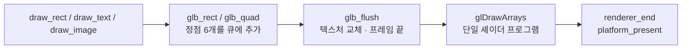
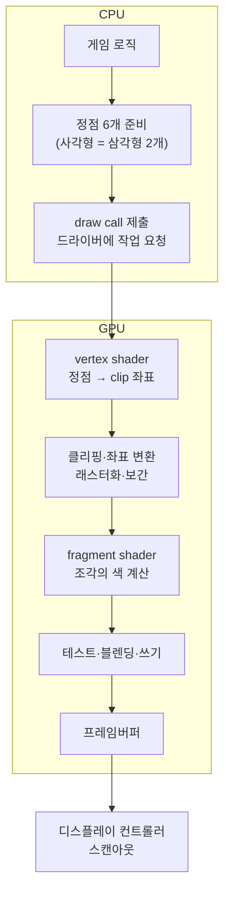
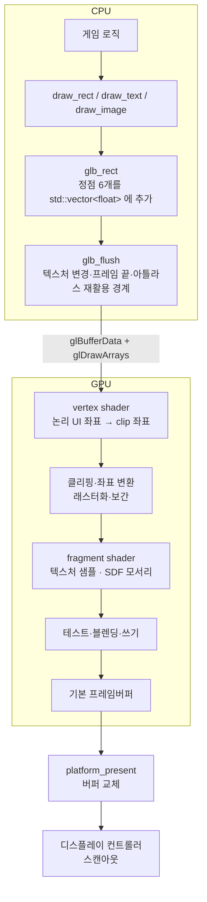
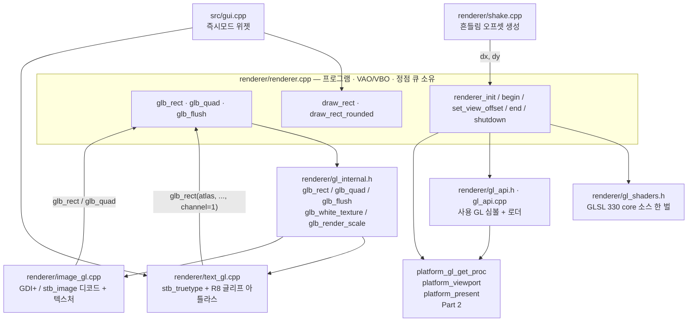
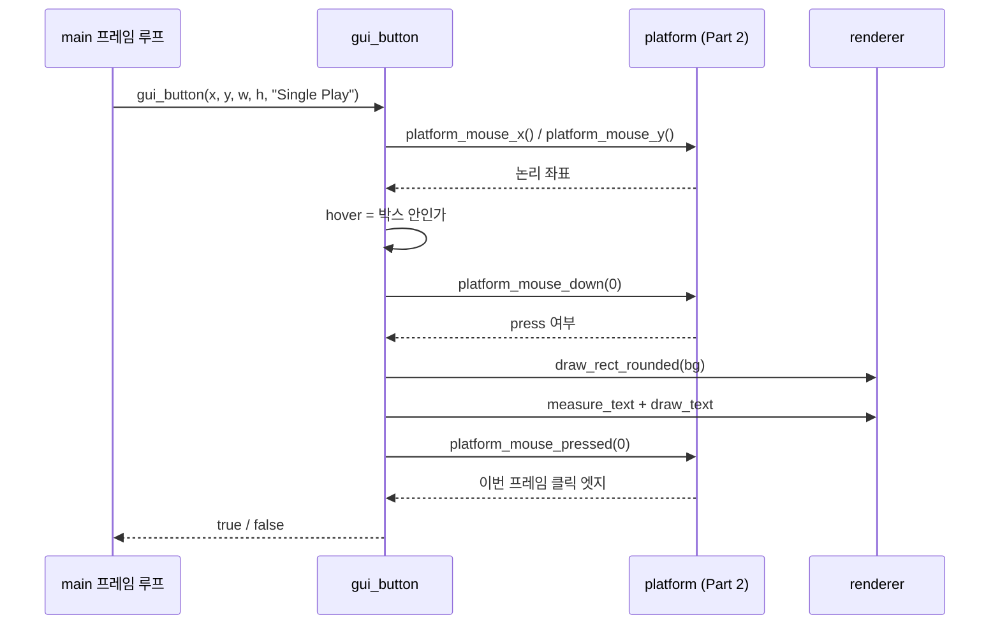
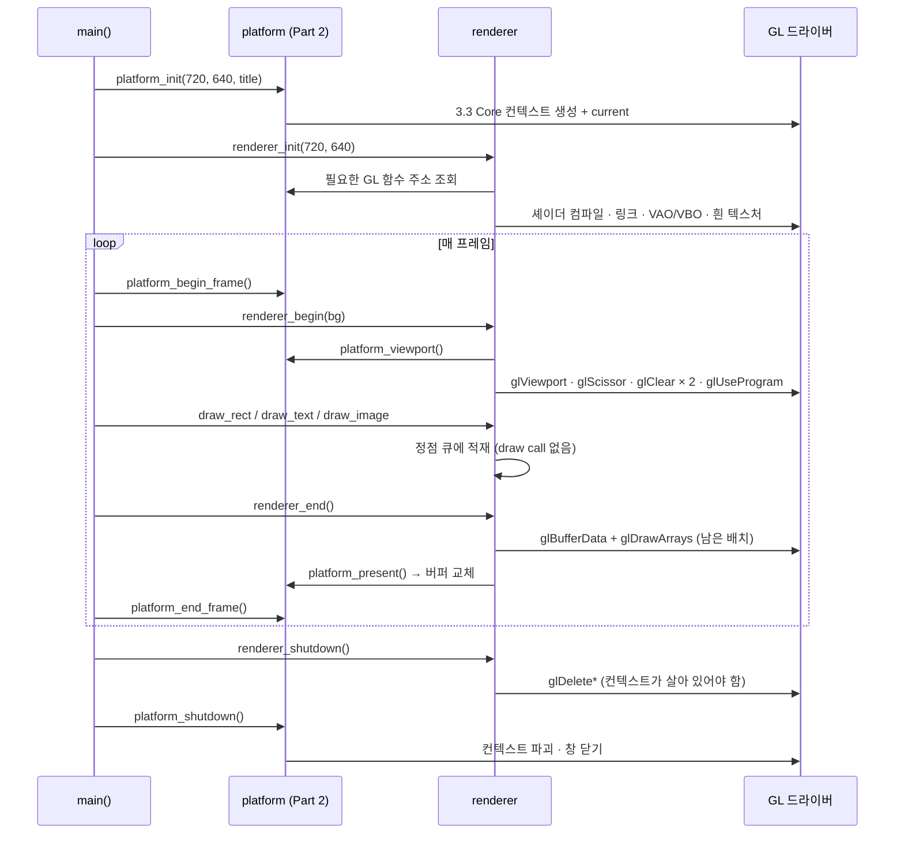
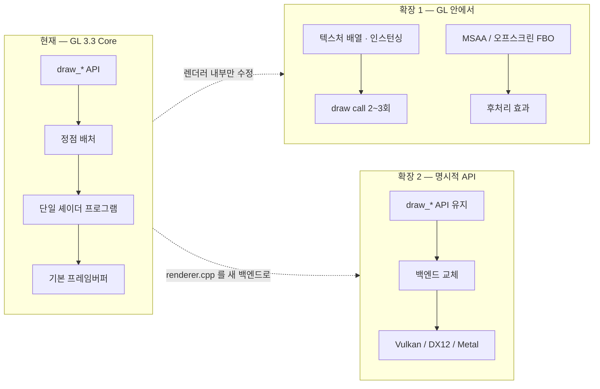

# Part 3: 렌더링과 UI — OpenGL 3.3 Core 2D 렌더러

> **시리즈:** 제로부터 멀티플레이어 테트리스 + RL | [시리즈 목차](./README.md) | **Part 3**

---

> **2026-09-11 현재 코드 반영:** 아바타 프레임·idle 애니메이션·폰트/색상 설정은 `src/presentation.cpp`와 `assets/theme.cfg`로 분리했다. [현재 수정 방법](../customization.md)을 함께 읽는다. `renderer_load_font`는 이제 성공 여부를 bool로 반환한다.

## 이번 Part의 구현 계약

- **선행 상태:** [Part 2](./part2-platform-window-input.md) 의 `platform/platform.h`(`struct Color`, `enum PlatformKey`, `platform_gl_get_proc`, `platform_viewport`, `platform_present`, `platform_mouse_*`)와 두 백엔드 중 하나. 창과 **OpenGL 3.3 Core 컨텍스트**가 만들어져 있고, 논리 좌표 마우스를 읽을 수 있다.
- **이번 Part의 파일:** `core/utf8.h`, `renderer/gl_api.h`, `renderer/gl_api.cpp`, `renderer/gl_shaders.h`, `renderer/gl_internal.h`, `renderer/renderer.h`, `renderer/renderer.cpp`, `renderer/text_gl.cpp`, `renderer/image.h`, `renderer/image_gl.cpp`, `renderer/shake.h`, `renderer/shake.cpp`, `src/gui.h`, `src/gui.cpp`, `src/colors.h`, `src/colors.cpp`, `CMakeLists.txt`.
- **연결점:** `gl_load_functions()` 가 Part 2 의 `platform_gl_get_proc()` 로 GL 함수 주소를 받는다. `renderer_begin()` 이 `platform_viewport()` 로 그릴 사각형을 얻고, `renderer_end()` 가 `platform_present()` 로 버퍼를 교체한다. `gui_hover_rect()` 가 `platform_mouse_x/y()` 를 읽는다. 반대 방향 의존은 없다 — 플랫폼 계층은 렌더러를 모른다.
- **완료 게이트:** 이 장 말미의 `part3_render_demo` 를 빌드해 실행. 한 화면에서 사각형·둥근 사각형 안티앨리어싱·알파 0/128/255·텍스트 측정·글리프 아틀라스·이미지·tint·회전·view offset·레터박스·GUI 위젯이 전부 눈으로 확인된다.

`tetris` 타깃은 이 시점에도 빌드할 수 없다. `src/main.cpp`, `src/game.cpp`, `net/*.cpp`, `bot/*.cpp`, `meta/http_client.cpp` 가 아직 없기 때문이다. 그래서 완료 게이트는 Part 2 와 같은 방식으로 독자가 만드는 데모 실행 파일이다.

## 이번 장의 목표

이번 장에서는 게임 엔진이나 2D 라이브러리 없이, OpenGL 3.3 Core 위에 2D 렌더러를 직접 만든다. 렌더러가 셰이더 프로그램 하나와 정점 배처 하나를 소유하고 다음 기능을 제공한다.

- 배경 clear 와 레터박스 뷰포트
- 사각형과 둥근 사각형 (모서리는 조각 셰이더의 SDF)
- straight-alpha source-over 블렌딩
- TTF 글리프 래스터화와 GPU 글리프 아틀라스
- RGBA 이미지 텍스처, 확대, tint, 회전
- 화면 흔들림용 view offset
- 즉시모드 GUI 위젯
- Part 2 플랫폼 계층을 통한 present

만드는 것은 **드라이버 위의 얇은 2D 파이프라인**이다. GPU 드라이버나 커널을 만들지 않고, 창과 컨텍스트 생성은 Win32 또는 SDL2 에 맡긴다. 학습 범위는 "그리기 명령이 삼각형이 되고, 삼각형이 픽셀이 되는 과정 중 우리가 책임지는 부분" 이다.


```mermaid
flowchart LR
    D["draw_rect / draw_text / draw_image"] --> Q["glb_rect / glb_quad<br/>정점 6개를 큐에 추가"]
    Q --> F["glb_flush<br/>텍스처 교체 · 프레임 끝"]
    F --> G["glDrawArrays<br/>단일 셰이더 프로그램"]
    G --> P["renderer_end<br/>platform_present"]
```

## 1. 왜 엔진 없이 2D 렌더러를 직접 만드는가

이 결정은 취향이 아니라 트레이드오프의 결과다. 실제 후보는 다섯이었다.

| 선택지 | 얻는 것 | 잃는 것 |
|---|---|---|
| 완성형 엔진의 스프라이트 시스템 | 배칭·아틀라스·셰이더가 전부 준비돼 있고 에디터로 배치까지 | 픽셀이 만들어지는 과정을 볼 수 없다. [Part 0](./part0-project-setup.md) 에서 이미 제외한 선택지 |
| 즉시 그리기 방식의 기성 2D 렌더링 라이브러리 | 즉시 동작. 배칭·아틀라스가 이미 최적화됨 | 그리기 명령이 삼각형과 픽셀이 되는 과정이 전부 라이브러리 안에 있다. 이 프로젝트의 학습 목표와 정면 충돌 |
| CPU 소프트웨어 래스터라이저 | 전 과정이 저장소 안 C++ 루프. 디버거로 픽셀 하나를 따라갈 수 있다 | 창을 키우는 순간 비용이 면적에 비례해 늘고, 확대된 글자가 뭉갠다. 안티앨리어싱과 진짜 VSync 가 없다 |
| Vulkan / DirectX 12 | 명시적 동기화·다중 큐·메모리 관리를 직접 제어 | 스왑체인·디스크립터·동기화·검증 계층을 먼저 설계해야 해 작은 2D 게임의 학습 범위를 크게 넘어간다 |
| **OpenGL 3.3 Core (이 프로젝트)** | 작은 2D 렌더러로 GPU 래스터화에 도달하며 셰이더·텍스처·배칭이라는 핵심 개념이 모두 등장 | 최신 API의 명시적 제어권은 없다. 드라이버가 감추는 부분(동기화·메모리 배치)은 그대로 감춰진다 |

결정적이었던 것은 셋이다.

**API 표면이 작다.** 게임 코드는 `draw_rect`, `draw_rect_rounded`, `draw_text`, `measure_text`와 이미지 draw API만 본다. 이 정도 표면을 GPU 위에 올리는 데 필요한 핵심은 공용 셰이더, 정점 버퍼, 텍스처 배치다. 구체적인 함수 개수가 바뀌어도 “게임 코드가 GL 객체를 직접 보지 않는다”는 경계는 유지된다.

**개념이 그대로 드러난다.** 정점 형식을 직접 정하고, NDC 변환을 직접 쓰고, 블렌드 함수를 직접 고르고, 배칭이 언제 끊기는지 직접 결정한다. 라이브러리를 쓰면 이 결정들이 전부 남의 코드 안에 있다. 이 시리즈는 그 결정들을 보여주는 것이 목적이다.

**이식 비용이 창 생성 코드로 한정된다.** OpenGL 3.3 Core 는 Windows·Linux·macOS 에서 모두 돈다. 셰이더 소스 한 벌, 렌더러 코드 한 벌이면 세 플랫폼이 같은 그림을 낸다. 플랫폼별로 갈리는 것은 "컨텍스트를 어떻게 만드느냐" 와 "함수 주소를 어떻게 받느냐" 두 가지뿐이고, 둘 다 Part 2 의 플랫폼 계층에 갇혀 있다.

포기한 것도 분명히 적어 둔다. 렌더 결과가 드라이버와 하드웨어에 따라 미세하게 달라질 수 있고, OpenGL 3.3을 지원하는 컨텍스트와 드라이버가 새 런타임 요구사항이 된다. 소프트웨어 래스터라이저였다면 프레임버퍼 경로를 애플리케이션이 전부 통제할 수 있었다. 이 손실은 **게임 로직의 결정성과는 분리되어 있다.** `SimGame`은 GL 타입이나 렌더 상태를 해시에 넣지 않는다.

## 2. 래스터화는 누가 하는가

CPU는 정점·상태·명령을 준비하고 GL 구현이 정점 처리·래스터화·조각 처리·프레임버퍼 갱신을 수행한다. 보통 하드웨어 가속 구현에서는 이 경로의 많은 부분을 GPU가 맡지만, CPU에서 실행하는 소프트웨어 GL 구현도 있다. API의 책임 경계와 실행 장치의 종류를 구분해야 한다.

### 2.1 래스터화란 무엇인가

**도형이 덮는 샘플을 정하고 조각 처리에 필요한 값을 만드는 과정**이다. 정점 세 개로 삼각형을 지정해도 셰이더가 픽셀마다 정점을 새로 만드는 것은 아니다. 창 좌표의 삼각형을 샘플 격자와 비교하고, 정점 속성을 그 위치에 맞게 보간한다.

기본 단일 샘플 설정에서 픽셀 `(x,y)`의 중심은 연속 창 좌표 `(x+0.5,y+0.5)`다. 삼각형의 세 변을 기준으로 이 점이 안쪽인지 판정하는 CPU 모형을 만들 수 있다. 다만 경계 위 샘플의 소유권·유한 정밀도·멀티샘플링까지 재현하지 않은 모형을 GL 전체 규칙과 같다고 하면 안 된다.

**프래그먼트(fragment, 조각)는 최종 픽셀 값이 아니다.** 한 픽셀에 여러 도형의 조각이 도달할 수 있고, 조각이 discard되거나 테스트에서 탈락할 수 있다. 살아남은 색상도 블렌딩·쓰기 마스크 등을 거쳐 저장된다. 조각 셰이더 호출 횟수 역시 보이는 픽셀 수를 세는 방법으로 단정하지 않는다.

### 2.2 보통 게임의 한 프레임


```mermaid
graph TB
    subgraph CPUSIDE["CPU"]
        A["게임 로직"] --> B["정점 6개 준비<br/>(사각형 = 삼각형 2개)"]
        B --> C["draw call 제출<br/>드라이버에 작업 요청"]
    end
    subgraph GPUSIDE["GPU"]
        D["vertex shader<br/>정점 → clip 좌표"] --> E["클리핑·좌표 변환<br/>래스터화·보간"]
        E --> F["fragment shader<br/>조각의 색 계산"]
        F --> T["테스트·블렌딩·쓰기"]
        T --> G["프레임버퍼"]
    end
    C --> D
    G --> H["디스플레이 컨트롤러<br/>스캔아웃"]
```

이 프로젝트의 draw 경로는 CPU에서 완성 이미지를 채우는 대신 정점과 그리기 요청을 전달한다. 그렇다고 CPU가 픽셀 데이터를 전혀 다루지 않는 것은 아니다. 이미지 업로드·글리프 생성·필요한 readback은 별도 CPU 작업이다. 또한 draw의 반환이 실제 그리기 완료를 보장하지 않는다.

OpenGL 3.3의 이 경로에서는 래스터화 단계를 사용자 셰이더로 교체하지 않는다. CPU 래스터라이저를 직접 만들 수 없다는 뜻은 아니며, GL 구현 내부가 반드시 같은 하드웨어 알고리즘이라는 뜻도 아니다. 그림은 책임 관계를 보여 주며 드라이버의 물리적 실행 순서나 디스플레이까지의 모든 단계를 나타내지는 않는다.

### 2.3 이 프로젝트의 한 프레임


```mermaid
graph TB
    subgraph CPUONLY["CPU"]
        A["게임 로직"] --> B["draw_rect / draw_text / draw_image"]
        B --> C["glb_rect<br/>정점 6개를 std::vector&lt;float&gt; 에 추가"]
        C --> D["glb_flush<br/>텍스처 변경·프레임 끝·아틀라스 재활용 경계"]
    end
    subgraph GPUSIDE["GPU"]
        E["vertex shader<br/>논리 UI 좌표 → clip 좌표"] --> F["클리핑·좌표 변환<br/>래스터화·보간"]
        F --> G["fragment shader<br/>텍스처 샘플 · SDF 모서리"]
        G --> T["테스트·블렌딩·쓰기"]
        T --> H["기본 프레임버퍼"]
    end
    D -->|"glBufferData + glDrawArrays"| E
    H --> I["platform_present<br/>버퍼 교체"]
    I --> J["디스플레이 컨트롤러<br/>스캔아웃"]
```

두 그림의 구조는 같다. 이 프로젝트가 추가로 하는 일은 가운데 한 칸 — **draw call 을 즉시 내지 않고 정점을 모았다가 한꺼번에 낸다** — 뿐이다. 그 한 칸이 이 렌더러 설계의 절반을 차지한다.

| | 이전 소프트웨어 구현 | 현재 |
|---|---|---|
| GPU 가 받는 것 | 완성된 이미지 한 장 | 정점 · 셰이더 · 그리기 명령 |
| 래스터화 주체 | 애플리케이션의 CPU 루프 | GL 구현의 래스터화 단계, 이어서 별도의 조각 셰이더 |
| 프레임버퍼 관리 | 애플리케이션의 시스템 RAM 배열 | GL 구현이 관리하는 기본 프레임버퍼 |
| 완료 경계 | CPU 이미지 쓰기 루프가 끝나면 배열 갱신 완료 | draw 반환만으로 완료 보장 없음. 필요 시 명시적 동기화나 CPU readback으로 관찰 |
| 상태 모델 | 없음. 함수 인자가 전부 | 전역 상태 머신(바인딩된 프로그램 · 텍스처 · VAO · 블렌드 모드) |
| 창을 키우면 | 픽셀 수가 면적에 비례해 늘고 확대가 흐릿하다 | 정점 좌표가 실수라 GPU 가 창 해상도로 다시 래스터화한다 |

마지막에서 두 번째 줄이 실전에서 특히 크다. GL 은 거대한 전역 상태 머신이라, 어딘가에서 텍스처를 바인딩하고 되돌리지 않으면 **한참 뒤 엉뚱한 그리기가 깨진다.** 이 렌더러가 상태 변경 지점을 극도로 줄인 이유이기도 하다 — 프로그램은 하나, VAO 도 하나, 바뀌는 것은 바인딩된 텍스처와 유니폼 둘뿐이다.

### 2.4 "GPU" 라는 이름이 가리키는 두 하드웨어

여기서 혼동이 자주 생긴다. 하나의 칩 안에 성격이 전혀 다른 두 블록이 있다.

| 블록 | 하는 일 | 이 프로젝트가 쓰는가 |
|---|---|---|
| **연산 유닛** (셰이더 코어 수천 개) | 래스터화, 셰이더 실행, 범용 병렬 계산 | **쓴다. 이 장이 다루는 대상이다** |
| **디스플레이 컨트롤러** (스캔아웃 엔진) | 메모리를 주기적으로 읽어 픽셀 클럭 · HSYNC · VSYNC 신호 생성 | **쓴다. 안 쓸 방법이 없다** |

두 블록은 독립적이다. 창을 띄우는 모든 프로그램이 뒤쪽 경로를 지난다 — 터미널도 마찬가지다. 반면 앞쪽 연산 유닛은 쓰지 않을 수도 있고, 실제로 이 렌더러의 이전 버전은 쓰지 않았다.

이 구분이 하드웨어 시장에도 그대로 나타난다. 내장 그래픽을 뺀 일부 데스크톱 CPU 모델은 **모니터를 꽂을 수 없다.** 그때 그래픽 카드가 필요한 이유는 연산이 아니라 디스플레이 컨트롤러 때문이다. 반대로 서버 보드에 흔한 원격 관리 컨트롤러는 3D 기능이 거의 없는 순수 프레임버퍼 장치라 화면은 나오지만 게임은 못 돌린다.

그리고 **화면에 내보내지 않는다면 그래픽 하드웨어는 아예 필요 없다.** 이 저장소의 `sim_hash_dump` 와 `tetris_relay` 가 그 증거다. 두 타깃은 `renderer/` 를 링크조차 하지 않으므로 GL 드라이버가 없는 헤드리스 서버에서 그대로 빌드되고 실행된다. 이 사실은 이 장이 GPU 로 옮겨간 뒤에도 변하지 않는다 — 렌더러는 게임 클라이언트에만 붙는다.

### 2.5 CPU 로 전부 하면 어떻게 되는가 — 그리고 왜 그만뒀는가

이 렌더러는 한동안 실제로 소프트웨어 래스터라이저였다. 720×640 `uint32_t` 배열을 직접 소유하고, 사각형은 행 단위 `std::fill`, 반투명은 픽셀마다 read-modify-write, 글자는 stb_truetype 의 coverage 비트맵을 픽셀 단위로 합성하고, 회전 이미지는 목적지 픽셀에서 원본 좌표를 역변환해 샘플링했다.

**예시(실제 저장소에는 없음)**

```cpp
static void blend_surface(int x, int y, Color c, uint8_t coverage)
{
    if ((unsigned)x >= (unsigned)s_screen_w ||
        (unsigned)y >= (unsigned)s_screen_h) return;

    const unsigned a = (unsigned(c.a) * unsigned(coverage) + 127u) / 255u;
    if (a == 0) return;

    uint32_t& dst = s_pixels[(size_t)y * (size_t)s_screen_w + (size_t)x];
    if (a == 255) {
        dst = 0xFF000000u | (uint32_t(c.r) << 16) |
              (uint32_t(c.g) << 8) | uint32_t(c.b);
        return;
    }

    const unsigned inv = 255u - a;
    const unsigned dr = (dst >> 16) & 0xFFu;
    const unsigned dg = (dst >> 8) & 0xFFu;
    const unsigned db = dst & 0xFFu;
    const unsigned r = (unsigned(c.r) * a + dr * inv + 127u) / 255u;
    const unsigned g = (unsigned(c.g) * a + dg * inv + 127u) / 255u;
    const unsigned b = (unsigned(c.b) * a + db * inv + 127u) / 255u;
    dst = 0xFF000000u | (r << 16) | (g << 8) | b;
}
```

이것이 그 시절 렌더러의 심장이었다. 위 코드는 과거 커밋에서 가져온 것이고 현재 저장소에는 없다. 같은 자리에 지금 있는 것이 이 함수다.

**현재 소스 발췌 — `renderer/renderer.cpp`**

```cpp
void draw_rect(int x, int y, int w, int h, Color c)
{
    glb_rect(s_white, (float)x, (float)y, (float)w, (float)h,
             0.0f, 0.0f, 1.0f, 1.0f, c, 0.0f, 0.0f);
}
```

픽셀 대신 정점을 만든다. 이 함수가 반환돼도 **아직 아무것도 그려지지 않았다.**

소프트웨어 경로가 나빴던 것은 아니다. 고정된 720×640 논리 해상도에서는 단순한 불투명 사각형 합성이 충분히 가벼웠고, 전 화면 알파 합성처럼 모든 픽셀을 읽고 다시 쓰는 작업이 상대적으로 비쌌다. 이 비교는 특정 과거 측정값보다 **비용이 픽셀 면적에 비례한다**는 구조를 이해하는 데 의미가 있다.

문제는 **논리 해상도에 고정돼 있을 수 없다** 는 점이었다. 창을 키우는 순간 네 가지가 한꺼번에 무너진다.

| 무너지는 것 | 소프트웨어 경로에서의 결과 |
|---|---|
| 비용 | 프레임버퍼를 창 크기로 만들면 픽셀 수가 면적에 비례한다. 2430×2160 프리셋은 460,800 → 5,248,800 픽셀로 **11배**다. 논리 크기로 그린 뒤 확대하면 비용은 아끼지만 그림이 흐릿해진다 |
| 텍스트 | 글리프는 특정 픽셀 크기로 한 번 구워진 비트맵이다. 논리 크기로 굽고 3배로 늘리면 그 배율만큼 뭉갠다 |
| 모서리 | 둥근 사각형 경계가 1픽셀 hard edge 였다. 안티앨리어싱을 넣으려면 경계 픽셀마다 coverage 를 따로 계산해야 한다 |
| VSync | 완성된 이미지를 창에 복사하는 방식이라 진짜 VSync 가 아니었다. `SDL_Delay` 로 60Hz 에 맞추는 소프트웨어 페이싱은 tearing 을 막지 못한다 |

GPU 경로는 CPU가 매번 큰 픽셀 배열을 확대 복사하는 부담을 줄인다. 도형의 해상도, 글리프를 굽는 배율, 모서리 경계 완화는 각자 맞춰야 하며 정점이 실수라는 이유만으로 모든 경계가 선명해지는 것은 아니다. 버퍼 교체의 동기화는 swap interval의 지원·적용과 OS 경로에 달려 있다. 같은 정점 수라면 CPU의 도형 제출량은 비슷할 수 있지만, 큰 창에서 GPU 픽셀 작업이 늘고 대기가 CPU 호출로 전파될 수 있으므로 CPU 경과 시간까지 항상 일정하다고 단정하지 않는다.

한 가지 사실을 덧붙여 둔다. 이 저장소에는 그 이전에도 OpenGL 렌더러가 있었고, 그것은 **macOS 에서 돌지 않았다.** 컨텍스트를 만들 때 Core 프로파일을 명시적으로 요구하지 않아 드라이버 기본 호환 컨텍스트를 받았고, `#version 130` 셰이더가 Windows/Linux 에서는 우연히 통과했지만 macOS 의 Core 프로파일은 그것을 거부한다. 지금 버전이 세 플랫폼에서 **같은 3.3 Core 프로파일과 같은 `#version 330 core` 셰이더 한 벌**을 쓰는 것은 그 실패에서 나온 요구사항이다.

## 3. 왜 OpenGL 3.3 Core 인가

GPU 로 가기로 했다면 다음 질문은 "어느 API 로" 다. 2020년대에 새 프로젝트를 시작하면서 OpenGL 을 고르는 것은 설명이 필요한 선택이다.

**Vulkan / DirectX 12 는 이 프로젝트의 문제를 풀지 않는다.** 두 API 의 존재 이유는 명시적 제어다. 메모리 힙을 직접 고르고, 파이프라인 배리어로 동기화를 직접 걸고, 커맨드 버퍼를 여러 스레드에서 동시에 기록한다. 그 대가로 삼각형 하나를 화면에 띄우기까지 인스턴스·물리 디바이스·큐 패밀리·스왑체인·이미지 뷰·렌더 패스·프레임버퍼·디스크립터 셋 레이아웃·파이프라인 레이아웃·그래픽스 파이프라인·커맨드 풀·세마포어·펜스를 만들어야 한다. 이 게임이 한 프레임에 내는 draw call 은 열 개 안팎이다. **제어할 것이 없는 곳에서 제어권을 사면 복잡도만 남는다.**

**세 플랫폼이 같은 코드를 쓰는 것이 중요하다.** DirectX 12 는 Windows 전용이다. Vulkan 은 macOS 에서 별도 변환 계층을 거쳐야 한다. Metal 을 직접 쓰면 macOS 전용 백엔드가 하나 더 늘어난다. 이 프로젝트는 Windows·Linux·macOS 를 모두 대상으로 하고, 렌더러 코드를 **한 벌만** 유지하는 것이 유지보수 예산의 전제였다. OpenGL 3.3 Core 는 세 플랫폼에서 같은 프로파일, 같은 GLSL 버전, 같은 셰이더 소스로 동작한다.

**왜 하필 3.3 인가.** 위로도 아래로도 이유가 있다.

| 버전 | 상황 |
|---|---|
| 2.1 이하 | 고정 기능 파이프라인 시대. VAO 가 코어가 아니고 GLSL 문법도 다르다. 배울 가치가 낮다 |
| 3.0~3.2 | 코어/호환 프로파일 분리가 진행 중이던 과도기. 드라이버 구현 편차가 크다 |
| **3.3** | VAO · 인스턴싱 · 셰이더 `layout(location=)` 이 전부 코어. 2010년 이후 GPU 는 사실상 전부 지원 |
| 4.1 | macOS Core 프로파일의 **상한**. Apple 은 4.1 에서 OpenGL 지원을 멈췄다 |
| 4.3+ | 컴퓨트 셰이더·디버그 출력이 생기지만 **macOS 에서 쓸 수 없다** |

즉 세 플랫폼 공통 집합의 천장이 4.1 이고, 그 아래에서 "필요한 기능이 전부 코어에 있으면서 가장 넓게 깔린" 지점이 3.3 이다. 이 렌더러가 4.1 까지 올라가서 얻을 것은 없다 — 쓰는 기능이 정점 버퍼, 텍스처, 셰이더 프로그램이 전부다.

**Core 프로파일을 명시적으로 요구하는 것도 선택의 일부다.** 호환(compatibility) 프로파일을 받으면 `glBegin`/`glEnd` 같은 고정 기능이 함께 딸려 와서, 실수로 옛날 방식 코드를 섞어도 일부 플랫폼에서는 실행된다. Core 프로파일은 그런 혼용을 초기에 드러내고 Windows와 macOS의 지원 경계를 맞춘다.

컨텍스트를 실제로 만드는 코드는 [Part 2](./part2-platform-window-input.md) 의 플랫폼 계층에 있다. 요약하면 이렇다.

- **SDL 백엔드**: `SDL_GL_SetAttribute` 로 `CONTEXT_PROFILE_CORE`, MAJOR 3, MINOR 3, DOUBLEBUFFER 1 을 건 뒤 `SDL_WINDOW_OPENGL | SDL_WINDOW_RESIZABLE` 창을 만들고 `SDL_GL_CreateContext`. present 는 `SDL_GL_SwapWindow`, VSync 는 `SDL_GL_SetSwapInterval(0|1)`.
- **Win32 백엔드**: 두 단계다. `PIXELFORMATDESCRIPTOR` → `ChoosePixelFormat` → `SetPixelFormat` 으로 레거시 컨텍스트를 만들어 current 로 만든 뒤, **그 상태에서만 조회되는** `wglCreateContextAttribsARB` 로 진짜 3.3 Core 를 만들고 레거시를 지운다. 이 2단계를 건너뛰면 드라이버 기본 호환 컨텍스트가 나온다.

렌더러는 그 위에서 시작한다. 이 장의 코드는 "컨텍스트가 이미 current 다" 를 전제로 한다.

## 4. 함수 포인터를 직접 로드하기

컨텍스트가 생겼다고 `glCreateShader` 를 바로 부를 수 있는 것은 아니다. **Windows 의 `opengl32.dll` 은 OpenGL 1.1 까지만 export 한다.** 1995년 Windows 95 OSR2 시절의 ABI 가 그대로 남아 있고, 그 이후 20여 년의 GL 함수는 전부 드라이버 DLL 안에 있다. 링커는 `glCreateShader` 를 찾지 못한다. 런타임에 `wglGetProcAddress` 로 주소를 받아야 한다.

Linux와 macOS에서는 지원되는 함수 일부를 라이브러리 심볼로 직접 연결하는 방식도 가능하지만, 실제 제공 범위는 API와 런타임에 따라 확인해야 한다. 그런데 그렇게 하면 플랫폼마다 다른 선언과 다른 빌드 설정이 필요해진다. **세 플랫폼이 같은 조회 경로를 타게 하는 편이 훨씬 단순하다.** 그래서 이 렌더러는 어디서든 함수 포인터를 런타임에 받는다.

기성 GL 로더 라이브러리를 쓰면 이 일을 대신해 준다. 쓰지 않은 이유는 의존성 하나를 아끼려는 것이 아니라, **"GL 함수가 어디서 오는가"가 이 프로젝트에서 감출 이유가 없는 지식이기 때문이다.** 렌더러가 실제로 쓰는 심볼만 X-매크로 한 목록에 두므로 API가 늘어도 선언·정의·로딩 검사를 함께 갱신할 수 있다.

### 4.1 타입과 상수를 직접 선언한다

`GL/gl.h` 를 포함하지 않는다. 시스템 헤더는 플랫폼마다 버전이 다르고, Windows 의 것은 1.1 상수만 들어 있다. 필요한 것만 직접 적는다.

**현재 소스 발췌 — `renderer/gl_api.h`**

```cpp
using GLenum     = unsigned int;
using GLbitfield = unsigned int;
using GLuint     = unsigned int;
using GLint      = int;
using GLsizei    = int;
using GLfloat    = float;
using GLboolean  = unsigned char;
using GLchar     = char;
using GLintptr   = std::ptrdiff_t;
using GLsizeiptr = std::ptrdiff_t;
```

상수 값은 GL 규격에 정의돼 있다. 직접 적는 경우 오타와 타입·호출 규약 불일치를 검토해야 하며, 상수 이름이 존재한다고 실행 중인 컨텍스트가 그 기능을 지원한다는 뜻은 아니다.

**현재 소스 발췌 — `renderer/gl_api.h`**

```cpp
#define GL_FALSE                          0
#define GL_TRUE                           1
#define GL_TRIANGLES                      0x0004
#define GL_UNSIGNED_BYTE                  0x1401
#define GL_FLOAT                          0x1406
#define GL_RGBA                           0x1908
#define GL_RED                            0x1903
#define GL_R8                             0x8229
#define GL_RGBA8                          0x8058
#define GL_TEXTURE_2D                     0x0DE1
#define GL_TEXTURE0                       0x84C0
#define GL_TEXTURE_MAG_FILTER             0x2800
#define GL_TEXTURE_MIN_FILTER             0x2801
#define GL_TEXTURE_WRAP_S                 0x2802
#define GL_TEXTURE_WRAP_T                 0x2803
#define GL_NEAREST                        0x2600
#define GL_LINEAR                         0x2601
#define GL_CLAMP_TO_EDGE                  0x812F
#define GL_UNPACK_ALIGNMENT               0x0CF5
#define GL_BLEND                          0x0BE2
#define GL_SRC_ALPHA                      0x0302
#define GL_ONE_MINUS_SRC_ALPHA            0x0303
#define GL_ONE                            1
#define GL_COLOR_BUFFER_BIT               0x00004000
#define GL_ARRAY_BUFFER                   0x8892
#define GL_STREAM_DRAW                    0x88E0
#define GL_VERTEX_SHADER                  0x8B31
#define GL_FRAGMENT_SHADER                0x8B30
#define GL_COMPILE_STATUS                 0x8B81
#define GL_LINK_STATUS                    0x8B82
#define GL_INFO_LOG_LENGTH                0x8B84
#define GL_SCISSOR_TEST                   0x0C11
#define GL_MAX_TEXTURE_SIZE               0x0D33
#define GL_VERSION                        0x1F02
#define GL_RENDERER                       0x1F01
#define GL_NO_ERROR                       0
```

이 목록의 길이가 곧 이 렌더러가 쓰는 GL 기능의 전부다. 픽셀 포맷 두 개(`GL_RGBA8`, `GL_R8`), 필터 두 개, 블렌드 인자 두 개, 버퍼 하나, 셰이더 스테이지 두 개. 3D 렌더링에 필요한 깊이 버퍼·컬링·스텐실은 한 줄도 없다.

함수 포인터에는 반환형과 매개변수 외에 **호출 규약**도 맞아야 한다. 아래 매크로는 32비트 Windows에서 필요한 `__stdcall`을 명시하고 다른 플랫폼에서는 비워 둔다. 선언·정의·주소 변환이 같은 타입을 사용해야 한다. x64에서 문제없이 실행된 사실만으로 32비트 호출 규약이 맞다고 판단하면 안 된다. [SDL2의 함수 조회 계약](https://wiki.libsdl.org/SDL2/SDL_GL_GetProcAddress)도 APIENTRY 규약을 요구한다.

**현재 소스 발췌 — `renderer/gl_api.h`**

```cpp
#if defined(_WIN32)
#define TETRIS_GL_APIENTRY __stdcall
#else
#define TETRIS_GL_APIENTRY
#endif
```

### 4.2 X-매크로 테이블

함수 하나를 추가할 때 손대야 할 곳이 세 군데다. 포인터 선언(`extern`), 포인터 정의, 그리고 로딩 코드. 셋을 손으로 맞추면 언젠가 어긋난다. 그래서 목록을 **한 번만** 적고 세 번 펼친다.

**현재 소스 발췌 — `renderer/gl_api.h`**

```cpp
// ─── 함수 포인터 ──────────────────────────────────────────────────────────────
// 이름 앞에 gl_ 을 붙여 시스템 헤더의 gl* 심볼과 충돌하지 않게 한다.

#define GL_FUNCS(X)                                                            \
    X(void,   Enable,                 (GLenum))                                \
    X(void,   Disable,                (GLenum))                                \
    X(void,   BlendFunc,              (GLenum, GLenum))                        \
    X(void,   Viewport,               (GLint, GLint, GLsizei, GLsizei))        \
    X(void,   Scissor,                (GLint, GLint, GLsizei, GLsizei))        \
    X(void,   ClearColor,             (GLfloat, GLfloat, GLfloat, GLfloat))    \
    X(void,   Clear,                  (GLbitfield))                            \
    X(void,   DrawArrays,             (GLenum, GLint, GLsizei))                \
    X(GLenum, GetError,               (void))                                  \
    X(const unsigned char*, GetString,(GLenum))                                \
    X(void,   GetIntegerv,            (GLenum, GLint*))                         \
    X(void,   PixelStorei,            (GLenum, GLint))                         \
    X(GLuint, CreateShader,           (GLenum))                                \
    X(void,   ShaderSource,           (GLuint, GLsizei, const GLchar* const*, const GLint*)) \
    X(void,   CompileShader,          (GLuint))                                \
    X(void,   GetShaderiv,            (GLuint, GLenum, GLint*))                \
    X(void,   GetShaderInfoLog,       (GLuint, GLsizei, GLsizei*, GLchar*))    \
    X(void,   DeleteShader,           (GLuint))                                \
    X(GLuint, CreateProgram,          (void))                                  \
    X(void,   AttachShader,           (GLuint, GLuint))                        \
    X(void,   LinkProgram,            (GLuint))                                \
    X(void,   GetProgramiv,           (GLuint, GLenum, GLint*))                \
    X(void,   GetProgramInfoLog,      (GLuint, GLsizei, GLsizei*, GLchar*))    \
    X(void,   UseProgram,             (GLuint))                                \
    X(void,   DeleteProgram,          (GLuint))                                \
    X(GLint,  GetUniformLocation,     (GLuint, const GLchar*))                 \
    X(void,   Uniform1i,              (GLint, GLint))                          \
    X(void,   Uniform2f,              (GLint, GLfloat, GLfloat))               \
    X(void,   GenVertexArrays,        (GLsizei, GLuint*))                      \
    X(void,   BindVertexArray,        (GLuint))                                \
    X(void,   DeleteVertexArrays,     (GLsizei, const GLuint*))                \
    X(void,   GenBuffers,             (GLsizei, GLuint*))                      \
    X(void,   BindBuffer,             (GLenum, GLuint))                        \
    X(void,   BufferData,             (GLenum, GLsizeiptr, const void*, GLenum)) \
    X(void,   DeleteBuffers,          (GLsizei, const GLuint*))                \
    X(void,   VertexAttribPointer,    (GLuint, GLint, GLenum, GLboolean, GLsizei, const void*)) \
    X(void,   EnableVertexAttribArray,(GLuint))                                \
    X(void,   GenTextures,            (GLsizei, GLuint*))                      \
    X(void,   BindTexture,            (GLenum, GLuint))                        \
    X(void,   ActiveTexture,          (GLenum))                                \
    X(void,   TexImage2D,             (GLenum, GLint, GLint, GLsizei, GLsizei, GLint, GLenum, GLenum, const void*)) \
    X(void,   TexSubImage2D,          (GLenum, GLint, GLint, GLint, GLsizei, GLsizei, GLenum, GLenum, const void*)) \
    X(void,   TexParameteri,          (GLenum, GLenum, GLint))                 \
    X(void,   DeleteTextures,         (GLsizei, const GLuint*))

#define GL_DECLARE(ret, name, args) extern ret (TETRIS_GL_APIENTRY *gl_##name) args;
GL_FUNCS(GL_DECLARE)
#undef GL_DECLARE

// 모든 함수 포인터를 채운다. 하나라도 못 받으면 false 와 함께 그 이름을 찍는다.
// platform_gl_get_proc 을 통해 조회하므로 컨텍스트가 current 인 상태여야 한다.
bool gl_load_functions();
```

`GL_FUNCS` 는 **매크로 이름 하나를 인자로 받아 목록의 각 항목에 적용하는 매크로**다. 이 패턴을 X-매크로라고 부른다. 여기서는 `GL_DECLARE` 를 넘겨 렌더러가 요구하는 OpenGL 진입점의 `extern` 선언을 만든다.

이름 앞에 `gl_` 을 붙인 것(`gl_CreateShader`)이 사소해 보이지만 중요하다. 어딘가에서 시스템 GL 헤더가 함께 포함되면 `glCreateShader` 라는 이름이 충돌한다. 접두사를 바꿔 두면 그런 일이 없고, 동시에 **코드를 읽을 때 "이건 런타임에 받은 포인터다" 가 눈에 보인다.**

### 4.3 로더

같은 목록을 두 번 더 펼친다. 한 번은 포인터 정의로, 한 번은 로딩 코드로.

**현재 소스 발췌 — `renderer/gl_api.cpp`**

```cpp
#define GL_DEFINE(ret, name, args) ret (TETRIS_GL_APIENTRY *gl_##name) args = nullptr;
GL_FUNCS(GL_DEFINE)
#undef GL_DEFINE

bool gl_load_functions()
{
    bool ok = true;

    // 조회 실패를 한 번에 모아 보여준다. 첫 실패에서 멈추면 드라이버가
    // 무엇을 얼마나 빠뜨렸는지 알 수 없어 원인 파악이 느려진다.
#define GL_LOAD(ret, name, args)                                               \
    gl_##name = reinterpret_cast<decltype(gl_##name)>(                         \
        platform_gl_get_proc("gl" #name));                                    \
    if (!gl_##name) {                                                          \
        std::fprintf(stderr, "[GL] missing entry point: gl%s\n", #name);       \
        ok = false;                                                            \
    }
    GL_FUNCS(GL_LOAD)
#undef GL_LOAD

    if (!ok) {
        std::fprintf(stderr,
                     "[GL] driver does not expose the OpenGL 3.3 Core entry "
                     "points this renderer needs.\n");
        return false;
    }

    const unsigned char* ver = gl_GetString(GL_VERSION);
    const unsigned char* ren = gl_GetString(GL_RENDERER);
    std::fprintf(stderr, "[GL] %s | %s\n",
                 ver ? (const char*)ver : "(unknown version)",
                 ren ? (const char*)ren : "(unknown renderer)");
    return true;
}
```

`"gl" #name` 이 전처리기 문자열화다. `Enable` 이라는 토큰이 `"gl" "Enable"` 로 이어 붙어 `"glEnable"` 이 된다. 저장소에는 함수 이름이 **한 번만** 적혀 있고, 나머지는 전부 여기서 파생된다.

**첫 실패에서 멈추지 않는 것이 이 함수의 설계 포인트다.** 흔한 구현은 `if (!fn) return false;` 로 즉시 빠져나온다. 그러면 사용자가 보내온 로그에 `glCreateShader 없음` 한 줄만 남는다. 그 한 줄로는 "컨텍스트 생성 자체가 실패한 것"과 "특정 진입점만 빠진 것"을 구별할 수 없다. 요구 목록 전체를 검사하면 전부 조회되지 않는 경우와 일부만 빠진 경우를 로그만으로 나눌 수 있다.

주소가 NULL이면 사용할 수 없지만, NULL이 아니라고 지원이 증명되지는 않는다. 일부 구현은 지원되지 않는 이름에도 비어 있지 않은 주소를 돌려줄 수 있다. 현재 렌더러는 먼저 3.3 Core 컨텍스트를 확보하고 그 버전에 포함된 함수 목록을 조회한다. 확장을 추가하면 확장 지원 여부도 별도로 검사해야 한다. 컨텍스트를 다시 만들 때는 포인터도 다시 조회하며 이전 세션의 주소를 계속 쓰지 않는다.

`decltype(gl_##name)`은 선언에 사용한 호출 규약까지 보존하는 포인터 타입이다. `void*`에서 함수 포인터로의 변환은 SDL/운영체제의 구현 계약을 사용하는 부분이며, 모든 ISO C++ 구현에서 같은 방식으로 이식 가능하다고 일반화하지 않는다.

로딩에 성공하면 버전과 렌더러 이름을 찍는다. 이 한 줄이 실전에서 가장 자주 쓰이는 진단 도구다.

```text
[GL] 3.3 (Core Profile) Mesa <드라이버 버전> | <드라이버가 보고한 렌더러 이름>
```

두 번째 필드가 `llvmpipe` 나 `softpipe` 로 나오면 **하드웨어 가속이 아니라 Mesa 의 소프트웨어 GL 구현으로 떨어진 것이다.** 화면은 정상적으로 나오지만 프레임이 느려진다. 반대로 실제 GPU 이름이 나오면 하드웨어가 진짜로 그리고 있다는 뜻이다 — 이 글을 쓰며 확인한 환경에서는 십수 년 된 저사양 내장 그래픽도 이 조건을 통과했다. 이 렌더러가 요구하는 하드웨어의 하한이 그만큼 낮다는 예이기도 하다.

Win32 백엔드의 `platform_gl_get_proc` 에는 함정이 하나 있다. `wglGetProcAddress` 는 **GL 1.2 이상의 함수만** 돌려주고 1.1 함수에는 `NULL` 이나 `0x1`, `0x2`, `0x3`, `-1` 같은 쓰레기 값을 준다. 위 목록의 `glEnable`, `glClear`, `glViewport`, `glTexImage2D` 등이 전부 1.1 함수다. 그래서 그 값들이 나오면 `GetProcAddress(LoadLibrary("opengl32.dll"))` 로 물러나야 한다. 이 폴백이 없으면 **`glEnable` 조차 못 찾아 로더가 통째로 실패한다.** SDL 경로는 `SDL_GL_GetProcAddress` 한 줄이면 되고, 이 처리를 SDL 이 대신해 준다.

## 5. 모듈 구조와 소유권

렌더러는 GL 로딩, 배칭, 텍스트, 이미지, 화면 효과로 나뉜다. GL 상태와 정점 큐는 **`renderer/renderer.cpp` 한 파일**이 소유한다.


```mermaid
graph TB
    subgraph OWN["renderer/renderer.cpp — 프로그램 · VAO/VBO · 정점 큐 소유"]
        BATCH["glb_rect · glb_quad · glb_flush"]
        API1["draw_rect · draw_rect_rounded"]
        LIFE["renderer_init / begin / set_view_offset / end / shutdown"]
    end
    API["renderer/gl_api.h · gl_api.cpp<br/>사용 GL 심볼 + 로더"]
    SH["renderer/gl_shaders.h<br/>GLSL 330 core 소스 한 벌"]
    GI["renderer/gl_internal.h<br/>glb_rect / glb_quad / glb_flush<br/>glb_white_texture / glb_render_scale"]
    TXT["renderer/text_gl.cpp<br/>stb_truetype + R8 글리프 아틀라스"]
    IMG["renderer/image_gl.cpp<br/>GDI+ / stb_image 디코드 + 텍스처"]
    SHK["renderer/shake.cpp<br/>흔들림 오프셋 생성"]
    GUI["src/gui.cpp<br/>즉시모드 위젯"]
    PLAT["platform_gl_get_proc<br/>platform_viewport<br/>platform_present<br/>Part 2"]

    BATCH --> GI
    GI --> TXT
    GI --> IMG
    TXT -- "glb_rect(atlas, ..., channel=1)" --> BATCH
    IMG -- "glb_rect / glb_quad" --> BATCH
    LIFE --> SH
    LIFE --> API
    API --> PLAT
    GUI --> API1
    GUI --> TXT
    SHK -- "dx, dy" --> LIFE
    LIFE --> PLAT
```

의존 방향이 한쪽이다. `text_gl.cpp`와 `image_gl.cpp`는 `renderer.cpp`의 내부를 모르고, `gl_internal.h`가 노출한 배칭·텍스처 경계만 부른다. 반대로 `renderer.cpp`는 텍스트와 이미지가 무엇을 그리는지 모른다. 초기화와 종료 시점의 수명 호출만 조정한다.

**현재 소스 발췌 — `renderer/gl_internal.h`**

```cpp
// 축 정렬 사각형 하나를 큐에 넣는다. 좌표는 논리 픽셀, 좌상단 원점.
//   radius  — 0 이면 각진 사각형. 양수면 fragment 셰이더가 모서리를 깎는다.
//   channel — 0.0 이면 RGBA 텍스처, 1.0 이면 R8 의 r 채널을 알파로 해석.
// view offset 은 이 함수 안에서 더해진다. 호출자는 논리 좌표만 넘긴다.
void glb_rect(GLuint tex,
              float x, float y, float w, float h,
              float u0, float v0, float u1, float v1,
              Color c, float radius, float channel);

// 회전된 사각형. 네 꼭짓점을 직접 준다 (TL, TR, BR, BL 순).
// 모서리 둥글리기는 지원하지 않는다 — 회전 이미지에는 쓰이지 않는다.
void glb_quad(GLuint tex,
              const float px[4], const float py[4],
              const float uu[4], const float vv[4],
              Color c, float channel);

// 큐를 GPU 명령으로 제출한다. 텍스처 변경·프레임 끝·아틀라스 재활용 전에 호출한다.
// GPU 완료나 모니터 표시 완료를 기다리는 함수는 아니다.
void glb_flush();

// 삭제 전 미제출 사용을 제출하고 배처의 텍스처 이름을 비운다.
void glb_before_texture_delete(GLuint tex);

// 단색 도형용 1x1 흰색 텍스처. 셰이더를 하나로 유지하기 위한 장치다.
GLuint glb_white_texture();
```

**현재 소스 발췌 — `renderer/gl_internal.h`**

```cpp
// 현재 논리 해상도. 텍스트/이미지 쪽이 화면 밖 조기 반환에 쓴다.
int glb_screen_width();
int glb_screen_height();

// 논리 픽셀 하나가 실제 화면에서 몇 픽셀인가. 뷰포트 높이 / 논리 높이.
//
// 도형은 이 값과 무관하게 선명하다 — 정점 좌표가 실수라 GPU 가 뷰포트
// 해상도 그대로 래스터화한다. 문제는 글자다. 글리프는 CPU 에서 특정 픽셀
// 크기로 한 번 구워지므로, 논리 크기로 구워 놓고 4K 로 늘리면 그 배율만큼
// 흐려진다. text_gl.cpp 가 이 값을 곱해 실제 표시 크기로 굽는다.
float glb_render_scale();

// 폰트 서브시스템 정리 (text_gl.cpp 가 구현).
void renderer_text_shutdown();
```

이 헤더는 텍스트와 이미지의 **그리기 정점 제출을 공통 배처로 모으는 통로**다. 텍스트와 이미지 모듈은 텍스처 생성·갱신·삭제 때 GL을 직접 호출하지만, 도형의 draw는 배처에 맡긴다. 배처는 flush할 때 사용할 텍스처를 다시 바인딩한다. 따라서 중간의 바인딩 변경과 텍스처 내용 변경·삭제는 구별해야 한다. 특히 이미 기록한 UV가 가리키는 내용을 덮어쓰거나 자원을 지우기 전에는 미제출 사용을 먼저 처리해야 한다.

주석의 계약도 읽을 것. "view offset 은 이 함수 안에서 더해진다. 호출자는 논리 좌표만 넘긴다." 텍스트와 이미지는 흔들림을 신경 쓰지 않는다.

공개 API 는 `renderer.h` 다. 게임 코드가 보는 전부다.

**현재 소스 발췌 — `renderer/renderer.h`**

```cpp
// ─── 그리기 함수 ──────────────────────────────────────────────────────────────
//
// 그리기 호출은 정점을 배처에 모은다. 텍스처·렌더 상태 변경, 큐 용량,
// 자원 수명 경계와 프레임 끝(renderer_end)에서 모인 draw를 제출한다.

// 색칠된 사각형.
// 1x1 흰 텍스처를 입힌 쿼드 두 삼각형으로 배처에 들어가고, 알파 블렌딩은
// GPU 가 한다.
void draw_rect(int x, int y, int w, int h, Color c);

// 둥근 모서리 사각형.
// roundness: 0.0(직각) ~ 1.0(완전 둥근). 반지름 = roundness * min(w,h)/2.
// 유한한 roundness를 [0,1]로 제한한다. 비유한 값/양수가 아닌 크기는 무시한다.
// 논리 반지름 1 미만은 직각으로 근사; SDF 알파 전이 폭은 논리 단위 1이다.
void draw_rect_rounded(int x, int y, int w, int h, float roundness, Color c);

// 텍스트 그리기. x는 첫 펜, y는 폰트 메트릭 상단(첫 기준선 - ascent).
// 글리프는 아틀라스의 R8 텍셀이며, 셰이더가 r 채널을 알파로 읽어 색을 곱한다.
// 글자 모양은 CPU 가 굽고 합성은 GPU 가 맡는다. 배치는 논리 좌표로 하되
// 비트맵은 화면 배율로 구워 확대해도 선명하다.
void draw_text(const char* text, int x, int y, int size, Color c);

// CPU 폰트 메트릭만으로 각 줄의 advance + 커닝을 합산한 최대 폭.
// 논리 픽셀로 반올림하고 int 상한을 넘으면 INT_MAX를 반환한다.
// 비트맵의 잉크 경계와 구별하며, 측정은 GL/아틀라스 상태를 바꾸지 않는다.
int  measure_text(const char* text, int size);
```

이 선언들이 GL 을 한 글자도 언급하지 않는다는 점이 중요하다. `src/gui.cpp` 와 [Part 4](./part4-game-wrapper-and-loop.md) 이후의 게임 코드는 렌더러가 GPU 를 쓰는지 CPU 를 쓰는지 모른다. 실제로 이 프로젝트는 그 백엔드를 두 번 갈아치우는 동안 이 헤더를 거의 그대로 유지했다.

## 6. 셰이더 하나로 전부 그리기

이 렌더러의 중심 결정이다. **셰이더 프로그램이 하나뿐이다.**

보통은 도형마다 셰이더를 나눈다. 단색 사각형용, 텍스처용, 텍스트용. 그러면 그릴 때마다 `glUseProgram` 이 끼어들고, 프로그램 전환은 **draw call 을 반드시 끊는다.** 한 프레임에 사각형·글자·아이콘이 섞여 나오는 UI 에서는 전환이 수십 번 일어난다.

그래서 반대로 갔다. 사각형·둥근 사각형·글리프·이미지를 **전부 "텍스처를 입힌 사각형"** 으로 표현하고, 차이는 정점 속성으로 넘긴다.

| 그리는 것 | 텍스처 | `a_color` | `a_radius` | `a_channel` |
|---|---|---|---|---|
| 단색 사각형 | 1×1 흰색 | 색 | 0 | 0 |
| 둥근 사각형 | 1×1 흰색 | 색 | 반지름(px) | 0 |
| 이미지 | 해당 텍스처 | tint | 0 | 0 |
| 글리프 | R8 아틀라스 | 글자색 | 0 | 1 |

### 6.1 정점 형식

정점 하나는 **float 원소 14개**다. 이 렌더러가 대상으로 하는 8비트 바이트·4바이트 float 환경에서는 56바이트다. 업로드 코드는 숫자 56을 반복하지 않고 `sizeof(float)`로 바이트 수를 계산한다. C++의 모든 구현에서 float가 4바이트라는 뜻은 아니다.

```text
pos(2)  uv(2)  color(4)  local(2)  half(2)  radius(1)  channel(1)
```

`pos` 는 논리 픽셀 좌표(좌상단 원점), `uv` 는 텍스처 좌표, `color` 는 0~1 로 정규화한 RGBA 다. 뒤의 넷이 이 렌더러 고유의 것이다. `local` 은 그 정점이 자기 사각형의 중심에서 얼마나 떨어져 있는지(픽셀), `half` 는 사각형의 반크기, `radius` 는 모서리 반지름, `channel` 은 텍스처 해석 방식이다.

`local` 과 `half` 를 정점마다 실어 보내는 것이 낭비처럼 보인다 — 사각형 하나의 여섯 정점이 같은 `half` 값을 갖는다. 대안은 유니폼으로 넘기는 것인데, **유니폼은 draw call 단위라 사각형마다 값이 달라지면 배칭이 불가능해진다.** 정점에 실으면 사각형 수천 개가 한 draw call 에 들어간다. 정점 하나에 16바이트를 더 쓰는 대신 draw call 수백 개를 없애는 거래다.

### 6.2 정점 셰이더

**현재 소스 발췌 — `renderer/gl_shaders.h`**

```cpp
static const char* kQuadVert = R"glsl(
#version 330 core

layout(location = 0) in vec2  a_pos;      // 논리 UI 좌표 (좌상단 원점, drawable 픽셀과 구별)
layout(location = 1) in vec2  a_uv;
layout(location = 2) in vec4  a_color;
layout(location = 3) in vec2  a_local;    // 사각형 중심 기준 좌표 (논리 단위)
layout(location = 4) in vec2  a_half;     // 사각형 반크기 (논리 단위)
layout(location = 5) in float a_radius;   // 모서리 반지름 (0 이면 각진 사각형)
layout(location = 6) in float a_channel;  // 0 = RGBA 텍스처, 1 = R8 을 알파로

uniform vec2 u_screen;                    // 논리 UI 영역의 폭·높이 (양수)

out vec2  v_uv;
out vec4  v_color;
out vec2  v_local;
out vec2  v_half;
out float v_radius;
out float v_channel;

void main() {
    // 논리 UI 좌표 → w=1인 clip 좌표. 나눈 뒤 NDC와 같은 수치다.
    // UI의 y는 아래로 증가하므로 뒤집는다.
    vec2 ndc = vec2( 2.0 * a_pos.x / u_screen.x - 1.0,
                     1.0 - 2.0 * a_pos.y / u_screen.y );
    gl_Position = vec4(ndc, 0.0, 1.0);

    v_uv      = a_uv;
    v_color   = a_color;
    v_local   = a_local;
    v_half    = a_half;
    v_radius  = a_radius;
    v_channel = a_channel;
}
)glsl";
```

**이 UI 투영에는 행렬 객체가 필요하지 않다.** 필요한 것은 논리 좌표의 배율·이동과 y축 방향 변환이다. 같은 x/y 변환은 직교 투영 행렬로도 표현할 수 있다. 여기서는 양수인 논리 폭·높이를 `vec2`로 전달해 식을 그대로 드러낸다. 32비트 float 성분 기준으로 `mat4`는 64바이트, `vec2`는 8바이트의 값을 담지만, 이것만으로 실제 전송 비용이나 셰이더 성능 차이가 확정되지는 않는다. 현재 식에는 나눗셈도 있고, 컴파일러가 상수·행렬 연산을 최적화할 수도 있다. 행렬이 항상 느리다는 이유가 아니라 필요한 변환과 인터페이스가 작다는 이유로 이 표현을 선택했다.

`gl_Position`의 계약은 **clip 좌표**다. `ndc`라는 지역 변수에 계산한 x/y를 넣더라도 이 계약은 바뀌지 않는다. 뒤의 원근 나눗셈에서 x/y/z를 w로 나누며, 이 셰이더는 w=1이므로 계산한 수치가 그대로 NDC가 된다. 논리 UI (0,0)은 clip (-1,+1,0,1), (폭,높이)는 (+1,-1,0,1)로 간다. 여기서 논리 폭·높이는 창의 실제 drawable 픽셀 크기와 별개다.

기본 OpenGL 3.3 설정에서 클립 영역은 `-w ≤ x,y,z ≤ w`로 표현한다. 삼각형은 이 영역과 겹치는 부분을 남기므로, 세 정점 모두 밖이어도 가운데가 영역을 가로지르면 일부가 남는다. 점 하나의 포함 판정과 도형 전체의 클리핑을 같은 함수로 취급하면 안 된다. 좌표 네 성분을 같은 양수로 배율 조정하면 나눈 위치는 같지만, w만 2배로 바꾸면 x/y/z의 나눈 값은 절반이 된다.

y 를 뒤집는 것은 **좌표계 규약이 다르기 때문**이다. 화면 좌표는 위에서 아래로 증가하고(좌상단이 원점), NDC 는 아래에서 위로 증가한다(중앙이 원점, -1 이 아래). `1.0 - 2.0 * y / h` 가 그 변환이다. 이 한 줄을 빼먹으면 화면이 위아래로 뒤집혀 나온다 — 그래픽스에서 가장 흔한 첫 버그다.

`layout(location = N)` 을 명시한 것도 선택이다. 이걸 쓰지 않으면 링크 후 `glGetAttribLocation` 으로 위치를 물어봐야 하고, 드라이버가 배정하는 번호에 의존하게 된다. 명시하면 C++ 쪽의 `glVertexAttribPointer(0, ...)` 과 GLSL 쪽의 `location = 0` 이 눈으로 대조된다. GL 3.3 코어 기능이라 그냥 쓸 수 있다.

### 6.3 조각 셰이더와 SDF 둥근 사각형

**현재 소스 발췌 — `renderer/gl_shaders.h`**

```cpp
static const char* kQuadFrag = R"glsl(
#version 330 core

in vec2  v_uv;
in vec4  v_color;
in vec2  v_local;
in vec2  v_half;
in float v_radius;
in float v_channel;

uniform sampler2D u_tex;

out vec4 fragColor;

// 둥근 사각형의 signed distance. 음수면 안쪽, 양수면 바깥쪽.
// p 는 중심 기준 좌표, b 는 반크기, r 은 모서리 반지름.
float rounded_box_sdf(vec2 p, vec2 b, float r) {
    vec2 q = abs(p) - b + vec2(r);
    return length(max(q, 0.0)) + min(max(q.x, q.y), 0.0) - r;
}

void main() {
    vec4 tex = texture(u_tex, v_uv);

    // R8 글리프는 r 채널이 coverage 다. RGBA 이미지는 그대로 쓴다.
    vec4 sampled = mix(tex, vec4(1.0, 1.0, 1.0, tex.r), v_channel);

    vec4 c = sampled * v_color;

    // 반지름이 0 이면 SDF 를 건너뛴다. 각진 사각형에서 경계 픽셀이
    // 불필요하게 흐려지는 것을 막는다.
    if (v_radius > 0.0) {
        float d = rounded_box_sdf(v_local, v_half, v_radius);
        // 논리 UI 폭 1의 구간에서 알파를 완화한다. 물리 1픽셀이나
        // 정확한 픽셀 coverage를 보장하는 식은 아니다.
        c.a *= 1.0 - smoothstep(-0.5, 0.5, d);
    }

    if (c.a <= 0.0) discard;
    fragColor = c;
}
)glsl";
```

**signed distance function(SDF)** 은 "이 점에서 도형 경계까지의 부호 있는 거리" 를 주는 함수다. 안쪽이면 음수, 바깥이면 양수, 경계에서 정확히 0 이다. 둥근 사각형의 SDF 는 세 줄로 끝난다.

```text
q = |p| - b + r          (중심 대칭을 이용해 1사분면으로 접는다)
d = |max(q, 0)| + min(max(q.x, q.y), 0) - r
```

중심 기준 점 `p`, 양수 반크기 `b`, `0 ≤ r ≤ min(b.x,b.y)`를 사용한다. 먼저 반크기 `b-r`인 안쪽 사각형까지의 부호 있는 거리를 구한다. `length(max(q,0))`는 그 사각형 바깥에서 x/y 초과량의 유클리드 길이를 계산한다. 안쪽에서는 이 항이 0이므로 `min(max(q.x,q.y),0)`가 가장 가까운 변까지의 음수 거리를 남긴다. 마지막 `-r`은 거리 0인 경계를 바깥으로 r만큼 옮겨 둥근 사각형을 만든다. 반지름이 반크기의 최솟값을 넘으면 이 설명의 안쪽 사각형이 성립하지 않으므로 CPU에서 제한한다.

`smoothstep(-0.5, 0.5, d)`는 경계 주변의 알파를 부드럽게 바꾸는 근사다. d는 논리 UI 단위이므로 전이 구간의 폭 1도 논리 단위이며, 확대된 drawable에서 항상 물리 1픽셀은 아니다. 또한 픽셀 면적을 적분한 정확한 coverage가 아니다. 화면 배율에 일정한 폭을 원하면 화면 공간 미분 등을 사용하는 별도 설계가 필요하다. 현재 식은 이 비용을 들이지 않고 간단한 경계 완화를 제공한다.

`if (v_radius > 0.0)`는 반지름 0일 때 알파 마스크를 건너뛰게 한다. 반지름 0의 SDF도 계산할 수 있지만, 그 값에 smoothstep을 적용하면 경계에서 논리 거리 0.5 이내인 내부 샘플의 알파가 줄어든다. 어느 픽셀이 영향을 받는지는 배율·정렬에 달려 있다. 각진 사각형을 타일처럼 붙이는 경로에서는 이 추가 완화를 생략한다.

SDF는 이미 래스터화된 사각형 안에서 실행된다. 현재 정점은 원래 외접 사각형이므로 그 밖에는 smoothstep의 바깥쪽 전이 구간을 그릴 조각이 없다. 이 방식은 모서리 알파를 완화하지만, 확장된 기하나 픽셀 면적 적분으로 완전한 윤곽 coverage를 구하는 구현과는 구별한다.

### 6.4 `a_channel` — 텍스처 두 종류를 한 셰이더로

글리프 아틀라스는 **R8** 텍스처다. 채널이 하나뿐이고 그 값이 coverage(획이 그 픽셀을 덮은 정도)다. 이미지는 **RGBA8** 이다. 두 텍스처는 샘플링 결과의 의미가 완전히 다르다.

가장 단순한 해법은 셰이더를 나누는 것이고, 그러면 배칭이 깨진다. 두 번째 해법은 `if (v_channel > 0.5)` 분기인데, 조각 셰이더의 분기는 워프 안에서 두 경로가 갈리면 양쪽을 모두 실행한다. 세 번째가 위 조각 셰이더의 `vec4 sampled = mix(tex, vec4(1.0, 1.0, 1.0, tex.r), v_channel);` 한 줄이다.

`mix(a, b, t)` 는 `a*(1-t) + b*t` 다. `v_channel` 이 0 이면 `tex` 를 그대로, 1 이면 `vec4(1,1,1,tex.r)` 을 고른다. 후자는 "색은 흰색, 알파는 R 채널"이다. `sampled * v_color`를 거치면 RGB는 글자색을 유지하고 **알파만 coverage × 글자색의 알파**가 된다. 이 출력은 아직 premultiplied RGB가 아니다. RGB에 알파가 곱해지는 시점은 뒤의 `SRC_ALPHA` 블렌딩이다. 셰이더에서 RGB에도 coverage를 미리 곱한 채 같은 블렌드를 쓰면 두 번 곱해져 가장자리가 어두워진다.

`v_channel` 은 정점 속성이므로 사각형마다 다를 수 있다. 즉 **한 배치 안에 글리프와 이미지가 섞여도 된다.** 실제로 섞이지는 않는다 — 텍스처가 다르면 어차피 배치가 끊기기 때문이다. 그래도 이 설계 덕분에 셰이더 쪽에는 특별한 규칙이 없다.

마지막의 `if (c.a <= 0.0) discard;`는 해당 조각의 출력을 버린다. 배경을 새로 칠하거나 삼각형의 정점을 삭제하는 동작은 아니다. 현재 알파 합성에서 알파 0인 색은 배경색을 바꾸지 않지만, discard와 알파 0 출력은 일반적으로 동일한 파이프라인 동작이 아니다. 다른 깊이·스텐실·블렌드 상태까지 같은 결과라고 일반화하지 않는다. 실행 비용과 메모리 트래픽도 드라이버·하드웨어에 따라 달라지므로 성능 개선을 이 한 줄만으로 보장하지 않는다.

## 7. 배처

`draw_rect` 하나가 draw call 하나를 낸다면, 이 게임의 한 프레임은 draw call 수백 개다. 보드 셀만 200개(10×20)이고 상대 보드까지 두 배다. GPU 는 그 정도 삼각형을 순식간에 처리하지만, **draw call 하나하나는 드라이버를 거쳐 커맨드 버퍼에 기록되는 CPU 작업**이라 개수 자체가 비용이다. 그래서 모았다가 한 번에 낸다.

### 7.1 상태

**현재 소스 발췌 — `renderer/renderer.cpp`**

```cpp
// ─── 상태 ─────────────────────────────────────────────────────────────────────

static int s_screen_w = 0;
static int s_screen_h = 0;
static int s_view_ox  = 0;
static int s_view_oy  = 0;
static float s_render_scale = 1.0f;

static GLuint s_prog        = 0;
static GLuint s_vao         = 0;
static GLuint s_vbo         = 0;
static GLuint s_white       = 0;
static GLint  s_u_screen    = -1;
static GLint  s_u_tex       = -1;

// 정점 하나: pos(2) uv(2) color(4) local(2) half(2) radius(1) channel(1)
static constexpr int kFloatsPerVertex = 14;

static std::vector<float> s_verts;      // 용량 재사용 — capacity를 넘으면 재할당 가능
static GLuint             s_batch_tex = 0;
static bool               s_ready     = false;
```

GL 객체가 넷(프로그램·VAO·VBO·흰 텍스처), 유니폼 위치가 둘, 정점 큐가 하나. 이게 전부다. `s_ready` 는 초기화가 끝났는지를 나타낸다. 초기화 실패를 알리는 1차 통지는 `renderer_init` 의 `bool` 반환값이고 — 호출자는 그것을 확인하고 사용자에게 이유를 알린 뒤 종료할 의무가 있다 — `s_ready` 는 그 계약이 어겨졌을 때를 위한 2차 방어다. 반환값을 무시하고 그리기 함수를 불러도 크래시하지 않고 조용히 아무것도 그리지 않도록, 모든 그리기 함수가 이 값을 먼저 본다.

### 7.2 정점 추가와 flush

**현재 소스 발췌 — `renderer/renderer.cpp`**

```cpp
static void push_vertex(float x, float y, float u, float v, Color c,
                        float lx, float ly, float hw, float hh,
                        float radius, float channel)
{
    s_verts.insert(s_verts.end(), {
        x, y, u, v,
        c.r / 255.0f, c.g / 255.0f, c.b / 255.0f, c.a / 255.0f,
        lx, ly, hw, hh, radius, channel
    });
}
```

`Color` 의 0~255 바이트를 여기서 0~1 float 으로 바꾼다. GL 3.3 에서는 `glVertexAttribPointer` 의 `normalized` 인자로 정수 속성을 자동 정규화할 수도 있어서 색을 4바이트로 보낼 수 있지만, 그러면 정점 구조가 float 과 byte 가 섞인 형태가 되어 오프셋 계산이 복잡해진다. 현재 구현은 속성 배치를 단순하게 유지하려고 전부 float을 사용한다. 대역폭 비용이 허용되는지는 실제 화면의 업로드량과 실행 시간으로 판단해야 한다.

**현재 소스 발췌 — `renderer/renderer.cpp`**

```cpp
// 이 배처는 draw마다 한 텍스처를 바인딩한다. 텍스처가 바뀌기 전에
// 쌓인 정점을 먼저 그려 같은 배치의 텍스처 해석을 유지한다.
static void ensure_texture(GLuint tex)
{
    if (s_batch_tex != tex) {
        glb_flush();
        s_batch_tex = tex;
    }
}
```

**현재 소스 발췌 — `renderer/renderer.cpp`**

```cpp
void glb_flush()
{
    if (!s_ready || s_verts.empty()) return;

    gl_BindBuffer(GL_ARRAY_BUFFER, s_vbo);
    gl_BufferData(GL_ARRAY_BUFFER,
                  (GLsizeiptr)(s_verts.size() * sizeof(float)),
                  s_verts.data(), GL_STREAM_DRAW);

    gl_ActiveTexture(GL_TEXTURE0);
    gl_BindTexture(GL_TEXTURE_2D, s_batch_tex ? s_batch_tex : s_white);

    gl_BindVertexArray(s_vao);
    gl_DrawArrays(GL_TRIANGLES, 0,
                  (GLsizei)(s_verts.size() / kFloatsPerVertex));

    s_verts.clear();
}
```

`glBufferData`는 현재 바인딩된 버퍼의 데이터 저장소를 새 크기로 다시 정의한다. non-null 포인터를 전달하면 그 범위의 내용을 초기 데이터로 복사하므로, 호출이 반환된 뒤 CPU 원본 배열을 비워도 된다. 이것은 뒤의 그리기 명령까지 완료됐다는 뜻은 아니다. `nullptr`를 전달하면 저장 공간만 마련하며 내용이 0으로 초기화된다고 가정하지 않는다.

`glBufferSubData`로 사용 중인 범위를 갱신하면 기존 작업과의 충돌 때문에 대기가 생길 수 있다. 저장소를 재정의하는 방식은 드라이버가 이전 저장소와 새 저장소를 분리하는 오펀링(orphaning) 전략을 선택할 여지를 준다. 하지만 새 물리 메모리를 반드시 할당하거나 동기화 대기를 없앤다는 보장은 없다. 실제 비용은 드라이버·사용 패턴·현재 진행 중인 작업에 달려 있다.

`GL_STREAM_DRAW`는 내용을 한 번 바꾼 뒤 적은 횟수로 그리기에 사용할 것이라는 힌트다. 이 구현에서는 프레임이 아니라 **flush마다** 저장소를 정의한다. `GL_STATIC_DRAW` 역시 변경 금지나 전용 GPU 메모리 배치를 강제하는 플래그가 아니다. 사용 패턴에 맞는 힌트를 선택하고, 성능을 판단할 때는 실행 시간을 관찰한다. [Khronos glBufferData 계약](https://registry.khronos.org/OpenGL-Refpages/gl4/html/glBufferData.xhtml)

`s_verts.clear()`는 원소를 제거해 size를 0으로 만들고 capacity는 유지한다. 다음 삽입으로 size가 capacity를 넘지 않는 동안에는 재할당이 필요 없다. 예약한 용량은 상한이 아니므로 더 많은 원소를 넣으면 저장소가 재할당될 수 있다. 이때 이전 `data()` 주소를 계속 쓰면 안 된다. clear 후에는 원소도 존재하지 않으므로 남은 저장 공간을 살아 있는 정점으로 읽지 않는다.

이 배열의 원소는 정점 구조체가 아니라 **float**다. 예를 들어 정점 6개는 float 84개이며, 4바이트 float 환경에서 업로드 범위는 336바이트다. `s_verts.size()`는 84, 그리기에 쓰는 정점 수는 `84 / kFloatsPerVertex`인 6이다. `sizeof(s_verts)`는 vector 제어 객체의 크기라 업로드 범위가 아니며, `capacity()`도 실제로 채운 원소 수가 아니다.

`glDrawArrays(GL_TRIANGLES, first, count)`의 first는 시작 **정점 인덱스**, count는 읽을 **정점 개수**다. 바이트 길이나 삼각형 개수가 아니다. 위 호출은0부터 연속 정점을3개씩 묶으며 count가2라면 완성된 삼각형이 없어 아무 삼각형도 만들지 않는다. 이것은 API 오류 없이도 발생할 수 있다. CPU/VBO 범위를 넘어서는 수를 진단 실험으로 넘기지 말고, 업로드 범위와 first/count의 관계를 호출자가 지켜야 한다. [Khronos DrawArrays](https://registry.khronos.org/OpenGL-Refpages/gl4/html/glDrawArrays.xhtml).

초기화는 `reserve(4096 * kFloatsPerVertex)`로 4,096 정점 분량의 **float 용량**을 예약한다. reserve는 원소를 생성하지 않는다. 그 `renderer_init`은 VAO/VBO 설정과 함께 "초기화 · 프레임 수명주기 · 종료 순서" 절에서 통째로 본다. 텍스처 변경 시 flush는 이 렌더러의 단일 텍스처 배치 정책이며, OpenGL 전체가 한 draw에서 텍스처 하나만 사용할 수 있다는 제한은 아니다.

### 7.3 사각형을 정점 여섯 개로

**현재 소스 발췌 — `renderer/renderer.cpp`**

```cpp
void glb_rect(GLuint tex,
              float x, float y, float w, float h,
              float u0, float v0, float u1, float v1,
              Color c, float radius, float channel)
{
    if (!s_ready || w <= 0.0f || h <= 0.0f || c.a == 0) return;

    x += (float)s_view_ox;
    y += (float)s_view_oy;

    // 화면 밖은 정점을 만들지 않는다. GPU 가 어차피 버리지만 대역폭이 아깝다.
    if (x + w <= 0.0f || y + h <= 0.0f ||
        x >= (float)s_screen_w || y >= (float)s_screen_h) return;

    ensure_texture(tex);

    const float hw = w * 0.5f;
    const float hh = h * 0.5f;

    // TL, TR, BR / TL, BR, BL — 삼각형 두 개
    const float xs[4] = { x,      x + w,  x + w,  x     };
    const float ys[4] = { y,      y,      y + h,  y + h };
    const float us[4] = { u0,     u1,     u1,     u0    };
    const float vs[4] = { v0,     v0,     v1,     v1    };
    const float lxs[4] = { -hw,    hw,     hw,    -hw   };
    const float lys[4] = { -hh,   -hh,     hh,     hh   };

    const int order[6] = { 0, 1, 2, 0, 2, 3 };
    for (int i = 0; i < 6; ++i) {
        const int k = order[i];
        push_vertex(xs[k], ys[k], us[k], vs[k], c,
                    lxs[k], lys[k], hw, hh, radius, channel);
    }
}
```

꼭짓점 배열을 네 개만 만들고 `order` 로 여섯 번 꺼낸다. 사각형은 삼각형 두 개이고 두 삼각형이 대각선의 두 꼭짓점(0 과 2)을 공유한다.

이 `order`는 CPU에서 원소를 고르는 배열이며 GPU의 인덱스 버퍼가 아니다. 최종 VBO에는 여섯 정점이 복사되어 `DrawArrays`로 읽힌다. 같은 위치 0과 2가 두 번 들어가지만 두 삼각형이 같은 영역을 두 번 덮는다는 뜻은 아니다. 동일한 끝점을 가진 공유 변 위의 샘플은 GL의 래스터화 규칙에 따라 한쪽에서만 생성된다. 한쪽 끝점을 다른 값으로 계산하거나 좌표 공간을 섞으면 이 연결 조건을 잃을 수 있다.

정점 순서는 변을 따라 도는 방향(winding)도 정한다. 앞면의 기준은 `glFrontFace`로 선택하고, 면 제거 여부는 별도의 `GL_CULL_FACE` 활성화 상태로 정한다. 기본값은 CCW 앞면·면 제거 비활성이다. 방향을 뒤집었다는 이유만으로 언제나 사라지는 것은 아니다. 이 UI의 y는 아래로 증가하며 vertex shader가 뒤집으므로 방향을 판단할 때 입력 UI 좌표와 변환 뒤 창 좌표를 구별한다.


**인덱스 버퍼(EBO)를 쓰지 않은 이유**를 적어 둔다. 현재 정점 형식이 56바이트일 때 여섯 정점은 336바이트다. 정점 네 개와 32비트 인덱스 여섯 개를 사용하면 224+24=248바이트, 약 26% 작다. 16비트 인덱스를 사용할 수 있는 배치 범위에서는 인덱스 데이터가 12바이트가 된다. 이 계산은 원시 데이터 크기 비교이며 실제 전송·실행 성능 측정은 아니다. 현재 배처는 정점 한 배열을 순서대로 쌓는 단순한 구현을 선택했다. EBO로 바꾸려면 인덱스 형식·배치의 기준 정점·업로드 수명 등을 추가로 관리해야 한다.

`x += s_view_ox` 가 여기 있는 것도 계약의 일부다. 화면 흔들림 오프셋을 **모든 그리기가 통과하는 이 지점 한 곳에서** 더한다. 텍스트도 이미지도 논리 좌표만 넘기면 된다.

화면 밖 조기 반환은 소프트웨어 시절의 클리핑과 성격이 다르다. GPU 는 화면 밖 삼각형을 어차피 버리므로 **정확성을 위한 코드가 아니다.** 정점 336바이트를 만들어 업로드하는 CPU 비용을 아끼는 최적화다.

회전 이미지는 축 정렬이 아니라서 별도 진입점을 쓴다. 네 위치와 UV는 동일한 순서로 짝지어야 한다. 고정 대각선 0-2로 나누는 이 함수는 호출자가 순서대로 둘러싼 볼록 사각형을 준다는 계약이며, 임의의 오목·자기 교차 사각형을 삼각분할하는 알고리즘은 아니다.

**현재 소스 발췌 — `renderer/renderer.cpp`**

```cpp
void glb_quad(GLuint tex,
              const float px[4], const float py[4],
              const float uu[4], const float vv[4],
              Color c, float channel)
{
    if (!s_ready || c.a == 0) return;
    ensure_texture(tex);

    const int order[6] = { 0, 1, 2, 0, 2, 3 };
    for (int i = 0; i < 6; ++i) {
        const int k = order[i];
        push_vertex(px[k] + (float)s_view_ox, py[k] + (float)s_view_oy,
                    uu[k], vv[k], c, 0.0f, 0.0f, 0.0f, 0.0f, 0.0f, channel);
    }
}
```

`local`/`half`/`radius` 자리에 전부 0 을 넣는다. 회전된 사각형에는 모서리 둥글리기를 적용하지 않는다는 뜻이고, 셰이더의 `if (v_radius > 0.0)` 가 그 자리를 건너뛴다.

**현재 소스 발췌 — `renderer/renderer.cpp`**

```cpp
GLuint glb_white_texture()   { return s_white; }
int    glb_screen_width()    { return s_screen_w; }
int    glb_screen_height()   { return s_screen_h; }
float  glb_render_scale()    { return s_render_scale; }
```

### 7.4 배치 제출 경계와 그리기 순서

현재 렌더러에서 정점이 남아 있는 큐를 제출하는 경계는 다음과 같다. 빈 큐의 flush는 draw를 만들지 않는다.

| 지점 | 부르는 곳 | 이유 |
|---|---|---|
| 텍스처 교체 | `ensure_texture` | 현재 배처는 한 draw에서 하나의 텍스처를 사용한다 |
| 프레임 끝 | `renderer_end` | 남은 것을 내보내야 화면에 나온다 |
| 글리프 아틀라스 재활용 직전 | `pack_glyph` | 큐에 든 글자들의 UV 가 곧 덮어써질 내용을 가리킨다 |

프레임당 draw call 수는 **정점이 들어 있는 제출 경계의 수**에 따라 달라진다. 텍스처 변경뿐 아니라 프레임의 마지막 큐와 아틀라스 재활용도 포함한다. 텍스처 종류는 몇 안 되지만(흰 텍스처·글리프 아틀라스·아이콘 텍스처), 도형과 글자를 번갈아 그리면 그 횟수만큼 끊긴다. 즉 이 값은 코드에 고정된 상수가 아니라 화면 구성에 따라 변하는 관찰값이다 — 수치를 문서에 박아 두는 대신, flush 횟수를 직접 세어 확인하는 측정 방법을 §19 에 둔다.

이 배처는 도형 호출 순서를 보존한다. 같은 텍스처 A를 쓰는 도형 사이에 B가
끼어 있을 때 A끼리 재정렬하면 겹치는 픽셀 결과가 달라질 수 있다. 불투명 도형도
깊이 검사를 사용하지 않는 현재 2D 경로에서는 나중 도형이 앞 도형을 덮는다.
알파 블렌딩은 그 순서가 색 혼합에도 영향을 준다.

모달 위에 라벨을 그리려면 배경→라벨 순서를 보존해야 한다. 정렬 최적화는 겹치지
않음이나 별도 깊이 규칙처럼 순서를 바꿔도 결과가 같다는 근거가 있을 때 적용한다.
현재 화면의 텍스처 전환 수와 이득은 실제 호출 흐름에서 측정한다.

## 8. 좌표계 · 뷰포트 · 레터박스

논리 좌표계는 **720×640 고정**이다. 창이 아무리 커져도 게임 코드가 보는 좌표는 변하지 않는다. `draw_rect(20, 20, 120, 50, ...)` 는 720×640 창에서도 2430×2160 창에서도 화면의 같은 상대 위치에 같은 상대 크기로 나온다.

그 매핑을 담당하는 것이 `glViewport` 다. 창 종횡비가 논리 종횡비(9:8)와 다르면 뷰포트가 창보다 작아지고, 남는 부분이 검은 여백 — 레터박스가 된다.

**현재 소스 발췌 — `renderer/renderer.cpp`**

```cpp
void renderer_begin(Color bg)
{
    if (!s_ready) return;

    // 창이 리사이즈됐으면 표시 영역을 따라간다. 논리 해상도는 그대로 두고
    // 뷰포트만 바꾸므로, 창을 늘려도 UI 좌표계는 한 픽셀도 변하지 않는다.
    // 종횡비가 다른 창에서는 뷰포트가 창보다 작아 가장자리에 여백이 남는다.
    int vx = 0, vy = 0, vw = 0, vh = 0;
    platform_viewport(vx, vy, vw, vh);

    // 플랫폼이 빈 표시 영역을 반환하면 배경 지우기를 건너뛰고 GL 뷰포트를
    // 0x0으로 설정한다. 게임 코드는 최소화 여부를 모르고 draw_* 를 부르지만,
    // 그 정점들은 프레임 끝의 glb_flush 가 0x0 뷰포트로 흘려보내고 큐를
    // 비우므로 쌓이지는 않는다. 다만 배처 상태는 여기서 맞춰 둔다 —
    // 그러지 않으면 첫 프레임부터 최소화로 시작했을 때 glUseProgram 을
    // 한 번도 부르지 않은 채 glDrawArrays 에 도달한다.
    if (vw <= 0 || vh <= 0) {
        gl_Viewport(0, 0, 0, 0); // 이전 프레임의 GL 뷰포트를 남기지 않는다.
        gl_UseProgram(s_prog);
        s_verts.clear();
        s_batch_tex = s_white;
        return;
    }
    gl_Viewport(vx, vy, vw, vh);

    // 정수 뷰포트의 반올림 때문에 두 축 배율은 조금 다를 수 있다.
    // 글리프 배율은 세로 높이를 기준으로 정한다.
    s_render_scale = (float)vh / (float)s_screen_h;

    // glClear 는 뷰포트가 아니라 시저 박스를 따른다. glViewport 만 좁혀 놓고
    // 지우면 레터박스 여백까지 배경색으로 칠해져 여백과 게임 화면의 경계가
    // 사라진다. 그래서 두 번 지운다 — 창 전체를 검게, 뷰포트 안만 배경색으로.
    gl_Disable(GL_SCISSOR_TEST);
    gl_ClearColor(0.0f, 0.0f, 0.0f, 1.0f);
    gl_Clear(GL_COLOR_BUFFER_BIT);

    gl_Enable(GL_SCISSOR_TEST);
    gl_Scissor(vx, vy, vw, vh);
    gl_ClearColor(bg.r / 255.0f, bg.g / 255.0f, bg.b / 255.0f, 1.0f);
    gl_Clear(GL_COLOR_BUFFER_BIT);

    // 시저는 켠 채로 둔다. 논리 좌표를 벗어나게 그리는 코드가 있어도
    // 여백을 침범하지 못하게 하는 안전장치다.

    gl_UseProgram(s_prog);
    gl_Uniform2f(s_u_screen, (float)s_screen_w, (float)s_screen_h);
    gl_Uniform1i(s_u_tex, 0);

    s_verts.clear();
    s_batch_tex = s_white;
}
```

### 8.1 뷰포트가 0×0 인 프레임

첫 분기부터 짚는다. **플랫폼이 그릴 영역을0×0으로 보고한 경우** 배경 지우기와 일반 프레임 설정을 건너뛴다. 최소화 때 반환되는 실제 크기는 OS·백엔드에 따라 다를 수 있다. 이 분기는 창 상태를 추측하는 대신 전달받은 크기를 검사한다. 그냥 `return` 하면 GL에 이전 프레임의 viewport가 남기 때문에, 먼저 `glViewport(0, 0, 0, 0)`으로 빈 영역을 명시한다. CPU에서 크기0을 계산한 것과 GL 상태를0으로 설정한 것은 별개다.

게임 코드는 창이 최소화됐는지 모른다. 프레임 루프가 계속 돌면서 `draw_rect` 와 `draw_text` 를 부르고, 정점이 큐에 쌓인다. 그 정점들은 프레임 끝의 `glb_flush` 가 0×0 뷰포트로 흘려보내므로 쌓이지는 않는다. 문제는 **`glUseProgram` 이 한 번도 불리지 않은 채 `glDrawArrays` 에 도달할 수 있다** 는 것이다 — 프로그램이 최소화된 상태로 시작하면 정확히 그렇게 된다. 바인딩된 프로그램이 없는 상태의 draw call 은 정의되지 않은 동작이다.

그래서 이 분기는 그리기를 건너뛰면서도 **배처 상태만은 맞춰 둔다.** 프로그램을 바인딩하고, 큐를 비우고, 배치 텍스처를 초기값으로 돌린다. 세 줄로 "이 프레임은 아무것도 그리지 않지만 상태는 유효하다" 를 만드는 것이다. GL 처럼 전역 상태에 의존하는 API 에서는 **드물게 실행되는 경로일수록 상태 불변식을 명시적으로 지켜 줘야 한다.**

### 8.2 `glClear` 는 뷰포트를 따르지 않는다

이 함수에서 가장 놓치기 쉬운 사실이다. **`glViewport` 는 정점 좌표가 매핑될 사각형을 정할 뿐, `glClear` 의 범위를 정하지 않는다.** 이 패스에서는 시저 박스로 지울 사각형을 제한한다. 색 쓰기 마스크 등 다른 관련 상태도 clear에 영향을 주므로, 전체 상태와 무관한 함수라는 뜻은 아니다.

그래서 `glViewport` 만 좁혀 놓고 배경색으로 지우면 **창 전체가 배경색으로 칠해진다.** 레터박스 여백과 게임 화면이 같은 색이 되어 경계가 사라지고, 9:8 이 아닌 창에서는 화면이 어디까지인지 알 수 없게 된다. 처음 보면 "뷰포트가 적용되지 않았다" 고 오해하기 쉬운 증상이다.

해결은 두 번 지우는 것이다. 시저를 끄고 창 전체를 검게, 시저를 뷰포트로 켜고 그 안만 배경색으로. 그리고 **시저를 켠 채로 남겨 둔다.** 논리 좌표 밖으로 나가는 그리기가 있어도 여백을 침범하지 못한다. `glb_rect` 의 화면 밖 조기 반환이 CPU 쪽 방어라면 이쪽은 GPU 쪽 방어다.

뷰포트 `(vx, vy, vw, vh)`는 NDC를 연속 창 좌표로 옮긴다. 식은 `x = vx + (ndc_x + 1) × vw / 2`, `y = vy + (ndc_y + 1) × vh / 2`다. NDC (+1,+1)은 마지막 픽셀의 인덱스가 아니라 사각형의 위·오른쪽 경계로 간다. 정점이 어느 연속 위치에 놓이는지와 어떤 픽셀 샘플이 도형 내부에 들어오는지는 별개의 문제다. 기본 깊이 범위는 NDC z의 [-1,1]을 [0,1]로 옮긴다.

### 8.3 좌하단 원점

`platform_viewport` 가 돌려주는 `y` 는 **창 아래쪽 기준**이다. GL 의 윈도우 좌표계 규약이 좌하단 원점이기 때문이고, 플랫폼 계층이 `y = win_h - vp_y - vp_h` 로 변환해서 준다.

중앙 정렬에서도 남은 높이가 홀수면 위아래 여백이 1픽셀 다르다. 높이 603에 600을 넣으면 위쪽 여백은 1, 아래쪽 여백은 2다. 따라서 `win_h - vp_y - vp_h`를 항상 계산한다. 이 규약은 상단 고정 같은 다른 배치에도 그대로 적용된다.

### 8.4 실제로 있었던 버그 — 클릭과 그림이 어긋난다

이 부분에는 실패 사례가 하나 있다. 예전에는 렌더러가 **창 전체**로 늘려 그리는데 마우스 좌표는 **레터박스 사각형 기준**으로 역매핑되고 있었다.

창이 정확히 9:8 이면 두 계산이 일치해서 아무 문제가 없다. 창을 가로로 넓히는 순간 어긋난다. 버튼은 늘어난 창 전체에 퍼져 그려지는데 클릭 판정은 가운데 9:8 영역을 기준으로 계산되어, **화면에 보이는 버튼과 실제로 눌리는 위치가 다른 곳**이 된다. 창을 넓힐수록 오차가 커진다.

고친 방법은 단순하다. **그리는 쪽과 입력을 되돌리는 쪽이 같은 사각형을 쓰게 했다.** `platform_viewport` 하나가 두 계산의 유일한 출처가 되었고, 렌더러는 그 값을 `glViewport` 에 그대로 넘긴다. 좌표계 버그의 표준적인 해법이다 — 같은 값을 두 곳에서 계산하지 말고, 한 곳에서 계산해 두 곳이 읽게 한다.

수치로 예측해 보자. 1000×400 창에 논리 720×640을 맞추면 뷰포트는 450×400, 좌우 여백은 275다. 논리 중심 (360,320)은 연속 창 좌표 (500,200)에 대응한다. 실제 픽셀 샘플이 덮이는 범위는 그다음 래스터화 규칙으로 판정한다.

### 8.5 drawable 해상도에서 도형을 다시 그린다

`s_render_scale` 은 뷰포트 높이를 논리 높이로 나눈 값이다. 1440×1280 창이면 2.0, 2430×2160 창이면 3.375 다.

**도형은 이 값을 쓰지 않는다.** 정점 좌표가 실수이고 NDC 변환도 실수라, GPU 는 뷰포트 해상도 그대로 래스터화한다. 논리 좌표 (20.0, 20.0)-(140.0, 70.0) 짜리 사각형은 3.375배 창에서 (67.5, 67.5)-(472.5, 236.25) 픽셀에 그려지고, 경계는 그 해상도의 픽셀 격자에 맞춰 계산된다. 작은 완성 이미지를 확대하지 않고 그 크기로 다시 래스터화한다. 실수 정점만으로 경계의 계단 현상까지 사라지지는 않는다. 픽셀 샘플링·안티앨리어싱·사용한 텍스처의 해상도는 별개다.

이 값이 필요한 곳은 딱 하나, **글자**다. 글리프는 CPU 에서 특정 픽셀 크기로 구워지므로 화면 배율이 바뀌면 같은 아틀라스를 단순 확대하지 않고 배율에 맞는 크기로 다시 래스터화해야 한다.

## 9. view offset 과 화면 흔들림

`renderer_set_view_offset(dx, dy)` 는 그 이후의 모든 그리기를 정수 픽셀만큼 민다.

**현재 소스 발췌 — `renderer/renderer.cpp`**

```cpp
void renderer_set_view_offset(int dx, int dy)
{
    // glb_rect/glb_quad bake the offset into each submitted CPU vertex.
    // Different baked offsets can share one ordered batch; no GPU state changes.
    s_view_ox = dx;
    s_view_oy = dy;
}
```

오프셋은 `glb_rect`와 `glb_quad`가 정점을 큐에 넣을 때 좌표에 더한다. 예를 들어
x=10인 도형을 오프셋0에서 넣으면 x=10을 저장하고, 오프셋100으로 바꾼 다음 같은
도형을 넣으면 x=110을 저장한다. 같은 배치 안에 두 값이 들어가도 각각의 위치가
보존되므로 이 setter에서 flush할 필요가 없다.

이는 **정점에 담은 값**과 **draw 시점의 공유 상태**를 구별하는 사례다. 오프셋을
유니폼으로 구현하는 설계로 바꾸면 서로 다른 오프셋을 한 draw에 적용할 방법을
다시 정해야 한다. 현재 정점에는 어차피 최종 위치의 두 float이 필요하므로,
오프셋을 유니폼으로 옮기는 것만으로 정점당8바이트가 사라지는 것도 아니다.

흔들림 상태 머신은 별도 파일에 있고, 렌더러의 GL 전환과 무관하게 그대로다.

**현재 소스 발췌 — `renderer/shake.h`**

```cpp
// Section I — 화면 흔들림 상태 머신.
//
// 순수 렌더링 레이어: SimGame 결정론에 영향 없음. 라인 클리어/가비지 삽입/
// 게임오버 등 이벤트가 trigger() 를 호출하면 duration 초 동안 시간·감쇠에 따른
// 진폭으로 (dx, dy) 픽셀 오프셋을 생성.
struct ShakeState
{
    float timeLeft  = 0.0f; // 남은 지속 시간 (초)
    float totalTime = 0.0f; // 원래 지속 시간 (감쇠 계산용)
    float intensity = 0.0f; // 최대 진폭 (픽셀)
    uint64_t rngState = 0xC0FFEEULL;
};

// 기존 shake 보다 "더 강한" trigger 만 덮어쓴다 — 가벼운 라인 클리어가
// 강한 Tetris 흔들림을 끊지 않도록.
void shake_trigger(ShakeState& s, float intensity_px, float duration_s);

// 매 프레임 호출 — timeLeft 감소.
void shake_update(ShakeState& s, float dt);

// 현재 프레임의 (dx, dy) 픽셀 오프셋을 기록. 내부 RNG 를 소비하므로 non-const.
// 활성이 아닐 때는 0,0 반환.
void shake_offset(ShakeState& s, float& outDx, float& outDy);
```

**현재 소스 발췌 — `renderer/shake.cpp`**

```cpp
void shake_offset(ShakeState& s, float& outDx, float& outDy)
{
    if (s.timeLeft <= 0.0f || s.intensity <= 0.0f || s.totalTime <= 0.0f) {
        outDx = 0.0f;
        outDy = 0.0f;
        return;
    }
    // 시간이 갈수록 진폭 감쇠 — 선형.
    float t = s.timeLeft / s.totalTime;           // 1.0 → 0.0
    float amp = s.intensity * t;

    // [-1, +1] 범위 균등 난수 두 개.
    uint64_t r1 = xorshift64star(s.rngState);
    uint64_t r2 = xorshift64star(s.rngState);
    float nx = ((float)(r1 & 0xFFFFFFu) / (float)0x800000u) - 1.0f;
    float ny = ((float)(r2 & 0xFFFFFFu) / (float)0x800000u) - 1.0f;

    outDx = amp * nx;
    outDy = amp * ny;
}
```

세 가지를 짚는다.

**감쇠가 선형이다.** `t = timeLeft / totalTime` 이 1.0 에서 0.0 으로 줄고, 진폭이 `intensity × t` 다. 지수 감쇠보다 단순하고, 짧은(0.1~0.3초) 흔들림에서는 차이가 보이지 않는다.

**전용 RNG 를 쓴다.** `ShakeState::rngState` 는 XorShift64* 상태이고 게임의 RNG 와 완전히 분리돼 있다. 이건 결정론 요구사항이다. 흔들림이 게임 RNG 를 소비하면 **화면 효과가 블록 생성 순서를 바꾼다.** [Part 1](./part1-deterministic-simulation.md) 의 `SimGame` 이 지키는 결정론이 렌더링 때문에 깨지는 최악의 결합이 된다. 별도 인스턴스로 그 가능성을 구조적으로 차단했다.

**약한 흔들림이 강한 흔들림을 끊지 않는다.** `shake_trigger` 는 현재 활성 강도보다 약한 요청을 무시한다. 4줄 클리어 직후 가비지 삽입이 들어와도 큰 흔들림이 작은 흔들림으로 덮어써지지 않는다.

사용 형태는 이렇다.

**예시(실제 저장소에는 없음)**

```cpp
shake_update(shakeState, dt);
float sx = 0.0f, sy = 0.0f;
shake_offset(shakeState, sx, sy);

renderer_set_view_offset((int)sx, (int)sy);
draw_board();
draw_pieces();
renderer_set_view_offset(0, 0);   // UI 는 흔들리지 않는다
draw_hud();
```

`(int)` 캐스팅으로 정수 논리 픽셀에 스냅된다. GPU 라면 실수 오프셋도 그대로 그릴 수 있지만, 흔들림은 프레임마다 방향이 바뀌는 효과라 서브픽셀 정밀도가 시각적으로 의미가 없다.

**흔들림은 시뮬레이션에 전혀 들어가지 않는다.** `SimGame` 의 좌표는 그대로이고, 상태 해시에도 포함되지 않는다. [Part 6](./part6-lockstep-networking.md) 의 lockstep 이 흔들림 때문에 어긋날 일이 없다.

## 10. 텍스트 (1) — stb_truetype 과 UTF-8

### 10.1 글자 모양은 여전히 CPU 가 만든다

이 렌더러는 stb_truetype가 CPU에서 TTF 윤곽을 8비트 coverage 비트맵으로 만드는 경로를 선택했다. GPU에서 글꼴 윤곽을 처리하는 방식도 있지만, 여기서는 폰트 해석과 마스크 생성을 CPU에 두고 배치와 합성을 GPU에 맡긴다.

CPU 프레임버퍼에서는 마스크를 읽어 픽셀마다 배경과 합성했다. 현재 경로는 마스크를 R8 텍스처인 아틀라스에 올리고, 해당 영역을 가리키는 사각형을 GPU에 제출한다. 같은 마스크를 사용하는 동안에는 폰트 윤곽을 매 프레임 다시 읽지 않는다.

### 10.2 왜 벤더링된 단일 헤더인가

TTF 파일을 파싱해 베지어 outline 을 추출하고, 그것을 안티에일리어싱된 coverage 비트맵으로 래스터화하는 일은 그 자체로 큰 프로젝트다. glyf/loca/cmap/hmtx/kern 테이블 파싱, 복합 글리프 재귀, 스캔라인 채우기와 커버리지 누적이 전부 들어간다. 이 프로젝트의 학습 목표는 **아틀라스·배치·배칭**이지 폰트 포맷 파싱이 아니다.

그래서 `third_party/stb_truetype.h` 를 저장소에 벤더링(체크인)했다. 선택 근거는 셋이다.

- **단일 헤더에 의존성이 없다.** 빌드 시스템에 라이브러리 탐색 코드가 한 줄도 늘지 않는다. 크로스 컴파일 환경에서 이 차이가 크다.
- **버전이 고정된다.** 같은 폰트와 구현을 함께 고정하면 OS별 기본 폰트 차이를 줄일 수 있다. 부동소수 계산·컴파일러·설정 차이까지 포함한 모든 플랫폼의 비트맵 바이트 동일성을 보장하는 것은 아니다.
- **API 가 픽셀 수준이다.** `stbtt_GetCodepointBitmap` 이 8비트 coverage 배열을 그대로 준다. 우리가 원하는 것이 정확히 그것이고, 그 위의 아틀라스 패킹·배치·업로드는 우리 코드가 한다.

구현부는 `renderer/text_gl.cpp` 하나에만 들어간다. `#define STB_TRUETYPE_IMPLEMENTATION` 이 그 파일에만 있다.

### 10.3 알아 둘 stb_truetype 개념 넷

**폰트 크기와 실제 모양.** `stbtt_ScaleForPixelHeight(&font, px)`는 `px / (ascent - descent)` 배율을 구한다. ascent/descent는 이 API가 읽는 폰트의 수직 메트릭이며 개별 글리프의 실제 잉크 경계가 아니다. 요청한 24가 대문자나 한글의 비트맵 높이 24를 뜻하지 않는다. `measure_text`는 가로 advance와 커닝으로 줄 폭을 구하므로 세로 크기나 잉크 경계의 측정을 대신하지 않는다.

**기준선과 오프셋.** 글리프는 pen의 x 위치와 baseline에 상대적으로 배치한다. 폰트 좌표의 y는 위로 증가하지만, `GetCodepointBitmap`이 반환하는 `yoff`는 아래로 증가하는 이미지 좌표다. 화면 왼쪽 위는 `(pen_x + xoff, baseline + yoff)`이다. ascent/descent/lineGap으로 만든 `(ascent - descent + lineGap) × scale`은 이 렌더러가 선택한 줄 간격이다. 모든 글리프의 경계를 보장하는 상자로 취급하지 않는다.

**advance·잉크 폭·커닝.** `GetCodepointHMetrics`의 advance는 다음 pen까지의 거리다. 공백처럼 비트맵이 없어도 양수 advance가 있을 수 있다. left side bearing은 폰트 단위의 가로 메트릭이고, 픽셀로 정수 경계를 만든 `xoff`와 항상 같은 숫자는 아니다. 커닝은 글자 쌍의 추가 보정이며, 일반적인 스크립트 조형(shaping) 전체를 수행하는 기능과는 구별한다.

**coverage.** 반환한 바이트는 색상이 아니라 0~255의 덮임 정도를 나타내는 근삿값이다. 이를 알파로 쓰면 가장자리의 계단을 완화한다. 폰트 래스터라이저의 필터·수치 근사에 따라 값이 달라질 수 있다. 비트맵 크기가 양수인데 포인터가 null이면 생성 실패이므로 그리기와 캐시 등록을 생략하고 advance만 유지한다. 공백의 빈 모양은 정상 결과다.

`stbtt_fontinfo`는 파일 바이트를 빌려 읽는다. 폰트를 사용하는 동안 `s_ttf`의 저장 공간과 내용을 유지해야 한다. `stb_truetype`는 파일 내부 오프셋을 전부 경계 검사하지 않으므로 이 API는 배포자가 신뢰하는 패키지 폰트를 위한 경로다. 파일 크기 확인이나 `InitFont`의 성공을 업로드 폰트의 안전성 검증으로 해석하지 않는다.

### 10.4 UTF-8 디코딩

**현재 소스 발췌 — `renderer/text_gl.cpp`**

```cpp
static uint32_t utf8_next(const char** text)
{
    std::size_t available = 0;
    while (available < 4 && (*text)[available] != '\0') ++available;
    const auto result = utf8::decode_first(std::string_view(*text, available));
    *text += result.bytes;
    return static_cast<uint32_t>(result.codepoint);
}
```

공개 텍스트 API는 읽을 수 있는 NUL 종료 문자열을 받는다. `utf8_next`는 끝의 NUL을 넘기지 않고 최대 4바이트를 빌려 `core/utf8.h`에 전달한다. 이 어댑터는 포인터를 소비한 바이트 수만큼 전진시키므로 호출부의 순회 형태를 유지한다. 버퍼가 NUL로 끝난다는 전제 없이 이 어댑터에 임의 메모리를 넘길 수는 없다.

길이를 받는 디코더는 빈 입력·정상 스칼라·잘못된 입력을 `Status`로 구별한다. 본문의 NUL 바이트 U+0000도 길이 기반 API에서는 정상 스칼라지만, 공개 C 문자열 API에서는 문자열 끝이다. 정상적으로 인코딩된 U+FFFD와 오류 대체값 U+FFFD도 상태값으로 구별할 수 있다.

**현재 소스 발췌 — `core/utf8.h`**

```cpp
#ifndef TETRIS_UTF8_HPP
#define TETRIS_UTF8_HPP

// utf8: minimal UTF-8 decoding for one code point at a time.
//
// decode_first(input):
//   * empty input -> Result{} (codepoint 0, bytes 0, Status::end).
//   * otherwise consumes 1..4 bytes, never more than input.size().
//   * malformed, truncated, overlong or non-scalar sequences yield
//     U+FFFD with exactly one byte consumed and Status::invalid; this is a
//     per-byte replacement policy, not maximal-subpart, so a later ASCII
//     byte is never swallowed.
//   * Status::scalar marks a real scalar value; an embedded U+0000 is a
//     scalar, which keeps it distinct from Status::end.
//   * Status::invalid marks failure and carries U+FFFD; a genuine U+FFFD
//     in the input is reported as Status::scalar.
#include <climits>
#include <cstddef>
#include <cstdint>
#include <string_view>

static_assert(CHAR_BIT == 8, "utf8 requires 8-bit bytes");

namespace utf8 {

enum class Status { end, scalar, invalid };

struct Result {
    char32_t codepoint = 0;
    std::size_t bytes = 0;
    Status status = Status::end;
};

namespace detail {

constexpr char32_t kMaxCodepoint = 0x10FFFF;
constexpr char32_t kSurrogateLow = 0xD800;
constexpr char32_t kSurrogateHigh = 0xDFFF;

// True when byte is 10xxxxxx.
constexpr bool is_continuation(unsigned char byte) noexcept {
    return (byte & 0xC0u) == 0x80u;
}

// Decode the length-byte sequence in input; caller guarantees size() >= length.
inline Result assemble(std::string_view input, std::size_t length,
                       std::uint32_t lead_mask, char32_t minimum) noexcept {
    std::uint32_t value = static_cast<std::uint32_t>(
        static_cast<unsigned char>(input[0]) & lead_mask);
    for (std::size_t i = 1; i < length; ++i) {
        const unsigned char byte = static_cast<unsigned char>(input[i]);
        if (!is_continuation(byte)) {
            return {0xFFFD, 1, Status::invalid};
        }
        value = (value << 6) | (static_cast<std::uint32_t>(byte) & 0x3Fu);
    }
    const char32_t code = static_cast<char32_t>(value);
    if (code < minimum || code > kMaxCodepoint ||
        (code >= kSurrogateLow && code <= kSurrogateHigh)) {
        return {0xFFFD, 1, Status::invalid};
    }
    return {code, length, Status::scalar};
}

}  // namespace detail

inline Result decode_first(std::string_view input) noexcept {
    if (input.empty()) {
        return Result{};
    }

    const unsigned char lead = static_cast<unsigned char>(input[0]);

    if (lead <= 0x7F) {
        // 00..7F, including an embedded U+0000, is a 1-byte scalar.
        return {static_cast<char32_t>(lead), 1, Status::scalar};
    }
    if (lead >= 0xC2 && lead <= 0xDF) {
        // 2-byte sequence; C0/C1 would encode below U+0080.
        if (input.size() < 2) {
            return {0xFFFD, 1, Status::invalid};
        }
        return detail::assemble(input, 2, 0x1Fu, 0x80);
    }
    if (lead >= 0xE0 && lead <= 0xEF) {
        // 3-byte sequence; overlong and surrogate results are rejected below.
        if (input.size() < 3) {
            return {0xFFFD, 1, Status::invalid};
        }
        return detail::assemble(input, 3, 0x0Fu, 0x800);
    }
    if (lead >= 0xF0 && lead <= 0xF4) {
        // 4-byte sequence; F4 results above U+10FFFF are rejected below.
        if (input.size() < 4) {
            return {0xFFFD, 1, Status::invalid};
        }
        return detail::assemble(input, 4, 0x07u, 0x10000);
    }
    // 80..BF is a stray continuation; C0/C1 and F5..FF are never valid leads.
    return {0xFFFD, 1, Status::invalid};
}

}  // namespace utf8

#endif  // TETRIS_UTF8_HPP
```

첫 바이트는 ASCII 또는 C2~DF·E0~EF·F0~F4 범위여야 한다. 연속 바이트 `10xxxxxx`의 6비트를 이어 붙인 뒤 해당 길이의 최솟값, surrogate D800~DFFF 제외, U+10FFFF 상한을 검사한다. `C0 AF`를 `/`로 해석하는 과장 인코딩이나 `ED A0 80`을 surrogate로 통과시키는 해석은 허용하지 않는다. [RFC 3629의 UTF-8 정의](https://www.rfc-editor.org/rfc/rfc3629#section-3)와 같은 유효 범위를 사용한다.

오류에서는 한 바이트를 소비하고 U+FFFD를 돌려준다. 예를 들어 `E2 82 41`은 대체값 두 개와 A로 진행한다. 이는 이 렌더러의 바이트별 복구 정책이며, 잘못된 접두부를 최대 부분열로 묶어 한 번 대체하는 방식과 대체 문자 수가 다를 수 있다. 비어 있지 않은 입력에서 반드시 전진하고 뒤의 정상 바이트를 삼키지 않는 것이 공통 계약이다. 네트워크 식별자 검증처럼 입력 전체를 거절해야 하는 용도에서는 `invalid` 상태를 처리해야 하며 대체 출력만 신뢰해서는 안 된다.

코드포인트 해석과 글리프 선택은 별개다. 폰트에 코드포인트가 있다고 모든 언어의 조합·양방향 배치가 완성되는 것은 아니다. 현재 경로는 코드포인트별 글리프와 커닝을 사용하며 범용 shaping 엔진은 포함하지 않는다. [Part 2](./part2-platform-window-input.md)의 문자 입력 링버퍼는 ASCII 경로이므로 표시와 입력 지원도 구별한다.

## 11. 텍스트 (2) — 글리프 아틀라스

### 11.1 왜 아틀라스인가

draw call은 텍스처가 바뀌는 지점에서 끊긴다. 글리프마다 별도 텍스처를 쓰면 문자열 길이에 비례해 draw call이 늘어 배칭의 이점이 사라진다. 여러 글리프를 한 아틀라스에 모으면 같은 텍스처를 유지한 채 정점만 이어 붙일 수 있다.

해법은 글리프 비트맵을 **한 장의 큰 텍스처에 모아 넣고** 각 글자가 그 안의 사각형 영역을 가리키게 하는 것이다. 같은 텍스처와 클립 등 배치 조건을 유지하는 연속 글리프를 함께 제출할 수 있다. 다른 이미지·상태 변경·배처 용량 때문에 제출이 나뉠 수 있으므로 화면의 모든 글자가 반드시 한 draw call에 들어가는 것은 아니다.

**현재 소스 발췌 — `renderer/text_gl.cpp`**

```cpp
// 아틀라스 한 변. 2048² R8 = 4 MB 를 노린다. 1024 로도 논리 해상도에서는
// 남지만, 4K 창에서는 같은 글자를 3~4배 크기로 굽기 때문에 금방 찬다.
// 드라이버가 허용하는 상한이 더 낮을 수 있어 실제 값은 ensure_atlas 에서
// GL_MAX_TEXTURE_SIZE 와 비교해 정한다.
static constexpr int kAtlasWanted = 2048;
static int s_atlas_dim = kAtlasWanted;

// 크기와 캐시 키 정책은 renderer/font_raster_policy.h에서 범위를 먼저 검증한다.
```

**현재 소스 발췌 — `renderer/text_gl.cpp`**

```cpp
struct Glyph {
    int   bw = 0, bh = 0;        // 구워진 비트맵 크기 (실제 화면 픽셀)
    float w = 0.0f, h = 0.0f;    // 그릴 크기 (논리 픽셀)
    float xoff = 0.0f;           // 펜 위치 기준 오프셋 (논리 픽셀)
    float yoff = 0.0f;
    float advance = 0.0f;        // 다음 글자까지 (논리 픽셀)
    float u0 = 0.0f, v0 = 0.0f;  // 아틀라스 안에서의 위치
    float u1 = 0.0f, v1 = 0.0f;
};

static stbtt_fontinfo s_font{};
static std::vector<uint8_t> s_ttf;
static std::unordered_map<uint64_t, Glyph> s_cache;
static bool   s_font_ok = false;

static GLuint s_atlas    = 0;
static int    s_pen_x    = 0;   // shelf packing 커서
static int    s_pen_y    = 0;
static int    s_row_h    = 0;
```

`Glyph` 에 크기가 세 벌 들어 있는 것이 이 구조체의 핵심이다. `bw`/`bh` 는 실제로 구워진 비트맵의 화면 픽셀 크기, `w`/`h` 는 화면에 그릴 논리 픽셀 크기, `u0..v1` 은 아틀라스 안의 위치다. 소프트웨어 시절의 `Glyph` 는 픽셀 배열(`std::vector<uint8_t> coverage`)을 들고 있었지만, 지금은 **비트맵 데이터를 하나도 들고 있지 않다** — 텍스처 안의 좌표만 안다.

### 11.2 아틀라스 텍스처 만들기

**현재 소스 발췌 — `renderer/text_gl.cpp`**

```cpp
static bool ensure_atlas()
{
    if (s_atlas) return true;
    if (gl_GetError()) return false;
    GLint max_dim = 0;
    gl_GetIntegerv(GL_MAX_TEXTURE_SIZE, &max_dim);
    if (gl_GetError() || max_dim < 3) return false;
    const int dimension = std::min(kAtlasWanted, int(max_dim));
    const GLuint candidate = text_detail::create_mask8(dimension);
    if (!candidate) return false;
    s_atlas = candidate;
    s_atlas_dim = dimension;
    s_pen_x = s_pen_y = s_row_h = 0;
    return true;
}
```

**`GL_R8` 이 이 텍스처의 포맷이다.** 채널 하나, 픽셀당 1바이트. 같은 크기의 R8과 RGBA8을 비교하면 성분 자료량은 1:4다. 2048²이면 4 MiB 대 16 MiB이며 드라이버의 내부 배치·관리 비용은 제외한 수치다. 페이지의 빈 공간도 할당하므로 아틀라스가 개별 작은 텍스처들의 합보다 항상 작다는 뜻은 아니다.

**`GL_UNPACK_ALIGNMENT = 1` 이 이 절에서 가장 중요한 한 줄이다.** GL 은 CPU 메모리에서 픽셀을 읽어 올 때 각 행이 4바이트 경계에서 시작한다고 **기본적으로 가정한다.** RGBA8 은 픽셀이 4바이트라 어떤 폭이든 자동으로 맞지만, R8 은 픽셀이 1바이트다. 폭 13픽셀짜리 글자를 올리면 GL 은 각 행이 16바이트(13을 4의 배수로 올림)라고 믿고 읽어서, 두 번째 행부터 3바이트씩 밀린다. **화면에는 글자가 비스듬히 기울어져 찢어진 모습으로 나온다.** 원인을 모르면 폰트 래스터화 코드를 며칠 들여다보게 되는 종류의 버그다.

`GL_MAX_TEXTURE_SIZE` 를 물어보는 이유는 2048 이 어디서나 되는 값이 아니기 때문이다. [OpenGL 3.3 Core 명세의 표 6.38](https://registry.khronos.org/OpenGL/specs/gl/glspec33.core.pdf)은 GL_MAX_TEXTURE_SIZE의 최소값을 1024로 정한다. 실제 상한은 드라이버와 하드웨어가 정한다. 지원 한도와 실제 할당 성공은 구별한다. `renderer/mask_upload.h`는 GL 오류를 확인하고, 할당·업로드·상태 복원이 성공했을 때만 이름을 확정한다. 글리프 업로드 실패도 캐시에 등록하지 않아 다음 요청에서 다시 시도할 수 있다.

필터를 `GL_LINEAR` 로 둔 이유는 논리 좌표와 실제 창 픽셀이 배율 변환 때문에 항상 1:1은 아니기 때문이다. 최근접 필터는 그 경계에서 이미지와 회전된 쿼드의 계단 현상을 두드러지게 만든다.

### 11.3 shelf packing

**현재 소스 발췌 — `renderer/text_gl.cpp`**

```cpp
// shelf packing: 왼쪽에서 오른쪽으로 채우다 폭이 모자라면 다음 줄로 내린다.
// 최적 패킹은 아니지만 글리프 높이가 크기별로 비슷해서 낭비가 크지 않다.
static bool pack_glyph(const uint8_t* bitmap, int w, int h, Glyph& out)
{
    if (w < 0 || h < 0) return false;
    if (w == 0 || h == 0) return true;
    if (!bitmap || w > s_atlas_dim - 2 || h > s_atlas_dim - 2) return false;
    const int outer_w = w + 2, outer_h = h + 2;
    try {
        // Own every border texel. Reused atlas space may contain older ink.
        std::vector<uint8_t> padded(std::size_t(outer_w) * outer_h, 0);
        for (int row = 0; row < h; ++row)
            std::copy_n(bitmap + std::size_t(row) * w, w,
                        padded.data() + std::size_t(row + 1) * outer_w + 1);

        int x = s_pen_x, y = s_pen_y, row_h = s_row_h;
        if (outer_w > s_atlas_dim - x) { x = 0; y += row_h; row_h = 0; }
        if (outer_h > s_atlas_dim - y) {
            glb_flush(); // Submit old UVs before any reused pixel is overwritten.
            s_cache.clear();
            s_pen_x = s_pen_y = s_row_h = 0;
            x = y = row_h = 0;
        }
        if (!text_detail::update_mask8(s_atlas, x, y, outer_w, outer_h, padded.data()))
            return false;
        out.u0 = float(x + 1) / s_atlas_dim;
        out.v0 = float(y + 1) / s_atlas_dim;
        out.u1 = float(x + 1 + w) / s_atlas_dim;
        out.v1 = float(y + 1 + h) / s_atlas_dim;
        s_pen_x = x + outer_w;
        s_pen_y = y;
        s_row_h = std::max(row_h, outer_h);
        return true;
    } catch (const std::bad_alloc&) { return false; }
}
```

**shelf packing** 은 사각형 채우기 알고리즘 중 가장 단순한 축이다. 커서를 왼쪽에서 오른쪽으로 옮기며 채우고, 폭이 모자라면 현재 줄의 최대 높이만큼 아래로 내려 새 줄(shelf)을 시작한다. 입력 순서와 높이 차이에 따라 줄 위쪽이나 오른쪽 공간이 남는다. MaxRects 같은 빈 사각형 기반 휴리스틱은 다른 배치 선택을 제공하지만 전역 최적해를 보장하는 것은 아니다. 여기서는 이미 반환한 UV를 옮기지 않고 적은 상태로 배치할 수 있는 선반 방식을 선택했다.

각 글리프는 `(w+2)×(h+2)` 영역을 예약한다. 실제 잉크는 그 안의 `(x+1,y+1)`에서 시작하며 네 방향에 0으로 채운 1텍셀 테두리가 있다. 초기화 때만 0을 채워서는 충분하지 않다. 커서를 되감아 아틀라스를 재사용하면 새 여백 자리에 옛 글자의 픽셀이 남을 수 있으므로 테두리를 포함한 타일 전체를 매번 업로드한다.

`renderer/mask_upload.h`의 업로드 경로가 매번 정렬을 1로, row length와 skip을 0으로, unpack PBO를 0으로 설정한다. CPU 포인터를 PBO 안의 오프셋으로 해석하지 않도록 하기 위해서다. 사용 중인 텍스처 단위는 바꾸지 않으며 바인딩과 픽셀 저장 상태를 작업 후 복원한다. 실패한 업로드에는 새 UV나 새 글자의 배치 커서를 확정하지 않는다. 공간 부족으로 이미 큐를 제출하고 페이지를 재사용하기로 한 경우 캐시 삭제와 커서 초기화는 되돌리지 않는다.

### 11.4 가득 차면 통째로 버린다

공간이 부족해지면 이 구현은 캐시를 비우고 커서를 처음으로 돌린다. GPU 페이지 전체를 즉시 지우지는 않는다. 새 글리프마다 잉크와 네 방향 여백을 덮어써 재사용한 영역의 내용만 확정한다.

크기·문자 종류가 늘거나 창 배율별로 새 비트맵을 구우면 페이지가 찰 수 있다. 기존 비트맵 중 다시 쓸 것도 있을 수 있으므로 전체 초기화는 일부 재생성 비용을 감수하는 정책이다. 개별 영역 반환, 여러 페이지, LRU와 빈 영역 관리는 추가 상태를 요구한다. 고정된 UI를 중심으로 단순한 초기화 정책을 선택했으며, 모든 입력 분포에서 같은 성능을 보장하지 않는다.

**`glb_flush()` 를 먼저 부르는 것이 이 함수에서 가장 미묘한 부분이다.** 배처의 큐에는 이미 이번 프레임의 글자들이 들어가 있고, 각 글자의 정점에는 **현재 아틀라스 기준의 UV 좌표**가 구워져 있다. 아틀라스를 지우고 다시 채우면 그 좌표들이 가리키는 자리에 전혀 다른 글자가 들어간다. flush 없이 아틀라스를 덮어쓰면 화면에 나오는 문장이 **엉뚱한 글자들의 조합**이 된다.

**같은 컨텍스트에서 옛 UV의 CPU 큐를 GL draw로 제출한 뒤 픽셀을 갱신한다.** 이는 glFinish로 GPU의 모든 실행 완료를 기다리는 것과 다르다. 작은 페이지로 재사용을 유도하고, 업로드 직전 큐 제출과 테두리 0 쓰기를 검사하면 순서와 내용 양쪽을 확인할 수 있다.

## 12. 텍스트 (3) — 해상도 대응

여기가 이 장에서 GPU 전환의 이득이 가장 잘 드러나는 곳이다.

정점 기반 도형은 새 drawable 해상도에서 다시 래스터화할 수 있다. 이미 구운 글리프 비트맵은 추가 처리가 필요하다. 글리프는 CPU 에서 **특정 픽셀 크기로 한 번 구워진 비트맵**이고, 그걸 3배로 늘려 그리면 3배로 뭉갠다. 텍스처 필터를 아무리 좋은 것으로 바꿔도 없는 정보가 생기지는 않는다.

해결의 원리는 한 문장이다. **배치는 논리 크기로, 굽기는 화면 크기로.**

**현재 소스 발췌 — `renderer/text_gl.cpp`**

```cpp
static Glyph glyph_for(uint32_t cp, int px)
{
    px = px < 1 ? 1 : px;

    const auto plan = font_raster::plan(cp, px, glb_render_scale());
    if (plan) {
        const auto found = s_cache.find(plan->key);
        if (found != s_cache.end()) return found->second;
    }

    Glyph glyph;

    // 배치용 메트릭은 **논리 크기 기준**으로 낸다. 창을 늘렸다고 글자 간격이
    // 달라지면 버튼 안의 텍스트가 넘치는 식으로 레이아웃이 흔들린다.
    const float layout_scale = stbtt_ScaleForPixelHeight(&s_font, (float)px);
    int advance = 0;
    int left_bearing = 0;
    stbtt_GetCodepointHMetrics(&s_font, (int)cp, &advance, &left_bearing);
    glyph.advance = (float)advance * layout_scale;
    if (!plan || !ensure_atlas()) return glyph;
    const int dev_px = plan->device_height;
    const uint64_t key = plan->key;

    // 비트맵만 확대된 크기로 굽는다.
    const float bake_scale = stbtt_ScaleForPixelHeight(&s_font, (float)dev_px);
    // Reject unsupported bitmap extents before stb allocates their pixels.
    int x0=0, y0=0, x1=0, y1=0;
    stbtt_GetCodepointBitmapBox(&s_font, (int)cp, bake_scale, bake_scale, &x0, &y0, &x1, &y1);
    const int64_t width = int64_t(x1) - x0, height = int64_t(y1) - y0;
    if (width < 0 || height < 0 || width > s_atlas_dim - 2 || height > s_atlas_dim - 2)
        return glyph;
    int bx = 0, by = 0;
    unsigned char* bitmap = stbtt_GetCodepointBitmap(
        &s_font, bake_scale, bake_scale, (int)cp,
        &glyph.bw, &glyph.bh, &bx, &by);

    // 화면 픽셀 단위로 나온 크기/오프셋을 논리 단위로 되돌린다.
    const float inv = (float)px / (float)dev_px;
    glyph.w    = (float)glyph.bw * inv;
    glyph.h    = (float)glyph.bh * inv;
    glyph.xoff = (float)bx * inv;
    glyph.yoff = (float)by * inv;

    // A non-empty outline can report dimensions even when bitmap allocation
    // fails. Keep spacing, suppress drawing, and allow the next request to retry.
    if (!bitmap && glyph.bw > 0 && glyph.bh > 0) {
        glyph.bw = glyph.bh = 0;
        return glyph;
    }
    if (bitmap && glyph.bw > 0 && glyph.bh > 0) {
        if (!pack_glyph(bitmap, glyph.bw, glyph.bh, glyph)) {
            glyph.bw = glyph.bh = 0;
            stbtt_FreeBitmap(bitmap, nullptr);
            return glyph; // Do not cache a failed upload; a later request may retry.
        }
    }
    if (bitmap) stbtt_FreeBitmap(bitmap, nullptr);
    return s_cache.emplace(key, glyph).first->second;
}
```

### 12.1 두 개의 scale

이 함수에 `stbtt_ScaleForPixelHeight` 호출이 **두 번** 나온다. 그것이 전부다.

| | 쓰는 크기 | 결과로 나오는 것 |
|---|---|---|
| `layout_scale` | 논리 크기 `px` | `advance` — 다음 글자까지의 거리 |
| `bake_scale` | 화면 크기 `dev_px` | 실제 비트맵 픽셀 |

**배치 메트릭이 논리 크기로 나와야 하는 이유**는 레이아웃 안정성이다. 창을 늘렸다고 글자 간격이 달라지면 `measure_text` 의 결과가 창 크기에 따라 변하고, 그러면 버튼 안에서 중앙 정렬한 라벨이 창 크기에 따라 다른 자리에 놓인다. 심하면 라벨이 버튼 밖으로 넘친다. **레이아웃은 창 크기와 무관해야 한다.**

**비트맵만 크게 굽는다.** 22px 글자를 3.375배 창에서 보면 실제로는 74px 로 굽고, `inv = 22/74` 를 곱해 논리 크기 22px 자리에 그린다. 펜과 간격은 논리 좌표로 유지하고 래스터화 배율은 74/22배가 된다. 비트맵 외곽 상자는 픽셀 경계 반올림 때문에 논리 좌표로 환산해도 크기·오프셋이 조금 달라질 수 있다. GPU 가 그 사각형을 창 해상도로 래스터화하면 텍셀과 화면 픽셀이 거의 1:1 이 된다.

`glyph.w`/`glyph.h` 를 `inv` 로 되돌리는 계산이 이 함수에서 가장 헷갈리는 부분이다. `stbtt_GetCodepointBitmap` 이 돌려주는 크기와 오프셋은 **굽는 크기 기준**(화면 픽셀)이므로, 논리 좌표계에서 쓰려면 배율을 나눠야 한다. 이 나눗셈을 빠뜨리면 창을 키울 때 글자가 배율만큼 커져 화면을 뒤덮는다.

### 12.2 1/8 양자화

`renderer/font_raster_policy.h`의 `kScaleStep = 8.0`이 하는 일은 **굽는 배율을 1/8 단위로 반올림**하는 것이다. 배율 2.13 은 2.125 로, 2.19 는 2.25 로 스냅된다.

창 크기가 바뀌면 drawable/논리 높이의 비율도 바뀐다. 정수 굽기 크기가 달라질 때마다 새 캐시 항목이 필요하므로, 배율을 일정 구간으로 묶어 재굽기 빈도를 줄인다. 정수 높이가 같거나 이미 캐시에 있는 요청은 양자화와 별개로 재사용할 수 있다. 재생성 비용과 포화 시점은 문자 수·크기·창 변화에 따라 달라진다.

배율이 1 이상이고 상한에 걸리지 않는 범위에서 배율 양자화의 절대 오차는 최대 1/16이다. 이는 일정한 상대 오차 6%를 뜻하지 않는다. 굽기 높이를 정수로 반올림하면서 유효 배율에는 추가로 최대 0.5/논리높이의 오차가 생긴다. 배율 1 미만에서는 최소 1로 굽는 정책을 쓰므로 이 오차 경계를 그대로 적용하지 않는다. 텍셀과 화면 픽셀의 어긋남을 완화하는 데 선형 필터를 사용하지만 필터가 잃어버린 윤곽 정보를 복원하지는 않는다.

**`GL_NEAREST` 였다면** 텍셀이 화면 픽셀에 정확히 대응하지 않을 때 어떤 텍셀은 두 번 샘플링되고 어떤 텍셀은 건너뛰어진다. 글자에서는 이것이 **획 굵기가 글자마다 들쭉날쭉해지는** 형태로 보인다. 같은 글꼴인데 어떤 세로획은 2픽셀, 어떤 것은 3픽셀이 된다. `GL_LINEAR` 는 이웃 텍셀을 섞어 그 차이를 흡수한다. level 0에서 선형 필터를 사용하고 UV가 잉크 영역 안에 머무는 이 경로에서는 네 방향에 실제로 0을 쓴 테두리가 이웃 글리프의 영향을 차단한다. 밉맵이나 더 넓은 필터에는 같은 여백 폭을 그대로 일반화할 수 없다.

### 12.3 캐시 키

크기 정책은 Unicode 스칼라, 논리 높이와 굽기 높이 1~2048, 유한하고 양수인 배율을 변환 전에 검사한다. 16비트 정수로 잘라 넣는 것 자체는 검증이 아니다. 예를 들어 제한 없이 16과 65552를 잘라 넣으면 같은 하위 비트가 된다. 현재 정책의 허용 범위에서는 각 필드가 겹치지 않는다. 범위 밖 요청은 비트맵을 만들거나 캐시에 넣지 않으며 논리 advance는 유지한다. 비트맵의 실제 상자도 아틀라스 여백 안에 들어가는지 할당 전에 검사한다. 이 상한은 리소스 정책이며 모든 글자의 비트맵 높이가 요청 높이와 같다는 뜻이 아니다.

```text
key = (code point << 32) | (논리 크기 << 16) | 굽는 크기
```

**세 값이 전부 들어간다.** 같은 글자를 같은 논리 크기로 요청해도 정수 굽기 높이가 달라지면 별도 비트맵 항목이 필요하다. 원래 배율이 달라도 양자화와 높이 반올림의 결과가 같으면 같은 항목을 재사용한다. 그리고 논리 크기와 굽는 크기 둘 다 키에 넣어야 하는 이유는 `advance` 가 논리 크기에, 비트맵이 굽는 크기에 각각 의존하기 때문이다.

캐시에 축출 정책은 없다. 아틀라스가 찰 때 `s_cache.clear()`로 통째로 비우며, 폰트 교체와 렌더러 종료에서도 캐시를 정리한다. 창 크기를 여러 번 바꾸면 옛 배율 항목이 남아 메모리를 조금 차지하지만, 다음 아틀라스 리셋 때 함께 사라진다.

### 12.4 실측

리눅스 Mesa 드라이버의 구형 저사양 내장 그래픽, 1215×1080 창(논리 720×640 대비 약 1.69배)에서 64px "TETRIS" 를 그려 놓고 글자 경계의 부분 덮임 픽셀 비율을 측정하면 이렇다.

| | 글자 크기 (화면 픽셀) | 부분 덮임(경계) 픽셀 비율 |
|---|---|---|
| 논리 크기로 굽고 확대 | 298 × 58 | 22.7 % |
| 화면 배율로 굽기 | 298 × 58 | **13.2 %** |

위 표는 해당 조건에서 기록한 비교 사례다. 논리 advance는 유지하지만 비트맵의 외곽 상자는 굽는 크기의 정수 경계에 따라 달라질 수 있다. 부분 덮임 비율은 폰트·문자열·필터에 따라 달라지는 지표이며 모든 환경의 선명도를 나타내는 점수는 아니다. 이 사례에서 비교한 것은 경계의 성질이다. 확대한 쪽은 원래 1픽셀이던 반투명 경계가 1.69픽셀로 늘어나 22.7 % 의 픽셀이 어중간한 알파를 갖는다. 화면 배율로 구운 쪽은 경계가 다시 1픽셀 폭이 되어 13.2 % 로 떨어진다. 이 수치가 눈에는 **획이 또렷해지는 것**으로 보인다.

창을 키울수록 차이가 벌어진다. 3.375배 창에서는 확대한 글자의 경계가 3픽셀 이상으로 번져서, 멀리서 봐도 흐릿한 것이 티가 난다.

## 13. 텍스트 (4) — 로딩, 측정, 배치

### 13.1 폰트 로딩과 실패 모드

**현재 소스 발췌 — `renderer/text_gl.cpp`**

```cpp
bool renderer_load_font(const char* path)
{
    // Submit queued quads before resetting atlas positions for another font.
    glb_flush();
    s_font_ok = false;
    s_cache.clear();
    s_ttf.clear();
    // 폰트가 바뀌면 아틀라스 내용이 의미를 잃으므로 커서를 되감는다.
    s_pen_x = s_pen_y = s_row_h = 0;
    if (!path || !*path) return false;

    FILE* file = std::fopen(path, "rb");
    if (!file) {
        std::fprintf(stderr, "[text] font open failed: %s\n", path);
        return false;
    }
    std::fseek(file, 0, SEEK_END);
    const long size = std::ftell(file);
    std::fseek(file, 0, SEEK_SET);
    if (size <= 0) {
        std::fclose(file);
        std::fprintf(stderr, "[text] font empty: %s\n", path);
        return false;
    }
    s_ttf.resize((size_t)size);
    const size_t read = std::fread(s_ttf.data(), 1, s_ttf.size(), file);
    std::fclose(file);
    if (read != s_ttf.size()) {
        s_ttf.clear();
        std::fprintf(stderr, "[text] font read failed: %s\n", path);
        return false;
    }

    const int offset = stbtt_GetFontOffsetForIndex(s_ttf.data(), 0);
    if (offset < 0 || !stbtt_InitFont(&s_font, s_ttf.data(), offset)) {
        s_ttf.clear();
        std::fprintf(stderr, "[text] invalid TTF: %s\n", path);
        return false;
    }
    s_font_ok = true;
    return true;
}
```

먼저 큐에 남은 글리프 사각형을 제출한다. 이어지는 절차는 다섯 단계다. ① 이전 상태 초기화 → ② 파일 전체를 `s_ttf` 로 읽음 → ③ `stbtt_GetFontOffsetForIndex(data, 0)` 으로 첫 폰트의 오프셋을 구함(TTC 컬렉션 파일 대응) → ④ `stbtt_InitFont` → ⑤ `s_font_ok = true`.

**`s_ttf` 를 끝까지 들고 있어야 한다.** `stbtt_fontinfo` 는 파일 데이터를 복사하지 않고 **포인터로 참조**한다. `s_ttf` 를 해제하거나 재할당하면 이후 모든 글리프 래스터화가 해제된 메모리를 읽는다. 이 파일에서 `s_ttf` 를 비우는 곳이 전부 `s_font_ok = false` 와 짝을 이루는 이유다.

`s_pen_x = s_pen_y = s_row_h = 0` 이 GL 버전에서 추가된 줄이다. 폰트를 바꾸면 아틀라스에 남아 있는 옛 폰트의 글리프가 의미를 잃으므로 커서를 처음으로 되감아 그 위에 덮어쓴다. 커서를 되감기 전에 `glb_flush()`로 이미 큐에 넣은 옛 글리프 사각형을 제출한다. `s_cache.clear()`만으로는 큐에 복사된 UV가 없어지지 않는다. 텍스처 저장 공간은 재사용하되, 새 내용으로 덮어쓰기 전에 옛 참조의 제출 순서를 보장한다.

실패 경로가 넷이다. 파일 없음, 크기 0, 부분 읽기, 잘못된 TTF. 넷 모두 stderr에 한 줄을 찍고 `s_font_ok`를 `false`로 남기며, 호출자에게도 `false`를 반환한다. 성공하면 `true`를 반환한다. 이 명시적인 실패 분기들은 `false`를 반환한다. 벡터 할당의 예외나 신뢰하지 않는 폰트의 잘못된 내부 오프셋까지 이 반환값으로 처리한다는 보장은 없다.

그래서 실패 모드가 특이하다. `measure_text` 는 `!s_font_ok` 면 0 을 반환하고, `draw_text` 는 조용히 반환한다. 즉 **폰트를 못 찾으면 화면이 검게 비는 게 아니라, 글자만 전부 사라진다.** 버튼 사각형과 아이콘은 정상적으로 보이는데 라벨이 하나도 없는 화면이 나온다. `measure_text` 가 0 을 반환하므로 중앙 정렬 계산도 전부 어긋난다. 처음 보면 원인을 짐작하기 어려우니, **글자만 안 보이면 stderr 의 `[text] font open failed:` 를 먼저 확인**하는 것이 정석이다.

현재 `main()`은 `presentation_load("assets/theme.cfg")`를 호출한다. 표현 계층이 설정된 폰트를 먼저 시도하고 실패하면 `renderer_load_font()`의 반환값을 보고 `Font/NanumGothic.ttf`로 복구한다. 둘 다 실패한 경우에는 위의 글자 누락 증상이 남는다. **NanumGothic 을 쓰는 이유는 한글 글리프가 들어 있기 때문이다.** UTF-8 디코더가 한글 code point를 뽑아내더라도 해당 폰트에 매핑이 없으면 glyph 0(`.notdef`)으로 처리된다. 그 모양은 폰트에 따라 사각형이나 빈 모양일 수 있다. 저장소에는 `Font/monogram.ttf` 도 있지만 그쪽은 ASCII 픽셀 폰트다.

경로가 상대 경로라는 점이 중요하다. 빌드 디렉터리에서 실행하면 `Font/` 가 없어서 폰트 로드가 실패한다. 저장소 루트에서 실행하거나, `cmake --build build` 를 타깃 지정 없이 돌려 `copy_assets` 가 함께 실행되게 해야 한다. macOS `.app` 번들에서는 Part 2 의 `set_macos_resource_cwd()` 가 작업 디렉터리를 옮겨 이 문제를 해결한다.

### 13.2 측정

**현재 소스 발췌 — `renderer/text_gl.cpp`**

```cpp
int measure_text(const char* text, int size)
{
    if (!text || !*text || !s_font_ok) return 0;
    const int px = size < 1 ? 1 : size;
    const float scale = stbtt_ScaleForPixelHeight(&s_font, (float)px);
    float line_width = 0.0f;
    float max_width = 0.0f;
    uint32_t previous = 0;
    for (const char* p = text; *p;) {
        const uint32_t cp = utf8_next(&p);
        if (cp == '\n') {
            max_width = std::max(max_width, line_width);
            line_width = 0.0f;
            previous = 0;
            continue;
        }
        if (previous)
            line_width += stbtt_GetCodepointKernAdvance(
                &s_font, (int)previous, (int)cp) * scale;
        int advance = 0, bearing = 0;
        stbtt_GetCodepointHMetrics(&s_font, (int)cp, &advance, &bearing);
        line_width += advance * scale;
        previous = cp;
    }
    max_width = std::max(max_width, line_width);
    // Measurement uses CPU metrics only; it must not allocate or recycle an atlas.
    const double rounded = std::floor(double(max_width) + 0.5);
    if (!(rounded < (std::numeric_limits<int>::max)()))
        return (std::numeric_limits<int>::max)();
    return int(rounded);
}
```

한 글자씩 advance 를 더하고, 앞 글자가 있으면 커닝 보정을 먼저 더한다. 개행을 만나면 현재 줄 폭을 최댓값과 비교한 뒤 0 으로 리셋하고, **커닝 상태(`previous`)도 0 으로 리셋한다.** 줄바꿈을 사이에 둔 두 글자 사이에 커닝이 적용되면 안 되기 때문이다.

반환값은 `floor(max_width + 0.5)` — 반올림이다. 멀티라인 문자열에서는 **가장 긴 줄의 폭**을 준다.

이 함수는 CPU 폰트 메트릭에서 advance와 커닝만 읽는다. 폭을 재기 위해 비트맵을 굽거나 아틀라스를 할당·비우지 않는다. `draw_text`도 같은 논리 크기의 메트릭으로 펜을 이동한다. 글꼴·문자열·논리 크기가 같으면 창 배율을 바꿔도 측정 폭은 유지한다. 반환형 int를 넘는 큰 폭은 INT_MAX로 제한해 범위를 벗어난 실수→정수 변환을 피한다. 폭은 각 줄의 최종 advance 기준이며 잉크의 실제 경계와는 다를 수 있다.

### 13.3 배치

**현재 소스 발췌 — `renderer/text_gl.cpp`**

```cpp
void draw_text(const char* text, int x, int y, int size, Color color)
{
    if (!text || !*text || !s_font_ok || color.a == 0) return;
    const int px = size < 1 ? 1 : size;
    const float scale = stbtt_ScaleForPixelHeight(&s_font, (float)px);
    int ascent = 0, descent = 0, line_gap = 0;
    stbtt_GetFontVMetrics(&s_font, &ascent, &descent, &line_gap);
    const float baseline0 = (float)y + (float)ascent * scale;
    const float line_advance = (float)(ascent - descent + line_gap) * scale;

    float pen_x = (float)x;
    float baseline = baseline0;
    uint32_t previous = 0;
    for (const char* p = text; *p;) {
        const uint32_t cp = utf8_next(&p);
        if (cp == '\n') {
            pen_x = (float)x;
            baseline += line_advance;
            previous = 0;
            continue;
        }
        if (previous)
            pen_x += stbtt_GetCodepointKernAdvance(
                &s_font, (int)previous, (int)cp) * scale;

        const Glyph glyph = glyph_for(cp, px);
        if (glyph.bw > 0 && glyph.bh > 0) {
            // 위치는 논리 좌표 그대로. 정수로 내리지 않는다 — 확대된 비트맵을
            // 논리 격자에 맞춰 반올림하면 배율만큼 어긋나 글자 간격이 튄다.
            const float gx = pen_x + glyph.xoff;
            const float gy = baseline + glyph.yoff;
            // channel = 1 — 셰이더가 R8 의 r 을 알파로 읽고 color 를 곱한다.
            glb_rect(s_atlas, gx, gy, glyph.w, glyph.h,
                     glyph.u0, glyph.v0, glyph.u1, glyph.v1,
                     color, 0.0f, 1.0f);
        }
        pen_x += glyph.advance;
        previous = cp;
    }
}
```

`draw_text(text, x, y, size, color)`의 `y`는 **폰트 메트릭 상자의 위쪽**이다. 개별 글리프의 실제 잉크 상단과는 다를 수 있다. 폰트의 baseline 은 그보다 `ascent × scale` 만큼 아래다. 글리프의 위치는 baseline 에 `glyph.yoff`(대부분 음수)를 더해 정한다.

```text
baseline = y + ascent × scale
glyph x  = pen_x + xoff
glyph y  = baseline + yoff
pen_x   += kerning + advance
```

**소프트웨어 시절과 달라진 한 줄이 `floor` 의 부재다.** 예전에는 `gx = floor(pen_x + xoff)` 로 정수 픽셀에 스냅했다. 프레임버퍼에 직접 쓰려면 정수 좌표가 필요했기 때문이다. 지금은 실수 좌표를 그대로 넘긴다. 그리고 넘겨야 한다 — 굽는 크기가 논리 크기의 3.375배인데 위치를 논리 격자(1픽셀 단위)로 반올림하면, 화면에서는 3.375픽셀 단위로 튀는 셈이 되어 글자 간격이 눈에 띄게 불규칙해진다. GPU 는 실수 좌표를 그대로 래스터화하므로 스냅할 이유가 없다.

**멀티라인 처리**가 여기 들어 있다. 개행을 만나면 `pen_x` 를 시작 `x` 로 되돌리고 `baseline` 에 `line_advance = (ascent - descent + line_gap) × scale` 을 더한다. `previous = 0` 리셋도 `measure_text` 와 같다. **두 함수가 같은 규칙을 쓰는 것이 계약이다** — 어긋나면 버튼 라벨의 중앙 정렬이 흔들린다. 실제로 `gui_button` 은 `measure_text` 로 폭을 재서 `x + (w - tw) / 2` 에 그리므로, 측정과 배치가 다르면 즉시 시각적으로 드러난다.

`if (glyph.bw > 0 && glyph.bh > 0)` 가 공백 문자와 자리 없는 글자를 걸러 낸다. 공백은 비트맵이 비어 있고 간격은 `advance`로 유지한다. 크기 제한이나 업로드 오류로 `pack_glyph`가 실패한 글자도 `bw = bh = 0`으로 두어 그리기를 생략한다. 실패 결과를 캐시하지 않아 다음 요청에서 다시 시도한다. 이 처리는 그 글자의 그리기와 간격을 구분하는 계약이며, 컨텍스트 오류 등에서 나머지 GL 호출의 성공까지 보장하지는 않는다.

이 루프는 같은 아틀라스 텍스처를 사용하는 `glb_rect` 호출을 만든다. 사이에 다른 텍스처나 아틀라스 재활용 경계가 없으면 한 배치로 모인다. 중간에 이미지·도형이 끼거나 아틀라스를 비우면 제출이 나뉜다.

### 13.4 정리

**현재 소스 발췌 — `renderer/text_gl.cpp`**

```cpp
void renderer_text_shutdown()
{
    if (s_atlas) {
        glb_before_texture_delete(s_atlas);
        gl_DeleteTextures(1, &s_atlas);
        s_atlas = 0;
    }
    s_cache.clear();
    s_ttf.clear();
    s_pen_x = s_pen_y = s_row_h = 0;
    s_font_ok = false;
}
```

글리프 아틀라스를 참조하는 미제출 정점을 먼저 제출한 뒤 텍스처를 삭제한다. CPU 캐시도 함께 비운다. **이 함수는 렌더링 스레드에서 GL 컨텍스트가 current인 동안 호출한다.**

## 14. 이미지 (1) — 저장소와 핸들 수명

이미지 시스템의 공개 API는 생성·해제·크기 조회와 기본·tint·회전 그리기로 나뉜다.

**현재 소스 발췌 — `renderer/image.h`**

```cpp
// Opaque process-local token: 0 is invalid. Never narrow, persist, increment or
// interpret it as a GL name. Copying a token borrows the same image; it does not
// duplicate ownership. All image operations run on the rendering thread.
using ImageHandle = std::uint64_t;

// 실패 시 0 리턴 (파일 없음, 디코드 실패 등).
// 성공 시 0이 아닌 핸들. 슬롯 재사용/저장소 재초기화 후에도 해제된 토큰은 무효.
ImageHandle image_load(const char* path);

// RGBA8 픽셀 배열에서 이미지 생성. 기본/절차적 fallback 아이콘 등에 사용.
// pixels는 w*h*4 바이트이며 호출 중 GL_RGBA8 텍스처로 복사된다. 반환 뒤에는
// 호출자 버퍼를 보관하지 않는다. 읽을 수 있는 w*h*4 바이트는 호출자가 보장한다.
// 현재 GL 컨텍스트에서 호출한다. 크기 제한/GL 업로드/저장소 할당 실패는 0을 반환한다.
ImageHandle image_create_rgba(const uint8_t* pixels, int w, int h);

// 해제. 핸들이 0 이거나 유효하지 않으면 no-op.
// Flush any pending use before deleting; must run on the rendering thread
// with its GL context and renderer alive. The caller then discards this handle.
void image_unload(ImageHandle h);

// 픽셀 단위. (x, y) 는 좌상단. 좌상단이 텍스처 (0,0) 에 매핑.
void draw_image(ImageHandle h, int x, int y, int w, int h_px);

// tint 는 RGBA 각 채널에 곱해짐. {255,255,255,255} = 원본.
void draw_image_tinted(ImageHandle h, int x, int y, int w, int h_px, Color tint);

// 유한한 각도는 한 바퀴 범위로 축약하며, NaN/Inf 각도는 그리지 않는다.
// 회전 드로우 — (cx, cy)가 중심, angle_deg는 시계방향(화면 y가 아래로
// 증가하므로 표준 수학 좌표계의 반시계와 반대). CPU에서 쿼드 꼭짓점만
// 회전하고 내부 픽셀 보간은 GPU 래스터라이저가 맡는다. 메뉴/상점의 실시간
// 회전 아이콘용이다.
void draw_image_rotated(ImageHandle h, int cx, int cy, int w, int h_px,
                        float angle_deg);

// 이미지 크기 질의 — 원본 너비/높이가 필요할 때 (예: 자연 크기로 드로우).
//   반환 false = 핸들 무효. 실패 시 w_out/h_out은 유지된다.
bool image_size(ImageHandle h, int& w_out, int& h_out);

// 내부: renderer_init 시점 호출 — GL 텍스처 핸들 저장소 초기화.
void image_init();
void image_shutdown();
```

핸들은 64비트의 불투명한 토큰이며 0은 무효다. 하위 32비트에 슬롯 위치+1, 상위 32비트에 발급 번호를 담는다. 호출자는 비트 배치를 해석하지 않고 ImageHandle 타입 그대로 보관한다. int로 줄이거나 GL 이름처럼 사용하지 않는다. 함수 이름과 실패 시 0이라는 사용 흐름은 유지되지만, 과거 int 핸들과 바이너리 호환되는 타입은 아니므로 호출부를 함께 빌드한다.

### 14.1 위치와 자원 식별을 분리한다

벡터 인덱스만 핸들로 쓰면 해제한 슬롯을 다른 이미지가 차지했을 때 옛 복사본이 새 이미지를 가리킨다. 크기 조회뿐 아니라 잘못된 삭제도 일어날 수 있다. 현재 저장소는 슬롯의 발급 번호까지 일치해야 조회를 허용한다.

**현재 소스 발췌 — `renderer/image_gl.cpp`**

```cpp
struct ImageEntry {
    int    w = 0;
    int    h = 0;
    GLuint tex = 0;
};

static image_detail::HandlePool<ImageEntry> s_images;
```

슬롯에는 CPU의 크기·GL 이름을 담은 ImageEntry를 unique_ptr로 보관한다. 슬롯 벡터의 재할당으로 메타데이터가 움직여도 별도로 할당한 Entry 주소는 유지된다. 조회한 포인터는 빌린 값이며 해당 이미지의 해제·저장소 종료 이후에는 사용할 수 없다.

HandlePool의 발급 카운터는 템플릿 타입과 인스턴스가 공유하는 렌더링 스레드 전용 상태다. 발급 번호를 되감지 않아 다른 풀·슬롯 재사용·clear 이후의 토큰 혼동도 거절한다. 마지막 번호를 쓰면 카운터를 0으로 두고 추가 발급을 거절한다. 실행 중 전체 발급 수는 최대 2³²−1이며 이미 살아 있는 핸들은 계속 조회할 수 있다. 파일·네트워크에 저장할 ID나 보안 토큰으로 쓰지 않는다.

**현재 소스 발췌 — `renderer/handle_pool.h`**

```cpp
inline std::uint32_t take_stamp(std::uint32_t& next) noexcept {
    std::uint32_t const current = next;
    if (current == 0u || current == (std::numeric_limits<std::uint32_t>::max)()) {
        next = 0u;
    } else {
        next = current + 1u;
    }
    return current;
}
```

### 14.2 생성의 실패 경로와 소유권

Entry 할당 → GPU 업로드 → 풀 등록 순서다. 업로드 실패는 그 함수가 임시 GL 이름을 정리한다. 풀 등록은 unique_ptr 인자를 성공·실패 모두 소비한다. 등록 실패 시 Entry의 CPU 메모리는 정리되지만 GL 이름의 해제는 이 생성 함수가 맡는다. 아직 그리기 큐에 공개하지 않은 이름을 바로 삭제하고 0을 반환한다.

**현재 소스 발췌 — `renderer/image_gl.cpp`**

```cpp
ImageHandle image_create_rgba(const uint8_t* rgba, int width, int height)
{
    if (!rgba || width <= 0 || height <= 0) return 0;
    std::unique_ptr<ImageEntry> entry;
    try {
        entry=std::make_unique<ImageEntry>();
    } catch(const std::bad_alloc&) { return 0; }
    const GLuint tex=image_detail::upload_rgba8(rgba,width,height);
    if(!tex) return 0;
    entry->w=width;entry->h=height;entry->tex=tex;
    const ImageHandle handle=s_images.insert(std::move(entry));
    // Pool insertion consumes entry on every path. A failed registration still
    // leaves us responsible for the GL object, which has never been queued.
    if(!handle) gl_DeleteTextures(1,&tex);
    return handle;
}
```

실제 GL 업로드는 `renderer/texture_upload.h`의 `image_detail::upload_rgba8`가 담당한다. 폭·높이와 바이트 곱의 표현 범위, `GL_MAX_TEXTURE_SIZE`를 검사한 뒤 임시 텍스처를 만든다. 업로드나 매개변수 설정·상태 복원에 실패하면 임시 객체를 삭제하고 0을 반환한다. 이름을 생성했다는 사실만으로 픽셀 저장소가 만들어졌다고 판단하지 않는다.

**현재 소스 발췌 — `renderer/texture_upload.h`**

```cpp
inline GLuint upload_rgba8(const std::uint8_t* rgba, int width, int height) noexcept {
    if (!rgba || width<=0 || height<=0) return 0;
    const auto w=static_cast<std::size_t>(width), h=static_cast<std::size_t>(height);
    if (w>(std::numeric_limits<std::size_t>::max)()/4 ||
        h>(std::numeric_limits<std::size_t>::max)()/(w*4)) return 0;
    if (gl_GetError()) return 0;
    GLint limit = 0;
    gl_GetIntegerv(GL_MAX_TEXTURE_SIZE, &limit);
    if (gl_GetError() || limit <= 0 || width > limit || height > limit)
        return 0;
    GLint bound=0, alignment=0, row_length=0, skip_rows=0, skip_pixels=0, unpack_buffer=0;
    gl_GetIntegerv(GL_TEXTURE_BINDING_2D,&bound);
    gl_GetIntegerv(GL_UNPACK_ALIGNMENT,&alignment);
    gl_GetIntegerv(GL_UNPACK_ROW_LENGTH,&row_length);
    gl_GetIntegerv(GL_UNPACK_SKIP_ROWS,&skip_rows);
    gl_GetIntegerv(GL_UNPACK_SKIP_PIXELS,&skip_pixels);
    gl_GetIntegerv(GL_PIXEL_UNPACK_BUFFER_BINDING,&unpack_buffer);
    if (gl_GetError()) return 0;

    GLuint candidate=0;
    gl_GenTextures(1,&candidate);
    bool ok=gl_GetError()==0 && candidate!=0;
    if (ok) {
        gl_BindTexture(GL_TEXTURE_2D,candidate);
        ok=gl_GetError()==0;
    }
    if (ok) {
        // A CPU pointer must not be interpreted as an offset in a PBO.
        gl_BindBuffer(GL_PIXEL_UNPACK_BUFFER,0);
        gl_PixelStorei(GL_UNPACK_ALIGNMENT,1);
        gl_PixelStorei(GL_UNPACK_ROW_LENGTH,0);
        gl_PixelStorei(GL_UNPACK_SKIP_ROWS,0);
        gl_PixelStorei(GL_UNPACK_SKIP_PIXELS,0);
        gl_TexParameteri(GL_TEXTURE_2D,GL_TEXTURE_MIN_FILTER,GL_NEAREST);
        gl_TexParameteri(GL_TEXTURE_2D,GL_TEXTURE_MAG_FILTER,GL_NEAREST);
        gl_TexParameteri(GL_TEXTURE_2D,GL_TEXTURE_WRAP_S,GL_CLAMP_TO_EDGE);
        gl_TexParameteri(GL_TEXTURE_2D,GL_TEXTURE_WRAP_T,GL_CLAMP_TO_EDGE);
        ok=gl_GetError()==0;
    }
    if (ok) {
        gl_TexImage2D(GL_TEXTURE_2D,0,GL_RGBA8,width,height,0,
                       GL_RGBA,GL_UNSIGNED_BYTE,rgba);
        ok=gl_GetError()==0;
    }
    gl_BindTexture(GL_TEXTURE_2D,static_cast<GLuint>(bound));
    gl_BindBuffer(GL_PIXEL_UNPACK_BUFFER,static_cast<GLuint>(unpack_buffer));
    gl_PixelStorei(GL_UNPACK_ALIGNMENT,alignment);
    gl_PixelStorei(GL_UNPACK_ROW_LENGTH,row_length);
    gl_PixelStorei(GL_UNPACK_SKIP_ROWS,skip_rows);
    gl_PixelStorei(GL_UNPACK_SKIP_PIXELS,skip_pixels);
    const bool restored=gl_GetError()==0;
    if (!ok || !restored) {
        if (candidate) gl_DeleteTextures(1,&candidate);
        return 0;
    }
    return candidate;
}
```

`GL_RGBA`와 `GL_UNSIGNED_BYTE`는 CPU 입력이 RGBA 순서의 바이트임을, `GL_RGBA8`은 텍스처가 채널마다 8비트 정규화 성분을 저장함을 지정한다. `sampler2D`로 읽으면 성분은 0~1 범위로 해석된다. 드라이버의 실제 메모리 배치까지 CPU 배열과 같다는 뜻은 아니다.

현재 공개 API는 포인터와 폭·높이만 받는다. 호출자는 최소 `width*height*4`바이트의 읽을 수 있는 연속 RGBA 배열을 제공해야 하며, 포인터만으로 그 길이를 검사할 수는 없다. 디코더 결과와 절차적 아이콘 생성기가 이 계약을 지킨다.

업로드 함수는 현재 활성 텍스처 유닛의 바인딩과 unpack 상태를 저장하고 복원한다. PBO 바인딩을 0으로 만들어 입력을 CPU 주소로 해석하고, 행 길이·행/픽셀 건너뛰기는 0, 정렬은 1로 설정한다. 이 경로는 패딩 없는 RGBA8 배열 전용이다. 3픽셀 RGBA 행은 12바이트라 기본 정렬4에도 맞지만, 정렬8이나 다른 행 상태가 남아 있다면 결과가 달라질 수 있다.

**필터가 `GL_NEAREST` 인 것은 의도다.** 이 게임의 아이콘은 작은 픽셀아트라 확대할 때 경계가 또렷한 편이 낫다. 텍스트 아틀라스가 `GL_LINEAR` 인 것과 대비된다 — 같은 렌더러 안에서도 콘텐츠 성격에 따라 다른 필터를 쓴다. 부드러운 확대가 필요하면 두 줄을 바꾸면 되고, 호출부는 손대지 않는다.

`GL_CLAMP_TO_EDGE` 는 UV 가 `[0,1]` 을 벗어날 때 가장자리 텍셀을 반복한다. 기본값인 `GL_REPEAT` 를 두면 부동소수 오차로 UV 가 아주 살짝 1 을 넘는 순간 **반대편 가장자리 픽셀이 나타난다.** 아이콘 오른쪽 끝에 왼쪽 끝 색이 한 줄 비치는 식이다.

**현재 소스 발췌 — `renderer/image_gl.cpp`**

```cpp
ImageHandle image_load(const char* path)
{
    if (!path || !*path) return 0;
    std::vector<uint8_t> rgba;
    int width = 0;
    int height = 0;
    if (!decode_image(path, rgba, width, height)) return 0;
    return image_create_rgba(rgba.data(), width, height);
}

void image_unload(ImageHandle handle)
{
    const ImageEntry* entry=s_images.find(handle);
    if(!entry) return;
    if(entry->tex) {
        glb_before_texture_delete(entry->tex);
        gl_DeleteTextures(1,&entry->tex);
    }
    s_images.erase(handle);
}

bool image_size(ImageHandle handle, int& width, int& height)
{
    const ImageEntry* entry=s_images.find(handle);
    if(!entry) return false;
    width=entry->w;height=entry->h;
    return true;
}
```

### 14.3 해제 권한과 렌더링 순서

image_unload는 전체 토큰을 조회한 뒤, 해당 텍스처를 쓰는 CPU 배치를 제출하고 GL 이름을 삭제한 다음 슬롯을 비운다. 무효·해제된·다른 저장소의 토큰은 해제와 그리기를 수행하지 않는다. image_size도 실패 시 호출자의 출력 크기를 유지한다.

핸들을 복사해도 참조 횟수를 올리거나 소유권을 복제하지 않는다. main의 카탈로그가 한 번 로드한 이미지를 iconYou/iconOpponent 등이 빌려 사용한다. 별도 소유 목록이 한 번씩 해제하며, 기본 이미지로 대체해 반환한 핸들은 기본 이미지 소유자가 정리한다. 유효한 핸들을 잘못된 코드가 해제하는 것까지 발급 번호로 막을 수는 없으므로, 누가 unload를 호출하는지 책임을 정해야 한다.

### 14.4 종료와 재초기화

**현재 소스 발췌 — `renderer/image_gl.cpp`**

```cpp
void image_init()
{
    // Slots are allocated lazily. Issued stamps survive shutdown/reinitialization.
}

void image_shutdown()
{
    // 텍스처를 먼저 지운다. 컨텍스트가 살아 있을 때만 유효한 호출이라
    // renderer_shutdown 이 platform_shutdown 보다 앞서야 한다.
    s_images.for_each([](ImageEntry& e) {
        if (e.tex) {
            glb_before_texture_delete(e.tex);
            gl_DeleteTextures(1, &e.tex);
        }
    });
    s_images.clear();
#if defined(_WIN32)
    if (s_gdiplus_initialized) {
        Gdiplus::GdiplusShutdown(s_gdiplus_token);
        s_gdiplus_initialized = false;
        s_gdiplus_token = 0;
    }
#endif
}
```

초기화는 빈 저장소에 슬롯을 강제로 만들지 않는다. renderer_shutdown은 컨텍스트가 살아 있을 때 image_shutdown을 호출하여 남은 텍스처를 정리한다. clear는 슬롯 자료를 비우지만 공유 발급 카운터를 되감지 않는다. 나중에 새 이미지를 같은 슬롯에 넣어도 종료 전에 복사한 토큰과는 다른 값이다. GL 컨텍스트는 이미지 저장소의 정리가 끝날 때까지 유지한다.

## 15. 이미지 (2) — 디코딩

PNG/JPG 파일은 압축된 바이트와 형식 정보를 담고 있다. CPU 디코더가 이를 해석하여 픽셀을 만들고, 공통 GL 경로가 그 픽셀을 GPU 저장소에 복사한다. 디코딩의 성공과 텍스처 생성의 성공을 각각 확인한다.

게임 애셋은 표준 PNG/JPEG를 사용하며, 그 결과의 계약은 양수 폭·높이, 위에서 아래로 이어지는 밀집 RGBA8, straight alpha다. 작업 중에는 지역 결과만 바꾸고, 모든 단계가 성공하면 호출자의 배열과 크기를 갱신한다. 실패하면 기존 출력값을 유지한다.

**현재 소스 발췌 — `renderer/image_gl.cpp`**

```cpp
static bool decode_image(const char* path, std::vector<uint8_t>& rgba,
                         int& width, int& height)
{
    if(!path || !*path) return false;
    try {
        int w=0,h=0;
        std::vector<uint8_t> result;
#if defined(_WIN32)
        if (!s_gdiplus_initialized) {
            Gdiplus::GdiplusStartupInput input;
            if (Gdiplus::GdiplusStartup(&s_gdiplus_token, &input, nullptr)!=Gdiplus::Ok)
                return false;
            s_gdiplus_initialized=true;
        }
        const int wide_count=MultiByteToWideChar(CP_UTF8,MB_ERR_INVALID_CHARS,path,-1,nullptr,0);
        if(wide_count<=0) return false;
        std::wstring wide(static_cast<size_t>(wide_count),L'\0');
        if(MultiByteToWideChar(CP_UTF8,MB_ERR_INVALID_CHARS,path,-1,wide.data(),wide_count)!=wide_count)
            return false;
        Gdiplus::Bitmap bitmap(wide.c_str());
        if(bitmap.GetLastStatus()!=Gdiplus::Ok) return false;
        const auto bw=bitmap.GetWidth(),bh=bitmap.GetHeight();
        const auto max_int=static_cast<UINT>((std::numeric_limits<int>::max)());
        if(bw>max_int || bh>max_int) return false;
        w=static_cast<int>(bw);h=static_cast<int>(bh);
        const auto bytes=image_detail::rgba_storage_bytes(w,h);
        if(!bytes) return false;
        result.resize(*bytes); // Allocate before acquiring the temporary lock.
        BitmapReadLock lock(bitmap);
        Gdiplus::Rect rect(0,0,w,h);
        if(bitmap.LockBits(&rect,Gdiplus::ImageLockModeRead,PixelFormat32bppARGB,&lock.data)!=Gdiplus::Ok)
            return false;
        lock.active=true;
        if(!image_detail::copy_bgra_rows(static_cast<const uint8_t*>(lock.data.Scan0),
                lock.data.Stride,w,h,result.data(),result.size())) return false;
        if(!lock.close()) return false;
#else
        int channels=0;
        using Pixels=std::unique_ptr<unsigned char,decltype(&stbi_image_free)>;
        Pixels decoded(stbi_load(path,&w,&h,&channels,4),stbi_image_free);
        if(!decoded) {
            const char* reason=stbi_failure_reason();
            std::fprintf(stderr,"[image] load failed: %s (%s)\n",path,reason?reason:"unknown");
            return false;
        }
        const auto bytes=image_detail::rgba_storage_bytes(w,h);
        if(!bytes) return false;
        result.assign(decoded.get(),decoded.get()+*bytes);
#endif
        rgba.swap(result);
        width=w;height=h;
        return true;
    } catch(const std::bad_alloc&) { return false; }
      catch(const std::length_error&) { return false; }
}
```

### 15.1 Windows: GDI+ 잠금과 행 배치

GDI+ 초기화 → UTF-8 경로의 UTF-16 변환 → `Bitmap` 생성 → 결과 배열 확보 → `LockBits` → 행 복사 → `UnlockBits` 순서다. 잘못된 UTF-8은 `MB_ERR_INVALID_CHARS`로 거절한다. 이미지의 unsigned 크기를 int로 바꾸기 전에 범위를 검사하고, 바이트 곱도 계산 전에 확인한다.

`LockBits`로 빌린 메모리는 잠금이 끝날 때까지만 사용한다. 결과 배열은 잠금 전에 할당하고, 잠금 이후의 조기 반환은 `BitmapReadLock`이 정리한다. 명시적 `close`가 실패하면 결과도 실패다. 정리 시도를 이미 했다면 소멸자에서 중복 호출하지 않는다.

**현재 소스 발췌 — `renderer/image_gl.cpp`**

```cpp
struct BitmapReadLock {
    Gdiplus::Bitmap& bitmap;
    Gdiplus::BitmapData data{};
    bool active=false;
    explicit BitmapReadLock(Gdiplus::Bitmap& value) noexcept : bitmap(value) {}
    ~BitmapReadLock() { if(active) bitmap.UnlockBits(&data); }
    BitmapReadLock(const BitmapReadLock&)=delete;
    BitmapReadLock& operator=(const BitmapReadLock&)=delete;
    bool close() noexcept {
        if(!active) return true;
        active=false;
        return bitmap.UnlockBits(&data)==Gdiplus::Ok;
    }
};
```

`PixelFormat32bppARGB`의 32비트 값을 리틀 엔디언 바이트로 읽으면 B,G,R,A 순서다. R과 B를 옮겨 공통 RGBA8 계약에 맞춘다. `Stride`는 다음 논리 행으로 이동할 signed 바이트 거리다. 양수·음수를 그대로 적용하고 행 끝의 패딩은 복사하지 않는다. `Scan0`은 첫 논리 행을 가리켜야 하며 각 행이 실제로 접근 가능한지는 디코더의 계약이다.

**현재 소스 발췌 — `renderer/image_rows.h`**

```cpp
inline bool copy_bgra_rows(const std::uint8_t* scan0, std::ptrdiff_t stride,
                           int width, int height, std::uint8_t* out,
                           std::size_t out_bytes) noexcept {
    if (scan0 == nullptr || out == nullptr) {
        return false;
    }

    const std::optional<std::size_t> storage = rgba_storage_bytes(width, height);
    if (!storage || out_bytes != *storage) {
        return false;
    }

    // Negating the most negative stride would overflow.
    if (stride == (std::numeric_limits<std::ptrdiff_t>::min)()) {
        return false;
    }
    const std::ptrdiff_t abs_stride = stride < 0 ? -stride : stride;

    // Bytes per row; this already fits because width * height * 4 does.
    const std::ptrdiff_t row_bytes = static_cast<std::ptrdiff_t>(width) * 4;
    if (abs_stride < row_bytes) {
        return false;
    }

    const std::ptrdiff_t max_ptrdiff = (std::numeric_limits<std::ptrdiff_t>::max)();
    const std::ptrdiff_t last_row = static_cast<std::ptrdiff_t>(height) - 1;

    // (height - 1) * abs_stride must not overflow, and the final row must
    // still fit along with its width.
    if (last_row > max_ptrdiff / abs_stride) {
        return false;
    }
    const std::ptrdiff_t span = last_row * abs_stride;
    if (span > max_ptrdiff - row_bytes) {
        return false;
    }

    const std::size_t row_bytes_sz = static_cast<std::size_t>(row_bytes);
    for (int y = 0; y < height; ++y) {
        const std::ptrdiff_t src_offset = static_cast<std::ptrdiff_t>(y) * stride;
        const std::uint8_t* src = scan0 + src_offset;
        std::uint8_t* dst = out + static_cast<std::size_t>(y) * row_bytes_sz;
        for (std::size_t x = 0; x < row_bytes_sz; x += 4) {
            dst[x + 0] = src[x + 2];  // R
            dst[x + 1] = src[x + 1];  // G from G
            dst[x + 2] = src[x + 0];  // B
            dst[x + 3] = src[x + 3];  // A preserved
        }
    }
    return true;
}
```

`rgba_storage_bytes`는 양수 크기, size_t 곱 범위와 ptrdiff_t 표현 범위를 검사한다. 행 복사도 음수 최솟값의 부호 반전과 행 간 거리의 곱을 검사한 뒤 출력에 쓴다. 이 계산 검사는 포인터가 가리키는 할당의 실제 크기를 알아내는 기능과는 구별한다.

### 15.2 Linux/macOS: 디코더 메모리의 소유권

벤더링한 `stb_image`의 `stbi_load(..., 4)`는 지원하는 입력을 8비트 RGBA로 변환한다. `channels`에는 원본 성분 수가 남으므로 출력 길이는 `width × height × 4`로 계산한다. 픽셀 포인터의 해제 함수는 `stbi_image_free`다.

벡터에 복사하기 전에 그 포인터를 사용자 정의 deleter를 가진 `unique_ptr`에 넣는다. `vector::assign`이 메모리 부족으로 예외를 내도 스택을 빠져나가며 디코더 메모리가 해제된다. 출력 벡터와 크기는 마지막에만 확정하므로 호출자는 실패한 중간 상태를 받지 않는다. 디코더 실패의 설명 문자열은 보조 진단이며 분기는 성공 포인터 여부로 결정한다.

비표준 iOS CgBI PNG는 stb 기본 설정에서 BGRA·premultiplied 자료가 나올 수 있다. 이 애셋 계약에서는 제외하며 일반 PNG로 내보낸 파일을 사용한다. 현재 로더가 PNG의 모든 비표준 변형을 엄격히 거절하는 것은 아니다. CgBI를 지원 범위에 넣을 때는 stb의 해당 변환·unpremultiply 옵션과 기대 픽셀을 함께 정의한다.

### 15.3 적용 범위와 자원 정책

현재 게임의 로더는 로컬 애셋을 대상으로 한다. 위 크기 검사는 정수 표현과 저장소 형식에 관한 것이며, 파일 크기·총 디코더 메모리·작업 시간의 서비스 정책은 별도다. 외부 사용자가 업로드한 파일을 받는 경로로 넓힐 때는 디코딩 전 입력 길이와 크기 상한, 라이브러리 갱신, 격리된 처리 등 신뢰 경계도 함께 설계해야 한다. HTML 강의의 학습 디코더는 PNG/JPEG만 허용하고 파일 8 MiB·출력 64 MiB·한 변 8192라는 별도 정책을 사용한다.

공식 계약: [stb_image 헤더의 출력·해제 규약](https://github.com/nothings/stb/blob/master/stb_image.h), [GDI+ LockBits와 임시 픽셀 버퍼](https://learn.microsoft.com/en-us/windows/win32/api/gdiplusheaders/nf-gdiplusheaders-bitmap-lockbits).

## 16. 이미지 (3) — 텍스처 · tint · 회전

### 16.1 그리기는 사각형 하나

**현재 소스 발췌 — `renderer/image_gl.cpp`**

```cpp
void draw_image_tinted(ImageHandle handle, int x, int y, int width, int height,
                       Color tint)
{
    const ImageEntry* entry=s_images.find(handle);
    if(!entry || width <= 0 || height <= 0) return;
    const ImageEntry& e=*entry;

    glb_rect(e.tex, (float)x, (float)y, (float)width, (float)height,
             0.0f, 0.0f, 1.0f, 1.0f, tint, 0.0f, 0.0f);
}

void draw_image(ImageHandle handle, int x, int y, int width, int height)
{
    draw_image_tinted(handle, x, y, width, height, WHITE);
}
```

소프트웨어 구현에서 이 함수는 목적지 픽셀마다 UV 를 계산해 원본을 샘플링하는 이중 루프였다. 확대·축소·tint 가 전부 그 루프 안에 있었다. 지금은 **사각형 하나를 큐에 넣는 것이 전부다.**

- **확대/축소** — UV 를 `(0,0)-(1,1)` 로 고정하고 목적지 크기만 바꾸면 텍스처 샘플러가 알아서 늘리고 줄인다. 필터가 `GL_NEAREST` 이므로 결과는 소프트웨어의 nearest 샘플러와 같은 성격이다.
- **tint** — `tint` 를 `a_color` 로 넘기면 조각 셰이더의 `sampled * v_color` 가 네 채널 모두에 곱한다. 알파에도 곱해지므로 `tint.a = 128` 은 이미지 전체를 반투명하게 만들고, **원본의 투명 픽셀은 곱해도 0 이라 그대로 투명**이다.
- **핸들 유효성** — 무효 핸들이면 조용히 반환. 그리기 함수가 오류를 내지 않는 정책은 그대로다.

`draw_image` 가 `WHITE` tint 로 위임하는 것도 그대로다. `{255,255,255,255}` 는 곱셈의 항등원이라 원본 색이 나온다.

### 16.2 회전

**현재 소스 발췌 — `renderer/image_gl.cpp`**

```cpp
void draw_image_rotated(ImageHandle handle, int cx, int cy, int width, int height,
                        float clockwise_degrees)
{
    const ImageEntry* entry=s_images.find(handle);
    if(!entry || width <= 0 || height <= 0 || !std::isfinite(clockwise_degrees)) return;
    const ImageEntry& e=*entry;

    // 화면 좌표는 y 가 아래로 증가하므로 양의 각도가 시계 방향이 되도록
    // 부호를 맞춘다. CPU 구현이 목적지에서 원본으로 역변환했던 것과 달리,
    // 여기서는 네 꼭짓점만 정변환하면 그 사이는 래스터라이저가 채운다.
    // Reduce before multiplying: even a finite float angle can overflow the
    // old float degree-to-radian product. NaN/Inf are rejected before queuing.
    const double degrees=std::remainder(static_cast<double>(clockwise_degrees),360.0);
    const double rad=degrees*(3.14159265358979323846/180.0);
    const float cs=static_cast<float>(std::cos(rad));
    const float sn=static_cast<float>(std::sin(rad));
    const float hw = (float)width  * 0.5f;
    const float hh = (float)height * 0.5f;

    const float lx[4] = { -hw,  hw,  hw, -hw };
    const float ly[4] = { -hh, -hh,  hh,  hh };
    float px[4], py[4];
    for (int i = 0; i < 4; ++i) {
        px[i] = (float)cx + lx[i] * cs - ly[i] * sn;
        py[i] = (float)cy + lx[i] * sn + ly[i] * cs;
    }
    const float uu[4] = { 0.0f, 1.0f, 1.0f, 0.0f };
    const float vv[4] = { 0.0f, 0.0f, 1.0f, 1.0f };

    glb_quad(e.tex, px, py, uu, vv, WHITE, 0.0f);
}
```

이 함수가 GPU 전환의 성격을 가장 잘 보여준다. 소프트웨어 구현은 이런 순서였다.

1. 회전된 사각형의 축 정렬 bounding box 를 삼각함수로 계산
2. 그 상자의 모든 픽셀을 순회
3. 픽셀마다 `-θ` 로 **역회전**해 원본 UV 를 구함
4. UV 가 `[0,1)` 밖이면 건너뜀 (이게 클리핑이었다)
5. 안이면 샘플링해 합성

지금은 **네 꼭짓점을 정변환하는 것이 전부다.** 픽셀 순회도, 역변환도, 범위 검사도 없다. 그 일을 래스터라이저와 텍스처 샘플러가 하며 삼각형 내부의 UV도 자동 보간한다. 코드 길이보다 **하는 일의 성격이 "픽셀 계산"에서 "기하 서술"로 바뀐 것**이 중요하다.

변환식은 표준 2D 회전에 부호를 맞춘 것이다.

```text
px = cx + lx·cos θ - ly·sin θ
py = cy + lx·sin θ + ly·cos θ
```

화면 좌표는 y 가 아래로 증가하므로, 수학 좌표계 기준으로는 반시계인 이 식이 화면에서는 시계 방향으로 보인다. 그래서 인자 이름이 `clockwise_degrees` 다.

꼭짓점 순서 `{TL, TR, BR, BL}` 과 UV `{(0,0), (1,0), (1,1), (0,1)}` 가 짝을 이룬다. 이 짝이 어긋나면 이미지가 뒤집히거나 대각선으로 접힌다. `glb_quad` 가 `{0,1,2, 0,2,3}` 순서로 삼각형 두 개를 만드는 것도 이 순서를 전제로 한다.

현재 필터는 GL_NEAREST이므로 확대하면 원본 텍셀의 격자가 보이고, 회전 경계는 멀티샘플링을 켜지 않은 상태에서 계단 모양이 될 수 있다. GPU는 샘플링과 래스터화를 수행하며, 결과의 특성은 필터와 안티앨리어싱 설정에 따라 정해진다. 이 회전 API는 glb_quad에 WHITE를 전달하므로 색상 tint를 인자로 받지 않는다. 공통 배처는 UV와 Color를 받을 수 있어 별도 그리기 요청을 설계하면 같은 정점 경로에서 함께 표현할 수 있다.

유한한 각도라도 float 최댓값을 π와 먼저 곱하면 라디안이 무한대가 될 수 있다. 그래서 double로 바꾼 각도를 remainder(..., 360.0)으로 먼저 줄이고 삼각 함수를 계산한다. NaN/Inf 각도는 큐에 넣기 전에 거절한다. 이는 표현 입력의 검증이며 게임 규칙이나 규칙 해시에 삼각 함수를 추가하는 것이 아니다.

### 16.3 목적지 좌표와 UV는 서로 다른 영역이다

목적지 사각형은 화면에서 놓일 위치와 크기를 정하고 UV는 원본 텍스처에서 읽을 영역을 정한다. 전체 그림은 (0,0)~(1,1), 위쪽 절반은 (0,0)~(1,0.5)로 선택할 수 있다. UV 순서를 뒤집으면 같은 목적지 도형에서 그림이 반전된다. 회전할 때는 대응하는 UV를 꼭짓점에 붙인 채 위치만 변환한다.

폭 W 텍스처의 열 i 중심은 u=(i+0.5)/W다. NEAREST는 샘플 위치에 가까운 텍셀 하나를 선택하고 LINEAR는 주변 값을 섞는다. UV 부분 영역의 끝은 텍스처 전체의 끝과 구별한다. CLAMP_TO_EDGE는 전체 텍스처의 가장자리를 처리하므로, 여러 그림을 한 텍스처에 넣은 아틀라스의 내부 경계에는 별도 패딩이나 UV 설계가 필요하다.

### 16.4 색상 곱과 프레임버퍼 합성

샘플 RGBA에 정점의 tint RGBA를 성분별로 곱한 값이 셰이더 출력이다. 그 뒤 블렌딩이 배경과 섞는다. straight-alpha 샘플에서 RGB를 알파와 미리 곱한 뒤 SRC_ALPHA로 한 번 더 곱하면 같은 알파가 두 번 적용된다.

학습 ImageQuad는 RGB 계수 SRC_ALPHA/ONE_MINUS_SRC_ALPHA, 알파 계수 ONE/ONE_MINUS_SRC_ALPHA를 별도로 지정한다. 현재 루트 렌더러의 BlendFunc는 RGB와 알파에 같은 계수를 사용하므로 저장 알파의 식은 아래 렌더러 초기화 절의 구분을 따른다. 두 경로가 RGB를 같은 방식으로 섞는다는 사실만으로 알파 저장 결과까지 동일하다고 판단하지 않는다.


## 17. 즉시모드 GUI

`src/gui.cpp`는 렌더러의 `draw_*`와 플랫폼의 `platform_mouse_*`를 사용한다. 체크 값이나 메뉴 선택 같은 지속 상태는 호출자가 보관한다. 플랫폼의 입력 이력·렌더러 배치·자원 캐시는 별도로 상태를 갖는다. 즉시모드라는 말은 UI를 매 프레임 현재 상태로 기술하는 호출 방식에 관한 것이며, 모든 구현이 무상태라는 뜻은 아니다.


```mermaid
sequenceDiagram
    participant M as main 프레임 루프
    participant G as gui_button
    participant P as platform (Part 2)
    participant R as renderer

    M->>G: gui_button(x, y, w, h, "Single Play")
    G->>P: platform_mouse_x() / platform_mouse_y()
    P-->>G: 논리 좌표
    G->>G: hover = 박스 안인가
    G->>P: platform_mouse_down(0)
    P-->>G: press 여부
    G->>R: draw_rect_rounded(bg)
    G->>R: measure_text + draw_text
    G->>P: platform_mouse_pressed(0)
    P-->>G: 이번 프레임 클릭 엣지
    G-->>M: true / false
```

이 프로젝트의 위젯에는 별도 객체 트리나 이벤트 콜백 등록이 없다. **그리기를 요청하고 입력을 판정하는 호출을 매 프레임 수행**한다. 호출 지점에서 현재 값과 동작을 함께 읽을 수 있다는 이점이 있다. 반복적인 hit-test·텍스트 측정·정점 생성에는 CPU 비용이 들고 그리기에는 GPU 비용이 든다. 프레임버퍼를 지운다는 사실이 그 비용을 없애지는 않는다. 보관형 UI도 전체 또는 일부를 다시 그릴 수 있으므로, 두 방식의 성능은 실제 작업량과 구현으로 비교해야 한다. 또한 즉시모드 UI 호출과 OpenGL의 옛 glBegin/glEnd 방식은 서로 다른 계층의 용어다.

**GPU 구현으로 바꿔도 호출 계층의 API는 유지됐다.** `renderer.h`가 도형·텍스트·이미지 명령만 노출하고 GL 객체를 숨기기 때문이다. 다만 배칭이 들어오면 기존 호출 순서가 화면의 겹침 순서와 계속 일치하는지는 별도로 확인해야 한다.

**z-order 는 여전히 draw 순서다.** 깊이 버퍼가 없고, 배처가 정점을 순서대로 쌓고, flush 도 순서를 바꾸지 않는다. 그래서 `gui_button` 이 배경 사각형을 먼저 그리고 라벨을 나중에 그리는 코드가 예전과 똑같이 동작한다. 배처가 겹침 관계를 무시하고 텍스처별로 재정렬하면 라벨과 배경의 순서가 깨질 수 있다. 순서를 지키는 배칭이나 명시적인 계층 규칙이 필요하다. 배칭 설계에서 순서 보존을 포기하지 않은 값이 여기서 회수된다.

팔레트는 파일 상단의 익명 네임스페이스에 있다.

**현재 소스 발췌 — `src/gui.cpp`**

```cpp
namespace {
// 팔레트 — 메뉴/모달 전용. 기존 Color 상수(WHITE/GRAY 등)와 섞어 씀.
constexpr Color kBtnIdleBg    = { 38,  50,  78, 255};   // 어두운 남색
constexpr Color kBtnHoverBg   = { 60,  82, 140, 255};   // 호버 시 파랑
constexpr Color kBtnPressBg   = { 30,  60, 120, 255};   // 누른 채 포인터가 올라와 있는 상태
constexpr Color kBtnHighlight = {210, 180,  30, 255};   // 커서 강조 (키보드 선택)
constexpr Color kModalBg      = {  0,   0,   0, 180};   // 모달 오버레이 반투명
constexpr Color kCloseIdle    = {130, 130, 130, 255};
constexpr Color kCloseHover   = {230,  60,  60, 255};
}
```

### 17.1 hit-test

**현재 소스 발췌 — `src/gui.cpp`**

```cpp
bool gui_hover_rect(int x, int y, int w, int h)
{
    int mx = platform_mouse_x();
    int my = platform_mouse_y();
    if (w <= 0 || h <= 0) return false;
    // Widen before addition: the far edge can lie outside the int domain.
    const auto right = std::int64_t(x) + w;
    const auto bottom = std::int64_t(y) + h;
    return mx >= x && std::int64_t(mx) < right &&
           my >= y && std::int64_t(my) < bottom;
}
```

이 함수는 포인터의 좌표와 UI 사각형을 비교하는 경계다. 버튼 함수는 별도로 마우스 버튼 상태도 읽는다. `platform_mouse_x/y()` 가 이미 **논리 좌표로 역매핑된 값**을 주므로, GUI 는 창 크기나 전체화면 여부를 전혀 모른다.

앞서 다룬 레터박스 버그가 정확히 이 함수의 전제를 무너뜨렸던 것이다. 마우스 역매핑이 뷰포트 사각형을 쓰고 렌더러가 창 전체를 쓰면 hit-test가 실제 표시 위치와 어긋난다. **`platform_viewport` 를 두 쪽의 공통 출처로 만든 것이 이 함수를 다시 옳게 만든다.**

경계 규칙은 `>= x` 이고 `< x + w` — 왼쪽/위쪽 경계는 포함, 오른쪽/아래쪽은 제외다. 겹침 없이 맞닿은 두 사각형은 공유한 경계를 둘 다 포함하지 않는다. 면적 자체가 겹친 위젯의 입력 우선순위까지 해결하는 규칙은 아니다. 크기는 양수인지 검사하고 오른쪽·아래쪽 경계는 64비트에서 더해 int 오버플로를 피한다.

### 17.2 버튼

**현재 소스 발췌 — `src/gui.cpp`**

```cpp
bool gui_button(int x, int y, int w, int h, const char* label, int fontSize)
{
    const bool hover = gui_hover_rect(x, y, w, h);
    const bool press = hover && platform_mouse_down(0);
    Color bg = kBtnIdleBg;
    if (press)      bg = kBtnPressBg;
    else if (hover) bg = kBtnHoverBg;

    draw_rect_rounded(x, y, w, h, 0.25f, bg);
    // 라벨은 박스 중앙. measure_text 로 실 너비 측정해 가로 중앙 정렬.
    const int tw = measure_text(label, fontSize);
    const int tx = x + (w - tw) / 2;
    const int ty = y + (h - fontSize) / 2;
    draw_text(label, tx, ty, fontSize, WHITE);

    // 클릭 = hover 중 좌버튼 pressed 엣지.
    return hover && platform_mouse_pressed(0);
}
```

세 가지 상태(idle / hover / press)를 배경색으로 표현한다. **`press` 는 level(`platform_mouse_down`), 반환값은 edge(`platform_mouse_pressed`)** 다. 이 구분이 중요하다. 버튼을 누르고 있는 동안은 계속 눌린 색으로 보이지만, `true` 는 누른 첫 프레임에 딱 한 번만 반환된다. level 로 반환하면 버튼을 누르고 있는 내내 매 프레임 클릭이 발생한다.

`draw_rect_rounded(x, y, w, h, 0.25f, bg)` 가 이 장의 SDF 경로를 타는 대표적인 호출이다. 높이 44px 버튼이면 반지름은 `0.25 × 0.5 × 44 = 5.5 논리 단위`이고, 조각 셰이더가 그 반지름으로 네 모서리를 깎으면서 논리 폭 1의 알파 전이를 적용한다. **버튼 모서리가 부드러워진 것이 GPU 전환에서 눈에 가장 먼저 띄는 변화다.**

라벨 중앙 정렬이 `measure_text` 에 의존한다. 폰트 로드가 실패하면 `measure_text` 가 0 을 반환해 `tx = x + w/2` 가 되고, 어차피 `draw_text` 도 아무것도 안 그린다. 앞서 말한 "글자만 사라지는" 실패 모드가 여기서 구체화된다.

수직 정렬은 `y + (h - fontSize) / 2` 라는 근사다. `fontSize` 는 실제 글자 높이가 아니라 stb_truetype 의 정규화 픽셀 높이이므로 완벽한 중앙은 아니다. 실측 bbox 를 쓰면 정확해지지만 글자마다 높이가 달라 오히려 흔들려 보인다. 근사를 택한 이유다.

### 17.3 체크박스

크기·텍스트 측정 폭에서 파생된 좌표는 넓은 정수로 계산한 뒤 렌더러의 int 경계로 넘긴다. 체크박스는 2픽셀 테두리를 배치할 수 있도록 size≥4를 요구하고, 전체 hit 폭이나 끝점이 int 범위를 벗어나면 그리기와 클릭을 모두 생략한다.

**현재 소스 발췌 — `src/gui.cpp`**

```cpp
static bool fits_ui_coordinate(std::int64_t value)
{
    return value >= (std::numeric_limits<int>::min)() &&
           value <= (std::numeric_limits<int>::max)();
}

```


**현재 소스 발췌 — `src/gui.cpp`**

```cpp
bool gui_checkbox(int x, int y, int size, const char* label, bool checked,
                  bool highlighted)
{
    // 라벨 폰트는 박스 높이에 맞춰 그린다. hover 영역은 박스 + 라벨 전체.
    if (size < 4) return false; // Two-pixel borders need a nonnegative interior.
    const int fontSize = size;
    const int gap = 10;
    const int tw = measure_text(label, fontSize);
    const auto hit_width = std::int64_t(size) + gap + tw;
    if (tw < 0 || !fits_ui_coordinate(hit_width) ||
        !fits_ui_coordinate(std::int64_t(x) + hit_width) ||
        !fits_ui_coordinate(std::int64_t(y) + size)) return false;
    const int hitW = static_cast<int>(hit_width);
    const bool hover = gui_hover_rect(x, y, hitW, size);

    // 박스 외곽선 — hover/highlight 시 강조색, 평소 회색.
    Color border;
    if (hover)            border = kBtnHoverBg;
    else if (highlighted) border = kBtnHighlight;
    else                  border = {120, 130, 170, 255};
    const int th = 2;
    draw_rect(x, y, size, th, border);                 // 상
    draw_rect(x, y + size - th, size, th, border);     // 하
    draw_rect(x, y, th, size, border);                 // 좌
    draw_rect(x + size - th, y, th, size, border);     // 우

    // 채워진 상태면 안쪽 사각형으로 체크 표시.
    if (checked) {
        const int pad = size / 4;
        draw_rect(x + pad, y + pad, size - 2 * pad, size - 2 * pad, border);
    }

    // 라벨 — 박스 오른쪽, 세로 중앙 정렬.
    const Color labelColor = highlighted ? kBtnHighlight : WHITE;
    draw_text(label, x + size + gap, y, fontSize, labelColor);

    return hover && platform_mouse_pressed(0);
}
```

체크박스는 버튼보다 배울 게 많다.

**hit 영역이 그리는 영역보다 넓다.** `hitW = size + gap + tw` — 박스뿐 아니라 라벨 텍스트까지 클릭할 수 있다. 24px 정사각형만 눌러야 한다면 조작이 답답하다. 라벨 폭을 `measure_text` 로 실측해 hit 영역에 더하는 것이 핵심이다.

**외곽선을 사각형 네 개로 그린다.** 선 그리기 primitive 가 없으므로 상·하·좌·우 얇은 `draw_rect` 네 번이다. 두께 `th = 2`. 모서리에서 겹치지만 같은 색이라 문제없다. 그리고 네 번 다 같은 흰 텍스처를 쓰므로 **draw call 은 하나도 늘지 않는다** — 배처 입장에서는 정점 24개가 추가될 뿐이다.

**체크 표시가 안쪽 사각형이다.** 체크 마크(✓) 모양을 그리려면 선 primitive 나 폰트 글리프가 필요한데, 안쪽 여백 `size/4` 를 둔 채운 사각형으로 대신한다. 렌더러 API 가 작아도 UI 를 만들 수 있다는 예다.

**세 가지 강조 상태.** hover(마우스) > highlighted(키보드 커서) > 기본. `if/else if/else` 우선순위가 명시적이다. 마우스와 키보드 내비게이션이 공존하는 화면에서 어느 쪽이 이기는지를 코드가 답한다.

반환값 계약은 "**토글하라**" 가 아니라 "**클릭됐다**" 다. 이 위젯에서 체크 값은 호출부가 소유한다. 즉시모드 구현도 포커스·드래그 대상 등 상호작용 상태를 내부에 둘 수 있으며, 어떤 상태를 누가 소유하는지는 API 계약으로 정한다.

**Part 3 체크포인트 — `src/gui.h`**

```cpp
#pragma once

#include "../platform/platform.h"

// 마우스 포인터가 (x,y,w,h) 박스 안에 있는가.
bool gui_hover_rect(int x, int y, int w, int h);

// 사각형 버튼. 클릭되면 true (mouse 좌클릭 pressed 엣지).
bool gui_button(int x, int y, int w, int h, const char* label, int fontSize = 24);

// 우상단 X 모양 아이콘 버튼. 인게임 "나가기" 버튼용.
bool gui_close_button(int x, int y, int size);

// 체크박스 + 라벨. 반환: 좌클릭 엣지 — 호출부가 bool 을 토글한다.
bool gui_checkbox(int x, int y, int size, const char* label, bool checked,
                  bool highlighted = false);

// 모달 배경(반투명 오버레이)을 전체 화면에 덮는다.
void gui_modal_dim(int screenW, int screenH);

// 텍스트 수평 중앙 정렬로 한 줄 그리기 헬퍼.
void gui_text_center(int centerX, int y, const char* text, int fontSize, Color c);
```

> 이 체크포인트의 `gui.h`는 버튼·체크박스·모달에 필요한 기본 위젯을 선언한다. 완성형 `src/gui.h`는 같은 즉시 모드 입력·그리기 계약으로 메뉴 커서 강조, 슬라이더, 값 선택기를 더한다. 위젯 수는 늘어도 별도 객체 트리나 숨은 상태를 만들지 않는다.

### 17.4 나머지 위젯

**현재 소스 발췌 — `src/gui.cpp`**

```cpp
bool gui_close_button(int x, int y, int size)
{
    const bool hover = gui_hover_rect(x, y, size, size);
    Color c = hover ? kCloseHover : kCloseIdle;
    // 배경 없이 X 선 두 개. 두께 3px, 내부 여백 size/4.
    const int pad = size / 4;
    const int th  = 3;
    // \ 대각선
    for (int i = 0; i < size - 2 * pad; ++i) {
        draw_rect(x + pad + i, y + pad + i, th, th, c);
    }
    // / 대각선
    for (int i = 0; i < size - 2 * pad; ++i) {
        draw_rect(x + size - pad - 1 - i, y + pad + i, th, th, c);
    }
    return hover && platform_mouse_pressed(0);
}
```

닫기 버튼의 X 는 작은 사각형을 대각선으로 반복 배치해 그린다. 3×3 사각형을 1픽셀씩 어긋나게 놓으면 두께 3px 의 대각선이 된다. 28px 버튼이면 사각형 14개씩 28개, 정점 168개다. 소프트웨어 시절에는 이것이 픽셀 쓰기 252회였고 지금은 정점 168개인데, **둘 다 신경 쓸 규모가 아니다** — 이런 곳에서 최적화를 고민하지 않아도 되는 것이 작은 UI 의 이점이다.

이 버튼이 **인게임에서 게임을 나가는 유일한 경로**다. ESC 는 채팅 취소·설정 나가기·룸 퇴장에만 바인딩돼 있고, 인게임 모달을 열지 않는다.

**현재 소스 발췌 — `src/gui.cpp`**

```cpp
void gui_modal_dim(int screenW, int screenH)
{
    draw_rect(0, 0, screenW, screenH, kModalBg);
}

void gui_text_center(int centerX, int y, const char* text, int fontSize, Color c)
{
    const int tw = measure_text(text, fontSize);
    draw_text(text, centerX - tw / 2, y, fontSize, c);
}
```

`gui_modal_dim` 은 화면 전체를 alpha 180 의 검정으로 덮는다. 소프트웨어 렌더러에서는 이것이 **가장 비싼 단일 그리기 연산**이었다 — 460,800 픽셀 전부가 read-modify-write 를 탔고, 헤드리스 측정에서 60Hz 예산의 28 % 를 썼다. GPU 에서는 정점 여섯 개다. 화면 전체를 덮는 반투명 사각형과 20×20 버튼의 CPU 비용이 정확히 같아졌다. 이것이 GPU 로 옮겨서 얻은 것 중 가장 큰 항목이다.

`gui_text_center` 는 `measure_text` + `draw_text` 두 줄이다. 화면 곳곳에서 반복되던 패턴을 함수로 뽑은 것뿐이지만, 측정과 배치가 같은 metric 을 쓴다는 사실에 전적으로 의존한다.

색 팔레트는 `src/colors.cpp` 에 있다. 게임 보드의 셀 인덱스 0~9 를 `Color` 로 매핑한다.

**현재 소스 발췌 — `src/colors.cpp`**

```cpp
#include "colors.h"

// 값은 기존과 동일. Color 타입만 platform.h 의 것으로 변경.
const Color darkGrey  = { 20,  24,  44, 255};  // 보드 빈 셀 — 새 다크 배경 위에서 미세한 격자 표현
const Color green     = { 47, 230,  23, 255};
const Color red       = {232,  18,  18, 255};
const Color orange    = {226, 116,  17, 255};
const Color yellow    = {237, 234,   4, 255};
const Color purple    = {166,   0, 247, 255};
const Color cyan      = { 21, 204, 209, 255};
const Color blue      = { 13,  64, 216, 255};
const Color lightBlue = { 59,  85, 162, 255};
const Color darkBlue  = { 44,  44, 127, 255};
const Color gray      = {127, 127, 127, 255};
const Color garbageColor = { 80,  80,  90, 255};  // id=9 — 가비지 셀 (어두운 회색)
// id=8 — 고스트 블록: 반투명 흰회색 (알파 70/255 ≈ 27%)
const Color ghostColor   = {200, 200, 210,  70};

std::vector<Color> GetCellColors()
{
    return {darkGrey, green, red, orange, yellow, purple, cyan, blue, ghostColor, garbageColor};
}
```

고스트 블록의 알파 70 이 이 파일에서 유일하게 렌더링과 얽히는 값이다. 정점 색으로 실려 셰이더의 `sampled * v_color` 에서 곱해지고, `GL_SRC_ALPHA, GL_ONE_MINUS_SRC_ALPHA` 블렌드가 배경과 섞는다. 이는 불투명 배경 위 RGB를 섞는 source-over 형태와 대응한다. 정수 경로와 GL의 저장 형식·반올림·색 공간 조건이 달라 비트 단위 결과까지 같다는 뜻은 아니다. 저장 알파의 식은 아래에서 별도로 구분한다.


### 위젯 배치의 수용 범위

현재 `gui_value_selector`는 높이 h>6, 전체 폭 w>2h를 요구한다. 양끝 정사각형 화살표 사이에 양수 폭의 라벨 공간을 남기는 정책이다. 너무 좁은 상자에서 같은 점이 양쪽 화살표에 모두 속하면 코드의 if 순서만으로 방향이 정해질 수 있으므로, 그런 배치는 그리기와 입력을 함께 거절한다. 파생 글자 원점도 int64에서 계산하고 int로 표현 가능한지 확인한다. 반환값 −1/0/+1은 방향 의도이며, 실제 항목 수·현재 인덱스·끝에서 멈출지 순환할지는 호출자가 정한다.

## 18. 초기화 · 프레임 수명주기 · 종료 순서

배처·텍스트·이미지 서브시스템은 서로의 GL 자원을 참조한다. 초기화와 종료 순서는 그 참조 방향의 역순이어야 하므로 수명주기를 한 흐름으로 확인한다.

### 18.1 셰이더 컴파일

**현재 소스 발췌 — `renderer/renderer.cpp`**

```cpp
static GLuint compile_shader(GLenum type, const char* src, const char* label)
{
    GLuint s = gl_CreateShader(type);
    if (!s) {
        std::fprintf(stderr, "[GL] %s shader creation failed.\n", label);
        return 0;
    }
    gl_ShaderSource(s, 1, &src, nullptr);
    gl_CompileShader(s);

    GLint ok = GL_FALSE;
    gl_GetShaderiv(s, GL_COMPILE_STATUS, &ok);
    if (!ok) {
        // 셰이더는 사용자 기계에서 컴파일된다. 드라이버마다 GLSL 프론트엔드가
        // 달라 내 기계에서 통과한 코드가 남의 기계에서 막힐 수 있으므로,
        // 로그를 삼키지 않고 그대로 보여준다.
        GLint len = 0;
        gl_GetShaderiv(s, GL_INFO_LOG_LENGTH, &len);
        std::vector<char> log(len > 1 ? (size_t)len : 1, '\0');
        gl_GetShaderInfoLog(s, (GLsizei)log.size(), nullptr, log.data());
        std::fprintf(stderr, "[GL] %s shader compile failed:\n%s\n", label, log.data());
        gl_DeleteShader(s);
        return 0;
    }
    return s;
}
```

**이 렌더러는 실행 중 드라이버에 GLSL 소스를 전달해 컴파일한다.** C++ 컴파일러는 문자열 안의 GLSL 문법을 검사하지 않는다. `glShaderSource`는 문자열을 복사할 뿐 컴파일하지 않으며, `glCompileShader` 뒤 `GL_COMPILE_STATUS`로 결과를 읽어야 한다. GLSL 문법 오류는 API 사용 오류와 다르므로 `glGetError`가0이어도 컴파일은 실패할 수 있다. 컴파일 성공도 프로그램 링크와 그리기 성공을 보장하지 않는다.

`glCreateShader`가0이면 유효한 객체가 없으므로 소스 전달 전에 멈춘다. 정상적으로 만들어진 객체는 실패 로그를 읽은 뒤 삭제하고, 성공한 이름의 소유권은 호출자에게 넘긴다. `glShaderSource(s, 1, &src, nullptr)`의1은 문자열 개수이며, 길이 배열을 생략했으므로 src는 종료 NUL이 있는 문자열이어야 한다. 복사 이후 CPU 원본은 계속 유지할 필요가 없다.

**컴파일 로그를 실패 진단에 남긴다.** 드라이버에 따라 문구와 줄/열 표기가 다르므로 정확한 한 문장에 의존해 원인을 판정하지 않는다. `GL_INFO_LOG_LENGTH`는 종료 NUL을 포함한 공간을 알려 주고, `glGetShaderInfoLog`의 written 결과는 NUL을 제외한 실제 GLchar 원소 수다. 위 구현은 출력용 NUL 문자열로 읽으며, 학습용 Shader 소유자는 written까지 받아 범위를 명시한다. 성공 로그에도 경고나 참고 정보가 있을 수 있지만 로그의 유무가 성공 판정은 아니다. 위 현재 구현은 실패 로그를 출력하며, 학습 코드는 성공 로그도 보관한다. [Khronos 컴파일 상태 계약](https://registry.khronos.org/OpenGL-Refpages/gl4/html/glCompileShader.xhtml)과 [로그 계약](https://registry.khronos.org/OpenGL-Refpages/gl4/html/glGetShaderInfoLog.xhtml)을 구별해서 읽는다.

**현재 소스 발췌 — `renderer/renderer.cpp`**

```cpp
static GLuint link_program(const char* vs_src, const char* fs_src)
{
    GLuint vs = compile_shader(GL_VERTEX_SHADER, vs_src, "vertex");
    GLuint fs = compile_shader(GL_FRAGMENT_SHADER, fs_src, "fragment");
    if (!vs || !fs) {
        if (vs) gl_DeleteShader(vs);
        if (fs) gl_DeleteShader(fs);
        return 0;
    }

    GLuint p = gl_CreateProgram();
    if (!p) {
        std::fprintf(stderr, "[GL] program creation failed.\n");
        gl_DeleteShader(vs);
        gl_DeleteShader(fs);
        return 0;
    }
    gl_AttachShader(p, vs);
    gl_AttachShader(p, fs);
    gl_LinkProgram(p);

    GLint ok = GL_FALSE;
    gl_GetProgramiv(p, GL_LINK_STATUS, &ok);
    if (!ok) {
        GLint len = 0;
        gl_GetProgramiv(p, GL_INFO_LOG_LENGTH, &len);
        std::vector<char> log(len > 1 ? (size_t)len : 1, '\0');
        gl_GetProgramInfoLog(p, (GLsizei)log.size(), nullptr, log.data());
        std::fprintf(stderr, "[GL] program link failed:\n%s\n", log.data());
        gl_DeleteProgram(p);
        p = 0;
    }

    // 삭제를 요청한다. 성공한 프로그램에 붙어 있는 셰이더의 실제 삭제는
    // 프로그램 삭제로 연결이 해제될 때까지 지연되며, 링크된 실행 코드는 유지된다.
    gl_DeleteShader(vs);
    gl_DeleteShader(fs);
    return p;
}
```

링크는 컴파일된 stage들을 연결하고 인터페이스를 검사하는 별도 단계다. 이 GLSL330 vertex/fragment 조합에서 fragment가 실제 사용하는 입력은 대응하는 vertex 출력과 이름·타입 및 필요한 한정자가 호환되어야 한다. 예를 들어 vertex의 `out vec3 v_color`와 fragment의 `in vec2 v_color`를 연결하고 fragment가 이 값을 색상에 사용하면, 각각의 컴파일은 성공해도 링크는 실패한다. 사용하지 않아 제거되는 변수까지 모든 선언이 항상 오류를 만든다고 일반화하지 않는다. `GL_LINK_STATUS`와 프로그램 로그로 판정하며, API 오류 유무나 셰이더의 컴파일 상태를 대신 읽지 않는다. [Khronos 링크 계약](https://registry.khronos.org/OpenGL-Refpages/gl4/html/glLinkProgram.xhtml).

`glCreateProgram`이0이면 attach/link를 호출하지 않고 컴파일한 두 셰이더를 정리한다. 성공한 프로그램도 `glUseProgram`으로 선택하기 전에는 새 프로그램을 그리기에 사용하도록 지정한 것이 아니다. 링크는 VAO의 바이트 배치나 화면 출력까지 검증하지 않는다.

마지막 두 호출은 **셰이더 삭제 요청**이다. 성공 경로에서는 셰이더가 프로그램에 붙어 있으므로 실제 삭제가 지연된다. 링크 실패로 프로그램을 먼저 삭제한 경로에서는 연결이 해제되어 셰이더를 바로 정리할 수 있다. 현재 구현은 성공한 프로그램을 삭제할 때 남은 연결을 해제한다. 학습용 Program은 성공 직후 명시적으로 detach하고, 호출자의 Shader 소유자가 삭제하게 한다. 두 방식 모두 링크된 실행 코드는 유지된다. 이 독립성은 링크가 만든 것이며 detach가 새로 만들어 주는 것이 아니다. [셰이더 삭제](https://registry.khronos.org/OpenGL-Refpages/gl4/html/glDeleteShader.xhtml)와 [연결 해제](https://registry.khronos.org/OpenGL-Refpages/gl4/html/glDetachShader.xhtml)의 계약을 구별한다.

### 18.2 초기화

초기화는 실패할 수 있는 단계가 앞쪽에 몰려 있다 — 함수 포인터 로딩과 셰이더 프로그램 링크다. 이 함수는 그 실패를 삼키지 않고 **`bool` 반환으로 호출자에게 알린다.** 렌더러가 스스로 프로세스를 끝내 버리면 호출자가 다른 서브시스템을 정리할 기회를 빼앗고, 반대로 아무 일 없는 척 진행하면 검은 화면만 남는다. 실패 여부를 판정할 수 있는 쪽(렌더러)이 판정하고, 사용자에게 어떻게 알릴지는 문맥을 아는 쪽(호출자)이 정한다 — 라이브러리 계층의 오류 처리에서 일반적으로 통하는 분리다.

**현재 소스 발췌 — `renderer/renderer.cpp`**

```cpp
bool renderer_init(int screen_w, int screen_h)
{
    s_screen_w = screen_w > 0 ? screen_w : 1;
    s_screen_h = screen_h > 0 ? screen_h : 1;
    s_view_ox = s_view_oy = 0;

    if (!gl_load_functions()) {
        std::fprintf(stderr, "[GL] renderer_init aborted.\n");
        return false;
    }

    s_prog = link_program(kQuadVert, kQuadFrag);
    if (!s_prog) {
        std::fprintf(stderr, "[GL] renderer_init aborted: shader program.\n");
        return false;
    }
    s_u_screen = gl_GetUniformLocation(s_prog, "u_screen");
    s_u_tex    = gl_GetUniformLocation(s_prog, "u_tex");

    gl_GenVertexArrays(1, &s_vao);
    gl_BindVertexArray(s_vao);
    gl_GenBuffers(1, &s_vbo);
    gl_BindBuffer(GL_ARRAY_BUFFER, s_vbo);

    const GLsizei stride = kFloatsPerVertex * (GLsizei)sizeof(float);
    struct { GLuint loc; GLint size; size_t offset; } attribs[] = {
        { 0, 2, 0  }, { 1, 2, 2  }, { 2, 4, 4  },
        { 3, 2, 8  }, { 4, 2, 10 }, { 5, 1, 12 }, { 6, 1, 13 },
    };
    for (const auto& a : attribs) {
        gl_VertexAttribPointer(a.loc, a.size, GL_FLOAT, GL_FALSE, stride,
                               (const void*)(a.offset * sizeof(float)));
        gl_EnableVertexAttribArray(a.loc);
    }

    // 단색 도형이 텍스처 없이도 같은 셰이더를 타도록 1x1 흰 픽셀을 둔다.
    const unsigned char white[4] = { 255, 255, 255, 255 };
    gl_GenTextures(1, &s_white);
    gl_BindTexture(GL_TEXTURE_2D, s_white);
    gl_TexImage2D(GL_TEXTURE_2D, 0, GL_RGBA8, 1, 1, 0, GL_RGBA, GL_UNSIGNED_BYTE, white);
    gl_TexParameteri(GL_TEXTURE_2D, GL_TEXTURE_MIN_FILTER, GL_NEAREST);
    gl_TexParameteri(GL_TEXTURE_2D, GL_TEXTURE_MAG_FILTER, GL_NEAREST);
    gl_TexParameteri(GL_TEXTURE_2D, GL_TEXTURE_WRAP_S, GL_CLAMP_TO_EDGE);
    gl_TexParameteri(GL_TEXTURE_2D, GL_TEXTURE_WRAP_T, GL_CLAMP_TO_EDGE);

    // RGB는 straight-alpha 입력으로 합성한다. 저장 alpha에는 같은 계수가 적용되어
    // As*As + Ad*(1-As)가 된다. 투명한 중간 이미지의 source-over에는 별도 설정이 필요하다.
    gl_Enable(GL_BLEND);
    gl_BlendFunc(GL_SRC_ALPHA, GL_ONE_MINUS_SRC_ALPHA);

    s_verts.reserve(4096 * kFloatsPerVertex);
    s_batch_tex = s_white;
    s_ready = true;

    image_init();
    return true;
}
```

순서가 곧 의존 관계다. 함수 포인터 → 셰이더 프로그램 → 유니폼 위치 → VAO/VBO/정점 속성 → 흰 텍스처 → 블렌드 상태 → 정점 큐 예약 → 이미지 서브시스템.

`glGenBuffers`가 돌려주는 GLuint는 버퍼를 식별하는 **이름**이며 CPU 메모리 주소가 아니다. 이름을 처음 바인딩하면 버퍼 객체가 만들어지고, `glBufferData`에서 바이트 저장소를 정의한다. 이 초기화 함수는 이름과 바인딩을 준비하며 실제 정점 데이터는 `glb_flush`에서 채운다. CPU vector의 reserve와 GL 데이터 저장소 할당은 별개다.

`glBindBuffer(GL_ARRAY_BUFFER, 0)`은 대상의 연결을 비우는 동작이며 버퍼 삭제가 아니다. 소유한 이름은 `glDeleteBuffers`로 정리하고 C++ 변수도 0으로 바꾼다. GL 컨텍스트가 살아 있고 필요한 current 연결이 있는 동안 정리해야 하므로 `renderer_shutdown`이 `platform_shutdown`보다 먼저 실행된다.

**VAO는 "정점을 어떻게 읽을지"를 기억하는 객체다.** `glVertexAttribPointer`는 성분 수·타입·정규화·stride·바이트 offset과, 호출 시점의 `GL_ARRAY_BUFFER` 버퍼 연결을 현재 VAO의 해당 속성에 기록한다. 정점 바이트를 VAO로 복사하는 호출은 아니다. `glEnableVertexAttribArray`의 활성화 여부도 속성별 VAO 상태다. 두 호출은 역할이 다르므로 형식만 설정하고 활성화를 빠뜨리지 않는다.

그 뒤 다른 VBO를 `GL_ARRAY_BUFFER`에 바인딩하거나 0으로 연결을 비워도 이미 기록한 속성의 버퍼 연결은 바뀌지 않는다. `glBindVertexArray(s_vao)`로 VAO를 선택하면 그 객체의 속성 설정을 사용하지만, 일반 `GL_ARRAY_BUFFER` 바인딩이나 셰이더 프로그램·텍스처까지 되돌리지는 않는다. 이 설명은 ARRAY_BUFFER에 관한 것이며, 후속 인덱스 그리기에서 사용하는 ELEMENT_ARRAY_BUFFER 바인딩은 VAO 상태라는 차이가 있다. GL 3.3 Core에서 VAO 0은 설정할 기본 객체가 아니므로 실제 VAO를 바인딩하고 속성을 설정·활성화해야 한다.

여기서 stride는 정점 한 개의 전체 바이트 간격인 `14 * sizeof(float)`다. `a.offset`은 테이블 안에서는 float 단위이고, 포인터 인자에 넣기 직전에 `sizeof(float)`를 곱해 바이트 offset으로 바꾼다. 버퍼가 연결된 이 API의 포인터 모양 인자는 CPU 주소가 아니다. 또한 이 `glVertexAttribPointer`의 stride 0은 해당 속성이 촘촘히 연속된 형식으로 해석하라는 뜻이다. 여러 속성을 섞은 현재 배열에서는 전체 정점 간격을 명시해야 한다. [Khronos 속성 형식 계약](https://registry.khronos.org/OpenGL-Refpages/gl4/html/glVertexAttribPointer.xhtml)을 기준으로 단위를 대조할 수 있다.

속성 테이블이 정점 형식의 정의 그 자체다. `{ 위치, 성분 수, float 단위 오프셋 }` 순으로 `{0,2,0}, {1,2,2}, {2,4,4}, {3,2,8}, {4,2,10}, {5,1,12}, {6,1,13}` — 합이 14 이고, 이 숫자들이 `gl_shaders.h` 의 `layout(location = N)` 과 일대일로 대응한다. 둘이 어긋나면 컴파일도 링크도 통과하고 **화면에만 이상한 그림이 나온다.** GL 에서 가장 진단하기 어려운 종류의 버그이므로, 두 파일을 나란히 놓고 대조하는 습관이 필요하다.

**1×1 흰 텍스처**가 "셰이더 하나" 설계를 완성하는 조각이다. 단색 사각형도 텍스처를 샘플링해야 하는데, 이 텍스처는 어디를 읽어도 `(1,1,1,1)` 이라 `sampled * v_color` 가 그냥 `v_color` 가 된다. 4바이트로 분기 하나를 없앤 셈이다.

`gl_Enable(GL_BLEND)` 와 `gl_BlendFunc(GL_SRC_ALPHA, GL_ONE_MINUS_SRC_ALPHA)` 는 프레임마다 다시 세우지 않는다. 이 렌더러는 블렌드 모드를 바꾸지 않으므로 초기화에서 한 번이면 된다. 이것도 상태 머신을 좁게 유지한 결과다.

**RGB와 알파는 별도 수식이다.** 위 `BlendFunc`는 같은 두 계수를 RGB와 알파에 모두 적용한다.
RGB는 `Cs*As + Cd*(1-As)`지만 저장 알파는 `As*As + Ad*(1-As)`다.
일반적인 source-over의 `As + Ad*(1-As)`와 다르다. 예를 들어 As=0.5, Ad=1이면
올바른 누적 알파는 1이지만 현재 설정은 0.75를 저장한다. 현재 표시 경로에서 RGB만
사용하는 것과, 이 RGBA를 투명한 중간 결과로 저장해 재합성하는 것은 다른 계약이다.

투명한 렌더 타깃으로 확장할 때는 출력 표현부터 정한다. straight RGB 출력을 받는다면
`BlendFuncSeparate(SRC_ALPHA, ONE_MINUS_SRC_ALPHA, ONE, ONE_MINUS_SRC_ALPHA)`로
RGB와 알파 계수를 나눈다. shader가 이미 premultiplied RGB를 출력한다면 첫 계수도
`ONE`이어야 한다. 투명 검정 `(0,0,0,0)`에서 시작해 이렇게 누적한 저장 RGB는
premultiplied 형태다. 다시 straight 형태로 읽으려면 알파가 양수일 때만 RGB를 나눈다.
알파 0의 원래 straight RGB는 복원할 수 없다.

이 식을 빛의 세기 혼합으로 해석하려면 RGB가 선형 공간 값이라는 조건도 필요하다.
현재 RGBA8 이미지/화면 경로가 완전한 sRGB 디코딩·선형 합성·인코딩을 수행한다고
단정하지 않는다. 색 공간과 framebuffer 설정은 별도의 설계 항목이다.
[OpenGL 3.3 §4.1.7](https://registry.khronos.org/OpenGL/specs/gl/glspec33.core.pdf)의
블렌드 방정식과 RGB/알파 계수 표에서 현재 계약을 대조할 수 있다.


**실패 통지는 두 겹이다.** 1차는 반환값이다. 함수 로딩이나 셰이더 링크가 실패하면 `false` 를 돌려주고, `renderer.h` 의 주석이 호출자의 의무를 명시한다 — 반환값을 확인하고 사용자에게 이유를 알린 뒤 종료해야 한다. 완성된 클라이언트의 `main()` 이 실제로 그렇게 한다: `renderer_init` 이 `false` 면 [Part 2](./part2-platform-window-input.md) 플랫폼 계층의 `platform_fatal_error` 로 메시지박스를 띄우고, 자원을 정리한 뒤 종료 코드 1 로 끝난다. GUI 프로세스는 stderr 가 사용자에게 보이지 않으므로, 로그만 남기고 검은 창으로 돌게 두면 사용자에게는 단서가 하나도 없다.

2차는 `s_ready` 다. 실패 경로에서 `s_ready` 가 `false` 로 남으므로, 호출자가 이 계약을 어기고 그대로 진행해도 모든 `glb_*` 와 `renderer_*` 가 첫 줄에서 빠져나가 크래시는 없다. 이것은 주 경로가 아니라 계약 위반 호출에 대한 방어다. 실패를 알리는 채널(반환값)과 실패 뒤에도 깨지지 않게 하는 안전장치(조기 반환)를 이렇게 분리해 두면, 안전장치가 실패 자체를 숨기는 일이 없다.

### 18.3 프레임의 끝

**현재 소스 발췌 — `renderer/renderer.cpp`**

```cpp
void renderer_end()
{
    if (!s_ready) return;
    glb_flush();
    platform_present();
}
```

두 줄이다. 큐에 남은 것을 마지막으로 내보내고 버퍼를 교체한다. `platform_present` 는 SDL 에서는 `SDL_GL_SwapWindow`, Win32 에서는 `SwapBuffers` 다. 여기서 `glb_flush`는 애플리케이션의 CPU 정점 배치를 GL에 제출하는 함수이며 OpenGL의 `glFlush`와 다른 함수다. 이 호출이나 present 반환만으로 GPU 실행과 모니터 표시가 완료됐다고 판단하지 않는다.

GL의 `Flush`는 앞서 보낸 명령이 유한 시간 안에 완료되도록 진행을 보장하며 완료까지 기다리는 장벽이 아니다. `Finish`는 앞선 GL 명령의 효과가 완료될 때까지 기다리지만 디스플레이 주사 완료를 알려 주지는 않는다. 매 프레임 Finish를 넣으면 CPU와 GPU가 겹쳐 일할 여지를 줄이며 병목 관찰 자체도 달라진다. 단순 함수 호출 시간은 GPU 작업 시간과 구별한다.

**스왑 인터벌과 타이머 기반 페이싱은 목적이 다르다.** 지원되는 환경에서 스왑 인터벌1은 화면 갱신과 교체를 맞추도록 요청한다. 호출 성공 여부와 실제 설정을 확인해야 하며 드라이버·합성기 정책에 따라 대기 위치와 동작이 달라질 수 있다. `SDL_Delay` 기반60Hz 페이싱은 작업 반복 속도를 조절할 뿐 화면 갱신과 동기화하는 수단은 아니다. 프레임 수 제한만으로 tearing 방지를 보장하지 않는다. [SDL 스왑 인터벌](https://wiki.libsdl.org/SDL2/SDL_GL_SetSwapInterval).

**`glDrawArrays`의 반환은 렌더링 완료나 모니터 표시를 보장하지 않는다.** 구현이 비동기적으로 처리할 수 있다는 뜻이지, 반환 시점에 언제나 미완료라고 단정하는 것은 아니다. 일반 CPU 배열로 결과를 받는 `glReadPixels`(pixel-pack buffer 미바인딩)는 필요한 선행 작업과 읽기 완료를 동기화해 픽셀을 관찰할 수 있다. 따라서 “draw 직후에는 아무것도 검사할 수 없다”는 해석은 잘못이다. 읽어 온 픽셀과 실제 화면에 표시된 시점도 서로 다른 관찰이다. [Khronos 픽셀 읽기 계약](https://registry.khronos.org/OpenGL-Refpages/gl4/html/glReadPixels.xhtml).

표시를 담당하는 `platform_present`는 그리기 호출과 분리된다. 더블 버퍼 창에서는 준비한 back buffer를 교체 대상으로 제출한다. 교체 방식과 표시 시점, 대기 위치는 플랫폼·드라이버·스왑 설정에 영향을 받으며, 교체 후 새 back buffer에 직전 내용이 그대로 남는다고 가정하지 않는다. 이 렌더러는 매 프레임 필요한 배경과 도형을 다시 구성한다.

### 18.4 도형 API

**현재 소스 발췌 — `renderer/renderer.cpp`**

```cpp
void draw_rect_rounded(int x, int y, int w, int h, float roundness, Color c)
{
    if (w <= 0 || h <= 0 || !std::isfinite(roundness)) return;
    if (roundness < 0.0f) roundness = 0.0f;
    if (roundness > 1.0f) roundness = 1.0f;
    const float shorter = (float)(w < h ? w : h);
    const float radius  = roundness * 0.5f * shorter;

    // 논리 반지름이 1 미만이면 각진 사각형으로 근사한다.
    // 작은 양수 반지름의 SDF 결과와 수학적으로 같은 것은 아니다.
    glb_rect(s_white, (float)x, (float)y, (float)w, (float)h,
             0.0f, 0.0f, 1.0f, 1.0f, c,
             radius < 1.0f ? 0.0f : radius, 0.0f);
}
```

`roundness` 는 0.0~1.0 의 정규화 값이고 실제 반지름은 `roundness × 0.5 × min(w, h)` 다. `min(w, h)` 의 절반이 "완전히 둥근" 한계다 — `roundness = 1.0` 이고 정사각형이면 원, 가로로 긴 사각형이면 양 끝이 반원인 알약 모양이 된다. 크기에 비례한 비율을 유지하지만, 논리 폭 1의 알파 전이와 작은 반지름 근사 때문에 크기별 결과가 완전히 같은 비율로 보장되지는 않는다.

`radius < 1.0f` 일 때 0 을 넘기는 것이 소프트웨어 시절의 "`draw_rect` 로 폴백" 에 대응한다. 조각 셰이더가 SDF 를 건너뛰므로 결과가 `draw_rect` 와 정확히 같아진다. 이것은 작은 양수 반지름을 0으로 바꾸는 정책이며 원래 SDF와 같은 수학적 도형이라는 뜻은 아니다. `roundness=0`의 직각 경로와 구별해 읽어야 한다. NaN·무한대는 비교에 의한 clamp로 처리하지 않고 호출 초기에 거절한다. 반지름이 1 이상일 때 위의 원·알약 모양 설명이 실제 SDF 경로에 적용된다.

이 함수 전체에 루프가 없다는 점을 눈여겨볼 것. 소프트웨어 구현은 `w × h` 픽셀을 순회하며 코너 판정을 했다. 지금은 반지름 하나를 계산해 정점에 실어 보내는 것이 전부이고, 판정은 조각 셰이더가 픽셀마다 병렬로 한다.

### 18.5 종료 순서 — 여기서는 강제다

**현재 소스 발췌 — `renderer/renderer.cpp`**

```cpp
void renderer_shutdown()
{
    if (s_ready) {
        glb_flush(); // Submit while every referenced texture/program/buffer is alive.
        image_shutdown();
        renderer_text_shutdown();
        if (s_white) gl_DeleteTextures(1, &s_white);
        if (s_vbo)   gl_DeleteBuffers(1, &s_vbo);
        if (s_vao)   gl_DeleteVertexArrays(1, &s_vao);
        if (s_prog)  gl_DeleteProgram(s_prog);
    }
    s_white = s_vbo = s_vao = s_prog = 0;
    s_verts.clear();
    s_verts.shrink_to_fit();
    s_ready = false;
}
```

**모든 `gl_Delete*` 호출은 GL 컨텍스트가 current 인 상태에서만 유효하다.** 컨텍스트가 이미 파괴된 뒤에 텍스처를 지우려 하면 함수 포인터가 가리키는 드라이버 코드가 유효하지 않은 상태를 만지게 되고, 결과는 조용한 무시부터 크래시까지 드라이버마다 다르다.

그래서 호출 순서 계약이 소프트웨어 시절보다 강해졌다.

```text
platform_init  →  renderer_init  →  (프레임 루프)  →  renderer_shutdown  →  platform_shutdown
```

소프트웨어 렌더러에서 이 순서는 "소유 관계를 코드로 문서화하는" 관례였다.
지금은 **어기면 실제로 깨진다.** `platform_shutdown`이 컨텍스트를 파괴하고
창을 닫은 뒤에 `renderer_shutdown`을 부르면 텍스처·버퍼·정점 배열·프로그램을
정리하는 GL 호출이 모두 유효하지 않다.

내부 순서에도 이유가 있다. 남은 배치를 먼저 제출한 뒤 `image_shutdown`과 `renderer_text_shutdown`을 호출한다. 두 서브시스템이 자기 텍스처(아이콘들, 글리프 아틀라스)를 갖고 있고, 그것들이 정리된 뒤에 렌더러 자신의 자원(흰 텍스처·VBO·VAO·프로그램)을 지운다. 만든 순서의 역순이다.

`if (s_ready)` 검사가 초기화 실패 경로를 막는다. `gl_load_functions()` 가 실패했다면 함수 포인터가 전부 `nullptr` 이므로 `gl_DeleteTextures` 를 부르는 순간 널 포인터 호출이 된다. `renderer_init` 이 `false` 를 돌려준 뒤의 정리 경로가 `renderer_shutdown()` 을 불러도 안전한 이유가 이 검사다.


```mermaid
sequenceDiagram
    participant M as main()
    participant P as platform (Part 2)
    participant R as renderer
    participant D as GL 드라이버

    M->>P: platform_init(720, 640, title)
    P->>D: 3.3 Core 컨텍스트 생성 + current
    M->>R: renderer_init(720, 640)
    R->>P: 필요한 GL 함수 주소 조회
    R->>D: 셰이더 컴파일 · 링크 · VAO/VBO · 흰 텍스처
    loop 매 프레임
        M->>P: platform_begin_frame()
        M->>R: renderer_begin(bg)
        R->>P: platform_viewport()
        R->>D: glViewport · glScissor · glClear × 2 · glUseProgram
        M->>R: draw_rect / draw_text / draw_image
        R->>R: 정점 큐에 적재 (draw call 없음)
        M->>R: renderer_end()
        R->>D: glBufferData + glDrawArrays (남은 배치)
        R->>P: platform_present() → 버퍼 교체
        M->>P: platform_end_frame()
    end
    M->>R: renderer_shutdown()
    R->>D: glDelete* (컨텍스트가 살아 있어야 함)
    M->>P: platform_shutdown()
    P->>D: 컨텍스트 파괴 · 창 닫기
```

이 계약은 종료 경로가 **하나뿐이 아니라는 점**에서 실제로 걸려 넘어지기 쉽다.
완성된 `src/main.cpp`에는 루프 끝의 정상 종료 말고도 메뉴에서 "종료"를 고르는
조기 반환 경로가 있다. 한동안 그쪽은 `platform_shutdown(); return 0;`만 불렀다.
프로세스가 즉시 끝나므로 OS와 드라이버가 자원을 회수해 증상이 잘 보이지 않았지만,
컨텍스트보다 렌더 자원을 먼저 놓아야 한다는 소유권 계약은 여전히 위반한 상태였다.

그럼에도 두 경로를 같은 순서로 맞춰 두는 편이 옳다. **증상이 없는 것과 옳은 것은 다르다.** 나중에 "메뉴로 돌아가기" 같은 변경이 들어와 그 경로가 프로세스를 끝내지 않게 되는 순간, 조용한 관례 위반이 진짜 누수로 바뀐다. 지금은 두 경로 모두 `renderer_shutdown()` → `platform_shutdown()` 순으로 부른다.

## 19. 성능 — 배칭이 실제로 하는 일

이 렌더러에서 먼저 관찰할 값은 화면에 있는 사각형 수가 아니라
**배치가 언제 끊기는가**다. `glb_rect`와 `glb_quad`는 정점을 `s_verts`에
모으고, 다음 경계에서 `glb_flush()`로 GL에 제출한다.

- 흰 텍스처, 글리프 아틀라스, 이미지처럼 사용할 텍스처가 바뀐다.
- 이미지·글리프 텍스처 삭제 전에 해당 텍스처를 쓰는 정점이 남아 있다.
- 글리프 아틀라스가 가득 차 내용을 비우기 전에 기존 정점을 보존해야 한다.
- `renderer_end()`가 프레임의 마지막 배치를 내보내거나 종료 전에 남은 배치를 제출한다.

뷰 오프셋은 도형을 큐에 넣을 때 정점 좌표에 더해진다. 오프셋 변수만 바뀌면
이미 기록한 좌표의 의미는 유지되므로 그 변경 자체는 flush 경계가 아니다.

따라서 draw call 수는 코드에 고정된 성질이 아니다. 메뉴 항목, HUD 텍스트,
아이콘, 오버레이의 **현재 배치 순서**에 따라 달라진다. 문서에 특정 화면의
측정값을 영구적인 현재값처럼 박아 두면 UI가 바뀐 순간 설명도 틀어진다.
확인이 필요할 때는 `glb_flush()`에서 `s_verts.empty()` 검사를 통과한 횟수만
세고, `renderer_end()`에서 화면 이름과 함께 기록한다. 같은 빌드, 같은 화면,
같은 창 배율에서 여러 프레임을 관찰해야 첫 글리프 생성이나 전환 애니메이션이
평상시 값에 섞이지 않는다.

숫자가 없어도 배칭 효과는 코드에서 설명할 수 있다. 보드의 채워진 셀과 패널은
대부분 흰 텍스처를 사용하므로 연속해서 그리면 하나의 큰 배치가 된다. 반대로
버튼 하나마다 배경 사각형을 그리고 곧바로 글자를 그리면 흰 텍스처와 글리프
아틀라스가 번갈아 선택되어 버튼 경계마다 flush가 생긴다. 배치를 끊는 것은
*사용한 텍스처 종류의 수*가 아니라 *그리기 순서에서 텍스처와 오프셋이 바뀐
횟수*다.

텍스처별로 모든 정점을 모아 마지막에 정렬하면 호출 수를 더 줄일 수 있지만,
이 배처는 의도적으로 제출 순서를 보존한다. 알파 블렌딩에서는 버튼 배경 뒤에
라벨이 와야 한다. 텍스처 기준으로 재정렬하면 라벨을 먼저 그린 뒤 불투명한
배경으로 덮을 수 있다. 순서를 유지하면서 합치려면 레이어 계약, 텍스처 배열,
또는 별도의 UI 패스처럼 더 큰 설계가 필요하다.

현재 정점 형식은 사각형을 두 삼각형으로 풀고, 둥근 모서리 계산에 필요한
`local`/`half` 값도 각 정점에 반복 저장한다. 인덱스 버퍼나 인스턴싱은 이
대역폭을 줄일 수 있지만, 그것이 실제 병목이라는 측정이 먼저여야 한다.
`s_verts.reserve(...)`로 초기 용량을 잡고 프레임 끝에는 `clear()`만 하므로,
일반 프레임에서 매번 벡터 메모리를 새로 할당하는 구조도 아니다.

실제로 별도 관찰이 필요한 경로는 **새 글리프가 한 프레임에 몰리는 경우**다.
stb_truetype 래스터화와 `glTexSubImage2D` 업로드는 캐시에 없는 글자마다 발생한다.
창 배율이 달라지면 글리프를 새 배율로 굽기 때문에 첫 프레임이 평상시보다
무거울 수 있다. 글꼴 크기 배율을 양자화하는 이유는 캐시 키의 종류와 재생성
빈도를 제한하기 위해서다. 최적화 판단은 평균 FPS 하나보다 frame-time spike,
flush 원인, 새 글리프 수를 함께 기록해야 정확하다.

## 20. 잃은 것 — 결정론적 렌더 산출물

이 전환에서 실제로 무언가를 잃었다. 그것이 무엇인지, 그리고 **무엇은 잃지 않았는지**를 정확히 구분하는 것이 이 절의 목적이다.

이 시리즈의 이전 판본은 소프트웨어 렌더러의 이점으로 "결과가 어느 기계에서나 동일하다" 를 들었다. 정수 산술로 합성하고 정수 좌표로 클리핑했으므로, Windows·Linux·macOS·ARM 어디서 돌려도 같은 입력에 같은 프레임버퍼가 나왔다. **그 주장은 이제 거짓이다.** GPU 래스터화 결과는 하드웨어와 드라이버에 따라 달라질 수 있다.

어디서 갈리는지 구체적으로 적으면 이렇다.

| 항목 | 표준이 정하는 것 | 구현이 정하는 것 |
|---|---|---|
| 삼각형 채우기 규칙 | top-left 규칙으로 픽셀 소속이 결정된다 | 정점 좌표 계산의 부동소수 반올림 |
| 텍스처 필터링 | `LINEAR` = 이웃 4텍셀 가중 평균 | 가중치 계산의 정밀도(고정소수 비트 수가 벤더마다 다르다) |
| 블렌딩 | `src·α + dst·(1-α)` | 중간 계산 정밀도, 색 공간 처리 |
| 셰이더 산술 | IEEE 754 단정밀도 기반 | `smoothstep`·`length` 같은 내장 함수의 구현, 최적화 재배열 |

그래서 같은 프레임을 두 기계에서 캡처해 픽셀 단위로 비교하면 **경계 픽셀 몇 개가 1~2 차이로 다를 수 있다.** 눈으로는 구별되지 않지만 해시는 달라진다. 스크린샷 회귀 테스트나 렌더 출력 해시 비교 같은 기법은 이제 쓸 수 없다.

### 20.1 잃지 않은 것 — 게임 로직의 결정성

**두 결정성은 처음부터 별개였다.** 이 점을 흐리면 이 프로젝트의 핵심 설계를 오해하게 된다.

| | 렌더 산출물 결정성 | 게임 로직 결정성 |
|---|---|---|
| 무엇이 같은가 | 화면 픽셀 값 | `SimGame` 의 내부 상태 |
| 검사 방법 | 프레임버퍼 해시·스크린샷 비교 | `SimGame::StateHash()` (64비트) |
| 누가 요구하는가 | 아무도 요구하지 않았다 | [Part 6](./part6-lockstep-networking.md) 의 lockstep, [Part 8](./part8-python-rl.md) 의 학습 재현성 |
| GPU 전환의 영향 | **잃었다** | **없다** |

lockstep 네트워킹이 비교하는 것은 `SimGame::StateHash()` 다. 보드 격자, 현재 블록, 큐, 점수, RNG 상태 — 시뮬레이션 상태만 들어간다. **렌더 출력은 한 비트도 들어가지 않는다.** 두 클라이언트가 같은 입력을 같은 순서로 넣으면 같은 해시가 나오고, 그 사실은 각자의 그래픽 카드가 무엇이든 상관없다.

구조가 그것을 보장한다.

- **`SimGame` 은 렌더러를 링크하지 않는다.** `sim_hash_dump` 와 `tetris_relay` 는 `renderer/` 파일 없이 빌드된다. 시뮬레이션 코드에서 렌더러 함수를 부르는 것 자체가 불가능하다.
- **의존 방향이 한쪽이다.** 게임 코드가 `SimGame` 을 읽어 화면을 그린다. 반대는 없다.
- **화면 흔들림도 시뮬레이션에 닿지 않는다.** `ShakeState` 가 전용 RNG 를 들고 있어 게임 RNG 를 소비하지 않고, 오프셋은 `renderer_set_view_offset` 에서 끝난다.
- **부동소수가 시뮬레이션에 없다.** 셰이더가 float 으로 계산하는 것과 무관하게, `SimGame` 은 정수와 고정 스텝만 쓴다.

경계는 회귀 검증으로 확인한다. 소프트웨어 렌더러를 OpenGL로 교체해도 `SimGame`의 기준 해시와 결정론 테스트는 그대로여야 한다. 렌더러를 통째로 바꾸면서 시뮬레이션 기준을 수정할 필요가 없다는 사실 자체가 경계 설계의 검증이다.

### 20.2 그래서 실제로 무엇이 불편해졌는가

솔직하게 적으면, **거의 없다.** 이 프로젝트는 렌더 출력의 결정성을 어디에도 쓰고 있지 않았다. 스크린샷 회귀 테스트도 없었고, 프레임버퍼 해시를 비교하는 코드도 없었다. 잃은 것은 "쓸 수 있었을 가능성" 이다.

그 가능성이 필요한 프로젝트도 분명히 있다. 픽셀 단위 회귀 테스트로 UI 변경을 검증하는 팀, 리플레이를 영상이 아니라 프레임 해시로 검증하는 시스템, 결과가 재현돼야 하는 오프라인 렌더러. 그런 요구가 있다면 GPU 로 가는 결정을 다시 봐야 한다. 이 프로젝트에는 그 요구가 없었고, 대신 해상도 대응과 안티앨리어싱과 진짜 VSync 가 필요했다.

**교훈은 결정성을 계층별로 따로 관리해야 한다는 것이다.** "이 프로젝트는 결정론적이다" 라는 문장은 너무 뭉뚱그려져 있어서, 렌더러를 바꾸는 순간 참인지 거짓인지 알 수 없어진다. "시뮬레이션은 결정론적이고 렌더링은 아니다" 라고 계층을 나눠 말하면, 어느 계층을 바꿔도 무엇이 유지되는지가 즉시 답해진다.

## 21. 여기서 더 가려면 — Vulkan / DirectX 12 경계

OpenGL 3.3 은 현대 그래픽 API 의 출발점이지 종착점이 아니다. 이 구조에서 더 나아가려면 어디를 건드려야 하는지 적어 둔다.


```mermaid
graph LR
    subgraph NOW["현재 — GL 3.3 Core"]
        A1["draw_* API"] --> A2["정점 배처"] --> A3["단일 셰이더 프로그램"] --> A4["기본 프레임버퍼"]
    end
    subgraph P1["확장 1 — GL 안에서"]
        B1["텍스처 배열 · 인스턴싱"] --> B2["draw call 2~3회"]
        B3["MSAA / 오프스크린 FBO"] --> B4["후처리 효과"]
    end
    subgraph P2["확장 2 — 명시적 API"]
        C1["draw_* API 유지"] --> C2["백엔드 교체"] --> C3["Vulkan / DX12 / Metal"]
    end
    NOW -.->|"렌더러 내부만 수정"| P1
    NOW -.->|"renderer.cpp 를 새 백엔드로"| P2
```

**확장 1 은 이 장의 코드 안에서 끝난다.** 아이콘들을 하나의 아틀라스로 합치면 draw call 이 두세 번으로 줄고, 오프스크린 프레임버퍼(FBO)를 하나 만들면 블룸이나 화면 전환 효과 같은 후처리가 가능해진다. MSAA는 회전한 기하 경계의 coverage를 더 세밀하게 추정할 수 있다. SDF 알파 마스크나 텍스처 내부의 경계까지 자동으로 해결하는 것은 아니다. 전부 `renderer.cpp` 와 `gl_shaders.h` 안의 변경이고, `renderer.h` 는 그대로다.

**확장 2 는 백엔드를 통째로 갈아 끼우는 일이다.** 그리고 이 장의 구조가 그 작업을 예상 가능한 크기로 만든다. 바꿔야 할 것은 `renderer.cpp` 와 `gl_*` 파일들이고, 유지되는 것은 `renderer.h`·`image.h`·`gl_internal.h` 가 정의한 개념(배처, 사각형 큐, 텍스처 핸들)과 그 위의 모든 코드다. 실제로 이 프로젝트는 렌더러 백엔드를 두 번 갈아치우는 동안 `src/gui.cpp` 를 손대지 않았다 — 그것이 얇은 API 경계의 값이다.

Vulkan 으로 갈 때 실제로 늘어나는 일은 다음과 같다. 스왑체인 생성과 창 크기 변경 시 재생성, 프레임 인플라이트 관리(세마포어·펜스), 디스크립터 셋으로 텍스처 바인딩, 커맨드 버퍼 기록과 제출, 그리고 메모리 할당자. **그리기 로직 자체는 거의 그대로 옮겨진다** — 정점 형식도, 셰이더도(SPIR-V 로 컴파일할 뿐), 배칭 규칙도 같다. 늘어나는 것은 전부 "GPU 와 대화하기 위한 뒷정리" 다.

그래서 이 장의 구현은 명시적 API 학습을 방해하지 않는다. 오히려 정점 형식·배칭·텍스처·블렌딩·좌표 변환을 GL 에서 먼저 확인했기 때문에, Vulkan 의 각 객체가 무엇을 명시적으로 만든 것인지 비교할 기준이 생긴다. `VkPipeline` 이 무엇을 묶어 둔 것인지 이해하려면 GL 의 전역 상태 머신을 먼저 겪어 보는 편이 빠르다.

## 22. CMakeLists 확장

Part 2 시점에는 `platform/`만 있었다. 이번 장은 렌더러와 GUI·색상 소스를 추가하고, **OpenGL 링크를 처음 도입한다.**

**Part 3 체크포인트 — `CMakeLists.txt`**

```cmake
cmake_minimum_required(VERSION 3.15)
project(tetris CXX)

set(CMAKE_CXX_STANDARD 17)
set(CMAKE_CXX_STANDARD_REQUIRED ON)

if (MSVC)
    add_compile_options(/utf-8)
endif()

option(TETRIS_BUILD_TEST       "Build the SimGame determinism test"   ON)
option(TETRIS_BUILD_PART3_DEMO "Build the Part 3 renderer demo"       OFF)

if (WIN32)
    option(TETRIS_USE_SDL2 "Use SDL2 backend (cross-platform)" OFF)
else()
    option(TETRIS_USE_SDL2 "Use SDL2 backend (cross-platform)" ON)
endif()

set(TETRIS_SIM_SOURCES
    src/sim_game.cpp
    src/position.cpp
)

# Part 2 — 플랫폼 백엔드 (하나만 선택). 창 + OpenGL 3.3 Core 컨텍스트.
if (TETRIS_USE_SDL2)
    set(TETRIS_PLATFORM_SOURCES platform/sdl.cpp)
else()
    set(TETRIS_PLATFORM_SOURCES platform/win32.cpp)
endif()

# Part 3 에서 추가되는 소스 — 이후 모든 클라이언트 빌드에 공통으로 들어간다.
set(TETRIS_RENDER_SOURCES
    renderer/renderer.cpp
    renderer/gl_api.cpp
    renderer/text_gl.cpp
    renderer/shake.cpp
    renderer/image_gl.cpp
    src/gui.cpp
    src/colors.cpp
)
set(TETRIS_RENDER_HEADERS
    platform/platform.h
    renderer/renderer.h
    renderer/gl_api.h
    renderer/gl_internal.h
    renderer/gl_shaders.h
    renderer/shake.h
    renderer/image.h
    src/gui.h
    src/colors.h
)

if (TETRIS_BUILD_TEST)
    add_executable(sim_hash_dump
        tests/sim_hash_dump.cpp
        ${TETRIS_SIM_SOURCES}
    )
    target_include_directories(sim_hash_dump PRIVATE ${CMAKE_CURRENT_SOURCE_DIR})
endif()

if (TETRIS_BUILD_PART3_DEMO)
    add_executable(part3_render_demo
        demo/part3_render_demo.cpp
        ${TETRIS_PLATFORM_SOURCES}
        ${TETRIS_RENDER_SOURCES}
        ${TETRIS_RENDER_HEADERS}
    )
    target_include_directories(part3_render_demo PRIVATE
        ${CMAKE_CURRENT_SOURCE_DIR}
        ${CMAKE_CURRENT_SOURCE_DIR}/third_party)
    if (TETRIS_USE_SDL2)
        find_package(SDL2 REQUIRED)
        target_include_directories(part3_render_demo PRIVATE ${SDL2_INCLUDE_DIRS})
        if (TARGET SDL2::SDL2)
            target_link_libraries(part3_render_demo PRIVATE SDL2::SDL2)
        else()
            target_link_libraries(part3_render_demo PRIVATE ${SDL2_LIBRARIES})
        endif()
        # 함수 포인터는 런타임에 받지만, 컨텍스트를 만드는 진입점과
        # GL 1.1 심볼 때문에 GL 라이브러리 자체는 링크한다.
        find_package(OpenGL REQUIRED)
        target_link_libraries(part3_render_demo PRIVATE OpenGL::GL)
        if (WIN32)
            target_link_libraries(part3_render_demo PRIVATE gdiplus)
        endif()
    else()
        target_link_libraries(part3_render_demo PRIVATE opengl32 gdi32 gdiplus)
    endif()
endif()
```

> 이 시점의 `CMakeLists.txt`는 데모와 결정론 테스트만 만든다. 완성형 게임 타깃에서는 이 렌더링·GUI 소스들이 `TETRIS_GAME_COMMON`으로 옮겨가 `src/main.cpp`와 `src/game.cpp`에 연결된다.

세 가지를 짚는다.

**`find_package(OpenGL REQUIRED)` 가 이번 장에서 처음 나온다.** 함수 포인터를 런타임에 받는데도 링크가 필요한 이유는, 컨텍스트를 만드는 진입점(`glXGetProcAddress`, `wglCreateContext` 등)과 GL 1.1 심볼이 그 라이브러리에 있기 때문이다. Windows 의 handmade 경로에서는 `opengl32` 를 직접 적는다.

**Linux 에는 GL 개발 패키지가 필요하다.** Debian/Ubuntu 는 `sudo apt install libgl1-mesa-dev`, Fedora 는 `sudo dnf install mesa-libGL-devel`. macOS 는 Xcode Command Line Tools 에 OpenGL 프레임워크가 포함돼 있고, Windows 는 `opengl32.lib` 이 Windows SDK 에 들어 있어 별도 설치가 필요 없다.

**`third_party` 를 include 경로에 넣는 이유**는 `text_gl.cpp` 가 `stb_truetype.h` 를, 비Windows 빌드의 `image_gl.cpp` 가 `stb_image.h` 를 상대 경로로 포함하기 때문이다. `gdiplus` 링크는 Windows 에서 이미지 디코딩에 필요하다 — SDL2 백엔드를 Windows 에서 쓸 때도 마찬가지다.

런타임에는 **OpenGL 3.3 Core를 제공하는 드라이버와 컨텍스트**가 필요하다. GPU 출시 연도만으로 지원 여부를 단정할 수는 없으며, 원격 데스크톱·가상 머신·낡은 드라이버에서는 하드웨어가 지원해도 더 낮은 컨텍스트가 잡힐 수 있다. 플랫폼 계층은 3.3 Core를 요청하고, GL loader는 실제 버전 문자열을 로그로 남긴 뒤 필요한 심볼을 전부 확인한다. 필수 심볼이 빠졌거나 셰이더가 컴파일되지 않으면 렌더러 초기화가 실패하고, 그 실패는 `renderer_init` 의 `false` 반환으로 호출자에게 전해진다.

## 23. Part 3 체크포인트 데모

렌더러의 모든 기능을 한 화면에 배치하는 데모다. 이미지 파일 없이 동작하도록 **아이콘을 코드로 생성**한다. 저장소에 없는 파일이니 직접 만들어야 한다.

(독자가 만들 파일)

**Part 3 체크포인트 — `demo/part3_render_demo.cpp`**

```cpp
// demo/part3_render_demo.cpp — Part 3 OpenGL 렌더러 검증용 데모
#include <cstdint>
#include <cstdio>
#include <vector>

#include "platform/platform.h"
#include "renderer/renderer.h"
#include "renderer/image.h"
#include "renderer/shake.h"
#include "src/gui.h"

// 16x16 절차적 아이콘: 빨간 테두리 + 그라디언트 내부 + 좌상단 투명 삼각형.
static ImageHandle make_test_icon()
{
    const int S = 16;
    std::vector<uint8_t> rgba((size_t)S * (size_t)S * 4, 0);
    for (int y = 0; y < S; ++y) {
        for (int x = 0; x < S; ++x) {
            uint8_t* p = rgba.data() + ((size_t)y * (size_t)S + (size_t)x) * 4;
            const bool border = (x == 0 || y == 0 || x == S - 1 || y == S - 1);
            p[0] = border ? 255 : (uint8_t)(x * 16);  // R
            p[1] = border ? 0   : (uint8_t)(y * 16);  // G
            p[2] = border ? 0   : 200;                // B
            p[3] = (x + y < 5) ? 0 : 255;             // A: 좌상단 모서리 투명
        }
    }
    return image_create_rgba(rgba.data(), S, S);
}

int main()
{
    platform_init(720, 640, "Part 3 renderer demo");
    // 성공하면 stderr 에 [GL] 버전 로그가 찍힌다. 실패(false)를 무시하면 검은
    // 창만 남으므로, Part 2 플랫폼 계층의 platform_fatal_error 로 이유를
    // 메시지박스에 띄우고 끝낸다 — GUI 앱은 stderr 가 사용자에게 안 보인다.
    if (!renderer_init(720, 640)) {
        platform_fatal_error("OpenGL 3.3 렌더러를 초기화하지 못했습니다.\n"
                             "stderr 의 [GL] 로그에서 이유를 확인하세요.");
        renderer_shutdown();   // s_ready 가 아니면 GL 을 건드리지 않는다
        platform_shutdown();
        return 1;
    }
    renderer_load_font("Font/NanumGothic.ttf");

    const ImageHandle icon = make_test_icon();
    std::printf("icon handle = %d (0 이면 입력 픽셀/크기 오류)\n", icon);

    const int presets[3][2] = { {720, 640}, {1080, 960}, {1440, 1280} };
    int preset = 0;

    ShakeState shake{};
    float angle = 0.0f;
    bool sound_on = true;
    int view_shift = 0;

    while (!platform_should_close()) {
        const float dt = platform_begin_frame();
        angle += 60.0f * dt;
        shake_update(shake, dt);

        // R: 창 크기 프리셋 순환 (글자 선명도와 레터박스 확인)
        if (platform_key_pressed(PKEY_R)) {
            preset = (preset + 1) % 3;
            platform_set_window_size(presets[preset][0], presets[preset][1]);
        }
        // T: 화면 흔들림, SPACE: 수동 view offset 토글
        if (platform_key_pressed(PKEY_T))     shake_trigger(shake, 12.0f, 0.4f);
        if (platform_key_pressed(PKEY_SPACE)) view_shift = view_shift ? 0 : 24;

        renderer_begin(Color{18, 20, 32, 255});

        // (1) 불투명 사각형 — 요청 범위를 정확히 채운다
        draw_rect(20, 20, 120, 50, Color{200, 60, 60, 255});
        // (2) 화면 밖으로 걸친 사각형 — 잘려도 죽지 않는다
        draw_rect(-40, 20, 50, 50, GREEN);
        draw_rect(700, 20, 60, 50, GREEN);
        // (3) alpha 0 / 128 / 255 — 배경 위에서 no-op / 혼합 / 덮어쓰기
        draw_rect(160, 20, 50, 50, Color{255, 255, 255, 0});
        draw_rect(220, 20, 50, 50, Color{255, 255, 255, 128});
        draw_rect(280, 20, 50, 50, Color{255, 255, 255, 255});

        // (4) roundness 0 / 0.25 / 1.0 — 0 은 draw_rect 와 완전히 같아야 하고
        //     0.25 와 1.0 은 모서리에 1픽셀 안티앨리어싱이 보여야 한다
        draw_rect_rounded(20, 90, 100, 56, 0.0f, Color{60, 82, 140, 255});
        draw_rect_rounded(130, 90, 100, 56, 0.25f, Color{60, 82, 140, 255});
        draw_rect_rounded(240, 90, 100, 56, 1.0f, Color{60, 82, 140, 255});

        // (5) 텍스트 측정 폭 = 배치 폭. 노란 밑줄이 글자 끝과 맞아야 한다.
        const char* sample = "Measure AVWij 한글";
        const int tw = measure_text(sample, 28);
        draw_text(sample, 20, 165, 28, WHITE);
        draw_rect(20, 198, tw, 2, YELLOW);
        draw_text("멀티라인\n두 번째 줄", 20, 215, 24, RAYWHITE);

        // (6)(7) 이미지 원본 / alpha tint / 색 tint — 투명 모서리가 유지된다
        draw_rect(390, 88, 220, 64, Color{70, 70, 90, 255}); // 투명 확인용 배경
        draw_image(icon, 400, 92, 56, 56);
        draw_image_tinted(icon, 470, 92, 56, 56, Color{255, 255, 255, 128});
        draw_image_tinted(icon, 540, 92, 56, 56, RED);

        // (8) 회전 — 노란 점이 중심. 90도는 테두리가 축에 정렬돼야 한다.
        draw_rect(430, 300, 2, 2, YELLOW);
        draw_image_rotated(icon, 431, 301, 64, 64, 90.0f);
        draw_rect(560, 300, 2, 2, YELLOW);
        draw_image_rotated(icon, 561, 301, 64, 64, angle);

        // (9) view offset — 흔들림 + 수동 시프트가 아래 세 요소에만 적용된다
        float sx = 0.0f, sy = 0.0f;
        shake_offset(shake, sx, sy);
        renderer_set_view_offset((int)sx + view_shift, (int)sy + view_shift / 2);
        draw_rect(20, 300, 120, 40, Color{230, 180, 40, 255});
        draw_text("view offset", 20, 345, 22, WHITE);
        draw_image(icon, 150, 300, 40, 40);
        renderer_set_view_offset(0, 0);
        draw_rect(20, 390, 120, 40, Color{100, 100, 110, 255});
        draw_text("offset 없음", 20, 435, 22, WHITE);

        // (10) GUI — hover/press 색 변화와 클릭 엣지
        if (gui_button(400, 400, 180, 44, "Button", 24))
            std::printf("button clicked\n");
        if (gui_checkbox(400, 460, 24, "Sound", sound_on))
            sound_on = !sound_on;
        if (gui_close_button(670, 20, 28))
            std::printf("close clicked\n");
        gui_text_center(360, 600, "R: 창 크기 / T: 흔들림 / SPACE: offset", 20, GRAY);

        renderer_end();
        platform_end_frame();
    }

    renderer_shutdown();   // GL 자원 해제 — platform_shutdown 보다 먼저
    platform_shutdown();
    return 0;
}
```

빌드와 실행. **반드시 저장소 루트에서 실행해야 한다** — `Font/NanumGothic.ttf` 를 상대 경로로 열기 때문이다.

```bash
# Linux/macOS (SDL2 백엔드)
cmake -S . -B build -DTETRIS_BUILD_GAME=OFF -DTETRIS_BUILD_TEST=OFF \
      -DTETRIS_BUILD_PART3_DEMO=ON -DTETRIS_USE_SDL2=ON
cmake --build build --target part3_render_demo
./build/part3_render_demo
```

```powershell
# Windows (Win32 백엔드)
cmake -S . -B build -DTETRIS_BUILD_GAME=OFF -DTETRIS_BUILD_TEST=OFF ^
      -DTETRIS_BUILD_PART3_DEMO=ON -DTETRIS_USE_SDL2=OFF
cmake --build build --config Release --target part3_render_demo
.\build\Release\part3_render_demo.exe
```

실행 직후 stderr 첫 줄에 GL 정보가 찍힌다. 이 줄 대신 `[GL] renderer_init aborted` 계열 로그가 남으면 `renderer_init` 이 `false` 를 돌려준 것이고, 데모는 메시지박스로 이유를 알린 뒤 종료 코드 1 로 끝난다.

```text
[GL] 3.3 (Core Profile) Mesa <드라이버 버전> | <드라이버가 보고한 렌더러 이름>
```

### 23.1 검증 체크리스트 — 화면에서 눈으로 확인

| # | 확인 항목 | 화면 위치 · 조작 | 실패하면 |
|---|---|---|---|
| 1 | GL 3.3 Core 컨텍스트가 잡혔다 | stderr 첫 줄 `[GL] 3.3 (Core Profile) ...` | 컨텍스트 속성 미지정 또는 드라이버 미지원 |
| 2 | 불투명 사각형이 요청 범위를 정확히 채운다 | 좌상단 빨강 (20,20,120,50) | NDC 변환식 또는 뷰포트 오류 |
| 3 | 화면이 위아래로 뒤집히지 않았다 | 빨간 사각형이 **위쪽**에 있다 | 정점 셰이더의 y 뒤집기 누락 |
| 4 | alpha 0 / 128 / 255 가 no-op / 혼합 / 덮어쓰기 | 상단 흰색 3칸 | `glEnable(GL_BLEND)` 또는 블렌드 함수 누락 |
| 5 | roundness 0 은 각진 사각형과 같다 | 둘째 줄 파랑 3개 중 첫 번째 | `radius < 1` 일 때 0 을 넘기지 않음 |
| 6 | 둥근 모서리에 안티앨리어싱이 보인다 | 둘째 줄 두 번째·세 번째 사각형을 확대 | SDF 또는 `smoothstep` 누락 |
| 7 | 텍스트 측정 폭과 배치 폭이 일치한다 | 노란 밑줄과 글자 끝 | 측정/배치의 metric 불일치 |
| 8 | 글자가 찢어지거나 비스듬히 밀리지 않는다 | 아무 텍스트나 | `GL_UNPACK_ALIGNMENT = 1` 누락 |
| 9 | 창을 키워도 글자가 흐려지지 않는다 | **R** 을 눌러 1440×1280 으로. 글자 획이 또렷해야 한다 | 굽는 크기에 `glb_render_scale()` 미적용 |
| 10 | 창을 키워도 레이아웃이 그대로다 | R 로 크기를 바꿔도 밑줄이 여전히 글자 끝과 맞는다 | 배치 메트릭이 논리 크기가 아님 |
| 11 | 종횡비가 다른 창에서 레터박스가 검게 남는다 | 창을 마우스로 가로로 넓힌다 | `glClear` 를 시저 없이 한 번만 호출 |
| 12 | 클릭 지점과 버튼 위치가 일치한다 | 창을 넓힌 뒤 Button 을 누른다 | 렌더러와 마우스 역매핑이 다른 사각형을 씀 |
| 13 | 투명 PNG 배경이 검게 나오지 않는다 | 회색 패널 위 아이콘 3개의 좌상단 모서리 | 디코더의 alpha 처리 또는 블렌드 오류 |
| 14 | tint alpha 가 원본 alpha 와 함께 적용된다 | 가운데 아이콘이 반투명, 오른쪽이 붉게 | `a_color` 가 알파에 곱해지지 않음 |
| 15 | 90도 회전에서 중심과 방향이 맞는다 | 노란 점 위의 정지 아이콘 | 꼭짓점/UV 순서 불일치 또는 회전 부호 오류 |
| 16 | view offset 이 도형·텍스트·이미지에 모두 적용된다 | SPACE 또는 T. 노란 사각형·라벨·아이콘이 함께 이동, 아래 회색 줄은 고정 | `glb_rect` 밖에서 오프셋을 더함 |
| 17 | 글리프 아틀라스 재활용이 그림을 깨뜨리지 않는다 | R 을 20회 이상 반복해 크기를 계속 바꾼다 | 아틀라스 리셋 전 `glb_flush()` 누락 |
| 18 | Windows 와 SDL 빌드의 채널이 같다 | 두 빌드의 스크린샷 비교 | GDI+ BGRA 스왑 누락 |

추가로 GUI 동작을 확인한다. 버튼 위에 커서를 올리면 밝아지고, 누르고 있으면 더 어두워지며, **누른 첫 프레임에만** stdout 에 `button clicked` 가 한 번 찍힌다. 체크박스는 라벨 텍스트를 클릭해도 토글된다. 우상단 X 는 마우스를 올리면 빨갛게 변한다.

stdout의 `icon handle`이 **0이 아닌지**도 확인한다. `image_create_rgba` 가
진입부에서 멱등 `image_init()` 을 스스로 부르므로, 0 은 초기화 순서 문제가
아니라 **입력 인자 오류**(널 픽셀 포인터, 0 이하의 크기)를 뜻한다. 유효 핸들의
구체적인 숫자는 슬롯 사용 순서에 따라 달라질 수 있으므로 계약으로 삼지 않는다.

체크리스트 17번이 이 장에서 가장 잡기 어려운 버그를 겨냥한다. 창 크기를 계속 바꾸면 매번 새 배율로 글자를 굽고, 2048² 아틀라스가 결국 가득 찬다. 그 순간 `pack_glyph` 가 `glb_flush()` 없이 `s_cache.clear()` 를 하면 **그 프레임의 글자들이 서로 뒤바뀐 모양으로 한 번 깜빡인다.** 정상이라면 아무 일도 일어나지 않은 것처럼 보인다.

이 데모의 검증 결과는 드라이버 버전이나 특정 핸들 번호가 아니라, 필요한 GL
심볼을 모두 읽고 유효한 비영(非零) 이미지 핸들을 얻으며 위 체크리스트의
화면·상호작용을 통과하는지로 판단한다. SDL과 Windows 백엔드는 컨텍스트 생성과
이미지 디코더가 다르므로 릴리스 대상에서 각각 실행한다.

## 이 장에서 완성된 것

- `renderer/gl_api.h` · `renderer/gl_api.cpp` — X-매크로로 정의한 사용 GL 심볼과 로더. 빠진 심볼을 전부 모아 보고하고, 성공하면 버전·렌더러 이름을 찍는다.
- `renderer/gl_shaders.h` — GLSL 330 core 정점/조각 셰이더 한 벌. 투영 행렬 없는 NDC 변환, SDF 둥근 사각형, `a_channel` 로 R8/RGBA 텍스처를 한 경로에서 처리.
- `renderer/renderer.cpp` — 셰이더 프로그램·VAO/VBO·1×1 흰 텍스처 소유. 실패를 `bool` 로 호출자에게 알리는 `renderer_init`, 14 float 정점 배처, 텍스처 교체 지점에서만 draw call, 레터박스 뷰포트와 이중 clear, `renderer_set_view_offset`.
- `renderer/gl_internal.h` — 텍스트·이미지 서브시스템이 배처에 접근하는 유일한 통로.
- `renderer/text_gl.cpp` — stb_truetype 래스터화, 2048² R8 글리프 아틀라스와 shelf packing, 화면 배율로 굽고 논리 크기로 배치하는 DPI 대응, 커닝과 멀티라인을 공유하는 `measure_text` / `draw_text`.
- `renderer/image_gl.cpp` — GDI+(Windows) / stb_image(그 외) 디코딩, RGBA8 텍스처 업로드, 슬롯 재사용 핸들 저장소, tint 와 꼭짓점 회전.
- `renderer/shake.cpp` — 게임 RNG 와 분리된 XorShift64* 흔들림 오프셋 생성기.
- `src/gui.cpp` — `gui_hover_rect`, `gui_button`, `gui_close_button`, `gui_checkbox`, `gui_modal_dim`, `gui_text_center` 즉시모드 위젯. GPU 전환에도 한 줄도 바뀌지 않았다.
- `src/colors.cpp` — 셀 인덱스 0~9 를 `Color` 로 매핑하는 팔레트(고스트 블록의 alpha 70 반투명 포함).

이 장의 경계는 그리기와 UI 위젯까지다. 완성된 클라이언트에서는 `Game` 래퍼와
`main()` 프레임 루프가 `SimGame` 상태를 읽어 보드·HUD·메뉴를 그린다. 렌더러는
게임 규칙을 모르고, 게임 코드는 GL 객체를 직접 만지지 않는다. 이 의존 방향을
지키면 headless 시뮬레이션과 서버 빌드는 그래픽 환경 없이도 그대로 유지된다.

## 수동 테스트

```bash
# 1. 렌더러 데모 (저장소 루트에서 실행 — 폰트 상대 경로 때문)
cmake -S . -B build -DTETRIS_BUILD_GAME=OFF -DTETRIS_BUILD_TEST=OFF \
      -DTETRIS_BUILD_PART3_DEMO=ON -DTETRIS_USE_SDL2=ON
cmake --build build --target part3_render_demo
./build/part3_render_demo
```

기대 결과: stderr에 `[GL] 3.3 (Core Profile) ...`, stdout에 유효한 `icon handle`이 찍힌다. 720×640 창에는 위 체크리스트의 도형·텍스트·이미지·상호작용 항목이 한 화면에 나타난다. **R**로 창 크기를 바꾸면 도형과 글자가 모두 선명해지면서 레이아웃은 그대로다. 버튼을 클릭하면 `button clicked`가 출력된다.

```bash
# 2. 레터박스 확인 — 종횡비가 다른 창
./build/part3_render_demo
# 창을 마우스로 가로로 크게 넓힌다
```

기대 결과: 좌우에 검은 여백이 생기고 게임 화면은 9:8 을 유지한다. 여백에는 배경색이 칠해지지 않는다. 그 상태에서 Button 을 눌러도 클릭 지점과 버튼 위치가 어긋나지 않는다.

```bash
# 3. 폰트 실패 모드 확인 — 일부러 잘못된 경로에서 실행
cd build && ./part3_render_demo ; cd ..
```

기대 결과: stderr 에 `[text] font open failed: Font/NanumGothic.ttf`. 창은 정상적으로 뜨고 사각형·아이콘·회전은 전부 보이는데 **글자만 하나도 없다.** 버튼 라벨도 사라진다. 이것이 폰트 로드 실패의 정확한 증상이다.

```bash
# 4. Part 1 회귀 — 렌더러 교체가 시뮬레이션에 영향을 주지 않았는지
cmake -S . -B build-sim -DTETRIS_BUILD_GAME=OFF -DTETRIS_BUILD_TEST=ON
cmake --build build-sim --target sim_hash_dump
./build-sim/sim_hash_dump | diff - python/tests/_sim_hash_dump.txt && echo "결정론 OK"
```

기대 결과: `결정론 OK`. 렌더러는 `SimGame` 과 링크되지 않으며, 화면 흔들림도 전용 RNG 를 쓰므로 시뮬레이션 해시가 바뀔 수 없다. 이 타깃은 GL 드라이버가 없는 헤드리스 환경에서도 빌드되고 실행된다.

## 마무리

이제 게임의 2D 화면은 GPU 가 그린다. 저장소 코드가 정하는 것은 정점 형식·셰이더·배칭 규칙·좌표계이고, 픽셀을 채우는 반복은 하드웨어가 한다.

이 범위는 드라이버 내부로 내려가지 않으면서도 셰이더, 텍스처, 배칭, 좌표 변환, 알파 블렌딩, 아틀라스라는 현대 그래픽스의 핵심을 실제 게임 안에서 관찰하게 해 준다. 그리고 GL 3.3 Core 라는 선택 덕분에 세 플랫폼이 셰이더 소스 한 벌을 공유한다 — 이 시리즈에서 이 계층이 갖는 가장 큰 값이다.

동시에 무엇을 포기했는지도 분명하다. 렌더 산출물의 픽셀 단위 재현성은 사라졌고, 그 대신 해상도 대응과 안티앨리어싱과 진짜 VSync 를 얻었다. **게임 로직의 결정성은 처음부터 다른 계층의 성질이었으므로 그대로 남아 있다.** 계층을 나눠 두면 한쪽을 통째로 갈아치워도 다른 쪽 테스트가 한 줄도 바뀌지 않는다는 것을, 이 전환이 그대로 보여주었다.

`Game` 래퍼는 `SimGame`의 상태와 이벤트를 이 렌더러에 연결하고, `main()`의 고정
스텝 누산기는 시뮬레이션 시간과 렌더 프레임을 분리한다. 이 연결까지 갖춰져야 완성된
`tetris` 실행 파일이 만들어진다.
