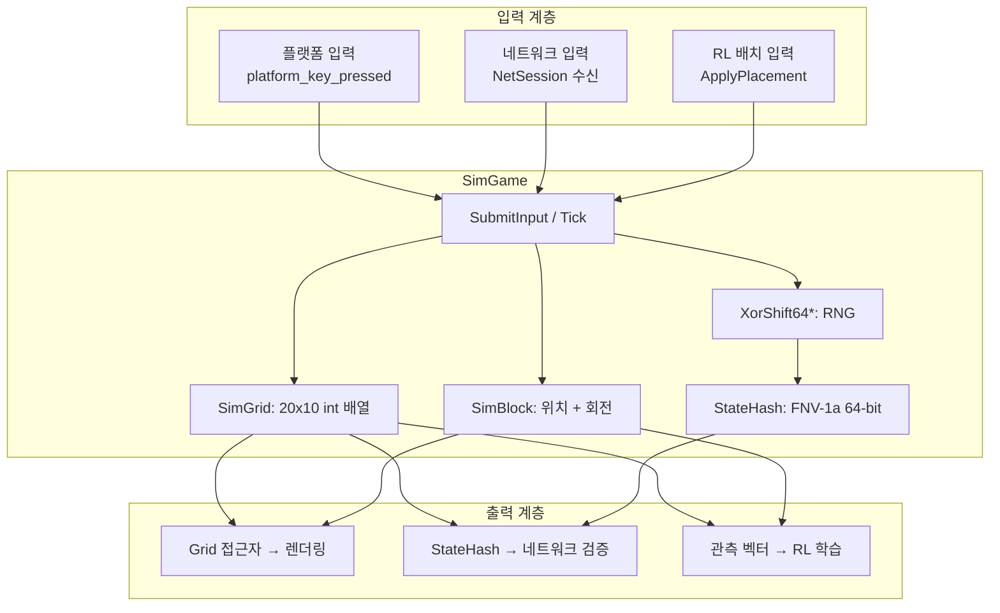
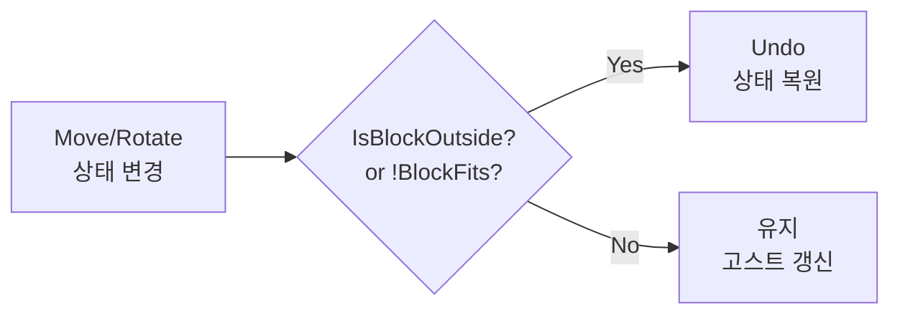
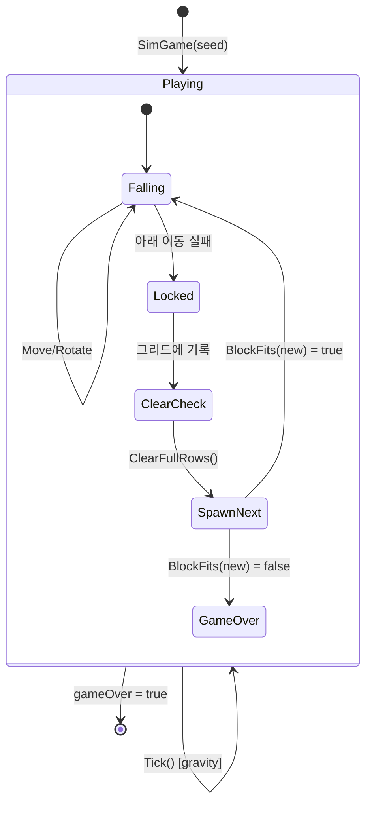

# Part 3: 테트리스 시뮬레이션 엔진 — 결정론적 게임 로직

> **시리즈:** 제로부터 멀티플레이어 테트리스 + RL까지
> [Part 1: 윈도우와 OpenGL](./part1-window-and-opengl.md) | [Part 2: 2D 렌더링](./part2-2d-rendering.md) | **Part 3** | [Part 4: 게임 루프](./part4-game-loop.md) | [Part 5: 네트워킹](./part5-lockstep-networking.md) | [Part 6: Python RL](./part6-python-rl.md)

---

## 들어가며

Part 1에서 창을 만들고, Part 2에서 사각형과 텍스트를 그렸다. 이제 **무엇을** 그릴지를 결정하는 게임 로직을 작성한다.

이 프로젝트에서 게임 로직은 렌더링과 **완전히 분리**되어 있다. `SimGame` 클래스는 화면에 무엇을 그리는지 모른다. 입력을 받아 상태를 갱신하고, 그리드와 블록의 현재 상태를 노출할 뿐이다.

이 분리가 주는 세 가지 이점:

1. **결정론적 네트플레이**: 같은 시드 + 같은 입력 순서 = 동일한 상태. 네트워크로 입력만 교환하면 양쪽의 시뮬레이션이 일치한다.
2. **Headless RL 학습**: GPU 렌더링 없이 초당 수만 게임을 시뮬레이션할 수 있다. Google Colab에서 Linux 환경으로 학습하고, Windows에서 추론한다.
3. **크로스 플랫폼 이식**: 렌더링 없는 순수 C++ 로직이므로 Win32 API에 의존하지 않는다. Linux, macOS, WASM 어디서든 컴파일 가능하다.

이 시리즈의 전체 소스 코드는 `src/sim_game.h` (104줄), `src/sim_game.cpp` (327줄), `src/sim_grid.h` (94줄), `src/sim_block.h` (61줄), `src/sim_blocks.h` (104줄), `core/rng.h` (31줄), `core/hash.h` (21줄)에 해당한다.

---

## 1. 아키텍처 개요



`SimGame`은 세 가지 프론트엔드를 구동한다:

| 프론트엔드 | 입력 방식 | 출력 소비 |
|-----------|----------|----------|
| Win32 게임 | `SubmitInput(mask)` + `Tick()` | `Grid()`, `CurrentBlock()` → 렌더링 |
| Lockstep 네트플레이 | `SubmitInput(mask)` + `Tick()` | `StateHash()` → 디싱크 감지 |
| RL 학습 (Python) | `ApplyPlacement(col, rot)` | `Grid()`, `Score()` → 관측/보상 |

---

## 2. 그리드 표현

### 2.1 데이터 구조

테트리스 그리드는 20행 x 10열의 정수 배열이다:

```cpp
// src/sim_grid.h
class SimGrid
{
public:
    static constexpr int kRows = 20;
    static constexpr int kCols = 10;

    int grid[kRows][kCols];  // 0 = 빈칸, 1~7 = 블록 ID, 8 = 고스트
    // ...
};
```

좌표계: `grid[0][0]`은 좌상단, `grid[19][9]`는 우하단이다. 행(row)이 증가하면 아래로, 열(col)이 증가하면 오른쪽으로 이동한다.

```
grid[0][0] ─────────── grid[0][9]
    │                       │
    │    테트리스 필드       │
    │                       │
grid[19][0] ──────── grid[19][9]
```

셀 값의 의미:

| 값 | 의미 | 색상 (렌더링) |
|----|------|-------------|
| 0 | 빈칸 | 배경색 |
| 1 | L 블록 | 주황 |
| 2 | J 블록 | 파랑 |
| 3 | I 블록 | 하늘 |
| 4 | O 블록 | 노랑 |
| 5 | S 블록 | 초록 |
| 6 | T 블록 | 보라 |
| 7 | Z 블록 | 빨강 |
| 8 | 고스트 | 회색 |

### 2.2 왜 int인가

셀 값이 0~8이므로 `uint8_t`면 충분하다. 그러나 `int` (4바이트)를 사용하는 이유:

1. **연속 메모리 레이아웃**: `int grid[20][10]`은 800바이트 연속 메모리. `fnv1a64(&grid[0][0], sizeof(grid), h)`로 한 번에 해시할 수 있다.
2. **원본 호환성**: 원래 raylib 기반 코드(`Grid` 클래스)가 `int`를 사용했고, 상태 해시의 비트 단위 일치를 유지해야 한다.

800바이트는 L1 캐시 라인(64바이트) 13개에 해당하므로, 현대 CPU에서 전체 그리드가 캐시에 들어간다.

### 2.3 경계 검사와 빈칸 판별

```cpp
bool IsCellOutside(int row, int column) const
{
    if (row >= 0 && row < kRows && column >= 0 && column < kCols)
        return false;
    return true;
}

bool IsCellEmpty(int row, int column) const
{
    if (grid[row][column] == 0 || grid[row][column] == 8)
        return true;
    return false;
}
```

`IsCellEmpty`에서 고스트(id=8)를 빈칸으로 취급하는 것에 주의하라. 고스트 블록은 "현재 블록이 떨어질 위치"를 보여주는 시각적 가이드일 뿐, 물리적 충돌 대상이 아니다.

---

## 3. 테트로미노 형상과 회전

### 3.1 7종 블록

표준 테트리스의 7종 테트로미노. 각 블록은 4개의 셀로 구성된다:

```
L (id=1)  J (id=2)  I (id=3)  O (id=4)  S (id=5)  T (id=6)  Z (id=7)

    #       #         ####      ##        ##          #        ##
  ###       ###                 ##       ##          ###        ##
```

### 3.2 회전 상태 룩업 테이블

각 블록은 최대 4개의 회전 상태를 가진다. 회전 상태별로 4개 셀의 **상대 좌표**(오프셋)를 미리 정의해둔다:

```cpp
// src/sim_blocks.h — T 블록 예시
class SimTBlock : public SimBlock
{
public:
    SimTBlock()
    {
        id = 6;
        cells[0] = {Position(0,1), Position(1,0), Position(1,1), Position(1,2)};
        cells[1] = {Position(0,1), Position(1,1), Position(1,2), Position(2,1)};
        cells[2] = {Position(1,0), Position(1,1), Position(1,2), Position(2,1)};
        cells[3] = {Position(0,1), Position(1,0), Position(1,1), Position(2,1)};
        Move(0, 3);  // 초기 위치: 3열 오프셋 (필드 중앙)
    }
};
```

회전 상태 0~3은 시계 방향 90도씩 회전한 형태다:

```
rot=0     rot=1     rot=2     rot=3
  #         #         .         #
 ###       ##        ###       ##
  .         #         #         #
```

`cells`는 `std::map<int, std::vector<Position>>`으로 구현되어 있다. 각 키(0~3)에 대해 4개의 Position(row, column) 벡터가 매핑된다.

### 3.3 SRS와 단순 회전

이 구현에서는 **Super Rotation System(SRS)** 의 wall kick을 적용하지 않는다. 회전 후 벽이나 다른 블록과 겹치면 단순히 회전을 취소(undo)한다:

```cpp
// src/sim_game.cpp:148-161
void SimGame::RotateBlockImpl()
{
    if (gameOver) return;
    currentBlock.Rotate();
    if (IsBlockOutside(currentBlock) || BlockFits(currentBlock) == false)
    {
        currentBlock.UndoRotation();  // 충돌 → 회전 취소
    }
    else
    {
        ghostBlock = MakeGhostBlock(currentBlock);
    }
}
```

SRS wall kick은 회전 실패 시 블록을 좌우/상하로 밀어보는 추가 로직이다. Tetris Guideline에서 정의하는 공식 규칙이지만, 이 프로젝트에서는 단순성을 위해 생략했다. SRS를 구현하면 회전 테이블에 kick offset 배열을 추가해야 한다 (I 블록 기준 5개 오프셋 x 4회전 = 20개 추가 데이터).

### 3.4 절대 좌표 계산

블록의 셀 위치는 **상대 좌표**(cells) + **오프셋**(rowOffset, columnOffset)으로 계산된다:

```cpp
// src/sim_block.h:20-30
std::vector<Position> GetCellPositions() const
{
    const std::vector<Position>& tiles = cells.at(rotationState);
    std::vector<Position> movedTiles;
    movedTiles.reserve(tiles.size());
    for (const Position& item : tiles)
    {
        movedTiles.emplace_back(
            item.row + rowOffset,
            item.column + columnOffset);
    }
    return movedTiles;
}
```

예: T 블록(rot=0)이 rowOffset=5, columnOffset=3일 때:

```
cells[0] = {(0,1), (1,0), (1,1), (1,2)}

절대 좌표 = {(5,4), (6,3), (6,4), (6,5)}
```

이 분리(상대 좌표 + 오프셋)는 같은 형상 데이터를 여러 위치에서 재사용할 수 있게 한다. 고스트 블록도 현재 블록과 같은 형상/회전 데이터를 공유하되, rowOffset만 다르다.

---

## 4. 충돌 감지

### 4.1 이동-후-검증 패턴

이동/회전의 충돌 감지는 "먼저 이동, 그 다음 검증, 실패 시 복원"하는 패턴을 따른다:



```cpp
// 좌측 이동 — src/sim_game.cpp:75-87
void SimGame::MoveBlockLeft()
{
    if (gameOver) return;
    currentBlock.Move(0, -1);                                // 1) 이동
    if (IsBlockOutside(currentBlock) || !BlockFits(currentBlock))
    {
        currentBlock.Move(0, 1);                             // 2) 복원
    }
    else
    {
        ghostBlock = MakeGhostBlock(currentBlock);           // 3) 고스트 갱신
    }
}
```

### 4.2 두 단계 검사

충돌 검사는 두 단계로 나뉜다:

**1단계 — 경계 검사 (IsBlockOutside):**

```cpp
bool SimGame::IsBlockOutside(const SimBlock& block) const
{
    std::vector<Position> tiles = block.GetCellPositions();
    for (const Position& item : tiles)
    {
        if (sim_grid.IsCellOutside(item.row, item.column))
            return true;
    }
    return false;
}
```

블록의 4개 셀 중 하나라도 그리드 범위(0~19행, 0~9열) 밖이면 true.

**2단계 — 점유 검사 (BlockFits):**

```cpp
bool SimGame::BlockFits(const SimBlock& block) const
{
    std::vector<Position> tiles = block.GetCellPositions();
    for (const Position& item : tiles)
    {
        if (!sim_grid.IsCellEmpty(item.row, item.column))
            return false;
    }
    return true;
}
```

블록의 4개 셀 중 하나라도 이미 점유된 셀과 겹치면 false. 두 검사의 순서가 중요하다: `IsBlockOutside`를 먼저 호출하지 않으면, 범위 밖 인덱스로 `grid[row][column]`에 접근하여 **배열 경계 초과(out-of-bounds access)** 가 발생한다.

### 4.3 하드 드롭

```cpp
// src/sim_game.cpp:114-123
void SimGame::MoveBlockDrop()
{
    if (gameOver) return;
    while (!IsBlockOutside(currentBlock) && BlockFits(currentBlock))
    {
        currentBlock.Move(1, 0);  // 한 칸씩 아래로
    }
    currentBlock.Move(-1, 0);     // 마지막 유효 위치로 복원
    LockBlock();
}
```

하드 드롭은 블록을 충돌할 때까지 아래로 반복 이동시킨 후, 한 칸 위로 복원한다. `while` 루프가 종료된 시점에서 블록은 **충돌 상태**이므로, `Move(-1, 0)`으로 마지막 유효 위치로 돌아가야 한다.

---

## 5. 라인 클리어 알고리즘

### 5.1 역순 순회의 이유

라인 클리어에서 가장 흔한 실수는 순방향(row 0 -> 19)으로 순회하는 것이다. 순방향 순회의 문제:

```
순방향 순회 시:
row 17: ■■■■■■■■■■ ← 가득 참, 삭제 → 위의 row를 아래로 이동
row 18: ■■■■■■■■■■ ← 이제 이 자리에 옛 row 17의 위 행이 옴
                      → 원래 row 18은 이미 검사를 마쳤으므로 다시 확인되지 않음
```

역순(row 19 -> 0)이면 이 문제가 없다. 아래에서 위로 올라가며, 가득 찬 행을 삭제할 때 `completed` 카운터를 증가시키고, 가득 차지 않은 행은 `completed`만큼 아래로 이동시킨다:

```cpp
// src/sim_grid.h:44-60
int ClearFullRows()
{
    int completed = 0;
    for (int row = kRows - 1; row >= 0; row--)
    {
        if (IsRowFull(row))
        {
            ClearRow(row);         // 해당 행을 0으로 초기화
            completed++;
        }
        else if (completed > 0)
        {
            MoveRowDown(row, completed);  // completed칸 아래로 복사
        }
    }
    return completed;
}
```

### 5.2 단계별 예시

2줄 동시 클리어의 경우:

```
초기 상태:          row 17 클리어 후:      row 18 클리어 후:     비-풀 행 이동 후:
row 15: ..■■....   row 15: ..■■....     row 15: ..■■....    row 15: ..........
row 16: .■■■■...   row 16: .■■■■...     row 16: .■■■■...    row 16: ..........
row 17: ■■■■■■■■■■ row 17: ..........   row 17: ..........    row 17: ..■■......
row 18: ■■■■■■■■■■ row 18: ■■■■■■■■■■  row 18: ..........    row 18: .■■■■.....
row 19: .■■■■■■..  row 19: .■■■■■■..   row 19: .■■■■■■..    row 19: .■■■■■■..
```

역순 순회이므로 row 19 → 18 → 17 → 16 → 15 순서로 처리한다. row 18과 17이 풀이면 `completed=2`. row 16은 `MoveRowDown(16, 2)` → row 18로 복사. row 15는 `MoveRowDown(15, 2)` → row 17로 복사.

### 5.3 size_t 주의점

`ClearFullRows`에서 루프 변수 `row`를 `size_t`(unsigned)로 선언하면 위험하다:

```cpp
// 위험: size_t는 unsigned이므로 row = 0일 때 row-- = 4294967295
for (size_t row = kRows - 1; row >= 0; row--)  // 무한 루프!
```

unsigned 정수에서 `0 - 1`은 언더플로되어 매우 큰 양수가 된다. `row >= 0`은 항상 true이므로 무한 루프에 빠진다. 반드시 `int`를 사용해야 한다.

---

## 6. 점수 시스템

```cpp
// src/sim_game.cpp:201-212
void SimGame::UpdateScore(int linesCleared, int levelUp)
{
    switch (linesCleared)
    {
    case 1: score += 100;  break;
    case 2: score += 300;  break;
    case 3: score += 600;  break;
    case 4: score += 1000; break;
    default: break;
    }
    score += levelUp * 1000;
}
```

| 클리어 줄 수 | 점수 | 비고 |
|-------------|------|------|
| 1줄 (Single) | 100 | 기본 |
| 2줄 (Double) | 300 | 3배 (1줄의 3배) |
| 3줄 (Triple) | 600 | 6배 |
| 4줄 (Tetris) | 1000 | 10배 — 4줄 동시 클리어의 보상이 압도적 |

이 점수 체계는 NES Tetris(1989)를 간략화한 것이다. 원작은 레벨에 비례하는 곱셈을 적용하지만, 이 구현에서는 레벨 시스템을 단순화하여 고정 점수를 사용한다.

점수가 비선형적으로 증가하는 것이 핵심 게임 디자인이다: 4줄 동시 클리어(Tetris)의 보상이 1줄씩 4번 클리어(400점)보다 2.5배 높으므로, 플레이어에게 "I 블록을 기다려서 4줄을 한꺼번에 클리어"하는 전략적 선택을 유도한다.

---

## 7. 7-Piece Bag 랜더마이저

### 7.1 순수 랜덤의 문제

블록을 순수 랜덤으로 생성하면 같은 블록이 연속으로 나올 확률이 $1/7 \approx 14.3\%$이다. S와 Z가 연속 5번 나오면 게임이 사실상 불가능해진다.

### 7.2 가방 랜더마이저

Tetris Guideline(The Tetris Company)이 정의하는 공식 랜덤 알고리즘: 7종 블록을 "가방"에 넣고 섞은 후, 하나씩 꺼낸다. 가방이 비면 다시 채운다.

```cpp
// src/sim_game.cpp:22-34
SimBlock SimGame::GetRandomBlock()
{
    if (blocks.empty())
    {
        blocks = GetAllBlocks();   // 7종 블록으로 가방 리필
    }
    int randomIndex = rng.nextUInt(static_cast<uint32_t>(blocks.size()));
    SimBlock block = blocks[randomIndex];
    blocks.erase(blocks.begin() + randomIndex);
    return block;
}
```

가방에서 랜덤 인덱스로 하나를 뽑고 제거한다. Fisher-Yates 셔플과 동일한 결과를 낸다.

가방 랜더마이저의 성질:

- 같은 블록이 **연속 2번 이상** 나올 수 있다 (가방 경계: 이전 가방의 마지막 + 다음 가방의 첫 번째)
- 14개 블록(2가방) 안에 각 블록이 **정확히 2번** 나온다는 보장은 없다
- 그러나 7개 블록 안에는 각 블록이 **정확히 1번** 나오므로, 극단적 편향이 제거된다

### 7.3 결정론의 핵심: RNG 호출 지점

**RNG 호출은 `GetRandomBlock()` 안에서만 발생한다.** 이것이 결정론의 핵심 불변 조건이다.

만약 입력 처리 코드에서 RNG를 호출하면 (예: 파티클 이펙트용 난수), 입력 타이밍에 따라 RNG 상태가 달라지고, 같은 시드 + 같은 입력이라도 블록 순서가 달라진다. 결정론이 깨진다.

```
불변 조건: RNG 호출 순서 = 블록 생성 순서 (입력/타이밍과 무관)

위반 예시:
  Tick 100: 블록 락 → GetRandomBlock() → rng.nextUInt()   [RNG call #5]
  Tick 101: 파티클 생성 → rng.nextFloat()                   [RNG call #6] ← 위반!
  Tick 150: 블록 락 → GetRandomBlock() → rng.nextUInt()   [RNG call #7]

  → 파티클이 없으면 #6이 빠지므로 #7의 RNG 상태가 달라짐
```

이 불변 조건은 코드 리뷰에서 자동으로 검증하기 어렵다. `rng.next*()` 호출이 `GetRandomBlock()` 외부에 없는지 수동으로 확인해야 한다.

---

## 8. XorShift64* RNG

### 8.1 왜 std::mt19937이 아닌가

`std::mt19937`(Mersenne Twister)은 C++ 표준 라이브러리의 대표적 RNG이다. 그러나 네트코드에 사용하기에 **치명적 문제**가 있다:

C++ 표준은 `std::mt19937`의 **알고리즘**은 정의하지만, **구현 세부사항**은 구현체(MSVC, GCC, Clang)에 위임한다. 같은 시드를 넣어도 MSVC와 GCC의 출력 시퀀스가 미묘하게 다를 수 있다.

> 실제로 `std::mt19937`의 출력 자체는 표준에 의해 결정적이다. 그러나 `std::uniform_int_distribution`의 구현은 표준에 의해 결정되지 **않는다**. MSVC와 GCC의 `uniform_int_distribution(0, 6)`이 같은 엔진 상태에서 다른 값을 반환할 수 있다.

이 프로젝트에서는 RNG 알고리즘, 분포 함수, 상태 크기를 모두 직접 제어한다:

```cpp
// core/rng.h
class XorShift64Star {
public:
    explicit XorShift64Star(uint64_t seed = 88172645463393265ull)
        : state(seed ? seed : 88172645463393265ull) {}

    uint64_t next() {
        uint64_t x = state;
        x ^= x >> 12;
        x ^= x << 25;
        x ^= x >> 27;
        state = x;
        return x * 2685821657736338717ull;
    }

    uint32_t nextUInt(uint32_t max) {
        return static_cast<uint32_t>(next() % (max ? max : 1u));
    }

    uint64_t getState() const { return state; }

private:
    uint64_t state;
};
```

### 8.2 XorShift64* 알고리즘

Marsaglia(2003)가 제안한 xorshift 계열 RNG의 변형이다. 세 번의 XOR-shift 연산 후 곱셈으로 출력을 혼합한다:

$$x \leftarrow x \oplus (x \gg 12)$$
$$x \leftarrow x \oplus (x \ll 25)$$
$$x \leftarrow x \oplus (x \gg 27)$$
$$\text{output} = x \times 2685821657736338717$$

shift 상수 (12, 25, 27)은 Marsaglia가 전수 탐색으로 찾은 값으로, 전체 64비트 주기($2^{64} - 1$)를 보장한다. 곱셈 상수 $2685821657736338717$은 출력의 통계적 품질을 향상시킨다.

특성:
- **상태 크기**: 64비트 (8바이트). Mersenne Twister의 2,496바이트 대비 극소
- **주기**: $2^{64} - 1 \approx 1.8 \times 10^{19}$. 테트리스 게임에서 사용하기에 충분
- **속도**: 단일 uint64 변수에 대한 비트 연산 3회 + 곱셈 1회. 캐시 친화적

### 8.3 분포 함수의 결정론

`nextUInt(max)`는 단순히 `next() % max`를 반환한다. 이 방식에는 **모듈러 편향(modulo bias)** 이 있다: `max`가 $2^{64}$의 약수가 아니면, 일부 값이 다른 값보다 미세하게 더 자주 나온다.

예: `next() % 7`에서, $\lfloor 2^{64} / 7 \rfloor = 2635249153387078802$이고 나머지 $2^{64} \mod 7 = 2$이므로, 값 0과 1이 다른 값보다 $1/(2^{64}/7) \approx 4 \times 10^{-19}$ 만큼 더 자주 나온다.

이 편향은 테트리스에서 무시할 수 있는 수준이다. 그러나 암호학적 용도에는 부적합하다.

> **레퍼런스:** George Marsaglia, "Xorshift RNGs" (2003, Journal of Statistical Software, Vol 8, Issue 14). 또한 Sebastiano Vigna, "An experimental exploration of Marsaglia's xorshift generators, scrambled" (2016) — xorshift64*의 통계적 분석.

---

## 9. 상태 해시 (FNV-1a 64-bit)

### 9.1 목적

네트워크 멀티플레이에서 양쪽 피어의 시뮬레이션이 동일한지 검증해야 한다. 매 틱마다 전체 게임 상태(800바이트 그리드 + 블록 상태 + RNG + 점수)를 전송하는 것은 비효율적이다. 대신, **64비트 해시**를 계산해서 교환한다. 해시가 일치하면 상태가 동일하다고 간주한다.

### 9.2 FNV-1a 알고리즘

FNV-1a는 비암호학적 해시 함수로, 단순하고 빠르다:

$$h_0 = 14695981039346656037$$
$$h_i = (h_{i-1} \oplus \text{byte}_i) \times 1099511628211$$

```cpp
// core/hash.h
inline uint64_t fnv1a64(const void* data, size_t len,
                        uint64_t seed = 14695981039346656037ull)
{
    const uint8_t* ptr = static_cast<const uint8_t*>(data);
    uint64_t hash = seed;
    for (size_t i = 0; i < len; ++i) {
        hash ^= ptr[i];
        hash *= 1099511628211ull;
    }
    return hash;
}
```

초기값 $14695981039346656037$은 FNV offset basis, 곱셈 상수 $1099511628211$은 FNV prime이다. 이 두 상수는 Fowler, Noll, Vo가 64비트 해시에 대해 경험적으로 최적화한 값이다.

### 9.3 상태 해시 구성

```cpp
// src/sim_game.cpp:214-244
uint64_t SimGame::StateHash() const
{
    uint64_t h = 14695981039346656037ull;  // FNV offset basis

    // 그리드: 800바이트 연속 메모리
    h = fnv1a64(&sim_grid.grid[0][0], sizeof(sim_grid.grid), h);

    // 현재 블록 상태
    h = fnv1a64_value(currentBlock.id, h);
    h = fnv1a64_value(currentBlock.GetRotationState(), h);
    h = fnv1a64_value(currentBlock.GetRowOffset(), h);
    h = fnv1a64_value(currentBlock.GetColumnOffset(), h);

    // 다음 블록 상태
    h = fnv1a64_value(nextBlock.id, h);
    h = fnv1a64_value(nextBlock.GetRotationState(), h);
    h = fnv1a64_value(nextBlock.GetRowOffset(), h);
    h = fnv1a64_value(nextBlock.GetColumnOffset(), h);

    // RNG, 점수, 게임오버 플래그, 중력 타이머
    h = fnv1a64_value(rng.getState(), h);
    h = fnv1a64_value(score, h);
    h = fnv1a64_value(gameOver ? 1 : 0, h);
    h = fnv1a64_value(gravityCounterTicks, h);
    h = fnv1a64_value(dropIntervalTicks, h);

    return h;
}
```

해시에 포함되는 항목:

| 항목 | 크기 | 이유 |
|------|------|------|
| 그리드 전체 | 800 bytes | 블록 배치 상태 |
| 현재/다음 블록 (id, rot, row, col) | 32 bytes | 진행 중인 블록 상태 |
| RNG 상태 | 8 bytes | 미래 블록 순서 결정 |
| 점수 | 4 bytes | 게임 진행도 |
| 게임오버 플래그 | 4 bytes | 종료 조건 |
| 중력 타이머 | 8 bytes | 다음 자동 하강 시점 |

총 약 856바이트가 해시 입력이다. FNV-1a의 단순한 바이트 순회로 이 크기를 처리하는 데 마이크로초 단위의 시간이면 충분하다.

### 9.4 충돌 확률

64비트 해시의 생일 역설(birthday paradox)에 의한 충돌 확률:

$$P(\text{collision}) \approx \frac{n^2}{2 \times 2^{64}}$$

$n = 10^6$ (백만 틱)에서: $P \approx \frac{10^{12}}{3.7 \times 10^{19}} \approx 2.7 \times 10^{-8}$

1초에 60틱이면, 약 4,600시간(192일) 연속 플레이해야 한 번의 우연한 충돌이 기대된다. 디싱크 감지 용도에 충분하다.

---

## 10. 고스트 블록

고스트 블록은 현재 블록을 아래로 투영(hard drop 시뮬레이션)하여 착지 위치를 미리 보여주는 시각적 가이드다:

```cpp
// src/sim_game.cpp:125-133
void SimGame::DropExpectation()
{
    if (gameOver) return;
    while (!IsBlockOutside(ghostBlock) && BlockFits(ghostBlock))
    {
        ghostBlock.Move(1, 0);
    }
    ghostBlock.Move(-1, 0);
}
```

고스트 블록의 id는 8로 설정된다. 이 값은 그리드 셀에 기록되지 않는다 (`IsCellEmpty`가 8을 빈칸으로 취급하므로). 렌더링 시에만 반투명 회색으로 표시된다.

`DropExpectation`은 `SubmitInput` 종료 시 호출된다. 매 입력 후 고스트를 갱신해야 현재 블록의 위치 변화가 즉시 반영된다.

---

## 11. 블록 잠금과 게임 오버

### 11.1 LockBlock

블록이 더 이상 아래로 이동할 수 없으면 "잠금(lock)"이 발생한다:

```cpp
// src/sim_game.cpp:163-186
void SimGame::LockBlock()
{
    // 1. 현재 블록의 셀을 그리드에 기록
    std::vector<Position> tiles = currentBlock.GetCellPositions();
    for (const Position& item : tiles)
    {
        sim_grid.grid[item.row][item.column] = currentBlock.id;
    }

    // 2. 다음 블록을 현재 블록으로 교체
    currentBlock = nextBlock;
    ghostBlock = MakeGhostBlock(currentBlock);

    // 3. 게임 오버 검사: 새 블록이 놓일 자리가 없으면 종료
    if (!BlockFits(currentBlock))
    {
        gameOver = true;
    }

    // 4. 새 다음 블록 생성 (RNG 호출)
    nextBlock = GetRandomBlock();

    // 5. 라인 클리어
    int rowsCleared = sim_grid.ClearFullRows();
    if (rowsCleared > 0)
    {
        UpdateScore(rowsCleared, 0);
    }
}
```

### 11.2 게임 오버 조건

게임 오버는 "새 블록이 스폰 위치에서 이미 다른 블록과 겹칠 때" 발생한다. 이것은 `BlockFits(currentBlock)` 검사로 판별한다.

게임 오버 검사가 `GetRandomBlock()` **이전**에 수행되는 것에 주의하라. 이 순서가 중요하다: 게임 오버 후에도 `nextBlock`은 유효해야 한다 (게임 오버 화면에서 "다음 블록"을 표시하기 위해). 만약 순서를 바꾸면, 게임 오버 시 불필요한 RNG 호출이 추가되어 해시가 달라진다.

---

## 12. SimGame 상태 머신

전체 게임 로직을 상태 전이로 정리한다:



한 틱의 실행 흐름:

1. **SubmitInput**: 좌/우/하/회전/드롭 입력 처리. 각 입력은 이동-검증-복원 패턴.
2. **Tick**: 중력 카운터 증가. `dropIntervalTicks`에 도달하면 `MoveBlockDown`.
3. `MoveBlockDown`에서 아래 이동 실패 시 `LockBlock`.
4. `LockBlock`: 그리드 기록 → 게임 오버 검사 → 새 블록 생성 → 라인 클리어.

---

## 오류와 함정

### (1) RNG 호출 순서 변경 → 결정론 파괴

**증상:** 같은 시드를 넣었는데 양쪽 피어의 블록 순서가 다르다.

**원인:** RNG가 `GetRandomBlock()` 외부에서 호출되면, 호출 횟수가 입력/타이밍에 따라 달라져 RNG 상태가 분기한다.

**해결:** RNG 호출 지점을 `GetRandomBlock()` 하나로 제한. 시각 효과/오디오 등에 난수가 필요하면 별도의 RNG 인스턴스를 사용하거나, 결정론과 무관한 계층에서 처리.

### (2) size_t 역순 순회 언더플로

**증상:** `ClearFullRows()` 호출 시 무한 루프 또는 메모리 접근 위반.

**원인:** `for (size_t row = kRows - 1; row >= 0; row--)`에서 `row`가 unsigned이므로 `0 - 1 = SIZE_MAX`, 조건 `row >= 0`이 항상 참.

**해결:** 루프 변수를 `int`로 선언. 또는 `for (int row = kRows; row-- > 0;)` 패턴 사용.

> **레퍼런스:** C++ 표준 [basic.fundamental]: unsigned 정수의 오버플로/언더플로는 모듈러 산술로 잘 정의된다 (UB가 아니다). 그러나 의도하지 않은 모듈러 산술은 논리 오류의 원인이 된다.

### (3) 회전 후 undo 누락 → 벽 속 삽입

**증상:** 블록이 벽이나 다른 블록과 겹친 상태로 고정된다.

**원인:** `RotateBlockImpl()`에서 충돌 시 `UndoRotation()` 호출을 빠뜨리면, 겹친 상태가 유지된 채 다음 프레임에서 `LockBlock()`이 호출될 수 있다.

**해결:** 이동-검증-복원 패턴을 엄격히 따른다. 모든 상태 변경 후 반드시 충돌 검사를 수행하고, 실패 시 복원.

### (4) 블록 생성 순서 변경 → 해시 불일치

**증상:** `StateHash()`가 원본 `Game` 클래스와 다른 값을 반환한다.

**원인:** `GetAllBlocks()`의 블록 순서가 원본과 다르면, 같은 RNG 시드에서 다른 블록이 선택된다. 예: 원본이 `{I,J,L,O,S,T,Z}` 순서인데 `{L,J,I,O,S,T,Z}`로 변경하면, `rng.nextUInt(7) = 0`이 원본에서는 I 블록, 변경 후에는 L 블록이 된다.

**해결:** `GetAllBlocks()` 순서를 원본과 **정확히** 일치시킨다. 코드 주석으로 순서를 명시.

### (5) 고스트 블록과 충돌 판정

**증상:** 고스트 블록 위에 다른 블록을 놓을 수 없다.

**원인:** `IsCellEmpty`가 고스트(id=8)를 빈칸으로 취급하지 않으면, 고스트가 있는 셀에 블록을 놓을 수 없게 된다.

**해결:** `IsCellEmpty`에서 `grid[row][column] == 8`을 빈칸으로 판별. 고스트는 시각적 가이드일 뿐 물리적 실체가 아님.

---

## 정리

이 글에서 구현한 `SimGame`은 약 500줄의 순수 C++ 코드로, 테트리스의 핵심 규칙을 결정론적으로 시뮬레이션한다. 렌더링, 네트워킹, AI 학습 — 어떤 프론트엔드든 이 엔진 위에 구축된다.

핵심 설계 결정:
- **렌더링 완전 분리**: `SimGame`은 화면을 모른다
- **RNG 호출 지점 제한**: `GetRandomBlock()` 하나로 결정론 보장
- **상태 해시**: 전체 게임 상태를 64비트로 압축해 네트워크 검증
- **역순 라인 클리어**: 이중 시프트 방지

다음 Part 4에서는 이 시뮬레이션 엔진을 **어떤 속도로, 어떤 타이밍에** 실행할지를 다룬다 — 고정 틱 어큐뮬레이터와 입력 누적 패턴.

---

## 참고 자료

1. **Tetris Guideline** (The Tetris Company). 7-Piece Bag Randomizer, Super Rotation System 정의
2. **George Marsaglia**, "Xorshift RNGs" (2003, Journal of Statistical Software, Vol 8, Issue 14). xorshift 계열 알고리즘과 주기 분석
3. **Sebastiano Vigna**, "An experimental exploration of Marsaglia's xorshift generators, scrambled" (2016). xorshift64*의 곱셈 상수 선택과 통계적 품질
4. **Fowler-Noll-Vo hash** (www.isthe.com/chongo/tech/comp/fnv/). FNV-1a 64-bit의 초기값, 소수, 충돌 특성
5. **NES Tetris scoring** (Tetris Wiki, tetris.wiki/Scoring). 원작 NES 점수 체계 (레벨 x 라인 보너스)
6. **"Game Programming Patterns"** (Robert Nystrom, 2014). Chapter 2 "Command" — 입력을 커맨드 객체로 추상화하는 패턴
