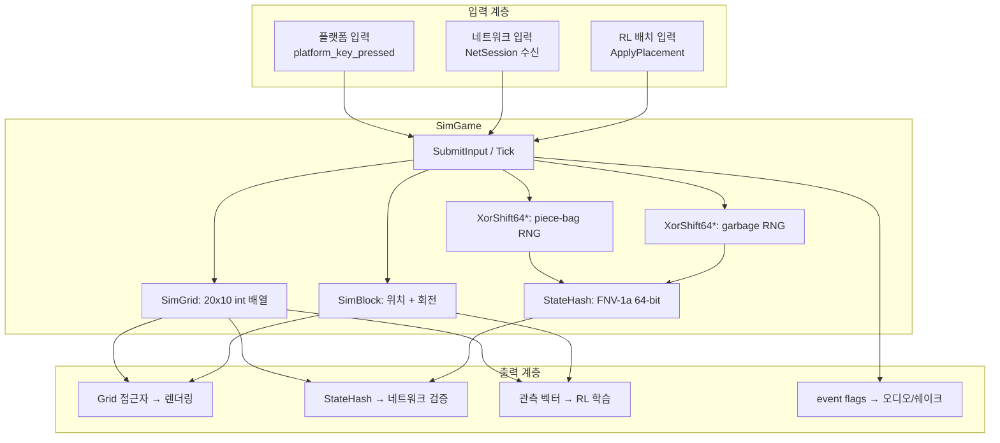
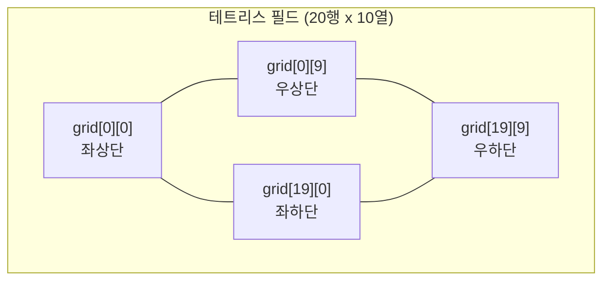
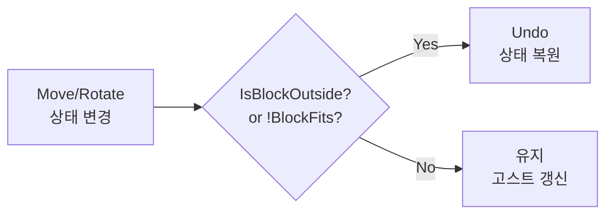
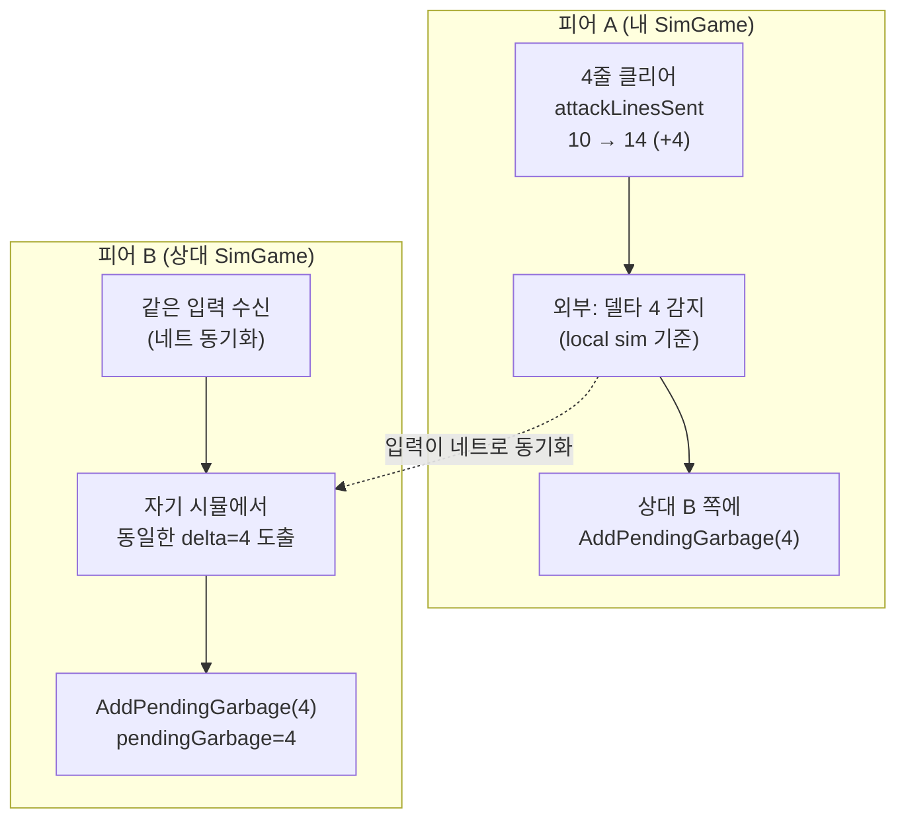
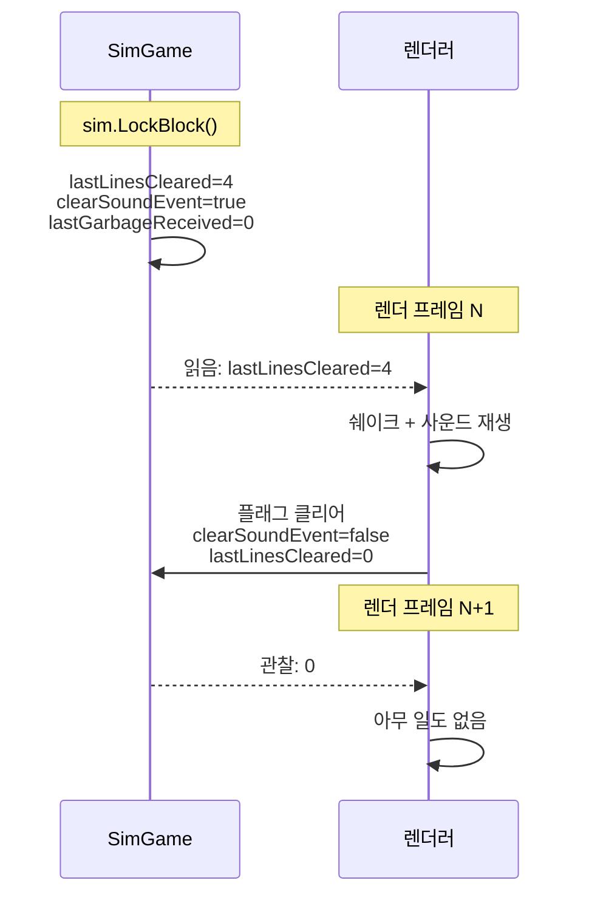
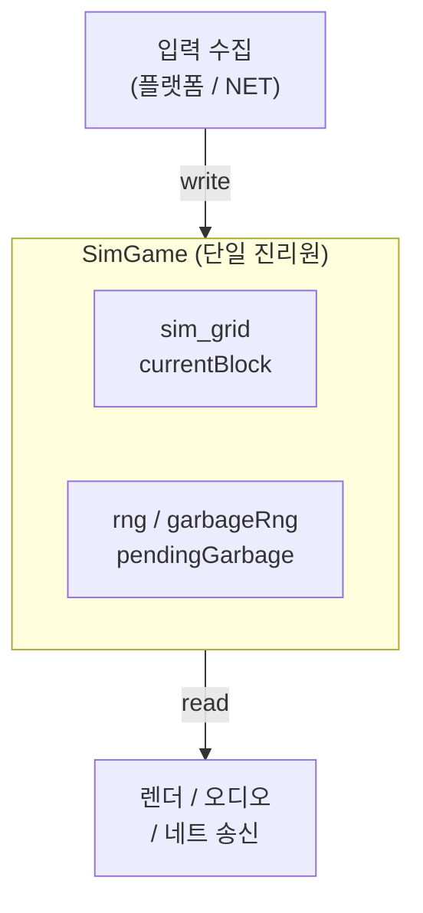
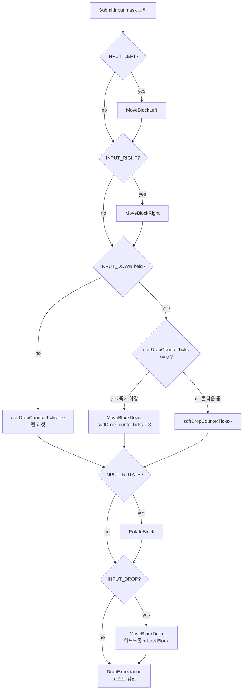
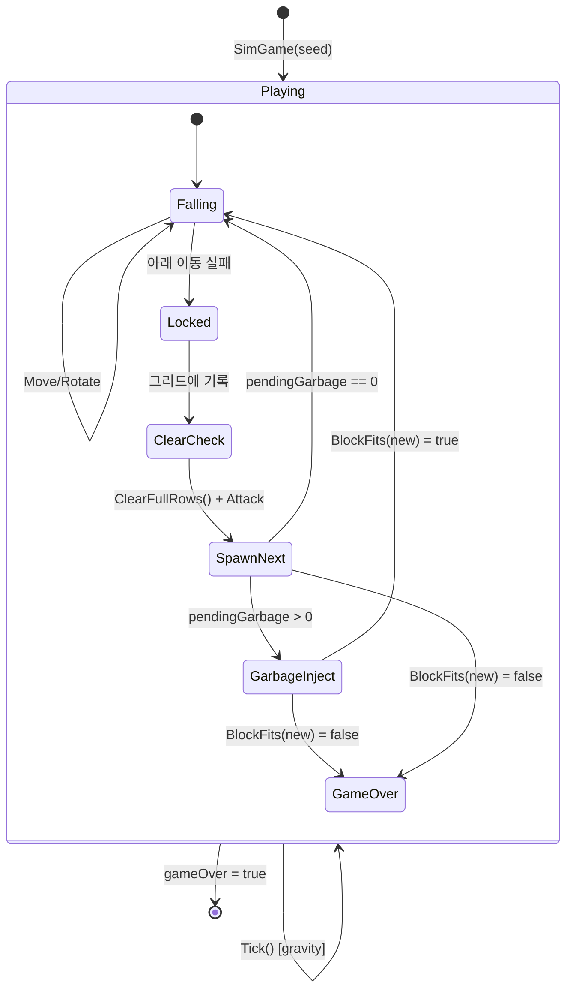

# Part 3: 테트리스 시뮬레이션 엔진 — 결정론적 게임 로직

> **시리즈:** 제로부터 멀티플레이어 테트리스 + RL까지
> [Part 0: 셋업](./part0-project-setup.md) | [Part 1: Win32+GL](./part1-window-and-opengl.md) | [Part 2: 2D 렌더링](./part2-2d-rendering.md) | **Part 3** | [Part 4: 게임 루프](./part4-game-loop.md) | [Part 5: 네트워킹](./part5-lockstep-networking.md) | [Part 6: Python RL](./part6-python-rl.md) | [Part 7: 오디오](./part7-xaudio2-audio.md) | [Part 8: 릴레이 서버](./part8-relay-server.md) | [Part 9: RL + ONNX 봇](./part9-rl-onnx-bot.md)

---

## 들어가며

Part 1에서 창을 만들고, Part 2에서 사각형과 텍스트를 그렸다. 이제 **무엇을** 그릴지를 결정하는 게임 로직을 작성한다.

이 프로젝트에서 게임 로직은 렌더링과 **완전히 분리**되어 있다. `SimGame` 클래스는 화면에 무엇을 그리는지 모른다. 입력을 받아 상태를 갱신하고, 그리드와 블록의 현재 상태를 노출할 뿐이다.

이 분리가 주는 세 가지 이점:

1. **결정론적 네트플레이**: 같은 시드 + 같은 입력 순서 = 동일한 상태. 네트워크로 입력만 교환하면 양쪽의 시뮬레이션이 일치한다.
2. **Headless RL 학습**: GPU 렌더링 없이 초당 수만 게임을 시뮬레이션할 수 있다. Google Colab에서 Linux 환경으로 학습하고, Windows에서 추론한다.
3. **크로스 플랫폼 이식**: 렌더링 없는 순수 C++ 로직이므로 Win32 API에 의존하지 않는다. Linux, macOS, WASM 어디서든 컴파일 가능하다.

이 시리즈의 전체 소스 코드는 `src/sim_game.h` (127줄), `src/sim_game.cpp` (387줄), `src/sim_grid.h` (95줄), `src/sim_block.h` (62줄), `src/sim_blocks.h` (105줄), `core/rng.h` (32줄), `core/hash.h` (21줄)에 해당한다.

---

## 1. 아키텍처 개요



`SimGame`은 세 가지 프론트엔드를 구동한다:

| 프론트엔드 | 입력 방식 | 출력 소비 |
|-----------|----------|----------|
| Win32 게임 | `SubmitInput(mask)` + `Tick()` | `Grid()`, `CurrentBlock()` → 렌더링 |
| Lockstep 네트플레이 | `SubmitInput(mask)` + `Tick()` | `StateHash()` → 디싱크 감지 |
| RL 학습 (Python) | `ApplyPlacement(col, rot)` | `Grid()`, `Score()` → 관측/보상 |

---

## 2. 그리드 표현

### 2.1 데이터 구조

테트리스 그리드는 20행 x 10열의 정수 배열이다:

```cpp
// src/sim_grid.h
class SimGrid
{
public:
    static constexpr int kRows = 20;
    static constexpr int kCols = 10;

    int grid[kRows][kCols];  // 0 = 빈칸, 1~7 = 블록 ID, 8 = 고스트, 9 = 가비지
    // ...
};
```

좌표계: `grid[0][0]`은 좌상단, `grid[19][9]`는 우하단이다. 행(row)이 증가하면 아래로, 열(col)이 증가하면 오른쪽으로 이동한다.



셀 값의 의미:

| 값 | 의미 | 색상 (렌더링) |
|----|------|-------------|
| 0 | 빈칸 | 배경색 |
| 1 | L 블록 | 주황 |
| 2 | J 블록 | 파랑 |
| 3 | I 블록 | 하늘 |
| 4 | O 블록 | 노랑 |
| 5 | S 블록 | 초록 |
| 6 | T 블록 | 보라 |
| 7 | Z 블록 | 빨강 |
| 8 | 고스트 | 회색 |
| 9 | 가비지 | 짙은 회색 |

### 2.2 왜 int인가

셀 값이 0~9이므로 `uint8_t`면 충분하다. 그러나 `int` (4바이트)를 사용하는 이유:

1. **연속 메모리 레이아웃**: `int grid[20][10]`은 800바이트 연속 메모리. `fnv1a64(&grid[0][0], sizeof(grid), h)`로 한 번에 해시할 수 있다.
2. **원본 호환성**: 원래 raylib 기반 코드(`Grid` 클래스)가 `int`를 사용했고, 상태 해시의 비트 단위 일치를 유지해야 한다.

800바이트는 L1 캐시 라인(64바이트) 13개에 해당하므로, 현대 CPU에서 전체 그리드가 캐시에 들어간다.

### 2.3 경계 검사와 빈칸 판별

```cpp
bool IsCellOutside(int row, int column) const
{
    if (row >= 0 && row < kRows && column >= 0 && column < kCols)
        return false;
    return true;
}

bool IsCellEmpty(int row, int column) const
{
    if (grid[row][column] == 0 || grid[row][column] == 8)
        return true;
    return false;
}
```

`IsCellEmpty`에서 고스트(id=8)를 빈칸으로 취급하는 것에 주의하라. 고스트 블록은 "현재 블록이 떨어질 위치"를 보여주는 시각적 가이드일 뿐, 물리적 충돌 대상이 아니다.

가비지(id=9)는 빈칸이 아니다. 고스트와 가비지의 차이는: 고스트는 현재 피스가 렌더링 힌트로 투영된 그림자이고, 가비지는 상대방이 보낸 물리적 블록이다. 빈칸 판정에서 가비지는 벽돌처럼 취급된다.

---

## 3. 테트로미노 형상과 회전

### 3.1 7종 블록

표준 테트리스의 7종 테트로미노. 각 블록은 4개의 셀로 구성된다:

```
L (id=1)  J (id=2)  I (id=3)  O (id=4)  S (id=5)  T (id=6)  Z (id=7)

    #       #         ####      ##        ##          #        ##
  ###       ###                 ##       ##          ###        ##
```

### 3.2 회전 상태 룩업 테이블

각 블록은 최대 4개의 회전 상태를 가진다. 회전 상태별로 4개 셀의 **상대 좌표**(오프셋)를 미리 정의해둔다:

```cpp
// src/sim_blocks.h — T 블록 예시
class SimTBlock : public SimBlock
{
public:
    SimTBlock()
    {
        id = 6;
        cells[0] = {Position(0,1), Position(1,0), Position(1,1), Position(1,2)};
        cells[1] = {Position(0,1), Position(1,1), Position(1,2), Position(2,1)};
        cells[2] = {Position(1,0), Position(1,1), Position(1,2), Position(2,1)};
        cells[3] = {Position(0,1), Position(1,0), Position(1,1), Position(2,1)};
        Move(0, 3);  // 초기 위치: 3열 오프셋 (필드 중앙)
    }
};
```

회전 상태 0~3은 시계 방향 90도씩 회전한 형태다:

```
rot=0     rot=1     rot=2     rot=3
  #         #         .         #
 ###       ##        ###       ##
  .         #         #         #
```

`cells`는 `std::map<int, std::vector<Position>>`으로 구현되어 있다. 각 키(0~3)에 대해 4개의 Position(row, column) 벡터가 매핑된다.

### 3.3 SRS와 단순 회전

이 구현에서는 **Super Rotation System(SRS)** 의 wall kick을 적용하지 않는다. 회전 후 벽이나 다른 블록과 겹치면 단순히 회전을 취소(undo)한다:

```cpp
// src/sim_game.cpp
void SimGame::RotateBlockImpl()
{
    if (gameOver) return;
    currentBlock.Rotate();
    if (IsBlockOutside(currentBlock) == true || BlockFits(currentBlock) == false)
    {
        currentBlock.UndoRotation();
    }
    else
    {
        rotateSoundEvent = true;
        ghostBlock = MakeGhostBlock(currentBlock);
    }
}
```

SRS wall kick은 회전 실패 시 블록을 좌우/상하로 밀어보는 추가 로직이다. Tetris Guideline에서 정의하는 공식 규칙이지만, 이 프로젝트에서는 단순성을 위해 생략했다. SRS를 구현하면 회전 테이블에 kick offset 배열을 추가해야 한다 (I 블록 기준 5개 오프셋 x 4회전 = 20개 추가 데이터).

### 3.4 절대 좌표 계산

블록의 셀 위치는 **상대 좌표**(cells) + **오프셋**(rowOffset, columnOffset)으로 계산된다:

```cpp
// src/sim_block.h
std::vector<Position> GetCellPositions() const
{
    const std::vector<Position>& tiles = cells.at(rotationState);
    std::vector<Position> movedTiles;
    movedTiles.reserve(tiles.size());
    for (const Position& item : tiles)
    {
        movedTiles.emplace_back(item.row + rowOffset, item.column + columnOffset);
    }
    return movedTiles;
}
```

예: T 블록(rot=0)이 rowOffset=5, columnOffset=3일 때:

```
cells[0] = {(0,1), (1,0), (1,1), (1,2)}

절대 좌표 = {(5,4), (6,3), (6,4), (6,5)}
```

이 분리(상대 좌표 + 오프셋)는 같은 형상 데이터를 여러 위치에서 재사용할 수 있게 한다. 고스트 블록도 현재 블록과 같은 형상/회전 데이터를 공유하되, rowOffset만 다르다.

---

## 4. 충돌 감지

### 4.1 이동-후-검증 패턴

이동/회전의 충돌 감지는 "먼저 이동, 그 다음 검증, 실패 시 복원"하는 패턴을 따른다:



```cpp
// 좌측 이동 — src/sim_game.cpp
void SimGame::MoveBlockLeft()
{
    if (gameOver) return;
    currentBlock.Move(0, -1);                                // 1) 이동
    if (IsBlockOutside(currentBlock) || BlockFits(currentBlock) == false)
    {
        currentBlock.Move(0, 1);                             // 2) 복원
    }
    else
    {
        ghostBlock = MakeGhostBlock(currentBlock);           // 3) 고스트 갱신
    }
}
```

### 4.2 두 단계 검사

충돌 검사는 두 단계로 나뉜다:

**1단계 — 경계 검사 (IsBlockOutside):**

```cpp
bool SimGame::IsBlockOutside(const SimBlock& block) const
{
    std::vector<Position> tiles = block.GetCellPositions();
    for (const Position& item : tiles)
    {
        if (sim_grid.IsCellOutside(item.row, item.column))
        {
            return true;
        }
    }
    return false;
}
```

블록의 4개 셀 중 하나라도 그리드 범위(0~19행, 0~9열) 밖이면 true.

**2단계 — 점유 검사 (BlockFits):**

```cpp
bool SimGame::BlockFits(const SimBlock& block) const
{
    std::vector<Position> tiles = block.GetCellPositions();
    for (const Position& item : tiles)
    {
        if (sim_grid.IsCellEmpty(item.row, item.column) == false)
        {
            return false;
        }
    }
    return true;
}
```

블록의 4개 셀 중 하나라도 이미 점유된 셀과 겹치면 false. 두 검사의 순서가 중요하다: `IsBlockOutside`를 먼저 호출하지 않으면, 범위 밖 인덱스로 `grid[row][column]`에 접근하여 **배열 경계 초과(out-of-bounds access)** 가 발생한다.

### 4.3 하드 드롭

```cpp
// src/sim_game.cpp
void SimGame::MoveBlockDrop()
{
    if (gameOver) return;
    while (IsBlockOutside(currentBlock) == false && BlockFits(currentBlock) == true)
    {
        currentBlock.Move(1, 0);
    }
    currentBlock.Move(-1, 0);
    LockBlock();
}
```

하드 드롭은 블록을 충돌할 때까지 아래로 반복 이동시킨 후, 한 칸 위로 복원한다. `while` 루프가 종료된 시점에서 블록은 **충돌 상태**이므로, `Move(-1, 0)`으로 마지막 유효 위치로 돌아가야 한다.

---

## 5. 라인 클리어 알고리즘

### 5.1 역순 순회의 이유

라인 클리어에서 가장 흔한 실수는 순방향(row 0 -> 19)으로 순회하는 것이다. 순방향 순회의 문제:

```
순방향 순회 시:
row 17: ■■■■■■■■■■ ← 가득 참, 삭제 → 위의 row를 아래로 이동
row 18: ■■■■■■■■■■ ← 이제 이 자리에 옛 row 17의 위 행이 옴
                      → 원래 row 18은 이미 검사를 마쳤으므로 다시 확인되지 않음
```

역순(row 19 -> 0)이면 이 문제가 없다. 아래에서 위로 올라가며, 가득 찬 행을 삭제할 때 `completed` 카운터를 증가시키고, 가득 차지 않은 행은 `completed`만큼 아래로 이동시킨다:

```cpp
// src/sim_grid.h
int ClearFullRows()
{
    int completed = 0;
    for (int row = kRows - 1; row >= 0; row--)
    {
        if (IsRowFull(row))
        {
            ClearRow(row);         // 해당 행을 0으로 초기화
            completed++;
        }
        else if (completed > 0)
        {
            MoveRowDown(row, completed);  // completed칸 아래로 복사
        }
    }
    return completed;
}
```

### 5.2 단계별 예시

2줄 동시 클리어의 경우:

```
초기 상태:          row 17 클리어 후:      row 18 클리어 후:     비-풀 행 이동 후:
row 15: ..■■....   row 15: ..■■....     row 15: ..■■....    row 15: ..........
row 16: .■■■■...   row 16: .■■■■...     row 16: .■■■■...    row 16: ..........
row 17: ■■■■■■■■■■ row 17: ..........   row 17: ..........    row 17: ..■■......
row 18: ■■■■■■■■■■ row 18: ■■■■■■■■■■  row 18: ..........    row 18: .■■■■.....
row 19: .■■■■■■..  row 19: .■■■■■■..   row 19: .■■■■■■..    row 19: .■■■■■■..
```

역순 순회이므로 row 19 → 18 → 17 → 16 → 15 순서로 처리한다. row 18과 17이 풀이면 `completed=2`. row 16은 `MoveRowDown(16, 2)` → row 18로 복사. row 15는 `MoveRowDown(15, 2)` → row 17로 복사.

### 5.3 size_t 주의점

`ClearFullRows`에서 루프 변수 `row`를 `size_t`(unsigned)로 선언하면 위험하다:

```cpp
// 위험: size_t는 unsigned이므로 row = 0일 때 row-- = 4294967295
for (size_t row = kRows - 1; row >= 0; row--)  // 무한 루프!
```

unsigned 정수에서 `0 - 1`은 언더플로되어 매우 큰 양수가 된다. `row >= 0`은 항상 true이므로 무한 루프에 빠진다. 반드시 `int`를 사용해야 한다.

---

## 6. 점수 시스템

```cpp
// src/sim_game.cpp
void SimGame::UpdateScore(int linesCleared, int levelUp)
{
    switch (linesCleared)
    {
    case 1: score += 100;  break;
    case 2: score += 300;  break;
    case 3: score += 600;  break;
    case 4: score += 1000; break;
    default: break;
    }
    score += levelUp * 1000;
}
```

| 클리어 줄 수 | 점수 | 비고 |
|-------------|------|------|
| 1줄 (Single) | 100 | 기본 |
| 2줄 (Double) | 300 | 3배 (1줄의 3배) |
| 3줄 (Triple) | 600 | 6배 |
| 4줄 (Tetris) | 1000 | 10배 — 4줄 동시 클리어의 보상이 압도적 |

이 점수 체계는 NES Tetris(1989)를 간략화한 것이다. 원작은 레벨에 비례하는 곱셈을 적용하지만, 이 구현에서는 레벨 시스템을 단순화하여 고정 점수를 사용한다.

점수가 비선형적으로 증가하는 것이 핵심 게임 디자인이다: 4줄 동시 클리어(Tetris)의 보상이 1줄씩 4번 클리어(400점)보다 2.5배 높으므로, 플레이어에게 "I 블록을 기다려서 4줄을 한꺼번에 클리어"하는 전략적 선택을 유도한다.

---

## 7. 7-Piece Bag 랜더마이저

### 7.1 순수 랜덤의 문제

블록을 순수 랜덤으로 생성하면 같은 블록이 연속으로 나올 확률이 $1/7 \approx 14.3\%$이다. S와 Z가 연속 5번 나오면 게임이 사실상 불가능해진다.

### 7.2 가방 랜더마이저

Tetris Guideline(The Tetris Company)이 정의하는 공식 랜덤 알고리즘: 7종 블록을 "가방"에 넣고 섞은 후, 하나씩 꺼낸다. 가방이 비면 다시 채운다.

```cpp
// src/sim_game.cpp
SimBlock SimGame::GetRandomBlock()
{
    // [NET] '가방'이 비면 새 가방을 채웁니다. RNG 호출 횟수가 틱/입력 흐름에 따라
    // 달라지지 않도록 주의 — 이 함수가 RNG의 유일한 호출 지점입니다.
    if (blocks.empty())
    {
        blocks = GetAllBlocks();
    }
    int randomIndex = rng.nextUInt(static_cast<uint32_t>(blocks.size()));
    SimBlock block = blocks[randomIndex];
    blocks.erase(blocks.begin() + randomIndex);
    return block;
}
```

가방에서 랜덤 인덱스로 하나를 뽑고 제거한다. Fisher-Yates 셔플과 동일한 결과를 낸다.

가방 랜더마이저의 성질:

- 같은 블록이 **연속 2번 이상** 나올 수 있다 (가방 경계: 이전 가방의 마지막 + 다음 가방의 첫 번째)
- 14개 블록(2가방) 안에 각 블록이 **정확히 2번** 나온다는 보장은 없다
- 그러나 7개 블록 안에는 각 블록이 **정확히 1번** 나오므로, 극단적 편향이 제거된다

### 7.3 결정론의 핵심: RNG 호출 지점

**RNG 호출은 `GetRandomBlock()` 안에서만 발생한다.** 이것이 결정론의 핵심 불변 조건이다.

만약 입력 처리 코드에서 RNG를 호출하면 (예: 파티클 이펙트용 난수), 입력 타이밍에 따라 RNG 상태가 달라지고, 같은 시드 + 같은 입력이라도 블록 순서가 달라진다. 결정론이 깨진다.

```
불변 조건: RNG 호출 순서 = 블록 생성 순서 (입력/타이밍과 무관)

위반 예시:
  Tick 100: 블록 락 → GetRandomBlock() → rng.nextUInt()   [RNG call #5]
  Tick 101: 파티클 생성 → rng.nextFloat()                   [RNG call #6] ← 위반!
  Tick 150: 블록 락 → GetRandomBlock() → rng.nextUInt()   [RNG call #7]

  → 파티클이 없으면 #6이 빠지므로 #7의 RNG 상태가 달라짐
```

이 불변 조건은 코드 리뷰에서 자동으로 검증하기 어렵다. `rng.next*()` 호출이 `GetRandomBlock()` 외부에 없는지 수동으로 확인해야 한다.

---

## 8. XorShift64* RNG

### 8.1 왜 std::mt19937이 아닌가

`std::mt19937`(Mersenne Twister)은 C++ 표준 라이브러리의 대표적 RNG이다. 그러나 네트코드에 사용하기에 **치명적 문제**가 있다:

C++ 표준은 `std::mt19937`의 **알고리즘**은 정의하지만, **구현 세부사항**은 구현체(MSVC, GCC, Clang)에 위임한다. 같은 시드를 넣어도 MSVC와 GCC의 출력 시퀀스가 미묘하게 다를 수 있다.

> 실제로 `std::mt19937`의 출력 자체는 표준에 의해 결정적이다. 그러나 `std::uniform_int_distribution`의 구현은 표준에 의해 결정되지 **않는다**. MSVC와 GCC의 `uniform_int_distribution(0, 6)`이 같은 엔진 상태에서 다른 값을 반환할 수 있다.

이 프로젝트에서는 RNG 알고리즘, 분포 함수, 상태 크기를 모두 직접 제어한다:

```cpp
// core/rng.h
class XorShift64Star {
public:
    explicit XorShift64Star(uint64_t seed = 88172645463393265ull)
        : state(seed ? seed : 88172645463393265ull) {}

    uint64_t next() {
        uint64_t x = state;
        x ^= x >> 12;
        x ^= x << 25;
        x ^= x >> 27;
        state = x;
        return x * 2685821657736338717ull;
    }

    uint32_t nextUInt(uint32_t max) {
        return static_cast<uint32_t>(next() % (max ? max : 1u));
    }

    uint64_t getState() const { return state; }

private:
    uint64_t state;
};
```

### 8.2 XorShift64* 알고리즘

Marsaglia(2003)가 제안한 xorshift 계열 RNG의 변형이다. 세 번의 XOR-shift 연산 후 곱셈으로 출력을 혼합한다:

$$x \leftarrow x \oplus (x \gg 12)$$
$$x \leftarrow x \oplus (x \ll 25)$$
$$x \leftarrow x \oplus (x \gg 27)$$
$$\text{output} = x \times 2685821657736338717$$

shift 상수 (12, 25, 27)은 Marsaglia가 전수 탐색으로 찾은 값으로, 전체 64비트 주기($2^{64} - 1$)를 보장한다. 곱셈 상수 $2685821657736338717$은 출력의 통계적 품질을 향상시킨다.

특성:
- **상태 크기**: 64비트 (8바이트). Mersenne Twister의 2,496바이트 대비 극소
- **주기**: $2^{64} - 1 \approx 1.8 \times 10^{19}$. 테트리스 게임에서 사용하기에 충분
- **속도**: 단일 uint64 변수에 대한 비트 연산 3회 + 곱셈 1회. 캐시 친화적

### 8.3 분포 함수의 결정론

`nextUInt(max)`는 단순히 `next() % max`를 반환한다. 이 방식에는 **모듈러 편향(modulo bias)** 이 있다: `max`가 $2^{64}$의 약수가 아니면, 일부 값이 다른 값보다 미세하게 더 자주 나온다.

예: `next() % 7`에서, $\lfloor 2^{64} / 7 \rfloor = 2635249153387078802$이고 나머지 $2^{64} \mod 7 = 2$이므로, 값 0과 1이 다른 값보다 $1/(2^{64}/7) \approx 4 \times 10^{-19}$ 만큼 더 자주 나온다.

이 편향은 테트리스에서 무시할 수 있는 수준이다. 그러나 암호학적 용도에는 부적합하다.

> **레퍼런스:** George Marsaglia, "Xorshift RNGs" (2003, Journal of Statistical Software, Vol 8, Issue 14). 또한 Sebastiano Vigna, "An experimental exploration of Marsaglia's xorshift generators, scrambled" (2016) — xorshift64*의 통계적 분석.

---

## 9. 상태 해시 (FNV-1a 64-bit)

### 9.1 목적

네트워크 멀티플레이에서 양쪽 피어의 시뮬레이션이 동일한지 검증해야 한다. 매 틱마다 전체 게임 상태(800바이트 그리드 + 블록 상태 + RNG + 점수)를 전송하는 것은 비효율적이다. 대신, **64비트 해시**를 계산해서 교환한다. 해시가 일치하면 상태가 동일하다고 간주한다.

### 9.2 FNV-1a 알고리즘

FNV-1a는 비암호학적 해시 함수로, 단순하고 빠르다:

$$h_0 = 14695981039346656037$$
$$h_i = (h_{i-1} \oplus \text{byte}_i) \times 1099511628211$$

```cpp
// core/hash.h
inline uint64_t fnv1a64(const void* data, size_t len,
                        uint64_t seed = 14695981039346656037ull)
{
    const uint8_t* ptr = static_cast<const uint8_t*>(data);
    uint64_t hash = seed;
    for (size_t i = 0; i < len; ++i) {
        hash ^= ptr[i];
        hash *= 1099511628211ull;
    }
    return hash;
}

template<typename T>
inline uint64_t fnv1a64_value(const T& v, uint64_t seed = 14695981039346656037ull) {
    return fnv1a64(&v, sizeof(T), seed);
}
```

초기값 $14695981039346656037$은 FNV offset basis, 곱셈 상수 $1099511628211$은 FNV prime이다. 이 두 상수는 Fowler, Noll, Vo가 64비트 해시에 대해 경험적으로 최적화한 값이다.

### 9.3 상태 해시 구성

전체 `StateHash()` 구현은 다음과 같다:

```cpp
// src/sim_game.cpp
uint64_t SimGame::StateHash() const
{
    uint64_t h = 14695981039346656037ull;
    // Grid bytes — layout must match old Grid::grid exactly.
    h = fnv1a64(&sim_grid.grid[0][0], sizeof(sim_grid.grid), h);
    // Current block state
    h = fnv1a64_value(currentBlock.id, h);
    int curRot = currentBlock.GetRotationState();
    int curRow = currentBlock.GetRowOffset();
    int curCol = currentBlock.GetColumnOffset();
    h = fnv1a64_value(curRot, h);
    h = fnv1a64_value(curRow, h);
    h = fnv1a64_value(curCol, h);
    // Next block state
    h = fnv1a64_value(nextBlock.id, h);
    int nxtRot = nextBlock.GetRotationState();
    int nxtRow = nextBlock.GetRowOffset();
    int nxtCol = nextBlock.GetColumnOffset();
    h = fnv1a64_value(nxtRot, h);
    h = fnv1a64_value(nxtRow, h);
    h = fnv1a64_value(nxtCol, h);
    // RNG / score / flags / gravity
    uint64_t rngState = rng.getState();
    h = fnv1a64_value(rngState, h);
    h = fnv1a64_value(score, h);
    int over = gameOver ? 1 : 0;
    h = fnv1a64_value(over, h);
    h = fnv1a64_value(gravityCounterTicks, h);
    h = fnv1a64_value(dropIntervalTicks, h);
    h = fnv1a64_value(softDropCounterTicks, h);
    h = fnv1a64_value(totalLinesCleared, h);
    h = fnv1a64_value(level, h);
    h = fnv1a64_value(lastMoveWasRotate ? 1 : 0, h);
    // Combat state — 양쪽이 동일한 입력에서 동일한 값을 도출하므로 해시에 포함하면
    // 가비지 로직 버그가 HASH 자동 검증(F.2)에서 즉시 DESYNC 로 잡힌다.
    uint64_t gRng = garbageRng.getState();
    h = fnv1a64_value(gRng, h);
    h = fnv1a64_value(attackLinesSent, h);
    h = fnv1a64_value(pendingGarbage, h);
    return h;
}
```

해시에 포함되는 항목:

| 항목 | 크기 | 이유 |
|------|------|------|
| 그리드 전체 | 800 bytes | 블록 배치 상태 |
| 현재/다음 블록 (id, rot, row, col) | 32 bytes | 진행 중인 블록 상태 |
| RNG 상태 (piece-bag) | 8 bytes | 미래 블록 순서 결정 |
| 점수 | 4 bytes | 게임 진행도 |
| 게임오버 플래그 | 4 bytes | 종료 조건 |
| 중력/드롭 타이머 | 12 bytes | 다음 자동 하강/소프트 드롭 시점 |
| 레벨/누적 라인 | 8 bytes | 중력 속도와 점수 배율 |
| T-spin setup 플래그 | 4 bytes | 다음 lock의 T-spin 판정 |
| garbageRng 상태 | 8 bytes | 가비지 홀 위치 결정 |
| attackLinesSent | 4 bytes | 상대에게 보낸 누적 공격 |
| pendingGarbage | 4 bytes | 내가 받을 대기 공격 |

총 약 892바이트가 해시 입력이다. FNV-1a의 단순한 바이트 순회로 이 크기를 처리하는 데 마이크로초 단위의 시간이면 충분하다.

### 9.4 충돌 확률

64비트 해시의 생일 역설(birthday paradox)에 의한 충돌 확률:

$$P(\text{collision}) \approx \frac{n^2}{2 \times 2^{64}}$$

$n = 10^6$ (백만 틱)에서: $P \approx \frac{10^{12}}{3.7 \times 10^{19}} \approx 2.7 \times 10^{-8}$

1초에 60틱이면, 약 4,600시간(192일) 연속 플레이해야 한 번의 우연한 충돌이 기대된다. 디싱크 감지 용도에 충분하다.

---

## 10. 공격 라인과 가비지 큐

여기까지 만든 `SimGame`은 싱글 플레이어 테트리스 엔진이다. 멀티플레이어에서는 한 쪽이 라인을 지우면 **상대방 필드 하단에 쓰레기 줄**(가비지)이 밀어올라간다. 이것이 1:1 테트리스의 유일한 상호작용 채널이다.

설계상 중요한 질문이 세 가지 있다:

1. 몇 줄을 지우면 몇 줄을 보내는가? (공격 테이블)
2. 가비지는 언제 상대 필드에 주입되는가? (타이밍)
3. 양쪽 피어가 **같은 칼럼에 구멍을 뚫어야** 한다 — 어떻게 보장하는가? (결정론)

### 10.1 공격 테이블

`attack_lines_for(n, tSpin)` 함수가 "라인 클리어 n줄 → 공격 x줄" 매핑을 결정한다. 일반 클리어와 T-spin은 같은 라인 수라도 공격량이 다르므로 `tSpin` 플래그를 함께 받는다:

```cpp
// src/sim_game.cpp
static int attack_lines_for(int rowsCleared, bool tSpin)
{
    if (tSpin)
    {
        switch (rowsCleared) {
            case 1: return 2;   // T-spin Single
            case 2: return 4;   // T-spin Double
            case 3: return 6;   // T-spin Triple
            default: return 0;  // T-spin no-line
        }
    }
    switch (rowsCleared) {
        case 2: return 1;   // Double → 1 가비지
        case 3: return 2;   // Triple → 2 가비지
        case 4: return 4;   // Tetris → 4 가비지
        default: return 0;  // Single or none
    }
}
```

| 클리어 라인 | 공격 | 비고 |
|------------|------|------|
| 1줄 (Single) | 0 | 기본 클리어는 공격 없음 |
| 2줄 (Double) | 1 | 난이도 프리미엄 |
| 3줄 (Triple) | 2 | |
| 4줄 (Tetris) | 4 | 최대 효율 |
| T-spin Single | 2 | 회전 기술 보상 |
| T-spin Double | 4 | Tetris와 같은 공격 |
| T-spin Triple | 6 | 최고 공격량 |

Single을 공격에서 제외한 것은 **스팸 방지**다. 플레이어가 한 줄씩 반복 클리어하는 것보다 4줄을 모아 한 번에 터뜨리는 전략을 강제한다.

T-spin은 별도 판정으로 다룬다. 마지막 성공 이동이 회전이고, T-piece pivot 주변 네 모서리 중 3개 이상이 벽이나 기존 블록으로 막히면 T-spin이다. 이 판정은 `LockBlock()` 시작 시점, 현재 블록이 `nextBlock`으로 교체되기 전에 실행한다.

```cpp
bool SimGame::IsTSpinLock() const
{
    if (currentBlock.id != 6 || !lastMoveWasRotate) return false;

    const int pivotRow = currentBlock.rowOffset + 1;
    const int pivotCol = currentBlock.columnOffset + 1;
    const int corners[4][2] = {
        {pivotRow - 1, pivotCol - 1},
        {pivotRow - 1, pivotCol + 1},
        {pivotRow + 1, pivotCol - 1},
        {pivotRow + 1, pivotCol + 1},
    };

    int blocked = 0;
    for (const auto& corner : corners)
    {
        const int row = corner[0];
        const int col = corner[1];
        if (sim_grid.IsCellOutside(row, col) || !sim_grid.IsCellEmpty(row, col))
            blocked++;
    }
    return blocked >= 3;
}
```

### 10.2 공격 누적과 전달

`SimGame`은 공격을 직접 상대에게 전송하지 않는다. 대신 **누적 카운터** `attackLinesSent`에 쌓아둘 뿐이다:

```cpp
// src/sim_game.cpp — LockBlock 내부
const bool tSpin = IsTSpinLock();
int rowsCleared = sim_grid.ClearFullRows();
lastLinesCleared = rowsCleared;
lastTSpinLines = tSpin ? rowsCleared : -1;
if (rowsCleared > 0 || tSpin)
{
    if (rowsCleared > 0) clearSoundEvent = true;
    UpdateScore(rowsCleared, 0, tSpin);
    attackLinesSent += attack_lines_for(rowsCleared, tSpin);
}
lastMoveWasRotate = false;
```

외부(네트 레이어)는 매 틱 `AttackLinesSent()`를 폴링하고, 이전 틱 대비 **델타**를 뽑아 상대 SimGame의 `AddPendingGarbage()`로 전달한다. 접근자와 전달자는 다음과 같다:

```cpp
// src/sim_game.h
int AttackLinesSent() const { return attackLinesSent; }
int PendingGarbage() const { return pendingGarbage; }
void AddPendingGarbage(int rows) { if (rows > 0) pendingGarbage += rows; }
```



여기서 주목할 점은 **네트워크로 "공격 보냄" 이벤트를 별도로 전송하지 않는다**는 것이다. 양쪽이 같은 입력으로 같은 시뮬을 돌리면, A가 4줄을 지웠다는 사실을 B쪽 시뮬레이션도 자기 눈으로 본다 — A의 상대편 뷰는 어차피 B가 돌리는 시뮬과 동일하기 때문이다. 공격은 입력의 **함수**이지 별도 메시지가 아니다.

이 설계가 네트 프레임 포맷을 단순하게 유지한다. Part 5에서 보듯 와이어 프로토콜에는 `INPUT` 타입 하나만 있고, 가비지/공격 관련 메시지 타입은 존재하지 않는다.

### 10.3 가비지 주입 타이밍

대기 중인 가비지(`pendingGarbage`)는 **다음 `LockBlock` 시점에** 필드 하단으로 밀려 올라온다. 지금 떨어지고 있는 피스가 락되기 전까지는 주입되지 않는다 — 플레이어가 예측 불가능한 중간 주입으로 게임을 망치는 것을 막는다.

```cpp
// src/sim_game.cpp — LockBlock 후반부
// 가비지 주입 — 라인 클리어 적용 후, 다음 피스가 확정된 이 시점에서 하단으로 올라온다.
// 주의: 클리어 없이 그냥 놓은 경우에도 pendingGarbage 가 있으면 받는다.
int inserted = 0;
if (pendingGarbage > 0 && !gameOver)
{
    inserted = pendingGarbage;
    InsertGarbage(pendingGarbage);
    pendingGarbage = 0;
    // 가비지가 올라와 currentBlock 스폰 위치를 막았으면 topout.
    if (!BlockFits(currentBlock)) gameOver = true;
}
lastGarbageReceived = inserted;

if (gameOver && !wasGameOver) gameOverEvent = true;
```

주목할 상세 사항:

- **클리어 여부와 무관**: 그냥 땅에 붙인 피스라도 대기 가비지가 있으면 주입된다.
- **주입 후 스폰 검사**: 가비지가 올라오면 맨 위 행이 밀려나고 새 피스가 이미 스폰된 위치에 가비지가 겹칠 수 있다. 이때 `BlockFits(currentBlock)` 실패 → `gameOver = true` (이른바 "top-out").
- **gameOverEvent 플래그**: "이 틱에서 gameOver로 전이했다"를 1회만 표시. 렌더러가 게임오버 애니메이션/사운드를 트리거하는 계기.

### 10.4 InsertGarbage 내부

주입 로직은 3단계로 되어 있다. 기존 행을 위로 밀어올리고 → 하단에 가비지 행을 채우고 → 하나의 칼럼을 "구멍"으로 비운다.

```cpp
// src/sim_game.cpp
void SimGame::InsertGarbage(int rows)
{
    if (rows <= 0) return;
    if (rows > SimGrid::kRows) rows = SimGrid::kRows;

    // 기존 행을 위로 밀어올린다 — 상단 rows 만큼은 소실 (오버플로우는 게임오버 처리).
    for (int r = 0; r + rows < SimGrid::kRows; r++)
    {
        for (int c = 0; c < SimGrid::kCols; c++)
        {
            sim_grid.grid[r][c] = sim_grid.grid[r + rows][c];
        }
    }
    // 하단 rows 행은 가비지 (id=9, 홀 1개). 한 공격 묶음은 동일 홀 컬럼 공유.
    int hole = static_cast<int>(garbageRng.nextUInt(SimGrid::kCols));
    for (int i = 0; i < rows; i++)
    {
        int gr = SimGrid::kRows - 1 - i;
        for (int c = 0; c < SimGrid::kCols; c++)
        {
            sim_grid.grid[gr][c] = (c == hole) ? 0 : 9;
        }
    }
}
```

결과 시각화 (3줄 가비지, 구멍 = 컬럼 4):

```
    주입 전:                   주입 후:
row 0:  ..........             row 0:  .....(소실)..
row 1:  ..........             row 1:  ..........
...                            ...
row 16: ..■■......             row 16: ........... (기존 row 16 → row 13 로 밀림)
row 17: .■■■■.....             row 17: 9999.9999999  ← 가비지, c=4 가 홀
row 18: ■■■■■■■■■■ (가득)       row 18: 9999.9999999
row 19: .■■■■■■..              row 19: 9999.9999999
```

**한 공격 묶음은 같은 홀 컬럼을 공유한다.** 4줄짜리 공격이 오면 4개 모두 같은 c=4에 구멍이 난다. 이 결정은 플레이어 측면에서 "한 번에 모든 가비지를 같은 I-블록으로 치울 수 있음"을 뜻한다 — 즉, Tetris를 맞은 쪽도 Tetris로 갚을 수 있는 구조.

반대 극단 설계(각 줄마다 랜덤 홀)도 가능하지만, 수비자에게 너무 가혹하므로 현대 경쟁 테트리스는 대부분 묶음 단위로 홀을 고정한다.

### 10.5 가비지 결정론 — 왜 별도의 RNG 스트림인가

여기서 크리티컬한 결정: **가비지 홀 컬럼을 뽑을 때 쓰는 RNG**는 피스 가방용 `rng`와 **별개 인스턴스** `garbageRng`다.

```cpp
// src/sim_game.h
// 가비지 홀 컬럼용 별도 RNG 스트림. 시드에서 유도되어 양쪽 클라이언트가
// 동일한 홀 시퀀스를 뽑는다. piece-bag RNG 와 상태가 섞이지 않음이 중요.
XorShift64Star garbageRng;
```

```cpp
// src/sim_game.cpp — 생성자
SimGame::SimGame(uint64_t seed)
    : gameOver(false),
      score(0),
      rng(seed ? seed : 0xC0FFEE123456789ull),
      // splitmix-style fork: 시드와 상호 상관관계가 약한 별도 스트림.
      garbageRng((seed ? seed : 0xC0FFEE123456789ull) ^ 0x9E3779B97F4A7C15ull),
```

`0x9E3779B97F4A7C15`은 황금비 상수(splitmix64에서 사용되는 것과 동일)다. 시드에 XOR하면 원본 시드와 통계적으로 독립적인 두 번째 스트림이 생긴다. 수학적 이유: 황금비 상수는 비트 분포가 고르고, 어떤 시드를 섞어도 결과의 해밍 거리가 약 32로 유지된다.

**왜 스트림을 분리하는가?** 피스 RNG와 가비지 RNG가 **같은 인스턴스**였다면:

```
상상의 시나리오 (실제로는 이렇게 하지 않음):
  Tick 100: 내가 4줄 클리어 → attack=4 → 상대 pendingGarbage=4
  Tick 110: 상대가 2줄 클리어 → attack=1 → 내 pendingGarbage=1
  Tick 150: 내가 LockBlock
      → 내 가비지 주입 → nextUInt(10) 호출 → 내 rng 상태 진행
      → 그리고 내 GetRandomBlock() → 내 rng 상태 또 진행
  Tick 151: 상대가 LockBlock
      → 상대 가비지 주입 → 상대 rng.nextUInt(10) 호출
      ...
```

만약 양쪽이 가비지를 **다른 시점에** 받는다면, 동일 RNG 인스턴스에서는 nextUInt 호출 순서가 달라진다. 그러면 다음 피스의 번호도 달라진다 — **블록 순서가 어긋나 완전한 desync**.

`garbageRng`를 별도로 두면, 피스 가방 RNG는 입력 순서와 가비지 타이밍에 전혀 영향받지 않는다. 가비지 RNG도 반대로 독립적이다.

해시 결정론을 보장하기 위해 `garbageRng.getState()`도 `StateHash()`에 포함시킨다는 점을 기억하자 (9.3 섹션 참조). 양쪽 피어의 garbageRng가 갈라지면 HASH 메시지에서 즉시 DESYNC 감지된다.

### 10.6 이벤트 플래그 패턴

`SimGame`은 렌더/오디오 레이어와 한 방향으로만 통신한다: 이벤트 플래그를 세팅하고, 외부가 소비한다.

```cpp
// src/sim_game.h
// ---- One-shot event flags for audio in the Game wrapper ----
// Set by SimGame when the corresponding event occurs (successful rotate,
// line clear). The Game wrapper reads and clears them each tick.
mutable bool rotateSoundEvent = false;
mutable bool clearSoundEvent = false;

// ---- Combat event flags (Section I) ----
// LockBlock 내부에서 세팅되고 렌더러(쉐이크/이펙트)가 소비 후 클리어.
mutable int  lastLinesCleared = 0;    // 마지막 LockBlock의 라인 클리어 수 (0..4)
mutable int  lastGarbageReceived = 0; // 마지막 LockBlock에서 실제 주입된 가비지 행 수
mutable bool gameOverEvent = false;   // 이 틱에 gameOver 로 전이한 경우 1회
```

각 플래그의 라이프사이클:

1. **세팅**: `LockBlock`/`RotateBlockImpl` 등 sim 내부 이벤트 발생 시 세팅.
2. **관찰**: 렌더러가 매 프레임(또는 매 틱) `sim.lastLinesCleared` 등을 읽어 애니메이션을 실행.
3. **클리어**: 관찰자가 명시적으로 0/false로 리셋. sim은 스스로 클리어하지 않는다.

`mutable`로 선언된 것은 `const SimGame&` 참조에서도 클리어할 수 있게 하기 위함이다. 예: 렌더러가 `const SimGame& sim` 만 받아도 `sim.rotateSoundEvent = false`로 리셋할 수 있다.

**왜 외부가 클리어하는가?** 만약 sim이 "다음 틱이 시작될 때" 자동으로 클리어한다면, 렌더러가 그 이벤트를 놓칠 수 있다. 60Hz 게임에서 이벤트 발생 틱(t)과 렌더 프레임(t+1)이 정확히 일치하지 않을 수 있기 때문이다. 소비 쪽이 책임지면 "본 적 없음" 상태가 남지 않는다.



### 10.7 왜 sim 내부에 이벤트 플래그를 두는가

"렌더러가 sim 상태를 **비교**해서 이벤트를 추론할 수 있잖아?"라는 질문이 자연스럽다. 예: 이전 틱의 `score`와 현재 `score`를 비교해서 라인 클리어를 감지.

그러나 이 접근에는 세 가지 문제가 있다.

**1. 정보 손실.** `score` 델타가 300이면 Double인지 "Single + 다른 이유"인지 모호하다. `lastLinesCleared` 같은 전용 플래그가 있으면 애매함이 없다.

**2. 렌더러가 히스토리를 유지해야 한다.** 이전 틱의 상태를 저장해두고 비교해야 한다. sim이 플래그를 세팅하면 렌더러는 무상태(stateless)로 동작할 수 있다 — "이 틱에 뭐가 일어났지?"만 질문하면 된다.

**3. 가장 중요: 결정론 방향성.** 이벤트 감지 로직이 렌더러에 있으면, 언젠가 누군가 "아, 이 이펙트에 특수 케이스가 필요해" 하면서 sim 상태를 약간 바꾸려고 할 것이다. 예: "O-블록이 쉐이크를 덜 강하게 일으키게 하려고 sim.lastBlockId도 노출하자" → 곧이어 "여기 currentBlock을 살짝 보정하면 더 자연스러워지지 않을까?" → **결정론 파괴**.

sim 내부에서 플래그를 세팅하고 외부는 읽기만 하면, 렌더러가 sim을 수정할 이유가 없다. 코드 리뷰에서 `sim.xxx =` 형태 할당이 렌더 디렉터리에 나타나면 즉시 레드 플래그다.

---

## 11. 결정론 유지의 규칙

여기까지 `SimGame`은 수많은 결정론 규칙에 의존한다. 이 섹션은 그 규칙들을 한곳에 정리한다. 이 규칙들은 암묵적이어서는 안 된다 — 누구든 이 코드를 수정하는 사람이 **명시적으로** 지켜야 하는 계약이다.

### 11.1 불변 조건: 입력과 시드만이 상태를 결정한다

단일한 최고 원칙:

> 임의의 두 `SimGame` 인스턴스가 동일한 시드로 시작되어 동일한 `SubmitInput(mask)` / `Tick()` / `AddPendingGarbage(n)` 시퀀스를 받으면, 매 호출 후의 `StateHash()`는 비트 단위로 일치해야 한다.

이 조건은 모든 플랫폼(Windows MSVC, Linux GCC, Colab), 모든 컴파일러 버전, 모든 최적화 레벨에서 성립해야 한다.

이 보장을 깨는 경로는 예상외로 많다:

- 부동소수 사용 → 컴파일러별 반올림 차이
- std 라이브러리의 비결정적 구현 (uniform_int_distribution)
- 시스템 콜(`std::chrono::now()`, `rand()`)
- 메모리 주소 의존(`reinterpret_cast<uintptr_t>(&x)`)
- 스레드 순서에 따른 경쟁 조건

아래 11.2~11.7은 이 함정들을 구체적으로 다룬다.

### 11.2 일방향 참조: 외부가 sim을 건드리지 않는다

sim 은 외부 레이어를 모른다. 외부 레이어(렌더/오디오/네트/인풋 수집)는 sim을 **읽기만** 한다.

허용되는 쓰기 경로는 정확히 네 가지:

1. 생성자에서 시드 주입: `SimGame(seed)`
2. 입력 제출: `SubmitInput(mask)`, `Tick()`, `MoveBlockDown()`
3. 가비지 추가: `AddPendingGarbage(rows)`
4. 이벤트 플래그 소비 후 리셋: `sim.rotateSoundEvent = false` 등 (mutable 플래그만)

그 외에는 모두 금지. 특히:

- `sim.score = 0` 금지 — 시나리오가 더 복잡해지면 `score` 도 계산된 값이어야 한다.
- `sim.sim_grid.grid[5][3] = 7` 금지 — 물론 이것은 `sim_grid`가 private 이므로 컴파일러가 막는다.
- `const_cast<SimBlock&>(sim.CurrentBlock())` 금지 — 뒷문을 뚫으려 하면 리뷰에서 거부.



입력 수집 레이어는 sim에 쓴다. 렌더/오디오 레이어는 sim을 읽는다. 두 방향이 섞이면 결정론이 무너진다.

### 11.3 부동소수 금지

`SimGame` 내부에 `float` 또는 `double`은 **한 개도 없다**. 모든 좌표, 카운터, 타이머는 정수다.

검증: `src/sim_*.h`와 `src/sim_game.cpp`에서 `float`/`double`/`.f` 리터럴을 검색하면 결과가 없어야 한다.

이유는 단순하다. IEEE 754 부동소수 연산의 결과는 **명목상** 결정적이지만, 실제로는:

- `-ffast-math` 같은 최적화 플래그가 연산 순서를 재배치
- x87 FPU(80비트 확장 정밀도)와 SSE(64비트) 간 미묘한 차이
- `sin`/`cos`/`pow`는 libm 구현에 따라 ULP 단위로 다른 값을 반환

60Hz 물리에서 $10^{-15}$ 수준의 차이가 수천 틱 누적되면 결국 감지 가능한 분기로 커진다.

예외는 "결정론과 무관한 레이어"에만 허용된다:

- 렌더러(화면 좌표): 부동소수 자유롭게 사용
- 오디오 믹싱: 자유
- 타임스탬프 로깅: 자유

sim 내부는 금지.

중력 타이머도 정수다:

```cpp
// src/sim_game.cpp
gravityCounterTicks(0),
dropIntervalTicks(TICKS_PER_SECOND / 2) // default: drop every 0.5s
```

`TICKS_PER_SECOND = 60`이므로 `dropIntervalTicks = 30`. "0.5초"를 직접 표현하지 않고 "30틱"으로 표현한다. 0.5를 `float` 로 두면 `0.5 * 60 = 29.9999...` 같은 경로가 생길 수 있고, 컴파일러가 이를 29 또는 30으로 반올림할 수 있다.

### 11.4 해시에 포함되는 모든 것

`StateHash()`는 상태의 **의미 있는 모든 부분**을 포함해야 한다. 해시에 빠진 상태가 있다면, 그 상태가 다른데 해시가 같은 가짜 "일치"가 발생할 수 있다.

현재 포함되는 상태 (9.3 섹션의 표 참조):

- 그리드 (800 bytes)
- currentBlock, nextBlock의 id/rot/row/col
- piece RNG state
- garbage RNG state
- score, gameOver 플래그
- gravityCounterTicks, dropIntervalTicks
- attackLinesSent, pendingGarbage

빠뜨리기 쉬운 것들:

- **nextBlock**: 현재 블록만 해시하면 다음 피스가 달라도 같은 해시. 실제로 양쪽 sim의 nextBlock이 어긋나면 다음 락에서 즉시 분기.
- **gravityCounterTicks**: 중력 카운터가 다르면 "언제 자동 하강할지"가 다르다. 즉시 분기.
- **garbageRng state**: 다음 가비지의 홀 위치가 달라진다.
- **lastLinesCleared / gameOverEvent**: 이것들은 `mutable` 일회성 플래그이고 외부가 클리어하므로 해시에 **일부러 넣지 않는다**. 렌더러의 클리어 타이밍 차이가 해시에 영향을 주면 안 되기 때문이다. 이런 플래그는 시각화 전용 "파생 정보"다.

새로운 상태 필드를 sim에 추가할 때마다 "이것이 해시에 포함되어야 하는가?"를 자문해야 한다. 판단 기준:

> **이 필드가 미래 시뮬레이션 결과에 영향을 주는가?** → 예 → 해시에 포함.
> **이 필드는 오직 외부(렌더/오디오)의 일회성 피드백용인가?** → 예 → 해시에 불포함.

### 11.5 sim_hash_dump: C++ ↔ Python 결정론 게이트

`tests/sim_hash_dump.cpp`는 결정론 회귀 테스트의 지상 진리원(ground truth)이다. 고정된 입력 스크립트를 여러 시드로 실행하고, 매 스텝의 `StateHash()`를 stdout에 찍는다.

```cpp
// tests/sim_hash_dump.cpp — 스크립트 일부
const Step kScript[] = {
    { INPUT_NONE,                           30 },
    { INPUT_LEFT,                            1 },
    { INPUT_LEFT,                            1 },
    { INPUT_LEFT,                            1 },
    { INPUT_ROTATE,                          1 },
    { INPUT_DROP,                            2 },
    // ... (좌/우 이동, 회전, 드롭, 다중 틱 중력을 고루 커버)
};
```

출력 형식:

```
==== seed 0x0000000000000001 ====
seed=0x0000000000000001
initial_hash=0x<16자리>
step=000 mask=0x00 ticks=30 total_ticks=30 score=0 over=0 hash=0x<16자리>
step=001 mask=0x01 ticks=1 total_ticks=31 score=0 over=0 hash=0x<16자리>
...
final_hash=0x<16자리> final_score=<N> final_over=<0|1>
```

이 출력이 세 가지 게이트로 쓰인다:

1. **리팩토링 패리티**: 구 `Game::ComputeStateHash()`와 신 `SimGame::StateHash()`가 같은 스크립트에서 동일한 해시를 출력. 과거에 이 sim은 raylib 의존성을 제거하기 위해 리팩토링되었는데, 이 게이트가 비트 단위 비호환을 막았다.

2. **크로스 플랫폼 패리티**: Windows (MSVC) 빌드와 Linux (gcc, Colab) 빌드가 동일한 해시를 출력해야 한다. `int` 크기, unsigned modulo, FNV-1a 바이트 순회는 이론상 모두 플랫폼 독립이지만 실제로 검증할 가치가 있다.

3. **CI 회귀**: sim 의미를 바꾸지 **않는** 커밋은 이 덤프를 바꾸지 **않아야** 한다. 해시가 변하면 "이 커밋이 sim semantics를 건드렸다"는 즉각적인 시그널 — 모든 lockstep 피어가 DESYNC될 것.

Python 측 대응이 `python/tests/test_determinism_crossplatform.py`다:

```python
# python/tests/test_determinism_crossplatform.py
SCRIPT: list[tuple[int, int]] = [
    (0x00,                30),  # INPUT_NONE
    (0x01,                 1),  # LEFT
    # ... (C++ kScript 와 1:1 대응)
]

def _run_script(seed: int) -> list[tuple[int, int, int, bool, int]]:
    from sim import SimGame  # pybind11 모듈

    sim = SimGame(seed)
    ...
    for step_index, (mask, ticks) in enumerate(SCRIPT):
        sim.submit_input(mask)
        for _ in range(ticks):
            sim.tick()
            total_ticks += 1
        out.append(
            (step_index, total_ticks, sim.score(), sim.game_over(), sim.state_hash())
        )
```

`test_matches_cpp_reference_dump`는 C++ 덤프 파일을 파싱해서 Python에서 재생한 해시와 비교한다. Python 바인딩이 같은 C++ sim을 링크한다는 사실만으로는 충분하지 않다 — 실제로 같은 입력 시퀀스에서 같은 해시가 나오는지 확인해야 결정론 보장이 완결된다.

### 11.6 FNV-1a 32 vs 64, 그리고 Python 마스킹

프로젝트에는 두 가지 FNV-1a가 있다:

- **FNV-1a 64**: sim state hash (`core/hash.h`)
- **FNV-1a 32**: 와이어 프레임 체크섬 (`net/framing.cpp` 및 `python/netbot/framing.py`)

둘의 상수가 다르다:

| 변종 | offset basis | prime |
|------|--------------|-------|
| 32bit | 0x811C9DC5 (2166136261) | 0x01000193 (16777619) |
| 64bit | 14695981039346656037 | 1099511628211 |

C++ 구현은 각각 `uint32_t`, `uint64_t`를 쓰므로 곱셈 오버플로가 **자연스럽게 truncation**된다 — 언어 표준이 unsigned 오버플로를 modulo 산술로 정의하기 때문이다.

Python은 임의 정밀도 정수라 자동 truncation이 **없다**. 그래서 매 단계 수동 마스킹이 필요하다:

```python
# python/netbot/framing.py
FNV1A32_OFFSET = 2166136261  # 0x811C9DC5
FNV1A32_PRIME = 16777619     # 0x01000193
FNV1A32_MASK = 0xFFFFFFFF

def fnv1a32(data: bytes, seed: int = FNV1A32_OFFSET) -> int:
    """FNV-1a 32-bit hash. Identical bit pattern to ``net::fnv1a32`` in C++."""
    h = seed & FNV1A32_MASK
    for byte in data:
        h ^= byte
        h = (h * FNV1A32_PRIME) & FNV1A32_MASK
    return h
```

`h = (h * FNV1A32_PRIME) & FNV1A32_MASK`의 `& 0xFFFFFFFF`가 없으면 Python은 곱셈 결과를 $2^{32}$ 이상까지 확장해버리고, 몇 바이트만 지나도 C++ 결과와 완전히 다른 값이 나온다.

이 마스킹 누락은 초기 개발에서 실제로 발생한 버그였다. 체크섬이 맞지 않아 프레임이 "조용히 무시"되고, 클라이언트가 HELLO에 응답을 못 받는 상황이 관찰되었다. Wireshark로 캡쳐된 바이트와 `parse_frames` 로그를 대조해서야 원인을 찾아냈다.

교훈: 언어를 이식할 때 정수 오버플로 시맨틱은 맨 먼저 확인해야 한다. C++에서 당연한 것이 Python에서 당연하지 않다.

### 11.7 Non-sim 레이어에서 RNG가 필요하면?

렌더러가 파티클 이펙트를 위해 난수가 필요하다면? 오디오가 랜덤 피치 변조가 필요하다면? 답은 간단: **sim과 무관한 별도의 RNG 인스턴스를 쓴다.**

```cpp
// 예시: 렌더러 내부
struct Renderer
{
    XorShift64Star vfxRng{someTimeBasedSeed};
    // vfxRng는 sim.rng와 완전히 독립. sim의 결정론에 영향 없음.
};
```

이 vfxRng는 시스템 시간, 틱 카운터 등 결정론과 무관한 시드로 초기화해도 된다. 렌더러의 시각 효과가 양쪽 피어에서 "정확히 같을" 필요는 없기 때문이다 (눈으로 봐서 비슷하면 충분).

절대 금지: `sim.rng`를 렌더에서 빌려 쓰는 것. `RngState()` 접근자가 있지만 이것은 오직 **관찰(해시/디버그)** 용이다. `rng`를 소비(`next()` 호출)하면 sim의 다음 블록이 달라져 desync.

---

## 12. 소프트 드롭 레이트 제한 (`softDropCounterTicks`)

### 12.1 문제: 60Hz 에서 60셀/초는 너무 빠르다

여기까지 만든 `SubmitInput` 은 단순한 매핑 테이블이다: 입력 비트가 세팅되어 있으면 해당 동작을 실행한다. 좌/우/회전/하드드롭 자체는 한 틱에 한 번 실행되며, 좌우 키를 오래 누르는 반복 입력은 `main.cpp` 의 DAS/ARR 카운터가 비트마스크를 만들어 준다.

문제는 **소프트 드롭(DOWN 홀드)** 이다. 플레이어는 DOWN 을 누르고 있는 동안 블록이 "부드럽게 가속되어 떨어지기를" 기대한다. 그런데 `SubmitInput` 이 매 틱 호출되고 DOWN 비트가 켜져 있으면 그대로 `MoveBlockDown()` 이 호출된다. 60Hz 고정 스텝(Part 4에서 정의)에서 이것은 **초당 60셀 하강** 을 뜻한다.

20행짜리 그리드 기준으로, 블록은 DOWN 을 누른 지 **약 0.33초** 만에 바닥에 닿는다. 현대 경쟁 테트리스(Tetr.io, Jstris) 의 표준 소프트 드롭 속도는 대략 10 ~ 40셀/초 범위이고, 클래식 NES 테트리스도 약 20 ~ 30셀/초 수준이다. 60셀/초는 "소프트 드롭"이라기보다 "사실상 즉시 낙하" 이다 — 조정 여지가 없어 피스를 원하는 각도로 미세 조정하는 것도 어렵다.

게다가 RL 에이전트가 `SubmitInput(INPUT_DOWN)` 을 연속 호출하면, 매 틱 하강이 이루어져 horizontal move/rotate 윈도우가 극도로 좁아진다. RL 입장에서도 소프트 드롭 속도가 적당히 느려야 탐색 공간이 안정적이다.

### 12.2 설계: 카운터 기반 게이팅

초기 충동은 "DOWN 홀드 시 N틱에 1번만 `MoveBlockDown`" 이지만, 단순히 모듈로(`tick % N == 0`) 로 하면 다음 문제가 생긴다:

- **눌림 시점 지연**: 플레이어가 방금 DOWN 을 누른 순간 `tick % N != 0` 이면 최대 N-1 틱의 무반응 구간이 생긴다. 키감이 즉각적이지 않다.
- **전역 tick 의존**: `SimGame` 은 내부 tick 카운터를 따로 가지고 있지 않다. 외부 루프가 `Tick()` 을 몇 번 호출했는지를 참조해야 해서 SimGame 자체의 결정론성이 외부 호출 패턴에 의존하게 된다.

대신 **per-input 카운터** 를 도입한다. 규칙:

1. `softDropCounterTicks` 필드를 `SimGame` 에 추가.
2. `constexpr int kSoftDropIntervalTicks = 3` — 이 값이 "몇 틱마다 1칸 하강할지"를 결정한다.
3. DOWN 이 held 인 틱:
   - 카운터가 0 이하면 **즉시 `MoveBlockDown()`** 하고 카운터를 `kSoftDropIntervalTicks` 로 세팅 (= 다음 하강까지 쿨다운).
   - 카운터가 양수면 1 감소시키고 하강은 스킵.
4. DOWN 이 떼진 틱: 카운터를 0 으로 리셋 → 다음에 DOWN 을 다시 누르면 첫 프레임에 바로 반응.

이 구조는 네 가지 특성을 동시에 만족한다:

| 특성 | 달성 방식 |
|------|----------|
| 첫 눌림 즉시 반응 | 떼면 카운터=0, 다음 눌림의 첫 틱에 `0 <= 0` 이므로 바로 하강 |
| 일정한 반복 주기 | 하강 직후 카운터=N, N 번 감소해야 다시 0 도달 |
| 외부 tick 독립 | 카운터는 SimGame 내부 상태. 외부가 몇 틱 간격으로 부르든 본인 상태만 본다 |
| 결정론 | 카운터 변화는 오직 `SubmitInput(mask)` 에서만 일어남. 같은 mask 시퀀스 = 같은 카운터 |

### 12.3 튜닝 표

`kSoftDropIntervalTicks` 값 하나로 속도가 결정된다. 60Hz 기준 환산:

| counter | 실제 이동 간격 | 초당 하강 | 평가 |
|----------|----------------|----------|------|
| 1 | 2 ticks | 30 cells/s | 매우 빠름 |
| 2 | 3 ticks | 20 cells/s | 빠른 템포 플레이어용 |
| **3** | **4 ticks** | **15 cells/s** | **현재 값. 컨트롤 가능한 속도** |
| 4 | 5 ticks | 12 cells/s | 클래식 감각 |
| 5 | 6 ticks | 10 cells/s | 느림 |
| 6 | 7 ticks | ~8.6 cells/s | 초보자용 |

3은 실측 테스트에서 "중력 기본값(0.5초에 1셀 = 2셀/초) 대비 충분히 빠르지만, 연속 입력이 과하게 미끄러지지 않는다" 는 결과로 선택되었다. 초당 60셀 → 15셀로 낮추면 체감 컨트롤 난이도가 크게 개선된다.

### 12.4 구현: `SubmitInput` 전/후

**Before (단순 매핑, 소프트 드롭 60셀/초):**

```cpp
// 예시(이전 상태 — 현재 저장소에는 없음)
void SimGame::SubmitInput(uint8_t inputMask)
{
    if (gameOver) return;
    if (hasInput(inputMask, INPUT_LEFT))   MoveBlockLeft();
    if (hasInput(inputMask, INPUT_RIGHT))  MoveBlockRight();
    if (hasInput(inputMask, INPUT_DOWN))   MoveBlockDown();  // 매 틱 → 60셀/초
    if (hasInput(inputMask, INPUT_ROTATE)) RotateBlockImpl();
    if (hasInput(inputMask, INPUT_DROP))   MoveBlockDrop();
    DropExpectation();
}
```

**After (카운터 게이팅, 실제 저장소 코드):**

```cpp
// src/sim_game.cpp
void SimGame::SubmitInput(uint8_t inputMask)
{
    if (gameOver) return;

    if (hasInput(inputMask, INPUT_LEFT))   MoveBlockLeft();
    if (hasInput(inputMask, INPUT_RIGHT))  MoveBlockRight();

    // 소프트 드롭: 매 틱 호출되면 60셀/초(너무 빠름). N틱마다 1회로 제한.
    //   최초 눌림(카운터=0) 은 즉시 반응, 그 다음부터 kSoftDropIntervalTicks
    //   (=3, 60Hz → 약 15셀/초) 간격. 뗐다가 다시 눌러도 즉시.
    //   결정론: 이 카운터는 상태 해시에 포함되므로 양쪽 클라이언트 동일 전개.
    constexpr int kSoftDropIntervalTicks = 3;
    if (hasInput(inputMask, INPUT_DOWN)) {
        if (softDropCounterTicks <= 0) {
            MoveBlockDown();
            softDropCounterTicks = kSoftDropIntervalTicks;
        } else {
            softDropCounterTicks--;
        }
    } else {
        softDropCounterTicks = 0;
    }

    if (hasInput(inputMask, INPUT_ROTATE)) RotateBlockImpl();
    if (hasInput(inputMask, INPUT_DROP))   MoveBlockDrop();

    DropExpectation();
}
```

한 틱의 흐름을 그림으로:



핵심 관찰:

- `softDropCounterTicks` 는 DOWN 브랜치 내부에서만 증감한다. LEFT/RIGHT/ROTATE/DROP 분기는 이 값을 건드리지 않는다. 동시 입력(예: LEFT + DOWN) 도 정상 동작: LEFT 는 항상 반응, DOWN 은 카운터 규칙대로.
- DOWN 을 떼는 순간 카운터가 0 으로 초기화되므로, 짧게 여러 번 탭하는 플레이 스타일도 매 탭이 첫 프레임에 반응한다 ("탭 드롭").
- 하드드롭(`INPUT_DROP`) 은 별도 경로이고 카운터와 무관하다. 하드드롭은 한 번의 피스 고정이라 반복 속도 자체가 의미 없다.

### 12.5 결정론: 왜 `softDropCounterTicks` 가 `StateHash` 에 들어가는가

이것은 **중요한 포인트** 이다. 언뜻 보면 `softDropCounterTicks` 는 "입력 관련 임시 카운터" 이므로 해시에 포함할 필요가 없어 보인다. 이미 같은 입력 시퀀스면 양쪽이 동일하지 않은가?

맞다 — 하지만 **그래서 포함해야 한다**. 두 가지 이유:

**1. 자체 검증**: F.2 자동 HASH 검증(Part 5) 은 10초마다 양쪽 해시를 비교한다. 만약 어떤 버그(예: DOWN 엣지 검출 오류, 카운터 초기화 누락) 로 한쪽만 카운터가 꼬이면, 다음 DOWN 입력부터 하강 타이밍이 1~2틱 어긋나고 → 피스가 다른 열에 락 → 그리드 해시 분기. 하지만 그리드가 갈라진 이후에야 잡히는 것보다, **카운터 자체를 해시에 넣어두면** 타이밍이 어긋나는 바로 그 틱에 감지된다.

**2. 저비용 보험**: `softDropCounterTicks` 는 `int` 1개. FNV-1a 에 4바이트 추가 섞는 비용은 무시 가능하다. "결정론 관련 내부 상태는 전부 해시에 넣는다"는 규칙을 일관되게 적용하면 나중에 "이건 넣을지 말지" 고민할 필요가 없다.

실제 `StateHash()` 구현에서 해당 라인을 보면:

```cpp
// src/sim_game.cpp — StateHash() 내부 발췌
h = fnv1a64_value(gravityCounterTicks, h);
h = fnv1a64_value(dropIntervalTicks, h);
h = fnv1a64_value(softDropCounterTicks, h);   // ← 이 한 줄
```

이 한 줄이 있어, 만약 플랫폼별 `SubmitInput` 호출 순서가 미묘하게 달라지거나 (예: 네트워크 피어와 로컬 피어가 DOWN 입력을 다른 틱에 처리) 카운터가 어긋나는 순간 DESYNC 배너가 뜬다.

### 12.6 생성자 초기화: in-class initializer 에 의존하지 않기

`SimGame` 헤더에서 `softDropCounterTicks` 는 in-class initializer 를 갖는다:

```cpp
// src/sim_game.h 발췌
int softDropCounterTicks = 0;
```

이것만으로 충분해 보인다. 그러나 `sim_game.cpp` 생성자는 **mem-init list 에 명시적으로 한 번 더** 초기화한다:

```cpp
// src/sim_game.cpp
SimGame::SimGame(uint64_t seed)
    : gameOver(false),
      score(0),
      rng(seed ? seed : 0xC0FFEE123456789ull),
      // splitmix-style fork: 시드와 상호 상관관계가 약한 별도 스트림.
      garbageRng((seed ? seed : 0xC0FFEE123456789ull) ^ 0x9E3779B97F4A7C15ull),
      gravityCounterTicks(0),
      dropIntervalTicks(TICKS_PER_SECOND / 2), // default: drop every 0.5s
      // in-class initializer 에 의존하지 않고 명시 — StateHash 포함 필드들의
      // 결정론 보장을 위해 생성자 시점에 확정.
      softDropCounterTicks(0),
      attackLinesSent(0),
      pendingGarbage(0)
{
    blocks = GetAllBlocks();
    currentBlock = GetRandomBlock();
    nextBlock = GetRandomBlock();
    ghostBlock = MakeGhostBlock(currentBlock);
    // sim_grid is zero-initialized by its default constructor.
}
```

왜 이중 초기화인가? 세 가지 이유가 얽혀 있다:

- **컴파일러 별 일관성**: C++ 표준은 mem-init list 에 없는 멤버에 대해 in-class initializer 를 사용하라고 규정하지만, MSVC/Clang/GCC 가 mem-init list 와 in-class initializer 가 혼재할 때 경고를 다르게 내놓는다. 명시적으로 모두 mem-init list 에 올리면 이 "언어 변호사" 영역을 아예 피한다.
- **순서 가시성**: mem-init list 의 순서는 **초기화 순서와 무관** (멤버 선언 순서를 따른다) 하지만, 인간 독자에게는 "이 생성자가 책임지는 필드의 전체 목록" 이 한눈에 보인다. 새로 멤버를 추가했는데 초기화를 깜빡한 실수를 코드 리뷰에서 잡기 쉽다.
- **해시 오염 차단**: 만약 어떤 필드가 uninitialized 상태(stack garbage 또는 heap garbage) 로 남으면, `StateHash()` 가 그 쓰레기를 읽어 해시에 섞는다. 시드 동일한 두 인스턴스라도 OS/할당 패턴에 따라 해시가 달라진다 — 가장 추적하기 어려운 종류의 DESYNC. `attackLinesSent` 와 `pendingGarbage` 도 같은 이유로 해시에 포함되니, mem-init list 에 명시했다.

결과적으로 "StateHash 가 참조하는 모든 스칼라 필드는 mem-init list 에 나타난다" 는 규칙이 생긴다. 체크리스트로 쓰기 좋다.

### 12.7 수동 확인

빌드 후:

```bash
# 클라이언트 실행, 키보드 DOWN 을 약 1초 길게 누르면서 블록이 바닥까지 내려가는 데
# 걸리는 시간을 초시계로 측정.
./build/Release/tetris.exe

# 블록 스폰 지점(row=0~2)에서 바닥(row=19)까지 약 18 셀 이동.
# 이동 직후 counter=3 으로 재장전하고 이후 감소하므로
# 실제 이동 간격은 약 4틱: 60/(3+1) = 15 cells/s → 18/15 ≈ 1.2 초.
```

기대 결과: DOWN 을 한 번 눌러 바닥까지 약 1.2초. DOWN 을 짧게 탭하면 탭마다 1셀씩 내려감 (뗀 직후 카운터=0). DOWN 을 계속 누른 상태에서는 대략 4틱 간격으로 1셀씩.

---

## 13. 섹션별 해시 분해 (`StateHashBreakdown`)

### 13.1 동기: "해시가 다르다" 만으로는 부족하다

F.2 자동 HASH 검증(Part 5) 은 10초마다 양쪽 피어의 `StateHash()` 를 교환해 비교한다. 다르면 "DESYNC" 배너를 띄운다. 여기까지는 좋다 — 갈라진 순간을 10초 이내에 포착할 수 있다.

문제는 그 다음이다. **어느 필드가 갈라졌는가?** 64비트 해시는 일방향이라 역으로 "그리드 탓인지, RNG 탓인지, 콤바트 상태 탓인지" 를 알 수 없다. 디버깅 시나리오:

1. DESYNC 배너 발견.
2. 로그에 남은 것은 `tick=1234 local=0xA1B2C3D4... remote=0xE5F6A7B8...` 두 값.
3. 원인 후보는 그리드 800바이트 + 블록 32바이트 + RNG 16바이트 + score/flags + combat 상태… 모두 섞여 있다.
4. 재현을 위해 덤프 스크립트를 작성하고, 시드를 복제하고, 단계별로 필드를 비교하는 긴 삽질.

이 삽질을 **한 줄 로그로** 대체하는 것이 `StateHashBreakdown` 이다. 섹션별로 **독립 해시 6개** 를 계산해서 DESYNC 시 함께 출력한다. 로그를 보는 순간 "아, combat 해시만 다르네 → 가비지 로직 버그다" 로 범위가 즉시 좁혀진다.

### 13.2 구조: 6개 섹션

`SimGame::HashBreakdown` 은 다음 6개 필드를 담는 POD 이다:

```cpp
// src/sim_game.h
struct HashBreakdown {
    uint64_t grid;
    uint64_t currentBlock;
    uint64_t nextBlock;
    uint64_t rng;
    uint64_t scoreFlags;    // score, gameOver, gravityCounter, dropInterval, softDrop
    uint64_t combat;        // garbageRng, attackLinesSent, pendingGarbage
};
HashBreakdown StateHashBreakdown() const;
```

섹션 경계를 고른 기준: **"같이 틀릴 확률이 높은 것끼리 묶는다"**. 그리드 버그는 그리드 해시만, RNG 버그는 RNG 해시만, 콤바트 버그는 combat 해시만 튄다. 이렇게 묶으면 섹션 하나가 갈라졌을 때 남은 5개가 "정상 대조군" 역할을 한다.

| 섹션 | 포함 필드 | 대표 버그 패턴 |
|------|-----------|----------------|
| `grid` | `sim_grid.grid[20][10]` 전체 (800 bytes) | 라인 클리어 순서 오류, 가비지 주입 행 오프셋 오류 |
| `currentBlock` | `id, rotationState, rowOffset, columnOffset` | 회전 복원 누락, SRS 충돌 처리 차이 |
| `nextBlock` | `id, rotationState, rowOffset, columnOffset` | 7-bag 가방 교체 타이밍 |
| `rng` | `XorShift64Star` 메인 스트림 state (uint64) | RNG 외부 소비, 호출 횟수 차이 |
| `scoreFlags` | `score, gameOver, gravityCounterTicks, dropIntervalTicks, softDropCounterTicks, lastMoveWasRotate` | 점수 계산 실수, 중력 타이머 리셋 누락, 소프트 드롭/T-spin 판정 상태 엣지 |
| `combat` | `garbageRng state, attackLinesSent, pendingGarbage` | 공격 테이블 불일치, 가비지 적용 순서 |

각 섹션 해시는 **독립적인 FNV-1a 체인** 이다. 모두 동일한 offset basis `14695981039346656037ull` 에서 시작한다. 다른 섹션의 바이트가 섞이지 않으므로, `grid` 해시는 오직 그리드 상태에만 의존한다.

### 13.3 전체 구현

```cpp
// src/sim_game.cpp
SimGame::HashBreakdown SimGame::StateHashBreakdown() const
{
    HashBreakdown b{};
    constexpr uint64_t BASE = 14695981039346656037ull;

    // Grid
    b.grid = fnv1a64(&sim_grid.grid[0][0], sizeof(sim_grid.grid), BASE);

    // Current block
    uint64_t cb = BASE;
    cb = fnv1a64_value(currentBlock.id, cb);
    cb = fnv1a64_value(currentBlock.GetRotationState(), cb);
    cb = fnv1a64_value(currentBlock.GetRowOffset(), cb);
    cb = fnv1a64_value(currentBlock.GetColumnOffset(), cb);
    b.currentBlock = cb;

    // Next block
    uint64_t nb = BASE;
    nb = fnv1a64_value(nextBlock.id, nb);
    nb = fnv1a64_value(nextBlock.GetRotationState(), nb);
    nb = fnv1a64_value(nextBlock.GetRowOffset(), nb);
    nb = fnv1a64_value(nextBlock.GetColumnOffset(), nb);
    b.nextBlock = nb;

    // RNG
    b.rng = fnv1a64_value(rng.getState(), BASE);

    // Score / flags / gravity
    uint64_t sf = BASE;
    sf = fnv1a64_value(score, sf);
    sf = fnv1a64_value(gameOver ? 1 : 0, sf);
    sf = fnv1a64_value(gravityCounterTicks, sf);
    sf = fnv1a64_value(dropIntervalTicks, sf);
    sf = fnv1a64_value(softDropCounterTicks, sf);
    b.scoreFlags = sf;

    // Combat
    uint64_t co = BASE;
    co = fnv1a64_value(garbageRng.getState(), co);
    co = fnv1a64_value(attackLinesSent, co);
    co = fnv1a64_value(pendingGarbage, co);
    b.combat = co;

    return b;
}
```

구현 상 포인트:

- **필드 묶음은 `StateHash()` 와 완전히 같은 순서** 로 섞는다. 단, 섞는 체인이 6개로 쪼개졌을 뿐. 이 일관성 덕분에 향후 "섹션 합쳐서 전체 해시 재조합" 같은 검증 도구를 짜기 쉽다.
- `HashBreakdown b{};` 로 zero-init. 만약 어떤 섹션의 해시 계산이 조건부로 스킵되어도(현재는 없지만) 스킵된 필드가 쓰레기 값으로 남지 않는다.
- `grid` 섹션은 단일 `fnv1a64(포인터, 크기, BASE)` 호출로 끝난다. 800바이트를 한 번에 말려 넣어 가장 빠르다. 나머지 섹션은 개별 `fnv1a64_value` 체인.

### 13.4 사용법: DESYNC 시 로그 한 줄

F.2 자동 검증이 DESYNC 를 감지하면 로그에 다음과 같이 기록한다 (Part 5 에서 상세 구현):

```cpp
// 예시(Part 5 에서 실제 구현되는 형태)
if (localHash != remoteHash) {
    auto b = sim.StateHashBreakdown();
    fprintf(stderr,
        "[DESYNC] tick=%u local=%016llx remote=%016llx\n"
        "  grid=%016llx current=%016llx next=%016llx\n"
        "  rng=%016llx scoreFlags=%016llx combat=%016llx\n",
        tick, (unsigned long long)localHash, (unsigned long long)remoteHash,
        (unsigned long long)b.grid, (unsigned long long)b.currentBlock,
        (unsigned long long)b.nextBlock, (unsigned long long)b.rng,
        (unsigned long long)b.scoreFlags, (unsigned long long)b.combat);
}
```

양쪽 창에서 같은 tick 의 같은 라인을 나란히 열면, 눈으로 6개 값을 비교할 수 있다. 분기 판독표:

| 증상 (다른 섹션) | 가장 유력한 원인 |
|------------------|------------------|
| `grid` 만 다름 | 라인 클리어 알고리즘 분기, 가비지 행 삽입 오프셋 |
| `rng` 만 다름 | 외부 코드에서 `sim.rng` 소비, 또는 `GetRandomBlock()` 호출 횟수 차이 |
| `rng` 와 `nextBlock` 동시 다름 | piece-bag 재충전 타이밍 차이 (가방이 비면 `rng` 도 같이 변함) |
| `combat` 만 다름 | `AddPendingGarbage` 호출 순서 또는 `garbageRng` 소비 차이 |
| `scoreFlags` 만 다름 | 점수 계산 실수, `softDropCounterTicks` 엣지, 또는 `lastMoveWasRotate` T-spin 판정 상태 |
| `currentBlock` 만 다름 | 회전/이동 복원 로직 분기 |
| 모두 다름 | 시드 자체가 다르거나, `SubmitInput` 호출 순서가 완전히 갈라짐 |

이 표 하나로 "재현 스크립트 작성 → 필드 수작업 비교" 단계가 통째로 생략된다. 버그 리포트를 받는 시점에 이미 범위가 좁혀져 있는 셈이다.

### 13.5 전체 해시와의 관계

`StateHashBreakdown()` 은 `StateHash()` 를 **대체하지 않는다**. 두 함수는 용도가 다르다:

- `StateHash()`: 10초 자동 검증용 한 줄 비교. 빠르고 단순하게 "같은가 다른가" 만 판단.
- `StateHashBreakdown()`: DESYNC 가 감지된 **후** 에 호출하는 진단 도구. 6배 데이터지만 호출 빈도가 낮으니 비용은 문제 없다.

실용적 운영: 매 틱 `StateHash()` 만 계산/교환하고, 검증 실패 시에만 `StateHashBreakdown()` 로 덤프한다. 정상 틱에서 비용 0, 이상 틱에서만 약간의 추가 작업.

---

## 14. 고스트 블록

고스트 블록은 현재 블록을 아래로 투영(hard drop 시뮬레이션)하여 착지 위치를 미리 보여주는 시각적 가이드다:

```cpp
// src/sim_game.cpp
void SimGame::DropExpectation()
{
    if (gameOver) return;
    while (IsBlockOutside(ghostBlock) == false && BlockFits(ghostBlock) == true)
    {
        ghostBlock.Move(1, 0);
    }
    ghostBlock.Move(-1, 0);
}
```

고스트 블록의 id는 8로 설정된다. 이 값은 그리드 셀에 기록되지 않는다 (`IsCellEmpty`가 8을 빈칸으로 취급하므로). 렌더링 시에만 반투명 회색으로 표시된다.

`DropExpectation`은 `SubmitInput` 종료 시 호출된다. 매 입력 후 고스트를 갱신해야 현재 블록의 위치 변화가 즉시 반영된다.

---

## 15. 블록 잠금과 게임 오버

### 15.1 LockBlock 전체

`LockBlock`은 sim의 중심 상태 전이다. 피스 고정, 다음 피스 준비, 게임오버 판정, 라인 클리어, 가비지 주입 — 모두 이 함수에서 일어난다. 전체를 한 번에 인용한다 (생략 없음):

```cpp
// src/sim_game.cpp
void SimGame::LockBlock()
{
    const bool tSpin = IsTSpinLock();
    std::vector<Position> tiles = currentBlock.GetCellPositions();
    for (const Position& item : tiles)
    {
        sim_grid.grid[item.row][item.column] = currentBlock.id;
    }
    currentBlock = nextBlock;
    ghostBlock = MakeGhostBlock(currentBlock);
    bool wasGameOver = gameOver;
    if (BlockFits(currentBlock) == false)
    {
        gameOver = true;
    }

    nextBlock = GetRandomBlock();
    int rowsCleared = sim_grid.ClearFullRows();
    lastLinesCleared = rowsCleared;
    lastTSpinLines = tSpin ? rowsCleared : -1;
    if (rowsCleared > 0 || tSpin)
    {
        if (rowsCleared > 0) clearSoundEvent = true;
        UpdateScore(rowsCleared, 0, tSpin);
        attackLinesSent += attack_lines_for(rowsCleared, tSpin);
    }
    lastMoveWasRotate = false;

    // 가비지 주입 — 라인 클리어 적용 후, 다음 피스가 확정된 이 시점에서 하단으로 올라온다.
    // 주의: 클리어 없이 그냥 놓은 경우에도 pendingGarbage 가 있으면 받는다.
    int inserted = 0;
    if (pendingGarbage > 0 && !gameOver)
    {
        inserted = pendingGarbage;
        InsertGarbage(pendingGarbage);
        pendingGarbage = 0;
        // 가비지가 올라와 currentBlock 스폰 위치를 막았으면 topout.
        if (!BlockFits(currentBlock)) gameOver = true;
    }
    lastGarbageReceived = inserted;
    if (inserted > 0) garbageSoundEvent = true;

    if (gameOver && !wasGameOver) gameOverEvent = true;
}
```

순서가 중요하다:

1. **현재 피스를 그리드에 기록**: `grid[row][col] = currentBlock.id`.
2. **currentBlock ← nextBlock 승격**: 다음 피스가 현재 피스가 된다.
3. **스폰 위치 검사**: 새 currentBlock이 이미 점유된 셀과 겹치면 `gameOver = true`. 이것이 1차 top-out 조건.
4. **새 nextBlock 생성**: `GetRandomBlock()` 호출 (RNG 소비).
5. **라인 클리어 + 점수**: `ClearFullRows()`, `UpdateScore(lines, tSpin)`, T-spin 공격 테이블.
6. **가비지 주입**: `InsertGarbage()` — 2차 top-out 검사.
7. **gameOverEvent 플래그**: 이 틱에 전이했다면 1회 표시.

### 15.2 게임 오버가 두 번 검사되는 이유

게임 오버 조건은 두 번 검사된다:

- **1차 (스폰 블록)**: nextBlock이 승격된 직후, 이미 블록이 쌓여 있어 스폰 위치가 막힌 경우.
- **2차 (가비지 top-out)**: 가비지가 올라온 후, 밀려 올라간 블록이 스폰 위치를 덮친 경우.

두 경우 모두 게임오버지만 플레이어의 주관적 경험은 다르다. 1차는 "내가 너무 높이 쌓았다", 2차는 "상대 공격을 받다가 죽었다". 로그나 리플레이에서 구분 가능하도록 설계되었다 (필요하면 별도 플래그 추가).

### 15.3 GameOver 순서의 중요성

게임 오버 검사가 `nextBlock = GetRandomBlock()` **이전**에 수행되는 것에 주의하라. 이 순서가 중요하다: 게임 오버 후에도 `nextBlock`은 유효해야 한다 (게임 오버 화면에서 "다음 블록"을 표시하기 위해). 만약 순서를 바꾸면, 게임 오버 시 불필요한 RNG 호출이 추가되어 해시가 달라진다.

현재 구현에서는 1차 게임 오버 판정 후에도 `nextBlock = GetRandomBlock()`가 호출된다 — 이것은 의도적이다. nextBlock을 일관되게 유효하게 유지하려면 매 LockBlock에서 항상 RNG를 소비해야 한다.

---

## 16. SimGame 상태 머신

전체 게임 로직을 상태 전이로 정리한다:



한 틱의 실행 흐름:

1. **SubmitInput**: 좌/우/하/회전/드롭 입력 처리. 각 입력은 이동-검증-복원 패턴.
2. **Tick**: 중력 카운터 증가. `dropIntervalTicks`에 도달하면 `MoveBlockDown`.
3. `MoveBlockDown`에서 아래 이동 실패 시 `LockBlock`.
4. `LockBlock`: 그리드 기록 → 게임 오버 검사 → 새 블록 생성 → 라인 클리어 → 공격 누적 → 가비지 주입 → 2차 게임 오버 검사 → 이벤트 플래그 설정.

---

## 오류와 함정

이 섹션은 실제로 이 코드베이스에서 잡힌 결정론 버그와, 잡기 어려웠던 이유를 기록한다. "같은 실수를 다시 하지 않기 위해" 남긴다.

### (1) RNG 호출 순서 변경 → 결정론 파괴

**증상:** 같은 시드를 넣었는데 양쪽 피어의 블록 순서가 다르다. 10~20초간은 동기화되다가 어느 시점에서부터 완전히 갈라진다.

**원인:** RNG가 `GetRandomBlock()` 외부에서 호출되면, 호출 횟수가 입력/타이밍에 따라 달라져 RNG 상태가 분기한다. 예: 렌더 레이어에서 "블록 잠금 시 파티클 이펙트" 용도로 `sim.rng.next()`를 빌려 쓴 경우.

**해결:** RNG 호출 지점을 `GetRandomBlock()` 하나로 제한. 시각 효과/오디오 등에 난수가 필요하면 별도의 RNG 인스턴스를 사용 (11.7 섹션).

**재발 방지:** `sim.RngState()` 접근자는 const 를 반환하고, `rng` 멤버는 private. 외부가 소비할 수 없다.

### (2) size_t 역순 순회 언더플로

**증상:** `ClearFullRows()` 호출 시 무한 루프 또는 메모리 접근 위반.

**원인:** `for (size_t row = kRows - 1; row >= 0; row--)`에서 `row`가 unsigned이므로 `0 - 1 = SIZE_MAX`, 조건 `row >= 0`이 항상 참.

**해결:** 루프 변수를 `int`로 선언. 또는 `for (int row = kRows; row-- > 0;)` 패턴 사용.

> **레퍼런스:** C++ 표준 [basic.fundamental]: unsigned 정수의 오버플로/언더플로는 모듈러 산술로 잘 정의된다 (UB가 아니다). 그러나 의도하지 않은 모듈러 산술은 논리 오류의 원인이 된다.

### (3) 회전 후 undo 누락 → 벽 속 삽입

**증상:** 블록이 벽이나 다른 블록과 겹친 상태로 고정된다.

**원인:** `RotateBlockImpl()`에서 충돌 시 `UndoRotation()` 호출을 빠뜨리면, 겹친 상태가 유지된 채 다음 프레임에서 `LockBlock()`이 호출될 수 있다.

**해결:** 이동-검증-복원 패턴을 엄격히 따른다. 모든 상태 변경 후 반드시 충돌 검사를 수행하고, 실패 시 복원.

### (4) 블록 생성 순서 변경 → 해시 불일치

**증상:** `StateHash()`가 원본 `Game` 클래스와 다른 값을 반환한다.

**원인:** `GetAllBlocks()`의 블록 순서가 원본과 다르면, 같은 RNG 시드에서 다른 블록이 선택된다. 예: 원본이 `{I,J,L,O,S,T,Z}` 순서인데 `{L,J,I,O,S,T,Z}`로 변경하면, `rng.nextUInt(7) = 0`이 원본에서는 I 블록, 변경 후에는 L 블록이 된다.

**해결:** `GetAllBlocks()` 순서를 원본과 **정확히** 일치시킨다. 코드 주석으로 순서를 명시:

```cpp
// src/sim_game.cpp
std::vector<SimBlock> SimGame::GetAllBlocks() const
{
    // Order MUST match original Game::GetAllBlocks exactly: I,J,L,O,S,T,Z.
    // The order determines which id is at which vector index, and the RNG
    // selects by index — changing order breaks state hash parity.
    return {SimIBlock(), SimJBlock(), SimLBlock(), SimOBlock(), SimSBlock(), SimTBlock(), SimZBlock()};
}
```

### (5) 고스트 블록과 충돌 판정

**증상:** 고스트 블록 위에 다른 블록을 놓을 수 없다.

**원인:** `IsCellEmpty`가 고스트(id=8)를 빈칸으로 취급하지 않으면, 고스트가 있는 셀에 블록을 놓을 수 없게 된다.

**해결:** `IsCellEmpty`에서 `grid[row][column] == 8`을 빈칸으로 판별. 고스트는 시각적 가이드일 뿐 물리적 실체가 아님.

### (6) 부동소수 실수: 중력 타이머를 float로

**증상:** 로컬에서는 잘 동작하지만 상대 피어와 연결하면 서서히 desync. 정확히 어느 순간에 갈라지는지 일정하지 않다.

**원인:** 중력 타이머 로직을 "시간 기반"으로 작성한 초기 버전에서 `gravityCounter += deltaSeconds;` 형태였다. MSVC와 GCC의 `float` 연산이 특정 시퀀스에서 ULP 단위로 다른 값을 내놓고, 누적되며 `gravityCounter >= dropInterval` 분기가 다른 틱에서 트리거.

**해결:** 부동소수를 완전히 제거. `gravityCounterTicks` 는 단순 `int`로 카운트. 0.5초 = 30틱을 직접 상수로 박는다:

```cpp
gravityCounterTicks(0),
dropIntervalTicks(TICKS_PER_SECOND / 2) // default: drop every 0.5s
```

**재발 방지:** sim 디렉터리에서 `float`/`double` 문자열을 금지어로 설정하고, CI에서 grep 체크.

### (7) 외부 상태 주입: 렌더에서 sim 수정

**증상:** 렌더 프레임률이 떨어지는 순간 desync.

**원인:** 초기 개발에서 렌더러가 고스트 블록 색상 변경을 위해 `sim.ghostBlock.id` 를 직접 수정한 코드가 있었다. 고스트가 `id=8` 이 아닌 다른 값을 가지면 `IsCellEmpty`가 이를 빈칸으로 인식하지 않아 충돌 판정이 달라진다.

**해결:** ghostBlock 은 sim이 관리하고 렌더러는 읽기만. 색상은 렌더러가 `ghostBlock.id == 8` 을 고유 시각 효과로 변환하는 것으로 처리.

**재발 방지:** 11.2 절의 일방향 참조 규칙을 문서화. 코드 리뷰에서 `sim\.` 으로 시작하는 할당을 렌더 디렉터리에서 플래그.

### (8) FNV-1a Python 포트의 마스킹 누락

**증상:** 클라이언트 → 서버 연결이 HELLO 후 무한 대기. 서버 로그에서 프레임이 받아졌다는 기록이 없다.

**원인:** `net/framing.cpp`의 FNV-1a 32bit를 `python/netbot/framing.py`로 포팅할 때, Python이 unsigned 32bit truncation을 자동으로 하지 않는다는 점을 간과. `h = h * FNV1A32_PRIME` 다음 `& FNV1A32_MASK` 가 빠지면 Python 결과가 몇 바이트 이후 32비트를 넘어서고 C++ 결과와 다름. 체크섬 미스매치로 서버의 `parse_frames` 가 프레임을 조용히 버림 (방어적 설계).

**해결:** 매 곱셈 후 명시적 `& 0xFFFFFFFF`. 11.6 절의 코드 참조.

**재발 방지:** `python/tests/test_framing_parity.py`가 C++에서 캡쳐한 프레임 바이트 시퀀스를 Python 으로 파싱하고 역으로 빌드해서, 체크섬이 bit-for-bit 일치하는지 CI에서 게이트.

### (9) 가비지 RNG 스트림 공유 → 피스 순서 어긋남

**증상:** 전투가 시작되는 순간(첫 공격이 주입되는 시점)부터 양쪽 피어의 블록 순서가 갈라진다.

**원인:** 초기 설계에서 `garbageRng` 없이 `rng`로 가비지 홀도 뽑음. 양쪽 피어가 공격을 주고받는 타이밍이 **미세하게** 다르면(예: 한쪽이 다른 쪽보다 1틱 빠른 락), `rng.nextUInt(10)` 호출 순서가 엇갈려 다음 피스 번호도 어긋남.

사실 lockstep 네트코드에서는 양쪽이 틱별로 정확히 동일한 입력을 갖고 있어 "타이밍 차이"가 원리적으로 없어야 한다. 그러나 `AddPendingGarbage` 가 외부에서 호출되는 방식이 일관되지 않으면 (예: 어느 쪽이 먼저 적용하는지) 차이가 생긴다.

**해결:** `garbageRng` 를 별도 스트림으로 분리 (10.5 절). piece-bag RNG 와 가비지 홀 RNG 가 서로 간섭하지 않는다.

**재발 방지:** `StateHash()` 에 `garbageRng.getState()` 포함 (9.3 절). F.2 자동 HASH 검증에서 즉시 DESYNC로 감지.

---

## 이 장에서 완성된 것

- `src/sim_game.{h,cpp}`, `src/sim_grid.h`, `src/sim_block.h`, `src/sim_blocks.h`: 약 700줄의 순수 C++ 테트리스 시뮬레이션 엔진.
- `core/rng.h`, `core/hash.h`: XorShift64* RNG와 FNV-1a 해시 (각각 30줄 내외).
- `tests/sim_hash_dump.cpp`: 고정 스크립트로 결정론을 검증하는 회귀 테스트.
- Python 바인딩 (`python/sim/__init__.py`) 이 같은 C++ 심을 pybind11로 노출 — 동일한 스크립트가 Python 에서도 동일한 해시 시퀀스를 산출.

핵심 설계 결정:

- **렌더링 완전 분리**: `SimGame`은 화면을 모른다.
- **RNG 호출 지점 제한**: `GetRandomBlock()` 하나 + `InsertGarbage()`의 별도 `garbageRng` 스트림.
- **상태 해시**: 전체 게임 상태(+ 전투 상태)를 64비트로 압축해 네트워크 검증.
- **역순 라인 클리어**: 이중 시프트 방지.
- **일방향 참조**: 외부가 sim을 읽기만 하고 수정하지 않는다.
- **이벤트 플래그**: 일회성 이벤트를 mutable 플래그로 외부에 알리고, 외부가 클리어 책임.
- **정수만 사용**: 부동소수는 렌더/오디오에만, sim에는 절대 금지.

## 수동 테스트

빌드 및 결정론 덤프 실행:

```bash
# CMake 빌드 (Windows MSVC 또는 Linux gcc)
cmake -S . -B build -DTETRIS_BUILD_PY=ON
cmake --build build --target sim_hash_dump --config Release

# 결정론 덤프 출력
./build/Release/sim_hash_dump.exe > dump.txt       # Windows
./build/sim_hash_dump > dump.txt                    # Linux

# 같은 시드 → 같은 해시 시퀀스
diff <(./build/sim_hash_dump) <(./build/sim_hash_dump)
# → 출력 없음 (동일)
```

기대 결과: 3개의 시드(`0x1`, `0xDEADBEEF`, `0xC0FFEE123456789`)에 대해 각각 "seed=..." 헤더 + 30여 개의 step 라인 + final_hash. 실행마다 동일해야 한다.

Python 측 병렬 검증:

```bash
# 네이티브 모듈 빌드 후 복사
cmake --build build --target tetris_py --config Release
cp build/Release/tetris_py*.pyd python/sim/    # Windows
cp build/tetris_py*.so python/sim/              # Linux

# 레퍼런스 덤프 저장
./build/Release/sim_hash_dump.exe > python/tests/_sim_hash_dump.txt

# 파이썬 측 테스트
cd python && python -m pytest tests/test_determinism_crossplatform.py -v
```

기대 결과: `test_initial_hash_stable_across_seeds`, `test_script_replay_stable`, `test_matches_cpp_reference_dump` 모두 PASS.

1:1 전투 수동 테스트 (공격/가비지 경로):

```bash
# 두 클라이언트를 릴레이로 매칭 (Part 8 참조)
./build/Release/tetris.exe --queue localhost:7777
./build/Release/tetris.exe --queue localhost:7777

# 한쪽에서 Tetris(4줄 클리어) 시도 → 상대 필드에 4줄 가비지가 올라오는지 확인
# 양쪽 상단에 같은 컬럼에 구멍이 뚫려 있어야 함 (garbageRng 결정론)
```

기대 결과: 라인 클리어 직후 약 60~120ms 내에 상대 쪽 하단에 4줄 가비지. 두 클라이언트에서 동일한 구멍 컬럼. HASH 자동 검증(F.2)에서 DESYNC 배너가 뜨지 않음.

## 다음 장 예고

Part 4에서는 이 시뮬레이션 엔진을 **어떤 속도로, 어떤 타이밍에** 실행할지를 다룬다. 고정 틱 어큐뮬레이터, 입력 누적 패턴, 프레임 레이트 독립성. 이 장에서 만든 `SubmitInput`/`Tick` API가 Part 4의 고정 스텝 루프의 단위가 된다.

Part 5에서는 이 장의 `StateHash()` 가 네트워크 디싱크 감지의 핵심 도구가 된다. 두 피어가 10초마다 해시를 교환하고, 다르면 DESYNC 배너를 띄우는 F.2 자동 검증이 여기서 만든 기초 위에 올라간다.

Part 9(RL + ONNX 봇)에서는 이 장의 `ApplyPlacement(col, rot)` placement-level API 가 RL 환경의 action 공간이 된다. 결정론적 headless sim 덕분에 Colab에서 수만 게임을 병렬 학습하고, Windows에서 ONNX runtime 으로 추론 배포가 가능해진다.

---

## 참고 자료

1. **Tetris Guideline** (The Tetris Company). 7-Piece Bag Randomizer, Super Rotation System 정의
2. **George Marsaglia**, "Xorshift RNGs" (2003, Journal of Statistical Software, Vol 8, Issue 14). xorshift 계열 알고리즘과 주기 분석
3. **Sebastiano Vigna**, "An experimental exploration of Marsaglia's xorshift generators, scrambled" (2016). xorshift64*의 곱셈 상수 선택과 통계적 품질
4. **Fowler-Noll-Vo hash** (www.isthe.com/chongo/tech/comp/fnv/). FNV-1a 64-bit의 초기값, 소수, 충돌 특성
5. **NES Tetris scoring** (Tetris Wiki, tetris.wiki/Scoring). 원작 NES 점수 체계 (레벨 x 라인 보너스)
6. **"Game Programming Patterns"** (Robert Nystrom, 2014). Chapter 2 "Command" — 입력을 커맨드 객체로 추상화하는 패턴
7. **Tetr.io / Jstris attack tables**. 현대 경쟁 테트리스의 공격 테이블 구조. T-spin / B2B / Combo 보너스 설계 레퍼런스
8. **splitmix64** (Sebastiano Vigna, xorshift.di.unimi.it). 황금비 상수 `0x9E3779B97F4A7C15` 의 유도 — 독립 RNG 스트림 분기에 사용
