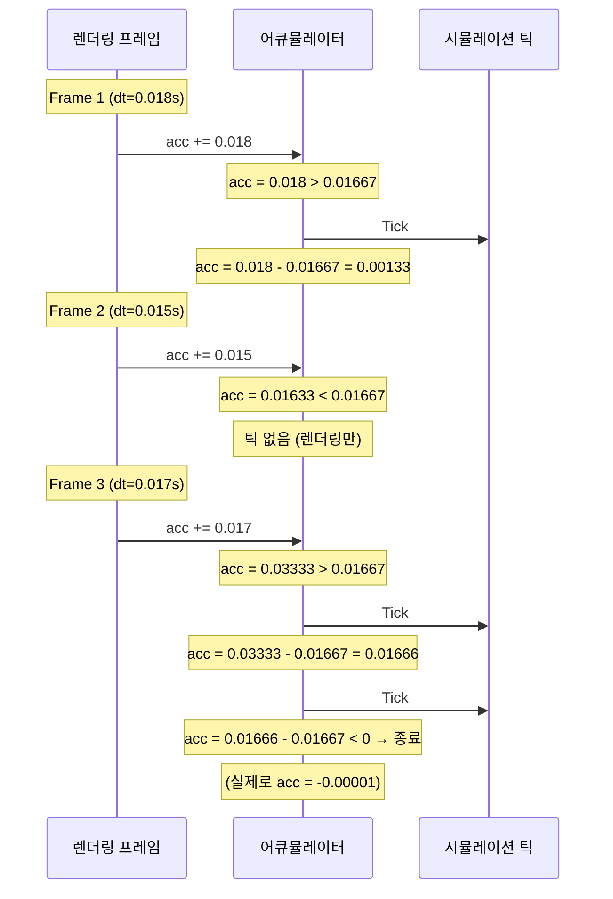
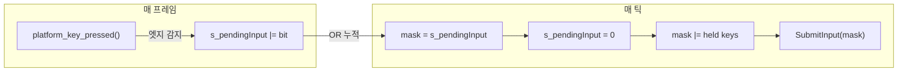
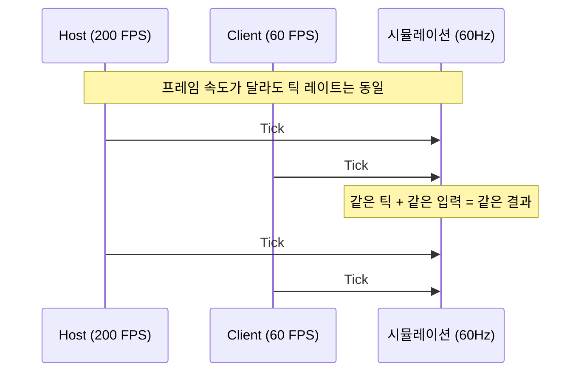
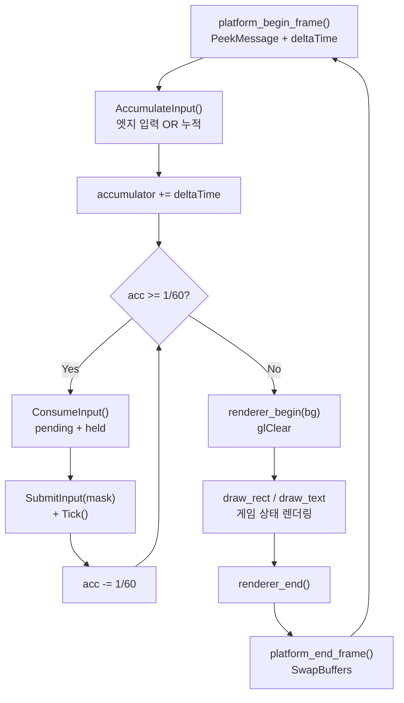
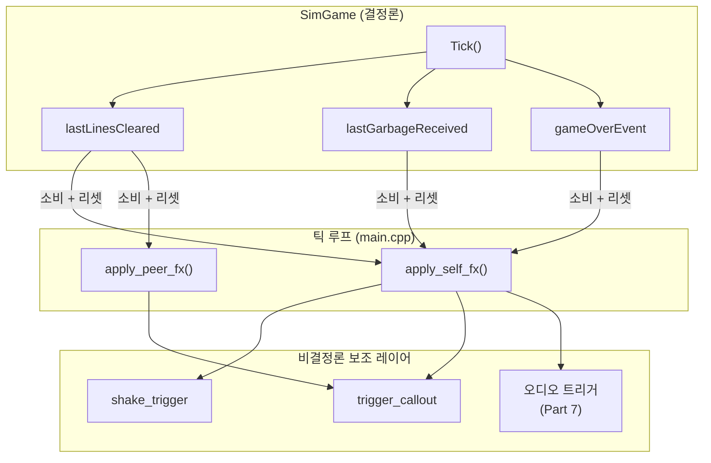
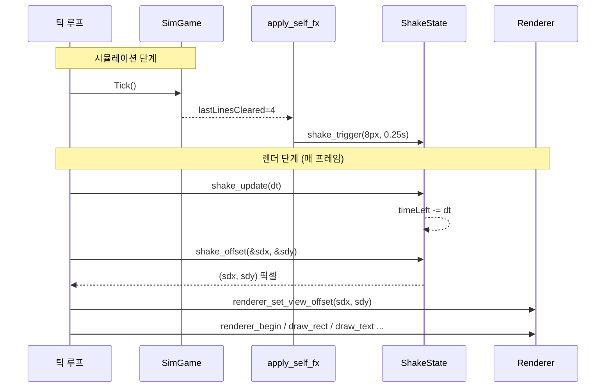
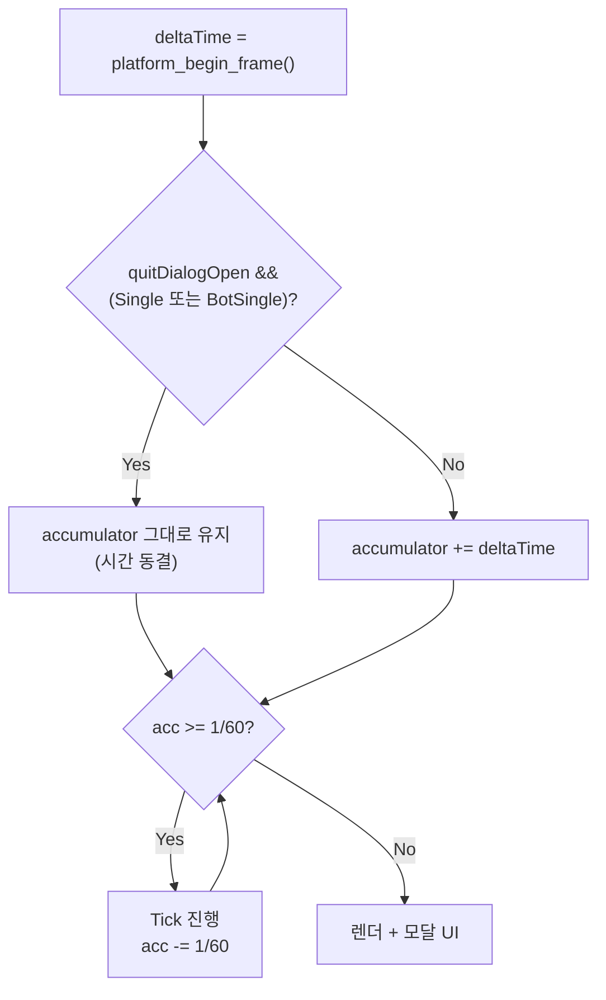
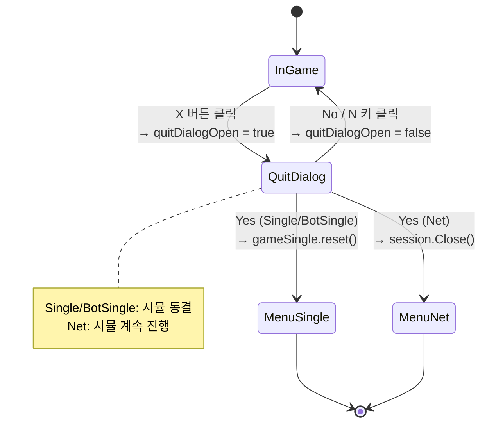

# Part 4: 게임 루프 아키텍처 — 고정 틱과 입력 누적

> **시리즈:** 제로부터 멀티플레이어 테트리스 + RL까지
> [Part 0: 셋업](./part0-project-setup.md) | [Part 1: Win32+GL](./part1-window-and-opengl.md) | [Part 2: 2D 렌더링](./part2-2d-rendering.md) | [Part 3: 테트리스 로직](./part3-tetris-logic.md) | **Part 4: 게임 루프** | [Part 5: 네트워킹](./part5-lockstep-networking.md) | [Part 6: Python RL](./part6-python-rl.md) | [Part 7: 오디오](./part7-xaudio2-audio.md) | [Part 8: 릴레이 서버](./part8-relay-server.md) | [Part 9: RL + ONNX 봇](./part9-rl-onnx-bot.md) | [Part 10: 메타 서버와 랭킹](./part10-meta-and-ranking.md)

---

## 들어가며

Part 1~3에서 창, 렌더러, 게임 로직을 만들었다. 이제 이것들을 하나로 묶는 **게임 루프**를 작성한다.

게임 루프의 핵심 문제: vsync를 끄면 FPS가 수천에 달한다. 틱당 한 프레임이면 초당 수천 번의 `MoveBlockDown()`이 실행되어 블록이 눈 깜짝할 새에 바닥에 닿는다. vsync를 켜더라도 60 FPS PC와 144 FPS PC에서 게임 속도가 다르다.

해결: **렌더링 속도와 시뮬레이션 속도를 분리**한다. 렌더링은 가능한 한 빠르게 (또는 vsync에 맞춰), 시뮬레이션은 **정확히 60Hz**로 실행한다. 이 패턴이 고정 틱 어큐뮬레이터(fixed-tick accumulator)다.

이 시리즈의 전체 소스 코드는 `src/main.cpp` (605줄)과 `core/constants.h` (9줄), `core/input.h` (18줄)에 해당한다.

---

## 1. 나이브 게임 루프의 문제

가장 단순한 게임 루프:

```cpp
while (!quit) {
    input();
    update();
    render();
}
```

이 루프의 문제는 `update()`의 실행 빈도가 하드웨어에 종속된다는 것이다.

| 환경 | FPS | update() 호출 | 결과 |
|------|-----|-------------|------|
| 고성능 GPU (vsync OFF) | 3000+ | 초당 3000+ | 블록이 50배 빨리 떨어짐 |
| 60Hz 모니터 (vsync ON) | 60 | 초당 60 | 의도한 속도 |
| 144Hz 모니터 (vsync ON) | 144 | 초당 144 | 2.4배 빠름 |
| 배터리 절약 모드 노트북 | 30 | 초당 30 | 절반 속도 |

`deltaTime`을 곱해 이동량을 조절하는 방법도 있지만, 테트리스처럼 이산적(discrete) 셀 단위로 이동하는 게임에서는 적합하지 않다. 블록은 "0.7셀만큼 이동"할 수 없다.

---

## 2. 고정 틱 어큐뮬레이터

### 2.1 핵심 아이디어

매 프레임 경과 시간(`deltaTime`)을 어큐뮬레이터에 누적하고, 어큐뮬레이터가 틱 간격(1/60초) 이상이면 틱을 실행한다:

$$\text{acc} \mathrel{+}= \Delta t$$
$$\text{while } \text{acc} \geq \frac{1}{60}: \quad \text{tick}(); \quad \text{acc} \mathrel{-}= \frac{1}{60}$$

렌더링은 어큐뮬레이터와 무관하게 매 프레임 실행된다. 시뮬레이션은 정확히 60Hz.



프레임 3처럼 `deltaTime`이 2틱분 이상이면 while 루프에서 여러 틱이 연속 실행된다. 이것이 **캐치업(catch-up)** 이다.

### 2.2 구현

```cpp
// core/constants.h
constexpr int   TICKS_PER_SECOND = 60;
constexpr float SECONDS_PER_TICK = 1.0f / static_cast<float>(TICKS_PER_SECOND);
```

```cpp
// src/main.cpp:178-248 (단순화)
float accumulator = 0.0f;

while (!platform_should_close())
{
    float deltaTime = platform_begin_frame();  // 이전 프레임 이후 경과 시간
    AccumulateInput();                          // 엣지 트리거 입력 누적

    accumulator += deltaTime;
    while (accumulator >= SECONDS_PER_TICK)
    {
        uint8_t inputMask = ConsumeInput();

        // 싱글 플레이
        if (app == AppMode::Single && gameSingle)
        {
            gameSingle->SubmitInput(inputMask);
            gameSingle->Tick();
        }

        accumulator -= SECONDS_PER_TICK;
    }

    // 렌더링 (accumulator와 무관하게 매 프레임)
    renderer_begin(darkBlue);
    // ... draw calls ...
    renderer_end();
    platform_end_frame();
}
```

이 구조의 성질:

| 상황 | 프레임당 틱 수 | 설명 |
|------|-------------|------|
| FPS > 60 | 0 또는 1 | 대부분 프레임에서 0~1틱 |
| FPS = 60 | 정확히 1 | 이상적 |
| FPS = 30 | 2 | 매 프레임 2틱씩 캐치업 |
| FPS 급락 (스파이크) | 다수 | 수십 틱 한꺼번에 실행 (위험) |

---

## 3. 입력 손실 문제

### 3.1 엣지 트리거의 특성

`platform_key_pressed()`는 "이번 프레임에 처음 눌린" 키만 감지하는 엣지 트리거다 (Part 1에서 구현: `state[key] && !prev[key]`). 이 값은 **한 프레임만** true이다.

문제: FPS가 높으면 60Hz 틱 사이에 여러 프레임이 지나간다. 키를 눌렀다 뗀 프레임이 틱 프레임과 어긋나면, 틱이 그 입력을 보지 못한다.

```
시간축 →

프레임:  F1    F2    F3    F4    F5    F6    F7    F8
틱:                  T1                      T2
입력:         ↑눌림
              ↑뗌

F2에서 pressed=true. 그러나 T1은 F3에서 실행.
T1 시점에 pressed는 이미 false → 입력 소실!
```

### 3.2 증상

vsync 없이 FPS가 수천일 때, 방향키를 빠르게 누르면 일부 입력이 "씹힌다". 특히 스페이스바(하드 드롭)가 간헐적으로 무시되는 것이 가장 눈에 띈다.

이 문제는 vsync ON(60 FPS)이면 잘 드러나지 않는다. 프레임과 틱이 거의 1:1 대응하기 때문이다. 그러나 vsync OFF이거나 모니터 주사율이 60Hz가 아닌 환경에서 즉시 발생한다.

### 3.3 해결: AccumulateInput / ConsumeInput



```cpp
// src/main.cpp (발췌)
static uint8_t s_pendingInput = 0;
static int s_leftHoldTicks = 0;
static int s_rightHoldTicks = 0;

static void AccumulateInput(bool suppress = false)
{
    if (suppress)
    {
        s_pendingInput = 0;
        s_leftHoldTicks = 0;
        s_rightHoldTicks = 0;
        return;
    }  // 채팅 입력 중 — 게임 키 흡수 중단
    if (platform_key_pressed(PKEY_LEFT))  s_pendingInput |= INPUT_LEFT;
    if (platform_key_pressed(PKEY_RIGHT)) s_pendingInput |= INPUT_RIGHT;
    if (platform_key_pressed(PKEY_UP))    s_pendingInput |= INPUT_ROTATE;
    if (platform_key_pressed(PKEY_SPACE)) s_pendingInput |= INPUT_DROP;
}

static uint8_t ConsumeInput(bool suppress = false)
{
    uint8_t mask = s_pendingInput;
    s_pendingInput = 0;
    if (suppress)
    {
        s_leftHoldTicks = 0;
        s_rightHoldTicks = 0;
        return 0;
    }

    const bool leftDown = platform_key_down(PKEY_LEFT);
    const bool rightDown = platform_key_down(PKEY_RIGHT);
    if (leftDown && rightDown)
    {
        mask &= static_cast<uint8_t>(~(INPUT_LEFT | INPUT_RIGHT));
    }
    mask |= HorizontalRepeatInput();
    if (platform_key_down(PKEY_DOWN)) mask |= INPUT_DOWN;
    return mask;
}
```

`suppress` 플래그는 채팅 입력 중일 때 `true` 로 들어와 게임 키를 흡수하지 않도록 한다 (채팅 모드의 `T` 키 토글 동작과 분리). `leftDown && rightDown` 브랜치는 두 방향을 동시에 누른 경우 엣지 비트까지 지워 중립으로 만든다 — DAS 의 `leftDown == rightDown` 리셋과 짝을 이룬다.

수식으로 표현:

$$\text{tickInput} = \text{pending} \;|\; \text{held}$$
$$\text{pending} \leftarrow 0 \quad (\text{소비 후 클리어})$$

**엣지 입력(pressed)** 과 **레벨 입력(held)** 의 처리가 다른 이유:

| 입력 유형 | 예시 | 처리 |
|----------|------|------|
| 엣지 (pressed) | 회전, 하드 드롭, 좌/우 첫 이동 | 누적 후 1회 소비 |
| 레벨 (held) | 소프트 드롭, 좌/우 홀드 반복 | 매 틱 실시간 상태 |

좌우 홀드 반복은 DAS/ARR 방식이다. 처음 누른 순간은 `platform_key_pressed()` 가 누적해 즉시 1칸 이동하고, 이후 `HorizontalRepeatInput()` 이 8틱(≈133ms) 대기한 뒤 3틱(≈50ms) 마다 한 번씩 같은 방향 비트를 추가한다. 이 값은 Tetris Guideline 기본 세팅(DAS ~133ms, ARR ~50ms) 과 일치 — 더 공격적으로 원하면 `kHorizontalArrTicks` 을 2 (33ms) 나 1 (17ms, 60칸/초) 로 내린다. 양쪽 방향키가 동시에 눌리면 좌우 비트를 지워 중립으로 처리한다.

> **히스토리 각주** — 초기 커밋(`7937b89` 이전) 에는 `HorizontalRepeatInput()` 이 존재하지 않아 `platform_key_pressed()` 의 edge trigger 만으로 좌우 이동이 일어났다. 이 구조에서는 꾹 눌러도 edge 가 한 번밖에 안 잡혀 한 칸만 이동 후 멈추는 "홀드 반복 없음" 증상이 발생했다. `d9524cf` 에서 위의 DAS/ARR 로직을 추가해 해결.

소프트 드롭은 "키를 누르고 있는 동안 일정 주기로 아래로 이동"하므로 held 상태를 매 틱 직접 확인한다. 회전과 하드 드롭은 "한 번 누르면 한 번 실행"이므로 엣지 트리거를 누적해야 한다.

### 3.4 멀티틱 캐치업 시 주의점

프레임이 길어서 한 프레임에 3틱이 실행되는 경우:

```cpp
while (accumulator >= SECONDS_PER_TICK)  // 3회 반복
{
    uint8_t inputMask = ConsumeInput();  // 첫 틱: pending 반환 + 클리어
                                          // 둘째/셋째 틱: pending=0 (이미 클리어됨)
    game->SubmitInput(inputMask);
    game->Tick();
    accumulator -= SECONDS_PER_TICK;
}
```

`ConsumeInput()`이 첫 번째 틱에서 pending을 클리어하므로, 나머지 틱은 **held 키에서 생성된 입력만** 실행된다. 이것은 의도된 동작이다: 사용자가 한 번 누른 회전/하드드롭 키가 여러 틱에 걸쳐 반복 적용되면 안 된다.

다만, 캐치업 도중에도 held 키(소프트 드롭, 좌우 DAS/ARR)는 매 틱 반영된다. 이것도 의도된 동작: 키를 누르고 있으면 캐치업 틱에서도 카운터가 같은 속도로 진행된다.

---

## 4. deltaTime 스파이크 처리

### 4.1 문제: 창 드래그

Win32에서 창의 타이틀바를 잡고 드래그하면, OS의 모달 메시지 루프가 `PeekMessage`를 점유한다. 이 동안 게임의 메인 루프가 **멈춘다**.

드래그를 놓으면 `platform_begin_frame()`이 반환하는 `deltaTime`이 급등한다. 예: 2초 동안 드래그했으면 `deltaTime = 2.0`.

```cpp
accumulator += 2.0f;  // 2초 = 120틱분!
while (accumulator >= SECONDS_PER_TICK)  // 120회 반복
{
    game->Tick();
    accumulator -= SECONDS_PER_TICK;
}
```

120틱이 한꺼번에 실행되면:
- 블록이 즉시 바닥에 닿고 잠김
- 다음 블록도 자동 하강으로 즉시 잠김
- 게임 상태가 수초 분량 한꺼번에 진행 ("시간 점프")

### 4.2 해결: deltaTime 클램핑

```cpp
// platform/win32.cpp:330
if (dt > 0.1f) dt = 0.1f;  // 100ms 최대 = 6틱
```

`deltaTime`을 0.1초(100ms)로 클램핑한다. 이것은 한 프레임에 최대 $\lfloor 0.1 / (1/60) \rfloor = 6$틱만 실행된다는 뜻이다.

클램핑 값 선택의 트레이드오프:

| 클램핑 값 | 최대 캐치업 틱 | 장점 | 단점 |
|----------|-------------|------|------|
| 0.05s (50ms) | 3틱 | 스파이크 영향 최소 | 일시적 멈춤 시 시뮬레이션 지연 |
| 0.1s (100ms) | 6틱 | 적당한 균형 | 드래그 후 약간의 점프 |
| 1.0s | 60틱 | 캐치업 빠름 | 1초 정지 후 60틱 폭발 |
| 클램핑 없음 | 무제한 | N/A | 장시간 정지 후 게임 붕괴 |

0.1초는 "사람이 인지하지 못하는 수준의 프레임 스킵(6틱 = 100ms)"과 "극단적 스파이크 차단" 사이의 합리적 타협점이다.

---

## 5. 입력 비트마스크

### 5.1 설계

```cpp
// core/input.h
enum InputBits : uint8_t {
    INPUT_NONE   = 0,
    INPUT_LEFT   = 1 << 0,  // 0b00001
    INPUT_RIGHT  = 1 << 1,  // 0b00010
    INPUT_DOWN   = 1 << 2,  // 0b00100
    INPUT_ROTATE = 1 << 3,  // 0b01000
    INPUT_DROP   = 1 << 4,  // 0b10000
};

inline bool hasInput(uint8_t mask, InputBits bit) {
    return (mask & bit) != 0;
}
```

5개 입력을 8비트(1바이트)에 패킹한다. 이 설계의 이점:

1. **직렬화 효율**: 네트워크 전송 시 틱당 1바이트만 필요
2. **OR 누적**: `s_pendingInput |= INPUT_LEFT`로 간단히 비트 합산
3. **리플레이 저장**: 프레임당 1바이트 × 60Hz = 3,600 bytes/min

### 5.2 동시 입력

비트마스크이므로 동시 입력이 자연스럽게 표현된다:

```cpp
// 좌측 이동 + 회전을 동시에 누른 경우
mask = INPUT_LEFT | INPUT_ROTATE;  // 0b01001

hasInput(mask, INPUT_LEFT);    // true
hasInput(mask, INPUT_ROTATE);  // true
hasInput(mask, INPUT_DOWN);    // false
```

`SimGame::SubmitInput`은 각 비트를 순서대로 처리한다:

```cpp
void SimGame::SubmitInput(uint8_t inputMask)
{
    if (hasInput(inputMask, INPUT_LEFT))   MoveBlockLeft();
    if (hasInput(inputMask, INPUT_RIGHT))  MoveBlockRight();
    if (hasInput(inputMask, INPUT_DOWN))   MoveBlockDown();
    if (hasInput(inputMask, INPUT_ROTATE)) RotateBlockImpl();
    if (hasInput(inputMask, INPUT_DROP))   MoveBlockDrop();
    DropExpectation();  // 고스트 블록 갱신
}
```

입력 처리 순서(좌 → 우 → 하 → 회전 → 드롭)가 결정론에 영향을 미친다. 같은 비트마스크에 대해 모든 피어가 동일한 순서로 처리해야 한다.

---

## 6. 멀티플레이에서의 의미

### 6.1 고정 틱과 Lockstep

고정 틱 어큐뮬레이터가 멀티플레이의 **전제 조건**이다. 모든 피어가 동일한 틱 레이트(60Hz)로 시뮬레이션을 실행하므로, "틱 N에서 입력 X를 적용"이라는 명세만으로 상태가 동기화된다.



FPS가 다르면 렌더링 빈도가 다르지만, 시뮬레이션은 정확히 같은 속도로 진행된다. Host가 200 FPS이고 Client가 60 FPS라도, 양쪽의 `SimGame` 상태는 같은 틱에서 동일하다.

### 6.2 네트워크 입력 흐름

멀티플레이 모드에서 루프 구조가 변경된다:

```cpp
// src/main.cpp:192-234 (단순화)
while (accumulator >= SECONDS_PER_TICK)
{
    uint8_t inputMask = ConsumeInput();

    if (app == AppMode::Net && session.isConnected())
    {
        // 1. 로컬 입력을 저장하고 상대에게 전송
        localInputs[localTickNext] = inputMask;
        session.SendInput(localTickNext, inputMask);
        localTickNext++;

        // 2. safeTick 계산: 양쪽 입력이 확보된 최대 틱
        int64_t safeTick = min(lastLocalSent, lastRemoteRecv) - inputDelay;

        // 3. safeTick까지만 시뮬레이션 진행
        while ((int64_t)simTick <= safeTick)
        {
            uint8_t li = localInputs[simTick];
            uint8_t ri = session.GetRemoteInput(simTick);
            gameLocal->SubmitInput(li);
            gameRemote->SubmitInput(ri);
            gameLocal->Tick();
            gameRemote->Tick();
            simTick++;
        }
    }

    accumulator -= SECONDS_PER_TICK;
}
```

safeTick의 의미:

$$\text{safeTick} = \min(\text{lastLocalSent},\ \text{lastRemoteRecv}) - \text{inputDelay}$$

양쪽 피어의 입력이 모두 도착한 틱까지만 시뮬레이션을 진행한다. 한쪽 피어의 입력이 늦으면 다른 쪽의 시뮬레이션도 대기한다. 이것이 **Lockstep** 동기화의 핵심이다. Part 5에서 상세히 다룬다.

---

## 7. 전체 프레임 흐름

한 프레임의 전체 실행 순서:



중요한 순서:

1. `platform_begin_frame()` — 메시지 루프 + deltaTime 계산
2. `AccumulateInput()` — 이번 프레임의 엣지 입력 누적
3. 시뮬레이션 루프 — `ConsumeInput()` → `SubmitInput()` → `Tick()` (0~N회)
4. 렌더링 — `renderer_begin()` → draw calls → `renderer_end()`
5. `platform_end_frame()` — SwapBuffers

시뮬레이션이 렌더링 **이전**에 실행되므로, 렌더링은 항상 최신 상태를 그린다. 만약 순서를 바꾸면 (렌더링 → 시뮬레이션), 화면에 1틱 전의 상태가 그려지는 "1프레임 지연"이 발생한다. 체감하기 어려운 수준이지만, 이것이 정석이다.

---

## 오류와 함정

### (1) ConsumeInput() 첫 틱에서 pending 클리어

**증상:** 멀티틱 캐치업(한 프레임에 여러 틱)에서 두 번째 이후의 틱에 빈 입력이 들어간다.

**원인:** `ConsumeInput()`이 `s_pendingInput`을 0으로 클리어하므로, 첫 번째 틱에서만 누적된 입력이 적용되고 나머지 틱은 held 키만 반영된다.

**이것은 의도된 동작이다.** 사용자가 한 번 누른 키가 캐치업 틱에서 여러 번 적용되면 "스페이스 한 번 눌렀는데 블록 3개가 하드 드롭"되는 현상이 발생한다. 단, 이 설계를 문서화하지 않으면 디버깅 시 혼란을 줄 수 있다.

### (2) deltaTime 클램프 선택

**증상:** 클램프가 너무 크면(1초) 창 드래그 후 60틱이 한꺼번에 실행되어 게임이 급진행. 너무 작으면(0.01초) 한 프레임에 틱을 하나도 못 돌려서 시뮬레이션이 점점 뒤처짐.

**원인:** 클램핑은 "비정상적 deltaTime을 정상 범위로 자르는" 안전장치이므로, 정상 상태에서의 deltaTime 범위를 고려해야 한다.

**해결:** 0.1초(100ms) = 최대 6틱은 "사람이 인지하지 못하는 프레임 스킵"과 "극단적 스파이크 차단"의 합리적 타협. 30 FPS 환경(dt=0.033)에서 한 프레임에 2틱이 안전하게 처리된다.

> **레퍼런스:** Glenn Fiedler, "Fix Your Timestep!" (gafferongames.com, 2004). "If you clamp at 250ms you'll get at most 4-5 iterations of the loop."

### (3) 부동소수점 누적 오차

**증상:** 장시간 플레이 시 시뮬레이션 속도가 미세하게 어긋난다.

**원인:** `accumulator += deltaTime`과 `accumulator -= SECONDS_PER_TICK`에서 float의 유한 정밀도로 인한 오차가 매 프레임 누적된다.

```
이론: 1000프레임 × 1/60 = 16.6667초 동안 정확히 1000틱
실제: float 누적 오차로 999틱 또는 1001틱
```

float32의 유효 자릿수는 약 7자리이므로, `accumulator`가 10초 이상이면 $1/60 \approx 0.01667$과의 비교에서 유효 자릿수가 5자리로 줄어든다. 해결책:

- `accumulator`가 큰 값으로 누적되지 않도록 클램핑 (이미 적용됨)
- double 사용 (이 프로젝트에서는 float로 충분)
- 틱 카운터 기반으로 전환 (정수 연산으로 오차 제거)

이 프로젝트에서는 클램핑(0.1초)이 누적을 억제하므로 float으로 충분하다.

### (4) 네트워크 모드에서 입력 전송과 시뮬레이션의 분리

**증상:** `SendInput`은 매 틱 호출되지만, 시뮬레이션은 `safeTick`까지만 진행되어 입력 전송과 시뮬레이션이 비동기.

**주의:** `localTickNext`(전송한 마지막 틱)과 `simTick`(시뮬레이션 진행 위치)이 다른 값이다. `localTickNext`는 매 틱 증가하지만, `simTick`은 상대방 입력이 도착해야 진행된다. 이 차이가 `inputDelay` 틱만큼의 버퍼를 형성한다.

---

## 폴리싱: 가비지 큐 미리보기 + 통합 패널 + 알파 블렌딩

지금까지의 루프는 "기능적으로 작동" 까지였다. 보드 한 개 + Score / Next 가 따로 떨어진 두 박스 + 검정 배경. 멀티 모드를 시작하면 한 가지가 결정적으로 부족하다 — **상대가 보낸 가비지가 곧 들어온다는 신호** 가 화면에 없다. 또 화면 전체가 채도 없는 검정이라 블록 컬러가 묻힌다.

이 절은 sim 을 건드리지 않고 **렌더 레이어만 손대는** 후속 폴리싱이다 — `SimGame::PendingGarbage()` 같은 const 접근자를 읽어서 시각화하는 식이라, Part 5 lockstep 결정론에는 영향이 없다.

### A. 알파 블렌딩 한 줄

`renderer_init` 의 마지막에 두 줄을 추가한다 — 이 한 줄이 이후 모든 반투명 효과의 전제 조건이다:

```cpp
// renderer/renderer.cpp — renderer_init 후반부
glVertexAttribPointer(0, 2, GL_FLOAT, GL_FALSE, 2 * sizeof(float), nullptr);
glEnableVertexAttribArray(0);
glBindVertexArray(0);

// 알파 블렌딩 — 고스트 블록 반투명, UI 페이드 등에 필요.
glEnable(GL_BLEND);
glBlendFunc(GL_SRC_ALPHA, GL_ONE_MINUS_SRC_ALPHA);
```

기본값은 `GL_BLEND` 가 꺼져 있어서 알파 채널이 아무리 작아도 컬러가 그대로 덮어쓴다. `glBlendFunc` 의 `SRC_ALPHA / ONE_MINUS_SRC_ALPHA` 가 표준 "위쪽 알파 비율로 섞기" 공식이다.

그 결과로 색 팔레트의 고스트 색이 의미를 갖는다:

```cpp
// src/colors.cpp
const Color garbageColor = { 80,  80,  90, 255};  // id=9 — 가비지 셀 (어두운 회색)
// id=8 — 고스트 블록: 반투명 흰회색 (알파 70/255 ≈ 27%)
const Color ghostColor   = {200, 200, 210,  70};
```

알파 70/255 ≈ 27 % 가 핵심 — 보드 배경과 충분히 섞여서 "여기 떨어질 거다" 는 미리보기로만 보이고, 실제 currentBlock 과 헷갈리지 않는다.

### B. 다크 네이비 배경 + 보드 테두리

배경을 검정에서 다크 네이비로:

```cpp
// src/main.cpp — 매 프레임 시작
renderer_begin({8, 10, 20, 255});
```

채도를 약간만 깔아두면 블록의 빨강·청록·노랑이 더 선명하게 떠 보인다. 완전한 검정 (`{0,0,0,255}`) 위에서는 다크 컬러 블록 (J=blue, T=purple) 이 묻힌다.

보드 자체에도 1~2 px 테두리를 추가:

```cpp
// src/game.cpp
void Game::DrawBoardAt(int offsetX, int offsetY)
{
    constexpr int cellSize = 30;
    constexpr int bw = SimGrid::kCols * cellSize;
    constexpr int bh = SimGrid::kRows * cellSize;
    // 보드 테두리 → 배경 순으로 그려서 1px 테두리 효과
    draw_rect(offsetX - 2, offsetY - 2, bw + 4, bh + 4, {55, 62, 100, 255});
    draw_rect(offsetX,     offsetY,     bw,     bh,     {14, 16, 30, 255});
    DrawGrid(offsetX, offsetY);
    DrawBlock(sim.GhostBlock(),   offsetX, offsetY);
    DrawBlock(sim.CurrentBlock(), offsetX, offsetY);
}
```

순서가 중요하다 — 큰 사각 (테두리 색) → 작은 사각 (보드 배경) → 셀 → 고스트 → 현재 피스. 페인터스 알고리즘으로 자연스럽게 1 px 외곽선이 남는다.

### C. 가비지 큐 미리보기 바

멀티 모드에서 상대가 Tetris 를 쳤다고 가정하자. 4 라인의 가비지가 `pendingGarbage` 로 누적되어 **다음 LockBlock** 시점에 내 보드 하단으로 올라온다. 그 사이에 플레이어가 알아챌 신호가 필요하다 — 보드 왼쪽에 빨간 수직 바 하나면 충분하다:

```cpp
// src/game.h
// 가비지 큐 미리보기 바 — 보드 왼쪽(offsetX-8 위치)에 빨간 바 세로 그리기.
// pending: 주입 대기 중인 행 수. 최대 표시 12행.
static void DrawGarbageBar(int boardX, int boardY, int pending);
```

```cpp
// src/game.cpp
void Game::DrawGarbageBar(int boardX, int boardY, int pending)
{
    if (pending <= 0) return;
    constexpr int cellSize = 30;
    constexpr int barW = 5;
    constexpr int boardH = SimGrid::kRows * cellSize;  // 600px
    constexpr int maxRows = 12;

    int rows = (pending > maxRows) ? maxRows : pending;
    int barH = rows * cellSize;

    // 배경 트랙 (어두운 바)
    draw_rect(boardX - barW - 2, boardY, barW, boardH, {40, 10, 10, 180});
    // 채워진 부분 (아래서 위로 — 가비지는 하단에서 올라옴)
    draw_rect(boardX - barW - 2, boardY + boardH - barH, barW, barH, {220, 40, 40, 220});
}
```

- 보드 왼쪽 7 px (`barW=5` + 2 px gap) 위치에 보드 전체 높이 (600 px) 만큼의 어두운 트랙.
- 그 위에 `pending` 행 수만큼 빨간색을 **하단에서 위로** 채운다 — 가비지가 실제로 올라오는 방향과 일치.
- 12 행에서 cap — 그 이상은 보드 높이를 넘는데, 12 행 이상의 pending 이 쌓이면 어차피 다음 LockBlock 에서 최대 20 행까지 쏟아지며 사실상 게임오버다.

호출은 멀티/봇 모드 양쪽 보드에:

```cpp
// src/main.cpp — Net 모드 렌더 (BotSingle 도 동일)
gameLocal->DrawBoardAt(leftX, 11);
Game::DrawGarbageBar(leftX, 11, gameLocal->sim.PendingGarbage());
// ... 그 다음 ...
gameRemote->DrawBoardAt(rightX, 11);
Game::DrawGarbageBar(rightX, 11, gameRemote->sim.PendingGarbage());
```

const 접근자 `PendingGarbage()` 만 읽으므로 sim 결정론에 무영향. 양쪽 클라이언트에서 동시에 같은 길이의 빨간 바가 올라온다 — lockstep 의 부수 효과.

### D. 통합 우측 패널 (싱글 모드)

기존에는 화면 우측에 Score 박스, 그 아래에 Next 박스가 따로 있었다. 시야가 분산되고, "현재 점수" 와 "현재 레벨" 처럼 같은 카테고리 정보가 분리돼서 어색했다. 한 카드 안에 Score / Level / Lines / Next 를 묶는다:

```cpp
// src/main.cpp — Single 모드 렌더
// 우측 정보 패널 (보드 오른쪽 x=316 ~ 720)
constexpr int pX = 320, pW = 175;
constexpr Color panelBg   = {18, 22, 42, 255};
constexpr Color panelLine = {45, 52, 85, 255};
constexpr Color labelClr  = {120, 130, 170, 255};

// SCORE
draw_rect_rounded(pX, 12, pW, 80, 0.3f, panelBg);
draw_text("SCORE", pX + 12, 18, 16, labelClr);
{
    char buf[16]; snprintf(buf, sizeof(buf), "%d", gameSingle->score);
    int tw = measure_text(buf, 34);
    draw_text(buf, pX + (pW - tw) / 2, 40, 34, WHITE);
}

// LEVEL + LINES 나란히
draw_rect_rounded(pX, 104, pW, 70, 0.3f, panelBg);
draw_rect(pX + 12, 130, pW - 24, 1, panelLine);
draw_text("LEVEL", pX + 12, 110, 14, labelClr);
draw_text("LINES", pX + pW/2 + 4, 110, 14, labelClr);
draw_text(fmt_buf("%d",  gameSingle->sim.level),
          pX + 22, 126, 28, WHITE);
draw_text(fmt_buf("%d",  gameSingle->sim.totalLinesCleared),
          pX + pW/2 + 14, 126, 28, WHITE);

// NEXT
draw_rect_rounded(pX, 186, pW, 130, 0.3f, panelBg);
draw_text("NEXT", pX + 12, 192, 14, labelClr);
// 3칸 기준 60px → (175-60)/2 = 57 ≈ 55 offset 으로 대략 중앙정렬
gameSingle->DrawNextMini(pX + 50, 215, 20);
```

세 카드 (`draw_rect_rounded`) 가 같은 X 좌표 / 같은 폭으로 세로로 쌓이고, 라벨은 `labelClr` (흐린 회청색), 값은 흰색 — 시선이 자연스럽게 위→아래 흐른다.

### E. 멀티/봇 모드 하단 스코어 패널

화면 위쪽은 두 개의 보드가 차지하므로 (각 300 px 너비), Score/Level 은 보드 바로 아래 좁은 띠에 둔다:

```cpp
// src/main.cpp — Net / BotSingle 공통 (보드 = 11..611, 스코어 패널은 614 부근)
{
    constexpr Color sb = {18, 22, 40, 200};
    draw_rect_rounded(leftX,  614, 120, 22, 0.4f, sb);
    draw_rect_rounded(rightX, 614, 120, 22, 0.4f, sb);
    draw_text(fmt_buf("Score: %d", gameLocal->score),  leftX  + 6, 616, 16, WHITE);
    draw_text(fmt_buf("Score: %d", gameRemote->score), rightX + 6, 616, 16, WHITE);
    draw_text(fmt_buf("Lv.%d", gameLocal->sim.level),  leftX  + 6, 633, 14, {120,130,170,255});
    draw_text(fmt_buf("Lv.%d", gameRemote->sim.level), rightX + 6, 633, 14, {120,130,170,255});
}
```

알파 200 (≈ 78 %) 의 패널 배경이 보드 외곽 1 px 와 슬쩍 겹쳐서 "보드의 일부" 로 보인다. 두 보드가 독립적이라는 것이 즉시 읽힌다.

### F. 여기서 빌드해보자

```bash
cmake --build build --config Release
./build/Release/tetris.exe
```

기대 동작:
- 싱글 모드: 우측에 Score / Level + Lines / Next 가 한 카드로 묶여 보인다. 라인을 지울 때마다 LINES 가 +1, 10 줄마다 LEVEL 이 +1.
- 보드 외곽에 1 px 테두리가 보이고, 고스트 블록은 반투명 (보드 배경이 비쳐 보임).
- 봇 매치 (`BotSingle`) 또는 멀티 (`Net`) 모드: 봇이 라인을 지워서 가비지 1+ 라인이 내 큐에 쌓이는 순간 보드 왼쪽에 빨간 바가 떠오른다. 다음 피스를 lock 하면 가비지가 실제로 올라오면서 빨간 바는 사라진다.
- 두 클라이언트로 멀티 매치를 돌리면 양쪽에서 같은 시점에 같은 길이의 빨간 바가 보인다 — `PendingGarbage()` 가 결정론적이라는 시각적 증거.

---

## 정리

고정 틱 어큐뮬레이터와 입력 누적은 게임 루프의 두 가지 핵심 문제를 해결한다:

1. **시뮬레이션 속도 독립**: FPS와 무관하게 정확히 60Hz
2. **입력 무손실**: 엣지 트리거 입력을 비트 OR로 누적하여 틱 간 프레임에서의 소실 방지

이 패턴은 테트리스뿐 아니라 대부분의 실시간 게임에서 사용된다. 특히 네트워크 게임에서는 모든 피어가 동일한 틱 레이트로 실행되어야 결정론적 동기화가 가능하므로, 고정 틱은 선택이 아닌 필수다.

다음 Part 5에서는 이 고정 틱 위에 구축되는 **TCP Lockstep 네트워킹** — 같은 시드, 같은 입력, 같은 결과로 두 명의 플레이어를 동기화하는 방법을 다룬다.

---

## 참고 자료

1. **Glenn Fiedler**, "Fix Your Timestep!" (gafferongames.com, 2004). 고정 틱 어큐뮬레이터 패턴의 원전. 보간(interpolation)과 잔여 시간(remainder)까지 다루는 완전한 해설
2. **"Game Programming Patterns"** (Robert Nystrom, 2014). Chapter 9 "Game Loop" — 나이브 루프, 고정 틱, 가변 틱의 장단점 비교
3. **Valve Source Engine**, "Tick Rate" documentation. Source 엔진의 66Hz/128Hz 틱 레이트와 interpolation 구현
4. **Casey Muratori**, "Handmade Hero" Day 010-012. Win32 타이머, QueryPerformanceCounter, 고정 틱 루프의 직접 구현
5. **OpenGL 4.6 Specification**, Section 4 "Per-Fragment Operations". SwapBuffers와 더블 버퍼링의 동기화 모델

---

## 부록 A. 비결정론 보조 레이어 분리

### A.1 왜 분리해야 하는가

Lockstep 동기화의 전제는 "모든 피어가 같은 시드 + 같은 입력 시퀀스를 먹으면 같은 상태로 수렴한다" 이다. 이 등식이 깨지면 디싱크(desync) 가 나고 HASH 검증에서 배너가 뜬다.

그런데 게임을 실제로 플레이해 보면 결정론만으로는 부족한 요소가 꽤 있다:

- 라인을 4줄 지웠을 때 화면이 콰광 흔들려야 시원하다.
- "TETRIS!" 같은 콜아웃 텍스트가 1초 동안 떠 있어야 피드백이 완성된다.
- 블록이 락될 때 틱 톡 소리가 나야 살아있는 느낌이 난다.

여기서 질문: **이 연출들을 `SimGame::Tick()` 안에서 호출해도 되는가?**

답은 "절대 안 된다" 이다. 이유는 세 층위가 있다.

1. **결정론 오염 위험.** `shake` 상태 머신은 XorShift64\* RNG 를 소비한다. 만약 Sim 내부에서 `shake_trigger` 를 호출하면, 두 피어의 `shake.rngState` 가 각자 다른 속도로 진화하면서 — Sim 이 동일한 `Random` 인스턴스를 참조한다면 — 피스 생성 RNG 에도 영향을 줄 수 있다. 공유 RNG 구조면 즉시 디싱크, 분리된 RNG 구조라도 "Sim 안에서 무엇을 호출해도 되는가" 의 경계가 흐려진다.
2. **테스트 가능성.** Sim 은 headless (창 없이, 렌더러 없이) 로 돌아가야 한다. Python 병행 구현 (`python/netbot/`) 이 C++ Sim 과 비트 단위로 일치하는지 검증하는 parity 테스트 (`python/tests/test_placement_parity.py`) 가 그 대표 예시다. Sim 에 렌더러 심볼이 섞이면 헤드리스 링크가 깨진다.
3. **리플레이·관전·되감기.** 저장된 입력 시퀀스만으로 Sim 을 재생해 임의 틱으로 점프하고 싶을 때, 연출 레이어가 Sim 안에 있으면 "과거로 되감으면서 오디오가 거꾸로 재생되는" 식의 괴상한 일이 벌어진다.

그래서 **Sim 은 결정론 데이터만 내놓고, 틱 루프가 그 데이터를 소비해서 비결정론 레이어를 구동한다.**

### A.2 이벤트 플래그 프로토콜

`SimGame` 은 매 틱 내부에서 라인 클리어 / 가비지 수신 / 게임 오버가 발생하면 자기 멤버 변수에 "이번 틱에 이런 일이 있었다" 라는 플래그를 적는다. 틱 루프가 한 번 읽고 나서 0 으로 리셋한다.

| 필드 | 의미 | 트리거 |
|------|------|--------|
| `lastLinesCleared` | 이번 틱에 지운 줄 수 (0~4) | `Tick()` 내 라인 클리어 로직 |
| `lastGarbageReceived` | 이번 틱에 바닥에서 올라온 가비지 줄 수 | 가비지 큐 소비 |
| `gameOverEvent` | 이번 틱에 톱아웃 발생 (bool) | 스폰 실패 검출 |

이 세 필드는 Sim 이 매 틱 **덮어쓰지 않는다**. 해당 이벤트가 실제로 발생한 틱에만 1 이상으로 설정되고, 틱 루프 쪽에서 소비 후 0 으로 클리어한다. 즉 "edge event" 플래그다.



Sim 의 세 플래그가 한 방향으로만 흐른다는 것이 핵심이다. 보조 레이어는 Sim 을 읽기만 할 뿐 되돌려 쓰지 않는다. 이 단방향성이 결정론 경계를 지킨다.

### A.3 소비 지점을 한 곳에 모은다

플래그 기반 프로토콜의 함정은 **"어디서 리셋할 것인가"** 이다. 만약 Net 모드 코드, Single 모드 코드, BotSingle 모드 코드가 각자 다른 자리에서 플래그를 읽고 리셋한다면:

- Net 에서는 `lastLinesCleared` 만 보고 shake 를 거는데 `lastGarbageReceived` 를 깜빡 빠뜨림 → 싱글에는 있는데 넷에는 없는 연출 버그.
- 새 필드 (`lastComboLen` 같은 것) 를 추가하면 세 자리 모두 수정해야 함 → 리그레션 자석.

이를 막으려면 소비/리셋을 **헬퍼 한 곳** 에 모아서, 세 모드가 동일 경로로 들어오게 해야 한다.

`src/main.cpp` 의 람다 두 개가 정확히 그 역할을 한다.

```cpp
// src/main.cpp:376-403
// 자기 보드 이벤트 처리: shake + callout + 소비 플래그 리셋. Net/Single/BotSingle
// 공통 경로로 — 플래그 리셋이 한 곳에 모여 있어 새 필드를 추가해도 빠뜨릴 수 없다.
auto apply_self_fx = [&](SimGame& sim, Callout& co) {
    if (sim.lastLinesCleared > 0) {
        switch (sim.lastLinesCleared) {
            case 1: shake_trigger(shake, 2.0f, 0.10f); break;
            case 2: shake_trigger(shake, 4.0f, 0.15f); break;
            case 3: shake_trigger(shake, 6.0f, 0.20f); break;
            case 4: shake_trigger(shake, 8.0f, 0.25f); break;
        }
        trigger_callout(co, sim.lastLinesCleared);
    }
    if (sim.lastGarbageReceived > 0)
        shake_trigger(shake, 6.0f, 0.20f);
    if (sim.gameOverEvent)
        shake_trigger(shake, 16.0f, 0.50f);
    sim.lastLinesCleared = 0;
    sim.lastGarbageReceived = 0;
    sim.gameOverEvent = false;
};
// 상대 보드 이벤트: shake 없이 callout 만 (내 화면을 흔들 이유가 없음).
auto apply_peer_fx = [&](SimGame& sim, Callout& co) {
    if (sim.lastLinesCleared > 0)
        trigger_callout(co, sim.lastLinesCleared);
    sim.lastLinesCleared = 0;
    sim.lastGarbageReceived = 0;
    sim.gameOverEvent = false;
};
```

두 람다의 구조를 뜯어보자.

**`apply_self_fx`:**

- `lastLinesCleared` 가 양수면 줄 수에 비례한 shake 를 걸고 콜아웃 텍스트도 띄운다. 1줄 (`SINGLE`) 은 연출 없이 숫자로만 잡지만 (`trigger_callout` 은 2줄 이상만 텍스트를 설정), shake 는 소소하게 (2px, 0.10s) 걸린다.
- `lastGarbageReceived > 0` 이면 "내 보드에 위협이 쌓였다" 는 피드백으로 중간 강도 shake (6px, 0.20s).
- `gameOverEvent` 가 true 면 가장 강한 shake (16px, 0.50s). 프로젝트에서 `shake_trigger` 는 "현재 활성 강도보다 약하면 무시" 정책이라, 게임오버 shake 는 직전의 라인 클리어 shake 를 덮어쓴다.
- 마지막 세 줄에서 **플래그 세 개를 전부 리셋한다**. if 블록에 안 걸린 플래그도 0 으로 밀어버리는 게 중요하다 — 다음 틱에서 "지난 번 이벤트의 찌꺼기" 를 다시 읽지 않도록.

**`apply_peer_fx`:**

- 상대 보드에서 라인이 지워졌다고 **내** 화면을 흔들면 안 된다. 자기 보드 흔들림은 "내 행동의 피드백" 이어야 하기 때문. 그래서 peer 람다는 shake 호출이 없고 콜아웃 텍스트만 `coRemote` 에 띄운다.
- 그럼에도 **플래그 리셋은 똑같이 한다**. Sim 쪽에서 보면 "누군가 내 플래그를 비워줬다" 는 계약이 일관되게 지켜진다.

### A.4 세 모드에서 어떻게 불리는가

세 모드에서 이 두 람다의 호출 지점만 다르다. Sim 진행 경로는 다르지만 소비/리셋은 동일 경로를 탄다.

**Net 모드 (Lockstep):**

```cpp
// src/main.cpp:527-528 부근
// gameLocal->Tick(); gameRemote->Tick(); 이후
apply_self_fx(gameLocal->sim,  coLocal);
apply_peer_fx(gameRemote->sim, coRemote);
```

safeTick 까지 캐치업 루프 안에서 매 틱 호출. 즉 한 프레임에 여러 틱이 진행되면, shake 트리거도 여러 번 걸릴 수 있다. `shake_trigger` 의 "약한 건 무시" 정책이 여기서 제 역할을 한다 — 캐치업 5틱 동안 1줄 클리어 shake 가 연달아 와도, 먼저 활성화된 가장 강한 shake 가 살아남는다.

**Single 모드:**

```cpp
// src/main.cpp:549 부근
gameSingle->SubmitInput(inputMask);
gameSingle->Tick();
apply_self_fx(gameSingle->sim, coLocal);
```

상대가 없으니 `apply_peer_fx` 는 호출 안 함. `coRemote` 는 항상 빈 채로 남는다.

**BotSingle 모드:**

```cpp
// src/main.cpp:589-590 부근
apply_self_fx(gameSingle->sim, coLocal);
apply_peer_fx(gameBot->sim,    coRemote);
```

봇도 Sim 을 돌리므로 Net 모드와 동일한 형태. 차이는 봇 쪽 입력이 네트워크 대신 ONNX 추론에서 나온다는 것뿐.

### A.5 플래그 추가 시 체크리스트

이 구조에서 새 이벤트를 추가할 때 (예: "콤보 N 연속 성공" 같은 것) 건드려야 할 곳은 정확히 다음 세 지점이다.

1. `SimGame` 에 `lastComboLen` 같은 필드 추가 + Tick 안에서 설정.
2. `apply_self_fx` 에 해당 필드 소비 로직 추가 (shake/callout/audio).
3. `apply_self_fx` / `apply_peer_fx` 맨 끝에 `sim.lastComboLen = 0` 리셋 추가.

세 번째를 빼먹는 것이 가장 흔한 버그인데, 리셋 문이 한 람다 안에 몰려 있으니 diff 리뷰에서 쉽게 잡힌다. 모드별 코드에 흩어져 있었으면 "Net 에만 있고 Single 에 없다" 같은 비대칭이 한참 후에 드러났을 것이다.

### A.6 오디오로의 확장 (Part 7 선행)

Part 7 에서 XAudio2 를 붙일 때, "블록 락 / 라인 클리어 / 가비지 수신" 사운드 트리거가 자연스럽게 `apply_self_fx` 에 들어간다. Sim 은 그대로이고 람다만 확장한다. 가상적으로:

```cpp
// 예시 (Part 7 에서 실제 구현)
if (sim.lastLinesCleared > 0) {
    // ... 기존 shake/callout ...
    audio_play(sfxClearByLines[sim.lastLinesCleared]);  // NEW
}
```

Sim 결정론은 오디오 유무와 무관하다. 헤드리스 테스트 환경에서는 `audio_play` 가 no-op 이면 그만이고, parity 테스트도 영향을 안 받는다.

---

## 부록 B. 셰이크와 투영 행렬

### B.1 렌더 단계에서만 주입

`ShakeState` 는 렌더러의 뷰 오프셋 (orthographic 투영의 translation 파라미터) 만 건드린다. Sim 의 격자 좌표나 블록 위치는 손대지 않는다. 이 경계가 "셰이크가 결정론에 영향을 주지 않는다" 는 주장을 성립시킨다.

구체적인 데이터 흐름은 다음과 같다.



핵심은 `shake_update` 와 `renderer_set_view_offset` 이 **모두 틱 루프 바깥, 렌더 단계에서** 실행된다는 점이다. 매 프레임 한 번. 틱 루프 안에서는 `shake_trigger` 만 호출된다 — 즉 "이 시점에 흔들림이 시작됐다" 는 선언만 하고 실제 감쇠/오프셋 계산은 렌더 경로에서 수행한다.

### B.2 실제 호출 순서

`src/main.cpp` 의 메인 루프 말미에서 렌더 직전에 다음 블록이 돈다.

```cpp
// src/main.cpp:657-667
// 3) 렌더링
// Section I: shake 업데이트 + 뷰 오프셋 적용. 메뉴/네트 대기 등도 통과하지만
// trigger 가 걸리지 않으면 dx=dy=0 이라 영향 없음.
shake_update(shake, deltaTime);
if (coLocal.timeLeft  > 0.0f) coLocal.timeLeft  -= deltaTime;
if (coRemote.timeLeft > 0.0f) coRemote.timeLeft -= deltaTime;
{
    float sdx = 0.0f, sdy = 0.0f;
    shake_offset(shake, sdx, sdy);
    renderer_set_view_offset((int)sdx, (int)sdy);
}

renderer_begin(darkBlue);
```

순서에 주의:

1. `shake_update(shake, deltaTime)` — `timeLeft -= dt`. 남은 시간이 0 이하로 내려가면 `intensity` 까지 0 으로 잘라서 이후 호출이 조기 반환되게 한다.
2. 콜아웃 타이머도 같은 자리에서 감쇠 (`coLocal.timeLeft -= deltaTime`). 연출 타이머들이 한 블록에 모여 있어 "렌더 직전의 시간 기반 상태 갱신" 이라는 단일 개념으로 읽힌다.
3. `shake_offset` 으로 이번 프레임의 (dx, dy) 를 뽑는다. 활성이 아니면 (0, 0).
4. `renderer_set_view_offset` 으로 렌더러 전역 오프셋 등록. 이후의 모든 `draw_rect` / `draw_text` 가 이 오프셋을 투영 행렬에 반영해서 그린다.

메뉴 화면이나 네트 대기 화면처럼 "Sim 이 안 도는" 상태에서도 이 블록은 통과한다. 하지만 `shake_trigger` 가 호출된 적이 없으면 `timeLeft == 0` 이라 `shake_offset` 이 (0, 0) 을 반환하고, `renderer_set_view_offset(0, 0)` 은 사실상 no-op. 조건부 분기 없이도 비활성 상태가 공짜로 처리된다.

### B.3 감쇠 수식

`shake_offset` 의 내부는 간단하다.

- 현재 남은 시간 비율 `t = timeLeft / totalTime` 을 구한다 (1.0 → 0.0 으로 선형 감소).
- 최대 진폭 `intensity` 에 `t` 를 곱해 현재 프레임의 진폭 `amp` 를 얻는다.
- XorShift64\* RNG 에서 두 개의 64비트 난수를 뽑고 상위 24비트만 써서 [-1, +1] 균등 분포로 변환.
- `(amp * nx, amp * ny)` 를 출력.

수식:

$$t = \frac{\text{timeLeft}}{\text{totalTime}}, \quad \text{amp} = \text{intensity} \cdot t$$

$$dx = \text{amp} \cdot U_1, \quad dy = \text{amp} \cdot U_2, \quad U_i \in [-1, +1]$$

선형 감쇠 (exponential 이 아니라) 를 쓴 이유는 단순함 + 예측 가능성. 0.25 초 짜리 흔들림은 정확히 0.25 초 후 멈춘다. 지수 감쇠는 꼬리가 길어져 "언제 끝나는지 모르는" 모호함을 남긴다.

### B.4 결정론 영향이 없다는 증명

이 레이어가 Sim 결정론을 건드리지 않음을 세 관점에서 확인한다.

1. **공간적 분리.** `ShakeState::rngState` 는 `shake.cpp` 내부의 static 변수가 아니라 구조체 멤버다. Sim 의 `Random` (tetromino 추첨용) 과 완전히 다른 객체. 두 RNG 는 서로를 모른다.
2. **시간적 분리.** `shake_trigger` 만 틱 루프 안에서 호출되며, 이건 "상태 세팅 + 시간 설정" 만 한다. 감쇠·난수 추첨은 렌더 경로에서만 돈다. 즉 Sim 의 틱 횟수와 shake 가 소비한 난수 개수는 **전혀 비례하지 않는다** (프레임 수에 비례).
3. **출력 경로 분리.** `shake_offset` 의 결과는 `renderer_set_view_offset` 으로 들어가 투영 행렬의 translation 에만 반영된다. Sim 의 격자 좌표 (`sim.Block().position`, `sim.board` 등) 는 절대 건드리지 않는다.

따라서 두 피어가 각자 다른 FPS 로 렌더링하면 shake RNG 소비 속도도 다르지만, Sim 결과는 완벽히 일치한다. Part 5 에서 이야기하는 HASH 검증이 shake 를 무시해도 안전한 것은 이 분리 덕분이다.

### B.5 Part 2 투영 행렬과의 접점

`renderer_set_view_offset(dx, dy)` 가 실제로 하는 일은 Part 2 에서 다룬 orthographic 투영 행렬의 translation 컴포넌트를 매 프레임 갱신하는 것이다. 2D 렌더러의 view 변환은 다음 형태를 갖는다:

$$M_{\text{view}} = \begin{pmatrix} 1 & 0 & dx \\ 0 & 1 & dy \\ 0 & 0 & 1 \end{pmatrix}$$

오프셋 (dx, dy) 를 매 프레임 shake 가 만든 값으로 세팅한 뒤, 이 행렬을 projection 과 곱해 최종 MVP 를 얻는다. 모든 drawable 이 동일한 MVP 를 참조하므로 블록·보드·UI 텍스트가 **한 덩어리로** 흔들린다. 개별 엘리먼트를 움직일 필요가 없다.

자세한 행렬 구조와 셰이더 쪽 uniform 업로드는 [Part 2: 2D 렌더링](./part2-2d-rendering.md) 의 orthographic 투영 섹션을 참고.

### B.6 체크리스트 요약

| 항목 | 어디서 | 호출 빈도 |
|------|--------|----------|
| `shake_trigger` | 틱 루프 (apply_self_fx 안) | Sim 이벤트 발생 시 |
| `shake_update(dt)` | 프레임 렌더 직전 | 매 프레임 1회 |
| `shake_offset` | 프레임 렌더 직전 | 매 프레임 1회 |
| `renderer_set_view_offset` | 프레임 렌더 직전 | 매 프레임 1회 |

Sim 은 자기가 흔들리고 있는지 모른다. 렌더러는 자기가 왜 흔들리는지 모른다. 틱 루프만 양쪽을 알고, 그 둘 사이의 유일한 통로는 `ShakeState` 객체 하나다. 이 격리가 Part 5 Lockstep 과 Part 9 RL 봇의 헤드리스 실행을 모두 지탱한다.

---

## 부록 C. 인게임 나가기 모달과 시뮬 일시정지

### C.1 왜 모달이 필요한가

초기 구현에서는 게임 중 X 버튼이나 Esc 를 누르면 곧바로 `gameSingle.reset()` 이 호출되고 메인 메뉴로 돌아갔다. 실수로 클릭 한 번이면 10분짜리 플레이가 날아간다. 멀티플레이에서는 더 심했다 — Host 쪽에서 실수로 창 닫기를 누르면 Client 는 갑자기 연결이 끊기면서 "어? 방금 상대방이 나간 건가 아니면 네트워크 문제인가" 가 구분이 안 됐다.

그래서 인게임 모드에서 창을 닫기 전에 **확인 모달** 을 띄우기로 했다. 요구사항을 정리하면 이렇다.

1. Single / BotSingle / Net 세 모드 모두에서 동일한 X 버튼 UI.
2. 모달 내부 문구는 모드에 따라 달라야 한다 — Single 은 "게임 중지" 로 충분하지만 Net 은 "패배 기록 + 상대방은 계속 진행" 이라는 중대한 결과를 명시해야 한다.
3. Single / BotSingle 에서는 모달이 떠 있는 동안 **시뮬을 완전히 멈춰야** 한다. 사용자가 "나갈까 말까" 생각하는 동안 블록이 계속 떨어져 탑아웃이 나면 안 된다.
4. Net 에서는 정반대 — 모달이 떠도 **시뮬은 계속 진행해야** 한다. 한쪽이 일시정지를 걸 수 있으면 Lockstep 의 동기 보장이 깨진다. 내 모달은 나만 보는 UI 오버레이일 뿐, 상대는 내가 뭘 고민하고 있는지 모르는 채로 계속 플레이한다.
5. 키보드와 마우스 둘 다로 Yes/No 를 선택 가능해야 한다.

### C.2 상태 플래그 하나

모달은 단일 bool 로 표현한다.

```cpp
// src/main.cpp:311-316
// 인게임 "나가기" 모달 상태.
//   Single/BotSingle: 모달 열리면 시뮬 일시정지 (accumulator 증가 중단).
//   Net:              모달 열려도 게임은 계속 진행 (lockstep 동기 유지).
// Yes 선택 시 메인메뉴로, Multi 는 session 을 close 해 상대에게 연결 단절
//   로 전달 (= 상대 쪽에서 자동으로 승리 처리).
bool quitDialogOpen = false;
```

이 플래그가 두 군데에서 읽힌다: 시뮬레이션 단계의 일시정지 가드, 그리고 렌더 단계의 모달 박스.

### C.3 일시정지 가드 (tickPauseForDialog)

시뮬 루프 진입 직전에 조건부로 `accumulator` 증가를 막는다.

```cpp
// src/main.cpp:490-496
// 2) 고정 틱 시뮬레이션 (60Hz)
//   "나가기" 모달이 열려 있으면 Single/BotSingle 은 시간 진행 멈춤.
//   Net 은 lockstep 동기 유지 필요 — 계속 진행 (모달은 오버레이 UI 일 뿐).
const bool tickPauseForDialog = quitDialogOpen &&
    (app == AppMode::Single || app == AppMode::BotSingle);
if (!tickPauseForDialog) accumulator += deltaTime;
while (accumulator >= SECONDS_PER_TICK)
{
    uint8_t inputMask = ConsumeInput(chatComposing);
    // ... 모드별 시뮬 진행 ...
    accumulator -= SECONDS_PER_TICK;
}
```

핵심 트릭은 **`accumulator += deltaTime` 만 조건부로 거는 것** 이다. while 루프 자체는 손대지 않는다. 왜냐하면:

- Single/BotSingle 에서 모달이 열린 순간 `accumulator` 값은 이미 직전 프레임까지 누적된 상태다. `+= dt` 를 건너뛰면 값은 그대로 고정되고, while 조건 `acc >= SECONDS_PER_TICK` 이 처음부터 false 였다면 루프는 돌지 않는다. 만약 이미 1 틱 분 이상이 쌓여 있었다면 그 1 틱은 모달이 뜬 직후에 한 번 진행된 뒤 멈춘다. 이게 우려할 만한 동작은 아니다 — 정확히 말하면 "모달이 뜨기 직전 쌓여 있던 잔여 시간까지는 처리, 이후부터 정지" 인데 플레이어 입장에서는 체감상 "딱 멈췄다" 와 구분이 안 된다.
- Net 에서는 `tickPauseForDialog` 가 항상 false 라서 `+= dt` 가 평소대로 실행되고, while 루프가 `safeTick` 까지 정상적으로 진행한다. 상대방 입력은 계속 도착하고, 내 입력도 계속 송신된다.



Net 모드에서 `quitDialogOpen == true` 여도 `+= dt` 는 정상 실행되므로 Lockstep 의 입력 송신/수신/safeTick 진행이 중단 없이 유지된다. 상대는 내 모달의 존재를 전혀 모른 채 플레이를 계속한다.

### C.4 모달 렌더 블록

렌더 경로 말미에서 두 블록이 차례로 실행된다 — 인게임 X 버튼(모달이 닫혀 있을 때만), 그리고 모달 본체(열려 있을 때만).

```cpp
// src/main.cpp:1444-1520
// ── 인게임 나가기 버튼 + 확인 모달 ─────────────────────────────────
// 모든 인게임 모드(Single / BotSingle / Net) 에서 우상단 X 버튼을 렌더.
// Net 모드에서 채팅 중일 땐 마우스 클릭이 X 를 건드리지 않도록 숨김.
const bool inGame =
    (app == AppMode::Single    && gameSingle) ||
    (app == AppMode::BotSingle && gameSingle && gameBot) ||
    (app == AppMode::Net       && gameLocal && gameRemote);
if (inGame && !quitDialogOpen) {
    // 화면은 720x640. X 버튼은 우상단 2px 마진.
    if (gui_close_button(720 - 32 - 2, 2, 32)) {
        quitDialogOpen = true;
    }
}

if (quitDialogOpen) {
    // 반투명 배경으로 뒤 게임 렌더를 어둡게.
    gui_modal_dim(720, 640);

    // 모달 박스 (중앙, 420x220)
    const int mw = 420, mh = 220;
    const int mx = (720 - mw) / 2;
    const int my = (640 - mh) / 2;
    draw_rect_rounded(mx, my, mw, mh, 0.15f, {28, 32, 48, 255});

    // 타이틀 + 설명 (모드별 문구)
    gui_text_center(360, my + 24, "정말 나가시겠습니까?", 28, WHITE);
    const char* line1 = nullptr;
    const char* line2 = nullptr;
    if (app == AppMode::Net) {
        line1 = "나가면 패배로 기록됩니다.";
        line2 = "게임은 상대방이 계속 진행합니다.";
    } else {
        line1 = "현재 게임이 중지됩니다.";
        line2 = "";
    }
    gui_text_center(360, my + 70,  line1, 16, GRAY);
    if (line2 && *line2) gui_text_center(360, my + 92, line2, 16, GRAY);

    // Yes/No 버튼 (각 140x44, 중앙에서 좌우 분리).
    const int bw = 140, bh = 44;
    const int gap = 30;
    const int byPos = my + mh - bh - 24;
    const int bxYes = 360 - bw - gap / 2;
    const int bxNo  = 360 + gap / 2;

    bool clickYes = gui_button(bxYes, byPos, bw, bh, "예 (Y)", 22);
    bool clickNo  = gui_button(bxNo,  byPos, bw, bh, "아니오 (N)", 22);

    // 키보드: Y = Yes, N = No, Enter = Yes (관성), Escape 는 창 닫기라 피함.
    if (platform_key_pressed(PKEY_Y) || platform_key_pressed(PKEY_ENTER))
        clickYes = true;
    if (platform_key_pressed(PKEY_N))
        clickNo = true;

    if (clickNo) {
        quitDialogOpen = false;
    } else if (clickYes) {
        quitDialogOpen = false;
        // Net: 세션 종료 → 상대에게 단절 전달(= 패배 기록) → 메뉴로.
        if (app == AppMode::Net) {
            session.Close();
            netMode = false; isHost = false; queueMode = false;
            gameLocal.reset();
            gameRemote.reset();
        }
        // Single/BotSingle: 게임 객체 파기 → 메뉴로.
        if (app == AppMode::Single) {
            gameSingle.reset();
        }
        if (app == AppMode::BotSingle) {
            gameSingle.reset();
            gameBot.reset();
            botInputQueue.clear();
        }
        app = AppMode::Menu;
    }
}
```

코드의 단계별 역할을 보자.

**`inGame` 판정.** 세 모드 각각에서 게임 객체(ownership unique_ptr) 가 실제로 세팅되어 있는지까지 확인한다. 예를 들어 `AppMode::Net` 이지만 아직 `MATCH_FOUND` 를 받기 전이라 `gameLocal == nullptr` 인 상태에서는 X 버튼을 띄우지 않는다. 대기 화면에서 X 버튼은 Part 5 의 별도 취소 경로가 담당한다 (이 모달과 혼동하면 안 됨).

**X 버튼 가드 `inGame && !quitDialogOpen`.** 모달이 뜬 상태에서 X 버튼이 배경 위에 또 그려지면 두 번 클릭이 되거나 모달 안에 X 가 숨어 있어 오작동한다. 모달이 열린 순간부터는 X 를 안 그린다.

**모달 본체 순서.** `gui_modal_dim` 이 먼저 깔리고(화면 전체에 알파 180 의 검은 사각형), 그 위에 `draw_rect_rounded` 로 실제 모달 박스, 그 위에 텍스트와 버튼. draw call 순서가 곧 z-order 라서 이 순서 외엔 정답이 없다.

**모드별 문구.** Single/BotSingle 은 "현재 게임이 중지됩니다" 한 줄만. Net 은 두 줄 — "나가면 패배로 기록됩니다", "게임은 상대방이 계속 진행합니다". 후자는 심리적 브레이크 역할이다. 사용자가 "상대방한테 미안하지만 나가야겠다" 라고 의식적으로 결정하게 만드는 문구.

**Y/N 키 병행.** 마우스 클릭(`gui_button` 반환값) 과 키보드 엣지(`platform_key_pressed(PKEY_Y)`) 를 `clickYes`/`clickNo` bool 로 합쳐서 처리한다. 한 프레임에 마우스와 키보드가 동시에 트리거돼도 같은 분기로 들어가니 중복 처리 걱정이 없다. Enter 는 Yes 의 별칭으로 추가한다 — 사용자가 Y 위치를 외우지 않고 Enter 만 쳐도 확정되도록. **Escape 는 의도적으로 배정 안 함** — Escape 는 플랫폼 레벨에서 "창 닫기" 에 연결돼 있어서 겹치면 혼란스럽다.

### C.5 Net 모드에서 Yes 를 눌렀을 때

`app == AppMode::Net` 분기의 네 줄이 핵심이다.

```cpp
if (app == AppMode::Net) {
    session.Close();
    netMode = false; isHost = false; queueMode = false;
    gameLocal.reset();
    gameRemote.reset();
}
```

`session.Close()` 가 TCP 소켓을 닫는다. 상대 피어의 `Session::ioThread` 는 `recv()` 에서 EOF 를 받고 `isConnected` 를 false 로 떨어뜨린다. 상대 쪽 메인 루프에서는 "연결 단절" 을 감지하는 기존 코드가 (Part 5 의 Section B 에서 구현) 이를 "상대방이 게임을 나갔다 = 내 승리" 로 해석한다. 즉 나는 `GAME_OVER_CHOICE` 같은 별도 메시지를 명시적으로 보내지 않는다 — 단순히 소켓을 닫는 것 자체가 "나 나갑니다" 의 신호로 해석되는 프로토콜이다.

이 동작이 Part 5 의 DESYNC 처리 경로와 구분되는 점: DESYNC 는 양쪽이 계속 연결된 채로 `HASH` 가 불일치해서 "누가 맞는가" 의 투표 경로로 들어간다. 여기 나가기는 투표 이전에 한쪽이 링크 자체를 내려버리는 것이다. 상대는 "승리" 표시로 넘어가고 내 쪽은 바로 메뉴로 나간다.

`netMode = false; isHost = false; queueMode = false;` 도 중요하다. 이걸 안 리셋하면 다음번 메뉴에서 Matchmaking 을 선택했을 때 프로그램이 "이미 Net 모드잖아?" 라고 착각해서 CLI 경로로 빠진다.

### C.6 Single/BotSingle 에서 Yes 를 눌렀을 때

```cpp
if (app == AppMode::Single) {
    gameSingle.reset();
}
if (app == AppMode::BotSingle) {
    gameSingle.reset();
    gameBot.reset();
    botInputQueue.clear();
}
app = AppMode::Menu;
```

단순히 `Game` 객체를 파기하고 `AppMode::Menu` 로 전환. `botInputQueue` 도 함께 비워야 한다 — 다음 BotSingle 세션 시작 때 이전 세션의 큐 잔재가 1~2틱 분 섞이면 봇이 "첫 블록부터 엉뚱한 입력" 을 하는 버그가 된다. 시뮬은 파기 전까지 `tickPauseForDialog` 로 동결돼 있었으니 상태가 깨끗한 상태에서 reset 된다.

### C.7 전체 상태 흐름

모달의 수명주기를 상태머신으로 정리하면 다음과 같다.



`InGame` 상태에서 `QuitDialog` 로 진입하는 동안 **시뮬레이션 시간축의 동작이 모드별로 다르다** 는 것이 이 상태머신이 전달하려는 핵심 정보다.

### C.8 테스트 시나리오

수동 검증은 세 단계.

1. **Single Pause 확인.** Single Play 모드 진입 → 블록이 떨어지는 중 X 클릭 → 모달이 뜬 순간 블록이 멈추는가. N 을 누르면 같은 지점에서 바로 낙하가 재개되는가.
2. **Net Pass-through 확인.** 두 창으로 매치메이킹 Net 게임을 시작 → 한쪽에서 X 클릭 → 모달이 뜬 쪽의 로컬 보드에서 블록은 계속 떨어지는가 (Lockstep 유지). 상대 창도 마찬가지.
3. **Net 종료 확인.** 모달에서 Yes 클릭 → 내 쪽은 메인 메뉴. 상대 창은 "상대방이 게임을 나감 → 승리" 표시.

실제 재현 명령은 Part 5 의 매뉴얼 테스트 섹션 참조. 게임 루프 쪽의 관심사는 `tickPauseForDialog` 가드 한 줄의 효과가 모달 동안 내 보드에서 눈으로 보이는 변화로 연결된다는 것뿐.

---

## 부록 D. 메뉴 마우스 연동 (키보드 병행)

### D.1 설계 원칙

초기 메뉴는 키보드 전용이었다. `menuIndex` 라는 정수 커서가 현재 하이라이트된 항목을 가리키고, Up/Down 으로 이동, Enter 로 선택. 한 화면에 5 개 버튼이 세로로 나열된 구조에서 충분했지만, 마우스가 당연한 시대에 왜 클릭 못 하는지 사용자가 매번 헷갈렸다.

요구사항은 "마우스로도 되게 하되 키보드 동작은 그대로 유지" 다. 추가 제약:

- 키보드 커서 (`menuIndex`) 와 마우스 hover 상태가 **독립적으로 공존** 해야 한다. 마우스가 Single 위에 있어도 키보드 커서가 Quit 에 있으면, Quit 에 하이라이트 색이 남고 Single 에는 hover 색이 따로 뜬다.
- 둘 다 가시적으로 구분돼야 한다 — hover/press/highlighted/idle 네 상태의 색을 전부 다르게.
- Disabled 항목(예: bot 모델이 없을 때 "Single vs Bot") 은 클릭해도 반응하지 않아야 하고 키보드 Enter 도 무시해야 한다.

### D.2 `gui_button_highlighted` 의 우선순위

`gui_button_highlighted(x, y, w, h, label, highlighted, fontSize)` 는 `gui_button` 과 똑같지만 `highlighted` 플래그를 하나 더 받는다. 내부 구현은 단순한 if-else 체인이다.

```cpp
// src/gui.cpp:41-58
bool gui_button_highlighted(int x, int y, int w, int h, const char* label,
                            bool highlighted, int fontSize)
{
    const bool hover = gui_hover_rect(x, y, w, h);
    const bool press = hover && platform_mouse_down(0);
    Color bg;
    if (press)          bg = kBtnPressBg;
    else if (hover)     bg = kBtnHoverBg;
    else if (highlighted) bg = kBtnHighlight;
    else                bg = kBtnIdleBg;

    draw_rect_rounded(x, y, w, h, 0.25f, bg);
    const int tw = measure_text(label, fontSize);
    const int tx = x + (w - tw) / 2;
    const int ty = y + (h - fontSize) / 2;
    draw_text(label, tx, ty, fontSize, WHITE);
    return hover && platform_mouse_pressed(0);
}
```

색 결정 순서가 곧 우선순위다: **press > hover > highlighted > idle.** 이 순서의 이유:

- 누르는 순간에는 "지금 클릭 중이다" 라는 시각적 즉각성이 최우선. 키보드 커서가 어디 있든 관계없이 press 색.
- 누르지 않고 hover 만 돼 있으면 hover 색. 이것도 keyboard highlight 를 덮는다 — "마우스가 이 위에 있다" 는 것이 더 실시간적인 신호.
- 마우스가 다른 곳에 있으면 비로소 keyboard highlight 가 보인다. 즉 "마우스를 안 쓰는 동안" 키보드 커서가 드러난다.

`kBtnHighlight = {210, 180, 30, 255}` 는 노란색 계열이고 `kBtnHoverBg = {60, 82, 140, 255}` 는 파란색 계열이라 두 상태가 명확히 구분된다.

### D.3 activated 통합

루프 안에서 "이번 프레임에 선택된 항목이 있는가" 를 하나의 정수 `activated` 로 수렴시킨다. 마우스 클릭과 키보드 Enter/Space 가 서로 다른 타이밍에 들어와도 같은 분기로 들어가게 하기 위함.

```cpp
// src/main.cpp:739-824
// ── 메뉴 ────────────────────────────────────────────────────────────
//   키보드와 마우스 모두 지원. 키보드 위/아래 로 menuIndex 이동, Enter 선택.
//   마우스 클릭 = 해당 항목 즉시 활성화 (menuIndex 와 무관).
if (app == AppMode::Menu)
{
    draw_text("TETRIS", 280, 90, 60, WHITE);

    constexpr Color DISABLED = {70, 70, 70, 255};
    const char* items[] = {
        "Single Play",
        "Single vs Bot",
        "Matchmaking Multi",
        "Custom Room Multi",
        "Quit",
    };
    constexpr int kMenuCount = 5;

    // 버튼 레이아웃 — 중앙 정렬. 너비 300, 높이 46, 간격 10.
    const int bw = 300;
    const int bh = 46;
    const int bx = (720 - bw) / 2;
    const int byStart = 210;

    // 키보드 네비게이션 (기존 동작 유지).
    if (platform_key_pressed(PKEY_DOWN)) menuIndex = (menuIndex + 1) % kMenuCount;
    if (platform_key_pressed(PKEY_UP))   menuIndex = (menuIndex + kMenuCount - 1) % kMenuCount;

    int activated = -1;  // 이번 프레임 활성화된 항목(-1 = 없음)

    for (int i = 0; i < kMenuCount; ++i)
    {
        const int by = byStart + i * (bh + 10);
        const bool disabled = (i == 1 && !botAvailable);
        // Disabled 항목은 버튼 그리되 클릭 반환 무시(+ 라벨 회색).
        if (disabled) {
            draw_rect_rounded(bx, by, bw, bh, 0.25f, {25, 30, 45, 255});
            const int tw = measure_text(items[i], 24);
            draw_text(items[i], bx + (bw - tw) / 2, by + (bh - 24) / 2,
                      24, DISABLED);
            continue;
        }
        bool clicked = gui_button_highlighted(bx, by, bw, bh, items[i],
                                              (i == menuIndex), 24);
        if (clicked) activated = i;
    }

    // 키보드 Enter/Space 로도 현재 강조된 항목 활성화.
    if (platform_key_pressed(PKEY_ENTER) || platform_key_pressed(PKEY_SPACE)) {
        if (!(menuIndex == 1 && !botAvailable)) activated = menuIndex;
    }

    if (!botAvailable) {
        // Bot 모드가 disabled 임을 안내.
        draw_text("(model/policy.onnx not found)", 250,
                  byStart + 1 * (bh + 10) + bh + 2, 12, DISABLED);
    }
    draw_text("(direct Host/Connect: use --host / --connect CLI)",
              180, 570, 12, DISABLED);

    if (activated >= 0) {
        if (activated == 0) {
            app = AppMode::Single;
            gameSingle = std::make_unique<Game>(sessionSeed);
        } else if (activated == 1) {
            app = AppMode::BotSingle;
            gameSingle = std::make_unique<Game>(sessionSeed);
            gameBot    = std::make_unique<Game>(sessionSeed);
            botInputQueue.clear();
            lastAttackHuman = 0; lastAttackBot = 0;
        } else if (activated == 2) {
            queueHost = relayHost; queuePort = relayPort;
            if (session.QueueJoin(queueHost, queuePort, startDelay, inputDelay, authToken)) {
                netMode = true; queueMode = true; isHost = false;
                app = AppMode::Net;
            }
        } else if (activated == 3) {
            roomRelayHost = relayHost; roomRelayPort = relayPort;
            app = AppMode::RoomLobby;
            roomStage = RoomLobbyStage::Choose;
            roomCodeInput.clear();
            roomErrorMsg.clear();
        } else {
            platform_shutdown(); return 0;
        }
    }
}
```

코드 구조가 세 단계다.

1. **키보드 커서 이동** — `PKEY_DOWN`/`PKEY_UP` 엣지로 `menuIndex` 를 수정. 마우스와 독립. 이걸 엣지 트리거로 처리하는 이유는 Part 4 본문 3 장에서 설명한 입력 누적과 동일 — held 상태로 하면 프레임당 여러 칸씩 점프한다.
2. **버튼 렌더 루프** — 각 항목을 `gui_button_highlighted` 로 그리며 "이게 키보드 커서 항목인지" 를 `(i == menuIndex)` 로 전달. 함수 내부에서 press/hover/highlighted/idle 중 해당 색으로 그려진다. 마우스 클릭이 감지되면 `clicked == true` 가 반환되고 `activated = i` 로 기록.
3. **키보드 활성화** — Enter/Space 엣지가 들어오면 `activated = menuIndex`. disabled 보호(`!(menuIndex == 1 && !botAvailable)`) 가 여기서도 필요하다 — 키보드 커서가 disabled 항목 위에 있을 때 Enter 를 막는다.

마지막 `if (activated >= 0)` 분기가 한 곳에 모여 있어 "선택됐다" 는 사건을 마우스/키보드가 완전히 같은 경로로 처리한다. 같은 프레임에 둘 다 트리거되어도 `activated` 는 마지막으로 설정된 값으로 덮일 뿐 이중 실행되지 않는다.

### D.4 disabled 항목 처리

bot 모드가 쓸 수 없을 때 ("Single vs Bot" 에서 `model/policy.onnx` 가 없는 경우), 해당 버튼은 **gui 함수를 호출하지 않는다**. 대신 `draw_rect_rounded` 로 배경을 직접 그리고, 라벨 색을 `DISABLED` (어두운 회색) 로 찍는다.

```cpp
if (disabled) {
    draw_rect_rounded(bx, by, bw, bh, 0.25f, {25, 30, 45, 255});
    const int tw = measure_text(items[i], 24);
    draw_text(items[i], bx + (bw - tw) / 2, by + (bh - 24) / 2,
              24, DISABLED);
    continue;
}
```

`gui_button_highlighted` 를 호출하지 않으므로 hover 색이 뜨지 않고 클릭 반환도 없다 — 마우스를 올려도 반응이 없는 "죽은 버튼" 처럼 보인다. `continue` 로 루프를 건너뛰므로 `clicked` 변수도 존재하지 않아 실수로 `activated = i` 가 될 수 없다.

키보드 쪽에서는 Enter 분기에서 `!(menuIndex == 1 && !botAvailable)` 로 한 번 더 막는다. 이중 가드다 — 사용자가 Up/Down 으로 disabled 항목에 커서를 올릴 수는 있어도 (시각적으로 "이건 안 된다" 를 보여주기 위해 그 자체는 허용) Enter 를 쳐도 아무 일도 안 일어난다. `botAvailable` 이 런타임에 바뀌지는 않으니 "커서가 disabled 에 머무르는 건 괜찮고 활성화만 막는" 정책으로 충분하다.

버튼 바로 아래에 작은 설명("`(model/policy.onnx not found)`") 을 붙여 왜 회색인지 사용자가 추측 안 해도 된다.

### D.5 이전 키보드-전용 구조와의 비교

리팩터 이전의 메뉴 루프는 개념적으로 다음 형태였다 (저장소 이전 버전 예시, 실제 저장소에는 없음):

```cpp
// 예시(실제 저장소에는 없음) - 이전의 키보드 전용 구조
if (platform_key_pressed(PKEY_DOWN)) menuIndex = (menuIndex + 1) % kMenuCount;
if (platform_key_pressed(PKEY_UP))   menuIndex = (menuIndex + kMenuCount - 1) % kMenuCount;
for (int i = 0; i < kMenuCount; ++i) {
    Color bg = (i == menuIndex) ? YELLOW : DARKGRAY;
    draw_rect_rounded(bx, by + i * ...; bw, bh, 0.25f, bg);
    draw_text(items[i], ...);
}
if (platform_key_pressed(PKEY_ENTER)) {
    // menuIndex 기반 분기
}
```

차이는 세 곳이다. (1) 렌더 호출이 `draw_rect_rounded` 에서 `gui_button_highlighted` 로 바뀌어 hover/press 상태가 추가됐다. (2) 선택 결과를 `menuIndex` 가 아닌 별도 지역 변수 `activated` 로 받아, 마우스 클릭 (`menuIndex` 와 무관한 위치) 도 같은 경로로 처리한다. (3) disabled 항목이 루프 안의 분기로 올라와, 이전의 "항상 같은 draw_rect + 조건부 Enter 가드" 구조에서 "disabled 면 gui 함수 호출 자체를 건너뛴다" 구조로 바뀌었다. 이 세 수정이 한 덩어리로 묶여야 키보드/마우스 공존이 자연스럽게 작동한다.

---

## 이 장에서 완성된 것

- `AccumulateInput()` / `ConsumeInput()` 과 fixed-step accumulator 로 입력 수집과 60Hz 시뮬레이션을 분리했다.
- 메뉴, 싱글, 봇전, 네트 모드가 같은 메인 루프 위에서 돌아가도록 `AppMode` 와 상태 전환 구조를 정리했다.
- `quitDialogOpen`, `activated`, disabled 버튼 처리 같은 UI 이벤트 패턴을 이후 모드에서도 재사용 가능한 형태로 고정했다.

## 수동 테스트

```bash
cmake -B build
cmake --build build --target tetris
./build/Debug/tetris.exe
```

기대 결과: 싱글 모드에서 입력 반응이 프레임률과 무관하게 일정하고, 메뉴에서 키보드와 마우스가 같은 선택 경로를 탄다. 게임 중 ESC 모달을 열어도 싱글/Bot 모드에서는 틱이 멈추고, 닫으면 자연스럽게 재개된다.
