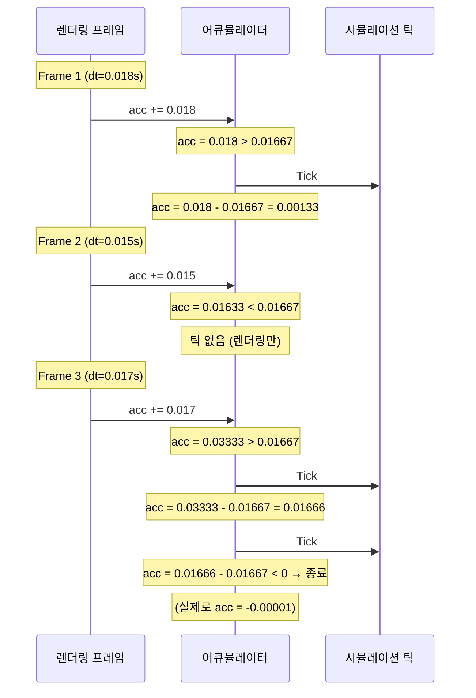
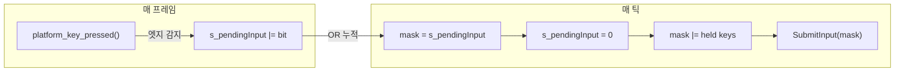
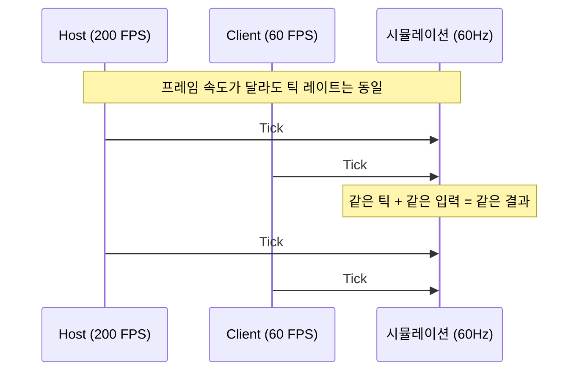
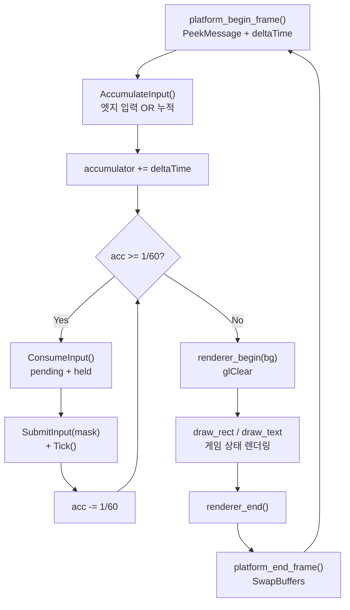

# Part 4: 게임 루프 아키텍처 — 고정 틱과 입력 누적

> **시리즈:** 제로부터 멀티플레이어 테트리스 + RL까지
> [Part 1: 윈도우와 OpenGL](./part1-window-and-opengl.md) | [Part 2: 2D 렌더링](./part2-2d-rendering.md) | [Part 3: 테트리스 로직](./part3-tetris-logic.md) | **Part 4** | [Part 5: 네트워킹](./part5-lockstep-networking.md) | [Part 6: Python RL](./part6-python-rl.md)

---

## 들어가며

Part 1~3에서 창, 렌더러, 게임 로직을 만들었다. 이제 이것들을 하나로 묶는 **게임 루프**를 작성한다.

게임 루프의 핵심 문제: vsync를 끄면 FPS가 수천에 달한다. 틱당 한 프레임이면 초당 수천 번의 `MoveBlockDown()`이 실행되어 블록이 눈 깜짝할 새에 바닥에 닿는다. vsync를 켜더라도 60 FPS PC와 144 FPS PC에서 게임 속도가 다르다.

해결: **렌더링 속도와 시뮬레이션 속도를 분리**한다. 렌더링은 가능한 한 빠르게 (또는 vsync에 맞춰), 시뮬레이션은 **정확히 60Hz**로 실행한다. 이 패턴이 고정 틱 어큐뮬레이터(fixed-tick accumulator)다.

이 시리즈의 전체 소스 코드는 `src/main.cpp` (605줄)과 `core/constants.h` (9줄), `core/input.h` (18줄)에 해당한다.

---

## 1. 나이브 게임 루프의 문제

가장 단순한 게임 루프:

```cpp
while (!quit) {
    input();
    update();
    render();
}
```

이 루프의 문제는 `update()`의 실행 빈도가 하드웨어에 종속된다는 것이다.

| 환경 | FPS | update() 호출 | 결과 |
|------|-----|-------------|------|
| 고성능 GPU (vsync OFF) | 3000+ | 초당 3000+ | 블록이 50배 빨리 떨어짐 |
| 60Hz 모니터 (vsync ON) | 60 | 초당 60 | 의도한 속도 |
| 144Hz 모니터 (vsync ON) | 144 | 초당 144 | 2.4배 빠름 |
| 배터리 절약 모드 노트북 | 30 | 초당 30 | 절반 속도 |

`deltaTime`을 곱해 이동량을 조절하는 방법도 있지만, 테트리스처럼 이산적(discrete) 셀 단위로 이동하는 게임에서는 적합하지 않다. 블록은 "0.7셀만큼 이동"할 수 없다.

---

## 2. 고정 틱 어큐뮬레이터

### 2.1 핵심 아이디어

매 프레임 경과 시간(`deltaTime`)을 어큐뮬레이터에 누적하고, 어큐뮬레이터가 틱 간격(1/60초) 이상이면 틱을 실행한다:

$$\text{acc} \mathrel{+}= \Delta t$$
$$\text{while } \text{acc} \geq \frac{1}{60}: \quad \text{tick}(); \quad \text{acc} \mathrel{-}= \frac{1}{60}$$

렌더링은 어큐뮬레이터와 무관하게 매 프레임 실행된다. 시뮬레이션은 정확히 60Hz.



프레임 3처럼 `deltaTime`이 2틱분 이상이면 while 루프에서 여러 틱이 연속 실행된다. 이것이 **캐치업(catch-up)** 이다.

### 2.2 구현

```cpp
// core/constants.h
constexpr int   TICKS_PER_SECOND = 60;
constexpr float SECONDS_PER_TICK = 1.0f / static_cast<float>(TICKS_PER_SECOND);
```

```cpp
// src/main.cpp:178-248 (단순화)
float accumulator = 0.0f;

while (!platform_should_close())
{
    float deltaTime = platform_begin_frame();  // 이전 프레임 이후 경과 시간
    AccumulateInput();                          // 엣지 트리거 입력 누적

    accumulator += deltaTime;
    while (accumulator >= SECONDS_PER_TICK)
    {
        uint8_t inputMask = ConsumeInput();

        // 싱글 플레이
        if (app == AppMode::Single && gameSingle)
        {
            gameSingle->SubmitInput(inputMask);
            gameSingle->Tick();
        }

        accumulator -= SECONDS_PER_TICK;
    }

    // 렌더링 (accumulator와 무관하게 매 프레임)
    renderer_begin(darkBlue);
    // ... draw calls ...
    renderer_end();
    platform_end_frame();
}
```

이 구조의 성질:

| 상황 | 프레임당 틱 수 | 설명 |
|------|-------------|------|
| FPS > 60 | 0 또는 1 | 대부분 프레임에서 0~1틱 |
| FPS = 60 | 정확히 1 | 이상적 |
| FPS = 30 | 2 | 매 프레임 2틱씩 캐치업 |
| FPS 급락 (스파이크) | 다수 | 수십 틱 한꺼번에 실행 (위험) |

---

## 3. 입력 손실 문제

### 3.1 엣지 트리거의 특성

`platform_key_pressed()`는 "이번 프레임에 처음 눌린" 키만 감지하는 엣지 트리거다 (Part 1에서 구현: `state[key] && !prev[key]`). 이 값은 **한 프레임만** true이다.

문제: FPS가 높으면 60Hz 틱 사이에 여러 프레임이 지나간다. 키를 눌렀다 뗀 프레임이 틱 프레임과 어긋나면, 틱이 그 입력을 보지 못한다.

```
시간축 →

프레임:  F1    F2    F3    F4    F5    F6    F7    F8
틱:                  T1                      T2
입력:         ↑눌림
              ↑뗌

F2에서 pressed=true. 그러나 T1은 F3에서 실행.
T1 시점에 pressed는 이미 false → 입력 소실!
```

### 3.2 증상

vsync 없이 FPS가 수천일 때, 방향키를 빠르게 누르면 일부 입력이 "씹힌다". 특히 스페이스바(하드 드롭)가 간헐적으로 무시되는 것이 가장 눈에 띈다.

이 문제는 vsync ON(60 FPS)이면 잘 드러나지 않는다. 프레임과 틱이 거의 1:1 대응하기 때문이다. 그러나 vsync OFF이거나 모니터 주사율이 60Hz가 아닌 환경에서 즉시 발생한다.

### 3.3 해결: AccumulateInput / ConsumeInput



```cpp
// src/main.cpp:64-80
static uint8_t s_pendingInput = 0;

static void AccumulateInput()
{
    // 매 프레임: 엣지 트리거 입력을 비트 OR로 누적
    if (platform_key_pressed(PKEY_LEFT))  s_pendingInput |= INPUT_LEFT;
    if (platform_key_pressed(PKEY_RIGHT)) s_pendingInput |= INPUT_RIGHT;
    if (platform_key_pressed(PKEY_UP))    s_pendingInput |= INPUT_ROTATE;
    if (platform_key_pressed(PKEY_SPACE)) s_pendingInput |= INPUT_DROP;
}

static uint8_t ConsumeInput()
{
    // 매 틱: 누적된 엣지 입력 + 현재 held 키를 합산
    uint8_t mask = s_pendingInput;
    s_pendingInput = 0;                              // 소비 후 클리어
    if (platform_key_down(PKEY_DOWN)) mask |= INPUT_DOWN;  // held 키 합산
    return mask;
}
```

수식으로 표현:

$$\text{tickInput} = \text{pending} \;|\; \text{held}$$
$$\text{pending} \leftarrow 0 \quad (\text{소비 후 클리어})$$

**엣지 입력(pressed)** 과 **레벨 입력(held)** 의 처리가 다른 이유:

| 입력 유형 | 예시 | 처리 |
|----------|------|------|
| 엣지 (pressed) | 좌/우 이동, 회전, 하드 드롭 | 누적 후 1회 소비 |
| 레벨 (held) | 소프트 드롭 (아래 키 꾸욱) | 매 틱 실시간 상태 |

소프트 드롭은 "키를 누르고 있는 동안 매 틱 아래로 이동"이므로 held 상태를 매 틱 직접 확인한다. 좌/우 이동이나 회전은 "한 번 누르면 한 칸/한 번 회전"이므로 엣지 트리거를 누적해야 한다.

### 3.4 멀티틱 캐치업 시 주의점

프레임이 길어서 한 프레임에 3틱이 실행되는 경우:

```cpp
while (accumulator >= SECONDS_PER_TICK)  // 3회 반복
{
    uint8_t inputMask = ConsumeInput();  // 첫 틱: pending 반환 + 클리어
                                          // 둘째/셋째 틱: pending=0 (이미 클리어됨)
    game->SubmitInput(inputMask);
    game->Tick();
    accumulator -= SECONDS_PER_TICK;
}
```

`ConsumeInput()`이 첫 번째 틱에서 pending을 클리어하므로, 나머지 틱은 **빈 입력**(held 키만)으로 실행된다. 이것은 의도된 동작이다: 사용자가 한 번 누른 키가 여러 틱에 걸쳐 반복 적용되면 안 된다.

다만, 캐치업 도중에도 held 키(소프트 드롭)는 매 틱 반영된다. 이것도 의도된 동작: 아래 키를 누르고 있으면 캐치업 틱에서도 블록이 내려간다.

---

## 4. deltaTime 스파이크 처리

### 4.1 문제: 창 드래그

Win32에서 창의 타이틀바를 잡고 드래그하면, OS의 모달 메시지 루프가 `PeekMessage`를 점유한다. 이 동안 게임의 메인 루프가 **멈춘다**.

드래그를 놓으면 `platform_begin_frame()`이 반환하는 `deltaTime`이 급등한다. 예: 2초 동안 드래그했으면 `deltaTime = 2.0`.

```cpp
accumulator += 2.0f;  // 2초 = 120틱분!
while (accumulator >= SECONDS_PER_TICK)  // 120회 반복
{
    game->Tick();
    accumulator -= SECONDS_PER_TICK;
}
```

120틱이 한꺼번에 실행되면:
- 블록이 즉시 바닥에 닿고 잠김
- 다음 블록도 자동 하강으로 즉시 잠김
- 게임 상태가 수초 분량 한꺼번에 진행 ("시간 점프")

### 4.2 해결: deltaTime 클램핑

```cpp
// platform/win32.cpp:330
if (dt > 0.1f) dt = 0.1f;  // 100ms 최대 = 6틱
```

`deltaTime`을 0.1초(100ms)로 클램핑한다. 이것은 한 프레임에 최대 $\lfloor 0.1 / (1/60) \rfloor = 6$틱만 실행된다는 뜻이다.

클램핑 값 선택의 트레이드오프:

| 클램핑 값 | 최대 캐치업 틱 | 장점 | 단점 |
|----------|-------------|------|------|
| 0.05s (50ms) | 3틱 | 스파이크 영향 최소 | 일시적 멈춤 시 시뮬레이션 지연 |
| 0.1s (100ms) | 6틱 | 적당한 균형 | 드래그 후 약간의 점프 |
| 1.0s | 60틱 | 캐치업 빠름 | 1초 정지 후 60틱 폭발 |
| 클램핑 없음 | 무제한 | N/A | 장시간 정지 후 게임 붕괴 |

0.1초는 "사람이 인지하지 못하는 수준의 프레임 스킵(6틱 = 100ms)"과 "극단적 스파이크 차단" 사이의 합리적 타협점이다.

---

## 5. 입력 비트마스크

### 5.1 설계

```cpp
// core/input.h
enum InputBits : uint8_t {
    INPUT_NONE   = 0,
    INPUT_LEFT   = 1 << 0,  // 0b00001
    INPUT_RIGHT  = 1 << 1,  // 0b00010
    INPUT_DOWN   = 1 << 2,  // 0b00100
    INPUT_ROTATE = 1 << 3,  // 0b01000
    INPUT_DROP   = 1 << 4,  // 0b10000
};

inline bool hasInput(uint8_t mask, InputBits bit) {
    return (mask & bit) != 0;
}
```

5개 입력을 8비트(1바이트)에 패킹한다. 이 설계의 이점:

1. **직렬화 효율**: 네트워크 전송 시 틱당 1바이트만 필요
2. **OR 누적**: `s_pendingInput |= INPUT_LEFT`로 간단히 비트 합산
3. **리플레이 저장**: 프레임당 1바이트 × 60Hz = 3,600 bytes/min

### 5.2 동시 입력

비트마스크이므로 동시 입력이 자연스럽게 표현된다:

```cpp
// 좌측 이동 + 회전을 동시에 누른 경우
mask = INPUT_LEFT | INPUT_ROTATE;  // 0b01001

hasInput(mask, INPUT_LEFT);    // true
hasInput(mask, INPUT_ROTATE);  // true
hasInput(mask, INPUT_DOWN);    // false
```

`SimGame::SubmitInput`은 각 비트를 순서대로 처리한다:

```cpp
void SimGame::SubmitInput(uint8_t inputMask)
{
    if (hasInput(inputMask, INPUT_LEFT))   MoveBlockLeft();
    if (hasInput(inputMask, INPUT_RIGHT))  MoveBlockRight();
    if (hasInput(inputMask, INPUT_DOWN))   MoveBlockDown();
    if (hasInput(inputMask, INPUT_ROTATE)) RotateBlockImpl();
    if (hasInput(inputMask, INPUT_DROP))   MoveBlockDrop();
    DropExpectation();  // 고스트 블록 갱신
}
```

입력 처리 순서(좌 → 우 → 하 → 회전 → 드롭)가 결정론에 영향을 미친다. 같은 비트마스크에 대해 모든 피어가 동일한 순서로 처리해야 한다.

---

## 6. 멀티플레이에서의 의미

### 6.1 고정 틱과 Lockstep

고정 틱 어큐뮬레이터가 멀티플레이의 **전제 조건**이다. 모든 피어가 동일한 틱 레이트(60Hz)로 시뮬레이션을 실행하므로, "틱 N에서 입력 X를 적용"이라는 명세만으로 상태가 동기화된다.



FPS가 다르면 렌더링 빈도가 다르지만, 시뮬레이션은 정확히 같은 속도로 진행된다. Host가 200 FPS이고 Client가 60 FPS라도, 양쪽의 `SimGame` 상태는 같은 틱에서 동일하다.

### 6.2 네트워크 입력 흐름

멀티플레이 모드에서 루프 구조가 변경된다:

```cpp
// src/main.cpp:192-234 (단순화)
while (accumulator >= SECONDS_PER_TICK)
{
    uint8_t inputMask = ConsumeInput();

    if (app == AppMode::Net && session.isConnected())
    {
        // 1. 로컬 입력을 저장하고 상대에게 전송
        localInputs[localTickNext] = inputMask;
        session.SendInput(localTickNext, inputMask);
        localTickNext++;

        // 2. safeTick 계산: 양쪽 입력이 확보된 최대 틱
        int64_t safeTick = min(lastLocalSent, lastRemoteRecv) - inputDelay;

        // 3. safeTick까지만 시뮬레이션 진행
        while ((int64_t)simTick <= safeTick)
        {
            uint8_t li = localInputs[simTick];
            uint8_t ri = session.GetRemoteInput(simTick);
            gameLocal->SubmitInput(li);
            gameRemote->SubmitInput(ri);
            gameLocal->Tick();
            gameRemote->Tick();
            simTick++;
        }
    }

    accumulator -= SECONDS_PER_TICK;
}
```

safeTick의 의미:

$$\text{safeTick} = \min(\text{lastLocalSent},\ \text{lastRemoteRecv}) - \text{inputDelay}$$

양쪽 피어의 입력이 모두 도착한 틱까지만 시뮬레이션을 진행한다. 한쪽 피어의 입력이 늦으면 다른 쪽의 시뮬레이션도 대기한다. 이것이 **Lockstep** 동기화의 핵심이다. Part 5에서 상세히 다룬다.

---

## 7. 전체 프레임 흐름

한 프레임의 전체 실행 순서:



중요한 순서:

1. `platform_begin_frame()` — 메시지 루프 + deltaTime 계산
2. `AccumulateInput()` — 이번 프레임의 엣지 입력 누적
3. 시뮬레이션 루프 — `ConsumeInput()` → `SubmitInput()` → `Tick()` (0~N회)
4. 렌더링 — `renderer_begin()` → draw calls → `renderer_end()`
5. `platform_end_frame()` — SwapBuffers

시뮬레이션이 렌더링 **이전**에 실행되므로, 렌더링은 항상 최신 상태를 그린다. 만약 순서를 바꾸면 (렌더링 → 시뮬레이션), 화면에 1틱 전의 상태가 그려지는 "1프레임 지연"이 발생한다. 체감하기 어려운 수준이지만, 이것이 정석이다.

---

## 오류와 함정

### (1) ConsumeInput() 첫 틱에서 pending 클리어

**증상:** 멀티틱 캐치업(한 프레임에 여러 틱)에서 두 번째 이후의 틱에 빈 입력이 들어간다.

**원인:** `ConsumeInput()`이 `s_pendingInput`을 0으로 클리어하므로, 첫 번째 틱에서만 누적된 입력이 적용되고 나머지 틱은 held 키만 반영된다.

**이것은 의도된 동작이다.** 사용자가 한 번 누른 키가 캐치업 틱에서 여러 번 적용되면 "스페이스 한 번 눌렀는데 블록 3개가 하드 드롭"되는 현상이 발생한다. 단, 이 설계를 문서화하지 않으면 디버깅 시 혼란을 줄 수 있다.

### (2) deltaTime 클램프 선택

**증상:** 클램프가 너무 크면(1초) 창 드래그 후 60틱이 한꺼번에 실행되어 게임이 급진행. 너무 작으면(0.01초) 한 프레임에 틱을 하나도 못 돌려서 시뮬레이션이 점점 뒤처짐.

**원인:** 클램핑은 "비정상적 deltaTime을 정상 범위로 자르는" 안전장치이므로, 정상 상태에서의 deltaTime 범위를 고려해야 한다.

**해결:** 0.1초(100ms) = 최대 6틱은 "사람이 인지하지 못하는 프레임 스킵"과 "극단적 스파이크 차단"의 합리적 타협. 30 FPS 환경(dt=0.033)에서 한 프레임에 2틱이 안전하게 처리된다.

> **레퍼런스:** Glenn Fiedler, "Fix Your Timestep!" (gafferongames.com, 2004). "If you clamp at 250ms you'll get at most 4-5 iterations of the loop."

### (3) 부동소수점 누적 오차

**증상:** 장시간 플레이 시 시뮬레이션 속도가 미세하게 어긋난다.

**원인:** `accumulator += deltaTime`과 `accumulator -= SECONDS_PER_TICK`에서 float의 유한 정밀도로 인한 오차가 매 프레임 누적된다.

```
이론: 1000프레임 × 1/60 = 16.6667초 동안 정확히 1000틱
실제: float 누적 오차로 999틱 또는 1001틱
```

float32의 유효 자릿수는 약 7자리이므로, `accumulator`가 10초 이상이면 $1/60 \approx 0.01667$과의 비교에서 유효 자릿수가 5자리로 줄어든다. 해결책:

- `accumulator`가 큰 값으로 누적되지 않도록 클램핑 (이미 적용됨)
- double 사용 (이 프로젝트에서는 float로 충분)
- 틱 카운터 기반으로 전환 (정수 연산으로 오차 제거)

이 프로젝트에서는 클램핑(0.1초)이 누적을 억제하므로 float으로 충분하다.

### (4) 네트워크 모드에서 입력 전송과 시뮬레이션의 분리

**증상:** `SendInput`은 매 틱 호출되지만, 시뮬레이션은 `safeTick`까지만 진행되어 입력 전송과 시뮬레이션이 비동기.

**주의:** `localTickNext`(전송한 마지막 틱)과 `simTick`(시뮬레이션 진행 위치)이 다른 값이다. `localTickNext`는 매 틱 증가하지만, `simTick`은 상대방 입력이 도착해야 진행된다. 이 차이가 `inputDelay` 틱만큼의 버퍼를 형성한다.

---

## 정리

고정 틱 어큐뮬레이터와 입력 누적은 게임 루프의 두 가지 핵심 문제를 해결한다:

1. **시뮬레이션 속도 독립**: FPS와 무관하게 정확히 60Hz
2. **입력 무손실**: 엣지 트리거 입력을 비트 OR로 누적하여 틱 간 프레임에서의 소실 방지

이 패턴은 테트리스뿐 아니라 대부분의 실시간 게임에서 사용된다. 특히 네트워크 게임에서는 모든 피어가 동일한 틱 레이트로 실행되어야 결정론적 동기화가 가능하므로, 고정 틱은 선택이 아닌 필수다.

다음 Part 5에서는 이 고정 틱 위에 구축되는 **TCP Lockstep 네트워킹** — 같은 시드, 같은 입력, 같은 결과로 두 명의 플레이어를 동기화하는 방법을 다룬다.

---

## 참고 자료

1. **Glenn Fiedler**, "Fix Your Timestep!" (gafferongames.com, 2004). 고정 틱 어큐뮬레이터 패턴의 원전. 보간(interpolation)과 잔여 시간(remainder)까지 다루는 완전한 해설
2. **"Game Programming Patterns"** (Robert Nystrom, 2014). Chapter 9 "Game Loop" — 나이브 루프, 고정 틱, 가변 틱의 장단점 비교
3. **Valve Source Engine**, "Tick Rate" documentation. Source 엔진의 66Hz/128Hz 틱 레이트와 interpolation 구현
4. **Casey Muratori**, "Handmade Hero" Day 010-012. Win32 타이머, QueryPerformanceCounter, 고정 틱 루프의 직접 구현
5. **OpenGL 4.6 Specification**, Section 4 "Per-Fragment Operations". SwapBuffers와 더블 버퍼링의 동기화 모델
