# Part 4: Game 래퍼와 메인 루프 — 고정 틱과 입력 누적

> **시리즈:** 제로부터 멀티플레이어 테트리스 + RL | [시리즈 목차](./README.md) | **Part 4**
>

---

## 이번 Part의 구현 계약

- **선행 상태:**
  - [Part 1](./part1-deterministic-simulation.md) 의 `SimGame`(`src/sim_game.cpp`, `src/position.cpp`) 과 `core/constants.h`(`TICKS_PER_SECOND`, `SECONDS_PER_TICK`), `core/input.h`(`InputBits`, `hasInput`), 그리고 `SimGame` 의 이벤트 플래그 (`lastLinesCleared`, `lastTSpinLines`, `lastGarbageReceived`, `gameOverEvent`, `hardDropEvent`).
  - [Part 2](./part2-platform-window-input.md) 의 `platform/platform.h` 와 백엔드 한 개 (`platform/win32.cpp` 또는 `platform/sdl.cpp`) — `platform_begin_frame`, `platform_key_pressed`, `platform_key_down`, `platform_present`, `platform_end_frame`.
  - [Part 3](./part3-rendering-and-ui.md) 의 `renderer/renderer.cpp`, `renderer/gl_api.cpp`, `renderer/text_gl.cpp`, `renderer/image_gl.cpp`, `renderer/shake.cpp`, `src/gui.cpp`, `src/colors.cpp`.
- **이번 Part의 파일:** `src/game.h`, `src/game.cpp`, `src/main.cpp`(본체), `core/replay.h`, `core/replay.cpp`, 그리고 `CMakeLists.txt` 의 `tetris` 타깃 확장.
- **연결점:** `Game` 이 `SimGame` 을 멤버로 소유하고 `draw_rect`/`draw_text` 로 위임한다. `main.cpp` 가 `platform_begin_frame()` 의 dt 를 받아 `SECONDS_PER_TICK` 어큐뮬레이터로 나누고, `Game::SubmitInput` / `Game::Tick` 을 정확히 60 Hz 로 호출한다. 렌더는 `renderer_begin` → 드로우 → `renderer_end` → `platform_end_frame` 순.
- **완료 게이트:**
  1. `cmake -S . -B build -DTETRIS_USE_SDL2=ON && cmake --build build` 가 성공하고 저장소 루트에서 `./build/tetris` 가 뜬다.
  2. 메뉴에서 `Single Play` 를 고르면 보드가 뜨고, 톱아웃하면 `GAME OVER` 팝업과 `[R] Restart` / `[Q] Go to Title` 이 나온다. `R` 로 같은 시드의 새 판이 시작된다.
  3. `-DTETRIS_ENABLE_DEBUG_UI=ON` 으로 빌드하면 `H` 키가 `Hash single=0x...` 를 stdout 에 찍는다. 같은 시드 + 같은 입력이면 렌더 FPS 와 무관하게 같은 값이 나온다.

## 들어가며

Part 1에서 게임 로직을, Part 2~3에서 창과 렌더러를 만들었다. 이제 이것들을 `Game`과 `main.cpp`의 **게임 루프**로 묶는다.

게임 루프의 핵심 문제: 프레임 페이싱을 끄면 FPS가 수천에 달한다. 틱당 한 프레임이면 초당 수천 번의 `MoveBlockDown()`이 실행되어 블록이 눈 깜짝할 새에 바닥에 닿는다. 페이싱을 켜더라도 60 FPS PC와 144 FPS PC에서 게임 속도가 다르다.

해결: **렌더링 속도와 시뮬레이션 속도를 분리**한다. 렌더링은 가능한 한 빠르게 (또는 프레임 페이싱에 맞춰), 시뮬레이션은 **정확히 60Hz**로 실행한다. 이 패턴이 고정 틱 어큐뮬레이터(fixed-tick accumulator)다.

---

## 1. `src/main.cpp` 지도 — 한 파일을 다섯 장에 나눠 쌓는다

이 장을 읽기 전에 알아야 할 사실이 하나 있다. **`src/main.cpp` 는 3207줄로 저장소에서 가장 큰 파일이고, 한 장에서 완성되지 않는다.** Part 4가 골격(입력 누적, 고정 틱 루프, 메뉴, Single 모드, 게임오버, 나가기 모달)을 세우고, Part 6·7·9·10·11이 각자의 블록을 같은 루프 안으로 밀어 넣는다.

그래서 이 장의 `main.cpp` 인용은 대부분 **최종 형태의 일부**다. 어느 영역이 어느 장의 소관인지 먼저 지도를 그려 둔다.

| 최종 소스 줄 범위 | 영역 | 담당 Part |
|---|---|---|
| `74-215` | `fmt_buf`, `draw_popup_panel`, 이미지 매니페스트/봇 설정 로더 | Part 3 유틸 + Part 9/10 |
| `217-353` | `GameSettings`, `load_settings`, `save_settings`, 창 스케일 프리셋 | [Part 11](./part11-settings-and-options.md) |
| `355-398` | `discover_bot_roster` | [Part 9](./part9-rl-onnx-bot.md) |
| `400-488` | 기본 아이콘 생성 · `load_configured_image` | [Part 10](./part10-meta-and-ranking.md) |
| **`490-577`** | **`s_pendingInput` · `HorizontalRepeatInput` · `AccumulateInput` · `ConsumeInput`** | **Part 4** |
| `579-634` | `parse_endpoint`, `parse_port` | [Part 6](./part6-lockstep-networking.md) |
| **`636-662`** | **`AppMode` · `BotMatchResult` · `RoomLobbyStage` · `GameOverState`** | **Part 4가 뼈대, 각 모드는 소관 Part** |
| `664-847` | `platform_init` / `renderer_init` / `settings.cfg` 로드 | Part 4 + Part 11 |
| `849-983` | 메타 서버 + 게스트 토큰 부트스트랩 | Part 10 |
| `985-1003` | 봇 로스터 · `botInputQueue` · `botInputCooldownTicks` | Part 9 |
| `1005-1057` | Customize(아이콘 상점) 상태 | Part 10 |
| `1059-1061` | `recording` · `ReplayData replay` | Part 4 |
| `1063-1105` | `GameOverState` FSM 변수 · 해시 링 · `lastAttackLocal/Remote` | Part 6 |
| **`1107-1163`** | **`shakeLeft`/`shakeRight` · `Callout` · `trigger_callout` · `apply_fx`** | **Part 4** |
| **`1167-1172`** | **메인 루프 진입 · `platform_begin_frame` · `AccumulateInput`** | **Part 4** |
| `1174-1226` | 채팅 (Net 전용) | Part 6 |
| **`1228-1236`, `1449-1455`** | **`tickPauseForDialog` 가드 · 고정 틱 while · 리플레이 기록** | **Part 4** |
| `1238-1376` | Net 분기 (INPUT 송신 · `safeTick` 캐치업 · HASH) | Part 6 |
| **`1377-1382`** | **Single 분기** | **Part 4** |
| `1383-1447` | BotSingle 분기 (봇 페이싱 · 가비지 교환) | Part 9 |
| `1457-1526` | 링크 손실 grace · DESYNC 링 비교 | Part 6 |
| **`1528-1537`** | **`shake_update` ×2 · 콜아웃 감쇠 · `renderer_begin`** | **Part 4** |
| **`1539-1684`** | **메뉴** (`Customize`/`Settings` 항목은 Part 10/11) | **Part 4** |
| `1686-1789` | 봇 선택 화면 | Part 9 |
| `1790-1967` | 설정 화면 | Part 11 |
| `1969-2216` | Customize(아이콘 상점) 화면 | Part 10 |
| `2218-2268` | IP 직접 입력 화면 | Part 6 |
| `2269-2408` | 커스텀 룸 로비 / 대기 | [Part 7](./part7-relay-server.md) |
| **`2409-2461`** | **Single 렌더 (우측 패널 · 보드 shake · 콜아웃)** | **Part 4** |
| **`2463-2483`** | **F5/F6 리플레이 · `H` 해시 덤프(debug UI 빌드 전용)** | **Part 4** |
| `2485-2588` | BotSingle 렌더 + WIN/LOSE/DRAW | Part 9 |
| **`2590-2606`** | **Single `GAME OVER` 팝업** | **Part 4** |
| `2608-2911` | Net 렌더 (두 보드 · 카운트다운 · 게임오버 협상) | Part 6 |
| `2913-3034` | Net 대기 화면 | Part 6 / Part 7 |
| `3036-3109` | NET HUD (RTT · 채팅 오버레이) | Part 6 |
| **`3111-3193`** | **인게임 X 버튼 + 나가기 확인 모달** | **Part 4** |
| **`3195-3207`** | **`renderer_end` · `platform_end_frame` · 자원 해제** | **Part 4** |

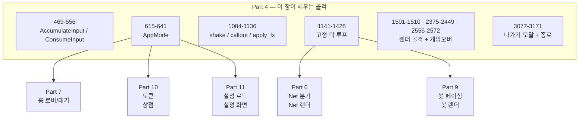

이 장을 마치면 `main.cpp` 는 대략 900줄짜리 파일이 된다. 나머지 2200줄은 뒤의 다섯 장이 채운다. 그래서 이 장에서는 **루프의 형태**를 확정하는 데 집중한다 — 나중에 들어올 블록들이 전부 같은 자리(고정 틱 while 안, 또는 렌더 단계)에 끼워지도록.

---

## 2. `Game`은 SimGame과 화면 사이의 어댑터다

Part 1의 `SimGame`은 화면과 장치를 모른다. Part 3의 renderer는 테트리스 규칙을 모른다. `Game`이 둘 사이에서 상태를 읽어 픽셀로 바꾸고, `main.cpp`가 객체의 수명과 호출 타이밍을 결정한다.

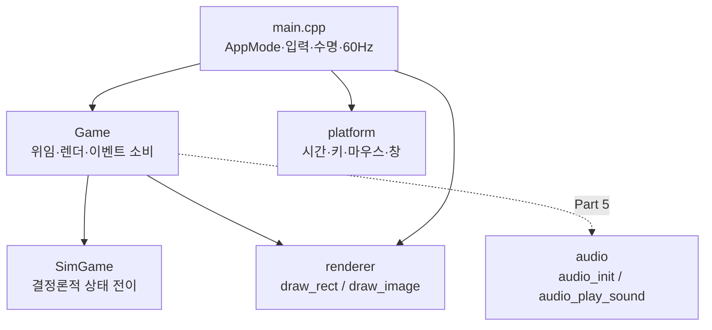

### 2.1 경계는 취향이 아니라 빌드가 강제한다

"상속 대신 composition" 은 표면적인 이유다. 진짜 이유는 **CMake 의 소스 목록**이다.

`SimGame` 은 `TETRIS_SIM_SOURCES` 에만 들어간다.

**현재 소스 발췌 — `CMakeLists.txt`**

```cmake
# Pure (no raylib) logic — used by game, pybind11 module, and tests.
set(TETRIS_SIM_SOURCES
    src/sim_game.cpp
    src/position.cpp
)

set(TETRIS_SIM_HEADERS
    src/sim_game.h
    src/sim_grid.h
    src/sim_block.h
    src/sim_blocks.h
    src/position.h
    core/constants.h
    core/input.h
    core/rng.h
    core/hash.h
)
```

`sim_hash_dump`(`CMakeLists.txt`) 와 `tetris_py` 는 **이 두 변수만** 쓴다. 즉 `renderer/`, `audio/`, `platform/` 오브젝트 파일이 링크 라인에 아예 없다. 반대로 `Game` 은 `TETRIS_GAME_COMMON` 안에 있고, 그쪽에서만 `renderer/renderer.cpp` 와 오디오 백엔드가 함께 링크된다.

그래서 경계 위반은 리뷰가 아니라 **링커가** 잡는다. 만약 `src/sim_game.cpp` 에 `draw_rect(...)` 를 한 줄 넣으면 `tetris` 는 멀쩡히 빌드되지만 `sim_hash_dump` 와 `tetris_py` 가 `undefined reference to draw_rect` 로 죽는다. 반대 방향도 마찬가지다 — `src/game.h` 는 `../audio/audio.h` 를 include 하는데, 이 헤더가 `SimGame` 쪽으로 넘어가는 순간 headless 타깃이 `audio_init` 을 못 찾는다.

이 성질 덕분에 Part 8의 Python 학습 루프는 렌더러도 사운드 장치도 없는 서버에서 `tetris_py` 하나만 임포트해 초당 수만 틱을 돌릴 수 있다.

### 2.2 `Game` 의 공개 계약

**현재 소스 발췌 — `src/game.h`**

```cpp
// [NET] Handmade 렌더러 래퍼 — SimGame 위에 draw_rect() 기반 렌더링 + XAudio2 오디오.
// 렌더링은 renderer/renderer.h 의 draw_rect() 를 사용.
// 오디오는 audio/audio.h 의 XAudio2 래퍼를 사용.
class Game
{
public:
    Game(uint64_t seed = 0);
    ~Game();

    // ── 렌더링 ──────────────────────────────────────────────────────────────
    void Draw();
    void DrawBoardAt(int offsetX, int offsetY);
    void DrawNextAt(int offsetX, int offsetY);
    // 축소 프리뷰 — 멀티/봇 모드용 (cellSize 작게). 보드 사이 좁은 갭에 들어감.
    void DrawNextMini(int offsetX, int offsetY, int cellSize);
    void DrawNextQueueMini(int offsetX, int offsetY, int cellSize,
                           int maxCount = SimGame::kNextPreviewCount,
                           int ySpacing = 48);
    // 가비지 큐 미리보기 바 — 보드 왼쪽(offsetX-8 위치)에 빨간 바 세로 그리기.
    // pending: 주입 대기 중인 행 수. 최대 표시 12행.
    static void DrawGarbageBar(int boardX, int boardY, int pending);

    // ── 시뮬레이션 위임 ─────────────────────────────────────────────────────
    void SubmitInput(uint8_t inputMask);
    void Tick();
    void MoveBlockDown();

    // ── 해시 (결정론 검증) ──────────────────────────────────────────────────
    unsigned long long ComputeStateHash() const;

    // main.cpp 가 직접 읽는 SimGame 핸들
    SimGame sim;

    // SimGame 상태를 직접 참조하는 별칭 (하위 호환)
    bool& gameOver;
    int&  score;

private:
    void DrawGrid(int offsetX, int offsetY) const;
    void DrawBlock(const SimBlock& block, int offsetX, int offsetY) const;
    void DrawBlockMini(const SimBlock& block, int offsetX, int offsetY, int cellSize) const;

    std::vector<Color> cellColors;

    // ── 오디오 핸들 (XAudio2) ───────────────────────────────────────────────
    AudioHandle sndRotate  = 0;
    AudioHandle sndClear   = 0;
    AudioHandle sndDrop    = 0;
    AudioHandle sndGarbage = 0;
    bool audioInitCalled = false;
    bool musicUser = false;
};
```

`sndRotate` 부터 `musicUser` 까지 여섯 멤버와 `~Game()` 선언은 [Part 5](./part5-audio.md) 소관이다. Part 4 체크포인트의 `Game` 은 이 여섯 줄과 `#include "../audio/audio.h"` 가 없는 형태다. 나머지는 이 장에서 전부 쓴다.

주목할 점 두 가지.

- **생성자에 `explicit` 이 없다.** `Game(uint64_t seed = 0)` 이므로 `Game g = 0;` 같은 암시적 변환이 문법적으로 가능하다. 실제 코드는 항상 `std::make_unique<Game>(sessionSeed)` 로 만들기 때문에 문제가 되지 않는다.
- **`ComputeStateHash()` 는 헤더 인라인이 아니다.** 선언만 헤더에 있고 정의는 `src/game.cpp` 에 있다. `Game` 헤더가 `SimGame::StateHash()` 의 구현 세부에 묶이지 않게 하는 평범한 분리다.

**현재 소스 발췌 — `src/game.cpp`**

```cpp
unsigned long long Game::ComputeStateHash() const
{
    return static_cast<unsigned long long>(sim.StateHash());
}
```

### 2.3 `gameOver` 와 `score` 는 값이 아니라 참조다

`gameOver`와 `score`는 별도 상태가 아니라 `sim.gameOver`, `sim.score`의 참조 별칭이다. 값을 복사하면 wrapper와 코어가 서로 다른 점수·종료 상태를 갖게 되므로 반드시 생성자 initializer에서 연결한다.

**현재 소스 발췌 — `src/game.cpp`**

```cpp
Game::Game(uint64_t seed)
    : sim(seed),
      gameOver(sim.gameOver),
      score(sim.score)
{
    cellColors = GetCellColors();

    // 오디오 초기화 (참조 카운팅 -- 멀티플레이에서 두 번 호출해도 안전)
    audioInitCalled = true;
    if (audio_init())
    {
        sndRotate  = audio_load_sound("Sounds/rotate.mp3");
        sndClear   = audio_load_sound("Sounds/clear.mp3");
        sndDrop    = audio_load_sound("Sounds/drop.mp3");
        sndGarbage = audio_load_sound("Sounds/garbage.mp3");
        if (sharedMusic == 0) {
            sharedMusic = audio_load_sound("Sounds/music.mp3");
        }
        if (sharedMusic != 0) {
            ++sharedMusicUsers;
            musicUser = true;
            audio_play_music(sharedMusic);
        }
    }
}
```

Part 4 체크포인트에서는 `cellColors = GetCellColors();` 까지만 필요하다. 완성형 생성자는 여기서 오디오 백엔드를 초기화하고 SFX를 인스턴스 소유로, BGM을 프로세스 공유 자원으로 등록한다. 규칙 엔진에는 오디오 의존성을 넣지 않고 `Game` 경계에서만 붙인다는 구조는 변하지 않는다.

참조 멤버라서 생기는 제약이 하나 있다: **`Game` 은 대입 불가능하다.** 참조 멤버가 있는 클래스는 암시적 `operator=` 가 삭제되기 때문이다. 그래서 `main.cpp` 는 재시작할 때 `*gameSingle = Game(seed)` 가 아니라 `gameSingle = std::make_unique<Game>(sessionSeed)` 로 **객체를 통째로 교체**한다 (`src/main.cpp`). 결과적으로 재시작 경로에 "이전 판의 잔재가 남는" 버그가 구조적으로 불가능해진다.

### 2.4 `Game` 이 소유하는 것

| 소유물 | 정체 | 수명 | 소관 |
|---|---|---|---|
| `SimGame sim` | 결정론 상태 전부 (grid, blocks, RNG, score, 이벤트 플래그) | `Game` 과 동일 | Part 1 / Part 4 |
| `std::vector<Color> cellColors` | `GetCellColors()` 의 사본 (10칸) | `Game` 과 동일 | Part 3 |
| `bool& gameOver`, `int& score` | `sim` 내부를 가리키는 별칭 — 소유 아님 | — | Part 4 |
| `AudioHandle sndRotate/sndClear/sndDrop/sndGarbage` | 인스턴스별 SFX 핸들 | 생성자~소멸자 | Part 5 |
| `bool musicUser` + 익명 네임스페이스 `sharedMusic` / `sharedMusicUsers` | **인스턴스 간 공유** BGM 참조 카운트 | 마지막 `Game` 소멸까지 | Part 5 |
| `bool audioInitCalled` | `audio_shutdown()` 을 부를 자격 표시 | 생성자~소멸자 | Part 5 |

마지막 세 줄이 중요하다. Net/BotSingle 모드에서는 `Game` 이 **두 개** 살아 있다. BGM 을 인스턴스마다 틀면 같은 곡이 두 번 겹쳐 나온다. 그래서 음악만 익명 네임스페이스의 `sharedMusic` + `sharedMusicUsers` 참조 카운트로 승격돼 있고, SFX 는 인스턴스마다 따로 로드한다. `Game::~Game()` 이 카운트를 내려 마지막 사용자가 음악과 백엔드를 정리한다. 일부 파일 로드가 실패하면 해당 효과음만 무음이 되며, 이미 얻은 핸들과 공유 카운트는 같은 소멸 경로로 회수된다. `Game` 이 "SimGame 을 감싼 얇은 껍데기" 가 아니라 **실제 소유권 모델을 가진 래퍼**인 이유가 여기 있다.

`Draw()` 계열은 **읽기만 한다.** `Grid()`, `GhostBlock()`, `CurrentBlock()`, `NextBlocks()` 를 renderer 호출로 바꿀 뿐 `SimGame` 상태를 변경하지 않는다.

**현재 소스 발췌 — `src/game.cpp`**

```cpp
void Game::Draw()
{
    DrawGrid(11, 11);
    if (g_ghostEnabled) DrawBlock(sim.GhostBlock(), 11, 11);
    DrawBlock(sim.CurrentBlock(), 11, 11);

    const SimBlock& next = sim.NextBlock();
    switch (next.id)
    {
    case 3: DrawBlock(next, 255, 260); break;  // I
    case 4: DrawBlock(next, 255, 280); break;  // O
    default: DrawBlock(next, 270, 270); break;
    }
}
```

`g_ghostEnabled` 는 `src/game.cpp` 의 익명 네임스페이스 전역이고 `game_set_ghost_enabled(bool)` 로만 바뀐다. Part 4 체크포인트에서는 항상 `true` 이고, 설정 화면이 이 함수를 호출하는 것은 [Part 11](./part11-settings-and-options.md) 이다.

main loop의 호출 순서는 항상 다음과 같다.

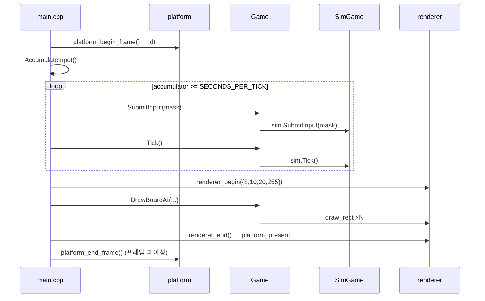

이제 이 호출 순서를 프레임률과 무관하게 유지하는 메인 루프를 만든다.

---

## 3. 나이브 게임 루프의 문제

가장 단순한 게임 루프:

**예시(실제 저장소에는 없음)**

```cpp
while (!quit) {
    input();
    update();
    render();
}
```

이 루프의 문제는 `update()`의 실행 빈도가 하드웨어에 종속된다는 것이다.

| 환경 | FPS | update() 호출 | 결과 |
|------|-----|-------------|------|
| 프레임 페이싱 OFF | 3000+ | 초당 3000+ | 블록이 50배 빨리 떨어짐 |
| 60Hz 페이싱 | 60 | 초당 60 | 의도한 속도 |
| 144Hz 모니터 | 144 | 초당 144 | 2.4배 빠름 |
| 배터리 절약 모드 노트북 | 30 | 초당 30 | 절반 속도 |

`deltaTime`을 곱해 이동량을 조절하는 방법도 있지만, 테트리스처럼 이산적(discrete) 셀 단위로 이동하는 게임에서는 적합하지 않다. 블록은 "0.7셀만큼 이동"할 수 없다.

여기에 결정적인 제약이 하나 더 있다. Part 6의 lockstep 은 "틱 N에서 입력 X를 적용" 이라는 **정수 틱 번호**로 두 피어를 동기화한다. 가변 스텝에는 동기화할 틱 번호가 아예 존재하지 않는다. 즉 고정 틱은 이 프로젝트에서 취향이 아니라 전제 조건이다.

---

## 4. 고정 틱 어큐뮬레이터

### 4.1 핵심 아이디어

매 프레임 경과 시간(`deltaTime`)을 어큐뮬레이터에 누적하고, 어큐뮬레이터가 틱 간격(1/60초) 이상이면 틱을 실행한다:

$$\text{acc} \mathrel{+}= \Delta t$$ $$\text{while } \text{acc} \geq \frac{1}{60}: \quad \text{tick}(); \quad \text{acc} \mathrel{-}= \frac{1}{60}$$

렌더링은 어큐뮬레이터와 무관하게 매 프레임 실행된다. 시뮬레이션은 정확히 60Hz.

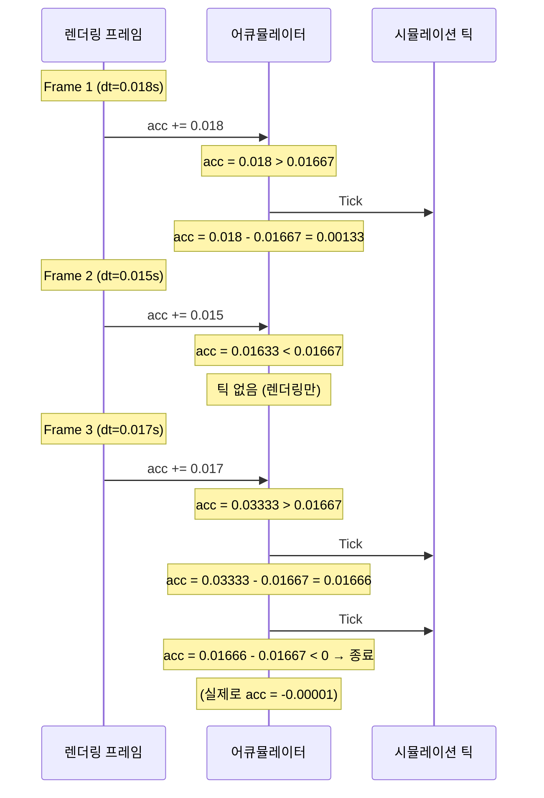

프레임 3처럼 `deltaTime`이 2틱분 이상이면 while 루프에서 여러 틱이 연속 실행된다. 이것이 **캐치업(catch-up)** 이다.

### 4.2 틱 간격 상수

틱 간격은 Part 1이 도입한 `core/constants.h` 의 두 상수에서 온다.

**현재 소스 발췌 — `core/constants.h`**

```cpp
// Simulation tick rate (logic updates per second)
// [NET] Lockstep/rollback 네트코드에서 '틱'은 동기 단위입니다.
// 모든 피어/서버가 동일한 틱 카운터를 기준으로 
// 같은 입력을 같은 순서로 적용해야 결정론이 보장됩니다.
constexpr int TICKS_PER_SECOND = 60;
constexpr float SECONDS_PER_TICK = 1.0f / static_cast<float>(TICKS_PER_SECOND);
```

이 상수가 `TETRIS_SIM_HEADERS` 에 들어 있다는 사실(`CMakeLists.txt`)이 중요하다 — Python 학습 환경도 같은 60 Hz 를 본다. 학습된 정책이 실제 클라이언트에서 같은 속도로 동작하는 근거가 이 한 줄이다.

### 4.3 루프의 실제 형태

**현재 소스 발췌 — `src/main.cpp`**

```cpp
    // ── 메인 루프 ───────────────────────────────────────────────────────────
    while (!platform_should_close())
    {
        // 1) 입력 처리 + 델타타임
        float deltaTime = platform_begin_frame();
        AccumulateInput(chatComposing);  // 엣지 트리거 입력을 매 프레임 누적
```

**현재 소스 발췌 — `src/main.cpp`**

```cpp
        // 2) 고정 틱 시뮬레이션 (60Hz)
        //   "나가기" 모달이 열려 있으면 Single/BotSingle 은 시간 진행 멈춤.
        //   Net 은 lockstep 동기 유지 필요 — 계속 진행 (모달은 오버레이 UI 일 뿐).
        const bool tickPauseForDialog = quitDialogOpen &&
            (app == AppMode::Single || app == AppMode::BotSingle);
        if (!tickPauseForDialog) accumulator += deltaTime;
        while (accumulator >= SECONDS_PER_TICK)
        {
            uint8_t inputMask = ConsumeInput(chatComposing);
```

**현재 소스 발췌 — `src/main.cpp`**

```cpp
            else if (app == AppMode::Single && gameSingle)
            {
                gameSingle->SubmitInput(inputMask);
                gameSingle->Tick();
                apply_fx(gameSingle->sim, coLocal, shakeLeft);
            }
```

**현재 소스 발췌 — `src/main.cpp`**

```cpp
            if (recording)
            {
                FrameInputs fr{}; fr.p1 = inputMask; fr.p2 = 0;
                replay.frames.push_back(fr);
            }
            accumulator -= SECONDS_PER_TICK;
        }
```

`chatComposing` 은 텍스트 입력 중 이동·회전 키가 게임 명령으로도 소비되는 것을 막는다. Part 4 체크포인트에서는 `AccumulateInput();` / `ConsumeInput();` 처럼 인자 없이 부르며, 두 함수의 `bool suppress = false` 기본값이 같은 동작을 보존한다. `tickPauseForDialog` 는 이 장 부록 C의 나가기 모달이 쓰는 가드이고, `apply_fx` 는 부록 A에서 다룬다.

리플레이 기록은 `core/replay.h` 의 `FrameInputs` 구조체 하나로 끝난다. 틱마다 `p1`/`p2` 각 1바이트만 밀어 넣으면 시드와 함께 그 판 전체가 재현된다 — 고정 틱의 직접적인 배당금이다. `F5` 로 기록을 시작하고 `F6` 으로 `out/replay.txt` 에 저장한다 (`src/main.cpp`).

이 구조의 성질:

| 상황 | 프레임당 틱 수 | 설명 |
|------|-------------|------|
| FPS > 60 | 0 또는 1 | 대부분 프레임에서 0~1틱 |
| FPS = 60 | 정확히 1 | 이상적 |
| FPS = 30 | 2 | 매 프레임 2틱씩 캐치업 |
| FPS 급락 (스파이크) | 다수 | 수십 틱 한꺼번에 실행 (§6에서 막는다) |

---

## 5. 입력 손실 문제

### 5.1 엣지 트리거의 특성

`platform_key_pressed()`는 "이번 프레임에 처음 눌린" 키만 감지하는 엣지 트리거다 (Part 2의 `platform_key_pressed`: `keyState[key] && !keyPrev[key]`). 이 값은 **한 프레임만** true이다.

문제: FPS가 높으면 60Hz 틱 사이에 여러 프레임이 지나간다. 키를 눌렀다 뗀 프레임이 틱 프레임과 어긋나면, 틱이 그 입력을 보지 못한다.

```text
시간축 →

프레임:  F1    F2    F3    F4    F5    F6    F7    F8
틱:                  T1                      T2
입력:         ↑눌림
              ↑뗌

F2에서 pressed=true. 그러나 T1은 F3에서 실행.
T1 시점에 pressed는 이미 false → 입력 소실!
```

### 5.2 증상

프레임 페이싱 없이 FPS가 수천일 때, 방향키를 빠르게 누르면 일부 입력이 "씹힌다". 특히 스페이스바(하드 드롭)가 간헐적으로 무시되는 것이 가장 눈에 띈다.

이 문제는 `platform_set_vsync(true)`(60 FPS)이면 잘 드러나지 않는다. 프레임과 틱이 거의 1:1 대응하기 때문이다. 그러나 페이싱을 끄면 즉시 발생한다.

### 5.3 해결: AccumulateInput / ConsumeInput

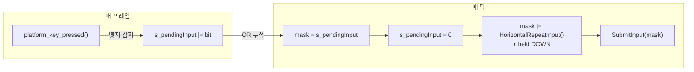

**현재 소스 발췌 — `src/main.cpp`**

```cpp
// 키보드 입력 → 비트마스크 (core/input.h 의 INPUT_* 상수)
//
// platform_key_pressed()는 "이번 프레임에 처음 눌림"을 감지하는 엣지 트리거.
// frame pacing 없이 FPS가 수천이면 60Hz 틱 사이에 수십 프레임이 지나가므로,
// 눌린 프레임과 틱 프레임이 어긋나면 입력이 소실된다.
// → 매 프레임 AccumulateInput()으로 엣지 입력을 누적하고,
//   틱에서 ConsumeInput()으로 소비 + held 키(DOWN/LEFT/RIGHT)를 합산한다.
//   좌우 held 반복은 DAS/ARR로 속도를 제한한다.
static uint8_t s_pendingInput = 0;
static int s_leftHoldTicks = 0;
static int s_rightHoldTicks = 0;

// DAS (Delayed Auto Shift) + ARR (Auto Repeat Rate) — 꾹 누르고 있을 때 자동 반복.
//   · DAS : 첫 눌림 이후 자동 반복이 시작되기까지의 대기 시간 (틱).
//   · ARR : DAS 이후 실제 반복 간격 (틱). 작을수록 빠르게 주르륵.
// 60Hz 기준, Tetris Guideline 기본 세팅에 맞춤:
//   DAS=8  → 약 133ms (Guideline 기본 ~170ms, 경쟁 세팅 100~133ms 중 중간).
//   ARR=3  → 약 50ms (20칸/초). Guideline 기본값 (Tetris Friends 등) 과 동일 체감.
// 더 공격적으로 하고 싶으면 ARR 을 2 (30칸/초) 나 1 (60칸/초) 로 줄여도 된다.
static constexpr int kHorizontalDasTicks = 8;
static constexpr int kHorizontalArrTicks = 3;

static uint8_t HorizontalRepeatInput()
{
    const bool leftDown = platform_key_down(PKEY_LEFT);
    const bool rightDown = platform_key_down(PKEY_RIGHT);
    // 양손 다 떼거나 둘 다 누르면 DAS 카운터 리셋 — 방향이 확정되면 0 부터 재시작.
    if (leftDown == rightDown)
    {
        s_leftHoldTicks = 0;
        s_rightHoldTicks = 0;
        return 0;
    }

    int& ticks = leftDown ? s_leftHoldTicks : s_rightHoldTicks;
    int& otherTicks = leftDown ? s_rightHoldTicks : s_leftHoldTicks;
    otherTicks = 0;

    uint8_t bit = leftDown ? INPUT_LEFT : INPUT_RIGHT;
    uint8_t out = 0;
    // ticks == kHorizontalDasTicks 인 순간부터 ARR 주기로 반복 발사.
    // AccumulateInput 가 edge 눌림 틱에 이미 한 번 쏘므로, 그 사이의 DAS 구간은
    // 의도된 "버튼 눌렸지만 피스가 정지" 구간 (double-tap 로 한 칸 톡 움직일 여유).
    if (ticks >= kHorizontalDasTicks &&
        ((ticks - kHorizontalDasTicks) % kHorizontalArrTicks) == 0)
    {
        out = bit;
    }
    ticks++;
    return out;
}

static void AccumulateInput(bool suppress = false)
{
    if (suppress)
    {
        s_pendingInput = 0;
        s_leftHoldTicks = 0;
        s_rightHoldTicks = 0;
        return;
    }  // 채팅 입력 중 — 게임 키 흡수 중단
    if (platform_key_pressed(PKEY_LEFT))  s_pendingInput |= INPUT_LEFT;
    if (platform_key_pressed(PKEY_RIGHT)) s_pendingInput |= INPUT_RIGHT;
    if (platform_key_pressed(PKEY_UP))    s_pendingInput |= INPUT_ROTATE;
    if (platform_key_pressed(PKEY_SPACE)) s_pendingInput |= INPUT_DROP;
}

static uint8_t ConsumeInput(bool suppress = false)
{
    uint8_t mask = s_pendingInput;
    s_pendingInput = 0;
    if (suppress)
    {
        s_leftHoldTicks = 0;
        s_rightHoldTicks = 0;
        return 0;
    }

    const bool leftDown = platform_key_down(PKEY_LEFT);
    const bool rightDown = platform_key_down(PKEY_RIGHT);
    if (leftDown && rightDown)
    {
        mask &= static_cast<uint8_t>(~(INPUT_LEFT | INPUT_RIGHT));
    }
    mask |= HorizontalRepeatInput();
    if (platform_key_down(PKEY_DOWN)) mask |= INPUT_DOWN;
    return mask;
}
```

수식으로 표현:

$$\text{tickInput} = \text{pending} \;|\; \text{held}$$ $$\text{pending} \leftarrow 0 \quad (\text{소비 후 클리어})$$

**엣지 입력(pressed)** 과 **레벨 입력(held)** 의 처리가 다른 이유:

| 입력 유형 | 예시 | 처리 |
|----------|------|------|
| 엣지 (pressed) | 회전, 하드 드롭, 좌/우 첫 이동 | 누적 후 1회 소비 |
| 레벨 (held) | 소프트 드롭, 좌/우 홀드 반복 | 매 틱 실시간 상태 |

좌우 홀드 반복은 DAS/ARR 방식이다. 처음 누른 순간은 `AccumulateInput` 의 `platform_key_pressed()` 가 누적해 즉시 1칸 이동하고, 이후 `HorizontalRepeatInput()` 이 8틱(≈133 ms) 대기한 뒤 3틱(≈50 ms) 마다 한 번씩 같은 방향 비트를 추가한다. 양쪽 방향키가 동시에 눌리면 `leftDown == rightDown` 이 성립해 카운터가 리셋되고, `ConsumeInput` 쪽에서도 엣지 비트까지 `&= ~(INPUT_LEFT | INPUT_RIGHT)` 로 지워 완전한 중립을 만든다. 두 지점이 짝을 이뤄야 "좌우 동시 누름 = 정지" 가 성립한다.

`suppress` 인자는 Part 6에서 채팅 입력 중일 때 `true` 로 들어와 게임 키를 흡수하지 않게 한다. 호출부 `AccumulateInput(chatComposing)` / `ConsumeInput(chatComposing)` 과 `chatComposing` 이 켜지는 자리(`src/main.cpp`)는 모두 Part 6 소관이므로, Part 4 체크포인트에서는 인자 없이 호출한다.

> **히스토리 각주** — 초기 커밋(`7937b89` 이전) 에는 `HorizontalRepeatInput()` 이 존재하지 않아 `platform_key_pressed()` 의 edge trigger 만으로 좌우 이동이 일어났다. 이 구조에서는 꾹 눌러도 edge 가 한 번밖에 안 잡혀 한 칸만 이동 후 멈추는 "홀드 반복 없음" 증상이 발생했다. `d9524cf` 에서 위의 DAS/ARR 로직을 추가해 해결.

소프트 드롭은 "키를 누르고 있는 동안 일정 주기로 아래로 이동"하므로 held 상태를 매 틱 직접 확인한다. 회전과 하드 드롭은 "한 번 누르면 한 번 실행"이므로 엣지 트리거를 누적해야 한다.

### 5.4 멀티틱 캐치업 시 주의점

프레임이 길어서 한 프레임에 3틱이 실행되는 경우, `ConsumeInput()`이 첫 번째 틱에서 pending을 클리어하므로 나머지 틱은 **held 키에서 생성된 입력만** 실행된다. 이것은 의도된 동작이다: 사용자가 한 번 누른 회전/하드드롭 키가 여러 틱에 걸쳐 반복 적용되면 "스페이스 한 번 눌렀는데 블록 3개가 하드 드롭" 되는 현상이 발생한다.

다만, 캐치업 도중에도 held 키(소프트 드롭, 좌우 DAS/ARR)는 매 틱 반영된다. 이것도 의도된 동작: 키를 누르고 있으면 캐치업 틱에서도 `s_leftHoldTicks` 카운터가 같은 속도로 진행된다.

---

## 6. deltaTime 스파이크와 100 ms 클램프

### 6.1 문제: 창 드래그

창의 타이틀바를 잡고 드래그하면 OS의 모달 메시지 루프가 메시지 펌프를 점유한다. 이 동안 게임의 메인 루프가 **멈춘다**. 드래그를 놓으면 `platform_begin_frame()`이 반환하는 `deltaTime`이 급등한다. 2초 동안 드래그했으면 `deltaTime = 2.0` 이고, 클램프가 없으면 그 한 프레임에 120틱이 한꺼번에 실행된다:

- 블록이 즉시 바닥에 닿고 잠김
- 다음 블록도 자동 하강으로 즉시 잠김
- 게임 상태가 수초 분량 한꺼번에 진행 ("시간 점프")

### 6.2 클램프는 플랫폼 계층이 이미 걸어 놓았다

이 실패 모드와 그 방어는 [Part 2](./part2-platform-window-input.md) 의 `platform_begin_frame` 이 담당한다. 두 백엔드가 **표현은 다르지만 같은 상한**을 건다:

- Win32: `platform/win32.cpp` 의 `return dt < 0.1f ? dt : 0.1f;`
- SDL2: `platform/sdl.cpp` 의 `return std::min(dt, 0.1f);`

`platform/platform.h` 의 주석 `MAX_DELTA = 100ms 클램핑 포함` 이 이 계약을 인터페이스 문서로 못 박아 둔 것이다. 그러니 `main.cpp` 는 **dt 를 다시 검사하지 않는다** — 클램프는 계층 하나에만 있어야 하고, 두 곳에 두면 값이 갈릴 때 어느 쪽이 진짜인지 알 수 없게 된다.

### 6.3 어큐뮬레이터 쪽에서 본 의미

100 ms 상한은 어큐뮬레이터 관점에서 "한 프레임의 while 루프는 최대 $\lfloor 0.1 / (1/60) \rfloor = 6$회 돈다" 로 번역된다. 이 6이 다음 두 가지를 동시에 보장한다.

1. **상한이 있는 캐치업.** 최악의 프레임에서도 `Tick()` 6회 + 렌더 1회로 끝나므로 프레임 시간이 폭주하지 않는다. 캐치업이 다음 프레임을 더 길게 만들고, 그게 다시 더 큰 캐치업을 부르는 "죽음의 나선(spiral of death)"이 원천 차단된다.
2. **누적 오차 억제.** `accumulator` 가 커질 일이 없으므로 float 유효자릿수가 `SECONDS_PER_TICK` 비교를 망칠 만큼 소진되지 않는다(§15-(3) 참조).

클램핑 값 선택의 트레이드오프:

| 클램핑 값 | 최대 캐치업 틱 | 장점 | 단점 |
|----------|-------------|------|------|
| 0.05s (50ms) | 3틱 | 스파이크 영향 최소 | 30 FPS 환경에서 시뮬이 뒤처짐 |
| 0.1s (100ms) | 6틱 | 적당한 균형 | 드래그 후 약간의 점프 |
| 1.0s | 60틱 | 캐치업 빠름 | 1초 정지 후 60틱 폭발 |
| 클램핑 없음 | 무제한 | N/A | 장시간 정지 후 게임 붕괴 |

0.1초는 "사람이 인지하지 못하는 수준의 프레임 스킵(6틱 = 100 ms)"과 "극단적 스파이크 차단" 사이의 합리적 타협점이다. 30 FPS 환경(dt = 0.033)에서 한 프레임 2틱이 여유롭게 들어간다.

Net 모드에서는 이야기가 한 겹 더 있다. 클램프 때문에 **잘려 나간 시간만큼 로컬 틱이 상대보다 뒤처지는데**, 상대는 그동안 계속 진행한다. 그래서 `Session` 의 ioThread 가 메인 스레드 정지 구간을 `INPUT(t, 0)` 하트비트로 대신 메운다. 메인 루프가 돌아오면 `heartbeatTickEnd()` 가 ioThread가 이미 보낸 마지막 틱을 반환하고, 그 범위의 `localInputs` 를 0으로 채워 동일한 틱 번호를 다시 보내지 않게 한다.

---

## 7. 입력 비트마스크

### 7.1 설계

입력 표현은 Part 1이 도입한 `core/input.h` 하나로 끝난다.

**현재 소스 발췌 — `core/input.h`**

```cpp
// Bitmask representing per-tick inputs
// [NET] 틱마다 입력을 비트마스크로 수집/전송하면, 
// '틱, 입력마스크'만으로 시뮬레이션을 재현할 수 있습니다(리플레이/Lockstep).
// 직렬화가 간단하고 대역폭 효율이 좋습니다.
enum InputBits : uint8_t {
    INPUT_NONE   = 0,
    INPUT_LEFT   = 1 << 0,
    INPUT_RIGHT  = 1 << 1,
    INPUT_DOWN   = 1 << 2,
    INPUT_ROTATE = 1 << 3,
    INPUT_DROP   = 1 << 4,
};

inline bool hasInput(uint8_t mask, InputBits bit) { return (mask & bit) != 0; }
```

5개 입력을 8비트(1바이트)에 패킹한다. 이 설계의 이점:

1. **직렬화 효율**: 네트워크 전송 시 틱당 1바이트만 필요 (Part 6의 `INPUT` 프레임)
2. **OR 누적**: `s_pendingInput |= INPUT_LEFT` 로 간단히 비트 합산
3. **리플레이 저장**: `FrameInputs` 가 `p1`/`p2` 각 1바이트 — 60 Hz × 2 = 120 B/s
4. **RL 액션 공간**: Part 8의 Python 환경이 같은 5비트를 그대로 액션으로 쓴다

### 7.2 동시 입력과 처리 순서

비트마스크이므로 동시 입력이 자연스럽게 표현된다. `INPUT_LEFT | INPUT_ROTATE` (= `0b01001`) 하나로 "왼쪽 + 회전" 이 전달된다.

`SimGame::SubmitInput` 이 각 비트를 처리하는 **순서**가 결정론에 직접 영향을 미친다. 같은 비트마스크에 대해 모든 피어가 동일한 순서로 처리해야 한다.

**현재 소스 발췌 — `src/sim_game.cpp`**

```cpp
void SimGame::SubmitInput(uint8_t inputMask)
{
    if (gameOver) return;

    if (hasInput(inputMask, INPUT_LEFT))   MoveBlockLeft();
    if (hasInput(inputMask, INPUT_RIGHT))  MoveBlockRight();

    // 소프트 드롭: 매 틱 호출되면 60셀/초(너무 빠름). N틱마다 1회로 제한.
    //   최초 눌림(카운터=0) 은 즉시 반응, 그 다음부터 kSoftDropIntervalTicks
    //   (=3, 60Hz → 약 15셀/초) 간격. 뗐다가 다시 눌러도 즉시.
    //   결정론: 이 카운터는 상태 해시에 포함되므로 양쪽 클라이언트 동일 전개.
    constexpr int kSoftDropIntervalTicks = 3;
    if (hasInput(inputMask, INPUT_DOWN)) {
        if (softDropCounterTicks <= 0) {
            MoveBlockDown();
            softDropCounterTicks = kSoftDropIntervalTicks;
        } else {
            softDropCounterTicks--;
        }
    } else {
        softDropCounterTicks = 0;
    }

    if (hasInput(inputMask, INPUT_ROTATE)) RotateBlockImpl();
    if (hasInput(inputMask, INPUT_DROP))   MoveBlockDrop();

    DropExpectation();
}
```

좌 → 우 → 하 → 회전 → 드롭. 맨 앞의 `if (gameOver) return;` 가드 덕분에 게임오버 팝업이 떠 있는 동안 `main.cpp` 가 계속 `SubmitInput` 을 불러도 상태가 움직이지 않는다. 소프트 드롭만 `softDropCounterTicks` 로 게이트되는데, 이 카운터가 상태 해시에 포함되므로 양쪽 클라이언트에서 동일하게 전개되어 결정론을 깨지 않는다.

`Game::SubmitInput` 은 여기에 오디오 소비 한 겹만 얹는다.

**현재 소스 발췌 — `src/game.cpp`**

```cpp
void Game::SubmitInput(uint8_t inputMask)
{
    sim.SubmitInput(inputMask);
    if (sim.rotateSoundEvent)  { audio_play_sound(sndRotate);  sim.rotateSoundEvent  = false; }
    // drop 전용 에셋(Sounds/drop.mp3)이 없으면 무음 대신 rotate 로 대체해
    // 피드백을 유지한다 (audio_play_sound(0) 은 no-op). 핸들 alias 가 아니라
    // 재생 시점 fallback 이므로 소멸자의 이중 unload 가 없다.
    if (sim.dropSoundEvent)    { audio_play_sound(sndDrop ? sndDrop : sndRotate); sim.dropSoundEvent = false; }
}
```

Part 4 체크포인트에서는 본문이 `sim.SubmitInput(inputMask);` 한 줄이다. 완성형은 호출 전후의 이벤트 카운터를 비교해 drop SFX를 내고, `Game::Tick()`도 같은 방식으로 `clearSoundEvent` / `garbageSoundEvent`를 소비한다. 소리는 결정 상태를 바꾸지 않는 파생 효과이므로 입력 제출과 틱이 성공한 뒤에만 재생한다.

---

## 8. `AppMode` — 하나의 루프, 아홉 개의 화면

`main.cpp` 는 화면마다 루프를 따로 두지 않는다. **단 하나의 `while (!platform_should_close())` 안에서 `AppMode` 열거값으로 분기**한다. 시뮬 단계에도 렌더 단계에도 같은 `app` 변수가 쓰이고, 모드 전환은 그 변수에 대입하는 것뿐이다.

**현재 소스 발췌 — `src/main.cpp`**

```cpp
enum class AppMode {
    Menu, ConnectInput, Single, BotSingle, BotSelect, Net, Settings, Customize,
    // Section D — 커스텀 룸 경로. 릴레이 주소는 CLI 기본값 사용이라
    // 별도 IP 입력 화면(이전의 MatchmakingAddr / RoomRelay)은 제거됨.
    RoomLobby,    // Create / Join 선택 (+ Join 시 코드 입력)
    RoomWaiting,  // 방 안에서 상대/Ready 대기
};
```

이 장이 만드는 것은 `Menu` 와 `Single` 둘뿐이다. 나머지 일곱 개는 각자의 장에서 값 하나와 렌더 블록 하나가 추가되는 식으로 자란다.

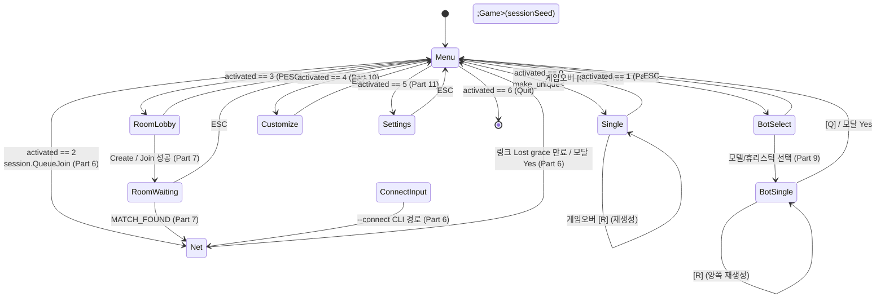

현재 메뉴는 `Single Play`, `Single vs Bot`, `Matchmaking Multi`, `Custom Room Multi`, `Customize`, `Settings`, `Quit`을 제공한다(`src/main.cpp`). 이 체크포인트는 첫 항목과 종료 항목으로 메인 루프 전환만 검증한다. 완성형은 각 항목을 봇 세션, relay 큐·룸, 꾸미기, 설정 상태에 연결하며 메뉴 렌더와 선택 규칙은 부록 D의 한 함수에 모여 있다. 항목 수보다 배열 순서와 dispatch가 같은 인덱스를 공유한다는 계약이 중요하다.

**모드 전환의 규칙 두 가지.**

1. **`AppMode` 를 바꿀 때 그 모드가 쓰는 `unique_ptr` 를 함께 세팅하거나 비운다.** `app = AppMode::Single;` 다음 줄이 항상 `gameSingle = std::make_unique<Game>(...)` 이고, 나가는 쪽은 항상 `gameSingle.reset();` 이다. 렌더 블록이 전부 `if (app == AppMode::Single && gameSingle)` 처럼 **모드 + 포인터**를 같이 검사하기 때문에, 한쪽만 바꿔도 화면이 조용히 비는 대신 안전하게 넘어간다.
2. **`ESC` 는 창을 닫지 않는다.** `platform_should_close()` 는 `WM_CLOSE`/`WM_DESTROY` (SDL 은 `SDL_QUIT`) 에만 반응한다. `ESC` 는 채팅 취소(`src/main.cpp`), 설정 나가기, Customize 나가기, 룸 퇴장 네 곳에만 바인딩돼 있다. **인게임에서 ESC 를 눌러도 아무 일도 일어나지 않는다** — 나가기 모달은 우상단 X 버튼(`gui_close_button`) 전용이다(부록 C).

---

## 9. 게임오버와 재시작

완료 게이트가 요구하는 "메뉴 → 게임 → 게임오버 → 재시작" 의 마지막 두 단계는 렌더 단계의 팝업 하나로 구현된다. 시뮬 쪽은 이미 `SimGame::SubmitInput` / `Tick` 의 `if (gameOver) return;` 가드가 멈춰 세워 뒀기 때문에, 화면만 얹으면 된다.

**현재 소스 발췌 — `src/main.cpp`**

```cpp
        // 1인 게임 오버
        if (app == AppMode::Single && gameSingle && gameSingle->gameOver)
        {
            draw_popup_panel(150, 235, 420, 190);
            gui_text_center(360, 262, "GAME OVER", 60, WHITE);
            gui_text_center(360, 345, "[R] Restart", 28, GREEN);
            gui_text_center(360, 382, "[Q] Go to Title", 28, YELLOW);
            if (platform_key_pressed(PKEY_R))
            {
                gameSingle = std::make_unique<Game>(sessionSeed);
                if (recording) replay.frames.clear();
            }
            else if (platform_key_pressed(PKEY_Q))
            {
                gameSingle.reset(); app = AppMode::Menu;
            }
        }
```

세 가지가 눈여겨볼 만하다.

- **`gameSingle->gameOver` 는 `sim.gameOver` 의 참조 별칭**(§2.3)이므로 Sim 이 톱아웃을 선언한 그 프레임에 곧바로 true 가 된다. `Game` 쪽에 별도 플래그를 두고 동기화하는 코드가 아예 없다.
- **재시작은 대입이 아니라 재생성이다.** `std::make_unique<Game>(sessionSeed)` 로 같은 시드의 새 객체를 만든다. 참조 멤버 때문에 대입이 불가능하다는 §2.3의 제약이 여기서 "잔재 없는 리셋" 이라는 이득으로 돌아온다.
- **같은 시드를 다시 쓴다.** `sessionSeed` 를 새로 뽑지 않으므로 `[R]` 을 누르면 **같은 피스 순서**로 다시 시작한다. 실력 비교와 리플레이 검증에 유리한 선택이고, 이 때문에 `if (recording) replay.frames.clear();` 로 리플레이 프레임만 비워 "시드는 그대로, 입력 기록만 새로" 를 맞춘다.

봇 대전은 같은 패턴에 승패 판정이 붙는다. Part 9가 채우는 블록이지만, 게임오버 UI 관례가 Single 과 동일하다는 점만 여기서 확인해 둔다.

**현재 소스 발췌 — `src/main.cpp`**

```cpp
            // 한 쪽이 끝나면 그 순간의 결과를 고정하고 시뮬을 멈춘다.
            if (botMatchResult != BotMatchResult::None)
            {
                const char* label;
                Color labelC;
                switch (botMatchResult) {
                case BotMatchResult::Win:  label = "WIN";  labelC = GREEN;  break;
                case BotMatchResult::Lose: label = "LOSE"; labelC = RED;    break;
                case BotMatchResult::Draw: label = "DRAW"; labelC = YELLOW; break;
                default:                   label = "";     labelC = WHITE;  break;
                }
                draw_popup_panel(180, 235, 360, 190);
                gui_text_center(360, 262, label, 60, labelC);
                gui_text_center(360, 345, "[R] Restart", 28, GREEN);
                gui_text_center(360, 382, "[Q] Go to Title", 28, YELLOW);
                if (platform_key_pressed(PKEY_R)) {
                    gameSingle = std::make_unique<Game>(sessionSeed);
                    gameBot    = std::make_unique<Game>(sessionSeed);
                    botInputQueue.clear();
                    botInputCooldownTicks = 0;
                    botMatchResult = BotMatchResult::None;
                    lastAttackHuman = 0; lastAttackBot = 0;
                } else if (platform_key_pressed(PKEY_Q)) {
                    gameSingle.reset();
                    gameBot.reset();
                    botInputQueue.clear();
                    botInputCooldownTicks = 0;
                    botMatchResult = BotMatchResult::None;
                    app = AppMode::Menu;
                }
            }
```

`Game` 객체를 새로 만드는 것만으로는 부족하고 **루프 바깥에 사는 부수 상태까지 같이 리셋**해야 한다는 것이 이 블록의 교훈이다: `botInputQueue`, `botInputCooldownTicks`, `lastAttackHuman/lastAttackBot`. 이 값들이 `Game` 안에 있지 않은 이유는 "두 보드 사이의 관계" 이지 한 보드의 상태가 아니기 때문이다.

Net 모드의 게임오버는 훨씬 복잡하다. `GameOverState` 8-상태 FSM(`src/main.cpp`)이 양쪽 결과 확정, 재시작 의사 교환, 호스트의 새 시드 발급, 게스트 수신, 취소·종료를 명시적으로 구분한다. 둘이 같은 시드와 라운드 경계에 합의하기 전에는 새 `SimGame`을 시작하지 않는다.

---

## 10. 두 보드가 도는 모드 — 봇 페이싱과 가비지 교환

고정 틱 while 루프 안에는 Single 분기 말고도 두 보드를 굴리는 분기가 들어온다. Part 9가 채우지만, **어느 자리에 들어가는지**는 이 장에서 확정된다.

**현재 소스 발췌 — `src/main.cpp`**

```cpp
                uint8_t botMask = INPUT_NONE;
                if (botInputCooldownTicks > 0) {
                    --botInputCooldownTicks;
                } else if (!botInputQueue.empty()) {
                    botMask = botInputQueue.front();
                    botInputQueue.pop_front();
                    botInputCooldownTicks = selectedBotInputIntervalTicks - 1;
                }

                gameSingle->SubmitInput(inputMask);
                gameBot->SubmitInput(botMask);
                gameSingle->Tick();
                gameBot->Tick();

                // Section I — 두 보드 간 가비지 교환 (Net 모드와 동일 구조).
                {
                    int attH = gameSingle->sim.AttackLinesSent() - lastAttackHuman;
                    int attB = gameBot->sim.AttackLinesSent()    - lastAttackBot;
                    if (attH > 0) gameBot->sim.AddPendingGarbage(attH);
                    if (attB > 0) gameSingle->sim.AddPendingGarbage(attB);
                    lastAttackHuman = gameSingle->sim.AttackLinesSent();
                    lastAttackBot   = gameBot->sim.AttackLinesSent();
                }

                apply_fx(gameSingle->sim, coLocal,  shakeLeft);
                apply_fx(gameBot->sim,    coRemote, shakeRight);
```

세 덩어리로 읽힌다.

1. **봇 입력 페이싱.** 봇은 `bot::expand_placement` 가 만든 입력 시퀀스를 `botInputQueue`(`std::deque<uint8_t>`, `src/main.cpp`)에 담아 두고, 틱마다 **하나씩만** 꺼낸다. `botInputCooldownTicks` 가 `selectedBotInputIntervalTicks - 1` 로 채워지므로 실제 입력 간격은 `selectedBotInputIntervalTicks` 틱이다. 큐를 한 번에 쏟아 부으면 봇이 사람이 볼 수 없는 속도로 피스를 옮겨 "게임" 이 아니게 된다. 페이싱을 **틱 단위**로 하는 것이 핵심이다 — 프레임 단위로 하면 FPS 높은 기계에서 봇만 빨라진다.
2. **가비지 교환.** 두 `SimGame` 은 서로를 모른다. 연결은 `AttackLinesSent()` 누적치의 **델타**를 읽어 반대편 `AddPendingGarbage()` 로 넣는 이 다섯 줄뿐이다. 누적치의 델타를 쓰는 이유는 `LockBlock` 이 한 틱에 여러 줄을 보낼 수도, 캐치업으로 여러 틱이 한 프레임에 돌 수도 있기 때문이다 — "지난번에 읽은 값" 만 기억하면 어느 경우에도 빠뜨리거나 두 번 세지 않는다.
3. **연출 소비.** 두 보드가 각자의 `Callout` 과 `ShakeState` 를 갖고 같은 `apply_fx` 람다를 탄다(부록 A).

이 세 덩어리가 Net 모드에서도 **글자 그대로 같은 모양**으로 반복된다 (`src/main.cpp`). 차이는 상대 입력이 `botInputQueue` 대신 `session.GetRemoteInput(simTick, ri)` 에서 온다는 것뿐이다. Part 9의 봇을 "네트워크 대신 추론에서 입력이 나오는 피어" 로 취급할 수 있는 이유가 여기 있다.

Part 4 체크포인트의 시뮬 단계는 Single 분기 하나뿐이므로 `botInputQueue`, `selectedBotInputIntervalTicks`, `lastAttackHuman/Bot` 은 아직 선언조차 없다. [Part 9](./part9-rl-onnx-bot.md) 가 `bot::heuristic_placement` / `bot::expand_placement` 와 함께 이 블록 전체를 도입한다.

---

## 11. 멀티플레이에서의 의미

### 11.1 고정 틱과 Lockstep

고정 틱 어큐뮬레이터가 멀티플레이의 **전제 조건**이다. 모든 피어가 동일한 틱 레이트(60Hz)로 시뮬레이션을 실행하므로, "틱 N에서 입력 X를 적용"이라는 명세만으로 상태가 동기화된다.

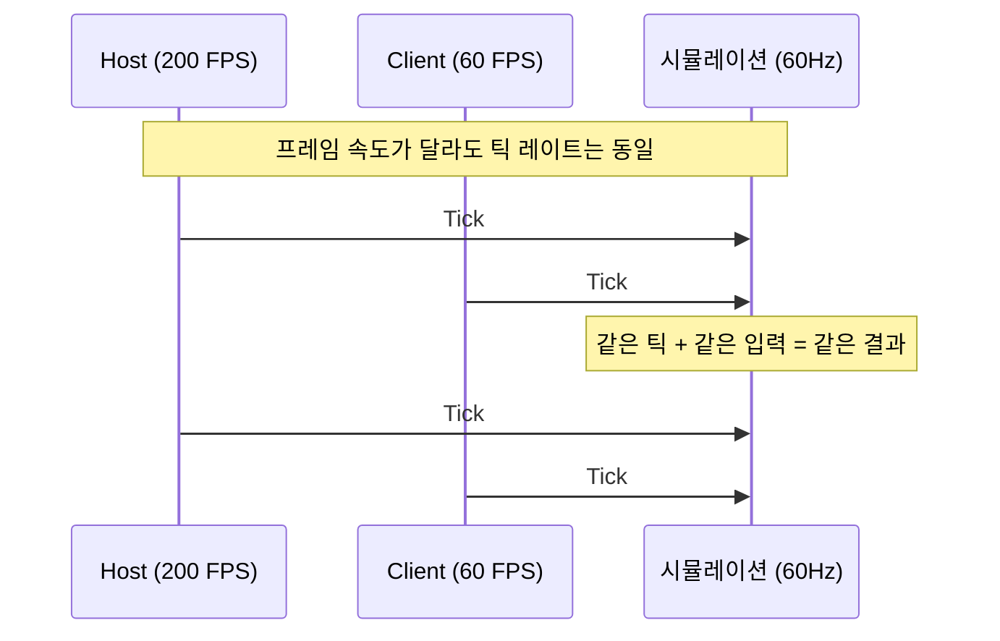

FPS가 다르면 렌더링 빈도가 다르지만, 시뮬레이션은 정확히 같은 속도로 진행된다. Host가 200 FPS이고 Client가 60 FPS라도, 양쪽의 `SimGame` 상태는 같은 틱에서 동일하다.

### 11.2 네트워크 입력 흐름

멀티플레이 모드에서 고정 틱 while 루프 안에 한 겹이 더 생긴다. 아래는 **흐름만 보여주는 단순화 프리뷰**다 — 실제 구현(`src/main.cpp`)은 시작 카운트다운 가드, 하트비트 보정, `GetRemoteInput` 의 out-param 과 미도착 시 `break`, 600틱마다의 HASH 송신까지 포함하며 [Part 6](./part6-lockstep-networking.md) 에서 1:1로 인용한다.

**예시(실제 저장소에는 없음)**

```cpp
while (accumulator >= SECONDS_PER_TICK)
{
    uint8_t inputMask = ConsumeInput();

    // 1. 로컬 입력을 저장하고 상대에게 전송
    localInputs[localTickNext] = inputMask;
    session.SendInput(localTickNext, inputMask);
    localTickNext++;

    // 2. safeTick 계산: 양쪽 입력이 확보된 최대 틱
    int64_t safeTick = std::min(lastLocalSent, lastRemote) - (int64_t)inputDelay;

    // 3. safeTick까지만 시뮬레이션 진행
    while ((int64_t)simTick <= safeTick)
    {
        uint8_t li = localInputs[simTick];
        uint8_t ri = 0;
        if (!session.GetRemoteInput(simTick, ri)) break;
        gameLocal->SubmitInput(li);
        gameRemote->SubmitInput(ri);
        gameLocal->Tick();
        gameRemote->Tick();
        simTick++;
    }

    accumulator -= SECONDS_PER_TICK;
}
```

safeTick의 의미:

$$\text{safeTick} = \min(\text{lastLocalSent},\ \text{lastRemote}) - \text{inputDelay}$$

양쪽 피어의 입력이 모두 도착한 틱까지만 시뮬레이션을 진행한다. 한쪽 피어의 입력이 늦으면 다른 쪽의 시뮬레이션도 대기한다. 이것이 **Lockstep** 동기화의 핵심이다.

여기서 §4의 float 어큐뮬레이터와 대비되는 사실 하나. **네트워크 계층은 float 시간을 전혀 모른다.** `localTickNext` 와 `simTick` 은 `uint32_t` 정수 틱 카운터이고, 와이어에 실려 나가는 것도 정수 틱 번호 + 1바이트 마스크뿐이다. 즉 어큐뮬레이터는 "언제 정수 틱을 하나 올릴지" 만 결정하는 국소적 장치이고, 그 위의 모든 것 — 리플레이, lockstep, 해시 검증 — 은 이미 정수 세계에서 산다. 이것이 §15-(3)의 부동소수점 누적 오차가 실제로는 문제가 되지 않는 근본 이유다.

---

## 12. 전체 프레임 흐름

한 프레임의 전체 실행 순서:

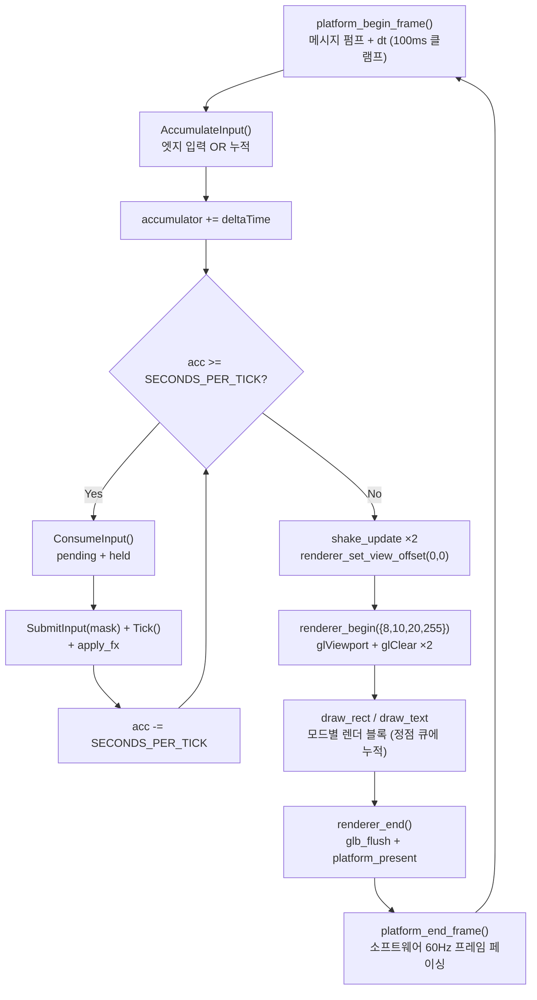

**현재 소스 발췌 — `src/main.cpp`**

```cpp
        // 3) 렌더링
        // Section I: shake 업데이트 (2개 독립 상태). 뷰 오프셋은 보드별 드로우
        // 직전에 개별 적용하고, UI/오버레이 그릴 땐 0 으로 리셋.
        shake_update(shakeLeft,  deltaTime);
        shake_update(shakeRight, deltaTime);
        if (coLocal.timeLeft  > 0.0f) coLocal.timeLeft  -= deltaTime;
        if (coRemote.timeLeft > 0.0f) coRemote.timeLeft -= deltaTime;
        renderer_set_view_offset(0, 0);

        renderer_begin({8, 10, 20, 255});
```

**현재 소스 발췌 — `src/main.cpp`**

```cpp
        renderer_end();
        platform_end_frame();
    }
```

각 단계가 실제로 무엇을 하는지 정확히 짚어 둔다. `draw_*` 는 즉시 그리지 않고 정점을 큐에 쌓기만 하므로, "화면에 나가는" 지점이 흔한 오해와 다르다.

| 호출 | 실제 동작 | 근거 |
|---|---|---|
| `platform_begin_frame()` | 키 스냅샷 + 메시지 펌프 + dt 반환(100 ms 클램프) | `platform/win32.cpp` |
| `renderer_begin(bg)` | `platform_viewport` 로 표시 영역을 받아 `glViewport`, `glClear` 두 번(창 전체 검정 → 뷰포트 안 배경색), 셰이더·유니폼 바인딩 | `renderer/renderer.cpp` |
| `draw_rect` 등 | 그리지 않는다. `glb_rect` 가 정점 6개를 `s_verts` 에 쌓는다 | `renderer/renderer.cpp` |
| `renderer_end()` | `glb_flush()` 로 남은 정점을 draw call 로 내보낸 뒤 `platform_present()` | `renderer/renderer.cpp` |
| `platform_present` | Win32: `SwapBuffers(s_hdc)` / SDL2: `SDL_GL_SwapWindow` — **여기가 화면 출력** | `platform/win32.cpp` |
| `platform_end_frame()` | **소프트웨어 60 Hz 프레임 페이싱** — 남은 시간만큼 spin + `Sleep`. 화면 출력 아님 | `platform/win32.cpp` |

시뮬레이션이 렌더링 **이전**에 실행되므로, 렌더링은 항상 최신 상태를 그린다. 만약 순서를 바꾸면 (렌더링 → 시뮬레이션), 화면에 1틱 전의 상태가 그려지는 "1프레임 지연"이 발생한다.

`renderer_set_view_offset(0, 0)` 이 `renderer_begin` **앞**에 오는 것도 의도적이다. 직전 프레임의 마지막 드로우가 보드 셰이크 오프셋을 남겨 놨을 수 있는데, 그대로 두면 이번 프레임의 UI 가 통째로 밀린다. 프레임 진입점에서 한 번 0으로 되돌려 놓으면 이후 모든 블록이 "오프셋은 내가 켠 만큼만" 이라고 가정할 수 있다.

---

## 13. CMakeLists 확장

Part 3까지는 렌더러 데모만 빌드했다. 이 장에서 `src/game.cpp`, `src/main.cpp`(본체), `core/replay.cpp` 가 들어오면서 **처음으로 `tetris` 라는 이름의 실행 파일**이 생긴다.

**Part 4 체크포인트 — `CMakeLists.txt`**

```cmake
cmake_minimum_required(VERSION 3.15)
project(tetris CXX)

set(CMAKE_CXX_STANDARD 17)
set(CMAKE_CXX_STANDARD_REQUIRED ON)

if (MSVC)
    add_compile_options(/utf-8)
endif()

option(TETRIS_BUILD_GAME "Build the handmade game executable"   ON)
option(TETRIS_BUILD_TEST "Build the SimGame determinism test"   ON)
option(TETRIS_ENABLE_DEBUG_UI "Enable in-game debug overlays"   OFF)

if (WIN32)
    option(TETRIS_USE_SDL2 "Use SDL2 backend (cross-platform)" OFF)
else()
    option(TETRIS_USE_SDL2 "Use SDL2 backend (cross-platform)" ON)
endif()

# Part 1: 순수 시뮬 — headless 타깃과 공유한다.
set(TETRIS_SIM_SOURCES
    src/sim_game.cpp
    src/position.cpp
)
set(TETRIS_SIM_HEADERS
    src/sim_game.h
    src/sim_grid.h
    src/sim_block.h
    src/sim_blocks.h
    src/position.h
    core/constants.h
    core/input.h
    core/rng.h
    core/hash.h
)

if (TETRIS_BUILD_GAME)
    set(TETRIS_GAME_COMMON
        ${TETRIS_SIM_SOURCES}
        src/main.cpp        # Part 4 (본체)
        src/game.cpp        # Part 4
        src/gui.cpp         # Part 3
        src/colors.cpp      # Part 3
        core/replay.cpp     # Part 4
        renderer/renderer.cpp        # Part 3
        renderer/gl_api.cpp          # Part 3
        renderer/text_gl.cpp         # Part 3
        renderer/shake.cpp           # Part 3
        renderer/image_gl.cpp        # Part 3
    )
    set(TETRIS_GAME_HEADERS
        ${TETRIS_SIM_HEADERS}
        src/game.h
        src/colors.h
        core/replay.h
        platform/platform.h
        renderer/renderer.h
        renderer/gl_api.h
        renderer/gl_internal.h
        renderer/gl_shaders.h
        renderer/shake.h
        renderer/image.h
    )

    if (TETRIS_USE_SDL2)
        find_package(SDL2 REQUIRED)
        add_executable(tetris
            ${TETRIS_GAME_COMMON} ${TETRIS_GAME_HEADERS}
            platform/sdl.cpp)       # Part 2
        target_include_directories(tetris PRIVATE
            ${CMAKE_CURRENT_SOURCE_DIR} ${SDL2_INCLUDE_DIRS})
        if (TARGET SDL2::SDL2)
            target_link_libraries(tetris PRIVATE SDL2::SDL2)
        else()
            target_link_libraries(tetris PRIVATE ${SDL2_LIBRARIES})
        endif()
        find_package(OpenGL REQUIRED)   # Part 3
        target_link_libraries(tetris PRIVATE OpenGL::GL)
        if (WIN32)
            target_link_libraries(tetris PRIVATE gdiplus)
        endif()
    else()
        add_executable(tetris
            ${TETRIS_GAME_COMMON} ${TETRIS_GAME_HEADERS}
            platform/win32.cpp)     # Part 2
        target_include_directories(tetris PRIVATE ${CMAKE_CURRENT_SOURCE_DIR})
        if (WIN32)
            target_link_libraries(tetris PRIVATE opengl32 gdi32 gdiplus winmm)
        else()
            message(FATAL_ERROR "Handmade Win32 backend is Windows-only. Set -DTETRIS_USE_SDL2=ON.")
        endif()
    endif()

    if (TETRIS_ENABLE_DEBUG_UI)
        target_compile_definitions(tetris PRIVATE TETRIS_ENABLE_DEBUG_UI=1)
    endif()

    add_custom_target(copy_assets ALL
        COMMAND ${CMAKE_COMMAND} -E copy_directory
                ${CMAKE_CURRENT_SOURCE_DIR}/Font ${CMAKE_CURRENT_BINARY_DIR}/Font
        DEPENDS tetris
    )
endif()

if (TETRIS_BUILD_TEST)
    add_executable(sim_hash_dump
        tests/sim_hash_dump.cpp
        ${TETRIS_SIM_SOURCES} ${TETRIS_SIM_HEADERS})
    target_include_directories(sim_hash_dump PRIVATE ${CMAKE_CURRENT_SOURCE_DIR})
endif()
```

이 시점의 빌드 파일과 최종 `CMakeLists.txt` 의 차이:

| 항목 | Part 4 체크포인트 | 최종 | 확장 Part |
|---|---|---|---|
| `audio/*.cpp` + `Sounds/` 복사 | 없음 | `audio/audio.cpp` 또는 `audio/sdl_audio.cpp` | [Part 5](./part5-audio.md) |
| `net/socket.cpp`, `net/framing.cpp`, `net/session.cpp` | 없음 | `TETRIS_GAME_COMMON` 에 포함 | [Part 6](./part6-lockstep-networking.md) |
| `tetris_relay`, `worker_group_test` | 없음 | `TETRIS_BUILD_RELAY` 블록 | [Part 7](./part7-relay-server.md) |
| `tetris_py` | 없음 | `TETRIS_BUILD_PY` + pybind11 | [Part 8](./part8-python-rl.md) |
| `bot/placement.cpp`, `bot/bot_onnx.cpp`, `TETRIS_BUILD_BOT` | 없음 | ONNX Runtime 선택 링크 | [Part 9](./part9-rl-onnx-bot.md) |
| `meta/http_client.cpp`, `third_party/httplib.h` 검사, `tetris_meta` | 없음 | `TETRIS_BUILD_META` + sqlite3 | [Part 10](./part10-meta-and-ranking.md) |
| `ws2_32` / `xaudio2` / `ole32` 링크, `assets`·`model` 복사 | 없음 | 위 기능들이 요구 | Part 5·6·9·10 |
| macOS `.app` 번들, rpath, 배포 옵션 | 없음 | `APPLE`/`UNIX` 블록 | [Part 12](./part12-hardening-and-release.md) |

`project(tetris CXX)` 에 `C` 가 없다는 점도 차이다. 최종 파일이 `project(tetris CXX C)` 인 이유는 Part 10이 `third_party/sqlite3.c` 를 컴파일하기 때문이다.

여기서 빌드하면 **메뉴 → Single 모드 → 게임오버 → 재시작이 도는 무음 싱글플레이 클라이언트**가 나온다. 아직 소리가 없고, `Single vs Bot` 과 두 멀티 항목은 눌러도 아무 일도 일어나지 않는다.

---

## 14. 폴리싱: 알파 합성 · 가비지 큐 미리보기 · 통합 패널

지금까지의 루프는 "기능적으로 작동" 까지였다. 보드 한 개 + Score / Next 가 따로 떨어진 두 박스 + 검정 배경. 멀티 모드를 시작하면 한 가지가 결정적으로 부족하다 — **상대가 보낸 가비지가 곧 들어온다는 신호** 가 화면에 없다. 또 화면 전체가 채도 없는 검정이라 블록 컬러가 묻힌다.

이 절은 sim 을 건드리지 않고 **렌더 레이어만 손대는** 후속 폴리싱이다 — `SimGame::PendingGarbage()` 같은 const 접근자를 읽어서 시각화하는 식이라, Part 6 lockstep 결정론에는 영향이 없다.

### 14.1 알파는 도형마다 켜는 것이 아니라 파이프라인 상태다

반투명 고스트 블록을 그리려면 무엇을 "켜야" 하는가? **드로우 시점에는 아무것도 켜지 않는다.** `renderer_init` 이 시작할 때 `gl_Enable(GL_BLEND)` 와 `gl_BlendFunc(GL_SRC_ALPHA, GL_ONE_MINUS_SRC_ALPHA)` (`renderer/renderer.cpp`) 를 한 번 걸어 두고, 그 뒤로는 조각 셰이더가 내놓는 `fragColor.a` 가 곧 합성 가중치가 된다.

**현재 소스 발췌 — `renderer/gl_shaders.h`**

```glsl
void main() {
    vec4 tex = texture(u_tex, v_uv);

    // R8 글리프는 r 채널이 coverage 다. RGBA 이미지는 그대로 쓴다.
    vec4 sampled = mix(tex, vec4(1.0, 1.0, 1.0, tex.r), v_channel);

    vec4 c = sampled * v_color;

    // 반지름이 0 이면 SDF 를 건너뛴다. 각진 사각형에서 경계 픽셀이
    // 불필요하게 흐려지는 것을 막는다.
    if (v_radius > 0.0) {
        float d = rounded_box_sdf(v_local, v_half, v_radius);
        // 1픽셀 폭으로 부드럽게 자른다 — 모서리 안티앨리어싱이
        // 별도 코드 없이 따라온다.
        c.a *= 1.0 - smoothstep(-0.5, 0.5, d);
    }

    if (c.a <= 0.0) discard;
    fragColor = c;
}
```

읽는 순서는 이렇다.

1. **텍스처 샘플.** 단색 도형은 1×1 흰 텍스처를 보므로 `tex` 가 항상 `(1,1,1,1)` 이고, 글리프는 R8 텍스처라 `r` 채널을 알파로 승격시킨다. `v_channel` 이 그 둘을 가르는 스위치다.
2. **정점 색과 곱하기.** `c = sampled * v_color` 한 줄이 팔레트의 알파를 `c.a` 로 실어 온다. "도형의 알파" 와 "픽셀의 덮임 정도" 가 곱해져 한 값이 되는 것은 CPU 로 그리든 GPU 로 그리든 같다.
3. **둥근 모서리는 알파를 한 번 더 깎는다.** SDF 거리 `d` 를 `smoothstep(-0.5, 0.5, d)` 로 통과시키면 경계 1픽셀이 부드럽게 빠진다. 안티앨리어싱을 위한 코드를 따로 쓰지 않았는데도 따라온다.
4. **`c.a <= 0.0` 이면 `discard`.** 완전 투명한 조각이 블렌드 유닛까지 가지 않는다.

그 뒤 $\text{out} = S \cdot a + D \cdot (1 - a)$ 를 GPU 의 블렌드 유닛이 부동소수로 계산한다. 사각형·텍스트·이미지·둥근 사각형이 전부 이 프로그램 **하나**를 지나므로 알파 합성 코드가 저장소에 딱 한 벌이다.

뷰 오프셋도 같은 자리로 모인다. `draw_*` 는 배처의 `glb_rect` / `glb_quad` 를 부르고, 그 안에서 정점을 만들 때 `s_view_ox` / `s_view_oy` 를 더한다(`renderer/renderer.cpp`, `186`). 텍스트·이미지·둥근 사각형이 각자 오프셋을 챙길 필요가 없다.

그래서 색 팔레트의 알파 값이 **곧바로 합성 가중치**가 된다.

**현재 소스 발췌 — `src/colors.cpp`**

```cpp
const Color garbageColor = { 80,  80,  90, 255};  // id=9 — 가비지 셀 (어두운 회색)
// id=8 — 고스트 블록: 반투명 흰회색 (알파 70/255 ≈ 27%)
const Color ghostColor   = {200, 200, 210,  70};
```

고스트의 알파 70 은 정점 색에서 $70/255 \approx 0.27$ 로 정규화되어 보드 배경과 $27:73$ 으로 섞인다. 27 % 라는 숫자가 핵심이다 — 보드 배경이 충분히 비쳐서 "여기 떨어질 거다" 는 미리보기로만 읽히고, 실제 `currentBlock` 과 헷갈리지 않는다. 이 값을 바꾸는 것 외에 고스트의 반투명도를 조절할 다른 스위치는 존재하지 않는다.

### 14.2 다크 네이비 배경 + 보드 테두리

배경은 `renderer_begin({8, 10, 20, 255})`(`src/main.cpp`) 한 줄이다. `renderer_begin` 은 이 색을 `gl_ClearColor` 에 걸고 뷰포트 안쪽을 `gl_Clear` 로 지운다(`renderer/renderer.cpp`). 레터박스 여백을 먼저 검게 지우는 이유 등 나머지는 [Part 3](./part3-rendering-and-ui.md) 에서 다뤘고, 이 절의 관심사는 그 색 하나다. 채도를 약간만 깔아두면 블록의 빨강·청록·노랑이 더 선명하게 떠 보인다. 완전한 검정 (`{0,0,0,255}`) 위에서는 다크 컬러 블록(J = blue, T = purple)이 묻힌다. `src/colors.cpp` 의 `darkBlue` 는 이름과 달리 배경으로 쓰이지 않는다 — 배경은 언제나 `{8, 10, 20, 255}` 리터럴이다.

보드 자체에는 페인터스 알고리즘으로 1 px 테두리를 만든다.

**현재 소스 발췌 — `src/game.cpp`**

```cpp
void Game::DrawBoardAt(int offsetX, int offsetY)
{
    constexpr int cellSize = 30;
    constexpr int bw = SimGrid::kCols * cellSize;
    constexpr int bh = SimGrid::kRows * cellSize;
    // 보드 테두리 → 배경 순으로 그려서 1px 테두리 효과
    draw_rect(offsetX - 2, offsetY - 2, bw + 4, bh + 4, {55, 62, 100, 255});
    draw_rect(offsetX,     offsetY,     bw,     bh,     {14, 16, 30, 255});
    DrawGrid(offsetX, offsetY);
    if (g_ghostEnabled) DrawBlock(sim.GhostBlock(), offsetX, offsetY);
    DrawBlock(sim.CurrentBlock(), offsetX, offsetY);
}
```

순서가 곧 z-order 다 — 큰 사각(테두리 색) → 작은 사각(보드 배경) → 셀 → 고스트 → 현재 피스. `g_ghostEnabled` 가드는 [Part 11](./part11-settings-and-options.md) 의 설정 항목이 `game_set_ghost_enabled(false)` 를 부를 수 있게 하는 자리이고, Part 4 체크포인트에서는 항상 참이라 없어도 같은 그림이 나온다.

### 14.3 가비지 큐 미리보기 바

멀티 모드에서 상대가 Tetris 를 쳤다고 하자. 4 라인의 가비지가 `pendingGarbage` 로 누적되어 **다음 LockBlock** 시점에 내 보드 하단으로 올라온다. 그 사이에 플레이어가 알아챌 신호가 필요하다 — 보드 왼쪽의 빨간 수직 바 하나면 충분하다.

**현재 소스 발췌 — `src/game.cpp`**

```cpp
void Game::DrawGarbageBar(int boardX, int boardY, int pending)
{
    if (pending <= 0) return;
    constexpr int cellSize = 30;
    constexpr int barW = 5;
    constexpr int boardH = SimGrid::kRows * cellSize;  // 600px
    constexpr int maxRows = 12;

    int rows = (pending > maxRows) ? maxRows : pending;
    int barH = rows * cellSize;

    // 배경 트랙 (어두운 바)
    draw_rect(boardX - barW - 2, boardY, barW, boardH, {40, 10, 10, 180});
    // 채워진 부분 (아래서 위로 — 가비지는 하단에서 올라옴)
    draw_rect(boardX - barW - 2, boardY + boardH - barH, barW, barH, {220, 40, 40, 220});
}
```

- 보드 왼쪽 7 px(`barW=5` + 2 px gap) 위치에 보드 전체 높이(600 px)만큼의 어두운 트랙. 알파 180 이라 조각 셰이더에서 `c.a = 180/255` 로 나와 배경과 섞인다.
- 그 위에 `pending` 행 수만큼 빨간색을 **하단에서 위로** 채운다 — 가비지가 실제로 올라오는 방향과 일치.
- 12 행에서 cap. 그 이상은 보드 높이를 넘고, 어차피 12 행 이상 쌓이면 다음 LockBlock 에서 사실상 게임오버다.
- **`static` 멤버 함수**다. `Game` 인스턴스 상태를 전혀 안 쓰고 `pending` 정수 하나만 받으므로, 호출부는 `Game::DrawGarbageBar(leftX, 11, gameLocal->sim.PendingGarbage())` 처럼 어느 보드의 값이든 넣을 수 있다.

const 접근자 `PendingGarbage()` 만 읽으므로 sim 결정론에 무영향이다. 양쪽 클라이언트 에서 동시에 같은 길이의 빨간 바가 올라온다 — lockstep 의 부수 효과이자, 눈으로 볼 수 있는 결정론 증거다.

### 14.4 통합 우측 패널 (Single 모드)

기존에는 화면 우측에 Score 박스, 그 아래에 Next 박스가 따로 있었다. 시야가 분산되고, "현재 점수" 와 "현재 레벨" 처럼 같은 카테고리 정보가 분리돼서 어색했다. 한 카드 안에 Score / Level / Lines / Next 를 묶는다.

**현재 소스 발췌 — `src/main.cpp`**

```cpp
            // 우측 정보 패널 (보드 오른쪽 x=316 ~ 720)
            constexpr int pX = 320, pW = 175;
            constexpr Color panelBg   = {18, 22, 42, 255};
            constexpr Color panelLine = {45, 52, 85, 255};
            constexpr Color labelClr  = {120, 130, 170, 255};

            // SCORE
            draw_rect_rounded(pX, 12, pW, 80, 0.3f, panelBg);
            draw_text("SCORE", pX + 12, 18, 16, labelClr);
            {
                char buf[16]; snprintf(buf, sizeof(buf), "%d", gameSingle->score);
                int tw = measure_text(buf, 34);
                draw_text(buf, pX + (pW - tw) / 2, 40, 34, WHITE);
            }

            // LEVEL + LINES 나란히
            draw_rect_rounded(pX, 104, pW, 70, 0.3f, panelBg);
            draw_rect(pX + 12, 130, pW - 24, 1, panelLine);
            draw_text("LEVEL", pX + 12, 110, 14, labelClr);
            draw_text("LINES", pX + pW/2 + 4, 110, 14, labelClr);
            draw_text(fmt_buf("%d",  gameSingle->sim.level),
                      pX + 22, 126, 28, WHITE);
            draw_text(fmt_buf("%d",  gameSingle->sim.totalLinesCleared),
                      pX + pW/2 + 14, 126, 28, WHITE);

            // NEXT — 표준 테트리스처럼 다음 3개를 미리 보여준다.
            draw_rect_rounded(pX, 186, pW, 226, 0.3f, panelBg);
            draw_text("NEXT", pX + 12, 192, 14, labelClr);
            gameSingle->DrawNextQueueMini(pX + 55, 218, 16, SimGame::kNextPreviewCount, 58);
```

세 카드(`draw_rect_rounded`)가 같은 X 좌표 / 같은 폭으로 세로로 쌓이고, 라벨은 `labelClr`(흐린 회청색), 값은 흰색 — 시선이 자연스럽게 위→아래로 흐른다.

NEXT 카드가 226 px 로 큰 이유는 **다음 3개**를 세로로 보여주기 때문이다. `DrawNextQueueMini(x, y, cellSize, maxCount, ySpacing)` 가 `sim.NextBlocks()` 의 앞쪽 `SimGame::kNextPreviewCount` 개를 `ySpacing` 간격으로 그린다. 한 개만 보여주는 `DrawNextMini` 도 남아 있지만 Single 화면은 큐 버전을 쓴다. 3개 미리보기는 표준 테트리스 관례이고, Part 9의 봇이 `NextBlocks()` 로 같은 정보를 읽어 배치를 계획하므로 사람과 봇이 같은 정보량을 갖게 만드는 공정성 장치이기도 하다.

### 14.5 두 보드 모드의 하단 스코어 패널

화면 위쪽은 두 개의 보드가 차지하므로(각 300 px 너비), Score/Level 은 보드 바로 아래 좁은 띠에 둔다.

**현재 소스 발췌 — `src/main.cpp`**

```cpp
            // 스코어/레벨 하단 패널
            {
                constexpr Color sb = {18, 22, 40, 200};
                draw_rect_rounded(leftX,  614, 120, 22, 0.4f, sb);
                draw_rect_rounded(rightX, 614, 120, 22, 0.4f, sb);
                draw_text(fmt_buf("Score: %d", gameLocal->score),  leftX  + 6, 616, 16, WHITE);
                draw_text(fmt_buf("Score: %d", gameRemote->score), rightX + 6, 616, 16, WHITE);
                draw_text(fmt_buf("Spd.%d", gameLocal->sim.level),  leftX  + 6, 633, 14, {120,130,170,255});
                draw_text(fmt_buf("Spd.%d", gameRemote->sim.level), rightX + 6, 633, 14, {120,130,170,255});
            }
```

라벨이 `Lv.` 가 아니라 **`Spd.`** 다. `sim.level` 은 10줄마다 오르는 값인데 이 게임에서 레벨의 유일한 효과가 중력 주기 단축이라, 대전 화면에서는 "레벨" 보다 "속도" 라고 읽는 편이 정확하기 때문이다. BotSingle 화면(`src/main.cpp`)도 변수 이름만 다를 뿐 같은 레이아웃·같은 라벨을 쓴다.

알파 200(≈78 %)의 패널 배경이 보드 외곽 1 px 와 슬쩍 겹쳐서 "보드의 일부" 로 보인다. 여기서도 드로우 시점에 켜는 스위치는 없다 — `draw_rect_rounded` → `glb_rect` → 조각 셰이더로 내려가면서 200이 그대로 가중치가 된다.

### 14.6 여기서 빌드해보자

```bash
cmake -S . -B build -DTETRIS_USE_SDL2=ON
cmake --build build
./build/tetris
```

기대 동작:

- Single 모드: 우측에 SCORE / LEVEL + LINES / NEXT(3개) 가 한 카드씩 묶여 보인다. 라인을 지울 때마다 LINES 가 증가하고, 10줄마다 LEVEL 이 +1.
- 보드 외곽에 1 px 테두리가 보이고, 고스트 블록은 반투명이라 보드 배경 격자가 비친다.
- 톱아웃하면 `GAME OVER` 팝업 + `[R] Restart` / `[Q] Go to Title`.
- 봇/멀티가 붙은 뒤(Part 6·9)에는 가비지 1줄 이상이 큐에 쌓이는 순간 보드 왼쪽에 빨간 바가 떠오르고, 다음 피스를 lock 하면 가비지가 올라오면서 바가 사라진다.

---

## 15. 오류와 함정

### (1) `ConsumeInput()` 이 첫 틱에서 pending 을 클리어한다

**증상:** 멀티틱 캐치업(한 프레임에 여러 틱)에서 두 번째 이후의 틱에 빈 입력이 들어간다.

**원인:** `ConsumeInput()`이 `s_pendingInput`을 0으로 클리어하므로, 첫 번째 틱에서만 누적된 입력이 적용되고 나머지 틱은 held 키만 반영된다.

**이것은 의도된 동작이다.** 사용자가 한 번 누른 키가 캐치업 틱에서 여러 번 적용되면 "스페이스 한 번 눌렀는데 블록 3개가 하드 드롭" 되는 현상이 발생한다. 단, 이 설계를 문서화하지 않으면 디버깅 시 혼란을 준다.

### (2) deltaTime 클램프 값 선택

**증상:** 클램프가 너무 크면(1초) 창 드래그 후 60틱이 한꺼번에 실행되어 게임이 급진행. 너무 작으면(0.01초) 30 FPS 환경에서 한 프레임에 필요한 2틱을 못 채워 시뮬레이션이 점점 뒤처진다.

**해결:** 0.1초(100 ms) = 최대 6틱. Part 2의 `platform_begin_frame` 이 이미 걸어 뒀고, `main.cpp` 는 다시 검사하지 않는다(§6.2).

> **레퍼런스:** Glenn Fiedler, "Fix Your Timestep!" (gafferongames.com, 2004). "If you clamp at 250ms you'll get at most 4-5 iterations of the loop."

### (3) 부동소수점 누적 오차

**증상:** 장시간 플레이 시 시뮬레이션 속도가 미세하게 어긋난다.

**원인:** `accumulator += deltaTime` 과 `accumulator -= SECONDS_PER_TICK` 에서 float 의 유한 정밀도로 인한 오차가 매 프레임 누적된다. float32 의 유효 자릿수는 약 7자리이므로, `accumulator` 가 10초 이상으로 커지면 $1/60 \approx 0.01667$ 과의 비교에서 유효 자릿수가 5자리로 줄어든다.

**왜 여기서는 문제가 아닌가.** 세 겹의 방어가 있다.

1. 100 ms 클램프(§6) 때문에 `accumulator` 는 한 프레임에 0.1 이상 늘지 않고, while 루프가 즉시 다시 깎으므로 정상 상태에서 항상 `[0, 1/60)` 근처에 머문다. 큰 값으로 자랄 경로 자체가 없다.
2. 오차가 생겨도 **틱 하나가 몇 마이크로초 일찍/늦게 돌 뿐 틱 번호는 어긋나지 않는다.** 틱 카운터(`simTick`, `localTickNext`, `replay.frames.size()`)는 전부 정수다.
3. 그 정수 틱만이 네트워크와 리플레이에 나간다(§11.2). 두 피어의 float 어큐뮬레이터 값이 서로 완전히 달라도 lockstep 은 영향을 받지 않는다 — 동기화 단위가 애초에 시간이 아니라 틱 번호이기 때문이다.

즉 "정수 틱 카운터로 전환" 이라는 흔한 처방은 이 프로젝트에서 **이미 상위 계층에 적용돼 있고**, float 어큐뮬레이터는 그 정수 틱을 언제 발행할지 정하는 국소 장치로만 남아 있다. 이 분리가 되어 있는 한 float 로 충분하다.

### (4) `AppMode` 만 바꾸고 포인터를 안 바꾸기

**증상:** 메뉴로 돌아왔는데 다음에 Single 을 다시 시작하면 이전 판의 보드가 한 프레임 번쩍이거나, 반대로 모드는 바뀌었는데 화면이 텅 빈다.

**원인:** `app = AppMode::Menu;` 만 하고 `gameSingle.reset()` 을 빠뜨리는 것.

**방어:** 모든 렌더/시뮬 분기가 `app == AppMode::X && ptr` 형태로 **모드와 포인터를 함께** 검사한다. 그래서 한쪽만 바뀌어도 크래시 대신 조용한 no-op 이 된다. 다만 조용한 no-op 은 발견이 늦으므로, 모드 전환 코드를 쓸 때 두 줄을 항상 붙여 쓰는 습관이 맞다.

### (5) 두 보드 사이 상태를 `Game` 안에 두려는 유혹

**증상:** 재시작 후 봇이 첫 피스부터 엉뚱한 입력을 하거나, 가비지가 한 번에 몰아서 쏟아진다.

**원인:** `botInputQueue`, `lastAttackHuman`, `lastAttackBot` 은 `Game` 이 아니라 `main()` 지역 변수다. `Game` 객체만 재생성하고 이것들을 리셋하지 않으면 이전 판의 잔재가 새 판으로 넘어온다(§9의 `[R]` 분기가 이 셋을 함께 비우는 이유).

**원칙:** "한 보드의 상태" 는 `SimGame` 에, "두 보드의 관계" 는 틱 루프에.

### (6) `ESC` 가 창을 닫는다는 착각

`platform/platform.h` 의 주석은 `platform_should_close()` 를 "WM_QUIT 또는 ESC 키를 받으면 true" 라고 설명하지만, 실제 구현(`platform/win32.cpp`, `platform/sdl.cpp`) 은 `WM_CLOSE`/`WM_DESTROY`(SDL 은 `SDL_QUIT`)만 본다. 인게임에서 ESC 를 눌러도 창은 닫히지 않고, 나가기 모달도 열리지 않는다. 모달은 우상단 X 버튼 전용이다.

---

## 정리

고정 틱 어큐뮬레이터와 입력 누적은 게임 루프의 두 가지 핵심 문제를 해결한다:

1. **시뮬레이션 속도 독립**: FPS와 무관하게 정확히 60Hz
2. **입력 무손실**: 엣지 트리거 입력을 비트 OR로 누적하여 틱 간 프레임에서의 소실 방지

그리고 이 장은 세 번째 것을 함께 만들었다 — **모든 후속 기능이 끼워질 자리**. 시뮬은 고정 틱 while 안, 화면은 `renderer_begin`/`renderer_end` 사이, 모드는 `AppMode` 분기. Part 6의 lockstep 도, Part 9의 봇도, Part 10의 랭킹 HUD 도 새 루프를 만들지 않고 이 세 자리 중 하나에 들어간다.

다음 [Part 5](./part5-audio.md) 에서는 `Game` 이 시뮬레이션 이벤트를 오디오로 소비하는 경계와 `sharedMusic` 참조 카운트를 완성한다. [Part 6](./part6-lockstep-networking.md) 에서는 이 고정 틱 위에 TCP lockstep 을 구축한다.

---

## 참고 자료

1. **Glenn Fiedler**, "Fix Your Timestep!" (gafferongames.com, 2004). 고정 틱 어큐뮬레이터 패턴의 원전. 보간(interpolation)과 잔여 시간(remainder)까지 다루는 완전한 해설
2. **"Game Programming Patterns"** (Robert Nystrom, 2014). Chapter 9 "Game Loop" — 나이브 루프, 고정 틱, 가변 틱의 장단점 비교
3. **Valve Source Engine**, "Tick Rate" documentation. Source 엔진의 66Hz/128Hz 틱 레이트와 interpolation 구현
4. **Casey Muratori**, "Handmade Hero" Day 010-012. Win32 타이머, QueryPerformanceCounter, 고정 틱 루프의 직접 구현
5. **Khronos OpenGL 4 Reference Pages**, `glClear` / `glDrawArrays` 항목과 Microsoft 의 `SwapBuffers`, SDL2 의 `SDL_GL_SwapWindow`. 프레임을 지우고 · 정점을 내보내고 · 백버퍼를 창에 붙이는 세 지점 — `renderer_begin()` / `renderer_end()` → `platform_present()` 가 실제로 호출하는 API

---

## 부록 A. 비결정론 보조 레이어 분리

### A.1 왜 분리해야 하는가

Lockstep 동기화의 전제는 "모든 피어가 같은 시드 + 같은 입력 시퀀스를 먹으면 같은 상태로 수렴한다" 이다. 이 등식이 깨지면 디싱크(desync) 가 나고 HASH 검증에서 배너가 뜬다.

그런데 게임을 실제로 플레이해 보면 결정론만으로는 부족한 요소가 꽤 있다:

- 가비지를 받았을 때 보드가 흔들려야 "맞았다" 는 감각이 생긴다.
- "TETRIS!" 같은 콜아웃 텍스트가 1초 동안 떠 있어야 피드백이 완성된다.
- 블록이 락될 때 소리가 나야 살아있는 느낌이 난다.

여기서 질문: **이 연출들을 `SimGame::Tick()` 안에서 호출해도 되는가?**

답은 "절대 안 된다" 이다. 이유는 세 층위가 있다.

1. **결정론 오염 위험.** `ShakeState` 는 자체 XorShift64\* RNG(`rngState`) 를 소비한다. Sim 내부에서 `shake_offset` 을 호출하는 구조가 되면, 두 피어의 프레임 수가 다르니 난수 소비량이 갈리고 — Sim 이 같은 RNG 객체를 참조하는 구조라면 — 피스 생성까지 어긋난다. 지금은 RNG 가 분리돼 있지만, "Sim 안에서 무엇을 호출해도 되는가" 의 경계를 흐리는 것만으로도 위험하다.
2. **테스트 가능성.** Sim 은 headless(창·렌더러 없음)로 돌아가야 한다. `sim_hash_dump` 와 `tetris_py` 가 그 경계를 **링크 단계에서** 검증한다(§2.1). Sim 에 renderer 심볼이 섞이면 두 타깃이 즉시 깨진다.
3. **리플레이·관전·되감기.** 저장된 입력 시퀀스만으로 Sim 을 재생해 임의 틱으로 점프하고 싶을 때, 연출 레이어가 Sim 안에 있으면 "과거로 되감으면서 오디오가 거꾸로 재생되는" 식의 괴상한 일이 벌어진다.

그래서 **Sim 은 결정론 데이터만 내놓고, 틱 루프가 그 데이터를 소비해서 비결정론 레이어를 구동한다.**

### A.2 이벤트 플래그 프로토콜

`SimGame` 은 `LockBlock` 안에서 "이번에 이런 일이 있었다" 를 자기 멤버 변수에 적는다. 틱 루프가 한 번 읽고 초기값으로 리셋한다.

**현재 소스 발췌 — `src/sim_game.h`**

```cpp
    // ---- One-shot event flags for audio in the Game wrapper ----
    // Set by SimGame when the corresponding event occurs (successful rotate,
    // line clear). The Game wrapper reads and clears them each tick.
    mutable bool rotateSoundEvent  = false;
    mutable bool clearSoundEvent   = false;
    mutable bool dropSoundEvent    = false;  // 하드드롭(Space) 시
    mutable bool garbageSoundEvent = false;  // 가비지 행 수신 시
    // 하드드롭 화면 흔들림(약) 트리거용. dropSoundEvent 와 별개 — 그쪽은
    // 오디오(game.cpp)가 소비·리셋하므로 흔들림이 그것에 의존하면 안 된다.
    // 렌더 전용 1회 플래그 (해시/lockstep/replay 와 무관).
    mutable bool hardDropEvent     = false;  // 하드드롭(Space) 시 (흔들림용)

    // ---- Combat event flags (Section I) ----
    // LockBlock 내부에서 세팅되고 렌더러(쉐이크/이펙트)가 소비 후 클리어.
    mutable int  lastLinesCleared = 0;    // 마지막 LockBlock의 라인 클리어 수 (0..4)
    mutable int  lastTSpinLines = -1;     // T-spin 이벤트면 0..3, 아니면 -1
    mutable int  lastGarbageReceived = 0; // 마지막 LockBlock에서 실제 주입된 가비지 행 수
    mutable bool gameOverEvent = false;   // 이 틱에 gameOver 로 전이한 경우 1회
```

이 필드들은 두 그룹으로 나뉘고, **소비자가 다르다.**

| 그룹 | 필드 | 소비자 | 소관 |
|---|---|---|---|
| 사운드 | `rotateSoundEvent`, `dropSoundEvent` | `Game::SubmitInput` | Part 5 |
| 사운드 | `clearSoundEvent`, `garbageSoundEvent` | `Game::Tick` | Part 5 |
| 연출 | `hardDropEvent`, `lastLinesCleared`, `lastTSpinLines`, `lastGarbageReceived`, `gameOverEvent` | `main.cpp` 의 `apply_fx` | Part 4 |

`hardDropEvent` 가 `dropSoundEvent` 와 **일부러 분리된** 이유가 이 표에 그대로 있다. 둘 다 "하드드롭이 일어났다" 는 같은 사건을 알리지만 소비자가 다르다. `dropSoundEvent` 는 `Game::SubmitInput` 이 읽고 즉시 false 로 지운다. 만약 흔들림이 같은 플래그를 보면, `Game` 이 먼저 지워 버려서 **오디오가 켜진 빌드에서만 흔들리고 무음 빌드에서는 안 흔들리는** 결합이 생긴다. 렌더 전용 플래그를 하나 더 두는 비용이 그 결합보다 싸다. `hardDropEvent` 는 상태 해시에 들어가지 않으므로 lockstep/리플레이와도 무관하다.

**"이벤트 발생 틱에만 설정된다" 는 표현은 정확하지 않다.** 실제 `LockBlock` 은 매번 무조건 대입한다:

**현재 소스 발췌 — `src/sim_game.cpp`**

```cpp
    nextBlocks.erase(nextBlocks.begin());
    nextBlocks.push_back(GetRandomBlock());
    int rowsCleared = sim_grid.ClearFullRows();
    lastLinesCleared = rowsCleared;
```

`rowsCleared` 가 0이어도 `lastLinesCleared = 0` 이 대입되고, `lastTSpinLines` 는 `tSpin ? rowsCleared : -1` 로, `lastGarbageReceived` 는 `inserted` 로 매 LockBlock 덮어써진다. 즉 **LockBlock 이 없는 틱에는 값이 그대로 남아 있고, LockBlock 이 있는 틱에는 무조건 갱신된다.** 소비 측이 매 틱 리셋해야 하는 이유가 이것이다 — 리셋을 빠뜨리면 LockBlock 없는 틱들 동안 같은 콜아웃이 반복해서 뜬다.

`lastTSpinLines` 의 "없음" 표식이 0 이 아니라 `-1` 인 이유는 0 줄 T-스핀(스핀만 하고 줄은 안 지움)도 유효한 이벤트이기 때문이다.

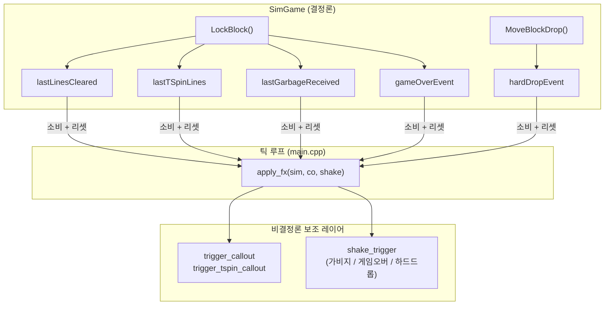

Sim 의 플래그가 한 방향으로만 흐른다는 것이 핵심이다. 보조 레이어는 Sim 을 읽고 플래그를 초기화할 뿐 게임 상태를 되돌려 쓰지 않는다. 이 단방향성이 결정론 경계를 지킨다.

### A.3 소비 지점을 한 곳에 모은다 — 파라미터화된 람다 하나

플래그 기반 프로토콜의 함정은 **"어디서 리셋할 것인가"** 이다. Net 모드 코드, Single 모드 코드, BotSingle 모드 코드가 각자 다른 자리에서 플래그를 읽고 리셋한다면:

- Net 에서는 `lastLinesCleared` 만 보고 shake 를 거는데 `lastGarbageReceived` 를 깜빡 빠뜨림 → 싱글에는 있는데 넷에는 없는 연출 버그.
- 새 필드(`lastComboLen` 같은 것)를 추가하면 세 자리 모두 수정해야 함 → 리그레션 자석.

해법은 소비/리셋을 **헬퍼 한 곳**에 모으는 것이다. 여기서 자연스럽게 떠오르는 첫 설계는 "자기 보드용 하나, 상대 보드용 하나" 로 람다 두 개를 두는 것인데 — 그러면 본문이 똑같고 `shakeLeft`/`shakeRight` 만 다른 복사본이 생긴다. 복사본은 곧 갈라진다.

실제 코드는 그 중복을 **shake 대상을 인자로 받아** 없앴다.

**현재 소스 발췌 — `src/main.cpp`**

```cpp
    // 보드별 이벤트 처리: callout + (가비지를 받을 때만) shake + 소비 플래그 리셋.
    //   shk 는 "이 보드 쪽" 의 shake 대상. 콜아웃은 이 보드 위에 뜬다.
    //   라인 클리어는 shake 를 트리거하지 않는다 — 공격(가비지) 가 반대편 보드로
    //   가면 그쪽 apply_fx 가 그 측 shake 를 걸어준다 (일반 테트리스 전투 관례).
    //   자기 / 상대 구분 없이 같은 로직 — 호출부가 올바른 shake 상태를 주입.
    auto apply_fx = [&](SimGame& sim, Callout& co, ShakeState& shake) {
        if (sim.lastTSpinLines >= 0)
            trigger_tspin_callout(co, sim.lastTSpinLines);
        else if (sim.lastLinesCleared > 0)
            trigger_callout(co, sim.lastLinesCleared);
        if (g_settings.shakeOn && sim.lastGarbageReceived > 0)
            shake_trigger(shake, 6.0f, 0.20f);
        if (g_settings.shakeOn && sim.gameOverEvent)
            shake_trigger(shake, 16.0f, 0.50f);
        // 하드드롭 약한 흔들림. shake_trigger 는 더 강한 진행 중 흔들림을
        // 덮어쓰지 않으므로 가비지/게임오버 흔들림을 끊지 않는다.
        if (g_settings.shakeOn && g_settings.hardDropShakeOn && sim.hardDropEvent)
            shake_trigger(shake, 2.5f, 0.10f);
        sim.hardDropEvent = false;
        sim.lastLinesCleared = 0;
        sim.lastTSpinLines = -1;
        sim.lastGarbageReceived = 0;
        sim.gameOverEvent = false;
    };
```

**세 인자가 곧 이 람다의 설계 문서다.** `SimGame&` 는 읽고 리셋할 대상, `Callout&` 는 텍스트가 뜰 자리, `ShakeState&` 는 흔들릴 보드. 세 가지가 "어느 보드인가" 하나로 묶여 있고, 호출부가 그 세 짝을 함께 넘긴다. 자기/상대 구분이 람다 안에 전혀 없으므로 **연출 규칙이 갈라질 수 없다.**

로직을 뜯어보면:

- **콜아웃은 라인 클리어 / T-스핀에 반응한다.** `lastTSpinLines >= 0` 이면 T-스핀 콜아웃이 우선이고, 아니면서 `lastLinesCleared > 0` 이면 일반 콜아웃.
- **shake 는 라인 클리어에 걸지 않는다.** `lastGarbageReceived > 0`(가비지 수신)이면 중간 강도(6 px, 0.20 s), `gameOverEvent` 면 최강(16 px, 0.50 s). 라인 클리어로 자기 보드를 흔들지 않는 이유는, 그 공격이 반대편 보드로 넘어가면 **그쪽 보드가** 흔들리기 때문이다 — 일반적인 테트리스 대전 연출 관례다.
- **하드드롭은 약한 흔들림(2.5 px, 0.10 s).** `shake_trigger` 가 "현재 활성 강도보다 약하면 무시" 정책(`renderer/shake.h`)이라, 하드드롭 흔들림이 진행 중인 가비지 흔들림을 끊지 않는다. 강도 계층 2.5 < 6 < 16 이 그대로 우선순위가 된다.
- **모든 shake 가 `g_settings.shakeOn` 으로 게이트된다.** 하드드롭만 `hardDropShakeOn` 이라는 하위 스위치를 하나 더 탄다. 설정 화면 ([Part 11](./part11-settings-and-options.md))이 이 두 bool 을 켜고 끈다. 게이트가 **트리거 시점**에 있다는 점이 중요하다 — 렌더 시점에 걸면 이미 시작된 흔들림이 설정을 바꾼 순간 뚝 끊긴다.
- **마지막 다섯 줄이 플래그 전부를 리셋한다.** if 블록에 안 걸린 플래그도 초기값으로 밀어버리는 게 중요하다(§A.2). `lastTSpinLines` 의 초기값이 0 이 아니라 `-1` 임에 주의.

### A.4 세 모드에서 어떻게 불리는가

호출부는 세 군데다. Sim 진행 경로는 전혀 다르지만 소비/리셋은 같은 함수를 탄다.

| 모드 | 호출 | 위치 |
|---|---|---|
| Net (lockstep) | `apply_fx(gameLocal->sim,  coLocal,  shakeLeft);`<br/>`apply_fx(gameRemote->sim, coRemote, shakeRight);` | `src/main.cpp` |
| Single | `apply_fx(gameSingle->sim, coLocal, shakeLeft);` | `src/main.cpp` |
| BotSingle | `apply_fx(gameSingle->sim, coLocal,  shakeLeft);`<br/>`apply_fx(gameBot->sim,    coRemote, shakeRight);` | `src/main.cpp` |

Single 모드는 상대가 없으니 `shakeRight`/`coRemote` 가 영원히 초기 상태로 남는다. 분기도 특수 케이스도 없이 "호출을 하나 덜 한다" 로 끝나는 것이 파라미터화의 이득이다.

Net 모드에서는 이 호출이 `safeTick` 캐치업 루프 **안**에 있다. 즉 한 프레임에 여러 틱이 진행되면 `shake_trigger` 도 여러 번 걸린다. `shake_trigger` 의 "약한 건 무시" 정책이 여기서 제 역할을 한다 — 캐치업 5틱 동안 가비지 흔들림이 연달아 와도 가장 강한 것 하나가 살아남는다.

### A.5 플래그 추가 시 체크리스트

새 이벤트(예: "콤보 N 연속")를 추가할 때 건드릴 곳은 정확히 세 지점이다.

1. `SimGame` 에 `lastComboLen` 필드 추가 + `LockBlock` 안에서 무조건 대입.
2. `apply_fx` 안에 소비 로직 추가 (callout / shake / 필요하면 오디오).
3. `apply_fx` 맨 끝 리셋 블록에 `sim.lastComboLen = 0;` 추가.

세 번째를 빼먹는 것이 가장 흔한 버그인데, 리셋 문이 **한 람다 안에 모여 있으니** diff 리뷰에서 바로 잡힌다. 모드별 코드에 흩어져 있었으면 "Net 에만 있고 Single 에 없다" 같은 비대칭이 한참 후에 드러났을 것이다.

### A.6 오디오 이벤트 연결

Part 5 의 오디오는 `apply_fx` 가 아니라 **`Game::SubmitInput` / `Game::Tick`** 안에서 소비된다(§7.2). 연출(콜아웃·흔들림)은 "두 보드의 관계" 를 알아야 하므로 틱 루프에 있고, 사운드는 한 보드의 사건이라 래퍼 안에 있는 것이다. 두 계층이 각자 다른 플래그 집합을 소비한다는 §A.2의 표가 이 분리를 그대로 보여준다.

Sim 결정론은 어느 쪽과도 무관하다. 헤드리스 테스트 환경에서는 `audio_play_sound` 가 호출되지도 않고(`Game` 자체가 링크되지 않으므로), parity 테스트도 영향을 안 받는다.

---

## 부록 B. 셰이크와 뷰 오프셋

### B.1 렌더 단계에서만 주입

`ShakeState` 는 렌더러의 **정수 뷰 오프셋 두 개**만 건드린다. Sim 의 격자 좌표나 블록 위치는 손대지 않는다. 이 경계가 "셰이크가 결정론에 영향을 주지 않는다" 는 주장을 성립시킨다.

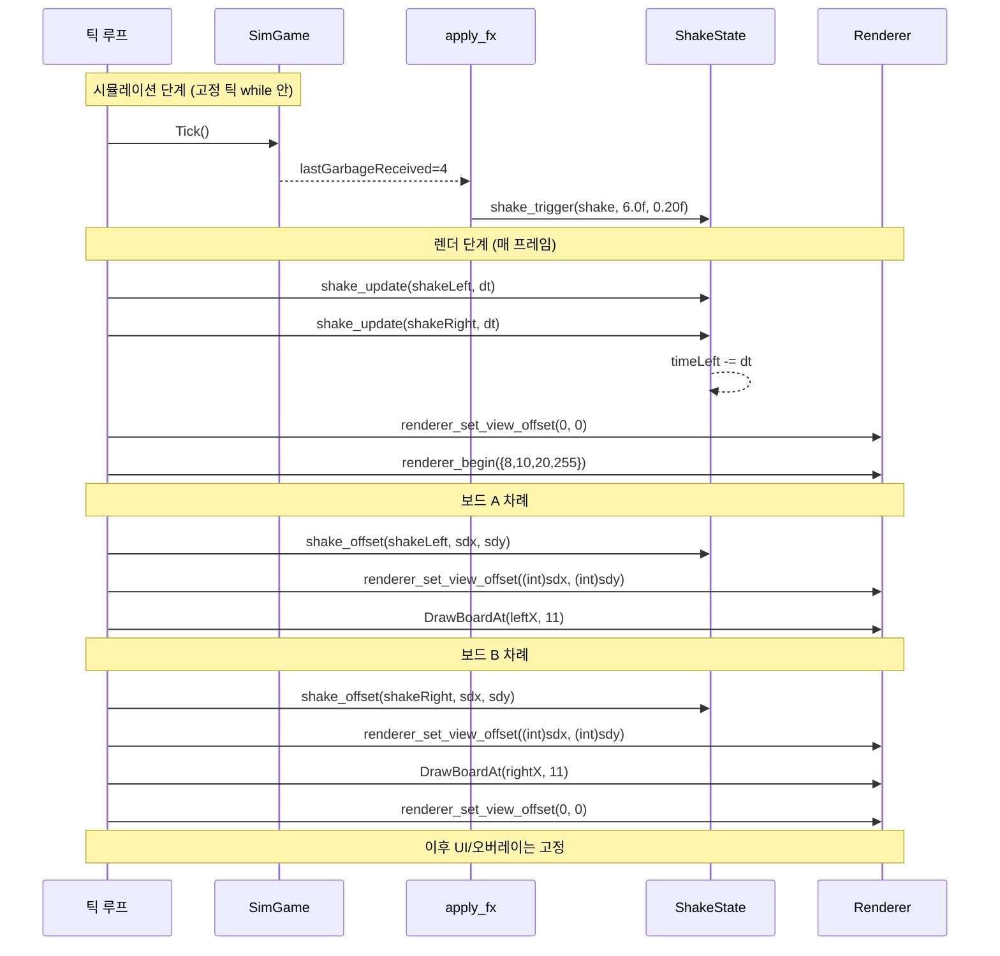

핵심은 `shake_trigger` 만 틱 루프 안에 있고, 감쇠(`shake_update`)와 오프셋 추첨(`shake_offset`)은 전부 렌더 경로에서 돈다는 것이다. 틱 루프는 "이 시점에 흔들림이 시작됐다" 는 선언만 한다.

### B.2 실제 호출 순서 — 흔들림은 보드마다 걸린다

여기서 흔한 오해를 바로잡아야 한다. **`renderer_set_view_offset` 은 프레임당 한 번이 아니고, 흔들리는 것은 화면 전체가 아니라 보드 하나다.**

**현재 소스 발췌 — `src/main.cpp`**

```cpp
    // Section I — 화면 흔들림. 보드별 독립 상태 (shake 대상: 가비지를 받는 쪽의
    // 보드만). 예: 내가 콤보로 상대에게 가비지를 보내면 → 상대 보드(오른쪽)만
    // 흔들림. 상대가 나에게 공격하면 → 내 보드(왼쪽)만 흔들림. 내 라인 클리어
    // 자체는 보드를 흔들지 않고 콜아웃 텍스트만 띄운다 (일반 테트리스 전투 관례).
    ShakeState shakeLeft{};
    ShakeState shakeRight{};
```

`ShakeState` 가 **두 개**다. 프레임 시작부에서는 둘 다 감쇠시키고 오프셋은 0으로 되돌린다(§12의 `src/main.cpp` 인용). 그리고 보드를 그릴 때마다 그 보드의 오프셋을 걸었다가, 보드가 끝나면 다시 0으로 되돌린다.

**현재 소스 발췌 — `src/main.cpp`**

```cpp
            // 보드 shake
            {
                float sdx = 0.f, sdy = 0.f;
                shake_offset(shakeLeft, sdx, sdy);
                renderer_set_view_offset((int)sdx, (int)sdy);
                gameSingle->DrawBoardAt(11, 11);
            }
            renderer_set_view_offset(0, 0);
```

**현재 소스 발췌 — `src/main.cpp`**

```cpp
            // 보드별 shake — 각 보드 드로우 직전에 그 측 offset 을 적용.
            //   왼쪽(내 보드): shakeLeft. 오른쪽(상대 미러): shakeRight.
            //   apply_fx 호출부가 각 보드의 shakeLeft/shakeRight 를 주입한다.
            {
                float sdx = 0.f, sdy = 0.f;
                shake_offset(shakeLeft, sdx, sdy);
                renderer_set_view_offset((int)sdx, (int)sdy);
                gameLocal->DrawBoardAt(leftX, 11);
                Game::DrawGarbageBar(leftX, 11, gameLocal->sim.PendingGarbage());
            }
            {
                float sdx = 0.f, sdy = 0.f;
                shake_offset(shakeRight, sdx, sdy);
                renderer_set_view_offset((int)sdx, (int)sdy);
                gameRemote->DrawBoardAt(rightX, 11);
                Game::DrawGarbageBar(rightX, 11, gameRemote->sim.PendingGarbage());
            }
            renderer_set_view_offset(0, 0);  // UI/오버레이는 정적
```

BotSingle 렌더(`src/main.cpp`)도 글자만 다른 같은 구조다. 그래서 Net / BotSingle 프레임에서는 `renderer_set_view_offset` 이 **최소 네 번** 불린다: 프레임 진입 시 0, 왼쪽 보드용, 오른쪽 보드용, 그리고 UI 복귀용 0.

이 설계가 §A.3의 연출 규칙과 정확히 짝을 이룬다. "가비지를 받은 쪽만 흔들린다" 는 서사는 `apply_fx` 가 그 보드의 `ShakeState` 에만 트리거를 걸기 때문에 성립하고, 화면에서는 그 보드의 드로우 구간에만 오프셋이 걸리기 때문에 보인다. 점수 패널, 콜아웃, NEXT 큐, 나가기 버튼은 오프셋 0 구간에서 그려지므로 **미동도 하지 않는다** — 흔들리는 보드 옆에 고정된 UI 가 있어야 어느 쪽이 맞았는지 즉시 읽힌다.

### B.3 감쇠 수식

`shake_offset` 의 내부는 간단하다.

- 남은 시간 비율 $t = \text{timeLeft} / \text{totalTime}$ 을 구한다 (1.0 → 0.0 선형 감소).
- 최대 진폭 `intensity` 에 $t$ 를 곱해 이번 프레임의 진폭 `amp` 를 얻는다.
- `ShakeState::rngState` 의 XorShift64\* 에서 난수를 뽑아 $[-1, +1]$ 균등 분포로 변환.
- $(\text{amp} \cdot U_1,\ \text{amp} \cdot U_2)$ 를 출력.

$$t = \frac{\text{timeLeft}}{\text{totalTime}}, \quad \text{amp} = \text{intensity} \cdot t$$

$$dx = \text{amp} \cdot U_1, \quad dy = \text{amp} \cdot U_2, \quad U_i \in [-1, +1]$$

선형 감쇠(지수가 아니라)를 쓴 이유는 단순함 + 예측 가능성. 0.20 초짜리 흔들림은 정확히 0.20 초 후 멈춘다. 지수 감쇠는 꼬리가 길어져 "언제 끝나는지 모르는" 모호함을 남긴다.

`main.cpp` 가 `(int)sdx` 로 **잘라서** 넘긴다는 점도 의미가 있다. `renderer_set_view_offset` 의 시그니처가 `(int, int)` 이므로 오프셋은 정수 픽셀로 양자화된다. GPU 파이프라인 자체는 정점 좌표가 실수라 소수 픽셀 오프셋도 표현할 수 있지만, 흔들림에는 그럴 필요가 없었다. 진폭 6 px 짜리 흔들림이 실제로는 -6..+6 의 정수 열세 단계로 양자화되는데, 60 Hz 에서 0.20 초면 충분히 거칠고 빠르게 진동해서 양자화가 눈에 띄지 않는다.

### B.4 결정론 영향이 없다는 근거

1. **공간적 분리.** `ShakeState::rngState` 는 구조체 멤버다(`renderer/shake.h`). Sim 의 tetromino 추첨 RNG 와 완전히 다른 객체이고, 서로를 모른다.
2. **시간적 분리.** 틱 루프 안에서는 `shake_trigger`(상태 세팅)만 부른다. 난수 추첨은 렌더 경로에서만 돈다. 즉 shake 가 소비한 난수 개수는 틱 수가 아니라 **프레임 수**에 비례한다 — 두 피어의 FPS 가 달라도 Sim 은 영향받지 않는다.
3. **출력 경로 분리.** `shake_offset` 의 결과는 `renderer_set_view_offset` 을 통해 `s_view_ox`/`s_view_oy` 두 정수로만 들어간다. Sim 의 격자나 블록 좌표에 닿는 경로가 존재하지 않는다.

Part 6의 HASH 검증이 shake 를 완전히 무시해도 안전한 것이 이 분리 덕분이다.

### B.5 `s_view_ox` / `s_view_oy` 는 정점을 만들 때 더해지는 전역 정수 오프셋이다

`renderer_set_view_offset` 이 실제로 하는 일은 대입 두 줄이다.

**현재 소스 발췌 — `renderer/renderer.cpp`**

```cpp
void renderer_set_view_offset(int dx, int dy)
{
    // 오프셋이 바뀌기 전에 쌓인 것을 비운다. 그렇지 않으면 이전 오프셋으로
    // 만들어진 정점과 새 오프셋 정점이 한 배치에 섞인다.
    if (dx != s_view_ox || dy != s_view_oy) glb_flush();
    s_view_ox = dx;
    s_view_oy = dy;
}
```

변환 행렬도, 카메라도, 새로 올릴 uniform 도 없다. `s_view_ox`/`s_view_oy` 는 그냥 정수 변수 두 개이고, **배처가 정점 좌표를 만들 때 더해진다**:

- `glb_rect` 는 화면 밖 판정을 하기 전에 `x += (float)s_view_ox; y += (float)s_view_oy;` 로 사각형 자체를 옮긴다 (`renderer/renderer.cpp`). 단색 사각형·둥근 사각형·글리프·이미지가 모두 이 경로다.
- 회전한 이미지는 꼭짓점 네 개를 직접 받는 `glb_quad` 를 타는데, 거기서도 정점마다 같은 값을 더한다 (`renderer/renderer.cpp`).

앞의 `glb_flush()` 한 줄이 이 방식의 대가다. 오프셋은 셰이더가 아니라 CPU 쪽 정점 생성에 녹아 들어가므로, 값이 바뀌는 순간 이미 큐에 쌓인 정점과 앞으로 쌓일 정점의 기준이 달라진다. 그래서 바뀔 때마다 배치를 한 번 끊는다. Net 프레임에서 오프셋이 네 번 바뀌므로 draw call 이 그만큼 나뉘지만, 한 프레임에 서너 번 더 나가는 것은 문제가 되지 않는다.

그래서 "오프셋이 걸린 구간에 그린 모든 것" 이 한 덩어리로 이동한다 — 보드 테두리, 격자 셀, 고스트, 현재 피스, 가비지 바까지. 개별 엘리먼트에 좌표 보정을 넣을 필요가 없다. 반대로 오프셋을 0으로 되돌린 뒤 그린 것은 절대 움직이지 않는다.

세 가지 결과가 따라온다.

| 성질 | 이유 |
|---|---|
| 클리핑이 자동 | 오프셋을 더한 뒤 화면 밖 판정(`renderer/renderer.cpp`)을 타므로, 밀려 나간 사각형은 정점조차 만들어지지 않는다. 걸쳐 있는 것은 뷰포트와 시저 박스가 잘라 낸다 |
| 상태가 프레임을 넘어 남는다 | 전역 두 개라서 리셋하지 않으면 다음 프레임까지 유효 — 그래서 프레임 진입부에서 0을 찍는다(§12) |
| 비용이 0에 가깝다 | 사각형 하나당 float 덧셈 두 번. 픽셀 수와 무관하다 |

렌더러 쪽 전체 파이프라인(`glb_rect` → 정점 큐 → `glb_flush` → `platform_present`)은 [Part 3](./part3-rendering-and-ui.md) 에서 다뤘다.

### B.6 체크리스트 요약

| 항목 | 어디서 | 호출 빈도 |
|------|--------|----------|
| `shake_trigger` | 틱 루프 (`apply_fx` 안) | Sim 이벤트 발생 시 |
| `shake_update(dt)` | 프레임 렌더 직전 | 매 프레임, `shakeLeft`/`shakeRight` 각 1회 |
| `shake_offset` | 각 보드 드로우 직전 | 그려지는 보드 수만큼 (1~2회) |
| `renderer_set_view_offset` | 프레임 진입 / 보드 직전 / 보드 직후 | 프레임당 2~4회 |

Sim 은 자기가 흔들리고 있는지 모른다. 렌더러는 자기가 왜 흔들리는지 모른다. 틱 루프만 양쪽을 알고, 그 둘 사이의 유일한 통로는 `ShakeState` 객체 두 개다. 이 격리가 Part 6 lockstep 과 Part 9 RL 봇의 헤드리스 실행을 모두 지탱한다.

---

## 부록 C. 인게임 나가기 모달

이 부록의 Single/BotSingle 경로는 이 장에서 바로 만들 수 있다. Net 분기는 [Part 6](./part6-lockstep-networking.md) 의 `Session` 과 `AppMode::Net` 이 완성된 뒤 추가한다 — 아래 `session.Close()` 를 Part 4 체크포인트에 미리 넣지 않는다.

### C.1 왜 모달이 필요한가

초기 구현에서는 게임 중 X 버튼을 누르면 곧바로 `gameSingle.reset()` 이 호출되고 메인 메뉴로 돌아갔다. 실수로 클릭 한 번이면 10분짜리 플레이가 날아간다. 멀티플레이에서는 더 심했다 — 한쪽에서 실수로 나가면 상대는 갑자기 연결이 끊기면서 "상대가 나간 건가 네트워크 문제인가" 가 구분이 안 됐다.

요구사항:

1. Single / BotSingle / Net 세 모드 모두에서 동일한 X 버튼 UI.
2. 모달 문구는 모드에 따라 달라야 한다 — Single 은 "게임 중지" 로 충분하지만 Net 은 "패배 기록 + 상대는 계속 진행" 이라는 중대한 결과를 명시해야 한다.
3. Single / BotSingle 에서는 모달이 떠 있는 동안 **시뮬을 완전히 멈춰야** 한다.
4. Net 에서는 정반대 — 모달이 떠도 **시뮬은 계속 진행해야** 한다. 한쪽이 일시정지를 걸 수 있으면 lockstep 의 동기 보장이 깨진다.
5. 키보드와 마우스 둘 다로 Yes/No 를 선택 가능해야 한다.

### C.2 상태 플래그 하나

모달은 단일 bool 로 표현한다(`src/main.cpp`의 `bool quitDialogOpen = false;`). 이 플래그가 두 군데에서 읽힌다: 시뮬 단계의 일시정지 가드, 그리고 렌더 단계의 모달 박스.

### C.3 일시정지 가드 (`tickPauseForDialog`)

§4.3에서 이미 인용한 `src/main.cpp` 블록이 그 가드다. 핵심 트릭은 **`accumulator += deltaTime` 만 조건부로 거는 것**이다. while 루프 자체는 손대지 않는다.

- Single/BotSingle 에서 모달이 열린 순간 `accumulator` 는 직전 프레임까지 누적된 상태로 **동결**된다. 이미 1틱분 이상 쌓여 있었다면 그 잔여분만 소진되고 멈춘다. 플레이어 체감으로는 "딱 멈췄다" 와 구분되지 않는다.
- Net 에서는 `tickPauseForDialog` 가 항상 false 라서 `+= dt` 가 평소대로 실행되고, while 루프가 `safeTick` 까지 정상 진행한다. 상대 입력은 계속 도착하고 내 입력도 계속 송신된다.

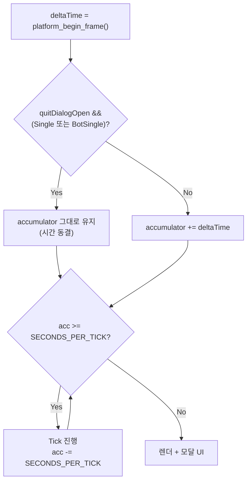

일시정지를 "틱 루프를 건너뛰기" 가 아니라 "시간 공급을 끊기" 로 구현한 것이 요점이다. 루프 구조를 건드리지 않으므로 Net 의 lockstep 경로가 이 기능의 존재를 알 필요조차 없다.

### C.4 X 버튼과 모달 렌더

렌더 경로 말미에서 두 블록이 차례로 실행된다 — 인게임 X 버튼(모달이 닫혀 있을 때만), 그리고 모달 본체(열려 있을 때만).

**현재 소스 발췌 — `src/main.cpp`**

```cpp
        // ── 인게임 나가기 버튼 + 확인 모달 ─────────────────────────────────
        // 모든 인게임 모드(Single / BotSingle / Net) 에서 우상단 X 버튼을 렌더.
        // Net 모드에서 채팅 중일 땐 마우스 클릭이 X 를 건드리지 않도록 숨김.
        const bool inGame =
            (app == AppMode::Single    && gameSingle) ||
            (app == AppMode::BotSingle && gameSingle && gameBot) ||
            (app == AppMode::Net       && gameLocal && gameRemote);
        if (inGame && !quitDialogOpen) {
            // 화면은 720x640. X 버튼은 우상단 2px 마진.
            if (gui_close_button(720 - 32 - 2, 2, 32)) {
                quitDialogOpen = true;
            }
        }
```

**현재 소스 발췌 — `src/main.cpp`**

```cpp
        if (quitDialogOpen) {
            // 반투명 배경으로 뒤 게임 렌더를 어둡게.
            gui_modal_dim(720, 640);

            // 모달 박스 (중앙, 420x220)
            const int mw = 420, mh = 220;
            const int mx = (720 - mw) / 2;
            const int my = (640 - mh) / 2;
            draw_rect_rounded(mx, my, mw, mh, 0.15f, {28, 32, 48, 255});

            // 타이틀 + 설명 (모드별 문구)
            gui_text_center(360, my + 24, "정말 나가시겠습니까?", 28, WHITE);
            const char* line1 = nullptr;
            const char* line2 = nullptr;
            if (app == AppMode::Net) {
                line1 = "나가면 패배로 기록됩니다.";
                line2 = "게임은 상대방이 계속 진행합니다.";
            } else {
                line1 = "현재 게임이 중지됩니다.";
                line2 = "";
            }
            gui_text_center(360, my + 70,  line1, 16, GRAY);
            if (line2 && *line2) gui_text_center(360, my + 92, line2, 16, GRAY);

            // Yes/No 버튼 (각 140x44, 중앙에서 좌우 분리).
            const int bw = 140, bh = 44;
            const int gap = 30;
            const int byPos = my + mh - bh - 24;
            const int bxYes = 360 - bw - gap / 2;
            const int bxNo  = 360 + gap / 2;

            bool clickYes = gui_button(bxYes, byPos, bw, bh, "예 (Y)", 22);
            bool clickNo  = gui_button(bxNo,  byPos, bw, bh, "아니오 (N)", 22);

            // 키보드: Y = Yes, N = No, Enter = Yes (관성).
            // Escape 는 배정하지 않는다 — 다른 화면에서 전부 '뒤로가기'로
            // 쓰고 있어서, 여기서만 '예'로 동작하면 일관성이 깨진다.
            if (platform_key_pressed(PKEY_Y) || platform_key_pressed(PKEY_ENTER))
                clickYes = true;
            if (platform_key_pressed(PKEY_N))
                clickNo = true;

            if (clickNo) {
                quitDialogOpen = false;
            } else if (clickYes) {
                quitDialogOpen = false;
                // Net: 세션 종료 → 상대에게 단절 전달(= 패배 기록) → 메뉴로.
                if (app == AppMode::Net) {
                    session.Close();
                    netMode = false; isHost = false; queueMode = false;
                    gameLocal.reset();
                    gameRemote.reset();
                    iconYou = resolvePlayerIcon(mySelectedIconId);
                    iconOpponent = iconDefaultOpponent;
                }
                // Single/BotSingle: 게임 객체 파기 → 메뉴로.
                if (app == AppMode::Single) {
                    gameSingle.reset();
                }
                if (app == AppMode::BotSingle) {
                    gameSingle.reset();
                    gameBot.reset();
                    botInputQueue.clear();
                    botInputCooldownTicks = 0;
                    botMatchResult = BotMatchResult::None;
                }
                app = AppMode::Menu;
            }
        }
```

단계별로 보자.

**`inGame` 판정.** 세 모드 각각에서 게임 객체가 실제로 세팅되어 있는지까지 확인한다. `AppMode::Net` 이지만 아직 `MATCH_FOUND` 를 받기 전이라 `gameLocal == nullptr` 인 상태에서는 X 버튼을 띄우지 않는다. §8의 "모드 + 포인터를 함께 검사" 규칙이 여기서도 그대로 쓰인다. 대기 화면의 취소는 Part 6의 별도 경로가 담당한다.

**X 버튼 가드 `inGame && !quitDialogOpen`.** 모달이 뜬 상태에서 X 가 배경 위에 또 그려지면 클릭이 두 번 먹거나 모달 뒤에 숨어 오작동한다. 모달이 열린 순간부터는 X 를 안 그린다.

**모달 본체 순서.** `gui_modal_dim` 이 먼저 깔리고(화면 전체에 반투명 검정), 그 위에 `draw_rect_rounded` 로 모달 박스, 그 위에 텍스트와 버튼. 렌더러가 깊이 테스트를 켜지 않으므로 **그린 순서가 곧 z-order** 다. 그리고 이 블록은 §B.2의 `renderer_set_view_offset(0, 0)` 이후에 실행되므로, 뒤에서 보드가 흔들리고 있어도 모달은 화면 정중앙에 고정된다.

**모드별 문구.** Net 의 두 번째 줄 "게임은 상대방이 계속 진행합니다" 는 심리적 브레이크 역할이다. 사용자가 "상대에게 미안하지만 나가야겠다" 라고 의식적으로 결정하게 만든다.

**Y/N 키 병행.** 마우스 클릭(`gui_button` 반환값)과 키보드 엣지 (`platform_key_pressed(PKEY_Y)`)를 `clickYes`/`clickNo` bool 로 합쳐 처리한다. 한 프레임에 둘 다 트리거돼도 같은 분기로 들어가니 중복 처리 걱정이 없다. Enter 는 Yes 의 별칭이다.

**`Escape`는 배정하지 않는다 — 다만 해당 키 처리 주석의 이유는 부정확하다.** `platform_should_close()`는 `WM_CLOSE`/`WM_DESTROY`(SDL은 `SDL_QUIT`)에만 반응하므로 ESC로 창이 닫히지 않는다. 실제 이유는 ESC가 채팅 취소·설정/상점 나가기·룸 퇴장에 이미 "한 단계 물러나기"로 배정돼 있다는 것이다. Yes에 붙이면 같은 키가 취소와 확정 종료 두 의미를 갖고, No에 붙이면 버튼 반환 경로와 키보드 경로가 비대칭이 되므로 Y/N으로 통일했다.

### C.5 Net 모드에서 Yes 를 눌렀을 때

`session.Close()` 가 TCP 연결에 shutdown 신호를 보내고 세션 소유 핸들을 정리한다. 상대 피어의 `Session` ioThread 는 `recv()` 에서 EOF 를 받고 링크 상태를 `Lost` 로 떨어뜨리며, 상대 쪽 메인 루프의 grace 카운트다운(`src/main.cpp`)이 이를 "상대가 나갔다" 로 해석한다. 즉 `GAME_OVER_CHOICE` 같은 별도 메시지를 명시적으로 보내지 않는다 — **연결을 내리는 것 자체가 "나갑니다" 의 신호**인 프로토콜이다.

Part 6의 DESYNC 처리와 구분되는 점: DESYNC 는 양쪽이 연결된 채로 `HASH` 가 불일치해 진단 경로로 들어간다. 여기 나가기는 링크 자체를 내려버린다.

`netMode = false; isHost = false; queueMode = false;` 리셋도 중요하다. 이걸 빼먹으면 다음번 메뉴에서 Matchmaking 을 골랐을 때 프로그램이 "이미 Net 모드" 라고 착각해 CLI 경로로 빠진다. 아이콘 두 개를 기본값으로 되돌리는 것도 같은 맥락이다 — 다음 판에 지난 상대의 아이콘이 남아 있으면 안 된다.

### C.6 Single/BotSingle 에서 Yes 를 눌렀을 때

`Game` 객체를 파기하고 `AppMode::Menu` 로 전환. BotSingle 은 §9·§15-(5)에서 본 "두 보드의 관계" 상태(`botInputQueue`, `botInputCooldownTicks`, `botMatchResult`)까지 함께 비운다. 시뮬은 파기 전까지 `tickPauseForDialog` 로 동결돼 있었으니 깨끗한 상태에서 reset 된다.

### C.7 전체 상태 흐름

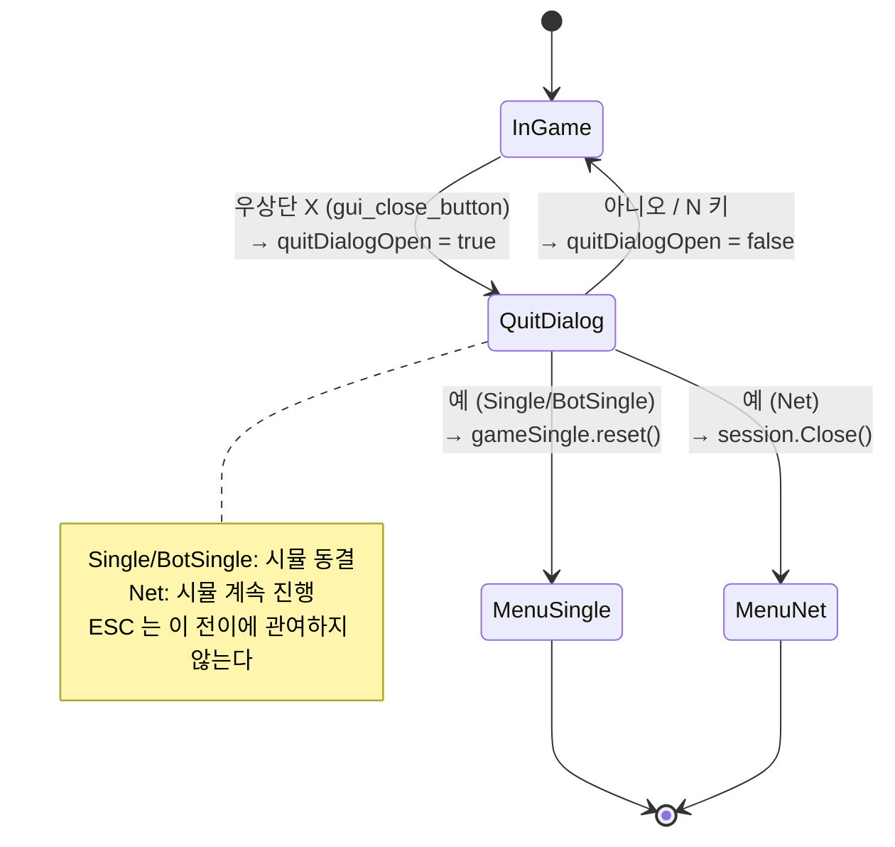

### C.8 테스트 시나리오

1. **Single Pause 확인.** Single Play 진입 → 블록이 떨어지는 중 우상단 X 클릭 → 모달이 뜬 순간 블록이 멈추는가. `N` 을 누르면 같은 지점에서 낙하가 재개되는가.
2. **ESC 무반응 확인.** 같은 화면에서 ESC 를 눌러도 창이 닫히지도, 모달이 뜨지도 않는가.
3. **Net Pass-through 확인.** 두 창으로 매치를 시작 → 한쪽에서 X 클릭 → 모달이 뜬 쪽의 보드에서도 블록이 계속 떨어지는가.
4. **Net 종료 확인.** 모달에서 예 → 내 쪽은 메인 메뉴, 상대 창은 grace 후 타이틀 복귀.

3·4번의 재현 명령은 Part 6의 수동 테스트 절을 따른다. 게임 루프 쪽 관심사는 `tickPauseForDialog` 한 줄의 효과가 눈에 보이는 변화로 연결된다는 것뿐이다.

---

## 부록 D. 메뉴 마우스 연동 (키보드 병행)

### D.1 설계 원칙

초기 메뉴는 키보드 전용이었다. `menuIndex` 라는 정수 커서가 현재 하이라이트된 항목을 가리키고, Up/Down 으로 이동, Enter 로 선택. 마우스가 당연한 시대에 왜 클릭이 안 되는지 사용자가 매번 헷갈렸다.

요구사항은 "마우스로도 되게 하되 키보드 동작은 그대로 유지" 다. 추가 제약:

- 키보드 커서(`menuIndex`)와 마우스 hover 상태가 **독립적으로 공존**해야 한다. 마우스가 Single 위에 있어도 키보드 커서가 Quit 에 있으면, Quit 에 하이라이트 색이 남고 Single 에는 hover 색이 따로 뜬다.
- 둘 다 가시적으로 구분돼야 한다 — hover/press/highlighted/idle 네 상태의 색을 전부 다르게.
- Disabled 항목은 클릭해도 반응하지 않고 키보드 Enter 도 무시해야 한다.

### D.2 `gui_button_highlighted` 의 우선순위

`gui_button_highlighted` 는 `gui_button` 과 똑같지만 `highlighted` 플래그를 하나 더 받는다. 내부는 단순한 if-else 체인이다.

**현재 소스 발췌 — `src/gui.cpp`**

```cpp
bool gui_button_highlighted(int x, int y, int w, int h, const char* label,
                            bool highlighted, int fontSize)
{
    const bool hover = gui_hover_rect(x, y, w, h);
    const bool press = hover && platform_mouse_down(0);
    Color bg;
    if (press)          bg = kBtnPressBg;
    else if (hover)     bg = kBtnHoverBg;
    else if (highlighted) bg = kBtnHighlight;
    else                bg = kBtnIdleBg;

    draw_rect_rounded(x, y, w, h, 0.25f, bg);
    const int tw = measure_text(label, fontSize);
    const int tx = x + (w - tw) / 2;
    const int ty = y + (h - fontSize) / 2;
    draw_text(label, tx, ty, fontSize, WHITE);
    return hover && platform_mouse_pressed(0);
}
```

색 결정 순서가 곧 우선순위다: **press > hover > highlighted > idle.**

- 누르는 순간에는 "지금 클릭 중" 이라는 시각적 즉각성이 최우선.
- 누르지 않고 hover 만 돼 있으면 hover 색. 이것도 keyboard highlight 를 덮는다 — "마우스가 이 위에 있다" 가 더 실시간적인 신호다.
- 마우스가 다른 곳에 있으면 비로소 keyboard highlight 가 보인다.

반환값이 `platform_mouse_down`(레벨)이 아니라 `platform_mouse_pressed`(엣지)라는 점도 중요하다. 레벨이면 버튼을 누르고 있는 동안 매 프레임 `true` 가 반환되어 메뉴 항목이 초당 수백 번 활성화된다. 이 함수는 렌더 단계에서 불리므로 §5의 입력 누적 보호를 받지 않는다 — UI 클릭은 틱이 아니라 프레임에 묶여 있고, 그래서 엣지 판정이 함수 안에 들어가 있어야 한다.

### D.3 `activated` 통합

루프 안에서 "이번 프레임에 선택된 항목이 있는가" 를 정수 `activated` 하나로 수렴시킨다. 마우스 클릭과 키보드 Enter/Space 가 서로 다른 타이밍에 들어와도 같은 분기로 들어가게 하기 위함이다.

**현재 소스 발췌 — `src/main.cpp`**

```cpp
            constexpr Color DISABLED = {70, 70, 70, 255};
            const char* items[] = {
                "Single Play",
                "Single vs Bot",
                "Matchmaking Multi",
                "Custom Room Multi",
                "Customize",
                "Settings",
                "Quit",
            };
            constexpr int kMenuCount = 7;

            // 버튼 레이아웃 — 중앙 정렬. 7개가 ranking 표시줄(y=540) 위에
            // 들어가도록 높이 42 / 간격 8 로 압축.
            const int bw = 300;
            const int bh = 42;
            const int bgap = 8;
            const int bx = (720 - bw) / 2;
            const int byStart = 190;

            // 키보드 네비게이션 (기존 동작 유지).
            if (platform_key_pressed(PKEY_DOWN)) menuIndex = (menuIndex + 1) % kMenuCount;
            if (platform_key_pressed(PKEY_UP))   menuIndex = (menuIndex + kMenuCount - 1) % kMenuCount;
```

**현재 소스 발췌 — `src/main.cpp`**

```cpp
            int activated = -1;  // 이번 프레임 활성화된 항목(-1 = 없음)

            for (int i = 0; i < kMenuCount; ++i)
            {
                const int by = byStart + i * (bh + bgap);
                const bool disabled = (i == 1 && !botAvailable);
                // Disabled 항목은 버튼 그리되 클릭 반환 무시(+ 라벨 회색).
                if (disabled) {
                    draw_rect_rounded(bx, by, bw, bh, 0.25f, {25, 30, 45, 255});
                    const int tw = measure_text(items[i], 24);
                    draw_text(items[i], bx + (bw - tw) / 2, by + (bh - 24) / 2,
                              24, DISABLED);
                    continue;
                }
                bool clicked = gui_button_highlighted(bx, by, bw, bh, items[i],
                                                      (i == menuIndex), 24);
                if (clicked) activated = i;
            }

            // 키보드 Enter/Space 로도 현재 강조된 항목 활성화.
            if (platform_key_pressed(PKEY_ENTER) || platform_key_pressed(PKEY_SPACE)) {
                if (!(menuIndex == 1 && !botAvailable)) activated = menuIndex;
            }
```

**현재 소스 발췌 — `src/main.cpp`**

```cpp
            if (activated >= 0) {
                if (activated == 0) {
                    app = AppMode::Single;
                    gameSingle = std::make_unique<Game>(sessionSeed);
                } else if (activated == 1) {
                    // 봇 선택 화면으로. 실제 BotSingle 진입은 거기서 모델 로드 성공 후.
                    app = AppMode::BotSelect;
                    botSelectIndex = 0;
                    botSelectError.clear();
                } else if (activated == 2) {
                    queueHost = relayHost; queuePort = relayPort;
                    // Section K — meta 연동 시 토큰 전달. relay 가 --meta 로 띄워졌으면
                    // 토큰 없이는 verify 실패로 즉시 close 된다.
                    if (session.QueueJoin(queueHost, queuePort, startDelay, inputDelay, authToken)) {
                        netMode = true; queueMode = true; isHost = false;
                        app = AppMode::Net;
                    }
                } else if (activated == 3) {
                    roomRelayHost = relayHost; roomRelayPort = relayPort;
                    app = AppMode::RoomLobby;
                    roomStage = RoomLobbyStage::Choose;
                    roomCodeInput.clear();
                    roomErrorMsg.clear();
                } else if (activated == 4) {
                    app = AppMode::Customize;
                    shopFetchTried = false;   // 진입마다 카탈로그 재요청
                    shopIndex = 0;
                    shopStatus.clear();
                    shopConfirmId.clear();
                } else if (activated == 5) {
                    app = AppMode::Settings;
                    settingsIndex = 0;
                } else {
                    // 메뉴의 Quit. 아래 정상 종료 경로와 같은 순서를 지킨다 —
                    // GL 객체는 컨텍스트가 살아 있을 때만 지울 수 있으므로
                    // renderer_shutdown 이 platform_shutdown 보다 먼저다.
                    renderer_shutdown();
                    platform_shutdown();
                    return 0;
                }
            }
```

Part 4 체크포인트에서는 `items[]` 가 `"Single Play"` 와 `"Quit"` 두 개 (`kMenuCount = 2`)이고, 디스패치도 `activated == 0` 과 `else` 두 갈래다. 나머지 다섯 항목은 각자의 장에서 배열에 문자열 하나, 디스패치에 `else if` 하나씩 늘어난다 — `activated` 로 수렴시켜 둔 덕분에 확장이 딱 그 두 곳으로 끝난다.

코드 구조는 세 단계다.

1. **키보드 커서 이동** — `PKEY_DOWN`/`PKEY_UP` 엣지로 `menuIndex` 를 수정. 마우스와 독립. 엣지 트리거로 처리하는 이유는 §5의 입력 논의와 같다 — held 로 하면 프레임당 여러 칸씩 점프한다. 여기서 `% kMenuCount` 로 **wrap** 한다는 점을 기억해 두면 좋다. Part 11의 해상도 선택기는 반대로 clamp 하는데, 그 이유는 그 장에 적혀 있다.
2. **버튼 렌더 루프** — 각 항목을 `gui_button_highlighted` 로 그리며 "이게 키보드 커서 항목인지" 를 `(i == menuIndex)` 로 전달. 클릭이 감지되면 `activated = i`.
3. **키보드 활성화** — Enter/Space 엣지가 들어오면 `activated = menuIndex`.

마지막 `if (activated >= 0)` 분기가 한 곳에 모여 있어 "선택됐다" 는 사건을 마우스/키보드가 완전히 같은 경로로 처리한다. 같은 프레임에 둘 다 트리거되어도 `activated` 는 마지막으로 설정된 값으로 덮일 뿐 이중 실행되지 않는다.

`activated == 1` 이 곧장 게임을 시작하지 않고 `AppMode::BotSelect` 로 넘어가는 것은 Part 9의 로스터 구조 때문이다. 처음에는 단일 `model/policy.onnx` 를 바로 로드하는 설계였지만, 학습 알고리즘이 늘면서 클라이언트가 `model/*.onnx` 와 `model/bots/*.onnx` 를 스캔해 목록을 만들도록 확장됐다.

### D.4 disabled 항목 처리

`botAvailable` 은 로스터가 비었을 때만 false 가 된다. 현재 로스터 생성 함수는 항상 `Heuristic (test)` 를 먼저 넣으므로 정상 빌드에서 이 분기는 거의 타지 않지만, 방어 코드는 남아 있다. 이 경우 해당 버튼은 **gui 함수를 호출하지 않는다.** 대신 `draw_rect_rounded` 로 배경을 직접 그리고 라벨 색을 `DISABLED` 로 찍은 뒤 `continue` 한다.

`gui_button_highlighted` 를 호출하지 않으므로 hover 색이 뜨지 않고 클릭 반환도 없다 — 마우스를 올려도 반응이 없는 "죽은 버튼" 처럼 보인다. `continue` 로 루프를 건너뛰므로 `clicked` 변수 자체가 존재하지 않아 실수로 `activated = i` 가 될 수 없다. 키보드 쪽에서는 Enter 분기의 `!(menuIndex == 1 && !botAvailable)` 이 한 번 더 막는다. 커서를 올릴 수는 있어도 Enter 가 먹지 않는 이중 가드다.

### D.5 이전 키보드-전용 구조와의 비교

리팩터 이전의 메뉴 루프는 개념적으로 다음 형태였다.

**예시(실제 저장소에는 없음)**

```cpp
if (platform_key_pressed(PKEY_DOWN)) menuIndex = (menuIndex + 1) % kMenuCount;
if (platform_key_pressed(PKEY_UP))   menuIndex = (menuIndex + kMenuCount - 1) % kMenuCount;
for (int i = 0; i < kMenuCount; ++i) {
    Color bg = (i == menuIndex) ? YELLOW : DARKGRAY;
    draw_rect_rounded(bx, by + i * (bh + bgap), bw, bh, 0.25f, bg);
    draw_text(items[i], /* ... */);
}
if (platform_key_pressed(PKEY_ENTER)) {
    // menuIndex 기반 분기
}
```

차이는 세 곳이다. (1) 렌더 호출이 `draw_rect_rounded` 에서 `gui_button_highlighted` 로 바뀌어 hover/press 상태가 추가됐다. (2) 선택 결과를 `menuIndex` 가 아닌 별도 지역 변수 `activated` 로 받아, `menuIndex` 와 무관한 위치의 마우스 클릭도 같은 경로로 처리한다. (3) disabled 항목이 루프 안의 분기로 올라와, "항상 같은 draw_rect + 조건부 Enter 가드" 에서 "disabled 면 gui 함수 호출 자체를 건너뛴다" 로 바뀌었다. 이 세 수정이 한 덩어리로 묶여야 키보드/마우스 공존이 자연스럽게 작동한다.

---

## 이 장에서 완성된 것

- `Game` 래퍼 — `SimGame` 을 소유하고 `gameOver`/`score` 를 참조 별칭으로 노출하며, `Draw`/`DrawBoardAt`/`DrawNextQueueMini`/`DrawGarbageBar` 로 상태를 픽셀로 바꾼다. CMake 의 `TETRIS_SIM_SOURCES` / `TETRIS_GAME_COMMON` 분리가 이 경계를 링크 단계에서 강제한다.
- `AccumulateInput()` / `ConsumeInput()` + `SECONDS_PER_TICK` 어큐뮬레이터로 입력 수집과 60 Hz 시뮬레이션을 분리했다. DAS 8틱 / ARR 3틱의 좌우 반복까지 포함.
- 하나의 `while (!platform_should_close())` 안에서 `AppMode` 로 아홉 화면을 분기하는 구조를 확정했다. 이 장이 채운 것은 `Menu` 와 `Single` 이고, 나머지 일곱은 뒤의 장이 같은 자리에 끼운다.
- Single 모드의 `GAME OVER` 팝업과 `[R]` 재시작(같은 시드로 `Game` 재생성) / `[Q]` 타이틀.
- `apply_fx` 람다 하나로 다섯 개 이벤트 플래그의 소비·리셋을 단일화하고, shake 대상을 인자로 주입해 자기/상대 보드의 연출 규칙이 갈라질 수 없게 만들었다.
- 보드별 `ShakeState` 두 개와 `renderer_set_view_offset` 정수 오프셋으로 "가비지를 받은 쪽 보드만 흔들리고 UI 는 고정" 을 구현했다.
- `quitDialogOpen` + `tickPauseForDialog` — 루프 구조를 건드리지 않고 시간 공급만 끊는 일시정지, 그리고 우상단 X 버튼 전용 확인 모달.
- `core/replay.cpp` 의 `FrameInputs` 기록(F5/F6)과 `CMakeLists.txt` 의 `tetris` 타깃.

아직 없는 것: 소리(Part 5), 네트워크(Part 6), 봇(Part 9), 랭킹(Part 10), 설정 화면(Part 11).

## 수동 테스트

```bash
# Linux/macOS (SDL2 백엔드가 기본)
cmake -S . -B build -DTETRIS_USE_SDL2=ON
cmake --build build
./build/tetris
```

```powershell
# Windows (Win32 handmade 백엔드가 기본)
cmake -S . -B build -DTETRIS_USE_SDL2=OFF
cmake --build build --config Release
.\build\Release\tetris.exe
```

- 단일 구성 제너레이터(Makefiles/Ninja)에서는 `--config` 가 무시되고 산출물은 `build/tetris` 다. 두 플랫폼 경로를 섞어 쓰지 않는다.
- `--target tetris` 로 타깃을 지정하면 `copy_assets`(ALL 타깃)가 돌지 않아 빌드 디렉터리에 `Font/`·`Sounds/` 가 없다. **타깃을 지정하지 말고 `cmake --build build` 를 쓰거나, 저장소 루트에서 실행**한다.

기대 결과:

1. 720×640 창이 뜨고 `TETRIS` 타이틀과 메뉴 버튼이 보인다. 방향키로 커서가 움직이고 (노란 하이라이트), 마우스를 올리면 그 항목만 파란 hover 색으로 바뀐다 — 두 색이 동시에 다른 항목에 떠 있어야 정상이다.
2. `Single Play` 를 키보드 Enter 로도, 마우스 클릭으로도 진입할 수 있다.
3. 좌우 방향키를 짧게 톡 치면 한 칸, 꾹 누르면 약 133 ms 뒤부터 약 50 ms 간격으로 주르륵 이동한다. 좌우를 동시에 누르면 멈춘다.
4. 스페이스를 아무리 빠르게 연타해도 씹히지 않는다(엣지 누적). 아래 방향키를 누르고 있으면 초당 약 15칸 속도로 내려간다.
5. 창 타이틀바를 잡고 2~3초 끌었다 놓아도 블록이 순간이동하지 않는다 — 최대 6틱만 캐치업된다.
6. 우측 패널에 SCORE / LEVEL + LINES / NEXT(3개)가 보이고, 고스트 블록 너머로 보드 격자가 비친다.
7. 톱아웃하면 `GAME OVER` 팝업 + `[R] Restart` / `[Q] Go to Title`. `R` 은 같은 피스 순서로 새 판을 시작하고, `Q` 는 메뉴로 돌아간다.
8. 게임 중 우상단 X 를 클릭하면 확인 모달이 뜨고 **블록이 그 자리에 멈춘다**. `N` 또는 "아니오" 로 닫으면 같은 지점에서 재개된다. **ESC 는 아무 반응이 없다** — 창도 닫히지 않고 모달도 뜨지 않는다.

결정론 검증은 디버그 UI 빌드에서 한다. `H` 키는 `TETRIS_ENABLE_DEBUG_UI` 가 켜진 빌드에서만 살아 있다(`CMakeLists.txt` 기본 OFF).

```bash
cmake -S . -B build-dbg -DTETRIS_USE_SDL2=ON -DTETRIS_ENABLE_DEBUG_UI=ON
cmake --build build-dbg
./build-dbg/tetris
```

기대 결과: 게임 중 `H` 를 누르면 stdout 에 `Hash single=0x... local=0x0 remote=0x0` 형태로 찍힌다. 같은 시드에서 같은 입력 시퀀스를 넣으면 렌더 FPS 와 무관하게 같은 `single` 값이 나온다 — 고정 틱이 실제로 프레임률을 분리했다는 증거다.

시뮬레이션 계층 자체의 회귀는 클라이언트를 띄우지 않고도 확인할 수 있다.

```bash
cmake -S . -B build-sim -DTETRIS_BUILD_GAME=OFF -DTETRIS_BUILD_TEST=ON
cmake --build build-sim --target sim_hash_dump
./build-sim/sim_hash_dump | diff - python/tests/_sim_hash_dump.txt && echo "결정론 OK"
```
