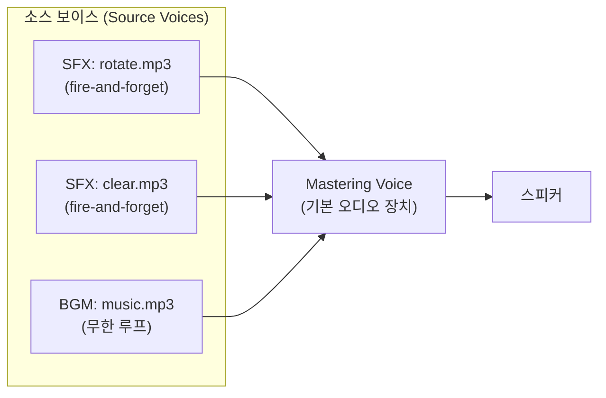
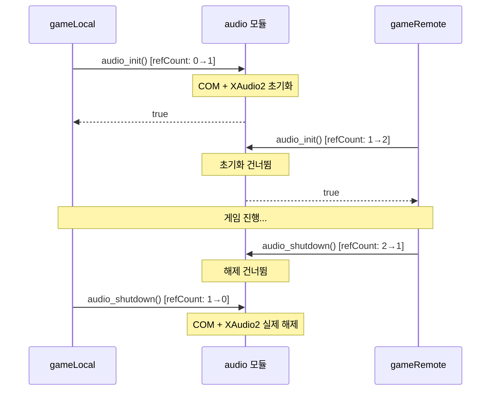
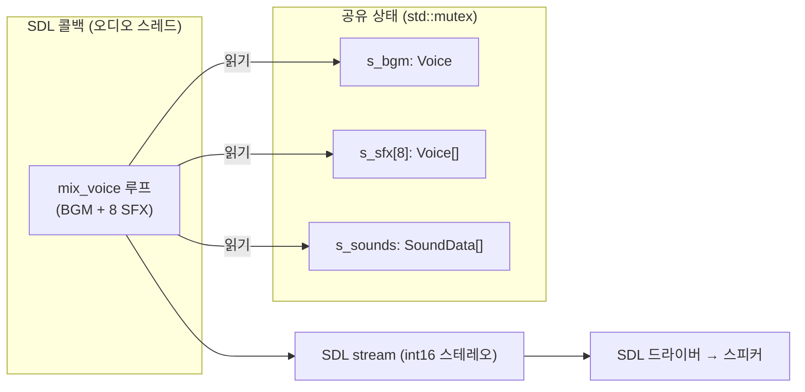
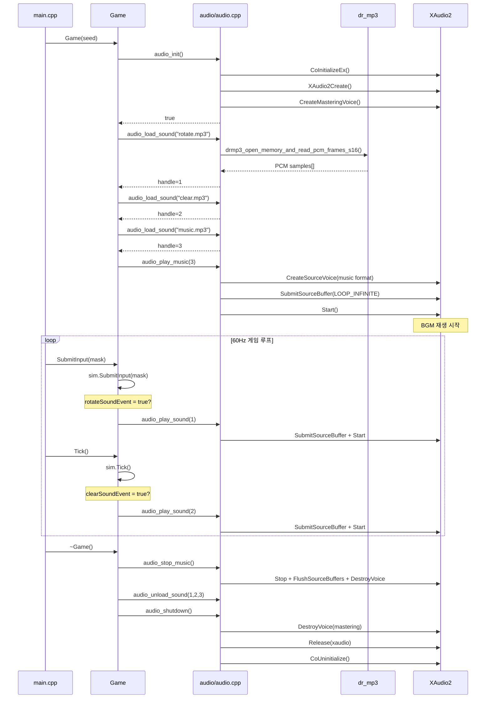

# Part 5: 오디오 계층 — XAudio2와 SDL2

> **시리즈:** 제로부터 멀티플레이어 테트리스 + RL까지
> [시리즈 목차](./README.md) · [이전: Part 4 — Game과 메인 루프](./part4-game-wrapper-and-loop.md) · **Part 5** · [다음: Part 6 — Lockstep](./part6-lockstep-networking.md)

---

## 이 장의 구현 계약

- **선행 상태:** Part 4의 `Game`이 `SimGame` 이벤트를 한 곳에서 소비한다.
- **이번 장의 파일:** `audio/audio.{h,cpp}`(Win32/XAudio2),
  `audio/sdl_audio.cpp`, `third_party/dr_mp3.h`.
- **연결점:** 시뮬레이션은 재생 API를 호출하지 않고 이벤트만 남긴다. `Game`이
  이를 소비해 선택된 오디오 백엔드로 전달한다.
- **완료 게이트:** 오디오 장치나 파일이 없어도 게임은 실행되고, 정상 환경에서는
  BGM·이동·회전·클리어·가비지 효과가 중복 없이 재생돼야 한다.

## 들어가며

raylib에서 소리를 재생하는 코드는 세 줄이다:

```cpp
InitAudioDevice();
Sound rotate = LoadSound("Sounds/rotate.mp3");
PlaySound(rotate);
```

이 세 줄이 실제로 하는 일은 다음과 같다:

1. OS의 오디오 하드웨어에 접근하기 위해 COM을 초기화하고
2. MP3 바이너리를 PCM 샘플로 디코딩하고
3. 디코딩된 PCM 데이터를 오디오 그래프의 소스 보이스에 제출하여 스피커로 출력한다

raylib의 내부에서는 [miniaudio](https://miniaud.io/)라는 단일 헤더 라이브러리가 이 과정을 처리한다. miniaudio는 다시 플랫폼별 오디오 백엔드(Windows: WASAPI, macOS: Core Audio, Linux: PulseAudio/ALSA)를 추상화한다. 결국 `InitAudioDevice()` 한 줄은 OS의 오디오 서브시스템 전체를 초기화하는 것이다.

이 글에서는 Windows의 네이티브 오디오 API인 **XAudio2**를 직접 사용하여 같은 기능을 구현한다. Part 2에서 `InitWindow()`를 Win32 API로 풀어냈듯, 여기서는 `InitAudioDevice()` + `LoadSound()` + `PlaySound()`를 XAudio2 + dr_mp3로 풀어낸다. 뒤이어 Linux/macOS 이식을 위한 **SDL2 오디오 백엔드**(`audio/sdl_audio.cpp`)를 같은 `audio.h` 인터페이스에 맞춰 구현한다. 두 백엔드는 빌드 타임에 선택되며, 위쪽 게임 코드는 한 줄도 바꾸지 않는다.

이 장의 실제 파일 경계는 `audio/audio.h`, `audio/audio.cpp`, `audio/sdl_audio.cpp`다.

---

## 1. XAudio2 아키텍처 개요

> **어느 백엔드가 실제로 빌드되는가.** 이 장은 XAudio2 를 "OS 오디오를 직접 다루면 무엇이 일어나는가" 의 교재로 깊게 다루지만, **기본 빌드 대상은 플랫폼마다 다르다.** `CMakeLists.txt` 의 `TETRIS_USE_SDL2` 옵션이 non-Windows(Linux/macOS) 에서는 **기본 ON** 이라, 그쪽 독자가 그대로 빌드하면 컴파일되는 파일은 `audio/audio.cpp`(XAudio2) 가 아니라 `audio/sdl_audio.cpp`(SDL2) 다. XAudio2 경로는 **Windows 에서 `TETRIS_USE_SDL2=OFF`(Windows 기본값) 인 "Handmade" 빌드** 일 때만 컴파일된다. 즉 §1\~§7 의 XAudio2 코드는 Windows-Handmade 전용 구현이고, §8 이후의 SDL2 백엔드가 사실상 크로스플랫폼 기본이다. 두 백엔드는 모두 같은 `audio.h` 인터페이스를 구현하며, 빌드 시스템이 둘 중 하나만 컴파일 대상에 넣는다(§11). 옵션 이름·기본값의 정확한 정의는 §11.1 에서 `CMakeLists.txt` 그대로 인용한다.

### 1.1 오디오 그래프

XAudio2는 **오디오 그래프**(audio graph) 모델을 사용한다. 데이터는 소스(Source Voice)에서 출발하여 중간 처리 노드(Submix Voice)를 거쳐 최종 출력(Mastering Voice)으로 흐른다. 이 프로젝트에서는 Submix Voice 없이 Source Voice에서 Mastering Voice로 직접 연결한다:



**Source Voice**: PCM 데이터를 받아서 재생하는 노드. 효과음(SFX)마다 하나, 배경 음악(BGM)에 하나.

**Mastering Voice**: 모든 소스 보이스의 출력을 믹싱하여 OS의 기본 오디오 출력 장치로 보낸다. 애플리케이션당 보통 하나.

OpenGL의 셰이더 → 프레임버퍼 파이프라인과 대비하면, Source Voice는 셰이더 프로그램, Mastering Voice는 기본 프레임버퍼에 대응한다.

### 1.2 COM 초기화

XAudio2는 COM(Component Object Model) 객체다. 사용하기 전에 COM 런타임을 초기화해야 한다:

```cpp
HRESULT hr = CoInitializeEx(nullptr, COINIT_MULTITHREADED);
```

`COINIT_MULTITHREADED`는 XAudio2의 내부 워커 스레드가 자유롭게 COM 호출을 할 수 있게 한다. XAudio2는 오디오 처리를 별도 스레드에서 수행하므로, 단일 스레드 모델(`COINIT_APARTMENTTHREADED`)을 사용하면 교착 상태가 발생할 수 있다.

`CoInitializeEx`의 반환값 처리:

| HRESULT | 의미 | 대응 |
|---------|------|------|
| `S_OK` | 정상 초기화 | 진행 |
| `S_FALSE` | 이미 같은 모델로 초기화됨 | 진행 (CoUninitialize 필요) |
| `RPC_E_CHANGED_MODE` | 다른 스레딩 모델로 이미 초기화 | 경고 후 진행 시도 |

`S_FALSE`가 반환되어도 COM 사용에는 문제없다. 다만 **짝 맞추기 규칙**에 따라 `S_FALSE`도 `CoUninitialize()`를 호출해야 한다.

```cpp
if (hr == S_OK || hr == S_FALSE)
{
    s_comOwned = true;  // 종료 시 CoUninitialize 호출 필요
}
```

### 1.3 XAudio2 엔진과 마스터링 보이스

COM 초기화 이후, XAudio2 엔진을 생성하고 마스터링 보이스를 만든다:

```cpp
// XAudio2 엔진 생성
IXAudio2* s_xaudio = nullptr;
hr = XAudio2Create(&s_xaudio, 0, XAUDIO2_DEFAULT_PROCESSOR);

// 마스터링 보이스 생성 (기본 오디오 장치)
IXAudio2MasteringVoice* s_masterVoice = nullptr;
hr = s_xaudio->CreateMasteringVoice(&s_masterVoice);
```

`XAudio2Create`는 내부적으로 COM의 `CoCreateInstance`를 호출하여 XAudio2 엔진 인스턴스를 생성한다. `XAUDIO2_DEFAULT_PROCESSOR`는 오디오 처리에 사용할 CPU 코어 어피니티를 OS에 맡긴다는 뜻이다.

`CreateMasteringVoice`는 기본 오디오 출력 장치(사운드 카드, USB 헤드셋 등)를 자동으로 선택한다. 인자 없이 호출하면 Windows 설정에서 "기본 출력 장치"로 지정된 장치를 사용한다.

이 두 호출의 관계를 Part 2의 OpenGL 초기화와 대비하면:

| OpenGL (Part 2) | XAudio2 (Part 5) |
|------------------|-------------------|
| `wglCreateContext` | `XAudio2Create` |
| `wglMakeCurrent` | `CreateMasteringVoice` |
| GPU 드라이버 DLL | XAudio2 COM DLL |

두 경우 모두 **하드웨어 추상화 계층**에 접근하는 핸들을 얻는 과정이다.

---

## 2. MP3 디코딩

### 2.1 왜 디코딩이 필요한가

XAudio2의 Source Voice는 **비압축 PCM 데이터**만 받는다. MP3는 손실 압축 포맷이므로, 재생 전에 디코딩해야 한다.

PCM(Pulse-Code Modulation)은 아날로그 오디오 신호를 디지털로 표현하는 가장 기본적인 방식이다. 일정 간격(샘플 레이트)으로 신호의 진폭을 측정하고, 각 측정값을 정수(비트 깊이)로 기록한다.

$$\text{PCM 데이터 크기} = \text{채널 수} \times \text{샘플 레이트} \times \frac{\text{비트 깊이}}{8} \times \text{재생 시간(초)}$$

예: 스테레오, 44100Hz, 16비트, 3분 = $2 \times 44100 \times 2 \times 180 \approx 31.7\text{MB}$

이것이 같은 음원의 MP3 파일(5.2MB)보다 6배 큰 이유다.

### 2.2 dr_mp3 -- 단일 헤더 디코더

디코딩에는 [dr_mp3](https://github.com/mackron/dr_libs)를 사용한다. David Reid가 작성한 단일 헤더 라이브러리(public domain)로, minimp3를 기반으로 한다.

사용법은 stb_image와 동일한 패턴이다. **정확히 하나의** `.cpp` 파일에서 구현부를 활성화한다:

```cpp
// audio/audio.cpp
#define DR_MP3_IMPLEMENTATION
#include "../third_party/dr_mp3.h"
```

MP3 파일을 메모리에서 디코딩하는 호출:

```cpp
drmp3_config cfg = {};
drmp3_uint64 totalFrames = 0;
drmp3_int16* samples = drmp3_open_memory_and_read_pcm_frames_s16(
    fileData.data(), fileData.size(),  // MP3 바이너리
    &cfg,                              // 출력: 채널, 샘플레이트
    &totalFrames,                      // 출력: 총 프레임 수
    nullptr);                          // 할당자 (nullptr = malloc)
```

이 함수는 다음을 수행한다:
1. MP3 프레임 헤더를 파싱하여 채널 수와 샘플 레이트를 결정
2. Huffman 디코딩 → 역양자화 → IMDCT → 합성 필터뱅크를 통해 PCM으로 변환
3. 결과를 signed 16-bit 정수 배열로 반환

반환된 `samples`는 `drmp3_free(samples, nullptr)`로 해제해야 한다. 우리는 이 데이터를 `std::vector<uint8_t>`에 복사한 후 원본을 즉시 해제한다:

```cpp
SoundData sd;
sd.format = MakeWaveFormat(cfg.channels, cfg.sampleRate);
size_t pcmBytes = static_cast<size_t>(totalFrames) * cfg.channels * 2;
sd.pcmData.resize(pcmBytes);
memcpy(sd.pcmData.data(), samples, pcmBytes);
sd.valid = true;
drmp3_free(samples, nullptr);
```

### 2.3 WAVEFORMATEX

디코딩된 PCM의 포맷 정보는 XAudio2의 `WAVEFORMATEX` 구조체로 전달한다:

```cpp
static WAVEFORMATEX MakeWaveFormat(drmp3_uint32 channels, drmp3_uint32 sampleRate)
{
    WAVEFORMATEX wf = {};
    wf.wFormatTag      = WAVE_FORMAT_PCM;
    wf.nChannels       = static_cast<WORD>(channels);
    wf.nSamplesPerSec  = sampleRate;
    wf.wBitsPerSample  = 16;
    wf.nBlockAlign     = static_cast<WORD>(channels * 2);  // 16-bit = 2 bytes
    wf.nAvgBytesPerSec = sampleRate * wf.nBlockAlign;
    wf.cbSize          = 0;
    return wf;
}
```

| 필드 | 의미 | 예시 (스테레오, 44100Hz) |
|------|------|--------------------------|
| `wFormatTag` | 포맷 종류 | `WAVE_FORMAT_PCM` (1) |
| `nChannels` | 채널 수 | 2 (스테레오) |
| `nSamplesPerSec` | 초당 샘플 수 | 44100 |
| `wBitsPerSample` | 샘플당 비트 수 | 16 |
| `nBlockAlign` | 한 샘플 프레임 바이트 | $2 \times 2 = 4$ |
| `nAvgBytesPerSec` | 초당 바이트 | $44100 \times 4 = 176400$ |

이 구조체는 WAV 파일 헤더의 `fmt ` 청크와 동일한 포맷이다.

### 2.4 왜 WAV로 변환하지 않았는가

대안으로 MP3 파일을 사전에 WAV로 변환해두는 방법이 있다. 이 경우 런타임 디코딩이 필요 없다. 그러나:

| | MP3 + dr_mp3 | WAV |
|---|---|---|
| 저장소 크기 | 5.2MB | ~50MB |
| 바이너리 오버헤드 | ~100KB (dr_mp3 코드) | 0 |
| 로딩 시간 | 수 ms (디코딩) | 수 ms (읽기) |

저장소 크기 10배 차이 대비 런타임 비용이 미미하므로, MP3 + dr_mp3를 선택했다.

---

## 3. 소스 보이스와 재생

### 3.1 SFX: Fire-and-Forget 패턴

효과음(회전, 라인 클리어)은 짧고 자주 발생한다. 재생 요청 시:

1. **보이스 풀**에서 idle 보이스를 찾는다
2. PCM 데이터를 `XAUDIO2_BUFFER`에 담아 제출한다
3. 재생을 시작한다
4. 재생이 끝나면 보이스는 자동으로 idle 상태로 돌아간다

실제 `audio_play_sound` 는 포맷 재사용·강제 선점·생성 실패 처리까지 포함해 아래와 같이 조금 길다. 전체를 그대로 인용한다:

```cpp
void audio_play_sound(AudioHandle handle)
{
    if (!s_initialized) return;
    if (handle <= 0 || handle >= static_cast<int>(s_sounds.size())) return;
    if (!s_sounds[handle].valid) return;

    const SoundData& sd = s_sounds[handle];

    // 보이스 풀에서 idle 보이스 찾기
    int slot = -1;
    for (int i = 0; i < MAX_SFX_VOICES; ++i)
    {
        if (!s_sfxVoices[i])
        {
            // 빈 슬롯 — 보이스 생성
            slot = i;
            break;
        }
        XAUDIO2_VOICE_STATE state;
        s_sfxVoices[i]->GetState(&state, XAUDIO2_VOICE_NOSAMPLESPLAYED);
        if (state.BuffersQueued == 0)
        {
            // idle — 포맷 일치 확인
            if (FormatMatches(s_sfxFormats[i], sd.format))
            {
                slot = i;
                break;
            }
            // 포맷 불일치 — 파괴 후 재생성
            s_sfxVoices[i]->DestroyVoice();
            s_sfxVoices[i] = nullptr;
            slot = i;
            break;
        }
    }

    // 모든 보이스가 바쁘면 가장 오래된(첫 번째) 보이스를 강제 중단
    if (slot == -1)
    {
        slot = 0;
        s_sfxVoices[slot]->Stop();
        s_sfxVoices[slot]->FlushSourceBuffers();
        if (!FormatMatches(s_sfxFormats[slot], sd.format))
        {
            s_sfxVoices[slot]->DestroyVoice();
            s_sfxVoices[slot] = nullptr;
        }
    }

    // 보이스가 없으면 생성
    if (!s_sfxVoices[slot])
    {
        HRESULT hr = s_xaudio->CreateSourceVoice(&s_sfxVoices[slot], &sd.format);
        if (FAILED(hr))
        {
            fprintf(stderr, "[audio] CreateSourceVoice failed: 0x%08lx\n", hr);
            return;
        }
        s_sfxFormats[slot] = sd.format;
    }

    // 버퍼 제출 및 재생
    XAUDIO2_BUFFER buf = {};
    buf.AudioBytes = static_cast<UINT32>(sd.pcmData.size());
    buf.pAudioData = sd.pcmData.data();
    buf.Flags      = XAUDIO2_END_OF_STREAM;

    s_sfxVoices[slot]->SubmitSourceBuffer(&buf);
    s_sfxVoices[slot]->Start();
}
```

**왜 보이스 풀인가?** `CreateSourceVoice`는 내부적으로 메모리 할당과 DSP 그래프 노드 생성을 수반한다. 재생할 때마다 생성/파괴하면 **마이크로 히칭**(micro-hitching)이 발생할 수 있다. 8개의 보이스를 미리 만들어 재사용하면 이 비용을 제거한다.

**`XAUDIO2_VOICE_NOSAMPLESPLAYED`**: `GetState`에서 재생된 샘플 수를 계산하지 않는 플래그. 우리는 "재생 중인가?"만 알면 되므로, 불필요한 계산을 건너뛴다.

**모든 보이스가 바쁘면?** 가장 오래된 보이스를 강제 중단하고 재사용한다. 동시에 9개 이상의 효과음이 재생되는 상황은 극히 드물고, 하나를 끊어도 사용자가 인지하기 어렵다.

### 3.2 BGM: 무한 루프

배경 음악은 별도의 Source Voice로 관리한다. SFX와 다른 점은 `XAUDIO2_LOOP_INFINITE` 플래그뿐이다:

```cpp
void audio_play_music(AudioHandle handle)
{
    if (!s_initialized) return;
    if (handle <= 0 || handle >= static_cast<int>(s_sounds.size())) return;
    if (!s_sounds[handle].valid) return;

    // 기존 BGM 정지
    audio_stop_music();

    const SoundData& sd = s_sounds[handle];

    // 새 소스 보이스 생성
    HRESULT hr = s_xaudio->CreateSourceVoice(&s_musicVoice, &sd.format);
    if (FAILED(hr))
    {
        fprintf(stderr, "[audio] CreateSourceVoice (music) failed: 0x%08lx\n", hr);
        return;
    }

    // 무한 루프 버퍼 제출
    XAUDIO2_BUFFER buf = {};
    buf.AudioBytes = static_cast<UINT32>(sd.pcmData.size());
    buf.pAudioData = sd.pcmData.data();
    buf.Flags      = XAUDIO2_END_OF_STREAM;
    buf.LoopCount  = XAUDIO2_LOOP_INFINITE;

    s_musicVoice->SubmitSourceBuffer(&buf);
    s_musicVoice->Start();
    s_currentMusic = handle;
}
```

`XAUDIO2_LOOP_INFINITE`(255)는 XAudio2가 버퍼 끝에 도달하면 자동으로 처음부터 다시 재생하게 한다. 이 방식을 쓰면 **게임 루프에서 별도의 `update()` 호출이 필요 없다**. raylib의 `UpdateMusicStream()`은 스트리밍 방식이라 매 프레임 새 데이터를 채워야 했지만, 우리는 전체 PCM을 프리로드하므로 한 번 제출하면 끝이다.

### 3.3 프리로드 vs 스트리밍

| | 프리로드 | 스트리밍 |
|---|---|---|
| 구현 복잡도 | 낮음 (한 번 제출) | 높음 (콜백/타이머 필요) |
| 메모리 사용 | ~50MB (3분 스테레오 44.1kHz) | ~수 KB 버퍼 |
| CPU 부하 | 로딩 시 한 번 | 매 프레임 디코딩 |
| 대기 시간 | 로딩 시 수 ms | 없음 |
| 구현 | `SubmitSourceBuffer` 1회 | `IXAudio2VoiceCallback` 구현 필요 |

50MB는 현대 시스템에서 무시할 수 있는 수준이다. 프리로드를 선택하면 main loop의 코드를 전혀 수정하지 않아도 된다. 3 장의 끝까지 오면 BGM/SFX 가 모두 동작하는 XAudio2 구현이 완성된다. 5 장과 6 장에서는 "왜 풀 크기가 8 인지", "왜 스트리밍이 아닌지" 를 수치로 뜯어본다.

---

## 4. 이벤트 플래그 패턴

### 4.1 SimGame과 오디오의 분리

Part 1에서 설계한 `SimGame`은 **순수 시뮬레이션 엔진**이다. 렌더링도 오디오도 모른다. 그렇다면 "블록이 회전했을 때 소리를 재생한다"는 로직을 어디에 넣을 것인가?

해결: `SimGame`에 **일회성 이벤트 플래그**를 둔다:

```cpp
// src/sim_game.h
class SimGame
{
public:
    // ...

    // One-shot event flags for audio
    mutable bool rotateSoundEvent = false;
    mutable bool clearSoundEvent  = false;
};
```

`mutable` 키워드는 `const` 메서드 안에서도 이 필드를 수정할 수 있게 한다. 시뮬레이션 상태(그리드, 점수, RNG)를 변경하지 않으므로 논리적 상수성(logical constness)은 유지된다.

시뮬레이션 로직 내부에서 이벤트가 발생하면 플래그를 올린다:

```cpp
// src/sim_game.cpp — 회전 성공 시
void SimGame::RotateBlockImpl()
{
    currentBlock.Rotate();
    if (IsBlockOutside(currentBlock) || !BlockFits(currentBlock))
    {
        currentBlock.UndoRotation();
    }
    else
    {
        rotateSoundEvent = true;    // 플래그 설정
        ghostBlock = MakeGhostBlock(currentBlock);
    }
}

// src/sim_game.cpp — 라인 클리어 시
void SimGame::LockBlock()
{
    // ... 블록 고정 ...
    int rowsCleared = sim_grid.ClearFullRows();
    if (rowsCleared > 0)
    {
        clearSoundEvent = true;     // 플래그 설정
        UpdateScore(rowsCleared, 0, false);
    }
}
```

### 4.2 Game 래퍼에서의 소비

`Game` 클래스(Part 4의 래퍼)가 플래그를 읽고, 소리를 재생한 후, 플래그를 초기화한다:

```cpp
// src/game.cpp
void Game::SubmitInput(uint8_t inputMask)
{
    sim.SubmitInput(inputMask);
    if (sim.rotateSoundEvent)
    {
        audio_play_sound(sndRotate);
        sim.rotateSoundEvent = false;
    }
}

void Game::Tick()
{
    sim.Tick();
    if (sim.clearSoundEvent)
    {
        audio_play_sound(sndClear);
        sim.clearSoundEvent = false;
    }
}
```

**왜 rotate는 `SubmitInput`에서, clear는 `Tick`에서 처리하는가?**

| 이벤트 | 발생 시점 | 처리 위치 |
|--------|-----------|-----------|
| 회전 성공 | `SubmitInput` → `RotateBlockImpl` | `SubmitInput` 직후 |
| 라인 클리어 | `Tick` → 중력 낙하 → `LockBlock` | `Tick` 직후 |

회전은 사용자 입력에 의해 즉시 발생하고, 라인 클리어는 중력에 의한 자동 낙하(`Tick`) 후 블록이 고정될 때 발생한다. 각각의 처리 함수 직후에 플래그를 확인하면 이벤트를 놓치지 않는다.

이 패턴은 **옵저버 패턴**의 경량 변형이다. 콜백이나 이벤트 큐 대신 boolean 하나로 충분한 이유: 동시에 두 번 발생해도 소리 한 번이면 된다.

### 4.3 후속: 효과음 추가 (drop, garbage)

rotate / clear 두 개로는 액션 피드백이 부족하다. 두 가지가 비어 있다:

- **하드드롭** (Space): 블록이 즉시 바닥까지 내려가는 강한 동작. 시각적으로는 단번에 일어나지만 청각적 임팩트가 없으면 입력이 먹혔는지 의심된다.
- **가비지 받음**: 멀티 모드에서 상대 공격으로 보드 하단이 밀려 올라온다. 이건 "위험 신호" 로 즉시 인지돼야 하는데, 보드만 봐서는 늦게 알아챈다 (Part 4 의 빨간 바 미리보기와 함께 청각 신호로 보강).

같은 이벤트 플래그 패턴을 그대로 확장한다. `SimGame` 에 두 필드 추가:

```cpp
// src/sim_game.h
// ---- One-shot event flags for audio in the Game wrapper ----
// Set by SimGame when the corresponding event occurs (successful rotate,
// line clear). The Game wrapper reads and clears them each tick.
mutable bool rotateSoundEvent  = false;
mutable bool clearSoundEvent   = false;
mutable bool dropSoundEvent    = false;  // 하드드롭(Space) 시
mutable bool garbageSoundEvent = false;  // 가비지 행 수신 시
```

발생 지점도 같은 패턴 — 해당 동작 직후 플래그를 true 로:

```cpp
// src/sim_game.cpp — 하드드롭
void SimGame::MoveBlockDrop()
{
    if (gameOver) return;
    while (IsBlockOutside(currentBlock) == false && BlockFits(currentBlock) == true)
    {
        currentBlock.Move(1, 0);
    }
    currentBlock.Move(-1, 0);
    dropSoundEvent = true;
    LockBlock();
}
```

```cpp
// src/sim_game.cpp — LockBlock 하단의 가비지 주입
int inserted = 0;
if (pendingGarbage > 0 && !gameOver)
{
    inserted = pendingGarbage;
    InsertGarbage(pendingGarbage);
    pendingGarbage = 0;
    // 가비지가 올라와 currentBlock 스폰 위치를 막았으면 topout.
    if (!BlockFits(currentBlock)) gameOver = true;
}
lastGarbageReceived = inserted;
if (inserted > 0) garbageSoundEvent = true;
```

`inserted > 0` 가드가 중요하다 — `pendingGarbage` 가 0 이면 실제 주입이 없으니 소리도 없다.

`Game` 래퍼는 핸들 두 개를 더 들고 (생성자에서 로드), 같은 두 함수에서 플래그를 소비한다:

```cpp
// src/game.h
// ── 오디오 핸들 (XAudio2) ───────────────────────────────────────────────
AudioHandle sndRotate  = 0;
AudioHandle sndClear   = 0;
AudioHandle sndDrop    = 0;
AudioHandle sndGarbage = 0;
AudioHandle sndMusic   = 0;
```

```cpp
// src/game.cpp — 생성자 / 소멸자
Game::Game(uint64_t seed)
    : sim(seed),
      gameOver(sim.gameOver),
      score(sim.score)
{
    cellColors = GetCellColors();

    // 오디오 초기화 (참조 카운팅 -- 멀티플레이에서 두 번 호출해도 안전)
    if (audio_init())
    {
        sndRotate  = audio_load_sound("Sounds/rotate.mp3");
        sndClear   = audio_load_sound("Sounds/clear.mp3");
        sndDrop    = audio_load_sound("Sounds/drop.mp3");
        sndGarbage = audio_load_sound("Sounds/garbage.mp3");
        sndMusic   = audio_load_sound("Sounds/music.mp3");
        audio_play_music(sndMusic);
    }
}

Game::~Game()
{
    audio_stop_music();
    audio_unload_sound(sndRotate);
    audio_unload_sound(sndClear);
    audio_unload_sound(sndDrop);
    audio_unload_sound(sndGarbage);
    audio_unload_sound(sndMusic);
    audio_shutdown();  // 참조 카운팅: 마지막 Game 소멸 시만 실제 해제
}
```

소비 지점 — `dropSoundEvent` 는 `SubmitInput` 직후 (입력으로 발생), `garbageSoundEvent` 는 `Tick` 직후 (자동 lock 으로도 발생):

```cpp
// src/game.cpp
void Game::SubmitInput(uint8_t inputMask)
{
    sim.SubmitInput(inputMask);
    if (sim.rotateSoundEvent)  { audio_play_sound(sndRotate);  sim.rotateSoundEvent  = false; }
    if (sim.dropSoundEvent)    { audio_play_sound(sndDrop);    sim.dropSoundEvent    = false; }
}

void Game::Tick()
{
    sim.Tick();
    if (sim.clearSoundEvent)   { audio_play_sound(sndClear);   sim.clearSoundEvent   = false; }
    if (sim.garbageSoundEvent) { audio_play_sound(sndGarbage); sim.garbageSoundEvent = false; }
}
```

배치 규칙은 4.2 의 표와 같다 — "그 플래그를 올린 sim 함수가 어디서 불리는가" 에 맞춘다. `MoveBlockDrop` 은 입력 INPUT_DROP 이 발생할 때만 호출되니 `SubmitInput` 직후. `LockBlock` 은 입력 INPUT_DROP 으로도 자동 중력으로도 불리니 — 정확히는 `SubmitInput` 이든 `Tick` 이든 어느 한쪽에서 발생할 수 있는데, 가비지는 lock 하는 매 순간이라 양쪽에 두면 중복 재생 위험이 있어 더 일반적인 `Tick` 측에 두고, 입력 측 `LockBlock` (하드드롭) 은 다음 `Tick` 호출 때 같은 플래그가 잡힌다 (60 Hz 라 17 ms 이내).

`Sounds/drop.mp3` 와 `Sounds/garbage.mp3` 는 사용자가 직접 준비한다. 파일이 없으면 `audio_load_sound` 가 stderr 에 한 줄 찍고 0 을 반환하며, `audio_play_sound(0)` 은 no-op — 게임은 그대로 작동하고 효과음만 빠진다 (10.4 의 비치명적 에러 처리 원칙).

여기서 빌드해보면:

```bash
cmake --build build --config Release
./build/Release/tetris.exe
```

기대 동작:
- 싱글 모드에서 Space 를 눌러 하드드롭 → drop 효과음이 즉시 재생.
- 봇 매치 또는 멀티 모드에서 상대가 라인을 클리어해 가비지가 내 보드로 올라오는 순간 → garbage 효과음 재생. 보드 왼쪽 빨간 바와 함께 "공격받았다" 가 두 채널로 동시 신호.
- `Sounds/drop.mp3` 를 일부러 빼고 실행해도 게임은 정상, 하드드롭만 무음.

---

## 5. 참조 카운팅과 멀티플레이

### 5.1 문제: 두 Game 인스턴스

Part 6의 멀티플레이 모드에서는 두 개의 `Game` 인스턴스가 동시에 존재한다:

```cpp
// src/main.cpp
Game gameLocal(seed);    // 내 게임
Game gameRemote(seed);   // 상대방 게임
```

두 `Game`의 생성자가 각각 `audio_init()`를 호출한다. XAudio2 엔진을 두 번 초기화하면? 두 개의 독립적인 오디오 그래프가 생기고, 리소스가 낭비된다.

### 5.2 해결: static 참조 카운팅

```cpp
// audio/audio.cpp
static int s_refCount = 0;

bool audio_init()
{
    if (s_refCount > 0)          // 이미 초기화됨
    {
        ++s_refCount;
        return s_initialized;    // 기존 상태 반환
    }
    ++s_refCount;

    // ... COM + XAudio2 실제 초기화 ...
}

void audio_shutdown()
{
    if (s_refCount <= 0) return;
    --s_refCount;
    if (s_refCount > 0) return;  // 아직 다른 Game이 살아있음

    // ... 실제 해제 ...
}
```



이 패턴은 두 `Game` 인스턴스가 하나의 장치를 공유하도록 `audio/audio.cpp`에
둔 수명 계약이다:

```cpp
// 두 Game 인스턴스(멀티플레이)가 있어도 AudioDevice는 한 번만 초기화됩니다.
static int s_audioRef = 0;
```

첫 번째 `Game`이 생성될 때 실제 초기화가 발생하고, 마지막 `Game`이 소멸될 때 실제 해제가 발생한다.

---

## 6. 스트리밍 vs 전체 디코드 선택

### 6.1 두 전략의 경계

dr_mp3 는 두 가지 사용 방식을 제공한다.

- **전체 디코드 (바로 앞에서 쓴 방식)**: `drmp3_open_memory_and_read_pcm_frames_s16` 한 번 호출로 MP3 전체를 PCM 버퍼로 풀어 메모리에 상주시킨다. 이후 재생 시점에는 XAudio2 가 포인터·길이만 받아서 DMA 에 태운다.
- **프레임 스트리밍**: `drmp3_init` / `drmp3_init_memory` 로 디코더 핸들을 만든 뒤, 필요한 시점마다 `drmp3_read_pcm_frames_s16(&mp3, framesToRead, outBuf)` 로 소량씩 읽는다. XAudio2 쪽에서는 `IXAudio2VoiceCallback::OnBufferEnd` 콜백을 걸어 더블·트리플 버퍼링으로 다음 청크를 준비한다.

두 전략의 상대 비용은 음원 길이에 비례한다.

| 항목 | 전체 디코드 | 스트리밍 |
|------|-------------|----------|
| 로드 시간 | MP3 전체 길이에 비례 (3 분 곡 ≈ 수백 ms) | 초기 버퍼만 (수 ms) |
| 상주 메모리 | PCM 크기 그대로 (3 분 스테레오 44.1kHz ≈ 31 MB) | 링 버퍼 (수십 KB) |
| 재생 중 CPU | 0 (디코드 끝남) | 매 청크마다 MP3 디코딩 |
| 콜백/동기화 | 불필요 | `IXAudio2VoiceCallback` 구현 + 버퍼 풀 |
| 구현 라인 수 | 한 함수 | 별도 상태 기계 |

### 6.2 효과음은 전체 디코드가 자연스럽다

회전·드롭·라인 클리어·어택 경고는 모두 **1 초 내외**다. 스테레오 16-bit 44.1 kHz 로 1 초 ≈ 176 KB. 20 개를 올려도 4 MB 가 안 된다. 반면 재생 시점에 MP3 프레임 디코딩을 하면 회전 입력 → 소리 사이에 5\~20 ms 의 예측 불가능한 지연이 들어간다. 라인 클리어처럼 여러 개가 겹쳐 터질 때는 그 지연이 누적된다. **효과음은 예외 없이 전체 디코드가 유리하다.**

### 6.3 BGM 에서의 실제 트레이드오프

BGM 은 상황이 다르다. 우리 프로젝트의 BGM 은 2\~4 분 내외로, PCM 으로 풀면 20\~40 MB 를 먹는다. 그래도 이 프로젝트는 전체 디코드를 선택했다. 근거:

1. **현대 시스템에서 50 MB 는 무시 가능한 수준이다.** 같은 게임의 GPU 텍스처 아틀라스가 이미 수십 MB 다.
2. **게임 루프가 오디오를 전혀 돌보지 않아도 된다.** `XAUDIO2_LOOP_INFINITE` 덕에 `update()` 가 필요 없다. 이는 결정론 루프 (Part 4) 와의 분리 유지에 직접 기여한다 — 오디오 스레드와의 동기화를 일체 도입하지 않는다.
3. **실시간 스레드 오류 가능성이 0 이다.** 스트리밍은 XAudio2 콜백 스레드에서 `drmp3_read_pcm_frames_s16` 를 돌려야 한다. 이 함수는 내부 버퍼 할당을 할 수 있어 락 하에서 호출하면 오디오 글리치를 유발한다. 실시간 콜백은 "할당 없음, 디스크 I/O 없음, 가변 CPU 없음" 원칙이 기본이다.
4. **로드 시간은 시작 시 숨겨진다.** MP3 → PCM 변환은 비동기로 한 번만 일어나며, 타이틀 화면이 올라오는 동안 끝난다. 플레이 중에 I/O 가 전혀 없다.

스트리밍을 써야 하는 경우는 **곡이 10 분을 넘어가거나, 로드 타임을 0 에 가깝게 줄여야 하거나, 동시 BGM 이 여러 개**일 때다. 이 프로젝트는 셋 다 해당하지 않는다.

### 6.4 dr_mp3 "한 번에 디코드" API 가 숨기는 것

`drmp3_open_memory_and_read_pcm_frames_s16` 한 줄 뒤에 실제로는 다음이 일어난다:

```text
1. MP3 프레임 헤더 스캔 → 총 프레임 수 추정 (ID3v1/v2 스킵)
2. 최종 PCM 크기 만큼 malloc
3. 루프로 drmp3_read_pcm_frames_s16 호출해 전부 채움
4. drmp3_uninit
```

즉 전체 디코드는 "스트리밍 + 사전 버퍼 적재" 를 내부적으로 수행하는 편의 함수다. 우리가 직접 스트리밍 버전으로 바꾸더라도, 성능 차이는 "로드 시점 집중 vs 재생 중 분산" 일 뿐 총 CPU 는 비슷하다. 선택 기준은 결국 **총 비용이 아니라 언제 비용을 치를지**다.

---

## 7. Source Voice 풀 크기 선정 (8)

### 7.1 동시에 울릴 수 있는 소리 계산

동시에 재생될 수 있는 효과음 최댓값을 worst-case로 계산한다:

| 상황 | 동시 발생 SFX |
|------|---------------|
| T-Spin Triple + 가비지 경고 | clear × 1, warning × 1 |
| 하드 드롭 직후 라인 클리어 + 레벨업 | drop × 1, clear × 1, levelup × 1 |
| 홀드 + 회전 + 이동 누른 프레임 | rotate × 1, move × 1, hold × 1 |
| 가비지 카운터 감소 튕김 × 4 | counter × 4 |
| 극단: 위 상황 일부 중첩 | 최대 7\~8 |

BGM 은 별도 보이스로 분리되어 있으므로 SFX 풀에 포함되지 않는다. 현실적 상한은 **7\~8 개**이고, 풀을 `MAX_SFX_VOICES = 8` 로 잡은 근거가 이것이다.

```cpp
// audio/audio.cpp
static constexpr int             MAX_SFX_VOICES = 8;
static IXAudio2SourceVoice*      s_sfxVoices[MAX_SFX_VOICES] = {};
static WAVEFORMATEX              s_sfxFormats[MAX_SFX_VOICES] = {};
```

### 7.2 풀이 가득 찰 때의 정책

만약 9 번째 소리가 터지면 어떻게 할 것인가. 선택지:

1. **드롭**: 새 재생을 조용히 무시. "들리지 않음" 이 눈에 띈다.
2. **가장 오래된 소리 선점(steal)**: 가장 먼저 시작된 소리를 끊고 그 슬롯을 재사용.
3. **가장 조용한 소리 선점**: 볼륨 기반 스코어링. 구현 복잡도 대비 효과 미미.
4. **풀 확장**: 동적 할당. 실시간 콜백 경로에서 할당 금지 원칙 위배.

이 프로젝트는 **2 번 (가장 오래된 소리 선점)** 을 채택했다. 구현은 앞에서 인용한 `audio_play_sound` 의 이 부분이다:

```cpp
// 모든 보이스가 바쁘면 가장 오래된(첫 번째) 보이스를 강제 중단
if (slot == -1)
{
    slot = 0;
    s_sfxVoices[slot]->Stop();
    s_sfxVoices[slot]->FlushSourceBuffers();
    if (!FormatMatches(s_sfxFormats[slot], sd.format))
    {
        s_sfxVoices[slot]->DestroyVoice();
        s_sfxVoices[slot] = nullptr;
    }
}
```

"첫 번째 슬롯 = 가장 오래된" 은 엄밀한 LRU 가 아니다. 슬롯 배열은 인덱스 순으로 채워지고 비워지므로 대략 FIFO 에 가까운 경향이 있고, 사용자가 인지할 정도로 틀어지지 않는다. **중요한 것은 드롭하지 않고 뭔가 울리는 것**이다.

### 7.3 포맷 매칭 슬롯 재사용

`CreateSourceVoice` 는 호출 시점에 `WAVEFORMATEX` 를 잡아먹는다. 샘플레이트나 채널이 다른 소리를 같은 보이스로 돌리면 재생 속도가 틀어진다. 그래서 슬롯 재사용 전에 포맷을 비교한다:

```cpp
static bool FormatMatches(const WAVEFORMATEX& a, const WAVEFORMATEX& b)
{
    return a.nChannels      == b.nChannels
        && a.nSamplesPerSec == b.nSamplesPerSec
        && a.wBitsPerSample == b.wBitsPerSample;
}
```

게임이 44.1 kHz / 스테레오 / 16-bit 로 MP3 를 다 내보내는 경우 이 비교는 항상 참이라 추가 비용이 없다. 그러나 외부에서 받은 효과음이 22.05 kHz 모노로 들어오는 순간, 포맷 불일치 시 `DestroyVoice()` → 다음 블록에서 재생성이 일어난다. 이 "가끔 한 번의 재생성" 은 허용 가능한 비용이다.

### 7.4 풀이 너무 커도 나쁜 이유

`MAX_SFX_VOICES = 64` 로 늘리면 무슨 일이 생길까. 각 Source Voice 는 XAudio2 내부에서 DSP 그래프 노드·믹스 버퍼·SRC(Sample Rate Converter) 상태를 쥐고 있고, Mastering Voice 의 믹싱 비용은 **활성 보이스 수에 선형**이다. 64 개 중 5 개만 쓰는 상황에서도 유휴 보이스가 SRC 그래프에 연결되어 있으면 비용을 유발한다. 게임 효과음 수준에서는 8 이 실용적 sweet spot 이다.

---

## 8. SDL 오디오 백엔드 (`audio/sdl_audio.cpp`)

### 8.1 왜 또 하나의 백엔드가 필요한가

XAudio2 는 Windows 전용이다. 헤더 `xaudio2.h` 와 링크 대상 `xaudio2.lib` / `ole32.lib` 모두 Windows SDK 에 들어있고, macOS/Linux 에는 존재 자체가 없다. 현재 프로젝트는 non-Windows 경로에서 SDL2 백엔드를 사용한다. 요지는 같아, 플랫폼을 Linux 나 macOS 로 가져가려면 두 가지 길이 있다:

1. **Wine/Proton 에 기대기** — 실제로 XAudio2 는 Wine 이 에뮬레이트한다. 그러나 네이티브 윈도우·네트워킹 스택과 함께 가져가면 빌드가 무거워진다.
2. **이식성 있는 백엔드로 대체** — `audio.h` 인터페이스만 충족하면 된다. 위쪽 코드는 어느 백엔드인지 알 필요도 없다.

이 프로젝트는 2 번을 선택했다. `audio/sdl_audio.cpp` 는 정확히 `audio.h` 의 일곱 함수를 구현하고, CMake 가 타깃 플랫폼에 따라 `audio.cpp` 와 `sdl_audio.cpp` 중 하나만 컴파일 대상에 넣는다.

```cmake
# 단순화한 모형 — 실제 저장소는 TETRIS_USE_SDL2 옵션으로 분기한다 (정확한 형태는 §11).
if(NOT TETRIS_USE_SDL2)
    target_sources(tetris PRIVATE audio/audio.cpp)
    target_link_libraries(tetris PRIVATE xaudio2 ole32)
else()
    target_sources(tetris PRIVATE audio/sdl_audio.cpp)
    target_link_libraries(tetris PRIVATE SDL2::SDL2)
endif()
```

### 8.2 SDL2 오디오의 모델

SDL2 는 두 가지 오디오 API 를 제공한다.

- **`SDL_AudioStream`**: SDL2.0.7+ 의 고수준 스트림. 샘플레이트·포맷·채널 변환을 내부에서 처리. 간단하지만 내부에서 추가 큐를 둔다.
- **`SDL_OpenAudioDevice` + 콜백**: 저수준 API. SDL 이 요구할 때마다 콜백이 호출되고, 그 안에서 직접 PCM 을 써 넣는다. 지연이 가장 낮고 동작 모델이 XAudio2 의 Source Voice + Mastering Voice 와 구조적으로 비슷하다.

XAudio2 백엔드가 "소스 보이스가 Mastering Voice 로 흘러들어가 OS 로 나간다" 라는 그래프라면, SDL 백엔드는 **우리가 직접 Mastering Voice 를 만든다**. 디바이스 콜백 안에서 BGM 과 SFX 풀을 소프트웨어 믹스(int16 합산 + 포화 클램핑)로 합쳐 `stream` 버퍼에 써 넣으면, 그게 곧 "마스터 출력" 이다.



### 8.3 상태 구조

XAudio2 는 Source Voice 라는 라이브러리 수준 객체를 내주지만, SDL 은 그런 것이 없다. 그래서 직접 `Voice` 구조체를 만들었다.

```cpp
struct SoundData {
    std::vector<int16_t> pcm;      // 디코딩된 16-bit signed PCM (디바이스 포맷 기준)
    uint32_t channels = 0;
    uint32_t sampleRate = 0;
    bool valid = false;
};

struct Voice {
    int handle = 0;     // 0 = idle
    size_t pos = 0;     // PCM 샘플 인덱스 (int16 단위, 채널 포함)
    bool loop = false;
    bool active = false;
};
```

`Voice` 가 가진 4 필드는 "지금 몇 번 소리를, 어디까지 재생 중인가, 루프인가, 활성인가" 다. XAudio2 의 IXAudio2SourceVoice 가 내부에서 하던 일이 그대로 구조체로 드러난다. 이것이 저수준 API 의 재미다 — 숨어 있던 상태가 전부 보인다.

글로벌 상태도 거의 1:1 로 매핑된다.

```cpp
static bool            s_initialized = false;
static int             s_refCount    = 0;
static SDL_AudioDeviceID s_dev       = 0;

static std::vector<SoundData> s_sounds;

static constexpr int MAX_SFX_VOICES = 8;
static Voice s_sfx[MAX_SFX_VOICES];
static Voice s_bgm;          // 단일 BGM 보이스

static SDL_AudioSpec s_have{};   // 디바이스 최종 포맷
static std::mutex    s_mu;       // 콜백 ↔ API 간 공유 상태 보호
```

풀 크기가 여전히 8 이다. 7 장에서 계산한 "동시에 들릴 수 있는 SFX" 는 OS 에 독립적이다.

주목할 점은 `std::mutex s_mu`. XAudio2 에서는 상태 변경(`SubmitSourceBuffer`, `Start`, `DestroyVoice` 등)이 모두 COM 메서드이고, 내부적으로 락을 건다. SDL 에서는 우리가 락 책임자다.

### 8.4 믹서 콜백 -- 심장부

SDL 이 "출력 버퍼를 채워달라" 고 호출하는 콜백 전체는 아래와 같다:

```cpp
static void mix_voice(Voice& v, int16_t* out, int frames, int outChannels)
{
    if (!v.active || v.handle <= 0) return;
    SoundData& sd = s_sounds[v.handle];
    if (!sd.valid) { v.active = false; return; }

    const int16_t* src = sd.pcm.data();
    const size_t total = sd.pcm.size();         // int16 단위
    const int    sc    = (int)sd.channels;      // 소스 채널(1 or 2)

    for (int f = 0; f < frames; ++f) {
        if (v.pos + sc > total) {
            if (v.loop) v.pos = 0;
            else { v.active = false; return; }
        }
        // 모노→스테레오 승격 혹은 스테레오→스테레오 패스스루
        int16_t l = src[v.pos];
        int16_t r = (sc >= 2) ? src[v.pos + 1] : l;
        v.pos += sc;

        // 포화 합산
        for (int c = 0; c < outChannels; ++c) {
            int16_t s = (c == 0) ? l : r;
            int acc = (int)out[f * outChannels + c] + (int)s;
            if (acc >  32767) acc =  32767;
            if (acc < -32768) acc = -32768;
            out[f * outChannels + c] = (int16_t)acc;
        }
    }
}

static void SDLCALL audio_callback(void* /*ud*/, Uint8* stream, int len)
{
    int16_t* out = (int16_t*)stream;
    int frames   = len / (s_have.channels * (int)sizeof(int16_t));
    memset(stream, 0, (size_t)len);

    std::lock_guard<std::mutex> lk(s_mu);
    mix_voice(s_bgm, out, frames, s_have.channels);
    for (int i = 0; i < MAX_SFX_VOICES; ++i)
        mix_voice(s_sfx[i], out, frames, s_have.channels);
}
```

한 프레임씩 읽어보면:

- `memset(stream, 0, len)` — "무음" 으로 초기화. 활성 보이스가 하나도 없으면 무음 출력.
- `std::lock_guard<std::mutex> lk(s_mu)` — 메인 스레드의 `audio_play_sound` 가 동시에 건들면 레이스. 락을 잡는 동안에만 보이스 상태를 본다.
- `mix_voice(s_bgm, ...)` → `mix_voice(s_sfx[i], ...)` × 8 — BGM 먼저, SFX 가 나중. 순서는 결과(합산)에 영향이 없지만 가독성으로 정함.

`mix_voice` 의 포인트는 두 가지다.

**모노 → 스테레오 승격**. 소스가 1 채널이면 `l = src[pos]`, `r = l` 로 양쪽 귀에 복제. 2 채널이면 `l = src[pos]`, `r = src[pos+1]` 로 그대로. XAudio2 는 이 변환을 SRC/MatrixFilter 로 내부에서 해줬지만, SDL 콜백 경로는 우리가 한다.

**포화 합산(saturating add)**. 두 보이스의 PCM 샘플을 그대로 더하면 -32768\~32767 범위를 넘어 오버플로가 발생한다. `int` 로 승격 후 32767 / -32768 로 클램핑. 이것이 게임 오디오 믹서의 가장 기초적이고 가장 자주 빠뜨리는 부분이다. 이 한 줄이 없으면 두 소리가 겹치는 순간 지글거리는 디스토션이 들린다.

### 8.5 초기화와 종료

```cpp
bool audio_init()
{
    if (s_refCount > 0) { ++s_refCount; return s_initialized; }
    ++s_refCount;

    if (SDL_InitSubSystem(SDL_INIT_AUDIO) != 0) {
        fprintf(stderr, "[audio] SDL_InitSubSystem(AUDIO) failed: %s\n", SDL_GetError());
        s_initialized = false;
        return false;
    }

    SDL_AudioSpec want{};
    want.freq     = 44100;
    want.format   = AUDIO_S16SYS;
    want.channels = 2;
    want.samples  = 1024;
    want.callback = audio_callback;

    s_dev = SDL_OpenAudioDevice(nullptr, 0, &want, &s_have,
                                SDL_AUDIO_ALLOW_FREQUENCY_CHANGE);
    if (s_dev == 0) {
        fprintf(stderr, "[audio] SDL_OpenAudioDevice failed: %s\n", SDL_GetError());
        SDL_QuitSubSystem(SDL_INIT_AUDIO);
        s_initialized = false;
        return false;
    }

    s_sounds.clear();
    s_sounds.push_back(SoundData{});  // sentinel handle 0
    for (auto& v : s_sfx) v = {};
    s_bgm = {};

    SDL_PauseAudioDevice(s_dev, 0);
    s_initialized = true;
    return true;
}

void audio_shutdown()
{
    if (s_refCount <= 0) return;
    --s_refCount;
    if (s_refCount > 0) return;

    if (s_dev) {
        SDL_PauseAudioDevice(s_dev, 1);
        SDL_CloseAudioDevice(s_dev);
        s_dev = 0;
    }
    SDL_QuitSubSystem(SDL_INIT_AUDIO);
    s_sounds.clear();
    s_initialized = false;
}
```

관전 포인트.

- `want.samples = 1024`. 콜백이 한 번에 요청하는 프레임 수. 1024 프레임은 44.1 kHz 에서 약 **23.2 ms** 블록이다 — `sdl_audio.cpp` 의 `freq=44100` / `samples=1024` 에서 직접 유도된다. 이것이 SDL 백엔드의 콜백 블록 크기다. XAudio2 쪽은 `audio.cpp` 에 버퍼 크기를 명시하지 않으므로 OS/드라이버 기본값을 따르며, 실제 지연은 대상 장치에서 측정해야 한다.
- `SDL_AUDIO_ALLOW_FREQUENCY_CHANGE`. 디바이스가 44.1 kHz 를 지원하지 않으면 48 kHz 로 줄 수 있다. `s_have.freq` 에 실제 값이 들어오고, 콜백에서 `s_have.channels` 로 프레임 크기를 계산한다. 이게 있어서 "정확히 요청한 포맷" 이 아니어도 열린다.
- `SDL_PauseAudioDevice(s_dev, 0)` — 열기만 하면 일시정지 상태다. `0` 이 "재생 시작", `1` 이 "일시정지". 이 한 줄을 빠뜨리면 완벽히 초기화됐는데 무음이다.
- `SDL_InitSubSystem(SDL_INIT_AUDIO)` — SDL 창/이벤트를 이미 쓰고 있어도 오디오 서브시스템은 별도로 올린다. XAudio2 백엔드의 `CoInitializeEx` 와 대응.
- 참조 카운팅 패턴은 XAudio2 백엔드와 완전히 같다 (`s_refCount`). 멀티플레이 두 `Game` 인스턴스 문제는 여기서도 똑같이 발생하므로 똑같이 해결한다.

### 8.6 로드 / 언로드

```cpp
AudioHandle audio_load_sound(const char* filepath)
{
    if (!s_initialized) return 0;

    FILE* f = fopen(filepath, "rb");
    if (!f) { fprintf(stderr, "[audio] open %s failed\n", filepath); return 0; }
    fseek(f, 0, SEEK_END);
    long sz = ftell(f);
    fseek(f, 0, SEEK_SET);
    if (sz <= 0) { fclose(f); return 0; }
    std::vector<uint8_t> raw((size_t)sz);
    fread(raw.data(), 1, raw.size(), f);
    fclose(f);

    drmp3_config cfg{};
    drmp3_uint64 frames = 0;
    drmp3_int16* samples = drmp3_open_memory_and_read_pcm_frames_s16(
        raw.data(), raw.size(), &cfg, &frames, nullptr);
    if (!samples || frames == 0) {
        fprintf(stderr, "[audio] decode %s failed\n", filepath);
        if (samples) drmp3_free(samples, nullptr);
        return 0;
    }

    SoundData sd;
    sd.channels   = cfg.channels;
    sd.sampleRate = cfg.sampleRate;
    size_t total  = (size_t)frames * cfg.channels;
    sd.pcm.assign(samples, samples + total);
    sd.valid = true;
    drmp3_free(samples, nullptr);

    std::lock_guard<std::mutex> lk(s_mu);
    AudioHandle h = (AudioHandle)s_sounds.size();
    s_sounds.push_back(std::move(sd));
    return h;
}

void audio_unload_sound(AudioHandle h)
{
    if (!s_initialized) return;
    if (h <= 0 || h >= (int)s_sounds.size()) return;

    std::lock_guard<std::mutex> lk(s_mu);
    if (s_bgm.handle == h) s_bgm = {};
    for (auto& v : s_sfx) if (v.handle == h) v = {};
    s_sounds[h].pcm.clear();
    s_sounds[h].pcm.shrink_to_fit();
    s_sounds[h].valid = false;
}
```

**dr_mp3 호출이 XAudio2 백엔드와 완벽히 같다.** 디코딩은 백엔드에 의존하지 않는 공통 단계다. 다른 점 두 가지.

1. `SoundData` 가 `WAVEFORMATEX` 대신 `channels` / `sampleRate` 를 따로 저장한다. Windows 전용 구조체를 끌어오지 않기 위함.
2. `std::lock_guard<std::mutex> lk(s_mu)` — 로드 도중에 콜백이 `s_sounds.size()` 를 읽으면 레이스. 콜백은 항상 락을 건 상태에서만 `s_sounds[handle]` 를 본다. `audio_unload_sound` 도 같은 이유로 락 안에서 보이스들을 리셋한다.

로드된 PCM 의 샘플레이트가 디바이스의 `s_have.freq` 와 다르면? 현재 구현은 **재샘플링하지 않는다**. 44.1 kHz 로 인코딩된 MP3 를 48 kHz 디바이스에서 재생하면 약 9 % 빠르게 재생된다. 우리 프로젝트의 에셋은 전부 44.1 kHz 라 실제로 문제가 없고, 필요해지는 날 `SDL_AudioStream` 으로 래핑하면 된다.

### 8.7 재생 API

```cpp
void audio_play_sound(AudioHandle h)
{
    if (!s_initialized) return;
    if (h <= 0 || h >= (int)s_sounds.size() || !s_sounds[h].valid) return;

    std::lock_guard<std::mutex> lk(s_mu);
    int slot = -1;
    for (int i = 0; i < MAX_SFX_VOICES; ++i) {
        if (!s_sfx[i].active) { slot = i; break; }
    }
    if (slot < 0) slot = 0;  // 모두 바쁘면 첫 번째를 강제 교체
    s_sfx[slot] = Voice{ h, 0, false, true };
}

void audio_play_music(AudioHandle h)
{
    if (!s_initialized) return;
    if (h <= 0 || h >= (int)s_sounds.size() || !s_sounds[h].valid) return;

    std::lock_guard<std::mutex> lk(s_mu);
    s_bgm = Voice{ h, 0, true, true };
}

void audio_stop_music()
{
    if (!s_initialized) return;
    std::lock_guard<std::mutex> lk(s_mu);
    s_bgm = {};
}
```

**구조적 대응관계.**

| XAudio2 단계 | SDL 단계 |
|--------------|---------|
| `GetState` 로 `BuffersQueued == 0` 확인 | `s_sfx[i].active == false` 확인 |
| `CreateSourceVoice` (보이스 할당) | 없음 — 보이스는 `Voice` 구조체로 영구 상주 |
| `SubmitSourceBuffer` | `s_sfx[slot] = Voice{h, 0, false, true}` 로 재설정 |
| `Start` | `active = true` (다음 콜백에서 재생됨) |

즉 SDL 백엔드에서 "재생 시작" 은 **구조체 네 필드에 값을 넣는 것**이 전부다. 실제 PCM 전송은 다음 콜백 호출 (최대 23 ms 뒤) 에 일어난다. XAudio2 의 `Start` 도 본질적으로 마찬가지지만, SDL 쪽은 그 게임 → 드라이버 경계가 우리 코드 안에 노출되어 있다.

**BGM 무한 루프.** XAudio2 는 `XAUDIO2_LOOP_INFINITE` 플래그로 드라이버에 맡겼다. SDL 은 우리가 돌린다:

```cpp
if (v.pos + sc > total) {
    if (v.loop) v.pos = 0;
    else { v.active = false; return; }
}
```

`v.loop` 가 참이면 포지션만 0 으로 되돌리고 다음 프레임 만든다. 루프 경계에서 샘플 0 으로 떨어지는 구간에서 인접한 두 샘플 사이에 "점프" 가 생기므로 원본 MP3 가 루프 포인트를 매끈히 만들어 두었다면 티가 나지 않는다. 티가 나면 크로스페이드 (이전 꼬리 N 샘플과 새 머리 N 샘플을 섞기) 를 추가하면 되지만, 현재 에셋으로는 필요 없다.

### 8.8 두 백엔드 비교 요약

| 속성 | XAudio2 (`audio.cpp`) | SDL2 (`sdl_audio.cpp`) |
|------|----------------------|------------------------|
| 플랫폼 | Windows 만 | Windows / Linux / macOS |
| 초기화 | `CoInitializeEx` + `XAudio2Create` + `CreateMasteringVoice` | `SDL_InitSubSystem` + `SDL_OpenAudioDevice` |
| 콜백 스레드 | XAudio2 내부 (숨겨짐) | SDL 오디오 스레드 (콜백 직접) |
| 믹싱 | Mastering Voice (하드웨어/드라이버) | 우리 코드의 포화 합산 |
| 루프 | `XAUDIO2_LOOP_INFINITE` 플래그 | `v.pos = 0` (우리가 구현) |
| 샘플레이트 변환 | Source Voice 내부 SRC | 없음 (디바이스 포맷 일치 가정) |
| 채널 변환 | Source Voice 내부 매트릭스 | `mix_voice` 안에서 모노→스테레오 승격 |
| 동시 SFX | 8 (Source Voice 풀) | 8 (`Voice` 구조체 풀) |
| 라운드트립 지연 | 코드에서 버퍼 크기 미지정 — 대상 장치에서 측정 | SDL 콜백 블록 약 23.2 ms (`samples=1024 @ 44.1 kHz` 에서 유도) |
| 레이스 보호 | XAudio2 내부 락 | `std::mutex s_mu` |
| 의존성 | `xaudio2.lib`, `ole32.lib` | `libSDL2` |
| 바이너리 추가 | ~0 (OS DLL) | \~1 MB (SDL2.dll) |
| 공통 | dr_mp3 로 동일하게 디코드, `audio.h` API 동일 |

상위 게임 코드 (`Game`, `main.cpp`) 는 헤더 하나 `audio.h` 만 본다. 백엔드 선택은 빌드 시스템의 링크 결정 한 줄이다.

---

## 9. 이벤트 플래그 패턴 (간단 복습)

앞의 4 장에서 SimGame → Game → audio 의 경로를 다뤘다. 이 패턴은 백엔드를 바꿔도 그대로 유지된다. `audio_play_sound(handle)` 호출이 XAudio2 의 Source Voice 로 가든 SDL 의 `Voice` 슬롯으로 가든, 위에서는 구분 불가능하다. **백엔드 교체가 게임 코드를 건드리지 않는다** 는 것이 `audio.h` 의 설계 목표였다.

---

## 10. 비치명적 에러 처리와 실패 모드

### 10.1 설계 원칙

오디오는 게임의 핵심 기능이 아니다. 소리가 안 나도 게임은 플레이할 수 있다. 따라서 **오디오 실패는 절대로 크래시를 일으키지 않아야 한다**.

이 원칙을 모든 함수에 적용한다:

```text
audio_init() 실패
  → s_initialized = false
    → audio_load_sound() → return 0
      → audio_play_sound(0) → return (no-op)
```

체인의 어느 지점에서 실패해도, 이후 호출은 **정적으로 안전**하다. 예외를 던지지 않고, assert를 걸지 않는다. 두 백엔드 모두 이 원칙을 지킨다. XAudio2 쪽의 `if (!s_initialized) return;` 가드와 SDL 쪽의 같은 가드가 일대일로 대응한다.

### 10.2 실패 시나리오 (XAudio2)

| 시나리오 | 증상 | 대응 |
|----------|------|------|
| 오디오 장치 없음 | `CreateMasteringVoice` 실패 | `s_initialized = false`, 게임 계속 |
| MP3 파일 누락 | `fopen` 실패 | stderr 로그, 핸들 0 반환 |
| MP3 파일 손상 | `drmp3_open_memory...` nullptr 반환 | stderr 로그, 핸들 0 반환 |
| Source Voice 생성 실패 | `CreateSourceVoice` HRESULT 실패 | 해당 효과음만 건너뜀 |
| 오래된 Windows (7 이전) | XAudio2.9 미포함 | `XAudio2Create` 실패 → 무음 |
| COM 스레딩 충돌 | `RPC_E_CHANGED_MODE` | 경고만, `s_comOwned=false` 로 진행 |

### 10.3 실패 시나리오 (SDL)

| 시나리오 | 증상 | 대응 |
|----------|------|------|
| SDL2 라이브러리 부재 | 동적 로드 실패 | 프로그램 실행 자체 실패 — audio 이전 문제 |
| ALSA/PulseAudio 서버 없음 (Linux) | `SDL_OpenAudioDevice` 실패 | 경고, `s_initialized = false`, 게임 계속 |
| Bluetooth 헤드셋 연결 해제 | 콜백 호출이 중단됨 | SDL 이 자동으로 기본 장치로 폴백 (SDL 2.0.16+) |
| 샘플레이트 재협상 | `s_have.freq != 44100` | `SDL_AUDIO_ALLOW_FREQUENCY_CHANGE` 로 수용 |
| 콜백 안에서 예외 | 오디오 스레드 크래시 | 우리 코드에 예외 경로 없음 — 의도된 설계 |
| 락 경합 | 콜백 지연 → 오디오 글리치 | `s_mu` 는 짧게 유지, 락 안에서 I/O·할당 금지 |

모든 에러 정보는 `fprintf(stderr, ...)`로 출력한다. 디버그 시 콘솔에서 확인할 수 있고, 릴리즈 빌드에서는 무시된다.

### 10.4 오디오가 안 나올 때 체크리스트

순서대로 확인한다. 체인 앞쪽에서 끊기면 뒷쪽은 자동으로 무음이다.

1. **콘솔 로그**. `[audio] ... failed: 0x...` 한 줄이라도 있으면 거기서 끝. HRESULT 는 Microsoft 문서에서 바로 매핑된다.
2. **OS 볼륨 믹서**. Windows: `sndvol.exe`. 앱별 볼륨이 0 일 수 있다. Linux: `pavucontrol`.
3. **기본 출력 장치**. 블루투스 헤드셋을 연결했다 끊은 직후면 장치가 사라진 채로 남아 있다. `CreateMasteringVoice` 가 성공해도 재생 자체가 nowhere 로 간다.
4. **에셋 경로**. `Sounds/rotate.mp3` 가 실행 디렉터리 기준으로 존재하는지. CMake `copy_assets` 타깃이 실제로 빌드되었는지.
5. **파일 무결성**. 손상된 MP3 는 dr_mp3 가 프레임 0 으로 성공 반환할 수 있다. `audio_load_sound` 의 핸들이 > 0 인지 확인. 의심되면 `ffmpeg -i foo.mp3 -f null -` 로 검증.
6. **이벤트 플래그 소비 누락**. `rotateSoundEvent` 가 올라가도 `Game::SubmitInput` 에서 읽지 않으면 소리가 안 난다. Part 4 의 틱 루프 구조가 바뀌면 이 경로가 끊어질 수 있다.
7. **`audio_init()` 반환값**. `false` 를 무시하고 `audio_load_sound` 를 호출하면 모든 핸들이 0 이다.
8. **COM 초기화 (Windows 만)**. 다른 라이브러리가 먼저 `COINIT_APARTMENTTHREADED` 로 초기화했으면 XAudio2 는 돌지만 드물게 이상 동작. `RPC_E_CHANGED_MODE` 로그 유무 확인.
9. **SDL 드라이버 (Linux 만)**. `SDL_GetAudioDriver` 로 실제 잡힌 드라이버 확인 (pulseaudio/alsa/pipewire). 특정 드라이버가 고장났으면 `SDL_AUDIODRIVER=alsa ./tetris` 같이 환경 변수로 우회.

---

## 11. 빌드 시스템

### 11.1 백엔드 선택 옵션 `TETRIS_USE_SDL2`

저장소는 raw `if(WIN32)` 가 아니라 명시적 옵션 `TETRIS_USE_SDL2` 하나로 백엔드를 고른다. 옵션의 정의와 플랫폼별 기본값은 `CMakeLists.txt` 에 다음과 같이 들어 있다:

```cmake
# TETRIS_USE_SDL2 — Use the SDL2 cross-platform backend (window + audio + text).
# Default ON on non-Windows so macOS/Linux users get it automatically.
# On Windows, default OFF to preserve the handmade Win32+OpenGL path.
if (WIN32)
    option(TETRIS_USE_SDL2 "Use SDL2 backend (cross-platform)" OFF)
else()
    option(TETRIS_USE_SDL2 "Use SDL2 backend (cross-platform)" ON)
endif()
```

요지: **non-Windows 에서는 기본 ON → SDL2 백엔드**, **Windows 에서는 기본 OFF → Handmade(XAudio2) 백엔드**. 이 옵션 하나가 창(window)·오디오·텍스트 백엔드를 한꺼번에 가른다 — 오디오만 따로 바꾸는 게 아니다.

### 11.2 옵션에 따른 소스/링크 분기 (실제 `CMakeLists.txt`)

`TETRIS_USE_SDL2` 가 켜지면 `platform/sdl.cpp` + `renderer/text_stb.cpp` + `audio/sdl_audio.cpp` 가, 꺼지면 `platform/win32.cpp` + `renderer/text_win32.cpp` + `audio/audio.cpp` 가 실행 파일에 들어간다. 동시에 두 오디오 `.cpp` 를 넣지 않으므로 같은 심볼 (`audio_init` 등) 의 중복 정의가 일어나지 않는다. 저장소 그대로 인용:

```cmake
    if (TETRIS_USE_SDL2)
        # SDL2 경로: Mac/Linux (+ 옵션으로 Windows). 통합 백엔드 하나.
        find_package(SDL2 REQUIRED)

        add_executable(tetris
            ${TETRIS_GAME_COMMON}
            ${TETRIS_GAME_HEADERS}
            platform/sdl.cpp
            renderer/text_stb.cpp
            audio/sdl_audio.cpp
        )
        target_include_directories(tetris PRIVATE
            ${CMAKE_CURRENT_SOURCE_DIR}
            ${CMAKE_CURRENT_SOURCE_DIR}/third_party
            ${SDL2_INCLUDE_DIRS})

        # SDL2::SDL2 타겟은 find_package(SDL2) 배포 버전마다 제공 여부가 다름
        if (TARGET SDL2::SDL2)
            target_link_libraries(tetris PRIVATE SDL2::SDL2)
        else()
            target_link_libraries(tetris PRIVATE ${SDL2_LIBRARIES})
        endif()

        if (APPLE)
            target_link_libraries(tetris PRIVATE "-framework OpenGL")
        elseif (WIN32)
            target_link_libraries(tetris PRIVATE opengl32 gdiplus ws2_32)
        else()
            find_package(OpenGL REQUIRED)
            target_link_libraries(tetris PRIVATE OpenGL::GL)
            find_package(Threads REQUIRED)
            target_link_libraries(tetris PRIVATE Threads::Threads)
        endif()
    else()
        # Handmade 경로: Win32 window + OpenGL + XAudio2 + GDI text
        add_executable(tetris
            ${TETRIS_GAME_COMMON}
            ${TETRIS_GAME_HEADERS}
            platform/win32.cpp
            renderer/text_win32.cpp
            audio/audio.cpp
        )
        target_include_directories(tetris PRIVATE
            ${CMAKE_CURRENT_SOURCE_DIR}
            ${CMAKE_CURRENT_SOURCE_DIR}/third_party)

        if (WIN32)
            target_link_libraries(tetris PRIVATE opengl32 gdi32 gdiplus winmm ws2_32 xaudio2 ole32)
        else()
            message(FATAL_ERROR "Handmade Win32 backend is Windows-only. Set -DTETRIS_USE_SDL2=ON.")
        endif()
    endif()
```

Handmade 경로의 Win32 링크 라인을 뜯어보면:

- **opengl32 / gdi32 / gdiplus**: 창·GDI·GDI+ 텍스트 렌더링 (Part 2~3).
- **winmm / ws2_32**: 타이머 / 윈속 네트워킹 (Part 6).
- **xaudio2**: XAudio2 COM 클래스 팩토리. Windows 10 SDK 에 포함.
- **ole32**: `CoInitializeEx` / `CoUninitialize`. COM 런타임 함수.

`gdiplus` 가 들어 있다는 점에 주의 — GDI+ 로 텍스트/이미지를 그리므로 빠지면 링크 실패한다. SDL2 경로의 Windows 분기는 `opengl32 gdiplus ws2_32` 만 링크하고 `xaudio2 / ole32` 는 링크하지 않는다 (오디오를 SDL2 가 담당하므로).

Linux 에서는 `apt install libsdl2-dev` (Debian/Ubuntu) 또는 `pacman -S sdl2` (Arch), macOS 에서는 `brew install sdl2` 로 SDL2 를 얻는다. 에셋(폰트·사운드) 복사는 `CMakeLists.txt` 의 `copy_assets` 커스텀 타깃이 `Font/` 와 `Sounds/` 를 빌드 디렉터리로 복사해 처리한다.

### 11.3 dr_mp3 벤더링

`third_party/dr_mp3.h`는 프로젝트에 직접 포함한다(벤더링). 패키지 매니저(vcpkg, conan)가 아닌 단일 파일 복사인 이유:

1. 단일 헤더 -- 외부 종속성 관리 도구가 불필요
2. public domain 라이선스 -- 법적 제약 없음
3. API가 안정적 -- 버전 업데이트 빈도 극히 낮음
4. 프로젝트의 "handmade" 철학 -- 의존성을 최소화하고, 포함하는 것은 직접 관리

`audio/audio.cpp` 상단에서 `#define DR_MP3_IMPLEMENTATION`으로 구현부를 활성화한다. `audio/sdl_audio.cpp` 도 같은 `#define` 으로 구현부를 활성화하지만, 빌드 구성상 두 파일 중 하나만 컴파일되므로 중복 정의가 일어나지 않는다.

```cpp
// audio/sdl_audio.cpp 머리
#ifndef DR_MP3_IMPLEMENTATION
  #define DR_MP3_IMPLEMENTATION
#endif
#include "../third_party/dr_mp3.h"
```

`#ifndef` 가드는 미래에 두 파일을 한 번에 빌드해버리는 실수를 어느 정도 막는다 (그래도 링크 시 같은 함수의 중복 정의로 실패하므로, 근본적인 방어는 CMake 의 조건부 분기다).

---

## 12. 전체 흐름 요약



SDL 백엔드의 흐름은 거의 동일하다. 차이를 도식으로 겹쳐 그리면:

```text
audio_init:        CoInitializeEx + XAudio2Create + CreateMasteringVoice
               vs  SDL_InitSubSystem + SDL_OpenAudioDevice + SDL_PauseAudioDevice(0)

audio_play_sound:  (빈 보이스 슬롯 찾기) + CreateSourceVoice(필요 시)
                   + SubmitSourceBuffer + Start
               vs  (빈 s_sfx 슬롯 찾기) + s_sfx[slot] = Voice{...}

BGM 재생:          CreateSourceVoice(music) + SubmitSourceBuffer(LOOP_INFINITE) + Start
               vs  s_bgm = Voice{h, 0, loop=true, active=true}

믹싱:              XAudio2 엔진 내부 (블랙박스)
               vs  audio_callback + mix_voice (우리 코드)

audio_shutdown:    DestroyVoice(mastering) + Release(xaudio) + CoUninitialize
               vs  SDL_PauseAudioDevice(1) + SDL_CloseAudioDevice + SDL_QuitSubSystem
```

---

## 13. 오류와 함정

### 13.1 COM 스레딩 모델 충돌 (XAudio2)

**증상:** `CoInitializeEx`가 `RPC_E_CHANGED_MODE` (0x80010106)를 반환.

**원인:** 같은 스레드에서 다른 라이브러리가 이미 `COINIT_APARTMENTTHREADED`로 COM을 초기화한 경우. Windows의 COM은 스레드 단위로 하나의 모델만 허용한다.

**해결:** `RPC_E_CHANGED_MODE`를 치명적 에러로 취급하지 않는다. 대부분의 경우 XAudio2는 기존 COM 모델에서도 동작한다. 경고만 출력하고 `s_comOwned = false`로 설정하여 종료 시 `CoUninitialize()`를 호출하지 않는다.

### 13.2 Source Voice 포맷 불일치 (XAudio2)

**증상:** 효과음이 빠르게(혹은 느리게) 재생되거나, 노이즈가 들림.

**원인:** Source Voice 생성 시 전달한 `WAVEFORMATEX`와 실제 PCM 데이터의 포맷이 다른 경우. 예: 44100Hz 보이스에 22050Hz 데이터를 제출하면 2배속으로 재생.

**해결:** 보이스 풀에서 기존 보이스를 재사용할 때, 포맷이 일치하는지 확인한다. 불일치하면 기존 보이스를 파괴하고 새 포맷으로 재생성한다.

```cpp
if (!FormatMatches(s_sfxFormats[slot], sd.format))
{
    s_sfxVoices[slot]->DestroyVoice();
    s_sfxVoices[slot] = nullptr;
    // 아래에서 새로 생성
}
```

### 13.3 게임 재시작 시 음악 끊김 (공통)

**증상:** 플레이어가 R키로 재시작하면 배경 음악이 0.5초 정도 멈췄다가 다시 시작.

**원인:** 재시작 시 기존 `Game` 객체가 파괴되고 새 객체가 생성된다. 소멸자가 `audio_shutdown()` (refcount 1→0 → 실제 해제)을 호출한 후, 생성자가 `audio_init()` (refcount 0→1 → 다시 초기화)를 호출한다.

**현재 상태:** 이 짧은 끊김은 허용 가능한 수준이다. 개선하려면 `Game` 파괴/생성 대신 `sim`만 리셋하는 방식으로 재시작을 구현하면 된다. 두 백엔드 모두에서 같은 문제가 나타난다.

### 13.4 DestroyVoice 호출 순서 (XAudio2)

**증상:** `audio_shutdown()`에서 접근 위반(Access Violation) 크래시.

**원인:** Mastering Voice를 먼저 파괴하면, Source Voice가 출력 대상을 잃고 내부 상태가 불일치. 이후 Source Voice 파괴 시 잘못된 포인터 접근.

**해결:** 반드시 **Source Voice → Mastering Voice → XAudio2 엔진** 순서로 해제한다.

```cpp
// 올바른 순서
audio_stop_music();                     // 1. BGM Source Voice
for (auto& v : s_sfxVoices) { ... }     // 2. SFX Source Voices
s_masterVoice->DestroyVoice();          // 3. Mastering Voice
s_xaudio->Release();                    // 4. XAudio2 엔진
CoUninitialize();                       // 5. COM
```

이것은 Part 2의 OpenGL 종료 순서(`wglMakeCurrent(nullptr) → wglDeleteContext → ReleaseDC → DestroyWindow`)와 같은 원칙이다: **의존하는 쪽을 먼저 해제한다**.

### 13.5 SDL 콜백 안에서의 할당 (SDL)

**증상:** 가끔 짧게 지글거리는 글리치, 특히 사운드 로드 직후.

**원인:** 콜백 스레드는 OS 가 정한 마감 시각 안에 버퍼를 채워 돌려줘야 한다. 그 안에서 `malloc` 나 페이지 폴트가 일어나면 제 시간에 끝나지 못해 드라이버가 이전 버퍼를 재생하거나 무음을 송출한다.

**해결:** `audio_callback` / `mix_voice` 안에서는 **절대로 할당, 파일 I/O, 동적 초기화를 하지 않는다**. `std::vector` 는 읽기만 한다 (`sd.pcm.data()`, `sd.pcm.size()`). 구현 전체를 다시 훑어보면 락 외에는 시스템 콜이 하나도 없다.

### 13.6 SDL 락 경합 (SDL)

**증상:** 사운드가 100 개 연속으로 로드될 때 오디오 지연.

**원인:** `audio_load_sound` 가 디코딩 후 `s_mu` 락을 잡고 `s_sounds.push_back`. 이 때 `std::vector` 가 재할당되면 락 시간이 길어진다. 콜백이 같은 락을 기다리면 마감 실패.

**해결:** 대량 로드는 `audio_init` 직후 한 번에 해두고, 런타임에는 `audio_play_sound` 만 호출한다. 이미 이 프로젝트의 패턴이다. 초반 프레임에서의 "튀는 로드" 는 사용자가 타이틀 화면을 보는 동안이라 인지되지 않는다.

---

## 정리

| 구성 요소 | 역할 | XAudio2 구현 | SDL 구현 |
|-----------|------|---------------|----------|
| 디바이스 초기화 | OS 오디오 접근 | `CoInitializeEx` + `XAudio2Create` + `CreateMasteringVoice` | `SDL_InitSubSystem` + `SDL_OpenAudioDevice` |
| 디코딩 | MP3 → PCM | dr_mp3 (공통) | dr_mp3 (공통) |
| SFX 재생 | fire-and-forget | Source Voice 풀 8 + `SubmitSourceBuffer` | `Voice` 구조체 풀 8 + 콜백 믹스 |
| BGM 재생 | 무한 루프 | `XAUDIO2_LOOP_INFINITE` | `v.pos = 0` (콜백 내) |
| 믹싱 | 다중 소스 합산 | XAudio2 엔진 (숨겨짐) | 포화 합산 (`mix_voice`) |
| 스레드 보호 | 콜백 ↔ 메인 | COM 내부 락 | `std::mutex s_mu` |
| 이벤트 시그널링 | SimGame → Game | `mutable bool rotateSoundEvent` | 동일 |
| 참조 카운팅 | 멀티플레이 안전 | `s_refCount` | `s_refCount` |
| 지연 | 라운드트립 | 코드에서 버퍼 크기 미지정 — 대상 장치에서 측정 | SDL 콜백 블록 약 23.2 ms (samples=1024 에서 유도) |
| 플랫폼 | | Windows | Windows / Linux / macOS |

여기까지 결정론 코어(Part 1), 플랫폼·렌더링(Part 2~3), Game과 루프(Part 4),
오디오(Part 5)를 완성했다. 오디오는 **같은 API 밑에 두 백엔드**를 얹어,
플랫폼 이식의 절단면을 실제 코드로 보여준다.

---

## 이 장에서 완성된 것

- Windows 네이티브 XAudio2 백엔드 (`audio/audio.cpp`): COM 초기화 → 엔진 생성 → Mastering Voice → Source Voice 풀 → dr_mp3 디코딩 → BGM 무한 루프.
- 크로스플랫폼 SDL2 백엔드 (`audio/sdl_audio.cpp`): `SDL_OpenAudioDevice` 콜백 + 소프트웨어 믹서 + `Voice` 구조체 풀. 같은 `audio.h` API.
- 참조 카운팅 기반 멀티플레이-안전 초기화/종료.
- 이벤트 플래그 패턴으로 순수 시뮬레이션 로직과 오디오의 분리.
- 두 백엔드 모두에서 "오디오 실패 = 무음, 게임 계속" 원칙 유지.

## 수동 테스트

```bash
# Windows (XAudio2 백엔드)
cmake -S . -B build
cmake --build build --config Release
./build/Release/tetris.exe

# Linux (SDL2 백엔드)
sudo apt install libsdl2-dev
cmake -S . -B build
cmake --build build
./build/tetris
```

기대 결과:
- 타이틀 화면이 뜨는 순간 BGM 이 페이드 없이 시작된다.
- 블록을 회전하면 회전 효과음 재생. 빠르게 연타해도 끊김 없이 겹쳐 재생됨.
- 4 줄 동시 클리어 시 clear 효과음이 한 번 울리고 BGM 은 중단 없이 계속.
- `Ctrl+C` 로 종료해도 크래시 없이 오디오 디바이스가 깔끔히 닫힘.
- `mv Sounds/rotate.mp3 Sounds/rotate.mp3.bak` 로 파일을 숨기고 실행해도 게임은 정상, stderr 에 `[audio] Cannot open: Sounds/rotate.mp3` 한 줄만 뜬다 (무음 회전).

## 다음 장 예고

다음 Part 6에서는 두 `Game` 인스턴스를 같은 시드와 입력으로 진행하는 lockstep을
구현한다. 오디오 상태는 해시에 포함하지 않으므로 네트워크 결정론과 분리된다.

---

## 참고 자료

### 공식 문서
- Microsoft. "XAudio2 Programming Guide." https://learn.microsoft.com/en-us/windows/win32/xaudio2/programming-guide
- Microsoft. "XAudio2Create function." https://learn.microsoft.com/en-us/windows/win32/api/xaudio2/nf-xaudio2-xaudio2create
- Microsoft. "WAVEFORMATEX structure." https://learn.microsoft.com/en-us/windows/win32/api/mmeapi/ns-mmeapi-waveformatex
- Microsoft. "CoInitializeEx function." https://learn.microsoft.com/en-us/windows/win32/api/combaseapi/nf-combaseapi-coinitializeex
- SDL. "SDL_OpenAudioDevice." https://wiki.libsdl.org/SDL2/SDL_OpenAudioDevice
- SDL. "SDL_AudioSpec." https://wiki.libsdl.org/SDL2/SDL_AudioSpec

### 라이브러리
- Reid, David. "dr_mp3 -- Public domain MP3 decoder." GitHub. https://github.com/mackron/dr_libs
- lieff. "minimp3 -- Minimalistic MP3 decoder." GitHub. https://github.com/lieff/minimp3
- SDL2. "Simple DirectMedia Layer." https://www.libsdl.org/

### 학습 자료
- Kiesel, Ethan. "Introduction to XAudio2." Game Audio Programming Principles and Practices (2016).
- raylib. "raudio.c -- Audio module (miniaudio backend)." https://github.com/raysan5/raylib/blob/master/src/raudio.c
- Somberg, Guy (ed.). "Game Audio Programming: Principles and Practices." CRC Press.
