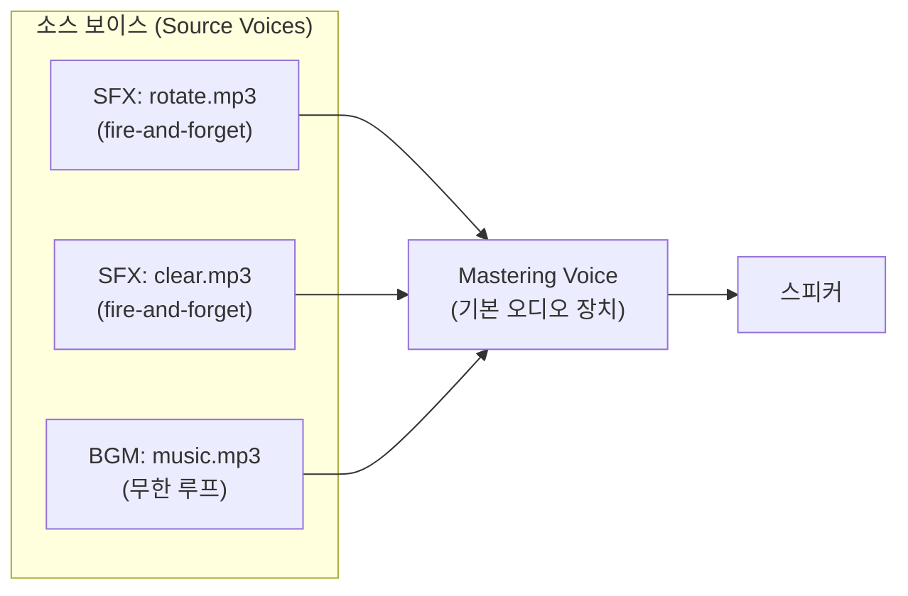
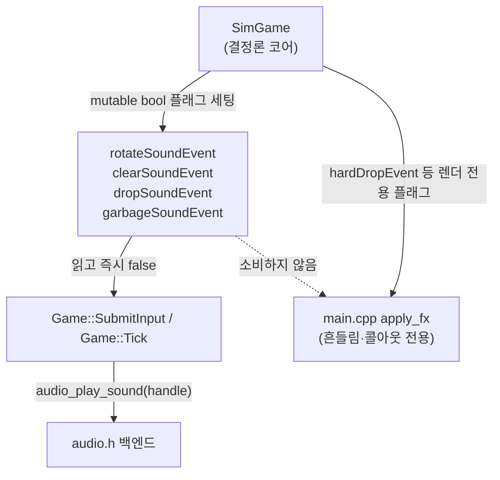
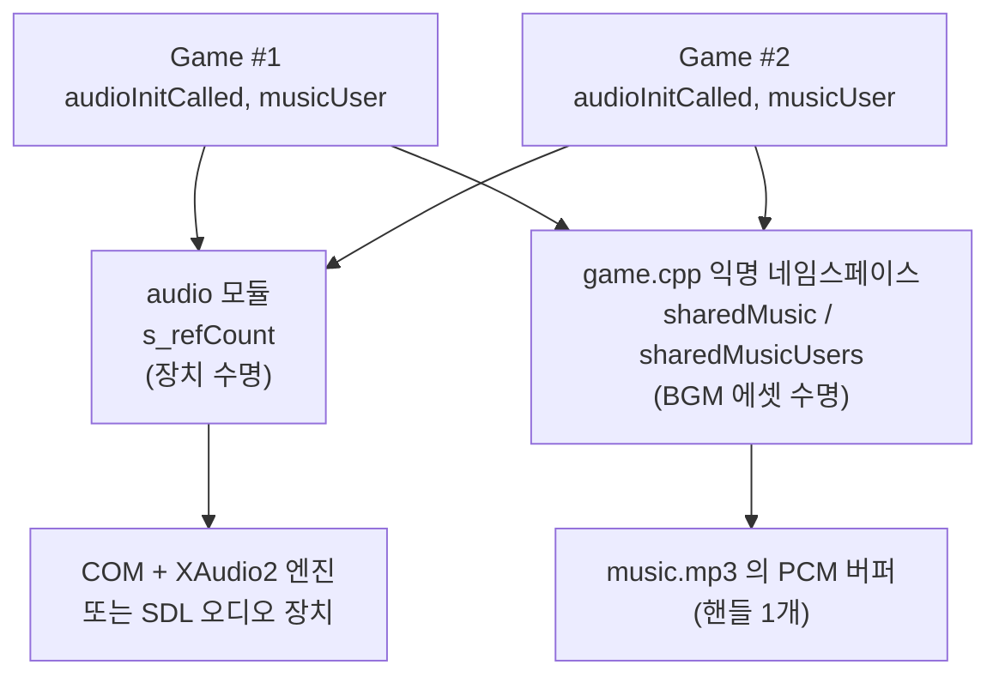
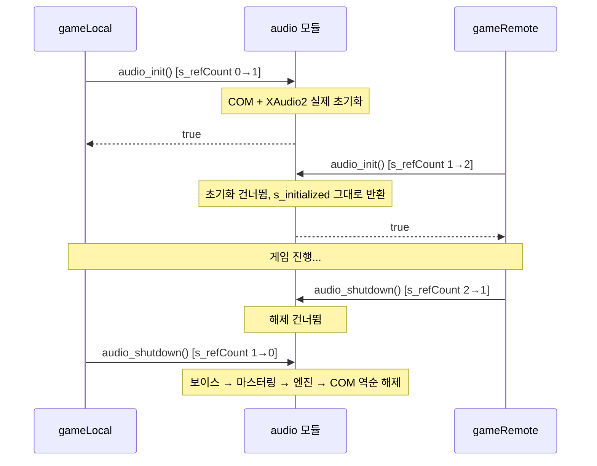
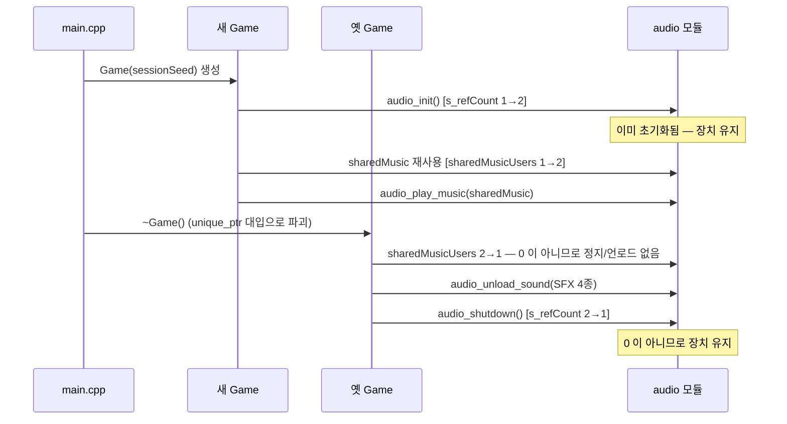
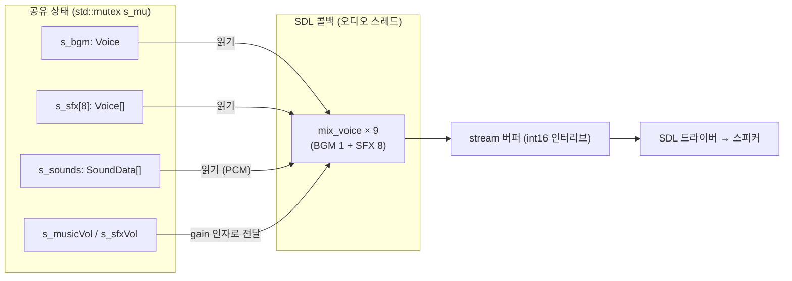
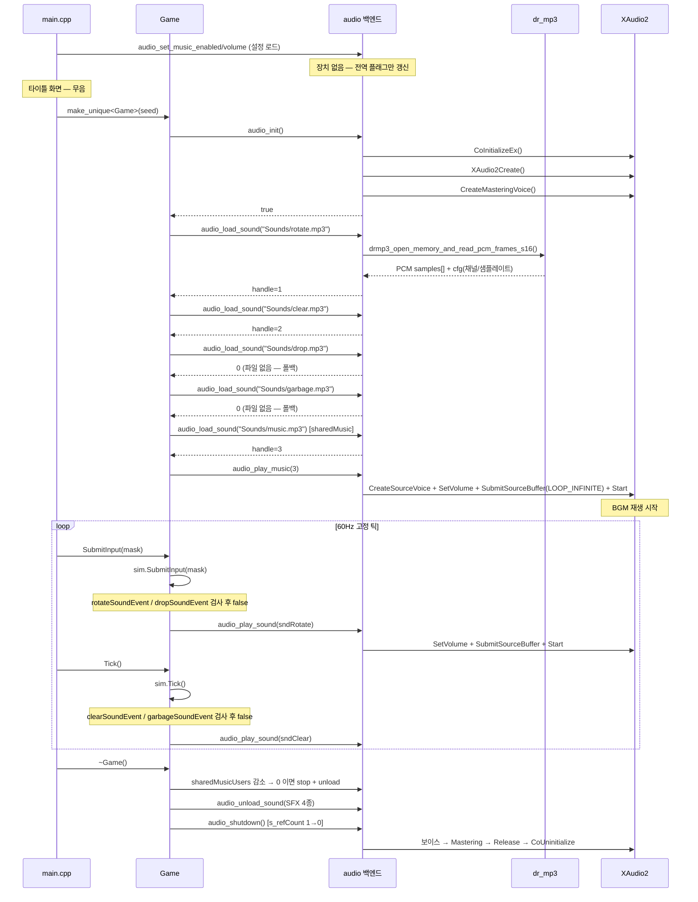

# Part 5: 오디오 계층 — XAudio2와 SDL2

> **시리즈:** 제로부터 멀티플레이어 테트리스 + RL | [시리즈 목차](./README.md) | **Part 5**

---

## 이번 Part의 구현 계약

- **선행 상태:** Part 4 의 `Game` 이 `SimGame` 을 소유하고 60 Hz 고정 틱으로 `SubmitInput`/`Tick` 을 호출한다. `src/game.{h,cpp}` 와 `src/main.cpp` 가 존재한다.
- **이번 Part의 파일:** `audio/audio.h`(공통 인터페이스), `audio/audio.cpp`(Windows/XAudio2), `audio/sdl_audio.cpp`(SDL2), `third_party/dr_mp3.h`(벤더링). 기존 `src/game.{h,cpp}` 와 `src/sim_game.{h,cpp}` 에 이벤트 플래그와 오디오 핸들을 추가한다. `CMakeLists.txt` 에 오디오 백엔드 분기를 넣는다.
- **연결점:** `SimGame` 은 재생 API 를 호출하지 않고 `mutable bool` 이벤트 플래그만 세운다. 그 플래그를 소비해 `audio_play_sound` 를 부르는 것은 오직 `Game::SubmitInput` 과 `Game::Tick` 두 함수다. 화면 흔들림·콜아웃을 담당하는 `main.cpp` 의 `apply_fx` 람다는 오디오를 전혀 건드리지 않는다.
- **완료 게이트:** 오디오 장치나 MP3 파일이 없어도 게임이 정상 실행되고, 정상 환경에서는 게임 모드에 진입하는 순간 BGM 이 시작되며 회전·하드드롭·라인 클리어·가비지 수신 효과음이 중복 없이 재생돼야 한다. 게임 재시작(R)에서 BGM 이 끊기지 않아야 한다.

## 들어가며

완성형 엔진에서 효과음 하나를 재생하는 것은 대개 인스펙터에서 클립을 끌어다 놓고 함수 하나를 부르는 일이다. 그보다 한 단계 낮은 기성 게임 프레임워크에서도 세 줄이면 끝난다:

**예시(실제 저장소에는 없음)**

```cpp
audio_device_open();
sound rotate = sound_load("Sounds/rotate.mp3");
sound_play(rotate);
```

이 세 줄이 실제로 하는 일은 다음과 같다:

1. OS 의 오디오 하드웨어에 접근하기 위해 런타임(Windows 라면 COM)을 초기화하고
2. MP3 바이너리를 PCM 샘플로 디코딩하고
3. 디코딩된 PCM 데이터를 오디오 그래프의 소스 노드에 제출해 스피커로 출력한다

그런 프레임워크 내부에서는 단일 헤더 믹서 라이브러리가 이 과정을 처리하고, 그 라이브러리가 다시 플랫폼별 백엔드(Windows: WASAPI, macOS: Core Audio, Linux: PulseAudio/ALSA)를 추상화한다. 결국 "장치를 연다" 는 한 줄은 OS 오디오 서브시스템 전체를 초기화하는 것이다.

이 장에서는 Windows 의 네이티브 오디오 API 인 **XAudio2** 를 직접 사용해 같은 기능을 구현한다. [Part 2](./part2-platform-window-input.md) 에서 "창을 하나 연다" 는 한 줄을 Win32 API 로 풀어냈듯, 여기서는 위의 세 줄 — 장치 초기화·로드·재생 — 을 XAudio2 + dr_mp3 로 풀어낸다. 뒤이어 Linux/macOS 이식을 위한 **SDL2 오디오 백엔드**(`audio/sdl_audio.cpp`)를 같은 `audio.h` 인터페이스에 맞춰 구현한다. 두 백엔드는 빌드 타임에 선택되며, 위쪽 게임 코드는 한 줄도 바뀌지 않는다.

인터페이스 파일 전체가 이 장의 계약이다.

**현재 소스 발췌 — `audio/audio.h`**

```cpp
#pragma once

// audio/audio.h -- XAudio2 오디오 인터페이스
//
// 기성 즉시 그리기 라이브러리의 오디오 장치 초기화 / 사운드 로드·재생 /
// 음악 스트림 API 를 대체한다.
// 구현: audio/audio.cpp (XAudio2 + dr_mp3)
//
// 학습 포인트:
//   기성 프레임워크의 "오디오 초기화 한 줄"은 내부 믹서 라이브러리를 감싼 것이다.
//   우리는 XAudio2 COM 인터페이스를 직접 사용한다.
//   XAudio2 오디오 그래프: Source Voice -> Mastering Voice -> 스피커

// 오디오 핸들 (내부 인덱스). 0 = 무효.
using AudioHandle = int;

// XAudio2 엔진 초기화 (CoInitializeEx + XAudio2Create + CreateMasteringVoice).
// 참조 카운팅: 여러 번 호출해도 안전 (첫 호출만 실제 초기화).
// 실패 시 false 반환 -- 이후 모든 audio_* 호출은 no-op으로 동작.
bool audio_init();

// XAudio2 엔진 종료. 참조 카운팅: 마지막 호출만 실제 해제.
void audio_shutdown();

// MP3 파일을 PCM으로 디코딩하여 메모리에 로드.
// 반환: 핸들 (0이면 실패 -- 파일 없음 등. 게임은 계속 진행).
AudioHandle audio_load_sound(const char* filepath);

// 로드된 사운드 해제.
void audio_unload_sound(AudioHandle handle);

// SFX 재생 (fire-and-forget). 같은 사운드를 동시에 여러 번 재생 가능.
void audio_play_sound(AudioHandle handle);

// BGM 재생 (루프). 이전 BGM은 자동 정지.
void audio_play_music(AudioHandle handle);

// BGM 정지.
void audio_stop_music();

// ─── 설정 토글 (렌더/오디오 전용 — SimGame/결정성 해시와 무관) ──────────────────
// BGM on/off. off: 음악 보이스 정지. on: 마지막으로 재생한 음악을 다시 재생.
// 내부에 s_musicEnabled + 마지막 음악 핸들을 기억해 on 시 자동 복원한다.
void audio_set_music_enabled(bool on);

// SFX on/off. off: audio_play_sound 가 no-op 이 된다.
void audio_set_sfx_enabled(bool on);

// ─── 볼륨 (0.0~1.0, 설정 화면 슬라이더가 구동) ─────────────────────────────────
// BGM 볼륨. 0 == 음소거. 믹스 시점에 음악 샘플에 이 게인을 곱한다.
void audio_set_music_volume(float v01);

// SFX 볼륨. 0 == 음소거. 재생되는 각 효과음에 이 게인을 곱한다.
void audio_set_sfx_volume(float v01);
```

공개 API는 초기화·수명, 효과음·음악 재생, 토글·볼륨 설정으로 나뉜다. 설정 화면은 설정 세터를 호출하고 `settings.cfg`에 값을 보존할 뿐 오디오 내부를 알지 않는다. 게인은 `mix_voice` 시그니처와 `SetVolume` 호출에 이미 들어가 있으므로 백엔드 계약의 일부다. 함수가 추가되어도 이 책임 분류와 백엔드 간 동일 시그니처가 검토 기준이다.

---

## 1. XAudio2 아키텍처 개요

> **어느 백엔드가 실제로 빌드되는가.** 이 장은 XAudio2 를 "OS 오디오를 직접 다루면 무엇이 일어나는가" 의 교재로 깊게 다루지만, **기본 빌드 대상은 플랫폼마다 다르다.** `CMakeLists.txt` 의 `TETRIS_USE_SDL2` 옵션이 non-Windows(Linux/macOS) 에서는 **기본 ON** 이라, 그쪽 독자가 그대로 빌드하면 컴파일되는 파일은 `audio/audio.cpp`(XAudio2) 가 아니라 `audio/sdl_audio.cpp`(SDL2) 다. XAudio2 경로는 **Windows 에서 `TETRIS_USE_SDL2=OFF`(Windows 기본값) 인 "Handmade" 빌드** 일 때만 컴파일된다. 즉 §1~§7 의 XAudio2 코드는 Windows-Handmade 전용 구현이고, §8 이후의 SDL2 백엔드가 사실상 크로스플랫폼 기본이다. 두 백엔드는 모두 같은 `audio.h` 인터페이스를 구현하며, 빌드 시스템이 둘 중 하나만 컴파일 대상에 넣는다(§11).

### 1.1 오디오 그래프

XAudio2 는 **오디오 그래프**(audio graph) 모델을 사용한다. 데이터는 소스(Source Voice)에서 출발해 중간 처리 노드(Submix Voice)를 거쳐 최종 출력(Mastering Voice)으로 흐른다. 이 프로젝트에서는 Submix Voice 없이 Source Voice 에서 Mastering Voice 로 직접 연결한다.


```mermaid
graph LR
    subgraph "소스 보이스 (Source Voices)"
        S1["SFX: rotate.mp3<br/>(fire-and-forget)"]
        S2["SFX: clear.mp3<br/>(fire-and-forget)"]
        S3["BGM: music.mp3<br/>(무한 루프)"]
    end

    M["Mastering Voice<br/>(기본 오디오 장치)"]
    SPK["스피커"]

    S1 --> M
    S2 --> M
    S3 --> M
    M --> SPK
```

**Source Voice**: PCM 데이터를 받아 재생하는 노드. 효과음(SFX)마다 하나, 배경 음악(BGM)에 하나.

**Mastering Voice**: 모든 소스 보이스의 출력을 믹싱해 OS 의 기본 오디오 출력 장치로 보낸다. 애플리케이션당 보통 하나.

이 구조는 [Part 3](./part3-rendering-and-ui.md) 의 렌더 파이프라인과 정확히 같은 3 단이다.

| GL 렌더러 (Part 3) | XAudio2 (Part 5) | 하는 일 |
|---|---|---|
| `glb_rect` — 개별 도형을 정점으로 제출 | Source Voice — 개별 소리를 제출 | 소스 하나를 공용 버퍼에 얹는다 |
| `s_verts` — 정점 배치 버퍼 | Mastering Voice — 믹스 버스 | 여러 소스가 한 버퍼에 누적된다 |
| `glb_flush` + `platform_present` — draw call 과 버퍼 스왑 | Mastering Voice → 기본 장치 | 합쳐진 결과를 장치로 내보낸다 |

렌더러가 "도형마다 정점을 한 버퍼에 쌓아 두고, 다 모이면 통째로 넘겨 한 번에 그린다" 라면, 오디오는 "샘플 하나에 여러 보이스를 더해 쌓고, 채워지는 대로 장치로 보낸다" 다. 차이는 축이 공간이냐 시간이냐뿐이다. 이 대응은 비유가 아니라 구현 구조 그대로다 — §8 의 SDL 백엔드에서는 `mix_voice`(개별 소스) → `stream` 버퍼(합성) → SDL 드라이버(장치 출력)로 세 단계가 **우리 코드 안에 그대로** 드러난다. XAudio2 는 가운데 두 단계를 라이브러리가 감춰줄 뿐이다.

### 1.2 COM 초기화

XAudio2 는 COM(Component Object Model) 객체다. 사용하기 전에 COM 런타임을 초기화해야 한다.

`COINIT_MULTITHREADED` 는 XAudio2 의 내부 워커 스레드가 자유롭게 COM 호출을 할 수 있게 한다. XAudio2 는 오디오 처리를 별도 스레드에서 수행하므로, 단일 스레드 모델(`COINIT_APARTMENTTHREADED`)을 쓰면 교착 상태가 발생할 수 있다.

`CoInitializeEx` 의 반환값 처리:

| HRESULT | 의미 | 대응 |
|---------|------|------|
| `S_OK` | 정상 초기화 | 진행, `s_comOwned = true` |
| `S_FALSE` | 이미 같은 모델로 초기화됨 | 진행, `s_comOwned = true` (짝을 맞춰 `CoUninitialize` 필요) |
| `RPC_E_CHANGED_MODE` | 다른 스레딩 모델로 이미 초기화 | 경고 후 진행, `s_comOwned = false` |
| 그 외 실패 | COM 자체 불가 | `s_initialized = false` 후 `false` 반환 |

`S_FALSE` 가 반환돼도 COM 사용에는 문제없다. 다만 **짝 맞추기 규칙**에 따라 `S_FALSE` 도 `CoUninitialize()` 를 호출해야 한다. 세 번째 줄이 미묘한데, `RPC_E_CHANGED_MODE` 는 "다른 누군가가 이미 다른 모델로 초기화했다" 는 뜻이므로 우리가 `CoUninitialize` 를 부르면 남의 참조를 깎게 된다. 그래서 `s_comOwned` 를 `false` 로 두고 종료 시 손대지 않는다.

### 1.3 XAudio2 엔진과 마스터링 보이스

COM 초기화 이후 XAudio2 엔진을 생성하고 마스터링 보이스를 만든다. 아래가 `audio_init` 전문이다.

**현재 소스 발췌 — `audio/audio.cpp`**

```cpp
bool audio_init()
{
    // 참조 카운팅: 이미 초기화되었으면 카운트만 증가
    if (s_refCount > 0)
    {
        ++s_refCount;
        return s_initialized;
    }
    ++s_refCount;

    // COM 초기화. 이미 다른 곳에서 초기화했으면 S_FALSE 반환 -- 괜찮다.
    HRESULT hr = CoInitializeEx(nullptr, COINIT_MULTITHREADED);
    if (hr == S_OK)
    {
        s_comOwned = true;
    }
    else if (hr == S_FALSE)
    {
        // 이미 초기화됨 (다른 스레드/모듈). COM 사용 가능.
        s_comOwned = true;  // CoUninitialize 호출 필요 (S_FALSE 도 짝 맞춰야 함)
    }
    else if (hr == RPC_E_CHANGED_MODE)
    {
        // 다른 스레딩 모델로 이미 초기화됨. XAudio2 는 대부분 동작하지만 경고.
        fprintf(stderr, "[audio] COM already initialized with different threading model\n");
        s_comOwned = false;
    }
    else
    {
        fprintf(stderr, "[audio] CoInitializeEx failed: 0x%08lx\n", hr);
        s_initialized = false;
        return false;
    }

    // XAudio2 엔진 생성
    hr = XAudio2Create(&s_xaudio, 0, XAUDIO2_DEFAULT_PROCESSOR);
    if (FAILED(hr))
    {
        fprintf(stderr, "[audio] XAudio2Create failed: 0x%08lx\n", hr);
        if (s_comOwned) CoUninitialize();
        s_comOwned = false;
        s_initialized = false;
        return false;
    }

    // 마스터링 보이스 생성 (기본 오디오 출력 장치)
    hr = s_xaudio->CreateMasteringVoice(&s_masterVoice);
    if (FAILED(hr))
    {
        fprintf(stderr, "[audio] CreateMasteringVoice failed: 0x%08lx\n", hr);
        s_xaudio->Release();
        s_xaudio = nullptr;
        if (s_comOwned) CoUninitialize();
        s_comOwned = false;
        s_initialized = false;
        return false;
    }

    // sentinel slot (index 0 = 무효 핸들)
    s_sounds.clear();
    s_sounds.push_back(SoundData{{}, {}, false});

    s_initialized = true;
    return true;
}
```

`XAudio2Create` 는 내부적으로 COM 의 `CoCreateInstance` 를 호출해 XAudio2 엔진 인스턴스를 만든다. `XAUDIO2_DEFAULT_PROCESSOR` 는 오디오 처리에 사용할 CPU 코어 어피니티를 OS 에 맡긴다는 뜻이다. `CreateMasteringVoice` 는 기본 오디오 출력 장치(사운드 카드, USB 헤드셋 등)를 자동으로 선택한다 — 인자 없이 호출하면 Windows 설정에서 "기본 출력 장치" 로 지정된 장치를 쓴다.

실패 경로마다 그 앞 단계를 정확히 되감는다는 점을 보라. `XAudio2Create` 가 실패하면 COM 만 되돌리고, `CreateMasteringVoice` 가 실패하면 엔진 `Release()` 후 COM 을 되돌린다. 이 "역순 되감기" 는 §13.3 의 종료 순서와 같은 원칙이다.

플랫폼 계층(Part 2)의 초기화와 나란히 놓으면 대응이 분명하다.

| 플랫폼 계층 (Part 2/3) | XAudio2 (Part 5) | 공통점 |
|---|---|---|
| `platform_init` — 창 생성 + GL 컨텍스트 획득 | `XAudio2Create` — 엔진 인스턴스 획득 | OS 서브시스템 핸들을 잡는다 |
| `renderer_init` — 셰이더 프로그램과 정점 버퍼 확보 | `CreateMasteringVoice` — 믹스 버스 확보 | 우리가 채울 출력 경로를 만든다 |
| `platform_present` — 백버퍼를 창에 스왑 | Mastering Voice → 기본 장치 | 완성된 버퍼를 장치로 밀어낸다 |

`platform/platform.h` 의 `platform_init` 주석은 "윈도우와 입력/타이머 백엔드 초기화. OpenGL 3.3 Core 컨텍스트를 함께 만든다" 라고 적어 둔다. 즉 이 프로젝트에서 장치 컨텍스트를 잡는 초기화는 창/GL 쪽과 오디오 쪽 **두 군데뿐**이다. 다만 대칭은 여기까지다 — GL 컨텍스트는 없으면 그릴 방법이 아예 없어서 즉시 실패하는 반면, 오디오는 장치를 못 잡아도 무음으로 계속 돈다.

### 1.4 내부 상태

XAudio2 백엔드가 들고 있는 전역은 다음과 같다. 전부가 이 한 화면에 들어온다는 사실 자체가 이 백엔드의 크기를 보여준다.

**현재 소스 발췌 — `audio/audio.cpp`**

```cpp
struct SoundData
{
    std::vector<uint8_t> pcmData;  // 디코딩된 PCM 샘플 (signed 16-bit)
    WAVEFORMATEX         format;   // 채널, 샘플레이트, 비트
    bool                 valid;
};

static bool                      s_initialized  = false;
static int                       s_refCount     = 0;
static bool                      s_comOwned     = false;  // 우리가 CoInitialize 했는가?
static IXAudio2*                 s_xaudio       = nullptr;
static IXAudio2MasteringVoice*   s_masterVoice  = nullptr;

// 사운드 저장소. 인덱스 0 은 무효 (sentinel).
static std::vector<SoundData>    s_sounds;

// BGM 전용 보이스
static AudioHandle               s_currentMusic = 0;
static IXAudio2SourceVoice*      s_musicVoice   = nullptr;

// 설정 토글 (렌더/오디오 전용 — SimGame/결정성과 무관).
static bool                      s_musicEnabled = true;
static bool                      s_sfxEnabled   = true;
static AudioHandle               s_lastMusic    = 0;  // 마지막 요청 BGM (off→on 복원용)

// 카테고리별 볼륨 (0.0~1.0). 설정 슬라이더가 구동. 음악은 음악 보이스에
// SetVolume, SFX 는 재생 시점에 각 소스 보이스에 SetVolume 로 적용한다.
static float                     s_musicVol     = 1.0f;
static float                     s_sfxVol       = 1.0f;

// SFX 보이스 풀
static constexpr int             MAX_SFX_VOICES = 8;
static IXAudio2SourceVoice*      s_sfxVoices[MAX_SFX_VOICES] = {};
static WAVEFORMATEX              s_sfxFormats[MAX_SFX_VOICES] = {};
// 각 보이스가 지금 어느 핸들의 PCM 을 물고 있는지. XAudio2 는 SubmitSourceBuffer 에
// 넘긴 포인터를 재생이 끝날 때까지 그대로 참조하므로, 언로드 시 그 버퍼를
// 해제하기 전에 해당 보이스를 먼저 멈춰야 한다.
static AudioHandle               s_sfxHandles[MAX_SFX_VOICES] = {};
```

참조 카운트 심볼의 이름은 `s_refCount` 다. 이 파일과 `audio/sdl_audio.cpp` 양쪽에 같은 이름으로 존재하며, 두 백엔드의 수명 계약이 동일하다는 표시다(§5).

마지막 `s_sfxHandles` 는 언로드 안전용 추적 배열이다. 재생 API 를 읽을 때는 "슬롯이 어느 사운드를 물고 있는지 적어 둔다" 정도만 알면 되고, 이 배열이 왜 필요해졌는지 — 없던 시절에 어떤 use-after-free 가 숨어 있었는지 — 는 §13.5 가 다룬다.

`s_musicEnabled` / `s_sfxEnabled` / `s_musicVol` / `s_sfxVol` 네 개가 §9 의 설정 API 가 조작하는 상태다. `s_lastMusic` 은 "BGM 을 껐다 켰을 때 무엇을 다시 틀지" 를 기억하는 슬롯이다.

---

## 2. MP3 디코딩

### 2.1 왜 디코딩이 필요한가

XAudio2 의 Source Voice 는 **비압축 PCM 데이터**만 받는다. MP3 는 손실 압축 포맷이므로 재생 전에 디코딩해야 한다.

PCM(Pulse-Code Modulation)은 아날로그 오디오 신호를 디지털로 표현하는 가장 기본적인 방식이다. 일정 간격(샘플 레이트)으로 신호의 진폭을 측정하고, 각 측정값을 정수(비트 깊이)로 기록한다.

$$\text{PCM 데이터 크기} = \text{채널 수} \times \text{샘플 레이트} \times \frac{\text{비트 깊이}}{8} \times \text{재생 시간(초)}$$

예: 스테레오, 44100 Hz, 16 비트, 3 분 = $2 \times 44100 \times 2 \times 180 \approx 31.7\text{MB}$

이것이 같은 음원의 MP3 파일(5.2 MB)보다 6 배 큰 이유다.

### 2.2 MP3 비트스트림이 실제로 어떻게 생겼는가

디코딩을 라이브러리에 맡기더라도 **왜 API 가 그런 모양인지**는 포맷에서 나온다. MPEG-1 Layer III 비트스트림은 프레임의 연속이고, 프레임 하나는 이렇게 생겼다.

```text
+----------------+----------+---------------------+---------------------------+
| header 4 bytes | CRC 0/2  | side info 17 or 32B | main_data (가변 길이)     |
+----------------+----------+---------------------+---------------------------+
 ^ sync 11bit                 ^ mono=17, stereo=32   ^ 허프만 코드 + scalefactor
   version/layer/bitrate
   samplerate/channel mode
```

여기서 셋을 기억하면 된다.

**1) 샘플레이트와 채널 수는 헤더에 있다 — 그래서 "파일을 열기 전에는" 모른다.** 4 바이트 헤더 안에 샘플레이트 인덱스와 채널 모드(stereo / joint stereo / dual / mono)가 들어 있다. 파일 확장자나 크기로는 알 수 없고, 첫 유효 프레임 헤더를 만나야 확정된다. dr_mp3 의 API 가 `drmp3_config` 를 **입력이 아니라 출력 파라미터**로 받는 이유가 이것이다. 우리 코드에서도 `cfg` 는 호출 전에는 `{}` 이고, 호출 후에 읽는다.

**2) 프레임 하나 = 1152 샘플(MPEG-1 Layer III).** 그래뉼(granule) 2 개 × 576 샘플이다. 44.1 kHz 기준 프레임 하나가 약 26.1 ms 다. 우리가 SDL 백엔드에서 쓰는 콜백 블록 1024 프레임(약 23.2 ms)과 비슷한 크기라는 점이 우연히 재미있는데, 둘은 전혀 다른 개념이다 — 전자는 압축 단위, 후자는 출력 버퍼 단위다.

**3) 비트 리저버(bit reservoir) 때문에 프레임은 독립적이지 않다.** Layer III 는 비트를 아껴 쓴 프레임이 남긴 여유 공간을 뒤 프레임이 빌려 쓸 수 있다. 즉 프레임 N 의 `main_data` 가 물리적으로는 프레임 N-1, N-2 의 바이트 영역에 놓일 수 있다. 결과적으로 **임의 지점으로 seek 해서 곧바로 정확히 디코딩할 수 없다.** 앞쪽 프레임 몇 개를 먼저 흘려 디코딩해야 상태가 맞는다. 스트리밍 재생이 "그냥 필요한 만큼만 읽으면 되는" 단순한 일이 아닌 이유이고, §6 에서 전체 디코드를 고른 근거와 직접 연결된다.

여기에 허프만 디코딩 → 역양자화 → 스테레오 디코딩 → 앨리어싱 저감 → IMDCT → 합성 필터뱅크가 프레임마다 돈다. 마지막 두 단계는 부동소수 연산이 지배적이고, CPU 사용량이 프레임마다 균일하지 않다(비트 리저버 사용량에 따라 다르다). 실시간 오디오 콜백 안에서 돌리기 껄끄러운 성질이다.

### 2.3 dr_mp3 — 단일 헤더 디코더

디코딩에는 [dr_mp3](https://github.com/mackron/dr_libs) 를 사용한다. David Reid 가 작성한 단일 헤더 라이브러리(public domain)로, minimp3 를 기반으로 한다. 사용법은 stb_image 와 동일한 패턴이다. **정확히 하나의** `.cpp` 파일에서 구현부를 활성화한다.

**현재 소스 발췌 — `audio/audio.cpp`**

```cpp
#define DR_MP3_IMPLEMENTATION
#include "../third_party/dr_mp3.h"
```

로드 함수 전체는 다음과 같다.

**현재 소스 발췌 — `audio/audio.cpp`**

```cpp
AudioHandle audio_load_sound(const char* filepath)
{
    if (!s_initialized) return 0;

    // 파일 전체를 메모리로 읽기
    FILE* f = fopen(filepath, "rb");
    if (!f)
    {
        fprintf(stderr, "[audio] Cannot open: %s\n", filepath);
        return 0;
    }

    fseek(f, 0, SEEK_END);
    long fileSize = ftell(f);
    fseek(f, 0, SEEK_SET);

    if (fileSize <= 0)
    {
        fprintf(stderr, "[audio] Empty file: %s\n", filepath);
        fclose(f);
        return 0;
    }

    std::vector<uint8_t> fileData(static_cast<size_t>(fileSize));
    const size_t nread = fread(fileData.data(), 1, fileData.size(), f);
    fclose(f);
    // 부분 읽기를 잡지 않으면 잘린 데이터가 그대로 디코더로 넘어가
    // "MP3 decode failed" 로 오진된다. 실제 원인은 I/O 오류다.
    if (nread != fileData.size())
    {
        fprintf(stderr, "[audio] Short read: %s (%zu/%zu bytes)\n",
                filepath, nread, fileData.size());
        return 0;
    }

    // dr_mp3 로 디코딩 (signed 16-bit PCM)
    drmp3_config cfg = {};
    drmp3_uint64 totalFrames = 0;
    drmp3_int16* samples = drmp3_open_memory_and_read_pcm_frames_s16(
        fileData.data(), fileData.size(),
        &cfg, &totalFrames, nullptr);

    if (!samples || totalFrames == 0)
    {
        fprintf(stderr, "[audio] MP3 decode failed: %s\n", filepath);
        if (samples) drmp3_free(samples, nullptr);
        return 0;
    }

    // SoundData 구성
    SoundData sd;
    sd.format = MakeWaveFormat(cfg.channels, cfg.sampleRate);
    size_t pcmBytes = static_cast<size_t>(totalFrames) * cfg.channels * 2;  // 16-bit = 2 bytes
    sd.pcmData.resize(pcmBytes);
    memcpy(sd.pcmData.data(), samples, pcmBytes);
    sd.valid = true;

    drmp3_free(samples, nullptr);

    // 저장 및 핸들 반환
    AudioHandle handle = static_cast<AudioHandle>(s_sounds.size());
    s_sounds.push_back(std::move(sd));
    return handle;
}
```

`drmp3_open_memory_and_read_pcm_frames_s16` 의 인자 다섯 개가 §2.2 의 세 가지 사실을 그대로 반영한다. 앞의 둘은 MP3 바이너리와 길이, `&cfg` 는 **출력**(채널/샘플레이트), `&totalFrames` 도 **출력**(총 프레임 수), 마지막은 커스텀 할당자(`nullptr` = malloc). 반환된 `samples` 는 dr_mp3 가 malloc 한 버퍼라 `drmp3_free` 로 해제해야 하고, 우리는 `std::vector<uint8_t>` 로 복사한 뒤 즉시 해제한다. 복사 한 번의 비용을 내고 이후의 수명 관리를 전부 `std::vector` 에 맡기는 거래다.

핸들은 `s_sounds` 의 인덱스이고, 인덱스 0 은 `audio_init` 이 넣은 sentinel 이라 **0 은 항상 무효**다. 이 규약 하나 덕에 "로드 실패 = 0 반환" 과 "재생 시 0 검사 = no-op" 이 자연스럽게 맞물린다(§10).

### 2.4 WAVEFORMATEX

디코딩된 PCM 의 포맷 정보는 XAudio2 의 `WAVEFORMATEX` 구조체로 전달한다.

**현재 소스 발췌 — `audio/audio.cpp`**

```cpp
static WAVEFORMATEX MakeWaveFormat(drmp3_uint32 channels, drmp3_uint32 sampleRate)
{
    WAVEFORMATEX wf = {};
    wf.wFormatTag      = WAVE_FORMAT_PCM;
    wf.nChannels       = static_cast<WORD>(channels);
    wf.nSamplesPerSec  = sampleRate;
    wf.wBitsPerSample  = 16;
    wf.nBlockAlign     = static_cast<WORD>(channels * 2);  // 16-bit = 2 bytes
    wf.nAvgBytesPerSec = sampleRate * wf.nBlockAlign;
    wf.cbSize          = 0;
    return wf;
}
```

| 필드 | 의미 | 예시 (스테레오, 44100 Hz) |
|------|------|--------------------------|
| `wFormatTag` | 포맷 종류 | `WAVE_FORMAT_PCM` (1) |
| `nChannels` | 채널 수 | 2 (스테레오) |
| `nSamplesPerSec` | 초당 샘플 수 | 44100 |
| `wBitsPerSample` | 샘플당 비트 수 | 16 |
| `nBlockAlign` | 한 샘플 프레임 바이트 | $2 \times 2 = 4$ |
| `nAvgBytesPerSec` | 초당 바이트 | $44100 \times 4 = 176400$ |

이 구조체는 WAV 파일 헤더의 `fmt ` 청크와 동일한 포맷이다. 값이 전부 `cfg` 에서 유도된다는 점이 핵심 — 우리가 정하는 게 아니라 **MP3 가 알려준 값**을 그대로 XAudio2 에 전달한다.

### 2.5 왜 WAV 로 미리 변환하지 않았는가

대안으로 MP3 를 사전에 WAV 로 변환해두면 런타임 디코딩이 필요 없다. 그러나:

| | MP3 + dr_mp3 | 사전 변환 WAV |
|---|---|---|
| 저장소 크기 | 5.2 MB | ~50 MB |
| 바이너리 오버헤드 | ~100 KB (dr_mp3 코드) | 0 |
| 로딩 시간 | 수 ms~수백 ms (디코딩) | 수십 ms (읽기) |
| 빌드 파이프라인 | 없음 | 변환 스크립트 + 산출물 관리 |

저장소 크기 10 배 차이와 에셋 파이프라인 부재 대비 런타임 비용이 미미하므로, MP3 + dr_mp3 를 선택했다.

---

## 3. 소스 보이스와 재생

### 3.1 SFX: Fire-and-Forget 패턴

효과음(회전, 라인 클리어)은 짧고 자주 발생한다. 재생 요청 시:

1. **보이스 풀**에서 idle 보이스를 찾는다
2. PCM 데이터를 `XAUDIO2_BUFFER` 에 담아 제출한다
3. 재생을 시작한다
4. 재생이 끝나면 보이스는 자동으로 idle 상태로 돌아간다

실제 `audio_play_sound` 는 포맷 재사용·강제 선점·생성 실패 처리까지 포함해 조금 길다.

**현재 소스 발췌 — `audio/audio.cpp`**

```cpp
void audio_play_sound(AudioHandle handle)
{
    if (!s_initialized) return;
    if (!s_sfxEnabled) return;
    if (handle <= 0 || handle >= static_cast<int>(s_sounds.size())) return;
    if (!s_sounds[handle].valid) return;

    const SoundData& sd = s_sounds[handle];

    // 보이스 풀에서 idle 보이스 찾기
    int slot = -1;
    for (int i = 0; i < MAX_SFX_VOICES; ++i)
    {
        if (!s_sfxVoices[i])
        {
            // 빈 슬롯 — 보이스 생성
            slot = i;
            break;
        }
        XAUDIO2_VOICE_STATE state;
        s_sfxVoices[i]->GetState(&state, XAUDIO2_VOICE_NOSAMPLESPLAYED);
        if (state.BuffersQueued == 0)
        {
            // idle — 포맷 일치 확인
            if (FormatMatches(s_sfxFormats[i], sd.format))
            {
                slot = i;
                break;
            }
            // 포맷 불일치 — 파괴 후 재생성
            s_sfxVoices[i]->DestroyVoice();
            s_sfxVoices[i] = nullptr;
            s_sfxHandles[i] = 0;
            slot = i;
            break;
        }
    }

    // 모든 보이스가 바쁘면 가장 오래된(첫 번째) 보이스를 강제 중단
    if (slot == -1)
    {
        slot = 0;
        s_sfxVoices[slot]->Stop();
        s_sfxVoices[slot]->FlushSourceBuffers();
        s_sfxHandles[slot] = 0;
        if (!FormatMatches(s_sfxFormats[slot], sd.format))
        {
            s_sfxVoices[slot]->DestroyVoice();
            s_sfxVoices[slot] = nullptr;
        }
    }

    // 보이스가 없으면 생성
    if (!s_sfxVoices[slot])
    {
        HRESULT hr = s_xaudio->CreateSourceVoice(&s_sfxVoices[slot], &sd.format);
        if (FAILED(hr))
        {
            fprintf(stderr, "[audio] CreateSourceVoice failed: 0x%08lx\n", hr);
            return;
        }
        s_sfxFormats[slot] = sd.format;
    }

    // 버퍼 제출 및 재생
    XAUDIO2_BUFFER buf = {};
    buf.AudioBytes = static_cast<UINT32>(sd.pcmData.size());
    buf.pAudioData = sd.pcmData.data();
    buf.Flags      = XAUDIO2_END_OF_STREAM;

    s_sfxVoices[slot]->SetVolume(s_sfxVol);
    s_sfxVoices[slot]->SubmitSourceBuffer(&buf);
    s_sfxVoices[slot]->Start();
    // 이 보이스가 물고 있는 PCM 의 주인을 기록해 둔다. audio_unload_sound 가
    // 버퍼를 해제하기 전에 이 보이스를 멈춰야 하기 때문이다.
    s_sfxHandles[slot] = handle;
}
```

**두 번째 줄 `if (!s_sfxEnabled) return;`** 이 SFX 토글의 전부다. 켜고 끄는 상태를 재생 지점 한 곳에서만 검사하니, 호출부(즉 `Game`)는 토글의 존재를 모른다.

**버퍼 제출 직전의 `SetVolume(s_sfxVol)`** 이 SFX 볼륨의 전부다. 슬롯을 확보한 직후, 버퍼를 제출하기 **전에** 게인을 건다. 슬롯은 재사용되므로 매 재생마다 다시 걸어야 한다. 뒤집어 말하면 `audio_set_sfx_enabled` 와 `audio_set_sfx_volume` 은 **전역 기본값만** 갱신하며 이미 울리고 있는 보이스는 건드리지 않는다 — 새 값은 다음 `audio_play_sound` 부터 적용된다. 살아 있는 보이스에 즉시 반영되는 것은 음악 볼륨뿐이다(§9.3).

**왜 보이스 풀인가?** `CreateSourceVoice` 는 내부적으로 메모리 할당과 DSP 그래프 노드 생성을 수반한다. 재생할 때마다 생성/파괴하면 **마이크로 히칭**(micro-hitching)이 발생할 수 있다. 8 개의 보이스를 만들어 재사용하면 이 비용이 사라진다(§7).

**`XAUDIO2_VOICE_NOSAMPLESPLAYED`**: `GetState` 에서 재생된 샘플 수를 계산하지 않는 플래그. "재생 중인가?" 만 알면 되므로 불필요한 계산을 건너뛴다.

**모든 보이스가 바쁘면?** 가장 오래된 보이스를 강제 중단하고 재사용한다. 동시에 9 개 이상의 효과음이 재생되는 상황은 극히 드물고, 하나를 끊어도 사용자가 인지하기 어렵다.

### 3.2 BGM: 무한 루프와 토글의 분리

배경 음악은 별도의 Source Voice 로 관리한다. 여기서 코드가 두 함수로 **쪼개져 있다**는 점이 중요하다. "실제로 보이스를 만들어 트는 일" 과 "무엇을 틀지 결정하는 일" 이 분리돼 있다.

**현재 소스 발췌 — `audio/audio.cpp`**

```cpp
static void start_music_voice(AudioHandle handle)
{
    if (!s_initialized) return;
    if (handle <= 0 || handle >= static_cast<int>(s_sounds.size())) return;
    if (!s_sounds[handle].valid) return;

    const SoundData& sd = s_sounds[handle];

    // 새 소스 보이스 생성
    HRESULT hr = s_xaudio->CreateSourceVoice(&s_musicVoice, &sd.format);
    if (FAILED(hr))
    {
        fprintf(stderr, "[audio] CreateSourceVoice (music) failed: 0x%08lx\n", hr);
        return;
    }

    // 무한 루프 버퍼 제출
    XAUDIO2_BUFFER buf = {};
    buf.AudioBytes = static_cast<UINT32>(sd.pcmData.size());
    buf.pAudioData = sd.pcmData.data();
    buf.Flags      = XAUDIO2_END_OF_STREAM;
    buf.LoopCount  = XAUDIO2_LOOP_INFINITE;

    s_musicVoice->SetVolume(s_musicVol);
    s_musicVoice->SubmitSourceBuffer(&buf);
    s_musicVoice->Start();
    s_currentMusic = handle;
}
```

**현재 소스 발췌 — `audio/audio.cpp`**

```cpp
void audio_play_music(AudioHandle handle)
{
    if (!s_initialized) return;
    if (handle <= 0 || handle >= static_cast<int>(s_sounds.size())) return;
    if (!s_sounds[handle].valid) return;

    // 기존 BGM 정지
    audio_stop_music();

    // off→on 복원을 위해 항상 마지막 요청 핸들을 기억하고,
    // 음악이 켜져 있을 때만 실제로 시작한다.
    s_lastMusic = handle;
    if (s_musicEnabled) start_music_voice(handle);
}

void audio_stop_music()
{
    if (s_musicVoice)
    {
        s_musicVoice->Stop();
        s_musicVoice->FlushSourceBuffers();
        s_musicVoice->DestroyVoice();
        s_musicVoice = nullptr;
    }
    s_currentMusic = 0;
    // 명시적 정지는 off→on 복원 대상도 지운다 (SDL 백엔드와 동일 의미).
    // 토글 off 경로(audio_set_music_enabled)는 여길 거치지 않아 복원이 유지된다.
    s_lastMusic = 0;
}
```

`XAUDIO2_LOOP_INFINITE`(255)는 XAudio2 가 버퍼 끝에 도달하면 자동으로 처음부터 다시 재생하게 한다. 이 방식이면 **게임 루프에서 별도의 `update()` 호출이 필요 없다**. 기성 프레임워크의 음악 재생은 대개 스트리밍 방식이라 매 프레임 "음악 갱신" 호출로 새 데이터를 채워 줘야 하지만, 여기서는 전체 PCM 을 프리로드하므로 한 번 제출하면 끝이다.

두 함수의 역할 분리를 정리하면:

| 함수 | 책임 | `s_musicEnabled` 검사 | `s_lastMusic` |
|---|---|---|---|
| `start_music_voice` | 보이스를 만들고 실제로 재생 | 하지 않음 (호출부 책임) | 건드리지 않음 |
| `audio_play_music` | "이 곡을 틀어라" 요청 접수 | 한다 | **항상** 기록 |
| `audio_stop_music` | 명시적 정지 | — | **지운다** |

`audio_play_music` 이 꺼져 있을 때도 `s_lastMusic` 을 기록한다는 점이 §9 의 복원 동작을 가능하게 한다. 반대로 `audio_stop_music` 은 `s_lastMusic` 까지 지운다 — "음악을 끄는 것" 과 "이 곡은 이제 끝" 을 구분하는 것이다. 전자는 §9 의 토글, 후자는 §5 의 `Game` 소멸이다.

### 3.3 프리로드 대 스트리밍 (요약)

| | 프리로드 | 스트리밍 |
|---|---|---|
| 구현 복잡도 | 낮음 (한 번 제출) | 높음 (콜백/버퍼 풀 필요) |
| 메모리 사용 | PCM 전체 (3 분 스테레오 44.1 kHz ≈ 31 MB) | 링 버퍼 (수십 KB) |
| 재생 중 CPU | 0 | 매 청크 디코딩 |
| 대기 시간 | 로딩 시 수백 ms | 없음 |
| 필요한 것 | `SubmitSourceBuffer` 1 회 | `IXAudio2VoiceCallback` 구현 |

이 프로젝트는 프리로드를 택했다. 에셋 집합이 작고 고정되어 있어 시작 시 decode 비용을 감당할 수 있고, 그 대가로 재생 경로에서는 디스크 I/O·MP3 decode·가변 할당을 제거할 수 있기 때문이다.

---

## 4. 이벤트 플래그 패턴 — 시뮬레이션과 오디오의 분리

### 4.1 문제 설정

[Part 1](./part1-deterministic-simulation.md) 에서 설계한 `SimGame` 은 **순수 시뮬레이션 엔진**이다. 렌더링도 오디오도 모른다. 헤더 첫 줄이 그렇게 선언한다 — "Headless Tetris simulation. No renderer, no audio, no I/O." 그렇다면 "블록이 회전했을 때 소리를 재생한다" 는 로직을 어디에 넣을 것인가.

`SimGame` 안에서 `audio_play_sound` 를 부르면 세 가지가 동시에 깨진다.

1. **결정론.** 오디오 호출은 시간과 장치 상태에 의존한다. 리플레이·lockstep·RL 학습에서 같은 입력이 같은 상태를 만들어야 하는데, 호출 자체는 상태에 영향을 주지 않더라도 헤드리스 빌드에서 링크가 깨진다.
2. **이식성.** `SimGame` 은 [Part 8](./part8-python-rl.md) 의 pybind11 모듈로도 컴파일된다. 그 빌드에는 오디오 백엔드가 링크되지 않는다.
3. **속도.** RL 학습은 초당 수만 틱을 돌린다. 소리를 낼 이유가 없다.

해결은 **일회성 이벤트 플래그**다. `SimGame` 은 "이런 일이 있었다" 만 기록하고, 소리를 낼지 말지는 위 계층이 정한다.


```mermaid
graph TB
    SIM["SimGame<br/>(결정론 코어)"] -- "mutable bool 플래그 세팅" --> FLAGS["rotateSoundEvent<br/>clearSoundEvent<br/>dropSoundEvent<br/>garbageSoundEvent"]
    FLAGS -- "읽고 즉시 false" --> GW["Game::SubmitInput / Game::Tick"]
    GW -- "audio_play_sound(handle)" --> AUD["audio.h 백엔드"]
    FLAGS -. "소비하지 않음" .-> FX["main.cpp apply_fx<br/>(흔들림·콜아웃 전용)"]
    SIM -- "hardDropEvent 등 렌더 전용 플래그" --> FX
```

오른쪽 점선이 중요하다. `main.cpp` 의 `apply_fx` 람다는 흔들림과 콜아웃을 담당하고 `hardDropEvent` / `lastLinesCleared` / `lastGarbageReceived` / `gameOverEvent` 를 소비하지만, **오디오 플래그는 건드리지 않는다.** 오디오 4 종은 전부 `Game` 이 소비한다. 두 소비자가 서로 다른 플래그 집합을 가지므로 "누가 먼저 읽느냐" 경쟁이 없다.

### 4.2 SimGame 쪽 선언

**현재 소스 발췌 — `src/sim_game.h`**

```cpp
    // ---- One-shot event flags for audio in the Game wrapper ----
    // Set by SimGame when the corresponding event occurs (successful rotate,
    // line clear). The Game wrapper reads and clears them each tick.
    mutable bool rotateSoundEvent  = false;
    mutable bool clearSoundEvent   = false;
    mutable bool dropSoundEvent    = false;  // 하드드롭(Space) 시
    mutable bool garbageSoundEvent = false;  // 가비지 행 수신 시
    // 하드드롭 화면 흔들림(약) 트리거용. dropSoundEvent 와 별개 — 그쪽은
    // 오디오(game.cpp)가 소비·리셋하므로 흔들림이 그것에 의존하면 안 된다.
    // 렌더 전용 1회 플래그 (해시/lockstep/replay 와 무관).
    mutable bool hardDropEvent     = false;  // 하드드롭(Space) 시 (흔들림용)
```

주석이 설계를 그대로 설명한다. `dropSoundEvent` 와 `hardDropEvent` 는 **같은 사건을 가리키는 두 개의 플래그**다. 하나로 합치고 싶은 유혹이 강하지만 합치면 안 된다 — 오디오 쪽(`Game::Tick`)과 흔들림 쪽(`apply_fx`)이 서로 다른 시점에 소비하므로, 먼저 읽은 쪽이 플래그를 지워버리면 나머지 하나가 조용히 사라진다. 소비자가 둘이면 플래그도 둘이어야 한다.

`mutable` 키워드는 `const` 메서드 안에서도 이 필드를 수정할 수 있게 한다. 시뮬레이션 상태(그리드, 점수, RNG)를 변경하지 않으므로 논리적 상수성(logical constness)은 유지되고, `StateHash()` 계산에도 들어가지 않는다.

### 4.3 플래그가 세팅되는 지점

회전 성공 시:

**현재 소스 발췌 — `src/sim_game.cpp`**

```cpp
void SimGame::RotateBlockImpl()
{
    if (gameOver) return;
    currentBlock.Rotate();
    if (IsBlockOutside(currentBlock) == true || BlockFits(currentBlock) == false)
    {
        currentBlock.UndoRotation();
    }
    else
    {
        lastMoveWasRotate = true;
        rotateSoundEvent = true;
        ghostBlock = MakeGhostBlock(currentBlock);
    }
}
```

`rotateSoundEvent` 는 `else` 분기에만 있다. **회전이 실제로 성공했을 때만** 소리가 난다. 벽에 막혀 `UndoRotation()` 으로 되돌아간 경우는 무음이고, 이는 의도된 피드백이다 — 사용자는 소리의 유무만으로 "회전이 먹혔는지" 를 안다. 바로 위 줄의 `lastMoveWasRotate = true;` 는 T-스핀 판정의 전제 상태이지 오디오와 무관하다.

하드드롭 시:

**현재 소스 발췌 — `src/sim_game.cpp`**

```cpp
void SimGame::MoveBlockDrop()
{
    if (gameOver) return;
    while (IsBlockOutside(currentBlock) == false && BlockFits(currentBlock) == true)
    {
        currentBlock.Move(1, 0);
    }
    currentBlock.Move(-1, 0);
    dropSoundEvent = true;
    hardDropEvent  = true;   // 흔들림용 (렌더 전용, 해시 무관)
    LockBlock();
}
```

두 플래그가 나란히 서는 곳이 여기다. 그리고 곧바로 `LockBlock()` 이 불린다는 점을 기억해두자 — §4.5 의 논점이다.

라인 클리어와 가비지 수신은 `LockBlock()` 꼬리에서 세팅된다. `LockBlock` 전체는 [Part 1](./part1-deterministic-simulation.md) 의 소관이므로 여기서는 오디오 플래그가 서는 부분만 인용한다.

**현재 소스 발췌 — `src/sim_game.cpp`** (`SimGame::LockBlock` 의 후반부)

```cpp
    int rowsCleared = sim_grid.ClearFullRows();
    lastLinesCleared = rowsCleared;
    lastTSpinLines = tSpin ? rowsCleared : -1;
    if (rowsCleared > 0 || tSpin)
    {
        if (rowsCleared > 0) clearSoundEvent = true;
        UpdateScore(rowsCleared, 0, tSpin);
        attackLinesSent += attack_lines_for(rowsCleared, tSpin);
    }
    lastMoveWasRotate = false;

    // 가비지 주입 — 라인 클리어 적용 후, 다음 피스가 확정된 이 시점에서 하단으로 올라온다.
    // 주의: 클리어 없이 그냥 놓은 경우에도 pendingGarbage 가 있으면 받는다.
    int inserted = 0;
    if (pendingGarbage > 0 && !gameOver)
    {
        inserted = pendingGarbage;
        InsertGarbage(pendingGarbage);
        pendingGarbage = 0;
        // 가비지가 올라와 currentBlock 스폰 위치를 막았으면 topout.
        if (!BlockFits(currentBlock)) gameOver = true;
    }
    lastGarbageReceived = inserted;
    if (inserted > 0) garbageSoundEvent = true;
```

두 개의 가드가 각각 중요하다.

- `if (rowsCleared > 0) clearSoundEvent = true;` — 바깥 조건은 `rowsCleared > 0 || tSpin` 이다. **라인을 지우지 못한 T-스핀**(T-spin zero)에서도 점수와 공격 계산은 돌지만 클리어 효과음은 나지 않는다.
- `if (inserted > 0) garbageSoundEvent = true;` — `pendingGarbage` 가 0 이면 실제 주입이 없으니 소리도 없다. `lastGarbageReceived = inserted;` 는 `apply_fx` 가 흔들림에 쓰는 별도 필드다.

### 4.4 Game 래퍼에서의 소비

`Game` 은 핸들 네 개와 두 개의 수명 플래그를 든다. **BGM 핸들은 여기 없다** — 이유는 §5 에서.

**현재 소스 발췌 — `src/game.h`**

```cpp
    // ── 오디오 핸들 (XAudio2) ───────────────────────────────────────────────
    AudioHandle sndRotate  = 0;
    AudioHandle sndClear   = 0;
    AudioHandle sndDrop    = 0;
    AudioHandle sndGarbage = 0;
    bool audioInitCalled = false;
    bool musicUser = false;
```

소비는 정확히 두 함수에서 일어난다.

**현재 소스 발췌 — `src/game.cpp`**

```cpp
void Game::SubmitInput(uint8_t inputMask)
{
    sim.SubmitInput(inputMask);
    if (sim.rotateSoundEvent)  { audio_play_sound(sndRotate);  sim.rotateSoundEvent  = false; }
    // drop 전용 에셋(Sounds/drop.mp3)이 없으면 무음 대신 rotate 로 대체해
    // 피드백을 유지한다 (audio_play_sound(0) 은 no-op). 핸들 alias 가 아니라
    // 재생 시점 fallback 이므로 소멸자의 이중 unload 가 없다.
    if (sim.dropSoundEvent)    { audio_play_sound(sndDrop ? sndDrop : sndRotate); sim.dropSoundEvent = false; }
}

void Game::Tick()
{
    sim.Tick();
    if (sim.clearSoundEvent)   { audio_play_sound(sndClear);   sim.clearSoundEvent   = false; }
    // garbage 전용 에셋이 없으면 clear 로 대체 (위 drop 과 동일 이유).
    if (sim.garbageSoundEvent) { audio_play_sound(sndGarbage ? sndGarbage : sndClear); sim.garbageSoundEvent = false; }
}
```

배치 규칙은 "그 플래그를 올린 sim 함수가 어디서 불리는가" 다.

| 이벤트 | 세팅 지점 | 호출 경로 | 소비 위치 |
|--------|-----------|-----------|-----------|
| 회전 성공 | `RotateBlockImpl` | `SubmitInput` | `Game::SubmitInput` 직후 |
| 하드드롭 | `MoveBlockDrop` | `SubmitInput` | `Game::SubmitInput` 직후 |
| 라인 클리어 | `LockBlock` | `SubmitInput`(하드드롭) **또는** `Tick`(중력) | `Game::Tick` 직후 |
| 가비지 수신 | `LockBlock` | 위와 동일 | `Game::Tick` 직후 |

### 4.5 에셋 폴백 — 없는 파일은 이웃 소리로 대체한다

`Sounds/` 에 실제로 있는 파일은 `clear.mp3`, `music.mp3`, `rotate.mp3` 다. `drop.mp3` 와 `garbage.mp3` 는 처음부터 없다. 그래서 `audio_load_sound("Sounds/drop.mp3")` 는 stderr 에 한 줄 찍고 0 을 반환하고, `sndDrop` 은 0 으로 남는다.

그 결과가 위 코드의 `sndDrop ? sndDrop : sndRotate` 다. **하드드롭은 무음이 아니라 회전음이 난다.** 가비지 수신은 클리어음이 난다. 전용 에셋이 준비되면 파일만 `Sounds/` 에 넣으면 되고 코드는 그대로다.

이 폴백을 **핸들 alias** 로 짜지 않은 이유가 주석에 적혀 있다. 만약 생성자에서

**예시(실제 저장소에는 없음)**

```cpp
sndDrop = audio_load_sound("Sounds/drop.mp3");
if (sndDrop == 0) sndDrop = sndRotate;      // 이렇게 하면 안 된다
```

처럼 alias 를 걸어두면, 소멸자의 `audio_unload_sound(sndRotate)` 와 `audio_unload_sound(sndDrop)` 이 **같은 핸들을 두 번 언로드**한다. 지금 구현은 `audio_unload_sound` 가 두 번째 호출에서 `valid == false` 를 만나 조용히 지나가긴 하지만, 그런 우연에 기대는 대신 재생 시점에 삼항 연산자 하나로 해결한다. 상태를 복제하지 않고 판단만 미루는 쪽이 언제나 안전하다.

### 4.6 플래그는 큐가 아니다

`bool` 하나로 충분한 이유는 "동시에 두 번 나도 소리는 한 번이면 되니까" 가 아니다. 정확히 말하면 **플래그는 덮어쓰기이고, 소비는 소비 지점의 호출 횟수만큼만 일어난다.**

구체적인 위험은 이렇다. 한 프레임에 `Game::SubmitInput(INPUT_DROP)` 이 불리면 `MoveBlockDrop → LockBlock` 경로로 `clearSoundEvent` 가 설 수 있다. 그런데 `clearSoundEvent` 를 읽는 것은 `Game::Tick` 이다. 그래서 이 소리는 그 프레임의 `SubmitInput` 이 아니라 **바로 이어지는 `Tick()`** 에서 난다. 60 Hz 고정 틱에서 `SubmitInput` 과 `Tick` 은 같은 틱 안에서 연달아 호출되므로 지연은 사실상 0 이다.

문제는 소비 없이 두 번 세팅되는 경우다. 만약 `SubmitInput` 이 두 번 연속 호출되고 그 사이에 `Tick` 이 없다면, 두 번의 라인 클리어가 한 번의 소리로 합쳐진다. [Part 4](./part4-game-wrapper-and-loop.md) 의 고정 틱 루프는 `SubmitInput` 한 번마다 `Tick` 한 번을 보장하므로 이 상황이 생기지 않는다. 반대로 프레임이 밀려 **캐치업으로 `Tick()` 이 한 프레임에 N 회** 도는 경우에는, 소비도 N 회 일어나므로 각 틱의 클리어가 각각 소리를 낸다. 즉 이 패턴의 정확성은 "루프가 `SubmitInput`/`Tick` 쌍을 유지한다" 는 Part 4 의 계약에 의존한다.

한편 **다른 종류의 소리끼리는 절대 합쳐지지 않는다.** 플래그가 이벤트마다 따로 있고 각각 다른 핸들로 재생되기 때문이다. 하드드롭으로 4 줄을 지우면서 동시에 가비지를 받으면 drop·clear·garbage 세 소리가 모두 난다. 이때 SFX 보이스가 세 개 소모되고, 풀 크기 8 의 근거가 여기서 나온다(§7).

---

## 5. 두 단계 참조 카운팅 — 장치와 BGM

### 5.1 문제: 동시에 존재하는 여러 Game

[Part 6](./part6-lockstep-networking.md) 의 멀티플레이 모드에서는 `Game` 인스턴스가 둘이다. 봇 대전도 마찬가지다.

**현재 소스 발췌 — `src/main.cpp`**

```cpp
    std::unique_ptr<Game> gameSingle;
    std::unique_ptr<Game> gameLocal;
    std::unique_ptr<Game> gameRemote;
```

`Game` 생성자가 `audio_init()` 을 호출하므로, 두 개가 생기면 두 번 호출된다. XAudio2 엔진을 두 번 초기화하면 독립적인 오디오 그래프가 두 개 생기고 리소스가 낭비된다. 그리고 더 나쁜 건 소멸이다 — 하나가 죽으면서 `audio_shutdown()` 을 부르면 아직 살아있는 다른 `Game` 의 소리가 전부 사라진다.

여기에 **BGM 고유의 문제**가 겹친다. `Sounds/music.mp3` 는 30 MB 안팎의 PCM 이 되는데, `Game` 마다 하나씩 로드하면 메모리가 배로 늘고, 두 인스턴스가 각각 `audio_play_music` 을 부르면 뒤의 호출이 앞의 BGM 을 정지시킨다(§3.2 의 `audio_stop_music()`). 결과는 "같은 곡이 미묘하게 어긋나 두 번 시작" 이다.

그래서 카운터가 **두 개**다.


```mermaid
graph TB
    G1["Game #1<br/>audioInitCalled, musicUser"] --> RC["audio 모듈<br/>s_refCount<br/>(장치 수명)"]
    G2["Game #2<br/>audioInitCalled, musicUser"] --> RC
    G1 --> SM["game.cpp 익명 네임스페이스<br/>sharedMusic / sharedMusicUsers<br/>(BGM 에셋 수명)"]
    G2 --> SM
    RC --> DEV["COM + XAudio2 엔진<br/>또는 SDL 오디오 장치"]
    SM --> PCM["music.mp3 의 PCM 버퍼<br/>(핸들 1개)"]
```

- **1 단: `s_refCount`** — 오디오 백엔드 안에 있다. 장치·엔진의 수명을 센다.
- **2 단: `sharedMusicUsers`** — `src/game.cpp` 의 익명 네임스페이스에 있다. BGM 에셋의 수명을 센다.

### 5.2 1 단: 장치 참조 카운트

`audio_init` 의 첫 다섯 줄(§1.3)과 `audio_shutdown` 의 첫 세 줄이 전부다.

**현재 소스 발췌 — `audio/audio.cpp`**

```cpp
void audio_shutdown()
{
    if (s_refCount <= 0) return;
    --s_refCount;
    if (s_refCount > 0) return;  // 다른 Game 인스턴스가 아직 살아있음

    // BGM 정지
    audio_stop_music();

    // SFX 보이스 풀 해제
    for (int i = 0; i < MAX_SFX_VOICES; ++i)
    {
        if (s_sfxVoices[i])
        {
            s_sfxVoices[i]->DestroyVoice();
            s_sfxVoices[i] = nullptr;
        }
        s_sfxFormats[i] = {};
        s_sfxHandles[i] = 0;
    }

    // 사운드 데이터 해제
    s_sounds.clear();

    // 마스터링 보이스 → XAudio2 엔진 순서대로 해제
    if (s_masterVoice)
    {
        s_masterVoice->DestroyVoice();
        s_masterVoice = nullptr;
    }

    if (s_xaudio)
    {
        s_xaudio->Release();
        s_xaudio = nullptr;
    }

    if (s_comOwned)
    {
        CoUninitialize();
        s_comOwned = false;
    }

    s_initialized = false;
}
```


```mermaid
sequenceDiagram
    participant GL as gameLocal
    participant A as audio 모듈
    participant GR as gameRemote

    GL->>A: audio_init() [s_refCount 0→1]
    Note over A: COM + XAudio2 실제 초기화
    A-->>GL: true

    GR->>A: audio_init() [s_refCount 1→2]
    Note over A: 초기화 건너뜀, s_initialized 그대로 반환
    A-->>GR: true

    Note over GL,GR: 게임 진행...

    GR->>A: audio_shutdown() [s_refCount 2→1]
    Note over A: 해제 건너뜀

    GL->>A: audio_shutdown() [s_refCount 1→0]
    Note over A: 보이스 → 마스터링 → 엔진 → COM 역순 해제
```

첫 번째 `Game` 이 생성될 때 실제 초기화가 일어나고, 마지막 `Game` 이 소멸될 때 실제 해제가 일어난다. `audio_init` 이 두 번째 호출에서 `return s_initialized;` 로 **첫 호출의 성패를 그대로 돌려준다**는 점도 중요하다. 장치가 없는 머신에서 첫 호출이 `false` 였다면 두 번째도 `false` 이고, 두 `Game` 모두 핸들을 로드하지 않는다.

### 5.3 2 단: BGM 사용자 카운트

`Game` 은 BGM 핸들을 **필드로 갖지 않는다.** 대신 번역 단위 지역 상태로 공유한다.

**현재 소스 발췌 — `src/game.cpp`**

```cpp
namespace {
AudioHandle sharedMusic = 0;
int sharedMusicUsers = 0;
bool g_ghostEnabled = true;   // 고스트 피스 표시 (설정 화면이 구동)
}
```

**현재 소스 발췌 — `src/game.cpp`**

```cpp
Game::Game(uint64_t seed)
    : sim(seed),
      gameOver(sim.gameOver),
      score(sim.score)
{
    cellColors = GetCellColors();

    // 오디오 초기화 (참조 카운팅 -- 멀티플레이에서 두 번 호출해도 안전)
    audioInitCalled = true;
    if (audio_init())
    {
        sndRotate  = audio_load_sound("Sounds/rotate.mp3");
        sndClear   = audio_load_sound("Sounds/clear.mp3");
        sndDrop    = audio_load_sound("Sounds/drop.mp3");
        sndGarbage = audio_load_sound("Sounds/garbage.mp3");
        if (sharedMusic == 0) {
            sharedMusic = audio_load_sound("Sounds/music.mp3");
        }
        if (sharedMusic != 0) {
            ++sharedMusicUsers;
            musicUser = true;
            audio_play_music(sharedMusic);
        }
    }
}

Game::~Game()
{
    if (musicUser) {
        if (sharedMusicUsers > 0) --sharedMusicUsers;
        if (sharedMusicUsers == 0 && sharedMusic != 0) {
            audio_stop_music();
            audio_unload_sound(sharedMusic);
            sharedMusic = 0;
        }
        musicUser = false;
    }
    audio_unload_sound(sndRotate);
    audio_unload_sound(sndClear);
    audio_unload_sound(sndDrop);
    audio_unload_sound(sndGarbage);
    if (audioInitCalled) {
        audio_shutdown();  // 참조 카운팅: 마지막 Game 소멸 시만 실제 해제
        audioInitCalled = false;
    }
}
```

읽을 때 짚어야 할 다섯 가지.

1. **`audioInitCalled = true;` 가 `audio_init()` 호출보다 먼저다.** `audio_init()` 이 실패해도 `s_refCount` 는 이미 증가한 상태다(§1.3 의 `++s_refCount;` 는 실패 경로 앞에 있다). 따라서 소멸자는 성패와 무관하게 `audio_shutdown()` 을 정확히 한 번 불러 카운트를 되돌려야 한다. `if (audio_init())` 안에 넣었다면 실패 시 카운트가 영원히 새어 나간다.
2. **SFX 4 종은 인스턴스별로 로드한다.** 짧은 파일이라 중복 비용이 작고, 인스턴스마다 독립적으로 언로드할 수 있어 수명 관리가 단순하다.
3. **BGM 은 `sharedMusic == 0` 일 때만 로드한다.** 두 번째 `Game` 은 이미 로드된 핸들을 그대로 쓴다. 30 MB PCM 이 하나뿐이다.
4. **`musicUser` 는 인스턴스별 영수증이다.** 로드에 실패해 `sharedMusic == 0` 이면 `musicUser` 는 `false` 로 남고, 이 인스턴스는 소멸 시 카운트를 깎지 않는다. 카운트를 올린 인스턴스만 내린다는 대칭이 유지된다.
5. **마지막 사용자만 `audio_stop_music()` + `audio_unload_sound(sharedMusic)`.** 그리고 `sharedMusic = 0;` 으로 되돌려, 다음에 `Game` 이 생기면 다시 로드한다.

각 `Game` 이 소멸자에서 `audio_play_music` 을 다시 부르지 않는다는 점도 눈여겨볼 만하다. BGM 은 이미 재생 중이므로 두 번째 `Game` 의 생성자가 `audio_play_music` 을 부르면 §3.2 대로 기존 보이스를 정지하고 새 보이스를 만든다 — 같은 곡이 처음부터 다시 시작한다. 멀티플레이에서 두 `Game` 은 거의 동시에 생성되므로 실질적 차이가 없고, 코드는 "생성자는 항상 BGM 을 요청한다" 는 단순한 규칙을 유지한다.

### 5.4 왜 재시작해도 BGM 이 끊기지 않는가

이 2 단 구조의 값어치는 게임 재시작에서 드러난다. Single 모드에서 게임 오버 후 R 을 누르면:

**현재 소스 발췌 — `src/main.cpp`** (Single 모드 게임오버 팝업의 `[R]` 분기. `Game` 이 둘인 봇 대전·Net 재시작도 같은 모양의 대입을 반복한다)

```cpp
            if (platform_key_pressed(PKEY_R))
            {
                gameSingle = std::make_unique<Game>(sessionSeed);
                if (recording) replay.frames.clear();
            }
```

`std::unique_ptr::operator=` 의 순서가 결정적이다. **새 객체가 먼저 완전히 생성되고, 그 다음에 옛 객체가 파괴된다.** 시간순으로 따라가면:


```mermaid
sequenceDiagram
    participant M as main.cpp
    participant NEW as 새 Game
    participant OLD as 옛 Game
    participant A as audio 모듈

    M->>NEW: Game(sessionSeed) 생성
    NEW->>A: audio_init() [s_refCount 1→2]
    Note over A: 이미 초기화됨 — 장치 유지
    NEW->>A: sharedMusic 재사용 [sharedMusicUsers 1→2]
    NEW->>A: audio_play_music(sharedMusic)
    M->>OLD: ~Game() (unique_ptr 대입으로 파괴)
    OLD->>A: sharedMusicUsers 2→1 — 0 이 아니므로 정지/언로드 없음
    OLD->>A: audio_unload_sound(SFX 4종)
    OLD->>A: audio_shutdown() [s_refCount 2→1]
    Note over A: 0 이 아니므로 장치 유지
```

두 카운터 모두 0 을 거치지 않는다. 그래서:

- `audio_shutdown()` 이 장치를 닫지 않는다 → 오디오 장치 재개방 지연(수십~수백 ms)이 없다.
- `sharedMusicUsers` 가 0 이 되지 않는다 → `audio_stop_music()` 도 `audio_unload_sound(sharedMusic)` 도 실행되지 않는다 → 30 MB PCM 을 다시 디코딩하지 않는다.

남는 것은 새 `Game` 생성자의 `audio_play_music(sharedMusic)` 한 번뿐이고, 이것은 이미 메모리에 있는 PCM 으로 새 소스 보이스를 만드는 일이라 밀리초 단위다. **재시작 시 음악은 처음부터 다시 시작하지만 끊기지 않는다.**

만약 `unique_ptr` 대입 순서가 반대였다면(옛 객체 파괴 → 새 객체 생성) 두 카운터가 모두 0 을 찍으면서 장치가 닫히고 BGM PCM 이 해제됐다가 곧바로 다시 로드된다. 그 경우 R 을 누를 때마다 음악이 수백 ms 끊긴다. 이 순서 의존성은 코드에 명시적으로 적혀 있지 않지만 표준이 보장한다 — `unique_ptr::operator=(unique_ptr&&)` 는 새 값을 저장한 뒤 옛 포인터를 `reset` 한다.

### 5.5 여기서 빌드하면

이 시점에서 `Game` 은 오디오를 완전히 소유한다. 아직 백엔드는 XAudio2 하나뿐이라 Windows 에서만 빌드된다. 게임을 실행하면:

- 타이틀 화면에서는 **아무 소리도 나지 않는다.** `audio_init()` / `audio_play_music()` 은 `Game` 생성자에서만 불리는데, `AppMode::Menu` 에는 `Game` 인스턴스가 없다.
- "Single Play" 를 고르는 순간 `gameSingle = std::make_unique<Game>(sessionSeed);` 가 실행되고, 그 안에서 BGM 이 시작된다.
- 회전·하드드롭·라인 클리어·가비지 수신에서 효과음이 난다(드롭/가비지는 §4.5 의 폴백으로 각각 회전음/클리어음).

---

## 6. 스트리밍 대 전체 디코드

### 6.1 두 전략의 경계

dr_mp3 는 두 가지 사용 방식을 제공한다.

- **전체 디코드 (§2.3 에서 쓴 방식)**: `drmp3_open_memory_and_read_pcm_frames_s16` 한 번 호출로 MP3 전체를 PCM 버퍼로 풀어 메모리에 상주시킨다. 이후 재생 시점에는 XAudio2 가 포인터·길이만 받는다.
- **프레임 스트리밍**: `drmp3_init` / `drmp3_init_memory` 로 디코더 핸들을 만든 뒤, 필요한 시점마다 `drmp3_read_pcm_frames_s16(&mp3, framesToRead, outBuf)` 로 소량씩 읽는다. XAudio2 쪽에서는 `IXAudio2VoiceCallback::OnBufferEnd` 콜백을 걸어 더블·트리플 버퍼링으로 다음 청크를 준비한다.

두 전략의 상대 비용은 음원 길이에 비례한다.

| 항목 | 전체 디코드 | 스트리밍 |
|------|-------------|----------|
| 로드 시간 | MP3 전체 길이에 비례 (3 분 곡 ≈ 수백 ms) | 초기 버퍼만 (수 ms) |
| 상주 메모리 | PCM 크기 그대로 (3 분 스테레오 44.1 kHz ≈ 31 MB) | 링 버퍼 (수십 KB) |
| 재생 중 CPU | 0 (디코드 끝남) | 매 청크마다 MP3 디코딩 |
| 콜백/동기화 | 불필요 | `IXAudio2VoiceCallback` 구현 + 버퍼 풀 |
| 구현 라인 수 | 한 함수 | 별도 상태 기계 |

### 6.2 효과음은 전체 디코드가 자연스럽다

회전·드롭·라인 클리어·어택 경고는 모두 **1 초 내외**다. 스테레오 16-bit 44.1 kHz 로 1 초 ≈ 176 KB. 20 개를 올려도 4 MB 가 안 된다. 반면 재생 시점에 MP3 프레임 디코딩을 하면 회전 입력 → 소리 사이에 5~20 ms 의 예측 불가능한 지연이 들어간다. 라인 클리어처럼 여러 개가 겹쳐 터질 때는 그 지연이 누적된다. **효과음은 예외 없이 전체 디코드가 유리하다.**

### 6.3 BGM 에서의 실제 트레이드오프

BGM 은 상황이 다르다. 이 프로젝트의 BGM 은 2~4 분 내외로, PCM 으로 풀면 20~40 MB 를 먹는다. 그래도 전체 디코드를 선택했다. 근거:

1. **현대 시스템에서 수십 MB 는 무시 가능한 수준이다.** 이 게임이 GPU 에 올리는 텍스처·에셋 전체와 비교해도 압도적으로 크긴 하지만, 절대량이 문제가 되는 규모가 아니다.
2. **게임 루프가 오디오를 전혀 돌보지 않아도 된다.** `XAUDIO2_LOOP_INFINITE` 덕에 `update()` 가 필요 없다. 이는 [Part 4](./part4-game-wrapper-and-loop.md) 의 결정론 루프와의 분리 유지에 직접 기여한다 — 오디오 스레드와의 동기화를 일체 도입하지 않는다.
3. **실시간 스레드 오류 가능성이 0 이다.** 스트리밍은 XAudio2 콜백 스레드에서 `drmp3_read_pcm_frames_s16` 를 돌려야 한다. §2.2 에서 본 대로 MP3 디코딩은 프레임마다 CPU 사용량이 균일하지 않고 내부 버퍼 할당을 할 수 있다. 실시간 콜백은 "할당 없음, 디스크 I/O 없음, 가변 CPU 없음" 이 기본 원칙이다(§13.4).
4. **비트 리저버 때문에 seek 이 비싸다.** 루프 지점으로 되감을 때 스트리밍이라면 앞 프레임 몇 개를 다시 흘려 디코딩해야 한다. 전체 디코드는 `pos = 0` 한 줄이다.
5. **로드 시간은 모드 진입 시 한 번으로 끝난다.** 플레이 중에 I/O 가 전혀 없다.

스트리밍을 써야 하는 경우는 **곡이 10 분을 넘어가거나, 로드 타임을 0 에 가깝게 줄여야 하거나, 동시 BGM 이 여러 개**일 때다. 이 프로젝트는 셋 다 해당하지 않는다.

### 6.4 "한 번에 디코드" API 가 숨기는 것

`drmp3_open_memory_and_read_pcm_frames_s16` 한 줄 뒤에 실제로는 다음이 일어난다.

```text
1. MP3 프레임 헤더 스캔 → 총 프레임 수 추정 (ID3v1/v2 스킵)
2. 최종 PCM 크기 만큼 malloc
3. 루프로 drmp3_read_pcm_frames_s16 호출해 전부 채움
4. drmp3_uninit
```

즉 전체 디코드는 "스트리밍 + 사전 버퍼 적재" 를 내부적으로 수행하는 편의 함수다. 직접 스트리밍 버전으로 바꾸더라도 성능 차이는 "로드 시점 집중 대 재생 중 분산" 일 뿐 총 CPU 는 비슷하다. 선택 기준은 결국 **총 비용이 아니라 언제 비용을 치를지**다.

---

## 7. Source Voice 풀 크기 선정 (8)

### 7.1 동시에 울릴 수 있는 소리 계산

동시에 재생될 수 있는 효과음 최댓값을 worst-case 로 계산한다. 아래 표는 **설계 당시 여유를 둔 상한 추정**이다 — warning·levelup·hold·move·counter 처럼 아직 에셋이 없는 가상의 효과음 종류까지 포함해, 효과음을 늘려도 풀 크기를 다시 정하지 않도록 잡은 것이다.

| 상황 | 동시 발생 SFX |
|------|---------------|
| T-Spin Triple + 가비지 경고 | clear × 1, warning × 1 |
| 하드 드롭 직후 라인 클리어 + 레벨업 | drop × 1, clear × 1, levelup × 1 |
| 홀드 + 회전 + 이동 누른 프레임 | rotate × 1, move × 1, hold × 1 |
| 가비지 카운터 감소 튕김 × 4 | counter × 4 |
| 극단: 위 상황 일부 중첩 | 최대 7~8 |

BGM 은 별도 보이스로 분리되어 있으므로 SFX 풀에 포함되지 않는다. 현실적 상한은 **7~8 개**이고, 풀을 `MAX_SFX_VOICES = 8` 로 잡은 근거가 이것이다(선언은 §1.4).

현재 이 게임이 실제로 내는 소리는 4 종(rotate/clear/drop/garbage)뿐이라 8 은 넉넉하다. 그러나 §4.6 에서 본 대로 하드드롭 한 번에 세 소리가 동시에 날 수 있고, 캐치업 다중 틱에서 여러 틱의 클리어가 한 프레임에 몰리면 더 늘어난다.

### 7.2 풀이 가득 찰 때의 정책

9 번째 소리가 터지면 어떻게 할 것인가. 선택지:

1. **드롭**: 새 재생을 조용히 무시. "들리지 않음" 이 눈에 띈다.
2. **가장 오래된 소리 선점(steal)**: 가장 먼저 시작된 소리를 끊고 그 슬롯을 재사용.
3. **가장 조용한 소리 선점**: 볼륨 기반 스코어링. 구현 복잡도 대비 효과 미미.
4. **풀 확장**: 동적 할당. 실시간 콜백 경로에서 할당 금지 원칙 위배.

이 프로젝트는 **2 번**을 채택했다. 구현은 §3.1 에서 인용한 `audio_play_sound` 의 이 부분이다.

**현재 소스 발췌 — `audio/audio.cpp`** (§3.1 의 `audio_play_sound` 중 선점 구간)

```cpp
    if (slot == -1)
    {
        slot = 0;
        s_sfxVoices[slot]->Stop();
        s_sfxVoices[slot]->FlushSourceBuffers();
        s_sfxHandles[slot] = 0;
        if (!FormatMatches(s_sfxFormats[slot], sd.format))
        {
            s_sfxVoices[slot]->DestroyVoice();
            s_sfxVoices[slot] = nullptr;
        }
    }
```

"첫 번째 슬롯 = 가장 오래된" 은 엄밀한 LRU 가 아니다. 슬롯 배열은 인덱스 순으로 채워지고 비워지므로 대략 FIFO 에 가까운 경향이 있고, 사용자가 인지할 정도로 틀어지지 않는다. **중요한 것은 드롭하지 않고 뭔가 울리는 것**이다.

### 7.3 포맷 매칭 슬롯 재사용

`CreateSourceVoice` 는 호출 시점의 `WAVEFORMATEX` 를 보이스에 고정한다. 샘플레이트나 채널이 다른 소리를 같은 보이스로 돌리면 재생 속도가 틀어진다. 그래서 슬롯 재사용 전에 포맷을 비교한다.

**현재 소스 발췌 — `audio/audio.cpp`**

```cpp
static bool FormatMatches(const WAVEFORMATEX& a, const WAVEFORMATEX& b)
{
    return a.nChannels      == b.nChannels
        && a.nSamplesPerSec == b.nSamplesPerSec
        && a.wBitsPerSample == b.wBitsPerSample;
}
```

에셋을 전부 44.1 kHz / 스테레오 / 16-bit 로 맞춰두면 이 비교는 항상 참이라 추가 비용이 없다. 그러나 외부에서 받은 효과음이 22.05 kHz 모노로 들어오는 순간, 포맷 불일치 시 `DestroyVoice()` → 다음 블록에서 재생성이 일어난다. 이 "가끔 한 번의 재생성" 은 허용 가능한 비용이다. 슬롯마다 마지막 포맷을 `s_sfxFormats[i]` 에 기억해 두는 이유가 이 비교를 위해서다.

### 7.4 풀이 너무 커도 나쁜 이유

`MAX_SFX_VOICES = 64` 로 늘리면 무슨 일이 생길까. 각 Source Voice 는 XAudio2 내부에서 DSP 그래프 노드·믹스 버퍼·SRC(Sample Rate Converter) 상태를 쥐고 있고, Mastering Voice 의 믹싱 비용은 **활성 보이스 수에 선형**이다. 64 개 중 5 개만 쓰는 상황에서도 유휴 보이스가 그래프에 연결되어 있으면 비용을 유발한다. 게임 효과음 수준에서는 8 이 실용적 sweet spot 이다.

SDL 백엔드에서는 이 비용 구조가 더 직접적이다 — `audio_callback` 이 매 블록마다 `MAX_SFX_VOICES` 회 루프를 돌기 때문에 풀 크기가 곧 콜백의 상수 오버헤드다(§8.4).

---

## 8. SDL 오디오 백엔드 (`audio/sdl_audio.cpp`)

### 8.1 왜 또 하나의 백엔드인가

XAudio2 는 Windows 전용이다. 헤더 `xaudio2.h` 와 링크 대상 `xaudio2.lib` / `ole32.lib` 모두 Windows SDK 에 들어 있고, macOS/Linux 에는 존재 자체가 없다. 플랫폼을 옮기려면 두 가지 길이 있다.

1. **Wine/Proton 에 기대기** — 실제로 XAudio2 는 Wine 이 에뮬레이트한다. 그러나 네이티브 창·네트워킹 스택과 함께 가져가면 빌드가 무거워지고, 배포가 "게임 + 호환 계층" 이 된다.
2. **이식성 있는 백엔드로 대체** — `audio.h` 인터페이스만 충족하면 된다. 위쪽 코드는 어느 백엔드인지 알 필요도 없다.

이 프로젝트는 2 번을 선택했다. 그런데 여기서 한 걸음 더 나가 **"그러면 Windows 도 SDL2 로 통일하면 되지 않나"** 를 물어야 한다. 답은 기본값 정책에 코드화돼 있다 (§11.1): Windows 는 기본 OFF(=XAudio2), 나머지는 기본 ON(=SDL2). 판단 근거는 셋이다.

- **Windows 에서 XAudio2 를 쓰는 이유: 런타임 의존성 0.** XAudio2 는 Windows 10 에 OS 구성 요소로 들어 있다. 배포물은 `tetris.exe` 하나면 된다. SDL2 를 쓰면 `SDL2.dll` 약 1 MB 를 동봉하고 버전 호환을 관리해야 한다. "handmade" 를 표방하는 프로젝트에서 OS 가 이미 주는 것을 외부 DLL 로 대체할 이유가 없다.
- **macOS/Linux 에서 SDL2 를 쓰는 이유: 직접 구현 비용.** 같은 논리를 밀면 CoreAudio (AudioUnit)와 ALSA/PulseAudio/PipeWire 를 각각 직접 짜야 한다. 오디오 하나를 위해 백엔드 셋을 추가로 유지하는 비용이, SDL2 의존성 하나보다 훨씬 크다. 게다가 Linux 오디오 스택은 배포판마다 다르다 — 그 파편화를 흡수하는 것이 정확히 SDL 의 존재 이유다.
- **학습 가치는 오히려 SDL 쪽이 크다.** XAudio2 는 믹싱을 감춰준다. SDL 의 `SDL_OpenAudioDevice` + 콜백 경로에서는 **믹서를 직접 짜야 한다.** 아래에서 볼 `mix_voice` 는 XAudio2 가 블랙박스로 해주던 일이 코드로 드러난 것이다.

`audio/sdl_audio.cpp`는 `audio.h`의 공개 계약 전체를 구현한다. 파일 머리 주석이 그 사실을 적어둔다.

**현재 소스 발췌 — `audio/sdl_audio.cpp`**

```cpp
// audio/sdl_audio.cpp — SDL2 오디오 백엔드 (Mac/Linux/Windows 크로스플랫폼)
//
// audio/audio.cpp (XAudio2) 와 동일한 audio.h 재생·설정 API 를
// SDL_OpenAudioDevice 콜백으로 재구현.
//   기성 프레임워크의 오디오 모듈이 하던 믹싱을 여기서는 SDL_AudioSpec.callback
//   에서 직접 수행 (int16 합산 + 포화 클램핑).
//
// 구조:
//   - SDL 콜백에서 BGM 보이스 + SFX 보이스 풀(8) 을 믹스.
//   - 보이스 = { sound handle, read position, active, loop }.
//   - audio_play_sound : 빈 SFX 슬롯 찾아 position=0, active=true 로 스타트.
//   - audio_play_music : BGM 보이스 교체, loop=true.
//   - 로드 시점에 SDL_AudioStream 으로 디바이스 포맷(채널/샘플레이트) 에 맞춰
//     한 번 변환해 둔다. 그래서 믹서는 리샘플링을 몰라도 되고, 콜백은 단순
//     합산만 한다. 변환을 재생 시점이 아니라 로드 시점에 하는 이유는
//     오디오 콜백 스레드에서 할당을 피하기 위해서다.
```

CMake 가 타깃 플랫폼과 옵션에 따라 `audio.cpp` 와 `sdl_audio.cpp` 중 **하나만** 컴파일 대상에 넣는다. 그래서 같은 심볼(`audio_init` 등)의 중복 정의가 일어나지 않는다(§11).

### 8.2 SDL2 오디오의 모델

SDL2 는 두 가지 오디오 API 를 제공한다.

- **`SDL_AudioStream`**: SDL 2.0.7+ 의 고수준 스트림. 샘플레이트·포맷·채널 변환을 내부에서 처리. 간단하지만 내부에 추가 큐를 둔다.
- **`SDL_OpenAudioDevice` + 콜백**: 저수준 API. SDL 이 요구할 때마다 콜백이 호출되고, 그 안에서 직접 PCM 을 써 넣는다. 지연이 가장 낮고 동작 모델이 XAudio2 의 Source Voice + Mastering Voice 와 구조적으로 비슷하다.

이 프로젝트는 두 번째를 쓴다. XAudio2 백엔드가 "소스 보이스가 Mastering Voice 로 흘러들어가 OS 로 나간다" 라는 그래프라면, SDL 백엔드는 **우리가 직접 Mastering Voice 를 만든다**. §1.1 의 3 단이 이제 전부 우리 코드다.


```mermaid
graph LR
    subgraph "SDL 콜백 (오디오 스레드)"
        MIX["mix_voice × 9<br/>(BGM 1 + SFX 8)"]
    end

    subgraph "공유 상태 (std::mutex s_mu)"
        BGM["s_bgm: Voice"]
        SFX["s_sfx[8]: Voice[]"]
        SOUNDS["s_sounds: SoundData[]"]
        VOL["s_musicVol / s_sfxVol"]
    end

    BGM -- "읽기" --> MIX
    SFX -- "읽기" --> MIX
    SOUNDS -- "읽기 (PCM)" --> MIX
    VOL -- "gain 인자로 전달" --> MIX
    MIX --> OUT["stream 버퍼 (int16 인터리브)"]
    OUT --> DRV["SDL 드라이버 → 스피커"]
```

`glb_rect` → `s_verts` → `glb_flush` 와 정확히 같은 모양이다. `mix_voice` 가 개별 소스를 합성하고, `stream` 이 합성 버퍼이며, SDL 드라이버가 장치 출력을 맡는다. 차이는 렌더러가 프레임마다 한 번 `gl_Clear` 로 화면을 지우는 자리에 오디오는 `memset(stream, 0, len)` 이 있다는 것뿐이다.

### 8.3 상태 구조

XAudio2 는 Source Voice 라는 라이브러리 수준 객체를 내주지만, SDL 은 그런 것이 없다. 그래서 직접 `Voice` 구조체를 만들었다.

**현재 소스 발췌 — `audio/sdl_audio.cpp`**

```cpp
struct SoundData {
    std::vector<int16_t> pcm;      // 디코딩된 16-bit signed PCM (디바이스 포맷 기준)
    uint32_t channels = 0;
    uint32_t sampleRate = 0;
    bool valid = false;
};

struct Voice {
    int handle = 0;     // 0 = idle
    size_t pos = 0;     // PCM 샘플 인덱스 (int16 단위, 채널 포함)
    bool loop = false;
    bool active = false;
};
```

`Voice` 의 네 필드는 "지금 몇 번 소리를, 어디까지 재생 중인가, 루프인가, 활성인가" 다. `IXAudio2SourceVoice` 가 내부에서 하던 일이 그대로 구조체로 드러난다. 이것이 저수준 API 의 재미다 — 숨어 있던 상태가 전부 보인다.

전역 상태도 XAudio2 쪽과 거의 1:1 로 매핑된다.

**현재 소스 발췌 — `audio/sdl_audio.cpp`**

```cpp
static bool            s_initialized = false;
static int             s_refCount    = 0;
static SDL_AudioDeviceID s_dev       = 0;

static std::vector<SoundData> s_sounds;

static constexpr int MAX_SFX_VOICES = 8;
static Voice s_sfx[MAX_SFX_VOICES];
static Voice s_bgm;          // 단일 BGM 보이스

// 설정 토글 (렌더/오디오 전용 — SimGame/결정성과 무관).
static bool        s_musicEnabled = true;
static bool        s_sfxEnabled   = true;
static AudioHandle s_currentMusic = 0;   // 마지막으로 요청된 BGM 핸들 (off→on 복원용)

// 카테고리별 볼륨 (0.0~1.0). 믹스 시점에 샘플에 곱한다. 설정 슬라이더가 구동.
static float       s_musicVol = 1.0f;
static float       s_sfxVol   = 1.0f;

static SDL_AudioSpec s_have{};   // 디바이스 최종 포맷
static std::mutex    s_mu;       // 콜백 ↔ API 간 공유 상태 보호
```

풀 크기가 여전히 8 이다. §7 에서 계산한 "동시에 들릴 수 있는 SFX" 는 OS 에 독립적이다. 참조 카운트 이름도 그대로 `s_refCount` 이고, 설정 상태 다섯 개 (`s_musicEnabled`/`s_sfxEnabled`/`s_currentMusic`/`s_musicVol`/`s_sfxVol`)가 XAudio2 쪽의 `s_musicEnabled`/`s_sfxEnabled`/`s_lastMusic`/`s_musicVol`/`s_sfxVol` 에 대응한다. 이름이 하나만 다르다 — XAudio2 는 "지금 재생 중인 곡"(`s_currentMusic`)과 "복원 대상"(`s_lastMusic`)을 분리해 들고 있고, SDL 은 보이스 자체(`s_bgm.handle`)가 "지금 재생 중" 을 표현하므로 `s_currentMusic` 하나가 복원 대상 역할을 한다.

새로 등장한 것은 `std::mutex s_mu` 다. XAudio2 에서는 상태 변경(`SubmitSourceBuffer`, `Start`, `DestroyVoice` 등)이 모두 COM 메서드이고 내부적으로 락을 건다. SDL 에서는 **우리가 락 책임자**다. 계약은 §8.5 에서 명시한다.

### 8.4 믹서 콜백 — 심장부

SDL 이 "출력 버퍼를 채워달라" 고 호출하는 콜백 전체는 아래와 같다.

**현재 소스 발췌 — `audio/sdl_audio.cpp`**

```cpp
static void mix_voice(Voice& v, int16_t* out, int frames, int outChannels, float gain)
{
    if (!v.active || v.handle <= 0) return;
    SoundData& sd = s_sounds[v.handle];
    if (!sd.valid) { v.active = false; return; }

    const int16_t* src = sd.pcm.data();
    const size_t total = sd.pcm.size();         // int16 단위
    const int    sc    = (int)sd.channels;      // 소스 채널(1 or 2)

    for (int f = 0; f < frames; ++f) {
        if (v.pos + sc > total) {
            if (v.loop) v.pos = 0;
            else { v.active = false; return; }
        }
        // 모노→스테레오 승격 혹은 스테레오→스테레오 패스스루
        int16_t l = src[v.pos];
        int16_t r = (sc >= 2) ? src[v.pos + 1] : l;
        v.pos += sc;

        // 카테고리 게인 적용 후 포화 합산
        for (int c = 0; c < outChannels; ++c) {
            int s = (int)((c == 0) ? l : r);
            s = (int)(s * gain);
            int acc = (int)out[f * outChannels + c] + s;
            if (acc >  32767) acc =  32767;
            if (acc < -32768) acc = -32768;
            out[f * outChannels + c] = (int16_t)acc;
        }
    }
}

static void SDLCALL audio_callback(void* /*ud*/, Uint8* stream, int len)
{
    int16_t* out = (int16_t*)stream;
    int frames   = len / (s_have.channels * (int)sizeof(int16_t));
    memset(stream, 0, (size_t)len);

    std::lock_guard<std::mutex> lk(s_mu);
    mix_voice(s_bgm, out, frames, s_have.channels, s_musicVol);
    for (int i = 0; i < MAX_SFX_VOICES; ++i)
        mix_voice(s_sfx[i], out, frames, s_have.channels, s_sfxVol);
}
```

콜백을 한 줄씩 읽으면:

- `memset(stream, 0, len)` — "무음" 으로 초기화. 활성 보이스가 하나도 없으면 무음 출력. 렌더러의 `renderer_begin` 이 배경색으로 화면을 `gl_Clear` 하는 것과 같은 자리다.
- `std::lock_guard<std::mutex> lk(s_mu)` — 콜백 **전체**가 한 락 안에 있다. 콜백이 voice 위치를 전진시키는 동안 메인 스레드가 같은 버퍼를 unload하거나 슬롯을 재사용하지 못하게 하므로, 수명과 샘플 위치를 하나의 임계 구역으로 묶는 정확성 조건이다.
- `mix_voice(s_bgm, ..., s_musicVol)` 뒤에 `mix_voice(s_sfx[i], ..., s_sfxVol)` × 8 — **다섯 번째 인자가 카테고리 게인**이다. BGM 보이스에는 음악 볼륨을, SFX 보이스 여덟 개에는 효과음 볼륨을 준다. 볼륨 분리가 정확히 이 인자 하나로 구현된다.

`mix_voice` 의 포인트는 셋이다.

**1) 모노 → 스테레오 승격.** 소스가 1 채널이면 `l = src[pos]`, `r = l` 로 양쪽 귀에 복제. 2 채널이면 그대로 통과. XAudio2 는 이 변환을 내부 채널 매트릭스로 해줬지만 SDL 경로는 우리가 한다. 다만 이 복제는 **에너지를 보존하지 않는다** — 같은 샘플을 양 채널에 넣으면 음향 파워가 두 배, 즉 체감 +3 dB 라, 제대로 하려면 $1/\sqrt{2}$ (≈0.707)를 곱해야 한다. 현재 구현에서 이 분기는 **방어용**이다. 정상 로드 경로에서는 §8.7 의 로드 시점 변환이 모노 소스를 미리 디바이스 포맷(스테레오)으로 승격해 두므로, `mix_voice` 가 실제로 이 경로를 타는 일은 없다. 로드 시점 변환이 없던 시절에는 진짜 함정이었다(§13.6).

**2) 게인 적용과 정수 절삭.** `s = (int)(s * gain);` 은 `float` 곱 후 0 방향으로 자른다. 볼륨 0.5 에서 원본 샘플 `3` 은 `1` 이 되고 `1` 은 `0` 이 된다. 디더링이 없으므로 아주 작은 진폭의 신호는 낮은 볼륨에서 계단 잡음으로 바뀐다. 게임 효과음 수준에서는 인지되지 않지만, 이것이 "정수 믹서" 의 대가다. 게인을 **합산 전에** 적용한다는 순서도 중요하다 — 합산 후에 적용하면 이미 클리핑된 값에 게인을 걸게 되어 볼륨을 낮춰도 왜곡이 남는다.

**3) 포화 합산(saturating add).** 두 보이스의 PCM 샘플을 그대로 더하면 -32768~32767 범위를 넘어 오버플로가 발생한다. `int` 로 승격 후 32767 / -32768 로 클램핑한다. 이 한 줄이 없으면 두 소리가 겹치는 순간 지글거리는 디스토션이 들린다.

클리핑이 얼마나 자주 일어날지는 산수로 가늠할 수 있다. 서로 무관한 신호 $N$ 개를 더하면 RMS 는 $\sqrt{N}$ 배로 늘지만 **피크는 최대 $N$ 배**다. 풀이 가득 찬 8 보이스 동시 재생에서 각 소스가 full scale 근처까지 올라간다면 클리핑은 사실상 확정이다. 현실적인 방어는 두 가지 — 에셋을 -12 dBFS 정도로 정규화해 두는 것, 그리고 §9 의 카테고리 볼륨을 1.0 미만으로 두는 것. 프로 게임 오디오라면 여기에 마스터 리미터가 붙지만, 이 프로젝트는 동시 발생 수가 적어 포화 클램핑으로 충분하다.

### 8.5 스레드 소유권 계약

콜백은 SDL 이 만든 **별도 스레드**에서 돈다. 게임 루프와 완전히 비동기다. 정확한 계약은 다음과 같다.

| 상태 | 콜백 스레드 (`audio_callback`) | 메인 스레드 (`audio_*` API) |
|---|---|---|
| `s_sounds` (벡터 자체) | 읽기만 (`s_sounds[h]`) | `push_back` — **재할당 가능** |
| `s_sounds[h].pcm` | 읽기만 (`data()`, `size()`) | `clear()` + `shrink_to_fit()` |
| `s_bgm`, `s_sfx[]` | `v.pos` / `v.active` 쓰기 | 슬롯 통째 대입 |
| `s_musicVol`, `s_sfxVol` | 읽기만 (gain 인자) | 쓰기 |
| `s_have` | 읽기 (`channels`) | `audio_init` 에서만 쓰기 (장치 열기 전) |
| `s_sfxEnabled` | 접근하지 않음 | **락 없이** 쓰기 |

마지막 행이 실제 코드의 특이점이다. `audio_set_sfx_enabled` 는 락을 잡지 않는다.

**현재 소스 발췌 — `audio/sdl_audio.cpp`**

```cpp
void audio_set_sfx_enabled(bool on)
{
    s_sfxEnabled = on;
}
```

다른 세터 셋(`audio_set_music_enabled`, `audio_set_music_volume`, `audio_set_sfx_volume`)은 모두 `std::lock_guard` 를 잡는데 이것만 잡지 않는다. 비대칭의 근거는 `s_sfxEnabled` 를 **콜백이 전혀 읽지 않는다**는 데 있다. 이 플래그를 읽는 곳은 `audio_play_sound` 하나이고 그것도 메인 스레드다. 즉 콜백과 공유되지 않는 상태라 락이 필요 없다. `s_musicEnabled` 는 다르다 — 세터가 `s_bgm` 을 직접 바꾸므로 락이 필수다.

주의할 점은 이 결론이 "현재 콜백이 `s_sfxEnabled` 를 읽지 않는다" 는 사실에 의존한다는 것이다. 나중에 콜백에서 SFX 를 게이트하도록 바꾸면 이 함수도 락을 잡아야 한다. 락 생략은 언제나 **불변식에 대한 베팅**이고, 그 불변식을 문서화하지 않으면 다음 사람이 깨뜨린다.

### 8.6 초기화와 종료

**현재 소스 발췌 — `audio/sdl_audio.cpp`**

```cpp
bool audio_init()
{
    if (s_refCount > 0) { ++s_refCount; return s_initialized; }
    ++s_refCount;

    if (SDL_InitSubSystem(SDL_INIT_AUDIO) != 0) {
        fprintf(stderr, "[audio] SDL_InitSubSystem(AUDIO) failed: %s\n", SDL_GetError());
        s_initialized = false;
        return false;
    }

    SDL_AudioSpec want{};
    want.freq     = 44100;
    want.format   = AUDIO_S16SYS;
    want.channels = 2;
    want.samples  = 1024;
    want.callback = audio_callback;

    // allowed_changes = 0 — 요청한 포맷을 그대로 받는다. 장치가 44100 을
    // 지원하지 않으면 SDL 이 내부 변환기를 끼워 넣는다.
    // 예전에는 SDL_AUDIO_ALLOW_FREQUENCY_CHANGE 를 줬는데, 그러면 48000 으로
    // 열린 장치에서 44100 짜리 MP3 가 그대로 흘러 약 8.8% 빠르게 재생됐다.
    s_dev = SDL_OpenAudioDevice(nullptr, 0, &want, &s_have, 0);
    if (s_dev == 0) {
        fprintf(stderr, "[audio] SDL_OpenAudioDevice failed: %s\n", SDL_GetError());
        SDL_QuitSubSystem(SDL_INIT_AUDIO);
        s_initialized = false;
        return false;
    }

    s_sounds.clear();
    s_sounds.push_back(SoundData{});  // sentinel handle 0
    for (auto& v : s_sfx) v = {};
    s_bgm = {};

    SDL_PauseAudioDevice(s_dev, 0);
    s_initialized = true;
    return true;
}

void audio_shutdown()
{
    if (s_refCount <= 0) return;
    --s_refCount;
    if (s_refCount > 0) return;

    if (s_dev) {
        SDL_PauseAudioDevice(s_dev, 1);
        SDL_CloseAudioDevice(s_dev);
        s_dev = 0;
    }
    SDL_QuitSubSystem(SDL_INIT_AUDIO);
    s_sounds.clear();
    s_initialized = false;
}
```

관전 포인트.

- `want.samples = 1024`. 콜백이 한 번에 요청하는 프레임 수. 1024 프레임은 44.1 kHz 에서 약 **23.2 ms** 블록이다. 이것이 SDL 백엔드의 콜백 블록 크기이자 지연의 하한선이다. XAudio2 쪽은 `audio.cpp` 에 버퍼 크기를 명시하지 않으므로 OS/드라이버 기본값을 따르며, 실제 지연은 대상 장치에서 측정해야 한다.
- `SDL_OpenAudioDevice` 의 마지막 인자 `allowed_changes = 0`. 장치가 요청 포맷을 그대로 못 주면 SDL 이 장치와 콜백 사이에 자체 변환기를 끼워 넣으므로, `s_have` 는 **항상 요청 포맷과 같다** — 믹서가 44.1 kHz 스테레오라는 가정을 흔들림 없이 쓸 수 있는 근거다. 소스 쪽에 남을 수 있는 채널·샘플레이트 차이는 로드 시점의 `SDL_AudioStream` 변환(§8.7)이 흡수한다. 발췌의 주석이 말하는 "예전에는" — 재협상을 허용해 놓고 변환은 안 해서 8.8 % 빠르게 재생되던 버그 — 는 §13.6 에 있다.
- `SDL_PauseAudioDevice(s_dev, 0)` — 열기만 하면 일시정지 상태다. `0` 이 "재생 시작", `1` 이 "일시정지". 이 한 줄을 빠뜨리면 완벽히 초기화됐는데 무음이다.
- `SDL_InitSubSystem(SDL_INIT_AUDIO)` — SDL 창/이벤트를 이미 쓰고 있어도 오디오 서브시스템은 별도로 올린다. XAudio2 백엔드의 `CoInitializeEx` 에 대응한다.
- 종료에서 `SDL_PauseAudioDevice(s_dev, 1)` 을 `SDL_CloseAudioDevice` 보다 **먼저** 부른다. 콜백을 멈춘 뒤에 장치를 닫아야 콜백이 해제된 상태를 만지지 않는다. §13.3 의 "의존하는 쪽을 먼저" 원칙의 SDL 판이다.
- 참조 카운팅 패턴은 XAudio2 백엔드와 완전히 같다(§5.2). 멀티플레이 두 `Game` 인스턴스 문제는 여기서도 똑같이 발생하므로 똑같이 해결한다.

### 8.7 로드 / 언로드

**현재 소스 발췌 — `audio/sdl_audio.cpp`**

```cpp
// ─── 로드 / 언로드 ─────────────────────────────────────────────────────────────
AudioHandle audio_load_sound(const char* filepath)
{
    if (!s_initialized) return 0;

    FILE* f = fopen(filepath, "rb");
    if (!f) { fprintf(stderr, "[audio] open %s failed\n", filepath); return 0; }
    if (fseek(f, 0, SEEK_END) != 0) { fclose(f); return 0; }
    long sz = ftell(f);
    if (fseek(f, 0, SEEK_SET) != 0) { fclose(f); return 0; }
    if (sz <= 0) { fclose(f); return 0; }
    std::vector<uint8_t> raw((size_t)sz);
    const size_t nread = fread(raw.data(), 1, raw.size(), f);
    fclose(f);
    if (nread != raw.size()) {
        fprintf(stderr, "[audio] read %s failed (%zu/%zu bytes)\n",
                filepath, nread, raw.size());
        return 0;
    }

    drmp3_config cfg{};
    drmp3_uint64 frames = 0;
    drmp3_int16* samples = drmp3_open_memory_and_read_pcm_frames_s16(
        raw.data(), raw.size(), &cfg, &frames, nullptr);
    if (!samples || frames == 0) {
        fprintf(stderr, "[audio] decode %s failed\n", filepath);
        if (samples) drmp3_free(samples, nullptr);
        return 0;
    }

    SoundData sd;
    const size_t total = (size_t)frames * cfg.channels;

    if ((int)cfg.channels == s_have.channels &&
        (int)cfg.sampleRate == s_have.freq)
    {
        // 이미 디바이스 포맷 — 그대로 복사.
        sd.pcm.assign(samples, samples + total);
        sd.channels   = cfg.channels;
        sd.sampleRate = cfg.sampleRate;
        sd.valid      = true;
        drmp3_free(samples, nullptr);
    }
    else
    {
        // 채널 수나 샘플레이트가 다르면 SDL 변환기를 통과시킨다.
        SDL_AudioStream* conv = SDL_NewAudioStream(
            AUDIO_S16SYS, (Uint8)cfg.channels, (int)cfg.sampleRate,
            AUDIO_S16SYS, (Uint8)s_have.channels, s_have.freq);
        if (!conv) {
            fprintf(stderr, "[audio] SDL_NewAudioStream failed for %s: %s\n",
                    filepath, SDL_GetError());
            drmp3_free(samples, nullptr);
            return 0;
        }
        const int inBytes = (int)(total * sizeof(int16_t));
        if (SDL_AudioStreamPut(conv, samples, inBytes) != 0 ||
            SDL_AudioStreamFlush(conv) != 0) {
            fprintf(stderr, "[audio] resample failed for %s: %s\n",
                    filepath, SDL_GetError());
            SDL_FreeAudioStream(conv);
            drmp3_free(samples, nullptr);
            return 0;
        }
        drmp3_free(samples, nullptr);

        const int outBytes = SDL_AudioStreamAvailable(conv);
        if (outBytes <= 0) {
            fprintf(stderr, "[audio] resample produced nothing for %s\n", filepath);
            SDL_FreeAudioStream(conv);
            return 0;
        }
        sd.pcm.resize((size_t)outBytes / sizeof(int16_t));
        SDL_AudioStreamGet(conv, sd.pcm.data(), outBytes);
        SDL_FreeAudioStream(conv);

        sd.channels   = (uint32_t)s_have.channels;
        sd.sampleRate = (uint32_t)s_have.freq;
        sd.valid      = true;
    }

    std::lock_guard<std::mutex> lk(s_mu);
    AudioHandle h = (AudioHandle)s_sounds.size();
    s_sounds.push_back(std::move(sd));
    return h;
}
```

**dr_mp3 호출이 XAudio2 백엔드와 완전히 같다.** 디코딩은 백엔드에 의존하지 않는 공통 단계다. 다른 점은 다음과 같다.

1. `SoundData` 가 `WAVEFORMATEX` 대신 `channels` / `sampleRate` 를 따로 저장한다. Windows 전용 구조체를 끌어오지 않기 위함이다.
2. PCM 을 `std::vector<uint8_t>` 가 아니라 `std::vector<int16_t>` 로 든다. 믹서가 샘플 단위로 접근하므로 캐스팅이 없다.
3. **부분 읽기(short read)는 두 백엔드 모두 잡는다.** 잡지 않으면 잘린 데이터가 디코더로 넘어가 "decode failed" 로 오진되고 실제 원인(I/O 오류)이 흐려진다 — XAudio2 쪽 소스 주석이 그 이유를 그대로 적어 둔다(§2.3). 다만 진단 메시지 형식이 다르고(SDL 은 `[audio] read <경로> failed (n/m bytes)`, XAudio2 는 `[audio] Short read: <경로> (n/m bytes)` — §10), `fseek` 반환값까지 검사하는 것은 SDL 쪽뿐이다.
4. **언로드 전에 그 핸들을 쓰는 보이스를 먼저 정리하는 것도 양쪽 공통이다.** SDL 은 `audio_unload_sound` 가 `s_bgm` 과 `s_sfx[]` 를 훑어 리셋한 뒤에야 PCM 을 비우고, XAudio2 는 `s_sfxHandles` 로 해당 보이스를 찾아 정지시키고 Flush 완료까지 기다린다(§13.5). 이 순서가 없으면 오디오 스레드가 해제된 버퍼를 읽는다.

`std::lock_guard` 의 위치도 보라. 디코딩(수백 ms 걸릴 수 있는 작업)은 락 **밖**에서 하고, `s_sounds.push_back` 만 락 안에서 한다. 락 구간을 최소로 잡는 기본기다.

로드된 PCM 의 포맷이 디바이스의 `s_have` 와 다르면? 위 발췌의 `else` 분기가 **로드 시점에 이미 변환**하므로, 믹서는 언제나 디바이스 포맷의 PCM 만 본다. 재생 경로 어디에도 리샘플링 코드가 없는 것은 그 일이 필요 없어서가 아니라 로드 단계로 옮겨졌기 때문이다. 여기에 이르기까지의 사고 — 한때 왜 8.8 % 빠르게 재생됐고 어떻게 두 겹으로 고쳤는지 — 는 §13.6 에 있다.

### 8.8 재생 API

**현재 소스 발췌 — `audio/sdl_audio.cpp`**

```cpp
void audio_play_sound(AudioHandle h)
{
    if (!s_initialized) return;
    if (!s_sfxEnabled) return;
    if (h <= 0 || h >= (int)s_sounds.size() || !s_sounds[h].valid) return;

    std::lock_guard<std::mutex> lk(s_mu);
    int slot = -1;
    for (int i = 0; i < MAX_SFX_VOICES; ++i) {
        if (!s_sfx[i].active) { slot = i; break; }
    }
    if (slot < 0) slot = 0;  // 모두 바쁘면 첫 번째를 강제 교체
    s_sfx[slot] = Voice{ h, 0, false, true };
}

void audio_play_music(AudioHandle h)
{
    if (!s_initialized) return;
    if (h <= 0 || h >= (int)s_sounds.size() || !s_sounds[h].valid) return;

    std::lock_guard<std::mutex> lk(s_mu);
    s_currentMusic = h;                       // off→on 복원용으로 항상 기억
    s_bgm = s_musicEnabled ? Voice{ h, 0, true, true } : Voice{};
}

void audio_stop_music()
{
    if (!s_initialized) return;
    std::lock_guard<std::mutex> lk(s_mu);
    s_bgm = {};
    s_currentMusic = 0;
}
```

XAudio2 쪽 `audio_play_music` 이 `s_lastMusic` 기록과 `start_music_voice` 호출로 나뉘었던 것이, 여기서는 삼항 연산자 한 줄로 압축된다: `s_bgm = s_musicEnabled ? Voice{...} : Voice{};`. 꺼져 있으면 보이스를 비워두되 `s_currentMusic` 은 기억한다 — 두 백엔드의 의미가 정확히 같다.

`audio_stop_music` 이 `s_currentMusic = 0;` 까지 하는 것도 XAudio2 쪽 `s_lastMusic = 0;` 과 짝이다. 명시적 정지는 복원 대상까지 지운다.

**구조적 대응관계.**

| XAudio2 단계 | SDL 단계 |
|--------------|---------|
| `GetState` 로 `BuffersQueued == 0` 확인 | `s_sfx[i].active == false` 확인 |
| `CreateSourceVoice` (보이스 할당) | 없음 — `Voice` 구조체로 영구 상주 |
| `SetVolume(s_sfxVol)` | 없음 — 콜백에서 `gain` 인자로 매 샘플 적용 |
| `SubmitSourceBuffer` | `s_sfx[slot] = Voice{h, 0, false, true}` |
| `Start` | `active = true` (다음 콜백에서 재생됨) |
| `XAUDIO2_LOOP_INFINITE` | `v.loop` 가 참일 때 `v.pos = 0` |

즉 SDL 백엔드에서 "재생 시작" 은 **구조체 네 필드에 값을 넣는 것**이 전부다. 실제 PCM 전송은 다음 콜백 호출(최대 23 ms 뒤)에 일어난다. XAudio2 의 `Start` 도 본질적으로 마찬가지지만, SDL 쪽은 그 게임 → 드라이버 경계가 우리 코드 안에 노출되어 있다.

볼륨 적용 시점의 차이도 눈여겨볼 만하다. XAudio2 는 재생 시작 시 한 번 `SetVolume` 하므로 **재생 중에 슬라이더를 움직이면 이미 울리는 효과음에는 반영되지 않는다.** SDL 은 콜백이 매번 `s_sfxVol` 을 읽으므로 즉시 반영된다. BGM 은 양쪽 모두 즉시 반영된다 — XAudio2 는 `audio_set_music_volume` 이 살아있는 보이스에 `SetVolume` 을 다시 걸기 때문이다(§9).

**BGM 무한 루프.** XAudio2 는 `XAUDIO2_LOOP_INFINITE` 플래그로 엔진에 맡겼다. SDL 은 `mix_voice` 안의 세 줄이 전부다 — `v.loop` 가 참이면 포지션만 0 으로 되돌린다. 루프 경계에서 인접한 두 샘플 사이에 불연속이 생기므로, 원본 MP3 가 루프 포인트를 매끈히 만들어 두었다면 티가 나지 않는다. 티가 나면 크로스페이드(이전 꼬리 N 샘플과 새 머리 N 샘플을 섞기)를 넣으면 되지만 현재 에셋으로는 필요 없다.

### 8.9 두 백엔드 비교 요약

| 속성 | XAudio2 (`audio.cpp`) | SDL2 (`sdl_audio.cpp`) |
|------|----------------------|------------------------|
| 플랫폼 | Windows 만 | Windows / Linux / macOS |
| 초기화 | `CoInitializeEx` + `XAudio2Create` + `CreateMasteringVoice` | `SDL_InitSubSystem` + `SDL_OpenAudioDevice` |
| 콜백 스레드 | XAudio2 내부 (숨겨짐) | SDL 오디오 스레드 (콜백 직접 작성) |
| 믹싱 | Mastering Voice (엔진/드라이버) | `mix_voice` 의 포화 합산 |
| 루프 | `XAUDIO2_LOOP_INFINITE` | `v.pos = 0` |
| 볼륨 | 보이스별 `SetVolume` (재생 시작 시) | 콜백의 `gain` 인자 (매 샘플) |
| 샘플레이트 변환 | Source Voice 내부 SRC (재생 시) | 로드 시 `SDL_AudioStream` 변환 (§13.6) |
| 채널 변환 | Source Voice 내부 매트릭스 | 로드 시 `SDL_AudioStream` 변환 + `mix_voice` 의 방어용 모노→스테레오 복제 |
| 동시 SFX | 8 (Source Voice 풀) | 8 (`Voice` 구조체 풀) |
| 콜백 블록 | 코드에서 미지정 — 대상 장치에서 측정 | 약 23.2 ms (`samples=1024 @ 44.1 kHz`) |
| 레이스 보호 | XAudio2 내부 락 | `std::mutex s_mu` |
| 언로드 시 보이스 정리 | `s_sfxHandles` 로 추적해 정지 + Flush 완료 대기 (§13.5) | `s_bgm`/`s_sfx[]` 를 리셋 |
| 의존성 | `xaudio2.lib`, `ole32.lib` (OS 내장) | `libSDL2` |
| 바이너리 추가 | ~0 | ~1 MB (`SDL2.dll`) |
| 공통 | dr_mp3 로 동일하게 디코드하고 `audio.h` 계약을 동일하게 구현 | |

상위 게임 코드(`Game`, `main.cpp`)는 헤더 하나 `audio.h` 만 본다. 백엔드 선택은 빌드 시스템의 소스 목록 한 줄이다.

---

## 9. 설정 토글과 볼륨

### 9.1 왜 지금 만드는가

`audio.h`의 설정 API인 `audio_set_music_enabled`, `audio_set_sfx_enabled`, `audio_set_music_volume`, `audio_set_sfx_volume`은 설정 화면이 호출하지만 **정의는 오디오 계층에 있다.** UI보다 먼저 이 계약을 만들지 않으면 시작 시 기본값 적용과 백엔드 간 동등성이 깨진다.

1. 앞에서 인용한 `audio_play_sound` 의 `if (!s_sfxEnabled) return;` 과 `SetVolume(s_sfxVol)`, `mix_voice` 의 `gain` 인자가 참조할 상태가 없다. 이 장의 코드가 컴파일되지 않는다.
2. Part 11 대로 UI 를 붙이는 순간 정의 없는 심볼 네 개로 링크 에러가 난다.

경계는 이렇게 나눈다. **이 장은 상태와 세터를 만들고, Part 11 은 그것을 부르는 슬라이더와 영속화(`settings.cfg`)를 붙인다.**

### 9.2 네 가지 상태와 두 가지 적용 시점

| 설정 | 상태 심볼 | 적용 지점 | 재생 중 변경 반영 |
|---|---|---|---|
| BGM on/off | `s_musicEnabled` | 세터가 직접 보이스를 만들거나 없앤다 | 즉시 |
| SFX on/off | `s_sfxEnabled` | `audio_play_sound` 의 조기 반환 | 다음 재생부터 |
| BGM 볼륨 | `s_musicVol` | XAudio2: 보이스 `SetVolume` / SDL: 콜백 gain | 즉시 |
| SFX 볼륨 | `s_sfxVol` | XAudio2: 재생 시작 시 `SetVolume` / SDL: 콜백 gain | XAudio2 다음 재생부터, SDL 즉시 |

on/off 와 볼륨이 따로 있는 이유는 **음소거 후 복원** 때문이다. 볼륨만으로 끄면 (0 으로 내리면) 껐다 켤 때 이전 볼륨을 기억할 곳이 없다. 반대로 토글만 있으면 "조금만 작게" 가 불가능하다. 실제 설정 화면은 슬라이더 하나로 두 개를 함께 구동하며, `main.cpp` 는 `bgmVol > 0` 을 enabled 로 매핑한다 — 그 매핑 코드가 Part 11 의 소관이다.

### 9.3 XAudio2 구현

**현재 소스 발췌 — `audio/audio.cpp`**

```cpp
void audio_set_music_enabled(bool on)
{
    s_musicEnabled = on;
    if (!s_initialized) return;
    if (on) {
        // 마지막으로 요청된 음악을 다시 재생 (아직 재생 중이 아니면).
        if (!s_musicVoice && s_lastMusic > 0) start_music_voice(s_lastMusic);
    } else {
        // 음악 보이스만 정지. s_lastMusic 은 유지 — on 시 복원.
        if (s_musicVoice)
        {
            s_musicVoice->Stop();
            s_musicVoice->FlushSourceBuffers();
            s_musicVoice->DestroyVoice();
            s_musicVoice = nullptr;
        }
        s_currentMusic = 0;
    }
}

void audio_set_sfx_enabled(bool on)
{
    s_sfxEnabled = on;
}

void audio_set_music_volume(float v01)
{
    if (v01 < 0.0f) v01 = 0.0f;
    if (v01 > 1.0f) v01 = 1.0f;
    s_musicVol = v01;
    if (s_musicVoice) s_musicVoice->SetVolume(s_musicVol);  // 재생 중이면 즉시 반영
}

void audio_set_sfx_volume(float v01)
{
    if (v01 < 0.0f) v01 = 0.0f;
    if (v01 > 1.0f) v01 = 1.0f;
    s_sfxVol = v01;  // 다음 audio_play_sound 부터 적용
}
```

세 가지가 눈에 띈다.

- **`s_musicEnabled = on;` 이 `if (!s_initialized) return;` 보다 먼저다.** 오디오가 아직 초기화되지 않았을 때(즉 타이틀 화면에서) 설정을 불러도 플래그는 남는다. 나중에 `Game` 이 생겨 `audio_init` → `audio_play_music` 을 부르면 그 플래그가 존중된다. 이 순서가 §9.5 의 부팅 시퀀스를 성립시킨다.
- **off 경로가 `audio_stop_music()` 을 부르지 않는다.** 같은 정리 코드를 인라인으로 다시 쓴 것은 중복처럼 보이지만 의도적이다. `audio_stop_music()` 은 `s_lastMusic = 0;` 까지 하므로(§3.2), 그걸 불렀다면 복원 대상이 사라져 다시 켜도 조용하다. 주석이 그 사실을 명시한다.
- **볼륨은 `[0, 1]` 로 클램핑한다.** UI 가 잘못된 값을 보내도 XAudio2 의 `SetVolume` 에 음수나 거대한 값이 들어가지 않는다. XAudio2 자체는 1.0 을 넘는 값을 증폭으로 허용하지만, 그 경로를 열어두면 클리핑을 UI 실수로 만들 수 있다.

### 9.4 SDL 구현

**현재 소스 발췌 — `audio/sdl_audio.cpp`**

```cpp
void audio_set_music_enabled(bool on)
{
    std::lock_guard<std::mutex> lk(s_mu);
    s_musicEnabled = on;
    if (!s_initialized) return;
    if (on) {
        // 마지막으로 요청된 음악을 다시 재생.
        if (s_currentMusic > 0 && s_currentMusic < (int)s_sounds.size()
            && s_sounds[s_currentMusic].valid)
            s_bgm = Voice{ s_currentMusic, 0, true, true };
    } else {
        s_bgm = {};   // 핸들(s_currentMusic)은 유지 — on 시 복원.
    }
}

void audio_set_sfx_enabled(bool on)
{
    s_sfxEnabled = on;
}

void audio_set_music_volume(float v01)
{
    if (v01 < 0.0f) v01 = 0.0f;
    if (v01 > 1.0f) v01 = 1.0f;
    std::lock_guard<std::mutex> lk(s_mu);
    s_musicVol = v01;
}

void audio_set_sfx_volume(float v01)
{
    if (v01 < 0.0f) v01 = 0.0f;
    if (v01 > 1.0f) v01 = 1.0f;
    std::lock_guard<std::mutex> lk(s_mu);
    s_sfxVol = v01;
}
```

XAudio2 판과 의미가 같고 표현만 다르다. BGM 복원은 보이스 구조체 하나를 되살리는 일이고, 볼륨은 전역 하나를 바꾸면 다음 콜백부터 반영된다. 재생 중 BGM 볼륨 변경이 즉시 먹히는 것도 같다 — XAudio2 는 살아있는 보이스에 `SetVolume` 을 다시 걸고, SDL 은 콜백이 매번 읽는다.

복원 경로의 유효성 검사(`s_currentMusic < (int)s_sounds.size() && ... .valid`)가 XAudio2 판보다 두껍다. `start_music_voice` 가 같은 검사를 자기 안에서 하기 때문에 XAudio2 쪽은 세터에서 생략할 수 있었던 것이고, SDL 쪽은 직접 대입이라 여기서 해야 한다. 클램핑을 락 **밖**에서 하고 대입만 락 안에서 하는 것도 §8.7 과 같은 기본기다.

### 9.5 부팅 시퀀스에서의 위치

설정은 `Game` 이 생기기 훨씬 전, `main()` 초반에 적용된다.

**현재 소스 발췌 — `src/main.cpp`**

```cpp
    // ── 사용자 설정 로드 (렌더/오디오 전용) ───────────────────────────────────
    //   오디오 토글 플래그를 미리 세팅한다. 실제 audio_init 은 Game 생성자에서
    //   호출되며, 그 시점의 첫 audio_play_music/sound 가 이 플래그를 존중한다.
    //   shake 플래그는 트리거 시점(apply_fx)에서 읽는다.
    g_settings = load_settings(settingsPath.c_str());
    // 오디오: 볼륨 슬라이더가 토글을 대체. 0 == 음소거. enabled 도 같이 세팅해
    // off→on 복원 경로(audio_set_music_enabled)와 일관되게 유지한다.
    audio_set_music_enabled(g_settings.bgmVol > 0);
    audio_set_sfx_enabled(g_settings.sfxVol > 0);
    audio_set_music_volume(g_settings.bgmVol / 100.0f);
    audio_set_sfx_volume(g_settings.sfxVol / 100.0f);
```

`load_settings` 와 `GameSettings`(`g_settings`)·`settingsPath` 는 [Part 11](./part11-settings-and-options.md) 이 도입하는 설정 영속화 계층이다. Part 5 체크포인트에는 그 계층이 아직 없으므로, 네 세터를 기본값으로 직접 호출하는 것으로 충분하다 — 이 절의 논점은 매핑 코드가 아니라 **호출 시점**이다.

이 시점에는 오디오 장치가 아직 열려 있지 않다(`s_initialized == false`). 설정 세터는 이 상태에서 전역 기본값만 안전하게 갱신한다. 장치가 열린 뒤에는 슬라이더와 토글이 같은 API를 다시 호출하고, 선택값은 설정 파일에 저장된다.

---

## 10. 비치명적 에러 처리와 실패 모드

### 10.1 설계 원칙

오디오는 게임의 핵심 기능이 아니다. 소리가 안 나도 게임은 플레이할 수 있다. 따라서 **오디오 실패는 절대로 크래시를 일으키지 않아야 한다.**

이 원칙을 모든 함수에 적용한다.

```text
audio_init() 실패
  → s_initialized = false
    → audio_load_sound() → return 0
      → audio_play_sound(0) → return (no-op)
```

체인의 어느 지점에서 실패해도 이후 호출은 **정적으로 안전**하다. 예외를 던지지 않고, assert 를 걸지 않는다. 두 백엔드 모두 이 원칙을 지킨다 — XAudio2 쪽의 `if (!s_initialized) return;` 가드와 SDL 쪽의 같은 가드가 일대일로 대응하고, 핸들 0 sentinel 이 "실패한 로드" 와 "재생 no-op" 을 잇는다.

`Game` 쪽도 같은 원칙을 따른다. 생성자는 `if (audio_init())` 로 감싸 실패 시 로드를 아예 시도하지 않고, 소멸자는 `audioInitCalled` 가드로 카운트만 정확히 되돌린다(§5.3).

### 10.2 실패 시나리오 (XAudio2)

| 시나리오 | 증상 | 대응 |
|----------|------|------|
| 오디오 장치 없음 | `CreateMasteringVoice` 실패 | 엔진 Release + COM 되감기, `s_initialized = false`, 게임 계속 |
| MP3 파일 누락 | `fopen` 실패 | `[audio] Cannot open: <경로>` 로그, 핸들 0 반환 |
| MP3 파일 손상 | `drmp3_open_memory...` nullptr 반환 | `[audio] MP3 decode failed: <경로>` 로그, 핸들 0 반환 |
| 빈 파일 | `fileSize <= 0` | `[audio] Empty file: <경로>` 로그, 핸들 0 반환 |
| 부분 읽기 | `nread != fileData.size()` | `[audio] Short read: <경로> (n/m bytes)` 로그, 핸들 0 반환 |
| Source Voice 생성 실패 | `CreateSourceVoice` HRESULT 실패 | 해당 효과음만 건너뜀 |
| 오래된 Windows (7 이전) | XAudio2.9 미포함 | `XAudio2Create` 실패 → 전체 무음 |
| COM 스레딩 충돌 | `RPC_E_CHANGED_MODE` | 경고만, `s_comOwned = false` 로 진행 |

### 10.3 실패 시나리오 (SDL)

| 시나리오 | 증상 | 대응 |
|----------|------|------|
| SDL2 라이브러리 부재 | 동적 로드 실패 | 프로그램 실행 자체 실패 — 오디오 이전 문제 |
| ALSA/PulseAudio 서버 없음 (Linux) | `SDL_OpenAudioDevice` 실패 | 로그, 서브시스템 종료, `s_initialized = false`, 게임 계속 |
| MP3 파일 누락 | `fopen` 실패 | `[audio] open <경로> failed` 로그, 핸들 0 반환 |
| 부분 읽기 | `nread != raw.size()` | `[audio] read <경로> failed (n/m bytes)` 로그, 핸들 0 반환 |
| Bluetooth 헤드셋 연결 해제 | 콜백 호출이 중단됨 | SDL 이 기본 장치로 폴백 (SDL 2.0.16+) |
| 장치가 44.1 kHz 미지원 | 증상 없음 — SDL 이 내부 변환기를 끼워 `s_have` 는 요청 포맷 유지 | `allowed_changes=0` 이라 재협상 자체가 일어나지 않는다 (§13.6) |
| 콜백 안에서 예외 | 오디오 스레드 크래시 | 우리 코드에 예외 경로 없음 — 의도된 설계 |
| 락 경합 | 콜백 지연 → 오디오 글리치 | `s_mu` 는 짧게 유지, 락 안에서 I/O·할당 금지 |

**두 백엔드의 에러 메시지 형식이 다르다**는 점에 주의해야 한다. 같은 "파일 없음" 상황에서 XAudio2 는 `[audio] Cannot open: Sounds/rotate.mp3`, SDL 은 `[audio] open Sounds/rotate.mp3 failed` 를 찍는다. 로그로 문제를 좁힐 때 어느 백엔드로 빌드했는지부터 확인해야 한다.

모든 에러 정보는 `fprintf(stderr, ...)` 로 출력한다. 디버그 시 콘솔에서 확인할 수 있고, 릴리즈 빌드에서 콘솔이 없으면 자연히 무시된다.

### 10.4 오디오가 안 나올 때 체크리스트

순서대로 확인한다. 체인 앞쪽에서 끊기면 뒤쪽은 자동으로 무음이다.

1. **게임 모드에 들어갔는가.** 타이틀 화면은 무음이 정상이다(§5.5). `Game` 이 생성돼야 오디오가 초기화된다.
2. **콘솔 로그.** `[audio] ...` 한 줄이라도 있으면 거기서 끝. XAudio2 의 HRESULT 는 Microsoft 문서에서 바로 매핑된다.
3. **설정 값.** `settings.cfg` 의 볼륨이 0 이면 `audio_set_*_enabled(false)` 로 매핑돼 무음이다(§9.5).
4. **OS 볼륨 믹서.** Windows: `sndvol.exe`. 앱별 볼륨이 0 일 수 있다. Linux: `pavucontrol`.
5. **기본 출력 장치.** 블루투스 헤드셋을 연결했다 끊은 직후면 장치가 사라진 채로 남아 있을 수 있다. `CreateMasteringVoice` 가 성공해도 출력이 아무 데도 가지 않는다.
6. **에셋 경로.** `Sounds/rotate.mp3` 가 **실행 디렉터리 기준**으로 존재하는지. `cmake --build build --target tetris` 는 `copy_assets` 를 돌리지 않으므로 빌드 디렉터리에 `Sounds/` 가 없다(§11.4).
7. **파일 무결성.** 손상된 MP3 는 dr_mp3 가 프레임 0 으로 반환할 수 있다. 핸들이 0 이 아닌지 확인하고, 의심되면 `ffmpeg -i foo.mp3 -f null -` 로 검증.
8. **이벤트 플래그 소비 누락.** `rotateSoundEvent` 가 올라가도 `Game::SubmitInput` 에서 읽지 않으면 소리가 안 난다. Part 4 의 틱 루프 구조가 바뀌면 이 경로가 끊어진다(§4.6).
9. **`audio_init()` 반환값.** `false` 를 무시하고 `audio_load_sound` 를 호출하면 모든 핸들이 0 이다.
10. **COM 초기화 (Windows).** 다른 라이브러리가 먼저 `COINIT_APARTMENTTHREADED` 로 초기화했으면 `RPC_E_CHANGED_MODE` 로그가 남는다.
11. **SDL 드라이버 (Linux).** `SDL_GetCurrentAudioDriver` 로 실제 잡힌 드라이버를 확인(pulseaudio/alsa/pipewire). 특정 드라이버가 고장났으면 `SDL_AUDIODRIVER=alsa ./tetris` 로 우회.

---

## 11. 빌드 시스템

### 11.1 백엔드 선택 옵션 `TETRIS_USE_SDL2`

저장소는 raw `if(WIN32)` 가 아니라 명시적 옵션 하나로 백엔드를 고른다.

**현재 소스 발췌 — `CMakeLists.txt`**

```cmake
# TETRIS_USE_SDL2 — Use SDL2 for the cross-platform window/input/GL context and audio backend.
# Text and images still go through the shared OpenGL renderer.
# Default ON on non-Windows so macOS/Linux users get it automatically.
# On Windows, default OFF to preserve the handmade Win32 window/audio path.
if (WIN32)
    option(TETRIS_USE_SDL2 "Use SDL2 backend (cross-platform)" OFF)
else()
    option(TETRIS_USE_SDL2 "Use SDL2 backend (cross-platform)" ON)
endif()
```

**non-Windows는 기본 ON → SDL2 백엔드**, **Windows는 기본 OFF → Handmade(XAudio2) 백엔드**다. CMake 옵션 블록이 이 플랫폼 기본값을 코드화한다.

옵션 주석이 밝히듯 이 분기가 고르는 것은 **창·입력·GL 컨텍스트 계층과 오디오
백엔드**다. 텍스트는 `renderer/text_gl.cpp`(stb_truetype + 글리프 아틀라스)
하나로 공통이고 두 분기 모두 `TETRIS_GAME_COMMON`을 통해 사용한다. 이미지와
도형도 같은 OpenGL renderer를 공유하므로 플랫폼 백엔드 선택이 글자 배치나
게임 좌표 계약을 갈라놓지 않는다.

### 11.2 Part 5 시점의 CMakeLists

Part 4 까지의 `tetris` 타깃에 오디오 파일 하나와 헤더 하나가 더해진다.

**Part 5 체크포인트 — `CMakeLists.txt`**

```cmake
    set(TETRIS_GAME_COMMON
        ${TETRIS_SIM_SOURCES}
        src/main.cpp
        src/game.cpp
        src/gui.cpp
        src/colors.cpp
        core/replay.cpp
        renderer/renderer.cpp
        renderer/gl_api.cpp
        renderer/text_gl.cpp
        renderer/shake.cpp
        renderer/image_gl.cpp
    )

    set(TETRIS_GAME_HEADERS
        ${TETRIS_SIM_HEADERS}
        src/game.h
        src/colors.h
        core/replay.h
        platform/platform.h
        renderer/renderer.h
        renderer/gl_api.h
        renderer/gl_internal.h
        renderer/gl_shaders.h
        renderer/shake.h
        renderer/image.h
        audio/audio.h            # Part 5 에서 추가
    )

    if (TETRIS_USE_SDL2)
        find_package(SDL2 REQUIRED)
        add_executable(tetris
            ${TETRIS_GAME_COMMON}
            ${TETRIS_GAME_HEADERS}
            platform/sdl.cpp
            audio/sdl_audio.cpp  # Part 5 에서 추가
        )
        target_include_directories(tetris PRIVATE
            ${CMAKE_CURRENT_SOURCE_DIR}
            ${CMAKE_CURRENT_SOURCE_DIR}/third_party
            ${SDL2_INCLUDE_DIRS})
        if (TARGET SDL2::SDL2)
            target_link_libraries(tetris PRIVATE SDL2::SDL2)
        else()
            target_link_libraries(tetris PRIVATE ${SDL2_LIBRARIES})
        endif()
        find_package(OpenGL REQUIRED)
        target_link_libraries(tetris PRIVATE OpenGL::GL)
        if (WIN32)
            target_link_libraries(tetris PRIVATE gdiplus ws2_32)
        elseif (NOT APPLE)
            find_package(Threads REQUIRED)
            target_link_libraries(tetris PRIVATE Threads::Threads)
        endif()
    else()
        add_executable(tetris
            ${TETRIS_GAME_COMMON}
            ${TETRIS_GAME_HEADERS}
            platform/win32.cpp
            audio/audio.cpp      # Part 5 에서 추가
        )
        target_include_directories(tetris PRIVATE
            ${CMAKE_CURRENT_SOURCE_DIR}
            ${CMAKE_CURRENT_SOURCE_DIR}/third_party)
        if (WIN32)
            target_link_libraries(tetris PRIVATE opengl32 gdi32 gdiplus winmm ws2_32 xaudio2 ole32)
        else()
            message(FATAL_ERROR "Handmade Win32 backend is Windows-only. Set -DTETRIS_USE_SDL2=ON.")
        endif()
    endif()
```

이 체크포인트의 `TETRIS_GAME_COMMON` 은 오디오까지의 클라이언트 경계만 포함한다. 완성형 변수에는 `net/*.cpp`, `bot/*.cpp`, `meta/http_client.cpp`가 합쳐지며, `third_party/httplib.h` 존재 검사도 meta 클라이언트를 켜는 조건이 된다. `ws2_32`는 네트워크 소스가 들어올 때 실제 심볼을 제공하지만 여기서 미리 링크해도 동작 차이는 없다.

### 11.3 최종 형태

완성된 저장소의 해당 구간은 다음과 같다. 위 체크포인트와의 차이는 `TETRIS_GAME_COMMON`/`TETRIS_GAME_HEADERS` 의 내용뿐이고, 분기 구조는 동일하다.

**현재 소스 발췌 — `CMakeLists.txt`**

```cmake
    if (TETRIS_USE_SDL2)
        # SDL2 경로: Mac/Linux (+ 옵션으로 Windows). 통합 백엔드 하나.
        find_package(SDL2 REQUIRED)

        add_executable(tetris
            ${TETRIS_GAME_COMMON}
            ${TETRIS_GAME_HEADERS}
            platform/sdl.cpp
            audio/sdl_audio.cpp
        )
        target_include_directories(tetris PRIVATE
            ${CMAKE_CURRENT_SOURCE_DIR}
            ${CMAKE_CURRENT_SOURCE_DIR}/third_party
            ${SDL2_INCLUDE_DIRS})

        # SDL2::SDL2 타겟은 find_package(SDL2) 배포 버전마다 제공 여부가 다름
        if (TARGET SDL2::SDL2)
            target_link_libraries(tetris PRIVATE SDL2::SDL2)
        else()
            target_link_libraries(tetris PRIVATE ${SDL2_LIBRARIES})
        endif()

        # OpenGL 3.3 Core 렌더러. 함수 포인터는 런타임에 받지만 컨텍스트를
        # 만드는 진입점(SDL 경유)과 GL 1.1 심볼 때문에 GL 라이브러리는 링크한다.
        find_package(OpenGL REQUIRED)
        target_link_libraries(tetris PRIVATE OpenGL::GL)

        if (WIN32)
            target_link_libraries(tetris PRIVATE gdiplus ws2_32)
        elseif (NOT APPLE)
            find_package(Threads REQUIRED)
            target_link_libraries(tetris PRIVATE Threads::Threads)
        endif()
    else()
        # Handmade 경로: Win32 window/presentation + XAudio2
        add_executable(tetris
            ${TETRIS_GAME_COMMON}
            ${TETRIS_GAME_HEADERS}
            platform/win32.cpp
            audio/audio.cpp
        )
        target_include_directories(tetris PRIVATE
            ${CMAKE_CURRENT_SOURCE_DIR}
            ${CMAKE_CURRENT_SOURCE_DIR}/third_party)

        if (WIN32)
            target_link_libraries(tetris PRIVATE opengl32 gdi32 gdiplus winmm ws2_32 xaudio2 ole32)
        else()
            message(FATAL_ERROR "Handmade Win32 backend is Windows-only. Set -DTETRIS_USE_SDL2=ON.")
        endif()
    endif()
```

두 분기 모두 **오디오 `.cpp` 를 정확히 하나만** 넣는다. 그래서 `audio_init` 등 같은 이름의 심볼이 중복 정의되지 않는다. 링크 단계에서 걸러지는 게 아니라 애초에 컴파일 대상이 아니다.

Handmade 경로의 Win32 링크 라인을 뜯어보면:

- **opengl32**: OpenGL 진입점과 WGL. `wglCreateContext` / `wglGetProcAddress` 가 여기 있고, 3.3 함수 포인터도 결국 이 DLL 에서 나온다.
- **gdi32**: GL 컨텍스트를 창 DC 에 붙이는 데 필요하다. `ChoosePixelFormat` / `SetPixelFormat` / `SwapBuffers` 가 GDI 함수다 — 픽셀을 GDI 로 그리지는 않지만 픽셀 포맷 협상과 버퍼 스왑은 여전히 GDI 를 통한다.
- **gdiplus**: **이미지 디코딩 전용**(`renderer/image_gl.cpp` 의 `decode_image`, Windows 한정). 텍스트 렌더링에는 쓰이지 않는다 — 텍스트는 `renderer/text_gl.cpp` 의 stb_truetype 다.
- **winmm**: 멀티미디어 타이머(`timeBeginPeriod` 등). 60 FPS 페이싱에 쓴다.
- **ws2_32**: 윈속 네트워킹([Part 6](./part6-lockstep-networking.md)).
- **xaudio2**: XAudio2 COM 클래스 팩토리. Windows 10 SDK 에 포함.
- **ole32**: `CoInitializeEx` / `CoUninitialize`. COM 런타임 함수.

SDL2 경로의 Windows 분기는 `gdiplus ws2_32` 만 추가로 링크한다. `xaudio2` / `ole32` 는 SDL2 가 오디오를 담당하므로 필요 없고, `opengl32` / `gdi32` 도 컨텍스트 생성과 스왑을 SDL 이 대신하므로 직접 부를 일이 없다 — GL 라이브러리 자체는 위의 `find_package(OpenGL)` 이 플랫폼 중립적으로 붙여 준다. `gdiplus` 만 남는 이유는 이미지 디코딩이 여전히 Windows 전용 경로이기 때문이다. non-Windows 는 SDL2, `OpenGL::GL`, 그리고 (APPLE 이 아니면) `Threads::Threads` 가 붙는다. **`APPLE` 전용 분기는 없다** — macOS 는 `if (WIN32)` 도 `elseif (NOT APPLE)` 도 아니어서 그 분기에서는 아무것도 받지 않고, SDL2 와 `OpenGL::GL` 만으로 충분하다.

### 11.4 에셋 복사

**현재 소스 발췌 — `CMakeLists.txt`**

```cmake
    # Copy assets (fonts + sounds + icons + model)
    #   assets/ 와 model/ 은 없을 수도 있으므로 directory 존재 검사 후 복사.
    set(_copy_cmds
        COMMAND ${CMAKE_COMMAND} -E copy_directory ${CMAKE_CURRENT_SOURCE_DIR}/Font   ${CMAKE_CURRENT_BINARY_DIR}/Font
        COMMAND ${CMAKE_COMMAND} -E copy_directory ${CMAKE_CURRENT_SOURCE_DIR}/Sounds ${CMAKE_CURRENT_BINARY_DIR}/Sounds
    )
    if (EXISTS "${CMAKE_CURRENT_SOURCE_DIR}/assets")
        list(APPEND _copy_cmds
            COMMAND ${CMAKE_COMMAND} -E copy_directory ${CMAKE_CURRENT_SOURCE_DIR}/assets ${CMAKE_CURRENT_BINARY_DIR}/assets)
    endif()
    if (EXISTS "${CMAKE_CURRENT_SOURCE_DIR}/model")
        list(APPEND _copy_cmds
            COMMAND ${CMAKE_COMMAND} -E copy_directory ${CMAKE_CURRENT_SOURCE_DIR}/model ${CMAKE_CURRENT_BINARY_DIR}/model)
    endif()
    add_custom_target(copy_assets ALL
        ${_copy_cmds}
        DEPENDS tetris
    )
```

`Font/` 와 `Sounds/` 는 항상 복사하고, `assets/`(아이콘)와 `model/`(ONNX)은 디렉터리가 있을 때만 복사한다. `audio_load_sound("Sounds/rotate.mp3")` 의 경로가 **상대 경로**라 프로세스의 현재 작업 디렉터리를 기준으로 해석된다는 점이 여기서 중요해진다.

주의: `copy_assets` 는 `ALL` 타깃이므로 `cmake --build build` (타깃 미지정)에는 포함되지만, `cmake --build build --target tetris` 에는 **포함되지 않는다.** 빌드 디렉터리에서 실행할 계획이라면 타깃을 지정하지 말고 빌드하거나, 저장소 루트에서 실행하라. "빌드는 성공했는데 소리만 안 난다" 의 가장 흔한 원인이다.

### 11.5 dr_mp3 벤더링

`third_party/dr_mp3.h` 는 프로젝트에 직접 포함한다(벤더링). 패키지 매니저(vcpkg, conan)가 아닌 단일 파일 복사인 이유:

1. 단일 헤더 — 외부 종속성 관리 도구가 불필요
2. public domain 라이선스 — 법적 제약 없음
3. API 가 안정적 — 버전 업데이트 빈도가 극히 낮음
4. 프로젝트의 "handmade" 철학 — 의존성을 최소화하고, 포함하는 것은 직접 관리

`audio/audio.cpp` 는 `#define DR_MP3_IMPLEMENTATION` 으로 구현부를 활성화하고(§2.3), `audio/sdl_audio.cpp` 도 같은 일을 하되 가드를 하나 더 붙인다.

**현재 소스 발췌 — `audio/sdl_audio.cpp`**

```cpp
#ifndef DR_MP3_IMPLEMENTATION
  #define DR_MP3_IMPLEMENTATION
#endif
#include "../third_party/dr_mp3.h"
```

`#ifndef` 가드는 미래에 두 파일을 한 번에 빌드해버리는 실수를 컴파일 단계에서 어느 정도 완화한다. 그래도 링크 시 같은 함수의 중복 정의로 실패하므로, 근본적인 방어는 §11.3 의 조건부 분기다.

---

## 12. 전체 흐름 요약


```mermaid
sequenceDiagram
    participant Main as main.cpp
    participant G as Game
    participant A as audio 백엔드
    participant DR as dr_mp3
    participant XA as XAudio2

    Main->>A: audio_set_music_enabled/volume (설정 로드)
    Note over A: 장치 없음 — 전역 플래그만 갱신

    Note over Main: 타이틀 화면 — 무음

    Main->>G: make_unique<Game>(seed)
    G->>A: audio_init()
    A->>XA: CoInitializeEx()
    A->>XA: XAudio2Create()
    A->>XA: CreateMasteringVoice()
    A-->>G: true

    G->>A: audio_load_sound("Sounds/rotate.mp3")
    A->>DR: drmp3_open_memory_and_read_pcm_frames_s16()
    DR-->>A: PCM samples[] + cfg(채널/샘플레이트)
    A-->>G: handle=1
    G->>A: audio_load_sound("Sounds/clear.mp3")
    A-->>G: handle=2
    G->>A: audio_load_sound("Sounds/drop.mp3")
    A-->>G: 0 (파일 없음 — 폴백)
    G->>A: audio_load_sound("Sounds/garbage.mp3")
    A-->>G: 0 (파일 없음 — 폴백)
    G->>A: audio_load_sound("Sounds/music.mp3") [sharedMusic]
    A-->>G: handle=3
    G->>A: audio_play_music(3)
    A->>XA: CreateSourceVoice + SetVolume + SubmitSourceBuffer(LOOP_INFINITE) + Start
    Note over XA: BGM 재생 시작

    loop 60Hz 고정 틱
        Main->>G: SubmitInput(mask)
        G->>G: sim.SubmitInput(mask)
        Note over G: rotateSoundEvent / dropSoundEvent 검사 후 false
        G->>A: audio_play_sound(sndRotate)
        A->>XA: SetVolume + SubmitSourceBuffer + Start

        Main->>G: Tick()
        G->>G: sim.Tick()
        Note over G: clearSoundEvent / garbageSoundEvent 검사 후 false
        G->>A: audio_play_sound(sndClear)
    end

    Main->>G: ~Game()
    G->>A: sharedMusicUsers 감소 → 0 이면 stop + unload
    G->>A: audio_unload_sound(SFX 4종)
    G->>A: audio_shutdown() [s_refCount 1→0]
    A->>XA: 보이스 → Mastering → Release → CoUninitialize
```

SDL 백엔드의 흐름은 거의 동일하다. 차이를 나란히 겹쳐 보면:

```text
audio_init:        CoInitializeEx + XAudio2Create + CreateMasteringVoice
               vs  SDL_InitSubSystem + SDL_OpenAudioDevice + SDL_PauseAudioDevice(0)

audio_play_sound:  (빈 보이스 슬롯 찾기) + CreateSourceVoice(필요 시)
                   + SetVolume + SubmitSourceBuffer + Start
               vs  (빈 s_sfx 슬롯 찾기) + s_sfx[slot] = Voice{h, 0, false, true}

BGM 재생:          CreateSourceVoice + SubmitSourceBuffer(LOOP_INFINITE) + Start
               vs  s_bgm = Voice{h, 0, loop=true, active=true}

볼륨:              보이스별 SetVolume (재생 시작 시점)
               vs  mix_voice(..., gain) — 매 샘플 곱

믹싱:              XAudio2 엔진 내부 (블랙박스)
               vs  audio_callback + mix_voice (우리 코드)

audio_shutdown:    DestroyVoice(mastering) + Release(xaudio) + CoUninitialize
               vs  SDL_PauseAudioDevice(1) + SDL_CloseAudioDevice + SDL_QuitSubSystem
```

---

## 13. 오류와 함정

### 13.1 COM 스레딩 모델 충돌 (XAudio2)

**증상:** `CoInitializeEx` 가 `RPC_E_CHANGED_MODE` (0x80010106)를 반환.

**원인:** 같은 스레드에서 다른 라이브러리가 이미 `COINIT_APARTMENTTHREADED` 로 COM 을 초기화한 경우. Windows 의 COM 은 스레드 단위로 하나의 모델만 허용한다.

**해결:** 치명적 에러로 취급하지 않는다. 대부분의 경우 XAudio2 는 기존 COM 모델에서도 동작한다. 경고만 출력하고 `s_comOwned = false` 로 설정해 종료 시 `CoUninitialize()` 를 호출하지 않는다 — 우리가 초기화하지 않은 COM 을 우리가 해제하면 남의 참조를 깎는다.

### 13.2 Source Voice 포맷 불일치 (XAudio2)

**증상:** 효과음이 빠르게(혹은 느리게) 재생되거나 노이즈가 들림.

**원인:** Source Voice 생성 시 전달한 `WAVEFORMATEX` 와 실제 PCM 데이터의 포맷이 다른 경우. 44100 Hz 로 만든 보이스에 22050 Hz 데이터를 제출하면 2 배속으로 재생된다.

**해결:** 보이스 풀에서 슬롯을 재사용할 때 `FormatMatches` 로 확인하고, 불일치하면 `DestroyVoice()` 후 새 포맷으로 재생성한다(§7.3). 슬롯마다 `s_sfxFormats[i]` 에 마지막 포맷을 기억해 두는 것이 이 검사를 가능하게 한다.

### 13.3 해제 순서

**증상:** `audio_shutdown()` 에서 접근 위반(Access Violation) 크래시.

**원인:** Mastering Voice 를 먼저 파괴하면 Source Voice 가 출력 대상을 잃고 내부 상태가 불일치한다. 이후 Source Voice 파괴 시 잘못된 포인터에 접근한다.

**해결:** **의존하는 쪽을 먼저 해제한다.** `audio_shutdown`(§5.2)의 순서가 그렇다: BGM Source Voice(`audio_stop_music`) → SFX Source Voice 풀 → PCM 저장소 → Mastering Voice → XAudio2 엔진 → COM.

같은 원칙이 플랫폼 계층의 종료에도 그대로 나타난다.

**현재 소스 발췌 — `platform/win32.cpp`**

```cpp
void platform_shutdown()
{
    // 컨텍스트를 DC 보다 먼저 놓는다. 순서를 바꾸면 이미 해제된 DC 를
    // 참조하는 상태로 wglDeleteContext 가 불린다.
    if (s_hglrc) {
        wglMakeCurrent(nullptr, nullptr);
        wglDeleteContext(s_hglrc);
        s_hglrc = nullptr;
    }
    if (s_opengl32) {
        FreeLibrary(s_opengl32);
        s_opengl32 = nullptr;
    }
    if (s_hdc && s_hwnd) {
        ReleaseDC(s_hwnd, s_hdc);
        s_hdc = nullptr;
    }
    if (s_hwnd) {
        DestroyWindow(s_hwnd);
        s_hwnd = nullptr;
    }
    UnregisterClassA("TetrisWindow", GetModuleHandleA(nullptr));
}
```

순서는 `wglMakeCurrent(nullptr)` + `wglDeleteContext` → `FreeLibrary` → `ReleaseDC` → `DestroyWindow` → `UnregisterClassA` 다. 첫 블록이 핵심이다 — GL 렌더링 컨텍스트는 창 DC 위에 얹혀 있으므로, DC 를 먼저 돌려주면 이미 무효해진 DC 를 참조하는 상태로 `wglDeleteContext` 가 불린다. 그 다음 함수 포인터를 얻으려고 열어 둔 `opengl32.dll`, 창 DC, 창, 마지막으로 창 클래스 순이다.

오디오와 창, 도메인이 전혀 다른 두 서브시스템이 정확히 같은 규칙을 따른다. **"A 가 B 를 참조하면 A 를 먼저 없앤다."** 초기화 코드의 실패 경로가 역순으로 되감는 것도 (§1.3) 같은 규칙의 다른 표현이다.

SDL 백엔드에서 대응되는 것은 `SDL_PauseAudioDevice(s_dev, 1)` → `SDL_CloseAudioDevice` → `SDL_QuitSubSystem` 순이다(§8.6). 콜백을 먼저 세워야 콜백이 죽은 장치를 만지지 않는다.

### 13.4 콜백 안에서의 할당 (SDL)

**증상:** 가끔 짧게 지글거리는 글리치, 특히 사운드 로드 직후.

**원인:** 콜백 스레드는 OS 가 정한 마감 시각(여기서는 약 23 ms) 안에 버퍼를 채워 돌려줘야 한다. 그 안에서 `malloc` 이나 페이지 폴트가 일어나면 제 시간에 끝내지 못해 드라이버가 이전 버퍼를 반복 재생하거나 무음을 송출한다.

**해결:** `audio_callback` / `mix_voice` 안에서는 **절대로 할당, 파일 I/O, 동적 초기화를 하지 않는다.** `std::vector` 는 읽기만 한다(`sd.pcm.data()`, `sd.pcm.size()`). 구현 전체를 훑어보면 락 획득 외에는 시스템 콜이 하나도 없다. §6.3 에서 BGM 스트리밍을 포기한 세 번째 근거가 정확히 이 제약이다.

### 13.5 참조 무효화 — 락이 성능이 아니라 정확성의 문제인 이유

**증상:** 드물게, 사운드를 로드하거나 언로드하는 순간 크래시하거나 잡음이 난다.

**원인:** §8.4 에 인용한 `mix_voice` 의 두 번째 줄, `SoundData& sd = s_sounds[v.handle];` 을 다시 보자. 이것은 **`std::vector` 원소에 대한 참조**다. 그리고 메인 스레드의 `audio_load_sound` 는 같은 벡터에 `push_back` 한다. `push_back` 이 용량을 넘기면 벡터는 새 버퍼를 할당해 원소를 옮기고 옛 버퍼를 해제한다 — 그 순간 `sd` 는 **댕글링 참조**가 된다. 이어지는 `sd.pcm.data()` 는 해제된 메모리를 읽는다.

`sd.pcm` 안쪽도 마찬가지다. `audio_unload_sound` 의 `pcm.clear()` + `shrink_to_fit()` 은 PCM 버퍼 자체를 해제한다. 콜백이 `src` 포인터로 그것을 읽고 있었다면 use-after-free 다.

**해결:** 현재 구현은 **콜백 전체가 `s_mu` 한 락 안**에 있고, `push_back` 과 언로드도 같은 락 아래 있다. 그래서 절대 겹치지 않는다. 여기서 반드시 짚어야 할 것은 이 불변식이 "락 시간을 줄이려고 콜백을 락 밖으로 빼내는" 최적화를 **금지**한다는 점이다. `mix_voice` 를 락 밖으로 내보내려면 먼저 참조 대신 값 스냅샷을 뜨거나, `s_sounds` 를 `std::deque` / 고정 배열 / `shared_ptr` 원소로 바꿔 재할당이 참조를 무효화하지 않게 해야 한다. 락 구간을 줄이는 것은 언제나 좋아 보이지만, 그 락이 무엇을 지키고 있는지 먼저 알아야 한다.

**XAudio2 백엔드에는 같은 문제가 더 고약한 형태로 있었다.** SDL 은 콜백이 끝나면 포인터를 놓지만, XAudio2 는 `SubmitSourceBuffer` 에 넘긴 `buf.pAudioData = sd.pcmData.data()` 를 **재생이 끝날 때까지 계속 들고 있다.** 효과음이 울리는 도중에 `~Game()` 이 그 `pcmData` 를 `clear() + shrink_to_fit()` 하면 오디오 스레드가 해제된 메모리를 읽는다.

문제는 이걸 막을 정보가 아예 없었다는 것이다. 보이스 풀은 슬롯마다 포맷 (`s_sfxFormats`)만 기억하고 **어느 핸들의 PCM 을 물고 있는지는 기록하지 않았다.** 그래서 언로드가 "이 핸들을 쓰는 보이스" 를 찾을 방법 자체가 없었다.

지금은 §1.4 에서 본 `s_sfxHandles` 배열이 그 정보를 든다 — 재생 시점에 `audio_play_sound` 가 "이 슬롯은 지금 이 핸들의 PCM 을 물고 있다" 를 적어 두고(§3.1 발췌의 마지막 줄), 언로드가 그것을 보고 정리한다.

**현재 소스 발췌 — `audio/audio.cpp`**

```cpp
    // 이 핸들의 PCM 을 재생 중인 SFX 보이스를 먼저 멈춘다. 이 단계가 없으면
    // 아래 pcmData 해제가 XAudio2 가 아직 읽고 있는 메모리를 날려버린다
    // (효과음이 울리는 중에 Game 이 소멸하는 재시작 경로에서 실제로 발생).
    for (int i = 0; i < MAX_SFX_VOICES; ++i)
    {
        if (!s_sfxVoices[i] || s_sfxHandles[i] != handle) continue;
        s_sfxVoices[i]->Stop();
        s_sfxVoices[i]->FlushSourceBuffers();
        // Flush 는 즉시 반환하지만 오디오 스레드가 현재 quantum 을 끝낼 때까지
        // 버퍼를 놓지 않을 수 있다. 큐가 빌 때까지만 짧게 기다린다.
        for (int spin = 0; spin < 100; ++spin)
        {
            XAUDIO2_VOICE_STATE st;
            s_sfxVoices[i]->GetState(&st, XAUDIO2_VOICE_NOSAMPLESPLAYED);
            if (st.BuffersQueued == 0) break;
            Sleep(1);
        }
        s_sfxHandles[i] = 0;
    }
```

`FlushSourceBuffers()` 를 부르고 **끝났는지 확인까지 하는** 것이 핵심이다. 이 함수는 즉시 반환하지만 오디오 스레드가 현재 처리 중인 quantum(약 10 ms)을 끝낼 때까지 버퍼를 놓지 않을 수 있다. 그 사이에 메모리를 해제하면 결국 같은 사고다. 100 ms 상한을 둔 스핀이라 언로드가 멈춰 있는 것처럼 보이지도 않는다.

이 버그가 오래 살아남은 이유도 짚어 둘 만하다. 언로드는 대개 프로세스 종료 직전에 일어나고, 그때는 이미 소리가 끝나 있는 경우가 많다. 게다가 할당자가 해제된 메모리를 OS 에 즉시 반환하지 않아서, 읽어도 옛 내용이 그대로 남아 있어 **아무 증상도 나타나지 않는다.** 재시작을 빠르게 반복하는 특정 타이밍에서만 드러나는 종류의 버그다.

### 13.6 샘플레이트 재협상 (SDL) — 소리가 8.8 % 빨라지던 버그

**증상:** 특정 장치에서 모든 소리가 약 9 % 빠르고 음정이 높다.

**원인:** `audio_init` 이 `SDL_AUDIO_ALLOW_FREQUENCY_CHANGE` 를 켠 채 장치를 열었다. 44.1 kHz 를 요청해도 장치가 48 kHz 로 열릴 수 있고, 그러면 `s_have.freq == 48000` 이 된다. 그런데 `mix_voice` 는 **리샘플링을 전혀 하지 않는다** — 44.1 kHz 로 디코딩된 PCM 을 한 샘플씩 그대로 흘려보낸다. 48 kHz 장치는 그것을 초당 48000 개 소비하므로 $48000/44100 \approx 1.088$, 즉 8.8 % 빠르게 재생된다. 음정은 반음의 약 1.5 배 올라간다.

주목할 점은 `SoundData` 가 `sampleRate` 필드를 **갖고 있으면서 쓰지 않았다**는 것이다. 값을 기록해 두면 언젠가 쓸 것 같지만, 읽는 코드가 없으면 그건 그냥 주석만도 못하다 — "이 정보를 다루고 있다" 는 인상만 주고 실제로는 아무것도 보장하지 않는다.

대부분의 소비자용 장치가 44.1 kHz 를 지원하고 프로젝트 에셋도 전부 44.1 kHz 라 실무에서 잘 드러나지 않았지만, "허용 플래그를 켜놓고 변환은 안 한다" 는 조합은 그냥 버그다. 고치는 길은 둘이었다.

1. **플래그를 뺀다.** `SDL_OpenAudioDevice` 의 마지막 인자를 `0` 으로 주면 SDL 이 장치와 우리 사이에 자체 변환 계층을 넣어 항상 44.1 kHz 로 콜백을 호출한다.
2. **로드 시점에 변환한다.** 각 `SoundData` 를 `s_have` 포맷으로 미리 맞춰 두면 콜백은 그대로 두고도 정확해진다.

현재 구현은 **둘 다** 한다. 플래그를 빼서 콜백 포맷을 고정하고, 그 위에 `SDL_AudioStream` 으로 로드 시점 변환까지 넣었다. 두 번째가 있으면 첫 번째는 중복 아닌가 싶지만, 채널 수가 다른 경우(모노 MP3)가 남기 때문에 변환 경로는 어차피 필요하다. 그리고 변환을 **로드 시점**에 두는 것이 이 파일의 일관된 원칙이다 — 오디오 콜백 스레드에서는 할당도 무거운 계산도 하지 않는다(§6 과 같은 논리).

**현재 소스 발췌 — `audio/sdl_audio.cpp`**

```cpp
    // allowed_changes = 0 — 요청한 포맷을 그대로 받는다. 장치가 44100 을
    // 지원하지 않으면 SDL 이 내부 변환기를 끼워 넣는다.
    // 예전에는 SDL_AUDIO_ALLOW_FREQUENCY_CHANGE 를 줬는데, 그러면 48000 으로
    // 열린 장치에서 44100 짜리 MP3 가 그대로 흘러 약 8.8% 빠르게 재생됐다.
    s_dev = SDL_OpenAudioDevice(nullptr, 0, &want, &s_have, 0);
```

덤으로 얻은 것이 하나 더 있다. 모노 소스의 스테레오 승격도 이제 로드 시점에 SDL 변환기가 처리하므로, `mix_voice` 의 `r = l` 복제 경로 — 에너지를 보존하지 않아 모노 효과음만 체감상 3 dB 크게 들리는 — 는 정상 로드 경로에서 더 이상 실행되지 않는다. 코드에는 방어용으로만 남아 있다(§8.4).

### 13.7 락 경합 (SDL)

**증상:** 사운드를 연속으로 대량 로드할 때 오디오가 끊긴다.

**원인:** `audio_load_sound` 가 디코딩 후 `s_mu` 를 잡고 `s_sounds.push_back` 한다. 벡터가 재할당되면 그 복사 시간만큼 락이 유지되고, 콜백이 같은 락을 기다리다 마감을 놓친다.

**해결:** 대량 로드는 `Game` 생성자에서 한 번에 해두고 런타임에는 `audio_play_sound` 만 호출한다. 이미 이 프로젝트의 패턴이다. 로드가 게임 모드 진입 시 한 줌에 그치니 재할당도 드물다. 필요해지면 `s_sounds.reserve(N)` 한 줄로 재할당을 없앨 수 있다.

---

## 정리

| 구성 요소 | 역할 | XAudio2 구현 | SDL 구현 |
|-----------|------|---------------|----------|
| 디바이스 초기화 | OS 오디오 접근 | `CoInitializeEx` + `XAudio2Create` + `CreateMasteringVoice` | `SDL_InitSubSystem` + `SDL_OpenAudioDevice` |
| 디코딩 | MP3 → PCM | dr_mp3 (공통) | dr_mp3 (공통) |
| SFX 재생 | fire-and-forget | Source Voice 풀 8 + `SubmitSourceBuffer` | `Voice` 구조체 풀 8 + 콜백 믹스 |
| BGM 재생 | 무한 루프 | `XAUDIO2_LOOP_INFINITE` | `v.pos = 0` (콜백 내) |
| 믹싱 | 다중 소스 합산 | XAudio2 엔진 (숨겨짐) | 게인 곱 + 포화 합산 (`mix_voice`) |
| 볼륨/토글 | `audio_set_*` 설정 API | 보이스 `SetVolume` + 조기 반환 | 콜백 `gain` 인자 + 조기 반환 |
| 스레드 보호 | 콜백 ↔ 메인 | COM 내부 락 | `std::mutex s_mu` |
| 이벤트 시그널링 | SimGame → Game | `mutable bool` 4 종 | 동일 |
| 장치 참조 카운팅 | 멀티플레이 안전 | `s_refCount` | `s_refCount` |
| BGM 공유 | 인스턴스 간 | `game.cpp` 의 `sharedMusic` / `sharedMusicUsers` (백엔드 무관) | 동일 |
| 콜백 블록 | 지연 하한 | 코드 미지정 — 장치에서 측정 | 약 23.2 ms |
| 플랫폼 | | Windows | Windows / Linux / macOS |

여기까지 결정론 코어(Part 1), 플랫폼·렌더링(Part 2~3), `Game` 과 루프(Part 4), 오디오(Part 5)를 완성했다. 오디오는 **같은 API 밑에 두 백엔드**를 얹어 플랫폼 이식의 절단면을 실제 코드로 보여주고, **두 단계 참조 카운팅**으로 여러 게임 인스턴스가 하나의 장치와 하나의 BGM 을 공유하는 수명 계약을 세운다.

## 이 장에서 완성된 것

- `audio/audio.h` — 로드·재생·해제와 설정을 묶은 백엔드 독립 인터페이스.
- Windows 네이티브 XAudio2 백엔드(`audio/audio.cpp`): COM 초기화 → 엔진 생성 → Mastering Voice → Source Voice 풀 8 → dr_mp3 전체 디코드 → BGM 무한 루프.
- 크로스플랫폼 SDL2 백엔드(`audio/sdl_audio.cpp`): `SDL_OpenAudioDevice` 콜백 + 직접 작성한 소프트웨어 믹서(모노→스테레오 승격, 카테고리 게인, 포화 합산) + `Voice` 구조체 풀 8. 같은 `audio.h` API 전부.
- `SimGame` 의 일회성 이벤트 플래그 4 종과 그것을 `Game::SubmitInput`/`Game::Tick` 에서만 소비하는 경로. 시뮬레이션은 오디오를 모르고, `apply_fx` 도 오디오를 모른다.
- 에셋 폴백: `drop.mp3` / `garbage.mp3` 가 없으면 재생 시점에 rotate / clear 로 대체.
- 두 단계 참조 카운팅: 장치 수명(`s_refCount`)과 BGM 에셋 수명 (`sharedMusic`/`sharedMusicUsers`). 멀티플레이 두 인스턴스와 게임 재시작 모두에서 장치 재개방·BGM 재디코딩이 일어나지 않는다.
- 설정 토글·볼륨 API의 정의. 설정 화면은 여기에 슬라이더 UI와 영속화만 붙인다.
- `CMakeLists.txt` 의 `TETRIS_USE_SDL2` 분기 — 오디오 `.cpp` 를 정확히 하나만 넣는다.
- 두 백엔드 모두에서 "오디오 실패 = 무음, 게임은 계속" 원칙 유지.

## 수동 테스트

전제: 게임 클라이언트 타깃은 `third_party/httplib.h` 가 있어야 configure 된다 (`CMakeLists.txt`). 없으면 그 단계에서 FATAL_ERROR 로 멈춘다.

```bash
# Linux/macOS (SDL2 백엔드가 기본)
sudo apt install libsdl2-dev        # Debian/Ubuntu. Arch: pacman -S sdl2, macOS: brew install sdl2
cmake -S . -B build -DTETRIS_USE_SDL2=ON
cmake --build build
./build/tetris
```

```bash
# Windows (Win32/XAudio2 handmade 백엔드가 기본)
cmake -S . -B build -DTETRIS_USE_SDL2=OFF
cmake --build build --config Release
./build/Release/tetris.exe
```

두 경로를 섞어 쓰지 않는다. 단일 구성 제너레이터(Makefiles/Ninja)에서는 `--config` 가 무시되고 산출물은 `build/tetris` 다. 그리고 위에서 `--target tetris` 를 쓰지 않은 것은 의도적이다 — `copy_assets` 를 함께 돌려야 빌드 디렉터리에도 `Sounds/` 가 생긴다(§11.4). 저장소 루트에서 실행하면 루트의 `Sounds/` 를 쓰므로 어느 쪽이든 무방하다.

기대 결과:

1. **타이틀 화면은 무음이다.** BGM 도 효과음도 나지 않는다. `Game` 인스턴스가 없어 `audio_init` 자체가 불리지 않았기 때문이다.
2. **"Single Play" 를 고르는 순간 BGM 이 시작된다.** 페이드 없이 즉시 시작하고 곡이 끝나면 처음부터 반복한다.
3. **블록을 회전하면 회전 효과음.** 빠르게 연타해도 끊김 없이 겹쳐 재생된다(보이스 풀 8). 벽에 막혀 회전이 실패하면 소리가 나지 않는다.
4. **Space 로 하드드롭하면 회전음이 난다.** `Sounds/drop.mp3` 가 저장소에 없어 `sndDrop == 0` 이고, `Game::SubmitInput` 의 폴백이 `sndRotate` 를 재생하기 때문이다(§4.5). 무음이 아니라는 점이 확인 포인트다.
5. **4 줄 동시 클리어 시 clear 효과음이 한 번 울리고 BGM 은 중단 없이 계속된다.**
6. **게임 오버 후 R 로 재시작해도 BGM 이 끊기지 않는다.** 곡은 처음부터 다시 시작하지만 장치가 닫히거나 PCM 이 재디코딩되지 않으므로 공백이 없다(§5.4).
7. **창을 닫아 종료하면 크래시 없이 끝난다.** `platform_should_close()` 가 true 가 되어 루프를 빠져나가고, `Game` 소멸자 → `audio_shutdown()` 순으로 장치가 정상 해제된다. 콘솔에 오류 메시지가 남지 않아야 한다. (`Ctrl+C` 는 다르다 — SIGINT 핸들러가 없으므로 소멸자도 `audio_shutdown()` 도 실행되지 않고 프로세스가 즉시 종료돼 OS 가 장치를 회수한다. 정상 종료 경로를 검증하려면 반드시 창을 닫아야 한다.)
8. **에셋을 숨겨도 게임은 정상 동작한다.**

```bash
mv Sounds/rotate.mp3 Sounds/rotate.mp3.bak
./build/tetris          # 게임 진행에는 아무 문제 없음
mv Sounds/rotate.mp3.bak Sounds/rotate.mp3
```

   stderr 에 한 줄이 뜨고 회전이 무음이 된다. 메시지는 백엔드마다 다르다 — SDL 은 `[audio] open Sounds/rotate.mp3 failed`, XAudio2 는 `[audio] Cannot open: Sounds/rotate.mp3`. 이때 하드드롭도 함께 무음이 되는데, 폴백 대상인 `sndRotate` 도 0 이 되기 때문이다.

오디오 장치와 BGM의 참조 카운팅은 두 `Game` 인스턴스가 함께 실행돼도 한쪽의
소멸이 다른 쪽 장치를 끄지 않게 한다. 오디오 이벤트 플래그는 `StateHash()`에
포함되지 않는다. 한쪽에서 소리가 나지 않아도 네트워크 상태는 갈라지지 않는다.

---

## 참고 자료

### 공식 문서
- Microsoft. "XAudio2 Programming Guide." https://learn.microsoft.com/en-us/windows/win32/xaudio2/programming-guide
- Microsoft. "XAudio2Create function." https://learn.microsoft.com/en-us/windows/win32/api/xaudio2/nf-xaudio2-xaudio2create
- Microsoft. "WAVEFORMATEX structure." https://learn.microsoft.com/en-us/windows/win32/api/mmeapi/ns-mmeapi-waveformatex
- Microsoft. "CoInitializeEx function." https://learn.microsoft.com/en-us/windows/win32/api/combaseapi/nf-combaseapi-coinitializeex
- SDL. "SDL_OpenAudioDevice." https://wiki.libsdl.org/SDL2/SDL_OpenAudioDevice
- SDL. "SDL_AudioSpec." https://wiki.libsdl.org/SDL2/SDL_AudioSpec
- SDL. "SDL_AudioStream." https://wiki.libsdl.org/SDL2/SDL_AudioStream

### 포맷 · 라이브러리
- ISO/IEC 11172-3. "Coding of moving pictures and associated audio — Part 3: Audio" (MPEG-1 Layer III).
- Reid, David. "dr_mp3 — Public domain MP3 decoder." GitHub. https://github.com/mackron/dr_libs
- lieff. "minimp3 — Minimalistic MP3 decoder." GitHub. https://github.com/lieff/minimp3
- SDL2. "Simple DirectMedia Layer." https://www.libsdl.org/

### 학습 자료
- Somberg, Guy (ed.). "Game Audio Programming: Principles and Practices." CRC Press.
- Bencina, Ross. "Real-time audio programming 101: time waits for nothing." http://www.rossbencina.com/code/real-time-audio-programming-101-time-waits-for-nothing
