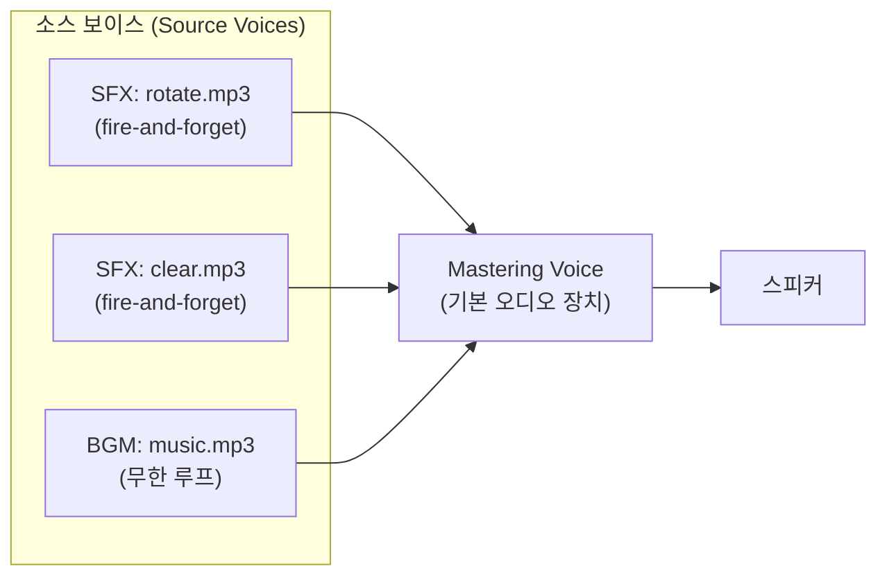
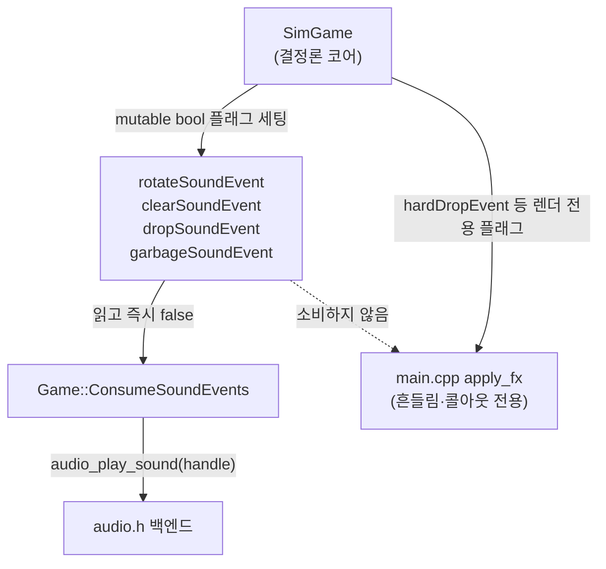
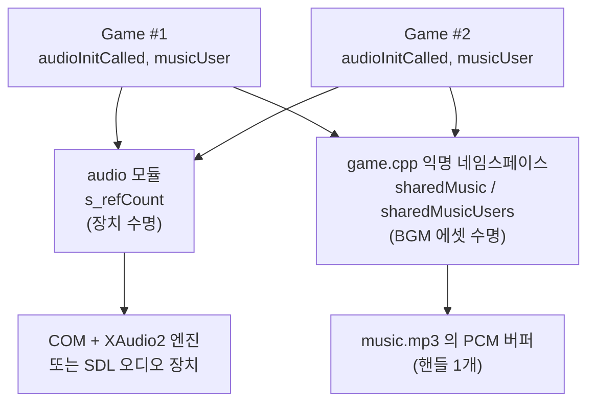
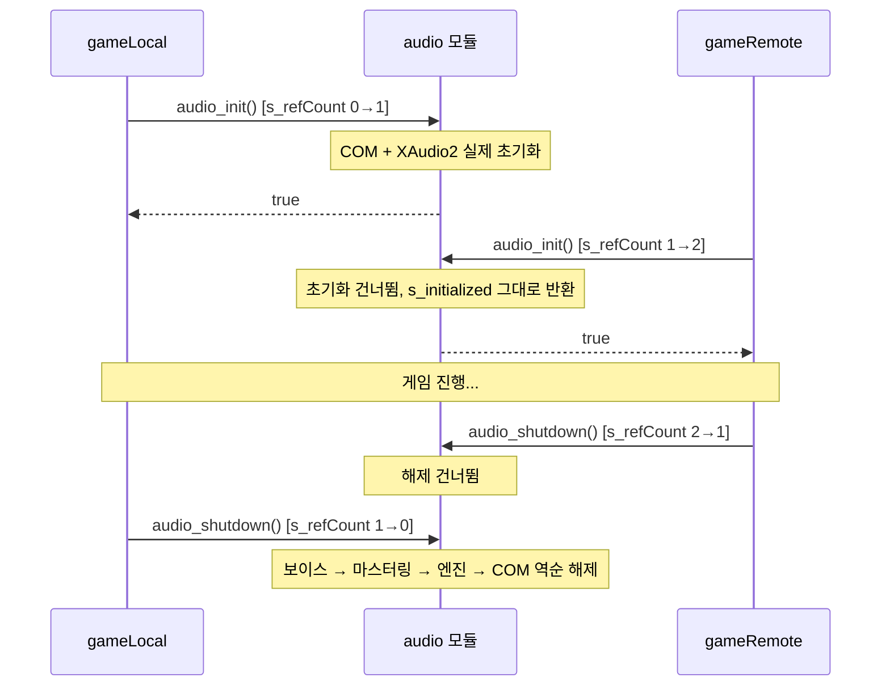
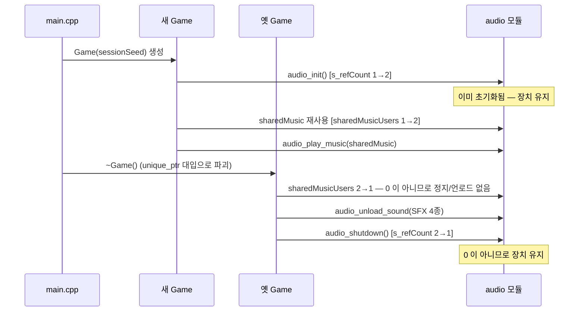
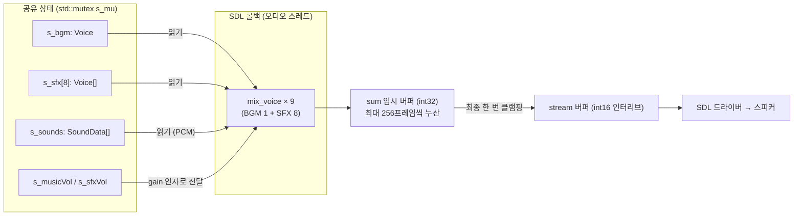
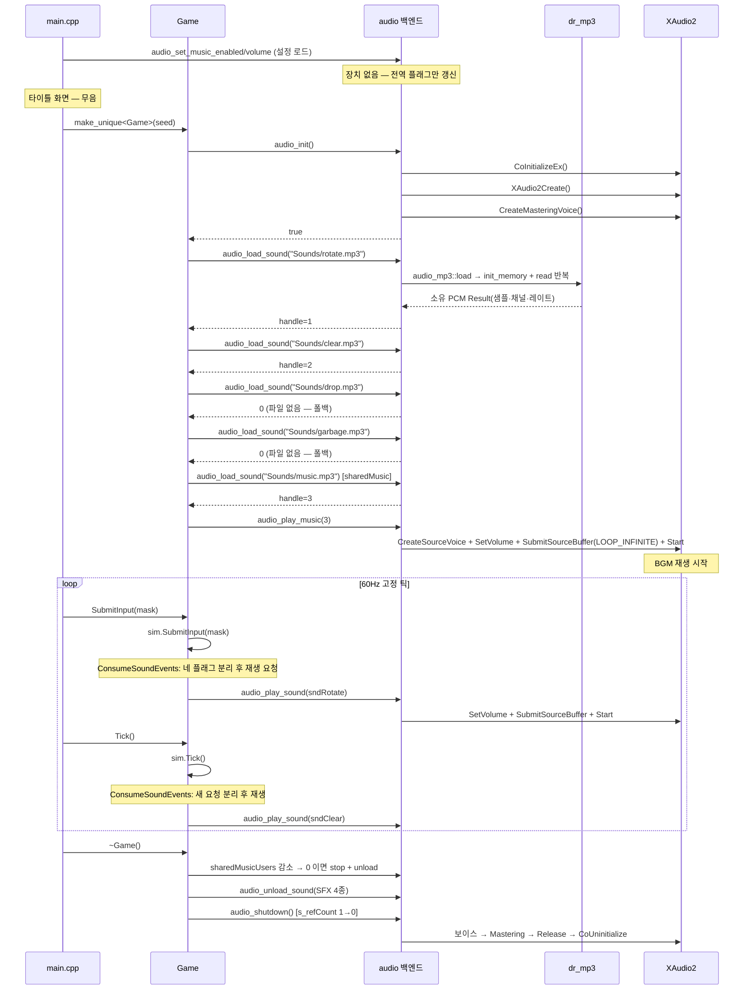

# Part 5: 오디오 계층 — XAudio2와 SDL2

> **시리즈:** 제로부터 멀티플레이어 테트리스 + RL | [시리즈 목차](./README.md) | **Part 5**

---

## 이번 Part의 구현 계약

- **선행 상태:** Part 4 의 `Game` 이 `SimGame` 을 소유하고 60 Hz 고정 틱으로 `SubmitInput`/`Tick` 을 호출한다. `src/game.{h,cpp}` 와 `src/main.cpp` 가 존재한다.
- **이번 Part의 파일:** `audio/audio.h`(공통 인터페이스), `audio/audio.cpp`(Windows/XAudio2), `audio/sdl_audio.cpp`(SDL2), `audio/mp3_decode.h`·`audio/mp3_decode.cpp`(공통 파일/CPU 디코더), `audio/pcm_layout.h`(PCM 크기 계약), `audio/voice_order.h`(풀의 시작 순서), `third_party/dr_mp3.h`(벤더링). 기존 `src/game.{h,cpp}` 와 `src/sim_game.{h,cpp}` 에 이벤트 플래그와 오디오 핸들을 추가한다. `CMakeLists.txt` 에 오디오 백엔드 분기를 넣는다.
- **연결점:** `SimGame` 은 재생 API 를 호출하지 않고 `mutable bool` 이벤트 플래그만 세운다. 그 플래그를 소비해 `audio_play_sound` 를 부르는 것은 `Game::SubmitInput`, `Game::Tick`, `Game::MoveBlockDown`이 호출하는 `ConsumeSoundEvents`다. 화면 흔들림·콜아웃을 담당하는 `main.cpp` 의 `apply_fx` 람다는 오디오를 전혀 건드리지 않는다.
- **완료 게이트:** 오디오 장치나 MP3 파일이 없어도 게임이 정상 실행되고, 정상 환경에서는 게임 모드에 진입하는 순간 BGM 이 시작되며 회전·하드드롭·라인 클리어·가비지 수신 효과음이 중복 없이 재생돼야 한다. 게임 재시작(R)에서는 장치와 공유 BGM PCM을 재사용하고, 재생 요청에 따라 곡을 처음부터 시작한다.

## 들어가며

완성형 엔진에서 효과음 하나를 재생하는 것은 대개 인스펙터에서 클립을 끌어다 놓고 함수 하나를 부르는 일이다. 그보다 한 단계 낮은 기성 게임 프레임워크에서도 세 줄이면 끝난다:

**예시(실제 저장소에는 없음)**

```cpp
audio_device_open();
sound rotate = sound_load("Sounds/rotate.mp3");
sound_play(rotate);
```

이 세 줄이 실제로 하는 일은 다음과 같다:

1. OS 의 오디오 하드웨어에 접근하기 위해 런타임(Windows 라면 COM)을 초기화하고
2. MP3 바이너리를 PCM 샘플로 디코딩하고
3. 디코딩된 PCM 데이터를 오디오 그래프의 소스 노드에 제출해 스피커로 출력한다

그런 프레임워크 내부에서는 단일 헤더 믹서 라이브러리가 이 과정을 처리하고, 그 라이브러리가 다시 플랫폼별 백엔드(Windows: WASAPI, macOS: Core Audio, Linux: PulseAudio/ALSA)를 추상화한다. 결국 "장치를 연다" 는 한 줄은 OS 오디오 서브시스템 전체를 초기화하는 것이다.

이 장에서는 Windows 의 네이티브 오디오 API 인 **XAudio2** 를 직접 사용해 같은 기능을 구현한다. [Part 2](./part2-platform-window-input.md) 에서 "창을 하나 연다" 는 한 줄을 Win32 API 로 풀어냈듯, 여기서는 위의 세 줄 — 장치 초기화·로드·재생 — 을 XAudio2 + dr_mp3 로 풀어낸다. 뒤이어 Linux/macOS 이식을 위한 **SDL2 오디오 백엔드**(`audio/sdl_audio.cpp`)를 같은 `audio.h` 인터페이스에 맞춰 구현한다. 두 백엔드는 빌드 타임에 선택되며, 위쪽 게임 코드는 한 줄도 바뀌지 않는다.

인터페이스 파일 전체가 이 장의 계약이다.

**현재 소스 발췌 — `audio/audio.h`**

```cpp
#pragma once

// audio/audio.h -- platform-independent client audio API.
// Implemented by audio/audio.cpp (Windows XAudio2 + dr_mp3) or
// audio/sdl_audio.cpp (SDL callback mixer + dr_mp3), selected by the build.
// Game owns loaded handles; SimGame does not call this API.

// 오디오 핸들 (내부 인덱스). 0 = 무효.
using AudioHandle = int;

// 선택된 오디오 백엔드 초기화.
// 참조 카운팅: 여러 번 호출해도 안전 (첫 호출만 실제 초기화).
// 실패 시 false. 성공 여부와 관계없이 각 호출을 audio_shutdown과 짝짓는다.
bool audio_init();

// 선택된 오디오 백엔드 종료. 참조 카운팅: 마지막 호출만 실제 해제.
void audio_shutdown();

// MP3 파일을 PCM으로 디코딩하여 메모리에 로드.
// 반환: 핸들 (0이면 실패 -- 파일 없음 등. 게임은 계속 진행).
AudioHandle audio_load_sound(const char* filepath);

// 로드된 사운드 해제.
void audio_unload_sound(AudioHandle handle);

// SFX 재생 (fire-and-forget). 같은 사운드를 동시에 여러 번 재생 가능.
void audio_play_sound(AudioHandle handle);

// BGM 재생 (루프). 이전 BGM은 자동 정지.
void audio_play_music(AudioHandle handle);

// BGM 정지.
void audio_stop_music();

// ─── 설정 토글 (렌더/오디오 전용 — SimGame/결정성 해시와 무관) ──────────────────
// BGM on/off. off: 음악 보이스 정지. on: 마지막으로 재생한 음악을 다시 재생.
// 내부에 s_musicEnabled + 마지막 음악 핸들을 기억해 on 시 자동 복원한다.
void audio_set_music_enabled(bool on);

// SFX on/off. off: audio_play_sound 가 no-op 이 된다.
void audio_set_sfx_enabled(bool on);

// ─── 볼륨 (0.0~1.0, 설정 화면 슬라이더가 구동) ─────────────────────────────────
// BGM 볼륨. 0 == 음소거. 믹스 시점에 음악 샘플에 이 게인을 곱한다.
void audio_set_music_volume(float v01);

// SFX 볼륨. 0 == 음소거. 재생되는 각 효과음에 이 게인을 곱한다.
void audio_set_sfx_volume(float v01);
```

공개 API는 초기화·수명, 효과음·음악 재생, 토글·볼륨 설정으로 나뉜다. 설정 화면은 설정 세터를 호출하고 `settings.cfg`에 값을 보존할 뿐 오디오 내부를 알지 않는다. 게인은 `mix_voice` 시그니처와 `SetVolume` 호출에 이미 들어가 있으므로 백엔드 계약의 일부다. 함수가 추가되어도 이 책임 분류와 백엔드 간 동일 시그니처가 검토 기준이다.

---

## 1. XAudio2 아키텍처 개요

> **어느 백엔드가 실제로 빌드되는가.** 이 장은 XAudio2 를 "OS 오디오를 직접 다루면 무엇이 일어나는가" 의 교재로 깊게 다루지만, **기본 빌드 대상은 플랫폼마다 다르다.** `CMakeLists.txt` 의 `TETRIS_USE_SDL2` 옵션이 non-Windows(Linux/macOS) 에서는 **기본 ON** 이라, 그쪽 독자가 그대로 빌드하면 컴파일되는 파일은 `audio/audio.cpp`(XAudio2) 가 아니라 `audio/sdl_audio.cpp`(SDL2) 다. XAudio2 경로는 **Windows 에서 `TETRIS_USE_SDL2=OFF`(Windows 기본값) 인 "Handmade" 빌드** 일 때만 컴파일된다. 즉 §1~§7 의 XAudio2 코드는 Windows-Handmade 전용 구현이고, §8 이후의 SDL2 백엔드가 사실상 크로스플랫폼 기본이다. 두 백엔드는 모두 같은 `audio.h` 인터페이스를 구현하며, 빌드 시스템이 둘 중 하나만 컴파일 대상에 넣는다(§11).

### 1.1 오디오 그래프

XAudio2 는 **오디오 그래프**(audio graph) 모델을 사용한다. 데이터는 소스(Source Voice)에서 출발해 중간 처리 노드(Submix Voice)를 거쳐 최종 출력(Mastering Voice)으로 흐른다. 이 프로젝트에서는 Submix Voice 없이 Source Voice 에서 Mastering Voice 로 직접 연결한다.


```mermaid
graph LR
    subgraph "소스 보이스 (Source Voices)"
        S1["SFX: rotate.mp3<br/>(fire-and-forget)"]
        S2["SFX: clear.mp3<br/>(fire-and-forget)"]
        S3["BGM: music.mp3<br/>(무한 루프)"]
    end

    M["Mastering Voice<br/>(기본 오디오 장치)"]
    SPK["스피커"]

    S1 --> M
    S2 --> M
    S3 --> M
    M --> SPK
```

**Source Voice**: PCM 데이터를 받아 재생하는 노드. 효과음(SFX)마다 하나, 배경 음악(BGM)에 하나.

**Mastering Voice**: 모든 소스 보이스의 출력을 믹싱해 OS 의 기본 오디오 출력 장치로 보낸다. 애플리케이션당 보통 하나.

이 구조는 [Part 3](./part3-rendering-and-ui.md) 의 렌더 파이프라인과 정확히 같은 3 단이다.

| GL 렌더러 (Part 3) | XAudio2 (Part 5) | 하는 일 |
|---|---|---|
| `glb_rect` — 개별 도형을 정점으로 제출 | Source Voice — 개별 소리를 제출 | 소스 하나를 공용 버퍼에 얹는다 |
| `s_verts` — 정점 배치 버퍼 | Mastering Voice — 믹스 버스 | 여러 소스가 한 버퍼에 누적된다 |
| `glb_flush` + `platform_present` — draw call 과 버퍼 스왑 | Mastering Voice → 기본 장치 | 합쳐진 결과를 장치로 내보낸다 |

렌더러와 오디오는 개별 자료를 모아 장치에 전달한다는 책임 분해를 비교할 수 있다. 렌더러는 정점과 그리기 명령을 준비하고, 이 SDL 오디오 백엔드는 시간별 샘플을 CPU에서 합산한다. 오디오 경로는 mix_voice의 int32 누산 → 최종 int16 출력 → SDL 장치 전달이다. XAudio2는 보이스 그래프 내부에서 합성과 출력을 처리한다.

### 1.2 COM 초기화

XAudio2 엔진을 사용하기 전에 호출 스레드에서 COM(Component Object Model) 초기화를 준비한다. 엔진은 `Release()`로 정리하고 Source/Mastering Voice는 각각 `DestroyVoice()`로 정리한다. 보이스 전체를 COM 객체처럼 `Release()`하는 구조가 아니다.

`CoInitializeEx(nullptr, COINIT_MULTITHREADED)`는 **이 함수를 호출한 스레드**의 COM 모델을 MTA로 요청한다. XAudio2 내부 워커의 모델을 외부에서 지정하는 호출이 아니다. 현재 API는 초기화·재생 제어·최종 종료를 같은 메인 스레드에서 직렬 호출한다. 이 계약 덕분에 COM 횟수의 짝도 같은 스레드에서 맞춘다. STA라는 이유만으로 교착을 단정하지 않는다.

`CoInitializeEx` 의 반환값 처리:

| HRESULT | 의미 | 대응 |
|---------|------|------|
| `S_OK` | 정상 초기화 | 진행, `s_comOwned = true` |
| `S_FALSE` | 호출 스레드가 이미 같은 모델로 초기화됨 | 진행, `s_comOwned = true` (짝을 맞춰 `CoUninitialize` 필요) |
| `RPC_E_CHANGED_MODE` | 호출 스레드의 모델과 요청이 호환되지 않음 | 기존 모델을 유지하며 엔진 생성 시도, `s_comOwned = false` |
| 그 외 실패 | COM 자체 불가 | `s_initialized = false` 후 `false` 반환 |

`S_OK`와 `S_FALSE`는 모두 성공이며, 이번 호출마다 `CoUninitialize()` 한 번을 같은 스레드에서 대응시킨다. 예를 들어 호스트가 이미 한 번 초기화한 뒤 오디오가 `S_FALSE`를 받으면 오디오 종료는 자기 성공 한 번만 되돌린다. `RPC_E_CHANGED_MODE`는 성공 횟수를 늘리지 않으므로 오디오가 해제할 몫도 없다. 이미 설정된 모델을 그대로 두고 XAudio2 생성을 시도하는 것이 이 구현의 정책이며, 생성 성공은 별도로 검사한다. 모델 불일치 외에도 NTA 전환 이력에 의해 이 오류가 발생할 수 있다.

반환값과 짝 맞추기 규칙은 [Microsoft CoInitializeEx 계약](https://learn.microsoft.com/en-us/windows/win32/api/combaseapi/nf-combaseapi-coinitializeex)을 참고한다.

### 1.3 XAudio2 엔진과 마스터링 보이스

COM 초기화 이후 XAudio2 엔진을 생성하고 마스터링 보이스를 만든다. 아래가 `audio_init` 전문이다.

**현재 소스 발췌 — `audio/audio.cpp`**

```cpp
bool audio_init()
{
    // 참조 카운팅: 이미 초기화되었으면 카운트만 증가
    if (s_refCount > 0)
    {
        ++s_refCount;
        return s_initialized;
    }
    ++s_refCount;

    s_failureNotices.reset();

    // Allocate the sentinel before owning COM or audio graph resources.
    try {
        s_sounds.clear();
        s_sounds.push_back(SoundData{{}, {}, false});
    } catch (const std::bad_alloc&) {
        return false;
    } catch (const std::length_error&) {
        return false;
    }

    // 호출 스레드의 COM 초기화. 같은 모델로 이미 초기화됐다면 S_FALSE.
    HRESULT hr = CoInitializeEx(nullptr, COINIT_MULTITHREADED);
    if (hr == S_OK)
    {
        s_comOwned = true;
    }
    else if (hr == S_FALSE)
    {
        // 호출한 이 스레드가 같은 모델로 이미 초기화됨. 이번 성공도 해제와 짝짓는다.
        s_comOwned = true;  // CoUninitialize 호출 필요 (S_FALSE 도 짝 맞춰야 함)
    }
    else if (hr == RPC_E_CHANGED_MODE)
    {
        // 호출 스레드의 모델을 바꾸지 않고 엔진 생성을 시도한다. 성공 여부는 아래에서 검사.
        fprintf(stderr, "[audio] COM already initialized with different threading model\n");
        s_comOwned = false;
    }
    else
    {
        fprintf(stderr, "[audio] CoInitializeEx failed: 0x%08lx\n", static_cast<unsigned long>(hr));
        s_initialized = false;
        return false;
    }

    // XAudio2 엔진 생성
    hr = XAudio2Create(&s_xaudio, 0, XAUDIO2_DEFAULT_PROCESSOR);
    if (FAILED(hr))
    {
        fprintf(stderr, "[audio] XAudio2Create failed: 0x%08lx\n", static_cast<unsigned long>(hr));
        if (s_comOwned) CoUninitialize();
        s_comOwned = false;
        s_initialized = false;
        return false;
    }

    // 마스터링 보이스 생성 (기본 오디오 출력 장치)
    hr = s_xaudio->CreateMasteringVoice(&s_masterVoice);
    if (FAILED(hr))
    {
        fprintf(stderr, "[audio] CreateMasteringVoice failed: 0x%08lx\n", static_cast<unsigned long>(hr));
        s_xaudio->Release();
        s_xaudio = nullptr;
        if (s_comOwned) CoUninitialize();
        s_comOwned = false;
        s_initialized = false;
        return false;
    }


    s_sfxOrder.reset();
    s_initialized = true;
    return true;
}
```

XAudio2 2.8 이상에서는 `XAudio2Create`라는 일반 생성 함수를 사용하며, 이전 버전의 CLSID/`CoCreateInstance` 생성 경로와 구별한다. `XAUDIO2_DEFAULT_PROCESSOR`는 SDK가 정한 기본 프로세서 정책을 선택한다. 인자 없이 `CreateMasteringVoice`를 호출하면 기본 출력 장치를 대상으로 마스터링 보이스를 만든다. 버전별 차이는 [Microsoft XAudio2 버전 문서](https://learn.microsoft.com/en-us/windows/win32/xaudio2/xaudio2-versions)에 정리되어 있다.

실패 경로마다 그 앞 단계를 정확히 되감는다는 점을 보라. `XAudio2Create` 가 실패하면 COM 만 되돌리고, `CreateMasteringVoice` 가 실패하면 엔진 `Release()` 후 COM 을 되돌린다. 이 "역순 되감기" 는 §13.3 의 종료 순서와 같은 원칙이다.

플랫폼 계층(Part 2)의 초기화와 나란히 놓으면 대응이 분명하다.

| 플랫폼 계층 (Part 2/3) | XAudio2 (Part 5) | 공통점 |
|---|---|---|
| `platform_init` — 창 생성 + GL 컨텍스트 획득 | `XAudio2Create` — 엔진 인스턴스 획득 | OS 서브시스템 핸들을 잡는다 |
| `renderer_init` — 셰이더 프로그램과 정점 버퍼 확보 | `CreateMasteringVoice` — 믹스 버스 확보 | 우리가 채울 출력 경로를 만든다 |
| `platform_present` — 백버퍼를 창에 스왑 | Mastering Voice → 기본 장치 | 완성된 버퍼를 장치로 밀어낸다 |

`platform/platform.h` 의 `platform_init` 주석은 "윈도우와 입력/타이머 백엔드 초기화. OpenGL 3.3 Core 컨텍스트를 함께 만든다" 라고 적어 둔다. 즉 이 프로젝트에서 장치 컨텍스트를 잡는 초기화는 창/GL 쪽과 오디오 쪽 **두 군데뿐**이다. 다만 대칭은 여기까지다 — GL 컨텍스트는 없으면 그릴 방법이 아예 없어서 즉시 실패하는 반면, 오디오는 장치를 못 잡아도 무음으로 계속 돈다.

### 1.4 내부 상태

XAudio2 백엔드가 들고 있는 전역은 다음과 같다. 전부가 이 한 화면에 들어온다는 사실 자체가 이 백엔드의 크기를 보여준다.

**현재 소스 발췌 — `audio/audio.cpp`**

```cpp
struct SoundData
{
    std::vector<uint8_t> pcmData;  // 디코딩된 PCM 샘플 (signed 16-bit)
    WAVEFORMATEX         format;   // 채널, 샘플레이트, 비트
    bool                 valid;
};

static bool                      s_initialized  = false;
static int                       s_refCount     = 0;
static bool                      s_comOwned     = false;  // 우리가 CoInitialize 했는가?
static IXAudio2*                 s_xaudio       = nullptr;
static IXAudio2MasteringVoice*   s_masterVoice  = nullptr;

// 사운드 저장소. 인덱스 0 은 무효 (sentinel).
static std::vector<SoundData>    s_sounds;

// BGM 전용 보이스
static AudioHandle               s_currentMusic = 0;
static IXAudio2SourceVoice*      s_musicVoice   = nullptr;

// 설정 토글 (렌더/오디오 전용 — SimGame/결정성과 무관).
static bool                      s_musicEnabled = true;
static bool                      s_sfxEnabled   = true;
static AudioHandle               s_lastMusic    = 0;  // 마지막 요청 BGM (off→on 복원용)

// 카테고리별 볼륨 (0.0~1.0). 설정 슬라이더가 구동. 음악은 음악 보이스에
// SetVolume, SFX 는 재생 시점에 각 소스 보이스에 SetVolume 로 적용한다.
static float                     s_musicVol     = 1.0f;
static float                     s_sfxVol       = 1.0f;

// SFX 보이스 풀
static constexpr int             MAX_SFX_VOICES = 8;
static audio_pool::VoiceOrder<MAX_SFX_VOICES> s_sfxOrder;
static IXAudio2SourceVoice*      s_sfxVoices[MAX_SFX_VOICES] = {};
static WAVEFORMATEX              s_sfxFormats[MAX_SFX_VOICES] = {};
// 각 보이스가 지금 어느 핸들의 PCM 을 물고 있는지. XAudio2 는 SubmitSourceBuffer 에
// 넘긴 포인터를 재생이 끝날 때까지 그대로 참조하므로, 언로드 시 그 버퍼를
// 해제하기 전에 해당 보이스를 먼저 멈춰야 한다.
static AudioHandle               s_sfxHandles[MAX_SFX_VOICES] = {};
```

참조 카운트 심볼의 이름은 `s_refCount` 다. 이 파일과 `audio/sdl_audio.cpp` 양쪽에 같은 이름으로 존재하며, 두 백엔드의 수명 계약이 동일하다는 표시다(§5).

마지막 `s_sfxHandles` 는 언로드 안전용 추적 배열이다. 재생 API 를 읽을 때는 "슬롯이 어느 사운드를 물고 있는지 적어 둔다" 정도만 알면 되고, 이 배열이 왜 필요해졌는지 — 없던 시절에 어떤 use-after-free 가 숨어 있었는지 — 는 §13.5 가 다룬다.

`s_musicEnabled` / `s_sfxEnabled` / `s_musicVol` / `s_sfxVol` 네 개가 §9 의 설정 API 가 조작하는 상태다. `s_lastMusic` 은 "BGM 을 껐다 켰을 때 무엇을 다시 틀지" 를 기억하는 슬롯이다.

---

## 2. MP3 디코딩

### 2.1 왜 디코딩이 필요한가

이 프로젝트의 XAudio2 Source Voice에는 **signed 16-bit PCM**을 제출한다. MP3 파일 바이트를 이 경로에 바로 제출하지 않고 먼저 디코딩한다. XAudio2 전체의 지원 형식을 PCM 하나로 한정하는 설명은 아니다.

PCM(Pulse-Code Modulation)은 일정 시간 간격의 진폭 표본으로 소리를 표현한다. 아날로그 입력에서 표본을 얻을 수도 있고, 프로그램이 파형 값을 직접 계산할 수도 있다. 여기서 쓰는 signed 16-bit 정수 PCM은 진폭을 -32768~32767의 65,536단계로 표현하고 0을 중심으로 둔다. 시간축의 표본화와 진폭축의 양자화는 서로 다른 과정이다.

**샘플은 한 채널의 값, PCM 프레임은 같은 시각의 모든 채널 값**이다. 스테레오 인터리브는 `L0, R0, L1, R1, ...` 순서다. `sampleRate=44100`은 채널당 초당 44,100샘플이며 초당 44,100프레임이다. 두 채널의 스칼라 샘플을 합하면 초당 88,200개다. 게임의 화면 프레임이나 MP3 압축 프레임과 단위가 다르다.

$$\text{PCM 데이터 크기} = \text{채널 수} \times \text{샘플 레이트} \times \frac{\text{비트 깊이}}{8} \times \text{재생 시간(초)}$$

예: 스테레오, 44100 Hz, 16 비트, 3 분 = $2 \times 44100 \times 2 \times 180 \approx 31.7\text{MB}$

위 계산은 헤더를 제외한 PCM 페이로드의 크기다. 정확히 31,752,000바이트로, 십진 MB로 약 31.75 MB, 이진 MiB로 약 30.28 MiB다. MP3의 파일 크기는 압축 비트레이트와 길이 등에 따라 달라지므로 고정된 배율로 환산할 수 없다.

`N`프레임, `C`채널에서 signed16 데이터는 `N*C`샘플, `N*C*2`바이트다. 재생 시간은 `N/sampleRate`초다. 예를 들어 48 kHz 스테레오 480프레임은 10 ms, 960샘플, 1,920바이트다. 마지막 시각의 표본 위치 `(N-1)/sampleRate`와 버퍼가 소비되는 기간 `N/sampleRate`도 구별한다.

### 2.1.1 포맷 정보와 크기 경계

배열만으로는 채널 수와 시간 기준을 알 수 없다. SDL의 `SoundData`는 `vector<int16_t>`와 channels/sampleRate를, Windows는 바이트 배열과 WAVEFORMATEX를 함께 보관한다. `nBlockAlign`은 한 PCM 프레임의 바이트 수, `nAvgBytesPerSec`은 초당 바이트 수다. [WAVEFORMATEX 계약](https://learn.microsoft.com/en-us/windows/win32/api/mmeapi/ns-mmeapi-waveformatex)의 블록 배수 조건에 맞춰 완성 프레임만 전달한다.

공통 `audio/pcm_layout.h`는 **곱셈 전에** `frames <= max_bytes/(channels*2)`를 확인하고 size_t로 변환한다. 채널 1~2, 레이트 8,000~192,000 Hz는 이 로더의 지원 정책이다. SDL의 int 바이트 길이와 XAudio2의 XAUDIO2_MAX_BUFFER_BYTES를 각각 호출 인자로 넘겨, 큰 길이를 작은 타입으로 먼저 잘라 검사하는 오류를 막는다. 이는 디코딩된 결과의 복사·API 제출 경계다. 그 앞의 공통 MP3 로더는 압축 입력과 누적 PCM에 별도의 바이트 예산을 적용한다(§2.3). 전체 프로세스의 메모리·CPU 상한과는 구별한다.

SDL 변환 결과도 프레임 크기의 배수인지 확인한다. [SDL_AudioStreamGet](https://wiki.libsdl.org/SDL2/SDL_AudioStreamGet)의 반환값은 실제 읽은 바이트 수 또는 오류 -1이다. 요청한 길이와 다르면 완성 SoundData로 등록하지 않는다. 레이트 값만 바꾸면 같은 배열의 소비 속도가 달라지며, 같은 시간의 신호를 다른 레이트로 표현하려면 새 시각의 샘플 값을 계산하는 리샘플링이 필요하다.

### 2.2 MP3 비트스트림이 실제로 어떻게 생겼는가

디코딩을 라이브러리에 맡기더라도 **왜 API 가 그런 모양인지**는 포맷에서 나온다. MPEG-1 Layer III 비트스트림은 프레임의 연속이고, 프레임 하나는 이렇게 생겼다.

```text
+----------------+----------+---------------------+---------------------------+
| header 4 bytes | CRC 0/2  | side info 17 or 32B | main_data (가변 길이)     |
+----------------+----------+---------------------+---------------------------+
 ^ sync 11bit                 ^ mono=17, stereo=32   ^ 허프만 코드 + scalefactor
   version/layer/bitrate
   samplerate/channel mode
```

여기서 셋을 기억하면 된다.

**1) 샘플레이트와 채널 수는 헤더에 있다 — 그래서 "파일을 열기 전에는" 모른다.** 4 바이트 헤더 안에 샘플레이트 인덱스와 채널 모드(stereo / joint stereo / dual / mono)가 들어 있다. 파일 확장자나 크기로는 알 수 없고, 첫 유효 프레임 헤더를 만나야 확정된다. dr_mp3 의 API 가 `drmp3_config` 를 **입력이 아니라 출력 파라미터**로 받는 이유가 이것이다. 현재 공통 로더는 `drmp3_init_memory` 성공 후 디코더의 channels/sampleRate를 읽는다. 한 번에 읽는 편의 API에서는 이 정보가 cfg 출력 인자로 전달된다.

**2) MPEG-1 Layer III 압축 프레임 하나는 채널당 1152샘플에 대응한다.** 그래뉼(granule) 2개 × 채널당 576샘플이다. PCM 프레임 단위로는 1152이며, 스테레오 스칼라 값은 2304개다. 디코더의 지연·패딩 제거에 따라 API에서 얻는 전체 프레임 수는 압축 프레임 개수에 1152를 곱한 것과 다를 수 있다. 44.1 kHz 기준 프레임 하나가 약 26.1 ms 다. 우리가 SDL 백엔드에서 쓰는 콜백 블록 1024 프레임(약 23.2 ms)과 비슷한 크기라는 점이 우연히 재미있는데, 둘은 전혀 다른 개념이다 — 전자는 압축 단위, 후자는 출력 버퍼 단위다.

**3) 비트 리저버(bit reservoir) 때문에 프레임은 독립적이지 않다.** Layer III 는 비트를 아껴 쓴 프레임이 남긴 여유 공간을 뒤 프레임이 빌려 쓸 수 있다. 즉 프레임 N 의 `main_data` 가 물리적으로는 프레임 N-1, N-2 의 바이트 영역에 놓일 수 있다. 결과적으로 **임의 지점으로 seek 해서 곧바로 정확히 디코딩할 수 없다.** 앞쪽 프레임 몇 개를 먼저 흘려 디코딩해야 상태가 맞는다. 스트리밍 재생이 "그냥 필요한 만큼만 읽으면 되는" 단순한 일이 아닌 이유이고, §6 에서 전체 디코드를 고른 근거와 직접 연결된다.

여기에 허프만 디코딩 → 역양자화 → 스테레오 디코딩 → 앨리어싱 저감 → IMDCT → 합성 필터뱅크가 프레임마다 돈다. 마지막 두 단계는 부동소수 연산이 지배적이고, CPU 사용량이 프레임마다 균일하지 않다(비트 리저버 사용량에 따라 다르다). 실시간 오디오 콜백 안에서 돌리기 껄끄러운 성질이다.

### 2.3 dr_mp3 — 단일 헤더 디코더

디코딩에는 [dr_mp3](https://github.com/mackron/dr_libs) 를 사용한다. David Reid 가 작성한 단일 헤더 라이브러리(public domain)로, minimp3 를 기반으로 한다. 사용법은 stb_image 와 동일한 패턴이다. **정확히 하나의** `.cpp` 파일에서 구현부를 활성화한다.

**현재 소스 발췌 — `audio/mp3_decode.cpp`**

```cpp
#define DR_MP3_IMPLEMENTATION
#include "../third_party/dr_mp3.h"
```

로드 함수 전체는 다음과 같다.

**현재 소스 발췌 — `audio/audio.cpp`**

```cpp
AudioHandle audio_load_sound(const char* filepath)
{
    if (!s_initialized || !filepath || !*filepath) return 0;

    try {
        auto pcm = audio_mp3::load(filepath);
        if (!pcm) {
            fprintf(stderr, "[audio] MP3 decode failed: %s (%s)\n",
                    filepath, audio_mp3::error_name(pcm.error));
            return 0;
        }

        // Frame to byte count is checked against the API limit and size_t range.
        const size_t frames = pcm.channels != 0
            ? pcm.samples.size() / pcm.channels : 0;
        const auto layout = audio_pcm::layout_s16(
            frames, pcm.channels, pcm.rate, XAUDIO2_MAX_BUFFER_BYTES);
        if (!layout) {
            fprintf(stderr, "[audio] Unsupported PCM layout: %s\n", filepath);
            return 0;
        }

        // SoundData store
        SoundData sd;
        sd.format = MakeWaveFormat(pcm.channels, pcm.rate);
        const size_t pcmBytes = layout->bytes;
        sd.pcmData.resize(pcmBytes);
        memcpy(sd.pcmData.data(), pcm.samples.data(), pcmBytes);
        sd.valid = true;

        if (s_sounds.size() >= static_cast<size_t>(std::numeric_limits<int>::max())) {
            fprintf(stderr, "[audio] Sound handle limit reached: %s\n", filepath);
            return 0;
        }
        // Store and return handle
        AudioHandle handle = static_cast<AudioHandle>(s_sounds.size());
        s_sounds.push_back(std::move(sd));
        return handle;
    } catch (const std::bad_alloc&) {
        fprintf(stderr, "[audio] allocation failed: %s\n", filepath);
        return 0;
    } catch (const std::length_error&) {
        fprintf(stderr, "[audio] PCM storage limit: %s\n", filepath);
        return 0;
    }
}
```

현재 `audio/audio.cpp`와 `audio/sdl_audio.cpp`는 `audio/mp3_decode.h`의 `audio_mp3::load`를 사용한다. 파일 읽기와 CPU 디코딩 구현은 `audio/mp3_decode.cpp`에 한 번만 컴파일한다. dr_mp3의 구현 매크로도 이 파일 하나에 둔다. 장치 API는 두 백엔드가 계속 담당한다.

공통 로더는 압축 입력을 기본 16 MiB로 제한하고 **읽기 버퍼 할당 전에** 파일 길이를 확인한다. 정확한 길이를 읽은 후 EOF/오류를 검사하며, 그 사이 파일이 커지거나 짧게 읽히면 io로 분류한다. FILE은 RAII로 닫는다. 이 로더는 seek 가능한 로컬 에셋 경로용이며 동시 작성된 파일의 일관된 스냅샷까지 보장하지 않는다.

`drmp3_init_memory`는 압축 바이트를 복사하지 않고 빌린다. 로더의 input vector가 살아 있는 동안 디코더를 사용하고, 성공한 초기화에는 반드시 `drmp3_uninit`을 대응시킨다. RAII 가드는 정상 종료·용량 거절·C++ 할당 예외에서 모두 실행된다. 빈 입력, 파일 I/O, 초기 디코딩 실패, 미지원 채널/레이트, 출력 예산 초과를 각각 결과 값으로 돌려준다.

디코딩은 고정 배열 4096 **샘플**에 조금씩 읽는다. 요청 프레임 수는 `4096/channels`이고 반환 프레임 수에 channels를 곱해 추가할 샘플 수를 얻는다. PCM 기본 예산은 64 MiB다. `added > maxSamples - currentSamples`를 **추가 전에** 검사한다. 한도를 넘으면 앞부분도 성공 결과로 반환하지 않고 후보를 버린다. vector capacity·재할당 중 일시 메모리·디코더 내부 공간·SDL 변환기까지 포함한 프로세스 전체 상한은 아니다.

완성된 Result는 vector<int16_t>를 소유한다. SDL의 같은 포맷 경로는 그 vector를 이동하고, 변환 경로는 unique_ptr로 SDL_AudioStream을 정리한다. Windows는 바이트 저장소에 복사한다. 백엔드의 후속 resize/push_back 실패도 잡아 핸들 0을 반환한다.

**디코더가 읽을 수 있는 표본이 있다는 것과 MP3 파일 전체의 무결성은 다르다.** 저장소에 포함된 dr_mp3는 잘린 파일의 디코딩 가능한 앞부분을 돌려줄 수 있고, read의 0 반환은 종료 원인을 세밀하게 분류하지 않는다. 이 결과 API는 빈 디코딩과 자원 한도를 처리하지만 모든 손상 입력을 엄격히 거절하는 검증기는 아니다. 배포 에셋의 해시는 별도의 완전성 확인 수단이다.

핸들은 `s_sounds` 의 인덱스이고, 인덱스 0 은 `audio_init` 이 넣은 sentinel 이라 **0 은 항상 무효**다. 이 규약 하나 덕에 "로드 실패 = 0 반환" 과 "재생 시 0 검사 = no-op" 이 자연스럽게 맞물린다(§10).

### 2.4 WAVEFORMATEX

디코딩된 PCM 의 포맷 정보는 XAudio2 의 `WAVEFORMATEX` 구조체로 전달한다.

**현재 소스 발췌 — `audio/audio.cpp`**

```cpp
static WAVEFORMATEX MakeWaveFormat(std::uint32_t channels, std::uint32_t sampleRate)
{
    WAVEFORMATEX wf = {};
    wf.wFormatTag      = WAVE_FORMAT_PCM;
    wf.nChannels       = static_cast<WORD>(channels);
    wf.nSamplesPerSec  = sampleRate;
    wf.wBitsPerSample  = 16;
    wf.nBlockAlign     = static_cast<WORD>(channels * 2);  // 16-bit = 2 bytes
    wf.nAvgBytesPerSec = sampleRate * wf.nBlockAlign;
    wf.cbSize          = 0;
    return wf;
}
```

| 필드 | 의미 | 예시 (스테레오, 44100 Hz) |
|------|------|--------------------------|
| `wFormatTag` | 포맷 종류 | `WAVE_FORMAT_PCM` (1) |
| `nChannels` | 채널 수 | 2 (스테레오) |
| `nSamplesPerSec` | 채널당 초당 샘플 수 (= 초당 PCM 프레임 수) | 44100 |
| `wBitsPerSample` | 샘플당 비트 수 | 16 |
| `nBlockAlign` | 한 샘플 프레임 바이트 | $2 \times 2 = 4$ |
| `nAvgBytesPerSec` | 초당 바이트 | $44100 \times 4 = 176400$ |

WAVEFORMATEX는 오디오 형식을 전달하는 API 구조체이며 WAV의 fmt 청크도 같은 종류의 형식 정보를 담는다. 구조체의 메모리를 파일 바이트와 항상 동일하다고 취급하지 않는다. 여기서는 검증된 디코더 출력의 channels/rate에서 필드를 계산하고 signed16 표현을 함께 지정한다.

### 2.5 왜 WAV 로 미리 변환하지 않았는가

대안으로 MP3 를 사전에 WAV 로 변환해두면 런타임 디코딩이 필요 없다. 그러나:

| | MP3 + dr_mp3 | 사전 변환 WAV |
|---|---|---|
| 저장소 크기 | 5.2 MB | ~50 MB |
| 바이너리 오버헤드 | ~100 KB (dr_mp3 코드) | 0 |
| 로딩 시간 | 수 ms~수백 ms (디코딩) | 수십 ms (읽기) |
| 빌드 파이프라인 | 없음 | 변환 스크립트 + 산출물 관리 |

저장소 크기 10 배 차이와 에셋 파이프라인 부재 대비 런타임 비용이 미미하므로, MP3 + dr_mp3 를 선택했다.

---

## 3. 소스 보이스와 재생

### 3.1 SFX: Fire-and-Forget 패턴

효과음(회전, 라인 클리어)은 짧고 자주 발생한다. 재생 요청 시:

1. **보이스 풀**에서 idle 보이스를 찾는다
2. PCM 데이터를 `XAUDIO2_BUFFER` 에 담아 제출한다
3. 재생을 시작한다
4. 재생이 끝나면 보이스는 자동으로 idle 상태로 돌아간다

실제 `audio_play_sound` 는 포맷 재사용·강제 선점·생성 실패 처리까지 포함해 조금 길다.

**현재 소스 발췌 — `audio/audio.cpp`**

```cpp
void audio_play_sound(AudioHandle handle)
{
    if (!s_initialized) return;
    if (!s_sfxEnabled) return;
    if (handle <= 0 || handle >= static_cast<int>(s_sounds.size())) return;
    if (!s_sounds[handle].valid) return;

    const SoundData& sd = s_sounds[handle];

    // 보이스 풀에서 idle 보이스 찾기
    int slot = -1;
    for (int i = 0; i < MAX_SFX_VOICES; ++i)
    {
        if (!s_sfxVoices[i])
        {
            // 빈 슬롯 — 보이스 생성
            slot = i;
            break;
        }
        XAUDIO2_VOICE_STATE state;
        s_sfxVoices[i]->GetState(&state, XAUDIO2_VOICE_NOSAMPLESPLAYED);
        if (state.BuffersQueued == 0)
        {
            // idle — 포맷 일치 확인
            if (FormatMatches(s_sfxFormats[i], sd.format))
            {
                slot = i;
                break;
            }
            // 포맷 불일치 — 파괴 후 재생성
            s_sfxVoices[i]->DestroyVoice();
            s_sfxVoices[i] = nullptr;
            s_sfxHandles[i] = 0;
            slot = i;
            break;
        }
    }

    // A full pool steals the oldest successful start, not a fixed index.
    if (slot == -1)
    {
        slot = static_cast<int>(s_sfxOrder.oldest());
        // Stop/Flush may still be pending on the audio thread. End the old
        // borrow before overwriting the only handle that tracks its PCM.
        s_sfxVoices[slot]->DestroyVoice();
        s_sfxVoices[slot] = nullptr;
        s_sfxFormats[slot] = {};
        s_sfxHandles[slot] = 0;
    }

    // 보이스가 없으면 생성
    if (!s_sfxVoices[slot])
    {
        HRESULT hr = s_xaudio->CreateSourceVoice(&s_sfxVoices[slot], &sd.format);
        if (FAILED(hr))
        {
            if (first_failure(PlaybackFailure::sfx_create))
                fprintf(stderr, "[audio] CreateSourceVoice failed: 0x%08lx\n", static_cast<unsigned long>(hr));
            return;
        }
        s_sfxFormats[slot] = sd.format;
    }

    // 버퍼 제출 및 재생
    XAUDIO2_BUFFER buf = {};
    buf.AudioBytes = static_cast<UINT32>(sd.pcmData.size());
    buf.pAudioData = sd.pcmData.data();
    buf.Flags      = XAUDIO2_END_OF_STREAM;

    s_sfxVoices[slot]->SetVolume(s_sfxVol);
    HRESULT hr = s_sfxVoices[slot]->SubmitSourceBuffer(&buf);
    if (SUCCEEDED(hr)) hr = s_sfxVoices[slot]->Start();
    if (FAILED(hr))
    {
        // Start can fail after submission, so release the borrow explicitly.
        s_sfxVoices[slot]->DestroyVoice();
        s_sfxVoices[slot] = nullptr;
        s_sfxFormats[slot] = {};
        s_sfxHandles[slot] = 0;
        if (first_failure(PlaybackFailure::sfx_start))
            fprintf(stderr, "[audio] SFX submit/start failed: 0x%08lx\n", static_cast<unsigned long>(hr));
        return;
    }
    s_sfxHandles[slot] = handle;
    s_sfxOrder.mark_started(static_cast<size_t>(slot));
}
```

**두 번째 줄 `if (!s_sfxEnabled) return;`** 이 SFX 토글의 전부다. 켜고 끄는 상태를 재생 지점 한 곳에서만 검사하니, 호출부(즉 `Game`)는 토글의 존재를 모른다.

**버퍼 제출 직전의 `SetVolume(s_sfxVol)`** 이 SFX 볼륨의 전부다. 슬롯을 확보한 직후, 버퍼를 제출하기 **전에** 게인을 건다. 슬롯은 재사용되므로 매 재생마다 다시 걸어야 한다. 뒤집어 말하면 `audio_set_sfx_enabled` 와 `audio_set_sfx_volume` 은 **전역 기본값만** 갱신하며 이미 울리고 있는 보이스는 건드리지 않는다 — 새 값은 다음 `audio_play_sound` 부터 적용된다. 살아 있는 보이스에 즉시 반영되는 것은 음악 볼륨뿐이다(§9.3).

**왜 보이스 풀인가?** `CreateSourceVoice` 는 내부적으로 메모리 할당과 DSP 그래프 노드 생성을 수반한다. 재생할 때마다 생성/파괴하면 **마이크로 히칭**(micro-hitching)이 발생할 수 있다. 8 개의 보이스를 만들어 재사용하면 이 비용이 사라진다(§7).

**`XAUDIO2_VOICE_NOSAMPLESPLAYED`**: `GetState` 에서 재생된 샘플 수를 계산하지 않는 플래그. "재생 중인가?" 만 알면 되므로 불필요한 계산을 건너뛴다.

**모든 보이스가 바쁘면?** 가장 오래된 시작을 골라 기존 보이스의 대여를 끝낸 뒤 새 재생을 준비한다. 포화 빈도와 잘림의 청감 영향은 음원 길이·요청 밀도·콘텐츠에 따라 달라지므로 실제 플레이로 평가한다.

### 3.2 BGM: 무한 루프와 토글의 분리

배경 음악은 별도의 Source Voice 로 관리한다. 여기서 코드가 두 함수로 **쪼개져 있다**는 점이 중요하다. "실제로 보이스를 만들어 트는 일" 과 "무엇을 틀지 결정하는 일" 이 분리돼 있다.

**현재 소스 발췌 — `audio/audio.cpp`**

```cpp
static void start_music_voice(AudioHandle handle)
{
    if (!s_initialized) return;
    if (handle <= 0 || handle >= static_cast<int>(s_sounds.size())) return;
    if (!s_sounds[handle].valid) return;

    const SoundData& sd = s_sounds[handle];

    // 새 소스 보이스 생성
    HRESULT hr = s_xaudio->CreateSourceVoice(&s_musicVoice, &sd.format);
    if (FAILED(hr))
    {
        if (first_failure(PlaybackFailure::music_create))
            fprintf(stderr, "[audio] CreateSourceVoice (music) failed: 0x%08lx\n", static_cast<unsigned long>(hr));
        return;
    }

    // 무한 루프 버퍼 제출
    XAUDIO2_BUFFER buf = {};
    buf.AudioBytes = static_cast<UINT32>(sd.pcmData.size());
    buf.pAudioData = sd.pcmData.data();
    buf.Flags      = XAUDIO2_END_OF_STREAM;
    buf.LoopCount  = XAUDIO2_LOOP_INFINITE;

    s_musicVoice->SetVolume(s_musicVol);
    hr = s_musicVoice->SubmitSourceBuffer(&buf);
    if (SUCCEEDED(hr)) hr = s_musicVoice->Start();
    if (FAILED(hr))
    {
        // Submission may already have lent the PCM to the worker.
        s_musicVoice->DestroyVoice();
        s_musicVoice = nullptr;
        s_currentMusic = 0;
        if (first_failure(PlaybackFailure::music_start))
            fprintf(stderr, "[audio] Music submit/start failed: 0x%08lx\n",
                static_cast<unsigned long>(hr));
        return;
    }
    s_currentMusic = handle;
}
```

제출이나 시작의 실패도 검사한다. 특히 제출 성공 뒤 Start가 실패하면 OS가 PCM 주소를 이미 받았으므로 보이스를 파괴해 대여를 끝내고 `s_currentMusic`을 0으로 둔다. `s_lastMusic`은 사용자가 요청한 곡을 기억하므로 이후 off→on에서 다시 시도할 수 있다. 요청한 곡과 성공적으로 시작한 곡의 상태를 분리한 것이다.


**현재 소스 발췌 — `audio/audio.cpp`**

```cpp
void audio_play_music(AudioHandle handle)
{
    if (!s_initialized) return;
    if (handle <= 0 || handle >= static_cast<int>(s_sounds.size())) return;
    if (!s_sounds[handle].valid) return;

    // 기존 BGM 정지
    audio_stop_music();

    // off→on 복원을 위해 항상 마지막 요청 핸들을 기억하고,
    // 음악이 켜져 있을 때만 실제로 시작한다.
    s_lastMusic = handle;
    if (s_musicEnabled) start_music_voice(handle);
}

void audio_stop_music()
{
    if (s_musicVoice)
    {
        s_musicVoice->Stop();
        s_musicVoice->FlushSourceBuffers();
        s_musicVoice->DestroyVoice();
        s_musicVoice = nullptr;
    }
    s_currentMusic = 0;
    // 명시적 정지는 off→on 복원 대상도 지운다 (SDL 백엔드와 동일 의미).
    // 토글 off 경로(audio_set_music_enabled)는 여길 거치지 않아 복원이 유지된다.
    s_lastMusic = 0;
}
```

`XAUDIO2_LOOP_INFINITE`(255)는 XAudio2 가 버퍼 끝에 도달하면 자동으로 처음부터 다시 재생하게 한다. 이 방식이면 **게임 루프에서 별도의 `update()` 호출이 필요 없다**. 기성 프레임워크의 음악 재생은 대개 스트리밍 방식이라 매 프레임 "음악 갱신" 호출로 새 데이터를 채워 줘야 하지만, 여기서는 전체 PCM 을 프리로드하므로 한 번 제출하면 끝이다.

두 함수의 역할 분리를 정리하면:

| 함수 | 책임 | `s_musicEnabled` 검사 | `s_lastMusic` |
|---|---|---|---|
| `start_music_voice` | 보이스를 만들고 실제로 재생 | 하지 않음 (호출부 책임) | 건드리지 않음 |
| `audio_play_music` | "이 곡을 틀어라" 요청 접수 | 한다 | **항상** 기록 |
| `audio_stop_music` | 명시적 정지 | — | **지운다** |

`audio_play_music` 이 꺼져 있을 때도 `s_lastMusic` 을 기록한다는 점이 §9 의 복원 동작을 가능하게 한다. 반대로 `audio_stop_music` 은 `s_lastMusic` 까지 지운다 — "음악을 끄는 것" 과 "이 곡은 이제 끝" 을 구분하는 것이다. 전자는 §9 의 토글, 후자는 §5 의 `Game` 소멸이다.

### 3.3 프리로드 대 스트리밍 (요약)

| | 프리로드 | 스트리밍 |
|---|---|---|
| 구현 복잡도 | 낮음 (한 번 제출) | 높음 (콜백/버퍼 풀 필요) |
| 메모리 사용 | PCM 전체 (3 분 스테레오 44.1 kHz ≈ 31 MB) | 링 버퍼 (수십 KB) |
| 재생 중 CPU | 0 | 매 청크 디코딩 |
| 대기 시간 | 로딩 시 수백 ms | 없음 |
| 필요한 것 | `SubmitSourceBuffer` 1 회 | `IXAudio2VoiceCallback` 구현 |

이 프로젝트는 프리로드를 택했다. 에셋 집합이 작고 고정되어 있어 시작 시 decode 비용을 감당할 수 있고, 그 대가로 재생 경로에서는 디스크 I/O·MP3 decode·가변 할당을 제거할 수 있기 때문이다.

---

## 4. 이벤트 플래그 패턴 — 시뮬레이션과 오디오의 분리

### 4.1 문제 설정

[Part 1](./part1-deterministic-simulation.md) 에서 설계한 `SimGame` 은 **순수 시뮬레이션 엔진**이다. 렌더링도 오디오도 모른다. 헤더 첫 줄이 그렇게 선언한다 — "Headless Tetris simulation. No renderer, no audio, no I/O." 그렇다면 "블록이 회전했을 때 소리를 재생한다" 는 로직을 어디에 넣을 것인가.

`SimGame` 안에서 `audio_play_sound` 를 부르면 세 가지가 동시에 깨진다.

1. **결정론.** 오디오 호출은 시간과 장치 상태에 의존한다. 리플레이·lockstep·RL 학습에서 같은 입력이 같은 상태를 만들어야 하는데, 호출 자체는 상태에 영향을 주지 않더라도 헤드리스 빌드에서 링크가 깨진다.
2. **이식성.** `SimGame` 은 [Part 8](./part8-python-rl.md) 의 pybind11 모듈로도 컴파일된다. 그 빌드에는 오디오 백엔드가 링크되지 않는다.
3. **속도.** RL 학습은 초당 수만 틱을 돌린다. 소리를 낼 이유가 없다.

해결은 **일회성 이벤트 플래그**다. `SimGame` 은 "이런 일이 있었다" 만 기록하고, 소리를 낼지 말지는 위 계층이 정한다.


```mermaid
graph TB
    SIM["SimGame<br/>(결정론 코어)"] -- "mutable bool 플래그 세팅" --> FLAGS["rotateSoundEvent<br/>clearSoundEvent<br/>dropSoundEvent<br/>garbageSoundEvent"]
    FLAGS -- "읽고 즉시 false" --> GW["Game::ConsumeSoundEvents"]
    GW -- "audio_play_sound(handle)" --> AUD["audio.h 백엔드"]
    FLAGS -. "소비하지 않음" .-> FX["main.cpp apply_fx<br/>(흔들림·콜아웃 전용)"]
    SIM -- "hardDropEvent 등 렌더 전용 플래그" --> FX
```

오른쪽 점선이 중요하다. `main.cpp` 의 `apply_fx` 람다는 흔들림과 콜아웃을 담당하고 `hardDropEvent` / `lastLinesCleared` / `lastGarbageReceived` / `gameOverEvent` 를 소비하지만, **오디오 플래그는 건드리지 않는다.** 오디오 4 종은 전부 `Game` 이 소비한다. 두 소비자가 서로 다른 플래그 집합을 가지므로 "누가 먼저 읽느냐" 경쟁이 없다.

### 4.2 SimGame 쪽 선언

**현재 소스 발췌 — `src/sim_game.h`**

```cpp
    // ---- One-shot event flags for audio in the Game wrapper ----
    // Set by SimGame when the corresponding event occurs (successful rotate,
    // line clear). The Game wrapper reads and clears them each tick.
    mutable bool rotateSoundEvent  = false;
    mutable bool clearSoundEvent   = false;
    mutable bool dropSoundEvent    = false;  // 하드드롭(Space) 시
    mutable bool garbageSoundEvent = false;  // 가비지 행 수신 시
    // 하드드롭 화면 흔들림(약) 트리거용. dropSoundEvent 와 별개 — 그쪽은
    // 오디오(game.cpp)가 소비·리셋하므로 흔들림이 그것에 의존하면 안 된다.
    // 렌더 전용 1회 플래그 (해시/lockstep/replay 와 무관).
    mutable bool hardDropEvent     = false;  // 하드드롭(Space) 시 (흔들림용)
```

`dropSoundEvent`와 `hardDropEvent`는 같은 사건을 서로 다른 표현 소비자에게 전달한다. 현재 구조에서는 오디오가 `ConsumeSoundEvents`에서, 흔들림이 `apply_fx`에서 각자의 플래그를 지운다. 하나의 가변 플래그를 공유하면 먼저 소비한 쪽이 다른 쪽의 관찰 기회를 없앤다. 소비자별 플래그 외에도 불변 사건 목록과 소비자별 커서를 두는 설계가 가능하다.

`mutable` 키워드는 `const` 메서드 안에서도 이 필드를 수정할 수 있게 한다. 시뮬레이션 상태(그리드, 점수, RNG)를 변경하지 않으므로 논리적 상수성(logical constness)은 유지되고, `StateHash()` 계산에도 들어가지 않는다.

### 4.3 플래그가 세팅되는 지점

회전 성공 시:

**현재 소스 발췌 — `src/sim_game.cpp`**

```cpp
void SimGame::RotateBlockImpl()
{
    if (gameOver) return;
    currentBlock.Rotate();
    if (IsBlockOutside(currentBlock) == true || BlockFits(currentBlock) == false)
    {
        currentBlock.UndoRotation();
    }
    else
    {
        lastMoveWasRotate = true;
        rotateSoundEvent = true;
        ghostBlock = MakeGhostBlock(currentBlock);
    }
}
```

`rotateSoundEvent` 는 `else` 분기에만 있다. **회전이 실제로 성공했을 때만** 소리 요청을 만든다. 벽에 막혀 `UndoRotation()`으로 되돌아간 경우에는 요청이 없다. 음소거·장치 실패도 가능하므로 성공 여부는 화면 상태와 함께 전달한다. 바로 위 줄의 `lastMoveWasRotate = true;` 는 T-스핀 판정의 전제 상태이지 오디오와 무관하다.

하드드롭 시:

**현재 소스 발췌 — `src/sim_game.cpp`**

```cpp
void SimGame::MoveBlockDrop()
{
    if (gameOver) return;
    while (IsBlockOutside(currentBlock) == false && BlockFits(currentBlock) == true)
    {
        currentBlock.Move(1, 0);
    }
    currentBlock.Move(-1, 0);
    dropSoundEvent = true;
    hardDropEvent  = true;   // 흔들림용 (렌더 전용, 해시 무관)
    LockBlock();
}
```

두 플래그가 나란히 서는 곳이 여기다. 그리고 곧바로 `LockBlock()` 이 불린다는 점을 기억해두자 — §4.5 의 논점이다.

라인 클리어와 가비지 수신은 `LockBlock()` 꼬리에서 세팅된다. `LockBlock` 전체는 [Part 1](./part1-deterministic-simulation.md) 의 소관이므로 여기서는 오디오 플래그가 서는 부분만 인용한다.

(`SimGame::LockBlock` 의 후반부)

**현재 소스 발췌 — `src/sim_game.cpp`**

```cpp
    int rowsCleared = sim_grid.ClearFullRows();
    lastLinesCleared = rowsCleared;
    lastTSpinLines = tSpin ? rowsCleared : -1;
    if (rowsCleared > 0 || tSpin)
    {
        if (rowsCleared > 0) clearSoundEvent = true;
        UpdateScore(rowsCleared, 0, tSpin);
        attackLinesSent = saturating_add_count(attackLinesSent, attack_lines_for(rowsCleared, tSpin));
    }
    lastMoveWasRotate = false;

    // 가비지 주입 — 라인 클리어 적용 후, 다음 피스가 확정된 이 시점에서 하단으로 올라온다.
    // 주의: 클리어 없이 그냥 놓은 경우에도 pendingGarbage 가 있으면 받는다.
    int inserted = 0;
    if (pendingGarbage > 0 && !gameOver)
    {
        inserted = std::min(pendingGarbage, SimGrid::kRows);
        InsertGarbage(inserted);
        pendingGarbage = 0;
        // 가비지가 올라와 currentBlock 스폰 위치를 막았으면 topout.
        if (!BlockFits(currentBlock)) gameOver = true;
    }
    lastGarbageReceived = inserted;
    if (inserted > 0) garbageSoundEvent = true;
```

두 개의 가드가 각각 중요하다.

- `if (rowsCleared > 0) clearSoundEvent = true;` — 바깥 조건은 `rowsCleared > 0 || tSpin` 이다. **라인을 지우지 못한 T-스핀**(T-spin zero)에서도 점수와 공격 계산은 돌지만 클리어 효과음은 나지 않는다.
- `if (inserted > 0) garbageSoundEvent = true;` — `pendingGarbage` 가 0 이면 실제 주입이 없으니 소리도 없다. `lastGarbageReceived = inserted;` 는 `apply_fx` 가 흔들림에 쓰는 별도 필드다.

### 4.4 Game 래퍼에서의 소비

`Game` 은 핸들 네 개와 두 개의 수명 플래그를 든다. **BGM 핸들은 여기 없다** — 이유는 §5 에서.

**현재 소스 발췌 — `src/game.h`**

```cpp
    // ── 오디오 핸들 (XAudio2) ───────────────────────────────────────────────
    AudioHandle sndRotate  = 0;
    AudioHandle sndClear   = 0;
    AudioHandle sndDrop    = 0;
    AudioHandle sndGarbage = 0;
    bool audioInitCalled = false;
    bool musicUser = false;
```

세 상태 변경 진입점이 공통 소비 함수를 호출한다. 플래그를 먼저 지워 재생 실패 시 같은 사건이 다음 틱에 재요청되지 않게 한다.

**현재 소스 발췌 — `src/game.cpp`**

```cpp
void Game::SubmitInput(uint8_t inputMask)
{
    sim.SubmitInput(inputMask);
    ConsumeSoundEvents();
}

void Game::Tick()
{
    sim.Tick();
    ConsumeSoundEvents();
}

void Game::MoveBlockDown()
{
    sim.MoveBlockDown();
    ConsumeSoundEvents();
}

void Game::ConsumeSoundEvents()
{
    // Detach every pending request before calling the presentation backend.
    // A bool coalesces same-kind occurrences within one simulation call.
    const bool rotate = std::exchange(sim.rotateSoundEvent, false);
    const bool drop = std::exchange(sim.dropSoundEvent, false);
    const bool clear = std::exchange(sim.clearSoundEvent, false);
    const bool garbage = std::exchange(sim.garbageSoundEvent, false);
    if (rotate) audio_play_sound(sndRotate);
    // Choose a fallback at playback time; each handle keeps unique ownership.
    if (drop) audio_play_sound(sndDrop ? sndDrop : sndRotate);
    if (clear) audio_play_sound(sndClear);
    if (garbage) audio_play_sound(sndGarbage ? sndGarbage : sndClear);
}
```

배치 규칙은 "그 플래그를 올린 sim 함수가 어디서 불리는가" 다.

| 이벤트 | 세팅 지점 | 호출 경로 | 소비 위치 |
|--------|-----------|-----------|-----------|
| 회전 성공 | `RotateBlockImpl` | `SubmitInput` | `Game::SubmitInput` 직후 |
| 하드드롭 | `MoveBlockDrop` | `SubmitInput` | `Game::SubmitInput` 직후 |
| 라인 클리어 | `LockBlock` | `SubmitInput`(소프트/하드 드롭), `Tick`, `MoveBlockDown` | 각 sim 호출 직후 공통 소비 |
| 가비지 주입 | `LockBlock` | 위와 동일 | 각 sim 호출 직후 공통 소비 |

### 4.5 에셋 폴백 — 없는 파일은 이웃 소리로 대체한다

`Sounds/` 에 실제로 있는 파일은 `clear.mp3`, `music.mp3`, `rotate.mp3` 다. `drop.mp3` 와 `garbage.mp3` 는 처음부터 없다. 그래서 `audio_load_sound("Sounds/drop.mp3")` 는 stderr 에 한 줄 찍고 0 을 반환하고, `sndDrop` 은 0 으로 남는다.

그 결과가 위 코드의 `sndDrop ? sndDrop : sndRotate` 다. **하드드롭은 무음이 아니라 회전음이 난다.** 가비지 수신은 클리어음이 난다. 전용 에셋이 준비되면 파일만 `Sounds/` 에 넣으면 되고 코드는 그대로다.

이 폴백을 **핸들 alias** 로 짜지 않은 이유가 주석에 적혀 있다. 만약 생성자에서

**예시(실제 저장소에는 없음)**

```cpp
sndDrop = audio_load_sound("Sounds/drop.mp3");
if (sndDrop == 0) sndDrop = sndRotate;      // 이렇게 하면 안 된다
```

처럼 alias 를 걸어두면, 소멸자의 `audio_unload_sound(sndRotate)` 와 `audio_unload_sound(sndDrop)` 이 **같은 핸들을 두 번 언로드**한다. 지금 구현은 `audio_unload_sound` 가 두 번째 호출에서 `valid == false` 를 만나 조용히 지나가긴 하지만, 그런 우연에 기대는 대신 재생 시점에 삼항 연산자 하나로 해결한다. 이 구조에서는 재생 때 대체 핸들을 선택하면 소유 핸들 수와 해제 횟수를 유지할 수 있다.

### 4.6 플래그는 큐가 아니다

`bool`은 소비 시점 사이에 해당 종류의 사건이 **한 번 이상 있었음**을 기록한다. `true`를 두 번 써도 횟수와 순서는 남지 않는다. 현재 구현은 각 sim 호출 직후 네 플래그를 모두 비우므로 하드 드롭 중 생긴 줄 삭제·가비지 요청이 다음 `Tick`을 기다리지 않는다. 직접 `Game::MoveBlockDown()`을 호출해 고정이 일어나도 같은 소비 경로를 거친다.

단, 하나의 `sim.SubmitInput` 안에서 같은 종류의 사건이 여러 번 일어나면 여전히 하나로 합쳐진다. 공개된 `game.sim`을 직접 변경한 경우에도 래퍼의 자동 소비 경로를 우회한다. 개별 발생 횟수와 순서가 필요하면 사건 목록을 전이 결과에 포함하고, 각 소비자가 목록을 처리한 위치를 관리해야 한다.

여러 틱을 한 화면에 처리할 때는 각 틱의 결과를 보관해야 한다. 마지막 상태만 읽으면 중간 틱의 사건을 잃는다. 반대로 그 상태를 그릴 때마다 재생하면 반복 요청이 생긴다. 학습 체크포인트의 `FrameReport`는 틱별 관찰값을 보관하고, 표현 계층이 이를 한 번의 소리 요청 묶음으로 변환한다.

서로 다른 종류의 플래그는 각각 재생 요청을 만든다. 드롭·클리어·가비지 세 요청이 생겼다고 세 소리가 끝까지 들린다는 보장은 없다. 장치 실패, 음소거, 사용 가능한 보이스 수와 교체 정책도 결과에 영향을 준다. 풀 크기는 동시 요청과 음원 지속 시간, 허용할 교체 정책을 함께 보고 정한다.

---

## 5. 두 단계 참조 카운팅 — 장치와 BGM

### 5.1 문제: 동시에 존재하는 여러 Game

[Part 6](./part6-lockstep-networking.md) 의 멀티플레이 모드에서는 `Game` 인스턴스가 둘이다. 봇 대전도 마찬가지다.

**현재 소스 발췌 — `src/main.cpp`**

```cpp
    std::unique_ptr<Game> gameSingle;
    std::unique_ptr<Game> gameLocal;
    std::unique_ptr<Game> gameRemote;
```

`Game` 생성자가 `audio_init()` 을 호출하므로, 두 개가 생기면 두 번 호출된다. XAudio2 엔진을 두 번 초기화하면 독립적인 오디오 그래프가 두 개 생기고 리소스가 낭비된다. 그리고 더 나쁜 건 소멸이다 — 하나가 죽으면서 `audio_shutdown()` 을 부르면 아직 살아있는 다른 `Game` 의 소리가 전부 사라진다.

여기에 **BGM 고유의 문제**가 겹친다. 포함된 `Sounds/music.mp3`는 44.1 kHz 스테레오 120초로, PCM 페이로드가 21,168,000바이트(약 21.2 MB)인데, `Game` 마다 하나씩 로드하면 메모리가 배로 늘고, 두 인스턴스가 각각 `audio_play_music` 을 부르면 뒤의 호출이 앞의 BGM 을 정지시킨다(§3.2 의 `audio_stop_music()`). 결과는 "같은 곡이 미묘하게 어긋나 두 번 시작" 이다.

그래서 카운터가 **두 개**다.


```mermaid
graph TB
    G1["Game #1<br/>audioInitCalled, musicUser"] --> RC["audio 모듈<br/>s_refCount<br/>(장치 수명)"]
    G2["Game #2<br/>audioInitCalled, musicUser"] --> RC
    G1 --> SM["game.cpp 익명 네임스페이스<br/>sharedMusic / sharedMusicUsers<br/>(BGM 에셋 수명)"]
    G2 --> SM
    RC --> DEV["COM + XAudio2 엔진<br/>또는 SDL 오디오 장치"]
    SM --> PCM["music.mp3 의 PCM 버퍼<br/>(핸들 1개)"]
```

- **1 단: `s_refCount`** — 오디오 백엔드 안에 있다. 장치·엔진의 수명을 센다.
- **2 단: `sharedMusicUsers`** — `src/game.cpp` 의 익명 네임스페이스에 있다. BGM 에셋의 수명을 센다.

### 5.2 1 단: 장치 참조 카운트

`audio_init` 의 첫 다섯 줄(§1.3)과 `audio_shutdown` 의 첫 세 줄이 전부다.

**현재 소스 발췌 — `audio/audio.cpp`**

```cpp
void audio_shutdown()
{
    if (s_refCount <= 0) return;
    --s_refCount;
    if (s_refCount > 0) return;  // 다른 Game 인스턴스가 아직 살아있음

    // BGM 정지
    audio_stop_music();

    // SFX 보이스 풀 해제
    for (int i = 0; i < MAX_SFX_VOICES; ++i)
    {
        if (s_sfxVoices[i])
        {
            s_sfxVoices[i]->DestroyVoice();
            s_sfxVoices[i] = nullptr;
        }
        s_sfxFormats[i] = {};
        s_sfxHandles[i] = 0;
    }

    // 사운드 데이터 해제
    s_sounds.clear();

    // 마스터링 보이스 → XAudio2 엔진 순서대로 해제
    if (s_masterVoice)
    {
        s_masterVoice->DestroyVoice();
        s_masterVoice = nullptr;
    }

    if (s_xaudio)
    {
        s_xaudio->Release();
        s_xaudio = nullptr;
    }

    if (s_comOwned)
    {
        CoUninitialize();
        s_comOwned = false;
    }

    s_initialized = false;
}
```


```mermaid
sequenceDiagram
    participant GL as gameLocal
    participant A as audio 모듈
    participant GR as gameRemote

    GL->>A: audio_init() [s_refCount 0→1]
    Note over A: COM + XAudio2 실제 초기화
    A-->>GL: true

    GR->>A: audio_init() [s_refCount 1→2]
    Note over A: 초기화 건너뜀, s_initialized 그대로 반환
    A-->>GR: true

    Note over GL,GR: 게임 진행...

    GR->>A: audio_shutdown() [s_refCount 2→1]
    Note over A: 해제 건너뜀

    GL->>A: audio_shutdown() [s_refCount 1→0]
    Note over A: 보이스 → 마스터링 → 엔진 → COM 역순 해제
```

첫 번째 `Game` 이 생성될 때 실제 초기화가 일어나고, 마지막 `Game` 이 소멸될 때 실제 해제가 일어난다. `audio_init` 이 두 번째 호출에서 `return s_initialized;` 로 **첫 호출의 성패를 그대로 돌려준다**는 점도 중요하다. 장치가 없는 머신에서 첫 호출이 `false` 였다면 두 번째도 `false` 이고, 두 `Game` 모두 핸들을 로드하지 않는다.

### 5.3 2 단: BGM 사용자 카운트

`Game` 은 BGM 핸들을 **필드로 갖지 않는다.** 대신 번역 단위 지역 상태로 공유한다.

**현재 소스 발췌 — `src/game.cpp`**

```cpp
namespace {
AudioHandle sharedMusic = 0;
int sharedMusicUsers = 0;
bool g_ghostEnabled = true;   // 고스트 피스 표시 (설정 화면이 구동)
}
```

**현재 소스 발췌 — `src/game.cpp`**

```cpp
Game::Game(uint64_t seed)
    : sim(seed),
      gameOver(sim.gameOver),
      score(sim.score)
{
    cellColors = presentation_palette(GetCellColors());

    // 오디오 초기화 (참조 카운팅 -- 멀티플레이에서 두 번 호출해도 안전)
    audioInitCalled = true;
    if (audio_init())
    {
        sndRotate  = audio_load_sound("Sounds/rotate.mp3");
        sndClear   = audio_load_sound("Sounds/clear.mp3");
        sndDrop    = audio_load_sound("Sounds/drop.mp3");
        sndGarbage = audio_load_sound("Sounds/garbage.mp3");
        if (sharedMusic == 0) {
            sharedMusic = audio_load_sound("Sounds/music.mp3");
        }
        if (sharedMusic != 0) {
            ++sharedMusicUsers;
            musicUser = true;
            audio_play_music(sharedMusic);
        }
    }
}
```

읽을 때 짚어야 할 다섯 가지.

1. **`audioInitCalled = true;` 가 `audio_init()` 호출보다 먼저다.** `audio_init()` 이 실패해도 `s_refCount` 는 이미 증가한 상태다(§1.3 의 `++s_refCount;` 는 실패 경로 앞에 있다). 따라서 소멸자는 성패와 무관하게 `audio_shutdown()` 을 정확히 한 번 불러 카운트를 되돌려야 한다. `if (audio_init())` 안에 넣었다면 실패 시 카운트가 영원히 새어 나간다.
2. **SFX 4 종은 인스턴스별로 로드한다.** 짧은 파일이라 중복 비용이 작고, 인스턴스마다 독립적으로 언로드할 수 있어 수명 관리가 단순하다.
3. **BGM 은 `sharedMusic == 0` 일 때만 로드한다.** 두 번째 `Game` 은 이미 로드된 핸들을 그대로 쓴다. 약 21.2 MB PCM 이 하나뿐이다.
4. **`musicUser` 는 인스턴스별 영수증이다.** 로드에 실패해 `sharedMusic == 0` 이면 `musicUser` 는 `false` 로 남고, 이 인스턴스는 소멸 시 카운트를 깎지 않는다. 카운트를 올린 인스턴스만 내린다는 대칭이 유지된다.
5. **마지막 사용자만 `audio_stop_music()` + `audio_unload_sound(sharedMusic)`.** 그리고 `sharedMusic = 0;` 으로 되돌려, 다음에 `Game` 이 생기면 다시 로드한다.

각 `Game` 이 소멸자에서 `audio_play_music` 을 다시 부르지 않는다는 점도 눈여겨볼 만하다. BGM 은 이미 재생 중이므로 두 번째 `Game` 의 생성자가 `audio_play_music` 을 부르면 §3.2 대로 기존 보이스를 정지하고 새 보이스를 만든다 — 같은 곡이 처음부터 다시 시작한다. 멀티플레이에서 두 `Game` 은 거의 동시에 생성되므로 실질적 차이가 없고, 코드는 "생성자는 항상 BGM 을 요청한다" 는 단순한 규칙을 유지한다.

### 5.4 재시작 중 장치와 공유 음악의 수명

이 2 단 구조의 값어치는 게임 재시작에서 드러난다. Single 모드에서 게임 오버 후 R 을 누르면:

(Single 모드 게임오버 팝업의 `[R]` 분기. `Game` 이 둘인 봇 대전·Net 재시작도 같은 모양의 대입을 반복한다)

**현재 소스 발췌 — `src/main.cpp`**

```cpp
            if (platform_key_pressed(PKEY_R))
            {
                beginSingleRound();
            }
```

`beginSingleRound`는 `auto next = std::make_unique<Game>(sessionSeed)`로 새 객체를 준비한 뒤 `gameSingle = std::move(next)`로 소유자를 교체한다. **새 객체 생성 후 옛 객체가 파괴되므로 공유 참조가 0이 되는 구간을 피한다.** 이는 장치 수명에 대한 설명이다. 생성자가 음악 재생을 다시 요청하므로 트랙의 재생 위치까지 이어진다는 뜻은 아니다. 시간순으로 따라가면:


```mermaid
sequenceDiagram
    participant M as main.cpp
    participant NEW as 새 Game
    participant OLD as 옛 Game
    participant A as audio 모듈

    M->>NEW: Game(sessionSeed) 생성
    NEW->>A: audio_init() [s_refCount 1→2]
    Note over A: 이미 초기화됨 — 장치 유지
    NEW->>A: sharedMusic 재사용 [sharedMusicUsers 1→2]
    NEW->>A: audio_play_music(sharedMusic)
    M->>OLD: ~Game() (unique_ptr 대입으로 파괴)
    OLD->>A: sharedMusicUsers 2→1 — 0 이 아니므로 정지/언로드 없음
    OLD->>A: audio_unload_sound(SFX 4종)
    OLD->>A: audio_shutdown() [s_refCount 2→1]
    Note over A: 0 이 아니므로 장치 유지
```

두 카운터 모두 0 을 거치지 않는다. 그래서:

- `audio_shutdown()` 이 장치를 닫지 않는다 → 오디오 장치 재개방 지연(수십~수백 ms)이 없다.
- `sharedMusicUsers` 가 0 이 되지 않는다 → `audio_stop_music()` 도 `audio_unload_sound(sharedMusic)` 도 실행되지 않는다 → 약 21.2 MB PCM 을 다시 디코딩하지 않는다.

새 `Game` 생성자는 `audio_play_music(sharedMusic)`를 호출하므로 곡을 처음부터 다시 재생한다. 장치와 PCM을 재사용하면 재개방·파일 읽기·디코딩 비용을 피할 수 있지만, 재생 위치 보존이나 청감상 무음 구간이 없다는 보장까지 생기는 것은 아니다.

핵심 순서는 `std::make_unique<Game>(...)`로 새 객체를 생성한 뒤 소유 포인터에 대입하는 것이다. 옛 객체의 파괴는 그 대입 중에 일어난다. 따라서 새 객체가 참조를 얻을 때 옛 객체의 참조가 남아 있다. 반대로 먼저 옛 객체를 `reset()`하고 새 객체를 만들면 참조 수가 0을 거치면서 장치와 에셋을 다시 준비하게 된다. unique_ptr 내부의 저장·삭제 세부 순서 대신, 이 두 객체의 실제 생존 구간을 기준으로 이해하자.

### 5.5 여기서 빌드하면

`Game`은 초기화·종료 호출의 짝과 자신의 사운드 핸들을 관리하고, 모듈은 장치와 공유 PCM을 관리한다. 현재 소스는 XAudio2와 SDL 백엔드를 제공한다. 게임을 실행하면:

- 타이틀 화면에서는 **아무 소리도 나지 않는다.** `audio_init()` / `audio_play_music()` 은 `Game` 생성자에서만 불리는데, `AppMode::Menu` 에는 `Game` 인스턴스가 없다.
- "Single Play" 를 고르는 순간 `beginSingleRound()` 안에서 새 Game 생성이 실행되고, 그 안에서 BGM 이 시작된다.
- 회전·하드드롭·라인 클리어·가비지 수신에서 효과음이 난다(드롭/가비지는 §4.5 의 폴백으로 각각 회전음/클리어음).

---

## 6. 스트리밍 대 전체 디코드

### 6.1 두 전략의 경계

전체 디코드와 재생 중 스트리밍은 **언제 디코딩하고 무엇을 메모리에 남기는가**의 선택이다. 현재 공통 로더는 dr_mp3를 작은 블록으로 반복 호출하지만, 재생 전에 끝까지 읽어 PCM을 보관하므로 전체 디코드 전략이다.

재생 중 스트리밍은 PCM 일부만 큐에 보관하고 재생 진행에 맞춰 보충한다. 디코딩을 반드시 오디오 콜백 안에서 해야 하는 것은 아니다. 작업 스레드가 준비한 버퍼를 콜백이 소비하도록 역할을 나눌 수 있다. 그 대신 큐의 소유권·버퍼 부족·종료 동기화 정책이 필요하다.

| 항목 | 전체 디코드 | 재생 중 스트리밍 |
| --- | --- | --- |
| 시작 준비 | 선택한 에셋 전체 디코딩 | 초기 버퍼 준비 |
| PCM 상주량 | 음원 전체 | 보관하는 큐 길이에 따라 결정 |
| 재생 중 작업 | 믹싱·변환·장치 전달 | 왼쪽 작업과 추가 디코딩·공급 |
| 버퍼 수명 | 에셋 소유자가 재생 종료까지 유지 | 소비가 끝난 블록을 회수·재사용 |
| 추가 고려 | 로드 지연·에셋 총량 | 공급 지연·큐 부족·스레드 동기화 |

### 6.2 효과음과 BGM의 선택

짧고 자주 겹치는 효과음은 미리 디코딩하면 입력 순간에 디코딩 비용을 추가하지 않아도 된다. signed16 스테레오 44.1 kHz의 1초는 176,400바이트다. 에셋 수·길이와 메모리 예산을 곱해 전체 적재량을 판단한다. 모든 효과음과 모든 기기에서 한 전략이 항상 우월한 것은 아니다.

BGM은 더 길기 때문에 상주량이 커진다. 현재 프로젝트는 음악 PCM을 공유하며 전체 적재를 선택한다. 공통 로더의 기본 PCM 한도 64 MiB는 에셋 하나에 적용된다. 여러 핸들을 보관할 때의 합계나 장치 변환기의 일시 메모리 한도로 해석하지 않는다.

### 6.3 전체 적재가 줄이는 것과 남기는 것

현재 방식은 재생 중 파일 읽기와 MP3 디코딩을 피한다. 그러나 PCM을 읽는 오디오 스레드와 언로드하는 게임 스레드의 수명·동기화 문제는 남는다. SDL 믹서의 mutex와 보이스 정리 순서가 그 예다. 실제 장치의 지연이나 버퍼 부족 가능성이 0이 되는 것도 아니다.

라이브 스트림, 긴 음악, 낮은 상주 메모리 목표처럼 요구가 달라지면 블록 공급 방식을 검토한다. “10분부터 무조건 스트리밍” 같은 고정 기준 대신 메모리·시작 지연·공급 복잡도의 예산을 비교한다.

### 6.4 편의 함수와 현재의 제한 있는 루프

저장소의 `third_party/dr_mp3.h`에서 `drmp3__full_read_and_close_s16`은 다음과 같이 동작한다.

```text
작은 임시 배열로 PCM 프레임 읽기
→ 저장 용량이 모자라면 대략 두 배로 realloc
→ 실제 읽은 샘플 붙이기
→ 읽기가 끝나면 drmp3_uninit, 전체 배열 반환
```

전체 프레임 수를 먼저 스캔해서 정확한 최종 크기만 한 번 malloc하는 구현이 아니다. 현재 `audio/mp3_decode.cpp`도 작은 읽기를 반복하지만, 매번 추가하기 전에 출력 예산을 검사하고 C++ vector를 소유 결과로 사용한다. 파일 읽기·디코더 수명·출력 예산을 앱의 계약으로 드러내기 위한 선택이다.

전체 적재와 스트리밍은 호출·할당·캐시·버퍼링 비용도 달라질 수 있다. 동일 총 CPU 비용을 보장한다고 설명하지 않고, 실제 에셋과 기기에서 시작 지연·상주량·재생 경로의 여유를 측정한다.

---

## 7. Source Voice 풀 크기 선정 (8)

### 7.1 사건 종류 수와 동시 재생 수

현재 SFX 풀은 8개이며 BGM 보이스는 별도다. 8은 이 구현의 자원 예산이지, 네 종류의 사건으로부터 계산된 수학적 최대가 아니다. 한 회전음이 끝나기 전에 또 회전하면 같은 PCM을 두 보이스가 서로 다른 커서로 읽는다. 여러 플레이어와 캐치업 틱도 동시 재생 수에 영향을 준다.

예를 들어 0.2초 효과음을 0.05초마다 시작하면 정기적인 시작과 정확한 종료를 가정할 때 약 네 개가 겹친다. 순간적으로 요청이 몰리거나 더 긴 음원이 함께 시작하면 수가 더 늘어난다. 평균 발생률×평균 지속 시간은 규모 추정에 쓸 수 있지만 순간 최대를 보장하지 않는다. 실제 콘텐츠의 길이·요청 밀도·허용할 잘림을 함께 보고 예산을 정한다.

### 7.2 풀이 가득 찰 때의 정책

먼저 빈 보이스를 인덱스 순서로 찾는다. 모두 재생 중이면 **가장 먼저 성공적으로 시작한 재생**을 교체한다. 고정된 0번 슬롯은 가장 오래된 재생과 다르다. 0~7을 채운 뒤 아홉 번째가 0번을 바꿨다면 열 번째의 오래된 후보는 1번이다.

`audio/voice_order.h`는 모든 슬롯 번호를 오래된 순서로 보관한다. 시작에 성공한 슬롯을 배열 끝으로 옮기며 다른 슬롯의 상대 순서는 유지한다. 빈 슬롯이 있는 동안에는 이 순서로 선점하지 않는다. 시간값을 비교하지 않아 시계 정밀도나 카운터 넘침 정책이 필요 없다. N=8에서 검색·이동은 각각 최대 8원소다.

**현재 소스 발췌 — `audio/voice_order.h`**

```cpp
    bool mark_started(std::size_t slot) noexcept {
        if (slot >= N) return false;
        std::size_t write = 0;
        for (std::size_t read = 0; read < N; ++read) {
            if (order_[read] != slot) order_[write++] = order_[read];
        }
        order_[N - 1] = slot;
        return true;
    }
```

오래된 재생을 끊는 것은 표현 정책이다. 새 요청을 버리거나, 중요도가 낮은 소리를 고르거나, 같은 종류의 요청을 병합하는 선택도 가능하다. 동적 확장이 항상 콜백 할당을 뜻하지는 않지만, 준비된 고정 풀에 비해 할당 시점과 수명·동기화 정책이 더 필요하다.

Windows에서 사용 중인 보이스를 바꿀 때는 이전 PCM 대여를 먼저 끝낸다.

**현재 소스 발췌 — `audio/audio.cpp`**

```cpp
    if (slot == -1)
    {
        slot = static_cast<int>(s_sfxOrder.oldest());
        // Stop/Flush may still be pending on the audio thread. End the old
        // borrow before overwriting the only handle that tracks its PCM.
        s_sfxVoices[slot]->DestroyVoice();
        s_sfxVoices[slot] = nullptr;
        s_sfxFormats[slot] = {};
        s_sfxHandles[slot] = 0;
    }
```

[FlushSourceBuffers](https://learn.microsoft.com/en-us/windows/win32/api/xaudio2/nf-xaudio2-ixaudio2sourcevoice-flushsourcebuffers)는 호출 직후 보이스 상태가 완전히 초기화됐음을 보장하지 않는다. Stop/Flush만 호출하고 추적 핸들을 새 음원으로 덮으면, 아직 읽을 수 있는 이전 PCM의 주인을 언로드 경로가 찾지 못할 수 있다. 이 구현은 포화 선점 때 [DestroyVoice](https://learn.microsoft.com/en-us/windows/win32/api/xaudio2/nf-xaudio2-ixaudio2voice-destroyvoice)의 반환으로 이전 읽기가 끝났음을 확인한 뒤 새 보이스를 만든다. 이 호출은 처리 스레드를 기다릴 수 있다. 호출별 지연 상한을 보장하는 방식은 아니며, 비동기 종료 추적을 구현하면 다른 재사용 전략도 가능하다.

### 7.3 포맷과 제출 실패

빈 XAudio2 보이스가 남아 있고 포맷이 같으면 재사용한다. 포맷이 다르면 파괴하고 새 형식으로 생성한다. 여기의 포맷 비교는 현재 S16 PCM 정책에 필요한 채널·레이트·비트 수다.

**현재 소스 발췌 — `audio/audio.cpp`**

```cpp
static bool FormatMatches(const WAVEFORMATEX& a, const WAVEFORMATEX& b)
{
    return a.nChannels      == b.nChannels
        && a.nSamplesPerSec == b.nSamplesPerSec
        && a.wBitsPerSample == b.wBitsPerSample;
}
```

CreateSourceVoice뿐 아니라 SubmitSourceBuffer와 Start의 HRESULT도 검사한다. 제출 후 시작에 실패하면 PCM 대여가 남아 있을 수 있으므로 해당 보이스를 파괴하고 슬롯의 핸들/형식을 비운다. 새 시작이 성공한 경우에만 순서를 갱신한다. 실패한 선점은 끊은 이전 소리를 복원하지 않는다.

### 7.4 재생 슬롯과 음원 자원의 수명

보이스 슬롯 번호는 특정 재생의 영구 신분이 아니다. 같은 슬롯이 다음 소리에 재사용된다. 음원 핸들은 별도로 PCM 저장소를 가리킨다. 현재 엔진의 정수 핸들은 한 초기화 세션 안에서 증가하며 언로드 인덱스를 재사용하지 않는다. 마지막 shutdown 이후에는 만료된다. 다음 init에 옛 정수를 전달하면 같은 숫자의 다른 음원을 가리킬 수 있으므로 세션을 넘겨 보관하면 안 된다. 세션을 넘는 검증이 필요하면 세대나 세션 식별자를 포함하는 핸들 설계가 필요하다.

SDL에서는 mutex 안에서 해당 핸들의 BGM/SFX 보이스를 모두 분리한 뒤 PCM을 retired로 옮겨 잠금 밖에서 해제한다. XAudio2에서는 추적 핸들이 같은 보이스를 DestroyVoice로 종료한 뒤 PCM을 해제한다. 단순히 ‘active=false’라는 상태와 ‘참조가 없어 해제 가능’이라는 수명 조건을 구별한다.

풀이 커지면 SDL의 활성 여부 검색과 믹싱 순회 비용도 커진다. XAudio2의 비용은 활성 그래프와 형식 변환 등에 달려 있으므로 숫자 8을 모든 기기의 최적값으로 단정하지 않는다. 배열의 슬롯 저장 비용과 PCM 저장량도 별도다. 같은 PCM을 여러 보이스가 빌리면 음원 데이터 복사 없이 커서·재생 상태만 늘어난다.

---

## 8. SDL 오디오 백엔드 (`audio/sdl_audio.cpp`)

### 8.1 왜 또 하나의 백엔드인가

XAudio2 는 Windows 전용이다. 헤더 `xaudio2.h` 와 링크 대상 `xaudio2.lib` / `ole32.lib` 모두 Windows SDK 에 들어 있고, macOS/Linux 에는 존재 자체가 없다. 플랫폼을 옮기려면 두 가지 길이 있다.

1. **Wine/Proton 에 기대기** — 실제로 XAudio2 는 Wine 이 에뮬레이트한다. 그러나 네이티브 창·네트워킹 스택과 함께 가져가면 빌드가 무거워지고, 배포가 "게임 + 호환 계층" 이 된다.
2. **이식성 있는 백엔드로 대체** — `audio.h` 인터페이스만 충족하면 된다. 위쪽 코드는 어느 백엔드인지 알 필요도 없다.

이 프로젝트는 2 번을 선택했다. 그런데 여기서 한 걸음 더 나가 **"그러면 Windows 도 SDL2 로 통일하면 되지 않나"** 를 물어야 한다. 답은 기본값 정책에 코드화돼 있다 (§11.1): Windows 는 기본 OFF(=XAudio2), 나머지는 기본 ON(=SDL2). 판단 근거는 셋이다.

- **Windows에서 XAudio2를 쓰는 이유: OS가 제공하는 오디오 경로를 활용.** Windows 10의 XAudio2 2.9를 대상으로 하면 오디오 엔진 DLL은 OS에서 제공한다. Windows SDK 헤더·가져오기 라이브러리는 빌드 때 필요하고 실행 때는 호환 런타임이 필요하다. 이것만으로 게임 전체의 런타임 의존성이 0이 되거나 exe 하나로 배포된다는 뜻은 아니다. 음원·폰트·이미지 및 선택한 창/네트워크 라이브러리의 배포 조건을 함께 확인한다. 더 오래된 Windows는 재배포 패키지나 별도 지원 정책이 필요하다.
- **macOS/Linux 에서 SDL2 를 쓰는 이유: 직접 구현 비용.** 같은 논리를 밀면 CoreAudio (AudioUnit)와 ALSA/PulseAudio/PipeWire 를 각각 직접 짜야 한다. 오디오 하나를 위해 백엔드 셋을 추가로 유지하는 비용이, SDL2 의존성 하나보다 훨씬 크다. 게다가 Linux 오디오 스택은 배포판마다 다르다 — 그 파편화를 흡수하는 것이 정확히 SDL 의 존재 이유다.
- **학습 가치는 오히려 SDL 쪽이 크다.** XAudio2 는 믹싱을 감춰준다. SDL 의 `SDL_OpenAudioDevice` + 콜백 경로에서는 **믹서를 직접 짜야 한다.** 아래에서 볼 `mix_voice` 는 XAudio2 가 블랙박스로 해주던 일이 코드로 드러난 것이다.

`audio/sdl_audio.cpp`는 `audio.h`의 공개 계약 전체를 구현한다. 파일 머리 주석이 그 사실을 적어둔다.

**현재 소스 발췌 — `audio/sdl_audio.cpp`**

```cpp
// audio/sdl_audio.cpp — SDL2 오디오 백엔드 (Mac/Linux/Windows 크로스플랫폼)
//
// audio/audio.cpp (XAudio2) 와 동일한 audio.h 재생·설정 API 를
// SDL_OpenAudioDevice 콜백으로 재구현.
//   기성 프레임워크의 오디오 모듈이 하던 믹싱을 여기서는 SDL_AudioSpec.callback
//   에서 직접 수행 (int32 누산 후 int16 포화 클램핑).
//
// 구조:
//   - SDL 콜백에서 BGM 보이스 + SFX 보이스 풀(8) 을 믹스.
//   - 보이스 = { sound handle, read position, active, loop }.
//   - audio_play_sound : 빈 SFX 슬롯 찾아 position=0, active=true 로 스타트.
//   - audio_play_music : BGM 보이스 교체, loop=true.
//   - 로드 시점에 SDL_AudioStream 으로 디바이스 포맷(채널/샘플레이트) 에 맞춰
//     한 번 변환해 둔다. 그래서 믹서는 리샘플링을 몰라도 되고, 콜백은 단순
//     합산만 한다. 변환을 재생 시점이 아니라 로드 시점에 하는 이유는
//     오디오 콜백 스레드에서 할당을 피하기 위해서다.
```

CMake 가 타깃 플랫폼과 옵션에 따라 `audio.cpp` 와 `sdl_audio.cpp` 중 **하나만** 컴파일 대상에 넣는다. 그래서 같은 심볼(`audio_init` 등)의 중복 정의가 일어나지 않는다(§11).

### 8.2 SDL2 오디오의 모델

SDL2 장치에 PCM을 공급할 때는 콜백이 요청량을 채우게 하거나, 콜백 없이 SDL_QueueAudio로 준비된 PCM을 큐에 넣는 방식을 선택할 수 있다. 콜백과 큐 방식은 [SDL_OpenAudioDevice](https://wiki.libsdl.org/SDL2/SDL_OpenAudioDevice)의 계약에 구분되어 있다. 지연은 버퍼 크기와 공급·스케줄링 조건에 따라 달라진다.

SDL_AudioStream은 샘플레이트·포맷·채널을 변환하는 도구다. 장치에 PCM을 공급하는 위 방식과 다른 역할이며, 현재 프로젝트는 로드할 때 AudioStream으로 변환하고 재생할 때 콜백으로 공급한다. 콜백에서는 직접 여러 보이스를 합산하고 최종 출력 형식으로 제한한다.


```mermaid
graph LR
    subgraph "SDL 콜백 (오디오 스레드)"
        MIX["mix_voice × 9<br/>(BGM 1 + SFX 8)"]
    end

    subgraph "공유 상태 (std::mutex s_mu)"
        BGM["s_bgm: Voice"]
        SFX["s_sfx[8]: Voice[]"]
        SOUNDS["s_sounds: SoundData[]"]
        VOL["s_musicVol / s_sfxVol"]
    end

    BGM -- "읽기" --> MIX
    SFX -- "읽기" --> MIX
    SOUNDS -- "읽기 (PCM)" --> MIX
    VOL -- "gain 인자로 전달" --> MIX
    MIX --> SUM["sum 임시 버퍼 (int32)<br/>최대 256프레임씩 누산"]
    SUM -->|"최종 한 번 클램핑"| OUT["stream 버퍼 (int16 인터리브)"]
    OUT --> DRV["SDL 드라이버 → 스피커"]
```

개별 자료를 모아 장치에 전달한다는 책임 분해를 렌더러의 배치와 비교할 수 있다. 오디오에서는 mix_voice가 int32 배열에 누산하고 콜백이 최종 int16 출력으로 바꾼다. 출력 버퍼는 먼저0으로 채워 음원이 없는 구간도 유효한 무음이 된다.

### 8.3 상태 구조

XAudio2 는 Source Voice 라는 라이브러리 수준 객체를 내주지만, SDL 은 그런 것이 없다. 그래서 직접 `Voice` 구조체를 만들었다.

**현재 소스 발췌 — `audio/sdl_audio.cpp`**

```cpp
struct SoundData {
    std::vector<int16_t> pcm;      // 디코딩된 16-bit signed PCM (디바이스 포맷 기준)
    uint32_t channels = 0;
    uint32_t sampleRate = 0;
    bool valid = false;
};

struct Voice {
    int handle = 0;     // 0 = idle
    size_t pos = 0;     // PCM 샘플 인덱스 (int16 단위, 채널 포함)
    bool loop = false;
    bool active = false;
};
```

`Voice` 의 네 필드는 "지금 몇 번 소리를, 어디까지 재생 중인가, 루프인가, 활성인가" 다. `IXAudio2SourceVoice` 가 내부에서 하던 일이 그대로 구조체로 드러난다. 이것이 저수준 API 의 재미다 — 숨어 있던 상태가 전부 보인다.

전역 상태도 XAudio2 쪽과 거의 1:1 로 매핑된다.

**현재 소스 발췌 — `audio/sdl_audio.cpp`**

```cpp
static bool            s_initialized = false;
static int             s_refCount    = 0;
static bool            s_audioOwned  = false; // successful SDL subsystem reference
static SDL_AudioDeviceID s_dev       = 0;

static std::vector<SoundData> s_sounds;

static constexpr int MAX_SFX_VOICES = 8;
static_assert(MAX_SFX_VOICES + 1 <= audio_mix::kMaxVoices, "mixer accumulator bound");
static Voice s_sfx[MAX_SFX_VOICES];
static audio_pool::VoiceOrder<MAX_SFX_VOICES> s_sfxOrder;
static Voice s_bgm;          // 단일 BGM 보이스

// 설정 토글 (렌더/오디오 전용 — SimGame/결정성과 무관).
static bool        s_musicEnabled = true;
static bool        s_sfxEnabled   = true;
static AudioHandle s_currentMusic = 0;   // 마지막으로 요청된 BGM 핸들 (off→on 복원용)

// 카테고리별 볼륨 (0.0~1.0). 믹스 시점에 샘플에 곱한다. 설정 슬라이더가 구동.
static float       s_musicVol = 1.0f;
static float       s_sfxVol   = 1.0f;

static SDL_AudioSpec s_have{};   // 디바이스 최종 포맷
static std::mutex    s_mu;       // 콜백 ↔ API 간 공유 상태 보호
```

풀 크기가 여전히 8 이다. §7 에서 계산한 "동시에 들릴 수 있는 SFX" 는 OS 에 독립적이다. 참조 카운트 이름도 그대로 `s_refCount` 이고, 설정 상태 다섯 개 (`s_musicEnabled`/`s_sfxEnabled`/`s_currentMusic`/`s_musicVol`/`s_sfxVol`)가 XAudio2 쪽의 `s_musicEnabled`/`s_sfxEnabled`/`s_lastMusic`/`s_musicVol`/`s_sfxVol` 에 대응한다. 이름이 하나만 다르다 — XAudio2 는 "지금 재생 중인 곡"(`s_currentMusic`)과 "복원 대상"(`s_lastMusic`)을 분리해 들고 있고, SDL 은 보이스 자체(`s_bgm.handle`)가 "지금 재생 중" 을 표현하므로 `s_currentMusic` 하나가 복원 대상 역할을 한다.

SDL의 `std::mutex s_mu`는 우리가 소유한 믹서 상태에 대한 메인 스레드와 콜백의 접근을 직렬화한다. XAudio2에서는 OS가 보이스 내부 상태를 관리하지만, 애플리케이션의 핸들·PCM 소유권까지 자동 보호하지 않는다. 현재 제어 API는 메인 스레드로 모으며 PCM 해제 전 `DestroyVoice`로 OS 읽기 종료를 기다린다. 각 API의 동기화 계약과 SDL의 잠금 책임은 §8.5에서 구별한다.

`s_refCount`는 모듈에 대한 초기화 시도와 종료 호출의 짝을 센다. 실패한 시도도 종료 호출로 되돌린다는 공개 계약이다. 반면 `s_audioOwned`는 SDL 초기화에 **성공해서 실제로 획득한 참조**가 아직 남았는지를 기록한다. 장치 열기 실패에서 그 참조를 반환했다면 종료 때 다시 반환하지 않는다. 두 수명을 섞으면 다른 모듈의 SDL 참조까지 감소시킬 수 있다.

C++ 저장소 준비는 장치 획득 전에 끝낸다. 저장소 할당 실패는 false로 돌려주며, 장치를 이미 연 뒤 발생할 수 있는 예외 정리 경로를 줄인다. 종료는 [SDL_CloseAudioDevice](https://wiki.libsdl.org/SDL2/SDL_CloseAudioDevice)가 콜백 종료를 기다린 뒤 보이스와 PCM을 지우는 순서다. 제어 API끼리는 메인 스레드에서 순차 호출한다.

### 8.4 믹서 콜백 — 심장부

SDL 이 "출력 버퍼를 채워달라" 고 호출하는 콜백 전체는 아래와 같다.

**현재 소스 발췌 — `audio/sdl_audio.cpp`**

```cpp
static void mix_voice(Voice& v, int32_t* out, int frames, int outChannels, float gain)
{
    if (!v.active || v.handle <= 0) return;
    SoundData& sd = s_sounds[v.handle];
    if (!sd.valid) { v.active = false; return; }

    const int16_t* src = sd.pcm.data();
    const size_t total = sd.pcm.size();         // int16 단위
    const int    sc    = (int)sd.channels;      // 소스 채널(1 or 2)

    for (int f = 0; f < frames; ++f) {
        if (v.pos + sc > total) {
            if (v.loop) v.pos = 0;
            else { v.active = false; return; }
        }
        // 모노→스테레오 승격 혹은 스테레오→스테레오 패스스루
        int16_t l = src[v.pos];
        int16_t r = (sc >= 2) ? src[v.pos + 1] : l;
        v.pos += sc;

        // Keep the full sum until every voice has contributed.
        for (int c = 0; c < outChannels; ++c) {
            const int16_t sample = (c == 0) ? l : r;
            out[f * outChannels + c] += audio_mix::scaled_sample(sample, gain);
        }
    }
    // A buffer ending exactly at this request boundary is already reusable.
    if (!v.loop && v.pos >= total) v.active = false;
}

static void SDLCALL audio_callback(void* /*ud*/, Uint8* stream, int len)
{
    if (len <= 0) return;
    memset(stream, 0, static_cast<size_t>(len));
    const int channels = s_have.channels;
    if (channels < 1 || channels > 2) return;
    const int frames = len / (channels * static_cast<int>(sizeof(int16_t)));
    std::array<int32_t, audio_mix::kBlockFrames * 2> sum{};

    std::lock_guard<std::mutex> lk(s_mu);
    for (int offset = 0; offset < frames; ) {
        const int count = std::min(frames - offset, static_cast<int>(audio_mix::kBlockFrames));
        std::fill(sum.begin(), sum.end(), 0);
        mix_voice(s_bgm, sum.data(), count, channels, s_musicVol);
        for (int i = 0; i < MAX_SFX_VOICES; ++i)
            mix_voice(s_sfx[i], sum.data(), count, channels, s_sfxVol);
        for (int i = 0; i < count * channels; ++i) {
            const int16_t value = audio_mix::finish_sample(sum[i]);
            const size_t byteOffset = (static_cast<size_t>(offset) * channels + i) * sizeof(value);
            memcpy(stream + byteOffset, &value, sizeof(value));
        }
        offset += count;
    }
}
```

콜백을 한 줄씩 읽으면:

- `memset(stream, 0, len)` — "무음" 으로 초기화. 활성 보이스가 하나도 없으면 무음 출력. 렌더러의 `renderer_begin` 이 배경색으로 화면을 `gl_Clear` 하는 것과 같은 자리다.
- `std::lock_guard<std::mutex> lk(s_mu)` — 콜백 **전체**가 한 락 안에 있다. 콜백이 voice 위치를 전진시키는 동안 메인 스레드가 같은 버퍼를 unload하거나 슬롯을 재사용하지 못하게 하므로, 수명과 샘플 위치를 하나의 임계 구역으로 묶는 정확성 조건이다.
- `mix_voice(s_bgm, ..., s_musicVol)` 뒤에 SFX8개를 누산한다. **다섯 번째 인자가 카테고리 게인**이다. 모든 보이스의 정수 기여량을 모은 뒤 출력 루프에서 한 번만16비트로 제한한다.

`mix_voice` 의 포인트는 셋이다.

**1) 모노 → 스테레오 복제.** 소스가 1채널이면 `l = src[pos]`, `r = l`로 같은 표본을 양쪽 출력 채널에 넣는다. 두 채널의 표본 제곱합을 지표로 삼으면 같은 진폭을 복제할 때 합은 두 배다. 그 지표를 일정하게 유지하려는 정책이라면 각 채널에 `1/sqrt(2)`를 곱할 수 있다. 하지만 실제 스피커 배치·신호의 상관·청취 위치에 따라 물리적인 합성과 청감이 달라지므로 “항상 체감 +3 dB, 따라서 반드시 보정”이라고 일반화하지 않는다. 현재 정상 로드 경로는 §8.7에서 모노를 장치용 스테레오로 미리 변환하므로 이 분기는 정상 로드 자료에서는 사용하지 않는다.

**2) 게인과 정수 절삭.** 공통 `audio/mix_s16.h`의 `normalize_gain`은 유한한 값을 [0,1]로 제한하고 NaN·양/음의 무한대는 0으로 처리한다. NaN은 `< 0`, `> 1` 비교가 모두 거짓이어서 두 비교만으로 걸러지지 않는다. 이 값에 샘플을 곱한 뒤 정수로 변환하면 정의되지 않은 동작이 될 수 있다. [C++ 부동소수점→정수 변환 규칙](https://eel.is/c++draft/conv.fpint)을 참고한다.

`scaled_sample`은 보이스별 샘플에 게인을 곱하고 0 방향으로 절삭한다. 예를 들어 3×0.5는1, -3×0.5는-1이 된다. 이 정책은 보이스별 정수 기여량을 만든 뒤 합산한다. 따라서 1×0.5인 보이스 두 개는 각각0이 되어 최종0이다. 부동소수점으로 먼저 합친 뒤 한 번 절삭하는 정책과 구별한다. 양자화 오차는 남으며 항상 청감상 무시할 수 있다고 단정하지 않는다.

**3) 넓은 누산 후 최종 포화.** int16 출력에 한 보이스씩 더하고 매번 자르면 +30000,+30000,-30000이 2767로 변한다. 두 번째 단계의 60000을32767로 자르면서 정보가 사라졌기 때문이다. 현재는 int32 배열에 각 기여량을 모두 더한 뒤 `finish_sample`로 한 번만 [-32768,32767]에 제한한다. 예제의 올바른 합은30000이고 보이스 순서에 의존하지 않는다. 같은 문제가 [SDL_MixAudioFormat의 반복 사용 주의사항](https://wiki.libsdl.org/SDL2/SDL_MixAudioFormat)에도 설명되어 있다.

BGM1개+SFX8개, 게인[0,1]이면 최대 절댓값은9×32768=294912다. 이 범위가 int32 안에 들어가는 것을 공통 최대 보이스 수와 static_assert로 연결한다. 순서 독립성은 **고정된 정수 기여량과 오버플로 없는 누산**에서 성립한다. 임의의 부동소수점 합산이나 다른 양자화 정책까지 일반화하지 않는다.

콜백은 최대256프레임씩 고정 크기 int32 임시 배열에 누산한다. 요청이513프레임이면256+256+1로 처리하므로 요청 크기가 커져도 콜백 안에서 vector를 늘리지 않는다. 완전한 프레임만 처리하고 나머지 바이트는 처음 채운0을 유지한다. 최종 샘플은 memcpy로 출력해 바이트 버퍼에 int16 정렬을 추가 전제로 요구하지 않는다.

최종 클램핑도 표현 범위를 넘는 신호를 잘라 왜곡할 수 있다. 여러 소리의 피크가 같은 방향으로 겹칠 수 있으므로 개별 에셋과 카테고리 게인에서 여유(headroom)를 확보한다. RMS가 sqrt(N)배라는 관계에는 신호의 상관과 개별 크기에 대한 조건이 필요하며 피크 보장이 아니다. 최대치 제한, 음원 정규화, 리미터는 서로 다른 정책이다.

### 8.5 스레드 소유권 계약

SDL 오디오 콜백은 일반적으로 별도 스레드에서 호출된다. 게임 루프의 실행 순서에 의존하지 않고 공유 상태를 동기화한다. 이 백엔드의 접근 계약은 다음과 같다.

| 상태 | 콜백 스레드 (`audio_callback`) | 메인 스레드 (`audio_*` API) |
|---|---|---|
| `s_sounds` (벡터 자체) | 읽기만 (`s_sounds[h]`) | `push_back` — **재할당 가능** |
| `s_sounds[h].pcm` | 읽기만 (`data()`, `size()`) | 잠금 안에서 빈 vector와 교환, 잠금 밖에서 이전 저장소 해제 |
| `s_bgm`, `s_sfx[]` | `v.pos` / `v.active` 쓰기 | 슬롯 통째 대입 |
| `s_musicVol`, `s_sfxVol` | 읽기만 (gain 인자) | 쓰기 |
| `s_have` | 읽기 (`channels`) | `audio_init` 에서만 쓰기 (장치 열기 전) |
| `s_sfxEnabled` | 접근하지 않음 | **락 없이** 쓰기 |

마지막 행이 실제 코드의 특이점이다. `audio_set_sfx_enabled` 는 락을 잡지 않는다.

**현재 소스 발췌 — `audio/sdl_audio.cpp`**

```cpp
void audio_set_sfx_enabled(bool on)
{
    s_sfxEnabled = on;
}
```

다른 세터 셋(`audio_set_music_enabled`, `audio_set_music_volume`, `audio_set_sfx_volume`)은 모두 `std::lock_guard` 를 잡는데 이것만 잡지 않는다. 비대칭의 근거는 `s_sfxEnabled` 를 **콜백이 전혀 읽지 않는다**는 데 있다. 이 플래그를 읽는 곳은 `audio_play_sound` 하나이고 그것도 메인 스레드다. 즉 콜백과 공유되지 않는 상태라 락이 필요 없다. `s_musicEnabled` 는 다르다 — 세터가 `s_bgm` 을 직접 바꾸므로 락이 필수다.

주의할 점은 이 결론이 "현재 콜백이 `s_sfxEnabled` 를 읽지 않는다" 는 사실에 의존한다는 것이다. 나중에 콜백에서 SFX 를 게이트하도록 바꾸면 이 함수도 락을 잡아야 한다. 락 생략은 언제나 **불변식에 대한 베팅**이고, 그 불변식을 문서화하지 않으면 다음 사람이 깨뜨린다.

### 8.6 초기화와 종료

**현재 소스 발췌 — `audio/sdl_audio.cpp`**

```cpp
bool audio_init()
{
    if (s_refCount > 0) { ++s_refCount; return s_initialized; }
    ++s_refCount;

    // Prepare C++ storage before acquiring OS resources.
    try {
        s_sounds.clear();
        s_sounds.push_back(SoundData{}); // sentinel handle 0
    } catch (const std::bad_alloc&) {
        return false;
    } catch (const std::length_error&) {
        return false;
    }

    if (SDL_InitSubSystem(SDL_INIT_AUDIO) != 0) {
        fprintf(stderr, "[audio] SDL_InitSubSystem(AUDIO) failed: %s\n", SDL_GetError());
        s_initialized = false;
        return false;
    }

    s_audioOwned = true;

    SDL_AudioSpec want{};
    want.freq     = 44100;
    want.format   = AUDIO_S16SYS;
    want.channels = 2;
    want.samples  = 1024;
    want.callback = audio_callback;

    // allowed_changes = 0 — 요청한 포맷을 그대로 받는다. 장치가 44100 을
    // 지원하지 않으면 SDL 이 내부 변환기를 끼워 넣는다.
    // 예전에는 SDL_AUDIO_ALLOW_FREQUENCY_CHANGE 를 줬는데, 그러면 48000 으로
    // 열린 장치에서 44100 짜리 MP3 가 그대로 흘러 약 8.8% 빠르게 재생됐다.
    s_dev = SDL_OpenAudioDevice(nullptr, 0, &want, &s_have, 0);
    if (s_dev == 0) {
        fprintf(stderr, "[audio] SDL_OpenAudioDevice failed: %s\n", SDL_GetError());
        SDL_QuitSubSystem(SDL_INIT_AUDIO);
        s_audioOwned = false;
        s_initialized = false;
        return false;
    }

    for (auto& v : s_sfx) v = {};
    s_sfxOrder.reset();
    s_bgm = {};

    SDL_PauseAudioDevice(s_dev, 0);
    s_initialized = true;
    return true;
}

void audio_shutdown()
{
    if (s_refCount <= 0) return;
    --s_refCount;
    if (s_refCount > 0) return;

    if (s_dev) {
        SDL_PauseAudioDevice(s_dev, 1);
        SDL_CloseAudioDevice(s_dev);
        s_dev = 0;
    }
    if (s_audioOwned) {
        SDL_QuitSubSystem(SDL_INIT_AUDIO);
        s_audioOwned = false;
    }
    for (auto& v : s_sfx) v = {};
    s_sfxOrder.reset();
    s_bgm = {};
    s_currentMusic = 0;
    s_sounds.clear();
    s_initialized = false;
}
```

관전 포인트.

- `want.samples = 1024`는 요청하는 버퍼의 프레임 수다. 1024프레임/44100Hz는 약 **23.2ms의 음원 구간**에 해당한다. SDL이 버퍼 크기를 조정할 수 있으므로 실제 작업량은 콜백의 `len`에서 구한다. 이 비율만으로 입력부터 스피커까지의 지연이나 콜백 호출 간격의 상한·하한을 확정할 수 없다. 장치 버퍼링과 스케줄링을 포함한 지연은 대상 장치에서 별도로 측정한다. [SDL_OpenAudioDevice의 버퍼 계약](https://wiki.libsdl.org/SDL2/SDL_OpenAudioDevice)을 참고한다.
- `SDL_OpenAudioDevice` 의 마지막 인자 `allowed_changes = 0`. 장치가 요청 포맷을 그대로 못 주면 SDL 이 장치와 콜백 사이에 자체 변환기를 끼워 넣으므로, `s_have` 는 **항상 요청 포맷과 같다** — 믹서가 44.1 kHz 스테레오라는 가정을 흔들림 없이 쓸 수 있는 근거다. 소스 쪽에 남을 수 있는 채널·샘플레이트 차이는 로드 시점의 `SDL_AudioStream` 변환(§8.7)이 흡수한다. 발췌의 주석이 말하는 "예전에는" — 재협상을 허용해 놓고 변환은 안 해서 8.8 % 빠르게 재생되던 버그 — 는 §13.6 에 있다.
- `SDL_PauseAudioDevice(s_dev, 0)` — 열기만 하면 일시정지 상태다. `0` 이 "재생 시작", `1` 이 "일시정지". 이 한 줄을 빠뜨리면 완벽히 초기화됐는데 무음이다.
- `SDL_InitSubSystem(SDL_INIT_AUDIO)` — SDL 창/이벤트를 이미 쓰고 있어도 오디오 서브시스템은 별도로 올린다. XAudio2 백엔드의 `CoInitializeEx` 에 대응한다.
- 종료에서 `SDL_PauseAudioDevice(s_dev, 1)` 을 `SDL_CloseAudioDevice` 보다 **먼저** 부른다. 콜백을 멈춘 뒤에 장치를 닫아야 콜백이 해제된 상태를 만지지 않는다. §13.3 의 "의존하는 쪽을 먼저" 원칙의 SDL 판이다.
- 참조 카운팅 패턴은 XAudio2 백엔드와 완전히 같다(§5.2). 멀티플레이 두 `Game` 인스턴스 문제는 여기서도 똑같이 발생하므로 똑같이 해결한다.

### 8.7 로드 / 언로드

**현재 소스 발췌 — `audio/sdl_audio.cpp`**

```cpp
// ─── 로드 / 언로드 ─────────────────────────────────────────────────────────────
AudioHandle audio_load_sound(const char* filepath)
{
    if (!s_initialized || !filepath || !*filepath) return 0;

    try {
        auto pcm = audio_mp3::load(filepath);
        if (!pcm) {
            fprintf(stderr, "[audio] decode %s failed: %s\n",
                    filepath, audio_mp3::error_name(pcm.error));
            return 0;
        }

        // SDL_AudioStreamPut takes an int byte count; validate the PCM layout
        // against that API limit before narrowing.
        const size_t frames = pcm.channels != 0
            ? pcm.samples.size() / pcm.channels : 0;
        const auto layout = audio_pcm::layout_s16(
            frames, pcm.channels, pcm.rate,
            static_cast<size_t>(std::numeric_limits<int>::max()));
        if (!layout) {
            fprintf(stderr, "[audio] unsupported PCM layout: %s\n", filepath);
            return 0;
        }

        SoundData sd;

        if ((int)pcm.channels == s_have.channels &&
            (int)pcm.rate == s_have.freq)
        {
            // Already device format: move the decoded samples in.
            sd.pcm = std::move(pcm.samples);
            sd.channels   = pcm.channels;
            sd.sampleRate = pcm.rate;
            sd.valid      = true;
        }
        else
        {
            // Channel count or rate differs: run through an SDL converter.
            std::unique_ptr<SDL_AudioStream, decltype(&SDL_FreeAudioStream)> conv(
                SDL_NewAudioStream(
                    AUDIO_S16SYS, (Uint8)pcm.channels, (int)pcm.rate,
                    AUDIO_S16SYS, (Uint8)s_have.channels, s_have.freq),
                &SDL_FreeAudioStream);
            if (!conv) {
                fprintf(stderr, "[audio] SDL_NewAudioStream failed for %s: %s\n",
                        filepath, SDL_GetError());
                return 0;
            }

            const int inBytes = static_cast<int>(layout->bytes);
            if (SDL_AudioStreamPut(conv.get(), pcm.samples.data(), inBytes) != 0 ||
                SDL_AudioStreamFlush(conv.get()) != 0) {
                fprintf(stderr, "[audio] resample failed for %s: %s\n",
                        filepath, SDL_GetError());
                return 0;  // unique_ptr frees the stream on scope exit.
            }
            // Input PCM is no longer needed once the converter consumed it.
            std::vector<int16_t>().swap(pcm.samples);

            const int outBytes = SDL_AudioStreamAvailable(conv.get());
            const int frameBytes = s_have.channels * static_cast<int>(sizeof(int16_t));
            if (outBytes <= 0 || frameBytes <= 0 || outBytes % frameBytes != 0) {
                fprintf(stderr, "[audio] resample produced incomplete PCM for %s\n", filepath);
                return 0;
            }
            sd.pcm.resize((size_t)outBytes / sizeof(int16_t));
            const int got = SDL_AudioStreamGet(conv.get(), sd.pcm.data(), outBytes);
            if (got != outBytes) {
                fprintf(stderr, "[audio] resample read incomplete for %s (%d/%d)\n",
                        filepath, got, outBytes);
                return 0;
            }

            sd.channels   = (uint32_t)s_have.channels;
            sd.sampleRate = (uint32_t)s_have.freq;
            sd.valid      = true;
        }

        std::lock_guard<std::mutex> lk(s_mu);
        if (s_sounds.size() >= static_cast<size_t>(std::numeric_limits<int>::max())) {
            fprintf(stderr, "[audio] sound handle limit reached: %s\n", filepath);
            return 0;
        }
        AudioHandle h = (AudioHandle)s_sounds.size();
        s_sounds.push_back(std::move(sd));
        return h;
    } catch (const std::bad_alloc&) {
        fprintf(stderr, "[audio] allocation failed: %s\n", filepath);
        return 0;
    } catch (const std::length_error&) {
        fprintf(stderr, "[audio] PCM storage limit: %s\n", filepath);
        return 0;
    }
}
```

**dr_mp3 호출이 XAudio2 백엔드와 완전히 같다.** 디코딩은 백엔드에 의존하지 않는 공통 단계다. 다른 점은 다음과 같다.

1. `SoundData` 가 `WAVEFORMATEX` 대신 `channels` / `sampleRate` 를 따로 저장한다. Windows 전용 구조체를 끌어오지 않기 위함이다.
2. PCM 을 `std::vector<uint8_t>` 가 아니라 `std::vector<int16_t>` 로 든다. 믹서가 샘플 단위로 접근하므로 캐스팅이 없다.
3. **파일 읽기와 디코딩 오류 분류는 `audio_mp3::load`가 공통으로 담당한다.** 두 백엔드는 같은 오류 이름을 받아 파일 경로와 함께 출력한다. 백엔드별로 다른 부분 읽기·fseek 정책을 구현한 것으로 해석하지 않는다.
4. **언로드 전에 그 핸들을 쓰는 보이스를 먼저 정리하는 것도 양쪽 공통이다.** SDL 은 `audio_unload_sound` 가 `s_bgm` 과 `s_sfx[]` 를 훑어 리셋한 뒤에야 PCM 을 비우고, XAudio2 는 `s_sfxHandles` 로 해당 보이스를 찾아 DestroyVoice로 종료한 뒤 PCM을 해제한다(§13.5). 이 순서가 없으면 오디오 스레드가 해제된 버퍼를 읽는다.

`std::lock_guard` 의 위치도 보라. 디코딩은 락 **밖**에서 하고, `s_sounds.push_back` 만 락 안에서 한다. 락 구간을 최소로 잡는 기본기다.

로드된 PCM 의 포맷이 디바이스의 `s_have` 와 다르면? 위 발췌의 `else` 분기가 **로드 시점에 이미 변환**하므로, 믹서는 언제나 디바이스 포맷의 PCM 만 본다. 재생 경로 어디에도 리샘플링 코드가 없는 것은 그 일이 필요 없어서가 아니라 로드 단계로 옮겨졌기 때문이다. 여기에 이르기까지의 사고 — 한때 왜 8.8 % 빠르게 재생됐고 어떻게 두 겹으로 고쳤는지 — 는 §13.6 에 있다.

### 8.8 재생 API

**현재 소스 발췌 — `audio/sdl_audio.cpp`**

```cpp
void audio_play_sound(AudioHandle h)
{
    if (!s_initialized) return;
    if (!s_sfxEnabled) return;
    if (h <= 0 || h >= (int)s_sounds.size() || !s_sounds[h].valid) return;

    std::lock_guard<std::mutex> lk(s_mu);
    int slot = -1;
    for (int i = 0; i < MAX_SFX_VOICES; ++i) {
        if (!s_sfx[i].active) { slot = i; break; }
    }
    if (slot < 0) slot = static_cast<int>(s_sfxOrder.oldest());
    s_sfx[slot] = Voice{ h, 0, false, true };
    s_sfxOrder.mark_started(static_cast<size_t>(slot));
}

void audio_play_music(AudioHandle h)
{
    if (!s_initialized) return;
    if (h <= 0 || h >= (int)s_sounds.size() || !s_sounds[h].valid) return;

    std::lock_guard<std::mutex> lk(s_mu);
    s_currentMusic = h;                       // off→on 복원용으로 항상 기억
    s_bgm = s_musicEnabled ? Voice{ h, 0, true, true } : Voice{};
}

void audio_stop_music()
{
    if (!s_initialized) return;
    std::lock_guard<std::mutex> lk(s_mu);
    s_bgm = {};
    s_currentMusic = 0;
}
```

XAudio2 쪽 `audio_play_music` 이 `s_lastMusic` 기록과 `start_music_voice` 호출로 나뉘었던 것이, 여기서는 삼항 연산자 한 줄로 압축된다: `s_bgm = s_musicEnabled ? Voice{...} : Voice{};`. 꺼져 있으면 보이스를 비워두되 `s_currentMusic` 은 기억한다 — 두 백엔드의 의미가 정확히 같다.

`audio_stop_music` 이 `s_currentMusic = 0;` 까지 하는 것도 XAudio2 쪽 `s_lastMusic = 0;` 과 짝이다. 명시적 정지는 복원 대상까지 지운다.

**구조적 대응관계.**

| XAudio2 단계 | SDL 단계 |
|--------------|---------|
| `GetState` 로 `BuffersQueued == 0` 확인 | `s_sfx[i].active == false` 확인 |
| `CreateSourceVoice` (보이스 할당) | 없음 — `Voice` 구조체로 영구 상주 |
| `SetVolume(s_sfxVol)` | 없음 — 콜백에서 `gain` 인자로 매 샘플 적용 |
| `SubmitSourceBuffer` | `s_sfx[slot] = Voice{h, 0, false, true}` |
| `Start` | `active = true` (다음 콜백에서 재생됨) |
| `XAUDIO2_LOOP_INFINITE` | `v.loop` 가 참일 때 `v.pos = 0` |

즉 SDL 백엔드에서 "재생 시작" 은 **구조체 네 필드에 값을 넣는 것**이 전부다. 실제 PCM 채우기는 다음 콜백 호출에서 일어난다. 콜백이 언제 스케줄되는지와 장치의 대기 버퍼에 따라 지연이 달라지므로 23ms를 최대 대기 시간으로 해석하지 않는다. XAudio2 의 `Start` 도 본질적으로 마찬가지지만, SDL 쪽은 그 게임 → 드라이버 경계가 우리 코드 안에 노출되어 있다.

볼륨 적용 시점의 차이도 눈여겨볼 만하다. XAudio2 는 재생 시작 시 한 번 `SetVolume` 하므로 **재생 중에 슬라이더를 움직이면 이미 울리는 효과음에는 반영되지 않는다.** SDL 은 콜백이 매번 `s_sfxVol` 을 읽으므로 즉시 반영된다. BGM 은 양쪽 모두 즉시 반영된다 — XAudio2 는 `audio_set_music_volume` 이 살아있는 보이스에 `SetVolume` 을 다시 걸기 때문이다(§9).

**BGM 무한 루프.** XAudio2 는 `XAUDIO2_LOOP_INFINITE` 플래그로 엔진에 맡겼다. SDL 은 `mix_voice` 안의 세 줄이 전부다 — `v.loop` 가 참이면 포지션만 0 으로 되돌린다. 루프 경계에서 인접한 두 샘플 사이에 불연속이 생기므로, 원본 MP3 가 루프 포인트를 매끈히 만들어 두었다면 티가 나지 않는다. 티가 나면 크로스페이드(이전 꼬리 N 샘플과 새 머리 N 샘플을 섞기)를 넣으면 되지만 현재 에셋으로는 필요 없다.

### 8.9 두 백엔드 비교 요약

| 속성 | XAudio2 (`audio.cpp`) | SDL2 (`sdl_audio.cpp`) |
|------|----------------------|------------------------|
| 플랫폼 | Windows 만 | Windows / Linux / macOS |
| 초기화 | `CoInitializeEx` + `XAudio2Create` + `CreateMasteringVoice` | `SDL_InitSubSystem` + `SDL_OpenAudioDevice` |
| 콜백 스레드 | XAudio2 내부 (숨겨짐) | SDL 오디오 스레드 (콜백 직접 작성) |
| 믹싱 | Mastering Voice (엔진/드라이버) | int32 누산 후 출력 시 한 번 포화 |
| 루프 | `XAUDIO2_LOOP_INFINITE` | `v.pos = 0` |
| 볼륨 | 보이스별 `SetVolume` (재생 시작 시) | 콜백의 `gain` 인자 (매 샘플) |
| 샘플레이트 변환 | Source Voice 내부 SRC (재생 시) | 로드 시 `SDL_AudioStream` 변환 (§13.6) |
| 채널 변환 | Source Voice 내부 매트릭스 | 로드 시 `SDL_AudioStream` 변환 + `mix_voice` 의 방어용 모노→스테레오 복제 |
| 동시 SFX | 8 (Source Voice 풀) | 8 (`Voice` 구조체 풀) |
| 콜백 블록 | 코드에서 미지정 — 대상 장치에서 측정 | 약 23.2 ms (`samples=1024 @ 44.1 kHz`) |
| 레이스 보호 | XAudio2 내부 락 | `std::mutex s_mu` |
| 언로드 시 보이스 정리 | `s_sfxHandles` 로 추적해 DestroyVoice 완료 후 PCM 해제 (§13.5) | `s_bgm`/`s_sfx[]` 를 리셋 |
| 의존성 | `xaudio2.lib`, `ole32.lib` (OS 내장) | `libSDL2` |
| 바이너리 추가 | ~0 | ~1 MB (`SDL2.dll`) |
| 공통 | dr_mp3 로 동일하게 디코드하고 `audio.h` 계약을 동일하게 구현 | |

상위 게임 코드(`Game`, `main.cpp`)는 헤더 하나 `audio.h` 만 본다. 백엔드 선택은 빌드 시스템의 소스 목록 한 줄이다.

---

## 9. 설정 토글과 볼륨

### 9.1 왜 지금 만드는가

`audio.h`의 설정 API인 `audio_set_music_enabled`, `audio_set_sfx_enabled`, `audio_set_music_volume`, `audio_set_sfx_volume`은 설정 화면이 호출하지만 **정의는 오디오 계층에 있다.** UI보다 먼저 이 계약을 만들지 않으면 시작 시 기본값 적용과 백엔드 간 동등성이 깨진다.

1. 앞에서 인용한 `audio_play_sound` 의 `if (!s_sfxEnabled) return;` 과 `SetVolume(s_sfxVol)`, `mix_voice` 의 `gain` 인자가 참조할 상태가 없다. 이 장의 코드가 컴파일되지 않는다.
2. Part 11 대로 UI 를 붙이는 순간 정의 없는 심볼 네 개로 링크 에러가 난다.

경계는 이렇게 나눈다. **이 장은 상태와 세터를 만들고, Part 11 은 그것을 부르는 슬라이더와 영속화(`settings.cfg`)를 붙인다.**

### 9.2 네 가지 상태와 두 가지 적용 시점

| 설정 | 상태 심볼 | 적용 지점 | 재생 중 변경 반영 |
|---|---|---|---|
| BGM on/off | `s_musicEnabled` | 세터가 직접 보이스를 만들거나 없앤다 | 즉시 |
| SFX on/off | `s_sfxEnabled` | `audio_play_sound` 의 조기 반환 | 다음 재생부터 |
| BGM 볼륨 | `s_musicVol` | XAudio2: 보이스 `SetVolume` / SDL: 콜백 gain | 즉시 |
| SFX 볼륨 | `s_sfxVol` | XAudio2: 재생 시작 시 `SetVolume` / SDL: 콜백 gain | XAudio2 다음 재생부터, SDL 즉시 |

on/off 와 볼륨이 따로 있는 이유는 **음소거 후 복원** 때문이다. 볼륨만으로 끄면 (0 으로 내리면) 껐다 켤 때 이전 볼륨을 기억할 곳이 없다. 반대로 토글만 있으면 "조금만 작게" 가 불가능하다. 실제 설정 화면은 슬라이더 하나로 두 개를 함께 구동하며, `main.cpp` 는 `bgmVol > 0` 을 enabled 로 매핑한다 — 그 매핑 코드가 Part 11 의 소관이다.

### 9.3 XAudio2 구현

**현재 소스 발췌 — `audio/audio.cpp`**

```cpp
void audio_set_music_enabled(bool on)
{
    s_musicEnabled = on;
    if (!s_initialized) return;
    if (on) {
        // 마지막으로 요청된 음악을 다시 재생 (아직 재생 중이 아니면).
        if (!s_musicVoice && s_lastMusic > 0) start_music_voice(s_lastMusic);
    } else {
        // 음악 보이스만 정지. s_lastMusic 은 유지 — on 시 복원.
        if (s_musicVoice)
        {
            s_musicVoice->Stop();
            s_musicVoice->FlushSourceBuffers();
            s_musicVoice->DestroyVoice();
            s_musicVoice = nullptr;
        }
        s_currentMusic = 0;
    }
}

void audio_set_sfx_enabled(bool on)
{
    s_sfxEnabled = on;
}

void audio_set_music_volume(float v01)
{
    v01 = audio_mix::normalize_gain(v01);
    s_musicVol = v01;
    if (s_musicVoice) s_musicVoice->SetVolume(s_musicVol);  // 재생 중이면 즉시 반영
}

void audio_set_sfx_volume(float v01)
{
    v01 = audio_mix::normalize_gain(v01);
    s_sfxVol = v01;  // 다음 audio_play_sound 부터 적용
}
```

세 가지가 눈에 띈다.

- **`s_musicEnabled = on;` 이 `if (!s_initialized) return;` 보다 먼저다.** 오디오가 아직 초기화되지 않았을 때(즉 타이틀 화면에서) 설정을 불러도 플래그는 남는다. 나중에 `Game` 이 생겨 `audio_init` → `audio_play_music` 을 부르면 그 플래그가 존중된다. 이 순서가 §9.5 의 부팅 시퀀스를 성립시킨다.
- **off 경로가 `audio_stop_music()` 을 부르지 않는다.** 같은 정리 코드를 인라인으로 다시 쓴 것은 중복처럼 보이지만 의도적이다. `audio_stop_music()` 은 `s_lastMusic = 0;` 까지 하므로(§3.2), 그걸 불렀다면 복원 대상이 사라져 다시 켜도 조용하다. 주석이 그 사실을 명시한다.
- **두 백엔드는 같은 볼륨 입력 정책을 쓴다.** 유한한 값은 [0,1]로 제한하고 NaN·무한대는0으로 처리한다. XAudio2의 SetVolume에도 이 처리 이후의 값만 전달한다. XAudio2 자체는 1.0 을 넘는 값을 증폭으로 허용하지만, 그 경로를 열어두면 클리핑을 UI 실수로 만들 수 있다.

### 9.4 SDL 구현

**현재 소스 발췌 — `audio/sdl_audio.cpp`**

```cpp
void audio_set_music_enabled(bool on)
{
    std::lock_guard<std::mutex> lk(s_mu);
    if (s_musicEnabled == on) return; // Setting a state is not a replay command.
    s_musicEnabled = on;
    if (!s_initialized) return;
    if (on) {
        // 마지막으로 요청된 음악을 다시 재생.
        if (s_currentMusic > 0 && s_currentMusic < (int)s_sounds.size()
            && s_sounds[s_currentMusic].valid)
            s_bgm = Voice{ s_currentMusic, 0, true, true };
    } else {
        s_bgm = {};   // 핸들(s_currentMusic)은 유지 — on 시 복원.
    }
}


void audio_set_sfx_enabled(bool on)
{
    s_sfxEnabled = on;
}

void audio_set_music_volume(float v01)
{
    v01 = audio_mix::normalize_gain(v01);
    std::lock_guard<std::mutex> lk(s_mu);
    s_musicVol = v01;
}

void audio_set_sfx_volume(float v01)
{
    v01 = audio_mix::normalize_gain(v01);
    std::lock_guard<std::mutex> lk(s_mu);
    s_sfxVol = v01;
}
```

`audio_set_music_enabled(true)`를 이미 켜진 상태에 다시 적용하면 그대로 둔다. 양수 볼륨을 조절하는 UI도 이 설정을 다시 전달하므로, 같은 값의 적용을 재생 명령으로 처리하면 곡이 되감긴다. off→on 전이에서만 마지막 곡을 처음부터 복원한다.

XAudio2 판과 의미가 같고 표현만 다르다. BGM 복원은 보이스 구조체 하나를 되살리는 일이고, 볼륨은 전역 하나를 바꾸면 다음 콜백부터 반영된다. 재생 중 BGM 볼륨 변경이 즉시 먹히는 것도 같다 — XAudio2 는 살아있는 보이스에 `SetVolume` 을 다시 걸고, SDL 은 콜백이 매번 읽는다.

복원 경로의 유효성 검사(`s_currentMusic < (int)s_sounds.size() && ... .valid`)가 XAudio2 판보다 두껍다. `start_music_voice` 가 같은 검사를 자기 안에서 하기 때문에 XAudio2 쪽은 세터에서 생략할 수 있었던 것이고, SDL 쪽은 직접 대입이라 여기서 해야 한다. 클램핑을 락 **밖**에서 하고 대입만 락 안에서 하는 것도 §8.7 과 같은 기본기다.

### 9.5 부팅 시퀀스에서의 위치

설정은 `Game` 이 생기기 훨씬 전, `main()` 초반에 적용된다.

**현재 소스 발췌 — `src/main.cpp`**

```cpp
    // ── 사용자 설정 로드 (렌더/오디오 전용) ───────────────────────────────────
    //   오디오 토글 플래그를 미리 세팅한다. 실제 audio_init 은 Game 생성자에서
    //   호출되며, 그 시점의 첫 audio_play_music/sound 가 이 플래그를 존중한다.
    //   shake 플래그는 트리거 시점(apply_fx)에서 읽는다.
    g_settings = load_settings(settingsPath.c_str());
    // 오디오: 볼륨 슬라이더가 토글을 대체. 0 == 음소거. enabled 도 같이 세팅해
    // off→on 복원 경로(audio_set_music_enabled)와 일관되게 유지한다.
    audio_set_music_enabled(g_settings.bgmVol > 0);
    audio_set_sfx_enabled(g_settings.sfxVol > 0);
    audio_set_music_volume(g_settings.bgmVol / 100.0f);
    audio_set_sfx_volume(g_settings.sfxVol / 100.0f);
```

`load_settings` 와 `GameSettings`(`g_settings`)·`settingsPath` 는 [Part 11](./part11-settings-and-options.md) 이 도입하는 설정 영속화 계층이다. Part 5 체크포인트에는 그 계층이 아직 없으므로, 네 세터를 기본값으로 직접 호출하는 것으로 충분하다 — 이 절의 논점은 매핑 코드가 아니라 **호출 시점**이다.

이 시점에는 오디오 장치가 아직 열려 있지 않다(`s_initialized == false`). 설정 세터는 이 상태에서 전역 기본값만 안전하게 갱신한다. 장치가 열린 뒤에는 슬라이더와 토글이 같은 API를 다시 호출하고, 선택값은 설정 파일에 저장된다.

---

## 10. 비치명적 에러 처리와 실패 모드

### 10.1 설계 원칙

이 게임은 보드·점수·종료 상태를 화면에서도 전달하므로 오디오를 선택 기능으로 둔다. **처리 가능한 장치·음원·재생 오류가 규칙 실행을 중단시키지 않도록 한다.** 소리에 의존하는 접근성 기능을 필수로 요구하는 제품이라면 실패 정책도 달라져야 한다.

현재 구현은 초기화 실패와 무효 핸들을 아래 경로로 처리한다. 메모리 오염·잘못된 호출 순서·프로그램 로더 실패까지 이 가드가 복구한다는 뜻은 아니다.

```text
audio_init() 실패
  → s_initialized = false
    → audio_load_sound() → return 0
      → audio_play_sound(0) → return (no-op)
```

두 백엔드는 초기화 실패와 무효 핸들을 런타임 가드로 처리한다. 핸들 0은 로드 실패를 재생 no-op에 연결한다. 공통 로더와 후속 저장 구간은 C++ 할당 오류를 실패 결과로 바꾸고 자원을 정리한다. 이런 명시적인 실패 경로가 있다는 것과 모든 API·OS 오류에 대한 정적 안전성 증명은 구별한다.

`Game` 쪽도 같은 원칙을 따른다. 생성자는 `if (audio_init())` 로 감싸 실패 시 로드를 아예 시도하지 않고, 소멸자는 `audioInitCalled` 가드로 카운트만 정확히 되돌린다(§5.3).

### 10.2 실패 시나리오 (XAudio2)

| 시나리오 | 증상 | 대응 |
|----------|------|------|
| 오디오 장치 없음 | `CreateMasteringVoice` 실패 | 엔진 Release + COM 되감기, `s_initialized = false`, 게임 계속 |
| MP3 파일 누락 | 공통 로더의 io | 오류 이름을 기록하고 핸들 0 반환 |
| 디코딩할 수 없는 파일 | 공통 로더의 decode_failed | 오류 이름을 기록하고 핸들 0 반환; 일부 손상 파일은 앞부분 PCM이 나올 수 있음 |
| 빈 파일 | 공통 로더의 empty | 핸들 0 반환 |
| 부분 읽기·읽은 뒤 추가 바이트 | 공통 로더의 io | FILE 정리 후 핸들 0 반환 |
| 입력·출력 예산 초과 | file_too_large / pcm_too_large | 후보를 버리고 핸들 0 반환 |
| C++ 저장소 할당 실패 | allocation_failed 또는 백엔드 catch | 후보·변환기 정리 후 핸들 0 반환 |
| Source Voice 생성 실패 | `CreateSourceVoice` HRESULT 실패 | 해당 효과음만 건너뜀 |
| 지원 런타임 DLL 누락 | 프로그램 로더 단계에서 실행 실패 가능 | 배포 대상 OS와 런타임을 확인; 함수 안의 실패 가드까지 도달하지 못할 수 있음 |
| COM 모델 불일치 | `RPC_E_CHANGED_MODE` | 기존 모델을 유지하며 엔진 생성 시도; 이번 COM 해제 의무는 없음 |
| BGM/SFX 제출·시작 실패 | HRESULT 실패 | 해당 보이스 파괴·재생 추적 비우기; PCM 소유와 BGM 재시도 요청은 유지 |

### 10.3 실패 시나리오 (SDL)

| 시나리오 | 증상 | 대응 |
|----------|------|------|
| SDL2 라이브러리 부재 | 동적 로드 실패 | 프로그램 실행 자체 실패 — 오디오 이전 문제 |
| ALSA/PulseAudio 서버 없음 (Linux) | `SDL_OpenAudioDevice` 실패 | 로그, 서브시스템 종료, `s_initialized = false`, 게임 계속 |
| MP3 파일 누락 | 공통 로더의 io | `[audio] MP3 decode failed: <경로> (io)` 진단, 핸들 0 반환 |
| 부분 읽기 | 공통 로더의 io | 파일 자원 정리·오류 이름 기록·핸들 0 반환 |
| 출력 장치 제거 | 장치 제거 사건 또는 출력 손실 가능 | 현재 코드에는 SDL_AUDIODEVICEREMOVED 기반 장치 재개방 정책이 없음; 모든 드라이버의 자동 복구를 가정하지 않음 |
| 장치가 44.1 kHz 미지원 | 증상 없음 — SDL 이 내부 변환기를 끼워 `s_have` 는 요청 포맷 유지 | `allowed_changes=0` 이라 재협상 자체가 일어나지 않는다 (§13.6) |
| 콜백 계약 위반 | 예외 탈출·잘못된 메모리 접근 등 | 준비된 PCM만 읽도록 제한; 제어 경로의 catch가 다른 스레드의 오류를 잡는 것은 아님 |
| 락 경합 | 콜백 지연 → 오디오 글리치 | `s_mu` 는 짧게 유지, 락 안에서 I/O·할당 금지 |

공통 MP3 로더의 실패는 두 백엔드 모두 오류 이름을 포함한다. 장치 생성·변환·재생 오류의 추가 정보는 SDL 문자열 또는 XAudio2 HRESULT로 구별한다. 로그를 읽을 때는 실패한 단계와 현재 빌드의 백엔드를 함께 확인한다.

제어 경로는 `stderr`로 진단을 보낸다. 터미널·리다이렉션·실행 런처의 수집 설정에 따라 사용자가 볼 수 있는 위치가 다르며, 콘솔이 없다는 이유로 기록이 보존되거나 안전하게 무시된다고 보장할 수는 없다. 실제 사용자 알림과 개발 진단의 표시 경로는 별도로 설계해야 한다. 오디오 콜백에는 로그 I/O를 추가하지 않는다.

[SDL 장치 추가·제거 사건](https://wiki.libsdl.org/SDL2/SDL_AudioDeviceEvent)은 상태 변화를 관찰할 수 있는 수단이다. 사건을 읽는 것과 애플리케이션이 장치를 안전하게 닫고 다시 여는 복구 정책은 별개의 구현이다. XAudio2의 기본 가상 출력 클라이언트는 엔드포인트 전환을 처리할 수 있지만, 임계 오류 후에는 엔진 재생성이 필요하다. 현재 구현은 [OnCriticalError 통지](https://learn.microsoft.com/en-us/windows/win32/api/xaudio2/nf-xaudio2-ixaudio2enginecallback-oncriticalerror)를 등록하지 않으므로 모든 장치 손실을 검출·복구한다고 설명하지 않는다.

### 10.4 오디오가 안 나올 때 체크리스트

순서대로 확인한다. 체인 앞쪽에서 끊기면 뒤쪽은 자동으로 무음이다.

1. **게임 모드에 들어갔는가.** 타이틀 화면은 무음이 정상이다(§5.5). `Game` 이 생성돼야 오디오가 초기화된다.
2. **진단의 실패 단계.** 초기화·로드·제출·시작 중 어디서 실패했는지 확인한다. 경고 한 줄이 전체 장치 실패를 뜻하지는 않는다. HRESULT나 공통 로더 오류 이름을 해당 단계의 계약과 대조한다.
3. **설정 값.** `settings.cfg` 의 볼륨이 0 이면 `audio_set_*_enabled(false)` 로 매핑돼 무음이다(§9.5).
4. **OS 볼륨 믹서.** Windows: `sndvol.exe`. 앱별 볼륨이 0 일 수 있다. Linux: `pavucontrol`.
5. **출력 경로.** 기본 장치·앱별 볼륨·케이블과 실제 출력 대상을 확인한다. 초기화 성공은 이후 장치 상태나 실제 청취를 보증하지 않는다. 재시작으로 회복되는지와 자동 복구 구현 유무를 구별한다.
6. **에셋 경로.** `Sounds/rotate.mp3`가 프로세스의 **작업 디렉터리 기준**으로 존재하는지 확인한다. 현재 게임 타깃 빌드에는 자산 복사가 포함되지만, 실행 파일의 경로를 지정하는 것만으로 작업 디렉터리가 바뀌지는 않는다(§11.4).
7. **파일 무결성.** 손상된 MP3 는 dr_mp3 가 프레임 0 으로 반환할 수 있다. 핸들이 0 이 아닌지 확인하고, 의심되면 `ffmpeg -i foo.mp3 -f null -` 로 검증.
8. **이벤트 플래그 소비 누락.** 상태 변경 래퍼에서 `ConsumeSoundEvents` 호출을 빠뜨리면 요청이 남는다. 특히 `game.sim`을 직접 변경하면 이 소비 경로를 우회한다(§4.6).
9. **`audio_init()` 반환값.** `false` 를 무시하고 `audio_load_sound` 를 호출하면 모든 핸들이 0 이다.
10. **COM 초기화 (Windows).** 다른 라이브러리가 먼저 `COINIT_APARTMENTTHREADED` 로 초기화했으면 `RPC_E_CHANGED_MODE` 로그가 남는다.
11. **SDL 드라이버 (Linux).** `SDL_GetCurrentAudioDriver` 로 실제 잡힌 드라이버를 확인(pulseaudio/alsa/pipewire). 특정 드라이버가 고장났으면 `SDL_AUDIODRIVER=alsa ./tetris` 로 우회.

### 10.5 반복 오류의 기록 상한과 재시도 범위

장치가 계속 요청을 거절하면 매 효과음마다 `fprintf`하는 경로가 로그를 채우고 메인 스레드의 I/O 부하를 키울 수 있다. Windows 백엔드는 `core/once_flags.h`의 고정 플래그로 **장치 초기화 수명당 실패 단계별 첫 진단**만 기록한다. SFX 생성, SFX 제출/시작, BGM 생성, BGM 제출/시작의 네 종류다.

**현재 소스 발췌 — `audio/audio.cpp`**

```cpp
enum class PlaybackFailure { sfx_create, sfx_start, music_create, music_start, count };
static once_flags::Flags<static_cast<size_t>(PlaybackFailure::count)> s_failureNotices;
static bool first_failure(PlaybackFailure failure)
{
    return s_failureNotices.take(static_cast<size_t>(failure));
}
```

첫 장치 초기화에서 플래그를 비우며, 이미 열린 장치를 공유하는 추가 audio_init에서는 비우지 않는다. 마지막 shutdown 뒤 새 초기화를 시작하면 다시 첫 진단을 기록할 수 있다. 이것은 초당 요청 수를 제한하거나 실패 원인을 치료하는 장치가 아니다. 새로운 사건의 재생 시도는 계속하며, 같은 단계에서 뒤에 발생한 다른 HRESULT도 이번 수명에는 추가 기록하지 않는 간단한 정책이다. 음원 로드·초기화 진단 전체를 이 네 플래그로 제한하는 것은 아니다.

효과음 사건은 `Game::ConsumeSoundEvents`가 재생 호출 전에 소비한다. 실패한 회전음을 매 프레임 다시 보내면 규칙에는 새로운 회전이 없는데 소리만 뒤늦게 반복될 수 있다. 새 사건은 새 요청으로 처리하고, 이미 소비한 사건은 재전송하지 않는다. 장치 초기화 재시도·BGM 토글 재시도·효과음 사건 재전송을 같은 동작으로 묶지 않는다.

---

## 11. 빌드 시스템

### 11.1 백엔드 선택 옵션 `TETRIS_USE_SDL2`

저장소는 raw `if(WIN32)` 가 아니라 명시적 옵션 하나로 백엔드를 고른다.

**현재 소스 발췌 — `CMakeLists.txt`**

```cmake
# TETRIS_USE_SDL2 — Use SDL2 for the cross-platform window/input/GL context and audio backend.
# Text and images still go through the shared OpenGL renderer.
# Default ON on non-Windows so macOS/Linux users get it automatically.
# On Windows, default OFF to preserve the handmade Win32 window/audio path.
if (WIN32)
    option(TETRIS_USE_SDL2 "Use SDL2 backend (cross-platform)" OFF)
else()
    option(TETRIS_USE_SDL2 "Use SDL2 backend (cross-platform)" ON)
endif()
```

**non-Windows는 기본 ON → SDL2 백엔드**, **Windows는 기본 OFF → Handmade(XAudio2) 백엔드**다. CMake 옵션 블록이 이 플랫폼 기본값을 코드화한다.

옵션 주석이 밝히듯 이 분기가 고르는 것은 **창·입력·GL 컨텍스트 계층과 오디오
백엔드**다. 텍스트는 `renderer/text_gl.cpp`(stb_truetype + 글리프 아틀라스)
하나로 공통이고 두 분기 모두 `TETRIS_GAME_COMMON`을 통해 사용한다. 이미지와
도형도 같은 OpenGL renderer를 공유하므로 플랫폼 백엔드 선택이 글자 배치나
게임 좌표 계약을 갈라놓지 않는다.

### 11.2 Part 5 시점의 CMakeLists

Part 4 까지의 `tetris` 타깃에 오디오 파일 하나와 헤더 하나가 더해진다.

**Part 5 체크포인트 — `CMakeLists.txt`**

```cmake
    set(TETRIS_GAME_COMMON
        ${TETRIS_SIM_SOURCES}
        src/main.cpp
        src/game.cpp
        src/gui.cpp
        src/colors.cpp
        core/replay.cpp
        renderer/renderer.cpp
        renderer/gl_api.cpp
        renderer/text_gl.cpp
        renderer/shake.cpp
        renderer/image_gl.cpp
    )

    set(TETRIS_GAME_HEADERS
        ${TETRIS_SIM_HEADERS}
        src/game.h
        src/colors.h
        core/replay.h
        platform/platform.h
        renderer/renderer.h
        renderer/gl_api.h
        renderer/gl_internal.h
        renderer/gl_shaders.h
        renderer/shake.h
        renderer/image.h
        audio/audio.h            # Part 5 에서 추가
    )

    if (TETRIS_USE_SDL2)
        find_package(SDL2 REQUIRED)
        add_executable(tetris
            ${TETRIS_GAME_COMMON}
            ${TETRIS_GAME_HEADERS}
            platform/sdl.cpp
            audio/sdl_audio.cpp  # Part 5 에서 추가
        )
        target_include_directories(tetris PRIVATE
            ${CMAKE_CURRENT_SOURCE_DIR}
            ${CMAKE_CURRENT_SOURCE_DIR}/third_party
            ${SDL2_INCLUDE_DIRS})
        if (TARGET SDL2::SDL2)
            target_link_libraries(tetris PRIVATE SDL2::SDL2)
        else()
            target_link_libraries(tetris PRIVATE ${SDL2_LIBRARIES})
        endif()
        find_package(OpenGL REQUIRED)
        target_link_libraries(tetris PRIVATE OpenGL::GL)
        if (WIN32)
            target_link_libraries(tetris PRIVATE gdiplus ws2_32)
        elseif (NOT APPLE)
            find_package(Threads REQUIRED)
            target_link_libraries(tetris PRIVATE Threads::Threads)
        endif()
    else()
        add_executable(tetris
            ${TETRIS_GAME_COMMON}
            ${TETRIS_GAME_HEADERS}
            platform/win32.cpp
            audio/audio.cpp      # Part 5 에서 추가
        )
        target_include_directories(tetris PRIVATE
            ${CMAKE_CURRENT_SOURCE_DIR}
            ${CMAKE_CURRENT_SOURCE_DIR}/third_party)
        if (WIN32)
            target_link_libraries(tetris PRIVATE opengl32 gdi32 gdiplus winmm ws2_32 xaudio2 ole32)
        else()
            message(FATAL_ERROR "Handmade Win32 backend is Windows-only. Set -DTETRIS_USE_SDL2=ON.")
        endif()
    endif()
```

이 체크포인트의 `TETRIS_GAME_COMMON` 은 오디오까지의 클라이언트 경계만 포함한다. 완성형 변수에는 `net/*.cpp`, `bot/*.cpp`, `meta/http_client.cpp`가 합쳐지며, `third_party/httplib.h` 존재 검사도 meta 클라이언트를 켜는 조건이 된다. `ws2_32`는 네트워크 소스가 들어올 때 실제 심볼을 제공하지만 여기서 미리 링크해도 동작 차이는 없다.

### 11.3 최종 형태

완성된 저장소의 해당 구간은 다음과 같다. 위 체크포인트와의 차이는 `TETRIS_GAME_COMMON`/`TETRIS_GAME_HEADERS` 의 내용뿐이고, 분기 구조는 동일하다.

**현재 소스 발췌 — `CMakeLists.txt`**

```cmake
    if (TETRIS_USE_SDL2)
        # SDL2 경로: Mac/Linux (+ 옵션으로 Windows). 통합 백엔드 하나.
        find_package(SDL2 REQUIRED)

        add_executable(tetris
            ${TETRIS_GAME_COMMON}
            ${TETRIS_GAME_HEADERS}
            platform/sdl.cpp
            audio/sdl_audio.cpp
        )
        target_include_directories(tetris PRIVATE
            ${CMAKE_CURRENT_SOURCE_DIR}
            ${CMAKE_CURRENT_SOURCE_DIR}/third_party
            ${SDL2_INCLUDE_DIRS})

        # SDL2::SDL2 타겟은 find_package(SDL2) 배포 버전마다 제공 여부가 다름
        if (TARGET SDL2::SDL2)
            target_link_libraries(tetris PRIVATE SDL2::SDL2)
        else()
            target_link_libraries(tetris PRIVATE ${SDL2_LIBRARIES})
        endif()

        # OpenGL 3.3 Core 렌더러. 함수 포인터는 런타임에 받지만 컨텍스트를
        # 만드는 진입점(SDL 경유)과 GL 1.1 심볼 때문에 GL 라이브러리는 링크한다.
        find_package(OpenGL REQUIRED)
        target_link_libraries(tetris PRIVATE OpenGL::GL)

        if (WIN32)
            target_link_libraries(tetris PRIVATE gdiplus ws2_32)
        elseif (NOT APPLE)
            find_package(Threads REQUIRED)
            target_link_libraries(tetris PRIVATE Threads::Threads)
        endif()
    else()
        # Handmade 경로: Win32 window/presentation + XAudio2
        add_executable(tetris
            ${TETRIS_GAME_COMMON}
            ${TETRIS_GAME_HEADERS}
            platform/win32.cpp
            audio/audio.cpp
        )
        target_include_directories(tetris PRIVATE
            ${CMAKE_CURRENT_SOURCE_DIR}
            ${CMAKE_CURRENT_SOURCE_DIR}/third_party)

        if (WIN32)
            target_link_libraries(tetris PRIVATE opengl32 gdi32 gdiplus winmm ws2_32 xaudio2 ole32)
        else()
            message(FATAL_ERROR "Handmade Win32 backend is Windows-only. Set -DTETRIS_USE_SDL2=ON.")
        endif()
    endif()
```

두 분기 모두 **오디오 `.cpp` 를 정확히 하나만** 넣는다. 그래서 `audio_init` 등 같은 이름의 심볼이 중복 정의되지 않는다. 링크 단계에서 걸러지는 게 아니라 애초에 컴파일 대상이 아니다.

Handmade 경로의 Win32 링크 라인을 뜯어보면:

- **opengl32**: OpenGL 진입점과 WGL. `wglCreateContext` / `wglGetProcAddress` 가 여기 있고, 3.3 함수 포인터도 결국 이 DLL 에서 나온다.
- **gdi32**: GL 컨텍스트를 창 DC 에 붙이는 데 필요하다. `ChoosePixelFormat` / `SetPixelFormat` / `SwapBuffers` 가 GDI 함수다 — 픽셀을 GDI 로 그리지는 않지만 픽셀 포맷 협상과 버퍼 스왑은 여전히 GDI 를 통한다.
- **gdiplus**: **이미지 디코딩 전용**(`renderer/image_gl.cpp` 의 `decode_image`, Windows 한정). 텍스트 렌더링에는 쓰이지 않는다 — 텍스트는 `renderer/text_gl.cpp` 의 stb_truetype 다.
- **winmm**: 멀티미디어 타이머(`timeBeginPeriod` 등). 60 FPS 페이싱에 쓴다.
- **ws2_32**: 윈속 네트워킹([Part 6](./part6-lockstep-networking.md)).
- **xaudio2**: XAudio2 COM 클래스 팩토리. Windows 10 SDK 에 포함.
- **ole32**: `CoInitializeEx` / `CoUninitialize`. COM 런타임 함수.

SDL2 경로의 Windows 분기는 `gdiplus ws2_32` 만 추가로 링크한다. `xaudio2` / `ole32` 는 SDL2 가 오디오를 담당하므로 필요 없고, `opengl32` / `gdi32` 도 컨텍스트 생성과 스왑을 SDL 이 대신하므로 직접 부를 일이 없다 — GL 라이브러리 자체는 위의 `find_package(OpenGL)` 이 플랫폼 중립적으로 붙여 준다. `gdiplus` 만 남는 이유는 이미지 디코딩이 여전히 Windows 전용 경로이기 때문이다. non-Windows 는 SDL2, `OpenGL::GL`, 그리고 (APPLE 이 아니면) `Threads::Threads` 가 붙는다. **`APPLE` 전용 분기는 없다** — macOS 는 `if (WIN32)` 도 `elseif (NOT APPLE)` 도 아니어서 그 분기에서는 아무것도 받지 않고, SDL2 와 `OpenGL::GL` 만으로 충분하다.

### 11.4 에셋 복사

**현재 소스 발췌 — `CMakeLists.txt`**

```cmake
    # Runtime resources are a prerequisite of an explicit client build.
    # This target uses the default runtime layout: <build> or <build>/<config>.
    set(_asset_dir "${CMAKE_CURRENT_BINARY_DIR}")
    if (CMAKE_CONFIGURATION_TYPES)
        string(APPEND _asset_dir "/$<CONFIG>")
    endif()
    set(_copy_cmds
        COMMAND ${CMAKE_COMMAND} -E copy_directory "${CMAKE_CURRENT_SOURCE_DIR}/Font" "${_asset_dir}/Font"
        COMMAND ${CMAKE_COMMAND} -E copy_directory "${CMAKE_CURRENT_SOURCE_DIR}/Sounds" "${_asset_dir}/Sounds"
    )
    foreach(_optional_assets IN ITEMS assets model)
        if (EXISTS "${CMAKE_CURRENT_SOURCE_DIR}/${_optional_assets}")
            list(APPEND _copy_cmds
                COMMAND ${CMAKE_COMMAND} -E copy_directory
                    "${CMAKE_CURRENT_SOURCE_DIR}/${_optional_assets}" "${_asset_dir}/${_optional_assets}")
        endif()
    endforeach()
    add_custom_target(copy_assets ALL ${_copy_cmds} VERBATIM)
    add_dependencies(tetris copy_assets)
```

`Font/` 와 `Sounds/` 는 항상 복사하고, `assets/`(아이콘)와 `model/`(ONNX)은 디렉터리가 있을 때만 복사한다. `audio_load_sound("Sounds/rotate.mp3")` 의 경로가 **상대 경로**라 프로세스의 현재 작업 디렉터리를 기준으로 해석된다는 점이 여기서 중요해진다.

`copy_assets`는 기본 빌드에 포함되며 `tetris`의 선행 타깃이기도 하다. 따라서 `cmake --build build --target tetris`에도 자산 복사가 포함된다. 단일 구성에서는 빌드 폴더, 다중 구성에서는 선택한 구성 폴더에 자산을 준비한다. 실행 시의 작업 디렉터리는 별도이므로, 그 자산 폴더가 보이는 위치에서 게임을 실행한다.

### 11.5 dr_mp3 벤더링

`third_party/dr_mp3.h`는 프로젝트에 직접 포함한다(벤더링). 현재 파일 머리말의 버전은 v0.7.4이며 라이선스 원문도 파일 안에 남겨 둔다. 단일 헤더 형태이므로 빌드 의존성을 작게 유지할 수 있다. API·동작이 앞으로도 바뀌지 않는다고 가정하지 않고 업데이트할 때 실제 에셋과 실패 경로를 다시 검사한다.

`audio/mp3_decode.cpp`만 구현부를 활성화하고 두 백엔드는 공개 선언을 사용한다. 이 파일은 게임 공통 소스 목록에 들어간다.

**현재 소스 발췌 — `audio/mp3_decode.cpp`**

```cpp
#define DR_MP3_IMPLEMENTATION
#include "../third_party/dr_mp3.h"
```

헤더 가드나 `#ifndef DR_MP3_IMPLEMENTATION`은 **각 번역 단위 안**에서 적용된다. 다른 .cpp에 같은 구현 매크로를 적으면 두 파일에서 정의가 각각 생길 수 있다. 중복 정의를 막는 계약은 빌드에서 구현 번역 단위를 한 번만 넣고, 다른 곳에서는 선언만 포함하는 것이다.

---

## 12. 전체 흐름 요약


```mermaid
sequenceDiagram
    participant Main as main.cpp
    participant G as Game
    participant A as audio 백엔드
    participant DR as dr_mp3
    participant XA as XAudio2

    Main->>A: audio_set_music_enabled/volume (설정 로드)
    Note over A: 장치 없음 — 전역 플래그만 갱신

    Note over Main: 타이틀 화면 — 무음

    Main->>G: make_unique<Game>(seed)
    G->>A: audio_init()
    A->>XA: CoInitializeEx()
    A->>XA: XAudio2Create()
    A->>XA: CreateMasteringVoice()
    A-->>G: true

    G->>A: audio_load_sound("Sounds/rotate.mp3")
    A->>DR: audio_mp3::load → init_memory + read 반복
    DR-->>A: 소유 PCM Result(샘플·채널·레이트)
    A-->>G: handle=1
    G->>A: audio_load_sound("Sounds/clear.mp3")
    A-->>G: handle=2
    G->>A: audio_load_sound("Sounds/drop.mp3")
    A-->>G: 0 (파일 없음 — 폴백)
    G->>A: audio_load_sound("Sounds/garbage.mp3")
    A-->>G: 0 (파일 없음 — 폴백)
    G->>A: audio_load_sound("Sounds/music.mp3") [sharedMusic]
    A-->>G: handle=3
    G->>A: audio_play_music(3)
    A->>XA: CreateSourceVoice + SetVolume + SubmitSourceBuffer(LOOP_INFINITE) + Start
    Note over XA: BGM 재생 시작

    loop 60Hz 고정 틱
        Main->>G: SubmitInput(mask)
        G->>G: sim.SubmitInput(mask)
        Note over G: ConsumeSoundEvents: 네 플래그 분리 후 재생 요청
        G->>A: audio_play_sound(sndRotate)
        A->>XA: SetVolume + SubmitSourceBuffer + Start

        Main->>G: Tick()
        G->>G: sim.Tick()
        Note over G: ConsumeSoundEvents: 새 요청 분리 후 재생
        G->>A: audio_play_sound(sndClear)
    end

    Main->>G: ~Game()
    G->>A: sharedMusicUsers 감소 → 0 이면 stop + unload
    G->>A: audio_unload_sound(SFX 4종)
    G->>A: audio_shutdown() [s_refCount 1→0]
    A->>XA: 보이스 → Mastering → Release → CoUninitialize
```

SDL 백엔드의 흐름은 거의 동일하다. 차이를 나란히 겹쳐 보면:

```text
audio_init:        CoInitializeEx + XAudio2Create + CreateMasteringVoice
               vs  SDL_InitSubSystem + SDL_OpenAudioDevice + SDL_PauseAudioDevice(0)

audio_play_sound:  (빈 보이스 슬롯 찾기) + CreateSourceVoice(필요 시)
                   + SetVolume + SubmitSourceBuffer + Start
               vs  (빈 s_sfx 슬롯 찾기) + s_sfx[slot] = Voice{h, 0, false, true}

BGM 재생:          CreateSourceVoice + SubmitSourceBuffer(LOOP_INFINITE) + Start
               vs  s_bgm = Voice{h, 0, loop=true, active=true}

볼륨:              보이스별 SetVolume (재생 시작 시점)
               vs  mix_voice(..., gain) — 매 샘플 곱

믹싱:              XAudio2 엔진 내부 (블랙박스)
               vs  audio_callback + mix_voice (우리 코드)

audio_shutdown:    DestroyVoice(mastering) + Release(xaudio) + CoUninitialize
               vs  SDL_PauseAudioDevice(1) + SDL_CloseAudioDevice + SDL_QuitSubSystem
```

---

## 13. 오류와 함정

### 13.1 COM 스레딩 모델 충돌 (XAudio2)

**증상:** `CoInitializeEx` 가 `RPC_E_CHANGED_MODE` (0x80010106)를 반환.

**원인:** 같은 스레드에서 다른 라이브러리가 이미 `COINIT_APARTMENTTHREADED` 로 COM 을 초기화한 경우. Windows 의 COM 은 스레드 단위로 하나의 모델만 허용한다.

**해결:** 치명적 에러로 취급하지 않는다. 대부분의 경우 XAudio2 는 기존 COM 모델에서도 동작한다. 경고만 출력하고 `s_comOwned = false` 로 설정해 종료 시 `CoUninitialize()` 를 호출하지 않는다 — 우리가 초기화하지 않은 COM 을 우리가 해제하면 남의 참조를 깎는다.

### 13.2 Source Voice 포맷 불일치 (XAudio2)

**증상:** 효과음이 빠르게(혹은 느리게) 재생되거나 노이즈가 들림.

**원인:** Source Voice 생성 시 전달한 `WAVEFORMATEX` 와 실제 PCM 데이터의 포맷이 다른 경우. 44100 Hz 로 만든 보이스에 22050 Hz 데이터를 제출하면 2 배속으로 재생된다.

**해결:** 보이스 풀에서 슬롯을 재사용할 때 `FormatMatches` 로 확인하고, 불일치하면 `DestroyVoice()` 후 새 포맷으로 재생성한다(§7.3). 슬롯마다 `s_sfxFormats[i]` 에 마지막 포맷을 기억해 두는 것이 이 검사를 가능하게 한다.

### 13.3 해제 순서

**증상:** `audio_shutdown()` 에서 접근 위반(Access Violation) 크래시.

**원인:** Mastering Voice 를 먼저 파괴하면 Source Voice 가 출력 대상을 잃고 내부 상태가 불일치한다. 이후 Source Voice 파괴 시 잘못된 포인터에 접근한다.

**해결:** **의존하는 쪽을 먼저 해제한다.** `audio_shutdown`(§5.2)의 순서가 그렇다: BGM Source Voice(`audio_stop_music`) → SFX Source Voice 풀 → PCM 저장소 → Mastering Voice → XAudio2 엔진 → COM.

같은 원칙이 플랫폼 계층의 종료에도 그대로 나타난다.

**현재 소스 발췌 — `platform/win32.cpp`**

```cpp
void platform_shutdown()
{
    // 컨텍스트를 DC 보다 먼저 놓는다. 순서를 바꾸면 이미 해제된 DC 를
    // 참조하는 상태로 wglDeleteContext 가 불린다.
    if (s_hglrc) {
        wglMakeCurrent(nullptr, nullptr);
        wglDeleteContext(s_hglrc);
        s_hglrc = nullptr;
    }
    if (s_opengl32) {
        FreeLibrary(s_opengl32);
        s_opengl32 = nullptr;
    }
    if (s_hdc && s_hwnd) {
        ReleaseDC(s_hwnd, s_hdc);
        s_hdc = nullptr;
    }
    if (s_hwnd) {
        DestroyWindow(s_hwnd);
        s_hwnd = nullptr;
    }
    UnregisterClassA("TetrisWindow", GetModuleHandleA(nullptr));
    s_keys.reset();
    s_mouse.reset();
}
```

순서는 `wglMakeCurrent(nullptr)` + `wglDeleteContext` → `FreeLibrary` → `ReleaseDC` → `DestroyWindow` → `UnregisterClassA` 다. 첫 블록이 핵심이다 — GL 렌더링 컨텍스트는 창 DC 위에 얹혀 있으므로, DC 를 먼저 돌려주면 이미 무효해진 DC 를 참조하는 상태로 `wglDeleteContext` 가 불린다. 그 다음 함수 포인터를 얻으려고 열어 둔 `opengl32.dll`, 창 DC, 창, 마지막으로 창 클래스 순이다.

오디오와 창, 도메인이 전혀 다른 두 서브시스템이 정확히 같은 규칙을 따른다. **"A 가 B 를 참조하면 A 를 먼저 없앤다."** 초기화 코드의 실패 경로가 역순으로 되감는 것도 (§1.3) 같은 규칙의 다른 표현이다.

SDL 백엔드에서 대응되는 것은 `SDL_PauseAudioDevice(s_dev, 1)` → `SDL_CloseAudioDevice` → `SDL_QuitSubSystem` 순이다(§8.6). 콜백을 먼저 세워야 콜백이 죽은 장치를 만지지 않는다.

### 13.4 콜백 안에서의 할당 (SDL)

**증상:** 가끔 짧게 지글거리는 글리치, 특히 사운드 로드 직후.

**원인:** 오디오 장치는 일정한 레이트로 프레임을 소비한다. 앱이 필요한 시점에 버퍼를 공급하지 못하면 끊김·잡음·무음 같은 현상이 생길 수 있으며 구체적인 동작은 백엔드에 달려 있다. 1024/44100초는 버퍼에 담기는 음원 기간이지, OS가 이 함수에 보장한 실행 시간 예산이 아니다. 실행 시작 지연·잠금 대기·변환·드라이버 버퍼링을 함께 고려해야 한다.

**구현 원칙:** `audio_callback`과 `mix_voice`에서는 준비된 PCM을 읽고 출력 버퍼를 채운다. 디코딩·파일 읽기·로그 출력·컨테이너 크기 변경을 넣지 않는다. `new`가 없더라도 `push_back`, 문자열 생성, 마지막 shared_ptr 해제처럼 간접 할당·해제가 가능한 연산을 따라가야 한다. 또한 현재 콜백은 mutex를 기다릴 수 있으므로 실행 시간 상한을 보장하는 구조는 아니다. 시스템 콜이나 페이지 폴트 여부도 소스에 함수 이름이 없다는 것만으로 배제할 수 없다.

측정과 진단은 제어 경로에서 한다. 콜백에 printf를 추가해 시간을 조사하면 그 출력 자체가 대기와 잠금을 만들 수 있다. 고정 크기 진단 기록을 쓰더라도 공유·오버플로·쓰기 비용 계약을 먼저 정하고, 결과는 콜백 밖에서 읽어야 한다. 스트리밍을 구현할 때도 작업 스레드가 PCM을 준비하고 콜백이 소비하도록 분리할 수 있다.

### 13.5 참조 무효화 — 락이 성능이 아니라 정확성의 문제인 이유

**증상:** 드물게, 사운드를 로드하거나 언로드하는 순간 크래시하거나 잡음이 난다.

**원인:** §8.4 에 인용한 `mix_voice` 의 두 번째 줄, `SoundData& sd = s_sounds[v.handle];` 을 다시 보자. 이것은 **`std::vector` 원소에 대한 참조**다. 그리고 메인 스레드의 `audio_load_sound` 는 같은 벡터에 `push_back` 한다. `push_back` 이 용량을 넘기면 벡터는 새 버퍼를 할당해 원소를 옮기고 옛 버퍼를 해제한다 — 그 순간 `sd` 는 **댕글링 참조**가 된다. 이어지는 `sd.pcm.data()` 는 해제된 메모리를 읽는다.

`sd.pcm` 안쪽도 마찬가지다. 콜백이 `src` 포인터를 읽는 동안 PCM 저장소를 해제하면 use-after-free다. 현재 언로드는 잠금 안에서 연결된 보이스를 모두 끊고 PCM을 지역 retired vector로 옮긴다. 잠금을 푼 뒤 retired가 파괴되므로, 해제 중에도 다른 음원의 콜백이 공유 잠금을 얻을 수 있다. 이 순서는 읽기 수명과 임계 구역 길이를 함께 관리한다.

**해결:** 현재 구현은 **콜백 전체가 `s_mu` 한 락 안**에 있고, `push_back` 과 언로드도 같은 락 아래 있다. 그래서 절대 겹치지 않는다. 여기서 반드시 짚어야 할 것은 이 불변식이 "락 시간을 줄이려고 콜백을 락 밖으로 빼내는" 최적화를 **금지**한다는 점이다. `mix_voice`를 락 밖으로 옮기려면 재생 중인 PCM의 수명과 보이스 상태의 동기화를 함께 설계해야 한다. deque나 고정 배열은 일부 주소 무효화를 줄일 수 있지만, 요소 삭제·PCM 변경·동시 접근까지 막아 주지는 않는다. 읽기 전용 PCM을 소유하는 스냅샷과 별도의 재생 상태 교환처럼, 무엇을 언제까지 읽을 수 있는지 명시하는 설계가 필요하다.

**XAudio2 백엔드에는 같은 문제가 더 고약한 형태로 있었다.** SDL 은 콜백이 끝나면 포인터를 놓지만, XAudio2 는 `SubmitSourceBuffer` 에 넘긴 `buf.pAudioData = sd.pcmData.data()` 를 **재생이 끝날 때까지 계속 들고 있다.** 효과음이 울리는 도중에 `~Game()` 이 그 `pcmData` 를 `clear() + shrink_to_fit()` 하면 오디오 스레드가 해제된 메모리를 읽는다.

문제는 이걸 막을 정보가 아예 없었다는 것이다. 보이스 풀은 슬롯마다 포맷 (`s_sfxFormats`)만 기억하고 **어느 핸들의 PCM 을 물고 있는지는 기록하지 않았다.** 그래서 언로드가 "이 핸들을 쓰는 보이스" 를 찾을 방법 자체가 없었다.

지금은 §1.4 에서 본 `s_sfxHandles` 배열이 그 정보를 든다 — 재생 시점에 `audio_play_sound` 가 "이 슬롯은 지금 이 핸들의 PCM 을 물고 있다" 를 적어 두고(§3.1 발췌의 마지막 줄), 언로드가 그것을 보고 정리한다.

**현재 소스 발췌 — `audio/audio.cpp`**

```cpp
    // 이 핸들의 PCM 을 재생 중인 SFX 보이스를 먼저 멈춘다. 이 단계가 없으면
    // 아래 pcmData 해제가 XAudio2 가 아직 읽고 있는 메모리를 날려버린다
    // (효과음이 울리는 중에 Game 이 소멸하는 재시작 경로에서 실제로 발생).
    for (int i = 0; i < MAX_SFX_VOICES; ++i)
    {
        if (!s_sfxVoices[i] || s_sfxHandles[i] != handle) continue;
        // DestroyVoice waits until this voice can no longer read the PCM.
        // A bounded polling timeout is not proof that the buffer is unused.
        s_sfxVoices[i]->DestroyVoice();
        s_sfxVoices[i] = nullptr;
        s_sfxFormats[i] = {};
        s_sfxHandles[i] = 0;
    }
```

`Stop`과 `FlushSourceBuffers` 뒤에 일정 시간만 기다리는 방식은 해제 조건을 보장하지 못한다. 제한 시간이 끝나도 버퍼를 읽고 있을 수 있기 때문이다. [XAudio2의 DestroyVoice 계약](https://learn.microsoft.com/en-us/windows/win32/api/xaudio2/nf-xaudio2-ixaudio2voice-destroyvoice)은 반환 후 해당 보이스가 버퍼를 더 읽거나 콜백을 호출하지 않는다는 종료 경계를 제공한다. 메인 제어 경로에서 이 경계를 통과한 다음 PCM을 해제한다. 오디오 콜백 안에서는 DestroyVoice를 호출할 수 없다. 풀의 해당 슬롯은 비워 두고 다음 효과음 재생에서 필요한 형식으로 다시 만든다.

이 버그가 오래 살아남은 이유도 짚어 둘 만하다. 언로드는 대개 프로세스 종료 직전에 일어나고, 그때는 이미 소리가 끝나 있는 경우가 많다. 게다가 할당자가 해제된 메모리를 OS 에 즉시 반환하지 않아서, 읽어도 옛 내용이 그대로 남아 있어 **아무 증상도 나타나지 않는다.** 재시작을 빠르게 반복하는 특정 타이밍에서만 드러나는 종류의 버그다.

### 13.6 샘플레이트 재협상 (SDL) — 소리가 8.8 % 빨라지던 버그

**증상:** 특정 장치에서 모든 소리가 약 9 % 빠르고 음정이 높다.

**원인:** `audio_init` 이 `SDL_AUDIO_ALLOW_FREQUENCY_CHANGE` 를 켠 채 장치를 열었다. 44.1 kHz 를 요청해도 장치가 48 kHz 로 열릴 수 있고, 그러면 `s_have.freq == 48000` 이 된다. 그런데 `mix_voice` 는 **리샘플링을 전혀 하지 않는다** — 44.1 kHz 로 디코딩된 PCM 을 한 샘플씩 그대로 흘려보낸다. 48 kHz 장치는 그것을 초당 48000 개 소비하므로 $48000/44100 \approx 1.088$, 즉 8.8 % 빠르게 재생된다. 음정은 반음의 약 1.5 배 올라간다.

주목할 점은 `SoundData` 가 `sampleRate` 필드를 **갖고 있으면서 쓰지 않았다**는 것이다. 값을 기록해 두면 언젠가 쓸 것 같지만, 읽는 코드가 없으면 그건 그냥 주석만도 못하다 — "이 정보를 다루고 있다" 는 인상만 주고 실제로는 아무것도 보장하지 않는다.

입력 음원과 콜백 형식이 우연히 같으면 이 문제는 드러나지 않는다. 현재 에셋도 형식이 하나로 통일되어 있지는 않다. 예를 들어 rotate.mp3는 48 kHz이고 clear.mp3와 music.mp3는 44.1 kHz다. 형식 변경을 허용하면서 변환 없이 같은 커서를 소비하면 재생 속도가 달라질 수 있다. 고치는 길은 둘이었다.

1. **플래그를 뺀다.** `SDL_OpenAudioDevice` 의 마지막 인자를 `0` 으로 주면 SDL 이 장치와 우리 사이에 자체 변환 계층을 넣어 항상 44.1 kHz 로 콜백을 호출한다.
2. **로드 시점에 변환한다.** 각 `SoundData` 를 `s_have` 포맷으로 미리 맞춰 두면 콜백은 그대로 두고도 정확해진다.

현재 구현은 **둘 다** 한다. 플래그를 빼서 콜백 포맷을 고정하고, 그 위에 `SDL_AudioStream` 으로 로드 시점 변환까지 넣었다. 두 번째가 있으면 첫 번째는 중복 아닌가 싶지만, 채널 수가 다른 경우(모노 MP3)가 남기 때문에 변환 경로는 어차피 필요하다. 그리고 변환을 **로드 시점**에 두는 것이 이 파일의 일관된 원칙이다 — 오디오 콜백 스레드에서는 할당도 무거운 계산도 하지 않는다(§6 과 같은 논리).

**현재 소스 발췌 — `audio/sdl_audio.cpp`**

```cpp
    // allowed_changes = 0 — 요청한 포맷을 그대로 받는다. 장치가 44100 을
    // 지원하지 않으면 SDL 이 내부 변환기를 끼워 넣는다.
    // 예전에는 SDL_AUDIO_ALLOW_FREQUENCY_CHANGE 를 줬는데, 그러면 48000 으로
    // 열린 장치에서 44100 짜리 MP3 가 그대로 흘러 약 8.8% 빠르게 재생됐다.
    s_dev = SDL_OpenAudioDevice(nullptr, 0, &want, &s_have, 0);
```

덤으로 얻은 것이 하나 더 있다. 모노 소스의 스테레오 변환도 로드 시점에 SDL 변환기가 처리하므로, `mix_voice`의 `r = l` 분기는 정상 로드 경로에서 더 이상 실행되지 않는다. 채널별 진폭과 청감의 차이는 §8.4의 조건을 따른다. 코드에는 방어용으로만 남아 있다(§8.4).

### 13.7 락 경합 (SDL)

**증상:** 사운드를 연속으로 대량 로드할 때 오디오가 끊긴다.

**원인:** `audio_load_sound`는 디코딩 뒤 `s_mu`를 잡고 `s_sounds.push_back`을 한다. 바깥 vector의 재할당은 메타데이터 저장소 할당과 SoundData 이동을 포함할 수 있다. PCM vector의 이동과 음원 전체 복사를 같은 비용으로 설명하지 않더라도, 할당과 잠금 대기는 남는다. 메인 스레드가 잠금을 쥔 채 스케줄에서 밀리면 콜백도 기다려야 한다.

**현재 보강:** 언로드에서는 읽는 보이스를 분리하고 이전 PCM의 소유권만 잠금 안에서 옮긴다. 실제 저장소 반환은 잠금 밖에서 한다. 학습 Player의 replace/unload도 같은 순서다. 콜백과 제어 경로의 공유 상태 보호는 유지하면서 불필요한 해제 작업을 임계 구역에서 뺀다.

**현재 소스 발췌 — `audio/sdl_audio.cpp`**

```cpp
void audio_unload_sound(AudioHandle h)
{
    if (!s_initialized) return;
    if (h <= 0 || h >= (int)s_sounds.size()) return;

    // Disconnect every reader under the lock; release storage after unlocking.
    std::vector<int16_t> retired;
    {
        std::lock_guard<std::mutex> lk(s_mu);
        if (s_bgm.handle == h) s_bgm = {};
        if (s_currentMusic == h) s_currentMusic = 0;
        for (auto& v : s_sfx) if (v.handle == h) v = {};
        retired.swap(s_sounds[h].pcm);
        s_sounds[h].valid = false;
    }
}

```

대량 로드를 플레이 시작 전에 수행하면 플레이 중의 부하를 줄일 수 있다. 그러나 공유 장치에서 음악이 재생되는 중 새 Game이 만들어지는 경로도 있으므로 생성자 로드라는 이유만으로 경합이 없어지지는 않는다. reserve는 준비 시점에 충분한 용량을 확보했을 때 일부 재할당을 줄인다. 이미 재생 중인 공유 vector의 reserve도 잠금이 필요하고 용량을 넘으면 다시 재할당한다. 더 강한 지연 제약이 필요하면 고정 용량 저장소·제어 명령 전달·해제 회수 경계를 함께 설계한다.

---

## 정리

| 구성 요소 | 역할 | XAudio2 구현 | SDL 구현 |
|-----------|------|---------------|----------|
| 디바이스 초기화 | OS 오디오 접근 | `CoInitializeEx` + `XAudio2Create` + `CreateMasteringVoice` | `SDL_InitSubSystem` + `SDL_OpenAudioDevice` |
| 디코딩 | MP3 → PCM | dr_mp3 (공통) | dr_mp3 (공통) |
| SFX 재생 | fire-and-forget | Source Voice 풀 8 + `SubmitSourceBuffer` | `Voice` 구조체 풀 8 + 콜백 믹스 |
| BGM 재생 | 무한 루프 | `XAUDIO2_LOOP_INFINITE` | `v.pos = 0` (콜백 내) |
| 믹싱 | 다중 소스 합산 | XAudio2 엔진 (숨겨짐) | 게인 곱 + 포화 합산 (`mix_voice`) |
| 볼륨/토글 | `audio_set_*` 설정 API | 보이스 `SetVolume` + 조기 반환 | 콜백 `gain` 인자 + 조기 반환 |
| 스레드 보호 | 콜백 ↔ 메인 | COM 내부 락 | `std::mutex s_mu` |
| 이벤트 시그널링 | SimGame → Game | `mutable bool` 4 종 | 동일 |
| 장치 참조 카운팅 | 멀티플레이 안전 | `s_refCount` | `s_refCount` |
| BGM 공유 | 인스턴스 간 | `game.cpp` 의 `sharedMusic` / `sharedMusicUsers` (백엔드 무관) | 동일 |
| 콜백 블록 | 요청 버퍼가 담는 음원 기간 | 코드 미지정 — 장치에서 측정 | 요청 1024프레임/44.1kHz ≈23.2ms, 지연 보장은 아님 |
| 플랫폼 | | Windows | Windows / Linux / macOS |

여기까지 결정론 코어(Part 1), 플랫폼·렌더링(Part 2~3), `Game` 과 루프(Part 4), 오디오(Part 5)를 완성했다. 오디오는 **같은 API 밑에 두 백엔드**를 얹어 플랫폼 이식의 절단면을 실제 코드로 보여주고, **두 단계 참조 카운팅**으로 여러 게임 인스턴스가 하나의 장치와 하나의 BGM 을 공유하는 수명 계약을 세운다.

## 이 장에서 완성된 것

- `audio/audio.h` — 로드·재생·해제와 설정을 묶은 백엔드 독립 인터페이스.
- Windows 네이티브 XAudio2 백엔드(`audio/audio.cpp`): COM 초기화 → 엔진 생성 → Mastering Voice → Source Voice 풀 8 → dr_mp3 전체 디코드 → BGM 무한 루프.
- 크로스플랫폼 SDL2 백엔드(`audio/sdl_audio.cpp`): `SDL_OpenAudioDevice` 콜백 + 직접 작성한 소프트웨어 믹서(모노→스테레오 승격, 카테고리 게인, 넓은 누산 후 최종 포화) + `Voice` 구조체 풀 8. 같은 `audio.h` API 전부.
- `SimGame` 의 일회성 이벤트 플래그 4 종과 그것을 세 상태 변경 래퍼의 `ConsumeSoundEvents`에서 소비하는 경로. 시뮬레이션은 오디오를 모르고, `apply_fx` 도 오디오를 모른다.
- 에셋 폴백: `drop.mp3` / `garbage.mp3` 가 없으면 재생 시점에 rotate / clear 로 대체.
- 두 단계 참조 카운팅: 장치 수명(`s_refCount`)과 BGM 에셋 수명 (`sharedMusic`/`sharedMusicUsers`). 멀티플레이 두 인스턴스와 게임 재시작 모두에서 장치 재개방·BGM 재디코딩이 일어나지 않는다.
- 설정 토글·볼륨 API의 정의. 설정 화면은 여기에 슬라이더 UI와 영속화만 붙인다.
- `CMakeLists.txt` 의 `TETRIS_USE_SDL2` 분기 — 오디오 `.cpp` 를 정확히 하나만 넣는다.
- 두 백엔드 모두에서 "오디오 실패 = 무음, 게임은 계속" 원칙 유지.

## 수동 테스트

전제: 게임 클라이언트 타깃은 `third_party/httplib.h` 가 있어야 configure 된다 (`CMakeLists.txt`). 없으면 그 단계에서 FATAL_ERROR 로 멈춘다.

```bash
# Linux/macOS (SDL2 백엔드가 기본)
sudo apt install libsdl2-dev        # Debian/Ubuntu. Arch: pacman -S sdl2, macOS: brew install sdl2
cmake -S . -B build -DTETRIS_USE_SDL2=ON
cmake --build build
./build/tetris
```

```bash
# Windows (Win32/XAudio2 handmade 백엔드가 기본)
cmake -S . -B build -DTETRIS_USE_SDL2=OFF
cmake --build build --config Release
./build/Release/tetris.exe
```

두 경로를 섞어 쓰지 않는다. 단일 구성 생성기(Makefiles/Ninja)는 configure 때 빌드 유형을 선택하며 산출물이 `build/tetris`에 나온다. 현재 자산 복사는 전체 빌드와 게임 타깃 빌드에 모두 포함된다. 저장소 루트에서 실행하면 루트의 `Sounds/`를, 준비된 빌드 폴더에서 실행하면 그 폴더의 `Sounds/`를 읽는다.

기대 결과:

1. **타이틀 화면은 무음이다.** BGM 도 효과음도 나지 않는다. `Game` 인스턴스가 없어 `audio_init` 자체가 불리지 않았기 때문이다.
2. **"Single Play" 를 고르는 순간 BGM 이 시작된다.** 페이드 없이 즉시 시작하고 곡이 끝나면 처음부터 반복한다.
3. **블록을 회전하면 회전 효과음.** 빠르게 연타해도 끊김 없이 겹쳐 재생된다(보이스 풀 8). 벽에 막혀 회전이 실패하면 소리가 나지 않는다.
4. **Space 로 하드드롭하면 회전음이 난다.** `Sounds/drop.mp3` 가 저장소에 없어 `sndDrop == 0` 이고, `Game::SubmitInput` 의 폴백이 `sndRotate` 를 재생하기 때문이다(§4.5). 무음이 아니라는 점이 확인 포인트다.
5. **4 줄 동시 클리어 시 clear 효과음이 한 번 울리고 BGM 은 중단 없이 계속된다.**
6. **게임 오버 후 R로 재시작하면 장치와 BGM PCM을 재사용한다.** 곡은 재생 요청에 따라 처음부터 시작한다. 에셋 재사용과 재생 위치 보존은 별개의 계약이다(§5.4).
7. **창을 닫아 종료하면 크래시 없이 끝난다.** `platform_should_close()` 가 true 가 되어 루프를 빠져나가고, `Game` 소멸자 → `audio_shutdown()` 순으로 장치가 정상 해제된다. 콘솔에 오류 메시지가 남지 않아야 한다. (`Ctrl+C` 는 다르다 — SIGINT 핸들러가 없으므로 소멸자도 `audio_shutdown()` 도 실행되지 않고 프로세스가 즉시 종료돼 OS 가 장치를 회수한다. 정상 종료 경로를 검증하려면 반드시 창을 닫아야 한다.)
8. **에셋을 숨겨도 게임은 정상 동작한다.**

```bash
mv Sounds/rotate.mp3 Sounds/rotate.mp3.bak
./build/tetris          # 게임 진행에는 아무 문제 없음
mv Sounds/rotate.mp3.bak Sounds/rotate.mp3
```

   stderr 에 한 줄이 뜨고 회전이 무음이 된다. 메시지는 백엔드마다 다르다 — SDL 은 `[audio] open Sounds/rotate.mp3 failed`, XAudio2 는 `[audio] Cannot open: Sounds/rotate.mp3`. 이때 하드드롭도 함께 무음이 되는데, 폴백 대상인 `sndRotate` 도 0 이 되기 때문이다.

오디오 장치와 BGM의 참조 카운팅은 두 `Game` 인스턴스가 함께 실행돼도 한쪽의
소멸이 다른 쪽 장치를 끄지 않게 한다. 오디오 이벤트 플래그는 `StateHash()`에
포함되지 않는다. 한쪽에서 소리가 나지 않아도 네트워크 상태는 갈라지지 않는다.

---

## 참고 자료

### 공식 문서
- Microsoft. "XAudio2 Programming Guide." https://learn.microsoft.com/en-us/windows/win32/xaudio2/programming-guide
- Microsoft. "XAudio2Create function." https://learn.microsoft.com/en-us/windows/win32/api/xaudio2/nf-xaudio2-xaudio2create
- Microsoft. "WAVEFORMATEX structure." https://learn.microsoft.com/en-us/windows/win32/api/mmeapi/ns-mmeapi-waveformatex
- Microsoft. "CoInitializeEx function." https://learn.microsoft.com/en-us/windows/win32/api/combaseapi/nf-combaseapi-coinitializeex
- SDL. "SDL_OpenAudioDevice." https://wiki.libsdl.org/SDL2/SDL_OpenAudioDevice
- SDL. "SDL_AudioSpec." https://wiki.libsdl.org/SDL2/SDL_AudioSpec
- SDL. "SDL_AudioStream." https://wiki.libsdl.org/SDL2/SDL_AudioStream

### 포맷 · 라이브러리
- ISO/IEC 11172-3. "Coding of moving pictures and associated audio — Part 3: Audio" (MPEG-1 Layer III).
- Reid, David. "dr_mp3 — Public domain MP3 decoder." GitHub. https://github.com/mackron/dr_libs
- lieff. "minimp3 — Minimalistic MP3 decoder." GitHub. https://github.com/lieff/minimp3
- SDL2. "Simple DirectMedia Layer." https://www.libsdl.org/

### 학습 자료
- Somberg, Guy (ed.). "Game Audio Programming: Principles and Practices." CRC Press.
- Bencina, Ross. "Real-time audio programming 101: time waits for nothing." http://www.rossbencina.com/code/real-time-audio-programming-101-time-waits-for-nothing
