# Part 5: 결정론적 멀티플레이 — TCP Lockstep 네트워킹

> **시리즈:** 제로부터 멀티플레이어 테트리스 + RL까지
> **Part 5** | [Part 0: 셋업](./part0-project-setup.md) | [Part 1: Win32+GL](./part1-window-and-opengl.md) | [Part 2: 2D 렌더링](./part2-2d-rendering.md) | [Part 3: 테트리스 로직](./part3-tetris-logic.md) | [Part 4: 게임 루프](./part4-game-loop.md) | [Part 6: Python RL](./part6-python-rl.md) | [Part 7: 오디오](./part7-xaudio2-audio.md) | [Part 8: 릴레이 서버](./part8-relay-server.md) | [Part 9: RL + ONNX 봇](./part9-rl-onnx-bot.md) | [Part 10: 메타 서버와 랭킹](./part10-meta-and-ranking.md)

---

## 들어가며

네트워크 게임의 동기화에는 세 가지 주요 모델이 있다:

| 모델 | 원리 | 대역폭 | 레이턴시 체감 | 구현 복잡도 |
|------|------|--------|-------------|-----------|
| **클라이언트-서버** | 서버가 권위적 상태를 유지, 클라이언트는 입력 전송 + 상태 수신 | 높음 (전체 상태 전송) | 서버 왕복 시간만큼 | 중간 |
| **Lockstep** | 모든 피어가 같은 시뮬레이션 실행, 입력만 교환 | 극히 낮음 (틱당 1바이트) | 양쪽 입력이 도착할 때까지 대기 | 낮음 |
| **Rollback** | Lockstep + 예측. 입력 없으면 예측 실행, 나중에 보정 | 낮음 | 거의 없음 (예측 정확 시) | 높음 |

이 프로젝트는 **Lockstep**을 사용한다. Lockstep의 전제 조건은 **결정론적 시뮬레이션**(Part 3)과 **고정 틱 레이트**(Part 4)다. 같은 시드 + 같은 입력 순서 = 같은 결과이므로, 네트워크로 전체 상태가 아닌 **입력만** 교환하면 된다. 틱당 1바이트.

단점은 명확하다: 한쪽의 입력이 도착하지 않으면 다른 쪽이 **대기**한다. 이것이 Lockstep 특유의 "끊김"이다. 레이턴시에 민감하지 않은 턴제 게임이나, 입력 지연을 허용할 수 있는 테트리스 같은 게임에 적합하다.

이 시리즈의 전체 소스 코드는 `net/socket.h` (35줄) + `net/socket.cpp` (357줄), `net/framing.h` (66줄) + `net/framing.cpp` (104줄), `net/session.h` (205줄) + `net/session.cpp` (781줄)에 해당한다. 이후 섹션에서 PING/PONG 하트비트(A), 커스텀 룸(D), 채팅(E)이 프레임 타입과 세션 메서드에 추가되면서 규모가 커졌다 — 본문 뒤의 "부록: 프로토콜 확장"에서 추가분을 다룬다.

---

## 1. TCP 소켓 추상화

### 1.1 소켓의 기본 흐름

TCP 소켓의 서버/클라이언트 수명주기:

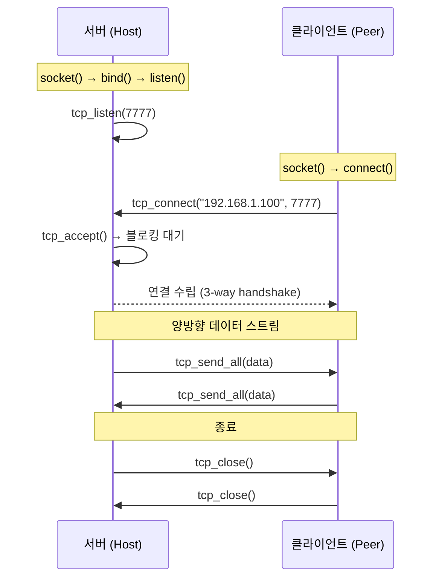

### 1.2 서버: bind + listen + accept

```cpp
// net/socket.cpp:77-105
TcpSocket tcp_listen(uint16_t port, int backlog) {
    TcpSocket s{};
    int fd = (int)::socket(AF_INET, SOCK_STREAM, IPPROTO_TCP);
    if (fd < 0) return s;
    set_reuse(fd);                           // SO_REUSEADDR

    sockaddr_in addr{};
    addr.sin_family = AF_INET;
    addr.sin_addr.s_addr = htonl(INADDR_ANY);  // 모든 인터페이스
    addr.sin_port = htons(port);                // 네트워크 바이트 순서

    if (::bind(fd, (sockaddr*)&addr, sizeof(addr)) != 0) { close(fd); return s; }
    if (::listen(fd, backlog) != 0) { close(fd); return s; }
    s.fd = fd;
    return s;
}
```

**SO_REUSEADDR**: `setsockopt(fd, SOL_SOCKET, SO_REUSEADDR, ...)`를 설정하지 않으면, 프로그램을 재시작했을 때 "Address already in use" 에러가 발생한다. 이전 연결의 TCP TIME_WAIT 상태(기본 2분)가 남아있기 때문이다. `SO_REUSEADDR`는 TIME_WAIT 중인 포트에 재바인드를 허용한다.

### 1.3 클라이언트: connect

```cpp
// net/socket.cpp:121-149
TcpSocket tcp_connect(const std::string& host, uint16_t port) {
    TcpSocket s{};
    addrinfo hints{};
    hints.ai_family = AF_INET;
    hints.ai_socktype = SOCK_STREAM;

    addrinfo* res = nullptr;
    char portStr[16];
    std::snprintf(portStr, sizeof(portStr), "%u", (unsigned)port);
    if (getaddrinfo(host.c_str(), portStr, &hints, &res) != 0) return s;

    int fd = -1;
    for (addrinfo* p = res; p; p = p->ai_next) {
        fd = (int)::socket(p->ai_family, p->ai_socktype, p->ai_protocol);
        if (fd < 0) continue;
        if (::connect(fd, p->ai_addr, (int)p->ai_addrlen) == 0) break;
        closesocket(fd);
        fd = -1;
    }
    freeaddrinfo(res);
    if (fd < 0) return s;

    set_nonblocking(fd);       // 연결 후 논블로킹 전환
    s.fd = fd;
    return s;
}
```

`getaddrinfo`는 호스트 이름("192.168.1.100")을 `sockaddr_in` 구조체로 변환한다. IPv4/IPv6, DNS 해석을 모두 처리하는 현대적 API다. 오래된 `inet_addr`나 `gethostbyname` 대신 사용.

### 1.4 논블로킹 I/O

```cpp
static bool set_nonblocking(int fd) {
#ifdef _WIN32
    u_long mode = 1;
    return ioctlsocket(fd, FIONBIO, &mode) == 0;
#else
    int flags = fcntl(fd, F_GETFL, 0);
    return fcntl(fd, F_SETFL, flags | O_NONBLOCK) == 0;
#endif
}
```

논블로킹 모드에서 `recv()`는 데이터가 없으면 즉시 반환한다 (에러 코드 `WSAEWOULDBLOCK` / `EAGAIN`). 이것이 중요한 이유: I/O 스레드가 `recv`에서 블로킹되면 `send` 큐를 처리할 수 없다. 논블로킹으로 `recv` → `send` 큐 처리 → `recv` 순환을 구현한다.

---

## 2. 길이-접두사 프레이밍

### 2.1 TCP 스트림의 특성

TCP는 **바이트 스트림**이다. 메시지 경계가 없다. 5바이트를 보내고 3바이트를 보내면, 수신 측에서 8바이트가 한 번에 올 수도, 2+6으로 올 수도, 1+1+1+1+1+3으로 올 수도 있다.

```text
송신: [HELLO][SEED message][INPUT message]
수신: [HEL][LO SEED messa][ge INPUT message]
      ← TCP가 바이트 경계를 보장하지 않음 →
```

해결: 각 메시지에 **길이 접두사**를 붙인다.

### 2.2 프레임 구조

```text
┌────────┬──────┬─────────────┬──────────┐
│ LEN:u16 │ TYPE:u8 │ PAYLOAD:N │ CHECKSUM:u32 │
│ 2 bytes │ 1 byte  │ N bytes   │ 4 bytes      │
└────────┴──────┴─────────────┴──────────┘

LEN = TYPE(1) + PAYLOAD(N)
전체 프레임 크기 = 2 + LEN + 4 = 7 + N bytes
```

| 필드 | 크기 | 설명 |
|------|------|------|
| LEN | 2 bytes (u16 LE) | TYPE + PAYLOAD의 바이트 수 |
| TYPE | 1 byte | 메시지 종류 (HELLO=1, INPUT=4, ...) |
| PAYLOAD | LEN-1 bytes | 메시지별 데이터 |
| CHECKSUM | 4 bytes (u32 LE) | PAYLOAD의 FNV-1a 32-bit 해시 |

### 2.3 FNV-1a 32-bit 체크섬

```cpp
// net/framing.cpp:15-19
uint32_t fnv1a32(const uint8_t* data, size_t len, uint32_t seed) {
    uint32_t h = seed;                     // 2166136261
    for (size_t i = 0; i < len; ++i) {
        h ^= data[i];
        h *= 16777619u;
    }
    return h;
}
```

$$h_0 = 2166136261, \quad h_i = (h_{i-1} \oplus \text{byte}_i) \times 16777619$$

Part 3에서 사용한 FNV-1a 64-bit와 같은 알고리즘의 32비트 버전이다. 4바이트 체크섬은 비암호학적이지만, 전송 오류(비트 플립, 패킷 손상)를 감지하기에 충분하다. CRC32 대비 구현이 단순하고, 해시 테이블의 키 해시로도 겸용 가능하다.

### 2.4 프레임 빌드와 파싱

파일 상단에는 익명 namespace 로 필드 크기 상수를 묶어 둔다 — 매직 넘버를 코드 본문에 박아두지 않기 위함이다:

```cpp
// net/framing.cpp
namespace {
    constexpr size_t LEN_FIELD = 2;       // u16
    constexpr size_t TYPE_FIELD = 1;      // u8
    constexpr size_t CHECKSUM_FIELD = 4;  // u32
    constexpr size_t MIN_FRAME_BYTES = LEN_FIELD + TYPE_FIELD + CHECKSUM_FIELD; // 7 bytes
    // PAYLOAD 상한 — 실사용 최대는 CHAT 200자 UTF-8 (~800 B), HASH/INPUT 은 수십 B.
    // u16 의 자연 한계(65535) 는 사실상 상한 없음 — 이 상수로 실질 가드를 건다.
    constexpr size_t MAX_PAYLOAD_BYTES = 4096;
}
```

**빌드:**

```cpp
// net/framing.cpp
std::vector<uint8_t> build_frame(MsgType t, const std::vector<uint8_t>& payload) {
    // 발신 측에서도 페이로드 상한을 검사 — 초과 시 빈 벡터로 실패.
    if (payload.size() > MAX_PAYLOAD_BYTES) return {};
    // LEN = TYPE(1) + PAYLOAD(N)
    std::vector<uint8_t> out; out.reserve(LEN_FIELD + TYPE_FIELD + payload.size() + CHECKSUM_FIELD);
    const uint16_t len = static_cast<uint16_t>(TYPE_FIELD + payload.size());
    le_write_u16(out, len);
    out.push_back(static_cast<uint8_t>(t));
    out.insert(out.end(), payload.begin(), payload.end());
    // CHK = FNV-1a32(PAYLOAD)
    const uint32_t chk = payload.empty() ? 0u : fnv1a32(payload.data(), payload.size());
    le_write_u32(out, chk);
    return out;
}
```

상한 검사는 DoS 방어용이다. 수신 측이 먼저 검사해도 되지만, 발신 측에서 미리 막으면 "프레임이 나가긴 했는데 상대가 끊어버림" 같은 디버깅하기 어려운 상황이 없다.

**파싱 (파셜 수신 처리):**

```cpp
// net/framing.cpp
bool parse_frames(std::vector<uint8_t>& streamBuf, std::vector<Frame>& out) {
    size_t offset = 0;
    while (true) {
        // 길이(u16)를 읽을 만큼 데이터가 준비되었는지 확인
        // 주의: size_t는 unsigned이므로 뺄셈 대신 덧셈으로 비교 (언더플로 방지)
        if (offset + LEN_FIELD > streamBuf.size()) break;

        // LEN = TYPE + PAYLOAD 길이
        const uint16_t len = le_read_u16(&streamBuf[offset]);

        // 페이로드 상한 초과 선언 시 전체 스트림을 버린다.
        // 부분 수신 상태에서 len 만 받았더라도 판정 가능 — 수신 버퍼가
        // MAX_PAYLOAD_BYTES+TYPE+CHK 이상으로 불어나지 않도록 조기 차단.
        if (static_cast<size_t>(len) > MAX_PAYLOAD_BYTES + TYPE_FIELD) {
            streamBuf.clear();
            return false;
        }

        // 전체 프레임이 모였는지 확인: len 필드 + 본문(len) + 체크섬
        const size_t need = LEN_FIELD + static_cast<size_t>(len) + CHECKSUM_FIELD;
        if (offset + need > streamBuf.size()) break;

        // len=0 이면 TYPE 바이트조차 없는 잘못된 프레임 — 스킵
        if (len < TYPE_FIELD) { offset += need; continue; }

        // TYPE 바이트와 PAYLOAD 범위 계산
        const uint8_t type = streamBuf[offset + LEN_FIELD];
        const uint8_t* payload = &streamBuf[offset + LEN_FIELD + TYPE_FIELD];
        const size_t payloadLen = static_cast<size_t>(len) - TYPE_FIELD; // LEN - TYPE(1)

        // 체크섬 읽고 유효성 검사(FNV-1a32)
        const size_t chkPos = offset + LEN_FIELD + static_cast<size_t>(len);
        const uint32_t chk = le_read_u32(&streamBuf[chkPos]);
        const uint32_t calc = (payloadLen == 0) ? 0u : fnv1a32(payload, payloadLen);

        if (chk == calc) {
            Frame f; f.type = static_cast<MsgType>(type);
            f.payload.assign(payload, payload + payloadLen);
            out.push_back(std::move(f));
        }

        // 다음 프레임으로 이동
        offset += need;
    }
    // 파싱된 부분 제거, 나머지는 다음 수신과 합쳐서 재시도
    if (offset > 0) streamBuf.erase(streamBuf.begin(), streamBuf.begin() + offset);
    return true;
}
```

`len > MAX_PAYLOAD_BYTES + TYPE_FIELD` 검사가 핵심이다. 악의적 peer 가 `len=65535` 를 선언하면 수신 버퍼가 64 KiB 까지 부풀 때까지 기다려야 한다. 상한을 넘으면 즉시 스트림을 버리고 false 를 반환해서 세션을 끊게 한다.

핵심: `streamBuf`는 **누적 버퍼**다. `tcp_recv_some`이 호출될 때마다 수신된 바이트가 뒤에 추가된다. `parse_frames`는 버퍼의 앞에서부터 완성된 프레임만 추출하고, 나머지(아직 불완전한 프레임)는 버퍼에 남겨둔다. 다음 `recv`에서 나머지 바이트가 도착하면 이전 잔여분과 합쳐서 파싱한다.

### 2.5 size_t 뺄셈 주의

`parse_frames`의 원래 코드에서 발생한 버그:

```cpp
// 위험: payloadLen = len - 1에서 len이 0이면?
const size_t payloadLen = (size_t)len - 1;  // len=0 → SIZE_MAX!
```

`size_t`는 unsigned이므로 `0 - 1 = SIZE_MAX`(64비트 시스템에서 약 $1.8 \times 10^{19}$). 이 값으로 `fnv1a32(payload, payloadLen)`을 호출하면 수십 엑사바이트의 메모리를 읽으려 해서 크래시한다.

해결: `len < 1`인 경우를 먼저 처리하여 이 경로를 차단한다.

일반 원칙: size_t 뺄셈은 항상 "결과가 음수가 될 수 있는가?"를 확인해야 한다. 음수가 가능하면 **뺄셈 대신 덧셈으로 비교**한다:

```cpp
// 위험: buf.size() - offset가 음수일 수 있음
if (buf.size() - offset < need) break;

// 안전: 덧셈으로 변환
if (offset + need > buf.size()) break;
```

---

## 3. 메시지 타입

```cpp
// net/framing.h
enum class MsgType : uint8_t {
    HELLO = 1,
    HELLO_ACK = 2,
    SEED = 3,
    INPUT = 4,
    ACK = 5,
    PING = 6,
    PONG = 7,
    HASH = 8,
    GAME_OVER_CHOICE = 9,
};
```

각 메시지의 페이로드 구조:

| 타입 | 페이로드 | 용도 |
|------|---------|------|
| HELLO (1) | `[version:u16]` | 연결 확인 (핸드셰이크 시작) |
| HELLO_ACK (2) | `[ok:u8]` | 핸드셰이크 응답 |
| SEED (3) | `[seed:u64][start_tick:u32][input_delay:u8][role:u8]` | 게임 파라미터 전달 (호스트 → 클라이언트) |
| INPUT (4) | `[from_tick:u32][count:u16][mask0:u8][mask1:u8]...` | 틱별 입력 전송 |
| ACK (5) | `[last_tick:u32]` | 수신 확인 |
| PING (6) | `[timestamp]` | RTT 측정 |
| PONG (7) | `[timestamp]` | PING 응답 |
| HASH (8) | `[tick:u32][hash:u64]` | 상태 해시 교차 검증 |
| GAME_OVER_CHOICE (9) | `[choice:u8]` | 재시작/타이틀 협상 |

모든 다중 바이트 필드는 **리틀 엔디안**으로 직렬화된다. x86/x64가 리틀 엔디안이므로 별도의 바이트 스왑이 필요 없다.

---

## 4. 세션 라이프사이클

### 4.1 호스트 흐름

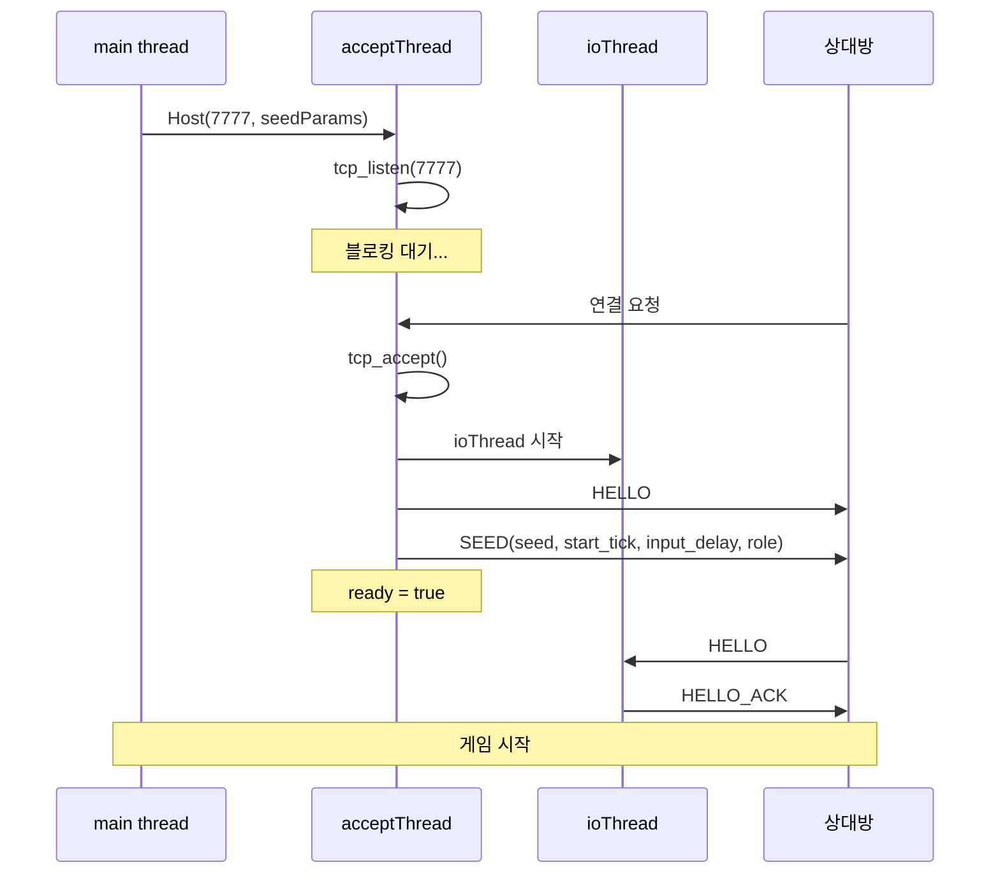

호스트는 두 개의 스레드를 사용한다:

1. **acceptThread**: `tcp_accept()`에서 블로킹 대기. 연결 수립 후 `ioThread`를 시작하고 HELLO + SEED를 전송.
2. **ioThread**: 논블로킹 recv/send 루프. 메시지 파싱 + 송신 큐 처리.

### 4.2 클라이언트 흐름

```cpp
// net/session.cpp:34-67
bool Session::Connect(const std::string& host, uint16_t port) {
    sock = tcp_connect(host, port);
    if (!sock.valid()) { connectionFailed = true; return false; }
    connected = true;
    th = std::thread(&Session::ioThread, this);    // I/O 스레드 시작
    // HELLO 전송
    {
        std::vector<uint8_t> pl; le_write_u16(pl, 1);
        auto fr = build_frame(MsgType::HELLO, pl);
        std::lock_guard<std::mutex> lk(sendMu);
        sendQ.push_back(std::move(fr));
    }
    return true;
}
```

클라이언트는 `tcp_connect()`로 즉시 연결을 시도하고, 성공 시 `ioThread`를 시작한다. HELLO를 보내고, 호스트의 SEED 메시지를 받으면 `ready = true`.

### 4.3 SEED 메시지와 게임 시작

호스트가 결정하는 파라미터:

```cpp
struct SeedParams {
    uint64_t seed{0};          // RNG 시드 (양쪽 SimGame에 동일하게 전달)
    uint32_t start_tick{120};  // 시작 지연 (2초 = 120틱)
    uint8_t input_delay{2};    // 입력 지연 (네트워크 지터 흡수)
    Role role{Role::Host};
};
```

`start_tick`은 양쪽의 시뮬레이션이 동시에 시작하도록 하는 카운트다운이다. SEED 메시지의 네트워크 전달 시간을 흡수한다.

---

## 5. Lockstep 동기화

### 5.1 safeTick 계산

```cpp
// src/main.cpp:215-220
int64_t lastLocalSent = (localTickNext == 0) ? -1 : (int64_t)localTickNext - 1;
int64_t lastRemote    = (int64_t)session.maxRemoteTick();
int64_t safeTick      = std::min(lastLocalSent, lastRemote) - (int64_t)inputDelay;
```

$$\text{safeTick} = \min(\text{lastLocalSent},\ \text{lastRemoteRecv}) - \text{inputDelay}$$

- `lastLocalSent`: 로컬에서 마지막으로 전송한 틱 번호
- `lastRemoteRecv`: 상대방에게서 마지막으로 수신한 틱 번호
- `inputDelay`: 네트워크 지터를 흡수하는 버퍼 (기본 2틱)

**양쪽 피어의 입력이 모두 확보된 틱까지만 시뮬레이션을 진행한다.** 한쪽의 입력이 아직 도착하지 않았으면, 시뮬레이션이 멈추고 기다린다.

### 5.2 타임라인 예시

```text
시간 →

Host:     T0  T1  T2  T3  T4  T5  T6  T7
          ──  ──  ──  ──  ──  ──  ──  ──
          S   S   S   S   S   S   S   S     (S = SendInput)

Client:   T0  T1  T2  T3  T4  T5  T6  T7
          ──  ──  ──  ──  ──  ──  ──  ──
          S   S   S   S   S   S   S   S

네트워크 지연: ~30ms (2틱)

Host 시점:
  localSent = T7, remoteRecv = T5 (2틱 지연)
  safeTick = min(7, 5) - 2 = 3
  → T0~T3까지 시뮬레이션 진행 가능

Client 시점:
  localSent = T7, remoteRecv = T5
  safeTick = min(7, 5) - 2 = 3
  → 동일하게 T0~T3까지 진행
```

`inputDelay`의 역할: 네트워크 지터(패킷 도착 시간의 변동)를 흡수한다. `inputDelay = 0`이면 패킷이 조금만 늦어도 시뮬레이션이 멈춘다. `inputDelay = 2`면 2틱(약 33ms)의 여유가 있다.

### 5.3 시뮬레이션 진행

```cpp
// src/main.cpp:219-233
if ((int64_t)simTick <= safeTick && gameLocal && gameRemote)
{
    while ((int64_t)simTick <= safeTick)
    {
        uint8_t li = 0, ri = 0;
        auto it = localInputs.find(simTick);
        if (it != localInputs.end()) li = it->second;
        if (!session.GetRemoteInput(simTick, ri)) break;

        gameLocal->SubmitInput(li);    // 로컬 입력을 로컬 게임에
        gameRemote->SubmitInput(ri);   // 상대 입력을 상대 게임에
        gameLocal->Tick();
        gameRemote->Tick();
        simTick++;
    }
}
```

두 개의 `SimGame` 인스턴스를 유지한다:

- `gameLocal`: 로컬 플레이어의 입력으로 구동
- `gameRemote`: 상대 플레이어의 입력으로 구동

양쪽 게임이 같은 시드에서 시작하므로, 블록 순서가 동일하다. 다른 점은 적용되는 입력뿐이다.

---

## 6. 스레드 모델

### 6.1 스레드 구성

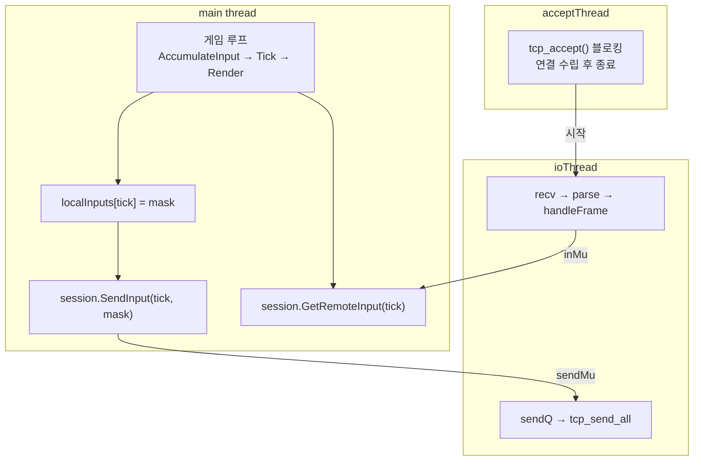

### 6.2 뮤텍스

| 뮤텍스 | 보호 대상 | 접근 스레드 |
|--------|----------|------------|
| `seedMu` | `seedParams` | main (읽기), ioThread (쓰기: SEED 수신 시) |
| `sendMu` | `sendQ` (송신 큐) | main (쓰기: SendInput), ioThread (읽기: 송신) |
| `inMu` | `remoteInputs` (수신 입력 맵) | ioThread (쓰기: INPUT 수신), main (읽기: GetRemoteInput) |

`sendMu`의 해제 타이밍이 중요하다:

```cpp
// net/session.cpp:162-177
while (true) {
    std::vector<uint8_t> pkt;
    {
        std::lock_guard<std::mutex> lk(sendMu);
        if (sendQ.empty()) break;
        pkt = std::move(sendQ.front());
        sendQ.pop_front();
    }
    // sendMu가 해제된 후 tcp_send_all 호출 (블로킹 I/O)
    // → main thread가 그 동안 SendInput() 가능
    tcp_send_all(sock, pkt.data(), pkt.size());
}
```

`tcp_send_all`은 블로킹 I/O이므로 뮤텍스를 잡고 있으면 main thread의 `SendInput`이 차단된다. 큐에서 패킷을 꺼낸 후 뮤텍스를 해제하고, 그 다음 송신한다.

### 6.3 종료 프로토콜

```cpp
// net/session.cpp:114-123
void Session::Close() {
    quit = true;
    // 1. 소켓을 먼저 닫아 블로킹 I/O를 해제
    if (listening && listenSock.valid()) tcp_close(listenSock);
    if (sock.valid()) tcp_close(sock);
    // 2. 스레드 join (블로킹이 해제되었으므로 반환됨)
    if (ath.joinable()) ath.join();
    if (th.joinable()) th.join();
    connected = false; ready = false; listening = false;
}
```

종료 순서가 중요하다: **소켓을 먼저 닫고, 그 다음 스레드를 join한다.** 순서를 바꾸면 데드락이 발생한다:

```text
잘못된 순서:
  main thread: ath.join() → 대기 (acceptThread가 tcp_accept에서 블로킹)
  acceptThread: tcp_accept() → 대기 (아무도 연결하지 않으므로 영원히 블로킹)
  → 데드락

올바른 순서:
  main thread: tcp_close(listenSock) → accept()가 에러로 반환
  main thread: ath.join() → acceptThread가 이미 반환했으므로 즉시 완료
```

---

## 7. 상태 해시 교차 검증

### 7.1 디싱크 감지

주기적으로 양쪽 피어가 자신의 `StateHash()`(Part 3)를 교환한다:

```cpp
void Session::SendHash(uint32_t tick, uint64_t hash) {
    std::vector<uint8_t> pl;
    le_write_u32(pl, tick);
    le_write_u64(pl, hash);
    auto fr = build_frame(MsgType::HASH, pl);
    std::lock_guard<std::mutex> lk(sendMu);
    sendQ.push_back(std::move(fr));
}
```

수신 측에서 같은 틱의 해시를 비교한다. 불일치 = **디싱크(desynchronization)** .

### 7.2 디싱크의 일반적 원인

| 원인 | 증상 | 해결 |
|------|------|------|
| RNG 호출 순서 차이 | 블록 순서가 다름 | RNG를 GetRandomBlock()에서만 호출 |
| 부동소수점 연산 차이 | 물리 시뮬레이션 값 차이 | 이 프로젝트에서는 정수 연산만 사용하므로 해당 없음 |
| 입력 손실/중복 | 한쪽에서 입력이 적용되지 않음 | 프레이밍 체크섬으로 전송 오류 감지 |
| 입력 처리 순서 차이 | 동시 입력의 적용 순서가 다름 | SubmitInput 내부의 if 순서를 고정 |

이 프로젝트의 시뮬레이션은 정수 연산만 사용하므로 (부동소수점 없음), 가장 흔한 디싱크 원인인 "크로스 플랫폼 부동소수점 차이"가 원천적으로 제거된다.

---

## 8. 게임 오버 협상

### 8.1 상태 머신

멀티플레이에서 게임 오버 후, 양쪽 플레이어가 "재시작"과 "타이틀로"를 선택한다:

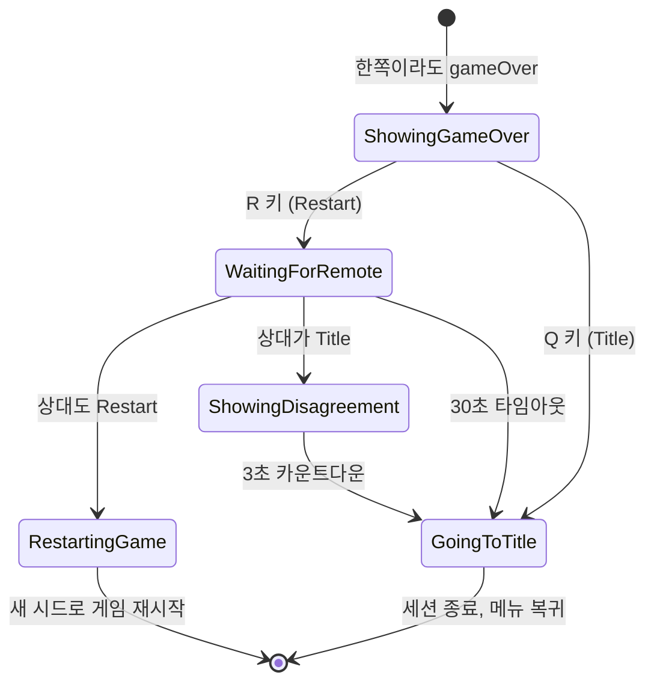

### 8.2 의견 불일치 처리

양쪽의 선택이 다르면 (한쪽 Restart, 한쪽 Title), 3초 카운트다운 후 타이틀로 복귀한다. 단순한 "다수결"이나 "호스트 우선" 규칙 대신, 안전하게 양쪽 모두 세션을 종료한다.

### 8.3 재시작 시 시드 교환

재시작 시 호스트가 새 시드를 생성하여 SEED 메시지로 전달한다:

```cpp
// net/session.cpp:92-105
void Session::SendNewSeed(uint64_t newSeed) {
    std::vector<uint8_t> pl;
    {
        std::lock_guard<std::mutex> lk(seedMu);
        seedParams.seed = newSeed;
        le_write_u64(pl, seedParams.seed);
        le_write_u32(pl, seedParams.start_tick);
        pl.push_back(seedParams.input_delay);
        pl.push_back((uint8_t)seedParams.role);
    }
    auto fr = build_frame(MsgType::SEED, pl);
    std::lock_guard<std::mutex> lk(sendMu);
    sendQ.push_back(std::move(fr));
}
```

새 시드를 받은 클라이언트는 `SimGame`을 새로 생성하고, 입력 큐와 틱 카운터를 초기화한다. 이것이 "같은 세션에서 여러 판을 플레이"하는 메커니즘이다.

---

## 오류와 함정

### (1) size_t 뺄셈 언더플로

**증상:** `parse_frames`에서 크래시. 또는 `buf.size() - offset`가 음수여야 할 때 거대한 양수가 되어 조건 분기가 잘못됨.

**원인:** `size_t`는 unsigned. `0 - 1 = SIZE_MAX`.

**해결:** `buf.size() - offset < need` 대신 `offset + need > buf.size()` 형태로 비교. 뺄셈을 덧셈으로 변환하면 언더플로가 원천 차단된다.

> **레퍼런스:** C++ 표준 [conv.integral]: unsigned 정수의 산술은 모듈러 $2^n$으로 잘 정의된다. 그러나 의도하지 않은 모듈러 산술은 보안 취약점(buffer overflow)의 원인이 될 수 있다.

### (2) Close()에서 소켓 닫기 전 thread join

**증상:** 프로그램이 종료되지 않는다. `Close()`에서 무한 대기.

**원인:** `acceptThread`가 `tcp_accept()`에서 블로킹 중. `ath.join()`을 먼저 호출하면, accept가 반환되기를 기다리지만, 아무도 연결하지 않으므로 영원히 블로킹.

**해결:** `tcp_close(listenSock)`을 먼저 호출하여 listen 소켓을 닫는다. 이미 블로킹 중인 `accept()`가 에러(-1)로 즉시 반환된다. 그 후 `ath.join()`.

### (3) seedParams 데이터 레이스

**증상:** 클라이언트가 잘못된 시드로 게임을 시작한다. 드물게 발생.

**원인:** `ioThread`가 SEED 메시지를 받아 `seedParams.seed`에 쓰는 동시에, main thread가 `session.params().seed`를 읽는다. 데이터 레이스 = undefined behavior.

**해결:** `seedMu` 뮤텍스로 보호. `params()` 접근자에서도 lock:

```cpp
SeedParams params() const {
    std::lock_guard<std::mutex> lk(seedMu);
    return seedParams;  // 복사본 반환 (lock 범위 내)
}
```

### (4) INPUT 메시지 버퍼 오버리드

**증상:** 간헐적 크래시 또는 잘못된 입력 값.

**원인:** INPUT 메시지의 `count` 필드가 실제 페이로드보다 클 때, `arr[i]`가 버퍼 범위를 초과.

**해결:** `6 + cnt > f.payload.size()`로 바운드 체크:

```cpp
case MsgType::INPUT: {
    if (f.payload.size() >= 6) {
        uint32_t from = le_read_u32(p);
        uint16_t cnt = le_read_u16(p+4);
        if (static_cast<size_t>(6) + cnt > f.payload.size()) break;  // 바운드 체크
        // ...
    }
}
```

### (5) 창 드래그 시 Lockstep 정체

**증상:** 한쪽 플레이어가 창을 드래그하는 동안 상대방의 게임도 멈춘다.

**원인:** Win32의 모달 메시지 루프가 게임 루프를 점유. 그 동안 `SendInput()`이 호출되지 않으므로 상대방의 `maxRemoteTick()`이 증가하지 않고, `safeTick`이 정체된다.

**해결:** 이것은 Lockstep 모델의 본질적 한계다. 완전한 해결은 Rollback 네트코드(예측 + 보정)로의 전환이 필요하다. 부분적 완화로는 "Waiting for peer..." 오버레이를 표시하는 방법이 있다.

> **레퍼런스:** Mark Terrano & Paul Bettner, "1500 Archers on a 28.8: Network Programming in Age of Empires and Beyond" (GDC 1999). Lockstep 모델의 원전. "if one player is slow, everyone is slow."

---

## 정리

전체 네트워크 세션의 데이터 흐름:

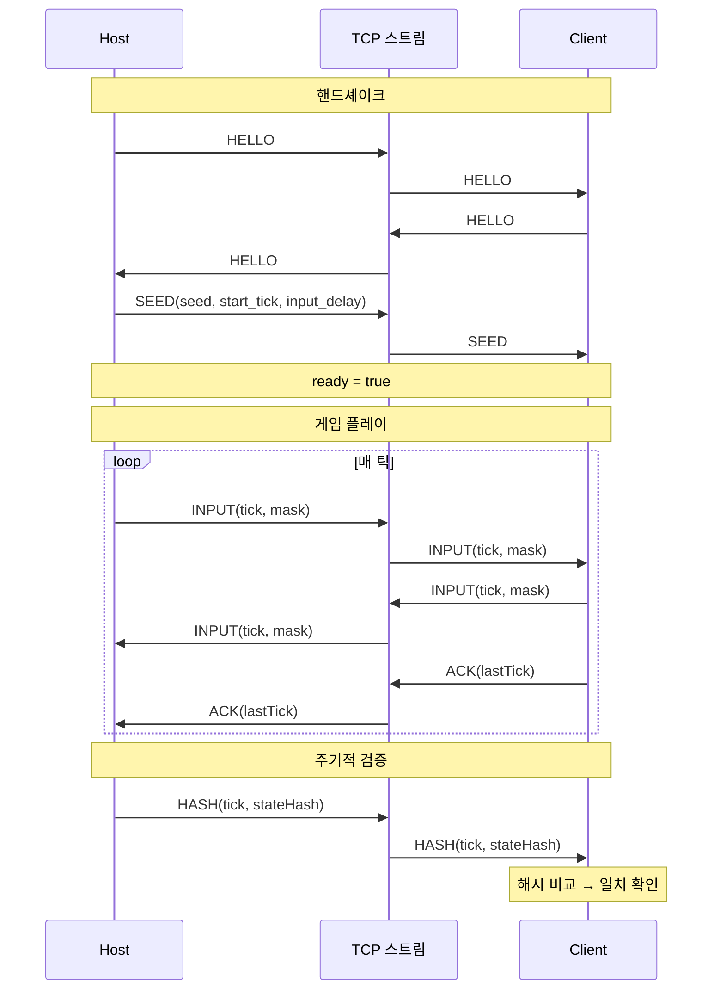

Lockstep 네트워킹의 핵심 요약:

1. **결정론이 전제**: 같은 시드 + 같은 입력 = 같은 상태 (Part 3)
2. **입력만 교환**: 틱당 1바이트, 극히 낮은 대역폭
3. **safeTick으로 동기**: 양쪽 입력이 확보된 틱까지만 진행
4. **해시로 검증**: FNV-1a 64-bit 상태 해시 교차 비교

다음 Part 6에서는 이 시뮬레이션 엔진을 **Python에서 구동**한다 — pybind11 바인딩으로 C++ SimGame을 Python에 노출하고, Gymnasium 환경을 만들어 강화학습 에이전트를 학습시킨다.

---

## 9. inputDelay / safeTick 심화

본문 §5.1 에서 `safeTick = min(lastLocalSent, lastRemoteRecv) - inputDelay` 라는
공식을 소개했다. 실제 게임에서 이 값이 어떻게 움직이는지, `inputDelay` 를 어떻게
골라야 하는지 더 파고든다.

### 9.1 수식 유도

피어 A 의 관점에서 틱 `t` 의 시뮬레이션을 실행하려면 다음 두 입력이 모두 필요하다:

- `localInputs[t]` — 내 입력. `SendInput(t, mask)` 을 호출한 **순간** 확정됨
- `remoteInputs[t]` — 상대 입력. 상대의 `SendInput(t, mask)` 가 네트워크를
  통해 `INPUT` 프레임으로 도착한 **순간** 확정됨

A 가 현재 틱 `n` 을 진행하고 있다고 하자. `n` 틱 시점에 이미 `AccumulateInput()`
으로 로컬 마스크를 확정해 `SendInput(n, mask)` 까지 마쳤으므로:

$$\text{lastLocalSent}_A = n$$

상대 B 로부터 마지막으로 받은 `INPUT` 프레임의 최고 틱을
`lastRemoteRecv_A = r` 이라 하자. 그럼:

$$\text{safeTick}_A = \min(n, r)$$

만약 `inputDelay = 0` 이라면 A 는 `min(n, r)` 까지만 시뮬레이션할 수 있다.
`r` 이 지체되면(네트워크 지연) A 도 같이 멈춘다. 잠깐의 지터에도 민감하게
반응한다.

여기서 **송신 측에서 입력을 D 틱 뒤에 적용하도록 "미뤄서" 보내는** 아이디어가
나온다. A 가 틱 `n` 에 확정한 입력은 "틱 `n + D` 에 적용되는 입력" 이라고
약속하는 것이다. 그럼 양쪽은 다음 불변식을 지키면 된다:

$$\text{시뮬레이션 가능 틱} = \min(n, r) - D$$

틱 `min(n, r) - D` 를 실행할 때 필요한 양쪽 입력은, 사실 약 `D` 틱 전에
송신됐으므로 네트워크 RTT 가 `D` 틱 이하이면 이미 도착해 있을 가능성이 높다.
`D` 가 클수록 지터에 관대해지지만 체감 입력 지연도 커진다.

수학적으로는 `D` 를 송신 측에서 "틱 번호 재지정" 으로 구현해도 되고, 수신 측에서
"receive 한 입력을 D 틱 뒤 슬롯에 넣는다" 로 구현해도 된다. 이 프로젝트는 후자를
택했다. 송신은 여전히 `SendInput(localTickNow, mask)` 로 현재 틱 번호를 그대로
보낸다. 대신 **safeTick 계산식에서 빼준다**:

```cpp
// src/main.cpp — 본문에 이미 등장한 식
int64_t lastLocalSent = (localTickNext == 0) ? -1 : (int64_t)localTickNext - 1;
int64_t lastRemote    = (int64_t)session.maxRemoteTick();
int64_t safeTick      = std::min(lastLocalSent, lastRemote) - (int64_t)inputDelay;
```

즉 "받은 입력이 `r` 이어도 `r - D` 까지만 적용한다" — 뒤쪽 `D` 틱은 버퍼로
남겨둬서 다음 지터에 대비한다.

### 9.2 타임라인: inputDelay = 2, RTT = 30ms (2틱)

60Hz (틱 16.67ms) 로 돌고, 한쪽으로 15ms 씩 편도 지연, 상대 `INPUT` 이 우리에게
도착하기까지 2틱 늦는다고 가정.

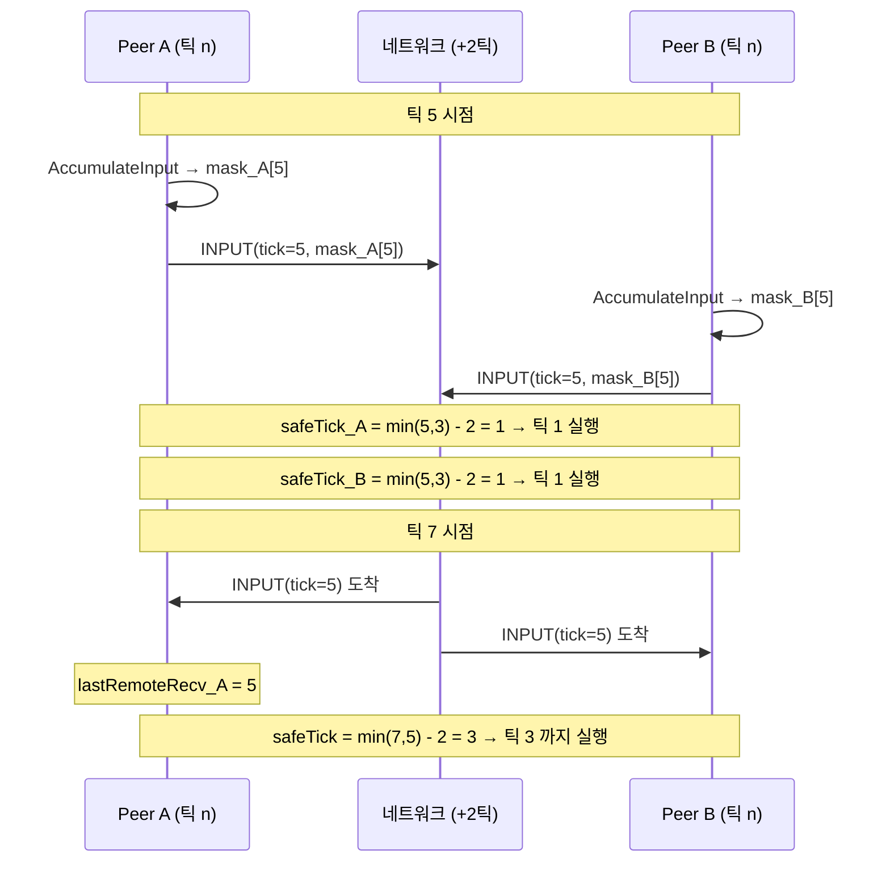

`inputDelay = 2` 는 **약 33ms 의 지터 여유** 를 준다. 한 번의 `INPUT` 프레임이
네트워크에서 33ms 안에 도착하기만 하면, 시뮬레이션은 끊기지 않고 똑같이
60Hz 로 흘러간다. 유저 입장에서 체감 지연은 33ms — 60Hz 화면에서 2프레임
차이. 격투 게임이라면 치명적이지만 테트리스에는 충분히 숨길 만한 값이다.

### 9.3 inputDelay 선택의 트레이드오프

| `inputDelay` | 체감 지연 | 지터 내성 | 적합한 매치 |
|---|---|---|---|
| 0 | 즉각적 | 없음 (1 틱 지연만 나도 멈춤) | LAN / loopback |
| 1 | 16.67ms | ~16ms | 초저지연 인터넷 |
| **2 (기본)** | **33.33ms** | **~33ms** | 일반 인터넷 |
| 4 | 66.67ms | ~66ms | 지터가 큰 Wi-Fi |
| 8 | 133ms | ~133ms | 모바일 / 장거리 |

이 프로젝트는 **SEED 메시지에 `input_delay` 를 실어서 호스트가 결정**한다
(§4.3 참조). 호스트가 RTT 를 보고 클라이언트에게 통지하는 구조는 아직 구현되지
않았고, 기본 2 로 고정되어 있다. 확장 여지: 첫 PING 왕복 결과를 보고 호스트가
`SendNewSeed` 와 같은 방식으로 `input_delay` 를 조정하는 메시지를 추가하면 된다.

### 9.4 경계 케이스: 초반 start_tick 구간

`start_tick = 120` (2초 카운트다운) 동안에는 양쪽이 서로에게 `INPUT` 을 거의
보내지 않는다. 이 구간의 `safeTick` 은 수학적으로 음수가 될 수 있다
(`min(-1, -1) - 2 = -3`). `int64_t` 로 계산하는 이유가 이것이다 — 본문의
`(localTickNext == 0) ? -1 : ...` 분기도 `uint32_t` 언더플로를 피하기 위한
방어였다.

`simTick` 은 `uint32_t` 이므로 비교 시 `(int64_t)simTick <= safeTick` 으로
캐스팅한다. 이러면 `simTick = 0`, `safeTick = -3` 일 때 `0 <= -3` 은 false —
루프가 돌지 않는다. 정상.

---

## 10. Section A — PING/PONG + LinkStatus

본문 §2~§6 의 프로토콜은 HELLO/SEED/INPUT/ACK/HASH/GAME_OVER_CHOICE 만으로 "깨끗한"
네트워크에서는 동작한다. 그런데 실제 환경에서는 두 가지 **애매한 상황** 이 있다:

1. **상대가 창을 드래그 중** — Win32 의 모달 메시지 루프가 main thread 를 점유해서
   `SendInput()` 호출이 멈춘다. 하지만 ioThread 는 별도 스레드라 살아있고, TCP
   연결도 끊어지지 않는다. 상대는 지금 "일시적으로 얼어있는" 상태.
2. **상대가 랜 케이블 뽑힘 / 프로세스 크래시** — 실제로 연결이 끊어졌는데 TCP
   는 기본 keep-alive 가 수 분 단위라 한참 동안 `recv()` 가 에러를 안 낸다.

두 상황은 **겉으로 똑같이 보인다** — `safeTick` 이 더 이상 올라가지 않는다. 하지만
UI 에서 유저에게 보여줘야 하는 메시지는 다르다. 전자는 "잠시 대기", 후자는 "타이틀
복귀 카운트다운". 이를 구별하는 장치가 **PING/PONG 하트비트** 다.

### 10.1 프레임 타입 추가

`net/framing.h` 의 `MsgType` 에 이미 6/7 번이 잡혀 있다:

```cpp
enum class MsgType : uint8_t {
    HELLO = 1,
    HELLO_ACK = 2,
    SEED = 3,
    INPUT = 4,
    ACK = 5,
    PING = 6,
    PONG = 7,
    HASH = 8,
    GAME_OVER_CHOICE = 9,
    // ... (이후 릴레이/룸 확장)
};
```

페이로드: PING 은 `[timestamp:u64 LE]` 하나. PONG 은 수신한 PING 의 payload 를
그대로 에코. RTT 측정에도 활용할 수 있지만 이 구현은 단순히 "언제 마지막으로
PONG 을 받았나" 만 기록한다.

### 10.2 송신: ioThread 의 1Hz 타이머

`ioThread` 에 1초마다 PING 을 큐잉하는 루프를 넣었다. `lastPingSentMs` 로
마지막 송신 시각을 기억하고, `now - lastPingSentMs >= 1000` 이면 새 PING 을
보낸다:

```cpp
// net/session.cpp — ioThread 본문 중
while (!quit.load()) {
    bool hasActivity = false;

    if (!ready.load()) {
        auto elapsed = std::chrono::steady_clock::now() - startTime;
        if (elapsed > CONNECTION_TIMEOUT) {
            std::cout << "[NET] Connection timeout after 10 seconds" << std::endl;
            connectionFailed = true;
            quit = true;
            break;
        }
    }

    // 1Hz PING 송신 — ready=true 이후에만. 상대가 얼어붙어도 여기선 계속
    // 큐에 쌓이지만 tcp_send_all 자체가 막히지는 않는다(커널 버퍼 여유 범위).
    if (ready.load()) {
        int64_t now = now_ms();
        int64_t lastSent = lastPingSentMs.load();
        if (lastSent == 0 || (now - lastSent) >= 1000) {
            lastPingSentMs.store(now);
            std::vector<uint8_t> pl; le_write_u64(pl, (uint64_t)now);
            auto fr = build_frame(MsgType::PING, pl);
            std::lock_guard<std::mutex> lk(sendMu); sendQ.push_back(std::move(fr));
        }
    }

    // ... (recv → parse_frames → handleFrame, 송신 큐 drain 은 이어서)
}
```

핵심: **PING 은 main thread 가 아니라 ioThread 가 찍는다.** 그래서 상대가 창
드래그 중이라 main thread 가 얼어도, 그 상대의 ioThread 는 돌고 있다 → 우리
PING 에 상대 PONG 이 돌아온다 → 우리는 "상대 ioThread 살아있음" 을 알 수 있다.

### 10.3 수신: handleFrame 에서 두 분기 추가

`handleFrame` 스위치에 PING/PONG 분기를 추가한다. 본문 §5~§7 에서 이미 존재
하던 switch 를 이렇게 확장한다 — 기존 HELLO/SEED/INPUT/ACK/HASH/GAME_OVER_CHOICE
분기는 그대로 유지:

```cpp
void Session::handleFrame(const Frame& f) {
    switch (f.type) {
    // ... (HELLO/HELLO_ACK/SEED/INPUT/ACK/HASH/GAME_OVER_CHOICE — 본문대로)
    case MsgType::PING: {
        // 상대의 PING 은 즉시 PONG 으로 에코 — io 스레드가 계속 돌고 있으면
        // 메인 스레드가 얼어도(창 드래그 등) 상대는 우리를 살아있다고 판정.
        std::vector<uint8_t> pong = f.payload; auto fr = build_frame(MsgType::PONG, pong);
        std::lock_guard<std::mutex> lk(sendMu); sendQ.push_back(std::move(fr));
    } break;
    case MsgType::PONG: {
        // 최신 PONG 도착 시각 기록 — linkStatus() 가 이 값을 기준으로 판정.
        lastPongMs.store(now_ms());
    } break;
    default: break;
    }
}
```

두 분기는 극단적으로 단순하다. PING 을 받으면 바로 PONG 큐잉, PONG 을 받으면
시각 기록. 로직은 모두 조회 측 (`linkStatus()`) 에 있다.

### 10.4 판정: linkStatus()

```cpp
// net/session.cpp:17-26
LinkStatus Session::linkStatus() const {
    if (connectionFailed.load()) return LinkStatus::Lost;
    if (!ready.load()) return LinkStatus::OK;
    int64_t last = lastPongMs.load();
    if (last == 0) return LinkStatus::OK;  // 첫 PONG 전에는 판단 유예
    int64_t ago = now_ms() - last;
    if (ago >= 10000) return LinkStatus::Lost;
    if (ago >=  2000) return LinkStatus::Stalled;
    return LinkStatus::OK;
}
```

임계값:

| `now - lastPongMs` | 상태 | UI 표시 | 시뮬레이션 |
|---|---|---|---|
| `< 2000ms` | `OK` | 없음 | 정상 진행 |
| `2000 ≤ _ < 10000` | `Stalled` | "Opponent frozen - waiting..." | 멈춤 (safeTick 정체) |
| `≥ 10000` | `Lost` | "Opponent disconnected — 10s countdown" | 멈춤 → grace 후 타이틀 |

2초는 1Hz PING 의 2 주기 여유. 한 번의 PING 이 일시적으로 지연돼도 다음 번엔
회복될 거라는 가정. 10초는 "상대가 실제로 사라졌다" 고 결론내리는 컷오프 —
TCP keep-alive 가 작동하기 전에 선제적으로 감지한다.

### 10.5 grace 복귀 — Stalled → OK 자동 재개

`linkStatus()` 가 `Stalled` 로 분류돼도 **세션을 닫지 않는다.** UI 오버레이만
띄우고, 다음 PONG 이 돌아와 2초 이내가 되면 조용히 `OK` 로 복귀한다.

`Lost` 는 좀 더 적극적이다. 처음 `Lost` 를 본 순간부터 main.cpp 가 10초짜리
별도 카운트다운을 돌리고 — 그 사이에 `Stalled` 나 `OK` 로 회복하면 취소한다.
창 드래그가 10초를 넘기는 일은 거의 없으므로, 이 이중 grace 구조로 "창 드래그"
와 "진짜 단절" 이 자연스럽게 분리된다:

```cpp
// src/main.cpp — Section A, 게임 루프 안
if (app == AppMode::Net) {
    net::LinkStatus ls = session.linkStatus();
    if (ls == net::LinkStatus::Lost) {
        if (!linkLostActive) {
            linkLostActive = true;
            linkLostCountdown = LINK_LOST_GRACE;  // = 10.0f
            std::cout << "[NET] Peer lost — returning to title in "
                      << LINK_LOST_GRACE << "s\n";
        } else {
            linkLostCountdown -= deltaTime;
            if (linkLostCountdown <= 0.0f) {
                std::cout << "[NET] Grace elapsed — returning to menu\n";
                session.Close();
                // ... 타이틀로 복귀
                linkLostActive = false; linkLostCountdown = 0.0f;
                app = AppMode::Menu;
            }
        }
    } else if (linkLostActive) {
        // Stalled 는 유지하되 Lost 에서 회복되면 카운트다운 취소.
        linkLostActive = false;
        linkLostCountdown = 0.0f;
        std::cout << "[NET] Peer recovered — cancelling grace\n";
    }
}
```

### 10.5b 메인 스레드 스톨 자동 heartbeat (창 드래그 대응)

PING/PONG 은 "상대가 아직 살아있는가" 를 알려주지만, 창 드래그 같은 상황에서는 한 가지 **남은 문제** 가 있다:

- 드래그 중인 쪽의 `ioThread` 는 살아있어 PING/PONG 은 정상. `linkStatus` 도 `OK`.
- 하지만 그 쪽의 **main thread** 는 `WM_ENTERSIZEMOVE` 모달 루프에 잡혀 `Session::SendInput()` 을 호출하지 못한다.
- 상대의 `safeTick = min(localSent, remoteMax) - inputDelay` 계산에서 `remoteMax` 가 드래그 기간 내내 정체 → 상대방의 게임도 같이 멈춘다.

즉 "링크 건강 = OK, but 한 쪽이 INPUT 을 못 쏘고 있음" 상황. `linkStatus` 만으로는 판정 불가.

**해결**: `ioThread` 가 main thread 의 스톨을 직접 감지해, **대신 `INPUT(tick, 0)` heartbeat 을 송신**한다. ioThread 는 별개 스레드라 창 드래그에 전혀 영향받지 않는다.

```cpp
// net/session.cpp — ioThread 본문 중, PING 송신 바로 뒤
int64_t mainAct = lastMainActivityMs_.load();
if (mainAct > 0 && (now - mainAct) > 300) {
    if (lastHeartbeatMs_ == 0 || (now - lastHeartbeatMs_) >= 16) {
        lastHeartbeatMs_ = now;
        uint32_t nextTick = lastLocalTick.load() + 1;
        std::vector<uint8_t> pl;
        le_write_u32(pl, nextTick);
        le_write_u16(pl, 1);
        pl.push_back(0);
        auto fr = build_frame(MsgType::INPUT, pl);
        lastLocalTick.store(nextTick);
        heartbeatTickEnd_.store(nextTick);
        std::lock_guard<std::mutex> lk(sendMu);
        sendQ.push_back(std::move(fr));
    }
} else {
    lastHeartbeatMs_ = 0;
}
```

- `lastMainActivityMs_` 는 `SendInput` 이 호출될 때마다 `now_ms()` 로 갱신되는 atomic.
- `mainAct == 0` 은 "아직 첫 입력 전" (3-2-1 카운트다운 구간) — heartbeat 미발동.
- `300ms` 임계: 정상 60Hz 틱(16ms 주기) 에선 절대 닿지 않는 값. 창 드래그 / 일시적 스파이크에서만 트리거.
- `16ms` rate limit: heartbeat 을 60Hz 로 송신 (ioThread 본체는 ~500Hz 로 돌므로 이게 없으면 폭주).

**메인이 깨어난 뒤 catch-up**:

```cpp
// src/main.cpp — 틱 루프 안, SendInput 직전
//   hbEnd==0 은 "heartbeat 한 번도 안 터짐" 을 의미 — 게임 시작 tick 0 과
//   구별하기 위해 반드시 hbEnd>0 조건으로 가드한다.
uint32_t hbEnd = session.heartbeatTickEnd();
if (hbEnd > 0 && hbEnd >= localTickNext) {
    for (uint32_t t = localTickNext; t <= hbEnd; ++t) {
        localInputs[t] = 0;
    }
    localTickNext = hbEnd + 1;
}
localInputs[localTickNext] = inputMask;
session.SendInput(localTickNext, inputMask);
localTickNext++;
```

상대는 `INPUT(t, 0)` 을 이미 받았으므로 자기 `remoteInputs[t] = 0` 으로 진행했다. 우리 `localInputs[t]` 를 같은 0 으로 채우지 않으면 **같은 tick 에서 우리 sim 은 실제 inputMask 를 쓰고 상대 sim 은 0 을 써 DESYNC** 가 난다. 한 줄의 catch-up 루프로 peer 의 관측치와 일치시킨다.

이 구조 덕분에 창 드래그 동안 양쪽 게임 모두 정상 진행 — 드래그한 쪽의 sim 만 main 이 깨어난 뒤 rapid catch-up 으로 따라잡는다.

**hbEnd==0 가드의 왜**. 이 가드를 처음 작성할 땐 `hbEnd >= localTickNext` 한 줄이면 된다고 착각했는데, 게임 시작 직후 `localTickNext=0, hbEnd=0` 에서 조건이 `0 >= 0 → true` 로 평가돼 `localInputs[0]=0` 으로 덮어씌우고 `localTickNext` 가 1 로 점프하는 치명적 버그가 있었다. 결과적으로 `INPUT(0)` 이 전송되지 않아 상대 `remoteInputs[0]` 이 영원히 비어 있고, `safeTick = min(local, remote) - inputDelay` 계산에서 `remote=0` 으로 막혀 **양쪽 sim 이 완전히 프리즈**. `hbEnd==0` 을 "heartbeat 미발동" sentinel 로 명확히 구분해야 한다 (heartbeat 은 `lastLocalTick+1` 부터 시작하니 실제 발동 시엔 항상 `hbEnd ≥ 1`).

### 10.6 왜 TCP keep-alive 를 안 쓰는가

TCP 스택 자체에 `SO_KEEPALIVE` 옵션이 있다. 그런데:

- **기본 타임아웃이 너무 길다** — 리눅스 `tcp_keepalive_time = 7200s` (2 시간).
  Windows 도 비슷.
- **OS 마다 튜닝 방법이 다르다** — 플랫폼별 `setsockopt` 상수가 다르고 Windows 는
  `SIO_KEEPALIVE_VALS` ioctl 로만 조정 가능.
- **게임 루프와 디커플 되어있다** — keep-alive 가 감지해도 우리 UI 에 "창
  드래그 중" vs "단절" 을 구분해 보여주는 정보는 전달 못한다.

애플리케이션 레벨에서 PING/PONG 을 구현하면 이 모든 문제가 사라진다. 1Hz 라는
주기도 게임 틱(60Hz) 대비 부담 없다 — 프레임당 `60 + 10 = 70` 바이트 정도 추가.

---

## 11. 악성 프레임 방어

프로토콜 확장(PING/PONG, CHAT, ROOM_*)을 추가하면서 한 가지 원칙이 생겼다:
**payload 를 읽기 전에 크기와 값을 검증하라.** 손상된 프레임(전송 오류 외 체크섬
충돌)이나 악성 프레임(악의적 클라이언트 / fuzz 테스트)이 들어와도 프로세스가
터지면 안 된다.

이 원칙을 위반한 옛 코드에서 네 가지 버그가 나왔다.

### 11.1 INPUT: count 필드 바운드 체크

INPUT 페이로드는 `[from_tick:u32][count:u16][mask0:u8]...[maskN-1:u8]` 형태. `count`
는 "이 프레임에 실린 마스크 개수". 구 코드는 `count` 를 믿고 `arr[i]` 로 바로
읽었다 — `count = 10000` 이 왔는데 payload 는 7바이트(헤더만 있음) 이면 버퍼
경계 밖으로 나가 크래시.

방어:

```cpp
case MsgType::INPUT: {
    if (f.payload.size() >= 6) {
        const uint8_t* p = f.payload.data();
        uint32_t from = le_read_u32(p);
        uint16_t cnt = le_read_u16(p+4);
        // 페이로드 크기 검증: 헤더(6) + cnt 바이트가 실제 크기 이내인지 확인
        if (static_cast<size_t>(6) + cnt > f.payload.size()) break;
        const uint8_t* arr = p+6;
        for (uint16_t i=0;i<cnt;++i) {
            uint32_t tick = from + i;
            uint8_t m = arr[i];
            {
                std::lock_guard<std::mutex> lk(inMu);
                remoteInputs.emplace(tick, m);
                if (tick > lastRemoteTick) lastRemoteTick = tick;
            }
        }
        std::vector<uint8_t> ack; le_write_u32(ack, lastRemoteTick.load());
        auto fr = build_frame(MsgType::ACK, ack);
        std::lock_guard<std::mutex> lk(sendMu); sendQ.push_back(std::move(fr));
    }
} break;
```

`static_cast<size_t>(6) + cnt` 로 캐스팅한 이유: `size_t + uint16_t` 자동 승격을
통해 언더플로 방지(§2.5 의 size_t 주의 원칙과 같은 계열).

### 11.2 GAME_OVER_CHOICE: enum 범위 검증

`GameOverChoice` 는 `None=0 / Restart=1 / GoToTitle=2` 세 값만 정의된다. 악성
프레임이 `choice = 99` 를 보내면? 구 코드는 그대로 `remoteGameOverChoice.store(99)`
로 저장했고, UI 는 "0이 아니면 뭔가 선택했다" 는 이진 판정으로 읽기 때문에
"상대는 결정했다" 는 상태로 넘어갔다. 실제 선택 값은 아무도 모른다.

방어:

```cpp
case MsgType::GAME_OVER_CHOICE: {
    if (f.payload.size() >= 1) {
        uint8_t choice = f.payload[0];
        // enum 정의 밖 값은 무시 — 손상/악의 프레임 방어.
        if (choice == (uint8_t)GameOverChoice::Restart ||
            choice == (uint8_t)GameOverChoice::GoToTitle) {
            remoteGameOverChoice.store(choice);
            std::cout << "[NET] Received game over choice: " << (int)choice << std::endl;
        } else {
            std::cout << "[NET] Dropping invalid game-over choice: " << (int)choice << std::endl;
        }
    }
} break;
```

enum 을 사용한다고 해서 런타임에 "정의된 값" 이 강제되지 않는다는 점을 기억해야
한다 — C++ 의 enum class 도 실체는 `uint8_t` 이다.

### 11.3 CHAT: 길이 필드와 실제 바이트 클램프

CHAT 페이로드: `[text_len:u16 LE][utf8:N]`. 구 코드는 `text_len` 을 믿고 `N`
바이트를 잘라냈다. 악성 프레임이 `text_len = 4095` 인데 실제 페이로드는 2바이트만
있으면 버퍼 오버리드.

수신 측 방어:

```cpp
case MsgType::CHAT: {
    // [text_len:2][utf8:N]
    if (f.payload.size() < 2) break;
    uint16_t n = le_read_u16(f.payload.data());
    if ((size_t)n + 2 > f.payload.size()) break;  // 손상 — 드롭
    std::string text((const char*)f.payload.data() + 2, n);
    std::lock_guard<std::mutex> lk(chatMu_);
    chatQ_.push_back(std::move(text));
} break;
```

송신 측에서도 1024바이트 상한 클램프를 건다. 프레임 전체 페이로드 상한
(`MAX_PAYLOAD_BYTES = 4096`) 아래로 여유를 두는 것:

```cpp
// net/session.cpp:162-174
void Session::SendChat(const std::string& text) {
    // 길이 상한 — 프레임 페이로드 한도(MAX_PAYLOAD_BYTES=4096)보다 훨씬 작게 클램프.
    // UTF-8 을 자르면 부분 바이트가 될 수 있으므로 호출부에서 이미 200자 이내로
    // 잘라놓는 것이 원칙. 여기서는 최종 방어만.
    constexpr size_t kMax = 1024;
    size_t n = text.size() > kMax ? kMax : text.size();
    std::vector<uint8_t> pl;
    le_write_u16(pl, (uint16_t)n);
    pl.insert(pl.end(), text.begin(), text.begin() + n);
    auto fr = build_frame(MsgType::CHAT, pl);
    std::lock_guard<std::mutex> lk(sendMu);
    sendQ.push_back(std::move(fr));
}
```

UTF-8 중간 바이트에서 잘릴 수 있으므로 호출부에서 "문자" 단위 200자 이내로
자르는 것이 원칙. `SendChat` 은 "바이트" 단위 최종 방어.

### 11.4 ROOM_JOIN: 코드 길이 상한

ROOM_JOIN 페이로드: `[code_len:u8][code:N]`. 릴레이 서버 프로토콜상 코드는
정확히 5자여야 하지만, 클라이언트 코드에선 `code.size() > 255` 만 막고 있다
(`u8` 필드 범위). 릴레이 서버 쪽에서 길이 5 를 강제하므로 클라이언트는 더
이상 못 보내게만 막으면 된다:

```cpp
// net/session.cpp:272-276
bool Session::RoomJoin(const std::string& host, uint16_t port,
                       const std::string& code,
                       uint32_t start_tick, uint8_t input_delay) {
    if (qth.joinable() || th.joinable() || ath.joinable() || rth.joinable()) return false;
    if (code.empty() || code.size() > 255) return false;
    // ...
}
```

서버 측 5자 검증은 Part 8 에서 다룬다.

### 11.5 정리: 방어 규칙 4가지

1. **모든 다중 필드 payload** 는 읽기 전에 `payload.size() >= 기대크기` 검사.
2. **길이 필드** (`count`, `text_len`, `code_len`) 는 "헤더 크기 + 길이 ≤ payload.size()"
   재검사. 등호 · 단항 덧셈으로 언더플로 차단.
3. **enum 으로 간주하는 바이트** 는 정의된 값만 수용. default 는 드롭.
4. **송신 측에서도** 상한 클램프. 구 클라이언트가 버그로 과장 값을 보내지 않도록.

이 규칙들은 fuzz 테스트(랜덤 프레임을 던져서 크래시 유도) 를 견디기 위한
최소 조건이다. Part 8 의 릴레이 서버는 이 규칙을 **더 엄격히** 적용한다 — 서버는
신뢰할 수 없는 클라이언트 둘의 중간에 있으므로, 한쪽이 보낸 모든 바이트를
파싱 + 재검증한 후에만 다른 쪽으로 포워딩한다.

---

## 15. 대기 중 stale INPUT backlog 버그와 수정

이 버그는 실제 빌드를 공개 릴레이에 꽂고 두 인스턴스를 붙여본 뒤에야 표면에
드러났다. 본문 §5 의 lockstep 공식은 교과서 그대로 동작했다. handshake 도 깨끗
했고, `start_tick` 카운트다운도 양쪽이 동시에 빠져나왔고, 첫 수 틱의 `INPUT`
교환도 정상이었다. 그런데 **게임을 시작하고 정확히 10초(HASH 주기) 가 지나자
`[DESYNC]` 로그가 터졌다.** 그리고 그 다음 10초, 또 그 다음 10초에도.

### 15.1 증상 — 10초 주기로 반복되는 DESYNC

F.2 의 주기 HASH 검증(§ 부록 참조) 이 찍은 로그:

```text
[DESYNC] tick=600  local=0x8ac... remote=0xf21...
[DESYNC] tick=1200 local=0x73e... remote=0x9c4...
[DESYNC] tick=1800 local=0x2b1... remote=0x056...
```

양쪽 exe 는 같은 커밋에서 빌드됐고, SEED 는 한쪽(호스트)이 결정해 `SEED` 프레임
으로 전달한 그대로 썼고, `[INIT]` 로그(§19 에서 자세히) 가 찍은 초기 seed 와
초기 두 게임 해시는 **양쪽에서 완전히 일치**했다. 즉 lockstep 출발점은 같았다.
그런데 시간이 지나며 `gameLocal` 과 `gameRemote` 가 양쪽에서 서로 다른 궤적을
그리고 있었다.

### 15.2 증거 — DESYNC breakdown 의 비대칭성

§19 에서 설명할 `StateHashBreakdown` 을 써서 DESYNC 순간의 양쪽 창 로그를
나란히 놓고 봤다. 아래는 실제 로그의 발췌다(필드별 해시만, 16진수 하위 4자리):

```text
HOST 창:
  gameLocal : grid=.... cur=.... nxt=.... rng=.... sf=.... co=....
  gameRemote: grid=.... cur=.... nxt=.... rng=.... sf=.... co=....
                                                   ↑
GUEST 창:
  gameLocal : grid=.... cur=.... nxt=.... rng=.... sf=.... co=....
  gameRemote: grid=.... cur=.... nxt=.... rng=.... sf=.... co=....
```

핵심 관찰:

- **HOST.gameRemote ≡ GUEST.gameLocal** — 모든 섹션 일치
- **HOST.gameLocal ≢ GUEST.gameRemote** — 어긋남

`gameLocal` 과 `gameRemote` 의 의미를 복기하자. 본문 §5.3 에서 정의한 대로:

- HOST.gameLocal = "호스트 플레이어의 입력" 으로 돌린 SimGame
- HOST.gameRemote = "게스트 플레이어의 입력" 으로 돌린 SimGame
- GUEST.gameLocal = "게스트 플레이어의 입력" 으로 돌린 SimGame
- GUEST.gameRemote = "호스트 플레이어의 입력" 으로 돌린 SimGame

lockstep 이 정상이면 **HOST.gameLocal ≡ GUEST.gameRemote** 이어야 한다(둘 다
"호스트 입력으로 돌린 결과"). 같은 방식으로 **HOST.gameRemote ≡ GUEST.gameLocal**
이어야 한다. 그런데 실측은 후자만 일치. 즉 **"게스트 → 호스트 방향의 입력 전달"**
은 깨끗하고 **"호스트 → 게스트 방향의 입력 전달"** 만 오염됐다.

한쪽 방향만 선택적으로 깨지는 건 의심의 여지없이 **프로토콜 버그가 아니라
타이밍 버그** 다. 프레이밍 · 체크섬 · 파싱 로직이 비대칭일 수는 없다.

### 15.3 원인 — stale 프레임 backlog

범인은 `main.cpp` 의 틱 루프에 있었다. 당시 코드는 이랬다(버그 버전):

```cpp
// src/main.cpp — 버그 있는 옛 버전
while (accumulator >= SECONDS_PER_TICK)
{
    uint8_t inputMask = ConsumeInput(chatComposing);

    if (app == AppMode::Net && session.isConnected())
    {
        localInputs[localTickNext] = inputMask;
        session.SendInput(localTickNext, inputMask);   // ← 매 틱 무조건 송신
        localTickNext++;

        if (session.isReady() && (!gameLocal || !gameRemote))
        {
            // 여기서 처음으로 gameLocal / gameRemote 를 만든다.
            // 그런데 그 시점까지 위의 SendInput 은 이미 수백 번 호출됐다.
            ...
        }
    }
}
```

조건이 `session.isConnected()` 였다는 점이 핵심이다. `Session::Connect()` /
`Session::QueueJoin()` 는 TCP 연결이 수립되면 즉시 `connected = true` 로 바꾼다.
그런데 릴레이 경로에서 `connected = true` 와 `ready = true` 는 **다른 시점** 이다:

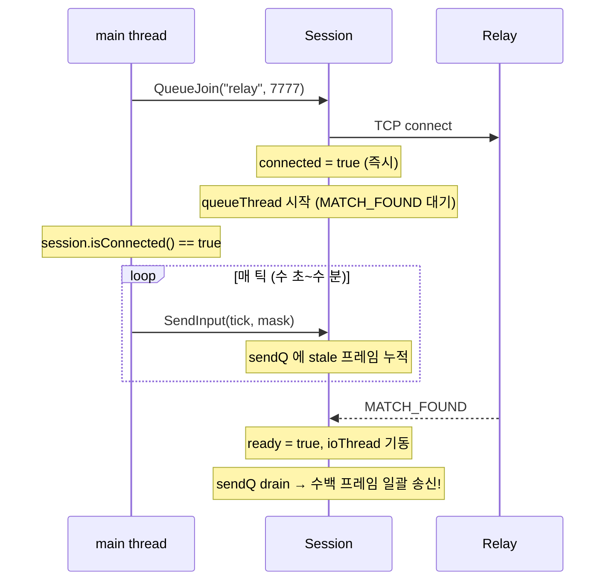

호스트가 먼저 큐에 들어오고 게스트가 나중에 붙으면, **호스트 측만** 대기 시간이
길다 → 호스트의 `sendQ` 에 stale INPUT 프레임이 더 많이 쌓인다. MATCH_FOUND
순간 호스트는 수백 프레임을 한꺼번에 토해내고, 이게 게스트의 `ioThread` 로 쏟
아져 들어간다.

게스트 측의 `handleFrame(INPUT)` 은 다음처럼 동작한다:

```cpp
// net/session.cpp:696-706 — handleFrame 의 INPUT 분기
for (uint16_t i = 0; i < cnt; ++i) {
    uint32_t tick = from + i;
    uint8_t  m    = arr[i];
    {
        std::lock_guard<std::mutex> lk(inMu);
        remoteInputs.emplace(tick, m);   // ← 이미 있는 키는 "덮어쓰지 않는다"
        if (tick > lastRemoteTick) lastRemoteTick = tick;
    }
}
```

`std::unordered_map::emplace` 의 의미론: **키가 이미 존재하면 insert 하지 않고
기존 값을 유지한다.** stale 프레임의 `from_tick` 은 0 부터 시작하므로, 게스트의
`remoteInputs[0..N]` 은 stale 값(= 호스트가 매치 대기 중 눌렀던 무의미한 입력,
실제로는 대부분 0 이지만 마우스 창이 포커스 얻기 전의 랜덤 기억) 으로 선점된다.

이후 진짜 게임이 시작돼 호스트가 `SendInput(tick=0, realMask)` 를 보내도,
게스트 측 `emplace` 는 기존 값을 보존한다 → 호스트의 진짜 입력이 통째로
버려진다. HOST.gameLocal 은 `realMask` 로 돌고, GUEST.gameRemote 는 `staleMask`
로 돌고 → 두 게임 상태가 갈라진다.

반대 방향은 왜 멀쩡했나? 게스트는 호스트보다 **나중에** 큐에 들어갔기 때문.
게스트의 `sendQ` 에 쌓인 stale 프레임은 적거나 없었다 → 호스트 측 오염은
없거나 무시할 수준.

### 15.4 수정 — 게임 객체 생성 후에만 SendInput

수정 diff(현재 코드, `src/main.cpp:500-513`):

```cpp
if (app == AppMode::Net && session.isConnected())
{
    // 중요: 게임 객체(gameLocal/gameRemote)가 아직 없으면 INPUT 을 보내지
    // 않는다. 매치메이킹 대기 기간(isConnected=true, isReady=false) 에
    // SendInput 을 호출하면 sendQ 에 stale 프레임(tick 0..N)이 쌓이고,
    // MATCH_FOUND 직후 ioThread 가 한꺼번에 송신 → 상대의
    // remoteInputs.emplace() 가 먼저 받은 stale 로 tick 을 점유 → 진짜
    // 게임 tick 0 INPUT 이 도착해도 덮어쓰기 거부 → 비대칭 DESYNC.
    if (gameLocal && gameRemote)
    {
        localInputs[localTickNext] = inputMask;
        session.SendInput(localTickNext, inputMask);
        localTickNext++;
    }

    if (session.isReady() && (!gameLocal || !gameRemote))
    {
        // 게임 객체 초기화 — 이후 틱부터 SendInput 이 실행된다.
        ...
    }
}
```

한 줄 요약: **"연결됐다" 와 "게임 시작 준비됐다" 는 다르다.** SendInput 의
가드는 전자가 아니라 후자여야 한다. `gameLocal && gameRemote` 는 "MATCH_FOUND
후 SEED 수신 + Game 인스턴스 생성 완료" 의 동치 조건.

### 15.5 수정 전/후 타임라인 비교

수정 전:

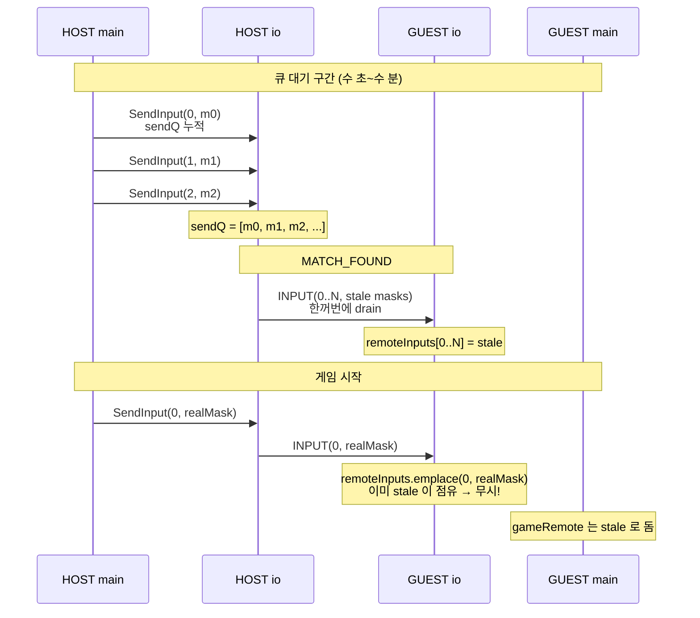

수정 후:

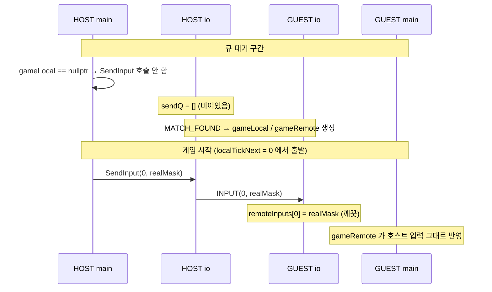

### 15.6 부수 효과

이 수정은 DESYNC 를 고치는 것 외에 **매치 직후 초반 TCP 트래픽 스파이크** 도
함께 없앤다. 옛 버전은 MATCH_FOUND 시 수백 프레임을 한 번에 토해냈다 — TCP
스트림상 수 KB 의 즉시 전송, 그리고 상대 측 `handleFrame` 이 수백 번 연쇄
호출되어 `inMu` lock 경합 → 상대 main thread 의 `GetRemoteInput` 도 함께 밀림.
수정 후에는 `sendQ` 가 항상 "현재 틱 ± 1" 상태에 머물러, 트래픽이 안정적인
60 frames/s 로 흐른다. 육안으로는 "매치 시작 직후 첫 1~2초 동안 호스트 창이
살짝 렉 걸렸다가 풀리는" 느낌이 사라진다.

### 15.7 교훈

`std::unordered_map::emplace` vs `operator[]` 의 차이는 문서상 뻔하지만, 네트워크
경로의 "같은 키가 두 번 들어올 수 있다" 가 전제되지 않으면 간과된다. `remoteInputs`
가 `operator[]` (= 덮어쓰기) 였다면 이 버그는 DESYNC 대신 "첫 수 틱의 상대 입력이
조금 이상함" 으로 숨어들어 더 찾기 어려웠을 수 있다. emplace 의 엄격함 덕분에
DESYNC 가 **즉시 · 결정론적으로** 터져 추적이 가능했다 — 이 경우는 "엄격 의미론"
이 디버깅에 도움 된 사례.

### 15.8 라운드 경계에서 지킬 것

이 버그의 일반형은 "게임으로 간주하면 안 되는 시간에 INPUT 을 보낸다" 이다.
회귀를 막으려면 다음 구간에서는 `SendInput()` 을 호출하지 않는다.

- 매치메이킹/룸 대기 중: 아직 `Session::isReady()` 가 아니다.
- `startDelay` 중: 양쪽이 같은 tick 0에서 출발하기 전이다.
- 게임오버 화면/재시작 협상 중: 기존 `Game` 객체가 살아 있어도 라운드는 끝났다.
- 새 seed 로 재시작 직전: tick 이 0으로 재사용되므로 이전 라운드 INPUT 과 섞이면 안 된다.

`ClearInputs()` 는 수신 측 입력 맵과 tick watermark 를 초기화하는 장치다. 이미
`sendQ` 에 들어간 프레임이나 TCP 스트림에 나간 프레임을 되돌리는 장치는 아니므로,
가장 중요한 방어선은 "처음부터 라운드 밖 INPUT 을 큐에 넣지 않는 것" 이다.

---

## 16. TCP_NODELAY (Nagle 비활성화)

DESYNC 를 잡고 나니 다른 증상이 드러났다. 로컬 루프백(같은 PC 두 창) 에서는
체감상 완벽한데, LAN 건너 두 대로 붙이니 **입력이 간헐적으로 200ms 씩 늦게
반영**됐다. safeTick 이 계속 멈췄다 풀렸다를 반복 — lockstep 이 살짝 끊겼다.

### 16.1 Nagle 알고리즘

TCP 소켓의 기본 동작은 [Nagle 알고리즘 (RFC 896, 1984)](https://tools.ietf.org/html/rfc896)
이 켜진 상태다. Nagle 의 목적은 1980년대 Telnet 환경 최적화 — "1바이트씩
타이핑하는 사용자" 를 위해 작은 패킷을 모아서 보낸다. 구체적으로:

- 소켓 송신 버퍼에 ACK 안 받은 데이터가 있으면, 새 데이터가 MSS(최대 세그먼트
  크기, 보통 1460바이트) 보다 작으면 **잠깐 기다린다**.
- 이전 데이터의 ACK 가 도착하거나, 버퍼에 MSS 이상이 모이면 그제서야 송신.
- 최대 대기 시간은 구현마다 다르지만 **Windows/Linux 는 약 200ms** 가 상한.

### 16.2 우리 트래픽과의 충돌

게임 INPUT 프레임 한 개의 바이트 수: 헤더 2 + 타입 1 + payload 7 + 체크섬 4 =
14바이트. 60Hz 로 보내면 초당 840바이트, 프레임당 16.67ms 간격.

Nagle 의 관점에서 보면:

1. tick 0 INPUT 송신 (14바이트) → 상대에게 도착, ACK 발생
2. tick 1 INPUT 송신 (14바이트) → 이전 ACK 가 빠르게 오면 바로 송신. 그런데
   네트워크 RTT 가 30ms 라면 ACK 는 아직 안 왔다 → Nagle 이 **대기 모드**.
3. tick 2 INPUT 이 16.67ms 뒤에 도착 → 총 28바이트. 여전히 MSS(1460) 훨씬 미만.
   계속 대기.
4. ACK 가 도착하거나, 200ms 상한이 차거나 할 때까지 수십 틱 분량이 모여서 한번에 송신.

**lockstep 의 safeTick 은 상대 INPUT 의 최신 틱 번호에 전적으로 의존한다.**
Nagle 때문에 내 INPUT 이 200ms 뒤에 도착하면, 상대 safeTick 은 200ms 멈췄다가
펄스 형태로 12 tick 씩 뛴다. 상대는 내가 12 tick 동안 아무 입력도 안 한 것
처럼 보다가 갑자기 와르르 행동. 내 쪽도 증상이 대칭적으로 나타남.

체감상 이건 대역폭 부족처럼 보이지만 실은 "지연 ↔ 대역폭" 트레이드오프의 우리
쪽 선호와 OS 기본값이 정반대인 상황이다. 우리는 대역폭(초당 1KB) 이 남아돌아도
지연을 0 으로 쥐어짜고 싶다.

### 16.3 수정 — set_nodelay 헬퍼

`net/socket.cpp` 에 다음 함수를 추가하고 (`socket.cpp:76-89`):

```cpp
// [NET] Nagle 비활성화 (TCP_NODELAY).
//   기본 Nagle 알고리즘은 작은 패킷(<MSS) 을 최대 200ms 까지 버퍼링해 모아
//   보낸다. 우리 INPUT 프레임은 7바이트 / 60Hz 로 송신 → Nagle ON 이면 각
//   프레임이 수십~200ms 지연되어 도착한다. lockstep 의 safeTick 은 상대 INPUT
//   도착까지 대기하므로 → 체감상 "호스트가 렉 걸림".
//   게임 트래픽은 지연이 대역폭보다 압도적으로 치명적 → 반드시 NODELAY.
static int set_nodelay(int fd) {
    int yes = 1;
#ifdef _WIN32
    return setsockopt(fd, IPPROTO_TCP, TCP_NODELAY, (const char*)&yes, sizeof(yes));
#else
    return setsockopt(fd, IPPROTO_TCP, TCP_NODELAY, &yes, sizeof(yes));
#endif
}
```

`IPPROTO_TCP / TCP_NODELAY` 는 `<netinet/tcp.h>` (POSIX) 또는 `<winsock2.h>`
(Windows) 에 정의되어 있다. Windows 에서도 상수 이름 · 인자 의미는 동일하고,
`setsockopt` 의 세 번째 인자가 `const char*` 로 캐스팅되어야 하는 것만 차이.

이 헬퍼를 소켓이 "연결된 직후" 두 곳에서 호출한다:

```cpp
// net/socket.cpp:123-134 — tcp_accept
TcpSocket tcp_accept(const TcpSocket& server) {
    TcpSocket c{};
    if (!server.valid()) return c;
    sockaddr_in addr{}; socklen_t alen = sizeof(addr);
    int fd = (int)::accept(server.fd, (sockaddr*)&addr, &alen);
    if (fd < 0) return c;
    // 수락된 소켓을 논블로킹 + NODELAY 로 설정.
    set_nonblocking(fd);
    set_nodelay(fd);
    c.fd = fd;
    return c;
}
```

```cpp
// net/socket.cpp:137-166 — tcp_connect (끝부분)
    if (fd < 0) return s;
    // 연결된 소켓을 논블로킹 + NODELAY 로 설정.
    set_nonblocking(fd);
    set_nodelay(fd);
    s.fd = fd;
    return s;
}
```

중요: `tcp_listen` 의 리턴 소켓(= listen 소켓) 에는 NODELAY 를 걸지 않는다.
listen 소켓은 데이터를 주고받지 않고 `accept` 만 한다 — NODELAY 설정은 자식
소켓(accept 리턴값) 에 따로 걸어야 한다. 이건 `setsockopt` 옵션의 "listen 소켓의
설정이 accept 자식으로 상속되는가" 문제인데, `SO_REUSEADDR` 등 일부는 상속되고
`TCP_NODELAY` 는 상속되지 않는 플랫폼이 있다. 양쪽에 직접 거는 것이 안전.

### 16.4 릴레이 경로에서의 적용

이 프로젝트는 NAT 우회를 위해 릴레이를 거친다. 경로는:

```text
Client A ↔ Relay ↔ Client B
```

A ↔ Relay 구간의 accept 는 Relay 측 `tcp_accept`, A 측 `tcp_connect` — 둘 다
위 헬퍼를 호출하므로 양방향 NODELAY. Relay ↔ B 구간도 마찬가지. 결과적으로
전체 경로가 Nagle 없이 흐른다.

릴레이 서버(`server/main.cpp`) 가 `net/socket.cpp` 의 같은 `tcp_accept` 를 쓰기
때문에 별도 수정이 필요 없다 — 클라이언트 소켓 코드를 고치면 서버도 자동으로
혜택을 본다. 이것이 소켓 레이어를 한 파일에 모아둔 실리.

### 16.5 수정 효과

NODELAY 를 켠 뒤 LAN 테스트 결과:

| 항목 | Nagle ON | Nagle OFF |
|---|---|---|
| 평균 INPUT 지연 | 20~200ms (변동) | 1~3ms (편도 RTT 근접) |
| safeTick 정체 빈도 | 간헐적으로 10~20틱 멈춤 | 눈으로 보이지 않음 |
| 초당 패킷 수 (편도) | ~10 (묶여서) | ~60 (프레임당 1개) |
| 초당 바이트 수 | 거의 동일 | 거의 동일 |

대역폭은 변화 없음(어차피 840바이트/s). 단지 패킷이 "뭉쳐서" 갔던 게
"펼쳐져서" 갈 뿐. 대부분의 게임/실시간 통신 프로젝트가 NODELAY 를 기본으로
설정하는 이유다.

---

## 17. HASH pair atomic race 수정

§7 에서 소개한 HASH 교차 검증은 단순해 보이지만, 멀티스레드 코드에서 흔한 함정
하나를 안고 있었다.

### 17.1 문제 — 두 atomic 의 비원자적 쌍

구 코드는 `lastHashTickRemote` (`uint32_t`) 와 `lastHashRemote` (`uint64_t`) 를
각각 `std::atomic` 으로 잡았다:

```cpp
// 버그 있는 옛 버전
std::atomic<uint32_t> lastHashTickRemote{0};
std::atomic<uint64_t> lastHashRemote{0};
```

ioThread 가 HASH 프레임을 수신하면 두 값을 "차례로" 업데이트:

```cpp
// 버그 있는 옛 버전
case MsgType::HASH: {
    uint32_t t = le_read_u32(p);
    uint64_t h = le_read_u64(p+4);
    lastHashTickRemote.store(t);   // ① 먼저
    lastHashRemote.store(h);       // ② 그 다음
} break;
```

main thread 가 같은 두 값을 차례로 읽는다:

```cpp
// 버그 있는 옛 버전
bool GetLastRemoteHash(uint32_t& tick, uint64_t& hash) const {
    tick = lastHashTickRemote.load();
    hash = lastHashRemote.load();
    return tick != 0;
}
```

이 코드의 문제: ioThread 가 `① tick = 1200` 을 store 한 직후, `② hash = 0xNEW`
를 store 하기 **전** 에 main thread 가 끼어들어 `load` 하면, **새로운 tick +
옛날 hash** 를 읽게 된다.

그 결과가 F.2 의 DESYNC 검사에서 뭐가 되는지 따라가보자:

```cpp
if (session.GetLastRemoteHash(rt, rh) && rt != lastRemoteHashSeenTick) {
    auto& slot = localHashRing[(rt / HASH_PERIOD_TICKS) % HASH_RING];
    if (slot.valid && slot.tick == rt) {
        if (slot.hash != rh) { /* DESYNC! */ }
    }
}
```

- `rt = 1200` (새) 은 로컬 링에 있음 (이미 1200 시점에 SendHash 했다)
- `rh = (tick 600 시점의 옛 해시)` — 당연히 `slot.hash` 와 다름
- → **가짜 DESYNC 판정**

실제 lockstep 은 정상인데 race 때문에 배너가 뜨는 사고.

### 17.2 수정 — mutex 로 pair 원자 보호

두 필드를 atomic 에서 plain 으로 되돌리고 mutex 로 묶는다. `net/session.h:192-194`:

```cpp
// 주의: tick 과 hash 는 pair 로 원자 갱신되어야 한다. 두 atomic 을 쪼개서
// 쓰면 store 사이에 reader 가 들어가 새 tick + 옛 hash 를 읽어 DESYNC 오탐.
// 단일 mutex 로 pair 전체를 보호. HASH 프레임은 10s 주기라 lock 부담 없음.
mutable std::mutex hashMu_;
uint32_t lastHashTickRemote{0};
uint64_t lastHashRemote{0};
```

`mutable` 키워드는 `const` 메서드 `GetLastRemoteHash` 에서도 lock 할 수 있게
해준다.

수신 측 (`net/session.cpp:715-724`):

```cpp
case MsgType::HASH: {
    if (f.payload.size() == 4+8) {
        const uint8_t* p = f.payload.data();
        uint32_t t = le_read_u32(p);
        uint64_t h = le_read_u64(p+4);
        std::lock_guard<std::mutex> lk(hashMu_);
        lastHashTickRemote = t;
        lastHashRemote = h;
    }
} break;
```

조회 측 (`net/session.cpp:761-766`):

```cpp
bool Session::GetLastRemoteHash(uint32_t& tick, uint64_t& hash) const {
    std::lock_guard<std::mutex> lk(hashMu_);
    tick = lastHashTickRemote;
    hash = lastHashRemote;
    return tick != 0;
}
```

### 17.3 비용

HASH 프레임은 600틱(= 10초) 주기로 오므로 `handleFrame` 의 이 분기는 0.1Hz.
lock hold 시간은 두 정수 복사로 나노초 단위 — main thread 가 동시에 `GetLast
RemoteHash` 를 호출해도 경합으로 인한 대기는 측정 불가능한 수준.

Atomic 두 개보다 mutex 하나가 성능상 **오히려 유리** 하기도 하다. 두 atomic 은
컴파일러가 메모리 배리어를 두 번 삽입하지만, 하나의 mutex 는 lock/unlock 쌍에서
한 번씩만 삽입. 가독성도 "이 두 필드는 세트다" 라는 의도가 명시된다.

### 17.4 교훈

`std::atomic<T>` 는 **단일 값** 의 원자성을 보장할 뿐, 여러 atomic 을 묶어서
원자적으로 갱신해주지 않는다. C++ 의 [memory_order] 가 아무리 엄격해도 "두 store
사이를 쪼갤 수 있다" 는 원칙은 그대로다. 쌍으로 갱신해야 하는 데이터는:

1. `struct` 로 묶어서 단일 atomic 에 넣거나 (sizeof <= 8 정도까지는 lock-free)
2. mutex 로 보호하거나
3. `std::atomic<std::shared_ptr<T>>` 로 pointer swap

이 프로젝트는 (2) 를 선택했다 — 호출 빈도가 낮아 mutex 비용이 무시 가능 + 코드
가 가장 단순하므로.

---

## 18. XOR 결합 해시 (`gameLocal ^ gameRemote`)

§17 을 고치고 나서도 DESYNC 오탐이 **여전히 10초마다** 나왔다. 이번엔 race 가
아니라 **해시 자체가 틀렸다**.

### 18.1 기존 버그 — gameLocal 만 해싱

초기 F.2 구현은 이랬다(버그 버전):

```cpp
// 옛 버전
if (simTick % HASH_PERIOD_TICKS == 0) {
    uint64_t h = gameLocal->ComputeStateHash();   // gameLocal 만!
    session.SendHash(simTick, h);
    // 로컬 링에도 h 저장
}
```

보냈을 때 상대 측에서는 뭐와 비교하는가? 상대 main thread 의 F.2 루프도
대칭적으로 자기 `gameLocal->ComputeStateHash()` 를 로컬 링에 넣는다. 그리고
상대로부터 받은 HASH 프레임의 값(= 내 gameLocal 해시) 을 자기 링의 같은 틱 해시
와 비교.

- HOST 가 보낸 해시 = HOST.gameLocal.hash = "호스트 입력으로 돌린 게임" 해시
- GUEST 의 로컬 링 슬롯 = GUEST.gameLocal.hash = "게스트 입력으로 돌린 게임" 해시

**이 둘은 서로 다른 경기다.** 양쪽 다 같은 seed 로 피스 순서는 같지만, "어떤 입력
이 들어갔느냐" 가 다르므로 grid · current block 위치 · score · combo 모두 다르다.
즉 lockstep 이 **완벽하게 정상이어도 이 두 해시는 언제나 다르다** → 매 10초
DESYNC 배너가 뜨는 게 당연한 동작이었다. HASH 검증 자체가 기능 오프.

### 18.2 수정 — 두 게임 해시를 XOR 결합

lockstep 이 정상이면 양쪽 main thread 는 `gameLocal` 과 `gameRemote` 를 모두
보유한다. HOST 관점에서 gameLocal = "호스트 입력 게임", gameRemote = "게스트
입력 게임". GUEST 관점에서는 역할만 뒤집혀 있다. 즉 **양쪽에서 "두 게임의 집합"
은 같다**, 단지 "어느 게임이 local 인지" 만 다를 뿐.

집합 동등성을 보존하면서 scalar 해시로 줄이는 가장 간단한 연산은 **XOR**:

$$h_{\text{combined}} = h_{\text{gameLocal}} \oplus h_{\text{gameRemote}}$$

XOR 은 교환법칙 + 결합법칙이 성립하므로:

- HOST.h_combined = HOST.gameLocal.h ⊕ HOST.gameRemote.h = h_host ⊕ h_guest
- GUEST.h_combined = GUEST.gameLocal.h ⊕ GUEST.gameRemote.h = h_guest ⊕ h_host
- ∴ HOST.h_combined ≡ GUEST.h_combined (lockstep 정상 가정)

이 두 값이 틀어지는 경우 = 어느 한쪽의 "두 게임 집합" 이 상대와 다른 경우 =
진짜 DESYNC. 정확히 우리가 감지하고 싶은 것.

### 18.3 수정 코드

600틱 주기 HASH 송신 블록 전체(`src/main.cpp:576-591`):

```cpp
// F.2: 600틱마다 양쪽 경기판 해시를 결합해 송신 + 링 기록.
// gameLocal 만 해싱하면 "호스트의 gameLocal" vs "게스트의
// gameLocal" 을 비교하게 되는데, 이 둘은 서로 다른 경기라
// 항상 다를 수밖에 없다(DESYNC 오탐). lockstep 이 정상이면
// 양쪽 모두 gameLocal+gameRemote 를 (같은 관점에서) 갖고
// 있으므로 XOR 로 결합하면 동일 해시가 나온다.
if (simTick > 0 && simTick % HASH_PERIOD_TICKS == 0 &&
    simTick != lastHashSentTick) {
    uint64_t hL = gameLocal->ComputeStateHash();
    uint64_t hR = gameRemote->ComputeStateHash();
    uint64_t h  = hL ^ hR;
    session.SendHash(simTick, h);
    auto& slot = localHashRing[(simTick / HASH_PERIOD_TICKS) % HASH_RING];
    slot.tick = simTick; slot.hash = h; slot.valid = true;
    lastHashSentTick = simTick;
}
```

`simTick != lastHashSentTick` 가드는 같은 틱에서 이 블록이 여러 번 돌아도 한
번만 송신되게 한다 (`while (simTick <= safeTick)` 내부에서 여러 번 체크될 수
있음).

### 18.4 XOR 의 충돌 특성

이론적으로 XOR 결합 해시는 충돌률이 나빠질 수 있는가? 두 independent 한 64비트
해시 `hL`, `hR` 을 XOR 하면 결과도 64비트 uniform 분포 — 충돌률은 개별 해시와
같은 `2^{-64}` 수준. 그리고 FNV-1a 의 출력 분포는 실용적으로 uniform 에 가까워
(Part 3 참조) 충돌률 저하는 측정 불가능한 수준이다.

더 견고한 결합이 필요하다면 `h1 * 0x9E3779B97F4A7C15 ^ h2` 같은 방식(golden
ratio 믹싱) 도 있지만, 우리의 쓰임새(매 10초 주기 검증, 충돌 시 단순히 재시작)
에는 XOR 로 충분하다.

### 18.5 DESYNC breakdown 과의 연관

§19 에서 설명할 `StateHashBreakdown` 은 6섹션(`grid`, `currentBlock`, `nextBlock`,
`rng`, `scoreFlags`, `combat`) 의 개별 해시를 리턴한다. DESYNC 발생 시 이 breakdown
을 찍어서 어느 섹션이 먼저 깨졌는지 본다.

그런데 주의: 송신되는 combined hash (XOR) 는 **섹션 분리 불가능** 하다. `grid_L ⊕
grid_R` 과 `cur_L ⊕ cur_R` 은 다시 섞이면 개별 값을 복원할 수 없다. 그래서
DESYNC 로그는 상대 combined hash 는 그대로 두고, **자기 쪽의 gameLocal /
gameRemote breakdown 만** 출력한다. 상대도 같은 시점에 DESYNC 를 찍으므로, 양쪽
콘솔 로그를 나란히 놓으면 어느 필드가 먼저 갈라졌는지 좁힐 수 있다.

---

## 19. DESYNC breakdown 로그 및 `[INIT]` 덤프

§15~§18 의 수정을 모두 적용하고도, 릴리스 후에 새로운 DESYNC 가 나타날 가능성은
있다 — 예컨대 SimGame 로직에 비결정론을 도입하는 회귀. 이를 빠르게 추적할 수
있도록 두 종류의 진단 로그를 `src/main.cpp` 에 심어뒀다.

### 19.1 `[INIT]` 덤프 — 출발점 확인

게임 객체가 생성되는 직후 (MATCH_FOUND + SEED 수신 + `std::make_unique<Game>`
실행 직후) 에 다음을 찍는다(`src/main.cpp:527-533`):

```cpp
// DESYNC 디버깅: 양쪽 창 로그를 비교해 초기 seed + 초기 hash 가
// 같은지 먼저 확인. 여기가 다르면 lockstep 출발점부터 갈림.
fprintf(stderr, "[INIT] seed=0x%016llx inputDelay=%u startDelay=%u\n",
        (unsigned long long)sessionSeed,
        (unsigned)inputDelay, (unsigned)startDelay);
fprintf(stderr, "[INIT] gameLocal  hash=0x%016llx\n",
        (unsigned long long)gameLocal->ComputeStateHash());
fprintf(stderr, "[INIT] gameRemote hash=0x%016llx\n",
        (unsigned long long)gameRemote->ComputeStateHash());
```

DESYNC 를 디버깅할 때 체크리스트:

1. **양쪽 창의 `[INIT] seed=...` 가 같은가?** 다르면 SEED 프레임 전달 버그.
   네트워크 레이어 문제.
2. **양쪽 창의 `[INIT] gameLocal hash` 가 같은가?** 다르면 SimGame 생성자가
   seed 외의 비결정론 요소(예: `rand()` 호출, 시간 기반 초기화) 를 쓴다는 증거.
   Part 3 의 결정론 원칙 위반.
3. **gameLocal 과 gameRemote 의 초기 hash 가 같은가?** 같아야 한다 — 둘 다
   같은 seed, 같은 입력(아직 아무 입력 없음) 이므로.

이 세 조건이 모두 참이면 lockstep 의 출발점은 깨끗하다. 이후 DESYNC 는
시뮬레이션 중 갈라진 것.

### 19.2 DESYNC breakdown — 어느 필드가 깨졌나

DESYNC 검출 시 섹션별 해시를 찍는다(`src/main.cpp:703-716`):

```cpp
fprintf(stderr, "[DESYNC] tick=%u local=0x%016llx remote=0x%016llx\n",
        rt, (unsigned long long)slot.hash, (unsigned long long)rh);
if (gameLocal && gameRemote) {
    auto bL = gameLocal->sim.StateHashBreakdown();
    auto bR = gameRemote->sim.StateHashBreakdown();
    fprintf(stderr, "  gameLocal : grid=%016llx cur=%016llx nxt=%016llx rng=%016llx sf=%016llx co=%016llx\n",
            (unsigned long long)bL.grid, (unsigned long long)bL.currentBlock,
            (unsigned long long)bL.nextBlock, (unsigned long long)bL.rng,
            (unsigned long long)bL.scoreFlags, (unsigned long long)bL.combat);
    fprintf(stderr, "  gameRemote: grid=%016llx cur=%016llx nxt=%016llx rng=%016llx sf=%016llx co=%016llx\n",
            (unsigned long long)bR.grid, (unsigned long long)bR.currentBlock,
            (unsigned long long)bR.nextBlock, (unsigned long long)bR.rng,
            (unsigned long long)bR.scoreFlags, (unsigned long long)bR.combat);
}
```

`StateHashBreakdown()` 은 Part 3 에서 정의한 `SimGame` 메서드로, 전체 해시 대신
6개 섹션별 해시를 구조체로 리턴한다:

| 섹션 | 포함 상태 | DESYNC 시 의심 |
|---|---|---|
| `grid` | 10×20 보드 셀 | 충돌/락/라인 클리어 로직 |
| `currentBlock` | 현재 피스 타입/위치/회전 | 입력 처리, 킥 회전 |
| `nextBlock` | 다음 피스 큐 | RNG 호출 순서 |
| `rng` | RNG 내부 상태 | RNG 구현 차이 |
| `scoreFlags` | 점수 · 레벨 · 게임오버 플래그 | 점수 계산 식 |
| `combat` | 공격 라인 송수신 카운터 | 전투 로직 |

양쪽 창의 로그를 나란히 놓고 첫 번째로 다른 섹션을 찾으면, DESYNC 의 **원인
도메인** 이 즉시 좁혀진다. 예를 들어 `rng` 만 다르면 RNG 호출 순서가 어긋난
것이고, `grid` 만 다르면 라인 클리어 / 가비지 처리 로직의 비결정성 의심.

### 19.3 로그 출력 경로 — stdout 이 아닌 stderr

두 덤프 모두 `fprintf(stderr, ...)` 를 쓴다. 이유:

1. **버퍼링** — Windows 의 stdout 은 콘솔 출력 시 line-buffered 이지만, stderr
   은 unbuffered. 크래시 직전에 찍은 로그도 확실히 콘솔에 찍힌다.
2. **리다이렉션 분리** — `tetris.exe > out.log 2> err.log` 같이 DESYNC 로그만
   따로 분리하고 싶을 때 편함.
3. **§20 의 원칙과도 일관** — 게임 루프에서 stdout 을 최대한 안 건드린다.

`fprintf` 대신 `std::cout` 으로 썼다면 main thread 가 `std::cout << ...` 의
내부 mutex 와 flush 를 경유해 stdio 동기화 버퍼를 거친다 — Windows 에서는 콘솔
I/O 가 blocking 이라 찍는 순간 main thread 가 수 ms 밀린다. DESYNC 로그는
디버깅 용도상 1회 burst 이므로 이 정도 대가는 괜찮지만, 정상 게임 루프 안에서는
피해야 한다. 이것이 §20 의 주제.

---

## 20. Host 렉 기타 원인 정리

§15 의 stale backlog 와 §16 의 Nagle 을 잡고 나서도, 호스트 측에서 미묘한
프레임 드랍이 관찰됐다. 원인은 네트워크가 아니라 **stdout I/O** 와 **OS 모달
루프** 였다.

### 20.1 ioThread 의 hot-path stdout 제거

`Session::ioThread()` 는 60Hz 이상으로 도는 루프다 (실제로는 2ms sleep +
recv/send 이므로 최대 500Hz 에 가까움). 옛 코드는 디버깅 편의를 위해 이렇게
썼다:

```cpp
// 옛 버전 — 문제
while (!quit.load()) {
    if (tcp_recv_some(sock, recvBuf) && recvBuf.size() > prevSize) {
        std::cout << "[NET] Received " << (recvBuf.size() - prevSize)
                  << " bytes" << std::endl;
        std::vector<Frame> frames;
        parse_frames(recvBuf, frames);
        std::cout << "[NET] Parsed " << frames.size() << " frames" << std::endl;
        for (auto& f : frames) handleFrame(f);
    }
}
```

Windows 에서 `std::cout << ... << std::endl` 은:

1. `cout` 내부 mutex lock
2. stdio sync (C++ stream ↔ C stdio)
3. `WriteFile(GetStdHandle(STD_OUTPUT_HANDLE), ...)` — **콘솔에 직접 쓰기 시
   blocking**. 콘솔이 스크롤 버퍼 재구성 중이면 수 ms 정지.
4. `std::endl` 이 flush 까지 호출 → stdout 버퍼를 비우고 돌아옴.

초당 수십 줄이 찍히면 ioThread 가 거의 "콘솔 출력 대기 스레드" 가 된다. main
thread 가 `session.SendInput()` 을 호출해 `sendMu` lock 을 잡아도, ioThread 가
드레인을 못 해서 `sendQ` 가 증가 → 반대쪽의 safeTick 이 뒤처짐.

수정 (`net/session.cpp:562-567`):

```cpp
size_t prevSize = recvBuf.size();
if (tcp_recv_some(sock, recvBuf)) {
    if (recvBuf.size() > prevSize) {
        hasActivity = true;
        // 주의: 이 루프는 60Hz+ 로 돈다. 여기서 std::cout 으로 매 recv/parse
        // 를 찍으면 Windows 콘솔 I/O 가 blocking 해 Host 쪽 프레임이 밀린다.
        // 로그가 필요하면 NET_TRACE 매크로 등으로 gate 해 debug 빌드에서만.
        std::vector<Frame> frames;
        parse_frames(recvBuf, frames);
        for (auto& f : frames) handleFrame(f);
    }
}
```

한 번에 찍혀야 하는 이벤트(연결 수립, 종료, 에러) 는 `std::cout` 유지. hot-path
(매 recv/send) 의 진행 로그만 제거.

| 지점 | 제거 전 (초당 호출) | 제거 후 |
|---|---|---|
| `[NET] Received N bytes` | ~60~500 | 0 |
| `[NET] Parsed N frames` | ~60~500 | 0 |
| `[NET] I/O thread started` | 1회 | 1회 (유지) |
| `[NET] Connection lost ...` | 단절 시 1회 | 단절 시 1회 (유지) |

이 변경 이후 호스트 측 프레임 타임 편차(stddev) 가 측정 가능한 수준으로 줄었다.
Tracy 같은 프로파일러 없이도 "마우스 커서가 창 위를 지나갈 때 살짝 버벅이던"
증상이 사라지는 걸로 체감 가능.

### 20.2 같은 cmd 창에서 두 인스턴스 실행 시 콘솔 공유

개발 중 한 PC 에서 두 창을 띄워 테스트할 때, 같은 cmd/powershell 세션에서
`tetris.exe --host 7777 & tetris.exe --connect 127.0.0.1:7777` 식으로 실행하면
두 프로세스가 **같은 콘솔 핸들을 공유**한다. 한쪽이 `std::cout` 으로 찍을 때
콘솔 버퍼 lock 을 잡고, 다른 쪽이 동시에 찍으면 대기. 결과적으로 네트워크와
무관하게 둘 다 밀린다.

해결:

```cmd
start /B tetris.exe --host 7777
start /B tetris.exe --connect 127.0.0.1:7777
```

`start /B` 는 별도 프로세스 그룹으로 기동하되, 각 프로세스가 자체 콘솔 핸들을
갖는다(Windows 에서 `start` 는 기본적으로 새 콘솔을 부여). 두 인스턴스의 stdout
이 섞이거나 lock 경합하지 않는다.

또는 더 간단히 각각 다른 cmd 창을 열어서 실행. 개발 편의상 한 화면에서 로그를
보려면 `2> host.log` / `2> guest.log` 로 stderr 리다이렉트 후 양쪽 로그 파일을
tail.

### 20.3 Windows 창 드래그 = modal 루프

Windows 는 타이틀 바 드래그나 리사이즈 시 **modal message loop** 로 진입한다
— 운영체제가 자체 이벤트 루프를 돌리면서 앱의 main thread 를 점유한다. 그
동안 `GetMessage` → `DispatchMessage` → 앱의 WndProc 은 호출되지만, 앱의
main thread 는 메시지 루프 바깥의 게임 로직(SimGame, SendInput) 을 실행할 수
없다.

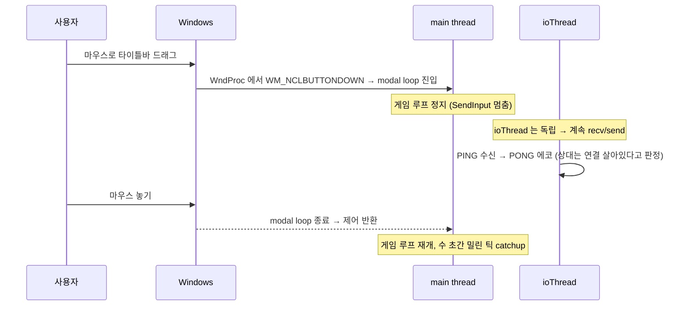

Lockstep 관점에서 이건 §10 의 `Stalled` 상태에 해당한다. 상대 측에서 보면 우리
`maxRemoteTick` 이 멈춰 있다 → 자기 `safeTick` 도 정체. 하지만 ioThread 가
PING 에 PONG 으로 답하므로 `linkStatus()` 는 `OK` 또는 `Stalled` 에 머물고
`Lost` 로 가지 않는다 — 10초 이내에 드래그를 놓으면 연결 유지.

완전한 해결은 어렵다(Rollback netcode 로의 전환이 필요). 현실적 완화:

- UI 에 "Opponent frozen - waiting..." 배너 (§10.4) 표시해 사용자에게 안내.
- "창을 드래그 하지 말라" 는 관습적 조언 (데스크톱 게임 매너).

이건 Lockstep 모델의 본질적 한계이므로 수정 대상이 아니고, 단지 "이런 상황이
있다 + PING/PONG 이 이걸 끊김으로 오인하지 않게 해준다" 를 문서화하는 데 의의.

---

## 21. 릴레이 주소 관리 — `--relay` CLI 와 IP 입력 화면 제거

네트워크 버그들을 고치는 중 한 가지 UX 이슈도 같이 정리했다. 매치메이킹/룸
기능이 개발 초기에 "릴레이 IP 를 매번 입력" 방식이었는데, 테스트할 때마다
타이핑하는 게 거슬렸다.

### 21.1 기존 흐름

```text
메뉴 → [Matchmaking] 선택
     → "Relay IP:port 를 입력하세요:" 화면
     → 사용자가 127.0.0.1:7777 타이핑
     → QueueJoin 호출
     → 매치 대기
```

전용 화면 enum 값 두 개(`MatchmakingAddr`, `RoomRelay`) 가 `Screen` 상태 머신에
있었고, 각각 렌더링 + 텍스트 입력 핸들러 + 유효성 검증 블록을 포함했다. 코드
크기로는 대략 100~150줄.

문제:

- 같은 주소를 매번 치는 게 번거롭다
- 오타 가능성(IPv4 점/포트 콜론 혼동)
- 릴레이 주소를 배포 시점에 바꾸기 어렵다(= UI 문자열로 고정)

### 21.2 수정 — `--relay host:port` CLI 플래그

`src/main.cpp` 의 argv 파서에 플래그 추가(`src/main.cpp:198-250` 중 관련 부분):

```cpp
// 메뉴에서 Matchmaking/Custom Room 을 고를 때 사용할 릴레이 주소.
// 기본은 로컬 릴레이. 다른 공개 릴레이로 바꾸려면 `--relay host:port`.
std::string relayHost = "127.0.0.1";
uint16_t    relayPort = 7777;

for (int i = 1; i < argc; ++i)
{
    std::string a = argv[i];
    ...
    else if (a == "--relay") {
        if (i + 1 < argc) {
            std::string ep = argv[++i];
            if (!parse_endpoint(ep, relayHost, relayPort, 7777)) {
                fprintf(stderr, "error: --relay expects host[:port], got '%s'\n", ep.c_str());
                return 2;
            }
        } else {
            fprintf(stderr, "error: --relay requires an argument (host[:port])\n");
            return 2;
        }
    }
}
```

메뉴에서 Matchmaking 이나 Custom Room 을 선택하면 **즉시** `relayHost:relayPort`
로 `QueueJoin` / `RoomLobby` 가 호출된다. 중간에 "IP 입력" 화면은 없다.

`parse_endpoint` 는 `host:port`, `host`(기본 포트), `127.0.0.1:7777` 같은 형태를
모두 파싱하는 공용 헬퍼. 포트가 1..65535 범위인지, host 가 비어있지 않은지
검증한다.

### 21.3 관련 화면 제거

`Screen` enum 에서 `MatchmakingAddr`, `RoomRelay` 값을 삭제. `main.cpp` 의 해당
case 블록(IP 타이핑 UI, 문자 입력 핸들러, 확인 버튼) 도 함께 제거. 렌더링 코드
감소 외에도 상태 전이가 한 단계 줄어 흐름이 깔끔해진다.

메뉴 전이 다이어그램(수정 후):

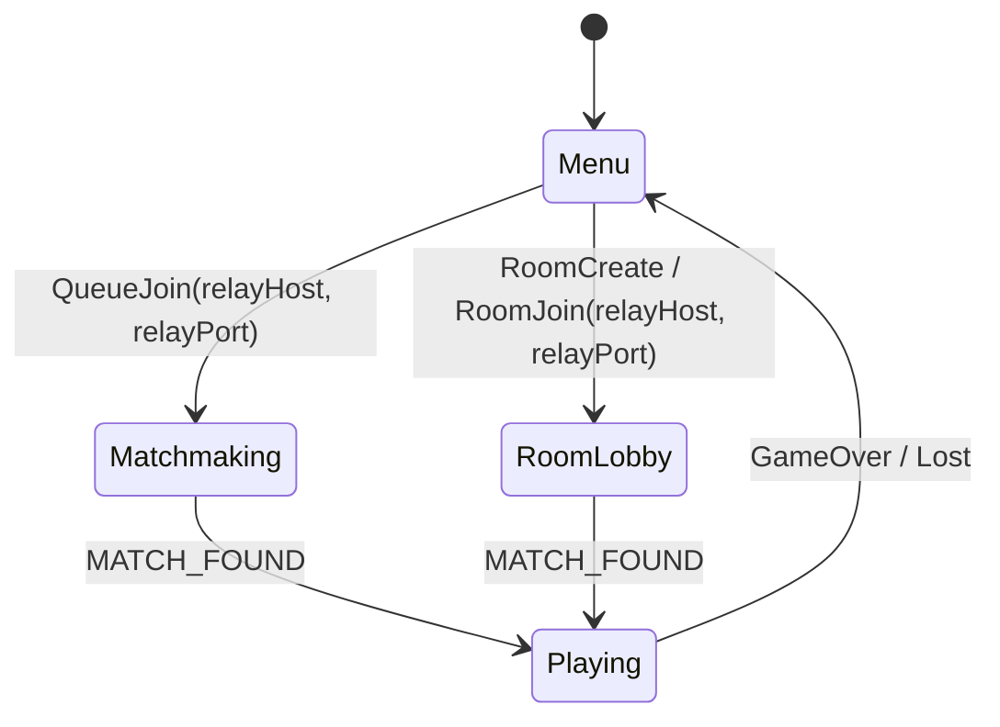

옛 버전은 Menu 와 Matchmaking / RoomLobby 사이에 IP 입력 상태가 하나씩 더
있었다. 이제는 1-hop.

### 21.4 배포 시나리오

공용 릴레이를 운영한다면 다음 중 선택:

**시나리오 A: 빌드 시점에 기본값 고정**

```cpp
std::string relayHost = "relay.mygame.com";
uint16_t    relayPort = 7777;
```

배포용 빌드 브랜치에서만 상수 교체. 사용자는 `tetris.exe` 만 더블클릭하면 끝.

**시나리오 B: 런처/스크립트로 플래그 전달**

```bat
tetris.exe --relay relay.mygame.com:7777
```

배치 파일 하나에 주소를 심고 그 파일을 배포. 릴레이 주소가 바뀌면 배치 파일만
교체 배포.

**시나리오 C: 사용자가 직접 지정**

파워유저가 친구 PC 를 릴레이로 돌려 `tetris.exe --relay 192.168.1.10` 같은 식.
방화벽 뚫지 않고 LAN 파티에 유용.

**시나리오 D: 두 대 직접 연결 (릴레이 없이)**

이건 `--relay` 와 무관하게, 기존 `--host 7777` + `--connect 1.2.3.4:7777`
경로를 쓴다. 매치메이킹/룸을 거치지 않는 P2P 모드.

어느 쪽이든 **릴레이 주소를 결정하는 주체가 유저 타이핑이 아니라 배포자(또는
파워유저의 CLI)** 로 이동했다. 일반 플레이어는 주소를 의식하지 않아도 된다.

---

## 부록: 프로토콜 확장 (Section A·D·E·F)

본문의 Lockstep 핵심 프로토콜(HELLO/SEED/INPUT/ACK/HASH) 이후, 다음 기능들이
`net/framing.h` 의 `MsgType`, 그리고 `net/session.h` 의 메서드로 추가되었다.

### A. PING/PONG 하트비트 + LinkStatus

문제: TCP 는 keep-alive 가 수 분 단위라서 "상대가 창을 드래그 해서 얼어붙음"
과 "상대가 사라짐" 을 즉시 구분할 수 없다. 해결: 1Hz 로 양쪽이 `PING(timestamp_u64)`
을 보내고, 받은 쪽은 즉시 같은 payload 로 `PONG` 에코. ioThread 가 PING 을
송신하고 PONG 수신 시각(`lastPongMs`) 을 갱신한다.

`Session::linkStatus()` 가 경과 시간으로 상태를 판정:

| 경과 `now - lastPongMs` | 상태 | 의미 |
|---|---|---|
| `< 2000ms`   | `OK`      | 정상 |
| `< 10000ms`  | `Stalled` | 상대가 잠시 얼음 (UI 배너로 안내) |
| `≥ 10000ms`  | `Lost`    | 연결 단절로 간주 |

Stalled → OK 복귀 시 자동 재개 — 창 드래그 같은 일시적 freeze 에서 연결이
끊기지 않는다. 이게 "grace 복귀".

### D. 5자리 코드 기반 커스텀 룸

친구끼리 플레이하고 싶을 때 랜덤 큐 대신 사전 공유된 5자리 코드로 페어링.
프레임 타입: `ROOM_CREATE`, `ROOM_JOIN`, `ROOM_INFO`, `READY`, `ROOM_LEAVE`.

```text
Client → Relay: ROOM_CREATE{}
Relay → Client: ROOM_INFO{code:"A1B2C", status:0, peer_count:1}
              (화면에 "코드: A1B2C" 표시, 친구가 입력하도록)
(친구 측) Client2 → Relay: ROOM_JOIN{code:"A1B2C"}
Relay → Client1, Client2: ROOM_INFO{..., peer_count:2}
Client1, Client2 → Relay: READY{1}
Relay → Client1: MATCH_FOUND{role=HOST, seed}
Relay → Client2: MATCH_FOUND{role=GUEST, seed}
```

세션은 `RoomCreate()` / `RoomJoin()` 호출 후 `roomState()` 가 `Starting` 으로
전환될 때까지 메인 스레드가 폴링. 내부적으로 별도 `roomThread` 가 소켓을
non-blocking 으로 pump 한다.

### E. 인-게임 채팅

프레임 타입 `CHAT`, 페이로드 `[text_len:u16][utf8:N]`. 릴레이는 투명 통과.
`Session::SendChat(text)` / `Session::PullChat(outText)`. UTF-8 한글 포함,
200자 권장 상한 (상한은 MAX_PAYLOAD_BYTES=4096 로 방어).

### F. 비동기 릴레이 큐

기존 `Connect()` 는 TCP 연결 시점에 메인 스레드를 블록했지만, 릴레이 큐 매칭은
수 초~수 분이 걸릴 수 있다. `QueueJoin()` 은 별도 `queueThread` 를 기동해
호출 즉시 리턴, 메인 루프는 `isReady() / hasFailed()` 로 폴링. 사용자 취소는
`QueueCancel()` 로 소켓을 닫아 스레드를 unblock.

### F.2. 주기 HASH 자동 검증 + DESYNC 배너

본문에서는 HASH 수동 검증(키 H)을 다뤘는데, 실제 게임 중에는 10초 간격으로
`lastLocalHashTick` 에서 최근 틱을 하나 뽑아 `SendHash`, 상대로부터 받은
`lastHashRemote` 와 일치하는지 매 프레임 확인한다. 불일치 시 UI 에 빨간
"DESYNC" 배너를 표시해 사용자가 게임을 리셋할 수 있게 한다.

### 구현 참고

추가된 메서드는 모두 `net/session.h` 의 공개 API 블록에 있고, 구현은 기존
`ioThread()` / `handleFrame()` 를 확장하거나 별도 짧은 스레드(`queueThread`,
`roomThread`)로 분리되어 있다. 본문의 Lockstep 루프는 달라지지 않았다 — 핸드셰이크
후 `INPUT`/`ACK` 교환은 Section A 이전과 동일하다.

---

## 부록: 디버깅 단축키 (F5 / F6 / H)

Lockstep 을 만들다 보면 "같은 시드에서 정말로 같은 결과가 나오는가" 를 끊임없이 확인해야 한다. 이를 위한 세 단축키를 `src/main.cpp` 의 메인 루프 뒤쪽에 달아 두었다. 네트워크 계층을 건드리지 않고, 순수 키보드 핸들러 수준의 툴링이다.

### H — 상태 해시 즉석 덤프

플레이 중 아무 때나 `H` 를 누르면 현재 세 가지 게임 객체 (싱글 / 로컬 / 원격) 의 `ComputeStateHash()` 결과를 stdout 으로 찍는다.

```cpp
// src/main.cpp
if (platform_key_pressed(PKEY_H))
{
    unsigned long long h1 = gameSingle ? gameSingle->ComputeStateHash() : 0;
    unsigned long long hL = gameLocal  ? gameLocal->ComputeStateHash()  : 0;
    unsigned long long hR = gameRemote ? gameRemote->ComputeStateHash() : 0;
    std::cout << "Hash single=0x" << std::hex << h1
              << " local=0x" << hL << " remote=0x" << hR << std::dec << "\n";
}
```

싱글 모드에서는 `local`/`remote` 가 0, 멀티에서는 `single` 이 0. 네트 모드에서 양쪽 클라이언트가 같은 틱에 `H` 를 누르면 `local` 과 `remote` 가 서로 교차해서 일치해야 한다 — Host 쪽의 `local=0xABCD` 가 Client 쪽의 `remote=0xABCD` 와 같으면 시뮬레이션이 동기 상태. 자동 HASH 검증(§F.2) 은 10 초 주기로 이를 대신하지만, 개발 중에 "지금 이 순간" 을 포착하고 싶을 때 `H` 가 즉시 답을 준다.

`ComputeStateHash` 내부는 Part 3 에서 만든 FNV-1a 64 로 격자·블록·점수·RNG 상태를 덮는다. 같은 시드에서 같은 입력 스트림을 받았다면 반드시 같은 값이 나와야 한다.

### F5 / F6 — 리플레이 녹화

`F5` 는 리플레이 녹화를 시작한다. 현재 `replay.frames` 를 비우고 `recording = true` 로 세팅하면, 이후 매 틱마다 main loop 이 `(tick, p1_input, p2_input)` 튜플을 `replay.frames` 에 추가한다.

`F6` 은 녹화를 종료하고 `out/replay.txt` 로 저장한다.

```cpp
// src/main.cpp
// F5/F6 리플레이
if (platform_key_pressed(PKEY_F5)) { recording = true; replay.frames.clear(); }
if (platform_key_pressed(PKEY_F6) && recording)
{
    std::error_code ec;
    std::filesystem::create_directories("out", ec);
    ReplayIO::Save("out/replay.txt", replay);
    recording = false;
}
```

저장 포맷은 `core/replay.cpp` 의 `ReplayIO::Save/Load` 가 담당한다 — 단순 텍스트 (헤더 한 줄 + 틱당 한 줄). 이렇게 저장된 리플레이는 `sim_hash_dump` 테스트 하네스에서 같은 시드 + 같은 입력 시퀀스로 재실행했을 때 동일한 상태 해시가 나오는지 확인하는 데 쓰인다. 결정론이 깨졌을 때 "이 리플레이가 Host 에서는 끝까지 가고 Client 에서는 15 초 지점에서 탑아웃되더라" 같은 증거를 기록해 두는 것이다.

멀티 모드에서 녹화 중이면 두 플레이어의 입력이 모두 `replay.frames[t].p1`/`.p2` 에 들어간다. 싱글 모드에서는 `p2` 가 0 으로 고정.

### 녹화된 리플레이의 용도

- **결정론 회귀 테스트**: Part 0 에서 소개한 `sim_hash_dump` 는 시드 + 입력 스트림을 받아 상태 해시를 찍어주는 헤드리스 유틸이다. 리플레이 파일을 크로스플랫폼 (Win/macOS/Linux, MSVC/Clang/GCC) 에서 돌려 해시가 동일하면 바이트 단위 결정론이 확인된다.
- **DESYNC 재현**: 의심스러운 DESYNC 가 발생한 매치에서 F5/F6 으로 확보한 리플레이가 있으면, 로컬에서 같은 입력으로 반복 재생하면서 §19 의 `[INIT]` 덤프 + DESYNC breakdown 로그를 뽑아 원인 탐색에 쓸 수 있다.
- **봇 데모**: Part 9 에서 만들 ONNX 봇의 플레이를 녹화해서 나중에 재생하는 용도로도 쓰인다 — RL 학습 곡선의 마일스톤마다 대표 게임을 저장하는 식.

---

## 이 장에서 완성된 것

- `socket` → `framing` → `session` 3계층으로 lockstep 네트워킹 스택을 분리했다.
- `HELLO`, `SEED`, `INPUT`, `ACK`, `PING/PONG`, `HASH`, `GAME_OVER_CHOICE`, `CHAT` 까지 현재 프로토콜의 메시지 흐름을 고정했다.
- safe tick 계산, 자동 HASH 검증, 리플레이 기록처럼 결정론을 운영 단계에서 확인하는 장치를 넣었다.

## 수동 테스트

```bash
cmake -B build
cmake --build build --target tetris sim_hash_dump
./build/Debug/tetris.exe --host 7777
./build/Debug/tetris.exe --connect 127.0.0.1:7777
```

기대 결과: 두 클라이언트가 같은 seed 로 시작하고, 입력 지연이 있어도 양쪽 보드가 같은 타이밍으로 진행된다. 플레이 도중 연결을 잠시 멈추면 Stalled/Lost 표시는 뜨되, 잘못된 입력 적용이나 즉시 DESYNC 는 일어나지 않아야 한다.

---

## 참고 자료

1. **Mark Terrano & Paul Bettner**, "1500 Archers on a 28.8: Network Programming in Age of Empires and Beyond" (GDC 1999). Lockstep 동기화의 원전. "deterministic lockstep" 용어의 기원
2. **Glenn Fiedler**, "Networking for Game Programmers" 시리즈 (gafferongames.com). "Sending and Receiving Packets", "Reliability, Ordering and Congestion Avoidance Over UDP"
3. **RFC 793** (Transmission Control Protocol, 1981). TCP의 스트림 특성, 3-way handshake, TIME_WAIT 상태
4. **Fowler-Noll-Vo hash** (www.isthe.com/chongo/tech/comp/fnv/). FNV-1a 32-bit 및 64-bit의 상수, 충돌 특성, 벤치마크
5. **Microsoft WinSock2 Documentation**. `ioctlsocket(FIONBIO)`, `SO_REUSEADDR`, `WSAGetLastError` 에러 코드
6. **"Rollback Netcode" GGPO** (Tony Cannon, ggpo.net). Lockstep의 한계를 극복하는 rollback/prediction 모델
