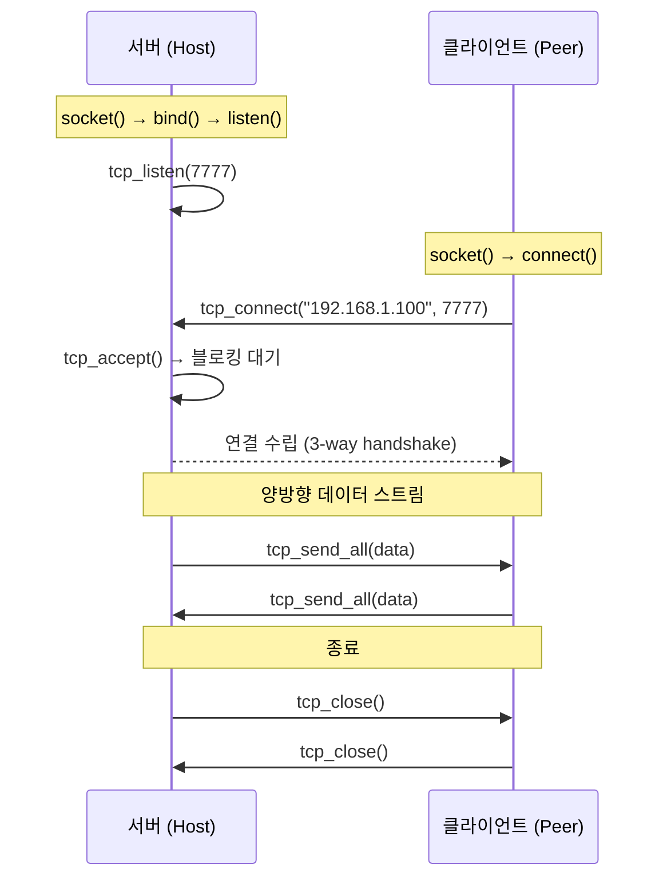
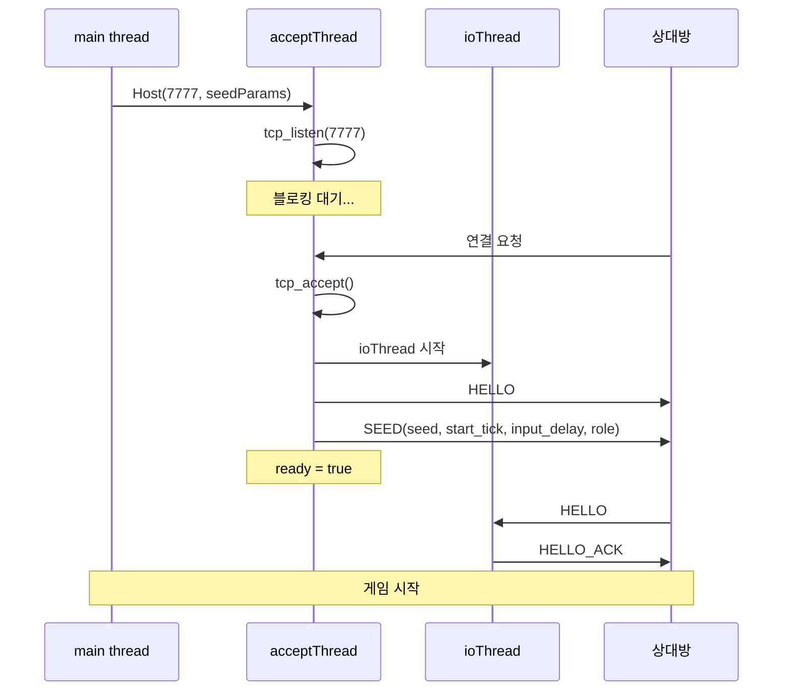
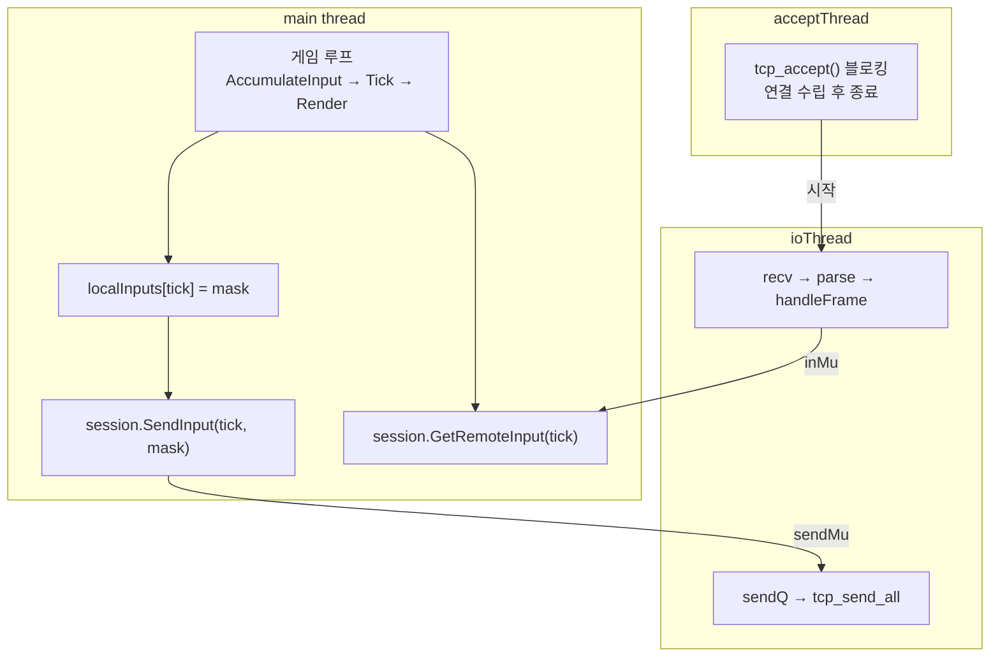
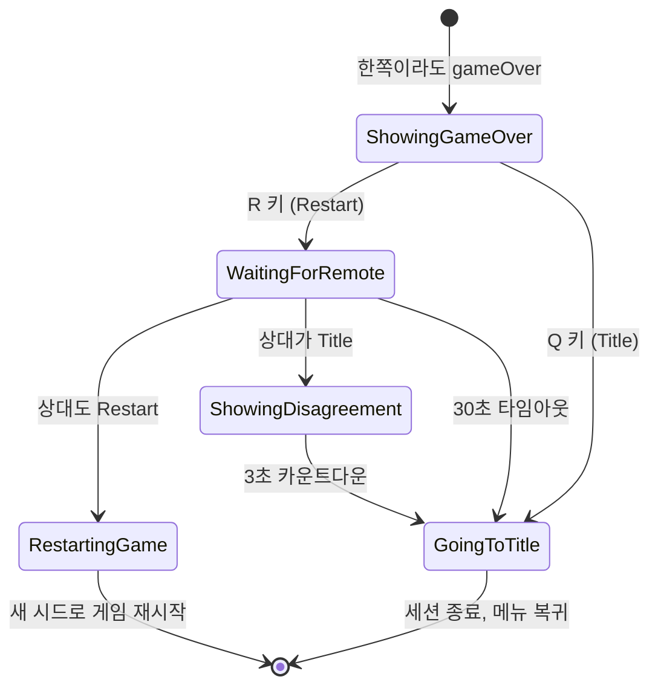
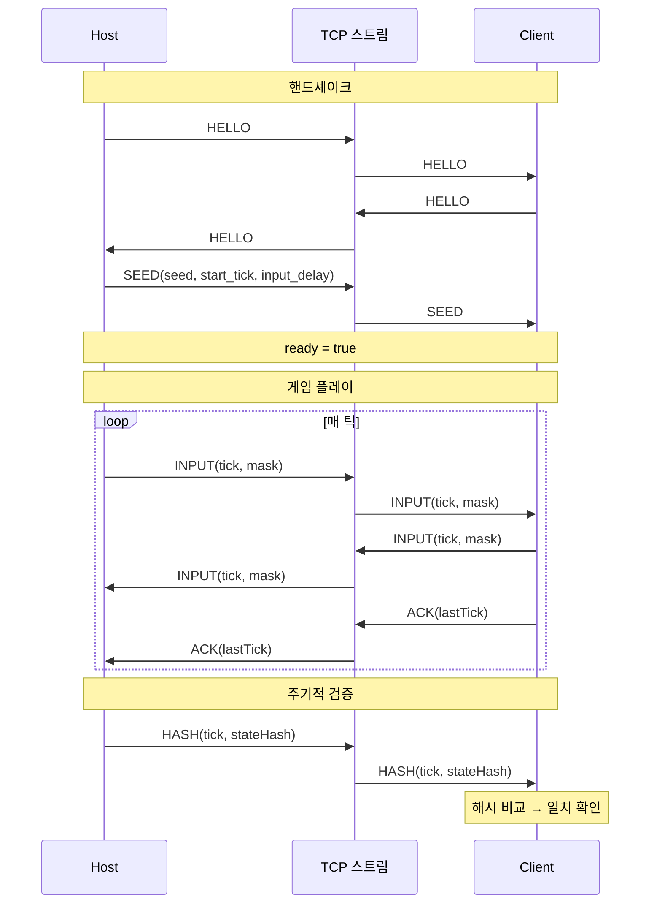

# Part 5: 결정론적 멀티플레이 — TCP Lockstep 네트워킹

> **시리즈:** 제로부터 멀티플레이어 테트리스 + RL까지
> [Part 1: 윈도우와 OpenGL](./part1-window-and-opengl.md) | [Part 2: 2D 렌더링](./part2-2d-rendering.md) | [Part 3: 테트리스 로직](./part3-tetris-logic.md) | [Part 4: 게임 루프](./part4-game-loop.md) | **Part 5** | [Part 6: Python RL](./part6-python-rl.md)

---

## 들어가며

네트워크 게임의 동기화에는 세 가지 주요 모델이 있다:

| 모델 | 원리 | 대역폭 | 레이턴시 체감 | 구현 복잡도 |
|------|------|--------|-------------|-----------|
| **클라이언트-서버** | 서버가 권위적 상태를 유지, 클라이언트는 입력 전송 + 상태 수신 | 높음 (전체 상태 전송) | 서버 왕복 시간만큼 | 중간 |
| **Lockstep** | 모든 피어가 같은 시뮬레이션 실행, 입력만 교환 | 극히 낮음 (틱당 1바이트) | 양쪽 입력이 도착할 때까지 대기 | 낮음 |
| **Rollback** | Lockstep + 예측. 입력 없으면 예측 실행, 나중에 보정 | 낮음 | 거의 없음 (예측 정확 시) | 높음 |

이 프로젝트는 **Lockstep**을 사용한다. Lockstep의 전제 조건은 **결정론적 시뮬레이션**(Part 3)과 **고정 틱 레이트**(Part 4)다. 같은 시드 + 같은 입력 순서 = 같은 결과이므로, 네트워크로 전체 상태가 아닌 **입력만** 교환하면 된다. 틱당 1바이트.

단점은 명확하다: 한쪽의 입력이 도착하지 않으면 다른 쪽이 **대기**한다. 이것이 Lockstep 특유의 "끊김"이다. 레이턴시에 민감하지 않은 턴제 게임이나, 입력 지연을 허용할 수 있는 테트리스 같은 게임에 적합하다.

이 시리즈의 전체 소스 코드는 `net/socket.h` + `net/socket.cpp` (357줄), `net/framing.h` + `net/framing.cpp` (91줄), `net/session.h` + `net/session.cpp` (344줄)에 해당한다.

---

## 1. TCP 소켓 추상화

### 1.1 소켓의 기본 흐름

TCP 소켓의 서버/클라이언트 수명주기:



### 1.2 서버: bind + listen + accept

```cpp
// net/socket.cpp:77-105
TcpSocket tcp_listen(uint16_t port, int backlog) {
    TcpSocket s{};
    int fd = (int)::socket(AF_INET, SOCK_STREAM, IPPROTO_TCP);
    if (fd < 0) return s;
    set_reuse(fd);                           // SO_REUSEADDR

    sockaddr_in addr{};
    addr.sin_family = AF_INET;
    addr.sin_addr.s_addr = htonl(INADDR_ANY);  // 모든 인터페이스
    addr.sin_port = htons(port);                // 네트워크 바이트 순서

    if (::bind(fd, (sockaddr*)&addr, sizeof(addr)) != 0) { close(fd); return s; }
    if (::listen(fd, backlog) != 0) { close(fd); return s; }
    s.fd = fd;
    return s;
}
```

**SO_REUSEADDR**: `setsockopt(fd, SOL_SOCKET, SO_REUSEADDR, ...)`를 설정하지 않으면, 프로그램을 재시작했을 때 "Address already in use" 에러가 발생한다. 이전 연결의 TCP TIME_WAIT 상태(기본 2분)가 남아있기 때문이다. `SO_REUSEADDR`는 TIME_WAIT 중인 포트에 재바인드를 허용한다.

### 1.3 클라이언트: connect

```cpp
// net/socket.cpp:121-149
TcpSocket tcp_connect(const std::string& host, uint16_t port) {
    TcpSocket s{};
    addrinfo hints{};
    hints.ai_family = AF_INET;
    hints.ai_socktype = SOCK_STREAM;

    addrinfo* res = nullptr;
    char portStr[16];
    std::snprintf(portStr, sizeof(portStr), "%u", (unsigned)port);
    if (getaddrinfo(host.c_str(), portStr, &hints, &res) != 0) return s;

    int fd = -1;
    for (addrinfo* p = res; p; p = p->ai_next) {
        fd = (int)::socket(p->ai_family, p->ai_socktype, p->ai_protocol);
        if (fd < 0) continue;
        if (::connect(fd, p->ai_addr, (int)p->ai_addrlen) == 0) break;
        closesocket(fd);
        fd = -1;
    }
    freeaddrinfo(res);
    if (fd < 0) return s;

    set_nonblocking(fd);       // 연결 후 논블로킹 전환
    s.fd = fd;
    return s;
}
```

`getaddrinfo`는 호스트 이름("192.168.1.100")을 `sockaddr_in` 구조체로 변환한다. IPv4/IPv6, DNS 해석을 모두 처리하는 현대적 API다. 오래된 `inet_addr`나 `gethostbyname` 대신 사용.

### 1.4 논블로킹 I/O

```cpp
static bool set_nonblocking(int fd) {
#ifdef _WIN32
    u_long mode = 1;
    return ioctlsocket(fd, FIONBIO, &mode) == 0;
#else
    int flags = fcntl(fd, F_GETFL, 0);
    return fcntl(fd, F_SETFL, flags | O_NONBLOCK) == 0;
#endif
}
```

논블로킹 모드에서 `recv()`는 데이터가 없으면 즉시 반환한다 (에러 코드 `WSAEWOULDBLOCK` / `EAGAIN`). 이것이 중요한 이유: I/O 스레드가 `recv`에서 블로킹되면 `send` 큐를 처리할 수 없다. 논블로킹으로 `recv` → `send` 큐 처리 → `recv` 순환을 구현한다.

---

## 2. 길이-접두사 프레이밍

### 2.1 TCP 스트림의 특성

TCP는 **바이트 스트림**이다. 메시지 경계가 없다. 5바이트를 보내고 3바이트를 보내면, 수신 측에서 8바이트가 한 번에 올 수도, 2+6으로 올 수도, 1+1+1+1+1+3으로 올 수도 있다.

```
송신: [HELLO][SEED message][INPUT message]
수신: [HEL][LO SEED messa][ge INPUT message]
      ← TCP가 바이트 경계를 보장하지 않음 →
```

해결: 각 메시지에 **길이 접두사**를 붙인다.

### 2.2 프레임 구조

```
┌────────┬──────┬─────────────┬──────────┐
│ LEN:u16 │ TYPE:u8 │ PAYLOAD:N │ CHECKSUM:u32 │
│ 2 bytes │ 1 byte  │ N bytes   │ 4 bytes      │
└────────┴──────┴─────────────┴──────────┘

LEN = TYPE(1) + PAYLOAD(N)
전체 프레임 크기 = 2 + LEN + 4 = 7 + N bytes
```

| 필드 | 크기 | 설명 |
|------|------|------|
| LEN | 2 bytes (u16 LE) | TYPE + PAYLOAD의 바이트 수 |
| TYPE | 1 byte | 메시지 종류 (HELLO=1, INPUT=4, ...) |
| PAYLOAD | LEN-1 bytes | 메시지별 데이터 |
| CHECKSUM | 4 bytes (u32 LE) | PAYLOAD의 FNV-1a 32-bit 해시 |

### 2.3 FNV-1a 32-bit 체크섬

```cpp
// net/framing.cpp:15-19
uint32_t fnv1a32(const uint8_t* data, size_t len, uint32_t seed) {
    uint32_t h = seed;                     // 2166136261
    for (size_t i = 0; i < len; ++i) {
        h ^= data[i];
        h *= 16777619u;
    }
    return h;
}
```

$$h_0 = 2166136261, \quad h_i = (h_{i-1} \oplus \text{byte}_i) \times 16777619$$

Part 3에서 사용한 FNV-1a 64-bit와 같은 알고리즘의 32비트 버전이다. 4바이트 체크섬은 비암호학적이지만, 전송 오류(비트 플립, 패킷 손상)를 감지하기에 충분하다. CRC32 대비 구현이 단순하고, 해시 테이블의 키 해시로도 겸용 가능하다.

### 2.4 프레임 빌드와 파싱

**빌드:**

```cpp
// net/framing.cpp:37-48
std::vector<uint8_t> build_frame(MsgType t, const std::vector<uint8_t>& payload) {
    std::vector<uint8_t> out;
    out.reserve(2 + 1 + payload.size() + 4);

    const uint16_t len = static_cast<uint16_t>(1 + payload.size());
    le_write_u16(out, len);                          // LEN
    out.push_back(static_cast<uint8_t>(t));          // TYPE
    out.insert(out.end(), payload.begin(), payload.end());  // PAYLOAD

    const uint32_t chk = payload.empty() ? 0u
        : fnv1a32(payload.data(), payload.size());
    le_write_u32(out, chk);                          // CHECKSUM
    return out;
}
```

**파싱 (파셜 수신 처리):**

```cpp
// net/framing.cpp:50-91 (핵심 로직)
bool parse_frames(std::vector<uint8_t>& streamBuf, std::vector<Frame>& out) {
    size_t offset = 0;
    while (true) {
        // LEN 필드를 읽을 만큼 데이터가 있는가?
        if (offset + 2 > streamBuf.size()) break;

        const uint16_t len = le_read_u16(&streamBuf[offset]);

        // 전체 프레임이 도착했는가?
        const size_t need = 2 + (size_t)len + 4;
        if (offset + need > streamBuf.size()) break;  // 아직 부족 → 다음 recv 후 재시도

        // TYPE + PAYLOAD 추출
        if (len < 1) { offset += need; continue; }    // 잘못된 프레임 스킵
        const uint8_t type = streamBuf[offset + 2];
        const uint8_t* payload = &streamBuf[offset + 3];
        const size_t payloadLen = (size_t)len - 1;

        // 체크섬 검증
        const uint32_t chk = le_read_u32(&streamBuf[offset + 2 + len]);
        const uint32_t calc = payloadLen == 0 ? 0u : fnv1a32(payload, payloadLen);

        if (chk == calc) {
            Frame f;
            f.type = static_cast<MsgType>(type);
            f.payload.assign(payload, payload + payloadLen);
            out.push_back(std::move(f));
        }
        offset += need;
    }
    // 파싱 완료된 부분만 버퍼에서 제거
    if (offset > 0) streamBuf.erase(streamBuf.begin(), streamBuf.begin() + offset);
    return true;
}
```

핵심: `streamBuf`는 **누적 버퍼**다. `tcp_recv_some`이 호출될 때마다 수신된 바이트가 뒤에 추가된다. `parse_frames`는 버퍼의 앞에서부터 완성된 프레임만 추출하고, 나머지(아직 불완전한 프레임)는 버퍼에 남겨둔다. 다음 `recv`에서 나머지 바이트가 도착하면 이전 잔여분과 합쳐서 파싱한다.

### 2.5 size_t 뺄셈 주의

`parse_frames`의 원래 코드에서 발생한 버그:

```cpp
// 위험: payloadLen = len - 1에서 len이 0이면?
const size_t payloadLen = (size_t)len - 1;  // len=0 → SIZE_MAX!
```

`size_t`는 unsigned이므로 `0 - 1 = SIZE_MAX`(64비트 시스템에서 약 $1.8 \times 10^{19}$). 이 값으로 `fnv1a32(payload, payloadLen)`을 호출하면 수십 엑사바이트의 메모리를 읽으려 해서 크래시한다.

해결: `len < 1`인 경우를 먼저 처리하여 이 경로를 차단한다.

일반 원칙: size_t 뺄셈은 항상 "결과가 음수가 될 수 있는가?"를 확인해야 한다. 음수가 가능하면 **뺄셈 대신 덧셈으로 비교**한다:

```cpp
// 위험: buf.size() - offset가 음수일 수 있음
if (buf.size() - offset < need) break;

// 안전: 덧셈으로 변환
if (offset + need > buf.size()) break;
```

---

## 3. 메시지 타입

```cpp
// net/framing.h
enum class MsgType : uint8_t {
    HELLO = 1,
    HELLO_ACK = 2,
    SEED = 3,
    INPUT = 4,
    ACK = 5,
    PING = 6,
    PONG = 7,
    HASH = 8,
    GAME_OVER_CHOICE = 9,
};
```

각 메시지의 페이로드 구조:

| 타입 | 페이로드 | 용도 |
|------|---------|------|
| HELLO (1) | `[version:u16]` | 연결 확인 (핸드셰이크 시작) |
| HELLO_ACK (2) | `[ok:u8]` | 핸드셰이크 응답 |
| SEED (3) | `[seed:u64][start_tick:u32][input_delay:u8][role:u8]` | 게임 파라미터 전달 (호스트 → 클라이언트) |
| INPUT (4) | `[from_tick:u32][count:u16][mask0:u8][mask1:u8]...` | 틱별 입력 전송 |
| ACK (5) | `[last_tick:u32]` | 수신 확인 |
| PING (6) | `[timestamp]` | RTT 측정 |
| PONG (7) | `[timestamp]` | PING 응답 |
| HASH (8) | `[tick:u32][hash:u64]` | 상태 해시 교차 검증 |
| GAME_OVER_CHOICE (9) | `[choice:u8]` | 재시작/타이틀 협상 |

모든 다중 바이트 필드는 **리틀 엔디안**으로 직렬화된다. x86/x64가 리틀 엔디안이므로 별도의 바이트 스왑이 필요 없다.

---

## 4. 세션 라이프사이클

### 4.1 호스트 흐름



호스트는 두 개의 스레드를 사용한다:

1. **acceptThread**: `tcp_accept()`에서 블로킹 대기. 연결 수립 후 `ioThread`를 시작하고 HELLO + SEED를 전송.
2. **ioThread**: 논블로킹 recv/send 루프. 메시지 파싱 + 송신 큐 처리.

### 4.2 클라이언트 흐름

```cpp
// net/session.cpp:34-67
bool Session::Connect(const std::string& host, uint16_t port) {
    sock = tcp_connect(host, port);
    if (!sock.valid()) { connectionFailed = true; return false; }
    connected = true;
    th = std::thread(&Session::ioThread, this);    // I/O 스레드 시작
    // HELLO 전송
    {
        std::vector<uint8_t> pl; le_write_u16(pl, 1);
        auto fr = build_frame(MsgType::HELLO, pl);
        std::lock_guard<std::mutex> lk(sendMu);
        sendQ.push_back(std::move(fr));
    }
    return true;
}
```

클라이언트는 `tcp_connect()`로 즉시 연결을 시도하고, 성공 시 `ioThread`를 시작한다. HELLO를 보내고, 호스트의 SEED 메시지를 받으면 `ready = true`.

### 4.3 SEED 메시지와 게임 시작

호스트가 결정하는 파라미터:

```cpp
struct SeedParams {
    uint64_t seed{0};          // RNG 시드 (양쪽 SimGame에 동일하게 전달)
    uint32_t start_tick{120};  // 시작 지연 (2초 = 120틱)
    uint8_t input_delay{2};    // 입력 지연 (네트워크 지터 흡수)
    Role role{Role::Host};
};
```

`start_tick`은 양쪽의 시뮬레이션이 동시에 시작하도록 하는 카운트다운이다. SEED 메시지의 네트워크 전달 시간을 흡수한다.

---

## 5. Lockstep 동기화

### 5.1 safeTick 계산

```cpp
// src/main.cpp:215-220
int64_t lastLocalSent = (localTickNext == 0) ? -1 : (int64_t)localTickNext - 1;
int64_t lastRemote    = (int64_t)session.maxRemoteTick();
int64_t safeTick      = std::min(lastLocalSent, lastRemote) - (int64_t)inputDelay;
```

$$\text{safeTick} = \min(\text{lastLocalSent},\ \text{lastRemoteRecv}) - \text{inputDelay}$$

- `lastLocalSent`: 로컬에서 마지막으로 전송한 틱 번호
- `lastRemoteRecv`: 상대방에게서 마지막으로 수신한 틱 번호
- `inputDelay`: 네트워크 지터를 흡수하는 버퍼 (기본 2틱)

**양쪽 피어의 입력이 모두 확보된 틱까지만 시뮬레이션을 진행한다.** 한쪽의 입력이 아직 도착하지 않았으면, 시뮬레이션이 멈추고 기다린다.

### 5.2 타임라인 예시

```
시간 →

Host:     T0  T1  T2  T3  T4  T5  T6  T7
          ──  ──  ──  ──  ──  ──  ──  ──
          S   S   S   S   S   S   S   S     (S = SendInput)

Client:   T0  T1  T2  T3  T4  T5  T6  T7
          ──  ──  ──  ──  ──  ──  ──  ──
          S   S   S   S   S   S   S   S

네트워크 지연: ~30ms (2틱)

Host 시점:
  localSent = T7, remoteRecv = T5 (2틱 지연)
  safeTick = min(7, 5) - 2 = 3
  → T0~T3까지 시뮬레이션 진행 가능

Client 시점:
  localSent = T7, remoteRecv = T5
  safeTick = min(7, 5) - 2 = 3
  → 동일하게 T0~T3까지 진행
```

`inputDelay`의 역할: 네트워크 지터(패킷 도착 시간의 변동)를 흡수한다. `inputDelay = 0`이면 패킷이 조금만 늦어도 시뮬레이션이 멈춘다. `inputDelay = 2`면 2틱(약 33ms)의 여유가 있다.

### 5.3 시뮬레이션 진행

```cpp
// src/main.cpp:219-233
if ((int64_t)simTick <= safeTick && gameLocal && gameRemote)
{
    while ((int64_t)simTick <= safeTick)
    {
        uint8_t li = 0, ri = 0;
        auto it = localInputs.find(simTick);
        if (it != localInputs.end()) li = it->second;
        if (!session.GetRemoteInput(simTick, ri)) break;

        gameLocal->SubmitInput(li);    // 로컬 입력을 로컬 게임에
        gameRemote->SubmitInput(ri);   // 상대 입력을 상대 게임에
        gameLocal->Tick();
        gameRemote->Tick();
        simTick++;
    }
}
```

두 개의 `SimGame` 인스턴스를 유지한다:

- `gameLocal`: 로컬 플레이어의 입력으로 구동
- `gameRemote`: 상대 플레이어의 입력으로 구동

양쪽 게임이 같은 시드에서 시작하므로, 블록 순서가 동일하다. 다른 점은 적용되는 입력뿐이다.

---

## 6. 스레드 모델

### 6.1 스레드 구성



### 6.2 뮤텍스

| 뮤텍스 | 보호 대상 | 접근 스레드 |
|--------|----------|------------|
| `seedMu` | `seedParams` | main (읽기), ioThread (쓰기: SEED 수신 시) |
| `sendMu` | `sendQ` (송신 큐) | main (쓰기: SendInput), ioThread (읽기: 송신) |
| `inMu` | `remoteInputs` (수신 입력 맵) | ioThread (쓰기: INPUT 수신), main (읽기: GetRemoteInput) |

`sendMu`의 해제 타이밍이 중요하다:

```cpp
// net/session.cpp:162-177
while (true) {
    std::vector<uint8_t> pkt;
    {
        std::lock_guard<std::mutex> lk(sendMu);
        if (sendQ.empty()) break;
        pkt = std::move(sendQ.front());
        sendQ.pop_front();
    }
    // sendMu가 해제된 후 tcp_send_all 호출 (블로킹 I/O)
    // → main thread가 그 동안 SendInput() 가능
    tcp_send_all(sock, pkt.data(), pkt.size());
}
```

`tcp_send_all`은 블로킹 I/O이므로 뮤텍스를 잡고 있으면 main thread의 `SendInput`이 차단된다. 큐에서 패킷을 꺼낸 후 뮤텍스를 해제하고, 그 다음 송신한다.

### 6.3 종료 프로토콜

```cpp
// net/session.cpp:114-123
void Session::Close() {
    quit = true;
    // 1. 소켓을 먼저 닫아 블로킹 I/O를 해제
    if (listening && listenSock.valid()) tcp_close(listenSock);
    if (sock.valid()) tcp_close(sock);
    // 2. 스레드 join (블로킹이 해제되었으므로 반환됨)
    if (ath.joinable()) ath.join();
    if (th.joinable()) th.join();
    connected = false; ready = false; listening = false;
}
```

종료 순서가 중요하다: **소켓을 먼저 닫고, 그 다음 스레드를 join한다.** 순서를 바꾸면 데드락이 발생한다:

```
잘못된 순서:
  main thread: ath.join() → 대기 (acceptThread가 tcp_accept에서 블로킹)
  acceptThread: tcp_accept() → 대기 (아무도 연결하지 않으므로 영원히 블로킹)
  → 데드락

올바른 순서:
  main thread: tcp_close(listenSock) → accept()가 에러로 반환
  main thread: ath.join() → acceptThread가 이미 반환했으므로 즉시 완료
```

---

## 7. 상태 해시 교차 검증

### 7.1 디싱크 감지

주기적으로 양쪽 피어가 자신의 `StateHash()`(Part 3)를 교환한다:

```cpp
void Session::SendHash(uint32_t tick, uint64_t hash) {
    std::vector<uint8_t> pl;
    le_write_u32(pl, tick);
    le_write_u64(pl, hash);
    auto fr = build_frame(MsgType::HASH, pl);
    std::lock_guard<std::mutex> lk(sendMu);
    sendQ.push_back(std::move(fr));
}
```

수신 측에서 같은 틱의 해시를 비교한다. 불일치 = **디싱크(desynchronization)** .

### 7.2 디싱크의 일반적 원인

| 원인 | 증상 | 해결 |
|------|------|------|
| RNG 호출 순서 차이 | 블록 순서가 다름 | RNG를 GetRandomBlock()에서만 호출 |
| 부동소수점 연산 차이 | 물리 시뮬레이션 값 차이 | 이 프로젝트에서는 정수 연산만 사용하므로 해당 없음 |
| 입력 손실/중복 | 한쪽에서 입력이 적용되지 않음 | 프레이밍 체크섬으로 전송 오류 감지 |
| 입력 처리 순서 차이 | 동시 입력의 적용 순서가 다름 | SubmitInput 내부의 if 순서를 고정 |

이 프로젝트의 시뮬레이션은 정수 연산만 사용하므로 (부동소수점 없음), 가장 흔한 디싱크 원인인 "크로스 플랫폼 부동소수점 차이"가 원천적으로 제거된다.

---

## 8. 게임 오버 협상

### 8.1 상태 머신

멀티플레이에서 게임 오버 후, 양쪽 플레이어가 "재시작"과 "타이틀로"를 선택한다:



### 8.2 의견 불일치 처리

양쪽의 선택이 다르면 (한쪽 Restart, 한쪽 Title), 3초 카운트다운 후 타이틀로 복귀한다. 단순한 "다수결"이나 "호스트 우선" 규칙 대신, 안전하게 양쪽 모두 세션을 종료한다.

### 8.3 재시작 시 시드 교환

재시작 시 호스트가 새 시드를 생성하여 SEED 메시지로 전달한다:

```cpp
// net/session.cpp:92-105
void Session::SendNewSeed(uint64_t newSeed) {
    std::vector<uint8_t> pl;
    {
        std::lock_guard<std::mutex> lk(seedMu);
        seedParams.seed = newSeed;
        le_write_u64(pl, seedParams.seed);
        le_write_u32(pl, seedParams.start_tick);
        pl.push_back(seedParams.input_delay);
        pl.push_back((uint8_t)seedParams.role);
    }
    auto fr = build_frame(MsgType::SEED, pl);
    std::lock_guard<std::mutex> lk(sendMu);
    sendQ.push_back(std::move(fr));
}
```

새 시드를 받은 클라이언트는 `SimGame`을 새로 생성하고, 입력 큐와 틱 카운터를 초기화한다. 이것이 "같은 세션에서 여러 판을 플레이"하는 메커니즘이다.

---

## 오류와 함정

### (1) size_t 뺄셈 언더플로

**증상:** `parse_frames`에서 크래시. 또는 `buf.size() - offset`가 음수여야 할 때 거대한 양수가 되어 조건 분기가 잘못됨.

**원인:** `size_t`는 unsigned. `0 - 1 = SIZE_MAX`.

**해결:** `buf.size() - offset < need` 대신 `offset + need > buf.size()` 형태로 비교. 뺄셈을 덧셈으로 변환하면 언더플로가 원천 차단된다.

> **레퍼런스:** C++ 표준 [conv.integral]: unsigned 정수의 산술은 모듈러 $2^n$으로 잘 정의된다. 그러나 의도하지 않은 모듈러 산술은 보안 취약점(buffer overflow)의 원인이 될 수 있다.

### (2) Close()에서 소켓 닫기 전 thread join

**증상:** 프로그램이 종료되지 않는다. `Close()`에서 무한 대기.

**원인:** `acceptThread`가 `tcp_accept()`에서 블로킹 중. `ath.join()`을 먼저 호출하면, accept가 반환되기를 기다리지만, 아무도 연결하지 않으므로 영원히 블로킹.

**해결:** `tcp_close(listenSock)`을 먼저 호출하여 listen 소켓을 닫는다. 이미 블로킹 중인 `accept()`가 에러(-1)로 즉시 반환된다. 그 후 `ath.join()`.

### (3) seedParams 데이터 레이스

**증상:** 클라이언트가 잘못된 시드로 게임을 시작한다. 드물게 발생.

**원인:** `ioThread`가 SEED 메시지를 받아 `seedParams.seed`에 쓰는 동시에, main thread가 `session.params().seed`를 읽는다. 데이터 레이스 = undefined behavior.

**해결:** `seedMu` 뮤텍스로 보호. `params()` 접근자에서도 lock:

```cpp
SeedParams params() const {
    std::lock_guard<std::mutex> lk(seedMu);
    return seedParams;  // 복사본 반환 (lock 범위 내)
}
```

### (4) INPUT 메시지 버퍼 오버리드

**증상:** 간헐적 크래시 또는 잘못된 입력 값.

**원인:** INPUT 메시지의 `count` 필드가 실제 페이로드보다 클 때, `arr[i]`가 버퍼 범위를 초과.

**해결:** `6 + cnt > f.payload.size()`로 바운드 체크:

```cpp
case MsgType::INPUT: {
    if (f.payload.size() >= 6) {
        uint32_t from = le_read_u32(p);
        uint16_t cnt = le_read_u16(p+4);
        if (static_cast<size_t>(6) + cnt > f.payload.size()) break;  // 바운드 체크
        // ...
    }
}
```

### (5) 창 드래그 시 Lockstep 정체

**증상:** 한쪽 플레이어가 창을 드래그하는 동안 상대방의 게임도 멈춘다.

**원인:** Win32의 모달 메시지 루프가 게임 루프를 점유. 그 동안 `SendInput()`이 호출되지 않으므로 상대방의 `maxRemoteTick()`이 증가하지 않고, `safeTick`이 정체된다.

**해결:** 이것은 Lockstep 모델의 본질적 한계다. 완전한 해결은 Rollback 네트코드(예측 + 보정)로의 전환이 필요하다. 부분적 완화로는 "Waiting for peer..." 오버레이를 표시하는 방법이 있다.

> **레퍼런스:** Mark Terrano & Paul Bettner, "1500 Archers on a 28.8: Network Programming in Age of Empires and Beyond" (GDC 1999). Lockstep 모델의 원전. "if one player is slow, everyone is slow."

---

## 정리

전체 네트워크 세션의 데이터 흐름:



Lockstep 네트워킹의 핵심 요약:

1. **결정론이 전제**: 같은 시드 + 같은 입력 = 같은 상태 (Part 3)
2. **입력만 교환**: 틱당 1바이트, 극히 낮은 대역폭
3. **safeTick으로 동기**: 양쪽 입력이 확보된 틱까지만 진행
4. **해시로 검증**: FNV-1a 64-bit 상태 해시 교차 비교

다음 Part 6에서는 이 시뮬레이션 엔진을 **Python에서 구동**한다 — pybind11 바인딩으로 C++ SimGame을 Python에 노출하고, Gymnasium 환경을 만들어 강화학습 에이전트를 학습시킨다.

---

## 참고 자료

1. **Mark Terrano & Paul Bettner**, "1500 Archers on a 28.8: Network Programming in Age of Empires and Beyond" (GDC 1999). Lockstep 동기화의 원전. "deterministic lockstep" 용어의 기원
2. **Glenn Fiedler**, "Networking for Game Programmers" 시리즈 (gafferongames.com). "Sending and Receiving Packets", "Reliability, Ordering and Congestion Avoidance Over UDP"
3. **RFC 793** (Transmission Control Protocol, 1981). TCP의 스트림 특성, 3-way handshake, TIME_WAIT 상태
4. **Fowler-Noll-Vo hash** (www.isthe.com/chongo/tech/comp/fnv/). FNV-1a 32-bit 및 64-bit의 상수, 충돌 특성, 벤치마크
5. **Microsoft WinSock2 Documentation**. `ioctlsocket(FIONBIO)`, `SO_REUSEADDR`, `WSAGetLastError` 에러 코드
6. **"Rollback Netcode" GGPO** (Tony Cannon, ggpo.net). Lockstep의 한계를 극복하는 rollback/prediction 모델
