# Part 6: 결정론적 멀티플레이 — TCP Lockstep 네트워킹

> **시리즈:** 제로부터 멀티플레이어 테트리스 + RL | [시리즈 목차](./README.md) | **Part 6**
>

---

## 이번 Part의 구현 계약

- **선행 상태:** Part 1 의 결정론적 `SimGame` 과 그 상태 해시(`StateHash()` / `StateHashBreakdown()`), Part 4 의 60Hz 고정 틱 루프와 틱별 입력 마스크 (`ConsumeInput`), 그리고 `SimGame` 을 감싸며 해시를 `ComputeStateHash()` 로 노출하는 `Game` 래퍼. 이 장에서 `gameLocal->ComputeStateHash()` 는 Part 4 래퍼의 메서드고, 섹션별 breakdown 은 `gameLocal->sim.StateHashBreakdown()` 처럼 내부 `SimGame` 에서 직접 꺼낸다.
- **이번 Part의 파일:** `net/socket.h`, `net/socket.cpp`, `net/framing.h`, `net/framing.cpp`, `net/session.h`, `net/session.cpp` 를 새로 만들고, `src/main.cpp` 에 `AppMode::Net` 경로를 추가한다. `CMakeLists.txt` 에 새 `net/*.cpp` 소스와 소켓 라이브러리 링크가 붙는다.
- **연결점:** 상태가 아니라 **시드와 틱별 입력**만 교환한다. `main.cpp` 의 틱 루프가 `Session::SendInput` 으로 자기 입력을 밀어 넣고, `Session::GetRemoteInput` 으로 상대 입력을 당겨온 뒤, safeTick 이전까지만 두 `SimGame` 을 진행시킨다.
- **완료 게이트:**
  1. 프레이밍 계약(부분 수신 · 잘못된 길이 · 체크섬 불일치)이 자동 테스트로 통과한다 — `python/tests/test_framing_parity.py`. 이 패리티 하네스(`python/netbot/framing.py` 미러 포함)는 [Part 8](./part8-python-rl.md) 이 구현한다 — 여기서는 완성 저장소에서 실행만 한다.
  2. 같은 머신에서 `--host` / `--connect` 두 인스턴스를 붙이면 양쪽 `[INIT] seed=...` 가 일치하고, 600틱마다 교환하는 결합 해시가 어긋나지 않는다(`[DESYNC]` 로그 0건).

이 장의 구현 산출물은 **직결 P2P lockstep 세션**이다. `HELLO` / `HELLO_ACK` / `SEED` / `INPUT` / `ACK` / `PING` / `PONG` / `HASH` / `GAME_OVER_CHOICE` / `CHAT`의 전송 계약과 `Session::ioThread`를 완성한다. 현재 `net/session.*`에는 릴레이와 랭킹 확장도 함께 있지만, `QUEUE_*` / `ROOM_*` / `MATCH_FOUND`는 Part 7, `MATCH_SUMMARY` / `MATCH_RESULT`의 서버 권위 의미는 Part 10의 소유다. 이 장의 현재 소스 발췌에 그런 타입이 보이더라도 직결 세션을 이해하는 데 필요한 wire 기반과 수신 안전성만 읽는다.

## 들어가며

네트워크 게임의 상태 동기화에는 세 가지 주요 모델이 있다.

| 모델 | 원리 | 대역폭 | 레이턴시 체감 | 구현 복잡도 |
|------|------|--------|-------------|-----------|
| **클라이언트-서버** | 서버가 권위적 상태를 유지, 클라이언트는 입력 전송 + 상태 수신 | 높음 (전체 상태 전송) | 서버 왕복 시간만큼 | 중간 |
| **Lockstep** | 모든 피어가 같은 시뮬레이션 실행, 입력만 교환 | 극히 낮음 (입력 마스크 자체는 틱당 1바이트) | 양쪽 입력이 도착할 때까지 대기 | 낮음 |
| **Rollback** | Lockstep + 예측. 입력 없으면 예측 실행, 나중에 보정 | 낮음 | 거의 없음 (예측 정확 시) | 높음 |

이 프로젝트는 **Lockstep** 을 사용한다. 전제 조건은 **결정론적 시뮬레이션** (Part 1) 과 **고정 틱 레이트**(Part 4) 다. 같은 시드 + 같은 입력 순서 = 같은 결과이므로, 네트워크로 전체 상태가 아닌 **입력만** 교환하면 된다. 시뮬레이션 입력 마스크는 틱당 1바이트이고, 실제 TCP 프레임은 길이/타입/체크섬과 tick/count 가 붙어 단일 tick INPUT 기준 14바이트다.

단점도 명확하다. 한쪽의 입력이 도착하지 않으면 다른 쪽이 **대기**한다. 이것이 Lockstep 특유의 "끊김" 이다.

### 왜 Rollback 이 아닌가 — 정량 비교

Rollback(GGPO 계열)은 상대 입력이 없어도 "직전 입력이 유지될 것" 이라고 **예측**해서 시뮬레이션을 계속 돌리고, 실제 입력이 도착하면 그 틱까지 되감아 재시뮬레이션한다. 격투 게임에서 사실상 표준이 된 이유는 명확하다 — 한 프레임 (16.7ms) 의 입력 타이밍이 승패를 가르기 때문이다.

테트리스는 그 조건이 다르다. Part 1 의 `SimGame` 은 생성자에서 `dropIntervalTicks` 를 `TICKS_PER_SECOND / 2`, 즉 **30틱(500ms)** 으로 잡고 (`src/sim_game.cpp`), 레벨이 오를 때마다 `30 - (level-1)*27/19` 로 줄이되 하한을 3틱으로 clamp 한다(`src/sim_game.cpp`). 즉 피스가 한 칸 내려가는 데 걸리는 시간은 레벨 1 에서 500ms, 최고 레벨 20 에서도 50ms 다.

기본 `input_delay = 2` 가 만드는 체감 지연은 33ms —

- 레벨 1 기준 **한 중력 스텝의 6.7%**
- 레벨 20 기준 **한 중력 스텝의 67%**, 즉 최악의 경우에도 피스가 한 칸 내려가기 전에 입력이 반영된다.

플레이어가 인지하는 단위는 "피스가 어디에 놓이는가" 이지 "몇 밀리초에 움직였는가" 가 아니다. 33ms 는 이 게임의 결정 단위 아래로 숨는다.

반대편에는 rollback 이 요구하는 비용이 있다.

| 요구 사항 | Lockstep | Rollback |
|---|---|---|
| 상태 스냅샷 | 불필요 | 매 틱 `SimGame` 전체를 저장 (그리드 10×20 + RNG + 카운터, 롤백 윈도우 길이만큼 링) |
| 재시뮬레이션 | 없음 | 오차 발견 시 최대 롤백 윈도우 길이만큼 `Tick()` 재실행 |
| 시각적 보정 | 없음 | 되감기로 인한 화면 튐(피스 위치 점프, 라인 클리어 취소)의 UI 처리 |
| 오디오/이펙트 | 그대로 | 재실행 구간에서 효과음·쉐이크 중복 발화 방지 로직 필요 |
| 코드 침투 범위 | `net/` 만 | `SimGame` · `Game` · 렌더러 · 오디오 전부 |

가비지 라인 교환(Part 4 의 `AddPendingGarbage`)까지 되감아야 하므로 재시뮬은 "내 보드만" 이 아니라 두 보드 모두를 대상으로 해야 한다. Lockstep 은 이 전부를 0 으로 만든다. 이 게임에서 rollback 의 이득(33ms 절약)이 그 비용을 정당화하지 못한다는 것이 이 프로젝트의 판단이다.

Lockstep 의 진짜 약점은 지연이 아니라 **한쪽이 멈추면 둘 다 멈춘다**는 것이다. 이 장의 PING/PONG 하트비트와 ioThread 자동 heartbeat 절이 그 완화책을 다룬다.

### 왜 TCP 인가 — 그리고 그 대가

lockstep 은 "틱 t 의 입력" 이 반드시 도착해야 진행한다. 하나라도 유실되면 시뮬레이션이 영구히 멈추므로 **신뢰성 있는 순서 보장 전송**이 필요하다. UDP 위에 재전송·순서 복원을 직접 얹는 대신 TCP 를 쓰면 그 계층이 공짜다.

대가는 두 가지다.

1. **head-of-line 블로킹.** TCP 는 앞의 세그먼트가 재전송되는 동안 뒤의 세그먼트를 애플리케이션에 넘기지 않는다. 커널이 이미 받아둔 틱 t+3 의 INPUT 이 있어도 틱 t 가 재전송 중이면 `recv` 가 반환하지 않는다. lockstep 은 어차피 t 를 기다려야 하므로 손해가 작지만, "새 입력만 최신으로 쓰고 옛것은 버린다" 는 UDP 식 최적화는 불가능하다.
2. **바이트 스트림에는 메시지 경계가 없다.** UDP 는 데이터그램 하나가 곧 메시지지만, TCP 는 우리가 직접 프레이밍을 해야 한다. 이 프로젝트는 `길이 + 타입 + payload + 체크섬`을 한 프레임으로 정의하고 수신 버퍼에서 완성된 프레임만 꺼낸다.

여기에 Nagle 알고리즘이 기본으로 켜져 있다는 세 번째 함정이 붙는다. 작은 INPUT 프레임을 더 큰 세그먼트로 합치느라 기다리면 lockstep의 체감 지연이 늘어나므로 연결 직후 `TCP_NODELAY`를 켠다. 이 선택은 처리량보다 작은 메시지의 즉시성을 우선한다.

---

## 1. TCP 소켓 추상화

### 1.1 소켓의 기본 흐름

TCP 소켓의 서버/클라이언트 수명주기:

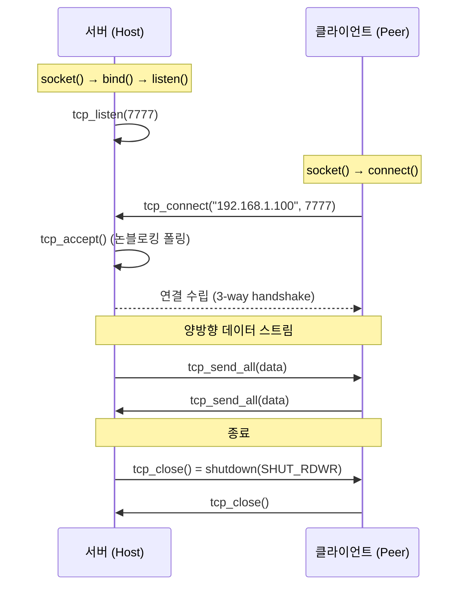

### 1.2 `TcpSocket` — 참조 카운트 소유 핸들

소켓 래퍼의 첫 번째 책임은 플랫폼 차이를 숨기는 것이지만, 더 중요한 책임은 **fd 정수의 소유권**을 명확히 하는 것이다.

**현재 소스 발췌 — `net/socket.h`**

```cpp
// TCP 소켓 핸들 — 참조 카운트 소유(ref-counted owning handle).
//
//   과거에는 평범한 { int fd } 였다. 같은 연결의 복사본을 여러 detached 스레드가
//   값으로 들고 각자 ::close 했기 때문에, 한 스레드가 닫은 fd 정수를 곧바로 새
//   accept() 가 재사용하면 살아있던 다른 스레드가 "엉뚱한 클라이언트 소켓"에
//   read/write 하는 use-after-close / fd-reuse 경합이 있었다(공개 서버에서 교차
//   연결 데이터 유출로 악용 가능).
//
//   이제 fd 는 shared_ptr<int> 가 소유하며, 모든 복사본은 같은 제어 블록을
//   공유한다. 실제 ::close 는 "마지막 복사본이 사라지는 순간" deleter 에서
//   정확히 한 번 호출된다(이중 close 와 fd 재사용 경합 제거).
//
//   tcp_close() 는 즉시 ::shutdown(SHUT_RDWR) 만 호출한다 — 같은 fd 를 폴링/대기
//   중인 다른 복사본의 recv 를 EOF 로 깨워 루프를 빠져나가게 한다. 소유권(=실제
//   close)은 RAII 에 맡긴다. shutdown 은 일반 스레드에서 반복 호출해도 무해한
//   종료 신호로만 사용한다. TcpSocket 은 shared_ptr 를 읽으므로 tcp_close() 를
//   signal handler 에서 직접 호출하면 안 된다.
//
//   동시성 계약: 한 TcpSocket "인스턴스(변수)" 자체를 두 스레드가 동시에
//   재대입/소멸시키면 안 된다(shared_ptr 인스턴스 자체는 thread-safe 가 아님).
//   서로 다른 복사본을 각 스레드가 들고 read/close 하는 것은 안전하다.
struct TcpSocket {
    std::shared_ptr<int> fdh;  // 제어 블록: *fdh == fd. 마지막 참조 소멸 시 ::close.

    int  fd()    const { return fdh ? *fdh : -1; }
    bool valid() const { return fdh && *fdh >= 0; }
};
```

fd 를 닫는 코드는 딱 두 곳뿐이다 — 생성 실패 경로와 deleter.

**현재 소스 발췌 — `net/socket.cpp`**

```cpp
// [NET] 실제 fd 를 닫는다(플랫폼별). 오직 owning 핸들의 deleter 에서만 호출.
static void close_fd(int fd) {
    if (fd < 0) return;
#ifdef _WIN32
    closesocket(fd);
#else
    ::close(fd);
#endif
}

// [NET] 새로 생성된 fd 를 참조 카운트 소유 핸들로 감싼다.
//   마지막 복사본이 사라질 때 deleter 가 close_fd 로 정확히 한 번 닫는다.
static TcpSocket make_owned(int fd) {
    TcpSocket s;
    s.fdh = std::shared_ptr<int>(new int(fd), [](int* p) {
        if (p) { close_fd(*p); delete p; }
    });
    return s;
}
```

이 형태가 필요한 이유는 스레드 간에 소켓을 값으로 넘기기 때문이다. `{ int fd }` 구조체를 그대로 복사하면 소유자가 여러 명 생기지만, 커널 fd 정수는 소유권을 표현하지 못한다. 한 스레드가 `close(fd)` 한 직후 다른 `accept()` 가 같은 정수 값을 재사용하면, 아직 그 정수를 들고 있던 스레드가 새 연결에 `read/write` 하는 fd-reuse 경합이 생긴다. 공개 릴레이에서는 서로 다른 클라이언트 연결의 데이터가 교차할 수 있으므로 단순 안정성 버그가 아니라 데이터 유출 취약점이다.

### 1.3 서버: bind + listen + accept

`tcp_listen()` 은 raw fd 를 만들되, 반환 직전에만 `make_owned(fd)` 로 감싼다. 실패 경로에서는 아직 소유 핸들이 없으므로 `close_fd` 를 직접 부른다.

**현재 소스 발췌 — `net/socket.cpp`**

```cpp
// [NET] 빠른 재바인드를 위한 SO_REUSEADDR 설정
static int set_reuse(int fd) {
    int yes = 1;
#ifdef _WIN32
    return setsockopt(fd, SOL_SOCKET, SO_REUSEADDR, (const char*)&yes, sizeof(yes));
#else
    return setsockopt(fd, SOL_SOCKET, SO_REUSEADDR, &yes, sizeof(yes));
#endif
}
```

**현재 소스 발췌 — `net/socket.cpp`**

```cpp
// [NET] 포트에서 연결 대기 소켓을 생성합니다.
TcpSocket tcp_listen(uint16_t port, int backlog) {
    if (!net_init()) return TcpSocket{};
    int fd = (int)::socket(AF_INET, SOCK_STREAM, IPPROTO_TCP);
    if (fd < 0) return TcpSocket{};
    set_reuse(fd);
    sockaddr_in addr{};
    addr.sin_family = AF_INET;
    addr.sin_addr.s_addr = htonl(INADDR_ANY);
    addr.sin_port = htons(port);
    if (::bind(fd, (sockaddr*)&addr, sizeof(addr)) != 0) {
        close_fd(fd);
        return TcpSocket{};
    }
    if (::listen(fd, backlog) != 0) {
        close_fd(fd);
        return TcpSocket{};
    }
    return make_owned(fd);
}
```

**SO_REUSEADDR**: 설정하지 않으면 프로그램을 재시작했을 때 "Address already in use" 에러가 난다. 이전 연결의 TCP TIME_WAIT 상태(기본 2분)가 남아 있기 때문이다. `SO_REUSEADDR` 는 TIME_WAIT 중인 포트에 재바인드를 허용한다.

수락은 `tcp_accept` 다. 수락된 자식 소켓에만 논블로킹 + NODELAY + keepalive 를 건다 — listen 소켓에 걸어도 자식으로 상속되지 않는 플랫폼이 있다. NODELAY 의 근거는 §15, keepalive 가 어떤 실패를 감지하는지는 §11.7 이 다룬다.

**현재 소스 발췌 — `net/socket.cpp`**

```cpp
// [NET] 대기 소켓에서 1개 연결을 수락합니다.
TcpSocket tcp_accept(const TcpSocket& server) {
    if (!server.valid()) return TcpSocket{};
    sockaddr_in addr{}; socklen_t alen = sizeof(addr);
    int fd = (int)::accept(server.fd(), (sockaddr*)&addr, &alen);
    if (fd < 0) return TcpSocket{};
    // 수락된 소켓을 논블로킹 + NODELAY + keepalive 로 설정.
    set_nonblocking(fd);
    set_nodelay(fd);
    set_keepalive(fd);
    return make_owned(fd);
}
```

### 1.4 클라이언트: connect

**현재 소스 발췌 — `net/socket.cpp`**

```cpp
// [NET] 원격 호스트로 TCP 연결을 시도합니다.
TcpSocket tcp_connect(const std::string& host, uint16_t port) {
    if (!net_init()) return TcpSocket{};

    addrinfo hints{}; hints.ai_family = AF_INET; hints.ai_socktype = SOCK_STREAM;
    addrinfo* res = nullptr; char portStr[16];
    std::snprintf(portStr, sizeof(portStr), "%u", (unsigned)port);
    if (getaddrinfo(host.c_str(), portStr, &hints, &res) != 0) return TcpSocket{};
    int fd = -1;
    for (addrinfo* p = res; p; p = p->ai_next) {
        fd = (int)::socket(p->ai_family, p->ai_socktype, p->ai_protocol);
        if (fd < 0) continue;
        if (::connect(fd, p->ai_addr, (int)p->ai_addrlen) == 0) {
            break;
        }
        close_fd(fd);
        fd = -1;
    }
    freeaddrinfo(res);
    if (fd < 0) return TcpSocket{};
    // 연결된 소켓을 논블로킹 + NODELAY + keepalive 로 설정.
    set_nonblocking(fd);
    set_nodelay(fd);
    set_keepalive(fd);
    return make_owned(fd);
}
```

`getaddrinfo` 는 호스트 이름("192.168.1.100" 또는 "relay.example.com")을 `sockaddr` 로 변환한다. IPv4/IPv6, DNS 해석을 모두 처리하는 현대적 API 로, 오래된 `inet_addr` / `gethostbyname` 대신 쓴다. 여기서는 `ai_family = AF_INET` 으로 IPv4 만 요청한다.

연결 자체는 **블로킹**이다. `set_nonblocking` 은 `connect` 성공 뒤에 걸린다. 즉 `tcp_connect` 를 메인 스레드에서 호출하면 상대가 응답할 때까지 게임 루프가 멈춘다 — 그래서 릴레이 경로는 `Session` 안의 별도 스레드에서 호출한다 ([Part 7](./part7-relay-server.md) 의 `Session::queueThread`).

### 1.5 논블로킹 I/O

**현재 소스 발췌 — `net/socket.cpp`**

```cpp
// [NET] 논블로킹 모드 설정
static bool set_nonblocking(int fd) {
#ifdef _WIN32
    u_long mode = 1;
    return ioctlsocket(fd, FIONBIO, &mode) == 0;
#else
    int flags = fcntl(fd, F_GETFL, 0);
    if (flags == -1) return false;
    return fcntl(fd, F_SETFL, flags | O_NONBLOCK) == 0;
#endif
}
```

`fcntl(F_GETFL)` 실패를 먼저 걸러야 한다. 실패 시 `flags == -1` 이고, 그대로 `-1 | O_NONBLOCK` 을 `F_SETFL` 로 넘기면 **모든 파일 상태 플래그가 세워진 값**을 쓰게 된다. 한 줄이지만 빼먹으면 조용히 이상한 상태가 된다.

논블로킹 모드에서 `recv()` 는 데이터가 없으면 즉시 반환한다(에러 코드 `WSAEWOULDBLOCK` / `EAGAIN`). 이것이 중요한 이유는 명확하다 — I/O 스레드가 `recv` 에서 블로킹되면 송신 큐를 처리할 수 없다. 논블로킹으로 `recv` → `send` 큐 처리 → `recv` 순환을 구현한다.

### 1.6 `tcp_send_all` — 논블로킹 위의 "전량 송신"

논블로킹 소켓에서 `send` 는 요청한 바이트를 다 보내지 못하고 일부만 보낼 수 있다. `tcp_send_all` 은 그 위에 "전부 보내거나 실패한다" 는 계약을 세운다.

**현재 소스 발췌 — `net/socket.cpp`**

```cpp
// [NET] 전체 버퍼가 전송될 때까지 반복합니다(스트림 특성으로 부분 전송 가능).
bool tcp_send_all(const TcpSocket& s, const void* data, size_t len) {
    const int fd = s.fd();
    if (fd < 0) return false;
    const uint8_t* p = static_cast<const uint8_t*>(data);
    size_t sent = 0;
    constexpr auto kBlockedTimeout = std::chrono::seconds(5);
    std::chrono::steady_clock::time_point blockedSince{};
    while (sent < len) {
#ifdef _WIN32
        int n = ::send(fd, (const char*)(p + sent), (int)(len - sent), 0);
        if (n < 0) {
            int err = WSAGetLastError();
            if (err == WSAEWOULDBLOCK || err == WSAEINTR) {
                if (err == WSAEWOULDBLOCK) {
                    auto now = std::chrono::steady_clock::now();
                    if (blockedSince == std::chrono::steady_clock::time_point{}) blockedSince = now;
                    if (now - blockedSince >= kBlockedTimeout) return false;
                }
                // 논블로킹에서 버퍼 가득참 - 짧은 대기 후 재시도
                std::this_thread::sleep_for(std::chrono::milliseconds(1));
                continue;
            }
            return false;
        }
        if (n == 0) return false; // 연결 종료
#else
        int flags = 0;
#ifdef MSG_NOSIGNAL
        flags |= MSG_NOSIGNAL;
#endif
        ssize_t n = ::send(fd, (const char*)(p + sent), (size_t)(len - sent), flags);
        if (n < 0) {
            if (errno == EINTR) continue;
            if (errno == EAGAIN || errno == EWOULDBLOCK) {
                auto now = std::chrono::steady_clock::now();
                if (blockedSince == std::chrono::steady_clock::time_point{}) blockedSince = now;
                if (now - blockedSince >= kBlockedTimeout) return false;
                // 논블로킹에서 버퍼 가득참 - 짧은 대기 후 재시도
                std::this_thread::sleep_for(std::chrono::milliseconds(1));
                continue;
            }
            return false;
        }
        if (n == 0) return false; // 연결 종료
#endif
        blockedSince = {};
        sent += (size_t)n;
    }
    return true;
}
```

여기서 놓치기 쉬운 사실 세 가지.

- **소켓은 논블로킹이지만 `tcp_send_all` 은 "느슨하게 블로킹" 한다.** 커널 송신 버퍼가 가득 차면 1ms 씩 자며 재시도한다. 즉 호출자 스레드는 실제로 멈춘다 — 그래서 `sendMu` 를 잡은 채 호출하면 안 된다(스레드 모델 절 참조).
- **`kBlockedTimeout = 5초`** 가 상한이다. 상대가 데이터를 전혀 읽지 않아 TCP 윈도우가 0 으로 닫힌 채 5초가 지나면 `false` 를 반환하고, 호출부는 이를 연결 실패로 취급한다. 이 상한이 없으면 죽은 피어 하나가 ioThread 를 영원히 붙잡는다.
- **`MSG_NOSIGNAL` 과 `SIGPIPE`.** POSIX 에서 닫힌 소켓에 쓰면 기본적으로 프로세스가 `SIGPIPE` 로 죽는다. `net_init()` 이 `std::signal(SIGPIPE, SIG_IGN)` 로 무시하도록 만들고, 여기서는 플래그로도 한 번 더 막는다.

수신은 대칭적으로 단순하다. "지금 읽을 수 있는 만큼만 누적 버퍼 뒤에 붙인다."

**현재 소스 발췌 — `net/socket.cpp`**

```cpp
// [NET] 수신 가능한 만큼 한 번 읽어 누적 버퍼에 추가합니다.
bool tcp_recv_some(const TcpSocket& s, std::vector<uint8_t>& outBuf) {
    const int fd = s.fd();
    if (fd < 0) return false;
    uint8_t tmp[4096];
#ifdef _WIN32
    int n = ::recv(fd, (char*)tmp, (int)sizeof(tmp), 0);
    if (n < 0) {
        int err = WSAGetLastError();
        if (err == WSAEWOULDBLOCK || err == WSAEINPROGRESS) {
            // 논블로킹에서 데이터 없음 - 정상
            return true;
        }
        // 실제 에러
        return false;
    }
    if (n == 0) {
        // 연결 종료
        return false;
    }
#else
    ssize_t n = ::recv(fd, tmp, sizeof(tmp), 0);
    if (n < 0) {
        if (errno == EAGAIN || errno == EWOULDBLOCK) {
            // 논블로킹에서 데이터 없음 - 정상
            return true;
        }
        // 실제 에러
        return false;
    }
    if (n == 0) {
        // 연결 종료
        return false;
    }
#endif
    outBuf.insert(outBuf.end(), tmp, tmp + n);
    return true;
}
```

반환값의 의미가 중요하다. **`true` 는 "바이트를 받았다" 가 아니라 "연결이 살아 있다" 는 뜻**이다. 데이터가 없어도 `true` 다. `false` 는 EOF 또는 진짜 에러뿐이다. 이 계약 때문에 호출부는 "몇 바이트가 늘었는지" 를 따로 계산해야 한다.

### 1.7 `tcp_close` 는 닫지 않는다

**현재 소스 발췌 — `net/socket.cpp`**

```cpp
// [NET] 소켓 종료.
//   ::shutdown 으로 같은 fd 를 폴링/대기 중인 다른 복사본의 recv 를 EOF 로
//   깨워 루프를 빠져나가게 한다. 실제 ::close 는 마지막 TcpSocket 복사본이
//   소멸할 때 deleter 에서 한 번만 일어난다(이중 close / fd 재사용 경합 방지).
//   shutdown 은 일반 스레드에서 반복 호출해도 무해한 종료 신호로만 사용한다.
//   TcpSocket 은 shared_ptr 를 읽으므로 tcp_close() 를 signal handler 에서 직접
//   호출하면 안 된다.
//   여기서 fdh 를 reset 하지 않는 이유: 같은 인스턴스를 다른 스레드가 읽고 있을
//   수 있어(예: Session::sock 을 ioThread 가 read, 메인이 Close) reset 은
//   shared_ptr 인스턴스에 대한 경합이 된다. 참조 해제는 RAII(소유 스레드의
//   재대입/소멸)에 맡긴다.
void tcp_close(TcpSocket& s) {
    if (!s.fdh) return;
    int fd = *s.fdh;
    if (fd >= 0) {
#ifdef _WIN32
        ::shutdown(fd, SD_BOTH);
#else
        ::shutdown(fd, SHUT_RDWR);
#endif
    }
}
```

이름과 달리 `tcp_close` 는 **종료 신호**다. 실제 `::close` 는 마지막 `TcpSocket` 복사본이 소멸할 때만 일어난다. 덕분에 "여러 스레드가 각자 `tcp_close` 를 불러도 안전" 하고, "누군가 아직 그 fd 를 읽고 있어도 정수가 재사용되지 않는다".

한 가지 예외가 있다. `shutdown` 은 **블로킹 `accept` 를 깨우지 못하는** 플랫폼이 있다. 그래서 listen 소켓만은 논블로킹으로 전환해 `quit` 플래그를 폴링한다 — 그 공개 래퍼가 `tcp_set_nonblocking` 이다.

**현재 소스 발췌 — `net/socket.cpp`**

```cpp
// [NET] 소켓을 논블로킹 모드로 전환(public 래퍼).
void tcp_set_nonblocking(const TcpSocket& s) {
    if (s.valid()) set_nonblocking(s.fd());
}
```

---

## 2. 길이-접두사 프레이밍

### 2.1 TCP 스트림의 특성

TCP 는 **바이트 스트림**이다. 메시지 경계가 없다. 5바이트를 보내고 3바이트를 보내면, 수신 측에서 8바이트가 한 번에 올 수도, 2+6 으로 올 수도, 1+1+1+1+1+3 으로 올 수도 있다.

```text
송신: [HELLO][SEED message][INPUT message]
수신: [HEL][LO SEED messa][ge INPUT message]
      ← TCP 가 바이트 경계를 보장하지 않음 →
```

해결: 각 메시지에 **길이 접두사**를 붙인다.

### 2.2 프레임 구조

```text
byte    0        2        3                     3+N   7+N
        ┌────────┬────────┬─────────────────────┬────────┐
        │ LEN    │ TYPE   │ PAYLOAD             │ CHKSUM │
        │ u16 LE │ u8     │ N = LEN - 1 bytes   │ u32 LE │
        └────────┴────────┴─────────────────────┴────────┘

LEN            = TYPE(1) + PAYLOAD(N)
전체 프레임 크기 = 2 + LEN + 4 = 7 + N bytes
```

| 필드 | 크기 | 설명 |
|------|------|------|
| LEN | 2 bytes (u16 LE) | TYPE + PAYLOAD 의 바이트 수 |
| TYPE | 1 byte | 메시지 종류 (HELLO=1, INPUT=4, ...) |
| PAYLOAD | LEN-1 bytes | 메시지별 데이터 |
| CHECKSUM | 4 bytes (u32 LE) | PAYLOAD 의 FNV-1a 32-bit 해시 |

모든 다중 바이트 필드는 **리틀 엔디안**으로 직렬화된다. x86/x64 · ARM(리틀 엔디안 모드)이 모두 리틀 엔디안이므로 실질적으로 바이트 스왑이 필요 없지만, 읽기/쓰기 헬퍼가 시프트 연산으로 명시적으로 조립하므로 빅 엔디안 기기에서도 같은 바이트열이 나온다.

**현재 소스 발췌 — `net/framing.cpp`**

```cpp
void le_write_u16(std::vector<uint8_t>& v, uint16_t x) {
    v.push_back((uint8_t)(x & 0xFF)); v.push_back((uint8_t)((x>>8)&0xFF));
}
void le_write_u32(std::vector<uint8_t>& v, uint32_t x) {
    for (int i=0;i<4;++i) v.push_back((uint8_t)((x>>(8*i))&0xFF));
}
void le_write_u64(std::vector<uint8_t>& v, uint64_t x) {
    for (int i=0;i<8;++i) v.push_back((uint8_t)((x>>(8*i))&0xFF));
}
uint16_t le_read_u16(const uint8_t* p) { return (uint16_t)p[0] | ((uint16_t)p[1] << 8); }
uint32_t le_read_u32(const uint8_t* p) { return (uint32_t)p[0] | ((uint32_t)p[1]<<8) | ((uint32_t)p[2]<<16) | ((uint32_t)p[3]<<24); }
uint64_t le_read_u64(const uint8_t* p) {
    // 리틀엔디안: p[0]이 최하위 바이트
    uint64_t x=0; for (int i=7;i>=0;--i){ x = (x<<8) | p[i]; } return x;
}
```

`memcpy` 로 구조체를 통째로 던지지 않는 이유가 이것이다 — 패딩과 엔디안이 플랫폼에 노출되면 크로스 플랫폼 결정론이 깨진다. Part 1 이 시뮬레이션에서 지킨 원칙을 와이어에서도 그대로 지킨다.

### 2.3 FNV-1a 32-bit 체크섬

**현재 소스 발췌 — `net/framing.cpp`**

```cpp
uint32_t fnv1a32(const uint8_t* data, size_t len, uint32_t seed) {
    uint32_t h = seed;
    for (size_t i = 0; i < len; ++i) { h ^= data[i]; h *= 16777619u; }
    return h;
}
```

기본 seed 는 헤더에 있다 — `net/framing.h` 의 `uint32_t seed=2166136261u`.

$$h_0 = 2166136261, \quad h_i = (h_{i-1} \oplus \text{byte}_i) \times 16777619$$

Part 1 에서 사용한 FNV-1a 64-bit 와 같은 알고리즘의 32비트 버전이다. CRC32 대신 이것을 고른 이유는 세 가지다.

1. **구현과 검증 규약이 작다.** CRC32는 테이블이나 비트 단위 루프가 필요하고, 다항식·초기값·반전 규약을 맞추지 않으면 구현마다 값이 다르다. 이 프로젝트는 Python 미러(`python/netbot/framing.py`)와 바이트 단위로 일치해야 하므로 규약이 단순한 알고리즘이 유리하다.
2. **이미 프로젝트에 있다.** Part 1 의 상태 해시가 FNV-1a 64 다. 상수 두 개만 32비트 버전으로 바꾸면 된다 — 새로 배울 것이 없다.
3. **성능이 문제되지 않는다.** 최대 페이로드가 4 KiB, 실사용은 수십 바이트다.

#### 왜 PAYLOAD 만 덮는가 — 실제 트레이드오프

체크섬은 `PAYLOAD` 만 덮는다. `LEN` 과 `TYPE` 은 덮지 않는다. 이 선택에는 분명한 대가가 있다.

- **장점:** 파서가 프레임을 재조립하지 않고도 검증할 수 있다. 수신 버퍼의 `payload` 포인터를 그대로 `fnv1a32` 에 넘기면 끝 — 헤더까지 덮으려면 헤더와 페이로드가 연속임을 가정하거나 두 번 나눠 해싱해야 한다. 송신 측도 마찬가지로 `build_frame` 이 payload 를 받은 그 상태에서 바로 계산한다.
- **대가:** **`LEN` 이 손상되면 검출할 수단이 없다.** `LEN` 이 깨지면 프레임 경계 자체가 어긋나고, 그 뒤의 모든 프레임이 잘못된 위치에서 읽힌다. 체크섬은 "잘못 잘린 payload" 에 대해 계산되므로 대부분 불일치로 드롭되지만, 스트림은 이미 오정렬된 상태다. 실제로 파서가 이 상황에서 하는 일은 "체크섬 틀린 프레임 하나 버리고 `offset += need` 로 다음 위치로 이동" 인데, 그 다음 위치도 틀렸다. 결국 스트림이 스스로 재동기화되지 않는다.

TCP 가 이미 16비트 체크섬으로 세그먼트를 검증하고 그 아래 이더넷 FCS(CRC32)가 한 번 더 검증하므로, 실전에서 `LEN` 이 조용히 깨질 확률은 매우 낮다. 이 프레이밍 체크섬의 실제 역할은 "전송 오류 검출" 보다 **"우리 직렬화 코드의 버그와 프로토콜 버전 불일치를 조기에 잡는 것"** 에 가깝다. 실제로 Python 미러를 만들 때 `& 0xFFFFFFFF` 마스킹을 빠뜨린 버그가 이 체크섬 덕에 즉시 드러났다 ([Part 8](./part8-python-rl.md) 의 `fnv1a32` 절).

#### 체크섬은 악의적 변조를 막지 못한다

이 점은 분명히 해 둬야 한다. **FNV-1a 32 는 비암호학적 해시이고 키가 없다.** 공격자는 payload 를 원하는 대로 바꾼 뒤 같은 함수로 체크섬을 다시 계산해 붙이면 그만이다. 심지어 알고리즘을 몰라도 되는데, 프로토콜이 공개되어 있으므로 `build_frame` 을 그대로 재구현하면 된다.

따라서 페이로드 크기, 내부 길이 필드, enum 범위, tick 윈도우와 큐 상한은 체크섬과 별도로 검증해야 한다. 체크섬은 전송 중 **사고**를 찾고, 범위 검증은 의도적인 자원 소모와 잘못된 상태 전이를 막는다. 프레임 위조 자체를 막으려면 세션 키 기반 MAC(HMAC 등)이 필요하지만 현재 프로토콜에는 없다. 현재 보안 목표는 임의 바이트가 들어와도 프로세스가 죽거나 무한히 자원을 쓰지 않게 하는 것이다.

### 2.4 상수와 `build_frame`

프레임 한계와 필드 크기는 `net/framing.h` 의 공개 `constexpr` 상수다. 처음에는 `framing.cpp` 의 익명 네임스페이스에 숨겨 두었지만, 릴레이 서버가 ranked 경로에서 프레임 경계를 직접 읽게 되면서 같은 값이 두 곳에 복제됐다. 프로토콜 한계는 구현 세부가 아니라 **wire 계약의 일부**다 — 계약에 속한 수는 계약을 선언하는 헤더에서 한 번만 정의해야, 한쪽만 값을 바꿔 반대편 파서가 정상 프레임을 "스트림 오염" 으로 오판하는 사고가 원천 차단된다. 그래서 헤더로 승격했고, `server/relay.cpp` 도 이 상수를 참조한다.

**현재 소스 발췌 — `net/framing.h`**

```cpp
// 프레임 한계/헤더 필드 크기 — C++ 쪽 단일 진실 공급원(과거엔 framing.cpp 익명
// 네임스페이스에 있던 값을 공개 승격했고, server/relay.cpp 도 이 상수를 참조한다).
// 주의: 같은 값이 Python 미러(python/netbot/framing.py)에 중복돼 있고, 패리티
//   테스트(python/tests/test_framing_parity.py)가 이 값을 고정한다. 한쪽만 올리면
//   반대편 파서가 정상 프레임의 LEN 을 한도 초과로 보고 스트림 오염으로 오판해
//   연결을 끊으므로, 반드시 양쪽을 함께 바꿔야 한다.
// kMaxPayloadBytes 는 단순 메모리 최적화가 아니라 wire 보안 경계다: 악성 길이
//   선언을 받은 파서가 끝없이 body 를 기다리며 수신 버퍼를 키우는 것을 막는다.
//   정상 메시지 중 가장 큰 CHAT 도 이 한도 아래에 들어온다.
constexpr std::size_t kMaxPayloadBytes    = 4096;  // PAYLOAD 상한 (바이트)
constexpr std::size_t kFrameLenBytes      = 2;     // LEN 필드 (u16 LE)
constexpr std::size_t kFrameTypeBytes     = 1;     // TYPE 필드 (u8)
constexpr std::size_t kFrameChecksumBytes = 4;     // CHECKSUM 필드 (u32 LE, FNV-1a)
```

`kMaxPayloadBytes = 4096` 을 두는 이유는 u16 `LEN` 의 자연 한계(65535)가 사실상 "상한 없음" 이기 때문이다. 실사용 최대는 CHAT 200자 UTF-8(~800 B)이고 HASH/INPUT 은 수십 바이트라, 4 KiB 면 정상 트래픽에 닿지 않으면서 악성 길이 선언을 조기에 자를 수 있다. C++ 안에서는 이 헤더가 단일 진실 공급원이지만 언어 경계는 컴파일러가 지켜 주지 않는다 — Python 미러(`python/netbot/framing.py`)가 같은 값을 자체 상수로 다시 들고, 패리티 테스트(`python/tests/test_framing_parity.py`)가 양쪽 값을 고정한다. 컴파일 타임 공유가 불가능한 곳에서는 테스트가 상수의 계약을 대신 지킨다.

**현재 소스 발췌 — `net/framing.cpp`**

```cpp
std::vector<uint8_t> build_frame(MsgType t, const std::vector<uint8_t>& payload) {
    // 발신 측에서도 페이로드 상한을 검사 — 초과 시 빈 벡터로 실패.
    if (payload.size() > kMaxPayloadBytes) return {};
    // LEN = TYPE(1) + PAYLOAD(N)
    std::vector<uint8_t> out; out.reserve(kFrameLenBytes + kFrameTypeBytes + payload.size() + kFrameChecksumBytes);
    const uint16_t len = static_cast<uint16_t>(kFrameTypeBytes + payload.size());
    le_write_u16(out, len);
    out.push_back(static_cast<uint8_t>(t));
    out.insert(out.end(), payload.begin(), payload.end());
    // CHK = FNV-1a32(PAYLOAD)
    const uint32_t chk = payload.empty() ? 0u : fnv1a32(payload.data(), payload.size());
    le_write_u32(out, chk);
    return out;
}
```

두 가지 규약이 이 함수에 박혀 있다.

- **빈 payload 의 체크섬은 `0`.** `fnv1a32(nullptr, 0)` 은 seed 값 (`0x811C9DC5`)을 그대로 반환하지만, 여기서는 short-circuit 으로 0 을 쓴다. `QUEUE_CANCEL` / `ROOM_LEAVE` 처럼 payload 가 없는 프레임이 있으므로 이 규약을 놓치면 상대가 전부 드롭한다.
- **상한 초과는 빈 벡터.** 발신 측에서 미리 막으면 "프레임이 나가긴 했는데 상대가 끊어버림" 같은 디버깅하기 어려운 상황이 없다. 호출부는 빈 벡터를 큐에 넣게 되므로 `tcp_send_all(.., 0)` 이 즉시 성공 반환한다 — 조용히 아무 일도 일어나지 않는다.

### 2.5 `parse_frames` — 부분 수신 처리

**현재 소스 발췌 — `net/framing.cpp`**

```cpp
bool parse_frames(std::vector<uint8_t>& streamBuf, std::vector<Frame>& out) {
    size_t offset = 0;
    while (true) {
        // 길이(u16)를 읽을 만큼 데이터가 준비되었는지 확인
        // 주의: size_t는 unsigned이므로 뺄셈 대신 덧셈으로 비교 (언더플로 방지)
        if (offset + kFrameLenBytes > streamBuf.size()) break;

        // LEN = TYPE + PAYLOAD 길이
        const uint16_t len = le_read_u16(&streamBuf[offset]);

        // 페이로드 상한 초과 선언 시 전체 스트림을 버린다.
        // 부분 수신 상태에서 len 만 받았더라도 판정 가능 — 수신 버퍼가
        // 상한 이상으로 불어나기 전에 조기 차단.
        if (static_cast<size_t>(len) > kMaxPayloadBytes + kFrameTypeBytes) {
            streamBuf.clear();
            return false;
        }

        // 전체 프레임이 모였는지 확인: len 필드 + 본문(len) + 체크섬
        const size_t need = kFrameLenBytes + static_cast<size_t>(len) + kFrameChecksumBytes;
        if (offset + need > streamBuf.size()) break;

        // len=0 이면 TYPE 바이트조차 없는 잘못된 프레임 — 스킵
        if (len < kFrameTypeBytes) { offset += need; continue; }

        // TYPE 바이트와 PAYLOAD 범위 계산
        const uint8_t type = streamBuf[offset + kFrameLenBytes];
        const uint8_t* payload = &streamBuf[offset + kFrameLenBytes + kFrameTypeBytes];
        const size_t payloadLen = static_cast<size_t>(len) - kFrameTypeBytes; // LEN - TYPE(1)

        // 체크섬 읽고 유효성 검사(FNV-1a32)
        const size_t chkPos = offset + kFrameLenBytes + static_cast<size_t>(len);
        const uint32_t chk = le_read_u32(&streamBuf[chkPos]);
        const uint32_t calc = (payloadLen == 0) ? 0u : fnv1a32(payload, payloadLen);

        if (chk == calc) {
            Frame f; f.type = static_cast<MsgType>(type);
            f.payload.assign(payload, payload + payloadLen);
            out.push_back(std::move(f));
        }

        // 다음 프레임으로 이동
        offset += need;
    }
    // 파싱된 부분 제거, 나머지는 다음 수신과 합쳐서 재시도
    if (offset > 0) streamBuf.erase(streamBuf.begin(), streamBuf.begin() + offset);
    return true;
}
```

핵심 동작 다섯 가지.

1. **누적 버퍼.** `streamBuf` 는 `tcp_recv_some` 이 호출될 때마다 뒤에 바이트가 붙는 버퍼다. `parse_frames` 는 앞에서부터 완성된 프레임만 뽑고, 아직 불완전한 꼬리는 남긴다. 다음 `recv` 에서 나머지가 도착하면 이어 붙여 파싱한다.
2. **오버사이즈 선언은 즉시 차단.** `len > kMaxPayloadBytes + kFrameTypeBytes` 면 버퍼를 통째로 비우고 `false` 를 반환한다. 악의적 peer 가 `len = 65535` 를 선언하면 그 전에는 64 KiB 가 모일 때까지 기다려야 했다. **부분 수신 상태에서 `len` 2바이트만 받아도 판정할 수 있다**는 점이 이 검사의 핵심이다.
3. **`len = 0`은 스킵.** TYPE 바이트조차 없는 프레임이므로 `len - 1`을 계산하면 unsigned `size_t`에서 매우 큰 값으로 언더플로할 수 있다. payload 길이를 계산하기 전에 거부해야 한다.
4. **체크섬 불일치는 현재 구현에서 드롭이지 단절이 아니다.** 파서는 손상된 프레임 하나를 소비하고 뒤 프레임을 계속 읽는다. 다만 `INPUT`처럼 진행에 필수인 프레임이 드롭되면 애플리케이션 계층 재전송이 없어 lockstep은 스스로 복구하지 못한다. 따라서 이 동작은 스트림 파서를 살려 두는 정책일 뿐, 게임 세션 복구 보장은 아니다. 손상 프레임을 즉시 연결 실패로 승격할지는 운영 보안 정책으로 별도 결정해야 한다.
5. **알 수 없는 TYPE 은 그대로 통과시킨다.** `static_cast<MsgType>(type)` 은 범위 검사를 하지 않는다. 걸러내는 곳은 `Session::handleFrame` 의 `switch` 의 `default: break;` 다 — 새 타입이 추가된 상대 버전과 붙어도 파서가 죽지 않는 포워드 호환성.

반환값도 계약이 있다. `true` 는 "정상적으로 파싱했다(0개일 수도 있음)", `false` 는 "스트림이 오염됐으니 세션을 끊어라" 다. 현재 `Session::ioThread` 는 반환값을 무시하지만, 릴레이 서버([Part 7](./part7-relay-server.md))는 이 값을 보고 연결을 끊는다.

### 2.6 size_t 뺄셈 주의

`parse_frames` 를 처음 쓸 때 나온 버그다.

**예시(실제 저장소에는 없음)**

```cpp
// 위험: payloadLen = len - 1에서 len이 0이면?
const size_t payloadLen = (size_t)len - 1;  // len=0 → SIZE_MAX!
```

`size_t` 는 unsigned 이므로 `0 - 1 = SIZE_MAX`(64비트에서 약 $1.8 \times 10^{19}$). 이 값으로 `fnv1a32(payload, payloadLen)` 을 호출하면 수십 엑사바이트를 읽으려 해서 크래시한다. 현재 코드가 `if (len < kFrameTypeBytes) { offset += need; continue; }` 로 이 경로를 먼저 차단하는 이유다.

같은 계열의 두 번째 함정은 비교식이다.

**예시(실제 저장소에는 없음)**

```cpp
// 위험: buf.size() - offset가 음수일 수 있음
if (buf.size() - offset < need) break;

// 안전: 덧셈으로 변환
if (offset + need > buf.size()) break;
```

일반 원칙: size_t 뺄셈은 항상 "결과가 음수가 될 수 있는가" 를 확인한다. 음수가 가능하면 **뺄셈 대신 덧셈으로 비교**한다. 현재 코드의 두 break 조건이 모두 덧셈 형태인 것은 우연이 아니다.

### 2.7 왜 바이너리인가 — 그리고 Python 미러

JSON 이나 MessagePack 도 60Hz 에 충분히 빠르다. 그럼에도 고정 오프셋 바이너리를 쓰는 이유:

- **모든 바이트가 예측 가능하다.** 패킷 덤프를 눈으로 읽을 때 오프셋이 항상 같다. 프레임 하나가 14바이트라는 사실이 대역폭 계산을 산수로 만든다.
- **파싱에 할당이 없다.** `le_read_u32(p)` 는 포인터 산술이다. JSON 파서는 문자열 토큰마다 할당을 한다 — ioThread 의 hot path 에 두고 싶지 않은 성질이다.
- **게임 로직의 해시와 같은 FNV-1a 를 재사용한다.** 배운 것 하나로 두 곳을 덮는다.

이 규약이 정말로 지켜지는지 확인하는 자동 테스트가 있다. `python/netbot/framing.py` 가 같은 와이어 포맷을 Python 으로 구현하고, `python/tests/test_framing_parity.py` 가 고정 벡터와 round-trip 으로 `build_frame` / `parse_frames` 의 동치성을 검증한다 — 미러와 테스트의 구현은 [Part 8](./part8-python-rl.md) 이 소유하고, 이 장은 완성 저장소에서 계약의 소비자로 실행만 한다. 빈 payload 체크섬 0, cap 초과 스트림 폐기, 부분 수신 재조립, 체크섬 불일치 drop이 모두 테스트 항목이다. Python은 정수가 넘치지 않으므로 FNV-1a의 각 곱셈 뒤에 `& 0xFFFFFFFF`를 적용해야 C++의 `uint32_t` wraparound와 같아진다.

미러가 값만 복제하는 것은 아니다. §2.4 의 payload 상한(`net::kMaxPayloadBytes`)은 Python 쪽 상수로 중복돼 있고 패리티 테스트가 두 값을 함께 고정한다. 오버사이즈 선언에 대한 반응도 언어 관례에 맞게 번역됐다 — C++ `parse_frames` 는 `false` 를 반환해 호출자에게 "연결을 끊어라" 를 알리는데, 반환값은 조용히 무시되기 쉬우므로 Python 미러는 같은 상황에서 `FramingError` 예외를 던진다. 처리하지 않으면 전파되는 예외가, 그 언어에서 이 계약을 가장 무시하기 어려운 형태다.

이 시점에서 다음이 통과한다.

```bash
uv sync --dev
uv run python -m pytest python/tests/test_framing_parity.py -q
```

기대 결과: framing 패리티 파일에서 수집된 모든 항목이 통과한다.

---
## 3. 메시지 타입

`MsgType` 은 1바이트 enum 이다. 이 장이 만드는 직결 세션은 1~9 와 20(CHAT)만 쓰고, 10~19 는 릴레이 서버와 주고받는 확장이다.

**현재 소스 발췌 — `net/framing.h`**

```cpp
// 메시지 타입
enum class MsgType : uint8_t {
    HELLO = 1,
    HELLO_ACK = 2,
    SEED = 3,
    INPUT = 4,
    ACK = 5,
    PING = 6,
    PONG = 7,
    HASH = 8,
    GAME_OVER_CHOICE = 9,

    // 릴레이/매치메이킹 확장. 큐·룸 제어는 relay와 Session이 소비하고,
    // 매치 중 일반 게임 프레임은 전달한다. ranked MATCH_SUMMARY만 relay가
    // 결과 검증을 위해 가로챈다. SimGame은 이 제어 타입을 직접 소비하지 않는다.
    //
    // QUEUE_JOIN / ROOM_CREATE / ROOM_JOIN 은 모두 tetris_meta 인증 토큰을
    // 같이 실어 보낸다. 토큰은 32 hex chars (플랫폼 user-data 경로에 저장).
    // ranked relay(--meta)는 토큰이 없거나 검증에 실패하면 소켓을 close한다.
    // unranked relay(meta 없음)는 tok_len==0을 허용한다.
    QUEUE_JOIN    = 10,  // C→S : [tok_len:1][token:N]   (tok_len==0 이면 미인증)
    QUEUE_CANCEL  = 11,  // C→S : 빈 페이로드 (매치메이킹 큐 취소)
    MATCH_FOUND   = 12,  // S→C : [role:1][seed:8 LE][my_icon_len:1][my_icon:N]
                         //        [peer_icon_len:1][peer_icon:N][uuid_len:1][uuid:N]
                         //        role: 1=HOST, 2=GUEST. 구 클라이언트는 UUID를 무시한다.

    // 커스텀 룸
    //   플레이어가 5자리 코드로 방을 만들어 친구와 페어링.
    //   서버가 둘 다 Ready 상태를 확인하면 MATCH_FOUND 로 릴레이 경로에 진입.
    ROOM_CREATE = 13,  // C→S : [tok_len:1][token:N]
    ROOM_JOIN   = 14,  // C→S : [code_len:1][code:N][tok_len:1][token:N]
    ROOM_INFO   = 15,  // S→C : [code_len:1][code:N][status:1][peer_count:1]
                       //   status: 0=waiting 1=full 2=notfound 3=gonefull(상대 퇴장)
    ROOM_LEAVE  = 16,  // C→S : 빈 페이로드
    READY       = 17,  // C→S, S→C(forward) : [ready:1]  (1=ready, 0=not)

    // 메타데이터/RP 연동. relay가 MATCH_SUMMARY를 가로채 결과를 검증하고,
    // meta의 POST /v1/matches 응답을 MATCH_RESULT로 돌려준다.
    MATCH_SUMMARY = 18,  // C→S : [won:1][my_score:4 LE][my_lines:4 LE]
                         //        [opp_score_observed:4 LE][opp_lines_observed:4 LE]
                         //        [duration_s:4 LE]  (총 21 바이트)
    MATCH_RESULT  = 19,  // S→C : [elo_before:4 LE][elo_after:4 LE][delta:4 LE signed]
                         //   필드명 elo_* 는 하위 호환용. 값은 RP이며 delta=0은 무변동.

    CHAT        = 20,  // 양방향 : [text_len:2 LE][utf8:N] (릴레이가 통과 포워딩)
};
```

파싱 결과는 타입 + 바이트 배열 한 쌍이다.

**현재 소스 발췌 — `net/framing.h`**

```cpp
// 파싱된 메시지 프레임
struct Frame {
    MsgType type;
    std::vector<uint8_t> payload;
};
```

### 3.1 이 장이 다루는 범위

| 타입 | 페이로드 | 방향 | 용도 | 담당 |
|------|---------|------|------|------|
| HELLO (1) | `[version:u16]` | 양방향 | 연결 확인 (핸드셰이크 시작) | Part 6 |
| HELLO_ACK (2) | `[ok:u8]` | 양방향 | 핸드셰이크 응답 | Part 6 |
| SEED (3) | `[seed:u64][start_tick:u32][input_delay:u8][role:u8]` | Host → Peer | 게임 파라미터 전달 | Part 6 |
| INPUT (4) | `[from_tick:u32][count:u16][mask0:u8]...` | 양방향 | 틱별 입력 전송 | Part 6 |
| ACK (5) | `[last_tick:u32]` | 양방향 | 수신 확인 (현재는 소비만 하고 사용하지 않음) | Part 6 |
| PING (6) | `[timestamp:u64]` | 양방향 | 링크 생존 확인 | Part 6 |
| PONG (7) | `[timestamp:u64]` | 양방향 | PING 에코 | Part 6 |
| HASH (8) | `[tick:u32][hash:u64]` | 양방향 | 상태 해시 교차 검증 | Part 6 |
| GAME_OVER_CHOICE (9) | `[choice:u8]` | 양방향 | 재시작/타이틀 협상 | Part 6 |
| CHAT (20) | `[text_len:u16][utf8:N]` | 양방향 | 인게임 채팅 (릴레이가 raw frame으로 전달) | Part 6 |
| QUEUE_JOIN (10) | `[tok_len:1][token:N]` | C→S | 랜덤 큐 참가 | [Part 7](./part7-relay-server.md) |
| QUEUE_CANCEL (11) | 없음 | C→S | 큐 취소 | Part 7 |
| MATCH_FOUND (12) | `[role:1][seed:8][my_icon][peer_icon][match_uuid]` | S→C | 페어링 완료와 결과 멱등 키 통지 | Part 7 |
| ROOM_CREATE (13) | `[tok_len:1][token:N]` | C→S | 방 생성 | Part 7 |
| ROOM_JOIN (14) | `[code_len:1][code:N][tok_len:1][token:N]` | C→S | 방 입장 | Part 7 |
| ROOM_INFO (15) | `[code_len:1][code:N][status:1][peer_count:1]` | S→C | 방 상태 통지 | Part 7 |
| ROOM_LEAVE (16) | 없음 | C→S | 방 퇴장 | Part 7 |
| READY (17) | `[ready:1]` | 양방향 | 수락/거절 | Part 7 |
| MATCH_SUMMARY (18) | 21바이트 (아래) | C→S | 랭킹 집계 요청 | Part 7 / [Part 10](./part10-meta-and-ranking.md) |
| MATCH_RESULT (19) | `[elo_before:4][elo_after:4][delta:4 signed]` | S→C | RP 변동 결과 | 이 장에서 **수신 처리**, relay 판정·발행은 [Part 10](./part10-meta-and-ranking.md) |

`MATCH_RESULT`는 완성된 소스의 확장 타입이다. relay가 meta의 확정 결과를 담아 보내면 `Session::handleFrame`이 파싱하고 `Session::GetMatchResult`로 UI에 노출한다. wire에는 `elo_before`, `elo_after`, `delta`라는 하위 호환 이름의 RP 값만 들어간다. BP와 XP는 이 프레임에 없으므로 메뉴 복귀 뒤 meta profile을 다시 읽어 갱신한다. 랭킹 판정과 실패 정책은 Part 10이 설명한다.

---

## 4. 세션 라이프사이클

`Session` 은 소켓 하나와 그 위의 스레드들을 소유하는 객체다. 진입 경로는 세 가지 — 직결 호스트(`Host`), 직결 클라이언트(`Connect`), 릴레이(`QueueJoin` / `RoomCreate` / `RoomJoin`, [Part 7](./part7-relay-server.md)). 어느 경로든 끝에는 같은 `ioThread` 가 돈다.

### 4.1 호스트 흐름

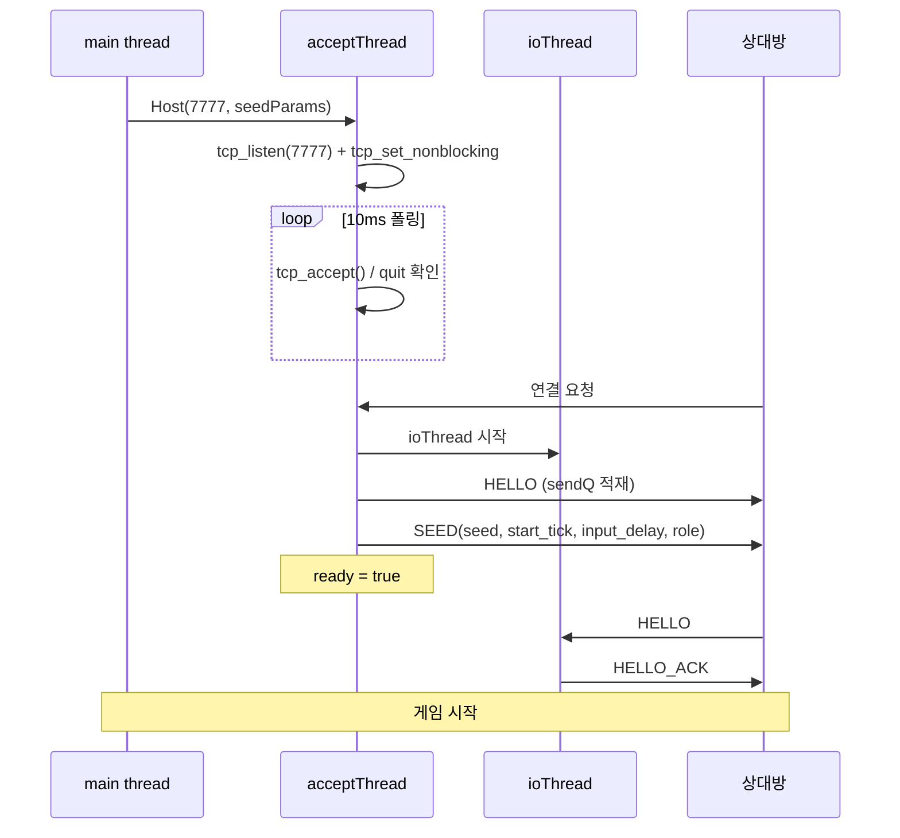

호스트는 두 개의 스레드를 쓴다.

1. **acceptThread**: listen 소켓을 논블로킹으로 전환한 뒤 10ms 간격으로 `tcp_accept()` 를 폴링한다. **블로킹 대기가 아니다** — `tcp_close` 가 `shutdown` 만 하므로 블로킹 `accept` 를 깨우지 못하는 플랫폼이 있기 때문이다. 연결이 수립되면 `ioThread` 를 시작하고 HELLO + SEED 를 큐에 넣는다.
2. **ioThread**: 논블로킹 recv/send 루프. 메시지 파싱 + 송신 큐 처리.

`Host()` 는 스레드를 띄우기 전에 **이전 세션의 잔재를 전부 지운다**. 같은 `Session` 객체를 재사용하는 경로(타이틀 복귀 후 재접속)에서 이전 연결의 `sendQ` 가 새 연결의 첫 송신으로 새어 나가는 것을 막기 위함이다.

**현재 소스 발췌 — `net/session.cpp`**

```cpp
bool Session::Host(uint16_t port, const SeedParams& sp) {
    if (listening) return false;

    // Close() 이후 재사용을 위한 상태 리셋. 같은 Session 객체를 재활용할 때
    // 이전 세션의 sendQ / HASH 상태가 남아 새 연결의 ioThread 로 유출되는 것을
    // 방지한다 (stale backlog 의 재연결 변종).
    quit = false;
    connectionFailed = false;
    connected = false;
    ready = false;
    {
        std::lock_guard<std::mutex> lk(inMu);
        remoteInputs.clear();
    }
    lastRemoteTick = 0;
    lastLocalTick = 0;
    recvBuf.clear();
    { std::lock_guard<std::mutex> lk(sendMu); sendQ.clear(); }
    { std::lock_guard<std::mutex> lk(hashMu_); lastHashTickRemote = 0; lastHashRemote = 0; }

    { std::lock_guard<std::mutex> lk(seedMu); seedParams = sp; }
    listening = true;
    ath = std::thread(&Session::acceptThread, this, port);
    return true;
}
```

`acceptThread` 전체는 다음과 같다.

**현재 소스 발췌 — `net/session.cpp`**

```cpp
void Session::acceptThread(uint16_t port)
{
    NET_TRACE("[NET] Starting to listen on port " << port);
    {
        std::lock_guard<std::mutex> lk(sockMu_);
        if (quit.load()) { listening = false; return; }
        listenSock = tcp_listen(port, 1);
    }
    if (!listenSock.valid()) {
        NET_WARN("[NET] Failed to listen on port " << port);
        listening = false;
        return;
    }
    // listen 소켓을 논블로킹으로 — tcp_close 는 shutdown 만 하므로 블로킹 accept 를
    // 깨우지 못한다. quit 를 폴링하며 accept 해 Close() 시 정상 종료시킨다.
    tcp_set_nonblocking(listenSock);
    NET_TRACE("[NET] Listening on port " << port << ", waiting for connection...");
    TcpSocket client;
    while (!quit.load()) {
        client = tcp_accept(listenSock);
        if (client.valid()) break;
        std::this_thread::sleep_for(std::chrono::milliseconds(10));
    }
    {
        std::lock_guard<std::mutex> lk(sockMu_);
        if (listenSock.valid()) tcp_close(listenSock);
        listenSock = TcpSocket{};
    }
    if (quit.load() || !client.valid()) {
        if (client.valid()) tcp_close(client);
        listening = false;
        return;
    }
    NET_TRACE("[NET] Client connected!");
    {
        std::lock_guard<std::mutex> lk(sockMu_);
        if (quit.load()) {
            tcp_close(client);
            listening = false;
            return;
        }
        sock = client;
    }
    connected = true;
    listening = false;
    th = std::thread(&Session::ioThread, this);
    {
        std::vector<uint8_t> pl; le_write_u16(pl, 1);
        auto fr = build_frame(MsgType::HELLO, pl);
        pushSend(std::move(fr));
        NET_TRACE("[NET] Queued HELLO message");
    }
    {
        std::vector<uint8_t> pl;
        {
            std::lock_guard<std::mutex> lk(seedMu);
            le_write_u64(pl, seedParams.seed);
            le_write_u32(pl, seedParams.start_tick);
            pl.push_back(seedParams.input_delay);
            pl.push_back((uint8_t)seedParams.role);
        }
        auto fr = build_frame(MsgType::SEED, pl);
        pushSend(std::move(fr));
        {
            std::lock_guard<std::mutex> lk2(seedMu);
            NET_TRACE("[NET] Queued SEED message (seed=0x" << std::hex << seedParams.seed << std::dec << ")");
        }
    }
    lastPongMs.store(now_ms());
    lastPingSentMs.store(0);
    ready = true;
    NET_TRACE("[NET] Host session is ready!");
}
```

`sockMu_` 가 세 번 등장한다. `Session::sock` 은 `shared_ptr` 멤버이고, 이 워커 스레드가 대입(publish)하는 동안 메인 스레드가 `Close()` 에서 읽을 수 있다. `shared_ptr` **인스턴스 자체**는 thread-safe 가 아니므로 그 접근을 직렬화해야 한다. 그리고 매 잠금 안에서 `quit` 를 다시 확인하는 이유는, `Close()` 가 `quit = true` 를 먼저 세우고 잠금을 잡기 때문이다 — 워커는 "잠금 이후 publish 하지 않거나(quit 재확인), 이미 publish 한 값을 Close 가 본다" 중 하나로 귀결된다.

### 4.2 `NET_TRACE` / `NET_WARN`

위 코드에 보이는 `NET_TRACE` 는 `std::cout` 이 아니다. 세션 파일 상단에서 컴파일 타임 스위치로 정의된다.

**현재 소스 발췌 — `net/session.cpp`**

```cpp
#if defined(TETRIS_ENABLE_NET_TRACE)
#define NET_TRACE(expr) do { std::cout << expr << std::endl; } while (0)
#else
#define NET_TRACE(expr) do {} while (0)
#endif
#define NET_WARN(expr) do { std::cerr << expr << std::endl; } while (0)
```

- `NET_TRACE` 는 **기본 빌드에서 완전히 사라진다.** `CMakeLists.txt` 의 `TETRIS_ENABLE_NET_TRACE` 옵션이 기본 OFF 이고, ON 일 때만 `target_compile_definitions` 로 `TETRIS_ENABLE_NET_TRACE=1` 이 주입된다 (`CMakeLists.txt`).
- `NET_WARN` 은 항상 살아 있고 **stderr** 로 나간다. 연결 실패·타임아웃처럼 드물게 한 번 찍히는 이벤트만 이 매크로를 쓴다.

`ioThread`의 hot path에서 `std::cout`을 부르는 것만으로도 Windows 콘솔 I/O가 블로킹돼 프레임이 밀릴 수 있다. 로그를 지우는 대신 컴파일 타임에 없애면 디버깅 가능성을 보존하면서 릴리스 경로의 I/O를 제거할 수 있다.

네트워크를 디버깅할 때는 이렇게 빌드한다.

```bash
cmake -S . -B build -DTETRIS_USE_SDL2=ON -DTETRIS_ENABLE_NET_TRACE=ON
cmake --build build --target tetris
```

### 4.3 클라이언트 흐름

**현재 소스 발췌 — `net/session.cpp`**

```cpp
bool Session::Connect(const std::string& host, uint16_t port) {
    NET_TRACE("[NET] Connecting to " << host << ":" << port);

    // Close() 이후 재사용을 위한 상태 리셋 (sendQ / HASH 포함)
    quit = false;
    connectionFailed = false;
    connected = false;
    ready = false;
    listening = false;
    {
        std::lock_guard<std::mutex> lk(inMu);
        remoteInputs.clear();
    }
    lastRemoteTick = 0;
    lastLocalTick = 0;
    recvBuf.clear();
    { std::lock_guard<std::mutex> lk(sendMu); sendQ.clear(); }
    { std::lock_guard<std::mutex> lk(hashMu_); lastHashTickRemote = 0; lastHashRemote = 0; }

    TcpSocket connectedSock = tcp_connect(host, port);
    if (!connectedSock.valid()) {
        NET_WARN("[NET] Failed to connect to " << host << ":" << port);
        connectionFailed = true;
        return false;
    }
    {
        std::lock_guard<std::mutex> lk(sockMu_);
        if (quit.load()) {
            tcp_close(connectedSock);
            return false;
        }
        sock = connectedSock;
    }
    NET_TRACE("[NET] Connected to " << host << ":" << port);
    connected = true;
    th = std::thread(&Session::ioThread, this);
    {
        std::vector<uint8_t> pl; le_write_u16(pl, 1);
        auto fr = build_frame(MsgType::HELLO, pl);
        pushSend(std::move(fr));
        NET_TRACE("[NET] Sent HELLO message");
    }
    return true;
}
```

세 가지를 눈여겨볼 것.

1. **결과를 로컬 변수 `connectedSock` 에 받는다.** `sock = tcp_connect(...)` 로 바로 대입하면 `sockMu_` 밖에서 `shared_ptr` 멤버를 쓰게 되어 `Close()` 와 경합한다. `tcp_connect` 는 블로킹이라 그 사이 유저가 취소 버튼을 누를 시간이 충분하다.
2. **잠금 안에서 `quit` 를 재확인하고, 이미 종료 중이면 로컬 소켓을 닫고 빠져나온다.** 이걸 빼면 `Close()` 가 `sock.valid()` 를 확인한 직후에 publish 되어 fd 가 누수된다.
3. **`ioThread` 를 먼저 띄우고 HELLO 를 큐에 넣는다.** 순서가 반대여도 동작하지만, 이 순서면 "큐에 넣는 순간 이미 드레이너가 돌고 있다" 가 보장된다.

클라이언트는 HELLO 를 보내고 호스트의 SEED 를 받으면 `ready = true` 가 된다(SEED를 처리하는 `handleFrame` 분기). 즉 **`connected` 와 `ready` 는 다른 시점**이다. `SendInput`은 둘 다 참일 때만 전송해야 하며, 그렇지 않으면 매치 대기 중 쌓인 INPUT이 준비 직후 한꺼번에 흘러가 첫 틱부터 DESYNC를 만든다.

### 4.4 SEED 파라미터

**현재 소스 발췌 — `net/session.h`**

```cpp
// 게임 시작 파라미터 (호스트가 결정 → SEED 메시지로 전달)
struct SeedParams {
    uint64_t seed{0};
    uint32_t start_tick{120};
    uint8_t input_delay{2};
    Role role{Role::Host};
    std::string local_icon_id{"default"};
    std::string remote_icon_id{"default"};
};
```

- `seed` — 양쪽 `SimGame` 에 동일하게 전달되는 RNG 시드. lockstep 의 출발점.
- `start_tick` — 시작 지연(기본 120틱 = 2초). SEED 프레임의 전달 시간과 양쪽 로딩 시차를 흡수하는 카운트다운이다.
- `input_delay` — 네트워크 지터 흡수 버퍼(기본 2틱).
- `role` — Host/Peer. 재시작 시 누가 새 시드를 만들지 결정하는 데 쓴다.
- `local_icon_id` / `remote_icon_id` — 릴레이가 `MATCH_FOUND` 에 실어 보내는 플레이어 아이콘 식별자. **SEED 프레임에는 실리지 않는다** — 직결 P2P 경로에서는 기본값 `"default"` 그대로다. 아이콘 소유권과 카탈로그는 [Part 10](./part10-meta-and-ranking.md), 릴레이가 이 값을 채우는 경로는 [Part 7](./part7-relay-server.md) 이 다룬다.

SEED 프레임의 와이어 페이로드는 앞의 네 필드만이다 (`[seed:u64][start_tick:u32][input_delay:u8][role:u8]` = 14바이트). `std::string` 두 개는 세션 내부 상태일 뿐 직렬화 대상이 아니다.

`params()` 접근자는 복사본을 반환한다 — 호출자가 잠금을 신경 쓰지 않아도 되게.

**현재 소스 발췌 — `net/session.h`**

```cpp
    SeedParams params() const {
        std::lock_guard<std::mutex> lk(seedMu);
        return seedParams;
    }
```

### 4.5 전체 세션 시퀀스

핸드셰이크부터 주기 검증까지 한 장에 담으면 이렇다.

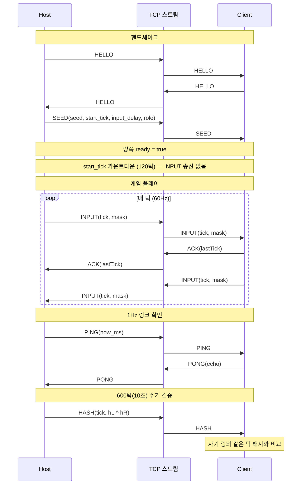

`HELLO` 는 양쪽이 서로에게 보낸다(호스트는 `acceptThread` 에서, 클라이언트는 `Connect` 에서). 받은 쪽은 `HELLO_ACK` 로 답하지만, 현재 구현은 그 응답을 로그만 찍고 상태 전이에 쓰지 않는다 — 실제 "준비 완료" 신호는 SEED 다.

---

## 5. Lockstep 동기화

### 5.1 safeTick 계산

$$\text{safeTick} = \min(\text{lastLocalSent},\ \text{lastRemoteRecv}) - \text{inputDelay}$$

- `lastLocalSent`: 로컬에서 마지막으로 전송한 틱 번호
- `lastRemoteRecv`: 상대방에게서 마지막으로 수신한 틱 번호
- `inputDelay`: 네트워크 지터를 흡수하는 버퍼 (기본 2틱)

**양쪽 피어의 입력이 모두 확보된 틱까지만 시뮬레이션을 진행한다.** 한쪽의 입력이 아직 도착하지 않았으면 시뮬레이션이 멈추고 기다린다.

### 5.2 타임라인 예시

60Hz(틱 16.67ms), 상대 `INPUT` 이 2틱 늦게 도착하는 상황.

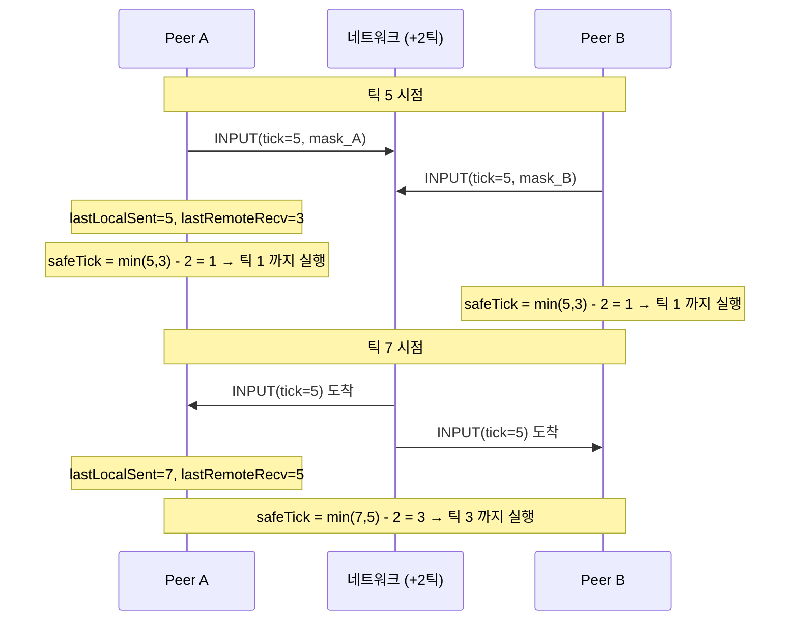

`inputDelay`의 역할은 지터(패킷 도착 시간의 변동) 흡수다. `inputDelay = 0`이면 패킷이 조금만 늦어도 시뮬레이션이 멈춘다. `inputDelay = 2`면 60Hz 기준 2틱의 입력 여유를 먼저 쌓고, `safeTick = min(localReceived, remoteReceived) - inputDelay`까지만 진행한다. 지연을 늘리면 정지는 줄지만 조작 반응이 늦어지는 직접적인 절충이다.

### 5.3 시뮬레이션 진행

**현재 소스 발췌 — `src/main.cpp`** (Net 모드 틱 루프 내부)

```cpp
                    int64_t lastLocalSent = (localTickNext == 0) ? -1 : (int64_t)localTickNext - 1;
                    int64_t lastRemote    = (int64_t)session.maxRemoteTick();
                    int64_t safeTick      = std::min(lastLocalSent, lastRemote) - (int64_t)inputDelay;

                    if ((int64_t)simTick <= safeTick && gameLocal && gameRemote &&
                        !gameLocal->gameOver && !gameRemote->gameOver)
                    {
                        while ((int64_t)simTick <= safeTick)
                        {
                            uint8_t li = 0, ri = 0;
                            auto it = localInputs.find(simTick);
                            if (it != localInputs.end()) li = it->second;
                            if (!session.GetRemoteInput(simTick, ri)) break;
                            gameLocal->SubmitInput(li);
                            gameRemote->SubmitInput(ri);
                            gameLocal->Tick();
                            gameRemote->Tick();
```

두 개의 `SimGame` 인스턴스를 유지한다.

- `gameLocal`: 로컬 플레이어의 입력으로 구동
- `gameRemote`: 상대 플레이어의 입력으로 구동

양쪽 게임이 같은 시드에서 시작하므로 블록 순서가 동일하다. 다른 점은 적용되는 입력뿐이다.

세부 사항 세 가지.

- **`gameOver` 가드가 조건에 들어 있다.** 한쪽 보드가 탑아웃된 뒤에도 루프가 돌면 게임오버 상태의 `SimGame` 이 계속 Tick 되어 양쪽 해시가 갈린다.
- **`GetRemoteInput` 이 실패하면 `break`.** `maxRemoteTick` 은 "받은 최대 틱" 이지 "0..max 가 빠짐없이 있다" 는 뜻이 아니다. 중간이 비면 거기서 멈춘다.
- **`localInputs.find` 가 실패하면 0 을 쓴다.** 로컬 입력은 우리가 채운 것이라 빠질 리 없지만, heartbeat catch-up 경계에서 방어적으로 0 을 쓴다.

`GetRemoteInput` 자체는 단순한 맵 조회다.

**현재 소스 발췌 — `net/session.cpp`**

```cpp
bool Session::GetRemoteInput(uint32_t tick, uint8_t& outMask) {
    std::lock_guard<std::mutex> lk(inMu);
    auto it = remoteInputs.find(tick);
    if (it == remoteInputs.end()) return false;
    outMask = it->second; return true;
}
```

송신도 대칭적으로 짧다. 틱 하나당 프레임 하나 — `count` 는 항상 1 이다.

**현재 소스 발췌 — `net/session.cpp`**

```cpp
void Session::SendInput(uint32_t tick, uint8_t mask) {
    // 메인 스레드 활성 시각 갱신 — ioThread 의 스톨 감지 (창 드래그 대응) 이 이 값
    // 을 기준으로 동작한다.
    lastMainActivityMs_.store(now_ms());
    auto cur = lastLocalTick.load();
    if (tick > cur) lastLocalTick.store(tick);
    std::vector<uint8_t> pl; le_write_u32(pl, tick); le_write_u16(pl, 1); pl.push_back(mask);
    auto fr = build_frame(MsgType::INPUT, pl);
    pushSend(std::move(fr));
}
```

`count` 필드가 있는데 항상 1 을 넣는 이유는 프로토콜에 여유를 남겨두기 위해서다. 수신 측은 `count > 1` 도 정상 처리하므로, 나중에 "지난 N틱을 묶어 보내는" 재전송 최적화를 넣더라도 와이어 포맷을 바꾸지 않아도 된다.

---

## 6. 스레드 모델

### 6.1 스레드 구성

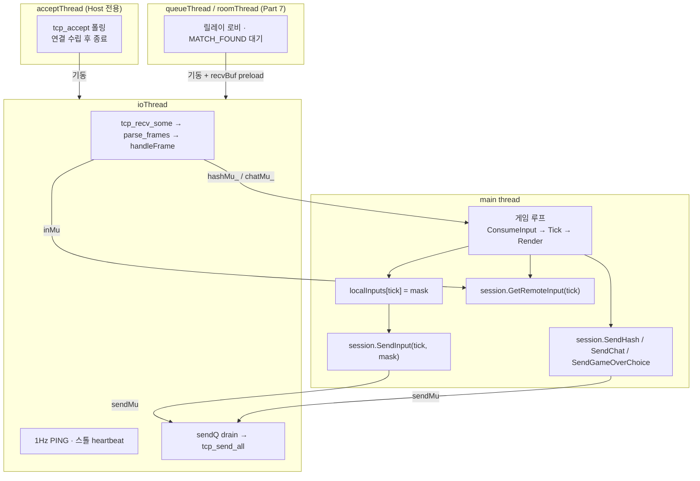

`Session` 의 `std::thread` 멤버는 `th`(ioThread), `ath`(acceptThread), `qth`(queueThread), `rth`(roomThread) 다. 이 중 동시에 사는 것은 많아야 둘이다 — 로비 스레드가 ioThread 를 띄우고 스스로 종료하는 구조이기 때문이다.

### 6.2 뮤텍스 — 페이즈별 소유권을 왜 나누는가

| 뮤텍스 | 보호 대상 | 접근 스레드 | 담당 파트 |
|--------|----------|------------|---|
| `sockMu_` | `sock` / `listenSock` (shared_ptr 인스턴스) | 모든 워커의 publish, main 의 Close/Cancel | Part 6 |
| `seedMu` | `seedParams` | main(읽기), ioThread(SEED 수신 시 쓰기), 로비 스레드(MATCH_FOUND 시 쓰기) | Part 6 |
| `sendMu` | `sendQ` (게임 송신 큐) | main(SendInput/SendHash/...), ioThread(drain) | Part 6 |
| `inMu` | `remoteInputs`, watermark | ioThread(INPUT 수신), main(GetRemoteInput) | Part 6 |
| `hashMu_` | `lastHashTickRemote` + `lastHashRemote` **쌍** | ioThread(쓰기), main(읽기) | Part 6 |
| `chatMu_` | `chatQ_` | ioThread(쓰기), main(PullChat) | Part 6 |
| `matchResultMu_` | `matchResult_` + `matchResultValid_` | ioThread(쓰기), main(GetMatchResult) | Part 6 |
| `roomMu_` | `roomCode_` | roomThread(쓰기), main(읽기) | Part 7 |
| `roomSendMu_` | `roomSendQ_` | main(RoomSendReady), roomThread(drain) | Part 7 |
| `roomSockSendMu_` | 룸 단계 소켓 쓰기 | roomThread drain, main 의 `RoomLeave` 동기 송신 | Part 7 |
| `queueSendMu_` | `queueSendQ_` | main(QueueConfirm), queueThread(drain) | Part 7 |
| `queueSockSendMu_` | 로비 단계 소켓 쓰기 | queueThread drain, main 의 `QueueDecline` 동기 송신 | Part 7 |

잠금 목록은 기능 확장에 따라 달라질 수 있지만, 나뉜 이유는 구조적이다. 게임 전송, 큐 로비, 룸 로비, 결과 수신이 서로 다른 스레드와 수명을 가지므로 한 잠금에 모두 몰아넣지 않는다.

**"왜 소켓 하나에 outbound writer 를 하나로 통일하지 않았나."** 가장 단순한 대안은 "소켓 하나 = 송신 큐 하나 = 드레이닝 스레드 하나" 다. 그러면 `sendMu` 하나만 남고 `roomSendMu_` / `queueSendMu_` / `*SockSendMu_` 네 개가 사라진다. 그런데 이 설계에는 그 통일을 막는 두 가지 제약이 있다.

1. **소켓의 수명이 세 페이즈로 나뉘고, 각 페이즈의 소유 스레드가 다르다.** 릴레이 경로에서 소켓은 (a) `roomThread`/`queueThread` 가 로비 프레임을 주고받는 구간 → (b) 양쪽 수락 완료 → (c) `ioThread` 가 게임 프레임을 주고받는 구간을 거친다. 페이즈마다 "지금 무엇을 보내도 되는가" 가 다르다 — 로비에서 `INPUT` 을 보내면 릴레이가 무시하거나 끊고, 게임 중에 `READY` 를 보내면 상대 파서가 드롭한다. 큐를 분리하면 이 규칙이 자료구조로 강제된다.
2. **종료 경로가 "큐에 넣고 나간다" 를 허용하지 않는다.** `QueueDecline` 과 `RoomLeave` 는 큐에 프레임을 넣은 뒤 곧바로 `quit = true` 를 세우는데, 드레이닝 스레드는 `while (!quit)` 상단에서 quit 을 먼저 보고 **드레인 없이 종료**한다. 그러면 `READY(0)` / `ROOM_LEAVE` 가 실제로 나가지 않아 상대는 "거절" 이 아니라 "타임아웃" 을 본다. 그래서 두 메서드는 메인 스레드에서 **직접** `tcp_send_all` 을 호출하고, 그 호출이 드레이닝 스레드의 송신과 섞이지 않도록 `*SockSendMu_` 로 직렬화한다.

정직하게 말하면 이건 트레이드오프다. 단일 writer 스레드 + 명시적 "flush 후 종료" 핸드셰이크로 만들었다면 뮤텍스 수는 줄었을 것이고, 대신 종료 프로토콜이 복잡해졌을 것이다. 이 프로젝트는 "종료를 단순하게, 대신 잠금을 하나 더" 를 택했다. `sendMu` 계열이 지키는 불변식은 하나로 요약된다 — **하나의 fd 에 대해 동시에 `tcp_send_all` 을 호출하는 스레드는 언제나 최대 하나다.**

### 6.3 `ioThread` — 루프 전체

**현재 소스 발췌 — `net/session.cpp`**

```cpp
void Session::ioThread() {
    NET_TRACE("[NET] I/O thread started");
    auto startTime = std::chrono::steady_clock::now();
    const auto CONNECTION_TIMEOUT = std::chrono::seconds(10);

    while (!quit.load()) {
        bool hasActivity = false;

        if (!ready.load()) {
            auto elapsed = std::chrono::steady_clock::now() - startTime;
            if (elapsed > CONNECTION_TIMEOUT) {
                NET_WARN("[NET] Connection timeout after 10 seconds");
                connectionFailed = true;
                quit = true;
                break;
            }
        }

        // 1Hz PING 송신 — ready=true 이후에만. 상대가 얼어붙어도 여기선 계속
        // 큐에 쌓이지만 tcp_send_all 자체가 막히지는 않는다(커널 버퍼 여유 범위).
        if (ready.load()) {
            int64_t now = now_ms();
            int64_t lastSent = lastPingSentMs.load();
            if (lastSent == 0 || (now - lastSent) >= 1000) {
                lastPingSentMs.store(now);
                std::vector<uint8_t> pl; le_write_u64(pl, (uint64_t)now);
                auto fr = build_frame(MsgType::PING, pl);
                pushSend(std::move(fr));
            }

            // 메인 스레드 스톨 자동 heartbeat — 창 드래그 시 메인 루프가 WM_ENTERSIZEMOVE
            // 모달에 갇혀 SendInput 이 멈춰도, ioThread 는 계속 돌고 있으므로 이 쪽에서
            // INPUT(tick,0) 을 대신 송신해 lockstep 을 계속 진행시킨다.
            //   · lastMainActivityMs_ == 0  → 첫 입력 전 (게임 시작 전) 이라 건너뜀.
            //   · 스톨 기준: 300ms 이상 SendInput 없음. 일반 60Hz 틱 (=16ms) 에선 트리거 안 됨.
            //   · 전송 주기: 16ms (60Hz) — 실제 게임 틱과 동일 속도로 catch-up.
            int64_t mainAct = lastMainActivityMs_.load();
            if (mainAct > 0 && (now - mainAct) > 300) {
                int64_t lastHeartbeat = lastHeartbeatMs_.load();
                if (lastHeartbeat == 0 || (now - lastHeartbeat) >= 16) {
                    lastHeartbeatMs_.store(now);
                    uint32_t nextTick = lastLocalTick.load() + 1;
                    std::vector<uint8_t> pl;
                    le_write_u32(pl, nextTick);
                    le_write_u16(pl, 1);
                    pl.push_back(0);
                    auto fr = build_frame(MsgType::INPUT, pl);
                    lastLocalTick.store(nextTick);
                    heartbeatTickEnd_.store(nextTick);
                    pushSend(std::move(fr));
                }
            } else {
                lastHeartbeatMs_.store(0);
            }
        }

        size_t prevSize = recvBuf.size();
        if (tcp_recv_some(sock, recvBuf)) {
            const bool newBytes = (recvBuf.size() > prevSize);
            if (newBytes) hasActivity = true;
            // 주의: 이 루프는 60Hz+ 로 돈다. 여기서 std::cout 으로 매 recv/parse
            // 를 찍으면 Windows 콘솔 I/O 가 blocking 해 Host 쪽 프레임이 밀린다.
            // 로그가 필요하면 NET_TRACE 매크로 등으로 gate 해 debug 빌드에서만.
            //
            // 조건은 newBytes 뿐 아니라 "recvBuf 가 비어있지 않은 경우" 로 확장한다.
            // queueThread 로비 / roomThread MATCH_FOUND 분기가 ioThread 전환 시
            // 재직렬화된 프레임을 recvBuf 에 pre-load 해 두는데, 첫 recv 가 0 바이트
            // 를 리턴하면 parse_frames 자체가 스킵되어 preload 가 소비되지 않는다.
            if (newBytes || !recvBuf.empty()) {
                std::vector<Frame> frames;
                parse_frames(recvBuf, frames);
                for (auto& f : frames) handleFrame(f);
            }
        } else {
            NET_WARN("[NET] Connection lost or receive failed");
            connectionFailed = true;
            quit = true;
            break;
        }

        while (true) {
            std::vector<uint8_t> pkt;
            {
                std::lock_guard<std::mutex> lk(sendMu);
                if (sendQ.empty()) break;
                pkt = std::move(sendQ.front());
                sendQ.pop_front();
                hasActivity = true;
            }
            // sendMu released before blocking I/O — main thread can SendInput() freely
            if (!tcp_send_all(sock, pkt.data(), pkt.size())) {
                NET_WARN("[NET] Send failed!");
                quit = true;
                break;
            }
        }

        if (!hasActivity) {
            std::this_thread::sleep_for(std::chrono::milliseconds(2));
        }
    }
    NET_TRACE("[NET] I/O thread exiting");
}
```

루프의 다섯 단계를 순서대로 짚는다.

1. **핸드셰이크 타임아웃.** `ready` 가 아닌 상태로 10초가 지나면 실패 처리. `--connect` 로 죽은 주소에 붙었을 때 UI 가 영원히 "Connecting..." 에 머무는 것을 막는다.
2. **1Hz PING.** `ready` 이후에만. 상세는 PING/PONG 절.
3. **메인 스레드 스톨 heartbeat.** 창 드래그 대응. 상세는 PING/PONG 절.
4. **수신 → 파싱 → 처리.**
5. **송신 큐 드레인.** `sendMu` 를 **놓은 뒤** `tcp_send_all` 을 부른다. `tcp_send_all` 은 커널 버퍼가 차면 1ms 씩 자며 재시도하므로, 잠금을 쥔 채 부르면 메인 스레드의 `SendInput` 이 그 시간만큼 통째로 막힌다. 큐에서 하나 꺼내고 즉시 놓는 이 패턴이 lockstep 루프를 지킨다.

마지막의 `hasActivity` 는 CPU 절약이다. 받은 것도 보낸 것도 없으면 2ms 잔다 — 즉 유휴 시 약 500Hz, 활동 중에는 사실상 busy loop 로 돈다.

**`newBytes || !recvBuf.empty()` 조건은 그냥 방어 코드가 아니다.** [Part 7](./part7-relay-server.md) 의 `queueThread` / `roomThread` 는 `MATCH_FOUND` 를 받은 뒤 같은 `recv` 에 딸려 온 게임 프레임을 재직렬화해 `recvBuf` 에 **미리 넣어 두고** ioThread 를 띄운다. 조건이 `newBytes` 뿐이면 ioThread 의 첫 `tcp_recv_some` 이 0 바이트를 반환하는 순간 `parse_frames` 자체가 스킵되어 그 preload 가 소비되지 않는다. 결과는 첫 `INPUT`/`PING` 유실 → lockstep stall 이다. 조건 한 개 차이로 릴레이 경로가 멈춘다.

### 6.4 종료 프로토콜

**현재 소스 발췌 — `net/session.cpp`**

```cpp
void Session::Close() {
    quit = true;
    // 소켓을 먼저 닫아(shutdown) accept()/recv() 블로킹 스레드를 깨운다.
    //   sockMu_ 로 워커 스레드의 publish 와 직렬화 — Close 가 quit 를 먼저 세팅하므로
    //   워커는 이 잠금 이후 publish 하지 않거나(잠금 안에서 quit 재확인), 이미 publish
    //   한 값을 우리가 본다. (shared_ptr 멤버 data race 방지)
    {
        std::lock_guard<std::mutex> lk(sockMu_);
        if (listening && listenSock.valid()) tcp_close(listenSock);
        if (sock.valid()) tcp_close(sock);
    }
    // shutdown 후 스레드 join (블로킹 해제됨). join 은 반드시 잠금 밖에서.
    if (ath.joinable()) ath.join();
    if (qth.joinable()) qth.join();
    if (rth.joinable()) rth.join();
    if (th.joinable()) th.join();
    // join 후엔 워커가 모두 종료됐다. 늦게 publish 됐을 수 있으니 한 번 더 닫고,
    // 소유자 복사본을 명시적으로 비운다 — 마지막 참조를 버려 실제 fd 를 닫고
    // valid() 를 false 로 되돌린다(연결 종료 후 fd 잔존 회귀 방지).
    {
        std::lock_guard<std::mutex> lk(sockMu_);
        if (sock.valid()) tcp_close(sock);
        if (listenSock.valid()) tcp_close(listenSock);
        sock = TcpSocket{};
        listenSock = TcpSocket{};
    }
    connected = false; ready = false; listening = false;
    roomState_.store(RoomState::Idle);
    roomPeerCount_.store(0);
    {
        std::lock_guard<std::mutex> lk(roomMu_);
        roomCode_.clear();
    }
    {
        std::lock_guard<std::mutex> lk(roomSendMu_);
        roomSendQ_.clear();
    }
    queueMatched_.store(false);
    queueLocalReady_.store(false);
    queuePeerReady_.store(false);
    {
        std::lock_guard<std::mutex> lk(queueSendMu_);
        queueSendQ_.clear();
    }
    // 스톨 heartbeat 상태 초기화 — 다음 세션에서 첫 SendInput 까지는 비활성.
    lastMainActivityMs_.store(0);
    heartbeatTickEnd_.store(0);
    lastHeartbeatMs_.store(0);
    {
        std::lock_guard<std::mutex> lk(chatMu_);
        chatQ_.clear();
    }
    // 게임 sendQ / HASH pair 도 함께 비움 — 같은 Session 객체 재사용 시 이전
    // 연결의 stale 프레임이 새 연결의 ioThread 에서 선두로 나가는 것 방지.
    { std::lock_guard<std::mutex> lk(sendMu); sendQ.clear(); }
    { std::lock_guard<std::mutex> lk(hashMu_); lastHashTickRemote = 0; lastHashRemote = 0; }
    // MATCH_RESULT 도 초기화. ClearGameOverChoices 만 의존하면 타이틀→새 매치
    // 경로에서 이전 라운드 결과가 새 매치 게임오버 시점에 즉시 읽히는 경계가
    // 있었다. Close 는 세션 경계마다 반드시 실행되므로 여기서 보장.
    {
        std::lock_guard<std::mutex> lk(matchResultMu_);
        matchResultValid_ = false;
        matchResult_ = MatchResult{};
    }
}
```

종료 순서가 중요하다. **먼저 종료 신호를 보내고, 그 다음 스레드를 join 하고, 마지막에 owning handle 을 비운다.** 순서를 바꾸면 데드락이나 fd 재사용 문제가 발생한다.

```text
잘못된 순서:
  main thread: ath.join() → 대기 (acceptThread 가 accept 폴링 중이지만 quit 가 안 섬)
  acceptThread: quit 를 못 봤으므로 계속 폴링
  → 데드락

올바른 순서:
  main thread: quit=true, tcp_close(listenSock) → accept/recv 루프가 반환할 조건 형성
  main thread: ath.join() → acceptThread 종료 대기
  main thread: listenSock = TcpSocket{} → 마지막 참조가 사라지면 실제 fd close
```

`Close()` 의 후반부는 전부 "다음 세션을 위한 초기화" 다. 이 프로젝트는 `Session` 객체를 `main()` 스택에 하나만 두고 재사용하므로, 한 라운드가 남긴 상태가 다음 라운드로 새는 경계가 반복해서 문제를 일으켰다 — 주석 세 덩이가 각각 그 사고의 기록이다.

---

## 7. 상태 해시 교차 검증

### 7.1 무엇을 보내는가

주기적으로 양쪽 피어가 자기 상태 해시를 교환한다.

**현재 소스 발췌 — `net/session.cpp`**

```cpp
void Session::SendHash(uint32_t tick, uint64_t hash) {
    std::vector<uint8_t> pl; le_write_u32(pl, tick); le_write_u64(pl, hash);
    auto fr = build_frame(MsgType::HASH, pl);
    pushSend(std::move(fr));
}
```

수신 측에서 같은 틱의 해시를 비교한다. 불일치 = **디싱크(desynchronization)**. "어떤 해시를 보내야 하는가" 는 생각보다 함정이 많아서 별도 절 ("XOR 결합 해시")에서 두 번 고쳐 쓴다.

### 7.2 주기와 링 크기의 근거

**현재 소스 발췌 — `src/main.cpp`**

```cpp
    // F.2 — 자동 HASH 검증. 매 600틱(~10s) 로컬 해시를 SendHash 하고 링으로
    // 기억. 상대의 HASH(tick, h) 가 들어오면 같은 틱의 로컬 해시와 비교 →
    // 불일치 시 DESYNC 오버레이 + stderr 로그.
    struct HashSnap { uint32_t tick = 0; uint64_t hash = 0; bool valid = false; };
    constexpr uint32_t HASH_PERIOD_TICKS = 600;
    constexpr size_t HASH_RING = 4;
    HashSnap localHashRing[HASH_RING]{};
    uint32_t lastHashSentTick = (uint32_t)-1;        // 중복 송신 방지
    uint32_t lastRemoteHashSeenTick = 0;
    uint32_t desyncTick = 0;
    bool desyncDetected = false;
```

- **600틱 = 10초.** 프레임 하나가 19바이트(len 2 + type 1 + payload 12 + 체크섬 4)이고 이걸 0.1Hz로 보내므로 대역폭은 사실상 0이다. 검증 주기를 줄여도 **감지 시점만 당겨질 뿐 상태를 복구하지는 못한다.** 반대로 더 드물게 하면 DESYNC가 난 뒤 화면이 오래 갈라진 채 방치된다. 10초는 사용자가 이상함을 느끼기 시작하는 시간과 맞춘 값이다.
- **링 크기 4 → 과거 40초 이력.** 상대의 HASH 는 네트워크 지연과 양쪽 시뮬레이션 진행 차이 때문에 내가 그 틱을 지난 뒤에 도착한다. 슬롯이 하나뿐이면 "상대의 tick 600 해시가 도착했을 때 나는 이미 tick 1200 을 기록해 덮어썼다" 가 되어 비교가 영원히 실패한다. 4칸이면 40초 뒤처진 HASH 까지 비교 가능하다 — lockstep 특성상 양쪽 진행 차이가 40초까지 벌어지는 일은 없다(그 전에 `Lost` 판정).
- **인덱스는 `(tick / HASH_PERIOD_TICKS) % HASH_RING`.** 링에 넣을 때와 비교할 때 같은 식을 쓰므로, `slot.tick == rt` 확인만으로 "덮어써졌는가" 를 판정한다.

### 7.3 왜 감지만 하고 복구하지 않는가

DESYNC 를 감지하면 화면에 빨간 배너를 띄우고 그걸로 끝이다. 자동 복구를 하지 않는다. 이건 게으름이 아니라 선택이다.

lockstep 에서 DESYNC 를 복구하는 방법은 원리적으로 두 가지뿐이다.

1. **상태 스냅샷 전송** — 한쪽이 자기 `SimGame` 전체를 직렬화해 보내고, 상대가 그걸로 덮어쓴다. 그러면 "입력만 교환한다" 는 lockstep 의 전제가 무너진다. 그리드 10×20 + RNG 상태 + 카운터를 직렬화하는 코드, 그 코드의 버전 호환성, 그리고 "누구의 상태가 옳은가" 를 정하는 권위 규칙이 전부 필요해진다. 권위 규칙은 P2P 에서 특히 고약하다 — 호스트를 믿기로 하면 호스트가 치팅 지점이 된다.
2. **라운드 폐기** — 그냥 이 판을 무효로 하고 새 시드로 재시작한다.

이 프로젝트는 (2) 의 수동 버전을 택했다. 배너를 보여주고, 사용자가 게임오버까지 가거나 타이틀로 나가면 세션이 자연스럽게 리셋된다. 근거는 단순하다 — **DESYNC 는 버그일 때만 발생한다.** 결정론 시뮬레이션 + 신뢰성 있는 전송이라는 전제가 지켜지면 확률적으로 발생하는 일이 아니다. 발생했다면 그건 고쳐야 할 코드 결함이지 런타임에 흡수할 사건이 아니다. 그래서 이 장치의 진짜 목적은 "복구" 가 아니라 **"회귀 탐지기"** 다. DESYNC 배너가 뜨는 빌드는 출시하면 안 된다는 신호다.

그 판단의 대가는 명확하다. 만에 하나 필드에서 DESYNC 가 나면 그 매치는 버려진다. 그 대신 얻는 것은 "네트워크 계층이 시뮬레이션 상태를 아예 모른다" 는 계층 분리다 — `net/` 의 어느 파일도 `SimGame` 을 include 하지 않는다.

### 7.4 디싱크의 일반적 원인

| 원인 | 증상 | 이 프로젝트의 대응 |
|------|------|------|
| RNG 호출 순서 차이 | 블록 순서가 다름 | RNG 호출을 피스 생성 경로 한 곳으로 고정 (Part 1) |
| 부동소수점 연산 차이 | 물리 값 차이 | 시뮬레이션에 부동소수점 자체가 없음 — 원천 차단 |
| 입력 손실/중복 | 한쪽에서 입력이 적용되지 않음 | TCP + 프레이밍 체크섬, 그리고 `emplace` 의 "덮어쓰지 않음" 의미론 |
| 입력 처리 순서 차이 | 동시 입력의 적용 순서가 다름 | `SubmitInput` 내부의 분기 순서를 고정 (Part 1) |
| 라운드 경계에서 tick 재사용 | 재시작 직후부터 갈라짐 | `ClearInputs()` 가 sendQ 의 INPUT/HASH 를 필터 드롭 |
| 시뮬레이션 밖 상태 혼입 | 간헐적·비재현 | `ComputeStateHash` 가 덮는 필드를 Part 1 에서 명시적으로 열거 |

이 프로젝트의 시뮬레이션은 정수 연산만 사용하므로, 가장 흔한 디싱크 원인인 "크로스 플랫폼 부동소수점 차이" 가 원천적으로 제거된다. 실제로 이 장에서 잡은 DESYNC 세 건은 전부 **네트워크 계층의 타이밍 버그** 였지 시뮬레이션 버그가 아니었다.

---

## 8. 게임 오버 협상

### 8.1 상태 머신

멀티플레이에서는 게임 오버 후 양쪽이 "재시작" 과 "타이틀로" 중 하나를 고르고, 그 선택을 `GAME_OVER_CHOICE` 프레임으로 교환한다.

**현재 소스 발췌 — `src/main.cpp`**

```cpp
enum class GameOverState {
    None,
    ShowingGameOver,
    WaitingForRemote,
    ShowingDisagreement,
    SendingNewSeed,
    WaitingForNewSeed,
    RestartingGame,
    GoingToTitle,
};
```

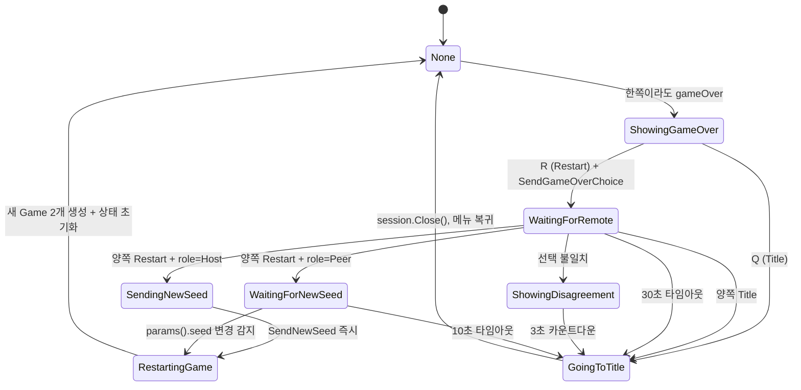

타임아웃 상수는 `src/main.cpp` 의 `GAME_OVER_TIMEOUT = 30.0f`, `DISAGREEMENT_COUNTDOWN = 3.0f` 이고, `WaitingForNewSeed` 의 10초는 `src/main.cpp` 에 리터럴로 있다.

### 8.2 의견 불일치 처리

양쪽의 선택이 다르면(한쪽 Restart, 한쪽 Title) 3초 카운트다운 후 양쪽 모두 타이틀로 복귀한다. "다수결" 이나 "호스트 우선" 규칙 대신 안전하게 세션을 종료하는 쪽을 택했다 — 2인 게임에서 다수결은 성립하지 않고, 호스트 우선은 "나가겠다는 사람을 붙잡아두는" 결과가 된다.

### 8.3 재시작 시 시드 교환

Host 역할인 쪽이 새 시드를 만들어 SEED 프레임으로 보낸다.

**현재 소스 발췌 — `net/session.cpp`**

```cpp
void Session::SendNewSeed(uint64_t newSeed) {
    std::vector<uint8_t> pl;
    {
        std::lock_guard<std::mutex> lk(seedMu);
        seedParams.seed = newSeed;
        le_write_u64(pl, seedParams.seed);
        le_write_u32(pl, seedParams.start_tick);
        pl.push_back(seedParams.input_delay);
        pl.push_back((uint8_t)seedParams.role);
    }
    auto fr = build_frame(MsgType::SEED, pl);
    pushSend(std::move(fr));
    NET_TRACE("[NET] Sent new seed: 0x" << std::hex << newSeed << std::dec);
}
```

Guest 쪽은 `WaitingForNewSeed` 에서 `session.params().seed` 를 폴링하다가 값이 바뀌면 `RestartingGame` 으로 넘어간다. SEED 프레임을 직접 감시하는 대신 세션 상태의 변화를 보는 구조라, `handleFrame` 에 콜백을 추가할 필요가 없다.

여기서 한 가지 함정이 있었다. Host 쪽 `SendingNewSeed` 상태는 원래 1.5초를 고정 대기했는데, 그 시차만큼 Host 의 카운트다운이 Guest 보다 늦게 시작돼 재시작 라운드 내내 lockstep 이 한쪽 입력에 묶여 영구 렉이 났다. 지금은 "시드 전송 → 즉시 시작" 으로 양쪽 시차를 RTT 수준으로 줄인다. `ClearInputs()` 는 이전 라운드 INPUT만 버리고 이미 도착한 SEED는 보존해야 Guest가 새 라운드 시작 신호를 잃지 않는다.

---

## 9. 오류와 함정

### 9.1 size_t 뺄셈 언더플로

**증상:** `parse_frames` 에서 크래시. 또는 `buf.size() - offset` 이 음수여야 할 때 거대한 양수가 되어 조건 분기가 잘못됨.

**원인:** `size_t` 는 unsigned. `0 - 1 = SIZE_MAX`.

**해결:** `buf.size() - offset < need` 대신 `offset + need > buf.size()` 형태로 비교. 뺄셈을 덧셈으로 변환하면 언더플로가 원천 차단된다.

> **레퍼런스:** C++ 표준 [conv.integral]: unsigned 정수의 산술은 모듈러 $2^n$ 으로 잘 정의된다. 그러나 의도하지 않은 모듈러 산술은 보안 취약점(buffer overflow)의 원인이 될 수 있다.

### 9.2 `Close()` 에서 소켓 종료 전 thread join

**증상:** 프로그램이 종료되지 않는다. `Close()` 에서 무한 대기.

**원인:** `acceptThread` 가 연결을 기다리는 중인데 `quit` 를 세우지 않고 `ath.join()` 부터 부르면, 아무도 연결하지 않는 한 영원히 대기한다.

**해결:** `quit = true` 를 먼저 세우고 `tcp_close(listenSock)` 으로 shutdown 을 호출한 뒤 join 한다. 현재 구현은 listen 소켓을 논블로킹으로 전환하고 10ms 간격 으로 accept 를 폴링하므로, shutdown 이 블로킹 accept 를 깨우지 못하는 플랫폼에 서도 `quit` 를 보고 빠져나온다. join 이 끝난 뒤 `listenSock = TcpSocket{}` 으로 마지막 소유 참조를 해제해 실제 fd 를 닫는다.

### 9.3 fd 정수 복사와 재사용 경합

**증상:** A 클라이언트가 끊긴 직후 새 B 클라이언트가 같은 릴레이에 붙으면, 살아 있던 스레드가 B 의 fd 정수에 대해 read/write 할 수 있다. 최악의 경우 서로 다른 연결의 데이터가 교차한다.

**원인:** `{ int fd }` 를 값으로 복사한 구조체가 여러 스레드에 퍼져 있고, 각 스레드가 독립적으로 `close(fd)` 한다. POSIX/WinSock fd 값은 단순 정수라서 닫힌 뒤 곧바로 새 socket/accept 결과로 재사용될 수 있다.

**해결:** `TcpSocket` 을 `shared_ptr<int>` 기반 owning handle 로 만들고, 실제 close 는 마지막 복사본의 deleter 에서 한 번만 수행한다. `tcp_close()` 는 fd 를 닫지 않고 `shutdown(SHUT_RDWR)` 만 호출해 recv/send 루프를 깨운다. `Session::sock` 처럼 shared_ptr 멤버 자체를 재대입하는 곳은 `sockMu_` 로 직렬화한다.

### 9.4 `seedParams` 데이터 레이스

**증상:** 클라이언트가 잘못된 시드로 게임을 시작한다. 드물게 발생.

**원인:** `ioThread` 가 SEED 메시지를 받아 `seedParams.seed` 에 쓰는 동시에 main thread 가 `session.params().seed` 를 읽는다. 데이터 레이스 = undefined behavior. `seedParams` 는 `std::string` 두 개를 포함하므로 tearing 이 아니라 힙 접근 충돌로 이어질 수 있다.

**해결:** `seedMu` 뮤텍스로 보호하고 `params()` 는 잠금 범위 안에서 복사본을 반환한다.

### 9.5 INPUT 메시지 버퍼 오버리드

**증상:** 간헐적 크래시 또는 잘못된 입력 값.

**원인:** INPUT 메시지의 `count` 필드가 실제 페이로드보다 클 때 `arr[i]` 가 버퍼 범위를 초과.

**해결:** `static_cast<size_t>(6) + cnt > f.payload.size()` 로 바운드 체크. 상세는 "악성 프레임 방어" 절.

### 9.6 창 드래그 시 Lockstep 정체

**증상:** 한쪽 플레이어가 창을 드래그하는 동안 상대방의 게임도 멈춘다.

**원인:** Win32 의 모달 메시지 루프(`WM_ENTERSIZEMOVE`)가 게임 루프를 점유한다. 그 동안 `SendInput()` 이 호출되지 않으므로 상대방의 `maxRemoteTick()` 이 증가하지 않고 `safeTick` 이 정체된다.

**해결(저장소에서 완화함):** 완전한 해결은 Rollback 네트코드로의 전환이 필요하지만, 이 저장소는 **ioThread 자동 heartbeat** 로 실질적으로 완화한다. 메인 스레드가 멈춰도 ioThread가 빈 INPUT을 발행하고, 복귀한 메인 스레드는 `heartbeatTickEnd()`까지의 로컬 입력을 0으로 채운다. PING/PONG은 이 틱 보완과 별도로 링크 지연·단절 상태를 갱신한다.

> **레퍼런스:** Mark Terrano & Paul Bettner, "1500 Archers on a 28.8: Network Programming in Age of Empires and Beyond" (GDC 1999). Lockstep 모델의 원전. "if one player is slow, everyone is slow."

---
## 10. inputDelay / safeTick 심화

§5.1 에서 `safeTick = min(lastLocalSent, lastRemoteRecv) - inputDelay` 라는 공식을 소개했다. 실제 게임에서 이 값이 어떻게 움직이는지, `inputDelay` 를 어떻게 골라야 하는지 더 파고든다.

### 10.1 수식 유도

피어 A 의 관점에서 틱 `t` 의 시뮬레이션을 실행하려면 다음 두 입력이 모두 필요하다.

- `localInputs[t]` — 내 입력. `SendInput(t, mask)` 을 호출한 **순간** 확정됨
- `remoteInputs[t]` — 상대 입력. 상대의 `SendInput(t, mask)` 가 네트워크를 통해 `INPUT` 프레임으로 도착한 **순간** 확정됨

A 가 현재 틱 `n` 을 진행하고 있다고 하자. `n` 틱 시점에 이미 `ConsumeInput()` 으로 로컬 마스크를 확정해 `SendInput(n, mask)` 까지 마쳤으므로:

$$\text{lastLocalSent}_A = n$$

상대 B 로부터 마지막으로 받은 `INPUT` 프레임의 최고 틱을 `lastRemoteRecv_A = r` 이라 하자. 그럼:

$$\text{safeTick}_A = \min(n, r)$$

만약 `inputDelay = 0` 이라면 A 는 `min(n, r)` 까지만 시뮬레이션할 수 있다. `r` 이 지체되면(네트워크 지연) A 도 같이 멈춘다. 잠깐의 지터에도 민감하게 반응한다.

여기서 **송신 측에서 입력을 D 틱 뒤에 적용하도록 "미뤄서" 보내는** 아이디어가 나온다. A 가 틱 `n` 에 확정한 입력은 "틱 `n + D` 에 적용되는 입력" 이라고 약속하는 것이다. 그럼 양쪽은 다음 불변식을 지키면 된다.

$$\text{시뮬레이션 가능 틱} = \min(n, r) - D$$

틱 `min(n, r) - D` 를 실행할 때 필요한 양쪽 입력은 사실 약 `D` 틱 전에 송신됐으므로, 네트워크 RTT 가 `D` 틱 이하이면 이미 도착해 있을 가능성이 높다. `D` 가 클수록 지터에 관대해지지만 체감 입력 지연도 커진다.

수학적으로는 `D` 를 송신 측에서 "틱 번호 재지정" 으로 구현해도 되고, 수신 측에서 "receive 한 입력을 D 틱 뒤 슬롯에 넣는다" 로 구현해도 된다. 이 프로젝트는 후자를 택했다. 송신은 여전히 `SendInput(localTickNow, mask)` 로 현재 틱 번호를 그대로 보낸다. 대신 **safeTick 계산식에서 빼준다** — 즉 "받은 입력이 `r` 이어도 `r - D` 까지만 적용한다". 뒤쪽 `D` 틱은 버퍼로 남겨둬서 다음 지터에 대비한다.

이 선택의 실질적 이점은 **`inputDelay` 를 바꿔도 와이어 포맷이 바뀌지 않는다**는 것이다. 송신 측 재지정 방식이었다면 `input_delay` 가 다른 두 클라이언트가 붙었을 때 tick 번호 해석이 어긋난다.

### 10.2 타임라인: inputDelay = 2, RTT = 30ms (2틱)

60Hz(틱 16.67ms)로 돌고, 한쪽으로 15ms 씩 편도 지연, 상대 `INPUT` 이 우리에게 도착하기까지 2틱 늦는다고 가정.

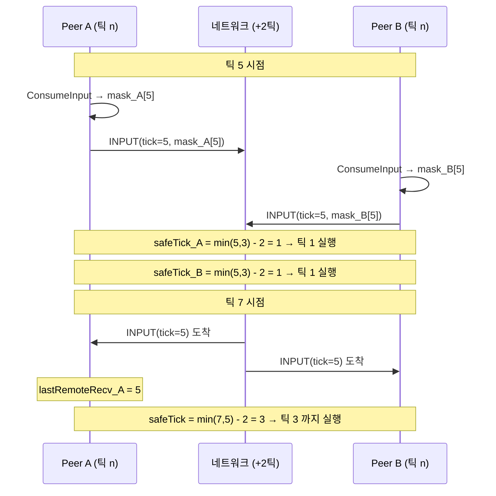

`inputDelay = 2` 는 **약 33ms 의 지터 여유** 를 준다. 한 번의 `INPUT` 프레임이 네트워크에서 33ms 안에 도착하기만 하면, 시뮬레이션은 끊기지 않고 똑같이 60Hz 로 흘러간다. 유저 입장에서 체감 지연은 33ms — 60Hz 화면에서 2프레임 차이. 격투 게임이라면 치명적이지만 테트리스에는 충분히 숨길 만한 값이다(§ 들어가며의 중력 주기 비교).

### 10.3 inputDelay 선택의 트레이드오프

| `inputDelay` | 체감 지연 | 지터 내성 | 적합한 매치 |
|---|---|---|---|
| 0 | 즉각적 | 없음 (1 틱 지연만 나도 멈춤) | LAN / loopback |
| 1 | 16.67ms | ~16ms | 초저지연 인터넷 |
| **2 (기본)** | **33.33ms** | **~33ms** | 일반 인터넷 |
| 4 | 66.67ms | ~66ms | 지터가 큰 Wi-Fi |
| 8 | 133ms | ~133ms | 모바일 / 장거리 |

이 프로젝트는 **SEED 메시지에 `input_delay` 를 실어서 호스트가 결정**한다. 호스트가 RTT 를 보고 클라이언트에게 통지하는 적응형 구조는 아직 구현되지 않았고, 기본 2 로 고정되어 있다. 확장 여지: 첫 PING 왕복 결과를 보고 호스트가 `SendNewSeed` 와 같은 방식으로 `input_delay` 를 조정하는 메시지를 추가하면 된다.

### 10.4 경계 케이스: 초반 start_tick 구간

`start_tick = 120` (2초 카운트다운) 동안에는 양쪽이 서로에게 `INPUT` 을 보내지 않는다(그 이유는 "대기 중 stale INPUT backlog" 절). 이 구간의 `safeTick` 은 수학적으로 음수가 될 수 있다(`min(-1, -1) - 2 = -3`). `int64_t` 로 계산하는 이유가 이것이다 — `(localTickNext == 0) ? -1 : ...` 분기도 `uint32_t` 언더플로를 피하기 위한 방어였다.

`simTick` 은 `uint32_t` 이므로 비교 시 `(int64_t)simTick <= safeTick` 으로 캐스팅한다. 이러면 `simTick = 0`, `safeTick = -3` 일 때 `0 <= -3` 은 false — 루프가 돌지 않는다. 정상이다.

---

## 11. PING/PONG 하트비트와 LinkStatus

§3 의 프로토콜은 HELLO/SEED/INPUT/ACK/HASH/GAME_OVER_CHOICE 만으로 "깨끗한" 네트워크에서는 동작한다. 그런데 실제 환경에는 두 가지 **애매한 상황** 이 있다.

1. **상대가 창을 드래그 중** — Win32 의 모달 메시지 루프가 main thread 를 점유해서 `SendInput()` 호출이 멈춘다. 하지만 ioThread 는 별도 스레드라 살아있고, TCP 연결도 끊어지지 않는다. 상대는 지금 "일시적으로 얼어있는" 상태.
2. **상대가 랜 케이블 뽑힘 / 프로세스 크래시** — 실제로 연결이 끊어졌는데 TCP 는 기본 keep-alive 가 수 분 단위라 한참 동안 `recv()` 가 에러를 안 낸다.

두 상황은 **겉으로 똑같이 보인다** — `safeTick` 이 더 이상 올라가지 않는다. 하지만 UI 에서 유저에게 보여줘야 하는 메시지는 다르다. 전자는 "잠시 대기", 후자는 "타이틀 복귀 카운트다운". 이를 구별하는 장치가 **PING/PONG 하트비트** 다.

### 11.1 상태 정의

**현재 소스 발췌 — `net/session.h`**

```cpp
// 링크 건강 상태 — 마지막 PONG 수신 경과 시간 기반
//   OK     : 마지막 PONG < 2s (정상)
//   Stalled: 2s ≤ 경과 < 10s (상대가 잠시 얼어붙음, Windows 창 드래그 등)
//   Lost   : 경과 ≥ 10s 혹은 hasFailed() — 연결 공식 단절로 간주
enum class LinkStatus : uint8_t { OK=0, Stalled=1, Lost=2 };
```

PING 페이로드는 `[timestamp:u64 LE]` 하나다. PONG 은 수신한 PING 의 payload 를 그대로 에코한다. RTT 측정에도 쓸 수 있는 형태지만, 현재 구현은 "언제 마지막으로 PONG 을 받았나" 만 기록한다.

### 11.2 송신: ioThread 의 1Hz 타이머

**현재 소스 발췌 — `net/session.cpp`** (`ioThread` 본문 중)

```cpp
        // 1Hz PING 송신 — ready=true 이후에만. 상대가 얼어붙어도 여기선 계속
        // 큐에 쌓이지만 tcp_send_all 자체가 막히지는 않는다(커널 버퍼 여유 범위).
        if (ready.load()) {
            int64_t now = now_ms();
            int64_t lastSent = lastPingSentMs.load();
            if (lastSent == 0 || (now - lastSent) >= 1000) {
                lastPingSentMs.store(now);
                std::vector<uint8_t> pl; le_write_u64(pl, (uint64_t)now);
                auto fr = build_frame(MsgType::PING, pl);
                pushSend(std::move(fr));
            }
```

핵심: **PING 은 main thread 가 아니라 ioThread 가 찍는다.** 그래서 상대가 창 드래그 중이라 main thread 가 얼어도 그 상대의 ioThread 는 돌고 있다 → 우리 PING 에 상대 PONG 이 돌아온다 → 우리는 "상대 ioThread 살아있음" 을 알 수 있다.

`lastPingSentMs` 는 각 진입점(`acceptThread`, SEED 수신, 로비 전환)에서 `0` 으로 리셋된다. `lastSent == 0` 분기가 "세션 시작 직후 즉시 한 번 보낸다" 를 보장한다.

### 11.3 수신: handleFrame 의 두 분기

**현재 소스 발췌 — `net/session.cpp`** (`handleFrame` 의 switch 중)

```cpp
    case MsgType::PING: {
        // 상대의 PING 은 즉시 PONG 으로 에코 — io 스레드가 계속 돌고 있으면
        // 메인 스레드가 얼어도(창 드래그 등) 상대는 우리를 살아있다고 판정.
        std::vector<uint8_t> pong = f.payload; auto fr = build_frame(MsgType::PONG, pong);
        pushSend(std::move(fr));
    } break;
    case MsgType::PONG: {
        // 최신 PONG 도착 시각 기록 — linkStatus() 가 이 값을 기준으로 판정.
        lastPongMs.store(now_ms());
    } break;
```

두 분기는 극단적으로 단순하다. PING 을 받으면 바로 PONG 큐잉, PONG 을 받으면 시각 기록. 판정 로직은 전부 조회 측에 있다.

### 11.4 판정: `linkStatus()`

**현재 소스 발췌 — `net/session.cpp`**

```cpp
LinkStatus Session::linkStatus() const {
    if (connectionFailed.load()) return LinkStatus::Lost;
    if (!ready.load()) return LinkStatus::OK;
    int64_t last = lastPongMs.load();
    if (last == 0) return LinkStatus::OK;  // 첫 PONG 전에는 판단 유예
    int64_t ago = now_ms() - last;
    if (ago >= 10000) return LinkStatus::Lost;
    if (ago >=  2000) return LinkStatus::Stalled;
    return LinkStatus::OK;
}
```

| `now - lastPongMs` | 상태 | UI 표시 | 시뮬레이션 |
|---|---|---|---|
| `< 2000ms` | `OK` | 없음 | 정상 진행 |
| `2000 ≤ _ < 10000` | `Stalled` | "Opponent frozen - waiting..." | 멈춤 (safeTick 정체) |
| `≥ 10000` | `Lost` | "Opponent disconnected" + 10초 카운트다운 | 멈춤 → grace 후 타이틀 |

2초는 1Hz PING 의 2 주기 여유다. 한 번의 PING 이 일시적으로 지연돼도 다음 번엔 회복될 거라는 가정. 10초는 "상대가 실제로 사라졌다" 고 결론내리는 컷오프 — TCP keep-alive 가 작동하기 전에 선제적으로 감지한다.

### 11.5 grace 복귀 — Stalled → OK 자동 재개

`linkStatus()` 가 `Stalled` 로 분류돼도 **세션을 닫지 않는다.** UI 오버레이만 띄우고, 다음 PONG 이 돌아와 2초 이내가 되면 조용히 `OK` 로 복귀한다.

`Lost` 는 좀 더 적극적이다. 처음 `Lost` 를 본 순간부터 main.cpp 가 10초짜리 별도 카운트다운을 돌리고, 그 사이에 `Stalled` 나 `OK` 로 회복하면 취소한다. 창 드래그가 10초를 넘기는 일은 거의 없으므로, 이 이중 grace 구조로 "창 드래그" 와 "진짜 단절" 이 자연스럽게 분리된다.

**현재 소스 발췌 — `src/main.cpp`**

```cpp
        // Section A — 링크 Lost 감지 + grace 카운트다운.
        // 실제 게임 세션(gameLocal/gameRemote 생성 이후)의 상대 단절에만 적용한다.
        // relay 접속 실패/매치메이킹 실패는 "opponent disconnected" 가 아니라
        // 아래 Net 대기 카드의 Matchmaking Failed / Connection Failed 로 보여야 한다.
        if (app == AppMode::Net && gameLocal && gameRemote) {
            net::LinkStatus ls = session.linkStatus();
            if (ls == net::LinkStatus::Lost) {
                if (!linkLostActive) {
                    linkLostActive = true;
                    linkLostCountdown = LINK_LOST_GRACE;
                    std::cout << "[NET] Peer lost — returning to title in "
                              << LINK_LOST_GRACE << "s\n";
                } else {
                    linkLostCountdown -= deltaTime;
                    if (linkLostCountdown <= 0.0f) {
                        std::cout << "[NET] Grace elapsed — returning to menu\n";
                        session.Close();
                        gameLocal.reset(); gameRemote.reset();
                        gameOverState = GameOverState::None;
                        queueMode = false; netMode = false;
                        linkLostActive = false; linkLostCountdown = 0.0f;
                        app = AppMode::Menu;
                    }
                }
            } else if (linkLostActive) {
                // Stalled 는 유지하되 Lost 에서 회복되면 카운트다운 취소.
                linkLostActive = false;
                linkLostCountdown = 0.0f;
                std::cout << "[NET] Peer recovered — cancelling grace\n";
            }
        } else if (linkLostActive) {
            linkLostActive = false;
            linkLostCountdown = 0.0f;
        }
```

조건이 `app == AppMode::Net` 만이 아니라 **`&& gameLocal && gameRemote`** 라는 점이 중요하다. 릴레이 접속 실패나 매치메이킹 타임아웃도 `linkStatus()` 를 `Lost` 로 만드는데(`connectionFailed` 경로), 그때는 게임 객체가 아직 없다. 가드가 없으면 "매치 상대를 찾는 중" 화면에 "상대가 연결을 끊었습니다 — 10초 후 타이틀로" 가 뜬다. 실제로는 상대가 있던 적이 없다. `LINK_LOST_GRACE` 는 `src/main.cpp` 의 `10.0f` 다.

### 11.6 메인 스레드 스톨 자동 heartbeat (창 드래그 대응)

PING/PONG 은 "상대가 아직 살아있는가" 를 알려주지만, 창 드래그 같은 상황에서는 한 가지 **남은 문제** 가 있다.

- 드래그 중인 쪽의 `ioThread` 는 살아있어 PING/PONG 은 정상. `linkStatus` 도 `OK`.
- 하지만 그 쪽의 **main thread** 는 `WM_ENTERSIZEMOVE` 모달 루프에 잡혀 `Session::SendInput()` 을 호출하지 못한다.
- 상대의 `safeTick = min(localSent, remoteMax) - inputDelay` 계산에서 `remoteMax` 가 드래그 기간 내내 정체 → 상대방의 게임도 같이 멈춘다.

즉 "링크 건강 = OK, but 한 쪽이 INPUT 을 못 쏘고 있음" 상황이다. `linkStatus` 만으로는 판정 불가.

**해결**: `ioThread` 가 main thread 의 스톨을 직접 감지해 **대신 `INPUT(tick, 0)` heartbeat 을 송신**한다. ioThread 는 별개 스레드라 창 드래그에 전혀 영향받지 않는다.

**현재 소스 발췌 — `net/session.cpp`** (`ioThread` 본문 중, PING 송신 바로 뒤)

```cpp
            // 메인 스레드 스톨 자동 heartbeat — 창 드래그 시 메인 루프가 WM_ENTERSIZEMOVE
            // 모달에 갇혀 SendInput 이 멈춰도, ioThread 는 계속 돌고 있으므로 이 쪽에서
            // INPUT(tick,0) 을 대신 송신해 lockstep 을 계속 진행시킨다.
            //   · lastMainActivityMs_ == 0  → 첫 입력 전 (게임 시작 전) 이라 건너뜀.
            //   · 스톨 기준: 300ms 이상 SendInput 없음. 일반 60Hz 틱 (=16ms) 에선 트리거 안 됨.
            //   · 전송 주기: 16ms (60Hz) — 실제 게임 틱과 동일 속도로 catch-up.
            int64_t mainAct = lastMainActivityMs_.load();
            if (mainAct > 0 && (now - mainAct) > 300) {
                int64_t lastHeartbeat = lastHeartbeatMs_.load();
                if (lastHeartbeat == 0 || (now - lastHeartbeat) >= 16) {
                    lastHeartbeatMs_.store(now);
                    uint32_t nextTick = lastLocalTick.load() + 1;
                    std::vector<uint8_t> pl;
                    le_write_u32(pl, nextTick);
                    le_write_u16(pl, 1);
                    pl.push_back(0);
                    auto fr = build_frame(MsgType::INPUT, pl);
                    lastLocalTick.store(nextTick);
                    heartbeatTickEnd_.store(nextTick);
                    pushSend(std::move(fr));
                }
            } else {
                lastHeartbeatMs_.store(0);
            }
```

- `lastMainActivityMs_` 는 `SendInput` 이 호출될 때마다 `now_ms()` 로 갱신되는 atomic 이다.
- `mainAct == 0` 은 "아직 첫 입력 전"(카운트다운 구간) — heartbeat 미발동.
- `300ms` 임계: 정상 60Hz 틱(16ms 주기)에선 절대 닿지 않는 값. 창 드래그 / 일시적 스파이크에서만 트리거.
- `16ms` rate limit: heartbeat 을 60Hz 로 송신. ioThread 본체는 유휴 시 2ms sleep 으로 ~500Hz 로 돌기 때문에 이게 없으면 폭주한다.
- `.load()` / `.store()` 를 명시적으로 쓴다. `lastHeartbeatMs_` 는 `std::atomic<int64_t>` 이므로 `lastHeartbeatMs_ == 0` 같은 암묵 변환도 컴파일되지만, 원자적 읽기 지점을 눈에 보이게 두는 편이 이런 코드에서 안전하다.

**메인이 깨어난 뒤 catch-up**:

**현재 소스 발췌 — `src/main.cpp`** (Net 모드 틱 루프, `SendInput` 직전)

```cpp
                    // 창 드래그 등으로 메인 스레드가 멈춘 동안 ioThread 가 자동으로
                    // INPUT(t,0) 을 상대에게 흘려 lockstep 을 계속 돌렸다면, 우리도
                    // 그 구간을 0 으로 채워 localInputs 와 peer 관측치가 일치하도록
                    // 맞춘다. 그렇지 않으면 같은 tick 에 우리 sim 은 inputMask 를 쓰고
                    // peer 는 0 을 써 DESYNC.
                    //   hbEnd==0 은 "heartbeat 한 번도 안 터짐" 을 의미 — 게임 시작
                    //   tick 0 과 구별하기 위해 반드시 hbEnd>0 조건으로 가드한다.
                    uint32_t hbEnd = session.heartbeatTickEnd();
                    if (hbEnd > 0 && hbEnd >= localTickNext) {
                        for (uint32_t t = localTickNext; t <= hbEnd; ++t) {
                            localInputs[t] = 0;
                        }
                        localTickNext = hbEnd + 1;
                    }
                    localInputs[localTickNext] = inputMask;
                    session.SendInput(localTickNext, inputMask);
                    localTickNext++;
```

상대는 `INPUT(t, 0)` 을 이미 받았으므로 자기 `remoteInputs[t] = 0` 으로 진행했다. 우리 `localInputs[t]` 를 같은 0 으로 채우지 않으면 **같은 tick 에서 우리 sim 은 실제 inputMask 를 쓰고 상대 sim 은 0 을 써 DESYNC** 가 난다. 한 줄의 catch-up 루프로 peer 의 관측치와 일치시킨다.

이 구조 덕분에 창 드래그 동안 양쪽 게임 모두 정상 진행 — 드래그한 쪽의 sim 만 main 이 깨어난 뒤 rapid catch-up 으로 따라잡는다. 다만 드래그 측 본인의 시뮬레이션은 모달 루프 동안 정지하므로, 본질적 한계가 완전히 사라진 것은 아니다.

**`hbEnd == 0` 가드의 왜.** 이 가드를 처음 작성할 땐 `hbEnd >= localTickNext` 한 줄이면 된다고 착각했는데, 게임 시작 직후 `localTickNext = 0, hbEnd = 0` 에서 조건이 `0 >= 0 → true` 로 평가돼 `localInputs[0] = 0` 으로 덮어씌우고 `localTickNext` 가 1 로 점프하는 치명적 버그가 있었다. 결과적으로 `INPUT(0)` 이 전송되지 않아 상대 `remoteInputs[0]` 이 영원히 비어 있고, `safeTick = min(local, remote) - inputDelay` 계산에서 `remote = 0` 으로 막혀 **양쪽 sim 이 완전히 프리즈**. `hbEnd == 0` 을 "heartbeat 미발동" sentinel 로 명확히 구분해야 한다(heartbeat 은 `lastLocalTick + 1` 부터 시작하니 실제 발동 시엔 항상 `hbEnd ≥ 1`).

### 11.7 TCP keepalive와 PING/PONG은 서로 다른 실패를 본다

현재 `tcp_accept`와 `tcp_connect`는 모든 연결 소켓에 `set_keepalive` 를 걸어 `SO_KEEPALIVE`를 켠다. 켜는 것만으로는 부족하다 — 감지 시간의 기본값이 플랫폼마다 크게 다르기 때문이다. POSIX에서는 지원되는 옵션에 한해 idle 15초 · probe 간격 5초 · 실패 허용 횟수를 짧게 요청하고, Windows에서는 `SIO_KEEPALIVE_VALS` ioctl로 같은 idle 15초 / 간격 5초를 명시한다. Windows 기본 KeepAliveTime은 2시간이라 `SO_KEEPALIVE`만 켜서는 "FIN/RST 없이 사라진 피어 감지"가 사실상 동작하지 않는다 — 두 플랫폼의 감지 시간을 같은 자리로 맞추는 정합화다.

**현재 소스 발췌 — `net/socket.cpp`**

```cpp
// FIN/RST 없이 사라진 피어를 커널이 회수하게 하는 폴백.
static void set_keepalive(int fd) {
    int yes = 1;
#ifdef _WIN32
    setsockopt(fd, SOL_SOCKET, SO_KEEPALIVE, (const char*)&yes, sizeof(yes));
    // Windows 기본 KeepAliveTime 은 2시간이라 SO_KEEPALIVE 만으로는 'FIN/RST 없이
    // 사라진 피어 감지'가 사실상 동작하지 않는다(POSIX 분기의 idle 15s / interval 5s
    // 와 비대칭). SIO_KEEPALIVE_VALS 로 같은 값을 명시해 양 플랫폼 감지 시간을 맞춘다.
    // (Vista+ 는 probe 재전송 횟수가 10회 고정 — 대략 15s + 10*5s 내 감지.)
    tcp_keepalive ka{};
    ka.onoff = 1;
    ka.keepalivetime = 15000;     // idle 15초 후 첫 probe (ms)
    ka.keepaliveinterval = 5000;  // probe 간격 5초 (ms)
    DWORD bytesReturned = 0;
    // keepalive 는 best-effort 폴백이라 setsockopt/WSAIoctl 실패는 조용히 무시한다
    // (실패해도 연결 자체는 정상 동작하고, 상위의 PING/PONG 타임아웃이 최후 방어선).
    WSAIoctl((SOCKET)fd, SIO_KEEPALIVE_VALS, &ka, sizeof(ka),
             nullptr, 0, &bytesReturned, nullptr, nullptr);
#else
    setsockopt(fd, SOL_SOCKET, SO_KEEPALIVE, &yes, sizeof(yes));
#  if defined(TCP_KEEPIDLE)
    int idle = 15;
    setsockopt(fd, IPPROTO_TCP, TCP_KEEPIDLE, &idle, sizeof(idle));
#  elif defined(TCP_KEEPALIVE)
    int idle = 15;
    setsockopt(fd, IPPROTO_TCP, TCP_KEEPALIVE, &idle, sizeof(idle));
#  endif
#  if defined(TCP_KEEPINTVL)
    int interval = 5;
    setsockopt(fd, IPPROTO_TCP, TCP_KEEPINTVL, &interval, sizeof(interval));
#  endif
#  if defined(TCP_KEEPCNT)
    int probes = 3;
    setsockopt(fd, IPPROTO_TCP, TCP_KEEPCNT, &probes, sizeof(probes));
#  endif
#endif
}
```

반환값이 없고 `setsockopt`/`WSAIoctl` 실패를 조용히 무시하는 것은 의도다. keepalive는 연결의 성립 조건이 아니라 회수용 안전망이고, 실패해도 연결은 정상 동작하며 최후 방어선은 상위의 PING/PONG 타임아웃이다. 실패를 오류로 승격하면 "keepalive 옵션이 없는 플랫폼에서는 접속 자체가 안 되는" 더 나쁜 결과가 된다.

커널 keepalive만으로 게임 상태를 판단할 수는 없다. 조정이 best-effort라 실제 적용값이 보장되지 않고, 감지 결과도 `LinkStatus`에 필요한 마지막 응답 시각과 원격 tick 진행 정보를 주지 않기 때문이다. 반대로 애플리케이션 PING/PONG만으로는 NAT와 커널이 보유한 반쪽 연결을 OS 수준에서 정리하는 역할을 완전히 대신하지 못한다.

따라서 두 계층을 함께 쓴다. TCP keepalive는 FIN/RST 없이 사라진 peer를 회수하는 커널 안전망이고, PING/PONG은 UI의 `OK`/`Stalled`/`Lost` 판정과 RTT 관측을 위한 게임 프로토콜이다. relay의 방향별 무활동 제한은 여기에 별도로 더해져, 매치 자원을 언제 회수하고 기권으로 볼지를 결정한다.

---

## 12. 악성 프레임 방어

프로토콜을 확장하면서 한 가지 원칙이 생겼다. **payload 를 읽기 전에 크기와 값을 검증하라.** 손상된 프레임(체크섬 충돌)이나 악성 프레임(악의적 클라이언트 / fuzz 테스트)이 들어와도 프로세스가 터지면 안 된다.

이 원칙을 위반한 옛 코드에서 여러 버그가 나왔다. 먼저 최종형을 통째로 보자.

**현재 소스 발췌 — `net/session.cpp`**

```cpp
void Session::handleFrame(const Frame& f) {
    switch (f.type) {
    case MsgType::HELLO: {
        NET_TRACE("[NET] Received HELLO message");
        std::vector<uint8_t> pl; pl.push_back(1);
        auto fr = build_frame(MsgType::HELLO_ACK, pl);
        pushSend(std::move(fr));
        NET_TRACE("[NET] Queued HELLO_ACK response");
    } break;
    case MsgType::HELLO_ACK: {
        NET_TRACE("[NET] Received HELLO_ACK message");
    } break;
    case MsgType::SEED: {
        NET_TRACE("[NET] Received SEED message");
        if (f.payload.size() >= 8+4+1+1) {
            const uint8_t* p = f.payload.data();
            std::lock_guard<std::mutex> lk(seedMu);
            seedParams.seed = le_read_u64(p);
            seedParams.start_tick = le_read_u32(p+8);
            seedParams.input_delay = p[12];
            uint8_t rawRole = p[13];
            seedParams.role = (rawRole == (uint8_t)Role::Host || rawRole == (uint8_t)Role::Peer)
                            ? (Role)rawRole : Role::Peer;
            NET_TRACE("[NET] Parsed SEED: seed=0x" << std::hex << seedParams.seed
                      << ", start_tick=" << std::dec << seedParams.start_tick
                      << ", input_delay=" << (int)seedParams.input_delay);
            lastPongMs.store(now_ms());
            lastPingSentMs.store(0);
            ready = true;
            NET_TRACE("[NET] Client session is ready!");
        } else {
            NET_WARN("[NET] Invalid SEED message size: " << f.payload.size());
        }
    } break;
    case MsgType::INPUT: {
        if (f.payload.size() >= 6) {
            const uint8_t* p = f.payload.data();
            uint32_t from = le_read_u32(p);
            uint16_t cnt = le_read_u16(p+4);
            // 페이로드 크기 검증: 헤더(6) + cnt 바이트가 실제 크기 이내인지 확인
            if (static_cast<size_t>(6) + cnt > f.payload.size()) break;
            const uint8_t* arr = p+6;
            // [보안] 신뢰할 수 없는 피어의 INPUT 처리:
            //  - remoteInputs 무한 증가로 인한 메모리 고갈을 막기 위해 누적 크기를 제한.
            //  - tick 래핑/원거리 tick 주입으로 인한 desync 를 막기 위해 현재 수신
            //    지점(lastRemoteTick) 기준 윈도우를 벗어난 tick 은 폐기.
            constexpr size_t   kMaxRemoteInputs = 8192;  // 버퍼링 가능한 최대 tick 수
            constexpr uint32_t kMaxTickWindow   = 4096;  // 현재 지점 대비 허용 거리(과거/미래)
            {
                std::lock_guard<std::mutex> lk(inMu);
                const uint32_t cur = lastRemoteTick.load();
                for (uint16_t i=0;i<cnt;++i) {
                    const uint32_t tick = from + i;
                    const uint32_t dist = (tick >= cur) ? (tick - cur) : (cur - tick);
                    if (dist > kMaxTickWindow) continue;  // 윈도우 밖(가비지/래핑) 폐기
                    if (remoteInputs.size() >= kMaxRemoteInputs &&
                        remoteInputs.find(tick) == remoteInputs.end()) continue;  // 버퍼 포화
                    remoteInputs.emplace(tick, arr[i]);
                    if (tick > lastRemoteTick) lastRemoteTick = tick;
                }
            }
            std::vector<uint8_t> ack; le_write_u32(ack, lastRemoteTick.load());
            auto fr = build_frame(MsgType::ACK, ack);
            pushSend(std::move(fr));
        }
    } break;
    case MsgType::ACK: {
    } break;
    case MsgType::HASH: {
        if (f.payload.size() == 4+8) {
            const uint8_t* p = f.payload.data();
            uint32_t t = le_read_u32(p);
            uint64_t h = le_read_u64(p+4);
            std::lock_guard<std::mutex> lk(hashMu_);
            lastHashTickRemote = t;
            lastHashRemote = h;
        }
    } break;
    case MsgType::GAME_OVER_CHOICE: {
        if (f.payload.size() >= 1) {
            uint8_t choice = f.payload[0];
            // enum 정의 밖 값은 무시 — 손상/악의 프레임 방어.
            if (choice == (uint8_t)GameOverChoice::Restart ||
                choice == (uint8_t)GameOverChoice::GoToTitle) {
                remoteGameOverChoice.store(choice);
                NET_TRACE("[NET] Received game over choice: " << (int)choice);
            } else {
                NET_WARN("[NET] Dropping invalid game-over choice: " << (int)choice);
            }
        }
    } break;
    case MsgType::PING: {
        // 상대의 PING 은 즉시 PONG 으로 에코 — io 스레드가 계속 돌고 있으면
        // 메인 스레드가 얼어도(창 드래그 등) 상대는 우리를 살아있다고 판정.
        std::vector<uint8_t> pong = f.payload; auto fr = build_frame(MsgType::PONG, pong);
        pushSend(std::move(fr));
    } break;
    case MsgType::PONG: {
        // 최신 PONG 도착 시각 기록 — linkStatus() 가 이 값을 기준으로 판정.
        lastPongMs.store(now_ms());
    } break;
    case MsgType::CHAT: {
        // [text_len:2][utf8:N]
        if (f.payload.size() < 2) break;
        uint16_t n = le_read_u16(f.payload.data());
        if ((size_t)n + 2 > f.payload.size()) break;  // 손상 — 드롭
        std::string text((const char*)f.payload.data() + 2, n);
        std::lock_guard<std::mutex> lk(chatMu_);
        // 큐 상한 — UI 가 PullChat 을 멈춘 상태에서 상대가 CHAT 을 플러딩해도
        // 메모리가 무한 증가하지 않도록 가장 오래된 메시지부터 버린다.
        constexpr size_t kMaxChatQueue = 256;
        if (chatQ_.size() >= kMaxChatQueue) chatQ_.pop_front();
        chatQ_.push_back(std::move(text));
    } break;
    case MsgType::MATCH_RESULT: {
        // [elo_before:4 LE][elo_after:4 LE][delta:4 LE signed]  (12 bytes)
        if (f.payload.size() < 12) break;
        const uint8_t* p = f.payload.data();
        MatchResult r;
        r.elo_before = static_cast<int32_t>(le_read_u32(p));
        r.elo_after  = static_cast<int32_t>(le_read_u32(p + 4));
        r.delta      = static_cast<int32_t>(le_read_u32(p + 8));
        std::lock_guard<std::mutex> lk(matchResultMu_);
        matchResult_ = r;
        matchResultValid_ = true;
    } break;
    default: break;
    }
}
```

이 함수는 **전적으로 ioThread 에서만 호출된다.** 그래서 각 분기가 다른 필드를 건드릴 때 서로 경합하지 않고, 메인 스레드와의 경계에만 잠금이 필요하다. 이제 분기별로 어떤 사고가 이 형태를 만들었는지 본다.

### 12.1 INPUT — `count` 바운드 체크

INPUT 페이로드는 `[from_tick:u32][count:u16][mask0:u8]...[maskN-1:u8]` 형태다. `count` 는 "이 프레임에 실린 마스크 개수". 구 코드는 `count` 를 믿고 `arr[i]` 로 바로 읽었다 — `count = 10000` 이 왔는데 payload 는 6바이트(헤더만) 이면 버퍼 경계 밖으로 나가 크래시한다.

**현재 소스 발췌 — `net/session.cpp`**

```cpp
            if (static_cast<size_t>(6) + cnt > f.payload.size()) break;
```

`static_cast<size_t>(6) + cnt` 로 캐스팅한 이유: `uint16_t` 끼리 더하면 int 로 승격되지만, 비교 대상이 `size_t` 이므로 명시적으로 넓혀서 의도를 고정한다 (§2.6 의 size_t 원칙과 같은 계열).

### 12.2 INPUT — tick 윈도우와 맵 상한

`count` 검사만으로는 부족하다. 프레임 하나가 실을 수 있는 마스크는 payload 상한(`net::kMaxPayloadBytes` = 4096바이트)에서 INPUT 헤더 6바이트(`[from_tick:4][count:2]`)를 뺀 4090개로 제한되지만, **프레임을 여러 번 보내는 것은 막지 못한다.** 악의적 peer 가 `from_tick` 을 매번 바꿔가며 INPUT 을 계속 흘리면 `remoteInputs` 가 무한히 커진다 — `unordered_map` 이므로 노드당 수십 바이트, 초당 수 MB 로 늘어난다.

**현재 소스 발췌 — `net/session.cpp`**

```cpp
            constexpr size_t   kMaxRemoteInputs = 8192;  // 버퍼링 가능한 최대 tick 수
            constexpr uint32_t kMaxTickWindow   = 4096;  // 현재 지점 대비 허용 거리(과거/미래)
```

두 가드가 서로 다른 공격을 막는다.

- **`kMaxTickWindow = 4096`** — 현재 수신 지점(`lastRemoteTick`) 기준으로 과거·미래 4096틱(약 68초) 밖의 tick 은 버린다. `uint32_t` tick 이 래핑하거나 공격자가 `from_tick = 0xFFFFFF00` 같은 값을 주입해 맵을 흩뿌리는 것을 막는다. 거리 계산이 `(tick >= cur) ? (tick - cur) : (cur - tick)` 인 것도 언더플로 회피다.
- **`kMaxRemoteInputs = 8192`** — 맵 크기가 상한에 닿으면 **새 키만** 거부한다 (`remoteInputs.find(tick) == remoteInputs.end()` 조건). 이미 있는 tick 은 `emplace` 가 어차피 무시하므로 실질적으로 "포화 후 신규 차단" 이다. 8192틱은 136초 분량 — lockstep 이 정상이면 맵에는 기껏해야 `inputDelay` 근방의 수십 개만 살아 있으므로 정상 플레이는 이 상한에 절대 닿지 않는다.

**`inMu` 잠금이 for 루프 밖에 한 번만 있다**는 점도 의도적이다. 예전에는 틱마다 lock/unlock 을 반복했는데, 매치 시작 직후 수백 프레임이 한꺼번에 도착하는 구간에서 메인 스레드의 `GetRemoteInput` 과 경합해 게임 루프가 밀렸다. 루프 전체를 한 번의 임계 구역으로 묶으면 메인 스레드가 기다리는 총 시간이 오히려 줄어든다.

한 가지 더: `remoteInputs.emplace` 는 **키가 이미 있으면 기존 값을 유지한다.** 이 의미론이 뒤의 "stale INPUT backlog" 버그를 즉시 드러나게 만든 결정적 요소다.

### 12.3 GAME_OVER_CHOICE — enum 범위 검증

`GameOverChoice` 는 `None=0 / Restart=1 / GoToTitle=2` 세 값만 정의된다. 악성 프레임이 `choice = 99` 를 보내면? 구 코드는 그대로 `remoteGameOverChoice.store(99)` 로 저장했고, `GetRemoteGameOverChoice` 는 "0이 아니면 뭔가 선택했다" 는 이진 판정으로 읽기 때문에 "상대는 결정했다" 는 상태로 넘어갔다. 실제 선택 값은 아무도 모른다 — 그리고 그 값은 `myGameOverChoice == remoteChoice` 비교에서 항상 false 라 무조건 `ShowingDisagreement` 로 빠진다.

enum 을 쓴다고 런타임에 "정의된 값" 이 강제되지 않는다는 점을 기억해야 한다. C++ 의 `enum class` 도 실체는 `uint8_t` 다.

### 12.4 CHAT — 길이 필드 클램프와 큐 상한

CHAT 페이로드는 `[text_len:u16 LE][utf8:N]`. 구 코드는 `text_len` 을 믿고 `N` 바이트를 잘라냈다. 악성 프레임이 `text_len = 4095` 인데 실제 페이로드가 2바이트만 있으면 버퍼 오버리드다. `(size_t)n + 2 > f.payload.size()` 가 그 방어다.

두 번째 방어는 **수신 큐 상한**이다.

**현재 소스 발췌 — `net/session.cpp`**

```cpp
        constexpr size_t kMaxChatQueue = 256;
        if (chatQ_.size() >= kMaxChatQueue) chatQ_.pop_front();
        chatQ_.push_back(std::move(text));
```

`chatQ_` 는 메인 스레드가 `PullChat` 으로 비우는 큐다. UI 가 채팅을 읽지 않는 상태(메뉴 전환, 모달 표시)에서 상대가 CHAT 을 플러딩하면 큐가 무한히 자란다. 상한에 닿으면 **가장 오래된 것부터 버린다** — 최신 메시지를 살리는 쪽이 채팅 UX 에 맞다. 256줄 × 최대 1 KiB ≈ 256 KiB 가 최악의 메모리 상한이다.

송신 측에서도 클램프를 건다.

**현재 소스 발췌 — `net/session.cpp`**

```cpp
void Session::SendChat(const std::string& text) {
    // 길이 상한 — 프레임 페이로드 한도(net::kMaxPayloadBytes = 4096)보다 훨씬 작게 클램프.
    // UTF-8 을 자르면 부분 바이트가 될 수 있으므로 호출부에서 이미 200자 이내로
    // 잘라놓는 것이 원칙. 여기서는 최종 방어만.
    constexpr size_t kMax = 1024;
    size_t n = text.size() > kMax ? kMax : text.size();
    std::vector<uint8_t> pl;
    le_write_u16(pl, (uint16_t)n);
    pl.insert(pl.end(), text.begin(), text.begin() + n);
    auto fr = build_frame(MsgType::CHAT, pl);
    pushSend(std::move(fr));
}

bool Session::PullChat(std::string& outText) {
    std::lock_guard<std::mutex> lk(chatMu_);
    if (chatQ_.empty()) return false;
    outText = std::move(chatQ_.front());
    chatQ_.pop_front();
    return true;
}
```

UTF-8 중간 바이트에서 잘릴 수 있으므로 호출부에서 "문자" 단위로 자르는 것이 원칙이고, `SendChat` 은 "바이트" 단위 최종 방어다. `SendChat` 이 마지막에 부르는 `pushSend` 는 모든 송신이 공유하는 단일 관문인데, 그 큐 자체의 상한은 §13 의 백프레셔 주제이므로 거기서 다룬다.

### 12.5 SEED — role 바이트 범위 검증

`SEED` 분기도 같은 원칙을 따른다. `rawRole` 이 1(Host) 도 2(Peer) 도 아니면 `Role::Peer` 로 강등한다. 이 값이 나중에 "재시작 시 누가 새 시드를 만드는가" 를 결정하므로, 정의되지 않은 값이 들어오면 **양쪽 다 Host 라고 믿는** 상황이 가능하다 — 그러면 두 개의 서로 다른 SEED 가 교차하며 라운드가 시작된다.

### 12.6 정리: 방어 규칙 다섯 가지

1. **모든 다중 필드 payload** 는 읽기 전에 `payload.size() >= 기대크기` 검사.
2. **길이 필드**(`count`, `text_len`, `code_len`)는 "헤더 크기 + 길이 ≤ payload.size()" 재검사. 뺄셈 대신 덧셈으로 언더플로 차단.
3. **enum 으로 간주하는 바이트** 는 정의된 값만 수용. 그 외는 드롭하거나 안전한 기본값으로 강등.
4. **송신 측에서도** 상한 클램프. 구 버전 클라이언트가 버그로 과장된 값을 보내지 않도록.
5. **무한히 자랄 수 있는 자료구조에는 상한을 건다.** 프레임 하나의 크기를 막는 것과 프레임 개수를 막는 것은 다른 문제다. `remoteInputs` 는 tick 윈도우 + 맵 상한, `chatQ_` 는 큐 길이 상한으로 막는다.

다섯 번째가 이 목록에서 가장 늦게 추가됐고, 가장 놓치기 쉬운 규칙이다. 처음 네 규칙은 "프레임 하나를 안전하게 읽는" 문제고, 다섯 번째는 "프레임이 계속 오는" 문제다. fuzz 테스트(랜덤 프레임을 던져 크래시 유도)는 앞의 넷을 잡지만, 플러딩 테스트가 아니면 다섯 번째는 드러나지 않는다.

릴레이의 검증 범위는 모드에 따라 다르다. **unranked 매치는 게임 바이트를 그대로 양방향 전달**하고, 끝점 `Session`이 프레임과 payload를 검증한다. **ranked 매치는 전송 경계를 찾기 위해 프레임 길이를 읽고, `MATCH_SUMMARY`일 때만 checksum과 결과 payload를 검증**한다. 그 외 게임 프레임은 wire byte를 바꾸지 않고 상대에게 보낸다. relay가 전체 게임 프로토콜을 재구현하지 않는 것은 결정론 시뮬레이션과 중계 서버의 소유권을 분리하기 위해서다.

---

## 13. 백프레셔와 큐 바운드

수신 버퍼·입력 큐·송신 큐·채팅 문자열처럼 외부 입력에 따라 자랄 수 있는 상태를 한곳에 모아, 각 상한과 초과 정책을 대조한다.

| 큐 / 버퍼 | 소유 | 상한 | 초과 시 동작 | 정의 위치 |
|---|---|---|---|---|
| `recvBuf` (프레임 파싱 전 누적) | `Session` (ioThread) | 파싱 후에는 최대 크기 프레임의 불완전 tail만 유지 | 매 recv 후 완성 프레임 제거, 오버사이즈 LEN 선언 시 `clear()` + `false` | `net/framing.cpp`, `net/session.cpp` |
| 단일 프레임 payload | 프로토콜 | 4096 B (`net::kMaxPayloadBytes`) | 송신: 빈 벡터 반환 / 수신: 스트림 폐기 | `net/framing.h` |
| `remoteInputs` (수신 입력 맵) | `Session` | 8192 엔트리 | 신규 키 거부(기존 값 유지) | `net/session.cpp` |
| INPUT tick 윈도우 | `Session` | ±4096 틱 | 해당 tick 폐기 | `net/session.cpp` |
| `chatQ_` (수신 채팅 큐) | `Session` | 256줄 | 가장 오래된 것 pop | `net/session.cpp` |
| CHAT 송신 텍스트 | `Session` | 1024 B | 잘라서 송신 | `net/session.cpp` |
| `tcp_send_all` 커널 버퍼 대기 | `net/socket.cpp` | 5초 | `false` 반환 → 연결 실패 처리 | `net/socket.cpp` |
| 릴레이 로비 수신 버퍼 | 릴레이 서버 | 64 KiB | 연결 종료 | `server/relay.cpp` (Part 7) |
| 릴레이 연결 워커 | 릴레이 서버 | 256 | 신규 연결 거부 | `server/main.cpp` (Part 7) |
| 릴레이 중계 워커 | 릴레이 서버 | 512 | 신규 매치 거부 | `server/relay.cpp` (Part 7) |
| **`sendQ` (게임 송신 큐)** | `Session` | 4096 프레임 | 연결 실패 처리 | `Session::pushSend` |

마지막 줄이 이 표에서 가장 늦게 채워진 칸이다. `sendQ` 는 오랫동안 이 시스템에서 **유일하게 상한이 없는 큐**였다. 왜 그랬는지, 그리고 왜 결국 상한을 걸었는지가 이 절의 주제다.

### 13.1 `sendQ` 가 자라는 조건

`sendQ` 에 넣는 쪽은 메인 스레드(`SendInput`/`SendHash`/`SendChat`/ `SendGameOverChoice`/`SendMatchSummary`)와 ioThread(PING, heartbeat, PONG, ACK) 이고, 비우는 쪽은 ioThread 하나다. 자라려면 "넣는 속도 > 빼는 속도" 여야 한다.

- **정상 상태**: 틱당 INPUT 1개(60Hz)를 넣고 ioThread 가 즉시 뺀다. 큐 길이는 0~2 를 오간다.
- **상대가 데이터를 안 읽는 경우**: `tcp_send_all` 이 커널 버퍼 포화로 1ms 씩 자며 재시도한다. 이 동안 메인 스레드는 계속 넣는다 → 큐가 자란다. 그러나 `kBlockedTimeout = 5초` 가 지나면 `tcp_send_all` 이 `false` 를 반환하고 ioThread 가 `quit = true` 로 종료한다. **최악의 성장량은 5초 × 60프레임 × 14바이트 ≈ 4 KB** 다.
- **`connected == true` 인데 `ready == false` 인 긴 구간**: 여기가 진짜 위험했다. 릴레이 매치메이킹 대기는 최대 5분이고, 그 동안 메인 스레드가 `SendInput` 을 계속 부르면 큐가 300초 × 60 × 14바이트 ≈ 250 KB(프레임 18,000개) 까지 자란다. 메모리보다 심각한 문제는 **매치 성립 직후 과거 프레임이 한꺼번에 전송돼 현재 틱과 섞이는 것**이다. `connected && ready && started` 전송 조건이 이 stale backlog를 상류에서 차단한다.

### 13.2 왜 상한을 걸지 않았나

`sendQ` 에 상한을 걸면 "무엇을 버릴 것인가" 를 정해야 한다. 그런데 이 큐에는 버려도 되는 프레임(INPUT, HASH)과 **절대 버리면 안 되는 프레임**(SEED, GAME_OVER_CHOICE, MATCH_SUMMARY)이 섞여 있다. SEED 를 잃으면 상대는 `WaitingForNewSeed` 에서 10초 타임아웃으로 떨어지고, GAME_OVER_CHOICE 를 잃으면 30초 협상 타임아웃이다.

즉 상한을 걸려면 타입별 정책이 필요하고, 그건 `ClearInputs()` 가 이미 하는 일과 같은 종류의 로직이다.

**현재 소스 발췌 — `net/session.cpp`** (`ClearInputs` 본문 중)

```cpp
    }
    // 재시작 경계에서 outbound sendQ 에 남아있는 이전 라운드 INPUT/HASH 를 드롭.
    // 프로토콜에 round-id 가 없어 새 라운드의 tick 번호와 stale 이 섞이면 수신
    // 측 remoteInputs.emplace 가 stale 을 선점해 DESYNC 를 유발할 수 있다.
    //
    // 중요: 모두 비우면 안 된다. SendNewSeed() 같은 컨트롤 프레임(SEED 등) 이
    // 아직 drain 되지 않았을 수 있다 — 네트워크 stall 상태에서 Host 가 restart
    // 를 누르고 1.5초 경과 후 ClearInputs 가 호출되면, 아직 송신되지 못한 SEED
    // 프레임까지 같이 날아가 Guest 가 WaitingForNewSeed 타임아웃으로 떨어진다.
    // 따라서 frame type 을 보고 INPUT/HASH 만 필터링해 드롭.
    // 프레임 레이아웃: [len:2][type:1][payload:N][chk:4] → byte[2] == MsgType.
```

이 코드가 보여주듯 "타입을 보고 선택적으로 버리는" 로직은 이미 존재한다. `sendQ`의 stale INPUT은 임의 cap으로 잘라 상태를 숨기지 않고, `SendInput` 호출 조건을 네 겹으로 좁혀 생성 자체를 막는다. 큐의 크기보다 어느 세션 상태에서 어떤 프레임을 만들 수 있는지가 핵심 불변식이다.

그러나 상류 가드는 남은 리스크였다. 하나라도 뚫리면(예: 새 UI 경로가 추가되면서 게임 객체 없이 `SendInput` 을 부르면) 다시 같은 사고가 난다. 그래서 모든 송신을 한 함수로 모으고 거기에 상한을 걸었다.

**현재 소스 발췌 — `net/session.cpp`**

```cpp
// sendQ 는 ioThread 가 소켓으로 흘려보내는 속도보다 빠르게 쌓일 수 있다.
// 소켓이 막히면(상대가 멈췄거나 네트워크가 죽었거나) 큐가 무한히 자란다.
//
// 상한을 넘겼을 때 오래된 프레임을 버리는 선택지는 쓸 수 없다. lockstep 은
// 모든 INPUT 이 순서대로 도착한다는 전제 위에 서 있어서, 한 프레임만 사라져도
// 양쪽 시뮬레이션이 조용히 어긋난다. DESYNC 배너가 뜨기까지 한참 걸리고
// 원인도 추적하기 어렵다.
//
// 그래서 큐가 넘치면 연결이 사실상 끊긴 것으로 보고 실패 처리한다.
// 상위 UI 가 "상대 연결 끊김"을 띄우고 사용자가 재접속을 고르게 하는 편이,
// 어긋난 채로 계속 도는 것보다 낫다.
constexpr size_t kMaxSendQueue = 4096;   // 60Hz 기준 약 68초치 INPUT

void Session::pushSend(std::vector<uint8_t>&& fr) {
    std::lock_guard<std::mutex> lk(sendMu);
    if (sendQ.size() >= kMaxSendQueue) {
        NET_WARN("[NET] sendQ overflow (" << sendQ.size()
                 << " frames) - treating peer as disconnected");
        connectionFailed = true;
        quit = true;
        return;
    }
    sendQ.push_back(std::move(fr));
}
```

여기서 **`ClearInputs` 의 타입 필터를 재사용하지 않았다**는 점이 중요하다. 그쪽은 "라운드 경계에서 이전 라운드의 잔재를 턴다" 는 맥락이라 INPUT/HASH 를 버려도 안전하다. 새 라운드는 새 tick 번호로 다시 시작하기 때문이다.

반면 큐 오버플로는 **게임이 진행 중인 상태**다. 여기서 INPUT 을 하나라도 버리면 상대는 그 tick 을 영원히 기다리거나, 더 나쁘게는 다음 INPUT 을 그 자리에 끼워 넣어 조용히 어긋난다. 증상이 DESYNC 배너로 나타나기까지 수십 초가 걸리고, 그때는 원인이 어디였는지 알 수 없다.

큐가 4096 프레임까지 찼다는 것은 60Hz 기준 68초 동안 단 한 프레임도 소켓으로 나가지 못했다는 뜻이다. 그 상대는 이미 없는 것이나 마찬가지다. 그러면 조용히 망가지는 대신 **큰 소리로 실패하는 편**이 낫다.

---
## 14. 대기 중 stale INPUT backlog 버그와 수정

이 버그는 실제 빌드를 공개 릴레이에 꽂고 두 인스턴스를 붙여본 뒤에야 표면에 드러났다. §5 의 lockstep 공식은 교과서 그대로 동작했다. 핸드셰이크도 깨끗했고, `start_tick` 카운트다운도 양쪽이 동시에 빠져나왔고, 첫 수 틱의 `INPUT` 교환도 정상이었다. 그런데 **게임을 시작하고 정확히 10초(HASH 주기)가 지나자 `[DESYNC]` 로그가 터졌다.** 그리고 그 다음 10초, 또 그 다음 10초에도.

### 14.1 증상 — 10초 주기로 반복되는 DESYNC

주기 HASH 검증이 찍은 로그:

```text
[DESYNC] tick=600  local=0x8ac... remote=0xf21...
[DESYNC] tick=1200 local=0x73e... remote=0x9c4...
[DESYNC] tick=1800 local=0x2b1... remote=0x056...
```

양쪽 실행 파일은 같은 커밋에서 빌드됐고, SEED 는 한쪽(호스트)이 결정해 `SEED` 프레임으로 전달한 그대로 썼고, `[INIT]` 로그가 찍은 초기 seed 와 초기 두 게임 해시는 **양쪽에서 완전히 일치**했다. 즉 lockstep 출발점은 같았다. 그런데 시간이 지나며 `gameLocal` 과 `gameRemote` 가 양쪽에서 서로 다른 궤적을 그리고 있었다.

### 14.2 증거 — DESYNC breakdown 의 비대칭성

`StateHashBreakdown` 을 써서 DESYNC 순간의 양쪽 창 로그를 나란히 놓고 봤다. 아래는 실제 로그의 형태다(필드별 해시만).

```text
HOST 창:
  gameLocal : grid=.... cur=.... nxt=.... rng=.... sf=.... co=....
  gameRemote: grid=.... cur=.... nxt=.... rng=.... sf=.... co=....

GUEST 창:
  gameLocal : grid=.... cur=.... nxt=.... rng=.... sf=.... co=....
  gameRemote: grid=.... cur=.... nxt=.... rng=.... sf=.... co=....
```

핵심 관찰은 두 줄이었다.

- **HOST.gameRemote ≡ GUEST.gameLocal** — 모든 섹션 일치
- **HOST.gameLocal ≢ GUEST.gameRemote** — 어긋남

`gameLocal` 과 `gameRemote` 의 의미를 복기하자. §5.3 에서 정의한 대로:

- HOST.gameLocal = "호스트 플레이어의 입력" 으로 돌린 SimGame
- HOST.gameRemote = "게스트 플레이어의 입력" 으로 돌린 SimGame
- GUEST.gameLocal = "게스트 플레이어의 입력" 으로 돌린 SimGame
- GUEST.gameRemote = "호스트 플레이어의 입력" 으로 돌린 SimGame

lockstep 이 정상이면 **HOST.gameLocal ≡ GUEST.gameRemote** 여야 한다(둘 다 "호스트 입력으로 돌린 결과"). 같은 방식으로 **HOST.gameRemote ≡ GUEST.gameLocal** 이어야 한다. 그런데 관찰 결과는 후자만 일치했다. 즉 **"게스트 → 호스트 방향의 입력 전달"** 은 깨끗하고 **"호스트 → 게스트 방향의 입력 전달"** 만 오염됐다.

한쪽 방향만 선택적으로 깨진다는 사실은 **세션 진입 타이밍을 우선 의심할 근거**였다. 양쪽이 같은 `build_frame`과 `parse_frames`를 쓰므로 정적 포맷 오류라면 대칭으로 재현될 가능성이 높다. 그렇다고 비대칭 증상이 타이밍 버그를 증명하는 것은 아니다. 방향별 네트워크 손상, 송신 큐 상태, 데이터 레이스도 후보이므로 로그와 상태 해시로 하나씩 배제해야 한다.

### 14.3 원인 — stale 프레임 backlog

범인은 `main.cpp` 의 틱 루프에 있었다. 당시 코드는 이랬다.

**예시(실제 저장소에는 없음)** — 버그가 있던 옛 형태를 재구성

```cpp
while (accumulator >= SECONDS_PER_TICK)
{
    uint8_t inputMask = ConsumeInput(chatComposing);

    if (app == AppMode::Net && session.isConnected())
    {
        localInputs[localTickNext] = inputMask;
        session.SendInput(localTickNext, inputMask);   // 매 틱 무조건 송신
        localTickNext++;

        if (session.isReady() && (!gameLocal || !gameRemote))
        {
            // 여기서 처음으로 gameLocal / gameRemote 를 만든다.
            // 그런데 그 시점까지 위의 SendInput 은 이미 수백 번 호출됐다.
        }
    }
}
```

조건이 `session.isConnected()` 였다는 점이 핵심이다. `Session::Connect()` / `Session::QueueJoin()` 는 TCP 연결이 수립되면 즉시 `connected = true` 로 바꾼다. 그런데 릴레이 경로에서 `connected = true` 와 `ready = true` 는 **다른 시점** 이다.

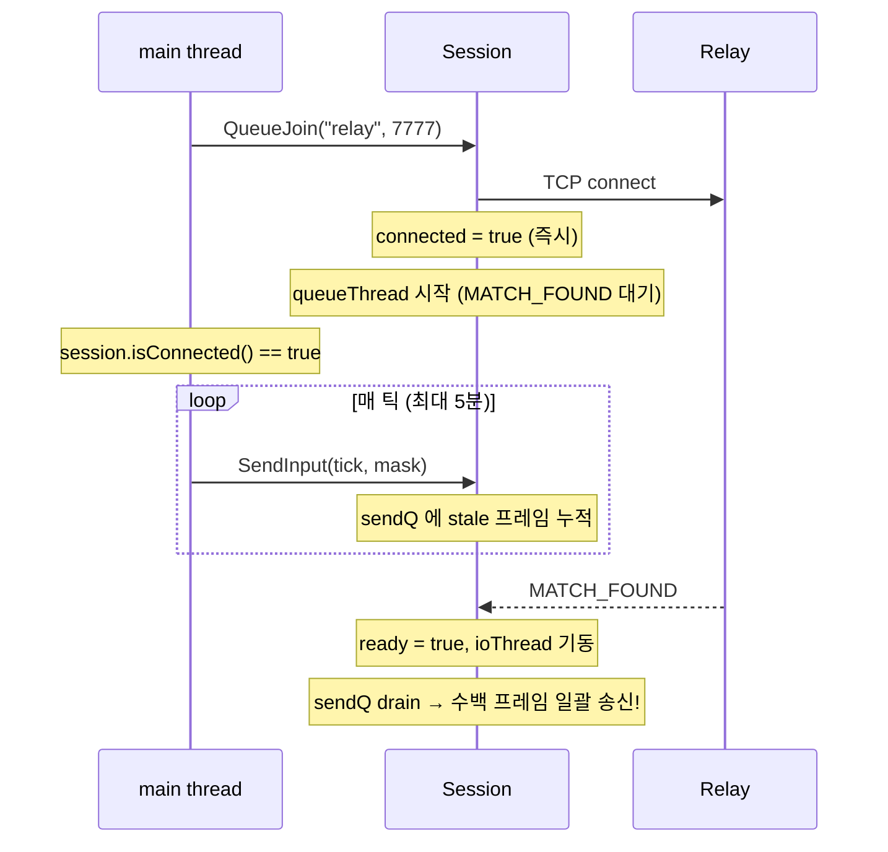

호스트가 먼저 큐에 들어오고 게스트가 나중에 붙으면 **호스트 측만** 대기 시간이 길다 → 호스트의 `sendQ` 에 stale INPUT 프레임이 더 많이 쌓인다. MATCH_FOUND 순간 호스트는 수백 프레임을 한꺼번에 토해내고, 이게 게스트의 `ioThread` 로 쏟아져 들어간다.

게스트 측 `handleFrame(INPUT)` 은 받은 tick 을 `remoteInputs.emplace(tick, mask)` 로 넣는다. `std::unordered_map::emplace` 의 의미론은 **키가 이미 존재하면 insert 하지 않고 기존 값을 유지한다** 이다. stale 프레임의 `from_tick` 은 0 부터 시작하므로, 게스트의 `remoteInputs[0..N]` 은 stale 값(= 호스트가 매치 대기 중 큐에 넣었던 무의미한 입력)으로 선점된다.

이후 진짜 게임이 시작돼 호스트가 `SendInput(tick=0, realMask)` 를 보내도, 게스트 측 `emplace` 는 기존 값을 보존한다 → 호스트의 진짜 입력이 통째로 버려진다. HOST.gameLocal 은 `realMask` 로 돌고 GUEST.gameRemote 는 `staleMask` 로 돌고 → 두 게임 상태가 갈라진다.

반대 방향은 왜 멀쩡했나? 게스트는 호스트보다 **나중에** 큐에 들어갔기 때문이다. 게스트의 `sendQ` 에 쌓인 stale 프레임은 적거나 없었다 → 호스트 측 오염은 없거나 무시할 수준이었다. 관찰된 비대칭성이 정확히 이 시간 차이의 그림자였다.

### 14.4 수정 — 네 겹 가드

수정 후 코드는 전송 가능 상태를 다음 조건으로 명시한다.

**현재 소스 발췌 — `src/main.cpp`**

```cpp
            if (app == AppMode::Net && session.isConnected())
            {
                // 중요: INPUT 을 보낼 수 있는 조건은 엄격히.
                //   1) 게임 객체(gameLocal/gameRemote) 가 존재 — 매치메이킹 대기
                //      기간에는 sendQ 에 stale 프레임이 쌓여 ioThread 기동 시 상대
                //      remoteInputs 의 tick 0..N 을 stale 로 점유(= emplace 가 진짜
                //      입력을 덮어쓰지 않음) → 비대칭 DESYNC 를 유발.
                //   2) startDelay == 0 — 카운트다운(120틱) 동안에도 보내면 tick
                //      0..119 가 쌓여 시작 직후 fast-forward 구간 발생.
                //   3) gameOverState == None — 게임 오버 화면 / 재시작 협상 / 시드
                //      교환 대기 동안에도 보내면 "끝난 라운드의 INPUT" 이 새 라운드의
                //      같은 tick 번호 공간과 섞임. 프로토콜에 round-id 가 없으므로
                //      수신 측 emplace 가 stale 로 선점할 위험.
                //   4) 아직 양쪽 보드가 gameOver 가 아님 — 같은 프레임에 게임오버가
                //      난 뒤 렌더 단계에서 FSM 이 전환되기 전이라도 추가 INPUT 금지.
                if (gameLocal && gameRemote && startDelay == 0 &&
                    gameOverState == GameOverState::None &&
                    !gameLocal->gameOver && !gameRemote->gameOver)
                {
                    // 창 드래그 등으로 메인 스레드가 멈춘 동안 ioThread 가 자동으로
                    // INPUT(t,0) 을 상대에게 흘려 lockstep 을 계속 돌렸다면, 우리도
                    // 그 구간을 0 으로 채워 localInputs 와 peer 관측치가 일치하도록
                    // 맞춘다. 그렇지 않으면 같은 tick 에 우리 sim 은 inputMask 를 쓰고
                    // peer 는 0 을 써 DESYNC.
                    //   hbEnd==0 은 "heartbeat 한 번도 안 터짐" 을 의미 — 게임 시작
                    //   tick 0 과 구별하기 위해 반드시 hbEnd>0 조건으로 가드한다.
                    uint32_t hbEnd = session.heartbeatTickEnd();
                    if (hbEnd > 0 && hbEnd >= localTickNext) {
                        for (uint32_t t = localTickNext; t <= hbEnd; ++t) {
                            localInputs[t] = 0;
                        }
                        localTickNext = hbEnd + 1;
                    }
                    localInputs[localTickNext] = inputMask;
                    session.SendInput(localTickNext, inputMask);
                    localTickNext++;
                }
```

**네 조건을 하나라도 빼면 이 장이 통째로 다루는 DESYNC 가 재현된다.** 각각이 막는 구간이 다르다.

| 조건 | 막는 구간 | 빠뜨렸을 때의 증상 |
|---|---|---|
| `gameLocal && gameRemote` | 매치메이킹 / 룸 대기(최대 5분) | 매치 직후 비대칭 DESYNC + 트래픽 스파이크 |
| `startDelay == 0` | 시작 카운트다운 120틱(2초) | tick 0..119 가 미리 쌓여 시작 직후 fast-forward |
| `gameOverState == None` | 게임오버 화면 · 재시작 협상 · 시드 교환 | 끝난 라운드의 INPUT 이 새 라운드 tick 공간에 선점 |
| `!gameLocal->gameOver && !gameRemote->gameOver` | 게임오버 발생 프레임과 FSM 전환 사이 | 한두 틱의 여분 INPUT — 재시작 라운드 tick 0 을 오염 |

한 줄 요약: **"연결됐다" 와 "이 라운드가 진행 중이다" 는 완전히 다르다.** `SendInput` 의 가드는 전자가 아니라 후자여야 한다.

### 14.5 수정 전/후 타임라인 비교

수정 전:

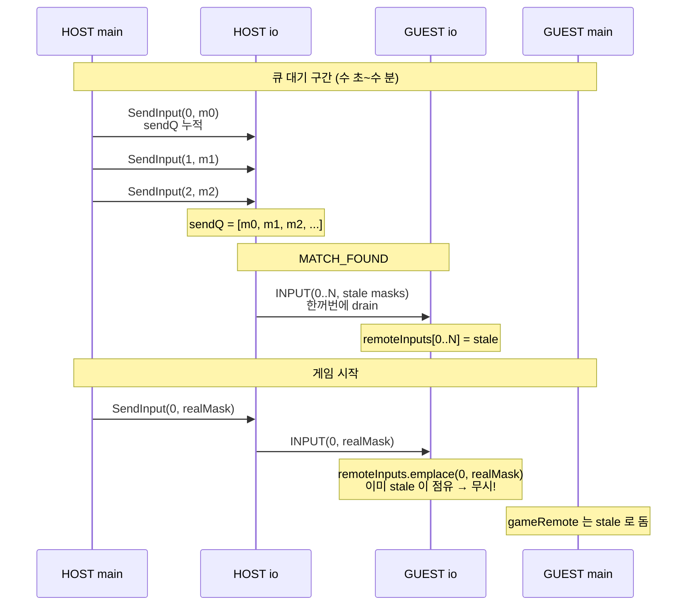

수정 후:

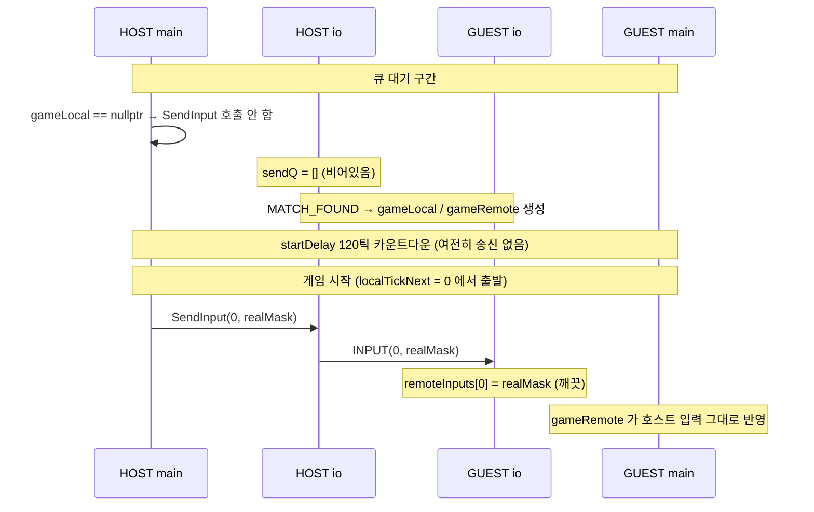

### 14.6 부수 효과

이 수정은 DESYNC 를 고치는 것 외에 **매치 직후 초반 TCP 트래픽 스파이크** 도 함께 없앤다. 옛 버전은 MATCH_FOUND 시 수백 프레임을 한 번에 토해냈다 — TCP 스트림상 수 KB 의 즉시 전송, 그리고 상대 측 `handleFrame` 이 수백 번 연쇄 호출되어 `inMu` lock 경합 → 상대 main thread 의 `GetRemoteInput` 도 함께 밀렸다. 수정 후에는 `sendQ` 가 항상 "현재 틱 ± 1" 상태에 머물러 트래픽이 안정적인 60 frames/s 로 흐른다. 육안으로는 "매치 시작 직후 첫 1~2초 동안 호스트 창이 살짝 렉 걸렸다가 풀리는" 느낌이 사라진다.

### 14.7 교훈

`std::unordered_map::emplace` vs `operator[]` 의 차이는 문서상 뻔하지만, 네트워크 경로의 "같은 키가 두 번 들어올 수 있다" 가 전제되지 않으면 간과된다. `remoteInputs` 가 `operator[]`(= 덮어쓰기)였다면 이 버그는 DESYNC 대신 "첫 수 틱의 상대 입력이 조금 이상함" 으로 숨어들어 더 찾기 어려웠을 수 있다. emplace 의 엄격함 덕분에 DESYNC 가 **즉시 · 결정론적으로** 터져 추적이 가능했다 — "엄격한 의미론" 이 디버깅에 도움 된 사례다.

두 번째 교훈은 **비대칭 증상은 후보의 우선순위를 바꾸는 정보**라는 것이다. 공용 framing 코드보다 방향별 큐와 페이즈 전환을 먼저 보게 만들었고, 실제 로그가 "양쪽이 서로 다른 시각에 세션 상태로 들어갔다"는 원인을 확인해 주었다. 증상만으로 다른 원인을 단정하지 않고, 관측 자료와 함께 범위를 좁히는 방식이 중요하다.

### 14.8 라운드 경계에서 지킬 것 — `ClearInputs()`

이 버그의 일반형은 "게임으로 간주하면 안 되는 시간에 INPUT 을 보낸다" 이다. 회귀를 막는 첫 번째 방어선은 §14.4 의 네 겹 가드지만, 두 번째 방어선이 하나 더 있다. 재시작 경계에서 호출하는 `ClearInputs()` 다.

**현재 소스 발췌 — `net/session.cpp`**

```cpp
void Session::ClearInputs() {
    {
        std::lock_guard<std::mutex> lk(inMu);
        remoteInputs.clear();
        lastRemoteTick.store(0);
        lastLocalTick.store(0);
    }
    // 재시작 경계에서 outbound sendQ 에 남아있는 이전 라운드 INPUT/HASH 를 드롭.
    // 프로토콜에 round-id 가 없어 새 라운드의 tick 번호와 stale 이 섞이면 수신
    // 측 remoteInputs.emplace 가 stale 을 선점해 DESYNC 를 유발할 수 있다.
    //
    // 중요: 모두 비우면 안 된다. SendNewSeed() 같은 컨트롤 프레임(SEED 등) 이
    // 아직 drain 되지 않았을 수 있다 — 네트워크 stall 상태에서 Host 가 restart
    // 를 누르고 1.5초 경과 후 ClearInputs 가 호출되면, 아직 송신되지 못한 SEED
    // 프레임까지 같이 날아가 Guest 가 WaitingForNewSeed 타임아웃으로 떨어진다.
    // 따라서 frame type 을 보고 INPUT/HASH 만 필터링해 드롭.
    // 프레임 레이아웃: [len:2][type:1][payload:N][chk:4] → byte[2] == MsgType.
    {
        std::lock_guard<std::mutex> lk(sendMu);
        std::deque<std::vector<uint8_t>> keep;
        for (auto& fr : sendQ) {
            if (fr.size() < 3) continue;  // malformed
            MsgType t = (MsgType)fr[2];
            if (t == MsgType::INPUT || t == MsgType::HASH) continue;  // 드롭
            keep.push_back(std::move(fr));
        }
        sendQ = std::move(keep);
    }
    // 원격 HASH 도 초기화 — 이전 라운드 hash 가 새 라운드 tick 과 충돌 방지.
    {
        std::lock_guard<std::mutex> lk(hashMu_);
        lastHashTickRemote = 0;
        lastHashRemote = 0;
    }
    // 재시작 경계에서 heartbeat 상태도 리셋 — 새 라운드의 tick 0 부터 다시 감지.
    lastMainActivityMs_.store(0);
    heartbeatTickEnd_.store(0);
    lastHeartbeatMs_.store(0);
    NET_TRACE("[NET] Cleared input queues for restart");
}
```

이 함수는 네 가지 상태를 건드린다.

1. **수신 측** — `remoteInputs` 와 두 watermark 를 0 으로. 새 라운드가 tick 0 에서 다시 시작하므로 이전 라운드의 tick 500 짜리 엔트리가 남아 있으면 `maxRemoteTick()` 이 500 을 반환해 `safeTick` 이 엉뚱하게 앞서 나간다.
2. **송신 측 `sendQ`** — **여기가 핵심이다.** 문서상 "수신 맵만 지우는 함수" 라고 오해하기 쉬운데, 실제로는 `sendMu` 를 잡고 큐를 순회하며 **프레임의 타입 바이트(`fr[2]`)를 보고 INPUT/HASH 만 선택적으로 드롭**한다.
3. **원격 HASH 쌍** — 이전 라운드 tick 600 의 해시가 남아 있으면 새 라운드 tick 600 의 로컬 해시와 비교되어 DESYNC 오탐이 난다.
4. **heartbeat 상태** — 새 라운드의 tick 0 부터 스톨 감지를 다시 시작한다.

#### 왜 전부 비우지 않고 타입 필터링인가

`sendQ.clear()` 한 줄이면 될 것 같지만, 그 형태가 실제로 사고를 냈다.

재시작 흐름을 다시 보자. Host 는 `SendingNewSeed` 상태에서 `session.SendNewSeed(newSeed)` 를 호출해 SEED 프레임을 `sendQ` 에 넣고, 곧바로 `RestartingGame` 으로 넘어가 거기서 `session.ClearInputs()` 를 부른다. 네트워크가 정상이면 그 사이에 ioThread 가 이미 SEED 를 드레인했겠지만, **`tcp_send_all` 이 커널 버퍼 포화로 재시도 중이거나 상대가 잠깐 얼어 있으면 SEED 는 아직 큐에 있다.**

이때 `sendQ.clear()` 를 하면:

1. SEED 프레임이 큐에서 사라진다 — 영원히 전송되지 않는다.
2. Guest 는 `WaitingForNewSeed` 에서 `session.params().seed` 가 바뀌기를 기다린다.
3. 10초 타임아웃 후 Guest 는 `GoingToTitle` 로 떨어진다.
4. Host 는 새 라운드를 시작해 혼자 플레이하다가, PONG 이 끊겨 `Lost` 판정 → 10초 grace 후 타이틀.

증상은 "재시작을 눌렀는데 가끔 둘 다 타이틀로 튕긴다" 이고, 네트워크가 빠른 개발 환경에서는 재현이 거의 안 된다.

그래서 필터링한다. 버려야 하는 것과 지켜야 하는 것의 기준은 명확하다.

| 프레임 | 처리 | 이유 |
|---|---|---|
| `INPUT` | 드롭 | tick 번호 공간이 라운드마다 0 부터 재사용된다. 프로토콜에 round-id 가 없어 새 라운드와 구분 불가 |
| `HASH` | 드롭 | 같은 이유 — tick 600 의 해시가 어느 라운드 것인지 알 수 없다 |
| `SEED` | 보존 | 유실 시 Guest 가 라운드에 진입하지 못한다 |
| `GAME_OVER_CHOICE` | 보존 | 유실 시 상대가 30초 협상 타임아웃 |
| `CHAT` / `PING` / `PONG` / `ACK` | 보존 | tick 공간과 무관 |
| `MATCH_SUMMARY` | 보존 | 유실 시 랭킹이 집계되지 않는다 |

판정 방법이 재미있다. `sendQ` 에는 이미 직렬화된 바이트 배열이 들어 있으므로 프레임을 되파싱할 필요가 없다 — 와이어 레이아웃이 `[len:2][type:1][payload:N][chk:4]` 이므로 **`fr[2]` 가 곧 `MsgType`** 이다. `fr.size() < 3` 검사는 `build_frame` 이 상한 초과로 빈 벡터를 반환한 경우를 거른다.

**근본적으로 이 필터링은 프로토콜 설계의 빈틈을 코드로 메우는 것이다.** SEED 프레임에 round-id(또는 epoch 카운터)를 넣고 INPUT/HASH 에도 같은 필드를 실었다면, 수신 측이 "이전 epoch 의 프레임" 을 그냥 무시할 수 있으므로 이 함수 자체가 필요 없다. 와이어에 1바이트를 더 쓰는 대신 송신 큐를 청소하는 쪽을 택한 것인데, 프로토콜을 다시 설계한다면 round-id 쪽이 옳다.

### 14.9 회귀를 막는 체크리스트

다음 구간에서는 `SendInput()` 을 호출하지 않는다.

- 매치메이킹/룸 대기 중: 아직 `Session::isReady()` 가 아니다.
- `startDelay` 카운트다운 중: 양쪽이 같은 tick 0 에서 출발하기 전이다.
- 게임오버 화면/재시작 협상 중: 기존 `Game` 객체가 살아 있어도 라운드는 끝났다.
- 새 seed 로 재시작 직전: tick 이 0 으로 재사용되므로 이전 라운드 INPUT 과 섞이면 안 된다.

그리고 라운드 경계마다 `ClearInputs()` 를 호출한다 — 가드가 뚫렸을 때의 두 번째 그물이다.

---

## 15. TCP_NODELAY (Nagle 비활성화)

DESYNC 를 잡고 나니 다른 증상이 드러났다. 로컬 루프백(같은 PC 두 창)에서는 체감상 완벽한데, LAN 건너 두 대로 붙이니 **입력이 간헐적으로 늦게 반영**됐다. safeTick 이 계속 멈췄다 풀렸다를 반복 — lockstep 이 살짝 끊겼다.

### 15.1 Nagle 알고리즘

TCP 소켓의 기본 동작은 [Nagle 알고리즘 (RFC 896, 1984)](https://tools.ietf.org/html/rfc896)이 켜진 상태다. Nagle 의 목적은 1980년대 Telnet 환경 최적화 — "1바이트씩 타이핑하는 사용자" 를 위해 작은 패킷을 모아서 보낸다. 구체적으로:

- 소켓 송신 버퍼에 ACK 안 받은 데이터가 있고 새 데이터가 MSS(최대 세그먼트 크기, 보통 1460바이트)보다 작으면 **잠깐 기다린다**.
- 이전 데이터의 ACK 가 도착하거나 버퍼에 MSS 이상이 모이면 그제서야 송신한다.
- 최대 대기 시간은 OS 와 설정에 따라 다르다. 수신 측의 지연 ACK(delayed ACK, 보통 40~200ms)와 결합되면 실시간 게임 입력에는 치명적인 지연이 된다.

### 15.2 우리 트래픽과의 충돌

게임 INPUT 프레임 하나의 바이트 수: 헤더 2 + 타입 1 + payload 7 + 체크섬 4 = 14바이트. 60Hz 로 보내면 초당 840바이트, 프레임당 16.67ms 간격이다.

Nagle 의 관점에서 보면:

1. tick 0 INPUT 송신(14바이트) → 상대에게 도착, ACK 발생
2. tick 1 INPUT 송신(14바이트) → 이전 ACK 가 빠르게 오면 바로 송신. 그런데 네트워크 RTT 가 30ms 라면 ACK 는 아직 안 왔다 → Nagle 이 **대기 모드**
3. tick 2 INPUT 이 16.67ms 뒤에 도착 → 총 28바이트. 여전히 MSS(1460) 훨씬 미만. 계속 대기
4. ACK 가 도착할 때까지 수 틱 분량이 모여 한꺼번에 송신

**lockstep 의 safeTick 은 상대 INPUT 의 최신 틱 번호에 전적으로 의존한다.** Nagle 때문에 내 INPUT 이 뒤늦게 묶여 도착하면 상대 safeTick 은 여러 틱 동안 멈췄다가 펄스 형태로 뛴다. 예를 들어 200ms 지연이면 60Hz 기준 약 12틱이다. 상대는 내가 그동안 아무 입력도 안 한 것처럼 보다가 갑자기 와르르 행동하는 화면을 본다. 내 쪽도 증상이 대칭적으로 나타난다.

체감상 이건 대역폭 부족처럼 보이지만 실은 "지연 ↔ 대역폭" 트레이드오프에서 우리 선호와 OS 기본값이 정반대인 상황이다. 우리는 대역폭(초당 1 KB)이 남아돌아도 지연을 0 으로 쥐어짜고 싶다.

### 15.3 수정 — `set_nodelay` 헬퍼

**현재 소스 발췌 — `net/socket.cpp`**

```cpp
// [NET] Nagle 비활성화 (TCP_NODELAY).
//   기본 Nagle 알고리즘은 작은 패킷(<MSS) 을 최대 200ms 까지 버퍼링해 모아
//   보낸다. 우리 INPUT 프레임은 7바이트 / 60Hz 로 송신 → Nagle ON 이면 각
//   프레임이 수십~200ms 지연되어 도착한다. lockstep 의 safeTick 은 상대 INPUT
//   도착까지 대기하므로 → 체감상 "호스트가 렉 걸림".
//   게임 트래픽은 지연이 대역폭보다 압도적으로 치명적 → 반드시 NODELAY.
static int set_nodelay(int fd) {
    int yes = 1;
#ifdef _WIN32
    return setsockopt(fd, IPPROTO_TCP, TCP_NODELAY, (const char*)&yes, sizeof(yes));
#else
    return setsockopt(fd, IPPROTO_TCP, TCP_NODELAY, &yes, sizeof(yes));
#endif
}
```

주석의 "7바이트" 는 프레임 전체(14바이트)가 아니라 payload 크기를 가리킨다.

`IPPROTO_TCP` / `TCP_NODELAY` 는 `<netinet/tcp.h>`(POSIX) 또는 `<winsock2.h>`(Windows)에 정의되어 있다. Windows 에서도 상수 이름과 인자 의미는 동일하고, `setsockopt` 의 네 번째 인자가 `const char*` 로 캐스팅되어야 하는 것만 차이다.

이 헬퍼는 소켓이 "연결된 직후" 두 곳에서 호출된다 — §1.3 의 `tcp_accept` 와 §1.4 의 `tcp_connect`. 두 함수 모두 `set_nonblocking` → `set_nodelay` → `set_keepalive`(§11.7) 를 거쳐 `make_owned(fd)` 로 감싼다.

중요: `tcp_listen` 의 리턴 소켓(= listen 소켓)에는 NODELAY 를 걸지 않는다. listen 소켓은 데이터를 주고받지 않고 `accept` 만 한다. 이건 "listen 소켓의 설정이 accept 자식으로 상속되는가" 문제인데, `SO_REUSEADDR` 등 일부는 상속되고 `TCP_NODELAY` 는 상속되지 않는 플랫폼이 있다. 자식 소켓에 직접 거는 것이 안전하다.

### 15.4 릴레이 경로에서의 적용

이 프로젝트는 NAT 우회를 위해 릴레이를 거친다. 경로는 다음과 같다.

```text
Client A ↔ Relay ↔ Client B
```

A ↔ Relay 구간의 accept 는 Relay 측 `tcp_accept`, A 측 `tcp_connect` — 둘 다 위 헬퍼를 호출하므로 양방향 NODELAY 다. Relay ↔ B 구간도 마찬가지. 결과적으로 전체 경로가 Nagle 없이 흐른다.

릴레이 서버([Part 7](./part7-relay-server.md))가 `net/socket.cpp` 의 같은 `tcp_accept` 를 쓰기 때문에 별도 수정이 필요 없다 — 클라이언트 소켓 코드를 고치면 서버도 자동으로 혜택을 본다. 이것이 소켓 레이어를 한 파일에 모아둔 실리다.

### 15.5 수정 효과와 검증 기준

여기서 확정적으로 계산 가능한 값은 다음뿐이다.

| 항목 | 값 | 근거 |
|---|---:|---|
| INPUT payload | 7 bytes | `[tick:u32][cnt:u16][mask:u8]` |
| INPUT wire frame | 14 bytes | `[len:u16][type:u8][payload:7][checksum:u32]` |
| 60Hz 편도 전송량 | 840 bytes/s | `14 * 60` |

NODELAY 검증은 절대 ms 값을 문서에 고정하지 않는다. 네트워크 카드, OS 지연 ACK, 무선 환경, VM/sandbox 여부에 따라 값이 크게 달라지기 때문이다. 대신 다음 현상을 본다.

| 관찰 항목 | Nagle ON 에서 자주 보이는 패턴 | NODELAY 기대 패턴 |
|---|---|---|
| INPUT 도착 | 여러 tick 이 묶여 펄스로 도착 | 대부분 tick 간격에 가깝게 도착 |
| safeTick | 멈췄다가 여러 tick 점프 | 꾸준히 증가 |
| 대역폭 | 거의 동일 | 거의 동일 |

대역폭은 거의 변하지 않는다. 단지 패킷이 "뭉쳐서" 갔던 게 "펼쳐져서" 갈 뿐이다. 대부분의 실시간 통신 프로젝트가 NODELAY 를 기본으로 설정하는 이유다.

---

## 16. HASH pair atomic race 수정

§7 에서 소개한 HASH 교차 검증은 단순해 보이지만, 멀티스레드 코드에서 흔한 함정 하나를 안고 있었다.

### 16.1 문제 — 두 atomic 의 비원자적 쌍

구 코드는 `lastHashTickRemote`(`uint32_t`)와 `lastHashRemote`(`uint64_t`)를 각각 `std::atomic` 으로 잡았다.

**예시(실제 저장소에는 없음)** — 버그가 있던 옛 형태를 재구성

```cpp
std::atomic<uint32_t> lastHashTickRemote{0};
std::atomic<uint64_t> lastHashRemote{0};

// ioThread — HASH 수신
case MsgType::HASH: {
    uint32_t t = le_read_u32(p);
    uint64_t h = le_read_u64(p+4);
    lastHashTickRemote.store(t);   // ① 먼저
    lastHashRemote.store(h);       // ② 그 다음
} break;

// main thread — 조회
bool GetLastRemoteHash(uint32_t& tick, uint64_t& hash) const {
    tick = lastHashTickRemote.load();
    hash = lastHashRemote.load();
    return tick != 0;
}
```

이 코드의 문제: ioThread 가 `① tick = 1200` 을 store 한 직후, `② hash = 0xNEW` 를 store 하기 **전** 에 main thread 가 끼어들어 `load` 하면 **새로운 tick + 옛날 hash** 를 읽게 된다.

그 결과가 DESYNC 검사에서 무엇이 되는지 따라가 보자.

- `rt = 1200`(새)은 로컬 링에 있다 — 이미 tick 1200 시점에 SendHash 했으므로
- `rh = (tick 600 시점의 옛 해시)` — 당연히 `slot.hash` 와 다르다
- → **가짜 DESYNC 판정**

실제 lockstep 은 정상인데 race 때문에 배너가 뜨는 사고다.

### 16.2 수정 — mutex 로 pair 원자 보호

두 필드를 atomic 에서 plain 으로 되돌리고 mutex 로 묶는다.

**현재 소스 발췌 — `net/session.h`**

```cpp
    mutable std::mutex hashMu_;
    uint32_t lastHashTickRemote{0};
    uint64_t lastHashRemote{0};
```

`mutable` 키워드는 `const` 메서드 `GetLastRemoteHash` 에서도 lock 할 수 있게 해준다.

수신 측은 §12 의 `handleFrame` 전체 인용에 있는 `case MsgType::HASH` 분기다 — `hashMu_` 를 잡은 뒤 두 필드를 연달아 쓴다. 조회 측은 다음과 같다.

**현재 소스 발췌 — `net/session.cpp`**

```cpp
bool Session::GetLastRemoteHash(uint32_t& tick, uint64_t& hash) const {
    std::lock_guard<std::mutex> lk(hashMu_);
    tick = lastHashTickRemote;
    hash = lastHashRemote;
    return tick != 0;
}
```

### 16.3 비용

HASH 프레임은 600틱(= 10초) 주기로 오므로 `handleFrame` 의 이 분기는 0.1Hz 다. lock hold 시간은 두 정수 복사뿐이라, main thread 가 동시에 `GetLastRemoteHash` 를 호출해도 게임 루프에서 의미 있는 대기 요인이 되지 않는다.

Atomic 두 개보다 mutex 하나가 성능상 **오히려 유리** 하기도 하다. 두 atomic 은 컴파일러가 각각에 메모리 배리어를 삽입하지만, 하나의 mutex 는 lock/unlock 쌍에서 한 번씩만 삽입한다. 가독성 면에서도 "이 두 필드는 세트다" 라는 의도가 명시된다.

### 16.4 교훈

`std::atomic<T>` 는 **단일 값** 의 원자성을 보장할 뿐, 여러 atomic 을 묶어서 원자적으로 갱신해주지 않는다. C++ 의 memory_order 가 아무리 엄격해도 "두 store 사이를 쪼갤 수 있다" 는 사실은 그대로다. 쌍으로 갱신해야 하는 데이터는:

1. `struct` 로 묶어서 단일 atomic 에 넣거나(sizeof ≤ 8 정도까지는 lock-free)
2. mutex 로 보호하거나
3. `std::atomic<std::shared_ptr<T>>` 로 포인터 스왑

이 프로젝트는 (2) 를 택했다 — 호출 빈도가 낮아 mutex 비용이 무시 가능하고 코드가 가장 단순하므로. 참고로 (1) 은 여기서 불가능하다. `{ uint32_t, uint64_t }` 는 패딩 포함 16바이트라 대부분의 플랫폼에서 lock-free 가 아니다.

---

## 17. XOR 결합 해시 (`gameLocal ^ gameRemote`)

§16 을 고치고 나서도 DESYNC 오탐이 **여전히 10초마다** 나왔다. 이번엔 race 가 아니라 **해시 자체가 틀렸다**.

### 17.1 기존 버그 — gameLocal 만 해싱

초기 구현은 이랬다.

**예시(실제 저장소에는 없음)** — 버그가 있던 옛 형태를 재구성

```cpp
if (simTick % HASH_PERIOD_TICKS == 0) {
    uint64_t h = gameLocal->ComputeStateHash();   // gameLocal 만!
    session.SendHash(simTick, h);
    // 로컬 링에도 h 저장
}
```

보냈을 때 상대 측에서는 무엇과 비교하는가? 상대 main thread 의 검증 루프도 대칭적으로 자기 `gameLocal->ComputeStateHash()` 를 로컬 링에 넣는다. 그리고 상대로부터 받은 HASH 프레임의 값(= 내 gameLocal 해시)을 자기 링의 같은 틱 해시와 비교한다.

- HOST 가 보낸 해시 = HOST.gameLocal.hash = "호스트 입력으로 돌린 게임" 해시
- GUEST 의 로컬 링 슬롯 = GUEST.gameLocal.hash = "게스트 입력으로 돌린 게임" 해시

**이 둘은 서로 다른 경기다.** 양쪽 다 같은 seed 로 피스 순서는 같지만, "어떤 입력이 들어갔느냐" 가 다르므로 grid · 현재 블록 위치 · score · combo 가 모두 다르다. 즉 lockstep 이 **완벽하게 정상이어도 이 두 해시는 언제나 다르다** → 매 10초 DESYNC 배너가 뜨는 게 당연한 동작이었다. HASH 검증 기능이 사실상 꺼져 있던 셈이다.

### 17.2 수정 — 두 게임 해시를 XOR 결합

lockstep 이 정상이면 양쪽 main thread 는 `gameLocal` 과 `gameRemote` 를 모두 보유한다. HOST 관점에서 gameLocal = "호스트 입력 게임", gameRemote = "게스트 입력 게임". GUEST 관점에서는 역할만 뒤집혀 있다. 즉 **양쪽에서 "두 게임의 집합" 은 같다**, 단지 "어느 게임이 local 인지" 만 다를 뿐이다.

집합 동등성을 보존하면서 scalar 해시로 줄이는 가장 간단한 연산은 **XOR** 이다.

$$h_{\text{combined}} = h_{\text{gameLocal}} \oplus h_{\text{gameRemote}}$$

XOR 은 교환법칙과 결합법칙이 성립하므로:

- HOST.h_combined = HOST.gameLocal.h ⊕ HOST.gameRemote.h = h_host ⊕ h_guest
- GUEST.h_combined = GUEST.gameLocal.h ⊕ GUEST.gameRemote.h = h_guest ⊕ h_host
- ∴ HOST.h_combined ≡ GUEST.h_combined (lockstep 정상 가정)

이 두 값이 틀어지는 경우 = 어느 한쪽의 "두 게임 집합" 이 상대와 다른 경우 = 진짜 DESYNC 다. 정확히 우리가 감지하고 싶은 것이다.

### 17.3 수정 코드

**현재 소스 발췌 — `src/main.cpp`** (틱 루프 내부, `simTick++` 직후)

```cpp
                            // F.2: 600틱마다 양쪽 경기판 해시를 결합해 송신 + 링 기록.
                            // gameLocal 만 해싱하면 "호스트의 gameLocal" vs "게스트의
                            // gameLocal" 을 비교하게 되는데, 이 둘은 서로 다른 경기라
                            // 항상 다를 수밖에 없다(DESYNC 오탐). lockstep 이 정상이면
                            // 양쪽 모두 gameLocal+gameRemote 를 (같은 관점에서) 갖고
                            // 있으므로 XOR 로 결합하면 동일 해시가 나온다.
                            if (simTick > 0 && simTick % HASH_PERIOD_TICKS == 0 &&
                                simTick != lastHashSentTick) {
                                uint64_t hL = gameLocal->ComputeStateHash();
                                uint64_t hR = gameRemote->ComputeStateHash();
                                uint64_t h  = hL ^ hR;
                                session.SendHash(simTick, h);
                                auto& slot = localHashRing[(simTick / HASH_PERIOD_TICKS) % HASH_RING];
                                slot.tick = simTick; slot.hash = h; slot.valid = true;
                                lastHashSentTick = simTick;
                            }
```

`simTick != lastHashSentTick` 가드는 같은 틱에서 이 블록이 여러 번 돌아도 한 번만 송신되게 한다(`while (simTick <= safeTick)` 내부에서 여러 번 체크될 수 있음). `simTick > 0` 가드는 tick 0 에서 `0 % 600 == 0` 이 참이 되는 것을 막는다 — 게임 시작 즉시 양쪽이 아직 아무 입력도 반영하지 않은 상태의 해시를 보내는 건 의미가 없다.

### 17.4 XOR 의 충돌 특성

이론적으로 XOR 결합 해시는 충돌률이 나빠질 수 있는가? 두 독립적인 64비트 해시 `hL`, `hR` 을 XOR 하면 결과도 64비트 uniform 분포다 — 충돌률은 개별 해시와 같은 $2^{-64}$ 수준. FNV-1a 의 출력 분포는 실용적으로 uniform 에 가까워(Part 1 참조) 이 용도에서는 XOR 결합으로 충분하다.

주의할 것은 XOR 이 **완벽하게 대칭** 이라는 점이다. 두 게임의 해시가 우연히 서로 뒤바뀌어도(즉 `gameLocal` 과 `gameRemote` 를 반대로 넣어도) 같은 값이 나온다. 이건 여기서 정확히 우리가 원하는 성질이지만, 만약 "누가 어느 쪽인지" 까지 검증하고 싶다면 XOR 은 부적절하다. 그럴 땐 역할별로 가중치를 다르게 준 `h1 * 0x9E3779B97F4A7C15 ^ h2` 같은 비대칭 믹싱이 필요하다 — 그러나 그러면 양쪽이 같은 값을 만들 수 없으므로, 역할에 따라 인자 순서를 바꿔 넣는 추가 로직이 붙는다. 이 프로젝트의 쓰임새(10초 주기 검증, 불일치 시 배너)에는 XOR 로 충분하다.

### 17.5 DESYNC breakdown 과의 연관

`StateHashBreakdown` 은 상태를 원인 도메인별 묶음(`grid`, `currentBlock`, `nextBlock`, `rng`, `scoreFlags`, `combat`)으로 나눈 개별 해시를 리턴한다. DESYNC 발생 시 전체 해시만 비교하지 않고 이 breakdown을 함께 찍어 어느 상태 묶음이 먼저 깨졌는지 좁힌다.

그런데 주의: 송신되는 combined hash(XOR)는 **섹션 분리가 불가능** 하다. `grid_L ⊕ grid_R` 과 `cur_L ⊕ cur_R` 이 다시 섞이면 개별 값을 복원할 수 없다. 그래서 DESYNC 로그는 상대 combined hash 는 그대로 두고 **자기 쪽의 gameLocal / gameRemote breakdown 만** 출력한다. 상대도 같은 시점에 DESYNC 를 찍으므로, 양쪽 콘솔 로그를 나란히 놓으면 어느 필드가 먼저 갈라졌는지 좁힐 수 있다.

---

## 18. DESYNC breakdown 로그와 `[INIT]` 덤프

§14~§17 의 수정을 모두 적용하고도 릴리스 후에 새로운 DESYNC 가 나타날 가능성은 있다 — 예컨대 `SimGame` 로직에 비결정론을 도입하는 회귀. 이를 빠르게 추적할 수 있도록 두 종류의 진단 로그를 `src/main.cpp` 에 심어 뒀다.

### 18.1 `[INIT]` 덤프 — 출발점 확인

게임 객체가 생성되는 직후에 다음을 찍는다.

**현재 소스 발췌 — `src/main.cpp`** (`gameLocal`/`gameRemote` 생성 직후)

```cpp
                    // DESYNC 디버깅: 양쪽 창 로그를 비교해 초기 seed + 초기 hash 가
                    // 같은지 먼저 확인. 여기가 다르면 lockstep 출발점부터 갈림.
                    fprintf(stderr, "[INIT] seed=0x%016llx inputDelay=%u startDelay=%u\n",
                            (unsigned long long)sessionSeed,
                            (unsigned)inputDelay, (unsigned)startDelay);
                    fprintf(stderr, "[INIT] gameLocal  hash=0x%016llx\n",
                            (unsigned long long)gameLocal->ComputeStateHash());
                    fprintf(stderr, "[INIT] gameRemote hash=0x%016llx\n",
                            (unsigned long long)gameRemote->ComputeStateHash());
```

DESYNC 를 디버깅할 때 체크리스트:

1. **양쪽 창의 `[INIT] seed=...` 가 같은가?** 다르면 SEED 프레임 전달 버그다. 네트워크 레이어 문제.
2. **양쪽 창의 `[INIT] gameLocal hash` 가 같은가?** 다르면 `SimGame` 생성자가 seed 외의 비결정론 요소(예: `rand()` 호출, 시간 기반 초기화)를 쓴다는 증거다. Part 1 의 결정론 원칙 위반.
3. **gameLocal 과 gameRemote 의 초기 hash 가 같은가?** 같아야 한다 — 둘 다 같은 seed, 같은 입력(아직 아무 입력 없음)이므로.

이 세 조건이 모두 참이면 lockstep 의 출발점은 깨끗하다. 이후 DESYNC 는 시뮬레이션 중 갈라진 것이다.

### 18.2 DESYNC breakdown — 어느 필드가 깨졌나

**현재 소스 발췌 — `src/main.cpp`**

```cpp
        // F.2 — 원격 HASH 수신 감지 + 링 비교. 같은 틱의 로컬 해시가 링에
        // 있어야 비교 가능 (링 크기 4 → 과거 40초 이력 커버).
        if (app == AppMode::Net && gameLocal) {
            uint32_t rt = 0; uint64_t rh = 0;
            if (session.GetLastRemoteHash(rt, rh) && rt != 0 && rt != lastRemoteHashSeenTick) {
                lastRemoteHashSeenTick = rt;
                auto& slot = localHashRing[(rt / HASH_PERIOD_TICKS) % HASH_RING];
                if (slot.valid && slot.tick == rt) {
                    if (slot.hash != rh) {
                        // DESYNC 시 어느 섹션이 달라졌는지 즉시 판별할 수 있도록
                        // 현재 시점의 gameLocal/gameRemote 섹션별 해시를 출력.
                        // (원격 hash 는 이미 XOR 결합이라 섹션 분리 불가 — 자기 쪽만 출력.
                        //  상대 쪽도 같은 시점에 DESYNC 를 찍으니 양쪽 콘솔을 대조하면
                        //  어느 필드가 먼저 달라졌는지 좁힐 수 있다.)
                        fprintf(stderr, "[DESYNC] tick=%u local=0x%016llx remote=0x%016llx\n",
                                rt, (unsigned long long)slot.hash, (unsigned long long)rh);
                        if (gameLocal && gameRemote) {
                            auto bL = gameLocal->sim.StateHashBreakdown();
                            auto bR = gameRemote->sim.StateHashBreakdown();
                            fprintf(stderr, "  gameLocal : grid=%016llx cur=%016llx nxt=%016llx rng=%016llx sf=%016llx co=%016llx\n",
                                    (unsigned long long)bL.grid, (unsigned long long)bL.currentBlock,
                                    (unsigned long long)bL.nextBlock, (unsigned long long)bL.rng,
                                    (unsigned long long)bL.scoreFlags, (unsigned long long)bL.combat);
                            fprintf(stderr, "  gameRemote: grid=%016llx cur=%016llx nxt=%016llx rng=%016llx sf=%016llx co=%016llx\n",
                                    (unsigned long long)bR.grid, (unsigned long long)bR.currentBlock,
                                    (unsigned long long)bR.nextBlock, (unsigned long long)bR.rng,
                                    (unsigned long long)bR.scoreFlags, (unsigned long long)bR.combat);
                        }
                        desyncDetected = true;
                        desyncTick = rt;
                    }
                }
                // 같은 틱이 링에 없을 수도 있음(시작 직후 등) — 이 경우 무시.
            }
        }
```

`rt != 0` 가드가 있는 이유: `GetLastRemoteHash` 는 `tick != 0` 을 반환값으로 쓰지만, `lastRemoteHashSeenTick` 의 초기값도 0 이라 가드를 빼면 "아직 아무 HASH 도 안 받은 상태" 와 "tick 0 의 HASH" 를 구별하지 못한다. `simTick > 0` 조건 때문에 tick 0 의 HASH 는 애초에 송신되지 않지만, 조건을 두 곳에서 일치시켜 두는 편이 안전하다.

`StateHashBreakdown()`은 `SimGame`의 전체 해시를 원인 도메인별 독립 해시로
나눠 구조체로 반환한다. 필드 개수보다 각 묶음의 이름과 책임이 진단 계약이다.

| 섹션 | 포함 상태 | DESYNC 시 의심 |
|---|---|---|
| `grid` | 10×20 보드 셀 | 충돌/락/라인 클리어 로직 |
| `currentBlock` | 현재 피스 타입/위치/회전 | 입력 처리, 킥 회전 |
| `nextBlock` | 다음 피스 큐 | RNG 호출 순서 |
| `rng` | RNG 내부 상태 | RNG 구현 차이 |
| `scoreFlags` | 점수 · 레벨 · 게임오버 플래그 · 중력 카운터 | 점수 계산 식, 레벨업 경계 |
| `combat` | 공격 라인 송수신 카운터 | 가비지 교환 로직 |

양쪽 창의 로그를 나란히 놓고 첫 번째로 다른 섹션을 찾으면 DESYNC 의 **원인 도메인** 이 즉시 좁혀진다. 예를 들어 `rng` 만 다르면 RNG 호출 순서가 어긋난 것이고, `grid` 만 다르면 라인 클리어 / 가비지 처리 로직의 비결정성을 의심한다.

### 18.3 로그 출력 경로 — stdout 이 아닌 stderr

두 덤프 모두 `fprintf(stderr, ...)` 를 쓴다. 이유는 세 가지다.

1. **버퍼링** — Windows 의 stdout 은 콘솔 출력 시 line-buffered 이지만 stderr 은 unbuffered 다. 크래시 직전에 찍은 로그도 확실히 콘솔에 남는다.
2. **리다이렉션 분리** — `tetris > out.log 2> err.log` 같이 DESYNC 로그만 따로 분리하고 싶을 때 편하다.
3. **`NET_WARN` 과 일관** — 세션 계층의 경고도 stderr 로 나간다.

`fprintf` 대신 `std::cout` 을 썼다면 main thread 가 `std::cout` 의 내부 mutex 와 flush 를 경유해 stdio 동기화 버퍼를 거친다. Windows 콘솔 I/O는 blocking이라 정상 게임 루프의 상시 로그가 틱을 밀 수 있다. DESYNC breakdown은 이상이 감지된 순간 한 번만 출력하고, 평상시 텔레메트리는 카운터로 모아 루프 밖에서 읽는다.

---

## 19. Host 렉 기타 원인 정리

§14 의 stale backlog 와 §15 의 Nagle 을 잡고 나서도 호스트 측에서 미묘한 프레임 드랍이 관찰됐다. 원인은 네트워크가 아니라 **stdout I/O** 와 **OS 모달 루프** 였다.

### 19.1 ioThread 의 hot-path stdout 제거

`Session::ioThread()` 는 유휴 시에도 2ms sleep 으로 ~500Hz 로 도는 루프다. 옛 코드는 디버깅 편의를 위해 이렇게 썼다.

**예시(실제 저장소에는 없음)** — 버그가 있던 옛 형태를 재구성

```cpp
while (!quit.load()) {
    if (tcp_recv_some(sock, recvBuf) && recvBuf.size() > prevSize) {
        std::cout << "[NET] Received " << (recvBuf.size() - prevSize)
                  << " bytes" << std::endl;
        std::vector<Frame> frames;
        parse_frames(recvBuf, frames);
        std::cout << "[NET] Parsed " << frames.size() << " frames" << std::endl;
        for (auto& f : frames) handleFrame(f);
    }
}
```

Windows 에서 `std::cout << ... << std::endl` 은 다음을 수행한다.

1. `cout` 내부 mutex lock
2. stdio sync (C++ stream ↔ C stdio)
3. `WriteFile(GetStdHandle(STD_OUTPUT_HANDLE), ...)` — **콘솔에 직접 쓸 때 blocking**. 콘솔이 스크롤 버퍼를 재구성 중이면 수 ms 정지
4. `std::endl` 이 flush 까지 호출 → stdout 버퍼를 비우고 돌아옴

초당 수십~수백 줄이 찍히면 ioThread 가 거의 "콘솔 출력 대기 스레드" 가 된다. main thread 가 `session.SendInput()` 으로 `sendMu` 를 잡아 큐에 넣어도 ioThread 가 드레인을 못 해서 `sendQ` 가 증가 → 반대쪽의 safeTick 이 뒤처진다.

수정은 두 단계였다. 먼저 hot path 의 로그를 지우고, 그 다음 **남길 로그는 `NET_TRACE` 매크로로 감쌌다**(§4.2). 현재 코드는 §6.3 의 `ioThread` 전체 인용에 있는 그대로다 — hot path 에는 `std::cout` 이 단 한 줄도 없고, `NET_WARN` 만 단절 시 한 번 찍힌다.

| 지점 | 제거 전 (초당 호출) | 현재 |
|---|---|---|
| `[NET] Received N bytes` | ~60~500 | 0 (완전 삭제) |
| `[NET] Parsed N frames` | ~60~500 | 0 (완전 삭제) |
| `[NET] I/O thread started` | 1회 | `NET_TRACE` — 기본 빌드에서 0, trace 빌드에서 1회 |
| `[NET] Connection lost ...` | 단절 시 1회 | `NET_WARN` — 항상 stderr 로 1회 |

이 변경 이후 hot-path 콘솔 I/O 가 사라져 호스트 측 프레임 타임이 안정된다. 프로파일러 없이도 "마우스 커서가 창 위를 지나갈 때 살짝 버벅이던" 증상이 사라지는지로 확인할 수 있다.

### 19.2 같은 콘솔에서 두 인스턴스 실행 시 콘솔 공유

개발 중 한 PC 에서 두 창을 띄워 테스트할 때, 같은 셸 세션에서 두 프로세스를 실행하면 **같은 콘솔 핸들을 공유**한다. 한쪽이 `std::cout` 으로 찍을 때 콘솔 버퍼 lock 을 잡고, 다른 쪽이 동시에 찍으면 대기한다. 결과적으로 네트워크와 무관하게 둘 다 밀린다.

Windows 에서의 해결:

```powershell
Start-Process .\tetris.exe -ArgumentList "--host","7777"
Start-Process .\tetris.exe -ArgumentList "--connect","127.0.0.1:7777"
```

`Start-Process` 는 각 프로세스를 새 콘솔에 띄운다(cmd.exe 의 `start` 도 같다). 두 인스턴스의 stdout 이 섞이거나 lock 경합하지 않는다.

Linux/macOS 에서는 stderr 을 파일로 분리하는 쪽이 편하다.

```bash
./build/tetris --host 7777 2> host.log &
./build/tetris --connect 127.0.0.1:7777 2> guest.log &
```

`[INIT]` 과 `[DESYNC]` 가 stderr 로 나가므로, 두 로그 파일을 나란히 놓으면 §18 의 breakdown 대조가 그대로 된다.

### 19.3 Windows 창 드래그 = modal 루프

Windows 는 타이틀 바 드래그나 리사이즈 시 **modal message loop** 로 진입한다 — 운영체제가 자체 이벤트 루프를 돌리면서 앱의 main thread 를 점유한다. 그 동안 `GetMessage` → `DispatchMessage` → 앱의 WndProc 은 호출되지만, main thread 는 메시지 루프 바깥의 게임 로직(`SimGame::Tick`, `SendInput`)을 실행할 수 없다.

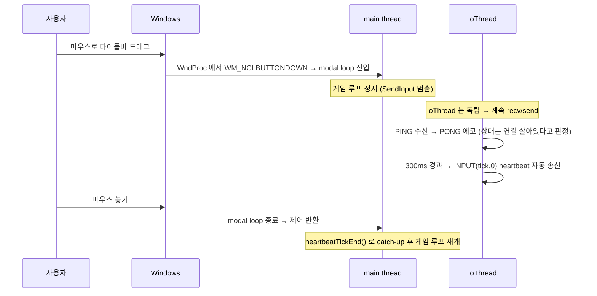

Lockstep 관점에서 이건 §11 의 `Stalled` 상태에 해당한다. 상대 측에서 보면 우리 `maxRemoteTick` 이 멈춰 있다 — 다만 ioThread 의 자동 heartbeat 이 `INPUT(t, 0)` 을 계속 흘리므로 상대의 `safeTick` 은 전진한다. 그리고 ioThread 가 PING 에 PONG 으로 답하므로 `linkStatus()` 는 `OK` 또는 `Stalled` 에 머물고 `Lost` 로 가지 않는다.

남는 한계는 **드래그한 본인의 시뮬레이션이 멈춘다**는 것이다. 그 구간의 자기 입력은 전부 0 으로 기록되므로, 드래그 중에는 조작이 불가능하다. 이건 lockstep 모델의 본질적 한계가 아니라 OS 모달 루프의 성질이고, 완전한 해결은 게임 루프를 별도 스레드로 분리하는 것이다 — 렌더링과 입력 처리까지 얽히므로 이 프로젝트는 채택하지 않았다.

---

## 20. 현재 `Session`의 확장 경계

완성된 `net/session.*`는 직결 P2P 외에 relay 큐·커스텀 룸·랭킹 결과 수신까지 한 객체에 담는다. 그러나 구현 순서와 설명 책임은 분리한다. 이 장에서 확보한 것은 소켓 소유권, framing, `ioThread`, lockstep 입력과 해시 교환이다.

- relay endpoint의 빌드 기본값·환경변수·`--relay` 우선순위와 `queueThread`/`roomThread` 전환은 Part 7의 클라이언트 릴레이 경계에 속한다.
- `RoomState`와 `ROOM_INFO` 매핑은 Part 7의 룸 상태 기계가 소유한다.
- `MATCH_SUMMARY`/`MATCH_RESULT`의 RP 의미, 결과 교차검증, BP·XP 갱신은 Part 10의 랭킹 신뢰 경계가 소유한다.

이 구분은 파일 위치보다 데이터 권위를 우선한다. 같은 `Session` 클래스에 메서드가 있다는 이유만으로 P2P transport를 배우는 시점에 계정·DB 정책까지 끌어오지 않는다. 확장 경로도 결국 이 장의 `recvBuf`, 송신 직렬화, `Close()` 수명 계약을 재사용한다는 사실만 여기서 고정한다.

## 21. CMakeLists 확장

이 장은 `net/socket.cpp`, `net/framing.cpp`, `net/session.cpp`를 추가하고 플랫폼별 소켓·스레드 라이브러리를 링크한다.

**Part 6 체크포인트 — `CMakeLists.txt`** (게임 타깃 부분만)

```cmake
# 공통: 시뮬레이션 + 게임 로직 + 렌더러 + 오디오 + 네트워킹
set(TETRIS_GAME_COMMON
    ${TETRIS_SIM_SOURCES}
    src/main.cpp
    src/game.cpp
    src/gui.cpp
    src/colors.cpp
    core/replay.cpp
    net/socket.cpp        # Part 6 신규
    net/framing.cpp       # Part 6 신규
    net/session.cpp       # Part 6 신규
    renderer/renderer.cpp
    renderer/gl_api.cpp
    renderer/text_gl.cpp
    renderer/shake.cpp
    renderer/image_gl.cpp
)

set(TETRIS_GAME_HEADERS
    ${TETRIS_SIM_HEADERS}
    src/game.h
    src/colors.h
    core/replay.h
    net/socket.h          # Part 6 신규
    net/framing.h         # Part 6 신규
    net/session.h         # Part 6 신규
    platform/platform.h
    renderer/renderer.h
    renderer/gl_api.h
    renderer/gl_internal.h
    renderer/gl_shaders.h
    renderer/shake.h
    renderer/image.h
    audio/audio.h
)

if (TETRIS_USE_SDL2)
    find_package(SDL2 REQUIRED)
    add_executable(tetris
        ${TETRIS_GAME_COMMON}
        ${TETRIS_GAME_HEADERS}
        platform/sdl.cpp
        audio/sdl_audio.cpp
    )
    target_include_directories(tetris PRIVATE
        ${CMAKE_CURRENT_SOURCE_DIR}
        ${CMAKE_CURRENT_SOURCE_DIR}/third_party
        ${SDL2_INCLUDE_DIRS})
    if (TARGET SDL2::SDL2)
        target_link_libraries(tetris PRIVATE SDL2::SDL2)
    else()
        target_link_libraries(tetris PRIVATE ${SDL2_LIBRARIES})
    endif()
    find_package(OpenGL REQUIRED)
    target_link_libraries(tetris PRIVATE OpenGL::GL)
    if (WIN32)
        target_link_libraries(tetris PRIVATE gdiplus ws2_32)   # Part 6: ws2_32
    elseif (NOT APPLE)
        find_package(Threads REQUIRED)                          # Part 6: pthread
        target_link_libraries(tetris PRIVATE Threads::Threads)
    endif()
else()
    add_executable(tetris
        ${TETRIS_GAME_COMMON}
        ${TETRIS_GAME_HEADERS}
        platform/win32.cpp
        audio/audio.cpp
    )
    target_include_directories(tetris PRIVATE
        ${CMAKE_CURRENT_SOURCE_DIR}
        ${CMAKE_CURRENT_SOURCE_DIR}/third_party)
    if (WIN32)
        target_link_libraries(tetris PRIVATE opengl32 gdi32 gdiplus winmm ws2_32 xaudio2 ole32)
    else()
        message(FATAL_ERROR "Handmade Win32 backend is Windows-only. Set -DTETRIS_USE_SDL2=ON.")
    endif()
endif()

# Part 6 신규 — 상세 네트워크 로그를 선택적으로 컴파일
option(TETRIS_ENABLE_NET_TRACE "Enable verbose game-client net/session trace logs" OFF)
if (TETRIS_ENABLE_NET_TRACE)
    target_compile_definitions(tetris PRIVATE TETRIS_ENABLE_NET_TRACE=1)
endif()
```

이 체크포인트의 `TETRIS_GAME_COMMON`은 lockstep까지의 소스만 포함한다. 완성형 타깃은 같은 목록에 relay endpoint·큐·룸, 봇, meta HTTP 클라이언트를 더한다. 이들은 lockstep 계약을 바꾸는 대신 각자의 상태 소유자로 남는다. 디버그 단축키는 `TETRIS_ENABLE_DEBUG_UI`가 켜진 전용 빌드에만 컴파일된다.

링크 라이브러리에 대해:

- **Windows**: `ws2_32` 가 WinSock2 다. `net/socket.cpp` 는 `#pragma comment(lib, "ws2_32.lib")` 도 갖고 있지만 그건 MSVC 전용이라, MinGW/Clang 빌드를 위해 CMake 쪽에도 명시한다.
- **Linux**: `Threads::Threads` 가 필요하다. `std::thread` 는 libstdc++ 에서 pthread 심볼을 요구하고, 링크하지 않으면 런타임에 `Enable multithreading to use std::thread: Operation not permitted` 예외가 난다.
- **macOS**: pthread 가 libSystem 에 포함돼 있어 별도 링크가 필요 없다.

---

## 22. `Session` 공개 API 소유권 지도

완성된 `net/session.h`의 공개 API를 기능 소유 문서별로 나누면 다음과 같다. 같은 클래스에 선언돼 있어도 직결 lockstep 메서드는 이 장, 큐·룸 메서드는 Part 7이 구현 책임을 가진다.

| 메서드 / 접근자 | 역할 | 구현 위치 |
|---|---|---|
| `Host(port, sp)` | 직결 호스트 — listen + acceptThread | **Part 6** |
| `Connect(host, port)` | 직결 클라이언트 — connect + HELLO | **Part 6** |
| `Close()` | 세션 종료 · 스레드 join · 상태 리셋 | **Part 6** |
| `isConnected()` / `isReady()` / `isListening()` / `hasFailed()` | 세션 상태 폴링 | **Part 6** |
| `linkStatus()` | PING/PONG 기반 링크 건강 | **Part 6** |
| `params()` | `SeedParams` 복사본 | **Part 6** |
| `SendInput(tick, mask)` | 틱 입력 송신 | **Part 6** |
| `SendHash(tick, hash)` | 결합 상태 해시 송신 | **Part 6** |
| `SendGameOverChoice(choice)` | 재시작/타이틀 선택 송신 | **Part 6** |
| `SendNewSeed(seed)` | 재시작용 새 시드 송신 | **Part 6** |
| `GetRemoteInput(tick, out)` | 상대 입력 조회 | **Part 6** |
| `GetLastRemoteHash(tick, hash)` | 상대 해시 쌍 조회 | **Part 6** |
| `GetRemoteGameOverChoice(out)` / `ClearGameOverChoices()` | 상대 선택 조회/리셋 | **Part 6** |
| `SendChat(text)` / `PullChat(out)` | 인게임 채팅 | **Part 6** |
| `maxRemoteTick()` / `maxLocalTick()` | safeTick 계산용 watermark | **Part 6** |
| `heartbeatTickEnd()` | ioThread 자동 heartbeat 의 최대 tick | **Part 6** |
| `ClearInputs()` | 라운드 경계 큐 정리 | **Part 6** |
| `QueueJoin(...)` / `QueueCancel()` | 릴레이 랜덤 큐 참가/취소 | [Part 7](./part7-relay-server.md) |
| `isQueueMatched()` / `queueLocalReady()` / `queuePeerReady()` | 수락 로비 상태 | Part 7 |
| `QueueConfirm()` / `QueueDecline()` | 수락 로비 수락/거절 | Part 7 |
| `RoomCreate(...)` / `RoomJoin(...)` | 커스텀 룸 생성/입장 | Part 7 |
| `RoomSendReady(bool)` / `RoomLeave()` | 룸 준비/퇴장 | Part 7 |
| `roomState()` / `roomPeerCount()` / `roomCode()` | 룸 대기 화면에 필요한 상태 조회 | Part 7 |
| `SendMatchSummary(...)` / `GetMatchResult(...)` | 결과 보고와 relay가 확정한 RP 결과 조회 | [Part 10](./part10-meta-and-ranking.md) |

이 표에 한때 `Adopt(socket, role, seed, ...)`라는 항목이 하나 더 있었다. 릴레이가 페어링한 소켓을 채택해 HELLO/SEED 핸드셰이크를 생략하려는 API였지만 호출부가 없어 제거됐다. 실제 경로는 `queueThread` / `roomThread`가 `seedParams`와 `ready`를 채운 뒤 `ioThread`를 직접 띄운다. 별도 채택 객체를 만들면 매치메이킹 중 이미 읽어 둔 `recvBuf`의 소유권까지 옮겨야 하므로, 같은 `Session` 안에서 전환하는 편이 프레임 손실을 막는다.

### 22.1 완성형 relay와의 연결 경계

완성형 relay 구조는 이 장의 lockstep 계약에 아래 경계를 연결한다. 서버 내부 구현은 [relay 서버](./part7-relay-server.md)에 모아 두었다.

- **서버 측** — `server/*.cpp`가 `net/socket.cpp`와 `net/framing.cpp`를 재사용하고 `net/session.cpp`는 쓰지 않는다. 입장·룸 제어 프레임과 ranked 결과 요약은 해석하지만, 성립된 게임의 일반 프레임은 게임 상태를 만들지 않고 전달한다.
- **클라이언트 측** — `queueThread` / `roomThread`가 큐와 룸 페이즈를 소유한다. 두 스레드는 `ioThread`와 같은 소켓을 다른 페이즈에서 쓰므로, §6.2의 뮤텍스 분할과 §6.3의 `recvBuf` preload 계약이 핸드오프를 보호한다.
- **배포 설정** — CMake 기본 endpoint, `TETRIS_RELAY_ENDPOINT`, `--relay` 순으로 값을 덮어쓴다. 주소는 UI에 하드코딩하지 않고 배포자와 실행 환경이 정한다.

릴레이가 붙어도 lockstep의 `INPUT`·`ACK`·`PING/PONG`·`HASH` 처리 규칙은 달라지지 않는다. relay는 일반 게임 프레임을 전달하고 ranked `MATCH_SUMMARY`만 서버 결과 검증을 위해 가로챈다. 클라이언트 `Session::handleFrame`에는 서버가 돌려주는 `MATCH_RESULT` 경로가 추가되지만, `SimGame`의 틱 진행과 입력 순서는 직결 P2P와 같다.

---

## 부록 A: 디버깅 단축키 (F5 / F6 / H)

Lockstep 을 만들다 보면 "같은 시드에서 정말로 같은 결과가 나오는가" 를 끊임없이 확인해야 한다. 이를 위한 세 단축키를 `src/main.cpp` 의 메인 루프 뒤쪽에 달아 두었다. 네트워크 계층을 건드리지 않고, 순수 키보드 핸들러 수준의 툴링이다.

**현재 소스 발췌 — `src/main.cpp`**

```cpp
        // F5/F6 리플레이
        if (platform_key_pressed(PKEY_F5)) { recording = true; replay.frames.clear(); }
        if (platform_key_pressed(PKEY_F6) && recording)
        {
            std::error_code ec;
            std::filesystem::create_directories("out", ec);
            ReplayIO::Save("out/replay.txt", replay);
            recording = false;
        }

#if defined(TETRIS_ENABLE_DEBUG_UI)
        // H 키: 해시 출력 (debug UI 빌드 전용)
        if (platform_key_pressed(PKEY_H))
        {
            unsigned long long h1 = gameSingle ? gameSingle->ComputeStateHash() : 0;
            unsigned long long hL = gameLocal  ? gameLocal->ComputeStateHash()  : 0;
            unsigned long long hR = gameRemote ? gameRemote->ComputeStateHash() : 0;
            std::cout << "Hash single=0x" << std::hex << h1
                      << " local=0x" << hL << " remote=0x" << hR << std::dec << "\n";
        }
#endif
```

### A.1 H — 상태 해시 즉석 덤프

**`H` 는 기본 빌드에 없다.** `#if defined(TETRIS_ENABLE_DEBUG_UI)` 로 감싸져 있고, 그 옵션은 `CMakeLists.txt` 에서 기본 OFF 다. 쓰려면 이렇게 빌드한다.

```bash
cmake -S . -B build -DTETRIS_USE_SDL2=ON -DTETRIS_ENABLE_DEBUG_UI=ON
cmake --build build --target tetris
```

이 빌드에서 플레이 중 아무 때나 `H` 를 누르면 현재 세 게임 객체(싱글 / 로컬 / 원격)의 `ComputeStateHash()` 결과를 stdout 으로 찍는다. 싱글 모드에서는 `local`/`remote` 가 0, 멀티에서는 `single` 이 0 이다.

네트 모드에서 양쪽 클라이언트가 같은 틱에 `H` 를 누르면 `local` 과 `remote` 가 서로 교차해서 일치해야 한다 — Host 쪽의 `local=0xABCD` 가 Client 쪽의 `remote=0xABCD` 와 같으면 시뮬레이션이 동기 상태다. 자동 HASH 검증(§7)이 10초 주기로 이를 대신하지만, 개발 중에 "지금 이 순간" 을 포착하고 싶을 때 `H` 가 즉시 답을 준다.

주의: "같은 틱에 누른다" 는 것이 사람 손으로는 정확히 불가능하므로, 이 도구는 "완전히 갈라졌는가" 를 확인하는 용도지 정밀 비교용은 아니다. 정밀 비교는 `[DESYNC]` breakdown 이 담당한다.

### A.2 F5 / F6 — 리플레이 녹화

`F5` 와 `F6` 은 **gate 없이 항상 살아 있다.**

`F5` 는 리플레이 녹화를 시작한다. 현재 `replay.frames` 를 비우고 `recording = true` 로 세팅하면, 이후 매 틱마다 main loop 이 입력을 `replay.frames` 에 추가한다. `F6` 은 녹화를 종료하고 `out/replay.txt` 로 저장한다.

저장 포맷은 `core/replay.cpp` 의 `ReplayIO::Save`/`Load` 가 담당한다 — 단순 텍스트(헤더 한 줄 + 틱당 한 줄). 이렇게 저장된 리플레이는 같은 시드 + 같은 입력 시퀀스로 재실행했을 때 동일한 상태 해시가 나오는지 확인하는 데 쓴다.

용도 세 가지:

- **결정론 회귀 테스트**: Part 1 에서 만든 `sim_hash_dump` 는 시드 + 스텝 시퀀스를 받아 상태 해시를 찍어주는 헤드리스 유틸이다. 크로스 플랫폼 (Win/macOS/Linux, MSVC/Clang/GCC)에서 돌려 해시가 동일하면 바이트 단위 결정론이 확인된다.
- **DESYNC 재현**: 의심스러운 DESYNC 가 발생한 매치에서 F5/F6 으로 확보한 리플레이가 있으면, 로컬에서 같은 입력으로 반복 재생하면서 §18 의 `[INIT]` 덤프 + DESYNC breakdown 로그를 뽑아 원인 탐색에 쓸 수 있다.
- **봇 데모**: 인프로세스 ONNX 봇([Part 9](./part9-rl-onnx-bot.md))의 입력을
  함께 기록해 같은 시드로 재생할 수 있다. 리플레이는 봇 모델을 다시 추론하지
  않고 저장된 틱 입력을 사용하므로 모델 파일이 없어도 당시 판의 상태 전이를
  재현한다.

---

## 부록 B: 프로토콜 확장 요약

본문의 Lockstep 핵심 프로토콜(HELLO/SEED/INPUT/ACK/HASH) 위에 다음 기능들이 `net/framing.h` 의 `MsgType` 과 `net/session.h` 의 메서드로 추가되었다. 각 항목의 상세는 본문 절 또는 다른 파트를 가리킨다.

### B.1 PING/PONG 하트비트 + LinkStatus

OS 기본 TCP keep-alive 는 수 분 단위인 데다 "상대가 창을 드래그 해서 얼어붙음" 과 "상대가 사라짐" 을 구분하지 못한다. 1Hz 로 양쪽이 `PING(timestamp_u64)` 을 보내고 받은 쪽은 즉시 같은 payload 로 `PONG` 에코. ioThread 가 PING 을 송신하고 PONG 수신 시각(`lastPongMs`)을 갱신한다. 상세는 §11 — 커널 keepalive 를 짧게 조정해 별도 안전망으로 쓰는 역할 분담은 §11.7.

### B.2 5자리 코드 기반 커스텀 룸

친구끼리 플레이할 때 랜덤 큐 대신 사전 공유된 5자리 코드로 페어링한다. 프레임 타입: `ROOM_CREATE`, `ROOM_JOIN`, `ROOM_INFO`, `READY`, `ROOM_LEAVE`.

```text
Client → Relay: ROOM_CREATE{token}
Relay → Client: ROOM_INFO{code:"A1B2C", status:0, peer_count:1}
              (화면에 "코드: A1B2C" 표시, 친구가 입력하도록)
(친구 측) Client2 → Relay: ROOM_JOIN{code:"A1B2C", token}
Relay → Client1, Client2: ROOM_INFO{..., peer_count:2}
Client1, Client2 → Relay: READY{1}
Relay → Client1: MATCH_FOUND{role=HOST, seed, my_icon, peer_icon, match_uuid}
Relay → Client2: MATCH_FOUND{role=GUEST, seed, my_icon, peer_icon, match_uuid}
```

클라이언트와 서버의 룸 상태 기계는 [Part 7](./part7-relay-server.md)의 `RoomRegistry`와 `roomThread` 설명에 함께 있다.

### B.3 인-게임 채팅

프레임 타입 `CHAT`, 페이로드 `[text_len:u16][utf8:N]`. 릴레이는 게임 내용을 해석하지 않고 raw frame으로 전달한다. `Session::SendChat(text)` / `Session::PullChat(outText)`. UTF-8 한글 포함, 호출부에서 200자 이내 권장(최종 방어는 송신 1024 B, 프레임 상한 4096 B). 수신 큐 상한은 256줄. 상세는 §12.4.

### B.4 비동기 릴레이 큐

`Connect()` 는 TCP 연결 시점에 메인 스레드를 블록하지만, 릴레이 큐 매칭은 최대 5분이 걸릴 수 있다. `QueueJoin()` 은 별도 `queueThread` 를 기동해 호출 즉시 리턴하고, 메인 루프는 `isReady()` / `hasFailed()` / `isQueueMatched()` 로 폴링한다. 사용자 취소는 `QueueCancel()` 이 `QUEUE_CANCEL` 을 보내고 소켓을 shutdown 해 스레드를 unblock 한다. 구현은 [Part 7](./part7-relay-server.md).

### B.5 주기 HASH 자동 검증 + DESYNC 배너

600틱(10초)마다 `gameLocal ^ gameRemote` 결합 해시를 `SendHash` 하고 4칸 링에 기록. 상대로부터 받은 HASH 와 같은 틱의 로컬 해시를 매 프레임 비교한다. 불일치 시 UI 에 빨간 "DESYNC" 배너를 표시해 사용자가 게임을 리셋할 수 있게 한다. 상세는 §7, §17, §18.

### B.6 랭킹 연동 (MATCH_SUMMARY / MATCH_RESULT)

게임오버 시 `SendMatchSummary`로 결과 보고를 보내고, relay가 meta 서버에 POST한 뒤 `MATCH_RESULT`로 RP 변동을 돌려준다. payload 형식과 클라이언트 수신 슬롯, 결과 교차검증은 [Part 10](./part10-meta-and-ranking.md)의 wire 이름·랭킹 연동 설명이 소유한다.

---

## 이 장에서 완성된 것

- `socket` → `framing` → `session` 3계층으로 lockstep 네트워킹 스택을 분리했다. `net/` 의 어느 파일도 `SimGame` 을 include 하지 않는다.
- 길이-접두사 프레이밍과 FNV-1a 32 체크섬으로 TCP 바이트 스트림 위에 메시지 경계를 세웠다. 부분 수신, 오버사이즈 선언, 체크섬 불일치, 미지 타입이 모두 정의된 동작을 갖는다.
- `HELLO` / `SEED` / `INPUT` / `ACK` / `PING` / `PONG` / `HASH` / `GAME_OVER_CHOICE` / `CHAT` 까지 직결 P2P 프로토콜의 메시지 흐름을 고정했다.
- `safeTick = min(lastLocalSent, lastRemoteRecv) - inputDelay` 로 두 `SimGame` 을 동기 진행시키고, 600틱마다 XOR 결합 해시로 교차 검증한다.
- 창 드래그 · 일시 정지 · 진짜 단절을 PING/PONG + ioThread 자동 heartbeat 으로 구분해, 한쪽이 얼어도 상대 화면이 멈추지 않는다.
- 신뢰할 수 없는 피어를 가정한 방어 다섯 규칙(크기 검사 · 길이 필드 재확인 · enum 범위 · 송신 클램프 · 큐 상한)을 프레임 처리 전 경로에 적용했다.

## 수동 테스트

### 프레이밍 계약 (자동)

```bash
uv sync --dev
uv run python -m pytest python/tests/test_framing_parity.py -q
```

기대 결과: framing 패리티 파일에서 수집된 모든 항목이 통과한다.

### 직결 P2P 세션 (수동, 두 인스턴스)

```bash
# Linux/macOS (SDL2 백엔드가 기본)
cmake -S . -B build -DTETRIS_USE_SDL2=ON
cmake --build build
./build/tetris --host 7777 2> host.log &
./build/tetris --connect 127.0.0.1:7777 2> guest.log &
```

```powershell
# Windows (Win32/XAudio2 handmade 백엔드가 기본)
cmake -S . -B build -DTETRIS_USE_SDL2=OFF
cmake --build build --config Release
Start-Process build\Release\tetris.exe -ArgumentList "--host","7777"
Start-Process build\Release\tetris.exe -ArgumentList "--connect","127.0.0.1:7777"
```

`--target tetris` 대신 타깃을 지정하지 않은 것은 `copy_assets`(ALL 타깃)를 함께 돌려 `Font/` 와 `Sounds/` 를 빌드 디렉터리에 두기 위해서다. 저장소 루트에서 실행한다면 `--target tetris` 로도 된다.

기대 결과:

1. 양쪽 `*.log` 의 `[INIT] seed=0x...` 가 **동일**하다.
2. 양쪽 `[INIT] gameLocal hash` 와 `[INIT] gameRemote hash` 가 각각 동일하고, 같은 창 안에서는 두 값이 서로 같다.
3. 2초 카운트다운 후 양쪽 보드가 같은 피스 순서로 시작한다.
4. 10초 이상 플레이해도 `[DESYNC]` 가 **한 줄도** 찍히지 않는다.
5. 한쪽 창을 마우스로 3~5초 드래그해도 상대 화면은 계속 흐르고, 놓으면 드래그한 쪽이 빠르게 따라잡는다. `[DESYNC]` 는 나오지 않는다.
6. 한쪽 프로세스를 강제 종료하면 상대 화면에 "Opponent disconnected" 배너가 뜨고 10초 후 메뉴로 돌아간다.

### 결정론 회귀 (자동)

```bash
cmake -S . -B build-sim -DTETRIS_BUILD_GAME=OFF -DTETRIS_BUILD_TEST=ON
cmake --build build-sim --target sim_hash_dump
./build-sim/sim_hash_dump | diff - python/tests/_sim_hash_dump.txt && echo "결정론 OK"
```

lockstep 이 성립하려면 이 테스트가 먼저 통과해야 한다. 네트워크 계층을 의심하기 전에 시뮬레이션 결정론부터 확인하는 순서를 지킨다.

---

## 참고 자료

1. **Mark Terrano & Paul Bettner**, "1500 Archers on a 28.8: Network Programming in Age of Empires and Beyond" (GDC 1999). Lockstep 동기화의 원전. "deterministic lockstep" 용어의 기원이자 "if one player is slow, everyone is slow" 라는 한계의 최초 문서화
2. **Glenn Fiedler**, "Networking for Game Programmers" 시리즈 (gafferongames.com). "Sending and Receiving Packets", "Reliability, Ordering and Congestion Avoidance Over UDP" — 이 프로젝트가 TCP 를 택함으로써 직접 구현하지 않아도 된 계층들
3. **RFC 793** (Transmission Control Protocol, 1981). TCP 의 스트림 특성, 3-way handshake, TIME_WAIT 상태
4. **RFC 896** (John Nagle, "Congestion Control in IP/TCP Internetworks", 1984). Nagle 알고리즘의 원문. §15 가 이걸 끄는 이유
5. **Fowler-Noll-Vo hash** (www.isthe.com/chongo/tech/comp/fnv/). FNV-1a 32-bit 및 64-bit 의 상수, 충돌 특성, 벤치마크
6. **Microsoft WinSock2 Documentation**. `ioctlsocket(FIONBIO)`, `SO_REUSEADDR`, `TCP_NODELAY`, `WSAGetLastError` 에러 코드
7. **"Rollback Netcode" GGPO** (Tony Cannon, ggpo.net). Lockstep 의 한계를 극복하는 rollback/prediction 모델. §들어가며의 정량 비교가 이 모델을 채택하지 않은 근거
